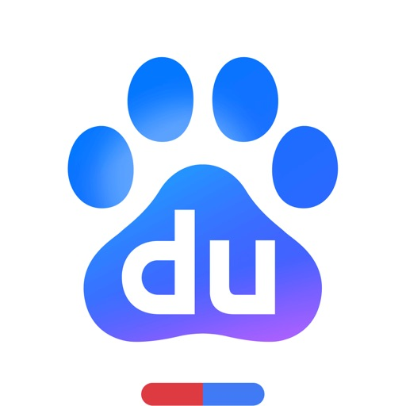

- [中国移动（手机营业厅）](#中国移动（手机营业厅）)
- [电子税务局](#电子税务局)
- [个人所得税](#个人所得税)
- [大麦 - 电影、演出、体育购票平台](#大麦_-_电影、演出、体育购票平台)
- [闲鱼 - 神奇的闲鱼！](#闲鱼_-_神奇的闲鱼！)
- [中国电信-全国统一官方服务平台](#中国电信-全国统一官方服务平台)
- [百度网盘](#百度网盘)
- [中国农业银行](#中国农业银行)
- [京东-又好又便宜](#京东-又好又便宜)
- [学信网](#学信网)
- [WeCom-Work Communication&Tools](#wecom-work_communication_tools)
- [UnionPay APP](#unionpay_app)
- [铁路12306](#铁路12306)
- [1688- B2B Market](#1688-_b2b_market)
- [AMap Global](#amap_global)
- [DeepSeek - AI Assistant](#deepseek_-_ai_assistant)
- [拼多多 - 多多买菜，百亿补贴](#拼多多_-_多多买菜，百亿补贴)
- [DiDi China: Ride Hailing](#didi_china__ride_hailing)
- [中国联通](#中国联通)
- [得物 - 得到美好事物](#得物_-_得到美好事物)
- [bilibili - All Your Fav Videos](#bilibili_-_all_your_fav_videos)
- [Dianping: Discover Good Places](#dianping__discover_good_places)
- [rednote](#rednote)
- [美团-美好生活小帮手](#美团-美好生活小帮手)
- [DingDing - Redefine Work in AI](#dingding_-_redefine_work_in_ai)
- [CamScanner - PDF Scanner App](#camscanner_-_pdf_scanner_app)
- [Taobao - Online Shopping App](#taobao_-_online_shopping_app)
- [Alipay - Simplify Your Life](#alipay_-_simplify_your_life)
- [QQ邮箱](#qq邮箱)
- [Dazz Cam - Vintage Camera](#dazz_cam_-_vintage_camera)
- [转转-二手官方验](#转转-二手官方验)
- [BOSS直聘-招聘求职找工作神器](#boss直聘-招聘求职找工作神器)
- [快手](#快手)
- [灵光-全模态AI助手](#灵光-全模态ai助手)
- [Blackmagic Camera](#blackmagic_camera)
- [中国银行](#中国银行)
- [国家医保服务平台](#国家医保服务平台)
- [百度-AI智能搜索](#百度-ai智能搜索)
- [QQ](#qq)
- [腾讯视频-《许我耀眼》独播](#腾讯视频-《许我耀眼》独播)
- [Meitu- Photo & Video Editor](#meitu-_photo___video_editor)
- [京东金融-理财借贷分期保险一站式平台](#京东金融-理财借贷分期保险一站式平台)
- [DJI Mimo](#dji_mimo)
- [iScreen - Widgets & Wallpaper](#iscreen_-_widgets___wallpaper)
- [咔皮记账 -自动记账 AI记账 预算 多账本 资产管理 存钱](#咔皮记账_-自动记账_ai记账_预算_多账本_资产管理_存钱)
- [盒马 - 鲜美生活](#盒马_-_鲜美生活)
- [携程旅行-订酒店机票火车票](#携程旅行-订酒店机票火车票)
- [招商银行](#招商银行)
- [水印相机](#水印相机)
- [QQ浏览器-AI办公学习助手](#qq浏览器-ai办公学习助手)
- [作业帮-中小学家长作业检查和辅导工具](#作业帮-中小学家长作业检查和辅导工具)
- [倒数日 · Days Matter](#倒数日_·_days_matter)
- [同程旅行-订酒店机票火车票,低价打车](#同程旅行-订酒店机票火车票,低价打车)
- [58同城-求职招聘找工作租房二手车](#58同城-求职招聘找工作租房二手车)
- [WeChat](#wechat)
- [去哪儿旅行-订酒店机票火车票](#去哪儿旅行-订酒店机票火车票)
- [智慧中小学-国家中小学智慧教育平台](#智慧中小学-国家中小学智慧教育平台)
- [Xiaomi Home](#xiaomi_home)
- [网上国网](#网上国网)
- [航旅纵横-民航官方直销平台](#航旅纵横-民航官方直销平台)

#### 中国移动（手机营业厅）
## 中国移动（手机营业厅）

中国移动全国31分省线上服务APP于2023年陆续升级、整合至“中国移动APP”，“中国移动APP”成为中国移动全国唯一官方服务平台。

APP服务用户覆盖中国移动31省全量用户，为31省用户提供统一线上服务能力：查询缴费、业务办理、权益订购、积分商城、探索生活、视频客服等，满足中国移动用户丰富需求，为中国移动用户提供更便捷、更丰富、更个性化、更有趣的线上服务与移动“心”体验！

【签到兑好礼】
每日签到每日有好礼！话费、流量、权益大满足！
【品质特色服务】
话费查缴、余额查询、套餐办理、电子发票、亲密付、中国移动云盘、全网资费查询、在线客服等功能，24小时随时随地贴心服务！
【适老化及无障碍版本】
更大的字体、更清晰的页面，图标和功能数量精简，一目了然，支持无障碍语音播报。

#### 电子税务局
## 电子税务局

电子税务局APP是国家税务总局主办的全国统一规范电子税务局移动端，是从用户体验角度出发为纳税人精心设计、提供最适合在移动端办理的涉税业务的一款移动办税工具。主要支持纳税申报、税款缴纳、证明开具、信息报告、发票代开及发票开具等涉税业务办理，并配套提供账户中心、征纳互动在线咨询、反馈问题等功能。

#### 个人所得税
## 个人所得税

个人所得税APP由国家税务总局主办，是为贯彻落实党中央、国务院提出的个人所得税综合与分类相结合的税制改革要求，保障全国自然人纳税人及时享受税改红利而推出的一款移动办税工具。主要支持个人所得税综合所得年度汇算等纳税申报、专项附加扣除信息填报、收入纳税明细查询、异议申诉、涉税证明材料上传、委托代理等涉税业务办理，并配套提供在线咨询、热点问题、帮助中心等功能。

#### 大麦_-_电影、演出、体育购票平台
## 大麦 - 电影、演出、体育购票平台

大麦网为华语地区领先的娱乐票务平台，为用户提供演唱会、话剧、体育比赛、儿童亲子、电影、展览等品类的选座购票服务，满足亿万观众走入演出现场的梦想。

【亮点推荐】
随时随地移动购票
红包折扣优惠不停
特色栏目粉丝福利
精编专栏撩妹必备

【爱•特色福利】低价折扣票、免费看演出、粉丝专属礼，一言不合就送送送！每天打开总有惊喜！

【看•有范频道】全新上线「发现」特区，麦小编每天更新演出资讯，为热爱现场的你精编各类养眼专栏，你要的潮、燥、闹、静、有态度的文娱生活，只需一个大麦APP！

【简•购票流程】优质的在线选座流程，支持同项目多票价多数量合并支付，便捷的电子票兑换，给你棒棒哒订票体验！

【星•热门演出】周杰伦、五月天、薛之谦、邓紫棋、张学友、蔡依林、汪峰、张艺兴、陈伟霆、鹿晗、田馥甄、草莓音乐节等热门演出陆续上架中，想了解Idol们最新的演出信息？快下载大麦客户端，开启你的文娱生活！

【想•找我吐槽】
体验反馈：点击大麦App－设置，在“意见反馈”页面留言即可。
官方微博：关注新浪微博@大麦网。

#### 闲鱼_-_神奇的闲鱼！
## 闲鱼 - 神奇的闲鱼！

闲鱼阿里巴巴集团旗下APP，买卖闲置，就用闲鱼！无须开店却能享受支付宝担保交易，仅需30秒即可发布一款宝贝。
 
没有金刚钻，还真不敢揽这瓷器活儿！
-支付宝担保的个人交易平台：更诚信，更安全！
-淘宝已买到宝贝，随时随地一键转卖，立即变现。
-淘宝上亿买家都可以看到你的宝贝，商品更容易被卖出！（这个比较牛）
-卖家发布更简单，语音描述，扫条码更轻松
 
他们都在，就缺你啦！
许多妈妈在这儿，
转卖孩子们用不着的玩具、物品，
同时也在这里交流着养儿育儿的心得经验，
这些东西她们给自己孩子用过，所以，你放心！
 
许多达人混迹于此，
倒腾古书、镜头、模型、限量版篮球鞋等等，
他们在这儿不仅转卖闲置，还结交到了同好朋友！
在新品市场找不到的，也许你可以在这试试！
 
最爱这儿的还是剁手党's，
那些对他们没新鲜感，或者不再爱的物件儿，
都能在这儿找到新的主人，节省空间的同时还能有笔小收入。
物尽其用，正是这个道理！
 
联系我们&意见反馈：
邮箱：taobao-fleamarket-client@list.alibaba-inc.com

#### 中国电信-全国统一官方服务平台
## 中国电信-全国统一官方服务平台

【多重福利】福利升级，海量好礼等您来!
· 暖心福利包：抽限量话费、海量福利月月领不停。
· 签到打卡：连续签到、金豆秒杀抢兑至高10元话费。
· 新人礼包：新用户注册领专属10元话费券。
· 生日礼包：生日当月领取专属好礼。
· 充值福利：手机、宽带、固话充值享专属折扣；0.01~1500元金额随心充，小额充值随心用。
【服务优化】 随时随地提供贴心服务！
· 桌面组件：用量一目了然，桌面小组件轻松查
· 用量查询：流量分类查询，已用剩余尽在掌握
· 设置界面：设置分组清晰，操作便捷全新升级
【精选内容】
您可在电信星播客观看热播影视综集锦、热门金曲视频彩铃等精彩短视频；还有专享超值直播间，万家厅店网罗全网底价商品优惠，更有5G手机折扣、话费、流量、终端权益多种好礼送不停！
中国电信APP官方服务QQ群: 240861967，本群仅针对如中国电信APP出现无法正常登录、闪退、数据查询失败等相关内容进行答疑解决，如您有关于中国电信业务等方面其他问题，也可以直接致电当地10000号进行咨询。

#### 百度网盘
## 百度网盘

百度网盘是一款省心、好用的超级云存储产品，已为超过7亿用户提供云服务，空间超大，支持多类型文件的备份、分享、查看和处理，自建多个数据存储中心，更有两项国际顶尖安全认证ISO27001＆ISO27018为用户数据安全提供护航，如果你想备份文件数据，释放手机空间，给别人分享文件或是对文件进行在线操作，选百度网盘就对了！

【超级省心的数据备份】
除照片、文档、视频等常见文件格式外，还支持微信文件、手机应用、手机短信、通话记录等数据的备份，全方位为你的数据提供备份服务，还可开启自动备份，省心又省力，结合最高16T超大空间，彻底摆脱手机空间限制！

【超级好用的数据服务】
为你存在网盘里的数据提供多种在线服务，照片：时光轴、智能分类、照片故事等；视频：在线观看、倍速播放、高清画质等，文档：在线编辑、格式转换、 文字识别等，多达数十种服务等你发掘，直接在网盘内完成操作，不用下载到本地，这才叫好用！

【超级方便的分享能力】
首创文件链接分享方式，分享文件时自动生成文件链接，拿到链接后只需打开网盘，即可读取文件进行存储或查看，无文件大小限制，链接可加密，可设置有效期，省去在线传输烦恼；更有传输助手功能，当面/远程收发文件一码搞定，提高学习和工作效率！

【超级实用的会员特权】
加入百度网盘超级会员，提供超大空间、极速下载、在线解压等23项实用特权，时间越久越尊贵，最高可享16T超大空间，12G文件在线解压等成长福利，给力！

【自动续费超级会员套餐说明】
-订阅周期:1个月(连续包月产品),3个月(连续包季产品),12个月(连续包年产品)。
-订阅价格:连续包月产品为每月30元,连续包季产品为每季度88元,连续包年产品为每年328元
-付款:自动续费商品包括“连续包月/连续包季/连续包年”,用户确认购买并支付后记入 iTunes账户；
-续费:您的会员到期前24小时,苹果公司会自动为您从 iTunes账户扣费,成功后有效期自动延长一个周期，如您未取消订阅,苹果公司会在扣费期内不定期尝试扣款,请及时关注订阅及扣款情况；
-取消续费:若需取消自动续费,请在当前订阅周期到期前24小时之前,进行取消操作。
-取消方法:您使用苹果ID开通的自动续费产品,在“设置”-“iTunes Store与App Store”-“Apple ID”-“查看Apple ID”-在账户设置页面点击“订阅”-取消百度网盘自动续费超级会员订阅即可。

-百度隐私权保护声明 https://www.baidu.com/duty/yinsiquan.html
-百度网盘隐私协议:https: //pan.baidu.com/wap/privacy_policy
-自动续费服务协议:https://pan.baidu.com/comps/view/MV8xNDJfMTcyXzQ0M19vbmxpbmU=
-有钱花服务声明：
百度网盘仅作为度小满的获客渠道,网盘用户应当仔细阅读并接受度小满产品的使用规则后再进行选择性使用,当出现纠纷时,网盘可以协助用户对度小满进行追责,但是网盘不承担连带责任。

百度网盘，让美好永远陪伴。
如果你有任何建议或问题,欢迎评论留言,或直接联系我们：
邮箱: netdisk-bugs@baidu.com
新浪官网微博:@百度网盘
欢迎亲的加入!欢迎亲的加入!

#### 中国农业银行
## 中国农业银行

农行掌上银行，您的线上智慧“新银行”！掌银新版本功能更强大，服务更贴心，让每个用户都拥有专属的“线上网点”。
乡村版充值专区、专属理财保险、特色涉农产品，贴近县域乡村用户的日常需求，惠民利民。
大字版提供超大字体“一大到底”，精选产品，功能简洁，无弹屏广告，为高龄人士提供清爽体验。
标准版主要功能新增支持提供语音播报等无障碍服务，为特殊客群提供贴心关怀。
全面收支展示分析，“钱从哪来，花在哪里”一目了然。设置预算提醒，超出预算小信封自动提醒。
搜索功能方便易用，支持语音交互。搜索覆盖范围更广、结果准确度更高、推荐内容更智能。
线上反欺诈利用大数据、人工智能等前沿技术有效识别线上高风险交易，保障客户资金安全。
做任务赢好礼、秒杀抢购、支付优惠，热门活动精彩来袭！小豆乐园每日答题抽奖，可兑换各类好物，新客更有三重礼，畅享优惠福利多。

#### 京东-又好又便宜
## 京东-又好又便宜

【京东】—— 又好又便宜
京东APP是国内领先的综合电商平台，整合全品类购物、外卖点餐及生活服务于一体，致力于为消费者提供“又好又便宜”的一站式消费体验。

【平台优势】
1.  正品好货，品类齐全
汇聚超1000万个自营商品及百万优质商家，覆盖电脑数码、手机通讯、超市好物、家电家居、服饰美妆、消费品、汽车、生活服务等全品类，满足消费者吃喝玩乐全方位需求。
2. 价格实惠，多重保障
● 百亿补贴：大牌限时补贴，全场包邮。
● 京喜自营： 超值低价好货，工厂直发，京东快递包邮直达消费者。
● 京东秒杀：正品限时秒，折扣享不停。
3.  售后无忧，服务护航
● 极速配送：省心省时，送货上门，提供211限时达、次日达、极速达、夜间配等多种高效配送服务，闪电到货。京东秒送，好物立享，最快9分钟送到手。
● 售后无忧：闪电退款，价格保护，降价退差，上门换新。客服响应迅速，实在服务，时刻守护

【平台特色】
1. 品质外卖，上京东
京东外卖于2025年3月1日正式上线，致力于成为让消费者放心、让优质商家经营更好、让骑手更有保障的负责任的品质外卖平台。
2、订酒店，上京东
京东酒店，又好又便宜。首住特惠最高立减130元。
3. 重磅新品，抢先体验
京东新品，频道每日上新，汇聚更新更潮的大牌尖货，更有天天1元抽重磅新品。
4. PLUS会员，省心又省钱
京东PLUS，权益重磅升级，7大生活服务随心兑。
5. 看直播，享福利
京东直播，领取专享折扣，专享红包抢不停。

【更多服务，联系我们】
喜欢又好又便宜的京东，请给我们满分好评；
如有建议请及时反馈，我们一起优化更好的购物流程和体验；
可通过以下方式联系我们：
京东客服热线：950618

#### 学信网
## 学信网

学籍/学历/学位查询、毕业证书查询、学历/学位认证、学籍/学历/学位在线验证报告

#### wecom-work_communication_tools
## WeCom-Work Communication&Tools

WeCom is a communication and office tool developed specifically for enterprises by the Tencent WeChat team. It provides a consistent communication experience with WeChat and supports full connectivity with WeChat; meanwhile, it deeply integrates AI-powered office capabilities such as intelligent summary, smart search, and intelligent robots, incorporates efficiency tools including Smart Sheet, documents, meetings, emails, event, and WeDrive, as well as flexible and user-friendly OA apps, empowering enterprises to achieve effective collaboration and management. 

1. AI Facilitates Intelligent Office Work
[Smart Search] Quickly find content with fuzzy memories; after AI summarizes it, accurate answers are directly provided.
[Intelligent Summary] Intelligently summarize the work progress based on the information such as chats, documents, meetings, and emails. Additionally, invite colleagues to participate in the summary, making reporting simpler and more efficient.
[Intelligent Robot] An AI colleague that allows sending message-based inquiries at any time, quickly answering corporate policies and business questions, with flexible model and knowledge configuration, making it easy to create and manage.
[AI Fields in Smart Sheet] Batch classify, summarize, extract info, and understand images within Smart Sheet data to enhance efficiency.
[Intelligent Service Summary] AI can automatically generate service summaries every week, based on the service records between members and WeChat customers. Members can also view relevant information in the chat toolbar while chatting with WeChat customers.
[Intelligent Email Summary] Using AI, it can automatically organize scattered work information from chats, documents, and meetings, summarize it into email content, and improve the efficiency of composing emails.

2. Full Connectivity with WeChat
[Contact Customers] Add customers' WeChat accounts as friends, and provide services to them through private or group chats. Enterprises can view and manage WeChat customers added by members, and reassign the customers of resigned members.
[Customer Group] Enterprises can view and manage members' customer group chats, and reassign group chats that were previously managed by resigned employees. The maximum number of members in a customer group can reach 500.
[Customer Moments] Post event information, product updates, professional knowledge, and other content to customers' WeChat Moments, and interact with customer in comments.
[WeChat Customer Service] Integrate WeChat Customer Service across various scenarios both within and outside WeChat to deliver a consistent consultation experience. Additionally, invite WeChat users to add the WeCom account to upgrade to exclusive services.

3. Integrated Internal and External Efficiency Tools and OA Apps
[Smart Sheet] It helps enterprises enhance internal and external office collaboration, making it easy to manage projects, operations, and customers via a single sheet. Collect or import data such as customers and projects, transform it into various views and dashboards, enable you understand changes in business data at any time and from anywhere, conduct AI-powered intelligent analysis, and automatically drive business processes.
[Docs] Inherits Tencent Docs' rich editing capabilities and stable experience, and also supports inviting colleagues, WeChat customers, as well as Partner Space to join the document for collaborative editing and viewing.
[Email] Offers an integrated email service that aligns with WeCom's "all-in-one" ecosystem. When composing an email, simply enter a colleague's name or department name to add them as recipients. Leveraging AI, it can summarize and generate email content, improving the efficiency of email drafting.
[Meeting] Provides the capability to efficiently organize meetings and manage public calendars, and also allows inviting colleagues, WeChat customers, and Partner Space to participate in events together.

#### unionpay_app
## UnionPay APP

UnionPay APP is a strategic product for integrated mobile payment in the banking sector. It provides comprehensive management of bank cards and brings together all card discounts and special offers.
【Main Features】
1. Scan-to-pay feature with UnionPay's financial-grade security protection, ensuring worry-free fund security.

【Official Website】https://www.95516.com/
【Official WeChat】Yinlian_KY

#### 铁路12306
## 铁路12306

中国铁路出品，人民铁路为人民，买火车票就用铁路12306！铁路12306网站（含手机客户端）是中国铁路唯一官方火车票网络售票平台，从未授权任何第三方平台发售火车票。

我们的特色：
【售票无加价】不收取加速包费用，不捆绑保险销售，不收取会员费，让您购票放心。
【信息更准确】晚点、停运信息，列车出发、到达信息，车厢、车型信息，第一时间获知，让您出行安心。
【功能更全面】火车票、机票、汽车票、网络订餐、酒店住宿、旅游等近百项功能，让您旅行无忧。
【服务更温馨】满足老年人的大字版，满足视障等特殊人群的无障碍版，让您使用便捷。

主要产品及服务：
【火车票预订】
1. 无票候补。车票售完不用慌，无票候补帮您忙。提交候补需求，当因退票、改签或新增列车等产生可供发售的车票时，自动为您出票。
2. 选座选铺。喜欢靠窗看风景？喜欢靠过道便捷？喜欢上铺清净？喜欢下铺方便？选座选铺一键指定心意座/铺位。
3. 智能中转。没有直达方案？中转服务智能为您推荐换乘方案。
4. 车站大屏。查看列车出发、到达信息，让您轻松掌握行程，送站接人更加便捷。

【机票预订】
航司官方直营店入驻，官方机票服务，购票更安心，出行有保障。

【汽车票预订】
覆盖全国随时出发！提供国内公路客运信息、汽车站、线路时刻的查询及汽车票预订服务。

【联运服务】
提供空铁公水多交通方式一站式购票及信息查询服务，省时省心，出行更多选择。

【出行服务】
提供高铁订餐、酒店预订、约车接送站、铁路游、景区门票预订、铁路商城、出行保险等服务，吃住行游购娱，一款APP满足您的出行需求。

【温馨服务】
提供临时乘车证明、重点旅客预约、遗失物品查找等便捷服务功能，让您出行无后顾之忧。

【会员服务】
提供会员权益及支持使用积分兑换车票等相关服务。

更多信息请关注
微信公众号：铁路12306

#### 1688-_b2b_market
## 1688- B2B Market

1688APP, China’s leading wholesale marketplace now officially available in Vietnam/Kazakhstan. We belong to the business of Alibaba Group,  the global B2B procurement and Sourcing hub for millions of business sellers.
Need Factory-Direct products with lower prices and stable quality? Now you can find all of them on 1688, and of course, buy more to save more!
Custom products, consumer goods, industrial items, accessories, electronics, raw materials and so on. Discover Authentic Products come directly from Chinese factories. Also, making it easy for you to negotiate with factories and suppliers. 
We customised wholesale purchasing services for global buyers, Multi-language, Direct and Reliable Logistics, and International Payment Options have been integrated into our new APP.
Register now to enjoy Limited Discounts and Hassle-free  Global Sourcing Experience!

#### amap_global
## AMap Global

China's first English map for overseas users has officially launched!
The Choice of 800 Million Navigation Users. 
Over 200 countries and territories mapped and hundreds of millions of places on the map. 
Exploring China with AMAP as your guide!

-3D lane-level views & traffic light countdown
-Get real-time traffic updates & ETAs
-Detail junction views, never miss a turn 
-See real time transit info and route options

#### deepseek_-_ai_assistant
## DeepSeek - AI Assistant

Experience seamless interaction with DeepSeek's official AI assistant for free!
Powered by DeepSeek’s latest flagship model, it delivers faster responses and more powerful features to help you solve problems and live more efficiently.

Contact us:
Twitter: @deepseek_ai
Email: service@deepseek.com

#### 拼多多_-_多多买菜，百亿补贴
## 拼多多 - 多多买菜，百亿补贴

拼多多——多实惠，多乐趣

拼多多，社交新电商，更懂消费者的手机购物APP。8亿用户在此拼团，享受更高性价比的生活。和你的家人、朋友、邻居一起拼，品质商品更低价，包邮送到家，分享实惠，分享乐趣。

-多多买菜
1、依托拼多多全新的农产品上行物流体系，一键直达全国超过1000个农产品产区。
2、从田间到餐桌，避免中间环节损耗，百亿补贴加专项补贴，买菜更划算。
3、手机变成菜篮子，精选全国及海外农产区产地优质好货，覆盖各类生活必需品。
4、足不出户为家庭轻松选购次日生鲜，拿起手机选购，带着蔬果回家。

-更懂生活，好货不必贵
1、品类丰富：覆盖全品类品牌商品。小百货9.9包邮，轻松提升日常幸福感，品牌商品更低价，助你完成美好生活梦想。
2、百亿补贴：精选补贴全网热销品牌商品，直接降价，购物不必做算术题。
3、产地好货：源头好货产地直达，从农田到餐桌，从车间到小区，中国制造四十年产业经验为你敞开。
4、正品保障：假一赔十，品牌商品正品险，海关全程监督。

-分享乐趣，购物不孤单
1、发现好物，与好友共同分享，体验发现低价好货的乐趣。
2、和志同道合的好友拼单，或参与万人团，与8亿拼多多用户一起拼。拼团享受更低价，组团购物不孤单。
3、和朋友玩转小游戏。好朋友，就要一起栽种，一起收获。
4、为好友呈现你的真实点评，为真朋友说出真体验。

-产地直播，商家陪你看海
1、看数百万真实商家产地直播。看红薯从地里挖出，看菠萝的海，看一双鞋如何从生产线走到你面前。
2、市县长代言各产业带好货。市长县长精选本地产业带尖货，化身拼多多主播为你在线答疑。

-多多视频，有趣内容刷不停
1、魔法视频、超多滤镜、新奇特效、一键跟拍，出大片如此简单！
2、生活妙招、搞笑视频、美食菜谱、精彩直播，想看的这里都有！
3、高清画质、全屏沉浸、海量视频、智能推荐，多实惠更多乐趣！

因为倾听，所以更懂你

官方微信：拼多多（pinduoduo2015）
官方微博：@拼多多
客服电话：400-8822-528
消费者固话热线：021-53395288
官网：http://www.pinduoduo.com

#### didi_china__ride_hailing
## DiDi China: Ride Hailing

DiDi welcomes global visitors to travel around China. 

【English interface supporting global mobile number login】
Inbound users can access the English version of ride-hailing services with ease and register with their mobile number.

【Bilingual communication with drivers】
The in-app messaging feature with bilingual translation between English and Chinese ensures smooth communication between riders and drivers.

【Diverse payment methods】
Users can access multiple payment options, including international bank cards.

【24/7 bilingual customer service】
DiDi provides 24/7 in-app online English customer service.

DiDi is committed to enhancing its services to deliver a convenient, quality travel experience for global users.

#### 中国联通
## 中国联通

中国联通APP12.0重磅升级！解锁智能体验新篇章。
中国联通APP以打造“更懂你的通信管家”为理念，集查询交费、业务办理、宽带智能家居、靓号终端、视频娱乐权益、餐饮出行优惠等多领域、全方位服务于一身，致力于为用户提供更优质的使用体验，创造更便捷、更个性化的美好智慧生活。
 
【智能提醒：流量消耗快、账户异常】
•流量提醒：消耗快、余量低、达量限速，立即提醒。
•账户提醒：停机、挂失等账户异常问题，一键直达处理页面。

【宽带续约：更省时，更高效】
•续费续约：不出门，不排队，一键搞定，高效办理。
•升级千兆：超高速网络，全屋覆盖，WiFi无死角。

【套餐精准匹配：越用越划算】
•用得舒心：拒绝流量告急，套餐一步到位，任你随心选。
•用得实惠：智能精准匹配，适合你的才能越用越划算。

【套餐共享：一人交费全家用】
•更省钱：语音、流量、宽带可共享，满足全家通信需求。
•更贴心：超多特色服务全家畅享
联通云盘：超大空间，存储无忧，记录美好时刻。
亲情守护：上网限速防沉迷，孩子的网络小管家。
视频彩铃：专属DIY个性彩铃，等待看得见。
安全管家：风险电话精准拦截，上网安全随时监测。
联通看家：智能监控，全天贴心守护，画面异常告警。

【“我的”页面：私人专属空间】
•专属内容：存费优惠、宽带测速、套餐专属福利，你的私人定制助理。
•服务升级：订单进度随时查看，权益礼包一站集合，你关心的都在这里。

【爆款新机：专享补贴，不怕比价】
•新机直降：热门机型，折上再折，优惠不停。
•合约购机：官方正品，1对1服务，快速响应。

#### 得物_-_得到美好事物
## 得物 - 得到美好事物

得物App是集潮流装备、潮流商品鉴别、潮流生活社区于一体的新一代潮流网购社区。 
-鉴别服务开创者- 
得物App在传统电商模式的基础上添加“鉴别服务”，实现“先鉴别，后发货”的购物流程。“多道鉴别查验工序”的平台品控，为新世代消费者带来更安心的网购体验。 
-潮流网购- 
得物App签约了数百位业内具有多年以上经验的潮流商品鉴别师。鉴别师除了是骨灰大神级Sneaker玩家和潮人，更是潮流领域的“研究人员”。通过对球鞋、服装、配饰、潮玩、数码3C、美妆等产品进行系统性研究，包括资料收集、数据对比、档案建立、样本拆解和仪器检测等，力保鉴别的准确性。还设有独立的查验环节，对存在瑕疵的商品进行排查，拦截明显瑕疵商品，针对存在微小瑕疵的商品与用户提前一对一沟通，确保用户购买到经鉴别查验为无瑕疵商品。 
• 潮流单品：得物App目前支持交易的潮流单品品类丰富。 
• 竞价模式：得物App采取商品竞价出价的平台交易模式，竞价模式提供了每个用户获得公平交易机会。 
• 商品3D全息空间：得物App采集球鞋的3D影像展示。用户浏览实现可操控式自转，720度无死角查看单品的材质、图案、纹理、设计细节，为用户打造不一样的沉浸式购物体验。 
-潮流生活社区- 
得物App致力于打造年轻人的潮流生活社区，成为中国潮流文化风向标和年轻人的发声阵地。得物App社区聚集了一众明星以及潮流圈内数百位知名KOL。我们以球鞋和时尚话题作为潮流文化的切入点，持续沉淀潮流向内容，培育潮流文化沃土。得物App社区积极拓展符合年轻人消费观的品类内容，深度挖掘年轻人处于萌芽期的兴趣点。 

了解更多得物App相关，可通过以下方式： 
官方微博：得物App 
官方抖音：得物App 
微信公众号：得物App 
微信小程序：得物App 
意见反馈：打开得物App-我-设置-反馈与建议

#### bilibili_-_all_your_fav_videos
## bilibili - All Your Fav Videos

Welcome to bilibili – the ultimate home for anime fans, game addicts, tech geeks, and culture lovers.
Ever dreamed of a place where you could binge anime edits, watch live esports with 10,000 danmu (bullet comments), and dive into ancient Chinese poetry—all in a single afternoon?

That's what we do here.
We're bilibili. We watch, we laugh, we remix, we overthink, and then we create again.

【Whatever you're into – we've got it.】
- Hardcore into gaming?
 From competitive esports to chill strategy let's-plays, we've got gameplay videos, walkthroughs, speedruns, and ragequits galore.
- Love cool gadgets and future tech?
 Dive into in-depth unboxings, quirky reviews, or sci-fi concepts brought to life.
- Obsessed with anime or ACG culture?
 This is your paradise—AMVs, cosplay tutorials, parody dubs, and wild fan theories included.
- Curious about Chinese culture?
 From historical deep dives and traditional music to kung fu, calligraphy, and street food—we make culture bingeable.
- And now with our AI Dubbing, you can hear UPloaders in your own language — no subtitles needed.
 Less language barrier, more "I get you."

【Your passion deserves a stage. Or at least a fanbase. 】
Got a hot take? A crazy remix idea? A cosplay transformation to show off?
This is your space.
Everyone here is an UPloader in the making — drawing, dubbing, animating, narrating, memeing, and always inventing something new.
From "fan" to "fan-made," the jump is just one upload away.

- So yeah, we're not just a video app.
 We're the internet's most wholesome creative community,
 where culture meets fandom, memes meet meaning, and your interests meet their tribe.
 We'll see you in the danmu. Or maybe in the trending tab.

 – With creativity & culture,
 The bilibili team

#### dianping__discover_good_places
## Dianping: Discover Good Places

Dianping is a platform focused on sharing local lifestyle consumption methods, helping everyone explore and discover exciting places both inside and outside the city, enriching leisure time.

Not only does it provide information on a wide array of popular new businesses and attractions, but it also offers photos and reviews from users who have visited these spots, aiding in your decision-making process for restaurants, accommodations, scenic spots, and more.

[Food Recommendations] 

From newly opened hotspots to internet-famous restaurants, time-honored brands, and local favorite street vendors, Dianping features various types of restaurants along with real user reviews, enabling food enthusiasts to discover delightful surprises nearby. You can also make payments instantly and enjoy group-buying discounts.

[Travel Guides] 

Wondering where to go for vacation? Check out Dianping for travel notes and guides for popular destinations nationwide, less crowded picturesque spots, city outskirts tours, and free urban flower viewing and greenery locations. Purchase tickets and book hotels all in one place.

[Family Entertainment] 

Find comprehensive malls suitable for family outings, children’s amusement parks, arts/tech exhibitions, and green parks to enjoy high-quality family time during the weekend. Share experiences as parents on family-friendly trips.

[Novel Experiences] 

Embrace youth by experiencing the extraordinary. Engage in a thrilling afternoon of escape room games, spontaneous hiking and camping trips, leisurely handcraft sessions, city surfing, diving, rock climbing, or sipping drinks at a bar in the evening. Quickly group up with like-minded friends and experience a unique weekend.

Additionally, you can find various life services on Dianping, such as beauty and hair care, wedding photography, fitness activities, home renovation, and cleaning services.

#### rednote
## rednote

Dear rednote villagers,
Welcome to the community. this is a place where people share their life and connect with each other. Millions of users share their daily life here, from favorite music to fashion looks, from cooking recipe  to home decor, from travel tips to their beloved cats and dogs. We welcome you to share everything about your life and connect with the villiagers around the global.
To better navigate here, we’d like to share some CORE VALUES of rednote with you:

Authenticity: Everyone is unique and has their own life story, so just be yourself here. You can think of us as friends and feel free to share your daily life or special moments.  We believe authenticity builds trust, what you share may also help or inspire others, so we encourage you to be genuine and friendly in your posts.

Helpfulness:For years, rednote villagers have been sharing billions of life experience and tips and helped countless people they’ve never met. The world is big, but we believe people share more similarities in their life than they thought. We encourage you to share your unique experiences here and inspire another "you" somewhere on this planet.

Inclusivity: We believe the world is a "global village", where people from different regions and cultures can connect and communicate. In this welcoming community. We hope everyone respects each other and embraces differences in values, cultures, and perspectives. We encourage you to show your likes and appreciation for other villagers. We believe that kindness will always be returned, and you’ll feel the warmth and love from others.

Have fun and happy sharing! 
Lots of love from the rednote team

#### 美团-美好生活小帮手
## 美团-美好生活小帮手

【特色服务】
1. 吃喝玩乐一应俱全
◇在线预订餐厅桌位，省时安心不用等位
◇外卖订餐水果宵夜，酒店旅游周边推荐
◇美团跑腿，一小时，全城送
◇美团优选购生鲜，新鲜实惠，当日下单，次日自提
◇美团拼好饭，提供极具性价比的外卖选择，0配送费，无起送价
◇小象超市，美团自营生鲜百货平台，你需要的一站购齐，快至30分钟送达，让你省心省力省时间！
◇美团地图全面升级，点击店铺地址栏，提供检索、路线规划等特色功能，更多惊喜功能期待您去发现

2. 旅游出行一站搞定
◇机票低价优质出行，全国汽车票在线预订更优惠
◇美团打车优惠不停，快车专车出租车便捷出发
◇美团单车电单车免押金骑行，更优惠更便捷
◇查公交、查到站，车辆到站提前提醒，一站式安心乘公交

3. 全国影讯在线选座
◇影院会员卡商家券，电影购票享超值更优惠
◇热映影片团购订座，大片预告电影抢先看起

【产品特点】
吃喝玩乐全都有：美食精选、外卖订餐、酒店预订、旅游团购、电商品牌秒杀、机票打折、电影特价、打车出租车等团购实惠根本停不下来！
◇情侣约会：吃美食、看电影、住酒店、去旅游；
◇懒宅点餐：美食、水果、鲜花、下午茶、超市百货
◇朋友轰趴：按摩足疗、KTV、桌游电玩；
◇旅游周边：机票、火车票、景点门票、跟团游；
◇打车出行：美团打车，快车、专车、出租车；
◇美团单车：美团单车、美团电单车；
◇品牌秒杀：产地果蔬、品牌食品、家居百货、一站购齐；

【产品简介】
美团、美团外卖、美团酒店、猫眼电影，为您提供美食、外卖、电商、酒店、旅游、电影、KTV、机票、火车票、洗车养车等全面服务。除各种实惠，美团网提供用户消费评价、商家评分、商家信息查询等功能，旨在为用户提供好的服务！

【关于美团】
美团网（meituan.com）成立于2010年3月4日，汇聚美食、外卖、酒店、旅游、电影等生活服务于一体的综合信息网站。秉承消费者至上的价值观，在业内率先推出“7天内未消费无条件退款”和“美团券过期未消费无条件退款”等消费者保障条款，为消费者放心消费提供权益保障。

【用户帮助】
感谢您使用美团手机客户端，使用中有任何问题可通过以下方式查询解决：
1.客户端查询入口：我的 => 客服中心
2.官方网站：http://www.meituan.com/

#### dingding_-_redefine_work_in_ai
## DingDing - Redefine Work in AI

DingTalk: Work Smarter, Work with AI
DingTalk is an AI-powered platform for collaboration and application development, trusted by over 10 million enterprises and organizations. For a decade, we have empowered businesses to become agile, efficient, and creative digital organizations. Today, DingTalk is the choice of 80% of China's Fortune 500 companies, including industry leaders like China Unicom, FAW Group, CATL, SERES, Mengniu, and ANTA. We leverage AI to empower every enterprise to be faster, stronger, and more innovative.

1. AI-Powered Intelligent Collaboration
[AI Assistant (DingTalk A1)]: The Smart Way to Work
Our AI Assistant intelligently surfaces your most critical information, automatically generates summaries and To-Dos from communications, and syncs with AI Tables to make your work effortless.
[Docs AI]: Collaborative Creation
Create a living knowledge base by embedding tables, mind maps, and workflows directly into documents for seamless, real-time team collaboration. AI sparks your creativity, from brainstorming and planning to effortlessly refining content and tone.
[Meeting AI]: Efficient & Productive Meetings
Experience meetings redefined. AI provides real-time, speaker-identified captions and intelligent transcription, ensuring clarity even in noisy environments. Seamlessly switch devices, co-edit documents online, and use emojis to make remote meetings feel face-to-face.
[Project AI]: Streamlined Project Management
Utilize rich, out-of-the-box templates for personalized project management. Deeply integrated with Docs, Chats, and Approvals, it eliminates data silos, tracks progress in real-time, and captures team experience.
[Calendar AI]: Effortless Scheduling
Create events using natural language. Get smart recommendations for meeting times, check attendee availability at a glance, and manage personal and team schedules with clarity and ease.

2. An Enterprise Platform for Business Digitalization
[AI Table & Yida (Low-Code)]: Build a Better Business
Empower anyone to become an application creator. Build powerful business systems like CRM or retail management as easily as a spreadsheet—no coding required. Access a rich library of templates used by Fortune 500 companies.
[AI Search]: Instant Answers
Instantly search across your enterprise and the entire web to get answers, solutions, and plans in a single step.
[Integrated Management Suites & LTC Solution]
Accelerate your business with all-in-one digital solutions for HR, finance, and customer management. Our end-to-end Lead-to-Cash (LTC) platform manages the entire cycle from goal setting and sales tracking to project delivery and service.
[Global Capabilities & Support]
Collaborate seamlessly across borders with a fully translated UI in over 20 languages and a stable global network featuring smart time-zone scheduling.

For assistance, please go to Me > Help & Support > Online Service / Hotline. Your experience is our priority.
Terms of Use: https://www.apple.com/legal/internet-services/itunes/dev/stdeula/

#### camscanner_-_pdf_scanner_app
## CamScanner - PDF Scanner App

The most intelligent scanner app
Trusted by 300M+ users

CamScanner is an all-in-one scanner app. It turns your mobile device into a powerful portable scanner that recognizes text automatically (OCR) and improves your productivity to save your time. Download this scanner app for free to instantly scan, save, and share any document in PDF, JPG, Word, or TXT formats.
Would you like to keep your entire office in your pocket and increase your productivity at work? Use the CamScanner scanner app to handle your paperwork with ease. Say goodbye to huge and heavy copy machines and get this ultra-fast scanner app for free now.

DOCUMENT SCANNER
This free-of-charge yet powerful scanner app is a must-have for students and anyone involved in business: accountants, realtors, managers, or lawyers. With this PDF scanner, scan anything you need, receipts, contracts, paper notes, fax papers, books, and store your scans as multipage PDF or JPG files.

VARIOUS SCANNING MODES
–ID CARD & PASSPORT: A mode specifically designed for fast and convenient scans of ID documents.
–QR CODE: Scan any QR code with the camera on your mobile device.

PDF CONVERTER
–PDF Converter: This PDF scanner enables you to create PDF from a website, and convert documents in multiple formats to PDF.
–Supported file formats: PDF, JPG, DOC, DOCX, TXT, XLS, XLSM, XLSX, CVS, PPT, PPTM, PPTX.

SHARE AND COLLABORATE
–Share files for commenting or viewing in WhatsApp, iMessage, Microsoft Teams.
–Collect comments from multiple people in one file online.
–Speed document reviews by responding to each other's comments.
–Receive activity notifications for the files you share.

INNOVATIVE PDF SCANNER
–Scan documents and photos to PDF, JPG, or TXT.
–Easily scan multiple pages into one document.
–Extract text from any scannable object with text recognition (OCR).
–Create and add your own e-signature on documents.

HANDY DOCUMENT EDITOR & FILE MANAGER
–Edit scans with filters and the feature of noise removal.
–Manage files with folders, drag & drop to reorder, and enjoy other document editing features.
–Protect your confidential scans by locking folders and files with passwords.

EASILY SEND DOCUMENT
–Scan, save and send documents in just a few taps.
–Email with attachments or send document links.
–Upload scanned documents to cloud services like Dropbox, Google Drive, Evernote, and OneDrive.
–Print PDF files, such as contracts and invoices, right from the scanner app.
–Send files quickly and securely. Scanning or sharing is achieved with no intervention from the CamScanner scanner app team or any third party. Documents are safely stored on your mobile devices.

UNLIMITED ACCESS MEMBERSHIP SUBSCRIPTION
–You can subscribe to get unlimited access to all features of the scanner app.
–Subscriptions are billed weekly, monthly, quarterly, or annually at the rate based on the subscription plan.
–Payment will be charged to iTunes Account at confirmation of purchase.
–Subscription renews automatically unless auto-renew is turned off at least 24 hours before the end of the current period.
–Account will be charged for renewal within 24 hours prior to the end of the current period. The cost depends on the selected plan.
–Subscriptions may be managed by the user, and auto-renewal may be turned off by going to the user's Account Settings after purchase.
–Any unused portion of the free trial will be forfeited when the user purchases a subscription.

For Terms of Use, please visit
https://www.camscanner.com/app/service?language=en-us
For Privacy Policy, please visit
https://www.camscanner.com/app/privacy?language=en-us

We'd love to hear your feedback: isupport@camscanner.com
Follow us on X: @CamScanner
Like us on Facebook: @CamScanner UA
Follow us on Instagram: @CamScanner_Official
Follow us on YouTube: @CamScanner_Official

Check out other products of INTSIG:
CamCard - Business Card Reader

#### taobao_-_online_shopping_app
## Taobao - Online Shopping App

New upgrade: Taobao English is now available in Malaysia, Singapore, Australia, Thailand, Canada, Cambodia, New Zealand, Hong Kong, Taiwan, Macau, Kazakhstan, Uzbekistan, Kyrgyzstan, Georgia and Mongolia!For other regions, stay tuned! We're working hard to upgrade for you, in the meantime, you can still shop in our Chinese interface!

Taobao (iPhone version) offers a convenient and engaging shopping experience, specifically designed for iPhone users.

As a leading e-commerce platform in China, Taobao provides an extensive selection of products, catering to the diverse and personalized needs of over 1 billion users. Known as the "Omnipotent Taobao", it stands as a trusted destination for quality and variety for its users. 

Every day, consumers from around the globe visit Taobao, eager to explore more products for their daily needs and keep up with the latest trends!Product Features:

1. Extensive Range of Global Brands
Discover thousands of brands and retailers, offering both Chinese and international products to consumers worldwide.

2. Diverse Offerings from Small and Medium-sized Vendors
Access tens of millions of unique products from small and medium-sized businesses, as well as innovative entrepreneurs, showcasing creative and thoughtfully designed items.

3. Safe and Seamless Shopping Experience
We've integrated local e-wallets and credit card payments in selected regions, along with cross-border direct shipping options. Some products also feature free shipping and/or local return services, ensuring a secure, joyful, and effortless shopping journey.

4. NEW English Interface Now Available!
The English interface is available in Malaysia, Singapore, Australia, Thailand, and Cambodia. Simply update your language settings. We're working hard to expand this feature to more regions soon!

5. Year-Round Promotional Activities
Take advantage of our numerous promotional events throughout the year. Enjoy discounted prices and exclusive platform benefits, making it easy to find high-quality products at even better prices.

#### alipay_-_simplify_your_life
## Alipay - Simplify Your Life

Alipay is a leading open platform for payments and digital services in China.

Users with a Chinese ID and bank account can use Alipay to make payments online and in person at various merchants outside of China as they travel for leisure, business, or study. 

Foreign visitors to China can connect their credit card to take advantage of Alipay’s widespread acceptance by tens of millions of merchants across the country. Alipay is not designed or intended for use by foreign users in their home country or anywhere outside of China.

With the users' permission this app can connect to Health [HealthKit] to enable users to participate in walkathons and make donations via the "sports" service. This feature is designed for use by Chinese users in China. It is not necessary to enable this feature to make payments.

#### qq邮箱
## QQ邮箱

[QQ Mail] Full support for general mail protocols to help you manage all your mailboxes on your phone

[New] Send greeting cards on your phone
[New] Query mail records in Settings
[New] Quick annotation on the screenshot of the mail reading page
[New] Efficient and convenient Contacts
[New] Translate mails in foreign languages into Chinese

Multiple Accounts

· Full support for general mail protocols to allow adding a variety of other mailboxes besides QQ Mail

Sending/Receiving Mails

· Synchronously receive and manage all mails in multiple mailboxes
· Added intelligent aggregation of ad mails
· QQ Mail subscription aggregation and reading experience optimization
· Support online preview of various types of attachments including documents, images, audio and video files, compressed packages, and eml files.

Mail Notification

· Set to enable notifications only for mails from starred contacts
· Set the New Mail Notification option for different email accounts
· Added multiple sound effects for New Email Notification
· Enable Night Mode to mute the notifications for new mails at night

Mailbox Plug-ins

· Enable Calendar to manage events efficiently
· Use Transfer Station for temporary storage of large files on the network
· Enable Notepad to record what you see and think anytime
· Manage contacts and find recent conversations in Contacts
· Select a greeting card to convey blessings to friends

QQ Mail VIP Auto-Renewal Subscription Instructions

Subscription Plans:
QQ Mail VIP Monthly Auto-Renewal (1 month)
QQ Mail VIP Annual Auto-Renewal (12 months)

Subscription Price:
Monthly auto-renewal: RMB 22/month
Annual auto-renewal: RMB 210/year

Auto-Renewal:
Your Apple iTunes account will be charged within 24 hours before the subscription expires. Once the payment is successful, the subscription will be automatically extended for one billing cycle.

Cancel Subscription:
If you wish to cancel, you need to do so at least 24 hours before the current billing period ends. You can cancel by going to Settings > Apple ID > Subscriptions, selecting the QQ Mail VIP subscription, and tapping Cancel Subscription. If you do not turn off auto-renewal at least 24 hours before the end of the subscription period, the subscription will renew automatically.

Other Purchase Options (non-renewing):
QQ Mail VIP 1 month / RMB 29 (does not auto-renew)
QQ Mail VIP 12 months / RMB 300 (does not auto-renew)

QQ Mail VIP Service Terms: https://wx.mail.qq.com/list/readtemplate?name=app_intro.html#/agreement/mailvip
QQ Mail Privacy Policy: https://wx.mail.qq.com/list/readtemplate?name=app_intro.html#/agreement/appPolicy

If you have any comments or suggestions, tell us in "Settings" -> "Feedback".

#### dazz_cam_-_vintage_camera
## Dazz Cam - Vintage Camera

Dazz Camera, Pro Photographer in your Pocket.
We believe in keeping it simple, no need for post-editing. With just one tap, you can capture the most authentic vintage photos or videos, letting you enjoy the moment without distractions.

Dazz camera is inspired by classic film cameras from the 80s. We’ve sampled real film stock to recreate the colors and textures of vintage photography. Dazz camera supports shooting in various retro film formats like 135 film, 120 film, toy cameras, slide film, half-frame cameras, instant camera, 3D film photography, disposable camera, and more. 

Besides film photography, Dazz camera also offers modern digital camera color profiles, including compact camera, CCD camera, and we’re constantly adding more.

You can also capture videos with a retro vibe, using formats like 8mm film camera, 16mm film camera, VHS tape camera, DCR camera, movie camera, and slide projector.

We’re always rolling out new cameras, so keep an eye out!

When you’re capturing photos and videos, we’ve got some cool extra features and accessories for you:

- Save the negative and reprocess it to achieve different exposure and color temperature. (Available on select cameras)
- Double exposure effect by layering two photos.
- Timer for delayed shots.
- Flash.
- Import your existing photos for editing. (Available on select cameras)
- Adjust color temperature and tint.
- Switch between preset focal lengths or adjust freely.
- Tweak exposure compensation.
- Adjust ISO and shutter speed.
- Stabilization settings.
- Composition grids.
- Fisheye lens.
- Starburst lens.
- Color flash filters.
- Prism lens.
- ND filter.

When you share your photos on social media, don’t forget to tag them with #dazzcam. Our team might just feature your awesome photos in our collection!

Got any questions? Email us at dazz.camera@gmail.com.

Dazz Pro Subscription

- Join Dazz Pro to access all cameras and accessories.
- Payment will be charged to your iTunes account at confirmation of purchase. 
- Subscriptions will automatically renew unless auto-renew is turned off at least 24 hours before the end of the current period. 
- Your account will be charged for renewal, in accordance with your plan, within 24 hours prior to the end of the current period. 
- You can manage or turn off auto-renew in your Apple ID account settings any time after purchase.

Terms of Use:
http://dazz.ltd/dazz/terms_and_conditions.html

Privacy policy:
http://dazz.ltd/dazz/privacy_policy.html

#### 转转-二手官方验
## 转转-二手官方验

真的官方验 买卖二手不一样
大部分人一开始都不放心二手，所以我们选择一物一验

【真的官方验】
转转，二手质检服务的开创者，是腾讯投资的二手交易平台。
转转在全国建有3大质检中心，拥有2000+真人验机团队，可以为大家提供更专业的人工质检。
在转转，每一件官方验商品都会经过我们的严格质检，输出详细的质检报告，让商品各项状况变得透明，保障您所见即所得。

【官方验 放心买】
1. 一物一验，专业质检：官方验商品经过专业工程师进行几十项严格质检，享有正品保障。
2. 官方保障，全程服务：官方服务保障，平台客服为您答疑解惑，全程服务保障，让您买的放心。
3. 7天无理由，售后无忧：平台对官方验商品质量有保证，您在转转购买二手商品可以享受售后服务。转转官方验手机，官方验机，支持7天无理由退货，专业质保服务，顺丰包邮，24小时发货，每一台都靠谱。

【转转回收 省心卖】
转转回收，减少您在个人二手交易中可能面临的风险纠纷。我们为用户提供专业标准的一体化服务，免费上门，专业质检，价格满意秒到账，价格不满意放心退，真正做到省心快卖。
1. 免费上门：顺丰免费上门取件，足不出户卖二手。
2. 24小时必卖：24小时内高价卖出，交易成功秒到账。
3. 不满意放心退：不满意放心退货，交易无忧。

【打包寄卖 超方便】
寄卖是专为“懒人”推出的面向品牌闲置物品的售卖服务，只需一键预约，我们将提供上门取货、专业拍摄、安全存储、物流售后等极致省心的服务。
1. 品牌闲置，打包寄卖：品牌闲置都能卖，多件打包一起卖。
2. 免费取件，专业质检：平台提供官方验质检报告和高清图片，提高可信度和商品价值。
3. 自主定价卖更多：平台大数据辅助你自主定价，官方验卖场海量购买需求。

------------------------------------

我们想努力让你爱上买卖闲置，如果哪里做得不好，请放心地告诉我们吧！
微信公众号：转转

#### boss直聘-招聘求职找工作神器
## BOSS直聘-招聘求职找工作神器

BOSS直聘是超爱留学生的互联网招聘求职APP，海归与招聘官精准匹配，高效快捷，随时随地，直接开聊。助海归快速找到合适的工作，顺利回到祖国的怀抱。
发现海归专区，定制回国求职信息，推荐海归专属职位，做自信的海归牛人。海量高薪职位，等你来撩！不等待，不犹豫，下载后直接开聊。
【回国更简单】像坐火箭一般回国找到心仪的高薪职位，拒绝做海带！
【身份更权威】 认证留学身份，让BOSS一眼认出你！
【职位更精确】严格的审核机制，虚假企业零容忍。
【求职更高效】与未来上级直接沟通，当场拍板，闪电入职。
【求职更安全】设有企业屏蔽功能，完全保障你的个人隐私。
【招聘更专业】专注互联网领域，每日驾到海量BOSS。

#### 快手
## 快手

「有趣视频，一看就上瘾」
好看的、好玩的、好笑的短视频，都在这。

「一起同框，越玩越有戏」
随时随地多人同框，搭戏模仿，有趣更有戏。

「互动直播，有你更出众」
随时随地侃大山，好看的小哥哥小姐姐都爱玩的直播在这里。

「支持原创，潇洒做自己」
脑洞大，才艺多，有绝活，给你大舞台。

「美颜滤镜，拍出你的美」
30款美颜滤镜，上百种魔法表情；要萌要酷随你变，怎么变都好看。

自动续费订阅说明

1.--订阅服务：
快手超粉团连续包月

2.--订阅价格：
金粉团：连续包月29.9元/月
钻粉团：连续包月69.9元/月

3.--付款：确认购买后，您的iTunes账户将被收取费用，订阅将会自动续订。

4.--续订：苹果iTunes账号将在当前订阅结束前的最后24小时里被收取续订费用，并确定续订开支。扣款成功后订阅周期顺延一个订阅周期。

5.--取消续订：如需取消订阅，请在当前订阅周期24小时前，打开苹果手机“设置”-->进入“iTunes Store 与App Store”-->点击“Apple ID”，选择“查看Apple ID”，进入“账户设置”页面，点击“订阅”，选择“快手超粉团连续包月”，取消订阅即可。

6.超粉团服务协议：
https://ppg.viviv.com/doodle/YnZeNydF.html

7.超粉团自动续费协议：
https://ppg.viviv.com/doodle/xaOHTsAQ.html

8.隐私政策：https://www.kuaishou.com/about/policy?tab=privacy

9.服务协议：https://www.kuaishou.com/about/policy?tab=protocol

#### 灵光-全模态ai助手
## 灵光-全模态AI助手

蚂蚁集团旗下推出的新一代全模态 AI 助手。融合语言、图像、语音与数据的理解与生成能力，支持3D、音频、图表、动画、地图等全模态信息输出。确保每一次交互都流畅、精准且充满惊喜。
灵光拥有【灵光对话、灵光开眼】核心功能，让洞察与行动融为一体,让你的每一次提问，都变成一场沉浸式的探索。让复杂，变简单。

——核心功能——
● 灵光对话—— 让知识“活”起来
只需要输入问题或者关键词，灵光即可通过以下形式为你提供可视化的答案；
【语音朗读】无论是英文单词、生僻字发音，还是睡前故事，灵光都能即时转化为自然流畅的语音。
【3D数字模型】运用前沿三维数字化技术，打破平面界限，实现交互式探索，从金字塔到霸王龙，带来穿越时空的沉浸式科普体验。
【生成式插图】让信息拥有专属视觉语言，将“量子纠缠”或“经济学原理”等抽象复杂的知识，化繁为简，直观呈现为图像或动画。
【图表与数据】秒懂复杂数据，财报、研究论文等一目了然。支持追问、深挖从而扩展视角。
【可交互地图】从美食探店到旅行路线，灵光为你直接生成地图，帮你清晰规划路径与动线，查询位置信息。
【解读和溯源】支持在一个对话中针对答案进一步深度解读和查看来源，让理解建立在可靠、透明的知识之上。 

● 灵光开眼—— 你的智能“探索之眼”
灵光的“开眼”功能，赋予你的手机一双能理解、会思考、懂创作的智能探索之眼，支持文生图、文生视频、图生图、图生视频等多种创作玩法。
【实时理解】实时理解复杂场景动态画面，支持语音双向交互问答，无论是路边的植物、博物馆的画作，还是潮流单品，都能即时获得精准解读。
【看图提问】上传图片自由提问，不仅能识别“这是什么”，更能获取“为什么”、“怎么用”等延展知识。
【自由创作】指令修图改图，一句话即可生成视频和图片，为静态照片注入鲜活生命力，解锁自由创作的无限可能。

灵光拥有通用 AI 助手的全部功能，集 AI 搜索、AI 对话（Chatbox）、AI 聊天、AI 问答、AI 识图、AI 绘画（AIGC)、AI 生图、AI 生视频、AI 创作、AI P图、AI 总结、AI 学习、AI 翻译、AI 办公、AI 写作文、AI 语音、财报速读、文档处理（网页速读与总结）、拍题答疑于一体，是你高效办公、学习，便捷生活的AI 助理。

#### blackmagic_camera
## Blackmagic Camera

Introducing Digital Film for iPhone and iPad!
Blackmagic Camera unlocks the power of your iPhone and iPad by adding digital film camera controls and operating systems! Now you can create the same cinematic ‘look’ as Hollywood feature films. You get the same intuitive and user friendly interface as Blackmagic Design’s award winning cameras. So it’s just like using a professional digital film camera! This means you can adjust settings such as frame rate, shutter angle, white balance and ISO all in a single tap. Or record directly to Blackmagic Cloud in industry standard 10-bit Apple ProRes files up to 4K! Recording to Blackmagic Cloud Storage lets you collaborate on DaVinci Resolve projects with editors anywhere in the world, all at the same time!

Get the "Hollywood Look" with Digital Film!
Blackmagic Camera puts the professional features you need for feature film, television and documentaries in your pocket. Now you can create YouTube and TikTok content with a cinematic look, and broadcast quality ENG! Imagine having a run and gun camera on hand to capture breaking news whenever it happens! Or use Blackmagic Camera as a B Cam to capture angles that are difficult to reach with traditional cameras, while still retaining control of important settings. Best of all, recording to Blackmagic Cloud allows you to get your footage to the newsroom or post production studio in minutes.

Interactive Controls for Fast Setup 
Blackmagic Camera has all the controls you need to quickly setup and start shooting!  Everything is interactive, so you can tap any item and instantly change settings without searching through confusing menus! The HUD shows status and record parameters, histogram, focus peaking indicators, levels, frame guides and more. Show or hide the HUD by swiping up or down. You can auto focus by tapping the screen in the area you want to focus. You can shoot in 16:9 or vertical aspect ratios, plus you can shoot 16:9 while holding your phone vertically if you want to shoot unobtrusively.

On Screen Heads Up Display
The heads up display, or HUD, controls have the most important camera controls such as lens selection, frame rate, shutter angle, timecode, ISO, white balance, gain and audio levels. You can adjust settings such as exposure by touching the ISO indicator, or you can change the audio levels simply by touching the audio meters. Everything is interactive, so if you tap any item you can instantaneously change its settings without having to search through complex menus!

Camera Setup Menus
The settings tab unlocks the full power of your phone’s camera, with quick access to advanced settings such as monitoring, audio, camera setup, recording and more! The record tab gives you total control over video resolution and recording format including industry standard Apple ProRes or space efficient H.264 and H.265. Plus, you can set anamorphic de-squeeze and lens correction settings. Professional audio options include AAC and PCM format and VU or PPM audio metering. You can even add external microphones! Or add 3D LUTs to recreate film looks!

Media
The Blackmagic Camera media tab has all the controls you need to browse or scrub clips for quick review, search and sort and view the upload status of your media. Access your media from Blackmagic Camera’s all clips folder by choosing the Media button to see the thumbnails for each clip you have stored. Plus, you can save to the files folder on the phone, send it to Blackmagic Cloud Storage via Blackmagic Cloud or manually choose which clips to upload to a project library. You can even sync media from Blackmagic Camera directly into the DaVinci Resolve project so you’re ready to edit!

Live Sync to Blackmagic Cloud Storage
When shooting with Blackmagic Camera, the video you capture can be instantly uploaded as a proxy file, followed by the camera originals, and saved to Blackmagic Cloud Storage. This means you can start editing quickly using your proxies, speeding up your workflow.

#### 中国银行
## 中国银行

中国银行手机银行匠心打造“便民、富民、惠民、乐民”综合服务平台：推出六大客群专属服务，满足您多元化服务需求；提供六大王牌财富管理服务，全程陪伴您的财富旅程；升级美好生活平台，丰富生活服务供给；推出“福仔云游记”，趣味互动让您畅享美好生活。
一键开启，便捷为您。中国银行面向新市民、县域、养老、代发薪、少数民族、交通出行六大客群，打造专属服务体验。
一键解锁，智富为您。推出财富管理开放平台，财富购物车、家庭财富全景视图、资产报告和资产诊断、甄选产品池、陪伴式服务、全方位安全保障六大王牌财富服务，通过专业、智能的财富管理能力，帮您管好“钱袋子”。
一键触达，惠泽为您。上线重点帮扶公益版块，引入中行精准帮扶平台“公益中国”，助力乡村振兴，搭建“爱心捐款”公益版块，提供扶贫救灾、教育助学、扶老助残三类捐款通道；生活频道合作商户拓展至16大类400余户；全新升级权益中心，积分兑换权益更丰富。
一键乐享，快乐为您。聚合四大特色场景，推出“福仔云游记”养成类游戏，升级趣味玩法，让金融也可以很快乐。

#### 国家医保服务平台
## 国家医保服务平台

国家医保服务平台客户端震撼首发
让您把医保装进手机，服务实时在线
 
1、医保电子凭证。
一码在手，医保无忧。就医、购药，均可使用医保电子凭证进行医保结算。
2、异地就医备案
一键解决异地就医难题。手机在线进行异地就医备案，备案完成即可使用医保电子凭证异地结算。
3、医保查询服务
查询方便、快捷。医保公共信息、个人医保信息均可在线查看。
4、更多医保业务办理
参保凭证打印、在线参保缴费、特检用药申请等等医保业务一键线上办理。

#### 百度-ai智能搜索
## 百度-AI智能搜索

百度App，数亿用户优选的搜索和资讯客户端。更懂中文的语音搜索识别技术。热门新闻、视频抢先看，更有全网正版小说，海量独家短剧。
【智能搜索】 强大的搜索引擎，搭载文心一言大模型，多模态搜索，所见即所得，更深度、精准理解你的搜索意图，快速识别图片内容，直达你想要的结果。
【热门资讯】 精选新闻资讯、视频、漫画等优质内容，热门评论置顶显示，查看、互动更方便。 
【文心助手】AI全能助手，即时解决你的所有问题。深入研究、深度搜索，为你解决复杂问题；AI拍题，一键解惑学习难题；AI生图、AI生成视频、AI写作，精彩内容跃然屏幕，还能AI语音通话、视频通话、文字聊天，带给你全新的AI体验！
【短视频】 首页底部快速进入视频频道，海量明星娱乐、搞笑段子、经典剧集视频，还能拍小视频记录身边新鲜事，简单操作能拍又能看。 
【语音识别】 加入更懂中文的语音识别技术，新增方言识别能力，支持语音播报资讯，精准理解你的语音指令，即使在嘈杂环境中也能清晰识别，沟通无障碍。 
【小说/短剧】 海量正版小说、短剧随心看，小说支持书架列表、阅读进度可多台设备自动云同步。短剧涵盖都市、爱情等多种题材，智能推荐，精准匹配你的短剧喜好。

#### qq
## QQ

在QQ，轻松社交
- [聊天消息]随时随地好友和群消息；
- [语音通话]、[视频聊天]和亲友自在畅聊；
- [文件传输]手机电脑多端互传，轻松便捷。

在QQ，轻松生活
- [空间动态]快速获知好友动态，随时分享生活；
- [移动支付]话费充值、转账收款、网购一应俱全；
- [关怀模式]大字体、大图标，操作更简单，长辈使用更方便。

在QQ，轻松娱乐
- [游戏中心]体验热门手游乐趣，还有更多大神攻略分享；
- [个性装扮]各种主题、名片、彩铃、气泡、挂件自由选。

QQ将功能赋能，打造轻松欢乐的社交、娱乐与生活体验。

-----联系我们-----

如在使用过程中遇到任何问题，请联系我们：
- 在线帮助：进入QQ设置 -> 关于QQ -> 帮助与反馈
- 客服热线：4006 700 700（服务时间：8:00 - 23:00）
-----QQ会员/超级会员/黄钻/超级会员+全民K歌会员/绿钻豪华版/腾讯视频会员VIP连续包月服务说明-----
1、QQ会员连续包月服务有以下四种订购类型：
12元/1个月；
30元/3个月；
60元/6个月；
118元/12个月。

超级会员连续包月服务有以下四种订购类型：
19元/1个月；
60元/3个月；
118元/6个月；
238元/12个月。

黄钻连续包月服务有以下一种订购类型：
10元/1个月。
 
超级会员+全民K歌会员有以下一种订购类型：
45元/1个月。
 
绿钻豪华版连续包月服务有以下一种订购类型：
12元/1个月。

腾讯视频VIP会员连续包月服务有以下三种订购类型：
25元/1个月；
68元/3个月；
238元/12个月。

腾讯动漫V会员连续包月服务有以下三种订购类型:
15元/1个月；
43元/3个月；
163元/12个月。

腾讯体育VIP会员连续包月服务有以下两种订阅类型：
25元/月；
68元/3个月。

腾讯体育超级VIP会员连续包月服务有以下两种订阅类型：
60元/月；
128元/3个月。

2、订购QQ会员/超级会员/黄钻/超级会员+全民K歌会员/绿钻豪华版/腾讯视频VIP会员/腾讯动漫V会员服务会通过iTunes账户直接支付。
3、在订购服务到期前24小时，系统将按订购类型进行自动续订和扣除相应费用。
4、如需关闭连续包月服务，请至少提前24小时在“账户设置”中进行操作。
5、隐私政策及使用条款：
QQ会员/超级会员：
https://m.vip.qq.com/clubact/2017/iap/privacy-policy.html

黄钻：
https://qzs.qzone.qq.com/qzone/qzact/act/2017/iap-autorenew-rule/index.html

超级会员+全民K歌会员：
https://mc.vip.qq.com/iospay/IapAuthRule?id=svipkg_policy

绿钻豪华版：
https://y.qq.com/m/client/private.html
https://y.qq.com/i/serv_terms_new.html

腾讯视频VIP会员：
隐私协议：https://privacy.qq.com/document/priview/3fab9c7fc1424ebda42c3ce488322c8a
服务协议： https://film.qq.com/weixin/term.html

腾讯动漫V会员：
隐私协议：https://m.ac.qq.com/event/appHtmlPage/privacy.html
服务协议：https://m.ac.qq.com/event/vCardRules/index.html?ac_hideShare=2

腾讯体育VIP会员+腾讯体育超级VIP会员：
服务协议：https://film.video.qq.com/weixin/term.html?bizId=sport&type=common
隐私协议: https://privacy.qq.com/document/preview/3fab9c7fc1424ebda42c3ce488322c8a

*加入寻找丢失儿童公益项目，GPS在后台运行可能会影响电池续航时间。

#### 腾讯视频-《许我耀眼》独播
## 腾讯视频-《许我耀眼》独播

电视剧热播：
《芬芳喜事》古装喜剧上新啦！小辣任豪先婚后爱爆笑结缘
《金式森林》豪门争产风暴！郭晋安携众港星上演家族内斗刺激夺财
《围猎》王阳卧底追查毒枭，与俞灏明上演正邪较量，刺激十足！
《宴遇永安》全家穿到古代开饭馆！王影璐李昀锐轻喜来袭，嗑糖干饭快乐翻倍
综艺强档：
《地球超新鲜》收官之旅，龚俊回归！刘宇宁林一陕西话版《巴啦啦小魔仙》超绝；地球团再次挑战默契度，龚俊被陈赫感动，王玉雯无条件选陈星旭，李乃文爆哭现场！
《心动的信号 第8季》哥妹CP开启“试恋”旅行，悬崖互诉爱意！蓝蓝焦哥秘密约会小方医生狂吃醋，更有易内耗的甜妹遇上温柔引导型男嘉宾，究竟谁能成功牵手走到最后？
《战至巅峰 第4季》总决赛高燃开启！时代少年团逐梦登顶之路，周柯宇带队回归团魂燃炸，黄明昊杨超越为胜利放手一搏？
《令人心动的offer 第7季》刺激！4小时不间断直播实战，中传学霸上戏第一双强CP高能救场，曼大甜妹变职场人脉姐，迅速谈下多个嘉宾，贺峻霖直呼厉害！
《王牌对王牌 第9季》沙溢被贴脸拷问，坚定表示下辈子还会跟胡可结婚，刘涛自曝和刘宇宁演姐弟恋开心的不得了！给影后们演技排序让彭昱畅大破防，王牌家族集体遭冲澡惩罚。
《时差五小时 第2季》泰国王室副本开启！小胖武力担当一穿三逆风翻盘，爱思脑力担当引发全员猜疑，究竟谁能获得最后的宝座？
电影超燃：
《戏台》陈佩斯、黄渤领衔群星，嬉笑话世间、演绎民国荒诞众生相！
《恶意》陈思诚监制，张小斐、梅婷双影后飙戏，撕恶女真相！
《大突围》真实抗日战役改编，重温壮烈英雄史诗
《工厂蛇患》蟒灾降临致命猎杀，大逃杀一触即发
《星际宝贝史迪奇》蓝色外星小狗超萌登场，大眼汪萌化人心
《功夫梦：融合之道》71岁成龙大哥再战巅峰，重掀功夫狂潮
强势动漫：
《诛仙 第3季》道玄强开天机印决战兽神，鬼厉惊羽剑下诉恩怨！
《龙族 第2季》地铁异动！三人小队集结出发
《紫川 第2季》我今天就要带她走，我看谁敢拦我
《我在天庭收废品》仙界废品斩妖除魔
《斗破苍穹年番》百世成圣，踏上成帝之路！
精品短剧：
《暗渡春华》大女主逆袭爽剧！深宅小妾觉醒，掌命夺运！以血为利刃斗恶婆踹渣夫，打脸复仇！
《茧成蝶》先婚后爱，高冷霸总暗恋成真！虐渣男，斗绿茶，千金闪婚后被宠上天。
纪录片新热：
《废柴英雄》国家地理全新力作，演员赵又廷倾情配音，呈现少为人知的“废柴英雄”们在危机重重的自然界，展露出不同寻常的“超能力”！
《不安的星球》聚焦在生态系统受到灾难性冲击后，存活的野生动物！面对无数的挑战，它们始终顽强延续，通过适应与进化，在这颗躁动不熄的星球上生存。
《王阳明》以古代与现代两条线索穿越时空，通过演员辛柏青的演绎与重现，讲述王阳明的传奇人生。
《隆行天下之重走八千里路云和月》吴奇隆邢傲伟探寻之旅！从故乡出发，跨越八千里云月，踏上一场充满温度的文化寻根之旅，携一路星光见证时代变迁。
《桃之夭夭》央视网首档“她”视角人文访谈影像集，走进薛凯琪、陈妍希等六位女性的日常，从成长轨迹与思考体悟中，获得启迪与新生动力！
儿童节目：
《熊出没之神奇宝物》熊大熊二与光头强的最新故事登场！全新冒险开启啦！
《奇迹少女·龙女觉醒》奇迹少女首部剧场版！中法少女英雄，书写传奇故事
《咖宝车神之燃兽风暴》燃兽咖宝 交换合体！解决城市危机
《星卡梦少女4》花神降临，试炼启程！新危机出现，变成精灵的麻烦如何解决？

【产品功能】
腾讯视频客户端是腾讯视频为移动设备用户量身打造的移动网络视频播放客户端，采用轻量级的界面设计，提供高清流畅的播放服务，支持分享视频到QQ和微信，内容涵盖最新最热的电视剧、电影、动漫、综艺、少儿、纪录片、NBA、短剧、短节目、体育、游戏、时尚、音乐、直播、草场地等特色频道。
1.支持在线观看、离线缓存观看视频。
2.支持通过频道推荐、观看历史、收藏视频、搜索功能快速找到想看的视频。
3.在线播放支持倍速播放、杜比音效、DLNA、AirPlay投电视观看功能。
4.在线观看演唱会、直播，互动送道具。
5.开通腾讯视频VIP会员，畅享院线大片。
6.支持微信、QQ、手机号登录腾讯视频。
7.打造我的影院，个性化推荐专区。
 
【自动订阅服务说明】
 1.订阅服务：
 a）腾讯视频VIP连续包月(1个月)、腾讯视频VIP连续包季(3个月)、腾讯视频VIP连续包年(12个月)
 b）超级影视VIP连续包月(1个月)、超级影视VIP连续包季(3个月)、超级影视VIP连续包年(12个月)
 c）腾讯体育VIP连续包月(1个月)、腾讯体育超级VIP连续包月(1个月)
 2.订阅价格：
 a）腾讯视频VIP：连续包月产品为25元/月，连续包季产品为68元/季，连续包年产品为238元/年
 b）超级影视VIP：连续包月产品为35元/月、连续包季产品为98元/季、连续包年产品为348元/年
 c）腾讯体育VIP系列会员：腾讯体育VIP连续包月产品为25元/月、腾讯体育超级VIP连续包月产品为60元/月
 3.付款：用户确认购买并付款后计入iTunes账户
 4.自动续费：苹果iTunes账户会在到期前24小时内扣费，扣费成功后订阅周期顺延一个订阅周期
 5.关闭服务：您可以在苹果手机“设置” --> 进入“iTunes Store 与 App Store”-->点击 “Apple ID”，选择"查看Apple ID"，进入"账户设置"页面，点击“订阅”，管理自动订阅服务，如需取消，每个计费周期结束前24小时关闭即可，到期前24小时内则不再扣费
 6.服务协议： 
 a）腾讯视频VIP：https://film.qq.com/weixin/term.html
 b）超级影视VIP：https://film.qq.com/weixin/term.html?bizId=svip
 c）腾讯体育VIP系列会员：https://film.qq.com/weixin/term.html?bizId=sport
 7 .隐私协议：https://privacy.qq.com/document/preview/3fab9c7fc1424ebda42c3ce488322c8a
 
【意见反馈】
如遇问题或者有好的建议，欢迎加入QQ体验群反馈，将会有萌哒哒的视频妹为大家解答，并有持续好礼相送！官方QQ群：527288510。

#### meitu-_photo___video_editor
## Meitu- Photo & Video Editor

Meitu is a free All-in-one photo and video editor on mobile, which gives you everything you need to create awesome edits. 

Meitu Features:

【Photo Editor】
Make your photos stunning and sensational! Whatever your beauty preference, do it all with Meitu!

• 200+ Filters: No more dull photos! Animate and liven them up with 200+ original effects, and let the new AI flash feature adjust for vintage aesthetics.
• AI Art Effects: Cutting-edge tech that automatically turns your portraits into stunning illustrations!
• Instant Beautification: Select the beautification level of your choice and get flawless skin, defined muscles, fuller lips, whiter teeth, etc., in just one tap!

• Editing Features
- Mosaic: Cover anything that you want to hide
- Magic Brush: Doodle over your images with different brush options
- Remover: Easily erase unwanted objects from your photos using AI
- Add-ons: Customize your pictures by adding frames, text, and stickers
- Collage: Combine photos into one collage using in-app templates, text, and layout options

• Retouch Features
- Skin: Smooth, firm, and tweak your skin color exactly how you want!
- Blemishes: Get rid of any unwanted acne, dark circles, and other imperfections with ease.
- Makeup: Experiment with eyelashes, lipstick, contour, and more to highlight your beauty.
- Body Shape: Shape your body to be curvier, slimmer, more muscular, or taller, with background locked.

• Artificial Intelligence
With groundbreaking AI technology, Meitu automatically detects your facial features and adds cute motion stickers or hand-drawn effects to your face in real time while you take selfies.

【Video Editor】
•Editing: Create and edit videos effortlessly, add filters, special fonts, stickers, and music. Make your Vlogs and TikTok videos at a high-end level.
• Retouch: Adjust your portrait with a variety of effects, from makeup and skin firming to body adjustments.

【Meitu VIP】
• Meitu VIP can enjoy 1000+ materials!
All VIP members enjoy free to use the exclusive stickers, filters, AR cameras, stylish makeups, and other materials. (Except special materials from partners)

• Unlock VIP exclusive functions
Experience the Meitu VIP functions instantly, including teeth correction, hair bangs adjustment, wrinkle removal, eye retouch, and more. Meitu delivers a richer, better photo editing experience just for you.

Privacy Policy: https://pro.meitu.com/xiuxiu/agreements/global-privacy-policy.html?lang=en
Contact us: global.support@meitu.com

#### 京东金融-理财借贷分期保险一站式平台
## 京东金融-理财借贷分期保险一站式平台

【活动提醒】11.11白条贴贴节，集鹅分10亿活动限时开启！ 
10.22、11.1、11.11三轮开奖； 
分10亿红包奖池，人人必得，至高8888元； 
抽免单一年大奖，任选品类，吃喝玩乐全都有； 
兑千万份诚意好礼，双人演唱会门票、万元实物大奖兑换有机会得。

京东金融以智能化、内容化为核心能力，与银行、保险公司、基金公司等金融机构，共同为用户提供专业、安全的个人金融服务。 
在这里你可以：
1、 理财：小金库、明星基金、黄金积存金等品类齐全，兼顾风险谨慎理财        
2、 保险：医疗险、意外险、人寿险、重疾险、车险等，用心严选好保险，全方位守护家人    
3、 借贷：借款服务年化利率3%-24%（单利）、京东白条先消费后付款，适度消费开启信用生活
4、外卖：在京东金融点外卖，每天抢百亿补贴红包，品质外卖，最快9分钟送达
5、生活服务：每日来省钱频道领福利，使用京豆兑换白条还款券、支付券、话费券、京东外卖券
【风险提示】
借款额度、分期期数及具体利率以实际审核为准，请根据需求合理借贷，理性消费，避免逾期  温馨提示：投资有风险，入资需谨慎，产品历史业绩情况仅供参考

#### dji_mimo
## DJI Mimo

As the all-in-one app made specifically for the DJI Osmo Pocket handheld gimbal, Osmo Action camera, Osmo Mobile 3, DJI OM4 and DJI Pocket2, Mimo offers HD live view during recording, intelligent features such as My Story for quick editing, and other tools not available with a handheld stabilizer alone. Mimo lets you capture, edit, and share the best of your moments, right from your fingertips.

Highlights:

1. Supports HD live view and 4K video recording.
 2. Controls Osmo Pocket, Osmo Action or Osmo Mobile 3 via Bluetooth or Wi-Fi.

3. My Story video templates designed by professionals allow you to edit your videos in a single tap.

4. Precise face identification and real-time Beautify mode enhances photos and videos instantly.
 5. Upload and share videos with just a tap.

6. Advanced video editing functions: Trim and split clips, adjust playback speed, reverse, and more.

7. Tune image quality to meet your needs: Brightness, saturation, contrast, color temperature, vignette, and sharpness.

8. Multiple filters, music templates, and watermark stickers finish your videos with a unique flair.

#### iscreen_-_widgets___wallpaper
## iScreen - Widgets & Wallpaper

iScreen - personalized homescreen with various Widgets & Themes & Wallpaper to make your phone screen stand out!

*iOS 26 Unlocked​！, featuring liquid glass effects and over 1000+ 3D space wallpapers and themes. Added dynamic Control Center customization for a more practical and fun experience.

You can not only keep pets and grow plants on the Dynamic Island, customize your Lock Screen with Interactive, Weather, Battery, Launcher, X-Panel, Text & Icon, Animation, Work Clock, Step Count widgets, but also add Home Screen widgets like Dynamic Panel, Photos, Scrolling Album, To-Do List, Countdown, Digital Clock, Calendar, Emoji Notes, Fan, Air Conditioner, and more for greater fun. Besides widgets, iScreen also offers various Themes, Wallpapers, AI-generated artwork, Charging Animations, and other features to make your phone screen more beautiful and unique.

Special feature:  
【iOS 26】
Fun iOS 26 Features, customized with 1000+ 3D space wallpapers and themes. Added dynamic Control Center effects to make your phone truly one-of-a-kind!

【Control Center】
Customize your Control Center style with colorful icons. Features include a Counter, Water Reminder, Book of Answers, Dice Roll, and Quick Launch—combining beauty and practicality.

【DIY Wallpapers】
Create static or dynamic wallpapers with rich templates like Polaroid, Heart Puzzle, Flip Card, and Animated Marquee Lights to make your home screen unique.

【Widgets】
Includes popular widgets such as Dynamic Panel, Photo Wall, Weather, Battery, Countdown, Calendar, X-Panel, Emoji Notes, Digital Clock, Ferris Wheel, Windmill, and Air Conditioner. It also offers creative lock screen styles like Emojis, Animations, and Icons, with support for transparent effects — making your phone both fun and practical.

【Charging Animation】
Cool and interesting charging animations with custom effects for a personalized charging experience.

【Couple Widgets】
Sweet widgets designed for couples and friends. Send messages and photos to each other’s screens, and check real-time distance, weather, and moods.

【Interactive Widgets】
Quickly complete to-do check-ins or play games like Whack-a-Mole and Arcade without opening the app—adding fun to your daily routine.

【Themes & Wallpapers】
A vast collection of daily updated themes and wallpapers, including trending styles like Ins, minimalist, pink & black, AI art, and paper-cut designs. Easily elevate your home screen’s style and personalize your phone!

【Dynamic Island】
We offers a variety of fun features, such as Pet Island, Plant Island, Animation Island, Weather Island, Panel Island, Calendar Island, Signature Island, Launcher Island, Timer Island, and more. It comes with multiple built-in creative animations, and you can also custom upload images or avatars to your Dynamic Island and set exclusive quotes

Use Of Terms: https://www.xmzerone.com/about/deskagreement.html
Privacy Policy: http://www.xmzerone.com/about/deskprivacy.html

#### 咔皮记账_-自动记账_ai记账_预算_多账本_资产管理_存钱
## 咔皮记账 -自动记账 AI记账 预算 多账本 资产管理 存钱

咔皮记账是为热爱生活的记账达人设计的记账app，多种便捷方式快速记账，助你更好制定消费预算，清楚掌握钱花在哪，理财更轻松！

【核心功能亮点】
- 自动记账：AI 自动记录与分类，解放双手，记账从未如此简单！
- 还可以记：还可以记待办、记想法、记心情，你的生活都能记
- 多账本 ：无限多账本，随心使用无限制！
- 资产管理：资产管理，把你的资产账户管理的明明白白！
- 智能预算规划：AI 推荐个性化预算，动态调整每日支出，花钱更理性！
- AI 理财助手： 智能分析消费模式，结合多维可视化图表，精准掌握财务状况！
- 语音极速记账：说句话就能记账，无需打字，随时随地轻松记录！
- 一句话记多笔：一句话输入多个收支，AI 自动拆分，高效完成！
- 极简手账风格：支持记录心情、碎碎念，让记账更有温度！

【联系我们】
- 小红书：咔皮记账

觉得好用？欢迎五星好评支持我们！

#### 盒马_-_鲜美生活
## 盒马 - 鲜美生活

盒马是中国首家以数据和技术驱动的新零售平台。通过重构零售产业 “人、货、场”，打造了“盒马鲜生”、“盒马X会员店”、“盒马NB”等业态，致力于满足消费者对美好生活的向往，用科技和创新引领万千家庭的“鲜·美·生活”。
盒马首推“手指点点30分钟送达”模式，让新鲜与美味，方便直达您的餐桌。通过盒马APP，不仅可以轻松买到新鲜实惠的商品，更有实物视频展示、真实买家秀和试吃测评，还可以与盒粉们分享每一次发现的好货与下厨的乐趣。
盒马积极布局上游农产品基地和工厂，通过产业深耕，重塑供应链。让商品品质更好，价格更优，推动产业进步。
盒马坚持“商品力是第一竞争力”，不断提高采购标准、优化商品工艺，改进物流链路，不断给消费者提供更好的产品和服务。
盒马启动全球供应链战略，推出全球直采，把全球好货，带进了中国家庭。
盒马建设遍布全国的供应链网络和城市央厨，保障了食材的安全、新鲜、美味。
盒马建立了百余个“盒马村”，促进一二三产的融合，将优质农产品加工成不同商品形态，送上一二线城市消费者餐桌。
一直以来，盒马秉持“鲜·美·生活”的品牌理念，用可信赖的商品品质，有活力的产品创新，懂生活的服务理念，只为让消费者“买得到”、“买得好”、 “买得放心”、“买得方便”、 “买得开心”！

#### 携程旅行-订酒店机票火车票
## 携程旅行-订酒店机票火车票

携程旅行——携程在手，说走就走

携程打造了一个整合丰富旅行产品的生态系统，使每次旅行都个性化、便捷、愉悦且启发灵感。我们多样化的产品组合以及不断拓展的目的地资源，可以迎合客户日益变化的出行需求。

“酒店 – 随心安住”携程提供丰富的住宿服务产品，涵盖酒店、民宿、度假村、公寓、别墅、汽车旅馆、住宅等住宿形式；并升级上线全球酒店精选频道，覆盖海外热门目的地如巴黎、东京、迪拜、伦敦、纽约、曼谷、新加坡、悉尼、首尔、里约热内卢等，更有华人礼遇，全球200+国家/地区安心住服务；更可以预订超过200个国家/地区的全球民宿资源，包罗城堡、房车、树屋、百年建筑等新奇特色美宿，民宿性价比更高、更有当地风情，适合多人出游、还能洗衣做饭。 国内覆盖北京、上海、广州、深圳、重庆、成都、香港、澳门等120+核心城市酒店，从经济连锁到奢华五星，随心选择。

“机票 - 全球便捷”携程覆盖北美、欧洲、澳新、日韩、东南亚等国际航线，支持实时价格检索、行李直挂、多语言客服，并同步开放热门目的地签证与接送机一键联订服务。

“火车票 - 智能抢票”携程不仅覆盖中国境内的高铁、动车、普速列车，还支持欧洲、日本、东南亚等多国火车票预订。提供实时余票查询、在线选座、多程联程规划及灵活退改政策。

“景点门票 - 即订即玩”携程汇聚全球热门景点、乐园、博物馆、演出门票。迪士尼、环球影城等景区官方直连，提供快速入园通道预订、电子票秒出、智能行程推荐。

“旅游旅行 - 定制路线”携程涵盖丰富多样的跟团游（精品小团）、私家团、定制游、自由行、周末游、自驾游、邮轮等旅游产品。严选优质行程，覆盖文化古迹、自然奇观、海岛休闲、美食探秘等主题，配备专业导游讲解、透明行程安排与可靠地接服务，深度体验目的地魅力。

“旅游攻略 - Ai+社区种草”携程社区内有海量用户真实分享的旅游攻略、游记、视频及专业目的地指南。同时携程问道AI旅行助手支持快速规划完美行程、解决旅途疑问。帮助用户一站式全球旅游出行全搞定，畅游无忧。

【携程旅行】
随时随地预订酒店、机票、火车票、汽车票、景点门票、用车，跟团游、周末游、自由行、自驾游、邮轮、旅游度假等产品！畅享旅游攻略；出行、旅游不用愁！
首页宫格联合金融机构提供金融服务，借款额度可高至20万，快速、安全，正规，便捷！金融助力旅行！

温馨提示：本App中含有金融贷款业务，借款需谨慎，请根据个人能力合理贷款、理性消费、避免逾期。贷款额度、放款时间、通过率等以实际审批为准。

#### 招商银行
## 招商银行

招商银行App13.0，支付、理财、借钱，一个App。

【AI小招】智能管家，一键拥有；能听会说的智能银行管家。
【全资产】全局资产，一站管理；一站式管理多平台资产，长期追踪资产走势。
【财富】财富选品，一招搞定；优选财富产品，专业守护财富。
【养老】智慧养老，一生无忧；养老该准备多少钱，一次性规划清楚。
【便民】五险一金，一站查办；公积金提取更方便、异地就医备案更轻松。
【社区】专业观点，一览无余；问市场？寻高见？更快更智能！
【账务】账务管理，一目了然；资产负债全视图，看清看懂看明白。
【生活】特惠美食，一手掌控；探秘招牌美食榜，一起发现舌尖惊喜。

#### 水印相机
## 水印相机

√ 工作生活照片加水印
√ 2013年中国互联网年度“极佳用户体验”产品，千万用户的共同选择
【适用场景】
工作质量记录、考勤打卡、物业工作记录、建筑工程管理、外勤拍照、品牌宣传、现场取证、会议记录、执勤巡逻、旅行打卡等
【丰富的水印类型】
工作、时间、地点、经纬度、海拔、天气、心情、日记、特色等
【专业水印模板】
* 考勤打卡：真实时间地点无法篡改
* 工作记录拍照：物业管理、建筑工程管理、执勤记录、品牌宣传、会议记录等工作记录专属模板
* 实时更新：水印可自动更新为实时的日期、地点、天气等信息，经纬度、海拔、速度也能记录
* 自定义水印内容：可自由开关和编辑水印内容选项，设置自己的纪念日、编辑心情文字等
【一键分享】
朋友圈、微信好友、QQ空间、QQ好友、微博等各大社交平台，均可轻松一键分享，提升工作效率

#### qq浏览器-ai办公学习助手
## QQ浏览器-AI办公学习助手

QQ浏览器 x 王者10周年特别生日活动现已开启～
【庆祝王者10周年】助你实现王者小心愿，点亮王者10年全家福！10月25日在QQ浏览器开启新十年之约。

QQ浏览器，您的全能文件管家！完美支持PDF、Office、WPS等常规文档，更独家兼容设计图纸、3D模型等90%+特殊格式。高清渲染保持原版排版，并提供PDF标注、Office编辑等强大办公功能，让移动办公更高效便捷。
 
【AI公考通】
AI帮你智能筛选优势岗位，同时结合自身情况个性化定制，还能实时推送有编制机会，助你精准报考，高校上岸。

【AI学习助手】
拍照答疑秒回应，自动整理错题本，智能制定学习计划。覆盖全学科题库，提供解析与强化练习，助力高效学习。你的全能学习伴侣！
 
【AI搜索】精准直达 轻松秒懂
●更快：最优解即搜即得，直接给你想要
●更稳：长问题用深度思考，回答全面可靠
●更懂：拍照搜、语音搜，AI看懂听懂帮你秒懂
 
【热点资讯】优质内容 及时丰富
●更清晰：智能推荐你关心的时事、财经、科技、娱乐资讯
●更全面：实时看全网热搜榜单，重大事件追踪报道+多角度梳理
 
【效率办公】办公工具 轻松提效
● 更全面：支持90%+文件格式打开，完美支持打开PDF、Office、WPS等常见格式，更支持包括设计图纸、3D模型、思维导图、M3U8、压缩包，安装包等特殊格式，满足专业需求
● 更省事：PDF与Office文档全能处理，支持格式转换、文档翻译、文件瘦身、智能扫描等多款实用工具，同时集成工具权益卡，让办公高效又经济
● 更省力：内置专业文件管理器，支持Office、PDF等格式一站式编辑转换、增删改查
 
【AI学习】搜题练题 轻松答疑
●更全面：无论自学还是辅导，拍照答疑、多语翻译QBot都有招
●更易懂：AI一对一讲解知识点，步骤解析，举一反三，学习丝滑不卡壳
 
 
【来自用户的心声】
工欲善其事必先利其器，我用的工具 QQ 浏览器，一直离不开的原因简单粗暴：工作学习两手抓，能把老板和老师给的任务同时搞定的实用工具。—胡萝卜拉丝儿
还比较方便，换了好几部手机也一直在用QQ浏览器。—兴哥无与伦比
一直使用的唯一浏览器，功能强大，非常好。—月晓风轻
 
反馈方式：
-软件反馈：我的→设置→帮助与反馈
-官方QQ群：716365189
-官方网站：https://browser.qq.com/ 
 
【腾讯视频VIP自动订阅服务说明】
1.订阅服务：腾讯视频VIP连续包月（1个月）、腾讯视频VIP连续包季（3个月）、腾讯视频VIP连续包年（12个月）
2.订阅价格：连续包月产品为20元/月，连续包季产品为58元/季，连续包年产品为218元/年
3.自动续费：每个计费周期到期前24小时内，将自动在iTunes账号扣费，并延长对应订阅服务的会员时长
4.关闭服务：您可以在苹果手机“设置” --> 进入“iTunes Store 与 App Store”-->点击 “Apple ID”，选择"查看Apple ID"，进入"账户设置"页面，点击“订阅”，管理自动订阅服务，如需取消，每个计费周期结束前24小时关闭即可，到期前24小时内则不再扣费
5.本服务不含免费试用时间，订阅成功立即扣费并生效
6.腾讯视频VIP会员服务协议： https://film.qq.com/weixin/term.html 
7.隐私协议：https://privacy.qq.com/document/priview/3fab9c7fc1424ebda42c3ce488322c8a

#### 作业帮-中小学家长作业检查和辅导工具
## 作业帮-中小学家长作业检查和辅导工具

作业帮，AI时代的学习神器！在线教育引领者，拥有超19亿大数据题库的智能学习平台，依托领先AI技术，打造更精准、更高效的学习体验。题目不会做，学习有困难？来作业帮就对了！作为广受家长和老师信赖的学习软件，作业帮覆盖多学段教材和练习册，是一款题库量大、搜索速度快、解析精准的智能学习平台。
 
【作业帮AI核心功能】
AI智能答疑：支持搜单题、搜整页、搜作文，19亿题库秒出解析！AI深度解析解题思路，智能追问薄弱点，推荐关联知识点，让学习举一反三，作业难题不再愁。
AI秒批作业：一键秒批全科作业，涵盖作业批改、口算批改和作文批改，错题解析+原题精讲，AI精准定位学习盲区，轻松帮助家长完成作业检查。
AI校内同步：智能同步教材章节，精准定位考试重难点，个性化推荐同步练习题和单元测试，形成"学-练-测"完整闭环，助力快速掌握知识点。
AI写作：同步K12语文学习进度，成文质量贴合学校作文标准，全面支持写全文、写英文、写开头结尾。AI作文批改，按照年级/体裁/单元作文内置批改标准。包括六维度评级、全文点评、句子纠错、佳句赏析、思路点拨、全文润色。
AI志愿填报：基于权威录取数据，智能生成科学合理的“冲稳保”志愿方案，让每一分的努力都有价值。
视频讲解：93%超高讲解覆盖率，AI智能匹配原题/相似题视频解析，名师精讲精准推送，解题步骤清晰易懂，学习效率倍增。

 
【实用学习工具】
拍照翻译：中英文互译，支持取词翻译、分句翻译和原文点读，英语阅读的智慧小帮手。 
单词查询：阅读遇到陌生英文单词？写作文想不到单词怎么说？不用慌，中英互译，长句短句，单词查询全部帮你搞定。 
口算练习：100以内的加减法、数学应用、竖式计算和单位换算应有尽有，支持在线练和打印线下练。找口算练习题来作业帮，想怎么练就怎么练，练习结束还能用作业批改秒判对错。 
计算器：支持实数计算，根式计算、解方程/不等式、三角函数和因式分解等多题型，结果精准，步骤详细。 
题库覆盖：拥有超19亿大数据题库，覆盖数学、英语、语文、物理、化学、生物、历史、政治等，各科难题帮你解决。 
 
【趣味活动】
古诗词大赛：沉浸式诗词学习体验，从日常刷真题到诗词PK竞技，赢取晋级卡，晋级全国英雄榜，让传统文化学习充满乐趣与成就感！
口算PK：趣味竞技学习新模式，涵盖口算、语文、单词多学科PK对战，内容同步校内知识点，让学习变得好玩又高效。
 
【作业帮VIP介绍】 
【VIP会员权益】海量视频答疑，难题轻松解答。VIP专属问答特权，随时问随时答。核心知识点讲解，搞懂答题技巧。试卷下载打印，练习更方便。 
【VIP订阅周期】1个月，3个月，12个月，连续包月，连续包季，连续包年。 
【VIP取消续订】如需取消订阅，请在当前订阅24小时以前，在[我的-VIP中心-自动续费管理]查看取消。 
【会员开通协议】 https://gth5.zuoyebang.com/perform/privacy/VIP_homework_service  
【连续包月服务协议】 https://gth5.zuoyebang.com/perform/privacy/VIP_homework_privacy
【意见反馈】 
如有任何疑问，请联系作业帮和你们一起解决。 
打开作业帮App，点击【我的-客服中心】或者【我的-设置-客服中心】进行反馈。

#### 倒数日_·_days_matter
## 倒数日 · Days Matter

-=App Store 中国免费排行榜 Top 1=-

「倒数日 · Days Matter」是一个帮你记录生活中重要日子的小工具，例如:恋人生日还有多少天？还信用卡还有多少天？发工资还有多少天？宝宝出生已经多少天？距离世界末日还有多少天……

=主要功能=
· 万年支持：支持从公元元年 1 月 1 日到公元 9999 年 12 月 31 日的倒数/正数日期，你可以计算诸如美国独立多少日、与女朋友交往多少日、宝宝出生多少日……
· iCity 云端同步：保护你的重要资料
· 农历支持：支持从 1901 年至 2049 年的农历日期
· 通知中心挂件、Apple Watch & iMessage App
· 三种默认分类：纪念日、工作、生活，支持自定义更多分类
· 历史上的今天与明天
· 日期计算器
· 自定义事件背景
· 高级功能：密码保护，通过 Face ID / Touch ID 解锁

欢迎反馈你的需求给我们 ^_^

Clover 四叶新媒体荣誉出品

————

关于程序内提供的「按月订阅」功能：

您可以在程序内使用 iTunes 自动续订功能获取会员专属功能，我们提供「每月 CNY ¥3」套餐。

确认购买后，将会从您的 iTunes 帐户中收取费用。您可以在每个周期结束至少 24 小时前取消下个周期的订阅，每个周期结束 24 小时内将会自动续订，已订阅的周期将无法取消。

隐私保护政策：https://clover.ly/privacy
用户使用协议：https://m.icity.ly/tos

#### 同程旅行-订酒店机票火车票,低价打车
## 同程旅行-订酒店机票火车票,低价打车

同程旅行，新一代旅行平台。
作为中国的优质在线旅行服务提供商之一，为2亿用户随时随地提供专业的机票、酒店、火车票、汽车票、门票、国内外度假线路等全方面旅游产品的在线预订服务，让用户享受更便捷、更舒适的旅行。

【产品功能】
1、新客礼包：同程旅行APP新用户可在同程APP内参与领取新客大礼包，内含国内机票、火车票、国内酒店、景点门票、汽车票、打车等新客专享红包，先领券再下单更划算，详情以活动内规则为准。
2、火车票：购票便捷，支持在线抢票、在线选座；票种多样，支持成人票、儿童票、学生票；智慧出行，智能推荐火车中转、多买几站、同车换乘等出行方式。
3、酒店：百万家酒店覆盖国内海外，钟点房/品牌连锁/民宿等多形态应有尽有，亲子/差旅/度假等多场景一应俱全。
4、机票：特价机票天天有，最低1折起；价格透明，大额优惠券天天领；免费选座，在线值机，随时掌控航班最新状态；线上退改更便捷，退改签不收取额外费用。
5、门票：全国海量景点优惠订，特价门票5折起；极速出票快乐游，免票入园不排队，无忧退订有保障；支持在线预约，无接触式购票安心游！
6、打车：一键呼叫全网打车平台，享受省心、便捷、快速、安全的出行体验，多重好礼助力极致优惠价格！
7、汽车票：支持全国汽车票线上预订，可在线退改，更享购票九折优惠！
8、公交地铁：坐公交、乘地铁，节能减排，绿色出行。支持全国70+城市扫码乘公交及线路查询。福利多多，便捷乘车满足你的所有本地出行需求！
9、本地玩乐：一站式工具——扫码乘公交、打车、顺风车、拼车；本地酒店、景点门票、度假周边游一日游、团购美食；附近商品推荐、达人种草，助你快乐每一程。
10、旅游：支持国内、国际各目的地旅游、签证产品预订；享特价福利、领大额红包、玩转天天抽奖。

【倾听您的声音】
官网：https://www.LY.com
官方微信：同程旅行网（tc0017）
客服电话：95711

#### 58同城-求职招聘找工作租房二手车
## 58同城-求职招聘找工作租房二手车

【产品描述】
海量生活信息免费查询、发布。 
房屋租售、二手买卖、招聘求职、买卖二手车、汽车租售、宠物票务、餐饮娱乐，覆盖国内大中城市，汇聚生活服务信息。 
真实、简单，本地生活服务信息，让您生活更简单！ 

【产品特点】 
高速浏览，一键拨号： 
无需等待，信息即刻呈现。 
电话/短信/帮帮，一触即达。 

附近信息，轻松获取： 
身边的生活信息，一键查询。 
支持地图模式查找信息。 

记录足迹，智能便捷： 
自动记录访问类别、筛选条件、拨打历史。 
智能推送，比你更懂你。 

生活助手，轻松生活：
找代驾，找优惠，评估二手车、提供快递查询，房贷计算器。
只为你能发现，我想在你身边。

【连续包周求职金卡会员】 
1.订阅周期：7天
2.订阅价格：12元
3.付款：用户确认购买并付款后技术iTunes账户
4.取消续订：如需取消续订，请在当前订阅到期24小时以前，手动在iTunes/Apple ID设置管理中关闭自动续期订阅功能
5.续订：苹果iTunes账户会在到期前24小时内扣款，扣款成功后订阅周期顺延一个月
6.隐私政策：https://static.58.com/ucenter/my/html/privacypolicy.html
7.服务协议：https://cvip.58.com/view/m#/agreement/renew

【连续包月求职金卡会员】 
1.订阅周期：30天
2.订阅价格：18元
3.付款：用户确认购买并付款后技术iTunes账户
4.取消续订：如需取消续订，请在当前订阅到期24小时以前，手动在iTunes/Apple ID设置管理中关闭自动续期订阅功能
5.续订：苹果iTunes账户会在到期前24小时内扣款，扣款成功后订阅周期顺延一个月
6.隐私政策：https://static.58.com/ucenter/my/html/privacypolicy.html
7.服务协议：https://cvip.58.com/view/m#/agreement/renew

【连续包月58月卡会员】 
1.订阅周期：30天
2.订阅价格：6元
3.付款：用户确认购买并付款后技术iTunes账户
4.取消续订：如需取消续订，请在当前订阅到期24小时以前，手动在iTunes/Apple ID设置管理中关闭自动续期订阅功能
5.续订：苹果iTunes账户会在到期前24小时内扣款，扣款成功后订阅周期顺延一个月
6.隐私政策：https://static.58.com/ucenter/my/html/privacypolicy.html
7.服务协议：https://down.58.com/app/cvip/renew-rule-v1.html

【与我们交流】 
新浪微博：http://weibo.com/58tckhd 
客服邮箱：wuxianservice@58.com
微信公众号：58同城 

五八信息技术有限公司版权所有 

麻烦您在评论反馈时留下联系方式，以便我们能迅速为您解决问题！ 
感谢您对58同城的支持，祝您生活愉快

#### wechat
## WeChat

WeChat is more than a messaging and social media app – it is a lifestyle for one billion users across the world. Chat and make calls with friends, read news and use local services in Official Accounts and Mini Programs, play games with friends, enjoy mobile payment features with Weixin Pay, and much more.

Why do one billion people use WeChat?
• MORE WAYS TO CHAT: Message friends using text, photo, voice, video, location sharing, and more. Create group chats with up to 500 members.
• VOICE & VIDEO CALLS: High-quality voice and video calls to anywhere in the world. Make group video calls with up to 15 people.
• REAL-TIME LOCATION: Not good at explaining directions? Share your real-time location with the tap of a button.
• MOMENTS: Never forget your favorite moments. Post photos, videos, and more to share with friends on your personal Moments stream.
• STICKER GALLERY: Browse thousands of fun, animated stickers to help express yourself in chats, including stickers with your favorite cartoon and movie characters.
• CUSTOM STICKERS: Make chatting more unique with custom stickers and selfie stickers.
• OFFICIAL ACCOUNTS: Tons of accounts to follow with original content and news for your reading pleasure.
• MINI PROGRAMS: Countless third-party services all within the WeChat app that don't require additional installation, saving you precious phone storage and time. 
• TOP STORIES: See the latest articles your friends are reading and discover all kinds of interesting content.
• GAMES: Have fun and compete with friends in a huge selection of WeChat Mini Games and Tencent Games (available in select regions).
• WEIXIN PAY: Enjoy the convenience of world-leading mobile payment features with Weixin Pay and Wallet (available in select regions).
• WECHAT OUT: Make calls to mobile phones and landlines around the globe at super low rates (only available in select regions).
• WERUN: Use Healthkit and Health app data to sync your step count on WeRun, where you can compete against friends with daily step rankings. Enable WeRun in “Settings” > “General” > “Plug-ins”.
• LANGUAGE SUPPORT: Localized in 20+ different languages and can translate friends' messages and Moments posts.
• BETTER PRIVACY: Giving you the highest level of control over your privacy, WeChat is the only messaging app to be certified by TRUSTe.
• EASY MODE: Clearer and larger text and buttons for better readability.

#### 去哪儿旅行-订酒店机票火车票
## 去哪儿旅行-订酒店机票火车票

去哪儿旅行—总有你要的低价！

去哪儿旅行APP可实时搜索约9000家旅游代理商网站，搜索范围覆盖全球范围内超过68万条国内及国际航线，超过580家航空公司，其中，与国内外超过100家航空公司进行了深度合作。平台的搜索范围还覆盖了全球范围内超过约147万家酒店、120万余条度假线路、1万个旅游景点。火车票提供全国所有火车票路线，提供春运及节假日高峰期智能出行方案。

通过移动客户端的全平台覆盖，去哪儿旅行提供吃住行游购娱一站式解决方案，随时随地为旅行者提供国内外机票、酒店、度假、门票、租车、接送机、火车票、汽车票和团购等旅行信息的深度搜索和预订。超过80%的低价占比和全面丰富的旅行产品，帮助旅行者找到性价比高的产品和优质的信息，聪明地安排旅行。

主要功能：
【全站搜索】
国庆之后错峰去哪儿玩？温泉、滑雪哪里耍？圣诞、跨年哪里不冷还便宜？全站搜索整合全网旅游信息，用先进智能的搜索技术，全面精准满足旅游过程中不同场景的需求。旅行地、主题游玩、住宿、景点、交通出行，一次输入查询，快捷得到所需内容。

【机票】
去哪儿旅行为消费者提供海量优质供应商及各大航空公司机票，逐一即时报价近68万条国内国际航线信息， 随时随地预订低至一折机票。
特价机票：
查询固定出发地各航线特价机票， 一目了然。去哪儿旅行提供低价的机票， 方便消费者选择合适出行的目的地。
往返同屏选：
全球首创国内机票往返机票同屏搜索，往返时间、价格一页可看，往返不再来回退一步选择，告别记不清去程起飞时间、航班号的历史。
低价机票：
只要设置出发到达城市、预期出发时间段和关注折扣，即可告别天天抱着手机刷特价机票的时代。当去哪儿旅行平台上出现符合设定需求的特价机票时，系统会直接通知您，特价机票再也飞不出你的掌心。
航班动态：
查询航班起飞时间和延误状态， 随时掌握航班实时动态，方便安排往返机场时间。
航班选座：
根据自己的喜好自助选择座位，免除机场值机柜台排队等待，轻松享受自助旅行生活。

【酒店】
去哪儿旅行可搜索全球范围内超过约147万家酒店：包含特价酒店、客栈、民宿、经济酒店、宾馆、钟点房等诸多选择。使用去哪儿旅行作为订酒店平台，是您出差、亲子游、转机、旅行酒店预订的绝佳选择。您可从距离、星级和价格多维度细化筛选。还可一键切换地图模式，查询酒店周边景点娱乐、餐饮、机场车站和路线再度优化入住方案 。

【火车票】
全球·火车票预订:
1.提供全国所有火车票线路预订，提供智慧出行方案:可键切换机票、火车、汽车，更有中转、多买几站、上车补票、同车换座等多种组合线路推荐，让你交通出行更高效。同时新人还享受5元立减优惠、30元抢票加速等福利。
2.为学生用户提供平台VIP抢票、退票免手续费专属福利，25元代金券认证即得。
3.春运、节假日出行好帮手，高峰期不耽误买到票。春运回家开售提醒，万人助你回家，公益送你回家，预约返程票，一路暖心。
黑科技
平台鼓励先买票再付票钱，成功率极高，更有独家三大黑科技:
1.支持在去哪儿下单，携程、智行等平台一起帮买票
2.开售前预约，放票即秒，越早预订越早抢到票，下铺几率高;
3.更有海量用户IP互助帮抢，抢票成功率更高。
4.平台智能暖心系列，自动帮你升级靠窗、过道、下铺等好坐席。
【其他支持功能】购买高铁，动车票，同时支持12306网站和铁路12306购票
【车车】
去哪儿车车已经成为超受欢迎的一站式出行平台，支持国内国际接送机、接送站、接送景区、城市交通、线路用车、海外自由行、日租包车、国内外自驾租车等多种用车服务。业务覆盖国内160个城市，国际86个城市，并与上百家供应商建立合作关系。去哪儿专车，专业的司机提供优质的服务，便宜实惠，让用户享受到真正愉悦的出行。
接送机：
提供便捷、准时、高性价比的接送机服务，覆盖国内所有大中城市100多个机场以及国际86个城市，多种车型可选，专业司机接驾，接机免费等待，更有智能派单系统，全力保障车辆服务。

【汽车票】
支持国内3000多个车站20多万条客运线路在线预订，可提前60天预约购票，大部分线路支持在线退票，部分城市支持预订儿童票、携童票特殊票种。支持国际7000多条线路，覆盖东南亚全境，欧洲热门国家，全网超低价。提供景区直达及机场接送服务，线路覆盖全国各大景区及机场。预订便捷，出票快速，服务优质。

【船票】
国内的船票线上预订平台，可在线预订国内船票，包括渤海湾、粤港澳、舟山群岛、琼州海峡、长江三峡等区域。

【门票】
专业的景区门票预订平台，覆盖国内1万多个景点和50多个国家和地区近千个海外景点，让您随时随地畅游热门景点。

【度假】
作为消费者欢迎、价格优惠的度假线路搜索平台，去哪儿旅行可搜索120余万条度假线路、近万个旅游景点。是亲子游、自由行、周边游、周末游、出境游、跟团游、自驾游、家庭出游客人的绝佳选择。除旅游线路外，WiFi、签证、甚至旅行攻略，也可从去哪儿旅行获得。即刻开始您的移动旅行生活。

【操作便捷】
全部页面适用的右滑返回功能和拇指半径内的90%操作点击位置设计，去哪儿旅行客户端用户使用大屏幕手机也能单手快捷操作；机票、酒店和团购等产品入口与订单、收藏和消息等常用个人信息独立导航，简洁界面让新用户无需指导也能迅速上手。智能语音搜索，通过在移动旅游垂直领域对搜索词识别进行度假创新，真正实现说走就走的移动旅行生活。

【行业领先】
去哪儿旅行移动客户端“去哪儿旅行”是中国旅行类较受欢迎的移动应用，累计下载量超过17亿。

【温馨提示】
"Continued use of GPS running in the background can dramatically decrease battery life."
去哪儿旅行在使用过程中会持续使用GPS定位服务，切换至后台时，部分情况下仍会继续，例如为您提供旅途中用车线路规划服务，相比其他操作会消耗更多电量并影响电池续航时间。

#### 智慧中小学-国家中小学智慧教育平台
## 智慧中小学-国家中小学智慧教育平台

The National Smart Education Platform for Primary and Secondary Schools is led by the Ministry of Education of the People's Republic of China and is committed to providing professional, high-quality, and systematic educational services to primary and secondary schools, teachers and students, and parents through digital technology, narrowing the regional and urban-rural education gap, and promoting the high-quality and balanced development of basic education. The platform has built 13 sections of educational resources, including moral education, curriculum teaching, physical education, aesthetic education, labor education, after-school services, special education, teacher training, family education, teaching reform experience, textbooks, artificial intelligence education, and local channels. Some textbook versions of the curriculum teaching resources have been launched, while other textbook versions will be selected and launched one after another, and the types of resources will continue to enrich. The platform provides educational and teaching functions and services in 10 application scenarios, including self-learning, teacher lesson preparation, teacher teaching, dual teacher classroom, homework activities, Q&A guidance, after-school services, teacher training, home school interaction, and collaborative management, effectively supporting the development of activities in various aspects such as teaching, learning, research, management, and evaluation. The platform will continue to deepen the integration of educational scenarios and technological innovation, create an integrated education ecosystem of "home school community", and provide personalized and intelligent services for users.
All resources on the platform are free to use, and no unit or individual may use them for commercial purposes.
Welcome to provide valuable suggestions to the platform. Please send an email to kefu@moe.edu.cn .

#### xiaomi_home
## Xiaomi Home

A professional app to help you manage your intelligent devices. 
•  Add new devices with a few easy steps
•  Control your device wherever you are 
•  Get the status of you devices in real time
•  Share your devices with friends and family members
•  Set up and perform intelligent tasks
•  Continued use of GPS running in the background can dramatically decrease battery life

【Mi Cloud Storage Automatic Renewal Service Description 】
- Renewal Service:7-day overwriting Renewal storage plan,30-day overwriting Renewal storage plan
- Renewal period:one month
- Renewal price: 7-day overwriting Renewal storage plan for 10 yuan/month, 30-day overwriting Renewal storage plan for 24 yuan/month
- Payment: after confirming the subscription, your Apple ID account will be debited;
- Cancel renewal:If you cancel the renewal, please manually turn off the automatic renewal function in the iTunes/AppleID settings management 24 hours before the current subscription period expires. Specific path:Please open the Apple mobile phone"settings"-->enter"iTunes store and AppStore"-->click"Apple ID",select"View Apple ID",enter the "Account Settings"page,click"subscribe",select Mi Cloud Storage unsubscribe. If you cancel within 24 hours before the expiration, the subscription fee will be charged;
- Renewal: Apple ID account will be deducted within 24 hours before expiration. After the deduction is successful, the subscription period will be extended by one subscription period;
- Mi Cloud Storage Automatic Renewal Service Agreement: https://camera.api.io.mi.com/cloud-service/app/doc/auto_renew-en.html，
- Mi Cloud Storage User Agreement: https://camera.api.io.mi.com/cloud-service/app/doc/user_licence-en.html
- About Cloud Storage Automatic Renewal: https://camera.api.io.mi.com/cloud-service/app/my_cloud.html?channel=iosinfo&locale=en#/renew
- Terms of Use and User Agreement: https://g.home.mi.com/views/user-terms.html?locale=en&type=userLicense
- Privacy Policy: https://g.home.mi.com/views/user-terms.html?locale=en&type=userPrivacy

【HealthKit】
- Your record after each weighing: BMI (body mass index), body fat percentage, weight, lean body mass will be shared to Apple Health.

#### 网上国网
## 网上国网

网上国网是国家电网有限公司官方统一线上服务入口，以“智能友好、精简高效、清新低碳”的设计，为居民、企事业、电动汽车、光伏等广大电力客户，提供线上办电、交费、账单查询、停电报修、找桩充电、光伏并网等一站式用电服务，实现办电用电“线上办、指尖办、自助办”
【居民客户】为居民客户提供交费、电量电费信息查询等常用功能，用能分析、电子发票等特色服务。关注TA，交费立减、交费立返、签到兑换电费优惠券等福利活动不错过！
【企事业客户】为店铺及企事业客户提供交费、办电、用电信息查询等常用功能，提供用电负荷、能效诊断等专业化服务。关注TA,企业办电更快捷，节能省钱有方法！
【电动汽车客户】为电动汽车客户提供站点查询、充电充值、个人桩接电等特色服务。关注TA，找桩充电不迷路！
【新能源客户】为光伏客户提供建站咨询、光伏新装、上网电费及补贴结算等特色服务。关注TA，光伏收益方便查！

#### 航旅纵横-民航官方直销平台
## 航旅纵横-民航官方直销平台

航旅纵横，伴你出行每一程
我们是国家队：中国民航信息官方出品，民航机票官方直销平台，民航版“12306”。
我们只提供权威、及时、精确、全面的航班、机票、机场信息。

【您想不到的功能我们有】
民航官方直销平台：来这买源头机票，0差价·0捆绑·0套路
自动导入行程：无须您手动添加，行程自动跳到碗里来
3D飞行视频：连接你在地球上飞过的每个角落
火车抢票：抢不到火车票？有票神器帮你抢
机上打牌聊天：无网也能聊天和娱乐，快试试机上模式
全球精品商城：线上点一点，免税商品送到家

【您想到的功能我们也有】
电子登机牌：无需兑换纸质登机牌，一码快捷通行
航班动态：航班动态及时晓，官方数据任您查
手机值机：随时随地在线选座位，还能选状态和留言
用车：接送机延误免费等、误机必赔偿，租车场站取还便捷、免千元押金
酒店预订：专属客服7x24小时守候，海量酒店等你来订
机场雷达：手机变雷达，查看机场上空飞机实时动向
常客卡：支持不同航空公司的常客卡添加，方便管理

【求关照】
独乐乐不如众乐乐，邀请小伙伴，一起享受航旅纵横服务

【联系我们】
邮箱：kefu@travelsky.com.cn

