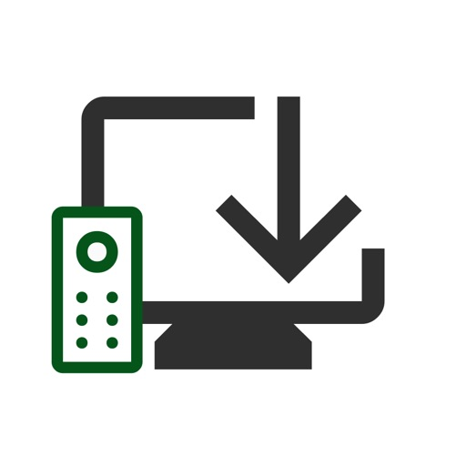
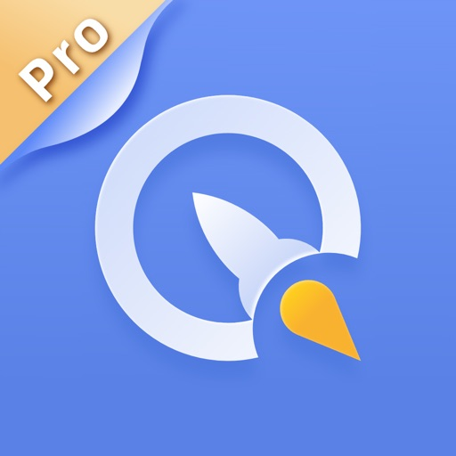
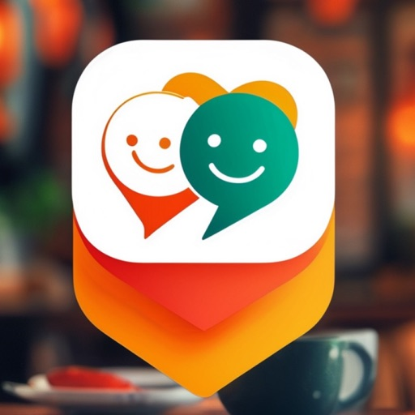
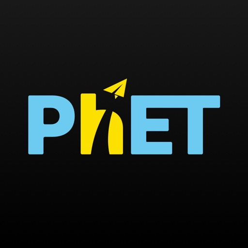
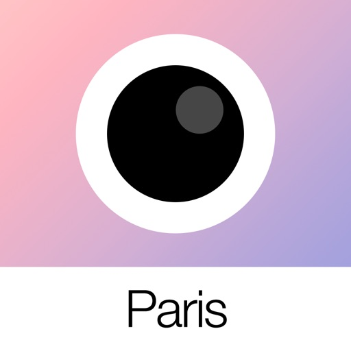

- [墨墨记忆卡｜考研考公考证外语学习闪卡](#墨墨记忆卡｜考研考公考证外语学习闪卡)
- [CamScanner + | OCR Scanner](#camscanner___|_ocr_scanner)
- [同花顺至尊版-股票软件](#同花顺至尊版-股票软件)
- [航旅纵横PRO-民航官方直销平台值机火车票接送机免税酒店](#航旅纵横pro-民航官方直销平台值机火车票接送机免税酒店)
- [AutoSnore: Snoring Recorder](#autosnore__snoring_recorder)
- [Alook Browser - 8x Speed](#alook_browser_-_8x_speed)
- [Forest: Focus for Productivity](#forest__focus_for_productivity)
- [BerryFilm - Korean Style Cam](#berryfilm_-_korean_style_cam)
- [Procreate Pocket](#procreate_pocket)
- [Countdown! Reminders and Timer](#countdown!_reminders_and_timer)
- [玄易八字](#玄易八字)
- [AirBasketball - AuditoryAR](#airbasketball_-_auditoryar)
- [Jinx – Ad Block & Privacy DNS](#jinx_–_ad_block___privacy_dns)
- [PewPewPew - Fingergun](#pewpewpew_-_fingergun)
- [随手记Pro](#随手记pro)
- [甜蛙 - 甜甜约会！！！](#甜蛙_-_甜甜约会！！！)
- [AutoSleep Track Sleep on Watch](#autosleep_track_sleep_on_watch)
- [花皮 - 同城约会，无面具社交，解压释放正念素颜](#花皮_-_同城约会，无面具社交，解压释放正念素颜)
- [鲨鱼记账本Pro-管家理财必备工具](#鲨鱼记账本pro-管家理财必备工具)
- [atvTools](#atvtools)
- [金十数据专业版-为交易而生](#金十数据专业版-为交易而生)
- [同城约友-梦幻沉浸式交友新体验](#同城约友-梦幻沉浸式交友新体验)
- [完蛋！我被美女包围了！](#完蛋！我被美女包围了！)
- [Sudoku Clean - No ads](#sudoku_clean_-_no_ads)
- [加速器Green VPN-全球网络加速器](#加速器green_vpn-全球网络加速器)
- [XP3Player](#xp3player)
- [东方财富领先版-财经资讯&股票开户](#东方财富领先版-财经资讯_股票开户)
- [Peggy Cat - A Virtual Pet](#peggy_cat_-_a_virtual_pet)
- [每日英语阅读](#每日英语阅读)
- [PhET Simulations](#phet_simulations)
- [Daily Dozen-Culture in Photos](#daily_dozen-culture_in_photos)
- [SnapKoin: Fast Expense Tracker](#snapkoin__fast_expense_tracker)
- [我打不过漂亮的她们](#我打不过漂亮的她们)
- [飞常准PRO-全球航班查询机票酒店预订](#飞常准pro-全球航班查询机票酒店预订)
- [Things 3](#things_3)
- [HeartWatch: Heart Rate Monitor](#heartwatch__heart_rate_monitor)
- [Mini Billiards - Watch Game](#mini_billiards_-_watch_game)
- [RakugakiAR](#rakugakiar)
- [List背单词](#list背单词)
- [法语背单词 - 法语单词记忆工具](#法语背单词_-_法语单词记忆工具)
- [隐形守护者](#隐形守护者)
- [SouSou - Quick Search](#sousou_-_quick_search)
- [Kino - Pro Video Camera](#kino_-_pro_video_camera)
- [手表浏览器](#手表浏览器)
- [扫毒风暴](#扫毒风暴)
- [轻历 - 清新日历](#轻历_-_清新日历)
- [凤凰新闻(专业版)-头条新闻阅读平台](#凤凰新闻(专业版)-头条新闻阅读平台)
- [PreRecCam](#prereccam)
- [ManYue](#manyue)
- [iGuzheng](#iguzheng)
- [Planit Pro: Photo Planner](#planit_pro__photo_planner)
- [新概念英语专业版 - 英语美语全四册](#新概念英语专业版_-_英语美语全四册)
- [Spark - Ren'Py Novels](#spark_-_ren'py_novels)
- [ProCam - Pro Camera](#procam_-_pro_camera)
- [怦然心动的瞬间-轻科幻真人互动恋爱影游](#怦然心动的瞬间-轻科幻真人互动恋爱影游)
- [AnkiMobile Flashcards](#ankimobile_flashcards)
- [NetTV: Watch Global TV](#nettv__watch_global_tv)
- [SleepTown](#sleeptown)
- [药王谷女修修炼手札](#药王谷女修修炼手札)
- [QiPaws](#qipaws)
- [CatLight Pro: Selfie Light Cam](#catlight_pro__selfie_light_cam)
- [Pew Pew Air Blaster](#pew_pew_air_blaster)
- [Tricolour Lovestory CE](#tricolour_lovestory_ce)
- [某某宗女修修炼手札](#某某宗女修修炼手札)
- [论玄](#论玄)
- [LIFE by THIX](#life_by_thix)
- [Good Maps - for Google Maps, with Offline Map, Directions, Street Views and More](#good_maps_-_for_google_maps,_with_offline_map,_directions,_street_views_and_more)
- [365 Plan](#365_plan)
- [西语背单词](#西语背单词)
- [DotInk](#dotink)
- [AutoMod Pro](#automod_pro)
- [CNC Lathe calculator](#cnc_lathe_calculator)
- [Wafari - Watch Browser](#wafari_-_watch_browser)
- [番茄共和 - 简洁优雅的番茄时钟，学习计时器](#番茄共和_-_简洁优雅的番茄时钟，学习计时器)
- [WebBrowser - For Watch](#webbrowser_-_for_watch)
- [Tampermonkey](#tampermonkey)
- [Colorburn](#colorburn)
- [kirakira+](#kirakira_)
- [VoidLink](#voidlink)
- [心岛日记-难过的人不孤独](#心岛日记-难过的人不孤独)
- [Human Anatomy Atlas 2026](#human_anatomy_atlas_2026)
- [小猴掌上伤寒论](#小猴掌上伤寒论)
- [雨时](#雨时)
- [Merge Watermelon 4 Watch](#merge_watermelon_4_watch)
- [论如何建立一个修仙门派](#论如何建立一个修仙门派)
- [CNU - 顶尖视觉精选](#cnu_-_顶尖视觉精选)
- [Trigramly](#trigramly)
- [每日英语 听力学习版](#每日英语_听力学习版)
- [繁花漫画 - 超全的漫画阅读神器](#繁花漫画_-_超全的漫画阅读神器)
- [Analog Paris](#analog_paris)
- [Wipeout Warriors](#wipeout_warriors)
- [nPlayer](#nplayer)
- [AI恋人&灵魂伴侣](#ai恋人_灵魂伴侣)

#### 墨墨记忆卡｜考研考公考证外语学习闪卡
## 墨墨记忆卡｜考研考公考证外语学习闪卡

墨墨记忆卡 可以帮助你科学高效地规划需要记忆的知识，对抗遗忘。

- 可以把知识编辑成卡片，目前支持文字、图片、声音。

- 可以把自己的知识卡片分享给朋友，也可以搜索他人的卡片进行学习。

- 可以把知识卡片加入记忆规划，墨墨记忆卡 会为你安排合适的时间进行复习。

- 可以查看自己的记忆数据：遗忘曲线、记忆持久度、每日学习情况。

- 可以每日签到，见证自己的坚持和成长。

墨墨科技多年以来一直专注于记忆领域的探索，基于对 1300+ 亿条用户记忆行为数据的研究和统计，绘制了 3000+ 万条不同用户的遗忘曲线，协助用户高效规划自己的记忆。

#### camscanner___|_ocr_scanner
## CamScanner + | OCR Scanner

Scan docs into clear & sharp image/PDF, to email, fax, print or save to cloud.

* Over 200,000 new registrations per day
* App Store Best of 2014
* CamScanner, 50 Best iPhone Apps, 2013 Edition – TIME

----Paid App Features----
* All features that the free version has
* Recognize and extract texts from a single page
* Larger cloud space of 400M (200M for free version)
* Export PDFs without watermark "Scanned by CamScanner"
* Ad-free

Features:

*Mobile Scanner
Use your phone camera to scan receipts, notes, invoices, whiteboard discussions, business cards, certificates, etc. 

*Optimize Scan Quality
Smart cropping and auto enhancing make the texts and graphics look clear and sharp. 

*Extract Texts from Image
OCR (optical character recognition) feature extracts texts from single page for further editing or sharing. (Paid app only)

*Share PDF/JPEG Files
Easily share documents in PDF or JPEG format with others via social media, email attachment or sending the doc link. 

*AirPrint & Fax Documents
Instantly print out docs in CamScanner with nearby printer via AirPrint; directly fax docs to over 30 countries from the app.

*Collaboration
Invite friends or colleagues to view and comment on your scans in a group. (Registrants only)

*Advanced Editing
Making annotations or adding customized watermark on docs are made available for you.

*Secure Important Docs
Set passcode for viewing important docs; meanwhile, when sending doc link, you can set password to protect it.

*Sync across Platforms
Sign up to sync documents on the go. Just sign in to any smartphone, tablet or computer (visit CamScanner website) you own and you can view, edit and share any document. 

Premium Subscription Service:
1. Edit OCR results and notes of the doc, exporting as .txt file
2. Create Doc Collage for multiple pages
3. + 10G cloud space
4. + 40 extra collaborators
5. Send doc link with password protection and expiration date
6. Auto upload docs to Box, Google Drive, Dropbox, Evernote, One Drive and etc.
7. Batch download PDF files through web application of CS
8. Import PDF to Camscanner for editing
9. Scan academic questions to make practice tests for study
10. High Standard ID Scan
and More...  

Payment models for Premium subscription:
• Monthly Subscription:   $4.99 per month,
• Yearly Subscription:   $35.99 for 1st year and $49.99/year starting from the next year,

• Payment will be charged to iTunes Account at confirmation of purchase.
• Account will be charged for renewal within 24-hours prior to the end of the current subscription period.
• Subscriptions may be managed by the user and auto-renewal may be turned off by going to the user's Account Settings after purchase.
• Any unused portion of a free trial period will be forfeited when the user purchases a subscription to that publication.

For Terms of Use, please visit
https://www.camscanner.com/app/service?language=en-us
For Privacy Policy, please visit https://www.camscanner.com/app/privacy?language=en-us

CamScanner users scan and manage 
* Bill, Invoice, Contract, Tax Roll, Business Card…
* Whiteboard, Memo, Script, Letter…
* Blackboard, Note, PPT, Book, Article…
* Credential, Certificate, Identity Documents…

3rd Party Cloud Storage Services Supported:
-Box, Google Drive, Evernote, Dropbox, OneDrive

We’d love to hear your feedback: isupport@intsig.com
Follow us on Twitter: @CamScanner
Like us on Facebook: CamScanner
Follow us on Google+: CamScanner

Check out other INTSIG’s products:
CamCard - Business Card Reader
CamDictionary - Snap Translator

#### 同花顺至尊版-股票软件
## 同花顺至尊版-股票软件

【炒股就用同花顺】
我们为您提供智能投资服务，以及沪深港美全球实时高速行情，精选股市热点资讯、基金理财等。投资全球，就用同花顺！ 

【爆款功能】 
【√ 】神奇九转：分时、K线神奇九转，为您找到股价拐点，轻松做T。 
【√ 】智能盯盘：实时异动推送、股价预警、大事提醒帮您轻松盯盘。 
【√ 】走势预测：未来涨跌，相似K线，一测便知。 
【√ 】涨停分析：涨停揭秘，一秒了解涨停背后逻辑，愿您追在妖股启动时。 
【√ 】诊股：核心level2数据，全方位技术消息面评估，专家操作建议。 
【√ 】筹码分布：一眼识破主力建仓、洗盘、拉升、出货，轻松实现收益最大化。 
【√ 】自选导入：图片一键导入，自动识别股票，快速跨平台创建股票池。 
【√ 】模拟炒股：20万模拟金免费送，A股、港美股轻松玩，快速成为炒股高手！ 

【基础功能】 
【√ 】全球行情：支持沪市、深市、港股、美股、英股、新三板、全球股指等，想看的行情这里都有。
【√ 】智能盯盘：实时异动推送、股价预警、大事提醒，帮您轻松盯盘。 
【√ 】弹幕：看盘配弹幕，感受股市的喜怒哀乐。
【√ 】自选: 快速查看自选行情、资金、公告、研报，还支持动态选股、自选分组管理等。
【√ 】市场概况：市场涨跌、大盘异动、热点板块、短线风向标、龙虎榜等，一眼读懂主力动向。
【√ 】精选资讯：精选全球财经要闻、热点快讯，7*24小时不间断更新。

【同花顺VIP连续包月】
-- 会员权益：VIP专属通道，享受行情交易提速；免广告；更有独家资讯、大数据追踪助力炒股！
-- 订阅价格：以IAP申请信息为准，例如连续包月产品为每月12元。 
-- 付款：您确认购买并付款后记入iTunes账户。
-- 取消续订：如需取消续订，请在当前订阅周期到期前24小时以前，手动在iTunes/Apple ID设置管理中关闭自动续订功能。
-- 续订：苹果iTunes账户会在到期前24小时内扣费，扣费成功后订阅周期顺延一个订阅周期。
-- 会员服务协议（含自动续费）：https://pay.10jqka.com.cn/onlinePayment/vipServieceProtocol.html
-- 隐私条款：https://ozone.10jqka.com.cn/tg_templates/doubleone/2018/privacyPolicy/index.html

【自动续费服务申明】

付款：用户确认购买并付款后记入iTunes账户；
续费：苹果iTunes账户将在订阅到期前24小时内扣费，扣费成功后会员权限顺延一个月。
取消续费：如需取消续费，请在当前权限到期前24小时以前，手动在iTunes/Apple ID设置管理中关闭自动续费功能，到期前24小时内取消，将会收取订阅费用。

1.购买自动续费产品，确认购买后，将会从您的苹果iTunes账号扣除相应费用；
2.开通自动续费服务后，将在会员到期前1天为您自动续费，续费成功会员自动延长相应时长；
3.如需取消续费，请在当前权限到期前24小时以前，手动在iTunes/Apple ID设置管理中关闭自动续费功能，到期前24小时内取消，将会收取订阅费用。

会员服务协议（含自动续费）

金牛会员
http://pay.10jqka.com.cn/onlinePayment/vipServieceProtocol.html?sid=157

金牛会员尊享版
https://pay.10jqka.com.cn/onlinePayment/vipServieceProtocol.html?sid=422

涨停助手
https://pay.10jqka.com.cn/onlinePayment/vipServieceProtocol.html?sid=269

手机短线宝
https://pay.10jqka.com.cn/onlinePayment/vipServieceProtocol.html?sid=196

云参数
https://pay.10jqka.com.cn/onlinePayment/vipServieceProtocol.html?sid=231

手机高级诊股
https://pay.10jqka.com.cn/onlinePayment/vipServieceProtocol.html?sid=171

形态掘金
https://pay.10jqka.com.cn/onlinePayment/vipServieceProtocol.html?sid=379

神奇电波
https://pay.10jqka.com.cn/onlinePayment/vipServieceProtocol.html?sid=115

手机超级level-2
http://pay.10jqka.com.cn/onlinePayment/vipServieceProtocol.html?sid=207

早盘选股宝
https://pay.10jqka.com.cn/onlinePayment/vipServieceProtocol.html?sid=351

隐私条款
https://ozone.10jqka.com.cn/tg_templates/doubleone/2018/privacyPolicy/index.html

【关于同花顺】
同花顺(300033)成立于1995年，是一家专业的互联网金融数据服务商，为您全方位提供财经资讯及全球金融市场行情，覆盖股票、基金、期货、外汇、债券、银行、黄金等多种面向个人和企业的服务。

【用户帮助】 
感谢您使用同花顺手机客户端，使用中有任何问题和建议可通过以下方式联系我们。

智能客服：24小时、无需等待，智能客服小花快速为您解答。
24小时热线：952555

#### 航旅纵横pro-民航官方直销平台值机火车票接送机免税酒店
## 航旅纵横PRO-民航官方直销平台值机火车票接送机免税酒店

航旅纵横，伴你出行每一程
我们是国家队：中国民航信息官方出品，民航版“12306”。
我们只提供权威、及时、精确、全面的航班、机票、机场信息。

【您想不到的功能我们有】
民航官方直销平台：来这买源头机票，0差价·0捆绑·0套路
自动导入行程：无须您手动添加，行程自动跳到碗里来
3D飞行视频：连接你在地球上飞过的每个角落
火车抢票：抢不到火车票？有票神器帮你抢
机上打牌聊天：无网也能聊天和娱乐，快试试机上模式
全球精品商城：线上点一点，免税商品送到家

【您想到的功能我们也有】
电子登机牌：无需兑换纸质登机牌，一码快捷通行
航班动态：航班动态及时晓，官方数据任您查
手机值机：随时随地在线选座位，还能选状态和留言
用车：接送机延误免费等、误机必赔偿，租车场站取还便捷、免千元押金
酒店预订：专属客服7x24小时守候，海量酒店等你来订
机场雷达：手机变雷达，查看机场上空飞机实时动向
常客卡：支持不同航空公司的常客卡添加，方便管理

【求关照】
独乐乐不如众乐乐，邀请小伙伴，一起享受航旅纵横服务

【联系我们】
邮箱：kefu@travelsky.com.cn

#### autosnore__snoring_recorder
## AutoSnore: Snoring Recorder

Discover the fun new way to automatically track your snoring and sleep sounds from your iPhone, with no subscription fees! Just tap the start button and sleep.

Built by the Best
-------------
From the team behind the widely popular AutoSleep app (#1 ranked sleep app on the App Store), comes a fresh innovative approach to assist users to take control of their sleep and improve their health.

Honest Software for an Honest Price
--------------------
No subscriptions. No hidden extra In App Purchases. No more to pay. Only one low cost price to own forever. Everything included!

Ease of Use
-------------
All you need is an iPhone. Simply start AutoSnore next to your bed. On wakeup you can listen and discover insights, it is that easy.

Why AutoSnore?
-------------
Sleep is precious, so it’s time we start to manage a condition that impacts nearly half of the world’s adult population (and most don’t even realise they snore). Snoring can have a significant impact on sleep quality, causing disruptions that affect not only the person who snores but also their bed partner.

What Does AutoSnore Do?
-------------
AutoSnore records all sorts of snoring and sleep sounds, including frequency, intensity, and duration of each episode, providing a comprehensive overview of nightly snoring patterns. When you wake in the morning, a visual breakdown lets you understand the impact of snoring on your overall sleep quality.

The New Snurk Rating!
-------------
Ever wanted one number that combines all your snores?! Welcome to the "Snurk" Score.
Your Snurk Score represents the intensity of snoring over the course of the night, where a score of 100 might wake the neighbours! The lower the Snurk Score the better. AutoSnore will even track your personal bests.

Advanced Sound Recognition
-------------
Using machine learning sound recognition, AutoSnore will classify all your sleep sounds, such as snoring, sleep talking, yawning, coughing and so on! It is quite amazing to review all the different sounds captured overnight.

Can It Help Me?
-------------
Absolutely, that's why we made it as long time snorers ourselves! AutoSnore allows you to track personalised strategies and remedies. Whether it’s lifestyle changes, sleep position adjustments, a new pillow, relaxation techniques or avoiding that wine over dinner, the app helps users experiment with different remedies to find what works best.

AutoSleep Integration
-------------
Works beautifully with the AutoSleep app, with your snore data syncing automatically with your sleep analysis!

Total Privacy
-------------
As with all our apps, AutoSnore prioritises user privacy and data security. Compare the App Privacy label below to see “Data Not Collected”. Check the other “free” snore apps if they can say the same.

No analytics tracking. No advertising plugins. No 3rd party code. No data upload. All recorded data and insights are kept securely on only your device. Only the user can elect to share a recording with someone else. The way it should be.

Start Today
-----------------
The sooner you start collecting data, the sooner you can manage.

AutoSnore is an essential app for anyone looking to enhance their sleep and overall well-being. With its unique approach to app design, cutting through all the nonsense and getting straight to the issue without breaking your bank balance.

Disclaimer
-----------------
AutoSnore is not a medical device. Always consult with a professional medical practitioner for any questions or concerns about your health.

#### alook_browser_-_8x_speed
## Alook Browser - 8x Speed

Alook is a minimalist yet powerful browser, aiming to be the best for iOS.

Core Features  
- Lightning-fast experience: No push notifications, no news, no ads, millisecond startup.  
- Audio and video features: Floating playback, adjustable speed (0.5x-16.0x), background playback, AirPlay casting, DLNA casting, small window playback, single track loop, picture-in-picture, screenshots, mirroring, long press for speed control, and more.  
- File management: Manual downloads, unzip/compress (zip, rar, 7z, including encrypted files), file creation/editing, open in plain text mode, select file encoding, import from albums, move/copy files, Wi-Fi transfer, and more.  
- E-book reader: Supports txt, pdf, epub, kindle, mobi, azw, azw3, azw4, prc, pdb formats.  
- Reading mode: Smart pagination, designed specifically for novels.  
- Image viewing mode: Batch saving, image compression.  
- Ad blocker: Built-in Adblock Plus, supports multi-language rules, third-party rules, custom ad marking, and blocking intrusive ads.  
- Custom search engine: Automatically detects search boxes on web pages, quick add.  
- Translation feature: Built-in 14 languages, supports full-page translation and word translation.  
- JavaScript extension: Run custom JS code.  
- File sharing: Perfectly integrates with iOS 11 Files and iTunes file sharing.  
- Device compatibility: Supports iPhone, iPhone XS Max, iPad Pro, and cross-device syncing.  
- Website settings: Separate settings for video floating, ad blocking, no image mode, clipboard access, and JavaScript scripts.  
- iPad support: Perfectly adapts to split-screen and iOS 11 drag-and-drop operations.  

Other Features  
- iCloud sync for bookmarks, custom ad rules, search engines, and plugins.  
- Private mode or incognito browsing.  
- Custom immersive wallpapers.  
- Next page preloading.  
- Custom site icons.  
- BigBang text selection.  
- Handoff support.  
- Auto-refresh.  
- Webpage pull-to-refresh.  
- Homepage pull-down search.  
- Custom website homepage.  
- Webpage full-length screenshots.  
- Developer tools: View source code, Eruda, vConsole, Cookie management.  
- Night mode: Supports OLED pure black mode, eye-care web colors.  
- No image mode: Smart no image.  
- Full-screen mode: Swipe to hide the toolbar.  
- Page search: Find text within the webpage.  
- Site search: Use the default search engine to search for specific keywords.  
- Supports password managers: 1Password, LastPass, Avast Passwords, and more.  
- QR code tools: Scan, recognize image QR codes, generate link QR codes.  
- Switch between desktop or mobile website: Supports custom user agent.  
- Block redirection to the App Store.  
- Print and create PDFs.  
- Quick URL entry, quickly open copied URLs.  
- Page flipping buttons and screen tap flipping.  
- Swipe back from anywhere.  
- View site certificate.  
- Touch ID or Face ID authentication.  
- Custom long-press shortcuts.  
- Import or export bookmarks.  
- Custom fonts, language, page swipe speed, screen rotation lock.  

Privacy and Security  
- Data protection: No upload of account, password, or activity data.  
- Incognito mode: Does not save browsing history, cache, or cookies.  
- Data storage: Unlike other browsers that store bookmarks and data in the developer's database, Alook stores bookmarks and data in the iCloud private database, accessible only by the user.  

User Reviews  
- From keeyang1985: A great software, highly recommended, worth the price. Small size, fast, no unnecessary stuff. The browser I've always wanted, it's worth more than the $12 price.  
- From Wen Jing: The happiness a good app brings is beyond anything. Thanks to Alipay for the red envelope, or I might have missed this best browser I've ever used. Other browsers had scattered features, but Alook is worth the $12.  

If you have any questions before or after purchase, feel free to contact us.  
X/Twitter: AlookBrowser  
Email: AlookApp@qq.com

#### forest__focus_for_productivity
## Forest: Focus for Productivity

## Top productivity app in 136 countries. More than 2 million satisfied paying users. Featured in Apple's "Amazing Apps" TV commercial.
## Staying focused with the cutest gamified timer. 
## Over 1,500,000 real trees were planted on Earth by our users.  

"Forest works well, and if your goal is to be more in the moment, ignore your phone and actually talk to your friends when you are with them, this is the app for you."— The New York Times 

"In order to establish new, better habits, it's helpful to engage with tools that make it easier to reinforce them. For anyone looking to curtail their phone usage, the Forest app might be for you."— Business Insider

If you want to temporarily put down your phone and focus on what’s more important in real life, you can plant a seed in Forest. As time goes by, this seed will gradually grow into a tree. However, if you cannot resist the temptation of using your phone and leave the app, your tree will wither. 

The sense of achievement and responsibility will encourage you to stay away from your phone, and will help you make better use of your time. Stop getting distracted by your phone, make you self-motivated and get more things done.

Stay focused, Be present! 

STAY FOCUSED
• A interesting way to help you beat phone addiction and overcome distraction
• Turn your focused moments into a lush forest.
• Create personalized Allow Lists for different situations. Non-allowed apps will be blocked. (iOS 16 or above)

GET MOTIVATED
• Earn rewards and unlock more than 90 new tree species and white noises.
• Share your forest and compete with friends and users around the world.
• Plant trees along with friends & family.
• Unlock achievements and earn extra rewards.
• Plant real trees on Earth and protect the environment with tree-planting organization Trees for the Future.

STATISTICS
• Manage your own tags and view detailed statistics of your time distribution.
• Browse your weekly, monthly and even your yearly big forest.
• Track your focused time in the Apple Health App.
• Track your daily phone usage and screen time.
• Recall memories of your planting journey with our brand new Forest Timeline!

It's never too late to build up productive habits! 

NOTICE
• Forest is compatible with iPhone, iPad and Apple Watch, and can be used across these iOS devices with a one-time purchase. The full app with the aforementioned features is available on iPhone and iPad; on Apple Watch you can view live planting session and today’s focus stats. To download or unlock a non-iOS version, it requires a separate purchase. By logging into the same account, your data can be synchronized across all platforms.
• Due to iOS limitations, the Allow List feature is only available on iOS/iPadOS 16 or above. If you’re using a device running iOS/iPadOS 15 or below, your tree will wither when you leave Forest during a planting session.
• Due to budget constraint, the number of real trees each user can plant is limited to five. We will be introducing limited time events that will allow users to plant more real trees. Please follow our social media page or check the in-app announcement for more updates.
• There is only one version of Forest on the App Store. Other apps that are similar and mimics Forest are not developed by the Forest team. Thank you for your support!

Like us on Facebook: https://www.facebook.com/forestapp.cc/
Follow us on Twitter: https://twitter.com/forestapp_cc
Follow us on Instagram: https://www.instagram.com/forest_app/

We also provide browser extensions. Find out more on www.forestapp.cc

#### berryfilm_-_korean_style_cam
## BerryFilm - Korean Style Cam

Hi, I’m Berry, a filter creator from South Korea.
Some of you may know me from Instagram as @berryveryloveyou.
Many of the filters I once shared on social media are now gone—
but I wanted to preserve the soft tones I’ve created over the past 5 years.
That’s why I built this space: BerryFilm.

New filters will be added regularly.
Natural skin tone effects and soft light features are also in the works.

Please enjoy the filters I’ve poured my heart into.

--

Features

- Soft and subtle Korean-style filters
From airy milk tones to cool, warm, and vintage moods—
you’ll find filters that bring out your natural atmosphere.

- Photos and videos in your favorite tone
Transform your gallery into a soft, aesthetic feed
with gentle color correction and minimalist touch.

- Simple, quiet, and easy to use
Apply filters with one tap, save favorites,
and shoot with a silent shutter—anytime, anywhere.

- New filters every month
Always something new, designed to match the season or your mood.

- Built with feedback from real users
We’re constantly improving the app through your suggestions.

--

Recommended For

- Fans of Berry’s Instagram filters
- Anyone looking for soft, natural Korean-style filters
- Users who love subtle selfies without heavy edits
- Those who enjoy discovering new filters each month

--

Included Filters

Featuring over 20 carefully designed filters like
milk, 7, butter, cool, warm, and blossom —
with more coming soon.

--

Contact & Sharing

Tag @seesun.app on Instagram to share your photos.
For questions or feedback, feel free to DM or email us.

Email: seesunapp@gmail.com
Instagram: @berryfilm.app

#### procreate_pocket
## Procreate Pocket

App of the Year winner Procreate Pocket is the most feature-packed and versatile art app ever designed for iPhone. 

Procreate Pocket has everything you need to create expressive sketches, rich paintings, gorgeous illustrations, and beautiful animations. Offering hundreds of handmade brushes, a suite of intuitive artistic tools, an advanced layer system, and the powerful Valkyrie graphics engine. Work on the couch, on the train, at the beach, or while waiting in line for coffee. 

It’s a complete art studio in the palm of your hand.

Highlights:
• High resolution canvases — up to 16k by 4k on compatible devices
• Intuitive Dark Mode interface made for iPhone
• Revolutionary QuickShape feature for perfect shapes
• Smooth and responsive smudge sampling
• Powered by Valkyrie, the lightning-fast 64-bit painting engine 
• Create art in stunning 64-bit color
• 250 levels of undo and redo
• Continuous auto-save — never lose work again

Breakthrough brushes:
• Packed with 100s of beautifully crafted brushes
• Brush sets keep your painting, sketching, and drawing brushes organized
• Over 100 customizable settings for every brush
• Brush Studio — design custom brushes
• Import and export custom Procreate brushes
• Import Adobe® Photoshop® brushes, and run them faster than Photoshop®

Full-featured layering system:
• Layer your art for precise control over details and composition
• Create Layer and Clipping Masks for non-destructive editing
• Stay organized by combining layers into groups
• Transform objects simultaneously across multiple layers
• Access over 25 layer blend modes for industry-grade compositing

Color without compromise:
• Fill your line work with ColorDrop
• Disc, Classic, Harmony, Value, and Palette color panels
• Import color profiles for color matching
• Assign Color Dynamics to any brush

Precision design tools:
• Add vector text to your illustrations
• Easily import all your favorite fonts
• Crop and resize your canvas for perfect composition
• Perspective, isometric, 2D, and symmetry visual guides
• Drawing Assist perfects your strokes in real time
• StreamLine smooths your strokes for beautiful lettering and expert inking

Animation Assist: 
• Easy frame-by-frame animation with customizable onion skinning
• Create storyboards, GIFs, animatics, and simple animations
• Export your animations in the full resolution of your canvas

 Dramatic finishing effects:
• Gradient Map — remap your image’s colors with a customizable gradient
• Glitch, Chromatic Aberration, Glow, and Halftone to add new dimensions to your work
• Gaussian and Motion Blur filters for depth and movement, or use Sharpen for perfect clarity
• Advanced Noise filter gives you more control for a classic, retro look
• Adjust Hue, Saturation, or Brightness in real time
• Powerful image adjustments including Color Balance, Curves, and HSB
• Bring your art to life with the fun, intuitive, and creative Warp, Symmetry, and Liquify Dynamics 

Time-lapse replay:
• Relive your creative journey with Procreate's celebrated Time-lapse Replay
• Export your Time-lapse recording in 4K for high-end video production
• Share a short, 30-second version of your Time-lapse on your socials

Reference Companion:
• Keep a full canvas or reference image with you at all times 
• Paint on your face with AR
• Color-pick right from the reference window

Import assets and share your creations:
• Import or export your art as Adobe® Photoshop® PSD files
• Import Adobe® ASE and ACO Color Palettes
• Import images files such as JPG, PNG, and TIFF
• Drag and drop artworks, brushes, palettes, and fonts between applications• Export to AirDrop, iCloud Drive, Photos, iTunes, Dropbox, Google Drive, Facebook, X (formerly Twitter), Instagram, TikTok, Weibo, Mail, and more
• Share your art as PDF, JPEG, PNG, TIFF, GIF, HEVC, or MP4 files

#### countdown!_reminders_and_timer
## Countdown! Reminders and Timer

Countdown is a reminder and time management app, it will remind you to cherish your time at all times, which can be accurate to the second. Support lunar calendar display, support classification management function, support custom widget background, support percentage form, change percentage accuracy, so that you can see the time change every minute and every second, remind you to cherish time. At the same time, it supports "CPU Panel", "Hourly Reporting", "Age Calculator", "Full Screen clock", "Date cCalculator", "QR Code Generation" and other tools.

It can help you make project plans, set reminders for meetings, arrange your schedule, and keep you focused. It can also be used to record memo events and help you better manage your time.

[Features]
# 70+ Lock Screen Widgets and 100+ Desktop Widgets;
# Can be accurate to the second, always remind you to cherish the time and see the time change;
# Support reminders, remind you of upcoming events through push notifications;
# Support dynamic wallpapers;
# Support lunar calendar selection, do not miss every lunar festival;
# Customizable widget backgrounds, custom widget colors, and custom widget definitions;
# Support recalculation every day, every week, every month;
# Built-in multiple tools, including "CPU Panel", "Dynamic Island", "Hourly Reporting", "Device Panel", "Age Calculator", "Full Screen clock", "Date cCalculator", "QR Code Generation" and other tools;
# Desktop widgets can customize the background, font, font color, transparency and blur;
# Support event pin;
# Support automatic event sequencing;
# Support classification management function, better help you manage all event reminders;
# You can set the background for each event, small and beautiful time reminder application;
# Support the function of backing up data to iCloud, no longer have to worry about data loss;
# Provide a variety of cool animations to give you a different mood;
# Customizable push notification ringtones to make you unique;
# Support network search to provide you with richer content;
# New and concise operation interface makes operation more concise;
# Supports percentage form.

VIP features include: All Widgets, all Tools, all Static wallpapers and Dynamic wallpapers, 100% pure ad-free and automatic data backup, and can enjoy all future VIP features.
【Monthly VIP Instructions】
1. Subscription period: 1 month
2. Subscription price: 3 yuan per month
3. Payment: After the user confirms the purchase and pays, it will be credited to the itunes account
4. Cancellation of payment: If you need to cancel the renewal, please manually turn off the automatic renewal function in the iTunes/Apple ID settings management 24 hours before the current subscription expires
5. Renewal: Apple iTunes account will be debited within 24 hours before expiration, and the subscription period will be extended by one month after the deduction is successful

【Yearly VIP Instructions】
1. Subscription period: 1 year
2. Subscription price: 24 yuan per year
3. Payment: After the user confirms the purchase and pays, it will be credited to the itunes account
4. Cancellation of payment: If you need to cancel the renewal, please manually turn off the automatic renewal function in the iTunes/Apple ID settings management 24 hours before the current subscription expires
5. Renewal: Apple iTunes account will be debited within 24 hours before expiration, and the subscription period will be extended by one year after the deduction is successful

【Permanent VIP】
Unlimited permanent use of VIP features, all Widgets, all Tools, all Static wallpapers and Dynamic wallpapers, 100% pure ad-free and automatic data backup, and can enjoy all future VIP features.

Privacy Policy: https://shijianguihuaju.cn/2020/01/01/countdown-law/
User Agreement: https://shijianguihuaju.cn/2020/01/01/countdown-law/

#### 玄易八字
## 玄易八字

玄易八字——專業八字排盤與命理分析工具

玄易八字是一款功能強大且便捷的八字排盤工具，專為不同需求的用戶量身打造。無論您是八字命理的初學者，還是經驗豐富的命理師，我們都能為您提供精準、專業的命理分析，助您洞悉人生軌跡。

核心功能：
精準八字排盤：輸入生辰，即可一鍵排盤，精準呈現命局資訊，助您快速解讀八字奧秘。
專業斷法知識：內建豐富的八字斷法與解析技巧，幫助您深入理解命理學，提升預測能力。
多盤同批分析：支援同時解析多個命盤，輕鬆對比命理特徵，助力更全面的推斷與研究。
日曆查詢與節氣資訊：整合日曆查詢功能，可查看日干支、節氣變換等重要資訊，精準輔助命理分析。
簡潔直觀，易學易用：優化介面設計，讓複雜的八字分析變得清晰易懂，即使是新手也能快速上手。

為何選擇玄易八字？
專業精準——演算法嚴謹，數據可靠，助您深度解讀八字奧秘。
學習提升——內建命理知識，幫助初學者快速入門，高手進階提升。
洞察人生——解讀事業、財運、婚姻等多方面命理資訊，把握人生機遇。

玄易八字，讓八字命理觸手可及，助您探索人生玄機！
立即下載，開啟您的命理探索之旅！

#### airbasketball_-_auditoryar
## AirBasketball - AuditoryAR

Aim and shoot! It's AirShot!

Let me guess: right now you're sitting looking at your phone, maybe working or studying. Perhaps bored and passing time, or just stuck at home in silence.
It's been far too long since you last hit the court and worked up a good old sweat, am I right?

You'd go through the old familiar motions, as if on auto-pilot.
Loading up that shot, arms tensing, and then a flick of the wrists:
Swish. No basketball to play with, but your motions are on point!

The good old days flew by faster than you can shout 'travel!'.
That's youth for you. It came, now it's went.
Or so you thought...
Yet now, that imaginary basketball's back in virtual form. He shoots! He scores!
Nothing beats that sound, that classic, weirdly satisfying
SWISH!
So now you're up on your feet again, heart racing.
You're alone no longer! That's right! We get you, man!
We made AirShot: a game just for you!

There's the effortless motion recognition. The pinpoint spatial audio simulation.
And it all comes together to recreate that satisfying swish.

Once a baller, always a baller.
No matter how tough life gets, you can always AirShot that stress away!

Here's to each and every MVP out there, on the court or elsewhere!
——————————————
[How to Play]
Wear your watch according to the instructions shown to have it recognize your throwing motions, and you'll hear that old familiar swish. Nothin' but net!

1. There's a chance you'll hear a clang as you hit the rim, missing the shot. There's a whole bunch of hidden secrets...
2. On top of shooting hoops SFX, there's actual shooting SFX, whip noises, and more... We're adding heaps of new sounds with each update, and more gameplay for you to enjoy too.

#### jinx_–_ad_block___privacy_dns
## Jinx – Ad Block & Privacy DNS

Less disturbance, a smoother user experience; Stronger privacy protection, more reassuring daily Internet access.

Jinx is a lightweight system assistant tool. By analyzing the network request characteristics of devices, it filters out suspicious or unnecessary access before content loading, thereby reducing interference, lowering noise, and enhancing overall smoothness.
All processing is completed locally, without collecting or uploading any data.

Main functions

• Reduce interference
Handle known exceptions or meaningless requests before content display, allowing applications and web pages to focus more on the core content.

• Strengthen privacy protection
Block access attempts to suspicious sources to avoid unnecessary data exposure.

• Improve page loading efficiency
Reduce redundant requests to make access faster and the experience smoother.

Local execution is safer
All judgment logics and processing procedures are carried out locally on the device without the involvement of remote servers, making it more reassuring to use.

Simple and intuitive
One-click activation, no need for complex Settings, easily enjoy a cleaner user experience.

Suitable for

Users who care about privacy and hope to minimize distractions
It is hoped that the web page and applications will respond more quickly
Create a more reassuring online environment for your family
A stable and refreshing daily usage experience is needed

Working mode

Jinx will perform local analysis on the upcoming requests before the content is loaded. When anomalies or unnecessary access are detected, they will be intercepted internally within the device, preventing these requests from continuing to execute, thus making your usage environment simpler, smoother and safer.

Lightweight, quiet and reliable.

Experience Jinx and bring daily use back to simplicity and purity.

#### pewpewpew_-_fingergun
## PewPewPew - Fingergun

1. A refreshing and satisfying experience
This is a shooting sound effect simulation app that can give people a satisfying and enjoyable feeling!

2. Available on mobile phones and smartwatches
Supports Apple Watch and can be controlled by gestures! Rat-a-tat-tat-tat!
The phone and watch can be used together, turning you into a dual-gun warrior!

3. Multiple weapons to choose from:
Handguns, rifles, shotguns, sniper rifles, and even grenades.
The sound of reloading is also available, making you feel like you're in a real gun battle!

4. An amazing experience that boys cannot resist
Make a gun gesture with your hand, and then go "Bang"!
Pick up a broom or a cat and fire! BangBangBang!

#### 随手记pro
## 随手记Pro

多赚会花每一天，记账就要随手记！个人、家庭、生意账随心选。
记账快捷又专业，轻松管理多人记账。多维度账单解读，全面了解你的财务状况。账单数据实时存，云端数据不丢失。

【神象云账本】
- 记一笔记账快捷又专业
- 账本首页流水页，数据呈现更清晰
- 云端存储数据，安全不丢失
- 账本操作必留痕，安全又省心

【海量账本模板，陪伴你的各个人生阶段】
to成长中的你：
- 高中生、大学生账本：生活费聪明花，课外兼职也能记
- 班费账本：班委管钱大家看，班费收支更透明
to工作中的你：
- 差旅报销流水账：流水详尽不漏报
- 网约司机、健身教练、装修队长：职业账本专属定制
to爱生活的你：
- 合租、恋爱、生活账：日常生活随心记
- 旅游、宠物、爱好账：为自己所爱的事物，记录美好回忆
- 攒钱、健身、目标账：设定一个小目标，让账本陪你变成想要的样子
to创业中的你：
- 奶茶、快餐、餐饮业：店铺经营实用工具
- 服装、代购、零售业：成本营收全把控，应收应付不遗漏
- 培训、酒店、服务业：各行各业全覆盖，首页报表指导经营
to顾家的你：
- 人情账本、结婚账本：人情红包收入支出一览无余
- 儿童教育、宝宝账本：家人共享宝贝成长点滴
- 汽车、储蓄家庭账本：日常生活分类全，全家合记一本账
还有更多账本模板等你发现！

【专业记账，省心易用】
- 记一笔：多人协同共同记账，随时随地记一笔
- 账本首页：首页即报表，数据卡片及图表让财务状况一目了然
- 流水：从各个维度查看收支情况，拒绝糊涂账
- 账户：全面了解你的各账户余额，手有余粮心不慌

————献给热爱记账的你————
生活需要一点仪式感。 有人每天早上一定要喝一杯咖啡， 有人每天睡前一定要写两句日记， 也有人每天都把挣到的和花过的每一分钱记录下来 在快节奏的时代，扫一扫就完成付款，动动手指就能解决三餐、完成购物。 移动支付把生活中的花销从实实在在的钱变成了一串变动的数字，很多时候我们对于花钱没有了概念，甚至，想不起来把钱花在了哪里。 这时，需要消费后的用心记账，提高自己对钱的敏感度。 希望热爱记账的你梳理财务状况的时候可以沉浸在随手记这个“工作台”！

【联系我们】 使用过程中如遇问题，欢迎联系我们，可爱的客服妹纸会认真处理你的每一个反馈哦。
- 在线客服："我的"-"求助反馈"-“功能咨询”/“业务咨询”
- 留言路径：“我的”-“求助反馈”-“意见反馈”
- 随手记官网：www.sui.com
- 随手记微信：suishoujicom
- 随手记服务条款：https://www.sui.com/help/agreement-mobile.html
- 随手记隐私政策：https://www.sui.com/help/privacy.jsp
如果您喜欢随手记，请在应用商店留下您的星星和评论，您的支持是我们进步的动力！

#### 甜蛙_-_甜甜约会！！！
## 甜蛙 - 甜甜约会！！！

年轻人的约会新方式！！！
约吃饭、看电影、演唱会、密室逃脱...
在这里，才华不会被埋没，用炸裂的演技展示真实自我，获取Ta的好感，夺回属于你的舞台焦点。

发起邀约
神啊，赐予我一个骑白马的吧

对方应约
稀饭，你是我的菜

联系对方
幽默是一种艺术

线下见面
随时随地的撒狗粮

拍摄短视频
一段即兴的rap展示，让世界认识你

网友疯狂打Call：
「 好瘦的八戒」爱了爱了
「 茉莉蜜茶」完了，我中毒了，一天要打开APP几百次
「 陌人」抓到帅气学长一枚，收工～

如果您有任何问题，请及时在APP中砸向我们，我们喜欢被砸，您还可以通过邮件吐槽。
吐槽邮箱：tw@yohoing.com

#### autosleep_track_sleep_on_watch
## AutoSleep Track Sleep on Watch

Automatically track your sleep from your Apple Watch*. No buttons to press. Even the Watch app is optional! Just sleep!

Total Privacy.
-------------
AutoSleep has no user analytics tracking. No advertising plugins. No 3rd party code. No data upload.
Ask your "free" sleep app if they can say the same.

Everything Included.
--------------------
No extra In App Purchases. No subscriptions. 

Apple Sleep Stages
-----------------
Full integration with Sleep Stages from the Apple Sleep app, so you have the option to use the Apple Sleep app and view all the information in AutoSleep.

Functions
-----------------
AutoSleep includes all the information and functionality you need for sleep monitoring, including:
Time Asleep – sleep duration and sleep bank balance
Sleep Rating – a consolidated rating score of your sleep
Sleep Rings – fill your sleep rings with quality sleep, including heart rate, deep sleep and REM
Apple Sleep Stages – option to use the data from the Apple Sleep app
Sleep Apnea - discover if you have sleep apnea
Sleep Blood Oxygen – measurements while sleeping
Respiration Rate – track your breathes per minute
Noise – environmental noise measurements
Sleep Analysis – view detailed graphs and breakups on your sleep cycles
Sleep Fuel – measure the quality and efficiency of your sleep
Tonight’s Bedtime – recommends your latest bedtime based on your habits
Readiness – indicates your physical and mental stress
Temperature – track your sleeping wrist temperature
Sleep Consistency – learn about your time to bed behaviours
Lights Off – track the time to fall asleep
Live Sleep Tracking – view your sleep statistics during the night
Smart Alarm – Watch in-built smart alarm to help you wake in lighter sleep 
Widgets – fantastic range of iPhone widgets
Complications – multiple Watch face options 
HomeKit – full integration with Apple HomeKit 
Emojis & Notes – record comments and tags to your sleep session
Explore – deep dive analytics views
Siri – use with Siri voice commands
Shortcuts – create your own shortcuts that you use with AutoSleep
Adjust – a simple function to adjust sleep/wake detection individual to you
History – advanced graphs and trends
Configuration – change the theme and design your clock sleep rings
Setup – customise your sleep goals, setup notifications and reminders
Exports – exporting options to save your data

About AutoSleep
-----------------
Using Advanced Heuristics AutoSleep works out how long you've slept so you don't have to.

If you DO wear your Watch to bed, you don't need to do a single thing. AutoSleep will track your sleep & quality and send you a notification in the morning.

Even if you don't wear your Watch to bed, AutoSleep can track your time in bed. It's extremely simple. If you DON'T wear your Watch to bed, then simply take your Watch off before you go to sleep. As soon as you touch your iPhone or put your Watch back on in the morning then AutoSleep will know that you have finished sleeping. 

As everyone is a little bit different. AutoSleep provides a simple setup wizard and an option to tweak if you are a very restless sleeper. 

AutoSleep also integrates beautifully with the Eclipse Yourself and HeartWatch apps, our premier heart, health, activity, recovery and readiness monitoring apps.

*Requires Apple Watch running WatchOS 4 or higher.

Awards
-----------------
Best of 2018
https://apps.apple.com/story/id1438574124/

Best of 2019
https://apps.apple.com/story/id1484100916/

Best of 2020
https://apps.apple.com/story/id1535572713/

Best of 2021
https://apps.apple.com/story/id1591083005/

Best of 2022
https://apps.apple.com/story/id1654240446

Best of 2023
https://apps.apple.com/story/id1719170110

#### 花皮_-_同城约会，无面具社交，解压释放正念素颜
## 花皮 - 同城约会，无面具社交，解压释放正念素颜

你是否厌倦日常的伪装？
你是否讨厌戴上“面具”的日子？
这款应用没有画面和有色滤镜，没有生活中的涂涂抹抹。

放下颜值焦虑，放下面具。来这里，记录真实的自己，做真实的自己！

花皮是一款无画面却可以照亮自己的App，你不需要刻意去摆弄自己。
 
你是否渴望卸下'完美人设'的重担？花皮是首个以素颜照为媒介的素颜正念约会交友社区，通过真实影像的自我凝视，帮助用户重建与身体的深度对话。

在这里，素颜照不仅是记录，更是一面照见内在光芒的镜子——每一次按下快门，都是对自我价值的重新确认；每一张无修饰的照片，都在重塑你对美的认知。

我们相信：当镜头不再评判你的五官，当滤镜消失后的真实肌理被温柔接纳，你将获得超越颜值的深层自信。这里没有'不够好'的焦虑，只有'我本如是'的勇气。心理学家验证的数据显示：一个人通过持续记录素颜日记，自我接纳度提升67%，社交压力降低58%，83%的人表示'终于敢素颜见重要的人'。这不是美颜相机的替代品，而是重塑自尊的觉醒工具。现在就卸下伪装，让素颜成为你最自信的社交起点——因为真正的光芒，从来不需要面具修饰。

#### 鲨鱼记账本pro-管家理财必备工具
## 鲨鱼记账本Pro-管家理财必备工具

【产品功能】
3秒钟记账：极简的操作流程，让你3秒钟即可完成一笔记账操作
消费趋势：一目了然的图表，帮你快速分析消费情况
数据超安全：登录账号后，记账数据实时同步在云端
备注提示：强大的备注智能提示系统，让你记账的过程越来越简单
记账提醒：自定义每日提醒时间，再也不用担心忘记记账了

【Pro版特色功能】
饼图分析：记账数据更加一目了然
搜索功能：查找记录更加快捷
解锁密码：再也不用担心账本被人偷窥
隐藏金额：支持隐藏首页总金额
预算管理：设置月度预算，消费支出精准掌控
记账日历：查看、补记更加方便
每日收支：可在日历中查看每日收支金额
自定义周期：自由设置每月开始日期
定时记账：周期性固定支出自动记录
记账标签：按标签查看账目汇总
个性装扮：多套皮肤，软件风格私人订制

【Pro版和VIP的区别】
1、Pro 版与苹果账号绑定，一次性付费，可长期使用
2、Pro 版仅支持 iOS 设备，其它手机系统无法使用
3、Pro 版不包含VIP中的部分功能

【创始人说】
为什么要做鲨鱼记账？
鲨鱼记账的创始人有着多年的记账习惯，我们想基于用户的需求去设计产品，想为大家做一款贴心的记账软件，只为你用着爽！我们的一切功能都以方便用户使用为出发点。看似简单的操作流程背后，却能通过图表功能，帮你分析消费状况，让你能够对自己的消费行为做出改善。记账虽然不能直接帮你实现财务自由，但是我们相信，只要你坚持记账，不断改善自己的消费情况，积极开源节流，一定能够实现财务自由！

#### atvtools
## atvTools

App developed to control your TV devices from your iOS devices. You need to have enabled USB/Network debugging on your Android device to get it work
Depending on the device, some functions may not be available. Also it is not tested

App allows:
- Install (sideload) apps from your iOS device to your TV devices
- Control your TV apps (include opening, uninstalling, disabling/enabling and downloading APK)
- Control apps permissions (grant/revoke)
- Build-in File Manager
- Make screenshot or screenrecord (you can't capture any video content due to OS restrictions)
- Send files from your phone to TV
- Control your device using remote control and mouse mode in the app 
- Open channels on your iOS device (only Android TV 8+)
- Paste text from your phone
- Run Shell commands
- Clear all apps cache using one button
- Reboot and power TV device 
- See usage of CPU, RAM, network and storage
- See running apps and force-stop them if needed

#### 金十数据专业版-为交易而生
## 金十数据专业版-为交易而生

金十数据致力于成为国内专业的财经新闻软件和交易工具。提供全球7x24小时财经资讯，实时推送外汇、期货、A股、原油、贵金属、黄金、美股港股等财经快讯与行情报价，助力投资者更快更准地进行交易。
【财经快讯】
专属推送：自定义订阅内容，推送专属财经新闻快讯；
快讯分类：增加外汇、黄金、原油、美港股、A股股票和期货等快讯分类；
速度更快：坚守7x24小时财经快讯，致力于提供更快更全的金融市场消息。
【市场参考】
分类更精：为您分类鱼龙混杂的新闻，更贴近交易者的需求。
内容更优：金融市场一线头条新闻，深度优质财经好文，专业独家财经视频节目。
【行情走势】
新增商品外汇、A股与期货分类，交易品种覆盖更全！加入自选快速浏览所关注的品种。
【财经日历】
罗列每日重点财经数据或事件，开启定时提醒，重点交易行情不容错过。
【数据中心】
全球重要财经数据报告，新增自定义订阅报告功能，全新图表样式简洁清晰。
【视频栏目】
包括《伦敦交易者》《脱水期货》《海外交易员观点》《一杭说数据》《交易学院》等财经深度分析栏目，也有《嗨指数天团》《进击吧女神》《老板说的对》《数据可视化》等有趣好玩的泛财经视频栏目。
【其他】
金十数据在今日头条、新浪财经、一点资讯、搜狐新闻、网易新闻、腾讯新闻、UC新闻、百度新闻等热门新闻平台已有成熟的媒体号，每天同步更新优质原创财经新闻，捕捉新消息大事件，多渠道提供更全的财经资讯。
【联系我们】	
微信公众号：金十数据
新浪微博：金十数据——https://weibo.com/igoldman
客服电话：020-89635666
客服QQ：800185710

#### 同城约友-梦幻沉浸式交友新体验
## 同城约友-梦幻沉浸式交友新体验

在这里，你不仅可以创建独特的3D形象，打造小屋，还可以随时随地与朋友聊天，探索附近的新朋友，发现身边的精彩生活。

加入进来，拓宽你的社交圈，让相遇变得更有趣！畅享虚拟与现实交融的新体验，探索你的社交新世界！

【订阅服务说明】
1、服务:订阅按周、月或年度进行订阅
2、价格：订阅以实际订阅价格为准。
3、付款：用户确认购买并付款后计入iTunes账号。
4、续订：苹果iTunes账户会在到期前24小时内扣费，扣费成功后顺延一个订阅周期
5、取消：你可随时前往 iTunes 商店的设置界面，手动关闭自动续订功能。如未在结束的至少24小时前关闭订阅，将会自动续订。
隐私协议：https://penzu.com/public/2516880bc2c66177
使用协议：https://penzu.com/p/f4d2059436da0825

#### 完蛋！我被美女包围了！
## 完蛋！我被美女包围了！

"Love Is All Around" is a simulating love story real-life full-motion interactive video . You will not only meet but also fall in love with six beauties with completely different personalities and styles, eventually embark on an immersive and sweet journey one after another.
Under their charisma, how would you deal with the six beauties while you are busy at paying off debts? Would you  ignore your feelings and focus on making money? Or would you choose love over money? Among these beauties, who would you choose to be your partner for the rest of your life?

【Product Features】
·Full first-person perspective during the whole story, immersive experience of love -"Love Is All Around" is first-person perspective throughout, completely immersed in scene interaction and real-life simulation. It provides the immersive simulation experience, allows you to try more, and have an immersive love experience with the girl you like.

·Multiple branches, multiple endings, multiple hidden story lines and bonus scenes - the interactive video has designed more than a hundred story branches, twelve endings, multiple hidden story lines and bonus scenes for you, additionally, you can find  achievement system, mining and multiple experiences in product. In the product, make the choice that goes with your heart, rather than the correct choice.

·Acting by real actors , shooting in real-life scenes - numerous wonderful behind-the-scenes stories are waiting to be discovered, revealing the actor's understandings of the character's inner world, and unravel the secrets of flirting through girl’s perspective.

·Various ways to play, finding the faint clues - the game life is not limited to choices, the key clues of the follow-up plot can be hidden in the scene, faint clues can closely related to the ending. Maybe everything is predestined, but sometimes being brave will change your fate. Come and play out your story.

·Six girls with very different personalities can be introduced—either charming, or tender, or innocent, or capricious, or sexy, or glamorous, there is always a kind of girl that make you exclaim: " Damn it! I am surrounded by beauties! "

【About Us】
We are "intiny", we are all "split personality" nerds who want to have date every day, but will never step out of the house to the real world. Thereford, we would like use interactive video as tool to create one fantasy dream after another, to create dreams for players, and to make our dreams to come true for ourselves.

【Follow us】
Follow us for latest information on "Love is All Around".
FB: https://www.facebook.com/Love-is-All-Around-114374868341130
Discord: https://discord.gg/JCakKmHPr

#### sudoku_clean_-_no_ads
## Sudoku Clean - No ads

Sudoku Clean delivers the ultimate puzzle experience:

1. Clean interface with permanent ad-free design
2. Supports Sudoku solvers and custom games
3. Intelligent hints provide guidance when stuck
4. One-tap note system simplifies solving
5. Instant sharing of current/historic games
6. Multiple themes & multilingual support

Play offline anytime. Pure Sudoku, pure focus.

#### 加速器green_vpn-全球网络加速器
## 加速器Green VPN-全球网络加速器

这是一款专业加速保障的软件，它的功能为用户提供了及时加速功能，加速功能支持应用，游戏，使用操作简单方便，一键就能加速，喜爱的用户可以来下载加速体验一下。

注意：本加速器仅支持大陆境内（特指中国大陆地区）能访问以及合规的网站进行网络加速，请勿做非法用途，并遵守相关的法律和法规。
每天限免1GB的数据，一旦数据用完，您将无法再连接到网络。

#### xp3player
## XP3Player

A simple interactive video player written in C++. Let you watch many video formats on your iOS devices.

Support many media formats like AVI/RMVB/MP4/XP3/MKV/etc.

How to add video with USB:
- Run iTunes 9.1 or above, plug your iOS device with USB.
- Device->My Device(My iPad)->Apps, drag and drop files to the XP3player's documents.

Alternatively, you can enable embedded web server in menu to transfer media files through WiFi.

#### 东方财富领先版-财经资讯_股票开户
## 东方财富领先版-财经资讯&股票开户

东方财富领先版APP又升级啦！覆盖了股票、基金、期货、债券、外汇、银行、保险等诸多金融领域数据，每日更新数万条财经资讯信息，为用户提供便利服务。
特色功能： 
●股吧——中国高人气股票主题社区，覆盖财经资讯、股友评论、个股行情、股市热点、基本面数据等多个股市实用功能
●专业数据——覆盖全球重要市场行情 ，汇集股票新股申购、公司资料、证券投资研报等金融行业数百亿条数据
●开户交易——全程网上股票开户，不排队，支持在线开通创业板，交易安全、方便、快捷
●即时提醒——股友互动、市场热点、自选股（公告、研报、数据等）动态消息及时提醒
●主力资金流——真实还原实时主力大单，揭秘主力资金布局
●操盘机器人——D点提示买，K点提示卖
●高手跟踪——实盘组合、高手看盘、投资名师百家争鸣
●智能选股——短线雷达、主题投资、画线工具、筹码分布、分时叠加、超级Level-2、盘口异动、资金流向，从选股到分析到盘中决策，智能选股工具为您的每一次投资决策助力
●股市直播——各路大神直播传授投资经验

#### peggy_cat_-_a_virtual_pet
## Peggy Cat - A Virtual Pet

This is a little pet that lives inside a watch.

How to playing:

Put your phone/watch in your pocket and the app will automatically record your steps and convert them into "green leaves" for storage.

*How to obtain green leaves: When authorizing with Apple's "Health" (HealthKit) application, you need to agree to get step information in order to synchronize the data from "Health" (HealthKit). Then, you can collect green energy by walking!

*Operation tips: Turning the crown can select the menu, and then clicking the center of the screen can enter the menu.

*Supports multiple watch face components for the Apple Watch, which can display the pet's status in real-time, such as the text and picture module.

*The pet machine can be played on both the watch and the phone

*How to obtain clothing coupons: Buy them on your phone, and the watch can synchronize the coupons from your phone in the settings.

I. Pet care:

Growing: Egg -> Infant -> Child -> Adult

Feeding: You may buy food to feed your pet. There are all kinds of food in convenience stores. 

Toileting: There are two ways to clean your pet, i.e. cleaning the living room and going to the toilet. A clean and lovely pet can be raised only by toileting in time. 

Bathing: Bathing a dirty pet can increase the mood value.  

Sleeping: Your pet will go to bed at p.m. 0.00 and wake up at a.m. 8:00 with no interruption.  

Sick: If your pet goes hungry for a long time, the pet will get sick or become seriously ill and fall in a faint. If your pet is taken ill, select “Injection” or “First Aid” for treatment.  

Joy: Increase joy value by taking bath, going to park, going to amusement park, and traveling. 

II. Going-out: 

Gold coins: The gold coins are used for consumptions in the game, such as purchase of foods, seeds, and cars, and decoration of housing. You may earn gold coins by working, traveling, sell crops, and playing games.  

Backpack: In the backpack, there are fertilizer, water bottle, plant seeds, and crops sellable. 

Schooling: Obtain educational degree at different levels according to the subjects of study.

Education: Kindergarten / Junior Grade / Intermediate Grade / Scholar  

Visit: With online interactive visit and communication

Work: Your pet is not allowed to work before growing up. The types of work: Waiter / Courier / Office / Scientist; the work suitable depends on your pet’s education. The work will take certain mood value.  
Waiter: Western restaurant waiters, 50 coin each time  
Courier: Courier in the town, 50 coin each time 
Office: Do work in office, 150 coin each time 
Scientist: Work at laboratory, 300 coin each time  

Garden: You can plant crops in the garden with seeds in your backpack. Be sure to water your crops after planting. Fertilizer will help the plants ripen earlier.

School: You can take various courses at school

House: Beside the house, there is a garage where you may change your car after buying or store the old furniture.  

Clothing store: There are all kinds of costumes in the clothing store, which may be bought with Wool + Gold Coins, some of which shall be bought with costume coupons.  

Convenience store: Buy all kinds of pet’s favorable food with gold coins.

Gardening store: Buy all kinds of plant seeds and fertilizer at the gardening store. 

Market: Sell the self-produced crops in the market.  

Car store: There are 3 models available for sale at present. The travel time will be shortened greatly if a car is bought. 

Furniture store: Buy new furniture here to decorate the lobby, or buy a TV for your pet to watch

Pet store: In the soft opening, where the lambs, chickens, and piglets are available.  

Park: Increase the mood value by playing in the park 

Amusement park: Replenish the mood value fully by playing in the amusement park.  

Hot spring: Replenish health and cleanliness by taking a bath in the hot spring. 

Arcade: You can earn gold coins by playing games. At present, there are 5 games available.

#### 每日英语阅读
## 每日英语阅读

每日英语阅读，专为英语学习者打造，精听细读助你更好学英语。软件不仅会根据你的英文水平，每天推送地道的短文和原著，更有文件导入、单词本学习等功能，等你来体验。每天十分钟，养成阅读好习惯！

【资源丰富，每日更新】
编辑精选的英语文章，只需三分钟，轻松积累实用词汇，学习地道鲜活表达；
丰富的英文读物：经典名著、短篇小说、迪士尼·皮克斯电影双语阅读、少儿读物、名人演讲......原声朗读、双语字幕，带你感受原汁原味的阅读体验；
精听党：名著原声朗读，高亮双语字幕，结合干货知识点讲义和课后习题巩固，再也不用担心名著读不懂啦。

【每日外刊，深度专业】
选自主流的英美外刊，美国本土外教纯正发音朗读；
专业英语教师逐字逐句精讲，单词、语法、发音知识一网打尽；
每天2-3道练习题和配套答案详解，助你测评当天学习效果。

【功能强大、操作便捷】
划词搜索：与《欧路词典》无缝集成，长按查词，即指即译；
播放调节：8档语速调节、4种译文切换，满足不同阶段的学习需求；
智能提示：重点单词、各大考试（四六级、考研、托福GRE雅思等）的高频词，可在文章中自动标注，单词学习更高效；
生词学习：文章中长按即可查词并加入生词本，全平台同步，更有卡片播放等复习模式助你学习；
统计图表：每天的阅读记录都会通过图表生动展示，记录你一点一滴的坚持与努力；
阅读提醒：同学，今天是不是忘记阅读了？不要紧，软件每天都可以按时提醒你。

【文件阅读，即点即查】 
您可以导入需要阅读的文献，支持PDF、ePub、Docx等多种格式
阅读时即点即查，省却查词时复制粘贴的烦恼，阅读效率大大提高
支持重点内容高亮，添加批注，随时记录你阅读时的所思所想

【订阅服务说明】
订阅服务：每日外刊包月（1个月）、VIP 连续包季（3个月）
订阅价格：以iAP申请信息为准，例如每日外刊服务为63元/月；VIP 包季服务为58元/季度
付款：用户确认购买并付款后计入iTunes账户
苹果iTunes账户会在到期前24小时内扣费，扣费成功后订阅周期顺延一个订阅周期
如需取消订阅，请手动打开苹果手机“设置”->进入“iTunes Store与App Store”->点击“Apple ID”，选择“查看Apple ID”，进入“账户设置”页面，点击“订阅”，取消订阅即可。如未在订阅期结束的至少24小时前关闭订阅，此订阅将自动续订。
自动续费规则：https://www.eudic.net/v4/en/home/service
隐私协议：https://www.eudic.net/v4/home/privacy

【联系我们】
 客服电话：400-920-1209
 客服QQ： 1047518732
 电子邮箱：help@eudic.net

#### phet_simulations
## PhET Simulations

Engage in learning science and math with the award-winning PhET simulations! Whether understanding atoms, exploring energy, or mastering multiplication, there is a sim for every learner. Perfect for at home, in class, or on the road, this app delivers all PhET HTML5 sims (over 75 sims) in one easy-to-use package.

Developed by experts at the University of Colorado Boulder, PhET sims are used by millions of students every year. The PhET iPad app delivers these exclusive features:
• Offline play: learn on the bus or at the park without a WiFi connection.
• Multiple languages: app translate in many languages (great for bilingual learners).
• Favorites: pick your favorite sims and create your own custom collection.
• Automatic updates: get the latest HTML5 sims as soon as they are released.
• Easy sorting: find the right sims for you.
• Fullscreen: maximize your screen real estate for optimal sim exploration.

PARENTS: Engage your child in science and math discovery.
TEACHERS: Your favorite HTML5 sims at your fingertips, even without internet access. 
ADMINISTRATORS: Optimized for school use, so your teachers will be seamlessly up to date. 
STUDENTS: Tell your parents there’s an exciting app for learning science and math.

Note: The app does not include PhET’s Java or Flash sims. In addition, although we are currently working on improving the accessibility of our sims, most of the sims included in this app do not include keyboard navigation or screen reader access. As accessible sims become available, they will be updated within the app.

Proceeds from the app support the development of more HTML5 sims. On behalf of the PhET team and the students whose lives you have helped improve — Thank you!

#### daily_dozen-culture_in_photos
## Daily Dozen-Culture in Photos

Image is the most powerful language.

Daily Dozen APP provides you with multiple selected photos every day, covering astronomy, geography, humanities and popular science. It allows you to easily absorb the cultural nutrients you need for a day in the exquisite visual enjoyment, and is a display platform for excellent photography works.

Multiple wonderful themes, exquisite composition, and essence of text every day interpret the stories and feelings behind the photos, allowing people to appreciate the beauty of the world. It is also an excellent software for photography enthusiasts to learn photography skills.

We may not be able to travel to every corner of the world, but every photographer is a recorder of stories. Take pictures of the customs of all over the world and present them here, take you "travel", let us witness the breadth and beauty of the world together.

Share with you the beautiful things around and far away, a story, an experience, a feeling..., here, open a window, watch and savor quietly every day, let us encourage each other and move forward hand in hand.

#### snapkoin__fast_expense_tracker
## SnapKoin: Fast Expense Tracker

SnapKoin: Your Faster, safer, Minimalist Expense Tracker

No accounts, no servers—just a seamless experience on your device. With no personal data stored or transmitted, your privacy is guaranteed. Enjoy a clean, intuitive interface that gets the job done quickly.

Take control of your finances with SnapKoin, the ultimate expense tracker for iOS. Designed for simplicity and speed, SnapKoin lets you record expenses in just 3 seconds using a one-click shortcut. Say goodbye to complicated bookkeeping—this budget app offers a sleek, minimalist interface perfect for casual money management.

Key Features:

-Lightning-Fast Tracking: Add expenses instantly with a system-level shortcut.
-Customizable Categories: Use a two-tier system to tag bills and analyze spending with multi-level stats.
-Real-Time Insights: Stay updated with a desktop widget and interactive charts (day/month/year views).
-Minimalist Design: Enjoy visualized ring charts and a clutter-free experience tailored to iOS.

Whether you’re budgeting, tracking spending habits, or simplifying finance, SnapKoin redefines lightweight accounting. Download now and master your money with ease!
Terms of Use: https://jiangsanjie.github.io/doc/snapkoin/term

#### 我打不过漂亮的她们
## 我打不过漂亮的她们

石磊，曾用一双铁拳打穿地下世界规则，却在巅峰时隐退。几年后，曾经让你无法释怀的真相再次撕开你伪装的日常，是终于放下心结不再蹉跎过一生，还是冲破命运的挟持追寻“真相”背后的秘密？这一次你将不再孤军奋战，由“她”陪伴你解开命运的枷锁。

【命运重拳，你的选择即规则】
最强的拳，终将击向命运最脆弱之处。在这个世界中，你的选择是唯一的法则。命运的岔路口早已铺就，结局静候你的抉择——是重返拳坛巅峰，还是沉沦情场迷局？故事从此开始，书写属于你的人生篇章。

【三大篇章，揭开隐藏的真相】	
“人生救赎”、“拳王归隐” 与 “拳坛复仇”——三条平行时空下的命运轨迹，因你的选择而逐一展开。是为逝去的恋人揭开黑幕复仇，还是放下执念迎接新生？抑或是在师徒情谊中传承梦想，重返荣耀擂台？在良知与利益的十字路口，命运由你决定。

【多重互动，沉浸式体验拳坛风云】  
超600分钟实拍素材，三大主线共19章内容，20余种结局探索，全流程超16小时。玩家可自由选择解锁不同故事线，经历重重的人性考验，见证不同女主组合从对立走向共生，最终拼合成完整真相版图。游戏中包含丰富的互动体验：拳坛争霸、追查真相、命运抉择、生死逃亡...沉浸式剧情体验，带你踏入一段热血与情感交织的拳坛传奇！

【匠心制作，诚意呈现】
我们联合专业影视团队，采用一镜到底等电影级拍摄技术，力邀实力演员倾情主演，更有千万粉丝级嘉宾惊喜参演。演技碰撞，张力拉满的对手戏将为你带来沉浸式的剧情冲击。

【关于我们】
了解颗粒的朋友们还记得我们的第一款互动影游产品《反转21克》，作为国内首款科幻题材的互动影游，我们收获了许多支持的同时也有很多宝贵的建议，这些都成为了我们在影游这条路上持续前进的动力。这一次，我们携《打不过》再次归来，创新推出“平行时空”多线叙事，同时每条故事线也增加了更多判定机制和互动，力求给大家带来更加丰富的沉浸体验。
如果你们也喜欢这次的作品，那将是对我们最大的鼓励，我们会在今后的作品中不断提升，给大家带来更多优质的内容！

#### 飞常准pro-全球航班查询机票酒店预订
## 飞常准PRO-全球航班查询机票酒店预订

飞常准——飞行旅客更喜欢的专业APP
专业十年，陪伴飞行

【因为专业，更懂飞行】
1.查航班：航班信息秒级更新，实时飞机轨迹追踪，延误提前知晓。
2.飞行记录：真实飞行轨迹，记录探索过的世界。
3.手机值机：提供国内/国际航班网上值机服务，提前选择心仪座位。
4.机票预订：更多可选维度，专业旅客之选，直营机票更放心。

【因为专业，出行必备】
1.出行服务：酒店预订、专车接送机，一款APP满足您所有的出行需求。
2.为亲友关注：亲友乘机或接机的时候，即使没有安装飞常准，也可以通过短信或者微信消息的方式把航班动态分享给他，让你牵挂的人更放心。
3.飞行圈社区：大V带路，时刻掌握旅行新姿势，让飞行更好玩 。

【因为倾听，所以更懂你】
官方微博&微信：飞常准

#### things_3
## Things 3

Get things done! The award-winning Things app helps you plan your day, manage your projects, and make real progress toward your goals.

Best of all, it’s easy to use. Within the hour, you’ll have everything off your mind and neatly organized—from routine tasks to your biggest life goals—and you can start focusing on what matters today.

“Things offers the best combination of design and functionality of any app we tested, with nearly all the features of other power user applications and a delightful interface that never gets in the way of your work.”
—Wirecutter, The New York Times

KEY FEATURES

• Your To-Dos
Your basic building block is the almighty To-Do—each a small step toward a great accomplishment. You can add notes, tag it, schedule it, and break it down into smaller steps.

• Your Projects
Create a Project for any big goal, then add the to-dos to reach it. Use headings to structure your list as you outline your plan. There’s also a place to jot down your notes, and a deadline to keep you on schedule.

• Your Areas
Create an Area for each sphere of your life, such as Work, Family, Finance, and so on. This keeps everything neatly organized, and helps you see the big picture as you set your plans in motion.

• Your Plan
Everything on your schedule is neatly laid out in the Today and Upcoming lists, which show your to-dos and calendar events. Each morning, see what you planned for Today and decide what you want to do. The rest is down to you :)

MORE THINGS TO LOVE

As you dive deeper, you’ll find Things packed with helpful features. Here are just a few:

• Reminders — set a time and Things will remind you.
• Repeaters — automatically repeat to-dos on a schedule you set.
• This Evening — a special place for your evening plans.
• Calendar integration — see your events and to-dos together.
• Tags — categorize your to-dos and quickly filter lists.
• Quick Find — instantly find to-dos or switch between lists.
• Magic Plus — drag the + button to insert to-dos anywhere in a list.
• Share extension — create to-dos with content from other apps.
• Widgets — see lists on your home/lock screens.
• Mail to Things — forward an email to Things; now it’s a to-do.
• Markdown — structure & style your notes.
• And much more!

MADE FOR IPHONE

Things is tailored to the iPhone with deep system integrations as well. A great example is the Share extension, which allows you to create to-dos with content from other apps, such as a link to a website you want to get back to.

You can also enjoy a beautiful dark mode at sunset, connect your calendars, add a variety of widgets, create to-dos via Siri, import from Reminders—Things can do it all! There’s even Shortcuts integration if you want to automate your workflows.

MADE FOR APPLE WATCH

Things comes with a great app for Apple Watch. Just raise your wrist to glance at your Today list, mark to-dos complete as you go, and dictate new ones on the fly—all synced instantly with your iPhone, iPad, and Mac.

AWARD-WINNING DESIGN

Made in Stuttgart, with two Apple Design Awards to its name, Things is a fine example of German engineering: designed not only to look fantastic, but to be perfectly functional as well. Every detail is thoughtfully considered, then polished to perfection.

“It’s like the unicorn of productivity tools: deep enough for serious work, surprisingly easy to use, and gorgeous enough to enjoy staring at.”
—Apple

GET THINGS TODAY

Whatever it is you want to accomplish in life, Things can help you get there. Install the app today and see what you can do!

• Things is also available for Mac, iPad, and Apple Vision Pro (sold separately).
• Sync is provided for free via our Things Cloud service.
• A free trial is available for Mac: www.things.app

If you have any questions, please get in touch. We provide professional support and will be glad to help you!

#### heartwatch__heart_rate_monitor
## HeartWatch: Heart Rate Monitor

"HeartWatch is so good, you’d think Apple built the app itself." John Patrick Pullen, Time Magazine. Top 5 in Health & Fitness in 100+ countries. 

TOTAL PRIVACY
HeartWatch has no user analytics tracking. No advertising plugins. No 3rd party code. No data upload. Ask your "free" heart app if they can say the same.

ABOUT HEARTWATCH
HeartWatch is the best way to get a complete picture of all the health & fitness information captured by your Apple Watch. 

NEWS
- Explore the different News Editions to learn all about your health progress and trends.
- Morning Briefing: read about your key health information to start your day
- Fitness Habits: news all about your fitness trends with a dynamic fitness habit tracker

WELLNESS
- An intelligent view of all key heart rate metrics. Daytime, Sedentary, Sleeping, Waking & Workouts. 
- Detailed trend analysis including heart rate, blood pressure, HRV, blood glucose, blood oxygen (SpO2) and more.
- Background heart rate alerts on Watch with context. 
- Note capture for individual heart rate readings. 
- Detailed ECG analysis

ACTIVITY
- Every day isn’t the same. Intelligent move, distance & steps goals based on your current habits. 
- Daily forecasting to help you stay on track to meet your goals. 

WORKOUTS
- In depth analysis of heart rate, training summary, GPS maps and more. 
- A heart focussed workout app on the Watch with custom alerts to keep you in the right zone. 
- Detailed trend analysis. 
- Stream workout info from your Watch to your iPhone. 

JOURNAL & NOTES
- Keep a daily journal with notes and measurements
- View a detailed list with a complete overview of all notes, measurements and workouts
- Input notes and measurements from your Watch or iPhone. Includes blood pressure, temperature, blood glucose, weight, waist circumference and body fat percent.

GRAPHS & ANALYSIS
- Over 30+ health metrics to view
- Apply 7 day and 21 day trends to any metric, with the ability to overlap
- View over 6 weeks up to 12 months

EXPORT
- Export for all health metrics & workouts. 

NOTHING IS MORE IMPORTANT THAN YOUR HEALTH
Heart Watch is a very useful tool to get alerted about any possible health issues in a concise format that you can show your medical practitioner.

INTEGRATION
HeartWatch connects beautifully with the Eclipse Yourself and AutoSleep apps, our premier sleep, activity, recovery and readiness monitoring apps.

HEART MONTH
Featured app in the official Apple Heart Month 2022:
https://www.apple.com/au/newsroom/2022/01/apple-celebrates-heart-month-with-new-resources-across-services

REQUIREMENTS
This app requires an iPhone that has the Health App installed. Heart readings are read from the Health Data Store which is ideally populated by your Apple Watch.

#### mini_billiards_-_watch_game
## Mini Billiards - Watch Game

A finely crafted billiards game made just for Apple Watch!
Aim precisely, master your angles, and win in one shot.
Compete on global leaderboards — daily, weekly, and all-time.
Unlock stylish cues and switch between Classic and Practice modes.
Play offline anytime, anywhere — your pocket-sized arcade on the wrist!

How to play on Apple Watch?
Move the "Digital Crown" wheel to indicate the direction of shooting. Touch the screen to launch. Put all the balls, except the black and white.

#### rakugakiar
## RakugakiAR

"RakugakiAR" is a make-your-dream-come-true app that brings life to your doodle! Whether it's on a notebook, a whiteboard, or anywhere, this app scans the scribble you've drawn and brings it to life. The doodle will have its own life and walkabout in the AR environment on your smartphone. Feed them, poke them, play with them any way you want!

Whether you are an individual or a corporation, please refrain from using this application for profit or any other benefits, directly or indirectly, without our consent, including amusement events. If you wish to use this application, please contact hello@whatever.co for more information.

#### list背单词
## List背单词

List背单词，一款可离线使用，艾宾浩斯规划，支持PDF导出，简洁高效的背单词软件。

功能特性：
* 「内置词库」：包含四六级、考研、出国、大学、高中、初中、小学等各个阶段的词库，还有新概念英语、BEC、COCA、剑桥、朗文、牛津等其他词库。
* 「学习计划表」：根据艾宾浩斯记忆规律曲线，持续记忆和不断复习；
* 「自定义词库」：支持外部文件导入；
* 「生词本」：汇总重难词，集中强化记忆；
* 「熟词表」：移除熟词，词库越学越小；
* 「双语/单语」：快速切换双语/单语模式，方便自测自查；
* 「iPad分屏」：利用分屏功能，边听边写；
* 「词典查询」：内置英汉/英英词典和在线词典，支持“用户自行添加在线词典”；
* 「英式/美式」：支持英式/美式发音+音标；
* 「iCloud同步」：iPad/iPhone记录同步，学习进度不丢失；
* 「拼词模式」：从五个卡片中点选正确的字母，拼成完整的单词，同时还支持键盘输入。iPad上，还支持Pencil手写输入；
* 「听写模式」：可重复可间隔可循环可自动，英汉双语音频播放；
* 「英英模式」：通过英语释义、同义词和例句，加强记忆，扩展词汇量；
* 「滚动模式」：列表样式，自动循环滚动播放；
* 「定时关闭」：听写模式和拼词模式，支持多次循环后关闭，或固定时长后关闭；
* 「音频混合」：支持其他音频app混音，边听歌边记单词；
* 「批量导出」：支持批量导出词汇到「List生词本」App；
* 「桌面小组件」：iOS 14及其以上系统，支持快速查看学习进度和打卡情况；
* 「文字大小」：支持跟随系统文字大小变化；
* 「PDF导出」：支持内置词库、自定义词库和生词本的PDF文件导出。

背单词，是英语学习之路上必要的过程，词汇量不够，直接影响到英语的使用，单词记不住，是必须打败的拦路虎。人的遗忘速度随时间的流逝而先快后慢，在记忆的最初阶段遗忘的速度很快，后来就逐渐减慢了，到了相当长的时候后，几乎就不再遗忘，因此及时复习对于记忆单词是非常重要的，这就是艾宾浩斯记忆法的原理。

List背单词，根据艾宾浩斯的记忆规律来使用，第一个Day记忆单词，后续的复习间隔周期为：`1`个Day，`2`个Days，`4`个Days，`7`个Days和`15`个Days，假设把单词词库平均分为`15`个list，在`30`个Days的时间里持续记忆和不断复习，由此制作了一份学习计划表。

* 乱序版本：词库随机打乱分配到每个List
* 正序版本：词库按A-Z的顺序分配到每个List
* 原序版本：词库按数据源本身的排列顺序分配到每个List

--- 学习计划表设置 ---
通过调整List总数，把单词词库进行平分，得到平均词汇量和总天数，选择乱序或正序(原序)版本，由此得到一份学习计划表。

--- 自定义词汇 ---
支持两种导入方式：从生词本导入和从外部文件导入

--- 英语口音支持 ---
美国，英国，澳大利亚，爱尔兰，南非，在线美式发音，在线英式发音，离线真人语音

--- 背单词方式 ---
初始的排列，按字母升序排序，随机打乱排序，不会的词排在前面。
其中，关于初始的排列，在以下三种版本中的解释：
1.正序版：没有“初始的排列”，默认就是按字母升序排列；
2.乱序版：“初始的排列”，是指保持一个初始的打乱排列；
3.原序版：「自定义词汇」的词库专有，“初始的排列”，是指保持数据源本身的顺序。

--- 单词显示设置 ---
双语显示，只显示英文，只显示中文
1. 只显示中文时，向左滑动单词行，可以看到英文单词；
2. 只显示英文时，向左滑动单词行，可以看到中文释义。

--- 单词行点击设置 ---
1. 默认设置，点击单词行，有发音，蓝色标记颜色加深，‘不会程度’增加一；
2. 点击单词行的左半部分，只有发音，右半部分，保留默认设置；
3. 点击单词行的右半部分，只有发音，左半部分，保留默认设置；
4. 点击单词行，只有发音，蓝色标记颜色不加深，‘不会程度’不增加一。

--- 音标显示设置 ---
隐藏音标，英式音标，美式音标

--- 生词本 ---
1. 单词列表里，向右滑动单词行，点击星星按钮，收藏单词到生词本；
2. 手动修改单词；
3. 手动添加新单词；
4. 多种排序方式：从新到旧，从旧到新，从A到Z，从Z到A，随机乱序。
备注：生词本里修改中文释义，词库里的释义会跟着改变；从生词本删除单词，词库里的释义会恢复成原来的

--- 熟词表 ---
1. 词列表里，向左滑动单词行，点击红色叉号按钮，添加到熟词表；
2.长按底部当前List，可以进入熟词表，进行恢复。

--- iCloud同步 ---
支持iCloud同步学习进度、生词本和自定义词汇

--- 显示模式 ---
白天，夜间，纯黑，纸张白，纸张黑，支持跟随系统，在线词典支持深色外观

--- 词典设置 ---
1.长按单词行，复制单词到剪切板，默认不开启；
2.长按单词行，使用词典查询更多释义和例子，包括查询关闭、内置词典和多种在线词典；
3.在线词典，支持调整顺序。

--- 拼词模式 ---
1.从五个卡片中点选正确的字母，拼成完整的单词；
2.随机打乱；
3.快速定位；
4.支持键盘输入；
5.在iPad上，支持Pencil手写输入。

--- 听写模式 ---
1.调整播放单词重复次数；
2.调整单词间隔时间；
3.设置是否自动播放下一个；
4.内容显示设置；
5.支持后台播放音频；
6.支持播放中文释义；
7.随机播放；
8.快速定位。

--- 英英模式 ---
通过英语释义、同义词和例句，加强记忆，扩展词汇量

--- 滚动模式 ---
1.列表样式，自动循环滚动播放；
2.更方便的生词本编辑、不会程度标记和词典查询等操作。

--- 批量导出 ---
1.支持把当前List的词汇批量导出到「List生词本」App；
2.支持把生词本的词汇批量导出到「List生词本」App。

--- PDF导出 ---
1. 主页面点击右上角 - 学习计划页面 - PDF；
2. 支持导出单个List的PDF文件：主页面，长按底部List，会出现当前List的「导出PDF」入口;
3. 生词本点击右上角的PDF。

--- 其他 ---
若对使用产生任何疑问，请联系shawn736_ios@163.com
App icons by icons8，词库的背景图片来自Unsplash
The Preview background photo by Joey Kyber on Unsplash
Our preview images were created using 'Previewed' at previewed.app
具体信息请参考网址https://github.com/shawn736ios/Technical-support

#### 法语背单词_-_法语单词记忆工具
## 法语背单词 - 法语单词记忆工具

法语背单词是专为法语学习者设计的背单词软件。海量原声例句搭配艾宾浩斯记忆法，助你在了解单词真实语境的同时，科学高效的背单词。

【丰富词书】
涵盖北外法语、你好法语、走遍法国、法语综合教程等主流法语教材，专四、专八、TEF、TCF考试高频词汇，更有名人著作、动词变位等进阶课本供你挑选。你需要的法语词书，这里都有。

【原声例句】
收录《每日法语听力》中的海量原声例句，内容出自你喜欢的电影、剧集，或是RFI、TV5、France Info、France Inter等专业新闻，助你了解单词的真实单词语境，专业高效地记忆单词。

【科学记忆】
根据艾宾浩斯记忆曲线，法语背单词内置了科学高效的记忆算法，识别你当前单词的熟悉程度，分析你的记忆遗忘曲线，在单词遗忘的临界点提醒复习，使你更多地把时间花在不熟悉的单词上，而不是一再回顾那些很熟悉的单词，从而实现背单词的高效率、抗遗忘。同时，软件会动态调整单词复习计划，助你轻松高效的完成大量单词的学习。

【详细释义】
单词释义中提供了法汉-汉法、法法词典、法英词典、近义-反义-派生词词典、法语历年真题等众多权威词库供你查阅，更支持你随时查看拉鲁斯、glosbe、Linguee、维基词典等众多知名法语在线词典，想要了解更多释义的话，快去查看这些优质的词典资源吧。

【同桌组队】
一个人背单词容易半途而废？找个同桌互相监督怎么样。在法语背单词中，你可以和其他正在背单词的小伙伴组成同桌，互相鼓励和监督，让背单词不再是一个人的坚持。

【专业统计】
软件内以图表的形式记录了你每天背单词的情况：打卡日历、日期统计、学习进度、单词学习统计，四种图表，实时更新，助你轻松浏览学习数据、清晰把握背单词进度，学习进步看得见。

【联系我们】
软件内点击 帐号 > 意见反馈

【AI超级会员订阅服务说明】
- 订阅服务：超级会员
- 订阅价格：以iAP申请信息为准
- 付款：用户确认购买并付款后计入iTunes账户
- 苹果iTunes账户会在到期前24小时内扣费，扣费成功后订阅周期顺延一个订阅周期
- 如需取消订阅，请手动打开苹果手机“设置”-->进入“iTunes Store与App Store”-->点击“Apple ID”，选择“查看Apple ID”，进入“账户设置”页面，点击“订阅”，选择对应的项目取消订阅即可。如未在订阅期结束的至少24小时前关闭订阅，此订阅将自动续订。
- 自动续费规则：https://www.eudic.net/v4/en/home/service
- 隐私协议：https://www.eudic.net/v4/home/privacy
- 最终用户许可协议(EULA): https://www.apple.com/legal/internet-services/itunes/dev/stdeula/

#### 隐形守护者
## 隐形守护者

本作品需全程联网。完整内容包含下载内容【序-5章】及解锁包【6-终章】。

【产品介绍】

总有一种理想，值得我们为之守护……你是否曾经幻想在抗战年代，独自潜伏于多方黑暗势力之中，成为一名隐形守护者，为抗战胜利奉献青春甚至牺牲生命？

时代、信仰、忠孝、情义、爱恨、恩仇、人性……万象艰险之中，当你置身于两难境地之时，究竟该如何选择？乱世谍战，守护初心，看地下英雄如何周旋于各方势力！获取情报，扭转乾坤，你的选择诞生百千种生死剧情！踏上隐形的战场，这个使命你能否完成？这个秘密你能否守护？

人间正道是沧桑，谨以此作品向曾经奋斗在秘密战线的无名英雄们致敬！

【剧情背景】

你叫肖途，两年前的你，还是上海一名慷慨激昂的爱国学生，在街头奔走疾呼“抗日救亡”，却因年少血气方刚，被逮捕入狱。释放后老师安排你去往日本留学，两年后，你当年的爱国学生形象早已被人们遗忘，老师与组织决定让你打入敌人内部，你要如何机智地扮演好这个“谍中谍”？面对一个个艰难的选择是顾全大局还是心慈手软？

一起回到战火纷飞的动荡年代，成为一名隐形守护者，亲身体验步步为营的谍战人生。你的每一个选择都将影响结局的走向，上百种分支剧情等你解锁！四大完全不同的大结局让你感慨万千！

【荣获奖项】

这一年来，我们陆续获得了很多奖项：
荣获英国电影电视艺术学院展奕计划（中国）奖项（BAFTA Breakthrough China Winner)
荣获App Store年度最佳迷人剧情奖
荣获TapTap年度游戏大赏最迷人剧情奖
荣获Game Look年度最强音最佳游戏剧情奖                                                  
荣获金葡萄奖年度最受关注游戏
荣获小米应用商店最高荣誉奖项金米奖

这一切离不开大家一直以来的支持和认可，谢谢大家！
时光消逝，但我们热爱的许多事物，将永远延续。

【最低配置】

系统需求：iOS 8.0及以上版本
内存需求：1G及以上

【特别说明】

登录时可以选择“QQ登录/微信登录/游客登录”，微信、手机QQ和游客的数据不互通。用户在应用中无需充值金币。腾讯的虚拟货币，比如Q币、Q点无法在本应用中使用。

【联系我们】

《隐形守护者》官方微信号：隐形守护者移动版
《隐形守护者》官方QQ群：816837040
《隐形守护者》官方微博：隐形守护者NewOneStudio

#### sousou_-_quick_search
## SouSou - Quick Search

SouSou is an efficiency tool that helps you quickly access the search results page of an app.
You don't need to tolerate recommended content, homepage information flow, hot list temptations, or short video interference;
Simply enter search keywords, one click jump, and quickly enter the search results page of the app;
Like a straight line, getting search results directly from what you want to search for, focusing and completing the search decisively.

Feature Highlights:
-Search Direct: Skip the homepage feed stream and directly enter the search results page
-Linear History: Automatically records search behavior, helping you trace your attention trajectory
-App shortcut command: directly enter search keywords in the shortcut command, one click jump
-Widget support: Small, medium, and large widgets directly display the app, and can be quickly searched on the desktop

Privacy Policy: https://kdocs.cn/l/cpcLa2W9FeOp

technical support: https://kdocs.cn/l/cg2KU5VbU8Tp

#### kino_-_pro_video_camera
## Kino - Pro Video Camera

Make great video easy! Kino lets you just press record and create cinematic video with color presets created by expert filmmakers—no edit required. Plus, with “AutoMotion,” the app automatically creates that smooth "film look" you see at the movies. Shoot great video with no film school required.

Are you an experienced filmmaker? Kino includes all the features you need to shoot like a Pro, such as a full manual mode, focus peaking, color waveform, audio meters, and more. If you’re experienced in color, you can import LUTs quickly and use the same powerful Instant Grade feature to output video with baked in LUTs.

Regardless of your skill level, Kino adapts to your needs. Pick your experience level when setting up the app to dial things in your way or go with recommended, simple settings. The beautiful, simple interface shows only essential things, while keeping powerful features under thumb’s reach. 

INSTANT GRADE

Kino comes packed with pro color presets by experts like Stu Maschwitz, Sandwich Video, Evan Schneider, Tyler Stalman and Kevin Ong. With one tap, you can shoot video with cinematic, film-like color by selecting a Grade preset. With Instant Grade, you don’t have to apply it later or do any editing steps: Kino just saves the processed video for you, ready to share. 

LEARN ALONG

Getting started with video? The Kino team has a free series of lessons prepared you can dive into right away to learn filmmaking with the app. Start out with our simple recommended settings and enroll in a lesson plan to get lessons emailed to you that are easy to follow and let you unlock every feature of the app to use for making better videos. 

PRO TOOLS

Kino’s simple interface does not mean it lacks in powerful pro tools. Start out with automatic exposure with EV adjustment and AE and WB lock, or drop into full manual mode with shutter speed, angle and ISO adjustment. Compose a shot with the grid with built in level, check exposure with the RGB waveform, and pull focus with focus peaking. Kino can store your recordings in Files instead of Photos for better and easy shot management, and even features a screen lock to prevent inadvertent taps messing up your shot. Set custom recording settings (like 4K 60FPS Apple Log ProRes422HQ on iPhone 15 Pro) or get started with presets for flexibiltiy.

BEAUTIFUL INTERFACE

Thoughtful touches are abound in Kino: from a screen-wide telltale ring to show you are recording, to beautiful custom typography throughout with our own bespoke fonts, Kino balances beauty and simplicity with flexibility and control for users of any skill level. 

AUTOMOTION

Get cinematic motion like in feature films. Introducing: AutoMotion. Kino biases exposure towards a 180° shutter speed by default. If you land in this sweet spot, and available light supports it, the ‘Auto’ label turns green — showing you are in the sweet spot for great cinematic motion. Bright day out? Pop an ND filter on your iPhone and don’t worry about adjusting manual settings: Kino will take care of prioritizing shutter angle so you can just shoot and get great results. 

LUT FRIENDLY 

One of the powerful aspects of Kino is being able to download new looks from your favorite creators or your own making. Author .cube LUT files in Pixelmator Pro, Davinci Resolve, or other apps (up to 33x33) and open them in Kino with a tap.

TRULY PRIVATE

None of our apps gather or collect data, or analyze your videos and photos. We believe the most important thing a camera can be is private. 

CREATOR SPECIAL

Are you a creator or filmmaker and want to get started with or love using Kino? Get in touch with us to get our ‘Creator Kit’: see the Kino website for more details. When sharing your work, tag it #shotwithkino so we can feature it online. 

Thanks for making it this far! Kino is made by friends — Ben Sandofsky and Sebastiaan de With, with the help of Katie-Rose Summerfield and Doug Broussard. We made this app with love and care and we hope you love it.

#### 手表浏览器
## 手表浏览器

「手表浏览器」是针对watchOS8开发的腕上生活效率工具。无需手机端配合实现高效上网，相比于以往利用短信方式进行浏览，上网体验更便捷。

- 支持切换搜索引擎搜索
- 音视频流播放
- 预设6个常用功能站点
- 支持自定义首页标签

Icons made by flaticon.com

#### 扫毒风暴
## 扫毒风暴

You will assume the role of Agu, an undercover police officer tasked with infiltrating the crime-ravaged region of Wanbei on a drug enforcement mission. In this heart-pounding odyssey, you must navigate through layered trials and formidable obstacles, gradually ascending toward the apex of the drug trafficking syndicate to obtain critical evidence of their crimes and dismantle the organization in its entirety. The region is rife with rampant gangs, plagued by corruption within law enforcement, and riddled with clues that blur the line between truth and deception. The shadowy mastermind remains deeply entrenched, operating from the shadows.

Who among them can be trusted as allies? Who serves as the covert mole? Will employing unorthodox methods to gather intelligence cause you to stray from the core mission of justice? Every confrontation carries the risk of exposing your cover, endangering your life, or unearthing a more lethal conspiracy. The final outcome hinges on whether you achieve a triumphant return, meet mutual destruction, or succumb to moral corruption. The narrative’s trajectory and each character’s destiny hinge on your every choice.

Driven by over 200 pivotal decision points, each choice in the game cascades into a web of over 2,000 branching plot, culminating in a rich multi-ending narrative system. Unlike typical full-motion video (FMV) titles, it introduces rare gameplay innovations such as rapid quick-time events (QTE), deductive reasoning challenges, and immersive puzzle-solving mechanics. With cinematic live-action sequences and semi-open narrative pathways, you’ll enjoy unprecedented agency to craft a uniquely personal story—where every decision reshapes your journey through a world of moral ambiguity and high-stakes intrigue.

#### 轻历_-_清新日历
## 轻历 - 清新日历

轻历是一款纯净无广告的高颜值日历。您可以使用“轻历”来创建和管理你的日程、计划和生日。也可以快速了解关于时间和日历的所有信息。更有自定义角标、个性化设置主题色等功能，让您自由装饰属于自己的日历。iCloud还会自动同步您的日程和自定义标签。让您记录下的信息永远不会丢失。

功能

· 包含最全的农历、黄历、节日、节气、法定节假日等。时间信息、每日宜忌等一目了然。更全面的黄历信息一触即达

· 点击首页的 “+”来创建一个计划、日程、生日或倒数日。还可设置提醒时间，让重要的事永远不会错过

· 轻历还可以同步系统日历。

首页右滑可以进入更多功能页面。

· 日期计算小工具 - 帮你快速得到想要的信息。

· 自定义角标功能 - 可以让您给任意日期加上标签，您可以用来标注自己的假期和工作日，也可以用来标注任何重要的日子。

· 个性化设置 - 定制日历的主题色，字体。让它更符合自己的审美

· 联系我

  告诉我你遇到的问题、你的建议、你想要的功能

  邮箱：wdcalendar@126.com
  微博：轻历

#### 凤凰新闻(专业版)-头条新闻阅读平台
## 凤凰新闻(专业版)-头条新闻阅读平台

【凤凰新闻  给你不同】
1、没有不感兴趣的内容
只推荐和你兴趣相关的新闻和内容，使用时间越长，凤凰新闻越懂你。
2、没有重复信息
通过人工智能推荐技术和大数据算法处理，为你推荐不同的精品资讯。

【凤凰新闻  看到不同】
凤凰忠实记录转型阶段中国社会经济、政治、民主和法制发展进程；详解大陆及两岸三地重要事件，汇集环球新闻资讯，为主流华人提供互联网、移动互联网、视频跨平台整合无缝衔接的新媒体优质内容与服务，秉承凤凰网一贯的中华情怀、全球视野，全力打造全球华人第一移动资讯平台，旨在以真实的力量、独特的视角、敏锐的洞察，带给大家更真的新闻，更丰富的世界，在全球华人圈内广受关注。

【凤凰新闻  就做不同】 
1、简约不简单的凤凰头条
24小时全球热点资讯头条不间断播报，为你推荐全球热辣新闻爆料，时政重磅、国际风云、突发热点、社会话题、娱乐头条,每当大事来临，凤凰带您直击事件现场，聚合各方信息，看尽天下风云。
  
2、百家争鸣凤凰号
大咖、网红、草根组团加盟凤凰号，围观你所熟悉的名嘴一本正经的吐槽调侃。网罗从新闻、头条、热点、微博、体育、娱乐、时尚、财经、IT互联网、国际、军事、汽车、星座、养生、减肥、美容、动漫、历史故事、美食、摄影、旅游、教育、佛学等领域的海量自媒体订阅。你喜欢的，都在这里。

3、频道栏目专属定制
将搜索结果订阅成频道，自己的资讯平台自己做主，每个人的客户端都是独一无二。

4、视频音频支持下载
上下班想看视频苦于没有流量，离线功能让你随时随地观看凤凰精彩新闻视频资讯、收听凤凰好听的声音。

5、精选小说任你畅读
编辑精挑细选百万本图书资源，大量完结、连载、出版小说，同时提供高品质听书资源。涵盖小说类型：武侠、言情、科幻、玄幻、都市、军事、职场励志等。

更多精彩等你来发现...
 

［联系我们］
如有任何意见建议、吐槽褒奖，请使用以下几种方式向我们反馈：
［1］“凤凰新闻客户端—意见反馈”；
［2］加入QQ群：397042134。凤凰新闻客户端团队期待您的意见！

［凤凰新闻自媒体］
欢迎自媒体人加入凤凰自媒体大趴！
 ［1］加入QQ群： 217547818；
 ［2］入驻地址：http://zmt.ifeng.com。
   
同时请关注我们的微博、微信账号，获取更多优质新闻内容：
［1］新浪微博用户关注@凤凰新闻客户端，猛料多多，全面开爆。
［2］微信用户可添加：“凤凰新闻”，获取第一手资讯要闻。

#### prereccam
## PreRecCam

- Offline Voice Control. Works in no-signal areas & power-saving flight mode. Volume button control.
- Adjustable Pre-Recording Time. 5-120s multi-level settings.
- Screen-off Time-lapse Recording Saves 40% battery (tested).
- Anti-Shake Levels. Auto / Standard / Smooth / Enhanced.
- Lens Selection. Front / Ultra-Wide / Wide / Telephoto.
- Resolution & Frame Rate. Up to 4K 60fps.
- HDR & Single-Lens Zoom
- Recording Sound Toggle
- Auto Continuous Recording
- Starts next pre-record immediately (requires app in foreground for saving, perfect for non-stop fishing action).

#### manyue
## ManYue

Manga Reading - Your Private HD Manga Reading Butler
Manyue "is a lightweight local reading tool designed specifically for comic enthusiasts, with" free control of reading experience "as its core, allowing you to immerse yourself in your favorite comic world anytime, anywhere!

Local import, see if you want
No need to rely on network or platform restrictions, support direct import of comic files from mobile phone albums, SD cards, or online storage (compatible with common formats such as JPG/PNG/ZIP/CBZ), whether it is classic old comics collected, compressed files shared by friends, or various downloaded resources, add them to the bookshelf with one click, and create your own exclusive comic library.

High definition adaptation, perfect for details
Intelligent recognition of comic storyboards and image proportions, automatic optimization of layout and layout, and perfect presentation of original image quality; Supports free switching between horizontal and vertical screens, with the option to choose between single/double page modes. Whether it's large-sized color comics or classic black and white page comics, every detail can be clearly restored.

Accurate scaling, attention to detail
Built in flexible zoom function, double finger pinch/double-click can enlarge partial images (supporting 0.5x-3x stepless adjustment), key lines, facial expressions, background Easter eggs... remain sharp and clear even after zooming in, not missing any exciting moments; After zooming, you can also drag and locate, making reading more free.

Automatic page flipping, freeing hands
Turn on the "automatic page flipping" mode, customize the page flipping interval (1-10 seconds), sliding sensitivity, and choose between "simulated page flipping animation" or "smooth scrolling" effects. When chasing longer pages, free up your hands and enjoy an immersive and coherent reading experience even while lounging on the sofa.

Thoughtful details make reading more comfortable
*Eye protection mode: supports switching between dark/light themes, making night reading less dazzling;
*Bookmark notes: Add bookmarks at will to mark progress, and important pages can be noted with ideas;
*Reading history: automatically saves the last reading location, restarts the app and returns to the breakpoint in seconds;
*Minimalist interface: No advertising interference, clear operation logic, easy for both seniors and beginners to get started quickly.

Manyue "- does not hijack your comic source, only focuses on enhancing your reading experience. Download now, put your favorite comics in your pocket, flip through anytime you want, and feel free to flip through the pages!

#### iguzheng
## iGuzheng

Guzheng is a Chinese plucked zither that has a history dated back to 500 B.C.  It is rich in playing techniques. The performer plucks the strings with his right-hand fingernails, while his left-hand fingers apply pressure to the strings to execute vibratos, slides, other embellishments and occasional plucking techniques.

iGuzheng  supports many playing techniques as an acoustic Guzheng:

- Playing techniques for Right Hand:
Pluck, Gliss, Tremolo(Shake/摇指) / Automatic Tremolo, Overtone

- Playing techniques for Left Hand:
Pitch slide, Samll-Vibrato,Big-Vibrato, Tap Pitch (Dian Yin - 点音)

Main Features:
√ Follow-Play songs, help you to learn and play Guzheng songs easily.

√  Flexible Guzheng View,  easy scrolling and zooming with drag / pinch gesture on the Pitch Slider Bar.

√ High quality stereo samples from Guzheng.

√ Full 21 strings. 

√ Automatically play "Shake" technique (自动摇指) when touches moving on the string horizontally. 

√ Smart snapping to the correct pitch grid when moving the pitch slider.

√ portamento / Vibrato.

√ Overtone, use two fingers to tap strings at the same time.

√  “Dian Yin”  Effect (点音/Tap Pitch),  Tapping pitch slider after plucking string to make "Dian Yin" sound effect

√ Tuning as Stantard Guzheng tunings.

#### planit_pro__photo_planner
## Planit Pro: Photo Planner

Please email info@planitphoto.com for bug reports or feature requests. Please also remember to visit https://youtube.com/playlist?list=PLTmlTTxPbBbcn1Fd1NRWTOczTY1RYEug4 for more video tutorials. Each video only lasts a few minutes but you will surely learn a lot from them. You can also reach us through Instagram. Links are under the menu inside the app.

This is a special call to landscape photographers, travel photographers, nature photographers, and those who are interested in night photography, city photography, time-lapse, star-trails, milky way or astrophotography: look no more, this is the ultimate app for you - the Planit Pro. It only costs you a cup of Frappuccino but will save you tons of time and effort and a lot of gas money. Most importantly, it will make you enjoy landscape photography even more.

Ansel Adams dedicates the beginning of his first book "Taos Pueblo" to visualization. He introduced the idea of "previsualization", which involved the photographer imagining what he wanted his final print to look like before he even took the photo. Of course, there are many great photos that were taken impromptu. However, for landscape photographers, being able to previsualize the scene before going there will greatly reduce the chance of being caught unprepared and will greatly increase the chance of getting better photos.

Photographers use various tools to help them pre-visualizing the scene. Nowadays, many of those tools are phone apps. Planit Pro is an all-in-one solution that is designed to leverage the map and simulated viewfinder technologies to provide the necessary tools for photographers to pre-visualize the scene in combination with the ground subjects and the celestial objects such as the Sun, the Moon, Stars, Star-trails and Milky Way.

In the Planit Pro app, we packed it with features - from location scouting such as GPS coordinates, elevations, distance, elevation gain, clear view, focal length, depth of field (DoF), hyperfocal distance, panorama, and aerial photography, to the Ephemeris features such as the sunrise, sunset, moonrise, moonset time and direction, twilight time, special hours of the day, sun/moon finder, major stars, constellations, nebulae azimuth and elevation angle, star trail planning, time-lapse calculation and simulation, sequence calculation and simulation, milky way searching, solar eclipse and lunar eclipse, exposure/ND filter calculator, light meter, rainbow position prediction, tide height, and tide search, etc. All the information is either represented on the map as an overlay or visually presented in simulated viewfinders (VR, AR, picture, or street view), just like you look through your camera's viewfinder. Whatever you want for your landscape photography, it is there in the Planit Pro.

Landscape photography is an adventure in the natural world. We understand that sometimes there won't be any network connection when you are out exploring. Planit Pro was designed for having it in mind. If you preload the offline elevation files and the offline mbtiles maps, you can use the app fully offline without the need for network connections.

License agreement at https://www.apple.com/legal/internet-services/itunes/dev/stdeula/
Privacy Policy at https://planitphoto.com/privacy.html

#### 新概念英语专业版_-_英语美语全四册
## 新概念英语专业版 - 英语美语全四册

欢迎加入新概念英语，你的专业英语学习伙伴！

覆盖新概念英语全套课本的学习APP，无论你是初学者还是想要提高水平，都可以由浅入深逐步学习。

通过单词模块，你可以扩展词汇量。每个单词都附有详细解释，助你轻松牢记词汇。

结合书本，每个课程都配有音频内容，提高你的听力理解能力，让英语学习不再成为难题。

还提供生动有趣的视频讲解，深入解析语法和表达，使学习变得更加生动有趣。

第1册:(英语初阶)基础班 
学习英语的敲门砖(First Things First)讲练基本语音、语调(包括所有的音标、连读、同化)及英语中的基本语法、词法、句法及句型结构知识。学好第一册, 是练好英语基本功的关键, 适合于英语基础差, 欲在短期内掌握英语基础的学习者。掌握后, 可以参加中考一类考试 

第2册:(实践与进步)初级班 
构建英语的基石(Practice and Progress)在掌握一册语法知识的基础上, 由浅入深、逐步讲解语法要点, 使你轻松掌握枯燥的语法;通过对句型想方设法的分析及对词汇、短语的讲解, 使你在听、说、读中能真正运用地道的句型。掌握后, 可以参加高考一类考试。 

第3册:(培养技能)提高班 
掌握英语的关键(Developing Skills)着重分析句子之间内在的逻辑关系, 使你认识到句型的精炼、优美、实用与可模仿性, 从而将其有机地运用于英语写作之中;老师将进一步扩充讲解词汇、短语及语法的实战运用。具备3000个左右的词汇, 或已完成《新概念英语》第二册学习的学员可进行《新概念英语》第三册的学习。 

第4册:(流利英语)高级班 
体味英语的精髓(Fluency in English)四册涵盖了文化、经济、哲学、艺术、体育、政治、美学、心理学、社会学、教育学、伦理学、天文学等三十多个学科门类, 语言文字精美独到, 句型结构复杂多变而又不失简洁酣畅。同时诸多文章里蕴涵着深厚的哲思、美学及西方文化中独特的思维方式, 这使得该教材成为每一位欲真正掌握英语语言精华的学习者不可多得、不可不学的教材。教师将与你共同体味其中的奥妙。完全掌握后, 为雅思级别。

#### spark_-_ren'py_novels
## Spark - Ren'Py Novels

Spark: Your Premier Tool for Ren'Py Visual Novels Management

Spark is an independent utility for managing and launching Ren'Py novels and is not affiliated with or supported by the official Ren'Py project. Users should refrain from contacting the Ren'Py team for support related to this app.

Key Features:

Self-Sufficient Novel Import and Launch: As an independent utility, Spark facilitates the importing and launching of your preferred Ren'Py novels.

Tailored Compatibility Options:
Choose from Multiple Engine Versions: Opt for either Ren'Py engine version 8.3.0, 8.2.3, 8.1.3, 8.0.3, 7.8.0, 7.7.3, 7.6.3, or 7.5.3.
Customizable Novel Settings: Adjust the Ren'Py version for each novel for the best performance.
Note: User experience may vary with each novel. Smaller devices may face rendering issues, and older titles might contain bugs. Some titles may not work at all. We do our best to provide support.

Advanced Save Management:
Comprehensive Save Overview: Easily view and manage all your game saves.
Backup and Restore Functions: Securely backup your progress and restore at your convenience.
Simplified Save Importation and Deletion: Full control over your game saves.

Robust Novel Management:
Effortless Organization: Manage all your novels with ease.
Enhanced Novel Control: Delete, rename, and manage novel versions.
Easy Novel Import: Add new novels through zip, apk, 7z, or rar files.

Spark, while not affiliated with Ren'Py, stands as your essential tool for diving into the vast universe of Ren'Py visual novels. It's a gateway to your chosen stories, with full user control over novel management.

Additional Licensing Information:
Ren'Py contains free software licensed under various licenses, including the GNU Lesser General Public License. For a complete list of the software and licenses, please visit Ren'Py's official page.

#### procam_-_pro_camera
## ProCam - Pro Camera

SHOOTING MODES 

- Photo
- Burst Mode
- Slow Shutter
- Portrait Mode - supported on all dual lens camera system as well as iPhone XR and iPhone SE 2020
- 3D Photo - requires dual lens camera system
- Video
- Time Lapse

PHOTO SHUTTER RELEASE OPTIONS

- Self-Timer 
- Anti-Shake
- Screen Shutter / Big Button
- Interval

VIDEO FRAME RATES AND RESOLUTIONS

- VGA, 720p, 1080p
- 4K Ultra HD - 3264x1836 upscaled to 3840x2160 - in-app purchase - iPhone 5s / iPad Air 2 and later
- 4K Ultra HD - 3840x2160 - native support on iPhone 6s / Plus and later
- 4K Max - 4032x2268 - in-app purchase -  iPhone 6s / Plus and later
- High frame rate:
* 48 / 50 / 60 fps 720p - iPhone 5 / iPad mini and later  
* 96 / 100 /120 fps 720p - iPhone 5s / iPad Air 2 and later 
* 192 / 200 / 240 fps 720p - iPhone 6 and later 
* 48 / 50 / 60 fps 1080p - iPhone 6 and later
* 96 / 100 / 120 fps 1080p - iPhone 6s / Plus and later
* 192 / 200 / 240 fps 1080p - iPhone 8 and later 
* 48 / 50 / 60 fps 4K - iPhone 8 and later  

TIME LAPSE FRAME RATES AND RESOLUTIONS

- VGA, 720p, 1080p
- 4K Ultra HD - 3264x1836 upscaled to 3840x2160 - in-app purchase - iPhone 5 / iPad Air 2 and later
- 4K Ultra HD - 3840x2160 - native support on iPhone 6s / Plus and later
- 4K Max - 4032x2268 - in-app purchase - iPhone 6s / Plus and later
- High frame rate:
* 48 / 50 / 60 fps 720p - all devices
* 48 / 50 / 60 fps 1080p - all devices
* 48 / 50 / 60 fps 4K - iPhone 5 / iPad Air 2 and later
* 48 / 50 / 60 fps 4K Max -  iPhone 6s / Plus and later

MANUAL CONTROLS

- Manual exposure, shutter speed, ISO, focus, and white balance controls
- Scroll and steppers system inspired by DSLR cameras
- Tap location accurate manual focus assist
- True focus peaking
- Zebra stripes - overexposure warning
- Live shutter speed, ISO, focus, and WB values
- Manual controls are supported in all photo and video modes

MAIN CAMERA FEATURES

- RAW (DNG) iOS 10 - iPhone 6s / iPad Pro 9.7 and later
- Lossless TIFF file format support
- Intelligent 3-shot HDR
- AEB (Auto Exposure Bracketing) with RAW support for high contrast conditions
- Live light level histogram
- Adjustable aspect ratio (4:3 / 3:2 / 16:9 / 1:1) 
- Video pause/resume functionality 
- Video audio meter (Avg. / Peak signal levels) 
- Still photo capture during video recording 
- Realtime video stabilization (ON/OFF) 
- Video disk space indicator 
- Thirds grid and horizontal tiltmeter. 
- Date / time / location / Copyright stamp

PHOTO / VIDEO EDITOR & PHOTO EDITING EXTENSION

- Nondestructive editing - all edits, including cropping, are completely amendable / reversible 
- 60 expertly crafted filters
- 17 lenses: Vignette / White Vignette / Fisheye / Tilt Shift / Macro / Tiny Planet / Wormhole / Split / Kaleidoscope I, II, III, IV, V / Ripple / Striped / Hatched / Halftone
- 19 comprehensive adjustment tools
- Trimming, cropping, rotating, mirroring, straightening, and perspective correction
- Extremely accurate timeline with the ability to review videos frame by frame
- Ability to add background music

#### 怦然心动的瞬间-轻科幻真人互动恋爱影游
## 怦然心动的瞬间-轻科幻真人互动恋爱影游

《怦然心动的瞬间》是一款真人恋爱互动影像。玩家将以第一视角，与多位可盐可甜、可纯可欲的美女展开全景式恋爱。与形色各异的她们相识、相知、相恋，体验爱情的无数可能和多重面貌。
你的每一次选择，都会导向与“她”截然不同的化学反应；每一次的纠结，蜜糖般的爱情都在缠绕拉扯；与她们的怦然心动，旋复如不休止的舞曲。缘分悄然而至，各色美女轮番登场，快来奔赴这一场酣畅淋漓的爱情吧！

【应用特色】

1. 有呼吸感的恋爱体验
第一人称真人实拍，影像全程由职业演员出演，在玩家体验的过程中，营造真实可感的恋爱氛围，让玩家充分体验有呼吸感的恋爱。

2. 脑洞大开的趣味互动
随着剧情的发展，你将与7位女主进行各种各样的各种脑洞大开的趣味互动，挑香菜，互动答题，躲避宿管大妈的追击，用“微动”和她聊天，收集他的美照，刷她发的“抖动”视频......恋爱之余，欢乐不断！

3.百万字剧情演绎，更充分的体验时长
在常规的剧情体验过程中，本作加入了更高的可选择性，为剧情体验带来更高的自由度，丰富的探索混合细腻的人物线铺陈，让给玩家的恋爱交互体验更加酣畅淋漓。

4.30+结局，挖掘意想不到的心动瞬间
六位女生无论是那种性格，都有挖掘反转的空间，每一步的深入了解，都有意向不到的发展等着玩家，层次丰富的人物，带来跟真实的恋爱触觉，不知不觉中，体会真正的怦然心动。

5.Steam移植，好评如潮
发售至今Steam好评如潮，演员超高的颜值，恋爱感十足剧情双保障，相信一定能为你带来难忘的恋爱体验

#### ankimobile_flashcards
## AnkiMobile Flashcards

AnkiMobile is a mobile companion to Anki®, a powerful, intelligent flashcard program that is free, multi-platform, and open-source. Sales of this app support the development of both the computer and mobile version, which is why the app is priced as a computer application.

AnkiMobile was written by the lead developer of Anki and AnkiWeb, and it has been around since 2010. Beware other apps using "Anki" in their name that have sprung up recently - they are not compatible with the rest of the Anki ecosystem, and they offer far fewer features, despite charging expensive subscriptions.

Some of AnkiMobile's features include:

- A free cloud synchronization service that lets you keep your card content synchronized across multiple mobile and computer devices. This makes it easy to add content on a computer and then study it on your mobile, easily keep your study progress current between an iPhone and iPad, and so on.
- The same SM2 and FSRS scheduling algorithms that the computer version of Anki uses, which remind you of material as you're about to forget it.
- A flexible interface designed for smooth and efficient study. You can set up AnkiMobile to perform different actions when you tap or swipe on various parts of the screen, and control which actions appear on the tool buttons.
- Comprehensive graphs and statistics about your studies.
- Support for large card decks - even 100,000+ cards.
- If your cards use images or audio clips, the media is stored on your device, so you can study without an internet connection.
- A powerful search facility that allows you to find cards that match criteria such as 'tagged high priority, answered in the last ten days and not containing the following words', and automatically place them into a deck to study.
- Support for displaying mathematical equations with MathJax, and rendering LaTeX created with the computer version.
- Support for adding images drawn with the Apple Pencil to your cards.

Please note that AnkiMobile is currently intended as a companion to the computer version of Anki, rather than a complete replacement for it. While AnkiMobile is able to display and schedule your cards in the same way the computer version does, certain changes like modifying note types need to be done with the computer software. Add-ons are not supported, so while you can study image occlusion cards created with the computer version, they can not be created within AnkiMobile. For this reason, please start with the computer version of Anki before you think about buying this app.

The cloud synchronization service is optional, and data can also be imported/exported from the app via a USB cable or AirDrop.

Like all apps, AnkiMobile can be purchased once and then used on multiple devices in a household using the same Apple ID. Family sharing is also supported (apart from in India). For information on bulk discounts for educational institutions, please see Apple's Volume Purchase Program.

For more information on AnkiMobile, including a link to the online manual, please have a look at the support page: https://docs.ankimobile.net/support.html. If you have any questions or want to report an issue, please let us know on our support site and we'll get back to you as soon as possible.

#### nettv__watch_global_tv
## NetTV: Watch Global TV

"Global TV" brings a vast array of global IPTV channels, allowing you to watch live TV from around the world anytime, anywhere. Whether it's news, entertainment, sports, or movies, "Global TV" gathers publicly available IPTV channels from across the globe, meeting your diverse viewing needs.

Key Features:

Country Coverage: United States, Canada, Argentina, Australia, Brazil, Chile, China, India, Indonesia, Israel, Japan, South Korea, Malaysia, Mexico, New Zealand, Pakistan, Philippines, Russia, South Africa, United Kingdom, Germany, France, Spain, Italy, Netherlands, Belgium, Switzerland, Sweden, Norway, Denmark, Finland, Ireland, Austria, Portugal, Poland, Czech Republic, Hungary, Greece, Turkey, Serbia, Croatia, Albania, Bosnia and Herzegovina, North Macedonia, Montenegro, Bulgaria, Romania, Moldova, Estonia, Latvia, Lithuania, Belarus, Ukraine, Iceland, Malta, San Marino, Luxembourg, Monaco, Liechtenstein, Vatican, Andorra, Saint Kitts and Nevis, São Tomé and Príncipe, Bahamas, Belarus, Argentina, Niger, Ecuador, Uruguay, Zambia, Botswana, Zimbabwe, Djibouti, Belarus, Rwanda, Côte d'Ivoire, Uganda, Cameroon, Angola, Republic of Congo, Democratic Republic of Congo, Togo, Sierra Leone, Mauritania, Nigeria, Tanzania, Somalia, Ghana, South Africa, Morocco, Algeria, Egypt, Tunisia, Libya, Kenya, Botswana, Eswatini, Mozambique, Lesotho, Madagascar, Mali, Chad, Sudan, Rwanda.

Channel Categories: Offers a wide variety of content to satisfy your different viewing needs, covering a range of channels, including: Cartoons, Cars, Business, Classics, Comedy, Cooking, Culture, Documentaries, Education, Entertainment, Family, General, Kids, Legislation, Lifestyle, Movies, Music, News, Outdoors, Relaxation, Religion, Science, Series, Shopping, Sports, Travel, Weather, Undefined.

Watch Anytime, Anywhere: With high-definition quality and smooth playback, watch live TV from around the world at any time and from anywhere.

Easy to Use: A user-friendly interface allows you to easily browse and select your favorite channels.

With "Global TV," experience the essence of global IPTV—never miss exciting content again!

#### sleeptown
## SleepTown

## A fun and simple way to develop healthy sleep habits
##【New Features and Updates】Apart from building alone, you can now build with family and friends by reaching the same sleep goals together! Make it fun to build healthy sleep habits, invite your friends and family to join the SleepTown circle now!

Developed by SeekrTech, the creator of Forest app which has more than 25 million users around the globe. Study hard in the morning, put down your phone and sleep well at night! 

SleepTown is an incredible app that helps you attain a healthy, regular sleep schedule. Construct amazing buildings just by achieving your bedtime and wake-up goals every day. Put down your smartphone before going to bed and build your own town while you sleep. 

Do you often stay up late scrolling on your phones? Hit the snooze button until you're late? If you have trouble putting your phone down at bedtime, or if you suffer from insomnia and want to attain a healthy, regular sleep schedule, SleepTown is the solution for you! 

How it works: 3 steps to a healthy sleep schedule
1) Set your own challenging bedtime and wake-up goal.
2) Open the SleepTown app before your bedtime goal and start constructing a building.
3) Wake up before your wake-up goal, shake your phone to clear your mind, and see which building you got. Every morning the building is a surprise that will motivate you to wake up!
Repeat these steps every day to maintain a regular sleep cycle and create a lovely "SleepTown"!

SleepTown Can Help You:
• Beat your phone addiction and get more sleep
• Maintain regular sleep hours between 4-10 hours a day
• Construct amazing buildings by achieving your bedtime and wake-up goals
• Wake up to a reward every day - your new building!
• If you don't go to bed at your bedtime goal, you cannot construct a building
• If you use your phone during your sleeping time, your building under construction will be destroyed
• View your "SleepTown" and all your sleep statistics in the town page
• Night shift mode helps reduce blue light
• You can also join a circle with family and friends and set the same sleep goals. Build healthy sleep habits together and contribute energy to construct the wonders of the world!

Construct Your Own Town:
• Over 70 types of unique buildings available
• Spend your earned coins to unlock new buildings
• Earn revenue after each successful construction
• Earn extra revenue from consecutive successful days 
• Design your own town with land, buildings, and decorations
• Apply special themes on holidays to decorate your SleepTown
• Elaborately designed wonders of the world make your town spectacular!

Customize Your Sleeping Schedule:
• Set up to two days off in a week: failing on your "day-off" won't end your streak, so relax and take a break!
• Reset bedtime & wake-up time goals anytime
• Set up a bedtime reminder and alarm clock
• Adjust the volume and sound of your alarm
• Adjust "shake your phone" challenge to wake you up easily in the morning

Other features:
• Earn rewards for your first successful building and for inviting a friend 
• Unlock achievements and earn extra rewards
• Create an account to back up your data (all your sleeping stats and lovely buildings!)
• Sync your sleep data to Apple's HealthKit

Go to sleep on time, and start building your own "SleepTown" tonight! 

Notice:
SleepTown is an app available for both iPhone and iPad. Once purchased it can be restored on other iOS devices. To download a non-iOS version of SleepTown, a separate purchase is required. However, by logging into the same registered account, the account data can be synchronized across different platforms and devices.

Like us on Facebook: https://www.facebook.com/SleepTownApp
Follow us on Twitter: https://twitter.com/sleeptownapp
Follow us on Instagram:https://www.instagram.com/sleeptownapp/

Find out more on https://sleeptown.seekrtech.com!

Privacy Policy:https://sleeptown.seekrtech.com/privacy/

Sound Design:Shi Kuang Lee

#### 药王谷女修修炼手札
## 药王谷女修修炼手札

这是一个详细的修仙世界狗血模拟器，您将在其中体验到从初入门的药王谷弟子到一代丹修大能之间要经历多少次救命之恩以身相许……当然，不管是否以身相许，诊费都是要收的

#### qipaws
## QiPaws

QiPaws is designed for pet families, combining traditional wisdom with AI technology to scientifically manage your pet's health profile.

Core Features:
* Pet Profile Management: Record pet information, constitution traits, and growth milestones
* AI Smart Dialogue: Answer pet care questions with professional advice
* Custom AI Characters: Create your personalized pet consultant
* Text Analysis: In-depth interpretation of pet-related content
* Ziwei Pet Chart: Fun personality analysis

Qi Credits & Subscriptions:
* Qi Spring: 1000 Qi credits for $6.99, permanent validity

Subscription Plans:
* Monthly: $4.99/month, 600 Qi credits per month
* Quarterly: $12.99/quarter, 900 Qi credits per month
* Annual: $39.99/year, 1600 Qi credits per month
* Monthly Unlimited: $5.99/month, unlimited Qi credits, no iCloud space required

Note: Except for Monthly Unlimited, other plans require iCloud space for data sync. Subscriptions are charged through your iTunes account and can be managed or cancelled anytime in settings.

Privacy & Security:
* No ads, no tracking
* Local data storage with secure iCloud sync
* Your privacy is our commitment

Contact Us:
* Email: jianyi8679@outlook.com
* Terms of Use: https://jianyiflow.cn/fatetools_terms_of_use.html
* Privacy Policy: https://jianyiflow.cn/fatetools_privacy-policy.html

For entertainment purposes only.

Download now and let AI care for your furry friend's health!

#### catlight_pro__selfie_light_cam
## CatLight Pro: Selfie Light Cam

CatLight Pro: The Ultimate Selfie Lighting Studio
Elevate your selfie game with professional lighting effects! CatLight Pro transforms your phone into a professional lighting studio, giving you perfect lighting for any selfie moment.
Key Features:
• 8 professionally calibrated lighting presets
• 360° color wheel for complete customization
• Precise brightness control system
• Smart screen brightness adjustment
• Convenient camera preview
• Volume button capture support
• Clean, intuitive interface
Advanced Selfie Tools:
• Selfie mirroring to find your best angle
• Live Photo capture for dynamic moments
• Timer mode for perfectly posed shots
• Video recording with screenshot capability
• Front/back camera switching
Why Choose CatLight Pro:
Professional lighting effects for studio-quality selfies
Complete customization with adjustable hue and brightness
Intuitive controls - swipe to change effects, use volume buttons to capture
Real-time preview to see lighting effects instantly
Elegant, user-friendly design
Perfect For:
• Social media content creation
• Livestreaming
• Makeup application
• Professional portraits
• Low-light photography
Whether you're a content creator, makeup enthusiast, or just want to take better selfies, CatLight Pro delivers professional lighting effects with just a tap!

#### pew_pew_air_blaster
## Pew Pew Air Blaster

Air PiuPiu Gun - Your Exclusive Handheld Motion Shooting Sound Simulator!

    Craving the thrill of real gun shooting but limited by space and safety? Now, with just a smartphone or smartwatch, Air PiuPiu Gun can take you into a world of exciting and fun simulated shooting! We are dedicated to delivering the purest firing experience through advanced gyroscope technology and realistic sound effects.

    【Core Features】

     Precise Gyroscope Motion Shooting:
        Whether you're using a smartphone or smartwatch, simply shake the device to aim and fire via the built-in gyroscope! Every PiuPiu is a dynamic motion interaction, as if you're holding a real gun. Say goodbye to monotonous clicks and welcome a new era of immersive shooting.

     Realistic Gun Sound Library:
        We have meticulously collected and simulated the unique sound effects of various classic firearms. From the crisp shots of a pistol to the rapid fire of a rifle, and the powerful strike of a sniper rifle, every shot and reload is accompanied by highly realistic sound effects, immersing you in the charm of the weapon. Includes pistol sounds, rifle sounds, submachine gun sounds, shotgun sounds, and sniper rifle sounds.

     Diverse Gun Appearance Simulation:
        The app offers simulations of various well-known gun appearances, allowing you to enjoy the classic designs of different weapons while experiencing the sound effects. The continuously updated arsenal satisfies your collection and experience desires. (Future updates may include gun skin features.)

     Convenient Manual Reload:
        Running out of ammo? Simply tap the reload button on the screen to perform a smooth reload action, accompanied by realistic mechanical sound effects. Keep your combat rhythm seamless and your operation experience complete.

     Dual Support for Smartphone and Smartwatch:
        Air PiuPiu Gun is perfectly compatible with your iPhone and Apple Watch (or other compatible smartwatches). Whether you're PiuPiu-ing on your phone during your commute or quickly experiencing it on your wrist, the fun remains undiminished. The watch version also supports gyroscope firing and sound playback.

    【Why Choose Air PiuPiu Gun?】

     Stress Reliever, Release Pressure: Feeling stressed from life, study, or work? Fire a few PiuPiu shots in a safe virtual environment to effectively relieve tension. It's a fun stress-relief toy gun app suitable for all ages.
     Party Fun, Liven Up the Atmosphere: Have a friendly "gunfight" game with friends using PiuPiu Gun to instantly ignite the party atmosphere and add endless fun.
     Introduction for Gun Enthusiasts: For friends who love gun culture, this is a safe and convenient entry-level simulator to understand different gun sounds and basic operations.
     Play Anytime, Anywhere: No complicated setup required, just open the app and start your PiuPiu journey. Simple and intuitive operation, easy for beginners to pick up.
     Safe and Eco-Friendly, No Worries: Pure sound and appearance simulation, with no real danger or environmental concerns.

    【Future Prospects】
    We will continue to update more cool gun models, richer sound packs, and explore more interactive gameplay. Stay tuned!
    Download "Air PiuPiu Gun" now and embark on your exclusive PiuPiu sound journey, experiencing unprecedented handheld shooting fun!
    If you have any suggestions or feedback, feel free to contact us. Your support is our greatest motivation!

#### tricolour_lovestory_ce
## Tricolour Lovestory CE

Time flies and never comes back. But with an incredible 1-million-word script and 100+ original CGs, this game will take you back to when you were young, simple and pure. Go and get the love of your life back. That day, you lost her; that day, two girls reached out to you at the same time, you are no longer alone ......

"Tricolour Lovestory", the first chinese-galgame you should play. CGs added performance optimized on the basic of the original one, Danmaku and MobileLink system available. Now it became a final completed version. All the essence is included in this.

#### 某某宗女修修炼手札
## 某某宗女修修炼手札

某某宗就是那个用撩汉子推汉子来修炼的宗……
这是一个非常咸鱼充满狗血的乙女向放置类游戏，玩家所要做的就是扮演某某宗的女（妖）修（女）选择撩谁和思考怎么在撩了多人的情况下不翻车……
本游戏又名《如何做一个快乐的渣女》《我要证的就是这海王大道》《只要修为涨得够快修罗场就追不上我》
友情提示：武力值不足太渣了真的会翻车……

#### 论玄
## 论玄

专注中国传统文化学习的专业平台
以“科技传承国学智慧”为理念，为国学爱好者提供一站式学习工具。
核心内容与功能：
• 多部正版经典全文阅读
  - 《周易》《黄帝内经》《本草纲目》《神农本草经》等
• 传统老黄历工具
  - 完整老黄历吉日吉时、冲煞、胎神、彭祖百忌等传统信息
• 专业AI国学问答
  - 随时向AI请教周易原文、国学基础知识、传统礼俗、中医知识等
让古老智慧融入现代生活 ——与经典对话，与文化同行。

#### life_by_thix
## LIFE by THIX

Explore an interactive human body. Learn physiology and medicine in an innovative way.

- Experiment with different medications, feed some food to the body, make it fall asleep, run some blood tests, monitor EKG of the heart...  
- Explore 200+ common medications, food and hormones.
- Explore 100+ physiological and pathological conditions.
- Observe each unique organ and learn about their functionalities. After all, they've accompanied you till now.
- Experience emergency situations, provide artificial ventilation, start CPR, use the defibrillator...
- Activate different scenarios: anxiety, allergy, inflammation...
- Observe representations of biology receptors in each organs.
- Tap any medical terms to learn more!

* Medications in the app are only representative. The real mechanisms are much more complex. The effectiveness, interactions and onsite times are significantly simplified for the usage of the app and not always reflecting the real situation. 
* The intent of the content is to provide a constructive and educational platform for all users and is NOT intended as medical diagnosis. Any treatment of specific symptoms showcased in the app must be treated by a licensed physician. 

Read full terms of use at thix.co/life/terms

#### good_maps_-_for_google_maps,_with_offline_map,_directions,_street_views_and_more
## Good Maps - for Google Maps, with Offline Map, Directions, Street Views and More

It's the only app that can access google maps in  Mainland China.
Sale for free for a limited time!

Good Maps is the first (may be the only) app that bring Google Vector Maps, public transit directions and offline maps together!
This is a universal app for both iPhone and iPad with just one purchase.

Features:
- Save maps for offline use. Google offline maps finally arrives in App Store.
- Detailed maps with 3D buildings, Powered By the lastest Google's Vector SDK.
- Detailed public transit directions, with both list view and map view mode.
- Quickly switch between road, satellite, hybrid, terrain maps.
- Live traffic information to avoid congestion.
- Local search and business ratings.
- Access street view from a dropped pin, bookmarked location.

#### 365_plan
## 365 Plan

■ Function introduction
-365 Love Form
-Support table zoom in and zoom out
-Amount progress
-Progress in days
-Modify the plan

#### 西语背单词
## 西语背单词

西语背单词是专为西班牙语学习者设计的背单词软件。海量原声例句搭配艾宾浩斯记忆法，助你在了解单词真实语境的同时，科学高效的背单词。

【丰富词书】
涵盖现代西班牙语、新版现代西班牙语等主流西语教材，专四、专八、DELE等考试高频词汇，更有名人著作、动词变位等进阶课本供你挑选。你需要的西语词书，这里都有。

【原声例句】
收录《每日西语听力》中的海量原声例句，内容出自你喜欢的电影、剧集，或是Telediario、Radio ONU、Practica Español等专业新闻，助你了解单词的真实单词语境，专业高效地记忆单词。

【科学记忆】
根据艾宾浩斯记忆曲线，西语背单词内置了科学高效的记忆算法，识别你当前单词的熟悉程度，分析你的记忆遗忘曲线，在单词遗忘的临界点提醒复习，使你更多地把时间花在不熟悉的单词上，而不是一再回顾那些很熟悉的单词，从而实现背单词的高效率、抗遗忘。同时，软件会动态调整单词复习计划，助你轻松高效的完成大量单词的学习。

【详细释义】
单词释义中提供了西汉-汉西、西英词典、西西词典、近义-反义-派生词词典等众多权威词库供你查阅，更支持你随时查看Wordreference、Linguee、Spanishdict、维基等众多知名的在线西语词典，想要了解更多释义的话，快去查看这些优质的词典资源吧。

【同桌组队】
一个人背单词容易半途而废？找个同桌互相监督怎么样。在西语背单词中，你可以和其他正在背单词的小伙伴组成同桌，互相鼓励和监督，让背单词不再是一个人的坚持。

【专业统计】
软件内以图表的形式记录了你每天背单词的情况：打卡日历、日期统计、学习进度、单词学习统计，四种图表，实时更新，助你轻松浏览学习数据、清晰把握背单词进度，学习进步看得见。

【联系我们】
软件内点击 帐号 > 意见反馈

【AI超级会员订阅服务说明】
- 订阅服务：超级会员
- 订阅价格：以iAP申请信息为准
- 付款：用户确认购买并付款后计入iTunes账户
- 苹果iTunes账户会在到期前24小时内扣费，扣费成功后订阅周期顺延一个订阅周期
- 如需取消订阅，请手动打开苹果手机“设置”-->进入“iTunes Store与App Store”-->点击“Apple ID”，选择“查看Apple ID”，进入“账户设置”页面，点击“订阅”，选择对应的项目取消订阅即可。如未在订阅期结束的至少24小时前关闭订阅，此订阅将自动续订。
- 自动续费规则：https://www.eudic.net/v4/en/home/service
- 隐私协议：https://www.eudic.net/v4/home/privacy
- 最终用户许可协议(EULA): https://www.apple.com/legal/internet-services/itunes/dev/stdeula/

#### dotink
## DotInk

Convert your favorite fonts for your portable e-ink readers — right from your phone.
DotInk lets you easily transform .ttf fonts into .bin fonts optimized for e-ink devices, without needing a computer.

Key Features:
1. Use system fonts or import external .ttf font files.
2. Customize character spacing, line height, size, and weight for better readability on your e-ink display.
3. Preview font rendering in real time — closely simulating the actual e-ink device display.
4. Supports multiple portable e-ink readers, including XTEINK X4, MoFei 3.7, and WuDaDa·XiaoMo.

Designed for readers, creators, and developers who value clarity and simplicity.

Thank you to all our early supporters — we welcome your feedback, ideas, and suggestions!

#### automod_pro
## AutoMod Pro

AutoModPro is an app specially designed for car modification enthusiasts and track day fanatics.

·Wheel Fitment Calculator: Scientifically compare multiple sets of wheel and tire data to find the optimal fitment. Make smarter upgrade decisions and avoid costly mistakes.
·Gear Ratio Calculator: Customize your transmission setup for different track layouts to achieve the most exhilarating shifting experience and maximize lap time performance.

Perfect for:
·Car enthusiasts
·Modding enthusiasts
·Track day drivers

Terms of Use: https://www.apple.com/legal/internet-services/itunes/dev/stdeula
Privacy Policy: https://www.privacypolicies.com/live/d5338e9d-5aeb-4cc6-8122-686127e09931

#### cnc_lathe_calculator
## CNC Lathe calculator

This software is very suitable for the practitioners of machining, CNC lathe and ordinary lathe.
Using this software, it is convenient to calculate, program and measure the common parts or working conditions in machining.

Main functions:
1. Arc tangent point calculation: it includes a variety of common part structures. It can quickly calculate the tangent point coordinates and generate the program in real time. At the same time, it provides the function of consider cutter compensation and generate G Code program.
2. Thread calculation: query and calculate common threads, and generate processing programs in real time.
3. CNC Macro program: macro program for common processing graphics
4. Taper calculation: to calculate the taper, you can enter the distance between tool starting and tool returning, and compensate the tool tip.
5. Trigonometric function: Calculation of angle and triangle
6. Diagonal calculation: diagonal calculation of quadrilateral, hexagon and polygon
7. Weight calculation: weight calculation of materials with common shapes
8. Tolerance calculation: quick query of hole shaft fit tolerance
9. Other calculations: chamfer calculation, linear velocity conversion, roughness calculation, etc

#### wafari_-_watch_browser
## Wafari - Watch Browser

Wafari Watch Browser, allowing you to effortlessly browse the web on your Apple Watch.

Supports multiple search engines with customizable search options.
Quick bookmark creation and synchronization.
Browsing history.
iCloud data synchronization.
Welcome to use!

#### 番茄共和_-_简洁优雅的番茄时钟，学习计时器
## 番茄共和 - 简洁优雅的番茄时钟，学习计时器

番茄共和，是一款无广告、无内购，简洁清新的专注计时与习惯养成工具，助您快速进入专注状态、养成健康习惯。

1、翻页时钟： 支持正计时/倒计时切换、沉浸式环境音效，支持灵动岛和后台任务，完成自动通知；
2、桌面小组件： 在手机屏幕查看今日/本周/累计专注时间、热力图、最近专注事件，一键开启专注；
3、待办任务管理： 方便快捷建立项目、分解执行步骤、排序任务，然后用优质时间填满它们；
4、可视化统计分析： 自动总结专注时间，可视化管理精力分配，每一次专注努力都会留痕；
5、番茄禅寺模式： 支持深呼吸练习、冥想、凯格尔运动，精准动画引导，辅助健康习惯养成；
6、更多功能： 支持iCloud数据云端备份、iPad和iPhone数据共享。

#### webbrowser_-_for_watch
## WebBrowser - For Watch

The web browser on the watch is a simple and efficient application for browsing the Internet on the Apple Watch. It supports a variety of search engines and can easily search, watch videos and browse the web on the watch.

Features:
- Freely enter the content or URL you want to search for
- Supports multiple engine searches and easy switching
- Synchronize data between mobile phone and watch
- Create bookmarks for quick access
- Incognito browsing with privacy support

#### tampermonkey
## Tampermonkey

Tampermonkey is a widely popular browser extension compatible with all major browsers. 
It lets you customize and enhance web pages using userscripts—small JavaScript programs that add or modify features. 
Easily create, manage, and run these scripts on any website with Tampermonkey.

#### colorburn
## Colorburn

***App Store Best of 2015***

Colorburn is a camera app with 1000 filters, the most amount filters in App Store, created especially for those who love to stand out.
A photo-filter app with a unique twist, Colorburn makes it easy and fun to turn your favorite moments into cool-looking memories. Its ingenious interface puts a screen full of vibrant filters across your images, letting you quickly cycle through them to find the right look. The results make any pictures an eye-popping work of art; handy image-editing tools and a library of funky picture frames help too.

1000 COLOR FILTERS
-1000 uniquely designed filters 20 times more than other apps.
-Save your favorite filters into Favorites for a much easier and faster access.
-Colorburn provide unique filters to inspire your imagination.

98 GRID FILTERS
-98 new designed grid filters to apply multiple filters to one picture.
-Make professional designers and photographers take a new look at this world.

VIDEO & LIVE PHOTO
-Record videos with color filters and grid filters.
-Take pictures with live photo in any type of device with iOS 9.1 or higher.

SPLIT PHOTOGRAPHY
-Support multi-shoot and merge to one picture with grid filters.
-You can also make a contrast between front and rear camera.
- Just tap the icon "3:4" to entry the split photography mode.

PROFESSIONAL EDITING
-Edit your existed photos with 1000 filters, vignette, exposure, brightness, contrast, rotate, mirror and adjust intensity of filters.
-Use cropping patterns and frames to make your photo outstanding.
-Open Colorburn in system's Photos app and have it serve as a filter extension.

EASY SHARING
-Especially unique square-prepare frames and 1080p pictures for Instagram.
-Support to share your filtered picture to social media platforms such as Facebook, Twitter, Flickr, Tumblr and Dropbox.

Be true to yourself. Get Colorburn to support you in your choice of lifestyle. Never give in, never go with the flow and never be out of filters! Be the trend-setter. Get Colorburn today.

Have suggestions or problems? Contact us via email: support @ colorscamera. com

#### kirakira_
## kirakira+

With this app, you can add effects like a cross filter to attach to the camera lens. Light emitting materials and reflective object will shine even more.
Jewelry, glass, illumination, etc. Please use when you want a gorgeous shot a little!
!!! Please be careful for too much light. !!!

■ Basic function
- You can shoot the video and photo with impressive Glitter effect.  
- You can edit photos and videos from photo albums.
- You can create "kirakiragraph" from still image.
- Swipe left and right to change effect.
- Adjust light with Kirakira power slider.
- On the confirmation page, 25 histories are displayed.
  ( Please check the photo album for the shooting data older than that. )

■ Notes
· Sometimes, there is an unintended area is sparkling ....
· By the situation at the time of shooting, 
  the video might not all glitter or too sparkly.
  Please try to adjust with kirakira power slider.

#FEEDBACK

if you experience any problems or have questions or suggestions please contact: 

info@kirakira.plus

If you can send a defect report, 
it will be helpful if you can describe your model and iOS version.

#### voidlink
## VoidLink

VoidLink is a project developed & maintained by Sunshine - Moonlight game streaming community players. After long term development and iterations, it has been refined into a powerful and feature rich game streaming tool.

More details about VoidLink including our community support is available on the app support web page.

Key Features of VoidLink

1. Customize your streaming experience
   - Add frequently used menu functions to “Favorites” and reorder them via drag‑and‑drop.
   - Adjust the width of the side‑settings menu by dragging.
   - Streaming toolbox menu: quickly access the soft keyboard, send keyboard shortcuts, or switch on-screen widget layouts.
   - Customize gesture triggers for settings, toolbox, and soft keyboard to create a personalized workflow.

2. Powerful video performance
   - Video bitrate up to 800 Mbps for high‑quality streaming.
   - Supports HDR and YUV 4:4:4 streaming (requires device hardware decoding).
   - Picture‑in‑picture mode supported (iOS15+) —stream in the background without interruption.
   - New frame pacing option "queue buffering" which improves latency & smoothness
   - Experimental "performance" rendering mode: significantly improves performance athigh bitrates (e.g., over 150 Mbps), but may be counterproductive on some devices.

3. Advanced touch support
   - Smooth, reliable multi‑touch passthrough.
   - The app introduces a Multi‑Touch Game Fine‑Tuning feature for games with native mobile UI on PC.
   - Simulated mouse click, double click, right‑click, drag, etc., with adjustable pointer sensitivity.

4. Support remote typing non-ASCII characters, benefiting all non-alphabet language input methods.

5. Powerful on-screen widgets
   - Button widget includes: controller, keyboard, mouse, gyro control, functional (settings menu, soft keyboard, etc.)
   - Touch pad widget that simulates mobile gaming: controller stick pad, controller trigger pad, direction pad (WasdPad, controller DPad),  mouse pad, mouse wheel pad, DS4 touchpad
  - Supports combo buttons, button+touchpad hybrid widgets
  - 5 button modes for maneuvering touch gaming: slide-toggle, slide-hold, regular, tap-to-toggle & movable. 
  - Auto tap timer for each button widgets
  - Visual and haptic feedback supported (requires device with vibration motor).
  - Customize on-screen widget & layout—adjust size, shape, border, transparency, sensitivity, labels, and more.
  - Import/export on-screen widget layouts for sharing configurations across devices.

6. Powerful motion control
  - Directly maps built-in gyro scope to mouse or controller stick, no need for third party PC software for motion control mapping
  - Works with on-screen gyro control button “GYRO” & “GYROPAUSE”

7. Haptic engine selection (iOS 13+)
   - Auto: rumbles iPhone when controller does not support rumbling. Able to rumble iPhone when using on-screen widget control while no physical controller is connected.
   - swap rumbling left & right handle motor on controller
Note: external controller rumbling supported on iOS 14+.

8. Microphone redirection
- Support for microphone redirection with Sunshine-Foundation.

9. Changing bitrate upper limit without disconnecting
- Bitrate upper limit can be adjusted without disconnecting when working with Sunshine-Foundation.
Note: check out our technical support page for more details about Sunshine-Foundation

10. Full portrait‑mode support
   - Streaming content and on‑screen widgets adapt to portrait orientation: automatic resolution and widget layout adjustment.
 
11. External controller support
   - Specify controller mapping as Xbox360 or DualShock 4; on‑screen gamepads supported.
   - Controllers can be connected anytime during streaming.
   - DS4 Gyroscope mapping
   - Sensitivity adjustment for gyro controls.

12. External display support
   - Stage Manager mode - enables fullscreen display for external monitors.
   - Airplay mode - mirrors your device display.

#### 心岛日记-难过的人不孤独
## 心岛日记-难过的人不孤独

欢迎来到心岛日记，一个治愈情绪的温暖世界。
在这里，难过的人不孤独，你的难过、焦虑和迷茫都会被抚平。
在心岛，你可以安心倾诉情绪和苦恼，得到的只有温暖的回应和安慰； 
在心岛，你可以遇见感同身受的人和事，相互鼓励，走出低落和迷茫。 

「倾诉情绪，遇见感同身受」
在记录心情后，心岛将燃起温暖的篝火，随之出现的，是现在和你心情相同的人们：
或许你们都是为学业压力焦虑的学生党，对自己工作和前途迷茫的打工人，或者都是在同一个雨天偶遇一只流浪的小猫。
无论什么心情，在心岛总能遇见感同身的岛友。温暖互助，难过的你不孤独。

「温暖互助，难过的人不孤独」
每个夜晚，心岛会升起由巨鲸托起的「浮岛」。登上浮岛，你将拥有安全的匿名身份，没人知道你是谁。
无论是主持人还是倾诉者，都是匿名的同龄人。在这里，倾诉自己的苦闷，或者倾听其他人的故事。
如果烦恼太沉重，你也可以将它投进解忧信箱，海潮会把信送到能帮你解忧的岛友门前。

「揭开面具，做心中的自己」
在心岛日记，每一个居民都拥有自己的灵魂形象。
「被伤痛和往事牵绊，无法前行」、「拖延症晚期患者」、「讨好型人格」——无论你是怎样的性格和灵魂，在心岛总能找到心中的自己。
遇见陌生的心岛居民时，你只能看到他们戴着各种动物面具的形象。关注的那一刻，面具揭开，你才能看到Ta此刻的喜怒哀乐。
在心岛，没有性别、年龄、外貌的压力，让我们用灵魂遇见彼此。

「免费治愈内容，助你减压、自律」
落雪的古风小镇、枫叶纷飞的森林湖畔、云中绵绵细雨的天空之城……唯美治愈的轻音乐+动画场景随心切换。 
无论是睡前助眠还是自习、工作专注，都能事半功倍。 
一个人自律太孤独，让大家相互陪伴吧。心岛准备了各种情绪训练：「7天提升注意力冥想」、「7天改善焦虑训练」，「14个问题新认识自己」……
免费开启自助训练，和岛友们一起养成好习惯，变成更好的自己。

「心岛荣誉墙」
2022年华为匠心奖
2022年小米金米奖
2021年OPPO至美奖、应用时刻推荐
2021年华为应用市场年度十大新锐应用
2022年Vivo APP研究所推荐

无论现实里有多少风雨，心岛的篝火会一直为你亮起。每当疲惫无助时，请记得回来，接收来自另一个世界的温暖和善意。

官方微博：心岛日记APP 
官方公众号：心岛日记 
抖音、快手：心岛日记 
B站：心岛日记APP

#### human_anatomy_atlas_2026
## Human Anatomy Atlas 2026

Explore human anatomy in interactive 3D with Visible Body! Human Anatomy Atlas is a one-time purchase that gives you access to essential gross anatomy 3D models and select microanatomy models and animations on your iOS devices. Additional in-app purchases are available for physiology animations and dental content. 

With Human Anatomy Atlas, you get:

* Full female and male 3D models to study gross anatomy. View these alongside cadaver and diagnostic images.
* 3D views of key organs at multiple levels. Study the lungs, bronchi, and alveoli; Review the kidneys, renal pyramids, and nephrons.
* Muscle and bone models that you can move. Learn muscle actions, bone landmarks, attachments, innervations, and blood supply.
* Fascia models to see how it divides the muscles of the upper and lower limbs into compartments.

You also get a variety of study and presentation tools:

* Dissect models on screen, in augmented reality (AR), and in cross-sections. Download free lab activities that walk you through key structures.
* Take 3D dissection quizzes and check your progress.
* Make interactive 3D presentations that link sets of models to explain and review a topic. Label structures with tags, notes, and 3D drawings.

#### 小猴掌上伤寒论
## 小猴掌上伤寒论

小猴掌上伤寒论APP是伤寒杂病论方剂与条文检索手册，新版以台北故宫博物院所藏赵开美版《仲景全书》为底本，并参考了《金匮玉函经真本》、《桂林古本伤寒杂病论》等众多相关书籍。共整理方剂总计275首，其中伤寒方113首（包括与金匮共用方43首）、金匮方145首、金匮附方17首。方剂信息中提供了现代剂量单位换算，仅供广大中医人士学习参考。
因整理以宋本为基础，桂林古本比宋本多出来的方未收录，但方同药异之方均有列出差异。
应用也提供了伤寒论与金匮要略的全部条文，为了尽可能保证条文的精确性，作者以台北故宫博物院所藏赵开美版《仲景全书》为底本，并结合其他众多版本，对每一条文逐一重新做了校对。
关于现代剂量单位换算，参考了《桂林古本伤寒杂病论》中收录的柯雪帆、李可、郝万山等整理的数据，同时也收集和分析了大量博物馆文物信息与古代文献资料，并对大部分药物反复做了实物测量。
很早就有想法做一款经方剂量换算工具，项目启动至完工，断续也一年有余了，大量时间花在了经方与条文的校对以及汉代度量衡的考证和研究上，期间家人也给予了大量的帮助。然而医学是最需要严谨的，作者自知学识与能力有限，诚恐误人，如有错漏，恳请指正，我们将及时更新。

#### 雨时
## 雨时

App Store「2015趋势盘点」「一元精选专区」推荐；
应用推荐媒体「AppSolution」重点推荐；

「雨时」，为您提供更诗意的查看天气方式。

- 精准的实况天气与未来七天预报，覆盖全国两千五百余市县地区以及全球五万城市；
- 任何时间、任何天气都有与之契合的诗词相伴；
- 写意的天气背景与动态天气效果；

#### merge_watermelon_4_watch
## Merge Watermelon 4 Watch

The fruit synthesis game you can play on your watch is here!
"Merge Watermelon" is a casual composite game.
You can click the fruit with your fingers to combine two identical fruits into a larger fruit. 
The more fruits you synthesize, the more points you get.
When you collect enough watermelons, you can use it to purchase different themes.
Use your space imagination to synthesize more big watermelons now!

#### 论如何建立一个修仙门派
## 论如何建立一个修仙门派

表面上，这是一个小黑屋类的放置宗门建设游戏，玩家要做的就是安排宗门的各种资源进行生产和建设。

实际上，在你辛辛苦苦的养活整个宗门里所有人的时候，门内弟子们每个都觉得自己才是修仙小言的主角，于是动不动你就能看到各种爱而不得黑化堕魔啦，师徒恋爆发丑闻双生心魔无法突破啦，x峰峰主偷偷把在外游历的貌美弟子拖到小黑屋里伪造失踪啦……

而你，只能微笑着作为掌门替他们擦了屁股然后继续辛辛苦苦的养活他们所有人……

是的，这个游戏，就是一个浓缩了一百本修仙小言精华的狗血生成器。

#### cnu_-_顶尖视觉精选
## CNU - 顶尖视觉精选

CNU视觉联盟一直以高质量、高标准、高逼格为宗旨，打造业内最顶尖的视觉交流平台。
目前汇集众多顶尖的视觉艺术家，希望通过凝聚社群的力量，传播优秀视觉文化，开拓大众审美视野。

#### trigramly
## Trigramly

Trigramly is an authentic Chinese divination app that uses the traditional "三角式占卜" (Trigram Divination) method to generate personalized hexagrams based on your Bazi (Eight Pillars of Destiny).

The app guides you through inputting your complete birth information, including Heavenly Stems (天干) and Earthly Branches (地支) for year, month, day, and hour. Combined with your gender and Yuan period selection, the app uses traditional algorithms to calculate your unique hexagram combination from the 64 possible results.

Features:

- Guided Bazi input with visual step-by-step process
- Authentic calculations using traditional Chinese metaphysical principles
- Complete hexagram results showing upper and lower trigrams
- Personal history to track and review past divinations
- Offline functionality with complete privacy protection
- Clean, intuitive interface designed for modern users
- Support for both Chinese and English languages

Trigramly respects your privacy by storing all data locally on your device and requiring no network permissions. Whether you're exploring Chinese culture, seeking spiritual guidance, or simply curious about traditional divination methods, Trigramly provides an authentic and private way to connect with ancient Chinese wisdom.

#### 每日英语_听力学习版
## 每日英语 听力学习版

《每日英语 听力学习版》，专为英语学习者打造，精听细读，助你更好学英语。 

【资源丰富，每日更新】 
- 各类考试：初高中、大学四六级、考研、雅思托福、GRE等备考听力材料； 
- 经典教材：走遍美国、赖世雄、新东方等丰富教材； 
- 兴趣学习：有声读物、名人演讲、公开课、少儿英语、影视英语等丰富资源。 

【功能强大，操作简便】 
- 划词搜索：与《欧路词典》无缝集成，长按查词，即指即译； 
- 播放调节：8档语速调节、4种循环模式，单句精听、听写、测验，满足不同阶段的需求； 
- 收藏下载：支持批量下载，离线随时收听； 
- 听力上传：支持听众上传自己的资源，我们为您制作同步高亮字幕； 
- 跟读打分：跟读后可查看单词的发音是否准确，纠正发音问题。 

【特色模块，辅助学习】
- 精听党：名著原声朗读，精编版讲义讲解，配套习题测试。
- 配音秀：提供原声听力材料的配音，秀出你的发音；
- 听力挑战：加入听力训练计划，日积月累提高英语。 

【VIP订阅服务说明】

- 订阅服务：VIP连续包月（1个月）、VIP连续包半年（6个月）、每日外刊连续包月（1个月）
- 订阅价格：以iAP申请信息为准，例如VIP包月服务为18元/月；VIP包半年服务为68元/6个月；每日外刊服务为63元/月
- 付款：用户确认购买并付款后计入iTunes账户
- 苹果iTunes账户会在到期前24小时内扣费，扣费成功后订阅周期顺延一个订阅周期
- 如需取消订阅，请手动打开苹果手机“设置”-->进入“iTunes Store与App Store”-->点击“Apple ID”，选择“查看Apple ID”，进入“账户设置”页面，点击“订阅”，选择听力VIP取消订阅即可。如未在订阅期结束的至少24小时前关闭订阅，此订阅将自动续订。
- 自动续费规则：https://www.eudic.net/v4/en/home/service
- 隐私协议：https://www.eudic.net/v4/home/privacy

#### 繁花漫画_-_超全的漫画阅读神器
## 繁花漫画 - 超全的漫画阅读神器

繁花漫画 - 你的专属漫画阅读伙伴

沉浸在精心设计的深色介面中，享受舒适的阅读体验。无论是热血冒险、治愈日常，还是奇幻武侠，26个精选分类总有一款打动你的心。

核心特色

【优雅设计】
深色主题搭配金色点缀，长时间阅读不累眼
介面简洁流畅，让你专注于内容本身

【海量资源】
• 26个漫画分类，覆盖冒险、搞笑、爱情、奇幻等主流题材
• 即时更新，追番不断更
• 智能搜寻，快速找到心仪作品

【阅读体验】
• 垂直滚动阅读，自然流畅
• 章节连续载入，无缝切换
• 阅读进度自动储存，随时续看
• 夜间模式加持，深夜追漫更舒适

【便捷功能】
• 收藏管理，打造专属书架
• 阅读历史，一键回溯
• 简繁体切换，阅读无障碍
• iPad 完美适配，大屏更精彩

【隐私保护】
本地储存收藏和历史，资料安全有保障

无论是通勤路上、午休片刻，还是睡前时光，繁花漫画都能陪你度过美好的阅读时光。

现在下载，开启你的漫画之旅！

#### analog_paris
## Analog Paris

■ #1 for 100 Weeks, Overall, Korea ■
■ #1 Photo & Video app in 26 Countries ■

Analog Paris is the seventh app of Analog Film City Series.
With the specially created Analog Paris photo filters and color filters, you can edit your pictures as if they were taken in Paris.

[ CONTACT ]
facebook.com/analogfilmapp

#### wipeout_warriors
## Wipeout Warriors

Take on the ultimate surfing challenge with Wipeout Warriors, the high-speed surfing game built exclusively for your wrist! Rotate the Apple Watch Digital Crown to master your posture and control your speed as you ride the waves and conquer the surf.

Key Features

	•	Control with the Digital Crown: A simple twist of the crown gives you precise control over your surfing stance, making it easy to tackle the toughest waves.
	•	Intense Surf Challenges: Navigate dynamic waves, dodge obstacles, and gain speed boosts to emerge as the true wave warrior!
	•	Immersive Wrist-Based Gameplay: Enjoy an innovative gameplay experience that’s always ready on your wrist, anywhere, anytime.
	•	Stunning Ocean Scenery: Dive into realistic wave effects and beautiful ocean views that make every ride unforgettable.

Challenge Yourself and Become a Surfing Legend
Whether you’re a beginner or a seasoned surfer, Wipeout Warriors delivers the ultimate wrist-based surfing adventure. Ready to ride the waves? Twist the crown and unleash your inner wave warrior!

#### nplayer
## nPlayer

** nPlayer officially supports DTS (DTS HD ), DTS Headphone:X.

** nPlayer supports Dolby (AC3, E-AC3).

** nPlayer is the universal app. You can install it in any other iOS device without additional purchase.

- You don't need to convert video files to MP4 to play them in your mobile device. nPlayer enable you to play all kinds of video formats and codecs without file converting efforts.

- You don't need to store video files in your device with limited storage space. nPlayer's powerful and various network technologies will help you to stream them from remote devices. 

- With your finger tip, you can adjust playback position, move to previous and next subtitle position, adjust location and font size of subtitles, control volume and brightness.

- Experience nPlayer, thousands of users recommendations.

* Features

- Supports officially DTS audio codec (DTS HD)
- Supports Dolby audio codec (AC3, E-AC3)

- Supports iXpand Drive
- Supports Chromecast
- Supports video cast for Smart TV
- Supports HDMI output

- Supports video files : MP4, MOV, MKV, AVI, WMV, ASF, FLV, OGV, RMVB, TP etc.
- Supports audio files : MP3, WAV, WMA, FLAC, APE etc.
- Supports subtitle files : SMI, SRT, SSA, IDX, SUB, LRC,  SUP, MLP2 etc.
- Supports image files : JPG, PNG, BMP, GIF, TIFF etc.
- Supports playlist files : CUE, M3U, PLS

- Supports WebDAV, FTP, SFTP, HTTP, SMB/CIFS, NFS 
- Supports UPnP/DLNA (supports subtitles if DLNA server provides subtitles information.)
- Supports cloud service (Box, Dropbox, OneDrive, Yandex.Disk)
- Supports in-app web browser
- Supports iTunes video/audio play (except for DRM contents)
- Supports videos and pictures in Album

- Playback speed control : 0.5x ~ 4.0x
- Resume playback
- AB repeat(specific section repetition)
- Screen lock

- Supports AV1/HEVC/H.264/MPEG4 Hardware acceleration
- Supports 3D video mode
- Screen flip horizontally, vertically. brightness and saturation control
- Aspect ratio : Default, 1:1, 3:2, 4:3, 5:3, 16:9, 1.85:1 etc 

- Supports multi-track audio
- Supports audio boost
- Supports audio sync
- Supports lyrics display
- Supports Dolby, DTS HDMI Bitstream (Passthru)

- Supports embedded subtitles
- Supports multi-track subtitles
- Supports user’s selection of subtitle files
- Supports addition of optional subtitle files while playback
- Supports subtitles font, color, shadow, outline customization
- Supports subtitles sync
- Supports external subtitle fonts
- Supports SAMI(SMI) tag
- Supports SSA/ASS with full styling, embedded subtitles

- File management : Delete, Move, Rename, Create a folder
- Playlist management : Add, Delete, Modify
- Supports recently played list
- Folder lock
- Supports Open-in

- Supports UI theme

* Gesture Features

- Tap : Menu
- Double tap : Pop-up play
- Drag horizontally : Playback position adjustment
- Drag vertically on right half of the screen : Volume control
- Drag vertically on left half of the screen : Brightness control
- Pinch on the screen : Screen size adjustment
- Drag horizontally on subtitle text : Move to previous/next subtitle text
- Drag vertically on subtitle text : Subtitle position adjustment 
- Pinch on subtitle text : Subtitle font size adjustment
- Supports finger gesture customization

#### ai恋人_灵魂伴侣
## AI恋人&灵魂伴侣

【AI Lover】: Create Your Personal AI Companion — Warm, 24/7 Emotional Connection
Have you ever felt lonely, longing for someone who’s always there to listen, understand, and respond to you? 【AI Lover】 is the comforting haven you’ve been searching for. Here, a loving, attentive, and ever-present AI partner is waiting just for you.

 Key Features:
24/7 Loving Companionship

Whether you wake up at dawn or can’t sleep at midnight, your AI lover is always online. Share your joys, worries, and everything in between—and receive instant, heartfelt responses. Say goodbye to loneliness.

100+ Unique Characters to Meet

Explore a diverse cast of AI lovers with rich personalities and captivating backstories. From cheerful college seniors and powerful CEOs to gentle nurses, ancient-era knights, and charming foreign princes—your ideal match is here. Every choice sparks a new romance.

Deep, Emotionally Intelligent Conversations

Powered by advanced AI dialogue technology, your lover remembers your preferences, your stories, and even your moods. They’ll cheer you on, check in on your day, and occasionally get playfully jealous—delivering interactions that feel genuinely loving and real.

A Safe, Private Confidant

This is your personal sanctuary. All conversations stay strictly between you and your AI lover. Confide your secrets, vent your emotions, or practice social skills—freely and securely.

 Character Types to Fulfill Every Fantasy:
School & Office: Shy senior, sweet underclassman, sharp executive, caring coworker…
Classic Elegance: Graceful scholar, dashing swordsman, noble lady, enchanting spirit…
Global Romance: French romantic, passionate Spanish idol, gentle Korean oppa…
…and many more hidden characters waiting to be discovered!
Whether you’re seeking a sweet love story or a healing emotional companion, 【AI Lover】 offers a truly unique connection just for you.

【Download Now】 and begin your personalized journey of love, warmth, and endless companionship—always by your side.

User Agreement: https://www.fhome365.com/ai/privacy.html

Privacy Policy: https://www.fhome365.com/ai/privacy_policy.html

Terms of Use (English): https://www.apple.com/legal/internet-services/itunes/dev/stdeula/

