- [ChatGPT](#chatgpt)
- [Shop: All your favorite brands](#shop__all_your_favorite_brands)
- [Google Gemini](#google_gemini)
- [DICK’S Sporting Goods](#dick’s_sporting_goods)
- [HBO Max: Stream Movies & TV](#hbo_max__stream_movies___tv)
- [Threads](#threads)
- [Best Buy: Tech Deals & Savings](#best_buy__tech_deals___savings)
- [Temu: Shop Like a Billionaire](#temu__shop_like_a_billionaire)
- [Capital One Shopping: Save Now](#capital_one_shopping__save_now)
- [Google](#google)
- [Hallow: Prayer & Meditation](#hallow__prayer___meditation)
- [Grok](#grok)
- [CapCut - Video Editor](#capcut_-_video_editor)
- [Walmart: Shopping & Savings](#walmart__shopping___savings)
- [Amazon Shopping](#amazon_shopping)
- [SHEIN - Shopping Online](#shein_-_shopping_online)
- [Gmail - Email by Google](#gmail_-_email_by_google)
- [TikTok - Videos, Shop & LIVE](#tiktok_-_videos,_shop___live)
- [VIZIO | WatchFree+](#vizio_|_watchfree_)
- [WhatsApp Messenger](#whatsapp_messenger)
- [Sora by OpenAI](#sora_by_openai)
- [GoWish - Your Digital Wishlist](#gowish_-_your_digital_wishlist)
- [Elfster: The Secret Santa App](#elfster__the_secret_santa_app)
- [Target](#target)
- [Disney+](#disney_)
- [Google Chrome](#google_chrome)
- [PayPal - Pay, Send, Save](#paypal_-_pay,_send,_save)
- [X](#x)
- [Google Maps](#google_maps)
- [OnePay – Mobile Banking](#onepay_–_mobile_banking)
- [Netflix](#netflix)
- [Telegram Messenger](#telegram_messenger)
- [Etsy: Shop Home, Style & More](#etsy__shop_home,_style___more)
- [Instagram](#instagram)
- [Whatnot: Shop, Sell, Connect](#whatnot__shop,_sell,_connect)
- [Indeed Job Search](#indeed_job_search)
- [Canva: AI Photo & Video Editor](#canva__ai_photo___video_editor)
- [Affirm: Buy now, pay over time](#affirm__buy_now,_pay_over_time)
- [Microsoft Authenticator](#microsoft_authenticator)
- [The Roku App (Official)](#the_roku_app_(official))
- [DoorDash - Food Delivery](#doordash_-_food_delivery)
- [Macy's: Online Shopping & Save](#macy's__online_shopping___save)
- [PLAYFUL REWARDS: Earn Rewards](#playful_rewards__earn_rewards)
- [T-Life](#t-life)
- [Paramount+](#paramount_)
- [Klarna | Pay your way](#klarna_|_pay_your_way)
- [Facebook](#facebook)
- [Spotify: Music and Podcasts](#spotify__music_and_podcasts)
- [Discord - Talk, Play, Hang Out](#discord_-_talk,_play,_hang_out)
- [Uber - Request a ride](#uber_-_request_a_ride)
- [drawnames | Secret Santa app](#drawnames_|_secret_santa_app)
- [Pinterest](#pinterest)
- [YouTube](#youtube)
- [Peacock TV: Stream TV & Movies](#peacock_tv__stream_tv___movies)
- [Cash App: Mobile Banking](#cash_app__mobile_banking)
- [Tubi: Movies & Live TV](#tubi__movies___live_tv)
- [SmartThings](#smartthings)
- [Google Docs](#google_docs)
- [Giftful - Wishlist & Registry](#giftful_-_wishlist___registry)
- [Capital One Mobile](#capital_one_mobile)
- [Link to Windows](#link_to_windows)
- [Amazon Prime Video](#amazon_prime_video)
- [Meta AI - Vibes & AI Glasses](#meta_ai_-_vibes___ai_glasses)
- [Venmo](#venmo)
- [Google Meet](#google_meet)
- [Lemon8 - Lifestyle Community](#lemon8_-_lifestyle_community)
- [AliExpress - Shopping App](#aliexpress_-_shopping_app)
- [Ulta Beauty: Makeup & Skincare](#ulta_beauty__makeup___skincare)
- [Depop - Buy & Sell Clothes](#depop_-_buy___sell_clothes)
- [Oura](#oura)
- [Alibaba.com](#alibaba_com)
- [Life360: Stay Connected & Safe](#life360__stay_connected___safe)
- [McDonald's](#mcdonald's)
- [Google Drive](#google_drive)
- [ALO](#alo)
- [Govee Home](#govee_home)
- [Google Sheets](#google_sheets)
- [eBay online shopping & selling](#ebay_online_shopping___selling)
- [Snapchat](#snapchat)
- [Microsoft Teams](#microsoft_teams)
- [Rakuten: Cash Back & Deals](#rakuten__cash_back___deals)
- [FedEx Mobile](#fedex_mobile)
- [Ring - Always Home](#ring_-_always_home)
- [Bath & Body Works | B&BW](#bath___body_works_|_b_bw)
- [FanDuel Sportsbook & Casino](#fanduel_sportsbook___casino)
- [Messenger](#messenger)
- [DoorDash - Dasher](#doordash_-_dasher)
- [Zoom Workplace](#zoom_workplace)
- [Lyft](#lyft)
- [DraftKings Sportsbook & Casino](#draftkings_sportsbook___casino)
- [Sephora US: Makeup & Skincare](#sephora_us__makeup___skincare)
- [Airbnb](#airbnb)
- [Hulu: Stream TV shows & movies](#hulu__stream_tv_shows___movies)
- [Duolingo - Language Lessons](#duolingo_-_language_lessons)
- [Costco](#costco)
- [MyChart](#mychart)
- [Microsoft Outlook](#microsoft_outlook)
- [Hollister Co.](#hollister_co_)
- [lululemon](#lululemon)
- [Polymarket](#polymarket)

#### chatgpt
## ChatGPT
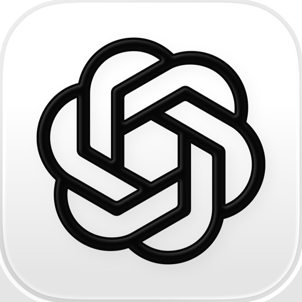

Introducing ChatGPT for iOS: OpenAI’s latest advancements at your fingertips.

This official app is free, syncs your history across devices, and brings you the latest from OpenAI, including the new image generator.

With ChatGPT in your pocket, you’ll find:

· Image generation–Generate original images from a description, or transform existing ones with a few simple words. 
· Advanced Voice Mode–Tap the soundwave icon to have a real-time convo on the go. Settle a dinner table debate, or practice a new language. 
· Photo upload—Snap or upload a picture to transcribe a handwritten recipe or get info about a landmark. 
· Creative inspiration—Find custom birthday gift ideas or create a personalized greeting card.
· Tailored advice—Talk through a tough situation, ask for a detailed travel itinerary, or get help crafting the perfect response. 
· Personalized learning—Explain electricity to a dinosaur-loving kid or easily brush up yourself on a historic event.
· Professional input—Brainstorm marketing copy or map out a business plan.
· Instant answers—Get recipe suggestions when you only have a few ingredients.

Join hundreds of millions of users and try the app captivating the world. Download ChatGPT today.

Terms of service & privacy policy:
https://openai.com/policies/terms-of-use
https://openai.com/policies/privacy-policy

#### shop__all_your_favorite_brands
## Shop: All your favorite brands

Shop brands you love:

- Shop big brands and local stores, and follow your faves
- Get notified about special offers, price drops, restocks, and new product drops
- Save items for later and organize things into collections (like “camping gear” or “ideas for dad”)
- Just so you know: brands don’t pay extra to sell on Shop, which means each time you buy, you’re helping out the business

Check out with one tap:

- Your payment info, shipping address, and shopping preferences all live in your secure Shop Pay wallet
- Just tap to check out (no more getting up to go find your card)
- Every shopping cart from every store is saved on Shop, so it’s all there when you’re ready to check out
- Just so you know: your info is safe with Shop, which meets strict PCI compliance standards

Track all your orders:

- See every order from every store you buy from
- Map exactly where each package is now
- Shop can even scan your email for new order info and collect it for you in the app (no more searching your inbox for updates)


- - -

Have a question or just want to say hello? Contact us by visiting help.shop.app

Shop secure and worry free: Our servers meet strict PCI compliance standards for vaulting credit card info.

Powered by Shopify: Shop was created by the commerce platform trusted by millions of businesses worldwide.

#### google_gemini
## Google Gemini
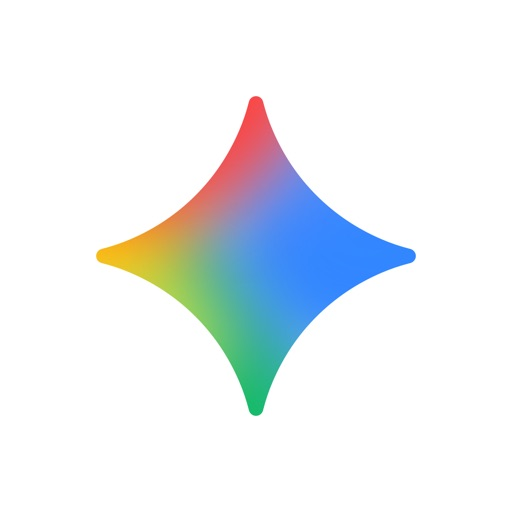

Google Gemini app is your personal, proactive and powerful AI Assistant.

With Gemini on your iPhone or iPad, you can:

- Go Live with Gemini to brainstorm ideas, simplify complex topics, and rehearse for important moments. Just click on the Gemini Live button in your Gemini app
- Connect with your favorite Google apps like Search, YouTube, Google Maps, Gmail, and more
- Study smarter and explore any topic with interactive visuals and real-world examples
- Turn any file into a podcast that you can listen to anytime, anywhere
- Create stunning images from just a few words
- Plan trips better and faster
- Get summaries, deep dives, and source links, all in one place
- Brainstorm new ideas, or improve existing ones

Try Nano Banana: state of the art image generation and editing built on Gemini 2.5 Flash

Level-up your Gemini app experience by upgrading to the Pro plan–unlock new and powerful features to tackle complex tasks and projects and enjoy industry-leading 1M token context window (enabling Gemini to process up to 1,500 pages of text or 30k lines of code), and:
- Get more access our most powerful model, like 2.5 Pro
- Generate and dive into detailed reports on any topic with Deep Research powered by 2.5 Pro
- Turn words into high-quality, 8 second video clips with video generation with Veo 3.1, and more.

Google AI Pro is available in 150 countries and territories, and includes additional benefits. Gemini app, as part of Google AI Pro, will continue to be available to qualifying Google Workspace business and education plans. Learn more: https://gemini.google/subscriptions/

Get the best of Gemini app by upgrading to the Ultra plan–unlock the highest level of access and exclusive features to turn anything into anything. Get the highest access to Google’s most powerful model, like 2.5 Pro, features like video generation with Veo 3.1, Deep Research on 2.5 Pro, and unlock Gemini 2.5 Deep Think. You’ll also get early access to try our newest AI innovations as they become available, including Agent Mode.

Gemini in Google AI Ultra is available in the US and includes additional benefits as part of a Google AI Ultra subscription. Google AI Ultra is not currently available to Google Workspace business and education customers. Learn more: https://gemini.google/subscriptions/

The Google Gemini mobile app is available in select languages and countries. Learn more:
g.co/gemini/iosrequirements

Gemini Live feature availability varies based on language.
g.co/gemini/ioslanguages

While Gemini can help you with many tasks like checking the weather, giving directions, finding and summarizing information across the web and apps, Gemini does not yet support device actions like setting an alarm, sending a text message, and others on iOS.

Review the Gemini Apps Privacy Notice:
g.co/gemini/privacynotice

#### dick’s_sporting_goods
## DICK’S Sporting Goods

DICK’S Sporting Goods gives you access to exclusive deals, app-only sneaker and product launches, plus the latest sports gear, clothing and shoes from your favorite brands. 

Features:

Shop: Shop anytime, anywhere or find a store near you. 

Move: Earn ScoreCard Points for achieving your activity goals each day by integrating with Apple Health, Garmin, Fitbit and MapMyRun. Hit daily goals just by walking/moving!

Earn Points, Get Rewards: Manage your ScoreCard account, track Points and Rewards, plus scan to earn when shopping in-store.

Favorite: Save your favorites to a wishlist for later or to share with friends and family. 

Every Season Starts at DICK’S.

#### hbo_max__stream_movies___tv
## HBO Max: Stream Movies & TV

The most talked about shows and movies featuring the worlds of HBO, the DC Universe, Adult Swim, A24, and beyond.

With HBO Max you'll get:
• Access to thousands of TV shows and movies.
• Exclusive, award-winning series that everyone's talking about — like the HBO Originals The Last of Us, Succession, The White Lotus, and House of the Dragon.
• The latest hits from HBO, Harry Potter, DC, Warner Bros., ID, Adult Swim, A24, and more.
• Stream select live sports from your favorite leagues and teams. Availability varies by plan and by subscription provider.
• Iconic favorite TV shows like Friends, Rick and Morty, Gossip Girl, 90 Day Fiancé, Looney Tunes, and more.
• Family-friendly entertainment for the whole household.
• Fascinating documentaries and true crime series.

Features:
• Enjoy your favorite shows and movies at home or on the go. HBO Max is available on select TV, web browser, mobile, tablet, and gaming console devices.  
• Catch even more sports action with the live Multiview experience — stream up to 3 games at once during select events.
• Browse or search with ease across HBO, movies, series, genres, and brands.
• Download shows and movies you love to watch on the go with select plans. (Download limits vary by plan.)
• Personalized profiles for the entire household with customizable ratings, profile PIN protection, and kid-proof exit.
• Pick up episodes and movies where you left off across your favorite devices.
• Keep up with everything you love, all in one place with My Stuff.
• Watch on multiple devices at the same time. (Limits vary by plan.)
• Stream with high-quality video and surround sound on select plans.

Content and feature availability on HBO Max may vary by region. Some titles and features shown above may not be available in your country. Language availability varies by country.

Your subscription will automatically renew at the then-current price of your plan unless auto-renew is turned off at least 24 hours before the renewal. Your App Store account will automatically be charged at the same price for renewal within 24 hours prior to the end of the current subscription period. You can manage or cancel your subscription by visiting the App Store app or Subscriptions under Settings on your Apple device after purchase.

Purposes disclosed in the App Privacy label may vary based on features or services that may not be available in all regions. HBO Max is only available in certain territories.

Terms of Use: https://hbomax.com/terms-of-use

#### threads
## Threads

Say more with Threads — Instagram’s text-based conversation app.

Threads is where communities come together to discuss everything from the topics you care about today to what’ll be trending tomorrow. Whatever it is you’re interested in, you can follow and connect directly with your favorite creators and others who love the same things — or build a loyal following of your own to share your ideas, opinions and creativity with the world!

A few things you can do on Threads…

■ Access your Instagram followers
Your Instagram username and verification badge are reserved for you. Automatically follow the same accounts you follow on Instagram in a few taps, and discover new accounts too.

■ Share your point of view
Spin up a new thread to express what's on your mind. This is your space to be yourself, and you control who can reply.

■ Connect with friends and your favorite creators
Jump to the replies to get in on the action and react to commentary, humor and insight from the creators you know and love. Find your community and connect with people who care about whatever it is you’re interested in.

■ Control the conversation
Customize your settings and use controls to manage who can see your content, reply to your threads, or mention you. Accounts you’ve blocked will carry over from Instagram, and we’re enforcing the same Community Guidelines to help ensure everyone interacts safely and authentically. 

■ Find ideas and inspiration
From TV recommendations to career advice, get answers to your questions or learn something new from crowd-sourced conversations, thought leaders and industry experts.

■ Never miss a moment
Stay on top of the latest trends and live events. Whether it’s about new music, movie premieres, sports, games, TV shows, fashion, or the latest product releases, find discussions and receive notifications any time your favorite profiles start a new thread.

■ Leap into the fediverse
Threads is part of the fediverse, a global, open, social network of independent servers operated by third parties around the world. Servers share information with each other to enable people to connect and discover new things across the fediverse.

Meta Terms: https://www.facebook.com/terms.php
Meta Privacy Policy: https://privacycenter.instagram.com/policy
Threads Supplemental Privacy Policy: https://help.instagram.com/515230437301944
Threads Supplemental Terms: https://help.instagram.com/769983657850450
Instagram Community Guidelines: https://help.instagram.com/477434105621119
Consumer Health Privacy Policy: https://privacycenter.instagram.com/policies/health

Learn how we're working to help keep our communities safe across Meta technologies at the Meta Safety Center: https://about.meta.com/actions/safety

#### best_buy__tech_deals___savings
## Best Buy: Tech Deals & Savings
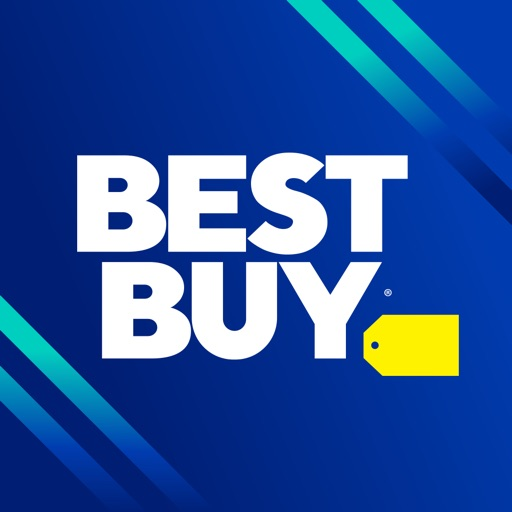

Get the best deals on appliances, electronics and more at Best Buy. We’ve simplified tech shopping, with warp-speed checkout, Curbside Pickup, limited runs, and can't-miss deals. Whether you’re in the market for the latest gadgets, electronics or essential appliances, Best Buy provides everything you need at your fingertips.

Find shopping deals and sales on everything you need. Best Buy is your ultimate deal finder, making sure you get what you need at the best prices. We've got tech surprises in all sizes. View ratings and reviews as you browse our huge selection of today's top tech and toys.

Shop from home or enhance your in-store experience. Pick up in store, or have your order delivered to your car through Curbside Pickup. You can use the app to let us know you're on the way, and we'll have it ready. Wondering how it’ll look in your space? AR before you buy, right from the app.

From cutting-edge tech to essential home appliances, explore today’s top products:
•	Smart TVs, laptops and gaming consoles
•	Kitchen appliances, blenders and coffee makers
•	Home security systems and smart home devices
•	Headphones, speakers and soundbars
•	and much more!

Deal finder & sales
•	Find sales on electronics, gadgets and appliances
•	Deal of the day comes with huge savings on the latest tech
•	Get exclusive shopping deals with a My Best Buy membership
•	Deal Alerts: Receive real-time notifications about the best sales on appliances, electronics, and must-have gadgets.

Shop with the best experience
•	24/7 Access: Shop for electronics and appliances anytime, anywhere, right from your device.
•	Augmented reality: Visualize how products will fit in your space using our AR feature before you buy.
•	Curbside convenience: Enjoy fast curbside pickup by notifying us when you're on your way and we’ll have your order ready.
•	Order tracking: Stay informed with real-time tracking for all your orders and deliveries.

Appliances from top brands
•	Shop major appliances for the kitchen, washers & dryers, vacuums and more
•	Appliance parts and accessories help make updating and maintaining a breeze
•	Shop from top brands 

Electronics for Everything
•	We have the electronics you need at the best price
•	Find sales on the latest tech for home, auto, and everything in between
•	Shop from major brands 

Get all the details. Browse products available now at stores near you. Track orders and deliveries. Scan and shop. And find nearby service options and store details — including popular times to shop.

Get it all with the gotta-have app for gotta-have tech.

#### temu__shop_like_a_billionaire
## Temu: Shop Like a Billionaire
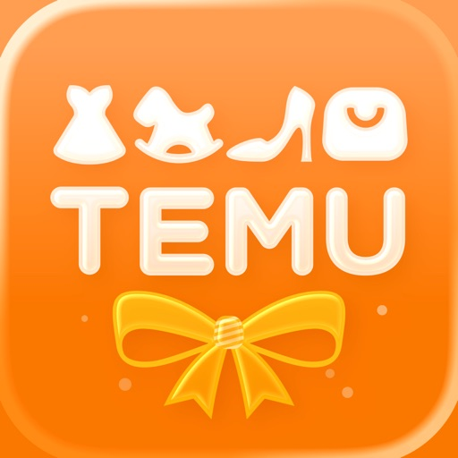

Shop on Temu for exclusive offers. 

No matter what you're looking for, Temu has you covered, including fashion, home decor, handmade crafts, beauty & cosmetics, clothing, shoes, and more.

Download Temu today and enjoy incredible deals daily.

WIDE SELECTION
Discover thousands of new products and shops.

CONVENIENCE
Fast and secure checkout.
Free shipping & returns within 90 days.
*Other conditions may apply

Visit temu.com or follow us on:
Instagram: https://www.instagram.com/temu/
TikTok: https://www.tiktok.com/@temu 
Facebook: https://www.facebook.com/shoptemu
Youtube: https://www.youtube.com/@temu

#### capital_one_shopping__save_now
## Capital One Shopping: Save Now

100% free for everyone – no Capital One bank or credit card account required! Get free automatic coupons and exclusive savings on the go.
Bonus will be awarded as Capital One Shopping Rewards. Rewards will be issued within 30 days of completing all sign up bonus requirements but may take longer in some cases. Additional terms apply.

AUTOMATICALLY APPLY COUPONS
- The free tool works in the background to find coupons and promo codes
- It then automatically applies coupons and promo codes at checkout

EARN FREE SHOPPING REWARDS
- Earn rewards when you shop at your favorite stores
- Redeem rewards for gift cards!

COMPARE PRICES
- The app looks for a better price on the items you are searching for
- Includes shipping and handling when finding a better deal

GET NOTIFIED OF PRICE DROPS
- You'll be notified when items you want go on sale or are found elsewhere for less

SAVE IN SAFARI
- Save on the Web, too!
- Add to Safari and get free automatic coupons and rewards

Over 10 million people globally save with Capital One Shopping! Join this exclusive club today for free!

#### google
## Google
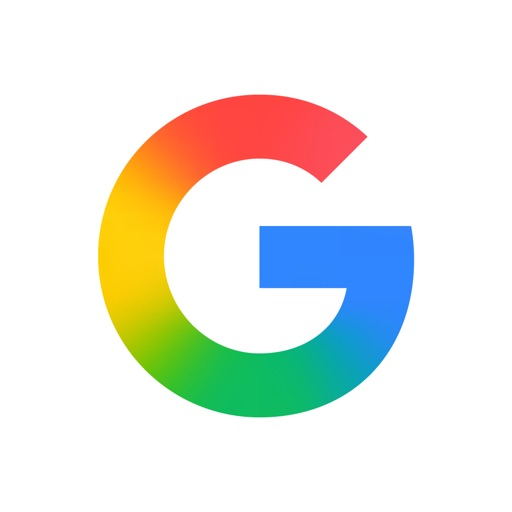

Download the Google app to stay in the know about things that matter to you. Try AI Overviews, find quick answers, explore your interests, and stay up to date with Discover. The more you use the Google app, the more it’s tailored to you.

Feature highlights:

• Image Search: See something you like? Snap a photo and discover where to shop for it, find related images, and more. Refine your camera searches by adding words – whether you want those shoes but in ‘blue’, or want to learn how to ‘repair’ that broken bit on your bicycle.
• Hum to Search: Can't remember the name of that song? Hum the tune and the Google app will identify it for you.
• Discover: Stay up-to-date on topics that matter to you. Get personalized news, articles, and videos based on your interests and search history.
• Try AI Overviews: We’re making search smarter and simpler with generative AI. Try searching things like ‘how to cut onions without crying’ or ‘how to fix a broken zipper’ and AI Overviews will find what you’re looking for in faster, easier ways.
• Google Search Widget: Search from your home screen or lock screen with the new Google widget. Choose from 2 widgets, giving you a quick search bar in both sizes, and shortcuts to choose how you Search with Lens, Voice, and Incognito in the medium size widget.

Search what you see with Google Lens:

• Use your camera to identify what you’re looking at. Identify plants and animals, translate text in real-time, find similar products to buy, and even solve math problems with step-by-step guides.
• Translate over 100 languages on things like road signs when you travel, menus, and more by pointing your camera at text.
• Reverse image search: Find the source, similar photos, and related information for any image.
• Socratic app functionalities like step-by-step homework help on math, physics and word problems, and testing your knowledge with Questions and Answers are now fully supported within the Google app.

Get personalized updates in Discover:

• Stay in the know about topics that interest you.
• Start your morning with weather and top news.
• Get real-time updates on sports, movies, and events.
• Know as soon as your favorite artists drop new albums.
• Get stories about your interests and hobbies.
• Follow interesting topics, right from Search results.

Search safely and securely:

• All searches in the Google app are protected by encrypting the connection between your device and Google.
• Privacy controls are easy to find and use. Tap your profile picture to access your menu and delete recent search history from your account with one click.
• Search proactively filters webspam to help ensure that you see safe, high-quality results.

Learn more about what the Google app can do for you: https://search.google/

Privacy policy: https://www.google.com/policies/privacy

Your feedback helps us create products you'll love. Join a user research study here:
https://goo.gl/kKQn99

#### hallow__prayer___meditation
## Hallow: Prayer & Meditation

** The #1 Prayer App & #1 Catholic App **

WHAT IS HALLOW
Hallow is a Christian prayer app that offers audio-guided meditation sessions to help us grow in our faith & spiritual lives and find peace in God. Explore over 10,000 different sessions on contemplative prayer, meditation, Catholic Bible readings, music, and more.

In today’s world, we’re stressed, anxious, distracted, & can’t sleep. At the same time, we’re searching for deeper meaning, purpose, & relationships. We believe these two challenges can be addressed with the same solution: peace in Jesus. In the end, after all, a halo in heaven is the goal :)

WHAT YOU GET
* Daily prayers: Pray daily across methods including 3 of our most popular - Lectio Divina (on the Daily Readings), the Rosary, & the Divine Mercy Chaplet
* Christian Meditation: This can seem similar to mindfulness meditation in learning to be comfortable in silence, but the difference is the goal is never to remain in ourselves, but always to lift our hearts & minds to God, to talk with Him, listen to Him, & recognize His presence with us
* Sleep Bible Stories: Try Night Prayer from Liturgy of the Hours / Daily Office, and Catholic Bible stories read by folks like Jonathan Roumie from the Chosen or Fr. Mike Schmitz from the New American Bible
* Rosary: Meditate with Mary through the mysteries of the Catholic Rosary and other devotionals
* Ignatian Examen: Reflect on your day & discover an awareness of God, Jesus Christ, & the Holy Spirit
* Lectio Divina: Enter into a conversation with God through Bible passages / Scripture
* Taizé & Traditional Chant: Meditative chant & music
* Community: Match your prayers to the season with the Pray40 Lent Challenge, starting Ash Wednesday, or our Pray25 Advent Challenge for Christmas
* Homilies & Guests: From Father Mike Schmitz, and on topics on being a Catholic Dad, St. Augustine & more!
* Praylists: Sessions on joy, humility, discernment, or stress / anxiety / calm
* Challenges: Re-discover the Our Father, Stations of the Cross, Psalms, and Saints - or start with the Intro 9 Day Novena
* Litanies & Novenas: Try out the Litany of Humility, the 54 Day Novena, and more!
* Pray like a Champion today: Athlete Prayers
* Minute Meditations: Jesus, I Trust in You, Angelus, Rosary Decade, St. Michael the Archangel prayer and more!

Additional features to help customize your prayer experience:
* Journal after every prayer
* Choice of 50+ guides
* Options for 3 different lengths for every prayer (typically 5, 10, or 15 minutes)
* Ability to set prayer reminders
* Option to include calming background music like Gregorian Chant
* Ability to download sessions for offline listening
* Join a Hallow Family to share prayer intentions and prayer reflections with one another

As Hallow is a Catholic App (#1 among Catholic Apps), the content is developed by experienced Catholic theology and spirituality guides and reviewed by senior leaders within the Church (e.g., PhD’s, professors, Bishops, authors) and based on content from the approved Catholic Bible. We were also featured on EWTN. While it can be a beautiful app for Catholic men and women, it is meant as a resource for people of all faiths & religions.

SUBSCRIPTION PRICING AND TERMS
Users can access our daily prayers (including the rosary) and the 9-day Intro Prayer Challenge for free.
To access the full suite of Hallow, Hallow offers two auto-renewing subscription options:
$9.99 per month
$69.99 per year

These prices are for United States customers.

Your Hallow subscription will renew automatically unless auto-renew is turned off at least 24 hours before the end of the current period. You can go to your Apple account settings to manage your subscription and turn off auto-renew. Your account will be charged when the purchase is confirmed. Hallow also integrates with the Apple Health app to sync mindfulness minutes.
Terms and conditions: https://hallow.com/terms-of-service
Privacy policy: https://hallow.com/privacy-policy

#### grok
## Grok

Grok is an AI-powered assistant, developed by xAI, designed to be maximally truthful, useful, and curious. Get answers to any question, generate striking images and videos, and let Grok search the web and X for you to gain a deeper understanding of the world. With Grok, the universe is in your hands!

AI assistant
- Ask anything and get fast replies, have Grok do deep research on the web for you, or solve the hardest problems in math, science, and coding with Grok 4.
- Upload documents and photos, or paste links in the chat to have Grok analyze or help you understand the content.

Grok Imagine
- Imagine is a new, super fast, groundbreaking AI image and video generation experience. 
- Generate 6-second videos with sound from text prompts, and turn static photos into videos.
- Generate AI images using only your voice.

Grok Voice Mode
- Talk to Grok using your voice and get natural sounding replies as if you’re having a conversation with a human.
- Live Camera: If you want Grok to see what you see, you can use Voice Mode with Live Camera to share your view in real-time.
- Personalize your AI Assistant and choose between different personalities, like Assistant, Romantic, Storyteller, and more.

Grok AI Companions
- Have a chat with Ani, Rudi, or Valentine, our animated AI characters, each bursting with personality,
- Rudi is a cheeky red panda with a sense of humor that you can banter with.
- Valentine is a romantic male with poetic charm, perfect for deep and soulful conversations. 
- Ani is a charmer who blushes and sends hearts as your bond grows.

Real-time info from X
- With access to X (previously Twitter) and web data, Grok is the AI assistant with the most up-to-date information, keeping you informed about the latest news and trends in the world, for any given topic.
- You can also ask Grok to do advanced searches for you on X, letting you dive even deeper into what’s happening and what people are saying.

Create and edit images
- Generate striking images from simple text prompts, or upload images and ask Grok to edit them.
- Remove objects, change the scenery, or apply any art style, like Ghibli or Anime.

With Grok as your copilot and personal AI assistant, navigating the vast expanse of knowledge becomes exciting! Tap into X’s live trends, fire off bold questions, have fun conversations with AI Companions, or use the new AI image and video generation tool Imagine to explore your boundless creativity.

Terms of Service: https://x.ai/legal/terms-of-service
Privacy Policy: https://x.ai/legal/privacy-policy

Grok by xAI

#### capcut_-_video_editor
## CapCut - Video Editor

CapCut offers easy-to-use video editing functions, in-APP fonts and effects, advanced features such as keyframe animation, smooth slow-motion, chroma key, and stabilization, to help you capture and snip moments.

Create fancy videos with other unique features: auto captions, text-to-speech, motion tracking, and background removal. Show your personality and go viral on TikTok, YouTube, Instagram, WhatsApp, and Facebook!

FEATURES
Basic video editing
• Trim and shorten clips and split or merge videos.
• Adjust video speed from 0.1x to 100x, and apply speed curves to clips.
• Animate video clips with incredible zoom in/out effects.
• Highlight the best moments with the freeze feature.
• Explore transition options with awesome effects on and between clips.

Advanced video editor
• Keyframe video animation is available for all settings.
• Edit videos to create smooth slow-motion with the optical flow feature and speed curve tool.
• Use the chroma key to remove specific colors from videos.
• Easy to arrange and preview clips on multi-track timeline.
• The stabilizing feature keeps video footage steady.

Intelligent features
• Auto captions: automate speech recognition and subtitles in videos.
• Text-to-speech: apply text-to-speech in multiple languages and voices.
• Background removal: automatically remove backgrounds.

Text & Stickers
• Add text to videos with different fonts and styles, choose unique text templates. Fonts can be imported locally.
• Subtitles can be added to the timeline of video tracks and can be moved and adjusted in one step.

Trending Effects & Filters
• Match video content with diverse filters that are updated weekly with the latest trends.
• Edit videos with hundreds of trending effects, including Glitch, Blur, 3D, etc.
• Add movie-style video filters or adjust video brightness, contrast, etc.

Music & Sound Effects
• Add millions of music clips and sound effects to videos.
• Extract audio, clips, and recordings from videos.

Easy to Share
• Custom video export resolution, HD video editor supports 4K 60fps exports and smart HDR.
• Adjust the format and share with your friends on social media platforms.

CapCut is an all-in-one video editor and video maker application with everything you need to create stunning, high-quality videos. Beginners can get started with CapCut in a matter of seconds, while advanced users can enjoy all the functions they need to edit videos. 

Terms of Service —
https://www.capcut.com/clause/terms-of-service

Privacy Policy —
https://www.capcut.net/clause/privacy

Contact Us
Any questions about CapCut? Please contact us at capcut.support@bytedance.com.
Facebook: https://www.facebook.com/capcutapp
Instagram: https://www.instagram.com/capcutapp
YouTube: https://www.youtube.com/capcutofficial
TikTok: https://www.tiktok.com/@capcut

#### walmart__shopping___savings
## Walmart: Shopping & Savings

Save money. Live better. 

The Walmart app is the easiest way to shop for everything on your list, including fresh groceries, household essentials, the latest tech and a lot more. Plus, our convenient pickup, delivery and shipping options make it a breeze to get your order exactly when you want it, whether you’re shopping in-store or on the go.
 
Convenient ways to get your items: 

Pickup 
Swing by the store to collect your order curbside—we’ll even load your car. 

Delivery 
From a local store straight to your door. For those need-it-now moments, choose Express delivery to get your order in as little as one hour.* 
*Restrictions and fees apply. 

Shipping 
Fast two-day shipping, dropped off by FedEx or UPS. Eligible orders over $35 ship free! 

Even more time-saving features you’ll love: 

Store maps 
When you’re in-store, open the app to find items fast. 

Real-time order tracking 
Get live order updates sent straight to your phone and track order status any time from the homepage. 

Reorder your essentials 
Quickly and easily fill your cart with frequently purchased items. 

Shopping lists 
Create, share and add to lists to prepare for any occasion. 

Walmart Pay 
Easily check out using all your payment methods. Just tap "Pay” and we’ll recommend how to split your total to make the most of your cards and balances. 

Curbside check-in 
Check in with the app when you’re ready to pick up your order and we’ll bring it out to you. 

Barcode scanner 
Scan items to check prices and build lists. 
 
Pharmacy 
Refill, transfer, manage and pick up your family’s prescriptions. Plus, schedule vaccinations, locate testing sites and more. 

Walmart+ members—our app is the easiest way to get the most out of your membership. App-exclusive features for Walmart+ include: 
Scan & go 
Use your phone to shop in-store and check out contact-free. 

Member prices on fuel 
Get up to 10¢ off every gallon at 14,000+ locations nationwide**— including Exxon and Mobil stations! 
**Fuel discount varies by location and station, subject to change

#### amazon_shopping
## Amazon Shopping

Amazon Shopping offers app-only benefits to help make shopping on Amazon faster and easier. Browse, view product details, read reviews, and purchase millions of products. Amazon delivers to 100+ countries in as quickly as 3-5 days. Whether you’re buying gifts, reading reviews, tracking orders, scanning products, or just shopping, the Amazon Shopping app offers more benefits than shopping on Amazon via your desktop.   

Never miss a delivery
Get real-time tracking and delivery notifications so you know where your package is and when it arrives. 

Know exactly what you’re purchasing
Full 360° product view lets you see items from every angle. “View in you room” makes sure it fits by using your phone’s camera and VR so you can see it in your space. 

We’ll notify you when items go on sale
Just tap the heart icon to save items to Your Lists and we’ll alert you of price drops so you don’t miss a deal. 

Never forget your password
Save time by staying securely signed in. If you prefer to sign out, use facial or fingerprint identification to sign back in. 

Connect with us when it works best for you
Live chat support is open 24 hours, 7 days a week. Once you’ve started a chat, it stays that way for 24 hours so you don’t have to start your support session from the beginning. 

We’ll find that item for you
Not sure of an item’s brand or where to but it? Just tap the scan icon in the search bar, take a picture of the item or its barcode, and we’ll find it for you. 

In order to provide a rich experience and enable features such as voice shopping, notifications, visual search, customer reviews, and authentication this app may request permission to access contacts, camera, microphone, notification, touch id, photos and Bluetooth.

Amazon Shopping is available in English, Spanish, German, and Simplified Chinese. In addition to International Shopping, you can change your settings in this single app to shop Amazon.ca, Amazon.co.uk, Amazon.de, Amazon.fr, Amazon.com, Amazon.it, Amazon.es, Amazon.cn, Amazon.co.jp or Amazon.in.

For customers located within the European Union, United Kingdom or Brazil: By using this app, you agree to Amazon’s Conditions of Use applicable for your country. Please also see the applicable Privacy Notice, Cookies Notice and Interest-Based Ads Notice for your country. Links to these terms and notices can be found in the footer of your local Amazon homepage.

For all other customers: By using this app, you agree to the applicable Amazon Conditions of Use (e.g. www.amazon.com/conditionsofuse) and Privacy Notice (e.g. www.amazon.com/privacy) for your country. Links to these terms and notices can be found in the footer of your local Amazon homepage.

If your device supports TrueDepth technology, the app will use your device camera to detect your facial movements only while using certain features such as virtually try-on products like sunglasses. All information processed using this technology remains on your device and is not otherwise stored, processed or shared by Amazon.

#### shein_-_shopping_online
## SHEIN - Shopping Online
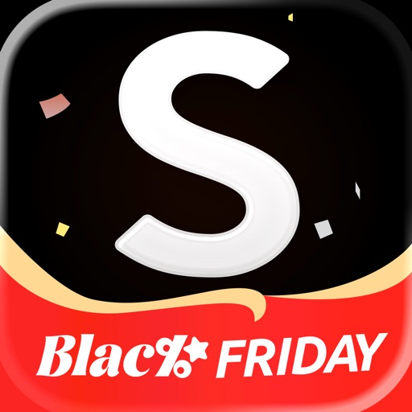

Everything you love, now at your fingertips!

SHEIN is a fun and ultra-affordable online shopping platform. From fashion apparel to home, beauty, accessories, shoes and pets, plus electronics, tools, office and more, SHEIN is dedicated to meeting all your needs in life. We'll keep you in the loop with push notifications about new drops and more. You can also engage with other SHEIN lovers in real time. With free shippings and free returns policy, hope you have a pleasant journey with SHEIN!

Inspire yourself with SHEIN right now!

Save more
- Get an extra 30% off on your first order 
- Free shipping & free returns (*conditions apply)
- Daily Flash Sales: Score up to 90% off for countless items

Wide selections
- Fun, easy shopping with wide selections
- Browse by New Arrivals, Trends, Category, Best Sellers and more

Considerate services
- Get first access to sale alerts and promotional discounts
- Now accepting PayPal and major Credit Cards 
- Style now, pay later! Choose Afterpay to pay in 4 interest-free payments.
- 24/7 Customer Service and Live Chat available

Contact us:
URL: us.shein.com
Facebook: www.facebook.com/sheinus/
Instagram: www.instagram.com/shein_us/
Email: dispute@shein.com

The app needs the following access permissions when it is running on your device:

-	Optional permission(s):

o	Notification: it will allow us to send push notifications to your device.

o	Camera: the camera function is required when you need to capture photos and videos and upload them to the app.

o	Photo and video: it will enable you to upload photos and videos from your device to the app.

o	Location: where the relevant service is available, it enables location based services on your device. 
(This is not used in Korea.)

o	Calendar: it enables you to sync the SHEIN LIVE events to your device calendar. 

o	Microphone: when you try to capture videos using Camera function, the app will also need the microphone access permission to capture the voice. 

※ Even if you do not grant optional access permissions, you can still use SHEIN service, except for the functions related to those permissions.

#### gmail_-_email_by_google
## Gmail - Email by Google
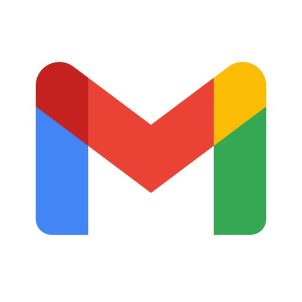

The official Gmail app brings the best of Gmail to your iPhone or iPad with robust security, real-time notifications, multiple account support, and search that works across all your mail.

With the Gmail app, you can:
• Make Gmail your default email app on iOS
• Use Gemini* in Gmail to summarize emails, craft or refine responses, or search your inbox to find what you’re looking for
• Automatically block more than 99.9 percent of spam, phishing, malware, and dangerous links from ever reaching your inbox
• Undo send, to prevent embarrassing mistakes
• Turn on Google Chat to connect, create and collaborate with others
• Get more done as a group in Spaces - a dedicated place for organizing people, topics, and projects
• Enjoy high quality video calling with Google Meet
• Respond to emails quickly with Smart Reply suggestions
• Switch between multiple accounts
• Get notified of new mail fast, with notification center, badge, and lock screen options
• Search your mail faster with instant results, predictions as you type, and spelling suggestions
• Organize your mail by labeling, starring, deleting, and reporting spam
• Swipe to archive/delete, to quickly clear out your inbox
• Read your mail with threaded conversations
• Auto-complete contact names as you type from your Google contacts or your phone
• Respond to Google Calendar invites right from the app

Gmail is part of Google Workspace, allowing you and your team to easily connect, create, and collaborate. You can:
• Connect with coworkers via Google Meet or Google Chat, send an invite in Calendar, add an action to your task list, and more without leaving Gmail
• Use suggested actions — like Smart Reply, Smart Compose, grammar suggestions, and nudges — to help you stay on top of work and take care of simple tasks, so you can be more efficient with your time
• Stay safe. Our machine learning models block more than 99.9% of spam, phishing, and malware from reaching our users

*Google One AI Premium subscription and internet connection required. Language and country availability may vary. Check responses for accuracy

#### tiktok_-_videos,_shop___live
## TikTok - Videos, Shop & LIVE

TikTok is THE destination for mobile videos. On TikTok, short-form videos are exciting, spontaneous, and genuine. Whether you’re a sports fanatic, a pet enthusiast, or just looking for a laugh, there’s something for everyone on TikTok. All you have to do is watch, engage with what you like, skip what you don’t, and you’ll find an endless stream of short videos that feel personalized just for you. From your morning coffee to your afternoon errands, TikTok has the videos that are guaranteed to make your day.

We make it easy for you to discover and create your own original videos by providing easy-to-use tools to view and capture your daily moments. Take your videos to the next level with special effects, filters, music, and more. 

■ Watch endless amount of videos customized specifically for you
A personalized video feed based on what you watch, like, and share. TikTok offers you real, interesting, and fun videos that will make your day.
 
■ Explore videos, just one scroll away
Watch all types of videos, from Comedy, Gaming, DIY, Food, Sports, Memes, and Pets, to Oddly Satisfying, ASMR, and everything in between.
 
■ Pause recording multiple times in one video
Pause and resume your video with just a tap. Shoot as many times as you need.
 
■ Be entertained and inspired by a global community of creators
Millions of creators are on TikTok showcasing their incredible skills and everyday life. Let yourself be inspired.

■ Add your favorite music or sound to your videos for free
Easily edit your videos with millions of free music clips and sounds. We curate music and sound playlists for you with the hottest tracks in every genre, including Hip Hop, Edm, Pop, Rock, Rap, and Country, and the most viral original sounds.

■ Express yourself with creative effects
Unlock tons of filters, effects, and AR objects to take your videos to the next level.

■ Edit your own videos 
Our integrated editing tools allow you to easily trim, cut, merge and duplicate video clips without leaving the app.

■ Discover and Shop with TikTok Shop
Explore trending products, exclusive deals, and seamless shopping experiences inspired by creators and brands you love—all in one place. Shop right from shoptab, videos or LIVEs without leaving the app, track your orders with ease, and enjoy a safe, secure shopping and transaction process.

■ Obtain access to LIVE benefits to better interact with hosts!
Choose from one-month subscription or auto-renewal subscription to enjoy special LIVE benefits (currently only available in limited regions)

Note: 
If you subscribe via Apple, payment will be charged to App Store Account at confirmation of purchase. Subscription automatically renews unless auto-renew is turned off at least 24 hours before the end of the current period. Account will be charged for renewal within 24 hours prior to the end of the current period at the rate of the selected plan. Subscriptions and auto-renewal may be managed by going to Account Settings after purchase.

Terms of Service —
https://www.tiktok.com/legal/terms-of-service

Privacy Policy —
https://www.tiktok.com/legal/privacy-policy

* Any feedback? Contact us at https://www.tiktok.com/legal/report/feedback or tweet us @tiktok_us

#### vizio_|_watchfree_
## VIZIO | WatchFree+

VIZIO Device Control and WatchFree+ FREE Live TV

Stream 300+ free live channels anywhere—no VIZIO TV required! Plus, control your VIZIO devices and discover entertainment, all through the VIZIO Mobile app.

WATCHFREE+ MOBILE: Free live channels, anytime, anywhere.
• Stream 300+ Free Live Channels: Watch news, sports, movies, and shows on your mobile device —no VIZIO TV needed
• Personalize Your Experience: Create favorite channels lists and get personalized recommendations
• Stay Connected: Keep up with local sports, news, and entertainment on the go
• Easy to Start: Just download the app and create a free VIZIO account to start watching
• Smart Navigation: Find what you want faster with the category jump feature
• Pick Up Where You Left Off: Seamlessly switch between devices when you start watching on a VIZIO TV

TV and ENTERTAINMENT CONTROL: Transform your phone into a powerful entertainment hub.
• Universal Search: Find what to watch across streaming services in one place
• Smart Recommendations: Discover new shows and movies based on your interests
• Voice Control: Launch apps and find content hands-free
• Save Time. Stream More: Organize apps and manage subscriptions in one location
• Share & Connect: Cast photos and videos to your TV with VIZIOgram

SOUNDBAR CONTROL: Fine-tune your audio experience right from your phone.
• Quick Audio Adjustments: Customize volume, bass, and treble with easy controls
• Preset Sound Modes: Optimize audio for movies, shows, music, and more
• Enhanced Listening: Enable features like ClearDialog and Night Mode for the perfect sound

———————————————————————
VIZIO Crave Speakers cannot output audio from TVs/displays or be connected as an additional channel to an existing sound bar or sound system. Additional supported SmartCast or Chromecast-enabled audio products are required (not included) for Multi-Room feature. Streaming different songs to different speakers at the same time is not supported when using a single app running on a single mobile device. To stream a different song to different speakers at the same time, you’ll need to stream from a different app or a separate mobile device.

The applications and content pictured herein or described on this page may only be available in certain countries and languages, may require additional fees or subscription charges, and may be subject to future updates, modifications, interruption and/or discontinuation of service without notice. VIZIO has no control over third party applications or content and assumes no responsibility for the availability or interruption of such applications or content. Additional third-party terms, conditions and restrictions apply. High-speed/broadband Internet service and access equipment are required and are not provided by VIZIO. Not all Google Cast-enabled apps are integrated with VIZIO SmartCast and may require additional steps to cast.

For help, please visit our Customer Help Center: support.vizio.com

Terms of Use: https://www.vizio.com/en/terms/account-terms
Privacy Policy: https://www.vizio.com/en/terms/privacy-policy

#### whatsapp_messenger
## WhatsApp Messenger

WhatsApp from Meta is a free messaging and calling app used by over 2 billion people across 180+ countries. It's super simple, reliable and private, making it perfect for staying in touch with your friends and family worldwide. WhatsApp works across mobile, tablet, and desktop even on slow connections, with no subscription fees*.

Private messaging and calls across the world

Your privacy is our priority. With end-to-end encryption, you can be sure that your personal messages and calls stay between you and who you send them to. And no one, not even WhatsApp, can read or listen to them.

Simple and secure connections, right away

All you need is your phone number - no usernames or logins needed. Easily view your contacts on WhatsApp and start messaging. And what's more, you can easily  link your other devices, including iPads, for seamless connectivity.

High quality voice and video calls

Enjoy free, secure video and voice calls with up to 32 people for free. Your calls work across devices, even on slower connections, using your phone or tablet’s Internet service.

Group chats to keep you in contact

Stay close to friends and family through end-to-end encrypted group chats and calls. Share messages, photos, videos and documents across mobile, tablet, and desktop. You can also use call links and screen-sharing to make group calls and collaboration easy.

Stay connected in real time

You can share your location with those in your individual or group chats while using WhatsApp on your mobile phone. Or record a voice message for those moments when just text isn't good enough.

Share daily moments through Status

Share your everyday life with those who matter. With Status you can share text, photos, video, and GIF updates that disappear after 24 hours. You're always in control of who sees your status. Just choose who you want to share it with - all your contacts or selected ones. And bring your everyday to life.

*Data charges may apply. Contact your provider for details.

---------------------------------------------------------------------------

If you have any feedback or questions, please go to WhatsApp > Settings > Help > Contact Us

Terms of Service: https://www.whatsapp.com/legal/terms-of-service 

Learn more about messaging privately: https://www.whatsapp.com/privacy 

Learn more about WhatsApp safety: https://www.whatsapp.com/security

#### sora_by_openai
## Sora by OpenAI

Turn your ideas into videos and drop yourself into the action.

Sora is a new kind of creative app that turns text prompts and images into hyperreal videos with sound using the latest advancements from OpenAI. A single sentence can unfold into a cinematic scene, an anime short, or remix of a friend's video. If you can write it, you can see it, remix it, and share it. Turn your words into worlds with Sora.

Explore, play, and share your imagination in a community built for experimentation.

What’s possible with Sora

Create Videos in Seconds
Start with a prompt or image and Sora generates a complete video with audio inspired by your imagination.

Collaborate & Play
Cast yourself or your friends in videos. Remix challenges and trends as they evolve.

Choose Your Style
Make it cinematic, animated, photorealistic, cartoon, or entirely surreal.

Remix & Make It Yours
Take someone else’s creation and put your spin on it - swap characters, change the vibe, add new scenes, or extend the story.

Find Your Community
Community features make it easy to share your creations and see what others are making.

Terms of use & privacy policy:
https://openai.com/policies/terms-of-use
https://openai.com/policies/privacy-policy

#### gowish_-_your_digital_wishlist
## GoWish - Your Digital Wishlist

What can GoWish be used for?
GoWish is your digital wishlist, where you can create and save all your wishes in one place. Download the GoWish app, create a profile, and add wishes that you can easily share with all your friends. The app makes it easy for your friends and family to reserve and purchase your wishes.

With the app, you can create your gift wishes wherever you are. You can add wishes to your wishlists from any online store in the world - there are no limitations.

Also, use the app to keep track of things you need to remember to buy for yourself.
It has never been easier to share a wishlist than with the GoWish app. Share wishlists with your friends using the app, share via SMS, WhatsApp, Messenger, email, or one of your other favorite media.

Avoid duplicate gifts:
One of the significant advantages of using the app is that you won't receive duplicate gifts for birthdays, Christmas, confirmations, weddings, etc. Your guests can see what is being reserved by other guests - without you, of course, being able to see it yourself.
You can use the GoWish app, or you can use GoWish through your browser. As a user, you always have your wishlist at hand. Easy and simple.

Super easy to use:
If you come across something you want, you can save it in two ways.

If it's on a website, you can save your wish directly with a single click on the wish button in your share-menu on your iPhone or iPad.
You can also copy the link to your gift wish and then go to the app and press "create wish automatically," paste the link, and the app takes care of the rest :)

We recommend that you use one of the two automatic methods to create your wishes, making it super easy for your friends to find and buy exactly what you want.
All your wishes end up in the same place and are accessible, whether you use the app on your iPhone, iPad, or log in to our website.

Benefits of using the digital universe og GoWish:

Easily create all kinds of wishes from all online stores worldwide
Save wishes online with just one click on the wish button
You can create all the wishlists you need
You can create a wishlist with your partner - e.g., a wedding wishlist
You can create wishlists on behalf of family members or friends
You can share wishlists digitally with your friends and family
Avoid wrong gifts or two of the same gift
Get inspiration from friends and family when exchanging wishlists
You can follow your friends' wishlists
You can find inspiration for your next wishlist from all the coolest brands

GoWish - wishes should be saved, not forgotten.

#### elfster__the_secret_santa_app
## Elfster: The Secret Santa App

The #1 Secret Santa App for Gift Exchanges, Wishlists & Holiday Planning

Elfster is the premier Secret Santa app that makes organizing gift exchanges effortless, fast, and completely free. Whether you're planning Christmas, Hanukkah, Eid Al-Fitr, birthdays, weddings, or any other special occasion, our Secret Santa generator and gift registry app features ensure perfect gift-giving every time.

Why Choose Elfster? Free, Easy & Fast Gift Exchanges
- 100% FREE: No hidden fees, subscriptions, or premium upgrades
- LIGHTNING FAST SETUP: Create your Secret Santa in under two minutes
- INCREDIBLY EASY: Simple interface that anyone can use
- WISHLISTS: Curate your own Wishlists with the products that you would love to receive

PERFECT FOR ANY OCCASION

Christmas & Holidays

Our Christmas gift list app helps you organize Secret Santa exchanges for family, friends, coworkers, and groups of any size. Also perfect for Hanukkah, Kwanzaa, Eid, and other holiday celebrations.

Birthdays & Special Events

Use our name drawing app for birthday gift exchanges, milestone celebrations, graduations, and "just because" moments throughout the year.

Weddings & Life Events

Create gift registries for weddings, baby showers, housewarmings, anniversaries, and other major life celebrations.

Office & Group Events

Organize workplace Secret Santa exchanges, team building events, and group celebrations with colleagues.

ELFSTER FEATURES:

Secret Santa Generator with Smart Exclusions

Our advanced secret santa generator ensures fair pairing while allowing you to:
- Set exclusions so couples don't draw each other
- Prevent kids from being paired with adults
- Exclude last year's matches for variety
- Handle groups of any size (from 3 to 300+ people)

Shareable Wishlists from Top Retailers

Create and share gift registry app Wishlists featuring products from:
- Amazon, Target, Nordstrom
- Local and specialty retailers
- Custom gift ideas and experiences
- Gift card options

Easy Invitations & Management
- Send invitations via text, email, or social media
- Cross-device compatibility (iPhone, Android, desktop)
- Real-time updates and notifications

Gift Discovery & Trending Items
- Browse trending gifts and popular items
- Curated gift guides for every occasion
- Price tracking and deal alerts
- Gift suggestions based on age, interests, and budget

HOW ELFSTER WORKS:

Step 1: Create Your Exchange 
- Set up your Secret Santa or gift exchange in minutes. Add participant names, set your budget, choose your event date, and configure any exclusions.

Step 2: Send Invitations 
- Invite friends and family via text, email, or your favorite messaging app.

Step 3: Draw Names & Create Wishlists 
- Our name drawing app automatically pairs everyone fairly. Participants create shareable wishlists with items from any retailer.

Step 4: Shop & Exchange Gifts 
- Browse wishlists, purchase gifts directly through retailer links, and mark items as purchased to avoid duplicates. Then… enjoy your gift exchange!

GIFT IDEAS & TRENDING ITEMS FOR 2025

Discover what's hot this gifting season with our curated collections:
- Tech Gifts: Latest gadgets, smart home devices, wireless accessories
- Fashion & Beauty: Trending apparel, skincare, jewelry, and accessories
- Home & Kitchen: Cookware, decor, organization, and smart appliances
- Books & Entertainment: Bestsellers, streaming subscriptions, games
- Kids & Family: Educational toys, family games, outdoor activities
- Personalized Gifts: Custom items, photo gifts, and unique experiences

Start your free Secret Santa gift exchange today with Elfster—the ultimate secret santa app that makes gift-giving easy, fast, and fun!

If you have any trouble at all with the app, we are here to help! Visit our Help center for answers to the most common questions at https://help.elfster.com/knowledge.

#### target
## Target

Get fresh deals and Target Circle offers, free Drive Up for curbside pickup, same-day delivery and easy returns, all with just a tap.

Everything you love about Target is just a tap away.

Free Drive Up: Just check out with Drive Up and we’ll bring your order out to your car, we’ll even load the trunk, no extra charge.

Same-Day Delivery from Target & More Local Stores: Score unlimited same-day delivery on orders over $35 with a Target Circle 360™ membership, or just pay $9.99 per delivery.

Target Circle Deals: Browse hundreds of exclusive Target Circle deals, and scan barcodes as you shop so you never miss a way to save.

Just-For-You Bonuses: Earn with Target Circle rewards and save with personalized deals.

Save & Pay in a Snap: At checkout, just scan your Wallet barcode to stack all your savings, Target Circle deals, gift cards and even 5% off with your Target Circle™ Card.

Plan Ahead, Shop Smarter: Build your list ahead of time, find your items in the aisles and spot what’s on sale before you even walk in.

Check Stock Before You Go: Know what’s available at your store, see top-rated finds, and read real reviews from fellow shoppers.

Shop by Category for Everything You Need: With the Target app, you can easily shop by category, whether you’re looking for food & beverage, essentials & beauty, apparel & accessories or home & electronics. Just tap to find everything you need in one spot.

See It in Your Space: Place furniture and decor in your space before you decide to buy, making shopping for your space easy and fun.

Virtual Try-On: See how beauty products and accessories look on you with our virtual try-on feature, no guesswork, just confidence in your picks.

Shop Target-Owned Brands: You’ll find groceries, electronics and all the everyday essentials from Target’s own brands, like Good & Gather, up&up and Heyday.

Designer Collections You’ll Love: We team up with top designers to bring you limited-edition home decor and more.

Download the Target app and unlock savings, surprises, and a little everyday joy, every time you shop.

#### disney_
## Disney+

Disney+ is the streaming home of your favorite stories. With beloved movies and series from Disney, Pixar, Marvel, Star Wars, National Geographic, there's always something to explore. Stream the latest movie releases, exclusive Original series, and highly anticipated matchups all in Disney+.

Stream Originals like Marvel Studios’ Loki and fan favorites like Encanto and The Simpsons.

With a Disney+ subscription plan you will get to experience:
• Exclusive new Originals from Disney, Pixar, Marvel, Star Wars, and National Geographic.
• Access to new releases, timeless classics, and past seasons of your favorite TV shows.
• A live feed of ABC News and Streams that offer carefully curated, continuous programming based on seasonality or interest, from across the Disney+ library*
• Over 100 titles in 4K UHD and HDR.
• The ability to watch on multiple screens at once at no extra cost.
• Multiple parental control features including Profile PIN and Kid-Proof Exit. Easily adjust a profile’s Content Rating settings for a viewing experience that suits everyone
• IMAX Enhanced, see the full scale and scope with IMAX's expanded aspect ratio. Available with certain Marvel and Pixar titles and accessible on all devices where Disney+ is supported.
• A curated selection of unlocked Hulu content in the Hulu hub within the Disney+ app.**
• A curated selection of highly anticipated live sports events, ESPN Originals, and studio programming in the ESPN hub within the Disney+ app**

For help with Disney+, please visit: http://help.disneyplus.com
For our Subscriber Agreement and other policies please visit: https://disneyplus.com/legal/subscriber-agreement
Your California Privacy Rights: https://www.disneyplus.com/legal/your-california-privacy-rights
Do Not Sell My Information: https://www.disneyplus.com/legal/privacy-policy

The content available on Disney+ may vary by region. Some titles shown above may not be available in your country.

*Select Streams are currently available only with the Disney+ Premium plan. ABC News is not rated and will require a profile's Content Rating settings to be set to TV-MA. All other Streams are rated on a program-by-program basis.

**Content subject to change. U.S. residents, 18+ only. A limited selection of content from Hulu and ESPN+ are now available to all Disney+ subscribers. To access the full ESPN+ on Disney+ and Hulu on Disney+ experiences, you must bundle those services with your Disney+ subscription.

#### google_chrome
## Google Chrome

Chrome helps you do what’s possible on the web. Download the fast, secure browser by Google.

GET THE BEST OF GOOGLE IN CHROME

• SEARCH WITH GOOGLE - Search and get answers on Google fast. Use your voice to search hands-free.
• GOOGLE LENS - Search what you see on your screen or with your camera.
• GOOGLE TRANSLATE - Explore the web in 130+ languages. Translate entire sites in one click.

BROWSE WITH BEST-IN-CLASS SECURITY

• ENHANCED PROTECTION MODE - Browse confidently with the highest level of Chrome’s security.
• SAFETY CHECK - Get peace of mind with proactive safety alerts.
• GOOGLE PASSWORD MANAGER - Securely generate and save passwords for fast sign-in, and get alerts if your passwords are at risk.

ACCESS YOUR CHROME ACROSS DEVICES

• SYNC ACROSS DEVICES - Save your things (like bookmarks, tabs, and passwords) and easily access them when you sign in to Chrome on your phone, computer or tablet.
• TAB GROUPS - Create tab groups to stay organized across devices.
• AUTOFILL - Save time typing by autofilling your saved payments, addresses and passwords.

#### paypal_-_pay,_send,_save
## PayPal - Pay, Send, Save

PayPal is a smart and secure way to shop in-store and online, earn cash back on brands you love, send money to friends and much more. Get started in the app.

SAVE OFFERS IN THE APP
Get cash back offers* from brands you love. We’ll automatically apply them at checkout.
*Eligible items only. Redeem points for cash or other options. Terms and exclusions apply: PayPal.com/rewards-terms

SEND AND REQUEST MONEY FOR FREE
Securely send and receive money with just about anyone in 120+ countries
It’s free to send and receive with friends & family in the US when funded by a bank account or PayPal balance

GET THE PAYPAL DEBIT CARD AND EARN CASH BACK
Request your card right in the app. No credit check required.
Shop with your PayPal balance everywhere Mastercard® is accepted.
Earn 5% cash back on a category you choose each month*
 
*5% cash back earned as points you redeem for cash & other options on up to $1000 spend/month. Terms apply: http://paypal.com/rewardspal.
A PayPal balance account is required to get the card.
The PayPal Debit Mastercard® is issued by The Bancorp Bank N.A. (“Bancorp”), pursuant to a license by Mastercard International Incorporated and may be used everywhere Mastercard is accepted. Mastercard and the circles design are registered trademarks of Mastercard International Incorporated. Bancorp is issuer of the Card only and not responsible for the associated accounts or other products, services, or offers from PayPal. PayPal is a financial technology company, not a bank. The Card is linked to your PayPal Balance account. See PayPal Balance Terms and Conditions: https://www.paypal.com/us/legalhub/pp-balance-tnc#holding

CRYPTOCURRENCY
Buy, sell and hold Bitcoin, Ethereum, PayPal USD, Bitcoin Cash and Litecoin with PayPal*

*PayPal, Inc. is licensed to engage in virtual currency business activity by the NY Dept. of Financial Services. To buy, sell, transfer, and hold crypto is subject to risks, may result in significant losses, and not available where prohibited by law. We do not make recommendations about crypto transactions. Consider seeking advice from a financial and tax advisor. Crypto custody, trades and transfer services are performed for us by Paxos Trust Co. LLC or other appropriately authorized provider. See terms: paypal.com/crypto_terms

GROW YOUR MONEY WITH HIGH-YIELD PAYPAL SAVINGS
Roll your money into PayPal Savings and earn a competitive APY*
Easily manage your account right from the app. Transfer money in and out, set individual goals, and track your progress as your savings grows.

*PayPal Savings annual percentage yield (APY) is a variable rate and can change at any time, including after the account is opened. PayPal is a financial technology company, not a bank. Banking service provided by Synchrony Bank, Member FDIC. PayPal Balance account is required to use PayPal Savings. 

TRACK YOUR PACKAGES
View your orders and their delivery status right from the PayPal app–even if you didn’t pay with PayPal. Simply link your Gmail or Outlook to get started.
Get live updates each step of the way until they arrive safely at your door.
Not all sellers are participants.

PAY IN 4 WITH NO LATE FEES
Split everyday purchases into 4 interest-free payments at millions of online stores.
No late fees. No impact to your credit score.
Manage payments right in the app.

*Pay in 4 is available upon approval for purchases of $30 - $1500 and is currently not available to residents of MO or NV. 18 years old or older to apply. PayPal, Inc.: Loans to CA residents are made or arranged pursuant to a CA Financing Law License. GA Installment Lender Licensee, NMLS #910457. RI Small Loan Lender Licensee. NM residents: Go to paypal.com/us/webapps/mpp/campaigns/newmexicodisclosure. Learn more at paypal.com/payin4

Availability of features varies by market.

PayPal
2211 N 1st St San Jose, CA 95131

#### x
## X

Welcome to X (formerly known as Twitter), your trusted digital town square where conversations unfold in real time, and the world connects through breaking news, live events, podcasts, and everything in between.

Whether you're passionate about sports, tech, music, or politics, X is your front-row seat to what’s happening across the globe.

X isn’t just another social media app, it’s the ultimate destination for staying well informed, sharing ideas, and building communities. With X, you’re always in the loop with relevant trending topics and breaking news, delivered instantly to your screen, raw and unfiltered.

What You Can Do on X:
• Follow breaking news from around the world before it hits the headlines, and stay ahead of the curve with real-time updates on trending topics and viral conversations.

• Post your thoughts, photos, and videos with a global community. Join millions of users in shaping public dialogue across social, cultural, and political conversations.

• Discover Grok, the AI assistant powered by X’s real-time data. You can ask Grok to summarize trending news, explain videos, or give you more context about posts.

• Stream live video or go live with Spaces, our audio feature that enables you to host discussions, hold interviews, or start your next live podcast. Whether you're streaming a concert, a live game, or your thoughts on a hot topic, X keeps your audience engaged.

• Watch videos: from live breaking news and sports clips to podcasts and gaming sessions that last up to 3 hours long. Many of the world’s leading voices, in comedy, gaming, podcasting, and politics, all share their content on X.

• Connect and chat privately with friends, followers, customers, or collaborators through Direct Messages.

• Join and build communities tailored to your interests: from sports news, gaming, entertainment, crypto, entrepreneurship, tech, and more.

• Subscribe to X Premium to unlock exclusive features like a blue checkmark, boosted visibility, prioritized replies, fewer ads, longer videos, and post editing. X Premium also gives you access to creator revenue sharing and the ability to offer exclusive content to subscribers.

Why X?
In a world of constant change, X is your real-time source to stay ahead of the curve, connect with people, and explore diverse perspectives. From breaking live news and trending memes to top podcasts and live streams from your favorite creators, X brings it all together in one powerful social experience.

Privacy Policy: https://x.com/privacy
Terms and Conditions: https://x.com/tos

#### google_maps
## Google Maps
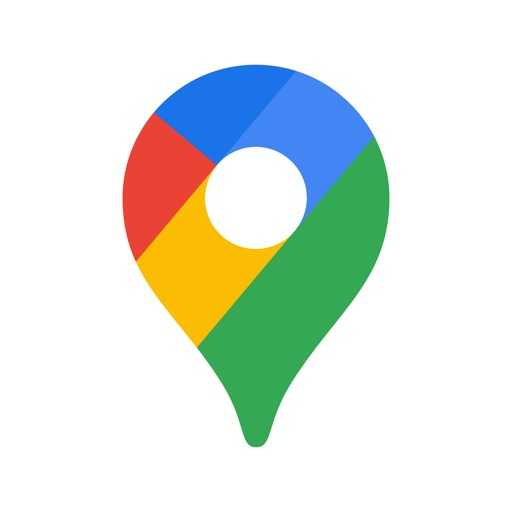

Explore and navigate the world with confidence using Google Maps. Find the best routes with live traffic data and real-time GPS navigation for driving, walking, cycling, and public transport. Discover over 250 million businesses and places - from restaurants and shops to everyday essentials – with photos, reviews, and helpful information.

Navigate the world, the way you want:
• Get to where you need to go with fuel-efficient route options
• Find the best route with real-time, turn-by-turn voice, and on screen navigation
• Save time with automatic rerouting based on live traffic, incidents, and road closures
• Catch the bus, train, and ride-share effortlessly, with real-time updates
• Find bike or scooter rentals to get around more easily

Plan trips and experiences effortlessly:
• Preview an area before you go (e.g. parking, entrances) with Street View
• Use Immersive View to experience what landmarks, parks and routes look like, and even check the weather so you can be ready in advance
• Create custom lists of your favorite saved places and share with others
• Order delivery and takeout, make reservations, and book hotels
• Don't get lost with offline maps in an area with bad signal
• Search for local places and things to do, and decide based on user reviews and photos

Discover and explore like a local:
• Explore with confidence knowing 500 million users contribute and keep the map up to date each year
• Avoid the crowds by seeing how busy a place is before you get there
• Use Lens in Maps to see walking directions overlaid on the real world
• Filter restaurants by cuisine, hours, price, rating and more
• Ask questions about a place, from dishes to parking, and get quick answers

Some features not available in all countries or cities
Navigation isn't intended to be used by oversized or emergency vehicles

#### onepay_–_mobile_banking
## OnePay – Mobile Banking

More. For your money.

OnePay is a financial technology company, not a bank. Banking services provided by Coastal Community Bank or Lead Bank, Members FDIC. The OnePay CashRewards Mastercard is issued by Synchrony Bank pursuant to a license from Mastercard® International Incorporated. OnePay Debit Card is issued by banking partners Coastal Community Bank or Lead Bank, Members FDIC, pursuant to a license by Mastercard International Incorporated. Mastercard and the circles design are registered trademarks of Mastercard International Incorporated.

To see terms and conditions relating to OnePay's products, visit www.onepay.com/terms

Eligible deposits requirement met when your OnePay Cash account either (i) receives Direct Deposits totaling $500+ in the current or previous month or (i) had a balance of $5,000+ at the end of the previous month.

‡Cash back is earned as OnePay Points, redeemable into a OnePay Cash account or other available options. Only available to customers who unlock OnePay Cash+ with eligible deposits. Spend cap applies to your total spend across the cash back categories you selected during the month. See onepay.com/rewards-terms.

**Must be 18 or older. When on, Savings Backup will be used before Fee-Free Overdraft. Overdraft balance is due right away. Eligible transactions are at the discretion of OnePay and may exclude certain transactions (e.g., bill pay, global transfers). See details at onepay.com/overdraft-details.

+Based on a 12 month loan with $25 monthly payments and a 0% APR. You can choose how much you’d like to pay towards your monthly payment, with a minimum of $1. If you choose an amount less than the full monthly payment, the remainder will be paid from the loan proceeds held in your Credit Builder lockbox. Use of the Credit Builder Program does not guarantee that your credit score will improve. Credit score improvement is dependent on your specific circumstances and a variety of factors, including your financial behavior. Failure to make monthly minimum payments on time may negatively impact your credit score. See onepay.com/legal/licenses.

†Cash back is earned as OnePay Points, redeemable as a deposit into a OnePay Cash account pursuant to the OnePay Rewards Terms. Individual reward details can be found in the OnePay app. 

∞Subject to credit approval. Cash back is earned as points on purchases made with your OnePay CashRewards Mastercard, which can be redeemed as a statement credit or as a deposit into a OnePay Cash account. 

ʌʌOffer is valid for new accounts only and may only be applied once. Cash back is earned as points, which can be redeemed as a statement credit or as a deposit into a OnePay Cash Account. See onepay.com/rewards-terms. for details. Limited time offer. We reserve the right to change or discontinue this offer at any time.

ʌDirect deposit required. Funds availability may vary depending on when your employer sends paycheck data.

++Currency exchange rates vary. 

© Copyright 2025 One Finance, Inc.

#### netflix
## Netflix

Looking for the most talked about TV shows and movies from around the world? They’re all on Netflix.

We’ve got award-winning series, movies, documentaries, and stand-up specials. And with the mobile app, you get Netflix while you travel, commute, or just take a break.

What you’ll love about Netflix:
• We add TV shows and movies all the time. Browse new titles or search for your favorites, and stream videos right on your device.
• The more you watch, the better Netflix gets at recommending TV shows and movies you’ll love.
• Enjoy a safe watching experience just for kids with family-friendly entertainment.
• Preview quick videos of our series and movies and get notifications for new episodes and releases.

Netflix membership is a month-to-month subscription that begins at sign up. You can easily cancel anytime, online, 24 hours a day. There are no long-term contracts or cancellation fees. We just want you to love what you watch.

Please note that the App Privacy information applies to information collected through the Netflix iOS, iPadOS and tvOS apps. See the Netflix Privacy Statement (link below) to learn more about information we collect in other contexts, including account registration.

Privacy policy: www.netflix.com/privacy
Terms of use: www.netflix.com/terms

Phone Number: +18667160414
Email: iosappstore@netflix.com

#### telegram_messenger
## Telegram Messenger
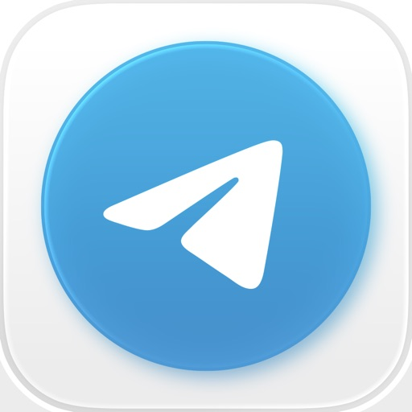

Pure instant messaging — simple, fast, secure, and synced across all your devices. One of the top 5 most downloaded apps in the world with over 1 billion active users.

FAST: Telegram is the fastest messaging app on the market, connecting people via a unique, distributed network of data centers around the globe.

SYNCED: You can access your messages from all your phones, tablets and computers at once. Telegram apps are standalone, so you don’t need to keep your phone connected. Start typing on one device and finish the message from another. Never lose your data again.

UNLIMITED: You can send media and files, without any limits on their type and size. Your entire chat history will require no disk space on your device, and will be securely stored in the Telegram cloud for as long as you need it. 

SECURE: We made it our mission to provide the best security combined with ease of use. Everything on Telegram, including chats, groups, media, etc. is encrypted using a combination of 256-bit symmetric AES encryption, 2048-bit RSA encryption, and Diffie–Hellman secure key exchange. 

100% FREE & OPEN: Telegram has a fully documented and free API for developers, open source apps and verifiable builds to prove the app you download is built from the exact same source code that is published. 

POWERFUL: You can create group chats with up to 200,000 members, share large videos, documents of any type (.DOCX, .MP3, .ZIP, etc.) up to 2 GB each, and even set up bots for specific tasks. Telegram is the perfect tool for hosting online communities and coordinating teamwork.

RELIABLE: Built to deliver your messages using as little data as possible, Telegram is the most reliable messaging system ever made. It works even on the weakest mobile connections. 

FUN: Telegram has powerful photo and video editing tools, animated stickers and emoji, fully customizable themes to change the appearance of your app, and an open sticker/GIF platform to cater to all your expressive needs.

SIMPLE: While providing an unprecedented array of features, we take great care to keep the interface clean. Telegram is so simple you already know how to use it.

PRIVATE: We take your privacy seriously and will never give any third parties access to your data. You can delete any message you ever sent or received for both sides, at any time and without a trace. Telegram will never use your data to show you ads.

For those interested in maximum privacy, Telegram offers Secret Chats. Secret Chat messages can be programmed to self-destruct automatically from both participating devices. This way you can send all types of disappearing content — messages, photos, videos, and even files. Secret Chats use End-to-End Encryption to ensure that a message can only be read by its intended recipient.

We keep expanding the boundaries of what you can do with a messaging app. Don’t wait years for older messengers to catch up with Telegram — join the revolution today.

Terms of Use: https://www.apple.com/legal/internet-services/itunes/dev/stdeula/

#### etsy__shop_home,_style___more
## Etsy: Shop Home, Style & More

Welcome to the Universe of Special.
 
Shop Etsy—your global marketplace for original items made, handpicked, and designed by real people for all budgets. Explore everything from vintage treasures and trending style pieces to personalized jewelry and custom home decor. Get offers and deals on one-of-a-kind items from small shops, chat with Etsy sellers, track your orders, and more.
 
Online furniture shopping or gifting for the holidays? No matter what you’re looking for, Etsy has the pieces that speak to you. Download today and discover original gifts and seasonal treasures from our community of sellers.
 
Shop the Etsy app.
 
App Marketplace Features
 
Global Marketplace
• Explore over 15+ categories of original items from all over the world—from thrifted clothes to handmade jewelry and home decor.
• Favorite shops, save items, and organize your pieces in collections for future inspiration.
• Shop from trusted tastemakers, including the Icon Collection from WNBA All-Stars.
• Get inspired with the fall and winter trend guide, curated by our marketplace insights and experts.
 
Gift Special with Etsy
• Create a gift list of your favorite items and save special occasions for helpful reminders.
• Shopping last minute? Make every gift special with custom gift teasers that give people a sneak peek at their present. Or, send a gift card with a personalised touch!
• Personalize clothes, decor, and style essentials to make your gifts one-of-a-kind.
 
Save More with the Etsy app
• Stay updated on offers and deals from small shops with push notifications.
• Shop curated selections of items on sale from Etsy sellers you love.
• Explore thrift finds and keep fashion circular, with vintage steals from small shops.
 
Track, Chat & Shop with Ease
• Chat with Etsy sellers, ask questions, and stay in-the-know on your order status.
• Read customer reviews for small shops that speak to you.
• Track gifts and shipments and customize notifications to your taste.
• Shop safely with secure payments, including credit/debit, Etsy gift cards, Paypal, Klarna, and quick purchases with Apple Pay.  
 
Buy Global, Support Local
• Home goods and decor: Find furniture or new prints to style your space, and give the perfect housewarming gifts with pieces like handmade glassware sets or a custom dining table.
• Original art and collectibles: Pick up finds from around the world, like Turkish pottery and Portuguese ceramics.
• Clothes, jewelry & accessories: Shop vintage clothing and handmade accessories to elevate your personal wardrobe.*
• DIY ideas: Get all the supplies and craft kits you need to throw a themed party or learn a new hobby.
 
Enjoy shopping with a personalized touch in the Etsy app. Discover something special for every occasion from a global community of talented sellers—from clothing and furniture to art, decor, and more. Download today.
 
*Etsy does not evaluate vintage items’ condition and authenticity.

#### instagram
## Instagram

Little moments lead to big friendships. Share yours on Instagram. 
— From Meta

Connect with friends, find other fans, and see what people around you are up to and into. Explore your interests and post what's going on, from your daily moments to life's highlights.

Share what you’re up to and into:
- Turn your life into a movie and discover short, entertaining videos on Instagram with Reels.
- Keep up with friends on the fly with Stories and Notes that disappear after 24 hours.
- Start group chats and share unfiltered moments with your Close Friends.
- Share memories from recent events or trips in Feed.
- Customize your posts with exclusive templates, music, stickers and filters.

Dive into your interests.
- Watch videos from your favorite creators and discover new content that’s personalized to your interests.
- Get inspired by photos and videos from new accounts in Explore.
- Discover brands and small businesses, and shop products that are relevant to your personal style.

Some Instagram features may not be available in your country or region.

Terms and Policies: https://help.instagram.com/581066165581870

Consumer Health Privacy Policy: https://privacycenter.instagram.com/policies/health

Learn how we're working to help keep our communities safe across Meta technologies at the Instagram Safety Center: https://about.instagram.com/safety

#### whatnot__shop,_sell,_connect
## Whatnot: Shop, Sell, Connect

Whatnot is the largest live shopping platform in the US, UK, and Europe - we’re a marketplace bringing millions together to shop, sell, and connect around the things they love. From bags to beauty, comics to coins, sneakers to streetwear, and vintage to vinyl—we’ve got it all. Explore 250+ categories, including electronics, sports and Pokémon cards, fashion, plants, jewelry, and more. 

FIND INCREDIBLE DEALS ON NAME BRANDS - Join hundreds of thousands of sellers to shop deep discounts from your fashion favorites and everyday essentials.  From brands you know and love, to emerging and hard-to-find specialty products. Whatnot has a deal on whatever you’re looking for.

SHOPPING HAS NEVER BEEN MORE FUN - Whether you’re getting in on fast-paced auctions, incredible flash sales, live show giveaways, searching through the marketplace, or jumping into the chat—you’ve never had this much fun shopping. Whatnot has brought the best of shopping in-person online. 

INTERESTED IN SELLING ON WHATNOT? Last year, small businesses generated more than $3 billion in sales on Whatnot. Make more by selling live, join Whatnot today.

#### indeed_job_search
## Indeed Job Search

Discover your next job opportunity on Indeed, the free job search app designed to connect you with better work anytime, anywhere.

Forget the other job search apps. With 12 jobs added every second and smart search filters to quickly narrow in on your ideal role, your next job is at your fingertips.

Whether casually browsing or urgently applying, Indeed has the jobs you want, all in one place, with advanced functionality to help you find work that meet your needs and easily apply from your device. 

• Search the comprehensive database to find jobs, which includes employment opportunities posted on other job search sites, and explore recommended roles based on your preferences and work experience.

• Upload your resume or use Indeed’s resume builder to show your best self to employers and let your next job find you.

• Apply with your saved resume to avoid rewriting the same information for each job application during your job search.

• Keep track of applications during your job search and get notified when an employer has read and responded to your application on Indeed.

• Understand what employees think about their workplace with more than 700 million company ratings and reviews.

• Uncover what a job pays before you apply with more than 1.1 billion salaries searchable by job title, company, and location.

• Find jobs with flexible work options using our smart search filters, including: remote jobs, side jobs, freelance jobs, government jobs, part time jobs, and jobs that allow you to work from home or work from anywhere.

No matter where you are in your career, our job search app lets you show your best self, from application to interview. At Indeed, we help people get jobs.

By downloading this app, you agree to Indeed's Cookie Policy, Privacy Policy and Terms of Service found at www.indeed.com/legal, where you may avail of your rights at any time, including the right to object to the legitimate interest use of your personal data for marketing purposes. You further agree that by downloading this app, Indeed may process, analyze, and record any and all activities you take while using the app and any and all interactions and communications you have with, on, or through the app. We do so in order to optimize user experience and achieve the proper functioning of the app. In order to provide you with certain services and support ad attribution, user data, such as your IP address or other unique identifier and event data related to the installation of the Indeed App, may be shared with certain service providers when you download or install this app.

This is performed for the legitimate interest of allowing Indeed to understand and optimize our users' complete customer journey by:

• helping us understand how users arrive to Indeed
• better measure the performance of our ads;
• facilitating user logins through third party accounts in certain cases; and
• helping us understand where a user accesses Indeed through different devices

Please send your feedback to ios@indeed.com

Do Not Sell My Personal Information: https://www.indeed.com/legal/ccpa-dns
Terms of Use: https://www.indeed.com/legal#tos
Privacy Policy: https://www.indeed.com/legal#PP

#### canva__ai_photo___video_editor
## Canva: AI Photo & Video Editor

Canva is your easy to use photo editor and video editor in one graphic design app! Create stunning social media posts, videos, cards, flyers, photo collages & more. 

No design experience or expertise? No problem! From photo editor to collage maker, to logo maker – we made Canva really simple & easy for everyone. 

STUNNING TEMPLATES 
• Start inspired with thousands of customizable templates
• Playful Facebook posts, Insta layouts, Instagram post maker, IG Story, & mood boards
• Professionally-designed invitations, flyers, gift certificates, etc. to boost your business or event
• Showcase your product with our logo maker
• Visualize data with sleek presentation templates and slideshow maker

AI VIDEO EDITOR  – create videos in seconds
• Produce professional videos in the video editor with 5GB of cloud storage and real time collaboration.
• Create realistic videos with a prompt, powered by Veo 3.
• Crop, resize, and flip videos & images in the video editor.
• Easy video editing: Make images move with one-tap animations & page transitions in the video maker.
• Apply effects like slow motion and reverse playback, add subtitles to a video collage, or a new background to your green screen video. 
• Magically sync edits to music with Beat Sync, for quick video editing
• Automatically translate captions to over 100 languages
• Add your favorite music tracks via Popular music* (regional restrictions apply)

PHOTO EDITOR – No ads, no watermarks
• Effortless picture apps to crop, flip, & edit photos
• Adjust brightness, contrast, saturation, tint, blur, etc.
• Auto Focus for background blur & sharpen photos 
• Apply your style with aesthetic filters & effects (Retro, Pixelate, Liquify, etc.)
• Fun photo grid & photo collage maker 

SOCIAL MEDIA – hit it big with on-trend content
• Discover thousands of templates for Instagram, TikTok, Facebook, Twitter, YouTube, Snapchat, LinkedIn etc.
•  Queue your planned posts on Instagram with Scheduler
• Play with our photo editor for thumb-stopping Instagram layouts
• Easy collage maker to create photo grids, collages

EXTENSIVE STOCK LIBRARY – over 2M+ assets for you
• Complete package: all the elements you need are here
• 2M+ royalty-free images
• Thousands of watermark-free stock videos
• 25K+ pre-licensed audio & music tracks

SMART MOCKUPS – see your designs on a shirt, poster and more
• Look professional by visualizing your designs on products  phones, laptops, posters & more
• Order printed flyers, mugs, and gifts or business

REAL-TIME COLLABORATION – with anyone across any device
• Edit team projects & presentations anytime, anywhere
• Start a design on mobile & finish on your desktop seamlessly
• Work with your team in real-time, leave comments & apply changes

CANVA PRO
• Bring your vision to life with premium templates, images, videos & graphics
• Save time with tools like Background Remover, Magic Resize, and Content Planner
• Design and grow an authentic brand with Brand
• Create faster, together, with Canva for Teams

DESIGN FOR EVERYONE 
• Personal - Layout designs for creative & professional pursuits like Instagram templates, resume, photo collages.
• Entrepreneurs - Grow your business with our logo creator, video editor, poster maker, etc.
• Students & Teachers - Engage with beautiful presentations and worksheets
• Social Media Managers & Content Creators - Use the photo editor and collage maker for consistent 
visuals.

*Your monthly subscription automatically renews unless auto-renew is turned off at least 24 hours before the end of the current period. The  Payment will be charged to your iTunes Account at confirmation of purchase. You can manage app subscriptions in your iTunes Account settings. Any unused portion of a trial period, if offered, will be forfeited when you purchase a paid subscription. No lock-in contract.

https://about.canva.com/terms-of-use
https://about.canva.com/privacy-policy 

Got questions or comments? Get in touch http://canva.me/ios

#### affirm__buy_now,_pay_over_time
## Affirm: Buy now, pay over time

Pay over time with Affirm online, in-store, and in the app. Plus, eligible customers can get the Affirm Card™ to use anywhere Visa is accepted in the U.S., or pay with Affirm on Apple Pay.

Why you’ll love the Affirm app:
• See your purchasing power front and center
• Shop brands with clear, flexible payment options 
• Discover deals, 0% APR options, and plans over 12 months
• Set up AutoPay or easily make early or one-time payments
• Request to pay over time with the Affirm Card online or in-store

Take your Affirm Card everywhere: 
• Get a physical card and use it anywhere Visa is accepted in the U.S. 
• No credit impact to apply, and no card or annual fees
• Discover 0% APR options or flexible plans at top brands, in-store and online
• Request a payment plan in the app before or after checkout. Minimum purchase may be required for payment plans. See footer for details.

Purchasing power is an estimate and may include a down payment at checkout. Approval and terms aren’t guaranteed.

The Affirm Card is a Visa® debit card issued by Evolve Bank & Trust (Evolve) or Stride Bank, N.A. (Stride), Members FDIC, pursuant to licenses from Visa U.S.A. Inc. Affirm is not a bank. FDIC insurance will only cover the failure of Evolve and/or Stride. Learn more at https://www.fdic.gov/resources/deposit-insurance/. Pay-over-time plans must be applied for each purchase in the mobile app, are subject to eligibility checks and are provided by affirm.com/lenders. Minimum purchases are required for pay over time plans; the amount is located in the Card tab of the app. For purchases that are not approved for and matched to a payment plan, you authorize Affirm to initiate an ACH debit from your linked bank account within 1-3 days of the purchase. CA residents: Loans by Affirm Loan Services, LLC are made or arranged pursuant to a California Financing Law license 60DBO-111681. For licenses and disclosures, see affirm.com/licenses.

Rates from 0 - 36% APR. For example, an $800 purchase could be split into 12 monthly payments of $77.99 at 30% APR, or 4 interest-free payments of $200 every 2 weeks. Loan options vary, are subject to eligibility, and may depend on whether your loan is applied for before or after your card purchase. There are minimum purchase amounts for loans, a down payment may be required, and may not be available in all states.

#### microsoft_authenticator
## Microsoft Authenticator
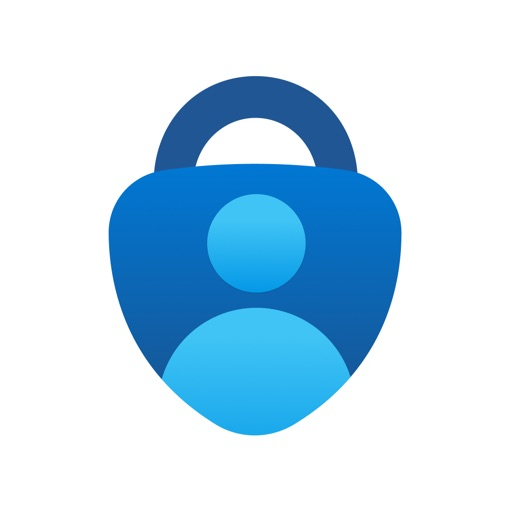

Use Microsoft Authenticator for easy, secure sign-ins for all your online accounts using multi-factor authentication, passwordless, or password autofill. You also have additional account management options for your Microsoft personal, work or school accounts.

Getting started with multi-factor authentication

Multi factor authentication (MFA)provides a second layer of security. When enabled, during login after entering your password, you’ll be asked for an additional way to prove it’s really you. Either approve the notification sent to the Microsoft Authenticator, or enter the one-time password (OTP) generated by the app. The OTP codes have a 30 second timer counting down. This timer is so you never have to use the same time-based one-time password (TOTP) twice and you don’t have to remember the number. The OTP doesn’t require you to be connected to a network, and it won’t drain your battery. You can add multiple accounts to your app, including non-Microsoft accounts like Facebook, Amazon, Dropbox, Google, LinkedIn, GitHub, and more.

Getting started with passwordless

Use your phone, not your password, to log into your Microsoft account. Just enter your username, then approve the notification sent to your phone. Your fingerprint, face ID, or PIN will provide a second layer of security in this two-step verification process. After you’ve signed in with two factor authentication (2FA), you’ll have access to all your Microsoft products and services, such as Outlook, OneDrive, Office, and more.

Getting started with autofill

Microsoft Authenticator app can also autofill passwords for you. Sign-in on the Passwords tab inside the Authenticator app with your personal Microsoft account to start syncing passwords, including the passwords saved in Microsoft Edge. Make Microsoft Authenticator the default autofill provider and start autofilling passwords on apps and sites you visit on your mobile. Your passwords are protected with multi-factor authentication in the app. You will need to prove yourself with your fingerprint, face ID, or PIN to access and autofill passwords on your mobile. You can also import passwords from Google Chrome and other password managers.

Microsoft personal, work or school accounts

Sometimes your work or school might ask you to install the Microsoft Authenticator when accessing certain organization resources. You will need to register your device to your organization through the app and add your work or school account. Microsoft Authenticator supports cert-based authentication by issuing a certificate on your device. This will let your organization know that the sign-in request is coming from a trusted device and help you seamlessly and securely access additional Microsoft apps and services without needing to log into each.

#### the_roku_app_(official)
## The Roku App (Official)

Get to know the must-have app for streamers

Use the free Roku® mobile app to:
• Control your Roku devices with a convenient remote
• Use your voice or keyboard to quickly search for entertainment
• Enjoy private listening with headphones
• Stream free movies, live TV, and more on the go with The Roku Channel  
• Cast media files from your phone, like videos and photos, to your TV 
• Add and launch channels on your Roku devices
• Enter text on your Roku device easier with your mobile keyboard

You must connect your phone or tablet to the same wireless network as your Roku device to use certain features of the mobile app. Some features require a compatible Roku device and may require logging into your Roku account.

Feature availability:
•  Voice search is available in English in the US, UK, and Canada. It’s also available in Spanish in Mexico and the US.
•  The Roku Channel can be viewed in the mobile app in the US only. 
•  Some channels require payment, can change, and vary by country.

For more information, go to http://support.roku.com
Privacy Policy: go.roku.com/privacypolicy
CA Privacy Notice: https://docs.roku.com/published/userprivacypolicy/en/us#userprivacypolicy-en_us-CCPA

#### doordash_-_food_delivery
## DoorDash - Food Delivery

With more than 310,000 menus and 55,000+ grocery, convenience and retail stores across 4,000+ cities in the U.S., Canada, Australia, and New Zealand, DoorDash offers the greatest online selection of your favorite restaurants and stores, delivered wherever you are. Plus, enjoy $0 delivery fees for your first order. Restrictions apply: https://drd.sh/tF5uns/

IT’S ALL HERE
- Restaurants: Local and national favorites
- Grocery: Everything from fresh produce to household items
- Convenience: Snacks, drinks, OTC medicines, and more 
- Retail: Including gym must-haves, beauty supplies, etc.
- Pet supplies: Treats, toys, and everything they need
- Flowers: For special occasions or just because

KEY FEATURES
- On-demand, same-day delivery 
- Advanced delivery scheduling 
- Real-time order tracking
- No order minimums
- No-contact delivery by request
- Convenient payment options: Apple Pay, Venmo, PayPal, credit card, or SNAP/EBT at participating merchants
ENJOY UNLIMITED $0 DELIVERY FEES WITH DASHPASS
Get unlimited $0 delivery fees and up to 10% off eligible orders from restaurants, grocery stores, and more. Plus, DashPass members get access to exclusive items and offers, and 5% in DoorDash credit back on eligible pickup orders. Your first 30 days on DashPass are free, then your membership auto-renews at $9.99/month. Cancel anytime.

NATIONAL RESTAURANT PARTNERS
McDonald’s, Starbucks, Chick-fil-A, Burger King, Wendy’s, Chipotle, The Cheesecake Factory, Outback Steakhouse, Panera, Chili’s, Subway, Dunkin’ Donuts, Jamba Juice, Panda Express, Moe’s, P.F. Chang’s, Denny’s Buffalo Wild Wings, Papa John’s, Papa Murphy’s, Jack in the Box, Five Guys, Boston Market, Red Robin, TGI Friday’s, Red Lobster, Qdoba, El Pollo Loco, White Castle, SmashBurger

GROCERY DELIVERY PARTNERS
Safeway, Albertsons, ALDI, Sprouts Farmers Market, Meijer, Hy-Vee, Grocery Outlet, Winn-Dixie, Smart & Final, BJ’s, Vons, Weis, ACME, Raley’s, Fresh Thyme, Giant Eagle, Bashas’, Bristol Farms, and more. 

CONVENIENCE & RETAIL DELIVERY PARTNERS
Walgreens, 7-Eleven, CVS, Rite Aid, Dollar General, Wawa, Sheets, Casey’s, Total Wine, BevMo!, PetSmart, Sephora, DICK’S Sporting Goods, Tractor Supply, and more.

FIND RESTAURANTS AND STORES NEAR YOU
We’re growing and currently serving over 4,000 cities across the United States, Puerto Rico, Canada, Australia, and New Zealand, including cities such as New York City, Los Angeles, Toronto, Vancouver, Melbourne, Sydney, Montreal, and more.

Notice at Collection (California Residents): https://help.doordash.com/consumers/s/privacy-policy-us#section-11

Visit doordash.com to learn more.

#### macy's__online_shopping___save
## Macy's: Online Shopping & Save

Holiday gifting made easy at Macy’s is just one tap away. Explore our Holiday Gift Guide and shop exclusive offers, fast pickup and delivery. Discover top picks for everyone on your list—cozy favorites, trending tech, beauty bestsellers, must-have toys and home upgrades—plus festive décor to make every space sparkle. 

Get your gifts fast with free store pickup and curbside pickup, and Same-Day or Next-Day Delivery in select areas. Plus, earn Star Rewards on qualifying purchases and turn on notifications to be alerted for Star Money Bonus Days and Exclusive Offers.

WHY SHOP THE MACY'S APP

• Discover your new For You page with product picks, deals, and collections tailored just for you. 
• Turn on notifications for app-only offers, early access drops, and limited-time deals.
• Scan barcodes in store to check prices, colors, sizes, and reviews instantly.
• Pay fast with Macy’s Pay in select stores.
• Track your Star Rewards points, status and available Star Money.

SHOP IT ALL IN ONE PLACE

• Apparel & streetwear for women, men & kids—from everyday basics to going-out looks.
• Handbags & wallets from top brands: Coach, Michael Kors, Kate Spade, Tory Burch, and more—shop totes, crossbody, satchels, backpacks, and small leather goods.
• Sneakers & casual shoes from brands you love (Nike, adidas, Converse, Birkenstock & more), plus boots & slippers for the season.
• Beauty & skincare across prestige, derm-trusted and clean brands—stocking stuffers to luxe sets.
• Jewelry & watches, handbags, accessories & cold-weather essentials. 
• Home, furniture & mattresses—plus kitchen, dining, bedding & bath for a holiday-ready home.
• Holiday Lane décor & ornaments to decorate your tree, mantle and more.
• Toys“R”Us at Macy’s: LEGO®, Barbie®, Hot Wheels®, NERF, PAW Patrol™ & more favorites for every age.

MAKE SHOPPING SIMPLE

• Save favorites with the heart icon and get price-drop alerts right from your phone.
• Build lists & registries and share them with family & friends.
• Check store availability before you go, then choose store or curbside pickup at checkout.
• Eligible items can arrive fast with Same-Day or Next-Day Delivery in select ZIP codes (fees may apply).

STAR REWARDS MADE FOR YOU

• Join for free and earn points on qualifying purchases.
• Redeem Star Money during special events and enjoy bonus-point opportunities throughout the season.
• Cardholders get even more ways to save and simplified checkout.

Download the Macy’s app to find great gifts, festive décor and limited-time savings—all in one place, with flexible pickup and fast delivery options to keep your holiday on schedule.

#### playful_rewards__earn_rewards
## PLAYFUL REWARDS: Earn Rewards
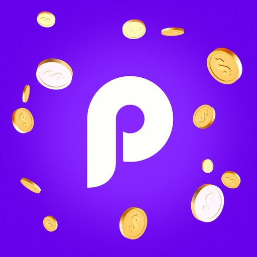

Meet Playful Rewards — Your Go-To App for Turning Free Time into Real Rewards!

Turn your free time into real rewards with Playful Rewards! Shop your favorite brands, complete fun tasks, scan receipts, answer surveys, and test partner games — every activity gets you closer to earning gift cards and cash.

It’s simple:

- SHOP & EARN: Get rewarded for shopping top brands you already love.
- ANSWER & EARN: Share your opinions and complete offers to rack up rewards.
- SCAN & EARN: Earn by uploading receipts from everyday purchases.
- PLAY & EARN: Grab even more rewards by testing games and sharing your feedback on your gameplay experiences

Redeem your points for Amazon, PayPal, and Visa gift cards — cash out on your terms.

———————

WHAT OTHERS SAY:

"I just claimed my $200 reward!" — Miraclebaby98
"I cashed out $10 within a couple days" — showup21
"This app is truly different from the rest" — WhoCares2022123
"$450 IN PAYOUTS!!!!!!!!!!!!!" — ballbustet
"I was able to get the $10 the next day into my PayPal account" — aprmic

———————

What you get:

* Earn Rewards Effortlessly
Turn gold coins into Amazon, PayPal, and Visa gift cards. Whether you’re completing tasks or answering surveys, the swag is just a few taps away. 

* Daily Earning Opportunities
Start each day by exploring fresh, fun tasks that make earning rewards easy and enjoyable. Who knew making extra bucks could be this much fun?

* Exciting Challenges & Tasks
Take on challenges and complete tasks to boost your earnings. The more you do, the more you earn!

* High-Quality Offers
We only bring you the best surveys, so you can trust that your time is well spent.

* User-Friendly Design
Our app’s sleek, intuitive interface makes navigating tasks and rewards a breeze. It’s all about making your experience fun and straightforward.

———————

Why others love Playful Rewards:

* Simple & fun to use
* Quick and easy rewards
* Great gift card options
* Highly recommended by users

———————

How does it work?

Once you download Playful Rewards, you can start earning rewards right away. Collect gold coins, which can be redeemed for gift cards.

Stop wasting your free time — start earning with Playful Rewards today!

#### t-life
## T-Life

Whether you’re shopping, managing your account and devices, looking for a new plan, or snagging exclusive benefits, start with the T-Life app.  

•	Shopping for a new device? Shop our widest selection without leaving your couch.
•	Access exclusive benefits including Netflix On Us and savings on travel and dining.
•	Get freebies, fun perks, and a chance at epic prizes on T-Mobile Tuesday.
•	Try the Best Network and some of our favorite benefits for 30 days. For free. 
•	Manage your account, pay bills, and track your usage with just a few taps.
•	Configure your T-Mobile Home Internet gateway with ease.
•	Stay connected with SyncUP devices for home, car, and family.
•	Access your T-Mobile MONEY® account.
•	Protect yourself from spam and robocalls with Scam Shield.

T-Mobile Trial: Limited-time; subject to change. Available to non-T-Mobile customers only. One trial per user. A compatible device is required. A 5G-capable device is required to access the 5G network. BEST: Based on analysis of Ookla® of Speedtest Intelligence® data 1H 2025.

#### paramount_
## Paramount+

Stream exclusive originals, hit movies, live sports like NFL on CBS and UEFA Champions League, all of SHOWTIME® (Premium plan only), and favorites from CBS, Nickelodeon, Comedy Central, BET, MTV, VH1 and more.

- Watch full episodes on demand from hit series like Survivor, NCIS, SpongeBob SquarePants, Big Brother and more!
- Obsess over originals. Watch subscriber-only originals such as 1923, Landman and Star Trek: Strange New Worlds.
- Make every night a movie night with blockbuster hits and fan-favorite films from Paramount Pictures, MGM and more.
- Access live streams with around-the-clock news coverage on CBS News 24/7, scores + highlights on CBS Sports HQ and entertainment news on Mixible, plus 20 live channels of curated favorites.
- Create up to 6 individual profiles for each member of your household. Have kids? Use our Kids Mode profile feature. 
- Save your faves with our watchlist feature, My List. 

Get even MORE on the Premium plan:
- Watch ad-free* shows and movies.
- Stream your local CBS station live.
- Catch the best in live events including March Madness®, The Masters Tournament, The GRAMMYs and more.
- Stream all of SHOWTIME, including SHOWTIME East and West live.
- Download and watch offline*.

Try Paramount+ now. See prmntpl.us/SubscriptionPlans for more details on plans and pricing. Download the app to get started.

*Live TV includes commercials. Downloaded content is accessible for earlier of 30 days from date of download or 48 hours from start of playback. Content availability subject to change. Please note use of the Paramount+ app is limited to the United States. Paramount+ promotional offers for new subscribers only. Live TV subject to availability. Prices shown are in U.S. dollars. Other restrictions apply.

Your subscription will automatically renew after any applicable promotional period and your Apple ID account will be charged the subscription price on a recurring basis until you cancel.  You can cancel your subscription at any time through your Apple ID account settings.  If you cancel your subscription, the cancellation will go into effect at the end of your current subscription period, as applicable. You will have continued access to the Paramount+ Service for the remainder of your paid subscription period.

Please note: This app features Nielsen’s proprietary measurement software which will allow you to contribute to market research, like Nielsen’s TV Ratings. Please visit http://www.nielsen.com/digitalprivacy for more information.

Paramount+ Terms of Use:
https://pplus.legal/terms

Paramount Privacy Policy:
https://privacy.paramount.com/policy

Children’s Privacy Policy:
https://privacy.paramount.com/childrens

Additional Privacy Rights:
https://privacy.paramount.com/en/policy#additional-information-us-states

Do Not Sell My Personal Information:
https://privacy.paramount.com/app-donotsell

#### klarna_|_pay_your_way
## Klarna | Pay your way

FLEXIBLE WAYS TO PAY
Choose to pay in 4 interest-free payments, pay the full amount, in 30 days or over time.¹

SHOP ANYWHERE IN THE KLARNA APP
Access Klarna's flexible payment options anywhere - shop at your favorite stores and split your purchase with the payment plan that suits you.

UP TO 10% CASHBACK
Shop in the app and earn up to 10% cashback.² Get cashback at hundreds of stores in the app.

SHOP WITH THE KLARNA CARD³
Pay with Klarna anywhere Visa is accepted. Pay now or pay later with the card. No fees and no credit impact to apply.

UNLOCK YOUR KLARNA BALANCE
Add money in the Klarna app and pay flexibly, anywhere you shop. Get instant refunds, earn cashback at eligible stores, and convert your cashback into money in your balance.³

USE KLARNA WITH APPLE PAY
Split the cost with Klarna on Apple Pay, available in-store and online.⁴

FIND THE BEST PRICE, EVERY TIME
Search for any product and instantly compare prices across stores.

HASSLE-FREE RETURNS
Need to send something back? Report a return right in the app. We’ll pause your purchase so you don’t have to pay in the meantime.

TRACK ALL YOUR DELIVERIES
Get real-time updates, arrival times, and pickup photos—right in the Klarna app.

24/7 CUSTOMER SERVICE
Use our chat in the Klarna app for 24/7 support. 

¹Monthly financing through Klarna issued by WebBank. Other CA resident loans made or arranged pursuant to a California Financing Law license. NMLS #1353190.
²Klarna Cashback Rewards are awarded as points which can be redeemed for a credit to your Klarna Balance and other benefits. Earn cashback on Klarna App purchases. Klarna balance account required and funds can only be used within Klarna. Cashback issuance depends on store approval and may be affected by cookie settings, combining offers, product exclusions, or other factors beyond our control. Klarna may get a commission. Limitations, terms and conditions apply: https://cdn.klarna.com/1.0/shared/content/legal/terms/en-US/klarna-balance
³Deposits in your balance account are held at WebBank, Member FDIC. Klarna is not an FDIC-insured bank and deposit insurance only covers the failure of WebBank. Your deposits in the balance account are eligible for pass-through deposit insurance coverage if certain conditions are satisfied. Funds may be made available to you before WebBank receives them (“early availability funds”); such early availability funds may not be FDIC insured until received by WebBank. Loans that you obtain using the Klarna Card not insured by the FDIC and are not deposits. Account disclosures: https://cdn.klarna.com/1.0/shared/content/legal/terms/0/en_us/balance-deposit-account-disclosures 
Use your card anywhere Visa is accepted. Certain merchant, product, good and service restrictions apply. Some merchants do not accept virtual cards. Physical card only included with a paid Klarna Membership Plan. Klarna Membership offered in partnership with WebBank for a monthly fee. Cancel any time in the App. Exclusions, conditions, and limitations apply to membership benefits. Klarna Membership Terms apply.
Klarna Cashback Rewards are awarded as points which can be redeemed for cash and other benefits. Klarna Balance required. Other limitations, conditions, and restrictions apply to benefits like Klarna Membership cashback.
⁴Paying over time on Apple Pay: Loans not offered by Apple. Subject to eligibility requirements and approval. Not available in all markets, and may not be available for all types of purchases, such as subscriptions and recurring transactions. Available with Apple Pay online and in app, on iPhone and iPad. Not available in-store. Software requirements apply. Additional terms may apply. For more eligibility and feature details, see https://support.apple.com/120477.
Apple Pay is a service provided by Apple Payments Services LLC, a subsidiary of Apple Inc. Neither Apple Inc. nor Apple Payments Services LLC is a bank. Any card used in Apple Pay is offered by the card issuer.

#### facebook
## Facebook

Where real people propel your curiosity. Whether you’re thrifting gear, showing reels to that group who gets it, or sharing laughs over fun images reimagined by AI, Facebook helps you make things happen like no other social network.

Explore and expand your interests: 
* Shop Marketplace for hidden gems and take your hobbies to the next level
* Personalize your Feed to see more of what you like, less of what you don’t
* Ask Meta AI for information and get answers instantly
* Drive into reels that reflect the things you're interested in
* Search Facebook on any topic and get more interactive results

Connect with people and communities:
* Join groups to learn tips from real people who’ve been there, done that
* Get inspired by creators, or catch up with Friends
* Add new Friends to your world, but also decide how closely to keep up with them
* Privately message relatable posts that only your BFF will get or that reels trend everyone’s talking about

Share your world:
* Use generative AI to create custom stickers and images to delight friends
* Customize your profile to choose how you show up and who sees your posts
* Effortlessly create reels from trending templates, or showcase your creativity with a full suite of editing tools
* Capture moments on the fly with stories

Some features may not be available in your country or region. 

Terms & Policies: https://www.facebook.com/policies_center
Privacy Policy: https://www.facebook.com/privacy

Learn how we're working to help keep our communities safe across Meta technologies at the Meta Safety Center: https://about.meta.com/actions/safety

#### spotify__music_and_podcasts
## Spotify: Music and Podcasts

With the Spotify app, you can explore an extensive library of music and podcasts for free. Curate the best playlists and stream millions of free songs, albums, and original podcasts on your phone or tablet. Subscribe to Spotify Premium to download and listen offline wherever you are, and unlock our catalog of audiobooks.

Why choose Spotify as your go-to music and podcast app? Here, you can:
• Listen to over 100 million songs and 6 million podcast titles
• Explore our selection of specially-crafted artist playlists
• Easily search for your favorite songs, albums, artists, and podcasts
• Discover personalized music recommendations tailored to your unique taste
• Subscribe to your favorite free podcasts so you never miss an episode, and even curate your own podcast library

Spotify Free is more than a music player - find the sounds you love and stream music and podcasts online, for free. Enjoy personalized playlists or curate and share your own, discover the hottest new releases, explore upcoming events from your favorites, and more.

• Stream millions of free songs and podcasts
• Create playlists with your favorite music
• Share songs and playlists with friends and family (feature restrictions may apply in some regions)
• Discover personalized playlists made just for you, and collaborate on playlists with your friends
• Enjoy your personal Discover Weekly playlist every week
• Stay in the know with the Release Radar and New Music Friday playlists
• Find nearby events and gigs by your favorite artists
• See your most played songs, genres, artists, and more with yearly Spotify Wrapped
• Stream music across your devices with Spotify
• Use Spotify Connect and enjoy listening on smart speakers, desktop, laptop, smart TV, Chromecast, PlayStation®, Xbox®, smartwatch, in your car, and more - limited number of device models apply

Spotify Premium - a great way to enjoy the benefits of an offline music player, and stream music without WiFi. By pressing download, you can access your songs, playlists, podcasts, and audiobooks offline, wherever you are.
• Listen to music, podcasts, and audiobooks - all in one place
• Ad-free music listening: enjoy your music with no ad interruptions
• Enjoy full on-demand playback
• Audiobooks in Premium are currently available in the US, UK, Australia, Ireland, New Zealand, and Canada. Discover 250,000+ audiobook titles with 15 hours/month of available listening for Premium Individual subscribers and Duo & Family plan managers.
• Superior sound quality on supported devices
• AI DJ: a personalized guide that knows your music taste so well it can choose what to play for you
• Enjoy on desktop, phone, tablet, computer, smartwatch, and in your car
• Listen and control the listening session together by hosting a Jam in real time with friends
• Download songs, podcasts, and audiobooks for offline listening, without an internet connection
• No contract required - cancel your subscription whenever you want

Spotify lets you play music wherever you are. Listen to your favorite songs and discover new music, podcasts, and audiobooks with the Spotify app!

LOVE SPOTIFY?
Follow us on Instagram: https://www.instagram.com/spotify
Follow us on TikTok: https://www.tiktok.com/@spotify

#### discord_-_talk,_play,_hang_out
## Discord - Talk, Play, Hang Out

Discord is designed for gaming and great for just chilling with friends or building a community. Customize your own space and gather your friends to talk while playing your favorite games, or just hang out.

GROUP CHAT THAT’S ALL FUN & GAMES
∙ Discord is great for playing games and chilling with friends, or even building a worldwide community. Customize your own space to talk, play, and hang out in.

MAKE YOUR GROUP CHATS MORE FUN
∙ Create custom emoji, stickers, soundboard effects, and more to add your personality to voice, video, or text chat. Set your avatar, a custom status, and write your own profile to show up in chat your way.

STREAM LIKE YOU’RE IN THE SAME ROOM
∙ High-quality and low-latency streaming makes it feel like you're hanging out on the couch with friends while playing a game, watching shows, looking at photos, or idk doing homework or something.

HOP IN WHEN YOU’RE FREE, NO NEED TO CALL
∙ Easily hop in and out of voice or text chats without having to call or invite anyone, so you can chat with your friends before, during, and after your game session.

SEE WHO’S AROUND TO CHILL
∙ See who’s around, playing games, or just hanging out. For supported games, you can see what modes or characters your friends are playing and directly join up.

ALWAYS HAVE SOMETHING TO DO TOGETHER
∙ Watch videos, play built-in games, listen to music, or just scroll together and spam memes. Seamlessly text, call, video chat, and play games, all in one group chat.

WHEREVER YOU GAME, HANG OUT HERE
∙ On your PC, phone, or console, you can still hang out on Discord. Easily switch between devices and use tools to manage multiple group chats with friends.

#### uber_-_request_a_ride
## Uber - Request a ride

Join the millions of riders who trust Uber for their everyday travel needs. Whether you’re running an errand across town or exploring a city far from home, getting there should be easy.

FIND THE RIDE YOU WANT
Find the perfect ride right at your fingertips! Uber is here to make your journey stress-free and enjoyable.

Pick from a wide range of products that the Uber app has to offer including: 
- UberX: Affordable rides, all to yourself
- Electric: Eco-Friendly
- UberXL: Affordable rides for groups up to 6
- Comfort: Newer cars with extra legroom
- Comfort Electric: Premium zero-emission cars
- Uber Pet: Affordable rides for you and your pet
- Black: Luxury rides with professional drivers
- Taxi: You now have the option to request a cab or a taxi on demand using Uber in select cities
- 2-wheels: Find a scooter to start riding roday 

UPFRONT PRICING
With Uber, you no longer need to worry about hidden costs or unexpected surprises. As you enter your destination in the app, you get upfront pricing and the estimated time of arrival.

SAFETY TOGETHER
Safety is a top priority at Uber. We have established comprehensive safety features to help ensure every rider and driver feels secure and comfortable.

AFFORDABLE PRICING
We’re doing all we can to make our pricing as transparent as possible.

- UberX Share: UberX Share connects you to other riders headed in the same direction. 
- Group Rides: Share the journey with friends.
- Split Fare: Don’t worry about doing the math later—split the cost evenly while you’re still on the ride. 

JOIN UBER ONE FOR EXCLUSIVE PERKS
Benefit from $0 Delivery Fee and up to 10% off eligible delivery and pickup orders, 6% Uber Cash back on eligible rides and a $5 credit if our Latest Arrival Estimate on your order is off. Other fees & terms apply. For more details see uber.com/uberone.

RESERVE RIDES IN ADVANCE
Need a ride at a specific time? No problem! Uber allows you to reserve rides in advance, so you can plan your day with confidence. 

GO GREEN
Uber is committed to building a sustainable future for our cities. With a growing fleet of electric and hybrid vehicles, you can choose eco-friendly rides to reduce your carbon footprint.

RENT CARS AND HAVE THEM DELIVERED TO YOU
Whether you need a car today or later, the online booking experience will help you find the right vehicle for a family vacation, a weekend getaway, airport travel, and more. You can have a rental car delivered to your door at the time and location of your choice with Valet, currently available in select cities.

MORE FEATURES
Delivery: Order food from your favorite restaurants through Uber Eats. Stock up on groceries, shop pharmacy, convenience and pet supplies and get them all delivered. 

Uber Connect: an easy, same-day, no-contact delivery solution that allows people to send items whether it’s a care package for a loved one or an item you sold online.

Transit: Say goodbye to complicated time schedules, hectic transfers, and unexpected waits while reducing your trip’s emissions.

Uber Charter: Book high-capacity group rides in vehicles seating 14-55 passengers, such as limo buses, luxury vans, and coach buses.

2-Wheels: Did you know you can also bike or ride a scooter with the Uber app?

Uber for Business: Manage and track business travel, meal programs, and more on one dashboard.

Uber Hourly: Keep a car and driver with you for hours. 

Uber Car Seat: Uber Car Seat provides one forward-facing car seat for a child who is at least 2 years old, 22 pounds, and 31 inches tall.

Get Started Now! Download the Uber app and create an account today. Uber is available in the following cities: Boston, DC, LA, New York, San Francisco, Vegas, Orlando, Chicago and more. Check if Uber is available in your city at https://www.uber.com/cities. Stay updated on the latest news, promotions, and offers by following us on Twitter at https://twitter.com/uber and liking us on Facebook at https://www.facebook.com/uber.

#### drawnames_|_secret_santa_app
## drawnames | Secret Santa app
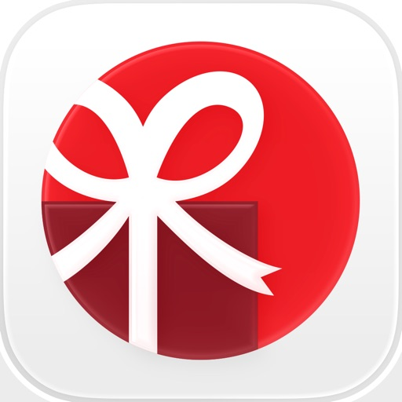

Simplify gift exchanges and manage wish lists with the drawnames Secret Santa app

Planning a Secret Santa gift exchange? Whether it's for Christmas, Hanukkah, Diwali, Kwanzaa, or any other occasion. drawnames makes organizing fun and easy. No account needed—just download the app, create your group, and let us handle the rest. From setting exclusions to creating and sharing wish lists and discovering the perfect gift, drawnames makes gift exchanges stress-free.

Key features:
Simple Secret Santa generator
Set up your gift exchange in 3 easy steps: create a group, set exclusions, and draw names. It’s quick, simple, and perfect for any size of group.

No account required
Start organizing without having to sign in. Just download the app and go! Enjoy the full functionality immediately—no account, no hassle.

Set exclusions
Avoid unwanted pairings by setting exclusions—ensure certain people don’t draw each other. Perfect for friends, family, and co-workers.

Personal wish lists
Make gift-giving easier by letting participants create and share personalized wish lists or gift lists.

Share using your favorite apps
Invite friends and family to your Secret Santa through most messaging apps, text, or email. Whatever works best for your group, we’ve got you covered.

Cross-device compatibility
No matter what device your group members use—any mobile phone, tablet or computer with a web browser—everyone can join the fun. You can even invite people who prefer not to download the app.

Gift inspiration & suggestions
Browse thousands of gift ideas directly in the app. Discover trending and popular gifts among our millions of users, and add them to your wish list. Whether it’s for the holiday season, a birthday, or a baby shower, we’ve got perfect gift suggestions for any occasion.

Manage multiple gift exchanges
Keep track of all your gift exchanges in one app. Organize events for different groups—friends, family, or work—straight from your device. Sign in to access your groups from any device.

Flexible for any occasion
drawnames is perfect for Christmas, but did you know it's also great for creating wish lists and organizing gift exchanges all year round? Whether you’re organizing for Eid, Diwali, Hanukkah, or even a birthday or Valentine’s Day celebration, we make sure your event goes smoothly and is stress-free.

Here's how it works:

– Set the budget and gift exchange date
– Add participants and exclusions
– Invite people to join your group using email, Messenger or WhatsApp. If necessary, set exclusions to avoid unwanted pairings.
– Draw names
– Once names are drawn, participants can start creating wish lists and choosing gifts for the others in the group."

Why choose drawnames?
Avoid the hassle of drawing names manually or keeping track of everything on paper. drawnames helps you take care of everything, from organizing exclusions to offering gift suggestions and creating wish lists. Plus, with no ads and no account required, you can get started straight away!

Perfect for any type of gift exchange, whether during the festive season or for any other occasion. Organize quickly and efficiently, and make sure everyone has a great experience.

More than just for Christmas
In addition to festive season gift exchanges, the app is ideal for other events like baby showers, weddings, birthdays, and more. Let your group create wish lists, find gifts, and make the celebration extra special with thoughtful presents everyone will love.

Download the drawnames app today and start planning your gift exchange in just a few clicks!

Support: If you need help, contact us at help@drawnames.com, and our team will be happy to assist you.

#### pinterest
## Pinterest

Pinterest is a place of endless possibilities. You can:
- Discover everyday inspiration
- Shop styles you love
- Try and learn something new

Create boards, save Pins and make collages of all your inspiration. Unlock billions of ideas, from fashion tips and easy recipes to DIY projects and fresh ways to redo your space. Creating the life you love? 

It's Possible.

#### youtube
## YouTube

Get the official YouTube app on iPhones and iPads. See what the world is watching -- from the hottest music videos to what’s popular in gaming, fashion, beauty, news, learning and more. Subscribe to channels you love, create content of your own, share with friends, and watch on any device.

Watch and subscribe
● Browse personal recommendations on Home
● See the latest from your favorite channels in Subscriptions
● Look up videos you’ve watched, liked, and saved for later in Library

Explore different topics, what’s popular, and on the rise (available in select countries)
● Stay up to date on what’s popular in music, gaming, beauty, news, learning and more
● See what’s trending on YouTube and around the world on Explore
● Learn about the coolest Creators, Gamers, and Artists on the Rise (available in select countries)

Connect with the YouTube community
● Keep up with your favorites creators with Posts, Stories, Premieres, and Live streams
● Join the conversation with comments and interact with creators and other community members

Create content from your mobile device
● Create or upload your own videos directly in the app
● Engage with your audience in real time with live streaming right from the app

Find the experience that fits you and your family (available in select countries)
● Every family has their own approach to online video. Learn about your options: the YouTube Kids app or a new parent supervised experience on YouTube at youtube.com/myfamily

Support creators you love with channel memberships (available in select countries)
● Join channels that offer paid monthly memberships and support their work
● Get access to exclusive perks from the channel & become part of their members community
● Stand out in comments and live chats with a loyalty badge next to your username

Upgrade to YouTube Premium (available in select countries)
● Watch videos uninterrupted by ads, while using other apps, or when the screen is locked
● Save videos for when you really need them – like when you’re on a plane or commuting
● Get access to YouTube Music Premium as part of your benefits

Note: If you subscribe via Apple, payment will be charged to App Store Account at confirmation of purchase. Subscription automatically renews unless auto-renew is turned off at least 24 hours before the end of the current period. Account will be charged for renewal within 24 hours prior to the end of the current period at the rate of the selected plan. Subscriptions and auto-renewal may be managed by going to Account Settings after purchase.

YouTube paid service terms: https://www.youtube.com/t/terms_paidservice.
Privacy policy: https://www.google.com/policies/privacy

#### peacock_tv__stream_tv___movies
## Peacock TV: Stream TV & Movies

Download Peacock, NBCUniversal’s streaming service. Peacock has all your favorite culture-defining entertainment, all in one place. 

With Peacock, stream exclusive Originals, new movies from theaters, thousands of TV shows, and current programming from Bravo and NBC. 

Stay up to date with the news and stream all your favorite live sports and events including Sunday Night Football, Premier League, Big Ten Football, NBA games (starting 10/21/25), The Winter Olympics, and so much more. 
 
With PEACOCK PREMIUM, stream the full library of movies, episodes, and seasons — plus live sports and events.
•	Stream new movies from theaters, plus full seasons of exclusive premium TV like Yellowstone and The Office: Superfan Episodes. 
•	Exclusive Peacock Originals, including The Paper, Love Island USA, The Traitors, Twisted Metal, The Day of the Jackal, Ted, and more. 
•	Live sports, including Sunday Night Football, Premier League, Big Ten football, and LIVE NBA Games starting 10/21/25. 
•	The streaming home for your Bravo faves, including Below Deck, The Real Housewives, Top Chef, and Vanderpump Rules. 
•	Current-season NBC hits like The Voice, Law & Order, St. Denis Medical, One Chicago, and Saturday Night Live.
•	Peacock Channels – playing your favorite entertainment and news. Scroll less and watch more with SNL Vault, Dateline, NBC Sports on Peacock, NBC News NOW, TODAY All Day, and True Crime. 
•	Hit Spanish-language TV shows and news from Telemundo. 
•	Full library of Kids and Family entertainment. 
 
With PEACOCK PREMIUM PLUS, get everything included in Peacock Premium as well as: 
•	Stream Peacock ad-free.* 
•	Stream your local NBC channel, 24/7. 
•	Download available titles to your mobile device and watch later, anywhere. 

*Due to streaming rights, a small amount of programming will still contain ads (Peacock Channels, events, a few shows and movies, and local content). 

With PEACOCK SELECT, you get:
•	Next-day TV from NBC and Bravo.
•	A selection of full seasons (excludes Peacock Originals) and 24/7 streaming channels of TV shows.

Content availability may vary over time.

Please note: Use of the Peacock app is limited to the United States and its territories. Video is accessible via 3G, 4G, 5G, LTE and Wi-Fi networks. Data charges may apply.  
If applicable, subscription charges begin after any promotional period of Peacock Premium/Peacock Premium Plus concludes. You will be charged on a recurring basis as described above, minus applied offers plus applicable taxes. Your subscription will auto-renew until you cancel. Cancel at any time by visiting your account in the Peacock App. By subscribing, you agree to the preceding subscription terms and our Terms of Use and Privacy Policy below.
Learn more at www.peacocktv.com
Terms of Use: www.peacocktv.com/terms
Privacy Policy: www.peacocktv.com/privacy
Customer Help: www.peacocktv.com/help
Your Privacy Choices: https://www.nbcuniversal.com/privacy/notrtoo
CA Notice: https://www.peacocktv.com/ca-notice
This app features Nielsen proprietary measurement software, which will allow you to contribute to market research, like Nielsen’s TV Ratings. To learn more about our digital measurement products and your choices in regard to them, please visit http://www.nielsen.com/digitalprivacy for more information.

#### cash_app__mobile_banking
## Cash App: Mobile Banking

Cash App is the easy way to spend, save, and invest your money.*

Pay anyone in cash or bitcoin* instantly and enjoy Cash App's free Lightning Network transfers with compatible wallets. Start saving by rounding up your spare change to the nearest dollar or invest in stocks, ETFs, or bitcoin.

Experience a faster, simpler way to bank.* Set up direct deposits and access your paycheck up to 2 days early. Receive a prepaid, customizable debit card for free** that you can add to your digital wallet. Save on everyday spending with exclusive Cash App Card discounts.

Download Cash App and create an account in minutes.

CASH APP FEATURES

P2P PAYMENTS
• Send & receive money or bitcoin for free instantly
• Pay anyone easily using their phone number, email, $cashtag, or QR code
• Keep your money safe with advanced security features

CUSTOMIZABLE DEBIT CARD*
• No hidden fees – Your debit card works anywhere that Visa® is accepted
• Customizable – Make it personal & add your unique card to your digital wallet
• Safe & secure – Receive real-time transaction alerts & fraud monitoring
• Instant discounts – Save on spending. Check out securely in person & online

SIMPLIFIED BANKING SERVICES*
• Set up direct deposits & receive your paycheck up to 2 days early
• Get paid in bitcoin by setting up direct deposits for your bitcoin investments
• Take advantage of no monthly balance minimums or activity requirements
• Waived ATM withdrawal fees when you deposit $300 or more monthly
• No overdraft fees & up to $50 in free overdraft coverage on Cash App Card transactions when you qualify

EXCLUSIVE DISCOUNTS & SAVINGS***
• Unlock interest on your savings when you sign up for Cash App Card (1.5% APY)
• Receive up to 3.75% APY when you direct deposit $300 or more monthly
• Round up your spare change to the nearest dollar to start saving
• Enjoy exclusive discounts on top brands & events when you use your Cash App Card

STOCK & BITCOIN INVESTMENTS****
• Slide into the stock market with as little as $1 or buy as little as $1's worth of bitcoin
• Buy stock & bitcoin with custom orders or auto invest
• Invest with analyst opinions, earnings stats & market trend alerts

Cash App offers simplified financial services for everyone 13 and up with an account sponsored by a parent or guardian.***** Do more with your money and download Cash App today.

—

*Cash App is a financial services platform, not a bank. Banking services provided by Cash App's bank partner(s). Prepaid debit cards issued by Sutton Bank, Member FDIC. Brokerage services by Cash App Investing LLC, member FINRA/SIPC, subsidiary of Block, Inc. Bitcoin services provided by Block, Inc. Trading bitcoin involves risk; you may lose money.  P2P services and Savings are provided by Block, Inc. and not Cash App Investing LLC.

**Free cards come in black or white.

***To earn the highest interest rate on your Cash App savings balance, you need to be 18 or older, have a Cash App Card, and direct deposit at least $300 monthly into Cash App. Sponsored Accounts are not eligible to earn interest. Other exceptions may also apply. Cash App will pass through a portion of the interest on your savings balance held in an account for the benefit of Cash App customers at Wells Fargo Bank, N.A., Member FDIC. Savings yield rate is subject to change.

****Investing involves risk; you may lose money. Cash App Investing LLC does not trade bitcoin and Block, Inc. is not a member of FINRA or SIPC. This is not a recommendation for you to transact in securities. Fractional shares are not transferable. For additional conditions and limitations, see the Cash App Investing LLC Customer Agreement. Regulatory and external transfer fees may apply, see the House Rules. Cash App Investing LLC is not a bank.

*****Eligible parents and guardians can sponsor up to four (4) teens who are 13 or older.

Contact Cash App Support by phone at (800) 969-1940 or mail at:
Block, Inc.
1955 Broadway, Suite 600
Oakland, CA 94612

#### tubi__movies___live_tv
## Tubi: Movies & Live TV
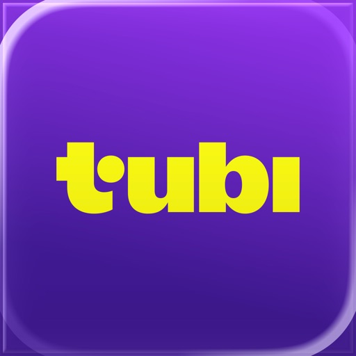

Nice to meet you, we’re Tubi. We’re more than a completely fee-free streamer with the largest library in the entire streaming universe. We’re entertainment fiends and collectors, and never judgers. So, get comfy and settle into whatever you’re feeling. It’s about to get good.

WATCH WITH ZERO FEES EVER (YES, REALLY!):

Live TV: news, weather, sports, & entertainment
It’s live, always on, forever fee-free and has way fewer ads than cable. We call that a win-win-win-win. 
+ Check your local news channels for weather and news.
+ Get game day ready with pre-game excitement.
+ Unwind with your favorite TV competitions and guilty pleasures.

Movies
From the biggest names in the industry to the indie darlings we can’t get enough of.
+ Top titles added every month.
+ Bask in loads of drama that isn’t your own.
+ Comedy, action, and horror…oh, my! Whatever genre you’re looking for, we have it.

Series
Marathon all the best series, all in one place, with zero subscriptions ever.
+ Refine your taste buds with cooking shows and competitions.
+ Get lost in the drama of an evening soap.
+ Decompress with laugh-out-loud sitcoms.

Tubi Originals
Made by us, just for you. And only available on Tubi.
+ Critically acclaimed series like Boarders and Big Mood.
+ Live out your fantasies with all-new reality shows, series, and movies.

Tubi Comic Con(tent)
It's a bird, it's a plane, it's...all your favorite comic book heroes and caped crusaders!
+ Binge full series, old school and new.
+ Stay current with the latest Hollywood releases.

Tubi Español
Tú perteneces aquí. Watch in Spanish with no subtitles necessary.
+ Keep up with all your telenovelas.
+ Stream Spanish-first favorites and discover dubbed blockbusters.

International Entertainment
+ Ikuze! We have all the anime!
+ Korea’s in the house!! Get your fill of K-pop, horror, action, comedy, and drama.
+ Live the Bollywood dream and dance along with tons of favorites.

MORE PERKS
+ Swipe your way to discovering new content.
+ Never run out of stuff to watch. We add new arrivals every week.
+ Not sure what to watch? Tap the dice icon in the corner to do the Tubi Shuffle and get a randomized pick!
+ Here, there, everywhere. Tubi works on 30+ devices, so it goes wherever you go.
+ We’ll never ask for your credit card, ever. You’ll pay zero fees forever. For really.
+ Create an account to build your own watchlist, save your watch progress, and get better recommendations.

See You In There™

#### smartthings
## SmartThings

Quickly and easily connect and control your smart home devices through SmartThings.
SmartThings is compatible with 100s of smart home brands. So, you can control all of your smart home gadgets in one place, including your Samsung Smart TV and smart home appliances.
With SmartThings, you can connect, monitor and control multiple smart home devices quicker and easier. Connect your Samsung smart TVs, smart appliances, smart speakers and brands like Ring, Nest and Philips Hue - all from one app.
Then control your smart devices using voice assistants including Google Assistant

[Key Features]
- Control and check in on your home from wherever you are
- Connect your smart devices across many different brands to work together by setting ‘scenes’
- Build routines that are set on time, weather, and device status, so your home runs smoothly in the background
- Allow shared control by giving access to other users
- Receive status updates about your devices with automated notifications
- Talk to your devices using Google Assistant
- Track, monitor and save money on energy with SmartThings Energy. See how much your home and compatible Samsung devices cost to run, and try various energy saving features, such as AI saving mode, or schedule devices to run during off peak hours.
- Receive recipe recommendations by scanning meal kits, wine, and meat. Plan, shop and prep meals with the help of SmartThings Cooking 

※ Some features may not be available in all countries.

[App requirements]
Some mobile devices may not be supported.
- iOS 16.0 or later / iPhone 6s or later / iPad mini 4 or later

※ App permissions
The following permissions are required for the app service. For optional permissions, the default functionality of the service is turned on, but not allowed. 

[Required access permissions]
-

[Optional access permissions]
• Bluetooth : Find nearby devices using Bluetooth or BLE.
• Microphone: Used to set up ultrasonic sensor-equipped devices
• Camera: Scan QR codes.
• Location: Automate actions using GPS. (GPS is optional.)
                    Find Wi-Fi information to add device in iOS 13 or later.
• Contacts: Verify user information that will be delivered while sending SMS.

#### google_docs
## Google Docs
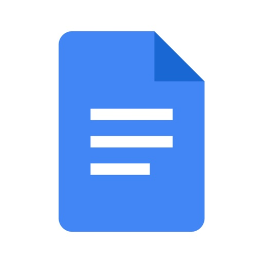

Create, edit, and collaborate on online documents with the Google Docs app.

Work together in real time
• Share documents with your team
• Edit, comment, and add action items in real time

Create anywhere, anytime—even offline
• Capture spontaneous ideas on the fly
• Get things done, even on the go, with offline mode
• Save time and add polish with easy-to-use templates

Edit and share multiple file types
• Open a variety of files, including Microsoft Word files, right in Google Docs
• Frictionless collaboration, no matter which application your teammates use
• Convert and export files seamlessly

Google Docs is part of Google Workspace: where teams of any size can chat, create, and collaborate.
Google Workspace paid subscribers have access to additional Google Docs features, including:

Use Gemini in Docs to quickly draft and edit content
• Draft outlines, blog posts, briefs, and more on the go
• Improve your writing with AI-powered suggestions

Learn more about Google Docs: https://workspace.google.com/products/docs/

Follow us for more:
• X: https://x.com/googleworkspace
• Linkedin: https://www.linkedin.com/showcase/googleworkspace
• Facebook: https://www.facebook.com/googleworkspace

#### giftful_-_wishlist___registry
## Giftful - Wishlist & Registry

Make Every Gift Perfect. Make Every Surprise Unforgettable.

Transform the way you give and receive gifts with Giftful, the all-in-one wishlist and registry app that takes the guesswork out of gifting. Whether you're celebrating life's biggest moments or everyday occasions, Giftful ensures every gift is meaningful, wanted, and perfectly suited to the recipient.

Why Choose Giftful?

UNIVERSAL COMPATIBILITY ACROSS ANY STORE
Unlike traditional registries tied to single retailers, Giftful lets you add items from ANY website.

SOCIAL GIFTING THAT BUILDS CONNECTIONS
Follow friends' lists, discover gift inspiration from your network, and engage with a community that celebrates life's special moments together.

SURPRISE-SAFE CLAIMING SYSTEM
Say goodbye to duplicate gifts and ruined surprises. Friends can claim items privately, keeping gift coordination seamless and surprises safe.

LIGHTENING-FAST GIFT ADDITION
Add wishes in seconds using our integrated browser, or add from any app. We handle the details automatically.

OCCASION-READY FOR EVERY CELEBRATION
From milestone events like weddings and baby showers to everyday moments like housewarmings and "just because" gifts, Giftful adapts to every gifting occasion throughout the year.

TOP FEATURES

• Create & Share Unlimited Wishlists: Build personalized wishlists for any occasion and share them with family and friends. Create lists for yourself, your children, pets, or anyone special.
• Smart Price Tracking & Comparison: Giftful monitors price changes across retailers and helps you find the best deals, ensuring your gift budget goes further.
• Dynamic Product Discovery: Browse trending items, discover curated gift ideas, and find inspiration from community-driven recommendations.
• Cross-Platform Sync: Everything stays perfectly synchronized across all devices.
• Social Engagement Feed: Stay connected by following friends' wishlists and engaging in a community-driven gifting experience.

Download Giftful today and join millions who have discovered stress-free, surprise-filled gifting.

#### capital_one_mobile
## Capital One Mobile

What’s on the Capital One Mobile app? All of your accounts, and so much more.

Whether you’re out in the world or feeling right at home, you can manage your money with ease:
- View balances and export statements
- Pay bills and take care of loans
- Check in on your credit with CreditWise
- Activate a credit or debit card when you need it
- Redeem rewards on the go
- Send and receive money with friends and family using Zelle®
 
With the Capital One Mobile app, you can ...
- Stay informed when you enable alerts and purchase notifications
- See everything that happens on your card with detailed transactions
- Instantly lock your credit or debit card from anywhere
- Get answers from Eno, your Capital One assistant

Download the app for better banking with Capital One.

Internet access is needed to use the mobile app. Check with your Internet service provider for details of specific fees and charges. Service outages may occur. Capital One customers are responsible for regularly checking their account statements. Push, email, and SMS alerts and notifications, including purchase notifications, must be enabled to be received. CreditWise monitoring and alerts may not be available if the information you enter at enrollment does not match the information in your file at one or more consumer reporting agencies or you do not have a file at one or more consumer reporting agencies. Features may not be available to all customers. Actual experiences may differ from those depicted. Additional terms and limitations apply. 

Zelle and the Zelle related marks are wholly owned by Early Warning Services, LLC and are used herein under license. To read about the Terms of your download, check out the End User License Agreement.

#### link_to_windows
## Link to Windows
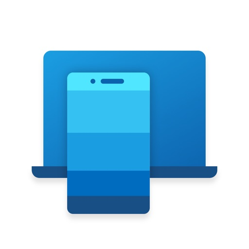

You love your phone. So does your PC. Get instant access to everything you love on your phone, right from your PC. To get started, connect your iPhone with the Phone Link Feature on your Windows PC.
 Enjoy these Phone Link features on your PC: 

 • Make and receive calls
 • Manage your phone's notifications 
 • Read and reply to text messages
 • View your phone contacts
 • Share files between your phone and PC 

Phone Link for iOS requires iPhone running iOS 16 or higher, and a PC with Bluetooth Low Energy (BLE) support running Windows 10 (with the May 2019 Update or later) or Windows 11. Not available for iPad (iPadOS) or MacOS.

 By installing this app, you agree to the Microsoft Terms of Use https://go.microsoft.com/fwlink/?LinkID=246338 and Privacy Statement https://go.microsoft.com/fwlink/?LinkID=248686

#### amazon_prime_video
## Amazon Prime Video

Watch movies, TV shows, live programming, and sports including Amazon MGM Studios-produced series and movies Road House, The Lord of the Rings: The Rings of Power, Fallout, Reacher, The Boys, and The Idea of You, and much more. Browse titles, search for your favorites, or enjoy movies and shows recommended just for you.

App features:
• Download videos to watch anywhere.
• Rent or buy new-release movies and popular TV shows (availability varies by marketplace).
• Cast from your phone or tablet to the big screen with Chromecast.
• Create multiple profiles so each person gets a personalized entertainment experience.
• Go behind the scenes of movies and TV shows with exclusive X-Ray access, powered by IMDb (availability varies by marketplace).

Enjoy Prime Video updates on your Apple TV or Mac by downloading the latest app from the App Store on your device. This requires an Apple TV 3rd generation or later, and for Mac, macOS Big Sur 11.4 or later.

If you subscribe to Prime Video via iTunes (where available), payment is charged to your iTunes Account at confirmation of purchase and your membership automatically renews monthly unless auto-renewal is turned off at least 24 hours before the end of the then current plan period. Your account is charged for renewal within 24 hours before the end of each plan period at the rate of your selected plan. Manage your subscription and turn off auto-renewal anytime by going to My Account or through iTunes.

For customers located within the European Union, United Kingdom or Brazil: By using this app, you agree to the Amazon Conditions of Use and the Prime Video Terms of Use at primevideo.com/ww-av-legal-home. See our Privacy Notice, Cookies Notice and Interest-Based Ads Notice at primevideo.com/ww-av-legal-home.

For all other customers: By using this app, you agree to the Amazon Conditions of Use, Privacy Notice, and and the Prime Video Terms of Use at primevideo.com/ww-av-legal-home.

#### meta_ai_-_vibes___ai_glasses
## Meta AI - Vibes & AI Glasses
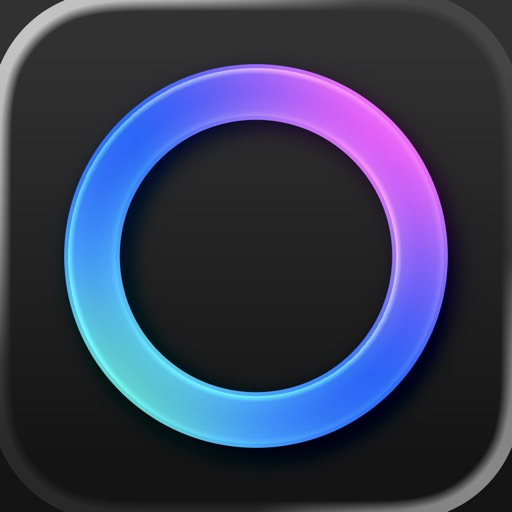

Create, remix, and share vibes—expressive AI-generated videos. Get tailored answers and inspiration on-the-go. Pair and manage your AI glasses. 

Get access to industry-leading AI models for generating creative videos with custom animations, music and more. Just describe what you want to create and play with different edits and styles to make the perfect vibe. Discover vibes from other AI creators in the feed, and instantly remix them to make something new.

Need quick answers and recommendations? Talk to Meta AI through voice or text to get personal AI assistance throughout your day. And pair your AI glasses to go hands-free. The Meta AI app is the required companion app for managing your Meta AI glasses, importing and sharing media and more.

*Certain Meta AI features are only available in select countries and languages. Some of these features may roll out slowly over time.

Need to report an issue or share feedback? Simply shake your phone and tap on “Report a Bug.”

#### venmo
## Venmo

Venmo is the fast, safe, social way to pay and get paid. Join over 90+ million people who use the Venmo app today
 
SEND AND RECEIVE MONEY
Pay and get paid for anything from your share of rent to a gift. Add a note to each payment to share and connect with friends

SPLIT A REQUEST AMONG MULTIPLE VENMO FRIENDS
You can now send a payment request to multiple Venmo friends at once and customize the amount each person owes
 
GET REWARDED WITH THE VENMO CREDIT CARD
Earn up to 3% cash back on your eligible top spend category¹ —we’ll do the math. Split card purchases with Venmo friends, and shop everywhere Visa® credit cards are accepted—online, in-store, worldwide²

BUY CRYPTO WITH AS LITTLE AS $1
Buy, hold, and sell cryptocurrency right on the Venmo app. New to crypto? Learn more with in-app resources. Crypto is volatile, so it can rise and fall in value quickly. Be sure to take it at a pace you're comfortable with³

SHOP WITH THE VENMO DEBIT CARD
Spend your money in Venmo everywhere Mastercard® is accepted around the globe  — and earn cashback from some of your favorite spots. Terms apply: venmo.me/rewards⁴

VENMO TEEN ACCOUNTS
A debit card of their very own and a Venmo account to send money to trusted friends and family⁵. All with no minimum balance or monthly fee
 
DO BUSINESS ON VENMO
Create a business profile for your side gig, small business, or anything in between—all under your same Venmo account

PAY IN STORES
Use your Venmo QR code to pay touch-free at stores like CVS
 
PAY IN APPS & ONLINE
Check out with Venmo on some of your favorite apps, like Uber Eats, StockX, Grubhub
 
MANAGE YOUR MONEY
Get your Venmo money in the bank within minutes using Instant Transfer⁶. Want your paycheck up to two days earlier* than your normal payday? Try Direct Deposit
 
¹Use of cash back is subject to the terms of the Venmo account. See Rewards Program Terms: https://www.synchronycredit.com/gecrbterms/html/RewardsTerms.htm
²Application subject to credit approval. You must be at least 18 years old and reside in the US or its territories to apply. You must have a Venmo account in good standing, that has been open for at least 30 days prior to application
The Venmo Credit Card is issued by Synchrony Bank pursuant to a license from Visa USA Inc. VISA is a registered trademark of Visa International Service Association and used under license
³Terms apply. Only available in the US and limited in certain states. Buying and selling cryptocurrency is subject to a number of risk and may result in significant losses. Venmo does not make any recommendation regarding buying or selling cryptocurrency. Consider seeking advice from your financial or tax adviser
⁴The Venmo Mastercard® is issued by The Bancorp Bank, N.A., pursuant to license by Mastercard International Incorporated. Mastercard and the circles design are registered trademarks of Mastercard International Incorporated. The Bancorp Bank, N.A. is issuer of the Card only and not responsible for the associated accounts or other products, services, or offers from Venmo
⁵ The Venmo Teen Debit Card is available for eligible users 13-17 years old with parent or legal guardian sign up. Terms apply
⁶ Transfer speed depends on your bank and could take up to 30 minutes. Transfers are reviewed which may result in delays or funds being frozen or removed from your Venmo account.
* Early access compared to standard banking practice of posting funds at settlement and subject to your employer providing pay information to the bank prior to payday. It may take up to two pay cycles for Direct Deposit to take effect. Transactions are reviewed, which may result in delays or funds being frozen or removed from your account

Emoji artwork is provided by emojitwo.github.io/, originally released as emojione.com/ by Ranks.com with contributions from the Emojitwo community and is licensed under creativecommons.org/licenses/by/4.0/legalcode

Venmo
2211 N. First St., San Jose, CA 95131

#### google_meet
## Google Meet
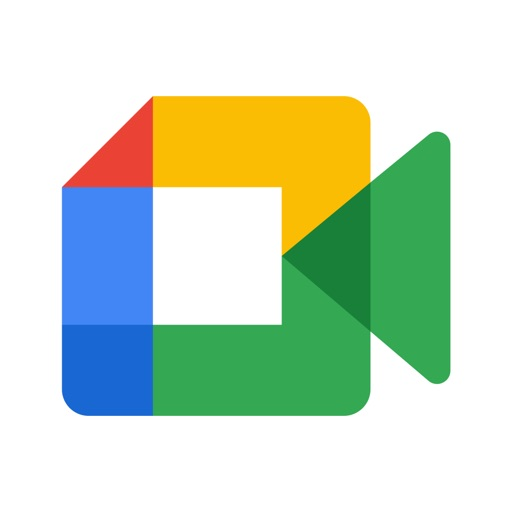

Google Meet is a high-quality video calling app designed to help you have meaningful and fun interactions with your friends, family, colleagues, and classmates, wherever they are.

Meet lets you connect in whatever way works for you: Call someone spontaneously, schedule time together, or send a video message that they can watch and respond to later.

Meet also helps you get things done. It integrates with other Google Workspace apps like Gmail, Docs, Slides, and Calendar, and offers a number of features to help you run smooth and engaging meetings, like noise cancellation, in-call chat, recordings, and more.*

Features to look forward to:

Make spontaneous calls or host video meetings with your friends and colleagues, all in one app.

Enjoy one-on-one video calls for up to 24 hours and host meetings for up to 60 minutes and 100 people at no cost.

Follow along in your preferred language with real-time translated captions in over 70 languages.

Use in-call chat to share ideas, ask questions, or provide feedback without interrupting the flow of the conversation.

Make your calls more engaging with in-call emojis that allow you to express yourself seamlessly without interrupting the conversation.

Share visuals like photos, videos, and presentations during your call to collaborate or simply share memories from your recent vacation.

Make your calls with family and friends more fun with stackable effects that allow participants to add multiple backgrounds, filters, and animations, to create a personalized experience.

Use on-the-go mode for an audio-only experience with larger call controls, making it easier to take calls with fewer distractions while walking, driving, or using public transportation.

Access on any device: Meet works across mobile, tablet, web, and smart devices,** so everyone can join.

High quality video: Show up looking your best with up to 4k video quality video***.

Learn more about Google Meet: https://workspace.google.com/products/meet/

Follow us for more:

Twitter: https://twitter.com/googleworkspace

Linkedin: https://www.linkedin.com/showcase/googleworkspace

Facebook: https://www.facebook.com/googleworkspace/

*Meeting recording, noise cancellation are available as premium features. See https://workspace.google.com/pricing.html for more details

**Not available in every language.

***Bandwidth permitting. Google Meet automatically adjusts to the highest video quality possible based on your bandwidth.

Data charges may apply. Check your carrier for details.

Specific feature availability may vary based on device specifications.

#### lemon8_-_lifestyle_community
## Lemon8 - Lifestyle Community

Lemon8 is a lifestyle community focused app powered by TikTok, where you can discover and share authentic content on a variety of topics such as beauty, fashion, travel, food, and more. You can edit and share photos with great ease and engage in discussion with like-minded people. Lemon8 offers a space where you can connect, inspire, and support one another.

[Find Your Community]
- Lemon8's customized content is specifically made for you. Our "For You" section recommends a personalized feed to you based on your interests. 
-Lemon8 is also a great place for you to express and engage in a free space with other like-minded creatives within the community.

[Create with Ease]
- Fed up of the faff of creating on one app, editing on another, posting on yet one more? With Lemon8, our in-app suite allows you to compose texts, edit photos and videos with ease.
- You'll find a whole library of intuitive templates, stickers, filters and fonts for your photos and videos.
- Say 'goodbye' to jumping between apps to make a single post and, say 'hello' to Lemon8!

[Explore and Discover]
- Use hashtags! Our hashtags not only help your posts get discovered, but also help you easily discover content you like.
- Our campaign features and intuitive search helps you find trending content, top-performing creators and whatever answer you're browsing for.

[Contact Us]
- We want to build Lemon8 into the app you need and desire. Your suggestions make Lemon8 better.
- If you have any feedback, questions or concerns, contact us at any time using the following email: contact@lemon8-app.com

#### aliexpress_-_shopping_app
## AliExpress - Shopping App
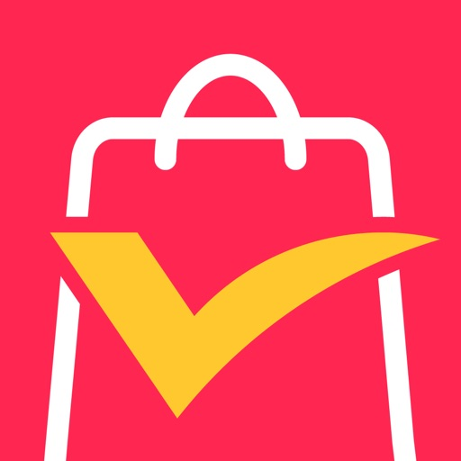

Embrace the Magic of 11.11 with AliExpress!

Welcome to a celebration of thoughtful shopping, where global treasures meet your everyday needs. As the world gears up for 11.11, AliExpress invites you to discover a curated collection of high-quality products—each one handpicked to simplify your life, elevate your space, or surprise someone special. From November 8–17, we’ve designed an experience that blends convenience, creativity, and care.

Your 11.11 Journey Starts with Calm Exploration
Before the rush begins, take time from November 8–10 to explore and save the items that truly matter to you. Whether it’s a sleek smartwatch crafted in South Korea, a cozy throw blanket made in Italy, or a minimalist desk organizer designed in Scandinavia, our global partners deliver quality without the noise. We’ve simplified the process so you can focus on what you value most.

Shop with Confidence, Not Chaos
When November 11–17 arrives, you’ll find a marketplace built for ease—not frenzy. Our intuitive app lets you browse carefully curated deals, read honest reviews from real shoppers, and track every step of your order in real time. With secure payments and reliable global shipping, your purchases arrive safely and swiftly, so you can enjoy the joy of discovery without the stress.

More Than a Sale—A Connection to the World
AliExpress isn’t just about transactions; it’s about bridging cultures and stories. This 11.11, we spotlight small businesses and artisans whose craftsmanship reflects their heritage. A hand-painted ceramic mug from Mexico might carry the same care as a precision-engineered gadget from Germany—both are here to enrich your life, at prices that feel fair.

Personalized Finds, Perfectly Timed
Our smart recommendations adapt to your interests, ensuring you never miss a hidden gem or trending must-have. Stay informed with timely notifications about exclusive 11.11 offers and limited-time surprises—so you’re always one step ahead.

Start Your 11.11 Adventure Today
Download the AliExpress app and let the magic unfold. Whether you’re treating yourself or finding the perfect gift, we’ve made it effortless to connect with the world’s best picks. This 11.11, shop not just for savings, but for meaning.

#### ulta_beauty__makeup___skincare
## Ulta Beauty: Makeup & Skincare

Download the Ulta Beauty app today and get everything you love about Ulta Beauty right at your fingertips.

Track your Ulta Beauty Rewards™ points progress, activate membership and app-exclusive offers and redeem points anywhere, anytime. Discover the updated GLAMlab® for virtual try-on, Foundation Shade Matcher to find your perfect shade and Skin Analysis for a customized skin care recommendation.

•	Shop by category and filter by brand, price, rating, bestsellers & new arrivals. Discover brands you’ll find exclusively at Ulta Beauty and celebrate, amplify and support underrepresented voices in the beauty industry.

•	Discover Conscious Beauty at Ulta Beauty®—choices for you and for your world. Shop the brands that share your values with our five pillars: Clean Ingredients, Vegan, Cruelty Free, Sustainable Packaging and Give Back.

•	Book a beauty service at The Salon™ at Ulta Beauty. Choose from hair services, waxing & brows, makeup & lashes, skin services and ear piercing.

•	Opt in for push notifications and be the first to know about app-exclusive offers, upcoming events at your local Ulta Beauty and more.

#### depop_-_buy___sell_clothes
## Depop - Buy & Sell Clothes

Depop – The Online Marketplace to Buy and Sell Clothes

Depop is the go-to online marketplace for buying and selling clothes. Explore vintage items, unique fashion pieces, and trending items from a global community of creators. Our marketplace makes discovering and selling clothes simple, fast, and rewarding.

Dive into our lively marketplace, where buying and selling clothes connects fashion lovers around the world.

INTRODUCING OUTFITS
Create, moodboard, and shop complete looks directly in the app. We turn style inspiration into real outfits, making outfit planning effortless.

WHY CHOOSE THE DEPOP APP?

SELL CLOTHES WITHOUT FEES
Listing clothing is quick and easy. Add photos, write a short description, and start selling in your online marketplace. Manage offers, communicate with buyers, and ship all from one place.

SELL WITHIN SECONDS
Simply snap a photo and our AI will scan it, write the description and complete the listing details for you

DISCOVER CLOTHING THAT MATCHES YOUR STYLE
Browse vintage clothing and unique finds you won’t see anywhere else. Our marketplace helps you explore new styles, follow favorite sellers, and stay on trend while shopping online.

TRUSTED PLATFORM FOR CLOTHING
Buy and sell clothes with confidence. Depop’s marketplace provides secure checkout, order tracking, and direct messaging with buyers or sellers. Enjoy a safe and reliable online shopping experience.

STAY UPDATED
Receive notifications for new listings, trending clothing, and price changes. Whether selling or shopping, we keep you informed in real-time.

MANAGE YOUR CLOTHING BUSINESS
Keep track of payments, shipments, and returns. Whether running an online shop or selling from your closet, we organize everything for a seamless experience.

CREATE YOUR WISHLIST
Save vintage clothing or other items to shop later. We make online shopping flexible, helping you plan your next fashion purchase.

JOIN OUR CLOTHING COMMUNITY
Depop is more than an online shop—it’s a marketplace connecting millions who buy and sell clothing. Join a community focused on creativity, sustainability, and individuality.

WHY USE DEPOP?

Depop is the ultimate marketplace to explore and sell clothes across categories like:
• Tops & Tees
• Jeans & Trousers
• Trainers & Shoes
• Dresses
• Sweatshirts & Hoodies
• Jewelry & Accessories
• Kidswear
• Men’s & Women’s Clothing
• Vintage Clothing

From clearing out your wardrobe to finding rare preloved pieces, our app is the trusted marketplace to buy and sell clothes with purpose.

DOWNLOAD DEPOP TODAY

Join us — the marketplace reshaping online shopping for clothes. Discover vintage clothing, connect with creative sellers, and sell items in a trusted online marketplace. Start your preloved fashion journey today.

Payment processing fees may apply.

Contact Us:
Website: Depop.com
TikTok: tiktok.com/@Depop
Instagram: instagram.com/Depop
YouTube: youtube.com/@depop

#### oura
## Oura

Meet Oura Ring - the revolutionary smart ring that translates your body’s most meaningful messages to transform how you feel every day. 

The award-winning Oura App is your personal health companion, delivering valuable insights and daily recommendations to help you to make health and wellness a daily practice. 

THREE DAILY SCORES
Your Sleep, Activity, and Readiness scores give you a clear understanding of the state of your body with actionable guidance on how to stay balanced.

ACCURATE BY DESIGN
Your finger provides the most accurate reading for over 30 biometrics like heart rate, body temperature, blood oxygen, and more.

BEST-IN-CLASS SLEEP MONITORING
Wake up to in-depth analysis of your sleep patterns and personalized tips to optimize your routine, so you’ll feel more energized every day.

ADVANCED ACTIVITY TRACKING
From mountain climbing to meditating, Oura Ring tracks your daily movement while prioritizing balance and rest. Measure your daily activities, calories, steps, and inactive time.

CYCLE INSIGHTS
Better understand your body’s cycle patterns or help improve your chances of getting pregnant by tracking daily and monthly body temperature trends.

STRESS RESILIENCE
Understand how daily stress is affecting your body and learn how to be more resilient to stress by finding balance between moments of strain and recovery.

RECOVERY 
Get personalized insights and guidance on how rest and recovery affects your overall Readiness Score. Feeling under the weather? Activate Rest Mode to give yourself a break.

ILLNESS DETECTION
Oura Ring monitors shifts in your body temperature and heart rate so you can tell when you may be getting sick.

LONG-TERM TRENDS
View your daily, weekly, and monthly trends, and discover how your choices and environment affect your body.

TRACK HABITS WITH TAGS
Customize your experience and test out new habits by adding tags — like "caffeine" or "alcohol" — and discover how your choices affect your sleep and recovery.

Oura Ring is not a medical device and is not intended to diagnose, treat, cure, monitor, or prevent medical conditions or illnesses. Oura Ring is only designed for general fitness and wellness purposes. Please do not make any changes to your medication, daily routines, nutrition, sleep schedule, or workouts without first consulting your doctor or another medical professional.

#### alibaba_com
## Alibaba.com

What is Alibaba.com?
Alibaba.com is one of the world’s leading B2B ecommerce marketplaces. Our app allows you to source products from global suppliers, all from the convenience of your mobile device.

Purchase with confidence
Our Trade Assurance service protects your orders and payments on the platform, letting you purchase securely and conveniently with extended support.

Customizable products
Meet suppliers with years of customization and order fulfillment experience for sellers on Amazon, eBay, Wish, Etsy, Mercari, Lazada, and more.

Easy sourcing
Discover millions of ready-to-ship products in every industry category. Tell suppliers what you need and get quotes quickly with Request for Quotation services.

Fast shipping
Alibaba.com partners with major freight forwarders to provide land, sea, and air shipping solutions with on-time delivery services, end-to-end tracking, and competitive prices.

Livestreams and factory tours
Interact with manufacturers in real-time via product demos and tours of manufacturing facilities, providing insight and oversight on how your products are made.

Popular categories and trade shows
Source a wide range of popular items – from trending consumer goods to raw materials – and join our annual trade shows for niche product highlights and discounts.

Quality control
Choose Alibaba.com Production Monitoring and Inspection Services to reduce production delay and quality risks.

Discounts and promotions
Unlock new discounts and promotions from featured manufacturers and suppliers.

Stay updated
Use the Alibaba.com app to stay up to date on new products and promotions from your favorite suppliers.

Language and currency support
Alibaba.com supports 16 languages and 140 local currencies. Use our real-time translator to communicate with sellers in your mother tongue.

#### life360__stay_connected___safe
## Life360: Stay Connected & Safe

With the NEW Life360 Pet GPS you can track your furry family members; because pets are part of the family too!
Life360 Pet GPS Available in US, UK, CA, AU, NZ

Whether at home, online, or on the move, our comprehensive family safety features bring peace of mind to your loved ones AND help safeguard your personal belongings. Experience location safety features that surpass ordinary GPS tracking apps. More than just a GPS location tracker, with Life360, finding friends and family has never been easier.

In addition to focusing on safety, Life360 allows you to effortlessly keep tabs on your pets, keys, wallet, phone, and other essentials using Tile Bluetooth trackers and the NEW Life360 Pet GPS. These trackers integrate with your Life360 map, ensuring you can easily locate everything and everyone that matters most from a single, convenient platform.

Life360 memberships include essential safety features like:

- SOS Alerts: Send silent alerts with your precise location to friends, family members, emergency contacts, and responders.
- 24/7 Emergency Dispatch: We're here for your loved ones, always ready to respond, even when you can't make the call.
- Identity Theft Protection: Safeguard sensitive digital information for each family member, backed by a white-glove restoration service.
- Roadside Assistance: Free towing, jumpstarts, tire changes, lockout assistance, refueling and more.
	
Download the free app now to access Advanced Location Sharing, Location History, Crash Detection, and Place Alerts. Keep tabs on your family members as they come and go from key locations like home, school and work.

Take your safety to the next level by upgrading to one of our premium Life360 memberships. Choose the plan that suits your friend's and family's unique needs and enjoy a 7-day free trial.

Life360 Silver - Simplify your safety with features such as:
- 2 Places with unlimited Alerts
- 2 days of Location History
- Crash Detection
- Family Driving Summary
- Data Breach Alerts
- SOS Help Alerts During Emergencies

Life360 Gold* - Keep your family secure on the go with all the features of Life360 Silver, plus:	
- 30 days of Location History
- Unlimited Place Alerts
- Individual Driver Reports
- Crash Detection with emergency dispatch and live agent support
- 24/7 Roadside Assistance
- $250 in Stolen Phone Protection
- ID Theft Protection and Data Breach Alerts
- $25,000 in Stolen Fund Reimbursement

Life360 Platinum* - Prepare for anything, anywhere, with all the features of Life360 Gold, plus:
- $1 million in Stolen Fund Reimbursement
- 50 miles of Free towing
- $500 in Stolen Phone Protection
- Travel Support with Disaster Assistance
- Medical Support

https://www.life360.com/privacy_policy/
https://www.life360.com/terms_of_use/

Explanation for App Permissions [Optional Permissions]
• Camera: App accesses user’s camera to allow users to take photos or videos on the app.
• Location: App accesses location information to allow users to share location information to other Circle members.
• Microphone: App accesses microphone to allow users to record and share voice memos.
• Music and audio: App accesses music and audio to play music and audio.
• Nearby devices: App accesses nearby devices to find, connect to and determine the relative position of nearby devices by using Bluetooth.
• Notifications: App accesses notification to send notification to users.
• Phone: App accesses user’s phone to allow users to make phone calls on the app
• Photos and videos: App accesses photos and videos to allow users to view photos and videos on the app.
• Physical activity: App accesses physical activities to calculate and detect driving events, such as driving speed, use of breaks, and accident detection. 

You may still use the app even if you withhold optional permissions. However, app features requiring permission may not be available in such cases.

#### mcdonald's
## McDonald's

Get the app now to join MyMcDonald's Rewards and start earning points on your faves for free McDonald's. Plus, get exclusive deals and save time by ordering ahead in the app.*  

Mobile Order & Pay 
Get your faves fast with Mobile Order and Pay. Place your order and select your pickup option.*

MyMcDonald’s Rewards
Join MyMcDonald's Rewards in the app to start earning points on every purchase and redeem for free McDonald’s.*

Exclusive Deals and App Offers 
Get exclusive deals on your McDonald’s favorites in the app with contactless Mobile Order & Pay* and convenient Drive Thru or Curbside pickup.

McDelivery 
Now get your faves delivered, earn MyMcDonald’s Rewards points and track your order all with McDelivery in the app. 

Save Your Favorites 
No pickles? No problem. Customize and save your favorites to quickly reorder for your next visit.

Restaurant Locator 
Open the map and find the nearest McDonald’s, along with store hours, and restaurant information. 

Download the McDonald’s app today and enjoy access to exclusive deals, MyMcDonald’s Rewards and much more. 

*McDelivery prices may be higher than at restaurants. Download and registration required. Data rates may apply. The McDonald's App is not currently compatible with smartwatches. Check https://www.mcdonalds.com/us/en-us/terms-and-conditions.html for Terms and Conditions and more information. © 2023 McDonald’s

#### google_drive
## Google Drive
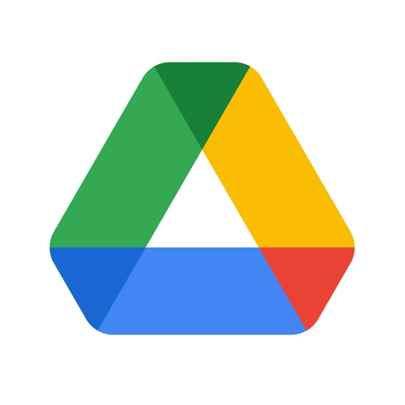

Google Drive, part of Google Workspace, lets you securely store, intelligently organize and collaborate on files and folders from anywhere, on any device.

With Drive, you can:
• Safely store and access your files anywhere
• Edit and store 100+ file types, including PDFs, Office files, videos and more
• Quickly access recent and important files
• Scan and upload paper documents using your device’s camera
• Search for files by name and content
• Filter files by type, last modified date and more
• Share and set permissions for files and folders
• View your content on the go while offline
• Receive notifications about important activity on your files

Google Workspace subscribers have access to additional Drive functionality, including:
• Security and management controls for admins to help meet data compliance needs
• Sharing files and folders directly with groups or teams within your organization
• Creating a shared drive to store all of your team’s content

Learn more about Google Apps update policy: https://support.google.com/a/answer/6288871

Google accounts get 15GB of storage, shared across Google Drive, Gmail, and Google Photos. For additional storage, you can upgrade to Google Workspace or Google One as an in-app purchase.

Storage subscriptions purchased from the app will be charged to your iTunes Account, and automatically renew unless auto-renew is turned off at least 24 hours before the end of the current period. Subscriptions and auto-renewal may be managed by going to iTunes Account Settings after purchase.

Google Privacy Policy: https://www.google.com/intl/en_US/policies/privacy
Google Drive Terms of Service: https://www.google.com/drive/terms-of-service

Follow us for more:
X: https://x.com/googleworkspace and https://x.com/googledrive
LinkedIn: https://www.linkedin.com/showcase/googleworkspace
Facebook: https://www.facebook.com/googleworkspace/

#### alo
## ALO

Get the most with the ALO mobile app — your quick & easy pass for early drop access, app-exclusive drops & promotions and more. It’s easier than ever to shop for studio-to-street looks and take your practice with you.

#### govee_home
## Govee Home

Govee Home is an app to help you manage your smart devices.
-Check the status of your device in real time
-Connect new devices in seconds
-Enjoy the artistry & magic of lighting effects
-Get a first look at new tech and share your ideas
-Fast and efficient customer service

Govee Home has been integrated with HealthKit, which can synchronize body fat scale data to Apple Health, where BMI, weight, and fat percentage can be found in Apple Health's Body Measurements, giving you a clear and comprehensive picture of your health. You'll need to enable health privacy permissions for Govee Home.

#### google_sheets
## Google Sheets
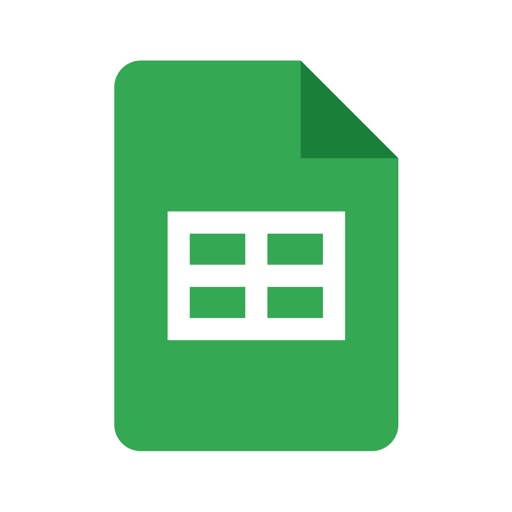

Create, edit, and collaborate on spreadsheets with the Google Sheets app. With Sheets you can:

* Create new spreadsheets or edit existing ones
* Share spreadsheets and collaborate with others in the same spreadsheet at the same time
* Work anywhere, anytime - even offline
* Format cells, enter/sort data, view charts, insert formulas, use find/replace, and more
* Never worry about losing your work -- everything is automatically saved as you type
* Open, edit, and save Excel files

Google Sheets is part of Google Workspace: where teams of any size can chat, create, and collaborate.

Google Workspace subscribers have access to additional Google Sheets features, including: 
* Easily add collaborators to projects, see changes as they occur, receive notifications for edits that happen while you’re away, and chat with colleagues in the same spreadsheet. All changes are automatically saved as you make them. And with offline access, you can create, view, and edit files wherever and whenever
* Get insights fast, powered by Google AI
* Work seamlessly across Sheets and Excel
* Maintain control with enterprise-grade security
* Analyze data from other business-critical tools
* Build custom solutions

#### ebay_online_shopping___selling
## eBay online shopping & selling

Life’s easier in the eBay app—buy and sell millions of items on the go. Discover
exclusive online deals, every single day.

Never miss a deal 
With the eBay app, you can stay in the know with real-time alerts about your Daily Deals, order updates, and more—all sent to your device with personalized push notifications.

Quickly list items with AI
Snap or upload a photo in the eBay app and let AI instantly generate descriptions and key details for your listing—including brand, category, and more.

Search, find, and save faves
Experience game-changing shopping wherever you are:
● Shop by condition: From brand-new to pre-loved fashion and eBay Refurbished tech, find something that’s just right for you.
● Heart your faves: Never miss the latest drops and deals when you add an item to your Watchlist.
● Search with pics: See something you like? Simply upload it with the push of a button and find matches right away.

Shop the sustainable way
Save money while discovering something truly unique when you shop vintage and pre-loved finds. Plus, extend the life cycle of tons of faves, all while helping the planet. What’s not to love?

Score eBay Live exclusives
Your real-time shopping experience is here! Join the livestream for exclusive drops, live auctions, and case breaks. Connect with your community, fave sellers, and creators for more of the things you love.

Authenticity Guarantee
Shop with confidence. The Authenticity Guarantee checkmark means eligible trading cards, sneakers, watches, and handbags will be inspected and verified by expert authenticators.

eBay Money Back Guarantee
Enjoy total peace of mind thanks to the eBay Money Back Guarantee. With us, you’re covered. Get the item you ordered or your money back—it’s that simple.*
*For full eligibility criteria and all terms and conditions visit:
https://pages.ebay.com/ebay-money-back-guarantee/

Collect the easy way with PSA Vault
Simply add PSA grading to eligible raw trading cards. With PSA Vault you can manage your entire portfolio and save money thanks to no sales tax and no storage or selling fees (withdrawal fee applies). Plus, you can find, price, and list gems at lightning speed.

Explore quick and easy payment options
We make it easy to pay for the things you want in an instant. Simply store your preferred payments safely and securely so you can check out in a flash!

Keep in touch
Your feedback is important to us. Contact us with any questions by joining the discussion at www.ebay.com/iOS

#### snapchat
## Snapchat

Snapchat is a fast and fun way to share the moment with your friends and family

SNAP 
• Snapchat opens right to the Camera — just tap to take a photo, or press and hold for video.
• Express yourself with Lenses, Filters, Bitmoji and more! 
• Try out new Lenses daily created by the Snapchat community!

CHAT 
• Stay in touch with friends through live messaging, or share your day with Group Stories.
• Video Chat with up to 16 friends at once — you can even use Lenses and Filters when chatting!
• Express yourself with Friendmojis — exclusive Bitmoji made just for you and a friend.

STORIES
• Watch friends' Stories to see their day unfold.
• See Stories from the Snapchat community that are based on your interests.
• Discover breaking news and exclusive Original Shows.

SPOTLIGHT
• Spotlight showcases the best of Snapchat!
• Submit your own Snaps or sit back, relax, and watch.
• Pick your favorites and share them with friends.

MAP 
• Share your location with your best friends or go off the grid with Ghost Mode.
• See what your friends are up to on your most personal map when they share their location with you. 
• Explore live Stories from the community nearby or across the world!

MEMORIES 
• Save unlimited photos and videos of all your favorite moments.
• Edit and send old moments to friends or save them to your Camera Roll.
• Create Stories from your favorite Memories to share with friends and family.

FRIENDSHIP PROFILE 
• Every friendship has its own special profile to see the moments you’ve saved together.
• Discover new things you have in common with Charms — see how long you’ve been friends, your astrological compatibility, your Bitmoji fashion sense, and more!
• Friendship Profiles are just between you and a friend, so you can bond over what makes your friendship special.

Happy Snapping!

• • •

Please note: Snapchatters can always capture or save your messages by taking a screenshot, using a camera, or otherwise. Be mindful of what you Snap!

For a full description of our privacy practices, please see our Privacy Center.

#### microsoft_teams
## Microsoft Teams
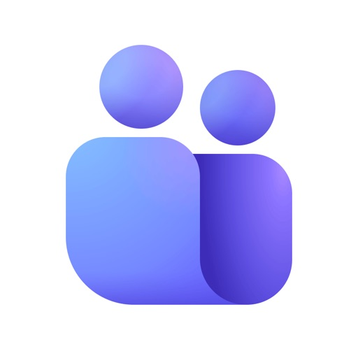

Whether you’re connecting with your community for an upcoming activity or working with teammates on a project, Microsoft Teams helps bring people together so that they can get things done. It’s the only app that has communities, events, chats, channels, meetings, storage, tasks, and calendars in one place—so you can easily connect and manage access to information. Get your community, family, friends, or workmates together to accomplish tasks, share ideas, and make plans. Join audio and video calls in a secure setting, collaborate in documents, and store files and photos with built-in cloud storage. You can do it all in Microsoft Teams. 

Easily connect with anyone: 
• Skype is now part of Teams. Continue where you left off with your chats, calls and contacts in Microsoft Teams Free. 
• Meet securely with communities, teammates, family, or friends.
• Set up a meeting within seconds and invite anyone by sharing a link or calendar invite. 
• Chat 1-1 or to your entire community, @mention people in chats to get their attention. 
• Create a dedicated community to discuss specific topics and make plans*.
• Work closely and collaborate by keeping conversations organized by specific topics and projects with teams and channels.
• Video or audio call anyone directly in Teams or instantly convert a group chat to a call. 
• Use GIFs, emojis, and message animations to express yourself when words aren’t enough.
 
Accomplish plans and projects together: 
• Send photos and videos in chats to quickly and easily share important moments.
• Use cloud storage to access shared documents and files on the go. 
• Organize shared content in a community — events, photos, links, files —so you don’t have to waste time searching*. 
• Get the most out of your meetings by using screen share, whiteboard, or breakout in virtual rooms.
• Manage access to information and ensure the right people have access to the right info, even when people join and leave projects.
• Use task lists to stay on top of projects and plans - assign tasks, set due dates, and cross off items to keep everyone on the same page. 

Designed to give you peace of mind: 
• Securely collaborate with others while maintaining control over your data.
• Keep communities safe by allowing owners to remove inappropriate content or members*.
• Enterprise-level security and compliance you expect from Microsoft 365**. 

*Available when using Microsoft Teams with your Microsoft account.

**Commercial features of this app require a paid Microsoft 365 commercial subscription or a trial subscription of Microsoft Teams for work. If you’re not sure about your company’s subscription or the services you have access to, visit Office.com/Teams to learn more or contact your IT department. 

By downloading Teams, you agree to the license (see aka.ms/eulateamsmobile) and privacy terms (see aka.ms/privacy). For support or feedback, email us at mtiosapp@microsoft.com. EU Contract Summary: aka.ms/EUContractSummary

Consumer Health Data Privacy Policy   
https://go.microsoft.com/fwlink/?linkid=2259814

#### rakuten__cash_back___deals
## Rakuten: Cash Back & Deals

Stack Cash Back on top of coupons when you use the Rakuten app to get the best deal! It's 100% free for everyone - just join and start earning today!

Become one of the 17 million users who use Rakuten to get Cash Back

Shop 3,500+ stores all in one app

Here's how it works:
1. Join for free & choose a store to start shopping.
2. Earn Cash Back after you make a purchase.
3. Get paid via PayPal or check.
...and repeat!

REFER FRIENDS & EARN: Share your referral link with friends and earn when they make a purchase! They will earn too, it's a win-win! Referral bonuses are unlimited, and it's free to share. 

AUTOMATICALLY APPLY COUPONS: Rakuten will find and apply coupons at checkout. 

EARN IN STORE & WITH DINING: Activate free Cash Back offers near you to find the best restaurant and store deals in your area. 

MY ACCOUNT: Get detailed status on what your Cash Back status is. Know when your next payment date is, and choose how you get paid - either by check, gift card, or PayPal. 

Stack Cash Back with sales, coupons, free shipping, loyalty programs, and more! There's unlimited Cash Back every time you shop in the app.

We've paid our members over $3 billion to date. What are you waiting for?

*Based on TrustPilot reviews as of 2/12/24

Stay in the loop for the latest ways to earn & save with Rakuten:

Website: www.rakuten.com
Facebook: www.facebook.com/rakuten
Instagram: www.instagram.com/rakuten
Twitter: www.twitter.com/rakutenus
Pinterest: www.pinterest.com/rakuten

#### fedex_mobile
## FedEx Mobile
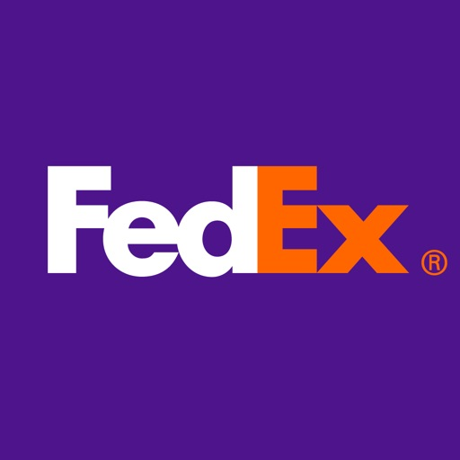

Download a more convenient way to ship and track. Manage your FedEx packages with the FedEx Mobile app. It’s easy to use – and compatible with your watch.

 

Track:

 • Enroll in FedEx Delivery Manager to take control of your deliveries*

 • Interactive map view to help you track packages in real time*

 • Hold a package at a nearby FedEx location or set a vacation hold for all your packages*

 • Leave delivery instructions for your driver*

 • Sign for packages from your phone*

 • Enable mobile push notifications*

 • View photo proof of residential delivery once your package arrives or a delivery attempt when a delivery is missed*

 • Display the driver’s name and photo*

 • Track from your home screen with a widget

 • Scan door tags to get options for missed deliveries*

Ship:

 • Create a domestic or international mobile shipment label; then print it from your phone or get a QR code and let us print it for you**

 • Use your phone to measure your package for the most accurate rates

 • Get shipping rates

 • Schedule and manage pickups**

 
Maximize your FedEx experience by allowing the following permissions: Biometric Login, Location, Camera and Push Notifications. These permissions will allow you to login easily, find nearby drop-off locations, scan barcodes, measure packages and get instant status updates.

*Available in some regions.
**Shipping administration rules apply.

#### ring_-_always_home
## Ring - Always Home

Know what’s happening at home from wherever you are with Ring Video Doorbells, Security Cameras and Alarm systems, and Smart Lights. Ring Doorbells and Cameras can send you instant alerts when someone’s at your door or motion is detected. Keep an eye on what matters with live HD video and greet visitors with Two-Way Talk. With a Ring Home Plan subscription (or free trial), you can review, save, and share Ring videos.

Ring Smart Lights let you control and schedule lighting easily. Some models can even notify you about motion nearby, and trigger other compatible Ring devices to record.

Ring Alarm systems let you monitor entrances and indoor spaces, and detect certain safety hazards. Enroll in Ring Alarm Professional Monitoring* (compatible Ring Home Plan subscription required) to request dispatch of emergency responders when your Ring Alarm is triggered.

Whether you’re halfway around the world or just out shopping , with Ring, you’re always home.

Professional Monitoring is an add-on plan that first requires a compatible Ring subscription. Both sold separately. Service available within the U.S. (all 50 states, but not U.S. territories) and in Canada (excluding Quebec). Ring does not own its monitoring center. Smoke and carbon monoxide monitoring is not available for business or commercially zoned addresses. See Ring Alarm licenses at: ring.com/licenses. Additional fees may be required for permits, false alarms, or Alarm Verified Guard Response, depending on your local jurisdiction.

What you can do with the Ring app:

- Get real-time doorbell and motion alerts on your smartphone or tablet
- See and speak with visitors with HD Video and Two-Way Talk
- Get real-time alerts when your Alarm sensors are triggered

#### bath___body_works_|_b_bw
## Bath & Body Works | B&BW

Shop. Earn. Redeem. Repeat! 
 
Download the top-rated app and discover the best way to shop Bath & Body Works (both online and in stores)! Stay up-to-date on today’s deals, and turn on push notifications to make sure you don’t miss a thing. 
  
Unlock even more app-exclusive features when you become a Rewards member: 

- Earn points toward your choice of FREE products (up to an $18.95 value, with some exclusions*) 
- Track your points anytime, anywhere 
- Use Rewards and offers in your wallet 
- Get early access to new products, sneak peeks and more 
- Unwrap a special birthday surprise 
 
*Excludes Wallflowers® plugs, candle & soap accessories, PocketBac® holders, car fragrance holders, sponges and socks.

#### fanduel_sportsbook___casino
## FanDuel Sportsbook & Casino

FanDuel Sportsbook is officially LIVE in North Carolina, Washington D.C., Puerto Rico, Vermont, Kentucky, Massachusetts, Ohio, Maryland, Kansas, Wyoming, Louisiana, New York, Connecticut, Arizona, Virginia, Michigan, Illinois, Pennsylvania, Tennessee, New Jersey, Indiana, Colorado, West Virginia, and Iowa! Get ready for betting on NFL, MLB, and NBA with a secure sportsbook and get your winnings lightning fast! From betting straight bets to special NBA player props and football futures, there's no lack of action to get skin in the game on FanDuel Sportsbook. Don’t forget to check out the latest sportsbook betting offers for more ways to win on the gridiron, from the mound, or in the octagon! In addition to Tennis Majors, UFC, PGA and major leagues like the NFL, MLB, EPL, NBA, and NHL, users can take advantage of our in-game betting offers, same game parlay plus features, and boosted event betting odds! Sign up and start betting on all your favorite teams year-round, or try our casino games all within the FanDuel Sportsbook & Casino app. Register today for FREE to legally bet on all your favorite sports — including pro and college football, basketball, baseball, hockey, and more! Cashing out your winnings is lightning fast, and you’ll get the same convenience, safety, and security you’ve come to expect from FanDuel. At FanDuel Sportsbook, you decide what to put your money on, including live in-game wagering, cross-sport parlays, futures, teasers, round robins, numerous prop bets, and more! 

With FanDuel Sportsbook, getting started and betting is quick and simple:
1. Download the sportsbook app and create your account
2. Find the sport, game, and outcome you wish to bet on.
3. Submit your bet slip and look out for great live in-game betting opportunities in app as the match progresses! 

MORE WAYS TO WIN
- Cash Out
- Moneyline
- Over-Under
- Spreads
- Parlays
- Same Game Parlay
- Round Robins
- Futures
- In-Game Betting
- Teasers
- Props
- & More!
 
BEST IN CLASS PROMOTIONS
- Odds Boosters
- Parlay Insurance
- Big Win Bonuses
- & More!
 
WHAT TO EXPECT
- The latest betting odds
- Simple, secure deposits
- Lightning fast payouts
- World-class customer support
 
AVAILABLE
- NFL & College Football
- NBA & College Basketball
- Major League Baseball
- National Hockey League
- Soccer, including Champions League, La Liga, and the English Premier League 
- MMA
- Tennis
- & More!

Download FanDuel Sportsbook today for FREE and get in on the betting action today!

21+ (18+ in D.C., KY, WY) and present in AZ, CO, CT, D.C., IA, IL, IN, KS, LA (permitted parishes only), MA, MD, MI, NJ, NY, NC, OH, PA, TN, VA, VT, or WV. Gambling Problem? Call 1-800-GAMBLER or visit FanDuel.com/RG (CO, D.C., IA, IL, KS (in affiliation with Kansas Star Casino), KY, MI, NC, NJ, OH, PA, TN, VA, VT, WY), 1-800-NEXT-STEP or text NEXTSTEP to 53342 (AZ), 1-888-789-7777 or visit ccpg.org/chat (CT), 1-800-9-WITH-IT (IN), 1-877-770-STOP (LA), visit GamblingHelpLineMa.org or call (800) 327-5050 for 24/7 support (MA), visit www.mdgamblinghelp.org (MD), 1-877-8-HOPENY or text HOPENY (467369) (NY), or visit www.1800gambler.net (WV).

#### messenger
## Messenger

Messenger is a free messaging app that helps you connect with anyone, anywhere. Stay in touch with your friends and family, explore your interests with people like you, build your community, and share your vibe beyond words, all in one app.

CHAT AND CALL ANYONE, ANYWHERE

Find and connect with your friends and family on Facebook and Messenger, no phone number needed.

GET INSTANT ANSWERS FROM YOUR AI ASSISTANT*
Meta AI is your assistant that can answer any questions, give you advice, help with homework, and more.

SEND YOUR PHOTOS IN HIGH DEFINITION
Send and receive clearer, crisper picture of your favorite moments with Messenger.

CREATE SHARED ALBUMS
From a recent summer vacation to your grandma’s 80th birthday, create albums of photos and videos to share, organize and reminisce over important moments in your group chats.

EASILY ADD NEW CONNECTIONS WITH QR CODES
Connect with people you meet in real life by scanning their Messenger QR code or sharing yours via a link.

SHARE LARGE FILES DIRECTLY IN CHAT
Whether it’s a Word, PDF, or Excel doc, you can send large files up to 100MB right inside of Messenger.

EDIT AND UNSEND MESSAGES 
Hit send too soon? You can edit the message up to 15 minutes after sending

DISAPPEARING MESSAGES
Some things aren’t meant to last forever. Choose how long your end-to-end encrypted chats stick around after they’ve been read.

COME TOGETHER WITH YOUR COMMUNITIES
Meaningfully connect with people like you from your school, neighborhood, and interest groups.

GET IN YOUR FAVORITE CREATORS’ INNER CIRCLE
Stay in the know with creators by joining their broadcast channels for authentic and casual content.

UNLEASH YOUR IMAGINATION W/ META AI*
Tap into your go-to creative partner to create, edit, animate images and more.

CAPTURE EVERYDAY MOMENTS ON STORIES
Highlight moments of your day using photos and videos that disappear after 24 hours in Stories.

DROP A NOTE WITH YOUR THOUGHTS
Stay connected with your friends by sharing quick updates that disappear after 24 hours.

BRING YOUR VIBE TO YOUR CHATS
Sometimes words just don’t cut it. Tap into more ways to express yourself with animated stickers, GIFs, reactions and more.

SET THE MOOD OF YOUR CHAT WITH THEMES
Customize your chat with a large and constantly evolving list of themes featuring popular artists, holidays, and more. 

*Meta AI is available in select languages and countries only, with more coming soon.

#### doordash_-_dasher
## DoorDash - Dasher
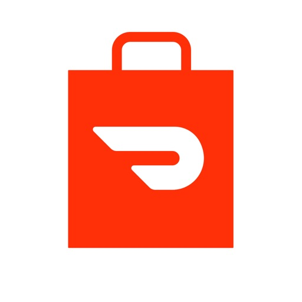

Enjoy the freedom to be your own boss and earn money on your schedule. Plus, get 100% of your tips, always.

*   CASH AFTER EVERY DASH   *
Get paid right after every dash, automatically, with no deposit fees — ever.

*    EARN WITH NUMBER ONE   *
Make money delivering with the #1 Food & Drink Delivery app, available in 7,000+ cities in the US.

 *   START RIGHT NOW   *
Sign up to deliver in minutes. You only need your smartphone and transportation (bike, car, scooter, or motorcycle) to start.

*   BE SUPPORTED   *
Your app will show you where you’re going and when to get there. Plus 24/7 help is available if you need it.

*   SET YOUR OWN SCHEDULE   *
Choose your own hours and enjoy flexibility over hourly, seasonal, or full-time work. Start and stop whenever you want.

*   FIND WORK NEAR YOU   *
Work wherever you want. DoorDash is available in 7,000+ cities across the U.S., Australia, Canada, Japan and Germany. In select markets, you’ll be able to accept orders from Caviar, too!

*   RESTAURANTS AND MORE   *
Make money by completing deliveries from restaurants, convenience stores, grocery stores, and pet stores, too. 

DoorDash is available in over 7,000 cities in all 50 U.S. states, including Washington, D.C. and Puerto Rico; over 80 cities in Canada; and Melbourne, Australia, with more coming soon. 

Find out if we’re in your area and learn more here: doordash.com/dasher/signup

Caviar Couriers can sign up using the DoorDash - Driver app

#### zoom_workplace
## Zoom Workplace

Reimagine teamwork with Zoom Workplace, an AI-first, open collaboration platform that combines team chat, meetings, phone*, whiteboard, calendar, mail, docs, and more. Use Zoom Workplace for iOS with any free or paid Zoom license.

And with your Pro or Business Zoom license you have access to AI Companion woven throughout Zoom Workplace. You can get caught up quickly with a summary and key points from your unread messages, draft new content, and keep conversations focused and impactful. It’s your personal assistant across Zoom Workplace, available at no additional cost with your paid Zoom license, available wherever you are from your mobile device. 

BE MORE PRODUCTIVE ON THE GO WITH AI COMPANION* ON YOUR MOBILE DEVICE
Quickly get prepared for upcoming meetings
Have AI Companion* generate a first draft of content 
Get a summary of your unread Team Chat messages

STREAMLINE COMMUNICATIONS WITH A SINGLE APP
Schedule or join a video meeting with one tap
Chat with colleagues and external contacts
Place and receive phone calls or send SMS text messages*

IMPROVE PRODUCTIVITY
Organize and share information at scale with Zoom Docs 
Receive automated meeting summaries with AI Companion*
Brainstorm on virtual whiteboards

BOUNCE BETWEEN LOCATIONS
Move a live meeting or call seamlessly between devices with one tap
Start a Zoom Rooms meeting and share content*
Multitask with Picture in Picture on iPhone or Split View on iPad

WORK SAFELY ON THE GO
Stay focused on the road with Apple CarPlay support
Customize Siri Shortcuts for hands-free voice commands
Keep your data secure with enterprise-grade security and SSO*

* A paid Zoom Workplace subscription or other license may be required to use certain product features. Upgrade your free account today to start gaining these benefits. AI Companion may not be available for all regions and industry verticals. Some features not currently available across all regions or plans and are subject to change.

UPGRADE YOUR FREE ACCOUNT TO ZOOM WORKPLACE PRO AND GET AI COMPANION INCLUDED 
Host unlimited meetings up to 30 hours each
Record meetings to the cloud (up to 10GB)
Assign meeting co-hosts and schedulers

Your Zoom Workplace Pro subscription will automatically renew unless you cancel at least 24 hours before the end of the free trial or the plan billing period. After you start your subscription, you can manage it from either App Store settings or iOS settings. The amount charged to the payment method in your App Store account will vary by the plan you select and your country. The plan price will be displayed before you start your free trial or confirm your purchase.

We’d love to hear from you! Join the Zoom community: https://community.zoom.com/

Follow us on social media @zoom

Terms of Service: https://explore.zoom.us/terms/
Privacy Statement: https://explore.zoom.us/privacy/

Have a question? Contact us at https://support.zoom.com/hc

#### lyft
## Lyft

Get where you’re going with Lyft.

Whether you’re catching a flight, going out for the night, commuting to the office, or running errands in a rush, the Lyft app offers you multiple ways to get there.

EASY TO USE
Enter your destination. See your route and ride cost up front. Choose Priority Pickup to get going quick. Boom. Done. Simple

CHOOSE YOUR WHEELS
Choose from Wait & Save, Priority Pickup, Bikes & Scooters, Lyft XL, Lyft Lux, Transit, or even Rentals.

AFFORDABLE RIDES
Our Wait & Save option helps you get around for less. And you can find the fastest public transit routes, too.

* Lyft ride types may vary by region. Check the app to see what is available in your city.
—
Prices vary based on market condition.

By downloading the app, you agree to allow Lyft to collect your device's language settings.

#### draftkings_sportsbook___casino
## DraftKings Sportsbook & Casino

Game day’s calling. The gridiron awaits. Get in on the action with DraftKings Sportsbook, your home for LIVE betting all NFL season long. 

DraftKings Sportsbook puts you in the center of every opening drive, hail-Mary and crunch-time play. Download the DraftKings Sportsbook app and bet on your favorite sports all season long, including NFL football, NBA basketball, MLB baseball, NHL hockey, Soccer, PGA Tour Golf, UFC, MMA, Boxing, Motorsports, Esports, LOL, WoW, College Sports and more. From moneyline bets and parlays to player props and more, take your shot at winning big with DraftKings Sportsbook.

The action doesn’t stop once the game begins. 

Get your live bet down with DraftKings Sportsbook, your home for Live Betting. Whether the game just started or going down to the wire, you can place live bets as the game unfolds. Between plays or during the break, place a bet in various markets for a shot to bring home big winnings. Crunch time. Anytime. 

Follow the action and bet live as the game unfolds.

• Live Betting & In-Game Odds: Bet on every snap, first down and touchdown with real-time spreads, moneylines, totals and dynamic odds that update as the game evolves. 

• Same-Game Parlays & Combos: Stack your MVPs, touchdown scorers and game totals into a single ticket for greater payout potential.

• Player Props for Every Sport: From NFL quarterbacks to NBA point guards, lock in markets on passing yards, rushing TDs, free throws and more.

DraftKings Sportsbook is currently live & accepting bets in: AZ, CO, CT, DC, IL, IN, IA, KS, KY, LA (Select Parishes), ME, MD, MA, MI, NH, NJ, NY, NC, OH, OR, PA, TN, VA, VT, WV and WY.

Getting started is easy: 
1. Create an account.
2. Find the sport or outcome that you want to bet on.
3. Place a bet and follow along to bet live in real-time.

–
Bets with DraftKings Sportsbook are not affiliated with or provided by Apple. DraftKings is a US company with headquarters in Boston, Massachusetts. DraftKings is licensed in the State of Connecticut - License OGO.000003

Privacy Policy: https://www.draftkings.com/help/privacy/us
Casino available in CT/MI/NJ/PA/WV ONLY

GAMBLING PROBLEM? CALL 1-800-GAMBLER, (800) 327-5050 or visit gamblinghelplinema.org (MA). Call 877-8-HOPENY/text HOPENY (467369) (NY). Please Gamble Responsibly. 888-789-7777/visit ccpg.org (CT), or visit www.mdgamblinghelp.org (MD).

21+ (18+ DC/KY/NH/WY). Void in ONT. Eligibility restrictions apply. Terms: draftkings.com/sportsbook. On behalf of Boot Hill Casino & Resort (KS). Fees may apply in IL.

To be eligible, must meet age and eligibility requirements, and opt-in when presented with a promotion. All bonus rewards are subject to maximum wagering limits and expiration restrictions, are single-use, non-cashable, non-refundable, and cannot be withdrawn. Awarded Bonus Bets expire 168 hours after issuance and stake is not included in payout. Promotional eligibility, deposit, and wager restrictions may apply. For full terms and conditions, see draftkings.com/sportsbook.

NBA League Pass: Subscription auto-renews monthly at then-current price (currently $16.99/mo); cancel anytime. Terms, restrictions, and eligibility requirements apply. Redeem League Pass by 12/19/25 at 11:59 PM ET. Addt’l terms: https://support.watch.nba.com/hc/en-us/articles/9165532876183-League-Pass-Terms-of-Use_. New Customer offer ends 11/16/25 at 11:59 PM ET. All Customer offer ends 11/30/25 at 11:59 PM ET.

Ghost Leg: Opt-in required. 1 Ghost Leg Token per customer when offered. Must meet qualifying bet criteria. If only 1 leg of the bet loses, bet will settle as if only the winning legs were placed and pays out in cash based on odds when the bet was placed. Tokens expire at the start of the final game on when offered. Must select token BEFORE placing bet. Terms: sportsbook.draftkings.com/promos.

#1 Place to Bet Touchdowns, based on the number of NFL touchdown markets available.

#1 Sportsbook for Live Betting - Based on available live market data

#### sephora_us__makeup___skincare
## Sephora US: Makeup & Skincare

Discover brand new beauty and skincare routines with Sephora. Explore the best beauty products from top brands like FENTY BEAUTY by Rihanna, The Ordinary, and Sephora Collection. 

Try the latest product releases or find brands focusing on inclusivity and diversity. Treat yourself and redeem your points for Beauty Insider Cash or luxurious samples.

Easily shop for your beauty needs, from makeup and skincare to haircare products. Find the perfect foundation, mascara, or concealer for you by comparing product information, how to use instructions, and photos from the Sephora community. If you are looking for good beauty at a better price, try Sephora Collection makeup and skincare!

3 Reasons you’ll love the Sephora app
1. Get access to offers & deals with Beauty Insider
2. Shop all your favorite beauty products in just a few steps
3. Discover the latest trends & releases

Interested in clean products with ingredients you’ll love? Look for the green “Clean at Sephora” seal which means the product is formulated without parabens, sulfates SLS and SLES, phthalates, mineral oils, formaldehyde and more!

Sephora Features:

SKINCARE
• Find the perfect skincare routine for your skin type
• Treat acne, dark spots, dryness & pores with our top-rated products
• Shop from leading skincare brands like Kiehl’s, La Mer, Drunk Elephant & many more!

MAKEUP & COSMETICS
• Best-selling brands like Urban Decay, KVD Vegan Beauty & many more!
• Browse palettes, mini sizes & value sets to suit your beauty budget
• Get special access to the latest offers

HYBRID PRODUCTS
• Makeup and skincare in one effective product
• Get healthy-looking skin while looking your best
• Shop makeup hybrid products from Supergoop, Milk, and Ilia

FRAGRANCE
• Buy all-time favorite fragrances or try a fresh new signature scent
• Select beautifully packaged gift sets & mini-editions
• Luxurious scents from Jean Paul Gaultier, Lancome, Yves Saint Laurent and more

HAIR PRODUCTS
• Explore tools to style and treat your hair for effortlessly luscious locks
• Try out the very best conditioners & hair masks
• Shop beautifully packaged sets for the perfect hair care gift

The Sephora App has your beauty needs covered from head to toe. Never miss a beauty deal with Insider-only offers, products uniquely at Sephora, promotions, and more.

Download the Sephora App now for the best beauty shopping experience.

Summary information concerning the data collected by the App can be found within the App Privacy section below. Note that the summary only applies to the App, not information collected by Sephora in other contexts, such as on our website. Also note that the summary is controlled by Apple using predefined terms and selections. A full explanation of our privacy practices can be found in our privacy policy at https://www.sephora.com/beauty/privacy-policy. To the extent there may be a discrepancy between an App-specific privacy disclosure, and the Sephora Privacy Policy, you should look to the Sephora Privacy Policy for clarity

#### airbnb
## Airbnb

AIRBNB MORE THAN AN AIRBNB
The world is endlessly interesting and with Airbnb, you can explore it in more ways than ever. Find remarkable homes, unforgettable experiences, and incredible services all in one app. Get inspired, book, and go.

BOOK A HOME AND GO WHERE HOTELS CAN’T
Explore 8+ million vacation rentals in 240+ countries and regions to find the perfect stay for every kind of trip, whether you’re traveling alone or with a group. Use over 80 filtering options to find the amenities you want, like a pool, a kitchen, or accessibility features like step-free entry. View all the details of a place at a glance on the listing page and check out the ratings and reviews to see what other guests who’ve stayed there think about it, too.

DON’T JUST SEE A PLACE, EXPERIENCE IT
Find thousands of experiences around the world, hosted by locals who know their city best—all vetted for quality based on a host’s expertise, reputation, and authenticity. Uncover unique perspectives on landmarks and museums. Get a taste of local cuisine through cooking classes and food tours. Enjoy the great outdoors, an art workshop, a live performance, and much more. Plus, check out Airbnb Originals—extraordinary experiences hosted by the world’s most interesting people, designed exclusively for Airbnb.

MAKE YOUR STAY EVEN MORE SPECIAL WITH INCREDIBLE SERVICES
Make the most of your stay by booking incredible services right at your Airbnb, like private chefs, photography, catering, prepared meals, hair styling, nail treatments, makeup, massages, personal training, and spa treatments—each offered by experienced service hosts who have been vetted for quality. You can book thousands of professional services at nearly every price, all in one app, all over the world. Best of all, you don’t need to stay at an Airbnb or even be on a trip to get these services. Schedule a blowout, training session, and more right at home.

GET A TRAVEL APP THAT TRAVELS WITH YOU
After you book a home, you’ll get personalized recommendations on the homepage suggesting services and experiences for your trip, tailored to where you’re staying and who you’re traveling with. And the redesigned Profile gives you a snapshot of all the places you’ve been to on Airbnb, and the people you’ve met along the way.

FIND ALL YOUR TRIP INFO IN ONE PLACE
Quickly find or share the details of your reservation—making it easier for everyone to get there, get inside, and get connected to wifi with just a tap. Our in-app messaging means every guest on the trip can easily communicate with hosts to say hi, ask questions, and receive up-to-the-minute booking updates. You can also share photos, videos, and even customize an Airbnb Service, all in the same chat. And with a day-by-day view of everything you booked in the updated Trips tab, it’s simple to keep track of your plans and get key details like check-in times, special instructions, and entry codes all in one place, even when you’re offline.

WANT TO HOST? AIRBNB MAKES IT EASY.
Whether you want to host a home, experience, or service, you can reach millions of people traveling and grow your business on Airbnb. List your home in a few simple steps. Or, you can apply to host an experience or service and once approved, you’re ready to welcome the world.

YOU’VE COME THIS FAR—NOW GO FARTHER
Stop reading and fire up the app to book yourself a one-of-a-kind trip on Airbnb.

#### hulu__stream_tv_shows___movies
## Hulu: Stream TV shows & movies

Stream the TV shows and movies you love with Hulu! Dive into thousands of TV episodes and movies and discover award-winning classics, blockbuster movies, current hits and exclusive Originals that set Hulu apart.

Seize control of your entertainment with our flexible plans. Take your pick from Hulu (With Ads), Hulu (No Ads), or the ultimate Hulu + Live TV*, featuring the latest in sports, news, and events across your favorite devices.

*Regional restrictions, blackouts and additional terms apply.

But wait, there's more! Hulu brings you:

INDIVIDUAL RECOMMENDATIONS: Custom recommendations for a viewing experience as unique as you are

PERSONALIZED PROFILES FOR ALL: Family movie night? Watch party with friends? Create up to 6 profiles, so that each family member enjoys Hulu their way

SEAMLESS VIEWING EXPERIENCE: Effortlessly keep up with your favorites, so you can pick up right where you left off
MULTI-DEVICE ACCESSIBILITY: Phone, tablet, TV, laptop. Watch Hulu anytime - at home or on the go
SIMULTANEOUS STREAMING: Enjoy Hulu on two different screens at the same time
PREMIUM NETWORK ACCESS: Access premium networks like MAX, Paramount+ with SHOWTIME®, CINEMAX®, and STARZ®, each available for an additional monthly fee**.

**Additional terms and restrictions apply.

HULU (WITH ADS)
Dive into Hulu’s vast streaming library and explore today's most-talked-about shows like The Kardashians, The Bachelor, The Handmaid’s Tale, and Abbott Elementary. Immerse yourself in Hulu's exclusive Originals, like the Emmy® nominees The Bear and Only Murders in the Building. Animation? We got you covered with Family Guy, Bob’s Burgers, Futurama, and more. 

HULU (NO ADS)
Opt for Hulu (With No Ads) for an uninterrupted, ad-free streaming experience. Plus, enjoy the option to download select titles to watch offline.

HULU + LIVE TV
Live TV makes it better! Watch live and on-demand content from 95+ channels, including sports and news, all without the hassle of extra cable fees. Access endless entertainment with the entire Hulu streaming library. Don’t forget all Live TV plans include access to Disney+ and ESPN+.

You’ll be charged as a recurring transaction through your iTunes account starting at the end of your free trial, if any (unless you cancel during the free trial). Payment automatically renews unless you cancel your account at least 24 hours before the end of the current subscription month. Manage your subscription, cancel anytime, or turn off auto-renewal by accessing your iTunes account. Hulu is available to U.S. customers only.

Subscriber Agreement: https://www.hulu.com/subscriber_agreement
Privacy Policy: https://privacy.thewaltdisneycompany.com/en/current-privacy-policy
Your California Privacy Rights: https://www.hulu.com/ca-privacy-rights
Do Not Sell My Personal Information: https://www.hulu.com/do-not-sell-my-info

This app features third party software which allows you to contribute to measurement statistics (e.g., Nielsen’s TV Ratings). To learn more about digital measurement products and your choices in regard to them, including opting out, please visit our privacy policy. Please see http://www.nielsen.com/digitalprivacy for more information about Nielsen measurement.

We may work with mobile advertising companies to help deliver online and in-app advertisements tailored to your interests based on your activities on our website and apps and on other, unaffiliated websites and apps. To learn more, visit www.aboutads.info. To opt-out of online interest-based advertising, visit www.aboutads.info/choices. To opt-out of cross-app advertising, download the App Choices app at www.aboutads.info/appchoices. Hulu is committed to complying with the DAA’s Self-Regulatory Principles for Online Behavioral Advertising and the DAA’s Application of Self-Regulatory Principles for the Mobile Environment.

#### duolingo_-_language_lessons
## Duolingo - Language Lessons

Learn a new language with the world’s most-downloaded education app! Duolingo is the fun, free app for learning 40+ languages through quick, bite-sized lessons. Practice speaking, reading, listening, and writing to build your vocabulary and grammar skills.

Designed by language experts and loved by hundreds of millions of learners worldwide, Duolingo helps you prepare for real conversations in Spanish, French, Japanese, Korean, Chinese, Italian, German, English, and more.

And now, you can learn Math, Music, and Chess the Duolingo way!  

• Build real-world math skills – from calculating tips to identifying patterns – and sharpen your mental math in our Math course.

• Learn how to read music and play familiar songs on your device in our Music course – no instrument required.

• Master moves, level up your game, and play real matches in our brand new Chess course. Checkmate!

Whether you're learning for travel, school, career, family and friends, or your brain health, you'll love learning with Duolingo.

Why Duolingo?
 • Duolingo is fun and effective. Game-like lessons and fun characters keep you motivated to build solid skills across language, math, music, and chess.

• Duolingo works. Designed by learning experts, Duolingo has a science-based teaching methodology proven to foster long-term knowledge retention.

• Track your progress. Work toward your learning goals with playful rewards and achievements when you make practicing a daily habit!

• Join 300+ million learners. Stay motivated with competitive Leaderboards as you learn alongside our global community.

• Every course is free. Learn Spanish, French, German, Italian, Russian, Portuguese, Turkish, Dutch, Irish, Danish, Swedish, Ukrainian, Esperanto, Polish, Greek, Hungarian, Norwegian, Hebrew, Welsh, Arabic, Latin, Hawaiian, Scottish Gaelic, Vietnamese, Korean, Japanese, English, and even High Valyrian. And now, learn Math, Music, and Chess with our newest courses!

What the world is saying about Duolingo:

“Far and away the best language-learning app.” –The Wall Street Journal

“This free app and website is among the most effective language-learning methods I’ve tried… lessons come in the form of brief challenges – speaking, translating, answering multiple-choice questions – that keep me coming back for more.” –The New York Times

“Duolingo may hold the secret to the future of education.” – TIME Magazine

“…Duolingo is cheerful, lighthearted and fun…” - Forbes

“Our favorite language app…” - CNET

If you like Duolingo, try Super Duolingo for 14 days free! Learn a language fast with no ads, and get fun perks like Unlimited Hearts and Monthly Streak Repair.

If you choose to purchase Super Duolingo, payment will be charged to your Apple account, and your account will be charged for renewal within 24-hours prior to the end of the current period. Auto-renewal may be turned off at any time by going to your settings in the App Store after purchase. Any unused portion of a free trial period, if offered, will be forfeited when the user purchases a subscription to that publication, where applicable.

Privacy Policy: https://www.duolingo.com/privacy
Terms of Service: https://www.duolingo.com/terms

#### costco
## Costco

It's easy to save time and money while on the go, with the Costco Mobile App! We've improved our mobile app, to make it easier for members to access the incredible values found only at Costco.

DIGITAL MEMBERSHIP CARD: Access your membership card from the home page of the app. Use your membership card to enter the warehouse and at checkout.
 
SHOP: Browse Costco.com’s unique and expanded selection, which offers thousands of items not found at your local warehouse. Enjoy having items delivered straight to your door!
 
SAVINGS: Conveniently receive the latest Warehouse Savings right on your own device.

GAS PRICES: Just tap the locator pin on the map to view current gas prices.
 
PHOTOS: Order metal prints, acrylic prints or photo mugs directly from the app.  Have them delivered to your door or pick them up at select Costco locations.

SPECIAL EVENTS: View the Special Events happening at your local Costco and set reminders for upcoming events.

PHARMACY: Order prescription refills & check status on prescriptions. Get refill reminders, track your medications, manage family accounts, transfer prescriptions, and find a Costco pharmacy.
 
TRAVEL: Shop Costco Travel for great deals on vacation packages, hotels, cruises, rental cars, theme parks and more!
 
BUSINESS CENTER: Stock up on everything from Restaurant Supplies to Office Essentials, and keep your business running smoothly and efficiently.
 
SHOPPING LIST: Keep track of the items you want to pick up on your next trip to Costco.
 
WAREHOUSE INFO: See details about your nearest Costco warehouse, including regular and holiday hours, services provided, driving directions and gas prices.
 
FEEDBACK: Visit our app feedback page and help provide important feedback for Costco, because your opinion matters!

#### mychart
## MyChart
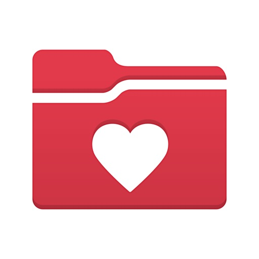

MyChart puts your health information in the palm of your hand and helps you conveniently manage care for yourself and your family members. With MyChart you can:
•	Communicate with your care team.
•	Review test results, medications, immunization history, and other health information.
•	Connect your account to Apple Health to pull health-related data from your personal devices right into MyChart.
•	View your After Visit Summary® for past visits and hospital stays, along with any clinical notes your provider has recorded and shared with you.
•	Schedule and manage appointments, including in-person visits and video visits.
•	Get price estimates for the cost of care.
•	View and pay your medical bills.
•	Securely share your medical record from anywhere with anyone who has Internet access.
•	Connect your accounts from other healthcare organizations so you can see all your health information in one place, even if you've been seen at multiple healthcare organizations.
•	Receive push notifications when new information is available in MyChart. You can check whether push notifications are enabled under the Account Settings within the app.
Select features are also available on Apple Watch. 

Note that what you can see and do within the MyChart app depends on which features your healthcare organization has enabled and whether they’re using the latest version of Epic software. If you have questions about what’s available, contact your healthcare organization.

To access MyChart, you must create an account with your healthcare organization. To sign up for an account, download the app and search for your healthcare organization or go to your healthcare organization’s MyChart website. After you’ve signed up, turn on Face ID, Touch ID, or a four-digit passcode to quickly log in without needing to use your MyChart username and password each time. Then, make sure you have push notifications enabled to receive updates on your device when new information is available in MyChart. 
  
For more information about MyChart’s features or to find a healthcare organization that offers MyChart, visit www.mychart.org.

Have feedback about the app? Email us at mychartsupport@epic.com.

#### microsoft_outlook
## Microsoft Outlook
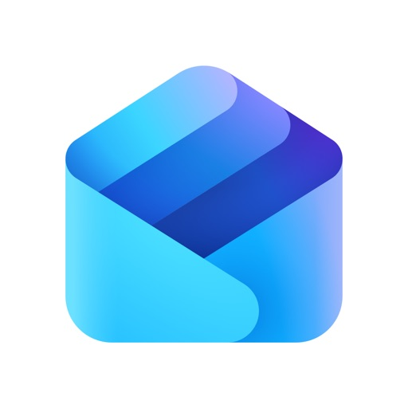

Outlook lets you bring all your email accounts and calendars in one convenient spot. Whether it’s staying on top of your inbox or scheduling the next big thing, we make it easy to be your most productive, organised and connected self.

Here's what you'll love about Outlook for iOS:

- Focus on the right things with our smart inbox - we help you sort between messages you need to act on straight away and everything else.
- Swipe to quickly schedule, delete and archive messages.
- Share your meeting availability with just a tap and easily find times to meet with others.
- Find everything you're looking for, including files, contacts, and your forthcoming trips.
- View and attach any file from your email, OneDrive, Dropbox, and more, without having to download them to your phone.
- Open Word, Excel, or PowerPoint attachments to edit them directly in the corresponding app and attach them back to an email.
- Recap extra-long email threads in an instant with Summarise with Copilot*
- Type a few words to have Copilot* jump-start your writing with an outline or draft
- Before sending off your email, use Coaching with Copilot* to get tips and suggestions that help improve the overall tone, sentiment, and clarity
 
*Microsoft 365 Personal/Family subscription or business account enabled with Copilot required to use Copilot features

--

Outlook for iOS works with Microsoft Exchange, Office 365, Outlook.com (including Hotmail and MSN), Gmail, Yahoo Email, and iCloud.

--

To make an in-app purchase of a Microsoft 365 Family or Personal subscription, open the app, go to Settings, and tap on Upgrade next to your Outlook.com or Hotmail.com account. Subscriptions begin at $6.99 a month in the US, and can vary by region. With a Microsoft 365 subscription, you get 1TB of storage for each user, access to all features in Word, Excel, and PowerPoint on iPad, iPhone, and iPod touch, and you can install Word, Excel, PowerPoint, Outlook and OneNote on PCs or Macs.

Microsoft 365 subscriptions purchased from the app will be charged to your iTunes account and will automatically renew within 24 hours prior to the end of the current subscription period, unless auto-renewal is disabled beforehand. To manage your subscriptions or to disable auto-renewal, after purchase, go to your iTunes account settings. A subscription cannot be cancelled during the active subscription period. Any unused portion of a free trial period, if offered will be forfeited when the user purchases a subscription to that publication, where applicable.

Privacy and Cookies: https://go.microsoft.com/fwlink/?LinkId=521839
Terms of Use: http://go.microsoft.com/fwlink/?LinkID=530144
Contract Summary: https://www.microsoft.com/microsoft-365/outlook/contract-summary
Consumer Health Data Privacy Policy: https://go.microsoft.com/fwlink/?linkid=2259814

#### hollister_co_
## Hollister Co.

Download the Hollister app. Comfortable, versatile, year-round staples.

WHAT'S INCLUDED:

HOLLISTER HOUSE REWARDS
House members get more.

SEND YOUR LIST
Share your favorites for instant feedback.

GET OUTFIT INSPO
Ways to wear your favorite styles.

ON-THE-GO EASE
Shop and checkout even faster.

PERSONALIZED SHOPPING
Recommendations we think you’ll love based on your style.

SHARE2PAY
Exclusively in the app, You share, they pay.

SCAN & SHOP
Get product details, reviews and more.

OTHER PERKS
- Buy online and pick up in store.
- Purchase using Apple Pay (US, UK, EU, and Canada ONLY) or Venmo (US ONLY).
 
(**Hollister House Rewards, Get Outfit Inspo and Personalized Shopping limited to US, UK and Europe ONLY)

#### lululemon
## lululemon

Browse and shop for lululemon gear from anywhere! Be ready for all your sweaty pursuits with technical athletic clothing and accessories for running, cross-training, and yoga.  

Get the gear:
 
• Shop instantly. Our app is built from the ground up to feel as snappy as your personal bests.
• You’ll find high-quality photos of products taken from every angle and a zoom-in feature that lets you nerd out hard on every technical detail. 
• Inventory-check your local store and find out right from your phone if your size and color are in stock. 
• Favorites: So many products to love, so little time! Add products to your Favorites list so you can easily come back to them later.
• eGift Cards: Buy electronic gift cards for your family and friends through the app and send them directly to their email. 
• Store Locator: Find store hours and locations right on your phone. 
• Pay with ApplePay
 
Connect with the community:
 
• Join our global yoga ambassadors for 20, 45 or 60-minute yoga classes
• Find local events tailored to your favorite sweaty pursuits.
• Get inspired by real and authentic stories posted by our own ambassadors and stores.
• Curious about what goes into our gear? Get an insider look through exclusive behind-the-scenes videos.
 
Manage your account:
 
• Use Touch ID or Face ID to make sign-in easy; rest assured, your biometric data is protected and safe. 
• My Account: Update your profile and subscribe to product emails in the improved Account settings.
• Store your preferences and purchase information to make checkout a breeze. And of course, standard shipping is always complimentary. 
 
Founded in Vancouver British Columbia in 1998, the first lululemon athletica store shared space with a yoga studio. We’ve grown quite a bit since then and our technical athletic apparel for men and women is now available online, in stores, and in showrooms all over the world. 
 
Have an idea, problem, or feedback? Get in touch at gec@lululemon.com

#### polymarket
## Polymarket
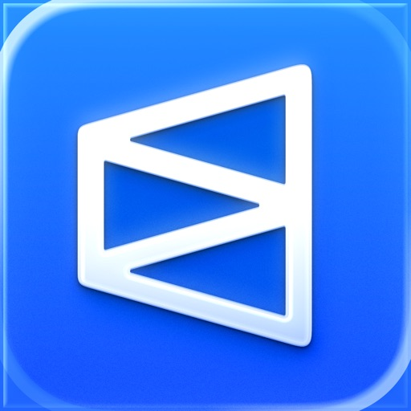

With over 30 million users globally, Americans can now trade on the world's largest prediction market.

On Polymarket, you can buy in and trade out without ever getting locked out. 

Polymarket always has the tightest spreads, the lowest fees, and the biggest opportunities. 

LIVE SPORTS TRADING
- Live trading in game
- Instantaneously trade in and out 
- Bigger payouts than sportsbooks
- No "house" & no limits

TRADE ON ANYTHING
- COMING SOON: Geopolitics, election, news, tech, & culture polymarkets
- Put your money where your mouth is, and earn a return for your knowledge

HOW DOES IT WORK?
- Prices = probability
- If something has a 67% chance of happening, you can buy shares for $0.67 each which you can sell if the price goes up — or cash in for $1 each if you're right
- If you think the odds are wrong, you can profit by buying shares in the polymarket

LEGAL & REGULATED
- Polymarket is now fully legal in the United States — in all 50 states
- Backed by the New York Stock Exchange's parent company
- Bank-grade security & encryption
- 24/7 live customer support

Join the tens of millions of Polymarket users & see why there’s been over $19 billion traded globally.

You see the future — now trade it.

