- [Shadowrocket](#shadowrocket)
- [HotSchedules](#hotschedules)
- [AutoSnore: Snoring Recorder](#autosnore__snoring_recorder)
- [Paprika Recipe Manager 3](#paprika_recipe_manager_3)
- [Procreate Pocket](#procreate_pocket)
- [AnkiMobile Flashcards](#ankimobile_flashcards)
- [Things 3](#things_3)
- [imo video calls and chat HD](#imo_video_calls_and_chat_hd)
- [TonalEnergy Tuner & Metronome](#tonalenergy_tuner___metronome)
- [AutoSleep Track Sleep on Watch](#autosleep_track_sleep_on_watch)
- [Forest: Focus for Productivity](#forest__focus_for_productivity)
- [Streaks](#streaks)
- [Advent Magnificat 2025](#advent_magnificat_2025)
- [FL Studio Mobile](#fl_studio_mobile)
- [BimmerLink for BMW and MINI](#bimmerlink_for_bmw_and_mini)
- [Wipr 2](#wipr_2)
- [Moment Pro Camera II](#moment_pro_camera_ii)
- [Monash FODMAP Diet](#monash_fodmap_diet)
- [Noir - Dark Mode for Safari](#noir_-_dark_mode_for_safari)
- [MilGPS](#milgps)
- [SkyView®](#skyview®)
- [Ableton Note](#ableton_note)
- [LiveATC Air Radio](#liveatc_air_radio)
- [TeleGuard](#teleguard)
- [Threema. The Secure Messenger](#threema__the_secure_messenger)
- [Koala Sampler](#koala_sampler)
- [Hear My Baby Heartbeat App 2.0](#hear_my_baby_heartbeat_app_2_0)
- [Tenuto](#tenuto)
- [Stylebook](#stylebook)
- [Pocket God](#pocket_god)
- [iReal Pro](#ireal_pro)
- [Just Press Record](#just_press_record)
- [HeartWatch: Heart Rate Monitor](#heartwatch__heart_rate_monitor)
- [Countdown App](#countdown_app)
- [Illinois 511 Traffic Cameras](#illinois_511_traffic_cameras)
- [PeakFinder](#peakfinder)
- [Frame Crop – Art Mode](#frame_crop_–_art_mode)
- [PhotoPills](#photopills)
- [AeroPads - Pads & Soundscapes](#aeropads_-_pads___soundscapes)
- [ProCam - Pro Camera](#procam_-_pro_camera)
- [RadarScope](#radarscope)
- [Dumbify](#dumbify)
- [Goblin Tools](#goblin_tools)
- [Pedi STAT](#pedi_stat)
- [Vargo Anesthesia Mega App](#vargo_anesthesia_mega_app)
- [e-Sword LT: Bible Study to Go](#e-sword_lt__bible_study_to_go)
- [ecMobile](#ecmobile)
- [QuickBend: Conduit Bending](#quickbend__conduit_bending)
- [SledNH 2026](#slednh_2026)
- [Prepware Aviation Maintenance](#prepware_aviation_maintenance)
- [LumaFusion](#lumafusion)
- [Spirit Talker ®](#spirit_talker_®)
- [Slow Shutter Cam](#slow_shutter_cam)
- [Transcend Theory](#transcend_theory)
- [White Noise](#white_noise)
- [Folium](#folium)
- [Rarevision VHS: Retro Cam](#rarevision_vhs__retro_cam)
- [FORScan Lite - for Ford, Mazda](#forscan_lite_-_for_ford,_mazda)
- [Tampermonkey](#tampermonkey)
- [OBD Fusion](#obd_fusion)
- [Knot IQ - The Bear Essentials](#knot_iq_-_the_bear_essentials)
- [Stack the States®](#stack_the_states®)
- [Scrivener](#scrivener)
- [Calorie Counter PRO MyNetDiary](#calorie_counter_pro_mynetdiary)
- [Santa's Bag](#santa's_bag)
- [PDG PROmote 2026+](#pdg_promote_2026_)
- [ASCCP Management Guidelines](#asccp_management_guidelines)
- [Lumy](#lumy)
- [Mapper for Safari](#mapper_for_safari)
- [Alessiations](#alessiations)
- [Cozmo Robot](#cozmo_robot)
- [Stop Motion Studio Pro](#stop_motion_studio_pro)
- [Guardhouse](#guardhouse)
- [MyRadar Weather Radar Pro](#myradar_weather_radar_pro)
- [Prepware Remote Pilot](#prepware_remote_pilot)
- [Solocator - GPS Field Camera](#solocator_-_gps_field_camera)
- [Necrophonic](#necrophonic)
- [HappyCow - Vegan Food Near You](#happycow_-_vegan_food_near_you)
- [Pro Camera by Moment](#pro_camera_by_moment)
- [Pythonista 3](#pythonista_3)
- [iWebTV PRO](#iwebtv_pro)
- [Photo Scanner Plus](#photo_scanner_plus)
- [The Christmas List](#the_christmas_list)
- [Wagotabi: Learn Japanese](#wagotabi__learn_japanese)
- [Nomad Sculpt](#nomad_sculpt)
- [Board Game Stats](#board_game_stats)
- [Ravit - Ravelry on the hop](#ravit_-_ravelry_on_the_hop)
- [TurboScan™ Pro: PDF scanner](#turboscan™_pro__pdf_scanner)
- [WorkOutDoors](#workoutdoors)
- [Site Audit Pro](#site_audit_pro)
- [Oilfield Calendar](#oilfield_calendar)
- [Free Tone - Calling & Texting](#free_tone_-_calling___texting)
- [PROmote - Army Study Guide](#promote_-_army_study_guide)
- [DairyBar](#dairybar)
- [Freya • Surge Timer](#freya_•_surge_timer)
- [GENKI Vocab for 3rd Ed.](#genki_vocab_for_3rd_ed_)
- [myLightMeter PRO](#mylightmeter_pro)
- [Santa Christmas Snowing](#santa_christmas_snowing)

#### shadowrocket
## Shadowrocket

Rule based proxy utility client for iPhone/iPad.

- Capture all HTTP/HTTPS/TCP traffic from any applications on your device, and redirect to the proxy server.
- Record and display HTTP, HTTPS, DNS requests from your iOS devices.
- Configure rules using domain match, domain suffix, domain keyword, CIDR IP range, and/or GeoIP lookup.
- Measure traffic usage and network speed on WiFi, cellular, direct and proxy connections.
- Import rule files from URL or iCloud Drive.
- Block ads by domain, user agent rules.
- Local DNS Mapping.
- Work on cellular networks.
- Decrypt HTTPS traffic.
- Perform URL rewrite.
- Fully IPv6 supports.
- Script filter supports.
- Multi-level forward proxy.
- Support kcptun, cloak, gost, v2ray plugins.
- Support DNS over HTTPS, DNS over TLS, DNS over QUIC.

#### hotschedules
## HotSchedules

HotSchedules is the industry's leading employee scheduling app because it’s the fastest and easiest way to manage your schedule and communicate with your team.  

Team members love it because they can swap, pick-up or release shifts with one click. Work-life balance is easily managed with automatic shift pick ups when you want more hours, and time off requests for when you don’t.  Calendar sync and notifications keep your Schedules and the roster automatically updated to your phone with any manager-approved changes.

Managers appreciate the 75% time savings when building schedules and one-click approvals for shift changes.  The ability to monitor business performance with sales and labor snapshots from anywhere, keeps them out of the back office.  And most importantly, staying connected with broadcast and one-to-one messaging makes for a happy and productive team culture.
 
NOTE: The HotSchedules application REQUIRES a valid HotSchedules user account through your employer.

Need help?  Contact Customer Care 24x7x365

#### autosnore__snoring_recorder
## AutoSnore: Snoring Recorder
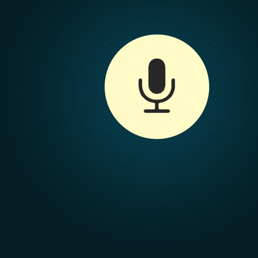

Discover the fun new way to automatically track your snoring and sleep sounds from your iPhone, with no subscription fees! Just tap the start button and sleep.

Built by the Best
-------------
From the team behind the widely popular AutoSleep app (#1 ranked sleep app on the App Store), comes a fresh innovative approach to assist users to take control of their sleep and improve their health.

Honest Software for an Honest Price
--------------------
No subscriptions. No hidden extra In App Purchases. No more to pay. Only one low cost price to own forever. Everything included!

Ease of Use
-------------
All you need is an iPhone. Simply start AutoSnore next to your bed. On wakeup you can listen and discover insights, it is that easy.

Why AutoSnore?
-------------
Sleep is precious, so it’s time we start to manage a condition that impacts nearly half of the world’s adult population (and most don’t even realise they snore). Snoring can have a significant impact on sleep quality, causing disruptions that affect not only the person who snores but also their bed partner.

What Does AutoSnore Do?
-------------
AutoSnore records all sorts of snoring and sleep sounds, including frequency, intensity, and duration of each episode, providing a comprehensive overview of nightly snoring patterns. When you wake in the morning, a visual breakdown lets you understand the impact of snoring on your overall sleep quality.

The New Snurk Rating!
-------------
Ever wanted one number that combines all your snores?! Welcome to the "Snurk" Score.
Your Snurk Score represents the intensity of snoring over the course of the night, where a score of 100 might wake the neighbours! The lower the Snurk Score the better. AutoSnore will even track your personal bests.

Advanced Sound Recognition
-------------
Using machine learning sound recognition, AutoSnore will classify all your sleep sounds, such as snoring, sleep talking, yawning, coughing and so on! It is quite amazing to review all the different sounds captured overnight.

Can It Help Me?
-------------
Absolutely, that's why we made it as long time snorers ourselves! AutoSnore allows you to track personalised strategies and remedies. Whether it’s lifestyle changes, sleep position adjustments, a new pillow, relaxation techniques or avoiding that wine over dinner, the app helps users experiment with different remedies to find what works best.

AutoSleep Integration
-------------
Works beautifully with the AutoSleep app, with your snore data syncing automatically with your sleep analysis!

Total Privacy
-------------
As with all our apps, AutoSnore prioritises user privacy and data security. Compare the App Privacy label below to see “Data Not Collected”. Check the other “free” snore apps if they can say the same.

No analytics tracking. No advertising plugins. No 3rd party code. No data upload. All recorded data and insights are kept securely on only your device. Only the user can elect to share a recording with someone else. The way it should be.

Start Today
-----------------
The sooner you start collecting data, the sooner you can manage.

AutoSnore is an essential app for anyone looking to enhance their sleep and overall well-being. With its unique approach to app design, cutting through all the nonsense and getting straight to the issue without breaking your bank balance.

Disclaimer
-----------------
AutoSnore is not a medical device. Always consult with a professional medical practitioner for any questions or concerns about your health.

#### paprika_recipe_manager_3
## Paprika Recipe Manager 3

Organize your recipes. Create grocery lists. Plan your meals. Download recipes from your favorite websites. Seamlessly sync to all your devices.

Features

• Recipes - Download recipes from your favorite websites, or add your own.
• Grocery Lists - Create smart grocery lists that automatically combine ingredients and sort them by aisle.
• Pantry - Use the pantry to keep track of which ingredients you have and when they expire.
• Meal Planner - Plan your meals using our daily, weekly, or monthly calendars.
• Menus - Save your favorite meal plans as reusable menus.
• Sync - Keep your recipes, grocery lists, and meal plans synced between all your devices.

• Adjust - Scale ingredients to your desired serving size, and convert between measurements.
• Cook - Keep the screen on while cooking, cross off ingredients, and highlight your current step.
• Search - Organize your recipes into categories and subcategories. Search by name, ingredient, and more.
• Timers - Cook times are automatically detected in your directions. Simply tap on one to start a timer.

• Import - Import from existing apps such as MacGourmet, YummySoup!, MasterCook & Living Cookbook.
• Export - Export your meal plans to Calendar and your grocery lists to Reminders.
• Share - Share recipes via AirDrop or email.
• Print - Print recipes, grocery lists, menus, and meal plans. Recipes support multiple print formats including index cards.

• Extensions - Save recipes directly in Safari and view today's scheduled meals.
• Bookmarklet - Download recipes from any browser straight into your Paprika Cloud Sync account.
• Offline Access - All of your data is stored locally. No internet connection is required to view your recipes.

What's New in 3.0

• iPhone X and iOS 11 support. 
• iOS app is now universal.
• Multitasking support on iPad.
• Add multiple, full-sized photos to each recipe. Embed photos in your directions.
• Insert links to other recipes or websites in your ingredients or directions.
• Format recipes using bold and italics.
• Convert ingredient measurements between standard and metric.
• Search for recipes across multiple categories.
• Add custom aisles to your grocery list and re-arrange them in your preferred order.
• Create multiple grocery lists.
• Add custom ingredients to the pantry. Track quantities, purchase dates, and expiration dates.
• Move items back and forth between the pantry and grocery list.
• Add custom meal types to the meal planner.
• Create reusable menus that span multiple days.

Platforms

Paprika is available on multiple platforms so you can access it on all of your devices. Please note that each version is sold separately.

#### procreate_pocket
## Procreate Pocket
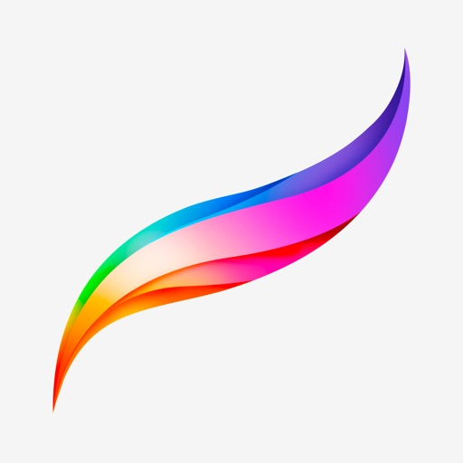

App of the Year winner Procreate Pocket is the most feature-packed and versatile art app ever designed for iPhone. 

Procreate Pocket has everything you need to create expressive sketches, rich paintings, gorgeous illustrations, and beautiful animations. Offering hundreds of handmade brushes, a suite of intuitive artistic tools, an advanced layer system, and the powerful Valkyrie graphics engine. Work on the couch, on the train, at the beach, or while waiting in line for coffee. 

It’s a complete art studio in the palm of your hand.

Highlights:
• High resolution canvases — up to 16k by 4k on compatible devices
• Intuitive Dark Mode interface made for iPhone
• Revolutionary QuickShape feature for perfect shapes
• Smooth and responsive smudge sampling
• Powered by Valkyrie, the lightning-fast 64-bit painting engine 
• Create art in stunning 64-bit color
• 250 levels of undo and redo
• Continuous auto-save — never lose work again

Breakthrough brushes:
• Packed with 100s of beautifully crafted brushes
• Brush sets keep your painting, sketching, and drawing brushes organized
• Over 100 customizable settings for every brush
• Brush Studio — design custom brushes
• Import and export custom Procreate brushes
• Import Adobe® Photoshop® brushes, and run them faster than Photoshop®

Full-featured layering system:
• Layer your art for precise control over details and composition
• Create Layer and Clipping Masks for non-destructive editing
• Stay organized by combining layers into groups
• Transform objects simultaneously across multiple layers
• Access over 25 layer blend modes for industry-grade compositing

Color without compromise:
• Fill your line work with ColorDrop
• Disc, Classic, Harmony, Value, and Palette color panels
• Import color profiles for color matching
• Assign Color Dynamics to any brush

Precision design tools:
• Add vector text to your illustrations
• Easily import all your favorite fonts
• Crop and resize your canvas for perfect composition
• Perspective, isometric, 2D, and symmetry visual guides
• Drawing Assist perfects your strokes in real time
• StreamLine smooths your strokes for beautiful lettering and expert inking

Animation Assist: 
• Easy frame-by-frame animation with customizable onion skinning
• Create storyboards, GIFs, animatics, and simple animations
• Export your animations in the full resolution of your canvas

 Dramatic finishing effects:
• Gradient Map — remap your image’s colors with a customizable gradient
• Glitch, Chromatic Aberration, Glow, and Halftone to add new dimensions to your work
• Gaussian and Motion Blur filters for depth and movement, or use Sharpen for perfect clarity
• Advanced Noise filter gives you more control for a classic, retro look
• Adjust Hue, Saturation, or Brightness in real time
• Powerful image adjustments including Color Balance, Curves, and HSB
• Bring your art to life with the fun, intuitive, and creative Warp, Symmetry, and Liquify Dynamics 

Time-lapse replay:
• Relive your creative journey with Procreate's celebrated Time-lapse Replay
• Export your Time-lapse recording in 4K for high-end video production
• Share a short, 30-second version of your Time-lapse on your socials

Reference Companion:
• Keep a full canvas or reference image with you at all times 
• Paint on your face with AR
• Color-pick right from the reference window

Import assets and share your creations:
• Import or export your art as Adobe® Photoshop® PSD files
• Import Adobe® ASE and ACO Color Palettes
• Import images files such as JPG, PNG, and TIFF
• Drag and drop artworks, brushes, palettes, and fonts between applications• Export to AirDrop, iCloud Drive, Photos, iTunes, Dropbox, Google Drive, Facebook, X (formerly Twitter), Instagram, TikTok, Weibo, Mail, and more
• Share your art as PDF, JPEG, PNG, TIFF, GIF, HEVC, or MP4 files

#### ankimobile_flashcards
## AnkiMobile Flashcards

AnkiMobile is a mobile companion to Anki®, a powerful, intelligent flashcard program that is free, multi-platform, and open-source. Sales of this app support the development of both the computer and mobile version, which is why the app is priced as a computer application.

AnkiMobile was written by the lead developer of Anki and AnkiWeb, and it has been around since 2010. Beware other apps using "Anki" in their name that have sprung up recently - they are not compatible with the rest of the Anki ecosystem, and they offer far fewer features, despite charging expensive subscriptions.

Some of AnkiMobile's features include:

- A free cloud synchronization service that lets you keep your card content synchronized across multiple mobile and computer devices. This makes it easy to add content on a computer and then study it on your mobile, easily keep your study progress current between an iPhone and iPad, and so on.
- The same SM2 and FSRS scheduling algorithms that the computer version of Anki uses, which remind you of material as you're about to forget it.
- A flexible interface designed for smooth and efficient study. You can set up AnkiMobile to perform different actions when you tap or swipe on various parts of the screen, and control which actions appear on the tool buttons.
- Comprehensive graphs and statistics about your studies.
- Support for large card decks - even 100,000+ cards.
- If your cards use images or audio clips, the media is stored on your device, so you can study without an internet connection.
- A powerful search facility that allows you to find cards that match criteria such as 'tagged high priority, answered in the last ten days and not containing the following words', and automatically place them into a deck to study.
- Support for displaying mathematical equations with MathJax, and rendering LaTeX created with the computer version.
- Support for adding images drawn with the Apple Pencil to your cards.

Please note that AnkiMobile is currently intended as a companion to the computer version of Anki, rather than a complete replacement for it. While AnkiMobile is able to display and schedule your cards in the same way the computer version does, certain changes like modifying note types need to be done with the computer software. Add-ons are not supported, so while you can study image occlusion cards created with the computer version, they can not be created within AnkiMobile. For this reason, please start with the computer version of Anki before you think about buying this app.

The cloud synchronization service is optional, and data can also be imported/exported from the app via a USB cable or AirDrop.

Like all apps, AnkiMobile can be purchased once and then used on multiple devices in a household using the same Apple ID. Family sharing is also supported (apart from in India). For information on bulk discounts for educational institutions, please see Apple's Volume Purchase Program.

For more information on AnkiMobile, including a link to the online manual, please have a look at the support page: https://docs.ankimobile.net/support.html. If you have any questions or want to report an issue, please let us know on our support site and we'll get back to you as soon as possible.

#### things_3
## Things 3
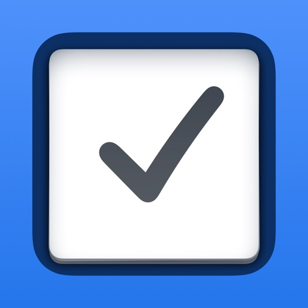

Get things done! The award-winning Things app helps you plan your day, manage your projects, and make real progress toward your goals.

Best of all, it’s easy to use. Within the hour, you’ll have everything off your mind and neatly organized—from routine tasks to your biggest life goals—and you can start focusing on what matters today.

“Things offers the best combination of design and functionality of any app we tested, with nearly all the features of other power user applications and a delightful interface that never gets in the way of your work.”
—Wirecutter, The New York Times

KEY FEATURES

• Your To-Dos
Your basic building block is the almighty To-Do—each a small step toward a great accomplishment. You can add notes, tag it, schedule it, and break it down into smaller steps.

• Your Projects
Create a Project for any big goal, then add the to-dos to reach it. Use headings to structure your list as you outline your plan. There’s also a place to jot down your notes, and a deadline to keep you on schedule.

• Your Areas
Create an Area for each sphere of your life, such as Work, Family, Finance, and so on. This keeps everything neatly organized, and helps you see the big picture as you set your plans in motion.

• Your Plan
Everything on your schedule is neatly laid out in the Today and Upcoming lists, which show your to-dos and calendar events. Each morning, see what you planned for Today and decide what you want to do. The rest is down to you :)

MORE THINGS TO LOVE

As you dive deeper, you’ll find Things packed with helpful features. Here are just a few:

• Reminders — set a time and Things will remind you.
• Repeaters — automatically repeat to-dos on a schedule you set.
• This Evening — a special place for your evening plans.
• Calendar integration — see your events and to-dos together.
• Tags — categorize your to-dos and quickly filter lists.
• Quick Find — instantly find to-dos or switch between lists.
• Magic Plus — drag the + button to insert to-dos anywhere in a list.
• Share extension — create to-dos with content from other apps.
• Widgets — see lists on your home/lock screens.
• Mail to Things — forward an email to Things; now it’s a to-do.
• Markdown — structure & style your notes.
• And much more!

MADE FOR IPHONE

Things is tailored to the iPhone with deep system integrations as well. A great example is the Share extension, which allows you to create to-dos with content from other apps, such as a link to a website you want to get back to.

You can also enjoy a beautiful dark mode at sunset, connect your calendars, add a variety of widgets, create to-dos via Siri, import from Reminders—Things can do it all! There’s even Shortcuts integration if you want to automate your workflows.

MADE FOR APPLE WATCH

Things comes with a great app for Apple Watch. Just raise your wrist to glance at your Today list, mark to-dos complete as you go, and dictate new ones on the fly—all synced instantly with your iPhone, iPad, and Mac.

AWARD-WINNING DESIGN

Made in Stuttgart, with two Apple Design Awards to its name, Things is a fine example of German engineering: designed not only to look fantastic, but to be perfectly functional as well. Every detail is thoughtfully considered, then polished to perfection.

“It’s like the unicorn of productivity tools: deep enough for serious work, surprisingly easy to use, and gorgeous enough to enjoy staring at.”
—Apple

GET THINGS TODAY

Whatever it is you want to accomplish in life, Things can help you get there. Install the app today and see what you can do!

• Things is also available for Mac, iPad, and Apple Vision Pro (sold separately).
• Sync is provided for free via our Things Cloud service.
• A free trial is available for Mac: www.things.app

If you have any questions, please get in touch. We provide professional support and will be glad to help you!

#### imo_video_calls_and_chat_hd
## imo video calls and chat HD
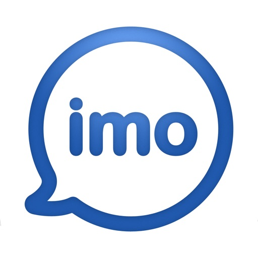

Message and video chat with your friends and family for FREE, no matter what device they are on!

- Encrypted high-quality Video and Voice calls
- Encrypted Group Video and Voice calls with up to 6 participants
- FREE and unlimited encrypted messages and video and voice calls over your 2G, 3G, 4G or Wi-Fi connection*
- Group chat with friends, family, roommates and others
- Fast photo and video sharing
- Hundreds of free stickers!
- Avoid SMS and phone call charges

*Data charges may apply. Contact your provider for details.

IMO PREMIUM MONTHLY SUBSCRIPTION
- You can subscribe to remove ads from imo and get 25Gb of cloud storage.
- Subscriptions are billed monthly at the rate selected depending on the subscription plan.
- Subscriptions auto-renew at the cost of the chosen package, unless cancelled 24-hours in advance prior to the end of the current period. The subscription fee is charged to your iTunes account at confirmation of purchase. You may manage your subscription and turn off auto-renewal by going to your Account Settings after purchase. Per Apple policy, no cancellation of the current subscription is allowed during active subscription period. Once purchased, refunds will not be provided for any unused portion of the term.

Privacy Policy: https://imoapp.com/privacy
Terms of Service: https://imoapp.com/terms

#### tonalenergy_tuner___metronome
## TonalEnergy Tuner & Metronome
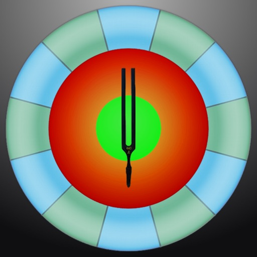

For musicians from pros to beginners, whether you sing, play a brass, woodwind or stringed instrument or any type of guitar, this app provides a set of feature-rich practice tools that gives fun and rewarding feedback. It’s much more than just a tuner!
      
So what makes the TonalEnergy the best selling music practice app?
 
• It's an all-in-one app, with a state-of-the-art tuner, an advanced metronome, dedicated orchestral strings and guitar tuning page, a piano keyboard, sound analysis pages, and audio/visual recording capabilities.

• It’s easy to use. Options like the Target Tuner or Pitch Tracker are on all the main pages.  TonalEnergy helps users create rewarding and attainable goals during a rehearsal or when working alone. Colorful analysis data pages and audio/video recording features enhance the experience of practice.  

• The metronome is cutting edge. It offers unmatched flexibility in sound choices, tempo settings, meters, subdivision patterns and visual displays. Voice count-ins, the ability to create and edit preset groups and Ableton link for syncing multiple devices make this a superior tool for performers. 

• Ear training possibilities are endless. The high quality multi-sampled instrument sounds for symphonic instruments are unique among all other tuning applications. Listening skills can be developed through the use of the eight-octave keyboard, chromatic wheel and tone generator. There are no other sounds like these. 

• Learning is a social activity. Using features unique to the TonalEnergy Tuner, data can be collected, reviewed, edited and shared with others. Feedback is essential for growing and developing great performers. It’s all about connectivity.

Chris Coletti, member of The Canadian Brass, sums up TonalEnergy by saying,

      “TonalEnergy is a must-have for any serious musician. It's a full suite of tools in one app; the tuner, tone generator, recorder, metronome and beautiful interface make it one of the best tools for musicians out there, period.” 

FEATURES

• Recognizes a large pitch range, extending to lower registers than many competing tuners (C0 - C8) that is highly responsive to wind instruments, as well as acoustic and electric string instruments
• Adjustable A=440 Hz reference 
• Automatic or manual transposing options
• Instantly changes between equal, just and other custom temperaments, including user-defined ones
• Auto or instant pitch reference note feature using the TonalEnergy sounds
• Extensive tuning list for all orchestral string and fretted string instruments including many more features than most other string-only tuner apps
• An expandable eight octave piano keyboard enhancing many of the key aspects of the tuner’s functions
• Chromatic wheel tone generator, with optional auto-vibrato feature
• Frequency and Harmonic energy overtone graphs, along with a multi-function waveform
• Dedicated metronome page that matches or exceeds the features available on all other stand alone metronome apps
• Notation options including standard English, Solfege, Northern European, and Indian variants
• Bluetooth output/input support
• Audio and Video recording capabilities including, editing, looping, timestretch that are all exportable via iTunes sharing, AirDrop, email, AudioCopy, SoundCloud, etc
• Import music from iTunes Library or email attachments
• Compatible with external microphones and clip-on vibration sensor devices
• Supports external video output to an external display for use in rehearsal halls
• External MIDI keyboard control support 
• Apple Watch app acts ONLY as a remote control for the phone app
• Audiobus and inter-app audio support
• VoiceOver support for the blind or visually impaired 

INSTRUMENT SOUNDS
• Piccolo, Flute
• Oboe, English Horn, Bassoon
• Full Clarinet Family
• Soprano, Alto, Tenor, and Baritone Saxophone
• Trumpet
• French Horn
• Tenor and Bass Trombone
• Euphonium and Tuba
• Square, sawtooth, and sine waveforms
• Organ
• Bowed and Plucked Strings

#### autosleep_track_sleep_on_watch
## AutoSleep Track Sleep on Watch

Automatically track your sleep from your Apple Watch*. No buttons to press. Even the Watch app is optional! Just sleep!

Total Privacy.
-------------
AutoSleep has no user analytics tracking. No advertising plugins. No 3rd party code. No data upload.
Ask your "free" sleep app if they can say the same.

Everything Included.
--------------------
No extra In App Purchases. No subscriptions. 

Apple Sleep Stages
-----------------
Full integration with Sleep Stages from the Apple Sleep app, so you have the option to use the Apple Sleep app and view all the information in AutoSleep.

Functions
-----------------
AutoSleep includes all the information and functionality you need for sleep monitoring, including:
Time Asleep – sleep duration and sleep bank balance
Sleep Rating – a consolidated rating score of your sleep
Sleep Rings – fill your sleep rings with quality sleep, including heart rate, deep sleep and REM
Apple Sleep Stages – option to use the data from the Apple Sleep app
Sleep Apnea - discover if you have sleep apnea
Sleep Blood Oxygen – measurements while sleeping
Respiration Rate – track your breathes per minute
Noise – environmental noise measurements
Sleep Analysis – view detailed graphs and breakups on your sleep cycles
Sleep Fuel – measure the quality and efficiency of your sleep
Tonight’s Bedtime – recommends your latest bedtime based on your habits
Readiness – indicates your physical and mental stress
Temperature – track your sleeping wrist temperature
Sleep Consistency – learn about your time to bed behaviours
Lights Off – track the time to fall asleep
Live Sleep Tracking – view your sleep statistics during the night
Smart Alarm – Watch in-built smart alarm to help you wake in lighter sleep 
Widgets – fantastic range of iPhone widgets
Complications – multiple Watch face options 
HomeKit – full integration with Apple HomeKit 
Emojis & Notes – record comments and tags to your sleep session
Explore – deep dive analytics views
Siri – use with Siri voice commands
Shortcuts – create your own shortcuts that you use with AutoSleep
Adjust – a simple function to adjust sleep/wake detection individual to you
History – advanced graphs and trends
Configuration – change the theme and design your clock sleep rings
Setup – customise your sleep goals, setup notifications and reminders
Exports – exporting options to save your data

About AutoSleep
-----------------
Using Advanced Heuristics AutoSleep works out how long you've slept so you don't have to.

If you DO wear your Watch to bed, you don't need to do a single thing. AutoSleep will track your sleep & quality and send you a notification in the morning.

Even if you don't wear your Watch to bed, AutoSleep can track your time in bed. It's extremely simple. If you DON'T wear your Watch to bed, then simply take your Watch off before you go to sleep. As soon as you touch your iPhone or put your Watch back on in the morning then AutoSleep will know that you have finished sleeping. 

As everyone is a little bit different. AutoSleep provides a simple setup wizard and an option to tweak if you are a very restless sleeper. 

AutoSleep also integrates beautifully with the Eclipse Yourself and HeartWatch apps, our premier heart, health, activity, recovery and readiness monitoring apps.

*Requires Apple Watch running WatchOS 4 or higher.

Awards
-----------------
Best of 2018
https://apps.apple.com/story/id1438574124/

Best of 2019
https://apps.apple.com/story/id1484100916/

Best of 2020
https://apps.apple.com/story/id1535572713/

Best of 2021
https://apps.apple.com/story/id1591083005/

Best of 2022
https://apps.apple.com/story/id1654240446

Best of 2023
https://apps.apple.com/story/id1719170110

#### forest__focus_for_productivity
## Forest: Focus for Productivity

## Top productivity app in 136 countries. More than 2 million satisfied paying users. Featured in Apple's "Amazing Apps" TV commercial.
## Staying focused with the cutest gamified timer. 
## Over 1,500,000 real trees were planted on Earth by our users.  

"Forest works well, and if your goal is to be more in the moment, ignore your phone and actually talk to your friends when you are with them, this is the app for you."— The New York Times 

"In order to establish new, better habits, it's helpful to engage with tools that make it easier to reinforce them. For anyone looking to curtail their phone usage, the Forest app might be for you."— Business Insider

If you want to temporarily put down your phone and focus on what’s more important in real life, you can plant a seed in Forest. As time goes by, this seed will gradually grow into a tree. However, if you cannot resist the temptation of using your phone and leave the app, your tree will wither. 

The sense of achievement and responsibility will encourage you to stay away from your phone, and will help you make better use of your time. Stop getting distracted by your phone, make you self-motivated and get more things done.

Stay focused, Be present! 

STAY FOCUSED
• A interesting way to help you beat phone addiction and overcome distraction
• Turn your focused moments into a lush forest.
• Create personalized Allow Lists for different situations. Non-allowed apps will be blocked. (iOS 16 or above)

GET MOTIVATED
• Earn rewards and unlock more than 90 new tree species and white noises.
• Share your forest and compete with friends and users around the world.
• Plant trees along with friends & family.
• Unlock achievements and earn extra rewards.
• Plant real trees on Earth and protect the environment with tree-planting organization Trees for the Future.

STATISTICS
• Manage your own tags and view detailed statistics of your time distribution.
• Browse your weekly, monthly and even your yearly big forest.
• Track your focused time in the Apple Health App.
• Track your daily phone usage and screen time.
• Recall memories of your planting journey with our brand new Forest Timeline!

It's never too late to build up productive habits! 

NOTICE
• Forest is compatible with iPhone, iPad and Apple Watch, and can be used across these iOS devices with a one-time purchase. The full app with the aforementioned features is available on iPhone and iPad; on Apple Watch you can view live planting session and today’s focus stats. To download or unlock a non-iOS version, it requires a separate purchase. By logging into the same account, your data can be synchronized across all platforms.
• Due to iOS limitations, the Allow List feature is only available on iOS/iPadOS 16 or above. If you’re using a device running iOS/iPadOS 15 or below, your tree will wither when you leave Forest during a planting session.
• Due to budget constraint, the number of real trees each user can plant is limited to five. We will be introducing limited time events that will allow users to plant more real trees. Please follow our social media page or check the in-app announcement for more updates.
• There is only one version of Forest on the App Store. Other apps that are similar and mimics Forest are not developed by the Forest team. Thank you for your support!

Like us on Facebook: https://www.facebook.com/forestapp.cc/
Follow us on Twitter: https://twitter.com/forestapp_cc
Follow us on Instagram: https://www.instagram.com/forest_app/

We also provide browser extensions. Find out more on www.forestapp.cc

#### streaks
## Streaks

STREAKS. The to-do list that helps you form good habits.
Apple Design Award winner.

Track up to 24 tasks you want to complete each day. Your goal is to build a streak of consecutive days.

* Tasks sync across all of your devices using iCloud
* Share your tasks with other Streaks users so they can encourage you and keep your accountable
* Streaks automatically knows when you complete tasks linked to the Health app
* Streaks reminds you automatically when you need to complete a task
* Record daily notes for your tasks
* You can also create negative tasks to break bad habits
* Create timed tasks to track mindfulness, brushing your teeth, or anything

“I was smoking 15 cigarettes each day. Streaks helped me to quit smoking by reducing and then eliminating my daily use.” - Ben, Adelaide.

Streaks is a highly customizable habit tracker, including:

* Widgets for your phone's home screen
* 78 different color themes
* Over 600 task icons to choose from
* Choose how often a task needs to be completed or repeated

“I've now reduced my coffee intake by 70% with Streaks, something I struggled with for 5 years. It's a life changing app to me.” - Otávio, Chicago.

* Includes one of the highest-praised Apple Watch apps, including Health app integration, complications, and rich notifications.
* Support for Siri Shortcuts, iPad and iCloud
* Today Widget allows you to quickly view and complete your tasks
* View your current and best streak, and a whole range of other statistics

Questions, suggestions or other feedback? Please email support@streaks.app, or tweet us @TheStreaksApp.

If you like Streaks, please leave us a review! Your reviews enable us to keep improving and updating the app.

ABOUT APPLE WATCH:

Streaks supports all Apple complication types. Note that the screenshots show Infograph faces, which are available only on Apple Watch Series 4 and newer.

ABOUT HEALTH DATA:

On supported devices, Streaks reads data from the Health app with your permission to determine completion of your tasks. All data is accessed in full accordance with the iOS app review rules set by Apple. Please read our privacy policy at https://streaks.app/privacy.html for more information on our use of data.

Automatic step and distance data is only available automatically when using an iPhone 5S or newer, or using an accessory that writes to the Health app such as Apple Watch. If you have any questions, please contact support@streaks.app.

--

STREAKS® is a registered trademark of Crunchy Bagel Pty Ltd.

#### advent_magnificat_2025
## Advent Magnificat 2025

Welcome to the Advent Companion App, a perfect way to live Advent to the full this year. 

Presented in a day-by-day format, the Advent Companion App contains: 

– LITURGY – daily Mass, prayers and Scripture readings

– PRAYERS – a cycle of prayers for morning, evening and night inspired by the Liturgy of the Hours

– MEDITATION – daily original meditations on the Gospel reading by twenty gifted authors 

Each year's Advent Companion is different from the last, and contains these one-of-a-kind extras that you won't find anywhere else:

- a variety of beautiful blessings and essays
- an Advent Penance Service
- specially-commissioned poetry
- a unique feature: the Advent Stations
- praying the O Antiphons 

If you like this Advent Companion App, you'll want to try the Magnificat App too! 

Liturgical source: United States Conference of Catholic Bishops & ICEL.

#### fl_studio_mobile
## FL Studio Mobile
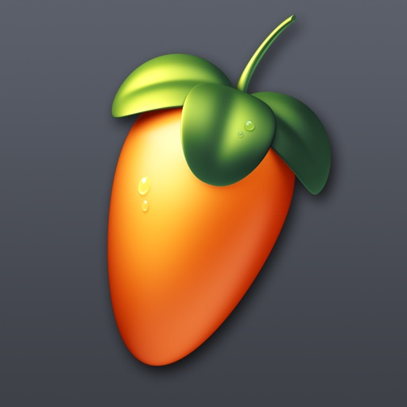

Create and save complete multi-track music projects on your iPad, iPhone or Mac. Record, sequence, edit, mix and render complete songs.

FEATURE HIGHLIGHTS

* Audio recording, track-length stem/wav import
* Browse sample and presets with preview
* Effects modules (see Included Content)
* Full-screen MacBook and iMac Trackpad and Mouse support.
* High quality synthesizers, sampler, drum kits & sliced-loop beats
* Instrument modules (see Included Content)
* Load projects in the FL STUDIO** FREE Plugin version of this App
* MIDI controller support (class compliant). Automation support.
* MIDI file import and Export (Single-track or Multi-track)
* Mixer: Per-track mute, solo, effect bus, pan and volume adjustment
* Piano roll. Edit notes or capture recorded performances.
* Save and load WAV, MP3, AAC*, FLAC, MIDI
* Share your songs via Wi-Fi or Cloud to other Mobile 3 installations
* Step sequencer
* User interface configurable with all screen resolutions and sizes.
* Virtual piano-keyboard & Drumpads
* IAA App support (In/Out), Audiobus support (In/Out)
* Audio recording (external and internal sources)
* Share your songs via Sync to other Mobile 3 devices / installations
* Load your projects in the FL STUDIO* FREE 'Plugin' Version of this App#

IN APP PURCHASES & INCLUDED CONTENT

FL Studio Mobile includes in-app purchases for the DirectWave sample player. You can install your own samples and don’t need to buy content.

All Instrument modules are included: Drum Sampler, DirectWave Sample Player, GMS (Groove Machine Synth), Transistor Bass, MiniSynth & SuperSaw.

All Effect modules are included: Analyzer (visual), Auto Ducker, Auto-Pitch (pitch correction), Chorus, Compressor, Limiter, Distortion, Parametric Equalizer, Graphic Equalizer, Flanger, Reverb, Tuner (Guitar/Vocal/Inst), High-Pass/Low-Pass/Band-Pass/Formant (Vox) Filters, Delays, Phaser and Stereoizer.

Included Drum Samples: Cymbals, Hats, Kicks, Snares, Toms, Percussion, Risers, SFX

Included DirectWave Instruments: Guitars, Keyboards, Orchestral, Synth, Bass, Synth Keyboards, Synth Leads, Synth Pads, Sliced, Drums, Drum Kits and Effects.

Included MiniSynth Presets: Bass, Keys, Leads, Pads, SFX, Synths

Included SuperSaw Presets: Arps, Bass, Bells, SFX, Leads, Pads, Sequences, Synths

WANT TO TRY BEFORE YOU BUY?

Install FL STUDIO 20 for macOS / Windows and you can use the FL Studio Mobile Plugin. This is identical to the App, as a plugin inside FL Studio. Get it here: http://www.image-line.com/downloads/flstudiodownload.html

MANUAL / TRAINING / VIDEOS

http://support.image-line.com/redirect/flstudiomobile_help
http://support.image-line.com/redirect/flstudiomobile_videos

SUPPORT

Please help us to help you! In the App, tap 'Help > Users & Support Forums' to register FL Studio Mobile to your Image-Line account and gain access to the forum. You can then report bugs, make feature requests and access free downloadable content: http://support.image-line.com/redirect/flmobile_forum

#### bimmerlink_for_bmw_and_mini
## BimmerLink for BMW and MINI
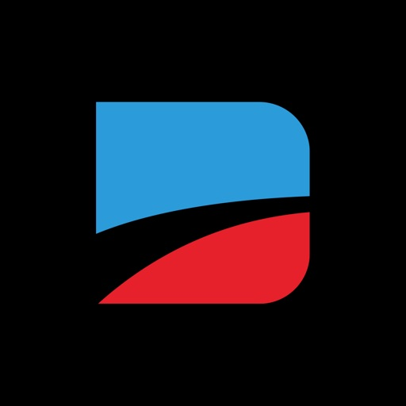

BimmerLink is the direct link to your BMW or MINI. Using one of the supported OBD adapters, you can read trouble codes or display sensor values in realtime, check the current state of the DPF in your car or register a new battery after replacement. BimmerLink even allows you to remotely control the exhaust flap or mute the Active Sound Design in your car.

READ AND CLEAR TROUBLE CODES
Diagnose your car as would otherwise be possible only by your Service Partner. In contrast to generic OBD apps that read emission related errors only, BimmerLink allows you to read and clear trouble codes from ALL control units in your car.

DISPLAY REALTIME SENSOR VALUES
BimmerLink provides a big selection of values like oil temperature or boost pressure. Keep an eye on all the important parameters of your car with a personalized dashboard.

EXHAUST FLAP REMOTE CONTROL*
Take control over the exhaust flap in your car and decide yourself, whether it should be closed or open.

ACTIVE SOUND DESIGN**
If you do not like the artificial engine sound generated in your car, just mute the Active Sound Design with BimmerLink.

SOUND TUNING***
The “Sound Tuning” option allows you to disable the “exhaust burble“ in cars equipped with the S55 engine (M2 Competition, M3, M4).

DPF REGENERATION****
BimmerLink allows you to check the current state of the diesel particulate filter in your car. Find out when the last regeneration took place or how much ash has accumulated in the filter and start a regeneration with the touch of a button.

CARPLAY ADD-ON*****
Enhance your driving experience with the CarPlay add-on for BimmerLink. Access your sensor values on your car's display for improved vehicle monitoring, all integrated seamlessly with CarPlay for ease of use.

BATTERY REGISTRATION
If you want to replace the battery in your car, this has to be registered in the engine control unit and BimmerLink allows you to do this yourself now.

PARKING BRAKE SERVICE MODE
BimmerLink allows you to activate the service mode for the electromechanical parking brake.

SERVICE RESET
Reset the service display in your car after carrying out maintenance work like a brake pad replacement or an engine oil change.

RESET SHORT CIRCUIT LOCKS
Unlock lamp outputs that were disabled due to a short circuit.

TRANSMISSION ADAPTATION VALUES
Check the adaptation values of the ZF 8HP automatic transmission in your vehicle.

REQUIRED ACCESSORIES
To use the app, one of the supported Bluetooth or WiFi OBD adapters or cables is required. For more information please visit https://bimmerlink.app.

SUPPORTED CARS
- 1 Series (2004+)
- 2 Series, M2 (2013+)
- 2 Series Active Tourer (2014+)
- 2 Series Gran Tourer (2015+)
- 3 Series, M3 (2005+)
- 4 Series, M4 (2013+)
- 5 Series, M5 (2003+)
- 6 Series, M6 (2003+)
- 7 Series (2008+)
- 8 Series (2018+)
- X1 (2009+)
- X2 (2018+)
- X3, X3 M (2010+)
- X4, X4 M (2014+)
- X5, X5 M (2006+)
- X6, X6 M (2008+)
- X7 (2019+)
- Z4 (2009+)
- i3 (2013+)
- i4 (2021+)
- i7 (2022+)
- i8 (2013+)
- iX (2021+)
- iX1 (2022+)
- iX3 (2021+)
- MINI (2006+)
- Toyota Supra (2019+)

* Only for cars that are equipped with an exhaust flap by factory.
** Only for cars that are equipped with the “Active Sound Design“ by factory.
*** Only for cars with S55 engine (M2 Competition, M3, M4).
**** Only for cars with a diesel engine.
***** Additional in-app purchase required.

#### wipr_2
## Wipr 2
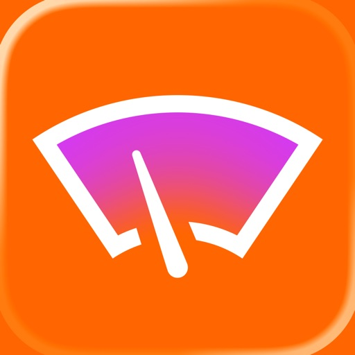

Wipr blocks ads, popups, trackers, cookie warnings, and other nasty things that make the web slow and ugly.

Websites in Safari will look clean, load fast, and stop invisibly tracking you. You’ll notice significant improvements to your battery life and data usage. Setup is a snap.

Wipr’s blocklist is updated twice a week automatically, and has enhanced versions for the following languages: Chinese, Czech, Danish, Dutch, Estonian, Finnish, French, German, Greek, Hebrew, Hindi, Hungarian, Icelandic, Italian, Japanese, Korean, Macedonian, Norwegian, Polish, Romanian, Russian, Slovak, Spanish, Thai, and Vietnamese.

Wipr 2 is a universal app: install it on all your devices (iPhone, iPad, Mac, Vision Pro) with a single purchase. It’s fully accessible with VoiceOver, Voice Control, and more. Dark and Tinted icon variants are included. Family Sharing is supported.

Because it’s developed by a single independent developer and 100% funded by its users, Wipr only answers to you: no one can pay to have their ads unblocked, and there are no “acceptable ads”.

This app was made with love and patience. I hope you’ll enjoy using it as much as I enjoyed designing and building it.

– Kaylee

Terms & Conditions: https://kaylees.site/terms-and-conditions.html

#### moment_pro_camera_ii
## Moment Pro Camera II

Your Camera, Your Looks, Your Way.

Moment Pro Camera II turns your phone into your favorite camera for photography and filmmaking. Shoot like a pro with full manual controls, creative looks, and an upgraded interface – all in one intuitive app.

What’s New in Pro Camera II?

Our first pro camera app has been the #1 rated camera app for years. Now, it’s time for the next chapter. We’ve re-engineered Pro Camera II from the ground up to give you better performance, advanced controls, and new customizable interfaces and shooting modes.

Key Features:

• Pro-Level Exposure Control – Our smart exposure system allows you to take control with Shutter Priority, ISO Priority, Manual, and Auto exposure modes, including the ability to limit Auto ISO to a specific range.
• Upgraded White Balance – Beyond auto white balance, you can manually configure temperature and tint, choose a preset, or calibrate via a gray card.
• Advanced Photo Options – Control the level of processing and HDR applied to your photos. Shoot in RAW, ProRAW, TIFF, HEIF, or JPG.
• Cinematic Video Tools – Apple Log, Open Gate, ProRes, 10-bit recording, and more. Adjust the resolution, color space, frame rate, codec, bitrate, and chroma subsampling for total creative freedom.
• Precision Monitoring – Get pro-level feedback with Waveform, RGB Histograms, and audio meters — normally reserved for cinema cameras.
• Aspect Ratio – Frame your shot within your favorite aspect ratio (4:3, 16:9, 3:2, 5:4, 1:1)
• Designed for All Creators – A beautiful, intuitive interface that adapts to how you shoot. Swipe, tap, and adjust anything immediately with one hand (including a dedicated left-handed layout), or go distraction-free with Zen Mode. Works natively in landscape orientation.
• Looks, Your Way – Apply creative Looks or import your own LUTs to video and photos. Preview them live, bake them into your footage, or adjust intensity on the fly.
• Focus Tools That Just Work – Separate reticles for exposure and focus with a tap, or dial in the shot with Manual Focus and Focus Peaking.
• Quick Actions, Faster Shooting – One swipe to reach your most used tools: flash, stabilization, zebras, focus peaking, grids, and more.
• Intuitive Lens Control – Remove the guesswork of which lens you are using and eliminate surprises with our Optic Controls. Say goodbye to shaky zoom with our fluid zoom control.
• Hardware-Ready – Optimized for every iPhone, with seamless integration for external mics and Moment’s entire lens + case ecosystem.

Upcoming Feature Releases
• Look Store: purchase creator color grades and film emulations
• Slow Shutter and Timelapse modes
• Advanced Profile sharing and collaboration tools
• Extended hardware integration partnerships

We love hearing from our community. For feature requests, ideas, or support, email us at hello@shopmoment.com or message us @momentprocamera on social media.

Fully Compatible with iPhone and Moment's complete ecosystem of lenses, cases, and accessories.

#### monash_fodmap_diet
## Monash FODMAP Diet
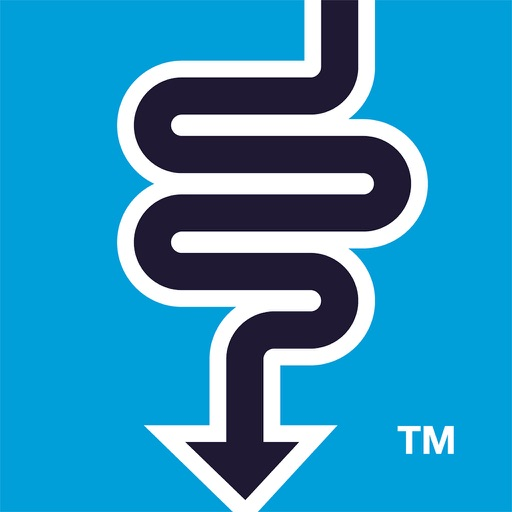

Researchers at Monash University have developed the low FODMAP diet and a corresponding app to assist in the management of gastrointestinal symptoms associated with irritable bowel syndrome (IBS). The Monash University FODMAP diet works by swapping foods high in fermentable carbohydrates (FODMAPs), with low FODMAP alternatives. Around 75% of people with IBS experience symptom relief on a low FODMAP diet.

The app comes directly from the research team at Monash and includes the following:

- General information about the FODMAP diet and IBS.
- Easy to understand tutorials to guide you through the app and the 3-Step FODMAP diet.
- A Food Guide detailing the FODMAP content for hundreds of foods using a simple 'traffic light system'. 
- A list of branded products that have been certified by Monash as low FODMAP.
- A collection of over 70 nutritious, low FODMAP recipes.
- Functions that allow you to create your own shopping list and add notes to individual foods
- A Diary that enables you to record food eaten, IBS symptoms, bowel habits and stress levels. The Diary will also guide you through step 2 of the diet - FODMAP reintroduction.
- The ability to adjust units of measurement (metric or imperial) and activate colour blindness assistance.

#### noir_-_dark_mode_for_safari
## Noir - Dark Mode for Safari
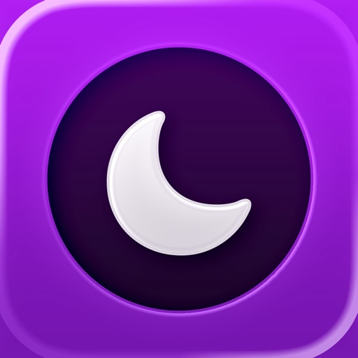

Noir is a Safari extension that automatically adds a dark mode to every website you visit.

It makes browsing the web at night so much better. With Noir, you won’t be blinded by bright websites ever again.

And the results look great too. Noir generates a custom dark style for each website you visit, based on the colors that are used on a page. You won’t even notice this happening in the background – that’s how fast it is – but you’ll certainly appreciate the end result: a beautiful dark mode tailored for each website, where contrast is preserved and highlights still pop. And with over 20 built-in themes and the ability to create your own, you can customize the results exactly the way you want.

Noir works with any website you visit in Safari, automatically. By default, Noir is linked to your device’s Dark Mode, so websites will only go dark when you want them to. But you can easily customize this to your liking, even per website. Only want to use Noir on just a few specific websites? Sure thing! Disable Noir on some websites? No problem!

Built from the ground up for iOS and iPadOS, the app feels right at home on your device. It supports the brand new Safari web extension feature, which means there’s no need to manually activate it every time you load a new page. The app also tightly integrates with system features such as Shortcuts, Control Center, Focus Filters, and Widgets to fully integrate Noir in all your workflows. And your settings are automatically synced to all your devices using iCloud.

And just as importantly, Noir takes your privacy seriously: it doesn’t collect any of your browsing data. Period.

Noir is made by an indie iOS developer. It does not include any subscriptions or ads. Buy Noir once, use it forever.

Notes:
• Found a website where Noir’s dark mode doesn’t look just right? Let me know by reporting it. The app will be frequently updated to address issues that are reported.

Privacy Policy:
• The Noir extension requires access to the websites you visit to analyze the existing style of the page and to override it with Noir's dark style.
• Noir never collects your browsing data. The only data Noir ‘collects’ are your settings, and those will never leave your device or iCloud account.
• You can read Noir’s full Privacy Policy at https://getnoir.app/privacypolicy

#### milgps
## MilGPS

MilGPS is a field navigation tool designed for efficient use by trained navigators using MGRS coordinates. No in-app purchases or subscriptions.

OVERVIEW
- Display your current location and other info in large, clear text on customizable screens.
- Create waypoints using your current location, map crosshairs, distance/direction projection or optimized coordinate entry. Organize waypoints into overlays and navigate to them by following an arrow or on the map.
- Visualize your location and waypoints on a map with smooth scrolling grid lines/labels. Apple and Google online maps are included or supply your own offline maps in raster MBTiles format.
 
OTHER FEATURES
- Supports MGRS, USNG, UTM, Lat/Lon and OSNG location formats.
- Supports a wide variety of map datums including WGS84, NAD27, OSGB36, AGD66 and ED50.
- Use 3 different datums/location formats for location display and waypoint entry.
- Supports a wide variety of angle, altitude, and distance formats.
- Cell phone signal not required for basic navigation functionality. Online maps require a data connection.
- Supports military date time groups for local/zulu time
- Import and export waypoints via the standard GPX file format. Limited support for KML and CSV formats. Routes and tracks not supported.
- Map ruler tool to measure distance/direction between two points on the map, snaps to waypoints

NOT INCLUDED (YET)
- Route planning
- Track recording
- Online mapping sources other than Apple and Google maps
- Vector offline maps

QUESTIONS
support@milgps.com

NOTES
- WiFi-only iPads are not supported because they don't have a GPS receiver.
- Mapping function requires a data connection. 
- Using GPS will shorten battery life.
- Online maps are provided, hosted and updated by third parties. Maps may be inaccurate or censored. Map types and quality may change without notice.

PRIVACY
Because you can choose to use Google maps in the app, we are required to disclose the data collected by Google in our App Store listing. If you do not use Google maps minimal data is collected. See our privacy policy for details.

WARNING
YOUR USE OF MILGPS IS AT YOUR OWN RISK
MilGPS is an aid to navigation only and is intended to be used in conjunction with other navigation methods and tools.
MilGPS must not be used where relying on MilGPS could result in death, injury or financial loss. This includes use on military operations, live-firing activities, aviation and surveying use.
MilGPS is not tested to military specifications and is not endorsed by the military of any nation. MilGPS is not a substitute for military issue equipment.
Your use of MilGPS is governed by the standard App Store Licensed Application End User License Agreement.

#### skyview®
## SkyView®

SkyView® brings stargazing to everyone. Simply point your iPhone, iPad, or iPod at the sky to identify stars, constellations, planets, satellites, and more!

Over 3.2 million downloads.

App Store Rewind 2011 -- Best Education App

“If you've ever wanted to know what you're looking at in the night sky, this app is the perfect stargazer's companion.” 
– CNET 

"If you’ve ever been looking for a stargazing app for your iPhone, then this [is] definitely the one to get." 
– AppAdvice 

“SkyView is an Augmented Reality app that lets you see just what delights the sky has to offer.” 
– 148Apps Editor’s Choice

You don't need to be an astronomer to find stars or constellations in the sky, just open SkyView® and let it guide you to their location and identify them. SkyView® is a beautiful and intuitive stargazing app that uses your camera to precisely spot and identify celestial objects in sky, day or night. Find all 88 constellations as they fade in and out while you scan across the sky, locate every planet in our solar system, discover distant galaxies, and witness satellite fly-bys.

Features: 

• Simple: Point your device at the sky to identify galaxies, stars, constellations, planets, and satellites (including the ISS and Hubble) passing overhead at your location.
• Sighting Events: schedule alerts for upcoming celestial events.
• Apple Watch: see what objects are visible tonight and how to spot them using your Apple Watch.
• Today Widget: brand new iOS 8 today widget lets you quickly see upcoming celestial events.
• Night Mode: Preserve your night vision with red or green night mode filters.
• Augmented Reality (AR): Use your camera to spot objects in the sky, day or night.
• Sky Paths: Follow the sky track for any object to see it’s exact location in the sky on any date and time.
• Comprehensive: Includes thousands of stars, planets, and satellites with thousands of interesting facts.
• Time Travel: Jump to the future or the past and see the sky on different dates and times.
• Social: Capture and share beautiful images with friends and family on social networks. 
• Mobile: WiFi is NOT required (does not require a data signal or GPS to function). Take it camping, boating, or even flying!

What a fun way to teach yourself, your children, your students, or your friends about our wonderful universe!

#### ableton_note
## Ableton Note

Start new musical ideas with a curated selection of sounds and effects. Create beats and melodic parts, sample your world, and continue your tracks in Ableton Live.
Note is a place to form ideas, explore new sounds and find direction. Get your ideas out or just experiment until inspiration hits, using a selection of Ableton Live’s drum kits, synths and melodic instruments. Create your own sound palette by sampling with your phone’s built-in microphone. And use Note’s built-in MIDI Editor to sequence notes, beats and chords or make tweaks as you listen back

Follow your ideas wherever they lead by sending your projects to Live without leaving the app with the help of Ableton Cloud. Open projects from Live’s browser and keep working – you can edit all your MIDI notes, and all your samples and sounds from Note are exactly the same. Ableton Note users get a free license for Ableton Live Lite – simple, intuitive software used by musicians, producers and DJs around the world to write, record, and perform. For Ableton Move users, Note also offers the chance to keep working on a Set from your phone.

Begin with a beat:
• Choose from 76 Drum Sampler kits
• Tap out a beat using the 16-pad grid, or sequence one with the MIDI Editor
• Play each drum hit melodically using 16 Pitches mode
• Quantize your beat or nudge notes to fix loose timing or mistakes
• Add more layers of rhythm
• Create beat repetitions with Note Repeat
• Change parameters to shape your sound
• Experiment with effects or apply swing for variations

Start with a melody:
• Choose from 317 synth sounds and 60 Melodic Sampler instruments
• Play or program your melody or chord progression with the 25-pad grid, piano roll or MIDI Editor
• Set a key and scale to get instantly harmonic results
• Add more layers of harmony
• Change parameters to shape your sound
• Add effects to experiment with sound design

Sample your environment:
• Create your own kits by recording percussive sounds into Note’s Drum Sampler
• Record tonal sounds to create your own Melodic Sampler instruments
• Manipulate your samples by cutting, filtering or repitching them
• Sequence samples into beats, melodies and chords using the MIDI Editor
• Shape or transform your sounds with effects
• Import your own samples or audio directly from videos

Capture improvisations:
• Play something, then tap the Capture button to keep it
• Play at a tempo that feels comfortable and Note will detect it
• Note will recognize the length of the phrase and create a loop
• Quantize it, add to it, or change the sound
• Connect MIDI hardware to play keys and change the sound of your instruments

Create variations:
• Note features a grid-based Session View layout
• Double your loops to create variation within clips
• Duplicate your clips and create different versions of your ideas
• Add, delete or adjust multiple notes at once with the MIDI Editor
• Create eight tracks with up to eight clips on eight scenes
• Try different clip combinations and song structures
• Export your work as an audio file to listen and share

#### liveatc_air_radio
## LiveATC Air Radio
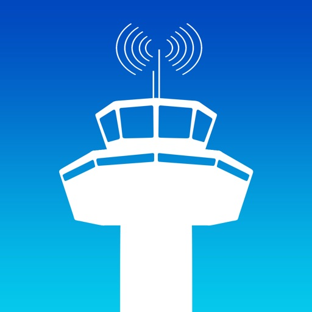

LiveATC Air Radio is brought to you by LiveATC.net LLC
PLEASE READ IMPORTANT NOTICE BELOW **BEFORE PURCHASING** (this relates to countries not covered by the LiveATC.net system)

Do you want to know why your flight might be delayed? Live near an airport or enjoy planespotting and want to tune in to the pilots? Have you always wondered what pilots talk to air traffic controllers about? Now you can stop wondering and tune in live!

LiveATC Air Radio provides a quick and easy way to listen in on live conversations between pilots and air traffic controllers near many airports around the world. LiveATC Air Radio lets you easily browse by U.S. state, Canadian province, or by country to find an airport of interest. Once you find an interesting channel you just add it to your Favorites list for quick and easy access! You can also use the Nearby function to find airports near you. We also cover high-altitude (ARTCC/FIR) communications and oceanic (HF radio) traffic.

The LiveATC network is the world's largest network of streaming audio feeds focused solely on aviation-related communications, currently covering over 1,200 airports around the world and over 3,300 different audio feeds and growing daily!

*** IMPORTANT NOTICE *** 
Please check to see if your country, city and/or airports of interest are covered by LiveATC *BEFORE PURCHASING* - check at: https://liveatc.net .  Note that we do not have coverage in the U.K., Belgium, France, Germany, Iceland, Italy, New Zealand, Spain and other countries where streaming ATC communications may be prohibited by law.

Available airports/channels are subject to change at any time - LiveATC owns and operates many of the receivers used in the network but many are provided by volunteers. Available airports can change due to reasons beyond our control. For this reason there is no guarantee that any particular channel will be up 24/7, or forever, though we make our best effort to do so and have an excellent overall track record of uptime.

Follow LiveATC on X and Facebook:
X: https://x.com/liveatc 
Facebook: https://facebook.com/liveatc

#### teleguard
## TeleGuard

Anonymity guaranteed - no registration

There is no connection to a telephone number and no collection of user identification data. The TeleGuard-ID is your very personal identification number that you need in order to connect with your friends. Every TeleGuard user receives an ID number and a QR code, which can be sent out to get in touch with others. 

Designed to be the most secure messenger in the world

TeleGuard's focus is on protecting privacy and confidential communication. TeleGuard is the secure messenger from Swisscows. Swisscows has set itself the task of protecting its users from data misuse in every situation. As the smartphone is the most widely used medium in the world nowadays, a secure messenger is indispensable.

Highly secure and modern server

All servers are located in the data centers in Switzerland. A complex encryption system is used for all transmitted data and absolutely no user data is stored on the servers. Everything is absolutely anonymous.

That's why TeleGuard is better than the others

TeleGuard encrypts every message and voice call with the one of the best encryption algorithm currently available: SALSA 20. Since our servers are in Switzerland, we are not subject to the data protection laws of the EU / USA and do not have to pass on any data.

How is my privacy secured?

HTTPS, end-to-end encryption, deletion of messages from the server after reading. No user data, neither IP address nor other, is recorded or stored.

Functions

•	Send text and voice messages
•	Share pictures and videos
•	Video and voice telephony
•	Send files
•	Create groups
•	The identity of contacts can be verified by scanning the QR code.

Support

If you have further questions, you will find our FAQs here: teleguard.com/en#faq

#### threema__the_secure_messenger
## Threema. The Secure Messenger
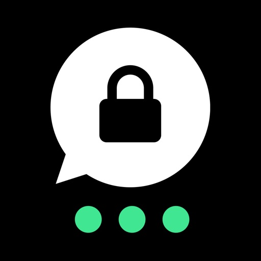

Threema is the world’s best-selling secure messenger and keeps your data out of the hands of hackers, corporations, and governments. The service can be used completely anonymously. Threema is open source and offers every feature one would expect from a state-of-the-art instant messenger. The app also allows to make end-to-end encrypted voice, video and group calls. Using the desktop app and the web client, you can also use Threema from your desktop.

PRIVACY AND ANONYMITY
Threema is designed from the ground up to generate as little data on servers as possible. Group memberships and contact lists are managed on your device only, and never stored on our servers. Messages are immediately deleted after they have been delivered. Local files are stored encrypted on your mobile phone or tablet. All this effectively prevents the collection and misuse of your personal information, including metadata. Threema is fully compliant with the European privacy legislation (GDPR).

ROCK-SOLID ENCRYPTION
Threema end-to-end encrypts all your communication, including messages, voice and video calls, group chats, files, and even status messages. Only the intended recipient, and nobody else, can read your messages. Threema uses the trusted open source NaCl cryptography library for encryption. The encryption keys are generated and safely stored on the users’ devices to prevent backdoor access or copies.

COMPREHENSIVE FEATURES 
Threema is not only an encrypted and private messenger but also versatile and feature-rich.

• Write text and send voice messages
• Edit and delete sent messages on the recipient’s end
• Make voice, video and group calls
• Share videos, pictures and locations
• Send any type of file (PDF, animated GIF, MP3, DOC, ZIP, etc.)
• Use the desktop app or the web client to chat from your computer
• Create groups
• Conduct polls
• Choose between a dark and a light theme
• React to messages with emojis
• Verify the identity of a contact by scanning their personal QR code
• Use Threema as anonymous instant messaging tool
• Synchronize your contacts (optional)

SERVERS IN SWITZERLAND
All our servers are located in Switzerland, and we develop our software in-house.

FULL ANONYMITY
Each Threema user receives a random Threema ID for identification. A phone number or email address is not required to use Threema. This unique feature allows you to use Threema completely anonymously – no need to give up private information or to open an account. 

OPEN SOURCE AND AUDITS
The source code of the Threema app is open for everyone to review. On top of that, renowned experts are regularly commissioned to conduct systematic security audits of Threema’s code.

NO ADS, NO TRACKERS
Threema is not financed by advertising and does not collect user data.

SUPPORT / CONTACT
For questions or problems please consult our FAQs: https://threema.ch/en/faq

#### koala_sampler
## Koala Sampler

Koala is the ultimate pocket-sized sampler. Record anything with your phone's mic instantly. Use Koala to create beats with those samples, add effects and create a track!

Koala’s super intuitive interface helps you make a tracks in a flash, there is no brake pedal. You can also resample the output of the app back into the input, through the effects, so the sonic possibilities are endless.

Koala's design focuses totally on making the music making progress instant, keeping you in the flow and keeping it fun, not getting bogged down by pages of parameters and micro-editing.

"Been putting that $4 koala sampler to good use lately. Undeniably great tool that puts some of these expensive beat boxes to shame. A must cop." 
-- flying lotus, twitter

* Record up to 64 different samples with your mic
* Transform your voice or any other sound with 16 superb built-in fx
* Load your own samples
* Choose from one of 250 built-in sounds
* Resample the output of the app back into a new sample
* Export loops or entire tracks as professional quality WAV files
* Direct export to Ableton Live Set
* Copy/paste or merge sequences just by dragging them
* Create beats with the high-resolution sequencer
* Import samples using AudioShare or just open them in Koala
* Keyboard mode lets you play chromatically or one of 9 scales
* Quantize, add swing to get the right feel
* Normal/One-shot/Loop/Reverse playback of samples
* 6 Choke groups
* Attack, release and tone adjustable on each sample
* AUv3 compatible - use in GarageBand, Logic, Cubasis etc etc
* MIDI controllable - play your samples on a keyboard, map the effects to knobs
* Jam with others over WiFi with Ableton Link
* Free copy of Ableton Live Lite included
* Use AI to separate samples into individual instruments (drums, bass, vocals and other)
* Set your own background image and choose from a growing list of background visual FX.
* AudioBus 3.0 and Inter-App Audio compatible

8 Built-in Microphone FX:
* More Bass
* More Treble
* Fuzz
* Robot
* Reverb
* Octave up
* Octave down
* Synthesizer 

16 Built-in DJ Mix FX:
* Bit-crusher
* Pitch-shift
* Comb filter
* Ring modulator
* Reverb
* Stutter
* Gate
* Resonant High/Low Pass Filters
* Cutter
* Reverse
* Dub
* Tempo Delay
* Talkbox
* VibroFlange
* Dirty
* Compressor

Features included in SAMURAI In-App Purchase
* Timestretch (4 modes: Modern, Retro, Beats and Re-pitch) 
* Piano roll editor 
* Auto-chop (auto, equal, and lazy chop)
* 3 Band EQ
* Pocket operator sync out

#### hear_my_baby_heartbeat_app_2_0
## Hear My Baby Heartbeat App 2.0

Trusted by over 500,000 families. The original, best-in-class baby heartbeat app to hear baby heartbeat at home with your iPhone. Looking for a fetal doppler alternative? Hear My Baby uses your iPhone microphone to help you listen to fetal heartbeat sounds — not a doppler or a medical device. HMB 2.0 adds AI chat support, tailored tutorials, and pregnancy reveal videos (+ your heartbeat) to help you get results faster.

Why parents choose Hear My Baby Heartbeat App 2.0

- Hear your baby’s heartbeat using the iPhone’s built-in microphone — no accessories required
- AI chat support gives step-by-step tips in real time to help you get a result faster
- Tailored tutorial adapts to your stage of pregnancy and setup
- Create baby sex reveal videos (+ your heartbeat) to share the moment
- Record & save heartbeat clips; build a personal timeline you can revisit
- Share easily with family and friends (Instagram, WhatsApp, email)
- Designed by parents with expertise in sound engineering, AI and app development; warm, honest guidance throughout
- Privacy first — you control what’s saved and shared

Real 5 Star Reviews

"I never leave reviews, let along pay for apps but let’s just say I tried this , and it def works took me a minute to find babies heartbeat but I found her . And to think I almost spent 40 dollars on a monitor today !" - Lov3r_Gurl IG (USA Sept 2025)
“I always find the heartbeat eventually and the rhythm is clear and strong. I love that I can record them to keep.” - T Lucker (Australia 2025)
"I downloaded this very skeptical... It took me about 45 minutes of laying down, very still, with noise canceling headphones on, but I HEARD HIS HEARTBEAT. I am almost 18 weeks pregnant. From one momma to the next, it’s worth it." - Baby'sHeartbeat (2025)

“It took some time and patience... thank you for creating this cheap, awesome technology to use at home.” — Niki
“I was skeptical at first. Great app! Worth it.” — Legretta

Hear My Baby uses your iPhone’s microphone to listen for abdominal sounds; it’s not a doppler and doesn’t emit ultrasound. It’s a lifestyle keepsake for bonding and sharing, not a medical device and not for diagnosis. Results vary with weeks and baby position (many families hear best from 16+ weeks, clearest around ~27 weeks). If you’re worried at any time in pregnancy, please contact your clinician. For peace of mind, you can use Airplane Mode.

How it works (quick start)

1. Find a very quiet room and remove your phone case
2. Place the iPhone microphone on your lower belly and move slowly
3. Our advanced audio engine isolates and amplifies fetal heartbeat sounds so you can listen and save the recording, and trim it to the appropriate moment for sharing quickly and easily.
4. Best from around 16+ weeks; clearest for many families at ~27 weeks. Results vary with baby’s position and placenta location.

Tips for best results

- Be still, breathe lightly, and try several positions around your bump
- Press the mic firmly against the skin; explore low and to the sides
- Bluetooth/over-ear headphones can make subtle sounds easier to hear

Important
Hear My Baby Heartbeat App is not a medical device and doesn’t replace prenatal care. If you’re concerned about anything in your pregnancy, please consult your clinician. Works on iPhone (not iPad). For extra peace of mind, you can switch to Airplane Mode while using the app.

Privacy
Your moments are yours. You decide what to keep or delete — and who gets to hear them. 

A word from our team...
We never see your recordings, but LOVE to hear them so please tag us on Instagram.com/hearmybaby or TikTok.com/hearmybaby or Facebook.com/hearmybaby

#### tenuto
## Tenuto

Tenuto is a collection of 24 highly-customizable exercises designed to enhance your musicality. From recognizing chords on a keyboard to identifying intervals by ear, it has an exercise for you. Tenuto also includes six musical calculators for accidentals, intervals, scales, chords, analysis symbols, and twelve-tone matrices.

A short description of the exercises and calculators follows.

––––––

• Note Identification
• Key Signature Identification
• Interval Identification
• Scale Identification
• Chord Identification
Tap the button corresponding to the written staff line. For example: if shown a C, E, and G with a sharp; tap the "Augmented Triad" button.

––––––

• Note Construction
• Key Signature Construction
• Interval Construction
• Scale Construction
• Chord Construction
Construct the specified label by moving notes and/or adding accidentals. For example: if shown a C and an "Augmented 4th" label, move the second note to F and add a sharp.

––––––

• Keyboard Reverse Identification
Tap the piano key corresponding to the written note on the staff. While similar to Note Identification, this exercise uses a piano keyboard rather than note name buttons.

• Keyboard Note Identification
• Keyboard Interval Identification
• Keyboard Scale Identification
• Keyboard Chord Identification
Tap the button corresponding to the highlighted piano key(s). If the C and G keys are highlighted, tap the "P5" (Perfect 5th) button.

––––––

• Fretboard Note Identification
• Fretboard Interval Identification
• Fretboard Scale Identification
• Fretboard Chord Identification
Tap the button corresponding to the marked fretboard position(s). If the 2nd fret of the D string is marked, tap the "E" button.

––––––

• Keyboard Ear Training
• Note Ear Training
Listen to the played reference and question notes. Select the piano key or note button corresponding to the question note.

• Interval Ear Training
• Scale Ear Training
• Chord Ear Training
Tap the button corresponding to the played notes. If E and F are played, tap the "Minor 2nd" button.

––––––

• Accidental Calculator
Display the accidental for a note and key.

• Interval Calculator
Display the interval for a note, type, and key.

• Chord Calculator
Display the scale for a tonic and scale type.

• Chord Calculator
Display the chord for a note, type, and key.

• Analysis Calculator
Display the chord for a symbol and key.

• Matrix Calculator
Display the twelve-tone matrix for a specified tone row.

#### stylebook
## Stylebook

Get the most out of your closet - for less than the price of a latte, you could change your relationship with clothes and find your unique personal style!

Stylebook® is the longest-running closet organization app for a reason - with over 90 features to help you curate your closet! This time-tested app is an expert wardrobe management and closet organization tool, and has been loved by customers for 15+ years.

Import your actual clothes in seconds with a variety of import tools, including AI image generation. Use your real clothes to collage magazine-style outfits so you can wear an outfit you love every day. If you’re out of ideas, the app can even make outfits for you. Plus, plan what to wear on the outfit calendar, create packing lists that automatically tell you which clothes to pack, and learn more about your wardrobe with stats like cost per wear - all in this customizable app!

Stylebook is the ultimate tool to mix and match your wardrobe and get more wears out of your clothes without feeling bored. If you want to break out of the micro-trend cycle and gain true personal style - it’s for you.

OUR STORY:

Stylebook’s features were inspired by the co-founder's real-life experience organizing clothes in the Vogue fashion closet and her journey to find her personal style while working with a nonexistent budget. As the app evolved over the years, it's become a way for anyone to fall in love with their wardrobe, helping them to save time and money, get more wears out of their clothes, and make their wardrobes more sustainable. We’re a small family-owned and operated business. 

REVIEWS:

FEATURED BY: Vogue, WSJ, Harper's Bazaar UK, New York Magazine, Articles of Interest, Confidently Insecure, Sustainable Fashion for Dummies, the Conscious Style Podcast, & more!

"Easily see what is working and what isn’t" - Vogue.com

"Closet-organization apps allow you to catalog your wardrobe and play stylist...I find Stylebook to be the most intuitive." - NYTimes

"Our new wardrobe secret weapon is the @StylebookApp" - The Outnet

10 Must-Have iPhone Apps for Fashion Week - Vogue Paris

"The Clueless virtual closet exists in real life, OMG" - Cosmopolitan UK

Condé Nast Traveler's "Best Travel Apps for Packing"

FEATURES:

• CLOSET INVENTORY: quickly add images of your clothes with no need to take photos unless you choose to
• FAST IMPORT: generate clothing images from text with AI*, drag & drop photos, multiple import, & clip from your favorite store websites
• AI BACKGROUND REMOVAL: automatically cut out your clothes, virtually instantly
• LAY OUT OUTFITS: layer & resize clothing on a free-form canvas 
• OUTFIT GENERATOR: shuffle your closet like a deck of cards to reveal new outfit ideas hiding in your closet! 
• CALENDAR: plan what to wear in advance
• PACKING LISTS: add whole outfits, plan how you'll pack ahead of time, generate checklists & infographics
• STYLE STATS: insights into your wardrobe, including what you wear the most & least and which items have the best value
• COST PER WEAR: automatically track CPW for your entire wardrobe
• BROWSE YOUR CLOSET: see everything you own in one place, organized by brand, fabric, color, size, etc.
• INSPIRATION LIBRARY: save all your style inspirations outside the influence of algorithms
• CUSTOM CATEGORIES: add, edit, or delete any category in your closet, looks & inspiration library
• SYNC: automatic sync shows the same data on both your iPhone & iPad
• SHARE: share outfits & clothes via e-mail & social media
• NO LIMITS: add unlimited clothing, accessories, & inspirations
• ICLOUD BACKUP: protect your data with iCloud
• SEARCH: search your closet for keywords or properties like fabric, season, color, etc.
• SHOP: try items with your clothes before buying & bookmark your fave stores!
• E-MAIL SUPPORT: contact support and a real person will help you

Visit stylebookapp.com for the full feature list - plus demo videos of the app!

(*) AI image generation requires Apple Intelligence

#### pocket_god
## Pocket God

What kind of god would you be? Benevolent or vengeful? Play Pocket God and discover the answer within yourself. On a remote island, you are the all-powerful god that rules over the primitive islanders. You can bring new life, and then take it away just as quickly. Exercise your powers on the islanders. Lift them in the air, alter gravity, hit them with lightning...you're the island god! All god powers are demonstrated in Pocket God's help menu.

Pocket God is an episodic microgame for you to explore, show your friends and have fun with. We have been growing the game with the help of player suggestions!  What sort of godly powers would you like to see added?

More info can be found at our blog:
http://www.boltcreative.com

On Facebook:
http://www.facebook.com/PocketGodGame

And on Twitter:
http://www.twitter.com/PocketGod

Releases:

Ep 1: Nowhere To Go, Nothin' To Do 
Ep 2: Does this Megabyte Make My App Look Fat?
Ep 3: You Always Hurt the One You Lava 
Ep 4: Shake That App!
Ep 5: A Storm is Coming
Ep 6: And on the 7th Day, Rest!
Ep 7: Just Give Us 5 Minutes
Ep 8: Jump the Shark
Ep 9: Idle Hands
Ep 10: Hi, Dracula!
Ep 11: A Mighty Wind
Ep 12: Something's Fishy…
Ep 13: March of the Fire Ants
Ep 14: Say My Name!
Ep 15: A New Home
Ep 16: The Tyrannosaurus Strikes Back!
Ep 17: Return of the Pygmy
Ep 18: Surf's Up
Ep 19: Fun 'n Games Until A Pygmy Gets Hurt
Ep 20: Stop! My App is On Fire!
Ep 21: Flipping the Bird
Ep 22: Ooga Jump
Ep 23: Bait Master
Ep 24: Idle Hands 2: Caught with your Pants Down
Ep 25: Sharks With Frickin' Laser Beams Attached To Their Heads
Ep 26: Dead Pygmy Walking
Ep 27: Good Will Haunting
Ep 28: Barking Spider, Crouching Pygmy
Ep 29: The Pyg Chill
Ep 30: Great Job Ice Hole
Ep 31: What's the Story Morning Gory?
Ep 31B: What's the Story Morning Gory? Part II
Ep 32: Crack is Wack
Ep 33: A Pygmy A Day Keeps the Ape Away
Ep 34: Monkey See, Monkey Chew
Ep 35: Double Rainbow All The Way Across The Sky
Ep 36: Konkey Dong
Ep 37: The Moron Pests
Ep 38: Two and a Half Pygmies
Ep 39: Challenge of the Gods
Ep 40: Battle of the Gods.
Ep 41: I Sting The Body Electric
Ep 42: Bone Soup
Ep 43: Killing Time
Ep 44: The Perfect Swarm
Ep 45: Dance Dance Execution
Ep 46: Germs of Endearment
Ep 47: Apocalypse, Ow!

#### ireal_pro
## iReal Pro
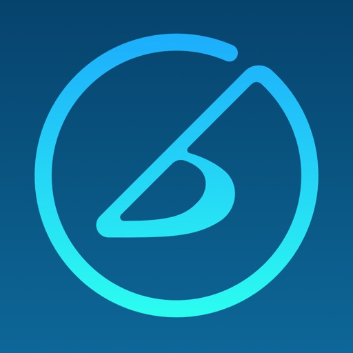

Practice makes perfect. iReal Pro offers an easy-to-use tool to help musicians of all levels master their art. It simulates a real-sounding band that can accompany you as you practice. The app also lets you create and collect chord charts of your favorite songs for reference.  

~One of Time Magazine's 50 Best Inventions of 2010~

Used by thousands of music students, teachers and some of the world’s top music schools such as Berklee College of Music and Musicians Institute.

“It’s the perfect technology for a practicing musician: high-quality digital audio, mixable, transposable into any key and completely mobile. Now every aspiring musician has a backup band in their pocket.” – Tim Westergren, Pandora Founder

• It's a Book:
Create, edit, print, share and collect chord charts of your favorite songs for reference while practicing or performing.

• It's a Band:
Practice with a realistic sounding piano (or guitar), bass and drum accompaniments for any downloaded or user-created chord chart.

FEATURES:

Have a virtual band accompany you as you practice
• Choose from the included 51 different accompaniment styles (Swing, Ballad, Gypsy Jazz, Bluegrass, Country, Rock, Funk, Reggae, Bossa Nova, Latin,...) and even more styles are available as in-app purchases
• Personalize each style with a variety of sounds including piano, Fender Rhodes, acoustic and electric guitars, acoustic and electric basses, drums, vibraphone, organ, and more
• Record yourself playing or singing along with the accompaniment

Play, edit, and download any songs you want
• 1000s of songs can be downloaded from the forums in a few simple steps
• Edit existing songs or create your own with the Editor
• The Player will play any song that you edit or create
• Create multiple editable playlists

Improve your skills with the included chord diagrams
• Display guitar, ukulele tabs and piano fingerings for any of your chord charts
• Look up piano, guitar and ukulele fingerings for any chord
• Display scale recommendations for each chord of a song to help with improvisations

Practice in the way, and at the level, that you choose
• Includes 50 exercises for practicing common chord progressions
• Transpose any chart to any key or to number notation
• Loop a selection of measures of a chart for focused practicing
• Advanced practice settings (automatic tempo increase, automatic key transposition)
• Global Eb, Bb, F and G transposition for horn players

Share, print, and export – so your music follows you wherever you need it!
• Share individual charts or whole playlists with other iReal Pro users via email and the forums
• Export charts as PDF and MusicXML
• Export audio as WAV, AAC and MIDI 
• Support for AirTurn™ and other bluetooth page turners
• Upload your songs and playlists to iCloud for safekeeping and for synchronization across any of your iCloud enabled devices such as iPhone, iPad or Mac

Always backup your songs!

#### just_press_record
## Just Press Record

Just Press Record is the ultimate audio recorder bringing one tap recording, transcription and iCloud syncing to all your devices. You can edit your audio and transcriptions right inside the app and even start a new recording completely hands-free with Siri!

Life is full of moments we would rather not forget - like your child’s first words, an important meeting or spontaneous idea. Capture these moments effortlessly on iPhone, iPad, Mac or for ultimate convenience, Apple Watch.

RECORD
• One tap to start, stop, pause and resume recording.
• Start and stop recording from the Lock Screen, Control Centre, the Action Button, Shortcuts, Siri, the Widget, a 3D Touch Quick Action or via the URL scheme.
• Unlimited recording time.
• Record discretely in the background.
• Choose to record from the built-in mic, AirPods or external microphones.
• Record independently on Apple Watch and sync later.

PLAY
• Seek backwards and forwards during playback.
• Adjustable playback speed.

TRANSCRIBE
• Turn speech into searchable text.
• Support for over 30 languages, independent of your device's language setting.
• Synchronized text highlighting and audio playback.
• Format as you record with punctuation commands.

EDIT
• Audio - visualise your audio in the waveform view and cut out the parts you don’t need.
• Text - make corrections and add new text to your transcriptions.

SHARE
• Share audio and text to other apps.
• Share easily to social media as a video clip.
• Share to iTunes on Mac or PC via USB cable.
• Print a hard copy of your transcripts.
• Share audio files from other apps to Just Press Record. 

ORGANISATION
• View recent recordings or browse your library by date and time.
• Search by filename or transcription content.
• Dedicated tab for quick access to recordings made on Apple Watch.
• Rename recordings.
• Slide Over and Split View support on iPad.
• Add a badge to the app icon showing the number of unplayed recordings.

STORAGE
• Choose to store recordings in iCloud Drive or locally on-device.
• Recordings stored in iCloud Drive automatically sync across all your devices.
• Recordings stored locally benefit from Files app integration and automatic iTunes File Sharing.
• Transcriptions are stored within the audio file.

PRO-AUDIO
• Support for stereo recording from the built-in microphone on supported devices.
• Support for high quality external microphones connected via the Lightning Port.
• Customisable Audio Settings to enhance your recording experience.
• File types include WAV, AIF or standard iTunes M4A (ACC).
• High quality audio up to 96kHz / 24-bit.

ACCESSIBILITY
• VoiceOver support throughout the app.
• Magic Tap gesture to start / stop a recording.

APPLE WATCH
Just Press Record includes an Apple Watch app that gives you the freedom to record anywhere, even when your iPhone is not around.

• Start recording with a single tap on the Complication.
• Record discretely in the background.
• Unlimited recording time.
• Recordings automatically transfer to iPhone for transcription and iCloud syncing.
• Listen to recent recordings through the built-in speaker or AirPods.
• Adjust volume with the Digital Crown.
• Pause recording with a downward swipe.
• Accessibility support with VoiceOver, reduced motion and support for the extra large Complication template.

IMPORTANT:
• Just Press Record does not record phone calls or audio from other apps.
• Transcription requires a good, clean audio signal.  Avoid recording in noisy environments and ensure the microphone is positioned close to the source.
• URL scheme implemented by Just Press Record can be found on our FAQ page.

#### heartwatch__heart_rate_monitor
## HeartWatch: Heart Rate Monitor
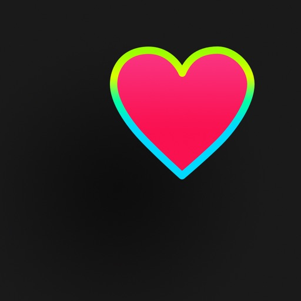

"HeartWatch is so good, you’d think Apple built the app itself." John Patrick Pullen, Time Magazine. Top 5 in Health & Fitness in 100+ countries. 

TOTAL PRIVACY
HeartWatch has no user analytics tracking. No advertising plugins. No 3rd party code. No data upload. Ask your "free" heart app if they can say the same.

ABOUT HEARTWATCH
HeartWatch is the best way to get a complete picture of all the health & fitness information captured by your Apple Watch. 

NEWS
- Explore the different News Editions to learn all about your health progress and trends.
- Morning Briefing: read about your key health information to start your day
- Fitness Habits: news all about your fitness trends with a dynamic fitness habit tracker

WELLNESS
- An intelligent view of all key heart rate metrics. Daytime, Sedentary, Sleeping, Waking & Workouts. 
- Detailed trend analysis including heart rate, blood pressure, HRV, blood glucose, blood oxygen (SpO2) and more.
- Background heart rate alerts on Watch with context. 
- Note capture for individual heart rate readings. 
- Detailed ECG analysis

ACTIVITY
- Every day isn’t the same. Intelligent move, distance & steps goals based on your current habits. 
- Daily forecasting to help you stay on track to meet your goals. 

WORKOUTS
- In depth analysis of heart rate, training summary, GPS maps and more. 
- A heart focussed workout app on the Watch with custom alerts to keep you in the right zone. 
- Detailed trend analysis. 
- Stream workout info from your Watch to your iPhone. 

JOURNAL & NOTES
- Keep a daily journal with notes and measurements
- View a detailed list with a complete overview of all notes, measurements and workouts
- Input notes and measurements from your Watch or iPhone. Includes blood pressure, temperature, blood glucose, weight, waist circumference and body fat percent.

GRAPHS & ANALYSIS
- Over 30+ health metrics to view
- Apply 7 day and 21 day trends to any metric, with the ability to overlap
- View over 6 weeks up to 12 months

EXPORT
- Export for all health metrics & workouts. 

NOTHING IS MORE IMPORTANT THAN YOUR HEALTH
Heart Watch is a very useful tool to get alerted about any possible health issues in a concise format that you can show your medical practitioner.

INTEGRATION
HeartWatch connects beautifully with the Eclipse Yourself and AutoSleep apps, our premier sleep, activity, recovery and readiness monitoring apps.

HEART MONTH
Featured app in the official Apple Heart Month 2022:
https://www.apple.com/au/newsroom/2022/01/apple-celebrates-heart-month-with-new-resources-across-services

REQUIREMENTS
This app requires an iPhone that has the Health App installed. Heart readings are read from the Health Data Store which is ideally populated by your Apple Watch.

#### countdown_app
## Countdown App

Your countdown awaits. Inspired by the horror movie Countdown, this app will reveal exactly how much time you have left.

By receiving, opening the file package, and/or using Countdown('Software') containing this software, you agree that this End User License Agreement(EULA) is a legally binding and valid contract and agree to be bound by it. You agree to abide by the intellectual property laws and all of the terms and conditions of this Agreement. User shall accept the terms of his or her fate. Any attempt to use information derived from Countdown to alter the user’s fate will result in a breach of this agreement.

Tag us in your reactions using #CountdownApp on TikTok.

--- --- --- ---

Warning: This app contains vibrations, sound effects, and uses your device’s torch for added intensity. It may not be suitable for individuals with epilepsy.

Disclaimer: This app is for entertainment purposes. Results should not be taken seriously.

--- --- --- ---

#### illinois_511_traffic_cameras
## Illinois 511 Traffic Cameras

The best way to view Illinois 511 CCTV traffic cameras.

MAIN FEATURES INCLUDE: 
  - Create custom camera groups
  - Quickly view all cameras on your route
  - Add camera widgets to your home screen

CREATE CUSTOM CCTV CAMERA GROUPS
Create custom groups of cameras based on your frequented routes and then simply scroll through the list of images. This makes viewing traffic and road conditions significantly faster. If you prefer to view a single camera at a time, this option is also available.

HOME SCREEN WIDGETS
Add up to (4) four traffic camera widgets to your home screen and stay up-to-date with the latest traffic and road conditions.

#### peakfinder
## PeakFinder

The mountains are calling! Explore more mountains than any mountaineer! PeakFinder makes it possible… and shows the names of all mountains and peaks with a 360° panorama display.
This functions completely offline - and worldwide!

PeakFinder knows more than 1'000'000 peaks - from Mount Everest to the little hill around the corner.

•••••••••
Winner of several prizes like 'Best of AppStore', 'App of the Week', …
Highly recommended by macnewsworld.com, nationalgeographic.com, smokinapps.com, outdoor-magazin.com, themetaq.com, digital-geography.com, …
•••••••••

••• Features •••

• Works offline and worldwide
• Includes more than 1'000'000 peak names
• Overlays the camera image with the panorama drawing
• Realtime rendering of the surrounding landscapes in a range of 300km/200mil
• Digital telescope to select less prominent peaks
• 'Show me'-function for visible peaks
• Selection of the viewpoint by GPS, the peak directory or an (online) map
• Can fly like a bird from peak to peak and vertically upwards
• Mark mountains and places you like
• Shows the solar and lunar orbit with rise and set times
• Uses compass and motion sensors
• Daily updates of the peak directory
• Does not contain any recurring costs. You pay only once
• Is free of advertising

••• Ratings •••

Every good rating (including those following updates) makes me happy. The positive ratings and reviews make it possible for me to continue to improve the app for you. Many thanks!

••• Support •••

In case of questions, problems, mistakes, missing mountain names and ideas for future expansion, I am happy to help you. Please write to support@peakfinder.com.

#### frame_crop_–_art_mode
## Frame Crop – Art Mode

Browse and download artwork, paintings, and photos for your Samsung Frame TV or Hisense CanvasTV from Frame Crop's integrated libraries including Smithsonian, Wikimedia Commons, and Unsplash. Effortlessly crop and display your photos to fit the borderless display of your Samsung Frame TV or Hisense CanvasTV. Showcase your favorite memories, beautiful landscapes from your travels, or professional artwork/paintings from our integrated Smithsonian Open Access, Wikimedia Commons & Unsplash library right on your Samsung Frame or Hisense CanvasTV.

NEW: Upload your own personal photos and artwork directly to your Samsung Frame TV for a truly personalized art experience. Plus, you can now directly connect to your Frame TV and upload images, making it easier than ever to share your favorite memories and artwork.

Create your own account and start building custom collections of art, where you can share your favorite pieces with others and discover new art from around the world. With Frame Crop, you can easily turn your Samsung Frame TV or Hisense CanvasTV into a beautiful, customized art display.

Key Features:
• Intuitive photo cropping tools to perfectly fit and display images on your Samsung Frame TV & Hisense CanvasTV

• NEW: Direct upload capability - send your processed images straight to your Samsung Frame TV

• Batch processing for local images - select and process up to 10 personal photos at once with automatic cropping
• Auto-cropping functionality for locally selected images
• Download indicators that show which images you've already added to your collection
• Downloaded images list accessible in settings for easy art collection management
• Support for portrait-mounted Frame TVs
• Search and browse a vast library of art, landscapes, animals, and more from Smithsonian Open Access, Wikimedia Commons & Unsplash
• Discover the most popular art across all 3 art sources

#### photopills
## PhotoPills

Unlock your creative potential! Discover how to easily turn any Sun, Moon and Milky Way scene you imagine into a real picture… and start shooting truly legendary photos every time you pick up the camera!

Whether your passion is to capture beautiful landscapes, immortalize the infinite night sky, surprise the bride and the groom in their happiest day... or to travel the world, PhotoPills will make you love exploring new artistic possibilities to tell visual stories in a way it wasn’t possible before.

* All in one app
PhotoPills is your iPhone and iPad personal assistant in all photographic matters. It provides tasty remedies to answer most of the questions when planning and shooting your creative ideas: 
- The First 2D Map-Centric Planner: Sun, Moon, Milky Way
- Sun, Moon Alignments Fast Finder
- 3D Augmented Reality: Sun, Moon, Milky Way, Celestial Equator, Polaris, DoF, FoV
- Photo Plans Manager
- Location Scouting Tool
- Key information: Sunrise/set, Twilights, Golden Hour, Blue Hour, Moonrise/set, Supermoon dates, Moon Calendar
- Calculators: Long Exposure, Timelapse, Spot Stars, Star Trails, Hyperfocal Table, DoF, FoV
- Widgets: Sun, Moon, Milky Way
- PhotoPills Awards… and much more!

* Endorsed by Masters
“PhotoPills is an invaluable tool which I use every time I plan a shoot.” – Mark Gee, Astronomy Photographer of the Year.
“A tool every photographer should have.” – Kevin Raber, Luminous-landscape.com.
“It pays off! Using such a tool ensures that we are repeatedly capable of quickly planning powerful shots; leaving maximum opportunity for more creative ruminations.” – José B. Ruiz, Innovation Award, Wildlife Photographer of the Year.

* How it works
Have you ever walked around a place and thought: "What a pity the Moon isn't EXACTLY right there... I would have captured a great photo!"? What about the Sun? And the Milky Way? Well, now you can let your imagination fly and calculate when this specific magic moment happens in just a few seconds:
- IMAGINE: the Milky Way arching over a powerful landscape, a giant full Moon appearing from behind a nearby hill or a sunset between two rocks on a magic beach... The only limit is your imagination!
- PLAN: easily calculate the exact date and time the scene you’ve imagined happens. Work smarter, not harder! 
- SHOOT: just get out there, immerse yourself in the great outdoors, and enjoy living and capturing unique moments.

* Become a Legend
Because we know the huge amount of time, energy and love you put in your photos. We want to HONOR them, SHOW them to the World, and REWARD you with up to $6,600 in cash prizes. It's easy and FREE! Just submit your creative photos from PhotoPills and join the Legacy!

* Never waste an unmissable scene again
Create a To-Do list of planned photos and get to the location on time. 

* Get it right
Adjust your frame for the best composition before you shoot. Use the 3D Augmented Reality Views to see whether Sun, Moon and Milky Way will be at the desired position when pressing the shutter.

* Explore, discover great places and create your own database of locations
If you come across a location you’d like to remember, save it as a Point of Interest.

* Enjoy all daily information in just one swipe with the Widgets
Just swipe down from the top of the screen to get all the Sun, Moon and Milky Way events for your current location and date, in addition to your upcoming photo plans.

* Get more than an app
Our goal is not only to help you plan your shots, but also to help you nail them. Whenever you need help, take a look at our How-To articles and videos, join our free online courses or just contact us!

“This is your last chance. After this, there is no turning back. You take the blue pill – the story ends, you wake up in your bed and believe whatever you want to believe. You take PhotoPills – you stay in Wonderland and we show you how deep the rabbit-hole goes. Remember: all we’re offering are Legendary Photos and Goosebumps in your skin, nothing more.”

#### aeropads_-_pads___soundscapes
## AeroPads - Pads & Soundscapes

Have you ever struggled to find confidence on stage or inspiration in the studio? AeroPads cues immersive pads and soundscapes that inspire and equip you to perform and write your best.

ENHANCE YOUR SOUND. ENGAGE YOUR AUDIENCE.
Every musician has experienced an empty mix or an awkward transition. When using AeroPads, you instantly add more dimension and character to your sound. With a more immersive mix and the ability to perform smooth and seamless transitions, you will feel more confident while your audience will be more engaged.

FOR EVERY MUSICIAN.
Pads and soundscapes are a versatile accompaniment to nearly any style of music. Whether you are a soloist or full band, AeroPads will take your sound to the next level. Rock bands, worship teams, wedding singers, producers, songwriters, and instrumentalists are just a few of the many types of musicians that have loved using AeroPads.

DESIGNED FOR THE STAGE. INSPIRED BY SPACE.
AeroPads features creative and immersive soundscapes paired with a beautiful and intuitive interface, all inspired by the pinnacle of exploration and inspiration: outer space.

CREATIVITY THAT SPARKS CREATIVITY.
AeroPads aren't your typical pads. Most pads out there are really boring or insanely obnoxious. However, AeroPads features thoughtfully crafted soundscapes that are meticulously fine-tuned with the perfect amount of harmonic and textural movement. Simply put, AeroPads won't step on the toes of your arrangement or get on the nerves of your sound guy (like most other pads out there).

Highlighted Features:
- A beautiful space-inspired interface with a simple and intuitive design.
- Live View: Every key and three of your favorite patches are instantly accessible (best suited for experimentation, free-flowing sets, and songwriting).
- Setlist View: Plan and build a detailed setlist (best suited for structured sets and seamless transitions).
- The iconic Atmosphere Soundpack which includes five unique patches named after and inspired by the layers of Earth's atmosphere. 
- Three patches can be added to Live View to be made instantly accessible, so there's no need to dig through menus to just to change a patch when performing live.
- Additional patches and Soundpacks available for purchase.
- Key-specific pads in multiple tonalities: major, minor, and neutral.
- Concert pitch adjustment.

How to Use:
01. Cue a pad that matches the key of your musical arrangement.
02. Play overtop of the accompanying pads and soundcapes.
03. Enjoy the boost of audience engagement, musician confidence, and creative inspiration.

Pads and soundscapes are intended as a subtle accompaniment to musical arrangements/performances. They are designed to be cued according to the key of the arrangement. Once cued, you'll hear a droning pad centered around the root note with additional harmonic textures within the selected key. The only time a pad's key should change within a song is in the instance of a key change. For best results, mix AeroPads appropriately within the overall mix. When mixed too loud, AeroPads may compete with melodies and the arrangement. When mixed too quietly, AeroPads may be less effective. When mixed appropriately, they will sound awesome.

#### procam_-_pro_camera
## ProCam - Pro Camera

SHOOTING MODES 

- Photo
- Burst Mode
- Slow Shutter
- Portrait Mode - supported on all dual lens camera system as well as iPhone XR and iPhone SE 2020
- 3D Photo - requires dual lens camera system
- Video
- Time Lapse

PHOTO SHUTTER RELEASE OPTIONS

- Self-Timer 
- Anti-Shake
- Screen Shutter / Big Button
- Interval

VIDEO FRAME RATES AND RESOLUTIONS

- VGA, 720p, 1080p
- 4K Ultra HD - 3264x1836 upscaled to 3840x2160 - in-app purchase - iPhone 5s / iPad Air 2 and later
- 4K Ultra HD - 3840x2160 - native support on iPhone 6s / Plus and later
- 4K Max - 4032x2268 - in-app purchase -  iPhone 6s / Plus and later
- High frame rate:
* 48 / 50 / 60 fps 720p - iPhone 5 / iPad mini and later  
* 96 / 100 /120 fps 720p - iPhone 5s / iPad Air 2 and later 
* 192 / 200 / 240 fps 720p - iPhone 6 and later 
* 48 / 50 / 60 fps 1080p - iPhone 6 and later
* 96 / 100 / 120 fps 1080p - iPhone 6s / Plus and later
* 192 / 200 / 240 fps 1080p - iPhone 8 and later 
* 48 / 50 / 60 fps 4K - iPhone 8 and later  

TIME LAPSE FRAME RATES AND RESOLUTIONS

- VGA, 720p, 1080p
- 4K Ultra HD - 3264x1836 upscaled to 3840x2160 - in-app purchase - iPhone 5 / iPad Air 2 and later
- 4K Ultra HD - 3840x2160 - native support on iPhone 6s / Plus and later
- 4K Max - 4032x2268 - in-app purchase - iPhone 6s / Plus and later
- High frame rate:
* 48 / 50 / 60 fps 720p - all devices
* 48 / 50 / 60 fps 1080p - all devices
* 48 / 50 / 60 fps 4K - iPhone 5 / iPad Air 2 and later
* 48 / 50 / 60 fps 4K Max -  iPhone 6s / Plus and later

MANUAL CONTROLS

- Manual exposure, shutter speed, ISO, focus, and white balance controls
- Scroll and steppers system inspired by DSLR cameras
- Tap location accurate manual focus assist
- True focus peaking
- Zebra stripes - overexposure warning
- Live shutter speed, ISO, focus, and WB values
- Manual controls are supported in all photo and video modes

MAIN CAMERA FEATURES

- RAW (DNG) iOS 10 - iPhone 6s / iPad Pro 9.7 and later
- Lossless TIFF file format support
- Intelligent 3-shot HDR
- AEB (Auto Exposure Bracketing) with RAW support for high contrast conditions
- Live light level histogram
- Adjustable aspect ratio (4:3 / 3:2 / 16:9 / 1:1) 
- Video pause/resume functionality 
- Video audio meter (Avg. / Peak signal levels) 
- Still photo capture during video recording 
- Realtime video stabilization (ON/OFF) 
- Video disk space indicator 
- Thirds grid and horizontal tiltmeter. 
- Date / time / location / Copyright stamp

PHOTO / VIDEO EDITOR & PHOTO EDITING EXTENSION

- Nondestructive editing - all edits, including cropping, are completely amendable / reversible 
- 60 expertly crafted filters
- 17 lenses: Vignette / White Vignette / Fisheye / Tilt Shift / Macro / Tiny Planet / Wormhole / Split / Kaleidoscope I, II, III, IV, V / Ripple / Striped / Hatched / Halftone
- 19 comprehensive adjustment tools
- Trimming, cropping, rotating, mirroring, straightening, and perspective correction
- Extremely accurate timeline with the ability to review videos frame by frame
- Ability to add background music

#### radarscope
## RadarScope
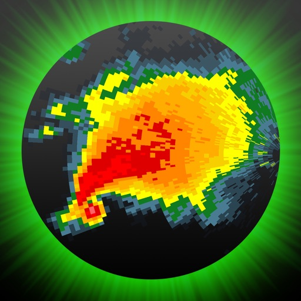

RadarScope is an AMS-award-winning weather visualization tool that empowers meteorologists, public safety officials, storm spotters, and weather enthusiasts to view a full suite of single-site radar data and related severe weather products. Your initial purchase provides professional radar visualization in a fully native app, free from distracting and invasive practices, with optional subscription packages to add even more capabilities.

Whether you’re scanning for a mesocyclone’s tell-tale hook echo, pinpointing the landfall of a hurricane’s eye wall, or identifying velocity couplet, hail spike, or debris ball signatures, RadarScope displays native radar data in its original radial format. You see what the radar sees almost as soon as the radar sees it, with automatic updates every two to ten minutes depending on the radar’s scanning strategy.

Your initial app purchase includes the following:

• Full suite of single-site radar products for the US, Canada, Guam, Denmark, Finland, and Germany
• 6-frame radar loops
• Two built-in providers for radar data
• Tornado, thunderstorm, flash flood, special marine, snow squall, and extreme wind warnings in the US
• Selected severe weather warnings in Canada and Australia
• NWS-generated storm tracks with hail, TVS, and mesocyclone attributes
• Inspector and distance tools
• Color palette options for radar data
• AllisonHouse data plan integration
• Spotter Network integration for storm and location reporting
• mPING integration for submitting weather reports to NSSL
• Bundled maps with political boundaries, water bodies, and major highways, optimized for low-bandwidth use
• Support for widgets and complications
• Universal app for Apple platforms, including Apple Watch and Apple TV
• Family Sharing support

RadarScope Pro Tier One is an optional annual subscription that adds more features for tracking severe weather:

• 30-frame radar loops
• Cloud-to-ground lightning strikes
• Severe weather watches in the US and Canada
• Special weather statements in the US and Canada
• Mesoscale convective and precipitation discussions
• SPC convective, tornado, hail, wind, and fire outlooks
• WPC excessive rainfall outlooks in the US
• Local storm reports in the US
• Custom color palette support
• Multi-pane display (2 on phones; 4 on larger devices)
• Family Sharing support

RadarScope Pro Tier Two is an optional annual or monthly subscription that transforms RadarScope into a more complete visualization tool for a larger suite of weather products, including:

• Everything in Pro Tier One
• 50-frame radar loops
• A third provider for US radar data
• NEXRAD Level II radar data for the US with a 30-year historical archive
• Historical NEXRAD Level III, super-res, and non-US radar data with a 30-day archive
• Historical NWS bulletins with a 19-year archive
• GOES East and GOES West satellite products
• NSSL’s Multi-Radar Multi-Sensor (MRMS) products
• NCEP’s Real-Time Mesoscale Assimilation (RTMA) products
• Surface observations
• Atmospheric soundings in the US
• Hail size, hail probability, and azimuthal shear contours with a 30-day archive
• More detailed transportation and satellite imagery maps
• Custom color palette support for GOES, MRMS, and RTMA
• Server-sent events for radar and warning updates
• Cross-platform subscription sharing on up to 5 devices
• Family sharing support

If you choose to buy a RadarScope Pro subscription, it will be charged to your App Store account. The subscription will be auto-renewed within 24 hours prior to the end of the current period at the same price you originally paid. Subscriptions may be managed and auto-renewal disabled via your App Store account settings after the purchase. Once purchased, the subscription cannot be canceled during the active subscription period.

DTN is committed to safeguarding your privacy online. Our privacy policy is available for review at https://www.dtn.com/privacy-policy/

Please visit our web site for more information.

#### dumbify
## Dumbify

Dumbify is a minimalist home screen launcher for iPhone. Dumbify helps you keep screen time down by keeping your home screen clean and clear of notifications.

Our minimalist home screen launcher is fully customizable. Dumbify allows you to select the apps that are most important to you, and displays them in a clean minimalist launcher on your home screen.

The minimalist launcher for iPhone works perfectly with dark or light mode, so you can pick what looks best to you.

This text based minimalist launcher lets you reclaim your most valuable asset, your time!

Stop spending hours of your precious time getting distracted by your phone, and let Dumbify, a launcher exclusively for iPhone, simplify your digital life.

#### goblin_tools
## Goblin Tools

This is an app version of the free website goblin.tools, a collection of small, simple, single-task tools, mostly designed to help neurodivergent people with tasks they find overwhelming or difficult.

Tools include
- A Magic Todo list that automatically breaks down tasks into steps
- The Formalizer that transforms your language to be more formal, sociable, concise, or many other options
- The Judge that helps with interpreting tone
- The Estimator that can guess at a timeframe for an activity
- The Compiler to take entire braindumps and turn them into actionable tasks
- The Chef, who turns a description of what ingredients and tools you have in your kitchen into a real recipe

And many more to come!

The website is free and publicly available. Purchases of this app go first towards keeping the site free and ad-free, before supporting the author.

#### pedi_stat
## Pedi STAT
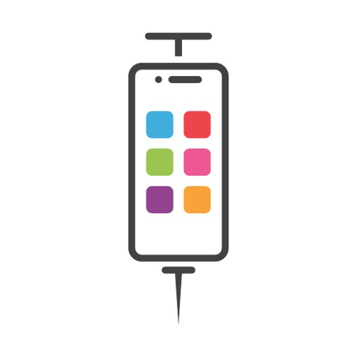

Pedi-STAT is a rapid reference for RNs, paramedics, physicians and other healthcare professionals caring for pediatric patients in the emergency or critical care environment.  

************************************
     Reviews
************************************

Among "The Best Drug Reference Apps for Emergency Physicians" - Emergency Physicians Monthly

5 STARS - "Simple interface provides rapid access to critical data needed when managing a critically ill pediatric patient"

5 Stars - "Very useful for treating kids in high pressure situations with precision."

*****************************

Pedi-STAT features include:

- Rapid results for airway interventions including endotracheal tube sizes, depth, intubation medication dosages, ventilator settings, and sedation

- Cardiac resuscitation data including weight specific dosages for resuscitation medications, cardioversion, and defibrillation

- Access to age and weight specific pediatric equipment including foley catheters, airway management, chest and NG tubes, peripheral and central line sizes, and more

- Seizure medication dosages

- Management of hypoglycemia including age specific dextrose concentrations

- Reference of age specific normal vital signs

- Procedural sedation dosages including single dose meds and infusions, as well as reversal agents

- Calculated pain management medications

- Medical management of allergic reactions and anaphylaxis

Users can quickly access critical information accurately, without having to rely on memory or cumbersome textbooks.  

With just a few taps, users have access to all the necessary data to care for a pediatric patient in the emergent setting, including weight-based and age specific medication dosages and equipment sizes.
  
Since many of the patients present with minimal known information, all the results can be calculated rapidly with only a known age, date-of-birth, weight, length, or height.  Simply enter the known variable and the data is instantly calculated. 

Developed by an Emergency Physician, this app minimizes the risk of medical errors allowing the provider to spend more time caring for the patient, and less time looking up and calculating doses.  

It is a critical companion for any physician, nurse, paramedic, or medical trainee involved in the care of critically ill pediatric patients.

#### vargo_anesthesia_mega_app
## Vargo Anesthesia Mega App

The Mega App is 16 medical apps bundled into 1 large app!⁣⁣ ⁣⁣ It contains quick and detailed information in the ⁣care and management of the patient in the obstetric, pediatric, trauma, surgical, critical care, emergency, and anesthesia setting.⁣⁣⁣⁣⁣⁣⁣⁣

The 16 apps included in this massive app are listed below:

1. "Malignant Hyperthermia" - Simplified with the latest literature from the Malignant Hyperthermia Association website.

2. "Calculations"- ABL/EBV, BMI, BSA/CI, MAP, SVR/PVR, Bicarb Deficit and O2 Cylinder Duration. There are no anesthesia drugs doses calculated. 

3. "Crises" - This simplifies the emergencies you may deal with in the world of anesthesia. Algorithms and review notes from Amniotic Fluid Embolism, cardiac, airway and other emergency situations.

4. "Anesthesia Case Tips" -  The "Anesthesia Case Tips" book (kindle) version on Amazon.com was one of the top selling anesthesia books the year it was published. It consists of 27 chapters with over 500 cases. The simplified  search engine permits you to find your case within seconds. There is also a “Notes Section” for you to add personal notes for each case. Cases are frequently being added. Many of the newer cases cannot be found in Jaffe.  

5. “Drugs/Drips” - There are no drug calculations in the app, just basic pharmacology information as a review. This app contains over 200 drugs/agents/products that are commonly used in the field of anesthesia. Perfect for students and a good review and quick reference for anesthesia veterans. Also, common information concerning anesthesia drips. There are no drug calculations. Contains:
*How to mix your drip.
*Popular mixing concentrations.
*Equations used to get the drip rates as a reference
*Pharmacology notes on how the drug works.

6. “Adult Anesthesia” - This app offers you over 350 drugs as a basic review. 

7. “CABG for Anesthesia” - Tailored for someone learning to manage hearts in anesthesia.  It is simplified but still detailed. It explains: 
*CABG cliffs notes you won’t get in class.
*Step-by-step instructions from pre-op to post-op care.
*What to do from the beginning.
*Setting up the room. 
*What the surgeon is doing.
*What the surgeon will do next.
*Images.
*When and what drugs to give.
*Common cardiac drips.
*Coming off bypass & how other experienced anesthesia providers come off bypass.

8. "Blood/TEGs" - Notes on blood transfusion and blood products. TEG review notes and simplified for beginners.

9. "Pediatric Case Tips" - Contains how we manage close to 100 surgical procedures from start to finish. It was edited by experienced pediatric CRNAs who sit the cases and how they manage them.

10. "OB Regional Anesthesia" - Contains the same material as many OB books, but simplified and user friendly. Equivalent to a 500 page book. Simplifies and user friendly.

11. "LA Max Doses" - One click and you have a quick reference to all the maximum local anesthetic doses.

12. "Local Anesthetics" - A quick detailed reference to all the local anesthetics. Information on:
*Drug description
*Doses & concentrations for the variety of blocks
*Comparative tables
*Pharmacokinetics
*Clinical pharmacology
*Chemical structures
*pKa
*Indications/Contraindications
*Review notes

13. "Anticoagulants & Neuraxial/Deep Regional Block Tables" - Tables of 25 anticoagulants that show:
*Minimal time between the last dose and initiation of a block.
*Whether the anticoagulant can be administered while an epidural catheter is in place. 
*Minimal time to restart the anticoagulant after catheter removal.
*When to restart anticoagulant after procedure.   
*When to remove catheter after administration.

14. "Platelet Function Assay and interpretation."

15. "Pharmacology & Reversal methods of 28 anticoagulants."

16. "Coagulants & Deficiencies"

***iCloud must be switched on to save personal notes.***

We strongly encourage individuals using this app for personal use to seek a doctor's advice before making any medical decisions.

#### e-sword_lt__bible_study_to_go
## e-Sword LT: Bible Study to Go
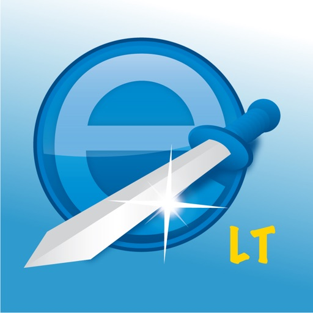

e-Sword® — the world's most popular PC Bible study software is now available on the world's most advanced mobile operating system!  e-Sword LT is the little brother of e-Sword HD for the iPad, but has many of the same powerful features in a slimmer design for the iPhone.  e-Sword LT is feature rich and user friendly.  As your Biblical library grows you will appreciate the intuitive layout and synchronization of resources.  e-Sword LT is so easy to use you may never need to read the Tutorial!

EVERYTHING NEEDED to study the Bible in an enjoyable and enriching manner.  All Bibles, commentaries, dictionaries, … everything is just a tap away!

POWERFUL SEARCHES that are simple to use.  Enter as many words you want to search for and select the settings.  You can even search on Strong numbers!

STRONG'S DEFINITIONS are just a tap away and presented in a popover.

SCRIPTURE REFERENCES too are just a tap away and presented in a popover.

COMPARE BIBLES quickly to see how the different versions translate a verse.

LOCATION MAPS pin-point Biblical places on live modern maps to help bring the narrative to life!

READING PLANS designed to help you grow in your knowledge of the Bible.

FORMATTED EMAILS of any selection of any text.  Perfect for sharing with others.

No Internet connection is required to use e-Sword LT.

e-Sword LT initially installs with the King James Bible and the King James with Strong's numbers study Bible, the Strong's Lexicon, Smith's Bible dictionary, Meyer's devotional commentary, and the Treasury of Scripture Knowledge cross references.  There are over one hundred additional Bibles, commentaries, dictionaries, reference books and devotionals that you can download and add to your library absolutely free!

Also available are some "locked" resources which must be purchased from their publisher.  These are copyright and licensing requirements which are unavoidable.

Please note that e-Sword LT is an *ENGLISH* release (but does include Spanish, Portuguese and French UI localization.)  There are dozens of non-English Bibles available, but all other content is in English.

The perfect app on the perfect device.  What are you waiting for?  Download e-Sword LT today and get to studying the Bible!

#### ecmobile
## ecMobile

ecMobile allows users to connect to, and receive dispatches from, many of the nation’s leading courier, delivery, and logistics companies.  If you have a truck, car, van, pickup, bike, or even a pair of shoes, you may be a candidate to perform pickup and delivery services in any city in the U.S.  Once you have registered with a delivery company, you can receive dispatches right to your device, and provide real time status updates, including bar code scanning data and signature images, back to the delivery company.  By simply logging on, you can signal to the delivery company your current location and that you are ready to receive work requests.  Please note that this app uses GPS running in the background, which can dramatically decrease battery life.

#### quickbend__conduit_bending
## QuickBend: Conduit Bending

QuickBend is the fastest and most precise conduit bending calculator app. Designed to be innovative and intuitive while remaining visually appealing. This advanced conduit bending calculator offers the most accurate measurements by taking into account the radius of the shoe and bender, plus the conduit type and size diameter. All measurements are generated using the centerline radius algorithm, and have all been rigorously processed and field tested. Even the bends displayed within QuickBend are generated using the same engine.

Built for electricians by an electrician. QuickBend can be used by anyone working with conduit or tubing whether you are a seasoned professional, a novice cub, or even a DIY enthusiast. Made to avoid simple mistakes, and to save time and money. In addition to providing fast and precise calculations, there is plenty of information and documentation provided for individual bends. Explanations on how to use specific features, and step by step process to bending conduit.

Offering the most intuitive method to input data. Whether you want to get straight to the point, or comb through the possibilities of a bend. You can switch back and forth between different input styles such as a number pad, or a slider bar (Press & Slide). Both having their unique advantages. QuickBend allows you, the user to toggle between three different types of measurements; inches, foot + inches, and centimeters.

With QuickCheck built into QuickBend, there's a subtle change in text colors when a bend is impossible (red), or whether the bend may be unlikely to work (orange). This app for convenience, and we want it to benefit you. So much so that we added it into the input styles for bends, so you can see if a bend is possible before even tapping on the bend amount.

Supporting the following bends!
• Offset
• Rolling Offset
• Matching Bends Offset
• Matching Centers Offset
• Parallel Offset
• Three-Point Saddle
• Four-Point Saddle
• 90° Bend
• Kick with 90°
• Matching Bend Kick
• Matching Center Kick
• Parallel Kick
• Parallel Kick: Forward
• Compound 90° - Circle Obstruction
• Compound 90° - Rectangle Obstruction
• Compound 90° - Square Obstruction
• Segmented 90°

Plus you have the ability to layout multiple bends on a single conduit, and get each measurement for a mark on the conduit. With the option to easily flip an individual or set of marks per bend.

There's no limit to QuickBend. Easily, select between different types of benders and choose the size of the shoe and conduit type all within the same screen that you are working on. No need for complex navigations. In addition, you can pin benders you use the most, so you can select and switch between them quickly without consistently scrolling. All benders are spec'd out using the information provided by the manufacturers, and worst case scenario if one of the many benders available don't match the one you are using you can now add in your own bender. There's also an option to not select a bender and to use the multiplier method.

Edit and view all of your benders' specifications. Detailed information on the centerline radius, deduct, gain, setback. Plus the ability to view the travel, and radius adjustment for any degree bend between up-to 90°. All of this is visualized and edited within the 'Bender Specs'.

#### slednh_2026
## SledNH 2026

**This purchase allows you to access up-to-date SledNH trail information for the 2025-2026 winter season. A new purchase will be required for the 2026-2027 season.**

Out exploring NH on your snowmobile? Take your own mobile trail assistant for the ride!

7,000 miles of trails in your pocket! The New Hampshire Snowmobile Association (NHSA) trail map makes navigation a snap. Working with or WITHOUT mobile data coverage, you will be able to enjoy the app’s navigation function no matter where you are on the trails.

The SledNH app gives you access to the following *OFFLINE* features, anywhere, anytime, even in areas without cell coverage:

► See your location on the map through your phone’s GPS signal
► View nearby clubhouses, snack shacks, parking, scenic vistas, gas stations and services
► Access trail condition info at the time of your last data connection
► See the distance between you and a specific point
► Quickly save and load routes

When connected to cell or Wi-Fi enjoy these additional *ONLINE* features:

► Keep an eye on updated trail status for the best riding experience
► Easily meet friends by privately sharing your position with them
► Plan complete trips and easily share with friends

Welcome to the SledNH Trails 2026 mobile experience - enjoy the ride!

Notes:
►Continued use of the GPS and location sharing running in the background can significantly increase battery consumption. It is recommended to toggle it off when not needed to improve autonomy.

#### prepware_aviation_maintenance
## Prepware Aviation Maintenance

Comprehensive preparation, study and test tool for the FAA Knowledge Exam. Flashcard style review of questions, answers and explanations included for you to study by subject or with a true-to-form practice test.

#### lumafusion
## LumaFusion

LumaFusion: The Ultimate Storytelling Experience for Video Editing
 
Welcome to the App Store’s “App of the Year” for 2021 and the recipient of the Editors’ Choice Award! The gold standard for storytellers worldwide. Offering a fluid, intuitive, touch-screen editing experience.
 
PROFESSIONAL EDITING MADE EASY
• Six video/audio or graphic tracks: Create multiple layer edits with smooth handling of 4K ProRes and HDR media.
• Six Additional audio tracks: Build your soundscape.
• The ultimate Timeline: Fluent editing using the world’s most flexible track-based AND magnetic timeline.
• Loads of transitions: Keep your story moving.
• External Monitor Preview: View on a big screen.
• Markers, tags and notes: Stay organized.
• Voiceover: Record VO while playing your movie.
 
LAYERED EFFECTS AND COLOR CORRECTION
• Green screen, luma, and chroma keys: For creative compositing.
• Lock & Load Video Stabilizer: Steady your footage.
• Powerful color correction: Create your own look. 
• Video Waveform, vector and histogram scopes.
• LUTs: Import and apply multiple .cube or .3dl LUTs.
• Unlimited keyframes: Animate effects with precision.
• Customizable text and effect presets: Save and share your favorite animations and looks.
• Grids and Guides: Precisely align elements with Title-Safe, Action-Safe and horizon line.
 
ADVANCED AUDIO CONTROL
• Graphic EQ, Parametric EQ and Voice Isolation: Fine-tune audio.
• Keyframe audio levels, panning, and EQ: Craft seamless mixes.
• Stereo and Dual-mono audio support: For interviews with multiple mics on one clip.
• Audio Ducking: Balance your music and dialogue.
• Third-party audio plugins: Enhance your sound.
 
CREATIVE TITLES AND MULTILAYER TEXT
• Multilayer titles: Combine shapes, images, and text into your graphic.
• Customizable fonts, colors, borders, and shadows: Design eye-catching titles.
• Import custom fonts: Strengthen your brand.
• Save and share title presets: Perfect for collaboration.
 
PROJECT FLEXIBILITY AND MEDIA LIBRARY
• Aspect ratios for all uses: From widescreen cinema to social media.
• Frame rates from 18fps to 240fps: Flexibility for any workflow.
• Edit from Photos, Frame.io, and directly from USB-C drives: Access your content anywhere.
• Import media from cloud storage: Wherever you store it.
 
SHARE YOUR MASTERPIECES
• Control resolution, quality, and format: 
• Share movies to social media, local storage or cloud storage.
• Edit on multiple devices: Seamlessly transfer projects.

ENHANCED FEATURES (purchase individually, or get them ALL as part of the Creator Pass subscription - see below)
• Speed Ramping and Enhanced Keyframing - Create speed ramps, Bézier curves, and easing with this one-of-a-kind, easy to use feature.
• XML Export: Send your project to Final Cut Pro for Mac
• Multicam Studio: Synchronize 6 cameras or audio and tap to switch angles

CREATOR PASS SUBSCRIPTION 
• Get full access to Storyblocks for LumaFusion: Millions of High-quality royalty-free music, SFX, and videos, PLUS get ALL the Enhanced Features above.

EXCEPTIONAL FREE SUPPORT
• Online tutorials: www.youtube.com/@LumaTouch
• Reference Guide: luma-touch.com/lumafusion-reference-guide
• Support: luma-touch.com/support

#### spirit_talker_®
## Spirit Talker ®
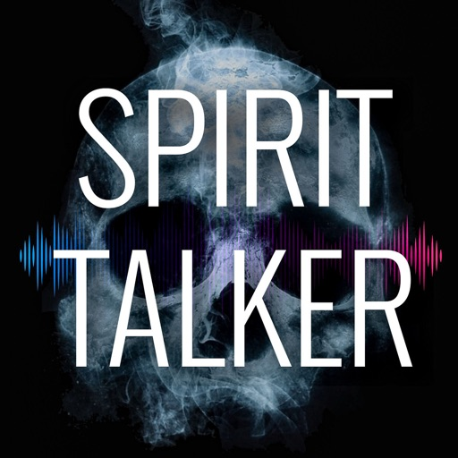

As seen on:

Haunted Finders, The Paranormal Files, Twin Paranormal, WWE, Scarlett & Shotzi, Bad Cat Paranormal, Exploring Harley, Ghost Club Paranormal, Barrier Beyond, Tommy Amongst the Tombstones, Hauntings with Hodge, Jasko, Omar Gosh, Paranormal XP, What Goes Bump in the Night, Exploring with Josh, Ghostly Travels with Zac, Kelsi Davies, Moxleys Paranormal World, Hunting the Dead, TylerReynolds TV, PollyFox Paranormal, Paranormal Discovery, Sam and Colby, WhatThe? Paranormal, F.D.L Paranormal and many many more.

Beware of FAKE copies, this is the Original Spirit Talker App.

*********************************************************************

Spirit Talker ® works in a similar way to the world famous Ovilus device, but it is based on my own research and theories.

It produces words and speech based on what the sensors in your phone are detecting.

The theory behind this app is that spirits might be able to manipulate the device sensors to communicate with you.

Spirit Talker ® is a modern form of ITC (Instrumental Trans Communication) and is very simple to use.

Just click the green ON button and begin asking your questions.

When a response is detected by the app the words will show visually in the text box along with audible speech.

Nothing is chosen randomly, everything produced is based on the values from the sensors.

When you have finished your session just click stop. You can also look back at the responses you received during your session by clicking on the folder button (this only works when the scanner is "Stopped").

You can also look back at the responses you received during your session by clicking on the folder button (this only works when the scanner is "Stopped").

The sensors that the app uses are:

Magnetometer (EMF)
Accelerometer
Gyroscope
Orientation
Barometer
Compass

The EMF Meter only works if your device has a Magnetometer Sensor. If not then the EMF Meter won't be displayed.
Please check the compatibility of your phone / tablet.

When you have finished your session, turn off the scanner to save the words to the file.

Moving your phone quickly or putting it near electronic equipment will manipulate the sensors and make it produce a result, please do not do this!

Languages in the app are:

English, Latin, French, German, Chinese (Text or Symbols), Danish, Portuguese, Romanian, Turkish, Croatian, Polish, Finnish, Swedish, Hungarian, Greek, Czech, Dutch, Italian, Spanish Korean and Icelandic.

There are a lot of misconceptions being spread about how Spirit Talker works, please have a read here:

https://spottedghosts.com/spirit-talker-common-misconceptions/

*******************************

IMPORTANT INFO

** App Voice **

The voice uses the "Spoken Content" voice on your device, “Settings” -> “Accessibility” -> “Spoken Content”

** Sensor Permissions **

Since the iOS 17 update, this app now needs to have the "Motion and Fitness" permission to be granted so that it can access certain sensors that it needs in order to work. If you don't grant this permission, the app will not be able to work.

*******************************

** Disclaimer **

Use at your own risk. We cannot be held personally responsible for you or any outcome (paranormal or otherwise) from using this app!

The paranormal is not a proven science and is considered theoretical. Accordingly, words or phrases generated are not intended as requests or instructions, and should not be used to make legal, financial, medical or other decisions. Words/phrases generated do not represent the official position of the developer.

Refer to our website for a full list of terms and conditions http://www.spottedghosts.com

*******************************

Beware of FAKE copies, this is the ORIGINAL Spirit Talker App.

#### slow_shutter_cam
## Slow Shutter Cam
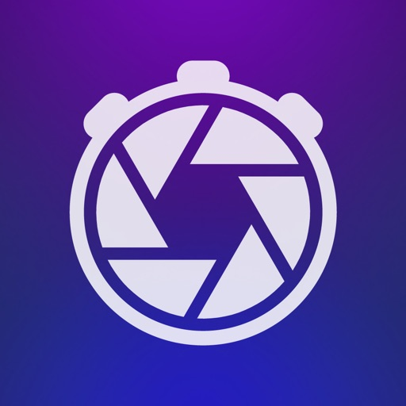

Slow Shutter Cam brings new life into your device's photo toolbox by letting you capture a variety of amazing slow shutter speed effects that you only thought you could get with a DSLR. Continue reading to learn more about this unique app!

-----------------------

• Featured numerous times by Apple:

- App Store Essentials: Camera & Photography
- Photography for Professionals - Total Control
- Extraordinary Photo Apps
- Best New App

-----------------------

"It’s one of those rare photography apps that creates effects that few others are capable of, and it does it easily and with better results."
— Marty Yawnick, Life In LoFi

-----------------------

How many times have you tried to capture artful images with your iPhone camera but were left wishing you had more features to work with? Slow Shutter Cam puts an end to mere snapshots and gives you some of the most powerful features of a DSLR camera. All this, in a package that fits in your pocket.
 
Slow Shutter Cam offers three capture modes to capture unique images:
 
MOTION BLUR: Equivalent to the shutter priority mode on a DSLR, the Motion Blur mode is perfect for creating ghost images, waterfall effects or suggesting movement in your photographs by adding a blur.

LIGHT TRAIL: The Light Trail mode allows you to 'paint' with light, show car light trails and fireworks or capture any other moving light in a unique way. Unlike shooting with a DSLR and being tied to specific rigid settings to obtain good results, the Light Trail mode takes care of the essentials, letting your creativity soar!

LOW LIGHT: In low light conditions, this capture mode allows the camera to accumulate every photon of light hitting the sensor. The longer the shutter speed, the more light it will accumulate. You can even fine-tune the result using the exposure compensation slider to achieve the exact effect you want!

Highlights:

•  Unlimited Shutter Speed and manual ISO
•  Option to resume capture  and create multiple exposure photos
•  Real time live preview - See the result in real time
•  Innovative 'Freeze'  and ‘Blur Strength’ controls
•  Tap to adjust focus/exposure
•  Time-lapse Intervalometer
•  Apple Watch support and handy Self-Timer 
•  Full resolution support on every devices
•  Camera Control support (iPhone 16)

With Slow Shutter Cam on your iPhone you get the features of a DSLR camera with the convenience of a device that you can drop in your pocket and take with you wherever you go. Download it now and put an end to mere snapshots!

Search #slowshuttercam on Instagram or visit the "Slow Shutter Cam - iPhone" group on flickr for amazing samples!

#### transcend_theory
## Transcend Theory
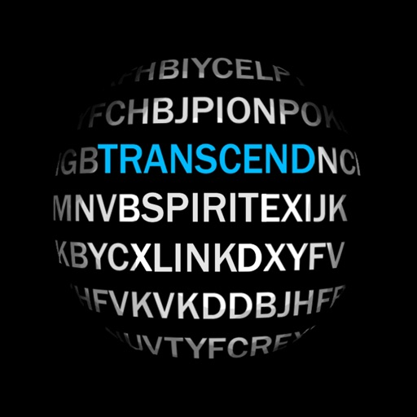

Transcend Theory:

This app is designed to generate random words. 

What the app does:

The idea behind this app is to see if random formations of letters can create words and sounds of meaning. When you press the play button letters from an alphabet list will begin a random formation process at various lengths and intervals. These formations will be used to generate vocal sounds. Text transcriptions of these sounds can be used by turning on the Transcribe feature. The Filter feature of the app can be used to trim and "clean up" these audio clips to produce a more easily understandable interpretation.
The result of this process will produce random words and vocal sounds.

Settings:

In the settings you will find a voice speed slider that can be used to speed up or slow down the voice sounds being produced. The reverb audio effect can be used to create a more spacious sound. A text log will store any text transcriptions you receive. The filter strength option of Low, Medium, and High will determine the amount of the audio segments that can be removed before regenerating a new audio clip.

For entertainment purposes only.

#### white_noise
## White Noise
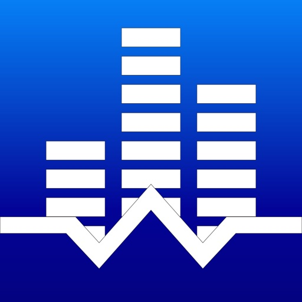

Do you have trouble going to sleep? Are you traveling on a plane and need a quick power nap? Does your newborn baby wake up in the middle of the night? There are numerous benefits to using White Noise:

• Helps you sleep by blocking distractions
• Relaxes and reduces stress
• Pacifies fussy and crying babies
• Increases focus while enhancing privacy
• Soothes headaches and migraines
• Masks tinnitus (ringing of the ears)

Even when you’re asleep, your brain is constantly scanning and listening for sounds. If it’s too quiet, unwanted noises such as faucet drips or police sirens can interrupt your sleep. White Noise generates sounds over a wide range of frequencies, masking those noise interruptions, so you can not only fall asleep, but stay asleep.

SOUND CATALOG

Air Conditioner, Airplane Travel, Amazon Jungle, Beach Waves Crashing, Blowing Wind, Blue Noise, Boat Swaying in Water, Brown Noise, Camp Fire, Cars Driving, Cat Purring, Chimes Chiming, City Streets, Clothes Dryer, Crickets Chirping, Crowded Room, Dishwasher Rinsing, Extreme Rain Pouring, Frogs at Night, Grandfather Clock, Hair Dryer Blowing, Heartbeat, Heavy Rain Pouring, Light Rain Pouring, Ocean Waves Crashing, Oscillating Fan, Pink Noise, Rain on Car Roof, Rain Storm, Running Shower, Running Water, Stream Water Flowing, Thunder Storm, Tibetan Singing Bowl, Train Ride, Vacuum Cleaner, Violet Noise, Water Dripping, Water Sprinkler, White Noise

APP FEATURES (FULL VERSION)

• FULL: 50+ perfectly looped sounds with additional free sounds from the White Noise Market at https://whitenoisemarket.com/
• FULL: Apple TV and Apple Watch App
• FULL: Over 20 Alarm Sounds that slowly fade in so you wake refreshed.
• FULL: No Advertisements. Disable Market & Rating Prompts in Settings.
• Background audio support so you can use other apps while listening.
• Revolutionary Mix Pad editor for creating new soundscapes like a DJ with support for adjusting sound position, sound variance, volume, and pitch of each individual sound in the mix.
• Record and professionally loop sounds without being an audio engineer!
• Upload and Share your recordings and mixes with the White Noise Market app.
• Full screen digital clock with multiple colors and brightness controls makes it the perfect companion for any nightstand.
• Advanced alarm and timer system that slowly fades audio in and out so you awake naturally feeling more refreshed
• Retina display support with Portrait/Landscape orientations.
• On-screen media player and volume controls with swipe gesture support for navigating sound collection
• Heart favorite sounds and mixes in the sound catalog for quick access using the Favorites view
• Use iPod Music as alarms that slowly fade in so you wake refreshed
• Remote media controls with bluetooth, lock screen, and headphones
• Advanced controls for volume, balance, pitch, mixing with iPod music, looping the playlist, custom alarm snooze times, and more
• Generate custom color noises, binaural beats, and tones with Generator In-App Purchase

PRESS REVIEWS

White Noise has been featured by popular TV shows (Dr. Oz, Today Show, FOX&Friends, Jimmy Fallon), major media outlets (NBC News Today, Health Magazine, The Washington Post, NY Times, CNET, Esquire, PC Magazine), and raved about by millions of satisfied customers.

DR. OZ SHOW: 13 Miracles of 2013
"Revolutionary Sound App!”

THE WASHINGTON POST: Smartphone Puts Newborn to Sleep
"For the next four months, the infant slept with his father's phone in his crib and White Noise tuned to 'air conditioner.' The monotonous buzz kept the baby sleeping soundly and his parents happy."

CNET: Apps that can improve your life
“Trouble falling asleep at night? A little White Noise might do the trick.”

HEALTH MAGAZINE: "Help you turn off your brain, fall asleep faster, and get the rest you desperately need"

Website: https://www.tmsoft.com/white-noise/

White Noise Market: https://whitenoisemarket.com

Thanks for using White Noise by TMSOFT!

#### folium
## Folium
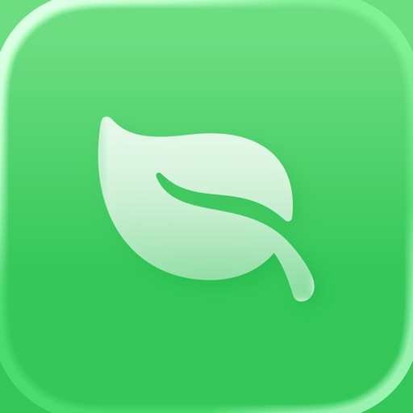

Folium is a beautifully designed, high performing multi-system emulator that allows you to play video games from retro consoles and handhelds

-- NOTE --
Folium does not provide any games or system files, these must be provided by the user

Emulation may be slow on older devices depending on the console or handheld emulated
-- NOTE --

Supported Consoles
- Game Boy, Game Boy Color
- Game Boy Advance
- Nintendo 3DS
- Nintendo DS, Nintendo DSi
- Nintendo Entertainment System
- Super Nintendo Entertainment System
- PlayStation 1

Supported Controllers
- Backbone One
- Nintendo Switch Joy-Con
- Nintendo Switch Pro Controller
- PlayStation DualShock 4
- PlayStation 5 DualSense
- Xbox Series S
- Xbox Series X

Folium is in no way affiliated with Nintendo. "Nintendo" and all associated game console and handheld names and game controller names are registered trademarks of Nintendo Co., Ltd

Folium is in no way affiliated with Sony. "PlayStation" and all associated game controller names are registered trademarks of Sony Group Corporation

#### rarevision_vhs__retro_cam
## Rarevision VHS: Retro Cam
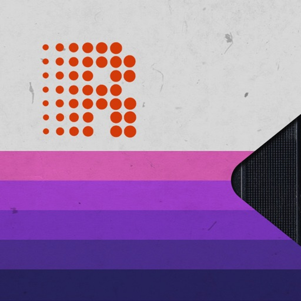

Used by Kendall Jenner, Snoop Dogg, BTS, Ariana Grande, Khloe Kardashian, Wiz Khalifa, Victoria Beckham, Die Antwoord and featured on SNL (S41E01) and in countless TV shows and music videos!

Covered by WIRED, Forbes, The Wall Street Journal, Popular Mechanics, The Independent, Macworld, TMZ, TechCrunch, Mashable and many others!

App of the Day for Friday, Dec 22, 2017

It's 1984, and you've got a VHS camcorder! It'll look that way when you record and send old, messed up-looking retro videos to friends. They'll swear you built a time machine: "OMG, how'd you shoot that?"

With Rarevision VHS, you'll make videos that look and sound like real retro video tapes pulled out of storage after 30 years. You can change the on-screen date to trick your friends, create custom animated titles, glitch up the picture by shaking your device and use the fake zoom to emphasize those truly embarrassing moments!

"That's freakin' amazing!" -Everyone

Here's Why You Need It:

• Four words: Best. Throwback. Videos. Ever.
• Create VHS-style retro videos of your kids that look like the ones from your childhood
• The only VHS cam app you should ever consider to capture your 80s and 90s-themed parties
• Shoot your own "found footage" movie and become a big Hollywood director like those other guys
• Make your kids' incredibly boring school plays actually rad
• Impress the new girl by using our app to convince her you built a time machine
• Pretend like you lived through the rad 1980s using our app!

What Rarevision VHS Can Do:

• Realism: the ORIGINAL and BEST VHS cam app for simulating the glitches of old videotape recordings
• Import videos and give them the VHS look
• Make your own signature look using the old-school picture adjustment menu
• Create your own animated titles for the ultimate in on-screen awesomeness
• Change the on-screen date so people think you're way younger (or older) than you really are
• Glitch the picture during recording using your finger or by shaking your device
• Fake zoom feature dramatically enhances the cheese factor
• Don't think we forgot to make things sound retro terrible. We didn't.
• Up to 60p recording for a more accurate VHS video look (depends on device capability)
• Widescreen recording option (but would you REALLY want to use it?)

Follow Rarevision:
http://instagram.com/rarevision
http://x.com/rarevision
http://facebook.com/rarevisionvhs

Rarevision is a US-based company.

Copyright © 2015-2025 Rarevision LLC. All rights reserved.

#### forscan_lite_-_for_ford,_mazda
## FORScan Lite - for Ford, Mazda

FORScan Lite application was developed specially for a computer diagnostics of Ford, Mazda, Lincoln and Mercury vehicles. 

Supported adapters:
- OBDLink MX+ (recommended)
- vLinker FS Bluetooth (recommended)
- vLinker FD BLE (recommended)
- other ELM327-compatible WiFi or BLE adapter (not recommended). Attention: this application may not work properly in case of bad quality ELM327 adapter used!

Supported cars:
- Ford, Lincoln, Mercury models of 1996 - 2022MY (some models of 1994-1995MY are also supported)
- Mazda 1996-2022MY. Attention: Mazda 7G models (new Mazda 3, CX-30, MX-30, CX-50 etc) are supported partially or not supported!
- Vehicles other than Ford, Mazda, Lincoln, Mercury are not supported!

Features:
- Analyzing an on-board network configuration of the connected vehicle
- Read and reset DTC for all modules
- Read sensors and other data (PIDs) from all modules
- Execute tests
- Execute majority of service functions

Note: Configuration and Programming functions, as well as some of service functions, are not available in FORScan Lite.

#### tampermonkey
## Tampermonkey

Tampermonkey is a widely popular browser extension compatible with all major browsers. 
It lets you customize and enhance web pages using userscripts—small JavaScript programs that add or modify features. 
Easily create, manage, and run these scripts on any website with Tampermonkey.

#### obd_fusion
## OBD Fusion

OBD Fusion is an app for your car that allows you to read OBD2 vehicle data directly from your iPhone, iPod Touch, or iPad. You can clear your check engine light, create custom dashboards, read diagnostic trouble codes, estimate fuel economy, and much more!

Is your check engine light on? Do you want to monitor fuel economy and usage in your vehicle? Do you want cool looking virtual dashboards on your iPhone or iPad? If so, then OBD Fusion is the app for you! OBD Fusion is used by professional mechanics, do-it-yourself mechanics, and vehicle owners who want to monitor their vehicle and daily driving habits. Drive smarter, improve your fuel economy, and keep your engine healthy!

IMPORTANT NOTE: You must have a Wi-Fi ELM327 compatible adapter or compatible Bluetooth LE adapter such as Veepeak BLE/BLE+ 4.0 adapter, Carista BLE adapter, OBDLink MX+, OBDLink CX, Tonwon BLE adapter, LELink BLE adapter, Viecar BLE adapter, Lonauto adapter, Vgate iCar Bluetooth 4.0, BAST BLE adapter, Kiwi 3/4 to use this app. OBD Fusion is not compatible with generic ELM Bluetooth scan tools. Checkout additional adapters here: https://www.obdsoftware.net/software/obdfusion

OBD Fusion supports all OBD2 and EOBD vehicles sold worldwide. If you're not sure whether your vehicle is OBD2 or EOBD compliant, see this page for more information: https://www.obdsoftware.net/knowledgebase/obd2compliant. OBD Fusion can also connect to some JOBD vehicles that don’t support standard OBD2 protocols.

Electric vehicles (EVs) are not required to have OBD2 diagnostics since they are emissions exempt. If you are interested in using OBD Fusion on an EV, contact us first to inquire about support.

OBD Fusion has a ton of features including:
- Read and clear emissions-related trouble codes (fault codes) and your Check Engine Light (MIL)

- View vital driving information on your CarPlay screen. Note that real-time gauges are not supported by CarPlay, so you can't view your OBD Fusion pages such as dashboards on CarPlay.
- With optional enhanced diagnostic add-ons, you can read and clear enhanced trouble codes on other modules such as ABS, SRS, etc. and read transmission temperature. An enhanced diagnostic add-on is required for this functionality.
- Real-time dashboard display with fully customizable gauges. Create your own dashboards with the gauges that you want to see.
- Performance calculations for 1/4 mile and 0-60 mph track times
- Fuel economy MPG (US and UK), l/100km or km/l calculation
- Full diagnostic report that can be stored and shared
- Real-time graphing of multiple signals
- Real-time data logging and playback
- Multiple trip meters

- Log data to CSV file
- Create custom enhanced PIDs
- Includes some built-in enhanced PIDs for Ford and GM vehicles
- Display Boost pressure in real-time
- Display Engine Power and Torque
- Display calculated Air-to-fuel ratio
- Display battery voltage

- Read freeze frame data

- Fully customizable units including English, Imperial, and Metric units

- Over 150 supported PIDs

- Display vehicle information including VIN and calibration ID

- Emissions readiness for each US state. Find out if your car will pass emissions inspection.
- Oxygen Sensor Results (Mode 05)

- On-board Monitoring Tests (Mode 06)

- In-performance Tracking Counters (Mode 09)

- GPS tracking - plot vehicle parameters on a map
- Integrated iCloud and Dropbox functionality
- Available in English, Spanish, French, Italian, German, Czech, Greek, Chinese, and Portuguese
- Manufacturer specific Enhanced Diagnostics are available for certain vehicles through In-App purchases.

** Continued use of GPS running in the background can dramatically decrease battery life.

OBD Fusion is brought to you by OCTech, LLC, the makers of TouchScan and OBDwiz.

OBD Fusion is a trademark of OCTech, LLC registered in the U.S.

#### knot_iq_-_the_bear_essentials
## Knot IQ - The Bear Essentials

The BEST 3D Knot Tying Resource - The Official Bear Essentials Knot Tying App! 
Completely offline, so you reference how to tie knots in the field or while out camping.

Designed for all skill levels, from beginners tying their first knot to experts seeking advanced techniques, Knot IQ makes learning easy, engaging, and practical. With step-by-step 3D animations, detailed knot comparisons, and real-world use cases, you'll gain hands-on skills that matter.

NOTE: IF you have FAMILY SHARING on Apple, everyone in your household can use the app if just one person purchases it! 

Key Features: 

FULLY Interactive 3D Animations – See every twist and turn with clear, step-by-step visuals.

Offline Access – Use the app anywhere, even off the grid.
Manual 3D Downloads - Decide which 3D knots you want to have available offline, or stick to the Stop Motion Basic Versions on knots you don't use as much.
Comprehensive Knot Library – 185+ knots with expert instructions and real-world applications.
Customizable Knot Lists – Save favourites or create custom lists for easy reference.
Quick Search & Filters – Find the perfect knot for any scenario in seconds.
Pros & Cons Comparisons – Choose the best knot for the job with side-by-side comparisons.
Real-World Use Cases – Learn how to apply knots in camping, climbing, survival, fishing, rescue, and more.

Video Tutorials – Learn from The Bear Essentials expert-led guides with real-world demonstrations.

Who Is This App For?
Campers & Hikers – Secure tarps, set up shelters, and master outdoor survival knots.
Climbers & Rescue Teams – Learn essential knots for safety and efficiency.
Anglers & Boaters – Tie strong, reliable fishing and marine knots.
Scouts & Bushcrafters – Hone your skills with knots for firecraft, shelter building, and survival.
DIYers & Everyday Users – Fix things, secure loads, and apply knots in daily life.

What Categories and Types are included?

Categories:
Climbing Knots
Bushcraft Knots
Camping Knots
Fishing Knots
Fly Fishing Knots
Boating/Marine Knots
Firefighting Knots
Arborist Knots
Hoisting Knots
Scouts Knots
Search and Rescue (SAR) Knots
Utility (Everyday Life) Knots

Knot Types:
Beginner Knots
DJ's Favourite Knots
Essential Knots

Anchor/End Loop Knots
Hitches Knots
Bends Knots
Binding Knots
Friction Hitches Knots
Mid-Line Knots Knots
Self-Tightening Knots 
Quick Release Knots 
Exploding Knots Knots
Tackle Knots Knots
Shake Loose Knots 
Multi-Loop Knots 
Stopper Knots 
Lashings Knots
Rope Shortening Knots
Whipping/Coiling Knots
Other/Specialty Knots 
Heaving Line Knots 
Decorative Knots

#### stack_the_states®
## Stack the States®
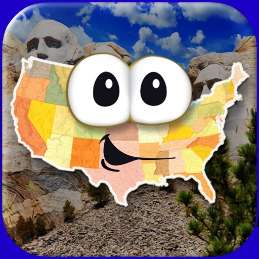

Stack the States® makes learning about the 50 states fun!  Watch the states actually come to life in this colorful and dynamic game! 

As you learn state capitals, shapes, geographic locations, flags and more, you can actually touch, move and drop the animated states anywhere on the screen. Carefully build a stack of states that reaches the checkered line to win each level.

You earn a random state for every successfully completed level.  All of your states appear on your own personalized map of the United States.  Try to collect all 50!  As you earn more states, you begin to unlock the four free bonus games: Map It, Pile Up, Puzzler and Capital Drop.  Four games in one!

HAVE FUN LEARNING ALL ABOUT THE 50 STATES:
▸ Capitals
▸ State shapes
▸ Abbreviations
▸ Bordering states
▸ Location on the map
▸ Nicknames
▸ Flags
...and more!

FEATURES:
▸ Hundreds of unique questions
▸ Interactive map and 50 state flash cards
▸ Choose any of the 50 friendly-looking states as your avatar
▸ Create up to six player profiles
▸ Collect all 50 states and track your progress on a personalized map
▸ Earn FREE bonus games: Map It, Pile Up, Puzzler and Capital Drop
▸ High resolution pictures of famous US landmarks
▸ All games are powered by a realistic physics engine
▸ Fun sound effects and music
▸ iPhone 4 and new iPad Retina Display support
▸ Works on both iPhone and iPad - a universal app

FIVE GAMES IN ONE:

STACK THE STATES: Build tall piles with states and try to reach the checkered line.

MAP IT: Tap the location of the selected state on the map.  Try to complete the whole country.

PILE UP: The states are piling up!  Tap them quickly to get rid of them before they pile too high.

PUZZLER: Sit back and relax as you slide the states around and put them together like a jigsaw puzzle.

CAPITAL DROP: Match states with their capitals in this fast-paced bonus game.  Don't let a state fall!

Stack the States® is an educational app for all ages that's actually FUN to play.  Try it now and enjoy five games for the price of one!

PRIVACY DISCLOSURE
Stack the States®:
- Does not contain 3rd party ads.
- Does not contain in-app purchases.
- Does not contain integration with social networks.
- Does not use 3rd party analytics / data collection tools.
- Does include links to apps by Dan Russell-Pinson in the iTunes App Store (via LinkShare).

For more information on our privacy policy please visit:
http://dan-russell-pinson.com/privacy/

#### scrivener
## Scrivener

“The biggest software advance for writers since the word processor.” —Michael Marshall Smith, bestselling author

Typewriter. Ring-binder. Scrapbook. Scrivener combines all the writing tools you need to craft your first draft, from nascent notion to final full stop.

Tailor-made for creating long manuscripts, Scrivener banishes page fright by allowing you to compose your text in any order, in sections as large or small as you like. Got a great idea but don’t know where it fits? Write when inspiration strikes and find its place later. Grow your manuscript organically, idea by idea.

Whether you plan or plunge, Scrivener works your way: meticulously outline every last detail first, or hammer out a complete draft and restructure later. Or do a bit of both. All text sections in Scrivener are fully integrated with its outlining tools, so working with an overview of your manuscript is only ever a tap away, and turning Chapter Four into Chapter One is as simple as drag and drop.

Need to refer to research? In Scrivener, your background material is always at hand. Write a description based on a photograph. Reference a video or PDF. Check for consistency with an earlier chapter. On the iPad, open two documents side-by-side; on the iPhone, flip between research and writing with just two taps.

Once you’re ready to share your work with the world, simply compile everything into a single document for printing, or export to popular formats such as Word, PDF, Final Draft or plain text. You can even share using different formatting, so that you can write in your favorite font and still keep your editor happy.

FEATURES

Get Started
• Interactive tutorial project
• Keep each manuscript and supporting materials in a self-contained project
• Import Word, RTF, Final Draft and plain text files
• Easily split imported text into separate sections

Get Writing
• Write your manuscript in sections of any size
• View all sections as a single text using the “Draft Navigator” (iPad only)
• Quickly navigate sections using the “binder” sidebar
• Format with fonts and presets
• Comments, footnotes, links and highlights
• Simple bullets and lists
• Insert images
• Pinch-zoom to resize text
• Full-screen mode (iPad only)
• Typewriter scrolling mode keeps typed text center-screen (iPad only)
• Write a screenplay using scriptwriting mode
• Live word and character counts
• Set word and character count targets
• Find and replace
• Customizable keyboard row provides quick-access buttons for formatting, navigation and punctuation
• Comprehensive keyboard shortcuts for external keyboard users
• Dark mode

Find Your Structure
• Write in any order and reorganize later
• Write a synopsis for any text section and see it in the outline
• Expand, collapse and drill down into sections of your project
• Rearrange sections as index cards on the corkboard (iPad only)
• Project-wide search
• Track ideas using labels and status
• Apply custom icons to your sections

Refer to Research
• Import research material such as image, PDF and media files
• View research files or other sections right alongside your writing (iPad only)
• Every section has its own notes area for jotting down ideas
• Supports multitasking split screen mode (supported devices only)

Share Your Work
• Compile to a single document for sharing or printing
• Use different formatting in your exported or printed document
• Export to Word, RTF, Final Draft, PDF or plain text
• Convert rich text to Markdown for sharing with Markdown apps
• Create and email zipped backups of your projects

Work Anywhere
• Use Dropbox to sync between devices and with the macOS and Windows versions of Scrivener*
• Copy projects between devices via iTunes

* Requires a Dropbox account (not compatible with iCloud).

SUPPORT
You can contact us at ios.support@literatureandlatte.com, visit our forums at http://www.literatureandlatte.com/forum, or find us @scrivenerapp on Twitter.

#### calorie_counter_pro_mynetdiary
## Calorie Counter PRO MyNetDiary
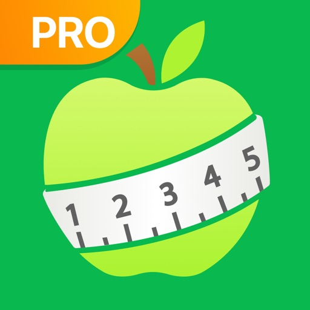

Track calories, food, and macros with ease! MyNetDiary has a free barcode scanner, personal diet plans, and AI Meal Scan for instant logging — all in a smart, simple-to-use app. 

USERS SAY…

The best
Love this app! The best out of many food tracking apps that I have tried over the years. Love that it is free! The breakdown of the meal and daily nutrition is very informative. Try it you will love it!

LOVE LOVE LOVE THIS APP
Best app for tracking food, exercise! Consistently losing weight! I love how it shows you if you're on target for your goal. Great layout, great look, easy to use!!! I highly recommend this app if you're looking to be a healthier you!!!

Fast, intuitive, user friendly
I have tried other calorie tracking programs over the years and this app is by far the best I've come across. I highly recommend it. The free version is very good and I am now enjoying the extra functions through a paid subscription.

RECOGNIZED EXCELLENCE
• Ranked #1 in Forbes Health’s Best Weight Loss Apps of 2025.
• Rated #1 by the American Journal of Preventive Medicine.
• Praised by The New York Times as “simpler, quicker, and better-looking” than other apps.
• Featured in Today’s Dietitian, alongside WW and Noom.

DIFFERENT FROM OTHER DIET APPS
• Simple & Generous Features: Packed with free tools, no ads.
• Lightning-Fast Logging: Barcode scanner and AI Meal Scan make tracking effortless.
• Verified Food Database: Over 1.7 million items with 108 nutrients for accuracy.
• Privacy Focused: No account required.

MyNetDiary puts you in control. You can pick a diet or a meal plan, follow our registered dietitians' easy tips, and follow the app's guidance. Or, you can turn them off and simply use MyNetDiary as the best free calorie-counting app in the world.

PROVEN SUCCESS
• Active members lose an average of 1.4 lbs/week
• Over 25 million users have chosen MyNetDiary, many switched from other diet apps

A few of the free version features:
• Easy food, exercise, and water tracking.
• Daily coaching tips and meal reminders.
• Customizable dashboard for your goals.
• iOS Health integration and Apple Watch support.
• Shopping lists, nutrition articles, and how-to videos.

SPECIAL PRO APP FEATURES
• Up to 108 nutrients tracked
• Plan macros
• Full set of charts
• Timestamps
• Carb tracking

If you need more support, MyNetDiary Premium provides all the guidance and features you may need. At your fingertips, you'll find:

• Premium Diets, 600+ full-flavored Premium Recipes and Menus by RDs, including low-carb, keto, high-protein, Mediterranean, vegetarian, and more - with diet planners, guides, and feedback.
• Intermittent fasting - full-featured, with fasting timer and different protocols.
• Macros planning and cycling.
• Planning and tracking up to 108 nutrients, including omegas and aminos.
• Recipe import tool - easily load internet recipes and calculate complete nutrition.
• Integrations with top fitness trackers - Fitbit, Garmin, and Withings.
• In-depth reporting and analysis tools to improve your diet.

Subscription Terms:
The subscription period will automatically renew unless auto-renew is turned off at least 24 hours before the end of the current subscription period. To turn this function off, turn off auto-renew in your iTunes account. Renewal payments will differ depending on subscription and pricing at the time of renewal. Your iTunes account will be charged when the purchase is confirmed.

Privacy Policy: www.mynetdiary.com/privacy.html
Terms of Use: www.mynetdiary.com/terms.html

#### santa's_bag
## Santa's Bag
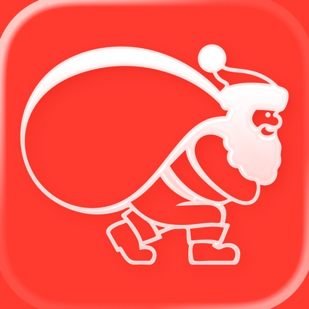

Santa’s Bag has been recommended by The New York Times, US News & World Report, Consumer Reports, USA Today, Forbes Magazine, Fox News, Parents Magazine, Real Simple Magazine, PC Magazine, NBC News, Buzzfeed.com, and The Huffington Post, among others.

Revolutionize your Christmas shopping experience! Santa's Bag is a fun and easy-to-use app to help you manage your Christmas gift recipients, planning, shopping, and budgets. Each detail of the app is carefully designed to make sure you don't forget anyone or anything. Christmas shopping has never been easier or more fun!

* Add Gifts, Ideas, Links, Preferences, and Notes for each Recipient
* Add Links, Photo, and Notes for each Gift
* Save Links through our App Extension or by Drag & Drop into the app
* Email, print or save customizable, checkable lists: Planning Lists, Shopping Lists, and more
* Split/Multiple/Unassigned Gifts
* Recipient/Occasion Budgets and Progress Bars
* Screenlock Passcode
* Highly Customizable Views/Sorts/Filters
* Christmas Countdown Timer
* Database Backup and Restore

#### pdg_promote_2026_
## PDG PROmote 2026+

Why should you join the countless Airmen who have already been promoted using this app? Read on...

1. PURCHASE ONCE, USE FOR A CAREER! PDG PROmote provides lifetime free updates. Why should you have to pay for a new app every time the study guides are updated? You don’t pay $0.99 for these apps. You deserve lifetime updates. We know that your promotion is important to you but that doesn’t give us the right to take advantage of it. Should the Air Force resume testing for the SNCO ranks in the future, rest assured that we will include those ranks in the app too.

2. EVERYTHING YOU NEED IN ONE APP! This app contains everything you need to prepare for your WAPS testing. We're serious. You never need to leave the app.

3. STUDY FOR THE SITUATIONAL JUDGMENT SECTION OF THE PFE!  We've taken a different approach to help you prepare for the SJT.  There are an unlimited number of situations you could encounter on the test.  Instead of giving you scenarios you will not see on the exam, we teach you how to methodically think through any situation in order to pick the correct answer.

4. NOW WITH EPB SHIELD!  You need to do more than score well on a test to get promoted in today's Air Force.  EPB Shield helps you to track and evaluate your performance for your Enlisted Performance Brief.

5. ADAPTABLE TO EVERY LEARNING STYLE.  Not everyone studies the same way.  PDG PROmote provides all of the options you need to study in a manner that works best for you.  Want to read the AFH 1 paragraphs?  You can.  Want to read condensed nuggets of information from AFH 1?  You can.  Want to study flashcard questions?  You can.  Want to study flashcard questions but with the answers always shown?  You can.  Want to listen to the slides, flashcards, or AFH 1 paragraphs on your way to work?  You can.  Want to listen and read at the same time?  You can.  Your mission is to master all the testable sections of AFH 1 and no other app offers you as many ways to do that.

6. JUST SIT BACK AND LISTEN. We made our audio even better. Sit back and listen to study slides, questions, and even AFH 1 paragraphs. Sure, it's synthetic audio but it’s a popular feature that many of our users use on their drive to and from work.

7. OUR SMART TESTS WILL SET YOU UP FOR SUCCESS. PDG PROmote knows which questions you have seen, answered correctly, gotten wrong, how many times you answered correctly, how many times you answered incorrectly, even how many consecutive times you answered a question correctly. It uses this information to always put the right questions in front of you on tests.

8. OPTIMIZE YOUR LIMITED STUDY TIME. You have a full-time job. We know you need to get the most out of your limited study opportunities. PDG PROmote makes it easy for you to maximize the effectiveness of your study sessions.

9. INTUITIVE DESIGN. PDG PROmote is simply the most intuitive and least frustrating AFH 1 study guide you will find. Experience the difference a great designed app can make.

10. OUR QUESTIONS ARE SIMPLY BETTER. Many of our users have commented to us that our questions aren't as simplistic as other apps. They make you think a little more. The actual exam seemed easier. PDG PROmote provides TOTAL COVERAGE of the AFH 1 based study guides.

PDG PROmote is an application aimed to prepare Airmen who are taking the Air Force Promotion Fitness Examination (PFE). Its sole source of reference is Air Force Handbook 1, dated 1 November 2024.  Just select the appropriate study guide for the promotion grade that you are testing to and begin studying!

#### asccp_management_guidelines
## ASCCP Management Guidelines

The ASCCP Risk-Based Management Consensus Guidelines provide evidence-based recommendations for managing abnormal cervical cancer screening results and cancer precursors, including post-colposcopy and post-treatment scenarios.

ASCCP is pleased to offer this app to streamline navigation of the ASCCP Risk-Based Management Consensus Guidelines for abnormal cervical cancer screening tests and cancer precursors. The guidelines articles, as published in the Journal of Lower Genital Tract Disease, as well as the comprehensive risk estimates, can be accessed through https://www.asccp.org/guidelines.  

These evidence-based management guidelines, initially developed in 2019, came together through a consensus process of 19 organizations. The updated management guidelines aim to:
 • Allow for a more complete and precise estimation of risk
 • Provide more appropriate intervention for high-risk individuals (detect and treat more precancer)
 • Recommend less intervention for low-risk individuals (decrease testing and treatment that won’t prevent cancer and may cause reproductive harm)
 • Allow for the future addition of new risk modifiers and screening and management technologies

See https://www.asccp.org/UserGuide for tips on using the app.

#### lumy
## Lumy
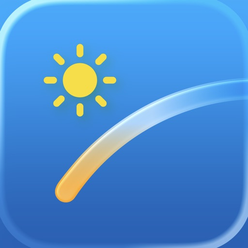

Lumy is a beautiful sun tracker + outdoor activities planner.

- Perfect lighting for photos or videos? Done.
- Sunrise hike or sunset walk? Easy.
- Outdoor yoga or sunlight breaks? Covered.

Whether you’re chasing golden hour*, planning your daily dose of Vitamin D, or tracking moon phases for stargazing, Lumy helps you make the most of natural light.

Now redesigned from the ground up - Lumy feels more personal, purposeful, and in sync with how we live. Inspired by sunlight filtering through a window, every view carries a subtle visual echo of light seeping through a pane of glass window. 

Introducing Modes: Switch between profiles like Daily, Photography, or Meditation to shape Lumy around your routine. See only what matters to you.

Lumy also supports iOS’s State of Mind feature, offering sunlight suggestions based on your mood entries in the Health app - a gentle nudge to step out and connect with nature.

And with weather forecasts for the next seven days, you can plan ahead with confidence. Lumy calculates all sun and moon data entirely on-device. No tracking. No server calls. Only weather needs internet.

Lumy works seamlessly across iPhone, iPad, Apple Watch, Apple TV, and HomePod. One purchase, full family access.

Features
- Modes: Switch profiles based on your needs — from weekday planning to weekend golden hour.
- Sun + Moon Tracking: Accurate data, solar compass, and future predictions.
- Season Info: Both astronomical and meteorological seasons.
- Remainders: Custom repeatable notifications.
- Apple Watch: Complications, Double-tap, and Live Activities.
- Widgets + Control Center: Quick access via Smart Stack and more.
- Interaction Upgrades: Time travel slider, Quick Access Button, fluid animations.
- Visual Feel: Simulated light, shimmering glows, and enhanced Classic visuals.
- Accessibility: VoiceOver, Dynamic Type, Reduce Motion, and more.
- Privacy First: Fully offline (except weather). Your data stays with you.
- Localization: Available in Japanese, Chinese, French, and German.

Lumy helps photographers, outdoor lovers, and wellness seekers stay in sync with the sun and moon.

*What's Golden Hour?
Golden Hour (or Magic Hour) is the short time after sunrise or before sunset when the light is soft, warm, and perfect for capturing stunning photos or videos.

Sun Information Available:
Sunrise, Sunset, First Light, Last Light, Golden Hour, Blue Hour, Astronomical Twilight, Nautical Twilight, Civil Twilight, Solar Noon, Solar Midnight.

Moon Information Available:
Moonrise, Moonset, Altitude, Azimuth, Transit, Transit Elevation, Weekly Moon Phase, Next Full Moon, New Moon, First Quarter, Last Quarter.

Got feedback or suggestions? We’d love to hear from you! Reach out at hello@waplestuff.com.

#### mapper_for_safari
## Mapper for Safari

Mapper is a Safari extension that instantly opens Google Maps links from the Google search page in Apple Maps. No more copy/pasting addresses or switching apps.

Key features:
- Redirect Google Maps links, addresses, direction buttons, and map thumbnails directly to Apple Maps.
- Support every Google domain (google.com, .co.uk, .ca, etc.) on iOS and macOS.
- Smart fallbacks: if Mapper can’t resolve a link, you’ll land on the Google Maps web app and then automatically redirect to Apple Maps.
- Zero data collection: Mapper only scans for map links on Google search pages and never stores personal or location data.

How it works:
- Install Mapper and enable the extension in Settings → Safari → Extensions.
- Browse to Google in Safari.
- Tap any map link, directions button, or thumbnail.
- Mapper grabs the address or search term and opens Apple Maps with a single tap.

Mapper is built and maintained by a solo indie developer, ensuring it stays lightweight, reliable, and up-to-date. If you love Mapper, please consider leaving a rating or review. For questions or feedback, tap the Contact link within the Mapper app.

#### alessiations
## Alessiations

Unlock a new way of thinking with Alessiations, the daily quotes app designed for mindset growth, psychology lovers, feminine power thinking, and anyone chasing smarter, sharper, more intentional living.

Alessiations blends mindset, self-development, psychology, emotional intelligence, confidence building, and power dynamics into one beautifully simple experience. Each quote is crafted to shift your energy in seconds. Whether you’re looking for motivation, clarity, validation, or a reminder of who you really are.

This isn’t just another affirmations app.
This is your daily mental upgrade.

Why People Love Alessiations 
	•	Sharp, modern, aesthetic quotes that speak to mindset, confidence, psychology, and personal growth
	•	Daily mental shifts that help you think deeper, feel stronger, and act smarter
	•	Seduction and power thinking insights inspired by modern psychology and feminine energy
	•	Soft reminders + bold ideas. The perfect mix of comfort and clarity
	•	Designed to feel personal: like messages from the coolest, most strategic version of yourself

What You Get Inside 
	•	Daily mindset quotes for confidence, discipline, and emotional control
	•	Psychology-based insights to help you understand behavior, attraction, and communication
	•	Seduction & feminine power reminders you won’t find in typical quote apps
	•	Cute, cozy messages for comfort, reassurance, and warmth
	•	Power thinking lines that sharpen focus, intention, and ambition
	•	Clean, minimalistic design crafted to feel aesthetic, soft, and effortless

Who Alessiations Is For

Alessiations is perfect for people who want:
	•	Better thinking
	•	Stronger mindset
	•	Emotional intelligence
	•	Feminine confidence
	•	Insight into attraction & psychology
	•	Strategic, powerful energy
	•	Daily reminders that feel personal, modern, and fun

If you love mindset content, journaling, therapy insights, seduction psychology, self-development books, or aesthetic motivational pages then this app was built for you.

The Alessiations Vibe

Think:
a confident friend, a soft mentor, a playful villain, and a cozy cat all texting you at the same time.

Every quote is crafted to feel:
	•	Thought-provoking
	•	Empowering
	•	Aesthetic
	•	Playful
	•	Slightly mischievous
	•	Always intentional

Alessiations helps you grow without making self-development feel overwhelming or corny.

Daily Mental Upgrade

Open Alessiations anytime you want to feel:
	•	Encouraged
	•	Confident
	•	Grounded
	•	More attractive
	•	More intentional
	•	A little chaotic in a good way
	•	Ready to dominate your day

One sentence can change your entire vibe.

Elevate Your Mindset in Seconds

Download Alessiations and step into the version of yourself who thinks smarter, feels deeper, and moves with intention one quote at a time

#### cozmo_robot
## Cozmo Robot

Say hello to Cozmo, a gifted little guy who’s got a mind of his own and a few tricks up his sleeve. He’s the sweet spot where supercomputer meets loyal sidekick. He’s curiously smart, a little mischievous, and unlike anything ever created.

You see, Cozmo is a real-life robot like you've only seen in movies, with a one-of-a-kind personality that evolves the more you hang out. He'll nudge you to play and keep you constantly surprised. More than a companion, Cozmo’s a collaborator. He’s your accomplice in a crazy amount of fun.

Some robots just have it all.

Cozmo robot required to play. Available at Anki.com.

©2025 Anki, LLC. All rights reserved. Anki, Cozmo, and the Anki and Cozmo logos are registered trademarks of Anki, LLC.

#### stop_motion_studio_pro
## Stop Motion Studio Pro
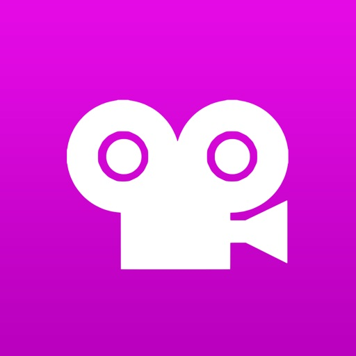

Join 25 million creators making stop motion animation with ease.
Stop Motion Studio is the Apple-featured app for creating stunning stop motion films.
Enjoy powerful creative tools with no ads, no tracking, and no subscriptions.

Stop Motion Studio is the easiest and most powerful stop motion animation maker for iPhone and iPad. Create beautiful animated films with LEGO, clay, drawings, or everyday objects — no experience required.

Whether you’re a beginner or a seasoned animator, Stop Motion Studio gives you everything you need to turn your ideas into motion.

Loved by Millions Worldwide

* Over 25 million creators and counting
* Rated 4.7 stars with more than 65,000 reviews
* Featured in Apple’s “Life on iPad” TV commercial

“Stop Motion Studio makes it easy to create your own stop-motion movies.” – The Washington Post
“Brings out the LEGO moviemaking geek in all of us.” – TechNewsWorld

Create and Edit with Precision

* Onion skinning and animation guides for perfect alignment
* Interactive timeline and frame-by-frame editing
* Copy, paste, cut, and insert frames with ease
* Rotoscoping: draw over videos for unique effects
* Built-in drawing tools, text cards, and speech bubbles
* Erase unwanted objects and add facial expressions or layers
* Merge frames to simulate motion blur or speed effects

Capture Every Frame

* Full manual camera controls: focus, exposure, ISO, and white balance
* Timelapse capture mode for automatic shooting
* Use your Apple Watch or another device as a remote camera

Add Sound and Style

* Record voiceovers and narration directly in the app
* Add sound effects, background music, or import from your library
* Use filters, fades, and transitions for cinematic results
* Green screen effects let you place characters anywhere

Share Your Masterpiece

* Export your films in 4K or 1080p HD
* Share directly to YouTube, TikTok, or save as a GIF or iMessage sticker
* Transfer projects via AirDrop, iCloud, or Dropbox
* Start on iPhone and finish on Mac — your work stays in sync

Learn and Improve

* Step-by-step tutorials and creative tips included
* Built-in manual for quick guidance and inspiration

Yours to Create
No ads. No tracking. No subscriptions.
Your data stays private and your creativity stays yours.

Download Stop Motion Studio today.
Join millions of creators and bring your imagination to life — one frame at a time.

#### guardhouse
## Guardhouse
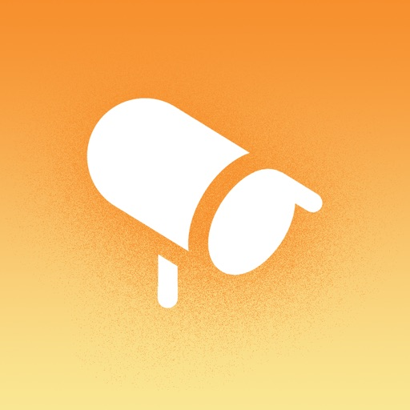

With Guardhouse, you can monitor all your HomeKit camera feeds in a single, stylish app that's designed to do one thing, and do it well.

Keep an eye on everything from the overview screen, or dive into a specific camera for a closer look, to listen in, or to use the intercom for a two-way conversation on supported cameras. The app works across iPhone, iPad, and the latest Macs.

#### myradar_weather_radar_pro
## MyRadar Weather Radar Pro
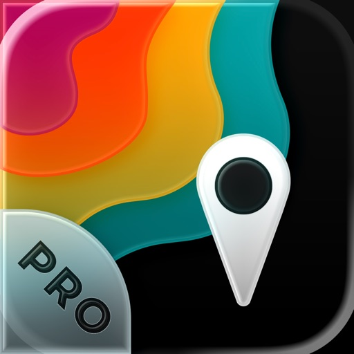

Thanks to everyone for making MyRadar so successful, with over 50 million downloads!

MyRadar Pro is IDENTICAL to the free version of MyRadar; it comes without the ads by default.

MyRadar is a fast, powerful, easy-to-use weather app that displays animated weather radar around your current location and to quickly show what weather is coming your way. Just start the app; your location pops up with animated live radar, with radar loop lengths of up to two hours. This basic functionality provides the quickest way to get a snapshot of the weather on-the-go, and it's what has made MyRadar so successful over the years. Check your phone and get an instant assessment of the weather that will impact your day.

In addition to the live radar, MyRadar has an ever-increasing list of weather and environmentally-related data layers that you can overlay on top of the map;  our animated winds layer shows a breathtaking visual representation of both surface winds and winds at the jetstream level; the frontal boundaries layer shows high and low pressure systems as well as frontal boundaries themselves; the earthquakes layer is a great way to stay on top of the latest reports on seismic activity, completely customizable as to severity and time; our hurricane layer allows users to stay on top of the latest tropical storm and hurricane activity throughout the world; the aviation layer overlays AIRMETs, SIGMETs and other aviation-related data, including the ability to track flights and display their IFR flight plans and paths, and the "wildfires" layer allows users to stay abreast of the latest fire activity around the United States.

MyRadar also has the ability to send weather and environmental alerts, including alerts from the National Weather Service, such as Tornado and Severe Weather alerts. A new feature introduced in this version of MyRadar includes the ability to receive alerts based off of Tropical  Storm and Hurricane activity;  you can configure the app to send you an alert any time a tropical storm or hurricane forms, or is upgraded or downgraded.

One of the most useful features in MyRadar is the ability to provide advanced rain alerts; our patent-pending process for predicting hyper-local rainfall is the most accurate in the industry. Instead of having to check the app all the time, MyRadar will send you an alert up to an hour in advance as to when the rain will arrive at your current location, down to the minute, including details on intensity and duration. These alerts can be a life saver when you're on-the-go and don't always have time to check the weather - our systems will proactively do the work for you and let you know in advance before the rain hits.

In addition to the free features of the app, additional upgrades are available, including real-time hurricane tracking - great for the start of hurricane season. The hurricane tracker provides additional data above and beyond the free version, including the cone of probability for tropical storm/hurricane forecast tracks, and it also includes a detailed synopsis from the National Hurricane Center. The premium upgrades also include the professional radar pack, which allows greater detail of radar from individual stations. Users can select individual radar stations around the US, select the radar tilt angle, and also change the radar product being displayed, including base reflectivity and wind velocity - great for experienced weather buffs looks to stay on top of possible tornado formation.

Download MyRadar today and try it out!
* Aviation Charts subscription (not required in order to use MyRadar) ($24.99 USD per YEAR)
* Payments will be charged to your iTunes account
* Account will be charged for renewal within 24-hours prior to the end of the current period
* Auto-renewal may be turned off at any time by going to your settings in the iTunes Store after purchase.

MyRadar’s Privacy Policy, visit: https://myradar.com/privacy
Full terms of service: https://myradar.com/terms

#### prepware_remote_pilot
## Prepware Remote Pilot

Comprehensive preparation, study and test tool for the Remote Pilot Initial (Unmanned Aircraft General - Small) FAA Knowledge Exam. Questions, answers and explanations included, for you to study with a true-to-form practice test.

Operating a drone for non-hobby operations requires a Remote Pilot Certificate. Applicants must successfully complete the Federal Aviation Administration (FAA) Knowledge Exam to earn the Remote Pilot Certificate with a Small Unmanned Aircraft Systems (sUAS) rating. This app is the key to test success.

Rely on the time-tested and dependable ASA Prepware apps to prepare for your FAA Knowledge Exam. Test material is expertly organized into chapters based on subject matter and includes instructional text and illustrations, multiple-choice questions, answer stems, correct answers, explanations (for correct and incorrect answers), and references for further study. This topical study promotes understanding and aids recall to provide an efficient study guide. 

Subjects covered include Regulations, National Airspace System, Weather, Loading and Performance, and Operations. This app will be particularly helpful for drone operators interested in earning a Remote Pilot certificate, Remote Pilot Aircraft (RPA) applicants, Unmanned Aircraft System (UAS) training programs preparing applicants for FAA Knowledge exams, self-study applicants interested in learning more about commercial unmanned aircraft operations, and existing (manned aircraft) pilots interested in learning more about drone and unmanned aircraft operations who are sharing the National Airspace System.

ASA’s Prepware Remote Pilot app is the best resource for successful test-taking and safe small UAS operations.

#### solocator_-_gps_field_camera
## Solocator - GPS Field Camera
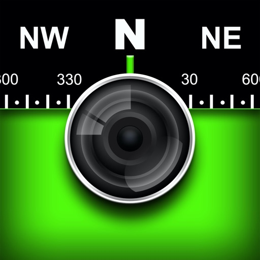

Solocator – The GPS Camera for Fieldwork and Photo Proof evidence. Overlay and stamp photos with location, direction, altitude, date & time taken. With the Industry Pack (in-app purchase), capture field notes including project name, photo description, company or username, and company logo.
Solocator is trusted by professionals, government agencies, and industries worldwide for reliable photo documentation.

TAILOR OVERLAY INFORMATION TO YOUR NEEDS
Capture & stamp on your photos:

+ GPS position (Latitude & Longitude in various formats) ± accuracy
+ UTM/MGRS coordinates (Industry Pack)
+ Street address (Industry Pack)
+ Direction – bearing
+ Altitude (MLS / HAE)
+ Tilt & Roll angles
+ Local date & time (based on GPS location)
+ Local time zone
+ UTC time
+ Compass display
+ Cardinal directions
+ Building facade direction, e.g. "North elevation"
+ Field Notes (Industry Pack)
+ Company Logo (Industry Pack)

AUTOSAVE PHOTOS TO iCLOUD & CAMERA ROLL
Autosave two photos at once: one stamped with the selected overlays and the other as an original high-resolution photo.

SORT, SEARCH, SHARE OR EMAIL
+ Photos are sorted by time, location, distance from current location and project name.
+ View photo direction and location in map view and navigate there.
+ Share photos individually or as a zip file via the share sheet.
+ Search for photos by date, date range or notes and street addresses.
+ Email photos including the following information:
   - Exif metadata
   - Compass direction
   - GPS position ± accuracy
   - Altitude
   - Tilt & Roll
   - Date & time taken
   - Street address (Industry Pack)
   - Cardinal Directions
   - Elevation of building facade
   - Links to maps so the receiver can navigate there easily

** INDUSTRY PACK **  (In-App Purchase) "One-off charge"

EDITABLE NOTES OVERLAY
Stamp photos with "Project name", "Description" & “Watermark”. The Project Name field can be used as a job or ticket number. The Watermark field is typically used for a company or username. You can also edit these fields later.

WATERMARK LOGO
Add your Company Logo to photos. Logo’s size, opacity, and position can be customised for both portrait and landscape photos. To get you started, a Solocator icon is included, which can be replaced.

CUSTOM EXPORT FILENAME
Define your photo export filename from a selection of fields: Project Name, Description, Watermark, Street Address, Date/Time, Number#, Custom text field, Photo type (original/stamped), and Coordinates (DD.dddddd, UTM, UTM Bands, MGRS). 

AUTOSAVE OR EXPORT PHOTOS TO CLOUD STORAGE
Autosave original and stamped photos to Google Drive, Dropbox, and OneDrive (Personal & For Business), including SharePoint Sites and Teams. You can also save photos in date or project name subfolders - automatically.

PHOTO DATA in KML, KMZ & CSV
Along with photos, email or export photo data and notes in KML, KMZ or CSV formats. Both email and export buttons are customisable to suit your data requirements.

STREET ADDRESS & UTM/MGRS
Add street address to your overlay or use UTM/, UTM Bands & MGRS coordinate formats.

BATCH EDIT NOTES & OVERLAY FIELDS
Select photos from the library and edit Project Name, Description & Watermark fields in one go.

TRACK PHOTOS IN MAP VIEW
View photos by direction, the distance between photos, area of photos taken and distance to your added markers via imported KML files or dropped pins.

REFINE & LOCK GPS LOCATION
Ideal for those working in and around buildings; to improve your GPS location. You can also use it to lock the asset position you're photographing.

COMPACT VIEW
Switch off Compass, Building and Street modes and only show the GPS info bar for a more compact view.

VPP Customers: https://solocator.com/enterprise-app-for-mdms/
Terms of Use: https://www.apple.com/legal/internet-services/itunes/dev/stdeula/

#### necrophonic
## Necrophonic

Necrophonic is an ITC app used for spirit communication and EVP research.

8 Sounds Banks:

The audio has been mastered in a way to bring out various sound properties . 
Using Pro Tools I was able to enhance high, mid, and low range frequencies. I also applied 
other filters to create unique sound characteristics to help layer the audio and create an 
environment suitable for spirit communication.

The audio itself is made up of phonemes, 
partial words, reverse audio, foreign languages, and other parts of speech that can help 
spirits communicate. Besides some basic phonetic sounds such as na, no, da, do, di, ma, may, etc.
there are no real words of phrases contained in the banks.

These sounds banks play in a similar
way to that of my other app "Spiritus Ghost Box" but instead of 4 sound banks Necrophonic has
8 active sound banks.

White Noise Sound Bank:

This app also has an optional 9th sound bank called "White noise". 
This bank can be used alone or with the other 8 giving you a total of 9 sound banks. This 
audio is taken for the internal sounds of the famous DR60 recorder that is known as the 
"Holy Grail" of EVP recorders. This is not a White Noise Generator, this is a normal sound bank like the others but this one contains white noise from the DR60.

Audio Effects:

This app does contain Echo and Reverb audio effects. These have been proven 
to be the best effects to apply to ITC sessions. The echo can create audio that can be 
manipulated within the echo itself. Echo can also help in live, real time communication by 
repeating the audio and allowing you to better hear whats coming through. Reverb can be 
applied to the audio to create a spacious sound environment that will enhance audio manipulation.

#### happycow_-_vegan_food_near_you
## HappyCow - Vegan Food Near You

Discover the Best Vegan and Vegetarian Restaurants Anywhere!

For over 25 years, HappyCow has been the number 1 guide for finding delicious plant-based, healthy dining options wherever you go. With over 240,000 listings in 185 countries, we make it easy to explore the world of vegan and vegetarian cuisine.

Key Features:
• Powerful Search & Filters: Find restaurants near you, and plan trips ahead. Filter by vegan, vegetarian, gluten-free, raw cuisine, and more!
• Interactive Maps: Explore popular and “hidden gem” restaurants on our community-curated maps. Save favorites for offline access.
• Extensive Reviews: Access 1,875,000+ restaurant reviews and 3,000,000+ photos from others like you
• Engage with the Community: Instantly be part of the world’s largest vegan and vegetarian community. Follow and connect with like-minded people, leave reviews, create shareable trips, and view photos and reviews on the Feed
• 9 Languages:  Access main app features in English, Spanish, French, German, Dutch, Italian, Japanese, Mandarin, and Cantonese. 

Why HappyCow?
• We’re the world’s largest vegan platform, with an established 25 year legacy!
• Travel confidently with extensive global coverage and user-generated content.
• Find the best vegan food near you with detailed reviews, photos, directions and more.
• Our passionate community of over 1.2 million is here to support you no matter where you go. 

Discover plant-based, healthy dining in a new way, and never miss the best dining experiences near you!

Don't see your favorite vegan or vegetarian spot?
List it on HappyCow and help grow our ever-expanding database!

If you’re having trouble with the app, contact us at ios@happycow.net before leaving a review. We're here to help!

Download HappyCow now and unlock a world of delicious plant-based adventures!

#### pro_camera_by_moment
## Pro Camera by Moment

Pro Camera by Moment is the manual camera app that gives you full creative control and professional-level performance, all at an affordable price. It brings us closer to what we love about our DSLR and mirrorless cameras – exposure controls, precise focus, rich colors, smooth video, crisp audio – without being complicated.

If you are looking for a powerful and easy-to-use camera app, Pro Camera is for you. We make it fast and intuitive to switch between modes, dial in your shot, and keep shooting. Plus, we give you all the manual controls you’ll need: shutter speed, ISO, white balance, focus, and more. Your favorite settings can be saved and recalled on demand.

For filmmakers – the features you need, not the ones you don’t. LUTs, color spaces, bitrates, dual-channel audio meters, real-time waveforms, fast access to frame rates, and more.

For photographers – easier than shooting on your DSLR. Shoot in RAW (even in bursts), capture brackets, and more. You can even create stunning timelapses and light trail effects (in-app purchase required). 

For everyone else – inspired by the pros we made the interface simple, fast, and easy to use. We provide getting started tips, video tutorials, and full-time customer service to get you set up.

We love hearing from you. If you have any features, ideas, or feedback please email us at hello@shopmoment.com or DM us on Instagram @moment.

GENERAL FEATURES
+ Full manual: control shutter speed, iso, exposure, focus, and white balance with easy-to-use sliders
+ Focus peaking: manually dial in your focus using highlighted in-focus regions
+ Zebra stripes: quickly determine over- and under-exposed areas in the viewfinder
+ Split focus and exposure: take control of tricky lighting scenarios
+ Viewfinder grid: choose from thirds, square, and golden ratio
+ Gyroscope: ensure your shot is level with an on-screen gyroscope and haptic feedback

PHOTOGRAPHY FEATURES
+ RAW and TIFF: shoot photos in RAW/ProRAW format for better editing, or TIFF for high-quality printing
+ RAW+JPG option: simultaneously get the best of both worlds
+ Burst mode: capture burst shots in RAW format – capture action while maintaining the uncompressed quality pros want with RAW
+ Bracketing: capture multiple exposures to stack later in your favorite editing apps

FILMMAKER FEATURES
+ Import, organize, and use your favorite LUTs
+ Color spaces: choose between Rec.709, Rec.2020 HDR, Display P3, and Apple Log (on compatible devices)
+ Codecs: shoot in HEVC, H.264, or any of the 422 ProRes variants
+ Video bitrates: get precise control over video quality with standard, medium, and high bitrate options
+ RGB histogram: dial in your video color, balance, and exposure
+ Waveform monitor: evaluate video brightness and exposure across your shot in real time
+ Audio meters: get just the right sound levels with real-time, precise, dual-channel audio levels
+ HDMI clean feed output: preview on a bigger screen
+ Video stabilization: make your videos buttery smooth
+ Video formats: change your resolution and frame rate on screen, without digging into a settings menu
+ Anamorphic: use the Moment Anamorphic lens to shoot amazing, letterbox style photos and videos, with a de-squeeze option built in

PREMIUM FEATURES (In-App Purchases)
+ Timelapse mode: capture stunning time-lapse videos
+ Slow Shutter mode: long exposure shots with motion blur or light trails

WORKS WITH
+ iPhone 16 Camera Control: get quick access to manual settings
+ Lens control: manually control which of the triple/dual lenses you want to shoot with so you can use Moment lenses over each one
+ Moment lenses: access options like anamorphic de-squeeze and distortion correction
+ Moment battery case: works with the DSLR-like shutter button on our photography cases for half-press and full-press capture. Take better photos, faster.
+ Apple Watch: use your watch as a remote to shoot photos or record videos
+ Siri Shortcuts: quick access to capture a photo or start a video

#### pythonista_3
## Pythonista 3

Pythonista is a complete scripting environment for Python 3.10, running right on your iPad or iPhone, so you can develop and run Python scripts on the go.

Like Python itself, "batteries are included" – from popular third-party modules like requests, numpy, matplotlib, pandas (and many more) to modules that are tailor-made for iOS. With Pythonista, your scripts can access sensor/location data, your photo library, contacts, reminders, the clipboard, and more, allowing you to harness the full potential of both Python and iOS.

Pythonista is designed with a user-friendly interface that makes it easy for anyone to get started with coding, regardless of skill level. The complete Python documentation is also available for offline reading in the app.

Pythonista is not just for learning and practicing Python – it's also a powerful tool for automating iOS with multiple app extensions. You can invoke scripts directly from the share sheet or a custom system keyboard in almost any app, and integrate scripts with Shortcuts and Siri. With Pythonista, it's easy to run your scripts whenever you need them, without having to switch between different apps.

Features:

> Powerful code editor with syntax highlighting, code completion, and scripting support

> Interactive prompt with code completion, command history, and support for showing images

> Integrated visual debugger and object inspector

> Complete offline documentation with quick lookup directly from the editor

> Various beautiful light and dark color themes, and a theme editor to make your own

> UI editor for quick prototyping

> Integrated PEP 8 style checker and code formatter

> Supports most of the Python standard library and additional modules for graphics, sound, and iOS integration (for example clipboard, contacts, reminders, photos, ui...)

> Many popular third-party modules included, for example requests, numpy, matplotlib, pandas, Pillow...

> Lots of included examples

> Universal app for iPad and iPhone

> Share sheet extension for running scripts from almost any app

> Scriptable system-wide keyboard to use Python in any app that edits text

> Advanced integration with the Shortcuts app, allowing you to use Python scripts as actions in shortcuts and personal automations.

Please note that Pythonista is not designed to enable the installation or download of additional modules written in compiled languages (C/C++). While many popular native libraries are included and work out-of-the-box, it is generally not possible to install additional modules with C/C++ dependencies.

The name "Pythonista" is used with kind permission from the Python Software Foundation.

#### iwebtv_pro
## iWebTV PRO
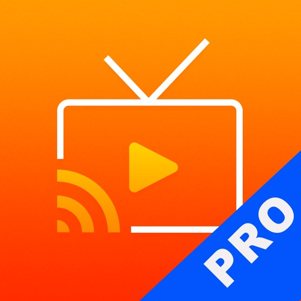

Best Casting App! Cast any online video to your TV.

iWebTV® works with any TV equipped with Chromecast® + Roku® + Fire TV® + Apple TV® (4th Gen) + Samsung TVs (2018 and later models).

*** Feature Highlights ***

• HD resolution supported (1080p and up to 4K depending on the device)
• Unlike mirroring apps, iWebTV sends the actual video stream to your TV (Much better image quality & overall experience).
• Advanced browser, supports multiple browser tabs, blocks or hides spammy popups, search from the URL bar, ad blocker, browsing history etc...
• Subtitle auto-detect + Movie/TV Subtitle library
• Live streams support
• Video preview to instantly locate your favorite scenes.
• Binge-ready: queue up several videos, and enjoy.
• Set your own home page, bookmark web page or videos.
• Full playback controls, even after exiting the app (from the lock screen).
• Privacy modes

Some of the features above require in-app purchase

iWebTV actually plays the video on your media player which results in a much higher quality picture than apps that mirror your screen.

**** Notes ****

(1) Some premium features require in-app purchases.
(2) Excluding video formats incompatible with iOS (flash).
(3) While most video websites work well, email us from the app menu if you experience any issues: > “Get Help” > “Frequent Questions” > “Need more help? (Other Issues)”> “Contact Support” (opens email).

Smart TV from most TV manufacturers will work with this app without any preliminary setup. Just start the app, choose a video & hit the cast button! This includes TVs from Samsung, TCL, Vizio, Sony, Hisense, Insigna, Sharp, Philips and others.

**** Legal ****

iWebTV™ is a trademark of Swishly Inc.
"Chromecast" is a trademark of Google LLC.
"Fire TV" is a trademark of Amazon Technologies, Inc.
"Roku" is a trademark of Roku Inc.
"Apple TV" is a trademark of Apple Inc.

Terms:

• Privacy Policy: http://www.swishly.com/webtv/privacy-policy.html
• Terms of Use: http://www.swishly.com/webtv/terms-of-use.html

iWebTV PRO offers a subscription-based upgrade ("Premium Services" $0.99/month or $9.99/year). With this subscription you will get the additional benefits of 2 premium services (Cloud Proxy Streaming  + Unlimited subtitle downloads)

#### photo_scanner_plus
## Photo Scanner Plus

Meet the ultimate solution for preserving your old photos. Photomyne is the fastest and easiest way to turn photos, slides, negatives, and other family keepsakes into a digital library spanning generations and share them with others. Download it today to see the magic of this powerful scanning app, built with cutting-edge AI technology.

This paid app version offers the full utility power of Photomyne on one iOS device. You will need to purchase a Photomyne Membership (in-app purchase) to access your photos on other devices and online and to back up your photos.

SIMPLY HOLD & CAPTURE - SCANNER WILL DO THE REST
* Scan multiple analog photographs in a single shot - finish an entire album in minutes.
* Scan more than just photos too - film negatives, slides, documents, notes, kids' art, recipes, scrapbooks, and more.
* Capture scans by tapping a button or by simply saying 'Go' (if voice control is enabled).
* The photo scanner auto-detects picture boundaries, auto-rotates sideways pics, crops, restores colors, and saves them into a digital album.

EDIT AND CURATE YOUR COLLECTION OF MEMORIES 
* Add details to albums and photos (locations, dates and names)
* Name the people in the photos.
* Scan the back of a photo, add audio recording
* Apply color filters & colorize B&W photos
* Sharpen blurry faces in photos

SAVE & SHARE YOUR REDISCOVERED MEMORIES
* Save photos to your mobile device or computer in the best quality (print quality)
* Share as many photos as you want via a web link
* Enjoy unlimited colorization of Black-and-White (monochromatic) photos
* Create gifts with your scanned photos such as photo collages

USE SCANNED PHOTOS TO MAKE SPECIAL EVENTS TRULY UNFORGETTABLE:
* Add a dose of nostalgia to reunions
* Honor memorials with photo memories
* Celebrate anniversaries with old photos
* Add an element of surprise to birthdays

OPTIONAL IN-APP UPGRADE:
To access your photos on other devices and online and to backup, consider purchasing an optional paid plan (in-app purchase).
Here are the features you get with a paid plan (Photomyne Membership):
1. Access your photos on other devices and online
2. Unlimited photo backup

The app offers an optional paid plan via monthly/yearly auto-renewing subscriptions**, as well as a One-Time plan which is paid for by a single upfront payment. These offer unlimited access to the premium mentioned above.

**Payment will be charged to your App Store account at confirmation of purchase. Your subscription will automatically renew itself unless auto-renewal is turned off at least 24 hours before the end of the current period. Your account will be charged for renewal within 24 hours prior to the end of the current period. You can manage your subscriptions and turn off auto-renewal by going to your Account Settings in the App Store. If offered, if you choose to use our free trial, any unused portion of the free trial period will be forfeited when you purchase a subscription to that publication, where applicable.

Got any questions? We’d love to connect: support@photomyne.com
Privacy Policy: https://photomyne.com/privacy-policy
Terms of Use: https://photomyne.com/terms-of-use

#### the_christmas_list
## The Christmas List

The #1 Shopping App in the US – The Christmas List is an easy-to-use app to help you organize your Christmas lists and budget so you can spend less time buying presents for the ones you love and more time being present with the ones you love!

_________________________________________

EASY PROGRESS TRACKING
Track gifts by to do, purchased, shipping, received, and wrapped. When editing a list you can change the status of multiple gifts at once (for example, when you are wrapping gifts you can change the status of those gifts from purchased to wrapped all at once).

EASY BUDGETING
Set a budget for a person or don’t – it’s up to you. The Christmas Lists tracks the budget for you. It’s so easy that The Christmas List has been recommended for managing holiday spending by
  • Good Housekeeping
  • The Motley Fool
  • mint.com
  • BankRate.com
  • CNBC

SHOPPING OVERVIEW
Simple, at-a-glance views of shopping progress including budget.

ADD GIFTS LIKE JOTTING A NOTE
Adding a list of gifts is as simple as typing (or even dictating) a note. Just place each gift name on a new line and The Christmas List transforms your note into a gift list. It’s like Christmas Magic!

IMPORT FROM YOUR CONTACTS
Get a jumpstart on your lists  by importing select recipients from your existing contacts.

EASY SHARING
Easily share lists using AirDrop, email, iCloud Drive, or Messages. Use AirDrop to quickly share a single recipient or an entire group.

SHOPPING LISTS BY STORE
Once you select a store for a gift, The Christmas List remembers that store and automatically builds a shopping list for the store to help make sure you get everything you need when you are out and about.

MULTIPLE GIFT RECIPIENTS
Once you create a gift you can copy it to other recipients on your list without the need to retype the details.

POPULAR RETAILERS
The Christmas List comes with a list of popular retailers, but if you don’t see the one you are looking for you can easily add your own. You can even use emoji in the store name.

ADD PHOTOS
Add photos for gifts and people from your photo library, clipboard, or camera.

CHRISTMAS COUNTDOWN
See a countdown to the number of shopping days until Christmas right in the app.

PRINTING
Print lists directly from the app.

NO PEEKING
Optional password protection – set up a PIN or use Touch ID to keep out snoops.

EDIT MULTIPLE GIFTS AT ONCE
Changing the status of several gifts at once has always been possible on the lists by status (accessed via the Progress tab). Now the lists by person and the lists by store can do it too. Also new is the ability to change the store for multiple gifts at once. It’s never been easier to keep track of what’s wrapped, shipped, and left to do.

_________________________________________

PEOPLE ARE TALKING…

"The Christmas List is solidly better...with more options and an easier interface." 
  – The New York Times 

"...it’s happy-making" 
  – Yahoo! News 

"Some of The Christmas List’s best features are the little details that the app just gets right." 
  – Macworld 

"Hooray for productivity!" 
  – MSN Tech 

"It's a handy way to keep track of what you have bought…" 
  – LA Times 

"…everything you need" 
  – Mashable.com 

“…great for keeping a budget and tracking shopping progress”
  – Business Insider

_________________________________________

SEE A VIDEO DEMO AT www.limbua.com

#### wagotabi__learn_japanese
## Wagotabi: Learn Japanese

Wagotabi is your daily companion for learning Japanese from scratch, at your own pace, and with maximum immersion. Learn to read, write, and understand Japanese in context, while retaining Hiragana, Katakana, and Kanji. Use your knowledge directly in context, by interacting with locals, and using Japanese in daily situations.
Discover real Japanese cities and culture while going on a quest to become a Japanese Grand Master. 

Designed in close collaboration with +300 Japanese language experts, official Japanese prefecture tourist associations and thousands of early testers, Wagotabi provides you with an immersive approach to language learning following a graded reader approach. Words and grammar points are introduced according to the JLPT standard, beginning with N5.

—

◆ START from zero: the game is beginner friendly: no initial Japanese knowledge needed. Concepts are introduced step by step and used right away in-game. Non-beginners will progress faster and equally enjoy the game.
◆ JOURNEY in Japan: Explore real cities, learn to introduce yourself, order food, ask your way to the locals and unravel hidden secrets!
◆ COLLECT new words, Kana, Kanji and get detailed explanations on grammar patterns and conjugation step-by-step. No more overwhelming Kana / Kanji / vocabulary lists.
◆ CHALLENGE Japanese Grand Masters in their castle to earn their respect!
◆ COMPETE with fellow learners on Kana and Kanji minigames and post your top scores to the leaderboard!
◆ PERSONALIZE your learning experience: benefit from our SRS tool pin-pointing your weaknesses, create your own avatar, set the game difficulty. This is your Japanese journey.
◆ ENJOY a fully ad-free experience without in-app purchase, the game can be entirely played offline!

—

(Non-exhaustive) list of features :
Interactive dictionary (with illustrations, tags etc.), clear grammar explanation, interactive tooltips, fully voiced in Japanese, SRS powered smart tests, interactions with environment, quests, 2 minigames (Kana and Kanji), boss fights, Hiragana / Katakana / Kanji stroke order and calligraphy, Kanjidex, resembling Kanji, conjugation, cloud save, advanced progress tracking tools …

—

Currently available content:
+320 carefully selected words and grammar points   
+165 Kanji  
+450 example sentences  
+1700 voiced Japanese dialogues  
+300 unique NPCs in game  
All words / grammar are used extensively and in context for better retention

—

What our early testers are saying about Wagotabi:
"You guys are a blessing to bring this to the learning market!"
"I have been using some of the App's examples for my lessons and my students are responding to them really well."
"I don't have the budget to travel to Japan, however I'm totally immersed in this game, learning effectively and witnessing my progress daily."
"Thanks to this app, my kids are now self-motivated to learn Japanese and reconnect with their roots. This concept is so Kawaii!“
"I'm preparing a trip to Japan and will definitely go check these spots I already visited in-game." 

—

Privacy Policy: https://www.wagotabi.com/privacy-policy
Terms of Service: https://www.wagotabi.com/terms-of-service

#### nomad_sculpt
## Nomad Sculpt

• Sculpting tools
Clay, flatten, smooth, mask and many other brushes will let you shape your creation.
You can also use the trim boolean cutting tool with lasso, rectangle and other shapes, for hardsurface purposes.

• Stroke customization
Falloff, alphas, tilings, pencil pressure and other stroke parameters can be customized.
You can save and load your tools preset as well.

• Painting tools
Vertex painting with color, roughness and metalness.
You can easily manage all your material presets as well.

• Layers
Record your sculpting and painting operations in separate layers for easier iteration during the creation process.
Both the sculpting and painting changes are recorded.

• Multiresolution sculpting
Go back and forth between multiple resolution of your mesh for a flexible workflow.

• Voxel remeshing
Remesh quickly your mesh to get a uniform level of detail.
It can be used to quickly sketch a rough shape at the beginning of the creation process.

• Dynamic topology
Refine locally your mesh under your brush to get an automatic level of detail.
You can even keep your layers, as they will be automatically updated!

• Decimate
Reduce the number of polygons by keeping as many details as possible.

• Face Group
Segment your mesh into subgroups with the face group tool.

• Automatic UV unwrap
The automatic UV unwrapper can use face groups to control the unwrapping process.

• Baking
You can transfer vertex data such as color, roughness, metalness and small scaled detail in to textures.
You can also do the opposite, transfering textures data into vertex data or layers.

• Primitive shape
Cylinder, torus, tube, lathe and other primitives can be used to quickly start new shapes from scratch.

• PBR rendering
Beautiful PBR rendering by default, with lighting and shadows.
You can always switch to matcap for a more standard shading for sculpting purposes.

• Post processing
Screen Space Reflection, Depth of Field, Ambient Occlusion, Tone mapping, etc

• Export and Import
Supported formats include glTF, OBJ, STL or PLY files.

• Interface
Easy-to-use interface, designed for mobile experience.
Customization is possible as well!

• Quad Remesher (separate in-app purchase only)
Remesh your object automatically with a quad dominant mesh that follows the mesh curvatures.
It supports guides, face groups and density painting.

#### board_game_stats
## Board Game Stats
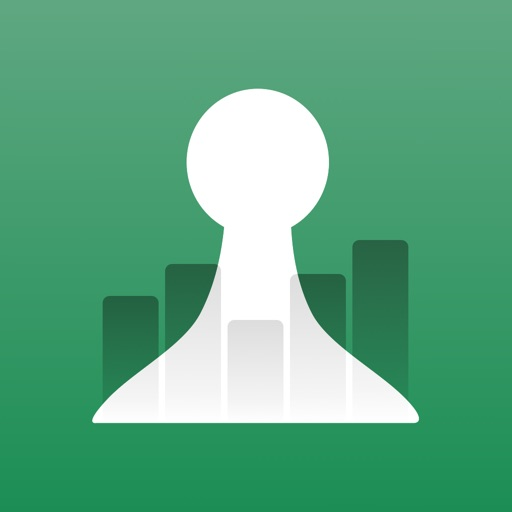

Keep track of your Board Game collection, plays and scores in this easy to use tool.
View statistics and graphs for your games, plays, and other players.
Works offline, can sync with BoardGameGeek.

- How many games did you play recently?
- Who scored the highest for a game?
- With whom did you play and who wins more?
- Did you improve your score from last times?
- Use tailor-made score sheets to enter scores.
- Compare players, view graphs and charts.
- Keep track of your collection and sync with BoardGameGeek.

Collection management features:
- Keep track of every game you've played or are interested in.
- Choose a specific version and image, and track multiple copies.
- Set status to Owned, Wishlist, Want to play, and much more.
- Enter details like comments, price paid, acquisition date, etc.
- Filter games on status, Played but not owned, Unplayed owned games.
- Set Custom filters to select a game for your specific group.
- Full automatic syncing with your BoardGameGeek (BGG) collection.

Play tracking features:
- Set scoring rules, cooperative and team play for each game.
- Select game and played expansions.
- Set Players and Locations, including anonymous players.
- Enter location, scores per player and many more details.
- Calculate scores on the fly by using + and - signs.
- Create teams and enter team scores.
- Use over 2300 game-specific tailor-made score sheets.
- Add Player roles, and choose from previously used ones.
- Use a timer to keep track of your play length.
- Add a Game note you can view each time you start a Play.
- Post your plays to BoardGameGeek, including auto-post after each save.
- Import existing plays from BoardGameGeek (BGG), Yucata and Board Game Arena (BGA)
- Send one or more Plays to other BG Stats users so only one of you has to enter the details.

Statistics features:
- View statistics for each game and player, and combination.
- See pie charts, play times and durations graphs, and score charts.
- View insights for Games and Players, for different time periods.
- See your with H-index, fives, dimes, quarters and centuries.
- View a Player's personal H-index and win percentage.
- Share Insights charts and 3x3 images.
- See cost per play for your games.

BG Stats has export and import functions for easy backup to a variety of services.
You can sync with other devices via BG Stats Cloud sync (an in-app subscription).
All in a native iOS interface, supports dark mode, landscape and iPad screens.

With the Power Expansion (in-app purchase):
- Extended game charts, based on number of players.
- Filter your data on players, locations, specific periods and player counts.
- Statistics for a specific combination of players, and compare them.
- Winning streaks, tiebreakers, and new and starting player stats.
- Role- and board-based statistics.
- Heat map of plays and play duration. 
- Cost per hour, player and more.
- Add tags to Games, Players and Locations.
- Create and save custom filters, now also with tags.
- Customize the Game filter dropdown menu.
- Create advanced filters with multiple criteria and logical operations.
- View combined game statistics.
- Sync game tags with BoardGameGeek.
- Create Challenges (if available) based on game filters or tags.

With the Challenges expansion (in-app purchase):
- Create a challenge from one of the many templates.
- x times y challenges: play x games y times.
- Ongoing Reach your next H-index challenges.
- Set the time period and choose specific games to track, or use auto-fill.
- Filter specific Players, Locations and player counts to count for the challenge.
- Create hardcore challenges that cannot be changed during the challenge.

With a Cloud sync subscription:
- Seamlessly sync your data between all your devices.
- Keep a backup of your data in the cloud.

Please note that changes to the BGG website or API can temporarily break BGG related features. I cannot guarantee their continued availability.

#### ravit_-_ravelry_on_the_hop
## Ravit - Ravelry on the hop

Ravit is a fun app that enables you to discover inspirational patterns and yarns, update your projects and stash and browse and post to Ravelry forums from anywhere. It's super quick, and it's friendly. Ravelry on mobile has never been easier.

FIND INSPIRATIONAL PATTERNS
If you’re not sure what you’d like to make next, Ravit lets you easily browse patterns, favorite them, download and view pattern PDFs, view project photos and browse a designer’s other patterns and pattern suggestions. 

And if you want to narrow your search, choose from dozens of filters including craft, availability, category, attributes, needles, weight and more. You can even combine multiple options with AND, NOT or OR. It's powerful, but easy.

There's so many beautiful patterns on Ravelry, and Ravit helps you find them easily.

TAKE RAVELRY TO YOUR YARN STORE
Find out which yarns you’ll need for a project. Check what yardage you need. Look in your stash to see if you’ve already got a yarn, or one that’s similar. And because Ravit is designed to work nicely on your iPhone or iPad with readable text and buttons you can tap, you won't be squinting as you find all the info you need when you're at your LYS.

+ Search all yarns by keyword, filter by fiber, weight, attributes and many others, and sort by options including 'Most projects' and 'Highest rating'. Quickly view pattern suggestions and projects for a yarn.

+ Access your stash offline. No wireless or cell signal in your yarn store? No problem! Your stash is cached on your device so you can search, sort and view your stash offline.

SNAP, EDIT AND UPLOAD ON THE SPOT
Perhaps you're making a project on the train to work, or relaxed on the couch at home - whenever you are inspired to share your WIPs, Ravit makes it easy to snap photos, enhance with powerful photo filters, and upload to Ravelry, all from the one app.

+ Powerful Photo Editing Tools - enhance, crop, and adjust your photos before your upload and show your work in it's best possible light. You can remove blemishes, improve color balance, sharpen images and access many other pro editing tools all from within the app.

+ Optimized for Ravelry - before images are uploaded, they're resized optimally for Ravelry, so you'll upload smaller photos (up to 10x smaller!) more quickly and using less data.

+ More than just photos - you can update notes for your Projects, Queued Projects and Stash, as well as most of the other info such as yarns, yardage, skeins, colorways, and color for your stash, and progress, link to stash, rating, craft, and tags amongst others for your projects.

IT'S ALL THE LITTLE THINGS...
So why use Ravit? It's all the the little, sometimes hidden touches which make Ravit shine. Here's a few of them.

+ It's quick - if you tap on something, you go right there. 

+ Infinite scroll - smooth, continuous scrolling as you browse to find inspiration.

+ Offline - whether you're commuting underground, or you're off-grid, Ravit lets you access your Projects and Stash offline.

+ Clean, uncluttered interface - we want your work and the beauty of Ravelry.com to shine. 

+ Use up to 50%* less data in Ravit compared with your web browser. 

+ Squint less - The text in Ravit isn't made super small, and we're fully Dynamic Type compatible, so if you change the font size on your device, it'll change in Ravit.

* Based on tests of browsing patterns, projects, stash and yarns on Ravit and Safari on the same device - YYMV! (Your Yardage May Vary)

THIS IS JUST THE BEGINNING
Ravit has many features already, but we are constantly enhancing and adding more features. We have an active group on Ravelry and we'd love to hear what you'd like to see next - join in the discussion at http://www.ravelry.com/groups/ravit

Ravit is not affiliated with ravelry.com. It is an independent app, developed by a husband and wife team. You can read more about why we made Ravit at http://www.enhancient.com/ravit

Download Ravit now and hop on to Ravelry.

#### turboscan™_pro__pdf_scanner
## TurboScan™ Pro: PDF scanner
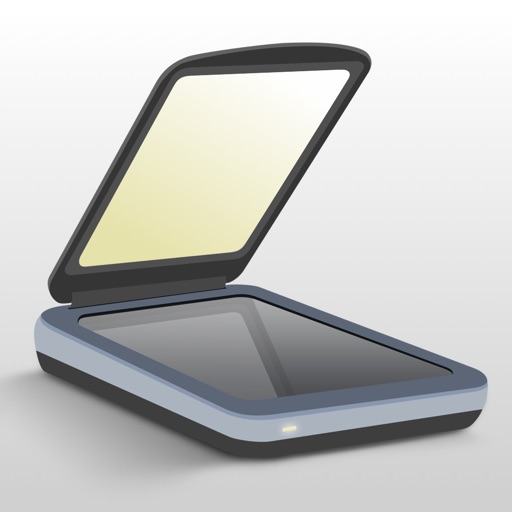

TurboScan turns your iPhone into a full-featured and powerful scanner for documents, receipts, books, photos, whiteboards, and more. You can quickly and accurately scan your multipage documents in high quality PDFs or JPEGs, name, organize and send them anywhere. 

• Featured in The NY Times, CNN Money and The Telegraph.
• “Absolutely the best... I've tried other scanner apps and this one is the only way to go. Never going back to the other apps… TurboScan sets the standard for scanning apps.” - User review.
• “…Would recommend this flawless and incredibly useful and perfectly executed app” - User review.

TurboScan uses advanced and fast algorithms to accurately detect document edges, straighten them (correct perspective), eliminate shadows and set a perfect contrast for black on white text. Color and photo modes are also available.

TurboScan boasts a powerful yet easy to use interface. Our handy "Email to myself" feature lets you quickly send documents with one tap.

TurboScan also offers SureScan, our proprietary scanning mode for sharper scans (especially useful in low-light conditions.) SureScan automatically takes three pictures of the same document, giving you a guaranteed perfect result every time.

We do not collect any data from TurboScan and all scanning happens on your iPhone. The confidentiality of your data is never compromised. 

TURBOSCAN FEATURES: 
• Automatic document detection and capture with perspective correction
• Features SureScan for the sharpest scans
• Document naming, folder organization and smart search
• “Email to myself” feature for quick, regular emails
• Add and reorder pages at any time
• Arrange multiple receipts or cards on a single PDF page for printing, easy viewing, etc.
• Send faxes using our Turbo Fax app
• Easily email & message documents or separate pages as PDF & JPEG
• Save documents or pages to Photos
• Face/Touch ID & passcode lock for increased security
• Upload, auto-upload or backup documents to iCloud Drive
• Open PDFs or JPEGs in Google Drive and other PDF cloud apps
• Combine scans via Merge or copy & paste separate pages
• Conveniently AirDrop documents to your Mac and other devices  
• Print documents via AirPrint
• Ultra-fast scanning (under 3 seconds per page) 
• Features VoiceOver for visually impaired users
• We do not collect any user data in TurboScan

TIPS ON SCANNING 
• Make sure your document is flat. 
• Use flash in low light conditions, but avoid glare with glossy documents.

We support Ukraine.

We're constantly improving TurboScan, and we value our customers' opinions and feedback. Please email us at  support@turboscanapp.com with any questions or suggestions. Thank you!

#### workoutdoors
## WorkOutDoors
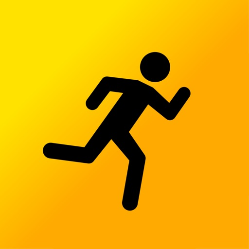

WorkOutDoors is the most advanced and most configurable workout app for the Apple Watch. It's perfect for running, cycling, hiking and any other indoor or outdoor activity.

Note: WorkOutDoors requires an Apple Watch Series 3 or later. It is not necessary to have your iPhone with you during a workout.

The app uses Apple’s workout system, so all workouts are saved to the Health system.  However it also provides many extra features over Apple's app, such as:

- a super-smooth vector map that can be shown during a workout;
- multiple configurable screens with metrics and graphs from a pool of 800+ data fields;
- route files can be imported and used for navigation (including turn by turn directions);
- dozens of configurable alerts (e.g. every mile; high heart rate; low pace; off-route etc);
- interval schedules can be created using the larger screen of the phone app;
- climbs and descents are supported with notifications and on-screen data and graphs;
- waypoints can be created, navigated to, and exported;
- use shortcuts to associate operations with gestures (e.g. double tap to hear configurable metrics);
- compare pace against a target or a previous workout (using metrics and a dot on the map);
- show zones for pace and power as well as heart rate (with optional coloured backgrounds);
- auto-pause is available for all outdoor activities;
- shows GPS and heart rate before starting a workout, so that you can wait for good signals;
- configure distance and pace for running / walking to come from Apple’s pedometer or from GPS;
- workouts can be exported in FIT / TCX / GPX files, or automatically sent to Strava;
- workouts created by the app can be analysed in great depth in the iPhone app.

The app also has many more features.  The map is a particular highlight.  It uses OpenStreetMap, which provides worldwide coverage and includes the trails necessary for outdoor workouts.  It also has several features that help you navigate during a workout:

- maps can be smoothly panned and zoomed, and can rotate according to the compass;
- a breadcrumb trail of your whole route is displayed on the map during the workout;
- topographic data can be shown, with configurable contour colours and hill shading;
- map-only mode is provided for when you don't want to start a workout and just need a map;
- a circular scale is shown when you zoom, making it easy to see the distance to features;
- maps can be stored on the watch for use when offline (they are downloaded as required if online);
- a red compass points north and a green compass points to the start;
- choose a waypoint to see a compass and distance to it in the corner of the map;
- you can also navigate to waypoints on the map, such as hospitals, sights, cafes etc.

If you load a route from a GPX / TCX / FIT file then navigation is even easier:

- your position is shown on an elevation profile of the route;
- the remaining distance, time and ascent can also be displayed;
- you can get alerted when you go off-route; 
- when off-route then a compass is shown which points to the nearest part of the route;
- if the route contains turn by turn directions then these can be used like a sat nav;
- if there are no directions then the app can use “bend detection” to generate them;
- the next direction is shown as an icon and distance in the corner of the map;
- the map can automatically zoom in when you are approaching a turn;
- you can use shake gestures to hear the distance to the next turn or the end of the route;
- routes are coloured by gradient: from red for steep uphill to blue for steep downhill;
- you can configure what information is displayed during a climb or descent.

All this is included for a single one-off payment. No extra in-app purchases or subscriptions are required (although there is a completely optional in-app tip jar which was requested by long-term users). 

If you own an Apple Watch and do any form of exercise, then WorkOutDoors is the app for you. Give it a go!

#### site_audit_pro
## Site Audit Pro
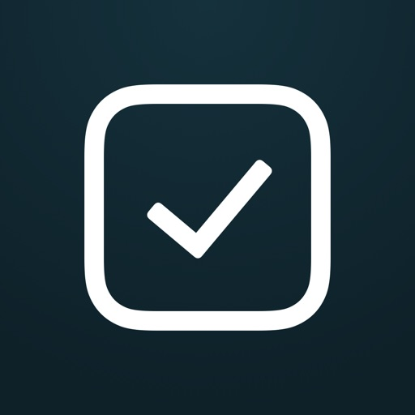

‘The fastest way to audit on the go’

Site Audit Pro helps thousands of businesses worldwide improve their productivity by making audits and inspections quicker to carry out and easier to manage. Whether performing a safety inspection, snagging issues, creating a punch list, or providing a quotation, Site Audit Pro will help you collate and share your findings on the go with customised Reports to add a personal and professional touch.

---

FEATURES

- Record Issues: Add a title, assignee, and comments to document each Issue.
- Add and Annotate Images: Highlight and draw important information directly on Images to emphasise key points.
- Organise Issues into Projects: Add Site and Client details specific to each Project for better organisation and clarity.
- Image Details: Optionally show timestamps and GPS locations on each Image in the Report for precise documentation of when and where Issues were recorded.
- Share Professional Audit Reports: Eliminate the need to return to the office by sharing a PDF or CSV via email, Dropbox, device file sharing, and more.

---

CUSTOMISATIONS

- Add personal details to your Reports; include Company Name, Logo, Auditor Name and Signature.
- Change the content to reflect your industry. Instead of ‘Identified 12 Issues’, why not use ‘Found 12 Problems’ or ‘Examined 12 Properties’?
- Choose from and customise a range of 8 professional Report designs.

---

GREAT FOR

- Audits
- Inspections
- Punch Lists
- Snag Lists
- Documenting various items

Site Audit Pro is adaptable to a number of industries. Whenever you need to capture and report important data, choose Site Audit Pro.

Download Site Audit Pro today to save time, improve productivity and make audits and inspections organised and hassle-free.

---

SUBSCRIPTION

Site Audit Pro Cloud is our subscription service that allows you to store your projects in the cloud and access them from the web. Whilst the subscription does give you access to some of the more advanced features and access, it is not required to use and generate Reports. The features below are what you would gain access to by subscribing, whereas the features above are what are already included in the base app.

SUBSCRIPTION FEATURES

1. ACCESS PROJECTS FROM THE WEB

Create, edit and share Reports from our web app. Using the website allows you to quickly type up comments using your computer keyboard as well as accessing your Projects from any browser.

2. MULTIPLE IMAGES

You can show more than one Image for each Issue. This is useful for showing several angles of the same Issue, or to compare before and after Images.

3. SYNCING

Sync your projects between devices. Start your project with your iPhone, type it up on an iPad, and do final editing on your PC or laptop. Reports can be generated from any location.

4. FOLDERS

Organise your Projects into Folders. Name your Folders after the property, area, client, group, site or anything you want to keep organised!

5. MORE PROJECT INFORMATION

Add a site address for each Project, as well as a Project photo to give the finishing touch to your Report’s cover.

6. ISSUE DUE DATES

Give Issues a Due Date so your Assignees know exactly how long they have to complete any tasks required.

7. COMPLETE ISSUES

Mark your Issues as completed. If all your Issues are completed, you can even mark the whole Project as completed.

8. REPORT COLOURS

In addition to more themes, you can set up your own colour scheme! Use this to match your company branding or specific report types. 

---

*** Subscription Information ***

Subscriptions will automatically renew unless cancelled within 24-hours before the end of the current period. You can cancel anytime with your Apple account settings. Any unused portion of a free trial will be forfeited if you purchase a subscription.

*** Subscription Terms ***

You can find the terms and conditions of the subscription here:

https://www.siteauditpro.com/terms

#### oilfield_calendar
## Oilfield Calendar
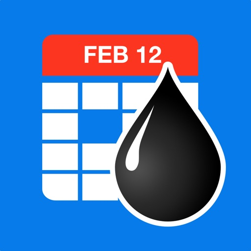

If you're an oilfield worker Oilfield Calendar is the easy-to-use calendar and planning app that you just can’t do without. See how easy it can be to keep your life organized! Oilfield Calendar, a simple to use scheduling tool for oilfield families.

•	Customize your oil and natural gas hitch with easy to use interface
•	Drilling, production, and facility workers, this will be your wives’ new best friend.
•	Vendors, know which DSM is on tour to sign your tickets.
•	See if important holidays like Christmas or your birthday falls on your days off, plan ahead using month and year views.
•	Create and compare multiple schedules, or print and share them in PDF.

How to Use Oilfield Calendar
•	Create and change new hitches in the hitch editor.
•	Holidays are marked with oil drops in month view.
•	Print and share your schedule in year view.

You’ve got your hardhat, steal toes, and glasses, add Oilfield Calendar to essential tools to have when working in the patch.  Oilfield schedules can be difficult, now you can manage your busy schedule at home, and at the rig, plan ahead with the Oilfield Calendar app. Keep your life turning to the right.

** Feel free to drop us a line! We’re always listening to your suggestions and strive to improve our apps!  If you have any feedback just contact us, support@archimedesworkshop.co **

** Are you happy with the Oilfield Calendar app?  We’d love to hear about it!  Please take a moment to leave us a nice review, it truly helps us continue creating great tools for the industry! **
While you’re in the sharing mood, go ahead and like and post this on Facebook too, 

Be Good!

#### free_tone_-_calling___texting
## Free Tone - Calling & Texting
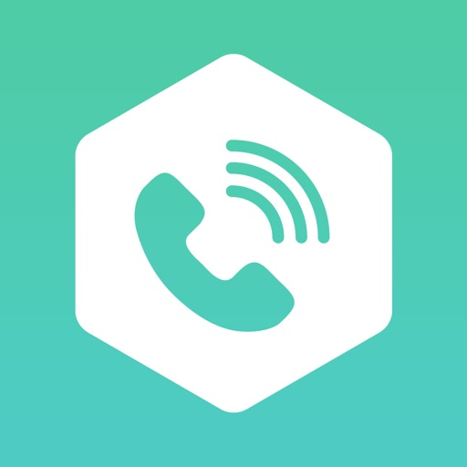

UNLIMITED TEXTING AND CALLING WITH YOUR OWN PERSONAL PHONE NUMBER

FREE TONE THE MOST POPULAR FREE CALLING APP ON THE STORE IS NOW AVAILABLE WITHOUT ADS FOR 1 WEEK

With this version of Free Tone you will enjoy one week without ads when you create a new account*

• Unlimited TEXT and PICTURE messaging to any phone in US & CANADA*
• Unlimited Calling to ANY NUMBER IN THE US & CANADA*
• Get a REAL phone number*
• Receive phone calls on your number and enjoy Free Voicemail
• Enjoy group texting features with text, photos and videos
• Share your location in one click
• Enjoy a wide sample of Stickers
• Transform your IPOD TOUCH and IPAD into a real wifi phone

No Catch, No Hidden cost!

Free Tone is an easy to use messaging application that allows you to send unlimited text, voice, pics, video messages to any mobile phone number in United States and Canada. You can also Call any number in the US and Canada too ! Also, if your friends install the app as well, you will be able to do a lot more with them! So pick a Number and share it with your friends and start texting, calling!

* Important:
- We do not Support 911
- For outbound calls to the US and Canada, calling is free with FreeTone
- Hawaii, Alaska and some other territories are not supported in the free bundle
- For inbound calls to your personal number, the first five hundred minutes are complimentary, with the ability to receive calls to your FreeTone number for a minimal extension fee
- Free calls to numbers in the US & Canada from some locations are subject to some limitations
- Access to the free US/Canada number and calling is limited to US and Canada residents
- If Push notification is not enabled, you may not receive messages and calls
- Only one free phone number per account
- Removal of Ads for one week is only available to users having downloaded the paid version of Free Tone and creating a new account, for users updating the app or using their existing account you will keep experiencing your current Free Tone experience
- After the week of usage without Ads you will start to see ads in the App
Help us improve FreeTone: http://support.free-tone.com

In-App Subscription Details:

- Payment will be charged to your iTunes account at confirmation of purchase
- Subscription automatically renews unless auto-renew is turned off at least 24 hours before the end of your current period
- Account will be charged for renewal within 24-hours prior to the end of the current period, at the purchase price listed in the "Manage Subscriptions" section of your iTunes account
- You may manage your subscriptions and turn off auto-renewal by going to your iTunes Account Settings and then “Manage Subscriptions”
- No cancellation of the current subscription is allowed during active subscription
- Also see Terms & Conditions (http://go-text.me/assets/tc) and Privacy Policy (http://go-text.me/assets/pp)

#### promote_-_army_study_guide
## PROmote - Army Study Guide

BEFORE YOU BUY ANOTHER BOARD STUDY APP ASK YOURSELF:

1. Does it offer over 3,700 questions across 48 subjects customizable for your board?  Our app contains thousands more than some other apps.  You don't have to study all 3,700+ questions but they are there for you if you want.  
2. CAN YOU GRADE YOURSELF?  Seriously!  Many board apps don't even allow you to grade yourself.  You can't look at your test scores for each subject because they don't even keep score.
3. Does it have an advanced learn engine that tracks questions seen/unseen, answered correctly/incorrectly, and then dynamically creates your tests accordingly?
4. Does it provide BOTH a casual study mode AND a test mode?
5. Does it provide AUDIO?
6. Are you able to SEE your study and test PROGRESS for ALL lessons at a MERE GLANCE?
8. Can you customize your tests with adjustable question counts and subjects?

This is a comprehensive guide addressing the common Army promotion board topics - over 40 subjects. Information was taken directly from Army regulations, Army doctrine reference publications (ADRPs), Army doctrine publications (ADPs), field manuals, technical manuals, training circulars, and pamphlets. All the study material is in question/ answer/ flashcard format. Hyperlinks are used in the larger sections to help better facilitate the blocks of information. In addition, to help support some of the question/answers, notes are provided throughout along with Helpful Hints to aid in memory recall. 

ForceReadiness.com is not affiliated with the US Army. We simply support soldiers every way we can.

#### dairybar
## DairyBar

Simple app for tracking breast milk storage. Easily inventory your pumped breastmilk in multiple storage locations and types. No more guessing about what is currently in your stash!

Features:
-Track milk in up to 10 locations
-Easily see total milk in each storage location
-Different storage types including cooler, fridge, freezer, deep freeze and freeze dried!
-Calculates how long your milk will last based on your baby's consumption
-Pumping calculator that allows you to adjust values to see when you can stop pumping
-Get notified when milk is expiring
-Track in mL or oz
-Add caregivers who can view and edit your stash
-Store a backup of your milk stash remotely

This app is built and maintained by one mama alone, so if you come across bugs or features you'd like to see, please email me directly through the app. I always love to help out!

#### freya_•_surge_timer
## Freya • Surge Timer

Meet Freya, the world’s first hypnobirthing-friendly birth timer, brought to you by The Positive Birth Company. This award-winning birth timer supports you through labour, coaching you through every single surge (or contraction) with a simple breathing technique and guided relaxations. 

Put hypnobirthing techniques into practice during pregnancy, labour and childbirth 
Relax between surges with a mix of guided relaxations, positive affirmations, gentle music and calming visualisations
Birth timer that keeps track of surges, logging each surge or contraction so you can see how frequently they are coming and how long they are lasting
Receive a notification from Freya when your labour is established and it might be a good time to call your midwife
Use Freya during pregnancy to practice breathing techniques and relaxation 
Available in French, German, Portuguese, Spanish and Italian

Never birth alone with Freya by your side.

TRACK YOUR SURGES
In hypnobirthing we refer to contractions as surges, because a ‘surge’ more accurately describes the sensation you’ll experience when in labour. Freya is the ONLY hypnobirthing-friendly contraction timer on the app store, designed specifically with hypnobirthing mums in mind, using appropriate terminology, but can be used by anyone. If you would like to know more about Hypnobirthing, follow The Positive Birth Company on Instagram or Tik Tok where we share loads of free resources to make your birth better.

PREPARE FOR BIRTH
You can use this birth timer in pregnancy to help you relax and prepare for childbirth. In fact the more you practice your breathing and listen to the guided relaxations and positive affirmations, the more familiar they will become and the more effective they will be at helping you relax when it comes to birth. Positive affirmations have been proven to change the way your mind works and listening regularly will help you feel less anxious and more confident in the lead up to birth. You can practice daily and then reset the surge history whenever you like.

THE SCIENCE
We know the more relaxed you are during birth, the more oxytocin you will produce. Oxytocin helps your uterus to work efficiently, making labour faster and more comfortable.

LIFESKILLS
Freya can be used for pregnancy and post-birth relaxation, any time you feel you could benefit from taking some deep breaths or need some help finding your zen. Everything you learn - mindfulness exercises and breathing techniques - are skills for life.

If you have any questions or spot any pesky bugs lurking about the place please do let us know at hello@thepositivebirthcompany.com

WHAT YOU’LL GET:
- iPhone and Apple Watch app
- Timer to record your surges (also known as a contraction timer) and let you know when you’re in established labour
- Coaching audio to keep your mind focused on breathing through each surge and the ability to switch between 4 and 8 breath counts or 3 and 6, or turn the counting off altogether.
- 4 different birth coach voices
- Guided relaxations, positive affirmations and soothing visuals to help keep you relaxed between surges
- A gentle expanding visualisation that you can use to sync your breathing
- Option to record your own music, visualisations or relaxation tracks
- You can listen to your own playlist on a third party app (such as Spotify) whilst still using the Freya app to keep track of your surges and coach you through each one.
- A detailed log of your surges over time, so you can track your progress through labour, reset this after you practice breathwork at any time
- Ability to easily share the log with your birth partner, midwife or doula
- Coaching created by renowned hypnobirthing expert Siobhan Miller, founder of The Positive Birth Company

Download the ONLY hypnobirthing-friendly birth timer on the App Store and prepare to meet your baby in the best possible way, feeling calm and confident, relaxed and happy!

#### genki_vocab_for_3rd_ed_
## GENKI Vocab for 3rd Ed.

Learn elementary Japanese words at your own pace!
GENKI Vocab for 3rd Ed. is an app that enables users to learn more than 1,200 words essential for beginners.

This is the official iPhone app for the 3rd edition of GENKI: An Integrated Course in Elementary Japanese, a best-selling series of Japanese learning materials boasting more than 2 million copies sold worldwide.

Advantages
◆Users can view the words and listen to the recordings as they like, enabling them to study at their own pace.
◆By repeating a process of memorization and self-checking, learners can firmly master important beginning-level vocabulary.
◆Words already memorized are progressively removed from the study set, so users can concentrate on just the words that challenge them, making for a more efficient approach to learning.

Study methods and functions
This app has three main modes: Study, Check, and List.

◇ "Study" allows users to view the words, their meanings, and the example sentences over and over, so they can take their time learning.
・Audio recordings of all words and example sentences are provided with natural pronunciations by native speakers of Japanese. (Please set your iPhone to Ring mode to hear the audio playback.)
・Fun illustrations help users to better retain the words studied. 
・Users can bookmark the words they like. The bookmarked words are compiled in the Bookmark list in "List."

◇ “Check” helps learners to track their mastery.
・Users check their understanding of the vocabulary studied and sort the words into those mastered and those not yet retained.
・The words already mastered are taken out of the study set, leaving behind just those that still need to be worked on.

◇ “List” displays a list of all words covered by the app so that users can see their progress and review the vocabulary.
・The list can be arranged in any of three orderings: lesson order, a-i-u-e-o order, and alphabetical order. The words bookmarked in the Study mode are also listed in the Bookmark list.
・Checkmarks are automatically placed next to words that have been mastered.
・The Study view of words can be displayed from the list entries, enabling quick review.

○This app is based on the vocabulary from the third edition of GENKI.
○Ads: The app does not display any ads that might interfere with learning.

#### mylightmeter_pro
## myLightMeter PRO
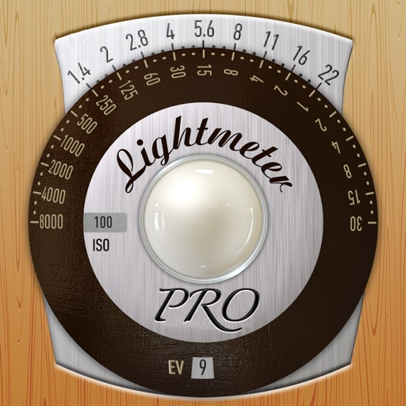

Designed by a photographer for photographers, focused on RELIABILITY and PRECISION for digital and analog photography.

• Extended sensitivity as low as -2/-4EV (dark scenes)

• Two different convenient interface designs.

• Incident and reflected light metering modes.

• Save exposure data.

• f/Tools connection.

• Independent calibration for the two metering modes.

• Independent selection of aperture, speed, ISO and exposure compensation with 1/3 resolution. From 4 hours to 1/8000 sec., aperture from 1.0 to 512 and ISO from 0.8 to 6400.

• Automatic priority for aperture or speed. (Automatic Av and Tv modes).

• Automatic ISO or locked ISO options.

• Point metering in camera view.

• Maximum aperture limited by the selected lens.

• Calculate the average of any number of measurements you want.

• Read the exposure data of any photo from the gallery.

• Calculate hyperfocal distance for 5 memorized lenses. Which also blocks maximum aperture.

• Memory for 5 lenses with maximum aperture, focal length and film/sensor size for calculating hyperfocal distance and aperture.

• Hyperfocal distance also for infrared light. (IR button)

• Exposure value EV on an analog scale or right up front.

• On 3.5 " displays preset lens buttons tilting the device or tapping at the bottom.

• Be advised that accurate incident light reading needs a diffuser attached to the front camera. Without the diffuser still can be used but think about it, it will be a reflected reading taken with the front camera.

I'm an independent photographer/designer/developer and am very grateful for your support. Trying to do the best lightmeter app ever, a lot more to come. You can ask for any improvement and I'll be happy to help. This app is constantly reviewed and improved because it is my tool, if you have any questions or suggestions feel free to contact me by email at davidquiles@me.com

Thank you!

David Quiles

#### santa_christmas_snowing
## Santa Christmas Snowing

Experience the magic of the season right on your wrist!

For issues installing or configuring the watchface, please see this tutorial: https://youtu.be/xEme-BFJWXM

Indulge in the festive spirit with the "Santa Christmas Snowing" watch face, meticulously designed for Apple Watch running on Watch OS 10 or newer. Whether you're a fan of the jolly old Santa, his fleet-footed reindeer, or the quintessential Christmas charms, this watch face promises to deck your Apple Watch with holiday cheer!
* Diverse Backgrounds: Choose from 15 enchanting backgrounds, each thoughtfully crafted with Santa, reindeer, or classic Christmas items.
* Animated Snow: Revel in the winter wonder with a gentle snowfall animation, bringing a touch of white Christmas to your watch, irrespective of the weather outside.
* Time Display: Adjust to your preference with both 12-hour and 24-hour formats available.
* Vital Stats: Stay informed with the date, your daily step count, and the battery level, all seamlessly integrated into the design.
* Easy Customization: Just a tap on the bottom left corner, and you can shuffle between the available backgrounds, right from your watch!
* Personalization via Phone App: The companion phone app lets you swap background images, toggle the snow effect, switch between 12 or 24-hour time format and select your preferred color for the clock, date, and stats.

Santa Christmas Snowing comes with a default watch face that can be installed from the phone app and a custom watch application created especially for you!

Facing a hiccup? The phone app comes packed with a detailed FAQ section, answering common queries and offering solutions. If you still need assistance, our dedicated contact page within the app provides quick access to our support team.

Santa Christmas Snowing also provides an widget for the iPhone with Christmas Countdown.

With the "Santa Christmas Snowing" watch face, not only will you be keeping time, but you'll also be spreading the joy of the season. Let every glance at your Apple Watch remind you of the wonders and delights of Christmas!

