- [HotSchedules](#hotschedules)
- [Shadowrocket](#shadowrocket)
- [AnkiMobile Flashcards](#ankimobile_flashcards)
- [Procreate Pocket](#procreate_pocket)
- [TonalEnergy Tuner & Metronome](#tonalenergy_tuner___metronome)
- [Paprika Recipe Manager 3](#paprika_recipe_manager_3)
- [imo video calls and chat HD](#imo_video_calls_and_chat_hd)
- [AutoSleep Track Sleep on Watch](#autosleep_track_sleep_on_watch)
- [Monash FODMAP Diet](#monash_fodmap_diet)
- [SkyView®](#skyview®)
- [Forest: Focus for Productivity](#forest__focus_for_productivity)
- [BimmerLink for BMW and MINI](#bimmerlink_for_bmw_and_mini)
- [FL Studio Mobile](#fl_studio_mobile)
- [Wipr 2](#wipr_2)
- [Knot IQ - The Bear Essentials](#knot_iq_-_the_bear_essentials)
- [MilGPS](#milgps)
- [QuickBend: Conduit Bending](#quickbend__conduit_bending)
- [Spirit Talker ®](#spirit_talker_®)
- [Threema. The Secure Messenger](#threema__the_secure_messenger)
- [LiveATC Air Radio](#liveatc_air_radio)
- [Noir - Dark Mode for Safari](#noir_-_dark_mode_for_safari)
- [Streaks](#streaks)
- [Pocket God](#pocket_god)
- [Things 3](#things_3)
- [ProCam - Pro Camera](#procam_-_pro_camera)
- [TeleGuard](#teleguard)
- [iReal Pro](#ireal_pro)
- [Necrophonic](#necrophonic)
- [Goblin Tools](#goblin_tools)
- [Pro Camera by Moment](#pro_camera_by_moment)
- [PeakFinder](#peakfinder)
- [Solocator - GPS Field Camera](#solocator_-_gps_field_camera)
- [Stylebook](#stylebook)
- [Koala Sampler](#koala_sampler)
- [Rarevision VHS: Retro Cam](#rarevision_vhs__retro_cam)
- [HappyCow - Vegan Food Near You](#happycow_-_vegan_food_near_you)
- [e-Sword LT: Bible Study to Go](#e-sword_lt__bible_study_to_go)
- [Prepware Aviation Maintenance](#prepware_aviation_maintenance)
- [Necrometer](#necrometer)
- [Ableton Note](#ableton_note)
- [Tenuto](#tenuto)
- [Site Audit Pro](#site_audit_pro)
- [Schumann Resonance](#schumann_resonance)
- [OBD Fusion](#obd_fusion)
- [HeartWatch: Heart Rate Monitor](#heartwatch__heart_rate_monitor)
- [Countdown App](#countdown_app)
- [Pedi STAT](#pedi_stat)
- [LumaFusion](#lumafusion)
- [Dumbify](#dumbify)
- [White Noise](#white_noise)
- [Just Press Record](#just_press_record)
- [ecMobile](#ecmobile)
- [Land Nav Assistant](#land_nav_assistant)
- [Blood Type Diet®](#blood_type_diet®)
- [FORScan Lite - for Ford, Mazda](#forscan_lite_-_for_ford,_mazda)
- [WorkOutDoors](#workoutdoors)
- [Pythonista 3](#pythonista_3)
- [Lineman's Reference - XFMR LAB](#lineman's_reference_-_xfmr_lab)
- [Hear My Baby Heartbeat App 2.0](#hear_my_baby_heartbeat_app_2_0)
- [ASCCP Management Guidelines](#asccp_management_guidelines)
- [Mapper for Safari](#mapper_for_safari)
- [iVerify Basic](#iverify_basic)
- [10bii Financial Calculator](#10bii_financial_calculator)
- [Piping DataBase - XTREME](#piping_database_-_xtreme)
- [Essential Anatomy 5](#essential_anatomy_5)
- [Teach Your Monster to Read](#teach_your_monster_to_read)
- [Drum Tuner - iDrumTune Pro](#drum_tuner_-_idrumtune_pro)
- [PepCalc - Peptide Calculator](#pepcalc_-_peptide_calculator)
- [Stash - Rule Based Proxy](#stash_-_rule_based_proxy)
- [TurboScan™ Pro: PDF scanner](#turboscan™_pro__pdf_scanner)
- [PhotoPills](#photopills)
- [Slow Shutter Cam](#slow_shutter_cam)
- [Scrivener](#scrivener)
- [Print to Size](#print_to_size)
- [Knots 3D](#knots_3d)
- [Stack the States®](#stack_the_states®)
- [forScore](#forscore)
- [Free Tone - Calling & Texting](#free_tone_-_calling___texting)
- [Spirit Contact Talker](#spirit_contact_talker)
- [Shot Tracer](#shot_tracer)
- [Sporty's E6B Flight Computer](#sporty's_e6b_flight_computer)
- [Quantumult X](#quantumult_x)
- [Folium](#folium)
- [iBend Pipe](#ibend_pipe)
- [Ghost Science M3](#ghost_science_m3)
- [NightCap Camera](#nightcap_camera)
- [Amazing Slow Downer](#amazing_slow_downer)
- [Cloud Baby Monitor](#cloud_baby_monitor)
- [Paramedic Protocol Provider](#paramedic_protocol_provider)
- [Calorie Counter PRO MyNetDiary](#calorie_counter_pro_mynetdiary)
- [CamScanner + | OCR Scanner](#camscanner___|_ocr_scanner)
- [RadarScope](#radarscope)
- [PromptSmart Pro - Teleprompter](#promptsmart_pro_-_teleprompter)
- [FlashFace Full](#flashface_full)
- [Alien10](#alien10)
- [Hue Haunted House](#hue_haunted_house)
- [TLC Practice exam 2.0](#tlc_practice_exam_2_0)
- [Cozmo Robot](#cozmo_robot)
- [CE5 Contact](#ce5_contact)

#### hotschedules
## HotSchedules

HotSchedules is the industry's leading employee scheduling app because it’s the fastest and easiest way to manage your schedule and communicate with your team.  

Team members love it because they can swap, pick-up or release shifts with one click. Work-life balance is easily managed with automatic shift pick ups when you want more hours, and time off requests for when you don’t.  Calendar sync and notifications keep your Schedules and the roster automatically updated to your phone with any manager-approved changes.

Managers appreciate the 75% time savings when building schedules and one-click approvals for shift changes.  The ability to monitor business performance with sales and labor snapshots from anywhere, keeps them out of the back office.  And most importantly, staying connected with broadcast and one-to-one messaging makes for a happy and productive team culture.
 
NOTE: The HotSchedules application REQUIRES a valid HotSchedules user account through your employer.

Need help?  Contact Customer Care 24x7x365

#### shadowrocket
## Shadowrocket

Rule based proxy utility client for iPhone/iPad.

- Capture all HTTP/HTTPS/TCP traffic from any applications on your device, and redirect to the proxy server.
- Record and display HTTP, HTTPS, DNS requests from your iOS devices.
- Configure rules using domain match, domain suffix, domain keyword, CIDR IP range, and/or GeoIP lookup.
- Measure traffic usage and network speed on WiFi, cellular, direct and proxy connections.
- Import rule files from URL or iCloud Drive.
- Block ads by domain, user agent rules.
- Local DNS Mapping.
- Work on cellular networks.
- Decrypt HTTPS traffic.
- Perform URL rewrite.
- Fully IPv6 supports.
- Script filter supports.
- Multi-level forward proxy.
- Support kcptun, cloak, gost, v2ray plugins.
- Support DNS over HTTPS, DNS over TLS, DNS over QUIC.

#### ankimobile_flashcards
## AnkiMobile Flashcards

AnkiMobile is a mobile companion to Anki®, a powerful, intelligent flashcard program that is free, multi-platform, and open-source. Sales of this app support the development of both the computer and mobile version, which is why the app is priced as a computer application.

AnkiMobile was written by the lead developer of Anki and AnkiWeb, and it has been around since 2010. Beware other apps using "Anki" in their name that have sprung up recently - they are not compatible with the rest of the Anki ecosystem, and they offer far fewer features, despite charging expensive subscriptions.

Some of AnkiMobile's features include:

- A free cloud synchronization service that lets you keep your card content synchronized across multiple mobile and computer devices. This makes it easy to add content on a computer and then study it on your mobile, easily keep your study progress current between an iPhone and iPad, and so on.
- The same SM2 and FSRS scheduling algorithms that the computer version of Anki uses, which remind you of material as you're about to forget it.
- A flexible interface designed for smooth and efficient study. You can set up AnkiMobile to perform different actions when you tap or swipe on various parts of the screen, and control which actions appear on the tool buttons.
- Comprehensive graphs and statistics about your studies.
- Support for large card decks - even 100,000+ cards.
- If your cards use images or audio clips, the media is stored on your device, so you can study without an internet connection.
- A powerful search facility that allows you to find cards that match criteria such as 'tagged high priority, answered in the last ten days and not containing the following words', and automatically place them into a deck to study.
- Support for displaying mathematical equations with MathJax, and rendering LaTeX created with the computer version.
- Support for adding images drawn with the Apple Pencil to your cards.

Please note that AnkiMobile is currently intended as a companion to the computer version of Anki, rather than a complete replacement for it. While AnkiMobile is able to display and schedule your cards in the same way the computer version does, certain changes like modifying note types need to be done with the computer software. Add-ons are not supported, so while you can study image occlusion cards created with the computer version, they can not be created within AnkiMobile. For this reason, please start with the computer version of Anki before you think about buying this app.

The cloud synchronization service is optional, and data can also be imported/exported from the app via a USB cable or AirDrop.

Like all apps, AnkiMobile can be purchased once and then used on multiple devices in a household using the same Apple ID. Family sharing is also supported (apart from in India). For information on bulk discounts for educational institutions, please see Apple's Volume Purchase Program.

For more information on AnkiMobile, including a link to the online manual, please have a look at the support page: https://docs.ankimobile.net/support.html. If you have any questions or want to report an issue, please let us know on our support site and we'll get back to you as soon as possible.

#### procreate_pocket
## Procreate Pocket

App of the Year winner Procreate Pocket is the most feature-packed and versatile art app ever designed for iPhone. 

Procreate Pocket has everything you need to create expressive sketches, rich paintings, gorgeous illustrations, and beautiful animations. Offering hundreds of handmade brushes, a suite of intuitive artistic tools, an advanced layer system, and the powerful Valkyrie graphics engine. Work on the couch, on the train, at the beach, or while waiting in line for coffee. 

It’s a complete art studio in the palm of your hand.

Highlights:
• High resolution canvases — up to 16k by 4k on compatible devices
• Intuitive Dark Mode interface made for iPhone
• Revolutionary QuickShape feature for perfect shapes
• Smooth and responsive smudge sampling
• Powered by Valkyrie, the lightning-fast 64-bit painting engine 
• Create art in stunning 64-bit color
• 250 levels of undo and redo
• Continuous auto-save — never lose work again

Breakthrough brushes:
• Packed with 100s of beautifully crafted brushes
• Brush sets keep your painting, sketching, and drawing brushes organized
• Over 100 customizable settings for every brush
• Brush Studio — design custom brushes
• Import and export custom Procreate brushes
• Import Adobe® Photoshop® brushes, and run them faster than Photoshop®

Full-featured layering system:
• Layer your art for precise control over details and composition
• Create Layer and Clipping Masks for non-destructive editing
• Stay organized by combining layers into groups
• Transform objects simultaneously across multiple layers
• Access over 25 layer blend modes for industry-grade compositing

Color without compromise:
• Fill your line work with ColorDrop
• Disc, Classic, Harmony, Value, and Palette color panels
• Import color profiles for color matching
• Assign Color Dynamics to any brush

Precision design tools:
• Add vector text to your illustrations
• Easily import all your favorite fonts
• Crop and resize your canvas for perfect composition
• Perspective, isometric, 2D, and symmetry visual guides
• Drawing Assist perfects your strokes in real time
• StreamLine smooths your strokes for beautiful lettering and expert inking

Animation Assist: 
• Easy frame-by-frame animation with customizable onion skinning
• Create storyboards, GIFs, animatics, and simple animations
• Export your animations in the full resolution of your canvas

 Dramatic finishing effects:
• Gradient Map — remap your image’s colors with a customizable gradient
• Glitch, Chromatic Aberration, Glow, and Halftone to add new dimensions to your work
• Gaussian and Motion Blur filters for depth and movement, or use Sharpen for perfect clarity
• Advanced Noise filter gives you more control for a classic, retro look
• Adjust Hue, Saturation, or Brightness in real time
• Powerful image adjustments including Color Balance, Curves, and HSB
• Bring your art to life with the fun, intuitive, and creative Warp, Symmetry, and Liquify Dynamics 

Time-lapse replay:
• Relive your creative journey with Procreate's celebrated Time-lapse Replay
• Export your Time-lapse recording in 4K for high-end video production
• Share a short, 30-second version of your Time-lapse on your socials

Reference Companion:
• Keep a full canvas or reference image with you at all times 
• Paint on your face with AR
• Color-pick right from the reference window

Import assets and share your creations:
• Import or export your art as Adobe® Photoshop® PSD files
• Import Adobe® ASE and ACO Color Palettes
• Import images files such as JPG, PNG, and TIFF
• Drag and drop artworks, brushes, palettes, and fonts between applications• Export to AirDrop, iCloud Drive, Photos, iTunes, Dropbox, Google Drive, Facebook, X (formerly Twitter), Instagram, TikTok, Weibo, Mail, and more
• Share your art as PDF, JPEG, PNG, TIFF, GIF, HEVC, or MP4 files

#### tonalenergy_tuner___metronome
## TonalEnergy Tuner & Metronome

For musicians from pros to beginners, whether you sing, play a brass, woodwind or stringed instrument or any type of guitar, this app provides a set of feature-rich practice tools that gives fun and rewarding feedback. It’s much more than just a tuner!
      
So what makes the TonalEnergy the best selling music practice app?
 
• It's an all-in-one app, with a state-of-the-art tuner, an advanced metronome, dedicated orchestral strings and guitar tuning page, a piano keyboard, sound analysis pages, and audio/visual recording capabilities.

• It’s easy to use. Options like the Target Tuner or Pitch Tracker are on all the main pages.  TonalEnergy helps users create rewarding and attainable goals during a rehearsal or when working alone. Colorful analysis data pages and audio/video recording features enhance the experience of practice.  

• The metronome is cutting edge. It offers unmatched flexibility in sound choices, tempo settings, meters, subdivision patterns and visual displays. Voice count-ins, the ability to create and edit preset groups and Ableton link for syncing multiple devices make this a superior tool for performers. 

• Ear training possibilities are endless. The high quality multi-sampled instrument sounds for symphonic instruments are unique among all other tuning applications. Listening skills can be developed through the use of the eight-octave keyboard, chromatic wheel and tone generator. There are no other sounds like these. 

• Learning is a social activity. Using features unique to the TonalEnergy Tuner, data can be collected, reviewed, edited and shared with others. Feedback is essential for growing and developing great performers. It’s all about connectivity.

Chris Coletti, member of The Canadian Brass, sums up TonalEnergy by saying,

      “TonalEnergy is a must-have for any serious musician. It's a full suite of tools in one app; the tuner, tone generator, recorder, metronome and beautiful interface make it one of the best tools for musicians out there, period.” 

FEATURES

• Recognizes a large pitch range, extending to lower registers than many competing tuners (C0 - C8) that is highly responsive to wind instruments, as well as acoustic and electric string instruments
• Adjustable A=440 Hz reference 
• Automatic or manual transposing options
• Instantly changes between equal, just and other custom temperaments, including user-defined ones
• Auto or instant pitch reference note feature using the TonalEnergy sounds
• Extensive tuning list for all orchestral string and fretted string instruments including many more features than most other string-only tuner apps
• An expandable eight octave piano keyboard enhancing many of the key aspects of the tuner’s functions
• Chromatic wheel tone generator, with optional auto-vibrato feature
• Frequency and Harmonic energy overtone graphs, along with a multi-function waveform
• Dedicated metronome page that matches or exceeds the features available on all other stand alone metronome apps
• Notation options including standard English, Solfege, Northern European, and Indian variants
• Bluetooth output/input support
• Audio and Video recording capabilities including, editing, looping, timestretch that are all exportable via iTunes sharing, AirDrop, email, AudioCopy, SoundCloud, etc
• Import music from iTunes Library or email attachments
• Compatible with external microphones and clip-on vibration sensor devices
• Supports external video output to an external display for use in rehearsal halls
• External MIDI keyboard control support 
• Apple Watch app acts ONLY as a remote control for the phone app
• Audiobus and inter-app audio support
• VoiceOver support for the blind or visually impaired 

INSTRUMENT SOUNDS
• Piccolo, Flute
• Oboe, English Horn, Bassoon
• Full Clarinet Family
• Soprano, Alto, Tenor, and Baritone Saxophone
• Trumpet
• French Horn
• Tenor and Bass Trombone
• Euphonium and Tuba
• Square, sawtooth, and sine waveforms
• Organ
• Bowed and Plucked Strings

#### paprika_recipe_manager_3
## Paprika Recipe Manager 3

Organize your recipes. Create grocery lists. Plan your meals. Download recipes from your favorite websites. Seamlessly sync to all your devices.

Features

• Recipes - Download recipes from your favorite websites, or add your own.
• Grocery Lists - Create smart grocery lists that automatically combine ingredients and sort them by aisle.
• Pantry - Use the pantry to keep track of which ingredients you have and when they expire.
• Meal Planner - Plan your meals using our daily, weekly, or monthly calendars.
• Menus - Save your favorite meal plans as reusable menus.
• Sync - Keep your recipes, grocery lists, and meal plans synced between all your devices.

• Adjust - Scale ingredients to your desired serving size, and convert between measurements.
• Cook - Keep the screen on while cooking, cross off ingredients, and highlight your current step.
• Search - Organize your recipes into categories and subcategories. Search by name, ingredient, and more.
• Timers - Cook times are automatically detected in your directions. Simply tap on one to start a timer.

• Import - Import from existing apps such as MacGourmet, YummySoup!, MasterCook & Living Cookbook.
• Export - Export your meal plans to Calendar and your grocery lists to Reminders.
• Share - Share recipes via AirDrop or email.
• Print - Print recipes, grocery lists, menus, and meal plans. Recipes support multiple print formats including index cards.

• Extensions - Save recipes directly in Safari and view today's scheduled meals.
• Bookmarklet - Download recipes from any browser straight into your Paprika Cloud Sync account.
• Offline Access - All of your data is stored locally. No internet connection is required to view your recipes.

What's New in 3.0

• iPhone X and iOS 11 support. 
• iOS app is now universal.
• Multitasking support on iPad.
• Add multiple, full-sized photos to each recipe. Embed photos in your directions.
• Insert links to other recipes or websites in your ingredients or directions.
• Format recipes using bold and italics.
• Convert ingredient measurements between standard and metric.
• Search for recipes across multiple categories.
• Add custom aisles to your grocery list and re-arrange them in your preferred order.
• Create multiple grocery lists.
• Add custom ingredients to the pantry. Track quantities, purchase dates, and expiration dates.
• Move items back and forth between the pantry and grocery list.
• Add custom meal types to the meal planner.
• Create reusable menus that span multiple days.

Platforms

Paprika is available on multiple platforms so you can access it on all of your devices. Please note that each version is sold separately.

#### imo_video_calls_and_chat_hd
## imo video calls and chat HD

Message and video chat with your friends and family for FREE, no matter what device they are on!

- Encrypted high-quality Video and Voice calls
- Encrypted Group Video and Voice calls with up to 6 participants
- FREE and unlimited encrypted messages and video and voice calls over your 2G, 3G, 4G or Wi-Fi connection*
- Group chat with friends, family, roommates and others
- Fast photo and video sharing
- Hundreds of free stickers!
- Avoid SMS and phone call charges

*Data charges may apply. Contact your provider for details.

IMO PREMIUM MONTHLY SUBSCRIPTION
- You can subscribe to remove ads from imo and get 25Gb of cloud storage.
- Subscriptions are billed monthly at the rate selected depending on the subscription plan.
- Subscriptions auto-renew at the cost of the chosen package, unless cancelled 24-hours in advance prior to the end of the current period. The subscription fee is charged to your iTunes account at confirmation of purchase. You may manage your subscription and turn off auto-renewal by going to your Account Settings after purchase. Per Apple policy, no cancellation of the current subscription is allowed during active subscription period. Once purchased, refunds will not be provided for any unused portion of the term.

Privacy Policy: https://imoapp.com/privacy
Terms of Service: https://imoapp.com/terms

#### autosleep_track_sleep_on_watch
## AutoSleep Track Sleep on Watch

Automatically track your sleep from your Apple Watch*. No buttons to press. Even the Watch app is optional! Just sleep!

Total Privacy.
-------------
AutoSleep has no user analytics tracking. No advertising plugins. No 3rd party code. No data upload.
Ask your "free" sleep app if they can say the same.

Everything Included.
--------------------
No extra In App Purchases. No subscriptions. 

Apple Sleep Stages
-----------------
Full integration with Sleep Stages from the Apple Sleep app, so you have the option to use the Apple Sleep app and view all the information in AutoSleep.

Functions
-----------------
AutoSleep includes all the information and functionality you need for sleep monitoring, including:
Time Asleep – sleep duration and sleep bank balance
Sleep Rating – a consolidated rating score of your sleep
Sleep Rings – fill your sleep rings with quality sleep, including heart rate, deep sleep and REM
Apple Sleep Stages – option to use the data from the Apple Sleep app
Sleep Apnea - discover if you have sleep apnea
Sleep Blood Oxygen – measurements while sleeping
Respiration Rate – track your breathes per minute
Noise – environmental noise measurements
Sleep Analysis – view detailed graphs and breakups on your sleep cycles
Sleep Fuel – measure the quality and efficiency of your sleep
Tonight’s Bedtime – recommends your latest bedtime based on your habits
Readiness – indicates your physical and mental stress
Temperature – track your sleeping wrist temperature
Sleep Consistency – learn about your time to bed behaviours
Lights Off – track the time to fall asleep
Live Sleep Tracking – view your sleep statistics during the night
Smart Alarm – Watch in-built smart alarm to help you wake in lighter sleep 
Widgets – fantastic range of iPhone widgets
Complications – multiple Watch face options 
HomeKit – full integration with Apple HomeKit 
Emojis & Notes – record comments and tags to your sleep session
Explore – deep dive analytics views
Siri – use with Siri voice commands
Shortcuts – create your own shortcuts that you use with AutoSleep
Adjust – a simple function to adjust sleep/wake detection individual to you
History – advanced graphs and trends
Configuration – change the theme and design your clock sleep rings
Setup – customise your sleep goals, setup notifications and reminders
Exports – exporting options to save your data

About AutoSleep
-----------------
Using Advanced Heuristics AutoSleep works out how long you've slept so you don't have to.

If you DO wear your Watch to bed, you don't need to do a single thing. AutoSleep will track your sleep & quality and send you a notification in the morning.

Even if you don't wear your Watch to bed, AutoSleep can track your time in bed. It's extremely simple. If you DON'T wear your Watch to bed, then simply take your Watch off before you go to sleep. As soon as you touch your iPhone or put your Watch back on in the morning then AutoSleep will know that you have finished sleeping. 

As everyone is a little bit different. AutoSleep provides a simple setup wizard and an option to tweak if you are a very restless sleeper. 

AutoSleep also integrates beautifully with the Eclipse Yourself and HeartWatch apps, our premier heart, health, activity, recovery and readiness monitoring apps.

*Requires Apple Watch running WatchOS 4 or higher.

Awards
-----------------
Best of 2018
https://apps.apple.com/story/id1438574124/

Best of 2019
https://apps.apple.com/story/id1484100916/

Best of 2020
https://apps.apple.com/story/id1535572713/

Best of 2021
https://apps.apple.com/story/id1591083005/

Best of 2022
https://apps.apple.com/story/id1654240446

Best of 2023
https://apps.apple.com/story/id1719170110

#### monash_fodmap_diet
## Monash FODMAP Diet

Researchers at Monash University have developed the low FODMAP diet and a corresponding app to assist in the management of gastrointestinal symptoms associated with irritable bowel syndrome (IBS). The Monash University FODMAP diet works by swapping foods high in fermentable carbohydrates (FODMAPs), with low FODMAP alternatives. Around 75% of people with IBS experience symptom relief on a low FODMAP diet.

The app comes directly from the research team at Monash and includes the following:

- General information about the FODMAP diet and IBS.
- Easy to understand tutorials to guide you through the app and the 3-Step FODMAP diet.
- A Food Guide detailing the FODMAP content for hundreds of foods using a simple 'traffic light system'. 
- A list of branded products that have been certified by Monash as low FODMAP.
- A collection of over 70 nutritious, low FODMAP recipes.
- Functions that allow you to create your own shopping list and add notes to individual foods
- A Diary that enables you to record food eaten, IBS symptoms, bowel habits and stress levels. The Diary will also guide you through step 2 of the diet - FODMAP reintroduction.
- The ability to adjust units of measurement (metric or imperial) and activate colour blindness assistance.

#### skyview®
## SkyView®

SkyView® brings stargazing to everyone. Simply point your iPhone, iPad, or iPod at the sky to identify stars, constellations, planets, satellites, and more!

Over 3.2 million downloads.

App Store Rewind 2011 -- Best Education App

“If you've ever wanted to know what you're looking at in the night sky, this app is the perfect stargazer's companion.” 
– CNET 

"If you’ve ever been looking for a stargazing app for your iPhone, then this [is] definitely the one to get." 
– AppAdvice 

“SkyView is an Augmented Reality app that lets you see just what delights the sky has to offer.” 
– 148Apps Editor’s Choice

You don't need to be an astronomer to find stars or constellations in the sky, just open SkyView® and let it guide you to their location and identify them. SkyView® is a beautiful and intuitive stargazing app that uses your camera to precisely spot and identify celestial objects in sky, day or night. Find all 88 constellations as they fade in and out while you scan across the sky, locate every planet in our solar system, discover distant galaxies, and witness satellite fly-bys.

Features: 

• Simple: Point your device at the sky to identify galaxies, stars, constellations, planets, and satellites (including the ISS and Hubble) passing overhead at your location.
• Sighting Events: schedule alerts for upcoming celestial events.
• Apple Watch: see what objects are visible tonight and how to spot them using your Apple Watch.
• Today Widget: brand new iOS 8 today widget lets you quickly see upcoming celestial events.
• Night Mode: Preserve your night vision with red or green night mode filters.
• Augmented Reality (AR): Use your camera to spot objects in the sky, day or night.
• Sky Paths: Follow the sky track for any object to see it’s exact location in the sky on any date and time.
• Comprehensive: Includes thousands of stars, planets, and satellites with thousands of interesting facts.
• Time Travel: Jump to the future or the past and see the sky on different dates and times.
• Social: Capture and share beautiful images with friends and family on social networks. 
• Mobile: WiFi is NOT required (does not require a data signal or GPS to function). Take it camping, boating, or even flying!

What a fun way to teach yourself, your children, your students, or your friends about our wonderful universe!

#### forest__focus_for_productivity
## Forest: Focus for Productivity

## Top productivity app in 136 countries. More than 2 million satisfied paying users. Featured in Apple's "Amazing Apps" TV commercial.
## Staying focused with the cutest gamified timer. 
## Over 1,500,000 real trees were planted on Earth by our users.  

"Forest works well, and if your goal is to be more in the moment, ignore your phone and actually talk to your friends when you are with them, this is the app for you."— The New York Times 

"In order to establish new, better habits, it's helpful to engage with tools that make it easier to reinforce them. For anyone looking to curtail their phone usage, the Forest app might be for you."— Business Insider

If you want to temporarily put down your phone and focus on what’s more important in real life, you can plant a seed in Forest. As time goes by, this seed will gradually grow into a tree. However, if you cannot resist the temptation of using your phone and leave the app, your tree will wither. 

The sense of achievement and responsibility will encourage you to stay away from your phone, and will help you make better use of your time. Stop getting distracted by your phone, make you self-motivated and get more things done.

Stay focused, Be present! 

STAY FOCUSED
• A interesting way to help you beat phone addiction and overcome distraction
• Turn your focused moments into a lush forest.
• Create personalized Allow Lists for different situations. Non-allowed apps will be blocked. (iOS 16 or above)

GET MOTIVATED
• Earn rewards and unlock more than 90 new tree species and white noises.
• Share your forest and compete with friends and users around the world.
• Plant trees along with friends & family.
• Unlock achievements and earn extra rewards.
• Plant real trees on Earth and protect the environment with tree-planting organization Trees for the Future.

STATISTICS
• Manage your own tags and view detailed statistics of your time distribution.
• Browse your weekly, monthly and even your yearly big forest.
• Track your focused time in the Apple Health App.
• Track your daily phone usage and screen time.
• Recall memories of your planting journey with our brand new Forest Timeline!

It's never too late to build up productive habits! 

NOTICE
• Forest is compatible with iPhone, iPad and Apple Watch, and can be used across these iOS devices with a one-time purchase. The full app with the aforementioned features is available on iPhone and iPad; on Apple Watch you can view live planting session and today’s focus stats. To download or unlock a non-iOS version, it requires a separate purchase. By logging into the same account, your data can be synchronized across all platforms.
• Due to iOS limitations, the Allow List feature is only available on iOS/iPadOS 16 or above. If you’re using a device running iOS/iPadOS 15 or below, your tree will wither when you leave Forest during a planting session.
• Due to budget constraint, the number of real trees each user can plant is limited to five. We will be introducing limited time events that will allow users to plant more real trees. Please follow our social media page or check the in-app announcement for more updates.
• There is only one version of Forest on the App Store. Other apps that are similar and mimics Forest are not developed by the Forest team. Thank you for your support!

Like us on Facebook: https://www.facebook.com/forestapp.cc/
Follow us on Twitter: https://twitter.com/forestapp_cc
Follow us on Instagram: https://www.instagram.com/forest_app/

We also provide browser extensions. Find out more on www.forestapp.cc

#### bimmerlink_for_bmw_and_mini
## BimmerLink for BMW and MINI

BimmerLink is the direct link to your BMW or MINI. Using one of the supported OBD adapters, you can read trouble codes or display sensor values in realtime, check the current state of the DPF in your car or register a new battery after replacement. BimmerLink even allows you to remotely control the exhaust flap or mute the Active Sound Design in your car.

READ AND CLEAR TROUBLE CODES
Diagnose your car as would otherwise be possible only by your Service Partner. In contrast to generic OBD apps that read emission related errors only, BimmerLink allows you to read and clear trouble codes from ALL control units in your car.

DISPLAY REALTIME SENSOR VALUES
BimmerLink provides a big selection of values like oil temperature or boost pressure. Keep an eye on all the important parameters of your car with a personalized dashboard.

EXHAUST FLAP REMOTE CONTROL*
Take control over the exhaust flap in your car and decide yourself, whether it should be closed or open.

ACTIVE SOUND DESIGN**
If you do not like the artificial engine sound generated in your car, just mute the Active Sound Design with BimmerLink.

SOUND TUNING***
The “Sound Tuning” option allows you to disable the “exhaust burble“ in cars equipped with the S55 engine (M2 Competition, M3, M4).

DPF REGENERATION****
BimmerLink allows you to check the current state of the diesel particulate filter in your car. Find out when the last regeneration took place or how much ash has accumulated in the filter and start a regeneration with the touch of a button.

CARPLAY ADD-ON*****
Enhance your driving experience with the CarPlay add-on for BimmerLink. Access your sensor values on your car's display for improved vehicle monitoring, all integrated seamlessly with CarPlay for ease of use.

BATTERY REGISTRATION
If you want to replace the battery in your car, this has to be registered in the engine control unit and BimmerLink allows you to do this yourself now.

PARKING BRAKE SERVICE MODE
BimmerLink allows you to activate the service mode for the electromechanical parking brake.

SERVICE RESET
Reset the service display in your car after carrying out maintenance work like a brake pad replacement or an engine oil change.

RESET SHORT CIRCUIT LOCKS
Unlock lamp outputs that were disabled due to a short circuit.

TRANSMISSION ADAPTATION VALUES
Check the adaptation values of the ZF 8HP automatic transmission in your vehicle.

REQUIRED ACCESSORIES
To use the app, one of the supported Bluetooth or WiFi OBD adapters or cables is required. For more information please visit https://bimmerlink.app.

SUPPORTED CARS
- 1 Series (2004+)
- 2 Series, M2 (2013+)
- 2 Series Active Tourer (2014+)
- 2 Series Gran Tourer (2015+)
- 3 Series, M3 (2005+)
- 4 Series, M4 (2013+)
- 5 Series, M5 (2003+)
- 6 Series, M6 (2003+)
- 7 Series (2008+)
- 8 Series (2018+)
- X1 (2009+)
- X2 (2018+)
- X3, X3 M (2010+)
- X4, X4 M (2014+)
- X5, X5 M (2006+)
- X6, X6 M (2008+)
- X7 (2019+)
- Z4 (2009+)
- i3 (2013+)
- i4 (2021+)
- i7 (2022+)
- i8 (2013+)
- iX (2021+)
- iX1 (2022+)
- iX3 (2021+)
- MINI (2006+)
- Toyota Supra (2019+)

* Only for cars that are equipped with an exhaust flap by factory.
** Only for cars that are equipped with the “Active Sound Design“ by factory.
*** Only for cars with S55 engine (M2 Competition, M3, M4).
**** Only for cars with a diesel engine.
***** Additional in-app purchase required.

#### fl_studio_mobile
## FL Studio Mobile

Create and save complete multi-track music projects on your iPad, iPhone or Mac. Record, sequence, edit, mix and render complete songs.

FEATURE HIGHLIGHTS

* Audio recording, track-length stem/wav import
* Browse sample and presets with preview
* Effects modules (see Included Content)
* Full-screen MacBook and iMac Trackpad and Mouse support.
* High quality synthesizers, sampler, drum kits & sliced-loop beats
* Instrument modules (see Included Content)
* Load projects in the FL STUDIO** FREE Plugin version of this App
* MIDI controller support (class compliant). Automation support.
* MIDI file import and Export (Single-track or Multi-track)
* Mixer: Per-track mute, solo, effect bus, pan and volume adjustment
* Piano roll. Edit notes or capture recorded performances.
* Save and load WAV, MP3, AAC*, FLAC, MIDI
* Share your songs via Wi-Fi or Cloud to other Mobile 3 installations
* Step sequencer
* User interface configurable with all screen resolutions and sizes.
* Virtual piano-keyboard & Drumpads
* IAA App support (In/Out), Audiobus support (In/Out)
* Audio recording (external and internal sources)
* Share your songs via Sync to other Mobile 3 devices / installations
* Load your projects in the FL STUDIO* FREE 'Plugin' Version of this App#

IN APP PURCHASES & INCLUDED CONTENT

FL Studio Mobile includes in-app purchases for the DirectWave sample player. You can install your own samples and don’t need to buy content.

All Instrument modules are included: Drum Sampler, DirectWave Sample Player, GMS (Groove Machine Synth), Transistor Bass, MiniSynth & SuperSaw.

All Effect modules are included: Analyzer (visual), Auto Ducker, Auto-Pitch (pitch correction), Chorus, Compressor, Limiter, Distortion, Parametric Equalizer, Graphic Equalizer, Flanger, Reverb, Tuner (Guitar/Vocal/Inst), High-Pass/Low-Pass/Band-Pass/Formant (Vox) Filters, Delays, Phaser and Stereoizer.

Included Drum Samples: Cymbals, Hats, Kicks, Snares, Toms, Percussion, Risers, SFX

Included DirectWave Instruments: Guitars, Keyboards, Orchestral, Synth, Bass, Synth Keyboards, Synth Leads, Synth Pads, Sliced, Drums, Drum Kits and Effects.

Included MiniSynth Presets: Bass, Keys, Leads, Pads, SFX, Synths

Included SuperSaw Presets: Arps, Bass, Bells, SFX, Leads, Pads, Sequences, Synths

WANT TO TRY BEFORE YOU BUY?

Install FL STUDIO 20 for macOS / Windows and you can use the FL Studio Mobile Plugin. This is identical to the App, as a plugin inside FL Studio. Get it here: http://www.image-line.com/downloads/flstudiodownload.html

MANUAL / TRAINING / VIDEOS

http://support.image-line.com/redirect/flstudiomobile_help
http://support.image-line.com/redirect/flstudiomobile_videos

SUPPORT

Please help us to help you! In the App, tap 'Help > Users & Support Forums' to register FL Studio Mobile to your Image-Line account and gain access to the forum. You can then report bugs, make feature requests and access free downloadable content: http://support.image-line.com/redirect/flmobile_forum

#### wipr_2
## Wipr 2

Wipr blocks ads, popups, trackers, cookie warnings, and other nasty things that make the web slow and ugly.

Websites in Safari will look clean, load fast, and stop invisibly tracking you. You’ll notice significant improvements to your battery life and data usage. Setup is a snap.

Wipr’s blocklist is updated twice a week automatically, and has enhanced versions for the following languages: Chinese, Czech, Danish, Dutch, Estonian, Finnish, French, German, Greek, Hebrew, Hindi, Hungarian, Icelandic, Italian, Japanese, Korean, Macedonian, Norwegian, Polish, Romanian, Russian, Slovak, Spanish, Thai, and Vietnamese.

Wipr 2 is a universal app: install it on all your devices (iPhone, iPad, Mac, Vision Pro) with a single purchase. It’s fully accessible with VoiceOver, Voice Control, and more. Dark and Tinted icon variants are included. Family Sharing is supported.

Because it’s developed by a single independent developer and 100% funded by its users, Wipr only answers to you: no one can pay to have their ads unblocked, and there are no “acceptable ads”.

This app was made with love and patience. I hope you’ll enjoy using it as much as I enjoyed designing and building it.

– Kaylee

Terms & Conditions: https://kaylees.site/terms-and-conditions.html

#### knot_iq_-_the_bear_essentials
## Knot IQ - The Bear Essentials

The BEST 3D Knot Tying Resource - The Official Bear Essentials Knot Tying App! 
Completely offline, so you reference how to tie knots in the field or while out camping.

Designed for all skill levels, from beginners tying their first knot to experts seeking advanced techniques, Knot IQ makes learning easy, engaging, and practical. With step-by-step 3D animations, detailed knot comparisons, and real-world use cases, you'll gain hands-on skills that matter.

NOTE: IF you have FAMILY SHARING on Apple, everyone in your household can use the app if just one person purchases it! 

Key Features: 

FULLY Interactive 3D Animations – See every twist and turn with clear, step-by-step visuals.

Offline Access – Use the app anywhere, even off the grid.
Manual 3D Downloads - Decide which 3D knots you want to have available offline, or stick to the Stop Motion Basic Versions on knots you don't use as much.
Comprehensive Knot Library – 185+ knots with expert instructions and real-world applications.
Customizable Knot Lists – Save favourites or create custom lists for easy reference.
Quick Search & Filters – Find the perfect knot for any scenario in seconds.
Pros & Cons Comparisons – Choose the best knot for the job with side-by-side comparisons.
Real-World Use Cases – Learn how to apply knots in camping, climbing, survival, fishing, rescue, and more.

Video Tutorials – Learn from The Bear Essentials expert-led guides with real-world demonstrations.

Who Is This App For?
Campers & Hikers – Secure tarps, set up shelters, and master outdoor survival knots.
Climbers & Rescue Teams – Learn essential knots for safety and efficiency.
Anglers & Boaters – Tie strong, reliable fishing and marine knots.
Scouts & Bushcrafters – Hone your skills with knots for firecraft, shelter building, and survival.
DIYers & Everyday Users – Fix things, secure loads, and apply knots in daily life.

What Categories and Types are included?

Categories:
Climbing Knots
Bushcraft Knots
Camping Knots
Fishing Knots
Fly Fishing Knots
Boating/Marine Knots
Firefighting Knots
Arborist Knots
Hoisting Knots
Scouts Knots
Search and Rescue (SAR) Knots
Utility (Everyday Life) Knots

Knot Types:
Beginner Knots
DJ's Favourite Knots
Essential Knots

Anchor/End Loop Knots
Hitches Knots
Bends Knots
Binding Knots
Friction Hitches Knots
Mid-Line Knots Knots
Self-Tightening Knots 
Quick Release Knots 
Exploding Knots Knots
Tackle Knots Knots
Shake Loose Knots 
Multi-Loop Knots 
Stopper Knots 
Lashings Knots
Rope Shortening Knots
Whipping/Coiling Knots
Other/Specialty Knots 
Heaving Line Knots 
Decorative Knots

#### milgps
## MilGPS

MilGPS is a field navigation tool designed for efficient use by trained navigators using MGRS coordinates. No in-app purchases or subscriptions.

OVERVIEW
- Display your current location and other info in large, clear text on customizable screens.
- Create waypoints using your current location, map crosshairs, distance/direction projection or optimized coordinate entry. Organize waypoints into overlays and navigate to them by following an arrow or on the map.
- Visualize your location and waypoints on a map with smooth scrolling grid lines/labels. Apple and Google online maps are included or supply your own offline maps in raster MBTiles format.
 
OTHER FEATURES
- Supports MGRS, USNG, UTM, Lat/Lon and OSNG location formats.
- Supports a wide variety of map datums including WGS84, NAD27, OSGB36, AGD66 and ED50.
- Use 3 different datums/location formats for location display and waypoint entry.
- Supports a wide variety of angle, altitude, and distance formats.
- Cell phone signal not required for basic navigation functionality. Online maps require a data connection.
- Supports military date time groups for local/zulu time
- Import and export waypoints via the standard GPX file format. Limited support for KML and CSV formats. Routes and tracks not supported.
- Map ruler tool to measure distance/direction between two points on the map, snaps to waypoints

NOT INCLUDED (YET)
- Route planning
- Track recording
- Online mapping sources other than Apple and Google maps
- Vector offline maps

QUESTIONS
support@milgps.com

NOTES
- WiFi-only iPads are not supported because they don't have a GPS receiver.
- Mapping function requires a data connection. 
- Using GPS will shorten battery life.
- Online maps are provided, hosted and updated by third parties. Maps may be inaccurate or censored. Map types and quality may change without notice.

PRIVACY
Because you can choose to use Google maps in the app, we are required to disclose the data collected by Google in our App Store listing. If you do not use Google maps minimal data is collected. See our privacy policy for details.

WARNING
YOUR USE OF MILGPS IS AT YOUR OWN RISK
MilGPS is an aid to navigation only and is intended to be used in conjunction with other navigation methods and tools.
MilGPS must not be used where relying on MilGPS could result in death, injury or financial loss. This includes use on military operations, live-firing activities, aviation and surveying use.
MilGPS is not tested to military specifications and is not endorsed by the military of any nation. MilGPS is not a substitute for military issue equipment.
Your use of MilGPS is governed by the standard App Store Licensed Application End User License Agreement.

#### quickbend__conduit_bending
## QuickBend: Conduit Bending

QuickBend is the fastest and most precise conduit bending calculator app. Designed to be innovative and intuitive while remaining visually appealing. This advanced conduit bending calculator offers the most accurate measurements by taking into account the radius of the shoe and bender, plus the conduit type and size diameter. All measurements are generated using the centerline radius algorithm, and have all been rigorously processed and field tested. Even the bends displayed within QuickBend are generated using the same engine.

Built for electricians by an electrician. QuickBend can be used by anyone working with conduit or tubing whether you are a seasoned professional, a novice cub, or even a DIY enthusiast. Made to avoid simple mistakes, and to save time and money. In addition to providing fast and precise calculations, there is plenty of information and documentation provided for individual bends. Explanations on how to use specific features, and step by step process to bending conduit.

Offering the most intuitive method to input data. Whether you want to get straight to the point, or comb through the possibilities of a bend. You can switch back and forth between different input styles such as a number pad, or a slider bar (Press & Slide). Both having their unique advantages. QuickBend allows you, the user to toggle between three different types of measurements; inches, foot + inches, and centimeters.

With QuickCheck built into QuickBend, there's a subtle change in text colors when a bend is impossible (red), or whether the bend may be unlikely to work (orange). This app for convenience, and we want it to benefit you. So much so that we added it into the input styles for bends, so you can see if a bend is possible before even tapping on the bend amount.

Supporting the following bends!
• Offset
• Rolling Offset
• Matching Bends Offset
• Matching Centers Offset
• Parallel Offset
• Three-Point Saddle
• Four-Point Saddle
• 90° Bend
• Kick with 90°
• Matching Bend Kick
• Matching Center Kick
• Parallel Kick
• Parallel Kick: Forward
• Compound 90° - Circle Obstruction
• Compound 90° - Rectangle Obstruction
• Compound 90° - Square Obstruction
• Segmented 90°

Plus you have the ability to layout multiple bends on a single conduit, and get each measurement for a mark on the conduit. With the option to easily flip an individual or set of marks per bend.

There's no limit to QuickBend. Easily, select between different types of benders and choose the size of the shoe and conduit type all within the same screen that you are working on. No need for complex navigations. In addition, you can pin benders you use the most, so you can select and switch between them quickly without consistently scrolling. All benders are spec'd out using the information provided by the manufacturers, and worst case scenario if one of the many benders available don't match the one you are using you can now add in your own bender. There's also an option to not select a bender and to use the multiplier method.

Edit and view all of your benders' specifications. Detailed information on the centerline radius, deduct, gain, setback. Plus the ability to view the travel, and radius adjustment for any degree bend between up-to 90°. All of this is visualized and edited within the 'Bender Specs'.

#### spirit_talker_®
## Spirit Talker ®

As seen on:

Haunted Finders, The Paranormal Files, Twin Paranormal, WWE, Scarlett & Shotzi, Bad Cat Paranormal, Exploring Harley, Ghost Club Paranormal, Barrier Beyond, Tommy Amongst the Tombstones, Hauntings with Hodge, Jasko, Omar Gosh, Paranormal XP, What Goes Bump in the Night, Exploring with Josh, Ghostly Travels with Zac, Kelsi Davies, Moxleys Paranormal World, Hunting the Dead, TylerReynolds TV, PollyFox Paranormal, Paranormal Discovery, Sam and Colby, WhatThe? Paranormal, F.D.L Paranormal and many many more.

Beware of FAKE copies, this is the Original Spirit Talker App.

*********************************************************************

Spirit Talker ® works in a similar way to the world famous Ovilus device, but it is based on my own research and theories.

It produces words and speech based on what the sensors in your phone are detecting.

The theory behind this app is that spirits might be able to manipulate the device sensors to communicate with you.

Spirit Talker ® is a modern form of ITC (Instrumental Trans Communication) and is very simple to use.

Just click the green ON button and begin asking your questions.

When a response is detected by the app the words will show visually in the text box along with audible speech.

Nothing is chosen randomly, everything produced is based on the values from the sensors.

When you have finished your session just click stop. You can also look back at the responses you received during your session by clicking on the folder button (this only works when the scanner is "Stopped").

You can also look back at the responses you received during your session by clicking on the folder button (this only works when the scanner is "Stopped").

The sensors that the app uses are:

Magnetometer (EMF)
Accelerometer
Gyroscope
Orientation
Barometer
Compass

The EMF Meter only works if your device has a Magnetometer Sensor. If not then the EMF Meter won't be displayed.
Please check the compatibility of your phone / tablet.

When you have finished your session, turn off the scanner to save the words to the file.

Moving your phone quickly or putting it near electronic equipment will manipulate the sensors and make it produce a result, please do not do this!

Languages in the app are:

English, Latin, French, German, Chinese (Text or Symbols), Danish, Portuguese, Romanian, Turkish, Croatian, Polish, Finnish, Swedish, Hungarian, Greek, Czech, Dutch, Italian, Spanish Korean and Icelandic.

There are a lot of misconceptions being spread about how Spirit Talker works, please have a read here:

https://spottedghosts.com/spirit-talker-common-misconceptions/

*******************************

IMPORTANT INFO

** App Voice **

The voice uses the "Spoken Content" voice on your device, “Settings” -> “Accessibility” -> “Spoken Content”

** Sensor Permissions **

Since the iOS 17 update, this app now needs to have the "Motion and Fitness" permission to be granted so that it can access certain sensors that it needs in order to work. If you don't grant this permission, the app will not be able to work.

*******************************

** Disclaimer **

Use at your own risk. We cannot be held personally responsible for you or any outcome (paranormal or otherwise) from using this app!

The paranormal is not a proven science and is considered theoretical. Accordingly, words or phrases generated are not intended as requests or instructions, and should not be used to make legal, financial, medical or other decisions. Words/phrases generated do not represent the official position of the developer.

Refer to our website for a full list of terms and conditions http://www.spottedghosts.com

*******************************

Beware of FAKE copies, this is the ORIGINAL Spirit Talker App.

#### threema__the_secure_messenger
## Threema. The Secure Messenger

Threema is the world’s best-selling secure messenger and keeps your data out of the hands of hackers, corporations, and governments. The service can be used completely anonymously. Threema is open source and offers every feature one would expect from a state-of-the-art instant messenger. The app also allows to make end-to-end encrypted voice, video and group calls. Using the desktop app and the web client, you can also use Threema from your desktop.

PRIVACY AND ANONYMITY
Threema is designed from the ground up to generate as little data on servers as possible. Group memberships and contact lists are managed on your device only, and never stored on our servers. Messages are immediately deleted after they have been delivered. Local files are stored encrypted on your mobile phone or tablet. All this effectively prevents the collection and misuse of your personal information, including metadata. Threema is fully compliant with the European privacy legislation (GDPR).

ROCK-SOLID ENCRYPTION
Threema end-to-end encrypts all your communication, including messages, voice and video calls, group chats, files, and even status messages. Only the intended recipient, and nobody else, can read your messages. Threema uses the trusted open source NaCl cryptography library for encryption. The encryption keys are generated and safely stored on the users’ devices to prevent backdoor access or copies.

COMPREHENSIVE FEATURES 
Threema is not only an encrypted and private messenger but also versatile and feature-rich.

• Write text and send voice messages
• Edit and delete sent messages on the recipient’s end
• Make voice, video and group calls
• Share videos, pictures and locations
• Send any type of file (PDF, animated GIF, MP3, DOC, ZIP, etc.)
• Use the desktop app or the web client to chat from your computer
• Create groups
• Conduct polls
• Choose between a dark and a light theme
• React to messages with emojis
• Verify the identity of a contact by scanning their personal QR code
• Use Threema as anonymous instant messaging tool
• Synchronize your contacts (optional)

SERVERS IN SWITZERLAND
All our servers are located in Switzerland, and we develop our software in-house.

FULL ANONYMITY
Each Threema user receives a random Threema ID for identification. A phone number or email address is not required to use Threema. This unique feature allows you to use Threema completely anonymously – no need to give up private information or to open an account. 

OPEN SOURCE AND AUDITS
The source code of the Threema app is open for everyone to review. On top of that, renowned experts are regularly commissioned to conduct systematic security audits of Threema’s code.

NO ADS, NO TRACKERS
Threema is not financed by advertising and does not collect user data.

SUPPORT / CONTACT
For questions or problems please consult our FAQs: https://threema.ch/en/faq

#### liveatc_air_radio
## LiveATC Air Radio

LiveATC Air Radio is brought to you by LiveATC.net LLC
PLEASE READ IMPORTANT NOTICE BELOW **BEFORE PURCHASING** (this relates to countries not covered by the LiveATC.net system)

Do you want to know why your flight might be delayed? Live near an airport or enjoy planespotting and want to tune in to the pilots? Have you always wondered what pilots talk to air traffic controllers about? Now you can stop wondering and tune in live!

LiveATC Air Radio provides a quick and easy way to listen in on live conversations between pilots and air traffic controllers near many airports around the world. LiveATC Air Radio lets you easily browse by U.S. state, Canadian province, or by country to find an airport of interest. Once you find an interesting channel you just add it to your Favorites list for quick and easy access! You can also use the Nearby function to find airports near you. We also cover high-altitude (ARTCC/FIR) communications and oceanic (HF radio) traffic.

The LiveATC network is the world's largest network of streaming audio feeds focused solely on aviation-related communications, currently covering over 1,200 airports around the world and over 3,300 different audio feeds and growing daily!

*** IMPORTANT NOTICE *** 
Please check to see if your country, city and/or airports of interest are covered by LiveATC *BEFORE PURCHASING* - check at: https://liveatc.net .  Note that we do not have coverage in the U.K., Belgium, France, Germany, Iceland, Italy, New Zealand, Spain and other countries where streaming ATC communications may be prohibited by law.

Available airports/channels are subject to change at any time - LiveATC owns and operates many of the receivers used in the network but many are provided by volunteers. Available airports can change due to reasons beyond our control. For this reason there is no guarantee that any particular channel will be up 24/7, or forever, though we make our best effort to do so and have an excellent overall track record of uptime.

Follow LiveATC on X and Facebook:
X: https://x.com/liveatc 
Facebook: https://facebook.com/liveatc

#### noir_-_dark_mode_for_safari
## Noir - Dark Mode for Safari

Noir is a Safari extension that automatically adds a dark mode to every website you visit.

It makes browsing the web at night so much better. With Noir, you won’t be blinded by bright websites ever again.

And the results look great too. Noir generates a custom dark style for each website you visit, based on the colors that are used on a page. You won’t even notice this happening in the background – that’s how fast it is – but you’ll certainly appreciate the end result: a beautiful dark mode tailored for each website, where contrast is preserved and highlights still pop. And with over 20 built-in themes and the ability to create your own, you can customize the results exactly the way you want.

Noir works with any website you visit in Safari, automatically. By default, Noir is linked to your device’s Dark Mode, so websites will only go dark when you want them to. But you can easily customize this to your liking, even per website. Only want to use Noir on just a few specific websites? Sure thing! Disable Noir on some websites? No problem!

Built from the ground up for iOS and iPadOS, the app feels right at home on your device. It supports the brand new Safari web extension feature, which means there’s no need to manually activate it every time you load a new page. The app also tightly integrates with system features such as Shortcuts, Control Center, Focus Filters, and Widgets to fully integrate Noir in all your workflows. And your settings are automatically synced to all your devices using iCloud.

And just as importantly, Noir takes your privacy seriously: it doesn’t collect any of your browsing data. Period.

Noir is made by an indie iOS developer. It does not include any subscriptions or ads. Buy Noir once, use it forever.

Notes:
• Found a website where Noir’s dark mode doesn’t look just right? Let me know by reporting it. The app will be frequently updated to address issues that are reported.

Privacy Policy:
• The Noir extension requires access to the websites you visit to analyze the existing style of the page and to override it with Noir's dark style.
• Noir never collects your browsing data. The only data Noir ‘collects’ are your settings, and those will never leave your device or iCloud account.
• You can read Noir’s full Privacy Policy at https://getnoir.app/privacypolicy

#### streaks
## Streaks

STREAKS. The to-do list that helps you form good habits.
Apple Design Award winner.

Track up to 24 tasks you want to complete each day. Your goal is to build a streak of consecutive days.

* Tasks sync across all of your devices using iCloud
* Share your tasks with other Streaks users so they can encourage you and keep your accountable
* Streaks automatically knows when you complete tasks linked to the Health app
* Streaks reminds you automatically when you need to complete a task
* Record daily notes for your tasks
* You can also create negative tasks to break bad habits
* Create timed tasks to track mindfulness, brushing your teeth, or anything

“I was smoking 15 cigarettes each day. Streaks helped me to quit smoking by reducing and then eliminating my daily use.” - Ben, Adelaide.

Streaks is a highly customizable habit tracker, including:

* Widgets for your phone's home screen
* 78 different color themes
* Over 600 task icons to choose from
* Choose how often a task needs to be completed or repeated

“I've now reduced my coffee intake by 70% with Streaks, something I struggled with for 5 years. It's a life changing app to me.” - Otávio, Chicago.

* Includes one of the highest-praised Apple Watch apps, including Health app integration, complications, and rich notifications.
* Support for Siri Shortcuts, iPad and iCloud
* Today Widget allows you to quickly view and complete your tasks
* View your current and best streak, and a whole range of other statistics

Questions, suggestions or other feedback? Please email support@streaks.app, or tweet us @TheStreaksApp.

If you like Streaks, please leave us a review! Your reviews enable us to keep improving and updating the app.

ABOUT APPLE WATCH:

Streaks supports all Apple complication types. Note that the screenshots show Infograph faces, which are available only on Apple Watch Series 4 and newer.

ABOUT HEALTH DATA:

On supported devices, Streaks reads data from the Health app with your permission to determine completion of your tasks. All data is accessed in full accordance with the iOS app review rules set by Apple. Please read our privacy policy at https://streaks.app/privacy.html for more information on our use of data.

Automatic step and distance data is only available automatically when using an iPhone 5S or newer, or using an accessory that writes to the Health app such as Apple Watch. If you have any questions, please contact support@streaks.app.

--

STREAKS® is a registered trademark of Crunchy Bagel Pty Ltd.

#### pocket_god
## Pocket God

What kind of god would you be? Benevolent or vengeful? Play Pocket God and discover the answer within yourself. On a remote island, you are the all-powerful god that rules over the primitive islanders. You can bring new life, and then take it away just as quickly. Exercise your powers on the islanders. Lift them in the air, alter gravity, hit them with lightning...you're the island god! All god powers are demonstrated in Pocket God's help menu.

Pocket God is an episodic microgame for you to explore, show your friends and have fun with. We have been growing the game with the help of player suggestions!  What sort of godly powers would you like to see added?

More info can be found at our blog:
http://www.boltcreative.com

On Facebook:
http://www.facebook.com/PocketGodGame

And on Twitter:
http://www.twitter.com/PocketGod

Releases:

Ep 1: Nowhere To Go, Nothin' To Do 
Ep 2: Does this Megabyte Make My App Look Fat?
Ep 3: You Always Hurt the One You Lava 
Ep 4: Shake That App!
Ep 5: A Storm is Coming
Ep 6: And on the 7th Day, Rest!
Ep 7: Just Give Us 5 Minutes
Ep 8: Jump the Shark
Ep 9: Idle Hands
Ep 10: Hi, Dracula!
Ep 11: A Mighty Wind
Ep 12: Something's Fishy…
Ep 13: March of the Fire Ants
Ep 14: Say My Name!
Ep 15: A New Home
Ep 16: The Tyrannosaurus Strikes Back!
Ep 17: Return of the Pygmy
Ep 18: Surf's Up
Ep 19: Fun 'n Games Until A Pygmy Gets Hurt
Ep 20: Stop! My App is On Fire!
Ep 21: Flipping the Bird
Ep 22: Ooga Jump
Ep 23: Bait Master
Ep 24: Idle Hands 2: Caught with your Pants Down
Ep 25: Sharks With Frickin' Laser Beams Attached To Their Heads
Ep 26: Dead Pygmy Walking
Ep 27: Good Will Haunting
Ep 28: Barking Spider, Crouching Pygmy
Ep 29: The Pyg Chill
Ep 30: Great Job Ice Hole
Ep 31: What's the Story Morning Gory?
Ep 31B: What's the Story Morning Gory? Part II
Ep 32: Crack is Wack
Ep 33: A Pygmy A Day Keeps the Ape Away
Ep 34: Monkey See, Monkey Chew
Ep 35: Double Rainbow All The Way Across The Sky
Ep 36: Konkey Dong
Ep 37: The Moron Pests
Ep 38: Two and a Half Pygmies
Ep 39: Challenge of the Gods
Ep 40: Battle of the Gods.
Ep 41: I Sting The Body Electric
Ep 42: Bone Soup
Ep 43: Killing Time
Ep 44: The Perfect Swarm
Ep 45: Dance Dance Execution
Ep 46: Germs of Endearment
Ep 47: Apocalypse, Ow!

#### things_3
## Things 3

Get things done! The award-winning Things app helps you plan your day, manage your projects, and make real progress toward your goals.

Best of all, it’s easy to use. Within the hour, you’ll have everything off your mind and neatly organized—from routine tasks to your biggest life goals—and you can start focusing on what matters today.

“Things offers the best combination of design and functionality of any app we tested, with nearly all the features of other power user applications and a delightful interface that never gets in the way of your work.”
—Wirecutter, The New York Times

KEY FEATURES

• Your To-Dos
Your basic building block is the almighty To-Do—each a small step toward a great accomplishment. You can add notes, tag it, schedule it, and break it down into smaller steps.

• Your Projects
Create a Project for any big goal, then add the to-dos to reach it. Use headings to structure your list as you outline your plan. There’s also a place to jot down your notes, and a deadline to keep you on schedule.

• Your Areas
Create an Area for each sphere of your life, such as Work, Family, Finance, and so on. This keeps everything neatly organized, and helps you see the big picture as you set your plans in motion.

• Your Plan
Everything on your schedule is neatly laid out in the Today and Upcoming lists, which show your to-dos and calendar events. Each morning, see what you planned for Today and decide what you want to do. The rest is down to you :)

MORE THINGS TO LOVE

As you dive deeper, you’ll find Things packed with helpful features. Here are just a few:

• Reminders — set a time and Things will remind you.
• Repeaters — automatically repeat to-dos on a schedule you set.
• This Evening — a special place for your evening plans.
• Calendar integration — see your events and to-dos together.
• Tags — categorize your to-dos and quickly filter lists.
• Quick Find — instantly find to-dos or switch between lists.
• Magic Plus — drag the + button to insert to-dos anywhere in a list.
• Share extension — create to-dos with content from other apps.
• Widgets — see lists on your home/lock screens.
• Mail to Things — forward an email to Things; now it’s a to-do.
• Markdown — structure & style your notes.
• And much more!

MADE FOR IPHONE

Things is tailored to the iPhone with deep system integrations as well. A great example is the Share extension, which allows you to create to-dos with content from other apps, such as a link to a website you want to get back to.

You can also enjoy a beautiful dark mode at sunset, connect your calendars, add a variety of widgets, create to-dos via Siri, import from Reminders—Things can do it all! There’s even Shortcuts integration if you want to automate your workflows.

MADE FOR APPLE WATCH

Things comes with a great app for Apple Watch. Just raise your wrist to glance at your Today list, mark to-dos complete as you go, and dictate new ones on the fly—all synced instantly with your iPhone, iPad, and Mac.

AWARD-WINNING DESIGN

Made in Stuttgart, with two Apple Design Awards to its name, Things is a fine example of German engineering: designed not only to look fantastic, but to be perfectly functional as well. Every detail is thoughtfully considered, then polished to perfection.

“It’s like the unicorn of productivity tools: deep enough for serious work, surprisingly easy to use, and gorgeous enough to enjoy staring at.”
—Apple

GET THINGS TODAY

Whatever it is you want to accomplish in life, Things can help you get there. Install the app today and see what you can do!

• Things is also available for Mac, iPad, and Apple Vision Pro (sold separately).
• Sync is provided for free via our Things Cloud service.
• A free trial is available for Mac: www.things.app

If you have any questions, please get in touch. We provide professional support and will be glad to help you!

#### procam_-_pro_camera
## ProCam - Pro Camera

SHOOTING MODES 

- Photo
- Burst Mode
- Slow Shutter
- Portrait Mode - supported on all dual lens camera system as well as iPhone XR and iPhone SE 2020
- 3D Photo - requires dual lens camera system
- Video
- Time Lapse

PHOTO SHUTTER RELEASE OPTIONS

- Self-Timer 
- Anti-Shake
- Screen Shutter / Big Button
- Interval

VIDEO FRAME RATES AND RESOLUTIONS

- VGA, 720p, 1080p
- 4K Ultra HD - 3264x1836 upscaled to 3840x2160 - in-app purchase - iPhone 5s / iPad Air 2 and later
- 4K Ultra HD - 3840x2160 - native support on iPhone 6s / Plus and later
- 4K Max - 4032x2268 - in-app purchase -  iPhone 6s / Plus and later
- High frame rate:
* 48 / 50 / 60 fps 720p - iPhone 5 / iPad mini and later  
* 96 / 100 /120 fps 720p - iPhone 5s / iPad Air 2 and later 
* 192 / 200 / 240 fps 720p - iPhone 6 and later 
* 48 / 50 / 60 fps 1080p - iPhone 6 and later
* 96 / 100 / 120 fps 1080p - iPhone 6s / Plus and later
* 192 / 200 / 240 fps 1080p - iPhone 8 and later 
* 48 / 50 / 60 fps 4K - iPhone 8 and later  

TIME LAPSE FRAME RATES AND RESOLUTIONS

- VGA, 720p, 1080p
- 4K Ultra HD - 3264x1836 upscaled to 3840x2160 - in-app purchase - iPhone 5 / iPad Air 2 and later
- 4K Ultra HD - 3840x2160 - native support on iPhone 6s / Plus and later
- 4K Max - 4032x2268 - in-app purchase - iPhone 6s / Plus and later
- High frame rate:
* 48 / 50 / 60 fps 720p - all devices
* 48 / 50 / 60 fps 1080p - all devices
* 48 / 50 / 60 fps 4K - iPhone 5 / iPad Air 2 and later
* 48 / 50 / 60 fps 4K Max -  iPhone 6s / Plus and later

MANUAL CONTROLS

- Manual exposure, shutter speed, ISO, focus, and white balance controls
- Scroll and steppers system inspired by DSLR cameras
- Tap location accurate manual focus assist
- True focus peaking
- Zebra stripes - overexposure warning
- Live shutter speed, ISO, focus, and WB values
- Manual controls are supported in all photo and video modes

MAIN CAMERA FEATURES

- RAW (DNG) iOS 10 - iPhone 6s / iPad Pro 9.7 and later
- Lossless TIFF file format support
- Intelligent 3-shot HDR
- AEB (Auto Exposure Bracketing) with RAW support for high contrast conditions
- Live light level histogram
- Adjustable aspect ratio (4:3 / 3:2 / 16:9 / 1:1) 
- Video pause/resume functionality 
- Video audio meter (Avg. / Peak signal levels) 
- Still photo capture during video recording 
- Realtime video stabilization (ON/OFF) 
- Video disk space indicator 
- Thirds grid and horizontal tiltmeter. 
- Date / time / location / Copyright stamp

PHOTO / VIDEO EDITOR & PHOTO EDITING EXTENSION

- Nondestructive editing - all edits, including cropping, are completely amendable / reversible 
- 60 expertly crafted filters
- 17 lenses: Vignette / White Vignette / Fisheye / Tilt Shift / Macro / Tiny Planet / Wormhole / Split / Kaleidoscope I, II, III, IV, V / Ripple / Striped / Hatched / Halftone
- 19 comprehensive adjustment tools
- Trimming, cropping, rotating, mirroring, straightening, and perspective correction
- Extremely accurate timeline with the ability to review videos frame by frame
- Ability to add background music

#### teleguard
## TeleGuard

Anonymity guaranteed - no registration

There is no connection to a telephone number and no collection of user identification data. The TeleGuard-ID is your very personal identification number that you need in order to connect with your friends. Every TeleGuard user receives an ID number and a QR code, which can be sent out to get in touch with others. 

Designed to be the most secure messenger in the world

TeleGuard's focus is on protecting privacy and confidential communication. TeleGuard is the secure messenger from Swisscows. Swisscows has set itself the task of protecting its users from data misuse in every situation. As the smartphone is the most widely used medium in the world nowadays, a secure messenger is indispensable.

Highly secure and modern server

All servers are located in the data centers in Switzerland. A complex encryption system is used for all transmitted data and absolutely no user data is stored on the servers. Everything is absolutely anonymous.

That's why TeleGuard is better than the others

TeleGuard encrypts every message and voice call with the one of the best encryption algorithm currently available: SALSA 20. Since our servers are in Switzerland, we are not subject to the data protection laws of the EU / USA and do not have to pass on any data.

How is my privacy secured?

HTTPS, end-to-end encryption, deletion of messages from the server after reading. No user data, neither IP address nor other, is recorded or stored.

Functions

•	Send text and voice messages
•	Share pictures and videos
•	Video and voice telephony
•	Send files
•	Create groups
•	The identity of contacts can be verified by scanning the QR code.

Support

If you have further questions, you will find our FAQs here: teleguard.com/en#faq

#### ireal_pro
## iReal Pro

Practice makes perfect. iReal Pro offers an easy-to-use tool to help musicians of all levels master their art. It simulates a real-sounding band that can accompany you as you practice. The app also lets you create and collect chord charts of your favorite songs for reference.  

~One of Time Magazine's 50 Best Inventions of 2010~

Used by thousands of music students, teachers and some of the world’s top music schools such as Berklee College of Music and Musicians Institute.

“It’s the perfect technology for a practicing musician: high-quality digital audio, mixable, transposable into any key and completely mobile. Now every aspiring musician has a backup band in their pocket.” – Tim Westergren, Pandora Founder

• It's a Book:
Create, edit, print, share and collect chord charts of your favorite songs for reference while practicing or performing.

• It's a Band:
Practice with a realistic sounding piano (or guitar), bass and drum accompaniments for any downloaded or user-created chord chart.

FEATURES:

Have a virtual band accompany you as you practice
• Choose from the included 51 different accompaniment styles (Swing, Ballad, Gypsy Jazz, Bluegrass, Country, Rock, Funk, Reggae, Bossa Nova, Latin,...) and even more styles are available as in-app purchases
• Personalize each style with a variety of sounds including piano, Fender Rhodes, acoustic and electric guitars, acoustic and electric basses, drums, vibraphone, organ, and more
• Record yourself playing or singing along with the accompaniment

Play, edit, and download any songs you want
• 1000s of songs can be downloaded from the forums in a few simple steps
• Edit existing songs or create your own with the Editor
• The Player will play any song that you edit or create
• Create multiple editable playlists

Improve your skills with the included chord diagrams
• Display guitar, ukulele tabs and piano fingerings for any of your chord charts
• Look up piano, guitar and ukulele fingerings for any chord
• Display scale recommendations for each chord of a song to help with improvisations

Practice in the way, and at the level, that you choose
• Includes 50 exercises for practicing common chord progressions
• Transpose any chart to any key or to number notation
• Loop a selection of measures of a chart for focused practicing
• Advanced practice settings (automatic tempo increase, automatic key transposition)
• Global Eb, Bb, F and G transposition for horn players

Share, print, and export – so your music follows you wherever you need it!
• Share individual charts or whole playlists with other iReal Pro users via email and the forums
• Export charts as PDF and MusicXML
• Export audio as WAV, AAC and MIDI 
• Support for AirTurn™ and other bluetooth page turners
• Upload your songs and playlists to iCloud for safekeeping and for synchronization across any of your iCloud enabled devices such as iPhone, iPad or Mac

Always backup your songs!

#### necrophonic
## Necrophonic

Necrophonic is an ITC app used for spirit communication and EVP research.

8 Sounds Banks:

The audio has been mastered in a way to bring out various sound properties . 
Using Pro Tools I was able to enhance high, mid, and low range frequencies. I also applied 
other filters to create unique sound characteristics to help layer the audio and create an 
environment suitable for spirit communication.

The audio itself is made up of phonemes, 
partial words, reverse audio, foreign languages, and other parts of speech that can help 
spirits communicate. Besides some basic phonetic sounds such as na, no, da, do, di, ma, may, etc.
there are no real words of phrases contained in the banks.

These sounds banks play in a similar
way to that of my other app "Spiritus Ghost Box" but instead of 4 sound banks Necrophonic has
8 active sound banks.

White Noise Sound Bank:

This app also has an optional 9th sound bank called "White noise". 
This bank can be used alone or with the other 8 giving you a total of 9 sound banks. This 
audio is taken for the internal sounds of the famous DR60 recorder that is known as the 
"Holy Grail" of EVP recorders. This is not a White Noise Generator, this is a normal sound bank like the others but this one contains white noise from the DR60.

Audio Effects:

This app does contain Echo and Reverb audio effects. These have been proven 
to be the best effects to apply to ITC sessions. The echo can create audio that can be 
manipulated within the echo itself. Echo can also help in live, real time communication by 
repeating the audio and allowing you to better hear whats coming through. Reverb can be 
applied to the audio to create a spacious sound environment that will enhance audio manipulation.

#### goblin_tools
## Goblin Tools

This is an app version of the free website goblin.tools, a collection of small, simple, single-task tools, mostly designed to help neurodivergent people with tasks they find overwhelming or difficult.

Tools include
- A Magic Todo list that automatically breaks down tasks into steps
- The Formalizer that transforms your language to be more formal, sociable, concise, or many other options
- The Judge that helps with interpreting tone
- The Estimator that can guess at a timeframe for an activity
- The Compiler to take entire braindumps and turn them into actionable tasks
- The Chef, who turns a description of what ingredients and tools you have in your kitchen into a real recipe

And many more to come!

The website is free and publicly available. Purchases of this app go first towards keeping the site free and ad-free, before supporting the author.

#### pro_camera_by_moment
## Pro Camera by Moment

Pro Camera by Moment is the manual camera app that gives you full creative control and professional-level performance, all at an affordable price. It brings us closer to what we love about our DSLR and mirrorless cameras – exposure controls, precise focus, rich colors, smooth video, crisp audio – without being complicated.

If you are looking for a powerful and easy-to-use camera app, Pro Camera is for you. We make it fast and intuitive to switch between modes, dial in your shot, and keep shooting. Plus, we give you all the manual controls you’ll need: shutter speed, ISO, white balance, focus, and more. Your favorite settings can be saved and recalled on demand.

For filmmakers – the features you need, not the ones you don’t. LUTs, color spaces, bitrates, dual-channel audio meters, real-time waveforms, fast access to frame rates, and more.

For photographers – easier than shooting on your DSLR. Shoot in RAW (even in bursts), capture brackets, and more. You can even create stunning timelapses and light trail effects (in-app purchase required). 

For everyone else – inspired by the pros we made the interface simple, fast, and easy to use. We provide getting started tips, video tutorials, and full-time customer service to get you set up.

We love hearing from you. If you have any features, ideas, or feedback please email us at hello@shopmoment.com or DM us on Instagram @moment.

GENERAL FEATURES
+ Full manual: control shutter speed, iso, exposure, focus, and white balance with easy-to-use sliders
+ Focus peaking: manually dial in your focus using highlighted in-focus regions
+ Zebra stripes: quickly determine over- and under-exposed areas in the viewfinder
+ Split focus and exposure: take control of tricky lighting scenarios
+ Viewfinder grid: choose from thirds, square, and golden ratio
+ Gyroscope: ensure your shot is level with an on-screen gyroscope and haptic feedback

PHOTOGRAPHY FEATURES
+ RAW and TIFF: shoot photos in RAW/ProRAW format for better editing, or TIFF for high-quality printing
+ RAW+JPG option: simultaneously get the best of both worlds
+ Burst mode: capture burst shots in RAW format – capture action while maintaining the uncompressed quality pros want with RAW
+ Bracketing: capture multiple exposures to stack later in your favorite editing apps

FILMMAKER FEATURES
+ Import, organize, and use your favorite LUTs
+ Color spaces: choose between Rec.709, Rec.2020 HDR, Display P3, and Apple Log (on compatible devices)
+ Codecs: shoot in HEVC, H.264, or any of the 422 ProRes variants
+ Video bitrates: get precise control over video quality with standard, medium, and high bitrate options
+ RGB histogram: dial in your video color, balance, and exposure
+ Waveform monitor: evaluate video brightness and exposure across your shot in real time
+ Audio meters: get just the right sound levels with real-time, precise, dual-channel audio levels
+ HDMI clean feed output: preview on a bigger screen
+ Video stabilization: make your videos buttery smooth
+ Video formats: change your resolution and frame rate on screen, without digging into a settings menu
+ Anamorphic: use the Moment Anamorphic lens to shoot amazing, letterbox style photos and videos, with a de-squeeze option built in

PREMIUM FEATURES (In-App Purchases)
+ Timelapse mode: capture stunning time-lapse videos
+ Slow Shutter mode: long exposure shots with motion blur or light trails

WORKS WITH
+ iPhone 16 Camera Control: get quick access to manual settings
+ Lens control: manually control which of the triple/dual lenses you want to shoot with so you can use Moment lenses over each one
+ Moment lenses: access options like anamorphic de-squeeze and distortion correction
+ Moment battery case: works with the DSLR-like shutter button on our photography cases for half-press and full-press capture. Take better photos, faster.
+ Apple Watch: use your watch as a remote to shoot photos or record videos
+ Siri Shortcuts: quick access to capture a photo or start a video

#### peakfinder
## PeakFinder

The mountains are calling! Explore more mountains than any mountaineer! PeakFinder makes it possible… and shows the names of all mountains and peaks with a 360° panorama display.
This functions completely offline - and worldwide!

PeakFinder knows more than 1'000'000 peaks - from Mount Everest to the little hill around the corner.

•••••••••
Winner of several prizes like 'Best of AppStore', 'App of the Week', …
Highly recommended by macnewsworld.com, nationalgeographic.com, smokinapps.com, outdoor-magazin.com, themetaq.com, digital-geography.com, …
•••••••••

••• Features •••

• Works offline and worldwide
• Includes more than 1'000'000 peak names
• Overlays the camera image with the panorama drawing
• Realtime rendering of the surrounding landscapes in a range of 300km/200mil
• Digital telescope to select less prominent peaks
• 'Show me'-function for visible peaks
• Selection of the viewpoint by GPS, the peak directory or an (online) map
• Can fly like a bird from peak to peak and vertically upwards
• Mark mountains and places you like
• Shows the solar and lunar orbit with rise and set times
• Uses compass and motion sensors
• Daily updates of the peak directory
• Does not contain any recurring costs. You pay only once
• Is free of advertising

••• Ratings •••

Every good rating (including those following updates) makes me happy. The positive ratings and reviews make it possible for me to continue to improve the app for you. Many thanks!

••• Support •••

In case of questions, problems, mistakes, missing mountain names and ideas for future expansion, I am happy to help you. Please write to support@peakfinder.com.

#### solocator_-_gps_field_camera
## Solocator - GPS Field Camera

Solocator – The GPS Camera for Fieldwork and Photo Proof evidence. Overlay and stamp photos with location, direction, altitude, date & time taken. With the Industry Pack (in-app purchase), capture field notes including project name, photo description, company or username, and company logo.
Solocator is trusted by professionals, government agencies, and industries worldwide for reliable photo documentation.

TAILOR OVERLAY INFORMATION TO YOUR NEEDS
Capture & stamp on your photos:

+ GPS position (Latitude & Longitude in various formats) ± accuracy
+ UTM/MGRS coordinates (Industry Pack)
+ Street address (Industry Pack)
+ Direction – bearing
+ Altitude (MLS / HAE)
+ Tilt & Roll angles
+ Local date & time (based on GPS location)
+ Local time zone
+ UTC time
+ Compass display
+ Cardinal directions
+ Building facade direction, e.g. "North elevation"
+ Field Notes (Industry Pack)
+ Company Logo (Industry Pack)

AUTOSAVE PHOTOS TO iCLOUD & CAMERA ROLL
Autosave two photos at once: one stamped with the selected overlays and the other as an original high-resolution photo.

SORT, SEARCH, SHARE OR EMAIL
+ Photos are sorted by time, location, distance from current location and project name.
+ View photo direction and location in map view and navigate there.
+ Share photos individually or as a zip file via the share sheet.
+ Search for photos by date, date range or notes and street addresses.
+ Email photos including the following information:
   - Exif metadata
   - Compass direction
   - GPS position ± accuracy
   - Altitude
   - Tilt & Roll
   - Date & time taken
   - Street address (Industry Pack)
   - Cardinal Directions
   - Elevation of building facade
   - Links to maps so the receiver can navigate there easily

** INDUSTRY PACK **  (In-App Purchase) "One-off charge"

EDITABLE NOTES OVERLAY
Stamp photos with "Project name", "Description" & “Watermark”. The Project Name field can be used as a job or ticket number. The Watermark field is typically used for a company or username. You can also edit these fields later.

WATERMARK LOGO
Add your Company Logo to photos. Logo’s size, opacity, and position can be customised for both portrait and landscape photos. To get you started, a Solocator icon is included, which can be replaced.

CUSTOM EXPORT FILENAME
Define your photo export filename from a selection of fields: Project Name, Description, Watermark, Street Address, Date/Time, Number#, Custom text field, Photo type (original/stamped), and Coordinates (DD.dddddd, UTM, UTM Bands, MGRS). 

AUTOSAVE OR EXPORT PHOTOS TO CLOUD STORAGE
Autosave original and stamped photos to Google Drive, Dropbox, and OneDrive (Personal & For Business), including SharePoint Sites and Teams. You can also save photos in date or project name subfolders - automatically.

PHOTO DATA in KML, KMZ & CSV
Along with photos, email or export photo data and notes in KML, KMZ or CSV formats. Both email and export buttons are customisable to suit your data requirements.

STREET ADDRESS & UTM/MGRS
Add street address to your overlay or use UTM/, UTM Bands & MGRS coordinate formats.

BATCH EDIT NOTES & OVERLAY FIELDS
Select photos from the library and edit Project Name, Description & Watermark fields in one go.

TRACK PHOTOS IN MAP VIEW
View photos by direction, the distance between photos, area of photos taken and distance to your added markers via imported KML files or dropped pins.

REFINE & LOCK GPS LOCATION
Ideal for those working in and around buildings; to improve your GPS location. You can also use it to lock the asset position you're photographing.

COMPACT VIEW
Switch off Compass, Building and Street modes and only show the GPS info bar for a more compact view.

VPP Customers: https://solocator.com/enterprise-app-for-mdms/
Terms of Use: https://www.apple.com/legal/internet-services/itunes/dev/stdeula/

#### stylebook
## Stylebook

Get the most out of your closet - for less than the price of a latte, you could change your relationship with clothes and find your unique personal style!

Stylebook® is the longest-running closet organization app for a reason - with over 90 features to help you curate your closet! This time-tested app is an expert wardrobe management and closet organization tool, and has been loved by customers for 15+ years.

Import your actual clothes in seconds with a variety of import tools, including AI image generation. Use your real clothes to collage magazine-style outfits so you can wear an outfit you love every day. If you’re out of ideas, the app can even make outfits for you. Plus, plan what to wear on the outfit calendar, create packing lists that automatically tell you which clothes to pack, and learn more about your wardrobe with stats like cost per wear - all in this customizable app!

Stylebook is the ultimate tool to mix and match your wardrobe and get more wears out of your clothes without feeling bored. If you want to break out of the micro-trend cycle and gain true personal style - it’s for you.

OUR STORY:

Stylebook’s features were inspired by the co-founder's real-life experience organizing clothes in the Vogue fashion closet and her journey to find her personal style while working with a nonexistent budget. As the app evolved over the years, it's become a way for anyone to fall in love with their wardrobe, helping them to save time and money, get more wears out of their clothes, and make their wardrobes more sustainable. We’re a small family-owned and operated business. 

REVIEWS:

FEATURED BY: Vogue, WSJ, Harper's Bazaar UK, New York Magazine, Articles of Interest, Confidently Insecure, Sustainable Fashion for Dummies, the Conscious Style Podcast, & more!

"Easily see what is working and what isn’t" - Vogue.com

"Closet-organization apps allow you to catalog your wardrobe and play stylist...I find Stylebook to be the most intuitive." - NYTimes

"Our new wardrobe secret weapon is the @StylebookApp" - The Outnet

10 Must-Have iPhone Apps for Fashion Week - Vogue Paris

"The Clueless virtual closet exists in real life, OMG" - Cosmopolitan UK

Condé Nast Traveler's "Best Travel Apps for Packing"

FEATURES:

• CLOSET INVENTORY: quickly add images of your clothes with no need to take photos unless you choose to
• FAST IMPORT: generate clothing images from text with AI*, drag & drop photos, multiple import, & clip from your favorite store websites
• AI BACKGROUND REMOVAL: automatically cut out your clothes, virtually instantly
• LAY OUT OUTFITS: layer & resize clothing on a free-form canvas 
• OUTFIT GENERATOR: shuffle your closet like a deck of cards to reveal new outfit ideas hiding in your closet! 
• CALENDAR: plan what to wear in advance
• PACKING LISTS: add whole outfits, plan how you'll pack ahead of time, generate checklists & infographics
• STYLE STATS: insights into your wardrobe, including what you wear the most & least and which items have the best value
• COST PER WEAR: automatically track CPW for your entire wardrobe
• BROWSE YOUR CLOSET: see everything you own in one place, organized by brand, fabric, color, size, etc.
• INSPIRATION LIBRARY: save all your style inspirations outside the influence of algorithms
• CUSTOM CATEGORIES: add, edit, or delete any category in your closet, looks & inspiration library
• SYNC: automatic sync shows the same data on both your iPhone & iPad
• SHARE: share outfits & clothes via e-mail & social media
• NO LIMITS: add unlimited clothing, accessories, & inspirations
• ICLOUD BACKUP: protect your data with iCloud
• SEARCH: search your closet for keywords or properties like fabric, season, color, etc.
• SHOP: try items with your clothes before buying & bookmark your fave stores!
• E-MAIL SUPPORT: contact support and a real person will help you

Visit stylebookapp.com for the full feature list - plus demo videos of the app!

(*) AI image generation requires Apple Intelligence

#### koala_sampler
## Koala Sampler

Koala is the ultimate pocket-sized sampler. Record anything with your phone's mic instantly. Use Koala to create beats with those samples, add effects and create a track!

Koala’s super intuitive interface helps you make a tracks in a flash, there is no brake pedal. You can also resample the output of the app back into the input, through the effects, so the sonic possibilities are endless.

Koala's design focuses totally on making the music making progress instant, keeping you in the flow and keeping it fun, not getting bogged down by pages of parameters and micro-editing.

"Been putting that $4 koala sampler to good use lately. Undeniably great tool that puts some of these expensive beat boxes to shame. A must cop." 
-- flying lotus, twitter

* Record up to 64 different samples with your mic
* Transform your voice or any other sound with 16 superb built-in fx
* Load your own samples
* Choose from one of 250 built-in sounds
* Resample the output of the app back into a new sample
* Export loops or entire tracks as professional quality WAV files
* Direct export to Ableton Live Set
* Copy/paste or merge sequences just by dragging them
* Create beats with the high-resolution sequencer
* Import samples using AudioShare or just open them in Koala
* Keyboard mode lets you play chromatically or one of 9 scales
* Quantize, add swing to get the right feel
* Normal/One-shot/Loop/Reverse playback of samples
* 6 Choke groups
* Attack, release and tone adjustable on each sample
* AUv3 compatible - use in GarageBand, Logic, Cubasis etc etc
* MIDI controllable - play your samples on a keyboard, map the effects to knobs
* Jam with others over WiFi with Ableton Link
* Free copy of Ableton Live Lite included
* Use AI to separate samples into individual instruments (drums, bass, vocals and other)
* Set your own background image and choose from a growing list of background visual FX.
* AudioBus 3.0 and Inter-App Audio compatible

8 Built-in Microphone FX:
* More Bass
* More Treble
* Fuzz
* Robot
* Reverb
* Octave up
* Octave down
* Synthesizer 

16 Built-in DJ Mix FX:
* Bit-crusher
* Pitch-shift
* Comb filter
* Ring modulator
* Reverb
* Stutter
* Gate
* Resonant High/Low Pass Filters
* Cutter
* Reverse
* Dub
* Tempo Delay
* Talkbox
* VibroFlange
* Dirty
* Compressor

Features included in SAMURAI In-App Purchase
* Timestretch (4 modes: Modern, Retro, Beats and Re-pitch) 
* Piano roll editor 
* Auto-chop (auto, equal, and lazy chop)
* 3 Band EQ
* Pocket operator sync out

#### rarevision_vhs__retro_cam
## Rarevision VHS: Retro Cam

Used by Kendall Jenner, Snoop Dogg, BTS, Ariana Grande, Khloe Kardashian, Wiz Khalifa, Victoria Beckham, Die Antwoord and featured on SNL (S41E01) and in countless TV shows and music videos!

Covered by WIRED, Forbes, The Wall Street Journal, Popular Mechanics, The Independent, Macworld, TMZ, TechCrunch, Mashable and many others!

App of the Day for Friday, Dec 22, 2017

It's 1984, and you've got a VHS camcorder! It'll look that way when you record and send old, messed up-looking retro videos to friends. They'll swear you built a time machine: "OMG, how'd you shoot that?"

With Rarevision VHS, you'll make videos that look and sound like real retro video tapes pulled out of storage after 30 years. You can change the on-screen date to trick your friends, create custom animated titles, glitch up the picture by shaking your device and use the fake zoom to emphasize those truly embarrassing moments!

"That's freakin' amazing!" -Everyone

Here's Why You Need It:

• Four words: Best. Throwback. Videos. Ever.
• Create VHS-style retro videos of your kids that look like the ones from your childhood
• The only VHS cam app you should ever consider to capture your 80s and 90s-themed parties
• Shoot your own "found footage" movie and become a big Hollywood director like those other guys
• Make your kids' incredibly boring school plays actually rad
• Impress the new girl by using our app to convince her you built a time machine
• Pretend like you lived through the rad 1980s using our app!

What Rarevision VHS Can Do:

• Realism: the ORIGINAL and BEST VHS cam app for simulating the glitches of old videotape recordings
• Import videos and give them the VHS look
• Make your own signature look using the old-school picture adjustment menu
• Create your own animated titles for the ultimate in on-screen awesomeness
• Change the on-screen date so people think you're way younger (or older) than you really are
• Glitch the picture during recording using your finger or by shaking your device
• Fake zoom feature dramatically enhances the cheese factor
• Don't think we forgot to make things sound retro terrible. We didn't.
• Up to 60p recording for a more accurate VHS video look (depends on device capability)
• Widescreen recording option (but would you REALLY want to use it?)

Follow Rarevision:
http://instagram.com/rarevision
http://x.com/rarevision
http://facebook.com/rarevisionvhs

Rarevision is a US-based company.

Copyright © 2015-2025 Rarevision LLC. All rights reserved.

#### happycow_-_vegan_food_near_you
## HappyCow - Vegan Food Near You

Discover the Best Vegan and Vegetarian Restaurants Anywhere!

For over 25 years, HappyCow has been the number 1 guide for finding delicious plant-based, healthy dining options wherever you go. With over 240,000 listings in 185 countries, we make it easy to explore the world of vegan and vegetarian cuisine.

Key Features:
• Powerful Search & Filters: Find restaurants near you, and plan trips ahead. Filter by vegan, vegetarian, gluten-free, raw cuisine, and more!
• Interactive Maps: Explore popular and “hidden gem” restaurants on our community-curated maps. Save favorites for offline access.
• Extensive Reviews: Access 1,875,000+ restaurant reviews and 3,000,000+ photos from others like you
• Engage with the Community: Instantly be part of the world’s largest vegan and vegetarian community. Follow and connect with like-minded people, leave reviews, create shareable trips, and view photos and reviews on the Feed
• 9 Languages:  Access main app features in English, Spanish, French, German, Dutch, Italian, Japanese, Mandarin, and Cantonese. 

Why HappyCow?
• We’re the world’s largest vegan platform, with an established 25 year legacy!
• Travel confidently with extensive global coverage and user-generated content.
• Find the best vegan food near you with detailed reviews, photos, directions and more.
• Our passionate community of over 1.2 million is here to support you no matter where you go. 

Discover plant-based, healthy dining in a new way, and never miss the best dining experiences near you!

Don't see your favorite vegan or vegetarian spot?
List it on HappyCow and help grow our ever-expanding database!

If you’re having trouble with the app, contact us at ios@happycow.net before leaving a review. We're here to help!

Download HappyCow now and unlock a world of delicious plant-based adventures!

#### e-sword_lt__bible_study_to_go
## e-Sword LT: Bible Study to Go

e-Sword® — the world's most popular PC Bible study software is now available on the world's most advanced mobile operating system!  e-Sword LT is the little brother of e-Sword HD for the iPad, but has many of the same powerful features in a slimmer design for the iPhone.  e-Sword LT is feature rich and user friendly.  As your Biblical library grows you will appreciate the intuitive layout and synchronization of resources.  e-Sword LT is so easy to use you may never need to read the Tutorial!

EVERYTHING NEEDED to study the Bible in an enjoyable and enriching manner.  All Bibles, commentaries, dictionaries, … everything is just a tap away!

POWERFUL SEARCHES that are simple to use.  Enter as many words you want to search for and select the settings.  You can even search on Strong numbers!

STRONG'S DEFINITIONS are just a tap away and presented in a popover.

SCRIPTURE REFERENCES too are just a tap away and presented in a popover.

COMPARE BIBLES quickly to see how the different versions translate a verse.

LOCATION MAPS pin-point Biblical places on live modern maps to help bring the narrative to life!

READING PLANS designed to help you grow in your knowledge of the Bible.

FORMATTED EMAILS of any selection of any text.  Perfect for sharing with others.

No Internet connection is required to use e-Sword LT.

e-Sword LT initially installs with the King James Bible and the King James with Strong's numbers study Bible, the Strong's Lexicon, Smith's Bible dictionary, Meyer's devotional commentary, and the Treasury of Scripture Knowledge cross references.  There are over one hundred additional Bibles, commentaries, dictionaries, reference books and devotionals that you can download and add to your library absolutely free!

Also available are some "locked" resources which must be purchased from their publisher.  These are copyright and licensing requirements which are unavoidable.

Please note that e-Sword LT is an *ENGLISH* release (but does include Spanish, Portuguese and French UI localization.)  There are dozens of non-English Bibles available, but all other content is in English.

The perfect app on the perfect device.  What are you waiting for?  Download e-Sword LT today and get to studying the Bible!

#### prepware_aviation_maintenance
## Prepware Aviation Maintenance

Comprehensive preparation, study and test tool for the FAA Knowledge Exam. Flashcard style review of questions, answers and explanations included for you to study by subject or with a true-to-form practice test.

#### necrometer
## Necrometer

Necrometer

Designed for ghost hunters and paranormal enthusiasts. This multifunctional app can be used to detect and communicate with spirits. We have taken known spirit communication techniques and theories and have implemented them here in new and innovative ways. 

-Meter that detects and measures magnetic energy
-Text and Speech modes
-2 Built in Text To Speech A.I. systems
-3 Voices
-Pitch control with randomization option
-Reverb and Echo audio effects

The Meter:
It is believed that spirits can affect magnetic energy fields. Using your phone’s Magnetometer sensor this app can detect levels of magnetic interference in the environment. These fluctuations of energy fields have a direct influence on the communication.
-Meter noise (optional) reacts to fluctuations in the meter

Text Mode:
Simply slide the power button over to "Text" and begin asking your questions. Walking around a location you can detect energy anomalies and various levels of magnetic interference. Words and phrases will begin coming through the app. The relevance of the communication is determined by multiple factors including spirit connection and strength. Those who have a stronger connection to the otherside may experience more direct and relevant communication. 
Similar to the famous Ovilus ITC device, the Necrometer app is designed to facilitate spirit communication by measuring fluctuations of energy in the environment. The idea that spirits can manipulate electronic devices for purposes of communication is well documented. Based on the theory of random selection and known evidence of energy manipulation, the Necrometer app utilizes these known methods of spirit communication and paranormal phenomena. 
-Access to over 60k words/phrases
-Custom word list, Add your own words and phrases

Speech Mode:
Sliding the power button over to "Speech" will turn on this unique mode of the app. Created to facilitate ghost box/ EVP like communication, the speech mode of the app provides audible spirit communication like no other. Generating speech sounds from within the app, there are no sound banks, word lists, radio, or any other pre-recorded audio. Spirits can use and manipulate these random speech sounds to form coherent messages, an idea rooted in ITC/EVP theory. Some of these messages may be heard in real time similar to a ghost box, other EVP-like communication can be heard on playback of the recorded audio. Again, the strength and level of communication being recieved depends on various factors. Coherent messages can only be obtained through communication with spirit, otherwise only unclear speech sounds will be heard.
-Rate slider to increase/decrease rate of audio coming through

The Necrometer app is an advanced all-in-one app that can be used to detect energy anomalies in the area, produce words and phrases that can provide relevant clues/information, and provide audible ITC/EVP communication from spirit.

#### ableton_note
## Ableton Note

Start new musical ideas with a curated selection of sounds and effects. Create beats and melodic parts, sample your world, and continue your tracks in Ableton Live.
Note is a place to form ideas, explore new sounds and find direction. Get your ideas out or just experiment until inspiration hits, using a selection of Ableton Live’s drum kits, synths and melodic instruments. Create your own sound palette by sampling with your phone’s built-in microphone. And use Note’s built-in MIDI Editor to sequence notes, beats and chords or make tweaks as you listen back

Follow your ideas wherever they lead by sending your projects to Live without leaving the app with the help of Ableton Cloud. Open projects from Live’s browser and keep working – you can edit all your MIDI notes, and all your samples and sounds from Note are exactly the same. Ableton Note users get a free license for Ableton Live Lite – simple, intuitive software used by musicians, producers and DJs around the world to write, record, and perform. For Ableton Move users, Note also offers the chance to keep working on a Set from your phone.

Begin with a beat:
• Choose from 76 Drum Sampler kits
• Tap out a beat using the 16-pad grid, or sequence one with the MIDI Editor
• Play each drum hit melodically using 16 Pitches mode
• Quantize your beat or nudge notes to fix loose timing or mistakes
• Add more layers of rhythm
• Create beat repetitions with Note Repeat
• Change parameters to shape your sound
• Experiment with effects or apply swing for variations

Start with a melody:
• Choose from 317 synth sounds and 60 Melodic Sampler instruments
• Play or program your melody or chord progression with the 25-pad grid, piano roll or MIDI Editor
• Set a key and scale to get instantly harmonic results
• Add more layers of harmony
• Change parameters to shape your sound
• Add effects to experiment with sound design

Sample your environment:
• Create your own kits by recording percussive sounds into Note’s Drum Sampler
• Record tonal sounds to create your own Melodic Sampler instruments
• Manipulate your samples by cutting, filtering or repitching them
• Sequence samples into beats, melodies and chords using the MIDI Editor
• Shape or transform your sounds with effects
• Import your own samples or audio directly from videos

Capture improvisations:
• Play something, then tap the Capture button to keep it
• Play at a tempo that feels comfortable and Note will detect it
• Note will recognize the length of the phrase and create a loop
• Quantize it, add to it, or change the sound
• Connect MIDI hardware to play keys and change the sound of your instruments

Create variations:
• Note features a grid-based Session View layout
• Double your loops to create variation within clips
• Duplicate your clips and create different versions of your ideas
• Add, delete or adjust multiple notes at once with the MIDI Editor
• Create eight tracks with up to eight clips on eight scenes
• Try different clip combinations and song structures
• Export your work as an audio file to listen and share

#### tenuto
## Tenuto

Tenuto is a collection of 24 highly-customizable exercises designed to enhance your musicality. From recognizing chords on a keyboard to identifying intervals by ear, it has an exercise for you. Tenuto also includes six musical calculators for accidentals, intervals, scales, chords, analysis symbols, and twelve-tone matrices.

A short description of the exercises and calculators follows.

––––––

• Note Identification
• Key Signature Identification
• Interval Identification
• Scale Identification
• Chord Identification
Tap the button corresponding to the written staff line. For example: if shown a C, E, and G with a sharp; tap the "Augmented Triad" button.

––––––

• Note Construction
• Key Signature Construction
• Interval Construction
• Scale Construction
• Chord Construction
Construct the specified label by moving notes and/or adding accidentals. For example: if shown a C and an "Augmented 4th" label, move the second note to F and add a sharp.

––––––

• Keyboard Reverse Identification
Tap the piano key corresponding to the written note on the staff. While similar to Note Identification, this exercise uses a piano keyboard rather than note name buttons.

• Keyboard Note Identification
• Keyboard Interval Identification
• Keyboard Scale Identification
• Keyboard Chord Identification
Tap the button corresponding to the highlighted piano key(s). If the C and G keys are highlighted, tap the "P5" (Perfect 5th) button.

––––––

• Fretboard Note Identification
• Fretboard Interval Identification
• Fretboard Scale Identification
• Fretboard Chord Identification
Tap the button corresponding to the marked fretboard position(s). If the 2nd fret of the D string is marked, tap the "E" button.

––––––

• Keyboard Ear Training
• Note Ear Training
Listen to the played reference and question notes. Select the piano key or note button corresponding to the question note.

• Interval Ear Training
• Scale Ear Training
• Chord Ear Training
Tap the button corresponding to the played notes. If E and F are played, tap the "Minor 2nd" button.

––––––

• Accidental Calculator
Display the accidental for a note and key.

• Interval Calculator
Display the interval for a note, type, and key.

• Chord Calculator
Display the scale for a tonic and scale type.

• Chord Calculator
Display the chord for a note, type, and key.

• Analysis Calculator
Display the chord for a symbol and key.

• Matrix Calculator
Display the twelve-tone matrix for a specified tone row.

#### site_audit_pro
## Site Audit Pro

‘The fastest way to audit on the go’

Site Audit Pro helps thousands of businesses worldwide improve their productivity by making audits and inspections quicker to carry out and easier to manage. Whether performing a safety inspection, snagging issues, creating a punch list, or providing a quotation, Site Audit Pro will help you collate and share your findings on the go with customised Reports to add a personal and professional touch.

---

FEATURES

- Record Issues: Add a title, assignee, and comments to document each Issue.
- Add and Annotate Images: Highlight and draw important information directly on Images to emphasise key points.
- Organise Issues into Projects: Add Site and Client details specific to each Project for better organisation and clarity.
- Image Details: Optionally show timestamps and GPS locations on each Image in the Report for precise documentation of when and where Issues were recorded.
- Share Professional Audit Reports: Eliminate the need to return to the office by sharing a PDF or CSV via email, Dropbox, device file sharing, and more.

---

CUSTOMISATIONS

- Add personal details to your Reports; include Company Name, Logo, Auditor Name and Signature.
- Change the content to reflect your industry. Instead of ‘Identified 12 Issues’, why not use ‘Found 12 Problems’ or ‘Examined 12 Properties’?
- Choose from and customise a range of 8 professional Report designs.

---

GREAT FOR

- Audits
- Inspections
- Punch Lists
- Snag Lists
- Documenting various items

Site Audit Pro is adaptable to a number of industries. Whenever you need to capture and report important data, choose Site Audit Pro.

Download Site Audit Pro today to save time, improve productivity and make audits and inspections organised and hassle-free.

---

SUBSCRIPTION

Site Audit Pro Cloud is our subscription service that allows you to store your projects in the cloud and access them from the web. Whilst the subscription does give you access to some of the more advanced features and access, it is not required to use and generate Reports. The features below are what you would gain access to by subscribing, whereas the features above are what are already included in the base app.

SUBSCRIPTION FEATURES

1. ACCESS PROJECTS FROM THE WEB

Create, edit and share Reports from our web app. Using the website allows you to quickly type up comments using your computer keyboard as well as accessing your Projects from any browser.

2. MULTIPLE IMAGES

You can show more than one Image for each Issue. This is useful for showing several angles of the same Issue, or to compare before and after Images.

3. SYNCING

Sync your projects between devices. Start your project with your iPhone, type it up on an iPad, and do final editing on your PC or laptop. Reports can be generated from any location.

4. FOLDERS

Organise your Projects into Folders. Name your Folders after the property, area, client, group, site or anything you want to keep organised!

5. MORE PROJECT INFORMATION

Add a site address for each Project, as well as a Project photo to give the finishing touch to your Report’s cover.

6. ISSUE DUE DATES

Give Issues a Due Date so your Assignees know exactly how long they have to complete any tasks required.

7. COMPLETE ISSUES

Mark your Issues as completed. If all your Issues are completed, you can even mark the whole Project as completed.

8. REPORT COLOURS

In addition to more themes, you can set up your own colour scheme! Use this to match your company branding or specific report types. 

---

*** Subscription Information ***

Subscriptions will automatically renew unless cancelled within 24-hours before the end of the current period. You can cancel anytime with your Apple account settings. Any unused portion of a free trial will be forfeited if you purchase a subscription.

*** Subscription Terms ***

You can find the terms and conditions of the subscription here:

https://www.siteauditpro.com/terms

#### schumann_resonance
## Schumann Resonance
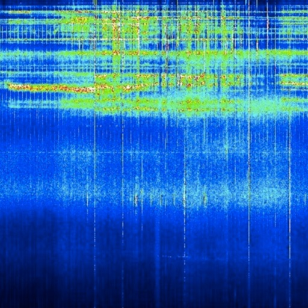

We are the OG Schumann Resonances App since 2019.

A quick snapshot of what is going on with the Earth's heartbeat, the Schumann Resonance!

Supports string translations for in-app text, device Languages only: English, Czech, German, Spanish, French, Italian, Japanese, Dutch, Norwegian, Polish, Portuguese, Russian, Swedish, and Chinese. Note, these are not fully supported Apple "authorized" localizations. Our current system can't offer translations for the System Permissions popups yet, which Apple only recently began requiring. When we figure that out, we'll roll out full localizations again. But for now it's back to being only "officially" English. Your device's language settings combined with our translation system will still translate much of the App, just not the Permissions requests for now.

It's a simple App, but we've worked hard to make it great:

- See what's going on with the Schumann Resonance in one convenient quick place
- Pinch Zoom, drag, & Share, Text, Email, or Tweet the charts from right in the App, including the "all-in-one" view, & Historical images: Spectrogram, Amplitude, Frequencies, Q-factor, Electromagnetic, & all the Cumiana charts (Subscriber bonus)!
- Discover Links to great communities
- See if the Schumann Resonance has been spiking, and the percentage of spike if it has!

- FREE Notifications. Get Notified when it Spikes, or when the Amplitude is high, or combine the two!

- NEW (totally optional) easy way to Support the App via a $0.99/month Subscription which grants you access to our in-app Discussion Forum
- NEW, Included for Subscribers, Cumiana Historical images! 

- See when the measuring stations 'blackout', go 'down'
- Quickly check the charts from both Tomsk, Russia and Cumiana, Italy

- Set the Amplitude to display a Numerical value for the "Power", The Current Amplitude, Today's Peak Amplitude, or Yesterday's Peak.

- Helpful flyovers to help you learn how to read the charts
- Historicals of the Spectrogram, Amplitude, Frequencies, Q-Factor, & Electromagnetic charts!

Collective consciousness.
Ascension process.

- Note on other Permissions requests. The App asks for Photo permissions just to allow in-app Forum Subscribers to upload their own avatar. We do not use your images in any other way.

Terms of Use: https://www.apple.com/legal/internet-services/itunes/dev/stdeula/
Privacy Policy: https://schumann-resonance.org/privacy-policy/

#### obd_fusion
## OBD Fusion

OBD Fusion is an app for your car that allows you to read OBD2 vehicle data directly from your iPhone, iPod Touch, or iPad. You can clear your check engine light, create custom dashboards, read diagnostic trouble codes, estimate fuel economy, and much more!

Is your check engine light on? Do you want to monitor fuel economy and usage in your vehicle? Do you want cool looking virtual dashboards on your iPhone or iPad? If so, then OBD Fusion is the app for you! OBD Fusion is used by professional mechanics, do-it-yourself mechanics, and vehicle owners who want to monitor their vehicle and daily driving habits. Drive smarter, improve your fuel economy, and keep your engine healthy!

IMPORTANT NOTE: You must have a Wi-Fi ELM327 compatible adapter or compatible Bluetooth LE adapter such as Veepeak BLE/BLE+ 4.0 adapter, Carista BLE adapter, OBDLink MX+, OBDLink CX, Tonwon BLE adapter, LELink BLE adapter, Viecar BLE adapter, Lonauto adapter, Vgate iCar Bluetooth 4.0, BAST BLE adapter, Kiwi 3/4 to use this app. OBD Fusion is not compatible with generic ELM Bluetooth scan tools. Checkout additional adapters here: https://www.obdsoftware.net/software/obdfusion

OBD Fusion supports all OBD2 and EOBD vehicles sold worldwide. If you're not sure whether your vehicle is OBD2 or EOBD compliant, see this page for more information: https://www.obdsoftware.net/knowledgebase/obd2compliant. OBD Fusion can also connect to some JOBD vehicles that don’t support standard OBD2 protocols.

Electric vehicles (EVs) are not required to have OBD2 diagnostics since they are emissions exempt. If you are interested in using OBD Fusion on an EV, contact us first to inquire about support.

OBD Fusion has a ton of features including:
- Read and clear emissions-related trouble codes (fault codes) and your Check Engine Light (MIL)

- View vital driving information on your CarPlay screen. Note that real-time gauges are not supported by CarPlay, so you can't view your OBD Fusion pages such as dashboards on CarPlay.
- With optional enhanced diagnostic add-ons, you can read and clear enhanced trouble codes on other modules such as ABS, SRS, etc. and read transmission temperature. An enhanced diagnostic add-on is required for this functionality.
- Real-time dashboard display with fully customizable gauges. Create your own dashboards with the gauges that you want to see.
- Performance calculations for 1/4 mile and 0-60 mph track times
- Fuel economy MPG (US and UK), l/100km or km/l calculation
- Full diagnostic report that can be stored and shared
- Real-time graphing of multiple signals
- Real-time data logging and playback
- Multiple trip meters

- Log data to CSV file
- Create custom enhanced PIDs
- Includes some built-in enhanced PIDs for Ford and GM vehicles
- Display Boost pressure in real-time
- Display Engine Power and Torque
- Display calculated Air-to-fuel ratio
- Display battery voltage

- Read freeze frame data

- Fully customizable units including English, Imperial, and Metric units

- Over 150 supported PIDs

- Display vehicle information including VIN and calibration ID

- Emissions readiness for each US state. Find out if your car will pass emissions inspection.
- Oxygen Sensor Results (Mode 05)

- On-board Monitoring Tests (Mode 06)

- In-performance Tracking Counters (Mode 09)

- GPS tracking - plot vehicle parameters on a map
- Integrated iCloud and Dropbox functionality
- Available in English, Spanish, French, Italian, German, Czech, Greek, Chinese, and Portuguese
- Manufacturer specific Enhanced Diagnostics are available for certain vehicles through In-App purchases.

** Continued use of GPS running in the background can dramatically decrease battery life.

OBD Fusion is brought to you by OCTech, LLC, the makers of TouchScan and OBDwiz.

OBD Fusion is a trademark of OCTech, LLC registered in the U.S.

#### heartwatch__heart_rate_monitor
## HeartWatch: Heart Rate Monitor

"HeartWatch is so good, you’d think Apple built the app itself." John Patrick Pullen, Time Magazine. Top 5 in Health & Fitness in 100+ countries. 

TOTAL PRIVACY
HeartWatch has no user analytics tracking. No advertising plugins. No 3rd party code. No data upload. Ask your "free" heart app if they can say the same.

ABOUT HEARTWATCH
HeartWatch is the best way to get a complete picture of all the health & fitness information captured by your Apple Watch. 

NEWS
- Explore the different News Editions to learn all about your health progress and trends.
- Morning Briefing: read about your key health information to start your day
- Fitness Habits: news all about your fitness trends with a dynamic fitness habit tracker

WELLNESS
- An intelligent view of all key heart rate metrics. Daytime, Sedentary, Sleeping, Waking & Workouts. 
- Detailed trend analysis including heart rate, blood pressure, HRV, blood glucose, blood oxygen (SpO2) and more.
- Background heart rate alerts on Watch with context. 
- Note capture for individual heart rate readings. 
- Detailed ECG analysis

ACTIVITY
- Every day isn’t the same. Intelligent move, distance & steps goals based on your current habits. 
- Daily forecasting to help you stay on track to meet your goals. 

WORKOUTS
- In depth analysis of heart rate, training summary, GPS maps and more. 
- A heart focussed workout app on the Watch with custom alerts to keep you in the right zone. 
- Detailed trend analysis. 
- Stream workout info from your Watch to your iPhone. 

JOURNAL & NOTES
- Keep a daily journal with notes and measurements
- View a detailed list with a complete overview of all notes, measurements and workouts
- Input notes and measurements from your Watch or iPhone. Includes blood pressure, temperature, blood glucose, weight, waist circumference and body fat percent.

GRAPHS & ANALYSIS
- Over 30+ health metrics to view
- Apply 7 day and 21 day trends to any metric, with the ability to overlap
- View over 6 weeks up to 12 months

EXPORT
- Export for all health metrics & workouts. 

NOTHING IS MORE IMPORTANT THAN YOUR HEALTH
Heart Watch is a very useful tool to get alerted about any possible health issues in a concise format that you can show your medical practitioner.

INTEGRATION
HeartWatch connects beautifully with the Eclipse Yourself and AutoSleep apps, our premier sleep, activity, recovery and readiness monitoring apps.

HEART MONTH
Featured app in the official Apple Heart Month 2022:
https://www.apple.com/au/newsroom/2022/01/apple-celebrates-heart-month-with-new-resources-across-services

REQUIREMENTS
This app requires an iPhone that has the Health App installed. Heart readings are read from the Health Data Store which is ideally populated by your Apple Watch.

#### countdown_app
## Countdown App

Your countdown awaits. Inspired by the horror movie Countdown, this app will reveal exactly how much time you have left.

By receiving, opening the file package, and/or using Countdown('Software') containing this software, you agree that this End User License Agreement(EULA) is a legally binding and valid contract and agree to be bound by it. You agree to abide by the intellectual property laws and all of the terms and conditions of this Agreement. User shall accept the terms of his or her fate. Any attempt to use information derived from Countdown to alter the user’s fate will result in a breach of this agreement.

Tag us in your reactions using #CountdownApp on TikTok.

--- --- --- ---

Warning: This app contains vibrations, sound effects, and uses your device’s torch for added intensity. It may not be suitable for individuals with epilepsy.

Disclaimer: This app is for entertainment purposes. Results should not be taken seriously.

--- --- --- ---

#### pedi_stat
## Pedi STAT

Pedi-STAT is a rapid reference for RNs, paramedics, physicians and other healthcare professionals caring for pediatric patients in the emergency or critical care environment.  

************************************
     Reviews
************************************

Among "The Best Drug Reference Apps for Emergency Physicians" - Emergency Physicians Monthly

5 STARS - "Simple interface provides rapid access to critical data needed when managing a critically ill pediatric patient"

5 Stars - "Very useful for treating kids in high pressure situations with precision."

*****************************

Pedi-STAT features include:

- Rapid results for airway interventions including endotracheal tube sizes, depth, intubation medication dosages, ventilator settings, and sedation

- Cardiac resuscitation data including weight specific dosages for resuscitation medications, cardioversion, and defibrillation

- Access to age and weight specific pediatric equipment including foley catheters, airway management, chest and NG tubes, peripheral and central line sizes, and more

- Seizure medication dosages

- Management of hypoglycemia including age specific dextrose concentrations

- Reference of age specific normal vital signs

- Procedural sedation dosages including single dose meds and infusions, as well as reversal agents

- Calculated pain management medications

- Medical management of allergic reactions and anaphylaxis

Users can quickly access critical information accurately, without having to rely on memory or cumbersome textbooks.  

With just a few taps, users have access to all the necessary data to care for a pediatric patient in the emergent setting, including weight-based and age specific medication dosages and equipment sizes.
  
Since many of the patients present with minimal known information, all the results can be calculated rapidly with only a known age, date-of-birth, weight, length, or height.  Simply enter the known variable and the data is instantly calculated. 

Developed by an Emergency Physician, this app minimizes the risk of medical errors allowing the provider to spend more time caring for the patient, and less time looking up and calculating doses.  

It is a critical companion for any physician, nurse, paramedic, or medical trainee involved in the care of critically ill pediatric patients.

#### lumafusion
## LumaFusion

LumaFusion: The Ultimate Storytelling Experience for Video Editing
 
Welcome to the App Store’s “App of the Year” for 2021 and the recipient of the Editors’ Choice Award! The gold standard for storytellers worldwide. Offering a fluid, intuitive, touch-screen editing experience.
 
PROFESSIONAL EDITING MADE EASY
• Six video/audio or graphic tracks: Create multiple layer edits with smooth handling of 4K ProRes and HDR media.
• Six Additional audio tracks: Build your soundscape.
• The ultimate Timeline: Fluent editing using the world’s most flexible track-based AND magnetic timeline.
• Loads of transitions: Keep your story moving.
• External Monitor Preview: View on a big screen.
• Markers, tags and notes: Stay organized.
• Voiceover: Record VO while playing your movie.
 
LAYERED EFFECTS AND COLOR CORRECTION
• Green screen, luma, and chroma keys: For creative compositing.
• Lock & Load Video Stabilizer: Steady your footage.
• Powerful color correction: Create your own look. 
• Video Waveform, vector and histogram scopes.
• LUTs: Import and apply multiple .cube or .3dl LUTs.
• Unlimited keyframes: Animate effects with precision.
• Customizable text and effect presets: Save and share your favorite animations and looks.
• Grids and Guides: Precisely align elements with Title-Safe, Action-Safe and horizon line.
 
ADVANCED AUDIO CONTROL
• Graphic EQ, Parametric EQ and Voice Isolation: Fine-tune audio.
• Keyframe audio levels, panning, and EQ: Craft seamless mixes.
• Stereo and Dual-mono audio support: For interviews with multiple mics on one clip.
• Audio Ducking: Balance your music and dialogue.
• Third-party audio plugins: Enhance your sound.
 
CREATIVE TITLES AND MULTILAYER TEXT
• Multilayer titles: Combine shapes, images, and text into your graphic.
• Customizable fonts, colors, borders, and shadows: Design eye-catching titles.
• Import custom fonts: Strengthen your brand.
• Save and share title presets: Perfect for collaboration.
 
PROJECT FLEXIBILITY AND MEDIA LIBRARY
• Aspect ratios for all uses: From widescreen cinema to social media.
• Frame rates from 18fps to 240fps: Flexibility for any workflow.
• Edit from Photos, Frame.io, and directly from USB-C drives: Access your content anywhere.
• Import media from cloud storage: Wherever you store it.
 
SHARE YOUR MASTERPIECES
• Control resolution, quality, and format: 
• Share movies to social media, local storage or cloud storage.
• Edit on multiple devices: Seamlessly transfer projects.

ENHANCED FEATURES (purchase individually, or get them ALL as part of the Creator Pass subscription - see below)
• Speed Ramping and Enhanced Keyframing - Create speed ramps, Bézier curves, and easing with this one-of-a-kind, easy to use feature.
• XML Export: Send your project to Final Cut Pro for Mac
• Multicam Studio: Synchronize 6 cameras or audio and tap to switch angles

CREATOR PASS SUBSCRIPTION 
• Get full access to Storyblocks for LumaFusion: Millions of High-quality royalty-free music, SFX, and videos, PLUS get ALL the Enhanced Features above.

EXCEPTIONAL FREE SUPPORT
• Online tutorials: www.youtube.com/@LumaTouch
• Reference Guide: luma-touch.com/lumafusion-reference-guide
• Support: luma-touch.com/support

#### dumbify
## Dumbify

Dumbify is a minimalist home screen launcher for iPhone. Dumbify helps you keep screen time down by keeping your home screen clean and clear of notifications.

Our minimalist home screen launcher is fully customizable. Dumbify allows you to select the apps that are most important to you, and displays them in a clean minimalist launcher on your home screen.

The minimalist launcher for iPhone works perfectly with dark or light mode, so you can pick what looks best to you.

This text based minimalist launcher lets you reclaim your most valuable asset, your time!

Stop spending hours of your precious time getting distracted by your phone, and let Dumbify, a launcher exclusively for iPhone, simplify your digital life.

#### white_noise
## White Noise

Do you have trouble going to sleep? Are you traveling on a plane and need a quick power nap? Does your newborn baby wake up in the middle of the night? There are numerous benefits to using White Noise:

• Helps you sleep by blocking distractions
• Relaxes and reduces stress
• Pacifies fussy and crying babies
• Increases focus while enhancing privacy
• Soothes headaches and migraines
• Masks tinnitus (ringing of the ears)

Even when you’re asleep, your brain is constantly scanning and listening for sounds. If it’s too quiet, unwanted noises such as faucet drips or police sirens can interrupt your sleep. White Noise generates sounds over a wide range of frequencies, masking those noise interruptions, so you can not only fall asleep, but stay asleep.

SOUND CATALOG

Air Conditioner, Airplane Travel, Amazon Jungle, Beach Waves Crashing, Blowing Wind, Blue Noise, Boat Swaying in Water, Brown Noise, Camp Fire, Cars Driving, Cat Purring, Chimes Chiming, City Streets, Clothes Dryer, Crickets Chirping, Crowded Room, Dishwasher Rinsing, Extreme Rain Pouring, Frogs at Night, Grandfather Clock, Hair Dryer Blowing, Heartbeat, Heavy Rain Pouring, Light Rain Pouring, Ocean Waves Crashing, Oscillating Fan, Pink Noise, Rain on Car Roof, Rain Storm, Running Shower, Running Water, Stream Water Flowing, Thunder Storm, Tibetan Singing Bowl, Train Ride, Vacuum Cleaner, Violet Noise, Water Dripping, Water Sprinkler, White Noise

APP FEATURES (FULL VERSION)

• FULL: 50+ perfectly looped sounds with additional free sounds from the White Noise Market at https://whitenoisemarket.com/
• FULL: Apple TV and Apple Watch App
• FULL: Over 20 Alarm Sounds that slowly fade in so you wake refreshed.
• FULL: No Advertisements. Disable Market & Rating Prompts in Settings.
• Background audio support so you can use other apps while listening.
• Revolutionary Mix Pad editor for creating new soundscapes like a DJ with support for adjusting sound position, sound variance, volume, and pitch of each individual sound in the mix.
• Record and professionally loop sounds without being an audio engineer!
• Upload and Share your recordings and mixes with the White Noise Market app.
• Full screen digital clock with multiple colors and brightness controls makes it the perfect companion for any nightstand.
• Advanced alarm and timer system that slowly fades audio in and out so you awake naturally feeling more refreshed
• Retina display support with Portrait/Landscape orientations.
• On-screen media player and volume controls with swipe gesture support for navigating sound collection
• Heart favorite sounds and mixes in the sound catalog for quick access using the Favorites view
• Use iPod Music as alarms that slowly fade in so you wake refreshed
• Remote media controls with bluetooth, lock screen, and headphones
• Advanced controls for volume, balance, pitch, mixing with iPod music, looping the playlist, custom alarm snooze times, and more
• Generate custom color noises, binaural beats, and tones with Generator In-App Purchase

PRESS REVIEWS

White Noise has been featured by popular TV shows (Dr. Oz, Today Show, FOX&Friends, Jimmy Fallon), major media outlets (NBC News Today, Health Magazine, The Washington Post, NY Times, CNET, Esquire, PC Magazine), and raved about by millions of satisfied customers.

DR. OZ SHOW: 13 Miracles of 2013
"Revolutionary Sound App!”

THE WASHINGTON POST: Smartphone Puts Newborn to Sleep
"For the next four months, the infant slept with his father's phone in his crib and White Noise tuned to 'air conditioner.' The monotonous buzz kept the baby sleeping soundly and his parents happy."

CNET: Apps that can improve your life
“Trouble falling asleep at night? A little White Noise might do the trick.”

HEALTH MAGAZINE: "Help you turn off your brain, fall asleep faster, and get the rest you desperately need"

Website: https://www.tmsoft.com/white-noise/

White Noise Market: https://whitenoisemarket.com

Thanks for using White Noise by TMSOFT!

#### just_press_record
## Just Press Record

Just Press Record is the ultimate audio recorder bringing one tap recording, transcription and iCloud syncing to all your devices. You can edit your audio and transcriptions right inside the app and even start a new recording completely hands-free with Siri!

Life is full of moments we would rather not forget - like your child’s first words, an important meeting or spontaneous idea. Capture these moments effortlessly on iPhone, iPad, Mac or for ultimate convenience, Apple Watch.

RECORD
• One tap to start, stop, pause and resume recording.
• Start and stop recording from the Lock Screen, Control Centre, the Action Button, Shortcuts, Siri, the Widget, a 3D Touch Quick Action or via the URL scheme.
• Unlimited recording time.
• Record discretely in the background.
• Choose to record from the built-in mic, AirPods or external microphones.
• Record independently on Apple Watch and sync later.

PLAY
• Seek backwards and forwards during playback.
• Adjustable playback speed.

TRANSCRIBE
• Turn speech into searchable text.
• Support for over 30 languages, independent of your device's language setting.
• Synchronized text highlighting and audio playback.
• Format as you record with punctuation commands.

EDIT
• Audio - visualise your audio in the waveform view and cut out the parts you don’t need.
• Text - make corrections and add new text to your transcriptions.

SHARE
• Share audio and text to other apps.
• Share easily to social media as a video clip.
• Share to iTunes on Mac or PC via USB cable.
• Print a hard copy of your transcripts.
• Share audio files from other apps to Just Press Record. 

ORGANISATION
• View recent recordings or browse your library by date and time.
• Search by filename or transcription content.
• Dedicated tab for quick access to recordings made on Apple Watch.
• Rename recordings.
• Slide Over and Split View support on iPad.
• Add a badge to the app icon showing the number of unplayed recordings.

STORAGE
• Choose to store recordings in iCloud Drive or locally on-device.
• Recordings stored in iCloud Drive automatically sync across all your devices.
• Recordings stored locally benefit from Files app integration and automatic iTunes File Sharing.
• Transcriptions are stored within the audio file.

PRO-AUDIO
• Support for stereo recording from the built-in microphone on supported devices.
• Support for high quality external microphones connected via the Lightning Port.
• Customisable Audio Settings to enhance your recording experience.
• File types include WAV, AIF or standard iTunes M4A (ACC).
• High quality audio up to 96kHz / 24-bit.

ACCESSIBILITY
• VoiceOver support throughout the app.
• Magic Tap gesture to start / stop a recording.

APPLE WATCH
Just Press Record includes an Apple Watch app that gives you the freedom to record anywhere, even when your iPhone is not around.

• Start recording with a single tap on the Complication.
• Record discretely in the background.
• Unlimited recording time.
• Recordings automatically transfer to iPhone for transcription and iCloud syncing.
• Listen to recent recordings through the built-in speaker or AirPods.
• Adjust volume with the Digital Crown.
• Pause recording with a downward swipe.
• Accessibility support with VoiceOver, reduced motion and support for the extra large Complication template.

IMPORTANT:
• Just Press Record does not record phone calls or audio from other apps.
• Transcription requires a good, clean audio signal.  Avoid recording in noisy environments and ensure the microphone is positioned close to the source.
• URL scheme implemented by Just Press Record can be found on our FAQ page.

#### ecmobile
## ecMobile

ecMobile allows users to connect to, and receive dispatches from, many of the nation’s leading courier, delivery, and logistics companies.  If you have a truck, car, van, pickup, bike, or even a pair of shoes, you may be a candidate to perform pickup and delivery services in any city in the U.S.  Once you have registered with a delivery company, you can receive dispatches right to your device, and provide real time status updates, including bar code scanning data and signature images, back to the delivery company.  By simply logging on, you can signal to the delivery company your current location and that you are ready to receive work requests.  Please note that this app uses GPS running in the background, which can dramatically decrease battery life.

#### land_nav_assistant
## Land Nav Assistant
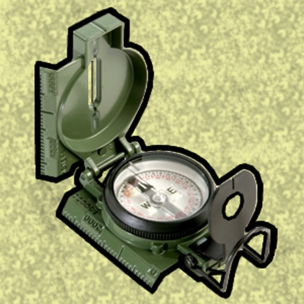

Land Nav Assistant accepts MGRS (Military Grid) or Latitude / Longitude coordinates and visually navigates you to each point.

This app was designed with Army, Marine, and other military personnel in mind. Use it to correct your Land Nav technique by analyzing your pace count and tendency to veer left and right.

Available Input: 8 digit MGRS, 10 digit MGRS, Lat/Lon decimal, Lat/Lon dms, and map input.

Angles: degrees or mils
Distance: meters/km or feet/miles
Speed: kph or mph

Use the simple arrow interface or map to direct you to your locations. Your distance, direction, speed, and bearing are shown as you navigate.

Long-tap anywhere on the map to get the coordinate for that location. Easily add locations via the Map interface.

Plan your course by ordering points, or use the course optimization tool which will help you calculate the shortest path possible!

Get distance/direction between two points by tapping the path drawn between them.

Satellite, Terrain, Road, and basic Topographic maps show you, your locations, and lets you enter in new ones. 

Overlay a 1000m or 100m MGRS grid anywhere on the map.

Displays distance/direction from your currentl location to all points, or between any two points.

Download your Locations as a spreadsheet to save anywhere, or to share with anyone you choose.

Import a large set of locations via the web import utility, available at: https://www.gammonapplications.com/land-navigation-services/import

This app uses the Military Grid Reference System (MGRS) and Latitude / Longitude.

Choose to display your locations as MGRS 10-digit, MGRS 8-digit, or LatLon Decimal.

D:M:S can be input in the format DD:MM:SS followed by the appropriate direction (NSWE). Default direction is N, W.

DO NOT use this application while learning Land Navigation. Land Navigation is a valuable skill, and should be mastered before using this application. Do not rely solely on this application for navigation, especially when lost. Always be aware of your surroundings.

#### blood_type_diet®
## Blood Type Diet®

This is the only official Blood Type Diet® app released by Dr. Peter D’Adamo, international best selling author of the Eat Right For Your Type® book. Whether you are new to the Blood Type Diet® or a long time supporter, this app provides the food lists that are Right for Your Type® at your fingertips. It’s convenient when shopping, traveling, dining out, or simply when you are at home and don’t want to check the Eat Right For Your Type® book. The Blood Type Diet® app lists the Beneficial, Neutral, and Avoid foods for all four blood types. It now includes Unknown for those foods not determined. 

You can easily lookup any food by its category such as vegetables, fish, and beverages or search by the name of the food itself.

This is the entry point for Dr. Peter D'Adamo's Blood Type Diet® based on Right for Your Type® food lists. It's a great way to keep the Blood Type Diet at your fingertips - a quick, concise, and easy reference.

Includes:
Blood Type and optional Secretor Status selection
Food Lists
Shopping List - choose your own or combine family list for multiple blood types —see More section, then Family Food
Email Shopping List directly from the app 
Family Food List - combine common foods for multiple blood types —icon indicator lets you know if your are viewing Family Food List or the individual's.
Information about each Blood Type
User Guide
Latest food updates
Frequently Asked Questions (FAQ)
Food Search
Convenient Recipe Access (Note: Internet connection required)
  
We do support our app and encourage you to ask a question if you need help - or maybe just tell us what you like (see More, then Feedback or email appsupport@dadamo.com). We do want the app to work for you.

If you are new to the Blood Type Diet®, you can visit the  www.4yourtype.com or www.dadamo.com websites to learn much more.

#### forscan_lite_-_for_ford,_mazda
## FORScan Lite - for Ford, Mazda

FORScan Lite application was developed specially for a computer diagnostics of Ford, Mazda, Lincoln and Mercury vehicles. 

Supported adapters:
- OBDLink MX+ (recommended)
- vLinker FS Bluetooth (recommended)
- vLinker FD BLE (recommended)
- other ELM327-compatible WiFi or BLE adapter (not recommended). Attention: this application may not work properly in case of bad quality ELM327 adapter used!

Supported cars:
- Ford, Lincoln, Mercury models of 1996 - 2022MY (some models of 1994-1995MY are also supported)
- Mazda 1996-2022MY. Attention: Mazda 7G models (new Mazda 3, CX-30, MX-30, CX-50 etc) are supported partially or not supported!
- Vehicles other than Ford, Mazda, Lincoln, Mercury are not supported!

Features:
- Analyzing an on-board network configuration of the connected vehicle
- Read and reset DTC for all modules
- Read sensors and other data (PIDs) from all modules
- Execute tests
- Execute majority of service functions

Note: Configuration and Programming functions, as well as some of service functions, are not available in FORScan Lite.

#### workoutdoors
## WorkOutDoors

WorkOutDoors is the most advanced and most configurable workout app for the Apple Watch. It's perfect for running, cycling, hiking and any other indoor or outdoor activity.

Note: WorkOutDoors requires an Apple Watch Series 3 or later. It is not necessary to have your iPhone with you during a workout.

The app uses Apple’s workout system, so all workouts are saved to the Health system.  However it also provides many extra features over Apple's app, such as:

- a super-smooth vector map that can be shown during a workout;
- multiple configurable screens with metrics and graphs from a pool of 800+ data fields;
- route files can be imported and used for navigation (including turn by turn directions);
- dozens of configurable alerts (e.g. every mile; high heart rate; low pace; off-route etc);
- interval schedules can be created using the larger screen of the phone app;
- climbs and descents are supported with notifications and on-screen data and graphs;
- waypoints can be created, navigated to, and exported;
- use shortcuts to associate operations with gestures (e.g. double tap to hear configurable metrics);
- compare pace against a target or a previous workout (using metrics and a dot on the map);
- show zones for pace and power as well as heart rate (with optional coloured backgrounds);
- auto-pause is available for all outdoor activities;
- shows GPS and heart rate before starting a workout, so that you can wait for good signals;
- configure distance and pace for running / walking to come from Apple’s pedometer or from GPS;
- workouts can be exported in FIT / TCX / GPX files, or automatically sent to Strava;
- workouts created by the app can be analysed in great depth in the iPhone app.

The app also has many more features.  The map is a particular highlight.  It uses OpenStreetMap, which provides worldwide coverage and includes the trails necessary for outdoor workouts.  It also has several features that help you navigate during a workout:

- maps can be smoothly panned and zoomed, and can rotate according to the compass;
- a breadcrumb trail of your whole route is displayed on the map during the workout;
- topographic data can be shown, with configurable contour colours and hill shading;
- map-only mode is provided for when you don't want to start a workout and just need a map;
- a circular scale is shown when you zoom, making it easy to see the distance to features;
- maps can be stored on the watch for use when offline (they are downloaded as required if online);
- a red compass points north and a green compass points to the start;
- choose a waypoint to see a compass and distance to it in the corner of the map;
- you can also navigate to waypoints on the map, such as hospitals, sights, cafes etc.

If you load a route from a GPX / TCX / FIT file then navigation is even easier:

- your position is shown on an elevation profile of the route;
- the remaining distance, time and ascent can also be displayed;
- you can get alerted when you go off-route; 
- when off-route then a compass is shown which points to the nearest part of the route;
- if the route contains turn by turn directions then these can be used like a sat nav;
- if there are no directions then the app can use “bend detection” to generate them;
- the next direction is shown as an icon and distance in the corner of the map;
- the map can automatically zoom in when you are approaching a turn;
- you can use shake gestures to hear the distance to the next turn or the end of the route;
- routes are coloured by gradient: from red for steep uphill to blue for steep downhill;
- you can configure what information is displayed during a climb or descent.

All this is included for a single one-off payment. No extra in-app purchases or subscriptions are required (although there is a completely optional in-app tip jar which was requested by long-term users). 

If you own an Apple Watch and do any form of exercise, then WorkOutDoors is the app for you. Give it a go!

#### pythonista_3
## Pythonista 3

Pythonista is a complete scripting environment for Python 3.10, running right on your iPad or iPhone, so you can develop and run Python scripts on the go.

Like Python itself, "batteries are included" – from popular third-party modules like requests, numpy, matplotlib, pandas (and many more) to modules that are tailor-made for iOS. With Pythonista, your scripts can access sensor/location data, your photo library, contacts, reminders, the clipboard, and more, allowing you to harness the full potential of both Python and iOS.

Pythonista is designed with a user-friendly interface that makes it easy for anyone to get started with coding, regardless of skill level. The complete Python documentation is also available for offline reading in the app.

Pythonista is not just for learning and practicing Python – it's also a powerful tool for automating iOS with multiple app extensions. You can invoke scripts directly from the share sheet or a custom system keyboard in almost any app, and integrate scripts with Shortcuts and Siri. With Pythonista, it's easy to run your scripts whenever you need them, without having to switch between different apps.

Features:

> Powerful code editor with syntax highlighting, code completion, and scripting support

> Interactive prompt with code completion, command history, and support for showing images

> Integrated visual debugger and object inspector

> Complete offline documentation with quick lookup directly from the editor

> Various beautiful light and dark color themes, and a theme editor to make your own

> UI editor for quick prototyping

> Integrated PEP 8 style checker and code formatter

> Supports most of the Python standard library and additional modules for graphics, sound, and iOS integration (for example clipboard, contacts, reminders, photos, ui...)

> Many popular third-party modules included, for example requests, numpy, matplotlib, pandas, Pillow...

> Lots of included examples

> Universal app for iPad and iPhone

> Share sheet extension for running scripts from almost any app

> Scriptable system-wide keyboard to use Python in any app that edits text

> Advanced integration with the Shortcuts app, allowing you to use Python scripts as actions in shortcuts and personal automations.

Please note that Pythonista is not designed to enable the installation or download of additional modules written in compiled languages (C/C++). While many popular native libraries are included and work out-of-the-box, it is generally not possible to install additional modules with C/C++ dependencies.

The name "Pythonista" is used with kind permission from the Python Software Foundation.

#### lineman's_reference_-_xfmr_lab
## Lineman's Reference - XFMR LAB
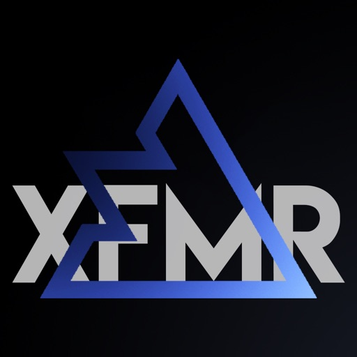

This app is a fully functional transformer lab simulator that was designed and developed by a journeyman lineman, for lineman and apprentices. You can use this app to study and learn your transformer connections. 
When the fuses are closed in you can test your connections with a volt meter, ohm meter, and a rotation meter. Abnormal voltages and cutout fuses exploding can occur when improper connections are made. In the labs you can also inspect the transformers' nameplates and secondary coils. 
Quick reference diagrams, basic transformer informational reading material and more are available in this application.
The Quiz mode lets you test your knowledge.
The Company Customized Experience is a way for your Power Company to work with us where we will modify the app to match their spec. Tell them to reach out to us if they are interested!

Current Labs in this app:
-Single Phase-
Single Bushing Topside
Dual Bushing Topside

-Three Phase-
Delta Delta Closed
Delta Wye Closed
Wye Delta Closed
Wye Wye Closed
Delta Delta Open
Wye Delta Open

-Misc-
Paralleling
4th Cutout
Troubleshooting
Tutorial

-Advanced-
Straight 480
240/480
277/480
Corner Grounded 240 or 480
Wye Wye 5 Wire (120/240 & 120/208)

-Quiz-
Test your transformer wiring knowledge by completing a predetermined assortment of labs at random. Blowing fuses and attempting to Check Work subtract from your overall score out of 100.

-Advanced Quiz-
Test your overall transformer knowledge by completing a series of random quizzes where you receive basic job-site information and have to choose the correct transformer nameplate and secondary coil configuration. You will then have the option to wire up the corresponding bank.

#### hear_my_baby_heartbeat_app_2_0
## Hear My Baby Heartbeat App 2.0

Trusted by over 500,000 families. The original, best-in-class baby heartbeat app to hear baby heartbeat at home with your iPhone. Looking for a fetal doppler alternative? Hear My Baby uses your iPhone microphone to help you listen to fetal heartbeat sounds — not a doppler or a medical device. HMB 2.0 adds AI chat support, tailored tutorials, and pregnancy reveal videos (+ your heartbeat) to help you get results faster.

Why parents choose Hear My Baby Heartbeat App 2.0

- Hear your baby’s heartbeat using the iPhone’s built-in microphone — no accessories required
- AI chat support gives step-by-step tips in real time to help you get a result faster
- Tailored tutorial adapts to your stage of pregnancy and setup
- Create baby sex reveal videos (+ your heartbeat) to share the moment
- Record & save heartbeat clips; build a personal timeline you can revisit
- Share easily with family and friends (Instagram, WhatsApp, email)
- Designed by parents with expertise in sound engineering, AI and app development; warm, honest guidance throughout
- Privacy first — you control what’s saved and shared

Real 5 Star Reviews

"I never leave reviews, let along pay for apps but let’s just say I tried this , and it def works took me a minute to find babies heartbeat but I found her . And to think I almost spent 40 dollars on a monitor today !" - Lov3r_Gurl IG (USA Sept 2025)
“I always find the heartbeat eventually and the rhythm is clear and strong. I love that I can record them to keep.” - T Lucker (Australia 2025)
"I downloaded this very skeptical... It took me about 45 minutes of laying down, very still, with noise canceling headphones on, but I HEARD HIS HEARTBEAT. I am almost 18 weeks pregnant. From one momma to the next, it’s worth it." - Baby'sHeartbeat (2025)

“It took some time and patience... thank you for creating this cheap, awesome technology to use at home.” — Niki
“I was skeptical at first. Great app! Worth it.” — Legretta

Hear My Baby uses your iPhone’s microphone to listen for abdominal sounds; it’s not a doppler and doesn’t emit ultrasound. It’s a lifestyle keepsake for bonding and sharing, not a medical device and not for diagnosis. Results vary with weeks and baby position (many families hear best from 16+ weeks, clearest around ~27 weeks). If you’re worried at any time in pregnancy, please contact your clinician. For peace of mind, you can use Airplane Mode.

How it works (quick start)

1. Find a very quiet room and remove your phone case
2. Place the iPhone microphone on your lower belly and move slowly
3. Our advanced audio engine isolates and amplifies fetal heartbeat sounds so you can listen and save the recording, and trim it to the appropriate moment for sharing quickly and easily.
4. Best from around 16+ weeks; clearest for many families at ~27 weeks. Results vary with baby’s position and placenta location.

Tips for best results

- Be still, breathe lightly, and try several positions around your bump
- Press the mic firmly against the skin; explore low and to the sides
- Bluetooth/over-ear headphones can make subtle sounds easier to hear

Important
Hear My Baby Heartbeat App is not a medical device and doesn’t replace prenatal care. If you’re concerned about anything in your pregnancy, please consult your clinician. Works on iPhone (not iPad). For extra peace of mind, you can switch to Airplane Mode while using the app.

Privacy
Your moments are yours. You decide what to keep or delete — and who gets to hear them. 

A word from our team...
We never see your recordings, but LOVE to hear them so please tag us on Instagram.com/hearmybaby or TikTok.com/hearmybaby or Facebook.com/hearmybaby

#### asccp_management_guidelines
## ASCCP Management Guidelines

The ASCCP Risk-Based Management Consensus Guidelines provide evidence-based recommendations for managing abnormal cervical cancer screening results and cancer precursors, including post-colposcopy and post-treatment scenarios.

ASCCP is pleased to offer this app to streamline navigation of the ASCCP Risk-Based Management Consensus Guidelines for abnormal cervical cancer screening tests and cancer precursors. The guidelines articles, as published in the Journal of Lower Genital Tract Disease, as well as the comprehensive risk estimates, can be accessed through https://www.asccp.org/guidelines.  

These evidence-based management guidelines, initially developed in 2019, came together through a consensus process of 19 organizations. The updated management guidelines aim to:
 • Allow for a more complete and precise estimation of risk
 • Provide more appropriate intervention for high-risk individuals (detect and treat more precancer)
 • Recommend less intervention for low-risk individuals (decrease testing and treatment that won’t prevent cancer and may cause reproductive harm)
 • Allow for the future addition of new risk modifiers and screening and management technologies

See https://www.asccp.org/UserGuide for tips on using the app.

#### mapper_for_safari
## Mapper for Safari

Mapper is a Safari extension that instantly opens Google Maps links from the Google search page in Apple Maps. No more copy/pasting addresses or switching apps.

Key features:
- Redirect Google Maps links, addresses, direction buttons, and map thumbnails directly to Apple Maps.
- Support every Google domain (google.com, .co.uk, .ca, etc.) on iOS and macOS.
- Smart fallbacks: if Mapper can’t resolve a link, you’ll land on the Google Maps web app and then automatically redirect to Apple Maps.
- Zero data collection: Mapper only scans for map links on Google search pages and never stores personal or location data.

How it works:
- Install Mapper and enable the extension in Settings → Safari → Extensions.
- Browse to Google in Safari.
- Tap any map link, directions button, or thumbnail.
- Mapper grabs the address or search term and opens Apple Maps with a single tap.

Mapper is built and maintained by a solo indie developer, ensuring it stays lightweight, reliable, and up-to-date. If you love Mapper, please consider leaving a rating or review. For questions or feedback, tap the Contact link within the Mapper app.

#### iverify_basic
## iVerify Basic

iVerify Basic is your gateway to enhanced device security and threat awareness, offering a glimpse into the powerful capabilities of our enterprise-grade solution, iVerify EDR. Designed for individuals who prioritize their digital security, iVerify Basic empowers users to take proactive measures to safeguard their devices against a myriad of threats. Users can scan their devices with a tap to detect vulnerabilities and stay proactive against threats.

#### 10bii_financial_calculator
## 10bii Financial Calculator

Look no further, you have found the best Financial Calculator app available. 

In-App Purchase: 10bii+ Features (Bonds, Breakeven, Depreciation, Trig, Probabilities) available!

5 Stars: "What is the PV of WOW? I'm sure thrilled with everything about this app! Too bad there isn't room for another star!" - Pokey

5 Stars: "This tool is excellent. It's downright marvelous! I would recommend it to any financial advisor without reservation." -John L Olsen, CLU, ChFC, AEP

5 Stars: "Awesome Financial Calculator! I use it all the time and love it!" - Tinahart2 

5 Stars: "Great customer service along with the app's ease of use made this purchase a no brainer." - HarborDan 

5 Stars: "I am a full-time investor in real estate and notes. This has become my "go to" app on my iPad. [It does a] wonderful job in integrating visual tools to illustrate financial cash flows. A++++" - Sanjosee 

Highlights:
- Displays current N, I/YR, PV, PMT and FV values right above buttons 
- Print or Save PDF Amortization Schedules 
- Easily enter your Uneven Cashflows in a spreadsheet-like worksheet
- Video Tutorials in Help section 
- Draws Cashflow Diagrams for simple TVM or complex Uneven Cashflows 
- Saves Recent calculations so you can easily reload them 
- Easy Mode allows everyone to get the financial answers you need!

Finally a Financial Calculator for everyone! Whether you are a seasoned investor or you just have questions about paying off your credit card, refinancing your home, or planning your 401(k) contributions, the 10bii Financial Calculator has the answers to YOUR financial questions!

The 10bii Financial Calculator is a versatile and powerful financial calculator which features more than 105 different functions for financial analysis, business, statistics, and general mathematics. Modeled after the extremely popular HP 10bII Financial Calculator, the 10bii Financial Calculator app combines precise mathematics, intuitive display, and ease-of-use in one compact package. It allows you to easily calculate loan payments, interest rates, amortization, time value of money, investment value, and more using a combination of powerful and intuitive equation-writing functionality and helpful worksheets. The 10bii Financial Calculator's keypad has been specially designed to be easy to use and easy to see. 

By expanding on HP's traditional presentation, the 10bii Financial Calculator allows quick and intuitive building and visualization of TVM (Time Value of Money) calculations and Uneven Cash Flows, lets you see the stored values of all of your memory registers in one easy view, graphs your statistical series, and lets you type in whole equations for easy review and one-touch evaluation.

With the 10bii Financial Calculator, you can:

Get answers to common financial questions WITHOUT having to know how to use a financial calculator!  With the 10bii Financial Calculator's Easy Modes, answer a few simple questions worded in plain language (rather than Financial-ese) and find out just how much you'll save with that refi, how much you'll have at retirement, how long it'll take you to save up for that big purchase and more.  Now with 12 Easy Modes!

Easily enter and see diagrams for Cash Flows, including rapid calculation of Net Present Value and Internal Rate of Return. A dedicated interface makes adding, editing, deleting, and reordering uneven cash flows a breeze.

Enter and analyze statistical data points, and see graphs based upon the values you enter. Includes standard calculations such as standard deviation, mean, and linear regression forecasting.

Never has using a financial calculator been so easy or intuitive.  The 10bii Financial Calculator is powerful enough for the professional but accessible enough for everyone.  It is an ideal tool for teaching the power of compounding interest, analyzing potential deals or business ventures, or just doing math problems, and sharing the results of your work with others.

#### piping_database_-_xtreme
## Piping DataBase - XTREME

Now the largest piping database reference - free in-app purchases.  One price - All in! FOR A LIMITED TIME! Download now the complete library modules.

Select the "+ Modules" tab to download your free modules.  You will see the price as $ 0.00 for each in-app purchase.  Tap the button to download for free, for a LIMITED TIME only.

Continuous update for the biggest piping mobile application.  We never stop adding, users are assured of new modules courtesy of requests by thousands of users.

Presented in a very simple set-up – scroll to different components per category. Figures in standard piping symbols, drawn by CAD software.  Dimension units are interchangeable and displayed in standard drafting practice. No need to view multiple pages, one stop per category. All relevant piping data are shown for every tap, no fancy displays, direct and easy to understand plus a guide per info page.

The best reference for piping layout, isometric drawings, shop and field drawings, detailing and material take-off! Anytime, anywhere and any situation!

We welcome suggestions to make this application the best piping reference app. If you want specific piping component to be included, please send feedback on the customer reviews and the most requested will be added ASAP!!! 

COMPONENTS: (all available here)
- Fittings: 90/45 deg. Elbows, 90 deg Reducing Elbow, Straight & Reducing Tee, Straight & Reducing Cross, 180° Return, Coupling, Cap, Concentric & Eccentric Reducers, Lap Joint Stub End (BW, Socket Welding & Threaded)
- Flanges: Welding Neck, Socket Welding, Slip-On Welding, Threaded, Blind & Lapped with quantity of Bolts, Diameter and Length. All class ratings, including RF & RTJ facings. (B16.5)
- Valves: Gate, Globe, Check, Ball, Butterfly & Control Valves
(Flanged, BW, Socket Welding and Threaded connections)
- Pipe Schedule: STD, XS, XXS & all Schedules including API Specification 5L with weight of empty steel pipe or with water per foot/meter length.
- Branch Connections: Welding, Socket & Threaded Outlets and Elbolets.
- Line Blanks: Figure-8, Paddle Blanks & Paddle Spacers
- Gaskets: B16.20 and B16.21 (non-metallic flat gaskets and spiral-wound, ring type joint and jacketed)
- Suggested Pipe Support Spacing (New)
- Malleable Iron Fittings (ASME B16.3)
- Orifice Flanges (ASME B16.36)
- Pipe Spacing
- Large Diameter Flanges (ASME B16.47)
- Flange Joint Bolt Tightening Sequence (single tool)

Quick Tip:

When in inches units, display  shows decimal inch.  To view in fraction, tap any dimension and will reveal the inch fraction equivalent.

#### essential_anatomy_5
## Essential Anatomy 5

Essential Anatomy 5 is the most successful anatomy app of all time and has more content and features than any other anatomy app—bar none! With over 8,200 structures, our highly accurate, immersive and visually stunning app is the gold standard in medical reference applications. There's not a university or hospital around that does not use Essential Anatomy/Skeleton, resulting in 1.1 million user engagements every month. It is, by far, the worlds most used medical study and reference app.

Download our FREE "Essential Skeleton" app in the free section to experience our groundbreaking 3D technology.

TUAW: "Make no mistake about it: Essential Anatomy by 3D4Medical is the future of touch-based anatomy learning. Essential Anatomy is an app every doctor, physiotherapist, OT, nurse and medical student should own."

-- 3D4Medical highlighted at the 2015 Apple Keynote.

- - Number 1 Top Grossing Medical App in 118 countries worldwide.

- - Quality and Vision: 3D4Medical has led the way in introducing innovative products of exceptional quality. We will continue to forge new paths for others to follow.

- - Accurate Content: Essential Anatomy is used by anatomy professors in thousands of classrooms worldwide, including Stanford University, and has become the standard in third-level education. In many cases, our app is now mandatory with text books optional.  

 - - Stunning Graphics: No competitor comes close. Essential Anatomy’s proprietary engine was developed and optimized to showcase our new generation anatomical models for a completely immersive user experience.

- - Easy to use: Responsive and intuitive user interface, all systems and menus are easily accessed from the main screen and our model responds quickly to your touch.

- - Read all the reviews of previous versions: Our visionary app has enhanced the lives of reviewers, both professionally and academically.

iMedical Apps: “The 3D anatomy engine and impressive graphics bring a new clarity to anatomy education with impressive accuracy.”

Compatible with iPad 2 and newer, iPhone 4S and newer, iPod Touch 5th Gen. and newer, and iOS 8 or later. 

IN APP PURCHASES:
In-app purchases allow additional muscle and skeletal content to be downloaded and accessed from within the app. These boosts add muscle insertion and origin points, skeletal bone parts and surfaces and 100s of animations detailing movements for each articulation.

Visit www.3d4medical.com and watch videos that highlight the app's functionality and quality.  You’ll understand why Essential Anatomy 5 is the most successful medical reference app of all time!

ESSENTIAL ANATOMY 5:
Essential Anatomy 5 is a full-featured anatomical reference app that includes MALE and FEMALE models, with 11 SYSTEMS and a total of 8,200 ANATOMICAL STRUCTURES. The app is fully 3D, meaning that you can view any structure in isolation, as well as from any angle and represents the latest in groundbreaking 3D technology and innovative design. A cutting-edge custom built 3D graphics engine, delivers outstanding quality graphics that no other competitor can achieve. 

FEATURES OVERVIEW:

--Cutting-edge 3D technology
--Over 8,200 highly detailed anatomical structures
--Hide/Fade/Isolate/Fade Others/Hide Others options for individual structures
--Multiple Selection Mode
--Pins: Create customized pins with notes and place anywhere on the 3D model
--Slice: Slice through certain structures using 3D plane tool
--Bookmarks: Preset and Customizable
--Correct audio pronunciation and Latin nomenclature for every structure
--Search via English and Latin nomenclature
--Dynamic Quiz: Drag and Drop and Multi-choice
--Share images via social media and e-mail
--Includes anatomy for 11 systems: Skin, Skeletal, Muscles, Connective Tissue, Veins, Arteries, Nerves, Respiratory, Digestive, Urogenital, Lymphatic, also includes the Brain and Heart

Feedback? Contact our customer support at info@3d4medical.com.

#### teach_your_monster_to_read
## Teach Your Monster to Read
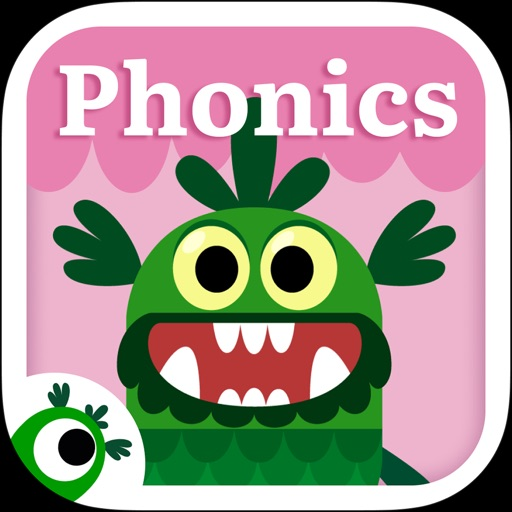

Welcome to Teach Your Monster to Read, the award-winning app that makes learning to read fun and engaging! Our educational phonics and reading games have helped millions of children build essential literacy skills. Create your own monster and embark on a magical journey through interactive games designed for home and school use. With a safe, trusted, and highly recommended approach, Teach Your Monster to Read offers phonics-based reading games for all levels. Teaching through play is what we do best—download today and start your child’s reading adventure!

TEACH YOUR MONSTER TO READ FEATURES

INTERACTIVE KIDS READING GAMES
• Take your custom-designed monster through educational games that are suitable for ages 3-6. 
• Improve letter sound recognition with reading games
• Explore a world of phonics and educational games that teach your child to read sentences
• Easily track their player’s progress to identify areas where their reader may need extra support

PHONICS & READING GAMES DESIGNED BY EXPERTS
• Designed in collaboration with Roehampton University and leading game designers
• Phonics tools and educational games that complement phases 2-5 of UK Government-approved Letters and Sounds and other major systematic synthetic phonics programmes
• 3 reading games designed for those in preschool, primary school, kindergarten, and first grade

EDUCATIONAL PLAY AT NO ADDITIONAL COST
• Teach Your Monster to Read is available on iPad and iPhone
• Explore phonics and educational games without in-app purchases, hidden costs, or in-game adverts
• Teach Your Monster to Read supports your child through every step of their reading journey

HEAR FROM TEACHERS AND PARENTS WHO USE OUR READING  GAMES

"This game is the absolute best quality phonics game I have come across for educational and fun value."
Marie Lewis, Rochdale

“My class have reaped loads of benefits from using the programme and the difference in some of their reading skills has been dramatic."
Maria Andrews, Foundation Phase Teacher

"This is a fabulous game. I'm not kidding when I say that my daughter essentially learned all her letter sounds using First steps, with relatively minimal input from me! Great for parents to practise their letter sounds too."
Eleanor Jones

PART OF THE USBORNE FOUNDATION CHARITY

Teach Your Monster to Read has been created by Teach Monster Games Ltd. which is a subsidiary of The Usborne Foundation. The Usborne Foundation is a charity founded by children’s publisher, Peter Usborne MBE. Harnessing research, design and technology, we create playful media addressing issues from literacy to health.

Teach a monster today when you download our educational app! 

Teach Monster Games Ltd is a subsidiary of The Usborne Foundation, a registered charity in England and Wales, charity number 1121957.

#### drum_tuner_-_idrumtune_pro
## Drum Tuner - iDrumTune Pro
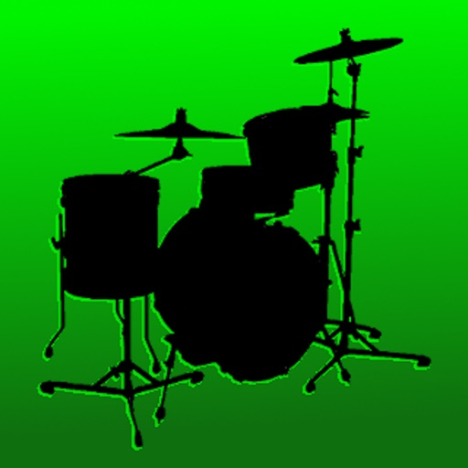

iDrumTune Pro is the world’s most advanced, accurate and intelligent system for assisting and educating on drum tuning – used by thousands of drummers all over the world. Now with Drum Kit Designer feature and detailed online tutorials.

It's an app and a training course - everything you need to become a drum tuning pro! Start learning today with the app and detailed accompanying lessons at www.idrumtune.com 

"an invaluable aid not only for drummers but also studio engineers and producers" - Sound on Sound Magazine

As featured in Modern Drummer - New and Noteworthy

"I can’t recommend this app highly enough ... for the money, it is indispensable. It's simple, accurate, looks good, and the tuning information is worth the cost of the app alone." - www.mikedolbear.com

“***** I never knew I could have this much fun tuning drums!” – Adamrod (App Store review)

“***** Just tuned my first drum and this app is awesome!” – bburt85 (App Store review)

“***** Buy this app if you are a drummer!!!” Lildrummerboy (App Store review)

The original and most innovative electronic drum tuning app - iDrumTune Pro brings unrivalled accuracy and features that have never been possible before for assisting with drum tuning. Built by world experts in drums and musical acoustics, and backed up by a detailed online training course on Drum Sound and Drum Tuning.

iDrumTune Pro includes the following features:

* Pitch Tuning – to make your drums sing and allow you to play musical phrases around the kit

* Lug Tuning – to ensure that the drumhead is evenly tuned and gives a smooth and warm tone

* Resonant Head Tuning – to allow you to be sure that the two heads are working together and giving rich overtones

* Spectrum Analyzer – so you can really start to understand what frequencies are excited and heard when playing the drums

* Drum Kit Presets – so you can save and load your favourite tunings and share them with the world. Now also includes the interactive Drum Kit Designer feature.

* The Science of Drum Tuning – and extensive manual on the science and art of drum tuning and getting the best out of iDrumTune Pro 

iDrumTune is the first and by far the most intelligent and accurate system for analyzing drum sounds and assisting tuning – developed by drummers, music producers and acoustics research Professors. iDrumTune provides you with a measurement of the drumhead vibration frequency, in Pitch Tuning mode, you simply hold the iPhone over the center of a drum, about 2-4 inches away, and strike the drum in the center.

iDrumTune shows the recorded sound waveform and gives the strongest frequency recorded. There is also a tuning indicator bar which shows the drumhead tuning relative to musical notes, so iDrumTune can be used to ensure that your drums are in key with each other or the song you are playing. A frequency spectrum view also allows more detailed analysis and helps with tuning the drum at the lug positions.

iDrumTune provides advanced tuning features including an intelligent filter function, Lug Tuning mode and Resonant Head Tuning mode. The filter allows unwanted frequencies to be ignored by the analysis algorithm, whilst Lug Tuning mode offers the simplest and most innovative method for tuning an even frequency response at the lug positions on the drumhead.

The Preset Manager allows you to save all your favourite drum tunings and call them up when you are in the middle of the process. Drum kits can also be exported and imported, so you can share your favorite tuning setups and load new ones in from other drummers.

Drum Tuning isn’t easy, and drums don’t respond exactly the same way every time you hit them. For that reason, it's valuable to know a little about the science of drum tuning. iDrumTune includes a comprehensive text on the science of drums and drum tuning in order to help you get the best of iDrumTune and to become an expert drum tuner!

Watch the iDrumTune tutorial videos and read reviews on iDrumTune at www.idrumtune.com

#### pepcalc_-_peptide_calculator
## PepCalc - Peptide Calculator

** The #1 peptide reconstitution calculator app! As featured on leading podcasts including Ben Greenfield, Data Driven Radio, and more! **

PepCalc is the easiest, most accurate way to calculate peptide reconstitution amounts in each unit or tick mark.

Features:

• Fully configurable inputs: Select volume, units, tick marks, quantity of peptide(s), volume of sterile or bacteriostatic water, and desired amount

• Instrument type selection: Choose between U100 and U40 and PepCalc will automatically set the correct volume, or choose "other" for complete control of the inputs

• SUPPORTS MULTI-PEPTIDE BLENDS: Working with a peptide blend? Optionally add additional peptides and PepCalc will compute all amounts

• Saved protocols with notes: Name and save your favorite peptide reconstitution calculations for easy recall, including notes. No more unnecessary retyping!

• Dark mode support

• No signup required and no ads!

#### stash_-_rule_based_proxy
## Stash - Rule Based Proxy

Stash is the best choice for Clash rules on iOS! Full adaptation of Clash Premium configuration. 
Stash is a rule-based proxy client with multiple proxy protocol support. Support for Rule Set, JavaScript, HTTP Rewriting, MitM, SSID Policy Groups, On-Demand Connections and other new features.

- Handle TCP / UDP / ICMP traffic and forward to any proxy server
- Route traffic to different endpoint by rule of domain, IP-CIDR, or User-Agent
- Support DNS over TCP / DNS over TLS / DNS over HTTPS
- Native UI dashboard to display HTTP / HTTPS / TCP request
- Support for Rewriting HTTP(S) requests using JavaScript
- Decrypt HTTPS traffic with Man-in-the-Middle
- Support for URL Rewrite
- Fully IPv6 supports
- Builtin DNS server with hostname mapping
- Support for overriding some of the settings of the current configuration file using Override

#### turboscan™_pro__pdf_scanner
## TurboScan™ Pro: PDF scanner

TurboScan turns your iPhone into a full-featured and powerful scanner for documents, receipts, books, photos, whiteboards, and more. You can quickly and accurately scan your multipage documents in high quality PDFs or JPEGs, name, organize and send them anywhere. 

• Featured in The NY Times, CNN Money and The Telegraph.
• “Absolutely the best... I've tried other scanner apps and this one is the only way to go. Never going back to the other apps… TurboScan sets the standard for scanning apps.” - User review.
• “…Would recommend this flawless and incredibly useful and perfectly executed app” - User review.

TurboScan uses advanced and fast algorithms to accurately detect document edges, straighten them (correct perspective), eliminate shadows and set a perfect contrast for black on white text. Color and photo modes are also available.

TurboScan boasts a powerful yet easy to use interface. Our handy "Email to myself" feature lets you quickly send documents with one tap.

TurboScan also offers SureScan, our proprietary scanning mode for sharper scans (especially useful in low-light conditions.) SureScan automatically takes three pictures of the same document, giving you a guaranteed perfect result every time.

We do not collect any data from TurboScan and all scanning happens on your iPhone. The confidentiality of your data is never compromised. 

TURBOSCAN FEATURES: 
• Automatic document detection and capture with perspective correction
• Features SureScan for the sharpest scans
• Document naming, folder organization and smart search
• “Email to myself” feature for quick, regular emails
• Add and reorder pages at any time
• Arrange multiple receipts or cards on a single PDF page for printing, easy viewing, etc.
• Send faxes using our Turbo Fax app
• Easily email & message documents or separate pages as PDF & JPEG
• Save documents or pages to Photos
• Face/Touch ID & passcode lock for increased security
• Upload, auto-upload or backup documents to iCloud Drive
• Open PDFs or JPEGs in Google Drive and other PDF cloud apps
• Combine scans via Merge or copy & paste separate pages
• Conveniently AirDrop documents to your Mac and other devices  
• Print documents via AirPrint
• Ultra-fast scanning (under 3 seconds per page) 
• Features VoiceOver for visually impaired users
• We do not collect any user data in TurboScan

TIPS ON SCANNING 
• Make sure your document is flat. 
• Use flash in low light conditions, but avoid glare with glossy documents.

We support Ukraine.

We're constantly improving TurboScan, and we value our customers' opinions and feedback. Please email us at  support@turboscanapp.com with any questions or suggestions. Thank you!

#### photopills
## PhotoPills

Unlock your creative potential! Discover how to easily turn any Sun, Moon and Milky Way scene you imagine into a real picture… and start shooting truly legendary photos every time you pick up the camera!

Whether your passion is to capture beautiful landscapes, immortalize the infinite night sky, surprise the bride and the groom in their happiest day... or to travel the world, PhotoPills will make you love exploring new artistic possibilities to tell visual stories in a way it wasn’t possible before.

* All in one app
PhotoPills is your iPhone and iPad personal assistant in all photographic matters. It provides tasty remedies to answer most of the questions when planning and shooting your creative ideas: 
- The First 2D Map-Centric Planner: Sun, Moon, Milky Way
- Sun, Moon Alignments Fast Finder
- 3D Augmented Reality: Sun, Moon, Milky Way, Celestial Equator, Polaris, DoF, FoV
- Photo Plans Manager
- Location Scouting Tool
- Key information: Sunrise/set, Twilights, Golden Hour, Blue Hour, Moonrise/set, Supermoon dates, Moon Calendar
- Calculators: Long Exposure, Timelapse, Spot Stars, Star Trails, Hyperfocal Table, DoF, FoV
- Widgets: Sun, Moon, Milky Way
- PhotoPills Awards… and much more!

* Endorsed by Masters
“PhotoPills is an invaluable tool which I use every time I plan a shoot.” – Mark Gee, Astronomy Photographer of the Year.
“A tool every photographer should have.” – Kevin Raber, Luminous-landscape.com.
“It pays off! Using such a tool ensures that we are repeatedly capable of quickly planning powerful shots; leaving maximum opportunity for more creative ruminations.” – José B. Ruiz, Innovation Award, Wildlife Photographer of the Year.

* How it works
Have you ever walked around a place and thought: "What a pity the Moon isn't EXACTLY right there... I would have captured a great photo!"? What about the Sun? And the Milky Way? Well, now you can let your imagination fly and calculate when this specific magic moment happens in just a few seconds:
- IMAGINE: the Milky Way arching over a powerful landscape, a giant full Moon appearing from behind a nearby hill or a sunset between two rocks on a magic beach... The only limit is your imagination!
- PLAN: easily calculate the exact date and time the scene you’ve imagined happens. Work smarter, not harder! 
- SHOOT: just get out there, immerse yourself in the great outdoors, and enjoy living and capturing unique moments.

* Become a Legend
Because we know the huge amount of time, energy and love you put in your photos. We want to HONOR them, SHOW them to the World, and REWARD you with up to $6,600 in cash prizes. It's easy and FREE! Just submit your creative photos from PhotoPills and join the Legacy!

* Never waste an unmissable scene again
Create a To-Do list of planned photos and get to the location on time. 

* Get it right
Adjust your frame for the best composition before you shoot. Use the 3D Augmented Reality Views to see whether Sun, Moon and Milky Way will be at the desired position when pressing the shutter.

* Explore, discover great places and create your own database of locations
If you come across a location you’d like to remember, save it as a Point of Interest.

* Enjoy all daily information in just one swipe with the Widgets
Just swipe down from the top of the screen to get all the Sun, Moon and Milky Way events for your current location and date, in addition to your upcoming photo plans.

* Get more than an app
Our goal is not only to help you plan your shots, but also to help you nail them. Whenever you need help, take a look at our How-To articles and videos, join our free online courses or just contact us!

“This is your last chance. After this, there is no turning back. You take the blue pill – the story ends, you wake up in your bed and believe whatever you want to believe. You take PhotoPills – you stay in Wonderland and we show you how deep the rabbit-hole goes. Remember: all we’re offering are Legendary Photos and Goosebumps in your skin, nothing more.”

#### slow_shutter_cam
## Slow Shutter Cam

Slow Shutter Cam brings new life into your device's photo toolbox by letting you capture a variety of amazing slow shutter speed effects that you only thought you could get with a DSLR. Continue reading to learn more about this unique app!

-----------------------

• Featured numerous times by Apple:

- App Store Essentials: Camera & Photography
- Photography for Professionals - Total Control
- Extraordinary Photo Apps
- Best New App

-----------------------

"It’s one of those rare photography apps that creates effects that few others are capable of, and it does it easily and with better results."
— Marty Yawnick, Life In LoFi

-----------------------

How many times have you tried to capture artful images with your iPhone camera but were left wishing you had more features to work with? Slow Shutter Cam puts an end to mere snapshots and gives you some of the most powerful features of a DSLR camera. All this, in a package that fits in your pocket.
 
Slow Shutter Cam offers three capture modes to capture unique images:
 
MOTION BLUR: Equivalent to the shutter priority mode on a DSLR, the Motion Blur mode is perfect for creating ghost images, waterfall effects or suggesting movement in your photographs by adding a blur.

LIGHT TRAIL: The Light Trail mode allows you to 'paint' with light, show car light trails and fireworks or capture any other moving light in a unique way. Unlike shooting with a DSLR and being tied to specific rigid settings to obtain good results, the Light Trail mode takes care of the essentials, letting your creativity soar!

LOW LIGHT: In low light conditions, this capture mode allows the camera to accumulate every photon of light hitting the sensor. The longer the shutter speed, the more light it will accumulate. You can even fine-tune the result using the exposure compensation slider to achieve the exact effect you want!

Highlights:

•  Unlimited Shutter Speed and manual ISO
•  Option to resume capture  and create multiple exposure photos
•  Real time live preview - See the result in real time
•  Innovative 'Freeze'  and ‘Blur Strength’ controls
•  Tap to adjust focus/exposure
•  Time-lapse Intervalometer
•  Apple Watch support and handy Self-Timer 
•  Full resolution support on every devices
•  Camera Control support (iPhone 16)

With Slow Shutter Cam on your iPhone you get the features of a DSLR camera with the convenience of a device that you can drop in your pocket and take with you wherever you go. Download it now and put an end to mere snapshots!

Search #slowshuttercam on Instagram or visit the "Slow Shutter Cam - iPhone" group on flickr for amazing samples!

#### scrivener
## Scrivener

“The biggest software advance for writers since the word processor.” —Michael Marshall Smith, bestselling author

Typewriter. Ring-binder. Scrapbook. Scrivener combines all the writing tools you need to craft your first draft, from nascent notion to final full stop.

Tailor-made for creating long manuscripts, Scrivener banishes page fright by allowing you to compose your text in any order, in sections as large or small as you like. Got a great idea but don’t know where it fits? Write when inspiration strikes and find its place later. Grow your manuscript organically, idea by idea.

Whether you plan or plunge, Scrivener works your way: meticulously outline every last detail first, or hammer out a complete draft and restructure later. Or do a bit of both. All text sections in Scrivener are fully integrated with its outlining tools, so working with an overview of your manuscript is only ever a tap away, and turning Chapter Four into Chapter One is as simple as drag and drop.

Need to refer to research? In Scrivener, your background material is always at hand. Write a description based on a photograph. Reference a video or PDF. Check for consistency with an earlier chapter. On the iPad, open two documents side-by-side; on the iPhone, flip between research and writing with just two taps.

Once you’re ready to share your work with the world, simply compile everything into a single document for printing, or export to popular formats such as Word, PDF, Final Draft or plain text. You can even share using different formatting, so that you can write in your favorite font and still keep your editor happy.

FEATURES

Get Started
• Interactive tutorial project
• Keep each manuscript and supporting materials in a self-contained project
• Import Word, RTF, Final Draft and plain text files
• Easily split imported text into separate sections

Get Writing
• Write your manuscript in sections of any size
• View all sections as a single text using the “Draft Navigator” (iPad only)
• Quickly navigate sections using the “binder” sidebar
• Format with fonts and presets
• Comments, footnotes, links and highlights
• Simple bullets and lists
• Insert images
• Pinch-zoom to resize text
• Full-screen mode (iPad only)
• Typewriter scrolling mode keeps typed text center-screen (iPad only)
• Write a screenplay using scriptwriting mode
• Live word and character counts
• Set word and character count targets
• Find and replace
• Customizable keyboard row provides quick-access buttons for formatting, navigation and punctuation
• Comprehensive keyboard shortcuts for external keyboard users
• Dark mode

Find Your Structure
• Write in any order and reorganize later
• Write a synopsis for any text section and see it in the outline
• Expand, collapse and drill down into sections of your project
• Rearrange sections as index cards on the corkboard (iPad only)
• Project-wide search
• Track ideas using labels and status
• Apply custom icons to your sections

Refer to Research
• Import research material such as image, PDF and media files
• View research files or other sections right alongside your writing (iPad only)
• Every section has its own notes area for jotting down ideas
• Supports multitasking split screen mode (supported devices only)

Share Your Work
• Compile to a single document for sharing or printing
• Use different formatting in your exported or printed document
• Export to Word, RTF, Final Draft, PDF or plain text
• Convert rich text to Markdown for sharing with Markdown apps
• Create and email zipped backups of your projects

Work Anywhere
• Use Dropbox to sync between devices and with the macOS and Windows versions of Scrivener*
• Copy projects between devices via iTunes

* Requires a Dropbox account (not compatible with iCloud).

SUPPORT
You can contact us at ios.support@literatureandlatte.com, visit our forums at http://www.literatureandlatte.com/forum, or find us @scrivenerapp on Twitter.

#### print_to_size
## Print to Size
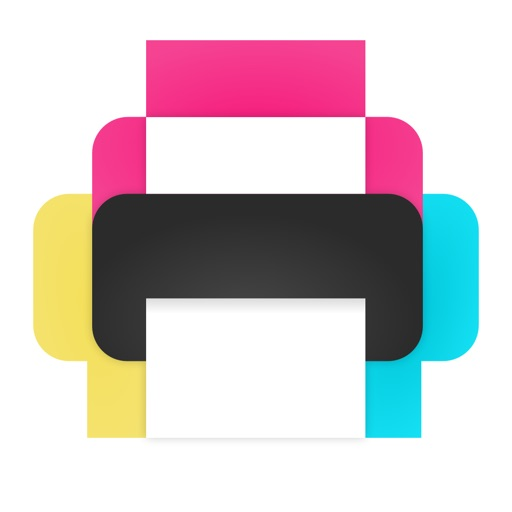

Print images exactly how you want them on the page. Resize and crop in inches or centimeters. Print multiple photos on one sheet. No more surprises or waste.

REAL SIZES
Size and crop your images in inches or centimeters. Each printed image will match exactly the size displayed on screen.

HIGH QUALITY
Will it look pixelated? The PPI (DPI) display tells you. For best results avoid stretching photos below 200-300 PPI.
Each image is sent to the printer at full resolution to guarantee optimal quality.

SAVE PAPER
Place multiple images anywhere on the page. Fill the empty spaces on your sheet and use less paper.

SAVE INK
Choose the most economical print mode (photo or general quality, color or grayscale).
Crop to print only what you need and waste no ink.

Intuitive and quick to use with familiar touch gestures:
• Select your paper size
• Add images
• Size and crop them to exact dimensions anywhere inside the page
• Align, rotate, flip and duplicate
• Choose your mode (photo or general quality, color or grayscale) then print.

Requires an AirPrint compatible printer. If you don't have one, you can still use this app to create a PDF or JPEG file that you can then print via other methods.

Perfect for all kinds of home printing projects:
• Picture frames
• Greeting cards
• Door signs
• Labels
• Badges

Printer manufacturers have ink and photo paper to sell, so their apps aren’t designed to help avoid waste. This app is different. It is designed to let you get it right the first time.

DOWNLOAD NOW and make the best use of your ink and paper!

#### knots_3d
## Knots 3D
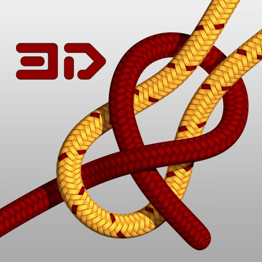

Learn over 200 knots for fishing, climbing, boating, scouting and other applications of rope work. 

Knots 3D is the ultimate knot-tying app for fishermen, climbers, boaters and scouters alike. With over 200 unique knots and new ones added frequently, Knots 3D makes it easy to learn even the most difficult knots in no time. Browse by category or search by name, common synonym or ABoK # and save your favorite knots for quick review.

Features:
- 201 knots in over a dozen categories.
- Completely offline and self-contained – No additional downloads or internet access required!
- No ads!
- Watch knots tie themselves and pause or adjust the speed of the animation at any time.
- Rotate knots in 360-degree, 3D views to study them from any angle with a swipe of a finger.
- Interact with the knot on the screen by "scrubbing" over the knot to advance or rewind the animation.
- High-res graphics with photo-realistic rope textures.
- Share a knot image and info to social media platforms, SMS text message, email, clipboard and more!
- Dark mode / Light Mode
- List View, Card View, and Grid View options
- Create your own custom categories for grouping knots. Custom Category Ideas: "Mastered" - Track your progress, "Practice" - Select knots you want to learn next, "Top Ten" - Keep go-to knots at your fingertips.
- Add personal notes directly on a knot’s detail screen including hyperlinks to external resources (YouTube, websites, tutorials, etc)
- Add searchable keywords to help find knots faster
- ABOK numbers for cross reference to the Ashley Book of Knots

Choose from a wide variety of knots and see how they are tied in incredible detail. Each 3D knot has detailed reference information including tying pointers, strength and reliability, structural info, and Ashley reference numbers (ABoK) and the occasional history behind the knot.

Categories:
- Essential Knots
- Arborist Knots
- Boating and Sailing Knots
- Camping Knots
- Caving Knots
- Climbing Knots
- Decorative Knots
- Diving Knots
- Fishing Knots
- Military Knots
- Pioneering
- Rope Care
- Scouting Knots
- Search and Rescue (SAR)
- Theatre and Film Knots

Types:
- Bends
- Binding Knots
- Friction Hitches
- Hitches
- Lashings
- Loop Knots
- Quick Release
- Stopper Knots

The complete list of knots: 

https://knots3d.com/en/complete-list-of-knots

Knots 3D is the perfect app for anyone who wants to learn how to tie knots for fishing, climbing, and boating. Whether you're a beginner or an experienced knot-tyer, Knots 3D has everything you need to become an expert. Download it now and start knotting!

#### stack_the_states®
## Stack the States®

Stack the States® makes learning about the 50 states fun!  Watch the states actually come to life in this colorful and dynamic game! 

As you learn state capitals, shapes, geographic locations, flags and more, you can actually touch, move and drop the animated states anywhere on the screen. Carefully build a stack of states that reaches the checkered line to win each level.

You earn a random state for every successfully completed level.  All of your states appear on your own personalized map of the United States.  Try to collect all 50!  As you earn more states, you begin to unlock the four free bonus games: Map It, Pile Up, Puzzler and Capital Drop.  Four games in one!

HAVE FUN LEARNING ALL ABOUT THE 50 STATES:
▸ Capitals
▸ State shapes
▸ Abbreviations
▸ Bordering states
▸ Location on the map
▸ Nicknames
▸ Flags
...and more!

FEATURES:
▸ Hundreds of unique questions
▸ Interactive map and 50 state flash cards
▸ Choose any of the 50 friendly-looking states as your avatar
▸ Create up to six player profiles
▸ Collect all 50 states and track your progress on a personalized map
▸ Earn FREE bonus games: Map It, Pile Up, Puzzler and Capital Drop
▸ High resolution pictures of famous US landmarks
▸ All games are powered by a realistic physics engine
▸ Fun sound effects and music
▸ iPhone 4 and new iPad Retina Display support
▸ Works on both iPhone and iPad - a universal app

FIVE GAMES IN ONE:

STACK THE STATES: Build tall piles with states and try to reach the checkered line.

MAP IT: Tap the location of the selected state on the map.  Try to complete the whole country.

PILE UP: The states are piling up!  Tap them quickly to get rid of them before they pile too high.

PUZZLER: Sit back and relax as you slide the states around and put them together like a jigsaw puzzle.

CAPITAL DROP: Match states with their capitals in this fast-paced bonus game.  Don't let a state fall!

Stack the States® is an educational app for all ages that's actually FUN to play.  Try it now and enjoy five games for the price of one!

PRIVACY DISCLOSURE
Stack the States®:
- Does not contain 3rd party ads.
- Does not contain in-app purchases.
- Does not contain integration with social networks.
- Does not use 3rd party analytics / data collection tools.
- Does include links to apps by Dan Russell-Pinson in the iTunes App Store (via LinkShare).

For more information on our privacy policy please visit:
http://dan-russell-pinson.com/privacy/

#### forscore
## forScore

Go paperless. Get organized. Download and play something new in seconds. With forScore for iOS, iPadOS, macOS and visionOS, your scores have never been better—it’s everything you can do with paper and so much more. As seen in Apple keynote addresses and retail stores worldwide!

On your music stand or on the go, it's the complete PDF sheet music reading experience that has wowed musicians all over the world for years:

CONNECT
• Copy PDFs from other apps like Safari and Mail and sync them to all of your devices with iCloud
• Import scores from popular cloud storage services and content providers like Musicnotes.com
• Share scores and setlists with colleagues, whether or not they use forScore

ORGANIZE
• Add metadata to your scores for a perfectly browsable, instantly searchable library
• Create smart bookmarks to manage longer files containing multiple parts or pieces
• Group scores manually with Setlists to play through them from start to finish

PLAY
• View full pages in portrait orientation and crop them to better fit your device's screen
• Turn your device sideways for bigger scrolling pages or view two pages side by side instead
• Use Reflow on smaller screens to lay out systems of music end-to-end like a horizontal teleprompter

REFINE
• Enter annotation mode to draw, type text, or place common symbols onto the page
• Separate your annotations into layers and show or hide them at any time
• Open scores and setlists in multiple windows or tabs to multitask with ease

SIMPLIFY
• Create links and buttons to handle repeats or perform common actions with a single tap
• Rearrange and duplicate pages of a score to play without jumping back and forth
• Connect your Bluetooth page turner for hands-free navigation

EXTEND
• Access integrated utilities like our metronome, pitch pipe, tuner, and piano keyboard
• Link tracks to scores to loop regions, adjust pitch, and even use them to record and play back your page turns
• Connect wirelessly to nearby devices and coordinate your page turns and program changes effortlessly

There's much more than those highlights, though, so be sure to visit forscore.co to learn all about forScore's incredible features and find out why so many musicians agree that forScore is simply the best!

Note: forScore also offers an optional, annual auto-renewing subscription called forScore Pro that unlocks additional features and content (visit forScore.co/pro for complete details). forScore Pro is a 1-year subscription that renews automatically until canceled. Should you choose to subscribe, payment will be charged to your iTunes Account upon confirmation of purchase. Your subscription will then automatically renew unless canceled at least 24 hours before the end of the current period. You can manage your subscriptions in your iTunes Account Settings after purchase. Complete terms of service are available on our website at: forScore.co/terms-of-service

#### free_tone_-_calling___texting
## Free Tone - Calling & Texting

UNLIMITED TEXTING AND CALLING WITH YOUR OWN PERSONAL PHONE NUMBER

FREE TONE THE MOST POPULAR FREE CALLING APP ON THE STORE IS NOW AVAILABLE WITHOUT ADS FOR 1 WEEK

With this version of Free Tone you will enjoy one week without ads when you create a new account*

• Unlimited TEXT and PICTURE messaging to any phone in US & CANADA*
• Unlimited Calling to ANY NUMBER IN THE US & CANADA*
• Get a REAL phone number*
• Receive phone calls on your number and enjoy Free Voicemail
• Enjoy group texting features with text, photos and videos
• Share your location in one click
• Enjoy a wide sample of Stickers
• Transform your IPOD TOUCH and IPAD into a real wifi phone

No Catch, No Hidden cost!

Free Tone is an easy to use messaging application that allows you to send unlimited text, voice, pics, video messages to any mobile phone number in United States and Canada. You can also Call any number in the US and Canada too ! Also, if your friends install the app as well, you will be able to do a lot more with them! So pick a Number and share it with your friends and start texting, calling!

* Important:
- We do not Support 911
- For outbound calls to the US and Canada, calling is free with FreeTone
- Hawaii, Alaska and some other territories are not supported in the free bundle
- For inbound calls to your personal number, the first five hundred minutes are complimentary, with the ability to receive calls to your FreeTone number for a minimal extension fee
- Free calls to numbers in the US & Canada from some locations are subject to some limitations
- Access to the free US/Canada number and calling is limited to US and Canada residents
- If Push notification is not enabled, you may not receive messages and calls
- Only one free phone number per account
- Removal of Ads for one week is only available to users having downloaded the paid version of Free Tone and creating a new account, for users updating the app or using their existing account you will keep experiencing your current Free Tone experience
- After the week of usage without Ads you will start to see ads in the App
Help us improve FreeTone: http://support.free-tone.com

In-App Subscription Details:

- Payment will be charged to your iTunes account at confirmation of purchase
- Subscription automatically renews unless auto-renew is turned off at least 24 hours before the end of your current period
- Account will be charged for renewal within 24-hours prior to the end of the current period, at the purchase price listed in the "Manage Subscriptions" section of your iTunes account
- You may manage your subscriptions and turn off auto-renewal by going to your iTunes Account Settings and then “Manage Subscriptions”
- No cancellation of the current subscription is allowed during active subscription
- Also see Terms & Conditions (http://go-text.me/assets/tc) and Privacy Policy (http://go-text.me/assets/pp)

#### spirit_contact_talker
## Spirit Contact Talker
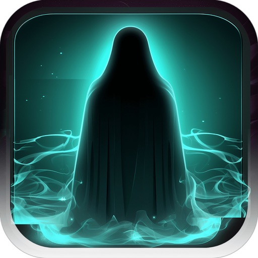

Official Spirit Contact Talker app. Take a look at the ratings and reviews - with over 4,040 five-star ratings worldwide.

Use Talker app to test if your house or any place you are in has signs of paranormal activity, including ghosts or spirits. Explore signs of paranormal activity with this app, designed to test your surroundings for ghosts or spirits. Attempt communication by listening to ITC voices interwoven with unique audio frequencies. Using the spirit box section, the interpretation is personal, allowing each user to bring their insight to the experience. These sounds, known as EVP (Electronic Voice Phenomena), provide an engaging platform for exploration. The app also includes SLS features for further investigation.
Languages: Spanish and English.
Key Features (Real Spirit Hunting Tools)
* Spirit Contact Talker feature: Communicate with spirits through ITC. The app generates meaningful words and phrases based on environmental cues detected by your device, offering real-time responses to your questions. 
* Spirit Box: Experience the evolution of the classic ghost box. This tool scans frequencies to produce white noise that spirits can manipulate to form coherent words or phrases, allowing for direct interaction during EVP (Electronic Voice Phenomena) sessions. The Spirit Box functionality is personal.
* SLS Camera: Utilize advanced LIDAR technology to detect humanoid shapes in your surroundings. This cutting-edge feature maps out potential entities invisible to the naked eye.
* Ghost Detector: The app includes a reliable Ghost Detector for scanning energy shifts and frequencies often associated with paranormal activity. While it cannot scientifically confirm spirits' presence, it serves as an engaging tool for ghost hunters and enthusiasts alike.
* Discover Haunted Locations: Explore thousands of haunted locations across the USA and UK with the app’s Haunted Locations Map.

How It Works:
* Ask & Listen: Pose your questions into Spirit Contact Talker feature and allow the app to provide words, sounds, or phrases in response.
* AI Analysis: Dive deeper with Artificial Intelligence that analyzes the context and coherence of your sessions, providing detailed insights and interpretations. A built-in AI enhances the interactive experience, offering analysis of question-and-answer sessions. By examining context and semantic coherence, the AI delivers clear insights, helping users reflect and better understand the session.
* EMF Detector: Detect anomalies like "cold spots," often associated with ghost hunting.
* Visualize with SLS: Detect and map humanoid shapes in real-time with LIDAR technology, adding an exciting visual layer to your investigations.
* Record & Analyze: Log details such as location, date, and environmental readings during your sessions for further analysis.
Advanced Audio Features:
* The Spirit Box functionality integrates layered audio elements, including phonemes, reversed audio, and other sound fragments, creating an engaging and immersive experience for spirit communication. These features allow users to explore EVP sessions with a deeper level of interaction.

User Feedback & Reviews (of 5 stars):
From Elliot – 20 dic. 2023
I love this app I was able to communicate with other spirits and see what spirit talker was like. I recommend it to people who are interested in talking to ghosts.

Subject: Impressive ghost detector (5 stars)
From Sarie02 – 16 dic. 2023
Getting direct answers to my soul questions.

Important Notes:
	•	Disclaimer: This app is intended for entertainment purposes only and does not scientifically verify or guarantee spirit communication.
	•	Educational and Entertaining: Whether you're a skeptic or a believer, it is designed to engage and inspire curiosity about the unseen world

Join thousands of satisfied users with over 3910 five-star ratings worldwide. Experience Spirit Contact Talker with our no-questions-asked money-back guarantee.

#### shot_tracer
## Shot Tracer

Shot Tracer® & Map Tracer Make Every Shot Legendary.

Track your ball flight like on TV and relive your round on more than 45,000 3D golf courses. Voted Best Golf App by Golf Digest and Golf Magazine, trusted by golfers worldwide.

FEATURES
• Real flight tracer
• 3D Map Tracer and flyover generator for 45,000+ courses
• Distance animations 
• Scorecard and Scoreboard editor
• Works on iPhone and iPad no special hardware needed

Create, share, and inspire from the fairway to your feed.

Terms of Use: https://www.apple.com/legal/internet-services/itunes/dev/stdeula/

#### sporty's_e6b_flight_computer
## Sporty's E6B Flight Computer

Based on Sporty’s popular handheld E6B Electronic Flight Computer, the E6B app has been designed from the ground up to make the most of iOS on the iPhone, iPad and Apple Watch, and MacOS on Apple Computers. The software is based on the tried and true formulas and algorithms developed over the years by Sporty’s team of over 50 pilots.

Its pilot-friendly design makes quick work of any navigational, conversion or fuel problem and it also performs conventional arithmetic calculations.
 
The advanced timer/clock feature simultaneously tracks Zulu, Local and Home time zones. The timer counts either up or down, and will display an alert when reaching zero.

27 AVIATION FUNCTIONS
 
-Pressure & Density Altitude
-Planned True Airspeed
-Heading and Groundspeed
-Compass Heading
-Leg Time
-Fuel Required
-Crosswind, Headwind and Tailwind
-Cloud Base and Freezing Level
-Actual True Airspeed
-Actual True Altitude
-Wind Speed and Direction
-Groundspeed
-Planned Mach Number
-Required True Airspeed
-Required Calibrated Airspeed
-Distance Flown
-Endurance
-Fuel per Hour
-Actual Mach Number
-Percent Mean Aerodynamic Chord (MAC)
-Hydroplane Speed
-Required Rate of Climb
-Specific Range
-Pivotal Altitude
-Top of Descent
-Required Rate of Descent
-Glide Distance

22 AVIATION CONVERSIONS
 
-Celsius :: Fahrenheit
-Nautical Miles :: Statute Miles
-Nautical Miles :: Kilometers
-Feet :: Meters
-Pounds :: Kilograms
-Avgas Gallons :: Pounds
-Jet A Gallons :: Pounds
-Gallons :: Liters
-Hours/Minutes/Seconds :: Hours
-Climb FT/NM :: Climb Percent
-Climb FT/NM :: Climb Degrees

CALCULATOR
 
-Perform basic math without having to exit the application

CLOCK/TIMER
 
-Simultaneous tracking of Zulu, Home and Local time zones
-Advanced timer counts up or down and operates independently so you can perform other calculations while the timer is running
-Upon reaching zero in the countdown mode, a message will display no matter what app is active  – a useful feature for missed approaches, switching fuel tanks, etc.

#### quantumult_x
## Quantumult X
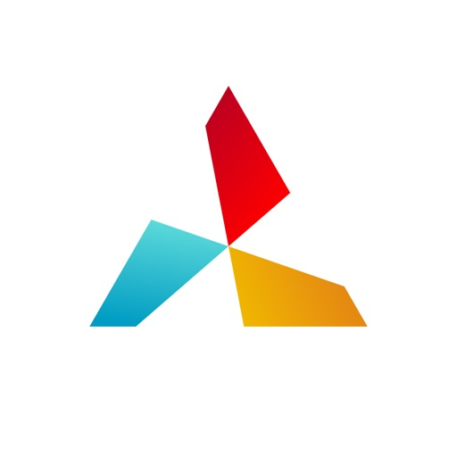

Quantumult completely rebuilt from scratch, and includes a lots of awesome new features!

Quantumult X is a powerful network tool for web developers and users who need to customize their proxies.

For web develpers:
- HTTP activity can record the whole HTTP request and response including body(HTTP debug should be enabled).
- The MitM HTTP decryption can work for the traffics from TUN interface(MitM should be enabled).
- HTTP rewrite with URL 302/307 redirect or request header/body modification or response header/body modification(Rewrite should be enabled).
- Customized DNS settings for specific domains(IPv4 or IPv6),  only can be edited in configuration profile.

For users who need to customize their proxies:
- Supports shadowsocks proxy protocol.
- Supports shadowsocks with obfs-tls or obfs-http plugins.
- Supports shadowsocks over websocket and tls(server side should be deployed by v2ray-core).
- Supports UDP relay if the server supports it.
- Supports different policies for network request by using customized filters(host, host suffix, host keyword...).

Privacy Policy: https://quantumult.app/x/privacy/
Contact Us: support@quantumult.app

#### folium
## Folium

Folium is a beautifully designed, high performing multi-system emulator that allows you to play video games from retro consoles and handhelds

-- NOTE --
Folium does not provide any games or system files, these must be provided by the user

Emulation may be slow on older devices depending on the console or handheld emulated
-- NOTE --

Supported Consoles
- Game Boy, Game Boy Color
- Game Boy Advance
- Nintendo 3DS
- Nintendo DS, Nintendo DSi
- Nintendo Entertainment System
- Super Nintendo Entertainment System
- PlayStation 1

Supported Controllers
- Backbone One
- Nintendo Switch Joy-Con
- Nintendo Switch Pro Controller
- PlayStation DualShock 4
- PlayStation 5 DualSense
- Xbox Series S
- Xbox Series X

Folium is in no way affiliated with Nintendo. "Nintendo" and all associated game console and handheld names and game controller names are registered trademarks of Nintendo Co., Ltd

Folium is in no way affiliated with Sony. "PlayStation" and all associated game controller names are registered trademarks of Sony Group Corporation

#### ibend_pipe
## iBend Pipe
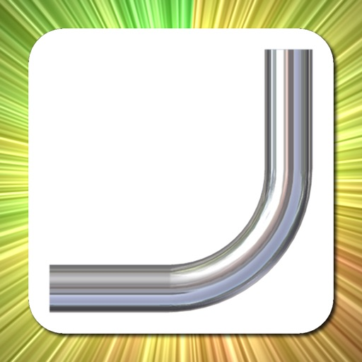

iBend Pipe is the best conduit bending applicaiton on an iPhone, it helps you bend it right...the first time.  

It calculates the following bends using English or Metric measurements so you don’t have to:

    -Offsets Bends (specify towards an obstruction or away from an obstruction)
    -Rolling Offsets Bends  (specify towards an obstruction or away from an obstruction)
    -Parallel Offset Adjustment
    -3-Bend Saddles
    -4-Bend Saddles
    -Segment Bends
    -90° Bends
    -Back to Back 90° Bends
    -Kicked 90°s Bends
    -Compound 90° Bends around a Round Obstruction
    -Compound 90° Bends around a Square Obstruction
    -Compound 90° Bends around a Rectangular Obstruction

+ HOW DOES IT WORK?
Simply slide your finger to set measurements and results are updated instantly.  There is no need to navigate through multiple screens just to get a measurement.  Easy and intuitive to use, and measurement are displayed in big font to make it easy to read.

+FAST ONE SCREEN CALCULATIONS
Simple one screen calculations that show results "live" and on the fly as you slide your finger to enter values in.

+ACCURATE CALCULATIONS
Centerline bending radius - based calculations are also available.  These calculations offer greater accuracy when compared to bending multiplier methods.  Preposition your bends automatically.  All bends take shrink into account so you don't have to do any math.  What's faster - bending it twice or bending it right the first time?

+PROTRACTOR FUNCTION INCLUDED
Use the included protractor function to measure the angle as you bend.  Angle will be fed directly from your input screen to save you time.

+BENDER PROFILES
Almost 100 different bender/pipe combinations included.  You have the ability to tweak or completely modify any of the combinations to match your bender on the field.

+ WHO IS IT FOR?
If you consider yourself a craftsman that takes pride in his work, iBend Pipe is for you.  If other "sparkies" come to you when they have a difficult bend, this is for you.  If you want to have a smaller "bone"  pile, this is for you.  If you can write your name in conduit, this is for you.  From, a  1st year inside wireman apprentice to a seasoned “old timer” this app will save you time and material.

Input fractions instead of converting to decimals and get results in fractions.

Thanks for all the great reviews, if you have any suggestions:
support@ibendpipe.com

#### ghost_science_m3
## Ghost Science M3

Open the door to the paranormal with GHOST SCIENCE M3™, the pinnacle of ghost hunting technology. Trusted by the world’s leading professional investigators, GHOST SCIENCE M3™ is the culmination of over a decade of research and innovation. GHOST SCIENCE M3™ stands as the most advanced, comprehensive, and powerful paranormal investigation toolkit ever created. Nothing Compares.

Vision
The Vision instrument employs structured-light lidar-enabled infrared laser grid imaging, AI-driven computer vision, GPU-based image filtering, and advanced hardware management to deliver unparalleled night-vision, image processing, and real-time human-like figure detection.
*Lidar is available only on Pro devices.

Spirit Box
The Spirit Box instrument leverages live streaming radio stations, advanced signal processing, real-time audio analysis, and dynamic frequency scanning to generate a blend of white noise and brief audio fragments. It is hypothesized that spiritual entities can manipulate these audio fragments using their energy, resulting in intelligible communications.

Spatial Matrix
The Spatial Matrix instrument uses LiDAR depth mapping, real-time mesh reconstruction, and GPU-accelerated analysis to visualize the geometric structure of the surrounding environment. It is theorized that paranormal energies may subtly distort these patterns, allowing investigators to observe potential manifestations within three-dimensional space.
*Pro devices only.

Music Box
The Music Box instrument employs advanced sensor integration, real-time data analysis, and precise environmental monitoring to detect subtle changes in the ambient environment. In the realm of paranormal research, this instrument is utilized to identify the potential presence of paranormal phenomena.

PEVP-VOX
The Spirit Vox instrument generates a continuous sound bed composed of phonetic fragments, tonal shifts, and raw audio textures through advanced sound synthesis and real-time modulation. It is hypothesized that subtle environmental influences can manipulate these fragments, shaping them into speech-like bursts that may convey meaningful communication.

EVP-ITC
The EVP-ITC instrument employs full sensor integration to detect subtle environmental fluctuations and presents words based on an advanced, proprietary phonetically-based computational algorithm. Instrumental Trans-Communication (ITC) devices operate on the theory that paranormal entities can communicate by influencing the ITC device’s sensors.

EMF
The EMF instrument allows for precise detection, measurement, and visualization of ambient electromagnetic field levels across the electromagnetic spectrum in real-time. It is hypothesized that paranormal entities can influence and generate electromagnetic fields, which are detectable by the EMF instrument.

Audio-EVP
The Audio instrument analyzes intricate and nuanced audio signals to provide insights into the underlying acoustic properties of the environment. It is theorized that spirits or supernatural entities can manipulate acoustic wave data to produce electronic voice phenomena (EVP) not audible during the initial recording session.

Frequency-EVP
The Frequency instrument analyzes complex frequency signal harmonics to identify subtle variations and anomalies within the underlying acoustic environment.  It is suggested that high audio frequencies, near and beyond the limit of human hearing, could be linked to paranormal phenomena.

Geoscope
The Geoscope instrument leverages gyroscope and accelerometer sensors to detect even the minutest device movements or vibrations. This functionality is predicated on the hypothesis that paranormal entities can induce subtle vibrations, such as footsteps or knocking sounds.

Barometer
The Barometer instrument employs the device’s advanced barometric sensor to detect extremely subtle variations in ambient pressure. This functionality is based on the hypothesis that paranormal phenomena may induce sudden or unexplained changes in pressure.

#### nightcap_camera
## NightCap Camera

NightCap Camera is a powerful app that takes amazing low light and night photos, videos and 4K time lapse. Long exposure produces beautiful photos in low light and unique Astronomy modes capture the stars, Northern Lights (Aurora) and more!

Do you find your photos and videos dark and grainy in low light? NightCap will help by unlocking the full potential of your iPhone or iPad's camera.

AI camera control makes it easy by automatically setting optimum focus and exposure for a brighter, clearer shot. All you need to do is hold steady and tap the shutter. If you prefer manual control then instant gesture based adjustment is always available, and special camera modes give you DSLR like results. You can even shoot photos, videos and time lapse in black and white if you want to.

Try Long Exposure mode for amazing motion blur effects and reduced image noise in low light. NightCap has an ISO Boost feature that allows 4x higher ISO than any other app, producing much brighter low light photos with low noise in Long Exposure mode!

Light Trails mode preserves moving lights - ideal for moving traffic at night, fireworks or light painting. 

These modes are stunning when combined with HD or 4K time lapse!

There are 4 dedicated astrophotography camera modes. Stars Mode is ideal for a starry sky or Northern / Southern Lights (Aurora), or leave your device capturing in Star Trails Mode and watch the stars paint circles in the sky! There are also modes for easy photography of the International Space Station (ISS) and meteors (shooting stars).

Visit nightcapcamera.com for tutorials.

Features:

• Video recording with special Night Mode and full manual control.
• Time lapse recording with adjustable speed, long exposure and light trails support and up to 4K resolution on iPhone 6s or newer or 1080p HD on older devices.
• Aidie, a fully automatic AI camera operator chooses the optimum camera settings for you automatically, meaning brighter, clearer photos in low light with less risk of blurring the shot. All you need to do is hold steady and tap the shutter.
• AI enhanced focusing in very low light for fast, reliable focus.
• Automatic camera modes for Meteors (shooting stars), ISS (International Space Station), stars and star trails make these difficult tasks easy.
• Innovative manual camera controls designed for photographers: intuitive gesture-based control of exposure, ISO, focus and even white balance. Simply swipe to adjust.
• Long Exposure mode: Capture detailed, noise-free low light shots.
• Light Trails mode: Perfect for light painting and even astronomy: photograph star trails with unlimited exposure time!
• ISO Boost allows up to 4x higher ISO than any other app. 
• Light Boost instantly boosts brightness while preserving image detail.
• Noise Reduction Mode helps reduce image noise.
• 8x Zoom control (camera-style for easy, smooth zoom).
• Full Apple Watch support with live preview and control of the main app features.

#### amazing_slow_downer
## Amazing Slow Downer

If you're a musician who likes to learn new songs and techniques by listening to the same piece of music over and over but wish that the music could be played a little slower, then you'll enjoy Amazing Slow Downer.

You can repeat any section of the music at full speed, slow it down or even speed it up by changing the speed between 25% (1/4 of original speed) and 200% (double speed) without changing the pitch!

Change the tuning or musical key? No problem, Amazing Slow Downer handles that as well.

Setup seamless loops by touching the "Set" buttons during playback.

Amazing Slow Downer is the ideal tool for any musician, transcriber or dancer wanting to improve their skills.

New - Support for streaming "Apple Music" audio! 

Note: Some functions such as "Pitch change" and "Equalizer" are not available when playing "Apple Music" songs.

Please note: According to Spotify, third party apps will not any longer have access to streaming Spotify content in a way that works for slowing down / pitch change audio starting September 1, 2022. This will affect Amazing Slow Downer.

This means that you should NOT buy Amazing Slow Downer if playing Spotify content is your only use of the app.
This change does NOT affect any other type of audio content that Amazing Slow Downer can play back.

#### cloud_baby_monitor
## Cloud Baby Monitor

High Quality Video Baby Monitor with Unlimited Range (Wi-Fi, 3G, 4G, 5G, Bluetooth), noise and motion alerts. Excellent choice for secure home and travel baby monitoring. Private, secure, and easy to use. 

Cloud Baby Monitor is helping tenths of thousands of parents daily to take care of their little ones.

Featured by Apple in The Quantified Dad story (www.apple.com).
Featured in The Best Baby Monitors by WIRED (www.wired.com).
Recommended by CNET (www.cnet.com).
Featured in Good Morning America by ABC News (www.abcnews.com).
Featured in USA Today (www.usatoday.com).
Recommended by Computerworld (computerworld.com).
Endorsed by Kim Komando (komando.com).
Selected by App Advice as an essential app for baby monitoring (www.appadvice.com).
Recommended by Mashable among the best “Parenting Apps for Baby's First Year” (www.mashable.com).
Selected by TUAW for the "Holiday Gift Guide: iPad apps for the home" (www.tuaw.com).
Awarded 3rd place by Babble.com on the "Top 25 Travel Apps for Parents” (www.babble.com).

• SECURE, RELIABLE, AND EASY TO USE
• LIVE VIDEO ANYWHERE
• SUPER SENSITIVE AUDIO
• NOISE AND MOTION ALERTS
• ACTIVITY LOG
• PICTURE IN PICTURE AND BACKGROUND MONITORING
• WHITE NOISES AND LULLABIES INCLUDED
• NIGHT LIGHT WITH REMOTE BRIGHTNESS CONTROL
• TALK TO BABY WITH LIVE VIDEO AND AUDIO
• MULTI-PARENT AND MULTI-CHILD SUPPORT
• CONNECTION QUALITY INDICATOR
• BATERY STATUS MONITORING
• AVAILABLE FOR OTHER DEVICES

Now with Cloud Baby Monitor you can keep an eye on your little one anywhere and at all times. 
Start using Cloud Baby Monitor app today and see why it is the best in class!

SECURE, RELIABLE, AND EASY TO USE
Use your iPhone, iPad, iPod touch or a Mac as a baby unit, place it in your baby's room and enjoy live full screen video and crystal clear audio on your second device working as a parent unit. Both devices will be connected automatically, without any configuration. All communication is secure, end to end encrypted by industry standard encryption to make sure that only you have the access to your baby video stream.

LIVE VIDEO ANYWHERE
Cloud Baby Monitor works anywhere where your devices have internet connectivity. Supports any Wi-Fi network, 3G, 4G, LTE, or 5G. Uses Bluetooth in places without internet. 

SUPER SENSITIVE AUDIO
Hear your baby breathing as if he or she was sleeping next to you.

NOISE AND MOTION ALERTS
Get notified about all child’s activities with noise and motion alerts.

ACTIVITY LOG
Analyse sleep patterns by reviewing events stored in activity log.

PICTURE IN PICTURE AND BACKGROUND MONITORING
Multitask on your iPhone or iPad while monitoring your little one in the background via Picture in Picture support.

WHITE NOISES AND LULLABIES INCLUDED
Enjoy the set of the most popular lullabies and white noises for the babies included in the app. Remotely control volume, playback, and auto stop timer.

CREATE YOUR OWN PLAYLISTS
Create custom playlists with songs, white noises, or fairy tales from your iTunes library.

NIGHT LIGHT WITH REMOTE BRIGHTNESS CONTROL
Use remotely controlled night light to watch your baby sleeping through the night. Brightness control allows you to adjust light intensity to get a nice picture and not disturb the baby.  

TALK TO BABY WITH LIVE VIDEO AND AUDIO
Easily soothe the baby with live video and audio streamed from the parent unit to the baby unit.

MULTI-PARENT AND MULTI-CHILD SUPPORT
Watch multiple baby unit devices at the same time to monitor two children sleeping in different rooms.
Watch your baby from multiple parent unit devices at the same time.

AVAILABLE FOR OTHER DEVICES
Cloud Baby Monitor is available for Mac, Apple TV, and other popular mobile devices.

CUSTOMER SUPPORT
Happy customers are our highest priority and your feedback is always welcome. If you have any issue or suggestion, please contact us directly at support@cloudbabymonitor.com. 

Thank you for using Cloud Baby Monitor.

#### paramedic_protocol_provider
## Paramedic Protocol Provider
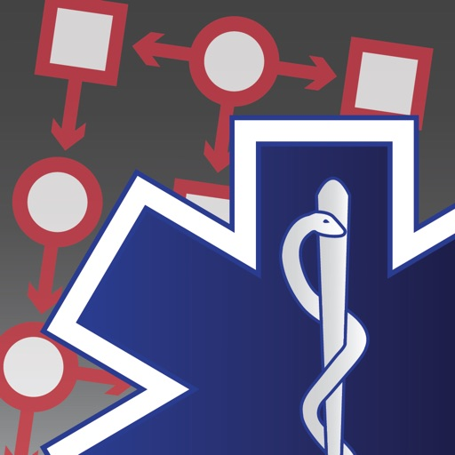

Paramedic Protocol Provider provides quick offline access to over 350 field treatment protocols from the USA and Canada.

An annual in-app subscription will be required to download or update protocols app starting in 2018. Downloaded protocols will not be updatable without a subscription.

Use of this app requires acceptance of the terms of service posted at https://www.acidremap.com/legal/TermsOfService.html

For a list of currently available protocols please visit https://www.acidremap.com.

Features include:
•350+ protocols and supporting documents
•Quick indexed lookup of content in a matter of seconds
•Search titles and text
•Favorites tab for quick access of what's important to you
•Updated regularly, ensuring content is up-to-date
•Customizable notes for each individual entry
•Always with you as long as you have your device and never fades or tears

#### calorie_counter_pro_mynetdiary
## Calorie Counter PRO MyNetDiary

Track calories, food, and macros with ease! MyNetDiary has a free barcode scanner, personal diet plans, and AI Meal Scan for instant logging — all in a smart, simple-to-use app. 

USERS SAY…

The best
Love this app! The best out of many food tracking apps that I have tried over the years. Love that it is free! The breakdown of the meal and daily nutrition is very informative. Try it you will love it!

LOVE LOVE LOVE THIS APP
Best app for tracking food, exercise! Consistently losing weight! I love how it shows you if you're on target for your goal. Great layout, great look, easy to use!!! I highly recommend this app if you're looking to be a healthier you!!!

Fast, intuitive, user friendly
I have tried other calorie tracking programs over the years and this app is by far the best I've come across. I highly recommend it. The free version is very good and I am now enjoying the extra functions through a paid subscription.

RECOGNIZED EXCELLENCE
• Ranked #1 in Forbes Health’s Best Weight Loss Apps of 2025.
• Rated #1 by the American Journal of Preventive Medicine.
• Praised by The New York Times as “simpler, quicker, and better-looking” than other apps.
• Featured in Today’s Dietitian, alongside WW and Noom.

DIFFERENT FROM OTHER DIET APPS
• Simple & Generous Features: Packed with free tools, no ads.
• Lightning-Fast Logging: Barcode scanner and AI Meal Scan make tracking effortless.
• Verified Food Database: Over 1.7 million items with 108 nutrients for accuracy.
• Privacy Focused: No account required.

MyNetDiary puts you in control. You can pick a diet or a meal plan, follow our registered dietitians' easy tips, and follow the app's guidance. Or, you can turn them off and simply use MyNetDiary as the best free calorie-counting app in the world.

PROVEN SUCCESS
• Active members lose an average of 1.4 lbs/week
• Over 25 million users have chosen MyNetDiary, many switched from other diet apps

A few of the free version features:
• Easy food, exercise, and water tracking.
• Daily coaching tips and meal reminders.
• Customizable dashboard for your goals.
• iOS Health integration and Apple Watch support.
• Shopping lists, nutrition articles, and how-to videos.

SPECIAL PRO APP FEATURES
• Up to 108 nutrients tracked
• Plan macros
• Full set of charts
• Timestamps
• Carb tracking

If you need more support, MyNetDiary Premium provides all the guidance and features you may need. At your fingertips, you'll find:

• Premium Diets, 600+ full-flavored Premium Recipes and Menus by RDs, including low-carb, keto, high-protein, Mediterranean, vegetarian, and more - with diet planners, guides, and feedback.
• Intermittent fasting - full-featured, with fasting timer and different protocols.
• Macros planning and cycling.
• Planning and tracking up to 108 nutrients, including omegas and aminos.
• Recipe import tool - easily load internet recipes and calculate complete nutrition.
• Integrations with top fitness trackers - Fitbit, Garmin, and Withings.
• In-depth reporting and analysis tools to improve your diet.

Subscription Terms:
The subscription period will automatically renew unless auto-renew is turned off at least 24 hours before the end of the current subscription period. To turn this function off, turn off auto-renew in your iTunes account. Renewal payments will differ depending on subscription and pricing at the time of renewal. Your iTunes account will be charged when the purchase is confirmed.

Privacy Policy: www.mynetdiary.com/privacy.html
Terms of Use: www.mynetdiary.com/terms.html

#### camscanner___|_ocr_scanner
## CamScanner + | OCR Scanner

Scan docs into clear & sharp image/PDF, to email, fax, print or save to cloud.

* Over 200,000 new registrations per day
* App Store Best of 2014
* CamScanner, 50 Best iPhone Apps, 2013 Edition – TIME

----Paid App Features----
* All features that the free version has
* Recognize and extract texts from a single page
* Larger cloud space of 400M (200M for free version)
* Export PDFs without watermark "Scanned by CamScanner"
* Ad-free

Features:

*Mobile Scanner
Use your phone camera to scan receipts, notes, invoices, whiteboard discussions, business cards, certificates, etc. 

*Optimize Scan Quality
Smart cropping and auto enhancing make the texts and graphics look clear and sharp. 

*Extract Texts from Image
OCR (optical character recognition) feature extracts texts from single page for further editing or sharing. (Paid app only)

*Share PDF/JPEG Files
Easily share documents in PDF or JPEG format with others via social media, email attachment or sending the doc link. 

*AirPrint & Fax Documents
Instantly print out docs in CamScanner with nearby printer via AirPrint; directly fax docs to over 30 countries from the app.

*Collaboration
Invite friends or colleagues to view and comment on your scans in a group. (Registrants only)

*Advanced Editing
Making annotations or adding customized watermark on docs are made available for you.

*Secure Important Docs
Set passcode for viewing important docs; meanwhile, when sending doc link, you can set password to protect it.

*Sync across Platforms
Sign up to sync documents on the go. Just sign in to any smartphone, tablet or computer (visit CamScanner website) you own and you can view, edit and share any document. 

Premium Subscription Service:
1. Edit OCR results and notes of the doc, exporting as .txt file
2. Create Doc Collage for multiple pages
3. + 10G cloud space
4. + 40 extra collaborators
5. Send doc link with password protection and expiration date
6. Auto upload docs to Box, Google Drive, Dropbox, Evernote, One Drive and etc.
7. Batch download PDF files through web application of CS
8. Import PDF to Camscanner for editing
9. Scan academic questions to make practice tests for study
10. High Standard ID Scan
and More...  

Payment models for Premium subscription:
• Monthly Subscription:   $4.99 per month,
• Yearly Subscription:   $35.99 for 1st year and $49.99/year starting from the next year,

• Payment will be charged to iTunes Account at confirmation of purchase.
• Account will be charged for renewal within 24-hours prior to the end of the current subscription period.
• Subscriptions may be managed by the user and auto-renewal may be turned off by going to the user's Account Settings after purchase.
• Any unused portion of a free trial period will be forfeited when the user purchases a subscription to that publication.

For Terms of Use, please visit
https://www.camscanner.com/app/service?language=en-us
For Privacy Policy, please visit https://www.camscanner.com/app/privacy?language=en-us

CamScanner users scan and manage 
* Bill, Invoice, Contract, Tax Roll, Business Card…
* Whiteboard, Memo, Script, Letter…
* Blackboard, Note, PPT, Book, Article…
* Credential, Certificate, Identity Documents…

3rd Party Cloud Storage Services Supported:
-Box, Google Drive, Evernote, Dropbox, OneDrive

We’d love to hear your feedback: isupport@intsig.com
Follow us on Twitter: @CamScanner
Like us on Facebook: CamScanner
Follow us on Google+: CamScanner

Check out other INTSIG’s products:
CamCard - Business Card Reader
CamDictionary - Snap Translator

#### radarscope
## RadarScope

RadarScope is an AMS-award-winning weather visualization tool that empowers meteorologists, public safety officials, storm spotters, and weather enthusiasts to view a full suite of single-site radar data and related severe weather products. Your initial purchase provides professional radar visualization in a fully native app, free from distracting and invasive practices, with optional subscription packages to add even more capabilities.

Whether you’re scanning for a mesocyclone’s tell-tale hook echo, pinpointing the landfall of a hurricane’s eye wall, or identifying velocity couplet, hail spike, or debris ball signatures, RadarScope displays native radar data in its original radial format. You see what the radar sees almost as soon as the radar sees it, with automatic updates every two to ten minutes depending on the radar’s scanning strategy.

Your initial app purchase includes the following:

• Full suite of single-site radar products for the US, Canada, Guam, Denmark, Finland, and Germany
• 6-frame radar loops
• Two built-in providers for radar data
• Tornado, thunderstorm, flash flood, special marine, snow squall, and extreme wind warnings in the US
• Selected severe weather warnings in Canada and Australia
• NWS-generated storm tracks with hail, TVS, and mesocyclone attributes
• Inspector and distance tools
• Color palette options for radar data
• AllisonHouse data plan integration
• Spotter Network integration for storm and location reporting
• mPING integration for submitting weather reports to NSSL
• Bundled maps with political boundaries, water bodies, and major highways, optimized for low-bandwidth use
• Support for widgets and complications
• Universal app for Apple platforms, including Apple Watch and Apple TV
• Family Sharing support

RadarScope Pro Tier One is an optional annual subscription that adds more features for tracking severe weather:

• 30-frame radar loops
• Cloud-to-ground lightning strikes
• Severe weather watches in the US and Canada
• Special weather statements in the US and Canada
• Mesoscale convective and precipitation discussions
• SPC convective, tornado, hail, wind, and fire outlooks
• WPC excessive rainfall outlooks in the US
• Local storm reports in the US
• Custom color palette support
• Multi-pane display (2 on phones; 4 on larger devices)
• Family Sharing support

RadarScope Pro Tier Two is an optional annual or monthly subscription that transforms RadarScope into a more complete visualization tool for a larger suite of weather products, including:

• Everything in Pro Tier One
• 50-frame radar loops
• A third provider for US radar data
• NEXRAD Level II radar data for the US with a 30-year historical archive
• Historical NEXRAD Level III, super-res, and non-US radar data with a 30-day archive
• Historical NWS bulletins with a 19-year archive
• GOES East and GOES West satellite products
• NSSL’s Multi-Radar Multi-Sensor (MRMS) products
• NCEP’s Real-Time Mesoscale Assimilation (RTMA) products
• Surface observations
• Atmospheric soundings in the US
• Hail size, hail probability, and azimuthal shear contours with a 30-day archive
• More detailed transportation and satellite imagery maps
• Custom color palette support for GOES, MRMS, and RTMA
• Server-sent events for radar and warning updates
• Cross-platform subscription sharing on up to 5 devices
• Family sharing support

If you choose to buy a RadarScope Pro subscription, it will be charged to your App Store account. The subscription will be auto-renewed within 24 hours prior to the end of the current period at the same price you originally paid. Subscriptions may be managed and auto-renewal disabled via your App Store account settings after the purchase. Once purchased, the subscription cannot be canceled during the active subscription period.

DTN is committed to safeguarding your privacy online. Our privacy policy is available for review at https://www.dtn.com/privacy-policy/

Please visit our web site for more information.

#### promptsmart_pro_-_teleprompter
## PromptSmart Pro - Teleprompter
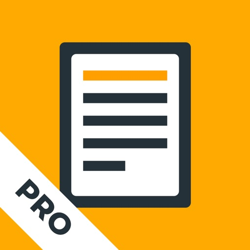

PromptSmart is the only “smart” teleprompter app. Our patented VoiceTrack™ speech recognition technology is revolutionary because it provides a robust solution to automatically follow a speaker's voice in real time. 

Make your video productions less stressful and more efficient. VoiceTrack™ is a powerful and smart prompting tool that will automatically start and stop at the speaker's natural pace, allowing you to focus on other production values rather than film take after take trying to match a pre-set scroll speed to the speaker's cadence. Save time, energy, and keep your talent focused with PromptSmart.

Other teleprompter apps fall short--relying on clunky hardware or pre-set scrolling speeds. We asked tens of thousands of users what they liked most about our prompter app, and over 90% of respondents said "VoiceTrack," calling it "awesome," "astonishing," "tremendous," “easy to use,” a “game changer”—“absolutely brilliant!!!” Our customers tell our story best and PromptSmart products are the highest rated and most frequently rated teleprompter apps in the App Store.

PromptSmart is also an invaluable tool for anyone that engages in regular public speaking, like clergy, educators, politicians, podcasters, audiobook creators, or business leaders. Our prompter apps are useful as a practice tool or to help keep you on-message at live speaking engagements.

If you’re on a budget or trying to film videos by yourself, there is no better companion than the PromptSmart teleprompter app because VoiceTrack starts and stops at your natural pace.

PromptSmart Pro includes an introductory month trial of an optional, paid Extended subscription service, which unlocks added features, including: a Remote Control, File Sync, and Scroll Assist! (See below)

PromptSmart Pro features:

[+] VoiceTrack—Speech-recognition based scrolling. If you go off-script, VoiceTrack knows and will hold your place, waiting for you to return.

[+] Invert text to reflect off two-way teleprompter glass

[+] Narrow the side margins to avoid eye tracking

[+] Selfie Mode: fix text next to the camera and record HD video simultaneously 

[+] In-app camera controls: tap-to-focus, auto-exposure lock, and auto-focus lock

[+] Import these file-types into PromptSmart: 

-DOCX 
-PDF (must be OCR-scanned first)
-RTF
-TXT
-GDOC (Google Documents)
 
[+] Import and export scripts to and from the cloud: Google Drive, One Drive, Box, Dropbox, or iCloud

[+] Bulk delete scripts

[+] Annual or monthly term of Extended Subscription (in-app purchase)

[+] Buy PromptSmart Remote Control (in-app-purchase) without subscribing

[+] An optional mic meter in Presentation Mode

[+] Volume buttons play/pause presentations (Selfie Stick friendly!)

[+] And many more!

IMPORTANT! Review carefully before purchase: 

-VoiceTrack language supported: English only

-Minimum system reqs: iPad Air (and up); iPhone 5S (and up); iOS 11 (OS below 11 not supported)

-Maximum recommended script word count: up to 5,000

-Recommended max of continuous VoiceTrack use: ~30 minutes
 (not a strict cap)

-Recommended max Notecards: 200

-External wired microphone recommended with VoiceTrack (but not required)

Your satisfaction is important to us. Contact us anytime: team@promptsmart.com

Important Disclosure:

PromptSmart Pro includes an optional PromptSmart Extended subscription. Depending on your chosen subscription period (monthly or annual), either a $1.99 purchase or a $19.99 purchase will be applied to your iTunes account at the end of your introductory trial.

Subscriptions will automatically renew unless cancelled at least within 24-hours before the end of the current period. You can cancel anytime within your iTunes account settings. Any unused portion of a free trial will be forfeited if you purchase a subscription.

For more info, see our Help Center, Privacy Policy, and Terms of Service: https://promptsmart.com/help

#### flashface_full
## FlashFace Full

Must-have app for all police officers and detectives.

Have you ever wanted to be a police sketch artist?
Well, now you can use the flashface app and create sketches of
criminals or yourself and your friends. It provides a large number of each facial components including eyes, nose, mouth, hair, head,
eyebrows, glasses, mustache, jaw and beard.

- You can move and scale all face elements on the screen.
- You can save the faces
- You can load/open saved faces
- You can export faces as JPEG image

Create and save your own sketches and share them with your friends NOW!

#### alien10
## Alien10

Always wanted to be a hero like Ben 10? Look no further! This app will turn your watch into an Omnitrix just like Ben's

#### hue_haunted_house
## Hue Haunted House

We created a Sound and Light Scape system which is unpredictable (no looping sounds), highly customisable and versatile in it's setup. Hue Haunted House contains high quality audio effects with beautifully synced lighting to create the perfect eerie mood.

Hue Haunted House offers the following scary themes to choose from:

- Creepy Cave
Dripping stones, scary bats and ferocious monsters haunt you while you wander through the corridors of this dark cave. Did you take the right turn 10 minutes ago? Sure you are not lost?...

- Grisly Graveyard
This is definitely a place where you do not want to be. Zombies stray over this graveyard while rain and wind make you shiver. Or is it the fear in your body? A distant church reminds you you are not far from safety. But why can it's bell be heard so often and irregular? Isn't that odd? 

- Demon Dollhouse
Dolls are sweet aren't they? So you would say... This dollhouse is full of evil. So evil, It makes the small dolls cry. Or are they possessed as well? Something is very wrong, that's for sure.

- Eerie Forest
This is a spine-chilling forest. Birds give the impression of some peace. But don't be fooled. Weird creatures also roam this place. Is that the wind in the trees you hear? Sounds of raven are never a good sign...

- Frightening Pursuit
You're running but it seems you don't progress. What is it you flee from? Not knowing is the worst. But one thing is for sure. You don't want it to catch up with you, then you'll suffer the same faith as that poor little fluffy creature which wasn't fast enough.

- Distressing Dungeon 
Locked up, nobody knows why. Damp and dark you scream for help but the only reaction you get is your own echo. Doors open and close, chains rattle around you. Nobody there to help you out. Will it end here?

- Abandoned Fairground
This must be the weirdest place on earth. Fairgrounds look so gruesome when abandoned. Once a place of joy and laugh, now a spooky ground where some machines still try to entertain you as you pass by. Sounds of the past appear out of nothing. As if ghosts and spirits are still on a roller coaster ride. Is that a clown I hear? 

- Haunted House
Whispers around you make your heart beat faster, while you walk through this old house with it's creaky floors and doors. Thunder bursts concentrated above the house making cats and other animals scream. After every door you think you found the exit, but every door leads to another room with new surprises. Most of them not so pleasant. Wish you haven't been so curious and never entered this Haunted House?

- Hell Fire
When you open your eyes from whats seems like a nap, flames warm your body from below. Standing on top of a big rock you look at the bubbling Lava. Where to go? Fireballs shoot all over the place. You see some phantoms who fail to dodge them. Distant screams make the place even more horrific. You can just hope this is a very bad dream.

- Gloomy Ghosts
Have you ever seen a ghost? Some say they do. But in this place you can hear them for sure. Have a look around, maybe you see or feel them. It's said that if you feel a sudden cold, a ghost might just pass you. Or even fly right through you. Look out! On your left!

- Sinister Strings
When you enter the Opera house, the theater hall is dark and there's nobody on the podium. These instruments seem to play themselves! It's an orchestra without direction. I think there are too many false notes being played here..

- Witch Hunt
Screeching laughter so typically for witches. A lot of them are gathered to discuss new spells and recipes. The winner of last year's soup competition is already cooking this years soup. The ingredients are gore and not so typical. Make sure you do not end up in the boiling cauldron in the middle of the square.

- Pirate Ship
Arr aaaaaargh. This is not the average pirate ship. This one is haunted. We suspect ghost are glooming around the rudder.

- Lurid Laboratory
Not Dexter, not DeeDee but evil forces brew here.

#### tlc_practice_exam_2_0
## TLC Practice exam 2.0

Email testlosgatos@gmail.com for any concerns.
This application is ideal for students who have taken the 24-hour class and need more practice questions in order to pass the TLC test with a high score. This app will provide you with a sense of how your real TLC Exam is structured and how crucial it is to practice before taking the TLC Exam. The app has several difficulty levels which will help you "to" determine where you stand before taking the real TLC Exam. disclaimer: This application is NOT the actual TLC Exam you take in order to obtain your TLC Drivers License. This application simply helps you prepare for your TLC Exam as it's composed of numerous sample questions.

#### cozmo_robot
## Cozmo Robot

Say hello to Cozmo, a gifted little guy who’s got a mind of his own and a few tricks up his sleeve. He’s the sweet spot where supercomputer meets loyal sidekick. He’s curiously smart, a little mischievous, and unlike anything ever created.

You see, Cozmo is a real-life robot like you've only seen in movies, with a one-of-a-kind personality that evolves the more you hang out. He'll nudge you to play and keep you constantly surprised. More than a companion, Cozmo’s a collaborator. He’s your accomplice in a crazy amount of fun.

Some robots just have it all.

Cozmo robot required to play. Available at Anki.com.

©2025 Anki, LLC. All rights reserved. Anki, Cozmo, and the Anki and Cozmo logos are registered trademarks of Anki, LLC.

#### ce5_contact
## CE5 Contact

CE5 Contact provides instructions and tools to assist you in making peaceful contact with extraterrestrial civilizations as well as locating others in your area who are interested in making contact.

The CE5 protocols were developed by Dr. Steven Greer, one of the world’s foremost authorities on the subject of UFOs, extraterrestrial intelligence and technologies, and initiating peaceful contact with interstellar civilizations. Dr. Greer’s relentless efforts towards the disclosure of classified UFO/ET information have inspired millions of supporters around the world.

App features:

- Official training materials developed by Dr. Greer
- CE5 Guide, which provides an overview of all topics surrounding CE5
- CE5 Process, which walks users step-by-step through all aspects of initiating CE5 
- Built-in networking functionality for finding and messaging others interested in CE5
- Comprehensive equipment list
- Extensive library with video, images, audio samples, and meditations
 
Notes: 
 
For active use of the app outdoors during CE5 work where connectivity may be limited, CE5 Contact includes offline mode for the CE5 Process section as well as local storage of previously visited pages or played/downloaded content. CE5 Contact 2.0 and later also allows users to manually download tones and meditations from the Library. 
 
Certain sections of the app require an active internet connection, including user sign-up / profile editing, networking, and messaging.

