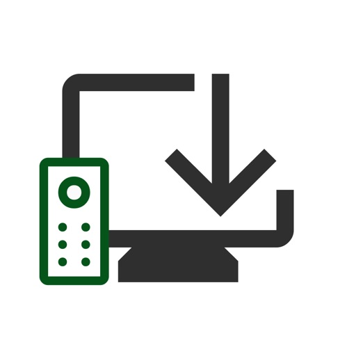
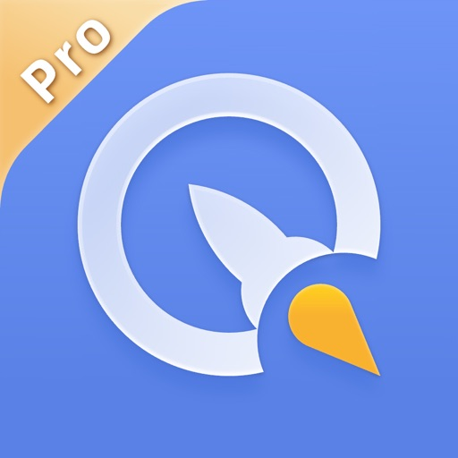
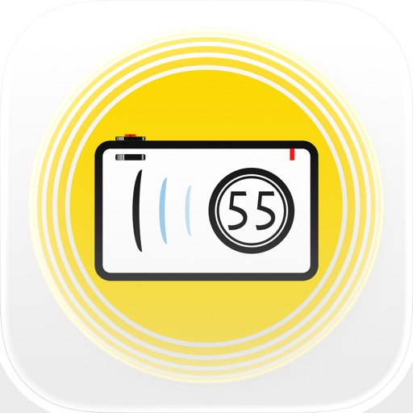
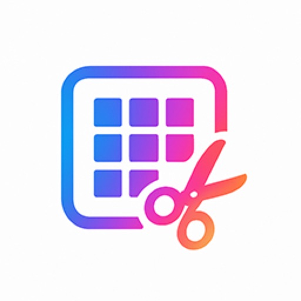
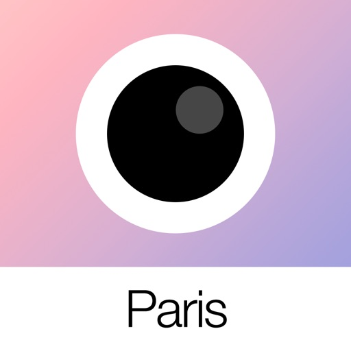
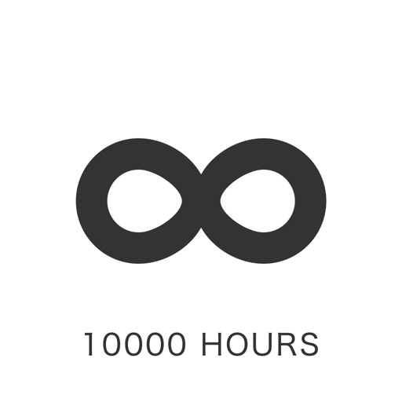
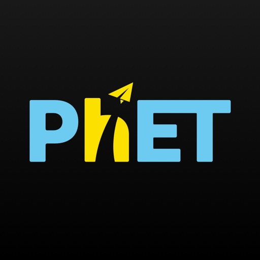
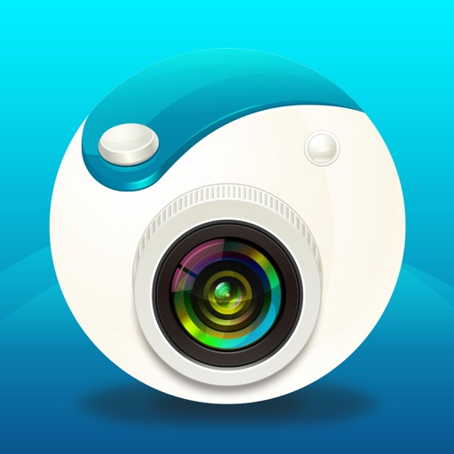
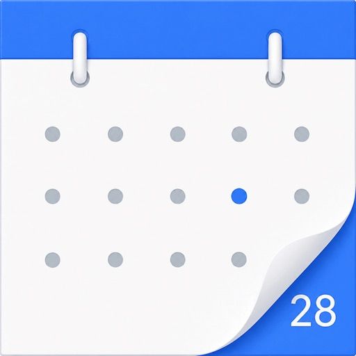

- [盛世天下：女王的游戏](#盛世天下-女王的游戏)
- [情感反诈模拟器](#情感反诈模拟器)
- [Berry胶片相机 - 韩系自拍神器](#berry胶片相机-韩系自拍神器)
- [花皮 - 同城约会，无面具社交，解压释放正念素颜](#花皮-同城约会-无面具社交-解压释放正念素颜)
- [同花顺至尊版-股票软件](#同花顺至尊版-股票软件)
- [扫描全能王 - 官方出品1元畅用版，扫描PDF文件，文字识别](#扫描全能王-官方出品1元畅用版-扫描pdf文件-文字识别)
- [航旅纵横PRO-民航官方直销平台](#航旅纵横pro-民航官方直销平台)
- [Alook浏览器 - 8倍速](#alook浏览器-8倍速)
- [炭炭背单词｜四六级考研等英语单词学习](#炭炭背单词-四六级考研等英语单词学习)
- [BiuBiuBiu - 空气枪](#biubiubiu-空气枪)
- [Procreate Pocket](#procreate-pocket)
- [悟饭游戏厅-经典游戏大全](#悟饭游戏厅-经典游戏大全)
- [时间规划局 - 倒计时与提醒事项](#时间规划局-倒计时与提醒事项)
- [【到了吗】-线下约会·甜蛙·约K歌、看电影、密室逃脱...](#到了吗-线下约会-甜蛙-约k歌-看电影-密室逃脱)
- [空气投篮](#空气投篮)
- [TA - 一对一聊天，遇见对的人](#ta-一对一聊天-遇见对的人)
- [AutoSleep - 苹果手表睡眠监测，睡觉记录及智能闹钟](#autosleep-苹果手表睡眠监测-睡觉记录及智能闹钟)
- [List背单词](#list背单词)
- [atvTools](#atvtools)
- [随手记Pro–个人家庭生意记账](#随手记pro-个人家庭生意记账)
- [每日精选-天文地理人文自然之美&摄影](#每日精选-天文地理人文自然之美-摄影)
- [每日英语阅读](#每日英语阅读)
- [金十数据专业版-为交易而生](#金十数据专业版-为交易而生)
- [空气PiuPiu枪-iWatch解压枪械名枪声狙击手枪模拟器](#空气piupiu枪-iwatch解压枪械名枪声狙击手枪模拟器)
- [完蛋！我被美女包围了！](#完蛋-我被美女包围了)
- [江山北望](#江山北望)
- [隐形守护者](#隐形守护者)
- [东方财富领先版-财经资讯&股票开户](#东方财富领先版-财经资讯-股票开户)
- [电子宠物机](#电子宠物机)
- [同城约友-梦幻沉浸式交友新体验](#同城约友-梦幻沉浸式交友新体验)
- [漂流瓶3D-瓶子在漂,我在靠近](#漂流瓶3d-瓶子在漂-我在靠近)
- [AutoSnore: 鼾声记录器](#autosnore-鼾声记录器)
- [凤凰新闻专业版](#凤凰新闻专业版)
- [AnkiMobile Flashcards](#ankimobile-flashcards)
- [HeartWatch: 心脏和活动监测器](#heartwatch-心脏和活动监测器)
- [对不起，我是警察](#对不起-我是警察)
- [飞常准PRO-全球航班查询机票酒店预订](#飞常准pro-全球航班查询机票酒店预订)
- [法语背单词 - 法语单词记忆工具](#法语背单词-法语单词记忆工具)
- [工具宝-智能提词器](#工具宝-智能提词器)
- [西语背单词](#西语背单词)
- [iGuzheng - 爱古筝](#iguzheng-爱古筝)
- [XP3Player](#xp3player)
- [FL Studio Mobile](#fl-studio-mobile)
- [影控台](#影控台)
- [2026人体解剖学图谱](#2026人体解剖学图谱)
- [SleepTown 睡眠小镇](#sleeptown-睡眠小镇)
- [全球电视 - 国际电视直播](#全球电视-国际电视直播)
- [顶流](#顶流)
- [InstaPic](#instapic)
- [洪绘敲木鱼](#洪绘敲木鱼)
- [女帝的日常](#女帝的日常)
- [nPlayer](#nplayer)
- [炭炭口语宝](#炭炭口语宝)
- [新概念英语专业版 - 英语美语全四册](#新概念英语专业版-英语美语全四册)
- [Tampermonkey](#tampermonkey)
- [开局五个亿-超现实模拟经营真人互动影游](#开局五个亿-超现实模拟经营真人互动影游)
- [鱼影 - 掌上体感钓鱼模拟器](#鱼影-掌上体感钓鱼模拟器)
- [PicSlicer](#picslicer)
- [VoidLink](#voidlink)
- [色影 - 1000个滤镜](#色影-1000个滤镜)
- [ProCam - 专业相机](#procam-专业相机)
- [Analog Paris](#analog-paris)
- [Zero Reader - 超简洁 txt 小说阅读器](#zero-reader-超简洁-txt-小说阅读器)
- [Spark - Ren'Py 小说们](#spark-ren-py-小说们)
- [全球电视 - 观看世界各地电视节目](#全球电视-观看世界各地电视节目)
- [kirakira+](#kirakira)
- [彩云天气Pro](#彩云天气pro)
- [一万小时-人生项目计时器，个人成长记录](#一万小时-人生项目计时器-个人成长记录)
- [PhET模拟实验](#phet模拟实验)
- [漫阅+ 漫画人都爱的漫画阅读神器](#漫阅-漫画人都爱的漫画阅读神器)
- [鲨鱼记账Pro-3秒钟快速记账](#鲨鱼记账pro-3秒钟快速记账)
- [NightCap相机](#nightcap相机)
- [德语背单词](#德语背单词)
- [每日英语 听力学习版](#每日英语-听力学习版)
- [奶蛙 - 魔性音乐弹奏解压抽象洗脑](#奶蛙-魔性音乐弹奏解压抽象洗脑)
- [Incredibox - 好玩的音乐盒](#incredibox-好玩的音乐盒)
- [拾级·爬楼梯打卡](#拾级-爬楼梯打卡)
- [Camera360概念版 - HelloCamera](#camera360概念版-hellocamera)
- [烧杯 - BEAKER](#烧杯-beaker)
- [某某宗女修修炼手札](#某某宗女修修炼手札)
- [海底大猎杀2026](#海底大猎杀2026)
- [旅迹时光 - 旅行路线和地图动画视频生成](#旅迹时光-旅行路线和地图动画视频生成)
- [华尔街见闻Pro-财经资讯头条新闻](#华尔街见闻pro-财经资讯头条新闻)
- [车工计算器 - 数控车床编程助手](#车工计算器-数控车床编程助手)
- [Lumy - 太阳追踪器 户外摄影 日出日落黄金时段](#lumy-太阳追踪器-户外摄影-日出日落黄金时段)
- [雨时](#雨时)
- [Kino - Pro Video Camera](#kino-pro-video-camera)
- [不折叠输入法](#不折叠输入法)
- [心岛日记-难过的人不孤独](#心岛日记-难过的人不孤独)
- [365存钱打卡](#365存钱打卡)
- [KTouch21:帝骑模拟器](#ktouch21-帝骑模拟器)
- [药王谷女修修炼手札](#药王谷女修修炼手札)
- [PeakFinder](#peakfinder)
- [AR鲁班尺](#ar鲁班尺)
- [List生词本](#list生词本)
- [熊猫吃短信 - 旧版](#熊猫吃短信-旧版)
- [pick strong stocks](#pick-strong-stocks)
- [UnionApp](#unionapp)
- [爱日历](#爱日历)

## 盛世天下：女王的游戏

本作品需全程联网。媚娘篇内容共为十六集，女帝篇内容共为三十二集，均含免费体验章节。

● 能互动的爽剧，活下来就登基！百万销量口碑新篇《盛世天下》女帝篇正式上线

全球百万销量、斩获多项年度大奖的《盛世天下》媚娘篇新篇现已全球多平台正式上线！
立即体验这场惊心动魄的朝堂博弈，共同踏上女帝传奇登顶之路！你的每一个选择，都在塑造独一无二的剧情体验。

《盛世天下》女帝篇开启全新剧情与抉择：
——约1000分钟超长真人实拍篇章（较媚娘篇剧情扩容超2倍）
——4K电影级画面质感，沉浸体验盛世风华
——全新深度交互玩法：批奏折、颁圣旨，亲手执掌朝堂格局
——升级版专属人格测试：在故事的最后遇见真实的自己

● 4K电影级质感，极致东方宫廷盛宴
全程真人演绎、实景搭建，以4K电影的光影调度，匠心复刻东方宫阙的磅礴气象。从锦缎华服、非遗道具的细腻肌理，到古韵悠扬、震撼人心的国风配乐，全方位展现极致的东方古典美学。
由官鸿、黄羿、姚弛、林小宅等知名演员倾情出演。更具真实惊险刺激的体验、更恢弘的场景、更细腻的人物刻画，让盛世不止存在于荧幕之中，而真实铺展于眼前。你将亲身体验“君临天下”的东方美学盛宴！

● 从默默无闻少女到传奇女帝，你的剧本你来写！
想冲破命运的裹挟？在本作中，你将体验到最惊心动魄的宫廷权谋博弈！从默默无闻的少女，到在多方势力的掣肘中破局，最终登顶权力巅峰。感受运筹帷幄、制衡朝野的帝王智慧，这条逆天改命的登基之路，由你亲手开创！

● 约1500分钟真人演绎内容，沉浸体验帝王人生
匠心打磨的媚娘篇与女帝篇共约1500分钟实拍篇章，为你铺陈开一幅波澜壮阔的盛世画卷。面对波谲云诡的朝堂局势，你的每一次落子、每一个抉择，都将引发蝴蝶效应。高燃反转、重重悬疑……在步步惊心中执掌乾坤，亲手改写王朝命运！
为你情有独钟或爱恨交织的角色打榜助力，谁能问鼎全球人气榜首，全在你的掌控之中。

● 告别旁观，真正体验执掌天下
摒弃枯燥的点击对话，体验深度交互玩法！权力不再是一句单薄的台词，而是你指尖实打实的朝堂制衡 ：
【批阅奏折】：指尖轻点，趣解百态民生。面对层出不穷的新奇提案与市井趣事，看你如何妙笔生花、巧思破局，以奇招惠及万民。
【颁布圣旨】：御笔轻悬，执掌群臣荣辱。看你如何恩威并施、论功行赏，通过封赏、发落与追贬，尽显女帝知人善用的御人之道。

● 你是什么类型的帝王？专属人格测试报告升级
在故事的终点，你还将获得一份升级版专属帝王测试报告！深度剖析你的权谋风格、危机决策与御人手段。究竟是权情兼收、八面玲珑的“绝命鹤顶红”，至情至性、赴汤蹈火的“风月曼陀罗”，还是心狠手辣、一心问鼎的“卷王见手青”？在故事的终点，看见最真实的自己，生成你的专属人格图鉴分享给全世界！

[View on Apple](https://apps.apple.com/cn/app/%E7%9B%9B%E4%B8%96%E5%A4%A9%E4%B8%8B-%E5%A5%B3%E7%8E%8B%E7%9A%84%E6%B8%B8%E6%88%8F/id6743148949)

## 情感反诈模拟器

这是一部关于心动、试探、操控、谎言和醒来的真人互动影像作品。
第一章免费体验。开启你的「猎心」之旅。

你将化身“情感猎手”以身为饵，反击“情感欺诈”组织“变凤凰”。
直面纯情主播、甜美模特、心机博主、冷血黑手套，乃至幕后BOSS！进入一场高压关系博弈：你能看清那些日常话语里的陷阱，还是在一次次心软里失去判断？这不是恋爱模拟，是步步惊心的情感博弈。你是猎人，还是猎物？由你选择。

这是国内首部情感反诈互动影像作品，也是一座持续更新的随身情感反诈基地。它不是普通恋爱短剧，也不是恋爱教学；它要做的是让你在动心之前，多一份看清的能力。

移动端新增原生竖屏体验、导演手记、一键删除视频与长期保留功能。它不只在桌上，也在口袋里。

【成绩验证】
豆瓣8.5，小黑盒9.4，1.7万用户打分，百万级PC用户体验。曾获/入围金茶奖25年最佳PC、金葡萄奖最25年具影响力、25年最佳叙事提名、25年最佳国产提名等行业荣誉，并被多家媒体报道。

【8.5小时互动电影】
200+情感博弈情景，38种结局走向，67篇私密档案。每一次心软、怀疑、追问和退让，都可能改变故事走向。

【普惠情感启蒙】
105个真实恋爱情境，14万字恋情档案，导演手记。为你的真心穿上铠甲。

【下载与付费】
本作1元下载并体验开篇内容。完整内容需应用内付费解锁。首发期价格与可购买项目请以 App Store 页面和应用内展示为准。付费后可解锁完整内容；后续内容更新对已购买完整内容用户免费更新。

我们真诚地邀请你，参加这场情感反诈的共同行动。
让我们一起，武装真心，守护爱情。

小黑盒官方账号：情感反诈模拟器官方
抖音官方账号：情感反诈模拟器
bilibili官方账号：情感反诈模拟器官方

[View on Apple](https://apps.apple.com/cn/app/%E6%83%85%E6%84%9F%E5%8F%8D%E8%AF%88%E6%A8%A1%E6%8B%9F%E5%99%A8/id6772103820)

## Berry胶片相机 - 韩系自拍神器

大家好，我是 Berry，来自韩国的滤镜创作者。
也许你认识我，是通过 Instagram 账号 @berryveryloveyou。
我曾在社交媒体上分享过很多滤镜，但如今它们已经无法使用。
为了守护我在过去五年中倾注心血制作的滤镜，
我创建了这个专属空间：BerryFilm。

我会定期更新新的滤镜。
自然肤色校正与柔光特效也正在努力开发中。

希望你能在这里，继续享受我精心打造的滤镜。

--

功能特色

• 柔和自然的韩系滤镜
从奶油柔光感到冷色调、暖色调与复古底片风，
你可以找到最适合自己的氛围感滤镜。

• 支持照片与视频拍摄
让相册里“差点感觉”的照片或视频，
一键变身为具有风格感的社交媒体作品。

• 简单易用，静音拍摄
一键应用滤镜，收藏常用滤镜，
配合静音快门，随时随地自然自拍。

• 每月更新新滤镜
根据季节、情绪或风格，持续推出新滤镜。

• 来自用户反馈的持续优化
我们认真聆听每一条建议，持续改进应用体验。

--

推荐给以下用户

• 使用过 Berry Instagram 滤镜的老粉丝
• 想要韩系风格、自然柔光自拍的用户
• 喜欢不浮夸、不过度美颜的滤镜相机
• 享受每个月都有新色调的滤镜控

--

已收录滤镜

当前已包含 40 多款精选滤镜，
如 milk、iPhone 7、butter、cool、warm、blossom 等，
未来将持续更新更多滤镜。

--

联系与分享

欢迎在 Instagram 上标记 @berryfilm.app 分享你的照片。
有任何问题或建议，也欢迎通过私信或邮箱与我们联系。

邮箱：seesunapp@gmail.com
Instagram：@berryfilm.app

[View on Apple](https://apps.apple.com/cn/app/berry%E8%83%B6%E7%89%87%E7%9B%B8%E6%9C%BA-%E9%9F%A9%E7%B3%BB%E8%87%AA%E6%8B%8D%E7%A5%9E%E5%99%A8/id6741474933)

## 花皮 - 同城约会，无面具社交，解压释放正念素颜

你是否厌倦日常的伪装？
你是否讨厌戴上“面具”的日子？
这款应用没有画面和有色滤镜，没有生活中的涂涂抹抹。

放下颜值焦虑，放下面具。来这里，记录真实的自己，做真实的自己！

花皮是一款无画面却可以照亮自己的App，你不需要刻意去摆弄自己。
 
你是否渴望卸下'完美人设'的重担？花皮是首个以素颜照为媒介的素颜正念约会交友社区，通过真实影像的自我凝视，帮助用户重建与身体的深度对话。

在这里，素颜照不仅是记录，更是一面照见内在光芒的镜子——每一次按下快门，都是对自我价值的重新确认；每一张无修饰的照片，都在重塑你对美的认知。

我们相信：当镜头不再评判你的五官，当滤镜消失后的真实肌理被温柔接纳，你将获得超越颜值的深层自信。这里没有'不够好'的焦虑，只有'我本如是'的勇气。心理学家验证的数据显示：一个人通过持续记录素颜日记，自我接纳度提升67%，社交压力降低58%，83%的人表示'终于敢素颜见重要的人'。这不是美颜相机的替代品，而是重塑自尊的觉醒工具。现在就卸下伪装，让素颜成为你最自信的社交起点——因为真正的光芒，从来不需要面具修饰。

[View on Apple](https://apps.apple.com/cn/app/%E8%8A%B1%E7%9A%AE-%E5%90%8C%E5%9F%8E%E7%BA%A6%E4%BC%9A-%E6%97%A0%E9%9D%A2%E5%85%B7%E7%A4%BE%E4%BA%A4-%E8%A7%A3%E5%8E%8B%E9%87%8A%E6%94%BE%E6%AD%A3%E5%BF%B5%E7%B4%A0%E9%A2%9C/id6740246950)

## 同花顺至尊版-股票软件

【炒股就用同花顺】
我们为您提供智能投资服务，以及沪深港美全球实时高速行情，精选股市热点资讯、基金理财等。投资全球，就用同花顺！ 

【爆款功能】 
【√ 】神奇九转：分时、K线神奇九转，为您找到股价拐点，轻松做T。 
【√ 】智能盯盘：实时异动推送、股价预警、大事提醒帮您轻松盯盘。 
【√ 】走势预测：未来涨跌，相似K线，一测便知。 
【√ 】涨停分析：涨停揭秘，一秒了解涨停背后逻辑，愿您追在妖股启动时。 
【√ 】诊股：核心level2数据，全方位技术消息面评估，专家操作建议。 
【√ 】筹码分布：一眼识破主力建仓、洗盘、拉升、出货，轻松实现收益最大化。 
【√ 】自选导入：图片一键导入，自动识别股票，快速跨平台创建股票池。 
【√ 】模拟炒股：20万模拟金免费送，A股、港美股轻松玩，快速成为炒股高手！ 

【基础功能】 
【√ 】全球行情：支持沪市、深市、港股、美股、英股、新三板、全球股指等，想看的行情这里都有。
【√ 】智能盯盘：实时异动推送、股价预警、大事提醒，帮您轻松盯盘。 
【√ 】弹幕：看盘配弹幕，感受股市的喜怒哀乐。
【√ 】自选: 快速查看自选行情、资金、公告、研报，还支持动态选股、自选分组管理等。
【√ 】市场概况：市场涨跌、大盘异动、热点板块、短线风向标、龙虎榜等，一眼读懂主力动向。
【√ 】精选资讯：精选全球财经要闻、热点快讯，7*24小时不间断更新。

【同花顺VIP连续包月】
-- 会员权益：VIP专属通道，享受行情交易提速；免广告；更有独家资讯、大数据追踪助力炒股！
-- 订阅价格：以IAP申请信息为准，例如连续包月产品为每月12元。 
-- 付款：您确认购买并付款后记入iTunes账户。
-- 取消续订：如需取消续订，请在当前订阅周期到期前24小时以前，手动在iTunes/Apple ID设置管理中关闭自动续订功能。
-- 续订：苹果iTunes账户会在到期前24小时内扣费，扣费成功后订阅周期顺延一个订阅周期。
-- 会员服务协议（含自动续费）：https://pay.10jqka.com.cn/onlinePayment/vipServieceProtocol.html
-- 隐私条款：https://ozone.10jqka.com.cn/tg_templates/doubleone/2018/privacyPolicy/index.html

【自动续费服务申明】

付款：用户确认购买并付款后记入iTunes账户；
续费：苹果iTunes账户将在订阅到期前24小时内扣费，扣费成功后会员权限顺延一个月。
取消续费：如需取消续费，请在当前权限到期前24小时以前，手动在iTunes/Apple ID设置管理中关闭自动续费功能，到期前24小时内取消，将会收取订阅费用。

1.购买自动续费产品，确认购买后，将会从您的苹果iTunes账号扣除相应费用；
2.开通自动续费服务后，将在会员到期前1天为您自动续费，续费成功会员自动延长相应时长；
3.如需取消续费，请在当前权限到期前24小时以前，手动在iTunes/Apple ID设置管理中关闭自动续费功能，到期前24小时内取消，将会收取订阅费用。

会员服务协议（含自动续费）

金牛会员
http://pay.10jqka.com.cn/onlinePayment/vipServieceProtocol.html?sid=157

金牛会员尊享版
https://pay.10jqka.com.cn/onlinePayment/vipServieceProtocol.html?sid=422

涨停助手
https://pay.10jqka.com.cn/onlinePayment/vipServieceProtocol.html?sid=269

手机短线宝
https://pay.10jqka.com.cn/onlinePayment/vipServieceProtocol.html?sid=196

云参数
https://pay.10jqka.com.cn/onlinePayment/vipServieceProtocol.html?sid=231

手机高级诊股
https://pay.10jqka.com.cn/onlinePayment/vipServieceProtocol.html?sid=171

形态掘金
https://pay.10jqka.com.cn/onlinePayment/vipServieceProtocol.html?sid=379

神奇电波
https://pay.10jqka.com.cn/onlinePayment/vipServieceProtocol.html?sid=115

手机超级level-2
http://pay.10jqka.com.cn/onlinePayment/vipServieceProtocol.html?sid=207

早盘选股宝
https://pay.10jqka.com.cn/onlinePayment/vipServieceProtocol.html?sid=351

隐私条款
https://ozone.10jqka.com.cn/tg_templates/doubleone/2018/privacyPolicy/index.html

【关于同花顺】
同花顺(300033)成立于1995年，是一家专业的互联网金融数据服务商，为您全方位提供财经资讯及全球金融市场行情，覆盖股票、基金、期货、外汇、债券、银行、黄金等多种面向个人和企业的服务。

【用户帮助】 
感谢您使用同花顺手机客户端，使用中有任何问题和建议可通过以下方式联系我们。

智能客服：24小时、无需等待，智能客服小花快速为您解答。
24小时热线：952555

[View on Apple](https://apps.apple.com/cn/app/%E5%90%8C%E8%8A%B1%E9%A1%BA%E8%87%B3%E5%B0%8A%E7%89%88-%E8%82%A1%E7%A5%A8%E8%BD%AF%E4%BB%B6/id954724812)

## 扫描全能王 - 官方出品1元畅用版，扫描PDF文件，文字识别

扫描全能王是一款集文件扫描、图片文字提取识别、PDF 内容编辑、PDF 分割合并、PDF 转 Word、电子签名等功能于一体的智能扫描软件。自动扫描，生成高清扫描件，支持JPEG、PDF 等多格式保存，还能将扫描件一键转换为 Word/ Excel/ PPT 等多种格式文档，通过手机、平板电脑、电脑等多设备同步查看。

-----功能亮点-----
【手机扫描仪】
手机拍纸质文档，智能去除杂乱背景，生成高清JPEG、PDF文件。默认自动扫描，对准纸质文档自动拍照，解放双手。
支持多种图像优化模式，可手动调节图像参数，将纸质文件快速转为清晰的扫描件。

【图片转文字利器】
智能 OCR 识别文字，即使搜索对象是图片，也能输入关键词轻松定位，高亮显示。
支持识别中、英、日、韩、葡、法等 41 种语言，还能一键复制、编辑图片上的文字，支持导出为 Word/Text/TXT 格式。

【个人文档管家】
支持一键导入 PDF、图片、表格等多类型电子文档；标签归类，多文件夹保存，一站式管理保存工作、学习、生活中各类资料。
手机、平板、电脑等多设备端，随时同步查看管理文档。

【PDF 编辑修改】
自由组合 PDF 文档，对多个文件进行页面删除、顺序调整、插入支持、页面合并等操作。
支持一键涂抹、添加批注，轻松编辑文档；高级账户还能设置智能水印铺满，一键生成电子签名等功能，确保文档安全。

【PDF格式转换】
PDF、Word、Excel、PPT 和图像文档之间格式互相转换，一键分享或下载到本地；
格式转换后可保持文本、图像等文档的原始布局，实现版面还原。

----他们都在用扫描全能王做什么----
● 职场人士：随时扫描手边合同、公司证件、开会 PPT 等，一键保存或分享PDF，随时查找翻阅，非常给力的办公软件
● 学生：课堂扫描笔记、白板、PPT，复习找资料快速又方便；线上提交纸质材料、个人证件扫描件，高清又专业
● 老师：扫描课堂白板内容、学生考卷错题整理，发给家长同步教学进度，老师用心家长安心
● 医生：疑难病症资料随时扫描记录，同行交流会议 PPT 留存，整理留档，也方便给其他医院科室共同交流
● 设计师：扫描保存设计手稿，一键提取线稿，随时捕捉灵感初现时的大胆想象
……

-----升级高级帐户，享更多强大功能-----
● 纸质文档一键转换 Word/Excel，轻松整理各类报表报告；
● 拍图识字，提取图片或扫描件中的文字，一键复制导出，快速整理资料；
● PDF 加密、添加电子签名、一键铺满水印等，分享协作高效安全；
● 支持身份证、护照、企业三证、户口本等近百种证件扫描，1：1 生成高清扫描件，可用于证照资料提交、电子开户等；
● 10G 超大云空间，文件夹分类标签管理，查找使用更方便。

一经确认购买订阅产品，iTunes会直接扣除相关订阅所需费用。

扫描全能王高级帐户可通过iTunes帐户信用卡直接付费订购。若当前订购周期（一个月／一年）结束前24小时内仍未取消续订，将会自动续订下个周期的高级帐户。

在当前订购周期内，无法取消当前周期的使用。您可以通过iTunes帐户的设置来管理或取消购买。

您的试用会立即结束，如果您付费购买了产品内的订阅。
关于服务条款：
https://www.camscanner.com/app/service?language=zh-cn
关于隐私政策：
https://www.camscanner.com/app/privacy?language=zh-cn

----使用建议----
为确保你能获得清晰的扫描图，请在拍照时：
● 光线充足，尽量避免抖动
● 尽量使图片占满拍摄屏幕

若你喜欢扫描全能王，或者有其他任何意见，请花一点时间给我们写评论，或发邮件至isupport@camscanner.com，这将帮助我们不断改进产品，给你更好的使用体验！

----关注我们 ----
在新浪微博上关注我们 @扫描全能王
在微信上关注我们，搜索公众号：扫描全能王
在Twitter上关注我们 @CamScanner
在Facebook 上关注我们：CamScanner
在Google+上关注我们：CamScanner

[View on Apple](https://apps.apple.com/cn/app/%E6%89%AB%E6%8F%8F%E5%85%A8%E8%83%BD%E7%8E%8B-%E5%AE%98%E6%96%B9%E5%87%BA%E5%93%811%E5%85%83%E7%95%85%E7%94%A8%E7%89%88-%E6%89%AB%E6%8F%8Fpdf%E6%96%87%E4%BB%B6-%E6%96%87%E5%AD%97%E8%AF%86%E5%88%AB/id388624839)

## 航旅纵横PRO-民航官方直销平台

航旅纵横，伴你出行每一程
我们是国家队：中国民航信息官方出品，民航版“12306”。
我们只提供权威、及时、精确、全面的航班、机票、机场信息。

【您想不到的功能我们有】
民航官方直销平台：来这买源头机票，0差价·0捆绑·0套路
自动导入行程：无须您手动添加，行程自动跳到碗里来
3D飞行视频：连接你在地球上飞过的每个角落
火车抢票：抢不到火车票？有票神器帮你抢
机上打牌聊天：无网也能聊天和娱乐，快试试机上模式
全球精品商城：线上点一点，免税商品送到家

【您想到的功能我们也有】
电子登机牌：无需兑换纸质登机牌，一码快捷通行
航班动态：航班动态及时晓，官方数据任您查
手机值机：随时随地在线选座位，还能选状态和留言
用车：接送机延误免费等、误机必赔偿，租车场站取还便捷、免千元押金
酒店预订：专属客服7x24小时守候，海量酒店等你来订
机场雷达：手机变雷达，查看机场上空飞机实时动向
常客卡：支持不同航空公司的常客卡添加，方便管理

【求关照】
独乐乐不如众乐乐，邀请小伙伴，一起享受航旅纵横服务

【联系我们】
邮箱：kefu@travelsky.com.cn

[View on Apple](https://apps.apple.com/cn/app/%E8%88%AA%E6%97%85%E7%BA%B5%E6%A8%AApro-%E6%B0%91%E8%88%AA%E5%AE%98%E6%96%B9%E7%9B%B4%E9%94%80%E5%B9%B3%E5%8F%B0/id768160271)

## Alook浏览器 - 8倍速

Alook极简且强大，致力成为iOS最佳浏览器 。

核心功能  
- 极速体验：无推送，无新闻，无广告，毫秒级启动  
- 音视频功能：悬浮播放，倍速调节（0.5-16.0倍），后台播放，AirPlay投屏，DLNA投屏，小窗播放，单曲循环，画中画，截图，镜像，长按倍速控制...
- 文件管理：手动下载，解压/压缩（zip、rar、7z，含加密），文件新建/编辑，纯文本模式打开，文件编码选择，相册导入，文件移动/复制，Wi-Fi传输...
- 电子书阅读器：支持txt、pdf、epub、kindle、mobi、azw、azw3、azw4、prc、pdb格式，支持简繁体转换  
- 阅读模式：智能拼页，简繁转换，专为小说打造  
- 看图模式：批量保存，图片压缩  
- 广告拦截：内置Adblock Plus，支持多语言规则，第三方规则，自定义标记广告，屏蔽侵入式广告  
- 自定义搜索引擎：自动检测网页内搜索框，快速添加  
- 翻译功能：内置14种语言，支持全页翻译和划词翻译  
- JavaScript扩展：运行自定义JS代码  
- 文件共享：完美适配iOS 11 Files和iTunes文件共享  
- 设备适配：支持iPhone、iPhone XS Max、iPad Pro及设备间同步  
- 网站设置：单独设置视频悬浮，广告拦截，无图模式，剪贴板访问和JavaScript脚本  
- iPad支持：完美适配分屏和iOS 11拖拽操作  

其他功能  
- iCloud同步书签，自定义广告规则，搜索引擎和插件  
- 隐私模式或无痕浏览  
- 自定义沉浸式壁纸  
- 下一页预加载  
- 自定义站点图标  
- BigBang文本选取  
- Handoff支持  
- 自动刷新  
- 网页下拉刷新（设置-通用设置-下拉刷新）  
- 主页下拉搜索  
- 自定义网站主页  
- 网页长截图  
- 开发者工具：查看源码，Eruda，vConsole，Cookie管理  
- 夜间模式：支持OLED纯黑模式，网页护眼色  
- 无图模式：智能无图  
- 全屏模式：滑动隐藏工具栏  
- 页面搜索：网页内文字查找  
- 站内搜索：用默认搜索引擎搜索指定关键词  
- 支持密码管理器：1Password，LastPass，Avast Passwords等  
- 二维码工具：扫描，识别图片二维码，生成链接二维码  
- 桌面版或移动版网页切换：支持自定义UA  
- 阻止跳转App Store  
- 打印与PDF创建  
- 快速输入网址，快速打开复制网址  
- 翻页按钮与屏幕点击翻页  
- 任意位置滑动返回  
- 查看站点证书  
- Touch ID或Face ID验证  
- 自定义长按快捷操作  
- 导入或导出书签  
- 自定义字体，语言，页面滑动速度，屏幕旋转锁定  

Scheme  
- 启动App：Alook://  
- 搜索或打开URL：Alook://后接搜索内容或链接  
- 新建下载：Alook://download/后接下载链接  
- 扫描二维码：Alook://QRCode  
- 开始搜索：Alook://Search  
- 打开图书馆：Alook://Books  
- 打开书签：Alook://Bookmarks  

专业测评  
- App菌：神仙浏览器，实名制安利  
- 蔡晓琳@爱范儿：给我源源不断惊喜的炫酷应用，身怀十八般武艺  
- yui_love@少数派：浏览器中的三无产品，我的主打浏览器  
- 利器@知乎：iOS神级浏览器Alook推荐  
- 网罗灯下黑，智网教派，iOS部落，好机友@微信公众号：吹爆，太强大了，极简，清流  

用户评价  
- 来自keeyang1985：良心软件，非常喜欢，物有所值。体积小，速度快，没有其他乱七八糟的东西。梦寐以求的浏览器，12元的价格物超所值  
- 来自闻憬：一个好用的app带来的幸福感远超一切。感谢支付宝送我的红包，不然我可能会错过这个我用过最好用的浏览器。以前用的浏览器功能零散，Alook一个顶八个，12元超值  

购买前后有任何问题，欢迎联系我们  
微信：AlookApp  
微博：Alook浏览器App  
邮箱：AlookApp@qq.com

[View on Apple](https://apps.apple.com/cn/app/alook%E6%B5%8F%E8%A7%88%E5%99%A8-8%E5%80%8D%E9%80%9F/id1261944766)

## 炭炭背单词｜四六级考研等英语单词学习

炭炭背单词，一款基于“艾宾浩斯记忆曲线”，极致简洁高效的背单词软件。
- 上线一年，全平台累计下载破三百万
- 荣登 App Store 教育付费榜 No.1，多次获得华为、OPPO 等应用市场官方专题推荐，广受好评 

什么时候需要炭炭背单词？
1. 单词背了忘，忘了背，没有合适的计划安排，没有正确的记忆方法
2. 感觉传统背单词软件复习压力大、效率低、不够自由
3. 喜欢简洁的界面，追求专注高效背单词的体验
4. 希望尝试“艾宾浩斯记忆曲线”来复习单词

为什么要选择炭炭背单词？
1. 『科学清晰的复习安排』
- 使用“艾宾浩斯记忆曲线”合理安排复习规划

2. 『简洁高效的学习体验』
- 千万设计师倾情打造，简约设计与高效学习结合
- 遮盖/点击/左右滑动，只有简单实用的交互，专注于单词记忆

3. 『海量权威的书籍词库』
- 权威考纲和专业词书支持，学习更放心
- 300+ 词库覆盖各段英语水平和学习需求
- 四六级/考研考博/专四专八/雅思托福GRE/专升本等
- 可搭配实体单词书使用

4. 『专业精彩的单词内容』
- 专业词典，支持欧陆/有道/牛津/朗文/剑桥/柯林斯等专业词典查询
- 炭炭妙记，提供十万条单词助记，谐音/联想/扩展/串记/对比/词根，应有尽有

5. 『全面自由的练习模式』
- 随身听，支持听写，支持定时关闭
- 单词拼写，支持拼写拆分/平板手写输入
- 选择题测试，支持英译汉/汉译英/听音选义

6. 『方便快捷的内容接口』
- 词库导入，支持外部词库文件导入
- PDF导出，支持学习列表一键导出，支持多种样式

7. 『独特有趣的装备系统』
- PDF导出/炭炭妙记/炭炭云词库/卷王制造机/炭炭万能钥匙
- 白嫖炭币，一次解锁，终身使用

8. 支持多端同步，支持跨平台使用
9. 更多有趣功能等待同学发现~

炭炭背单词的设计理念
1. 简单，less is more。
如无必要，勿增实体。简单是取舍，是优雅，是美。
我们朴素地认为好产品的灵魂应是朴实无华的。最简单，往往最有效。

2. 缝合，三人行，必有我师。
择其善者而从之，其不善者而改之。向好的学习，古人诚不欺我。
新产品的诞生一般会经历“模仿/学习/超越”等阶段，炭炭已经 5.0 啦，我们希望能取得“突破”，为同学们带来更好的体验~

3. 克制，命运的馈赠早已在暗中标好了价格。
炭炭背单词是我们的第一款产品，我们的商业目标不是赚钱，只要不亏本，我们就很开心啦~ 
我们希望有机会能做出更多更妙更有用的 App！

结语
“知我罪我，其惟春秋”，炭炭一定还有不足之处，但请同学放心，我们想把炭炭做好的初心从未改变，同学们的鼓励与吐槽都会变成鞭策我们继续肝的动力！

感谢看到这里的你 ~ 祝学习顺利 ~

*若有其他需要帮助的地方，可通过 App 内的 帮助与反馈 进行联系~
## 联系我们
欢迎同学们通过以下方式与炭炭联系，同学的支持与建议会给『炭炭背单词』带来无限可能！
- App 内 - 设置 - 帮助与反馈
- 邮箱 support@maiseed.com.cn

[View on Apple](https://apps.apple.com/cn/app/%E7%82%AD%E7%82%AD%E8%83%8C%E5%8D%95%E8%AF%8D-%E5%9B%9B%E5%85%AD%E7%BA%A7%E8%80%83%E7%A0%94%E7%AD%89%E8%8B%B1%E8%AF%AD%E5%8D%95%E8%AF%8D%E5%AD%A6%E4%B9%A0/id1600873673)

## BiuBiuBiu - 空气枪

1.爽快的枪械音效
抬手就是一枪，抖抖就能突突突

2.手机和手表都可以使用
支持AppleWatch，摆出手势！BiuBiuBiu！
手表手机共用，化身双枪勇士

3.多种武器供您挑选：
手枪、步枪、霰弹枪、狙击枪甚至还有手榴弹。
上弹声音也一应俱全，仿佛置身真实枪战！

4.无法拒绝的奇妙体验
做出端枪的姿势，然后Biu的一声！

免费更新了新年的礼花，点燃新年的焰火吧！

[View on Apple](https://apps.apple.com/cn/app/biubiubiu-%E7%A9%BA%E6%B0%94%E6%9E%AA/id6448477521)

## Procreate Pocket

荣获“年度 App”奖项的 Procreate Pocket 汇聚多种功能，是 iPhone 上有史以来最全能的绘画 App。

Procreate Pocket 提供你所需的一切，助你画出富有表现力的线条、色彩浓郁的画作、漂亮的插画和精巧的动画。Procreate Pocket 提供数百款手工画笔、上手简单的艺术创作工具组、高级的图层系统，以及强大的 Valkyrie 图形引擎。无论躺在沙发上，还是乘坐火车，在海边休闲，还是排队买咖啡，都可以轻松创作。

Procreate Pocket 就是你手中的移动画室。

亮点：
• 在兼容的设备上，可创建高达 16k x 4k 像素的高清画布
• 针对 iPhone 设计的直观深色模式界面
• 革命性的速创形状功能，可以创作出完美的形状
• 平滑灵敏的涂抹采样
• 由高速的 64 位绘图引擎 Valkyrie 提供支持
• 借助键盘快捷键提高工作效率
• 使用惊艳的 64 位色彩进行创作
• 250 步撤销和重做操作
• 连续自动保存-不再丢失作品

突破性画笔：
• 配备了数百款设计精美的画笔
• 画笔组，有序摆放各种上漆、素描和绘图画笔
• 每个画笔有超过 100 个自定义设置
• 画笔工作室—设计自定义画笔
• 导入和导出自定义 Procreate 画笔
• 导入 Adobe® Photoshop® 画笔，运行速度甚至比 Photoshop® 更快

功能齐全的图层系统：
• 通过每一个细节和构图准确控制你的图层
• 创建图层和剪辑蒙板，进行无损编辑
• 通过将多个图层存储到组中来保持有序组织
• 跨多个图层同时转换对象
• 获取超过 25 种图层混合模式，实现业界级别合成效果

面面俱到的颜色：
• 使用色彩快填为线条稿填色
• 色盘、经典、色彩调和、值和调色板等色彩面板
• 导入颜色文件进行配色
• 为任意画笔分配颜色动态

精准设计工具：
• 为插图添加矢量文本
• 轻松导入自己喜欢的字体
• 裁剪和调整画布大小，实现最佳布局
• 透视、等距、2D 和对称可视指引
• 绘画辅助实时绘制完美笔划
• 流线功能平滑描边，书写效果更精美，实现专家级着墨效果

动画辅助：
• 利用可以自定义的洋葱皮轻松制作逐帧动画
• 制作故事板、GIF、动态分镜和简单动画
• 充分利用画布的像素导出动画

绝妙的处理效果：
• 渐变映射-使用自定义渐变色，重新映射图片的颜色
• 故障艺术、色像差、泛光和半色调，为你的作品添加新维度
• 高斯模糊和动态模糊滤镜可以提高景深和动态效果，锐化功能可以让图像更加清晰
• 高级杂色滤镜可以更好地调整经典复古外观
• 实时调节色相、饱和度或亮度
• 强大的图像调节功能，包括颜色平衡、曲线和 HSB
• 运用有趣、简单上手且创新的弯曲、对称和液化动态功能实现创作

缩时视频回放：
• 使用 Procreate 的缩时视频回放功能重温你的创作之旅
• 以 4K 格式导出你的缩时视频，用于制作高端视频
• 在你的社交网络上分享 30 秒的缩时短视频

参考助手：
• 使用全画布或一直打开参考图像
• 借助 AR 在脸上绘画
• 从参考窗口中直接选取颜色

导入素材和分享作品：
• 以 Adobe® Photoshop® PSD 文件格式导入或导出你的作品
• 导入 Adobe® ASE 和 ACO 调色板
• 导入 JPG、PNG 和 TIFF 等格式的图像文件
• 在应用之间拖放作品、画笔、调色板和字体
• 导出至 AirDrop、iCloud Drive、“照片”App、iTunes、Dropbox、Google Drive、Facebook、X（前身为 Twitter）、Instagram、TikTok、“微博”App、“邮件”App，等等。
• 将你的艺术作品以 PDF、JPEG、PNG、TIFF、GIF、HEVC 或 MP4 文件格式分享

[View on Apple](https://apps.apple.com/cn/app/procreate-pocket/id916366645)

## 悟饭游戏厅-经典游戏大全

海量单机小游戏合集，全部离线免费游玩。可按分类浏览游戏、添加收藏、自定义专属游戏列表。无网络也能轻松打发时间，操作简单、启动迅速，趣味无穷。

[View on Apple](https://apps.apple.com/cn/app/%E6%82%9F%E9%A5%AD%E6%B8%B8%E6%88%8F%E5%8E%85-%E7%BB%8F%E5%85%B8%E6%B8%B8%E6%88%8F%E5%A4%A7%E5%85%A8/id6766922910)

## 时间规划局 - 倒计时与提醒事项

时间规划局是一款提醒事项与时间管理的App，它会时刻提醒你珍惜自己的时间，可以精确到秒。支持农历显示，支持分类管理功能，支持自定义小组件背景，支持百分比形式，支持更改百分比的精确度，让您每分每秒都能够看到时间的变化，提醒您珍惜时间。同时支持『CPU面板』，『灵动岛』，『整点报时』，『年龄计算器』，『魔法拼图』，『Live Photo』，『计时器』，『全屏时钟』，『日期计算器』，『二维码生成』等小工具。

它可以帮你制定项目计划、设置会议的提醒、 安排您的行程规划、并让您保持工作专注，还能用于记录备忘事件，帮组您更好的管理时间。

[特色]
# 内置70多种锁屏小组件和100多种桌面小组件；
# 可以精确到秒，时刻提醒您珍惜时间，看得到的时间变化;
# 支持提醒，通过推送通知提醒您即将到期的事件；
# 支持动态壁纸；
# 支持农历选择，不错过每一个农历节日；
# 可自定义小组件背景，自定义小组件颜色，个性化定义小组件；
# 支持每天每周每月每年重新计算；
# 内置多个小工具，包括『CPU面板』，『灵动岛』，『整点报时』，『设备面板』，『年龄计算器』，『魔法拼图』，『Live Photo』，『计时器』，『全屏时钟』，『计步器』，『日期计算器』，『二维码生成』，『节假日』，『To Do List』，『生辰』等多个小工具；
# 桌面小组件可以自定义背景、字体、字体颜色、透明度和模糊度；
# 支持事件置顶；
# 支持事件自动排序；
# 支持分类管理功能，更好的帮您管理所有事件提醒；
# 您可为每个事件设置背景，小而美的时间提醒应用；
# 支持将数据备份到iCloud的功能，再也不用担心数据会丢失；
# 提供各种炫酷的动画，给您不一样的心情；
# 可自定义推送通知铃声，让您与众不同；
# 支持网络搜图，为您提供更加丰富的内容；
# 全新清新简洁的操作界面，让操作更简洁；
# 支持百分比形式。

会员功能包括：所有小组件、所有小工具、所有静态壁纸和动态壁纸，100%纯净无广告和数据自动备份功能，并可以享受未来的所有会员功能。
【包月会员说明】
1.订阅周期：1个月
2.订阅价格：每月3元
3.付款：用户确认购买并付款后记入itunes账户
4.取消付款：如需取消续订，请在当前订阅到期24小时以前，手动在iTunes/Apple ID设置管理中关闭自动续订功能
5.续订：苹果iTunes账户会在到期前24小时内扣款，扣款成功后订阅周期顺延一个月

【包年会员说明】
1.订阅周期：1年
2.订阅价格：每年24元
3.付款：用户确认购买并付款后记入itunes账户
4.取消付款：如需取消续订，请在当前订阅到期24小时以前，手动在iTunes/Apple ID设置管理中关闭自动续订功能
5.续订：苹果iTunes账户会在到期前24小时内扣款，扣款成功后订阅周期顺延一年

【永久会员说明】
可无限制永久使用会员功能，所有小组件、所有小工具、所有静态壁纸和动态壁纸，100%纯净无广告和数据自动备份功能，并可以享受未来的所有会员功能。

隐私政策：https://shijianguihuaju.cn/2020/01/01/countdown-law/
用户协议：https://shijianguihuaju.cn/2020/01/01/countdown-law/

[View on Apple](https://apps.apple.com/cn/app/%E6%97%B6%E9%97%B4%E8%A7%84%E5%88%92%E5%B1%80-%E5%80%92%E8%AE%A1%E6%97%B6%E4%B8%8E%E6%8F%90%E9%86%92%E4%BA%8B%E9%A1%B9/id1439723850)

## 【到了吗】-线下约会·甜蛙·约K歌、看电影、密室逃脱...

年轻人的约会新方式！！！
约吃饭、看电影、演唱会、密室逃脱...
在这里，才华不会被埋没，用炸裂的演技展示真实自我，获取Ta的好感，夺回属于你的舞台焦点。

发起邀约
神啊，赐予我一个骑白马的吧

对方应约
稀饭，你是我的菜

联系对方
幽默是一种艺术

线下见面
随时随地的撒狗粮

拍摄短视频
一段即兴的rap展示，让世界认识你

网友疯狂打Call：
「 好瘦的八戒」爱了爱了
「 茉莉蜜茶」完了，我中毒了，一天要打开APP几百次
「 陌人」抓到帅气学长一枚，收工～

如果您有任何问题，请及时在APP中砸向我们，我们喜欢被砸，您还可以通过邮件吐槽。
吐槽邮箱：tw@yohoing.com

[View on Apple](https://apps.apple.com/cn/app/%E5%88%B0%E4%BA%86%E5%90%97-%E7%BA%BF%E4%B8%8B%E7%BA%A6%E4%BC%9A-%E7%94%9C%E8%9B%99-%E7%BA%A6k%E6%AD%8C-%E7%9C%8B%E7%94%B5%E5%BD%B1-%E5%AF%86%E5%AE%A4%E9%80%83%E8%84%B1/id1095903651)

## 空气投篮

你尽管投，我们陪你「傻」

此刻你正拿着手机，工作学习、无聊放空甚至居家静默
有多久没有冲到球场，享受肆意流汗的快乐了？

第一次或第一万次，无声无息，不知不觉间
你又一次自然而然地调动肩膀，抬起手臂，左手辅助，右手压腕
极致柔和地对着空气潇洒出手
你投的不是篮球，是一去不复返的青春和情怀
你大概，从未期待过什么回应

但这一次
那颗并不存在的「球」，虚拟地旋转三周半划过7.24米后，准确地空心入网
全世界第二美妙的声音，老朋友般坚定而温暖的响起——

「唰」~
这一刻，你浑身疲惫的血液瞬间被点燃
你知道你不是一个人，这个世界有人「懂你」

是的，我们把「空气投篮」做成真的了！

轻巧无感的动作识别，配合精妙绝伦的空间音频模拟，
融汇成直击灵魂的信仰之音。

篮球，每个男人拿起了，就再也放不下。
念念不忘，必有回响。
从今天起，每一个忙忙碌碌负重前行的日子里，
你抬手，我们永远给你，骄傲的理由。

只要信仰在，每个人都可以做自己的 MVP。
致敬每一个，不负热爱的你。
——————————————
【功能玩法】
根据提示佩戴手表，识别投篮手势动作，模拟真实的空心入网的空间音效

1、一定概率出现「打铁」砸框声音彩蛋，制造「意外」惊喜；
2、左轮、鞭子……更多体感模拟声效随时更新，更多玩法等你体验；

[View on Apple](https://apps.apple.com/cn/app/%E7%A9%BA%E6%B0%94%E6%8A%95%E7%AF%AE/id1625289361)

## TA - 一对一聊天，遇见对的人

《TA》自上线以来，已成功配对了几十万对！他们从最开始的相遇，再慢慢相恋。

很多人找不到对象的真正原因是缺乏认识异性的途径，《TA》正是一条认识异性的好途径。

《TA》会根据年龄、学历、兴趣爱好等维度进行配对，把最合适两人配成一对，再进行一对一聊天。

每个APP都有一个定位，《TA》的定位是【靠谱】。如果你想找到男朋友、女朋友、结婚对象，那欢迎你。

-----联系我们-----
如在使用过程中遇到任何问题，请联系我们：
- 在线帮助：在TA中选择“我” -> “意见反馈”
- 邮件服务：shiyixin0420@163.com（如果是帐号问题，请在邮件中注明出问题的帐号）

-----连续订阅说明-----
- TA提供按月、按季、按年三种周期订阅。
- 费用将在确认购买时通过你的 iTunes 账号收取。
- 根据App Store自动续约规则，会员会在订阅期结束前24小时内自动续约（含免费试用），你可以在会员订阅期结束前至少24小时取消订阅。
- 通过账号设置 - 管理订阅来取消订阅。
- 条款与隐私政策：https://www.bokuigo.cn/misterrightPrivacyPolicy/index.jsp

[View on Apple](https://apps.apple.com/cn/app/ta-%E4%B8%80%E5%AF%B9%E4%B8%80%E8%81%8A%E5%A4%A9-%E9%81%87%E8%A7%81%E5%AF%B9%E7%9A%84%E4%BA%BA/id1217732174)

## AutoSleep - 苹果手表睡眠监测，睡觉记录及智能闹钟

使用手表来自动追踪您的睡眠*。无需按动任何按钮，无需安装任何手表应用，只要安稳睡觉就好！

关于 AutoSleep
-----------------
使用先进的启发式应用 AutoSleep 来计算您的睡眠时长。

如果您戴上手表睡觉，您什么都不需要做。AutoSleep 会自动监控您的睡眠时长与质量并在您早晨第一次解锁手机后给你发送通知。

即使您不带着手表睡觉, AutoSleep 也可以计算您在床上的时间。这非常简单。

因为人总是各异的，AutoSleep 提供了微调选项，您可以通过简单地滑动滑块来调整自己的睡眠活跃度检测级别并可以很快速地看到睡眠时钟的统计变化。它还允许您自定义睡眠窗口, 是否需要每日通知以及在睡眠时钟上显示更多或更少的信息。 

与 Apple 睡眠阶段应用完全集成，使您可以选择使用 Apple 睡眠应用并在 AutoSleep 中查看所有信息。

AutoSleep 包括睡眠监控所需的所有信息和功能，包括：
睡眠时间 – 睡眠时长和睡眠银行余额
睡眠评分 – 对您睡眠的综合评分
睡眠环 – 用高质量的睡眠填充您的睡眠环，包括心率、深度睡眠和快速动眼
Apple 睡眠阶段 – 可使用 Apple 睡眠应用中数据的选项
睡眠呼吸暂停 - 了解您是否患有睡眠呼吸暂停
睡眠血氧 – 睡眠时的测量值
呼吸频率 – 记录您每分钟的呼吸
噪声 – 环境噪声测量值
睡眠分析 – 查看您的睡眠周期的详细图表和细分情况
睡眠燃料 – 衡量您的睡眠质量和效率
今晚就寝时间 – 根据您的习惯推荐您最近的就寝时间
就绪 – 表示您的身体和精神压力
温度 – 跟踪您睡眠时的手腕温度
睡眠一致性 – 了解您的就寝时间习惯
熄灯 – 跟踪入睡时间
实时睡眠跟踪 – 查看您夜间的睡眠统计信息
智能闹钟 – Watch 内置的智能闹钟，帮助您从较浅的睡眠中醒来
小组件 – 各种各样超棒的 iPhone 小组件
复杂功能 – 多种 Watch 表盘选项
HomeKit – 与 Apple HomeKit 完全集成
表情符号和笔记 – 记录对睡眠时段的评论和标签
探索 – 深入分析视图
Siri – 通过 Siri 语音指令使用
快捷方式 – 创建您自己用于 AutoSleep 的快捷方式
调整 – 调整您个人睡眠/醒来检测的简单功能
历史 – 高级图表和趋势
配置 – 更改主题并设计您的时钟睡眠环
设置 – 定制您的睡眠目标、设置通知和提醒
导出 – 导出选项以保存数据

AutoSleep 可以与 HeartWatch 联动，它是我们首推的心跳与活动检测应用。AutoSleep 会将您的睡眠信息记入健康应用中。 

*需要运行 Watch OS 4 或更高版本的 Apple Watch。

- 2018年度最佳
https://apps.apple.com/story/id1438574124/

- 2019年度最佳
https://apps.apple.com/story/id1484100916/

- 2020年度最佳
https://apps.apple.com/story/id1535572713/

- 2021年度最佳
https://apps.apple.com/story/id1591083005/

- 2022年度最佳
https://apps.apple.com/story/id1654240446

- 2023年度最佳
https://apps.apple.com/story/id1719170110

[View on Apple](https://apps.apple.com/cn/app/autosleep-%E8%8B%B9%E6%9E%9C%E6%89%8B%E8%A1%A8%E7%9D%A1%E7%9C%A0%E7%9B%91%E6%B5%8B-%E7%9D%A1%E8%A7%89%E8%AE%B0%E5%BD%95%E5%8F%8A%E6%99%BA%E8%83%BD%E9%97%B9%E9%92%9F/id1164801111)

## List背单词

List背单词，一款可离线使用，艾宾浩斯规划，支持PDF导出，简洁高效的背单词软件。

功能特性：
* 「内置词库」：包含四六级、考研、出国、大学、高中、初中、小学等各个阶段的词库，还有新概念英语、BEC、COCA、剑桥、朗文、牛津等其他词库。
* 「学习计划表」：根据艾宾浩斯记忆规律曲线，持续记忆和不断复习；
* 「自定义词库」：支持外部文件导入；
* 「生词本」：汇总重难词，集中强化记忆；
* 「熟词表」：移除熟词，词库越学越小；
* 「双语/单语」：快速切换双语/单语模式，方便自测自查；
* 「iPad分屏」：利用分屏功能，边听边写；
* 「词典查询」：内置英汉/英英词典和在线词典，支持“用户自行添加在线词典”；
* 「英式/美式」：支持英式/美式发音+音标；
* 「iCloud同步」：iPad/iPhone记录同步，学习进度不丢失；
* 「拼词模式」：从五个卡片中点选正确的字母，拼成完整的单词，同时还支持键盘输入。iPad上，还支持Pencil手写输入；
* 「听写模式」：可重复可间隔可循环可自动，英汉双语音频播放；
* 「英英模式」：通过英语释义、同义词和例句，加强记忆，扩展词汇量；
* 「滚动模式」：列表样式，自动循环滚动播放；
* 「定时关闭」：听写模式和拼词模式，支持多次循环后关闭，或固定时长后关闭；
* 「音频混合」：支持其他音频app混音，边听歌边记单词；
* 「批量导出」：支持批量导出词汇到「List生词本」App；
* 「桌面小组件」：iOS 14及其以上系统，支持快速查看学习进度和打卡情况；
* 「文字大小」：支持跟随系统文字大小变化；
* 「PDF导出」：支持内置词库、自定义词库和生词本的PDF文件导出。

背单词，是英语学习之路上必要的过程，词汇量不够，直接影响到英语的使用，单词记不住，是必须打败的拦路虎。人的遗忘速度随时间的流逝而先快后慢，在记忆的最初阶段遗忘的速度很快，后来就逐渐减慢了，到了相当长的时候后，几乎就不再遗忘，因此及时复习对于记忆单词是非常重要的，这就是艾宾浩斯记忆法的原理。

List背单词，根据艾宾浩斯的记忆规律来使用，第一个Day记忆单词，后续的复习间隔周期为：`1`个Day，`2`个Days，`4`个Days，`7`个Days和`15`个Days，假设把单词词库平均分为`15`个list，在`30`个Days的时间里持续记忆和不断复习，由此制作了一份学习计划表。

* 乱序版本：词库随机打乱分配到每个List
* 正序版本：词库按A-Z的顺序分配到每个List
* 原序版本：词库按数据源本身的排列顺序分配到每个List

--- 学习计划表设置 ---
通过调整List总数，把单词词库进行平分，得到平均词汇量和总天数，选择乱序或正序(原序)版本，由此得到一份学习计划表。

--- 自定义词汇 ---
支持两种导入方式：从生词本导入和从外部文件导入

--- 英语口音支持 ---
美国，英国，澳大利亚，爱尔兰，南非，在线美式发音，在线英式发音，离线真人语音

--- 背单词方式 ---
初始的排列，按字母升序排序，随机打乱排序，不会的词排在前面。
其中，关于初始的排列，在以下三种版本中的解释：
1.正序版：没有“初始的排列”，默认就是按字母升序排列；
2.乱序版：“初始的排列”，是指保持一个初始的打乱排列；
3.原序版：「自定义词汇」的词库专有，“初始的排列”，是指保持数据源本身的顺序。

--- 单词显示设置 ---
双语显示，只显示英文，只显示中文
1. 只显示中文时，向左滑动单词行，可以看到英文单词；
2. 只显示英文时，向左滑动单词行，可以看到中文释义。

--- 单词行点击设置 ---
1. 默认设置，点击单词行，有发音，蓝色标记颜色加深，‘不会程度’增加一；
2. 点击单词行的左半部分，只有发音，右半部分，保留默认设置；
3. 点击单词行的右半部分，只有发音，左半部分，保留默认设置；
4. 点击单词行，只有发音，蓝色标记颜色不加深，‘不会程度’不增加一。

--- 音标显示设置 ---
隐藏音标，英式音标，美式音标

--- 生词本 ---
1. 单词列表里，向右滑动单词行，点击星星按钮，收藏单词到生词本；
2. 手动修改单词；
3. 手动添加新单词；
4. 多种排序方式：从新到旧，从旧到新，从A到Z，从Z到A，随机乱序。
备注：生词本里修改中文释义，词库里的释义会跟着改变；从生词本删除单词，词库里的释义会恢复成原来的

--- 熟词表 ---
1. 词列表里，向左滑动单词行，点击红色叉号按钮，添加到熟词表；
2.长按底部当前List，可以进入熟词表，进行恢复。

--- iCloud同步 ---
支持iCloud同步学习进度、生词本和自定义词汇

--- 显示模式 ---
白天，夜间，纯黑，纸张白，纸张黑，支持跟随系统，在线词典支持深色外观

--- 词典设置 ---
1.长按单词行，复制单词到剪切板，默认不开启；
2.长按单词行，使用词典查询更多释义和例子，包括查询关闭、内置词典和多种在线词典；
3.在线词典，支持调整顺序。

--- 拼词模式 ---
1.从五个卡片中点选正确的字母，拼成完整的单词；
2.随机打乱；
3.快速定位；
4.支持键盘输入；
5.在iPad上，支持Pencil手写输入。

--- 听写模式 ---
1.调整播放单词重复次数；
2.调整单词间隔时间；
3.设置是否自动播放下一个；
4.内容显示设置；
5.支持后台播放音频；
6.支持播放中文释义；
7.随机播放；
8.快速定位。

--- 英英模式 ---
通过英语释义、同义词和例句，加强记忆，扩展词汇量

--- 滚动模式 ---
1.列表样式，自动循环滚动播放；
2.更方便的生词本编辑、不会程度标记和词典查询等操作。

--- 批量导出 ---
1.支持把当前List的词汇批量导出到「List生词本」App；
2.支持把生词本的词汇批量导出到「List生词本」App。

--- PDF导出 ---
1. 主页面点击右上角 - 学习计划页面 - PDF；
2. 支持导出单个List的PDF文件：主页面，长按底部List，会出现当前List的「导出PDF」入口;
3. 生词本点击右上角的PDF。

--- 其他 ---
若对使用产生任何疑问，请联系shawn736_ios@163.com
App icons by icons8，词库的背景图片来自Unsplash
The Preview background photo by Joey Kyber on Unsplash
Our preview images were created using 'Previewed' at previewed.app
具体信息请参考网址https://github.com/shawn736ios/Technical-support

[View on Apple](https://apps.apple.com/cn/app/list%E8%83%8C%E5%8D%95%E8%AF%8D/id1459749978)

## atvTools

开发的应用程序用于通过 iOS 设备控制电视设备。您需要在 Android 设备上启用 USB/网络调试才能使其工作
根据设备的不同，某些功能可能不可用。此外，它尚未经过测试

应用程序允许：
- 从 iOS 设备安装（侧载）应用程序到电视设备
- 控制电视应用程序（包括打开、卸载、禁用/启用和下载 APK）
- 控制应用程序权限（授予/撤销）
- 内置文件管理器
- 截屏或录屏（由于操作系统限制，您无法捕获任何视频内容）
- 将文件从手机发送到电视
- 使用应用程序中的遥控器和鼠标模式控制您的设备
- 在 iOS 设备上打开频道（仅限 Android TV 8+）
- 从手机粘贴文本
- 运行 Shell 命令
- 使用一个按钮清除所有应用程序缓存
- 重新启动并打开电视设备
- 查看 CPU、RAM、网络和存储的使用情况
- 查看正在运行的应用程序并在需要时强制停止它们

[View on Apple](https://apps.apple.com/cn/app/atvtools/id1661419573)

## 随手记Pro–个人家庭生意记账

多赚会花每一天，记账就要随手记！海量账本模板，个人、家庭、生意账随心选。
记账快捷又专业，轻松管理多人记账。多维度账单解读，全面了解你的财务状况。

【特色亮点】
1、AI记账新体验
- 语音记账，开口就能记
- 图片识别批量记账，发送截图、小票自动记
- 快捷指令自动记账，消费后一键入账
2、记账看账一目了然
- 自定义记账键盘，快捷又专业
- 首页即报表，数据卡片及图表清晰呈现
- 多维度查看收支流水，搭配流水日历轻松补账
- 多账户管理，全面了解你的账户余额
3、多人协同，分工明确
- 多人共用一本账，家庭、团队协作更高效
- 角色权限可管理，员工记账老板看，权限分配专业严谨
4、安全可靠，功能丰富省心易用
- 云端存储多端同步，数据安全不丢失
- 账本操作必留痕，误删流水可恢复，安全又可靠
- 更有票据识别、预算、借贷中心等更多专业记账功能，一应俱全

【海量账本模板，陪伴你的各个人生阶段】
to成长中的你：
- 高中生、大学生账本：生活费聪明花，课外兼职也能记
- 班费账本：班委管钱大家看，班费收支更透明
to工作中的你：
- 差旅报销流水账：设定预算不超支，流水详尽不漏报
- 网约司机、健身教练、装修队长：职业账本专属定制
to爱生活的你：
- 合租、恋爱、生活账：日常生活随心记
- 旅游、宠物、爱好账：为自己所爱的事物，记录美好回忆
- 攒钱、健身、目标账：设定一个小目标，让账本陪你变成想要的样子
to创业中的你：
- 奶茶、快餐、餐饮业：店铺经营实用工具，员工记账权限可控
- 服装、代购、零售业：成本营收全把控，赊销应付不遗漏
- 培训、酒店、服务业：各行各业全覆盖，首页报表指导经营
to顾家的你：
- 人情账本、结婚账本：人情红包收入支出一览无余
- 儿童教育、宝宝账本：家人共享宝贝成长点滴
- 汽车、储蓄家庭账本：日常生活分类全，全家合记一本账
还有更多账本模板等你发现！

————献给热爱记账的你————
生活需要一点仪式感。 有人每天早上一定要喝一杯咖啡， 有人每天睡前一定要写两句日记， 也有人每天都把挣到的和花过的每一分钱记录下来 在快节奏的时代，扫一扫就完成付款，动动手指就能解决三餐、完成购物。 移动支付把生活中的花销从实实在在的钱变成了一串变动的数字，很多时候我们对于花钱没有了概念，甚至，想不起来把钱花在了哪里。 这时，需要消费后的用心记账，提高自己对钱的敏感度。 希望热爱记账的你梳理财务状况的时候可以沉浸在随手记这个"工作台"！

【联系我们】 使用过程中如遇问题，欢迎联系我们，可爱的客服妹纸会认真处理你的每一个反馈哦。
- 在线客服："我的"-"求助反馈"-"在线咨询"
- 留言路径："我的"-"求助反馈"-"意见反馈"
- 随手记官网：www.sui.com
- 随手记微信：suishoujicom
- 神象云账本微信：shenxiang_cloud
- 随手记服务条款：https://www.sui.com/help/agreement-mobile.html
- 随手记隐私政策：https://www.sui.com/help/privacy.jsp
如果您喜欢随手记，请在应用商店留下您的星星和评论，您的支持是我们进步的动力！

[View on Apple](https://apps.apple.com/cn/app/%E9%9A%8F%E6%89%8B%E8%AE%B0pro-%E4%B8%AA%E4%BA%BA%E5%AE%B6%E5%BA%AD%E7%94%9F%E6%84%8F%E8%AE%B0%E8%B4%A6/id373454750)

## 每日精选-天文地理人文自然之美&摄影

影像，是最有力的语言。

每日精选APP，每天为您奉上多张精选照片，天文地理人文科普包罗万象。让您于精美的视觉享受中，轻松汲取一日所需的文化养分，是优秀摄影作品的展示平台。

每日多张精彩主题、精妙构图、精华文字诠释照片背后的故事与感悟，让人领略大千世界的美妙。也是摄影爱好者学习摄影技巧的绝佳软件。

我们可能无法走遍世界的每个角落，但每位摄影师都是一个个故事的记录者。拍下世界各地风情，在此呈现，带你“旅行”，让我们共同见证大千世界的宽广与美妙。

与您分享身边与远方的美好事物，一个故事、一份经历、一种感觉......,这里，打开一扇窗户，每天静静观赏、细细品味，让我们相互鼓励携手前行。

[View on Apple](https://apps.apple.com/cn/app/%E6%AF%8F%E6%97%A5%E7%B2%BE%E9%80%89-%E5%A4%A9%E6%96%87%E5%9C%B0%E7%90%86%E4%BA%BA%E6%96%87%E8%87%AA%E7%84%B6%E4%B9%8B%E7%BE%8E-%E6%91%84%E5%BD%B1/id807317212)

## 每日英语阅读

每日英语阅读，专为英语学习者打造，精听细读助你更好学英语。软件不仅会根据你的英文水平，每天推送地道的短文和原著，更有文件导入、单词本学习等功能，等你来体验。每天十分钟，养成阅读好习惯！

【资源丰富，每日更新】
编辑精选的英语文章，只需三分钟，轻松积累实用词汇，学习地道鲜活表达；
丰富的英文读物：经典名著、短篇小说、迪士尼·皮克斯电影双语阅读、少儿读物、名人演讲......原声朗读、双语字幕，带你感受原汁原味的阅读体验；
精听党：名著原声朗读，高亮双语字幕，结合干货知识点讲义和课后习题巩固，再也不用担心名著读不懂啦。

【每日外刊，深度专业】
选自主流的英美外刊，美国本土外教纯正发音朗读；
专业英语教师逐字逐句精讲，单词、语法、发音知识一网打尽；
每天2-3道练习题和配套答案详解，助你测评当天学习效果。

【功能强大、操作便捷】
划词搜索：与《欧路词典》无缝集成，长按查词，即指即译；
播放调节：8档语速调节、4种译文切换，满足不同阶段的学习需求；
智能提示：重点单词、各大考试（四六级、考研、托福GRE雅思等）的高频词，可在文章中自动标注，单词学习更高效；
生词学习：文章中长按即可查词并加入生词本，全平台同步，更有卡片播放等复习模式助你学习；
统计图表：每天的阅读记录都会通过图表生动展示，记录你一点一滴的坚持与努力；
阅读提醒：同学，今天是不是忘记阅读了？不要紧，软件每天都可以按时提醒你。

【文件阅读，即点即查】 
您可以导入需要阅读的文献，支持PDF、ePub、Docx等多种格式
阅读时即点即查，省却查词时复制粘贴的烦恼，阅读效率大大提高
支持重点内容高亮，添加批注，随时记录你阅读时的所思所想

【订阅服务说明】
订阅服务：每日外刊包月（1个月）、VIP 连续包季（3个月）
订阅价格：以iAP申请信息为准，例如每日外刊服务为63元/月；VIP 包季服务为58元/季度
付款：用户确认购买并付款后计入iTunes账户
苹果iTunes账户会在到期前24小时内扣费，扣费成功后订阅周期顺延一个订阅周期
如需取消订阅，请手动打开苹果手机“设置”->进入“iTunes Store与App Store”->点击“Apple ID”，选择“查看Apple ID”，进入“账户设置”页面，点击“订阅”，取消订阅即可。如未在订阅期结束的至少24小时前关闭订阅，此订阅将自动续订。
自动续费规则：https://www.eudic.net/v4/en/home/service
隐私协议：https://www.eudic.net/v4/home/privacy

【联系我们】
 客服电话：400-920-1209
 客服QQ： 1047518732
 电子邮箱：help@eudic.net

[View on Apple](https://apps.apple.com/cn/app/%E6%AF%8F%E6%97%A5%E8%8B%B1%E8%AF%AD%E9%98%85%E8%AF%BB/id1464850921)

## 金十数据专业版-为交易而生

金十数据致力于成为国内专业的财经新闻软件和交易工具。提供全球7x24小时财经资讯，实时推送外汇、期货、A股、原油、贵金属、黄金、美股港股等财经快讯与行情报价，助力投资者更快更准地进行交易。
【财经快讯】
专属推送：自定义订阅内容，推送专属财经新闻快讯；
快讯分类：增加外汇、黄金、原油、美港股、A股股票和期货等快讯分类；
速度更快：坚守7x24小时财经快讯，致力于提供更快更全的金融市场消息。
【市场参考】
分类更精：为您分类鱼龙混杂的新闻，更贴近交易者的需求。
内容更优：金融市场一线头条新闻，深度优质财经好文，专业独家财经视频节目。
【行情走势】
新增商品外汇、A股与期货分类，交易品种覆盖更全！加入自选快速浏览所关注的品种。
【财经日历】
罗列每日重点财经数据或事件，开启定时提醒，重点交易行情不容错过。
【数据中心】
全球重要财经数据报告，新增自定义订阅报告功能，全新图表样式简洁清晰。
【视频栏目】
包括《伦敦交易者》《脱水期货》《海外交易员观点》《一杭说数据》《交易学院》等财经深度分析栏目，也有《嗨指数天团》《进击吧女神》《老板说的对》《数据可视化》等有趣好玩的泛财经视频栏目。
【其他】
金十数据在今日头条、新浪财经、一点资讯、搜狐新闻、网易新闻、腾讯新闻、UC新闻、百度新闻等热门新闻平台已有成熟的媒体号，每天同步更新优质原创财经新闻，捕捉新消息大事件，多渠道提供更全的财经资讯。
【联系我们】	
微信公众号：金十数据
新浪微博：金十数据——https://weibo.com/igoldman
客服电话：020-89635666
客服QQ：800185710

[View on Apple](https://apps.apple.com/cn/app/%E9%87%91%E5%8D%81%E6%95%B0%E6%8D%AE%E4%B8%93%E4%B8%9A%E7%89%88-%E4%B8%BA%E4%BA%A4%E6%98%93%E8%80%8C%E7%94%9F/id1197275827)

## 空气PiuPiu枪-iWatch解压枪械名枪声狙击手枪模拟器

空气PiuPiu枪 - 您的专属掌上体感射击音效模拟器！

    渴望体验真实枪械的射击快感，却又受限于场地与安全？现在，只需一部手机或智能手表，空气PiuPiu枪就能带您进入一个充满刺激与乐趣的模拟射击世界！我们致力于通过先进的陀螺仪技术和逼真的音效，为您还原最纯粹的开火体验。

    【核心功能亮点】

     精准陀螺仪体感射击：
        无论您使用的是手机还是智能手表，只需轻轻晃动设备，即可通过内置陀螺仪感应实现瞄准与开火！每一次PiuPiu，都是一次动态十足的体感互动，仿佛真实枪械在手。告别单调点击，迎接沉浸式射击新纪元。

     逼真枪械音效库：
        我们精心收录并模拟了多种经典枪械的独特音效。从手枪的清脆点射，到步枪的连发扫射，再到狙击枪的沉猛一击，每一次开火、每一次换弹，都伴随着高度还原的音效，让您声临其境，感受武器的魅力。包含手枪音效、步枪音效、冲锋枪音效、散弹枪音效以及狙击枪音效等。

     多样枪械外形模拟：
        应用内提供多种广为人知的枪械外形模拟，让您在享受射击音效的同时，也能欣赏到不同武器的经典设计。不断更新的武器库，满足您的收藏与体验欲望。（未来或可加入枪械皮肤功能）

     便捷手动换弹：
        弹药告急？只需轻轻一点屏幕上的换弹按钮，即可完成流畅的换弹动作，并伴有真实的机械音效。让您的战斗节奏更加连贯，操作体验更加完整。

     手机与智能手表双端支持：
        空气PiuPiu枪完美适配您的iPhone及Apple Watch（或其他兼容智能手表）。无论是在通勤路上用手机PiuPiu几下，还是在手腕上通过手表快速体验，乐趣不打折。手表端同样支持陀螺仪开火与音效播放。

    【为何选择空气PiuPiu枪？】

     解压神器，释放压力： 生活学习工作压力大？来几发PiuPiu，在安全的虚拟环境中尽情释放，有效缓解紧张情绪。这是一款老少皆宜的趣味解压玩具枪应用。
     聚会派对，活跃气氛： 和朋友们一起，用PiuPiu枪进行一场友好的“枪战”游戏，瞬间点燃派对气氛，增添无限乐趣。
     枪械爱好者入门： 对于喜爱枪械文化的朋友，这是一个安全、便捷了解不同枪械音效和基础操作的入门级模拟器。
     随时随地，即刻畅玩： 无需复杂设置，打开应用即可开始您的PiuPiu之旅。操作简单直观，新手也能快速上手。
     安全环保，无后顾之忧： 纯粹的音效与外形模拟，没有任何真实危险性，更无需担心环境问题。

    【未来展望】
    我们将持续更新更多酷炫的枪械模型、更丰富的音效包，并探索更多互动玩法，敬请期待！
    立即下载“空气PiuPiu枪”，开启您的专属PiuPiu音效之旅，体验前所未有的掌上射击乐趣！
    如果您有任何建议或反馈，欢迎联系我们。您的支持是我们前进的最大动力！

[View on Apple](https://apps.apple.com/cn/app/%E7%A9%BA%E6%B0%94piupiu%E6%9E%AA-iwatch%E8%A7%A3%E5%8E%8B%E6%9E%AA%E6%A2%B0%E5%90%8D%E6%9E%AA%E5%A3%B0%E7%8B%99%E5%87%BB%E6%89%8B%E6%9E%AA%E6%A8%A1%E6%8B%9F%E5%99%A8/id6742782416)

## 完蛋！我被美女包围了！

《完蛋！我被美女包围了！》是一款模拟恋爱的全动态真人互动影像作品。你将以第一人称与六位性格各异、长相各异的美女相识、相知、相爱，展开一段又一段沉浸式甜蜜之旅。 
在她们的柔情攻势下，忙于赚钱还债的你要如何应对？是为了金钱弃感情于不顾，还是坚守感情，摒弃铜臭之气？而在这一群美女中，你又要选择谁成为共度余生的伴侣？

【全程第一视角，沉浸式恋爱体验】
《完蛋！我被美女包围了》全程采用第一人称视角拍摄，完全沉浸在场景互动与真人模拟之中。它能让你置身其中，体验真实发生在生活中的故事、场景，让你多做尝试，与你心仪的女孩产生沉浸式恋爱体验。
 
【多分支，多结局，多隐藏故事线与彩蛋】
产品为您设计了百余种故事分支，十二种结局，多条隐藏故事暗线与彩蛋，支持成就系统，支持挖掘和多次体验。在产品里，做出最符合本心的选择，而不是最可能是正确的选择，游戏人生更具多元性。 

【真人演绎，实景拍摄】
全程真人出演，众多精彩拍摄花絮与幕后故事等待挖掘，揭示演员对角色内心世界的心路刻画，通过女生视角传递撩妹绝学。 

【玩法多样，草蛇灰线】
游戏人生不止于选择，还能从场景互动中发现后续剧情关键线索，草蛇灰线，与结局走向息息相关。或许一切都是命中注定，但有时候勇敢一点就会逆天改命。快来玩出你的故事。
 
【六位性格迥异女生可攻略】
或妩媚、或柔情、或无邪、或任性，亦或性感火热，高贵冷艳，总有一种温柔会包围住你的心，让你惊呼：“完蛋！我被美女包围了！” 

【关于我们】 
我们是“intiny”，由几个天天吼着想恋爱，但是永远不会踏出家门社交的“人格分裂”单身狗组成。我们想用互动影像产品创造一个又一个幻梦，给用户造梦，也给自己圆梦。 

【关注我们】
欢迎关注我们了解《完蛋！我被美女包围了！》的最新进展： 
B站：完蛋_我被美女包围了 
微博：完蛋_我被美女包围了 
官方QQ①群：673376231（已满） 
官方QQ②群：773989799（已满） 
官方QQ③群：906084327（已满） 
官方QQ④群：929476580（已满） 
官方QQ⑤群：917082025 
官方QQ⑥群：789507315

[View on Apple](https://apps.apple.com/cn/app/%E5%AE%8C%E8%9B%8B-%E6%88%91%E8%A2%AB%E7%BE%8E%E5%A5%B3%E5%8C%85%E5%9B%B4%E4%BA%86/id6499125531)

## 江山北望

你将扮演南渡政权中的宣国二皇子，面对外敌盘踞在北，朝廷偏安于内的交困现实，是坚持克复神州的志向，还是纵情享乐，是要江山，还是要美人？上百个选项分支，十几个通关谥号，是被后世评为“宣废帝”还是“宣光武帝”？一切，都要由你来选择！

[View on Apple](https://apps.apple.com/cn/app/%E6%B1%9F%E5%B1%B1%E5%8C%97%E6%9C%9B/id6761360838)

## 隐形守护者

本作品需全程联网。完整内容包含下载内容【序-5章】及解锁包【6-终章】。

【产品介绍】

总有一种理想，值得我们为之守护……你是否曾经幻想在抗战年代，独自潜伏于多方黑暗势力之中，成为一名隐形守护者，为抗战胜利奉献青春甚至牺牲生命？

时代、信仰、忠孝、情义、爱恨、恩仇、人性……万象艰险之中，当你置身于两难境地之时，究竟该如何选择？乱世谍战，守护初心，看地下英雄如何周旋于各方势力！获取情报，扭转乾坤，你的选择诞生百千种生死剧情！踏上隐形的战场，这个使命你能否完成？这个秘密你能否守护？

人间正道是沧桑，谨以此作品向曾经奋斗在秘密战线的无名英雄们致敬！

【剧情背景】

你叫肖途，两年前的你，还是上海一名慷慨激昂的爱国学生，在街头奔走疾呼“抗日救亡”，却因年少血气方刚，被逮捕入狱。释放后老师安排你去往日本留学，两年后，你当年的爱国学生形象早已被人们遗忘，老师与组织决定让你打入敌人内部，你要如何机智地扮演好这个“谍中谍”？面对一个个艰难的选择是顾全大局还是心慈手软？

一起回到战火纷飞的动荡年代，成为一名隐形守护者，亲身体验步步为营的谍战人生。你的每一个选择都将影响结局的走向，上百种分支剧情等你解锁！四大完全不同的大结局让你感慨万千！

【荣获奖项】

这一年来，我们陆续获得了很多奖项：
荣获英国电影电视艺术学院展奕计划（中国）奖项（BAFTA Breakthrough China Winner)
荣获App Store年度最佳迷人剧情奖
荣获TapTap年度游戏大赏最迷人剧情奖
荣获Game Look年度最强音最佳游戏剧情奖                                                  
荣获金葡萄奖年度最受关注游戏
荣获小米应用商店最高荣誉奖项金米奖

这一切离不开大家一直以来的支持和认可，谢谢大家！
时光消逝，但我们热爱的许多事物，将永远延续。

【最低配置】

系统需求：iOS 8.0及以上版本
内存需求：1G及以上

【特别说明】

登录时可以选择“QQ登录/微信登录/游客登录”，微信、手机QQ和游客的数据不互通。用户在应用中无需充值金币。腾讯的虚拟货币，比如Q币、Q点无法在本应用中使用。

【联系我们】

《隐形守护者》官方微信号：隐形守护者移动版
《隐形守护者》官方QQ群：816837040
《隐形守护者》官方微博：隐形守护者NewOneStudio

[View on Apple](https://apps.apple.com/cn/app/%E9%9A%90%E5%BD%A2%E5%AE%88%E6%8A%A4%E8%80%85/id1459076631)

## 东方财富领先版-财经资讯&股票开户

东方财富领先版APP又升级啦！覆盖了股票、基金、期货、债券、外汇、银行、保险等诸多金融领域数据，每日更新数万条财经资讯信息，为用户提供便利服务。
特色功能： 
●股吧——中国高人气股票主题社区，覆盖财经资讯、股友评论、个股行情、股市热点、基本面数据等多个股市实用功能
●专业数据——覆盖全球重要市场行情 ，汇集股票新股申购、公司资料、证券投资研报等金融行业数百亿条数据
●开户交易——全程网上股票开户，不排队，支持在线开通创业板，交易安全、方便、快捷
●即时提醒——股友互动、市场热点、自选股（公告、研报、数据等）动态消息及时提醒
●主力资金流——真实还原实时主力大单，揭秘主力资金布局
●操盘机器人——D点提示买，K点提示卖
●高手跟踪——实盘组合、高手看盘、投资名师百家争鸣
●智能选股——短线雷达、主题投资、画线工具、筹码分布、分时叠加、超级Level-2、盘口异动、资金流向，从选股到分析到盘中决策，智能选股工具为您的每一次投资决策助力
●股市直播——各路大神直播传授投资经验

[View on Apple](https://apps.apple.com/cn/app/%E4%B8%9C%E6%96%B9%E8%B4%A2%E5%AF%8C%E9%A2%86%E5%85%88%E7%89%88-%E8%B4%A2%E7%BB%8F%E8%B5%84%E8%AE%AF-%E8%82%A1%E7%A5%A8%E5%BC%80%E6%88%B7/id530425820)

## 电子宠物机

这是一只生活在手表里的小宠物。

电子宠物机官方 QQ群：866876795  （小伙伴们都在群里呢～快来一起玩～）

宠物机的一些小技巧：

手机/watch 放在口袋裡，app 会自动记录你的步数，并转换成「绿色叶子」储存。

*绿色叶子获得方法：在和苹果的“健康”(HealthKit)应用授权时，需要同意获取步数信息才能同步“健康”(HealthKit)的数据，然后就可以通过走路收集绿色能量啦！

*操作技巧：转动表冠可以选择菜单，然后点击屏幕中间可以进入该菜单

*修改宠物名称：点击宠物状态的里面宠物的名字可以唤起改名菜单

*支持applewatch多种表盘组件，可以在表盘中实时显示宠物的状态，例如图文模块

*宠物机支持在watch版 和 手机版使用，数据可以在watch 的宠物机设置里面进行互通。

*服装券获得方法：手机上购买，watch 在设置里面可以同步手机中的券。

一、宠物照料：

成长：蛋->幼儿->儿童->成年

喂食：可以购买食物来喂养宠物。便利店里面有各种食物。

厕所：清洁宠物有两种方式，打扫客厅和进卫生间。及时带宠物上厕所，才能养成干净可爱的宠物哦。

洗澡：宠物 脏了后洗澡可以增加心情值。

睡觉：宠物会在晚上0点开始睡觉，早上8点起床，睡觉的时候不能打扰

生病：宠物如果饥饿时间持续太久，宠物就会生病，或者可能重病晕倒。 生病之后可以选择“打针”或者“急救”去进行治疗。

心情：可以点击小宠物通过互动增加小量心情值，也可以去公园，去游乐园，旅游，等地方增加大量开心值。

寒冷：天气下雨或下雪的时候，宠物外出会被淋湿，这时候需要家里配备壁炉或者外出的时候携带雨伞。

二、外出：

金币∶金币可用于小宠物的各种消费，比如购买食品、种子、汽车、装修房子。通过打工、旅游、出售农作物、娱乐大厅，可获得金币。

背包：背包里面有肥料，水壶，植物种子，和可以出售的农作物

上学：根据学习科目 获得不同等级 学历。

学历∶幼儿园/低年级/中年级/学者

拜访：联机互动拜访通讯 ，宠物可以进行拜访通讯，双方开启功能后会自动匹配同一局域网的好友/或者发送邀请给朋友。 宠物可以去朋友家做客。
赠予：互相可以赠送金币或者食物，
喝茶和游玩：可以增进感情联系。
好友添加：添加后好友信息可以常驻好友列表哦。

工作：宠物成年后才能工作。类型包括∶侍应/快递员/办公室/科学家   可以干的工作和宠物的学历有关。 工作需要消耗一些心情值。
侍应：西餐厅服务员  每次最高获得1800金币
送快递：小镇里送快递，每次最高获得3600金币
办公室：办公室打工，每次最高获得 7200金币
科学家：实验室工作，每次最高获得 10800金币

花园：可以在花园里面种植农作物，种子在背包里面。种植农作物后一定要浇水，用肥料可以让植物提前成熟。

学校：在学校里面可以进修各种课程

房子：房子旁边就是车库，院子的装饰会随着节日和季节变化哦

车库：房子外面的方形 建筑！买车后可以在车库换车开。旧家具也是放在车库里面。

厨房：就餐和制作食物的地方，购买厨具后就可以通过点击灶台，制作更高级的食材。

服装店：服装店有各种服装，可以通过羊毛+金币购买，部分需要服装券才能购买。服装店神秘商品-戒指：每天可以使用1次恢复心情100

便利店：用金币购买各种宠物喜欢的食物。

园艺店：去园艺店可以购买各种植物种子 ，肥料等。

市场 ：可以在市场出售自家种植的农作物

汽车店： 目前有3款车型在售，买车后可以大大缩短出行时间

家具店：可以在里面购买新的家具，装修大厅，购入电视机后宠物可以看电视

宠物店：开始试营业，可以购买小羊，小鸡，和小猪。
小羊：在小羊长大之前，可以通过每天喂食饲料让小羊的心情变好，要满5颗心才能剪羊毛，
小鸡：长大后会每天下一颗鸡蛋，前提也是5颗心～
小猪：成长期7天，7天后可以在市场出售。

公园：去公园玩耍可以增加心情值

游乐园：去游乐园玩耍各种机动项目可以补满心情值，里面建有【摩天轮】 、【滑雪场】、【旋转木马】、【过山车】、【鬼屋探险】项目！

温泉：泡温泉可以补满健康和清洁度

休闲大厅：可以肝小游戏给你的小宠物赚金币
 《喵咪矿工》 深海打捞水果和矿石

 《六角消消棋》拼图消除一整列获得奖励

 《无限弹球》休闲的弹球消除玩法，越玩到后面金币生成越多

 《合成大西瓜》水果合成，合成出大西瓜会奖励大量金币

 《纸飞机》点击屏幕控制纸飞机飞行，命中每朵花奖励1个金币

旅游：旅游过程会买彩票抽奖，一旦中奖就有机会中奖上千元

教堂：
捐款：可以前往教堂捐款，累计数额可以获得 好人->慈善家等称号，
礼拜：教堂礼拜在每周日开放，可以通过祷告补满心情～
结婚：提供小宠物和恋人结婚的场地，需要购买钻戒，和干净的外表。

恋爱：满6个红心可以尝试成为恋人关系，小小熊-向日葵，娜娜-玫瑰，小乐乐-羊毛，送礼物（+2）送喜欢的礼物（+5）  玩耍 （+2）     20个点一颗心～

河边：钓鱼必须要拥有钓竿，钓鱼竿获取攻略： 河边的NPC“ 可可 ” 关系达到2个心，然后送上 料理：关东煮。  （关东煮 必须要买了烧锅才能做） ，学校学习钓鱼课程 可以提高一些钓鱼技巧！

四、设置：

震动：是否开启手表震动反馈

通知：餐点到了会弹推送提醒

休眠：如果长时间不能照料，可以让宠物进入休眠状态，但一生只能进入3次休眠

推进模式：喂食、种子、菜单无法点击的需要关闭此项（针对较低系统版本的问题修复 ）。

同步服装券：可以把手机版付费买到的服装券转移到watch 里面，所有券都会到watch 上，同时手机版本的券会清零。

数据同步到phone:  watch数据会覆盖phone 的，watch 数据不变。

数据同步到watch:  phone数据会覆盖watch 的，phone 数据不变。

注：本应用使用了 Apple的HealthKit ，可以在用户授权的情况下访问用户的步数数据，让用户在本应用中跟踪他们的每日步数和获得相应的绿色能量（应用内的道具）奖励。

[View on Apple](https://apps.apple.com/cn/app/%E7%94%B5%E5%AD%90%E5%AE%A0%E7%89%A9%E6%9C%BA/id1578203914)

## 同城约友-梦幻沉浸式交友新体验

在这里，你不仅可以创建独特的3D形象，打造小屋，还可以随时随地与朋友聊天，探索附近的新朋友，发现身边的精彩生活。

加入进来，拓宽你的社交圈，让相遇变得更有趣！畅享虚拟与现实交融的新体验，探索你的社交新世界！

【订阅服务说明】
1、服务:订阅按周、月或年度进行订阅
2、价格：订阅以实际订阅价格为准。
3、付款：用户确认购买并付款后计入iTunes账号。
4、续订：苹果iTunes账户会在到期前24小时内扣费，扣费成功后顺延一个订阅周期
5、取消：你可随时前往 iTunes 商店的设置界面，手动关闭自动续订功能。如未在结束的至少24小时前关闭订阅，将会自动续订。
隐私协议：https://penzu.com/public/2516880bc2c66177
使用协议：https://penzu.com/p/f4d2059436da0825

[View on Apple](https://apps.apple.com/cn/app/%E5%90%8C%E5%9F%8E%E7%BA%A6%E5%8F%8B-%E6%A2%A6%E5%B9%BB%E6%B2%89%E6%B5%B8%E5%BC%8F%E4%BA%A4%E5%8F%8B%E6%96%B0%E4%BD%93%E9%AA%8C/id6738114005)

## 漂流瓶3D-瓶子在漂,我在靠近

在浩瀚的海岸边，漫步在浪花与礁石之间。
偶尔，海浪会送来一只神秘的漂流瓶，里面装载着来自陌生人的心声与秘密。
捡起瓶子，你便能与世界另一端的人产生联系——
或许是一句真诚的问候，或许是一段未知的故事。
这不仅是一场海边的冒险，更是一段人与人之间的奇妙邂逅。

【会员自动订阅服务说明】
1、服务:订阅按周、月进行订阅
2、价格：订阅以实际订阅价格为准。
3、付款：用户确认购买并付款后计入iTunes账号。
4、续订：苹果iTunes账户会在到期前24小时内扣费，扣费成功后顺延一个订阅周期
5、取消：你可随时前往 iTunes 商店的设置界面，手动关闭自动续订功能。如未在结束的至少24小时前关闭订阅，将会自动续订。
隐私协议：https://penzu.com/p/0140729267e07823
用户协议：https://penzu.com/p/474a99de94e6260c

[View on Apple](https://apps.apple.com/cn/app/%E6%BC%82%E6%B5%81%E7%93%B63d-%E7%93%B6%E5%AD%90%E5%9C%A8%E6%BC%82-%E6%88%91%E5%9C%A8%E9%9D%A0%E8%BF%91/id6752319887)

## AutoSnore: 鼾声记录器

通过 iPhone 自动追踪您的鼾声和睡眠声音，无需订阅费！ 只需轻点开始按钮，然后安心入睡。

实力团队匠心打造
-------------
由广受欢迎的 AutoSleep App 原班团队开发，以全新创新方案助力用户掌控睡眠、改善健康。

诚信软件，良心定价
--------------------
无订阅机制。 无额外 App 内购买。 无后续费用。 一次性低价购买，即可终身使用。 包括所有功能。

简单易用
-------------
您只需要一部 iPhone。 只需启动 AutoSnore 并将手机放在床边。 醒来后即可聆听录音并查看洞见，就是这么简单。

为什么选择 AutoSnore？
-------------
睡眠弥足珍贵。全球近一半成年人受打鼾问题困扰（而大多数人甚至不自知）。是时候认真对待这个问题了。 打鼾会对睡眠质量产生严重影响，不仅会影响打鼾者本人，也会干扰同床伴侣的休息。

AutoSnore 有什么作用？
-------------
AutoSnore 可记录各种打鼾和睡眠声音，包括每次打鼾的频率、强度和持续时间，全面呈现每晚的打鼾情况。早上醒来时，系统会提供可视化分析图表，帮助您了解打鼾对整体睡眠质量的影响。

高级声音识别
-------------
AutoSnore 利用机器学习声音识别技术，可以对您所有的睡眠声音进行分类，例如打鼾、梦呓、打哈欠、咳嗽等等！这真是太神奇了。

它能帮到我吗？
-------------
当然可以！ AutoSnore 支持个性化策略跟踪，帮助您尝试各种改善方法： 无论是改变生活方式、调整睡姿、更换枕头、尝试放松技巧，还是避免晚餐时饮酒，该 App 都能帮助用户尝试不同的方法，找到最适合自己的解决方案。

AutoSleep 集成
-------------
与 AutoSleep 应用程序完美配合，您的打鼾数据可自动与睡眠分析同步！

全面保护隐私
-------------
与我们所有的 App 一样，AutoSnore 将用户隐私和数据安全放在首位。 请对比下方的 App 隐私标签，查看“未收集数据”。 您可以查看其他所谓“免费”打鼾 App，看它们能否做到同样承诺：

无数据分析跟踪。 无广告插件。 无第三方代码。 无数据上传。 所有录音数据和洞见仅安全地保存在您的设备上。 只有用户可以选择与其他人分享录音。 这才是隐私保护该达到的标准。

立即开始使用
-----------------
越早开始收集数据，就能越早进行管理。

对于任何想要改善睡眠和整体健康的人来说，AutoSnore 都是一款必备 App。 其采用独特的 App 设计方法，摒弃一切冗余，直击问题核心，同时不让您花费过多。

AutoSnore并非医疗器械。如有任何健康问题或疑虑，请务必咨询专业医疗人员。

Xiaohongshu
https://xhslink.com/m/2jNT7YK0hDk

Weixin
https://mp.weixin.qq.com/s/VG_LflL7y0QYrdOIrpRlLw

[View on Apple](https://apps.apple.com/cn/app/autosnore-%E9%BC%BE%E5%A3%B0%E8%AE%B0%E5%BD%95%E5%99%A8/id6746705608)

## 凤凰新闻专业版

【凤凰新闻  给你不同】
1、没有不感兴趣的内容
只推荐和你兴趣相关的新闻和内容，使用时间越长，凤凰新闻越懂你。
2、没有重复信息
通过人工智能推荐技术和大数据算法处理，为你推荐不同的精品资讯。

【凤凰新闻  看到不同】
凤凰忠实记录转型阶段中国社会经济、政治、民主和法制发展进程；详解大陆及两岸三地重要事件，汇集环球新闻资讯，为主流华人提供互联网、移动互联网、视频跨平台整合无缝衔接的新媒体优质内容与服务，秉承凤凰网一贯的中华情怀、全球视野，全力打造全球华人第一移动资讯平台，旨在以真实的力量、独特的视角、敏锐的洞察，带给大家更真的新闻，更丰富的世界，在全球华人圈内广受关注。

【凤凰新闻  就做不同】 
1、简约不简单的凤凰头条
24小时全球热点资讯头条不间断播报，为你推荐全球热辣新闻爆料，时政重磅、国际风云、突发热点、社会话题、娱乐头条,每当大事来临，凤凰带您直击事件现场，聚合各方信息，看尽天下风云。
  
2、百家争鸣凤凰号
大咖、网红、草根组团加盟凤凰号，围观你所熟悉的名嘴一本正经的吐槽调侃。网罗从新闻、头条、热点、微博、体育、娱乐、时尚、财经、IT互联网、国际、军事、汽车、星座、养生、减肥、美容、动漫、历史故事、美食、摄影、旅游、教育、佛学等领域的海量自媒体订阅。你喜欢的，都在这里。

3、频道栏目专属定制
将搜索结果订阅成频道，自己的资讯平台自己做主，每个人的客户端都是独一无二。

4、视频音频支持下载
上下班想看视频苦于没有流量，离线功能让你随时随地观看凤凰精彩新闻视频资讯、收听凤凰好听的声音。

5、精选小说任你畅读
编辑精挑细选百万本图书资源，大量完结、连载、出版小说，同时提供高品质听书资源。涵盖小说类型：武侠、言情、科幻、玄幻、都市、军事、职场励志等。

更多精彩等你来发现...
 

［联系我们］
如有任何意见建议、吐槽褒奖，请使用以下几种方式向我们反馈：
［1］“凤凰新闻客户端—意见反馈”；
［2］加入QQ群：397042134。凤凰新闻客户端团队期待您的意见！

［凤凰新闻自媒体］
欢迎自媒体人加入凤凰自媒体大趴！
 ［1］加入QQ群： 217547818；
 ［2］入驻地址：http://zmt.ifeng.com。
   
同时请关注我们的微博、微信账号，获取更多优质新闻内容：
［1］新浪微博用户关注@凤凰新闻客户端，猛料多多，全面开爆。
［2］微信用户可添加：“凤凰新闻”，获取第一手资讯要闻。

[View on Apple](https://apps.apple.com/cn/app/%E5%87%A4%E5%87%B0%E6%96%B0%E9%97%BB%E4%B8%93%E4%B8%9A%E7%89%88/id1152396902)

## AnkiMobile Flashcards

AnkiMobile is a mobile companion to Anki®, a powerful, intelligent flashcard program that is free, multi-platform, and open-source. Sales of this app support the development of both the computer and mobile version, which is why the app is priced as a computer application.

AnkiMobile was written by the lead developer of Anki and AnkiWeb, and it has been around since 2010. Beware other apps using "Anki" in their name that have sprung up recently - they are not compatible with the rest of the Anki ecosystem, and they offer far fewer features, despite charging expensive subscriptions.

Some of AnkiMobile's features include:

- A free cloud synchronization service that lets you keep your card content synchronized across multiple mobile and computer devices. This makes it easy to add content on a computer and then study it on your mobile, easily keep your study progress current between an iPhone and iPad, and so on.
- The same SM2 and FSRS scheduling algorithms that the computer version of Anki uses, which remind you of material as you're about to forget it.
- A flexible interface designed for smooth and efficient study. You can set up AnkiMobile to perform different actions when you tap or swipe on various parts of the screen, and control which actions appear on the tool buttons.
- Comprehensive graphs and statistics about your studies.
- Support for large card decks - even 100,000+ cards.
- If your cards use images or audio clips, the media is stored on your device, so you can study without an internet connection.
- A powerful search facility that allows you to find cards that match criteria such as 'tagged high priority, answered in the last ten days and not containing the following words', and automatically place them into a deck to study.
- Support for displaying mathematical equations with MathJax, and rendering LaTeX created with the computer version.
- Support for adding images drawn with the Apple Pencil to your cards.

Please note that AnkiMobile is currently intended as a companion to the computer version of Anki, rather than a complete replacement for it. While AnkiMobile is able to display and schedule your cards in the same way the computer version does, certain changes like modifying note types need to be done with the computer software. Add-ons are not supported, so while you can study image occlusion cards created with the computer version, they can not be created within AnkiMobile. For this reason, please start with the computer version of Anki before you think about buying this app.

The cloud synchronization service is optional, and data can also be imported/exported from the app via a USB cable or AirDrop.

Like all apps, AnkiMobile can be purchased once and then used on multiple devices in a household using the same Apple ID. Family sharing is also supported (apart from in India). For information on bulk discounts for educational institutions, please see Apple's Volume Purchase Program.

For more information on AnkiMobile, including a link to the online manual, please have a look at the support page: https://docs.ankimobile.net/support.html. If you have any questions or want to report an issue, please let us know on our support site and we'll get back to you as soon as possible.

[View on Apple](https://apps.apple.com/cn/app/ankimobile-flashcards/id373493387)

## HeartWatch: 心脏和活动监测器

所有隐私
HeartWatch没有用户分析跟踪，没有广告插件，没有第三方代码，不会上传数据。

关于HEARTWATCH
健康
- 所有关键心率指标的智能视图，包括白天、久坐、睡眠、醒来以及体能训练。
- 详细的趋势分析，包括心率、血压、心率变异性等。
- 在手表上，带有内容的后台心率警报。
- 记录个人心率读数。

活动
- 每天都不同。根据您的习惯进行活动、移动距离和步数的智能化目标设定。
- 每日预测可帮助您保持进度以实现目标。

体能训练
- 深入分析心率、训练摘要、GPS地图等。
- 在手表上带有自定义提醒功能及更注重于心率的体能训练应用，可让您始终处于正确的心率区间。
- 详细的趋势分析。
- 使用数据流，将体能训练的信息从手表传送到您的手机上。

新闻
-浏览不同的新闻版本，了解你的健康进展和趋势。
-晨间简报：阅读你的关键健康信息，开始新的一天
-健身习惯：通过动态健身习惯跟踪器了解你的健身趋势

日记帐和笔记
-每天记录笔记和测量结果
-查看详细列表，其中包含所有注释、测量和训练的完整概述
-从手表或iPhone输入笔记和测量值。包括血压、体温、血糖、体重、腰围和体脂百分比。

图表与分析
-超过30个健康指标可供查看
-将7天和21天趋势应用于任何指标，并具有重叠能力
-查看6周到12个月

导出
- 导出所有健康指标和体能训练数据。

没有什么比您的健康更重要！
HeartWatch是一个非常有用的工具，它可以以简洁的格式来提醒您任何可能存在的健康问题，您可以向医疗执业者展示这些数据。

心脏月
2022 年官方 Apple 心脏月推荐应用
https://www.apple.com/au/newsroom/2022/01/apple-celebrates-heart-month-with-new-resources-across-services

要求
此应用程序需要已安装“健康”应用的iPhone。心率读数读取自健康数据库，理想情况下，这是从您的Apple Watch获取的数据。

[View on Apple](https://apps.apple.com/cn/app/heartwatch-%E5%BF%83%E8%84%8F%E5%92%8C%E6%B4%BB%E5%8A%A8%E7%9B%91%E6%B5%8B%E5%99%A8/id1062745479)

## 对不起，我是警察

你将会化身潜伏在黑暗深处的卧底，在回归前的香港街头，面对毒品。暴力与职场背叛。这不只是一场关于生存的选择，更是一次关于“命运”的豪赌。

[View on Apple](https://apps.apple.com/cn/app/%E5%AF%B9%E4%B8%8D%E8%B5%B7-%E6%88%91%E6%98%AF%E8%AD%A6%E5%AF%9F/id6760693468)

## 飞常准PRO-全球航班查询机票酒店预订

飞常准——飞行旅客更喜欢的专业APP
专业十年，陪伴飞行

【因为专业，更懂飞行】
1.查航班：航班信息秒级更新，实时飞机轨迹追踪，延误提前知晓。
2.飞行记录：真实飞行轨迹，记录探索过的世界。
3.手机值机：提供国内/国际航班网上值机服务，提前选择心仪座位。
4.机票预订：更多可选维度，专业旅客之选，直营机票更放心。

【因为专业，出行必备】
1.出行服务：酒店预订、专车接送机，一款APP满足您所有的出行需求。
2.为亲友关注：亲友乘机或接机的时候，即使没有安装飞常准，也可以通过短信或者微信消息的方式把航班动态分享给他，让你牵挂的人更放心。
3.飞行圈社区：大V带路，时刻掌握旅行新姿势，让飞行更好玩 。

【因为倾听，所以更懂你】
官方微博&微信：飞常准

[View on Apple](https://apps.apple.com/cn/app/%E9%A3%9E%E5%B8%B8%E5%87%86pro-%E5%85%A8%E7%90%83%E8%88%AA%E7%8F%AD%E6%9F%A5%E8%AF%A2%E6%9C%BA%E7%A5%A8%E9%85%92%E5%BA%97%E9%A2%84%E8%AE%A2/id469338840)

## 法语背单词 - 法语单词记忆工具

法语背单词是专为法语学习者设计的背单词软件。海量原声例句搭配艾宾浩斯记忆法，助你在了解单词真实语境的同时，科学高效的背单词。

【丰富词书】
涵盖北外法语、你好法语、走遍法国、法语综合教程等主流法语教材，专四、专八、TEF、TCF考试高频词汇，更有名人著作、动词变位等进阶课本供你挑选。你需要的法语词书，这里都有。

【原声例句】
收录《每日法语听力》中的海量原声例句，内容出自你喜欢的电影、剧集，或是RFI、TV5、France Info、France Inter等专业新闻，助你了解单词的真实单词语境，专业高效地记忆单词。

【科学记忆】
根据艾宾浩斯记忆曲线，法语背单词内置了科学高效的记忆算法，识别你当前单词的熟悉程度，分析你的记忆遗忘曲线，在单词遗忘的临界点提醒复习，使你更多地把时间花在不熟悉的单词上，而不是一再回顾那些很熟悉的单词，从而实现背单词的高效率、抗遗忘。同时，软件会动态调整单词复习计划，助你轻松高效的完成大量单词的学习。

【详细释义】
单词释义中提供了法汉-汉法、法法词典、法英词典、近义-反义-派生词词典、法语历年真题等众多权威词库供你查阅，更支持你随时查看拉鲁斯、glosbe、Linguee、维基词典等众多知名法语在线词典，想要了解更多释义的话，快去查看这些优质的词典资源吧。

【同桌组队】
一个人背单词容易半途而废？找个同桌互相监督怎么样。在法语背单词中，你可以和其他正在背单词的小伙伴组成同桌，互相鼓励和监督，让背单词不再是一个人的坚持。

【专业统计】
软件内以图表的形式记录了你每天背单词的情况：打卡日历、日期统计、学习进度、单词学习统计，四种图表，实时更新，助你轻松浏览学习数据、清晰把握背单词进度，学习进步看得见。

【联系我们】
软件内点击 帐号 > 意见反馈

【AI超级会员订阅服务说明】
- 订阅服务：超级会员
- 订阅价格：以iAP申请信息为准
- 付款：用户确认购买并付款后计入iTunes账户
- 苹果iTunes账户会在到期前24小时内扣费，扣费成功后订阅周期顺延一个订阅周期
- 如需取消订阅，请手动打开苹果手机“设置”-->进入“iTunes Store与App Store”-->点击“Apple ID”，选择“查看Apple ID”，进入“账户设置”页面，点击“订阅”，选择对应的项目取消订阅即可。如未在订阅期结束的至少24小时前关闭订阅，此订阅将自动续订。
- 自动续费规则：https://www.eudic.net/v4/en/home/service
- 隐私协议：https://www.eudic.net/v4/home/privacy
- 最终用户许可协议(EULA): https://www.apple.com/legal/internet-services/itunes/dev/stdeula/

[View on Apple](https://apps.apple.com/cn/app/%E6%B3%95%E8%AF%AD%E8%83%8C%E5%8D%95%E8%AF%8D-%E6%B3%95%E8%AF%AD%E5%8D%95%E8%AF%8D%E8%AE%B0%E5%BF%86%E5%B7%A5%E5%85%B7/id998437582)

## 工具宝-智能提词器

工具宝-AI助理专注做三件事：
（1）提升你信息处理效率；
（2）提升你时间管理效率；
（3）帮你省钱。
每个人一天只有24小时，一生只有3万多天，有的人甚至拥有的更少，时间才是那个最稀缺的不可再生资源（也许很多人没感觉到）！
工具宝App旨在成为你的AI数字助理，提升每个人信息获取、处理及时间管理效率，帮助你节省时间。很多App热衷于把用户困在信息茧房里，不知不觉消耗了很多宝贵的资源。这不是我们的目标，我们更崇尚“用完即走，好用再来！”
Time Saver才是我们的存在的理由，我们选择站在大部分Time Killer的对面。
如有幸帮助你节省一些时间用在更有价值的事情上，我们所做的一切都会显得非常有意义。
你无需再为了某个需求到处寻找一款工具App，也不用装一堆不常用的App。
简洁、高效是工具/效率类应用该有的样子！
已上线功能：
（1）多拍相机：全球首款三拍相机，同时拍摄三种比例（横屏，竖屏，1:1）视频/照片！
（2）AI提词器：AI跟随语速，读到哪显示到哪，还可以悬浮使用与其它App配合使用，重点是完全免费！
（3）悬浮时钟&抢购提醒：全网唯一可以和各大平台同步时间，助你抢购抢票快人一步！
（4）全屏时钟：全屏数字/表盘时钟，正计/倒计时钟，沉浸式工作学习神器。
（5）白噪音：雨声、风声、溪流声、大海声、鸟叫声...来自大自然的声音之美！可以自由组合出各种场景。
（6）极简浏览器：让浏览器回归到原本该有的样子，同时还有各类常用网址。
（7）二维码生成：直接生成各类二维码。
（8）省钱神器：涵盖衣食住行各个方面，打车、外卖、电影票、话费充值、寄快递...每单都能省个三五块！
（9）录音录屏：实现屏幕录制和音频录制~
更多功能在开发和测试的路上，敬请期待~
如果您有什么建议和诉求，欢迎在App的-【设置】-【意见反馈】与我们联系。
-工具宝App团队敬上！

[View on Apple](https://apps.apple.com/cn/app/%E5%B7%A5%E5%85%B7%E5%AE%9D-%E6%99%BA%E8%83%BD%E6%8F%90%E8%AF%8D%E5%99%A8/id1662191405)

## 西语背单词

西语背单词是专为西班牙语学习者设计的背单词软件。海量原声例句搭配艾宾浩斯记忆法，助你在了解单词真实语境的同时，科学高效的背单词。

【丰富词书】
涵盖现代西班牙语、新版现代西班牙语等主流西语教材，专四、专八、DELE等考试高频词汇，更有名人著作、动词变位等进阶课本供你挑选。你需要的西语词书，这里都有。

【原声例句】
收录《每日西语听力》中的海量原声例句，内容出自你喜欢的电影、剧集，或是Telediario、Radio ONU、Practica Español等专业新闻，助你了解单词的真实单词语境，专业高效地记忆单词。

【科学记忆】
根据艾宾浩斯记忆曲线，西语背单词内置了科学高效的记忆算法，识别你当前单词的熟悉程度，分析你的记忆遗忘曲线，在单词遗忘的临界点提醒复习，使你更多地把时间花在不熟悉的单词上，而不是一再回顾那些很熟悉的单词，从而实现背单词的高效率、抗遗忘。同时，软件会动态调整单词复习计划，助你轻松高效的完成大量单词的学习。

【详细释义】
单词释义中提供了西汉-汉西、西英词典、西西词典、近义-反义-派生词词典等众多权威词库供你查阅，更支持你随时查看Wordreference、Linguee、Spanishdict、维基等众多知名的在线西语词典，想要了解更多释义的话，快去查看这些优质的词典资源吧。

【同桌组队】
一个人背单词容易半途而废？找个同桌互相监督怎么样。在西语背单词中，你可以和其他正在背单词的小伙伴组成同桌，互相鼓励和监督，让背单词不再是一个人的坚持。

【专业统计】
软件内以图表的形式记录了你每天背单词的情况：打卡日历、日期统计、学习进度、单词学习统计，四种图表，实时更新，助你轻松浏览学习数据、清晰把握背单词进度，学习进步看得见。

【联系我们】
软件内点击 帐号 > 意见反馈

【AI超级会员订阅服务说明】
- 订阅服务：超级会员
- 订阅价格：以iAP申请信息为准
- 付款：用户确认购买并付款后计入iTunes账户
- 苹果iTunes账户会在到期前24小时内扣费，扣费成功后订阅周期顺延一个订阅周期
- 如需取消订阅，请手动打开苹果手机“设置”-->进入“iTunes Store与App Store”-->点击“Apple ID”，选择“查看Apple ID”，进入“账户设置”页面，点击“订阅”，选择对应的项目取消订阅即可。如未在订阅期结束的至少24小时前关闭订阅，此订阅将自动续订。
- 自动续费规则：https://www.eudic.net/v4/en/home/service
- 隐私协议：https://www.eudic.net/v4/home/privacy
- 最终用户许可协议(EULA): https://www.apple.com/legal/internet-services/itunes/dev/stdeula/

[View on Apple](https://apps.apple.com/cn/app/%E8%A5%BF%E8%AF%AD%E8%83%8C%E5%8D%95%E8%AF%8D/id998437590)

## iGuzheng - 爱古筝

***** 该版本与专业版的区别：专业版有更多高级功能如歌曲录制、定弦、多种音色、背景及琴弦颜色设置、节拍器。两个版本里面的跟弹曲目是一样的且同时发布的。

iGuzheng 创新的 “跟弹曲” 功能，零基础也能轻松弹奏专业古筝曲！

筝是古老的中国弹拨乐器，战国时期就流行在秦地，具有两千年漫长的历史，故又称古筝。古筝以其繁复多变的指法，美妙动听的音色，华丽委婉的音韵，行云流水般的意境，深受民众喜爱，雅俗共赏，魅力无限。

古筝弹奏方法的多样化也是其它民族乐器所不能媲美的，就弹奏方法而言，右手指法有托劈、勾剔、抹打、摇指、琶音、花指、刮奏等，左手则是上下滑按音、点弦、颤弦、揉弦、回滑。这些指法有时也穿插弹拨，还有双手配合弹奏，这大大丰富了筝曲的表现力。

iGuzheng 汲取传统古筝的特点，将其丰富的表现力极强的音响效果完美展现在 iPhone / iPad 上，完美支持多种古筝演奏技法：

-右手演奏技法：“弹、摇、刮、撮”
弹拨（托劈抹挑勾剔打摘），摇指/自动摇指,  花奏，刮奏，大撮，小撮，泛音

-左手演奏技法：“点、按、滑、颤”
点音，按音，滑音，上滑/下滑，小颤音，大颤音...

主要功能：

√ 跟弹曲：iGuzheng 独创的 “跟弹曲” 功能，是将古筝演奏符号和弦位结合起来，形成实时的演奏提示，零基础也能轻松弹奏专业古筝曲！

   ** 可设置仅跟弹右手声部或跟弹双手声部！

   ** 仅跟弹右手声部时，iGuzheng 将自动为您弹奏左手声部！

   ** 可设置自动弹奏左手按弦动作：按音、滑音、颤音等

      【附】跟弹曲中的各种线条含义：

        竖直线  -   表示 “和音线/和弦线”，多用来表示大撮、小撮、和弦。

        波浪线  -   表示 “刮奏线”，多用来表示花指、刮奏、双托、重托等。

        细虚线  -   表示 “音群”， 用细虚线连起来的所有音符表示一个音符群组，它可以是常用指法组合（勾搭、四点等等）、装饰音、三连音、琶音和弦、节奏音型等。

        横向粗虚线 -  表示 “摇指线”，它提示摇指的起止时间。

√ 琴弦界面可灵活移动、自由缩放（在左侧音高滑块上用捏合手势进行缩放，上下拖拽进行移动）

√ 立体声高品质古筝音色采样

√ 自动摇指 (横抹琴弦自动发出摇指声音,摇指速度随移动速度改变)

√ 自动颤音 (向左按音调滑块控制颤音，根据移动距离自动弹奏大颤音或小颤音)

√ 支持泛音 (双指并拢同时弹弦可弹奏八度泛音）

√ 支持点音 (右手拨弦后左手轻击音高滑块可奏出点音效果）

√ 支持滑音 (向右滑动左侧的音高滑块）

√ 音高滑块智能吸附：移动音高滑块时自动吸附到正确的音高刻度，按变音、滑音更准确。

√ 逼真的拨弦效果

√ 支持转调 (支持C、D、E .... B 全部12个调)

[View on Apple](https://apps.apple.com/cn/app/iguzheng-%E7%88%B1%E5%8F%A4%E7%AD%9D/id519411018)

## XP3Player

A simple interactive video player written in C++. Let you watch many video formats on your iOS devices.

Support many media formats like AVI/RMVB/MP4/XP3/MKV/etc.
You can transfer media files using File app or the built-in HTTP server.

[View on Apple](https://apps.apple.com/cn/app/xp3player/id1064060287)

## FL Studio Mobile

Create and save complete multi-track music projects on your iPad, iPhone or Mac. Record, sequence, edit, mix and render complete songs.

FEATURE HIGHLIGHTS

* Audio recording, track-length stem/wav import
* Browse sample and presets with preview
* Effects modules (see Included Content)
* Full-screen MacBook and iMac Trackpad and Mouse support.
* High quality synthesizers, sampler, drum kits & sliced-loop beats
* Instrument modules (see Included Content)
* Load projects in the FL STUDIO** FREE Plugin version of this App
* MIDI controller support (class compliant). Automation support.
* MIDI file import and Export (Single-track or Multi-track)
* Mixer: Per-track mute, solo, effect bus, pan and volume adjustment
* Piano roll. Edit notes or capture recorded performances.
* Save and load WAV, MP3, AAC*, FLAC, MIDI
* Share your songs via Wi-Fi or Cloud to other Mobile 3 installations
* Step sequencer
* User interface configurable with all screen resolutions and sizes.
* Virtual piano-keyboard & Drumpads
* IAA App support (In/Out), Audiobus support (In/Out)
* Audio recording (external and internal sources)
* Share your songs via Sync to other Mobile 3 devices / installations
* Load your projects in the FL STUDIO* FREE 'Plugin' Version of this App#

IN APP PURCHASES & INCLUDED CONTENT

FL Studio Mobile includes in-app purchases for the DirectWave sample player. You can install your own samples and don’t need to buy content.

All Instrument modules are included: Drum Sampler, DirectWave Sample Player, GMS (Groove Machine Synth), Transistor Bass, MiniSynth & SuperSaw.

All Effect modules are included: Analyzer (visual), Auto Ducker, Auto-Pitch (pitch correction), Chorus, Compressor, Limiter, Distortion, Parametric Equalizer, Graphic Equalizer, Flanger, Reverb, Tuner (Guitar/Vocal/Inst), High-Pass/Low-Pass/Band-Pass/Formant (Vox) Filters, Delays, Phaser and Stereoizer.

Included Drum Samples: Cymbals, Hats, Kicks, Snares, Toms, Percussion, Risers, SFX

Included DirectWave Instruments: Guitars, Keyboards, Orchestral, Synth, Bass, Synth Keyboards, Synth Leads, Synth Pads, Sliced, Drums, Drum Kits and Effects.

Included MiniSynth Presets: Bass, Keys, Leads, Pads, SFX, Synths

Included SuperSaw Presets: Arps, Bass, Bells, SFX, Leads, Pads, Sequences, Synths

WANT TO TRY BEFORE YOU BUY?

Install FL STUDIO 20 for macOS / Windows and you can use the FL Studio Mobile Plugin. This is identical to the App, as a plugin inside FL Studio. Get it here: http://www.image-line.com/downloads/flstudiodownload.html

MANUAL / TRAINING / VIDEOS

http://support.image-line.com/redirect/flstudiomobile_help
http://support.image-line.com/redirect/flstudiomobile_videos

SUPPORT

Please help us to help you! In the App, tap 'Help > Users & Support Forums' to register FL Studio Mobile to your Image-Line account and gain access to the forum. You can then report bugs, make feature requests and access free downloadable content: http://support.image-line.com/redirect/flmobile_forum

[View on Apple](https://apps.apple.com/cn/app/fl-studio-mobile/id432850619)

## 影控台

影控台（Imaging Console）是一款第三方专业相机控制、监看与文件传输应用，兼容尼康 Z 系列微单及电影机。

**兼容情况**
Expeed 7代机型（Z9、Z8、ZR、Z6III、Z5II、Zf、Z50II）完全兼容，可发挥App所有功能；
Expeed 6代机型（Z5、Z6、Z7、Z6II、Z7II、Z50、Z30、Zfc）无法享受群组功能，无线连接方面：使用“连接至智能设备”可进行控制、监看、机内文件访问，使用“连接至计算机”可进行控制、监看。

重要声明
影控台为独立开发的第三方产品，与 Nikon Corporation、RED Digital Cinema 及其关联公司不存在任何隶属、合作、授权或认可关系。文中提及的 Nikon、RED 及相关产品名称仅用于说明设备兼容性。

核心功能

混合连接与状态调度
支持 USB（MTP/PTP）及无线（PTP/IP）连接方式，包括相机热点、Wi-Fi 和移动热点。支持单机控制及多机群组控制。

多机集群控制
支持 1:N 无线群组管理，可同步触发照片、视频及混合拍摄，多机实时监看，并支持部分特殊拍摄模式的同步控制。

Live View 实时监看
提供实时取景及重点参数控制，支持触控对焦，并提供 LUT 实时预览、伪色、斑马纹、直方图、波形图、安全区、水平仪及取景网格等专业监看辅助工具。

机内文件管理
支持浏览、回放、下载、保护、评级及 LUT 预览，支持批量下载及丰富筛选功能。部分旗舰机型支持语音备忘录管理。

即拍即传与快速预览
支持自动下载、自定义保存位置、自动附加 GPS 信息及无卡拍摄自动下载，实现即拍即传。支持拍摄完成后的快速预览，提高现场工作效率。

LUT 与图像优化
支持导入自定义 LUT 与优化校准文件，可应用于实时监看、机内文件浏览、拍摄后快速预览及 App 图库浏览等多种工作流程。

实况照片（LivePhoto）生成导出
支持机内视频文件、图库导入视频文件灵活导出实况照片，支持HDR保留，支持GPS位置自动附加等。

影控台致力于为专业摄影师、影视制作人员及影像创作者提供稳定、高效的专业拍摄工作流。

[View on Apple](https://apps.apple.com/cn/app/%E5%BD%B1%E6%8E%A7%E5%8F%B0/id6768196167)

## 2026人体解剖学图谱

通过Visible Body探索交互式3D人体解剖学！一次性购买人体解剖学图谱，即可在iOS设备上访问基本的大体解剖3D模型和精选的微观解剖模型和动画。生理学动画和牙科内容可提供App内购。

通过人体解剖学图谱，您可以获得：

* 用于研究大体解剖的完整女性和男性3D模型。配合尸体和诊断图像查看这些模型。
* 关键器官的多层次3D视图。学习肺、支气管和肺泡。复习肾脏、肾锥体和肾单位。
* 解释核心生理学和常见疾病的简短动画。使用这些内容更深入地了解系统过程！
* 您可以移动的肌肉和骨骼模型。学习肌肉动作、骨性标志、附着点、神经支配和血供。
* 了解筋膜如何将上肢和下肢的肌肉分成筋膜鞘。

您还将获得各种各样的学习和演示工具：

* 在屏幕上、增强现实（AR）和横截面中仔细分析各种模型。下载免费实验室活动，引导您了解关键结构。
* 参加3D解剖测验并检查您的进度。
* 制作与模型集关联的交互式3D演示文稿，用来解释和复习主题。使用标签、注释和3D画图来标记各种结构。

[View on Apple](https://apps.apple.com/cn/app/2026%E4%BA%BA%E4%BD%93%E8%A7%A3%E5%89%96%E5%AD%A6%E5%9B%BE%E8%B0%B1/id1117998129)

## SleepTown 睡眠小镇

## 用简单有趣的方式帮助你建立健康规律的睡眠习惯！
##【全新大改版隆重推出】除了自己默默盖房，现在你还能与家人朋友一起达成睡眠目标，建造出专属于你们的世界奇观！让早睡早起变得好玩，快邀请家人朋友一同加入 SleepTown 小圈圈
    
由全球拥有超过 2500 万付费用户的 Forest 开发团队时刻科技打造！白天专注工作与读书，晚上也要放下手机，好好睡觉！SleepTown 是一个帮助你培养规律作息的健康 App。 每日达成你设置的就寝、起床目标，就可以盖出一栋栋精致可爱的房屋。让准时睡觉变得轻松又好玩，现在就开始睡前放下手机，在睡梦中建造你专属的睡眠小镇吧！
    
如果你对熬夜晚睡、常常失眠、生活作息不正常感到困扰，甚至喜欢睡前滑手机，常常一滑就滑到隔天早上，总是抵挡不住滑手机的坏习惯与诱惑？别担心，SleepTown 绝对是你的最佳解决方案，努力达成早睡早起的目标！
    
感谢媒体推荐:
AppSo（爱范儿）：“睡觉变成游戏，谁都不能阻止我早睡早起了。试用半个月，我甚至对早睡早起有一点上瘾，每天上床前都怀有一个小小的期待——明天会出什么呢？”
少数派：“睡着睡着，我竟建造了一个城市。日积月累，当梦中最初的那个小屋长成了一座风光旖旎的城市，在收获自豪感的同时，你还会收获一个良好的作息，和良好作息下健康的身体。 ”
    
简单三步骤，养成规律作息好习惯：
1) 设定一个有挑战性的就寝、起床时间目标。
2) 每天在就寝目标时间前开启 app，按下睡觉，开始建造房屋。
3) 每天在起床目标以前，摇动手机快速清醒。除了担心上班、上课迟到，现在你有了更棒的起床动力 - 看看昨晚盖出了什么房屋！
坚持也能很容易，每日重复 1~3步骤，你将拥有规律生活作息的好习惯，以及一座充满活力的睡眠小镇。
现在就开始建造你的睡眠小镇，让健康睡眠成为习惯！
    
睡个好觉：
• 戒除睡前滑手机的坏习惯，提升睡眠品质
• 4~10 小时健康睡眠时长，良好睡眠周期养成
• 每日达成你设置的就寝、起床目标，就可以随机盖出一栋精致的房屋
• 在每日城镇页面中欣赏你所建造的睡眠城镇，以及简单明了的睡眠历史记录
• 若你晚睡，没有准时上床睡觉，你就不能建造房屋；若你在设定的睡觉期间使用手机，你正在建造的房屋将会倒塌。
• 专属夜间模式，睡前不再被强光刺激，拥有婴儿般的好睡眠
• 你还可以与家人朋友一起加入小圈圈，设定共同睡眠目标。一起早睡早起，累积能量建造世界奇观！
    
建造你的城镇：
• 超过 70 种房屋种类，让你每日起床都有惊喜
• 每天成功建造房屋后，向你的城镇收取税金
• 连续成功天数越多，获得越多金币奖励，并能使用金币指定下一栋房屋
• 每七天成功获得神秘奖券奖励，使用奖券大幅提高出现稀有房屋机率
• 成为专业镇长，购买各式各样特殊装饰物，摆设规划你的自定义城镇
• 在特殊节庆时使用节庆主题，迎接美轮美奂的城镇
• 精心设计的世界奇观，让你的城镇蔚为壮观！
    
个性化调整作息：
• 设定每周两天假日，在假日盖房不会中断连续天数，让你安心放松度过假日
• 自定义闹钟音乐，让你在一天的开始，成功唤醒你的好精神
• 设定摇手机挑战难度，在起床时让你动动身体，快速保持清醒
    
其他功能：
• 首次成功及邀请好友的奖券奖励
• 达成成就获得额外奖励
• 创建帐号，云端备份储存，追踪管理你的所有睡眠纪录
• 整合苹果 HealthKit，您可以将您的睡眠时段资料写入苹果健康 app
    
镇长，今晚就开始建造专属于你的睡眠小镇吧！
    
注意事项
• SleepTown 是一个 iPhone, iPad 通用的应用程式，买一次即可在不同 iOS 设备上使用。但是若要下载/解锁其他非 iOS 平台的版本需要另外购买，不过只要登入同一个 SleepTown 帐号，您的帐号资料都可以在不同平台的设备间同步。
• 为因应《儿童个人信息网络保护规定》，未满 14 周岁之儿童将无法注册 Forest 账号。若有任何问题，请通过软件内部反馈系统与我们联系。

    
想暸解更多？立即前往https://sleeptown.seekrtech.com 看看吧！
    
想知道更多消息：
在 Facebook 上给我们个赞：https://www.facebook.com/SleepTownApp/
在 Twitter 上跟随我们：https://twitter.com/sleeptownapp
在 Instagram 上追踪我们：https://www.instagram.com/sleeptownapp/
在微博上关注我们：https://www.weibo.com/u/6591932371
    
隐私权政策与使用条款：https://sleeptown.seekrtech.com/privacy/
    
音效设计：Shi Kuang Lee

[View on Apple](https://apps.apple.com/cn/app/sleeptown-%E7%9D%A1%E7%9C%A0%E5%B0%8F%E9%95%87/id1210251567)

## 全球电视 - 国际电视直播

‘全球电视’ 带来了海量的全球IPTV频道，让您随时随地观看来自世界各地的直播电视。无论是新闻、娱乐、体育还是电影，‘全球电视’ 汇聚了全球公开的IPTV频道，满足您多样化的观看需求。

主要特点：

国家覆盖： 美国、加拿大、阿根廷、澳大利亚、巴西、智利、中国、印度、印度尼西亚、以色列、日本、韩国、马来西亚、墨西哥、新西兰、巴基斯坦、菲律宾、俄罗斯、南非、英国、德国、法国、西班牙、意大利、荷兰、比利时、瑞士、瑞典、挪威、丹麦、芬兰、爱尔兰、奥地利、葡萄牙、波兰、捷克、匈牙利、希腊、土耳其、塞尔维亚、克罗地亚、阿尔巴尼亚、波黑、北马其顿、黑山、保加利亚、罗马尼亚、摩尔多瓦、爱沙尼亚、拉脱维亚、立陶宛、白俄罗斯、乌克兰、冰岛、马耳他、圣马力诺、卢森堡、摩纳哥、列支敦士登、梵蒂冈、安道尔、圣基茨和尼维斯、圣多美和普林西比、巴哈马、贝尔哈、阿根廷、尼日尔、厄瓜多尔、乌拉圭、赞比亚、博茨瓦纳、津巴布韦、吉布提、贝尔哈、卢旺达、科特迪瓦、乌干达、喀麦隆、安哥拉、刚果共和国、刚果民主共和国、多哥、塞拉利昂、毛里塔尼亚、尼日利亚、坦桑尼亚、索马里、加纳、南非、摩洛哥、阿尔及利亚、埃及、突尼斯、利比亚、肯尼亚、博茨瓦纳、斯威士兰、莫桑比克、莱索托、马达加斯加、马里、乍得、苏丹、卢旺达。

频道分类： 提供了丰富多样的内容，满足您的不同观看需求，涵盖各类频道，包括：
动画片、汽车、商业、经典、喜剧、烹饪、文化、纪录片、教育、娱乐、家庭、一般、儿童、立法、生活方式、电影、音乐、新闻、户外、放松、宗教、科学、系列、购物、体育、旅行、天气、不明确。

随时随地观看： 以高清质量和流畅播放，全球直播电视随时随地观看。

简单易用： 用户友好的界面，让您轻松浏览并选择喜欢的频道。

通过 ‘全球电视’，体验IPTV的全球电视精华——再也不会错过精彩的内容！

[View on Apple](https://apps.apple.com/cn/app/%E5%85%A8%E7%90%83%E7%94%B5%E8%A7%86-%E5%9B%BD%E9%99%85%E7%94%B5%E8%A7%86%E7%9B%B4%E6%92%AD/id6738272916)

## 顶流

顶流・稳享纯粹社交体验
    自 2024 年元旦正式上线以来，历经多版本深度打磨优化，全面修复历史遗留各类问题，彻底解决过往功能偶现 bug、网络请求不稳等状况。
从最初仅有框架雏形、体验不完善的阶段，经过全方位持续升级，如今运行流畅丝滑，网络请求高度稳定，全程告别卡顿与故障困扰。
沿用 Apple 极简美学设计，界面整洁清晰，遵循主流交互方式，逻辑自然易懂，稍加探索即可熟练掌控，无需繁琐学习适应。
简约外观之下，蕴藏丰富深层业务体系，多元玩法饱满耐玩，不做冗余强制引导，留给用户充足的自主探索空间，每次体验都能发现全新趣味。
在这里，可以随心分享生活日常、同城轻松闲聊，邂逅心意相投的同龄知己。
以极致稳定的使用体验，兼顾社交乐趣与探索沉浸感，打造属于年轻人的高品质高活跃轻社交空间。

联系我们：kfzcount@gmail.com

[View on Apple](https://apps.apple.com/cn/app/%E9%A1%B6%E6%B5%81/id6472033369)

## InstaPic

将经典的“拍立得”体验，以前所未有的方式融入你的 iPhone。InstaPic 巧妙利用灵动岛，为你带来极具仪式感、丝滑流畅的拍照与“冲洗”体验。在这个快节奏的数字时代，让我们找回按下快门后那份等待与收获的纯粹快乐。

核心亮点：

-灵动岛深度融合
下滑页面，灵动相框即刻丝滑展开，UI 深度适配不同 iPhone 的屏幕物理圆角，带来极致舒适、浑然天成的视觉享受。

-拟真 3D 吐纸特效
按下快门，看着照片从灵动岛下方的“出纸口”伴随逼真的 3D 透视与物理弹跳效果缓缓吐出。每一次拍照，都是一次充满惊喜的实体冲洗仪式。

-经典相纸
自动为你的照片生成经典的拍立得相纸边框。即使在没有实景的情况下，内置的精美几何艺术场景（山脉、窗景、条纹）也能为你的回忆增添独特的复古与文艺气息。

-精致的时光画廊
所有“冲洗”出的照片都会安全保存在你的专属画廊中。支持流畅的下拉网格预览、多选批量管理、沉浸式细节查看，并可一键无损保存至系统相册。

-全场景拍摄支持
支持前后摄像头无缝切换与闪光灯控制，无论是记录生活碎片还是与好友自拍，都能轻松驾驭。

InstaPic 不仅仅是一个相机，它是你口袋里的时光机。

立即下载 InstaPic，让每一次记录都充满仪式感！

[View on Apple](https://apps.apple.com/cn/app/instapic/id6773122110)

## 洪绘敲木鱼

* App Store 编辑推荐 *
* 小众软件 首页推荐 *

「敲木鱼 - 打节拍敲音效解压神器」已升级更名为「洪绘敲木鱼」

限时半价，解锁奇妙的音效世界！
无订阅，无内购，一次购买全设备使用！
140多款音效永久免费使用！摇晃开枪、敲木鱼、投篮打篮球、打快板、打乒乓球…超多音效随意用。还有大量自定义音效等待你下载尝试。
——

这是一款音效敲击应用，你可以通过点击屏幕/摇动手机或手表的形式播放你需要的音效！无论是静心正念，还是作为玩梗的播放器，始终都是你的随身音效台。
支持iOS17可交互小组件

——
特色功能：音乐模式
一个音效包含多种不同的声音，每次点击都有新的惊喜！每次点击都不同！丰富的规则+音效，根本停不下来！

特色功能：音效协同
多个音效按照你的需求自由搭配，自定义每个音效自动敲击的频率、音量，还可以将自己精心编排的规则分享给好友。

特色功能：创意工坊（自定义音效）
你可以自定义你的音效，可以通过无损音质的录音功能和导入来自任何地方的音频文件来播放音频。简单轻松将任何你喜欢的音效化身为电子木鱼！并且支持音乐模式。

特色功能：创意工坊（AR模式）
将喜欢的音效贴纸放置在空间中进行敲击，让喜欢的音效环绕在自己的身边

特色功能：摇晃检测
可自定义的摇晃算法支持你的手机、手表、平板，将点击屏幕的行动带到三维世界的摇晃中来，摇动开枪、摇动打乒乓球、打快板所有音效都可以配合你的摇动节奏！

特色功能：头部摇晃检测
通过配备了加速度传感器的AirPods耳机（AirPods Pro机型或3代以上机型），可以识别头部的运动，摇晃头部敲击音效！

特色功能：背景音乐伴奏（Lv.10）
一些特别的音效支持在敲击的时候响起与之匹配的BGM，直呼「有那味了」！

——
木鱼、寺钟等十多款自然禅境音效：感受灵魂的静寂，让时光拉回到缓慢的节奏，放松自己的身心
手枪：摇晃开枪，将你的手机手表作为手枪配合你的摇动动作
篮球：运球投篮，都可以通过摇晃功能实现对着空气投篮的效果
鸡哥：只因你太美
马老师：年轻人不讲武德
还有卢姥爷、泰裤辣、鸡哔你、哪里贵了、超长西瓜、真香等数十款热梗音效不断更新
…
还有上百个音效没有提及

——
一次购买即可永久获得全平台的敲木鱼！
支持iOS/iPadOS/桌面、锁屏、待机显示小组件
支持iOS灵动岛/实时活动/锁屏小组件
支持watchOS/表盘复杂功能
支持macOS/通知中心小组件/菜单栏敲木鱼

——
支持全功能自动敲击：随机敲击速度、自定义敲击速度（根据时间间隔或bpm）支持自动停止敲击（根据时间或次数）
支持敲击显示文本：每个乐器都可以自定义不同的文本
音效台：支持批量显示/隐藏，快速显示/隐藏音效
声音与触感：支持随机音量、App内音量调节、多种震动反馈强度可选
显示：支持计数器的显示与关闭、支持重置计数器、支持屏幕常亮
摇晃：支持多种力度，配备全新的摇晃算法，你在任意角度都可以摇晃
UrlScheme：支持通过UrlScheme启动指定音效，你可以搭配快捷指令或其他小组件应用快速启动敲木鱼
快捷指令：可以通过快捷指令快捷敲击音效
与健康App同步：当你使用自动敲击来静心时，可以将正念时间数据同步到健康app中
并配备多种彩蛋音效等你发现

App备案号：京ICP备19051325号-3A
软件著作权备案号：软著登记号2023SR1505567
艺术作品著作权备案号：国作登字-2024-F-000198247

[View on Apple](https://apps.apple.com/cn/app/%E6%B4%AA%E7%BB%98%E6%95%B2%E6%9C%A8%E9%B1%BC/id6443798663)

## 女帝的日常

表面上，这是一个你扮演开国女帝想办法平衡朝堂，制约后宫，将自己的皇朝传至万代的养成游戏，实际上，这是一个你就算什么都不做天天只是蹲着看京城人民爱恨情仇豪门恩怨也很难把自己作死的吃瓜模拟器……（当然皇位继承人还是至少要生一个的，不然就没法持续的吃瓜了……
友情提示：不要对他国皇子，你手握重兵的大都督以及朝中大佬始乱终弃，使劲作还是真的会翻车的……
排雷：本作世界设定男女具有均等的继承权，工作权和生育子嗣的能力

[View on Apple](https://apps.apple.com/cn/app/%E5%A5%B3%E5%B8%9D%E7%9A%84%E6%97%A5%E5%B8%B8/id1576763082)

## nPlayer

** nPlayer 正式支持 DTS (DTS HD)、DTS Headphone:X。

** nPlayer 支持 Dolby (AC3, E-AC3)。

** nPlayer是通用的应用程序。你可以在其它iOS设备进行安装无需额外购买。

- 你无需将视频文件转换为 MP4，即可在你的移动设备中进行播放。 nPlayer 可播放所有视频格式和编码，无需文件转换。

- 你无需将视频文件存储在你的空间有限的设备中。 nPlayer 具有多种强大的网络技术，可帮助你从远程设备进行流播放。 

- 只需动动手指，即可调整播放位置、移至前一条和后一条字幕位置、调整字幕的位置和字体大小、控制音量和亮度。

- 体验 nPlayer，这是数千位用户的推荐。

* 功能

- 正式支持 DTS 音频编码 (DTS HD)
- 支持 Dolby 音频编码 (AC3, E-AC3)

- 支持iXpand闪存驱动
- 支持 Chromecast
- 支持 智能电视视频投
- 支持 HDMI 输出

- 支持视频文件：MP4、MOV、MKV、AVI、WMV、ASF、FLV、OGV、RMVB、TP 等。
- 支持音频文件：MP3、WAV、WMA、FLAC、APE 等。
- 支持字幕文件：SMI、SRT、SSA、IDX、SUB、LRC, SUP, MLP2 等。
- 支持图像文件：JPG、PNG、BMP、GIF、TIFF 等。
- 支持播放列表文件：CUE、M3U、PLS

- 支持 WebDAV、FTP、SFTP、HTTP、SMB/CIFS、NFS
- 支持 UPnP/DLNA（如果 DLNA 服务器提供字幕信息，则支持字幕）。)
- 支持云服务（Box、Dropbox、OneDrive、Yandex.Disk）
- 支持应用内网页浏览器
- 支持 iTunes 视频/音频播放（DRM 内容除外）
- 支持专辑中的视频和图片

- 播放速度控制：0.5x ~ 4.0x
- 恢复播放
- AB 反复播放（特定部分反复播放）
- 屏幕锁定

- 支持 AV1/HEVC/H.264/MPEG4 硬件加速
- 屏幕水平翻转和垂直翻转 亮度和饱和度控制
- 长宽比：默认、1:1、3:2、4:3、5:3、16:9、1.85:1 等 

- 支持多通道音频
- 支持音频增强
- 支持音频同步
- 支持歌词播放
- 支持 Dolby、DTS HDMI Bitstream (Passthru)

- 支持嵌入字幕
- 支持多通道字幕
- 支持用户选择字幕文件
- 支持在播放是添加额外的可选字幕
- 支持自定义字幕字体、颜色、阴影。
- 支持字幕同步
- 支持外部字幕字体
- 支持 SAMI(SMI) 标签
- 支持 SSA/ASS，带完整风格和嵌入式字幕

- 文件管理：删除、移动、重命名、创建文件夹
- 播放列表管理：添加、删除、修改
- 支持最近播放列表
- 文件夹锁定
- 支持 Open-in（打开方式）

- 支持 UI 主题

* 手势功能

- 点按：菜单
- 双击：弹出播放
- 水平拖动：调整播放位置
- 在屏幕右侧垂直拖动：音量控制
- 在屏幕左侧垂直拖动：亮度控制
- 在屏幕上捏合：屏幕尺寸调整
- 在字幕文字上水平拖动：移至前一条/后一条字幕文字
- 在字幕文字上垂直推动：字幕位置调整 
- 在字幕文字上捏合：字幕字体尺寸调整
- 支持自定义手指手势

[View on Apple](https://apps.apple.com/cn/app/nplayer/id1116905928)

## 炭炭口语宝

你是否希望自信地用英语交流，在各种场合流利地表达自己的想法？你是否正在为求职面试、出国旅行、考试测评而努力提升英语口语能力？

炭炭口语宝专为英语口语学习者量身打造，致力于提供一个高效、便捷而又有趣的英语口语学习平台。

【多元的情景对话主题】
- 对话内容丰富实用，涵盖日常交流、校园生活、职场沟通、旅游出行、考试话题等真实场景，助你学以致用

【智能语音识别与评估】
- 采用领先的语音识别技术，为你提供标准发音示范，让你跟读练习、巩固学习成果
- 智能录制你的跟读音频，提供专业的发音评估，让你在潜移默化中提升英语口语表现力

【自主学习，轻松开口】
- 打破传统口语面授课程的时空限制，让你随时随地利用碎片化时间学习，享受灵活自由的学习体验
- 摆脱面对真人时的紧张感，克服开口说英语的心理障碍；在轻松自如的氛围中，大量的跟读练习与口语模拟，帮你建立开口自信

下载炭炭口语宝，让你的英语口语学习之旅更加高效、便捷、有趣~

---

联系我们：
若有需要帮助的地方，可通过【App 内-帮助与反馈】或邮箱 support@maiseed.com.cn 联系我们~

关于协议：
隐私政策：https://tantan.maiseed.com.cn/projects/tan-talk/privacy-policy
服务协议：https://tantan.maiseed.com.cn/projects/tan-talk/terms-of-service

[View on Apple](https://apps.apple.com/cn/app/%E7%82%AD%E7%82%AD%E5%8F%A3%E8%AF%AD%E5%AE%9D/id6483687891)

## 新概念英语专业版 - 英语美语全四册

欢迎加入新概念英语，你的专业英语学习伙伴！

覆盖新概念英语全套课本的学习APP，无论你是初学者还是想要提高水平，都可以由浅入深逐步学习。

通过单词模块，你可以扩展词汇量。每个单词都附有详细解释，助你轻松牢记词汇。

结合书本，每个课程都配有音频内容，提高你的听力理解能力，让英语学习不再成为难题。

还提供生动有趣的视频讲解，深入解析语法和表达，使学习变得更加生动有趣。

第1册:(英语初阶)基础班 
学习英语的敲门砖(First Things First)讲练基本语音、语调(包括所有的音标、连读、同化)及英语中的基本语法、词法、句法及句型结构知识。学好第一册, 是练好英语基本功的关键, 适合于英语基础差, 欲在短期内掌握英语基础的学习者。掌握后, 可以参加中考一类考试 

第2册:(实践与进步)初级班 
构建英语的基石(Practice and Progress)在掌握一册语法知识的基础上, 由浅入深、逐步讲解语法要点, 使你轻松掌握枯燥的语法;通过对句型想方设法的分析及对词汇、短语的讲解, 使你在听、说、读中能真正运用地道的句型。掌握后, 可以参加高考一类考试。 

第3册:(培养技能)提高班 
掌握英语的关键(Developing Skills)着重分析句子之间内在的逻辑关系, 使你认识到句型的精炼、优美、实用与可模仿性, 从而将其有机地运用于英语写作之中;老师将进一步扩充讲解词汇、短语及语法的实战运用。具备3000个左右的词汇, 或已完成《新概念英语》第二册学习的学员可进行《新概念英语》第三册的学习。 

第4册:(流利英语)高级班 
体味英语的精髓(Fluency in English)四册涵盖了文化、经济、哲学、艺术、体育、政治、美学、心理学、社会学、教育学、伦理学、天文学等三十多个学科门类, 语言文字精美独到, 句型结构复杂多变而又不失简洁酣畅。同时诸多文章里蕴涵着深厚的哲思、美学及西方文化中独特的思维方式, 这使得该教材成为每一位欲真正掌握英语语言精华的学习者不可多得、不可不学的教材。教师将与你共同体味其中的奥妙。完全掌握后, 为雅思级别。

[View on Apple](https://apps.apple.com/cn/app/%E6%96%B0%E6%A6%82%E5%BF%B5%E8%8B%B1%E8%AF%AD%E4%B8%93%E4%B8%9A%E7%89%88-%E8%8B%B1%E8%AF%AD%E7%BE%8E%E8%AF%AD%E5%85%A8%E5%9B%9B%E5%86%8C/id755018884)

## Tampermonkey

Tampermonkey 是一款广受欢迎的浏览器扩展，兼容所有主流浏览器。
它允许您使用用户脚本——添加或修改功能的小型 JavaScript 程序——来自定义和增强网页。
使用 Tampermonkey，您可以轻松地在任何网站上创建、管理和运行这些脚本。

[View on Apple](https://apps.apple.com/cn/app/tampermonkey/id6738342400)

## 开局五个亿-超现实模拟经营真人互动影游

开局五个亿，你将如何规划自己的人生？从零开始构建商业版图，在事业与情感的抉择中，书写属于你的独特故事。

本作参考现实物价与商业事件，将真实的创业投资流程以轻松有趣的模拟经营方式呈现。你将化身主角，手握五亿启动资金，在一次次投资决策中积累财富，也在与六位性格各异的女性角色的相遇中，体验情感的交织与成长。

【应用特色】

1. 事业与情感双主线，真实创业体验
从五亿启动资金开始，你的每一个投资决策都将影响财富走向，进而推动与不同角色之间的关系发展。在商业扩张与个人情感之间，如何找到属于自己的平衡点？

2. 实力演员与人气创作者联合出演
梅宝莱、温心、陈思澈、李心爱、刘梦茹等演员主演，携手花碎花、DJ江小白、牛奶公主小章等众多人气创作者共同参演。她们将化身性格迥异的角色，或干练、或温柔、或率真、或神秘，陪伴你的创业之路。随着剧情推进，你将有机会与她们展开更深度的故事互动。

3. 多分支剧情，隐藏故事与彩蛋等待探索
游戏内含百余种故事分支，多条隐藏剧情线等你发掘。财富积累与情商选择同样重要，不同的决策将带你走向截然不同的结局。注：结合现实生活的所见所闻，做出最符合内心的选择，或许会有意想不到的收获。

4. 沉浸式创业模拟，体验财富积累与人生抉择
随着主角财富值与事业版图的变化，角色们的心态与诉求也将随之改变。面对性格各异、背景不同的六位女性角色，你将如何与她们相处？在事业上升的不同阶段，她们的态度又将发生怎样的变化？一切由你决定。

游戏中穿插了超过100个映射现实事件的“彩蛋梗”，涵盖商业、娱乐、文化等多个领域，期待玩家自行挖掘。

[View on Apple](https://apps.apple.com/cn/app/%E5%BC%80%E5%B1%80%E4%BA%94%E4%B8%AA%E4%BA%BF-%E8%B6%85%E7%8E%B0%E5%AE%9E%E6%A8%A1%E6%8B%9F%E7%BB%8F%E8%90%A5%E7%9C%9F%E4%BA%BA%E4%BA%92%E5%8A%A8%E5%BD%B1%E6%B8%B8/id6744356917)

## 鱼影 - 掌上体感钓鱼模拟器

物种多样性最为丰富的收集游戏

从微小的缓步动物到巨大的远洋鲸鱼，从灭绝的远古物种到稀有的深海克系
真实详尽的物种数据，结合精心打造的环境+气候策略，每次下钩都有不同体验

精心打造的生物 AI，让每条鱼都有不同性格和行为
实时体感数据，结合深度物理模拟，带来极致顺滑手感

精美绘制的物种图鉴，一星到九星，都一样用心，让每次投入都足够值得
丰富详尽的生物介绍，边收集边打造属于自己的水族百科

无论身在何处，都能享受随时随地的钓鱼乐趣
手边若有 AppleWatch，翻翻手腕就有收获

十六大钓鱼场景，从池塘到深渊
「鱼影」让你在每个片刻，都能放松心情，享受钓鱼的快乐和收集的成就

如遇到问题请联系：AMANNAMEDN（微信）

[View on Apple](https://apps.apple.com/cn/app/%E9%B1%BC%E5%BD%B1-%E6%8E%8C%E4%B8%8A%E4%BD%93%E6%84%9F%E9%92%93%E9%B1%BC%E6%A8%A1%E6%8B%9F%E5%99%A8/id6451352949)

## PicSlicer

PicSlicer iOS 版专注于把旅行照片做成“票根式记忆卡片”，让每一次出发、抵达和城市漫游都可以被收藏成一张有仪式感的旅行档案。

你可以从照片开始制作票根，选择横版或竖版样式，编辑城市名称、拼音、国家/地区、旅行年月、票根编号、备注和主题色。App 会根据照片提取主色，让每张票根更贴合当次旅行的氛围。

主要功能：
- 旅行票根创作：支持横版票根、竖版照片优先、竖版标题优先等不同版式。
- 照片裁切与构图：从相册选择旅行照片，按票根比例裁切，保留最适合展示的画面。
- 主色提取：从照片中提取颜色并应用到票根，让卡片风格和照片自然统一。
- 城市档案信息：记录城市、国家/地区、旅行年月、票根编号和个人备注。
- 本地收藏册：保存已制作的旅行票根，在“票根”页浏览自己的城市记忆。
- PNG 导出与分享：将票根导出为高清 PNG，保存到相册或通过系统分享发送。
- 桌面 Widget：把已保存的旅行票根放到桌面，随时看到旅途片段。
- 本地优先：无需注册登录，无广告和分析 SDK；照片处理、票根保存和导出均在设备本地完成。

PicSlicer 不是通用图片裁剪器，而是围绕旅行照片、城市信息和票根视觉建立的原创记忆册体验。

[View on Apple](https://apps.apple.com/cn/app/picslicer/id6784084452)

## VoidLink

VoidLink 是由 Sunshine - Moonlight 串流社区玩家维护、主导的项目。经过长期开发迭代，已打磨成性能强大、功能丰富的游戏串流工具。

打开 App 支持网页可以找到并加入我们的技术支持社区。

主要特性

1. 串流性能提升
 * 经过调校与优化的视频渲染，提升了多数型号设备的串流性能。详情见App支持网页。
 * 支持 HDR 及 YUV 4:4:4 串流（需设备硬解码支持）。
 * 支持画中画模式(iOS15+)，可在后台持续串流不中断。

2. 绘画进阶套件
 经过调校与优化的笔迹透传，专业级压力曲线映射，双击及捏合快捷键，专属屏显按键。
（绘画进阶套件 为App内购项目，未购买不影响基础手写笔功能的使用）

3. 强大的触控支持
 * 流畅可靠的多点触控透传。
 * 本应用首创的“多点触控游戏微调”功能，进一步优化PC原生移动UI游戏操作体验。
 * 提供类笔记本电脑触控板的鼠标单击、右键、拖动触屏操作方式，并可调节指针移动灵敏度。

4. 增强外接手柄支持
 * 超好玩！VoidLink 实现游戏串流社区首个实时输入反馈虚拟手柄叠加层
 * 可指定手柄映射类型为 Xbox360 或 DS4
 * 自定义的手柄鼠标模式
 * 自定义陀螺仪切换和保持按键
 * 串流过程中可随时接入手柄
 * 支持陀螺仪映射 (iOS14+)，可在内置陀螺仪与手柄陀螺仪间热切换。

5. 高级屏显控件
 * 按键类型有： 手柄、键盘、鼠标、陀螺仪控制、功能键（设置菜单，软键盘等）
 * 支持控件的分组、分层、折叠、展开，控件分组可快速导入并复用整个布局
 * 支持组合按键、按键宏、以及按键+触控板混合控件
 * 提供真正移动端游戏体验的触控板控件 
 * 按键可设置独立连点器
 * 提供视觉、触觉反馈（需要振动马达）
 * 控件参数面板支持自定义调整控件大小、形状、边框、透明度、灵敏度、标签等属性。
 * 支持导入导出控件布局，跨设备共享你的游戏操作配置。

6. 强大的体感控制
 * 直接将内置陀螺仪、外接手柄陀螺仪映射为鼠标或摇杆手柄，无需PC端第三方软件映射
 * 配合陀螺仪屏显按键”GYRO”、”GYROPAUSE”或自定义手柄按键进行体感控制

7. 振动引擎选择 (iOS 13+)
 * 自动：当手柄不支持振动时，会让 iPhone 自身振动；在未连接实体手柄、仅使用屏显控件时，同样可触发 iPhone 振动。
 * 内置：强制使用 iPhone 内置振动。
 * 左右互换：交换手柄左右握把马达的振动。
 * 关闭：不启用任何振动效果。
注意：外置手柄振动需 iOS14+ 支持

8. 配合Sunshine基地版使用时，码率上限可随时调节，无需断开连接。

9. 配合Sunshine基地版使用时， 支持麦克风重定向（实验性功能）。

10. 完整竖屏支持
 * 串流内容与控件可适配竖屏，自适应分辨率与屏显控件布局。

11. 外接显示支持
 * 复制模式，或仅外屏显示。

[View on Apple](https://apps.apple.com/cn/app/voidlink/id6747717070)

## 色影 - 1000个滤镜

【App Store 2015年度应用】
【App Store 官方6次首页推荐的相机应用】
【秋日摄影】之选、【炫彩滤镜】之选、【快速修片】之选、【一元精选专区】之选

1000个滤镜的相机应用，App Store里滤镜最多的产品。色彩滤镜，多格滤镜，拼图拍摄，视频拍摄，Live Photo，玩法多样乐趣不断。已为iPhone7和双摄像头优化。
色影是一款风格独特的滤镜app，轻巧趣致地将生活时刻转化为超酷留影。别出心裁的界面，将多款明艳滤镜直接排列在照片上，一目了然的视图让你轻松选定理想效果。便捷的修片工具，辅以丰富多彩的趣味边框，助你打造惊艳的艺术感照片。

1000个色彩滤镜
- 1000个独特设计的滤镜，是其他应用的20倍；
- 怕滤镜太多？收藏你喜爱的滤镜，以便下次快速选择。

98个多格滤镜
- 98个全新设计的多格滤镜，一张照片上任意添加多重滤镜；
- 为专业设计师和摄影师提供全新观察世界的视角。

视频和Live Photo
- 使用色彩滤镜和多格滤镜来拍摄视频，并可断续拍摄。
- 在iOS9.1及以上的任意设备上（不仅限于iPhone 6S，iPhone7）拍摄带有Live Photo的照片。

拼图摄影
- 全新设计的拼图摄影，配合多格滤镜进行多次拍摄，自动合成为一张照片；
- 使用前后摄像头进行拼接，创造独一无二的效果；
- 点击“3:4”图标，开启神奇的拼图摄影。

专业编辑工具
- 为照片添加多重滤镜；
- 专业调节暗角、曝光、亮度、对比度、饱和度；
- 上下拖动调节滤镜强度，左右切换滤镜；
- 在系统照片应用中打开色影并作为扩展滤镜使用。

快速分享至社交平台
- 时尚的小伙伴可选择分享到Instagram；
- 快速分享到微信、朋友圈、微博、QQ好友；

坚持自己独特的个性，选择自己喜欢的生活方式。不屈服，不盲从，不随大流，玩滤镜不落伍。从今天开始，选择色影！

有建议或问题？通过邮件联系我们： support@ colorscamera. com

[View on Apple](https://apps.apple.com/cn/app/%E8%89%B2%E5%BD%B1-1000%E4%B8%AA%E6%BB%A4%E9%95%9C/id899003026)

## ProCam - 专业相机

拍摄模式

- 单次拍摄 
- 低速快门模式
- 人像
- 3D 照片
- 防抖功能
- 连拍模式
- 自拍计时器 
- 拍摄间隔时间 
- 大尺寸快门按钮 
- 视频模式 
- 4K Ultra HD 视频模式 - 3840x2160
- 4K Max 视频模式 - 4032x2268 - 应用内购买
- 慢动作视频模式
- 延时摄影 
- 4K Ultra HD 延时摄影 - 3840x2160 
- 4K Max 延时摄影 - 4032x2268 - 应用内购买 

相机功能

- 手动对焦，曝光，快门速度，ISO 和白平衡控制
- 全方位对焦和曝光控制（触摸对焦 / 触摸曝光） 
- 对焦、曝光与白平衡 (WB) 锁定 
- 可调节的长宽比（4:3 / 3:2 / 16:9 / 1:1） 
- 无损的 TIFF 格式 - 仅适用于 iPhone 4S 及更高版本
- 提供四种快门速度选择 (1/8 sec / 1/4 sec / 1/2 sec / 1 sec) 
- 视频暂停/恢复功能 
- 可调节的视频分辨率（全高清：1080p / 高清：720p / VGA：640x480 / 低品质：480x360) 
- 录制视频的同时拍摄静态照片的功能 
- 实时视频图像稳定系统（可开启或关闭） 
- 视频磁盘空间计数器 
- 延时摄影视频分辨率（全高清：1080p / 高清：720p / VGA：640x480 / 低品质：480x360) 
- 真正的慢动作视频模式，4 种播放速度（最大 fps / 30 fps / 24 fps / 15 fps)
- 6 倍数码变焦 
- 视频缩放 
- 音量计 ( 级别 平均 / 峰值) 
- 地理位置标记 
- 对齐网格（三等分 / Trisec / 黄金分割线 / 地平线) 
- 支持前 / 后置摄像头 
- 日期戳 
- 时间戳 
- 位置戳 
- 版权戳 
- 视频日期戳 
- 视频位置戳 
- 视频版权戳 
- 延时摄影日期戳 
- 延时摄影位置戳 
- 延时摄影版权戳 
- 音乐嵌入至延时摄影视频中 
- 闪光灯设置（自动 / 开启 / 关闭 / 常亮照明） 

照片 / 视频编辑器

- 非破坏性编辑——所有的编辑操作，包括裁剪，是完全可以修正 / 还原的
- 60个专业制作的过滤器
- 17 种实时镜头: 晕影 / 白晕影 / 鱼眼 / 移轴 / 宏观 / 小星球 / 虫洞 / 分割 / 万花筒 I, II, III, IV, V / 涟漪 / 条纹 / 阴影 / 半色调 
- 19 种综合调整工具
- 剪裁、修剪、旋转、镜像、拉伸和透视校正
- 您可以使用高精度的时间线逐帧查看视频 
- 将音乐歌曲添加到您的视频的功能
- 可对原始录音和背景音乐进行音量控制
- 可从视频中提取静止帧
- 支持4K (3840x2160) 高清视频格式

批量照片动作

- 批量盖章： 添加日期/时间/地点/版权印章到你相簿中的多张照片
- 批量调整大小：调整你相簿中多张照片的大小

反馈

遇到问题？对后续更新有意见或建议？请发邮件至 support@procamapp.com 与我们取得联系、

[View on Apple](https://apps.apple.com/cn/app/procam-%E4%B8%93%E4%B8%9A%E7%9B%B8%E6%9C%BA/id730712409)

## Analog Paris

■ #1 for 100 Weeks, Overall, Korea ■
■ #1 Photo & Video app in 26 Countries ■

Analog Paris is the seventh app of Analog Film City Series.
With the specially created Analog Paris photo filters and color filters, you can edit your pictures as if they were taken in Paris.

[ CONTACT ]
facebook.com/analogfilmapp

[View on Apple](https://apps.apple.com/cn/app/analog-paris/id1035219562)

## Zero Reader - 超简洁 txt 小说阅读器

Zero Reader 是一款超轻量、纯净的本地小说阅读器，没有任何广告。

导入 TXT 、EPUB、MOBI 文件，即可快速开始阅读。

App 专注于最基础、最重要的阅读体验：清爽排版、目录跳转、阅读进度、阅读状态统计、书签、主题与字体设置。

Zero Reader 不需要任何网络权限，不含任何广告。导入的文件、阅读进度和设置等所有信息均保存在设备本地，不会以任何形式上传到云端。

针对排版进行了超级多的优化！设置项可玩性真的很高！字体随意导入，字重无极调节（可变字体），上下左右边距，justify，以及你可能需要的各种操作，这里都有。

主要功能：
- 导入本地 TXT 文件
- 清爽的阅读界面
- 支持目录与章节跳转
- 支持书签、阅读进度和最近阅读
- 支持阅读状态统计
- 支持字体、字号、行距、主题与边距设置
- 支持深色模式
- 支持中英文自适应

Zero Reader 秉持 "Zero Distractions. Just Reading." 的原则，纯净、沉浸的享受吧！

[View on Apple](https://apps.apple.com/cn/app/zero-reader-%E8%B6%85%E7%AE%80%E6%B4%81-txt-%E5%B0%8F%E8%AF%B4%E9%98%85%E8%AF%BB%E5%99%A8/id6761920228)

## Spark - Ren'Py 小说们

Spark：管理 Ren'Py 视觉小说的必备工具

Spark 是一款独立的 Ren'Py 视觉小说整理与启动工具，与官方 Ren'Py 项目无关，也未获得其支持。若在使用本应用时遇到问题，请联系 Spark 支持团队，而非 Ren'Py 官方。

轻松导入与启动你的小说  
在 Spark 中导入并启动你喜爱的 Ren'Py 视觉小说。添加完成后，只需轻点即可启动，让你从繁琐的手动配置中解放出来，专注阅读与游玩。

为每部作品量身适配的引擎版本  
根据每部小说选择不同的 Ren'Py 引擎版本，以提升稳定性：  
8.x：8.5.2、8.5.0、8.4.1、8.3.7、8.3.4、8.2.3、8.1.3、8.0.3  
7.x：7.8.8、7.8.4、7.7.3、7.6.3、7.5.3、7.4.11  

针对每部小说的独立配置功能可帮助你：  
- 为每个标题选择最合适的 Ren'Py 版本  
- 微调设置以优化使用体验  
- 改善大型或老旧作品的运行表现  

提示：性能与兼容性会因作品而异。较老或体量巨大的作品可能存在错误或无法运行。小屏设备可能出现渲染问题。部分作品可能完全无法游玩，但我们会尽力支持尽可能多的标题。

强大的存档管理  
全面掌控你在所有小说中的游戏进度：  
- 在一个界面查看全部存档，无需在文件夹中来回查找  
- 在关键选择或结局前备份存档，随时重温不同分支  
- 当出现问题或想重玩特定路线时，一键恢复旧存档  
- 从其他设备导入存档，并删除不需要的存档，保持整洁有序  

管理你的整个小说库  
让你的 Ren'Py 收藏更加清晰好用：  
- 一目了然地查看所有已安装的小说  
- 重命名标题，使其符合你的个人整理习惯  
- 管理同一作品的多个版本，例如不同语言补丁或更新构建  

灵活的作品导入方式  
从多种常见格式中添加新作品：  
- 支持从 zip、apk、7z、tar、rar 文件导入  
- 快速导入来自备份、下载或其他设备的标题  
导入后，作品会加入 Spark 库中，即可使用版本管理与存档管理功能。

面向 Ren'Py 的专用工具与增强功能  

画廊浏览器  
- 在 Spark 内直接浏览作品资源  
- 查看游戏使用的图片等多媒体文件  

变量编辑器  
- 游玩过程中查看并编辑游戏变量  
- 跳过刷级、修复错误标记，或通过调整变量直达特定路线  

设备端翻译  
- 使用 Apple 的设备端翻译系统为小说翻译文本  
- 在不离开应用的情况下，更轻松体验外语作品  
- 所有翻译在本机完成，兼顾隐私与速度  

通往 Ren'Py 视觉小说世界的入口  
Spark 虽与 Ren'Py 官方无从属关系，但致力于成为玩家的强大助手，让你在一个应用中完成 Ren'Py 视觉小说的安装、启动、自定义与维护。

额外授权信息  
Ren'Py 包含依据多种自由软件许可协议发布的软件，其中包括 GNU 较宽松通用公共许可证。有关完整的包含软件列表与许可详情，请访问 Ren'Py 官方网站。

使用条款  
https://spark.devl.ai/zh-cn/reference/terms/

[View on Apple](https://apps.apple.com/cn/app/spark-renpy-%E5%B0%8F%E8%AF%B4%E4%BB%AC/id6474479684)

## 全球电视 - 观看世界各地电视节目

全球直播 - 让你随时随地观看世界各地的电视节目！

全球直播是一款功能强大的直播应用，为你提供来自世界各地的电视直播频道。无论你是想观看国内的热门节目，还是想了解国际新闻、体育赛事、娱乐节目，全球直播都能满足你的需求。

主要功能：
- 全球频道覆盖：提供来自多个国家和地区的电视直播频道，包括新闻、体育、娱乐、电影、音乐等多种类型。
- 高清流畅播放：支持高清画质，播放流畅不卡顿，带给你优质的观看体验。
- 分类清晰：频道按国家、类型等进行分类，方便你快速找到想要观看的节目。
- 实时更新：频道列表实时更新，确保你能收看到最新的节目。
- 多语言支持：支持多种语言界面，满足不同用户的需求。
- 简单易用：界面简洁直观，操作方便，让你轻松上手。

全球直播适合喜欢观看电视节目、关注国际新闻、热爱体育赛事的用户。无论你身在何处，都能通过全球直播感受到家的温暖，了解世界各地的动态。

立即下载全球直播，开启你的全球电视之旅！

[View on Apple](https://apps.apple.com/cn/app/%E5%85%A8%E7%90%83%E7%94%B5%E8%A7%86-%E8%A7%82%E7%9C%8B%E4%B8%96%E7%95%8C%E5%90%84%E5%9C%B0%E7%94%B5%E8%A7%86%E8%8A%82%E7%9B%AE/id6758746366)

## kirakira+

With this app, you can add effects like a cross filter to attach to the camera lens. Light emitting materials and reflective object will shine even more.
Jewelry, glass, illumination, etc. Please use when you want a gorgeous shot a little!
!!! Please be careful for too much light. !!!

■ Basic function
- You can shoot the video and photo with impressive Glitter effect.  
- You can edit photos and videos from photo albums.
- You can create "kirakiragraph" from still image.
- Swipe left and right to change effect.
- Adjust light with Kirakira power slider.
- On the confirmation page, 25 histories are displayed.
  ( Please check the photo album for the shooting data older than that. )

■ Notes
· Sometimes, there is an unintended area is sparkling ....
· By the situation at the time of shooting, 
  the video might not all glitter or too sparkly.
  Please try to adjust with kirakira power slider.

#FEEDBACK

if you experience any problems or have questions or suggestions please contact: 

info@kirakira.plus

If you can send a defect report, 
it will be helpful if you can describe your model and iOS version.

[View on Apple](https://apps.apple.com/cn/app/kirakira/id955687901)

## 彩云天气Pro

彩云天气Pro(无广告版）是基于气象雷达图，利用人工智能算法进行分钟级降水预报的全球先驱者。
「分钟级降水预报」
两小时内超准的分钟级降水预报，及时调整自己和家人的出行计划。
「全方位天气提醒」
无论是你的当前位置，还是收藏的地址，降水时间、预警信息、天气早晚报都支持自定义订阅！
「全球气象雷达动图」
700部气象雷达构建的AI预报网络，让你随时随刻都能看到实时的降水动态。
「全国空气质量动图」
凉风起天末，雾霾意如何？等风来的闲暇时光，不如看看雾霾的走势。
「台风实时追踪」
每个台风都有一个美丽的名字，年年来此，却上演着不同的故事：强度、路径、生命史……
「街道级定位」
都说气象万千，那每条街道、小区也值得专属的天气预报！
「我要反馈天气」
预报错了就来吐槽！狠狠戳下反馈天气，帮助改进人工智能预报模型，一起来提高预报准确率！

【自动续费会员说明】
1. 服务名称：svip 连续包月, svip 连续包年。
2. 价格： 9 元 / 月, 90 元 / 年。
3. 购买自动续费的账号，会在每个月到期前24小时，自动在iTunes账户扣费并延长1个月会员有效期。
4. 如需取消订阅，请手动打开苹果手机"设置" --> 进入"iTunes Store 与 App Store"-->点击 "Apple ID"，选择"查看Apple ID"，进入"账户设置"页面，点击"订阅"，选择"彩云天气连续订阅"取消订阅即可。如未在订阅期结束的至少24小时前关闭订阅，此订阅将会自动续订。
5. 隐私协议: https://caiyunapp.com/h5/agreement/privacy.html
6. 用户协议: https://caiyunapp.com/h5/agreement/vipprotocal.html

[View on Apple](https://apps.apple.com/cn/app/%E5%BD%A9%E4%BA%91%E5%A4%A9%E6%B0%94pro/id1067198688)

## 一万小时-人生项目计时器，个人成长记录

你一定听过「一万小时」理论，也一定被「一万小时」吓退过脚步，其实，只要开始，从你开始的第一秒就有意义。

我开发了「一万小时」计时app，不是普通番茄钟，而是一个记录长期人生项目的计时器，希望能给混乱失控无意义的现状，带来一点微光。无论你在学英语、练字、健身、备考、写作，还是培养一项真正想坚持的爱好，创建你的人生项目并每天用时间浇灌，享受一分一秒从指尖流过的踏实和平静。会开花和结果吗？我想，大概率会的。如果不会呢？享受一段用心的过程，多探索和了解自己一点点，也是福气。

使用「一万小时」可以做些什么？

1. 创建长期项目并持续计时
2. 查看累计时间、每日/每周趋势和投入图表
3. 支持桌面小组件、锁屏、灵动岛和 Apple Watch
4.iCloud 自动同步，换设备也能继续
5. 归档完成项目，保留你的成长记录

如果产品使用中有什么意见和建议，欢迎给我们发邮件，你的每一次反馈都让我们很高兴！
mailto:zjy0314@icloud.com

----------------------

我们不收集你的任何个人隐私。有关隐私政策：https://zjymm0314.notion.site/d98112944f644ca18554b560bb0bf5f7?pvs=4

[View on Apple](https://apps.apple.com/cn/app/%E4%B8%80%E4%B8%87%E5%B0%8F%E6%97%B6-%E4%BA%BA%E7%94%9F%E9%A1%B9%E7%9B%AE%E8%AE%A1%E6%97%B6%E5%99%A8-%E4%B8%AA%E4%BA%BA%E6%88%90%E9%95%BF%E8%AE%B0%E5%BD%95/id6503428826)

## PhET模拟实验

通过屡获殊荣的PhET模拟应用，参与到自然科学和数学的学习中来！不管是理解原子模型，探索能量的概念还是学习算术，这是一款为初学者准备的模拟应用。它包含了超过70个基于HTML5的模拟交互程序，非常适合在家，在课堂或者在路上使用学习。

这款由科罗拉多大学博尔德分校的物理教学专家开发的应用每年被数百万的学生所使用。PhET的iPad版本应用包含以下特点：
                  • 离线使用： 可以在公交车或者公园这样的无线环境下使用。
                  • 多种语言： 应用被翻译成多种语言（同样也是学习外语的一次机会）。
                  • 收藏功能： 选择你最喜爱的模拟应用组成你自己的收藏库。
                  • 自动更新： 所有的基于HTML5的模拟应用都是最新版本。
                  • 筛选功能： 可以快速定位你想要的模拟应用。
                  • 全屏播放： 最大化地利用你的屏幕以呈现最佳的模拟体验。
                 
对家长：这是让您的孩子参与到科学和数学学习的一次机会。
对教师：让您喜欢的HTML5模拟应用在课堂上播放，即使没有网络也能完美运行。
对校长：专为课堂使用优化设计，让您的教师团队使用最先进的教学手段。
对学生：告诉你的家长你发现了一个好玩的应用，可以学习自然科学和数学。

附注：这款应用并不包含PhET的Java或Flash模拟应用。虽然我们正在努力提高我们应用程序的无障碍访问能力，但是目前大多数的模拟应用并不包含键盘导航或者读屏功能。当这些功能被制作好以后，我们会更新我们的应用。

从应用下载得到的经费将支持我们继续开发更多的HTML5模拟应用。谨代表PhET团队和那些从中获益的学生向您表示感谢！

[View on Apple](https://apps.apple.com/cn/app/phet%E6%A8%A1%E6%8B%9F%E5%AE%9E%E9%AA%8C/id1134126831)

## 漫阅+ 漫画人都爱的漫画阅读神器

漫阅——你的私人高清漫画阅读管家
「漫阅」是一款专为漫画爱好者打造的轻量级本地阅读神器，以「自由掌控阅读体验」为核心，让你随时随地沉浸于心仪的漫画世界！

iCloud同步功能
多台iOS设备自动同步应用设置、阅读历史、收藏等功能

本地导入，想看就看
无需依赖网络或平台限制，支持直接导入手机相册、SD卡或网盘中的漫画文件（兼容JPG/PNG/ZIP/CBZ等常见格式），无论是收藏的经典老漫、朋友分享的压缩包，还是下载的各类资源，一键添加至书架，打造你的专属漫画库。

高清适配，细节满分
智能识别漫画分镜与画面比例，自动优化排版布局，完美呈现原图画质；支持横竖屏自由切换，单页/双页模式随心选，无论是大尺寸彩漫还是经典黑白页漫，都能清晰还原每一格细节。

精准缩放，细节不放过
内置灵活缩放功能，双指捏合/双击即可放大局部画面（支持0.5x-3x无级调节），关键台词、表情特写、背景彩蛋……放大后依然保持锐利清晰，不错过任何精彩瞬间；缩放后还可拖动定位，阅读更自由。

自动翻页，解放双手
开启「自动翻页」模式，可自定义翻页间隔（1-10秒）、滑动灵敏度，还能选择「模拟翻页动画」或「平滑滚动」效果，追更长篇时解放双手，窝在沙发里也能享受沉浸式连贯阅读体验。

贴心细节，阅读更舒适
护眼模式：支持深色/浅色主题切换，夜间阅读不刺眼；
书签笔记：随手添加书签标记进度，重要页面可备注想法；
阅读记录：自动保存上次阅读位置，重启APP秒回断点；
简约界面：无广告干扰，操作逻辑清晰，老人新手都能快速上手。

订阅说明
漫阅（ManYue）提供以下订阅选项,解锁云同步、批量操作等高级功能:
订阅方案
漫阅 Pro
月度订阅: ¥3.00/月
年度订阅: ¥18.00/年 (相当于每月 ¥1.50)
漫阅 Ultra
月度订阅: ¥6.00/月
年度订阅: ¥28.00/年 (相当于每月 ¥2.33)
终身购买: ¥98.00 (一次性付费,永久拥有)
Pro 会员功能
iCloud 同步 - 多设备数据自动同步
WebDAV 同步 - 连接私有云服务
云存储导入 - 从云端快速导入漫画
SMB 服务 - 访问本地网络存储
无限并发下载 - 同时下载多部漫画
Ultra 会员功能
包含所有 Pro 功能
批量导出 - 一键导出多部漫画
批量操作 - 高效管理大量内容
未来所有高级功能 - 优先体验新特性

订阅条款
付款将在确认购买时从您的 Apple ID 账户扣除
除非在当前订阅周期结束前至少 24 小时关闭自动续订,否则订阅将自动续订
账户将在当前周期结束前 24 小时内按所选方案的费率收取续订费用
您可以在购买后前往设备的"设置 > Apple ID > 订阅"管理和取消订阅
如提供免费试用,购买订阅后将失去未使用的试用期部分
终身购买为一次性非消耗型购买,无需续订

隐私与服务
服务条款: https://sobison.github.io/ibook/manyue_terms.html
隐私政策: https://sobison.github.io/ibook/manyue_privacy.html

「漫阅」——不绑架你的漫画来源，只专注提升你的阅读体验。现在下载，把喜欢的漫画装进口袋，想看随时翻，翻页随心动！

[View on Apple](https://apps.apple.com/cn/app/%E6%BC%AB%E9%98%85-%E6%BC%AB%E7%94%BB%E4%BA%BA%E9%83%BD%E7%88%B1%E7%9A%84%E6%BC%AB%E7%94%BB%E9%98%85%E8%AF%BB%E7%A5%9E%E5%99%A8/id6753895889)

## 鲨鱼记账Pro-3秒钟快速记账

【产品功能】
3秒钟记账：极简的操作流程，让你3秒钟即可完成一笔记账操作
消费趋势：一目了然的图表，帮你快速分析消费情况
数据超安全：登录账号后，记账数据实时同步在云端
备注提示：强大的备注智能提示系统，让你记账的过程越来越简单
记账提醒：自定义每日提醒时间，再也不用担心忘记记账了

【Pro版特色功能】
饼图分析：记账数据更加一目了然
搜索功能：查找记录更加快捷
解锁密码：再也不用担心账本被人偷窥
隐藏金额：支持隐藏首页总金额
预算管理：设置月度预算，消费支出精准掌控
记账日历：查看、补记更加方便
每日收支：可在日历中查看每日收支金额
自定义周期：自由设置每月开始日期
定时记账：周期性固定支出自动记录
记账标签：按标签查看账目汇总
个性装扮：多套皮肤，软件风格私人订制

【Pro版和VIP的区别】
1、Pro 版与苹果账号绑定，一次性付费，可长期使用
2、Pro 版仅支持 iOS 设备，其它手机系统无法使用
3、Pro 版不包含VIP中的部分功能

【创始人说】
为什么要做鲨鱼记账？
鲨鱼记账的创始人有着多年的记账习惯，我们想基于用户的需求去设计产品，想为大家做一款贴心的记账软件，只为你用着爽！我们的一切功能都以方便用户使用为出发点。看似简单的操作流程背后，却能通过图表功能，帮你分析消费状况，让你能够对自己的消费行为做出改善。记账虽然不能直接帮你实现财务自由，但是我们相信，只要你坚持记账，不断改善自己的消费情况，积极开源节流，一定能够实现财务自由！

[View on Apple](https://apps.apple.com/cn/app/%E9%B2%A8%E9%B1%BC%E8%AE%B0%E8%B4%A6pro-3%E7%A7%92%E9%92%9F%E5%BF%AB%E9%80%9F%E8%AE%B0%E8%B4%A6/id1163515895)

## NightCap相机

NightCap相机是功能强大的应用，可在光线弱和夜间拍摄超赞照片、进行录像和4K定时拍摄。以弱光和独特的天文模式采用长曝光拍摄星星、北极光等的漂亮照片！

是否觉得你的照片在低光下有点昏暗和颗粒感？NightCap将通过充分发挥iPhone或iPad相机的潜力助您一臂之力。

人工智能相机控制通过自动设置最佳对焦和曝光可轻松拍摄出更明亮、更清晰的照片。只需持稳相机并点击快门。若你更喜欢手动控制，那么即时手势调整随时可用，特技相机模式让您拍出单反相机的效果。您甚至可以随意进行黑白定时拍摄、拍摄照片和视频。

试试长曝光模式，在光线弱的情况下可获得超赞动态模糊特效和图像降噪效果。NightCap有提升感光度的特点，比任何其他应用的感光度高4倍，以长曝光模式为低光线照片提高亮度并降噪！

亮光轨迹模式可留住移动光线，适合夜间行车交通、焰火或光画照片。

这些模式结合高清或4K定时拍摄时效果超赞！

它有4种专用于天文摄影相机模式。星拍模式最适合拍摄星空或南极和北极光或让设备以星迹拍摄模式拍摄并观看星星在空中画圈！还有简单的国际空间站和流星摄影模式。

访问 nightcapcamera.com 以获得更多教程。

特点：

• 录像具有特殊夜间模式和全手动控制。
• 定时拍摄利用可调速度录制，支持长曝光和亮光轨迹，需要在iPhone 6s或更新设备上4K分辩率或较旧设备上1080p高清。
• Aidie，一款全自动人工智能相机自动为你选择最佳相机设置，在低光条件下拍出更亮、更清晰的照片，降低模糊镜头的几率。只需持稳相机并点击快门。
• 人工智能增强对焦功能，在非常低的光线中实现快速，可靠的对焦。
• 自动拍照模式，用于拍摄流星（星落）、ISS（国际空间站）、星星和星星轨迹，它让困难的拍摄任务变得很容易。
• 为摄影师设计的创新手动相机控制：手势控制曝光、ISO、对焦及白平衡，直观易用。滑动即可调整。
• 长曝光模式: 捕捉细致、无噪的低光影像。
• 亮光轨迹模式: 用于光画照片及天文非常棒: 可利用无限曝光时间拍摄星迹！
• ISO增强可实现感光度比任何其他应用高4倍。
• 亮光增强模式: 能立即增加亮度，同时保留图像细节。 
• 降噪模式有助于图像降噪。
• 8x 缩放控制（相机风格提供简单平滑的缩放）
• 完全支持 Apple Watch，有实时预览和应用程序主要的功能控制。

[View on Apple](https://apps.apple.com/cn/app/nightcap%E7%9B%B8%E6%9C%BA/id754105884)

## 德语背单词

德语背单词是专为德语学习者设计的背单词软件。海量原声例句搭配艾宾浩斯记忆法，助你在了解单词真实语境的同时，科学高效的背单词。

【丰富词书】
涵盖当代大学德语、新求精德语等主流德语教材，专四、专八、德福、欧标等考试高频词汇，更有名人著作、动词变位等进阶课本供你挑选。你需要的德语词书，这里都有。

【原声例句】
收录《每日德语听力》中的海量原声例句，内容出自你喜欢的电影、剧集，或是DW、Tagesschau、Deutschlandfunk、Logo等专业新闻，助你了解单词的真实单词语境，专业高效地记忆单词。

【科学记忆】
根据艾宾浩斯记忆曲线，德语背单词内置了科学高效的记忆算法，识别你当前单词的熟悉程度，分析你的记忆遗忘曲线，在单词遗忘的临界点提醒复习，使你更多地把时间花在不熟悉的单词上，而不是一再回顾那些很熟悉的单词，从而实现背单词的高效率、抗遗忘。同时，软件会动态调整单词复习计划，助你轻松高效的完成大量单词的学习。

【详细释义】
单词释义中提供了德汉-汉德、德德词典、德英词典、近义词词典、德语历年真题等众多权威词库供你查阅，更支持你随时查看Duden、glosbe、Linguee、DWDW 德德词典等众多知名在线词典，想要了解更多释义的话，快去查看这些优质的词典资源吧。

【同桌组队】
一个人背单词容易半途而废？找个同桌互相监督怎么样。在德语背单词中，你可以和其他正在背单词的小伙伴组成同桌，互相鼓励和监督，让背单词不再是一个人的坚持。

【专业统计】
软件内以图表的形式记录了你每天背单词的情况：打卡日历、日期统计、学习进度、单词学习统计，四种图表，实时更新，助你轻松浏览学习数据、清晰把握背单词进度，学习进步看得见。

【联系我们】
软件内点击 帐号 > 意见反馈

【AI超级会员订阅服务说明】
- 订阅服务：超级会员
- 订阅价格：以iAP申请信息为准
- 付款：用户确认购买并付款后计入iTunes账户
- 苹果iTunes账户会在到期前24小时内扣费，扣费成功后订阅周期顺延一个订阅周期
- 如需取消订阅，请手动打开苹果手机“设置”-->进入“iTunes Store与App Store”-->点击“Apple ID”，选择“查看Apple ID”，进入“账户设置”页面，点击“订阅”，选择对应的项目取消订阅即可。如未在订阅期结束的至少24小时前关闭订阅，此订阅将自动续订。
- 自动续费规则：https://www.eudic.net/v4/en/home/service
- 隐私协议：https://www.eudic.net/v4/home/privacy
- 最终用户许可协议(EULA): https://www.apple.com/legal/internet-services/itunes/dev/stdeula/

[View on Apple](https://apps.apple.com/cn/app/%E5%BE%B7%E8%AF%AD%E8%83%8C%E5%8D%95%E8%AF%8D/id998437586)

## 每日英语 听力学习版

《每日英语 听力学习版》，专为英语学习者打造，精听细读，助你更好学英语。 

【资源丰富，每日更新】 
- 各类考试：初高中、大学四六级、考研、雅思托福、GRE等备考听力材料； 
- 经典教材：走遍美国、赖世雄、新东方等丰富教材； 
- 兴趣学习：有声读物、名人演讲、公开课、少儿英语、影视英语等丰富资源。 

【功能强大，操作简便】 
- 划词搜索：与《欧路词典》无缝集成，长按查词，即指即译； 
- 播放调节：8档语速调节、4种循环模式，单句精听、听写、测验，满足不同阶段的需求； 
- 收藏下载：支持批量下载，离线随时收听； 
- 听力上传：支持听众上传自己的资源，我们为您制作同步高亮字幕； 
- 跟读打分：跟读后可查看单词的发音是否准确，纠正发音问题。 

【特色模块，辅助学习】
- 精听党：名著原声朗读，精编版讲义讲解，配套习题测试。
- 配音秀：提供原声听力材料的配音，秀出你的发音；
- 听力挑战：加入听力训练计划，日积月累提高英语。 

【VIP订阅服务说明】

- 订阅服务：VIP连续包月（1个月）、VIP连续包半年（6个月）、每日外刊连续包月（1个月）
- 订阅价格：以iAP申请信息为准，例如VIP包月服务为18元/月；VIP包半年服务为68元/6个月；每日外刊服务为63元/月
- 付款：用户确认购买并付款后计入iTunes账户
- 苹果iTunes账户会在到期前24小时内扣费，扣费成功后订阅周期顺延一个订阅周期
- 如需取消订阅，请手动打开苹果手机“设置”-->进入“iTunes Store与App Store”-->点击“Apple ID”，选择“查看Apple ID”，进入“账户设置”页面，点击“订阅”，选择听力VIP取消订阅即可。如未在订阅期结束的至少24小时前关闭订阅，此订阅将自动续订。
- 自动续费规则：https://www.eudic.net/v4/en/home/service
- 隐私协议：https://www.eudic.net/v4/home/privacy

[View on Apple](https://apps.apple.com/cn/app/%E6%AF%8F%E6%97%A5%E8%8B%B1%E8%AF%AD-%E5%90%AC%E5%8A%9B%E5%AD%A6%E4%B9%A0%E7%89%88/id1476509317)

## 奶蛙 - 魔性音乐弹奏解压抽象洗脑

欢迎来到奶蛙奏乐音乐键盘，一个让你根本停不下来的音效盘。

每个按钮都是奶蛙经典音效。
从魔性的"哈哈哈哈哈"到好玩的"嘎嘎滴辣虾"，从可爱的"卡脚塞"到洗脑的"戏弄壁诺机"。每一个音效，都是奶蛙宇宙里的名场面。

点击、循环、叠加，玩出花来
轻点即播，按住进入循环模式——奶蛙永不停歇，直到你放过它。更绝的是：你可以同时循环多个按钮。三个、四个、五个一起叠，瞬间组建一支奶蛙交响乐团，莫扎特听了都想转行。

随机自动敲击
懒得动手？点一下随机播放，让 app 自己敲。坐享一场奶蛙随机演唱会，适合发呆、摸鱼、以及让朋友怀疑你的精神状态。

按下去就是爽
每次点击都有 3D 按压动效、金色粒子爆发、还有浮出的经典台词。手感拉满，解压神器。

纯粹，干净，没有套路
无广告。无订阅。无数据收集。打开就玩，关掉就走。

iPhone 和 iPad 通用，横竖屏都支持。因为奶蛙的快乐，不分方向。

下载。按一下。试试能不能忍住不笑。
你忍不住的。

[View on Apple](https://apps.apple.com/cn/app/%E5%A5%B6%E8%9B%99-%E9%AD%94%E6%80%A7%E9%9F%B3%E4%B9%90%E5%BC%B9%E5%A5%8F%E8%A7%A3%E5%8E%8B%E6%8A%BD%E8%B1%A1%E6%B4%97%E8%84%91/id6762385358)

## Incredibox - 好玩的音乐盒

Incredibox 可让你在一群酷帅的 beatbox 歌手的帮助下打造属于自己的音乐。选择你喜欢的音乐风格，开始创作、录制并分享你的混音作品。尽情享受嘻哈节拍、电波、流行人声、爵士摇摆、巴西节奏等众多美妙的音乐节拍。此外，还可以探索由社区创作的一系列模组。丰富的内容让你沉浸于混音创作数小时，且不含广告，没有微交易。

如游戏般好玩，又如工具般实用，Incredibox 让用户拥有了全新的音频和视觉体验，并迅速受到所有年龄层人士的欢迎。音乐、图像、动画和交互性的完美组合，使 Incredibox 成為每個人的首選。同时，由于 Incredibox 寓教于乐，现在其已在世界各地的学校广泛使用。

如何使用？很简单！只需将图标拖放到人物身上，即可让他们开始演唱，并混合出属于你自己的音乐！找到正确的音乐节奏组合，即可解锁不同的动画合唱来帮助你提高混音技巧。

一旦你对你的作品感到满意，请保存并分享，获取尽可能多的票数。如果你的作品获得足够的票数，那么你可以登上 Top 50 排行榜，从而在 Incredibox 载入史册。准备好露一手了吗？

在 App 中，你可以将混音作品下载为 MP3 文件，随时聆听和欣赏！

懒得制作自己的混音作品？没问题，自动模式能为你播放乐曲！

大声嗨起来 ;)

****************
Incredibox 是法国里昂 So Far So Good 工作室的智慧结晶，于 2009 年创建。以网页开始，随后发布手机和平板电脑 App，并立即成为热门话题。它荣获数个奖项，并出现在多个国际媒体上，包括：BBC、Adobe、FWA、Gizmodo、Slate、Konbini、Softonic、Kotaku、Cosmopolitan、PocketGamer、AppAdvice、AppSpy、Vice、Ultralinx 等等。自创建以来，其在线试玩版已吸引了超过一亿访客。

[View on Apple](https://apps.apple.com/cn/app/incredibox-%E5%A5%BD%E7%8E%A9%E7%9A%84%E9%9F%B3%E4%B9%90%E7%9B%92/id1547418803)

## 拾级·爬楼梯打卡

电焊工的第一个vibecoding APP

拾级是一款专注于爬楼梯记录的轻量运动打卡 App。

它可以在你授权后读取 Apple 健康中的“已爬楼层”数据，自动同步今日、本周、本月和累计楼层，让你不用复杂操作，也能清楚看到自己的运动积累。

如果你当天没有自动数据，也可以通过手动记录快速补充楼层数、日期、开始时间和运动时长。所有记录都会区分来源，方便你了解数据来自 Apple 健康、手动记录还是实时记录。

核心功能：
- 自动读取 Apple 健康中的已爬楼层数据
- 手动记录楼层数、日期、开始时间和时长
- 查看今日、本周、本月、本年和累计统计
- 趋势图展示不同周期的楼层变化
- 连续打卡天数，帮助保持运动节奏
- 累计楼层和连续打卡成就反馈
- 本地保存数据，无账号、无登录、无社交压力

拾级适合想通过日常爬楼增加运动量的人，也适合喜欢看数据、做轻量打卡和积累成就感的用户。

每一次上楼，都是向前的一小步。

[View on Apple](https://apps.apple.com/cn/app/%E6%8B%BE%E7%BA%A7-%E7%88%AC%E6%A5%BC%E6%A2%AF%E6%89%93%E5%8D%A1/id6776315156)

## Camera360概念版 - HelloCamera

·《天天向上》天天兄弟推荐拍照神器
· 全球超过1.5亿用户的首选
· 灵感转盘神器设计，启迪你的创作灵感

【爱上HelloCamera的理由】

「美轮美奂的实时滤镜」
HelloCamera在Camera360第三代图像处理引擎的基础上，对实时滤镜进行一次全面升级，美肤、甜美、若素、梦幻、姹紫嫣红等等滤镜更是让您的照片美轮美奂。

「仿生设计的灵感转盘」
或许您会因为各种滤镜而不知所措，没关系，HelloCamera在拍摄快门上解决了您的担忧，它将日常拍摄场景（风景、人物、静物、美食、夜景）应用到仿生设计的灵感转盘，轻拨转盘，让您的创作灵感瞬间爆发。

「美艳的聪明镜头」
稍加细心您会发现，在转盘的Auto模式下，聪明的镜头会自动识别不同的环境（风景、人像），让风景画卷更加迷人，让喜欢自拍的您狂恋自己。

【产品基本功能】

「拍照」
在拍摄时，可选择实时滤镜和实时边框，所见即所得；

「照片管理」
以「时间线」管理照片，以天为单位划分所拍摄的照片，自动对照片进行分组；

「照片编辑」
对拍摄后的照片和相机胶卷中的照片进行效果再次编辑、调整、旋转、裁剪、画幅添加等；

「照片分享」
一键分享至新浪微博、腾讯微博、QQ空间、微信、手机QQ、人人网、开心网、Facebook、Twitter 、Flickr。

【用户评价】

HelloCamera是我在iPhone用过最好的一个拍照应用了，装上HC后，我把系统相机给抛弃了（via SIGNET_CHAN）
真心不错的软件，界面很清新，从此有屌丝变身高富帅，给女神拍写真神马的，完爆单反啊。（via Jabriel’chang）

欢迎狂热粉丝加入我们的QQ群：255156953

[View on Apple](https://apps.apple.com/cn/app/camera360%E6%A6%82%E5%BF%B5%E7%89%88-hellocamera/id545623778)

## 烧杯 - BEAKER

* 2015 年度最佳创意应用 - Apple *

将你的设备变成“烧杯”，150多种药剂、300多种神奇的化学反应任你尝试。轻摇设备、滑动手指模拟实验操作，安全、有趣生动、随时随地做各种化学实验。颠覆传统学习方式，让化学变得生动直观，充满乐趣。

赶快开始尝试下面这些实验吧：
- CaO + H2O
- K + H2O (燃烧)
- Na + H2O (燃烧)
- Al + Br2 (燃烧)

点燃（用手指快速在屏幕上滑动并按住，就像划火柴一样）：
- Mg, C, Al
- H2 + O2 (爆鸣)

加热（从右下角划入来打开加热垫）：
- Fe + HNO3 (变色)
- 烧开 H2O

摇动*（快速来回摇晃烧杯，加速反应）
- CuSO4 + H2O + Mg (变色)
- AgNO3 + H2O + NaCl (沉淀)
- Cu + AgNO3 + H2O (沉淀)

AirMix* （把两个烧杯APP的设备靠近，自动连接）：
- 将装有 NaCl + H2O 的烧杯倒入装有 AgNO3 + H2O 的烧杯 (沉淀)
- 将装有 Na 的烧杯倒入装有 Cl2 的烧杯 (燃烧)
- 将装有 CH3COOH的烧杯倒入装有NaHCO3 + Blue的烧杯 (气泡)

300多个化学反应等待你去探索...

* 使用AirMix功能必须连接到互联网，并且允许定位服务。

如果发现我们遗漏了任何化学药剂或者反应，您的宝贵意见将很有可能成为下壹个补丁，请发送Email告诉我们：
support@thixlab.com

了解更多：
http://thixlab.com/beaker.html

关注我们：
微信: THIXLAB

[View on Apple](https://apps.apple.com/cn/app/%E7%83%A7%E6%9D%AF-beaker/id961227503)

## 某某宗女修修炼手札

某某宗就是那个用撩汉子推汉子来修炼的宗……
这是一个非常咸鱼充满狗血的乙女向放置类游戏，玩家所要做的就是扮演某某宗的女（妖）修（女）选择撩谁和思考怎么在撩了多人的情况下不翻车……
本游戏又名《如何做一个快乐的渣女》《我要证的就是这海王大道》《只要修为涨得够快修罗场就追不上我》
友情提示：武力值不足太渣了真的会翻车……

[View on Apple](https://apps.apple.com/cn/app/%E6%9F%90%E6%9F%90%E5%AE%97%E5%A5%B3%E4%BF%AE%E4%BF%AE%E7%82%BC%E6%89%8B%E6%9C%AD/id1509817154)

## 海底大猎杀2026

捕猎并吞食其他鱼类——简而言之，就是不断成长为更强大的生物！

一款以鱼类世界为背景的动物生存游戏！你将扮演小鱼比博斯，立刻就能潜入《Feed and Grow》这个迷人的水下世界。

[View on Apple](https://apps.apple.com/cn/app/%E6%B5%B7%E5%BA%95%E5%A4%A7%E7%8C%8E%E6%9D%802026/id6757948828)

## 旅迹时光 - 旅行路线和地图动画视频生成

旅迹时光是一款旅行路线动画视频生成工具，你可以在地图上绘制旅行轨迹，一键生成动态路线视频与旅行Vlog片段

【核心功能】
1、在地图上画出一段旅程 —— 自由添加起点、终点与途经点，拖拽即可调整路径，路线实时更新，还可按真实道路还原某一段行车路线，让地图上的轨迹更贴近你实际走过的路
2、多种交通方式，动态还原每一段移动 —— 为不同路段设置飞机、火车、汽车甚至是步行，从跨城飞行到落地自驾，一次旅程被完整“演绎”出来
3、照片与路线同步展开 —— 在任意节点添加旅行照片，地图在走，你的回忆也在一帧一帧展开
4、所见即所得的视频导出 —— 支持 1:1、9:16、16:9 多种画幅比例，预览效果即最终成片，无需二次剪辑
5、旅迹日志让你的旅行，可以反复打磨 —— 每次生成视频，都会沉淀为一条旅迹日志，本地保存，可编辑、可复用、可迭代
6、所有数据，只属于你 —— 所有路线、日志与导出记录均保存在本地，你的旅行轨迹，不被打包上传，只被你好好收藏

【适合这样的你】
• 喜欢自驾 / 骑行 / 徒步，想记录真实路线
• 想做旅行视频，但不想学复杂剪辑软件
• 希望照片不只是图片，而是带“位置记忆”的片段
• 想把一次旅行，变成可以反复观看的作品
• 在意隐私，更信任本地数据

[View on Apple](https://apps.apple.com/cn/app/%E6%97%85%E8%BF%B9%E6%97%B6%E5%85%89-%E6%97%85%E8%A1%8C%E8%B7%AF%E7%BA%BF%E5%92%8C%E5%9C%B0%E5%9B%BE%E5%8A%A8%E7%94%BB%E8%A7%86%E9%A2%91%E7%94%9F%E6%88%90/id6761244678)

## 华尔街见闻Pro-财经资讯头条新闻

华尔街见闻-中国领先的金融和商业信息提供商。
紧盯金融市场和行情，资讯覆盖股市（主板、创业板、科创板、港美股等）、外汇（人民币、美元、欧元、日元等汇率）、基金、债券、大宗商品、期货、贵金属、黄金、石油、新能源、地产等。
7*24小时不间断为用户提供服务

【特点】
全球视野、专业快速
对金融和重要商业信息的专业梳理走在行业前列

【荣誉】 
多次入选App Store 新闻类推荐
位列各应用市场财经资讯排行榜前列
银行、基金、证券等行业高频使用的APP之一
App Store全球十个国家或地区，新闻类付费App前十名

[View on Apple](https://apps.apple.com/cn/app/%E5%8D%8E%E5%B0%94%E8%A1%97%E8%A7%81%E9%97%BBpro-%E8%B4%A2%E7%BB%8F%E8%B5%84%E8%AE%AF%E5%A4%B4%E6%9D%A1%E6%96%B0%E9%97%BB/id891596226)

## 车工计算器 - 数控车床编程助手

软件介绍:
本软件非常适合机械加工,数控车床以及普通车床的从业人员使用。
使用本软件，对于机加工中的常见零件或者工况，可以方便的进行计算、编程和测量。

主要功能：
1. 圆弧切点计算：包含多种常见零件结构,可快速计算出切点坐标并实时生成程序,同时提供刀尖补偿功能。
2. 螺纹计算：常见螺纹的查询和计算，并实时生成加工程序。
3. 宏程序：提供椭圆、抛物线、网纹、八字油槽、蜗杆等一系列工件的加工程序的生成。
4. 锥度计算：计算锥度，可输入起刀和退刀距离，并进行刀尖补偿。
5. 三角函数：角度和三角形的计算
6. 对角计算：四边形，六边形，多边形的对角计算
7. 重量计算：常见形状材料的重量计算
8. 公差计算：孔轴配合公差的快速查询
9. 其他计算：倒角计算、线速度转换、粗糙度计算等

[View on Apple](https://apps.apple.com/cn/app/%E8%BD%A6%E5%B7%A5%E8%AE%A1%E7%AE%97%E5%99%A8-%E6%95%B0%E6%8E%A7%E8%BD%A6%E5%BA%8A%E7%BC%96%E7%A8%8B%E5%8A%A9%E6%89%8B/id1485500283)

## Lumy - 太阳追踪器 户外摄影 日出日落黄金时段

Lumy 是一款现代化的日照追踪与户外活动规划工具。

- 拍照或录像需要完美光线？轻松搞定。
- 日出徒步或日落漫步？简单实现。
- 户外瑜伽或阳光休息？应有尽有。

无论你是追逐黄金时刻*还是追踪月相观星，Lumy 都能帮你充分利用自然光。

全新重构设计 - Lumy 更加个性化、更具目标性，与你的生活节奏完美同步。

全新推出模式功能：在日常、摄影或冥想等配置之间切换，让 Lumy 围绕你的日程定制。只显示对你重要的信息。

Lumy 还支持 iOS 的心境功能，根据你在健康 App 中的心情记录提供阳光建议 - 温柔提醒你走出去，与自然连接。

配合未来七天的天气预报，你可以充满信心地规划活动。Lumy 完全在设备上计算所有日月数据。无追踪。无服务器调用。只有天气功能需要联网。

Lumy 可在 iPhone、iPad、Apple Watch、Apple TV 和 HomePod 上无缝使用。一次购买，全家共享。

功能特色

- 模式：根据需求切换配置...从工作日规划到周末黄金时刻。
- 日月追踪：精确数据、太阳罗盘和未来预测。
- 季节信息：包含天文季节和气象季节。
- 提醒功能：自定义重复通知。
- Apple Watch：复杂功能、双击手势和实时活动。
- 小组件 + 控制中心：通过智能叠放等方式快速访问。
- 交互升级：时间旅行滑块、快速访问按钮、流畅动画。
- 视觉体验：模拟光线、闪烁光晕和增强的经典视觉效果。
- 辅助功能：旁白、动态字体、减弱动态效果等。
- 隐私优先：完全离线运行（天气除外）。你的数据始终属于你。
- 多语言支持：提供日语、中文、法语和德语版本。

Lumy 帮助摄影师、户外爱好者和追求健康生活的人与日月保持同步。

*什么是黄金时刻？

黄金时刻（或魔幻时刻）是日出后或日落前的短暂时光，此时光线柔和温暖，非常适合拍摄精美的照片或视频。

可用的太阳信息：

日出、日落、初光、末光、黄金时刻、蓝调时刻、天文曙暮光、航海曙暮光、民用曙暮光、正午、午夜。

可用的月球信息：

月出、月落、高度角、方位角、中天、中天仰角、每周月相、下次满月、新月、上弦月、下弦月。

有反馈或建议？我们很乐意听取你的意见！请发送邮件至 hello@waplestuff.com。

[View on Apple](https://apps.apple.com/cn/app/lumy-%E5%A4%AA%E9%98%B3%E8%BF%BD%E8%B8%AA%E5%99%A8-%E6%88%B7%E5%A4%96%E6%91%84%E5%BD%B1-%E6%97%A5%E5%87%BA%E6%97%A5%E8%90%BD%E9%BB%84%E9%87%91%E6%97%B6%E6%AE%B5/id908905093)

## 雨时

App Store「2015趋势盘点」「一元精选专区」推荐；
应用推荐媒体「AppSolution」重点推荐；

「雨时」，为您提供更诗意的查看天气方式。

- 精准的实况天气与未来七天预报，覆盖全国两千五百余市县地区以及全球五万城市；
- 任何时间、任何天气都有与之契合的诗词相伴；
- 写意的天气背景与动态天气效果；

[View on Apple](https://apps.apple.com/cn/app/%E9%9B%A8%E6%97%B6/id1059718989)

## Kino - Pro Video Camera

Make great video easy! Kino lets you just press record and create cinematic video with color presets created by expert filmmakers—no edit required. Plus, with “AutoMotion,” the app automatically creates that smooth "film look" you see at the movies. Shoot great video with no film school required.

Are you an experienced filmmaker? Kino includes all the features you need to shoot like a Pro, such as a full manual mode, focus peaking, color waveform, audio meters, and more. If you’re experienced in color, you can import LUTs quickly and use the same powerful Instant Grade feature to output video with baked in LUTs.

Regardless of your skill level, Kino adapts to your needs. Pick your experience level when setting up the app to dial things in your way or go with recommended, simple settings. The beautiful, simple interface shows only essential things, while keeping powerful features under thumb’s reach. 

INSTANT GRADE

Kino comes packed with pro color presets by experts like Stu Maschwitz, Sandwich Video, Evan Schneider, Tyler Stalman and Kevin Ong. With one tap, you can shoot video with cinematic, film-like color by selecting a Grade preset. With Instant Grade, you don’t have to apply it later or do any editing steps: Kino just saves the processed video for you, ready to share. 

LEARN ALONG

Getting started with video? The Kino team has a free series of lessons prepared you can dive into right away to learn filmmaking with the app. Start out with our simple recommended settings and enroll in a lesson plan to get lessons emailed to you that are easy to follow and let you unlock every feature of the app to use for making better videos. 

PRO TOOLS

Kino’s simple interface does not mean it lacks in powerful pro tools. Start out with automatic exposure with EV adjustment and AE and WB lock, or drop into full manual mode with shutter speed, angle and ISO adjustment. Compose a shot with the grid with built in level, check exposure with the RGB waveform, and pull focus with focus peaking. Kino can store your recordings in Files instead of Photos for better and easy shot management, and even features a screen lock to prevent inadvertent taps messing up your shot. Set custom recording settings (like 4K 60FPS Apple Log ProRes422HQ on iPhone 15 Pro) or get started with presets for flexibiltiy.

BEAUTIFUL INTERFACE

Thoughtful touches are abound in Kino: from a screen-wide telltale ring to show you are recording, to beautiful custom typography throughout with our own bespoke fonts, Kino balances beauty and simplicity with flexibility and control for users of any skill level. 

AUTOMOTION

Get cinematic motion like in feature films. Introducing: AutoMotion. Kino biases exposure towards a 180° shutter speed by default. If you land in this sweet spot, and available light supports it, the ‘Auto’ label turns green — showing you are in the sweet spot for great cinematic motion. Bright day out? Pop an ND filter on your iPhone and don’t worry about adjusting manual settings: Kino will take care of prioritizing shutter angle so you can just shoot and get great results. 

LUT FRIENDLY 

One of the powerful aspects of Kino is being able to download new looks from your favorite creators or your own making. Author .cube LUT files in Pixelmator Pro, Davinci Resolve, or other apps (up to 33x33) and open them in Kino with a tap.

TRULY PRIVATE

None of our apps gather or collect data, or analyze your videos and photos. We believe the most important thing a camera can be is private. 

CREATOR SPECIAL

Are you a creator or filmmaker and want to get started with or love using Kino? Get in touch with us to get our ‘Creator Kit’: see the Kino website for more details. When sharing your work, tag it #shotwithkino so we can feature it online. 

Thanks for making it this far! Kino is made by friends — Ben Sandofsky and Sebastiaan de With, with the help of Katie-Rose Summerfield and Doug Broussard. We made this app with love and care and we hope you love it.

[View on Apple](https://apps.apple.com/cn/app/kino-pro-video-camera/id6472380172)

## 不折叠输入法

第三方应用折叠输入内容的场景，比如
1、在朋友圈发布长文本、优美原创诗歌心情等，会被折叠成一行。
2、提前写好的日记心情容易被朋友忽略。

「最美应用」公众号诚意推荐。鼓励原创哦。

特色
1、交互简洁，简单易用
2、智能输入速度控制
3、支持朋友圈正文、朋友圈评论、群文字直播等丰富的场景
4、文本智能转写，让你的文案与众不同
5、多种转写模式，让你的文案更多花样更有趣味

加入 QQ 群 767609209 和 作者交流吧

——————————————

不折叠输入法 Pro 版说明
订阅周期: 1个月(连续包月产品)
订阅价格: 连续包月产品为每月5元
在付款确认后,或在免费试用期(如有)结束后, iTunes帐户将被扣款。订阅将自动续期,除非在当前订阅期之前24小时外关闭自动续订功能。苹果 iTunes账户会在到期前24小时内扣费, 扣费成功后订阅周期顺延一个订阅周期。
隐私政策 https://www.freeprivacypolicy.com/privacy/view/9ade4ba28df2cfefe91bfb8b92f2e662
服务条款 https://mp.weixin.qq.com/s/nupj_u83nSfwIe0mFNjsQA

[View on Apple](https://apps.apple.com/cn/app/%E4%B8%8D%E6%8A%98%E5%8F%A0%E8%BE%93%E5%85%A5%E6%B3%95/id1464555198)

## 心岛日记-难过的人不孤独

欢迎来到心岛日记，一个治愈情绪的温暖世界。
在这里，难过的人不孤独，你的难过、焦虑和迷茫都会被抚平。
在心岛，你可以安心倾诉情绪和苦恼，得到的只有温暖的回应和安慰；
在心岛，你可以遇见感同身受的人和事，相互鼓励，走出低落和迷茫。

「倾诉情绪，遇见感同身受」
在记录心情后，心岛将燃起温暖的篝火，随之出现的，是现在和你心情相同的人们：
或许你们都是为学业压力焦虑的学生党，对自己工作和前途迷茫的打工人，或者都是在同一个雨天偶遇一只流浪的小猫。
无论什么心情，在心岛总能遇见感同身的岛友。温暖互助，难过的你不孤独。

「温暖互助，难过的人不孤独」
每个夜晚，心岛会升起由巨鲸托起的「浮岛」。登上浮岛，你将拥有安全的匿名身份，没人知道你是谁。
无论是主持人还是倾诉者，都是匿名的同龄人。在这里，倾诉自己的苦闷，或者倾听其他人的故事。
如果烦恼太沉重，你也可以将它投进解忧信箱，海潮会把信送到能帮你解忧的岛友门前。

「揭开面具，做心中的自己」
在心岛日记，每一个居民都拥有自己的灵魂形象。
「被伤痛和往事牵绊，无法前行」、「拖延症晚期患者」、「讨好型人格」——无论你是怎样的性格和灵魂，在心岛总能找到心中的自己。
遇见陌生的心岛居民时，你只能看到他们戴着各种动物面具的形象。关注的那一刻，面具揭开，你才能看到Ta此刻的喜怒哀乐。
在心岛，没有性别、年龄、外貌的压力，让我们用灵魂遇见彼此。

「免费治愈内容，助你减压、自律」
落雪的古风小镇、枫叶纷飞的森林湖畔、云中绵绵细雨的天空之城……唯美治愈的轻音乐+动画场景随心切换。
无论是睡前助眠还是自习、工作专注，都能事半功倍。
一个人自律太孤独，让大家相互陪伴吧。心岛准备了各种情绪训练：「7天提升注意力冥想」、「7天改善焦虑训练」，「14个问题新认识自己」……
免费开启自助训练，和岛友们一起养成好习惯，变成更好的自己。

「心岛荣誉墙」
2022年华为匠心奖
2022年小米金米奖
2021年OPPO至美奖、应用时刻推荐
2021年华为应用市场年度十大新锐应用
2022年Vivo APP研究所推荐

无论现实里有多少风雨，心岛的篝火会一直为你亮起。每当疲惫无助时，请记得回来，接收来自另一个世界的温暖和善意。

官方微博：心岛日记APP
官方公众号：心岛日记
抖音、快手：心岛日记
B站：心岛日记APP

[View on Apple](https://apps.apple.com/cn/app/%E5%BF%83%E5%B2%9B%E6%97%A5%E8%AE%B0-%E9%9A%BE%E8%BF%87%E7%9A%84%E4%BA%BA%E4%B8%8D%E5%AD%A4%E7%8B%AC/id1530149693)

## 365存钱打卡

■ 经典365爱心表格 ■ 
经典心形存钱法，每天任选表格中的一个金额存钱，每次完成一个金额都会有标记，养成存钱的好习惯，让你一步步靠近自己的小目标；

■ 直观进度 ■
已经存了多少钱？坚持了多少天？直观显示已存金额和已存天数，让你的进度一目了然；

■ 自定义存钱金额 ■
每个人的存钱目标不一样～大家可以按照自己能接受的金额来选择计划表，金额最低可以支持一位小数，目标是其次，最重要的是贵在坚持；

[View on Apple](https://apps.apple.com/cn/app/365%E5%AD%98%E9%92%B1%E6%89%93%E5%8D%A1/id1592887590)

## KTouch21:帝骑模拟器

KTouch21 已正式登陆 Apple 设备！
这是一款致敬假面骑士的变身模拟器。点击手机或手表屏幕上的按钮，按照不同的顺序触发逼真的变身音效，让你重温儿时的热血梦想。
无论你是使用 iPhone 还是 Apple Watch，都可以随时随地体验变身的乐趣。
专为特摄迷、老玩家以及依然心怀英雄梦想的你而打造！

[View on Apple](https://apps.apple.com/cn/app/ktouch21-%E5%B8%9D%E9%AA%91%E6%A8%A1%E6%8B%9F%E5%99%A8/id6745145526)

## 药王谷女修修炼手札

这是一个详细的修仙世界狗血模拟器，您将在其中体验到从初入门的药王谷弟子到一代丹修大能之间要经历多少次救命之恩以身相许……当然，不管是否以身相许，诊费都是要收的

[View on Apple](https://apps.apple.com/cn/app/%E8%8D%AF%E7%8E%8B%E8%B0%B7%E5%A5%B3%E4%BF%AE%E4%BF%AE%E7%82%BC%E6%89%8B%E6%9C%AD/id6462190343)

## PeakFinder

群山在召唤！力争在登山家队伍中探索最多高山吧！ PeakFinder让你的梦想成为可能…，还能以360°全景显示所有山脉和山峰的名称。
该功能可完全脱机离线工作- 全球适用!

本应用的内容涉及到超过1'000'000座山峰- 从珠穆朗玛峰到世界角落的小山丘。

•••••••••
荣获数个奖项的冠军，如'AppStore最佳应用'、'每周最佳应用',…
macnewsworld.com, nationalgeographic.com, smokinapps.com, outdoor-magazin.com, digital-geography.com, …强烈推荐
•••••••••

••• 特色 •••

• 可在全球完全脱机离线工作
• 包括超过1'000'000座山峰的名称
• 利用全景图覆盖相机图像
• 快速渲染300公里范围周围地形
• 数码双目望远镜可选择远方不显著山峰
• '显示我'功能适合可见的山峰
• 通过GPS、山峰目录或（在线）地图选择观察点
• 可像鸟一样在山峰之间飞翔并垂直上升
• 标记您喜欢的山脉和地方
• 显示太阳和月球轨道以及升落时间
• 使用指南针和加速度传感器
• 山峰目录每周更新
• 不包含任何经常性费用。您只需一次性付款
• 无广告

••• 评价 •••

iTunes中的每个好评（包括下述更新）都让我快乐。好的评价和评论使我得以一直改进本应用。多谢你的支持！

••• 支持 •••

如有问题、疑问、错误、遗漏的山脉名称以及对将来发展想发表意见，我很乐意帮助你。请给我来信：support@peakfinder.com.

[View on Apple](https://apps.apple.com/cn/app/peakfinder/id357421934)

## AR鲁班尺

AR鲁班尺，手机秒变鲁班尺。买房租房与装修房屋时，方便快捷地测试户型。

本尺具有设置三种常用尺长---46.08厘米、42.9厘米和50.4厘米，还支持创造自己专属的尺长（上面三种之外的尺长），方便快速查询定吉凶，多种尺长对比更精准。不再需要多把尺子测量对比了。支持多种测量单位。

支持查看Cad文件，兼容多个DWG版本 --- AC1012 ~ AC1032。
快速创建平面图，快速查看图纸信息对应的字义。
测亩仪 --- 支持地图上画地块、步行和车载测量面积。

APP主要功能：
1. AR测量功能，直接测量显示对应的字义，实时保存多个测量数据与对应的鲁班尺字义。
2. 鲁班尺长度常用三种---46.08厘米、42.9厘米和50.4厘米，可以在这三种中任意切换，总有一种是你需要的。
3. 创造专属自己的尺长----用于常用3种尺长之外的长度。
4. 测量单位灵活设置---毫米，厘米，市寸与英寸，更贴近实际场景。
5. 可便捷查看各『 字 』代表的意思与寓意。

鲁班尺，亦作“鲁般尺”，进行建筑设计和室内装饰时时所用的测量工具，类今工匠所用的曲尺。它从左至右共分四排，其分别是传统的寸、鲁班尺、丁兰尺、厘米四种标尺。鲁班尺相传为春秋鲁国公输班所作，后经风水界加入八个字，以丈量房宅吉凶，并呼之为“门公尺”。其八个字分别是：“财”、“病”、“离”、“义”、“官”、“劫”、“害”、“本”，在每一个字底下，又区分为四小字，来区分吉凶意义。

LRule VIP Subscriptions

•  You can subscribe for LRule VIP Subscriptions to all features and content offered for purchase within the app.
•  Subscriptions are billed monthly or annually at the rate selected depending on the subscription plan. LRule offers two auto-renewing subscription options:
(i)   $8.99 / Year 
(ii)  $4.99 / Month
•  You can subscribe to a monthly plan ($1.99 billed once a month), a yearly plan ($8.99 billed once a year). The prices are in US dollars. Pricing in other countries may vary and actual charges may be converted to your local currency depending on the country of residence.
•  Payment will be charged to iTunes Account at confirmation of purchase.
•  Subscriptions automatically renew unless auto-renew is turned off at least 24-hours before the end of the current period.
•  Account will be charged for renewal within 24-hours prior to the end of the current period, and identify the cost of the renewal.
•  Subscriptions may be managed by the user and auto-renewal may be turned off by going to the user's Account Settings after purchase.
•  Any unused portion of a free trial period, if offered, will be forfeited when the user purchases a subscription to that publication, where applicable.

- Privacy policy: https://appsdevelopinfo.web.app/2023/08/18/LRulePrivacyPolicy/
- Terms of use : https://appsdevelopinfo.web.app/2023/08/18/LRuleTerms/

联系我们：1242296736@qq.com

[View on Apple](https://apps.apple.com/cn/app/ar%E9%B2%81%E7%8F%AD%E5%B0%BA/id1384164285)

## List生词本

List生词本，分组归纳不会的词汇，把生词变熟词，致力于打造极简的生词词库。
内置本地高清发音引擎，支持全离线朗读，无需联网。iOS26系统下，支持全离线翻译。
内容结构是：文件夹 - 组 - 单词。

功能特性：
* 「查询保存」：快速查询，保存生词，分组学习；
*「文件夹管理」：不同文件夹下，有多个组，每个组内有多个单词；
* 「双语/单语」：快速切换双语/单语模式，方便自测自查；
* 「iPad分屏」：利用分屏功能，边听边写；
* 「词典查询」：内置英汉/英英词典和在线词典，支持“用户自行添加在线词典”，iOS26系统下，支持离线翻译；
* 「英式/美式」：支持英式/美式发音+音标，内置本地高清发音引擎，支持全离线朗读；
* 「iCloud同步」：iPad/iPhone记录同步，学习进度不丢失；
* 「拼词模式」：从五个卡片中点选正确的字母，拼成完整的单词，同时还支持键盘输入。iPad上，还支持Pencil手写输入；
* 「听写模式」：可重复可间隔可循环可自动，英汉双语音频播放；
* 「英英模式」，通过英语释义、同义词和例句，加强记忆，扩展词汇量；
* 「滚动模式」：列表样式，自动循环滚动播放；
* 「定时关闭」：听写模式和拼词模式，支持多次循环后关闭，或固定时长后关闭；
* 「音频混合」：支持其他音频app混音，边听歌边记单词；
* 「调整顺序」：支持调整初始的排列，改变单词顺序；
* 「批量导入」：支持从「List背单词」App 或 外部文件 导入；
* 「文字大小」：支持跟随系统文字大小变化；
* 「批量导出」：支持导出到「List背单词」App的自定义词库；
* 「PDF导出」：支持文件夹、组、单词表导出PDF文件。

List生词本，支持快速查询，保存生词，通过单语模式、听写模式和拼词模式等，进行不断记忆和复习，为英语学习打好坚实的基础。

 --- 常规操作 --- 
1.快速查询
2.新建组，修改组名，删除组，调整组顺序
3.保存生词，修改释义，删除，复制，换组，换文件夹
4.文件夹操作

 --- 英语口音支持 --- 
美国，英国，澳大利亚，爱尔兰，南非，在线美式发音，在线英式发音，离线真人语音

 --- 排序方式 --- 
1.初始排序
2.按字母升序排序
3.随机打乱顺序
4.不会的词排在前面

 --- 单词显示设置 --- 
双语显示，只显示英文，只显示中文
1. 只显示中文时，向左滑动单词行，可以看到英文单词；
2. 只显示英文时，向左滑动单词行，可以看到中文释义。

 --- 单词行点击设置 --- 
1. 默认设置，点击单词行，有发音，蓝色标记颜色加深，‘不会程度’增加一；
2. 点击单词行的左半部分，只有发音，右半部分，保留默认设置；
3. 点击单词行的右半部分，只有发音，左半部分，保留默认设置；
4. 点击单词行，只有发音，蓝色标记颜色不加深，‘不会程度’不增加一。

 --- 音标显示设置 --- 
隐藏音标，英式音标，美式音标
 
 --- iCloud同步 --- 
支持iCloud同步词库

 --- 显示模式 --- 
白天模式，夜间模式，纯黑模式，纸张模式，iOS 13 /iPad OS 13 支持显示模式跟随系统，在线词典页面支持深色外观

 --- 词典设置 --- 
1.长按单词行，复制单词到剪切板，默认不开启；
2.长按单词行，使用词典查询更多释义和例子，包括查询关闭、内置词典和多种在线词典；
3.在线词典，支持调整顺序。

 --- 拼词模式 --- 
1.从五个卡片中点选正确的字母，拼成完整的单词；
2.随机打乱；
3.快速定位；
4.支持键盘输入；
5.在iPad上，支持Pencil手写输入。

 --- 听写模式 --- 
1.调整播放单词重复次数；
2.调整单词间隔时间；
3.设置是否自动播放下一个；
4.内容显示设置；
5.支持后台播放音频；
6.支持播放中文释义；
7.随机播放；
8.快速定位。

 --- 滚动模式 --- 
1.列表样式，自动循环滚动播放；
2.更方便的释义编辑、不会程度标记和词典查询等操作。

 --- 批量导入 --- 
1.从「List背单词」App批量导入词汇；
2.从「List工具箱」App批量导入查询词汇；
3.从外部文件批量导入词汇。

 --- PDF导出 --- 
1.支持所有组一起导出PDF文件；
2.支持单个组导出PDF文件；
3.支持单个组，批量勾选词汇来导出PDF文件。

 --- 其他 --- 
若对使用产生任何疑问，请联系shawn736_ios@163.com
App icons by icons8
The Preview background photo by Joey Kyber on Unsplash
具体信息请参考网址https://github.com/shawn736ios/ListNewWord-Technical-support

Technical Credits & Privacy
Built with sherpa-onnx (Apache 2.0) and Piper speech models.
Voice synthesis is performed locally on your device. No data is collected or uploaded, supporting offline use and user privacy.

[View on Apple](https://apps.apple.com/cn/app/list%E7%94%9F%E8%AF%8D%E6%9C%AC/id1534560396)

## 熊猫吃短信 - 旧版

* App Store 多次推荐 *
* 少数派年度应用 *
* 最美应用年度应用 *

「熊猫吃短信」使用 Core ML 机器学习框架在设备端离线过滤垃圾短信，能准确的通过语义识别垃圾短信，不需要手动配置任何过滤规则，开箱即用。

# 隐私
我们非常在意您的隐私，并且通过行动（而不只是口头承诺）来保证这一点：熊猫吃短信是一个非常少见的完全离线的应用，甚至都不会请求网络权限（直到您第一次主动向我们举报垃圾短信）。我们依靠广大的用户群体主动向我们举报垃圾短信来建立机器学习的样本库。

# 集体智慧
熊猫吃短信使用基于统计学的机器学习算法从几十万条各类短信样本中学习而成。无需用户配置任何关键词，它通过识别一个短信的语义特征，自己就可以精准的判断收到的短信是正常短信、公益短信还是广告骚扰短信等等。

如果熊猫有判断失误的时候，大家可以在 App 里面投喂新的短信样本帮助熊猫进化，喂养越多熊猫越聪明。

# 我为什么要做「熊猫吃短信」？
我曾深受垃圾短信的困扰，直到 iOS 11 发布了短信过滤的接口。作为一个涉足数据领域的工程师，我导出了几年里收到过的几万条短信，使用机器学习训练了一个垃圾短信的识别模型，就有了这个 App 的雏形。在后续的开发中很多热心的用户又投喂了几十万条短信样本，教会了熊猫识别更多更广阔的场景。

** 隐私条款：熊猫会收集哪些信息？**

「熊猫吃短信」不会收集您的任何信息，更不会上传您的短信内容，如果您足够细心就会发现熊猫都不会请求网络权限，完全离线运行。

如果您自愿向熊猫提交短信样本，那么会收集脱敏后的短信文本以及一个您标注是否是垃圾短信的数字，仅此两项数据。

[View on Apple](https://apps.apple.com/cn/app/%E7%86%8A%E7%8C%AB%E5%90%83%E7%9F%AD%E4%BF%A1-%E6%97%A7%E7%89%88/id1319191852)

## pick strong stocks

双盈智选(原名:妖股助手)不讲复杂的理论，不夸大预测能力，只专注于解决一个核心问题：看懂主力资金在做什么。

我们深知技术指标存在滞后性，表面的消息往往难以量化。因此，双盈智选致力于通过大数据运算，剥离市场噪音，将隐蔽的资金行为转化为直观的图表信号。帮助您识别“真主力”，规避“假诱多”，不再盲目接盘，让每一笔交易都有数据支撑。

【核心功能】

• 主力行为可视化系统
将复杂的盘口数据转化为K线图上的清晰标注。系统自动识别打板启动、主升浪、黄金锤洗盘、主力异动等关键资金形态。让您不仅看到股价在涨，更能看懂背后的推动力。

• 分层策略选股
针对不同风险偏好的投资者，提供匹配的策略模型：

打板策略：捕捉市场强势资金，适合高风险偏好的短线交易者。

黄金锤策略：识别回调后的企稳信号，适合低吸高抛的稳健型操作。

抄底策略：基于资金背离逻辑，寻找超跌反弹的安全区间。

• 多维数据诊股
无需繁琐分析，输入股票代码，系统基于资金强度、趋势形态等多维度数据进行综合评分，为您提供客观的持仓参考，辅助判断买卖时机。

• 实战逻辑训练营
授人以鱼不如授人以渔。不仅提供工具，更提供系统的资金分析逻辑课程，帮助新手建立正确的交易观念，帮助老手完善交易体系。

• 灵感精选（大数据淘金）
当市场行情混沌、常规逻辑失效时，该功能基于全市场数据进行概率筛选，为您提供备选思路，打破选股僵局。

• Hawk-eye 热点捕捉
实时监控场外资金动向，快速发现当日强势股与板块轮动逻辑，帮助您在开盘期间迅速锁定市场焦点。

【适合人群】
• 实战派投资者：希望通过数据优化操作细节，提高胜率的股民。
• 稳健型老股民：经验丰富但缺乏系统性工具，需要提高效率的投资者。
• 股市新手：容易被消息误导，急需建立正确主力思维的初学者。
• 技术进阶者：苦恼于技术指标失灵，希望转为资金流向分析的探索者。

[View on Apple](https://apps.apple.com/cn/app/pick-strong-stocks/id1084313268)

## UnionApp

一站式的舞萌app
提供了收藏品查找，收藏品分发，区域跑图查询，区域跑图，KaleidxScope查询
国服/国际服/日服/私服等的成绩查询，多账号支持，Best50,PC50等等查询
附近机厅查询，最快最方便寻找附近舞萌机台

[View on Apple](https://apps.apple.com/cn/app/unionapp/id6787034553)

## 爱日历

爱日历，一款写给每个中国人的桌面农历。
把一千年的农历智慧、24 节气、传统节日和现代日历体验，装进你的 iPhone。

无广告，无内购，无追踪，全程离线可用。
设计上克制而精致，功能上专业而宽广。

——— 核心特色 ———

精准农历
覆盖 1891 至 2100 年公农历转换，闰月、节气、天干地支、生肖一应俱全。算法源自久经考验的传统实现，全部以纯 Swift 重写，每一日都可逐项核对。

24 节气与传统节日
立春、清明、冬至……一节不漏。农历春节、端午、中秋、重阳，公历元旦、五一、十一，按周节日如母亲节、父亲节、感恩节，月度主题如爱国卫生运动月，全部内置可见。

法定假日休 / 班标记
内置 2015 至 2026 年中国官方公布的法定假日与调休安排，「休」与「班」一目了然，长假规划从此心里有数。

全屏农历黄历
独立全屏翻阅页，将公历、农历、节气、黄历宜忌、十二时辰、黄道黑道日、干支纳音汇聚一处。纸本风格纵向阅读，沉浸感十足，支持截图分享留存。

手翻日历
仿老式台历，左右翻页逐日游览。8 种历纸风格（红运、青雅、双色旧历、暖宣、素墨、素黑、青竹及自定义纸色），5 种翻页动画（书页翻卷、横向滑动、上下滑动、淡入淡出、立体翻书），每页呈现完整农历黄历信息与当日西方星座。可选开启星座运势，查看每日适宜活动、幸运色与方位（仅供文化参考）。支持截图分享，亦可在桌面小组件上直接翻日查看。

倒数日子
记录生日、纪念日、节假日等重要时刻，支持公历与农历双轨输入，含时刻精度的公历事件可精确到小时和分钟。六种重复类型（不重复、每天、每周、每月、每年、自定义间隔），支持按「第 x 个月第 y 周星期 z」设定日期模式。九种显示样式——天数、周天、月天、年月、年月天、天时、时分、分秒、时分秒——从宏观纵览到秒级倒计时全覆盖；时分、分秒、时分秒模式在 App 内实时刷新，每一秒都在跳动。

内置 36 个常见节日模板（涵盖传统节日、国际节日、情感家庭、中国特色四大分类），一键选取快速创建。自定义分类管理，从 248 个精选图标（13 个分组：庆祝、荣誉、工作、旅行、休闲、自然、健康、科技、形状、标记、字母数字等）与 10 种预设颜色加自定义取色中自由搭配，让每个日子都有专属面貌。

「以岁显示」功能专为生日倒计时设计，年月与年月天模式中将「年」替换为「岁」，一眼看清宝宝几岁、朋友多少岁。「显示起始日」开关控制分享卡片、网格视图与桌面组件是否显示目标日或起始日标签。「在日历中显示」开启后，倒数日子事件以彩色标签直接出现在主日历对应日期上，日程与日历融为一体。

列表与网格双视图一键切换，网格列数按设备自适应（iPhone 与 iPad 独立设定）。列表行左滑删除或分享，右滑置顶；网格卡片点击中央数字即可循环切换显示样式，长按弹出完整操作菜单。支持复制为新事件、在小组件中显示切换等快捷操作。

App 图标角标提供 5 种模式：最近事件倒数、今日事件数、仅置顶事件倒数、指定事件倒数、关闭——打开手机就看见最在意的数字。

精美分享卡片一键传递心意，分享时可临时切换显示样式与主题色，不影响原事件设置。定时提醒支持每日、每周、每月、每年与自定义间隔，农历事件智能推算每年公历日期。JSON 随时备份与还原，数据完全自主掌控。

可选开启 iCloud 倒数日子同步，两个独立开关分别掌管事件数据与外观设置，iPhone 与 iPad 无缝共享互不干扰。

浅色 / 深色双套主题
9 组颜色（主题背景、小组件背景、一般日期、周末、节日、今日、加班、休假、周几标题）均支持浅色与深色独立配置，每一项都可一键重置。无论你跟随系统、固定浅色还是固定深色，都得到最舒适的视觉。

月历长图分享
一键将当前月份渲染为完整日历长图，节假日、休班标记、农历副标题悉数导出，便于存入相册或分享给朋友。

——— 20 款主屏小组件 + 5 款锁屏小组件 ———

主品牌 4 款
月历：小 / 中（周视图）/ 大三种尺寸，iOS 17 及以上支持点击翻页与日期选择
手翻日历：小 / 中 / 大三种尺寸，历纸风格与 App 同步，iOS 17 及以上支持逐日翻页
周历：迷你月历加详情面板，当周一屏掌握
今日卡片：聚焦今日星期、农历、超大数字与「第 N 周 干支生肖年 农历月日」聚合行

实用美学 3 款
节气倒数：下一节气名加距今天数加周期进度环
极简大字：超大公历日加一行农历副标，桌面美学优先
年度进度：年度进度条加已过 / 总天数（中尺寸加月度进度）

中国风视觉 3 款
印章干支：朱印样式呈现今日年柱 / 日柱干支与生肖
农历竖排：古书竖排版式同时展示公历、干支、农历
节假日倒数：下一个法定假日加「连休 N 天」加起始日

内容向 3 款
节气古诗：当前节气配一首相关古典诗词，24 节气全覆盖
节日时间轴：本月节日按时间顺序排列，长假提前知，iOS 17 及以上支持翻月浏览
季历预览：本季三个月日历全貌加重要节日标识

功能向 7 款
节日倒数：聚焦下一个重要节气 / 节日 / 假期，小 / 中两种尺寸
倒数日子矩阵：用户自定义事件倒计时，已标记显示的重要日期一览无余，小 / 中 / 大三种尺寸，iOS 17 及以上支持长按配置浅色 / 深色 / 跟随 App 外观
倒数日子将来列表：仅展示未来事件，按距今天数升序排列，快速一览即将到来的重要日
倒数日子已过列表：仅展示已过事件，回顾那些值得铭记的日子
倒数日子卡片：单事件精选桌面卡片（需 iOS 17 及以上），长按即可选择展示哪个倒数日，大尺寸可点击标题切换显示样式
黄历宜忌：建除十二神简化版，含黄道日 / 黑道日，依《协纪辨方》算法编排
生肖宜忌：今日适宜方位与幸运色，三合 / 六合 / 六冲一目了然

锁屏小组件 5 款（iOS 16 及以上）
今日卡片、节气倒数、节假日倒数、印章干支、极简大字，覆盖圆形、长方形、状态栏行内三种样式，「彩色锁屏」模式下自动以系统强调色高亮。

iOS 17 待机模式（StandBy）
iPhone 横放充电时，已添加的小尺寸小组件会自动以放大版呈现，零额外操作。

——— 精致到细节 ———

11 种周几样式
周一 / 一 / Mon / M / 1 / 圆圈数字 / 黑底圆圈 / 双圈 / 罗马数字 / 大写汉字 / 圈中数字，每一种都为不同审美准备。

字体精细调节
数字粗细、周几粗细、副标粗细各 7 档独立滑块，副标间距支持 -15 至 15 pt 微调。App 与小组件渲染完全一致。

布局自由度
面板宽度、面板高度、元素大小、垂直位置、水平位置全部支持滑块连续调节。喜欢宽松或紧凑，悉听尊便。

11 项偏好开关
今日方形 / 圆形切换、休班徽章带 / 不带背景、休班角标圆形 / 方形切换、副标题显隐、法定节假日显隐、隐藏非本月日期、按键震动、显示周数、小组件信息栏开关……每一个细节都由你说了算。

8 款 App 图标
默认图标加红运、青雅、Moonshade、舞狮、午夜、月相、星河 7 款备用，整行可点击随手切换。

简体中文 / 繁体中文双语
界面语言独立设置，按字符级精准映射，繁体读者同样得到地道体验。

——— 为什么选择爱日历 ———

完全免费
所有功能开放，没有付费墙、没有广告打断、没有内购弹窗。

隐私优先
所有历法运算在本地完成，不收集任何用户行为数据，不上传日历、定位或设备信息，安装后无需联网即可完整使用。iCloud 倒数日子同步是完全由你掌控的可选功能，默认关闭，开启与否不影响其他任何特性。

完全兼容
覆盖 iOS 15 / 16 / 17 / 18，老设备同样流畅。锁屏小组件、StandBy、交互式翻页按系统版本智能降级，新功能在新设备上自动开启。

完全克制
朱印、古书竖排、节气诗词、建除十二神……在每一个像素里向中国传统审美致敬，从不喧宾夺主。

——— 联系我们 ———

App 内进入「其他设置 → 联系我们」即可发送邮件反馈，或在 App Store 留下评价。每一条建议我们都会认真阅读。

爱日历 — 让每一天，都有时序之美。

[View on Apple](https://apps.apple.com/cn/app/%E7%88%B1%E6%97%A5%E5%8E%86/id6763889843)
