- [太阳之子](#太阳之子)
- [you seem pretty sad for a girl so in love](#you-seem-pretty-sad-for-a-girl-so-in-love)
- [Daughter from Hell](#daughter-from-hell)
- [LEMONADE - The 2nd Album](#lemonade-the-2nd-album)
- [11月的蕭邦](#11月的蕭邦)
- [范特西](#范特西)
- [七里香](#七里香)
- [V8](#v8)
- [魔杰座](#魔杰座)
- [葉惠美](#葉惠美)
- [安泊猜想](#安泊猜想)
- [八度空間](#八度空間)
- [CONFESSIONS II: Afterhours Edition](#confessions-ii-afterhours-edition)
- [我很忙](#我很忙)
- [ARIRANG](#arirang)
- [跨時代](#跨時代)
- [Ruby](#ruby)
- [十二新作](#十二新作)
- [NO LABELS: PART 02 - EP](#no-labels-part-02-ep)
- [II - The 2nd Mini Album - EP](#ii-the-2nd-mini-album-ep)
- [同名專輯](#同名專輯)
- [依然范特西](#依然范特西)
- [儿歌多多经典儿歌大全1](#儿歌多多经典儿歌大全1)
- [幼兒童謠大全80首](#幼兒童謠大全80首)
- [The Life of a Showgirl](#the-life-of-a-showgirl)
- [GREENGREEN - EP](#greengreen-ep)
- [纯妹妹](#纯妹妹)
- [陶喆同名專輯](#陶喆同名專輯)
- [黑色柳丁](#黑色柳丁)
- [eternal sunshine deluxe: brighter days ahead](#eternal-sunshine-deluxe-brighter-days-ahead)
- [HIT ME HARD AND SOFT](#hit-me-hard-and-soft)
- [認了吧 (台灣版)](#認了吧-台灣版)
- [周杰倫的床邊故事](#周杰倫的床邊故事)
- [Lover](#lover)
- [跟著感覺走](#跟著感覺走)
- [ICEMAN](#iceman)
- [再想想](#再想想)
- [心中的日月](#心中的日月)
- [Oh yeah?](#oh-yeah)
- [THE TORTURED POETS DEPARTMENT: THE ANTHOLOGY](#the-tortured-poets-department-the-anthology)
- [Starboy](#starboy)
- [I'm O.K.](#i-m-o-k)
- [folklore (deluxe version)](#folklore-deluxe-version)
- [橙月](#橙月)
- [Midnights (The Til Dawn Edition)](#midnights-the-til-dawn-edition)
- [逆光](#逆光)
- [太热爱 - EP](#太热爱-ep)
- [最伟大的作品](#最伟大的作品)
- [新地球](#新地球)
- [太平盛世](#太平盛世)
- [蓋世英雄](#蓋世英雄)
- [和自己對話](#和自己對話)
- [危險世界](#危險世界)
- [SWAG II](#swag-ii)
- [COLOR OUTSIDE THE LINES - EP](#color-outside-the-lines-ep)
- [安和桥北](#安和桥北)
- [Believe (Deluxe Edition)](#believe-deluxe-edition)
- [哎呦, 不錯哦](#哎呦-不錯哦)
- [thank u, next (Bonus Videos)](#thank-u-next-bonus-videos)
- [新的心跳](#新的心跳)
- [Man’s Best Friend](#man-s-best-friend)
- [Dawn FM](#dawn-fm)
- [petal](#petal)
- [JJ陸](#jj陸)
- [eternal sunshine (slightly deluxe and also live)](#eternal-sunshine-slightly-deluxe-and-also-live)
- [Justice (Triple Chucks Deluxe)](#justice-triple-chucks-deluxe)
- [含情莫莫.莫文蔚全精選集](#含情莫莫-莫文蔚全精選集)
- [NewJeans 1st EP 'New Jeans'](#newjeans-1st-ep-new-jeans)
- [T.I.M.E. - EP](#t-i-m-e-ep)
- [初学者](#初学者)
- [reputation](#reputation)
- [1989 (Taylor's Version) \[Deluxe\]](#1989-taylor-s-version-deluxe)
- [1989](#1989)
- [Daydream (30th Anniversary Edition)](#daydream-30th-anniversary-edition)
- [我要的幸福](#我要的幸福)
- [意外](#意外)
- [回到未來](#回到未來)
- [After Hours](#after-hours)
- [BULLY - DELUXE](#bully-deluxe)
- [她說](#她說)
- [愛愛愛](#愛愛愛)
- [Ugly Beauty](#ugly-beauty)
- [徐佳瑩LaLa首張創作專輯](#徐佳瑩lala首張創作專輯)
- [OK](#ok)
- [自傳](#自傳)
- [雨愛 (繽紛慶功版)](#雨愛-繽紛慶功版)
- [Blonde](#blonde)
- [吉他手](#吉他手)
- [Norman Fucking Rockwell!](#norman-fucking-rockwell)
- [未來](#未來)
- [SWAG LIVE FROM COACHELLA (Weekend II)](#swag-live-from-coachella-weekend-ii)
- [崇拜](#崇拜)
- [未完成](#未完成)
- [小梦大半](#小梦大半)
- [Short n' Sweet (Deluxe)](#short-n-sweet-deluxe)
- [Hurry Up Tomorrow (Video Album)](#hurry-up-tomorrow-video-album)
- [Lemon Tang - The 2nd Mini Album - EP](#lemon-tang-the-2nd-mini-album-ep)
- [Positions (Deluxe)](#positions-deluxe)
- [Purpose](#purpose)
- [署前街少年](#署前街少年)

## 太阳之子

[View on Apple](https://music.apple.com/cn/album/%E5%A4%AA%E9%98%B3%E4%B9%8B%E5%AD%90/6771326786)

## you seem pretty sad for a girl so in love

[View on Apple](https://music.apple.com/cn/album/you-seem-pretty-sad-for-a-girl-so-in-love/1889992111)

## Daughter from Hell

[View on Apple](https://music.apple.com/cn/album/daughter-from-hell/6766750836)

## LEMONADE - The 2nd Album

[View on Apple](https://music.apple.com/cn/album/lemonade-the-2nd-album/1893599771)

## 11月的蕭邦

[View on Apple](https://music.apple.com/cn/album/11%E6%9C%88%E7%9A%84%E8%95%AD%E9%82%A6/536009641)

## 范特西

[View on Apple](https://music.apple.com/cn/album/%E8%8C%83%E7%89%B9%E8%A5%BF/535739206)

## 七里香

[View on Apple](https://music.apple.com/cn/album/%E4%B8%83%E9%87%8C%E9%A6%99/536114662)

## V8

[View on Apple](https://music.apple.com/cn/album/v8/6780313409)

## 魔杰座

[View on Apple](https://music.apple.com/cn/album/%E9%AD%94%E6%9D%B0%E5%BA%A7/1624000713)

## 葉惠美

[View on Apple](https://music.apple.com/cn/album/%E8%91%89%E6%83%A0%E7%BE%8E/535824731)

## 安泊猜想

[View on Apple](https://music.apple.com/cn/album/%E5%AE%89%E6%B3%8A%E7%8C%9C%E6%83%B3/6785442624)

## 八度空間

[View on Apple](https://music.apple.com/cn/album/%E5%85%AB%E5%BA%A6%E7%A9%BA%E9%96%93/536161722)

## CONFESSIONS II: Afterhours Edition

[View on Apple](https://music.apple.com/cn/album/confessions-ii-afterhours-edition/6789326154)

## 我很忙

[View on Apple](https://music.apple.com/cn/album/%E6%88%91%E5%BE%88%E5%BF%99/536030690)

## ARIRANG

[View on Apple](https://music.apple.com/cn/album/arirang/1868862375)

## 跨時代

[View on Apple](https://music.apple.com/cn/album/%E8%B7%A8%E6%99%82%E4%BB%A3/536247746)

## Ruby

[View on Apple](https://music.apple.com/cn/album/ruby/1795979743)

## 十二新作

[View on Apple](https://music.apple.com/cn/album/%E5%8D%81%E4%BA%8C%E6%96%B0%E4%BD%9C/587743633)

## NO LABELS: PART 02 - EP

[View on Apple](https://music.apple.com/cn/album/no-labels-part-02-ep/6785585347)

## II - The 2nd Mini Album - EP

[View on Apple](https://music.apple.com/cn/album/ii-the-2nd-mini-album-ep/6774516634)

## 同名專輯

[View on Apple](https://music.apple.com/cn/album/%E5%90%8C%E5%90%8D%E5%B0%88%E8%BC%AF/535790918)

## 依然范特西

[View on Apple](https://music.apple.com/cn/album/%E4%BE%9D%E7%84%B6%E8%8C%83%E7%89%B9%E8%A5%BF/536285027)

## 儿歌多多经典儿歌大全1

[View on Apple](https://music.apple.com/cn/album/%E5%84%BF%E6%AD%8C%E5%A4%9A%E5%A4%9A%E7%BB%8F%E5%85%B8%E5%84%BF%E6%AD%8C%E5%A4%A7%E5%85%A81/1737737079)

## 幼兒童謠大全80首

[View on Apple](https://music.apple.com/cn/album/%E5%B9%BC%E5%85%92%E7%AB%A5%E8%AC%A0%E5%A4%A7%E5%85%A880%E9%A6%96/947213261)

## The Life of a Showgirl

[View on Apple](https://music.apple.com/cn/album/the-life-of-a-showgirl/1838810949)

## GREENGREEN - EP

[View on Apple](https://music.apple.com/cn/album/greengreen-ep/1887671065)

## 纯妹妹

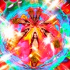

[View on Apple](https://music.apple.com/cn/album/%E7%BA%AF%E5%A6%B9%E5%A6%B9/1864543075)

## 陶喆同名專輯

[View on Apple](https://music.apple.com/cn/album/%E9%99%B6%E5%96%86%E5%90%8C%E5%90%8D%E5%B0%88%E8%BC%AF/1416149926)

## 黑色柳丁

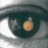

[View on Apple](https://music.apple.com/cn/album/%E9%BB%91%E8%89%B2%E6%9F%B3%E4%B8%81/914664926)

## eternal sunshine deluxe: brighter days ahead

[View on Apple](https://music.apple.com/cn/album/eternal-sunshine-deluxe-brighter-days-ahead/1800579610)

## HIT ME HARD AND SOFT

[View on Apple](https://music.apple.com/cn/album/hit-me-hard-and-soft/1739659134)

## 認了吧 (台灣版)

[View on Apple](https://music.apple.com/cn/album/%E8%AA%8D%E4%BA%86%E5%90%A7-%E5%8F%B0%E7%81%A3%E7%89%88/1443352354)

## 周杰倫的床邊故事

[View on Apple](https://music.apple.com/cn/album/%E5%91%A8%E6%9D%B0%E5%80%AB%E7%9A%84%E5%BA%8A%E9%82%8A%E6%95%85%E4%BA%8B/1118757859)

## Lover

[View on Apple](https://music.apple.com/cn/album/lover/1468058165)

## 跟著感覺走

[View on Apple](https://music.apple.com/cn/album/%E8%B7%9F%E8%91%97%E6%84%9F%E8%A6%BA%E8%B5%B0/1827445748)

## ICEMAN

[View on Apple](https://music.apple.com/cn/album/iceman/6769568449)

## 再想想

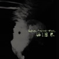

[View on Apple](https://music.apple.com/cn/album/%E5%86%8D%E6%83%B3%E6%83%B3/6777959168)

## 心中的日月

[View on Apple](https://music.apple.com/cn/album/%E5%BF%83%E4%B8%AD%E7%9A%84%E6%97%A5%E6%9C%88/1134344345)

## Oh yeah?

[View on Apple](https://music.apple.com/cn/album/oh-yeah/6773775032)

## THE TORTURED POETS DEPARTMENT: THE ANTHOLOGY

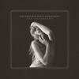

[View on Apple](https://music.apple.com/cn/album/the-tortured-poets-department-the-anthology/1742057774)

## Starboy

[View on Apple](https://music.apple.com/cn/album/starboy/1440871397)

## I'm O.K.

[View on Apple](https://music.apple.com/cn/album/im-o-k/905206471)

## folklore (deluxe version)

[View on Apple](https://music.apple.com/cn/album/folklore-deluxe-version/1528112358)

## 橙月

[View on Apple](https://music.apple.com/cn/album/%E6%A9%99%E6%9C%88/313404785)

## Midnights (The Til Dawn Edition)

[View on Apple](https://music.apple.com/cn/album/midnights-the-til-dawn-edition/1689131527)

## 逆光

[View on Apple](https://music.apple.com/cn/album/%E9%80%86%E5%85%89/905226289)

## 太热爱 - EP

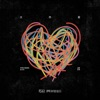

[View on Apple](https://music.apple.com/cn/album/%E5%A4%AA%E7%83%AD%E7%88%B1-ep/6789059723)

## 最伟大的作品

[View on Apple](https://music.apple.com/cn/album/%E6%9C%80%E4%BC%9F%E5%A4%A7%E7%9A%84%E4%BD%9C%E5%93%81/1633408719)

## 新地球

[View on Apple](https://music.apple.com/cn/album/%E6%96%B0%E5%9C%B0%E7%90%83/1788007687)

## 太平盛世

[View on Apple](https://music.apple.com/cn/album/%E5%A4%AA%E5%B9%B3%E7%9B%9B%E4%B8%96/905206649)

## 蓋世英雄

[View on Apple](https://music.apple.com/cn/album/%E8%93%8B%E4%B8%96%E8%8B%B1%E9%9B%84/1134353291)

## 和自己對話

[View on Apple](https://music.apple.com/cn/album/%E5%92%8C%E8%87%AA%E5%B7%B1%E5%B0%8D%E8%A9%B1/1871400633)

## 危險世界

[View on Apple](https://music.apple.com/cn/album/%E5%8D%B1%E9%9A%AA%E4%B8%96%E7%95%8C/1579903639)

## SWAG II

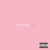

[View on Apple](https://music.apple.com/cn/album/swag-ii/1837867200)

## COLOR OUTSIDE THE LINES - EP

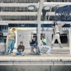

[View on Apple](https://music.apple.com/cn/album/color-outside-the-lines-ep/1832031331)

## 安和桥北

[View on Apple](https://music.apple.com/cn/album/%E5%AE%89%E5%92%8C%E6%A1%A5%E5%8C%97/1808446482)

## Believe (Deluxe Edition)

[View on Apple](https://music.apple.com/cn/album/believe-deluxe-edition/1440650852)

## 哎呦, 不錯哦

[View on Apple](https://music.apple.com/cn/album/%E5%93%8E%E5%91%A6-%E4%B8%8D%E9%8C%AF%E5%93%A6/944321428)

## thank u, next (Bonus Videos)

[View on Apple](https://music.apple.com/cn/album/thank-u-next-bonus-videos/1544323604)

## 新的心跳

[View on Apple](https://music.apple.com/cn/album/%E6%96%B0%E7%9A%84%E5%BF%83%E8%B7%B3/1053567923)

## Man’s Best Friend

[View on Apple](https://music.apple.com/cn/album/mans-best-friend/1819861154)

## Dawn FM

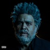

[View on Apple](https://music.apple.com/cn/album/dawn-fm/1603171516)

## petal

[View on Apple](https://music.apple.com/cn/album/petal/1895420989)

## JJ陸

[View on Apple](https://music.apple.com/cn/album/jj%E9%99%B8/1071752047)

## eternal sunshine (slightly deluxe and also live)

[View on Apple](https://music.apple.com/cn/album/eternal-sunshine-slightly-deluxe-and-also-live/1771037153)

## Justice (Triple Chucks Deluxe)

[View on Apple](https://music.apple.com/cn/album/justice-triple-chucks-deluxe/1560274125)

## 含情莫莫.莫文蔚全精選集

[View on Apple](https://music.apple.com/cn/album/%E5%90%AB%E6%83%85%E8%8E%AB%E8%8E%AB-%E8%8E%AB%E6%96%87%E8%94%9A%E5%85%A8%E7%B2%BE%E9%81%B8%E9%9B%86/200469374)

## NewJeans 1st EP 'New Jeans'

[View on Apple](https://music.apple.com/cn/album/newjeans-1st-ep-new-jeans/1635469682)

## T.I.M.E. - EP

[View on Apple](https://music.apple.com/cn/album/t-i-m-e-ep/1717030435)

## 初学者

[View on Apple](https://music.apple.com/cn/album/%E5%88%9D%E5%AD%A6%E8%80%85/1787929894)

## reputation

[View on Apple](https://music.apple.com/cn/album/reputation/1440933849)

## 1989 (Taylor's Version) [Deluxe]

![1989 (Taylor's Version) \[Deluxe\]](../../logos/1713845538-b57c54dd.png)

[View on Apple](https://music.apple.com/cn/album/1989-taylors-version-deluxe/1713845538)

## 1989

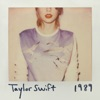

[View on Apple](https://music.apple.com/cn/album/1989/1445888258)

## Daydream (30th Anniversary Edition)

[View on Apple](https://music.apple.com/cn/album/daydream-30th-anniversary-edition/6789414774)

## 我要的幸福

[View on Apple](https://music.apple.com/cn/album/%E6%88%91%E8%A6%81%E7%9A%84%E5%B9%B8%E7%A6%8F/298837646)

## 意外

[View on Apple](https://music.apple.com/cn/album/%E6%84%8F%E5%A4%96/1788255148)

## 回到未來

[View on Apple](https://music.apple.com/cn/album/%E5%9B%9E%E5%88%B0%E6%9C%AA%E4%BE%86/577983280)

## After Hours

[View on Apple](https://music.apple.com/cn/album/after-hours/1499378108)

## BULLY - DELUXE

[View on Apple](https://music.apple.com/cn/album/bully-deluxe/6782267796)

## 她說

[View on Apple](https://music.apple.com/cn/album/%E5%A5%B9%E8%AA%AA/1071506928)

## 愛愛愛

[View on Apple](https://music.apple.com/cn/album/%E6%84%9B%E6%84%9B%E6%84%9B/220365864)

## Ugly Beauty

[View on Apple](https://music.apple.com/cn/album/ugly-beauty/1446276817)

## 徐佳瑩LaLa首張創作專輯

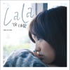

[View on Apple](https://music.apple.com/cn/album/%E5%BE%90%E4%BD%B3%E7%91%A9lala%E9%A6%96%E5%BC%B5%E5%89%B5%E4%BD%9C%E5%B0%88%E8%BC%AF/672648486)

## OK

[View on Apple](https://music.apple.com/cn/album/ok/661608562)

## 自傳

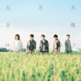

[View on Apple](https://music.apple.com/cn/album/%E8%87%AA%E5%82%B3/1158763922)

## 雨愛 (繽紛慶功版)

[View on Apple](https://music.apple.com/cn/album/%E9%9B%A8%E6%84%9B-%E7%B9%BD%E7%B4%9B%E6%85%B6%E5%8A%9F%E7%89%88/352569300)

## Blonde

[View on Apple](https://music.apple.com/cn/album/blonde/1146195596)

## 吉他手

[View on Apple](https://music.apple.com/cn/album/%E5%90%89%E4%BB%96%E6%89%8B/152197399)

## Norman Fucking Rockwell!

[View on Apple](https://music.apple.com/cn/album/norman-fucking-rockwell/1474669063)

## 未來

[View on Apple](https://music.apple.com/cn/album/%E6%9C%AA%E4%BE%86/272875165)

## SWAG LIVE FROM COACHELLA (Weekend II)

[View on Apple](https://music.apple.com/cn/album/swag-live-from-coachella-weekend-ii/6786441259)

## 崇拜

[View on Apple](https://music.apple.com/cn/album/%E5%B4%87%E6%8B%9C/1097016060)

## 未完成

[View on Apple](https://music.apple.com/cn/album/%E6%9C%AA%E5%AE%8C%E6%88%90/255920420)

## 小梦大半

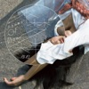

[View on Apple](https://music.apple.com/cn/album/%E5%B0%8F%E6%A2%A6%E5%A4%A7%E5%8D%8A/1421692907)

## Short n' Sweet (Deluxe)

[View on Apple](https://music.apple.com/cn/album/short-n-sweet-deluxe/1795512297)

## Hurry Up Tomorrow (Video Album)

[View on Apple](https://music.apple.com/cn/album/hurry-up-tomorrow-video-album/1795692220)

## Lemon Tang - The 2nd Mini Album - EP

[View on Apple](https://music.apple.com/cn/album/lemon-tang-the-2nd-mini-album-ep/6779521284)

## Positions (Deluxe)

[View on Apple](https://music.apple.com/cn/album/positions-deluxe/1553944254)

## Purpose

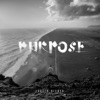

[View on Apple](https://music.apple.com/cn/album/purpose/1442504476)

## 署前街少年

[View on Apple](https://music.apple.com/cn/album/%E7%BD%B2%E5%89%8D%E8%A1%97%E5%B0%91%E5%B9%B4/1722409787)
