- [热播金曲：国语流行](#热播金曲-国语流行)
- [今日热门](#今日热门)
- [A-List：国语流行](#a-list-国语流行)
- [KPOPWRLD](#kpopwrld)
- [国语情歌精选](#国语情歌精选)
- [周杰伦代表作](#周杰伦代表作)
- [张震岳：浪人的…Summer Day](#张震岳-浪人的-summer-day)
- [2000 年代国语流行代表作品](#2000-年代国语流行代表作品)
- [R&B 进行时](#r-b-进行时)
- [2026 年 6 月抖音热歌榜](#2026-年-6-月抖音热歌榜)
- [钢琴休憩小站](#钢琴休憩小站)
- [A-List: 国际流行](#a-list-国际流行)
- [卡拉永远 OK](#卡拉永远-ok)
- [纯粹・专注](#纯粹-专注)
- [今日全球热歌](#今日全球热歌)
- [今日最佳](#今日最佳)
- [网络热播](#网络热播)
- [窦靖童的夏日歌单](#窦靖童的夏日歌单)
- [活力 K-Pop](#活力-k-pop)
- [热播金曲：流行](#热播金曲-流行)
- [方大同代表作](#方大同代表作)
- [2001 年国语流行畅销金曲](#2001-年国语流行畅销金曲)
- [全球热门流行乐](#全球热门流行乐)
- [唱歌：国语流行](#唱歌-国语流行)
- [网络热播：K-Pop](#网络热播-k-pop)
- [音乐轻松听：窦靖童](#音乐轻松听-窦靖童)
- [热播金曲：K-Pop](#热播金曲-k-pop)
- [热播金曲：粤语流行](#热播金曲-粤语流行)
- [2010 年代国语流行代表作品](#2010-年代国语流行代表作品)
- [A-List：粤语流行](#a-list-粤语流行)
- [夏韵](#夏韵)
- [K-Pop 新歌](#k-pop-新歌)
- [Taylor Swift 代表作](#taylor-swift-代表作)
- [网络热播：C-Pop](#网络热播-c-pop)
- [轻松不插电](#轻松不插电)
- [舒心古典](#舒心古典)
- [热播金曲：Hip-Hop](#热播金曲-hip-hop)
- [周杰伦：情歌精选](#周杰伦-情歌精选)
- [古典乐潮](#古典乐潮)
- [今日惬意小曲](#今日惬意小曲)
- [A-List 粤语流行：2025 年度最佳](#a-list-粤语流行-2025-年度最佳)
- [K-Pop 热歌 2025](#k-pop-热歌-2025)
- [潜力新歌：国语流行](#潜力新歌-国语流行)
- [2026 年 5 月抖音热歌榜](#2026-年-5-月抖音热歌榜)
- [J-Pop R&B 小酌](#j-pop-r-b-小酌)
- [助跑热门歌曲](#助跑热门歌曲)
- [中嘻合璧](#中嘻合璧)
- [沙滩乡村酒吧](#沙滩乡村酒吧)
- [演出曲目单：薛之谦 2026 年《万兽之王》世界巡演](#演出曲目单-薛之谦-2026-年-万兽之王-世界巡演)
- [办公室 DJ](#办公室-dj)
- [2010 年代国语情歌代表作品](#2010-年代国语情歌代表作品)
- [惬意爵士](#惬意爵士)
- [2000 年代国语情歌代表作品](#2000-年代国语情歌代表作品)
- [林俊杰代表作](#林俊杰代表作)
- [空间音频体验：K-Pop](#空间音频体验-k-pop)
- [粤语情歌精选](#粤语情歌精选)
- [专注古典乐](#专注古典乐)
- [Rap Life](#rap-life)
- [BEATstrumentals](#beatstrumentals)
- [沙发音乐](#沙发音乐)
- [2010 年代流行乐代表作品](#2010-年代流行乐代表作品)
- [邓紫棋：情歌精选](#邓紫棋-情歌精选)
- [C-Pop 潮](#c-pop-潮)
- [纯粹·宁静](#纯粹-宁静)
- [保持平静](#保持平静)
- [Lo-Fi 爵士](#lo-fi-爵士)
- [国语流行热歌 2025](#国语流行热歌-2025)
- [足球之歌](#足球之歌)
- [图书馆时光](#图书馆时光)
- [2006 年国语流行畅销金曲](#2006-年国语流行畅销金曲)
- [演出曲目单：The Weeknd《After Hours Til Dawn》巡演](#演出曲目单-the-weeknd-after-hours-til-dawn-巡演)
- [2000 年国语流行畅销金曲](#2000-年国语流行畅销金曲)
- [Lo-Fi 星期天](#lo-fi-星期天)
- [袁娅维：夏日晨光与美好开始](#袁娅维-夏日晨光与美好开始)
- [2008 年国语流行畅销金曲](#2008-年国语流行畅销金曲)
- [演出曲目单：单依纯《纯妹妹 2.0》巡演](#演出曲目单-单依纯-纯妹妹-2-0-巡演)
- [演出曲目单：汪苏泷《明日世界》世界巡演](#演出曲目单-汪苏泷-明日世界-世界巡演)
- [醇享灵魂爵士](#醇享灵魂爵士)
- [2003 年国语流行畅销金曲](#2003-年国语流行畅销金曲)
- [孙燕姿代表作](#孙燕姿代表作)
- [抖音 2025 年度热歌榜](#抖音-2025-年度热歌榜)
- [80 年代国语流行代表作品](#80-年代国语流行代表作品)
- [咖啡开启一天](#咖啡开启一天)
- [惬意流行歌](#惬意流行歌)
- [David Tao Essentials](#david-tao-essentials)
- [轻柔吉他](#轻柔吉他)
- [纯粹钢琴](#纯粹钢琴)
- [Gustavo Dudamel Essentials](#gustavo-dudamel-essentials)
- [热播金曲：R&B](#热播金曲-r-b)
- [咖啡与沉思](#咖啡与沉思)
- [K-Pop 热歌 2024](#k-pop-热歌-2024)
- [Kelleigh Bannen：海岸热浪](#kelleigh-bannen-海岸热浪)
- [清晨古典乐](#清晨古典乐)
- [Justin Bieber Essentials](#justin-bieber-essentials)
- [王菲代表作](#王菲代表作)
- [凝神电音](#凝神电音)
- [欢乐流行](#欢乐流行)
- [我的情绪角落](#我的情绪角落)
- [Johann Sebastian Bach Essentials](#johann-sebastian-bach-essentials)
- [2026 年 4 月抖音热歌榜](#2026-年-4-月抖音热歌榜)

## 热播金曲：国语流行

[View on Apple](https://music.apple.com/cn/playlist/%E7%83%AD%E6%92%AD%E9%87%91%E6%9B%B2-%E5%9B%BD%E8%AF%AD%E6%B5%81%E8%A1%8C/pl.6d8228f57b864a4296dc02d9761a0d9b)

## 今日热门

[View on Apple](https://music.apple.com/cn/playlist/%E4%BB%8A%E6%97%A5%E7%83%AD%E9%97%A8/pl.f4d106fed2bd41149aaacabb233eb5eb)

## A-List：国语流行

[View on Apple](https://music.apple.com/cn/playlist/a-list-%E5%9B%BD%E8%AF%AD%E6%B5%81%E8%A1%8C/pl.beb783da7712481fbeed35be144bd48c)

## KPOPWRLD

[View on Apple](https://music.apple.com/cn/playlist/kpopwrld/pl.48229b41bbfc47d7af39dae8e8b5276e)

## 国语情歌精选

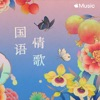

[View on Apple](https://music.apple.com/cn/playlist/%E5%9B%BD%E8%AF%AD%E6%83%85%E6%AD%8C%E7%B2%BE%E9%80%89/pl.8e9831f8282c46bc80aceea9399bb32d)

## 周杰伦代表作

[View on Apple](https://music.apple.com/cn/playlist/%E5%91%A8%E6%9D%B0%E4%BC%A6%E4%BB%A3%E8%A1%A8%E4%BD%9C/pl.d467987f72384448b2bebe52c0b212d6)

## 张震岳：浪人的…Summer Day

[View on Apple](https://music.apple.com/cn/playlist/%E5%BC%A0%E9%9C%87%E5%B2%B3-%E6%B5%AA%E4%BA%BA%E7%9A%84-summer-day/pl.430f4fcd5e514bf0a81e41ed9c9e1718)

## 2000 年代国语流行代表作品

[View on Apple](https://music.apple.com/cn/playlist/2000-%E5%B9%B4%E4%BB%A3%E5%9B%BD%E8%AF%AD%E6%B5%81%E8%A1%8C%E4%BB%A3%E8%A1%A8%E4%BD%9C%E5%93%81/pl.b5c94ec72f3041d6844ad0772a36f001)

## R&B 进行时

[View on Apple](https://music.apple.com/cn/playlist/r-b-%E8%BF%9B%E8%A1%8C%E6%97%B6/pl.b7ae3e0a28e84c5c96c4284b6a6c70af)

## 2026 年 6 月抖音热歌榜

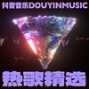

[View on Apple](https://music.apple.com/cn/playlist/2026-%E5%B9%B4-6-%E6%9C%88%E6%8A%96%E9%9F%B3%E7%83%AD%E6%AD%8C%E6%A6%9C/pl.7e26c83059cf411b9cb18f5286945d3a)

## 钢琴休憩小站

[View on Apple](https://music.apple.com/cn/playlist/%E9%92%A2%E7%90%B4%E4%BC%91%E6%86%A9%E5%B0%8F%E7%AB%99/pl.cb4d1c09a2df4230a78d0395fe1f8fde)

## A-List: 国际流行

[View on Apple](https://music.apple.com/cn/playlist/a-list-%E5%9B%BD%E9%99%85%E6%B5%81%E8%A1%8C/pl.5ee8333dbe944d9f9151e97d92d1ead9)

## 卡拉永远 OK

[View on Apple](https://music.apple.com/cn/playlist/%E5%8D%A1%E6%8B%89%E6%B0%B8%E8%BF%9C-ok/pl.3c940066ea8d47adb2d317c492a981fe)

## 纯粹・专注

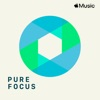

[View on Apple](https://music.apple.com/cn/playlist/%E7%BA%AF%E7%B2%B9-%E4%B8%93%E6%B3%A8/pl.dbd712beded846dca273d5d3259d28aa)

## 今日全球热歌

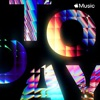

[View on Apple](https://music.apple.com/cn/playlist/%E4%BB%8A%E6%97%A5%E5%85%A8%E7%90%83%E7%83%AD%E6%AD%8C/pl.7d657a836db14d768accd2e6ffd1b0ad)

## 今日最佳

[View on Apple](https://music.apple.com/cn/playlist/%E4%BB%8A%E6%97%A5%E6%9C%80%E4%BD%B3/pl.2b0e6e332fdf4b7a91164da3162127b5)

## 网络热播

[View on Apple](https://music.apple.com/cn/playlist/%E7%BD%91%E7%BB%9C%E7%83%AD%E6%92%AD/pl.3de89e62aa3340038e08fa325c3f3f01)

## 窦靖童的夏日歌单

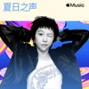

[View on Apple](https://music.apple.com/cn/playlist/%E7%AA%A6%E9%9D%96%E7%AB%A5%E7%9A%84%E5%A4%8F%E6%97%A5%E6%AD%8C%E5%8D%95/pl.ed32f515d0134f26a28725bad4318ee5)

## 活力 K-Pop

[View on Apple](https://music.apple.com/cn/playlist/%E6%B4%BB%E5%8A%9B-k-pop/pl.d838905f50af4200a2ebbc614922dee9)

## 热播金曲：流行

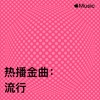

[View on Apple](https://music.apple.com/cn/playlist/%E7%83%AD%E6%92%AD%E9%87%91%E6%9B%B2-%E6%B5%81%E8%A1%8C/pl.f642b91321c94b8d995689d0651cc2c6)

## 方大同代表作

[View on Apple](https://music.apple.com/cn/playlist/%E6%96%B9%E5%A4%A7%E5%90%8C%E4%BB%A3%E8%A1%A8%E4%BD%9C/pl.77f15cb58d5249daa94c55dd9577c3c2)

## 2001 年国语流行畅销金曲

[View on Apple](https://music.apple.com/cn/playlist/2001-%E5%B9%B4%E5%9B%BD%E8%AF%AD%E6%B5%81%E8%A1%8C%E7%95%85%E9%94%80%E9%87%91%E6%9B%B2/pl.8b52c25fb5b84910afbd7e5e7957b393)

## 全球热门流行乐

[View on Apple](https://music.apple.com/cn/playlist/%E5%85%A8%E7%90%83%E7%83%AD%E9%97%A8%E6%B5%81%E8%A1%8C%E4%B9%90/pl.fc93c98d0aea4e24a982d6b059a07506)

## 唱歌：国语流行

[View on Apple](https://music.apple.com/cn/playlist/%E5%94%B1%E6%AD%8C-%E5%9B%BD%E8%AF%AD%E6%B5%81%E8%A1%8C/pl.7094457cee324d6ebb28388ccaeca7f3)

## 网络热播：K-Pop

[View on Apple](https://music.apple.com/cn/playlist/%E7%BD%91%E7%BB%9C%E7%83%AD%E6%92%AD-k-pop/pl.5b7698bbcd01407a92b8457f650bebaf)

## 音乐轻松听：窦靖童

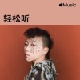

[View on Apple](https://music.apple.com/cn/playlist/%E9%9F%B3%E4%B9%90%E8%BD%BB%E6%9D%BE%E5%90%AC-%E7%AA%A6%E9%9D%96%E7%AB%A5/pl.592cd3fd87c44199a3bcf9295684ca60)

## 热播金曲：K-Pop

[View on Apple](https://music.apple.com/cn/playlist/%E7%83%AD%E6%92%AD%E9%87%91%E6%9B%B2-k-pop/pl.fa1e4b518c7244a086390d49aeb65d1e)

## 热播金曲：粤语流行

[View on Apple](https://music.apple.com/cn/playlist/%E7%83%AD%E6%92%AD%E9%87%91%E6%9B%B2-%E7%B2%A4%E8%AF%AD%E6%B5%81%E8%A1%8C/pl.ad09ef940a6e4fbe945eafab033d1aaf)

## 2010 年代国语流行代表作品

[View on Apple](https://music.apple.com/cn/playlist/2010-%E5%B9%B4%E4%BB%A3%E5%9B%BD%E8%AF%AD%E6%B5%81%E8%A1%8C%E4%BB%A3%E8%A1%A8%E4%BD%9C%E5%93%81/pl.3e52664b20ea45c394a37f4a7f3a8451)

## A-List：粤语流行

[View on Apple](https://music.apple.com/cn/playlist/a-list-%E7%B2%A4%E8%AF%AD%E6%B5%81%E8%A1%8C/pl.31991c6bcf0447ac9f16c07678a5a0a0)

## 夏韵

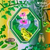

[View on Apple](https://music.apple.com/cn/playlist/%E5%A4%8F%E9%9F%B5/pl.36272a40bb4445589eb1ab3caded29e5)

## K-Pop 新歌

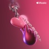

[View on Apple](https://music.apple.com/cn/playlist/k-pop-%E6%96%B0%E6%AD%8C/pl.a784f95d4f504d579647523ff95433be)

## Taylor Swift 代表作

[View on Apple](https://music.apple.com/cn/playlist/taylor-swift-%E4%BB%A3%E8%A1%A8%E4%BD%9C/pl.3950454ced8c45a3b0cc693c2a7db97b)

## 网络热播：C-Pop

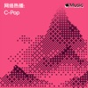

[View on Apple](https://music.apple.com/cn/playlist/%E7%BD%91%E7%BB%9C%E7%83%AD%E6%92%AD-c-pop/pl.2a0a202d08c3439e95d22a73126f4417)

## 轻松不插电

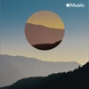

[View on Apple](https://music.apple.com/cn/playlist/%E8%BD%BB%E6%9D%BE%E4%B8%8D%E6%8F%92%E7%94%B5/pl.b5e8dbe8a706496496e1292466839207)

## 舒心古典

[View on Apple](https://music.apple.com/cn/playlist/%E8%88%92%E5%BF%83%E5%8F%A4%E5%85%B8/pl.c2ab8af2e9e74576b3bb45d62819d5cd)

## 热播金曲：Hip-Hop

[View on Apple](https://music.apple.com/cn/playlist/%E7%83%AD%E6%92%AD%E9%87%91%E6%9B%B2-hip-hop/pl.1e67b19d500d424396f5b9015e8fbc88)

## 周杰伦：情歌精选

[View on Apple](https://music.apple.com/cn/playlist/%E5%91%A8%E6%9D%B0%E4%BC%A6-%E6%83%85%E6%AD%8C%E7%B2%BE%E9%80%89/pl.765d15dbe9074aedaa069f129e328c74)

## 古典乐潮

[View on Apple](https://music.apple.com/cn/playlist/%E5%8F%A4%E5%85%B8%E4%B9%90%E6%BD%AE/pl.66c17ed5cc754856b944a9150483e375)

## 今日惬意小曲

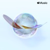

[View on Apple](https://music.apple.com/cn/playlist/%E4%BB%8A%E6%97%A5%E6%83%AC%E6%84%8F%E5%B0%8F%E6%9B%B2/pl.2bb29727dbc34a63936787297305c37c)

## A-List 粤语流行：2025 年度最佳

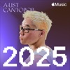

[View on Apple](https://music.apple.com/cn/playlist/a-list-%E7%B2%A4%E8%AF%AD%E6%B5%81%E8%A1%8C-2025-%E5%B9%B4%E5%BA%A6%E6%9C%80%E4%BD%B3/pl.cbea022ec1054554aaaefefb851b0b48)

## K-Pop 热歌 2025

[View on Apple](https://music.apple.com/cn/playlist/k-pop-%E7%83%AD%E6%AD%8C-2025/pl.161503b34ff7441a949c81bd19525b35)

## 潜力新歌：国语流行

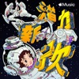

[View on Apple](https://music.apple.com/cn/playlist/%E6%BD%9C%E5%8A%9B%E6%96%B0%E6%AD%8C-%E5%9B%BD%E8%AF%AD%E6%B5%81%E8%A1%8C/pl.80e13199d5db46c7b519b25cf6e5816a)

## 2026 年 5 月抖音热歌榜

[View on Apple](https://music.apple.com/cn/playlist/2026-%E5%B9%B4-5-%E6%9C%88%E6%8A%96%E9%9F%B3%E7%83%AD%E6%AD%8C%E6%A6%9C/pl.3cb847c91abe4b20af277e2572217364)

## J-Pop R&B 小酌

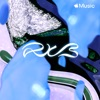

[View on Apple](https://music.apple.com/cn/playlist/j-pop-r-b-%E5%B0%8F%E9%85%8C/pl.38e226dfe8db48e7b5f46922aee8841e)

## 助跑热门歌曲

[View on Apple](https://music.apple.com/cn/playlist/%E5%8A%A9%E8%B7%91%E7%83%AD%E9%97%A8%E6%AD%8C%E6%9B%B2/pl.6db5f7b47286460e9928d09d9ac0be69)

## 中嘻合璧

[View on Apple](https://music.apple.com/cn/playlist/%E4%B8%AD%E5%98%BB%E5%90%88%E7%92%A7/pl.9eba8510029645e0a4bd3d7fba087a4d)

## 沙滩乡村酒吧

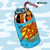

[View on Apple](https://music.apple.com/cn/playlist/%E6%B2%99%E6%BB%A9%E4%B9%A1%E6%9D%91%E9%85%92%E5%90%A7/pl.0f11015342a9473c849f0af4ab5f509c)

## 演出曲目单：薛之谦 2026 年《万兽之王》世界巡演

[View on Apple](https://music.apple.com/cn/playlist/%E6%BC%94%E5%87%BA%E6%9B%B2%E7%9B%AE%E5%8D%95-%E8%96%9B%E4%B9%8B%E8%B0%A6-2026-%E5%B9%B4-%E4%B8%87%E5%85%BD%E4%B9%8B%E7%8E%8B-%E4%B8%96%E7%95%8C%E5%B7%A1%E6%BC%94/pl.26d9247c66f849a287b045f33fe96506)

## 办公室 DJ

[View on Apple](https://music.apple.com/cn/playlist/%E5%8A%9E%E5%85%AC%E5%AE%A4-dj/pl.f820ed7063f9447f8751abf885525698)

## 2010 年代国语情歌代表作品

[View on Apple](https://music.apple.com/cn/playlist/2010-%E5%B9%B4%E4%BB%A3%E5%9B%BD%E8%AF%AD%E6%83%85%E6%AD%8C%E4%BB%A3%E8%A1%A8%E4%BD%9C%E5%93%81/pl.5ffa6ae5975e4ce5be34ea6bc39854c5)

## 惬意爵士

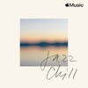

[View on Apple](https://music.apple.com/cn/playlist/%E6%83%AC%E6%84%8F%E7%88%B5%E5%A3%AB/pl.63271312c084419891982eab46cc68ac)

## 2000 年代国语情歌代表作品

[View on Apple](https://music.apple.com/cn/playlist/2000-%E5%B9%B4%E4%BB%A3%E5%9B%BD%E8%AF%AD%E6%83%85%E6%AD%8C%E4%BB%A3%E8%A1%A8%E4%BD%9C%E5%93%81/pl.6cef5e2b3485456287e6e954a69dea8b)

## 林俊杰代表作

[View on Apple](https://music.apple.com/cn/playlist/%E6%9E%97%E4%BF%8A%E6%9D%B0%E4%BB%A3%E8%A1%A8%E4%BD%9C/pl.92e5bbee7ab6458bbb21a83f0ab7adeb)

## 空间音频体验：K-Pop

[View on Apple](https://music.apple.com/cn/playlist/%E7%A9%BA%E9%97%B4%E9%9F%B3%E9%A2%91%E4%BD%93%E9%AA%8C-k-pop/pl.4d2dbe3d55064021870291c2eb29bc72)

## 粤语情歌精选

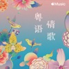

[View on Apple](https://music.apple.com/cn/playlist/%E7%B2%A4%E8%AF%AD%E6%83%85%E6%AD%8C%E7%B2%BE%E9%80%89/pl.f3a6402280a1424dafd244a740d69a68)

## 专注古典乐

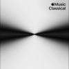

[View on Apple](https://music.apple.com/cn/playlist/%E4%B8%93%E6%B3%A8%E5%8F%A4%E5%85%B8%E4%B9%90/pl.cf8514b686374fadbe6807a6339dfd89)

## Rap Life

[View on Apple](https://music.apple.com/cn/playlist/rap-life/pl.abe8ba42278f4ef490e3a9fc5ec8e8c5)

## BEATstrumentals

[View on Apple](https://music.apple.com/cn/playlist/beatstrumentals/pl.f54198ad42404535be13eabf3835fb22)

## 沙发音乐

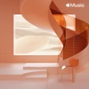

[View on Apple](https://music.apple.com/cn/playlist/%E6%B2%99%E5%8F%91%E9%9F%B3%E4%B9%90/pl.46bf6d7a51aa48b6a27b37267d293f7f)

## 2010 年代流行乐代表作品

[View on Apple](https://music.apple.com/cn/playlist/2010-%E5%B9%B4%E4%BB%A3%E6%B5%81%E8%A1%8C%E4%B9%90%E4%BB%A3%E8%A1%A8%E4%BD%9C%E5%93%81/pl.6b1b5dfda067443481265436811002f1)

## 邓紫棋：情歌精选

[View on Apple](https://music.apple.com/cn/playlist/%E9%82%93%E7%B4%AB%E6%A3%8B-%E6%83%85%E6%AD%8C%E7%B2%BE%E9%80%89/pl.625750a7c4bb48a9b0934792ee8592b3)

## C-Pop 潮

[View on Apple](https://music.apple.com/cn/playlist/c-pop-%E6%BD%AE/pl.974aaf3abeca4e86a954719e83bb1fb1)

## 纯粹·宁静

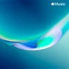

[View on Apple](https://music.apple.com/cn/playlist/%E7%BA%AF%E7%B2%B9-%E5%AE%81%E9%9D%99/pl.ffc344338c3d4ff394ddcf94d766c143)

## 保持平静

[View on Apple](https://music.apple.com/cn/playlist/%E4%BF%9D%E6%8C%81%E5%B9%B3%E9%9D%99/pl.cc001831bf5245f288e0652db3c576f9)

## Lo-Fi 爵士

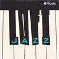

[View on Apple](https://music.apple.com/cn/playlist/lo-fi-%E7%88%B5%E5%A3%AB/pl.1c1744bbc1174cf2880c53b302d428a0)

## 国语流行热歌 2025

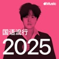

[View on Apple](https://music.apple.com/cn/playlist/%E5%9B%BD%E8%AF%AD%E6%B5%81%E8%A1%8C%E7%83%AD%E6%AD%8C-2025/pl.7e7a5f6fe95e4e6393bf85df3a5d5dc2)

## 足球之歌

[View on Apple](https://music.apple.com/cn/playlist/%E8%B6%B3%E7%90%83%E4%B9%8B%E6%AD%8C/pl.66fc9e98da7d49e68cd00de798b86d69)

## 图书馆时光

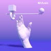

[View on Apple](https://music.apple.com/cn/playlist/%E5%9B%BE%E4%B9%A6%E9%A6%86%E6%97%B6%E5%85%89/pl.0b448cf227014bde8f986ecad02c93de)

## 2006 年国语流行畅销金曲

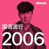

[View on Apple](https://music.apple.com/cn/playlist/2006-%E5%B9%B4%E5%9B%BD%E8%AF%AD%E6%B5%81%E8%A1%8C%E7%95%85%E9%94%80%E9%87%91%E6%9B%B2/pl.e231b9cf7b03478f8d5a1f99ebb02a20)

## 演出曲目单：The Weeknd《After Hours Til Dawn》巡演

[View on Apple](https://music.apple.com/cn/playlist/%E6%BC%94%E5%87%BA%E6%9B%B2%E7%9B%AE%E5%8D%95-the-weeknd-after-hours-til-dawn-%E5%B7%A1%E6%BC%94/pl.2510d5601e3a49d4a62e39b3eb3018cf)

## 2000 年国语流行畅销金曲

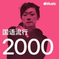

[View on Apple](https://music.apple.com/cn/playlist/2000-%E5%B9%B4%E5%9B%BD%E8%AF%AD%E6%B5%81%E8%A1%8C%E7%95%85%E9%94%80%E9%87%91%E6%9B%B2/pl.8a2e161509744600ba82d7d2d2c64b53)

## Lo-Fi 星期天

[View on Apple](https://music.apple.com/cn/playlist/lo-fi-%E6%98%9F%E6%9C%9F%E5%A4%A9/pl.7525e7e5e04f44269ce48ae05d39d209)

## 袁娅维：夏日晨光与美好开始

[View on Apple](https://music.apple.com/cn/playlist/%E8%A2%81%E5%A8%85%E7%BB%B4-%E5%A4%8F%E6%97%A5%E6%99%A8%E5%85%89%E4%B8%8E%E7%BE%8E%E5%A5%BD%E5%BC%80%E5%A7%8B/pl.4052e9620214419e904293debe6c005d)

## 2008 年国语流行畅销金曲

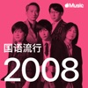

[View on Apple](https://music.apple.com/cn/playlist/2008-%E5%B9%B4%E5%9B%BD%E8%AF%AD%E6%B5%81%E8%A1%8C%E7%95%85%E9%94%80%E9%87%91%E6%9B%B2/pl.cc8fb0f0a2aa4e289107b31a64296975)

## 演出曲目单：单依纯《纯妹妹 2.0》巡演

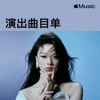

[View on Apple](https://music.apple.com/cn/playlist/%E6%BC%94%E5%87%BA%E6%9B%B2%E7%9B%AE%E5%8D%95-%E5%8D%95%E4%BE%9D%E7%BA%AF-%E7%BA%AF%E5%A6%B9%E5%A6%B9-2-0-%E5%B7%A1%E6%BC%94/pl.ff12e9388197404397abc6c11b639f16)

## 演出曲目单：汪苏泷《明日世界》世界巡演

[View on Apple](https://music.apple.com/cn/playlist/%E6%BC%94%E5%87%BA%E6%9B%B2%E7%9B%AE%E5%8D%95-%E6%B1%AA%E8%8B%8F%E6%B3%B7-%E6%98%8E%E6%97%A5%E4%B8%96%E7%95%8C-%E4%B8%96%E7%95%8C%E5%B7%A1%E6%BC%94/pl.0086e23558624766b1c0eba4055d466c)

## 醇享灵魂爵士

[View on Apple](https://music.apple.com/cn/playlist/%E9%86%87%E4%BA%AB%E7%81%B5%E9%AD%82%E7%88%B5%E5%A3%AB/pl.dcc30348803d4d2ab81642c87d933e90)

## 2003 年国语流行畅销金曲

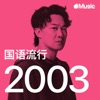

[View on Apple](https://music.apple.com/cn/playlist/2003-%E5%B9%B4%E5%9B%BD%E8%AF%AD%E6%B5%81%E8%A1%8C%E7%95%85%E9%94%80%E9%87%91%E6%9B%B2/pl.1d022466efe941a787b6a8b1a4d99f9b)

## 孙燕姿代表作

[View on Apple](https://music.apple.com/cn/playlist/%E5%AD%99%E7%87%95%E5%A7%BF%E4%BB%A3%E8%A1%A8%E4%BD%9C/pl.542bacdd2b87490183a2257e139cc22d)

## 抖音 2025 年度热歌榜

[View on Apple](https://music.apple.com/cn/playlist/%E6%8A%96%E9%9F%B3-2025-%E5%B9%B4%E5%BA%A6%E7%83%AD%E6%AD%8C%E6%A6%9C/pl.35323002b653460090e3d1b9a9707482)

## 80 年代国语流行代表作品

[View on Apple](https://music.apple.com/cn/playlist/80-%E5%B9%B4%E4%BB%A3%E5%9B%BD%E8%AF%AD%E6%B5%81%E8%A1%8C%E4%BB%A3%E8%A1%A8%E4%BD%9C%E5%93%81/pl.9601a5e6e3d44f6eba2d8ebff1903610)

## 咖啡开启一天

[View on Apple](https://music.apple.com/cn/playlist/%E5%92%96%E5%95%A1%E5%BC%80%E5%90%AF%E4%B8%80%E5%A4%A9/pl.d8848ee60b8b4b1680fcf3645242691c)

## 惬意流行歌

[View on Apple](https://music.apple.com/cn/playlist/%E6%83%AC%E6%84%8F%E6%B5%81%E8%A1%8C%E6%AD%8C/pl.9a964a33c1484aec8fdb0cac3e7771ed)

## David Tao Essentials

[View on Apple](https://music.apple.com/cn/playlist/david-tao-essentials/pl.3e3a205d60c845afa61a8314736f4ebe)

## 轻柔吉他

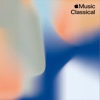

[View on Apple](https://music.apple.com/cn/playlist/%E8%BD%BB%E6%9F%94%E5%90%89%E4%BB%96/pl.e048686be4f34819ad4373a034c8bf59)

## 纯粹钢琴

[View on Apple](https://music.apple.com/cn/playlist/%E7%BA%AF%E7%B2%B9%E9%92%A2%E7%90%B4/pl.021a68aefef7467c9ab0383ed5ec809b)

## Gustavo Dudamel Essentials

[View on Apple](https://music.apple.com/cn/playlist/gustavo-dudamel-essentials/pl.31be21144a3443a3b121500c27995ac8)

## 热播金曲：R&B

[View on Apple](https://music.apple.com/cn/playlist/%E7%83%AD%E6%92%AD%E9%87%91%E6%9B%B2-r-b/pl.efaf877db72a4c05b2654eb4371d6c24)

## 咖啡与沉思

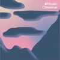

[View on Apple](https://music.apple.com/cn/playlist/%E5%92%96%E5%95%A1%E4%B8%8E%E6%B2%89%E6%80%9D/pl.bebd6f2ab1df483b82811252f283e18c)

## K-Pop 热歌 2024

[View on Apple](https://music.apple.com/cn/playlist/k-pop-%E7%83%AD%E6%AD%8C-2024/pl.b3c079fea5704332baed562d8f90d3a8)

## Kelleigh Bannen：海岸热浪

[View on Apple](https://music.apple.com/cn/playlist/kelleigh-bannen-%E6%B5%B7%E5%B2%B8%E7%83%AD%E6%B5%AA/pl.4bc798440bf8451f9a6d33e64b435e53)

## 清晨古典乐

[View on Apple](https://music.apple.com/cn/playlist/%E6%B8%85%E6%99%A8%E5%8F%A4%E5%85%B8%E4%B9%90/pl.d710b9dcbdc54590b9cfbe09c3be4902)

## Justin Bieber Essentials

[View on Apple](https://music.apple.com/cn/playlist/justin-bieber-essentials/pl.1b59383d41a74a889e8a28c31a3552c3)

## 王菲代表作

[View on Apple](https://music.apple.com/cn/playlist/%E7%8E%8B%E8%8F%B2%E4%BB%A3%E8%A1%A8%E4%BD%9C/pl.fb4e0e5f294c40c2a213bbfbf17751a3)

## 凝神电音

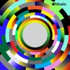

[View on Apple](https://music.apple.com/cn/playlist/%E5%87%9D%E7%A5%9E%E7%94%B5%E9%9F%B3/pl.49fa4124be174a3da9e5ec43b0d07e65)

## 欢乐流行

[View on Apple](https://music.apple.com/cn/playlist/%E6%AC%A2%E4%B9%90%E6%B5%81%E8%A1%8C/pl.a3631d0fe8bc4852bdfdee609757ae70)

## 我的情绪角落

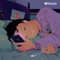

[View on Apple](https://music.apple.com/cn/playlist/%E6%88%91%E7%9A%84%E6%83%85%E7%BB%AA%E8%A7%92%E8%90%BD/pl.2a0b1ea7704842f4b956e959067b8389)

## Johann Sebastian Bach Essentials

[View on Apple](https://music.apple.com/cn/playlist/johann-sebastian-bach-essentials/pl.4cc4518c3d7e4f4a8a80a6408911a7b1)

## 2026 年 4 月抖音热歌榜

[View on Apple](https://music.apple.com/cn/playlist/2026-%E5%B9%B4-4-%E6%9C%88%E6%8A%96%E9%9F%B3%E7%83%AD%E6%AD%8C%E6%A6%9C/pl.aa15bae942474d8fa3ddbe9fc5f7c9e4)
