- [晴天](#晴天)
- [搁浅](#搁浅)
- [七里香](#七里香)
- [爱错](#爱错)
- [玻璃](#玻璃)
- [花海](#花海)
- [明明就](#明明就)
- [LEMONADE](#lemonade)
- [爱在西元前](#爱在西元前)
- [我怀念的](#我怀念的)
- [那天下雨了](#那天下雨了)
- [一路向北 (Bonus Track)](#一路向北-bonus-track)
- [特别的人](#特别的人)
- [唯一](#唯一)
- [稻香](#稻香)
- [等你下课 (with 杨瑞代)](#等你下课-with-杨瑞代)
- [半岛铁盒](#半岛铁盒)
- [阴天](#阴天)
- [开始懂了](#开始懂了)
- [我不难过](#我不难过)
- [爱我还是他](#爱我还是他)
- [夜曲](#夜曲)
- [Beauty and a Beat (feat. Nicki Minaj)](#beauty-and-a-beat-feat-nicki-minaj)
- [爱情转移](#爱情转移)
- [告白气球](#告白气球)
- [恋人](#恋人)
- [hate that i made you love me](#hate-that-i-made-you-love-me)
- [雨爱](#雨爱)
- [简单爱](#简单爱)
- [不为谁而作的歌](#不为谁而作的歌)
- [枫](#枫)
- [十年](#十年)
- [你不知道的事](#你不知道的事)
- [发如雪](#发如雪)
- [关键词](#关键词)
- [情歌](#情歌)
- [最佳损友](#最佳损友)
- [爱爱爱](#爱爱爱)
- [会呼吸的痛](#会呼吸的痛)
- [交换余生](#交换余生)
- [Angel](#angel)
- [红尘客栈](#红尘客栈)
- [淘汰](#淘汰)
- [你就不要想起我](#你就不要想起我)
- [说谎](#说谎)
- [遇见](#遇见)
- [兰亭序](#兰亭序)
- [孤独患者](#孤独患者)
- [忽然之间](#忽然之间)
- [说好的幸福呢](#说好的幸福呢)
- [一个人想着一个人](#一个人想着一个人)
- [暗号](#暗号)
- [反方向的钟](#反方向的钟)
- [不该 (with 张惠妹)](#不该-with-张惠妹)
- [烟花易冷](#烟花易冷)
- [Always Online](#always-online)
- [大城小爱](#大城小爱)
- [REDRED](#redred)
- [飞机场的10:30](#飞机场的10-30)
- [可惜没如果](#可惜没如果)
- [富士山下](#富士山下)
- [青花瓷](#青花瓷)
- [颜色](#颜色)
- [太聪明](#太聪明)
- [勇气](#勇气)
- [多远都要在一起](#多远都要在一起)
- [stupid song](#stupid-song)
- [Baby (feat. Ludacris)](#baby-feat-ludacris)
- [小半](#小半)
- [句号](#句号)
- [thank u, next](#thank-u-next)
- [Whiplash](#whiplash)
- [江南](#江南)
- [说了再见](#说了再见)
- [麦恩莉](#麦恩莉)
- [手写的从前](#手写的从前)
- [We Don’t Talk Anymore (feat. Selena Gomez)](#we-don-t-talk-anymore-feat-selena-gomez)
- [珊瑚海 (feat. 梁心颐)](#珊瑚海-feat-梁心颐)
- [退后](#退后)
- [说好不哭](#说好不哭)
- [偏爱](#偏爱)
- [我落泪 . 情绪零碎](#我落泪-情绪零碎)
- [失眠](#失眠)
- [耳朵](#耳朵)
- [不将就 (电影《何以笙箫默》片尾曲)](#不将就-电影-何以笙箫默-片尾曲)
- [蒲公英的约定](#蒲公英的约定)
- [雨过后的风景](#雨过后的风景)
- [连名带姓](#连名带姓)
- [最长的电影](#最长的电影)
- [红色高跟鞋](#红色高跟鞋)
- [天黑黑](#天黑黑)
- [爱情讯息](#爱情讯息)
- [RUDE!](#rude)
- [天天](#天天)
- [泡沫](#泡沫)
- [我们的歌](#我们的歌)
- [借口](#借口)
- [给我一首歌的时间](#给我一首歌的时间)
- [你听得到](#你听得到)
- [Cruel Summer](#cruel-summer)

## 晴天

[View on Apple](https://music.apple.com/cn/album/%E6%99%B4%E5%A4%A9/535824731?i=535824738)

## 搁浅

[View on Apple](https://music.apple.com/cn/album/%E6%90%81%E6%B5%85/536114662?i=536115199)

## 七里香

[View on Apple](https://music.apple.com/cn/album/%E4%B8%83%E9%87%8C%E9%A6%99/536114662?i=536115195)

## 爱错

[View on Apple](https://music.apple.com/cn/album/%E7%88%B1%E9%94%99/1134344345?i=1134344911)

## 玻璃

[View on Apple](https://music.apple.com/cn/album/%E7%8E%BB%E7%92%83/6769327003?i=6769327013)

## 花海

[View on Apple](https://music.apple.com/cn/album/%E8%8A%B1%E6%B5%B7/1624000713?i=1624001317)

## 明明就

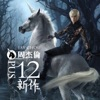

[View on Apple](https://music.apple.com/cn/album/%E6%98%8E%E6%98%8E%E5%B0%B1/587743633?i=587743637)

## LEMONADE

[View on Apple](https://music.apple.com/cn/album/lemonade/1893599771?i=1893599773)

## 爱在西元前

[View on Apple](https://music.apple.com/cn/album/%E7%88%B1%E5%9C%A8%E8%A5%BF%E5%85%83%E5%89%8D/535739206?i=535739349)

## 我怀念的

[View on Apple](https://music.apple.com/cn/album/%E6%88%91%E6%80%80%E5%BF%B5%E7%9A%84/905226289?i=905226305)

## 那天下雨了

[View on Apple](https://music.apple.com/cn/album/%E9%82%A3%E5%A4%A9%E4%B8%8B%E9%9B%A8%E4%BA%86/6771326786?i=6771326799)

## 一路向北 (Bonus Track)

[View on Apple](https://music.apple.com/cn/album/%E4%B8%80%E8%B7%AF%E5%90%91%E5%8C%97-bonus-track/536009641?i=536009753)

## 特别的人

[View on Apple](https://music.apple.com/cn/album/%E7%89%B9%E5%88%AB%E7%9A%84%E4%BA%BA/1579903639?i=1579903651)

## 唯一

[View on Apple](https://music.apple.com/cn/album/%E5%94%AF%E4%B8%80/1717030435?i=1717030438)

## 稻香

[View on Apple](https://music.apple.com/cn/album/%E7%A8%BB%E9%A6%99/1624000713?i=1624001324)

## 等你下课 (with 杨瑞代)

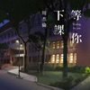

[View on Apple](https://music.apple.com/cn/album/%E7%AD%89%E4%BD%A0%E4%B8%8B%E8%AF%BE-with-%E6%9D%A8%E7%91%9E%E4%BB%A3/1336404440?i=1336404847)

## 半岛铁盒

[View on Apple](https://music.apple.com/cn/album/%E5%8D%8A%E5%B2%9B%E9%93%81%E7%9B%92/536161722?i=536162079)

## 阴天

[View on Apple](https://music.apple.com/cn/album/%E9%98%B4%E5%A4%A9/200469374?i=200473135)

## 开始懂了

[View on Apple](https://music.apple.com/cn/album/%E5%BC%80%E5%A7%8B%E6%87%82%E4%BA%86/298837646?i=298837675)

## 我不难过

[View on Apple](https://music.apple.com/cn/album/%E6%88%91%E4%B8%8D%E9%9A%BE%E8%BF%87/255920420?i=255921025)

## 爱我还是他

[View on Apple](https://music.apple.com/cn/album/%E7%88%B1%E6%88%91%E8%BF%98%E6%98%AF%E4%BB%96/905206649?i=905206660)

## 夜曲

[View on Apple](https://music.apple.com/cn/album/%E5%A4%9C%E6%9B%B2/536009641?i=536009642)

## Beauty and a Beat (feat. Nicki Minaj)

[View on Apple](https://music.apple.com/cn/album/beauty-and-a-beat-feat-nicki-minaj/1440650852?i=1440650961)

## 爱情转移

[View on Apple](https://music.apple.com/cn/album/%E7%88%B1%E6%83%85%E8%BD%AC%E7%A7%BB/1443352354?i=1443352465)

## 告白气球

[View on Apple](https://music.apple.com/cn/album/%E5%91%8A%E7%99%BD%E6%B0%94%E7%90%83/1118757859?i=1118757877)

## 恋人

[View on Apple](https://music.apple.com/cn/album/%E6%81%8B%E4%BA%BA/1752810525?i=1752810526)

## hate that i made you love me

[View on Apple](https://music.apple.com/cn/album/hate-that-i-made-you-love-me/1895420989?i=6763656876)

## 雨爱

[View on Apple](https://music.apple.com/cn/album/%E9%9B%A8%E7%88%B1/347295255?i=347295290)

## 简单爱

[View on Apple](https://music.apple.com/cn/album/%E7%AE%80%E5%8D%95%E7%88%B1/535739206?i=535739351)

## 不为谁而作的歌

[View on Apple](https://music.apple.com/cn/album/%E4%B8%8D%E4%B8%BA%E8%B0%81%E8%80%8C%E4%BD%9C%E7%9A%84%E6%AD%8C/1871400633?i=1871400637)

## 枫

[View on Apple](https://music.apple.com/cn/album/%E6%9E%AB/536009641?i=536009647)

## 十年

[View on Apple](https://music.apple.com/cn/album/%E5%8D%81%E5%B9%B4/542922079?i=542922095)

## 你不知道的事

[View on Apple](https://music.apple.com/cn/album/%E4%BD%A0%E4%B8%8D%E7%9F%A5%E9%81%93%E7%9A%84%E4%BA%8B/1528146376?i=1528146380)

## 发如雪

[View on Apple](https://music.apple.com/cn/album/%E5%8F%91%E5%A6%82%E9%9B%AA/536009641?i=536009644)

## 关键词

[View on Apple](https://music.apple.com/cn/album/%E5%85%B3%E9%94%AE%E8%AF%8D/1871400633?i=1871400641)

## 情歌

[View on Apple](https://music.apple.com/cn/album/%E6%83%85%E6%AD%8C/1095630068?i=1095630246)

## 最佳损友

[View on Apple](https://music.apple.com/cn/album/%E6%9C%80%E4%BD%B3%E6%8D%9F%E5%8F%8B/1442912707?i=1442913348)

## 爱爱爱

[View on Apple](https://music.apple.com/cn/album/%E7%88%B1%E7%88%B1%E7%88%B1/220365864?i=220365871)

## 会呼吸的痛

[View on Apple](https://music.apple.com/cn/album/%E4%BC%9A%E5%91%BC%E5%90%B8%E7%9A%84%E7%97%9B/1097016060?i=1097016179)

## 交换余生

[View on Apple](https://music.apple.com/cn/album/%E4%BA%A4%E6%8D%A2%E4%BD%99%E7%94%9F/1531323100?i=1531323101)

## Angel

[View on Apple](https://music.apple.com/cn/album/angel/949320723?i=949320731)

## 红尘客栈

[View on Apple](https://music.apple.com/cn/album/%E7%BA%A2%E5%B0%98%E5%AE%A2%E6%A0%88/587743633?i=587743642)

## 淘汰

[View on Apple](https://music.apple.com/cn/album/%E6%B7%98%E6%B1%B0/1443352354?i=1443352455)

## 你就不要想起我

[View on Apple](https://music.apple.com/cn/album/%E4%BD%A0%E5%B0%B1%E4%B8%8D%E8%A6%81%E6%83%B3%E8%B5%B7%E6%88%91/744962939?i=744963040)

## 说谎

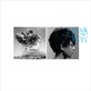

[View on Apple](https://music.apple.com/cn/album/%E8%AF%B4%E8%B0%8E/547158777?i=547173705)

## 遇见

[View on Apple](https://music.apple.com/cn/album/%E9%81%87%E8%A7%81/280911988?i=280911996)

## 兰亭序

[View on Apple](https://music.apple.com/cn/album/%E5%85%B0%E4%BA%AD%E5%BA%8F/1624000713?i=1624001320)

## 孤独患者

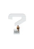

[View on Apple](https://music.apple.com/cn/album/%E5%AD%A4%E7%8B%AC%E6%82%A3%E8%80%85/1443783500?i=1443783507)

## 忽然之间

[View on Apple](https://music.apple.com/cn/album/%E5%BF%BD%E7%84%B6%E4%B9%8B%E9%97%B4/1722205323?i=1722205331)

## 说好的幸福呢

[View on Apple](https://music.apple.com/cn/album/%E8%AF%B4%E5%A5%BD%E7%9A%84%E5%B9%B8%E7%A6%8F%E5%91%A2/1624000713?i=1624001319)

## 一个人想着一个人

[View on Apple](https://music.apple.com/cn/album/%E4%B8%80%E4%B8%AA%E4%BA%BA%E6%83%B3%E7%9D%80%E4%B8%80%E4%B8%AA%E4%BA%BA/597217620?i=597217626)

## 暗号

[View on Apple](https://music.apple.com/cn/album/%E6%9A%97%E5%8F%B7/536161722?i=536162080)

## 反方向的钟

[View on Apple](https://music.apple.com/cn/album/%E5%8F%8D%E6%96%B9%E5%90%91%E7%9A%84%E9%92%9F/535790918?i=535791118)

## 不该 (with 张惠妹)

[View on Apple](https://music.apple.com/cn/album/%E4%B8%8D%E8%AF%A5-with-%E5%BC%A0%E6%83%A0%E5%A6%B9/1118757859?i=1118757873)

## 烟花易冷

[View on Apple](https://music.apple.com/cn/album/%E7%83%9F%E8%8A%B1%E6%98%93%E5%86%B7/536247746?i=536248196)

## Always Online

[View on Apple](https://music.apple.com/cn/album/always-online/1071752047?i=1071752119)

## 大城小爱

[View on Apple](https://music.apple.com/cn/album/%E5%A4%A7%E5%9F%8E%E5%B0%8F%E7%88%B1/1134353291?i=1134353955)

## REDRED

[View on Apple](https://music.apple.com/cn/album/redred/1887671065?i=1887671067)

## 飞机场的10:30

[View on Apple](https://music.apple.com/cn/album/%E9%A3%9E%E6%9C%BA%E5%9C%BA%E7%9A%8410-30/1416149926?i=1416149929)

## 可惜没如果

[View on Apple](https://music.apple.com/cn/album/%E5%8F%AF%E6%83%9C%E6%B2%A1%E5%A6%82%E6%9E%9C/1788007687?i=1788007696)

## 富士山下

[View on Apple](https://music.apple.com/cn/album/%E5%AF%8C%E5%A3%AB%E5%B1%B1%E4%B8%8B/1443345687?i=1443346107)

## 青花瓷

[View on Apple](https://music.apple.com/cn/album/%E9%9D%92%E8%8A%B1%E7%93%B7/536030690?i=536030695)

## 颜色

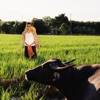

[View on Apple](https://music.apple.com/cn/album/%E9%A2%9C%E8%89%B2/1811349431?i=1811349432)

## 太聪明

[View on Apple](https://music.apple.com/cn/album/%E5%A4%AA%E8%81%AA%E6%98%8E/152197399?i=152197590)

## 勇气

[View on Apple](https://music.apple.com/cn/album/%E5%8B%87%E6%B0%94/1692291088?i=1692291089)

## 多远都要在一起

[View on Apple](https://music.apple.com/cn/album/%E5%A4%9A%E8%BF%9C%E9%83%BD%E8%A6%81%E5%9C%A8%E4%B8%80%E8%B5%B7/1053567923?i=1053567928)

## stupid song

[View on Apple](https://music.apple.com/cn/album/stupid-song/1889992111?i=1889992115)

## Baby (feat. Ludacris)

[View on Apple](https://music.apple.com/cn/album/baby-feat-ludacris/1443008825?i=1443008970)

## 小半

[View on Apple](https://music.apple.com/cn/album/%E5%B0%8F%E5%8D%8A/1421692907?i=1421693331)

## 句号

[View on Apple](https://music.apple.com/cn/album/%E5%8F%A5%E5%8F%B7/1487769992?i=1487769993)

## thank u, next

[View on Apple](https://music.apple.com/cn/album/thank-u-next/1450330588?i=1450330686)

## Whiplash

[View on Apple](https://music.apple.com/cn/album/whiplash/1772644600?i=1772644601)

## 江南

[View on Apple](https://music.apple.com/cn/album/%E6%B1%9F%E5%8D%97/1071753622?i=1071753628)

## 说了再见

[View on Apple](https://music.apple.com/cn/album/%E8%AF%B4%E4%BA%86%E5%86%8D%E8%A7%81/536247746?i=536248195)

## 麦恩莉

[View on Apple](https://music.apple.com/cn/album/%E9%BA%A6%E6%81%A9%E8%8E%89/577983280?i=577983297)

## 手写的从前

[View on Apple](https://music.apple.com/cn/album/%E6%89%8B%E5%86%99%E7%9A%84%E4%BB%8E%E5%89%8D/944321428?i=944321446)

## We Don’t Talk Anymore (feat. Selena Gomez)

[View on Apple](https://music.apple.com/cn/album/we-dont-talk-anymore-feat-selena-gomez/1041127262?i=1041127302)

## 珊瑚海 (feat. 梁心颐)

[View on Apple](https://music.apple.com/cn/album/%E7%8F%8A%E7%91%9A%E6%B5%B7-feat-%E6%A2%81%E5%BF%83%E9%A2%90/536009641?i=536009751)

## 退后

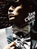

[View on Apple](https://music.apple.com/cn/album/%E9%80%80%E5%90%8E/536285027?i=536285261)

## 说好不哭

[View on Apple](https://music.apple.com/cn/album/%E8%AF%B4%E5%A5%BD%E4%B8%8D%E5%93%AD/1480230399?i=1480230401)

## 偏爱

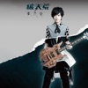

[View on Apple](https://music.apple.com/cn/album/%E5%81%8F%E7%88%B1/905211910?i=905212063)

## 我落泪 . 情绪零碎

[View on Apple](https://music.apple.com/cn/album/%E6%88%91%E8%90%BD%E6%B3%AA-%E6%83%85%E7%BB%AA%E9%9B%B6%E7%A2%8E/536247746?i=536248201)

## 失眠

[View on Apple](https://music.apple.com/cn/album/%E5%A4%B1%E7%9C%A0/1864303774?i=1864304148)

## 耳朵

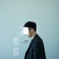

[View on Apple](https://music.apple.com/cn/album/%E8%80%B3%E6%9C%B5/1438734966?i=1438735302)

## 不将就 (电影《何以笙箫默》片尾曲)

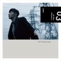

[View on Apple](https://music.apple.com/cn/album/%E4%B8%8D%E5%B0%86%E5%B0%B1-%E7%94%B5%E5%BD%B1-%E4%BD%95%E4%BB%A5%E7%AC%99%E7%AE%AB%E9%BB%98-%E7%89%87%E5%B0%BE%E6%9B%B2/1072339647?i=1072339996)

## 蒲公英的约定

[View on Apple](https://music.apple.com/cn/album/%E8%92%B2%E5%85%AC%E8%8B%B1%E7%9A%84%E7%BA%A6%E5%AE%9A/536030690?i=536030697)

## 雨过后的风景

[View on Apple](https://music.apple.com/cn/album/%E9%9B%A8%E8%BF%87%E5%90%8E%E7%9A%84%E9%A3%8E%E6%99%AF/1869229214?i=1869229365)

## 连名带姓

[View on Apple](https://music.apple.com/cn/album/%E8%BF%9E%E5%90%8D%E5%B8%A6%E5%A7%93/1834198554?i=1834199249)

## 最长的电影

[View on Apple](https://music.apple.com/cn/album/%E6%9C%80%E9%95%BF%E7%9A%84%E7%94%B5%E5%BD%B1/536030690?i=536030702)

## 红色高跟鞋

[View on Apple](https://music.apple.com/cn/album/%E7%BA%A2%E8%89%B2%E9%AB%98%E8%B7%9F%E9%9E%8B/672641879?i=672641999)

## 天黑黑

[View on Apple](https://music.apple.com/cn/album/%E5%A4%A9%E9%BB%91%E9%BB%91/541856819?i=541857036)

## 爱情讯息

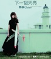

[View on Apple](https://music.apple.com/cn/album/%E7%88%B1%E6%83%85%E8%AE%AF%E6%81%AF/535391943?i=535391947)

## RUDE!

[View on Apple](https://music.apple.com/cn/album/rude/1875146814?i=1875146815)

## 天天

[View on Apple](https://music.apple.com/cn/album/%E5%A4%A9%E5%A4%A9/905206471?i=905206485)

## 泡沫

[View on Apple](https://music.apple.com/cn/album/%E6%B3%A1%E6%B2%AB/541862703?i=541862768)

## 我们的歌

[View on Apple](https://music.apple.com/cn/album/%E6%88%91%E4%BB%AC%E7%9A%84%E6%AD%8C/1691044816?i=1691044822)

## 借口

[View on Apple](https://music.apple.com/cn/album/%E5%80%9F%E5%8F%A3/536114662?i=536115196)

## 给我一首歌的时间

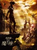

[View on Apple](https://music.apple.com/cn/album/%E7%BB%99%E6%88%91%E4%B8%80%E9%A6%96%E6%AD%8C%E7%9A%84%E6%97%B6%E9%97%B4/1624000713?i=1624000715)

## 你听得到

[View on Apple](https://music.apple.com/cn/album/%E4%BD%A0%E5%90%AC%E5%BE%97%E5%88%B0/535824731?i=535824741)

## Cruel Summer

[View on Apple](https://music.apple.com/cn/album/cruel-summer/1468058165?i=1468058171)
