- [岩中花述](#岩中花述)
- [声动早咖啡](#声动早咖啡)
- [凹凸电波](#凹凸电波)
- [自我进化论](#自我进化论)
- [天真不天真](#天真不天真)
- [霓达播客](#霓达播客)
- [肥话连篇](#肥话连篇)
- [知行小酒馆](#知行小酒馆)
- [谭立人](#谭立人)
- [姜思达](#姜思达)
- [All Ears English Podcast](#all-ears-english-podcast)
- [搞钱女孩](#搞钱女孩)
- [纵横四海](#纵横四海)
- [钱婧老师的会客厅](#钱婧老师的会客厅)
- [你，静不下来](#你-静不下来)
- [不开玩笑 Jokes Aside](#不开玩笑-jokes-aside)
- [西西弗高速](#西西弗高速)
- [资讯早7点](#资讯早7点)
- [无聊斋](#无聊斋)
- [霓达故事](#霓达故事)
- [罗永浩的十字路口](#罗永浩的十字路口)
- [三个火呛手](#三个火呛手)
- [不把天聊si](#不把天聊si)
- [6 Minute English](#6-minute-english)
- [半拿铁 | 商业沉浮录](#半拿铁-商业沉浮录)
- [思文，败类](#思文-败类)
- [商业就是这样](#商业就是这样)
- [独树不成林](#独树不成林)
- [不吱声](#不吱声)
- [来都来了 | 听了再走](#来都来了-听了再走)
- [文化有限](#文化有限)
- [明朝那些事儿](#明朝那些事儿)
- [自习室 STUDY ROOM](#自习室-study-room)
- [心都野了Heartbeast](#心都野了heartbeast)
- [anything goes with emma chamberlain](#anything-goes-with-emma-chamberlain)
- [黑猫侦探社](#黑猫侦探社)
- [Round Table China](#round-table-china)
- [潘吉Jenny告诉你|学英语聊美国|开言英语 · Podcast](#潘吉jenny告诉你-学英语聊美国-开言英语-podcast)
- [重重电波](#重重电波)
- [English Learning Podcast](#english-learning-podcast)
- [无人知晓](#无人知晓)
- [二的三次方](#二的三次方)
- [正经叭叭](#正经叭叭)
- [忽左忽右](#忽左忽右)
- [TSP怪奇档案](#tsp怪奇档案)
- [面基](#面基)
- [落日之后](#落日之后)
- [声东击西](#声东击西)
- [TED Talks Daily](#ted-talks-daily)
- [高效磨耳朵 | 最好的英语听力资源](#高效磨耳朵-最好的英语听力资源)
- [像素播客](#像素播客)
- [早安英文](#早安英文)
- [故事FM](#故事fm)
- [M字闲聊](#m字闲聊)
- [IELTS Energy English 7+](#ielts-energy-english-7)
- [鲶鱼夜话](#鲶鱼夜话)
- [怡楽播客](#怡楽播客)
- [异地登录](#异地登录)
- [英语冰美式](#英语冰美式)
- [李哪吒上学记｜稀里糊涂一年级&神神气气二年级](#李哪吒上学记-稀里糊涂一年级-神神气气二年级)
- [助眠相声精选](#助眠相声精选)
- [Wow in the World](#wow-in-the-world)
- [不喝白开水](#不喝白开水)
- [摸鱼早报](#摸鱼早报)
- [没理想编辑部](#没理想编辑部)
- [浪里个浪](#浪里个浪)
- [日谈公园](#日谈公园)
- [东腔西调](#东腔西调)
- [硅谷101](#硅谷101)
- [The Mel Robbins Podcast](#the-mel-robbins-podcast)
- [谐星聊天会](#谐星聊天会)
- [贝壳回音](#贝壳回音)
- [吃一场有趣的宋朝宴席（谢涛播讲）](#吃一场有趣的宋朝宴席-谢涛播讲)
- [VOA Learning English Podcast - VOA Learning English](#voa-learning-english-podcast-voa-learning-english)
- [蜜獾吃书](#蜜獾吃书)
- [被讨厌的勇气](#被讨厌的勇气)
- [燕外之意](#燕外之意)
- [嗨咻](#嗨咻)
- [TED演讲精选](#ted演讲精选)
- [老徐的会客厅](#老徐的会客厅)
- [蒙曼讲红楼梦｜百家讲坛名师开讲经典名著](#蒙曼讲红楼梦-百家讲坛名师开讲经典名著)
- [松茸的世界丨正念冥想](#松茸的世界丨正念冥想)
- [小泼猴妙趣百科丨十万个科普百科大全丨睡前故事](#小泼猴妙趣百科丨十万个科普百科大全丨睡前故事)
- [得体广播站](#得体广播站)
- [洪恩故事](#洪恩故事)
- [BBC 随身英语](#bbc-随身英语)
- [野史下酒｜有趣的历史故事](#野史下酒-有趣的历史故事)
- [2024 -2025抖音快手播放量破亿爆火音乐歌曲](#2024-2025抖音快手播放量破亿爆火音乐歌曲)
- [陶白白白说了](#陶白白白说了)
- [体制内 | 小职员们的聊天局](#体制内-小职员们的聊天局)
- [小Lin说](#小lin说)
- [她山石](#她山石)
- [给女孩的商业第一课](#给女孩的商业第一课)
- [心理博弈术：拿捏人性，驾驭人心](#心理博弈术-拿捏人性-驾驭人心)
- [投资ABC](#投资abc)
- [Modern Love](#modern-love)
- [出逃在即](#出逃在即)
- [高情商沟通话术：自在表达，想说就说](#高情商沟通话术-自在表达-想说就说)
- [墨菲定律：改变人一生的300个神奇定律](#墨菲定律-改变人一生的300个神奇定律)
- [竹林之中](#竹林之中)

## 岩中花述

[View on Apple](https://podcasts.apple.com/cn/podcast/%E5%B2%A9%E4%B8%AD%E8%8A%B1%E8%BF%B0/id1582119137)

## 声动早咖啡

[View on Apple](https://podcasts.apple.com/cn/podcast/%E5%A3%B0%E5%8A%A8%E6%97%A9%E5%92%96%E5%95%A1/id1573189055)

## 凹凸电波

[View on Apple](https://podcasts.apple.com/cn/podcast/%E5%87%B9%E5%87%B8%E7%94%B5%E6%B3%A2/id1455784513)

## 自我进化论

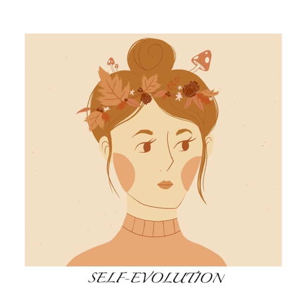

[View on Apple](https://podcasts.apple.com/cn/podcast/%E8%87%AA%E6%88%91%E8%BF%9B%E5%8C%96%E8%AE%BA/id1498170617)

## 天真不天真

[View on Apple](https://podcasts.apple.com/cn/podcast/%E5%A4%A9%E7%9C%9F%E4%B8%8D%E5%A4%A9%E7%9C%9F/id1731784296)

## 霓达播客

[View on Apple](https://podcasts.apple.com/cn/podcast/%E9%9C%93%E8%BE%BE%E6%92%AD%E5%AE%A2/id1668626930)

## 肥话连篇

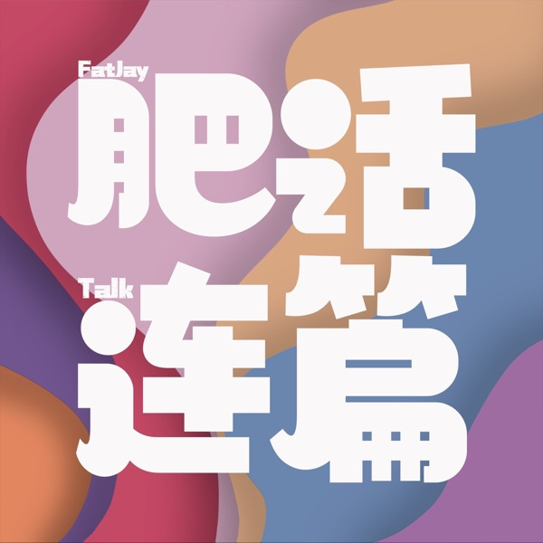

[View on Apple](https://podcasts.apple.com/cn/podcast/%E8%82%A5%E8%AF%9D%E8%BF%9E%E7%AF%87/id1603580035)

## 知行小酒馆

[View on Apple](https://podcasts.apple.com/cn/podcast/%E7%9F%A5%E8%A1%8C%E5%B0%8F%E9%85%92%E9%A6%86/id1559695855)

## 谭立人

[View on Apple](https://podcasts.apple.com/cn/podcast/%E8%B0%AD%E7%AB%8B%E4%BA%BA/id1771401634)

## 姜思达

[View on Apple](https://podcasts.apple.com/cn/podcast/%E5%A7%9C%E6%80%9D%E8%BE%BE/id1546599837)

## All Ears English Podcast

[View on Apple](https://podcasts.apple.com/cn/podcast/all-ears-english-podcast/id751574016)

## 搞钱女孩

[View on Apple](https://podcasts.apple.com/cn/podcast/%E6%90%9E%E9%92%B1%E5%A5%B3%E5%AD%A9/id1676099257)

## 纵横四海

[View on Apple](https://podcasts.apple.com/cn/podcast/%E7%BA%B5%E6%A8%AA%E5%9B%9B%E6%B5%B7/id1671490972)

## 钱婧老师的会客厅

[View on Apple](https://podcasts.apple.com/cn/podcast/%E9%92%B1%E5%A9%A7%E8%80%81%E5%B8%88%E7%9A%84%E4%BC%9A%E5%AE%A2%E5%8E%85/id1715590582)

## 你，静不下来

[View on Apple](https://podcasts.apple.com/cn/podcast/%E4%BD%A0-%E9%9D%99%E4%B8%8D%E4%B8%8B%E6%9D%A5/id1809736974)

## 不开玩笑 Jokes Aside

[View on Apple](https://podcasts.apple.com/cn/podcast/%E4%B8%8D%E5%BC%80%E7%8E%A9%E7%AC%91-jokes-aside/id1592646595)

## 西西弗高速

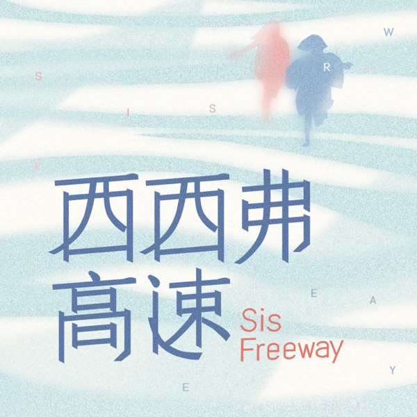

[View on Apple](https://podcasts.apple.com/cn/podcast/%E8%A5%BF%E8%A5%BF%E5%BC%97%E9%AB%98%E9%80%9F/id1770713549)

## 资讯早7点

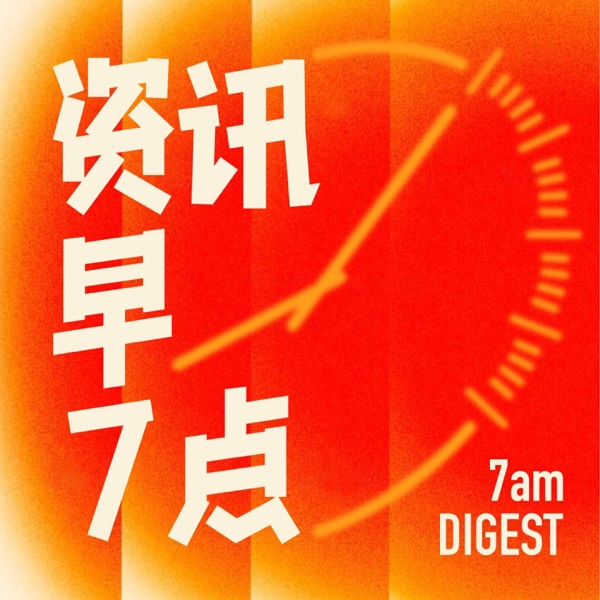

[View on Apple](https://podcasts.apple.com/cn/podcast/%E8%B5%84%E8%AE%AF%E6%97%A97%E7%82%B9/id1794422481)

## 无聊斋

[View on Apple](https://podcasts.apple.com/cn/podcast/%E6%97%A0%E8%81%8A%E6%96%8B/id1433530822)

## 霓达故事

[View on Apple](https://podcasts.apple.com/cn/podcast/%E9%9C%93%E8%BE%BE%E6%95%85%E4%BA%8B/id1675204249)

## 罗永浩的十字路口

[View on Apple](https://podcasts.apple.com/cn/podcast/%E7%BD%97%E6%B0%B8%E6%B5%A9%E7%9A%84%E5%8D%81%E5%AD%97%E8%B7%AF%E5%8F%A3/id1834069371)

## 三个火呛手

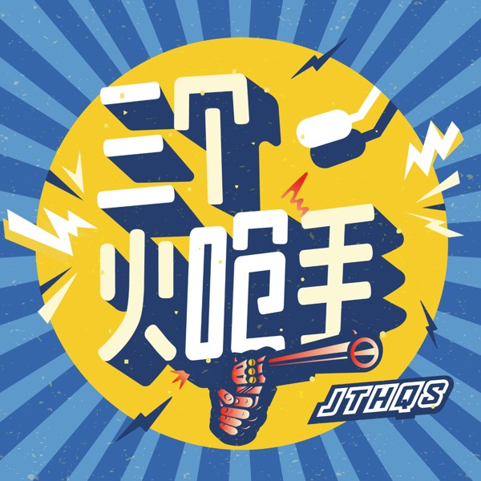

[View on Apple](https://podcasts.apple.com/cn/podcast/%E4%B8%89%E4%B8%AA%E7%81%AB%E5%91%9B%E6%89%8B/id1696511339)

## 不把天聊si

[View on Apple](https://podcasts.apple.com/cn/podcast/%E4%B8%8D%E6%8A%8A%E5%A4%A9%E8%81%8Asi/id1577896182)

## 6 Minute English

[View on Apple](https://podcasts.apple.com/cn/podcast/6-minute-english/id262026947)

## 半拿铁 | 商业沉浮录

[View on Apple](https://podcasts.apple.com/cn/podcast/%E5%8D%8A%E6%8B%BF%E9%93%81-%E5%95%86%E4%B8%9A%E6%B2%89%E6%B5%AE%E5%BD%95/id1615939013)

## 思文，败类

[View on Apple](https://podcasts.apple.com/cn/podcast/%E6%80%9D%E6%96%87-%E8%B4%A5%E7%B1%BB/id1682160500)

## 商业就是这样

[View on Apple](https://podcasts.apple.com/cn/podcast/%E5%95%86%E4%B8%9A%E5%B0%B1%E6%98%AF%E8%BF%99%E6%A0%B7/id1552904790)

## 独树不成林

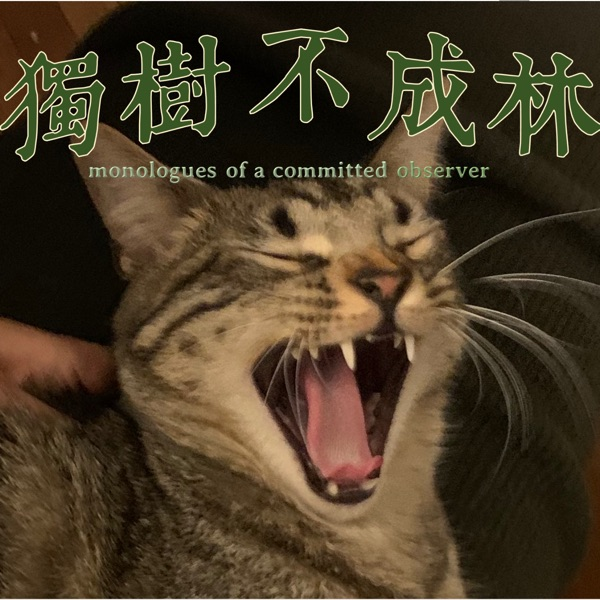

[View on Apple](https://podcasts.apple.com/cn/podcast/%E7%8B%AC%E6%A0%91%E4%B8%8D%E6%88%90%E6%9E%97/id1711052890)

## 不吱声

[View on Apple](https://podcasts.apple.com/cn/podcast/%E4%B8%8D%E5%90%B1%E5%A3%B0/id1771248028)

## 来都来了 | 听了再走

[View on Apple](https://podcasts.apple.com/cn/podcast/%E6%9D%A5%E9%83%BD%E6%9D%A5%E4%BA%86-%E5%90%AC%E4%BA%86%E5%86%8D%E8%B5%B0/id1512932915)

## 文化有限

[View on Apple](https://podcasts.apple.com/cn/podcast/%E6%96%87%E5%8C%96%E6%9C%89%E9%99%90/id1482731836)

## 明朝那些事儿

[View on Apple](https://podcasts.apple.com/cn/podcast/%E6%98%8E%E6%9C%9D%E9%82%A3%E4%BA%9B%E4%BA%8B%E5%84%BF/id1780511535)

## 自习室 STUDY ROOM

[View on Apple](https://podcasts.apple.com/cn/podcast/%E8%87%AA%E4%B9%A0%E5%AE%A4-study-room/id1726135306)

## 心都野了Heartbeast

[View on Apple](https://podcasts.apple.com/cn/podcast/%E5%BF%83%E9%83%BD%E9%87%8E%E4%BA%86heartbeast/id1689524318)

## anything goes with emma chamberlain

[View on Apple](https://podcasts.apple.com/cn/podcast/anything-goes-with-emma-chamberlain/id1458568923)

## 黑猫侦探社

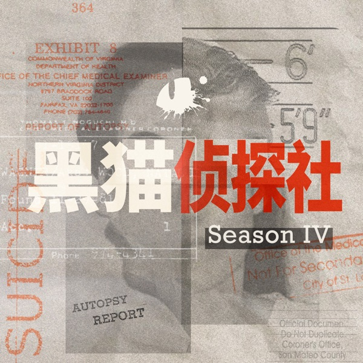

[View on Apple](https://podcasts.apple.com/cn/podcast/%E9%BB%91%E7%8C%AB%E4%BE%A6%E6%8E%A2%E7%A4%BE/id1596363758)

## Round Table China

[View on Apple](https://podcasts.apple.com/cn/podcast/round-table-china/id793040690)

## 潘吉Jenny告诉你|学英语聊美国|开言英语 · Podcast

[View on Apple](https://podcasts.apple.com/cn/podcast/%E6%BD%98%E5%90%89jenny%E5%91%8A%E8%AF%89%E4%BD%A0-%E5%AD%A6%E8%8B%B1%E8%AF%AD%E8%81%8A%E7%BE%8E%E5%9B%BD-%E5%BC%80%E8%A8%80%E8%8B%B1%E8%AF%AD-podcast/id520986449)

## 重重电波

[View on Apple](https://podcasts.apple.com/cn/podcast/%E9%87%8D%E9%87%8D%E7%94%B5%E6%B3%A2/id1770731694)

## English Learning Podcast

[View on Apple](https://podcasts.apple.com/cn/podcast/english-learning-podcast/id1796650777)

## 无人知晓

[View on Apple](https://podcasts.apple.com/cn/podcast/%E6%97%A0%E4%BA%BA%E7%9F%A5%E6%99%93/id1581271335)

## 二的三次方

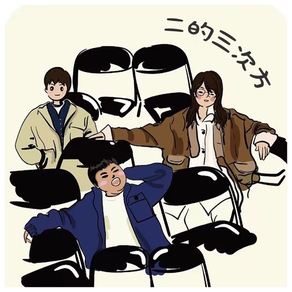

[View on Apple](https://podcasts.apple.com/cn/podcast/%E4%BA%8C%E7%9A%84%E4%B8%89%E6%AC%A1%E6%96%B9/id1708188846)

## 正经叭叭

[View on Apple](https://podcasts.apple.com/cn/podcast/%E6%AD%A3%E7%BB%8F%E5%8F%AD%E5%8F%AD/id1575323064)

## 忽左忽右

[View on Apple](https://podcasts.apple.com/cn/podcast/%E5%BF%BD%E5%B7%A6%E5%BF%BD%E5%8F%B3/id1493503146)

## TSP怪奇档案

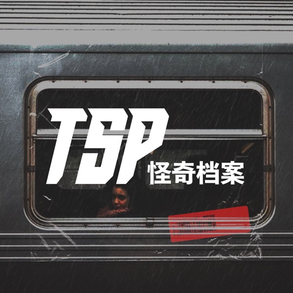

[View on Apple](https://podcasts.apple.com/cn/podcast/tsp%E6%80%AA%E5%A5%87%E6%A1%A3%E6%A1%88/id1488439861)

## 面基

[View on Apple](https://podcasts.apple.com/cn/podcast/%E9%9D%A2%E5%9F%BA/id1686741064)

## 落日之后

[View on Apple](https://podcasts.apple.com/cn/podcast/%E8%90%BD%E6%97%A5%E4%B9%8B%E5%90%8E/id1697309319)

## 声东击西

[View on Apple](https://podcasts.apple.com/cn/podcast/%E5%A3%B0%E4%B8%9C%E5%87%BB%E8%A5%BF/id1183662640)

## TED Talks Daily

[View on Apple](https://podcasts.apple.com/cn/podcast/ted-talks-daily/id160904630)

## 高效磨耳朵 | 最好的英语听力资源

[View on Apple](https://podcasts.apple.com/cn/podcast/%E9%AB%98%E6%95%88%E7%A3%A8%E8%80%B3%E6%9C%B5-%E6%9C%80%E5%A5%BD%E7%9A%84%E8%8B%B1%E8%AF%AD%E5%90%AC%E5%8A%9B%E8%B5%84%E6%BA%90/id1553429497)

## 像素播客

[View on Apple](https://podcasts.apple.com/cn/podcast/%E5%83%8F%E7%B4%A0%E6%92%AD%E5%AE%A2/id1783798164)

## 早安英文

[View on Apple](https://podcasts.apple.com/cn/podcast/%E6%97%A9%E5%AE%89%E8%8B%B1%E6%96%87/id1073522912)

## 故事FM

[View on Apple](https://podcasts.apple.com/cn/podcast/%E6%95%85%E4%BA%8Bfm/id1256399960)

## M字闲聊

[View on Apple](https://podcasts.apple.com/cn/podcast/m%E5%AD%97%E9%97%B2%E8%81%8A/id1638932196)

## IELTS Energy English 7+

[View on Apple](https://podcasts.apple.com/cn/podcast/ielts-energy-english-7/id969076668)

## 鲶鱼夜话

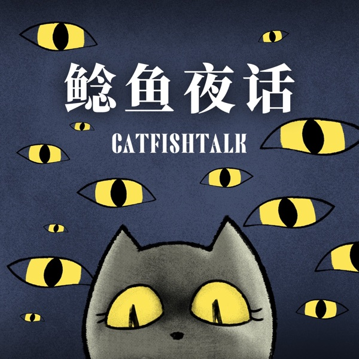

[View on Apple](https://podcasts.apple.com/cn/podcast/%E9%B2%B6%E9%B1%BC%E5%A4%9C%E8%AF%9D/id1714394532)

## 怡楽播客

[View on Apple](https://podcasts.apple.com/cn/podcast/%E6%80%A1%E6%A5%BD%E6%92%AD%E5%AE%A2/id1523249117)

## 异地登录

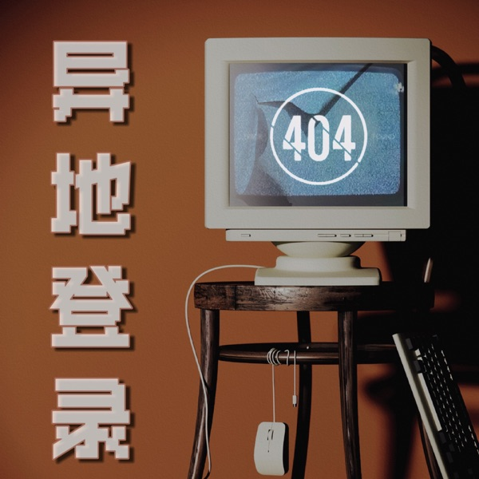

[View on Apple](https://podcasts.apple.com/cn/podcast/%E5%BC%82%E5%9C%B0%E7%99%BB%E5%BD%95/id1702839331)

## 英语冰美式

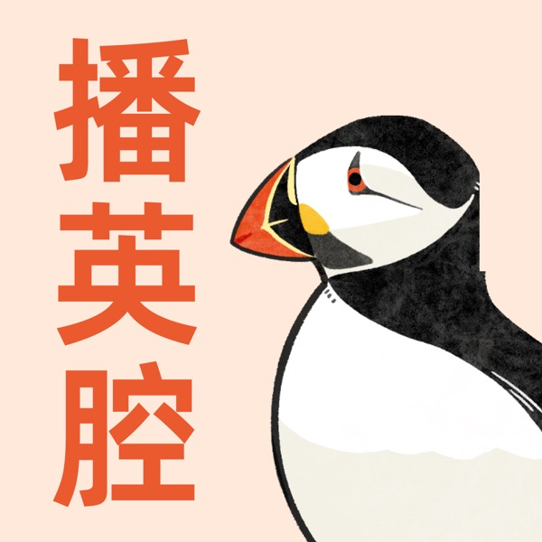

[View on Apple](https://podcasts.apple.com/cn/podcast/%E8%8B%B1%E8%AF%AD%E5%86%B0%E7%BE%8E%E5%BC%8F/id1791094779)

## 李哪吒上学记｜稀里糊涂一年级&神神气气二年级

[View on Apple](https://podcasts.apple.com/cn/podcast/%E6%9D%8E%E5%93%AA%E5%90%92%E4%B8%8A%E5%AD%A6%E8%AE%B0-%E7%A8%80%E9%87%8C%E7%B3%8A%E6%B6%82%E4%B8%80%E5%B9%B4%E7%BA%A7-%E7%A5%9E%E7%A5%9E%E6%B0%94%E6%B0%94%E4%BA%8C%E5%B9%B4%E7%BA%A7/id1807951307)

## 助眠相声精选

[View on Apple](https://podcasts.apple.com/cn/podcast/%E5%8A%A9%E7%9C%A0%E7%9B%B8%E5%A3%B0%E7%B2%BE%E9%80%89/id1568019093)

## Wow in the World

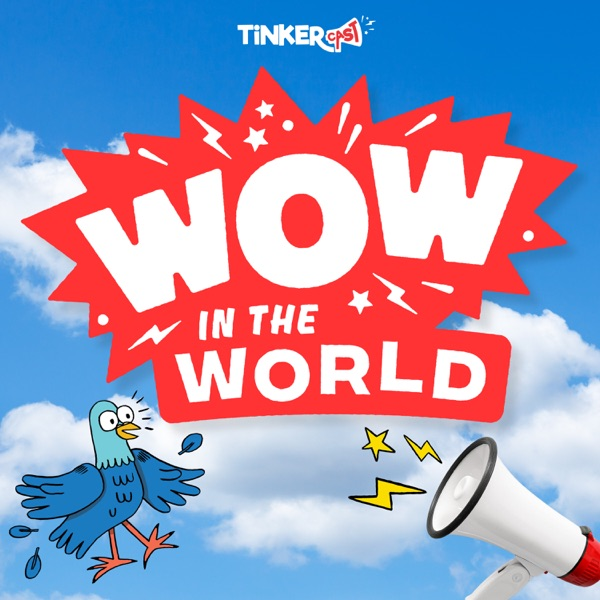

[View on Apple](https://podcasts.apple.com/cn/podcast/wow-in-the-world/id1233834541)

## 不喝白开水

[View on Apple](https://podcasts.apple.com/cn/podcast/%E4%B8%8D%E5%96%9D%E7%99%BD%E5%BC%80%E6%B0%B4/id1753590411)

## 摸鱼早报

[View on Apple](https://podcasts.apple.com/cn/podcast/%E6%91%B8%E9%B1%BC%E6%97%A9%E6%8A%A5/id1846847443)

## 没理想编辑部

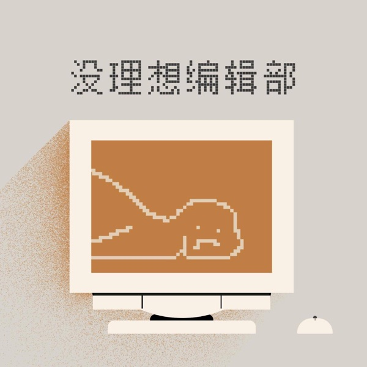

[View on Apple](https://podcasts.apple.com/cn/podcast/%E6%B2%A1%E7%90%86%E6%83%B3%E7%BC%96%E8%BE%91%E9%83%A8/id1494093522)

## 浪里个浪

[View on Apple](https://podcasts.apple.com/cn/podcast/%E6%B5%AA%E9%87%8C%E4%B8%AA%E6%B5%AA/id1708845058)

## 日谈公园

[View on Apple](https://podcasts.apple.com/cn/podcast/%E6%97%A5%E8%B0%88%E5%85%AC%E5%9B%AD/id1166949390)

## 东腔西调

[View on Apple](https://podcasts.apple.com/cn/podcast/%E4%B8%9C%E8%85%94%E8%A5%BF%E8%B0%83/id1533768416)

## 硅谷101

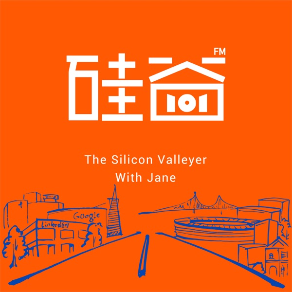

[View on Apple](https://podcasts.apple.com/cn/podcast/%E7%A1%85%E8%B0%B7101/id1498541229)

## The Mel Robbins Podcast

[View on Apple](https://podcasts.apple.com/cn/podcast/the-mel-robbins-podcast/id1646101002)

## 谐星聊天会

[View on Apple](https://podcasts.apple.com/cn/podcast/%E8%B0%90%E6%98%9F%E8%81%8A%E5%A4%A9%E4%BC%9A/id1488080680)

## 贝壳回音

[View on Apple](https://podcasts.apple.com/cn/podcast/%E8%B4%9D%E5%A3%B3%E5%9B%9E%E9%9F%B3/id1794059280)

## 吃一场有趣的宋朝宴席（谢涛播讲）

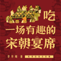

[View on Apple](https://podcasts.apple.com/cn/podcast/%E5%90%83%E4%B8%80%E5%9C%BA%E6%9C%89%E8%B6%A3%E7%9A%84%E5%AE%8B%E6%9C%9D%E5%AE%B4%E5%B8%AD-%E8%B0%A2%E6%B6%9B%E6%92%AD%E8%AE%B2/id1780512143)

## VOA Learning English Podcast - VOA Learning English

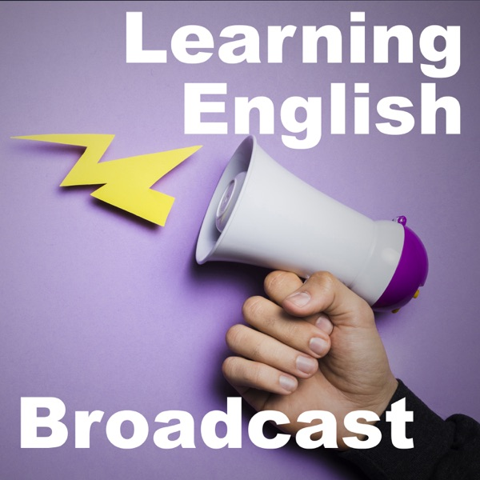

[View on Apple](https://podcasts.apple.com/cn/podcast/voa-learning-english-podcast-voa-learning-english/id109522474)

## 蜜獾吃书

[View on Apple](https://podcasts.apple.com/cn/podcast/%E8%9C%9C%E7%8D%BE%E5%90%83%E4%B9%A6/id1623136416)

## 被讨厌的勇气

[View on Apple](https://podcasts.apple.com/cn/podcast/%E8%A2%AB%E8%AE%A8%E5%8E%8C%E7%9A%84%E5%8B%87%E6%B0%94/id1765086236)

## 燕外之意

[View on Apple](https://podcasts.apple.com/cn/podcast/%E7%87%95%E5%A4%96%E4%B9%8B%E6%84%8F/id1620123449)

## 嗨咻

[View on Apple](https://podcasts.apple.com/cn/podcast/%E5%97%A8%E5%92%BB/id1644805423)

## TED演讲精选

[View on Apple](https://podcasts.apple.com/cn/podcast/ted%E6%BC%94%E8%AE%B2%E7%B2%BE%E9%80%89/id1852255002)

## 老徐的会客厅

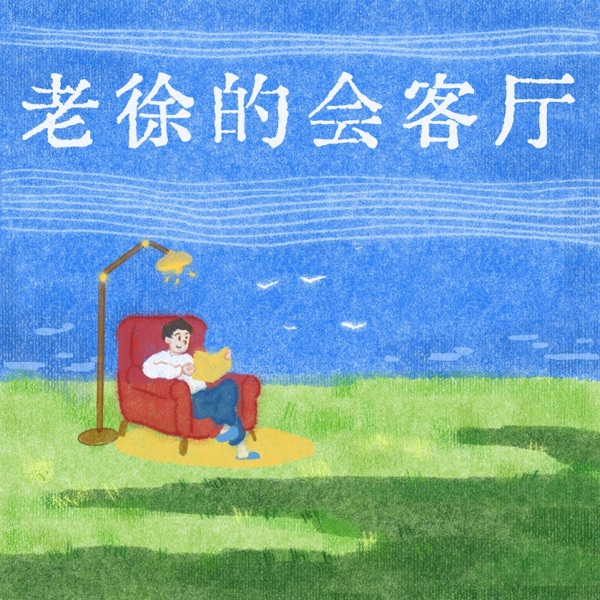

[View on Apple](https://podcasts.apple.com/cn/podcast/%E8%80%81%E5%BE%90%E7%9A%84%E4%BC%9A%E5%AE%A2%E5%8E%85/id1884216255)

## 蒙曼讲红楼梦｜百家讲坛名师开讲经典名著

[View on Apple](https://podcasts.apple.com/cn/podcast/%E8%92%99%E6%9B%BC%E8%AE%B2%E7%BA%A2%E6%A5%BC%E6%A2%A6-%E7%99%BE%E5%AE%B6%E8%AE%B2%E5%9D%9B%E5%90%8D%E5%B8%88%E5%BC%80%E8%AE%B2%E7%BB%8F%E5%85%B8%E5%90%8D%E8%91%97/id1764275604)

## 松茸的世界丨正念冥想

[View on Apple](https://podcasts.apple.com/cn/podcast/%E6%9D%BE%E8%8C%B8%E7%9A%84%E4%B8%96%E7%95%8C%E4%B8%A8%E6%AD%A3%E5%BF%B5%E5%86%A5%E6%83%B3/id1711138766)

## 小泼猴妙趣百科丨十万个科普百科大全丨睡前故事

[View on Apple](https://podcasts.apple.com/cn/podcast/%E5%B0%8F%E6%B3%BC%E7%8C%B4%E5%A6%99%E8%B6%A3%E7%99%BE%E7%A7%91%E4%B8%A8%E5%8D%81%E4%B8%87%E4%B8%AA%E7%A7%91%E6%99%AE%E7%99%BE%E7%A7%91%E5%A4%A7%E5%85%A8%E4%B8%A8%E7%9D%A1%E5%89%8D%E6%95%85%E4%BA%8B/id1719212923)

## 得体广播站

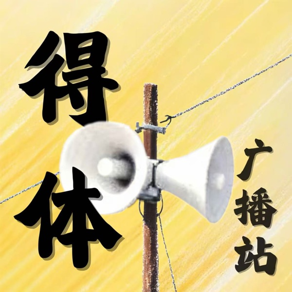

[View on Apple](https://podcasts.apple.com/cn/podcast/%E5%BE%97%E4%BD%93%E5%B9%BF%E6%92%AD%E7%AB%99/id1845527581)

## 洪恩故事

[View on Apple](https://podcasts.apple.com/cn/podcast/%E6%B4%AA%E6%81%A9%E6%95%85%E4%BA%8B/id1194425580)

## BBC 随身英语

[View on Apple](https://podcasts.apple.com/cn/podcast/bbc-%E9%9A%8F%E8%BA%AB%E8%8B%B1%E8%AF%AD/id1813149436)

## 野史下酒｜有趣的历史故事

[View on Apple](https://podcasts.apple.com/cn/podcast/%E9%87%8E%E5%8F%B2%E4%B8%8B%E9%85%92-%E6%9C%89%E8%B6%A3%E7%9A%84%E5%8E%86%E5%8F%B2%E6%95%85%E4%BA%8B/id877607820)

## 2024 -2025抖音快手播放量破亿爆火音乐歌曲

[View on Apple](https://podcasts.apple.com/cn/podcast/2024-2025%E6%8A%96%E9%9F%B3%E5%BF%AB%E6%89%8B%E6%92%AD%E6%94%BE%E9%87%8F%E7%A0%B4%E4%BA%BF%E7%88%86%E7%81%AB%E9%9F%B3%E4%B9%90%E6%AD%8C%E6%9B%B2/id1779743638)

## 陶白白白说了

[View on Apple](https://podcasts.apple.com/cn/podcast/%E9%99%B6%E7%99%BD%E7%99%BD%E7%99%BD%E8%AF%B4%E4%BA%86/id1822966118)

## 体制内 | 小职员们的聊天局

[View on Apple](https://podcasts.apple.com/cn/podcast/%E4%BD%93%E5%88%B6%E5%86%85-%E5%B0%8F%E8%81%8C%E5%91%98%E4%BB%AC%E7%9A%84%E8%81%8A%E5%A4%A9%E5%B1%80/id1640892410)

## 小Lin说

[View on Apple](https://podcasts.apple.com/cn/podcast/%E5%B0%8Flin%E8%AF%B4/id1752639453)

## 她山石

[View on Apple](https://podcasts.apple.com/cn/podcast/%E5%A5%B9%E5%B1%B1%E7%9F%B3/id1884281602)

## 给女孩的商业第一课

[View on Apple](https://podcasts.apple.com/cn/podcast/%E7%BB%99%E5%A5%B3%E5%AD%A9%E7%9A%84%E5%95%86%E4%B8%9A%E7%AC%AC%E4%B8%80%E8%AF%BE/id1581376691)

## 心理博弈术：拿捏人性，驾驭人心

[View on Apple](https://podcasts.apple.com/cn/podcast/%E5%BF%83%E7%90%86%E5%8D%9A%E5%BC%88%E6%9C%AF-%E6%8B%BF%E6%8D%8F%E4%BA%BA%E6%80%A7-%E9%A9%BE%E9%A9%AD%E4%BA%BA%E5%BF%83/id1829912137)

## 投资ABC

[View on Apple](https://podcasts.apple.com/cn/podcast/%E6%8A%95%E8%B5%84abc/id1703939182)

## Modern Love

[View on Apple](https://podcasts.apple.com/cn/podcast/modern-love/id1065559535)

## 出逃在即

[View on Apple](https://podcasts.apple.com/cn/podcast/%E5%87%BA%E9%80%83%E5%9C%A8%E5%8D%B3/id1533388375)

## 高情商沟通话术：自在表达，想说就说

[View on Apple](https://podcasts.apple.com/cn/podcast/%E9%AB%98%E6%83%85%E5%95%86%E6%B2%9F%E9%80%9A%E8%AF%9D%E6%9C%AF-%E8%87%AA%E5%9C%A8%E8%A1%A8%E8%BE%BE-%E6%83%B3%E8%AF%B4%E5%B0%B1%E8%AF%B4/id1558257393)

## 墨菲定律：改变人一生的300个神奇定律

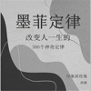

[View on Apple](https://podcasts.apple.com/cn/podcast/%E5%A2%A8%E8%8F%B2%E5%AE%9A%E5%BE%8B-%E6%94%B9%E5%8F%98%E4%BA%BA%E4%B8%80%E7%94%9F%E7%9A%84300%E4%B8%AA%E7%A5%9E%E5%A5%87%E5%AE%9A%E5%BE%8B/id1802597548)

## 竹林之中

[View on Apple](https://podcasts.apple.com/cn/podcast/%E7%AB%B9%E6%9E%97%E4%B9%8B%E4%B8%AD/id1721293506)
