- [ZDF](#zdf)
- [Claude by Anthropic](#claude-by-anthropic)
- [MagentaTV: TV & Streaming](#magentatv-tv-streaming)
- [Google Gemini](#google-gemini)
- [ChatGPT](#chatgpt)
- [Uber: Ride-Hailing & Taxis](#uber-ride-hailing-taxis)
- [Netflix Game Controller](#netflix-game-controller)
- [Freecash - Geld verdienen](#freecash-geld-verdienen)
- [Tipico Sportwetten App](#tipico-sportwetten-app)
- [Booking.com: Hotel Angebote](#booking-com-hotel-angebote)
- [CapCut: Foto- und Video-Editor](#capcut-foto-und-video-editor)
- [多邻国Duolingo英语日语法语](#多邻国duolingo英语日语法语)
- [Airbnb](#airbnb)
- [Nect Wallet](#nect-wallet)
- [Google](#google)
- [Google Maps](#google-maps)
- [CHECK24](#check24)
- [Threads](#threads)
- [MeinMagenta: Handy & Festnetz](#meinmagenta-handy-festnetz)
- [AusweisApp Bund](#ausweisapp-bund)
- [Wolt - Essen Bestellen & mehr](#wolt-essen-bestellen-mehr)
- [EasyPark parken - Park App](#easypark-parken-park-app)
- [Shop: Deine Lieblingsmarken](#shop-deine-lieblingsmarken)
- [Vinted: Secondhand-Marktplatz](#vinted-secondhand-marktplatz)
- [ElsterSecure](#elstersecure)
- [komoot - Wandern und Radfahren](#komoot-wandern-und-radfahren)
- [DB Navigator](#db-navigator)
- [Strava: Laufen & Radfahren](#strava-laufen-radfahren)
- [Uber Eats: Essen, Lieferdienst](#uber-eats-essen-lieferdienst)
- [Mein dm](#mein-dm)
- [Kleinanzeigen: Dein Marktplatz](#kleinanzeigen-dein-marktplatz)
- [OTTO - Online Shopping & Möbel](#otto-online-shopping-mo-bel)
- [DramaWave - Drama & Reel](#dramawave-drama-reel)
- [PayPal: Geld senden, verwalten](#paypal-geld-senden-verwalten)
- [Splash - Party Spiele](#splash-party-spiele)
- [Bolt: Fahrten anfordern](#bolt-fahrten-anfordern)
- [Post & DHL](#post-dhl)
- [NetShort -Beliebte Dramen & TV](#netshort-beliebte-dramen-tv)
- [Lieferando.de](#lieferando-de)
- [Whatnot: Shop, Sell, Connect](#whatnot-shop-sell-connect)
- [Revolut — Banking & Trading](#revolut-banking-trading)
- [Instagram](#instagram)
- [EDEKA](#edeka)
- [Doctolib - Die Gesundheits-App](#doctolib-die-gesundheits-app)
- [Spotify Musik und Podcasts](#spotify-musik-und-podcasts)
- [Netflix](#netflix)
- [GetYourGuide: Planen & buchen](#getyourguide-planen-buchen)
- [Too Good To Go: Essen retten](#too-good-to-go-essen-retten)
- [Pinterest](#pinterest)
- [Airalo: eSIM-Reisen & Internet](#airalo-esim-reisen-internet)
- [Telegram Messenger](#telegram-messenger)
- [Yazio: Kalorien Zähler & Diät](#yazio-kalorien-za-hler-dia-t)
- [ImmoScout24 - Immobilien](#immoscout24-immobilien)
- [Amazon](#amazon)
- [Ryanair](#ryanair)
- [McDonald’s Deutschland](#mcdonald-s-deutschland)
- [TikTok - Videos, Shop und LIVE](#tiktok-videos-shop-und-live)
- [Dott (früher TIER)](#dott-fru-her-tier)
- [ARD Mediathek](#ard-mediathek)
- [WePlay - Partyspiel & Chat](#weplay-partyspiel-chat)
- [Lidl Plus](#lidl-plus)
- [Amazon Prime Video](#amazon-prime-video)
- [Indeed Jobs](#indeed-jobs)
- [Action](#action)
- [Tise | Secondhand Fashion](#tise-secondhand-fashion)
- [empfohlen.de: Geld verdienen](#empfohlen-de-geld-verdienen)
- [Canva: KI-Foto- & Video-Editor](#canva-ki-foto-video-editor)
- [Lime - #RideGreen](#lime-ridegreen)
- [Google Chrome](#google-chrome)
- [Gmail – E-Mail von Google](#gmail-e-mail-von-google)
- [UK ETA](#uk-eta)
- [eBay: kaufen & verkaufen](#ebay-kaufen-verkaufen)
- [VPN - Super Unlimited Proxy ™](#vpn-super-unlimited-proxy-tm)
- [Zalando Mode & Fashion online](#zalando-mode-fashion-online)
- [Hinge Dating App: Date & Meet](#hinge-dating-app-date-meet)
- [Ryde - Immer in der Nähe](#ryde-immer-in-der-na-he)
- [Facebook](#facebook)
- [BA-Secure](#ba-secure)
- [IKEA](#ikea)
- [Lufthansa](#lufthansa)
- [Klarna: Verwalte Geld smarter](#klarna-verwalte-geld-smarter)
- [Edits: Videobearbeitung](#edits-videobearbeitung)
- [Netto plus](#netto-plus)
- [AIDA](#aida)
- [Voi – E-Scooter & E-Bikes](#voi-e-scooter-e-bikes)
- [Trade Republic: Broker & Bank](#trade-republic-broker-bank)
- [Snapchat: Chatte mit Freunden](#snapchat-chatte-mit-freunden)
- [immowelt – Immobilien Suche](#immowelt-immobilien-suche)
- [Reddit](#reddit)
- [Waze Navigation und Verkehr](#waze-navigation-und-verkehr)
- [Eurowings](#eurowings)
- [Blitzer.de](#blitzer-de)
- [Rossmann](#rossmann)
- [YouTube](#youtube)
- [Shelf: music, books, movies](#shelf-music-books-movies)
- [Joyn | deine Streaming App](#joyn-deine-streaming-app)
- [Kaufland: deine XTRA Vorteile](#kaufland-deine-xtra-vorteile)
- [mobile.de: Autos kaufen & mehr](#mobile-de-autos-kaufen-mehr)
- [X](#x)
- [Saily: eSIM mit Telefonnummer](#saily-esim-mit-telefonnummer)

## ZDF

Jetzt im neuen Design 
Das überarbeitete Design und die intuitive Navigation bringen dich schneller zu deinen Lieblingsinhalten und vielem mehr. Streaming und Fernsehen waren noch nie so einfach und unterhaltsam.

Stream dir mehr – im ZDF: 

- On demand: Deine Lieblingsserien wie „Love Sucks“, „Doppelhaushälfte“ und „A Good Girl's Guide to Murder“ sind jederzeit im Streaming verfügbar. Tauche ein in packende Dokus wie „FC Hollywood“, „Terra X“, „37 Grad“ und unterhaltsame Formate wie „Bares für Rares“.
- Offline schauen: Lade deine Lieblingsinhalte wie „Neo Ragazzi“ oder „MaiThink X – Die Show“ herunter und genieße sie ganz ohne Internetverbindung, perfekt für unterwegs, sei es auf Reisen oder beim Pendeln. 
- Vor TV-Ausstrahlung verfügbar: Viele Inhalte wie „Terra Xplore“, „ZDF Magazin Royale“ und „heute-show“ sowie spannende Filme sind bereits vor der Ausstrahlung im Fernsehen online zum Streamen verfügbar. So bist du immer einen Schritt voraus. 
- Live-TV & Livestreams: Verfolge Sport-Events wie den DFB-Pokal, die Frauen-Fußball EM und packende Biathlon-Rennen oder schaue deine liebsten Sendungen wie „heute-show“ und „ZDF Magazin Royale“ live in der Streaming-App. 
- Öffentlich-rechtliche TV-Highlights: Erlebe ein breites Angebot an hochwertigen Programmen und Sendungen aus den Bereichen Kultur, Politik, Sport, Unterhaltung und Gesellschaft von ARTE, funk, 3sat, phoenix und ARD, z. B. „Kulturzeit“, „phoenix parlament“ und „ARTE Concert“. 
- Mein ZDF: Erstelle deine personalisierte Merkliste und erhalte Benachrichtigungen zu neuen Folgen. Verpasse nie wieder ein Highlight dank smarter Empfehlungen und gestalte dein individuelles Streaming-Erlebnis.

Erlebe Sport, Unterhaltung, Wissenswertes und Nachrichten im Livestream oder on demand – wann und wo du willst. Nutze die Merkliste und Push-Benachrichtigungen, um deine Lieblingsinhalte immer griffbereit zu haben. Lade die ZDF-App jetzt herunter und erlebe Streaming im ZDF – deine Welt aus Entertainment Live-TV, Filmen, Serien und Dokus! Stream dir mehr – im ZDF.

[View on Apple](https://apps.apple.com/de/app/zdf/id437025413)

## Claude by Anthropic

Verbinde dich mit Claude – deinem persönlichen KI-Assistenten, der mit dir denkt, aber dich nicht lenkt.

Claude von Anthropic ist deine All-in-One-App als KI-Assistent fürs Schreiben, Recherchieren, Programmieren und Lösen komplexer Aufgaben. Claude steigert deine Produktivität und Effizienz.

KI-SCHREIBASSISTENT

Nutze Claude als deinen persönlichen KI-Schreibassistenten und verwandle Ideen in überzeugende Texte. Ob Social-Media-Posts, professionelle E-Mails oder Berichte – Claude bringt Ton, Struktur und Klarheit auf den Punkt. 

Professionelle KI-Schreibhilfe, die publikationsfertige Inhalte liefert.

ÜBERSETZE NATÜRLICH ZWISCHEN ÜBER 100 SPRACHEN

Claude bietet fortgeschrittene KI-Übersetzung mit Präzision und natürlichem Klang. Ob Gespräch oder Text, Claude liefert flüssige Übersetzungen für über 100 Sprachen und bewahrt Ton und Bedeutung.

KI-CODING UND PROGRAMMIERUNG

Claude ist dein KI-Coding-Assistent für ernsthaftes Development. Bewältige Programmieraufgaben auf Production-Level mit Präzision. Überprüfe Codes, behebe Fehler und entdecke neue Programmiersprachen. Claude erklärt komplexe Konzepte leicht verständlich und liefert Lösungen für Python, JavaScript, React und Dutzende weitere Sprachen.

Als vielseitiger KI-Agent und Coding-Assistent plant Claude mehrstufige Coding-Aufgaben, integriert relevantes Wissen und passt sich deinem Projekt an. Entwickle Programme durch natürliche Konversation und nutze Claude als präzisen KI-Debugger, der Fehler blitzschnell findet und behebt. Claude skaliert von schnellen Skripten bis hin zur Unternehmensentwicklung.

FORSCHUNG UND DATENANALYSE

Claude bietet KI-gestützte Recherche, fasst zusammen und analysiert Daten für umsetzbare Erkenntnisse. Durchsuche Google Drive, Gmail, Kalender und das Web mit präzisen Quellenangaben. Claude unterstützt Business-Analysen, Report-Erstellung und Ideenfindung.

VISUELLE ANALYSE

Lade Bilder, PDFs oder Screenshots für sofortige Einblicke hoch. Claude bietet KI-Bildanalyse zum Extrahieren von Text, Interpretieren von Diagrammen und Bewerten von UI-Layouts oder technischen Zeichnungen. Feedback zu Screenshots, App-Designs und Datenvisualisierungen. Generiere SVG-Code für Grafiken und Illustrationen.

SPRECHEN STATT TIPPEN

Nutze Claude als deinen KI-Sprachassistenten und diktiere direkt in mehreren Sprachen. Ideal für Multitasking oder spontanes Brainstorming.

ENTFALTE DEIN SKILLSET

Erweitere deinen Horizont mit KI-Tools, die sich an dein Level anpassen. Lerne neue Fähigkeiten, erschließe unbekannte Bereiche oder hole dir einen frischen Blick.

Claude hilft bei Folgendem:

▶ Texte schreiben und mit KI-Schreibhilfe verbessern
▶ Meetings zusammenfassen und Erkenntnisse herausfiltern
▶ Berichte und Marketinginhalte generieren
▶ Komplexe Themen mit Erklärungen lösen
▶ Projekte planen, KI-Aufgaben managen und Ideen strukturieren
▶ Über 100 Sprachen natürlich übersetzen
▶ Inhalte aus PDFs, Screenshots und Bildern auslesen
▶ Freihändig per KI-Chat und Diktat arbeiten
▶ Programmieren lernen, mit KI-Coding-Hilfe debuggen
▶ Kalkulatoren, Charts und interaktive Tools erstellen

VERTRAUENSWÜRDIG & ZUVERLÄSSIG

Claude ist verlässlich, präzise und hilfreich. Entwickelt von Anthropic, einem KI-Forschungsunternehmen für sichere und zuverlässige KI-Tools. Angetrieben von Claude Opus und Sonnet vereint die App starke Analyse-, Kreativ- und Produktivitätsfunktionen in einem KI-Assistenten.

PROBIER CLAUDE KOSTENLOS AUS – MILLIONEN VERTRAUEN IHM

Schließ dich Millionen Nutzer:innen an und nutze Claude kostenlos. Ob du programmierst, schreibst, recherchierst oder Business-Herausforderungen meisterst – Claude erweitert dein Skillset.

Nutzungsbedingungen: https://www.anthropic.com/legal/consumer-terms
Datenschutzrichtlinie: https://www.anthropic.com/legal/privacy

© 2026 Anthropic, PBC

[View on Apple](https://apps.apple.com/de/app/claude-by-anthropic/id6473753684)

## MagentaTV: TV & Streaming

Das neue MagentaTV – jetzt noch besser! Deine Plattform für Fernsehen und Streaming. Über 180 TV-Sender, davon über 160 öffentlich-rechtliche und private Sender in hervorragender HD-Qualität. Dazu exklusive Filme und Serien inklusive und Zugriff auf Streaming-Dienste wie Netflix und Disney+.

HIGHLIGHTS:
• Mehr als 180 TV-Sender, davon über 160 in HD
• MagentaTV+: Riesige und einzigartige Auswahl an Serien & Filmen inklusive
• Mehr Übersicht mit deiner persönlichen Schnellstartleiste: alle deine Lieblings-Streaming-Dienste wie Netflix, Disney+ u.v.m. auf einen Blick
• Bis zu 3 parallele Streams - zuhause und unterwegs
• EU-weit TV & Streaming genießen

LIVE UND ZEITVERSETZT TV SCHAUEN:
• Du bestimmst, wann dein Lieblingsprogramm läuft – live oder als Aufnahme
• TV-Sendungen einzeln oder als Serie aufnehmen mit 100 Std. Online-Speicher
• Inhalte schnell finden mit der übergreifenden Suche
• Viele Komfort-Funktionen, z. B. Restart, Timeshift und Kostenloses auf einen Blick
• Elektronischer Programm Guide (EPG): welche Sendungen sind gerade live im TV zu sehen oder laufen in den nächsten 14 Tagen an?

MAGENTA TV+ IMMER INKLUSIVE: SERIEN UND FILME AUF ABRUF
• Exklusive Deutschlandpremieren wie die britische Drama-Serie „Sherlock & Daughter“ rund um den bekanntesten Detektiv Englands und seine neue Gefährtin, die neue US-Anwaltsserie „The Rainmaker“ nach dem gleichnamigen Bestseller von John Grisham oder „Smillas Gespür für Schnee“  - ein dystopischer Thriller über den Kampf um Ressourcen
• Shows & Dokus – von und für MagentaTV produziert, z. B. „Bestbesetzung“, „Herr Raue reist!“, „Tim Raue isst!“
• Internationale Premium-Serien & -Filme wie alle Staffeln von „Yellowstone“ (inkl. Staffel 5, Teil 2) und von „Suits“, den Kino-Hit „Freud – Jenseits des Glaubens“
• ARD Plus & ZDF select mit größtem Tatort-Archiv und echten Kult-Klassikern
• Beliebte Serien und Filme für Kids & Teens von ARD, ZDF, Nick+ u.a.
MAGENTA MUSIK - KOSTENLOS ERHÄLTLICH:
Exklusive Live-Übertragungen von Telekom Street Gigs oder Festivals wie Lollapalooza und Konzerte von bekannten Weltstars

ZUBUCHBARE STREAMING-DIENSTE:
Erweitere dein MagentaTV Erlebnis mit attraktiven Streaming-Diensten:

RTL+ Premium
Serien, Realitys, Live-Sport, Filme, Musik, Hörbücher, Podcasts, Event Livestreams & verpasste Sendungen

Netflix
Riesige Auswahl an preisgekrönten Serien, Filmen und Dokus aus aller Welt

Disney+
Brandneue Originals, Blockbuster, Serien mit Binge-Faktor und mehr

Paramount+
Blockbuster, neue Originals & Lieblingsserien für die ganze Familie

AppleTV+
Jeden Monat neue Apple Originals - immer ohne Werbung.

DAZN
Alle Freitags- und Sonntagsspiele der Bundesliga, 121 Spiele der UEFA Champions League inkl. Konferenz, Europäische Top-Ligen und Pokalwettbewerbe. Dazu die NFL, NBA, Kampfsport (UFC und Boxen)

WOW
Die neuesten Serien, aktuelle Blockbuster und der beste Live-Sport von Sky

MAGENTA SPORT
Alle Spiele der 3. Liga, der DEL, der Frauen-Bundesliga und der Basketball Euroleague

VORAUSSETZUNGEN UND HINWEISE:
• MagentaTV kann ausschließlich in Verbindung mit Tarifbuchungen ab dem 15.02.2024 genutzt werden. Informationen zur Buchung und zum Angebot findest du auf den Webseiten der Telekom unter "TV".
• Es gibt aus rechtlichen Gründen Einschränkungen bei bestimmten Sendern, die z.B. bei Inlandsnutzung nur in Netzen der Telekom empfangen werden können. Auch für den Cloud Recorder, Timeshift & Restart stehen nicht alle Sendungen zur Verfügung.
• Du kannst MagentaTV auch mit deinem Smartphone, Tablet, MagentaTV One, MagentaTV Stick sowie Apple TV, Fire TV und im Web Browser nutzen.
• Die MagentaTV-Produkte und -Dienste erfüllen die Anforderungen der Verordnung zum Barrierefreiheits-Stärkungs-Gesetz (BFSG). Mehr Infos findest du unter https://www.telekom.de/hilfe/downloads/information-barrierefreiheit-magenta-tv.

DEIN FEEDBACK:
Wir freuen uns über Bewertungen und Kommentare.
Dein Feedback hilft uns dabei, die App zu verbessern.

Vielen Dank & viel Spaß
Deine Telekom

[View on Apple](https://apps.apple.com/de/app/magentatv-tv-streaming/id1625657880)

## Google Gemini

Ob auf dem Weg zur Arbeit oder bei der Recherche bis spät in die Nacht – Google Gemini ist dein persönlicher, proaktiver und leistungsstarker KI-Assistent.

DIE BELIEBTESTEN FUNKTIONEN VON GEMINI
• Unsere neuesten Modelle, Gemini 3.5 Flash und Gemini Omni, eröffnen ganz neue Möglichkeiten für Produktivität und Kreativität.
• Tausche dich mit Gemini Live aus: Brainstorme in Echtzeit oder teile deinen Bildschirm bzw. deine Kamera, um direkt über das zu sprechen, was du siehst.
• Statt langer, monotoner Texte erhältst du sorgfältig ausgearbeitete Antworten mit eingebetteten Bildern, Zeitachsen und interaktiven Grafiken.
• Du kannst unter anderem Dokumente, Tabellen, Fotos oder Videos hochladen, um Antworten, Zusammenfassungen und Informationen zu deinen Inhalten zu erhalten.

ERWECKE DEINE KREATIVEN IDEEN ZUM LEBEN
• Fotos erstellen und bearbeiten mit Nano Banana 2: Wende die Kamera- und Belichtungseinstellungen an, füge mehrere Bilder zu einem Mockup zusammen, designe Poster mit gestochen scharfem Text und erstelle mühelos Diagramme. Anschließend kannst du die Größe beliebig anpassen.
• Verwandle deine Ideen mit Gemini Omni in kinoreife Videos – verfügbar für Nutzer*innen von Google AI Plus, Pro, Ultra und Workspace.
• Erstelle mit Lyria 3 individuelle Soundtracks für jeden Moment.

STEIGERE DEINE PRODUKTIVITÄT
• Recherche mit NotebookLM: Du erhältst fundiertere und relevantere Antworten auf Basis deiner eigenen Quellen.
• Lernhilfe und einfache Prüfungsvorbereitung: Lade deine Kursnotizen hoch, um individuelle Übungsquizze und interaktive Grafiken zu generieren.
• Vom Prompt zum Prototyp: Erstelle Webseiten, Spiele oder Dashboards. Du kannst sogar deine Dateien in eine Podcast-ähnliche Übersicht umwandeln, um sie dir unterwegs anzuhören.

MEHR MÖGLICHKEITEN DURCH EIN UPGRADE
Mit einem Upgrade auf ein Google AI Plus-, Pro- oder Ultra-Abo kann Gemini dich noch besser bei komplexen Aufgaben und Projekten unterstützen.

Datenschutzhinweise für Gemini-Apps: g.co/gemini/privacynotice
Hinweis: Gemini bietet zwar leistungsstarke Funktionen für mehr Produktivität, unterstützt aber derzeit keine iOS-Geräteaktionen wie das Stellen von Weckern oder das direkte Senden von SMS. Gemini for Business ist über entsprechende Google Workspace-Abos verfügbar.

[View on Apple](https://apps.apple.com/de/app/google-gemini/id6477489729)

## ChatGPT

Neu: ChatGPT für iOS – Lerne die neuesten Verbesserungen in OpenAI kennen.

Diese offizielle App ist kostenlos. Sie synchronisiert deinen Verlauf über mehrere Geräte hinweg und stellt dir die neuesten Funktionen von OpenAI zur Verfügung, einschließlich des neuen Bildgenerators.

ChatGPT bietet dir folgende Funktionen:

· Bildgenerierung: Lass ChatGPT anhand einer Beschreibung beeindruckende Bilder erstellen oder fordere es mit ein paar einfachen Worten auf, vorhandene Bilder nach deinen Wünschen zu verwandeln. 
· Fortgeschrittener Audiomodus: Tippe auf das Schallwellen-Icon, um auch unterwegs in Echtzeit Gespräche zu führen. Schlichte einen Streit am Esstisch oder übe eine neue Sprache. 
· Foto-Upload: Mache ein Foto oder lade ein Bild hoch, um ein handschriftliches Rezept zu transkribieren oder Informationen über eine Sehenswürdigkeit zu erhalten. 
· Kreative Inspiration: Lass dir Vorschläge für individuelle Geburtstagsgeschenke machen oder erstelle eine personalisierte Grußkarte.
· Maßgeschneiderte Ratschläge: Besprich schwierige Situationen, frage nach einer detaillierten Reiseroute oder lass dir beim Verfassen der perfekten Antwort helfen. 
· Personalisiertes Lernen: Erkläre einem von Dinosauriern begeisterten Kind, was Elektrizität ist, oder frische im Handumdrehen dein Wissen über ein historisches Ereignis auf.
· Professioneller Input: Sammle Ideen für Marketingtexte oder entwirf einen Geschäftsplan.
· Sofortige Antworten: Lass dir Rezeptvorschläge machen, wenn du nur ein paar Zutaten im Kühlschrank hast.

Schließe dich Millionen von Benutzern an und probiere die App aus, die die Welt begeistert. Lade ChatGPT noch heute herunter.

Nutzungsbedingungen und Datenschutzrichtlinie:
https://openai.com/policies/terms-of-use
https://openai.com/policies/privacy-policy

[View on Apple](https://apps.apple.com/de/app/chatgpt/id6448311069)

## Uber: Ride-Hailing & Taxis

Schließe dich Millionen von Nutzer*innen in Deutschland an, die mit der Uber App bequem an ihr Ziel gelangen. Wähle zwischen verschiedenen Vermittlungsoptionenptionen und Transportmitteln aus und gelange von A nach B, wie du es willst – leger mit dem Lime Scooter oder stilvoll mit Uber Premium.

FINDE DIE PASSENDE FAHRT
Deine nächste Fahrt ist nur einen Fingertipp entfernt! Mit Uber kommst du völlig unkompliziert und bequem von A nach B.
Wähle aus einer Vielzahl von Produkten für die verschiedensten Bedürfnisse:

- UberX: günstige Preise und eine Fahrt nur für dich allein
- Electric: Elektroautos – die besonders umweltfreundliche Option
- UberXL: günstige Fahrten für Gruppen bis zu 6 Personen
- Uber Comfort: neuwertige Autos, die viel Beinfreiheit bieten
- Uber Comfort Electric: Elektroautos aus dem Premiumsegment
- Uber Pet: günstige Fahrten für dich und dein Haustier
- Uber Taxi: In ausgewählten Städten findest du auch lokale Taxis in der Uber App.
- 2-Rad: Buche ein E-Bike oder einen Roller (Lime Scooter) und fahre gleich los.
- Uber Assist: Der Service für Menschen mit eingeschränkter Mobilität
- Uber Taxi Wheelchair: Taxis, die auf die Bedürfnisse von Rollstuhlfahrer*innen zugeschnitten sind
- Uber Taxi Van: Großraumtaxis für Gruppen

FAHRPREISSCHÄTZUNG ANZEIGEN
Mit der Uber App kannst du den Fahrpreis schon im Vorfeld abfragen, noch bevor du deine Fahrt bestellst. So weißt du gleich, wie viel du bezahlen musst.

ERSCHWINGLICHE PREISE
Wir gestalten unsere Preisstruktur so transparent wie möglich.
- Fahrpreisteilung: Teile dir den Betrag direkt auf der Fahrt mit deinen Freund*innen – so müsst ihr euch später nicht den Kopf zerbrechen.

REGISTRIERE DICH BEI UBER ONE UND ERHALTE ATTRAKTIVE PRÄMIEN
Profitiere von 0,00 € Liefergebühr und spare bis zu 10 % auf berechtigte Liefer- und Abholbestellungen, erhalte 5 % Uber Cash auf berechtigte Fahrten und eine Gutschrift von 5,00 € sollte unsere Schätzung für die späteste Ankunftszeit deiner Bestellung mal nicht der Realität entsprechen. Es gelten weitere Gebühren und Bedingungen. Weitere Details findest du unter uber.com/uberone.

UMWELTBEWUSST VON A NACH B
Uber engagiert sich für eine nachhaltige Zukunft in unseren Städten. Mit einer wachsenden Flotte von Elektro- und Hybridfahrzeugen hast du jetzt auch die Möglichkeit, dich für besonders umweltfreundliche Fahrten zu entscheiden.

SPONTANE MOBILITÄTSOPTIONEN FÜR MEHR BARRIEREFREIHEIT
Gemeinsam mit verschiedenen Taxi-Partnern in Deutschland wurden Autos speziell für die Bedürfnisse von Rollstuhlfahrer*innen umgerüstet.

WEITERE HILFREICHE FEATURES
Bequem zu dir nach Hause
Lieferung: Bestelle dir dein Lieblingsgericht vom Italiener im Viertel direkt zu dir nach Hause. Lasse dir außerdem Lebensmittel, etwas aus der Apotheke oder Haustierartikel liefern.
Taxi, bitte!
Uber Taxi: Ab sofort hast du noch mehr Beförderungsmöglichkeiten in nur einer App – buche dir ganz bequem mithilfe der Uber App ein lokales Taxi zum regulären Taxitarif.
Darf es ein E-Bike oder E-Scooter sein?
2-Rad: Wusstest du, dass du dir mit der Uber App auch E-Bikes und Roller (Lime Scooter) ausleihen kannst? Perfekt für die Tage, an denen du etwas mehr Antrieb brauchst, als ein normales Fahrrad hergibt.
Alles auf einen Blick
Uber for Business: Verwalte und tracke Geschäftsfahrten, Essenslieferungen und vieles mehr in nur einem Dashboard.
Lege gleich los! Lade dir die Uber App herunter und erstelle noch heute ein Konto.
Uber ist in verschiedenen Städten in Deutschland verfügbar, Infos dazu findest du auf unserer Website. Bleibe auf dem Laufenden über neueste Nachrichten, Aktionen und Angebote, indem du uns auf Twitter unter https://twitter.com/uber_ger oder auf Facebook unter https://www.facebook.com/uberdeutschland folgst.
Uber vermittelt Beförderungsaufträge an professionelle und lizenzierte Mietwagenunternehmer. Uber selbst bietet keine Fahrten an und ist für die Beförderung als solche nicht verantwortlich.

[View on Apple](https://apps.apple.com/de/app/uber-ride-hailing-taxis/id368677368)

## Netflix Game Controller

Spiele Spiele auf deinem Fernseher oder Computerbrowser mit dem Netflix-Gamecontroller.

Mit dieser App kannst du Spiele auf Netflix spielen, indem du dein Handy oder Mobilgerät als Gamecontroller verwendest. Die Netflix-Gamecontroller-App ist für alle verfügbar.

Netflix Games befindet sich in der Beta-Phase und je nach Gerätetyp wird dein Fernseher oder Browser möglicherweise derzeit nicht unterstützt.

Lass die Spiele beginnen!

[View on Apple](https://apps.apple.com/de/app/netflix-game-controller/id6447582581)

## Freecash - Geld verdienen

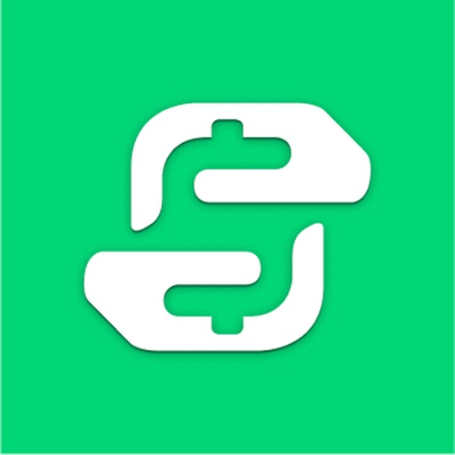

Willkommen bei Freecash - Earn Rewards, der spaßigen Art, in deiner Freizeit ein bisschen Geld online zu verdienen! Spiel Spiele, die dir wirklich Spaß machen, beantworte Umfragen, shoppe online und verdien dabei echtes Geld — direkt auf deinem Handy.

Jede Aufgabe, die du erledigst, bringt echtes Geld auf dein Guthaben, und du kannst es dir jederzeit auszahlen lassen.

So funktioniert Freecash - Earn Rewards:

- Kostenlos anmelden — dein Konto ist in Sekunden erstellt.
- Spielen & verdienen — entdecke Spiele, die Spaß machen, und lass dein Guthaben beim Spielen wachsen.
- Auszahlen — verwandle dein Guthaben in PayPal-Geld, Amazon-Gutscheine und mehr.

Egal ob du fünf Minuten Zeit hast oder einen ganzen entspannten Nachmittag — Freecash - Earn Rewards passt perfekt in deinen Tag.

Lass dir dein Guthaben als Belohnungen auszahlen, zum Beispiel:

- PayPal-Geld
- Amazon-Gutscheine
...und vieles mehr!

Es gibt immer ein neues Spiel zu spielen und mehr Geld zu verdienen — so hört der Spaß nie auf.

Willst du noch schneller verdienen? Lade deine Freunde über unser Empfehlungsprogramm ein und verdien mit!

Also worauf wartest du? Lade Freecash - Earn Rewards noch heute herunter und leg los. Mit einer einfachen App und flexiblen Auszahlungen war Geldverdienen mit Spaß noch nie so leicht.

Freecash - Earn Rewards — spiel lustige Spiele, verdien echtes Geld, ganz bequem von zu Hause aus.

[View on Apple](https://apps.apple.com/de/app/freecash-geld-verdienen/id1673567402)

## Tipico Sportwetten App

Mit der Tipico Sportwetten App kannst du jederzeit & überall eine Wette abgeben, Quoten checken oder deinen Wettschein prüfen. Lade die App herunter und sichere dir bei deiner Ersteinzahlung einen Bonus bis zu 100 €. Zudem hast du in Deutschland bei Tipico 5% mehr von deinem Gewinn, da Tipico die Wettsteuer übernimmt. Die Vorteile & top Features der Tipico Sportwetten App sind:

- Keine 5 % Wettsteuer bei Tipico! (gilt nur für Deutschland)
Bei Tipico gewinnst du 100%, denn wir schenken dir die 5% Wettsteuer.

- Bis zu 100€ Willkommensbonus
Konto registrieren, erste Einzahlung tätigen und bis zu 100€ als Neukundenbonus erhalten!

- Volle Kontrolle über deinen Wettschein mit Tipico Cashout!

Tipico Sportwetten App - deine persönliche Wetten auf einem Blick

- Alle Sportwetten in einer App
Mit der Tipico Sportwetten App liefern wir dir die Sportwetten zu etlichen Sportarten, natürlich mit dazugehörigen Livescores, Quoten und Ergebnissen auf einen Blick!

- Wettprogramm zu deinen persönlichen Vorlieben
Gibst du am liebsten Bundesliga Tipps ab? Dann wird dir die Bundesliga in der Tipico App immer auf den ersten Blick angezeigt.
Außerdem kannst du unter „"Mein Livescore" deine Sportwetten beobachten und Live Wetten abgeben.

- Push Notifications
Die Einrichtung von Push-Nachrichten geht schnell und bringt viele Vorteile. Mit der Push Notification Innovation bleibst du immer kostenlos auf dem Laufenden.

Bundesliga Wetten in deiner Tipico App!

In der Bundesliga-Saison 2025/26 kannst du natürlich wieder deine Bundesliga-Wetten platzieren! Sei mit der Tipico App und deiner Sportwette live am Ball, wenn wir dir top Bundesliga-Quoten und viele Wetten auch zur 2. Bundesliga und 3. Liga anbieten. Bei uns findest du zahlreiche Wetten zur Bundesliga, 2. Bundesliga und 3. Liga. Genauso liefern wir dir Livewetten und Langzeitwetten im Fight um die Meisterschaft, Rennen um den Aufstieg oder Kampf gegen den Abstieg! 

Natürlich bleibt der Fußball die populärste Sportart und darf in keiner Einzelwette, Kombiwette, Systemwette oder Livewette fehlen. Fußball Tipps kannst du in vielen Wettbewerben abgeben, darunter u.a.:

- Bundesliga
- 2. Bundesliga
- 3. Liga
- DFB-Pokal
- Süper Lig
- Premier League
- Serie A
- La Liga
- Champions League
- Europa League

Sichere dir u.a. Gratiswetten und weitere Gewinne. In unseren Live Wetten kannst du auch noch während des Fußballspiels deine Tipps abgeben.

Dazu findest du natürlich auch Sportwetten zu weiteren populären Events wie u. a.:

- US Sport – also NBA, NHL, NFL und MLB
- Tennis – Wimbledon, French Open, US Open, Australian Open, ATP und WTA Events
- Formel 1
- Handball

Folge uns auf:
o Facebook: https://www.facebook.com/tipico
o Twitter: https://twitter.com/tipico_de
o Instagram: https://www.instagram.com/tipico_de/

für Deutschland:
18+. Glücksspiel kann süchtig machen. Spiele verantwortungsbewusst. Weitere Informationen findest du auf unserer Spielerschutzseite. Beratung und Hilfe für Betroffene und Angehörige gibt es auf www.bundesweit-gegen-gluecksspielsucht.de und www.check-dein-spiel.de. Der Tipico Co Ltd wurde mit Bescheid vom 09.12.2022 die behördliche Erlaubnis zur Veranstaltung von Sportwetten im Internet und stationären Bereich erteilt („behördlich zugelassener Sportwettveranstalter“). Tipico Co. Ltd. steht unter der Aufsicht der Gemeinsamen Glücksspielbehörde der Länder. Die registrierte Adresse der Tipico Co Ltd ist Tipico Tower, Vjal Portomaso, STJ 4011 St. Julian’s, Malta.

für Österreich:
Glücksspiel kann süchtig machen. Spiele verantwortungsbewusst.
Die registrierte Adresse der Tipico Co. Ltd. ist Tipico Tower, Vjal Portomaso, St. Julians STJ 4011, Malta. Tipico Co. Ltd wird von der öffentlichen Aufsichtsbehörde Malta Gaming Authority (MGA) reguliert und lizenziert. Tipico Co. Ltd. hält die Lizenz Nr. MGA/B2C/101/2004, ursprünglich erteilt am 1. März 2005.

[View on Apple](https://apps.apple.com/de/app/tipico-sportwetten-app/id1051329602)

## Booking.com: Hotel Angebote

Laden Sie sich die am besten bewertete Reise-App herunter und finden Sie wie tausende andere Reisende Angebote für Hotels, Motels und Ferienunterkünfte. Finden Sie Unterkünfte für Ihren Urlaub, Wochenendausflug oder Ihre Geschäftsreise – und das auf der ganzen Welt!

Suchen Sie nach Hotels, Motels und Ferienunterkünften

• 27 Millionen Hotels, Ferienunterkünfte, Ferienhäuser und -wohnungen sowie weitere einzigartige Unterkünfte
• Suchen Sie mit nur einmal Tippen nach Stadt, Attraktion, Sehenswürdigkeit oder Hotelname
• Filtern Sie nach Preis, Bewertungsergebnis, Annehmlichkeiten und anderen, für Sie wichtigen Dingen
• Finden Sie Ihren Last-Minute-Aufenthalt oder buchen Sie lange im Voraus

Finden Sie ein tolles Reiseangebot

• Tägliche Angebote für jedes Budget
• Kostenlose Stornierung bei den meisten Zimmern
• Sehen Sie sich über 135 Millionen echte Gästebewertungen an

Verwalten Sie Ihre Buchung unterwegs

• Erhalten Sie eine papierlose Bestätigung
• Nehmen Sie Änderungen wann und wo Sie möchten vor
• Kundenservice rund um die Uhr in über 40 Sprachen
• Kontaktieren Sie Ihren Gastgeber, sehen Sie sich die Check-in-Zeiten an und schreiben Sie Bewertungen
• Keine Buchungs- oder Kreditkartengebühren

[View on Apple](https://apps.apple.com/de/app/booking-com-hotel-angebote/id367003839)

## CapCut: Foto- und Video-Editor

CapCut ist eine kostenlose App für die umfangreiche Videobearbeitung, mit der du tolle Videos erstellen kannst.

「Benutzerfreundlich」
Zuschneiden, umkehren und Geschwindigkeit verändern: Perfektion war noch nie so einfach; veröffentliche deine wunderbaren Momente.

「Hohe Qualität」
Erweiterte Filter und makellose Schönheitseffekte eröffnen eine ganz neue Welt an Möglichkeiten.

「Topmusikhits/Toller Klang」
Umfangreiche Musikbibliothek und exklusive urheberrechtlich geschützte Lieder

「Sticker und Text」
Mit den besten angesagten Stickern und Schriftarten kannst du dich in deinen Videos kreativ ausdrücken.

「Effekt」
Werde kreativ mit einer Vielzahl an magischen Effekten

Nutzungsbedingungen —
http://www.capcut.com/clause/terms-of-service

Datenschutzerklärung —
https://www.capcut.com/clause/privacy-policy

Kontakt: capcut.support@bytedance.com

[View on Apple](https://apps.apple.com/de/app/capcut-foto-und-video-editor/id1500855883)

## 多邻国Duolingo英语日语法语

火遍全球的语言学习APP：多邻国Duolingo！5亿用户的选择。

【40多个语种】包含英语、日语、韩语、法语、意大利语、西班牙语等流行语言，还有夏威夷语、威尔士语等小众和濒危语言，甚至有《权力的游戏》中的龙语哦。

【游戏化学习】零基础入门，将生活场景分成单元学习，旅行、点菜、聊天、面试...忘掉那些枯燥乏味的死记硬背吧，用游戏闯关的方法，有宝石、王冠，有可可爱爱的动画人物为你加油鼓气，玩儿着玩儿着就学会了。

【碎片时间】每天10-15分钟即可循序渐进，通勤、排队、等待时间都不会浪费啦！

【可免费学习所有课程】我们的愿景是为全世界提供平等且优质的学习机会。

千呼万唤，多邻国粤语课程终于迎来重磅更新！
【从虾饺到糖水，终于可以从早吃到晚】
“你哋是但叫嘢，今日多兒埋單。”
 糖水、地方美食、街头小吃……更多粤式美食词汇和真实场景上线。下一次去茶楼，不只是会说“唔该”，还能自信加单！
【看港片不用等字幕，不必空耳懂情歌】
“今日唔想做嘢，不如我哋去唱K啦。”
经典粤语歌词、港片对白首次加入课程。那些耳熟能详的旋律和台词，这次终于不只是会跟着唱，而是真的听得懂。
【走进真实生活语境，从天气寒暄聊到人生百态】
“我唔想做馬騮，好想放工啊！”
租房、上班、点外卖、刷社交媒体；从校园生活到职场日常，从谈情说爱到中年烦恼。学的不只是语言，更是粤语区年轻人的真实生活。
【去顺德食饭，去珠海散步，感受大湾区的烟火气】
“我哋去順德啦！上次去順德仲係上次！”
跟着课程走进大湾区不同城市，感受各地独特的节奏与烟火气。在学习粤语的同时，也认识一个真实鲜活的粤语世界。
【食粽子、賞月光，透过习俗领略粤语文化的魅力】
“我阿婆整嘅粽香到飛起。”：端午、中秋、清明……通过丰富有趣的例句，体验粤语文化圈里那些代代相传的仪式感与人情味。

2013&2014年谷歌「年度手机应用」
2013年苹果「年度手机应用」
2019年福布斯「下一家潜力独角兽公司」
2018 - 2020年CNBC「最具开创性品牌TOP50」

欢迎关注微信公众号：多邻国Duolingo，和官方微博@多邻国_Duolingo。

[View on Apple](https://apps.apple.com/de/app/duolingo-sprachen-und-schach/id570060128)

## Airbnb

AIRBNB IST JETZT NOCH MEHR FÜR DICH
Die Welt ist unendlich interessant – und mit Airbnb kannst du sie auf mehr Arten als je zuvor erkunden. Finde bemerkenswerte Unterkünfte, unvergessliche Entdeckungen und erstklassige Services in einer App. Lass dich inspirieren, buche, und los geht’s.

BUCHE EINE UNTERKUNFT, DIE DIR MEHR BIETET ALS HOTELS
Erkunde mehr als 8 Millionen Ferienunterkünfte in mehr als 240 Ländern und Regionen, um die perfekte Unterkunft für jede Art von Reise zu finden – ganz gleich, ob du alleine oder mit einer Gruppe reist. Nutze über 80 Filteroptionen, um Ausstattung wie einen Pool, eine Küche oder barrierefreie Merkmale wie einen stufenlosen Zugang zu finden. Prüfe alle Details einer Unterkunft auf einen Blick auf der Inseratsseite und lies dir Bewertungen durch, um zu erfahren, was andere Gäste, die dort übernachtet haben, darüber denken.

SCHAU DIR ORTE NICHT BLOSS AN. ENTDECKE SIE.
Finde Tausende von Entdeckungen auf der ganzen Welt, angeboten von Einheimischen, die ihre Stadt am besten kennen. Sie alle sind auf ihre Qualität überprüft, basierend auf den Fachkenntnissen, der Reputation und der Authentizität von Gastgeber:innen. Entdecke einzigartige Perspektiven auf Sehenswürdigkeiten und Museen. Lerne die lokale Küche bei Kochkursen und Food-Touren kennen. Genieße die Natur, einen Kunstworkshop, eine Live-Performance und vieles mehr. Schau dir außerdem Airbnb Originals an – außergewöhnliche Entdeckungen, die von den interessantesten Menschen der Welt veranstaltet werden und exklusiv für Airbnb entwickelt wurden.

MACH DEINEN AUFENTHALT MIT ERSTKLASSIGEN SERVICES NOCH BESSER
Mach das Beste aus deinem Aufenthalt, indem du erstklassige Services direkt auf Airbnb buchst, beispielsweise Privatköch:innen, Fotograf:innen, Catering, zubereitete Mahlzeiten, Haarstyling, Nagelpflege, Make-up, Massagen, Personal Training und Spa-Behandlungen. Alle Services werden von erfahrenen Gastgeber:innen angeboten, die auf ihre Qualität überprüft wurden. Du kannst Tausende professionelle Services zu fast jedem Preis buchen – alles in einer App, auf der ganzen Welt. Und das Beste daran ist, dass du keine Unterkunft auf Airbnb buchen oder überhaupt auf Reisen sein musst, um Services nutzen zu können. So kannst du ein Blowout für die Haare, ein Training oder eine Massage direkt bei dir zuhause buchen.

HOL DIR EINE REISE-APP, DIE MIT DIR AUF REISEN GEHT
Nachdem du eine Unterkunft gebucht hast, erhältst du auf der Startseite personalisierte Vorschläge für Services und Entdeckungen für deine Reise. Diese sind darauf zugeschnitten, wo du übernachtest und mit wem du reist. Und das neu gestaltete Profil gibt dir einen Überblick über alle Orte, die du auf Airbnb besucht hast, sowie die Menschen, die du unterwegs kennengelernt hast.

FINDE ALLE DEINE REISEINFORMATIONEN AN EINEM ORT
Finde oder teile schnell die Details deiner Buchung. So ist es für alle einfacher, anzureisen, in die Unterkunft zu kommen und sich mit nur einem Fingertipp mit dem WLAN zu verbinden. Dank der Nachrichtenfunktion in der App können alle Gäste ganz einfach mit Gastgeber:innen kommunizieren, um Hallo zu sagen, Fragen zu stellen und aktuelle Buchungsinformationen zu erhalten. Du kannst Fotos und Videos teilen und Services auf Airbnb individuell anpassen – alles im gleichen Chat. Und mit der Tag-für-Tag-Übersicht für alle deine Buchungen im aktualisierten Tab „Reisen“ behältst du deine Pläne im Blick und kannst wichtige Details wie Check-in-Zeiten, spezielle Anweisungen und Zugangscodes aufrufen, sogar wenn du offline bist.

AIRBNB MACHT DAS GASTGEBEN EINFACH
Ganz gleich, ob du eine Unterkunft, eine Entdeckung oder einen Service anbieten möchtest: Du kannst Millionen von Reisenden erreichen und dein Geschäft auf Airbnb ausbauen. Inseriere deine Unterkunft in wenigen einfachen Schritten. Oder bewirb dich, um Gastgeber:in einer Entdeckung oder eines Services zu werden. Nach der erfolgreichen Überprüfung bist du bereit, die ganze Welt willkommen zu heißen.

[View on Apple](https://apps.apple.com/de/app/airbnb/id401626263)

## Nect Wallet

Sich schnell und sicher identifizieren oder vertrauliche Dokumente unterschreiben – jederzeit und von überall. Ganz ohne persönlichen Termin, langen Briefverkehr oder Video Chat mit einem Servicemitarbeiter. In der Nect Wallet legen Sie Ihre digitale Identität sicher ab und haben Sie jederzeit griffbereit. Ob Personalausweis, Reisepass, Aufenthaltstitel oder andere Dokumente. Verwenden Sie unsere nutzerfreundliche, vollautomatische und zertifizierte Lösung, um sich mit Nect Ident bei unseren Partnerunternehmen rechtskonform auszuweisen oder mit Nect Sign Dokumente qualifiziert zu unterzeichnen. Die Nect Wallet entspricht den hohen Sicherheitsstandards und steht ohne Wartezeit zur Verfügung.

Unsere Lösungen im Überblick

Nect Ident: Ausweisen mit Selfie-Video, eID, ePass oder Dokumenten wie der elektronischen Gesundheitskarte. Wir bieten den für Sie schnellsten Weg.

Nect Sign: Dokumente, die der Schriftform unterliegen, qualifiziert elektronisch per App unterschreiben. Schnell und rechtskonform.

Was erwartet Sie noch bei uns?

Einmal erfolgreich identifiziert, wird Ihr Ausweisdokument digital, sicher und nur für Sie zugänglich in der Nect Wallet hinterlegt. Für Ihre nächste Identifizierung können Sie das Ausweisdokument per Gesichtserkennung binnen Sekunden einfach wiederverwenden. Unser Netzwerk an Partnerunternehmen wächst ständig. Behalten Sie die Nect Wallet also auf Ihrem Handy und nutzen Sie Ihre digitale Identität zukünftig für weitere Services – es lohnt sich!

[View on Apple](https://apps.apple.com/de/app/nect-wallet/id1331065474)

## Google

Mit der Google App bist du immer über die Dinge informiert, die dir wichtig sind. Hier findest du schnelle Antworten, erhältst Informationen zu deinen Interessen und bleibst mit Discover immer auf dem Laufenden.

Funktionshighlights:
• Nutze die Kamera, um Objekte in deiner Umgebung zu identifizieren, z. B. einen bunten Schmetterling oder eine stachelige Pflanze
• Lass dir Straßenschilder, Speisekarten oder andere Texte mit deiner Kamera übersetzen – mehr als 100 Sprachen werden unterstützt
• Du siehst etwas, was dir gefällt? Finde mit der Kamera heraus, was es ist und wo du es kaufen kannst
• Füge deiner Kamerasuche Wörter hinzu, um die Ergebnisse einzugrenzen – z. B. wenn du ein paar Schuhe entdeckt hast, die du gern in „blau“ hättest, oder wenn du wissen möchtest, wie du ein kaputtes Teil an deinem Fahrrad „reparieren“ kannst
• Suche Lieder mit deiner Stimme, auch wenn du den Text nicht kennst. Summe einfach die Melodie eines Songs – die App zeigt dir den Titel des Songs
• Nutze die Kamera, um Hilfe bei deinen Hausaufgaben zu erhalten. So findest du detaillierte Anleitungen und Videos zur Lösung von Aufgaben aus beispielsweise Mathematik, Chemie, Biologie und Physik

Lass dich von Discover auf dem Laufenden halten – ganz auf dich zugeschnitten:
• Aktuelle Informationen zu Themen, die dich interessieren
• Jeden Morgen die neuesten Nachrichten und den Wetterbericht
• Echtzeit-Updates zu Sport, Filmen und Veranstaltungen
• Informationen zu Neuveröffentlichungen deiner Lieblingsmusiker
• Artikel zu deinen Interessen und Hobbys
• Interessante Themen direkt aus den Google-Suchergebnissen

Sicherheit bei der Suche:
• Alle Suchanfragen in der Google App werden mit einer verschlüsselten Verbindung zwischen deinem Gerät und Google geschützt.
• Die Datenschutzeinstellungen sind leicht zu finden und zu verwalten. Tippe einfach auf dein Profilbild. Daraufhin öffnet sich das Menü, wo du mit einem Klick die Suchverlaufeinträge der letzten paar Minuten aus deinem Konto löschen kannst.
• Webspam wird in der Google Suche proaktiv herausgefiltert, damit du sichere, hochwertige Ergebnisse erhältst.

Du hast noch mehr Möglichkeiten, Google zu nutzen:
• Google Such-Widget – mit dem neuen Google-Widget kannst du Suchanfragen direkt auf deinem Start- oder Sperrbildschirm ausführen. Du hast die Wahl zwischen 2 Widgets, die dir eine Schnellsuchleiste in zwei Größen bieten. Über Verknüpfungen kannst du im mittelgroßen Widget auswählen, wenn du mit Lens, Voice und im Inkognitomodus suchen möchtest.

Hier erfährst du mehr zu den Vorteilen der Google App: https://search.google/

Datenschutzerklärung: https://www.google.com/policies/privacy

Das Feedback unserer Nutzerinnen und Nutzer hilft uns, bessere Produkte zu entwickeln. Wenn auch du an Nutzungsstudien teilnehmen möchtest, besuche:

https://goo.gl/kKQn99

[View on Apple](https://apps.apple.com/de/app/google/id284815942)

## Google Maps

Mit Google Maps kannst du die Welt ganz einfach erkunden und bereisen. Anhand von Live-Verkehrsdaten und GPS-Navigation lassen sich die besten Routen finden – ganz gleich, ob du mit dem Auto, zu Fuß, mit dem Fahrrad oder mit öffentlichen Verkehrsmitteln unterwegs bist. Über 250 Millionen Orte und Unternehmen, darunter Restaurants, Geschäfte und Lebensmittelhändler, sind bei Google Maps eingetragen – mit Fotos, Rezensionen und nützlichen Informationen.

Erkunde die Welt auf deine Weise:
• Erreiche dein Ziel mit kraftstoffsparenden Routen
• Finde die beste Route anhand von Echtzeitinformationen mit detaillierter Routenführung per Sprachnavigation oder Navigation auf dem Bildschirm
• Komm schneller ans Ziel mithilfe der automatischen Neuberechnung von Routen, je nach aktueller Verkehrslage, Verkehrsbehinderungen und Straßensperrungen
• Echtzeitinformationen machen es einfacher, deinen Bus, Zug oder Fahrdienst zu erreichen.
• Wenn du besser vorankommen und flexibler sein möchtest, kannst du nach einem Fahrrad- oder Rollerverleih suchen.

Plane Reisen und Ausflüge ohne viel Aufwand:
• Street View ermöglicht es dir, schon vorab die Gegend zu erkunden und herauszufinden, wo sich beispielsweise Parkmöglichkeiten und Eingänge befinden.
• Mit Immersive View kannst du dir Sehenswürdigkeiten, Parks und Routen ansehen oder sogar die Wetterverhältnisse beobachten, damit du optimal auf deinen Besuch vorbereitet bist.
• Teile Listen mit deinen gespeicherten Lieblingsorten mit anderen.
• Du hast die Möglichkeit, Essen zur Lieferung und Selbstabholung zu bestellen, Reservierungen vorzunehmen und Hotels zu buchen.
• Mithilfe von Offlinekarten findest du dich auch in Gegenden mit schlechtem Empfang gut zurecht.
• Du kannst nach lokalen Orten und möglichen Aktivitäten suchen und basierend auf Nutzerrezensionen und Fotos Entscheidungen treffen.

Lass dich von Insidertipps inspirieren:
• Jährlich tragen 500 Millionen Nutzer dazu bei, die Google Maps auf dem neuesten Stand zu halten. Dir stehen also aktuelle Informationen zur Verfügung.
• Du kannst vorab herausfinden, wie stark ein Ort besucht ist, und so Menschenansammlungen meiden.
• Mithilfe von Lens in Maps lassen sich Fußgängerrouten in die reale Umgebung einblenden.
• Restaurants können beispielsweise nach Restauranttyp, Öffnungszeiten, Preisen oder Bewertungen gefiltert werden.
• Bei Fragen zu einem Ort – etwa zu den angebotenen Gerichten oder Parkplätzen – erhältst du schnell Antworten.

Einige Funktionen sind nicht in allen Ländern oder Städten verfügbar.
Die Navigation ist nicht für übergroße Fahrzeuge oder Einsatzfahrzeuge geeignet.

[View on Apple](https://apps.apple.com/de/app/google-maps/id585027354)

## CHECK24

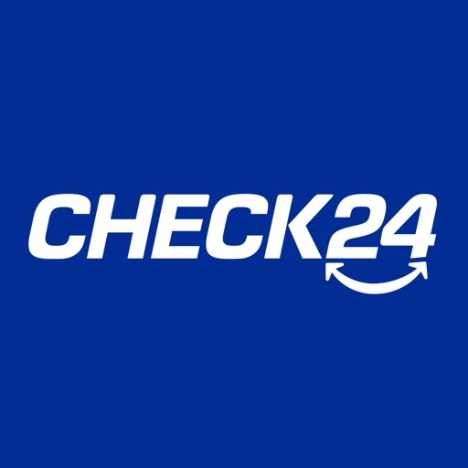

Laden Sie sich die CHECK24 App herunter und verwalten Sie ganz einfach alle Abschlüsse, Buchungen, Verträge und Käufe bequem in Ihrem persönlichen Kundenkonto.

Vergleichen, wechseln, sparen: z. B. mit dem Kreditvergleich über 2.000 €, bis zu 850 € mit dem Autoversicherungsvergleich, bis zu 1.000 € mit dem Strom- und Gasvergleich und über 1.000 € mit dem Reisevergleich.

Mit CHECK24 vergleichen Sie Preise und Konditionen in Echtzeit:

-  Versicherungen: Kfz-Versicherung, Privathaftpflichtversicherung, Rechtsschutzversicherung und viele mehr...
-  Strom & Gas
-  Kredit, Konto, Tagesgeld & Kreditkarten
-  DSL & Mobilfunk
-  Mietwagen
-  Hotels & Ferienwohnungen
-  Flüge
-  Urlaubsreisen & Last Minute
-  Shopping: Elektronik, Drogerie, Möbel, Autoreifen und viele mehr…
-  Profis für Ihr Projekt
-  Kostenlose Steuererklärung mit CHECK24 Steuer

Die Vorteile der CHECK24 App im Überblick:

- Bequemer, kostenloser Vergleich – überall
- Gespeicherte Vergleiche unterwegs aufrufen
- Kostenlose Beratungshotlines
- Mit Ihrem persönlichen CHECK24 Kundenkonto noch schneller vergleichen
- Abschlüsse in Ihrem persönlichen CHECK24 Kundenkonto einsehen
- Von attraktiven Gutscheinaktionen profitieren

AGB und Datenschutzhinweise für Deutschland: https://www.check24.de/unternehmen/impressum/
AGB und Datenschutzhinweise für Österreich: https://www.check24.at/unternehmen/impressum/

[View on Apple](https://apps.apple.com/de/app/check24/id719610089)

## Threads

Entdecke neue Perspektiven und unterhalte dich mit anderen auf Threads.

Finde heraus, worüber die Menschen gerade sprechen, von ungewöhnlichen Interessen bis zu großen Momenten. Mit Communitys findest du auf Threads Menschen mit ähnlichen Interessen. Antworte, höre zu, teile selbst etwas oder folge ihnen.

Das kannst du auf Threads tun:

■ Starte einen Thread, teile deine Sichtweise
Beschäftigt dich etwas? Poste es auf Threads. Teile einen Gedanken, stelle eine Frage oder beginne eine Unterhaltung. Es gibt verschiedene Möglichkeiten, um Dinge mit Text, Bildern, Umfragen, selbstlöschenden Beiträgen und mehr ins Rollen zu bringen.

■ Springe direkt zu den Antworten
Beteilige dich direkt an der Diskussion, reagiere auf neue Ideen oder beobachte, in welche Richtung sich das Gespräch entwickelt. Jeder Thread ist eine Einladung, dich zu beteiligen.

■ Behalte Trends im Blick
Von Live-Ergebnissen bis zu entscheidenden Momenten: Mit Threads bist du immer auf dem Laufenden und kannst dich direkt an der Diskussion beteiligen, wenn du etwas zu sagen hast.

■ Du steuerst, welche Inhalte du siehst
Steuere, wer dir antworten, dich erwähnen oder deine Beiträge sehen kann. Verwende unerwünschte Begriffe, um Beiträge und Antworten herauszufiltern, die Begriffe oder Formulierungen enthalten, die du nicht sehen möchtest. So gestaltest du dein Nutzungserlebnis nach deinen Vorstellungen.

■ Vertiefe deine Interessen
Folge Freund*innen, Creator*innen und Communitys, die dich interessieren. Threads wurde entwickelt, um neue Perspektiven zu entdecken und miteinander ins Gespräch zu kommen – angefangen mit den Communitys, die dir am wichtigsten sind.

■ Schaffe Verbindungen im Chat
Führe private Unterhaltungen mit 1:1-Chats und Gruppen-Direktnachrichten. Wenn ein öffentlicher Thread persönlich wird, kannst du ihn in dein Postfach verschieben, um das Gespräch zu vertiefen oder den Teilnehmerkreis einzugrenzen.

Meta Terms: https://www.facebook.com/terms.php
Threads Supplemental Terms: https://help.instagram.com/769983657850450
Meta Privacy Policy: https://privacycenter.instagram.com/policy
Threads Supplemental Privacy Policy: https://help.instagram.com/515230437301944
Instagram Community Guidelines: https://help.instagram.com/477434105621119

[View on Apple](https://apps.apple.com/de/app/threads/id6446901002)

## MeinMagenta: Handy & Festnetz

Alle wichtigen Infos zu Telekom Services wie Datenverbrauch, Vertrag, Rechnungen, Guthaben, Auftragsübersicht und vieles mehr – in einer App.

DATENVERBRAUCH & KOSTEN PRÜFEN:
Mit der MeinMagenta App können Sie jederzeit Ihr verbleibendes Datenvolumen einsehen. Falls Ihr Datenvolumen aufgebraucht ist, können Sie einen DayFlat- oder SpeedOn-Pass einfach dazu buchen.

PREPAID-TARIF GUTHABEN AUFLADEN:
Prüfen Sie mit MeinMagenta jederzeit Ihr Prepaid Guthaben auf dem Handy sowie verbleibende Minuten- und SMS-Kontingente. Für die Aufladung Ihres Guthabens stehen Ihnen drei komfortable Möglichkeiten zur Verfügung: Sofort-Aufladung, der Auflade-Code und die automatische Aufladung.

RECHNUNGEN EINSEHEN:
Mit MeinMagenta haben Sie Zugriff auf Ihre monatlichen Rechnungen. Sehen Sie auf einen Blick, was gezahlt oder gutgeschrieben wurde und ob Ihr Konto aktuell ausgeglichen ist.

INTERNET UND WLAN OPTIMIEREN:
Richten Sie Ihren Telekom Router und WLAN-Verstärker mit der MeinMagenta App ein. Prüfen Sie einfach und von überall, ob mit WLAN und Router alles in Ordnung ist. Zeigen Sie verbundene Geräte an. Nutzen Sie die Einstellungen für Ihr Internet und Ihre Internet-Sicherheit. Finden Sie hilfreiche Tipps und Funktionen zur direkten Behebung von Störungen. 

MAGENTA MOMENTS:
Als Kund*in profitieren Sie von unserem exklusiven Treueprogramm! Mit Magenta Moments erwarten Sie regelmäßig besondere Geschenke, Vorteile und Überraschungen. Ob Mobilfunk, Streaming oder Shopping - wir danken Ihnen für Ihre Treue.

KÜNSTLICHE INTELLIGENZ FÜR IHRE FRAGEN:
Im Bereich „Magenta AI“ erhalten Sie präzise und schnelle Antworten, indem Sie entweder Ihre Stimme verwenden oder Ihre Anfrage eintippen. Zusammen mit unserem Partner Perplexity liefern wir Ihnen hilfreiche und zusammengefasste Antworten auf alle Ihre Fragen. Für Ihre Telekom Anliegen wie Vertrag, Rechnung, Auftrag oder Störung hilft Ihnen Frag Magenta, unser digitaler Assistent, rund um die Uhr und ganz ohne Wartezeit.

HILFE UND SERVICE:
Mit MeinMagenta können Sie häufige Anliegen im Handumdrehen selbst lösen. Übersichtliche Hilfekategorien, Lösungsassistenten sowie eine komfortable Volltextsuche helfen Ihnen dabei.

APP WIDGET:
Lassen Sie sich Ihren Datenverbrauch schnell anzeigen, ohne die App auf Ihrem Handy zu öffnen.

Bitte beachten Sie, dass MeinMagenta die iOS-Version 17.0 oder höher erfordert.

Wir freuen uns über Ihre Meinung unter www.telekom.de/community

Viel Spaß mit der App!
Ihre Telekom

[View on Apple](https://apps.apple.com/de/app/meinmagenta-handy-festnetz/id407932476)

## AusweisApp Bund

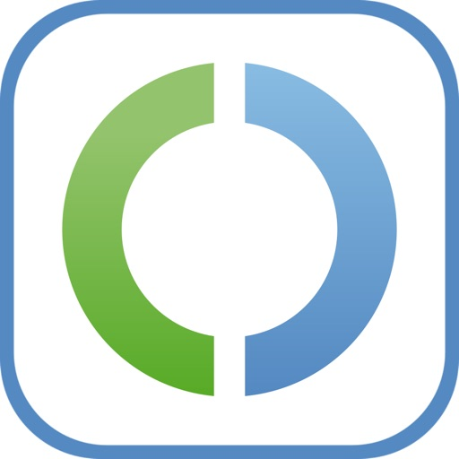

Die AusweisApp ist eine Software, die Sie auf Ihrem iPhone, Mac oder iPad installieren, um sich mit Ihrem Personalausweis, Ihrem elektronischen Aufenthaltstitel oder der eID-Karte für Unionsbürger:innen online auszuweisen. 

Alle weiterführenden Informationen finden Sie unter: www.ausweisapp.bund.de

Die Erklärung zur Barrierefreiheit der Software finden Sie unter: https://www.ausweisapp.bund.de/barrierefreiheit-app

Entwickelt im Auftrag des Bundesamtes für Sicherheit in der Informationstechnik.

[View on Apple](https://apps.apple.com/de/app/ausweisapp-bund/id948660805)

## Wolt - Essen Bestellen & mehr

Wolt macht es unglaublich einfach, tolles Essen, Lebensmittel und alles, was du sonst noch so brauchen könntest, in deiner Stadt zu entdecken und liefern zu lassen. Worauf auch immer du Lust hast, du kannst es dir liefern lassen. Wähle einfach ein Restaurant oder ein Geschäft aus und wische, um zu bestellen – den Rest erledigen wir für dich!

Keine Zeit zum Kochen? Du willst das Haus nicht verlassen, um deine Einkäufe zu erledigen? Das haben wir alle schon erlebt. Deshalb wurden wir zu den Online-Experten für die besten lokalen Einkaufserlebnisse und Restaurants. Was auch immer du brauchst, wir haben es mit unseren 35.000+ Restaurants und Geschäften im Angebot.

Du wirst in Echtzeit über den Status der Lieferung auf dem Laufenden gehalten. Wenn der Blick auf die Uhr nicht so dein Ding ist, keine Sorge – wir schicken dir auch Benachrichtigungen, damit du weißt, wann deine Bestellung ankommt.

Wir geben nicht gerne an, aber wir nehmen Kundensupport sehr ernst und haben ein Team von wunderbaren, freundlichen Mitarbeitern in jedem der über 23 Länder, in denen wir tätig sind. Sie sind nur einen Chat entfernt und antworten dir in Sekundenschnelle.

Dein Essen zu bekommen sollte so einfach wie möglich sein. Deshalb kannst du bequem und sicher mit deiner Kreditkarte, PayPal oder mit Apple Pay bezahlen. Was auch immer für dich funktioniert.

Wolt ist derzeit in über 145 Städten in Japan, Deutschland, Israel, Finnland, Schweden, Norwegen, Dänemark, Estland, Lettland, Litauen, Tschechien, Ungarn, Polen, Kroatien, Serbien, Georgien, Griechenland, Slowakei, Slowenien, Zypern, Malta, Aserbaidschan und Kasachstan verfügbar. Und es werden immer mehr!

[View on Apple](https://apps.apple.com/de/app/wolt-essen-bestellen-mehr/id943905271)

## EasyPark parken - Park App

Seit 2001 macht EasyPark Städte lebenswerter. Mit Millionen von Autofahrer:innen, Unternehmen und Betreiber:innen, die unsere Dienste in mehr als 20 Ländern nutzen, entwickeln wir bequeme und einfach zu bedienende Lösungen. Das spart oft Zeit und Geld und verringert den unnötigen Stress des Parkens.

EasyPark ist die Nr. 1 unter den Park-Apps in Europa, mit der besten Abdeckung. Unsere Lösung für mobiles Parken erlaubt es, für das Parken in Parkhäusern, Garagen, auf der Straße oder am Flughafen zu bezahlen. Ob von zu Hause oder im Ausland - wo immer das Leben stattfindet!

Preis: An den meisten Standorten erheben wir eine Servicegebühr zusätzlich zu den vom Betreiber/der Stadt erhobenen Parkgebühren. Der Gesamtpreis und die Aufschlüsselung der Gebühren werden in der EasyPark-App vor jedem Parkvorgang angezeigt. Weitere Informationen sind auf unserer lokalen easypark.com-Website verfügbar.

Mit der App von EasyPark kann jeder:
- Einen Parkvorgang vom Smartphone aus starten.
- Das Parken jederzeit stoppen und nur für die tatsächlich genutzte Zeit bezahlen.
- Die Parkdauer von überall aus anpassen, wenn es mal etwas länger dauert.
- Einfacher einen freien Parkplatz in der Nähe des Zielorts finden.
- Die App beruflich oder privat nutzen.
- Kosten, ob beruflich oder privat, einfach aufteilen und übersichtlich darstellen.
- Aus sicheren Zahlungsarten frei auswählen.
- Benachrichtigungen aktivieren, um über Parkvorgänge auf dem Laufenden zu bleiben.

Mit der App von EasyPark kann man in folgenden Städten parken: Berlin, Hamburg, Köln, Frankfurt, Stuttgart, München, Düsseldorf, Dortmund, Wien, Graz, Linz, Innsbruck, Zürich, Genf, Bulle, Bellinzona, Fribourg, Lugano, Locarno, Bern und viele viele mehr!

Leider ist die EasyPark-App im Vereinigten Königreich nicht verfügbar. Um in Großbritannien zu parken, empfehlen wir die App von RingGo zu verwenden.

[View on Apple](https://apps.apple.com/de/app/easypark-parken-park-app/id449594317)

## Shop: Deine Lieblingsmarken

Jeden Shopping-Moment zum Highlight machen

– Aktuelle Trends in einer einzigen Shopping-App entdecken, verfolgen und kaufen
– Mit Push-Benachrichtigungen von Marken, denen du folgst, nie wieder einen Sale, eine Lagerauffüllung oder ein Bestellupdate verpassen
– Personalisierte Einkaufsempfehlungen erhalten und neue Marken entdecken

Shoppen, das sich lohnt

– Shop Cash-Prämien für Einkäufe in der Shop App*
– Mit Shop Pay kannst du deine Rechnungsdaten geschützt aufbewahren und mit nur einem Tastendruck den Shopping-Checkout durchführen.
– Unkompliziertes Shopping mit flexiblen Zahlungsoptionen, wann immer du willst*

Unbesorgtes Shopping

– Online-Bestellungen in einer App verwalten
– Mit Nachverfolgung in Echtzeit immer über den Verbleib deines Pakets auf dem Laufenden bleiben – vom Versand bis zur Haustür.



---

Kontaktinformationen:

Du hast eine Frage oder möchtest mit uns reden? Kontaktiere uns unter help.shop.app

Sicher und unbesorgt einkaufen: Unsere Server erfüllen strenge PCI-Compliance-Standards für die Hinterlegung von Kreditkarteninformationen.

Powered by Shopify: Shop beruht auf der Commerce-Plattform, der Millionen von Unternehmen weltweit vertrauen.

* Nur in den USA und Kanada verfügbar. Zahlungsoptionen werden von Affirm angeboten und unterliegen einer Berechtigungsprüfung. Nicht verfügbar in New Mexico. Einwohner:innen Kaliforniens: Darlehen von Affirm Loan Services, LLC werden gemäß einer California Finance Lender-Lizenz erteilt oder geregelt.

[View on Apple](https://apps.apple.com/de/app/shop-deine-lieblingsmarken/id1223471316)

## Vinted: Secondhand-Marktplatz

Die Idee ist simpel: Du verkaufst deine aussortierten Sachen an andere Mitglieder, die sie wieder lieben werden. Sie freuen sich aufs Unboxing und über ihren tollen neuen Schatz und du hast wieder mehr Platz zu Hause. Bedeutet also: Guter Style, Gutes tun, gutes Gefühl – für alle! 

Das Verkaufen ist einfach und kostenfrei
Mach einfach ein paar Fotos von deinem Artikel, beschreibe ihn und leg einen Preis fest. Alles, was du verdienst, gehört dir – zu 100 %!  
• Verdien dir was dazu, indem du pre-loved Kleidung, Haushaltswaren, Elektronik, Sammlerstücke, Spielzeug und mehr verkaufst. 
• Schau zu, wie dein Guthaben wächst. Lass dir dein Geld direkt auf dein Bankkonto auszahlen. 
• Den Versand zahlt der Käufer. Bei einem Verkauf erhältst du einen bereits bezahlten Versandschein – einfach und praktisch. 

Shoppe Wieder-neu-Schätze     
Freu dich über deine Secondhand-Entdeckungen – von Designer-Teilen bis zu hochwertigen elektronischen Geräten. 
• Schnell gefunden, lang geliebt. Auf Vinted gibt’s Kategorien für fast alles. Nutze Filter, um schneller zu finden, was du suchst. 
• Wir sind für dich da. Wenn du auf Vinted kaufst, wirst du von unserem Käuferschutz abgesichert. Gegen eine geringe Gebühr erhältst du eine Rückerstattung, falls dein Artikel verloren gegangen ist, bei der Lieferung beschädigt wurde oder deutlich anders als beschrieben ist. 
• Wähle einen Versandanbieter und lass dir deine Sendung nach Hause oder an eine Abholstelle liefern.  

Hol dir zusätzliche Sicherheit
Auf Vinted stehen dir 2 Verifizierungsdienste zur Verfügung. Mit ihnen kannst du auch hochpreisige Artikel mit ruhigem Gewissen kaufen und verkaufen. 
Die Artikelverifizierung für Designerartikel
Lass die Authentizität qualifizierter Artikel von unserem Expertenteam prüfen. 
Die Elektronikverifizierung 
Lass die Funktionalität, den Zustand und die Authentizität bestimmter technischer Artikel prüfen. 
Wir schicken den Artikel nur an dich weiter, wenn er erfolgreich verifiziert werden konnte. Andernfalls erhältst du eine Rückerstattung. Die Verifizierung kannst du beim Checkout hinzufügen. 

Dich erwartet eine facettenreiche Community von Secondhand-Fans in Deutschland, Frankreich und Italien. Chatte mit anderen Mitgliedern, erhalte Updates und verwalte deine Bestellungen an einem Ort. 

Mach mit
TikTok: https://www.tiktok.com/@vinted 
Instagram: https://www.instagram.com/vinted
Mehr Infos findest du in unserem Hilfe-Center: https://www.vinted.de/help.

[View on Apple](https://apps.apple.com/de/app/vinted-secondhand-marktplatz/id632064380)

## ElsterSecure

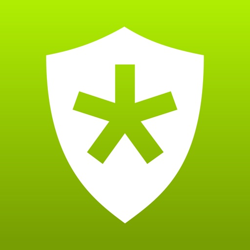

ElsterSecure ist die neue Authentisierungs-App von ELSTER. Einmal eingerichtet, benötigen Sie für Ihren Login nur noch Ihr Smartphone. Eine Zertifikatsdatei oder einen Nutzernamen benötigen Sie nach erstmaliger Einrichtung nicht mehr.
 
So richten Sie ElsterSecure ein:

1. Loggen Sie sich wie bisher gewohnt in MeinElster ein.
2. Gehen Sie zu "Mein Benutzerkonto" > "ElsterSecure": https://www.elster.de/eportal/meinKonto/elstersecure
3. Unter "Login-Option ElsterSecure hinzufügen" können Sie die App mit Ihrem MeinElster-Konto verknüpfen

Wenn Sie noch kein MeinElster Konto besitzen, können Sie sich unter www.elster.de registrieren und ElsterSecure als Login-Option wählen. 

Derzeit ist eine Authentisierung mittels ElsterSecure nur für den Login in MeinElster möglich. Eine Übermittlung durch Drittanbieter von Steuersoftware wird noch nicht unterstützt, hierfür benötigen Sie weiterhin ein Zertifikat.

ElsterSecure benötigt folgende Berechtigungen:  
- Zugriff auf die Kamera(s) des Geräts: Diese Berechtigung wird für das Scannen des QR-Codes benötigt.

Datenschutzhinweis:
https://www.elster.de/eportal/infoseite/elstersecure

[View on Apple](https://apps.apple.com/de/app/elstersecure/id1579060331)

## komoot - Wandern und Radfahren

Turn your next ride, hike, or run into an adventure with komoot. Get inspired by tapping into shared community knowledge and recommendations, then bring your adventures to life with the easy route planner.

PLAN YOUR PERFECT HIKING, MOUNTAIN BIKING OR ROAD CYCLING ADVENTURE
Get the route perfect for your sport—be it smooth asphalt for your road bike, singletracks for your mountain bike, silent cycling paths for touring or natural trails for your hikes. Plan down to the last detail with at-your-fingertips info like surface, difficulty, distance and elevation profile.

TURN-BY-TURN VOICE NAVIGATION
Never take your eyes off the road with turn-by-turn voice navigation: your precise, down-to-the-inch verbal navigator that doesn’t distract you from your surroundings. Keep your eyes firmly on the adventure in front of you and navigate with ease, even on small trails or in the woods.

OFFLINE MAPS FOR OUTDOOR ADVENTURES
Download your planned outdoor adventures and save topographic maps with one tap. Navigate the outdoors even when the internet is down or unreliable. Differentiate hiking paths, MTB singletracks or paved roads, terrain and land cover at a glance.

BROWSE HIGHLIGHTS: THE KOMOOT COMMUNITY’S FAVOURITE PLACES
So you can decide on the destination of your next adventure at a glance, see Highlights on the map. From peaks, parks, and points of interest, to singletracks and sandwich shops, these places or segments, showing up as red dots in the planner, are the spots other users think you should check out. And if you’re in the know, you can recommend your own to the community in turn and inspire others to visit your favourite places, too.

TELL YOUR STORY
Track your rides and hikes with GPS. Add photos, Highlights and tips and build your own personal adventure log that’ll store your favourite experiences—forever. Save them for private use or share them with the komoot community to receive likes and comments and to inspire fellow outdoor folks. Follow your friends and like-minded explorers to keep up with their outdoor adventures.

BE A LOCAL EXPERT. BECOME A PIONEER.
Contribute photos, tips and Highlights to the community and show you’re a local Expert. Earn more upvotes than in any else for your sport in your region and become the Pioneer!

SEAMLESS SYNC ACROSS EVERY DEVICE
Whether you prep like a pro on your desktop or plan a route on the go, komoot automatically syncs your routes, tracked adventures and photos across all devices, including your smartphone, desktop, iPad and Apple Watch. Use a Garmin or a Wahoo? Simply download the komoot for Garmin app in the IQ Store and sync your profiles via Garmin Connect, or connect your komoot and Wahoo accounts to share Tours with the ELEMNT and ELEMNT BOLT.

EXPERIENCE KOMOOT FOR FREE
When you download komoot, your first region is free—forever. To expand the areas in which komoot has your back, conveniently choose between single regions, region bundles or the World Pack to access offline maps and turn-by-turn voice navigation wherever you go.

APPLE WATCH
Take a quick glance at your Apple Watch to get directions, distance, and speed in real-time—right on your wrist.

APPLE HEALTH
You can connect komoot to Health to ensure your data is always up-to-date. Automatically share your time and distance data for komoot hiking, cycling, and running activities with Health.

“Komoot does for hiking and biking what Apple does for hardware: makes it easily accessible and fun to use.”  
— Cult of Mac

For support and tips, please visit help.komoot.de

MORE INFORMATION
Komoot uses background audio service for voice navigation messages.
Komoot requires a GPS signal for directions, Tour recording and speed in real-time.

Terms of Use: https://www.apple.com/legal/internet-services/itunes/dev/stdeula/

[View on Apple](https://apps.apple.com/de/app/komoot-wandern-und-radfahren/id447374873)

## DB Navigator

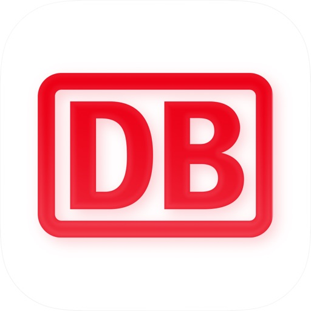

Der DB Navigator - dein smarter Reisebegleiter. 
Ob im Nah- oder Fernverkehr, mit U-Bahn, S-Bahn, Straßenbahn oder Bus - der DB Navigator hält in jeder Situation den passenden Service für dich bereit.

Das kannst du erwarten:
- Buche deine Tickets in wenigen Schritten direkt in der App.
- Abonniere das Deutschland-Ticket und reise bequem durch ganz Deutschland. Mit der praktischen Filterfunktion weißt du sofort, auf welchen Verbindungen du das Ticket nutzen kannst.
- Mit der Bestpreissuche findest du immer die günstigsten Preise: schon ab 6,99 € deutschlandweit reisen.
- Dank der Benachrichtigungen zur Reise erhältst du automatisch aktuelle Infos – egal ob auf längeren Reisen oder bei der regelmäßigen Fahrt zur Arbeit, Schule oder Ausbildung.
- In den Fahrtinformationen findest du neben dem gesamten Fahrtverlauf auch die aktuelle Wagenreihung deines Zuges und weißt, wo am Gleis du einsteigen kannst.
- Mit dem Komfort Check-in kannst du dich selbst einchecken und reist noch entspannter.
- Hilfreiche Auslastungsinformationen zeigen dir im Vorfeld, wie voll dein Zug sein wird.
- Für mehr Orientierung in der Umgebung sorgt die integrierte Karte. Lasse dir z. B. Fußwege zu Haltestellen in deiner Nähe anzeigen.
- Nutze den DB Navigator auch über deine Smartwatch – so hast du deine Verbindung immer im Blick.

Weitere Informationen zu den Funktionen des DB Navigators findest du auch auf unserer Website unter bahn.de/app.

Jetzt kostenlos im App Store laden!

Gefällt dir die App? Dann hinterlasse uns gerne dein Feedback direkt im Store!

[View on Apple](https://apps.apple.com/de/app/db-navigator/id343555245)

## Strava: Laufen & Radfahren

App Store Award-Gewinner: Apple Watch‑App des Jahres

Strava verbindet Fitness-Tracking mit sozialem Netzwerk. Wir erfassen deinen gesamten sportlichen Lebensweg an einem zentralen Ort – und du kannst diesen mit deinen Freunden teilen. So geht's:

• Zeichne alles auf – Läufe, Fahrten, Wanderungen, Yoga und über 50+ andere Sportarten. Stell dir Strava als die Zentrale für deine Aktivitäten vor.

• Mach dir ein Bild von deinem Krafttraining – du trainierst jede Woche im Fitnessstudio, machst HIIT-Workouts und nimmst an Gruppenkursen für Krafttraining teil? Nutze dein Lieblingsgerät oder deine Lieblings-App für Krafttraining, und deine Übungen, Sätze, Wiederholungen, Gewichte und eine Muskelkarte werden automatisch angezeigt. Oder leg noch heute los und sieh, wie schnell Krafttraining zu einem wichtigen Teil deines aktiven Lebens wird.

• Überall gibt es etwas zu entdecken – unser Routen-Tool nutzt anonymisierte Strava-Daten, um dir auf intelligente Weise beliebte Routen zu empfehlen, die auf deinen Vorlieben basieren. Du kannst auch deine eigenen Routen erstellen.

• Entdecke beliebte Wander-Routen in deiner Umgebung, darunter lokale Favoriten, malerische Trails und Langstrecken-Aufstiege

• Entdecke beliebte Wander-Routen in deiner Umgebung, darunter lokale Favoriten, malerische Trails und Langstrecken-Aufstiege

• Baue dir ein Netzwerk von Unterstützern auf – bei Strava geht es darum, Bewegung zu feiern. Hier findest du eine Community, die sich gegenseitig anfeuert.

• Trainiere intelligenter – erhalte Dateneinblicke, um deinen Fortschritt zu verstehen und zu sehen, wie du dich verbesserst. In deinem Trainingstagebuch werden alle deine Trainingseinheiten aufgezeichnet.

• Bewege dich sicherer – teile deinen Standort in Echtzeit mit deinen Lieben, wenn du draußen bist, um deine Sicherheit zu erhöhen.

• Synchronisiere deine Lieblings-Apps und -Geräte – Strava ist mit Tausenden von ihnen kompatibel (Apple Watch, Fitbit, Garmin – was immer du willst).

• Nimm an Herausforderungen teil und erstelle selbst welche – nimm gemeinsam mit Millionen von Sportlern an monatlich wechselnden Herausforderungen teil, um neue Ziele zu verfolgen, digitale Abzeichen zu sammeln und fit zu bleiben.

• Lass dich von ungefilterten Erfahrungen inspirieren – dein Feed auf Strava ist voller echter Leistungen von echten Menschen. Auf diese Weise motivieren wir uns gegenseitig.

• Egal ob du ein Weltklasse-Sportler oder ein totaler Anfänger bist, du gehörst hierher. Zeichne einfach deine Aktivitäten auf und los geht's.

Strava bietet sowohl eine kostenlose Version als auch eine Mitgliedschaft mit Premium-Funktionen.
Strava nutzt HealthKit, um deine Strava-Aktivitäten in die Health-App zu exportieren und um deine Herzfrequenz- und biometrische Daten zu lesen.

Du kannst die Mitgliedschaft im App Store mit deiner Apple ID abschließen und bezahlen. Die Zahlung wird bei der Kaufbestätigung über deine Apple ID abgebucht. Deine Mitgliedschaft verlängert sich automatisch, wenn sie nicht mindestens 24 Stunden vor Ablauf des aktuellen Zeitraums gekündigt wird. Dein Konto wird innerhalb von 24 Stunden vor dem Ende des aktuellen Zeitraums für die Verlängerung belastet. Die Mitgliedschaft und die automatische Verlängerung kann nach dem Kauf in den Einstellungen des App Stores unter „Abonnements“ verwaltet und deaktiviert werden. Ein ungenutzter Teil einer kostenlosen Probemitgliedschaft verfällt, wenn eine kostenpflichtige Mitgliedschaft abgeschloßen wird. Die Mitgliedschaft verlängert sich dann zu den gleichen Kosten.

Allgemeine Geschäftsbedingungen: 
https://www.strava.com/legal/terms
Datenschutzerklärung: 
https://www.strava.com/legal/privacy

[View on Apple](https://apps.apple.com/de/app/strava-laufen-radfahren/id426826309)

## Uber Eats: Essen, Lieferdienst

Lass dir mit der Uber Eats App Essen von tausenden fantastischen lokalen und internationalen Restaurants direkt an die Haustür liefern. Finde das Essen, das du suchst und bestelle es ganz einfach und schnell online. Verfolge deine Bestellung in Echtzeit und genieße den besten Lieferservice.

FINDE DEIN LIEBLINGSESSEN & RESTAURANTS
Bestelle Essen von Restaurants in deiner Nähe und suche nach Gerichten wie Pizza, Burritos, Burger, Sushi, Bowls, Donuts, Döner, Lasagne, Tapas, Waffeln und mehr. Ob asiatisch, indisch, japanisch, koreanisch, halal, vegan oder chinesisch - Uber Eats hat und liefert dir alles. Abholung bevorzugt? Überspringe einfach die Schlange. Du kennst nur Lieferando, Just Eat, Deliveroo, Wolt, Bolt Food oder Glovo? Dann probiere doch jetzt Uber Eats und lass dir dein Lieblingsessen liefern.

UBER ONE ABONNIEREN
Für nur 4,99 € im Monat erhältst du als Uber One-Abonnent 0€ Liefergebühren für berechtigte Bestellungen. Verdiene 5% Uber Cash für berechtigte Uber Fahrten. Profitiere von Prämien, Rabatten, Gutscheinen und Angeboten. Die vollständigen Uber One Geschäftsbedingungen findest du in der Uber Eats und Uber App.

BESTELLE FAST ALLES, WANN IMMER DU WILLST
Bestelle Artikel und Lebensmittel von Supermärkten, Tierhandlungen, deinem Lieblings-Restaurant und mehr. Ob Babynahrung, Windeln, Schönheitsprodukte, Kosmetik, Brot, Milch, Bananen, Obst, Blumen oder Tiefkühlkost - wir lassen alles liefern. Auch alkoholische Getränke wie Bier, Wein und Spirituosen sind erhältlich*. Bezahle sicher und einfach mit Klarna, Paypal, Debit- oder Kreditkarte.

EINFACH BESTELLEN, EINFACH GELIEFERT
Wähle dein Essen aus einer beliebigen Speisekarte und füge es mit wenigen Klicks deinem Warenkorb hinzu. Uber Eats macht es einfach, Essen online zu bestellen und geliefert zu bekommen. Plane deine Bestellung im Voraus oder bestelle sofort - du hast die Wahl! Einfach mit Klarna, Paypal, Debit- oder Kreditkarte bezahlen und mit der Uber Eats App alle deine Bestellungen bequem online nachverfolgen.

ECHTZEIT-BESTELLVERFOLGUNG
Verfolge deine Essenslieferung in Echtzeit auf einer Karte. Lass dich benachrichtigen, wenn deine Bestellung eintrifft. Nutze den Tracker in der Uber Eats App, um deine Bestellung live zu verfolgen und sei immer auf dem Laufenden.

FINDE DEINE LIEBLINGSRESTAURANTS
Egal ob du Pizza, Döner, Fast Food oder vegetarisches Essen bestellen möchtest, Uber Eats ist dein Lieferservice für alles. Genieße auch die leckeren Gerichte von L’Osteria, Burgermeister, Five Guys und vielen anderen Restaurants. Wähle aus verschiedenen Gerichten für Frühstück, Mittagessen oder Abendessen. Bestelle Sushi, Bowls, Bubble Tea, vegan oder einen Loco Chicken Burger. Einige unserer Lieferpartner sind McDonald's, Burger King, Dominos, KFC, Subway, Starbucks, Pizza Hut und viele mehr.

RESTAURANTS, LEBENSMITTELGESCHÄFTE UND MEHR FINDEN
Bestelle bei Lebensmittelgeschäften wie Flink oder anderen Kiosken. Andere Lieferpartner sind Pets Deli und lokale Supermärkte. Lass dir deine Einkäufe bequem nach Hause liefern. Finde alle deine Lieblingsprodukte und bestelle sie ganz einfach online. Von japanischem Sushi über koreanisches BBQ bis hin zu traditionellen deutschen Gerichten - bei Uber Eats findest du alles.

IN DEINER STADT VERFÜGBAR
Schließe dich den Tausenden von Menschen in Deutschland (DE) an, die Uber Eats nutzen, um in ihren Lieblingsrestaurants zu bestellen. Uber Eats ist in Städten wie Berlin, Frankfurt am Main, München, Köln, Düsseldorf, Essen, Hamburg, Stuttgart, Bremen, Leipzig, Hannover, Dresden und vielen mehr verfügbar. Finde Essenslieferungen in deiner Stadt mit Uber Eats. Bestelle Essen online und nutze die App, um den Lieferstatus in Echtzeit zu verfolgen. Genieße die Vielfalt der internationalen Küche, von italienischer Pizza über chinesisches Dim Sum bis hin zum klassichen Hamburger und arabischen Mezze.

*Alkohol in ausgewählten Märkten. Mindestalter: 18 Jahre. Verfügbarkeit variiert je nach Markt. Siehe App für Details.

[View on Apple](https://apps.apple.com/de/app/uber-eats-essen-lieferdienst/id1058959277)

## Mein dm

Deine App-Vorteile auf einen Blick: 
- Alle Produkte in einer App schnell und bequem einkaufen 
- Exklusive Coupons immer dabei 
- Lieblingsmarkt wählen, Produktverfügbarkeit checken und Express-Abholung nutzen 
- Mit PAYBACK und glückskind Deutschland Kundenverbindung hautnah erleben 
- Live-Shopping mit dmLIVE 
- Personalisierte Empfehlungen und Angebote 
- Einfache und sichere Bezahlung 
 
Alle Produkte in einer App schnell und bequem einkaufen: 
Durch unsere Suchfunktion, den gesamten Produkt-Kategorien sowie unserer Scan-Funktion bekommst du einen schnellen und einfachen Sortimentsüberblick. Einfach durch unser Sortiment klicken, nach bestimmten Marken suchen oder Produkte scannen, bisher gekaufte Produkte ansehen, diese auf die Merkliste legen oder direkt losshoppen. 

Exklusive Coupons immer dabei: 
Im Bereich „Coupons“ findest du eine Übersicht über die aktuellen Vorteils-Coupons. Wenn du dein dm-Konto mit PAYBACK verknüpfst, findest du neben den dm und glückskind (nur in Deutschland) Coupons auch PAYBACK Coupons – alles in nur einem Couponcenter. Das macht den Weg von der Coupon-Aktivierung bis zur Einlösung in der Filiale oder bei einer Online-Bestellung so einfach wie möglich. 

Lieblingsmarkt wählen, Produktverfügbarkeit checken und Express-Abholung nutzen: * 
Über den direkten Zugang zum Filialfinder kannst du nach dm-Märkten in deiner Nähe suchen. Damit hast du einen einfachen und schnellen Zugriff auf Serviceinformationen aller dm-Märkte. Zudem kannst du dir in der App deinen bevorzugten dm-Markt merken und so auf den Produktseiten neben der Online-Verfügbarkeit auch den Warenbestand im ausgewählten dm-Markt sehen. Wenn du deinen dm-Markt gemerkt hast, kannst du auch deinen Warenkorb auf Express-Abholung überprüfen und diese neue Lieferart nutzen. 

Mit PAYBACK und glückskind Kundenverbindung hautnah erleben: 
Freue dich auf tolle Vorteile mit PAYBACK und punkte bei jedem Einkauf. Neben PAYBACK bietet auch unser Familienprogramm glückskind in Deutschland tolle Vorteile und steht dir und deiner Familie als treuer Begleiter zur Seite. Mit der dm-Kundenkarte im Markt kannst du von allen aktivierten Vorzügen mit nur einem Scan profitieren. 

Live-Shopping mit dmLIVE: 
Beratung, Inspiration und jede Menge Spaß: Die dm-App bietet dir exklusiven Zugang zu unseren dmLIVE-Shows. Von Pre-Launches und Putz-Hacks über Kosmetik-Highlights und vieles mehr. 

Personalisierte Empfehlungen und Angebote: 
Erhalte personalisierte Produktvorschläge und Angebote basierend auf deinen bisherigen Einkäufen und Interessen. So findest du immer genau das, was du brauchst. 

Einfache und sichere Bezahlung: 
Nutze verschiedene Zahlungsmethoden, um deine Einkäufe schnell und sicher abzuschließen. Wähle zwischen Kreditkarte, PayPal, und weiteren Optionen. 

Was zählt, ist deine Meinung: 
Wir wollen unsere App stetig verbessern. Deshalb freuen wir uns über dein Feedback. Nutze dafür einfach unseren Feedback-Bereich. Bitte beachte, dass du auf das Senden von Feedback keine Rückmeldung erhältst. Bei weiteren Fragen oder Problemen mit der App informiere dich bitte unter „Hilfe & FAQ´s“ oder nutze unser Kontaktformular. 

Lade die dm-App jetzt herunter und entdecke die vielen Vorteile! 

Regelmäßige Updates:** Wir arbeiten ständig daran, die dm-App zu verbessern und neue Funktionen hinzuzufügen. Bleib dran für spannende Updates! 

Support:** Bei Fragen oder Problemen steht dir unser Support-Team jederzeit zur Verfügung. Kontaktiere uns einfach über die App oder per E-Mail an support@dm.de.

[View on Apple](https://apps.apple.com/de/app/mein-dm/id1186271926)

## Kleinanzeigen: Dein Marktplatz

Deutschlands führender Marktplatz für Secondhand & mehr:

von Möbeln & Mode über Elektronik bis zu Immobilien, Jobs & Fahrzeugen. Jeden Monat finden hier 32 Millionen Menschen ihren Weg durch über 58 Millionen Angebote – meist von privat, immer aus der Nachbarschaft.

Deine Vorteile als Verkäufer:

* KI-Assistent: Unser intelligenter Assistent erstellt aus deinem Foto in Sekunden eine fertige Anzeige mit passendem Titel und Beschreibung.
Kostenlos Inserieren: Verkaufe deine Sachen ohne Einstellgebühren und behalte den vollen Erlös.
* Direkter Chat: Verhandeln, Termin abstimmen, Übergabe klären – alles in einem Chatfenster, ohne Mailadressen oder Telefonnummern weiterzugeben.

Deine Vorteile als Käufer:

* Nichts mehr verpassen: Lege individuelle Suchaufträge an und erhalte sofort eine Push-Benachrichtigung, sobald ein passendes Angebot online geht.
Gezielte Schnäppchensuche: Nutze unsere smarten Filter für Umkreis, Preis oder Zustand, um genau das zu finden, was du suchst.
* Rund um die Uhr stöbern: Jeden Tag kommen tausende neue Angebote rein – stöbere, wann immer du Zeit hast.

Sicher kaufen und verkaufen:

„Sicher bezahlen" wickelt deine Zahlung über uns ab, der integrierte Käuferschutz greift, wenn die Ware nicht ankommt oder nicht der Beschreibung entspricht. Beides funktioniert nur, wenn Kauf, Chat und Bezahlung in der App oder auf kleinanzeigen.de laufen.

Vielfalt in jeder Kategorie:

* Haus & Garten: Vom gemütlichen Sofa bis zum Werkzeug für Heimwerker – finde alles für dein Zuhause oder schaffe Platz für Neues.
* Elektronik: Entdecke Smartphones, Konsolen und Haushaltsgeräte oder verkaufe deine alte Technik zum fairen Preis.
* Immobilien & Wohnen: Finde dein neues Zuhause im größten privaten Angebot an Wohnungen und Häusern in Deutschland. Suche gezielt nach Quadratmetern, Zimmeranzahl und Ausstattung.
* Mode & Lifestyle: Stöbere durch Vintage-Trends und Sneaker oder gib deiner Kleidung eine zweite Chance.
* Familie, Kind & Baby: Alles für die Kleinsten: Von Spielzeug bis zu Kinderwagen und Tragen – gebraucht, nachhaltig und günstig.
* Auto, Rad & Boot: Finde dein nächstes Fahrzeug – vom Gebrauchtwagen über Fahrräder und E-Bikes bis hin zu Booten oder passenden Ersatzteilen.
* Jobs & Karriere: Finde passende Stellenanzeigen für Minijobs, Nebenjobs oder Vollzeitstellen direkt in deiner Nähe.

Gut für dich, gut für die Umwelt:

Mit jeder Anzeige reduzierst du Abfall und förderst aktiv die Kreislaufwirtschaft. Weitergeben statt wegwerfen, Secondhand statt Neukauf.

Lade dir die Kleinanzeigen-App herunter – kostenlos inserieren, lokal kaufen, sicher bezahlen.

Du hast Feedback? Deine Meinung hilft uns, die App stetig zu verbessern. Schreib uns an iphonesupport@kleinanzeigen.de. Wir freuen uns auf deine Nachricht!

[View on Apple](https://apps.apple.com/de/app/kleinanzeigen-dein-marktplatz/id382596778)

## OTTO - Online Shopping & Möbel

+++ Über 19 Mio. Produkte +++ Rechnungs- & Ratenkauf +++ persönlicher Service rund um die Uhr +++

Ob Kleidung, Schuhe, Taschen, Wohnideen, Lifestyle Produkte, Multimedia oder Haushaltselektronik – mit der OTTO-App für iOS hast Du das komplette mobile Shopping- und Serviceangebot von OTTO immer in Deiner Tasche!

▶ MODE, MÖBEL, MULTIMEDIA & MEHR – RIESEN PRODUKTAUSWAHL
- Alles rund um MODE: Herren- und Damenmode, Taschen, Schuhe, Schmuck & mehr
- Alles rund um WOHNEN & BAUMARKT: Wohnideen, Kleiderschränke, Couches, Deko & mehr
- Alles rund um TECHNIK: Multimedia, Fernseher, Handys, Playstation 5, Xbox Series X & mehr
- Alles rund um SPORT & SPIEL: Fahrräder, Sportausrüstungen, Spielzeug & mehr

▶ TOP MARKEN & TOP PREISE
- Zugriff auf das gesamte OTTO-Sortiment und alle Top-Marken.
- Modemarken wie Esprit, Adidas, Mango, Nike, Only, Vero Moda & Co.
- Technikmarken wie Microsoft, Asus, Apple, Samsung & Co.
- Aktuelle SALE-Angebote, Top Deals & Schnäppchen.

▶ INSPIRATION & LIFESTYLE
- Modetrends, Fashion Styles & komplette Outfits.
- Lifestyle-Trends und viele Wohn- & Deko-Ideen für das Einrichten.
- Ganz einfach Geschenke für jeden Anlass bei OTTO einkaufen.

▶ SCHNELLE & EINFACHE SUCHE
- Artikelsuche nach Bezeichnung, Marken, Artikelnummer oder Shopping-Kategorie.
- Speichern von Wunschartikeln auf dem Merkzettel.
- Große Produktbilder & Kundenbewertungen helfen Dir bei Deiner Entscheidung.

▶ TOP SERVICE & SICHERHEIT
- Bequeme & sichere Bestellung.
- Zugriff auf Bestellstatus und Kundenkonto.
- Finde bequem den Paket Shop in Deiner Nähe.

Klamotten, Outfits, Möbel und Technik kannst Du online kaufen mit der mobilen App von OTTO oder im Online Shop auf OTTO.de! Noch nie war es so einfach Dein neues Outfit, Möbel und Technik mobil zu shoppen – lade die OTTO-App jetzt herunter!

Folge uns auch auf:
www.facebook.com/otto
www.instagram.com/otto_de/

[View on Apple](https://apps.apple.com/de/app/otto-online-shopping-m%C3%B6bel/id404844644)

## DramaWave - Drama & Reel

Willkommen bei DramaWave – deiner Streaming-Plattform der nächsten Generation für exklusive vertikale TV-Videos, Serien und Filme in HD. Tauche in über 30.000 Dramen in 18 Sprachen ein– mit exklusiven Highlights, die du nirgendwo anders findest!

Warum DramaWave wählen?
1. Live-Kommentare
Reagiere in Echtzeit mit On-Screen-Kommentaren während des Schauens – teile Emotionen und erlebe Community-Feeling.
2. Offline-Ansehen
Lade Episoden herunter und schau sie jederzeit – auch ohne Internetverbindung.
3. Vertikaler Vollbild-Feed
Erlebe immersive Unterhaltung. Personalisierte Empfehlungen helfen dir, deine Lieblingsdramen sofort zu finden.
4. Kurze & packende Dramen
Dramen voller Emotionen und Spannung in wenigen Minuten – perfekt zum Kurzgenuss oder Durchbingen.
5. Kristallklare Streams
Erlebe jedes Detail in lebendigem 1080P – für echtes Kino-Feeling auf dem Handy.
6. Wöchentliche Original-Updates
Bleib dran mit exklusiven neuen Dramen – regelmäßig neu! Drama-Fans erwartet immer etwas Spannendes.
7. Jederzeit & überall streamen
Genieße ruckelfreies Streaming mit Top-Bild & -Sound – egal wo du bist.
8. Weltweit verfügbar
Mit Untertiteln in Englisch, Spanisch, Französisch, Deutsch, Japanisch, Koreanisch u. v. m.
 
Entfessle das Drama
Erlebe Storytelling neu – einfach, fesselnd & überall dabei mit DramaWave!

Abo-Details
Schalte exklusive Inhalte mit einem Abo frei. Die Verlängerung erfolgt automatisch, kann aber jederzeit in den Kontoeinstellungen verwaltet oder gekündigt werden.

Kontakt
Website: mydramawave.com
E-Mail: dramawaveteam@gmail.com
Lade DramaWave jetzt herunter und tauche in eine neue Welt des Dramas ein!

[View on Apple](https://apps.apple.com/de/app/dramawave-drama-reel/id6670430706)

## PayPal: Geld senden, verwalten

Mit der neuen PayPal-App bezahlst du auf deine Art. Sende und empfange Geld, bezahle kontaktlos im Laden und nutze flexible Zahlungsoptionen wie Später bezahlen1, wenn du online shoppst – alles ganz einfach über dein Smartphone.

GELD SENDEN UND EMPFANGEN

Eine einfache und sichere Methode, deinen Lieben sofort Geld zu senden und Geld zu empfangen2. Deine persönliche Nachricht macht das Ganze noch entspannter und ist ein netter Touch.
Mit Verschlüsselungstechnologie sorgen wir dafür, dass deine Transaktionen sicher sind.
Sende deinen Lieben auch Geld ins Ausland: mit Xoom in über 110 Länder3, und es gibt noch mehr Zahlungsoptionen.
2Um Geld zu senden und zu empfangen, benötigst du ein PayPal-Konto.
3Es gelten Bedingungen und Einschränkungen. Es können Gebühren für Transaktionen, Währungsumrechnung sowie weitere Gebühren anfallen.

GELD EINFACH ZUSAMMENLEGEN
Du musst nicht alles vorstrecken. Hol dir das Geld für Gruppengeschenke oder gemeinsame Aktivitäten einfach vorher und spar dir den Stress mit dem Zurückzahlen danach.4

4Ein PayPal-Konto ist erforderlich, um einen Pool zu erstellen. Gebühren fallen an, wenn Währungen umgewandelt und Geld in anderen Währungen als Euro an ein Auslandskonto gesendet wird. Es gelten Bedingungen und Einschränkungen.

ZAHLE KONTAKTLOS VOR ORT MIT PAYPAL
Mit der PayPal-App kannst du im Laden ganz bequem kontaktlos bezahlen5 – ganz einfach über dein Smartphone. Tschüss Bargeld, tschüss EC-Karte.
5Einrichtung erforderlich. Die PayPal-Debit Mastercard für Verbraucher:innen kann überall dort verwendet werden, wo kontaktlose Mastercard-Zahlungen akzeptiert werden. Es gelten die Bedingungen.

BEZAHLE JETZT ODER SPÄTER1 
Bleib beim Online-Shopping oder Einkauf im Laden flexibel. Bei PayPal hast du die Wahl: Bezahle sofort, nach 30 Tagen6  oder bei größeren Einkäufe in 3, 6, 12 oder 24 monatlichen Raten7. 
Ratenzahlung To Go ist unsere neue Zahlungsoption für Einkäufe im Laden8. Du beantragst, für welchen Betrag du eine Ratenzahlung vereinbaren willst – direkt über dein Smartphone. Zahle kontaktlos vor Ort und bezahle deinen Einkauf in deinen vereinbarten Raten ab.
1Es ist ein PayPal-Konto in Deutschland erforderlich. Vorbehaltlich Kreditwürdigkeitsprüfung.
6Vorbehaltlich Kreditwürdigkeitsprüfung. Für Einkäufe zwischen 1 € und 2.000 €. Alle Informationen findest du unter https://www.paypal.com/de/30tage.
7Vorbehaltlich Kreditwürdigkeitsprüfung. Laufzeiten von 3, 6, 12 oder 24 Monaten. Ab 99 € und bis zu 10.000 € Bestellwert. Alle Informationen findest du unter https://www.paypal.de/ratenzahlung
8Separate Beantragung erforderlich. Vorbehaltlich vorheriger Kreditbewilligung. PayPal Ratenzahlung To Go kann mit Ausnahme einiger Branchen dort verwendet werden, wo Mastercard kontaktlos akzeptiert wird. Es gelten die Bedingungen. Mehr erfahren: www.paypal.de/RatenzahlungToGo

ZAHLUNGEN BEQUEM  ZENTRAL VERWALTEN
Verwalte deine Abonnements und wiederkehrenden Zahlungen direkt in der PayPal-App.

[View on Apple](https://apps.apple.com/de/app/paypal-geld-senden-verwalten/id283646709)

## Splash - Party Spiele

Hey, wir sind Hannes & Jeremy.

Wir haben’s selbst erlebt: Für jeden Spieleabend muss man Regeln googeln, Zettel suchen oder Apps durchprobieren. Aber es gibt einfach keine richtig gute Party-App. Also machen wir jetzt eine.

Unser Ziel: Die besten und viralsten Spiele in einer App vereinen. Zum Beispiel Wer ist der Impostor? - kennst du sicher schon von TikTok oder Insta.

Schnell erklärt. Sofort spielbar. Perfekt für 3 bis 12 Personen.

Ideal für WG-Abende, Geburtstage oder den nächsten Abend mit Freunden. Ladet eure Leute ein - und habt Spaß.

Unsere App kannst du kostenlos gemeinsam mit deinen Freunden spielen. Für einige zusätzliche Funktionen gibt es Splash Plus - verfügbar als wöchentliches Abonnement. Nutzungsbedingungen, EULA und Datenschutz findest du hier: https://cranberry.app/terms

Hinweis: Diese App ist nicht auf alkoholbezogene Nutzung ausgelegt und enthält keinerlei entsprechende Inhalte. Sie richtet sich an alle, die Freude an geselligem Spielen haben.

Cheers und viel Freude mit der App!

[View on Apple](https://apps.apple.com/de/app/splash-party-spiele/id6744290388)

## Bolt: Fahrten anfordern

Komme dank der Bolt App leichter ans Ziel! Egal, ob du eine Fahrt in der Stadt, einen Flughafentransfer oder einen E-Scooter benötigst, um von A nach B zu kommen — unsere App macht es dir leicht, sicher und komfortabel unterwegs zu sein.

WARUM SOLLTEST DU DIE BOLT APP WÄHLEN?
- Du kannst innerhalb von Sekunden eine Fahrt anfordern: Genieße sichere, preiswerte Fahrten mit qualifizierten Fahrer:innen.
- Transparente Preise: Du siehst deinen Fahrpreis im Voraus, damit es keine Überraschungen gibt.
- Mehrere Zahlungsmöglichkeiten: Bezahle sicher mit deiner Kredit-/Debitkarte, Apple Pay, Google Pay oder in bar.

EINFACHE FAHRTANFRAGE:
- Öffne die App und gib dein Ziel an.
- Wähle eine Kategorie aus, die deinen Bedürfnissen entspricht (Comfort, Premium, Priority, XL und mehr).
- Folge Fahrer:innen in Echtzeit in der App.
- Komme entspannt ans Ziel und bewerte deine Fahrt.

SICHERHEIT STEHT AN ERSTER STELLE:
Einige der Sicherheitsfunktionen von Bolt erfordern, dass die App im Hintergrund läuft.

- Notfall-Hilfe-Button: Alarmiere in Notfällen diskret unser Sicherheitsteam.
- Audioaufzeichnung der Fahrt: Nimm während der Fahrt den Ton auf, um dich abzusichern.
- Deine Kontaktdaten sind privat: Dein Nummer und deine allgemeinen privaten Informationen bleiben vertraulich, wenn du Fahrer:innen anrufst.

VORAUSSCHAUEND PLANEN:
Benötigst du einen Flughafentransfer oder eine Fahrt am frühen Morgen? Du kannst deine Fahrt 30 Minuten bis 90 Tage vor der erwarteten Abholzeit im Voraus planen.

*BOLT PLUS ABONNIEREN UND PREMIUM-FUNKTIONEN FREISCHALTEN!
Hol dir mit Bolt Plus das Beste von Bolt. Genieße exklusive Vorteile, die dir Zeit und Geld sparen und jede Fahrt noch angenehmer und komfortabler machen.

*BOLT DRIVE:
Wir haben uns dem Ziel verpflichtet, bis 2040 klimaneutral zu werden. Deshalb erweitern wir das Angebot an Elektro- und Hybridautos in Bolt Drive, unserem Carsharing-Service. Du kannst auch Bolt E-Scooter und E-Bikes über die App mieten.

*PAKETE AUSLIEFERN
Nutze die Kategorie „Send“, um in deiner Stadt schnell und einfach Pakete ausliefern zu lassen.

Bolt - die globale Plattform für geteilte Mobilität, die in 50 Ländern und über 600 Städten weltweit verfügbar ist. Wir haben uns 2019 von Taxify in Bolt umbenannt.

Bolt ist die perfekte Taxi-Alternative für schnelle, zuverlässige und preiswerte Fahrten. Die App ermöglicht das unkomplizierte Anfordern von Fahrten, egal ob du zur Arbeit fährst, verreist oder Besorgungen machst. Wenn du also das nächste Mal von A nach B kommen möchtest, wähle die Bolt App!

*Die Bolt Angebote unterscheiden sich je nach Ort. Schau in der App nach, welche Optionen in deiner Stadt verfügbar sind.

Mit der Bolt Driver App kannst du als Fahrer:in Umsatz erzielen. Registriere dich hier: https: //bolt.eu/driver/

Noch Fragen? Kontaktiere uns über info@bolt.eu oder unter https://bolt.eu

Folge uns auf Social Media, um Updates, Rabatte und Angebote zu erhalten!

Facebook - https://www.facebook.com/Bolt/
Instagram - https://www.instagram.com/bolt
X - https://x.com/Boltapp

[View on Apple](https://apps.apple.com/de/app/bolt-fahrten-anfordern/id675033630)

## Post & DHL

Mit der kostenlosen Post & DHL App sind die wichtigsten Post- und Paket-Services jederzeit und überall auf dem Smartphone oder Tablet griffbereit – vom Kauf von Brief- oder Paketmarken bis zur Sendungsverfolgung. Als registrierter Kunde profitieren Sie übrigens von weiteren Vorteilen. 
 
VERFOLGEN 
• Sendungsverfolgung inkl. Barcode-Scanner 
• Alle Sendungen auf einen Blick inkl. Zustellzeitpunkt und Detailinfos 
• Alle verfügbaren Lieferoptionen für eine Sendung buchen 
• Briefankündigung: Kostenlose Ankündigung der in Kürze zugestellten Briefe inkl. Umschlagsfoto und Push-Benachrichtigung 
• Sendungsstatus auch für Briefsendungen (z.B. Einschreiben oder Prio) und Warenpost anzeigen 
• Matrixcodes auf Briefmarken vor dem Versenden scannen und Basis-Sendungsverfolgung für Briefe nutzen 
• Nach Scan mehr Informationen zur Briefmarke und dem Motiv erfahren 
• Bis zu 10 Sendungen speichern und verwalten 
• Push-Mitteilung über aktuellen Status der Sendung und neuen Briefankündigungen 
• DHL Live-Tracking: Sendungen in Echtzeit auf einer Karte verfolgen inkl. Countdown und Zustellzeitfenster 
 
Zusätzlich für eingeloggte Nutzer: 
• Bis zu 100 Sendungen speichern und verwalten 
• Automatische Anzeige vieler Pakete mit Postnummer 
• Digitale Benachrichtigung bei Zustellung an einem Wunschort, beim Nachbarn oder in der Filiale 
• DHL Live-Tracking: Am Morgen der Zustellung per E-Mail und/oder Push-Nachricht eine Paketankündigung mit Angabe des 90-Minuten Zustellzeitfensters erhalten sowie bei vielen Sendungen eine zusätzliche Benachrichtigung ca. 15 Minuten vor Zustellung 
 
VERSENDEN 
• Kauf von Porto für Päckchen- und Paketversand innerhalb Deutschlands, der EU und der Welt 
• Buchungs-Funktion von Abhol-Aufträgen  
• Zugriff auf lokales und Online-Adressbuch zur Auswahl von Empfänger- und Absender-Adressen  
• Versandmarken in 10er Schritten nach Bedarf zu einem Sparset kombinieren und bis zu 20% der Versandkosten sparen 
• Bezahl-Funktion über PayPal, Kreditkarte oder Lastschrift 
• Anzeige eines QR-Codes zum kostenlosen Druck der Mobilen Paketmarke in Filialen, an Packstationen oder beim Zusteller 
• Anzeige der Paketmarke als PDF zum Druck oder Weiterleitung als E-Mail 
• Stornierungsfunktion für gekaufte Warenkörbe 
• Anzeige der Warenkörbe der letzten 30 Tage 
• Porto für Postkarten, Standardbriefe, Kompaktbriefe und Großbriefe in der App anfordern, online bezahlen und sofort als Mobile Briefmarke oder Internetmarke nutzen 
• Mithilfe des Portoberaters das passende Porto ermitteln 
 
Zusätzlich für eingeloggte Nutzer: 
• Synchronisierung der Warenkörbe der DHL Online Frankierung der letzten 30 Tage 
• Speichern Ihrer Favoriten in Ihrem DHL Kundenkonto 
 
STANDORTE 
• Packstationen-, Poststation-, Paketboxen- & Filial- und Paketshop-Suche inkl. Angaben zu Öffnungszeiten, Angebot und Entfernung 
• Ergebnisse als komfortable Karten- & detaillierte Listenansicht 
• GPS-unterstützte Suche oder manuelle Eingabe möglich 
 
PACKSTATION 
• Details zu Packstation-Sendungen (inkl. Abholcode) 
• App-gesteuerte Packstationen ohne Bildschirm per App bedienen 
• Anzeige des Standortes oder der Adresse, an dem das Paket zur Abholung bereit liegt 
• Per Push informiert werden, sobald Ihr Paket in der Filiale oder Packstation abholbereit ist 
• Einmalige Freischaltung des Bereiches durch Aktivierungscode per SMS und zusätzlicher Geräteaktivierung, z.B. per Scan eines Aktivierungscodes per Brief. 
 
MEHR 
• Anzeige Ihrer Benutzerdaten 
• DHL Kundenkonto: Verwalten Sie Ihre Einstellungen zum Paket- und Briefempfang und empfangen Sie Ihre Pakete ganz flexibel, z.B. an der Packstation. Mit der Teilnahme am Bonusprogramm sammeln Sie beim Versand über die Online Frankierung und beim Paketempfang wertvolle Punkte, die Sie für Porto- und Shoppinggutscheine einlösen können.  
• Konfiguration der Push-Mitteilungen 
• Hilfe, Services & Info: FAQs, Kundenservice-Kontakt (Facebook, Instagram oder Servicechat) und weitere Informationen

[View on Apple](https://apps.apple.com/de/app/post-dhl/id329315203)

## NetShort -Beliebte Dramen & TV

Hast du genug von langen, langweiligen Serien? Möchtest du jederzeit und überall in packende, mitreißende Geschichten eintauchen? Dann probiere NetShort aus!
Entdecke unzählige exklusive Kurzserien im Hochformat: Boss-Romantik, tragische Werwolf-Liebe, spannende Rachegeschichten – alle Genres, die du liebst, sind dabei! Tägliche Updates, personalisierte Auswahl und HD-Qualität sorgen für ein Kinoerlebnis – sogar auf dem kleinen Bildschirm. Ob beim Warten, in der Mittagspause oder auf Reisen: Mach deine freie Zeit zur ultimativen Entertainment-Zeit!

Ausgewählte Serien:
„Vertrag zur Liebe“: Am Tag der Trauung wird er nach sechs Jahren von seiner Freundin verlassen. Doch plötzlich taucht eine milliardenschwere CEO-Schönheit auf, schenkt ihm ein Privatflugzeug und macht ihm einen Heiratsantrag! Ein Jade-Anhänger enthüllt: Er ist der verschollene Erbe einer noblen Familie. Sieh zu, wie er das Blatt wendet und triumphiert!

„Schlächterheld“: Der von seiner Familie verachtete „Versager“ ist in Wahrheit ein legendärer Schwertmeister! Von seinem Vater öffentlich als nutzlos verurteilt, zerreißt er seine Tarnung, stellt seinen Vater bloß und legt mit seiner Klinge eine Spur der Gerechtigkeit. Er rächt seine Familie und beschützt seine Lieben!

„Goodbye, my tempting wife“: Während seine Frau ihn betrügt, verfolgt er die Szenen genüsslich... Von seiner Familie verraten und verlassen, verliert John seine letzte Spur von Zuneigung. Doch nun kehrt er als mächtiger CEO zurück – um sich alles zurückzuholen, was ihm zusteht!

Warum solltest du NetShort wählen?
Sofort verfügbar: Perfekt für kurze Pausen, jederzeit streamen ohne Verpflichtung.
Vielfältige Serien: Alle beliebten Genres, spannende Wendungen nonstop.
Tägliche Updates: Hunderte neue Episoden täglich – keine Wartezeit.
Kinoqualität: HD-Bildqualität, selbst auf kleinen Bildschirmen ein großes Erlebnis.
VIP-Vorteile: Keine Werbung, keine Unterbrechungen – für ungestörtes Serienvergnügen.
Lade NetShort jetzt herunter und starte dein persönliches Serien-Highlight!

Hinweise:
Wenn du über Apple abonnierst, wird der Betrag nach Bestätigung des Kaufs von deinem App Store-Konto abgebucht.
Dein Abonnement wird innerhalb von 24 Stunden nach dem Kauf aktiviert, je nach Status der Bestellung im Apple Store.
24 Stunden vor Ablauf deines aktuellen Abonnements wird das System den Abonnementpreis von deinem Konto abziehen. Nach erfolgreicher Verlängerung wird dein Abonnement automatisch verlängert.
Du kannst das Abonnement wie folgt kündigen: Einstellungen > iTunes & App Store > Apple ID > Apple ID anzeigen > Abonnements > NetShort.
Wenn du das Abonnement nicht mindestens 24 Stunden vor Ablauf kündigst, wird es automatisch verlängert.

Verwandte Vereinbarungen:
Nutzervereinbarung: https://netshort.com/agreement/1
Datenschutzrichtlinie: https://netshort.com/agreement/2
Automatische Verlängerungsvereinbarung: https://netshort.com/agreement/3
Mitgliedschaftsvereinbarung: https://netshort.com/agreement/4

[View on Apple](https://apps.apple.com/de/app/netshort-beliebte-dramen-tv/id6504849169)

## Lieferando.de

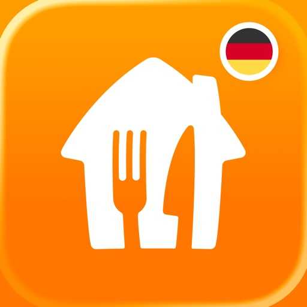

Pizza am Freitagabend, ein gesunder Mittagssnack zwischendurch, Wocheneinkauf erledigen? Die kostenlose Lieferando-App bringt dir genau das, worauf du Lust hast. Bestelle Abendessen, Frühstück oder deine Lebensmittel einfach online per Lieferservice oder Abholung – von deinen Lieblingsrestaurants, Supermärkten und Takeaways in deiner Gegend.

Bestelle bei deinen Lieblingsrestaurants
Von großen Namen wie McDonald's und Domino's bis zu echten Geheimtipps – bestelle dein Lieblingsessen einfach online bei Lieferando.
• Frischer Salat oder schneller Lunch? Kommt direkt zu dir ins Büro.
• Feierabend? Zeit für richtig gutes Essen. Ob Sushi, Burger, Thai, Pasta oder Dessert – bei Lieferando findest du genau deinen Geschmack.
• Heißhunger? Pizza, Döner, Currywurst und noch mehr Comfort Food warten schon – ganz in deiner Nähe.

Lebensmittel liefern lassen
Ob Wocheneinkauf, fehlende Zutaten oder schnelle Basics – bestelle deine Lebensmittel einfach online. Von frischem Obst und Gemüse bis zu Haushaltswaren: Alles, was du brauchst, kommt direkt zu dir – von Supermärkten wie REWE.
• Viel los diese Woche? Lass dir den Wocheneinkauf vom Online-Supermarkt liefern.
• Milch, Brot und Eier für den Geburtstagskuchen? Schon unterwegs.
• Du fühlst dich nicht fit? Frisches Obst und Gemüse kommen direkt zu dir.
• Keine Zeit? Füll deinen Vorrat per Express-Lieferung noch am selben Tag auf.
• Im Putz-Flow? Waschmittel, Reiniger & Co. kommen direkt mit.

Deine Vorteile auf einen Blick
Hol dir jetzt die Lieferando-App und freu dich auf:
• Schnelles Bestellen: In wenigen Klicks zur Lieferung oder Abholung
• Exklusive Deals: Spezielle Rabatte und Angebote
• Große Auswahl: Entdecke Lieblingsspots und bekannte Restaurants um die Ecke
• Für jeden Geschmack: Von Pizza, Sushi und Burger bis Lebensmittel und mehr
• Live-Tracking: Verfolge deine Bestellung in Echtzeit mit dem Food Tracker®
• Flexible Zahlung: Zahle so, wie es für dich am besten passt

Über 48.000 Restaurants, Supermärkte und Takeaways – entdecke sie alle.

Von großen Namen wie McDonald's und Domino's bis zu echten Geheimtipps. Egal, ob du Pizza liefern lassen oder den Wocheneinkauf online erledigen möchtest. Finde, was du brauchst, ganz in deiner Nähe. Bestelle online und verfolge alles bis vor deine Tür.

Hol dir jetzt die Lieferando-App und genieße, worauf du Lust hast – per Lieferservice oder zur Abholung.

[View on Apple](https://apps.apple.com/de/app/lieferando-de/id419724490)

## Whatnot: Shop, Sell, Connect

Whatnot ist die größte Plattform für Live Shopping in Europa, der UK und den USA – wir sind ein Marktplatz, der Millionen zusammenbringt, um die Dinge, die sie lieben, zu kaufen, verkaufen und sich zu vernetzen. Von Taschen bis Beauty, Comics bis Münzen, von Sneakers bis Streetwear und Vintage bis Vinyl – wir haben alles. Erkunde über 250 Kategorien, darunter Electronics, Sport und Pokémon-Karten, Mode, Pflanzen, Schmuck und mehr.

FINDE UNGLAUBLICHE MARKENDEALS – Schließe dich Hunderttausenden von Verkäufern an und shoppe mit hohen Rabatten deine Lieblingsmode und Dinge des täglichen Bedarfs. Von Marken, die du kennst und liebst, bis hin zu neuen und schwer zu findenden Spezialprodukten. Whatnot hat einen Deal für alles, was du suchst.

SHOPPEN HAT NOCH NIE SO VIEL SPASS GEMACHT. Ob du an schnellen Auktionen, unglaublichen Flash-Sales oder Livestream-Giveaways teilnimmst, den Marktplatz durchstöberst oder dich im Chat beteiligst – du hattest noch nie so viel Spaß beim Shoppen. Whatnot hat das Beste des physischen Einzelhandels ins Netz gebracht. 

SHOPPE MIT VERTRAUEN - Falls bei deinem Kauf doch mal etwas schiefgeht, sind wir für dich da. Mit unserem Käuferschutz bist du abgesichert - egal, ob dein Artikel beschädigt ankommt, fehlt oder nicht der Beschreibung entspricht.

INTERESSE AM VERKAUF AUF WHATNOT? Im letzten Jahr generierten kleine Unternehmen mehr als 3 Milliarden Euro Umsatz auf Whatnot. Verdiene mehr, indem du live verkaufst, komm noch heute zu Whatnot.

[View on Apple](https://apps.apple.com/de/app/whatnot-shop-sell-connect/id1488269261)

## Revolut — Banking & Trading

Alles in einem: Weltweite Zahlungen, Bargeldabhebungen, Sparzinsen, Wero und mehr.

Unsere deutsche IBANs machen Zahlungen einfach.

Deine Finanzen, nur besser
* Weltweites Konto, lokale Handhabung.
* Perfekt organisiert – mit Pockets, Gemeinschaftskonten, Konten für Kids & Teens und (bislang) über 30 Währungen.

Effizienter bezahlen
* Physische Karten, virtuelle Karten, Einwegkarten, Google Pay oder Apple Pay
* Individuelle Karten, die zu dir passen (Personalisierungsgebühren können anfallen).
* Im Ausland zahlen wie zu Hause mit  attraktiven Wechselkursen (zusätzliche Gebühren können anfallen).
* Kostenlose Kids & Teens Konten samt Debitkarte, damit Kinder den Umgang mit Geld durch Eltern kontrolliert lernen können.
* Verwaltet Geld zusammen – mit Gemeinschaftskonten und passenden Debitkarten.

Geld senden: Nah, fern, egal wohin
* Über 70 Währungen empfangen und senden, mit nur einem Schritt, in über 160 Länder.
* Senden, empfangen, chatten – alles in einer App. GIFs oder Texte geben die persönliche Note.
* Teile Ausgaben für Trips, Geschenke oder Events mit Gruppenrechnungen. Gib alle Zahlungen in der App ein, und wir übernehmen das Rechnen.

Weniger unnötige Ausgaben
* Sortiere dein Gehalt für Rechnungen, Sparen, Haushaltsausgaben und mehr automatisch.
* Voller Überblick über deine Finanzen an einem Ort, ohne zwischen Apps wechseln zu müssen.
* Verknüpfe externe Konten weltweit, um jeden Penny, Cent oder Dollar im Blick zu haben.
* Analysiere Zahlungen nach Kategorie, Händler und Zeitraum. Kein manuelles Tracking mehr nötig.

Sparen mit attraktiven Zinsen
* Jährliche Zinsen, täglich direkt auf dein Konto ausgezahlt.
* Greife jederzeit auf dein Erspartes zu.
* Daueraufträge und Aufrundungsfunktion für Kleingeld, um nebenbei zu sparen.

Vermögensaufbau startet jetzt
* Investiere an einem Ort in über 6.000 Aktien, ETFs und Anleihen. Finanziere dein Investmentdepot in Sekundenschnelle vom Revolut Privatkonto.
* Provisionsfreies Trading (1 bis 10 Trades je nach Abo, von Standard bis Ultra); andere Kosten wie Wechselgebühren oder regulatorische Gebühren können anfallen.
* Automatisierung hilft – der Robo-Advisor verwaltet für dich ein Portfolio, das sich automatisch an Marktveränderungen anpasst. Investitionen auf eigenes Risiko. Deine Investitionen können zu Gewinnen oder Verlusten führen. Investmentdienstleistungen im Europäischen Wirtschaftsraum und in der Schweiz werden von Revolut Securities Europe UAB erbracht. Lies unsere AGB, Kosten- und Risikohinweise auf unserer Webseite oder in der App.

Mit RevPoints die Welt entdecken
* Sammle bei deinen täglichen Kartenzahlungen RevPoints zu attraktiven Kursen.
* Löse deine Punkte für Flugmeilen, Rabatte auf Unterkünfte, Ersparnisse beim Shopping und mehr ein.

Revolut auf dem nächsten Level
* Kostenpflichtige Abos für exklusive Karten, Abonnements, Versicherungen, Reisevorteile und mehr. Wähle zwischen Plus, Premium, Metal oder Ultra (AGB für kostenpflichtige Abos gelten und Abonnementgebühren fallen an).

Sicherheit nach deinen Regeln
* Sperre und entsperre deine Karte in nur einem Schritt.
* Nutze für zusätzlichen Schutz online Einwegkarten, deren Daten sich nach jeder Zahlung ändern.
* Lege Limits für ausgehende Transaktionen fest und vermeide böse Überraschungen.

So schützen wir dein Geld
* Als regulierte Bank sind berechtigte Einlagen bis zu 100.000 € durch die litauische staatliche Einlagen- und Investitionsgarantie geschützt. Investitionen, Rohstoffe und Krypto-Dienstleistungen fallen nicht darunter.
* Unser System zur Betrugsprävention ist rund um die Uhr aktiv, markiert risikoreiche Transaktionen und sendet dir eine Warnmeldung, damit du sofort handeln kannst.
* Wir sind rund um die Uhr, 24/7, über unseren Kundenservice in der App für dich erreichbar.

Bankdienstleistungen werden von der Revolut Bank UAB, Zweigniederlassung Deutschland, erbracht. Weitere Informationen unter https://www.revolut.com/de-DE/ 

30 South Colonnade, London E14 5HX, Vereinigtes Königreich.

[View on Apple](https://apps.apple.com/de/app/revolut-banking-trading/id932493382)

## Instagram

Aus kleinen Momenten werden große Freundschaften. Teile deine auf Instagram.
– Von Meta

Bleib mit deinen Freund*innen in Kontakt, finde andere Fans und finde heraus, was die Menschen in deinem Umfeld so treiben. Erkunde deine Interessen und poste, was gerade bei dir los ist – ob Alltagsmomente oder besondere Highlights in deinem Leben.

Teile, was dich gerade bewegt.
- Halte deine Freund*innen mit Stories und Notizen, die für 24 Stunden sichtbar sind, auf dem Laufenden.
- Starte Gruppenchats und teile spontane Momente mit deinen engen Freund*innen.
- Teile Erinnerungen von aktuellen Veranstaltungen oder Reisen im Feed.
- Verwandle dein Leben in einen Film und entdecke mit Reels auf Instagram unterhaltsame Kurzvideos.
- Personalisiere deine Beiträge mit exklusiven Vorlagen, Musik, Stickern und Filtern.

Erkunde Themen, die dich interessieren.
- Sieh dir Videos deiner Lieblings-Creator*innen an und entdecke neue Inhalte, die auf deine Interessen zugeschnitten sind.
- Lass dich im „Explore“-Tab von den Fotos und Videos neuer Konten inspirieren.
- Entdecke Marken und Kleinunternehmen und shoppe Produkte, die deinen Stil unterstreichen.

Manche Instagram-Features sind in deinem Land oder deiner Region möglicherweise nicht verfügbar.

Nutzungsbedingungen und Richtlinien: https://help.instagram.com/581066165581870

[View on Apple](https://apps.apple.com/de/app/instagram/id389801252)

## EDEKA

Mit der EDEKA App sparst du bares Geld bei jedem Einkauf: Wähle deinen Lieblingsmarkt aus, entdecke Angebote, nutze exklusive App-Rabatte und setze Artikel auf deine Einkaufsliste. Bezahle im Markt einfach per App und sammle nach der Verknüpfung deiner PAYBACK Karte automatisch PAYBACK °Punkte bei jedem Einkauf. Jetzt ausprobieren!

VORTEILE IM ÜBERBLICK
Wöchentliche Angebote: Jetzt von noch mehr attraktiven wöchentlichen App-Rabatten profitieren. Einfach durch den digitalen Handzettel blättern und kein Angebot mehr verpassen

Challenges: Spannende Einkaufs-Challenges in der App – Fortschritte sammeln und exklusive Prämien-Coupons freischalten
Treueaktionen: Digital Treuepunkte sammeln, Treuekarte vervollständigen und Prämien sichern
PAYBACK: Einfach Karte hinterlegen und bei jedem Einkauf punkten, kein Vorzeigen der Karte mehr nötig
Alle Infos zu deinem Markt: Öffnungszeiten, Services & Neuigkeiten
Einkaufsliste: Produkte bequem auf die Einkaufsliste setzen und damit jederzeit den Überblick behalten
Mobiles Bezahlen: Einkauf per App bezahlen und Kassenzettel digital speichern (auch mit Scan & Go)

WÖCHENTLICHE ANGEBOTE
Verpasse beim Einkaufen garantiert keine Angebote mehr! In der App findest du immer die aktuellen Prospekte deines Marktes sowie Coupons für ausgewählte Produkte.

CHALLENGES
Mach deinen Einkauf zum Erlebnis und spare dabei noch mehr! Mit den neuen Challenges sammelst du mit deinen Einkäufen spielerisch Fortschritte. Für deine Erfolge erhältst du exklusive Prämien-Coupons, die dir zusätzliche Rabatte sichern. Einfach Challenge aktivieren, einkaufen und Belohnungen genießen – so macht Sparen richtig Spaß!

TREUEAKTIONEN
Mit den digitalen Treueaktionen in der App sammelst du ganz bequem Treuepunkte bei deinem Einkauf. Die Punkte werden automatisch auf deiner digitalen Treuekarte gespeichert – du musst dich um nichts kümmern. Sobald du genug Punkte gesammelt hast, kannst du sie ganz einfach gegen attraktive Prämien eintauschen.

PAYBACK
Verknüpfe einfach deine PAYBACK Karte mit der App, um automatisch Punkte zu sammeln und deine E-Coupons zu nutzen. Ohne Vorzeigen der Karte - alles in einer App.

EINKAUFSLISTE
Schon wieder die Milch vergessen? Mit dem integrierten Einkaufszettel behältst du den Überblick. Befülle ihn mit deinen Lieblingsprodukten oder mit einem Klick auf unsere Angebote und Coupons. Die Artikel werden automatisch nach Warengruppen sortiert, damit du schnell durch den Supermarkt navigieren kannst. Mit der Teilen-Funktion kannst du die Liste ganz einfach an Freunde & Familie schicken.

MOBILES BEZAHLEN
Bezahle bargeldlos und mit aktivierten Coupons an der Kasse oder per Scan & Go – und speichere deinen Kassenzettel automatisch. So einfach war Einkaufen noch nie.

SUPPORT
Weitere Infos zur App und ihren Funktionen findest du unter www.edeka-app.de.

Bei Fragen oder Anregungen schreib uns gerne an app-info@edeka.de oder ruf uns kostenlos aus dem deutschen Fest- und Mobilfunknetz unter 0800 3335253 an.

Einige Services wie Mobiles Bezahlen, Scan & Go, App-Rabatte, Treueaktionen oder PAYBACK sind nur in teilnehmenden Märkten verfügbar. Mehr dazu erfährst du hier: www.edeka.de/marktsuche

[View on Apple](https://apps.apple.com/de/app/edeka/id1272688648)

## Doctolib - Die Gesundheits-App

Doctolib - Ihr digitaler Gesundheitsbegleiter

Verwalten Sie Ihre Gesundheit und die Ihrer Familie, jederzeit und von überall mit der Doctolib-App:

• Finden Sie Arzttermine nach Fachgebiet und Standort bei zehntausenden medizinischen Fachkräften.
• Schnell und jederzeit Ihre nächsten Arzttermine in der Doctolib-App buchen, beim Arzt vor Ort in Ihrer Nähe oder als Doctolib-Videosprechstunde.
• Egal, ob gesetzlich oder privat versichert: Online-Arzttermine werden von allen gängigen Krankenkassen übernommen, wie z.B. Barmer, Techniker Krankenkasse oder AOK.
• Senden Sie Nachrichten direkt per Chat an das Gesundheitsteam für Folgerezepte, Befunde oder sonstige Themen. 

• Egal wo Sie sind: Mit der Videosprechstunde erhalten Sie eine flexible Versorgung für Ihre Gesundheit von überall:
• Gewinnen Sie mehr Zeit: Lassen Sie sich bequem per Videosprechstunde behandeln und sparen Sie sich den Weg zu Ihrem Arzt.
• Profitieren Sie von einer professionellen Behandlung: Bequem und sicher – ganz genau so, wie Sie es von einem Termin in der Praxis bei Ihrem Arzt kennen.

• Gesundheitsmanagement der gesamten Familie: Fügen Sie Angehörige Ihrem Doctolib-Konto hinzu und verwalten Sie die Gesundheit und die Arzttermine Ihrer Familie.
• Bewahren Sie Ihre Dokumente an einem Ort: Immer verfügbar, sicher und digital, wie z. B. E-Rezepte. Lösen Sie das E-Rezept ganz einfach in der Apotheke mit Ihrer Versichertenkarte oder der Gematik E-Rezept-App ein. 
• Behalten Sie Ihre Gesundheit im Blick: Mit der Terminerinnerungsfunktion verpassen Sie keine Arzttermine mehr. 
• Fügen Sie Ärzt:innen und Therapeut:innen zu Ihren Favoriten und teilen Sie diese mit Familie und Freunden.

Mit Doctolib, Ihrem digitalen Gesundheitsbegleiter, verwalten Sie Ihre Gesundheit und Ihre Arzttermine digital in der Doctolib-App: Erhalten Sie Zugriff auf eine große Auswahl an Ärzt:innen und Gesundheitsexpert:innen:
Verfügbare Fachrichtungen: Allergologe, Allgemeinmediziner, Augenarzt, Dermatologe, Ernährungsberater, Gastroenterologe, Gynäkologe, Hämatologe, Heilpraktiker, HNO-Arzt, Kardiologe, Kinderarzt, Logopäde, Nephrologe, Onkologe, Orthopäde, Osteopath, Physiotherapeut, Psychologe, Rheumatologe, Urologe, Zahnarzt etc.

Für ein gesünderes Leben. Mehr als Arzttermine.
Seit 2013 hat sich Doctolib einem einzigen Ziel verschrieben: Die Gesundheitsversorgung der Zukunft zu gestalten, gemeinsam mit Gesundheitsteams und Patient:innen. Doctolib unterstützt europaweit 410.000 Gesundheitsfachkräfte mit innovativen Technologien, verbessert ihren Arbeitsalltag und ermöglicht es ihnen, die bestmögliche Versorgung zu gewährleisten. Darüber hinaus hilft das Unternehmen 80 Millionen Menschen in ganz Europa, einen sicheren, vertraulichen und reibungslosen Zugang zur Gesundheitsversorgung zu erhalten – für ein gesünderes Leben.

Doctolib – eines der führenden E-Health Unternehmen in Europa: 
• 80 Millionen Patient:innen
• 410.000 Ärzt:innen und Therapeut:innen

Ihre Gesundheit. Ihre Daten.
Die Vertraulichkeit Ihrer persönlichen Daten ist für Doctolib eine absolute Priorität und leitet unser tägliches Handeln. Erfahren Sie mehr darüber hier: https://about.doctolib.de/privatsphaere/

Noch Fragen? Weitere Informationen erhalten Sie hier: https://www.doctolib.de/help

Alle Informationen zu unseren Nutzungsbedingungen finden Sie hier: https://media.doctolib.com/image/upload/v1721138417/legal/C1_B2C-CU-Sep-23-DE_1.pdf

[View on Apple](https://apps.apple.com/de/app/doctolib-die-gesundheits-app/id925339063)

## Spotify Musik und Podcasts

Entdecke eine riesige Auswahl an Podcasts und Musik – kostenlos auf Spotify. Stelle Playlists zusammen und streame Millionen von Songs, Alben und Podcasts kostenlos auf dem Smartphone oder Tablet. Mit Spotify Premium kannst du Musik herunterladen, Musik offline hören und mit Hörbüchern aus aller Welt in spannende Geschichten eintauchen.

Warum Spotify als Musikplayer und Podcast-App verwenden? Hier einige der Vorteile:
• Streame über 100 Millionen Songs und 6 Millionen Podcasts.
• Entdecke von Spotify zusammengestellte Playlists mit Musik von deinen Lieblingskünstler*innen.
• Suche schnell und einfach nach Lieblingssongs, -alben und -Podcasts.
• Erhalte personalisierte Musikempfehlungen ganz nach deinem Geschmack.
• Abonniere deine Lieblings-Podcasts kostenlos und stelle deine eigene Podcast-Bibliothek zusammen.

Spotify Free ist mehr als ein Musikplayer. Du kannst Podcasts und Musik kostenlos streamen, personalisierte Playlists entdecken oder deine eigenen zusammenstellen und teilen. Und auch bei Neuerscheinungen und Events deiner Lieblingskünstler*innen bleibst du immer auf dem Laufenden.
• Streame Millionen Songs und Podcasts kostenlos.
• Erstelle Playlists mit deiner Lieblingsmusik.
• Teile Songs und Playlists mit Freund*innen und Familie. (In manchen Regionen können Einschränkungen gelten.)
• Entdecke personalisierte Playlists. Du kannst auch welche mit Freund*innen erstellen.
• In „Dein Mix der Woche“ findest du jede Woche neue Songs, die dir gefallen könnten.
• Mit der Playlist „Release Radar“ und „New Music Friday“ bleibst du auf dem Laufenden.
• Finde heraus, wann deine Lieblingskünstler*innen in der Nähe auftreten.
• In Spotify Wrapped siehst du jedes Jahr deine am meisten gestreamten Songs, Genres, Künstler*innen, Podcasts und mehr.
• Höre Musik auf mehreren Geräten – Spotify macht’s möglich.
• Streame Musik über Spotify Connect auf Smart Speakern und gib Musik über PC, Laptop, Smart-TV, Chromecast, PlayStation®, XBOX®, Wearables, in deinem Auto und mehr wieder. Begrenzte Anzahl von Gerätemodellen.

Mit Spotify Premium genießt du die Vorteile eines Offline-Musikplayers und von Musik ohne Internet. Dank der Downloader-Funktion kannst du Songs, Podcasts und Playlists auch offline wiedergeben, egal wo du bist.
• Hör Musik, Podcasts und Hörbücher an einem Ort.
• Musik ohne Werbeunterbrechungen: Genieße deine Musik ohne Ads.
• Spiele Inhalte auf Abruf ab.
• Hörbücher mit Spotify Premium sind derzeit in Australien, Kanada, Irland, Neuseeland, den USA und dem Vereinigten Königreich verfügbar. Nutzer*innen von Premium Individual und Manager*innen von Duo und Family Abos können mit 15 Wiedergabestunden/Monat mehr als 250.000 Hörbücher streamen.
• Genieße hochwertiges Audio auf unterstützen Geräten.
• Spotify bietet jetzt einen KI-DJ: Dieser persönliche DJ kennt deinen Musikgeschmack und wählt Songs für dich aus.
• Streame über PC, Smartphone, Tablet, Smartwatch und im Auto.
• Hoste einen Jam mit Freund*innen, um in Echtzeit miteinander Musik zu hören und gemeinsam zu bestimmen, was als Nächstes läuft.
• Lade Musik herunter und hör Podcasts und Hörbücher offline, auch ohne Internetverbindung.
• Kein Vertrag erforderlich – das Spotify Premium Abo ist jederzeit kündbar.

Mit Spotify kannst du überall Musik spielen. Streame deine Lieblingssongs und entdecke neue Musik, Podcasts und Hörbücher mit der Musik-App von Spotify.

DIR GEFÄLLT SPOTIFY?
Folge uns auf Instagram: https://www.instagram.com/spotify
Folge uns auf TikTok: https://www.tiktok.com/@spotify

[View on Apple](https://apps.apple.com/de/app/spotify-musik-und-podcasts/id324684580)

## Netflix

Auf der Suche nach den angesagtesten Filmen und Serien aus aller Welt? Die gibt’s bei Netflix.

Entdecken Sie preisgekrönte Serien, Filme, Live-Events, Podcasts und Games unterwegs – alles in der Netflix-App. Egal, ob Sie auf Reisen oder auf dem Weg zur Arbeit sind oder einfach nur eine Pause einlegen wollen: Ab jetzt verpassen Sie nichts mehr auf Netflix.

Was Sie an Netflix lieben werden:

– Einfache Navigation mit Verknüpfungen am unteren Bildschirmrand zum schnellen Stöbern oder direkten Aufrufen Ihrer Favoriten

– Eine neue Möglichkeit, um herauszufinden, was als Nächstes kommt, inklusive eines Feeds mit neuen Clips

– Eine Welt voller Unterhaltung mit Serien, Filmen, Live-Events, Games und Podcasts – alles an einem Ort

– Ihre Favoriten jederzeit im Blick – von Ihren Lieblingsmomenten bis zu „Meine Liste“ finden Sie alles auf dem Tab „Mein Netflix“.

– Personalisierte Empfehlungen auf Basis Ihrer Bewertungen. Sofortige Benachrichtigungen bei Neuerscheinungen, neuen Folgen und Live-Events

Die Netflix-Mitgliedschaft ist ein monatliches Abo, das mit Ihrer Registrierung beginnt. Sie können jederzeit problemlos online kündigen – rund um die Uhr. Ganz ohne langfristige Verträge oder Kündigungsgebühren. Wir möchten einfach, dass Ihnen das, was Sie sich ansehen, gefällt.

Bitte beachten Sie, dass die App-Datenschutzinformationen für Daten gelten, die über die Netflix-App für iOS, iPadOS und tvOS erhoben werden. In der Datenschutzerklärung von Netflix (siehe Link unten) erfahren Sie mehr darüber, welche Daten wir in anderen Zusammenhängen, z. B. bei der Kontoregistrierung, erheben.

Datenschutzrichtlinie: www.netflix.com/privacy

Nutzungsbedingungen: www.netflix.com/terms

Telefonnummer: +18667160414

E-Mail: iosappstore@netflix.com

[View on Apple](https://apps.apple.com/de/app/netflix/id363590051)

## GetYourGuide: Planen & buchen

Entdecke die Welt mit GetYourGuide!

Mit der GetYourGuide-App kannst du ganz einfach Tickets für unzählige Aktivitäten und Erlebnisse auf deinen Reisen buchen. Ob du auf der Suche nach einer aufregenden Tagestour, einem unvergesslichen Reiseerlebnis oder einer faszinierenden Stadtführung bist, hier findest du eine Vielzahl von Optionen, um das Beste aus deinem Urlaub herauszuholen.

Egal, ob für die Urlaubsplanung oder für die spontane Suche nach Last-Minute-Erlebnissen an einem beliebigen Reiseziel – mit uns ist das Buchen von Touren, Tagesausflügen und Aktivitäten so einfach wie nie.

Mach mehr aus deiner Reise mit exklusivem Zugang zu den besten Attraktionen und Museen der Welt, entdecke die Highlights und die versteckten Geheimtipps und bleib stets auf dem Laufenden über Last-Minute-Angebote mit der App – wir machen Reiseplanung einfach.

Deine Vorteile mit der GetYourGuide-App

Jetzt reservieren, später zahlen: Sichere dir deinen Platz für beliebte Erlebnisse frühzeitig und bezahle erst später.

Sofortige Buchungsbestätigung: Egal, ob du deine Tour schon lange im Voraus oder last minute buchst, du erhältst deine Tickets und Buchungsbestätigung sofort.

Offline-Tickets: Greife über die App ganz bequem offline auf deine Tickets zu.

24/7 Kundenservice: Du erreichst uns rund um die Uhr kostenlos per E-Mail, Telefon oder WhatsApp

Tickets sicher und bequem im Voraus buchen

Planst du eine Reise und möchtest die wichtigsten Sehenswürdigkeiten besuchen? Mit GetYourGuide kannst du bequem im Voraus Touren und Tickets für berühmte Wahrzeichen wie den beeindruckenden Mailänder Dom, faszinierende Museen und andere Attraktionen buchen. Spare dir das Anstehen in der Warteschlange und genieße einen stressfreien Besuch, indem du deine Tickets einfach auf deinem Smartphone vorzeigst.

Entdecke über 75.000 Erlebnisse

Mit der GetYourGuide-App hast du Zugriff auf eine beeindruckende Auswahl von über 75.000 Erlebnissen, Tickets und Aktivitäten weltweit. Egal, ob du Abenteuer suchst, kulturelle Sehenswürdigkeiten erkunden möchtest oder kulinarische Entdeckungen machen willst – bei uns wirst du fündig. Stöbere durch unsere umfangreiche Sammlung von Tagestouren, Stadtführungen, Museumsbesuchen und vielem mehr und finde das perfekte Erlebnis für deine Reise.

Bleibe flexibel

Mit GetYourGuide bleibst du flexibel und kannst deine Reisepläne mühelos anpassen. Unsere App bietet dir eine einfache Möglichkeit, nach Aktivitäten und Tickets an deinem Reiseziel zu suchen und sie nach deinen individuellen Vorlieben zu filtern. Du kannst spontan entscheiden, ob du lieber eine Stadtführung machen möchtest, an einer Outdoor-Aktivität teilnehmen willst oder Lust auf ein Museum hast. Wähle aus verschiedenen Terminen und Optionen, um sicherzustellen, dass deine Erlebnisse nahtlos in deine Reiseroute passen.

Sichere Buchung

Mit GetYourGuide kannst du deine Aktivitäten sicher und bequem buchen. Unsere App sorgt für ein schnelles und unkompliziertes Buchungserlebnis. Durchstöbere Bewertungen und Erfahrungen anderer Reisender, um dir ein Bild von den Aktivitäten zu machen. Sobald du dich entschieden hast, kannst du deine Tickets direkt über die App buchen und erhältst eine sofortige Buchungsbestätigung. Vermeide das lästige Anstehen an den Attraktionen, indem du deine Tickets einfach auf deinem Smartphone vorzeigst.

Lade jetzt die GetYourGuide-App herunter und entdecke die Welt der unvergesslichen Erlebnisse und Aktivitäten. Egal, ob du alleine reist, mit deinem Partner oder mit Freunden – bei uns findest du das perfekte Abenteuer, um deine Reise unvergesslich zu machen. Erkunde neue Orte, lerne interessante Fakten und schaffe unvergessliche Erinnerungen – alles mit nur wenigen Klicks auf deinem Smartphone.

Starte jetzt dein Abenteuer mit GetYourGuide!

[View on Apple](https://apps.apple.com/de/app/getyourguide-planen-buchen/id705079381)

## Too Good To Go: Essen retten

Too Good To Go ist dein einfacher Weg, leckere Lebensmittel zu genießen und gleichzeitig Gutes für die Umwelt zu tun. Die #1-App zur Reduzierung von Lebensmittelverschwendung hilft dir, leckere, überschüssige Snacks, Mahlzeiten und Lebensmittel von Läden, Cafés, Supermärkten, Restaurants und Co. in deiner Nähe zu retten – und das zu großartigen Preisen. 

Jedes Jahr werden 40 % der produzierten Lebensmittel verschwendet. Wenn du Lebensmittelverschwendung reduzierst, hilfst du, den Klimawandel einzudämmen (tgtg.to/claims). So sicherst du dir mit Too Good To Go nicht nur preiswerte Mahlzeiten und Lebensmittel, sondern hilfst gleichzeitig mit jeder geretteten Überraschungstüte, den Planeten zu retten. Gemeinsam können wir einen Unterschied bewirken.


SO FUNKTIONIERT TOO GOOD TO GO:

ENTDECKE DAS ANGEBOT IN DEINER NÄHE
Lade die App herunter, um auf der Karte Restaurants, Cafés, Bäckereien, Supermärkte und mehr in der Nähe zu finden, die gutes Essen zu einem tollen Preis anbieten.

RETTE DEINE ÜBERRASCHUNGSTÜTE ODER TOO GOOD TO GO PAKET
Entdecke eine Vielzahl von Überraschungstüten, die mit leckeren, überschüssigen Lebensmitteln gefüllt sind – von Sushi, Pizza und Burger bis hin zu Obst und Gemüse. Du willst dir Produkte deiner Lieblingsmarken lieber liefern lassen? Rette ein Too Good To Go Paket zu einem großartigen Preis, das mit Produkten deiner Lieblingsbrands gefüllt ist. 

BEZAHLBARE MAHLZEITEN
Rette eine Überraschungstüte oder ein Too Good To Go Paket zu 50% des Preises oder weniger. 

RESERVIERE DEINEN FAVORITEN
Bestätige den Kauf über die App, um deine Überraschungstüte zu reservieren und die leckere Mahlzeit vor der Verschwendung zu retten. Indem du Lebensmittel rettest, sparst du Geld und trägst dazu bei, Lebensmittelverschwendung zu reduzieren.

GENIESSEN
Hol deine Überraschungstüte zur vereinbarten Zeit ab oder lass dir dein Too Good To Go Paket direkt nach Hause liefern.


WARUM TOO GOOD TO GO?:

BUDGETFREUNDLICHER GENUSS
Genieße gute Mahlzeiten zu erschwinglichen Preisen, die sowohl deinen Gaumen als auch deinen Geldbeutel zufriedenstellen.

VIELFALT UND AUSWAHL
Too Good To Go arbeitet mit einer großen Auswahl an lokalen Favoriten und bekannten Marken zusammen, die alles von Sushi, Pizza, Backwaren und frischen Lebensmitteln bis hin zu leicht lagerbaren Grundnahrungsmitteln wie Snacks, Getränken, Süßigkeiten oder Pasta anbieten.

AUSWIRKUNGEN AUF DIE UMWELT
Jede gerettete Mahlzeit vermeidet CO2e-Emissionen und die unnötige Nutzung von Wasser und landwirtschaftlicher Fläche (tgtg.to/claims). Indem du  Lebensmittel vor der Verschwendung rettest, machst du einen Schritt in Richtung eines grüneren Planeten. 

EINFACHE ABWICKLUNG
Die einfache und benutzerfreundliche Oberfläche der App erleichtert dir das Durchsuchen, Auswählen und Speichern von Überraschungstüten oder Too Good To Go Paketen.

BEQUEMLICHKEIT
Hol deine Überraschungstüte zur vereinbarten Zeit ab oder lass dir ein Too Good To Go Paket direkt nach Hause liefern.

WERDE TEIL DER TOO GOOD TO GO COMMUNITY
Werde Teil der Community von Foodies, die durch die Reduzierung von Lebensmittelverschwendung einen positiven Einfluss auf die Umwelt ausüben. Lade jetzt die App herunter und fang an, Lebensmittelverschwendung zu reduzieren – eine Überraschungstüte nach der anderen. 
Lebensmittelverschwendung zu reduzieren hilft, den Klimawandel einzudämmen. Erfahre mehr unter tgtg.to/claims. Für weitere Informationen besuche tgtg.to/claims.

[View on Apple](https://apps.apple.com/de/app/too-good-to-go-essen-retten/id1060683933)

## Pinterest

Pinterest ist ein Ort endloser Möglichkeiten. Du kannst:
- Inspiration sammeln
- Die neuesten Trends shoppen
- Neue Hobbys ausprobieren

Erstelle Pinnwände, merke dir Pins und kreiere Collagen mit allem, was dich inspiriert. Entdecke zahllose Ideen, von Fashion-Tipps und einfachen Rezepten bis DIY-Projekten und kreativen Ideen, mit denen du deinem Zuhause einen neuen Anstrich verpassen kannst. Gestalte ein Leben, das du liebst? 

It's Possible.

[View on Apple](https://apps.apple.com/de/app/pinterest/id429047995)

## Airalo: eSIM-Reisen & Internet

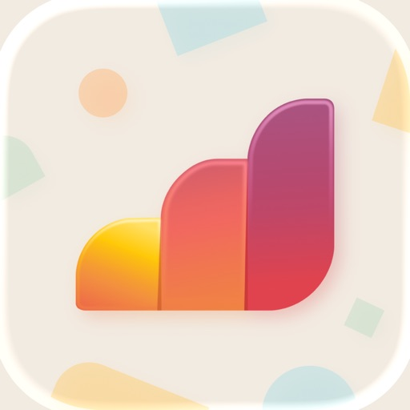

Wähle aus eSIMs für über 200 Länder und Regionen auf der ganzen Welt

Bleibe in Verbindung, egal wohin du reist. Mit einer Airalo eSIM geht das weltweit. Installiere die eSIM und gehe direkt online. Keine Roaming-Gebühren – einfache, günstige, globale Konnektivität.

Was ist eine eSIM?
Eine eSIM ist eine eingebettete SIM-Karte. Sie ist in die Hardware deines Telefons integriert und funktioniert wie eine physische SIM-Karte. Sie ist aber 100 % digital.

Anstatt dich mit einer physischen SIM-Karte zu ärgern, kannst du eine eSIM kaufen, installieren und dich direkt mit einem Netz verbinden.

Was ist ein Airalo eSIM Plan?
Mit einem Airalo eSIM Plan erhältst du Zugang zu Anrufen, SMS und mobilen Daten. Du kannst einen lokalen, regionalen oder globalen eSIM-Tarif wählen, um weltweit online zu gehen. Lade die eSIM herunter, installiere sie auf deinem Gerät und verbinde dich am Zielort mit einem Mobilfunknetz!

Wie funktioniert das?
1. Installiere die Airalo-App.
2. Kaufe einen eSIM-Tarif für dein Reiseziel.
3. Installiere die eSIM.
4. Aktiviere deine eSIM und verbinde dich bei Ankunft mit dem Internet.

Erhältlich für mehr als 200 Länder und Regionen, darunter:
- Vereinigte Staaten
- Vereinigtes Königreich
- Türkei
- Italien
- Frankreich
- Spanien
- Japan
- Deutschland
- Kanada
- Thailand

Warum Airalo?
- Über 200 unterstützte Länder und Regionen.
- Installiere und aktiviere eine eSIM in wenigen Minuten.
- Günstige eSIM-Tarife ohne versteckte Gebühren.
- Lokale, regionale und globale eSIMs.
- Telefonieren, SMS und Datenzugriff mit einer globalen Discover+ eSIM.

Warum Reisende eSIMs lieben:
- Einfache und erschwingliche Konnektivität.
- 100 % digital. Du musst dich nicht mit physischen SIM-Karten oder WLAN-Geräten ärgern.
- Keine versteckten Gebühren oder überraschende Roaming-Kosten.
- Speichere mehrere eSIMs auf einem einzigen Gerät.
- Füge eSIM-Tarife unterwegs hinzu oder wechsle sie.

eSIM-FAQ
- Was beinhaltet ein Airalo eSIM Plan?
- Ein Airalo Paket enthält Daten (z. B. 1 GB, 5 GB usw.), die für einen Zeitraum gültig sind (z. B. 7 Tage, 30 Tage usw.). Wenn die eSIM-Daten ausgehen oder die Gültigkeitsdauer abläuft, kannst du sie aufladen oder eine neue über die Airalo-App herunterladen.

Was kostet das?
- eSIMs von Airalo kosten ab 4 € für 1 GB Daten.

Wird eine eSIM mit einer Nummer geliefert?
- Einige eSIMs, wie unsere globale Discover+ eSIM, kommen mit einer Nummer für Anrufe, SMS und Datenzugriff. Details findest du in der Beschreibung deiner eSIM.

Welche Geräte sind kompatibel?
- Eine aktuelle Liste der eSIM-kompatiblen Geräte findest du hier: https://www.airalo.com/help/about-airalo/what-devices-support-esim
Viel Spaß auf deinen Reisen!

-

Mehr über eSIMs und Airalo: 
Website: www.airalo.com
Blog: www.airalo.com/blog
Hilfezentrum: www.airalo.com/help

Werde Teil der Airalo Community! Folge @airalocom auf Instagram, Facebook, TikTok, X und LinkedIn.

Datenschutzbestimmungen
www.airalo.com/more-info/privacy-policy

AGB
www.airalo.com/more-info/terms-conditions

[View on Apple](https://apps.apple.com/de/app/airalo-esim-reisen-internet/id1475911720)

## Telegram Messenger

Echtes Instant Messaging – einfach, schnell, sicher und mit all deinen Geräten synchronisiert. Eine der Top 5 der am meisten heruntergeladenen Apps der Welt, mit über 1 Milliarde aktiven Nutzern.

SCHNELL: Telegram ist die schnellste Messaging-App auf dem Markt, um Leute über ein weltweit einmalig verteiltes Netzwerk von Rechenzentren zu verbinden.

SYNCHRONISIERT: Du kannst auf alle deine Chatnachrichten und Dateien von verschiedenen Geräten (einschließlich PCs, Tablets und Smartphones) gleichzeitig zugreifen. Die Telegram-Apps sind unabhängig, sodass du dein Handy nicht ständig eingeschaltet lassen musst. Starte deine Nachricht auf einem Gerät und setze sie jederzeit auf einem anderen Gerät fort. Verliere niemals wieder deine Daten.

UNBEGRENZT: Du kannst Chatnachrichten, Bilder, Videos und Dateien jeglicher Art senden. Dein Chatverlauf, inkl. Medien und Dateien, verbraucht keinen Speicherplatz auf deinem Gerät und wird sicher in der Telegram Cloud gespeichert – solange du es möchtest.

SICHER: Unsere Mission ist, ein sicheres, schnelles und globales Kommunikationsmittel zu schaffen. Alles bei Telegram, inklusive Chats, Gruppen, Medien etc. ist verschlüsselt. Wir setzen auf eine Kombination aus 256-Bit symmetrischer AES Verschlüsselung, 2048-Bit RSA Verschlüsselung und dem sicheren Diffie-Hellman Schlüsselaustauschverfahren.

100 % KOSTENLOS & OFFEN: Telegram hat eine vollständig dokumentierte und kostenlose API für Entwickler, Open-Source-Apps und überprüfbare Builds, um zu beweisen, dass die App, die du herunterlädst, aus genau demselben Quellcode erstellt wurde, der veröffentlicht wurde.

LEISTUNGSSTARK: Bei uns kannst du Gruppen mit bis zu 200.000 Mitgliedern erstellen, große Videos und Dateien jeglicher Art (.DOCX, .MP3, .ZIP etc.) mit jeweils bis zu 2 GB teilen und sogar Bots für bestimmte Aufgaben einsetzen. Telegram ist so das perfekte Werkzeug für deine Online-Community und um Teamarbeit zu koordinieren.

ZUVERLÄSSIG: Telegram ist das zuverlässigste Nachrichtensystem, welches je entwickelt wurde, um deine Nachrichten mit möglichst wenig Datenverkehr zu übertragen. Es funktioniert selbst mit der langsamsten mobilen Verbindung.

UNTERHALTSAM: Telegram verfügt über leistungsstarke Foto- und Videobearbeitungswerkzeuge, animierte Sticker und Emoji, vollständig anpassbare Farbthemen, um das Aussehen deiner App zu verändern, und eine offene Sticker-/GIF-Plattform, um all deine ausdrucksstarken Bedürfnisse zu erfüllen.

EINFACH: Obwohl wir eine noch nie dagewesene Vielfalt an Funktionen bieten, achten wir sehr darauf, die Oberfläche schlicht zu halten. Telegram ist so einfach, dass du bereits weißt, wie man es benutzt. 

PRIVAT: Wir nehmen deine Privatsphäre sehr ernst und werden es niemals Dritten erlauben, auf deine Daten zuzugreifen. Du kannst jede Nachricht, die du jemals gesendet oder empfangen hast, für beide Seiten, jederzeit und spurlos löschen. Telegram wird deine Daten niemals nutzen, um dir Werbung zu zeigen.

Für alle, die an maximaler Privatsphäre interessiert sind, gibt es Geheime Chats. Hier zerstören sich Nachrichten, Videos oder Bilder auf Wunsch bei beiden Chatpartnern selbst, sodass es gar keine Spuren mehr von dieser Unterhaltung gibt. Geheime Chats nutzen eine Ende-zu-Ende-Verschlüsselung, um sicherzustellen, dass eine Nachricht nur von dem vorgesehenen Empfänger gelesen werden kann.

Wir setzen neue Standards: Regelmäßige Updates und immer wieder neue interessante Funktionen, die es bei keinem anderen Messenger gibt. Entdecke die Zukunft.

Terms of Use: https://www.apple.com/legal/internet-services/itunes/dev/stdeula/

[View on Apple](https://apps.apple.com/de/app/telegram-messenger/id686449807)

## Yazio: Kalorien Zähler & Diät

Willkommen bei Yazio – dein treuer Kalorienzähler, der dir hilft, einfach abzunehmen und deine Gesundheit zu verbessern. Mit unserer App kannst du nicht nur Kalorien und Essen tracken, sondern auch Intervallfasten, Ernährungspläne, Aktivitäten & vieles mehr in einer einzigen App verwalten! Mit nur einem einfachen Foto erkennt unsere App deine Mahlzeit & trackt die Kalorien für dich. Damit wird das Tracken so einfach, wie noch nie!

4,6 Sterne bei über 300.000 Bewertungen
Mehr als 100 Mio. zufriedene Nutzer:innen verwenden unseren Kalorien Tracker
App des Tages im App Store

Dein verlässlicher Kalorienzähler!

Mit Yazio kommst du einfach und gesund an dein Wunschgewicht – in der App erwarten dich ein integrierter Kalorienzähler, ein Tracker zum Intervallfasten, eine große Lebensmitteldatenbank uvm. Aber es geht nicht nur um Kalorien zählen, sondern auch um deine Gesundheit und um langfristige Ergebnisse!

Erreiche dein Ziel in wenigen Wochen!

- Einfacher Kalorienzähler
- Mahlzeiten ganz einfach mit Fotos tracken
- > 20 Fastenpläne
- Riesige Lebensmitteldatenbank
- Leckere Rezepte & Ernährungspläne
- Automatisches Tracking von Aktivitäten
- Wasserzähler

- Unterstützt dich effektiv beim Abnehmen und beim Halten deines Wunschgewichts
- Auch für Muskelaufbau & Zunehmen

Die Yazio App ist mehr als nur ein Kalorienzähler:

1. Kalorienzähler

• Foto-Tracking
• Barcode-Scanner
• Essen tracken ohne Aufwand
• Präzises Kalorien-Tracking für alle Mahlzeiten
• Ernährungstagebuch
• Nährwerte und Makronährstoffe tracken
• Schritte & Aktivitäten tracken
• Automatische Erinnerungen

2. Intervallfasten

• Fasten-Tracker
• Integrierter Kalorienzähler
• Timer & Erinnerungen
• Fastenplan fürs Intervallfasten
• Exakter Körperstatus während des Fastens

3. Rezepte

• Über 3.000 leckere Rezepte
• Low-Carb, vegetarische und vegane Rezepte
• High-Protein-Mahlzeiten
• Angabe der Kalorien für jedes Rezept
• Kalorienzähler nahtlos integriert

Dein Kalorien-Tracker, dein Fortschritt

Werde Teil der Yazio Pro-Community und erreiche dein Ziel schneller mit Pro!

Deine Vorteile:
• Keine Werbung
• Fortgeschrittener Kalorientracker
• Auswertung aller Nährstoffe inkl. Vitamine & Mineralstoffe
• Auswertung über mehrere Jahre
• Dokumentiere alle Körperwerte & -maße

Du kannst Pro per In-App-Kauf in der Yazio App erwerben. Yazio Pro ist deutlich preiswerter als Premium-Versionen vergleichbarer Apps, die Kalorien tracken.

Warum Yazio der einzige Kalorienzähler ist, den du je brauchen wirst.

Mit Yazio wird Essen tracken so einfach, wie noch nie! Unser Kalorienzähler hilft dir, deine Mahlzeiten mühelos zu erfassen.

KI Kalorienzähler, der motiviert statt stresst

Der Kalorien zähler von Yazio ist mehr als nur ein einfacher Kalorienzähler – er ist dein täglicher Begleiter für bewusste Ernährung. Mit dem Kalorien Zahler bleibst du jederzeit auf Kurs – wir erklären dir, wie. Der Kalorien Zahler begleitet dich zuverlässig, denn durch präzises Essen tracken lernst du, wie viele Kalorien in deinen Mahlzeiten enthalten sind. Der Kalorienzähler hilft dir so, deine Mahlzeiten besser zu verstehen.

Auch als Einsteiger wirst du mit dem Kalorien Zahler schnell vertraut. Der Kalorien zähler eignet sich für alle: Ob abnehmen, Muskelaufbau oder Gewicht halten – der Kalorien Zahler ist auf deinen Bedarf abgestimmt. Unser KI Kalorienzähler hilft dir also nicht nur beim Abnehmen, sondern auch dabei, Zusammenhänge in deiner Ernährung zu erkennen.

Starte jetzt mit dem Yazio Kalorien Zahler und entdecke, wie einfach Essen tracken sein kann – Ein Kalorien zähler muss nicht kompliziert sein!

KI Kalorienzähler für jeden Tag

• Hilfe zur App: https://help.yazio.com/hc/de
• Über das Team: https://www.yazio.com/de/ueber-uns
• Nutzungsbedingungen: https://www.apple.com/legal/internet-services/itunes/dev/stdeula/

Bist du bereit für den einzigen Kalorienzähler, den du je brauchen wirst? Jetzt Yazio Kalorien Zahler testen!

[View on Apple](https://apps.apple.com/de/app/yazio-kalorien-z%C3%A4hler-di%C3%A4t/id946099227)

## ImmoScout24 - Immobilien

Finde dein neues Zuhause. Mit Deutschlands Nr. 1 für Immobilien.
Ob erste Wohnung, WG-Zimmer, Familienhaus oder neues Investment – ImmoScout24 begleitet dich bei jedem Schritt rund um Immobilien, Wohnungssuche und Hauskauf.

Warum ImmoScout24?

• Die meisten Inserate in Deutschland
• Die meisten Suchenden
• Unsere Kund sind am zufriedensten
• SCHUFA-Check direkt in der App
• KI-gestützte Wohnungssuche & smarte Filter
• Wohnungen vor allen anderen entdecken

Suchen: Wohnung, Haus oder Gewerbe finden

• Nutze Suchkriterien wie Ort, Preis, Größe, Zimmeranzahl, Terrasse, Balkon, Etage, Einbauküche, Energieeffizienz oder Baujahr.
• Zeichne dein Suchgebiet direkt auf der Karte und finde deine Wohnung oder dein Haus genau dort, wo du wohnen möchtest.
• Smarte Suchfilter mit KI-Bilderkennung: Finde Immobilien, Wohnungen & Häuser, die wirklich zu dir passen: Die KI erkennt Details auf Bildern und analysiert Lage und Umfeld. Du suchst eine Wohnung mit Blick auf den See? Ein Haus mit offener Wohnküche oder bodentiefen Fenstern? Ein WG-Zimmer mit Parkett? Wir finden sie für dich.

• HeyImmo – Dein KI-Immobilien-Experte: HeyImmo beantwortet Fragen rund um Immobilien- und Wohnungssuche – 24/7. Ist der Preis der Wohnung angemessen? Gibt es Kitas in der Nähe? Welche Renovierungen können anfallen? HeyImmo unterstützt dich bei deiner Entscheidung.
• Scout the Streets – Wohnungssuche im Umfeld: Entdecke Wohnungen, Häuser, WG-Zimmer und andere Immobilien direkt in deiner Umgebung. Öffne deine Kamera und erkunde Straßen & Viertel in einer interaktiven Ansicht.
• Mieter-Netzwerk – Wohnungen früher entdecken: Dein Vorsprung bei der Wohnungssuche: Finde Wohnungen, bevor sie offiziell inseriert werden. Im Mieter-Netzwerk entdeckst du Angebote, die noch nicht öffentlich sichtbar sind.
• SuchenPlus – Mehr Chancen bei der Wohnungssuche: Mit SuchenPlus erhältst du zusätzliche Sichtbarkeit, früheren Zugriff auf ausgewählte Immobilien und weitere Vorteile bei der Wohnungssuche (kostenpflichtig).
• Push-Benachrichtigungen: Erhalte Benachrichtigungen zu neuen Immobilien, Wohnungen, Häusern oder WG-Angeboten und bewirb dich mit wenigen Klicks.
• Merkzettel: Speichere interessante Immobilien, Wohnungen und Häuser und behalte deine Favoriten jederzeit im Blick.
• Nachrichten: Kommuniziere direkt mit Vermieter, Makler und Anbieter und bleibe per Push-Nachricht informiert.
• SCHUFA-BonitätsCheck: Fordere deine SCHUFA-Auskunft direkt in der App an und hinterlege sie in deiner Bewerbermappe. So verbesserst du deine Chancen bei der Wohnungssuche.

Anbieten: Wohnung, Haus oder Gewerbe inserieren, vermieten oder verkaufen.

• Gratis Immobilien inserieren: Immobilie mit wenigen Klicks inserieren & als private Anbieter 14 Tage kostenlos anbieten.
• Gratis Immobilie bewerten: Erhalte eine kostenlose Immobilienbewertung und finde den passenden Preis für Wohnung, Haus, Grundstück oder Gewerbeimmobilie. Der Preisatlas vergleicht Immobilienpreise in deiner Umgebung.
• Deutschlands größtes Maklernetzwerk: Lasse dich von Immobilien-Profis beraten und verkaufe oder vermiete deine Immobilie zum Bestpreis.

Mit über 6,5 Mio. Inseraten ist ImmoScout24 Deutschlands größte Plattform für Immobilien und Wohnungssuche – noch vor immowelt, immonet, Kleinanzeigen und WG-Gesucht. Seit mehr als 25 Jahren begleitet ImmoScout24 jeden Monat Millionen Menschen bei der Wohnungssuche, beim Hauskauf oder beim Inserieren ihrer Immobilie.
Überzeuge dich selbst und lade dir die ImmoScout24 App herunter.

Wir wollen dein Feedback!
Schreibe uns gerne an app-support@immobilienscout24.de oder hinterlasse eine Bewertung im App Store.

[View on Apple](https://apps.apple.com/de/app/immoscout24-immobilien/id344176018)

## Amazon

Umfassend 
Schnell suchen, Produktdetails abrufen, Rezensionen lesen und Millionen von Produkten kaufen, die über Amazon.de und andere Anbieter verfügbar sind. 

Praktisch 
Melden Sie sich mit Ihrem bestehenden Amazon-Konto an, um auf Ihre Warenkorb-, Zahlungs- und Versandoptionen zuzugreifen. Sie müssen kein neues Konto erstellen, um Ihre 1-Click-Einstellungen und Wunschzettel zu verwalten, Ihre Bestellungen nachzuverfolgen und die Vorteile Ihrer Prime-Mitgliedschaft zu nutzen. Einkaufen wie im Internet. 

Schnell 
Vergleichen Sie Preise und überprüfen Sie die Verfügbarkeit im Handumdrehen, indem Sie einen Strichcode scannen, ein Foto aufnehmen oder Ihre Suchbegriffe eingeben. 

Sicher 
Alle Einkäufe laufen über die sicheren Server von Amazon. 

Universell 
Kaufen Sie von einer einzelnen App aus auf Amazon.co.uk, Amazon.de, Amazon.fr, Amazon.com, Amazon.it, Amazon.cn oder Amazon.co.jp ein.

Durch die Nutzung dieser App erklären Sie sich mit unseren Allgemeinen Geschäftsbedingungen (www.amazon.de/conditionsofuse) einverstanden. Bitte lesen Sie unsere Datenschutzerklärung (www.amazon.de/privacynotice), unsere Hinweise zu Cookies (www.amazon.de/cookies) und unsere Hinweise zu interessenbasierter Werbung (https://www.amazon.de/interestbasedads).

Wenn Ihr Gerät die TrueDepth-Technologie unterstützt, verwendet die App Ihre Gerätekamera, um Ihre Gesichtsbewegungen zu erkennen, nur während bestimmte Funktionen verwendet werden, z. B. beim virtuellen Anprobieren von Produkten wie Sonnenbrillen. Alle mit dieser Technologie verarbeiteten Informationen verbleiben auf Ihrem Gerät und werden von Amazon nicht anderweitig gespeichert, verarbeitet oder weitergegeben.

[View on Apple](https://apps.apple.com/de/app/amazon/id348712880)

## Ryanair

Mit dieser griffbereiten App liegt Ihnen Europa zu Füßen.

Wir von Ryanair bieten Ihnen auf unserer App natürlich die niedrigsten Flugpreise in Europa an. Doch nicht nur das – jetzt können Sie auch unterwegs einchecken, denn die mobile Bordkarte wird direkt an Ihr Handy gesendet. Und mit einem Klick können Sie weitere Extras auswählen.

Warum lesen Sie also noch? Laden Sie die App jetzt herunter und buchen Sie den nächsten Flug!

[View on Apple](https://apps.apple.com/de/app/ryanair/id504270602)

## McDonald’s Deutschland

Die offizielle McDonald’s Deutschland App 
Smart bestellen und genießen

Mit MyMcDonald’s ist jetzt ganz einfach immer und überall mehr für dich drin: Zum Beispiel aktuelle McDonald’s Specials, individuelle Vorteile, tolle Aktionen und leckere Prämien mit dem neuen Bonusprogramm**. Einfach die McDonald’s App herunterladen, registrieren und nichts mehr verpassen! 

Deine Vorteile auf einen Blick:

+ Mit exklusiven Coupons clever sparen
+ Beim Bonusprogramm Punkte sammeln und in leckere Prämien eintauschen
+ In über 1.100 Restaurants bequem vorbestellen und bezahlen
+ Alle Produkte und Infos immer griffbereit 
+ Keine Specials und Gewinnspiele mehr verpassen

Das alles wartet auf dich:

GENUSS ZUM SCHNÄPPCHENPREIS
Ob Burger-Enthusiast oder Fritten-Fan - mit der McDonald's App verpasst du keine Coupons, Gutscheine und Angebote mehr! Einfach kostenlos anmelden und die Coupons im Restaurant oder direkt über die App einlösen.*

EINFACH LECKER PUNKTEN 
Egal, ob du im Restaurant, im McDrive® oder direkt in der App bestellst: Sobald du dich in der App unter MyMcDonald’s für das neue Bonusprogramm angemeldet hast, punktest du bei jeder Bestellung** und kassierst dabei für jeden ausgegeben Euro 10 Punkte. Sobald du genug Punkte gesammelt hast, kannst du sie für leckere Prämien einlösen.

NIE MEHR SCHLANGE STEHEN
Vom Klassiker bis hin zu deinem persönlich kreierten Lieblings-Burger - deine Wunschbestellung kannst du ganz einfach über die McDonald's App zusammenstellen und in einem Restaurant deiner Wahl frisch bereitet abholen oder direkt dort genießen. Die Bezahlung erfolgt bequem per App*. Schlange stehen war gestern!

KEINE AKTION MEHR VERPASSEN
Entdecke regelmäßig leckere Neuheiten und spannende Aktionen in der McDonald's App. Außerdem warten regelmäßig zahlreiche Gewinnspiele und großartige Preise auf dich! Lass dich überraschen!

ALLE RESTAURANTS & SERVICES
Die McDonald's App zeigt dir alle McDonald's Restaurants und Services in deiner Nähe.*** Zusätzlich hast du alle Details und Informationen zu deinen Lieblingsprodukten wie Preise, Nährwerte und Inhaltsstoffe immer zur Hand.

Jetzt downloaden, exklusive Coupons schnappen und smart bestellen!

Guten APPetit

*Nur für registrierte User. In allen teilnehmenden Restaurants.
**Nur für registrierte User in ausgewählten Restaurants. Finde die Restaurants unter www.mcdonalds.de/mymcd-restaurants. 
***Bei Verwendung der Restaurantsuche verwendest du eine Funktion von Apple. Weitere Informationen dazu findest du in unseren Datenschutzinformationen.

[View on Apple](https://apps.apple.com/de/app/mcdonalds-deutschland/id524943492)

## TikTok - Videos, Shop und LIVE

TikTok ist deine globale Video-Community für kurze und unterhaltsame Videos. Die Inhalte sind dabei auf dich zugeschnitten: Lass dich von spannenden Storys unterhalten, lerne fürs Leben und entdecke neue Talente in dir.
Du kannst dabei auch selbst unvergessliche Momente hochladen und sie mit der Welt teilen. Mit einer großen Auswahl an Musik, Filtern und Stickern wird jede Aufnahme einzigartig – Deiner Kreativität sind keine Grenzen gesetzt!

■ Schaue Millionen von Videos, basierend auf den Inhalten, die dir gefallen!
■ Lass dich von unserer globalen TikTok-Community unterhalten und inspirieren!
■ Mit unseren Edit-Tools kannst du Videoclips problemlos schneiden, zusammenfügen und duplizieren.
■ Füge deinen Videos kostenlose Musikclips, Sounds und viele weitere Effekte hinzu!
■ Livestreaming-Filter werden ständig mit neuen Designs aktualisiert.
■ Stelle dich abwechslungsreichen Challenges und zeige, was in dir steckt!
■ Hast du Feedback für uns? Kontaktiere uns unter https://www.tiktok.com/legal/report/feedback

Erhalte Zugriff auf LIVE-Vorteile, um besser mit Hosts interagieren zu können!
Du kannst dich für ein einmaliges Abonnement oder für ein Abonnement mit automatischer Verlängerung entscheiden, um in den Genuss besonderer LIVE-Vorteile zu kommen (derzeit nur in bestimmten Regionen verfügbar)

Hinweis: 
Wenn du das Abonnement über Apple abgeschlossen hast, wird dein mit deiner Apple-ID verknüpftes Konto nach der Bestätigung des Kaufs mit dem Kaufbetrag belastet. Dein Abonnement wird automatisch verlängert, sofern die automatische Verlängerung nicht mindestens 24 Stunden vor Ablauf des aktuellen Abonnementzeitraums deaktiviert wird. Dein Konto wird innerhalb von 24 Stunden vor Ablauf des aktuellen Abonnementzeitraums mit der für den verlängerten Tarif fälligen Gebühr belastet. Abonnements und automatische Verlängerungen können nach dem Kauf unter Kontoeinstellungen verwaltet werden.

Nutzungsbedingungen —
https://www.tiktok.com/legal/terms-of-service

Datenschutzerklärung —
https://www.tiktok.com/legal/privacy-policy

[View on Apple](https://apps.apple.com/de/app/tiktok-videos-shop-und-live/id835599320)

## Dott (früher TIER)

Du musst dringend wohin? Schnapp dir ein Dott!
Schalte in der Dott-App einfach ein E-Bike oder einen E-Scooter frei und fahre ganz bequem an dein Ziel.
Und so geht’s:
1. Lade die Dott-App herunter
2. Suche auf der Karte in der App nach einem E-Scooter oder E-Bike in deiner Nähe
3. Scanne den QR-Code des Fahrzeugs, um es freizuschalten. Und schon kann es losgehen!
Unser Tipp: Hol dir einen Dott-Pass, um noch günstiger zu fahren. Oder zahle einfach pro Fahrt mit einer sicheren Zahlungsmethode deiner Wahl.

Warum sollte ich mich für Dott entscheiden?
Dott ist die einfachste Möglichkeit, in deiner Stadt sicher und effizient von A nach B zu kommen. Lass den Stau auf deinem Arbeitsweg hinter dir und genieße die Fahrt unter freiem Himmel. Mit Dott kommst du pünktlich an dein Ziel – und das zu einem Bruchteil der Kosten für Taxis oder Carsharing-Services.
Unsere E-Scooter und E-Bikes sind rund um die Uhr verfügbar, damit du deine Stadt jederzeit genießen kannst. Alle Dott-Fahrzeuge werden regelmäßig gewartet und verfügen über modernste Sicherheitsfunktionen. Und dank der sanften elektrischen Beschleunigung ist das Fahren auch total easy.

Fahre mit Dott, wenn du:
* dich mit Freund*innen triffst
* zur Arbeit fährst
* in die Uni fährst
* ein Date hast
* deine Stadt genießen willst oder auf Sightseeing-Tour in anderen Ländern unterwegs bist

Komme von A nach B, ohne dein Budget zu sprengen
Bezahle einfach pro Fahrt, zu einem ähnlichen Preis wie für öffentliche Verkehrsmittel. Oder fahre noch günstiger mit unseren Dott-Pässen: Hol dir einen Pass für 24 Stunden, eine Woche oder sogar einen Monat, um bei jeder Fahrt zu sparen. Lust auf eine kostenlose Fahrt? Dann empfehle uns einfach einem Freund oder einer Freundin und ihr bekommt beide eine kostenlose Fahrt! Du willst noch mehr Rabatte? Aktiviere deine Benachrichtigungen, damit du keines unserer zeitlich begrenzten Angebote verpasst.

Hier findest du uns
Dott (früher TIER) ist derzeit in 400 Städten in Israel und Europa verfügbar – und es kommen immer mehr Städte dazu! Wenn du Dott auch in deiner Stadt sehen möchtest, schreibe uns unter support@ridedott.com.

[View on Apple](https://apps.apple.com/de/app/dott-fr%C3%BCher-tier/id1440301673)

## ARD Mediathek

ARD MEDIATHEK: STREAMING FÜR ALLE
Nachrichten, Dokus, Serien, Filme, Shows, Sportevents und Live-TV – mit der ARD Mediathek streamst du jederzeit und überall das Beste der ARD.

Wie wär’s mit dem Sonntagabend-Kult-Krimi „Tatort“? Guck die Folge, die du willst, wann du willst. Oder lieber Comedy? Bei „Falsch, aber anders lustig“ liefern sich Comedians einen Wettkampf mit Impro-Gags und One-Liner.

Unsere Doku-Soaps „Feuer & Flamme“ und „In höchster Not – Bergretter im Einsatz“ bringen dich ganz nah dran an Alltag und Notfalleinsätze von realen Rettungsteams.


Nachrichten und Informationen aus deiner Region bekommst du jederzeit bei der „Tagesschau“ oder den Regionalmagazinen.

WEITERSCHAUEN, MERKLISTEN UND EMPFEHLUNGEN
Mit deinem persönlichen Profil in der ARD Mediathek streamst du noch komfortabler. Schau Videos da weiter, wo du sie beim letzten Mal pausiert hast.
Leg dir eine Merkliste mit deinen Lieblingsvideos an, sodass du nicht vergisst, was du gucken wolltest.

Du wechselst beim Streaming von Smartphone auf TV? Guck auf dem neuen Gerät da weiter, wo du aufgehört hast.

Mit deinem Profil bekommst du außerdem persönliche Empfehlungen. So entdeckst du mehr von dem, was du am liebsten magst.

ALLE LIVE-SENDER DER ARD JEDERZEIT STREAMEN
Mit der ARD Mediathek kannst du natürlich auch alle TV-Programme der ARD live sehen.

Streame jederzeit und überall:
• Das Erste
• BR
• hr
• mdr
• NDR
• radiobremen
• rbb
• SR
• SWR
• WDR
• one
• arte
• KiKA
• 3sat
• ARD alpha
• tagesschau 24
• phoenix
• Deutsche Welle

DAS KINDERPROFIL - EINFACH, KINDGERECHT UND SICHER
Ab sofort kannst du für Kinder ein eigenes Profil in der ARD Mediathek anlegen.

Das Kinderprofil ist nicht nur kunterbunt. Einfache Navigation und mehr Übersicht helfen Kindern, ihr Profil spielerisch und selbstständig zu erkunden.

Im Kinderprofil haben Kinder nur Zugriff auf Inhalte, die zu ihrem Alter passen – von „Die Sendung mit der Maus“ über „Die Pfefferkörner“ bis zu „Unser Sandmännchen“. Das Verlassen des Kinderprofils ist durch eine Sicherung geschützt.

FRAGEN, HINWEISE, KRITIK
Weitere Informationen und Antworten findest du in der App unter Hilfe oder unter: https://hilfe.ard.de/mediathek/
Nutzungsbedingungen: https://www.ardmediathek.de/nutzungsbedingungen

Datenschutz: https://www.ardmediathek.de/datenschutz

Impressum: https://www.ardmediathek.de/impressum


ARD. WIR SIND DEINS.

[View on Apple](https://apps.apple.com/de/app/ard-mediathek/id981496660)

## WePlay - Partyspiel & Chat

[WePlay - Lustige Partyspiele]
WePlay ist eine Partyspiel-App, die junge Leute gerne spielen. Sie bietet die beliebtesten Partyspiele und Sprachinteraktion. Du wirst mehr Spaß beim Spielen haben!

[Online-Partyspiel-Plattform]
Wer ist der Impostor: Ein klassisches Spiel in Unterhaltungssendungen. Komm und kämpfe gegen deine Freunde!
HitMaster: Das extrem fesselnde Musik-Partyspiel! Spiele mit Musik und finde heraus, wer der wahre HitMaster ist!
Weltraum Werwolf: Das beliebteste soziale Deduktionsspiel, bei dem Zivilisten und Werwölfe gegeneinander antreten!
Schnapp die Musik: Neuer Modus für Schnapp die Musik und viele heiße Songs. Wenn du gerne singst, dann darfst du es nicht verpassen!
Zeichnen & Raten: Es testet nicht nur deine Kreativität, sondern auch dein Teamwork und deine Zeichenfähigkeiten!

[Neue interaktive Funktionen]
3D-Avatar & Kleidungswechsel: Erstelle einen 3D-Avatar, kneife in das Gesicht, modelliere Kleidung und zeige deinen eigenen Avatar!
Momente & Platz:  Die charmantesten Jungs und Mädels sind alle hier. Verfolge interessante Themen und teile deine aufregenden Momente!

Spiele, singe, chatte und unternehme interessante Dinge mit Freunden in WePlay!
In WePlay warten immer lustige und freundliche Menschen auf dich.

---------------
Wenn Sie sich für den Kauf eines VIP-Abonnements mit automatischer Verlängerung entscheiden, wird der Betrag nach Ihrer Kaufbestätigung von Ihrem Apple-Konto abgebucht. Die Verlängerung erfolgt automatisch innerhalb von 24 Stunden vor Ablauf des aktuellen Abonnementzeitraums, wobei der entsprechende Betrag erneut von Ihrem Konto abgebucht wird. Nach dem Kauf können Sie die automatische Verlängerung jederzeit in den „Einstellungen“ des App Store deaktivieren. Bitte beachten Sie, dass ein laufendes Abonnement während seiner Gültigkeitsdauer nicht storniert werden kann. Wenn Sie kein VIP-Abo mit automatischer Verlängerung erwerben möchten, können Sie WePlay weiterhin kostenlos nutzen.
Automatische Verlängerung – Nutzungsvereinbarung: https://weplayapp.com/docs/yw0ZHNvM

Terms of Use (EULA)：https://www.apple.com/legal/internet-services/itunes/dev/stdeula/

[View on Apple](https://apps.apple.com/de/app/weplay-partyspiel-chat/id1580330718)

## Lidl Plus

Lade die Lidl App gratis herunter, melde dich bei Lidl Plus an und spare jeden Tag mit exklusiven Lidl Plus Aktionen oder shoppe in unserem Onlineshop!

Entdecke alle Vorteile von Lidl Plus:
- Zusätzliche Rabatte auf wöchentlich wechselnde Artikel
- Lidl Pay Bezahlfunktion, um den Einkauf noch schneller zu machen 
- Digitale Rubbellose für zusätzliche Überraschungen nach jedem Einkauf
- Digitale Kassenbons für den optimalen Überblick
- E-Mobilität an vielen unserer Filialen – Starte den Ladevorgang ab sofort über Lidl Plus
- Der wöchentliche Prospekt immer digital griffbereit
- Einkaufsliste zum besseren planen des Lidl Einkaufs
- Vorteile bei ausgewählten Partnern
- Benachrichtigungen, um keine Aktion mehr zu verpassen

Der Dienst Lidl Plus richtet sich an Verbraucher, die von der Lidl Stiftung personalisierte Informationen über Angebote und Aktionen von Lidl Plus sowie über Angebote, Waren und Dienstleistungen von ausgewählten Kooperationspartnern und Lidl-Gesellschaften erhalten möchten, die möglichst stark ihren Interessen entsprechen. Grundlage für die Ermittlung der relevanten Interessen ist das Kauf- und Nutzungsverhalten hinsichtlich der Produkte und Services der Lidl-Gesellschaften.

Mehr Infos unter www.lidlplus.de, www.lidlplus.ch und www.lidlplus.at

In der App gibt es noch viel mehr zu entdecken und wir arbeiten kontinuierlich daran, dein Einkaufserlebnis zu verbessern.
Bei Fragen oder Anregungen steht dir unser Kundenservice zur Verfügung. 

Kontaktformular:
Deutschland: https://kundenservice.lidl.de/SelfServiceDE/s/contactsupport
Österreich: https://kundenservice.lidl.at/SelfServiceAT/s/contactsupport
Schweiz: https://service.lidl.ch/SelfServiceCH/s/contactsupport?language=de_CH

Telefon:
Deutschland: +49 800 5435 7587
Österreich: +43 800 500 810
Schweiz: +41 71 588 05

Datenschutz & Teilnahmebedingungen:
Im Rahmen der Lidl Plus App Nutzung kannst du Datenanalysetechnologien zulassen, welche wir bei der Teilnahme am Lidl Plus Programm nutzen, um die Inhalte, die wir dir in Lidl Plus präsentieren, personalisieren können. Dazu gehört, welche Produkte dich ansprechen, welche Coupons für dich interessanter sind, wie oft du die App verwendest und welche Teile der App für dich relevant sind. Das Tracking ermöglicht uns, dir Inhalte zu bieten, die an deine Vorlieben und Bedürfnisse angepasst sind. Darüber hinaus verwenden wir diese Daten, um Fehler zu identifizieren und zu beheben und die App und Lidl Plus zu verbessern.

Datenschutzhinweise für den Lidl Onlineshop und die Lidl App:
Deutschland: https://www.lidl.de/c/datenschutz/s10007528?hidebanner=true 
Österreich: https://www.lidl.at/c/datenschutz/s10012009?salesChannel=02&hidebanner=true
Schweiz: https://www.lidl.ch/c/de-CH/datenschutz/s10017521?salesChannel=02&hidebanner=true

Datenschutzhinweise Lidl Plus:
Deutschland: https://www.lidl.de/c/datenschutzhinweise/s10005247?salesChannel=02
Österreich: https://www.lidl.at/c/lidl-plus-datenschutzinformationen/s10012223?salesChannel=02
Schweiz: https://www.lidl.ch/c/de-CH/datenschutzerklaerung-lidl-plus/s10020718?salesChannel=02

Teilnahmebedingungen Lidl Plus:
Deutschland: https://www.lidl.de/c/lidl-plus-teilnahme-und-nutzungsbedingungen/s10005289?salesChannel=02
Österreich: https://www.lidl.at/c/lidl-plus-nutzungsbedingungen/s10012221?salesChannel=02
Schweiz: https://www.lidl.ch/c/de-CH/nutzungsbedingungen-lidl-plus/s10020600?salesChannel=02

[View on Apple](https://apps.apple.com/de/app/lidl-plus/id1238611143)

## Amazon Prime Video

Sehen Sie Filme, Serien und Sportübertragungen, darunter Amazon Originals wie The Boys, The Marvelous Mrs. Maisel und Tom Clancy’s Jack Ryan oder unsere Empfehlungen speziell für Sie.

App-Funktionen:
• Videos herunterladen und offline ansehen
• Neue Filme und beliebte Serien kaufen oder leihen (Verfügbarkeit abhängig vom jeweiligen Marktplatz)
• Videos mit Chromecast vom Smartphone oder Tablet auf den großen Bildschirm übertragen
• Individuelle Unterhaltungserlebnisse durch Profile für mehrere Benutzer
• Blick hinter die Kulissen von Filmen und Serien mit exklusivem X-Ray-Zugang und IMDb
• Separate tvOS-App herunterladen (erfordert Apple TV, 3. Generation oder neuer) und Sendungen auf Apple TV ansehen

Die Prime Video-App ist jetzt auf Mac verfügbar, wenn Sie die separate macOS-App herunterladen (erfordert macOS Big Sur 11.4 oder höher).

Wenn Sie eine Amazon Prime Video-Mitgliedschaft über iTunes abschließen (sofern verfügbar), wird die Zahlung nach der Bestätigung der Registrierung über Ihr iTunes-Konto abgewickelt. Ihre Mitgliedschaft wird automatisch verlängert, falls die automatische Verlängerung nicht mindestens 24 Stunden vor dem Ende des entsprechenden Abrechnungszeitraums deaktiviert wird. Ihr Konto wird jeweils innerhalb von 24 Stunden vor Ende des Abrechnungszeitraums mit dem Preis des gewählten Pakets belastet. Verwalten Sie Ihre Mitgliedschaft jederzeit über iTunes oder "Mein Konto". Dort können Sie auch die automatische Verlängerung deaktivieren.

Für Kunden in der Europäischen Union, Großbritannien oder Brasilien: Durch die Verwendung dieser App stimmen Sie den Nutzungsbedingungen von Amazon sowie den Nutzungsbedingungen von Prime Video zu, die hier zu finden sind: www.primevideo.com/ww-av-legal-home. Unsere Datenschutzerklärung, unsere Cookie-Richtlinien und unsere Hinweise zu interessenbasierter Werbung können Sie hier nachlesen: www.primevideo.com/ww-av-legal-home. 
 
Für alle anderen Kunden: Durch die Verwendung dieser App stimmen Sie den Nutzungsbedingungen und der Datenschutzerklärung von Amazon sowie den Nutzungsbedingungen von Prime Video zu, die hier zu finden sind: www.primevideo.com/ww-av-legal-home.

[View on Apple](https://apps.apple.com/de/app/amazon-prime-video/id545519333)

## Indeed Jobs

Finden Sie passende Jobs mit der kostenlosen Indeed-App – überall und jederzeit.

Ihre App für die Jobsuche: Mit 12 neuen Stellenanzeigen pro Sekunde und intelligenten Suchfiltern für passende Stellen finden Sie Ihren nächsten Job im Handumdrehen.

Ob Sie nur gelegentlich oder sehr dringend suchen, auf Indeed finden Sie alle passenden Stellen an einem einzigen Ort. Dank unserer erweiterten Funktionen können Sie Jobs nach Ihren Vorstellungen finden und sich unkompliziert über jedes Ihrer Geräte bewerben. 

• Finden Sie passende Jobs in unserer umfassenden Datenbank, darunter auch Stellenanzeigen von anderen Online-Jobseiten, und erhalten Sie Job-Vorschläge basierend auf Ihren Präferenzen und Ihrer Berufserfahrung.

• Laden Sie Ihren Lebenslauf hoch, oder erstellen Sie einen auf Indeed, um sich von Ihrer besten Seite zu zeigen und von Arbeitgebern gefunden zu werden.

• Legen Sie einen Indeed Lebenslauf an, um ihn bei jeder Bewerbung sofort parat zu haben.

• Lassen Sie sich benachrichtigen, wenn Arbeitgeber Ihre Bewerbung auf Indeed gelesen und beantwortet haben.

• Erfahren Sie in über 700 Millionen Unternehmensratings und -bewertungen, was Mitarbeiter*innen über ihre Arbeitgeber denken. 

• Erhalten Sie noch vor der Bewerbung Einblick in das Gehalt – dank 1,1 Mrd. nach Jobtitel, Unternehmen und Arbeitsort durchsuchbaren Gehaltsangaben.

• Finden Sie flexible Jobs mit unseren intelligenten Suchfiltern für Remote- und Homeoffice-Jobs, Nebenjobs, freie Mitarbeit, Beamten-Jobs, Teilzeit-Jobs und weitere Kriterien.

Mit unserer Jobsuche-App können Sie sich von der Bewerbung bis zum Vorstellungsgespräch von Ihrer besten Seite zeigen, egal in welcher Phase Ihrer Karriere Sie sich befinden. Wir stehen Ihnen dabei zur Seite.

Mit dem Download dieser App stimmen Sie den Richtlinien zur Verwendung von Cookies, der Datenschutzerklärung und den Nutzungsbedingungen von Indeed zu, die Sie unter www.indeed.com/legal abrufen können. Sie können jederzeit von Ihrem Recht Gebrauch machen, der rechtmäßigen Nutzung Ihrer personenbezogenen Daten zu Marketingzwecken zu widersprechen. Außerdem stimmen Sie mit dem Download dieser App zu, dass Indeed alle Ihre Aktivitäten in der App sowie alle Interaktionen und Kontakte, die Sie mit, in oder über diese App pflegen, verarbeiten, analysieren und erfassen darf. Wir tun dies, um das Nutzererlebnis zu optimieren und die gewünschte Funktionsweise der App herzustellen. Damit wir Ihnen bestimmte Dienste zur Verfügung stellen und die Anzeigenzuordnung unterstützen können, werden Nutzerdaten wie die IP-Adresse oder andere eindeutige Kennzeichner sowie Ereignisdaten, die im Zusammenhang mit der Installation der Indeed-App stehen, beim Download oder der Installation der App möglicherweise an unsere Dienstleister weitergegeben.
Dies wird aufgrund des berechtigten Interesses von Indeed so gehandhabt, damit wir sämtliche Vorgänge auf Kundenseite nachvollziehen und optimieren können, indem wir

• besser verstehen, wie Nutzer*innen auf unsere Website gelangen
• die Ergebnisse unserer Anzeigen besser messen
• Nutzer*innen in bestimmten Fällen die Anmeldung über Drittanbieterkonten ermöglichen
• besser nachvollziehen, wann Nutzer*innen über ein anderes Gerät auf Indeed zugreifen

Wir freuen uns über Feedback: ios@indeed.com.

Meine personenbezogenen Daten dürfen nicht verkauft werden: https://www.indeed.com/legal/ccpa-dns

[View on Apple](https://apps.apple.com/de/app/indeed-jobs/id309735670)

## Action

Dank der Action App hast du jetzt rund um die Uhr Zugriff auf all die tollen Dinge, für die du normalerweise in die Action-Filiale gehst. Sichere dir die Pole-Position, was die aktuellsten Wochenangebote und neuesten Produkte betrifft. Sobald du etwas siehst, das dir gefällt oder das du brauchst, kannst du es gleich auf deine ganz persönliche Einkaufsliste setzen! Auf diese Weise vergisst du nie wieder etwas bei deinem Shopping-Erlebnis bei Action. Das willst du dir nicht entgehen lassen? Dann lade dir schnell App herunter und lass dich von den vielen tollen und nützlichen Funktionen überraschen!

*Alles von Action stets zur Hand 
*Die Action App hält dich immer auf dem Laufenden und versorgt dich mit den neuesten Infos zu all den fantastischen Angeboten und Produkten, die du von Action gewohnt bist. So bist du unter den Ersten, die von unseren aufregendsten Wochenangeboten, neuesten Produkten und aktuellsten Neuigkeiten erfahren.

*Aufregende Produkte, speziell für dich ausgewählt
*Gib in der App deine Interessen an, damit Action dir die Produkte zeigen kann, die am besten zu dir passen. 

*Erstelle eine Liste mit deinen Lieblingsprodukten
*Bei so vielen überraschenden Produkten vergisst man schon mal, was man eigentlich gesucht hat.  Setze die Artikel, die du brauchst, auf deine Einkaufsliste, damit dir das so schnell nicht mehr passiert. Das Beste daran: Du kannst dir die Einkaufsliste auf jedem deiner Geräte anzeigen lassen.

* Verwende den praktischen Produktscanner für mehr Informationen 
*Du willst mehr über ein bestimmtes Produkt erfahren? Dann kannst du dein Handy mithilfe der App im Handumdrehen in einen Scanner verwandeln. Auf diese Weise gelangst du in der Filiale (oder zu Hause) genau an die Informationen, die du suchst. 

*Alle deine Kassenbons digital und an einem Ort 
*Ab jetzt findest du alle deine Kassenbons von Action übersichtlich in deiner App gelistet. Scanne beim Einkaufen deine digitale Kundenkarte, dann erscheint der digitale Kassenbon automatisch in der App.

Lass dich von über 6.000 Artikeln inspirieren
Beginne in aller Ruhe deine Entdeckungsreise durch die App und lass dich von den mehr als 6.000 Artikeln überraschen, die dir Action jeden Tag bietet. Du wirst staunen, wie viel es zu entdecken gibt!

[View on Apple](https://apps.apple.com/de/app/action/id1531860284)

## Tise | Secondhand Fashion

Von Millionen geliebt, ist Tise der führende online Marktplatz um Second-Hand Mode zu kaufen und zu verkaufen. Verkaufen auf Tise ist sicher, einfach und belohnt dich mit Bonuspunkten. 

Zahle weniger Verkaufsgebühren und erhalte mehr Fashion 
Erneuer deinen Style und verkaufe was du nicht mehr trägst -ganz ohne Verkaufsgebühren. Versprochen! Verdiene Cash durchs Ausmisten und fühl dich gut dabei. 

Werde Teil unserer Pre-Loved Community. 
Unsere Community aus leidenschaftlichen Fashionlovern macht Second-Hand Fashion einfach, inspirierend und aufregend. 

Like, follow und connect dich zum shoppen
Vernetze dich mit Leuten, die dich inspirieren und shoppe deren Kleiderschrank. 

Kaufe die neuesten Trends für kleines Geld. 
Shoppe günstig die neuesten Trends. Gib deinem Style ein Upgrade, ohne dein Konto zu plündern.
 
Tise Punkte machen tisen noch lohnenswerter. 
Sammel Tise Punkte beim Verkaufen, Kaufen oder Einstellen und hol dir Versandrabatte oder spare bei der Verkaufsgebühr.

[View on Apple](https://apps.apple.com/de/app/tise-secondhand-fashion/id948050708)

## empfohlen.de: Geld verdienen

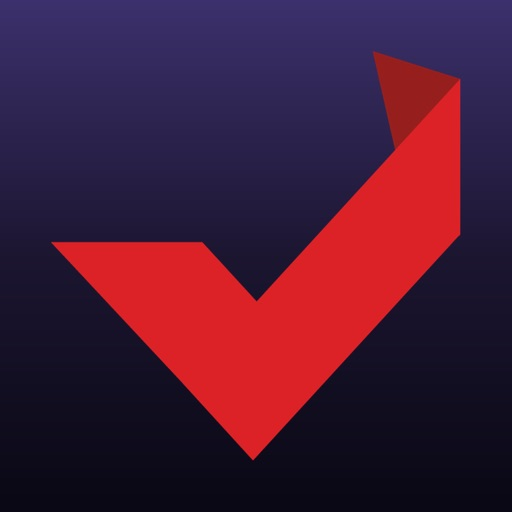

Geld verdienen mit Umfragen und Tests? So oft und wann Sie wollen? Jetzt bei empfohlen.de anmelden und durchstarten!

Werde Mitglied auf Deutschlands größter Plattform für bezahlte Online-Umfragen & Tests und schließe dich über 5.000.000 Online-Testern an.

Nach der kostenlosen Anmeldung hast du sofort Zugang zu unzähligen Online-Umfragen.

- Verdiene über € 850 mit verfügbaren Aufträgen direkt nach der Anmeldung, ob von unterwegs oder von zu Hause aus, maximale Flexibilität garantiert.
- Wähle aus dem größten Sortiment im deutschsprachigen Raum, Aufträge, die genau zu dir passen.
- Du wirst regelmäßig zu den neuesten Umfragen eingeladen.
- Aufträge mit mehreren Zielen ermöglichen es dir, durch kontinuierliches Testen höhere Gewinne zu erzielen.
- Schnelle und sichere Auszahlung: Werde innerhalb von 48 Stunden ausgezahlt.
- Getestet, verifiziert, empfohlen! Wir legen Wert auf Authentizität und Vertrauenswürdigkeit. Nicht umsonst werden wir von Verbraucherschutz.de empfohlen. 

Außerdem hat empfohlen.de eine Bewertung von 4.2 Sternen bei Trustpilot bei über 120.000 Bewertungen!

[View on Apple](https://apps.apple.com/de/app/empfohlen-de-geld-verdienen/id6741855114)

## Canva: KI-Foto- & Video-Editor

ERSTELLEN SIE ALLES MIT CANVA
Canva ist Ihre All-in-One-Kreativplattform für beeindruckendes Grafikdesign, Fotobearbeitung und Videoerstellung. Von der Erstellung von Präsentationen und visuellen Tabellen bis hin zur Gestaltung von Lebensläufen und Social-Media-Inhalten – Canva ermöglicht es jedem, wie ein Profi zu gestalten.

FORTGESCHRITTENER FOTO-EDITOR UND COLLAGEN-ERSTELLER
Verwandeln Sie Ihre Fotos mit unserer leistungsstarken Bearbeitungssuite. Entfernen Sie Hintergründe mühelos mit unserem Hintergrundradierer, wenden Sie beeindruckende Filter an, passen Sie Helligkeit und Kontrast an und erstellen Sie auffällige Fotocollagen. Perfekt für soziale Medien, Marketing oder persönliche Projekte.

PROFESSIONELLER VIDEO-EDITOR UND MOBILE OPTIMIERUNG
Erstellen Sie ansprechende Videos mit unserem intuitiven Video-Editor. Fügen Sie Untertitel hinzu, wenden Sie filmische Effekte wie Zeitlupe an, synchronisieren Sie Ihre Bearbeitungen mit Musik durch Beat Sync und optimieren Sie Inhalte für die mobile Anzeige. Ideal für Social-Media-Reels, Geschäftspräsentationen oder kreatives Storytelling. Speichern Sie Ihre beste Arbeit mit 5 GB für alle.

DYNAMISCHE PRÄSENTATIONEN UND DIASHOWS
Erstellen Sie fesselnde Präsentationen und Diashows mit professionellen Vorlagen. Visualisieren Sie Daten effektiv, gestalten Sie interaktive Arbeitsblätter für die Bildung und erstellen Sie Präsentationen, die Ihr Publikum begeistern. Von Unternehmenspräsentationen bis hin zu Universitätsaufgaben – machen Sie jede Folie zum Erfolg.

HERAUSRAGENDER LEBENSLAUF-ERSTELLER
Erstellen Sie beeindruckende Lebensläufe, die Ergebnisse liefern. Durchsuchen Sie Hunderte professionell gestalteter Vorlagen, passen Sie Layouts an, um Ihre Persönlichkeit widerzuspiegeln, und erstellen Sie Dokumente, die die Aufmerksamkeit von Arbeitgebern auf sich ziehen. Unverzichtbar für Arbeitssuchende und Karriereentwicklung.

VISUELLE TABELLEN UND AUTOMATISIERUNG MIT MASSENERSTELLUNG
Verwandeln Sie Daten in überzeugende visuelle Tabellen und Infografiken. Nutzen Sie die KI-gestützte Massenerstellung, um automatisch Tausende von Design-Variationen für Werbekampagnen und Marketingmaterialien zu generieren. Perfekt für Unternehmen, die ihre kreative Produktion skalieren.

UMFANGREICHE VORLAGENBIBLIOTHEK
Wählen Sie aus Tausenden anpassbaren Vorlagen für Social-Media-Beiträge, Visitenkarten, Flyer, Einladungen, Logos, Memes und mehr. Jedes Design ist vollständig anpassbar, um zu Ihrer einzigartigen Marke und Ihrem kreativen Stil zu passen.

ECHTZEIT-ZUSAMMENARBEIT
Arbeiten Sie nahtlos in Echtzeit mit Teammitgliedern zusammen. Teilen Sie Designs sofort, sammeln Sie Feedback und arbeiten Sie gemeinsam an Projekten von überall aus. Ideal für kreative Teams, Studenten und professionelle Organisationen.

ENTFESSELN SIE IHRE KREATIVITÄT
Greifen Sie auf Tausende hochwertiger Vorlagen, Bilder und Designelemente zu. Erstellen Sie professionelle Designs mit leistungsstarken KI-Funktionen und erwecken Sie Ihre kreative Vision mit branchenführenden Tools zum Leben.

CANVA FÜR BILDUNG
Transformieren Sie Ihren Unterricht mit einer von Schulen und Bezirken verwalteten Canva-Erfahrung, die für das Klassenzimmer entwickelt wurde. Erstellen Sie ansprechendes visuelles Lernmaterial mit integrierter Moderation und altersgerechten Kontrollen für sichere, kollaborative Lektionen. Kostenlos für berechtigte Lehrer und Schüler der Klassen K-12.

Nutzungsbedingungen: https://www.canva.com/policies/terms-of-use/
Datenschutzrichtlinie: https://www.canva.com/policies/privacy-policy/

[View on Apple](https://apps.apple.com/de/app/canva-ki-foto-video-editor/id897446215)

## Lime - #RideGreen

Sie müssen Orte besuchen und Menschen treffen? Mit einem emissionsfreien E-Bike oder E-Scooter von Lime kommen Sie mühelos und pünktlich ans Ziel! 

BEGINNEN SIE IHRE FAHRT IN 3 SCHRITTEN

Schritt 1

Laden Sie die App herunter, erstellen Sie ein Konto und stimmen Sie unsere Allgemeinen Geschäftsbedingungen zu: https://www.li.me/user-agreement

Datenschutzerklärung 

https://www.li.me/legal/privacy-policy/ 

Schritt 2 

Suchen Sie auf der Karte nach einem Lime-Fahrzeug in Ihrer Nähe (die Verfügbarkeit der Fahrzeuge hängt von Ihrer Stadt und dem Angebot ab)

Schritt 3

Entsperren Sie Ihr Fahrzeug durch Scannen des QR-Codes, Eingabe des Kennzeichens oder durch Tippen auf eine Schaltfläche in der App.

FAHREN SIE VERANTWORTUNGSVOLL

Eine sichere Gemeinschaft beginnt mit verantwortungsvollem Fahren. Es ist wichtig, sich vor jeder Fahrt an die Straßenverkehrsordnung zu erinnern. Sie sollten stets:

- Auf Radwegen fahren, niemals auf Bürgersteigen

- Beim Fahren einen Helm tragen

- Nicht auf Gehwegen, Einfahrten und Zufahrtsrampen parken

- Besuchen Sie für weitere Informationen https://safety.li.me/

#UMWELTFREUNDLICHFAHREN

Lime hat es sich zur Aufgabe gemacht, eine Zukunft zu gestalten, in der Transportmittel gemeinsam genutzt werden, erschwinglich sind und keine Kohlenstoffemissionen verursachen.

Weitere Informationen zu den Produkten und Dienstleistungen von Lime, einschließlich der Berechnung unserer Preise, finden Sie in unseren Allgemeinen Geschäftsbedingungen https://www.li.me/user-agreement.

[View on Apple](https://apps.apple.com/de/app/lime-ridegreen/id1199780189)

## Google Chrome

Chrome ist der schnelle, sichere Browser von Google und bietet dir unzählige Möglichkeiten im Web. Lade ihn noch heute herunter und überzeuge dich selbst.

DAS BESTE VON GOOGLE IN CHROME

• GOOGLE SUCHE: Du findest in Sekundenschnelle Antworten auf alle deine Fragen – wenn du möchtest, auch per Sprachbefehl.
• GOOGLE LENS: Du kannst nach allem suchen, was du auf dem Display oder durch die Kamera siehst.
• GOOGLE ÜBERSETZER: Unser Dienst unterstützt mehr als 130 Sprachen. Ein Klick genügt – du kannst sogar ganze Websites übersetzen lassen.

ERSTKLASSIGE SICHERHEITSFUNKTIONEN

• MODUS „ERWEITERTER SCHUTZ“: Dieser Chrome-Modus sorgt für höchstmöglichen Schutz, wenn du im Web unterwegs bist.
• SICHERHEITSCHECK: Wir informieren dich mit proaktiven Sicherheitswarnungen rechtzeitig über Sicherheitsprobleme, damit du dich auf das Wesentliche konzentrieren kannst.
• GOOGLE PASSWORTMANAGER: Mit diesem Dienst kannst du Passwörter erstellen und speichern, damit du dich immer und überall schnell anmelden kannst. Außerdem warnt er dich, wenn deine Passwörter doch einmal in Gefahr sein sollten.

VERFÜGBAR AUF ALLEN DEINEN GERÄTEN

• GERÄTEÜBERGREIFENDE SYNCHRONISIERUNG: Wichtige Dinge wie Lesezeichen, Tabs und Passwörter lassen sich speichern und sind dann sofort verfügbar, wenn du dich auf deinem Smartphone, Computer oder Tablet in Chrome anmeldest.
• TABGRUPPEN: Dank Tabgruppen behältst du beim Surfen immer den Überblick, auch wenn du mehrere Geräte nutzt.
• AUTOFILL: Du kannst Zahlungsinformationen, Adressen und Passwörter speichern und automatisch in Onlineformulare eintragen lassen. Das spart jede Menge Zeit.

Funktionsverfügbarkeit kann je nach Land und Sprache variieren. Kompatibilität variiert. Antworten sollten auf ihre Richtigkeit geprüft werden.

[View on Apple](https://apps.apple.com/de/app/google-chrome/id535886823)

## Gmail – E-Mail von Google

Mit der offiziellen Gmail App können Sie sich das Beste von Gmail auf Ihr iPhone oder iPad holen: hilfreiche KI-Funktionen, umfassender Schutz, Benachrichtigungen in Echtzeit, Unterstützung für mehrere Konten und die intelligente Suche im gesamten Posteingang.

Vorteile der Gmail App:
• Sie können Gmail auf iOS-Geräten als Standard-E-Mail-App festlegen.
• Dank hilfreicher Infokarten bleiben Sie ganz einfach über die neuesten Pakete, anstehende Termine, Rechnungen und Reisedaten auf dem Laufenden.
• Mit der integrierten E-Mail-Aboverwaltung lässt sich Ihr Posteingang übersichtlich halten.
• Gemini* in Gmail kann für Sie lange E-Mails zusammenfassen, Antworten entwerfen oder verfeinern oder in Ihrem Posteingang nach Informationen suchen.
• Sie können mehrere E-Mail-Konten von verschiedenen Anbietern verbinden und zwischen ihnen wechseln.
• Über 99,9 % der Spam-, Phishing- und Malware-Inhalte werden automatisch blockiert – bevor sie Ihren Posteingang erreichen.
• Mit Gemini in Gmail lassen sich Termine aus E-Mails schnell in Google Kalender eintragen.
• Über den personalisierten Tab „Werbung“ finden Sie schneller die besten Angebote.
• Sie können schneller auf E-Mails antworten – dank KI-basierter Antwortvorschläge, die sowohl den Kontext Ihrer E-Mails als auch Ihren individuellen Schreibstil und Ton berücksichtigen.
• E-Mails lassen sich nach dem Senden bis zu 30 Sekunden lang zurückrufen, um Fehler zu vermeiden.
• Sie können direkt auf Google Meet und Google Chat zugreifen – ohne Gmail zu verlassen.
• Sie können Ihre E-Mails mit Labeln versehen, markieren, löschen und als Spam melden – so behalten Sie besser den Überblick.
• Mithilfe der Wischgesten zum Archivieren oder Löschen lässt sich Ihr Posteingang schnell und einfach aufräumen.

Gmail ist Teil von Google Workspace – Sie können sich also ganz leicht mit Ihrem Team austauschen und zusammenarbeiten. Dazu haben Sie folgende Möglichkeiten:
• Mit Kolleginnen und Kollegen über Google Meet oder Google Chat in Kontakt bleiben, Einladungen in Google Kalender senden, Aufgabenlisten erstellen und mehr – viele alltägliche Aufgaben lassen sich direkt in Gmail erledigen.
• Mit den Funktionen von Gemini in Gmail wie „Formuliere für mich“, „Antwortvorschläge“, „Übersichten mit KI“ und „Korrekturlesen“ erhalten Sie einen besseren Überblick über Ihre Arbeit und können Routineaufgaben schneller abschließen und effizienter sein.
• Umfassender Schutz: Mit unseren Modellen für maschinelles Lernen werden über 99,9 % der Spam-, Phishing- und Malware-Inhalte blockiert – noch bevor sie Ihren Posteingang erreichen.

* Zur Nutzung einiger Gemini-Funktionen ist ein Abo für Google One AI erforderlich. Es ist eine Internetverbindung erforderlich. Die Verfügbarkeit variiert je nach Sprache und Land. Antworten sollten auf ihre Richtigkeit geprüft werden.

[View on Apple](https://apps.apple.com/de/app/gmail-e-mail-von-google/id422689480)

## UK ETA

Use the UK ETA app to apply for an electronic travel authorisation (ETA) to come to the UK.

Who can apply

Find out if you need an ETA to travel to the UK at: https://www.gov.uk/electronic-travel-authorisation. 

How to apply on the UK ETA app
1. Take a photo of your passport.
2. Scan the chip in your passport.
3. Scan your face.
4. Take a photo of yourself.
5. Answer some questions about yourself.
6. Pay for your application.

It should only take 10 minutes to apply.

You do not need to enter your travel details.

Before you start

To apply you will need:

• an iPhone 8 or newer with IOS 16 or later
• the passport you will use to travel to the UK
• a credit card, debit card or Apple Pay
• access to your emails

If you're applying for someone else they must be with you. If they are not, you should apply online at: https://www.gov.uk/electronic-travel-authorisation.

After you apply

You’ll get a decision by email from UK Visas and Immigration (UKVI), usually within a day. Allow up to 3 working days (Monday to Friday) to get a decision, but it may arrive much sooner.

The email will contain your 16 digit ETA reference number.

You must wait until you get an email confirming you have an ETA before you travel to the UK.

If you have not received a decision after 3 working days, check your spam or junk email folder before contacting UKVI.

You may get decisions at different times to other people you applied for.

Your ETA will be linked to the passport you applied with. You only need to show your passport when you travel to the UK.

Privacy and security

The app is safe and secure. No information is stored on the app or your phone after you close it. You can delete the app after you have completed your application.

For information on staying safe online visit the UK Cyber Aware website: https://www.ncsc.gov.uk/cyberaware/home

Accessibility
You can read our accessibility statement at: https://confirm-your-identity.homeoffice.gov.uk/register/eta-app-accessibility

[View on Apple](https://apps.apple.com/de/app/uk-eta/id6444912481)

## eBay: kaufen & verkaufen

Mach dir dein Leben leichter – mit der eBay-App. Verkaufe und kaufe Millionen Artikel auch von unterwegs und entdecke jeden Tag exklusive Angebote.

Verpasse keine Deals
Mit der eBay-App bleibst du immer auf dem Laufenden: Erhalte personalisierte Echtzeit-Benachrichtigungen zu täglich neuen Top-Angeboten, Updates zu Bestellungen und mehr – direkt auf dein Handy.

Schneller Artikel einstellen mit KI
Einfach Fotos über die eBay-App aufnehmen oder hochladen und KI erstellt sofort eine Artikelbeschreibung sowie wichtige Details für dein Angebot, inklusive Marke, Kategorie und mehr.

Lieblingsartikel suchen, finden und speichern
Entdecke ein neues Shopping-Erlebnis, egal wo du bist.
● Suche nach dem Zustand eines Artikels: Ob neue Mode, Pre-Loved Fashion oder refurbished Technik – entdecke genau das, was zu dir passt.
● Deine Favoriten: Füge Artikel zu deiner Beobachtungsliste hinzu und verpasse keine neuen Drops und Deals.
● Mit Fotos suchen: Etwas gesehen, das dir gefällt? Lade einfach ein Bild hoch und finde über die eBay-App sofort die passenden Artikel.

Bewusster shoppen
Entdecke echte Unikate und spare dabei – von Vintage bis zu Pre-Loved Schätzen. Oder schenke deinen Lieblingsstücken mit Privatverkäufen ein zweites Leben. Was gibt’s da nicht zu lieben?

Einfach und gebührenfrei verkaufen
So schaffst du im Handumdrehen mehr Platz zu Hause! Bei eBay sind Privatverkäufe gebührenfrei und dank praktischer KI-Tools stellst du schnell & mühelos deine alten Schätze ein. Alles ganz stressfrei dank sicherer Zahlungen, Verkäuferschutz und Versand mit vorab bezahlten Versandetiketten – oder noch bequemer: lokal mit Abholung.

Echtheitsprüfung
Shoppen – aber sicher: Das blaue Häkchen bedeutet, dass Sneaker, Luxusuhren and Luxus-Handtaschen von Expert*innen auf Echtheit geprüft und verifiziert werden.

eBay-Käuferschutz
Genieße volle Sicherheit mit dem eBay-Käuferschutz. Du bekommst den Artikel, den du bestellt hast oder dein Geld zurück, wenn mal etwas nicht stimmt. So einfach ist das.*
*Alle Infos & Bedingungen dazu findest du hier:
https://pages.ebay.de/einkaufen/ebay-kaeuferschutz.html

Schnelle und einfache Zahlungsoptionen
Hinterlege deine bevorzugten Zahlungsoptionen direkt in der App – das ist sicher und du bezahlst ganz entspannt im Handumdrehen alles, was du shoppst.

Bleib in Kontakt
Dein Feedback ist uns wichtig. Bei Fragen und Kommentaren kontaktiere uns einfach unter www.ebay.com/iOS

[View on Apple](https://apps.apple.com/de/app/ebay-kaufen-verkaufen/id282614216)

## VPN - Super Unlimited Proxy ™

Kostenloses VPN für iPhone und iPad – schützen Sie Ihre Privatsphäre in WLAN und Hotspots!

- Express Lightning Speed 10G-Server machen dies zur schnellen VPN-Wahl für Streaming
- Globale Abdeckung: 700+ Server in 53+ Ländern (auch für VPN kostenlose Nutzer!)
- Keine Logs-Politik: Wir verfolgen oder speichern Ihre Online-Aktivitäten nicht
- Benutzerfreundlich: Einmal tippen zum Verbinden – keine Registrierung erforderlich
- Plattformübergreifend: iPhone, iPad, iPod, Apple Vision und Mac mit iOS 11.0+
- Keine Zeitlimits, Datenbegrenzungen oder Bandbreitenrestriktionen
- 256-Bit-Verschlüsselung wpn schützt Ihre Aktivitäten und Ihren Standort
- VPN kostenlos blockiert das Tracking Ihrer iPhone-Browsing-Gewohnheiten
- WiFi Guardian: Kostenlose VPN-Schutz für Passwörter in öffentlichen Netzwerken
- Zugang zu sozialen Medien, Messaging und Streaming-Diensten: Tiktok (tik tok), Netflix, HBO, Hulu, Youtube und Youtube TV, Facebook, Instagram, Spotify, Snapchat, X (Twitter), Reddit, Discord, Steam, Telegram (Телеграм ВПН), vk ВПН und mehr wpn Optionen.
- Optimierung Ihres Spielerlebnisses: Verringern Sie die Latenz bei Ponor of Kings, Genshin Impact, Minecraft, Pokémon GO, Rise of Kingdoms, Clash of Kings, PUBG Mobile, Call of Duty (COD): Mobile, Fortnite, Mobile Legends: Bang Bang, Free Fire, Roblox, Apex Legends Mobile, Arena of Valor, League of Legends (LOL): Wild Rift, Diablo Immortal, Brawl Stars, Subway Surfers, Among Us, Clash Royale, State of Survival, Lords Mobile, Evony: The King's Return, und anderen Spielen.

■ Was können Sie mit dem VPN - Super Unlimited Proxy Free VPN iPhone / iPad tun?

- Anonym bleiben: Surfen Sie mit vollständigem Datenschutz
- Erhöhte Sicherheit: Verschlüsseln Sie Verbindungen in öffentlichen WiFi-Netzen und Hotspots
- Schutz der Identität: Verbergen Sie Ihre echte IP-Adresse und Ihren Standort
- iOS-Datenschutz: free VPN-Schutz für iPhone und iPad, auf den Sie sich verlassen können
- Vollständiger iOS-Schutz: VPN kostenlos schützt persönliche Daten auf allen Apple-Geräten
- Schulzugriffs-Lösung: Umgehen Sie Einschränkungen mit unserem BPN für sichereres Surfen

■ Serverstandorte weltweit:

Wählen Sie aus über 700+ Servern in 53+ Ländern, einschließlich:

- Asien: Singapur, Südkorea, Japan, Hongkong, Indonesien, Indien, Israel, Kasachstan, Taiwan, Vietnam, Türkei
- Europa: Bulgarien, Schweiz, Tschechien, Deutschland, Dänemark, Estland, Spanien, Finnland, Frankreich, Vereinigtes Königreich, Griechenland, Kroatien, Ungarn, Irland, Island, Italien, Litauen, Luxemburg, Lettland, Moldawien, Niederlande, Norwegen, Polen, Portugal, Rumänien, Serbien, Russische Föderation, Slowakei, Schweden, Ukraine
- Nord Amerika VPN: USA, Kanada, Mexiko
- Südamerika: Brasilien, Chile, Kolumbien, Peru
- Afrika: Ägypten, Südafrika

■ Einfache Preisoptionen

Während unser kostenloser von-Service außergewöhnliche Leistungen bietet, können Sie für noch mehr Funktionen upgraden:

- Free VPN-Plan: Unbegrenzter Zugang mit grundlegenden Funktionen
- Premium-Pläne (werbefrei, 10G-Server und mehr):
- -  Wöchentlich: $9.99/Woche
- - Monatlich: $11.99/Monat (7-Tage-Test)
- - Jährlich: $79.99/Jahr (7-Tage-Test)

Kein Aufwand oder unnötige Datenmengen: Unsere VPN-Lösung für iPad und iPhone bietet rundum Schutz.

■ Welches VPN-Protokoll sollte ich verwenden?

- Auto (Empfohlen): Intelligente Protokollwahl
- Manuelle Optionen: OpenVPN, IKEv2

■ Datenschutzerklärung

Im Gegensatz zu Diensten, die Ihre Daten durchsuchen wie ein Hai oder im Dunkeln lauern, verpflichtet sich VPN Super Unlimited Proxy zu absoluter Privatsphäre mit Null-Protokollen.
Links zu unseren Nutzungsbedingungen und der Datenschutzerklärung finden Sie unten:

- Datenschutzerklärung: https://www.vpnsuper.com/privacy-notice
- Nutzungsbedingungen: https://www.vpnsuper.com/terms-of-service

Laden Sie noch heute die beste free VPN iPhone und iPad herunter und erleben Sie grenzenlose Freiheit im Internet!

[View on Apple](https://apps.apple.com/de/app/vpn-super-unlimited-proxy/id1370293473)

## Zalando Mode & Fashion online

Die Zalando App ist mit mehr als 6000 Marken deine erste Adresse für hochwertige Fashion- und Lifestyle-Brands. Hol dir Inspo für Outfits sowie Beauty- und Pflegeprodukte und genieße ein reibungsloses, stressfreies Shopping-Erlebnis – direkt auf deinem Handy.

LASS DICH INSPIRIEREN
• Folge deinen Lieblingscreators für Outfit- und Styling-Inspo
• Lieblingsbrands folgen und neue Releases sowie exklusive Kollektionen zuerst shoppen
• Erstelle und folge Boards mit Outfits, Videos und Produkten, die dich inspirieren – oder werde selbst zur Inspiration
• Entdecke mit Trend Spotter, was in Europa gerade angesagt ist – und was man in Berlin, Paris und Mailand trägt
• Live-Videos ansehen, Profi-Tipps holen, Produkt-How-tos entdecken und deine Favoriten direkt shoppen
• Entdecke unsere Storys und hol dir deinen Style- und Culture-Guide – mit Formaten wie „Was zieh ich an?“ und den neuesten Infos zu großen Brand-Collabs
• Speichere deine Favoriten auf der Wunschliste und verpasse keine Größen-Updates oder Preissenkungen

ENTDECKE VIELFALT
• Entdecke mehr als 11.000 Artikel von einer umfassenden Auswahl an Brands, darunter auch zeitlose Fashion-Favoriten
• Tauche ein in unsere vielseitigen Kategorien: Bekleidung, Schuhe, Accessoires, Sport, Beauty & Hautpflege, Pre-owned Pieces und Kidswear
• Erhalte Updates zu allem, was dich interessiert – von News und Trends bis zu Sales und Promo-Codes
• Erfahre als Erstes von neuen Kollektionen und Produkt-Launches deiner Lieblingsbrands
• Aktiviere Benachrichtigungen für deine Wunschliste und verpasse keine Preissenkung oder Wiederverfügbarkeit
• Schenke Pre-owned Pieces ein neues Leben – mit unserer großen Auswahl an Kleidung, Accessoires und Boots – fast wie neu
• Wähle deine bevorzugte Zahlungsmethode und freu dich auf eine Lieferung direkt bis an deine Haustür

HIER WIRDS PERSÖNLICH
• Erhalte persönliche Empfehlungen, die genau zu deinem Style passen – ganz ohne stundenlanges Browsen
• Bewerte die Passform deiner Bestellungen und genieße individuelle Größenberatung beim Shoppen
• Finde mit unserem Mess-Tool im Handumdrehen heraus, was wirklich passt
• Probiere Outfits virtuell an und finde vor dem Bestellen heraus, wie sie sitzen
• Hol dir jederzeit Style- und Outfittipps vom Zalando Assistant – deinem maßgeschneiderten, KI-gestützten Fashion-Begleiter für deine gesamte Shopping-Reise

Bereit, die App zu entdecken?
Shoppe deine Lieblingsbrands, sichere dir exklusive Vorteile und hol dir Inspiration und Empfehlungen, die genau zu dir passen.

[View on Apple](https://apps.apple.com/de/app/zalando-mode-fashion-online/id585629514)

## Hinge Dating App: Date & Meet

HINGE IST DIE DATING-APP, DIE ENTWICKELT WURDE, UM GELÖSCHT ZU WERDEN
Hinge ist für alle, die von Dating-Apps loskommen wollen. Mit einem Profil, das deine Persönlichkeit durch Text, Fotos, Video und Stimme zeigt, entstehen einzigartige Unterhaltungen, die zu tollen Dates führen. 

SO WIRST DU HINGE WIEDER LOS
Beim Online-Dating sind die Leute so sehr mit Matching beschäftigt, dass sie sich gar nicht erst persönlich treffen.  Hinge will das ändern. Also haben wir eine Dating-App entwickelt, die gelöscht werden soll. So geht's:

* Wir lernen schnell deinen Typ kennen. Du wirst nur den für dich besten Personen vorgestellt.

* Wir zeigen dir die Persönlichkeit einer Person. Du lernst potenzielle Dates durch ihre individuellen Antworten auf Fragen kennen und erfährst auch etwas über ihre religiösen Überzeugungen, ihre Größe, ihre politische Einstellung, ihre Dating-Absichten, ihren Beziehungstyp und vieles mehr.

* Wir machen es dir leicht, miteinander ins Gespräch zu kommen. Jedes Match beginnt damit, dass jemand einen bestimmten Teil deines Profils mag oder kommentiert.

* Wir wollen, dass du dich sicher fühlst, wenn du jemanden persönlich triffst, und auf tolle Dates gehst. Die Selfie-Verifizierung macht es Datern auf Hinge einfacher, sicherzustellen, dass sie die sind, die sie vorgeben zu sein.

* Wir fragen, wie deine Dates laufen. Nachdem du mit einem Match Telefonnummern ausgetauscht hast, melden wir uns bei dir, um zu erfahren, wie dein Date gelaufen ist. So können wir dir in Zukunft bessere Empfehlungen geben.

PRESSE
"Die App ist für nach Liebe suchende Personen die erste Adresse." - The Daily Mail
"Der CEO von Hinge sagt, eine gute Dating-App beruhe auf Verletzlichkeit und nicht auf Algorithmen." - Washington Post
"Hinge ist die erste Dating-App, die tatsächlich den Erfolg in der realen Welt misst" - TechCrunch

Die Nutzung der App ist kostenlos. Mitglieder, die alle sehen wollen, die sie mögen oder unbegrenzte Likes senden möchten, können auf Hinge+ upgraden. Für den Zugriff auf zusätzliche Funktionen, einschließlich erweiterter Empfehlungen und bevorzugter Likes, bieten wir HingeX an.

ABO-INFOS
Bei der Kaufbestätigung wird das Apple-Konto mit dem Betrag belastet.
Das Abonnement verlängert sich automatisch, wenn die automatische Verlängerung nicht mindestens 24- Stunden vor Ablauf des aktuellen Zeitraums deaktiviert wird.
Das Konto wird innerhalb von 24- Stunden vor Ablauf des aktuellen Zeitraums für die Erneuerung belastet.
Nach dem Kauf können in den Kontoeinstellungen die Abonnements verwaltet und die automatische Erneuerung deaktiviert werden.

Support: hello@hinge.co
Nutzungsbedingungen: https://hinge.co/terms.html
Datenschutzerklärung: https://hinge.co/privacy.html

Alle Fotos sind von Modellen und dienen nur zur Veranschaulichung.

[View on Apple](https://apps.apple.com/de/app/hinge-dating-app-date-meet/id595287172)

## Ryde - Immer in der Nähe

Fahr mit Ryde wohin du willst! 

Eine praktische, spaßige und umweltfreundliche Transportlösung, die dich von A nach B bringt. Finde einfach einen Roller in deiner Nähe, entsperre ihn und los geht’s. So einfach ist es. 

So funktioniert’s: 
Lade die App herunter Erstelle ein Konto Finde einen Ryde in deiner Nähe Scanne den QR-Code, um den Roller zu entsperren Genieße die Fahrt! Stelle den Roller verantwortungsvoll ab Du möchtest mit uns in Kontakt treten? Besuche uns auf www.ryde-technology.com oder schreibe uns eine E-Mail an support@ryde-technology.com.
* Lade die App herunter 
* Erstelle ein Konto 
* Finde einen Ryde in deiner Nähe 
* Scanne den QR-Code, um den Roller zu entsperren 
* Genieße die Fahrt!
* Stelle den Roller verantwortungsvoll ab

Du möchtest mit uns in Kontakt treten? Besuche uns auf www.ryde-technology.com oder schreibe uns eine E-Mail an support@ryde-technology.com.

[View on Apple](https://apps.apple.com/de/app/ryde-immer-in-der-n%C3%A4he/id1495605028)

## Facebook

Wo echte Menschen deine Neugier wecken. Auf Facebook kannst du mit echten Personen interagieren, wie in keinem anderen Social Network: Verkaufe und kaufe Second-Hand-Ausrüstung, teile Reels mit Menschen auf deiner Wellenlänge oder lache mit anderen über witzige Bilder, denen KI einen unerwarteten Twist gegeben hat.

Entdecke Neues und erweitere deine Interessen: 
* Fordere die Meta-KI auf, nach interessanten Themen für dich zu suchen, und erhalte sofort interaktive Ergebnisse, die mehr als nur Text zu bieten haben.
* Suche auf dem Marketplace nach guten Deals und Schätzen für deine Hobbys.
* Personalisiere deinen Feed, um mehr von dem zu sehen, was dir gefällt.
* Sieh dir Reels und Videos an – für Unterhaltung oder hilfreiche Anleitungen.

Verbinde dich mit Menschen und Communitys:
* Tritt Gruppen bei und erhalte nützliche Tipps und Tricks von anderen Nutzer*innen
* Teile deine Inhalte automatisch auf Instagram und spare Zeit
* Sende Posts in einer privaten Nachricht an deine BFF, weil nur sie weißt, was du meinst, oder einen Reel-Trend, über den alle reden.

Lass andere an deiner Welt teilhaben:
* Nutze generative KI, um deine Freund*innen mit individuellen Bildern zu überraschen, oder um dir beim Verfassen von Beiträgen zu helfen.
* Passe dein Profil an und lege fest, wie du angezeigt wirst und wer deine Beiträge sehen kann.
* Erstelle aus aktuellen Vorlagen mühelos eigene Reels oder lass deiner Kreativität mit vielfältigen Bearbeitungs-Tools freien Lauf.
* Zeige spontane Momente in den Stories.

Nutzungsbedingungen & Richtlinien https://www.facebook.com/policies_center

[View on Apple](https://apps.apple.com/de/app/facebook/id284882215)

## BA-Secure

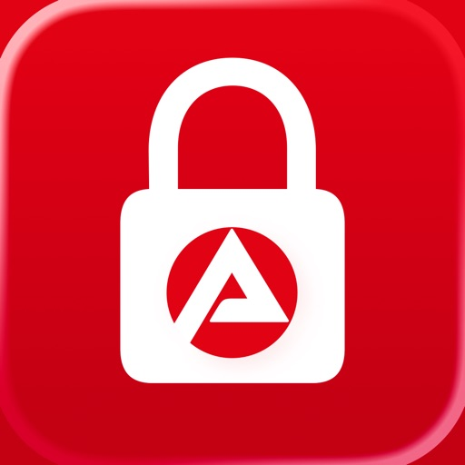

Mit BA-Secure melden Sie sich sicher bei Ihren Konten der Bundesagentur für Arbeit an.

Bei Anmeldeversuchen erhalten Sie – wenn aktiviert – eine Push-Nachricht.

Bestätigen Sie Ihre Anmeldung einfach in der App.

So funktioniert’s:
ANMELDUNG IM PORTAL
Melden Sie sich mit Ihrem Benutzernamen und Passwort im Portal der Bundesagentur für Arbeit an.

ANMELDUNG IN DER APP BESTÄTIGEN
Bestätigen Sie die Anmeldung direkt in der App.
Danach sind Sie angemeldet und können die BA-Services nutzen.

BENACHRICHTIGUNGEN
Aktivieren Sie Push-Nachrichten, dann werden Sie bei Anmeldeversuchen sofort benachrichtigt.

CODE ZUM ENTSPERREN DES GERÄTS
Damit Sie Anmeldungen bestätigen können, muss ein Code zum entsperren Ihres Geräts eingerichtet sein. Mit TouchID oder FaceID können Sie die App komfortabler bedienen.

KONTOVERKNÜPFUNG
Aktuell kann nur ein Konto mit der App verknüpft werden.

HINWEISE
Wir entwickeln die App laufend weiter und freuen uns über Ihr Feedback.
Bei Fragen hilft Ihnen unsere Nutzungshilfe (https://www.arbeitsagentur.de/ba-secure-app) oder Support-Hotline.

Erklärung zur Barrierefreiheit:
https://www.arbeitsagentur.de/erklaerung-barrierefreiheit

[View on Apple](https://apps.apple.com/de/app/ba-secure/id6759037657)

## IKEA

Lass dich inspirieren und mach das Beste aus deinem Zuhause. Entdecke neue Produkte, visualisiere deinen Traum und genieße einfacheres Einkaufen – von überall aus. 

In der IKEA App findest du mehr als du dir vorstellen kannst:

•	Entdecke Angebote, neue Produkteinführungen und personalisierte Empfehlungen
•	Speichere deine Lieblingsartikel in Merkzetteln, damit du alles an einem Ort findest
•	Finde dich mit einer leicht verständlichen Navigation im Einrichtungshaus zurecht
•	Sammle Punkte, um Treueboni zu aktivieren und zu genießen
•	Scanne Produkte selbst und bezahle schneller im Einrichtungshaus
•	Gestalte deine Traumküche mit interaktiven Planern
•	Scanne deinen Raum und füge Produkte hinzu, um sie in deinem Raum zu visualisieren
•	Bezahle schnell und sicher beim Einkaufen in der App
•	Verfolge und verwalte deine Bestellung von überall aus
•	Prüfe die Verfügbarkeit und erhalte Benachrichtigungen, wenn ein Artikel wieder auf Lager ist
•	Finde digitale Belege und deine Kaufhistorie an einem Ort
•	Überprüfe die Stoßzeiten im Einrichtungshaus und bereite dich auf deinen nächsten Besuch vor
•	Schau dir IKEA Live an und hol dir Tipps von unseren Expert:innen für Innenarchitektur

Einige Funktionen sind möglicherweise nicht in jedem Land verfügbar, aber sie sind für die Veröffentlichung geplant. Wir empfehlen, die IKEA App auf dem neuesten Stand zu halten, damit du neue Funktionen nutzen kannst, wenn sie verfügbar sind.

Wir legen Wert auf deinen Datenschutz und glauben an die ethische Verwendung von Kundendaten. Deshalb hast du jederzeit die Kontrolle über deine Daten.

[View on Apple](https://apps.apple.com/de/app/ikea/id1452164827)

## Lufthansa

Die Lufthansa App wurde auf dem World Aviation Festival (WAF) mit dem Preis für die weltweit beste Airline App 2024 ausgezeichnet. Prämiert für die außerordentlich gute User Experience, das nahtlose Verwalten von Buchungen und den einfachen Zugang zu personalisierten Reise-Services, ist die Lufthansa App Ihr verlässlicher Reisegebleiter und hält Sie stets mit allen relevanten Informationen auf dem Laufenden, auch bei Unregelmäßigkeiten.

Die Schlüsselfunktionen der Lufthansa App:

Vor dem Flug
•	Flug buchen, Sitzplatz reservieren und Gepäck hinzufügen: Buchen Sie Ihren Wunschflug und bei Bedarf einen Mietwagen, reservieren oder ändern Sie Ihren Sitzplatz im Flugzeug und fügen Sie zusätzliches Gepäck hinzu.

•	Online Check-in: Nutzen Sie die Lufthansa App, um für alle Flüge der Lufthansa Group Netzwerk Airlines einzuchecken. Sie erhalten Ihr digitales Flugticket direkt auf Ihr Smartphone und können Ihre mobile Bordkarte bequem aus der App heraus vorzeigen.

•	Travel ID und Lufthansa Miles and More: Mit der neuen digitalen Brieftasche können Sie mehrere Zahlungsmethoden in Ihrem Travel ID Konto hinterlegen. So funktioniert die Bezahlung immer und von überall nahtlos und unkompliziert. Nutzen Sie Ihren Travel ID oder Lufthansa Miles & More Login für personalisierte Services und hinterlegen Sie Ihre persönlichen Daten, um die Lufthansa App noch komfortabler zu nutzen.

•	Echtzeit-Informationen und Flugstatus: Ihr persönlicher Reiseassistent liefert Ihnen ab 24 Stunden vor Ihrem Flug alle wichtigen Fluginformationen und Updates zu Ihrer Reise. Sie erhalten Push-Benachrichtigungen zum Check-in sowie zu Flugstatus und Gate-Änderungen übersichtlich auf Ihren Startbildschirm. So behalten Sie stets den Überblick über Ihre Flüge und treffen alle notwendigen Vorbereitungen, um Ihre Reise entspannt antreten zu können. 

Während des Fluges
•	Flugticket und OnBoard-Services: Mit der Lufthansa App haben Sie Ihre mobile Bordkarte und alle OnBoard-Services auf Ihrem Flug immer griffbereit – auch offline. Rufen Sie nach Bedarf alle relevanten Fluginformationen ab und bleiben Sie stets über Änderungen informiert – ohne beim Flugpersonal nachfragen zu müssen. 
Nach dem Flug
•	Gepäck verfolgen: Auch nach der Landung steht Ihnen Ihr digitaler Reisebegleiter unterstützend zur Seite. Verfolgen Sie Ihr eingechecktes Gepäck bequem in der Smartphone-App und bleiben Sie über den weiteren Verlauf Ihrer Reise informiert. 
Die Lufthansa App ist die Komplettlösung für ein unbeschwertes Reiseerlebnis. Buchen Sie Ihre Flüge und Mietwagen bequem über die App, erhalten Sie automatische Benachrichtigungen und Updates zu Ihren bevorstehenden Flügen und verwalten Sie Ihre persönlichen Daten bequem von unterwegs. 

Laden Sie jetzt die Lufthansa App herunter und genießen Sie Ihre Reise! Ihr persönlicher Reiseassistent ist vor, während und nach Ihrem Flug für Sie da.

Informieren Sie sich auf lufthansa.com über unsere Flugangebote und folgen Sie uns auf Instagram, Facebook, YouTube und X, um immer auf dem Laufenden zu bleiben.
Bei Fragen oder Unterstützungsanfragen stehen wir Ihnen gerne zur Verfügung. Kontaktieren Sie uns unter lufthansa.com/de/de/hilfe-und-kontakt.

[View on Apple](https://apps.apple.com/de/app/lufthansa/id299219152)

## Klarna: Verwalte Geld smarter

DU ENTSCHEIDEST, WIE DU BEZAHLST
Wähle die Zahlungsmethode, die zu deinem Budget passt.

SHOPPE MIT DER KLARNA CARD
Bezahle mit Klarna überall dort, wo Visa akzeptiert wird.¹ Bezahle sofort oder flexibel – alles mit einer Karte.² Deine Bonität wird bei der Anmeldung nicht beeinträchtigt.

BIS ZU 10 % CASHBACK
Shoppe in der App und erhalte bis zu 10 % Cashback.³  Hol dir Cashback in Hunderten Shops in der App.

SPARE MIT KLARNA
Verdiene Zinsen mit unseren Flex- oder Festgeldkonten. Kostenlos und ganz ohne monatliche Gebühren.²

AKTIVIERE DEIN KLARNA GUTHABEN
Lade in der Klarna App Geld auf und bezahle überall flexibel. Erhalte Rückerstattungen in Sekunden, verdiene Cashback bei teilnehmenden Shops und wandle dein Cashback in Geld für dein Klarna Guthaben um.³

DEINE KUNDENKARTEN, ALLE AN EINEM ORT
Etliche Karten mit sich rumschleppen zu müssen ist out. Es gibt einen einfacheren Weg, auf alle deine Kundenkarten zuzugreifen – direkt in der Klarna App. Füge deine Kundenkarten jetzt hinzu, damit dir nie wieder ein Punkt entgeht.

TOP-PREISE WARTEN AUF DICH
Suche nach beliebigen Produkten und vergleiche sofort die Preise in verschiedenen Shops.

RETOUREN LEICHT GEMACHT
Du möchtest etwas retournieren? Dann melde deine Retoure direkt in der App. Wir pausieren deinen Zahlungsplan, damit du zwischenzeitlich nichts zahlen musst.

ALLE LIEFERUNGEN IM BLICK
Erhalte Updates in Echtzeit, Ankunftszeiten und Abholfotos – direkt in der Klarna App.

KUNDENSERVICE RUND UM DIE UHR
Nutze unseren Chat in der Klarna App für 24/7-Support.

¹ Für die Nutzung der physischen Karte ist eine kostenpflichtige Klarna Mitgliedschaft erforderlich. Für die Plastikkarte fällt eine einmalige Gebühr an. Klarna Mitgliedschaft wird gegen eine monatliche Gebühr angeboten. Jederzeit in der Klarna App kündbar. Ausschlüsse, Bedingungen und Einschränkungen gelten für Mitgliedschaftsvorteile wie das Klarna Mitgliedschaft Cashback. Es gelten die Klarna Mitgliedschaftsbedingungen. Der jährliche Wertbetrag spiegelt die insgesamt verfügbaren Vorteile deiner Mitgliedschaft wider, wie beispielsweise Cashback und Rabatte. Die tatsächlichen Ergebnisse variieren je nach Nutzung der Vorteile.
Deutschland: klarna.com/de/agb/
Österreich: klarna.com/at/agb/

² Für die Nutzung der „Später bezahlen”-Features ist eine kostenpflichtige Klarna Mitgliedschaft oder die Zahlung einer Servicegebühr erforderlich. 
Deutschland: Das Konto ist durch das schwedische Einlagensicherungssystem gedeckt. Die max. Entschädigung pro Kund:in beträgt: EUR 100.000. Die Entschädigung wird durch die Entschädigungseinrichtung deutscher Banken (EdB) https://edb-banken.de/ ausgezahlt und innerhalb von 7 Geschäftstagen ab dem Zeitpunkt bereitgestellt, zu dem der Entschädigungsanspruch entsteht. Mehr Informationen hier: https://www.riksgalden.se/en/our-operations/deposit-insurance/
Österreich: Das Konto ist durch das schwedische Einlagensicherungssystem gedeckt. Die max. Entschädigung pro Kund:in beträgt 1.150.000 SEK. Die schwedische Schuldenverwaltung zahlt die Entschädigung innerhalb von 7 Werktagen ab dem Datum aus, an dem der Anspruch auf Entschädigung entstanden ist. Weitere Informationen findest du hier: https://www.riksgalden.se/en/our-operations/deposit-insurance

³ Klarna Cashback wird in Form von Punkten vergeben, die sich gegen eine Gutschrift oder andere Vorteile einlösen lassen. Cashback wird nur für Käufe in der Klarna App und mit aktivem Klarna Guthaben gewährt. Ob Cashback gewährt wird, hängt vom jeweiligen Shop ab und kann durch Cookies, Angebotkombinationen, Artikelausschlüsse oder andere Faktoren beeinflusst werden. Es gelten weitere Einschränkungen und die AGB. 
Deutschland: https://cdn.klarna.com/1.0/shared/content/legal/terms/de-DE/cashback
Österreich: https://cdn.klarna.com/1.0/shared/content/legal/terms/de-AT/cashback

[View on Apple](https://apps.apple.com/de/app/klarna-verwalte-geld-smarter/id1115120118)

## Edits: Videobearbeitung

Erstelle beeindruckende Videos mit Edits – der neuen Video-Creation-App von Instagram. 

Edits ist ein kostenloser Video-Editor für Creator*innen, mit dem du deine Ideen spielend leicht in Videos verwandeln kannst – direkt auf deinem Smartphone. In der App sind alle Tools vereint, die du für deine kreativen Projekte benötigst. 

Einfache Umsetzung kreativer Ideen 

  • Exportiere deine Videos in 4K ohne Wasserzeichen und teile sie auf jeder Plattform. 
  • Verwalte alle deine Entwürfe und Videos zentral an einem Ort. 
  • Nimm hochwertige Clips mit einer Länge von bis zu 10 Minuten auf und beginne sofort mit der Bearbeitung. 
  • Teile sie ganz einfach in hoher Qualität auf Instagram. 

Leistungsstarke Tools zum Erstellen und Bearbeiten 

  • Bearbeite Videos mit Frame-genauer Präzision. 
  • Verleihe deinen Videos mit Kameraeinstellungen zu Auflösung, Framerate und Dynamikumfang sowie verbesserten Steuerelementen für Blitz und Zoom den gewünschten Look. 
  • Erwecke Bilder mit KI-Animationen zum Leben. 
  • Verändere deinen Hintergrund mit Greenscreen, Cutouts oder füge ein Video-Overlay hinzu. 
  • Wähle aus einer Vielzahl an Schriftarten, Sound- und Spracheffekten, Videofiltern und -effekten, Stickern und vielem mehr. 
  • Verbessere die Audioqualität, damit Stimmen besser hörbar sind, und entferne unerwünschte Hintergrundgeräusche. 
  • Generiere ganz automatisch Untertitel und passe an, wie sie in deinem Video angezeigt werden. 

Hilfreiche Insights für deine nächsten kreativen Projekte 

  • Lass dich inspirieren, indem du Reels mit angesagtem Sound durchstöberst. 
  • Behalte den Überblick über Ideen und Inhalte, die dich begeistern, bis du bereit bist, sie selbst zu erstellen. 
  • Tracke die Performance deiner Reels mit einem Dashboard für Live-Insights. 
  • Finde heraus, was die Interaktionen mit deinen Reels beeinflusst.

Meta Terms: https://www.facebook.com/terms.php
Meta Privacy Policy: https://privacycenter.instagram.com/policy

[View on Apple](https://apps.apple.com/de/app/edits-videobearbeitung/id6738967378)

## Netto plus

Willkommen bei Netto plus – deiner App zum cleveren Sparen!
Ob in der Filiale oder Zuhause – mit Netto plus hast du alle Angebote, Coupons und Services direkt auf deinem Smartphone.
 
Deine Vorteile mit Netto plus:
	•	Spare jede Woche mit exklusiven Zusatzrabatten und attraktiven Angeboten
	•	Entdecke alle aktuellen Filial-Deals im digitalen Prospekt
	•	Sammle zahlreiche PAYBACK °Punkte und löse sie direkt in der App ein
	•	Erhalte digitale Kassenbons direkt auf dein Smartphone – ganz bequem und papierlos
	•	Erstelle Einkaufslisten und teile sie mit Familie und Freunden
	•	Shoppe bequem im Netto-Onlineshop und sichere dir exklusive Online-Deals
 
Egal ob Wocheneinkauf oder spontaner Filialbesuch – Netto plus macht deinen Einkauf einfacher, günstiger und smarter.
 
Jetzt die Netto plus App kostenlos downloaden und direkt Vorteile sichern!
 
Mehr Infos unter: https://www.netto-online.de/netto-app
Fragen oder Feedback? Unser Kundenservice hilft dir gerne weiter: https://www.netto-online.de/kontakt
 
Datenschutzerklärung: https://www.netto-online.de/ueber-netto/Netto-App-Datenschutzerklaerung.chtm
Nutzungsbedingungen: https://www.netto-online.de/ueber-netto/Netto-App-Nutzungsbedingungen.chtm

[View on Apple](https://apps.apple.com/de/app/netto-plus/id379404334)

## AIDA

Die neue AIDA App begleitet Sie von der Vorfreude bis zur Heimreise und bündelt alles, was Sie für Ihren Traumurlaub benötigen – übersichtlich, praktisch und immer griffbereit. 
 
Behalten Sie Ihre Reiseunterlagen und Erlebnisse im Blick und reservieren Sie Highlights wie Ausflüge, Wellness und vieles mehr bequem in der AIDA App – vor und während des Urlaubs. 
 
An Bord wird die App zum praktischen Begleiter: Tagesprogramme, Öffnungszeiten, Events oder spontan Restaurantplätze reservieren? All das erledigen Sie komfortabel in der App. 
 
So bleibt mehr Zeit für das, was wirklich wichtig ist: Spaß im Urlaub. 
 
Ihre Vorteile auf einen Blick: 
Alle wichtigen Informationen rund um Ihre Reise zentral gebündelt 
Ausflüge und Services direkt in der App entdecken, nutzen und reservieren 
Aktuelle Tagesprogramme, Öffnungszeiten und Highlights jederzeit im Blick 
Modernes Design, intuitive Navigation, einfache Übersicht 
Schnelle Ladezeiten und eine zuverlässige Verbindung zum Schiffs-WLAN  
 
Laden Sie die AIDA App jetzt kostenfrei herunter, damit Sie Ihren Traumurlaub ganz entspannt planen und genießen können.

[View on Apple](https://apps.apple.com/de/app/aida/id6746846372)

## Voi – E-Scooter & E-Bikes

Leih dir einen E-Scooter (E-Roller) oder ein E-Bike mit nur einem Tippen auf deinem Telefon und du erreichst jeden Ort in der Stadt innerhalb weniger Minuten. Lad dir einfach die kostenlose Voi-App herunter, erstelle ein Konto und los geht’s!

EINE NEUE ART DER FORTBEWEGUNG
Voi bietet ein neues Maß an Mobilität für Stadtbewohner, die clever unterwegs sein und weniger Geld ausgeben wollen, ohne die Umwelt zu belasten. Tausch also die U-Bahn, den Bus oder das Auto (und spar dir den Ärger mit dem Parken!) gegen einen gemeinsam genutzten E-Scooter oder ein E-Bike und fahre stilvoll durch die Stadt, ohne einen ökologischen Fußabdruck zu hinterlassen. Mit einem E-Scooter oder E-Bike durch die Straßen zu rollen, ist die perfekte Möglichkeit, günstig eine neue Stadt zu erkunden oder einfach die eigene Heimatstadt aus einer anderen Perspektive zu erleben.

IM HANDUMDREHEN LOSFAHREN:
1. Hol dir die kostenlose Voi-App und erstelle ein Konto.
2. Finde einen E-Scooter oder ein E-Bike in deiner Nähe mit der In-App-Karte.
3. Schalte den E-Scooter oder das E-Bike durch Scannen des QR-Codes am Lenker frei.
4. Fahre mit dem E-Scooter oder E-Bike los und erreiche dein Ziel in kürzester Zeit.

E-SCOOTER ODER E-BIKE?
Der E-Scooter von Voi ist eine ausgezeichnete Wahl, wenn man schnell und auf einer etwas kürzeren Strecke unterwegs sein muss, während das E-Bike ideal für längere Strecken ist.

PREISE UND PÄSSE
Spar dir mit dem Voi Pass jedes Mal die Freischaltgebühr – wähle ein Abo mit oder ohne Fahrminuten, schnapp dir ein Paket mit ermäßigten Minuten (unbegrenzte Freischaltungen immer inklusive!) oder zahle einfach nach Bedarf.

Die Preise variieren je nach Ort, Zeit und Fahrzeugtyp. Prüfe die App auf aktuelle Tarife, Angebote und verfügbare Optionen in deiner Region.

UM DIE ECKE, AUF DEM GANZEN KONTINENT
Mit Voi kannst du über 100 Städte in ganz Europa auf zwei Rädern erkunden. Prüfe unter cities.voi.com/city, ob es in deiner Nähe einen E-Scooter oder ein E-Bike gibt.

VERKEHRSSICHERHEIT BEGINNT MIT DIR
Die Entscheidungen, die du beim Fahren eines E-Scooters oder E-Bikes triffst, haben nicht nur Auswirkungen auf dich, sondern auch auf alle anderen Verkehrsteilnehmer. Machen wir es also richtig! Informiere dich über die Verkehrsregeln, bevor du mit einem E-Scooter oder E-Bike losfährst. Bleib auf den Radwegen oder in der Nähe des Bordsteins und meide Bürgersteige. Fahre nie unter Alkoholeinfluss, und trage immer einen Helm, um deinen Kopf zu schützen. Oh, und fahrt nicht zu zweit – immer nur eine Person pro E-Scooter oder E-Bike.

ZUM ERSTEN MAL AUF EINEM E-SCOOTER?
Wenn du noch nie einen E-Scooter benutzt hast, aktiviere den Modus mit reduzierter Geschwindigkeit in der App. Dadurch wird die Höchstgeschwindigkeit des Scooters begrenzt, so dass du langsam anfangen kannst, während du die Bedienung des Fahrzeugs lernst.

PARKEN VON E-SCOOTERN UND E-BIKES
Richtiges Parken ist eine Frage der Sicherheit und Zugänglichkeit. Informiere dich über die örtlichen Regeln und Vorschriften für das Parken von E-Scootern und E-Bikes – und halte sie ein. Parke deinen Voi E-Scooter oder dein E-Bike immer aufrecht, benutze den Ständer und achte darauf, dass er nicht den Weg von Fußgängern, Radfahrern oder anderen Fahrzeugen versperren.

LERNEN UND VERDIENEN
Die RideSafe Academy bietet Mikrokurse an, die dir wichtige Kenntnisse und hilfreiche Tipps zu den örtlichen Verkehrsregeln für E-Scooter und E-Bikes sowie zur Fahrersicherheit vermitteln – und das alles auf eine unterhaltsame und ansprechende Art. Stärke dein Selbstvertrauen im Straßenverkehr und werde mit einer kostenlosen Voi-Fahrt belohnt! Die Kurse sind für alle kostenlos und in mehreren Sprachen verfügbar. Geh zu ridesafe.voi.com.

[View on Apple](https://apps.apple.com/de/app/voi-e-scooter-e-bikes/id1395921017)

## Trade Republic: Broker & Bank

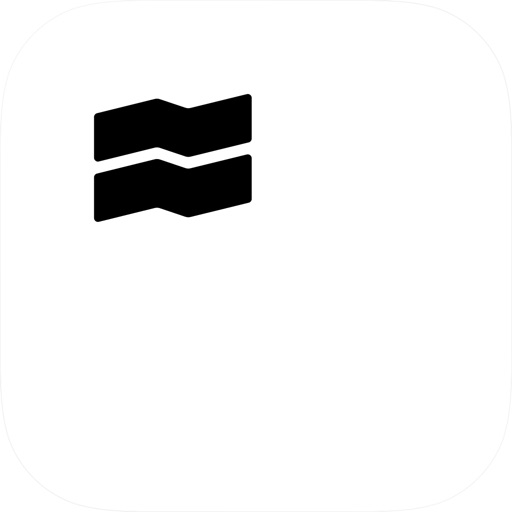

Investiere, zahle und spare.
Erhalte Zinsen auf dein Geld. Hol dir deine kostenlose Karte und sichere dir 1 % Saveback beim Bezahlen. Investiere einfach und sicher schon ab 1 €.

Spare beim Zahlen
- Aktiviere 2,25 % Zinsen auf dein Cash Guthaben, monatlich ausgezahlt.
- Keine monatlichen Kosten. Weltweit unbegrenzt kostenlose Abhebungen am Geldautomaten bei Beträgen über 100 €.
- Erhalte 1 % „Saveback“ auf deine berechtigten Kartenzahlungen, das in deine Sparpläne fließt. Du kannst auf bis zu 1.500 € monatliche Ausgaben Saveback erhalten. Voraussetzung ist, dass du mindestens 50 € pro Monat in Sparpläne investierst.
- Runde deine Kartenzahlungen auf und investiere das Wechselgeld mit der Round-up-Funktion.

Spare jetzt, für später
- Investiere schon ab 1 € in Aktien, ETFs, Crypto und Private Markets. Keine versteckten Gebühren.
- Richte gebührenfreie Sparpläne von Trade Republic ein, um langfristig Vermögen aufzubauen.
- Diversifiziere deine Investments mit neuen Portfolios wie Private Markets, Zinsprodukte und Crypto Wallets.

Millionen vertrauen uns
- Über 10 Millionen Kunden und 150 Milliarden € Vermögen in 18 europäischen Ländern.
- Eine voll lizenzierte deutsche Bank, reguliert von BaFin und Bundesbank.
- Orders werden zum Bestpreis an allen relevanten Börsen gegenüber Trade Republic ausgeführt.
- Melde dich jederzeit per Live Chat oder Telefon und sprich direkt mit unserem Expertenteam.

Wir möchten allen ermöglichen, Vermögen aufzubauen – durch einen einfachen, sicheren und kostenlosen Zugang zum Finanzsystem.

Kapitalanlagen bergen Risiken. Investitionen in Kryptowährungen sind hochvolatil und unterliegen einem Totalverlustrisiko. Ein Verkauf von Anleihen vor Fälligkeit kann Kursrisiken mit sich bringen. Die Wertentwicklung der Vergangenheit ist kein verlässlicher Indikator für zukünftige Ergebnisse. Erhalte Zinsen von Partnerbanken und Dividenden aus Geldmarktfonds. Diese unterliegen Kursrisiken. Bedingungen für Saveback gelten. Gezeigte Werte rein illustrativ.

Hinweis: Nicht alle oben genannten Services sind in jedem Markt verfügbar. Umfang und Verfügbarkeit unserer Angebote – inklusive Aktien, ETFs, Sparpläne, Crypto, Zinsprodukte, Private Markets und Derivate – können je nach Land variieren. Mehr Infos findest du auf unserer Website.

Brunnenstr. 19-21 
10119 Berlin, Germany

[View on Apple](https://apps.apple.com/de/app/trade-republic-broker-bank/id1410703839)

## Snapchat: Chatte mit Freunden

Mit Snapchat kannst du schnell und auf lustige Weise Momente mit Freunden und Familie teilen.

SNAPPEN
• Snapchat öffnet direkt die Kamera – tippe, um ein Foto zu machen oder halte gedrückt, um ein Video aufzunehmen.
• Mit Linsen, Filtern, Bitmoji und weiteren tollen Funktionen kannst du deiner Kreativität Ausdruck verleihen!
• Probiere täglich neue Linsen aus, die von der Snapchat-Community erstellt werden!

CHATTEN
• Bleib über den Chat in Kontakt mit deinen Freunden oder zeig in Gruppen-Storys, wie dein Tag so läuft.
• Du kannst mit bis zu 16 Freunden gleichzeitig videochatten – dabei kannst du sogar Filter und Linsen verwenden!
• Zeig deine Individualität mit Friendmoji – das sind exklusive Bitmoji, die extra für dich und einen Freund erstellt werden.

STORYS
• Schau dir die Storys deiner Freunde an, um zu sehen, was bei ihnen los ist.
• Sieh dir Storys aus der Snapchat-Community an, die auf deinen Interessen basieren.
• Entdecke aktuelle Nachrichten und exklusive Original-Shows.

SPOTLIGHT
• Bei Spotlight findest du die besten Snaps!
• Poste eigene Snaps oder lehne dich einfach zurück und schau zu. 
• Wähle deine Favoriten aus und teile sie mit deinen Freunden.

SNAP MAP
• Teile deinen Standort mit deinen besten Freunden oder tauche unter mit dem Geistmodus.
• Auf deiner persönlichen Karte kannst du sehen, was deine Freunde gerade machen, wenn sie ihren Standort mit dir teilen.
• Entdecke Live-Storys aus der Community in deiner Nähe oder aus der ganzen Welt!

MEMORYS
• Speichere eine unbegrenzte Anzahl von Fotos und Videos deiner schönsten Momente.
• Bearbeite vergangene Momente und schicke sie an Freunde oder speichere sie in deinen Aufnahmen.
• Erstelle Storys aus deinen schönsten Erinnerungen, um sie mit Freunden und Familie zu teilen.

FREUNDSCHAFTSPROFIL
• Jede Freundschaft hat ein eigenes Profil mit all den Momenten, die ihr gemeinsam erlebt habt. 
• Mit den Meilensteinen kannst du neue Gemeinsamkeiten entdecken – zum Beispiel, wie lange ihr schon Freunde seid, ob ihr astrologisch kompatibel seid, welchen Modestil eure Bitmoji haben und vieles mehr!
• Freundschaftsprofile sind nur für dich und einen Freund sichtbar, sodass ihr gemeinsam feiern könnt, was eure Freundschaft so besonders macht.

Happy Snapping!

Hinweis: Snapchatter können deine Nachrichten immer festhalten oder speichern, indem sie beispielsweise einen Screenshot machen oder eine Kamera verwenden. Pass also auf, was du snappst!

Eine vollständige Beschreibung unserer Datenschutzmaßnahmen findest du im Datenschutzcenter.

[View on Apple](https://apps.apple.com/de/app/snapchat-chatte-mit-freunden/id447188370)

## immowelt – Immobilien Suche

Willkommen bei immowelt – deiner All-in-One-App zum Mieten, Kaufen und Inserieren von Immobilien in Deutschland und Österreich! Finde deine neue Wohnung, dein Haus, eine WG oder ein Neubauprojekt – aus tausenden Immobilien zur Miete oder zum Kauf. Du möchtest eine Immobilie inserieren? Mit unseren smarten KI-Features bietest du sie schnell und einfach an.

Entdecke die ganze Welt der Immobilien – miete, kaufe & inseriere mit immowelt!

immowelt auf einen Blick:

• Entdecke eine riesige Auswahl an Immobilien – Wohnung, Haus, WG & mehr
• Nutze die Karte oder Liste & personalisiere die Wohnungssuche mit Filtern
• Sammle & vergleiche deine Favoriten mit dem Merkzettel
• Speichere deine Suche & werde als Erster über neue Angebote informiert
• Bestelle deine SCHUFA-Auskunft – offiziell, digital & preiswert
• Meine Immo: Immobilien bewerten, Inserate verwalten & Makler finden

Vertraue dem Testsieger: Die immowelt App wurde 2025 vom Deutschen Institut für Service-Qualität und ntv als beste Immobilien-App ausgezeichnet.

Immobilien zur Miete
Stöbere durch ein riesiges Angebot an Immobilien, die zur Miete angeboten werden! Finde eine Wohnung, ein Haus, eine WG oder eine Gewerbeimmobilie, die genau auf deine Bedürfnisse zugeschnitten ist. Für eine reibungslose Anmietung kannst du dir deine offizielle SCHUFA-Auskunft preiswert und digital bestellen. immowelt hilft dir dabei, schnell und bequem deine Traumimmobilie zu mieten.

Wohnungssuche mit Karte, Filter & Merkzettel
Mach Schluss mit dem endlosen Suchen nach einer neuen Wohnung! Mit immowelt findest du schnell die perfekte Wohnung, Tauschwohnung oder WG. Mit unseren smarten Filtern wird deine Wohnungssuche einfacher denn je. Nutze auch die Karten-Suche, um zu sehen, wie gut die Lage einer Wohnung zu deinem Lebensstil passt – so findest du genau, wonach du suchst!

Aktiviere zudem Benachrichtigungen, um keine neuen Immobilien mehr zu verpassen, und speichere deine Favoriten mit dem Merkzettel, damit du sie bequem vergleichen kannst. Teste jetzt unsere smarte Immobiliensuche – dein neues Zuhause ist zum Greifen nah!

Haus oder Wohnung kaufen
Entdecke eine große Auswahl an Kaufimmobilien und Neubauprojekten – von charmanten Apartments bis hin zu großzügigen Einfamilienhäusern. Unsere intuitive Wohnungssuche macht es dir leicht, dein perfektes Zuhause zu finden. Mit dem Hypothekenrechner kannst du zudem fundierte Entscheidungen für deine Immobilieninvestitionen treffen.

Immobilien inserieren
Erstelle dein Immobilieninserat mühelos und mit nur wenigen Klicks – dank smarter KI. Tritt zudem direkt mit Interessenten via Chat in Kontakt und behalte alle Anfragen stets im Blick. Du benötigst professionelle Hilfe? Mit der Maklersuche findest du schnell einen kompetenten Makler. Inseriere deine Immobilie noch heute mit immowelt!

Immobilien bewerten
Mit dem Online-Bewertungstool ermittelst du einfach und kostenlos den Wert deiner Immobilie. Basierend auf Standort, Größe und spezifischen Merkmalen deiner Immobilie erhältst du eine präzise Schätzung. Zusätzlich kannst du aktuelle Verkaufspreise ähnlicher Immobilien in der Nachbarschaft vergleichen, um eine fundierte Entscheidung zu treffen.

Lade jetzt die immowelt App herunter – dein smarter Begleiter zum Finden und Inserieren von Immobilien!

Folge uns in den sozialen Medien für die neuesten Updates und Immobilien-News:

• Facebook: @immowelt
• X: @immowelt
• Instagram: @immowelt

Bitte teile deine Erfahrung und hinterlasse eine Bewertung. Bei Fragen kontaktiere uns gerne unter support@immowelt.de

immowelt, immoweb, immonet, SeLoger, MySeLogerPro, Meilleurs Agents, Belles Demeures, LogicImmo und Yad2 sind Teil der AVIV Group, einem der größten digitalen Immobilien-Tech-Unternehmen der Welt.

[View on Apple](https://apps.apple.com/de/app/immowelt-immobilien-suche/id354119842)

## Reddit

Willkommen bei Reddit – dem Ort für authentische Gespräche, in denen deine Stimme zählt.
Entdecke die Kraft deiner Stimme in echten Diskussionen. Von aktuellen Nachrichten bis hin zu tiefgehenden Debatten – diese Social- und News-Plattform fördert echte Gespräche. Stelle Fragen, erhalte echte Antworten, teile Tipps und sei du selbst. Tritt Communitys bei, in denen Menschen über das sprechen, was wirklich wichtig ist – Post für Post.
Warum Reddit?
■ Finde Communitys für Nachrichten und Diskussionen
Egal, ob du dich für Popkultur, Sport oder Technologie interessierst – Reddit bietet Inhalte für jedes Interesse. Tauche in aktuelle Diskussionen ein, erstelle Beiträge und sprich über Themen, die dich interessieren.
■ Stelle Fragen und erhalte echte Antworten
Reddit steht für echte Gespräche mit echten Menschen. Hole dir Ratschläge, erhalte Antworten von Menschen mit Erfahrung, teile Tipps, äußere deine Meinung und führe großartige Gespräche.
■ Sprich über alles
Triff Menschen, die deine Interessen teilen, erhalte Ratschläge oder entdecke einfach etwas Neues. Finde Communitys, die sich den Themen widmen, die dir wichtig sind.
Finde Communitys nach Interessen und Fachgebieten:
■ r/fragreddit & r/AskReddit
Stelle Fragen und erhalte echte Antworten von engagierten Communitys. Egal, ob du persönliche Ziele verfolgst oder auf aktuelle Ereignisse reagierst – es gibt immer etwas Neues zu entdecken und zu besprechen.
■ r/Nachrichten 
Entdecke aktuelle Nachrichten, diskutiere reale Ereignisse und erfahre, was weltweit passiert.
■ r/ich_iel
Suchst du nach etwas zum Lachen? Reddit hat es. Finde Communitys für Humor und Memes.
■ r/Gaming
Triff echte Gamer, hole dir Tipps von erfahrenen Spielern und entdecke Gaming-Inhalte.
■ r/Music & r/Movies
Sprich über deine Lieblingsfilme und deine Lieblingsmusik. Entdecke Neues und teile deine Perspektiven zu allem rund um Musik und Filme.
Voting & Karma
Jeder Beitrag und Kommentar kann von der Community hoch- oder heruntergevotet werden. Je mehr Upvotes du erhältst, desto sichtbarer wird dein Beitrag. Dein Karma-Wert zeigt, wie sehr die Community deine Beiträge schätzt.
Reddit Premium:
Kaufe Reddit Premium und genieße eine werbefreie Erfahrung sowie Zugriff auf Premium-Avatar-Items, r/lounge, individuelle App-Icons und mehr.
Die Zahlung erfolgt monatlich oder jährlich über dein Apple-Konto. Dein monatliches oder jährliches Premium-Abonnement verlängert sich automatisch, sofern du es nicht mindestens 24 Stunden vor Ablauf kündigst. Du kannst jederzeit in den Kontoeinstellungen deines Geräts kündigen. Keine Teilrückerstattungen.
Datenschutzrichtlinie: https://www.redditinc.com/policies/privacy-policy
Nutzervereinbarung: https://www.redditinc.com/policies/user-agreement
Reddit-Regeln: https://redditinc.com/policies/reddit-rules
Wenn du Probleme mit der App hast, erhalte Unterstützung unter RedditHelp.com

[View on Apple](https://apps.apple.com/de/app/reddit/id1064216828)

## Waze Navigation und Verkehr

Waze ist eine community-basierende Navigations-App, die Millionen Nutzern an ihr Ziel hilft, indem sie Echtzeitwarnungen zu den Straßenverhältnissen und eine tagesaktuelle Karte bietet. Dank unserem Netzwerk an Fahrern spart Dir Waze Zeit, weil es sofort warnt bei Stau, Baustellen, Unfällen, Polizeikontrollen und mehr. Von Routenaktualisierungen zur Stauvermeidung, Echtzeit-Warnungen zu Deiner Sicherheit, bis zu Hinweisen zu niedrigen Treibstoffpreisen, ist Waze eine Gemeinschaft von Fahrern, die anderen Fahrern helfen.

Mit Waze wirst du...

• Schneller ankommen: Stauvermeidende Routenupdates
• Bußgelder vermeiden: sei über Polizeikontrollen und Blitzer informiert
• Eine genauere Ankunftszeit haben: Aufgrund von Live-Verkehrsdaten, Baustellen, Wetter und mehr
• Von der Community-basierende Navigationprofitieren: Echtzeit-Updates von anderen Autofahrern
• Geld sparen: Finde die günstigste Tankstelle auf deiner Route
• Maut sparen: Sieh dir die Mautpreise an, wenn du eine Route auswählst
• Apple Car Play nutzen können: Verbinde Waze mit dem eingebauten System
• den Vorteil des Echtzeit-Tacho erleben: Erhalte Warnungen, wenn du zu schnell fährst und vermeide Strafzettel
• Deine Fahrt individualisieren könnne: erhalte Routenanweisungen von Deinen Lieblings-Stars und Filmcharakteren
• Nicht mehr zwischen Apps hin- und herschalten müssen: nutze Deine Lieblings-Audio-App direkt aus Waze heraus

Fahre sicherer und smarter mit Waze!

Du kannst jederzeit Deine Waze Privatsphäreeinstellungen verwalten und ändern. Erfahre mehr über die Waze Datenschutzerklärung unter www.waze.com/legal/privacy.

Die Waze Routenführung ist nicht für Einsatzfahrzeuge und übergroße Fahrzeuge bestimmt.

[View on Apple](https://apps.apple.com/de/app/waze-navigation-und-verkehr/id323229106)

## Eurowings

Alle Reisen auf einen Blick

Mit Meine Reisen hast du deine Reise und alles drum herum immer griffbereit. 
Einfach Buchung hinzufügen oder dein Eurowings Konto verbinden. Außerdem erwarten dich folgende Highlights:
Deine Flüge als praktische Kalendereinträge fürs Handy 
-	dein persönlicher Reiseplan
-	aktuelle Updates zur Flugzeit und Status
-	Infos zu deinem Check-in-Status
-	deine mobile Bordkarte – zum Export in dein Apple oder Google Wallet. Nicht alleine unterwegs? Teile deine mobile Bordkarte einfach mit Freund:innen und Familie
-	Unser exklusiver AR-Baggage-Scanner zur Größenprüfung deines Handgepäcks

Kein Suchen mehr in E-Mails – einfach App öffnen und abflugbereit sein.

Hilfe, wenn’s drauf ankommt
Flug verspätet oder gestrichen? Die App unterstützt dich direkt mit aktuellen Infos und konkreten Umbuchungs-Optionen – klar, schnell, hilfreich.

Neue Ziele entdecken & direkt buchen
Du willst mal wieder raus? Lass dich inspirieren und finde deinen nächsten Trip. Mit der integrierten Flugsuche buchst du bequem direkt in der App. 
Zeit für Vorfreude: Speicher dir zukünftigen Reiseziele direkt ab. So geht keine Idee verloren.

Die besten Gründe für die Eurowings App?
• Reisen smart und easy verwalten im “Meine Reisen” Bereich
• teilbare mobile Bordkarte & Check-in Infos sofort zur Hand
• Unterstützung bei Fluguregelmäßigkeiten
• Flüge direkt zum Kalender hinzufügen
• Explore‑Bereich für Inspiration & Favoriten

Jetzt Eurowings App downloaden und entspannter reisen – mit mehr Leichtigkeit für alle.

[View on Apple](https://apps.apple.com/de/app/eurowings/id1063273316)

## Blitzer.de

Blitzer.de - Die Verkehrssicherheits-App!

Blitzer.de verwandelt dein iPhone in den perfekten Beifahrer, der dich in Echtzeit auf mobile und feste Blitzer, Unfälle, Stauenden und mehr aufmerksam macht. Schließe dich Europas größter und bekanntester Verkehrs-Community an und fahre sicherer sowie entspannter.

Gute Gründe für Blitzer.de:

► MARKTFÜHRER
Größte und bekannteste Verkehrs-Community Europas mit mehr als 5 Millionen Nutzern

► WARNUNG IN ECHTZEIT
Akustische und optische Warnung mit Anzeige der erlaubten Höchstgeschwindigkeit und Entfernung

► TOPAKTUELL
Die App aktualisiert Blitzer und Gefahren live und automatisch

► VERKEHRSREDAKTION
Alle Meldungen redaktionell geprüft

► INTUITIVE BEDIENUNG
Optimiert für die Nutzung im Auto: selbsterklärend und ohne Ablenkung vom Verkehr

► KOSTENLOS
Kein Abo. Keine versteckten Kosten.

►►►
NOCH MEHR DRIN BEI BLITZER.DE PRO! 
* Karte als Fahrmodus
* Warnung per Sprachansage
* Hintergrundbetrieb während Telefonaten oder der Nutzung anderer Apps
* Warnung während Radiobetrieb über Autolautsprecher
* Automatischer Start und Ruhemodus
* Personalisierte Warnungen
* Innovative Navigation

Probiere Blitzer.de PRO jetzt aus für nur 0,49 €! 
►►►

SYSTEMANFORDERUNGEN
* iOS ab Version 13
* Aktivierte Ortungsdienste
* Internetverbindung (Flatrate empfohlen)

FOLGE UNS
https://www.instagram.com/blitzer.de
https://www.facebook.com/www.Blitzer.de

BESUCHE UNS IM WEB
https://www.blitzer.de

[View on Apple](https://apps.apple.com/de/app/blitzer-de/id393860580)

## Rossmann

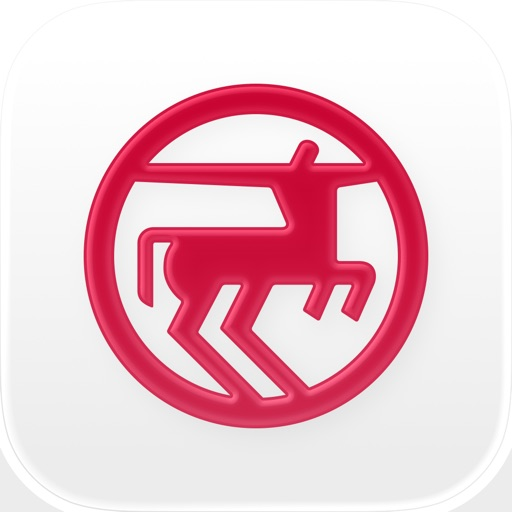

Die digitale Kundenkarte von Rossmann.
Genieße alle Vorzüge einer Kundenkarte mit der ROSSMANN-App – bei uns aber in digitaler Form. Das heißt einmal Herunterladen und immer Sparen! Zahlreiche Coupons und die aktuellen Angebote stehen dir in der App jederzeit zur Verfügung. 

Die wichtigsten Funktionen auf einen Blick:

• Startschuss zum Sparen
Für die Nutzung der ROSSMANN-App bedarf es keiner Registrierung. Solltest du jedoch schon bei einem unserer verschiedenen Rossmann-Dienste (z. B. Rossmann Online-Shop, Rossmann Fotowelt oder Rossmann babywelt) angemeldet sein, kannst du dich mit dem gleichen Account auch in der App einloggen. 
Registrierte Nutzer können jedoch mehr Vorteile und Funktionen gegenüber anonymen Nutzern erhalten.
• Zahlreiche digitale Coupons
Die ROSSMANN-App enthält eine große Auswahl attraktiver digitaler Coupons. Du hast die Qual der Wahl - ob vor dem Einkauf oder schon in einer unserer Filialen.
Sparen leicht gemacht – alles mit der digitalen Kundenkarte:
1. Aktiviere die gewünschten Coupons 
2. Zeige deine digitale Kundenkarte an der Kasse vor, damit diese per Handscanner erfasst werden kann. 
3. Alle aktivierten und zum Einkauf passenden Coupons werden automatisch eingelöst.
4. Freue dich über die Ersparnis! 
Damit du auf deiner digitalen Kundenkarte alle Coupons zur Hand hast, kannst du auch jeden bei Rossmann gültigen Papiercoupon einscannen. Die Papiercoupons sind somit digitalisiert und du kannst diese für deinen nächsten Einkauf hinzufügen und einlösen.

• Personalisierte Startseite – Alles Wichtige auf einen Blick
Siehe direkt deine Top-Coupons und lass dich von weiteren tollen Aktionen inspirieren  

• Einkaufen und Sparen – jetzt auch bequem von Zuhause 
Verpasse keine Angebote und shoppe bequem von zu Hause! Viele deiner Coupons können auch beim Online-Shopping eingelöst werden.  

• Offline? Kein Problem!
Für die Coupon-Einlösung ist keine aktive Internetverbindung notwendig.

• Aktuelle Angebote
Informieren dich über unsere aktuellen Angebote - wann und wo du möchtest. Blättere durch unser Prospekt und füge die Artikel zu deiner Einkaufsliste hinzu.
• Deine virtuelle Brieftasche
Deine aktivierten Coupons kannst du auf deiner Kundenkarte zu jeder Zeit einsehen - alles vereint an einem Ort und griffbereit, wie im wahren Leben. Dadurch vergisst du nie wieder die Einlösung deiner Coupons.

• Deine Kundenkarte - nur ein Code
Die digitale Kundenkarte enthält alle deine aktivierten Coupons. Für die Einlösung deiner aktivierten Coupons musst du nur noch deine digitale Kundenkarte an der Kasse vorzeigen. Das Kassenpersonal scannt den Code von deinem Smartphone ab und alle hinzugefügten Coupons werden eingelöst. 

• Für Sparfüchse
Registrierte Nutzer können regionale Vorteile erhalten und werden bei besonderen Couponaktionen berücksichtigt, je nachdem welche persönlichen Angaben vorliegen. Trage einfach deine PLZ ein und deine bevorzugte Stammfiliale.
Du möchtest wissen, wie viele Coupons du schon eingelöst hast und wie viel du dadurch gespart hast? Diese Informationen finden registrierte Nutzer auf der Kundenkarte.

• Jeder Einkauf lohnt sich!
Als App Nutzer hast du die Möglichkeit an Aktionen teilnehmen. Werden die benötigten Produkte so oft wie vorgegeben gekauft, erfolgt die Ausspielung eines Bonus-Coupons. Sammeln und extra Sparen!

Deine Meinung ist uns wichtig!
Du vermisst ein Feature, hast Anregungen oder ein Problem bei der Benutzung der App? Dann melde dich einfach bei uns, damit wir deinen Einkauf bei Rossmann zu einem besseren Erlebnis machen können.
Nutze die Feedback-Möglichkeit innerhalb der App oder schreibe uns an ios@rossmann.de.

[View on Apple](https://apps.apple.com/de/app/rossmann/id1034309353)

## YouTube

Hol dir die offizielle YouTube App auf iPhones und iPads und entdecke angesagte Videos weltweit – von den coolsten Musikvideos bis hin zu Hits in Sachen Gaming, Fashion, Beauty, Nachrichten, Bildung und mehr. Du kannst deine Lieblingskanäle abonnieren, eigene Inhalte erstellen sowie Videos mit Freunden teilen und auf allen Geräten wiedergeben.

Ansehen und abonnieren
● Auf dem Tab „Start“ findest du persönliche Empfehlungen.
● Unter „Abos“ siehst du die neuesten Uploads von deinen Lieblingskanälen.
● Die „Mediathek“ enthält die Videos, die du dir angesehen, mit „Mag ich“ bewertet und für später gespeichert hast.

Verschiedene Themen, angesagte Inhalte sowie aufstrebende Creator, Gamer und Künstler entdecken
(in ausgewählten Ländern verfügbar)
● Du kannst dich in Bereichen wie Musik, Gaming, Beauty, Nachrichten und Bildung auf dem Laufenden halten.
● Auf dem Tab „Entdecken“ siehst du, was auf YouTube und weltweit gerade im Trend liegt.
● Du erfährst mehr über aufstrebende Creator, Gamer und Künstler (in ausgewählten Ländern verfügbar).

Mit der YouTube-Community in Kontakt bleiben
● Über Beiträge, Stories, Premieren und Livestreams kannst du immer mitverfolgen, was es bei deinen Lieblings-Creatorn gerade Neues gibt.
● In den Kommentaren kannst du dich mit Creatorn und anderen Community-Mitgliedern austauschen.

Inhalte über dein Mobilgerät erstellen
● Du kannst direkt in der App eigene Videos erstellen oder hochladen.
● Mit Livestreams direkt über die Appkannst du in Echtzeit mit deinen Zuschauern in Kontakt treten.

Die passende Lösung für dich und deine Familie finden (in ausgewählten Ländern verfügbar)
● Jede Familie nutzt Onlinevideos anders. Unter youtube.com/myfamily findest du weitere Informationen zur YouTube Kids App und zu den neuen YouTube-Konten mit Elternaufsicht.

Upgrade auf YouTube Premium durchführen (in ausgewählten Ländern verfügbar)
● Du kannst dir Videos ansehen, während du andere Apps verwendest oder dein Bildschirm gesperrt ist –ganz ohne Werbeunterbrechungen.
● Du kannst Videos speichern und jederzeit abspielen – auch im Flugzeug oder auf dem
Weg zur Arbeit.
● Die Mitgliedschaft beinhaltet außerdem den Zugriff auf YouTube Music Premium.

Hinweis: Bei einem Abo über Apple wird dein App Store-Konto in dem Moment mit dem fälligen Betrag belastet, in dem du den Kauf bestätigst. Das Abo wird automatisch verlängert, wenn die automatische Verlängerung nicht bis spätestens 24 Stunden vor Ablauf des aktuellen Abozeitraums deaktiviert wird.
Die Gebühren für die Verlängerung des Abos werden am letzten Gültigkeitstag des laufenden Abos entsprechend dem gewählten Tarif in Rechnung gestellt. Du kannst deine Abos und die Einstellungen
für die automatische Verlängerung nach dem Kauf in den Kontoeinstellungen ändern.

Nutzungsbedingungen für kostenpflichtige Dienste von YouTube: https://www.youtube.com/t/terms_paidservice.
Datenschutzerklärung: https://www.google.com/policies/privacy

[View on Apple](https://apps.apple.com/de/app/youtube/id544007664)

## Shelf: music, books, movies

Effortlessly track across platforms
Connect Spotify, Netflix, Apple Music, Letterboxd, Goodreads, and more. Shelf automatically organizes what you watch, read, listen to, play & more into one evolving profile.

-See your taste from every angle.
-View your top artists and genres.
-Scroll a chronological history of what you’ve watched and read.
-Keep a living record of your cultural life.

Get personalized recaps
-Weekly and monthly summaries show what defined your time and how your taste shifts.

Unlock experiences powered by your Shelf
-Dive into insights, comparisons, trend breakdowns, and evolving tools built around your data. The more complete your Shelf, the more you can access.

Browse friends’ Shelves
-See what people you care about are into and explore their taste across categories.

Customize your profile
-Personalize your Shelf so it reflects who you are.

Your data, on your terms
-Private by default. You control what’s connected and what’s visible. Your history stays yours.
-We safeguard your data with cutting-edge encryption tech.
-The creators of Shelf are pioneers behind people taking back control of their data from the big platforms. We’re data rights activists and will fight (and build) until we all have control and ownership over our own data (see more here: https://share.shelf.im/data-rights).

Shelf grows with you.
-The more you add, the clearer the patterns become. The more complete your Shelf, the more it understands your taste.
-It’s not another recommendation feed or social app. It’s a living record of what you’ve been into— and what that says about you.

Shelf is created by a team in NYC and loved by people across the world! Featured in TechCrunch, Business Insider, Harvard Business Review and more.

Follow along for updates and memes: @getashelf

[View on Apple](https://apps.apple.com/de/app/shelf-music-books-movies/id1667391175)

## Joyn | deine Streaming App

Joyn bietet dir Live TV und Mediathek in einer App. Das Basisangebot von Joyn ist kostenlos – einfach herunterladen und losstreamen. Mit Joyn kannst du über 100 Sender live schauen, wie ARD, ZDF, ProSieben und DMAX.

Live TV ist aber nur ein Teil von Joyn. Der andere große Teil ist unsere Mediathek. Dort findest du jede Menge Shows, exklusive Serien und Originals wie Promis unter Palmen, Germanys Next Topmodel, Wer stiehlt mir die Show oder The Race. Außerdem Previews, also komplette Serienfolgen noch vor Ausstrahlung im TV.
Schau wann und wo du willst. Und mit welchem Gerät du willst, Joyn läuft nämlich auf Smartphones, Tablets, auf dem Fernseher und im Webbrowser. Wenn du das komplette kostenlose Angebot von Joyn nutzen möchtest, musst du dich registrieren, (natürlich gratis); dann hast du über 100 Sender, jede Menge Shows und Serien und viele zusätzliche Funktionen, wie z.B. eine Merkliste und Empfehlungen, die zu dir passen.

Und was ist Joyn+?
Joyn+ kann alles, was Joyn kann und noch mehr. So bietet Joyn+ eine riesige Film-Bibliothek mit z.B. Madagaskar 1+2, Bridget Jones – Schokolade zum Frühstück, Schindlers Liste oder auch Shooter und dazu Serien wie Navy CIS, Homeland, Detektiv Conan oder Smallville. Auch Live TV ist mit über 100 Sendern, darunter vier Pay TV Kanälen wie ProSieben Fun, Sat.1 Emotions oder wetter.com deutlich größer.
Mit Joyn+ erlebst du alles in HD-Qualität (soweit verfügbar). Wir bauen das Angebot immer weiter aus, du kannst dich also auf immer neue Filme, Serien und Originals freuen.

Du liebst Sport?
Willkommen bei Joyn. Sportfans kommen hier voll auf ihre Kosten: Eurosport, ran und andere bieten immer wieder live Sport-Ereignisse wie NBA, Tour de France, DTM oder Tennisturniere. Bei Joyn kannst du 24 Stunden Sport erleben. Als Nutzer des kostenlosen Dienstes kannst du Highlights sehen, mit einem Joyn+ Abo bekommst du das volle Sporterlebnis und wir erweitern ständig unser Sportangebot, sei also gespannt.

Weitere Informationen findest du in unseren Nutzungsbedingungen unter: 
https://www.joyn.de/agb

Unsere Datenschutzhinweise findest du hier: https://www.joyn.de/datenschutz

[View on Apple](https://apps.apple.com/de/app/joyn-deine-streaming-app/id826510222)

## Kaufland: deine XTRA Vorteile

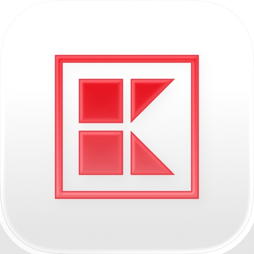

Lade jetzt die gratis Kaufland-App herunter und hol dir dein XTRA – mit Kaufland Card XTRA in unseren Filialen und auf dem Online-Marktplatz Kaufland.de.

ALLE VORTEILE DER KAUFLAND-APP AUF EINEN BLICK:

Extra-Rabatte: bei jedem Einkauf noch mehr sparen
Coupons: einfach aktivieren & sofort sparen
Treuepunkte: für jeden Euro einen Treuepunkt sammeln
Prämien: Treuepunkte einlösen & Gratis-Prämien sichern
Gewinnspiele: automatisch an unserem monatlichen Gewinnspiel teilnehmen
Partnervorteile: exklusive Vorteile bei unseren Partnern sichern
Kaufland Pay: einfach & sicher mit nur einem Scan bezahlen
Digitale Kassenbons: direkt nach dem Einkauf in der Kaufland-App abrufen
K-SCAN: Produkte selbst scannen & schneller einkaufen
Riesige Produktauswahl auf unserem Online-Marktplatz Kaufland.de
Unsere aktuellen Prospekte
Kaufland-Filiale in der Nähe finden & alle Services vor Ort entdecken
Über 4.000 Rezepte zum Nachkochen

DEIN XTRA BEI JEDEM EINKAUF MIT KAUFLAND CARD XTRA
Rabatte: Erhalte viele Angebote in der Filiale noch günstiger. Die Sparvorteile findest du wöchentlich in der Kaufland-App.
Coupons: Spare regelmäßig mit neuen, attraktiven Coupons – einzulösen für Artikel in unseren Filialen oder auf Kaufland.de.
PROFITIERE MIT KAUFLAND CARD XTRA: TREUEPUNKTEN, GRATIS-PRÄMIEN UND MEHR
Treuepunkte: Scanne Kaufland Card XTRA an der Kasse und erhalte für jeden ausgegebenen Euro in der Filiale oder auf Kaufland.de einen digitalen Treuepunkt.
Gratis-Prämien: Löse deine Treuepunkte für tolle Prämien ein.
Gewinnspiele: Nimm mit jedem Einkauf (max. ein Einkauf pro Tag) in der Filiale oder auf Kaufland.de automatisch an unserem monatlichen Gewinnspiel teil.
Partnervorteile: Sichere dir auch bei ausgewählten Partnern exklusive Vorteile und entdecke monatlich neue, attraktive Rabatte.

DEINE SMARTEN HELFER IN DER KAUFLAND-FILIALE
Kaufland Pay: Mit dem Bezahlsystem Kaufland Pay bezahlst du bei jedem Einkauf schnell, einfach und sicher nach einmaliger Registrierung mit der Kaufland-App auf deinem Smartphone mit nur einem Scan. Damit sicherst du dir außerdem unsere Vorteile von Kaufland Card XTRA.
Digitale Kassenbons: Zettelchaos ade: Bei jedem Scan von Kaufland Card XTRA an der Kasse wird der Kassenbon digital in der Kaufland-App gespeichert und ist mit deinem Smartphone jederzeit abrufbar.
K-SCAN – schneller einkaufen und bezahlen: Scanne in ausgewählten Filialen deine Artikel selbst, bevor sie in den Einkaufswagen wandern. Bezahle anschließend deinen Einkauf bequem an der SB-Kasse, ohne die Ware aufs Band legen zu müssen.

ONLINE-MARKTPLATZ KAUFLAND.DE: DEIN SHOPPINGPARADIES
Unser Online-Marktplatz Kaufland.de ist mit über 45 Millionen Produkten aus mehr als 6.400 Kategorien von Technik über Möbel bis hin zu Baumarktartikeln ein riesiges Shoppingparadies. Shoppe, was du willst, und nutze die Vorteile von Kaufland Card XTRA direkt online.

ALLES FÜR DEINE PERFEKTE EINKAUFSPLANUNG
Digitale Prospekte: Stöbere durch aktuelle Prospekte und finde die besten Angebote. Filtere nach Kategorie und füge sie mit nur einem Klick deiner Einkaufsliste hinzu.
Filialfinder: Du suchst nach einer Kaufland-Filiale in deiner Nähe oder speziell nach einer Fischtheke, einer E-Ladesäule oder Tankstelle? Die praktische Filterfunktion zeigt dir blitzschnell die richtige Kaufland-Filiale.
Rezepte & Einkaufsliste: Entdecke über 4.000 leckere Rezepte, füge Zutaten mit einem Klick deiner digitalen Einkaufsliste hinzu und teile sie mit Familie oder Freunden.

Du hast Lust auf mehr oder willst uns Feedback geben? Wir freuen uns, von dir zu hören, um deine Shopping-Experience noch besser zu machen. Schreibe uns einfach an: kundenmanagement@kaufland.de
Erfahre hier mehr über die Vorteilswelt von Kaufland Card XTRA: kaufland-xtra.de
Mehr von Kaufland findest du hier:
www.kaufland.de
Facebook: https://www.facebook.com/kaufland/?ref=ts&fref=ts
YouTube: https://www.youtube.com/user/kauflandde
Allgemeine Nutzungsbedingungen: https:// filiale.kaufland.de/nutzungsbedingungen-app.html

[View on Apple](https://apps.apple.com/de/app/kaufland-deine-xtra-vorteile/id1087780386)

## mobile.de: Autos kaufen & mehr

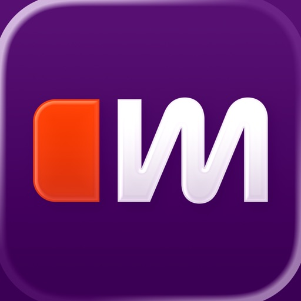

Einfach & sicher Autos kaufen oder verkaufen, leasen oder finanzieren. Ob Neu- oder Gebrauchtwagen, E-Autos, Motorräder, Camper oder Nutzfahrzeuge – das alles findest Du auf Deutschlands größtem Fahrzeugmarkt.

Bei mobile.de findest Du über 1,4 Millionen Autos, darunter mehr als 80.000 Elektroautos. Fast 100.000 Motorräder, Roller und Mopeds, mehr als 100.000 Nutzfahrzeuge und Busse, und über 65.000 Wohnwagen und Wohnmobile. Und seit 2024: E-Bikes!

mobile.de im Überblick:
√  Finde Dein Wunschfahrzeug dank präziser Suchkriterien in kürzester Zeit
√  Speichere Deine Favoriten auf Deinem persönlichen Parkplatz
√  Erkenne gute Angebote sofort dank der transparenten Preisbewertung
√  Verpasse keine Angebote und erhalte Benachrichtigungen bei neuen Inseraten
√  Speichere Deine Suchen und spare so Zeit und Aufwand
√  Sortiere Leasing- und Finanzierungsangebote bequem nach Monatsraten
√  Vergleiche die Finanzierung beim Händler mit den günstigsten Angeboten im Netz
√  Kaufe Deinen Nächsten komplett online
√  Folge vertrauenswürdigen Händlern und erhalte persönliche Direkt-Angebote
√  Teile gute Angebote unkompliziert mit Deinen Freunden
√  Synchronisiere Deine Suchen oder Inserate auf allen Geräten
√  Erstelle Dein Inserat in nur wenigen Minuten
√  Spare Zeit durch den Direkt-Verkauf an eine Ankaufsstation
√  Lass Dir von geprüften Händlern in Deiner Nähe ein Angebot machen

Die mobile.de App
Mit der mobile.de App behältst Du alles im Blick. Du stöberst bequem von unterwegs nach Schnäppchen, speicherst Deine Suche(n) und Deine Favoriten auf Deinem persönlichen Parkplatz und lässt Dich über neue Angebote benachrichtigen. Deine gespeicherten Fahrzeuge und Suchen werden automatisch auf allen Geräten synchronisiert. Und das alles einfach, sicher und kostenlos!

Finanzieren, leasen oder online kaufen
Du willst Deinen Neuen leasen oder finanzieren? Kein Problem – bei mobile.de findest Du mehr als genug Angebote. Du kannst gezielt nach Leasing-Angeboten suchen, nach Monatsraten sortieren und mit einem Finanzierungsrechner das passende Angebot finden.
Oder Du kaufst Deinen Neuen komplett online. Bequem vom Sofa aus, Lieferung vor Deine Haustür, mit 14 Tagen Rückgaberecht!

Preisbewertung und Händlerbewertung
Mit diesen nützlichen Funktionen findest Du Dich im Preis-Dschungel bestens zurecht. Unsere Preisbewertung hilft Dir, Preise im Vergleich zum Marktpreis einzuschätzen. Und die Händlerbewertung sorgt für Orientierung unter den Anbietern. 
Praktisch: Hast Du einen vertrauenswürdigen Händler gefunden, kannst Du diesem folgen. So findest Du schnell und ohne Spam die neuen Inserate dieses Händlers.

Verkaufen – sicher und bequem
Egal, was Du verkaufen willst: Bei mobile.de findest Du die meisten Interessenten: über 14 Millionen Menschen suchen jeden Monat bei mobile.de nach Fahrzeugen. Und das Beste: Bis 30.000 Euro Verkaufspreis ist Dein privates Inserat kostenfrei.

Auto-Verkauf mit Turbo: der Direkt-Verkauf
Du hast es eilig? Wenn Dir Deine Zeit zu schade ist für Probefahrten und Verhandlungen mit Interessenten, oder Dir der ganze Verkaufsprozess zu viel ist: Verkaufe Dein Auto einfach an einer Ankaufstation – in kürzester Zeit, direkt an einen zertifizierten Händler. Lass den Wert Deines Gebrauchten kostenlos und unverbindlich von einem Experten schätzen. Wenn Du mit dem Preis zufrieden bist, kannst Du direkt verkaufen. Um die Abmeldung kümmert sich die Ankaufstation, und Du erhältst ruckzuck Dein Geld.

Deine Vorteile mit mobile.de
Deutschlands größter Fahrzeugmarkt bietet Dir über 1,5 Millionen Gebrauchtwagen & Neuwagen, Wohnmobilen & Wohnwagen, Motorräder & Roller oder Nutzfahrzeuge und E-Bikes. Über 40.000 Händler vertrauen mobile.de. Das alles überzeugt Millionen Nutzer in Deutschland. Und einer davon ist genau der richtige Käufer für Deinen Gebrauchen!

[View on Apple](https://apps.apple.com/de/app/mobile-de-autos-kaufen-mehr/id378563358)

## X

Willkommen bei X, früher bekannt als Twitter, Ihrem vertrauenswürdigen digitalen Marktplatz wo Gespräche in Echtzeit ablaufen und die Welt sich über Eilmeldungen, Live-Events, Podcasts und alles dazwischen verbindet.

Ob Sie leidenschaftlich an Sport, Technik, Musik oder Politik interessiert sind, X bietet Ihnen einen Platz in der ersten Reihe für das, was weltweit passiert.

X ist nicht nur eine weitere Social-Media-App, sondern das ultimative Ziel, um gut informiert zu bleiben, Ideen zu teilen und Communities aufzubauen. 

Mit X sind Sie immer auf dem Laufenden mit relevanten Trending-Themen und Eilmeldungen, die sofort auf Ihrem Bildschirm erscheinen, roh und ungefiltert.

Was Sie auf X tun können:
• Verfolgen Sie Eilmeldungen aus der ganzen Welt, bevor sie in die Schlagzeilen kommen, und bleiben Sie voraus mit Echtzeit-Updates zu Trending-Themen und viralen Gesprächen.
• Teilen Sie Ihre Gedanken, Fotos und Videos mit einer globalen Community. Schließen Sie sich Millionen von Nutzern an, um den öffentlichen Diskurs in sozialen, kulturellen und politischen Gesprächen zu gestalten.
• Entdecken Sie Grok, den KI-Assistenten, der von den Echtzeit-Daten von X angetrieben wird. Sie können Grok bitten, Trending-News zusammenzufassen, Videos zu erklären oder mehr Kontext zu Beiträgen zu geben.
• Streamen Sie Live-Videos oder gehen Sie live mit Spaces, unserem Audio-Feature, das es Ihnen ermöglicht, Diskussionen zu moderieren, Interviews zu führen oder Ihren nächsten Live-Podcast zu starten. Ob Sie ein Konzert, ein Live-Spiel oder Ihre Gedanken zu einem heißen Thema streamen, X hält Ihr Publikum bei der Stange.
• Schauen Sie Videos: von Live-Eilmeldungen und Sport-Clips bis hin zu Podcasts und Gaming-Sessions, die bis zu 3 Stunden lang sein können. Viele der führenden Stimmen der Welt in Komödie, Gaming, Podcasting und Politik teilen ihren Content auf X.
• Verbinden Sie sich und chatten Sie privat mit Freunden, Followern, Kunden oder Kollaborateuren über Direktnachrichten.
• Treten Sie Communities bei und bauen Sie sie auf, die auf Ihre Interessen zugeschnitten sind: von Sport-News, Gaming, Entertainment, Krypto, Unternehmertum, Tech und mehr.
• Abonnieren Sie X Premium, um exklusive Features freizuschalten wie das blaue Häkchen, erhöhte Sichtbarkeit, priorisierte Antworten, weniger Werbung, längere Videos und die Bearbeitung von Beiträgen. X Premium gibt Ihnen auch Zugang zum Revenue-Sharing für Creator und die Möglichkeit, exklusiven Content für Abonnenten anzubieten.

Warum X?
In einer Welt des ständigen Wandels ist X Ihre Echtzeit-Quelle, um voraus zu sein, mit Menschen in Kontakt zu treten und vielfältige Perspektiven zu erkunden. Von Live-Eilmeldungen und Trending-Memes bis hin zu Top-Podcasts und Live-Streams Ihrer Lieblings-Creator bringt X alles in einer leistungsstarken Social-Erfahrung zusammen.

Datenschutzrichtlinie: https://x.com/de/privacy
Nutzungsbedingungen: https://x.com/de/tos

[View on Apple](https://apps.apple.com/de/app/x/id333903271)

## Saily: eSIM mit Telefonnummer

Hol dir weltweite Verbindungen und Konnektivität mit Saily eSIM – dein praktischer und benutzerfreundlicher Zugang zu e-SIM-Diensten. Schluss mit physischen SIM-Karten, jetzt kannst du digitalen Komfort genießen, wo immer du bist. Mit Saily eSIM bekommst du mit wenigen Klicks Internetdaten, vermeidest teure Roaming-Gebühren und bleibst rund um die Welt vernetzt. 

Was ist eine eSIM?

Eine eSIM (oder digitale SIM) ist in dein Smartphone integriert, funktioniert aber genauso wie eine physische SIM-Karte. Der Unterschied? Du kannst mit der eSIM sofort mit der Nutzung beginnen, wenn du merkst, dass du Internetdaten benötigst. Du brauchst nicht in Fachgeschäfte gehen oder in Warteschlangen stehen oder die SIM-Karte manuell austauschen – du erhältst eine eSIM einfach und schnell online.

Darum solltest du Saily eSIM wählen

Sofort online gehen
• Downloaden, abonnieren, installieren und fertig! Du kannst dich danach sofort mit dem Netzwerk verbinden und deine Internetverbindung nutzen. 
• Du brauchst dir keine Sorgen zu machen, dass dir während deiner Reise die Daten ausgehen – du kannst die eSIM mit ein paar Klicks aufladen und hast so ununterbrochene Konnektivität. 

Reise um die Welt
• Erhalte lokale eSIM-Datenpakete für über 200 Reiseziele und genieße den Komfort, immer vernetzt zu sein, wohin dich deine Reise auch führt.
• Behalte deine bestehende Telefonnummer und bleibe erreichbar. Nimm Anrufe wie gewohnt entgegen, unabhängig von deinem Standort.

Integrierte eSIM-Sicherheitsfunktionen
• Ändere deinen virtuellen Standort, um deinen Datenverkehr zu verschlüsseln und im Handumdrehen ein sichereres Surfen zu erleben.
• Der Werbeblocker hilft dir, Daten zu sparen, Ablenkungen zu minimieren und ermöglicht es dir, ohne Werbung und Tracker zu surfen.
• Aktiviere die Webschutzfunktion, um potenziell gefährliche Webseiten, die Schadsoftware hosten, zu vermeiden.

Maßgeschneidert für dich
• Ohne Verträge oder langfristige Verpflichtungen.
• Vermeide mit der eSIM teure Roaming-Gebühren und unerwartete versteckte Kosten.
• Du musst nicht mehr nach Geschäften suchen und zu viel für Daten bezahlen.

Dein perfekter Reisegefährte
• Richte deine eSIM ein, bevor du den Flughafen verlässt – beginne deinen Urlaub stressfrei, da du von Anfang an Internet hast.
• Bleib auf Reisen in Kontakt mit deinen Freunden und deiner Familie, egal wo du bist.

Tschüss, Gratis-WLAN
• Die eSIM ist perfekt für Digital Nomads, Berufsreisende und Remote-Arbeiter. Reise so viel du willst und ändere deine Pakete ohne Probleme.
• Dank eSIM kannst du überall auf das Internet zugreifen, ohne auf die Suche nach kostenlosem WLAN gehen zu müssen.

Sicher und zuverlässig
• Entwickelt vom NordVPN-Team – deine digitale Sicherheit hat für uns höchste Priorität. 
• Genieße eine sichere Abwicklung und einen zuverlässigen eSIM-Service.

Erlebe die Zukunft der Konnektivität. Lade Saily eSIM jetzt herunter und tauche ein in eine Welt ohne Grenzen!

[View on Apple](https://apps.apple.com/de/app/saily-esim-mit-telefonnummer/id6475045151)
