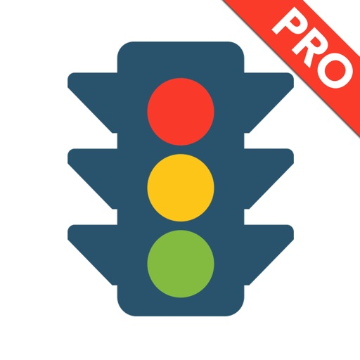
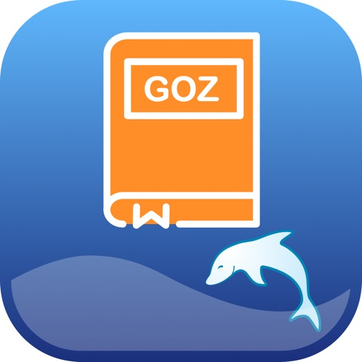
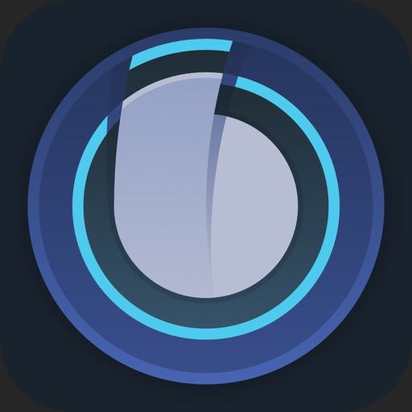
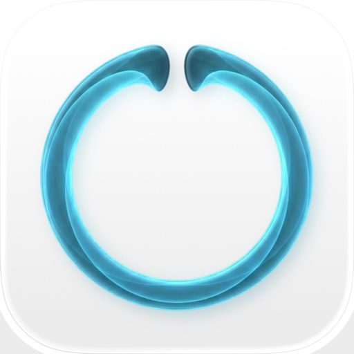
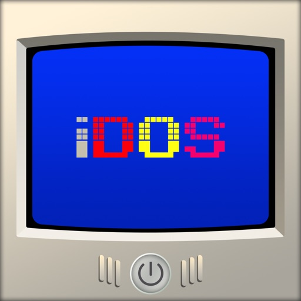
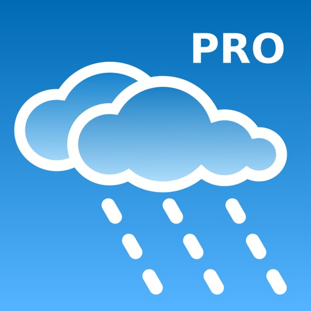

- [Blitzer.de PRO](#blitzer-de-pro)
- [Threema. Der sichere Messenger](#threema-der-sichere-messenger)
- [Ludwig x Kusama](#ludwig-x-kusama)
- [Führerschein 2026 GOLD](#fu-hrerschein-2026-gold)
- [AnkiMobile Flashcards](#ankimobile-flashcards)
- [PeakFinder](#peakfinder)
- [BorderWatcher](#borderwatcher)
- [HappyCow - Vegan Food Near You](#happycow-vegan-food-near-you)
- [DGV-Platzreife](#dgv-platzreife)
- [Babyphone 3G](#babyphone-3g)
- [TeleGuard](#teleguard)
- [Manager for KuKirin](#manager-for-kukirin)
- [WeatherPro](#weatherpro)
- [ADAC Camping / Stellplatz 2026](#adac-camping-stellplatz-2026)
- [Notfallguru](#notfallguru)
- [Shadowrocket](#shadowrocket)
- [Parchment: Agenda & Daily Note](#parchment-agenda-daily-note)
- [Harzer Wandernadel Community](#harzer-wandernadel-community)
- [AutoSnore: 鼾声记录器](#autosnore-鼾声记录器)
- [Procreate Pocket](#procreate-pocket)
- [ProCamera. RAW+ Fotografie](#procamera-raw-fotografie)
- [HealthFit](#healthfit)
- [Camping Assistant: Ausrichten](#camping-assistant-ausrichten)
- [PhotoPills](#photopills)
- [Streaks](#streaks)
- [AutoSleep - 苹果手表睡眠监测，睡觉记录及智能闹钟](#autosleep-苹果手表睡眠监测-睡觉记录及智能闹钟)
- [Führerschein 2026 PRO](#fu-hrerschein-2026-pro)
- [DENSgoz](#densgoz)
- [Whisper Notes: Sprache zu Text](#whisper-notes-sprache-zu-text)
- [Better ST for Bose SoundTouch](#better-st-for-bose-soundtouch)
- [WorkOutDoors](#workoutdoors)
- [Controller für Bose SoundTouch](#controller-fu-r-bose-soundtouch)
- [Curve Tracker fürs Motorrad](#curve-tracker-fu-rs-motorrad)
- [food with love: Rezepte](#food-with-love-rezepte)
- [Things 3](#things-3)
- [TeamSpeak 3](#teamspeak-3)
- [IHK. 34a GewO](#ihk-34a-gewo)
- [HeartWatch: 心脏和活动监测器](#heartwatch-心脏和活动监测器)
- [WikiCamps Australia](#wikicamps-australia)
- [gibgas CNG-App](#gibgas-cng-app)
- [Monash FODMAP Diet](#monash-fodmap-diet)
- [Blueprint 4-Track](#blueprint-4-track)
- [2026人体解剖学图谱](#2026人体解剖学图谱)
- [Audyssey MultEQ Editor app](#audyssey-multeq-editor-app)
- [Railmap for Open Railway Map](#railmap-for-open-railway-map)
- [Groundwire: VoIP SIP Softphone](#groundwire-voip-sip-softphone)
- [Wipr 2](#wipr-2)
- [MapOut](#mapout)
- [Koala Sampler • Beat Maker](#koala-sampler-beat-maker)
- [FORScan Lite - for Ford, Mazda](#forscan-lite-for-ford-mazda)
- [Shot Tracer](#shot-tracer)
- [Fahrschule.de 2026](#fahrschule-de-2026)
- [Anamnesomat](#anamnesomat)
- [Ableton Note](#ableton-note)
- [Intake: Kalorienzähler & Diät](#intake-kalorienza-hler-dia-t)
- [Blattjagd](#blattjagd)
- [Just Press Record](#just-press-record)
- [Ötzi Audio Guide](#o-tzi-audio-guide)
- [Cloud Baby Monitor](#cloud-baby-monitor)
- [LumaFusion](#lumafusion)
- [Paprika Rezept-Manager 3](#paprika-rezept-manager-3)
- [Mein Blitz-Tracker Pro](#mein-blitz-tracker-pro)
- [eMaxMobileApp](#emaxmobileapp)
- [YoungPhoto - Aesthetic Camera](#youngphoto-aesthetic-camera)
- [NightCap相机](#nightcap相机)
- [QZ - qdomyos-zwift](#qz-qdomyos-zwift)
- [Stop Motion Studio Pro](#stop-motion-studio-pro)
- [FL Studio Mobile](#fl-studio-mobile)
- [Blower](#blower)
- [GSE SMART IPTV PRO](#gse-smart-iptv-pro)
- [Knoten 3D  (Knots 3D)](#knoten-3d-knots-3d)
- [iConnectHue für Philips Hue](#iconnecthue-fu-r-philips-hue)
- [Slow Shutter Cam](#slow-shutter-cam)
- [FE File Explorer Pro](#fe-file-explorer-pro)
- [Sun Surveyor (Sonnenvermesser)](#sun-surveyor-sonnenvermesser)
- [Fahrtenbuch](#fahrtenbuch)
- [Next Deck](#next-deck)
- [SkyView®](#skyview)
- [VESC Tool](#vesc-tool)
- [Noir - Dark Mode for Safari](#noir-dark-mode-for-safari)
- [miCal - der Kalender](#mical-der-kalender)
- [Goblin Tools](#goblin-tools)
- [iFacialMocap](#ifacialmocap)
- [Badoo Premium](#badoo-premium)
- [iDOS 3](#idos-3)
- [Don't Sleep With The Fishes](#don-t-sleep-with-the-fishes)
- [aGram](#agram)
- [Zwitschomat - Vogelerkennung](#zwitschomat-vogelerkennung)
- [Radio - Receiver](#radio-receiver)
- [Cachly - Geocachen](#cachly-geocachen)
- [NAK Gesangbuch](#nak-gesangbuch)
- [TonalEnergy Stimmgerät & Metro](#tonalenergy-stimmgera-t-metro)
- [Moment Pro Camera II](#moment-pro-camera-ii)
- [Sila Yolu Sevenler](#sila-yolu-sevenler)
- [ProBikeGarage: Bicycle tracker](#probikegarage-bicycle-tracker)
- [Noten Lesen - schneller lesen](#noten-lesen-schneller-lesen)
- [RegenVorschau Pro](#regenvorschau-pro)
- [Rauchen aufhören -EasyQuit Pro](#rauchen-aufho-ren-easyquit-pro)
- [Voice Recorder : Ton aufnehmen](#voice-recorder-ton-aufnehmen)

## Blitzer.de PRO

Blitzer.de PRO - Die Verkehrssicherheits-App!
Und der Marktführer in Deutschland seit über 10 Jahren.

Blitzer.de PRO versorgt dich mit Live-Warnungen zu mobilen und festen Blitzern, Pannen, Unfällen, Stauenden und mehr in deiner Nähe. Schließe dich Europas größter und bekanntester Verkehrs-Community mit über 5 Millionen aktiven Nutzern an und mache deine Autofahrt sicherer und entspannter.

► VERSCHIEDENE ANSICHTEN
Wähle zwischen der einfachen Klassik-Ansicht, der Karte oder dem unauffälligen Dunklen Modus.

► AUTO START & STOPP
Einfach einsteigen, losfahren! Definiere eigene Kurzbefehle und die App aktiviert & deaktiviert sich ganz automatisch.

► CARPLAY
Alles im Blick auf dem Autobildschirm! Und das Audio direkt über die Autolautsprecher.

► PERSONALISIERT
Bestimme selbst, vor welchen Blitzern und Gefahren du gewarnt werden möchtest.

► INNOVATIVE NAVIGATION
Mit Schwarmintelligenz navigieren und schneller am Ziel ankommen.

► VIELE AUDIO OPTIONEN
Warnungen per Stimme oder Piepton - über das iPhone oder die Autolautsprecher. Zusätzliche Vibration für Motorradfahrer.

► STABILER HINTERGRUNDBETRIEB
Erhalte Warnungen auch während Telefonaten und beim Nutzen anderer Apps.

ÜBERSICHT DER VORTEILE
* Live-Aktualisierung der Blitzer und Gefahren
* Über 109.000 feste Blitzer weltweit
* Zuverlässige, präzise und straßenbezogene Warnungen, von unserer Verkehrsredaktion geprüft
* Anzeige von Blitzer-/Gefahrentyp mit erlaubter Höchstgeschwindigkeit und Entfernung
* Optimiert für die Nutzung im Auto: selbsterklärend und ohne Ablenkung vom Verkehr
* Einfaches Melden und Bestätigen von Blitzern und Gefahren
* Persönlicher Kundensupport für Fragen, Anregungen oder Probleme
* Keine lästige Werbung

SYSTEMANFORDERUNGEN
* Aktivierte Ortungsdienste
* Internetverbindung für Online-Updates (Flatrate empfohlen)

IN-APP-KAUF: MOBILE BLITZER & GEFAHREN
Profitiere in den ersten 14 Tagen von sämtlichen Funktionen der App. Nach Ablauf dieses 14-tägigen Testzeitraums erhältst du fortlaufend unbegrenzt aktualisierte Warnungen vor festen Blitzern weltweit. Sichere dir mit dem einmaligen In-App-Kauf für nur 9.99 EUR den vollen Funktionsumfang der App, einschließlich lebenslanger mobiler Blitzerwarnungen und Echtzeitinformationen zu Gefahren wie Pannen, Stauenden, Unfällen, Baustellen und mehr. Ohne Abo, ohne Zusatzkosten.

FOLGE UNS
https://www.instagram.com/blitzer.de
https://www.facebook.com/www.Blitzer.de

BESUCHE UNS IM WEB
https://www.blitzer.de/

[View on Apple](https://apps.apple.com/de/app/blitzer-de-pro/id498732510)

## Threema. Der sichere Messenger

Threema ist der weltweit meistverkaufte sichere Messenger, der von mehr als 12 Millionen Menschen in über 175 Ländern verwendet wird – entwickelt in der Schweiz und konsequent auf Datenschutz und Privatsphäre ausgelegt. Ob Chats, Anrufe oder Dateien: Alles ist Ende-zu-Ende-verschlüsselt, und keine Datenspur bleibt zurück. Anstelle einer Telefonnummer oder E-Mail-Adresse dient eine zufällig erzeugte Threema-ID als eindeutige Kennung – anonym und sicher. Threema schützt, was wirklich zählt: Ihre Privatsphäre.

Vorteile mit Threema:
• Text- und Sprachnachrichten inkl. Emoji-Reaktionen
• Durchgängig verschlüsselte Sprach-, Video- und Gruppenanrufe
• Teilen des Standorts
• Versand von Dateien aller Formate (PDF, GIF, MP3, ZIP und mehr)
• Möglichkeit, bereits gesendete Nachrichten zu bearbeiten und für Chatpartner zu löschen
• Desktop-App und Web-Client, um bequem am PC zu chatten
• Erstellen von Gruppen und Umfragen
• Helles oder dunkles Design
• Keine Werbung, keine Tracker, keine Datensammelei
• Verifikation der Identität von Kontakten durch Scannen des QR-Codes

Zuverlässige Sicherheit:
• Open Source und regelmässige Audits
• Server in der Schweiz
• Anonyme Nutzung möglich: keine Telefonnummer oder E-Mail-Adresse erforderlich
• Löschung von Nachrichten vom Server sofort nach Zustellung

Haben Sie Fragen oder Probleme? Unsere FAQ helfen weiter: https://threema.com/support

Viel Freude mit Threema!

[View on Apple](https://apps.apple.com/de/app/threema-der-sichere-messenger/id578665578)

## Ludwig x Kusama

Yayoi Kusama (*1929, Matsumoto, Japan) zählt zu den bekanntesten Künstler*innen unserer Zeit. Die Ausstellung mit über 300 Arbeiten nimmt die Besucher*innen mit auf eine spannende Reise durch Kusamas gesamtes Schaffen.

Im Zentrum von Kusamas Werk stehen die Natur in ihrem ständigen Wandel, Werden und Vergehen sowie die Unendlichkeit des Universums, in der alles Existierende sich letztlich auflöst. Die Punktemuster (Polka Dots), mit denen die Künstlerin Gegenstände und Menschen überzieht, sind ebenso Ausdruck dieser Weltsicht wie ihre Unendlichkeits-Spiegelräume.

Nach Kindheit und Jugend im ländlichen, patriarchalisch geprägten Japan der Nachkriegszeit entflieht Kusama Ende der 1950er Jahre der Enge und zieht nach New York, das geprägt ist von der Flower-Power-Bewegung und den Protesten gegen den Vietnamkrieg. Dort bezieht sie politisch Stellung und macht Schlagzeilen mit provokanten Happenings. 1973 kehrt Kusama nach Japan zurück und verarbeitet ihre existenziellen Ängste in oft schonungslosen Romanen und Gedichten. In ihrem kraftvollen Alterswerk erschafft sie wiederum lebensvolle und farbenprächtige Bilderzyklen.

[View on Apple](https://apps.apple.com/de/app/ludwig-x-kusama/id6759321221)

## Führerschein 2026 GOLD

Die App "Führerschein GOLD" der theorie24 GmbH ist die perfekte Vorbereitung auf Ihre theoretische Führerscheinprüfung. 

Als offizieller Lizenzpartner von TÜV | DEKRA garantieren wir, dass unsere App immer alle offiziellen Fragen des aktuell gültigen Fragenkatalogs enthält - vollständig und aktuell, ohne wenn und aber!

Diese App enthält alle offiziellen Übersetzungen von TÜV | DEKRA, in den für die Prüfung zugelassenen Fremdsprachen Englisch, Französisch, Griechisch, Hocharabisch, Italienisch, Kroatisch, Polnisch, Portugiesisch, Rumänisch, Russisch, Spanisch und Türkisch.

*** Unsere Apps sind als die Besten ausgezeichnet worden ***
+ "Top Weiterbildungsanbieter 2025" - statista 05/2025
+ "Top Weiterbildungsanbieter 2024" - statista 06/2024
+ "Beste Weiterbildungs-Anbieter 2022/23" - Stern 37/2022
+ "Beste Weiterbildungs-Anbieter" - Stern 36/2021
+ 1. Platz "Lern-Apps (Fahrschule)" - Wirtschaftswoche 11/2020
+ "Beste Trainings-Apps“ - Stern 36/2020
+ "Beste Trainings-Apps“ - Stern 35/2019

*** Amtlicher Fragenkatalog von TÜV | DEKRA ***
+ inkl. vollständigen, aktuellen und offiziellen Fragenkatalog
+ inkl. offiziellen Übersetzungen aller Fragen
+ inkl. offizieller TÜV | DEKRA Prüfungsoberfläche
+ inkl. automatischer Updates neuer Fragen von TÜV / DEKRA

*** Für alle Führerscheinklassen ***
+ Auto Führerschein: Klasse B
+ Motorrad Führerschein: Klasse A, A1, A2, AM und Mofa
+ Bus und LKW Führerschein: Klasse C, C1, CE, D, D1, L und T
+ inkl. der Erweiterungsprüfungen

*** Features & Funktionen ***
+ Fragenzusammenstellung durch KI ermöglicht gleichmäßiges und schnelles Lernen
+ Prüfungsmodus: exakt wie die echte Prüfung in der Fahrschule und beim TÜV
+ Zielgerichtetes, modernes App-Design für optimales Lernen
+ Umfangreiche Statistik zeigt jederzeit den Lernstand an
+ Die "Prüfungsampel" gibt grünes Licht für die Prüfung
+ Nach Themen üben und Wissenslücken erkennen und schließen
+ Schwerpunkte üben: Videofragen, Zahlen und Formeln, Verkehrszeichen…
+ Hochaufgelöste Bilder können stufenlos gezoomt werden
+ App UI in Deutsch und Englisch

*** Vorteile der App "Führerschein GOLD" ***
+ 77 Fragebögen pro Klasse
+ Alle Fragenbögen nach den offiziellen Prüfungsrichtlinien zusammengestellt
+ Fragen-Erklärungen auf Deutsch und Englisch zu allen PKW- und Motorrad-Fragen
+ Prüfungssimulation (100% wie die theoretische Prüfung beim TÜV)
+ Merkliste für schwierige Fragen
+ Gezieltes Lernen der falsch beantworteten Fragen
+ Backup- und Synchronisationsfunktion
+ Web App inklusive (Lernen im Browser)
+ Üben auf mehreren Geräten (Handy, Tablet und Web)
+ Vorlese-Funktion für alle Fragen, Antworten und Erklärungen auf Deutsch
+ Aktuelle Straßenverkehrs-Ordnung (StVO)
+ Inkl. E-Book "Theorie kompakt": das wichtigste Theorie-Wissen prägnant auf Deutsch und Englisch

*** Über uns ***
theorie24 entwickelt und vertreibt seit über 25 Jahren elektronische Lernsysteme für die theoretische Führerscheinprüfung. Über drei Millionen zufriedene Fahrschüler haben sich mit unseren mehrfach ausgezeichneten Lernprogrammen effektiv und erfolgreich auf die deutsche Führerschein-Prüfung vorbereitet.

Ihre Meinung ist uns wichtig!
Wenn Ihnen unsere App gefällt, freuen wir uns über eine positive Bewertung. Für Kritik und Verbesserungsvorschläge schreiben Sie uns bitte an: support@theorie24.de

[View on Apple](https://apps.apple.com/de/app/f%C3%BChrerschein-2026-gold/id1423115391)

## AnkiMobile Flashcards

AnkiMobile is a mobile companion to Anki®, a powerful, intelligent flashcard program that is free, multi-platform, and open-source. Sales of this app support the development of both the computer and mobile version, which is why the app is priced as a computer application.

AnkiMobile was written by the lead developer of Anki and AnkiWeb, and it has been around since 2010. Beware other apps using "Anki" in their name that have sprung up recently - they are not compatible with the rest of the Anki ecosystem, and they offer far fewer features, despite charging expensive subscriptions.

Some of AnkiMobile's features include:

- A free cloud synchronization service that lets you keep your card content synchronized across multiple mobile and computer devices. This makes it easy to add content on a computer and then study it on your mobile, easily keep your study progress current between an iPhone and iPad, and so on.
- The same SM2 and FSRS scheduling algorithms that the computer version of Anki uses, which remind you of material as you're about to forget it.
- A flexible interface designed for smooth and efficient study. You can set up AnkiMobile to perform different actions when you tap or swipe on various parts of the screen, and control which actions appear on the tool buttons.
- Comprehensive graphs and statistics about your studies.
- Support for large card decks - even 100,000+ cards.
- If your cards use images or audio clips, the media is stored on your device, so you can study without an internet connection.
- A powerful search facility that allows you to find cards that match criteria such as 'tagged high priority, answered in the last ten days and not containing the following words', and automatically place them into a deck to study.
- Support for displaying mathematical equations with MathJax, and rendering LaTeX created with the computer version.
- Support for adding images drawn with the Apple Pencil to your cards.

Please note that AnkiMobile is currently intended as a companion to the computer version of Anki, rather than a complete replacement for it. While AnkiMobile is able to display and schedule your cards in the same way the computer version does, certain changes like modifying note types need to be done with the computer software. Add-ons are not supported, so while you can study image occlusion cards created with the computer version, they can not be created within AnkiMobile. For this reason, please start with the computer version of Anki before you think about buying this app.

The cloud synchronization service is optional, and data can also be imported/exported from the app via a USB cable or AirDrop.

Like all apps, AnkiMobile can be purchased once and then used on multiple devices in a household using the same Apple ID. Family sharing is also supported (apart from in India). For information on bulk discounts for educational institutions, please see Apple's Volume Purchase Program.

For more information on AnkiMobile, including a link to the online manual, please have a look at the support page: https://docs.ankimobile.net/support.html. If you have any questions or want to report an issue, please let us know on our support site and we'll get back to you as soon as possible.

[View on Apple](https://apps.apple.com/de/app/ankimobile-flashcards/id373493387)

## PeakFinder

群山在召唤！力争在登山家队伍中探索最多高山吧！ PeakFinder让你的梦想成为可能…，还能以360°全景显示所有山脉和山峰的名称。
该功能可完全脱机离线工作- 全球适用!

本应用的内容涉及到超过1'000'000座山峰- 从珠穆朗玛峰到世界角落的小山丘。

•••••••••
荣获数个奖项的冠军，如'AppStore最佳应用'、'每周最佳应用',…
macnewsworld.com, nationalgeographic.com, smokinapps.com, outdoor-magazin.com, digital-geography.com, …强烈推荐
•••••••••

••• 特色 •••

• 可在全球完全脱机离线工作
• 包括超过1'000'000座山峰的名称
• 利用全景图覆盖相机图像
• 快速渲染300公里范围周围地形
• 数码双目望远镜可选择远方不显著山峰
• '显示我'功能适合可见的山峰
• 通过GPS、山峰目录或（在线）地图选择观察点
• 可像鸟一样在山峰之间飞翔并垂直上升
• 标记您喜欢的山脉和地方
• 显示太阳和月球轨道以及升落时间
• 使用指南针和加速度传感器
• 山峰目录每周更新
• 不包含任何经常性费用。您只需一次性付款
• 无广告

••• 评价 •••

iTunes中的每个好评（包括下述更新）都让我快乐。好的评价和评论使我得以一直改进本应用。多谢你的支持！

••• 支持 •••

如有问题、疑问、错误、遗漏的山脉名称以及对将来发展想发表意见，我很乐意帮助你。请给我来信：support@peakfinder.com.

[View on Apple](https://apps.apple.com/de/app/peakfinder/id357421934)

## BorderWatcher

BorderWatcher wurde entwickelt, um eine Plattform zu schaffen, die über den Autoverkehr an allen ungarischen Grenzübergängen informiert. Die Anwendung ruft die Daten regelmäßig von der offiziellen Website ab, aber die dort gefundenen Informationen sind nicht genau. Um genauere Informationen bereitzustellen, müssen Sie angeben, wie lange Ihr Grenzübertritt gedauert hat. Jahr für Jahr wird die Anwendung um andere Länder erweitert, wie z. B. (Serbien, Rumänien, Ukraine, Slowakei, Österreich, Deutschland, Slowenien, Kroatien, Bulgarien, Nordmazedonien, Montenegro, Bosnien und Herzegowina, Griechenland, Tschechische Republik, Italien, Schweiz, Türkei, Kosovo, Polen).

[View on Apple](https://apps.apple.com/de/app/borderwatcher/id1444681822)

## HappyCow - Vegan Food Near You

Featured auf CNN und in der New York Times und The Guardian: Die #1 unter den veganen und vegetarischen Restaurantführer des App Store. Seit 1999 hat HappyCow Benutzern geholfen, vegane Optionen in über 200.000 Restaurants, Cafés und Lebensmittelgeschäften in über 180 Ländern zu finden. Jetzt ist es einfach, vegane Lebensmittel in der Nähe zu finden oder zum Mitnehmen zu bekommen. Lesen Sie mehr als 1.875.000 Bewertungen und sehen Sie mehr als 3.000.000 Fotos, die von unserer großartigen Community gepostet wurden! Mit HappyCow können Sie nach vegan-freundlichen Bäckereien, Reformhäusern, Catering, Bauernmärkten, Saftbars, Cafés oder anderen veganen Geschäften suchen und Filter für Lieferung und Mitnahme verwenden!

Eigenschaften:
* Suchfilter nach Standort, vegan, vegetarisch, Geschäften usw. und nach Stichworten
* Stöbere in HappyCow nach einem beliebten Café oder Restaurant mit guten Bewertungen
* Speichere Deine Favoriten zum zukünftigen Zugriff (offline verfügbar!)
* Organisiere Restaurants und Geschäfte für Deine bevorstehenden Reisen (Nutzung ohne Internet)
* Zeige Unternehmen auf interaktiven Karten an
* Sieh dir Fotos, Rezensionen und Informationen an, die Dir helfen, die beste Mahlzeit zu finden
* Rufe Wegbeschreibungen, Telefonnummern, Bewertungen und Website-Informationen ab
* Einfach teilen, was Du mit Deinen Freunden gefunden hast
* Über 220.000 vegan-freundliche Angebote
* Der Inhalt wird rund um die Uhr von einem engagierten Team und unseren 2 Millionen + monatlichen Besuchern aktualisiert
* Lade Fotos von Deinem köstlichen Essen hoch
* Hilf allen anderen HappyCow-Nutzern mit Deinen Bewertungen und Ratschlägen
* Tritt der größten Veg Community von über 1.000.000 Mitgliedern bei
Gibt's Probleme? Schick uns eine Nachricht: ios (at) happycow.net

[View on Apple](https://apps.apple.com/de/app/happycow-vegan-food-near-you/id435871950)

## DGV-Platzreife

Offizieller Fragenkatalog zur DGV-Platzreifeprüfung, gültig ab Januar 2023.

Quizzen Sie sich durch alle 170 Original-Prüfungsfragen der Golf Platzreife. Testen Sie Ihr Wissen im Prüfungsmodus oder frischen Sie Ihre Regelkenntnisse im Übungsmodus auf.

Die offizielle App zur Platzreifeprüfung des Deutschen Golf Verbandes (DGV). Nach den Golfregeln und dem World Handicap System, gültig ab Januar 2023.

Die App bietet Ihnen neben zwei verschiedenen Übungsmodi zum Lernen auch einen Prüfungsmodus zur idealen Vorbereitung auf den theoretischen Teil der Platzreifeprüfung.

Im Prüfungsmodus haben Sie 30 Minuten Zeit, um 30 Fragen zu beantworten. Die Auswahl der Fragen im Prüfungsmodus erfolgt nach der gleichen Systematik, die auch bei der Platzreifeprüfung dem Fragebogen zugrunde liegt.

Golfeinstieg mit Qualität

Mit der Platzreife wird sichergestellt, dass Golf-Anfänger weder sich selbst noch andere Personen gefährden, im zügigen Spielfluss mithalten können und den Platz pfleglich behandeln. Nur wer die dafür notwendigen Grundlagen beherrscht, bekommt die Platzerlaubnis. Der Inhalt der Ausbildung setzt sich aus den drei Prüfungsteilen „Verhalten auf dem Platz“, „Golfspiel“ und „Theorie“ zusammen.

Wir wünschen Ihnen viel Spaß beim Üben und für die Zeit nach bestandener Prüfung: Schönes Spiel!

presented by All4Golf

Die DGV-Platzreife App wird Ihnen von All4Golf präsentiert. Der langjährige Partner des Deutscher Golf Verband e.V. (DGV) und Presenting Partner der Deutsche Golf Liga (DGL) steht Ihnen beim Einstieg in den Golfsport mit attraktiven Angeboten und einer riesigen Auswahl an Golfartikeln zur Seite. In der DGV-Platzreife App bietet Ihnen All4Golf bei erfolgreichem Bestehen des Prüfungsmodus und nach korrekt beantworteten Fragen im Übungsmodus unmittelbar Rabatte auf Ihren nächsten Einkauf.

2024 Deutscher Golf Verband e.V.

[View on Apple](https://apps.apple.com/de/app/dgv-platzreife/id1470048869)

## Babyphone 3G

Kein Abo. Keine monatlichen Gebühren.
Babyphone 3G kaufen Sie einmal – und nutzen es immer dann, wenn Sie es brauchen.

Machen Sie aus zwei iPhones/iPads ein zuverlässiges Video- und Audio-Babyphone. Es funktioniert über WLAN und Mobilfunk (LTE/5G), ist in wenigen Minuten eingerichtet und begleitet Sie überall – zu Hause und unterwegs.

Darum Babyphone 3G
	•	Einmal zahlen – kein Abo, keine laufenden Kosten
	•	Überall erreichbar – WLAN oder Mobilfunk, unbegrenzte Reichweite
	•	Sicher & privat – verschlüsselte Verbindung zwischen Ihren Geräten
	•	Schnell startklar – einfache Kopplung, einfache Bedienung
	•	Zuverlässige Alarme – hören Sie jedes Geräusch, erhalten Sie Benachrichtigungen

Für den Alltag gemacht

Zu Hause
Nutzen Sie ein altes iPhone/iPad als Baby-Gerät und Ihr aktuelles Smartphone als Eltern-Gerät.

Unterwegs
Hotel, Ferienwohnung, Besuch bei Familie – wenn WLAN schwach ist, hilft Mobilfunk.

Mehr Ruhe
Live-Bild und Ton, Nachtmodus und Benachrichtigungen geben Ihnen Sicherheit, wenn Ihr Baby schläft.

Wichtige Funktionen
	•	Live-HD-Video und klarer Ton
	•	Nachtmodus und Bildschirm dimmen
	•	Push-Benachrichtigungen und Vibrationsalarm
	•	Gegensprechen (beruhigen Sie Ihr Baby aus der Ferne)
	•	Audio im Hintergrund (während Sie andere Apps nutzen)
	•	Mehrere Eltern-Geräte (teilen mit Partner/Familie)
	•	Einstellbare Empfindlichkeit und Alarm-Optionen

Datenschutz & Sicherheit
	•	Verschlüsselte Verbindung zwischen Ihren Geräten
	•	Kein öffentliches Streaming
	•	Keine Registrierung erforderlich (kein Konto nötig)

Kompatibilität

Funktioniert auf iPhone und iPad.
Hinweis: iOS- und macOS-Version werden separat verkauft.

[View on Apple](https://apps.apple.com/de/app/babyphone-3g/id490077681)

## TeleGuard

Anonymität garantiert – keine Registrierung
Es gibt keine Bindung an eine Telefonnummer und keine Erfassung von Benutzeri-dentifikationsdaten. Die TeleGuard-ID ist Ihre ganz persönliche Identifikationsnummer, die Sie brauchen, um sich mit Ihren Freunden zu verbinden. Jeder TeleGuard Nutzer erhält eine ID Nummer und einen QR-Code, welche zur Kontaktaufnahme verschickt werden können. 

Entworfen, um der sicherste Messenger der Welt zu sein
Der Fokus von TeleGuard liegt auf dem Schutz von Privatsphäre und vertraulicher Kommunikation. TeleGuard ist der datensichere Messenger aus dem Hause Swisscows. Swisscows hat es sich zur Aufgabe gemacht, seine Nutzer in jeder Lage vor Datenmissbrauch zu bewahren. Da heutzutage das Smartphone das meistgenutz-te Medium der Welt ist, ist ein sicherer Messenger unverzichtbar. 

Hochsicherer und moderner Server
Alle Server befinden sich in den Rechenzentren der Schweiz. Es wird ein komplexes Verschlüsselungssystem für alle übertragenen Daten verwendet und es werden abso-lut keine Benutzerdaten auf den Servern gespeichert. Alles ist absolut anonym. 

Darum ist TeleGuard besser als die anderen
TeleGuard verschlüsselt jede Nachricht und alle Telefongespräche mit dem besten Verschlüsselungsprogramm, was es derzeit gibt: SALSA 20. Da unsere Server in der Schweiz stehen, unterstehen wir nicht den Datenschutzgesetzen der EU / USA und müssen keine Daten weitergeben.

Wie wird meine Privatsphäre gesichert? 
HTTPS, Ende-zu-Ende-Verschlüsselung, Löschen von Nachrichten auf dem Server nach dem Lesen. Es werden keinerlei Benutzerdaten, weder IP-Adresse noch andere, erfasst oder gespeichert.

Funktionen

•	Text- und Sprachnachrichten senden
•	Bilder und Videos teilen
•	Video- und Sprachtelefonie
•	Dateien senden
•	Gruppen erstellen
•	Die Identität von Kontakten kann durch Scannen des QR-Codes verifiziert werden.

Support

Bei weiteren Fragen finden Sie hier unsere FAQs: teleguard.com/de#faq

[View on Apple](https://apps.apple.com/de/app/teleguard/id1505636751)

## Manager for KuKirin

Odblokuj pełen potencjał swojej hulajnogi dzięki aplikacji KuKirin - najlepszej aplikacji stworzonej specjalnie dla pojazdów marki KuKirin. Zyskaj dostęp do zaawansowanych danych na żywo, pełnej personalizacji i wsparcia technicznego bezpośrednio na swoim iPhonie.
Najważniejsze funkcje:
• Telemetria w czasie rzeczywistym: Monitoruj aktualną prędkość, moc silnika i kluczowe statystyki na bieżąco podczas jazdy.
• Zaawansowana diagnostyka baterii: Śledź dokładne napięcie oraz procentowe naładowanie ogniw, aby optymalnie zarządzać zasięgiem i osiągami.
• Zmiana trybów jazdy: Wygodnie przełączaj się między trybami Eco, Sport i Race, dopasowując dynamikę do miejskiego terenu.
• Inteligentna kontrola pojazdu: Zarządzaj funkcjami takimi jak tempomat (Cruise Control) czy start od zera (Zero Start) z poziomu czystego, minimalistycznego interfejsu.
• Wbudowane poradniki i instrukcje: Uzyskaj dostęp do instrukcji wideo i tekstowych krok po kroku - od unboxingu, przez wymianę opon i regulację hamulców, aż po wymianę kontrolera.
Zaprojektowany z myślą o czytelności, pozbawiony rozpraszaczy kokpit KuKirin zapewnia bezpośrednią kontrolę i pełną widoczność stanu sprzętowego Twojej hulajnogi - bez zbędnych i ciężkich frameworków.
Brak ukrytych subskrypcji, brak trackerów reklamowych i brak wymogu zakładania konta w chmurze. Płacisz raz, łączysz się przez Bluetooth i ruszasz w drogę.
Kompatybilność: KuKirin G2 / G2 Master / G3 / G4

[View on Apple](https://apps.apple.com/de/app/manager-for-kukirin/id6778099993)

## WeatherPro

WeatherPro ist eine zuverlässige, preisgekrönte App, die unübertroffene, hochwertige und detaillierte Informationen bietet, einschließlich Apple Watch-Unterstützung. All diese Funktionen werden Ihnen von leidenschaftlichen Wetterexperten zur Verfügung gestellt - daher der Name WeatherPro! 

„Im Moment gibt es nichts Besseres.“ Testsieger bei Connect *****
„Die Prognosen von WeatherPro erweisen sich als die präzisesten.“ Telekom TopApps *****

•	 7-Tage-Vorhersage, übersichtlich aufgeschlüsselt in 3-stündliche Daten-Intervalle
• 	präzise Prognosen für mehr als zwei Millionen Orte weltweit
•	 umfangreiche Wetterdaten zu Temperatur, Wind, Luftdruck und Regen, aber auch Zusatz-Informationen wie “gefühlte Temperatur”, Sonnenscheindauer und UV-Index
•	 grafische Darstellung für die vereinfachte Langfrist-Prognose
•	 weltweite Warnungen vor Unwetter – bis zu drei Tage im Voraus
•	 beliebig viele Favoriten, synchronisierbar über die iCloud
•	 Verbindung zur eigenen Netatmo Wetterstation und die Apple Watch
•	 animierte Satellitenbilder weltweit und Radar für die USA, Australien und den Großteil Europas
•	 Zusatzfunktionen wie Widget, Webcams, Wetter-Fotos, tägliche News und weitere Features im „Mehr“-Bereich
•	 KEINE Werbung!!!

Optional können Sie per In-App-Kauf den beliebten Premium-Dienst aktivieren – die optimale App-Erweiterung für Sport, Reisen und alle, die einfach etwas mehr von einer Wetter-App verlangen.
•	 14-Tage-Vorhersage aufgeschlüsselt in stündliche Daten
•	 Wind-Layout – optionales Interface mit Fokus auf Wind
•	 hochauflösende Wetterkarten (inkl. Niederschlagsartradar mit 2-stündiger Vorhersage, Wolken- und Niederschlagsprognosen, Blitz-Animation etc.)
•	 Badewetter und mehr

[View on Apple](https://apps.apple.com/de/app/weatherpro/id294631159)

## ADAC Camping / Stellplatz 2026

Version 2026

+ Verfügbarkeits- und Echtzeit-Preisinformationen zu rund 4.000 Campingplätzen mit Buchung direkt über PiNCAMP
+ Neue attraktive ADAC Campcard-Angebote, jetzt vermehrt auch in der Hauptsaison
+ Öffnungszeiten, Preise und Ausstattung – Großes Datenupdate für 2026

Seriös, verlässlich, aktuell:
Der ADAC ist der perfekte Begleiter für Ihren Campingurlaub. In der App finden Sie detaillierte Informationen zu über 14.000 Campingplätzen und über 12.000 Stellplätzen in Deutschland und ganz Europa.

Alle Highlights der App im Überblick:

+ Digitale Rabattkarte ADAC Campcard enthalten
+ Einfache Registrierung der digitalen ADAC Campcard direkt über das Hauptmenü in der App
+ Nach verfügbaren Campingplätzen an Ihrem Reisedatum suchen und direkt buchen
+ Kombinierte Universalsuche (Text, Ausstattung und Karte)
+ Umfassende Filtermöglichkeiten für das schnelle Finden eines Platzes
+ Favoritenfunktion inkl. persönlicher Notizen
+ Offline-Betrieb: Die Favoritenfunktion sowie Bilder, Beschreibungen und Ausstattung von Plätzen können auch ohne Internetverbindung genutzt werden
+ Direkte Anbindung an installierte Navigations-Apps, z.B. die ADAC Spritpreise- und Navigations-App mit Live-Kraftstoffpreisen und optimierten Routen für Wohnmobile und Gespanne
+ iCloud-Unterstützung zur Datenübernahme und Gerätesynchronisation

Alle wichtigen Details im Überblick:
Dank ADAC-Klassifikation und Camper-Bewertungen stets die richtige Wahl treffen. Die ADAC-Klassifikation beurteilt objektiv die Qualität und die Ausstattung von Camping- und Stellplätzen mit einem europaweit standardisierten System. Sie setzt sich aus Bewertungen in den Kategorien Sanitär, Platz, Versorgung, Freizeit und Baden zusammen und wird als Bewertung von 1 bis 5 Sternen angegeben.

Zudem finden sich in der App, als ideale Ergänzung zur ADAC-Klassifikation, über 300.000 persönliche Erfahrungsberichte anderer Camper. Mithilfe beider Bewertungen ist der nächste Traumplatz im Handumdrehen gefunden.

Die App enthält die Inhalte aus den Büchern ADAC Campingführer 2026 Deutschland und Nordeuropa und Südeuropa und noch viel mehr.

Die digitale ADAC Campcard 2026

Alternativer Hinweis: Mit der neuen "PiNCAMP Camping App by ADAC" kann die ADAC Campcard flexibler abonniert werden. Hier beginnt der Gültigkeitszeitraum mit Abo-Begin und läuft volle 365 Tage. Bares Geld sparen war nie leichter! Der angegebene Nachlass wird grundsätzlich auf den Übernachtungspreis für den Standplatz und gegebenenfalls zusätzlich anfallende Personengebühren gewährt. Die ADAC Campcard gilt immer für das angegebene Kalenderjahr, mit Gültigkeit bis zum 31. Januar des Folgejahres. Details finden Sie auf den Profilseiten der teilnehmenden Campingplätze und können sie einfach durch die Nutzung der Filter finden.

Alternativer Hinweis: Mit der neuen "PiNCAMP Camping App by ADAC" kann die ADAC Campcard flexibler abonniert werden. Hier beginnt der Gültigkeitszeitraum mit Abo-Begin und läuft volle 365 Tage. 

---

+ Die App ist nur in deutscher Sprache verfügbar.
+ Beim Kauf über den Apple App Store handelt es sich um eine einmalige Lizenzgebühr für die Ausgabe des angegebenen Kalenderjahres.
+ Alle Aktualisierungen innerhalb des angegebenen Kalenderjahres sind inbegriffen.
+ Es handelt sich um kein Abonnement; es findet keine erneute Abbuchung statt, und eine Kündigung ist nicht notwendig.
+ Nach Ende des angegebenen Kalenderjahres ist die Nutzung der App weiterhin möglich.
+ Die technische Funktionsfähigkeit der App wird bis zum Ablauf des Folgejahres garantiert, solange dies im Einflussbereich der PiNCAMP GmbH liegt. Es ist möglich, dass die App oder einzelne Funktionen nach Ablauf dieser Frist nicht mehr uneingeschränkt funktionsfähig sind.
+ Zur uneingeschränkten Nutzung, inklusive der neuesten Daten über das Kalenderjahr hinaus sowie dem Zugang zu den Vorteilen der ADAC Campcard, ist der jährliche Kauf der Folgeausgabe notwendig.

[View on Apple](https://apps.apple.com/de/app/adac-camping-stellplatz-2026/id6756656688)

## Notfallguru

Das gesamte Wissen der Notfallguru Plattform - jetzt in deiner Hosentasche!

DER GESAMTE NOTFALLGURU
Du hast Zugriff auf die Inhalte der Notfallguru-Onlineplattform. Enthalten sind alle Inhalte aus dem bekannten Notfallguru-Buch sowie zahlreiche Zusatzinformationen, weitere Leitsymptome, Checklisten und Tabellen wie Perfusortabellen, Kindertabellen und vieles mehr.

KEIN ABO
Mit dem einmaligen Kauf der App bekommst du Zugriff auf alle App-Inhalte und unterstützt zugleich das gemeinnützige Notfallguru-Projekt. Außerdem hilfst du dabei, die technische Entwicklung und Weiterentwicklung zu finanzieren.

OFFLINE-FUNKTION
So hast du auch bei ausgefallenem Mobilfunknetz oder in den Untiefen der Notaufnahme Zugriff auf die Notfallguru-Inhalte. Einige Funktionen der Suche sind im Offline-Modus nicht verfügbar.

GURUCARDS
In der App hast du exklusiven Zugriff auf eine mobile Version der neuen Gurucards! Hier findest du auf das Wesentliche reduzierte Checklisten zur Vorbereitung auf kritische Situationen – Reanimation, Trauma-Reanimation, Kinderreanimation, Atemwegssicherung, Geburt, Kindernotfälle und einige mehr.

SCORE-TABELLEN UND RECHENHILFEN
Allgemein etablierte Score-Tabellen und Punktwerte stehen übersichtlich bereit – von APGAR über Canadian C-Spine bis hin zu GCS und YEARS.

KINDERZETTEL
Strukturierte Vorbereitung auf pädiatrische Einsätze und Notfälle mit frei wählbaren Parametern aus den Kindertabellen.

FAVORITEN
Du kannst dir die für dich wichtigsten Beiträge und Leitsymptome einfach als Favoriten für den direkten Zugriff ablegen.

DARK MODE
Im Nachtdienst ebenso hilfreich wie in der dunklen Hubschrauberkabine – der vielgewünschte Dark Mode ist da!

NEUE FEATURES
Wir arbeiten kontinuierlich an der Erweiterung der App und haben bereits eine lange Liste an Funktionen, die wir für dich entwickeln. Wir freuen uns über Feedback und Ideen für neue Funktionen – melde dich gerne bei uns!

AKTUALISIERUNG
Die App wird inhaltlich kontinuierlich erweitert und an neue wissenschaftliche Erkenntnisse und Leitlinien angepasst.

Die bereitgestellten Inhalte und Informationen sind rein akademischer Natur und dienen ausschließlich Informations- und Lernzwecken. Sie richten sich vor allem an Ärztinnen, Ärzte und andere Fachkräfte im Gesundheitswesen.

Die Inhalte dieser App und die Inhalte von Notfallguru ersetzen keine Diagnose, Therapieentscheidung oder Einschätzung durch eine Ärztin oder einen Arzt. Bei persönlichen medizinischen Fragen wenden Sie sich bitte an Ihre Ärztin oder Ihren Arzt. Bei lebensbedrohlichen Notfällen kontaktieren Sie den Rettungsdienst unter Tel. 112.

Die Notfallguru-App wird exklusiv vertrieben von der Björn Steiger Stiftung Dienstleistung GmbH. Inhaltliche Erstellung und Copyright der Inhalte: BSS – Notfallguru gGmbH.

[View on Apple](https://apps.apple.com/de/app/notfallguru/id6498866513)

## Shadowrocket

Rule based proxy utility client for iPhone/iPad.

- Capture all HTTP/HTTPS/TCP traffic from any applications on your device, and redirect to the proxy server.
- Record and display HTTP, HTTPS, DNS requests from your iOS devices.
- Configure rules using domain match, domain suffix, domain keyword, CIDR IP range, and/or GeoIP lookup.
- Measure traffic usage and network speed on WiFi, cellular, direct and proxy connections.
- Import rule files from URL or iCloud Drive.
- Block ads by domain, user agent rules.
- Local DNS Mapping.
- Work on cellular networks.
- Decrypt HTTPS traffic.
- Perform URL rewrite.
- Fully IPv6 supports.
- Script filter supports.
- Multi-level forward proxy.
- Support kcptun, cloak, gost, v2ray plugins.
- Support DNS over HTTPS, DNS over TLS, DNS over QUIC.

[View on Apple](https://apps.apple.com/de/app/shadowrocket/id932747118)

## Parchment: Agenda & Daily Note

Parchment is a private daily journal that brings your writing, plans, calendar, and reminders together in one quiet place.

Open today and start writing immediately. Your calendar events and due or overdue reminders can appear above your journal entry, giving you the context of the day without switching apps. Capture notes, reflect on what happened, plan what comes next, or use Parchment as a simple daybook for work and life.

On iPad, Parchment also supports handwriting and drawing with Apple Pencil, so typed notes and handwritten thoughts can live together on the same day.

Parchment is built for iPhone, iPad, and Mac, with iCloud sync available through your private iCloud account. There is no Parchment account to create, no advertising, and no third-party analytics SDKs.

Features include:

- Daily journal entries organized by date
- Calendar events shown alongside your writing
- Due and overdue reminders in your daily view
- Reminder completion from inside the app
- Apple Pencil handwriting and drawing on iPad
- iCloud sync across iPhone, iPad, and Mac
- Widgets for a quick look at your agenda
- Shortcuts, Siri, and App Intents support
- Spotlight indexing for finding past entries
- Export tools for keeping a copy of your writing
- Custom appearance, fonts, and themes

Parchment is for people who want a journal that understands the shape of their day. It gives you one place to write what happened, see what is coming up, and keep a private record over time.

[View on Apple](https://apps.apple.com/de/app/parchment-agenda-daily-note/id6779987526)

## Harzer Wandernadel Community

Community Projekt der Harzer Wandernadel:
- Beschreibungen, Bilder, Koordinaten, Anfahrtsbeschreibungen zu Wanderzielen/Stempelstellen der Harzer Wandernadel
- Darstellung des Wanderfortschrittes pro Heft und in Bezug auf die Leistungsabzeichen
- Nachstempeln vom Sofa oder "echtes" Stempeln vor Ort
- Suche von Stempelstellen per HWN-Name, -Nummer oder nahegelegener Ortschaft
- Entfernung zu nächsten Stempelstellen
- Visualisierung der bereits abgestempelten und offenen Stempelstellen
- Anzeige und Meldung defekter Stempelkästen
- Übernahme/Import der Abstempelungen aus ehemaliger App der Harzer Wandernadel
- Unterstützung aller aktuellen Hefte der Harzer Wandernadel
- Backup/Export zur Übernahme der Abstempelungen auf zukünftige Geräte
- Überleitung an Navigationsapps zur Planung der Anfahrt
- Kopieren der Koordinaten an spezialisierte Wandernavigationsapps zur Wanderroutenplanung

AGB's / Terms and Conditions / Terms of Use: https://www.iubenda.com/nutzungsbedingungen/80444859

[View on Apple](https://apps.apple.com/de/app/harzer-wandernadel-community/id1620616675)

## AutoSnore: 鼾声记录器

通过 iPhone 自动追踪您的鼾声和睡眠声音，无需订阅费！ 只需轻点开始按钮，然后安心入睡。

实力团队匠心打造
-------------
由广受欢迎的 AutoSleep App 原班团队开发，以全新创新方案助力用户掌控睡眠、改善健康。

诚信软件，良心定价
--------------------
无订阅机制。 无额外 App 内购买。 无后续费用。 一次性低价购买，即可终身使用。 包括所有功能。

简单易用
-------------
您只需要一部 iPhone。 只需启动 AutoSnore 并将手机放在床边。 醒来后即可聆听录音并查看洞见，就是这么简单。

为什么选择 AutoSnore？
-------------
睡眠弥足珍贵。全球近一半成年人受打鼾问题困扰（而大多数人甚至不自知）。是时候认真对待这个问题了。 打鼾会对睡眠质量产生严重影响，不仅会影响打鼾者本人，也会干扰同床伴侣的休息。

AutoSnore 有什么作用？
-------------
AutoSnore 可记录各种打鼾和睡眠声音，包括每次打鼾的频率、强度和持续时间，全面呈现每晚的打鼾情况。早上醒来时，系统会提供可视化分析图表，帮助您了解打鼾对整体睡眠质量的影响。

高级声音识别
-------------
AutoSnore 利用机器学习声音识别技术，可以对您所有的睡眠声音进行分类，例如打鼾、梦呓、打哈欠、咳嗽等等！这真是太神奇了。

它能帮到我吗？
-------------
当然可以！ AutoSnore 支持个性化策略跟踪，帮助您尝试各种改善方法： 无论是改变生活方式、调整睡姿、更换枕头、尝试放松技巧，还是避免晚餐时饮酒，该 App 都能帮助用户尝试不同的方法，找到最适合自己的解决方案。

AutoSleep 集成
-------------
与 AutoSleep 应用程序完美配合，您的打鼾数据可自动与睡眠分析同步！

全面保护隐私
-------------
与我们所有的 App 一样，AutoSnore 将用户隐私和数据安全放在首位。 请对比下方的 App 隐私标签，查看“未收集数据”。 您可以查看其他所谓“免费”打鼾 App，看它们能否做到同样承诺：

无数据分析跟踪。 无广告插件。 无第三方代码。 无数据上传。 所有录音数据和洞见仅安全地保存在您的设备上。 只有用户可以选择与其他人分享录音。 这才是隐私保护该达到的标准。

立即开始使用
-----------------
越早开始收集数据，就能越早进行管理。

对于任何想要改善睡眠和整体健康的人来说，AutoSnore 都是一款必备 App。 其采用独特的 App 设计方法，摒弃一切冗余，直击问题核心，同时不让您花费过多。

AutoSnore并非医疗器械。如有任何健康问题或疑虑，请务必咨询专业医疗人员。

Xiaohongshu
https://xhslink.com/m/2jNT7YK0hDk

Weixin
https://mp.weixin.qq.com/s/VG_LflL7y0QYrdOIrpRlLw

[View on Apple](https://apps.apple.com/de/app/autosnore-schnarch-rekorder/id6746705608)

## Procreate Pocket

荣获“年度 App”奖项的 Procreate Pocket 汇聚多种功能，是 iPhone 上有史以来最全能的绘画 App。

Procreate Pocket 提供你所需的一切，助你画出富有表现力的线条、色彩浓郁的画作、漂亮的插画和精巧的动画。Procreate Pocket 提供数百款手工画笔、上手简单的艺术创作工具组、高级的图层系统，以及强大的 Valkyrie 图形引擎。无论躺在沙发上，还是乘坐火车，在海边休闲，还是排队买咖啡，都可以轻松创作。

Procreate Pocket 就是你手中的移动画室。

亮点：
• 在兼容的设备上，可创建高达 16k x 4k 像素的高清画布
• 针对 iPhone 设计的直观深色模式界面
• 革命性的速创形状功能，可以创作出完美的形状
• 平滑灵敏的涂抹采样
• 由高速的 64 位绘图引擎 Valkyrie 提供支持
• 借助键盘快捷键提高工作效率
• 使用惊艳的 64 位色彩进行创作
• 250 步撤销和重做操作
• 连续自动保存-不再丢失作品

突破性画笔：
• 配备了数百款设计精美的画笔
• 画笔组，有序摆放各种上漆、素描和绘图画笔
• 每个画笔有超过 100 个自定义设置
• 画笔工作室—设计自定义画笔
• 导入和导出自定义 Procreate 画笔
• 导入 Adobe® Photoshop® 画笔，运行速度甚至比 Photoshop® 更快

功能齐全的图层系统：
• 通过每一个细节和构图准确控制你的图层
• 创建图层和剪辑蒙板，进行无损编辑
• 通过将多个图层存储到组中来保持有序组织
• 跨多个图层同时转换对象
• 获取超过 25 种图层混合模式，实现业界级别合成效果

面面俱到的颜色：
• 使用色彩快填为线条稿填色
• 色盘、经典、色彩调和、值和调色板等色彩面板
• 导入颜色文件进行配色
• 为任意画笔分配颜色动态

精准设计工具：
• 为插图添加矢量文本
• 轻松导入自己喜欢的字体
• 裁剪和调整画布大小，实现最佳布局
• 透视、等距、2D 和对称可视指引
• 绘画辅助实时绘制完美笔划
• 流线功能平滑描边，书写效果更精美，实现专家级着墨效果

动画辅助：
• 利用可以自定义的洋葱皮轻松制作逐帧动画
• 制作故事板、GIF、动态分镜和简单动画
• 充分利用画布的像素导出动画

绝妙的处理效果：
• 渐变映射-使用自定义渐变色，重新映射图片的颜色
• 故障艺术、色像差、泛光和半色调，为你的作品添加新维度
• 高斯模糊和动态模糊滤镜可以提高景深和动态效果，锐化功能可以让图像更加清晰
• 高级杂色滤镜可以更好地调整经典复古外观
• 实时调节色相、饱和度或亮度
• 强大的图像调节功能，包括颜色平衡、曲线和 HSB
• 运用有趣、简单上手且创新的弯曲、对称和液化动态功能实现创作

缩时视频回放：
• 使用 Procreate 的缩时视频回放功能重温你的创作之旅
• 以 4K 格式导出你的缩时视频，用于制作高端视频
• 在你的社交网络上分享 30 秒的缩时短视频

参考助手：
• 使用全画布或一直打开参考图像
• 借助 AR 在脸上绘画
• 从参考窗口中直接选取颜色

导入素材和分享作品：
• 以 Adobe® Photoshop® PSD 文件格式导入或导出你的作品
• 导入 Adobe® ASE 和 ACO 调色板
• 导入 JPG、PNG 和 TIFF 等格式的图像文件
• 在应用之间拖放作品、画笔、调色板和字体
• 导出至 AirDrop、iCloud Drive、“照片”App、iTunes、Dropbox、Google Drive、Facebook、X（前身为 Twitter）、Instagram、TikTok、“微博”App、“邮件”App，等等。
• 将你的艺术作品以 PDF、JPEG、PNG、TIFF、GIF、HEVC 或 MP4 文件格式分享

[View on Apple](https://apps.apple.com/de/app/procreate-pocket/id916366645)

## ProCamera. RAW+ Fotografie

DAS ORIGINAL: ProCamera ist die führende professionelle Kamera-App für Enthusiasten, Kreative und Profis. Seit über fünfzehn Jahren hilft ProCamera Nutzern dabei, das Optimum aus der iPhone-Kamera herauszuholen – für Foto, Video und Bildbearbeitung!

––– MILLIONEN NUTZER VERTRAUEN DARAUF –––

New York Times: „High-End Nutzer schwören auf ProCamera“

National Geographic: „‚Must-have‘ Reise-App“

––– VON FOTOGRAFEN, FÜR FOTOGRAFEN –––

ProCamera ist als intuitive „Immer-dabei-Kamera“ entworfen, mit der Sie im Alltag mit iPhone und iPad spielend einfach fotografieren und filmen können. Bei besonderen Anforderungen und professionellen Einsätzen bietet ProCamera eine ganze Reihe an Extrafunktionen und Eingriffsmöglichkeiten für maximale Kontrolle über die Kamera. 

Zusätzlich zu den leistungsfähigen Aufnahmefunktionen für Fotos und Video, die man normalerweise nur von großen Profi-Kameras kennt, steht auch ein umfassendes Bildbearbeitungsstudio bereit, inkl. Werkzeugen für RAW, HDR und Schärfentiefe.

Es ist unsere Mission, das iPhone zur einzigen Kamera zu machen, die Sie benötigen. Daher wurden alle Bereiche von ProCamera mit dem Ziel entwickelt, die kleinen und großen Momente des Lebens bei jedem Auslösen perfekt festzuhalten.

––– HAUPTFUNKTIONEN –––

Automatik, Halbautomatik, Manueller Modus
Fokus- & Belichtungssteuerung
Manueller Fokus & Focus Peaking
Belichtungskorrektur mit Zebrastreifen
Porträt-Modus mit Tiefenschärfeeffekt & Ansicht der Tiefenkarte
Unterstützung aller Objektive (Ultraweitwinkel, Weitwinkel, Tele, LiDAR)
RAW, ProRAW, TIFF, JPG & HEIF
Manueller Weißabgleich
48 MP Fotos (ab iPhone 14 Pro)
EDR und ISO-HDR
Selbstauslöser & ProTimer Intervalometer
Selfie-Modus mit Bildschirmblitz
OIS Bildstabilisierung an/aus
EXIF & Metadaten Anzeige
Histogramm
Digital-Zoom
Dimmbares Dauerlicht
Anti-Shake
Rapid Fire Serienaufnahmen
Apple Watch Fernauslöser
Viele Seitenverhältnisse (4:3, 5:4, 3:2, 1:1, 16:9, 2:1, 2.4:1, 3:1, Goldener Schnitt)
Code Scanner (QR, Barcode,…)
Umfangreiche Galerie mit iCloud Integration
Unterstützung für iOS Alben
Graukarten-Kalibrierung
Lightbox
3D Tiltmeter

––– BILDBEARBEITUNG –––

ProRAW/RAW Bearbeitung mit EDR-Unterstützung
Porträt-Editing (Schärfentiefe, Bokeh, simulierte Blende)
80+ Fotofilter
Zahlreiche Profi-Werkzeuge & Export-Einstellungen

––– VIDEOFUNKTIONEN –––

Auflösung (4K UHD, 1080, 720, 480, SD)
Framerate (24, 25, 30, 48, 50, 60, 96, 100, 120, 192, 200, 240 fps)
Manuelle Steuerung: Belichtung, Fokus, Weißabgleich
Frei einstellbare Belichtungszeiten für äußerste Präzision
Kontinuierlicher Autofokus an/aus
Zebrastreifen & Focus Peaking
Video Codec (H.264, H.265 HEVC, ProRes, ProRes RAW)
ProRes LOG (ab iPhone 15 Pro)
Dolby Vision HDR
Speicherplatzanzeige
Audiometer
Stereo Audio (ab iPhone XS)
Anbindung von Bluetooth, Lightning, USB Mikrofonen (Apple AirPods, Shure MV88, MV88+, etc.)

…und vieles mehr!

Weitere Infos: funktionen.procamera-app.com

––– PROCAMERA UP –––

ProCamera Up ist ein optionales Funktionspaket, das exklusive Sonderfunktionen enthält:

Automatische Perspektivkorrektur: APC nutzt den internen Lagesensor in Verbindung mit einem patentierten Verfahren, um automatisch Fotos ohne perspektivische Verzerrungen wie stürzende Linien aufzunehmen
Benutzerdefinierte Kamera-Presets
Anamorphe Video- und Fotoaufnahmen
(RAW) Belichtungsreihen für einen höheren Dynamikumfang
Geschützer Private Lightbox Ordner
Einzigartige Fotofilter-Sets

ProCamera Up AGB: https://procameraterms.cocologics.com

––– INFOS & SUPPORT –––

Sie haben Fragen, Feedback oder Vorschläge? Dann schreiben Sie uns an support@procamera-app.com oder über die Kundenservice-Option in der App.

Die aktuellsten Informationen gibt es im ProCamera Newsletter und unter procamera-app.com.

[View on Apple](https://apps.apple.com/de/app/procamera-raw-fotografie/id694647259)

## HealthFit

Verwandle deine Apple Watch in eine umfassende Trainingsplattform.

HealthFit verwandelt die in Apple Health gespeicherten Trainings- und Gesundheitsdaten in fortschrittliche Fitnessmetriken, Trainingsanalysen und eine nahtlose Synchronisierung deiner Workouts – ganz ohne Benutzerkonto.

Egal, ob du für deinen nächsten Wettkampf trainierst, deine Fitness verbessern oder einfach aktiv bleiben möchtest – HealthFit hilft dir, deine Fortschritte zu verstehen, dein Training zu optimieren und deine Ziele zu erreichen.

INTELLIGENTER TRAINIEREN

HealthFit hilft dir dabei, Folgendes zu verstehen:

• Trainingsbelastung
• Fitness (CTL), Ermüdung (ATL) und Form (TSB)
• Trainingsbelastungsverhältnis
• Herzfrequenzzonen und Trainingsverteilung
• Jahresvergleiche und Trends
• Explorer Score und Trainings-Heatmaps

Diese Metriken und Analysen sind normalerweise professionellen Trainingsplattformen vorbehalten.

ALLES AN EINEM ORT

Verfolge Trainingsbelastung, Fitnessentwicklung, Gesundheitsmetriken und deinen gesamten Trainingsverlauf über ein einziges Dashboard.

EIN BESSERER AKTIVITÄTSFEED

Durchsuche deine Workouts mit Karten, Fotos und den wichtigsten Kennzahlen auf einen Blick.

• Anpassbare Herzfrequenzzonen
• Verfolgung der Trainingsbelastung
• Ausrüstungsverfolgung (Schuhe, Fahrräder und mehr)
• Analyse von Höhenmetern, Tempo, Leistung und Kadenz
• Detaillierte Diagramme und Leistungstrends

HealthFit kann automatisch Fotos zuordnen, die während deiner Workouts aufgenommen wurden.

LEISTUNGSANALYSE

Analysiere deine Lauf- und Radleistung mit:

• Geschätzte kritische Leistung
• Gewichtete Durchschnittsleistung
• Mean-Maximal-Power-Kurven
• Leistungsverteilung
• Historische Leistungstrends

GESUNDHEITSMETRIKEN FÜR ATHLETEN

• Herzfrequenzvariabilität (HRV)
• Ruheherzfrequenz
• Kardiorespiratorische Fitness (VO₂max)
• Schlafmetriken
• Gewicht, BMI und Körperfettanteil
• Baevsky-Stressindex

FÜR JEDE SPORTART GEEIGNET

HealthFit unterstützt alle Aktivitätstypen und passt Statistiken, Diagramme und Analysen automatisch an deine häufigsten Aktivitäten an.

AUTOMATISCHE WORKOUT-SYNCHRONISIERUNG

HealthFit synchronisiert deine Workouts automatisch im Hintergrund mit deinen bevorzugten Fitnessplattformen.

Jedes mit der Apple Watch aufgezeichnete Workout wird automatisch hochgeladen – ohne manuelle Exporte und ohne zusätzliche Schritte.

Du kannst sogar deinen gesamten Trainingsverlauf synchronisieren.

MULTISPORT-UNTERSTÜTZUNG

HealthFit unterstützt Multisport- und Intervalltrainings vollständig und kann Multisport-Aktivitäten als echte Multi-Session-Aktivitäten exportieren.

DEINE DATEN GEHÖREN DIR

Kein Benutzerkonto erforderlich. Keine Anmeldung erforderlich.

HealthFit arbeitet direkt mit Apple Health und speichert deine Daten auf deinem Gerät.

VERBINDET SICH MIT DEINEN LIEBLINGS-FITNESSPLATTFORMEN

Strava, TrainingPeaks, Final Surge, Selfloops, Smashrun, Ride with GPS, Cycling Analytics, Today's Plan, Runalyze, Suunto, 2PEAK, Komoot, COROS, Intervals.icu, Nolio, TrainAsONE, Tredict, Stages Link, Map My Tracks und Xhale.

Exportiere detaillierte Trainingsberichte im Markdown-Format mit Diagrammen, Karten und Analysen oder exportiere deine Daten in den Formaten FIT, GPX, CSV und Google Sheets.

Nutzungsbedingungen:
https://www.apple.com/legal/internet-services/itunes/dev/stdeula/

[View on Apple](https://apps.apple.com/de/app/healthfit/id1202650514)

## Camping Assistant: Ausrichten

EINMALKAUF – KEIN ABO – KEINE WERBUNG!
Entwickelt von Campern, für Camper!

Du kommst nach langer Fahrt am Campingplatz an, die Sonne scheint, aber wie richte ich den Camper schnell aus, um endlich zu entspannen? Mit dem Camping Assistant gehört das mühsame Raten, Diskutieren und das nervige Hin- und Herlaufen der Vergangenheit an. Richte dein Wohnmobil oder deinen Wohnwagen ab heute absolut zentimetergenau, stressfrei und entspannt aus.

Warum Camping Assistant die einzige App ist, die du brauchst:
Die App ist das ultimative Schweizer Taschenmesser für deinen Urlaub. Wir haben alle wichtigen Funktionen in einer einzigen Anwendung gebündelt, damit du dein Smartphone nicht mit unzähligen Einzel-Apps zumüllen musst.

Die wichtigsten Funktionen im Überblick:

Zentimetergenaue Ausrichtung & Nivellieren: Fahrzeugprofil wählen und für jedes Rad exakt in Echtzeit ablesen, wie weit du kurbeln oder auf deine Auffahrkeile auffahren musst. Die App ersetzt die ungenaue Wasserwaage komplett und macht die Nivellierung zum Kinderspiel.

Smartwatch-Integration (Apple Watch & Wear OS): Das Handy bleibt im Camper! Verbinde deine Smartwatch und erhalte das Live-Feedback direkt am Handgelenk, während du draußen am Stützrad kurbelst. Dank haptischem Feedback spürst du per Vibration genau, wenn das Fahrzeug perfekt im Lot steht.

Zweitgerät-Modus über WLAN: Du möchtest draußen arbeiten, aber die App im Auge behalten? Verbinde ein zweites Tablet oder Handy per lokalem WLAN. Das Live-Display überträgt alle Daten in Echtzeit, damit du während der Ausrichtung die volle Kontrolle behälst.

Stützlast- & Beladungssimulator (speziell für Wohnwagen): Wie viel Gewicht darf in den Gaskasten oder auf die Deichsel? Platziere Gepäck virtuell im Gewichtsrechner und sieh in Echtzeit die Stützlaständerung. Die perfekte digitale Ergänzung zu deiner Wohnwagenwaage oder Caravanwaage – für eine sichere Reise.

Intelligente Sprachausgabe: Konzentriere dich voll aufs Rangieren. Die App sagt dir die Werte akustisch an, wenn du korrigieren musst (z.B. "Vorne links 3 Zentimeter hoch").

100% personalisierbare Abfahrts-Checklisten: Schluss mit dem "Habe ich das Fenster zu?"-Syndrom. Nutze unsere interaktiven Listen für Innen, Außen und die Kupplung. Alle Listen sind komplett nach deinen Wünschen editierbar und beliebig erweiterbar um eigene Punkte und völlig neue Listen!

Ankuppel-Hilfe: Die App merkt sich deine perfekte Deichselhöhe beim Abkuppeln, damit das Ankuppel beim nächsten Mal auf Anhieb klappt.

KI-Routen-Check: Keine Überraschungen bei der Anfahrt! Gib Start und Ziel ein und erhalte sofort Infos zu Maut, Verkehrsregeln und kritischen Durchfahrthöhen für Gespanne.

Sonnen- & Satelliten-Radar: Finde den perfekten Schattenplatz oder richte deine Satellitenschüssel im Handumdrehen aus. Die AR-Anzeige zeigt dir präzise, wo die Sonne steht und wo sich die TV-Satelliten befinden.

Smarte Restaurant-Suche: Hunger nach einem anstrengenden Fahrtag? Finde mit einem Klick die besten Restaurants in der Umgebung, sortiert nach deiner Lieblingsküche.

Deine Vorteile auf dem Stellplatz & Campingplatz:

100% Offline-fähig: Alle Kernfunktionen wie das Ausrichten, der Simulator und die Checklisten funktionieren komplett ohne Internet mitten in der Natur.

Kein Abo, kein Risiko: Einmal fair zahlen, für immer unbegrenzt auf all deinen Geräten (Handy, Tablet und Uhr) nutzen.

Lade den Camping Assistant jetzt herunter und mach deinen nächsten Trip zum entspanntesten Urlaub deines Lebens!

Rechtlicher Hinweis: Die berechneten Werte basieren auf mathematischen Modellen. Bitte überprüfe die tatsächliche Stützlast vor jedem Fahrtantritt immer zusätzlich mit einer physischen Waage. Verlasse dich im Straßenverkehr stets auf die offizielle Beschilderung und deinen gesunden Menschenverstand. Der Entwickler haftet nicht für Schäden durch fehlerhafte Messergebnisse oder unsachgemäße Nutzung.

[View on Apple](https://apps.apple.com/de/app/camping-assistant-ausrichten/id6760473513)

## PhotoPills

Entdecke wie einfach es ist Sonne, Mond oder Milchstraße weltweit zu fotografieren!

Ob erfahrener Fotograf, professioneller Videofilmer oder Neuling, PhotoPills sorgt dafür, dass du die Konzeption, Planung und Aufnahme von einzigartigen Bildern lieben wirst.

* Alles in einer einzigen App
Der erste 2D-kartenbasierte Sonne-, Mond- und Milchstraße-Planer - Schnellsuche von Sonne-, Mondkonstellationen - 3D-Augmented Reality: Sonne, Mond, Milchstraße, Himmelsäquator, Polarstern, Tiefenschärfe, Blickfeld - Fotoplaner - Tool zur Suche von Aufnahmeorten - Informationen: Sonnenauf/-untergang, Dämmerung, Goldene Stunde, Blaue Stunde - Informationen: Mondauf/-untergang, Supermondtermine, Mondkalender - Rechner: Zeitraffer, Sterne erkennen, Sternspuren, lange Belichtungszeiten, hyperfokale Tabellen, Tiefenschärfe, Blickfeld, Entfernung zum Motiv, Brennweite-Einstellung - Komplette Anleitung und vieles mehr...

* von Profis empfohlen
"PhotoPills - ein unersetzbares Werkzeug, das ich zur Planung jeder Aufnahme benutze." – Mark Gee, Astronomie-Fotograf des Jahres
“Ein Werkzeug, das jeder Fotograf haben sollte” – Kevin Raber, Luminous-landscape.com
"Es zahlt sich aus! Dank diesem Tool können wir immer wieder tolle Aufnahmen schnell planen; Bietet die besten Möglichkeiten, um kreativer vorzugehen."- José B. Ruiz, Innovationspreis, Naturfotograf des Jahres

* Übernimm die Kontrolle
Warst du schon einmal an einem Ort und hast dir gedacht: "Schade, der Mond ist nicht genau da, ... das wäre ein hervorragendes Foto!"? Und die Sonne? Und die Milchstraße? Lasse deiner Fantasie freien Lauf und berechne, wann genau das passiert:

- Stellen dir vor: die Milchstraße erscheint über eine zauberhafte Landschaft, der Vollmond geht unter einem geheimen Steinbogen unter, ein Sonnenaufgang zwischen zwei riesigen Felsen an einem Traumstrand, ein Sonnenuntergang über der Hauptstraße in deiner Heimatstadt oder ein spektakulärer Vollmond hinter einem nahe gelegenen Hügel.
- Plane: Einfach das Datum und die Uhrzeit der gewünschten Szene berechnen und effektiver arbeiten!
- Fotografiere: Geh einfach raus, tauche in die Natur ein und genieße es den perfekte Moment festzuhalten!

* Keine Enttäuschungen!
Berechne schnell, ob das Foto möglich ist oder nicht. Verschwende keine kostbare Zeit mehr mit langen Nachforschungen.

* Verpasse nie wieder die perfekte Szene
Erstelle eine To-Do-Liste von geplanten Fotos und fahre zum richtigen Zeitpunkt zum Aufnahmeort.

* Mach es perfekt
Wähle den perfekten Bildausschnitt schon vor der Aufnahme aus. Durch die 3D-Augmented Reality siehst du, ob die Sonne, der Mond, die Milchstraße, der Himmelsäquator und der Polarstern sich an der gewünschten Position befinden, wenn du den Auslöser drückst.

* Entdecke tolle Orte und füge sie zu deiner persönlichen Datenbank hinzu
Nutze PhotoPills, um einen Ort als POI zu speichern. Füge anschauliche Fotos und Notizen hinzu.

* Fokussiere dich auf deine Kreativität; überlasse das Rechnen den Nerds
- Berechne: Zeitraffer-Einstellungen, Langzeitbelichtungen, Sternspuren, die max. Belichtungszeit um Sterne als Punkte zu erfassen, Einstellungen für einen gewünschten Schärfegrad, Einstellungen für ein gewünschtes Sichtfeld, Objektivauswahl und Motivabstand für deinen Bildausschnitt, min. Abstand zum Motiv, entspr. Brennweite des Objektivs zur Reproduktion des Blickwinkels usw.
- Prognose: Positionen von Sonne, Mond, Milchstraße, Himmelsäquator und Polarstern.

* Teile deine Ergebnisse
Egal ob du deine Ergebnisse deinen Freunden, der Familie oder der ganzen Welt zeigen willst: PhotoPills hilft dir dabei. Teile deine Pläne, geheimen Orte und all die anderen Planungen auf Facebook, Twitter oder beiden in nur wenigen Schritten.

* Triff andere Fotografen
Teile deine Pläne und Orte via E-Mail. Lade deine Freunde ein dabei zu sein. Andere PhotoPillers können deine Planungen importieren und selbst betrachten.

Worauf wartest du? Hol dir PhotoPills gleich jetzt und mache wirklich einzigartig Aufnahmen!

[View on Apple](https://apps.apple.com/de/app/photopills/id596026805)

## Streaks

STREAKS. Die Aufgabeliste für gute Gewohnheiten.
Gewinner des Apple Design Award

Wähle bis zu 24 Aufgaben, die du jeden Tag erledigen willst. Ziel ist es, diese Aufgaben mehrere Tage hintereinander zu erledigen. Streaks funktioniert mit der Health-App, damit du deine Fitness-Ziele erreichen kannst.

FUNKTIONEN:

* Passe die App-Farbe an.
* Wähle aus hunderten Symbolen.
* Lass dir benutzerdefinierte Benachrichtigungen schicken, um auf dem Laufenden zu bleiben.
* Betrachte deine aktuelle und beste Aufgabenserie und deine Erledigungsstatistik.
* Streaks erkennt automatisch, wann du Health-Aufgaben erledigst.
* Gewöhne dir schlechte Angewohnheiten mit unschönen Aufgaben ab
* Apple Watch

Solltest du Fragen, Anregungen oder sonstiges Feedback haben, schreibe bitte eine E-Mail an support@streaks.app oder eine Twitter-Nachricht an @TheStreaksApp.

Wenn dir Streaks gefällt, hinterlasse bitte einen Erfahrungsbericht! Die Erfahrungsberichte werden zurückgesetzt, sobald wir ein neues Update veröffentlichen. Daher sind wir auf deine ständige Unterstützung angewiesen.

ÜBER HEALTH-DATEN:

Auf kompatiblen Geräten kann Streaks deine Spazieren-/Joggen-Daten lesen, vorausgesetzt du erteilst die Erlaubnis, die Erledigung deiner Aufgaben zu bestimmen. Alle Daten werden in voller Übereinstimmung mit den iOS-Regeln von Apple für Erfahrungsberichte abgerufen. Bitte lies unsere Datenschutzerklärung unter https://streaks.app/privacy.html und erfahre mehr über die Verwendung deiner Daten.

Schritt- und Entfernungsdaten sind nur automatisch verfügbar, wenn du ein iPhone 5S, eine höhere Version oder ein Zubehörgerät wie die Apple Watch verwendest, um Daten auf die Health-App zu übertragen. Bei Fragen schreibe uns bitte an support@streaks.app.

[View on Apple](https://apps.apple.com/de/app/streaks/id963034692)

## AutoSleep - 苹果手表睡眠监测，睡觉记录及智能闹钟

使用手表来自动追踪您的睡眠*。无需按动任何按钮，无需安装任何手表应用，只要安稳睡觉就好！

关于 AutoSleep
-----------------
使用先进的启发式应用 AutoSleep 来计算您的睡眠时长。

如果您戴上手表睡觉，您什么都不需要做。AutoSleep 会自动监控您的睡眠时长与质量并在您早晨第一次解锁手机后给你发送通知。

即使您不带着手表睡觉, AutoSleep 也可以计算您在床上的时间。这非常简单。

因为人总是各异的，AutoSleep 提供了微调选项，您可以通过简单地滑动滑块来调整自己的睡眠活跃度检测级别并可以很快速地看到睡眠时钟的统计变化。它还允许您自定义睡眠窗口, 是否需要每日通知以及在睡眠时钟上显示更多或更少的信息。 

与 Apple 睡眠阶段应用完全集成，使您可以选择使用 Apple 睡眠应用并在 AutoSleep 中查看所有信息。

AutoSleep 包括睡眠监控所需的所有信息和功能，包括：
睡眠时间 – 睡眠时长和睡眠银行余额
睡眠评分 – 对您睡眠的综合评分
睡眠环 – 用高质量的睡眠填充您的睡眠环，包括心率、深度睡眠和快速动眼
Apple 睡眠阶段 – 可使用 Apple 睡眠应用中数据的选项
睡眠呼吸暂停 - 了解您是否患有睡眠呼吸暂停
睡眠血氧 – 睡眠时的测量值
呼吸频率 – 记录您每分钟的呼吸
噪声 – 环境噪声测量值
睡眠分析 – 查看您的睡眠周期的详细图表和细分情况
睡眠燃料 – 衡量您的睡眠质量和效率
今晚就寝时间 – 根据您的习惯推荐您最近的就寝时间
就绪 – 表示您的身体和精神压力
温度 – 跟踪您睡眠时的手腕温度
睡眠一致性 – 了解您的就寝时间习惯
熄灯 – 跟踪入睡时间
实时睡眠跟踪 – 查看您夜间的睡眠统计信息
智能闹钟 – Watch 内置的智能闹钟，帮助您从较浅的睡眠中醒来
小组件 – 各种各样超棒的 iPhone 小组件
复杂功能 – 多种 Watch 表盘选项
HomeKit – 与 Apple HomeKit 完全集成
表情符号和笔记 – 记录对睡眠时段的评论和标签
探索 – 深入分析视图
Siri – 通过 Siri 语音指令使用
快捷方式 – 创建您自己用于 AutoSleep 的快捷方式
调整 – 调整您个人睡眠/醒来检测的简单功能
历史 – 高级图表和趋势
配置 – 更改主题并设计您的时钟睡眠环
设置 – 定制您的睡眠目标、设置通知和提醒
导出 – 导出选项以保存数据

AutoSleep 可以与 HeartWatch 联动，它是我们首推的心跳与活动检测应用。AutoSleep 会将您的睡眠信息记入健康应用中。 

*需要运行 Watch OS 4 或更高版本的 Apple Watch。

- 2018年度最佳
https://apps.apple.com/story/id1438574124/

- 2019年度最佳
https://apps.apple.com/story/id1484100916/

- 2020年度最佳
https://apps.apple.com/story/id1535572713/

- 2021年度最佳
https://apps.apple.com/story/id1591083005/

- 2022年度最佳
https://apps.apple.com/story/id1654240446

- 2023年度最佳
https://apps.apple.com/story/id1719170110

[View on Apple](https://apps.apple.com/de/app/autosleep-schlaftracker/id1164801111)

## Führerschein 2026 PRO

Die App "Führerschein PRO" der theorie24 GmbH ist die perfekte Vorbereitung auf Ihre theoretische Führerscheinprüfung. 

Als offizieller Lizenzpartner von TÜV | DEKRA garantieren wir, dass unsere App immer alle offiziellen Fragen des aktuell gültigen Fragenkatalogs enthält - vollständig und aktuell, ohne wenn und aber!

*** WICHTIG ***
Für die Fragen in den offiziellen Übersetzungen (Englisch, Arabisch, Russisch, Türkisch, ...) wählen Sie bitte unsere App "Führerschein GOLD". 

*** Unsere Apps sind als die Besten ausgezeichnet worden ***
+ "Top Weiterbildungsanbieter 2025" - statista 05/2025
+ "Top Weiterbildungsanbieter 2024" - statista 06/2024
+ "Beste Weiterbildungs-Anbieter 2022/23" - Stern 37/2022
+ "Beste Weiterbildungs-Anbieter" - Stern 36/2021
+ 1. Platz "Lern-Apps (Fahrschule)" - Wirtschaftswoche 11/2020
+ "Beste Trainings-Apps“ - Stern 36/2020
+ "Beste Trainings-Apps“ - Stern 35/2019

*** Amtlicher Fragenkatalog von TÜV | DEKRA ***
+ inkl. vollständigen, aktuellen und offiziellen Fragenkatalog
+ inkl. offizieller TÜV | DEKRA Prüfungsoberfläche
+ inkl. automatischer Updates neuer Fragen von TÜV / DEKRA

*** Für alle Führerscheinklassen ***
+ Auto Führerschein: Klasse B
+ Motorrad Führerschein: Klasse A, A1, A2, AM und Mofa
+ Bus und LKW Führerschein: Klasse C, C1, CE, D, D1, L und T
+ inkl. der Erweiterungsprüfungen

*** Features & Funktionen ***
+ Fragenzusammenstellung durch KI ermöglicht gleichmäßiges und schnelles Lernen
+ Prüfungsmodus: exakt wie die echte Prüfung in der Fahrschule und beim TÜV
+ Zielgerichtetes, modernes App-Design für optimales Lernen
+ Umfangreiche Statistik zeigt jederzeit den Lernstand an
+ Die "Prüfungsampel" gibt grünes Licht für die Prüfung
+ Nach Themen üben und Wissenslücken erkennen und schließen
+ Schwerpunkte üben: Videofragen, Zahlen und Formeln, Verkehrszeichen…
+ Hochaufgelöste Bilder können stufenlos gezoomt werden

*** Vorteile der App "Führerschein PRO" ***
+ 66 Fragebögen pro Klasse
+ Alle Fragenbögen nach den offiziellen Prüfungsrichtlinien zusammengestellt
+ Fragen-Erklärungen zu allen PKW- und Motorrad-Fragen
+ Prüfungssimulation (100% wie die theoretische Prüfung beim TÜV)
+ Merkliste für schwierige Fragen
+ Gezieltes Lernen der falsch beantworteten Fragen
+ Backup- und Synchronisationsfunktion
+ Web App inklusive (Lernen im Browser)
+ Üben auf mehreren Geräten (Handy, Tablet und Web)
+ Vorlese-Funktion für alle Fragen, Antworten und Erklärungen

*** Über uns ***
theorie24 entwickelt und vertreibt seit über 25 Jahren elektronische Lernsysteme für die theoretische Führerscheinprüfung. Über drei Millionen zufriedene Fahrschüler haben sich mit unseren mehrfach ausgezeichneten Lernprogrammen effektiv und erfolgreich auf die deutsche Führerschein-Prüfung vorbereitet.

Ihre Meinung ist uns wichtig!
Wenn Ihnen unsere App gefällt, freuen wir uns über eine positive Bewertung. Für Kritik und Verbesserungsvorschläge schreiben Sie uns bitte an: support@theorie24.de

[View on Apple](https://apps.apple.com/de/app/f%C3%BChrerschein-2026-pro/id920788519)

## DENSgoz

DENSgoz ist eine mobile Referenz-App für den GOZ-Katalog – gemacht für den schnellen Einsatz im Praxisalltag. Der Katalog ist direkt in der App enthalten, sodass Sie sofort recherchieren können – auch ohne Internet.

Statt mühsam in PDFs oder Unterlagen zu blättern, finden Sie Gebührenziffern und Inhalte in Sekunden per Suche und bekommst alle Details übersichtlich dargestellt.

Highlights
	•	Schnelle Suche: Suche nach Ziffer/Code sowie relevanten Texten (Kurz- und Langtext).
	•	Offline nutzbar: Katalog, Suche und Details sind ohne Internet verfügbar.
	•	Favoriten: Wichtige Einträge markieren und jederzeit wiederfinden.
	•	Notizen: Kurze Notizen direkt am Eintrag speichern (ohne Patientenbezug).

[View on Apple](https://apps.apple.com/de/app/densgoz/id6760102783)

## Whisper Notes: Sprache zu Text

Die Offline-Transkriptions-App, der über 60.000 Journalisten, Forscher und Profis vertrauen.

Verwandle Meetings, Vorlesungen und Sprachmemos in präzisen Text mit Sprecher-Labels – schnell, 100 % offline, auf deinem Gerät. Kein Abo. Einmal kaufen, für immer deins.

■ Kernfunktionen
- Sprachmemos aufnehmen, Ideen sofort festhalten – über Sperrbildschirm, Widgets, Aktionstaste oder per „Hey Siri“
- Audio und Video aus jeder App importieren (WhatsApp, Fotos, Sprachmemos usw.) – sogar Untertitel extrahieren
- Aus Meetings, Vorlesungen und Interviews werden Transkripte mit Sprecher-Labels – wer sagte was, Sprecher umbenennbar, ohne Längenlimit
- Über 100 Sprachen, automatisch erkannt (für Deutsch optimiert) – drei Modelle (Parakeet, Whisper, SenseVoice), frei wählbar
- Export als SRT, VTT oder TXT – Zeitstempel und Sprecher-Labels inklusive

■ Privatsphäre & Tempo
Weil alles auf deinem Gerät läuft, wird nichts hochgeladen – und nichts kann durchsickern. Aktiviere vor der Aufnahme den Flugmodus und lass ihn an: Whisper Notes funktioniert genau gleich. Wichtig, wenn die Aufnahme ein Interview ist, ein Kundengespräch – oder etwas, das nie auf einen fremden Server gehört.

5 Minuten Audio auf dem iPhone 15: ca. 18 Sekunden mit Parakeet, ca. 1 Minute mit Whisper. SenseVoice ist deutlich schneller als Whisper und am stärksten bei Chinesisch, Japanisch und Koreanisch. Jedes Modell hat seine Stärken – wähle frei nach Sprache und Einsatz. Ältere Geräte sind langsamer, funktionieren aber gut.

■ Ehrliche Preise
Weil die Transkription auf deinem Gerät läuft, haben wir keine Serverkosten – und damit keinen Grund für Monatsgebühren. Ähnliche Apps kosten meist $100+/year; bei uns zahlst du einmal.
Keine Abos, keine In-App-Käufe, keine Werbung.
Nicht zufrieden? Tippe auf Einstellungen → Rückerstattung anfordern.

■ Häufige Fragen

Funktioniert die App komplett offline?
Ja. Dein Audio verlässt nie dein Gerät. Funktioniert im Flugzeug, im Funkloch, überall.

Kann ich WhatsApp-Sprachnachrichten oder Videos transkribieren?
Ja. Teile oder sichere Audio/Video aus WhatsApp in Whisper Notes und transkribiere offline. Perfekt, um Untertitel ohne Cloud-Upload zu extrahieren.

Gibt es ein Zeitlimit für Aufnahmen?
Nein. Nimm stundenlang auf, wenn du willst. Längere Aufnahmen brauchen zum Transkribieren auf dem Gerät nur mehr Zeit.

Gibt es Echtzeit-Transkription während der Aufnahme?
Nicht während der Aufnahme, aber bei der Transkription: Danach siehst du das Transkript in Echtzeit entstehen.

Unterstützt ihr Sprecher-Labels (diarization)?
Ja – komplett offline. Tippe im Transkript aufs Sprecher-Symbol und sieh, wer was gesagt hat – direkt auf deinem Gerät. Genauigkeit und Tempo verbessern wir laufend.

Wo werden meine Daten gespeichert?
Nur auf deinem Gerät. Wir haben keinerlei Zugriff. Hinweis: Löschst du die App, werden auch deine Aufnahmen gelöscht (wir behalten keine heimlichen Backups). Exportiere wichtige Dateien regelmäßig.

Warum keine KI-Zusammenfassungen?
Privatsphäre. Wir laden deine Aufnahmen nie zu einem KI-Dienst hoch. Du willst Zusammenfassungen? Kopiere das Transkript in dein bevorzugtes KI-Tool. Wir sperren deine Daten in kein proprietäres System ein.

Warum stoppt die Transkription beim App-Wechsel?
iOS begrenzt die GPU-Nutzung von Dritt-Apps im Hintergrund. Kehre einfach zur App zurück und tippe auf „Erneut transkribieren“ – sie startet neu.

Welche Geräte werden empfohlen?
iPhone 12 und neuer. Ältere Geräte (iPhone 11, iPhone SE 2. Generation) werden nicht empfohlen – dort funktioniert die App nicht richtig.

Welche Sprachen werden unterstützt?
Deutsch, English, Español, Français, Português, Italiano, Nederlands, 简体中文, 繁體中文, 日本語, 한국어, Hindi, Arabic, Русский, Türkçe, Polski, Українська, Tiếng Việt, Thai, Tagalog, Bahasa Indonesia, Svenska, Norsk, Dansk, Suomi, Čeština, Greek, Hebrew, Română, Magyar, Persian, Urdu und über 65 weitere Sprachen.

■ Kontakt
Fragen? Schreib an support@whispernotes.app
Mehr Infos: whispernotes.app

[View on Apple](https://apps.apple.com/de/app/whisper-notes-sprache-zu-text/id6447090616)

## Better ST for Bose SoundTouch

Hinweis: Die Benutzeroberfläche der App ist jetzt auf Deutsch verfügbar.

Sorgen, dass das Internetradio verschwindet, wenn die Bose-Server oder TuneIn abschalten? Suchst du eine schnelle, zuverlässige und moderne Steuerungs-App für deine SoundTouch-Lautsprecher? Hier ist sie. Better ST sorgt dafür, dass deine Musik weiterläuft.

Key Features:

• Sofort startklar: Keine Konten. Keine Bose-Server. Kein Tracking. Better ST startet sofort, erkennt deine Geräte automatisch im lokalen Netzwerk und respektiert deine Privatsphäre. Einfach öffnen und abspielen.

• Hardware-Preset-Tasten funktionieren weiterhin: Der Better ST-Server hilft dabei, einen Teil der offiziellen Serverfunktionen wiederherzustellen, sodass du deine geliebten physischen Preset-Tasten weiter nutzen kannst. Einmal konfiguriert, laufen deine Lautsprecher völlig unabhängig, ohne auf dein Smartphone angewiesen zu sein.

• Super-Presets (Szenen): Gehe über einfache Radiosender hinaus. Erstelle benutzerdefinierte "Szenen"-Tasten für den Party-Modus – synchronisiere Multi-Room-Gruppen sofort und lege spezifische Lautstärken für jeden Lautsprecher fest (z. B. "Spiele Jazz in Küche & Wohnzimmer auf 20%") mit nur einem Tippen.

• Liquid Glass UI: Schnell, flüssig und exklusiv für iOS 26 entwickelt. Erlebe eine atemberaubende, native Benutzeroberfläche, die sich auf deinem iPhone oder iPad genau richtig anfühlt.

• Sofortiger Zugriff: Siehe auf einen Blick, was gerade läuft, und steuere Play/Pause. Das Beste daran: Starte deine Super-Presets direkt von deinem Home-Bildschirm aus, um deine perfekte Szene zu aktivieren, ohne die App überhaupt öffnen zu müssen.

• Weltweites Radio: Unterstützt von Radio Browser, bietet dir integrierten Zugriff auf eine riesige Bibliothek mit Tausenden von weltweiten Sendern, filterbar nach Land, Genre und Qualität.

• Siri Kurzbefehle & Magic Wake: Soll dein Lautsprecher zusammen mit deinem morgendlichen Wecker starten? Nutze unsere leistungsstarke Kurzbefehle-Integration (Shortcuts), um eine "Magic Wake"-Automation zu erstellen und deinen SoundTouch in deine täglichen iOS-Routinen zu integrieren.

• Volle Fernsteuerung: Meistere deinen Sound mit Präzision. Verwalte Lautstärke, Wiedergabe, Gerätegruppierung (Multi-Room) und passe deinen Ton mit speziellen EQ-Einstellungen an.

• Mixtape-Modus (NAS): Verwandle deine lokalen NAS-Ordner in eine Retro-Musikbibliothek. Stelle deine Lieblingssammlungen zu virtuellen Kassetten zusammen für eine echte lückenlose Wiedergabe (Gapless Playback).

Technische Details & Hardware-Steuerung:
Zu den unterstützten Hardware-Funktionen gehören:

• Allgemeine Systeme: Lautsprecher umbenennen, Basspegel anpassen, Gruppeneinstellungen für Video Sync ändern und den Auto-Off-Timer bei den meisten SoundTouch-Geräten deaktivieren.
• SoundTouch 20 / 30 / Portable: Das vordere LED-Uhrendisplay ein- und ausschalten.
• SoundTouch 300 & Lifestyle 550/600/650: Zugriff auf erweiterte Heimkino-Einstellungen. Passe die Lautstärke des Center-Kanals und der Surround-Lautsprecher individuell an, verwalte HDMI-CEC-Einstellungen, aktiviere HDMI-In, weise die Quellentaste auf deiner Fernbedienung zu und schalte die Lautsprecherauswahl um.
(Hinweis: Die Verfügbarkeit bestimmter Hardware-Einstellungen hängt von deinem genauen SoundTouch-Modell und der aktuellen Firmware-Version ab.)

Haftungsausschluss: Diese Anwendung wird nur zwischen dem Entwickler und dem Endbenutzer abgeschlossen und nicht mit Bose. Bose unterstützt, genehmigt oder sponsert diese Anwendung in keiner Weise. Bose und SoundTouch sind Marken der Bose Corporation.

Nutzungsbedingungen (EULA): https://www.apple.com/legal/internet-services/itunes/dev/stdeula/

[View on Apple](https://apps.apple.com/de/app/better-st-for-bose-soundtouch/id6757758923)

## WorkOutDoors

WorkOutDoors is the most advanced and most configurable workout app for the Apple Watch. It's perfect for running, cycling, hiking and any other indoor or outdoor activity.

Note: WorkOutDoors requires an Apple Watch Series 4 or later. It is not necessary to have your iPhone with you during a workout.

The app uses Apple’s workout system, so all workouts are saved to the Health system.  However it also provides many extra features over Apple's app, such as:

- a super-smooth vector map that can be shown during a workout;
- multiple configurable screens with metrics and graphs from a pool of 800+ data fields;
- route files can be imported and used for navigation (including turn by turn directions);
- dozens of configurable alerts (e.g. every mile; high heart rate; low pace; off-route etc);
- interval schedules can be created using the larger screen of the phone app;
- climbs and descents are supported with notifications and on-screen data and graphs;
- waypoints can be created, navigated to, and exported;
- use shortcuts to associate operations with gestures (e.g. double tap to hear configurable metrics);
- compare pace against a target or a previous workout (using metrics and a dot on the map);
- show zones for pace and power as well as heart rate (with optional coloured backgrounds);
- auto-pause is available for all outdoor activities;
- shows GPS and heart rate before starting a workout, so that you can wait for good signals;
- configure distance and pace for running / walking to come from Apple’s pedometer or from GPS;
- workouts can be exported in FIT / TCX / GPX files, or automatically sent to Strava;
- workouts created by the app can be analysed in great depth in the iPhone app.

The app also has many more features.  The map is a particular highlight.  It uses OpenStreetMap, which provides worldwide coverage and includes the trails necessary for outdoor workouts.  It also has several features that help you navigate during a workout:

- maps can be smoothly panned and zoomed, and can rotate according to the compass;
- a breadcrumb trail of your whole route is displayed on the map during the workout;
- topographic data can be shown, with configurable contour colours and hill shading;
- map-only mode is provided for when you don't want to start a workout and just need a map;
- a circular scale is shown when you zoom, making it easy to see the distance to features;
- maps can be stored on the watch for use when offline (they are downloaded as required if online);
- a red compass points north and a green compass points to the start;
- choose a waypoint to see a compass and distance to it in the corner of the map;
- you can also navigate to waypoints on the map, such as hospitals, sights, cafes etc.

If you load a route from a GPX / TCX / FIT file then navigation is even easier:

- your position is shown on an elevation profile of the route;
- the remaining distance, time and ascent can also be displayed;
- you can get alerted when you go off-route; 
- when off-route then a compass is shown which points to the nearest part of the route;
- if the route contains turn by turn directions then these can be used like a sat nav;
- if there are no directions then the app can use “bend detection” to generate them;
- the next direction is shown as an icon and distance in the corner of the map;
- the map can automatically zoom in when you are approaching a turn;
- you can use shake gestures to hear the distance to the next turn or the end of the route;
- routes are coloured by gradient: from red for steep uphill to blue for steep downhill;
- you can configure what information is displayed during a climb or descent.

All this is included for a single one-off payment. No extra in-app purchases or subscriptions are required (although there is a completely optional in-app tip jar which was requested by long-term users). 

If you own an Apple Watch and do any form of exercise, then WorkOutDoors is the app for you. Give it a go!

[View on Apple](https://apps.apple.com/de/app/workoutdoors/id1241909999)

## Controller für Bose SoundTouch

Professionelle Fernbedienung für BOSE SoundTouch Geräte - Komfortable Steuerung für iPhone & Apple Watch
Steuern Sie Ihre BOSE SoundTouch Geräte komfortabler als je zuvor – direkt vom iPhone, iPad oder Ihrer Apple Watch. 
Die ultimative Alternative zur offiziellen App mit erweiterten Funktionen für echte Musik-Enthusiasten.

WARUM UNSERE APP?
Hardware Tasten auf der Box wieder verfügbar auch ohne iPhone in der Nähe
Apple Watch Integration – Steuern Sie Ihr System direkt vom Handgelenk (ab watchOS 2.1)
Bis zu 10 Geräte gleichzeitig – Verwalten Sie Ihr gesamtes Multi-Room-System
Unbegrenzte Favoriten – Speichern Sie beliebig viele Radiosender und Presets
"Überall wiedergeben" – Synchronisieren Sie alle Geräte mit einem Fingertipp
Stabile Verbindung – Unterstützung für feste IP-Adressen garantiert zuverlässige Funktion
Erweiterte Equalizer-Einstellungen (Bass & Höhen)
AUX- und Bluetooth-Quellen direkt ansteuerbar
Spotify Support
Sleep Timer
Custom Streaming URL
Intuitive Benutzeroberfläche mit deutschsprachiger Anleitung

Video-Tutorial für schnelle Einrichtung: https://youtu.be/0VBKtlSr95Q

KOMPATIBLE BOSE SOUNDTOUCH SYSTEME
Funktioniert perfekt mit allen WLAN-fähigen SoundTouch Geräten:
Lautsprecher:
SoundTouch 10 • 20 • 30 • wireless Link • Stereo JC • AM3
Heimkino-Systeme:
SoundTouch 120 • 130 • 220 • 300 • 520 • SA-4 • SA-5
Lifestyle-Systeme:
Lifestyle SoundTouch 120 • 135 • 235 • 525 • 535

EINFACHE EINRICHTUNG
Unsere integrierte Schritt-für-Schritt-Anleitung führt Sie durch die Einrichtung. Bei Fragen unterstützen wir Sie gerne persönlich per E-Mail unter info@appproject.de

SUPPORT & HILFE
Wir helfen Ihnen gerne! Kontaktieren Sie uns bei Fragen oder Feature-Wünschen:
info@appproject.de

Wichtiger Hinweis:
Dies ist eine inoffizielle Third-Party-Anwendung, die unabhängig entwickelt wurde und nicht mit der Bose Corporation verbunden ist. Die App nutzt die öffentliche SoundTouch API und funktioniert ausschließlich mit WLAN-fähigen Bose SoundTouch Geräten. Die Nennung der Markennamen dient lediglich der Kompatibilitätskennzeichnung.

[View on Apple](https://apps.apple.com/de/app/controller-f%C3%BCr-bose-soundtouch/id1052863684)

## Curve Tracker fürs Motorrad

Hast du dich jemals gefragt, wie gut dein Kurvenlage beim Motorradfahren ist?

Mit Moto Leaning Angle kannst du dein Fahrverhalten mithilfe der Sensoren deines iPhones analysieren und deine Fahrten tracken.

Curve Tracker war nicht grundlos #2 in den deutschen, bezahlten Navigation App Charts!

Zeichne deine Route auf einer Karte auf und sieh dabei alle gefahrenen Kurven, einschließlich derer Geschwindigkeit, G-Kraft und Schräglage, wie auch weitere Daten und Visualisierungen.

Verbessern so dein Fahrkönnen und werde ein sicherer Fahrer.

- Sieh deine Schräglagen in Kurven
- Speichere deine Touren und exportieren sie als .gpx
- Analysiere einzelne Kurven mit der Detailansicht
- Sieh eine detaillierte Übersicht deiner Limits
- Sieh die schnellste 0-100km/h und 60-120km/h Beschleunigung während deiner Tour
- iCloud-Backup
- Verschiedene Themes

Bitte versuche nicht, die Extreme deines Motorrads zu ermitteln. Diese App dient als Orientierungshilfe und soll nicht als Herausforderung genutzt werden. Der Entwickler ist nicht für Schäden verantwortlich, die durch zu starke Schräglagen in Kurve oder ähnliches entstehen.

Danke an Dan Garri, Casey Horner, Ümit Yildirim, Taneli Lahtinen und Ryan Searle, dass sie die Bilder auf unsplash.com bereitgestellt haben.

[View on Apple](https://apps.apple.com/de/app/curve-tracker-f%C3%BCrs-motorrad/id1579524063)

## food with love: Rezepte

Hol dir die FWL App, damit gelingt dir kulinarisch einfach alles! 

Ob klassisch im Kochtopf oder mit deinem geliebten Thermomix® - mit der food with love App hast du die Freiheit, jedes Rezept so zuzubereiten, wie du es liebst. Mit insgesamt über 2.300 gelingsicheren Rezepten, flexiblen Zubereitungsarten und inspirierenden Community-Funktionen wird das Kochen zum Erlebnis!

Warum du die food with love App brauchst:

# Grenzenlose Flexibilität: Entscheide bei jedem Rezept, ob du es im Thermomix® oder Kochtopf zubereiten möchtest – das gibt es nur bei uns!
# Die neue FWL Community: Tauscht euch aus, stellt Fragen und entdeckt die besten Tipps & Tricks direkt in der App!
# Gelingsichere Rezepte: Schritt-für-Schritt-Anleitungen machen das Kochen einfach und sorgen für leckere Ergebnisse – immer!
# Rezept-Kommentare: Kommentiere alle Rezepte, teile deine Erfahrungen und hilf anderen Usern, ihre Kochmomente zu verbessern!
# Kein Werbe-Chaos: Genieße die App vollständig werbefrei und konzentriere dich nur aufs Kochen.

Unsere Basic Features (inklusive bei App-Download):

+ Über 2.200 Rezepte für Thermomix® oder Kochtopf
+ Flexibler Portionsrechner
+ Ohne Werbung
+ Schritt-für-Schritt Anleitungen
+ Praktische Such- und Filterfunktionen
+ Rezeptbewertungen und Kommentare
+ Lieblingsrezepte speichern und teilen

Unsere optionalen PREMIUM Features (nur im Abo erhältlich):
[+] Exklusive Premium & Airfryer Rezepte
[+] Wahl der Zubereitungsart: Thermomix® und Kochtopf - du entscheidest, wie du kochen willst! 
[+] Kochmodus: übersichtliche Zubereitungsschritteim Vollbildmodus
[+] Inspirierende Rezeptvideos: ausgewählte Kurzvideos als extra Inspiration
[+] Eigene Rezeptfotos teilen: Lade deine eigenen Rezeptfotos hoch und zeige, wie du sie umsetzt!
[+] Wochenplan & Einkaufsliste: Plane deine Woche und kaufe gezielt ein

Teste unser Premium-Abo jetzt 14 Tage lang kostenlos und unverbindlich!

Unsere digitalen Kochbücher (als In-App-Kauf):
Entdecke unsere beliebtesten Kochbücher jetzt direkt in der App – als digitale Editionen mit einmaligem Kauf. 
Ideal für Sammler:innen, Fans unserer Bücher oder als Geschenkidee.
Einmal freigeschaltet, kannst du jederzeit auf alle enthaltenen Rezepte zugreifen – ganz ohne Abo!

**Für uns geht Liebe durch den Magen!**
Wir sind Manuela und Joëlle Herzfeld - Mutter und Tochter. Seit 2014 kochen wir mit Leidenschaft und teilen unsere Liebe zum Essen mit euch – erst als Blog, dann mit unseren Kochbüchern und seit 2020 mit der food with love App. Essen ist für uns Leidenschaft, und unser größtes Glück ist es, neue Geschmackserlebnisse gemeinsam mit Familie und Freunden zu genießen. Lass dich inspirieren und werde Teil unserer kulinarischen Welt!

Hol dir die food with love App und bringe Flexibilität und Freude in deine Küche. Erlebe die Vielfalt der Rezepte, genieße die inspirierende Community und entdecke jeden Tag etwas Neues!

Viel Spaß beim Entdecken,

Eure Manu und Joëlle.

Datenschutzerklärung App: https://www.foodwithlove.de/app/datenschutz-app.html
Allgemeine Geschäftsbedingungen App: https://www.foodwithlove.de/app/agb-app.html

**********
Die Marke Thermomix® sowie die Produktgestaltung sind eine eingetragene Marke der Unternehmen der Vorwerk Gruppe. Es bestehen keine geschäftlichen Verbindungen zu Vorwerk.

[View on Apple](https://apps.apple.com/de/app/food-with-love-rezepte/id1496402756)

## Things 3

So kriegst du alles geregelt! Mit der preisgekrönten Things-App planst du deinen Tag, verwaltest Projekte und arbeitest effizient auf deine Ziele hin.

Und das Beste: Sie ist ganz einfach zu verwenden. Im Handumdrehen ordnest du deine Gedanken und Aufgaben – von alltäglichen Erledigungen bis hin zu den größten Lebenszielen – und kannst dich mit freiem Kopf ganz darauf konzentrieren, was heute für dich zählt.

„Von allen getesteten Apps bietet Things das beste Gesamtpaket aus Design und Funktionalität – mit beinahe allen Features anderer Profi-Apps und einer stilsicher gestalteten Oberfläche, die bei der Arbeit nie in die Quere kommt.“
– Wirecutter, The New York Times

WICHTIGSTE MERKMALE

• Deine Aufgaben
In Things dreht sich alles um Aufgaben. Immer, wenn du eine erledigst, ist das ein kleiner Schritt zu einem großen Erfolg. Teile große Aufgaben in kleinere auf. Kläre die nötigen Details mit Notizen. Kategorisiere sie mithilfe von Tags. Und mach dir einen Plan für die nächsten Tage.

• Deine Projekte
Erstelle ein Projekt für jedes deiner großen Ziele. Things hilft dir, den nächsten Schritt klar zu sehen. Behalte den Überblick dank Überschriften, Notizen und Deadlines. So bleibst du stets auf Kurs.

• Deine Bereiche
Erstelle einen Bereich für jeden Aspekt deines Lebens, der dir wichtig ist. Zum Beispiel für Arbeit, Familie, Gesundheit oder Finanzen. So bleibt alles sauber geordnet und du behältst das große Ganze im Blick.

• Dein Plan
Die Listen „Heute“ und „Geplant“ zeigen übersichtlich deine geplanten Aufgaben zusammen mit deinen Kalender-Einträgen. So siehst du jeden Morgen mit einem Blick, was an diesem Tag ansteht.

WEITERE GENIALE FEATURES

Wenn du mit Things arbeitest, wirst du auf weitere hilfreiche Funktionen stoßen. Hier nur einige davon:

• Erinnerungen – stelle eine Zeit ein, und Things erinnert dich.
• Wiederholungen – wiederhole Aufgaben automatisch im eingestellten Rhythmus.
• Heute Abend – ein Feature speziell für deine Abendplanung.
• Kalender-Integration – lass Kalender-Ereignisse und Aufgaben kombiniert anzeigen.
• Tags – kategorisiere Aufgaben und filtere Listen im Handumdrehen.
• Schnellsuche – finde sofort Aufgaben oder wechsle zwischen Listen.
• Magic Plus – ziehe die „+“-Taste, um Aufgaben an einer beliebigen Stelle einer Liste hinzuzufügen.
• Per E-Mail an Things – leite eine E-Mail an Things weiter; schon wird eine Aufgabe erstellt.
• Markdown — strukturiere und gestalte deine Notizen.
• Apple Watch-App – hebe das Handgelenk, um die Liste „Heute“ zu sehen.

FÜR DAS IPHONE ENTWICKELT

Things ist speziell an das iPhone angepasst und schöpft seine Möglichkeiten voll aus. Erstelle schnell Aufgaben innerhalb anderer Apps, binde Kalender ein, füge eine Vielzahl von Widgets hinzu, sprich mit Siri und integriere Kurzbefehle – all das bietet Things!

PREISGEKRÖNTES DESIGN

Things wurde aufgrund seines herausragenden Designs vielfach ausgezeichnet, unter anderem mit zwei Apple Design Awards. Jedes Detail wurde genau durchdacht und dann bis zur Perfektion ausgefeilt.

„Anspruchsvoll genug für professionelles Arbeiten, überraschend einfach zu bedienen und ein echter Hingucker.“
– Apple

HOL DIR THINGS NOCH HEUTE

Was auch immer du im Leben erreichen willst, Things hilft dir dabei. Installiere heute die App und sieh, was du schaffen kannst!

• Things gibt es auch für Mac, iPad und Apple Vision Pro (separat erhältlich).
• Die Synchronisierung erfolgt kostenlos über Things Cloud.
• Things für den Mac kann kostenlos getestet werden: www.things.app

Wende dich an uns, wenn du Fragen hast. Wir helfen gerne weiter.

[View on Apple](https://apps.apple.com/de/app/things-3/id904237743)

## TeamSpeak 3

Voice Chat Communication used by Professional Gamers.

---------- 

TeamSpeak is an advanced voice chat and communication app that enables groups of people to communicate and share information with each other via the internet or through private networks, whether they are using smartphones or desktop PCs/Macs.

FEATURES:
● Ad & Spam Free
● Low data usage
● Minimal CPU Usage
● Advanced Permission Controls
● Offline/LAN functionality
● Use on public or your own private server
● Use Anonymously
● Synchronise your bookmarks across devices
● Push-To-Talk (PTT) and voice activation
● Connect to multiple servers & channels
● Send and receive group and direct messages
● Identity and contacts management
● See detailed channel and player information
● Get player status notifications
● Universal app for iPhone/iPod/iPad

The preferred voice chat solution for online gamers, friends and family and small businesses world-wide. TeamSpeak lets you chat with fellow team mates, discuss strategy in real-time, or facilitate online events.

TeamSpeak can be run on either your own private server where you can securely connect with and chat to your guild, clan or colleagues. Or jump on one of the many public servers and channels.

TeamSpeak3 for iOS is optimized to enhance your mobile device experience and keeps you connected with your peers while you're on-the-go. 

To communicate with other users using TeamSpeak, you must be connected to a TeamSpeak 3 server (directly connecting to users is not possible).

To view a list of public servers, download the TeamSpeak desktop client and choose Connections > Server List.

To join a private server, contact your clan/guild/group's administrator for the information you would need to connect.

Our team of developers are constantly working on improving the solution and to add new features to give you an even better experience.

If you find a specific bug or crash issue please let us know.  In most cases our developers will find and squash bugs or fix crash issues quickly, especially if you can aid us with information regarding your hardware or environment, and how to reproduce the issue. You may even get a reward!

[View on Apple](https://apps.apple.com/de/app/teamspeak-3/id577628510)

## IHK. 34a GewO

Der Anbieter der App ist eine gemeinnützige GmbH und keine staatliche Institution. Alle Inhalte basieren auf öffentlich zugänglichen Informationen und den Vorgaben der Bewachungsverordnung (BewachV) in ihrer jeweils geltenden Fassung. Die aktuelle Fassung der Verordnung können sie auf folgender Seite des Bundesministeriums für Justiz einsehen: https://www.gesetze-im-internet.de/bewachv_2019/BJNR069200019.html. Trotz größter Sorgfalt bei der Erstellung der Fragen kann keine Garantie für die Richtigkeit, Vollständigkeit und Aktualität der Inhalte sowie deren Entsprechung zu den gesetzlichen Vorgaben übernommen werden.

Testen und trainieren Sie mit über 640 Fragen Ihr Wissen zur 40-stündigen Unterrichtung im Bewachungsgewerbe. Dies hilft Ihnen bei der Vorbereitung auf alle Bewachungsaufgaben, für die keine Sachkundeprüfung nach § 34a GewO erforderlich ist.

Gemäß der Bewachungsverordnung sind die Fragen in folgende Sachgebiete unterteilt:
• Recht der öffentlichen Sicherheit und Ordnung
• Gewerberecht
• Datenschutz
• Bürgerliches Gesetzbuch
• Straf- und Strafverfahrensrecht
• Umgang mit Waffen
• Unfallverhütungsvorschriften
• Umgang mit Menschen
• Grundzüge der Sicherheitstechnik

Bitte beachten Sie, dass die Fragen in dieser App als Lernunterstützung für die Unterrichtung im Bewachungsgewerbe dienen und nicht um Prüfungsfragen zur Sachkundeprüfung nach GewO § 34a. Damit unterscheiden sie sich von den offiziellen Prüfungsaufgaben, die oft einen höheren Schwierigkeitsgrad aufweisen. Für eine umfassende Vorbereitung auf die Sachkundeprüfung empfehlen wir zusätzliche Kurse und spezialisierte Lernmaterialien.
 
Los geht’s!
• Beim Starten der App befinden Sie sich im Testmodus. Wählen Sie ein oder mehrere Themengebiete durch Tippen aus und starten Sie direkt mit dem Test. Sie entscheiden sich pro Frage für eine Antwort und erhalten sofort Feedback zu Ihrer Auswahl.
• Zum Lernen mit allen richtigen Antworten, tippen Sie auf der Startseite im Menü auf „Lernkarten“. Dort sehen Sie jede Frage gleich mit der richtigen Lösung.
 
Alles Einstellungssache:
• Reihenfolgemodus (Standard): Beim Start ist dieser Modus aktiviert. Sie bearbeiten alle Fragen nacheinander, wahlweise in vorgegebener oder zufälliger Reihenfolge.
• Powermodus: Oberhalb der Themenauswahl können Sie in den Powermodus wechseln. Hier werden Fragen mehrfach wiederholt. Je häufiger Sie eine Frage richtig beantworten, desto seltener erscheint sie erneut. Das perfekte Gedächtnistraining! Egal wie lange Sie lernen, der Algorithmus merkt sich Ihren Lernstand und steuert die Wiederholungen entsprechend. Sie können jederzeit pausieren, Themen wechseln oder verschiedene Themen kombinieren.
 
Individuelle Einstellungen:
Ihnen werden im Powermodus zu oft dieselben Fragen angezeigt? Kein Problem! Im Menü finden Sie unter „Hilfe → Dokumentation“ in Punkt 9 (Wahrscheinlichkeitsgrad & Aktivierungspuffer) eine Erklärung, wie Sie Wiederholungen anpassen können. Dort sind auch alle weiteren Funktionen der App ausführlich beschrieben.
 
Mit Registrierung noch mehr Vorteile:
• Registrieren Sie sich mit Ihrer E-Mail-Adresse und Ihr Lernstand wird automatisch zwischen Ihren Geräten synchronisiert, z. B. zwischen Smartphone und Tablet. So lernen Sie überall mit dem gleichen Fortschritt.
• Außerdem erhalten Sie nach der Registrierung automatisch Updates der Fragen. Wir bemühen uns, den Fragenpool regelmäßig zu aktualisieren.

[View on Apple](https://apps.apple.com/de/app/ihk-34a-gewo/id1316073818)

## HeartWatch: 心脏和活动监测器

所有隐私
HeartWatch没有用户分析跟踪，没有广告插件，没有第三方代码，不会上传数据。

关于HEARTWATCH
健康
- 所有关键心率指标的智能视图，包括白天、久坐、睡眠、醒来以及体能训练。
- 详细的趋势分析，包括心率、血压、心率变异性等。
- 在手表上，带有内容的后台心率警报。
- 记录个人心率读数。

活动
- 每天都不同。根据您的习惯进行活动、移动距离和步数的智能化目标设定。
- 每日预测可帮助您保持进度以实现目标。

体能训练
- 深入分析心率、训练摘要、GPS地图等。
- 在手表上带有自定义提醒功能及更注重于心率的体能训练应用，可让您始终处于正确的心率区间。
- 详细的趋势分析。
- 使用数据流，将体能训练的信息从手表传送到您的手机上。

新闻
-浏览不同的新闻版本，了解你的健康进展和趋势。
-晨间简报：阅读你的关键健康信息，开始新的一天
-健身习惯：通过动态健身习惯跟踪器了解你的健身趋势

日记帐和笔记
-每天记录笔记和测量结果
-查看详细列表，其中包含所有注释、测量和训练的完整概述
-从手表或iPhone输入笔记和测量值。包括血压、体温、血糖、体重、腰围和体脂百分比。

图表与分析
-超过30个健康指标可供查看
-将7天和21天趋势应用于任何指标，并具有重叠能力
-查看6周到12个月

导出
- 导出所有健康指标和体能训练数据。

没有什么比您的健康更重要！
HeartWatch是一个非常有用的工具，它可以以简洁的格式来提醒您任何可能存在的健康问题，您可以向医疗执业者展示这些数据。

心脏月
2022 年官方 Apple 心脏月推荐应用
https://www.apple.com/au/newsroom/2022/01/apple-celebrates-heart-month-with-new-resources-across-services

要求
此应用程序需要已安装“健康”应用的iPhone。心率读数读取自健康数据库，理想情况下，这是从您的Apple Watch获取的数据。

[View on Apple](https://apps.apple.com/de/app/heartwatch-herzfrequenz/id1062745479)

## WikiCamps Australia

The app for knowing where you’re going.

--- Explore over 60,000 sites across Australia --- 
Whether you're heading away for a weekend camping trip or planning an outback adventure, find the right places for you with WikiCamps!

Search with ease using intuitive filters to access detailed information, provided and kept up to date by a community of like-minded WikiCampers.

Get exclusive insights from real travellers, including authentic reviews, fee information to help your budgeting, and photos that show you the real deal—before you travel.  

--- Plan your journey from here to there or anywhere --- 
WikiCamps has the ultimate tools to plan your next journey. 

Use collections to create a wishlist, mark where you’ve been, or remember places you liked on previous adventures. 

In Trip Planner, you can build an itinerary, plot a route, gauge your fuel spend, and see every place in your adventure mapped out. 

--- No signal? No worries! Use offline mode --- 
Thanks to offline mode, you can download everything you need to explore and travel. You’ll always be in the know, wherever you go! 

--- New! Book and Save with WikiCamps --- 
Many of your favourite sites are now bookable through WikiCamps! Plus, check out how you can save money on your adventures with our travel partners. 

--- Why not download the ultimate travel companion today? ---

[View on Apple](https://apps.apple.com/de/app/wikicamps-australia/id505365608)

## gibgas CNG-App

gibgas proudly presents: DIE neue App für europaweite Mobilität mit dem Kraftstoff "CNG aus Biomethan und Erdgas". Ein MUSS für jeden CNG-Mobilisten: Immer aktuell informiert und damit sicher unterwegs! Dieser Service ist einmalig in Europa.
Die Datensätze enthalten alle wichtigen Informationen zu allen CNG-Tankstellen wie z. B. Adressen, Öffnungszeiten, Telefonnummern, Preisen, Bezahlarten, Gasqualitäten, Biomethananteil und viele Infos rund um alle CNG-Stationen.

+++tagesaktuelle Daten+++

+ alle Informationen on- und offline nutzbar 
(CNG-Tankstellen-Suche im Ausland auch ohne Internet möglich)

+ grenzenlose Mobilität europaweit: 4.200+ CNG-Stationen (Biomethan/Erdgas) aus 35 Ländern
+ sowohl Umkreissuche nach Geoposition oder Ort / Adresse als auch Kartenausschnittssuche und Suche nach Autobahn
+ Routenplanerfunktion zur Anzeige von CNG-Stationen entlang Ihrer Route
+ CNG-Stationen entlang der Route mit Anzeige von Entfernungskilometer und CNG Preis
+ Routen können gespeichert werden und sind damit auch offline nutzbar
+ Oft besuchte CNG-Tankstellen können Sie als Favorit markieren
+ Navigation zur ausgewählten CNG-Station per Fingertipp über Navigations-Apps
+ permanent aktuelle Statusinformationen: 365 Tage, !24-Stunden-Topservice dank intelligentem Meldesystem, erkennbar am !24-Stunden-Icon im Datensatz
+ einfache Preis- und Statusmeldungen - so tragen Sie zur Aktualität bei
+ mit der Möglichkeit Aufnahmen von z. B. defekten Zapfanlagen oder von der Gesamtansicht zu schicken
+ vielfältige Filterfunktionen: Gasqualität, Öffnungszeit, defekte Stationen, Bezahlart, Biomethan-Anteil, gebräuchliche Flottenkarten und mehr
+ Aktions-Icon bei CNG-Stationen (Erdgas und Biomethan), die besondere Aktionen durchführen
+ App mehrsprachig (de, en, es, fr, it, cz, nl), sowohl UI, als auch die Daten selber (z. B. Öffnungszeiten u.a.)

Die Darstellung der CNG-App in den Geräten ist hochkant ausgelegt.

Supportseite: https://cngapp.gibgas.de/

[View on Apple](https://apps.apple.com/de/app/gibgas-cng-app/id922443794)

## Monash FODMAP Diet

Die Wissenschaftler der Monash University haben die FODMAP-arme Diät und eine zugehörige App entwickelt, um bei der Behandlung von Magen-Darm-Beschwerden im Zusammenhang mit dem Reizdarmsyndrom zu helfen. Die FODMAP-Diät der Monash University funktioniert, indem sie Lebensmittel mit hohem Gehalt an fermentierbaren Kohlenhydraten (FODMAPs) gegen Alternativen mit niedrigem FODMAP-Wert austauscht. Etwa 75 % der Menschen mit Reizdarm erleben eine Symptomlinderung bei einer FODMAP-armen Diät.

Die App kommt direkt vom Forschungsteam der Monash University und beinhaltet Folgendes:

- Allgemeine Informationen über die FODMAP-Diät und Reizdarm.
- Leicht verständliche Anleitungen, die Sie durch die App und die 3-stufige FODMAP-Diät führen.
- Ein Lebensmittel-Leitfaden, der den FODMAP-Gehalt für Hunderte von Lebensmitteln mit einem einfachen „Ampelsystem“ beschreibt.. 
- Eine Liste von Markenprodukten, die von Monash als FODMAP-arm zertifiziert wurden..
- Eine Sammlung von über 70 nahrhaften, FODMAP-armen Rezepten.. 
- Funktionen, mit denen Sie Ihre eigene Einkaufsliste erstellen und Notizen zu einzelnen Lebensmitteln hinzufügen können.
- Ein Tagebuch, mit dem Sie verzehrte Lebensmittel, Reizdarm-Symptome, Darmverhalten und Stressniveaus erfassen können. Das Tagebuch führt Sie auch durch Schritt 2 der Diät – erneute Einführung von FODMAPs in die Ernährung.
- Die Möglichkeit, Maßeinheiten (metrisch oder imperial) einzustellen und die Hilfe bei Farbenblindheit zu aktivieren.

[View on Apple](https://apps.apple.com/de/app/monash-fodmap-diet/id586149216)

## Blueprint 4-Track

Great for demos, first takes, and fresh ideas: voice and guitar at the kitchen table, or a band passing one phone around the room.

The sound of the machine is built in. Each track has its own set of knobs and there is no undo.
  
  - Records one track at a time, from the built-in mic, a headset mic, or a USB audio interface.
  - Has track merging/clearing, punch-in recording, and a metronome.
  - Your recordings are WAV files saved on your phone. Share the song, or export the whole session.
  - Works entirely offline and collects nothing.
  - Pay once. No subscription, no ads, no account.
  - Works on iPhone and iPad.
  
  TIPS

  - Overdub with wired headphones, so the mic doesn't pick up the other tracks.
  - Don't use Bluetooth headphones while recording: they add delay, and only play in mono.
  - Tap record while playing to punch in over a part you want to redo.
  - Tap the ? at the top left for a guide to the controls.

Blueprint is made by one person. If something feels confusing or missing, email max@blueprintdaw.com and I will answer.

[View on Apple](https://apps.apple.com/de/app/blueprint-4-track/id6777792345)

## 2026人体解剖学图谱

通过Visible Body探索交互式3D人体解剖学！一次性购买人体解剖学图谱，即可在iOS设备上访问基本的大体解剖3D模型和精选的微观解剖模型和动画。生理学动画和牙科内容可提供App内购。

通过人体解剖学图谱，您可以获得：

* 用于研究大体解剖的完整女性和男性3D模型。配合尸体和诊断图像查看这些模型。
* 关键器官的多层次3D视图。学习肺、支气管和肺泡。复习肾脏、肾锥体和肾单位。
* 解释核心生理学和常见疾病的简短动画。使用这些内容更深入地了解系统过程！
* 您可以移动的肌肉和骨骼模型。学习肌肉动作、骨性标志、附着点、神经支配和血供。
* 了解筋膜如何将上肢和下肢的肌肉分成筋膜鞘。

您还将获得各种各样的学习和演示工具：

* 在屏幕上、增强现实（AR）和横截面中仔细分析各种模型。下载免费实验室活动，引导您了解关键结构。
* 参加3D解剖测验并检查您的进度。
* 制作与模型集关联的交互式3D演示文稿，用来解释和复习主题。使用标签、注释和3D画图来标记各种结构。

[View on Apple](https://apps.apple.com/de/app/atlas-der-humananatomie-2026/id1117998129)

## Audyssey MultEQ Editor app

Die neuesten Audio-/Videoprodukte von Denon Marantz verwenden Audyssey MultEQ, damit Sie Ihr System bei seiner Einrichtung einfach und präzise für den Raum kalibrieren können, in dem Sie es verwenden werden. Mit der App Audyssey MultEQ Editor gehen Sie aber noch weiter: Hier können Sie selbst ‚‚unter die Haube gucken‘‘, um für eine genaue Abstimmung die Einstellungen zu überprüfen und anzupassen. Das ermöglicht es Ihnen, den Sound präziser auf die spezifischen Probleme in Ihrem Zimmer abzustimmen und ganz auf Ihren persönlichen Geschmack zuzuschneiden. Mit dieser umfangreichen App können Sie das ganze Potenzial von Audyssey MultEQ nutzen, um die komplette Kontrolle über den Sound Ihres Heimkinos zu übernehmen.

Mit dieser App können Sie:
• Die Ergebnisse der Sprecherdetektion ansehen, um die korrekte Installation zu überprüfen
• Die Ergebnisse der Audyssey-Kalibrierung vorher und nachher betrachten und so Raumprobleme leicht identifizieren
• Die Audyssey-Zielkurve für jedes Kanalpaar ganz nach Geschmack bearbeiten
• Den EQ-Frequenz-Rolloff insgesamt für jedes Kanalpaar anpassen
• Zwischen 2 Hochfrequenz-Rolloff-Zielkurven wechseln
• Kompensation im Mitteltonbereich Aktivieren oder Deaktivieren, um den Sound heller oder weicher zu machen
• Kalibrierungsergebnisse speichern und laden

Diese App funktioniert nur, wenn Ihr Produkt eine bestimmte Hardware verwendet. Bitte vergewissern Sie sich vor dem Kauf, dass Ihr Denon- oder Marantz-Modell unterstützt wird (siehe Liste unten).

•Unterstützung mehrerer Sprachen (Englisch, Französisch, Deutsch, Spanisch, Niederländisch, Italienisch, Schwedisch, Japanisch, vereinfachtes Chinesisch, Russisch, Polnisch. Die Sprache des Betriebssystems wird automatisch erkannt. Wenn diese nicht verfügbar ist, wird Englisch verwendet)

Kompatible Netzwerkmodelle: (Die Produktverfügbarkeit hängt von der Region ab.)
Denon AV-Receiver: AVR-X6300H, AVR-X4300H, AVR-X3300W, AVR-X2300W, AVR-X1300W, AVR-X1400H, AVR-X2400H, AVR-X3400H, AVR-X4400H, AVR-X6400H, AVC-X8500H, AVR-X1500H, AVR-X2500H, AVR-X3500H, AVR-X4500H, AVC-X6500H, AVR-X1600H, AVR-X1600 DAB, AVR-X2600H, AVR-X2600H DAB, AVR-X3600H, AVR-S750H, AVR-S950H, AVC-A110, AVC-X6700H, AVC-X4700H, AVC-X3700H, AVR-X2700H, AVR-X2700H DAB, AVR-S960H, AVC-X8500HA, AVR-X1700H, AVR-X1700H DAB, AVR-S760H, AVC-A1H, AVC-X4800H, AVC-X3800H, AVR-X2800H, AVR-X2800H DAB, AVR-S970H, AVR-X1800H, AVR-X1800H DAB, AVR-S770H, AVC-X6800H, AVC-A10H, AVC-X2850H, AVR-S980H, AVR-X2900H, AVR-X2900H DAB, AVC-X3900H
Marantz AV-Receiver: AV7703, SR7011, SR6011, SR5011, NR1607, NR1608, SR5012, SR6012, SR7012, SR8012, AV7704, AV8805, NR1609, SR5013, SR6013, SR7013, AV7705, NR1710, SR5014, SR6014, SR5015, SR5015 DAB, SR6015, SR7015, SR8015, NR1711, AV7706, AV8805A, AV 10, CINEMA 30, CINEMA 40, CINEMA 50, CINEMA 60, CINEMA 60 DAB, CINEMA 70s, AV 20, AV 30
Nur mit den oben genannten Denon- und Marantz-Modellen kompatibel.

[View on Apple](https://apps.apple.com/de/app/audyssey-multeq-editor-app/id1210584625)

## Railmap for Open Railway Map

Railmap allows you to explore the world with a whole new sight: the world of train tracks.

Explore three different rail map layers:
STANDARD
Explore the global network of train tracks.

SPEED
Get a feeling about how fast you can go on which train tracks.

SIGNALS
See detailed information about signs and signals on train tracks.

Railmaps also caches places you've seen on your device so they'll load even faster if you want to see the again.

[View on Apple](https://apps.apple.com/de/app/railmap-for-open-railway-map/id1374554550)

## Groundwire: VoIP SIP Softphone

Acrobits Groundwire: Elevate Your Communication

Acrobits, a leader in UCaaS and communication solutions for over 20 years, proudly introduces the Acrobits Groundwire softphone. This top-tier SIP softphone client offers unmatched voice and video call clarity. A softphone designed for both personal and professional use, it seamlessly integrates quality communication with an intuitive interface.

IMPORTANT, PLEASE READ

Groundwire is a SIP Client, not a VoIP service. You must have service with a VoIP provider or PBX that supports use on a standard SIP client to use it.

Choosing the Best Softphone App

Experience robust communication with a leading SIP softphone application. Preconfigured for major VoIP providers, this softphone app guarantees high-quality, secure, and intuitive calling. Perfect for maintaining connections with friends, family, and colleagues, maximizing all aspects of your VoIP experience.

Key Features of the SIP Softphone
- Exceptional Audio Quality: Enjoy crystal clear audio with support for multiple formats including Opus and G.729.
- HD Video Calls: Conduct up to 720p HD video calls, supported by H.264 and VP8.
- Robust Security: Our SIP softphone app ensures private conversations with military-grade encryption.
- Battery Efficiency: Thanks to our efficient push notifications, you can stay connected with minimal battery drain.
- Seamless Call Transition: Our VoIP dialer smoothly switches between WiFi and data plans during calls.
- Softphone Customization: Tailor your SIP settings, UI, and ringtones.
- 5G and Multi-Device Support: Ready for the future, compatible with most mobile operating systems.

Other features included on this robust app include: instant messaging, attended and unattended transfers, group calls, voicemail, and extensive customization for each SIP account. 

More Than Just a VoIP Softphone Dialer

Groundwire softphone offers more than the standard VoIP dialer experience. It’s a comprehensive tool for crystal clear Wi-Fi calling, equipped with robust business VoIP dialer features. It offers a secure and reliable softphone choice with no hidden fees and a one-time cost. Leverage SIP technology for improved call quality. Make this softphone your first choice for dependable, and easy SIP communication.

Download a feature-rich and modern SIP softphone now and be part of a community enjoying the best in voice and SIP calling. Transform your daily communication with our exceptional VoIP softphone app.

[View on Apple](https://apps.apple.com/de/app/groundwire-voip-sip-softphone/id378503081)

## Wipr 2

Wipr blocks ads, popups, trackers, cookie warnings, and other nasty things that make the web slow and ugly.

Websites in Safari will look clean, load fast, and stop invisibly tracking you. You’ll notice significant improvements to your battery life and data usage. Setup is a snap.

The Filtr add-on extends Wipr’s blocking to all apps on your device. It acts at the network level, but unlike a VPN, it can access none of your data, and can be used in conjunction with VPNs, iCloud Private Relay, and custom DNS.

Wipr’s blocklist is updated twice a week automatically, and has enhanced versions for the following languages: Bosnian, Chinese, Croatian, Czech, Danish, Dutch, Estonian, Finnish, French, German, Greek, Hebrew, Hindi, Hungarian, Icelandic, Indonesian, Italian, Japanese, Korean, Macedonian, Malay, Montenegrin, Norwegian, Polish, Romanian, Russian, Serbian, Slovak, Spanish, Thai, and Vietnamese.

Wipr is a universal app: install it on all your devices (iPhone, iPad, Mac, Vision Pro) with a single purchase. It’s fully accessible with VoiceOver, Voice Control, and more. Dark, Tinted, and Clear icon variants are included. Family Sharing is supported.

Because it’s developed by a single independent developer and 100% funded by its users, Wipr only answers to you: no one can pay to have their ads unblocked, and there are no “acceptable ads”.

This app was made with love and patience. I hope you’ll enjoy using it as much as I enjoyed designing and building it.

– Kaylee

Terms & Conditions: https://kaylees.site/terms-and-conditions.html
EULA: https://www.apple.com/legal/internet-services/itunes/dev/stdeula/

[View on Apple](https://apps.apple.com/de/app/wipr-2/id1662217862)

## MapOut

«Ein Hingucker ist auch die 3-D-Ansicht, bei der die Berge quasi plastisch hervortreten.» – Tages-Anzeiger

«MapOut saves the day by using a simple interface to draw routes, and check out elevation profiles… I’m pretty blown away by its capabilities.» – Alee from cyclingabout.com

Offline Landkarte der Welt für iPhone und iPad. Fast so schön wie eine Papierkarte – nur vielfältiger.
- für Wanderer: mit gut lesbarer Darstellung der Geländeform, auch im hintersten Winkel ohne Internet 
- für Velofahrer: mit Velorouten-Netz, Geschwindigkeits- und Distanzanzeige
- für Stadtreisende: Stadtpläne mit Touristik-Informationen
- für Geniesser: einfach schön anzuschauen

3D Neige-Ansicht
- Neige das Gerät in beliebige Richtungen um einen besseren Eindruck des Geländes zu erhalten. Mehr Info auf https://mapout.app.

Suchfunktion
- Suche nach Orten, Strassen, Berge, usw. Es wird dazu keine Internetverbindung benötigt.

Kartenmaterial
- MapOut basiert auf dem OpenStreetMap-Projekt, dem «Wikipedia der Karten» – Korrekturen und Ergänzungen kannst Du selber auf OpenStreetMap.org vornehmen. Mit periodischen Updates werden jeweils aktuelle Karten ausgeliefert.
- Lade die Regionen Deiner Wahl herunter - die Karten sind nun ohne Internetverbindung anzeigbar (Offline-Karte).

Touren
- Zeichnen: Zeichne Deine eigenen Touren und Wegpunkte direkt auf die Karte. Retuschiere existierende Touren und importierte GPX Dateien oder lass sie direkt auf das Wegnetz schnappen
- Importieren: mit einem gratis «MapOut.me» Konto können «Wegbeschreibungen» per Email an dein Gerät gesendet werden. GPS-Touren findest du als gpx or kml Dateien auf vielen Webseiten mit Tipps zum Wandern oder Biken (z.B. auf www.gpsies.com)
- Aufnehmen: mache «Aufnahmen» deiner eigenen Touren und teile sie mit Freunden. 
- Informationen: schnelle Übersicht zu jeder Tour – Länge, Höhendifferenz, Kartenausschnitt und Streckenprofil

Kartenbild
- Schnelle Kartendarstellung (OpenGL beschleunigt)
- Stufenfreier Zoom, immer eine pixelperfekte Karte
- Topographische Karte mit Höhenlinien und Schattierung
- Wählbare Overlays: Velo/Wander/Ski Routen, Sehenswürdigkeiten, öffentlicher Verkehr

Finde alle Antworten auf Deine Fragen in unserem Benutzerhandbuch: https://mapout.app/manual

Kartendaten © OpenStreetMap Mitwirkende (http://www.openstreetmap.org/copyright)

[View on Apple](https://apps.apple.com/de/app/mapout/id477094081)

## Koala Sampler • Beat Maker

Koala is the ultimate pocket-sized sampler. Record anything with your phone's mic instantly. Use Koala to create beats with those samples, add effects and create a track!

Koala’s super intuitive interface helps you make a tracks in a flash, there is no brake pedal. You can also resample the output of the app back into the input, through the effects, so the sonic possibilities are endless.

Koala's design focuses totally on making the music making progress instant, keeping you in the flow and keeping it fun, not getting bogged down by pages of parameters and micro-editing.

"Been putting that $4 koala sampler to good use lately. Undeniably great tool that puts some of these expensive beat boxes to shame. A must cop." 
-- flying lotus, twitter

* Record up to 64 different samples with your mic
* Transform your voice or any other sound with 16 superb built-in fx
* Load your own samples
* Choose from one of 250 built-in sounds
* Resample the output of the app back into a new sample
* Export loops or entire tracks as professional quality WAV files
* Direct export to Ableton Live Set
* Copy/paste or merge sequences just by dragging them
* Create beats with the high-resolution sequencer
* Import samples using AudioShare or just open them in Koala
* Keyboard mode lets you play chromatically or one of 9 scales
* Quantize, add swing to get the right feel
* Normal/One-shot/Loop/Reverse playback of samples
* 6 Choke groups
* Attack, release and tone adjustable on each sample
* AUv3 compatible - use in GarageBand, Logic, Cubasis etc etc
* MIDI controllable - play your samples on a keyboard, map the effects to knobs
* Jam with others over WiFi with Ableton Link
* Free copy of Ableton Live Lite included
* Use AI to separate samples into individual instruments (drums, bass, vocals and other)
* Set your own background image and choose from a growing list of background visual FX.

8 Built-in Microphone FX:
* More Bass
* More Treble
* Fuzz
* Robot
* Reverb
* Octave up
* Octave down
* Synthesizer 

16 Built-in DJ Mix FX:
* Bit-crusher
* Pitch-shift
* Comb filter
* Ring modulator
* Reverb
* Stutter
* Gate
* Resonant High/Low Pass Filters
* Cutter
* Reverse
* Dub
* Tempo Delay
* Talkbox
* VibroFlange
* Dirty
* Compressor

Features included in SAMURAI In-App Purchase
* Timestretch (4 modes: Modern, Retro, Beats and Re-pitch) 
* Piano roll editor 
* Auto-chop (auto, equal, and lazy chop)
* 3 Band EQ
* Pocket operator sync out

[View on Apple](https://apps.apple.com/de/app/koala-sampler-beat-maker/id1449584007)

## FORScan Lite - for Ford, Mazda

FORScan Lite application was developed specially for a computer diagnostics of Ford, Mazda, Lincoln and Mercury vehicles. 

Supported adapters:
- OBDLink MX+ (recommended)
- vLinker FS Bluetooth (recommended)
- vLinker FD BLE (recommended)
- other ELM327-compatible WiFi or BLE adapter (not recommended). Attention: this application may not work properly in case of bad quality ELM327 adapter used!

Supported cars:
- Ford, Lincoln, Mercury models of 1996 - 2022MY (some models of 1994-1995MY are also supported)
- Mazda 1996-2022MY. Attention: Mazda 7G models (new Mazda 3, CX-30, MX-30, CX-50 etc) are supported partially or not supported!
- Vehicles other than Ford, Mazda, Lincoln, Mercury are not supported!

Features:
- Analyzing an on-board network configuration of the connected vehicle
- Read and reset DTC for all modules
- Read sensors and other data (PIDs) from all modules
- Execute tests
- Execute majority of service functions

Note: Configuration and Programming functions, as well as some of service functions, are not available in FORScan Lite.

[View on Apple](https://apps.apple.com/de/app/forscan-lite-for-ford-mazda/id892347083)

## Shot Tracer

Shot Tracer® • Live Tracer • 3D Map Tracer • Putt Reader • Golf Video Editor • Live Scores

Turn Every Shot Into Broadcast-Quality Content.

Shot Tracer® is the world's leading golf ball tracer, golf video editor, and golf content creation platform, trusted by golfers worldwide and recognized by Golf Digest and Golf Magazine.

Create stunning TV-style golf videos, relive your best shots, improve your putting, and share your game like never before directly from your iPhone or iPad.

ONE-TIME APP PURCHASE INCLUDES

Everything you need to start creating golf content immediately:

LEGACY TRACER

The original Shot Tracer® video editor.

• Add professional ball tracing lines to your golf videos
• Fast and intuitive manual editing
• Create TV-style graphics
• Perfect for practice sessions, tournaments, and social media

PUTT READER™

Bring broadcast-style green reading technology to your game.

• Augmented reality green reading
• Visual putt lines and slope analysis
• Understand break, speed, and aiming points
• Improve putting confidence and green reading skills

LIVE TOUR SCORING

Follow professional golf in real time.

• Live scoring from major professional golf tours
• Track players, leaderboards, and tournament action

UPGRADE TO PRO

Unlock the complete golf content creator toolkit.

LIVE TRACER™

Create real-time tracers while recording.

• Automatic ball flight tracking
• Real-time tracer generation
• Fully customizable tracer styles
• No special hardware required

3D MAP TRACER™

Relive your shots from a stunning bird's-eye perspective.

• Flyovers on 44,000+ golf courses worldwide
• Cinematic shot replays
• Showcase strategy, landing zones, and shot placement
• Professional aerial-style visualizations

PRO EDITOR™

Create broadcast-quality golf videos directly on your phone.

• Automatic ball flight tracking
• Broadcast-style scoreboards and graphics
• Video-in-video overlays
• Custom logos, text, and branding
• Voice-over and captions
• Sound effects library
• Alpha channel export support
• Professional editing workflows
• Faster rendering and exports

PROFESSIONAL SCORECARD EDITOR

Create animated scorecards in seconds.

• 44,000+ golf course scorecards worldwide
• Professional scorecard templates
• Fully customizable animations and graphics

AR FUN MODE

Create unique golf content for social media.

• Hit virtual targets and hoops
• Shoot down UFOs and moving targets
• Create engaging golf challenge videos

MORE FEATURES

• 44,000+ golf course database
• Golf GPS and distance tools
• Digital scorecards
• iPhone and iPad support
• Weekly feature updates and improvements

Whether you're a casual golfer, coach, content creator, golf influencer, or tournament organizer, Shot Tracer® gives you the same visual storytelling tools used in professional golf broadcasts.

Created by golfers for golfers.

Shot Tracer® is a registered trademark of Visual Vertigo Software Technologies GmbH. All rights reserved.

Terms of Use:
https://www.apple.com/legal/internet-services/itunes/dev/stdeula/

[View on Apple](https://apps.apple.com/de/app/shot-tracer/id1140451547)

## Fahrschule.de 2026

"Effektives Lernen" macht Sie schnell fit für die Theorieprüfung. Alle Fragen sind den Themen des Theorieunterrichts in der Fahrschule zugeordnet. Mit bis zu 7 Variationen zu den Mutterfragen, damit Sie perfekt vorbereitet sind.

Die Fahrschule.de App wurde im FOCUS vom 27.01.2024 von Nutzern als Top Lern-App bewertet (Note 2,76).

Die Leser der Süddeutschen Zeitung haben in einer Studie vom 10.04.2024 die Fahrschule.de App mit sehr gut bewertet.

- Fahrschule.de 2026 ist ein vollwertiges Lernprogramm auf deutsch zur Vorbereitung auf die Theorieprüfung.
- Lernen Sie im Hoch- oder Querformat im Layout der Theorieprüfung mit den original Grafiken und Filmen, die auch in der Theorieprüfung von TÜV und DEKRA verwendet werden.
- Enthält alle aktuellen seit 01.04.2025 gültigen amtlichen Prüfungsfragen für alle Führerscheinklassen in Deutschland. Unter "Einstellungen" können Sie ganz einfach den Fragenkatalog wechseln. Ihre Lernergebnisse bleiben erhalten.
- Jede Frage wird erklärt und kann kommentiert werden.
- Dark Mode wird unterstützt.
- Unter "Einstellungen" die "Sprachausgabe" und den "Ton" ausschalten und Musik hören.
- Theorie lernen für den Motorradführerschein, Rollerführerschein, Autoführerschein, Busführerschein, Lkw-Führerschein und Traktorführerschein.
- Trainieren Sie gezielt persönliche Schwächen, Zahlenfragen oder Filmfragen.
- Lassen Sie sich mit der Sprachausgabe Ihres Gerätes Fragen, Antworten und Erklärungen vorlesen.
- Die Prüfungssimulationen sind nach den aktuellen amtlichen Vorgaben erstellt.
- Die Suchfunktion ist einfach zu bedienen.
- Ausführliche Statistiken zeigen Ihnen Ihren Lernfortschritt.
- Laufende Aktualisierung bei Änderungen.
- Alle Filme können in hoher Auflösung unter "Einstellungen" auf Ihr Gerät geladen werden. Zum Lernen ist keine Internetverbindung notwendig.
- Intuitive Navigation und Bedienung.
- WhatsApp Chat zum Austausch mit anderen Fahrschülern.
- Der Lernfortschritt kann mit dem Online-Lernsystems von Fahrschule.de (https://www.fuehrerschein-lernsystem.de) synchronisiert werden. Die Lizenz für die Vollversion des Online-Lernsystems muss separat erworben werden.

KOSTENLOSE TESTVERSION:

Eine kostenlose Testversion "Fahrschule.de Lite" ist im Apple App Store erhältlich. In der Testversion können Sie 300 Fragen und 15 Prüfungssimulationen bearbeiten.

KURZANLEITUNG:

LERNMODUS:

- nach links/rechts über den Text der Fragen wischen = nächste/vorige Frage
- nach rechts über den Text der Frage wischen einer Antwort ausgewählt = Frage auswerten
- "Antwort"-Button drücken = Frage auswerten
- "Weiter"-Button drücken mit keiner Antwort ausgewählt = nächste Frage
- "Weiter"-Button drücken mit einer Antwort ausgewählt = Frage auswerten
- "i" im Kreis = Erklärung
- "!" im gelben Dreieck = Frage als schwierig markieren
- Lila Stern antippen = Variation der Frage ansehen
- Bild antippen = großes Bild oder Film starten
- Großes Bild oder Film antippen = zurück zur Frage

PRÜFUNGSSIMULATION:

- "Abgabe" = Test auswerten
- "Markieren" = Frage zur Wiedervorlage markieren
- "Weiter" = nächste Frage
- "Pfeil nach oben" = Navigation einblenden
- "Pfeil nach unten" = Navigation ausblenden
- über die Frage wischen = nächste/vorige Frage
- Bild antippen = großes Bild oder Film starten
- Großes Bild oder Film antippen = zurück zur Frage

HINWEISE:

Alle Fragen entsprechen in Text, Bild und Film genau den Gesetzestext der amtlichen Prüfungsfragen für die Führerschein Theorie Prüfung. Diese Fragen werden auch von den Prüforganisationen (TÜV oder DEKRA) für die theoretische Fahrerlaubnisprüfung in Deutschland eingesetzt. Der amtliche Fragenkatalog für die theoretische Fahrerlaubnisprüfung ist bundesweit einheitlich. Die in der Prüfung zum Einsatz kommenden Variationen zu den Mutterfragen wurden vom Gesetzgeber nicht veröffentlicht. Diese Fragen können in der Theorieprüfung andere Bilder und andere Texte haben.

[View on Apple](https://apps.apple.com/de/app/fahrschule-de-2026/id413246093)

## Anamnesomat

# App-Beschreibung – Anamnesomat

## Kurzbeschreibung

Anamnesomat verbindet iPhone/iPad per Bluetooth mit einer Bridge (USB-Tastatur) und sendet Text sowie Tastenkombinationen an Ihren Computer. Eigene Fragenkataloge in der App oder online unter rauszeit.app/anamnesomat.html erstellen und nutzen. Optional: **KI-Textverbesserung** formuliert Befunde medizinisch nach – 10× kostenlos, danach Abo (Woche/Monat/Jahr).

## Hauptfunktionen

**Hotkey-Verwaltung:** Hotkeys mit Namen und über 3000 Icons, bearbeiten, teilen – unbegrenzt.

**Tastatur:** Direkte Texteingabe, Schnellwahltasten {ENTER}, {TAB}, {ESC}, {CTRL+C}.

**Anamnesomat:** Wizard mit 21 Fachbereichen (beFAST, FAST4D, OPQRST, SAMPLER, xABCDE, Innere Medizin, Neurologie, Psychiatrie, Kardiologie, Pulmologie, Gastroenterologie, Orthopädie, HNO, Dermatologie, Gynäkologie, Urologie, Pädiatrie, Verweigerung, KTW-Transport, Dauermedikation, Vorerkrankungen). Auto-Textgenerierung, Vorschau, Medikamentenerfassung mit Dosierung.

**KI-Textverbesserung:** Befunde und Anamnesen medizinisch formulieren (nur Formulierung, keine neuen Inhalte). 10× kostenlos, danach Abo (0,99 €/Woche, 2,99 €/Monat, 19,99 €/Jahr). Button „Mit KI verbessern“ in allen Katalogen und in der Tastatur.

**Eigene Kataloge:** In der App oder online (rauszeit.app/anamnesomat.html) Kataloge erstellen, .anakatalog laden, durchspielen und an die Bridge senden. Fragen mit Text, Zahl, Einfach- oder Mehrfachauswahl. Ideal für Teams.

**Bluetooth:** Automatische Suche, Verbindungsstatus, Wiederverbindung.

**Wörterbuch:** Begriffe mit Erläuterungen, alphabetisch, Suche, Wort oder Erläuterung per Knopfdruck senden. Redaktion mit Passwort.

## Anwendungsfälle

**Dokumentation:** Schnelle Anamnese mit Wizard, strukturierte Befunde für viele Fächer, Medikamentenerfassung. Optional: KI für einheitliche Formulierung.

**Produktivität:** Textbausteine und Hotkeys, Formulare, E-Mails, Präsentationen per Tastendruck.

## Vorteile

Offline nutzbar, schnelle Übertragung, Bluetooth Low Energy. Unbegrenzte Hotkeys und eigene Kataloge. Optional: KI-Textverbesserung (10× kostenlos, danach Abo).

## Installation

1. App installieren, Bridge einstecken.
2. Bluetooth aktivieren, Gerät verbinden.
3. Optional: Kataloge unter rauszeit.app/anamnesomat.html erstellen und laden.

## Support

Kontinuierliche Updates. Support bei Fragen.

Entwickelt von HS-APPLABS

https://www.apple.com/legal/internet-services/itunes/dev/stdeula/

[View on Apple](https://apps.apple.com/de/app/anamnesomat/id6755418922)

## Ableton Note

Entwickele neue musikalische Ideen mit ausgewählten Sounds und Effekten. Erstelle Beats und Melodieparts, sample deine Umgebung und entwickele deine Tracks in Ableton Live weiter.

Note ist ein Ort für Skizzen, neue Sounds und Ideen: Lass deinen Ideen freien Lauf oder experimentiere einfach, bis die Inspiration einsetzt. Dabei steht dir eine Auswahl von Lives Drum-Kits, Synths und Instrumenten zur Verfügung. Erstelle deine eigene Klangpalette, indem du mit dem integrierten Mikrofon deines Telefons Samples aufnimmst. Und nutze den integrierten MIDI-Editor von Note, um Noten, Beats und Akkorde zu sequenzieren oder beim Hören Anpassungen zu vorzunehmen
 
Verfolge deine Ideen, wohin auch immer sie dich führen und sende deine Projekte mit Ableton Cloud an Live, ohne die App zu verlassen. Du findest deine Projekte in Lives Browser und kannst dort weiterarbeiten. Sämtliche Samples und Sounds werden direkt aus Note übernommen, MIDI-Noten kannst du nach Belieben verändern. Alle Nutzerinnen und Nutzer von Ableton Note bekommen eine kostenlose Lizenz für Ableton Live Lite – der einfachen und intuitiven Software, mit der Musikschaffende, Producer und DJs aus aller Welt komponieren, aufnehmen und performen. Nutzerinnen und Nutzern von Ableton Move können mit Note außerdem vom Telefon aus weiter an Sets arbeiten.
  
Mit einem Beat einsteigen:
• Wähle zwischen 76 Drum-Sampler-Kits
• Tippe auf 16-Pads einen Beat ein oder sequenziere ihn mit dem MIDI-Editor
• Spiele Drums melodisch im 16-Pitch-Modus
• Quantisiere deine Beats oder verschiebe Noten, um ungenaues Timing und Fehler zu korrigieren
• Schichte Rhythmen übereinander
• Erzeuge Beat-Wiederholungen mit Note Repeat
• Verändere deine Sounds mit Parametern
• Experimentiere mit Effekten oder sorge mit Swing für mehr Abwechslung
 
Mit einer Melodie starten:
• Entdecke 317 Synth-Sounds and 60 melodische Sampler-Instrumente
• Spiele oder programmiere Melodien und Akkordfolgen mit dem 25-Pad-Raster, der Pianorolle oder dem MIDI-Editor
• Lege Tonarten und Skalen fest – für harmonische Ergebnisse
• Schichte mehre Harmonien übereinander
• Verändere deine Sounds mit Parametern
• Spiele mit Effekten für experimentelles Sound Design
 
Deine Welt sampeln:
• Erstelle eigene Drum-Kits aus Aufnahmen perkussiver Sounds im Drum Sampler von Note
• Baue eigene melodische Sampler-Instrumente aus zuvor aufgenommenen tonalen Sounds
• Bearbeite deine Samples durch Zerschneiden, Filter und Pitch-Änderungen
• Sequenziere Samples mit dem MIDI-Editor in Beats, Melodien und Akkorde
• Forme und verzerre Sounds mit Effekten
• Importiere eigene Samples oder Audiomaterial aus Videos

Mit Audio arbeiten:
• Füge Audio-Clips aus der Bibliothek hinzu
• Warpe das Tempo oder passe die Tonhöhe deiner Clips an
• Nimm Audio direkt mit dem integrierten Mikrofon deines Telefons auf
• Schließe ein Audio-Interface an, um externe Quellen aufzunehmen
• Kombiniere aufgenommenes und importiertes Audio mit deinen Beats und Melodien

Improvisationen einfangen:
• Halte deine Ideen mit „Capture“ fest – auch nach dem Spielen
• Spiele nach Gefühl – Note erkennt das Tempo
• Note bestimmt automatisch die Länge einer Phrase und erzeugt einen Loop
• Quantisiere Loops, füge Sounds hinzu und verändere sie
• Schließe deinen MIDI-Controller an, um mit Tasten zu spielen und den Sound der Instrumente intuitiv zu verändern
 
Abwechslung reinbringen:
• Note bietet ein Raster zum Spielen, ähnlich der Session-Ansicht in Live
• Verdopple Loops, um innerhalb von Clips Variation reinzubringen
• Dupliziere Clips und kombiniere verschiedene Versionen von Ideen
• Mehrere Noten gleichzeitig mit dem MIDI-Editor hinzufügen, löschen oder anpassen
• Erstelle acht Spuren mit bis zu acht Clips in acht Szenen
• Experimentiere mit verschiedenen Clip-Kombinationen und Songstrukturen
• Exportiere deine Skizzen und Songs als Audio-Datei, um sie mit anderen zu teilen

[View on Apple](https://apps.apple.com/de/app/ableton-note/id1633243177)

## Intake: Kalorienzähler & Diät

Intake ist ein minimalistischer Kalorienzähler für Menschen, die einfach nur tracken wollen – mit fairem Einmalkauf, ohne Gamification und ohne unnötige Ernährungstipps.

Was Intake kann:

* Kalorien schnell und unkompliziert eintragen und gesund abnehmen
* Tagesübersicht mit Ziel, gegessen und verbleibend
* Essen tracken (Frühstück, Mittag, Abendessen, Snacks)
* Intake AI: Essen per Foto oder Text zu Mahlzeiten hinzufügen
* KI-Schätzungen als eine Mahlzeit loggen oder jede erkannte Zutat einzeln – mit eigenem Gewicht und Kalorien
* Schätzungen direkt korrigieren: Zutaten, Kalorien und Portionsgröße anpassen, ohne neu zu schreiben
* Widgets für noch schnelleres Loggen
* Nährwertlabel scannen und automatisch ausfüllen lassen
* Eigene Rezepte erstellen zum schnellen Loggen von selbstgekochten Gerichten
* Produktsuche & Barcode-Scan
* Intervallfasten
* Wasser tracken, um genug zu trinken
* Lebensmittel-Datenbank auf Basis von Open Food Facts
* Optionale Apple Health Integration für Aktivitätskalorien

Alles ohne Account – deine Daten bleiben auf deinem Gerät.

Intake AI ist ein optionales Add-on für alle, die ihr Essen noch schneller erfassen möchten. Du kannst eine Mahlzeit fotografieren oder beschreiben, und Intake AI sagt dir genau welche Zutaten enthalten sind und wieviele Kalorien dein Essen hat. Beim Erstellen eigener Mahlzeiten kannst du außerdem ein Nährwertlabel scannen – Intake AI füllt die Angaben automatisch für dich aus.

Alternativ kannst du auch deinen eigenen API Schlüssel von ChatGPT, Claude oder Gemini nutzen. Der Featureumfang ist dadurch auf einfaches Foto-Logging und den Text-Chat begrenzt.

Die Nutzung von Intake AI ist großzügig ausgelegt und unterliegt einer fairen Nutzung, damit das Feature für alle zuverlässig und bezahlbar bleibt.

Für wen Intake ist

Für alle, die eine ruhige, ästhetische App wollen, die sich anfühlt wie iOS – und nicht wie ein Fitness-Spiel.

Ohne Bullshit

Kein Abo für die Basis-App

Kein Login

Keine Streaks

Keine Punkte

Keine „Tipps“, die du nicht gefragt hast

Intake. Tracken. Fertig.

Nutzungsbedingungen: https://www.apple.com/legal/internet-services/itunes/dev/stdeula/

[View on Apple](https://apps.apple.com/de/app/intake-kalorienz%C3%A4hler-di%C3%A4t/id6757768955)

## Blattjagd

Erfolgreiche Blatt Jagd mit Erich Marek – Mein Grundkurs für die professionelle Jagd auf den brunftigen Rehbock.

Beschreibung
Die umfangreiche Jagd App für die erfolgreiche Blattjagd auf den Rehbock mit den Original Blattjagd Lauten von Erich Marek, den 10 Goldenen Regeln, Ansprechhilfen mit zahlreichen Bock Photos, Trophäenverwaltung uvm.

Sehen Sie sich auf youtube den ausführlichen Videoclip an:www.youtube.de Stichwort: Blattjagd App

Erfolgreiche Blattjagd mit Erich Marek, der Grundkurs für professionelles Jagen auf den Rehbock, bietet:
- Die wichtigsten Tipps und Tricks aus über 50 Jahren Erfahrung des ehemaligen Berufsjägers Erich Marek
- Original Laute für die Blattjagd mit ausführlichen Beschreibungen zum Einsatz der jeweiligen Laute
- Außergewöhnliche Rehbock- und Reh Photos
- Detaillierte Beschreibungen der Blattjagdregeln
- Konkrete Hinweise und Hilfen für das richtige Ansprechen der Rehböcke
- Eine eigene Trophäenwand: hier können Photos von eigenen Böcken hinterlegt werden

Kategorien:

- 10 Goldene Regeln für die Blattjagd mit konkreten Tipps für den Blattstand, das erfolgversprechendste Blattjagdwetter, Verhalten beim Zustehen des Bockes, Einsatz der Laute uvm.
- Laute: Rickenfiep, Pia-Laut, Gewolltes Treiben, Angstgeschrei, Kitzfiep, Schrecken, Schrecken eines abspringenden Bockes; mit Beschreibung zu Abstand und Dauer der Ruf-Serien, Lautstärkenregelung
- Ansprechen: detaillierte Beschreibung und faszinierende Photos von Jährlingen, Mehrjährigen Böcken und Ernteböcken
- „Meine Böcke“: Trophäenwand mit der Möglichkeit, Photos eigener Bock Trophäen aufzunehmen, abzuspeichern und zu verwalten
- Drei Videos mit genauen Erklärungen und Beispielen zu verschiedenen Lauten.

Ein Profi Blattjagd Trainer für die Hosentasche mit dem erfahrenen und bekannten Naturphotographen und Jäger Erich Marek. Mit dieser App werden Sie zum Blattjagd Experten. Waidmannsheil!

[View on Apple](https://apps.apple.com/de/app/blattjagd/id435767851)

## Just Press Record

Just Press Record ist der ultimative Audiorekorder, der Aufnahme mit nur einem Fingertipp, Transkription und iCloud-Synchronisation auf all deine Geräte bringt. Sie können Audio und Transkriptionen direkt in der App bearbeiten und mit Siri sogar völlig berührungslos aufnehmen!

Das Leben ist voller unvergesslicher Momente - die ersten Worte Ihres Kindes, ein wichtiges Meeting oder eine spontane Idee. Fange diese Momente mühelos auf dem iPhone, iPad, Mac oder sogar der Apple Watch ein.

AUFNEHMEN
• Ein Fingertipp zum Starten, Stoppen, Pausieren und Fortsetzen der Aufnahme.
• Starte und stoppe die Aufnahme über Shortcuts, Siri, das Widget, eine 3D-Touch-Schnellaktion oder über das URL-Schema.
• Unbegrenzte Aufnahmedauer.
• Diskrete Aufnahme im Hintergrund.
• Aufnahme via integriertem Mikrofon, AirPods oder externen Mikrofonen.
• Unabhängige Aufnahme auf Apple Watch, mit späterer Synchronisation.

WIEDERGEBEN
• Während der Wiedergabe vor- und zurückspulen.
• Anpassbare Wiedergabegeschwindigkeit.

TRANSKRIBIEREN
• Verwandeln Sie Sprache in durchsuchbaren Text.
• Unterstützung für über 30 Sprachen.
• Synchronisierte Textmarkierung und Audiowiedergabe.
• Formatiere während der Aufnahme mit Interpunktionsbefehlen.

BEARBEITEN
• Audio - visualisieren Sie Ihre Aufnahme in Wellenform und schneiden Sie nicht benötigte Abschnitte heraus.
• Text - Nehmen Sie Korrekturen vor und fügen Sie Ihren Transkriptionen neuen Text hinzu.

TEILEN
• Teile Audio und Text mit anderen Apps.
• Einfaches Teilen mit sozialen Medien.
• Teile mit iTunes auf dem Mac oder PC via USB-Kabel.
• Drucke eine Kopie deiner Transkripte aus.
• Teile Audiodateien von anderen Apps mit Just Press Record. 

ORGANISATION
• Sehen Sie neue Aufnahmen an oder durchsuchen Sie Ihre Bibliothek.
• Suche nach Dateiname oder Transkriptinhalt.
• Eigener Tab für Schnellzugriff auf Apple-Watch-Aufnahmen.
• Aufnahmen umbenennen.
• Unterstützung für Slide Over und Split View auf iPad.
• Fügen Sie dem App-Symbol eine Plakette mit der Anzahl ungespielter Aufzeichnungen hinzu.

SPEICHER
• Sichern Sie Aufnahmen in iCloud Drive oder lokal auf dem Gerät.
• In iCloud Drive gesicherte Aufnahmen werden automatisch auf alle Geräte synchronisiert.
• Lokal gespeicherte Aufnahmen profitieren von der Integration mit der iOS-Dateien-App und der automatischen iTunes-Dateifreigabe.
• Transkripte werden in der Audiodatei gesichert.

PRO-AUDIO
• Unterstützung für Stereoaufnahmen über integrierte Mikrofone.
• Unterstützung für hochqualitative, externe Mikrofone, verbunden via Lightning.
• Anpassbare Audioeinstellungen.
• Dateitypen enthalten WAV, AIF oder das übliche iTunes M4A (ACC).
• Hochqualitatives Audio bis zu 96kHz / 24-bit.

BEDIENBARKEIT
• VoiceOver-Unterstützung in der gesamten App.
• Magische Tipp-Geste um eine Aufnahme zu starten / stoppen.

APPLE WATCH
Just Press Record umfasst eine App für die Apple Watch, die Ihnen die Freiheit bietet, überall aufzunehmen, auch wenn Sie Ihr iPhone nicht bei sich haben.

• Starten Sie die Aufnahme mit einem einzigen Tipp auf die Complication.
• Diskrete Aufnahme im Hintergrund.
• Unbegrenzte Aufnahmedauer.
• Aufnahmen übertragen sich automatisch auf das iPhone für die Transkription und iCloud-Synchronisation.
• Hören Sie sich kürzliche Aufnahmen über die integrierten Lautsprecher oder AirPods an.
• Lautstärke mit der Digitalen Krone anpassen.
• Aufnahme mit einem Wisch nach unten pausieren.
• Bedienbarkeitsunterstützung mit VoiceOver, reduzierter Bewegung und Unterstützung für das extragroße Complication-Thema.

WICHTIG:
• Just Press Record nimmt keine Telefongespräche oder Audio von anderen Apps auf.
• Transkription erfordert ein gutes, sauberes Audiosignal.  Meiden Sie Aufnahmen in lauten Umgebungen und stellen Sie sicher, dass das Mikrofon nah an der Quelle ist.

[View on Apple](https://apps.apple.com/de/app/just-press-record/id1033342465)

## Ötzi Audio Guide

Der Multimedia Audioguide liefert spannende Infos und Hintergründe zur Dauerausstellung des Südtiroler Archäologiemuseums. Emily Copper und ihr digitaler Assistent Eddi verraten Ihnen (fast) alles zu Ötzi, dem Mann aus dem Eis. Der Audioguide enthält 27 Themenpunkte zu je 1-3 Hörminuten (insges. 50 Min.) und Bilder.

[View on Apple](https://apps.apple.com/de/app/%C3%B6tzi-audio-guide/id6473792079)

## Cloud Baby Monitor

Hochqualitativer Livevideo + Audio Babyphone mit unbegrenzter Reichweite (WiFi, 3G, LTE, 4G, 5G, Bluetooth). Einfach zu verwenden, funktioniert auf jedem iPhone, iPad, iPod Touch oder Mac, ohne Konfiguration. Exzellente Wahl für sicheres Überwachen des Babys zu Hause und auf Reisen.

Cloud Baby Monitor hilft täglich Zehntausenden von Eltern, sich um ihre Kleinen zu kümmern.

Vorgestellt von Apple in der Geschichte von The Quantified Dad (www.apple.com).
Vorgestellt in Good Morning America von ABC News (www.abcnews.com).
Vorgestellt in USA Today (www.usatoday.com).
Gewählt durch App Advice zur essentiellen App für das Überwachen Ihres Babys (www.appadvice.com).
Empfohlen von Mashable unter den besten “Elternapps für Baby's erstes Jahr” (www.mashable.com).
Ausgewählt von TUAW für den "Urlaubsgeschenke-Guide: iPad Apps für zu Hause" (www.tuaw.com).
Gewinn des 3. Platzes von Babble.com in den "Top 25 Reiseapps für Eltern” (www.babble.com).

FUNKTIONEN

• SICHER, VERLÄSSLICH UND EINFACH ZU VERWENDEN
• LIVEVIDEO, ÜBERALL 
• SUPEREMPFINDLICHES AUDIO
• GERÄUSCH- UND BEWEGUNGSALARM
• ACTIVITY LOG
• BELIEBTE RAUSCHGERÄUSCHE UND SCHLAFLIEDER INKLUSIVE
• ERSTELLEN SIE IHRE EIGENEN WIEDERGABELISTEN 
• NACHTLICHT MIT FERNSTEUERBARER HELLIGKEITSKONTROLLE
• SPRECHEN SIE AUS DER FERNE MIT IHREM BABY
• FUNKTION FÜR MEHRERE ELTERNTEILE UND KINDER
• VERBINDUNGSQUALITÄTSANZEIGE
• AKKUSTATUSÜBERWACHUNG UND -ALARM
• UNTERSTÜTZUNG FÜR MULTITASKING, BILD-IN-BILD

SICHERER , VERLÄSSLICHER, UND EINFACH ZU VERWENDENDER BABY MONITOR
Verwenden Sie Ihr iPhone, iPad, iPod Touch oder einen Mac als Kindereinheit, platzieren Sie sie im Babyzimmer und genießen Sie live Video und klares Audio im Vollbildmodus auf der Elterneinheit. Beide Geräte werden automatisch verbunden, ohne jegliche Konfiguration. Die gesamte Kommunikation ist sicher, geschützt durch Verschlüsselung nach dem Industriestandard, um sicherzustellen, dass nur Sie Zugriff auf Baby's Videostream haben.

LIVE VIDEO, ÜBERALL
Mit dieser einzigartigen Funktion können Sie ein Live-Vollbildvideo Ihres Babys ohne Distanzbeschränkung sehen. Cloud Baby Monitor funktioniert in jedem WiFi-Netzwerk, über 3G, LTE, 5G, oder via Bluetooth.

SUPEREMPFINDLICHES AUDIO
Hören Sie Ihr Baby atmen, als ob es direkt neben Ihnen schlafen würde. 

GERÄUSCH- UND BEWEGUNGSALARM
Erhalten Sie Benachrichtigungen über alle Aktivitäten Ihres Kindes mit Geräusch- und Bewegungsalarmen.

BELIEBTE RAUSCHGERÄUSCHE UND SCHLAFLIEDER INKLUSIVE
Genießen Sie die Palette an beliebtesten Schlafliedern und Rauschgeräuschen für Babys in der App. Kontrollieren Sie aus der Ferne Lautstärke, Wiedergabe und Autostopp-Timer. 

ERSTELLEN SIE IHRE EIGENEN WIEDERGABELISTEN
Erstellen Sie eigene Wiedergabelisten mit Songs, Rauschgeräuschen oder Märchen aus Ihrer iTunes-Bibliothek.

NACHTLICHT MIT FERNGESTEUERTER HELLIGKEITSKONTROLLE
Verwenden Sie ein ferngesteuertes Nachtlicht, um Ihr Baby durch die Nacht hindurch schlafen zu sehen. Helligkeitskontrolle ermöglicht Ihnen das Anpassen der Lichtintensität, um ein gutes Bild zu erhalten und das Baby nicht zu stören.  

SPRECHEN SIE AUS DER FERNE MIT DEM BABY
Beruhigen Sie das Baby einfach mit Ihrer Stimme von der Elterneinheit aus.

UNTERSTÜTZUNG FÜR MEHRERE ELTERNTEILE UND KINDER 
Verwenden Sie die Funktion für mehrere Kinder zum Überwachen von zwei Kindern, die in verschiedenen Räumen schlafen.
Verwenden Sie die Funktion für mehrere Elternteile zum Überwachen Ihres Babys von zwei verschiedenen Elterneinheiten aus.

KUNDENSUPPORT

Glückliche Kunden sind unsere Top-Priorität, und Ihr Feedback ist immer willkommen. Wenn Sie ein Problem oder einen Vorschlag haben, kontaktieren Sie uns bitte direkt via support@cloudbabymonitor.com.

Danke, dass Sie Cloud Baby Monitor verwenden.

[View on Apple](https://apps.apple.com/de/app/cloud-baby-monitor/id432791399)

## LumaFusion

LumaFusion: Das ultimative Storytelling-Erlebnis für die Videobearbeitung

Willkommen bei der App, die im App Store den Titel „App des Jahres 2021“ und den Editors' Choice Award gewonnen hat! Der Goldstandard für Geschichtenerzähler weltweit. Bietet eine flüssige, intuitive, Touchscreen-Bearbeitungserfahrung.

PROFESSIONELLES EDITIEREN LEICHT GEMACHT
• Sechs Video-/Audio- oder Grafikspuren: Erstellen Sie Bearbeitungen mit mehreren Ebenen und verarbeiten Sie problemlos 4K-ProRes- und HDR-Medien.
• Sechs zusätzliche Audiospuren: Bauen Sie Ihr Klangbild.
• Die ultimative Zeitleiste: Flüssige Bearbeitung mit der weltweit flexibelsten spurbasierten UND magnetischen Zeitleiste
• Jede Menge Übergänge: Halten Sie Ihre Geschichte in Bewegung.
• Vorschau auf externem Monitor: Sehen Sie auf einem großen Bildschirm.
• Marker, Tags und Notizen: Behalten Sie die Übersicht.
• Voiceover: Nehmen Sie VO auf, während Sie Ihren Film abspielen.

EBENENEFFEKTE UND FARBKORREKTUR
• Greenscreen-, Luma- und Chroma-Keys: Für kreatives Compositing.
• „Lock & Load“-Videostabilisierung: Sorgen Sie für ruhe im Bild.
• Leistungsstarke Farbkorrektur: Erstellen Sie Ihren eigenen Look.
• Videowellenform-, Vektorscope- und Histogrammscope.
• LUTs: Importieren und wenden Sie mehrere .cube- oder .3dl-LUTs an.
• Unbegrenzte Anzahl an Keyframes: Animieren Sie Effekte mit höchster Präzision.
• Anpassbare Text- und Effektpresets: Speichern und teilen Sie Ihre Lieblingsanimationen und -looks.
• Raster und Hilfslinien: Richten Sie die Elemente mit „Title-Safe“, „Action-Safe“ und einer Horizontlinie präzise aus.

ERWEITERTE AUDIOREGELUNG
• Grafischer und parametrischer EQ sowie Sprachisolierung: Präzise Klangregelung.
• Keyframes für Audiopegel, Panning und EQ: Erstellen Sie makellose Mischungen.
• Unterstützung von Stereo und Dual-Mono-Audiodateien: Für Interviews mit mehreren Mikrofonen in einem Clip.
• Audio-Ducking: Pegeln Sie Musik und Dialog ausgewogen aus.
• Drittanbieter-Audio-Plugins: Verbessern Sie den Klang.

KREATIVE TITEL UND MEHRERE TEXTEBENEN
• Titel mit mehreren Ebenen: Kombinieren Sie Formen, Bilder und Text in Ihre Grafik.
• Anpassbare Schriften, Farben, Rahmen und Schatten: Entwerfen Sie ansprechende Titel.
• Import von eigenen Schriftarten: Stärken Sie Ihre Marke.
• Speichern und teilen von Titel-Presets: Perfekt für die Zusammenarbeit.

PROJEKTFLEXIBILITÄT UND MEDIATHEK
• Bildformate für alle Zwecke: Vom Breitbildkino bis zu Social Media.
• Bildfrequenzen von 18 bis 240 FPS: Flexibilität für jeden Workflow.
• Bearbeiten Sie Material aus der Foto-App, von Frame.io und auf USB-C-Laufwerken: Greifen Sie überall auf Ihre Medieninhalte zu.
• Importieren Sie Dateien aus der Cloud: Wo auch immer Sie sie gespeichert haben.

TEILEN SIE IHRE MEISTERWERKE
• Bestimmen Sie Auflösung, Qualität und Format:
• Teilen Sie Filme auf sozialen Medien, lokalem Speicher oder Cloudspeicher.
• Arbeiten Sie auf unterschiedlichen Geräten: Projekte lassen sich nahtlos übertragen.

ERWEITERTE FUNKTIONEN (einzeln erwerben oder sie ALLE als Teil des Creator Pass-Abonnements erhalten – siehe unten)
• Geschwindigkeitserhöhung und verbesserte Keyframe-Erstellung - Erstellen Sie Geschwindigkeitserhöhungen, Bézier-Kurven und sanfte Übergänge mit dieser einzigartigen, benutzerfreundlichen Funktion.
• XML-Export: Senden Sie Ihr Projekt an Final Cut Pro für Mac
• Multicam-Studio: Synchronisieren Sie 6 Kameras oder Audio und tippen Sie, um die Perspektive zu wechseln

ERSTELLER-PASS-ABONNEMENT
• Erhalten Sie vollen Zugriff auf Storyblocks für LumaFusion: Millionen von hochwertiger lizenzfreier Musik, Soundeffekten und Videos, PLUS erhalten Sie ALLE oben genannten erweiterten Funktionen.

HERVORRAGENDER GRATIS-SUPPORT
• Online-Tutorials: www.youtube.com/@LumaTouch
• Benutzerhandbuch: luma-touch.com/lumafusion-reference-guide
• Support: lumatouch.co/support

[View on Apple](https://apps.apple.com/de/app/lumafusion/id1062022008)

## Paprika Rezept-Manager 3

Ordnen Sie Ihre Rezepte. Erstellen Sie eine Einkaufsliste. Planen Sie Ihre Mahlzeiten. Laden Sie Rezepte von Ihren Lieblingswebseiten herunter. Synchronisieren Sie sie nahtlos mit all Ihren Geräten .

Ausstattung

• Rezepte - Laden Sie Rezepte von Ihren Lieblingswebseiten herunter oder fügen Sie Ihre eigenen hinzu.
• Einkaufslisten - Erstellen Sie intelligente Einkaufslisten, die automatisch Zutaten kombinieren und sie nach Regal sortieren.
• Vorratskammer - Benutzen Sie die Vorratskammer, um den Überblick zu haben, welche Zutaten Sie haben und wann sie abgelaufen sind.
• Mahlzeitenplaner - Planen Sie Ihre Mahlzeiten mithilfe unseres Tages-, Wochen- oder Monatskalenders.
• Menüs - Speichern Sie Ihre Lieblingsmenüpläne als wiederverwendbare Menüs.
• Synchronisieren - Bewahren Sie Ihre Rezepte, Einkaufslisten und Mahlzeitenpläne auf all Ihren Geräten synchronisiert auf.

• Anpassen - Dimensionieren Sie Zutaten anhand der von Ihnen benötigten Portionen und rechnen Sie die Maßeinheiten um.
• Kochen - Lassen Sie den Bildschirm geöffnet, während Sie kochen, streichen Sie Zutaten und markieren Sie Ihren aktuellen Schritt.
• Suchen - Ordnen Sie Ihre Rezepte in Kategorien und Unterkategorien.
• Wecker - Die Garzeiten werden automatisch in Ihren Anweisungen ermittelt. Einfach nur antippen, um den Wecker zu starten.

• Importieren - Aus bereits existierenden Apps wie MacGourmet, YummySoup!, MasterCook & Living Cookbook importieren.
• Exportieren - Exportieren Sie Ihre Mahlzeitenpläne in den Kalender und Ihre Einkaufslisten in die Wiedervorlage.
• Teilen - Teilen Sie Rezepte über AirDrop oder E-Mail.
• Drucken - Drucken Sie Rezepte, Einkaufslisten und Mahlzeitenpläne. Die Rezepte unterstützen zahlreiche Druckformate einschließlich Karteikarten.

• Erweiterungen - Speichern Sie Rezepte direkt auf Safari und sehen Sie den Speiseplan für heute.
• Bookmarklet - Laden Sie Rezepte aus jedem Browser direkt in Ihr Paprika Cloud Sync-Konto.
• Offline-Zugriff - All Ihre Daten werden lokal gespeichert. Sie brauchen keine Internetverbindung, um Ihre Rezepte zu sehen.

Was gibt es Neues in 3.0

• iPhone X und iOS 11 Unterstützung. 
• Die iOS-App ist jetzt universell.
• Multitasking-Unterstützung auf dem iPad.
• Fügen Sie zahlreiche Vollbilder zu jedem Rezept hinzu. Fügen Sie Fotos in Ihre Anweisungen ein.
• Fügen Sie Links zu anderen Rezepten oder Webseiten in Ihre Zutaten oder Anweisungen ein.
• Formatieren Sie Ihre Rezepte mit Fett- und Kursivschrift.
• Rechnen Sie Zutatenmengen von US-Einheiten in metrische Einheiten um.
• Suchen Sie nach Rezepten übergreifend in mehreren Kategorien.
• Fügen Sie maßgeschneiderte Regale zu Ihrer Einkaufsliste hinzu und arrangieren Sie sie neu in Ihrer bevorzugten Reihenfolge.
• Erstellen Sie zahlreiche Einkaufslisten.
• Fügen Sie benutzerdefinierte Zutaten zu Ihrer Vorratskammer hinzu. Verfolgen Sie Mengen, Einkaufsdatum und Verfalldatum.
• Bewegen Sie Artikel zwischen der Vorratskammer und der Einkaufsliste hin und her.
• Fügen Sie benutzerdefinierte Mahlzeitenarten dem Mahlzeitenplaner hinzu.
• Erstellen Sie wiederverwendbare Menüs, die mehrere Tage abdecken.

[View on Apple](https://apps.apple.com/de/app/paprika-rezept-manager-3/id1303222868)

## Mein Blitz-Tracker Pro

Mein Blitz-Tracker Pro ist die beste App, um Blitzeinschläge auf der ganzen Welt nahezu in Echtzeit zu überwachen. Mit dem schlanken, modernen Design der App können Sie Gewitter beobachten, wenn sie auftreten. Sie können auch Benachrichtigungen über Blitzschläge in Ihrer Region erhalten.

– Zeigt Blitzeinschläge auf der ganzen Welt an!
– Ermitteln Sie anhand des Verlaufs der Hotspots, wo Blitzschläge am häufigsten auftreten!
– Die detaillierte Informationen über den Ort des Gewitters werden auf einer Karte angezeigt.
– Erhalten Sie Benachrichtigungen, wenn sich ein Sturm in der Nähe befindet, damit Sie ihn live überwachen können.
– Benachrichtigen Sie Ihre Freunde übe reinen Blitzschlag, damit auch sie wissen, wo Donner und Blitzen auftreten könnten!
– Volle Unterstützung für die neuesten Versionen von iOS.
– Keine Werbung!

Wenn Sie auf effiziente Weise Informationen über Blitzschläge und Gewitter suchen möchten, ist Mein Blitz-Tracker Pro die richtige App für Sie. Diese App informiert Sie, wenn ein Gewitter naht.

[View on Apple](https://apps.apple.com/de/app/mein-blitz-tracker-pro/id1175031995)

## eMaxMobileApp

...the most advanced optimizing tool for STePS systems.
All Bluetooth capable displays SC-EM800, SC-E8000, SC-E7000, SC-E6100, SW-EN600-L switch and EW-EN100 cockpit are supported!
DU-EP801, DU-EP800, DU-E80X0, DU-EP600, DU-E7000, DU-E6XXX and DU-E50X0 drive units are supported.
Partially compatible also with the latest Shimano motor firmware versions!
See www.eMax-Tuning.com, especially the "news" and "support" section and/or get detailed & personal information via eMail from info@eMax-Tuning.com
Also please check the document https://www.emax-tuning.com/eMax-possibilities.pdf for the tuning possibilities which are highly depending on the drive unit type and currently installed motor firmware version.

[View on Apple](https://apps.apple.com/de/app/emaxmobileapp/id1460664010)

## YoungPhoto - Aesthetic Camera

Hi :) I’m YoungPhoto, a photography creator who makes taking better photos easier for over 400K followers.

Over the years, I’ve shared content about photo composition, color, and shooting tips. Now, I’ve created a photo app you can use in real life, right when you’re taking a picture.

The composition ideas and color filter tips you’ve seen on social media are now available directly in the app, so you can view them, follow them, and shoot in real time.

YoungPhoto is not just a filter app. It helps you understand how to take more aesthetic photos with real-time guidelines and composition tools that anyone can follow.

It was made for people who love photography but often feel like something is missing, people who want to capture ordinary moments like scenes from a movie, and beginners who want beautiful, emotional results without complicated editing.

YoungPhoto is designed to naturally guide the viewer’s eye, add story and atmosphere to each shot, and help you create photos with thoughtful composition and dreamy filters that work in many different settings.

Use YoungPhoto to capture your everyday life with more feeling, style, and intention :)

[Recommended For]

- Anyone who has thought, “Why don’t my photos look like that?”
- People who find photo composition difficult
- Anyone who wants easy guides for taking aesthetic photos
- People who want beautiful colors without complicated editing

[Key Featrues]

- Composition guidelines
- Composition lessons
- YoungPhoto aesthetic filters
- Effects
- Photo and video filter editing

[View on Apple](https://apps.apple.com/de/app/youngphoto-aesthetic-camera/id6763737180)

## NightCap相机

NightCap相机是功能强大的应用，可在光线弱和夜间拍摄超赞照片、进行录像和4K定时拍摄。以弱光和独特的天文模式采用长曝光拍摄星星、北极光等的漂亮照片！

是否觉得你的照片在低光下有点昏暗和颗粒感？NightCap将通过充分发挥iPhone或iPad相机的潜力助您一臂之力。

人工智能相机控制通过自动设置最佳对焦和曝光可轻松拍摄出更明亮、更清晰的照片。只需持稳相机并点击快门。若你更喜欢手动控制，那么即时手势调整随时可用，特技相机模式让您拍出单反相机的效果。您甚至可以随意进行黑白定时拍摄、拍摄照片和视频。

试试长曝光模式，在光线弱的情况下可获得超赞动态模糊特效和图像降噪效果。NightCap有提升感光度的特点，比任何其他应用的感光度高4倍，以长曝光模式为低光线照片提高亮度并降噪！

亮光轨迹模式可留住移动光线，适合夜间行车交通、焰火或光画照片。

这些模式结合高清或4K定时拍摄时效果超赞！

它有4种专用于天文摄影相机模式。星拍模式最适合拍摄星空或南极和北极光或让设备以星迹拍摄模式拍摄并观看星星在空中画圈！还有简单的国际空间站和流星摄影模式。

访问 nightcapcamera.com 以获得更多教程。

特点：

• 录像具有特殊夜间模式和全手动控制。
• 定时拍摄利用可调速度录制，支持长曝光和亮光轨迹，需要在iPhone 6s或更新设备上4K分辩率或较旧设备上1080p高清。
• Aidie，一款全自动人工智能相机自动为你选择最佳相机设置，在低光条件下拍出更亮、更清晰的照片，降低模糊镜头的几率。只需持稳相机并点击快门。
• 人工智能增强对焦功能，在非常低的光线中实现快速，可靠的对焦。
• 自动拍照模式，用于拍摄流星（星落）、ISS（国际空间站）、星星和星星轨迹，它让困难的拍摄任务变得很容易。
• 为摄影师设计的创新手动相机控制：手势控制曝光、ISO、对焦及白平衡，直观易用。滑动即可调整。
• 长曝光模式: 捕捉细致、无噪的低光影像。
• 亮光轨迹模式: 用于光画照片及天文非常棒: 可利用无限曝光时间拍摄星迹！
• ISO增强可实现感光度比任何其他应用高4倍。
• 亮光增强模式: 能立即增加亮度，同时保留图像细节。 
• 降噪模式有助于图像降噪。
• 8x 缩放控制（相机风格提供简单平滑的缩放）
• 完全支持 Apple Watch，有实时预览和应用程序主要的功能控制。

[View on Apple](https://apps.apple.com/de/app/nightcap-kamera/id754105884)

## QZ - qdomyos-zwift

** QZ is not affiliated with or endorsed by any subscription service or maker of exercise equipment. **

Have you got a bike (echelon, flywheel, proform, i-console yesoul, decathlon, domyos, keiser, ...) or a Domyos (Decathlon) / Horizon / Proform  treadmill and you want to join to zwift? This app allows you to give a second life to your machine!

Also ellipticals and rowers machinery are supported now!

Simply connect your smartphone to the treadmill/bike and zwift/peloton/fulgaz/rouvy will recognize it!

Also this app allow you to use HealthKit to read your heart rate direct from your Apple Watch or any Heart Rate Bluetooth Belt. This metric will also be saved in your workout!

Compatible machineries:
- all the Echelon bikes (please check the firmware compatibility https://robertoviola.cloud/2025/07/22/how-i-built-qz-and-how-echelon-is-now-breaking-it/ )
- all the Domyos bikes
- all the Domyos treadmills
- all the Domyos elliptical machinery
- Smart Row Rower
- Echelon Rower (please check the firmware compatibility https://robertoviola.cloud/2025/07/22/how-i-built-qz-and-how-echelon-is-now-breaking-it/ )
- Concept Rower 2
- Yesoul S3 (M3 is currently on testing, if you have one, contact me)
- Sportstech bikes
- Inspire bikes
- Schwinn IC4 and Bowflex C6
- Toorx bikes and spinbikes
- Fassi treadmills
- all the Proform bikes without a tablet builtin
- Proform treadmills
- Flywheel bike (the calibration tool is here https://ptx2.net/apps/flytest/ )
- JK Fitness treadmill
- Toorx treadmills
- Sole elliptical
- Chrono bike
- NPECable
- and much more! ask me by email about the compatibility

If you want you can join the Swag Bag auto-renewing subscription through an In-App Purchase in order to help me in the development of the app!
• an auto-renewable subscription
• 1 month ($1.99)
• Your subscription will be charged to your iTunes account at confirmation of purchase and will automatically renew (at the duration selected) unless auto-renew is turned off at least 24 hours before the end of the current period.
• Current subscription may not be cancelled during the active subscription period; however, you can manage your subscription and/or turn off auto-renewal by visiting your iTunes Account Settings after purchase.
• Privacy policy: https://robertoviola.cloud/privacy-policy-qdomyos-zwift/
• Licensed Application end user license agreement: https://www.apple.com/legal/internet-services/itunes/dev/stdeula/

[View on Apple](https://apps.apple.com/de/app/qz-qdomyos-zwift/id1543684531)

## Stop Motion Studio Pro

Schließ dich 25 Millionen Kreativen an und erstelle Stop-Motion-Animationen im Handumdrehen.
Stop Motion Studio ist die App, mit der du beeindruckende Stop-Motion-Filme erstellen kannst.
Genieße leistungsstarke Kreativ-Tools – ganz ohne Werbung, Tracking oder Abos.

Stop Motion Studio ist die einfachste und gleichzeitig leistungsstärkste Stop-Motion-App für iPhone und iPad. Egal ob LEGO, Knete, Zeichnungen oder Alltagsgegenstände – hier kannst du alles in tolle Animationen verwandeln, ganz ohne Vorerfahrung.

Egal ob Anfänger oder erfahrener Animator – Stop Motion Studio gibt dir alles, was du brauchst, um deine Ideen in Bewegung zu bringen.

Beliebt bei Millionen

* Über 25 Millionen Nutzer weltweit
* Durchschnittlich 4,7 Sterne bei über 65.000 Bewertungen
* Zu sehen in Apples „Life on iPad“-TV-Werbung

„Stop Motion Studio macht es einfach, eigene Stop-Motion-Filme zu erstellen.“ – The Washington Post
„Weckt in uns allen den LEGO-Film-Fan.“ – TechNewsWorld

Präzise erstellen und bearbeiten

* Onion-Skin-Funktion und Animationshilfen für perfekte Ausrichtung
* Interaktive Timeline und Frame-für-Frame-Bearbeitung
* Frames kopieren, einfügen, ausschneiden oder einfügen
* Rotoscoping: über Videos zeichnen für coole Effekte
* Eingebaute Zeichenwerkzeuge, Textkarten und Sprechblasen
* Unerwünschte Objekte entfernen, Gesichtsausdrücke oder Ebenen hinzufügen
* Frames zusammenführen, um Bewegungsunschärfe oder Geschwindigkeit zu simulieren

Jeden Frame perfekt einfangen

* Manuelle Kamerasteuerung: Fokus, Belichtung, ISO, Weißabgleich
* Zeitraffer-Modus für automatische Aufnahmen
* Apple Watch oder ein anderes Gerät als Fernauslöser nutzen

Sound und Style hinzufügen

* Voiceover oder Erklärungen direkt in der App aufnehmen
* Soundeffekte, Musik nutzen oder aus der Bibliothek importieren
* Filter, Blenden und Übergänge für einen filmischen Look
* Greenscreen-Effekte für beliebige Hintergründe

Dein Meisterwerk teilen

* Export in 4K oder 1080p HD
* Direkt auf YouTube, TikTok teilen oder als GIF / iMessage-Sticker speichern
* Projekte via AirDrop, iCloud oder Dropbox übertragen
* Auf iPhone starten, auf Mac fertigstellen – alles bleibt synchron

Lernen und verbessern

* Schritt-für-Schritt-Tutorials und kreative Tipps inklusive
* Eingebautes Handbuch für schnelle Hilfe und Inspiration

Alles, was du brauchst
Keine Werbung. Kein Tracking. Keine Abos.
Deine Daten bleiben privat, deine Kreativität bleibt ganz dir.

Lade Stop Motion Studio noch heute herunter.
Schließ dich Millionen von Kreativen an und lass deine Ideen Frame für Frame lebendig werden.

[View on Apple](https://apps.apple.com/de/app/stop-motion-studio-pro/id640564761)

## FL Studio Mobile

Create and save complete multi-track music projects on your iPad, iPhone or Mac. Record, sequence, edit, mix and render complete songs.

FEATURE HIGHLIGHTS

* Audio recording, track-length stem/wav import
* Browse sample and presets with preview
* Effects modules (see Included Content)
* Full-screen MacBook and iMac Trackpad and Mouse support.
* High quality synthesizers, sampler, drum kits & sliced-loop beats
* Instrument modules (see Included Content)
* Load projects in the FL STUDIO** FREE Plugin version of this App
* MIDI controller support (class compliant). Automation support.
* MIDI file import and Export (Single-track or Multi-track)
* Mixer: Per-track mute, solo, effect bus, pan and volume adjustment
* Piano roll. Edit notes or capture recorded performances.
* Save and load WAV, MP3, AAC*, FLAC, MIDI
* Share your songs via Wi-Fi or Cloud to other Mobile 3 installations
* Step sequencer
* User interface configurable with all screen resolutions and sizes.
* Virtual piano-keyboard & Drumpads
* IAA App support (In/Out), Audiobus support (In/Out)
* Audio recording (external and internal sources)
* Share your songs via Sync to other Mobile 3 devices / installations
* Load your projects in the FL STUDIO* FREE 'Plugin' Version of this App#

IN APP PURCHASES & INCLUDED CONTENT

FL Studio Mobile includes in-app purchases for the DirectWave sample player. You can install your own samples and don’t need to buy content.

All Instrument modules are included: Drum Sampler, DirectWave Sample Player, GMS (Groove Machine Synth), Transistor Bass, MiniSynth & SuperSaw.

All Effect modules are included: Analyzer (visual), Auto Ducker, Auto-Pitch (pitch correction), Chorus, Compressor, Limiter, Distortion, Parametric Equalizer, Graphic Equalizer, Flanger, Reverb, Tuner (Guitar/Vocal/Inst), High-Pass/Low-Pass/Band-Pass/Formant (Vox) Filters, Delays, Phaser and Stereoizer.

Included Drum Samples: Cymbals, Hats, Kicks, Snares, Toms, Percussion, Risers, SFX

Included DirectWave Instruments: Guitars, Keyboards, Orchestral, Synth, Bass, Synth Keyboards, Synth Leads, Synth Pads, Sliced, Drums, Drum Kits and Effects.

Included MiniSynth Presets: Bass, Keys, Leads, Pads, SFX, Synths

Included SuperSaw Presets: Arps, Bass, Bells, SFX, Leads, Pads, Sequences, Synths

WANT TO TRY BEFORE YOU BUY?

Install FL STUDIO 20 for macOS / Windows and you can use the FL Studio Mobile Plugin. This is identical to the App, as a plugin inside FL Studio. Get it here: http://www.image-line.com/downloads/flstudiodownload.html

MANUAL / TRAINING / VIDEOS

http://support.image-line.com/redirect/flstudiomobile_help
http://support.image-line.com/redirect/flstudiomobile_videos

SUPPORT

Please help us to help you! In the App, tap 'Help > Users & Support Forums' to register FL Studio Mobile to your Image-Line account and gain access to the forum. You can then report bugs, make feature requests and access free downloadable content: http://support.image-line.com/redirect/flmobile_forum

[View on Apple](https://apps.apple.com/de/app/fl-studio-mobile/id432850619)

## Blower

"It blows air!", CNN --- Unlocken Sie den neuen mind-blowing-Funktion auf Ihrem iPhone und iPad: Ändern Sie es in einem echten Luft Blower! Blower nutzt geheime Hardware-Features von Ihrem Device, überprüfen Sie unten die Blower Power.

• "Believe it or not, it blows air!" , Gizmodo
• Knocked Ellen Degeneres out of her chair during her TV talkshow!
• "a one-of-a-kind application that pushes the iPhone’s functionality and awesomeness even further", krapps.com

• Ranked overall #1 in 20+ countries in the App Store
• 40+ YouTube Videos von Blower Nutzern auf der ganzen Welt
• "This is both totally stupid and incredibly brilliant", youtube comment by "mambokurtz"

Probieren Sie es aus und staunen Sie... Starten Sie Ihren Blower und spüren Sie die Luft aus der Lautsprecheröffnung. Lustige Party Trick Beispiele:

• BLOW Modus: Kerzen und Feuerzeugflamme ausblasen
• BEAT Modus: lassen Sie Flammen zum Musik Beat tanzen, oder kontrolliere Flammen mit deiner Stimme!
• GUN Modus: lassen Sie Flammen zittern mit automatischen Gun Modus
• TUNER Modus: passen Sie den Gebläsemotor an, um den Luftstrom auf Ihrem Gerät zu optimieren
• Berühren Sie die Rotor des Blowers: treiben Sie es selbst it und sehen Sie die Funken
• Geburtstag iMessage Stickerpack

Neugierig? Sehen Sie sich Blower in Aktion auf BlowerApp.com, oder suchen Sie "iPhone blower" auf YouTube.
Vielen Spaß!

Qneo

BLOWER POWER
Für ein Maximum Blower Power, verwenden Sie das Device ohne zusätzliche Schutzhüllen / Gehäuse, verwenden Sie maximale Lautstärke, optimieren mit dem eingebauten Tuner, und stellen Sie sicher daB kein Staub in Ihrem Lautsprecheröffnung angesammelt ist. Sie können den kühlen Luftstrom überprüfen, durch die Lautsprecheröffnung nahe Ihrem Mund zu halten. Beim Ausblasen von Kerzen, brennen Sie nicht Ihren Gerät!

[View on Apple](https://apps.apple.com/de/app/blower/id335862325)

## GSE SMART IPTV PRO

Support : Record live tv
Support : CHROMECAST
Support : XTREAM-CODES API
Support : Web interface playlist management
- Web interface includes adding and exporting playlists, favorites, etc.
Support : EPG TIMELINE
Support : AIRPLAY full screen EXTERNAL DISPLAY
- Airplay support subtitle
Support : Parental control
Support : Automatic live stream re-connection
Support : Dynamic  language switching
Support : Multiple theme

     GSE SMART IPTV is a complete user defined Advanced IPTV solutions for live and non-live TV/stream.

    With built-in powerful player that supports most formats including RTMP all options. Faster intelligence M3U playlist parser
    
    Support  M3U playlist formats , JSON formats , Database playlist formats etc.

       If you ever want to play M3U , JSON live streams , if you need player supporting these live(non- live) streams, this IPTV is a solution for these requirements.

      We have provided sample M3U , JSON etc. and ready to start. We recommend to read full instructions on menu tab.

     - Built-in powerful player, No need to look for third party player to support these formats

     - Support : Local M3U Playlists (user can upload via FTP and HTTP)
     - Support : Remote Playlists (User can add their http remote playlists)
     - Support : Secure Playlist (No need to type full url , just register http url with username , please note no need to provide user email)

    - Support : Playlist Manager (User can add their local playlists to database , then edit , add , delete ... )

    - Support : Export database playlist to M3U format (export file can be found  on and download via FTP , can be use even as M3U beautifier)

    - Support : EPG in XMLTV format (xml , zip , gz formats allowed)
EPG xmltv formats can be import from local or also support remote epg source.
Remote epg source can be updated regularly.

      - Support : Playlist can be upload via FTP or HTTP web interface

    - Faster and better intelligence M3U parser

    - Advanced built in player features:
     Our player supports almost all popular formats including RTMP with all options including tokens.
No need to define separate options, just pass whole rtmp url with options , our application will handle the rest.
   - Subtitle support in .srt formats, can be upload via FTP or HTTP
      

Extra features
1. GSE PLAYLIST MANAGER
-Best way to manage your playlists on IOS platform

2. Favourite playlist
- User can now add favourite channels from local, remote, database etc.
- Favourite playlist can be export to M3U, import back to database

3. Download Remote playlist to Local 
- User can now directly download http remote playlist to local playlist

4. Remote playlist can be add to database straight away
5. View playlist contents
- User can now view what is inside the M3U/JSON playlist content for LOCAL/REMOTE
- Good for the beginner to see how M3U/JSON playlist works

6. Dynamic Language support features 
    - Language set to default language, however users can switch between 31 languages without changing device language setting
   - Supported language
Arabic , Czech , Danish , German , Greek , English , Spanish , Finnish , French , Hebrew , Hungarian , Indonesian , Italian , Japanese , Korean , Malay , Dutch , Portuguese , Romanian , Russian , Swedish , Thai , Turkish , Chinese (Simplified) , Chinese (Traditional) , Catalan , Norwegian , Polish , Slovak , Ukrainian , Vietnamese

Please report any bugs if you found one or features request to david@gsetechnology.co.uk

Disclaimer:
- GSE SMART IPTV PRO does not supply or include any media or content except some sample dummy link with Sintel
“Sintel” is licensed as Creative Commons Attribution 3.0.
© copyright Blender Foundation | durian.blender.org
- Users must provide their own content
- GSE SMART IPTV PRO has no affiliation with any third-part provider what so ever.
- We do not endorse the streaming of copyright protected material without permission of the copyright holder.

[View on Apple](https://apps.apple.com/de/app/gse-smart-iptv-pro/id6443923265)

## Knoten 3D  (Knots 3D)

Binden, lösen und rotiere 220+ Knoten mit Deinem Finger in 3D!

Knoten 3D, unsere erstklassige 3D-Knoten-App wird Dir eine komplett neue Perspektive über Knoten geben! Nimm Dir ein Stück Seil und habe Spaß!

Produktmerkmale und Funktionen
- Lerne, 225 einzigartige Knoten zu binden
- Lokalisierte für: Niederländisch, Französisch, Deutsch, Italienisch, Koreanisch, Spanisch, Russisch, Dänisch, Chinesisch, Portugiesisch, Japanisch, Schwedisch, Türkisch, Hebräisch, Norwegisch, Polnisch und Englisch!
- Durchsuche die Knoten nach Kategorie, Art, Favoriten oder sehe Dir die gesamte Bibliothek an
- Sehe zu, wie sich Knoten selbst binden und mache eine Pause oder passe die Geschwindigkeit der Animation jederzeit an
- Rotiere die Knoten um 360 Grad, 3D-Ansichten helfen dabei, sie von einem anderen Winkel zu untersuchen
- Zoome einen Knoten heran, um ihn größer zu sehen
- Interagiere mit dem Knoten auf dem Bildschirm durch Multi-Touch-Gesten

Die Knoten werden unter ihren gebräuchlichen Synonymen oder lokalisierten Entsprechungen aufgelistet. Die Knotennamen sind in Niederländisch, Französisch, Deutsch, Italienisch, Koreanisch und Russisch aufgeführt.

Schmetterlingsknoten
Blutknoten
Palstek
Webeleinenstek
Doppelter Schotstek
Flämischer Achtknoten
Affenfaust
Halbmastwurf
Anglerschlaufe
Trompetenknoten
Zeppelinstek
...

Die gesamte Knotenliste:

https://knots3d.com/de/komplette-knotenliste

[View on Apple](https://apps.apple.com/de/app/knoten-3d-knots-3d/id453571750)

## iConnectHue für Philips Hue

iConnectHue ist Dein ultimativen Partner für Philips Hue! Das Schweizer Taschenmesser der Hue-Apps verwandelt jede Lichtumgebung, ob Party, Dinner oder Ambiente, in ein außergewöhnliches Erlebnis! Mit ein paar Tipps zauberst Du elegante Lights-Effekte und lässt Deine Hues je nach Uhrzeit, Stimmung, Musik oder Standort in Deinen Lieblingsfarben erstrahlen.

Flexiblere Schalter: Bis zu 7 Funktionen pro Tastedruck: Farben, Helligkeit, Blinken, Timer, Erinnerungen auf Gruppen & Lampen, Szenen und sogar Animationen (optional)!

Intelligente Timer starten dann, wenn Du sie brauchst, umfangreiche Widgets geben Dir Schnellzugriff.

> 400000 Installationen, preisgekrönt: 5x Philips' App des Monats! Kein Wunder: Bei iConnectHue erwartet Dich ein riesiges Funktionspaket!

Falls Du mal nicht weiter weißt: Integrierte Hilfe sowie FAQ geben Rat - und mit nur einem Tipp kontaktierst Du Fachleute, die Dir gern weiterhelfen.

Darum iConnectHue:
• Viele Features - steuere nahezu alles, was mit Deinen Hues möglich ist
• 13 Jahre Hue-Erfahrung, regelmäßig Updates, made in Germany
• Familien-Fokus: Szenen-Sharing, Family Geofencing (Erster macht Licht an, Letzter macht es aus), Lichtreihenfolge, Gruppen verstecken
• Erstelle tolle Magische Szenen - für jede Gruppe & Gradienten-Leuchte und verschönere Dein Heim!
• Kalibrierte Farbwahl (ChromaSense) mit tollen Gradienten-Modi
• Lade Animationen auf die Bridge (per Animationsupgrade sogar auf Schalter!) -kein leerer Akku mehr
• Baue Dein persönliches Home-Widget: Szenen, Schalter, Dimmer, Erinnerungen, Schlaftimer & Motion-Sensor-Temperatur, mit Vorschau!
• Vervielfache Deine Möglichkeiten für Schalter & Bewegungssensoren - iConnectHue ist flexibler als jede andere App!
• Speichere Deine Lieblingsfarben, übertrage sie per Drag & Drop auf andere Lampen
• Intelligente Timer: Starte sie nach Zeit & Tag, Regel (wenn an/aus), oder Anwesenheit (optional mit Automation) mit Farben & Szenen, zu Sonnenauf-/-untergang
• Nutze Soforttimer für entspannteres Einschlafen, langsames Überblenden & Erinnerungen
• Finde neue Lampen - auch von anderen Bridges (Touchlink - wie Lampstealer), neue Schalter, erneuere die Firmware
• Alles (außer Discotainment) passiert auf der Bridge - das iPhone kann aus bleiben!
• Unterstützt jede Hue-Zigbee-Hardware

Hol Dir noch heute iConnectHue und erlebe die ultimative Philips-Hue-Lichtsteuerung!
Mehr über die vielfältigen Möglichkeiten: iconnecthue.com/features

HUE BRIDGE V2/PRO ERFORDERLICH! Aktuelles o. letztes iOS/watchOS.

Um Weiterentwicklung zu ermöglichen, gibt es weitere Module als In-App-Kauf oder per Mitgliedschaft:

• Animations-Upgrade: Beliebig viele eigene Farbanimationen, Nutze sie auf Schaltern, Watch, Widget & Timer (3,99 €)
• Discotainment - Sync Dein Licht zu Musik mit Hue Entertainment - dank Mikrofonnutzung mit jeder Quelle (5,99 €)
• Wochenendmodus: Lasse Schalter und BWM an Woche/Wochenende anders agieren (3,49 €)
• Schalte mit Watch Plus Gruppen, regle ihre Helligkeit, lade Szenen (3,99 €)
• Kommen&Verlassen schaltet Licht, wenn Erster kommt, Letzter geht (1,99 €)
• Weitere Animations- (je 2,69 €) & Szenenpakete erhältlich (je 1,39 €)
• Jährliche Feature-Upgrades (4,99€)

Mitgliedschaften

Basic (ab 0,83 €/Monat)
• ALLE Inapp-Käufe, teile Deine Inhalte, mehr & große Widgets, 2 Bridges an 1 Ort, Animationen auf Gradientenlampen

Pro (ab 1,25 €/Monat) - wie Basic, plus
• Viele Bridges an mehreren Orten
• Dashboard mit Widgets
• Sync-Box-support
• Gruppenbild&-Widget
• Teile Pro per Family Sharing
• Lichtmigrations-Wizard - ersetze einfach alte Lampen durch neue
• Startmodus-Wizard - Lampen-Startmodi mit wenigen Tipps automatisch festlegen
• Widget auf Watch
• Tageslicht- und Glühlampenmodus
• Erweiterte Kurzbefehle
+mehr: iconnecthue.com/pro

Optionen&Preise: iconnecthue.com/app-optionen/?lang=de

iConnectHue kostet weniger als eine Hue-Lampe. Mehr zu App-Entwicklungskosten:
iconnecthue.com/app-costs

Nutzungsbedingungen: iconnecthue.com/terms/eula_de.pdf

[View on Apple](https://apps.apple.com/de/app/iconnecthue-f%C3%BCr-philips-hue/id639343132)

## Slow Shutter Cam

Slow Shutter Cam brings new life into your device's photo toolbox by letting you capture a variety of amazing slow shutter speed effects that you only thought you could get with a DSLR. Continue reading to learn more about this unique app!

-----------------------

• Featured numerous times by Apple:

- App Store Essentials: Camera & Photography
- Photography for Professionals - Total Control
- Extraordinary Photo Apps
- Best New App

-----------------------

"It’s one of those rare photography apps that creates effects that few others are capable of, and it does it easily and with better results."
— Marty Yawnick, Life In LoFi

-----------------------

How many times have you tried to capture artful images with your iPhone camera but were left wishing you had more features to work with? Slow Shutter Cam puts an end to mere snapshots and gives you some of the most powerful features of a DSLR camera. All this, in a package that fits in your pocket.
 
Slow Shutter Cam offers three capture modes to capture unique images:
 
MOTION BLUR: Equivalent to the shutter priority mode on a DSLR, the Motion Blur mode is perfect for creating ghost images, waterfall effects or suggesting movement in your photographs by adding a blur.

LIGHT TRAIL: The Light Trail mode allows you to 'paint' with light, show car light trails and fireworks or capture any other moving light in a unique way. Unlike shooting with a DSLR and being tied to specific rigid settings to obtain good results, the Light Trail mode takes care of the essentials, letting your creativity soar!

LOW LIGHT: In low light conditions, this capture mode allows the camera to accumulate every photon of light hitting the sensor. The longer the shutter speed, the more light it will accumulate. You can even fine-tune the result using the exposure compensation slider to achieve the exact effect you want!

Highlights:

•  Unlimited Shutter Speed and manual ISO
•  Option to resume capture  and create multiple exposure photos
•  Real time live preview - See the result in real time
•  Innovative 'Freeze'  and ‘Blur Strength’ controls
•  Tap to adjust focus/exposure
•  Time-lapse Intervalometer
•  Apple Watch support and handy Self-Timer 
•  Full resolution support on every devices
•  Camera Control support (iPhone 16)

With Slow Shutter Cam on your iPhone you get the features of a DSLR camera with the convenience of a device that you can drop in your pocket and take with you wherever you go. Download it now and put an end to mere snapshots!

Search #slowshuttercam on Instagram or visit the "Slow Shutter Cam - iPhone" group on flickr for amazing samples!

[View on Apple](https://apps.apple.com/de/app/slow-shutter-cam/id357404131)

## FE File Explorer Pro

FE File Explorer Pro is a file manager app on your iPhone and iPad. It can access not only local files, but also files on your computer, NAS and cloud storages. Transfer files among those locations. Stream movies and music to your iPhone/iPad. Directly view and manage documents, photos, files on your computer and cloud without downloading to your iPhone/iPad. 

FEATURES:
* Access network shares on macOS, Windows, Linux, Time Capsule, NAS via SMB/CIFS protocol.
* Access WebDAV Server, FTP Server and SFTP Server
* Access cloud storages: Google Drive, Dropbox, OneDrive, Box. 
 
* Automatically discover comptuers, NAS and servers when you setup new connections. 
* View, copy, move, rename and delete your files right on iPhone/iPad. 
* Stream movies and musics from network shares and cloud storages to iPhone/iPad. 
* AirPlay photos, musics and movies on Apple TV.
* Sort and search files
* Archive and unarchive files
* Dark Mode
* Multiple windows on iPad
* Integrated with iOS Files app
* Distribute configurations via MDM (Mobile Device Management).
* Built-in FTP Server and HTTP Server

* File Transfer:
Copy files among servers, cloud storages, iPhone and iPad. 
Transfer files by drag and drop.
Nearby file transfer: Directly transfer files between two nearby iOS devices without Wi-Fi or LTE connection.

===== CONTACT US =====
Email: support@skyjos.com
Twitter: @SkyjosApps
Facebook: @SkyjosApp

[View on Apple](https://apps.apple.com/de/app/fe-file-explorer-pro/id499470113)

## Sun Surveyor (Sonnenvermesser)

Sun Surveyor sagt die Positionen von Sonne & Mond (Azimut, Höhe, Zeiten) vorher, mit Modulen für Kartenansicht, Kameraansicht (Augmented Reality) und Details (Ephemeris). Sun Surveyor hilft dabei, Standorte für Film und Fotografie zu finden, Solaranlagen zu positionieren, ist nützlich im Gartenbau, beim Immobilienhandel, für geowissenschaftlich Versierte und mehr! Bereiten Sie sich auf jeden Sonnenauf- und untergang vor!

Verwenden Sie interaktive Bedienelemente, um:

- sich auf die „goldene Stunde“ vorzubereiten und diese zu visualisieren

- den richtigen Zeitpunkt im Jahr und Winkel zu finden, um an einem Standort bei Sonnenauf- oder -untergang zu fotografieren oder zu filmen, oder um Motive mit dem Mond zu treffen

- Sonne und Mond im Tages - oder Jahresverlauf für jeden Punkt auf der Erde zu visualisieren

- mit der Augmented-Reality-Kameraansicht eine sphärische 360-Grad-Ansicht auf das Kamerabild zu projizieren
- Bereiten Sie Nachtaufnahmen mit Funktionen für Milchstraße und Sternspuren vor

Funktionen:

- Peilung/Azimut und Höhe für Sonne & Mond, Sonnenauf- & -untergang, Schattenverhältnis, Mondauf- & -untergang, Mondphase & prozentuale Ausleuchtung, Dämmerungszeiten, Sommer- und Wintersonnenwendläufe, Zeiten für goldene und blaue Stunde
, Wahrer Mittag
- Visualisierungen für Milchstraßenband und -zentrum, Himmelskompass zur Visualisierung von Sternspuren
- 3D-Kompass — Eine 3D-Projektion der Positionen von Sonne und Mond sowie von Ereignissen, überlagert auf einen Kompass, der die Ausrichtung und Neigung des Geräts in der realen Welt abbildet.

- Kartenansicht — Eine Draufsicht auf die Positionen von Sonnen- und Mondereignissen, überlagert auf eine interaktive Karte.
- AR-Kameraansicht — Sehen Sie durch die Kamera Ihres Geräts, wo am Himmel Sonne und Mond stehen werden, oder wann sie hinter einem Gebäude verschwinden.

- Street-View-Panoramen — Ein interaktives 360-Grad-Panorama (sofern verfügbar) aus der Kartenansicht für Ihren gewählten Standort heraus.
- Fotogelegenheiten — eine interaktive Liste markanter Zeitpunkte, die dabei helfen soll, zu inspirieren und Ideen für Fotos zu finden, einschließlich des die Landschaft während der magischen Stunde dominierenden Vollmonds, völliger Dunkelheit fürs Sternegucken, und mehr
- Positionssuche — ein exterm leistungsfähiges Werkzeug zur Suche nach Positionen von Sonne, Mond und dem Zentrum der Milchstraße unter Berücksichtigung verschiedener Randbedingungen, für den perfektionistischen Planer
- Import und Export von Standorten — Importieren Sie Google-Earth-Dateien mit Ortsmarken („*.kmz“/„*.kml“) und exportieren Sie Standorte zu Backup-Zwecken oder um sie mit Anderen zu teilen
- „Zeitmaschine“-Schieberegler — Visualisieren Sie Ereignisse eines einzelnen Tages, oder beobachten Sie, wie die Tage im Jahresverlauf länger oder kürzer werden und der Mondlauf variiert.

- Offline-Nutzung (außer Kartenansicht) — Geben Sie Koordinaten ein, speichern & laden Sie Standorte, ohne dass eine Datenverbindung oder GPS-Verfügbarkeit erforderlich ist.

- Verschicken Sie Bildschirmfotos und Details.
- Sonnenschattenverhältnis und –Projektion — visualisieren Sie die von der Sonne geworfenen Schatten.

- Lokale, automatisch detektierte oder manuelle Zeitzonen-Einstellung

- Kompensation der magnetischen Missweisung

[View on Apple](https://apps.apple.com/de/app/sun-surveyor-sonnenvermesser/id525176875)

## Fahrtenbuch

Erstes Fahrtenbuch im App-Store mit CarPlay, GPS Tracking, Autostart | Autostop, iPhone Kalender, Apple Watch, 3D Touch, Heute-Widget, iBeacon, iCloud Backup, Touch-ID, GoBD Export und Dropbox Integration!

Das Fahrtenbuch liegt auf den Knien und der Kugelschreiber ausgelaufen im Handschuhfach... Das hat jetzt ein Ende!
Keine Registrierung, keine laufenden Kosten, keine weitere Hardware (OBDII Dongle o.ä.) nötig! 
Erfassen Sie Ihre Fahrten mit dem Fahrtenbuch für Ihr iPhone | iPad oder iPod touch. Zwei Klicks und Abfahrt!
Über das Fahrtenbuch Widget in der Mitteilungszentrale ab iOS8 sogar nur ein wischen und Abfahrt!
Es werden keine Fahrten, Routen, Adressen etc. zu unseren Servern übertragen, Ihre Daten sind Ihre Daten!
 
Es braucht nur zwei Berührungen des Bildschirms, und schon kann die Fahrt beginnen. Der Grund kann auch später noch gewählt werden, entweder als freier Text oder aus einer Liste eigener Favoriten. Die Position wird automatisch erkannt und eingetragen, oder für den iPod touch aus einer Liste gewählt (die zwar zuvor erstellt werden muss) aber auch direkt aus dem Adressbuch übernommen werden kann.

Sie können ein preiswertes GPS Tracking Modul als InApp Kauf erwerben und "metergenau" aufzeichnen - Wir raten dazu "Exakte Streckenaufzeichnung" für beste Ergebnisse zu aktivieren! Alternativ wird die Entfernung aus Kartendiensten geschätzt und muss nur noch kurz kontrolliert oder ggf. nach Tageskilometerstand angepasst werden.

iPhone Fahrtenbuch war das erste Fahrtenbuch für das iPhone überhaupt, die erste Version erschien bereits 2 Monate nach erscheinen von Apples Entwicklungsumgebung. Wir arbeiten trotzdem täglich hart daran, das beste Fahrtenbuch für iOS zu bleiben und kontinuierlich weiter zu entwickeln.
Alle Updates sind bisher komplett kostenlos erschienen! 

Die optimale Ergänzung zum iPhone Fahrtenbuch:
"Fahrtenbuch | Maps" für macOS im MacAppStore!

Exportmöglichkeiten:
- iCloud
- Dropbox
- iTunes Dateifreigabe
- Mail im Klartext
- Mail als Anhang
- iCal
- Google-Docs
- Google-Kalender (online)
- Google-Tabelle (online)
- Download per Web-Browser 

Formate & Exportschnittstellen: 
- PDF
- CSV (Komma-, Tabulator-, Semikolon-, Trennzeichen)
- fahrtenbuch.cloud
- Zertifizierter GoBD Export (als InApp Kauf)
- INtex Fahrtenbuch (als InApp Kauf)
- DATEV Fahrtenbuch (als InApp Kauf)
- WISO Fahrtenbuch (als InApp Kauf)
- Lexware Reisekosten (als InApp Kauf)
- Euro-Fahrtenbuch (als InApp Kauf)
- Mac-HaBu (als InApp Kauf)
- Fahrtenbuch Express (als InApp Kauf)
- MonKey Reisekosten (als InApp Kauf)

Auf Ihrem Mac oder PC können Sie Ihre Daten anschließend über Schnittstellen so in verschiedene Desktop Fahrtenbücher importieren.

Hilfe zur Einrichtung und weitere Neuigkeiten finden Sie unter 
http://www.iphone-fahrtenbuch.com/

Optimale Ergänzung zum iPhone Fahrtenbuch:
"Fahrtenbuch | Maps" für macOS im MacAppStore!

Weitere iOS Apps:
"iPhone - Stempeluhr"
"iPhone - RouteOptimizer"

WICHTIG... Machen Sie regelmäßig Datensicherungen und übertragen die Daten in ein Programm auf Ihrem Rechner. Wir haften nicht für Verlust der erfassten Daten.

*Continued use of GPS running in the background can dramatically decrease battery life.
*Kraftstoffpreise powered by tankerkoenig.de

Sollten Sie eine Unterstützung als Subscription in Erwägung ziehen, lesen Sie die Bedingungen bei Apple unter https://www.apple.com/legal/internet-services/itunes/dev/stdeula/.

Für weitere Informationen und Support nutzen Sie bitte unserer Website.
Vielen Dank!

[View on Apple](https://apps.apple.com/de/app/fahrtenbuch/id286070473)

## Next Deck

Nextdeck ist der moderne, blitzschnelle Client für Nextcloud Deck – ideal für Kanban, Aufgaben und Projekte. Behalte Boards, Spalten und Karten jederzeit im Griff: per Drag & Drop verschieben, Details pflegen und den Überblick behalten – auf iPhone und iPad, im hellen wie im dunklen Design.

Highlights

- Drag & Drop: Karten innerhalb oder zwischen Spalten bewegen – präzise und intuitiv.
- Reorder & Positionen: Karten gezielt vor einer anderen einfügen oder schnell nach oben/unten sortieren.
- Labels & Farben: Farbcodes bringen sofortige Orientierung.
- Fälligkeiten: Termine mit klarer, farblicher Dringlichkeitsanzeige.
- Zuständigkeiten: Teammitglieder zuweisen und Verantwortung sichtbar machen.
- Markdown‑Beschreibung: Inhalte schnell notieren, sauber lesbar im Vorschau‑Tile.
- Kommentare & Anhänge: Relevantes kompakt als Zähler im Kartenvorschau‑Fuß.
- Suche: Karten im Board sofort finden – ohne langes Scrollen.
- iPhone & iPad optimiert: Kompakte Listen am Phone, breite Spalten am iPad.
- Dark Mode & smarte Farben: Angenehme Kontraste, hohe Lesbarkeit.
- Datenschutzfreundlich: Deine Daten bleiben auf deinem eigenen Nextcloud‑Server.

Warum Nextdeck?

- Fokus auf Geschwindigkeit: Flüssiges Scrollen, schnelle Reaktionen, minimale Wartezeiten.
- Klar, aufgeräumt, nativ: Eine UI, die sich sofort richtig anfühlt.
- Zuverlässige Synchronisierung: Änderungen werden sauber mit Nextcloud Deck abgeglichen.

Voraussetzung: Eine laufende Nextcloud‑Instanz mit aktivierter Deck‑App. Melde dich mit Server‑URL, Benutzername und Passwort an – fertig. Alternativ kannst du auch lokal arbeiten – ganz ohne Nextcloud.

[View on Apple](https://apps.apple.com/de/app/next-deck/id6752478755)

## SkyView®

SkyView® macht Sternguckerei für alle möglich. Richten Sie Ihr iPhone, iPad oder iPod einfach in den Himmel, und schon  können Sie Sterne, Sternbilder, Planeten, Satelliten und mehr bestimmen! 

Mehr als 1 Million Downloads

App Store Rewind 2011 – Beste Lern-App

"Wenn Sie schon immer wissen wollten, was Sie da im Nachthimmel sehen, dann ist diese App der perfekte Begleiter für jeden Sterngucker." 
– CNET 

"Wenn Sie immer schon auf der Suche nach einer Sterngucker-App für Ihr iPhone waren, dann [ist] dies definitiv jene, die Sie sich zulegen sollten." 
– AppAdvice 

"SkyView ist eine App für Erweiterte Realität, mit der Sie sehen können, welche Schätze der Himmel zu bieten hat." 
– 148Apps Editor's Choice

Sie müssen kein Astronom sein, um Sterne oder Sternbilder am Himmel zu finden. Öffnen Sie einfach SkyView® und lassen Sie sich von der App zu ihrer Position führen und sie benennen. SkyView® ist eine wunderbare und intuitive App für Sterngucker, die bei Tag und Nacht Himmelskörper mithilfe der Kamera präzise erkennen und benennen kann. Sie finden alle 88 Sternbilder, wenn sie auf- oder untergehen, während Sie den Himmel absuchen. Finden Sie jeden Planeten im Sonnensystem, entdecken Sie entfernte Galaxien und beobachten Sie, wie Satelliten vorbei rasen.

Funktionen: 

• Einfach: Richten Sie Ihr Gerät in den Himmel, um Galaxien, Sterne, Sternbilder, Planeten und Satelliten (inklusive ISS und Hubble) zu bestimmen, während sie über Ihren Standort hinweg ziehen.
• Erweiterte Realität (AR): Entdecken Sie mithilfe Ihrer Kamera Himmelsobjekte bei Tag und Nacht.
• Himmelswege: Verfolgen Sie die täglichen Bewegungen von Sonne, Mond und Planeten und bestimmten Sie deren exakte Position am Himmel für jedes Datum und jede Uhrzeit.
• Umfassend: Enthält tausende Sterne, Planeten und Satelliten mit tausenden interessanten Fakten.
• Zeitreise: Springen Sie in die Zukunft oder die Vergangenheit und sehen Sie sich den Himmel an verschiedenen Tagen und zu verschiedenen Uhrzeiten an.
• Soziale Medien: Machen Sie wunderschöne Aufnahmen und teilen Sie diese in sozialen Netzwerken mit Freunden und Familienmitgliedern. 
•  Mobil: WLAN ist NICHT erforderlich (es wird kein Datensignal oder GPS benötigt). Nehmen Sie es zum Camping, auf Bootsausflüge oder sogar auf Flugreisen mit!

Eine unterhaltsame Art sich selbst, Kindern, Studenten oder Freunden die Wunder des Universums näher zu bringen!

[View on Apple](https://apps.apple.com/de/app/skyview/id404990064)

## VESC Tool

This is the mobile version of VESC Tool, which can be used to configure VESC hardware over WiFi or BLE. It can also be used to log ride data, update the firmware, switch ride profiles, view battery status, and edit settings on the go!

For details, visit
https://vesc-project.com

[View on Apple](https://apps.apple.com/de/app/vesc-tool/id1605488891)

## Noir - Dark Mode for Safari

Noir is a Safari extension that automatically adds a dark mode to every website you visit.

It makes browsing the web at night so much better. With Noir, you won’t be blinded by bright websites ever again.

And the results look great too. Noir generates a custom dark style for each website you visit, based on the colors that are used on a page. You won’t even notice this happening in the background – that’s how fast it is – but you’ll certainly appreciate the end result: a beautiful dark mode tailored for each website, where contrast is preserved and highlights still pop. And with over 20 built-in themes and the ability to create your own, you can customize the results exactly the way you want.

Noir works with any website you visit in Safari, automatically. By default, Noir is linked to your device’s Dark Mode, so websites will only go dark when you want them to. But you can easily customize this to your liking, even per website. Only want to use Noir on just a few specific websites? Sure thing! Disable Noir on some websites? No problem!

Built from the ground up for iOS and iPadOS, the app feels right at home on your device. It supports the brand new Safari web extension feature, which means there’s no need to manually activate it every time you load a new page. The app also tightly integrates with system features such as Shortcuts, Control Center, Focus Filters, and Widgets to fully integrate Noir in all your workflows. And your settings are automatically synced to all your devices using iCloud.

And just as importantly, Noir takes your privacy seriously: it doesn’t collect any of your browsing data. Period.

Noir is made by an indie iOS developer. It does not include any subscriptions or ads. Buy Noir once, use it forever.

Notes:
• Found a website where Noir’s dark mode doesn’t look just right? Let me know by reporting it. The app will be frequently updated to address issues that are reported.

Privacy Policy:
• The Noir extension requires access to the websites you visit to analyze the existing style of the page and to override it with Noir's dark style.
• Noir never collects your browsing data. The only data Noir ‘collects’ are your settings, and those will never leave your device or iCloud account.
• You can read Noir’s full Privacy Policy at https://getnoir.app/privacypolicy

[View on Apple](https://apps.apple.com/de/app/noir-dark-mode-for-safari/id1581140954)

## miCal - der Kalender

miCal ist DER Kalender, den Sie schon immer für Ihr iPhone oder iPad gesucht haben! Mit miCal wird die Terminplanung jetzt noch einfacher, übersichtlicher – und schöner.

Schnelle Übersicht
Das Dashboard zeigt Ihre aktuellen Termine, Aufgaben und Geburtstage an. Zusätzlich finden Sie dort Informationen zum aktuellen Wetter und einen Überblick über den aktuellen Monat.

Intuitive Bedienung 
Navigieren Sie intuitiv innerhalb des Kalenders und legen Sie schnell Termine und Aufgaben an, dank vordefinierter Einstellungen und einfacher Bedienung. Standardeinstellungen wie Wiederholungen und Erinnerungen/Alarme sind nur einen Fingertipp entfernt. Ohne Kompromisse an Komfort und Bedienung sind wie gewohnt auch Spezialeinstellungen möglich.
Wischen Sie sich durch die Ansichten und öffnen Sie Termine oder Tage mit einem Fingertipp.

miCal versteht
Erstellen Sie Ihre Termine über die neue natürliche Spracheingabe. Die natürliche Spracheingabe erlaubt das Eingeben eines Termins so, wie Sie den Termin in einem Satz formulieren würden. Sie können, sofern Ihr Gerät Siri unterstützt und Siri aktiv ist, die Eingabe direkt in das Eingabefeld diktieren.

Komplettpaket
miCal bietet Ihnen eine vollständige und gut strukturierte Tages-, Wochen-, Monats- und Jahresansicht und zeigt in allen wichtigen Ansichten die Kalenderwochen an.

Verdreht
Mit miCal müssen Sie sich nicht verbiegen. miCal unterstützt in nahezu allen Ansichten das Hoch- sowie das Querformat. Nutzen Sie die Ansichten so, wie es Ihnen am bequemsten ist.

Aufgaben/Erinnerungen
miCal unterstützt nun iOS-Erinnerungen. Legen Sie sich Erinnerungen für alle wichtigen Aufgaben Ihres privaten oder beruflichen Lebens an.

Geburtstagsmanager
Verpassen Sie nie wieder einen wichtigen Geburtstag. Lassen Sie sich mit einer frei wählbaren Musik zu einer bestimmten Zeit erinnern.

Schönes Wetter
Fünf-Tages-Wettervorhersage und zusätzlich Sonnenauf-/untergangszeiten, Luftfeuchtigkeit und Windstärke am aktuellen Tag. Im Dashboard werden Ihnen sowohl eine Kurzzusammenfassung des aktuellen Wetters als auch die Kurz-Prognosen für die nächsten Tage eingeblendet.

Umfangreich
miCal bietet eine einzigartige Funktionsvielfalt. Kopieren, verschieben oder versenden Sie Ihre Termine. Exportieren Sie Termine eines beliebig einstellbaren Tagesintervalls als CSV (für Excel & Co) oder als ICS - dem Kalenderformat. Verwalten Sie Farben für Kalender und einzelne Termine oder weisen Sie nach Schlagwörtern im Titel Farben automatisch zu.

Aktuell und sicher
miCal kommuniziert mit dem integrierten Kalender Ihres Geräts. miCal funktioniert ohne zusätzliche Einrichtung für alle Kalenderdienste, die Ihr Gerät bislang schon unterstützt (iCloud, Google Calendar, Outlook, Exchange, Google Calendar, Facebook Events, Abonnements). So können Sie Ihre Daten wie gewohnt lokal oder über Ihre gewohnten Dienste nutzen. miCal überträgt selbst keine Daten an externe Dienste oder andere Server. Somit gewährleisten wir Ihnen einen 100%igen Datenschutz.

Preisgekrönt
- 3. Platz im Wettbewerb "Beste Deutsche iPhone App" der iPhone developer conference 2010.
- Als App der Woche in 13 Ländern empfohlen.
- iPhoneWelt-Empfehlung und 5-Sterne Top-Bewertung von iPhone&Co
- Prämiert auf der App-Developer Conference 2010

[View on Apple](https://apps.apple.com/de/app/mical-der-kalender/id777512000)

## Goblin Tools

This is an app version of the free website goblin.tools, a collection of small, simple, single-task tools, mostly designed to help neurodivergent people with tasks they find overwhelming or difficult.

Tools include
- A Magic Todo list that automatically breaks down tasks into steps
- The Formalizer that transforms your language to be more formal, sociable, concise, or many other options
- The Judge that helps with interpreting tone
- The Estimator that can guess at a timeframe for an activity
- The Compiler to take entire braindumps and turn them into actionable tasks
- The Chef, who turns a description of what ingredients and tools you have in your kitchen into a real recipe

And many more to come!

The website is free and publicly available. Purchases of this app go first towards keeping the site free and ad-free, before supporting the author.

[View on Apple](https://apps.apple.com/de/app/goblin-tools/id6449003064)

## iFacialMocap

Mit iFacialMocap können Sie Gesichtsausdrücke in einer iOS-App erfassen und in Echtzeit mit der 3DCG-Software auf Ihrem PC kommunizieren. Sie können einen FBX-Export auch per E-Mail durchführen. Mit der PC-seitigen Software können Sie VRM-Modelle importieren.

Um FBX zu exportieren, schalten Sie den REC-Modus ein und nehmen Sie auf. Wenn Sie die Mail-Taste drücken, wird der Versionsauswahlbildschirm von FBX angezeigt. Wenn Sie die OK-Taste drücken, wird die FBX-Datei im Dateiordner gespeichert und der Mailer wird gestartet.

Eine ausführliche Verwendung finden Sie unter der folgenden URL:
https://ifacialmocap.com/

Diese App kann Gesichtsanimationen erstellen, indem sie in Echtzeit mit Maya, Unity, 3dsMax und Blender kommuniziert. Außerdem können in Echtzeit erstellte Animationen gebacken werden.

Starten Sie zur Verwendung zuerst diese App, starten Sie dann "iFacialMocap to SoftWare App" auf Ihrem PC und geben Sie die IP-Adresse Ihres iPhones ein.
(Vom PC herunterladen: https://ifacialmocap.com/download/
)

 Erstellen Sie als Nächstes bis zu 52 Morph-Ziele (BlendShape oder ShapeKey) gemäß der Namenskonvention.
Verwenden Sie zum Schluss die 3DCG-Software, um das Skript / Add-On zu laden, und drücken Sie die Verbindungstaste.

Eine sehr genaue Erfassung der Gesichtsbewegungen kann sehr einfach durchgeführt werden.

Diese App ist nur für Modelle verfügbar, die mit FaceID ausgestattet sind. Das Kamerabild und die daraus resultierenden Tiefendaten werden nur zum Senden von Bewegungserfassungsdaten an den PC des Benutzers verwendet. Diese Daten werden nicht im iPhone gespeichert. Um Tiefendaten von der Apple-API abzurufen, ist der Zugriff auf die Kamera erforderlich.

Diese Anwendung wird nur für die Kommunikation mit PCs innerhalb desselben Netzwerks verwendet und sendet keine Informationen an Dritte.

Diese App kann nur auf iOS-Geräten verwendet werden, die mit FaceID ausgestattet sind.

Folgende Geräte werden unterstützt:

・iPhone
iPhone13 mini
Phone13 Pro Max
iPhone13 Pro
iPhone13
iPhone12 Pro Max
iPhone12 Pro
iPhone12
iPhone 11 Pro Max
iPhone 11 Pro
iPhone 11
iPhone XS Max
iPhone XS
iPhone XR
iPhone X

・ IPad
iPad Pro 12,9 Zoll (5. Generation)
iPad Pro 12,9 Zoll (4. Generation)
iPad Pro 12,9 Zoll (3. Generation)
iPad Pro 11 Zoll (2. Generation)
iPad Pro 11 Zoll

* Face ID ist nicht in der neuen iPhone SE 2. Generation installiert, die im Jahr 2020 veröffentlicht wurde. Sie können iFacial Mocap jedoch verwenden, indem Sie auf iOS 14 oder höher aktualisieren. ICacial Mocap ist nicht nur auf das iPhone SE der 2. Generation beschränkt, sondern kann auch verwendet werden, wenn es über einen A12-Chip oder einen höheren Chip verfügt und auf iOS14 aktualisiert wurde.

[View on Apple](https://apps.apple.com/de/app/ifacialmocap/id1489470545)

## Badoo Premium

Mit Millionen von Mitgliedern ist Badoo die größte Dating-Community der Welt. Und jeden Tag kommen zahlreiche neue Leute dazu, um zu chatten, zu flirten und zu daten. 
Für kurze Zeit hast du jetzt die Chance, dir Badoo Premium zum ermäßigten Preis zu holen! Mit Badoo Premium kannst du deinem Profil einen Boost geben, sehen, wem du gefällst und vieles mehr.

Außerdem kannst du natürlich immer...

•	Chatten, flirten und neue Leute kennenlernen.
•	Sehen, wer gerade in deiner Nähe ist.
•	Regelmäßige Updates mit neuen Funktionen runterladen.
•	Relaxen – dank unserem Verifizierungsverfahren haben Fake-User nämlich keine Chance.
•	Fröhlich nach links und rechts swipen.

Also hol dir die App und nutze deine Chance! 

Der Betrag wird über deinen iTunes-Account abgerechnet und dein Abo verlängert sich automatisch, wenn du das automatische Verlängern nicht mindestens 24 Stunden vor Ablauf des aktuellen Abo-Zeitraums deaktivierst. Du kannst das automatische Verlängern nach dem Kauf jederzeit in den iTunes-Store-Einstellungen deaktivieren. Wenn du dir Badoo Premium nicht holen willst, kannst du Badoo weiterhin kostenlos verwenden.

Deine personenbezogenen Daten werden bei Badoo sicher verwahrt. Bitte lies dir dazu unsere Datenschutzrichtlinien und Geschäftsbedingungen durch:
https://badoo.com/de/privacy
https://badoo.com/de/terms

[View on Apple](https://apps.apple.com/de/app/badoo-premium/id403684733)

## iDOS 3

Play classic DOS games on your iPhone and iPad!

iDOS turns your device right into a powerful DOS gaming PC, with modern game control to make your old favorites as playable as possible.

You can also use iDOS for non-gaming purposes, such as word processing, casual programming. Apps in the DOS days are often simpler and surprisingly productive.

KEYBOARD

iDOS provides a PC compatible on-screen keyboard with carefully designed layouts for different devices and orientations. The keyboard has a sliding control in landscape mode so that you can keep it from covering critical part of the screen.

Bluetooth keyboard is fully supported on iOS 14+.

GAMEPAD

iDOS provides a virtual gamepad with key bindings that are fairly common in DOS games. You can customize the bindings. The DPAD works in 8-axis way. It can also be toggled into a joystick.

External bluetooth game controllers are supported. Make sure your game controller is connected (System Settings->Bluetooth). To customize button bindings, go to iDOS in landscape mode, tap on bluetooth icon on the auto-hiding top bar. 

MOUSE

The screen area serves as a trackpad for moving mouse pointer.
Tap on the screen for left click. If direct touch is enabled, the mouse pointer will move to where you tap.
Hold one finger on the screen, and tap with another finger for right click.

On-screen mouse buttons are also provided for your convenience.

Bluetooth mouse are fully supported on iOS 14+.

AUDIO

iDOS supports mt32 emulation, MIDI sound fonts, cuesheet based CDimage with compressed audio tracks (ogg/mp3/flac). 

SUPPORT

- Visit https://litchie.com/dospad for more information
- Send email to idos@litchie.com
- Follow the developer on Twitter: https://twitter.com/litchiedev
- iDOS is open source, report issue on https://github.com/litchie/dospad

[View on Apple](https://apps.apple.com/de/app/idos-3/id1580768213)

## Don't Sleep With The Fishes

How much can you collect before the ship goes under? How will you use what you have? Act fast and make constant choices to escape the sea or become its next victim.
Don't Sleep With The Fishes is a point-and-click survival horror game focused on rapid salvaging, resource management, and surviving day by day at sea.

You’re the captain of a ship on a covert delivery mission with a small crew. Without warning, something strikes the vessel, causing severe damage. You wait for the emergency horns. When they sound, you know you need to evacuate immediately.

[View on Apple](https://apps.apple.com/de/app/dont-sleep-with-the-fishes/id6779937537)

## aGram

aGram ist ein Drittanbieter-Client für die Telegram-Messaging-Plattform. Er verbindet sich mit Ihrem bestehenden Telegram-Konto und bietet eine Oberfläche, die auf Barrierefreiheit, Leistung und Datenschutz ausgelegt ist.

- Lesen Sie eingehende Nachrichten mühelos dank eines übersichtlichen Konversationslayouts.
- Bleiben Sie mit Freunden, Communitys und Familie über schnelle Antworten und Reaktionen in Verbindung.
- Versenden Sie Sprachnachrichten in hochauflösendem Audio für klareren, volleren Klang.
- Behalten Sie ungelesene Nachrichten und Erwähnungen auf einen Blick im Auge.
- Passen Sie das Erlebnis mit Barrierefreiheits- und Datenschutzoptionen an: legasthenie­freundliche Schriftarten, Deaktivieren der Kamera beim Beitreten zu Videoanrufen und mehr.

Alle Nachrichten, Medien und nutzergenerierten Inhalte werden von Telegram gehostet und moderiert. Sie können Nutzer und Konversationen direkt aus der App melden oder blockieren. Für die Anmeldung ist ein Telegram-Konto erforderlich.

Neue Funktionen werden regelmäßig hinzugefügt — alle so gestaltet, dass Sie sich darauf konzentrieren können, was Sie sagen möchten, und nicht darauf, wie Sie es senden.

aGram ist weder mit Telegram Messenger Inc. verbunden noch von dieser empfohlen oder gesponsert.

[View on Apple](https://apps.apple.com/de/app/agram/id6758660315)

## Zwitschomat - Vogelerkennung

Zwitschomat ist Europas meistverkaufte App zur Vogelbestimmung. Mit ihr können Sie europäische Vögel schnell und einfach identifizieren – vom zarten Piepsen des winzigen Goldhähnchens bis zum lauten Trompeten des majestätischen Kranichs.

So funktioniert die App: Nehmen Sie den Vogelgesang oder Vogelruf mit Ihrem iPhone oder iPad auf. Zwitschomat analysiert die Aufnahme, um die Vogelart anhand der einzigartigen Lautäußerungen zu identifizieren. Anschließend zeigt die App den Namen des Vogels oder der Vögel an. Sollte die Aufnahme weniger klar sein, erhalten Sie eine Liste mit den wahrscheinlichsten Vögeln, sortiert nach Wahrscheinlichkeit. Zusätzlich können Sie sich detaillierte Informationen zu den erkannten Arten anzeigen lassen, darunter eine Beschreibung des Gesangs und Hinweise auf besondere Merkmale, auf die Sie beim Lauschen achten können. Alle Aufnahmen werden mit Orts- und Datumsangabe auf Ihrem Gerät gespeichert, sodass Sie sie jederzeit erneut anhören oder als Erinnerung behalten können. Sie können Ihre Aufnahmen problemlos über AirDrop, WhatsApp, Nachrichten oder per E-Mail teilen.

Zwitschomat eignet sich für Vogelbeobachter, Vogelliebhaber und Forscher gleichermaßen. Die App ist einfach zu bedienen und erfordert weder technisches Vorwissen noch professionelle Fertigkeiten in der Vogelbeobachtung. Sie verfügt über einen innovativen Vogelschutzmodus und einen automatischen Nachtmodus, die sicherstellen, dass Vögel während der Brutzeit weder durch Geräusche noch durch Licht gestört werden. Zwitschomat wird kontinuierlich aktualisiert und verbessert. Das Entwicklerteam von Spiny Software – einer kleinen Gruppe hochqualifizierter und engagierter Fachleute – legt großen Wert auf Qualität, Präzision und Liebe zum Detail. Ihre Privatsphäre ist uns wichtig: Die App speichert oder sammelt weder Ihre Aufnahmen noch persönliche Daten.

Eine weitere Besonderheit ist das Vogel-Quiz. Testen Sie Ihr Wissen, indem Sie Ihre eigenen Vögel auswählen oder vorgegebene Levels spielen. Sollten Sie einmal Ihr Handy vergessen, können Sie Vogelstimmen auch mit Ihrer Apple Watch aufnehmen und später auf Ihrem Handy analysieren lassen.

Für Forschungszwecke können Sie uns Ihre besten Aufnahmen per E-Mail zusenden. Diese werden dann über die Xeno-canto-Website mit Vogelbeobachtern, Ornithologen und Vogelfreunden weltweit geteilt. Auf diese Weise tragen Ihre Aufnahmen dazu bei, das Verständnis und die Wertschätzung für die Vielfalt und das Verhalten von Vögeln zu fördern.

Zwitschomat ist die deutschsprachige Version von ChirpOMatic. Viel Freude beim Lauschen des Vogelgezwitschers!

[View on Apple](https://apps.apple.com/de/app/zwitschomat-vogelerkennung/id983740897)

## Radio - Receiver

Receiver Radio ist ein Internetradio mit über 40.000 Radiosendern, über 25.000 Podcasts und einer Radioweckerfunktion. Mit Receiver Radio haben Sie eine viel größere Auswahl an Sendern als mit einem DAB- oder DAB+-Radio.

Funktionen:

+ Dank StreamOn keine Anrechnung auf das mobile Datenvolumen für Telekom-Kunden
+ Über 40.000 Radiosender
+ Mehr als 25.000 Podcasts
+ Eigene Streams hinzufügen
+ Suche nach Genre, Region, Sprache, Qualität, Beliebtheit neuer Sender etc.
+ Senderliste mit hoher Audioqualität
+ Favoriten mit anderen Geräten synchronisieren

+ Siri-Kurzbefehle
+ HomePod Unterstützung
+ CarPlay Unterstützung
+ Apple Watch App
+ Airplay und Chromecast-Unterstützung
+ Dark Mode

+ iMessage App zum Empfehlen von Sendern
+ Widget mit Lieblingssendern

+ Wecker (Radio, Musik, Sound) mit beliebig vielen Weckzeiten
+ Sleep Timer
+ Schlummerfunktion

+ Wunderschöne Analoguhr im Querformat
+ Wähle deinen individuellen Look aus 5 verschiedenen Farben
+ Im Radio wird der aktuell gespielte Song mit Cover angezeigt (wenn verfügbar)

+ Unterstützung von Bedienungshilfen wie "Voice Over" und "Bildschirminhalt vorlesen" für Sehbehinderte

Nutzer-Kommentare:
----
Übersichtliche App mit ausgezeichnetem Support
Habe fast alle Sender gefunden und den einen fehlenden vorgeschlagen... am nächsten Tag war er integriert... super!!!!Sehr empfehlenswert!!!
----
Top auch für Blinde mit VoiceOver
Die App ist wirklich super! Sie ist sehr übersichtlich und perfekt nutzbar für Menschen, die auf VoiceOver angewiesen sind. Besonders toll ist die HomePod Unterstützung. Einfach einen Shortcut erstellen und Siri den gewünschten Sender zurufen. Das iPhone muss im selben WLAN sein, aber wann ist das schon mal der Fall? Dank der App ist mein HomePod jetzt perfekt. 1000 Dank!

Mit Receiver Radio kann man die besten deutschen Radiosender hören, wie zum Beispiel: sport1.fm, Radio NRW, SWR3, Antenne, Bayern, EinsLive, WDR 2, Bayern 3, BigFM, Radio FFH, Deutschlandfunk, Radioeins, SWR1, Deutschlandradio Kultur, MDR FIGARO, NDR 2, Rock Antenne, N-Joy, Radio Paloma, Jam FM und viele, viele mehr.
Neben über 1000 Radiosendern aus Deutschland stehen dir über 40.000 internationale Sender zur Verfügung. Mit Receiver bist du immer über alle Neuigkeiten aus den verschiedensten Bereichen informiert: Ob Sport, Fußball Bundesliga live, Reportagen, Hörspiele, Nachrichten, Musik, Podcasts, Reportagen, Reisen, Wetter und vieles mehr.

[View on Apple](https://apps.apple.com/de/app/radio-receiver/id311658127)

## Cachly - Geocachen

Cachly ist eine einfache und leistungsfähige Geocaching-App für iOS, die viele erweiterte Funktionen enthält, darunter die folgenden:

- Geocaching Konto
Cachly verwendet die Geocaching-Live-API, so dass du dich mit deinem Konto anmelden und alle deine Informationen abrufen kannst.

- CarPlay - PRO

- Landkreis/Region - PRO
Für diejenigen, die sich für die Jagd in Landkreisen interessieren, verfügt Cachly jetzt über einen integrierten Tracker für jeden Landkreis. Landkreise/Regionen sind für die folgenden Länder verfügbar: Australien, Österreich, Frankreich, Deutschland, Vereinigtes Königreich und Vereinigte Staaten.

- Live-Karte - PRO
Die neue Live-Kartenoption zum automatischen Laden von Caches, während Sie sich auf der Karte bewegen. Wenn diese Option aktiviert ist, werden Caches automatisch geladen, wenn Sie sich auf der Karte bewegen.

- Online-Entwürfe
Verwalten Sie Ihre Online-Entwürfe für geocaching.com.

- Abenteuerlabore
Lade Adventure Lab-Caches zusammen mit regulären Caches und speichere sie sogar offline!

- Näherungsalarm
Erhalte Mitteilungen wenn Caches oder das Ziel innerhalb des eingestellten Radius um deinen Standort sind

- Caches finden
Aktueller Standort, Koordinaten, Suche nach einem Standort oder GC-Code

- Bewertungen von Logeinträgen
Bewerte Logeinträge die du hilfreich findest und sortiere nach den Bewertungen

- Länger nicht gefundene Caches (Lonely Caches)
Erkenne Caches, die länger nicht gefunden wurden

- Farbige Markierungen
Markiere Caches mit Farben, die per iCloud synchronisiert werden

- DNF
Alle deine blauen Smileys werden angezeigt damit du sie in gelbe verwandeln kannst!

- Offline Vektor Karten
Karten können für die Offline-Verwendung gespeichert werden. Damit werden leistungsfähige Offline-Möglichkeiten auf Basis von Open Street Maps Vektorkarten ermöglicht.

- Offline Caches
Speichere Caches für die Offline-Verwendung wo auch immer du bist!

- Übersetzung
Übersetze die Cache Beschreibung, den Hinweis, und die Logeinträge von jeder Sprache in jede andere.

- Kartenoptionen
Wähle aus Apple Maps, Google Maps, Ordnance Survey oder Open Street Maps (online oder offline Vektorkarten)

- Import & Export von GPX
Importiere GPX Dateien aus Dropbox, iTunes, email oder anderen Apps. Exportiere und teile GPX Daten von beliebigen Caches.

- Erweiterte Suche
Suche nach den Funden oder Versteckten eines Benutzers, schließe deine Funde oder Versteckten aus und noch viel mehr.

- Erweiterte Sortierung
Sortiere die Caches nach Typ, Behälter, Größe, TBs und vielem mehr.

- Navigieren
Navigiere zum Cache mit Google Maps, Apple Maps, Waze, Sygic, Navigon, Tom Tom, Gaia und Pocket Earth.

- Logge Caches/TBs sofort oder später
Logeinträge können sofort abgeschickt werden oder für später gespeichert werden.

- Platzhalter (Keywords) für Logeinträge
Es kann ein Standard-Logtext vorgegeben werden, und Platzhalter (Keywords) für typische Angaben werden automatisch ersetzt (z. B. GC-Code, Datum,...)

- Souvenirs
Souvenirs werden für dich selber und für anderer Benutzer angezeigt.

- Trackables (TBs)
Ablegen von mehreren TBs auf einmal 

- Hochladen mehrerer Bilder
Mit Logeinträgen können mehrere Bilder hochgeladen werden.

- Pocket Queries (PQs)
PQs können heruntergeladen und offline verwendet werden.

- Lesezeichen Listen
Betrachte Lesezeichen-Listen und füge Caches hinzu. Du kannst auch die Lesezeichen anderer Benutzer ansehen!

- Wegpunkte
Füge Wegpunkte hinzu und lege korrigierte Koordinaten fest.

- Weitere Funktionen
Cachly enthält noch viele weitere Funktionen die es zur besten Geocaching-App machen!

*** Basismitglieder von Geocaching.com können nur Traditionelle Caches und keine Pocket Queries laden, die erweiterte Suche ist eingeschränkt. Basismitglieder können außerdem nur maximal 3 Caches innerhalb von 24 h vollständig anzeigen. Dies ist keine Einschränkung von Cachly, sondern von Geocaching.com ***

Nutzungsbedingungen: https://www.apple.com/legal/internet-services/itunes/dev/stdeula/

[View on Apple](https://apps.apple.com/de/app/cachly-geocachen/id645384141)

## NAK Gesangbuch

Alle Texte aus dem Gesangbuch der Neuapostolischen Kirche.

Die Gesangbuch-App bietet allen Musikinteressierten, Dirigenten und Dienstleitern die Möglichkeit, die Texte aus dem Gesangbuch schnell und einfach nachzuschlagen. 

Die als 64-Bit-Anwendung programmierte Version 3 greift Bewährtes aus den Vorversionen auf und kombiniert dieses mit intuitiver Bedienung und neuen Funktionen. Dabei wurden gewohntes Nutzerverhalten und aktuelle Displaygrößen berücksichtigt. Und – das Beste zum Schluss – die App kann optional mit zusätzlichen Features ausgestattet werden.

Grundfunktionen:

Die Startseite zeigt nun neben dem Feld für die Nummerneingabe die ersten Textzeilen des gesuchten Liedes. Alternativ lassen sich Lieder über die Rubrikensuche oder über die Volltextsuche auffinden. Standardmäßig findet die Suche auch Wortteile und berücksichtigt bei mehreren Wörtern die Reihenfolge nicht. Die exakte Suche in Anführungszeichen, z. B. "Der Herr ist" liefert dagegen nur Fundstellen mit der genau übereinstimmenden Buchstabenfolge innerhalb der Anführungszeichen. Suchergebnislisten können nach Relevanz oder numerisch sortiert werden.

Auf Smartphones wird das gefundene Lied angetippt, der vollständige Liedtext öffnet sich in einem neuen Fenster. Die gezeigte Schriftgröße kann geräteunabhängig in jedem Liedtext vergrößert/verkleinert werden (25-stufig). Zudem lässt sich der Liedtext auf Wunsch negativ darstellen. Die gewählte Einstellung wird beibehalten, bis Sie eine andere Schriftgröße/-darstellung auswählen. Wird das Smartphone bei kleinem Schriftgrad quer gehalten, erscheint der Liedtext im Vollbildmodus und die Schriftgröße wechselt automatisch in einen etwas größeren Schriftgrad. 
Das ohnehin größere Display von Tablets zeigt alle Informationen zu einem Lied mitsamt der Nummern-/Rubrikensuche komfortabel auf nur einer Seite. Bei Antippen öffnet sich der Liedtext im Vollbildmodus.

Premium-Paket mit zusätzlichen Funktionen:

Zu einem besonderen Gottesdienst sollen bestimmte Lieder einstudiert werden? Sie möchten dem Dienstleiter eine Liste der Lieder zuschicken, die Sie selbst als Orgelspieler oder der Chor sicher beherrschen? Oder möchten Sie einen misslungenen Liedvortrag in einer der nächsten Proben aufgreifen? Ihnen gefällt das im Gottesdienst vorgetragene Lied und Sie möchten sich unbedingt die Nummer merken?

Das Premium-Paket bietet Dirigenten, Organisten, Dienstleitern und natürlich auch allen anderen Interessierten nützliche Funktionen, um Lieder zu markieren und Liedlisten bei Bedarf mit anderen zu teilen:

- Suchergebnisse nach diversen Kriterien filtern und sortieren
- Individuelle Notizen zu Liedern erfassen
- Termine von Chorproben & Gottesdiensten eintragen, in denen das Lied gesungen wurde (oder werden soll)
- Persönliche Bewertungen von Liedern erfassen (3-stufig)
- Lieder als Favorit kennzeichnen
- Premium-Einträge zu Liedern per E-Mail versenden

Das Premium-Paket wird innerhalb der App per In-App-Kauf angeboten.

Sonstige Hinweise:

Hörbeispiele oder Musiknoten können aus rechtlichen Gründen nicht in die App eingebunden werden.

Icons: www.icons8.com

[View on Apple](https://apps.apple.com/de/app/nak-gesangbuch/id491916556)

## TonalEnergy Stimmgerät & Metro

Für Musiker, ob Profi oder Anfänger, ob Sie singen, ein Blechblas-, Holzblas-, Saiteninstrument oder Gitarre spielen, diese App bietet funktionsreiche Übungs-Tools mit unterhaltsamem & lohnendem Feedback. So viel mehr als nur ein Stimmgerät! 
Was macht TonalEnergy zur meistverkauften Musik-Übungs-App? 

• Alles in einem: hochmodernes Stimmgerät, fortschrittliches Metronom, eigene Orchesterstreicher & Gitarrenstimmseite, Klaviatur, Klanganalyse-Seiten & Audio-/visuelle Aufnahmemöglichkeiten. 

• Einfach anzuwenden: Optionen wie Target Tuner oder Pitch Tracker auf allen Hauptseiten. TonalEnergy hilft Nutzern, lohnende & erreichbare Ziele für Proben oder eigenständiges Üben festzulegen. Bunte Analysen-Datenseiten & Funktionen zur Audio-/Video-Aufnahme erleichtern das Üben zusätzlich. 

• Innovatives Metronom. Beispiellose Flexibilität in Klangauswahl, Tempo-Einstellungen, Taktarten, Subdivisionsmustern & visuellen Anzeigen. Dank gesprochenem Einzählen, Erstellen & Bearbeiten von Voreinstellungsgruppen & Ableton Link zur Synchronisierung mehrerer Geräte ein hervorragendes Tool für Live-Musiker. 

• Endlose Möglichkeiten zur Schulung des Gehörs. Die hochwertigen, multi-gesampelten Instrumentenklänge für Symphonie-Instrumente sind einzigartig unter allen anderen Stimmgerät-Apps. Das Gehör kann mit einer 8-Oktaven-Klaviatur, einem chromatischen Rad & einem Tonerzeuger geschult werden.

• Lernen ist eine soziale Aktivität. Mit TonalEnergy Tuners einzigartigen Funktionen lassen sich Daten sammeln, prüfen, bearbeiten & mit anderen teilen. Für Konzertmusiker ist Feedback zur Weiterentwicklung ihrer Fähigkeiten entscheidend. Der Austausch steht im Zentrum. 

Chris Coletti, Mitglied von The Canadian Brass, fasst TonalEnergy so zusammen: 

“TonalEnergy ist ein Muss für jeden ernsthaften Musiker. Es bietet eine komplette Tool-Suite in nur einer App: Stimmgerät, Tonerzeuger, Aufnahmegerät, Metronom & die hübsche Oberfläche machen es zu einem der besten Tools für Musiker, die es gibt, Punkt.” 

FUNKTIONEN 

• Erkennt einen großen Tonhöhenbereich, auch in tieferen Stimmlagen als viele andere Stimmgeräte (C0-C8). Spricht bestens auf Blas-, Akustik- & elektrische Saiteninstrumente an 
• Anpassbarer Normalton A=440 Hz 
• Autom. oder manuelle Transpositionsoptionen 
• Wechselt sofort zwischen gleichstufigen, reinen & anderen benutzerdef. Stimmungen 
• Autom.- oder sofortige Normalton-Funktion mit TonalEnergy-Tönen 
• Umfassende Stimmliste für alle Orchestersaiten- & Saiteninstrumente mit Bünden, inkl. weit mehr Funktionen als die meisten anderen Stimmgeräte-Apps nur für Saiteninstrumente 
• Ausklappbare 8-Oktaven-Klaviatur bereichert viele wichtige Stimmfunktionen 
• Tongenerator am chromatischen Rad, mit optionaler autom. Vibrato-Funktion 
• Frequenz & Naturton-Grafiken mit multifunktionaler Wellenform 
• Spezielle Metronomseite, die die Funktionen aller anderen Metronom-Apps erfüllt oder überbietet 
• Notationsoptionen inkl. den Varianten Standard-Englisch, Solfège, Nordeuropäisch & Indisch 
• Bluetooth & andere Eingang-/Ausgangs-Unterstützung 
• Audio- & Video-Aufnahmefunktionen, inkl. Bearbeiten, Looping, Zeitdehnung, alles exportierbar über iTunes gemeinsamen Dateizugriff, AirDrop, E-Mail, AudioCopy, SoundCloud usw. 
• Musik-Import aus der iTunes-Bibliothek oder E-Mail-Anhängen 
• Kompatibel mit externen Mikrofon- & Ansteck-Schwingungssensor-Geräten 
• Unterstützt externe Video-Ausgabe auf externem Display zur Nutzung in Proberäumen 
• Externe MIDI-Keyboard-Steuerungsunterstützung 
• Universelle App, unterstützt alle Geräteausrichtungen 
• Audiobus- & Inter-App-Audio-Unterstützung 
• VoiceOver-Unterstützung für Blinde & Sehbehinderte 

INSTRUMENTE 
• Piccoloflöte, Flöte 
• Oboe, Englischhorn, Fagott 
• Es-, B/A-Klarinette, Bassklarinette 
• Sopran-, Alt-, Tenor- & Bariton-Saxophon 
• Trompete 
• Waldhorn 
• Tenor- & Bassposaune 
• Euphonium & Tuba 
• Eckige, Sägezahn- & Sinus-Wellenformen 
• Orgel 
• Zupfinstrumente

[View on Apple](https://apps.apple.com/de/app/tonalenergy-stimmger%C3%A4t-metro/id497716362)

## Moment Pro Camera II

Your Camera, Your Looks, Your Way.

Moment Pro Camera II turns your phone into your favorite camera for photography and filmmaking. Shoot like a pro with full manual controls, creative looks, and an upgraded interface – all in one intuitive app.

What’s New in Pro Camera II?

Our first pro camera app has been the #1 rated camera app for years. Now, it’s time for the next chapter. We’ve re-engineered Pro Camera II from the ground up to give you better performance, advanced controls, and new customizable interfaces and shooting modes.

Key Features:

• Pro-Level Exposure Control – Our smart exposure system allows you to take control with Shutter Priority, ISO Priority, Manual, and Auto exposure modes, including the ability to limit Auto ISO to a specific range.
• Upgraded White Balance – Beyond auto white balance, you can manually configure temperature and tint, choose a preset, or calibrate via a gray card.
• Advanced Photo Options – Control the level of processing and HDR applied to your photos. Shoot in RAW, ProRAW, TIFF, HEIF, or JPG.
• Cinematic Video Tools – Apple Log, Open Gate, ProRes, 10-bit recording, and more. Adjust the resolution, color space, frame rate, codec, bitrate, and chroma subsampling for total creative freedom.
• Precision Monitoring – Get pro-level feedback with Waveform, RGB Histograms, and audio meters — normally reserved for cinema cameras.
• Aspect Ratio – Frame your shot within your favorite aspect ratio (4:3, 16:9, 3:2, 5:4, 1:1)
• Designed for All Creators – A beautiful, intuitive interface that adapts to how you shoot. Swipe, tap, and adjust anything immediately with one hand (including a dedicated left-handed layout), or go distraction-free with Zen Mode. Works natively in landscape orientation.
• Looks, Your Way – Apply creative Looks or import your own LUTs to video and photos. Preview them live, bake them into your footage, or adjust intensity on the fly.
• Focus Tools That Just Work – Separate reticles for exposure and focus with a tap, or dial in the shot with Manual Focus and Focus Peaking.
• Quick Actions, Faster Shooting – One swipe to reach your most used tools: flash, stabilization, zebras, focus peaking, grids, and more.
• Intuitive Lens Control – Remove the guesswork of which lens you are using and eliminate surprises with our Optic Controls. Say goodbye to shaky zoom with our fluid zoom control.
• Hardware-Ready – Optimized for every iPhone, with seamless integration for external mics and Moment’s entire lens + case ecosystem.

Upcoming Feature Releases
• Look Store: purchase creator color grades and film emulations
• Slow Shutter and Timelapse modes
• Advanced Profile sharing and collaboration tools
• Extended hardware integration partnerships

We love hearing from our community. For feature requests, ideas, or support, email us at hello@shopmoment.com or message us @momentprocamera on social media.

Fully Compatible with iPhone and Moment's complete ecosystem of lenses, cases, and accessories.

[View on Apple](https://apps.apple.com/de/app/moment-pro-camera-ii/id6748837351)

## Sila Yolu Sevenler

SILA YOLU SEVENLER VIP — Tamamen REKLAMSIZ, sade ve şık tasarımıyla hizmetinizde.

Yüz binlerce üyeli SILA YOLU SEVENLER topluluğunun resmi uygulaması, siz gurbetçilerimiz için hazırlandı. Türkiye'ye giderken ve dönerken telefonunuzda mutlaka bulunması gereken yol arkadaşınız.

Bu VIP sürüm baştan sona yenilendi: yepyeni modern tasarım, çok daha yüksek hız ve REKLAMSIZ, dikkat dağıtmayan sade bir deneyim.

UYGULAMADA NELER VAR?
- Canlı sınır bekleme süreleri — Kapıkule ve diğer kapılarda harita ve 24 saatlik grafiklerle
- Canlı gümrük kapısı kameraları
- Yol durumu, faydalı bilgiler ve güzergâh ipuçları
- Acil durumda arayabileceğiniz önemli telefon numaraları
- WhatsApp yol ve sohbet gruplarına tek dokunuşla katılım
- Gurbetçi Kahvesi — gurbetçilerin buluşma noktası
- Yola ve sınıra dair anlık bildirimler

Reklamsız sürüm olarak hayata geçirilen uygulamamız, gün geçtikçe yeni güncellemelerle sizlerin hizmetinde olmaya devam edecek.

Reklamsız ve sade tasarımıyla Sıla Yolu Sevenler VIP daima sizlerle. İyi yolculuklar.

[View on Apple](https://apps.apple.com/de/app/sila-yolu-sevenler/id1517061932)

## ProBikeGarage: Bicycle tracker

ProBikeGarage is your ultimate bike maintenance companion. Whether you're into mountain biking (MTB), gravel, or road cycling, ProBikeGarage is here to improve your cyclist experience.

Stop worrying about your bike's health and condition. ProBikeGarage seamlessly integrates with your Strava and sends you maintenance notifications to ensure your bicycles are always at their peak! Enhance the longevity of your beloved bikes and gear, and increase your performance.

* Maximize gear lifespan: Increase the durability of your bicycle and components with automatic maintenance reminders, ensuring they work optimally for longer while reducing your costs.

* Effortless Strava integration: ProBikeGarage automatically synchronizes your Strava activities for a streamlined cycling experience. Get bike service alerts as soon as you save your ride on Strava.

* Ready for all cyclists: Customize your bike for various ride types, like indoor trainers, commutes, or races, ensuring it's always ready for any cycling activity.

Join thousands of cyclists worldwide at ProBikeGarage now and redefine your daily cycling life. Achieve effortless bike maintenance, increase components and gear lifespan, and boost your cycling performance.

## Key features ##

1. Effortless maintenance alerts:

    * Receive timely notifications for component maintenance or replacement. For example, when your MTB suspension fork hits 120 hours of use, your road bike waxed chain clocks 400 km, or your gravel tires reach 5000 km.

    * Extend the lifespan of your bicycle and components, ensuring optimal performance and reduced costs.

2. Strava integration:

    * Sync all your bikes and rides seamlessly from your Strava account to start monitoring your bike and parts' status.

    * Get real-time updates after each ride for a hassle-free experience. Your cycling gear will always be ready for your next activity.

3. Component registration:

    * Easily register your components and assign them to your bikes to automatically count their activities and keep track of their distance, moving time, etc.

    * Record all changes and part upgrades, compare durability and performance, record completed services, log your visits to the local shop, compare spare prices on available online stores, etc.

4. Customized component installation:

    * Install gear tailored to different ride types, like in real life. Automatically switch between rear tires and cassettes for indoor/outdoor activities, use lighter wheels for races, and add a front light for your daily commute. ProBikeGarage adapts to your cycling style effortlessly.

Terms of Use: https://www.apple.com/legal/internet-services/itunes/dev/stdeula/

[View on Apple](https://apps.apple.com/de/app/probikegarage-bicycle-tracker/id1422489202)

## Noten Lesen - schneller lesen

Du kennst die Noten, aber brauchst noch zu lange beim Erkennen? Zählst du die Linien und Zwischenräume ab oder verwechselst Töne? 

Diese App hilft dir, Noten sicher und flüssig lesen zu lernen – damit du sie ohne Umwege schnell auf deinem Instrument findest oder benennst.

Trainiere gezielt deine Reaktion, dein Notenverständnis und die Verbindung zwischen Sehen und Spielen. Miss deinen Fortschritt und sammle Sterne – ganz nebenbei macht es auch noch Spaß.

FÜR WEN IST DIE APP GEEIGNET?
• Du hast Grundkenntnisse im Notenlesen und auf deinem Instrument
• Du kannst dein Instrument selbstständig stimmen (oder hast jemanden, der dir hilft)
• Ideal für Musikunterricht, Selbststudium und tägliches Training.

---

SO FUNKTIONIERT ES

Die App zeigt dir eine Note. Sobald du sie richtig gespielt hast, erscheint die nächste. Du hast 60 Sekunden Zeit – die Anzahl der richtig gespielten Töne ist deine Punktzahl. 
Bleib motiviert: Es gibt keine Strafe für falsch gespielte Noten – doch nur mit vielen richtigen Tönen innerhalb von 60 Sekunden schaffst du eine hohe Punktzahl.

So trainierst du dein schnelles Erfassen von Noten und automatisierst die Verbindung zwischen Notenbild und Griff. Schaffst du es, 3 Sterne zu erreichen?

• Spiele mit deinem echten Instrument
• 4 voreingestellte Schwierigkeitsgrade
• Erstelle eigene Übungen und teile sie mit Freunden

---

SPIELMODUS: NOTEN BENENNEN

Eine Note, vier Antwortmöglichkeiten. Kennst du die richtige?
Du hast 60 Sekunden, um so viele Noten wie möglich richtig zu erkennen.

Ideal, um dein Notenlesen unabhängig vom Instrument zu festigen.

---

NOTENFINDER

Dein Unterstützer beim Üben:
Der Notenfinder erkennt die Note, die du gerade spielst, und zeigt dir bei Bedarf zusätzlich den Notennamen sowie die Genauigkeit deiner Intonation an.

Perfekt zur Kontrolle, zum selbstständigen Üben und zur Verbesserung deiner Treffsicherheit.

---

UNTERSTÜTZTE INSTRUMENTE

• Klavier
• Gitarre, E-Gitarre, Bassgitarre
• Violine, Viola, Cello, Kontrabass
• Flöte, Oboe, Klarinette in B und A, Fagott
• Sopranblockflöte
• Sopran-, Alt-, Tenor- und Baritonsaxophon
• Trompete in B, A und C
• Tenor- und Bassposaune

Weitere Instrumente können selbst erstellt werden. Gib dazu einfach die Notenschlüssel, die Transposition und optional den Tonumfang an. Trainiere genau das, was du brauchst.

---

FRAGEN UND ANREGUNGEN?
Kontaktiere mich direkt über die App oder besuche meine Webseite.

[View on Apple](https://apps.apple.com/de/app/noten-lesen-schneller-lesen/id1049049299)

## RegenVorschau Pro

RegenVorschau bietet eine kurzfristige Vorhersage der Niederschlagsentwicklung für beliebige Standorte in Deutschland basierend auf Radar-Messungen.

Nach dem Start der Applikation wird zunächst der Standort gewählt und danach die entsprechende Vorhersage geladen mit Regen-Wahrscheinlichkeit und -intensität für die nächsten zwei Stunden.

Außerdem kann eine Radar-Karte geladen werden, die den aktuellen Regen und dessen Bewegungsrichtung zeigt.

Neu: Eine Wind-Karte zeigt die Windströmung in unterschiedlichen Höhen (10 m, 1500 m und 3000 m). Damit können Sie das Wetter noch besser einschätzen. Niederschlagswolken bewegen sich typischerweise in Höhen zwischen 1500 und 3000 Metern.

Zum Ausprobieren vor dem Kauf können Sie die kostenlose Variante der App installieren ("RegenVorschau - RegenRadar"). Der Unterschied zwischen diesen Varianten besteht momentan lediglich darin, dass die kostenlose Variante Werbung enthält. In Zukunft wird die Pro Variante zusätzliche Funktionen enthalten.

Hinweis zur freien Standort-Auswahl: 
Beim Hinzufügen eines neuen Standorts muss die Karte verschoben werden bis der gewünschte Ort unter dem schwarzen Kreuz erscheint. Der blaue Punkt markiert lediglich den aktuellen Standort und dient nur zur Orientierung.

[View on Apple](https://apps.apple.com/de/app/regenvorschau-pro/id327754661)

## Rauchen aufhören -EasyQuit Pro

Die App "EasyQuit - Stop Smoking" hilft Ihnen, das Rauchen endgültig aufzugeben.
Es verfügt über einen Modus zur langsamen Raucherentwöhnung, der einwandfrei funktioniert, wissenschaftliche Gesundheitsstatistiken, Geldeinsparungen durch Raucherentwöhnung, ein persönliches Tagebuch, Motivationsabzeichen und viele weitere Funktionen.

--- Motivierende Gesundheitsstatistik ---
-  Countdown-Timer, um zu sehen, wie sich Aspekte Ihrer Gesundheit verbessern, als Ergebnis Ihrer guten Entscheidung, mit dieser schlechten Gewohnheit des Rauchens aufzuhören.

--- Slow Modus ---
-  Du kannst mit dem Rauchen nicht sofort aufhören? Kein Problem, EasyQuit hat eine "Slow Modus" Funktion um dir zu helfen OHNE Schmerzen oder Stress aufzuhören und rauchfrei zu werden.

--- Geld Statistik ---
-  Beobachte wie deine Taschen voller werden mit dem vielen Geld, das du sparst, wenn du mit dem Rauchen aufhörst.
-  Setze dir einen schöne Belohnung mit persönlichem Bild und lasse Easy Quit dir zeigen, wie lange es noch braucht, bis du sie "kaufen" kannst.

--- Gelüste & Trigger-Statistiken ---
-  Kreisdiagramm für deine top Trigger, um dir zu helfen, deine Gelüste schneller und leichter zu eliminieren (Pro-Version).

--- Gedächtnis Spiel ---
-  Starke Gelüste nach Rauchen? Spiele Memory um deinen Gelüsten zu widerstehen, nachdem die wissenschaftlich bewiesene 3 Minuten Marke erreicht ist.

--- Abzeichen ---
-  Sammle bis zu 62 Abzeichen von Easy Quit Rauchen aufhören App bzgl. deiner rauchfreien Zeit und Anzahl ausgelassener Zigaretten.

---- Erstaunliche Widgets ----
- Unsere Raucherentwöhnungs-App bietet Ihnen zwei Widgets voller Statistiken, die Ihren aktuellen Fortschritt bei der Raucherentwöhnung anzeigen.
Die Widgets zeigen die Zeit, in der Sie rauchfrei waren, das Geld, das Sie durch das Aufhören gespart haben, den Gesamtfortschritt der wissenschaftlichen Gesundheitsstatistik, den persönlichen Leckerbissen-Fortschritt und die verbrauchten Zigaretten seit dem Rauchstopp (Pro-Version).

---- Rückfallassistent ----
- Lass dich von der App bei der Entscheidung über Ihren nächsten Schritt nach einem Rückfall helfen, indem sie eine bestimmte Aktion empfehlt, die auf dein vorherigen Aufhördaten basiert ist (Pro-Version).

--- Tagebuch ---
- Füge deine Gedanken und Stimmungen täglich hinzu, um einen klaren Kopf zu behalten und während dieser Reise stark zu bleiben (Pro-Version).

--- Themes ---
-  Wähle zwischen 20 schönen Farben um den Hintergrund der Easy Quit App persönlicher zu machen.

--- Personalisiert ---
-  Trage deine eigenen persönlichen Motivationen, die dich zum Aufhören mit dem Rauchen treiben und zum Erfolg bringen können, ein.

--- Hohes Niveau an Privatsphäre ---
-  Kein Log-in, keine Datensammlung oder Verkauf deiner sensiblen Daten wie Emails, Passwörter oder Kontakte. Alle Daten werden lokal auf deinem Handy gespeichert.

--- Schönes Design ---
-  Sehr schönes und Kreatives Design, welches auch mit den modernen Design Guidelines übereinstimmt.

Ich hoffe, dass meine Raucherentwöhnungs-App dir dabei hilft, für immer Nichtraucher zu werden und dich von dieser schlechten Angewohnheit zu befreien. Also, warte nicht, höre jetzt auf oder benutze den langsamen Rauchmodus und lasse EasyQuit dir dabei helfen, eine gesündere und glücklichere Person zu werden :)

[View on Apple](https://apps.apple.com/de/app/rauchen-aufh%C3%B6ren-easyquit-pro/id1508108761)

## Voice Recorder : Ton aufnehmen

Voice Recorder ist ein einfach zu bedienen und praktische Anwendung der Sitzung, Vortrag, Musik und vieles mehr aufzeichnen. Die Schnittstelle ist so konzipiert, es schnell zu machen. Mit einzigen Antippen können Sie aufnehmen und die Aufnahmen teilen.

Live-Sound mit seinem wahren Gefühle. Genießen Sie die Aufnahme, Wiedergabe und Audio-Editing mit Voice Recorder. Wir haben abgestimmt es gut für den Tag-zu-Tag-Aktivitäten. Der Besuch etwas Wichtiges und wollen es aufnehmen
für die spätere Wiedergabe, wird Voice Recorder können Sie Ihre Meetings, Vorträge aufzuzeichnen und andere Veranstaltungen mit Codec-Rauschunterdrückung. Sie können alles innerhalb von 10 bis 100 Metern um die Sie aufnehmen.

Bearbeiten Sie die Aufnahme nach Ihren Bedarf und speichern Sie sie für eine spätere Wiedergabe. Voice Recorder verfügt über mehrere Optionen der Wiedergabe helfen Sie entscheiden, wie Sie die Aufnahme hören wollen. Entwickelt speziell für Apple, es spielt ebenso hervorragend mit Apple EarPods wie es mit unseren alten Kopfhörer spielt.

Sie können die automatische Upload und sogar die Aufnahme auf Wolke (Dropbox) in Sekunden teilen.

Genießen Sie Sound, aufnehmen, bearbeiten, spielen und hören!

Liste der Funktionen

# Audio Recorder
- Qualitätsoptionen: (Low: 8 kHz, Mittel: 22,05 kHz, Hoch: 44,1 KHz)
- Format Optionen: (WAV, CAF, M4A)
- Externe Eingabegerät Unterstützung: Bluetooth Mic, Andere externe Mic (Getestet mit Tascam mic)
- Hintergrund Aufnahmeunterstützung

(Neu)
- Fahren Sie weiter in bestehende Aufnahmen der Aufnahme.
- Anrufunterbrechung Handhabung - Die Aufnahme wird weiterhin nach einem Anruf oder eine andere Unterbrechung.

# Audio-Abspielgerät; Audio-Player; Musikabspielgerät
- Schnell-Audio-Player
- Steuerelemente für die Wiedergabe (Schnellrücklauf, Schnellrücklauf)
- Externe Ausgabegerät Unterstützung (Bluetooth und externen Lautsprecher-Geräte)
- Hintergrund Audio-Wiedergabe

# Audio Trimmen
Wählen Sie einen Teil der Aufnahme und schneiden Sie es -.

# Freigabe
- E-Mail-Aufnahmen
- Dropbox-Sharing (Auto-Upload-Aufnahme-Unterstützung)
Laden Sie icloud-Laufwerk -
- Import-Aufnahmen auf den Computer mit iTunes File-Sharing
- Fallschirmabwurf Austausch mit iOS und Mac-Geräten.

# Universal-App
- Unterstützung für beide iPhone und iPad-Geräte.

# In 11 verschiedenen SPRACHE
Englisch, Spanisch, Französisch, Deutsch, Português (Br.), Português, Italiano, 中文 (vereinfacht), Русский, 日本語, 한국어

[View on Apple](https://apps.apple.com/de/app/voice-recorder-ton-aufnehmen/id936694037)
