- [Herzklopfen im Eiscafé am Meer | Ein turbluent-romantisches Küstenroman Hörbuch der BookTok-Sensation (Ungekürzt)](#herzklopfen-im-eiscafe-am-meer-ein-turbluent-romantisches-ku-stenroman-ho-rbuch-der-booktok-sensation-ungeku-rzt)
- [Die Psychiaterin – Wurde der Job ihr zum Verhängnis?](#die-psychiaterin-wurde-der-job-ihr-zum-verha-ngnis)
- [Die Känguru-Rebellion (Die Känguru-Werke 5)](#die-ka-nguru-rebellion-die-ka-nguru-werke-5)
- [Sommerfeldt Solo. Der Auftrag (Band 1, ungekürzt)](#sommerfeldt-solo-der-auftrag-band-1-ungeku-rzt)
- [Bretonischer Glanz - Kommissar Dupin ermittelt - Kommissar Dupins fünfzehnter Fall, Band 15 (Gekürzte Lesung)](#bretonischer-glanz-kommissar-dupin-ermittelt-kommissar-dupins-fu-nfzehnter-fall-band-15-geku-rzte-lesung)
- [Memories of Heidelberg (Ungekürzt)](#memories-of-heidelberg-ungeku-rzt)
- [Die Känguru-Chroniken (Die Känguru-Werke 1)](#die-ka-nguru-chroniken-die-ka-nguru-werke-1)
- [Mord in der Toskana - Armstrong und Oscar ermitteln, Band 1 (Ungekürzte Lesung)](#mord-in-der-toskana-armstrong-und-oscar-ermitteln-band-1-ungeku-rzte-lesung)
- [Todesstille über Föhr | Inselkrimi Hörbuch - Ein Nordseekrimi-Reihe, Band 5 (Ungekürzt)](#todesstille-u-ber-fo-hr-inselkrimi-ho-rbuch-ein-nordseekrimi-reihe-band-5-ungeku-rzt)
- [Als Großmutter im Regen tanzte - Die Großmutter-Reihe, Band 1 (Ungekürzte Lesung)](#als-großmutter-im-regen-tanzte-die-großmutter-reihe-band-1-ungeku-rzte-lesung)
- [Das Cottage in der Serling Street - Natalie Ames ermittelt - Tee? Kaffee? Mord!, Folge 39 (Ungekürzt)](#das-cottage-in-der-serling-street-natalie-ames-ermittelt-tee-kaffee-mord-folge-39-ungeku-rzt)
- [Schleier aus Lügen - Bunburry - Ein Idyll zum Sterben, Folge 21 (Ungekürzt)](#schleier-aus-lu-gen-bunburry-ein-idyll-zum-sterben-folge-21-ungeku-rzt)
- [Bullenbrüder - Tote haben keine Freunde (Ungekürzte Lesung)](#bullenbru-der-tote-haben-keine-freunde-ungeku-rzte-lesung)
- [Dungeon Crawler Carl (German Edition) (Unabridged)](#dungeon-crawler-carl-german-edition-unabridged)
- [Mord im Chianti - Armstrong und Oscar ermitteln, Band 2 (Ungekürzte Lesung)](#mord-im-chianti-armstrong-und-oscar-ermitteln-band-2-ungeku-rzte-lesung)
- [Häftling (Ungekürzt)](#ha-ftling-ungeku-rzt)
- [Das Kind in dir muss Heimat finden](#das-kind-in-dir-muss-heimat-finden)
- [22 Kurzgeschichten, die dein Denken verändern werden](#22-kurzgeschichten-die-dein-denken-vera-ndern-werden)
- [Nightworld Academy - Gesamtausgabe (1-10)](#nightworld-academy-gesamtausgabe-1-10)
- [Verliebt in Greenkenny - Irish Lovestories - Ein Irland-Liebesroman, Band 1 (Ungekürzt)](#verliebt-in-greenkenny-irish-lovestories-ein-irland-liebesroman-band-1-ungeku-rzt)
- [Karneval der Lügen - Cherringham - Landluft kann tödlich sein, Folge 50 (Ungekürzt)](#karneval-der-lu-gen-cherringham-landluft-kann-to-dlich-sein-folge-50-ungeku-rzt)
- [Der Nachbar](#der-nachbar)
- [Psycho-Cybernetics (Updated and Expanded)](#psycho-cybernetics-updated-and-expanded)
- [Die Roseninsel (Ungekürzt)](#die-roseninsel-ungeku-rzt)
- [Apfelstrudel-Alibi: Franz Eberhofer, Band 13](#apfelstrudel-alibi-franz-eberhofer-band-13)
- [Gesamtausgabe - Der Thron der Magier](#gesamtausgabe-der-thron-der-magier)
- [Ein Kommissar wird gejagt - Taxi, Tod und Teufel, Folge 20 (Ungekürzt)](#ein-kommissar-wird-gejagt-taxi-tod-und-teufel-folge-20-ungeku-rzt)
- [Tote singen keine Schlager - Sommer, Strand und Schlagermord, Folge 1 (Ungekürzt)](#tote-singen-keine-schlager-sommer-strand-und-schlagermord-folge-1-ungeku-rzt)
- [Die Ehefrau – Was hat sie zu verbergen?](#die-ehefrau-was-hat-sie-zu-verbergen)
- [nonStop kissing the Boss](#nonstop-kissing-the-boss)
- [artgerecht - Das andere Kleinkinderbuch](#artgerecht-das-andere-kleinkinderbuch)
- [Das Schwert Gottes - Thriller ( John Milton 5 )](#das-schwert-gottes-thriller-john-milton-5)
- [Sie kann dich hören](#sie-kann-dich-ho-ren)
- [8000 Arten, als Mutter zu versagen (Ungekürzte Autorinnenlesung)](#8000-arten-als-mutter-zu-versagen-ungeku-rzte-autorinnenlesung)
- [Harry Potter und der Stein der Weisen](#harry-potter-und-der-stein-der-weisen)
- [Das Traumhotel am Meer | Ein romantisches Hörbuch mit gemütlichem Ostsee-Setting (Ungekürzt)](#das-traumhotel-am-meer-ein-romantisches-ho-rbuch-mit-gemu-tlichem-ostsee-setting-ungeku-rzt)
- [Das Känguru-Manifest (Die Känguru-Werke 2)](#das-ka-nguru-manifest-die-ka-nguru-werke-2)
- [Der 8. Mann](#der-8-mann)
- [Die Känguru-Offenbarung (Die Känguru-Werke 3)](#die-ka-nguru-offenbarung-die-ka-nguru-werke-3)
- [Die Meerglas-Schwestern](#die-meerglas-schwestern)
- [Die kleine Boutique am Meer](#die-kleine-boutique-am-meer)
- [Der heilige Tod - Thriller ( John Milton 2 )](#der-heilige-tod-thriller-john-milton-2)
- [Dear Britain](#dear-britain)
- [Kein Sommer ohne August - Every Summer Has A Story, Teil 1 (Ungekürzt)](#kein-sommer-ohne-august-every-summer-has-a-story-teil-1-ungeku-rzt)
- [Sturmland - Die Sturmland-Saga, Band 1 (Autorisierte Lesefassung)](#sturmland-die-sturmland-saga-band-1-autorisierte-lesefassung)
- [Der Tod braucht nie ein Alibi - Sofia und die Hirschgrund-Morde, Teil 29 (Ein Bayernkrimi)](#der-tod-braucht-nie-ein-alibi-sofia-und-die-hirschgrund-morde-teil-29-ein-bayernkrimi)
- [Der Cleaner - Thriller ( John Milton 1 )](#der-cleaner-thriller-john-milton-1)
- [Ihre perfekte Ehe  Thriller Hörbuch - Wie weit würdest du gehen, um deine Familie zu beschützen? (Ungekürzt)](#ihre-perfekte-ehe-thriller-ho-rbuch-wie-weit-wu-rdest-du-gehen-um-deine-familie-zu-beschu-tzen-ungeku-rzt)
- [Hollywell Hearts: Die kleine Farm am Meer](#hollywell-hearts-die-kleine-farm-am-meer)
- [Der Name des Windes](#der-name-des-windes)
- [Das Haus im Wald - Krimi Hörbuch ( Atticus 1 )](#das-haus-im-wald-krimi-ho-rbuch-atticus-1)
- [Der Lehrer – Will er dir helfen oder will er deinen Tod?](#der-lehrer-will-er-dir-helfen-oder-will-er-deinen-tod)
- [SYLTKRIMI: Band 6-10](#syltkrimi-band-6-10)
- [Tod und Teufel](#tod-und-teufel)
- [Very Bad Liars (Kingston University, Spring Break, Teil 2) – Das Hörspiel](#very-bad-liars-kingston-university-spring-break-teil-2-das-ho-rspiel)
- [Das NEINhorn](#das-neinhorn)
- [Der Thron der Lilie](#der-thron-der-lilie)
- [Totholz - Was vergraben ist, ist nicht vergessen - Ein Wallner & Kreuthner Krimi, Band 11 (Ungekürzte Lesung)](#totholz-was-vergraben-ist-ist-nicht-vergessen-ein-wallner-kreuthner-krimi-band-11-ungeku-rzte-lesung)
- [The Mistake – Niemand ist perfekt](#the-mistake-niemand-ist-perfekt)
- [Eisige Nacht - Ein Norwegen-Krimi - Karl Sortland ermittelt-Reihe, Band 1 (Ungekürzt)](#eisige-nacht-ein-norwegen-krimi-karl-sortland-ermittelt-reihe-band-1-ungeku-rzt)
- [John of John (ungekürzt)](#john-of-john-ungeku-rzt)
- [Mord ist Familiensache  Ein historisches Cosy Crime Hörbuch mit typisch britischem Humor - Ein Fall für Miss Fitzgerald-Reihe, Band 3 (Ungekürzt)](#mord-ist-familiensache-ein-historisches-cosy-crime-ho-rbuch-mit-typisch-britischem-humor-ein-fall-fu-r-miss-fitzgerald-reihe-band-3-ungeku-rzt)
- [Die 1%-Methode – Minimale Veränderung, maximale Wirkung](#die-1-methode-minimale-vera-nderung-maximale-wirkung)
- [Die Känguru-Apokryphen (Die Känguru-Werke 4)](#die-ka-nguru-apokryphen-die-ka-nguru-werke-4)
- [Am Himmel die Flüsse (Ungekürzte Lesung)](#am-himmel-die-flu-sse-ungeku-rzte-lesung)
- [Kreuzweg der Raben: The Witcher, Band 6](#kreuzweg-der-raben-the-witcher-band-6)
- [Heimsuchung](#heimsuchung)
- [Alles Idioten!? - Endlich verstehen, wie andere ticken (Ungekürzte Lesung)](#alles-idioten-endlich-verstehen-wie-andere-ticken-ungeku-rzte-lesung)
- [Die Natur ist kein Parteimitglied](#die-natur-ist-kein-parteimitglied)
- [Du schon wieder!: (K)ein Scheidungsroman](#du-schon-wieder-k-ein-scheidungsroman)
- [Einatmen. Ausatmen (Ungekürzte Lesung)](#einatmen-ausatmen-ungeku-rzte-lesung)
- [Das Grab im Moor](#das-grab-im-moor)
- [Künstliche Intelligenz und der Sinn des Lebens](#ku-nstliche-intelligenz-und-der-sinn-des-lebens)
- [Eine von uns](#eine-von-uns)
- [Fünf, sechs, sieben, acht](#fu-nf-sechs-sieben-acht)
- [00-Laschet (Gekürzte Lesung)](#00-laschet-geku-rzte-lesung)
- [Das Buch, von dem du dir wünschst, deine Eltern hätten es gelesen](#das-buch-von-dem-du-dir-wu-nschst-deine-eltern-ha-tten-es-gelesen)
- [Das NEINhorn und die SchLANGEWEILE](#das-neinhorn-und-die-schlangeweile)
- [Odyssee (Ungekürzte Lesung)](#odyssee-ungeku-rzte-lesung)
- [FUCK SMALLTALK - MACHE BIGTALK](#fuck-smalltalk-mache-bigtalk)
- [Harry Potter and the Prisoner of Azkaban](#harry-potter-and-the-prisoner-of-azkaban)
- [Fifty-Fifty](#fifty-fifty)
- [Mein Ehemann (Ungekürzt)](#mein-ehemann-ungeku-rzt)
- [Nicht ihre Schuld - Johannes-Hornoff-Thriller, Band 1 (ungekürzt)](#nicht-ihre-schuld-johannes-hornoff-thriller-band-1-ungeku-rzt)
- [Im Morgengrauen (Art Mayer-Serie 4)](#im-morgengrauen-art-mayer-serie-4)
- [Der Hobbit](#der-hobbit)
- [Hollywell Hearts: Die Glückspension am Meer](#hollywell-hearts-die-glu-ckspension-am-meer)
- [Das Leuchten der kleinen Momente - Wie ich nach Italien reiste und mich selbst fand (Ungekürzte Lesung)](#das-leuchten-der-kleinen-momente-wie-ich-nach-italien-reiste-und-mich-selbst-fand-ungeku-rzte-lesung)
- [Ein Sommer in Niendorf (Ungekürzt)](#ein-sommer-in-niendorf-ungeku-rzt)
- [Die kalte Hand des Camping-Killers (Kriminalroman. Ungekürzt.)](#die-kalte-hand-des-camping-killers-kriminalroman-ungeku-rzt)
- [Die 7 Wege zur Effektivität - Prinzipien für persönlichen und beruflichen Erfolg](#die-7-wege-zur-effektivita-t-prinzipien-fu-r-perso-nlichen-und-beruflichen-erfolg)
- [Frisch verlobt (ungekürzt)](#frisch-verlobt-ungeku-rzt)
- [Das letzte Königreich](#das-letzte-ko-nigreich)
- [Ausgeliefert](#ausgeliefert)
- [MontanaBlack](#montanablack)
- [Acht Hercule Poirot Krimis](#acht-hercule-poirot-krimis)
- [Odyssee - Von Abenteuern, Irrfahrten und Heimkehr - Die Mythos-Tetralogie, Band 4 (Ungekürzt)](#odyssee-von-abenteuern-irrfahrten-und-heimkehr-die-mythos-tetralogie-band-4-ungeku-rzt)
- [Die Perlenschwester](#die-perlenschwester)
- [Das Café am Rande der Welt \[The Cafe on the Edge of the World\]: Eine Erzählung über den Sinn des Lebens \[A Narrative About the Meaning of Life\] (Unabridged)](#das-cafe-am-rande-der-welt-the-cafe-on-the-edge-of-the-world-eine-erza-hlung-u-ber-den-sinn-des-lebens-a-narrative-about-the-meaning-of-life-unabridged)
- [Held aller Zeiten (Die Nebelgeborenen 3)](#held-aller-zeiten-die-nebelgeborenen-3)

## Herzklopfen im Eiscafé am Meer | Ein turbluent-romantisches Küstenroman Hörbuch der BookTok-Sensation (Ungekürzt)

<b>Ein turbulent-romantischer Neuanfang mit Eiscreme, Meeresrauschen und einem wortkargen Handwerker, der mehr Fragen aufwirft, als er beantwortet</b>  Als Melissa ein marodes Eiscafé an der Ostsee übernimmt, träumt sie von einem Leben voller Waffelduft, Sonnenschein und vor allem: ohne Drama. Doch dann steht ER plötzlich vor ihr: wortkarg, geheimnisvoll und mit diesen unglaublich blauen Augen, die sie nie vergessen konnte. Ihre erste große Liebe. Dumm nur, dass er steif und fest behauptet, sie noch nie gesehen zu haben - und sich obendrein ganz anders nennt. Während Schleifmaschine und Herzschlag im Takt vibrieren, gerät Melissas Welt ins Wanken: Wer ist dieser Mann wirklich? Und warum kann sie nicht die Finger von ihm lassen? Als dann auch noch eine handfeste Katastrophe die langersehnte Eröffnung ihres Eiscafés gefährdet, bekommt sie ausgerechnet von ihm unerwartete Hilfe ...  <b>Nach <i>Verliebt in Greenkenny </i>und<i> Eine Karamellmanufaktur zum Verlieben </i>entführt dich dieses neue Hörbuch von Booktok Sensation Doris R. Thomas turbulent romantisch in einen Ostsee Liebesroman, der Herz, Humor und Leidenschaft vereint. Hörbuchempfehlung für die Momente, in denen du dich an Küste, Meer, Strand und Sommer sehnst. Die perfekte Sommerlektüre oder zum Einstimmen auf den Sommer!</b>  <b>Erste Leser:innenstimmen</b>
<i>"Ein wunderschöner Liebesroman mit Ostsee-Charme und ganz viel Herzklopfen!"
"Sommerliche Feel-Good-Romance mit traumhaftem Setting am Meer - wie wie ein Kurzurlaub für die Seele."
"TikTok-Ikone Doris R. Thomas hat den nächsten Banger rausgehauen und es ist wie immer turbulent und romantisch."
"Toller Wohlfühlroman voller Romantik, Küstenflair und einer Heldin, die für ihre Träume kämpft."</i>

[View on Apple](https://books.apple.com/de/audiobook/herzklopfen-im-eiscaf%C3%A9-am-meer-ein-turbluent-romantisches/id1872113868)

## Die Psychiaterin – Wurde der Job ihr zum Verhängnis?

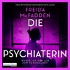

<b>Psychospannung mit Bestsellergarantie – nach der "Housemaid"-Reihe präsentiert Freida McFadden ihren neuen packenden Stand-alone-Thriller!</b>  Die frischvermählten Tricia und Ethan sind auf der Suche nach ihrem Traumhaus. Sie glauben, es gefunden zu haben in dem Anwesen, das einst Dr. Adrienne Hale gehörte, einer renommierten Psychiaterin, die vor drei Jahren spurlos verschwunden ist. Als ein heftiger Sturm aufkommt, können sie das Haus nicht mehr verlassen. Tricia stößt auf eine Sammlung von Videokassetten – Aufnahmen von Adriennes Patientensitzungen. Mit jeder Kassette, die sie sich ansieht, wird ihr klarer, wie es zu Adriennes Verschwinden kam. Ein Netz aus Lügen tut sich auf. Doch wenn Tricia bei der letzten Kassette ankommt, wird es bereits zu spät sein …  Gekürzte Lesung mit Nina Reithmeier, Rubina Nath, Konstantin Marsch, Claudia Gräf, Stefan Kaminsky 7h 4min

[View on Apple](https://books.apple.com/de/audiobook/die-psychiaterin-wurde-der-job-ihr-zum-verh%C3%A4ngnis/id1852659663)

## Die Känguru-Rebellion (Die Känguru-Werke 5)

Hey Leute, aufgepasst, keine Fake News, es ist wirklich wahr: neue Geschichten vom Känguru und dem Kleinkünstler. Wird auch echt Zeit. Ich meine, guckt euch mal um in der Welt. Von den Zuständen kriegt man ja Zustände. Das Känguru jedenfalls hat keinen Bock mehr darauf und startet eine Rebellion. Macht ihr mit? Es wird politisch, aktuell – und extrem witzig.&#xa0;
»Ich rebelliere!«, ruft das Känguru, als es in die Küche kommt.&#xa0;
»Aha«, sage ich. »Wogegen rebellierst du denn?«
»Gegen die Zustände.«
»Verständlich«, sage ich. »Löblich geradezu.«
»Rebellierst du mit?«, fragt das Känguru.&#xa0;
»Wenn ich darf.«
»Falsche Antwort. Wer rebelliert, fragt nicht, ob er darf.«
»Guter Punkt.«&#xa0;
»Also rebellierst du mit?«
»Sehr gerne.«
»Hervorragend«, sagt das Känguru. »Dann sind wir schon zu zweit.«

[View on Apple](https://books.apple.com/de/audiobook/die-k%C3%A4nguru-rebellion-die-k%C3%A4nguru-werke-5/id1847910478)

## Sommerfeldt Solo. Der Auftrag (Band 1, ungekürzt)

Die Ereignisse auf Borkum haben Dr. Bernhard Sommerfeldt zutiefst erschüttert. Jetzt ist die Zeit gekommen, gegen das Organisierte Verbrechen in Ostfriesland und auf den Inseln vorzugehen. Doch dafür braucht er einen guten Plan, denn der neue Gangsterboss, den sie den »Brasilianer« nennen, geht äußerst raffiniert vor. Dabei hat er einen bekannten Verbündeten: Hauptkommissar Rupert und Dr. Bernhard Sommerfeldt verfolgen jetzt ein gemeinsames Interesse an der ostfriesischen Küste.

Dieser erscheint als ungekürzte Autorenlesung bei GOYA und wird von Klaus-Peter Wolf, der Nummer 1 in der Spannung, mit bekanntem Charme gesprochen.

[View on Apple](https://books.apple.com/de/audiobook/sommerfeldt-solo-der-auftrag-band-1-ungek%C3%BCrzt/id1893589547)

## Bretonischer Glanz - Kommissar Dupin ermittelt - Kommissar Dupins fünfzehnter Fall, Band 15 (Gekürzte Lesung)

Weltberühmte Zwiebeln und mysteriöse Morde im idyllischen Roscoff  Die Mittagssonne lässt die bunten Segel der Boote im Hafenbecken aufleuchten, als Kommissar Dupin sich auf der Terrasse des "Amiral" niederlässt. Gerade will er sich seinem "tartare de bœuf" widmen, als sein Handy klingelt: In Roscoff im hohen bretonischen Norden wurde eine junge Frau ermordet aufgefunden - ausgerechnet dort, wo gerade das berühmte Krimifestival stattfindet ...  Umgehend macht sich der Kommissar zusammen mit seinen Inspektoren Riwal und Kadeg auf den Weg. In dem Hafenstädtchen, das für seine Zwiebeln weltbekannt ist, herrscht Ausnahmezustand: Inmitten des Festivaltrubels ziehen Mitarbeiter des lokalen Fährunternehmens wegen drohender Entlassungen durch die Straßen.  Außerdem scheinen in der "Bruderschaft zum Schutz der Roscoff-Zwiebel" obskure Dinge vor sich zu gehen. Als Unbekannte beginnen, rätselhafte Drohparolen auf Hauswände zu schmieren, spitzt sich die Lage zu. Für Dupin wird es so gefährlich wie in keinem Fall zuvor ...

[View on Apple](https://books.apple.com/de/audiobook/bretonischer-glanz-kommissar-dupin-ermittelt-kommissar/id6770470077)

## Memories of Heidelberg (Ungekürzt)

Heidelberg im Frühling! Bertram und Isolde, ein in die Jahre gekommenes Paar aus Oldenburg, möchten sich inder romantischen Kurpfalz mal einen richtig schönen Kurzurlaub gönnen. Vielleicht vertreibt das ja auch den seelischen Smog über dem Eheleben. Das Boutiquehotel ist teuer, aber für das viele Geld gar nicht so toll; dafür haben die beiden gleich einen neuen Stamm-Italiener ausgemacht. Das Restaurant voller Flair befindet sich auf einem alten Flussschiff im Neckar. Während die Ehe der beiden im Verlauf einer Woche zusehends aus der Form gerät, wird auch der abendliche Gang auf das Restaurantschiff immer mehr zur Enttäuschung, zur Strafe, zur Höllenqual. Das Teuflische bricht mit verheerender Macht in den Alltag, am Ende steht eine Katastrophe - und das alles zum Schlager-Oldie "Memories of Heidelberg" in Dauerschleife.

[View on Apple](https://books.apple.com/de/audiobook/memories-of-heidelberg-ungek%C3%BCrzt/id6777941567)

## Die Känguru-Chroniken (Die Känguru-Werke 1)

Marc-Uwe Kling lebt mit einem Känguru zusammen. Das Känguru ist Kommunist und steht total auf Nirvana. Die Känguru-Chroniken berichten von den Abenteuern und Wortgefechten des Duos. Und so bekommen wir endlich Antworten auf die drängendsten Fragen unserer Zeit: War das Känguru wirklich beim Vietcong? Und wieso ist es schnapspralinensüchtig? Könnte man die Essenz des Hegelschen Gesamtwerkes in eine SMS packen? Und wer ist besser: Bud Spencer oder Terence Hill?
Für Die Känguru-Chroniken erhielt Marc-Uwe Kling den Deutschen Hörbuchpreis 2013.

[View on Apple](https://books.apple.com/de/audiobook/die-k%C3%A4nguru-chroniken-die-k%C3%A4nguru-werke-1/id1500352652)

## Mord in der Toskana - Armstrong und Oscar ermitteln, Band 1 (Ungekürzte Lesung)

Mord in der Toskana

Mord in der Toskana: Cosy-Crime von T. A. Williams

Dolce Vita trifft auf tödliche Geheimnisse: Der spannende Auftakt der cosy crime Hörbuchreihe mit dem pensionierten Chief Inspector Dan Armstrong und dem Labrador Oscar begeistert Krimi- und Italien-Fans gleichermaßen.

Mit dem Hörbuch Mord in der Toskana startet der argon-Verlag eine neue, atmosphärische Krimi-Reihe. Der britische Bestsellerautor T. A. Williams, der für seine charmanten Settings bekannt ist, verwebt hier klassische Detektivarbeit mit dem unverwechselbaren Flair Italiens. Die Armstrong und Oscar ermitteln-Reihe gibt es vorerst nur exklusiv als Hörbuch auf dem deutschen Markt.

Mit Mord in der Toskana hat T. A. Williams einen klassischen "Whodunit"-Krimi geschrieben, der auf sanfte Spannung und atmosphärisches Setting statt auf blutige Details setzt. Dans tierischer Gefährte, der Labrador Oscar, und beliebte italienische Orte machen die Reihe perfekt für Hundeliebhaber und Italien-Fans.

Die Reihe umfasst im englischen Original bereits mehrere Bände, die nun vom argon Verlag sukzessive für die Hörer:innen im deutschsprachigen Raum von Wolfgang Wagner eingelesen werden. Momentan sind 9 Bände geplant. Mord in der Toskana erscheint am 01.06.2026, Mord im Chianti erscheint am 15.06.2026 und Mord in Florenz erscheint am 03.08.2026 beim argon Verlag.

Gelesen wird die Hörbuch-Reihe von Wolfgang Wagner. Dieser ist bekannt für seine stimmungsvollen Lesungen und mit einem Repertoire von über 170 Hörbüchern, zählt er zu den gefragtesten Stimmen der Branche.

Die Handlung:

Eigentlich wollte der frisch pensionierte Chief Inspector Dan Armstrong in der luxuriösen Villa Volpone in den toskanischen Hügeln lediglich seinen Ruhestand genießen. Doch die Idylle trügt: Jonah Moore, ein berühmter Krimiautor und Gastgeber eines Schreibseminars, wird kurz nach Dans Ankunft erstochen aufgefunden. Da die örtliche Polizei vor einer Mauer aus Schweigen steht, nimmt Armstrong gemeinsam mit dem italienischen Commissario Virgilio Pisano die Ermittlungen auf. Unterstützt wird er dabei von einem ungewöhnlichen Partner: dem aufgeweckten Labrador Oscar. Schnell stellt sich heraus, dass jeder der Seminarteilnehmer in der Villa ein dunkles Geheimnis hütet, das weit über die Grenzen der Literatur hinausgeht.

Hörbuch-Highlights:

● Genre: Cosy Crime in bester englischer Manier - die perfekte Mischung aus Italien , Humor und einem komplexen Kriminalfall.

● Autor: T. A. Williams ist auf den Bestseller-Listen bei Amazon vertreten, hat bereits über 1 Millionen Bücher verkauft und liefert hier seinen 1. Band der erfolgreichen "Armstrong und Oscar ermitteln"-Reihe als deutschsprachiges Hörbuch

● Setting: Sehnsuchtsort Toskana

● Stil: Klassische Ermittlungsarbeit im Stil von Mrs Potts Mordclub und Monsieur le Comte, erzählt mit britischem Witz und italienischem Temperament.

● Besonderes: Labrador Oscar spielt eine wichtige Rolle beim Lösen der Fälle und ist immer an Armstrongs Seite

● Sprecher: Gelesen von dem renommierten Sprecher Wolfgang Wagner, der mit seiner tiefen, sonoren Stimme jedem Verdächtigen einen eigenen Charakter verleiht (Laufzeit: ca. 540 Minuten).
● Release: Erscheinungstermin beim argon Verlag am 01.06.2026.

[View on Apple](https://books.apple.com/de/audiobook/mord-in-der-toskana-armstrong-und-oscar-ermitteln-band/id6768579878)

## Todesstille über Föhr | Inselkrimi Hörbuch - Ein Nordseekrimi-Reihe, Band 5 (Ungekürzt)

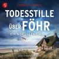

<b>Zwei ungewöhnliche Todesfälle auf Föhr, die auf den ersten Blick nicht zusammenhängen - können Kari und Sebastian ihr Geheimnis lüften?</b>
<b>Band 5 der erfolgreichen Küstenkrimi-Reihe auf der Nordsee-Insel</b>  Zwei ungewöhnliche Todesfälle erschüttern die Nordsee-Insel Föhr: Die beiden Touristen wurden ermordet, nachdem sie ein Lokal in Wyk besuchten. Als Kari Lürsen und Sebastian die Ermittlungen übernehmen, stellen sie fest, dass die Frau unter falschem Namen gereist ist. Erst die Suche in der Vergangenheit des männlichen Opfers gibt einen Hinweis auf ihre Identität, doch keine Erklärung, was beide in Föhr vorhatten und warum sie sterben mussten. Kari steht unter Druck, herauszufinden, was außer ihrer Einsamkeit die beiden Opfer verbindet, bevor der der Mörder für immer von der Bildfläche verschwinden kann ...  <b>Zwei Tote, falsche Identitäten und eine Insel, die ihre Geheimnisse nicht hergibt - Fans von Klaus-Peter Wolf, Eva Almstädt und der Karl-Sönnigsen-Reihe finden in Komissarin Karis fünftem Fall den perfekten Begleiter für lange Abende oder die Autofahrt ans Meer. Ein ungekürztes Nordseekrimi Hörbuch für alle, die spannende Küstenkrimis mit nordischer Atmosphäre und unvorhersehbaren Wendungen lieben.</b>  <b>Erste Leser:innenstimmen</b>
<i>"Ein fesselnder Inselkrimi, der sofort mit bedrückender Wucht einsetzt und den Leser bis zum Ende nicht mehr loslässt"</i>
<i>"Der Ermittler-Krimi lebt nicht nur vom düsteren Nordsee Setting und der psychologischen Spannung, sondern vor allem von der Dynamik zwischen Kari und Sebastian."</i>
<i>"Jede Seite dieses fesselnden Kriminalfalls versetzt mich zurück auf die Nordseeinsel."</i>
<i>"... mitreißend, sehr gut recherchiert, mit überraschenden Wendungen und glaubhaften Protagonisten, die nachvollziehbar handeln - so kennt man die Föhr Krimi-Reihe."</i>

[View on Apple](https://books.apple.com/de/audiobook/todesstille-%C3%BCber-f%C3%B6hr-inselkrimi-h%C3%B6rbuch-ein-nordseekrimi/id6773670526)

## Als Großmutter im Regen tanzte - Die Großmutter-Reihe, Band 1 (Ungekürzte Lesung)

Drei Frauen, drei Generationen, verbunden durch die Liebe und ein tragisches Geheimnis der Nachkriegszeit
Als Juni ins Haus ihrer verstorbenen Großeltern auf der kleinen norwegischen Insel zurückkehrt, entdeckt sie ein Foto: Es zeigt ihre Großmutter Tekla als junge Frau mit einem deutschen Soldaten. Wer ist der unbekannte Mann? Ihre Mutter kann Juni nicht mehr fragen. Das Verhältnis zwischen ihrer Mutter und ihrer Großmutter war immer von etwas Unausgesprochenem überschattet.
Die Suche nach der Wahrheit führt Juni nach Berlin und in die kleine Stadt Demmin im Osten Deutschlands, die nach der Kapitulation von der russischen Armee überrannt wurde. Juni begreift, dass es um viel mehr geht als um eine verheimlichte Liebe. Und dass ihre Entdeckungen Konsequenzen haben für ihr eigenes Glück.
Großmutter tanzte im Regen erzählt davon, wie uns die Vergangenheit prägt bis in die Generationen der Töchter und Enkelinnen. Doch vor allem ist es eine Geschichte über die heilende Kraft der Liebe.

[View on Apple](https://books.apple.com/de/audiobook/als-gro%C3%9Fmutter-im-regen-tanzte-die-gro%C3%9Fmutter-reihe/id1665611760)

## Das Cottage in der Serling Street - Natalie Ames ermittelt - Tee? Kaffee? Mord!, Folge 39 (Ungekürzt)

Nathalie erbt überraschend ein Cottage - von einem Mann, den sie zuvor nie getroffen hat. Ihre verstorbene Tante Henrietta hingegen kannte Lewis Brownsfield sehr wohl. Und sie war bis zuletzt fest davon überzeugt, dass er ein dunkles Geheimnis hütete. Allerdings sieht sein Cottage für Nathalie und Louise denkbar harmlos aus. Doch dann finden die beiden heraus, dass der unscheinbare Mann tatsächlich etwas zu verbergen hatte - und dass noch andere diesem Rätsel auf die Spur kommen wollen, koste es, was es wolle ...

ÜBER DIE SERIE
Davon stand nichts im Testament ... Cottages, englische Rosen und sanft geschwungene Hügel - das ist Earlsraven. Mittendrin: das »Black Feather«. Dieses gemütliche Café erbt die junge Nathalie Ames völlig unerwartet von ihrer Tante - und deren geheimes Doppelleben gleich mit! Die hat nämlich Kriminalfälle gelöst, zusammen mit ihrer Köchin Louise, einer ehemaligen Agentin der britischen Krone. Und während Nathalie noch dabei ist, mit den skurrilen Dorfbewohnern warmzuwerden, stellt sie fest: Der Spürsinn liegt in der Familie ...

[View on Apple](https://books.apple.com/de/audiobook/das-cottage-in-der-serling-street-natalie-ames-ermittelt/id6786002009)

## Schleier aus Lügen - Bunburry - Ein Idyll zum Sterben, Folge 21 (Ungekürzt)

In Bunburry sollen schon bald die Hochzeitsglocken läuten! Mit der Unterstützung der renommierten Hochzeitsplanerin Elizabeth Ravensdale bereiten Alfie und Emma ihren großen Tag vor. Doch dann erschüttert ein grausamer Fund die Idylle: Eine Leiche wird entdeckt. Während die Polizei glaubt, den Täter gefunden zu haben, sind Alfie, Liz und Marge überzeugt, dass mehr hinter der Sache steckt - und nehmen die Ermittlungen selbst in die Hand. Gelingt es ihnen, die Wahrheit ans Licht zu bringen?

Über die Serie: Frische Luft, herrliche Natur und weit weg von London! Das denkt sich Alfie McAlister, als er das Cottage seiner Tante in den Cotswolds erbt. Und packt kurzerhand die Gelegenheit beim Schopfe, um der Hauptstadt für einige Zeit den Rücken zu kehren. Kaum im malerischen Bunburry angekommen, trifft er auf Liz und Marge, zwei alte Ladys, die es faustdick hinter den Ohren haben und ihn direkt in ihr großes Herz schließen. Doch schon bald stellt Alfie fest: Auch wenn es hier verführerisch nach dem besten Fudge der Cotswolds duftet - Verbrechen gibt selbst in der schönsten Idylle. Gemeinsam mit Liz und Marge entdeckt Alfie seinen Spaß am Ermitteln und als Team lösen die drei jeden Fall!

[View on Apple](https://books.apple.com/de/audiobook/schleier-aus-l%C3%BCgen-bunburry-ein-idyll-zum-sterben-folge/id6785999396)

## Bullenbrüder - Tote haben keine Freunde (Ungekürzte Lesung)

Holger Brinks ist Kommissar bei der Mordkommission. Sein Bruder Charlie schlägt sich als Privatschnüffler durchs Leben. Der eine ein korrekter Beamter mit Familie, der andere ein ausgebuffter Hallodri mit Bindungsproblemen. Als Charlie mal wieder von einer Beinahe-Traumfrau vor die Tür gesetzt wird, bittet er seinen Bruder um Obdach - und landet auf der Luftmatratze in Holgers Gartenlaube. Der Kommissar steht beruflich unter Druck. Der engste Vertraute des Berliner Unterwelt-Bosses Bobby Schütz wurde tot im Aufzug eines Berliner Luxushotels gefunden - mit einem Koffer voller Kokain. Pikanterweise hat auch Charlie Verbindungen zu Schütz und seinem Clan ...

[View on Apple](https://books.apple.com/de/audiobook/bullenbr%C3%BCder-tote-haben-keine-freunde-ungek%C3%BCrzte-lesung/id1425467857)

## Dungeon Crawler Carl (German Edition) (Unabridged)

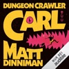

Arschwitzig, einfallsreich und absolut suchterzeugend. Die legendäre Fantasyserie um Dungeon Crawler Carl und die Perserkatze Princess Donut gibt es endlich auf Deutsch.  Willkommen im Dungeon. Entertainment ist Pflicht. Überleben nicht.  Das Leben ist nicht fair. Erst wird Carl von seiner Freundin sitzengelassen, und dann muss er mitten in der Nacht in Boxer Shorts und Lederjacke raus, um ihre Katze Prinzessin Donut zu retten. Noch unfairer wird es, als er von außerirdischen Invasoren gezwungen wird, an einer sadistischen, intergalaktischen Spielshow teilzunehmen.  In einem Dungeon voller Fallen, explodierender Goblins, Drogen dealenden Lamas besteht sein Leben von nun an vor allem darin, am Leben zu bleiben. Und dafür muss er neue Fähigkeiten entwickeln, mächtige Waffen finden und Sponsoren, die ihn in einer perversen und intriganten Medienwelt unterstützen, gegen die Panem ein Kindergarten ist. Zum Glück hat er Donut dabei, eine Katze mit viel Erfahrung im Showbusiness. Und dem unbedingten Willen zum Erfolg.  "Frisch. Kreativ. Urkomisch. Ich bin obsessed ... Princess Donut ist meine Königin." Felicia Day  "Wenn es ein besseres LitRPG als Dungeon Crawler Carl gibt, habe ich es noch nicht gelesen." Shirtaloon, Autor von He Who Fights Monsters  "Wie kann eine Serie nur so viel Tiefe, Gefühl und Komplexität unter ihrer derben, blutrünstigen Oberfläche verbergen? Was für eine verrückte und unerwartete Freude." Scott Lynch  <b>Please note: This audiobook is in German.</b>

[View on Apple](https://books.apple.com/de/audiobook/dungeon-crawler-carl-german-edition-unabridged/id1858532121)

## Mord im Chianti - Armstrong und Oscar ermitteln, Band 2 (Ungekürzte Lesung)

Mord am helllichten Tag

Als der Unternehmer Rex Hunter mit eingeschlagenem Schädel auf dem Golfplatz seines prestigeträchtigen Country-Clubs im wunderschönen Chianti aufgefunden wird, besteht kein Zweifel: Es war Mord. Hunter war reich, erfolgreich und wurde von vielen beneidet - ein vermeintlich leichtes Spiel für den pensionierten DCI Dan Armstrong.

Doch als Dan und sein treuer Begleiter, der Labrador Oscar, beginnen, Hunters Leben unter die Lupe zu nehmen, stoßen sie auf einen Mann, der von vielen verachtet wurde. Niemand scheint sonderlich traurig über das Ableben des berüchtigten Frauenhelds, rücksichtslosen Chefs und herzlosen Familienoberhaupts zu sein. Die Liste der Verdächtigen ist endlos, und jede neue Spur scheint in einer Sackgasse zu enden. Wird dies der erste Fall sein, den Dan und sein vierbeiniger Gefährte nicht lösen können?
Der zweite Band der Cosy-Crime-Reihe von Bestsellerautor T. A. Williams - perfekt für Fans von Monsieur le Comte und Mrs Potts Mordclub

[View on Apple](https://books.apple.com/de/audiobook/mord-im-chianti-armstrong-und-oscar-ermitteln-band/id6768576532)

## Häftling (Ungekürzt)

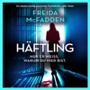

Nur er weiß, warum du hier bist.
Es gibt drei Regeln, die Brooke Sullivan als neu eingestellte Pflegefachkraft im Hochsicherheitsgefängnis befolgen muss:
1.Behandle alle Insassen respektvoll.
2.Gib nie persönliche Informationen preis.
3.Freunde dich NIEMALS mit den Insassen an.
Aber niemand im Gefängnis ahnt, dass Brooke bereits all diese Regeln gebrochen hat. Niemand weiß von ihrer engen Verbindung zu Shane Nelson, einem der berüchtigtsten Häftlinge der Strafanstalt.
Und sie wissen definitiv nicht, dass Shane vor vielen Jahren Brookes Highschool-Freund war - der Star-Quarterback, der jetzt den Rest seines Lebens wegen einer Reihe blutiger Morde hinter Gittern verbringt. Oder dass es Brookes Aussage war, die sein Urteil besiegelt hat.
Aber Shane erinnert sich.
Und er wird es nicht so bald vergessen.
Ein absolut spannungsgeladener Psychothriller von der Bestsellerautorin des millionenfach verkauftem Wenn sie wüsste - jetzt im Kino. Perfekt für alle Fans von Gillian Flynn, Sebastian Fitzek und Paula Hawkins.
Leser:innen über Freida McFadden:
"Jedes Mal, wenn ich dachte, ich hätte es erraten ... FALSCH!!! ... Ich bin noch immer komplett durch den Wind ... Ausgezeichnet ... Wenn du erstklassige Psychothriller liebst, die dich deinen eigenen Verstand hinterfragen lassen, dann bist du bei dieser 5-Sterne-Lektüre richtig." NetGalley-Rezension ⭐⭐⭐⭐⭐
"Was für ein wilder Ritt!!! Freida liefert das absolut beste, twistgefüllte Finale ab ... Fesselnd von Anfang bis Ende ... Ich konnte es wirklich nicht weglegen ... Ein absolut umwerfendes schockierendes Buch, das mich bis zum Ende gepackt und miträtseln lassen hat." Goodreads-Rezension ⭐⭐⭐⭐⭐
"So viele Drehungen und Wendungen ... Ich war sofort gepackt - ich hab sogar auf meinem Kindle gelesen, während ich vor der Schule auf mein Kind gewartet habe, sodass ich es nicht weglegen musste! ... Süchtig machend ... Perfektion!" Goodreads-Rezension ⭐⭐⭐⭐⭐
"Wow!!! ... Was für eine Achterbahnfahrt! Ich saß auf heißen Kohlen! ... Ausgezeichnetes Buch! ... Fantastisches Ende!!!! ... Ich empfehle es wärmstens ... Dicke, fette fünf Sterne von mir." Goodreads-Rezension ⭐⭐⭐⭐⭐
"SO GUT ... Ich wollte es nicht aus der Hand legen! Ich hab 70% in einem Rutsch gelesen ... Ich war gefesselt ... Du wirst das Ende nicht kommen sehen! Leg alles zur Seite und hol dir dieses Buch!" Thriller_book_sisters ⭐⭐⭐⭐⭐
"OMG!!! HAT MICH ABSOLUT UMGEHAUEN!!!! Liebe, liebe, LIEBE diesen absoluten Pageturner!! ... Die Twists hörten einfach nicht auf!!! ... Ich hab es in einem Rutsch einfach verschlungen!! ... Süchtig machender, umwerfender Pageturner, der dich mit rasendem Herzen wachhält, bis du ihn beendet hast!!!" Bookworm86 ⭐⭐⭐⭐⭐
"Absolut unglaublich! ... Wow ... Der finale Twist war FANTASTISCH, und es war das erste Mal, dass ich beim Lesen eines Thrillers laut 'neeeein?' gerufen hab ... Genial ... Ich kann es nur empfehlen." jsybookworm ⭐⭐⭐⭐⭐
"Ein großartiger Psychothriller!! ... Wird dich ab der ersten Zeile abholen ... Halt deine Kinnlade fest, denn sie wird zu Boden fallen ... Hab es so. Sehr. Geliebt!!" Goodreads-Rezension ⭐⭐⭐⭐⭐

[View on Apple](https://books.apple.com/de/audiobook/h%C3%A4ftling-ungek%C3%BCrzt/id1876228419)

## Das Kind in dir muss Heimat finden

<b>Direkt, echt, lebensnah – die neue Erfolgsautorin in der Lebenshilfe.</b>  Jeder Mensch sehnt sich danach, angenommen und geliebt zu werden. Im Idealfall entwickeln wir während unserer Kindheit das nötige Selbst- und Urvertrauen, das uns als Erwachsene durchs Leben trägt. Doch auch die erfahrenen Kränkungen prägen sich ein und bestimmen unbewusst unser gesamtes Beziehungsleben. Erfolgsautorin Stefanie Stahl hat einen neuen, wirksamen Ansatz zur Arbeit mit dem "inneren Kind" entwickelt: Wenn wir Freundschaft mit ihm schließen, bieten sich erstaunliche Möglichkeiten, Konflikte zu lösen, Beziehungen glücklicher zu gestalten und auf (fast) jedes Problem eine Antwort zu finden.

[View on Apple](https://books.apple.com/de/audiobook/das-kind-in-dir-muss-heimat-finden/id1437376330)

## 22 Kurzgeschichten, die dein Denken verändern werden

Grübeln stoppen, Gelassenheit lernen und positiv denken durch die Kraft der Positiven Psychologie!

Manchmal reicht eine einzige Kurzgeschichte, um die Welt mit neuen Augen zu sehen. In "22 Kurzgeschichten, die dein Denken verändern werden" erwarten dich inspirierende Erzählungen, die deine Perspektive auf das Leben sanft, aber tiefgreifend verändern. Jede Kurzgeschichte basiert auf Erkenntnissen der Positiven Psychologie – leicht verständlich, alltagsnah und mit einer klaren Botschaft: Du hast die Kraft, dein Denken zu lenken.

Ob du häufig grübelst, innere Ruhe suchst oder dir mehr Leichtigkeit im Alltag wünschst – dieses Hörbuch ist dein Begleiter auf dem Weg zu mehr Gelassenheit, Selbstvertrauen und mentaler Stärke. Statt trockener Theorie erlebst du, wie Gedanken, Gefühle und Entscheidungen in kurzen, fesselnden Momenten zu kleinen Wendepunkten werden.

Lass dich inspirieren, berühren und bestärken – Geschichte für Geschichte.
Denn manchmal genügt schon ein Gedanke, um dein ganzes Leben zu verändern.

[View on Apple](https://books.apple.com/de/audiobook/22-kurzgeschichten-die-dein-denken-ver%C3%A4ndern-werden/id1849959883)

## Nightworld Academy - Gesamtausgabe (1-10)

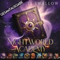

"Also es gibt 3 Häuser an unserer Schule."
"Häuser? Wie in Hogwarts?", frage ich.
"Nein ..." Er seufzt. "Nicht wie in ... okay, vielleicht ein bisschen wie in Hogwarts."

Maeve hat Visionen, aber die behält sie besser für sich. Sie will nicht für verrückt erklärt werden. Aber gelegentlich versucht sie die Zukunft zu beeinflussen und gerät dadurch in Schwierigkeiten.

Also wird sie an die Nightworld Academy geschickt. Eine Schule, die Maeve vom ersten Augenblick seltsam vorkommt. Die Schüler sind in Häuser eingeteilt. Walcott, Gilgamesh und Petrescu. Die Schüler der Häuser sind alle sehr unterschiedlich. Die Walcotts sind Nerds, die Gilgamesh Schüler sind groß und extrem stark und schnell, und die Perescu Schüler sind wunderschön und ... irgendwie unheimlich.

Maeve merkt bald, dass an dieser Schule irgendetwas nicht stimmt, und als sie offiziell in ihr Haus aufgenommen wird, begreift sie auch was.
Sie ist an einer Schule für Hexen, Gestaltwandler und Vampire und alle Häuser wollen Maeves Gabe die Zukunft zu sehen.

[View on Apple](https://books.apple.com/de/audiobook/nightworld-academy-gesamtausgabe-1-10/id1895657130)

## Verliebt in Greenkenny - Irish Lovestories - Ein Irland-Liebesroman, Band 1 (Ungekürzt)

<b>Küssen Iren wirklich besser?</b>
<b>Ein turbulent-romantischer Liebesroman auf der Grünen Insel</b>  Nachdem Simone erst ihren Freund und dann auch noch den Job verliert, flüchtet sie kurz entschlossen nach Irland, um sich abzulenken. Gleich am ersten Abend im Pub knistert es gewaltig zwischen ihr und dem charmanten Tyler und sie lässt sich auf einen One-Night-Stand mit ihm ein. Daraufhin geht ihr der faszinierende Ire mit seiner unkomplizierten Art nicht mehr aus dem Kopf. Als Simones Rückflug gestrichen wird und sie gezwungen ist, länger als geplant auf der Grünen Insel zu bleiben, nimmt sie all ihren Mut zusammen und besucht Tyler trotz Pferdephobie auf seiner Pferdefarm im idyllischen Greenkenny. Durch ihn lernt sie nicht nur die Schönheit der irischen Landschaft, sondern auch die Herzlichkeit der Bewohner kennen. Doch Tyler trägt ein Geheimnis mit sich, das die aufkeimende Beziehung der beiden überschattet. Hat es etwas mit den unbewohnten Cottages auf dem Farmgelände zu tun, um die sämtliche Bewohner einen großen Bogen machen? Und warum setzt Tylers Stiefschwester alles daran, einen Keil zwischen ihn und Simone zu treiben?  <b>Erste Leser:innenstimmen
</b><i>"Die Liebesgeschichte zwischen Simone und Tyler entwickelt sich auf eine Weise, die das Herz berührt."</i>
<i>"Eine romantische und emotionale Reise nach Irland, die zum Träumen einlädt!"</i>
<i>"Die Kulisse der Insel und die Beschreibungen der Pferdefarm haben mich direkt verzaubert."</i>
<i>"Die Autorin versteht es, die Gefühle der Charaktere authentisch darzustellen und das Geheimnis um Tyler geschickt einzuflechten."</i>

[View on Apple](https://books.apple.com/de/audiobook/verliebt-in-greenkenny-irish-lovestories-ein-irland/id1737744109)

## Karneval der Lügen - Cherringham - Landluft kann tödlich sein, Folge 50 (Ungekürzt)

Cherringham - Der 50. Fall
Im sonst so beschaulichen Cherringham herrscht Ausnahmezustand: Es ist Sommer-Karneval! Das ganze Dorf feiert den 500. Jahrestag, an dem der König dem Ort seine Stadtrechte verliehen hat. Doch zwischen bunten Kostümen und fröhlichen Umzügen bahnt sich Unheil an. Als eine kostbare Urkunde spurlos verschwindet, sollen Jack und Sarah für das Karnevalskomitee ermitteln und geraten mitten hinein in ein gefährliches Spiel ...
Über die Serie: Cherringham ist ein beschauliches Dorf in den englischen Cotswolds. Doch mysteriöse Vorfälle, eigenartige Verbrechen und ungeklärte Morde halten die Bewohner auf Trab. Zum Glück bekommt die örtliche Polizei tatkräftige Unterstützung von Sarah und Jack. Die alleinerziehende Mutter und der ehemalige Cop aus New York lösen jeden noch so verzwickten Fall. Und geraten das ein oder andere Mal selbst in die Schusslinie.

[View on Apple](https://books.apple.com/de/audiobook/karneval-der-l%C3%BCgen-cherringham-landluft-kann-t%C3%B6dlich/id6772132058)

## Der Nachbar

Sie dachte, ihre größte Angst ist es, allein zu sein. Bis sie herausfindet, dass sie es nie war...  Wer ist der "Nachbar"?  <i>Der Nachbar</i> - Sebastian Fitzeks raffinierter Gänsehaut-Thriller für 2025  Die Strafverteidigerin Sarah Wolff leidet an Monophobie, der Angst vor Einsamkeit. Was sie nicht weiß: Nachdem sie mit ihrer Tochter an den Stadtrand Berlins gezogen ist, hat sie einen unsichtbaren Nachbarn, der sie keine Sekunde lang allein lassen wird ...  Das Unheimliche lauert im engsten Umfeld - der neue nervenzerreißende Psychothriller von #1-Bestseller-Autor Sebastian Fitzek sorgt für garantiert unruhige Nächte!

[View on Apple](https://books.apple.com/de/audiobook/der-nachbar/id1836179259)

## Psycho-Cybernetics (Updated and Expanded)

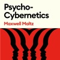

<b>The landmark self-help bestseller that has inspired and enhanced the lives of </b><b>more than 30 million readers.</b>  In this updated edition, with a new introduction and editorial commentary by Matt Furey, president of the Psycho-Cybernetics Foundation, the original 1960 text has been annotated and amplified to make Maxwell Maltz's message even more relevant for the contemporary reader.  Maltz was the first researcher and author to explain how the self-image (a term he popularized) has complete control over an individual's ability to achieve, or fail to achieve, any goal. He developed techniques for improving and managing self-image visualization, mental rehearsal and relaxation which have informed and inspired countless motivational gurus, sports psychologists, and self-help practitioners for more than sixty years.  Rooted in solid science, the classic teachings in <i>Psycho-Cybernetics</i> continue to provide a prescription for thinking and acting that lead to life-enhancing, quantifiable results.

[View on Apple](https://books.apple.com/de/audiobook/psycho-cybernetics-updated-and-expanded/id1674144949)

## Die Roseninsel (Ungekürzt)

Ein warmherziger und gefühlvoller Roman über Glück und Hoffnungslosigkeit, Verlust und Liebe - all das, was ein Leben ausmacht.
Kann man sich im falschen Moment verlieben? Und überwindet Liebe jedes Hindernis?
Buchhändlerin Emma reist nach London, um ihren verstorbenen Eltern noch einmal nahe zu sein, denn diese hatten sich dort kennen- und lieben gelernt.
Schon am ersten Tag begegnet ihr die sympathische Witwe Ava. Die beiden Frauen freunden sich an, und Ava macht Emma das verlockende Angebot, in ihrem Anwesen auf der Roseninsel in Cornwall die Bibliothek auf den neuesten Stand zu bringen. Begeistert sagt Emma zu.
Völlig unerwartet trifft sie in dem Haus auf den Klippen auf Avas Sohn Ethan, der ihr gegenüber sehr abweisend ist. Dennoch fühlt Emma sich zu ihm hingezogen. Als sie herausfindet, was hinter Ethans kühler Fassade steckt, begreift sie, wie tief Liebe gehen kann - und steht plötzlich vor der größten Herausforderung ihres Lebens ...
© Insel Verlag Berlin 2021

[View on Apple](https://books.apple.com/de/audiobook/die-roseninsel-ungek%C3%BCrzt/id1567572855)

## Apfelstrudel-Alibi: Franz Eberhofer, Band 13

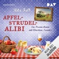

Als ob der Eberhofer Franz nicht schon Ärger genug hätte. Nein, jetzt muss die Susi-Maus sich auch noch als frischgebackene Bürgermeisterin wichtigmachen. Dabei hat er ganz andere Sorgen, nämlich einen Mordfall, einen waschechten. Zumindest glaubt das der Richter Moratschek, dessen geliebte Patentochter Letitia sicher nicht von ganz allein in Südtirol vom Berg gestürzt ist. Dem Eberhofer kommt das auch spanisch vor – oder eher italienisch! Und so kraxelt er auf den Spuren des vermeintlichen Mordopfers in den Dolomiten herum. Und der Rudi, der muss derweil beim Hauptverdächtigen auf dem Campingplatz ermitteln – inkognito, versteht sich. Na, sauber!

[View on Apple](https://books.apple.com/de/audiobook/apfelstrudel-alibi-franz-eberhofer-band-13/id1839879244)

## Gesamtausgabe - Der Thron der Magier

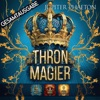

Thron der Magier: Das große Epos von Frankreichs Nummer 1 Fantasy-Autorin Jupiter Phaeton.
Gelesen von 4 der berühmtesten Sprecherinnen und Sprecher Deutschlands.

"Das eindeutig beste Hörbuch das wir jemals veröffentlicht haben." Winterfeld Verlag

Der König der Magier ist tot.
Jetzt wollen die fünf mächtigsten Magierfamilien in England seine Nachfolge antreten. Mit Intrigen, Machtspielen und natürlich Magie versuchen sie alle sich den Thron zu sichern. 

Unterdessen will Katleen die 20-jährige Tochter des toten Königs nichts von alldem wissen. Katleen hat sich geschworen, nie wieder einen Fuß in die Welt der Magier zu setzen, und erst als sie vom Tod ihres Vaters erfährt, beschließt sie, sich den Geistern ihrer Vergangenheit zu stellen.

Allerdings ahnt sie nicht, dass diese Entscheidung ihr Leben und das Schicksal der Welt verändern wird.

[View on Apple](https://books.apple.com/de/audiobook/gesamtausgabe-der-thron-der-magier/id1894074047)

## Ein Kommissar wird gejagt - Taxi, Tod und Teufel, Folge 20 (Ungekürzt)

Hauptkommissar Scharrmann muss sich verstecken - vor der Polizei! Denn jemand im Kommissariat will ihm einen Mord anhängen. Aber warum? Auf seiner Flucht bleibt ihm nur eine Verbündete: Sarah Teufel glaubt keine Sekunde an Scharrmanns Schuld und bietet ihm Unterschlupf in einer Autowerkstatt. Doch dadurch gerät sie selbst ins Visier der Polizei. Zum Glück besitzt Sarah ein Talent dafür, ihre Verfolger abzuschütteln. Jetzt muss sie nur noch die Wahrheit ans Licht bringen! Es beginnt ein riskantes Katz-und-Maus-Spiel mit falschen Beweisen, dunklen Geheimnissen und der Frage, wem Sarah überhaupt noch trauen kann ...

ÜBER DIE SERIE

Palinghuus in Ostfriesland: Zwischen weitem Land und Wattenmeer lebt Sarah Teufel mit ihrem amerikanischen Ex-Mann James in einer Windmühle. Gemeinsam betreiben sie das einzige Taxiunternehmen weit und breit - mit einem Original New Yorker Yellow Cab! Bei ihren Fahrten bekommt Sarah so einiges mit. Und da die nächste Polizeistation weit weg ist, ist doch klar, dass Sarah selbst nachforscht, wenn etwas nicht mit rechten Dingen zugeht. Denn hier im hohen Norden wird nicht gesabbelt, sondern ermittelt!

Eine atmosphärische Küstenkrimi-Serie voller Humor, Spannung und überraschender Wendungen - perfekt für alle, die Mordfälle mit norddeutschem Flair lieben.

[View on Apple](https://books.apple.com/de/audiobook/ein-kommissar-wird-gejagt-taxi-tod-und-teufel-folge/id6785996248)

## Tote singen keine Schlager - Sommer, Strand und Schlagermord, Folge 1 (Ungekürzt)

Eine neue Leiche ist wie ein neues Leben!

Franzi Wernke übernimmt die alte Kneipe ihres Onkels auf Mallorca - nur leider hat sie eine Leiche im Keller. Also, die Kneipe. Ein Koffer voller Schlager-CDs ist die einzige Spur, während die Polizei ausgerechnet Franzi verdächtigt. Gemeinsam mit Nachbar und Schlager-Fan Pierre André folgt sie der rätselhaften CD-Fährte, die nicht nur den Start ihrer Schlagerbar, sondern auch ihre neue Zukunft bedroht.

Über die Serie:

Willkommen in der Carreró Alegria auf Mallorca! Franzi Wernke, frisch geschieden und mit Teenager-Tochter, erbt hier eine Kneipe und wagt einen Neustart. Pierre André, ein noch nicht erfolgreicher Schlagersänger und talentierter Frisör im besten Alter, überzeugt sie, daraus eine Schlagerbar zu machen. Dumm nur, dass rund um die Schlagerbühne regelmäßig Morde passieren. Zwischen Lockenwicklern, Longdrinks und latent verdächtigen Nachbarn stürzen sich Franzi und Pierre in Ermittlungen voller Humor, Herz und mallorquinischem Flair.

Sommer, Strand und Schlagermord - ein witziger, spannender Krimi zum Wohlfühlen nicht nur für Mallorca- und Schlager-Fans!

[View on Apple](https://books.apple.com/de/audiobook/tote-singen-keine-schlager-sommer-strand-und-schlagermord/id6783055760)

## Die Ehefrau – Was hat sie zu verbergen?

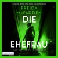

<b>In diesem Haus ist nichts so, wie es scheint: Nr.-1-Bestsellerautorin Freida McFadden ist die Queen der packenden Twists!</b>  Sylvia Robinson wird im Haus der Barnetts als private Pflegekraft eingestellt. Nach einem Unfall benötigt Victoria Barnett rund um die Uhr Betreuung. Sie kann weder gehen noch sprechen und ist an ihr Bett im obersten Stockwerk des Hauses gefesselt. Daher hat ihr Mann Sylvia als Unterstützung hinzugeholt. Doch schon bald hat Sylvia das Gefühl, dass Victoria nicht so hilflos ist, wie sie scheint. Dann entdeckt sie Victorias Tagebuch versteckt in einer Kommode. Und was sie darin liest, zieht ihr den Boden unter den Füßen weg.   leicht gekürzte Lesung mit Chantal Busse, Jodie Ahlborn 9h 29min

[View on Apple](https://books.apple.com/de/audiobook/die-ehefrau-was-hat-sie-zu-verbergen/id1807980252)

## nonStop kissing the Boss

Die Engländerin Indy Fallon liebt ihren Job als Grafikdesignerin in einer angesagten New Yorker Werbeagentur über alles. Bis ihr ein schwerwiegender Fehler passiert und das Leben, das sie sich in der Millionenmetropole aufgebaut hat, vor dem Aus steht, denn ihr Arbeitsvisum ist an die Stelle geknüpft.
Als ihr Boss Max Conrad sie in sein Büro ruft, rechnet Indy mit dem Schlimmsten. Doch statt sie zu feuern, bietet er ihr einen Deal an: Wenn sie ihren Job behalten will, muss sie eine Nacht mit ihm verbringen.
Doch was, wenn es nicht bei einer Nacht bleibt – und niemand von dem Arrangement erfahren darf?

[View on Apple](https://books.apple.com/de/audiobook/nonstop-kissing-the-boss/id1723991872)

## artgerecht - Das andere Kleinkinderbuch

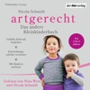

<b>Der "artgerecht" Praxisratgeber für die Kleinkinderjahre</b>  Tausende begeisterte Eltern verlassen sich darauf, was Nicola Schmidt zur "artgerechten" Kindererziehung schreibt. Was passiert im Nervensystem, im rasant wachsenden Körper, während der Hormongewitter, wenn aus Babys Kleinkinder werden? Was hat die Evolution ihnen an Entwicklungsaufgaben mitgegeben und warum bringt das Eltern manchmal zur Verzweiflung? Wo hilft im Alltag die Wissenschaft weiter und wo wirken immer noch Ammenmärchen in unseren Köpfen? Nicola Schmidt beantwortet unzählige brennende Fragen und zeigt praktische Tipps zur Kleinkindphase – wie immer klug recherchiert, humorvoll und erfrischend undogmatisch.  Ungekürzte Lesung mit Nicola Schmidt, Nina West 8h 16min

[View on Apple](https://books.apple.com/de/audiobook/artgerecht-das-andere-kleinkinderbuch/id1586207332)

## Das Schwert Gottes - Thriller ( John Milton 5 )

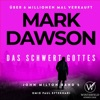

Absolute Hörbuchempfehlung für Mark Dawson Fans: Die Mädchen vom 3. Stock von Alex Sol - der härteste Thriller des Jahres

Auf der Flucht vor seinen inneren Dämonen erreicht John Milton tief in den Wäldern von Michigan die Stadt Truth. Er sucht nicht nach Ärger, aber der Ärger sucht ihn. Er gerät an einen Kleinstadtpolizisten, der weder weiß, mit wem er es zu tun hat, noch ahnt, wie gefährlich er ist.

Aber Milton wird reingelegt und schwer verletzt. Unbewaffnet und allein flieht er in die abgelegenen Porcupine Mountains, ein Suchtrupp ist ihm dicht auf den Fersen. Seine Feinde glauben, sie könnten ihn zur Strecke bringen. Das ist ein Irrtum, und was Milton betrifft, gibt es keine zweite Chance.

[View on Apple](https://books.apple.com/de/audiobook/das-schwert-gottes-thriller-john-milton-5/id1896274945)

## Sie kann dich hören

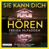

<b>Die packende Geschichte von Millie geht weiter: Ein neuer Job. Ein luxuriöses Appartement. Eine Frau, die Millies Hilfe benötigt. Doch nichts ist, wie es scheint.</b>  Millie Calloway hat einen neuen Job. Um sich ihr Studium zu finanzieren, hilft sie einem reichen Paar aus Manhattan im Haushalt. Ihr Arbeitgeber Douglas Garrick wirkt nett, und zum Glück stellt er ihr nicht zu viele Fragen zu ihrer Vergangenheit. Doch warum darf Millie nicht mit seiner Frau Wendy sprechen? Was bedeuten das Weinen, das sie aus dem verschlossenen Zimmer hört, und die Blutflecke auf Wendys Kleidung? Ist Douglas in Wahrheit nicht der fürsorgliche Ehemann, der er vorgibt zu sein? Millie weiß nur eins: Sie muss Wendy helfen. Auch wenn sie damit riskiert, dass ihr dunkelstes Geheimnis doch noch ans Licht kommt.  Gekürzte Lesung mit Leonie Landa, Vanida Karun 7h 16min

[View on Apple](https://books.apple.com/de/audiobook/sie-kann-dich-h%C3%B6ren/id1704425015)

## 8000 Arten, als Mutter zu versagen (Ungekürzte Autorinnenlesung)

Carolin Kebekus ist auch hinter dem Hörbuch-Mikro eine mitreißende Interpretin und zieht alle Register des Komischen.
Carolin Kebekus nimmt sich selbst, die Gesellschaft und alle Mütter und Väter aufs Korn, denn beim Kinderkriegen und Kinderhaben haben offenbar alle ungefragt ein Wörtchen mitzureden.
Bilder von bildhübschen neugeborenen Babys, die friedlich schlafen, von makellos schönen, entspannten Müttern direkt nach der Geburt, die liebevoll auf ihren Nachwuchs blicken, von stolzen Vätern, die Blumen und Schmuck bringen, als wären sie mindestens die Heiligen Drei Könige - diese Bilder treffen ziemlich ungebremst auf die Wirklichkeit: Blut, Schweiß, schlaflose Nächte und viel Aua. Dann hilft es sehr, die lustige Seite der vollgemachten Windel zu sehen.
Warum Schwangerschaft und Geburt immer noch mit vielen Tabus und falschen Annahmen behaftet sind, was einem als Schwangere und Mutter so alles passieren und entgegengeschleudert werden kann, was man so hört und liest und ungefragt gesagt bekommt, weil es tatsächlich alle besser wissen - das beschreibt dieses Hörbuch mit einer gehörigen Portion Selbstironie und dennoch unbeirrbarem Blick.

[View on Apple](https://books.apple.com/de/audiobook/8000-arten-als-mutter-zu-versagen-ungek%C3%BCrzte-autorinnenlesung/id1827454949)

## Harry Potter und der Stein der Weisen

Rufus Beck liest Band 1 von Harry Potter. Eigentlich hatte Harry geglaubt, er sei ein ganz normaler Junge. Zumindest bis zu seinem elften Geburtstag. Da erfährt er, dass er sich an der Schule für Hexerei und Zauberei einfinden soll. Und warum? Weil Harry ein Zauberer ist. Und so wird für Harry das erste Jahr in der Schule das spannendste, aufregendste und lustigste in seinem Leben. Er stürzt von einem Abenteuer in die nächste ungeheuerliche Geschichte, muss gegen Bestien, Mitschüler und Fabelwesen kämpfen. Da ist es gut, dass er schon Freunde gefunden hat, die ihm im Kampf gegen die dunklen Mächte zur Seite stehen.  <i>Titelmusik komponiert von James Hannigan</i>

[View on Apple](https://books.apple.com/de/audiobook/harry-potter-und-der-stein-der-weisen/id1442189567)

## Das Traumhotel am Meer | Ein romantisches Hörbuch mit gemütlichem Ostsee-Setting (Ungekürzt)

<b>Ein turbulent-romantischer Ostsee Liebesroman über die unerwarteten Wege, auf denen die Liebe manchmal zu uns findet</b>  Franzi hat nur ein Ziel: Australien. Doch bevor sie sich ihren großen Traum erfüllen kann, nimmt sie den Job als Gärtnerin in einem Boutiquehotel an der Ostsee an. Dort erwartet sie nicht nur eine grüne Hölle, sondern auch der arrogante Hotelerbe Benjamin von Greifenberg. Obwohl er kein Geheimnis daraus macht, dass ihm Affären lieber sind als feste Bindungen, schlägt ihr Herz bald deutlich schneller, als sie wahrhaben will. Nachdem ihre Arbeit schließlich mehr Chaos als Fortschritt anrichtet, ist Franzi überzeugt, dass sie demnächst ihre Koffer packen muss. Doch dann bekommt sie eine unerwartete Chance: Das Hotel gerät in Schwierigkeiten - und Franzi überrascht Benjamin nicht nur mit ihrem verborgenen Talent, sondern auch damit, dass sie sich unbemerkt in sein Herz geschlichen hat ...  <b>Turbulent, romantisch und voller Gefühl: das neue Romance Hörbuch von Booktok Autorin Doris R. Thomas ist da! Zum Wegträumen an Küste, Strand und Meer - ungekürzt und in voller Länge. Perfekte Vorfreude auf den Sommer!</b>  <i>Alle Bände der Reihe können unabhängig voneinander gehört werden.</i>  <b>Erste Leser:innenstimmen</b>
<i>"Ein Liebesroman, so schön und entspannend wie Sommerurlaub an der Ostsee!"
"Wunderschöner Wohlfühlroman über neue Chancen, Selbstfindung und die große Liebe."
"Ich liebe diesen Küstenroman voller Sehnsucht und einer starken Protagonistin."
"Zwischen Franzi und Benjamin knistern die sich entwickelnden Gefühle."
</i>

[View on Apple](https://books.apple.com/de/audiobook/das-traumhotel-am-meer-ein-romantisches-h%C3%B6rbuch-mit/id1861533590)

## Das Känguru-Manifest (Die Känguru-Werke 2)

Sie sind wieder da – das kommunistische Känguru und der stoische Kleinkünstler! Auf der Jagd nach dem höchstverdächtigen Pinguin rasen sie durch die ganze Welt. Spektakuläre Enthüllungen! Skandale! Intrigen! Ein Mord, für den sich niemand interessiert! Eine Verschwörung auf niedrigster Ebene! Ein völlig abstruser Weltbeherrschungsplan! Mit Spaß, Spannung und Schnapspralinen ...

[View on Apple](https://books.apple.com/de/audiobook/das-k%C3%A4nguru-manifest-die-k%C3%A4nguru-werke-2/id1500633929)

## Der 8. Mann

<b>7 Tote mit CIA-Vergangenheit. Wer wird das achte Opfer? Ein neuer Fall für Jack Reacher.</b>  Sieben tödlichen Unfälle geschehen über die ganze USA verteilt, und sie scheinen nichts miteinander zu tun zu haben. Doch als Charles Stamoran, der US-Verteidigungsminister, davon erfährt, setzt er eine Untersuchung höchster Priorität an. Auch der Militärpolizist Jack Reacher gehört zu den Ermittlern. Er erkennt, dass die sieben Männer eine gemeinsame CIA-Vergangenheit haben – und dass es keine Unfälle waren. Außerdem verdichten sich die Hinweise, dass das Morden nicht enden wird, bevor noch ein achtes Ziel getötet wurde: Charles Stamoran! Reacher steht ein Wettrennen um Leben und Tod bevor. <b>Kennen Sie schon die als Streaming-Serie verfilmten Titel "Größenwahn", "Trouble" oder "Der Janusmann"?</b>  Gekürzte Lesung mit Michael Schwarzmaier 8h 19min

[View on Apple](https://books.apple.com/de/audiobook/der-8-mann/id1852649504)

## Die Känguru-Offenbarung (Die Känguru-Werke 3)

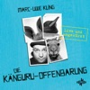

Endlich: Es geht weiter! Nach dem Manifest folgt die Offenbarung! Hier kommt die fulminante Fortsetzung der Fortsetzung: der »Känguru-Chroniken« dritter Teil. Das Beuteltier und der Kleinkünstler auf der Jagd nach dem mysteriösen Pinguin. Haltet euch bereit: »Dies ist die Offenbarung des Kängurus, dem Asozialen Netzwerk zu zeigen, was in der Kürze geschehen soll; und sie wurde gesandt durch eine E-Mail zu seinem Knecht Marc-Uwe, der bezeugt hat das Wort des Kängurus und das Zeugnis vom Asozialen Netzwerk, was er gesehen hat. Selig ist, der da liest und die da hören die Worte der Weissagung, denn die Zeit ist nahe.« Halleluja.

[View on Apple](https://books.apple.com/de/audiobook/die-k%C3%A4nguru-offenbarung-die-k%C3%A4nguru-werke-3/id1500352078)

## Die Meerglas-Schwestern

<b>Vier Schwestern, geheimnisvolle Erbstücke und schicksalhafte Liebe – der Auftakt der vierbändigen Familiengeheimnis-Saga "Die Töchter von Skara"!</b>  Nach dem Tod ihrer Mutter kehrt Roz Australien den Rücken und trägt nur einen Ring mit einem leuchtenden Opal bei sich, ein Erbstück, das sie bei der Räumung ihres Zuhauses entdeckt hat. In London, zwischen den antiken Schätzen eines kleinen Ladens, fühlt sie sich auf beinahe mystische Weise von einem Gemälde angezogen, das vier Felsen an der Küste Schottlands zeigt. Von einer unstillbaren Sehnsucht getrieben, reist sie nach Skara, in die Heimat der verstorbenen Malerin. Gemeinsam mit Drew, einem charismatischen Inselbewohner, enthüllt Roz nicht nur die Geschichte einer großen Liebe, sondern auch das tragische Geheimnis von vier Schwestern, das ihr eigenes Leben für immer verändern wird ... <b>Eine Familie mit einem uralten Geheimnis, rätselhafte Erbstücke und exotische Länder – wenn Sie Familiengeheimnis-Sagas lieben, dürfen Sie diese Reihe nicht verpassen!</b>  Gekürzte Lesung mit Leonie Landa 11h 39min

[View on Apple](https://books.apple.com/de/audiobook/die-meerglas-schwestern/id1852660406)

## Die kleine Boutique am Meer

Tauche ein in einen turbulent-romantischen Ostsee-Liebesroman – perfekt für alle, die sich ans Meer träumen möchten
Auf dem Rückflug ihres Urlaubes lernt Katja den charismatischen Hotelmanager Sebastian kennen. Dank einer witzigen Verwechslung gibt er sich kurzerhand als ihr Freund aus und erobert damit ihr Herz im Sturm. Zu dumm, dass die Zollkontrolle am Flughafen Katja zwingt, sich abrupt von Sebastian zu verabschieden. Und das, wo sie noch nicht mal seinen vollständigen Namen kennt. Aber das Universum lässt sie nicht im Stich. Absolut unerwartet steht er plötzlich vor ihrer Tür im Ostseebad Warnemünde und die Anziehung zu ihm entflammt erneut. Als wäre ihr Glück nicht genug, rückt ein Lottogewinn ihren großen Traum von einer eigenen Modeboutique in greifbare Nähe. Katja rollt die Ärmel hoch und macht sich mit Hammer und Farbeimern daran, ihren Traum Wirklichkeit werden zu lassen. Doch plötzlich geben sich die nicht enden wollenden Katastrophen die Klinke in die Hand und auch Sebastian scheint nicht der Traumtyp zu sein, für den sie ihn hält …

[View on Apple](https://books.apple.com/de/audiobook/die-kleine-boutique-am-meer/id1837696668)

## Der heilige Tod - Thriller ( John Milton 2 )

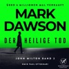

John Milton lebt seit sechs Monaten unter dem Radar.

In Ciudad Juárez, Mexiko, taucht er wieder auf und gerät unversehens in eine wütende Schlacht zwischen den Narco-Gangs, die das Grenzland kontrollieren.

Milton bewahrt eine idealistische junge Journalistin vor der Hinrichtung. In Sicherheit kann er sie nur bringen, wenn er sie über die Grenze nach Texas schmuggelt. Mit Hilfe des einzigen unbestechlichen Polizisten in der Stadt und einem Kopfgeldjäger mit unklaren Motiven muss Milton sie beschützen, bis der Grenzübertritt möglich ist.

Aber das ist leichter gesagt als getan, denn der Mann, der sie sucht, erweist sich als der legendäre Auftragsmörder Santa Muerta — der Heilige Tod.

[View on Apple](https://books.apple.com/de/audiobook/der-heilige-tod-thriller-john-milton-2/id1874401216)

## Dear Britain

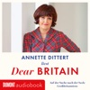

Als Annette Dittert am 31. Januar 2020 um Mitternacht vor der Downing Street stand, um live in den ARD-Tagesthemen darüber zu berichten, dass der Brexit in dieser Nacht nun endgültig vollzogen sei, schossen ihr kurz vor der Schalte plötzlich Tränen in die Augen. Längst war London ihr Zuhause geworden. Jetzt war der Bruch mit der EU nicht mehr umkehrbar. Für sie und viele Briten, die bis zum Schluss noch auf einen anderen Ausgang gehofft hatten, ein bedrückender Tag.
Sechs Jahre später und zehn Jahre nach dem Brexit-Referendum fragt sich Annette Dittert, was aus dem Land geworden ist. Sie nimmt uns mit auf eine Reise über die Insel: Wir besuchen die Royal Albert Hall und das House of Lords, schwimmen mit der Frauengruppe »Blue Tits« im Meer an der Ostküste der Insel, plaudern mit Schotten, Priestern und Earls. Und sind bei der Autorin auf ihrem Narrowboat Emilia zu Gast, einem kleinen bunten Boot aus Stahl am Regent's Canal, mitten im Zentrum Londons. So entsteht ein facettenreiches Bild der eigenwillig-charmanten Briten, deren prekäre wirtschaftliche und soziale Situation – nicht nur infolge des EU-Austritts – im Alltag spürbar ist und die doch stets Haltung bewahren.

»Jedes Mal, wenn Annette Dittert in der ARD zugeschaltet wurde, dachte ich erfreut: Let the show begin. Und genau so liest sich dieses Buch. Annette Dittert verbindet politische Analyse mit persönlicher Erfahrung jahrelanger Korrespondentenzeit. So entsteht ein vielschichtiger, oft überraschender Blick auf ein Land, das vielen Deutschen vertraut scheint und das sich doch erst wirklich erschließt, wenn man Einblicke hinter seine Rituale, Widersprüche und Eigenheiten erhält. Und die liefert Annette Dittert und nicht zu wenig. Grandios! « NATALIE AMIRI

»Dieses fantastische Buch ist ebenso unterhaltsam wie klug. Ein tiefer Blick in die Seele der Briten, geschrieben fast wie ein Roman. Ich konnte nicht aufhören zu lesen!« ULRICH WICKERT

[View on Apple](https://books.apple.com/de/audiobook/dear-britain/id1850499238)

## Kein Sommer ohne August - Every Summer Has A Story, Teil 1 (Ungekürzt)

Zwei Kinder, die die Liebe zu Büchern teilen. Zwölf Sommer, in denen sie gemeinsam erwachsen werden. Eine Entscheidung, die alles verändert. Und zehn Tage, um ein neues Kapitel zu schreiben.
Charlie Henderson hat ihr Herz hinter dicken Mauern verschlossen und lebt ein scheinbar perfektes Leben in London - bis eine Erbschaft sie zurück nach Liberty Beach im Nordosten der USA ruft. Den Ort ihrer Kindheit und den Ort, den sie vor zehn Jahren Hals über Kopf verlassen hat. Dort erwartet sie nicht nur die Buchhandlung One Last Chapter, in der sie als Kind unzählige Stunden verbracht hat, sondern auch August Green, bester Freund aus Kindestagen, ihre erste große Liebe - und der Grund, warum sie damals aus Liberty Beach geflohen ist. Zwischen Regalen voller Geschichten und den Erinnerungen an schmerzhafte Verluste muss Charlie sich entscheiden: Bleibt sie Gefangene ihrer Angst oder wagt sie ein neues Kapitel?
Ein bewegendes Hörbuch über Freundschaft, Liebe und Fehler, die passieren, wenn wir versuchen, alles richtig zu machen. Und eine warmherzige Liebeserklärung an Bücher und das Zuhause, das wir zwischen zwei Buchdeckeln finden.

[View on Apple](https://books.apple.com/de/audiobook/kein-sommer-ohne-august-every-summer-has-a-story/id6773354674)

## Sturmland - Die Sturmland-Saga, Band 1 (Autorisierte Lesefassung)

Der neue große Zweiteiler der Bestsellerautorin! Eine Hamburger Reedertochter will mehr vom Leben, als sie darf. Ein Tagelöhner hat das seine bereits aufgegeben. Eine schicksalhafte Liebe entsteht - zum Beginn der Seenotrettung in Hamburg und in den norddeutschen Seebädern.
Niemand darf erfahren, wer Cora wirklich ist! Die Reedertochter muss aus ihrem alten Leben in Hamburg fliehen - und nimmt unter falschem Namen eine Stelle als Hauslehrerin im Seebad Norderney an. Doch die Nordsee ist unberechenbar. Schon kurz nach ihrer Ankunft bringt Cora sich und ihre Schülerin Emmi in Lebensgefahr ...
Der Tagelöhner Onnen beobachtet das Unglück. Kein Wunder, dass die unwissenden Badegäste ständig in Seenot geraten. Ausgerechnet mit dieser Gouvernante soll er nun zusammenarbeiten. Weil er dringend Geld braucht, nimmt er den Job an. Von Tag zu Tag kommen Cora und Onnen sich näher. Doch Onnen hat eine Vergangenheit auf seiner Heimatinsel Borkum, die er fest in sich verschlossen hält. Und Cora hat Menschen in Hamburg, die sie verzweifelt zurückholen wollen. Aber das darf nicht passieren. Niemand darf erfahren, wer Cora ist - und was sie getan hat ...
Der erste Band der Sturmland-Saga, mitreißend gelesen von Miriam Georgs Stammsprecherin Tanja Fornaro.

[View on Apple](https://books.apple.com/de/audiobook/sturmland-die-sturmland-saga-band-1-autorisierte-lesefassung/id6781243787)

## Der Tod braucht nie ein Alibi - Sofia und die Hirschgrund-Morde, Teil 29 (Ein Bayernkrimi)

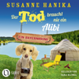

[View on Apple](https://books.apple.com/de/audiobook/der-tod-braucht-nie-ein-alibi-sofia-und-die-hirschgrund/id6789263835)

## Der Cleaner - Thriller ( John Milton 1 )

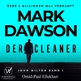

Tauchen Sie ein in eine der erfolgreichsten Kriminal-Serien der Welt!

Der britische Geheimdienst hat ihn erschaffen - Jetzt wollen sie ihn vernichten.

John Milton war ein Attentäter für den britischen Geheimdienst. Er gehörte zur absoluten Elite: kaltblütig, gnadenlos, spurlos. Doch jahrelange Auftragsmorde haben ihre Spuren hinterlassen. Milton wird von Schuldgefühlen geplagt und von den Geistern seiner Vergangenheit heimgesucht. In einem Versuch, Buße zu tun, beginnt er jenen zu helfen, die von der Gesellschaft im Stich gelassen wurden. Doch er muss schnell feststellen, dass der Weg zur Erlösung steinig ist – und dass man der eigenen Vergangenheit nicht so einfach entkommt.

[View on Apple](https://books.apple.com/de/audiobook/der-cleaner-thriller-john-milton-1/id1834872690)

## Ihre perfekte Ehe  Thriller Hörbuch - Wie weit würdest du gehen, um deine Familie zu beschützen? (Ungekürzt)

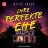

<b>Die perfekte Ehefrau - bis ihr Tod ihre Lügen entblößt
Der fesselnde Thriller, der dich keine Sekunde loslassen wird</b>  Mark Burcham dachte eigentlich er hätte alles: eine glückliche Ehe, ein gemütliches Haus in Los Angeles und eine wundervolle Tochter. Doch als seine Frau Amy von einer Geschäftsreise nicht zurückkehrt und ihr Büro keine Aufzeichnungen über einen Kunden an der Ostküste auffindet, bricht Marks Welt auseinander.  Dann erhält er die schlimmste aller Nachrichten: Amy wurde tot aufgefunden. Aber nichts passt zusammen. Warum war sie noch in der Stadt, obwohl Mark sie am Flughafen verabschiedet hatte? Wer war der mysteriöse Kunde, mit dem sie sich seit Monaten getroffen hatte? Stück für Stück entdeckt Mark die Seite seiner Frau, die sie versuchte zu verbergen und ihm wird klar, dass jemand verhindern will, dass er Amys Geheimnisse erfährt. Jemand, der jeden seiner Schritte beobachtet. Und als seine Familie bedroht wird, bleibt ihm nur eine Wahl: Er muss die Wahrheit ans Licht bringen - koste es, was es wolle.  <b>Erste Leser:innenstimmen</b>
<i>"Die Mischung aus dunklen Geheimnissen, emotionaler Tiefe und atemloser Spannung macht diesen Thriller zu einem echten Highlight."</i>
<i>"Amys Geschichte entfaltet sich wie ein Puzzle, bei dem jedes neue Teil eine weitere düstere Enthüllung bringt."</i>
<i>"Ein intensiver Psychothriller, der mit unvorhersehbaren Wendungen und emotionalem Tiefgang überzeugt."</i>
<i>"Die Bedrohung ist greifbar, die Charaktere vielschichtig - perfekt für Fans intelligenter und temporeicher Spannungsromane."</i>

[View on Apple](https://books.apple.com/de/audiobook/ihre-perfekte-ehe-thriller-h%C3%B6rbuch-wie-weit-w%C3%BCrdest/id1831234907)

## Hollywell Hearts: Die kleine Farm am Meer

Eine Ziegenfarm am Meer? Tamlyn fällt aus allen Wolken, als sie plötzlich einen kleinen Hof in Cornwall erbt – noch dazu von ihrem Vater, den sie nie kennengelernt hat. Fest entschlossen, das Erbe einfach abzulehnen, fährt sie nach Hollywell: Für Tamy kommt es als Großstadtpflanze nämlich nicht infrage, das aufregende London gegen ödes Landleben zu tauschen! Aber plötzlich gibt es da eine Halbschwester, die ihre Hilfe braucht, süße Angoraziegen, die sie auf Trab halten, und den attraktiven Tierarzt Scott, der von Businessfrauen nicht viel hält. Sie stellen alles auf den Kopf, was Tamy über ihre Familie, das Leben und die Liebe zu wissen glaubte. Kann sie vielleicht ausgerechnet in Hollywell das große Glück finden?

[View on Apple](https://books.apple.com/de/audiobook/hollywell-hearts-die-kleine-farm-am-meer/id1705719779)

## Der Name des Windes

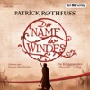

<b>„Ein Fantasy-Epos voll MUSIK und MAGIE.“ Denis Scheck</b>  „Vielleicht habt ihr von mir gehört“ ... von Kvothe, dem für die Magie begabten Sohn fahrender Spielleute. Das Lager seiner Truppe findet er verwüstet, die Mutter und den Vater tot. Wer aber sind diese Chandrian, die weißglänzenden, schleichenden Mörder seiner Familie? Um ihnen auf die Spur zu kommen, riskiert Kvothe alles. Er lebt als Straßenjunge in der Hafenstadt Tarbean, bis er auf das Arkanum, die Universität für hohe Magie aufgenommen wird. Vom Namenszauber, der ihn als Kind fast das Leben gekostet hätte, erhofft sich Kvothe die Macht, das Geheimnis der sagenumwobenen Dämonen aufzudecken. Stefan Kaminski leiht dem berühmten Zauberer Kvothe und seiner spannenden Geschichte eine Stimme, die von der ersten Minute an fesselt.  <b>(Laufzeit: 28h 19)</b>

[View on Apple](https://books.apple.com/de/audiobook/der-name-des-windes/id1446961490)

## Das Haus im Wald - Krimi Hörbuch ( Atticus 1 )

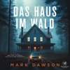

Hörbuchempfehlung für Mark Dawson Fans: Hört euch auch unbedingt die Winter-Black Serie, den internationalen Bestseller von Mary Stone an! 

Das Haus im Wald:

Vier Leichen. Zwei Ermittler. Ein rätselhaftes Verbrechen.

Am Heiligabend wird DCI Mackenzie Jones zu einer Schießerei in einem abgelegenen Farmhaus gerufen. Ralph Mallender glaubt, seinen Vater tot in der Küche liegen gesehen zu haben. Als drei weitere Leichen gefunden werden, wird klar, dass sich ein weihnachtliches Familientreffen zu einer grausamen Tragödie gewandelt hat.

Zunächst scheint der Fall offensichtlich zu sein: Ein erweiterter Selbstmord von Ralphs jähzornigem Bruder. Bis neue Beweise Mack daran zweifeln lassen, dass er der wahre Täter ist.

Doch nicht nur Mack riskiert mit dem Fall alles. Der Privatdetektiv Atticus Priest wird damit beauftragt, Ralphs Unschuld zu beweisen. Und dafür legt er alle Fehler in Macks Ermittlungen offen.

Mit seinem aufbrausenden, ungeduldigen und unberechenbaren Charakter hat Atticus ganz eigene Dämonen zu bekämpfen. Und Mack kennt jede seiner Schwächen, denn sie waren früher schon ein Team – beruflich und privat. Diesmal jedoch stehen sie nicht auf derselben Seite, und als Atticus beginnt, ihren Fall auseinanderzunehmen, offenbart er Geheimnisse, die keiner von beiden hätte vorhersehen können.

Aus dem Englischen übersetzt von Marco Mewes

[View on Apple](https://books.apple.com/de/audiobook/das-haus-im-wald-krimi-h%C3%B6rbuch-atticus-1/id1773825444)

## Der Lehrer – Will er dir helfen oder will er deinen Tod?

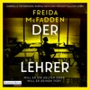

<b>Von dieser Autorin bekommt man nicht genug: Der "New York Times"-Bestseller von Freida McFadden, der für schlaflose Nächte sorgt.</b>  Eigentlich hat Eve Bennett ein gutes Leben. Sie ist Mathelehrerin an der örtlichen Highschool und verheiratet mit Nate, der dort Englisch unterrichtet. Doch letztes Jahr wurde die Schule von einem Skandal erschüttert, in dessen Zentrum eine Schülerin stand. Und dieses Jahr ist diese Schülerin in Eves Klasse. Addie kann man nicht trauen, sie lügt und verletzt Menschen. Aber niemand kennt die wahre Addie. Niemand kennt das Geheimnis, das sie zerstören könnte. Und Addie würde alles dafür tun, dass es so bleibt. Ihr einziger Lichtblick in diesem Schuljahr: ihr neuer Lehrer Nate Bennett.  Gekürzte Lesung mit Gabrielle Pietermann, Rubina Nath, Vincent Fallow 8h 18min

[View on Apple](https://books.apple.com/de/audiobook/der-lehrer-will-er-dir-helfen-oder-will-er-deinen-tod/id1778581067)

## SYLTKRIMI: Band 6-10

Die beliebte Küstenkrimireihe um die Sylter Kriminalhauptkommissarin Bente Brodersen als Sammelband/Hörbuch. Bände 6-10 als Serienmarathon.
Tauchen Sie ein in die Geschichten um Bente Brodersen, die nördlichste Kommissarin Deutschlands.
Sylt, die Insel der Schönen und Reichen, hat zwar nur 15.000 Einwohner, lockt aber jährlich Millionen Touristen an. Für die Kripo-Sylt eine echte Herausforderung, denn Mord macht keine Ferien.
Die raue See, der stete Wind und die endlosen Dünen machen SYLT zum idealen Schauplatz der spannenden Küstenkrimis.

[View on Apple](https://books.apple.com/de/audiobook/syltkrimi-band-6-10/id1837696242)

## Tod und Teufel

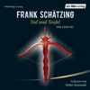

<b>Endlich – Frank Schätzings Bestseller als Lesung</b>  Köln, im Jahre 1260. Jakob der Fuchs, ein charmanter Dieb und Vagabund, wird Zeuge, wie der Dombaumeister vom Gerüst in den Tod gestoßen wird. Doch alle, denen Jakob von dem Mord erzählt, sind kurz darauf ebenfalls tot. Als er begreift, wer die Intrige gesponnen hat, muss er den Verbrecher so rasch wie möglich überführen. Doch der ist ein eiskalter Auftragsmörder, und als nächstes hat er Jakob im Visier … Stefan Kaminski, der wohl bekannteste Stimmenvirtuose unter den Hörbuchsprechern, ist inzwischen als Interpret der Romane von Frank Schätzing etabliert.  <b>(Laufzeit: ca. 15h 25)</b>

[View on Apple](https://books.apple.com/de/audiobook/tod-und-teufel/id1435725813)

## Very Bad Liars (Kingston University, Spring Break, Teil 2) – Das Hörspiel

Es wäre kein Spiel, wenn wir dir einfach sagen, dass du dich nicht zwischen uns entscheiden musst. Wir wollen, dass du wählst. Und es wird immer die falsche Wahl sein.

Spring Break sollte für Mable die Zeit sein, in der sie sich auf ihre Prüfungen in Kingston vorbereitet, doch alles kommt anders als geplant.

Das FBI bevölkert den Campus, um mehr über die Hintergründe des Anschlags auf die Elite-Studenten in Erfahrung zu bringen. Nicht einmal die Kings wissen, was Mable herausgefunden hat.

Das Spiel der Begierde und Lust scheint eine tödliche Wendung zu nehmen. Werden die Könige ihre Dame beschützen?

Oder planen sie noch immer ihren Untergang?

Vergiss Spring Break, kleine Blüte. Wenn herauskommt, dass du uns etwas verschweigst, könnte das dein tatsächliches Ende bedeuten.

Lektion drei: Die Elite kennt bessere Waffen als Pistolen und Messer. Wir kämpfen nicht – wir lassen kämpfen. Und du solltest uns dabei nicht im Weg stehen.

Dark College. Bully Romance. Reverse Harem.

Du willst nicht teilen. Sie dich schon.

Band 3 der KINGSTON-Reihe von Bestseller-Autorin J. S. Wonda jetzt als Hörspiel. 
Dies ist der zweite und abschließende Teil des Hörspiels.

[View on Apple](https://books.apple.com/de/audiobook/very-bad-liars-kingston-university-spring-break-teil/id6769693076)

## Das NEINhorn

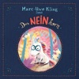

Das neue Kinderbuch von Marc-Uwe Kling - Jetzt endlich als Hörbuch
Diese Ausgabe enthält als Bonus einen exklusiven Live-Mitschnitt von Das NEINhorn – von Marc-Uwe Kling vor Publikum gelesen im Mehringhoftheater Kreuzberg.
Im Herzwald kommt ein kleines, schnickeldischnuckeliges Einhorn zur Welt. Aber obwohl alle ganz lilalieb zu ihm sind und es ständig mit gezuckertem Glücksklee füttern, benimmt sich das Tierchen ganz und gar nicht einhornmäßig. Es sagt einfach immer Nein, sodass seine Familie es bald nur noch NEINhorn nennt. Eines Tages bricht das NEINhorn aus seiner Zuckerwattewelt aus. Es trifft einen Waschbären, der nicht zuhören will, einen Hund, dem echt alles schnuppe ist, und eine Prinzessin, die immer Widerworte gibt. Die vier sind ein ziemlich gutes Team. Denn sogar bockig sein macht zusammen viel mehr Spaß!&#xa0;
Vom Autor der&#xa0;Känguru-Chroniken&#xa0;und des Kinderbuch-Bestsellers&#xa0;Der Tag, an dem die Oma das Internet kaputt gemacht hat.

[View on Apple](https://books.apple.com/de/audiobook/das-neinhorn/id1498775335)

## Der Thron der Lilie

<b>Die grandiose Fortsetzung von "Das Reich der Rose"</b>  Frankreich 1297. Während der Papst und der französische König einen erbitterten Machtkampf austragen, werden der Ritter Constantin Fleury, die Goliardin Mélisande und der Templer Gérard d’Acre von den Schatten ihrer Vergangenheit eingeholt. Feinde Constantins entführen Mélisande und seine schwangere Frau Agnès. Für die beiden Frauen beginnt ein Kampf ums Überleben. Um sie zu retten, muss Constantin sich hoch verschulden. Sein Freund Gérard, der sich auf einer heiklen Mission für den Templerorden befindet, hilft ihm, das Lösegeld nach Flandern zu bringen. Die rebellische Grafschaft taumelt am Rande eines Krieges, der Kronvasall Constantin gilt den Aufständischen als Todfeind. Auf der gefahrvollen Reise wird Gérard zudem mit alten Sünden konfrontiert und droht, an seiner Schuld zu zerbrechen …  leicht gekürzte Lesung mit Johannes Steck 18h 49min

[View on Apple](https://books.apple.com/de/audiobook/der-thron-der-lilie/id1852615686)

## Totholz - Was vergraben ist, ist nicht vergessen - Ein Wallner & Kreuthner Krimi, Band 11 (Ungekürzte Lesung)

Eine Leiche im Wald, eine verschwundene Zeugin und eine antike Kanone:
Totholz ist der 11. Bayern-Krimi aus Andreas Föhrs humorvoller Krimi-Reihe um die Kult-Ermittler Wallner &amp; Kreuthner und ihre neue Chefin Karla Tiedemann von der Kripo Miesbach.
Leo Kreuthner ist außer sich: Da wagt es doch so ein dahergelaufener Lump, ihm bei der Schwarzbrennerei Konkurrenz zu machen! Das muss selbstredend sofort unterbunden werden - wenn nötig auch mithilfe einer alten Kanone aus dem 18. Jahrhundert ...
Währenddessen führt eine nicht ganz freiwillige Zeugenaussage Kommissar Wallner und die Kripo Miesbach zu einer im Wald vergrabenen Leiche, die so stark verbrannt ist, dass sie nicht identifiziert werden kann. Kurz darauf ist auch noch die Zeugin wie vom Erdboden verschluckt, doch eine erste Spur weist auf drei abgelegene Anwesen. Die Gespräche mit den eigenbrötlerischen Bewohnern gestalten sich skurril bis schwierig, und Wallner ahnt bald, dass alle drei Familien dunkle Geheimnisse hüten. Aber wer hat etwas mit der Leiche im Wald zu tun?
Regio-Krimi mit Humor und Hirn: Bestseller-Autor Andreas Föhr steht für intelligente Krimis aus Bayern, die mit einer guten Portion schwarzen Humors und glaubwürdigen Figuren mitten aus dem Leben bestens unterhalten.
Michael Schwarzmaier wird es sich auch bei diesem Fall nicht nehmen lassen, Wallner und Kreuthner gewitzt und spannungsreich zu begleiten - auf unnachahmliche Weise bajuwarisch.

[View on Apple](https://books.apple.com/de/audiobook/totholz-was-vergraben-ist-ist-nicht-vergessen-ein-wallner/id1731860204)

## The Mistake – Niemand ist perfekt

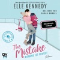

Wenn aus einem kleinen Fehler die große Liebe wird ...
College-Eishockeystar Logan ahnt nicht, dass er die richtige Frau am falschen Ort trifft, als er sich eines Nachts nach einer Feier im Zimmer irrt und in das Bett von Grace stolpert. Er hinterlässt einen miserablen ersten Eindruck und verscherzt es sich mit der zurückhaltenden Studentin. Trotzdem geht ihm dieses hübsche, scharfzüngige Mauerblümchen nicht mehr aus dem Kopf. Irgendwie muss er es schaffen, dass sie ihm eine zweite Chance gibt. Schade nur, dass Grace nicht vorhat, ihm zu verzeihen – wobei es ihr durchaus Spaß macht, diesem selbstverliebten Player dabei zuzusehen, wie er es immer wieder bei ihr versucht.

[View on Apple](https://books.apple.com/de/audiobook/the-mistake-niemand-ist-perfekt/id1706145833)

## Eisige Nacht - Ein Norwegen-Krimi - Karl Sortland ermittelt-Reihe, Band 1 (Ungekürzt)

Im eisigen Norwegen lauert tödliche Kälte - und ein Mörder in der Dunkelheit. Der packende Kriminalroman vor der düsteren Kulisse Skandinaviens.
Im hohen Norden Norwegens verschwinden Forscher von einer arktischen Wetterstation - ohne jede Spur. Kommissar Karl Sortland und sein neuer Partner Mats Samuelsson werden nach Bjørnøya entsandt, um das Mysterium zu lüften. Vor Ort erwarten sie eine verwüstete Forschungsstation, eine Leiche und eine schwer verletzte Stationsleiterin. Schnell werden die Ermittlungen zu einem Überlebenskampf gegen die eisige Wildnis und gegen die eigene dunkle Vergangenheit. In einer verzweifelten Jagd nach der Wahrheit enthüllen die Kommissare ein Netz aus Geheimnissen und Intrigen, das sie bis an ihre Grenzen bringt ...

[View on Apple](https://books.apple.com/de/audiobook/eisige-nacht-ein-norwegen-krimi-karl-sortland-ermittelt/id1770060677)

## John of John (ungekürzt)

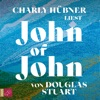

Ohne Geld und mit wenig vorzuweisen nach seiner Ausbildung an der Kunsthochschule, nimmt Cal die Fähre nach Hause auf die Insel Harris und all das, vor dem er nach Edinburgh geflüchtet war, ist wieder da: das karge Leben auf den Hebriden, der windgepeitschte Kreislauf aus Schafzucht und Nächten am Webstuhl, die Enge der Inselgemeinschaft.
Sein Vater hat ihn nach Hause in sein altes Leben beordert. John, dem er all sein Wissen über Farben und Wolle verdankt, dessen Hingabe als Tweed-Weber er liebt und dessen presbyterianische Strenge er hasst. Sie sind einander so nah und kennen sich so wenig, blind für das wohlgehütete Geheimnis des anderen. Niemals könnte Cal dem Vater von seiner Sehnsucht nach einem Partner erzählen, wo dieser schon seine langen Haare als Sünde ahndet. Stattdessen sucht Cal immer mehr die Nähe von Innes, Johns sanftem bestem Freund, während sich die Fäden, die ihre fragile Gemeinschaft zusammenhalten, immer dichter verweben.
Ein großer Roman über Verpflichtung und Verblendung, Liebe und Scham und die verwandelnde Kraft der Wahrheit.

[View on Apple](https://books.apple.com/de/audiobook/john-of-john-ungek%C3%BCrzt/id1862090114)

## Mord ist Familiensache  Ein historisches Cosy Crime Hörbuch mit typisch britischem Humor - Ein Fall für Miss Fitzgerald-Reihe, Band 3 (Ungekürzt)

<b>Wenn Hochzeitsgäste vergiftet werden und nur der Bräutigam unter Verdacht steht ...</b>
<b>Ein weiterer mysteriöser Fall für die cleverste Privatdetektivin in der englischen Küstenstadt Brighton</b>  Als Clara Fitzgerald der Einladung zur Hochzeit ihres Cousins Andrew folgt, ahnt sie nicht, dass sie mehr Privatdetektivin als Gast sein wird. Denn etwas an der bevorstehenden Trauung stimmt ganz und gar nicht. Nicht nur, dass weder der Bräutigam noch seine Familie Interesse an den bevorstehenden Feierlichkeiten zeigen, es taucht auch eine Frau auf, die behauptet, bereits mit Andrew verheiratet zu sein. Nicht lange nach ihrer Ankunft ist die vermeintliche erste Ehefrau tot - vergiftet, ebenso wie ein unliebsamer Onkel, den sowieso keiner dort haben wollte. Mit Andrew als dem Hauptverdächtigen und einem Giftmörder, der es auf die Hochzeitsgesellschaft abgesehen hat, muss Clara so schnell wie möglich die Geheimnisse der Familie lüften. Dabei braucht sie alle Hilfe, die sie kriegen kann und die Zeit läuft ihr davon ...  <i>Alle Bände der </i>Ein Fall für Miss Fitzgerald-Reihe <i>können unabhängig voneinander gehört werden.</i>  <b>Erste Leser:innenstimmen</b>
<i>"Ein sehr spannender Cosy Crime mit einer cleveren Heldin!"</i>
<i>"Dieser historische Krimi hat alles, was man von einem guten Cosy Crime erwartet: eine interessante Ermittlerin, eine verworrene Familiengeschichte und jede Menge Charme!"</i>
<i>"Die Mischung aus mysteriösen Todesfällen, Familienintrigen und Claras cleveren Ermittlungen macht diesen Cosy Krimi zu einem humorvollen Leseerlebnis."</i>
<i>"Clara ist eine sympathische und kluge Detektivin, die man sofort ins Herz schließt."</i>

[View on Apple](https://books.apple.com/de/audiobook/mord-ist-familiensache-ein-historisches-cosy-crime/id1815981426)

## Die 1%-Methode – Minimale Veränderung, maximale Wirkung

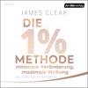

<b>Der Welterfolg zum Trendthema "Micro Habits"</b>  Das Geheimnis des Erfolgs: "Die 1%-Methode". Sie liefert das nötige Handwerkszeug, mit dem Sie jedes Ziel erreichen. James Clear, erfolgreicher Coach und einer der führenden Experten für Gewohnheitsbildung, zeigt praktische Strategien, mit denen Sie jeden Tag etwas besser werden bei dem, was Sie sich vornehmen. Denn bereits kleinste Veränderungen der täglichen Routine können dem Leben eine neue Richtung geben. Clears Methode greift auf Erkenntnisse aus Biologie, Psychologie und Neurowissenschaften zurück und funktioniert in allen Lebensbereichen. Ganz egal, was Sie erreichen möchten – ob sportliche Höchstleistungen, berufliche Meilensteine oder persönliche Ziele wie mit dem Rauchen aufzuhören –, mit diesem Hörbuch schaffen Sie es ganz sicher.  Gekürzte Lesung mit Oliver Brod 7h 7min

[View on Apple](https://books.apple.com/de/audiobook/die-1-methode-minimale-ver%C3%A4nderung-maximale-wirkung/id1586387330)

## Die Känguru-Apokryphen (Die Känguru-Werke 4)

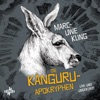

Sensation, Sensation: Archäologen haben in einem Geheimfach in Marc-Uwes Schreibtisch neue Geschichten vom Känguru und seinem Kleinkünstler gefunden! Dies ist nicht die Fortsetzung der Fortsetzung der Fortsetzung der Känguru-Chroniken. Triologie bleibt Triologie. Aber ein anständiger Kleinkünstler hat natürlich eine Zugabe vorbereitet.
Die Känguru-Apokryphen versammeln zum ersten Mal alle weniger bekannten Eskapaden des dynamischen Duos: Episoden, die zwar nicht im allgemein gültigen Hochkanon der Känguru-Trilogie vertreten, aber ebenso witzig sind. Geschichten aus Anthologien, Live-Programmen ... und aus besagtem Geheimfach.

[View on Apple](https://books.apple.com/de/audiobook/die-k%C3%A4nguru-apokryphen-die-k%C3%A4nguru-werke-4/id1500353264)

## Am Himmel die Flüsse (Ungekürzte Lesung)

Narin ist neun, als in dem ezidischen Dorf am Tigris Planierraupen auftauchen. Ihre Heimat soll einem Dammbauprojekt der türkischen Regierung weichen. Die Großmutter, fest entschlossen, die Enkelin an einem ungestörten Ort taufen zu lassen, bereitet alles für die Reise ins heilige Lalisch-Tal vor. Kurz vor Aufbruch stößt Narin auf das Grab eines gewissen Arthur - direkt neben dem ihrer Ururgroßmutter Leila. Wer war dieser "König der Abwasserkanäle und Elendsquartiere", der Junge aus dem viktorianischen London, von den Ufern der verschmutzten Themse? Und was hat er mit Narins eigener Vertreibung zu tun?
Meisterhaft verwebt Elif Shafak Vergangenheit und Gegenwart zu einem soghaften Roman über sich kreuzende menschliche Schicksale und die Macht jahrhundertealter Konflikte.
Mit ihrer weichen Stimme und ihrer Ausdruckstiefe ist Pegah Ferydoni eine großartige Interpretin für Elif Shafaks Roman.

[View on Apple](https://books.apple.com/de/audiobook/am-himmel-die-fl%C3%BCsse-ungek%C3%BCrzte-lesung/id1753825560)

## Kreuzweg der Raben: The Witcher, Band 6

Die Saga geht weiter ... das Ende ist der Anfang Der Großmeister der Fantasy kehrt zurück in die Jugendjahre von Geralt| der seine ersten Schritte als Hexer macht und sich zahlreichen tödlichen Herausforderungen stellen muss. Bewaffnet mit zwei Runenschwertern bekämpft er Monster| rettet unschuldige Jungfrauen und eilt unglücklich Verliebten zu Hilfe. Dabei versucht er immer und überall dem ungeschriebenen Kodex zu folgen| den ihm seine Lehrer und Mentoren mitgegeben haben. Doch bleiben ihm dabei keine Enttäuschungen erspart| und sein jugendlicher Idealismus muss bittere Erfahrungen hinnehmen. Doch Geralt gibt nicht auf … niemals!

[View on Apple](https://books.apple.com/de/audiobook/kreuzweg-der-raben-the-witcher-band-6/id1835499768)

## Heimsuchung

<b>Die Autorin liest ihe Geschichte: von einem Haus am See – und wie ein ganzes Jahrhundert in ihm wütet</b>  Ein Haus an einem märkischen See: Es ist der Schauplatz für fünfzehn Lebensläufe, Geschichten, Schicksale von den Zwanzigerjahren bis heute. Das Haus und seine Bewohner erleben die Weimarer Republik, das Dritte Reich, den Krieg und dessen Ende, die DDR, die Wende und die Zeit der Nachwende. Jedem einzelnen Schicksal gibt Jenny Erpenbeck eine eigene literarische Form, jedes entfaltet auf ganz eigene Weise seine Dramatik, seine Tragik, sein Glück. Alle zusammen bilden ein Panorama des letzten Jahrhunderts, das verstört, beglückt, verunsichert und versöhnt. Die Autorin Jenny Erpenbeck liest ihren eindrucksvollen, poetisch verdichteten Roman selbst – ein Hörerlebnis höchster Intensität.

[View on Apple](https://books.apple.com/de/audiobook/heimsuchung/id1435690967)

## Alles Idioten!? - Endlich verstehen, wie andere ticken (Ungekürzte Lesung)

Erfolgreich kommunizieren in allen Lebenslagen - der internationale Selbst-Coaching-Bestseller aus Schweden.
Wie oft werden wir nicht oder falsch verstanden? Wie oft sind unsere Beziehungen zu anderen Menschen von Missverständnissen getrübt? Wie oft glauben wir, wir seien nur von Idioten umgeben?
"Das muss nicht sein", sagt der Selbst-Coaching-Experte Thomas Erikson: "Menschen sind zwar keine Excel-Tabellen, und Ihr Verhalten lässt sich nicht exakt vorausberechnen. Aber wenn wir die Grundlagen des menschlichen Kommunikationsverhaltens begreifen, können wir viele Missverständnisse vermeiden."
Nach dem Motto "vier Farben - vier Typen - und jede Menge Tools" präsentiert Thomas Erikson ein Modell mit vier Persönlichkeitstypen, das es uns leicht macht, unser Gegenüber und sein Kommunikationsverhalten zu verstehen - ob es sich um Körpersprache, Emails oder ein Gespräch handelt. Zunächst werden die vier Persönlichkeitstypen vorgestellt, dann beschreibt Thomas Erikson das Kommunikationsverhalten der vier Persönlichkeitstypen und erklärt, welche Konflikte sich daraus im Umgang mit anderen ergeben und wie diese Konflikte vermieden werden können.
Humorvoll verpackt, helfen uns Thomas Eriksons anschauliche Beispiele aus Beruf, Freizeit und Familie zu erkennen, mit welchem Persönlichkeitstyp wir es jeweils zu tun haben: So können wir unser Kommunikationsverhalten gezielt trainieren und den alltäglichen Kommunikationsfallen erfolgreich aus dem Weg gehen.

[View on Apple](https://books.apple.com/de/audiobook/alles-idioten-endlich-verstehen-wie-andere-ticken-ungek%C3%BCrzte/id1552689915)

## Die Natur ist kein Parteimitglied

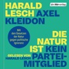

<b>Die Physiker Harald Lesch und Axel Kleidon sind sauer über mangelnde Konsequenz in der Klimapolitik und das verbreitete Unverständnis dafür, wie Natur funktioniert – ein Hörbuch, das aufrüttelt</b>  Harald Lesch und Axel Kleidon sind sauer: Ein ums andere Mal versuchen Verantwortliche in Politik und Wirtschaft so zu tun, als könne man die Gesetze der Natur einfach ignorieren. Deshalb sprechen die beiden Physiker hier Klartext: Die Natur verhandelt nicht, sie ist nicht Partei, sie lässt sich nicht vereinnahmen. Sie folgt auf der ganzen Erde denselben allgemeingültigen Gesetzen – und die müssen unsere Leitplanken sein beim Umgang mit dem Klimawandel. Sie erläutern daher hier noch einmal kurz und knapp, was effiziente Energienutzung bedeutet, warum Energie entwertet wird und welche Maßnahmen eine Politik ergreifen würde, die begriffen hat, wie die Natur funktioniert. <b>Bonus: Mit einem 20-minütigen Zusatzgespräch der beiden Autoren.</b>  Ungekürzte Lesung mit Axel Kleidon, Harald Lesch 2h 26min

[View on Apple](https://books.apple.com/de/audiobook/die-natur-ist-kein-parteimitglied/id1852621810)

## Du schon wieder!: (K)ein Scheidungsroman

Passt es einfach nicht, oder verdient die Liebe doch noch eine zweite Chance? Beziehung reloaded? Klingt nach gar keiner guten Idee. Trotzdem gerät Krankenhausärztin Fanny ganz schön ins Wanken, als ihr Ex Dustin in die Notaufnahme eingeliefert wird. Plötzlich brodeln wieder Gefühle in ihr. Und das, obwohl sie in einer neuen Beziehung ist – genau wie Dustin. Noch krasser wird's, als die beiden eine heimliche Affäre beginnen. Was zur Hölle soll das werden? Als die Sache dann auffliegt, steht das gesamte Umfeld kopf, und Fanny muss sich entscheiden: Ex und hopp? Oder noch einmal mit Gefühl? Einmalig komisch und immer romantisch schreibt Bestsellerautorin Ellen Berg über die Frage, wie schlechtes Timing dem Glück im Wege stehen kann.

[View on Apple](https://books.apple.com/de/audiobook/du-schon-wieder-k-ein-scheidungsroman/id6790437757)

## Einatmen. Ausatmen (Ungekürzte Lesung)

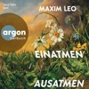

Was passiert, wenn eine gefühlsresistente Spitzenmanagerin ein Achtsamkeitstraining bei einem Coach absolvieren muss, der selbst in einer Sinnkrise steckt? Maxim Leos rasend komischer und tief berührender Roman über die Suche nach dem richtigen Leben und den Weg zu uns selbst.
Marlene Buchholz soll Vorstandsvorsitzende des "Aviola"-Konzerns werden. Ihre Kollegen sind sich einig, dass sie fachlich hochkompetent ist - aber menschlich eine ziemliche Katastrophe. Weshalb sie zum Coaching in ein Brandenburger Schloss geschickt wird - zu Alex Grow, dem berühmten Seelenflüsterer.
Was niemand weiß: Seine Academy steht kurz vor dem Bankrott und Alex hat selbst mit Panikattacken zu kämpfen. Marlene ist seine letzte Hoffnung, denn im Erfolgsfall winkt ein Großauftrag der "Aviola". Doch die Klientin bleibt skeptisch und verschlossen - bis ein verletztes Wildschwein, ein schüchterner Hausmeister und ein dreizehnjähriges Mädchen auftauchen, die Marlenes Augen und Herz öffnen und sie erahnen lassen, was am Ende wirklich zählt.

[View on Apple](https://books.apple.com/de/audiobook/einatmen-ausatmen-ungek%C3%BCrzte-lesung/id1848136243)

## Das Grab im Moor

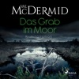

Kein Grab ist tief genug für die Wahrheit!
Eine »Schatzkarte« ihres verstorbenen Großvaters führt eine junge Amerikanerin in die schottischen Highlands zu einem abgelegenen Ort mitten im Moor: Dort stößt sie auf ein vergrabenes, erstaunlich gut erhaltenes Motorrad, Baujahr 1944 – und auf eine männliche Leiche deutlich jüngeren Datums. DCI Karen Pirie, spezialisiert auf Cold Cases, ist eigentlich wegen eines anderen Falles in der Gegend, doch der Tote im Moor lässt ihr keine Ruhe. Er trägt ein sehr spezielles Paar Nike-Sneakers, eine Sonderanfertigung aus dem Jahr 1995. Und er ist offensichtlich keines natürlichen Todes gestorben ...

[View on Apple](https://books.apple.com/de/audiobook/das-grab-im-moor/id1523055629)

## Künstliche Intelligenz und der Sinn des Lebens

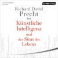

<b>Der bekannteste Philosoph Deutschlands über die Moral der Künstlichen Intelligenz</b>  Während die drohende Klimakatastrophe und der enorme Ressourcenverbrauch der Menschheit die Lebensgrundlagen unseres Planeten zerstören, machen sich Informatiker und Ingenieure daran, die Entwicklung einer Künstlichen Intelligenz voranzutreiben, die alles das können soll, was Menschen auch können – nur vielfach "optimierter". Ausgehend von völlig falschen Annahmen soll den Maschinen sogar eine menschenähnliche Moral einprogrammiert werden. Richard David Precht macht uns eindringlich klar, dass das nicht möglich ist. Denn unser Leben besteht nicht aus der Abfolge vorausberechneter Schritte. Wir sind viel mehr als das.  Ungekürzte Lesung mit Richard David Precht 6h 48min

[View on Apple](https://books.apple.com/de/audiobook/k%C3%BCnstliche-intelligenz-und-der-sinn-des-lebens/id1514966572)

## Eine von uns

Eine von uns wird bezahlen. Eine von uns wird sterben.
Als ihr Haus abbrennt, wird Ginas Leben und das ihrer Familie auf den Kopf gestellt. Glücklicherweise ist ihre alte Freundin Annie nicht in der Stadt und bietet ihnen an, vorübergehend bei ihr zu wohnen – in einem wunderschönen, renovierten georgianischen Haus. Gina nimmt das Angebot dankend an. Als es bald darauf an der Tür klingelt und Mary auftaucht, die behauptet, die Haushälterin zu sein, stellt Gina das nicht infrage, denn Annie lobt ihre Angestellte in den höchsten Tönen. Doch Gina hat das Gefühl, dass Mary etwas zu verbergen hat. Während sie darüber grübelt, wird sie von albtraumhaften Erinnerungen heimgesucht – Erinnerungen an eine verhängnisvolle Nacht vor vielen Jahren. Doch der wahre Albtraum steht erst noch bevor.

[View on Apple](https://books.apple.com/de/audiobook/eine-von-uns/id1812670966)

## Fünf, sechs, sieben, acht

Anton, 60 Jahre alt, ist Stepptänzer. Ja, er ist nicht mehr so schnell wie früher, aber mit seiner Erfahrung und Ausdruckskraft tanzt er – noch – allen davon. Wer sollte ihm also die Stelle als Choreograf an einer Theaterbühne streitig machen? Doch die neue Intendantin sieht das anders – und engagiert ausgerechnet Emma, Antons Tochter. Anton ist verletzt, wütend, traurig und zugleich stolz auf seine Tochter. Zeigen kann er ihr das nicht.
Die Absage spült etwas in ihm hoch, das er nicht länger verdrängen kann: das Gefühl des Älterwerdens. Plötzlich spürt er die eigene Endlichkeit und fragt sich, ob er sein Leben richtig gelebt hat. Eine Frage, die ihn wieder an eine alte große Liebe denken lässt. Jo war damals einfach spurlos verschwunden. Hätte er mit ihr ein besseres Leben gelebt?
Es ist Emma, die auf Jos Spur stößt. Mit ihr reist er nach Irland. Alte Konflikte zwischen Vater und Tochter brechen wieder auf. Für Anton wird es eine Reise zu sich selbst und er begreift: Zu Ende ist es erst, wenn es zu Ende ist. Bis dahin will das Leben gelebt werden.

[View on Apple](https://books.apple.com/de/audiobook/f%C3%BCnf-sechs-sieben-acht/id1870697849)

## 00-Laschet (Gekürzte Lesung)

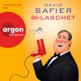

<b>LIZENZ ZUM LACHEN!</b>  Wer wäre als Spitzenagent der Bundesrepublik wohl besser geeignet als Armin Laschet? Nun, vermutlich sehr viele Menschen.  Armin freut sich wie ein Schneekönig, dass er nicht Kanzler geworden ist, sondern Bundespräsident sein darf. Doch schon am ersten Tag erfährt er, dass tief unter dem Schloss Bellevue die Zentrale des geheimsten Geheimdienstes der Welt liegt. Und er als Bundespräsident in Wahrheit nur eine Aufgabe hat: Agenten an Orte zu bringen, an die sie sonst nicht gelangen würden. Sogleich muss der überforderte Armin mit einer jungen Topagentin die Menschheit vor der Auslöschung retten. Sein Abenteuer führt ihn ins Schloss Windsor, an die Côte d'Azur, nach Grönland, in den Vatikan und sogar in die Arme des Popstars Madonna. Und so erstaunlich es auch ist: Die einzige Hoffnung auf ein Überleben der Welt trägt den Namen 00-Laschet!  David Safiers Romane und Hörbücher erreichen eine Gesamtauflage von sieben Millionen Exemplaren im In- und Ausland. DieKrimireihe rund um die Ex-Kanzlerin Angela Merkel konnte sich mit jedem Band auf Platz 1 der Bestsellerlisten platzieren.

[View on Apple](https://books.apple.com/de/audiobook/00-laschet-gek%C3%BCrzte-lesung/id6773634998)

## Das Buch, von dem du dir wünschst, deine Eltern hätten es gelesen

»Ein ganz besonderer Erziehungsratgeber.« ZEIT
In ihrem Bestseller erklärt Philippa Perry, worauf es zwischen Eltern&#xa0;und Kindern wirklich ankommt. Die erfahrene Psychotherapeutin verrät, wie wir schmerzliche Erfahrungen&#xa0;aus der eigenen Kindheit nicht weitergeben, sondern heilen. Wenn wir uns bewusst machen, dass unsere eigene Erziehung auch das Verhältnis zu&#xa0;unseren Kindern beeinflusst, können wir aus Fehlern lernen – und sie wiedergutmachen. Wir erfahren, wie wir aus negativen Verhaltensmustern ausbrechen und mit impulsiven Gefühlen umgehen.
Jetzt mit einem zusätzlichen Kapitel über Geschwister

[View on Apple](https://books.apple.com/de/audiobook/das-buch-von-dem-du-dir-w%C3%BCnschst-deine-eltern-h%C3%A4tten/id1502705316)

## Das NEINhorn und die SchLANGEWEILE

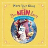

Schlangweilig? Nicht mit dem NEINhorn und Marc-Uwe Kling!

Diese Ausgabe enthält als Bonus einen exklusiven Live-Mitschnitt von Das NEINhorn und die SchLANGEWEILE – von Marc-Uwe Kling vor Publikum gelesen im Mehringhoftheater Kreuzberg.&#xa0;
Das NEINhorn und die KönigsDOCHter, die hatten einen Streit ... aber beide wissen nicht mehr, worum es geht. Als sich der NAhUND zum Erzieher aufspielt, wird es dem NEINhorn zu blöd und es zischt ab. Nach einer langen Wanderung landet es im dichten dunklen Dschungel, wo die SchLANGEWEILE von einem Assst runterhängt und allesss sssuper schlangweilig findet! Egal, was das NEINhorn vorschlägt, sie hat keine Schlussst darauf.&#xa0;

Vom Autor der&#xa0;Känguru-Chroniken und der Kinderbuch-Bestseller Das NEINhorn und DerTag, an dem die Oma das Internet kaputt gemacht hat.

[View on Apple](https://books.apple.com/de/audiobook/das-neinhorn-und-die-schlangeweile/id1589234142)

## Odyssee (Ungekürzte Lesung)

Homers "Odysee" - Ein Weltgedicht: Im späten 8. Jahrhundert niedergeschrieben, gehört es zu den ältesten und einflußreichsten Werken der abendländischen Literatur.
Das Versepos erzählt die Irrfahrten des griechischen Helden Odysseus, der um Troja gekämpft hat und durch den Fluch des Poseidon an der Rückkehr nach Ithaka gehindert wird. Es ist die Geschichte einer Heimkehr, die Geschichte eines Mannes, der trotz ständiger Bedrohungen und Verlockungen sein Ziel nicht aus den Augen verliert. Und es ist die Geschichte einer Frau, die zwanzig Jahre auf ihren Mann warten muss.

[View on Apple](https://books.apple.com/de/audiobook/odyssee-ungek%C3%BCrzte-lesung/id1425151456)

## FUCK SMALLTALK - MACHE BIGTALK

Schnell und einfach tiefgehende Gespräche führen, die dich glücklich machen

Fällt es dir schwer Gespräche zu führen und auf andere zuzugehen? Hättest du gerne Freunde fürs Leben? Hast du keine Lust mehr, auf oberflächliche und sinnlose Gespräche? Dann ist BigTalk genau das Richtige für dich! Denn in diesem Buch und GRATIS Videokurs lernst du:

- Wie du unfassbar schnell neue Kontakte knüpfst (und dadurch Freunde findest, die zu dir passen)
- Wie du Beziehung und Freundschaften aufbaust, die wirklich Bedeutung haben
- Wie du zu einem beliebten Menschenmagneten wirst
- Wie du schnell massiv viel Selbstbewusstsein aufbaust
- Wie du peinliche Stille für dich nutzen lernst
- Wie du Gesprächsthemen findest, die dir Spaß machen
- Wie du Angst ganz einfach zu deinem besten Freund machst
- Wie du mit einer Frage jedes Gespräch zum BigTalk machen kannst
- Was das Geheimnis von Empathie ist und wie du es anwendest
- Wie du aufrichtiges Interesse zeigst, ohne schmierig zu wirken
- Wie du Gefühlen authentisch Ausdruck verleihst und deinen Gesprächspartner für dich gewinnst
- Wie du jemandem die Meinung sagst, ohne beleidigend zu wirken
- Wie du durch BigTalk ein für alle Mal die Einsamkeit verlässt
- Wie du Spaß an sozialen Interaktionen findest
… und viel mehr!

+ 3 BONUS-Kapitel + GRATIS Videokurs

Deniz ist Autor, Speaker, Podcaster und Mitbegründer von "Erschaffe dich neu", einem Unternehmen, das u.a. durch YouTube Videos und Podcasts tagtäglich tausende Menschen bei ihrer persönlichen Weiterentwicklung unterstützt.

[View on Apple](https://books.apple.com/de/audiobook/fuck-smalltalk-mache-bigtalk/id1424426353)

## Harry Potter and the Prisoner of Azkaban

Stephen Fry brings the richness of these magical stories to life in the original British recordings.  <i>'Welcome to the Knight Bus, emergency transport for the stranded witch or wizard. Just stick out your wand hand, step on board and we can take you anywhere you want to go.'</i>  Treat your ears to a performance so rich and captivating you'll imagine yourself in the halls of Hogwarts. Wherever you listen, the unmistakable voice of Stephen Fry is guaranteed to guide you ever more deeply into this magical story and transport you to the heart of the adventure.  When the Knight Bus crashes through the darkness and screeches to a halt in front of him, it's the start of another far from ordinary year at Hogwarts for Harry Potter. Sirius Black, escaped mass-murderer and follower of Lord Voldemort, is on the run - and they say he is coming after Harry. In his first ever Divination class, Professor Trelawney sees an omen of death in Harry's tea leaves... But perhaps most terrifying of all are the Dementors patrolling the school grounds, with their soul-sucking kiss...  Theme music composed by James Hannigan  Having become classics of our time, the Harry Potter stories never fail to bring comfort and escapism. With their message of hope, belonging and the enduring power of truth and love, the story of the Boy Who Lived continues to delight generations of new listeners.

[View on Apple](https://books.apple.com/de/audiobook/harry-potter-and-the-prisoner-of-azkaban/id1442094440)

## Fifty-Fifty

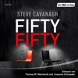

<b>Eine ist unschuldig. Die andere eine eiskalte Killerin. Welcher der beiden Schwestern glaubst du?</b>  Frank Avellino wurde mit äußerster Brutalität in seinem eigenen Schlafzimmer erstochen, der Täter muss in einem wahren Blutrausch gehandelt haben. Besser gesagt: die Täterin. Denn Franks Töchter Alexandra und Sofia beschuldigen sich gegenseitig. Eine der beiden ist eine Mörderin, die andere unschuldig. Aber wer sagt die Wahrheit? Sowohl Eddie Flynn, der Sofia vor Gericht verteidigt, als auch Alexandras Anwältin befürchten, dass die Wahrheit im Trubel um diesen spektakulären Fall untergeht. Denn der Ermordete war nicht nur ehemaliger Bürgermeister von New York. Es gibt auch ein Millionenerbe zu verteilen. Eddie Flynns Chancen, die richtige Schwester vor dem Gefängnis zu bewahren, stehen fifty-fifty ...  Gekürzte Lesung mit Thomas M. Meinhardt, Susanne Schroeder 12h 18min

[View on Apple](https://books.apple.com/de/audiobook/fifty-fifty/id1618312214)

## Mein Ehemann (Ungekürzt)

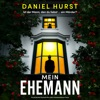

st der Mann, den du liebst, ein Mörder?
Ich bin seit über zwanzig Jahren mit meinem sanftmütigen, liebenden Ehemann Lachlan verheiratet. Er ist mein Ein und Alles, und ich könnte nicht glücklicher sein. Bis meine beste Freundin etwas sagt, das mich alles infrage stellen lässt ...
Sie findet es merkwürdig, dass Lachlan in der Nähe von gleich zwei unaufgeklärten Mordfällen gelebt hat: Der Mord einer Frau in dem kleinen schottischen Dorf, in dem er aufgewachsen ist, und der grauenvolle Tod unserer Nachbarin. Sicherlich nur ein Zufall, oder?
Aber in den nächsten Tagen fällt mir plötzlich Lachlans merkwürdiges Verhalten auf. Er ist so wütend, ganz anders als sonst. Verheimlicht er etwas vor mir? Könnte er tatsächlich schuldig sein? Ich schiebe die Vermutungen beiseite, aber der Zweifel nagt an mir.
Es gibt nur einen Weg, die Wahrheit herauszufinden - in die schottischen Highlands zu fahren und meinen Mann mit seiner Vergangenheit zu konfrontieren. Aber als die Geheimnisse ans Licht kommen, ist die Wahrheit nicht so simpel, wie ich dachte. Denn Lachlan ist nicht der Einzige, der ein Mörder sein könnte.
Jetzt sind meine Kinder und ich in furchtbarer Gefahr - und hierherzukommen könnte der letzte Fehler gewesen sein, den ich je machen werde.

[View on Apple](https://books.apple.com/de/audiobook/mein-ehemann-ungek%C3%BCrzt/id1891934384)

## Nicht ihre Schuld - Johannes-Hornoff-Thriller, Band 1 (ungekürzt)

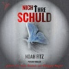

Auftakt der Johannes-Hornoff-Thrillerreihe von Bestsellerautor Noah Fitz. In einem kleinen Städtchen in der Nähe von Berlin verschwinden zwei Mädchen, Jackie und Michi. Nach mehreren Monaten erfolgloser Fahndung hat die Polizei eine erste Spur. Dann findet sie ein Mädchen, das nicht als vermisst gilt. Es ist tot. Nicht weit vom Fundort entfernt macht die Polizei eine weitere grausige Entdeckung: Familie Frühling wurde in ihrem eigenen Haus brutal ermordet. Nur einer hat das Massaker überlebt: Leopold, der psychisch kranke Sohn des Ehepaares. Ist er der gesuchte Mörder? Wo sind Michi und Jackie? Und warum hatte das tote Mädchen ein silbernes Medaillon in seinem Mund? Auftakt der Johannes-Hornoff-Reihe von Bestsellerautor Noah Fitz, grandios interpretiert von Yesim Meisheit und Wolfgang Wagner.

[View on Apple](https://books.apple.com/de/audiobook/nicht-ihre-schuld-johannes-hornoff-thriller-band-1/id1683085914)

## Im Morgengrauen (Art Mayer-Serie 4)

Art Mayer am Limit.
Seit Wochen gehen im Netz die Videos einer jungen Frau viral. Ihr Gesicht ist unkenntlich, auf ihrem Unterarm ist ein markantes Eulen-Tattoo. Der Inhalt der Videos: skandalöse Details ihrer Affäre mit dem Bundeskanzler. Ein Fake? Eine Kampagne? Oder die Wahrheit?
Plötzlich verschwindet Kanzler Henrik Westphal spurlos.&#xa0;
In der aufgeheizten Stimmung stoßen BKA-Ermittler Art Mayer und Nele Tschaikowski tief im U-Bahntunnel unter dem Alexanderplatz auf die entstellte Leiche einer jungen Frau. War sie die Affäre des Kanzlers? Und welche Rolle spielt Juli, die Frau des Kanzlers – und Arts große Jugendliebe. Als Art plötzlich selbst ins Visier gerät, eskaliert die Situation: Wem kann er noch vertrauen?
Gelesen wird dieser fesselnde Thriller von Peter Lontzek und Pia-Rhona Saxe.

[View on Apple](https://books.apple.com/de/audiobook/im-morgengrauen-art-mayer-serie-4/id1852028460)

## Der Hobbit

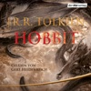

Bilbo Beutlin, der kleine Hobbit, macht sich auf den Weg zum Einsamen Berg, um den rechtmäßigen Schatz der Zwerge zurückzuholen, den der Drache Smaug gestohlen hat. Als er auf seiner Reise einen Ring findet und ihn arglos einsteckt, ahnt er nicht, was für eine Rolle der Ring einmal spielen wird ... Gert Heidenreich, die Stimme J.R.R. Tolkiens, erzählt, wie Bilbo sich vom ängstlichen Hobbit zum mutigen Meisterdieb mausert. Wort für Wort ist jetzt das Schicksal Mittelerdes und somit das Tolkiensche Werk zu hören.

[View on Apple](https://books.apple.com/de/audiobook/der-hobbit/id1435742775)

## Hollywell Hearts: Die Glückspension am Meer

Ein Neuanfang am Meer … Nachdem ihr Traum von einer eigenen Familie zerplatzt ist, sehnt sich Ava nach einer Veränderung. Da kommt ein Jobangebot weit weg von London gerade recht: Ava soll ihrer Freundin Tamy beim Aufbau einer kleinen Frühstückspension in Cornwall helfen. Und Tamys Farm »Hollywell Heaven« würde sich doch wunderbar als Rückzugsort für urlaubsreife Großstädter und gestresste Manager anbieten. Oder auch für Kinder, die es nicht leicht im Leben haben und sich im trubeligen Alltag der Ziegenfarm frei entfalten könnten? Ava sprüht nur so vor Ideen – vor allem, als sie den Single-Dad John und seine freche Tochter Elisa kennenlernt. Aber wird sie für eine zweite Chance auf Glück ihre schmerzliche Vergangenheit überwinden können? 

[View on Apple](https://books.apple.com/de/audiobook/hollywell-hearts-die-gl%C3%BCckspension-am-meer/id1732404211)

## Das Leuchten der kleinen Momente - Wie ich nach Italien reiste und mich selbst fand (Ungekürzte Lesung)

Ein altes, verwunschenes Hotel in den venezianischen Hügeln, in seinem Garten ein beeindruckendes grünes Labyrinth - als Nina die Villa Primaluna zum ersten Mal sieht, verschlägt es ihr die Sprache. Eigentlich sollte sie jetzt woanders sein, gemeinsam mit ihrem Mann, eine Reise zu ihrem fünfzigsten Geburtstag. Doch nun ist sie allein hier, in ihrem Sehnsuchtsland, und wünscht sich, endlich etwas Zeit für sich zu haben.

Nina begegnet Consilia, die dieses Hotel seit Jahrzehnten führt. Eine weise alte Frau, deren Leben so ganz anders ist als ihr eigenes. Und obwohl sie anfangs zögert, sich Consilia ganz zu öffnen, spürt sie bald, dass diese Reise mehr für sie bereithält als Entspannung und gutes Essen.
Vielleicht gibt es hier, an diesem besonderen Ort, endlich einen Weg aus der Leere, die sie schon so lange in sich fühlt. Vielleicht ist im Labyrinth die Antwort auf die Frage verborgen, die sie schon zu lange meidet. Und vielleicht findet sie endlich, was sie schon so lange sucht: sich selbst.

[View on Apple](https://books.apple.com/de/audiobook/das-leuchten-der-kleinen-momente-wie-ich-nach-italien/id6783895798)

## Ein Sommer in Niendorf (Ungekürzt)

Ein bürgerlicher Held, ein Jurist und Schriftsteller namens Roth, begibt sich für eine längere Auszeit nach Niendorf: Er will ein wichtiges Buch schreiben, eine Abrechnung mit seiner Familie. Am mit Bedacht gewählten Ort gerät er aber bald in die Fänge eines trotz seiner penetranten Banalität dämonischen Geists: ein Strandkorbverleiher, außerdem Besitzer des örtlichen Spirituosengeschäfts. Aus Befremden und Belästigtsein wird nach und nach Zufallsgemeinschaft und irgendwann Notwendigkeit. Als Dritte stößt die Freundin des Schnapshändlers hinzu, in jeder Hinsicht eine Nicht-Traumfrau - eigentlich. Und am Ende dieser Sommergeschichte ist Roth seiner alten Welt komplett abhanden gekommen.

[View on Apple](https://books.apple.com/de/audiobook/ein-sommer-in-niendorf-ungek%C3%BCrzt/id1625367078)

## Die kalte Hand des Camping-Killers (Kriminalroman. Ungekürzt.)

[View on Apple](https://books.apple.com/de/audiobook/die-kalte-hand-des-camping-killers-kriminalroman-ungek%C3%BCrzt/id6789264408)

## Die 7 Wege zur Effektivität - Prinzipien für persönlichen und beruflichen Erfolg

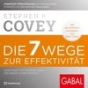

Über 40 Millionen verkaufte Exemplare: Der Meilenstein der Managementliteratur und Selbstorganisation!  <i>Die 7 Wege zur Effektivität</i> von Stephen R. Covey sind ein absolutes Ausnahmewerk. Mit über 40 Millionen verkauften Exemplaren gehört es zu den wichtigsten und einflussreichsten Büchern, die jemals geschrieben wurden. Der Managementklassiker hilft Menschen und Organisationen auf der ganzen Welt, ihre Effektivität nicht nur sehr erfolgreich, sondern auch verantwortungsvoll und nachhaltig zu steigern. Die zentrale Botschaft von Stephen R. Covey lautet:  Oberflächliche Erfolgstechniken, seelenlose Managementtools und belanglose Motivationstipps bringen uns nicht weiter. Was wirklich zählt, sind zeitlose, allgemeingültige Prinzipien.  Die 7 Wege sind so zuverlässig und unumstößlich wie Naturgesetze  Ob Fairness, Integrität, Ehrlichkeit, Verantwortungsbewusstsein oder Achtsamkeit und Respekt: Die Prinzipien aus den 7 Wegen sind wie&#xa0;Naturgesetze. Sie wirken immer und überall. Hier ein erster Überblick: 
1. Weg: Pro-aktiv sein
2. Weg: Schon am Anfang das Ende im Sinn haben
3. Weg: Das Wichtigste zuerst tun
4. Weg: Erst verstehen, dann verstanden werden
5. Weg: Win-Win-Denken
6. Weg: Synergien schaffen
7. Weg: Die Säge schärfen

 Die 7 Wege sind wirksamer und wichtiger denn je!  Das Tempo des Lebens hat für viele Menschen geradezu Lichtgeschwindigkeit erreicht. Bildschirme haben das Regiment übernommen. Rund um die Uhr sind wir mit der ganzen Welt vernetzt. Privates und Berufliches vermischen sich immer mehr. Burn-out und&#xa0; Unzufriedenheit im Job greifen immer weiter um sich. Je schneller die Welt sich dreht und je größer unsere Herausforderungen werden, desto mehr können die 7 Wege uns geben. Inmitten einer Welt des Wandels sorgen sie für Halt, Sicherheit und Orientierung. Die 7 Wege helfen uns, unsere Arbeit und unser Leben so effektiv zu gestalten, dass beruflicher Erfolg und privates Glück auch in herausfordernden Zeiten eine harmonische Einheit bilden. Oder um es mit Stephen R. Covey zu sagen: "Selbst, wenn Sie nur einen der 7 Wege umsetzen, werden Sie sofort Ergebnisse sehen. Aber es ist ein nie endendes Abenteuer, das Ihnen ein Leben voller Verheißungen verspricht!"  Dieses Hörbuch macht Sie mit den weltbekannten Prinzipien und Konzepten von Stephen R. Covey zur Verbesserung Ihrer beruflichen und persönlichen Effektivität vertraut. Es basiert auf der deutschen Ausgabe der <i>7 Wege zu Effektivität</i>, die 2005 im GABAL Verlag erschienen ist.  Jetzt neu vertont und mit persönlichen Anekdoten von Sohn Sean Covey zu Die <i>7 Wege zur Effektivität</i> exklusiv für Sie in der verlängerten Hörbuchedition!

[View on Apple](https://books.apple.com/de/audiobook/die-7-wege-zur-effektivit%C3%A4t-prinzipien-f%C3%BCr-pers%C3%B6nlichen/id1727101263)

## Frisch verlobt (ungekürzt)

Wenn alles in ihrem Leben so rund laufen würde wie ihr Nudelholz, wäre Nicole Keyes glücklich. Doch nicht nur die Familienbäckerei, sondern auch ihre beiden Schwestern lassen der leidenschaftlichen Konditorin keine Zeit für die Erfüllung ihrer Wünsche. Bis der wundervolle Hawk in ihr Leben tritt und ihr ein Stück von der Freiheit zeigt, nach der sie sich immer gesehnt hat. Und bald schon stellt Nicole fest: Mit der Liebe ist es wie mit einer Torte - man muss nur die richtigen Zutaten haben, dann gelingt sie auch einer Anfängerin.

[View on Apple](https://books.apple.com/de/audiobook/frisch-verlobt-ungek%C3%BCrzt/id1739120657)

## Das letzte Königreich

Nordengland im 9. Jahrhundert. Die christlichen Sachsen versuchen ihr Land und ihren Glauben gegen die heidnischen Wikinger zu verteidigen. Der zehnjährige Fürstensohn Uhtred kämpft gegen die dänischen Eroberer. Ragnar, ihr Anführer, ist vom Mut des Jungen in der Schlacht so beeindruckt, daß er ihn verschont. Uhtred wächst als sein Ziehsohn bei den Nordmännern auf. Jahre später droht nun auch Wessex, das letzte der fünf angelsächsischen Königreiche, nach blutigen Raub- und Eroberungszügenan an die Eroberer zu fallen. Da wechselt Uhtred die Seiten und der Kampf um Wessex beginnt … Das letzte Königreich ist der erste Teil der spannenden Wikinger-Saga Bernard Cornwells.

[View on Apple](https://books.apple.com/de/audiobook/das-letzte-k%C3%B6nigreich/id1605607572)

## Ausgeliefert

<b>Unversöhnlich, unerbittlich, unschlagbar: Jack Reacher, der eigenwilligste Ermittler der amerikanischen Thrillerliteratur!</b>  Ein Mann und eine Frau treffen zufällig auf einer Straße in Chicago zusammen. Plötzlich tauchen zwei Männer auf und entführen die beiden mit vorgehaltener Waffe. Sie werden mit Handschellen aneinandergekettet, in einen Lieferwagen geworfen und in die tiefen Wälder Montanas gebracht. Die Frau ist Holly Johnson, Agentin des FBI und Tochter eines der ranghöchsten Generäle Washingtons. Der Mann ist Jack Reacher …  Ungekürzte Lesung mit Michael Schwarzmaier 16h 53min

[View on Apple](https://books.apple.com/de/audiobook/ausgeliefert/id1681349332)

## MontanaBlack

»Ich wachte auf und fühlte mich wie ein King. Seitdem habe ich nie wieder gekifft.« Mit Anfang 20 ist Marcel Eris an seinem absoluten Tiefpunkt. Er ist drogenabhängig, hat keine Arbeit und wird obdachlos. Um an Geld für Gras und Kokain zu kommen, knackt er Autos und steigt in Häuser ein. Nichts deutet darauf hin, dass dieser perspektivlose Drogenabhängige aus Buxtehude es schaffen sollte, noch einmal in ein normales Leben zurückzukehren. Doch er schafft es und lässt die Welt übers Internet daran teilhaben. Marcel Eris wird zu MontanaBlack und MontanaBlack zu Deutschlands erfolgreichstem Gaming-Streamer mit Millionen Fans auf YouTube und Twitch. Schonungslos offen erzählt er in seiner Autobiografie von dieser Zeit, die ihn tief geprägt hat, und davon, wie er es geschafft hat, vom Junkie zum YouTube-Star zu werden.

[View on Apple](https://books.apple.com/de/audiobook/montanablack/id1503596167)

## Acht Hercule Poirot Krimis

Diese Hörspiele garantieren allerbeste Krimiunterhaltung: Acht spannende Fälle nach Erzählungen der Queen of Crime. An den Tatorten tummelt sich eine illustre Gesellschaft an hochkarätigen Sprechern: Peter Fricke, Leslie Malton, Udo Schenk und viele andere. Und mit unnachahmlichem Charme geht Meisterdetektiv Hercule Poirot der Frage nach: Wer war diesmal der Mörder? Enthält die Krimis "Eine Tür fällt ins Schloss", "Tot im dritten Stock", "Urlaub auf Rhodos", "Lasst Blumen sprechen", "Poirot und der Kidnapper", "Der Traum", "24 Schwarzdrosseln" und "Der verräterische Garten". <b>(Laufzeit: 5h 28) </b>

[View on Apple](https://books.apple.com/de/audiobook/acht-hercule-poirot-krimis/id1435754581)

## Odyssee - Von Abenteuern, Irrfahrten und Heimkehr - Die Mythos-Tetralogie, Band 4 (Ungekürzt)

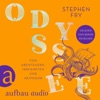

Der krönende Abschluss der Mythos-Tetralogie: Die berühmteste Heldengeschichte aller Zeiten
Troja ist gefallen. Nach zehn Jahren Krieg lockt für die Griechen endlich die Heimat. Während Agamemnon zu Hause die Rache Klytaimnestras erwartet, ist Odysseus dazu verdammt, über die Meere zu irren. Dabei muss er sich einäugigen Riesen, verführerischen Nymphen, schrecklichen Seeungeheuern und tosenden Stürmen stellen, um nach Ithaka zu seiner klugen Frau Penelope zurückzukehren.
In einer grandios unterhaltsamen Neuerzählung des Homer'schen Epos lädt uns der Erfolgsautor Stephen Fry dazu ein, die faszinierende Welt der griechischen Mythen, Götter und Helden neu zu entdecken. Fast wünscht man sich dabei, diese Irrfahrt würde nie enden.

[View on Apple](https://books.apple.com/de/audiobook/odyssee-von-abenteuern-irrfahrten-und-heimkehr-die/id1842829489)

## Die Perlenschwester

<b>Von den exotischen Stränden Thailands in die Weiten des australischen Outbacks</b>  Wie auch ihre Schwestern ist CeCe d'Aplièse ein Adoptivkind, und ihre Herkunft ist ihr unbekannt. Als ihr Vater stirbt, hinterlässt er einen Hinweis – sie soll in Australien die Spur einer gewissen Kitty Mercer ausfindig machen, eine Schottin, die im 19. Jahrhundert nach Australien kam und den Perlenhandel zu ungeahnter Blüte brachte. CeCe fliegt nach Down Under, um den verschlungenen Pfaden von Kittys Schicksal zu folgen. Und taucht dabei ein in die magische Kunst der Aborigines, die ihr den Weg weist ins Herz ihrer eigenen Geschichte ... Gelesen von Katharina Spiering, Oliver Siebeck und Katja Hirsch.  <b>(2 mp3-CDs, Laufzeit: 18h 9)</b>

[View on Apple](https://books.apple.com/de/audiobook/die-perlenschwester/id1435888258)

## Das Café am Rande der Welt [The Cafe on the Edge of the World]: Eine Erzählung über den Sinn des Lebens [A Narrative About the Meaning of Life] (Unabridged)

![Das Café am Rande der Welt \[The Cafe on the Edge of the World\]: Eine Erzählung über den Sinn des Lebens \[A Narrative About the Meaning of Life\] (Unabridged)](../../logos/1450302424-c5fff0f8.png)

In einem Café mitten im Nirgendwo wird John mit 3 Sinnfragen konfrontiert. "Die Möwe Jonathan für das neue Jahrtausend."  Ein kleines Café mitten im Nirgendwo wird zum Wendepunkt im Leben von John, einem Werbemanager, der stets in Eile ist. Eigentlich will er nur kurz Rast machen, doch dann entdeckt er auf der Speisekarte neben dem Menü des Tages drei Fragen: "Warum bist du hier? Hast du Angst vor dem Tod? Führst du ein erfülltes Leben?" Wie seltsam - doch einmal neugierig geworden, will John mithilfe des Kochs, der Bedienung und eines Gastes dieses Geheimnis ergründen. Die Fragen nach dem Sinn des Lebens führen ihn gedanklich weit weg von seiner Vorstandsetage an die Meeresküste von Hawaii. Dabei verändert sich seine Einstellung zum Leben und zu seinen Beziehungen, und er erfährt, wie viel man von einer weisen grünen Meeresschildkröte lernen kann. So gerät diese Reise letztlich zu einer Reise zum eigenen Selbst. Ein ebenso lebendig geschriebenes, humorvolles wie anrührendes Hörbuch.  &#xa0;<b>Please note: This audiobook is in German.</b>

[View on Apple](https://books.apple.com/de/audiobook/das-caf%C3%A9-am-rande-der-welt-the-cafe-on-the-edge/id1450302424)

## Held aller Zeiten (Die Nebelgeborenen 3)

Band 3 der erfolgreichen »Nebelgeborenen«-Reihe!
Das Letzte Reich ist Vergangenheit, der Oberste Herrscher besiegt. Das jetzt freie Volk der Skaa und die Nebelgeborenen blickten hoffnungsvoll in die Zukunft. Doch um wirklich ein neues glückliches Zeitalter herbeizuführen, müssen die Helden um Rebellenanführerin Vin und den neuen König Elant noch einige Prüfungen bestehen. Es gilt Kriege mit neuen Feinden zu bestreiten – und nun muss auch noch ein uraltes Grauen besiegt und das Land von einem tödlichen Fluch befreit werden. Doch dafür müssen die mit den magischen Kräften der Metalle ausgestatteten Nebelgeborenen düsteren Geheimnissen aus vergangenen Zeiten auf die Spur kommen, sodass am Ende ein Held aller Zeiten vielleicht doch noch alles zum Guten wenden kann ...
Vielschichtig und fesselnd: High-Fantasy-Welten von Brandon Sanderson &#xa0;
High Fantasy oder epische Fantasy bezeichnet Fantasy, die in einer magischen, uns völlig fremden Welt spielt. Wie J.R.R. Tolkien mit seinem Mittelerde oder Robert Jordan mit Rad der Zeit entwirft auch Brandon Sanderson mit beeindruckender Vorstellungskraft und Liebe zum Detail ebenso komplexe wie anschauliche Welten und magische Systeme.  &#xa0;
Einstieg in die Nebelgeborenen-Saga voller Magie und Metalle  &#xa0;
Nach seinem gefeierten Debütroman »Elantris« legt Fantasy-Autor Brandon Sanderson mit der Trilogie um die mit magischen Fähigkeiten kämpfenden Nebelgeborenen nach. »Die Kinder des Nebels« ist der gelungene, temporeiche Einstieg in die Welt des Letzten Reiches, in dem eine Gruppe Abtrünniger versucht, die Welt von ihrem grausamen Herrscher zu befreien. 
*** Weitere Bände der Reihe ***
Erstes Zeitalter der Nebelgeborenen:
»Kinder des Nebels« (Band 1)
»Krieger des Feuers« (Band 2)
»Held aller Zeiten« (Band 3)

Zweites Zeitalter der Nebelgeborenen (»Wax &amp; Wayne«-Reihe):
»Hüter des Gesetzes« (Band 4) (vormals erschienen als: Jäger der Macht)
»Schatten über Elantel« (Band 5)
»Bänder der Trauer« (Band 6)
»Metall der Götter« (Band 7)

[View on Apple](https://books.apple.com/de/audiobook/held-aller-zeiten-die-nebelgeborenen-3/id1763802722)
