- [Herzklopfen im Eiscafé am Meer | Ein turbluent-romantisches Küstenroman Hörbuch der BookTok-Sensation (Ungekürzt)](#herzklopfen-im-eiscafe-am-meer-ein-turbluent-romantisches-ku-stenroman-ho-rbuch-der-booktok-sensation-ungeku-rzt)
- [Die Psychiaterin – Wurde der Job ihr zum Verhängnis?](#die-psychiaterin-wurde-der-job-ihr-zum-verha-ngnis)
- [Die Känguru-Rebellion (Die Känguru-Werke 5)](#die-ka-nguru-rebellion-die-ka-nguru-werke-5)
- [Sommerfeldt Solo. Der Auftrag (Band 1, ungekürzt)](#sommerfeldt-solo-der-auftrag-band-1-ungeku-rzt)
- [Memories of Heidelberg (Ungekürzt)](#memories-of-heidelberg-ungeku-rzt)
- [Bretonischer Glanz - Kommissar Dupin ermittelt - Kommissar Dupins fünfzehnter Fall, Band 15 (Gekürzte Lesung)](#bretonischer-glanz-kommissar-dupin-ermittelt-kommissar-dupins-fu-nfzehnter-fall-band-15-geku-rzte-lesung)
- [Mord in der Toskana - Armstrong und Oscar ermitteln, Band 1 (Ungekürzte Lesung)](#mord-in-der-toskana-armstrong-und-oscar-ermitteln-band-1-ungeku-rzte-lesung)
- [Mord im Chianti - Armstrong und Oscar ermitteln, Band 2 (Ungekürzte Lesung)](#mord-im-chianti-armstrong-und-oscar-ermitteln-band-2-ungeku-rzte-lesung)
- [Todesstille über Föhr | Inselkrimi Hörbuch - Ein Nordseekrimi-Reihe, Band 5 (Ungekürzt)](#todesstille-u-ber-fo-hr-inselkrimi-ho-rbuch-ein-nordseekrimi-reihe-band-5-ungeku-rzt)
- [Als Großmutter im Regen tanzte - Die Großmutter-Reihe, Band 1 (Ungekürzte Lesung)](#als-großmutter-im-regen-tanzte-die-großmutter-reihe-band-1-ungeku-rzte-lesung)
- [Die Känguru-Chroniken (Die Känguru-Werke 1)](#die-ka-nguru-chroniken-die-ka-nguru-werke-1)
- [Dungeon Crawler Carl (German Edition) (Unabridged)](#dungeon-crawler-carl-german-edition-unabridged)
- [Wie man Freunde gewinnt - Die Kunst, beliebt und einflussreich zu werden (Ungekürzte Lesung)](#wie-man-freunde-gewinnt-die-kunst-beliebt-und-einflussreich-zu-werden-ungeku-rzte-lesung)
- [Very Bad Liars (Kingston University, Spring Break, Teil 2) – Das Hörspiel](#very-bad-liars-kingston-university-spring-break-teil-2-das-ho-rspiel)
- [Das Cottage in der Serling Street - Natalie Ames ermittelt - Tee? Kaffee? Mord!, Folge 39 (Ungekürzt)](#das-cottage-in-der-serling-street-natalie-ames-ermittelt-tee-kaffee-mord-folge-39-ungeku-rzt)
- [Schleier aus Lügen - Bunburry - Ein Idyll zum Sterben, Folge 21 (Ungekürzt)](#schleier-aus-lu-gen-bunburry-ein-idyll-zum-sterben-folge-21-ungeku-rzt)
- [Bullenbrüder - Tote haben keine Freunde (Ungekürzte Lesung)](#bullenbru-der-tote-haben-keine-freunde-ungeku-rzte-lesung)
- [Häftling (Ungekürzt)](#ha-ftling-ungeku-rzt)
- [Die Ehefrau – Was hat sie zu verbergen?](#die-ehefrau-was-hat-sie-zu-verbergen)
- [Sie kann dich hören](#sie-kann-dich-ho-ren)
- [Das Kind in dir muss Heimat finden](#das-kind-in-dir-muss-heimat-finden)
- [Das Känguru-Manifest (Die Känguru-Werke 2)](#das-ka-nguru-manifest-die-ka-nguru-werke-2)
- [Splitterseele](#splitterseele)
- [22 Kurzgeschichten, die dein Denken verändern werden](#22-kurzgeschichten-die-dein-denken-vera-ndern-werden)
- [Der Thron der Lilie](#der-thron-der-lilie)
- [John of John (ungekürzt)](#john-of-john-ungeku-rzt)
- [Kreuzweg der Raben: The Witcher, Band 6](#kreuzweg-der-raben-the-witcher-band-6)
- [Nightworld Academy - Gesamtausgabe (1-10)](#nightworld-academy-gesamtausgabe-1-10)
- [Du schon wieder!: (K)ein Scheidungsroman](#du-schon-wieder-k-ein-scheidungsroman)
- [Verliebt in Greenkenny - Irish Lovestories - Ein Irland-Liebesroman, Band 1 (Ungekürzt)](#verliebt-in-greenkenny-irish-lovestories-ein-irland-liebesroman-band-1-ungeku-rzt)
- [Die Geschichte in mir. Eine deutsche Familie im 20. Jahrhundert](#die-geschichte-in-mir-eine-deutsche-familie-im-20-jahrhundert)
- [Karneval der Lügen - Cherringham - Landluft kann tödlich sein, Folge 50 (Ungekürzt)](#karneval-der-lu-gen-cherringham-landluft-kann-to-dlich-sein-folge-50-ungeku-rzt)
- [Der Hobbit](#der-hobbit)
- [Der Nachbar](#der-nachbar)
- [Das Café am Rande der Welt \[The Cafe on the Edge of the World\]: Eine Erzählung über den Sinn des Lebens \[A Narrative About the Meaning of Life\] (Unabridged)](#das-cafe-am-rande-der-welt-the-cafe-on-the-edge-of-the-world-eine-erza-hlung-u-ber-den-sinn-des-lebens-a-narrative-about-the-meaning-of-life-unabridged)
- [Flammen und Finsternis: Das Reich der sieben Höfe – Teil 2: A Court of Mist and Fury](#flammen-und-finsternis-das-reich-der-sieben-ho-fe-teil-2-a-court-of-mist-and-fury)
- [Psycho-Cybernetics (Updated and Expanded)](#psycho-cybernetics-updated-and-expanded)
- [Die Roseninsel (Ungekürzt)](#die-roseninsel-ungeku-rzt)
- [Apfelstrudel-Alibi: Franz Eberhofer, Band 13](#apfelstrudel-alibi-franz-eberhofer-band-13)
- [EDEN - Wenn das Sterben beginnt](#eden-wenn-das-sterben-beginnt)
- [Die verschlossene Tür (Ungekürzt)](#die-verschlossene-tu-r-ungeku-rzt)
- [Yesteryear](#yesteryear)
- [Blood – Du sollst bereuen](#blood-du-sollst-bereuen)
- [Gesamtausgabe - Der Thron der Magier](#gesamtausgabe-der-thron-der-magier)
- [Ein Kommissar wird gejagt - Taxi, Tod und Teufel, Folge 20 (Ungekürzt)](#ein-kommissar-wird-gejagt-taxi-tod-und-teufel-folge-20-ungeku-rzt)
- [Tote singen keine Schlager - Sommer, Strand und Schlagermord, Folge 1 (Ungekürzt)](#tote-singen-keine-schlager-sommer-strand-und-schlagermord-folge-1-ungeku-rzt)
- [Die 13 1/2 Leben des Käpt'n Blaubär - das Original](#die-13-1-2-leben-des-ka-pt-n-blauba-r-das-original)
- [nonStop kissing the Boss](#nonstop-kissing-the-boss)
- [Der Seelenbrecher](#der-seelenbrecher)
- [Hamptons Prestige - Sparks & Scandals](#hamptons-prestige-sparks-scandals)
- [Die geheimnisvolle Insel](#die-geheimnisvolle-insel)
- [Monster 1983: Die komplette 3. Staffel](#monster-1983-die-komplette-3-staffel)
- [artgerecht - Das andere Kleinkinderbuch](#artgerecht-das-andere-kleinkinderbuch)
- [Das Schwert Gottes - Thriller ( John Milton 5 )](#das-schwert-gottes-thriller-john-milton-5)
- [Nein sagen - Über den 20. Juli 1944, meine Eltern und persönliche Verantwortung heute (Ungekürzte Autorenlesung)](#nein-sagen-u-ber-den-20-juli-1944-meine-eltern-und-perso-nliche-verantwortung-heute-ungeku-rzte-autorenlesung)
- [8000 Arten, als Mutter zu versagen (Ungekürzte Autorinnenlesung)](#8000-arten-als-mutter-zu-versagen-ungeku-rzte-autorinnenlesung)
- [Harry Potter und der Stein der Weisen](#harry-potter-und-der-stein-der-weisen)
- [Das Traumhotel am Meer | Ein romantisches Hörbuch mit gemütlichem Ostsee-Setting (Ungekürzt)](#das-traumhotel-am-meer-ein-romantisches-ho-rbuch-mit-gemu-tlichem-ostsee-setting-ungeku-rzt)
- [Doppelmord im Strandhotel](#doppelmord-im-strandhotel)
- [Du bist nicht allein](#du-bist-nicht-allein)
- [Benjamin Blümchen, Folge 170: in Australien](#benjamin-blu-mchen-folge-170-in-australien)
- [Ikigai](#ikigai)
- [Der 8. Mann](#der-8-mann)
- [Die Känguru-Offenbarung (Die Känguru-Werke 3)](#die-ka-nguru-offenbarung-die-ka-nguru-werke-3)
- [Die Meerglas-Schwestern](#die-meerglas-schwestern)
- [Die kleine Boutique am Meer](#die-kleine-boutique-am-meer)
- [Tage am Fluss (Ungekürzte Lesung)](#tage-am-fluss-ungeku-rzte-lesung)
- [Throne of Glass 7: Herrscherin über Asche und Zorn](#throne-of-glass-7-herrscherin-u-ber-asche-und-zorn)
- [Der heilige Tod - Thriller ( John Milton 2 )](#der-heilige-tod-thriller-john-milton-2)
- [Die Legende von Gold und Jade 4: Krieg und Frieden](#die-legende-von-gold-und-jade-4-krieg-und-frieden)
- [Dear Britain](#dear-britain)
- [Der kleine Drache Kokosnuss im Weltraum -](#der-kleine-drache-kokosnuss-im-weltraum)
- [Kein Sommer ohne August - Every Summer Has A Story, Teil 1 (Ungekürzt)](#kein-sommer-ohne-august-every-summer-has-a-story-teil-1-ungeku-rzt)
- [Sturmland - Die Sturmland-Saga, Band 1 (Autorisierte Lesefassung)](#sturmland-die-sturmland-saga-band-1-autorisierte-lesefassung)
- [Der Tod braucht nie ein Alibi - Sofia und die Hirschgrund-Morde, Teil 29 (Ein Bayernkrimi)](#der-tod-braucht-nie-ein-alibi-sofia-und-die-hirschgrund-morde-teil-29-ein-bayernkrimi)
- [Der Cleaner - Thriller ( John Milton 1 )](#der-cleaner-thriller-john-milton-1)
- [Der Schwarm](#der-schwarm)
- [Harry Potter und der Orden des Phönix](#harry-potter-und-der-orden-des-pho-nix)
- [Ihre perfekte Ehe  Thriller Hörbuch - Wie weit würdest du gehen, um deine Familie zu beschützen? (Ungekürzt)](#ihre-perfekte-ehe-thriller-ho-rbuch-wie-weit-wu-rdest-du-gehen-um-deine-familie-zu-beschu-tzen-ungeku-rzt)
- [Endlich Nichtraucher](#endlich-nichtraucher)
- [The Deal – Reine Verhandlungssache](#the-deal-reine-verhandlungssache)
- [Ostseefluch - Pia Korittkis achter Fall - Kommissarin Pia Korittki 8 (Ungekürzt)](#ostseefluch-pia-korittkis-achter-fall-kommissarin-pia-korittki-8-ungeku-rzt)
- [Hollywell Hearts: Die kleine Farm am Meer](#hollywell-hearts-die-kleine-farm-am-meer)
- [Der Name des Windes](#der-name-des-windes)
- [Monster 1983: Die komplette 2. Staffel](#monster-1983-die-komplette-2-staffel)
- [Das Haus im Wald - Krimi Hörbuch ( Atticus 1 )](#das-haus-im-wald-krimi-ho-rbuch-atticus-1)
- [Der Lehrer – Will er dir helfen oder will er deinen Tod?](#der-lehrer-will-er-dir-helfen-oder-will-er-deinen-tod)
- [SYLTKRIMI: Band 6-10](#syltkrimi-band-6-10)
- [Bevor der Kaffee kalt wird (Ungekürzte Lesung)](#bevor-der-kaffee-kalt-wird-ungeku-rzte-lesung)
- [Nach Grau kommt Himmelblau](#nach-grau-kommt-himmelblau)
- [Das schwimmende Café von Kopenhagen](#das-schwimmende-cafe-von-kopenhagen)
- [Die Tochter der Hexe](#die-tochter-der-hexe)
- [Die Betrogene](#die-betrogene)
- [Shaolin Spirit - Meistere dein Leben (Ungekürzte Lesung)](#shaolin-spirit-meistere-dein-leben-ungeku-rzte-lesung)
- [Der erloschene Traum: Nik Pohl 6](#der-erloschene-traum-nik-pohl-6)
- [Tod und Teufel](#tod-und-teufel)
- [Essentialismus. Die konsequente Suche nach Weniger. Ein neuer Minimalismus erobert die Welt](#essentialismus-die-konsequente-suche-nach-weniger-ein-neuer-minimalismus-erobert-die-welt)
- [Das Hindernis ist der Weg: Mit der Philosophie der Stoiker zum Triumph](#das-hindernis-ist-der-weg-mit-der-philosophie-der-stoiker-zum-triumph)
- [Momo](#momo)
- [Alles klar! Der kleine Drache Kokosnuss erforscht den Weltraum](#alles-klar-der-kleine-drache-kokosnuss-erforscht-den-weltraum)

## Herzklopfen im Eiscafé am Meer | Ein turbluent-romantisches Küstenroman Hörbuch der BookTok-Sensation (Ungekürzt)

<b>Ein turbulent-romantischer Neuanfang mit Eiscreme, Meeresrauschen und einem wortkargen Handwerker, der mehr Fragen aufwirft, als er beantwortet</b>  Als Melissa ein marodes Eiscafé an der Ostsee übernimmt, träumt sie von einem Leben voller Waffelduft, Sonnenschein und vor allem: ohne Drama. Doch dann steht ER plötzlich vor ihr: wortkarg, geheimnisvoll und mit diesen unglaublich blauen Augen, die sie nie vergessen konnte. Ihre erste große Liebe. Dumm nur, dass er steif und fest behauptet, sie noch nie gesehen zu haben - und sich obendrein ganz anders nennt. Während Schleifmaschine und Herzschlag im Takt vibrieren, gerät Melissas Welt ins Wanken: Wer ist dieser Mann wirklich? Und warum kann sie nicht die Finger von ihm lassen? Als dann auch noch eine handfeste Katastrophe die langersehnte Eröffnung ihres Eiscafés gefährdet, bekommt sie ausgerechnet von ihm unerwartete Hilfe ...  <b>Nach <i>Verliebt in Greenkenny </i>und<i> Eine Karamellmanufaktur zum Verlieben </i>entführt dich dieses neue Hörbuch von Booktok Sensation Doris R. Thomas turbulent romantisch in einen Ostsee Liebesroman, der Herz, Humor und Leidenschaft vereint. Hörbuchempfehlung für die Momente, in denen du dich an Küste, Meer, Strand und Sommer sehnst. Die perfekte Sommerlektüre oder zum Einstimmen auf den Sommer!</b>  <b>Erste Leser:innenstimmen</b>
<i>"Ein wunderschöner Liebesroman mit Ostsee-Charme und ganz viel Herzklopfen!"
"Sommerliche Feel-Good-Romance mit traumhaftem Setting am Meer - wie wie ein Kurzurlaub für die Seele."
"TikTok-Ikone Doris R. Thomas hat den nächsten Banger rausgehauen und es ist wie immer turbulent und romantisch."
"Toller Wohlfühlroman voller Romantik, Küstenflair und einer Heldin, die für ihre Träume kämpft."</i>

[View on Apple](https://books.apple.com/de/audiobook/herzklopfen-im-eiscaf%C3%A9-am-meer-ein-turbluent-romantisches/id1872113868)

## Die Psychiaterin – Wurde der Job ihr zum Verhängnis?

<b>Psychospannung mit Bestsellergarantie – nach der "Housemaid"-Reihe präsentiert Freida McFadden ihren neuen packenden Stand-alone-Thriller!</b>  Die frischvermählten Tricia und Ethan sind auf der Suche nach ihrem Traumhaus. Sie glauben, es gefunden zu haben in dem Anwesen, das einst Dr. Adrienne Hale gehörte, einer renommierten Psychiaterin, die vor drei Jahren spurlos verschwunden ist. Als ein heftiger Sturm aufkommt, können sie das Haus nicht mehr verlassen. Tricia stößt auf eine Sammlung von Videokassetten – Aufnahmen von Adriennes Patientensitzungen. Mit jeder Kassette, die sie sich ansieht, wird ihr klarer, wie es zu Adriennes Verschwinden kam. Ein Netz aus Lügen tut sich auf. Doch wenn Tricia bei der letzten Kassette ankommt, wird es bereits zu spät sein …  Gekürzte Lesung mit Nina Reithmeier, Rubina Nath, Konstantin Marsch, Claudia Gräf, Stefan Kaminsky 7h 4min

[View on Apple](https://books.apple.com/de/audiobook/die-psychiaterin-wurde-der-job-ihr-zum-verh%C3%A4ngnis/id1852659663)

## Die Känguru-Rebellion (Die Känguru-Werke 5)

Hey Leute, aufgepasst, keine Fake News, es ist wirklich wahr: neue Geschichten vom Känguru und dem Kleinkünstler. Wird auch echt Zeit. Ich meine, guckt euch mal um in der Welt. Von den Zuständen kriegt man ja Zustände. Das Känguru jedenfalls hat keinen Bock mehr darauf und startet eine Rebellion. Macht ihr mit? Es wird politisch, aktuell – und extrem witzig.&#xa0;
»Ich rebelliere!«, ruft das Känguru, als es in die Küche kommt.&#xa0;
»Aha«, sage ich. »Wogegen rebellierst du denn?«
»Gegen die Zustände.«
»Verständlich«, sage ich. »Löblich geradezu.«
»Rebellierst du mit?«, fragt das Känguru.&#xa0;
»Wenn ich darf.«
»Falsche Antwort. Wer rebelliert, fragt nicht, ob er darf.«
»Guter Punkt.«&#xa0;
»Also rebellierst du mit?«
»Sehr gerne.«
»Hervorragend«, sagt das Känguru. »Dann sind wir schon zu zweit.«

[View on Apple](https://books.apple.com/de/audiobook/die-k%C3%A4nguru-rebellion-die-k%C3%A4nguru-werke-5/id1847910478)

## Sommerfeldt Solo. Der Auftrag (Band 1, ungekürzt)

Die Ereignisse auf Borkum haben Dr. Bernhard Sommerfeldt zutiefst erschüttert. Jetzt ist die Zeit gekommen, gegen das Organisierte Verbrechen in Ostfriesland und auf den Inseln vorzugehen. Doch dafür braucht er einen guten Plan, denn der neue Gangsterboss, den sie den »Brasilianer« nennen, geht äußerst raffiniert vor. Dabei hat er einen bekannten Verbündeten: Hauptkommissar Rupert und Dr. Bernhard Sommerfeldt verfolgen jetzt ein gemeinsames Interesse an der ostfriesischen Küste.

Dieser erscheint als ungekürzte Autorenlesung bei GOYA und wird von Klaus-Peter Wolf, der Nummer 1 in der Spannung, mit bekanntem Charme gesprochen.

[View on Apple](https://books.apple.com/de/audiobook/sommerfeldt-solo-der-auftrag-band-1-ungek%C3%BCrzt/id1893589547)

## Memories of Heidelberg (Ungekürzt)

Heidelberg im Frühling! Bertram und Isolde, ein in die Jahre gekommenes Paar aus Oldenburg, möchten sich inder romantischen Kurpfalz mal einen richtig schönen Kurzurlaub gönnen. Vielleicht vertreibt das ja auch den seelischen Smog über dem Eheleben. Das Boutiquehotel ist teuer, aber für das viele Geld gar nicht so toll; dafür haben die beiden gleich einen neuen Stamm-Italiener ausgemacht. Das Restaurant voller Flair befindet sich auf einem alten Flussschiff im Neckar. Während die Ehe der beiden im Verlauf einer Woche zusehends aus der Form gerät, wird auch der abendliche Gang auf das Restaurantschiff immer mehr zur Enttäuschung, zur Strafe, zur Höllenqual. Das Teuflische bricht mit verheerender Macht in den Alltag, am Ende steht eine Katastrophe - und das alles zum Schlager-Oldie "Memories of Heidelberg" in Dauerschleife.

[View on Apple](https://books.apple.com/de/audiobook/memories-of-heidelberg-ungek%C3%BCrzt/id6777941567)

## Bretonischer Glanz - Kommissar Dupin ermittelt - Kommissar Dupins fünfzehnter Fall, Band 15 (Gekürzte Lesung)

Weltberühmte Zwiebeln und mysteriöse Morde im idyllischen Roscoff  Die Mittagssonne lässt die bunten Segel der Boote im Hafenbecken aufleuchten, als Kommissar Dupin sich auf der Terrasse des "Amiral" niederlässt. Gerade will er sich seinem "tartare de bœuf" widmen, als sein Handy klingelt: In Roscoff im hohen bretonischen Norden wurde eine junge Frau ermordet aufgefunden - ausgerechnet dort, wo gerade das berühmte Krimifestival stattfindet ...  Umgehend macht sich der Kommissar zusammen mit seinen Inspektoren Riwal und Kadeg auf den Weg. In dem Hafenstädtchen, das für seine Zwiebeln weltbekannt ist, herrscht Ausnahmezustand: Inmitten des Festivaltrubels ziehen Mitarbeiter des lokalen Fährunternehmens wegen drohender Entlassungen durch die Straßen.  Außerdem scheinen in der "Bruderschaft zum Schutz der Roscoff-Zwiebel" obskure Dinge vor sich zu gehen. Als Unbekannte beginnen, rätselhafte Drohparolen auf Hauswände zu schmieren, spitzt sich die Lage zu. Für Dupin wird es so gefährlich wie in keinem Fall zuvor ...

[View on Apple](https://books.apple.com/de/audiobook/bretonischer-glanz-kommissar-dupin-ermittelt-kommissar/id6770470077)

## Mord in der Toskana - Armstrong und Oscar ermitteln, Band 1 (Ungekürzte Lesung)

Mord in der Toskana

Mord in der Toskana: Cosy-Crime von T. A. Williams

Dolce Vita trifft auf tödliche Geheimnisse: Der spannende Auftakt der cosy crime Hörbuchreihe mit dem pensionierten Chief Inspector Dan Armstrong und dem Labrador Oscar begeistert Krimi- und Italien-Fans gleichermaßen.

Mit dem Hörbuch Mord in der Toskana startet der argon-Verlag eine neue, atmosphärische Krimi-Reihe. Der britische Bestsellerautor T. A. Williams, der für seine charmanten Settings bekannt ist, verwebt hier klassische Detektivarbeit mit dem unverwechselbaren Flair Italiens. Die Armstrong und Oscar ermitteln-Reihe gibt es vorerst nur exklusiv als Hörbuch auf dem deutschen Markt.

Mit Mord in der Toskana hat T. A. Williams einen klassischen "Whodunit"-Krimi geschrieben, der auf sanfte Spannung und atmosphärisches Setting statt auf blutige Details setzt. Dans tierischer Gefährte, der Labrador Oscar, und beliebte italienische Orte machen die Reihe perfekt für Hundeliebhaber und Italien-Fans.

Die Reihe umfasst im englischen Original bereits mehrere Bände, die nun vom argon Verlag sukzessive für die Hörer:innen im deutschsprachigen Raum von Wolfgang Wagner eingelesen werden. Momentan sind 9 Bände geplant. Mord in der Toskana erscheint am 01.06.2026, Mord im Chianti erscheint am 15.06.2026 und Mord in Florenz erscheint am 03.08.2026 beim argon Verlag.

Gelesen wird die Hörbuch-Reihe von Wolfgang Wagner. Dieser ist bekannt für seine stimmungsvollen Lesungen und mit einem Repertoire von über 170 Hörbüchern, zählt er zu den gefragtesten Stimmen der Branche.

Die Handlung:

Eigentlich wollte der frisch pensionierte Chief Inspector Dan Armstrong in der luxuriösen Villa Volpone in den toskanischen Hügeln lediglich seinen Ruhestand genießen. Doch die Idylle trügt: Jonah Moore, ein berühmter Krimiautor und Gastgeber eines Schreibseminars, wird kurz nach Dans Ankunft erstochen aufgefunden. Da die örtliche Polizei vor einer Mauer aus Schweigen steht, nimmt Armstrong gemeinsam mit dem italienischen Commissario Virgilio Pisano die Ermittlungen auf. Unterstützt wird er dabei von einem ungewöhnlichen Partner: dem aufgeweckten Labrador Oscar. Schnell stellt sich heraus, dass jeder der Seminarteilnehmer in der Villa ein dunkles Geheimnis hütet, das weit über die Grenzen der Literatur hinausgeht.

Hörbuch-Highlights:

● Genre: Cosy Crime in bester englischer Manier - die perfekte Mischung aus Italien , Humor und einem komplexen Kriminalfall.

● Autor: T. A. Williams ist auf den Bestseller-Listen bei Amazon vertreten, hat bereits über 1 Millionen Bücher verkauft und liefert hier seinen 1. Band der erfolgreichen "Armstrong und Oscar ermitteln"-Reihe als deutschsprachiges Hörbuch

● Setting: Sehnsuchtsort Toskana

● Stil: Klassische Ermittlungsarbeit im Stil von Mrs Potts Mordclub und Monsieur le Comte, erzählt mit britischem Witz und italienischem Temperament.

● Besonderes: Labrador Oscar spielt eine wichtige Rolle beim Lösen der Fälle und ist immer an Armstrongs Seite

● Sprecher: Gelesen von dem renommierten Sprecher Wolfgang Wagner, der mit seiner tiefen, sonoren Stimme jedem Verdächtigen einen eigenen Charakter verleiht (Laufzeit: ca. 540 Minuten).
● Release: Erscheinungstermin beim argon Verlag am 01.06.2026.

[View on Apple](https://books.apple.com/de/audiobook/mord-in-der-toskana-armstrong-und-oscar-ermitteln-band/id6768579878)

## Mord im Chianti - Armstrong und Oscar ermitteln, Band 2 (Ungekürzte Lesung)

Mord am helllichten Tag

Als der Unternehmer Rex Hunter mit eingeschlagenem Schädel auf dem Golfplatz seines prestigeträchtigen Country-Clubs im wunderschönen Chianti aufgefunden wird, besteht kein Zweifel: Es war Mord. Hunter war reich, erfolgreich und wurde von vielen beneidet - ein vermeintlich leichtes Spiel für den pensionierten DCI Dan Armstrong.

Doch als Dan und sein treuer Begleiter, der Labrador Oscar, beginnen, Hunters Leben unter die Lupe zu nehmen, stoßen sie auf einen Mann, der von vielen verachtet wurde. Niemand scheint sonderlich traurig über das Ableben des berüchtigten Frauenhelds, rücksichtslosen Chefs und herzlosen Familienoberhaupts zu sein. Die Liste der Verdächtigen ist endlos, und jede neue Spur scheint in einer Sackgasse zu enden. Wird dies der erste Fall sein, den Dan und sein vierbeiniger Gefährte nicht lösen können?
Der zweite Band der Cosy-Crime-Reihe von Bestsellerautor T. A. Williams - perfekt für Fans von Monsieur le Comte und Mrs Potts Mordclub

[View on Apple](https://books.apple.com/de/audiobook/mord-im-chianti-armstrong-und-oscar-ermitteln-band/id6768576532)

## Todesstille über Föhr | Inselkrimi Hörbuch - Ein Nordseekrimi-Reihe, Band 5 (Ungekürzt)

<b>Zwei ungewöhnliche Todesfälle auf Föhr, die auf den ersten Blick nicht zusammenhängen - können Kari und Sebastian ihr Geheimnis lüften?</b>
<b>Band 5 der erfolgreichen Küstenkrimi-Reihe auf der Nordsee-Insel</b>  Zwei ungewöhnliche Todesfälle erschüttern die Nordsee-Insel Föhr: Die beiden Touristen wurden ermordet, nachdem sie ein Lokal in Wyk besuchten. Als Kari Lürsen und Sebastian die Ermittlungen übernehmen, stellen sie fest, dass die Frau unter falschem Namen gereist ist. Erst die Suche in der Vergangenheit des männlichen Opfers gibt einen Hinweis auf ihre Identität, doch keine Erklärung, was beide in Föhr vorhatten und warum sie sterben mussten. Kari steht unter Druck, herauszufinden, was außer ihrer Einsamkeit die beiden Opfer verbindet, bevor der der Mörder für immer von der Bildfläche verschwinden kann ...  <b>Zwei Tote, falsche Identitäten und eine Insel, die ihre Geheimnisse nicht hergibt - Fans von Klaus-Peter Wolf, Eva Almstädt und der Karl-Sönnigsen-Reihe finden in Komissarin Karis fünftem Fall den perfekten Begleiter für lange Abende oder die Autofahrt ans Meer. Ein ungekürztes Nordseekrimi Hörbuch für alle, die spannende Küstenkrimis mit nordischer Atmosphäre und unvorhersehbaren Wendungen lieben.</b>  <b>Erste Leser:innenstimmen</b>
<i>"Ein fesselnder Inselkrimi, der sofort mit bedrückender Wucht einsetzt und den Leser bis zum Ende nicht mehr loslässt"</i>
<i>"Der Ermittler-Krimi lebt nicht nur vom düsteren Nordsee Setting und der psychologischen Spannung, sondern vor allem von der Dynamik zwischen Kari und Sebastian."</i>
<i>"Jede Seite dieses fesselnden Kriminalfalls versetzt mich zurück auf die Nordseeinsel."</i>
<i>"... mitreißend, sehr gut recherchiert, mit überraschenden Wendungen und glaubhaften Protagonisten, die nachvollziehbar handeln - so kennt man die Föhr Krimi-Reihe."</i>

[View on Apple](https://books.apple.com/de/audiobook/todesstille-%C3%BCber-f%C3%B6hr-inselkrimi-h%C3%B6rbuch-ein-nordseekrimi/id6773670526)

## Als Großmutter im Regen tanzte - Die Großmutter-Reihe, Band 1 (Ungekürzte Lesung)

Drei Frauen, drei Generationen, verbunden durch die Liebe und ein tragisches Geheimnis der Nachkriegszeit
Als Juni ins Haus ihrer verstorbenen Großeltern auf der kleinen norwegischen Insel zurückkehrt, entdeckt sie ein Foto: Es zeigt ihre Großmutter Tekla als junge Frau mit einem deutschen Soldaten. Wer ist der unbekannte Mann? Ihre Mutter kann Juni nicht mehr fragen. Das Verhältnis zwischen ihrer Mutter und ihrer Großmutter war immer von etwas Unausgesprochenem überschattet.
Die Suche nach der Wahrheit führt Juni nach Berlin und in die kleine Stadt Demmin im Osten Deutschlands, die nach der Kapitulation von der russischen Armee überrannt wurde. Juni begreift, dass es um viel mehr geht als um eine verheimlichte Liebe. Und dass ihre Entdeckungen Konsequenzen haben für ihr eigenes Glück.
Großmutter tanzte im Regen erzählt davon, wie uns die Vergangenheit prägt bis in die Generationen der Töchter und Enkelinnen. Doch vor allem ist es eine Geschichte über die heilende Kraft der Liebe.

[View on Apple](https://books.apple.com/de/audiobook/als-gro%C3%9Fmutter-im-regen-tanzte-die-gro%C3%9Fmutter-reihe/id1665611760)

## Die Känguru-Chroniken (Die Känguru-Werke 1)

Marc-Uwe Kling lebt mit einem Känguru zusammen. Das Känguru ist Kommunist und steht total auf Nirvana. Die Känguru-Chroniken berichten von den Abenteuern und Wortgefechten des Duos. Und so bekommen wir endlich Antworten auf die drängendsten Fragen unserer Zeit: War das Känguru wirklich beim Vietcong? Und wieso ist es schnapspralinensüchtig? Könnte man die Essenz des Hegelschen Gesamtwerkes in eine SMS packen? Und wer ist besser: Bud Spencer oder Terence Hill?
Für Die Känguru-Chroniken erhielt Marc-Uwe Kling den Deutschen Hörbuchpreis 2013.

[View on Apple](https://books.apple.com/de/audiobook/die-k%C3%A4nguru-chroniken-die-k%C3%A4nguru-werke-1/id1500352652)

## Dungeon Crawler Carl (German Edition) (Unabridged)

Arschwitzig, einfallsreich und absolut suchterzeugend. Die legendäre Fantasyserie um Dungeon Crawler Carl und die Perserkatze Princess Donut gibt es endlich auf Deutsch.  Willkommen im Dungeon. Entertainment ist Pflicht. Überleben nicht.  Das Leben ist nicht fair. Erst wird Carl von seiner Freundin sitzengelassen, und dann muss er mitten in der Nacht in Boxer Shorts und Lederjacke raus, um ihre Katze Prinzessin Donut zu retten. Noch unfairer wird es, als er von außerirdischen Invasoren gezwungen wird, an einer sadistischen, intergalaktischen Spielshow teilzunehmen.  In einem Dungeon voller Fallen, explodierender Goblins, Drogen dealenden Lamas besteht sein Leben von nun an vor allem darin, am Leben zu bleiben. Und dafür muss er neue Fähigkeiten entwickeln, mächtige Waffen finden und Sponsoren, die ihn in einer perversen und intriganten Medienwelt unterstützen, gegen die Panem ein Kindergarten ist. Zum Glück hat er Donut dabei, eine Katze mit viel Erfahrung im Showbusiness. Und dem unbedingten Willen zum Erfolg.  "Frisch. Kreativ. Urkomisch. Ich bin obsessed ... Princess Donut ist meine Königin." Felicia Day  "Wenn es ein besseres LitRPG als Dungeon Crawler Carl gibt, habe ich es noch nicht gelesen." Shirtaloon, Autor von He Who Fights Monsters  "Wie kann eine Serie nur so viel Tiefe, Gefühl und Komplexität unter ihrer derben, blutrünstigen Oberfläche verbergen? Was für eine verrückte und unerwartete Freude." Scott Lynch  <b>Please note: This audiobook is in German.</b>

[View on Apple](https://books.apple.com/de/audiobook/dungeon-crawler-carl-german-edition-unabridged/id1858532121)

## Wie man Freunde gewinnt - Die Kunst, beliebt und einflussreich zu werden (Ungekürzte Lesung)

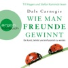

Dale Carnegies Gespür für den Umgang mit Menschen ist unübertroffen. Er beherrscht es meisterhaft, die Kunst, beliebt und einflussreich zu werden, an seine Hörer weiterzugeben. In diesem Hörbuch zeigt er auf seine unnachahmliche Weise, wie man Freunde gewinnt, auf neuen Wegen zu neuen Zielen gelangt, im Beruf erfolgreicher wird und seine Umwelt beeinflusst.

[View on Apple](https://books.apple.com/de/audiobook/wie-man-freunde-gewinnt-die-kunst-beliebt-und-einflussreich/id1425603286)

## Very Bad Liars (Kingston University, Spring Break, Teil 2) – Das Hörspiel

Es wäre kein Spiel, wenn wir dir einfach sagen, dass du dich nicht zwischen uns entscheiden musst. Wir wollen, dass du wählst. Und es wird immer die falsche Wahl sein.

Spring Break sollte für Mable die Zeit sein, in der sie sich auf ihre Prüfungen in Kingston vorbereitet, doch alles kommt anders als geplant.

Das FBI bevölkert den Campus, um mehr über die Hintergründe des Anschlags auf die Elite-Studenten in Erfahrung zu bringen. Nicht einmal die Kings wissen, was Mable herausgefunden hat.

Das Spiel der Begierde und Lust scheint eine tödliche Wendung zu nehmen. Werden die Könige ihre Dame beschützen?

Oder planen sie noch immer ihren Untergang?

Vergiss Spring Break, kleine Blüte. Wenn herauskommt, dass du uns etwas verschweigst, könnte das dein tatsächliches Ende bedeuten.

Lektion drei: Die Elite kennt bessere Waffen als Pistolen und Messer. Wir kämpfen nicht – wir lassen kämpfen. Und du solltest uns dabei nicht im Weg stehen.

Dark College. Bully Romance. Reverse Harem.

Du willst nicht teilen. Sie dich schon.

Band 3 der KINGSTON-Reihe von Bestseller-Autorin J. S. Wonda jetzt als Hörspiel. 
Dies ist der zweite und abschließende Teil des Hörspiels.

[View on Apple](https://books.apple.com/de/audiobook/very-bad-liars-kingston-university-spring-break-teil/id6769693076)

## Das Cottage in der Serling Street - Natalie Ames ermittelt - Tee? Kaffee? Mord!, Folge 39 (Ungekürzt)

Nathalie erbt überraschend ein Cottage - von einem Mann, den sie zuvor nie getroffen hat. Ihre verstorbene Tante Henrietta hingegen kannte Lewis Brownsfield sehr wohl. Und sie war bis zuletzt fest davon überzeugt, dass er ein dunkles Geheimnis hütete. Allerdings sieht sein Cottage für Nathalie und Louise denkbar harmlos aus. Doch dann finden die beiden heraus, dass der unscheinbare Mann tatsächlich etwas zu verbergen hatte - und dass noch andere diesem Rätsel auf die Spur kommen wollen, koste es, was es wolle ...

ÜBER DIE SERIE
Davon stand nichts im Testament ... Cottages, englische Rosen und sanft geschwungene Hügel - das ist Earlsraven. Mittendrin: das »Black Feather«. Dieses gemütliche Café erbt die junge Nathalie Ames völlig unerwartet von ihrer Tante - und deren geheimes Doppelleben gleich mit! Die hat nämlich Kriminalfälle gelöst, zusammen mit ihrer Köchin Louise, einer ehemaligen Agentin der britischen Krone. Und während Nathalie noch dabei ist, mit den skurrilen Dorfbewohnern warmzuwerden, stellt sie fest: Der Spürsinn liegt in der Familie ...

[View on Apple](https://books.apple.com/de/audiobook/das-cottage-in-der-serling-street-natalie-ames-ermittelt/id6786002009)

## Schleier aus Lügen - Bunburry - Ein Idyll zum Sterben, Folge 21 (Ungekürzt)

In Bunburry sollen schon bald die Hochzeitsglocken läuten! Mit der Unterstützung der renommierten Hochzeitsplanerin Elizabeth Ravensdale bereiten Alfie und Emma ihren großen Tag vor. Doch dann erschüttert ein grausamer Fund die Idylle: Eine Leiche wird entdeckt. Während die Polizei glaubt, den Täter gefunden zu haben, sind Alfie, Liz und Marge überzeugt, dass mehr hinter der Sache steckt - und nehmen die Ermittlungen selbst in die Hand. Gelingt es ihnen, die Wahrheit ans Licht zu bringen?

Über die Serie: Frische Luft, herrliche Natur und weit weg von London! Das denkt sich Alfie McAlister, als er das Cottage seiner Tante in den Cotswolds erbt. Und packt kurzerhand die Gelegenheit beim Schopfe, um der Hauptstadt für einige Zeit den Rücken zu kehren. Kaum im malerischen Bunburry angekommen, trifft er auf Liz und Marge, zwei alte Ladys, die es faustdick hinter den Ohren haben und ihn direkt in ihr großes Herz schließen. Doch schon bald stellt Alfie fest: Auch wenn es hier verführerisch nach dem besten Fudge der Cotswolds duftet - Verbrechen gibt selbst in der schönsten Idylle. Gemeinsam mit Liz und Marge entdeckt Alfie seinen Spaß am Ermitteln und als Team lösen die drei jeden Fall!

[View on Apple](https://books.apple.com/de/audiobook/schleier-aus-l%C3%BCgen-bunburry-ein-idyll-zum-sterben-folge/id6785999396)

## Bullenbrüder - Tote haben keine Freunde (Ungekürzte Lesung)

Holger Brinks ist Kommissar bei der Mordkommission. Sein Bruder Charlie schlägt sich als Privatschnüffler durchs Leben. Der eine ein korrekter Beamter mit Familie, der andere ein ausgebuffter Hallodri mit Bindungsproblemen. Als Charlie mal wieder von einer Beinahe-Traumfrau vor die Tür gesetzt wird, bittet er seinen Bruder um Obdach - und landet auf der Luftmatratze in Holgers Gartenlaube. Der Kommissar steht beruflich unter Druck. Der engste Vertraute des Berliner Unterwelt-Bosses Bobby Schütz wurde tot im Aufzug eines Berliner Luxushotels gefunden - mit einem Koffer voller Kokain. Pikanterweise hat auch Charlie Verbindungen zu Schütz und seinem Clan ...

[View on Apple](https://books.apple.com/de/audiobook/bullenbr%C3%BCder-tote-haben-keine-freunde-ungek%C3%BCrzte-lesung/id1425467857)

## Häftling (Ungekürzt)

Nur er weiß, warum du hier bist.
Es gibt drei Regeln, die Brooke Sullivan als neu eingestellte Pflegefachkraft im Hochsicherheitsgefängnis befolgen muss:
1.Behandle alle Insassen respektvoll.
2.Gib nie persönliche Informationen preis.
3.Freunde dich NIEMALS mit den Insassen an.
Aber niemand im Gefängnis ahnt, dass Brooke bereits all diese Regeln gebrochen hat. Niemand weiß von ihrer engen Verbindung zu Shane Nelson, einem der berüchtigtsten Häftlinge der Strafanstalt.
Und sie wissen definitiv nicht, dass Shane vor vielen Jahren Brookes Highschool-Freund war - der Star-Quarterback, der jetzt den Rest seines Lebens wegen einer Reihe blutiger Morde hinter Gittern verbringt. Oder dass es Brookes Aussage war, die sein Urteil besiegelt hat.
Aber Shane erinnert sich.
Und er wird es nicht so bald vergessen.
Ein absolut spannungsgeladener Psychothriller von der Bestsellerautorin des millionenfach verkauftem Wenn sie wüsste - jetzt im Kino. Perfekt für alle Fans von Gillian Flynn, Sebastian Fitzek und Paula Hawkins.
Leser:innen über Freida McFadden:
"Jedes Mal, wenn ich dachte, ich hätte es erraten ... FALSCH!!! ... Ich bin noch immer komplett durch den Wind ... Ausgezeichnet ... Wenn du erstklassige Psychothriller liebst, die dich deinen eigenen Verstand hinterfragen lassen, dann bist du bei dieser 5-Sterne-Lektüre richtig." NetGalley-Rezension ⭐⭐⭐⭐⭐
"Was für ein wilder Ritt!!! Freida liefert das absolut beste, twistgefüllte Finale ab ... Fesselnd von Anfang bis Ende ... Ich konnte es wirklich nicht weglegen ... Ein absolut umwerfendes schockierendes Buch, das mich bis zum Ende gepackt und miträtseln lassen hat." Goodreads-Rezension ⭐⭐⭐⭐⭐
"So viele Drehungen und Wendungen ... Ich war sofort gepackt - ich hab sogar auf meinem Kindle gelesen, während ich vor der Schule auf mein Kind gewartet habe, sodass ich es nicht weglegen musste! ... Süchtig machend ... Perfektion!" Goodreads-Rezension ⭐⭐⭐⭐⭐
"Wow!!! ... Was für eine Achterbahnfahrt! Ich saß auf heißen Kohlen! ... Ausgezeichnetes Buch! ... Fantastisches Ende!!!! ... Ich empfehle es wärmstens ... Dicke, fette fünf Sterne von mir." Goodreads-Rezension ⭐⭐⭐⭐⭐
"SO GUT ... Ich wollte es nicht aus der Hand legen! Ich hab 70% in einem Rutsch gelesen ... Ich war gefesselt ... Du wirst das Ende nicht kommen sehen! Leg alles zur Seite und hol dir dieses Buch!" Thriller_book_sisters ⭐⭐⭐⭐⭐
"OMG!!! HAT MICH ABSOLUT UMGEHAUEN!!!! Liebe, liebe, LIEBE diesen absoluten Pageturner!! ... Die Twists hörten einfach nicht auf!!! ... Ich hab es in einem Rutsch einfach verschlungen!! ... Süchtig machender, umwerfender Pageturner, der dich mit rasendem Herzen wachhält, bis du ihn beendet hast!!!" Bookworm86 ⭐⭐⭐⭐⭐
"Absolut unglaublich! ... Wow ... Der finale Twist war FANTASTISCH, und es war das erste Mal, dass ich beim Lesen eines Thrillers laut 'neeeein?' gerufen hab ... Genial ... Ich kann es nur empfehlen." jsybookworm ⭐⭐⭐⭐⭐
"Ein großartiger Psychothriller!! ... Wird dich ab der ersten Zeile abholen ... Halt deine Kinnlade fest, denn sie wird zu Boden fallen ... Hab es so. Sehr. Geliebt!!" Goodreads-Rezension ⭐⭐⭐⭐⭐

[View on Apple](https://books.apple.com/de/audiobook/h%C3%A4ftling-ungek%C3%BCrzt/id1876228419)

## Die Ehefrau – Was hat sie zu verbergen?

<b>In diesem Haus ist nichts so, wie es scheint: Nr.-1-Bestsellerautorin Freida McFadden ist die Queen der packenden Twists!</b>  Sylvia Robinson wird im Haus der Barnetts als private Pflegekraft eingestellt. Nach einem Unfall benötigt Victoria Barnett rund um die Uhr Betreuung. Sie kann weder gehen noch sprechen und ist an ihr Bett im obersten Stockwerk des Hauses gefesselt. Daher hat ihr Mann Sylvia als Unterstützung hinzugeholt. Doch schon bald hat Sylvia das Gefühl, dass Victoria nicht so hilflos ist, wie sie scheint. Dann entdeckt sie Victorias Tagebuch versteckt in einer Kommode. Und was sie darin liest, zieht ihr den Boden unter den Füßen weg.   leicht gekürzte Lesung mit Chantal Busse, Jodie Ahlborn 9h 29min

[View on Apple](https://books.apple.com/de/audiobook/die-ehefrau-was-hat-sie-zu-verbergen/id1807980252)

## Sie kann dich hören

<b>Die packende Geschichte von Millie geht weiter: Ein neuer Job. Ein luxuriöses Appartement. Eine Frau, die Millies Hilfe benötigt. Doch nichts ist, wie es scheint.</b>  Millie Calloway hat einen neuen Job. Um sich ihr Studium zu finanzieren, hilft sie einem reichen Paar aus Manhattan im Haushalt. Ihr Arbeitgeber Douglas Garrick wirkt nett, und zum Glück stellt er ihr nicht zu viele Fragen zu ihrer Vergangenheit. Doch warum darf Millie nicht mit seiner Frau Wendy sprechen? Was bedeuten das Weinen, das sie aus dem verschlossenen Zimmer hört, und die Blutflecke auf Wendys Kleidung? Ist Douglas in Wahrheit nicht der fürsorgliche Ehemann, der er vorgibt zu sein? Millie weiß nur eins: Sie muss Wendy helfen. Auch wenn sie damit riskiert, dass ihr dunkelstes Geheimnis doch noch ans Licht kommt.  Gekürzte Lesung mit Leonie Landa, Vanida Karun 7h 16min

[View on Apple](https://books.apple.com/de/audiobook/sie-kann-dich-h%C3%B6ren/id1704425015)

## Das Kind in dir muss Heimat finden

<b>Direkt, echt, lebensnah – die neue Erfolgsautorin in der Lebenshilfe.</b>  Jeder Mensch sehnt sich danach, angenommen und geliebt zu werden. Im Idealfall entwickeln wir während unserer Kindheit das nötige Selbst- und Urvertrauen, das uns als Erwachsene durchs Leben trägt. Doch auch die erfahrenen Kränkungen prägen sich ein und bestimmen unbewusst unser gesamtes Beziehungsleben. Erfolgsautorin Stefanie Stahl hat einen neuen, wirksamen Ansatz zur Arbeit mit dem "inneren Kind" entwickelt: Wenn wir Freundschaft mit ihm schließen, bieten sich erstaunliche Möglichkeiten, Konflikte zu lösen, Beziehungen glücklicher zu gestalten und auf (fast) jedes Problem eine Antwort zu finden.

[View on Apple](https://books.apple.com/de/audiobook/das-kind-in-dir-muss-heimat-finden/id1437376330)

## Das Känguru-Manifest (Die Känguru-Werke 2)

Sie sind wieder da – das kommunistische Känguru und der stoische Kleinkünstler! Auf der Jagd nach dem höchstverdächtigen Pinguin rasen sie durch die ganze Welt. Spektakuläre Enthüllungen! Skandale! Intrigen! Ein Mord, für den sich niemand interessiert! Eine Verschwörung auf niedrigster Ebene! Ein völlig abstruser Weltbeherrschungsplan! Mit Spaß, Spannung und Schnapspralinen ...

[View on Apple](https://books.apple.com/de/audiobook/das-k%C3%A4nguru-manifest-die-k%C3%A4nguru-werke-2/id1500633929)

## Splitterseele

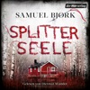

<b>Eine Anschlagsserie im Herzen Oslos und eine zutiefst dunkle Wahrheit – der neue atemlose Thriller von SPIEGEL-Bestsellerautor Samuel Bjørk.</b>  In Oslo betritt eine verängstigte Frau eine U-Bahn, um den Körper einen Sprengstoffgürtel. Panik bricht aus. Dann explodiert die Bombe. Kurz darauf erhält die Journalistin Jessica Blomqvist einen Anruf von einem Unbekannten, der ihr eine weitere Tat ankündigt. Mit dem Fall werden der erfahrene Kommissar Holger Munch und sein Team betraut, zu dem auch die brillante junge Ermittlerin Mia Krüger zählt. Auf dem Küchentisch der Frau aus der U-Bahn stoßen Munch und Mia auf drei rätselhafte Gegenstände, darunter eine kleine Luchsfigur. Noch bevor sie die Hinweise entschlüsseln können, geht in einem belebten Park der Stadt erneut eine Bombe hoch. Für Munch und Mia beginnt ein atemloser Wettlauf gegen die Zeit. Denn der Täter hat sein seelenloses Spiel gerade erst begonnen …  Gekürzte Lesung mit Dietmar Wunder 10h 48min

[View on Apple](https://books.apple.com/de/audiobook/splitterseele/id1852615307)

## 22 Kurzgeschichten, die dein Denken verändern werden

Grübeln stoppen, Gelassenheit lernen und positiv denken durch die Kraft der Positiven Psychologie!

Manchmal reicht eine einzige Kurzgeschichte, um die Welt mit neuen Augen zu sehen. In "22 Kurzgeschichten, die dein Denken verändern werden" erwarten dich inspirierende Erzählungen, die deine Perspektive auf das Leben sanft, aber tiefgreifend verändern. Jede Kurzgeschichte basiert auf Erkenntnissen der Positiven Psychologie – leicht verständlich, alltagsnah und mit einer klaren Botschaft: Du hast die Kraft, dein Denken zu lenken.

Ob du häufig grübelst, innere Ruhe suchst oder dir mehr Leichtigkeit im Alltag wünschst – dieses Hörbuch ist dein Begleiter auf dem Weg zu mehr Gelassenheit, Selbstvertrauen und mentaler Stärke. Statt trockener Theorie erlebst du, wie Gedanken, Gefühle und Entscheidungen in kurzen, fesselnden Momenten zu kleinen Wendepunkten werden.

Lass dich inspirieren, berühren und bestärken – Geschichte für Geschichte.
Denn manchmal genügt schon ein Gedanke, um dein ganzes Leben zu verändern.

[View on Apple](https://books.apple.com/de/audiobook/22-kurzgeschichten-die-dein-denken-ver%C3%A4ndern-werden/id1849959883)

## Der Thron der Lilie

<b>Die grandiose Fortsetzung von "Das Reich der Rose"</b>  Frankreich 1297. Während der Papst und der französische König einen erbitterten Machtkampf austragen, werden der Ritter Constantin Fleury, die Goliardin Mélisande und der Templer Gérard d’Acre von den Schatten ihrer Vergangenheit eingeholt. Feinde Constantins entführen Mélisande und seine schwangere Frau Agnès. Für die beiden Frauen beginnt ein Kampf ums Überleben. Um sie zu retten, muss Constantin sich hoch verschulden. Sein Freund Gérard, der sich auf einer heiklen Mission für den Templerorden befindet, hilft ihm, das Lösegeld nach Flandern zu bringen. Die rebellische Grafschaft taumelt am Rande eines Krieges, der Kronvasall Constantin gilt den Aufständischen als Todfeind. Auf der gefahrvollen Reise wird Gérard zudem mit alten Sünden konfrontiert und droht, an seiner Schuld zu zerbrechen …  leicht gekürzte Lesung mit Johannes Steck 18h 49min

[View on Apple](https://books.apple.com/de/audiobook/der-thron-der-lilie/id1852615686)

## John of John (ungekürzt)

Ohne Geld und mit wenig vorzuweisen nach seiner Ausbildung an der Kunsthochschule, nimmt Cal die Fähre nach Hause auf die Insel Harris und all das, vor dem er nach Edinburgh geflüchtet war, ist wieder da: das karge Leben auf den Hebriden, der windgepeitschte Kreislauf aus Schafzucht und Nächten am Webstuhl, die Enge der Inselgemeinschaft.
Sein Vater hat ihn nach Hause in sein altes Leben beordert. John, dem er all sein Wissen über Farben und Wolle verdankt, dessen Hingabe als Tweed-Weber er liebt und dessen presbyterianische Strenge er hasst. Sie sind einander so nah und kennen sich so wenig, blind für das wohlgehütete Geheimnis des anderen. Niemals könnte Cal dem Vater von seiner Sehnsucht nach einem Partner erzählen, wo dieser schon seine langen Haare als Sünde ahndet. Stattdessen sucht Cal immer mehr die Nähe von Innes, Johns sanftem bestem Freund, während sich die Fäden, die ihre fragile Gemeinschaft zusammenhalten, immer dichter verweben.
Ein großer Roman über Verpflichtung und Verblendung, Liebe und Scham und die verwandelnde Kraft der Wahrheit.

[View on Apple](https://books.apple.com/de/audiobook/john-of-john-ungek%C3%BCrzt/id1862090114)

## Kreuzweg der Raben: The Witcher, Band 6

Die Saga geht weiter ... das Ende ist der Anfang Der Großmeister der Fantasy kehrt zurück in die Jugendjahre von Geralt| der seine ersten Schritte als Hexer macht und sich zahlreichen tödlichen Herausforderungen stellen muss. Bewaffnet mit zwei Runenschwertern bekämpft er Monster| rettet unschuldige Jungfrauen und eilt unglücklich Verliebten zu Hilfe. Dabei versucht er immer und überall dem ungeschriebenen Kodex zu folgen| den ihm seine Lehrer und Mentoren mitgegeben haben. Doch bleiben ihm dabei keine Enttäuschungen erspart| und sein jugendlicher Idealismus muss bittere Erfahrungen hinnehmen. Doch Geralt gibt nicht auf … niemals!

[View on Apple](https://books.apple.com/de/audiobook/kreuzweg-der-raben-the-witcher-band-6/id1835499768)

## Nightworld Academy - Gesamtausgabe (1-10)

"Also es gibt 3 Häuser an unserer Schule."
"Häuser? Wie in Hogwarts?", frage ich.
"Nein ..." Er seufzt. "Nicht wie in ... okay, vielleicht ein bisschen wie in Hogwarts."

Maeve hat Visionen, aber die behält sie besser für sich. Sie will nicht für verrückt erklärt werden. Aber gelegentlich versucht sie die Zukunft zu beeinflussen und gerät dadurch in Schwierigkeiten.

Also wird sie an die Nightworld Academy geschickt. Eine Schule, die Maeve vom ersten Augenblick seltsam vorkommt. Die Schüler sind in Häuser eingeteilt. Walcott, Gilgamesh und Petrescu. Die Schüler der Häuser sind alle sehr unterschiedlich. Die Walcotts sind Nerds, die Gilgamesh Schüler sind groß und extrem stark und schnell, und die Perescu Schüler sind wunderschön und ... irgendwie unheimlich.

Maeve merkt bald, dass an dieser Schule irgendetwas nicht stimmt, und als sie offiziell in ihr Haus aufgenommen wird, begreift sie auch was.
Sie ist an einer Schule für Hexen, Gestaltwandler und Vampire und alle Häuser wollen Maeves Gabe die Zukunft zu sehen.

[View on Apple](https://books.apple.com/de/audiobook/nightworld-academy-gesamtausgabe-1-10/id1895657130)

## Du schon wieder!: (K)ein Scheidungsroman

Passt es einfach nicht, oder verdient die Liebe doch noch eine zweite Chance? Beziehung reloaded? Klingt nach gar keiner guten Idee. Trotzdem gerät Krankenhausärztin Fanny ganz schön ins Wanken, als ihr Ex Dustin in die Notaufnahme eingeliefert wird. Plötzlich brodeln wieder Gefühle in ihr. Und das, obwohl sie in einer neuen Beziehung ist – genau wie Dustin. Noch krasser wird's, als die beiden eine heimliche Affäre beginnen. Was zur Hölle soll das werden? Als die Sache dann auffliegt, steht das gesamte Umfeld kopf, und Fanny muss sich entscheiden: Ex und hopp? Oder noch einmal mit Gefühl? Einmalig komisch und immer romantisch schreibt Bestsellerautorin Ellen Berg über die Frage, wie schlechtes Timing dem Glück im Wege stehen kann.

[View on Apple](https://books.apple.com/de/audiobook/du-schon-wieder-k-ein-scheidungsroman/id6790437757)

## Verliebt in Greenkenny - Irish Lovestories - Ein Irland-Liebesroman, Band 1 (Ungekürzt)

<b>Küssen Iren wirklich besser?</b>
<b>Ein turbulent-romantischer Liebesroman auf der Grünen Insel</b>  Nachdem Simone erst ihren Freund und dann auch noch den Job verliert, flüchtet sie kurz entschlossen nach Irland, um sich abzulenken. Gleich am ersten Abend im Pub knistert es gewaltig zwischen ihr und dem charmanten Tyler und sie lässt sich auf einen One-Night-Stand mit ihm ein. Daraufhin geht ihr der faszinierende Ire mit seiner unkomplizierten Art nicht mehr aus dem Kopf. Als Simones Rückflug gestrichen wird und sie gezwungen ist, länger als geplant auf der Grünen Insel zu bleiben, nimmt sie all ihren Mut zusammen und besucht Tyler trotz Pferdephobie auf seiner Pferdefarm im idyllischen Greenkenny. Durch ihn lernt sie nicht nur die Schönheit der irischen Landschaft, sondern auch die Herzlichkeit der Bewohner kennen. Doch Tyler trägt ein Geheimnis mit sich, das die aufkeimende Beziehung der beiden überschattet. Hat es etwas mit den unbewohnten Cottages auf dem Farmgelände zu tun, um die sämtliche Bewohner einen großen Bogen machen? Und warum setzt Tylers Stiefschwester alles daran, einen Keil zwischen ihn und Simone zu treiben?  <b>Erste Leser:innenstimmen
</b><i>"Die Liebesgeschichte zwischen Simone und Tyler entwickelt sich auf eine Weise, die das Herz berührt."</i>
<i>"Eine romantische und emotionale Reise nach Irland, die zum Träumen einlädt!"</i>
<i>"Die Kulisse der Insel und die Beschreibungen der Pferdefarm haben mich direkt verzaubert."</i>
<i>"Die Autorin versteht es, die Gefühle der Charaktere authentisch darzustellen und das Geheimnis um Tyler geschickt einzuflechten."</i>

[View on Apple](https://books.apple.com/de/audiobook/verliebt-in-greenkenny-irish-lovestories-ein-irland/id1737744109)

## Die Geschichte in mir. Eine deutsche Familie im 20. Jahrhundert

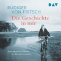

Rüdiger von Fritsch hat sein Leben als Diplomat der Verständigung der Völker verschrieben, sein Vater das seinige »unserer herrlichen Bewegung«, dem Nationalsozialismus. Für Thomas von Fritsch waren »Deutschlands Feinde« schuld an dem unendlichen Verlust an Heimat, Haus und Menschen, der die Erzählungen der Erwachsenen während der Kindheit des Autors bestimmt. Der ehemalige Botschafter in Warschau und Moskau erzählt, wie ihm als Kind dämmerte, dass es in Wahrheit die Deutschen gewesen waren, die furchtbares Leid über den europäischen Kontinent und seine Menschen gebracht hatten. Sein Buch handelt davon, wie er sich schließlich dem geliebten Vater und seiner Ideologie entgegenstellte. Am Beispiel seiner Familie entwirft Rüdiger von Fritsch ein Panorama des 20. Jahrhunderts. Ein eindringlich und literarisch erzähltes Buch, das zeigt, wie wichtig und wie schwer es ist, über Schuld und Verstrickung in der eigenen Familie zu sprechen.

[View on Apple](https://books.apple.com/de/audiobook/die-geschichte-in-mir-eine-deutsche-familie-im-20-jahrhundert/id6768996810)

## Karneval der Lügen - Cherringham - Landluft kann tödlich sein, Folge 50 (Ungekürzt)

Cherringham - Der 50. Fall
Im sonst so beschaulichen Cherringham herrscht Ausnahmezustand: Es ist Sommer-Karneval! Das ganze Dorf feiert den 500. Jahrestag, an dem der König dem Ort seine Stadtrechte verliehen hat. Doch zwischen bunten Kostümen und fröhlichen Umzügen bahnt sich Unheil an. Als eine kostbare Urkunde spurlos verschwindet, sollen Jack und Sarah für das Karnevalskomitee ermitteln und geraten mitten hinein in ein gefährliches Spiel ...
Über die Serie: Cherringham ist ein beschauliches Dorf in den englischen Cotswolds. Doch mysteriöse Vorfälle, eigenartige Verbrechen und ungeklärte Morde halten die Bewohner auf Trab. Zum Glück bekommt die örtliche Polizei tatkräftige Unterstützung von Sarah und Jack. Die alleinerziehende Mutter und der ehemalige Cop aus New York lösen jeden noch so verzwickten Fall. Und geraten das ein oder andere Mal selbst in die Schusslinie.

[View on Apple](https://books.apple.com/de/audiobook/karneval-der-l%C3%BCgen-cherringham-landluft-kann-t%C3%B6dlich/id6772132058)

## Der Hobbit

Bilbo Beutlin, der kleine Hobbit, macht sich auf den Weg zum Einsamen Berg, um den rechtmäßigen Schatz der Zwerge zurückzuholen, den der Drache Smaug gestohlen hat. Als er auf seiner Reise einen Ring findet und ihn arglos einsteckt, ahnt er nicht, was für eine Rolle der Ring einmal spielen wird ... Gert Heidenreich, die Stimme J.R.R. Tolkiens, erzählt, wie Bilbo sich vom ängstlichen Hobbit zum mutigen Meisterdieb mausert. Wort für Wort ist jetzt das Schicksal Mittelerdes und somit das Tolkiensche Werk zu hören.

[View on Apple](https://books.apple.com/de/audiobook/der-hobbit/id1435742775)

## Der Nachbar

Sie dachte, ihre größte Angst ist es, allein zu sein. Bis sie herausfindet, dass sie es nie war...  Wer ist der "Nachbar"?  <i>Der Nachbar</i> - Sebastian Fitzeks raffinierter Gänsehaut-Thriller für 2025  Die Strafverteidigerin Sarah Wolff leidet an Monophobie, der Angst vor Einsamkeit. Was sie nicht weiß: Nachdem sie mit ihrer Tochter an den Stadtrand Berlins gezogen ist, hat sie einen unsichtbaren Nachbarn, der sie keine Sekunde lang allein lassen wird ...  Das Unheimliche lauert im engsten Umfeld - der neue nervenzerreißende Psychothriller von #1-Bestseller-Autor Sebastian Fitzek sorgt für garantiert unruhige Nächte!

[View on Apple](https://books.apple.com/de/audiobook/der-nachbar/id1836179259)

## Das Café am Rande der Welt [The Cafe on the Edge of the World]: Eine Erzählung über den Sinn des Lebens [A Narrative About the Meaning of Life] (Unabridged)

![Das Café am Rande der Welt \[The Cafe on the Edge of the World\]: Eine Erzählung über den Sinn des Lebens \[A Narrative About the Meaning of Life\] (Unabridged)](../../logos/1450302424-c5fff0f8.png)

In einem Café mitten im Nirgendwo wird John mit 3 Sinnfragen konfrontiert. "Die Möwe Jonathan für das neue Jahrtausend."  Ein kleines Café mitten im Nirgendwo wird zum Wendepunkt im Leben von John, einem Werbemanager, der stets in Eile ist. Eigentlich will er nur kurz Rast machen, doch dann entdeckt er auf der Speisekarte neben dem Menü des Tages drei Fragen: "Warum bist du hier? Hast du Angst vor dem Tod? Führst du ein erfülltes Leben?" Wie seltsam - doch einmal neugierig geworden, will John mithilfe des Kochs, der Bedienung und eines Gastes dieses Geheimnis ergründen. Die Fragen nach dem Sinn des Lebens führen ihn gedanklich weit weg von seiner Vorstandsetage an die Meeresküste von Hawaii. Dabei verändert sich seine Einstellung zum Leben und zu seinen Beziehungen, und er erfährt, wie viel man von einer weisen grünen Meeresschildkröte lernen kann. So gerät diese Reise letztlich zu einer Reise zum eigenen Selbst. Ein ebenso lebendig geschriebenes, humorvolles wie anrührendes Hörbuch.  &#xa0;<b>Please note: This audiobook is in German.</b>

[View on Apple](https://books.apple.com/de/audiobook/das-caf%C3%A9-am-rande-der-welt-the-cafe-on-the-edge/id1450302424)

## Flammen und Finsternis: Das Reich der sieben Höfe – Teil 2: A Court of Mist and Fury

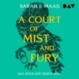

Feyre hat überlebt. Sie hat Amarantha, die grausame Fae-Königin, besiegt und ist mit Tamlin an den Frühlingshof zurückgekehrt. Doch das scheinbar glückliche Ende täuscht. Tamlin verändert sich immer mehr und nimmt ihr allen Freiraum. Feyre hat Albträume, denn sie kann die schrecklichen Dinge nicht vergessen, die sie tun musste, um Tamlin zu retten. Und sie ist einen riskanten Handel mit Rhys eingegangen, an dessen gefürchtetem Hof der Nacht sie nun jeden Monat eine Woche verbringen muss. Dort wird sie immer tiefer in ein Netz aus Intrigen, Machtspielen und ungezügelter Leidenschaft gezogen.

[View on Apple](https://books.apple.com/de/audiobook/flammen-und-finsternis-das-reich-der-sieben-h%C3%B6fe-teil/id1262044477)

## Psycho-Cybernetics (Updated and Expanded)

<b>The landmark self-help bestseller that has inspired and enhanced the lives of </b><b>more than 30 million readers.</b>  In this updated edition, with a new introduction and editorial commentary by Matt Furey, president of the Psycho-Cybernetics Foundation, the original 1960 text has been annotated and amplified to make Maxwell Maltz's message even more relevant for the contemporary reader.  Maltz was the first researcher and author to explain how the self-image (a term he popularized) has complete control over an individual's ability to achieve, or fail to achieve, any goal. He developed techniques for improving and managing self-image visualization, mental rehearsal and relaxation which have informed and inspired countless motivational gurus, sports psychologists, and self-help practitioners for more than sixty years.  Rooted in solid science, the classic teachings in <i>Psycho-Cybernetics</i> continue to provide a prescription for thinking and acting that lead to life-enhancing, quantifiable results.

[View on Apple](https://books.apple.com/de/audiobook/psycho-cybernetics-updated-and-expanded/id1674144949)

## Die Roseninsel (Ungekürzt)

Ein warmherziger und gefühlvoller Roman über Glück und Hoffnungslosigkeit, Verlust und Liebe - all das, was ein Leben ausmacht.
Kann man sich im falschen Moment verlieben? Und überwindet Liebe jedes Hindernis?
Buchhändlerin Emma reist nach London, um ihren verstorbenen Eltern noch einmal nahe zu sein, denn diese hatten sich dort kennen- und lieben gelernt.
Schon am ersten Tag begegnet ihr die sympathische Witwe Ava. Die beiden Frauen freunden sich an, und Ava macht Emma das verlockende Angebot, in ihrem Anwesen auf der Roseninsel in Cornwall die Bibliothek auf den neuesten Stand zu bringen. Begeistert sagt Emma zu.
Völlig unerwartet trifft sie in dem Haus auf den Klippen auf Avas Sohn Ethan, der ihr gegenüber sehr abweisend ist. Dennoch fühlt Emma sich zu ihm hingezogen. Als sie herausfindet, was hinter Ethans kühler Fassade steckt, begreift sie, wie tief Liebe gehen kann - und steht plötzlich vor der größten Herausforderung ihres Lebens ...
© Insel Verlag Berlin 2021

[View on Apple](https://books.apple.com/de/audiobook/die-roseninsel-ungek%C3%BCrzt/id1567572855)

## Apfelstrudel-Alibi: Franz Eberhofer, Band 13

Als ob der Eberhofer Franz nicht schon Ärger genug hätte. Nein, jetzt muss die Susi-Maus sich auch noch als frischgebackene Bürgermeisterin wichtigmachen. Dabei hat er ganz andere Sorgen, nämlich einen Mordfall, einen waschechten. Zumindest glaubt das der Richter Moratschek, dessen geliebte Patentochter Letitia sicher nicht von ganz allein in Südtirol vom Berg gestürzt ist. Dem Eberhofer kommt das auch spanisch vor – oder eher italienisch! Und so kraxelt er auf den Spuren des vermeintlichen Mordopfers in den Dolomiten herum. Und der Rudi, der muss derweil beim Hauptverdächtigen auf dem Campingplatz ermitteln – inkognito, versteht sich. Na, sauber!

[View on Apple](https://books.apple.com/de/audiobook/apfelstrudel-alibi-franz-eberhofer-band-13/id1839879244)

## EDEN - Wenn das Sterben beginnt

<b>Das Sterben hat begonnen – der neue rasante Thriller von SPIEGEL-Bestsellerautor Marc Elsberg</b>  Frühjahr: In der Karibik attackiert ein Riesenkalmar vor den Augen entsetzter Touristen einen Walhai. In der Bucht von Triest treiben Schwärme toter Fische. Im Amazonas verdorrt der Boden. Lokale Einzelphänomene der Natur – so scheint es. Doch weltweit beginnt etwas zu kippen … Als das neue KI-Programm des IT-Experten Piero Manzano Alarm schlägt, ist die Prognose eindeutig: Binnen Monaten droht eine globale Megakrise. Gemeinsam mit dem reichweitenstarken Influencer Linus Strand und der jungen Meeresbiologin Sarah Keller macht Piero die Warnung öffentlich – und sie alle damit zur Zielscheibe. Mächtige Gegenspieler tun alles, um sie zum Schweigen zu bringen, während sich am Horizont ein Sturm zusammenbraut …  Gekürzte Lesung mit Dietmar Wunder 15h 29min

[View on Apple](https://books.apple.com/de/audiobook/eden-wenn-das-sterben-beginnt/id1831395606)

## Die verschlossene Tür (Ungekürzt)

[View on Apple](https://books.apple.com/de/audiobook/die-verschlossene-t%C3%BCr-ungek%C3%BCrzt/id6767566127)

## Yesteryear

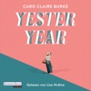

<b>Ihr Leben ist perfekt –solange man nicht hinter die Kulissen schaut</b>  Natalie Heller Mills hat alles: eine malerisch renovierte Farm, sechs Kinder, die um ihre Liebe buhlen, und einen Mann, der in Cowboy Stiefeln immerhin eine gute Figur abgibt. Vom Sauerteig bis zur Kindererziehung, nichts scheint ihr zu misslingen. Kein Wunder also, dass ihr Millionen von Menschen folgen, ihre Videos schauen, ihre Bilder anklicken. Sie gibt ihnen das, was sie wollen: eine heile Welt. Skandale werden unter den Teppich gekehrt, da, wo sie hingehören.  Doch eines Tages wacht Natalie auf und sieht sich mit einer unbequemen Frage konfrontiert: Was wäre, wenn sie keine Nannys beschäftigen könnte, es keine helfenden Hände auf der Farm gibt, kein Produktionsteam? Was wäre, wenn sie auf einmal das Leben führen müsste, dass sie immer vorgetäuscht hat?  Ungekürzte Lesung mit Lisa Hrdina 14h 35min

[View on Apple](https://books.apple.com/de/audiobook/yesteryear/id1852667989)

## Blood – Du sollst bereuen

<b>Laut, krass, dark und sexy – Teil 2 der heißersehnten Thriller-Serie als Hörbuch!</b>  Lana Myers ist jung, erfolgreich und seit Kurzem in einer glücklichen Beziehung mit dem FBI-Agenten Logan Bennett. Alles scheint perfekt. Was Logan aber nicht weiß: Lana ist die meistgesuchte Serienmörderin des Landes. Ihr Motiv ist Rache an einer Gruppe Männer, die ihr vor zehn Jahren unsagbares Leid angetan haben. Noch kann sie ihre wahre Identität geheim halten, doch Logan und sein Profiler-Team arbeiten unermüdlich an ihrem Fall. Ein einziger Fehler könnte Lanas Vergeltungsplan zum Einsturz bringen. Und sie ihre große Liebe kosten. Besonders seit Logans Kollegin Hadley sie im Visier hat …  Ungekürzte Lesung mit Viola Müller, Richard Lingscheidt 3h 51min

[View on Apple](https://books.apple.com/de/audiobook/blood-du-sollst-bereuen/id1884757965)

## Gesamtausgabe - Der Thron der Magier

Thron der Magier: Das große Epos von Frankreichs Nummer 1 Fantasy-Autorin Jupiter Phaeton.
Gelesen von 4 der berühmtesten Sprecherinnen und Sprecher Deutschlands.

"Das eindeutig beste Hörbuch das wir jemals veröffentlicht haben." Winterfeld Verlag

Der König der Magier ist tot.
Jetzt wollen die fünf mächtigsten Magierfamilien in England seine Nachfolge antreten. Mit Intrigen, Machtspielen und natürlich Magie versuchen sie alle sich den Thron zu sichern. 

Unterdessen will Katleen die 20-jährige Tochter des toten Königs nichts von alldem wissen. Katleen hat sich geschworen, nie wieder einen Fuß in die Welt der Magier zu setzen, und erst als sie vom Tod ihres Vaters erfährt, beschließt sie, sich den Geistern ihrer Vergangenheit zu stellen.

Allerdings ahnt sie nicht, dass diese Entscheidung ihr Leben und das Schicksal der Welt verändern wird.

[View on Apple](https://books.apple.com/de/audiobook/gesamtausgabe-der-thron-der-magier/id1894074047)

## Ein Kommissar wird gejagt - Taxi, Tod und Teufel, Folge 20 (Ungekürzt)

Hauptkommissar Scharrmann muss sich verstecken - vor der Polizei! Denn jemand im Kommissariat will ihm einen Mord anhängen. Aber warum? Auf seiner Flucht bleibt ihm nur eine Verbündete: Sarah Teufel glaubt keine Sekunde an Scharrmanns Schuld und bietet ihm Unterschlupf in einer Autowerkstatt. Doch dadurch gerät sie selbst ins Visier der Polizei. Zum Glück besitzt Sarah ein Talent dafür, ihre Verfolger abzuschütteln. Jetzt muss sie nur noch die Wahrheit ans Licht bringen! Es beginnt ein riskantes Katz-und-Maus-Spiel mit falschen Beweisen, dunklen Geheimnissen und der Frage, wem Sarah überhaupt noch trauen kann ...

ÜBER DIE SERIE

Palinghuus in Ostfriesland: Zwischen weitem Land und Wattenmeer lebt Sarah Teufel mit ihrem amerikanischen Ex-Mann James in einer Windmühle. Gemeinsam betreiben sie das einzige Taxiunternehmen weit und breit - mit einem Original New Yorker Yellow Cab! Bei ihren Fahrten bekommt Sarah so einiges mit. Und da die nächste Polizeistation weit weg ist, ist doch klar, dass Sarah selbst nachforscht, wenn etwas nicht mit rechten Dingen zugeht. Denn hier im hohen Norden wird nicht gesabbelt, sondern ermittelt!

Eine atmosphärische Küstenkrimi-Serie voller Humor, Spannung und überraschender Wendungen - perfekt für alle, die Mordfälle mit norddeutschem Flair lieben.

[View on Apple](https://books.apple.com/de/audiobook/ein-kommissar-wird-gejagt-taxi-tod-und-teufel-folge/id6785996248)

## Tote singen keine Schlager - Sommer, Strand und Schlagermord, Folge 1 (Ungekürzt)

Eine neue Leiche ist wie ein neues Leben!

Franzi Wernke übernimmt die alte Kneipe ihres Onkels auf Mallorca - nur leider hat sie eine Leiche im Keller. Also, die Kneipe. Ein Koffer voller Schlager-CDs ist die einzige Spur, während die Polizei ausgerechnet Franzi verdächtigt. Gemeinsam mit Nachbar und Schlager-Fan Pierre André folgt sie der rätselhaften CD-Fährte, die nicht nur den Start ihrer Schlagerbar, sondern auch ihre neue Zukunft bedroht.

Über die Serie:

Willkommen in der Carreró Alegria auf Mallorca! Franzi Wernke, frisch geschieden und mit Teenager-Tochter, erbt hier eine Kneipe und wagt einen Neustart. Pierre André, ein noch nicht erfolgreicher Schlagersänger und talentierter Frisör im besten Alter, überzeugt sie, daraus eine Schlagerbar zu machen. Dumm nur, dass rund um die Schlagerbühne regelmäßig Morde passieren. Zwischen Lockenwicklern, Longdrinks und latent verdächtigen Nachbarn stürzen sich Franzi und Pierre in Ermittlungen voller Humor, Herz und mallorquinischem Flair.

Sommer, Strand und Schlagermord - ein witziger, spannender Krimi zum Wohlfühlen nicht nur für Mallorca- und Schlager-Fans!

[View on Apple](https://books.apple.com/de/audiobook/tote-singen-keine-schlager-sommer-strand-und-schlagermord/id6783055760)

## Die 13 1/2 Leben des Käpt'n Blaubär - das Original

<b>Die legendäre Originalversion der Lesung von Dirk Bach – pur, ungekürzt, virtuos</b>  Man schrieb das Jahr 2002, als Dirk Bach ins Studio ging und seine charakteristische Stimme dem berühmten Käpt'n Blaubär, dem Held des ersten Romans von Walter Moers, seine Stimme lieh. Und so wurde der phantastische Kontinent Zamonien samt seiner Bewohner von Bachs leidenschaftlicher Virtuosität zum Leben erweckt: Zwergpiraten, Klabautergeister, Waldspinnenhexen, Tratschwellen, Stollentrolle, Finsterbergmaden, eine Berghutze, einen Riesen ohne Kopf, einen Kopf ohne Riese, schlafwandelnde Yetis, einen ewigen Tornado, Rikschadämonen, einen Prinz aus einer anderen Dimension, einen Professor mit sieben Gehirnen, denkenden Sand, eine kulinarische Insel, Kanaldrachen, dramatische Lügenduelle, Nattifftoffen, viereckige Sandstürme, eklige Kakertratten, das Tal der verworfenen Ideen, Horchlöffelchen, Zeitschnecken, Olfaktillen, einen Malmstrom, tödliche Gefahren, ewige Liebe, Rettungen in allerletzter Sekunde – und vieles andere mehr.  Ungekürzte Lesung mit Dirk Bach 18h 21min

[View on Apple](https://books.apple.com/de/audiobook/die-13-1-2-leben-des-k%C3%A4ptn-blaub%C3%A4r-das-original/id1707768112)

## nonStop kissing the Boss

Die Engländerin Indy Fallon liebt ihren Job als Grafikdesignerin in einer angesagten New Yorker Werbeagentur über alles. Bis ihr ein schwerwiegender Fehler passiert und das Leben, das sie sich in der Millionenmetropole aufgebaut hat, vor dem Aus steht, denn ihr Arbeitsvisum ist an die Stelle geknüpft.
Als ihr Boss Max Conrad sie in sein Büro ruft, rechnet Indy mit dem Schlimmsten. Doch statt sie zu feuern, bietet er ihr einen Deal an: Wenn sie ihren Job behalten will, muss sie eine Nacht mit ihm verbringen.
Doch was, wenn es nicht bei einer Nacht bleibt – und niemand von dem Arrangement erfahren darf?

[View on Apple](https://books.apple.com/de/audiobook/nonstop-kissing-the-boss/id1723991872)

## Der Seelenbrecher

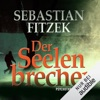

Drei Frauen - alle jung, schön und lebenslustig - verschwinden spurlos. Nur eine Woche in den Fängen des Psychopathen, den die Presse den "Seelenbrecher" nennt, genügt: Als man die Frauen wieder aufgreift, sind sie verwahrlost, psychisch gebrochen, wie lebendig in ihrem eigenen Körper begraben. Kurz vor Weihnachten wird der Seelenbrecher wieder aktiv, ausgerechnet in einer psychiatrischen Luxusklinik. Ärzte und Patienten müssen entsetzt feststellen, dass man den Täter unerkannt eingeliefert hat, kurz bevor die Klinik durch einen Schneesturm völlig von der Außenwelt abgeschnitten wurde. Verzweifelt versuchen die Eingeschlossenen einander zu schützen - doch in der Nacht des Grauens, die nun folgt, zeigt der Seelenbrecher, dass es kein Entkommen gibt...

[View on Apple](https://books.apple.com/de/audiobook/der-seelenbrecher/id296007679)

## Hamptons Prestige - Sparks & Scandals

<b>Zwischen Anziehung und Abgrund liegt manchmal nur ein einziger Kuss …</b>  Als June von ihrer Freundin Ashley eingeladen wird, die Semesterferien bei deren Familie in den Hamptons zu verbringen, ahnt sie nicht, dass diese Wochen ihr Leben verändern werden. Denn die Thornburys sind nicht nur Teil der High Society, ihnen gehört auch das Hamptons Prestige, der exklusivste Members’ Club der Insel. Bei einer Party lernt June Cameron kennen, der ihr den Kopf verdreht. Und dann ist da auch noch Ashleys Bruder Weston. Obwohl June ihn nicht ausstehen kann, lassen dessen Blicke ihr Herz ungewollt höherschlagen. Doch in den Hamptons, wo sich Lügen und Liebeleien die Hand reichen, ist es ausgerechnet die Wahrheit, die niemals schläft … <b>Spicy New Adult Romance trifft auf Geheimnisse und High Society – mit den beliebten Tropes Love Triangle, Best Friend’s Brother, Broken Hero und Bad Boy vs. Good Guy</b>  Ungekürzte Lesung mit Pia-Rhona Saxe, Flemming Stein, Vincent Fallow 9h 1min  Enthaltene Tropes: Love Triangle, Broken Hero/Heroine Spice-Level: 3 von 5

[View on Apple](https://books.apple.com/de/audiobook/hamptons-prestige-sparks-scandals/id1807978694)

## Die geheimnisvolle Insel

Während des amerikanischen Bürgerkrieges gelingt Cyrus Smith zusammen mit einigen seiner Mithäftlinge die Flucht aus einem Gefangenenlager in einem Ballon. Nach einem langen Irrflug stranden sie auf einer scheinbar verlassenen Pazifikinsel. Cyrus und seine Gefährten richten sich auf dem Eiland ein. Doch sie sind nicht alleine. Ein Unbekannter rettet ihnen mehrfach das Leben. Wer ist dieser Fremde, und was führt er im Schilde? Wird Cyrus und seinen Freunden jemals die Flucht von der Insel gelingen? Der große Klassiker von Jules Verne, gesprochen von Reinhard Kuhnert. 
 &gt;&gt; Diese ungekürzte Hörbuch-Fassung ist ausschließlich im Download erhältlich.

[View on Apple](https://books.apple.com/de/audiobook/die-geheimnisvolle-insel/id350359041)

## Monster 1983: Die komplette 3. Staffel

Amy ist zurück in Harmony Bay - und mit ihr das Monster. Cody weiß, dass seine kleine Tochter eine Gefahr für die gesamte Stadt darstellt, und trotzdem kann er es nicht zulassen, dass irgendjemand ihr etwas antut. Eine echte Zerreißprobe bahnt sich an. 
  Als sich unter den Einwohnern der kleinen Küstenstadt ein merkwürdiges Virus verbreitet, das die Betroffenen unkontrollierbar macht, scheint der Nachtmahr allerdings nicht mehr die einzige Gefahr zu sein. Sheriff Landers muss handeln, um seine Stadt zu retten - und trifft dabei eine folgenschwere Entscheidung...

[View on Apple](https://books.apple.com/de/audiobook/monster-1983-die-komplette-3-staffel/id1303507665)

## artgerecht - Das andere Kleinkinderbuch

<b>Der "artgerecht" Praxisratgeber für die Kleinkinderjahre</b>  Tausende begeisterte Eltern verlassen sich darauf, was Nicola Schmidt zur "artgerechten" Kindererziehung schreibt. Was passiert im Nervensystem, im rasant wachsenden Körper, während der Hormongewitter, wenn aus Babys Kleinkinder werden? Was hat die Evolution ihnen an Entwicklungsaufgaben mitgegeben und warum bringt das Eltern manchmal zur Verzweiflung? Wo hilft im Alltag die Wissenschaft weiter und wo wirken immer noch Ammenmärchen in unseren Köpfen? Nicola Schmidt beantwortet unzählige brennende Fragen und zeigt praktische Tipps zur Kleinkindphase – wie immer klug recherchiert, humorvoll und erfrischend undogmatisch.  Ungekürzte Lesung mit Nicola Schmidt, Nina West 8h 16min

[View on Apple](https://books.apple.com/de/audiobook/artgerecht-das-andere-kleinkinderbuch/id1586207332)

## Das Schwert Gottes - Thriller ( John Milton 5 )

Absolute Hörbuchempfehlung für Mark Dawson Fans: Die Mädchen vom 3. Stock von Alex Sol - der härteste Thriller des Jahres

Auf der Flucht vor seinen inneren Dämonen erreicht John Milton tief in den Wäldern von Michigan die Stadt Truth. Er sucht nicht nach Ärger, aber der Ärger sucht ihn. Er gerät an einen Kleinstadtpolizisten, der weder weiß, mit wem er es zu tun hat, noch ahnt, wie gefährlich er ist.

Aber Milton wird reingelegt und schwer verletzt. Unbewaffnet und allein flieht er in die abgelegenen Porcupine Mountains, ein Suchtrupp ist ihm dicht auf den Fersen. Seine Feinde glauben, sie könnten ihn zur Strecke bringen. Das ist ein Irrtum, und was Milton betrifft, gibt es keine zweite Chance.

[View on Apple](https://books.apple.com/de/audiobook/das-schwert-gottes-thriller-john-milton-5/id1896274945)

## Nein sagen - Über den 20. Juli 1944, meine Eltern und persönliche Verantwortung heute (Ungekürzte Autorenlesung)

Über den Mut, Nein zu sagen
Angesichts der neuen Bedrohung der Demokratie durch Rassismus und Fremdenfeindlichkeit erinnert der Schauspieler Matthias Brandt an den Mut der Widerstandskämpfer und -kämpferinnen gegen das NS-Regime, zu denen auch seine Eltern gehörten.
Matthias Brandt hielt 2025 eine denkwürdige Rede zur Erinnerung an die Widerstandskämpfer des 20. Juli 1944 in der Gedenkstätte Berlin-Plötzensee - dem Ort, an dem viele der Beteiligten an dem Attentat gegen Adolf Hitler hingerichtet wurden.
Als Sohn des Emigranten und späteren Bundeskanzlers Willy Brandt und seiner Frau Rut nahm Matthias Brandt die Rede zum Anlass, aus heutiger Sicht über den Mut und die Motive der Verschwörer des 20. Juli und vieler anderer Widerstandskämpfer:innen, zu denen auch die eigenen Eltern gehört hatten, nachzudenken und auch sich selbst über notwendige Konsequenzen aus der Geschichte zu befragen.
Den Ausschlag, sich mit diesem, auf seiner Rede basierenden Buch politisch zu äußern, gaben für Matthias Brandt die bedrohliche Wiederkehr des Rechtsextremismus und die Wahlerfolge der AfD.

[View on Apple](https://books.apple.com/de/audiobook/nein-sagen-%C3%BCber-den-20-juli-1944-meine-eltern-und-pers%C3%B6nliche/id1874020286)

## 8000 Arten, als Mutter zu versagen (Ungekürzte Autorinnenlesung)

Carolin Kebekus ist auch hinter dem Hörbuch-Mikro eine mitreißende Interpretin und zieht alle Register des Komischen.
Carolin Kebekus nimmt sich selbst, die Gesellschaft und alle Mütter und Väter aufs Korn, denn beim Kinderkriegen und Kinderhaben haben offenbar alle ungefragt ein Wörtchen mitzureden.
Bilder von bildhübschen neugeborenen Babys, die friedlich schlafen, von makellos schönen, entspannten Müttern direkt nach der Geburt, die liebevoll auf ihren Nachwuchs blicken, von stolzen Vätern, die Blumen und Schmuck bringen, als wären sie mindestens die Heiligen Drei Könige - diese Bilder treffen ziemlich ungebremst auf die Wirklichkeit: Blut, Schweiß, schlaflose Nächte und viel Aua. Dann hilft es sehr, die lustige Seite der vollgemachten Windel zu sehen.
Warum Schwangerschaft und Geburt immer noch mit vielen Tabus und falschen Annahmen behaftet sind, was einem als Schwangere und Mutter so alles passieren und entgegengeschleudert werden kann, was man so hört und liest und ungefragt gesagt bekommt, weil es tatsächlich alle besser wissen - das beschreibt dieses Hörbuch mit einer gehörigen Portion Selbstironie und dennoch unbeirrbarem Blick.

[View on Apple](https://books.apple.com/de/audiobook/8000-arten-als-mutter-zu-versagen-ungek%C3%BCrzte-autorinnenlesung/id1827454949)

## Harry Potter und der Stein der Weisen

Rufus Beck liest Band 1 von Harry Potter. Eigentlich hatte Harry geglaubt, er sei ein ganz normaler Junge. Zumindest bis zu seinem elften Geburtstag. Da erfährt er, dass er sich an der Schule für Hexerei und Zauberei einfinden soll. Und warum? Weil Harry ein Zauberer ist. Und so wird für Harry das erste Jahr in der Schule das spannendste, aufregendste und lustigste in seinem Leben. Er stürzt von einem Abenteuer in die nächste ungeheuerliche Geschichte, muss gegen Bestien, Mitschüler und Fabelwesen kämpfen. Da ist es gut, dass er schon Freunde gefunden hat, die ihm im Kampf gegen die dunklen Mächte zur Seite stehen.  <i>Titelmusik komponiert von James Hannigan</i>

[View on Apple](https://books.apple.com/de/audiobook/harry-potter-und-der-stein-der-weisen/id1442189567)

## Das Traumhotel am Meer | Ein romantisches Hörbuch mit gemütlichem Ostsee-Setting (Ungekürzt)

<b>Ein turbulent-romantischer Ostsee Liebesroman über die unerwarteten Wege, auf denen die Liebe manchmal zu uns findet</b>  Franzi hat nur ein Ziel: Australien. Doch bevor sie sich ihren großen Traum erfüllen kann, nimmt sie den Job als Gärtnerin in einem Boutiquehotel an der Ostsee an. Dort erwartet sie nicht nur eine grüne Hölle, sondern auch der arrogante Hotelerbe Benjamin von Greifenberg. Obwohl er kein Geheimnis daraus macht, dass ihm Affären lieber sind als feste Bindungen, schlägt ihr Herz bald deutlich schneller, als sie wahrhaben will. Nachdem ihre Arbeit schließlich mehr Chaos als Fortschritt anrichtet, ist Franzi überzeugt, dass sie demnächst ihre Koffer packen muss. Doch dann bekommt sie eine unerwartete Chance: Das Hotel gerät in Schwierigkeiten - und Franzi überrascht Benjamin nicht nur mit ihrem verborgenen Talent, sondern auch damit, dass sie sich unbemerkt in sein Herz geschlichen hat ...  <b>Turbulent, romantisch und voller Gefühl: das neue Romance Hörbuch von Booktok Autorin Doris R. Thomas ist da! Zum Wegträumen an Küste, Strand und Meer - ungekürzt und in voller Länge. Perfekte Vorfreude auf den Sommer!</b>  <i>Alle Bände der Reihe können unabhängig voneinander gehört werden.</i>  <b>Erste Leser:innenstimmen</b>
<i>"Ein Liebesroman, so schön und entspannend wie Sommerurlaub an der Ostsee!"
"Wunderschöner Wohlfühlroman über neue Chancen, Selbstfindung und die große Liebe."
"Ich liebe diesen Küstenroman voller Sehnsucht und einer starken Protagonistin."
"Zwischen Franzi und Benjamin knistern die sich entwickelnden Gefühle."
</i>

[View on Apple](https://books.apple.com/de/audiobook/das-traumhotel-am-meer-ein-romantisches-h%C3%B6rbuch-mit/id1861533590)

## Doppelmord im Strandhotel

Sechs Wochen ist es her, dass seine Frau Alex ermordet wurde. Mitleidige Blicke aber verbittet sich Detective Sergeant Declan Miller, als er früher als angekündigt wieder zum Dienst bei der Lancashire Police erscheint. Viel Zeit für Anteilnahme bleibt ohnehin nicht: Im Sands Hotel an der Küste von Blackpool werden in einer Nacht zwei Männer erschossen. Der eine kein unbeschriebenes Blatt: Adrian Cutler war der jüngste Sohn von Wayne Cutler, Anführer einer stadtbekannten Verbrecherbande. Die Identität des anderen Mannes gilt es herauszufinden. Und auch, was den Männern, zwischen denen keine Verbindung zu bestehen scheint, zum Verhängnis wurde. Ein tragischer Irrtum? Ein Doppel-Auftragsmord? Miller hat ein persönliches Interesse an der Aufklärung des Falls: Seine Frau war ebenfalls Polizistin und ermittelte gegen Clans wie die der Cutlers.

[View on Apple](https://books.apple.com/de/audiobook/doppelmord-im-strandhotel/id1881666734)

## Du bist nicht allein

<b>Wenn die Mehrheit sich von Politik und Medien nicht mehr repräsentiert fühlt: Jan Fleischhauers stürmische Streitschrift über das "Mehrheitsparadox"</b>  In diesem Hörbuch beschreibt Jan Fleischhauer ein neues Phänomen, das für unsere Demokratie brandgefährlich ist: Wenn die Mehrheit der Gesellschaft das Gefühl hat, in der Politik und den Medien nicht mehr repräsentiert zu werden. Es ist das Mehrheitsparadox: Der Einzelne denkt, er sei mit seiner Meinung allein, und stellt dann überrascht fest, dass die meisten so denken wie er. Sie schweigen – aus Angst, lächerlich gemacht zu werden.  Was die Mehrheit denkt, wie sie lebt und fühlt, ist gut erforscht. Aber es spielt, so zeigt uns der Autor an vielen Beispielen, kaum eine Rolle mehr in den Parteizentralen und Thinktanks, in der Justiz und bei den Journalisten, die darüber bestimmen, was wichtig ist und was nicht. Mit absurden Folgen: Bei der Bundestagswahl 2025 wählte die Mehrheit der Bürger die Regierung ab – und alles bleibt beim alten, jetzt nur mit viel mehr Geld und in doppelter Geschwindigkeit. Die Wahrscheinlichkeit, dass dies für unsere Demokratie auf Dauer schiefgehen wird, ist ziemlich groß.  Ungekürzte Lesung mit Jan Fleischhauer 10h 28min

[View on Apple](https://books.apple.com/de/audiobook/du-bist-nicht-allein/id1852624592)

## Benjamin Blümchen, Folge 170: in Australien

Benjamin und Otto treffen sich in Sydney mit ihrem Freund Djalu. Dort geraten sie zufällig an ein gestohlenes Schnabeltier. Das unter Schutz stehende Tier muss dringend wieder zurück in die Wildnis! Die drei Freunde wollen es in einen sicheren Nationalpark bringen. Eine abenteuerliche Fahrt durch Australien beginnt!

[View on Apple](https://books.apple.com/de/audiobook/benjamin-bl%C3%BCmchen-folge-170-in-australien/id1886334448)

## Ikigai

<b>ikigai ist „das, wofür es sich zu leben lohnt“</b>  Gleichermaßen anschaulich wie fundiert erklärt der Neurowissenschaftler Ken Mogi anhand von inspirierenden Lebensgeschichten und wissenschaftlichen Erkenntnissen die japanische Philosophie, die hilft, Erfüllung, Zufriedenheit und Achtsamkeit im Leben zu finden. Er gewährt zudem tiefe Einblicke in die japanische Kultur, in der das Verständnis von ikigai allgegenwärtig ist. Japaner trachten danach, ihr ikigai und damit Sinn und Freude im Leben zu finden.  Die fünf Säulen des ikigai:  1. Klein anfangen  2. Loslassen lernen  3. Harmonie und Nachhaltigkeit leben  4. Die Freude an kleinen Dingen entdecken  5. Im Hier und Jetzt sein  Ungekürzte Lesung mit Herbert Schäfer 4h 18min

[View on Apple](https://books.apple.com/de/audiobook/ikigai/id1683682143)

## Der 8. Mann

<b>7 Tote mit CIA-Vergangenheit. Wer wird das achte Opfer? Ein neuer Fall für Jack Reacher.</b>  Sieben tödlichen Unfälle geschehen über die ganze USA verteilt, und sie scheinen nichts miteinander zu tun zu haben. Doch als Charles Stamoran, der US-Verteidigungsminister, davon erfährt, setzt er eine Untersuchung höchster Priorität an. Auch der Militärpolizist Jack Reacher gehört zu den Ermittlern. Er erkennt, dass die sieben Männer eine gemeinsame CIA-Vergangenheit haben – und dass es keine Unfälle waren. Außerdem verdichten sich die Hinweise, dass das Morden nicht enden wird, bevor noch ein achtes Ziel getötet wurde: Charles Stamoran! Reacher steht ein Wettrennen um Leben und Tod bevor. <b>Kennen Sie schon die als Streaming-Serie verfilmten Titel "Größenwahn", "Trouble" oder "Der Janusmann"?</b>  Gekürzte Lesung mit Michael Schwarzmaier 8h 19min

[View on Apple](https://books.apple.com/de/audiobook/der-8-mann/id1852649504)

## Die Känguru-Offenbarung (Die Känguru-Werke 3)

Endlich: Es geht weiter! Nach dem Manifest folgt die Offenbarung! Hier kommt die fulminante Fortsetzung der Fortsetzung: der »Känguru-Chroniken« dritter Teil. Das Beuteltier und der Kleinkünstler auf der Jagd nach dem mysteriösen Pinguin. Haltet euch bereit: »Dies ist die Offenbarung des Kängurus, dem Asozialen Netzwerk zu zeigen, was in der Kürze geschehen soll; und sie wurde gesandt durch eine E-Mail zu seinem Knecht Marc-Uwe, der bezeugt hat das Wort des Kängurus und das Zeugnis vom Asozialen Netzwerk, was er gesehen hat. Selig ist, der da liest und die da hören die Worte der Weissagung, denn die Zeit ist nahe.« Halleluja.

[View on Apple](https://books.apple.com/de/audiobook/die-k%C3%A4nguru-offenbarung-die-k%C3%A4nguru-werke-3/id1500352078)

## Die Meerglas-Schwestern

<b>Vier Schwestern, geheimnisvolle Erbstücke und schicksalhafte Liebe – der Auftakt der vierbändigen Familiengeheimnis-Saga "Die Töchter von Skara"!</b>  Nach dem Tod ihrer Mutter kehrt Roz Australien den Rücken und trägt nur einen Ring mit einem leuchtenden Opal bei sich, ein Erbstück, das sie bei der Räumung ihres Zuhauses entdeckt hat. In London, zwischen den antiken Schätzen eines kleinen Ladens, fühlt sie sich auf beinahe mystische Weise von einem Gemälde angezogen, das vier Felsen an der Küste Schottlands zeigt. Von einer unstillbaren Sehnsucht getrieben, reist sie nach Skara, in die Heimat der verstorbenen Malerin. Gemeinsam mit Drew, einem charismatischen Inselbewohner, enthüllt Roz nicht nur die Geschichte einer großen Liebe, sondern auch das tragische Geheimnis von vier Schwestern, das ihr eigenes Leben für immer verändern wird ... <b>Eine Familie mit einem uralten Geheimnis, rätselhafte Erbstücke und exotische Länder – wenn Sie Familiengeheimnis-Sagas lieben, dürfen Sie diese Reihe nicht verpassen!</b>  Gekürzte Lesung mit Leonie Landa 11h 39min

[View on Apple](https://books.apple.com/de/audiobook/die-meerglas-schwestern/id1852660406)

## Die kleine Boutique am Meer

Tauche ein in einen turbulent-romantischen Ostsee-Liebesroman – perfekt für alle, die sich ans Meer träumen möchten
Auf dem Rückflug ihres Urlaubes lernt Katja den charismatischen Hotelmanager Sebastian kennen. Dank einer witzigen Verwechslung gibt er sich kurzerhand als ihr Freund aus und erobert damit ihr Herz im Sturm. Zu dumm, dass die Zollkontrolle am Flughafen Katja zwingt, sich abrupt von Sebastian zu verabschieden. Und das, wo sie noch nicht mal seinen vollständigen Namen kennt. Aber das Universum lässt sie nicht im Stich. Absolut unerwartet steht er plötzlich vor ihrer Tür im Ostseebad Warnemünde und die Anziehung zu ihm entflammt erneut. Als wäre ihr Glück nicht genug, rückt ein Lottogewinn ihren großen Traum von einer eigenen Modeboutique in greifbare Nähe. Katja rollt die Ärmel hoch und macht sich mit Hammer und Farbeimern daran, ihren Traum Wirklichkeit werden zu lassen. Doch plötzlich geben sich die nicht enden wollenden Katastrophen die Klinke in die Hand und auch Sebastian scheint nicht der Traumtyp zu sein, für den sie ihn hält …

[View on Apple](https://books.apple.com/de/audiobook/die-kleine-boutique-am-meer/id1837696668)

## Tage am Fluss (Ungekürzte Lesung)

<b>Manchmal muss man gegen den Strom schwimmen, um bei sich anzukommen!</b>  An einem heißen Sommertag strandet ein junger Mann bei der Fährfrau Sara Harmsen und bringt all ihre sorgsam errichteten Mauern ins Wanken. Ein Hörbuch über alte Wunden und den Mut, sich wieder auf das Leben einzulassen.  Sara Harmsen betreibt eine kleine Fähre, die das Dorf Erlengrund mit dem Rest der Welt verbindet. Mit sieben Hühnern, drei Schafen und der Hündin Luna lebt sie in einem abgelegenen Haus am Fluss. Eines Tages taucht auf Saras Fähre ein junger Mann mit einer Kopfverletzung auf, Leon. Sara verarztet den jungen Mann und versteckt ihn bei sich. Dafür verlangt sie, dass er ihr bei den Arbeiten rund um ihr Haus hilft. Beim Scheren der Schafe, bei der Reparatur des Hühnerstalls und beim Sensen der Obstwiese kommen sich Sara und Leon zögerlich näher und bringen den Mut auf, sich ihren alten Wunden zu stellen. Und sie teilen ihre Liebe zur Natur und die Sorge um unseren Planeten. Als die beiden sich gegen eine geplante Brücke wenden, die Saras Fähre bedroht, sehen sie sich Anfeindungen und Übergriffen aus dem Dorf ausgesetzt. Und dann tritt auch noch der Fluss über die Ufer ...  Heike Warmuth und Nils Kretschmer leihen Sara und Leon ihre Stimmen und begleiten uns durch Jochen Mariss' atmosphärisches Romandebüt.  Zu diesem Hörbuch gibt es Zusatzmaterial. Eine Anleitung zum Download finden Sie im FAQ des Shops und der argon-Webseite.

[View on Apple](https://books.apple.com/de/audiobook/tage-am-fluss-ungek%C3%BCrzte-lesung/id6776288783)

## Throne of Glass 7: Herrscherin über Asche und Zorn

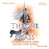

Aelin wird von der Dunklen Königin gefangen gehalten; eingesperrt in einem Käfig an einem geheimen Ort scheint die Flucht unmöglich zu sein. Während Prinz Rowan die halbe Welt nach seiner verlorenen Liebe absucht, versuchen Aedion und Gestaltenwandlerin Lysandra, ihre Heimat – nun ohne die Macht und den Schutz ihrer Königin – mit allen Mitteln zu verteidigen. Alte Bündnisse werden gebrochen, neue geschmiedet und vertieft, wobei alles auf die letzte große Schlacht hinausläuft, die Aelin Feuerherz und ihre Gefährten für sich entscheiden müssen, um Erilea vor der Herrschaft der Dämonen zu bewahren …
Dies ist Band 7 der »Throne of Glass«-Reihe. Alle Hörbücher der epischen Fantasy Romance:
-- Vorgeschichte: Celaenas Geschichte. Novella 1–5
-- Band 1: Die Erwählte
-- Band 2: Kriegerin im Schatten&#xa0;
-- Band 3: Erbin des Feuers
-- Band 4: Königin der Finsternis
-- Band 5: Die Sturmbezwingerin&#xa0;
-- Band 6: Der verwundete Krieger
-- Band 7: Herrscherin über Asche und Zorn
Die Reihe ist abgeschlossen.

[View on Apple](https://books.apple.com/de/audiobook/throne-of-glass-7-herrscherin-%C3%BCber-asche-und-zorn/id1520239144)

## Der heilige Tod - Thriller ( John Milton 2 )

John Milton lebt seit sechs Monaten unter dem Radar.

In Ciudad Juárez, Mexiko, taucht er wieder auf und gerät unversehens in eine wütende Schlacht zwischen den Narco-Gangs, die das Grenzland kontrollieren.

Milton bewahrt eine idealistische junge Journalistin vor der Hinrichtung. In Sicherheit kann er sie nur bringen, wenn er sie über die Grenze nach Texas schmuggelt. Mit Hilfe des einzigen unbestechlichen Polizisten in der Stadt und einem Kopfgeldjäger mit unklaren Motiven muss Milton sie beschützen, bis der Grenzübertritt möglich ist.

Aber das ist leichter gesagt als getan, denn der Mann, der sie sucht, erweist sich als der legendäre Auftragsmörder Santa Muerta — der Heilige Tod.

[View on Apple](https://books.apple.com/de/audiobook/der-heilige-tod-thriller-john-milton-2/id1874401216)

## Die Legende von Gold und Jade 4: Krieg und Frieden

Verfolgt – vergessen – geflohen.
Noa kämpft sich ihren Weg zum Nabel der Welt. Ein Ort, der die lang ersehnte Wahrheit über Noas Vergangenheit enthüllen soll. Auf einer Reise durch die rote Wüste, geprägt durch Sand und Tränen, nicht zuletzt, da das Leben genau die erweckt, die Noa schon längst vergessen hatte. Und während jeder versucht dem Tod zu entkommen, wartet eine rachsüchtige Meute im Schatten, bereit anzugreifen.

[View on Apple](https://books.apple.com/de/audiobook/die-legende-von-gold-und-jade-4-krieg-und-frieden/id1630317916)

## Dear Britain

Als Annette Dittert am 31. Januar 2020 um Mitternacht vor der Downing Street stand, um live in den ARD-Tagesthemen darüber zu berichten, dass der Brexit in dieser Nacht nun endgültig vollzogen sei, schossen ihr kurz vor der Schalte plötzlich Tränen in die Augen. Längst war London ihr Zuhause geworden. Jetzt war der Bruch mit der EU nicht mehr umkehrbar. Für sie und viele Briten, die bis zum Schluss noch auf einen anderen Ausgang gehofft hatten, ein bedrückender Tag.
Sechs Jahre später und zehn Jahre nach dem Brexit-Referendum fragt sich Annette Dittert, was aus dem Land geworden ist. Sie nimmt uns mit auf eine Reise über die Insel: Wir besuchen die Royal Albert Hall und das House of Lords, schwimmen mit der Frauengruppe »Blue Tits« im Meer an der Ostküste der Insel, plaudern mit Schotten, Priestern und Earls. Und sind bei der Autorin auf ihrem Narrowboat Emilia zu Gast, einem kleinen bunten Boot aus Stahl am Regent's Canal, mitten im Zentrum Londons. So entsteht ein facettenreiches Bild der eigenwillig-charmanten Briten, deren prekäre wirtschaftliche und soziale Situation – nicht nur infolge des EU-Austritts – im Alltag spürbar ist und die doch stets Haltung bewahren.

»Jedes Mal, wenn Annette Dittert in der ARD zugeschaltet wurde, dachte ich erfreut: Let the show begin. Und genau so liest sich dieses Buch. Annette Dittert verbindet politische Analyse mit persönlicher Erfahrung jahrelanger Korrespondentenzeit. So entsteht ein vielschichtiger, oft überraschender Blick auf ein Land, das vielen Deutschen vertraut scheint und das sich doch erst wirklich erschließt, wenn man Einblicke hinter seine Rituale, Widersprüche und Eigenheiten erhält. Und die liefert Annette Dittert und nicht zu wenig. Grandios! « NATALIE AMIRI

»Dieses fantastische Buch ist ebenso unterhaltsam wie klug. Ein tiefer Blick in die Seele der Briten, geschrieben fast wie ein Roman. Ich konnte nicht aufhören zu lesen!« ULRICH WICKERT

[View on Apple](https://books.apple.com/de/audiobook/dear-britain/id1850499238)

## Der kleine Drache Kokosnuss im Weltraum -

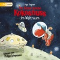

Der kleine Drache Kokosnuss, Stachelschwein Matilda und Fressdrache Oskar staunen nicht schlecht, als am Strand der Drachenbucht ein Raumgleiter mit einem kleinen Außerirdischen landet. Der Besucher aus dem All hat sich hoffnungslos verirrt und sein Raumgleiter ist kaputt. Kokosnuss &amp; Co. helfen ihm und begleiten ihn nach Hause in die Weiten des Weltraums. (1 CD, Laufzeit: 50 min)

[View on Apple](https://books.apple.com/de/audiobook/der-kleine-drache-kokosnuss-im-weltraum/id1436014048)

## Kein Sommer ohne August - Every Summer Has A Story, Teil 1 (Ungekürzt)

Zwei Kinder, die die Liebe zu Büchern teilen. Zwölf Sommer, in denen sie gemeinsam erwachsen werden. Eine Entscheidung, die alles verändert. Und zehn Tage, um ein neues Kapitel zu schreiben.
Charlie Henderson hat ihr Herz hinter dicken Mauern verschlossen und lebt ein scheinbar perfektes Leben in London - bis eine Erbschaft sie zurück nach Liberty Beach im Nordosten der USA ruft. Den Ort ihrer Kindheit und den Ort, den sie vor zehn Jahren Hals über Kopf verlassen hat. Dort erwartet sie nicht nur die Buchhandlung One Last Chapter, in der sie als Kind unzählige Stunden verbracht hat, sondern auch August Green, bester Freund aus Kindestagen, ihre erste große Liebe - und der Grund, warum sie damals aus Liberty Beach geflohen ist. Zwischen Regalen voller Geschichten und den Erinnerungen an schmerzhafte Verluste muss Charlie sich entscheiden: Bleibt sie Gefangene ihrer Angst oder wagt sie ein neues Kapitel?
Ein bewegendes Hörbuch über Freundschaft, Liebe und Fehler, die passieren, wenn wir versuchen, alles richtig zu machen. Und eine warmherzige Liebeserklärung an Bücher und das Zuhause, das wir zwischen zwei Buchdeckeln finden.

[View on Apple](https://books.apple.com/de/audiobook/kein-sommer-ohne-august-every-summer-has-a-story/id6773354674)

## Sturmland - Die Sturmland-Saga, Band 1 (Autorisierte Lesefassung)

Der neue große Zweiteiler der Bestsellerautorin! Eine Hamburger Reedertochter will mehr vom Leben, als sie darf. Ein Tagelöhner hat das seine bereits aufgegeben. Eine schicksalhafte Liebe entsteht - zum Beginn der Seenotrettung in Hamburg und in den norddeutschen Seebädern.
Niemand darf erfahren, wer Cora wirklich ist! Die Reedertochter muss aus ihrem alten Leben in Hamburg fliehen - und nimmt unter falschem Namen eine Stelle als Hauslehrerin im Seebad Norderney an. Doch die Nordsee ist unberechenbar. Schon kurz nach ihrer Ankunft bringt Cora sich und ihre Schülerin Emmi in Lebensgefahr ...
Der Tagelöhner Onnen beobachtet das Unglück. Kein Wunder, dass die unwissenden Badegäste ständig in Seenot geraten. Ausgerechnet mit dieser Gouvernante soll er nun zusammenarbeiten. Weil er dringend Geld braucht, nimmt er den Job an. Von Tag zu Tag kommen Cora und Onnen sich näher. Doch Onnen hat eine Vergangenheit auf seiner Heimatinsel Borkum, die er fest in sich verschlossen hält. Und Cora hat Menschen in Hamburg, die sie verzweifelt zurückholen wollen. Aber das darf nicht passieren. Niemand darf erfahren, wer Cora ist - und was sie getan hat ...
Der erste Band der Sturmland-Saga, mitreißend gelesen von Miriam Georgs Stammsprecherin Tanja Fornaro.

[View on Apple](https://books.apple.com/de/audiobook/sturmland-die-sturmland-saga-band-1-autorisierte-lesefassung/id6781243787)

## Der Tod braucht nie ein Alibi - Sofia und die Hirschgrund-Morde, Teil 29 (Ein Bayernkrimi)

[View on Apple](https://books.apple.com/de/audiobook/der-tod-braucht-nie-ein-alibi-sofia-und-die-hirschgrund/id6789263835)

## Der Cleaner - Thriller ( John Milton 1 )

Tauchen Sie ein in eine der erfolgreichsten Kriminal-Serien der Welt!

Der britische Geheimdienst hat ihn erschaffen - Jetzt wollen sie ihn vernichten.

John Milton war ein Attentäter für den britischen Geheimdienst. Er gehörte zur absoluten Elite: kaltblütig, gnadenlos, spurlos. Doch jahrelange Auftragsmorde haben ihre Spuren hinterlassen. Milton wird von Schuldgefühlen geplagt und von den Geistern seiner Vergangenheit heimgesucht. In einem Versuch, Buße zu tun, beginnt er jenen zu helfen, die von der Gesellschaft im Stich gelassen wurden. Doch er muss schnell feststellen, dass der Weg zur Erlösung steinig ist – und dass man der eigenen Vergangenheit nicht so einfach entkommt.

[View on Apple](https://books.apple.com/de/audiobook/der-cleaner-thriller-john-milton-1/id1834872690)

## Der Schwarm

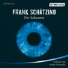

<b>"Der Schwarm" endlich in einer ungekürzten Lesung</b>  Ein Fischer verschwindet vor der Küste Peru spurlos. Ölbohrexperten stoßen in der norwegischen See auf merkwürdige Organismen, die hunderte Quadratkilometer Meeresboden in Besitz genommen haben. Währenddessen geht mit den Walen entlang der Küste British Columbias eine unheimliche Veränderung vor. Nichts von alledem scheint miteinander in Zusammenhang zu stehen. Doch Sigur Johanson, norwegischer Biologe und Schöngeist, glaubt nicht an Zufälle. Auch der indianische Walforscher Leon Anawak gelangt zu einer beunruhigenden Erkenntnis: Eine Katastrophe bahnt sich an. Doch wer oder was löst sie aus? Während die Welt an den Abgrund gerät, kommen die Wissenschaftler zusammen mit der britischen Journalistin Karen Weaver einer ungeheuerlichen Wahrheit auf die Spur <i>Stefan Kaminski verleiht diesem blitzenden Polit-Thriller von Bestsellerautor Frank Schätzing ein nachhaltiges Echo</i>. SOUNDCLOUD zu Lautlos  <i>Kongenial von Stefan Kaminski gelesen, einfach spannungsgeladen. </i>FRÄNKISCHE NACHRICHTEN zu Lautlos   <b>(4 mp3-CDs, Laufzeit: 38h 7</b>)

[View on Apple](https://books.apple.com/de/audiobook/der-schwarm/id1438058279)

## Harry Potter und der Orden des Phönix

Rufus Beck liest Band 5 von Harry Potter. Es sind Sommerferien und wieder einmal sitzt Harry bei den unmöglichen Dursleys im Ligusterweg fest. Doch diesmal treibt ihn größere Unruhe denn je - Warum schreiben seine Freunde Ron und Hermine nur so rätselhafte Briefe? Und vor allem: Warum erfährt er nichts über die dunklen Mächte, die inzwischen neu erstanden sind und sich unaufhaltsam über Harrys Welt verbreiten? Noch ahnt er nicht, was der geheimnisvolle Orden des Phönix gegen Voldemort ausrichten kann ... Als Harrys fünftes Schuljahr in Hogwarts beginnt, werden seine Sorgen nur noch größer. Und dann schlägt der Dunkle Lord wieder zu. Harry muss seine Freunde um sich scharen, sonst gibt es kein Entrinnen.  <i>Titelmusik komponiert von James Hannigan</i>

[View on Apple](https://books.apple.com/de/audiobook/harry-potter-und-der-orden-des-ph%C3%B6nix/id1442757910)

## Ihre perfekte Ehe  Thriller Hörbuch - Wie weit würdest du gehen, um deine Familie zu beschützen? (Ungekürzt)

<b>Die perfekte Ehefrau - bis ihr Tod ihre Lügen entblößt
Der fesselnde Thriller, der dich keine Sekunde loslassen wird</b>  Mark Burcham dachte eigentlich er hätte alles: eine glückliche Ehe, ein gemütliches Haus in Los Angeles und eine wundervolle Tochter. Doch als seine Frau Amy von einer Geschäftsreise nicht zurückkehrt und ihr Büro keine Aufzeichnungen über einen Kunden an der Ostküste auffindet, bricht Marks Welt auseinander.  Dann erhält er die schlimmste aller Nachrichten: Amy wurde tot aufgefunden. Aber nichts passt zusammen. Warum war sie noch in der Stadt, obwohl Mark sie am Flughafen verabschiedet hatte? Wer war der mysteriöse Kunde, mit dem sie sich seit Monaten getroffen hatte? Stück für Stück entdeckt Mark die Seite seiner Frau, die sie versuchte zu verbergen und ihm wird klar, dass jemand verhindern will, dass er Amys Geheimnisse erfährt. Jemand, der jeden seiner Schritte beobachtet. Und als seine Familie bedroht wird, bleibt ihm nur eine Wahl: Er muss die Wahrheit ans Licht bringen - koste es, was es wolle.  <b>Erste Leser:innenstimmen</b>
<i>"Die Mischung aus dunklen Geheimnissen, emotionaler Tiefe und atemloser Spannung macht diesen Thriller zu einem echten Highlight."</i>
<i>"Amys Geschichte entfaltet sich wie ein Puzzle, bei dem jedes neue Teil eine weitere düstere Enthüllung bringt."</i>
<i>"Ein intensiver Psychothriller, der mit unvorhersehbaren Wendungen und emotionalem Tiefgang überzeugt."</i>
<i>"Die Bedrohung ist greifbar, die Charaktere vielschichtig - perfekt für Fans intelligenter und temporeicher Spannungsromane."</i>

[View on Apple](https://books.apple.com/de/audiobook/ihre-perfekte-ehe-thriller-h%C3%B6rbuch-wie-weit-w%C3%BCrdest/id1831234907)

## Endlich Nichtraucher

<b>Die mit Abstand erfolgreichste Methode das Rauchen aufzugeben!</b>  Mit "Endlich Nichtraucher!" schrieb Allen Carr das weltweit erfolgreichste Buch zur Überwindung der Nikotinsucht. Der ehemalige Kettenraucher hat aufgrund eigener Erfahrungen eine Methode entwickelt, mit der es selbst langjährigen Rauchern gelingt, sich von ihrem Zwang zu lösen. Dieses Hörbuch vermittelt eine geradlinige Schritt-für-Schritt-Anleitung bis zur letzten Zigarette.

[View on Apple](https://books.apple.com/de/audiobook/endlich-nichtraucher/id1436234576)

## The Deal – Reine Verhandlungssache

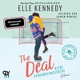

Sie lässt sich auf einen Deal mit dem College Bad Boy ein …
Hannah ist verliebt. Doch während die Einser-Studentin sonst kein Blatt vor den Mund nimmt, bringt sie ihrem Crush Justin gegenüber kein Wort heraus. Sie ist ... verzweifelt. Warum sonst hätte sie sich auf das Angebot von Garrett Graham eingelassen, dem selbstverliebten, kindischen und vor allem sturen Captain des Eishockey-Teams?&#xa0;
Der Deal: Sie gibt ihm Nachhilfe, damit er die Abschlussprüfung besteht, und er gibt vor, dass er sich für Hannah interessiert, damit Justin endlich auf sie aufmerksam wird. Der Plan scheint aufzugehen, aber je mehr Zeit Hannah und Garrett miteinander verbringen, desto stärker verschwimmt die Grenze zwischen gespielten und echten Gefühlen …

[View on Apple](https://books.apple.com/de/audiobook/the-deal-reine-verhandlungssache/id1704357805)

## Ostseefluch - Pia Korittkis achter Fall - Kommissarin Pia Korittki 8 (Ungekürzt)

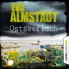

Kommissarin Pia Korittki ermittelt auf Fehmarn
Kommissarin Pia Korittki ermittelt auf FehmarnIm Garten eines verwahrlosten Anwesens auf Fehmarn wird die Leiche einer jungen Frau gefunden. Der Mord löst bei Einheimischen und Touristen Entsetzen aus. Doch die Eltern des Opfers scheinen etwas zu verschweigen. Stattdessen heißt es, dass auf dem alten Haus ein Fluch liegen soll.
Pia Korittki, Kommissarin und alleinerziehende Mutter, glaubt nicht an Geistergeschichten. Aber dann geraten die Ermittlungen in eine Sackgasse, und Pia Korittki erkennt etwas Unglaubliches: dass es Zeit wird, sich mit dem Fluch zu befassen ...
Der achte Teil der erfolgreichen Krimi-Reihe von Bestsellerautorin Eva Almstädt!

[View on Apple](https://books.apple.com/de/audiobook/ostseefluch-pia-korittkis-achter-fall-kommissarin-pia/id1577168294)

## Hollywell Hearts: Die kleine Farm am Meer

Eine Ziegenfarm am Meer? Tamlyn fällt aus allen Wolken, als sie plötzlich einen kleinen Hof in Cornwall erbt – noch dazu von ihrem Vater, den sie nie kennengelernt hat. Fest entschlossen, das Erbe einfach abzulehnen, fährt sie nach Hollywell: Für Tamy kommt es als Großstadtpflanze nämlich nicht infrage, das aufregende London gegen ödes Landleben zu tauschen! Aber plötzlich gibt es da eine Halbschwester, die ihre Hilfe braucht, süße Angoraziegen, die sie auf Trab halten, und den attraktiven Tierarzt Scott, der von Businessfrauen nicht viel hält. Sie stellen alles auf den Kopf, was Tamy über ihre Familie, das Leben und die Liebe zu wissen glaubte. Kann sie vielleicht ausgerechnet in Hollywell das große Glück finden?

[View on Apple](https://books.apple.com/de/audiobook/hollywell-hearts-die-kleine-farm-am-meer/id1705719779)

## Der Name des Windes

<b>„Ein Fantasy-Epos voll MUSIK und MAGIE.“ Denis Scheck</b>  „Vielleicht habt ihr von mir gehört“ ... von Kvothe, dem für die Magie begabten Sohn fahrender Spielleute. Das Lager seiner Truppe findet er verwüstet, die Mutter und den Vater tot. Wer aber sind diese Chandrian, die weißglänzenden, schleichenden Mörder seiner Familie? Um ihnen auf die Spur zu kommen, riskiert Kvothe alles. Er lebt als Straßenjunge in der Hafenstadt Tarbean, bis er auf das Arkanum, die Universität für hohe Magie aufgenommen wird. Vom Namenszauber, der ihn als Kind fast das Leben gekostet hätte, erhofft sich Kvothe die Macht, das Geheimnis der sagenumwobenen Dämonen aufzudecken. Stefan Kaminski leiht dem berühmten Zauberer Kvothe und seiner spannenden Geschichte eine Stimme, die von der ersten Minute an fesselt.  <b>(Laufzeit: 28h 19)</b>

[View on Apple](https://books.apple.com/de/audiobook/der-name-des-windes/id1446961490)

## Monster 1983: Die komplette 2. Staffel

Oregon, 1983 - nach einer grausamen Serie mysteriöser Morde scheint in dem kleinen Küstenstädtchen Harmony Bay endlich wieder Normalität einzukehren. Zumindest, wenn es nach Bürgermeister White geht. Doch Deputy Landers traut dem Frieden nicht, denn zu viele Fragen sind noch immer ungeklärt: Warum und wohin sind Sheriff Cody und seine beiden Kinder verschwunden? Wieso war die Regierung hinter dem Nachtmahr her? Was hat es mit dem ominösen Manila Club auf sich? Und warum will der Bürgermeister unbedingt Gras über die Sache wachsen lassen? 
  Für Landers steht fest: Er muss auf eigene Faust ermitteln! Und während er dabei immer tiefer in einem gefährlichen Sumpf aus Macht und Korruption versinkt, befinden sich Cody und seine Familie auf einer Flucht quer durch das Land. Sie müssen versuchen, seine Tochter vor der Regierung zu verstecken - und einen Weg finden, Amy von dem Nachtmahr zu befreien. Denn dieser ergreift Tag für Tag mehr Besitz von dem kleinen Mädchen - und wie sich bald herausstellen soll: nicht nur von ihr... 
  In deiner Audible-Bibliothek findest du für dieses Hörerlebnis eine PDF-Datei mit zusätzlichem Material. &gt;&gt; Diese Hörspiel-Serie genießt du exklusiv nur bei Audible.

[View on Apple](https://books.apple.com/de/audiobook/monster-1983-die-komplette-2-staffel/id1170106941)

## Das Haus im Wald - Krimi Hörbuch ( Atticus 1 )

Hörbuchempfehlung für Mark Dawson Fans: Hört euch auch unbedingt die Winter-Black Serie, den internationalen Bestseller von Mary Stone an! 

Das Haus im Wald:

Vier Leichen. Zwei Ermittler. Ein rätselhaftes Verbrechen.

Am Heiligabend wird DCI Mackenzie Jones zu einer Schießerei in einem abgelegenen Farmhaus gerufen. Ralph Mallender glaubt, seinen Vater tot in der Küche liegen gesehen zu haben. Als drei weitere Leichen gefunden werden, wird klar, dass sich ein weihnachtliches Familientreffen zu einer grausamen Tragödie gewandelt hat.

Zunächst scheint der Fall offensichtlich zu sein: Ein erweiterter Selbstmord von Ralphs jähzornigem Bruder. Bis neue Beweise Mack daran zweifeln lassen, dass er der wahre Täter ist.

Doch nicht nur Mack riskiert mit dem Fall alles. Der Privatdetektiv Atticus Priest wird damit beauftragt, Ralphs Unschuld zu beweisen. Und dafür legt er alle Fehler in Macks Ermittlungen offen.

Mit seinem aufbrausenden, ungeduldigen und unberechenbaren Charakter hat Atticus ganz eigene Dämonen zu bekämpfen. Und Mack kennt jede seiner Schwächen, denn sie waren früher schon ein Team – beruflich und privat. Diesmal jedoch stehen sie nicht auf derselben Seite, und als Atticus beginnt, ihren Fall auseinanderzunehmen, offenbart er Geheimnisse, die keiner von beiden hätte vorhersehen können.

Aus dem Englischen übersetzt von Marco Mewes

[View on Apple](https://books.apple.com/de/audiobook/das-haus-im-wald-krimi-h%C3%B6rbuch-atticus-1/id1773825444)

## Der Lehrer – Will er dir helfen oder will er deinen Tod?

<b>Von dieser Autorin bekommt man nicht genug: Der "New York Times"-Bestseller von Freida McFadden, der für schlaflose Nächte sorgt.</b>  Eigentlich hat Eve Bennett ein gutes Leben. Sie ist Mathelehrerin an der örtlichen Highschool und verheiratet mit Nate, der dort Englisch unterrichtet. Doch letztes Jahr wurde die Schule von einem Skandal erschüttert, in dessen Zentrum eine Schülerin stand. Und dieses Jahr ist diese Schülerin in Eves Klasse. Addie kann man nicht trauen, sie lügt und verletzt Menschen. Aber niemand kennt die wahre Addie. Niemand kennt das Geheimnis, das sie zerstören könnte. Und Addie würde alles dafür tun, dass es so bleibt. Ihr einziger Lichtblick in diesem Schuljahr: ihr neuer Lehrer Nate Bennett.  Gekürzte Lesung mit Gabrielle Pietermann, Rubina Nath, Vincent Fallow 8h 18min

[View on Apple](https://books.apple.com/de/audiobook/der-lehrer-will-er-dir-helfen-oder-will-er-deinen-tod/id1778581067)

## SYLTKRIMI: Band 6-10

Die beliebte Küstenkrimireihe um die Sylter Kriminalhauptkommissarin Bente Brodersen als Sammelband/Hörbuch. Bände 6-10 als Serienmarathon.
Tauchen Sie ein in die Geschichten um Bente Brodersen, die nördlichste Kommissarin Deutschlands.
Sylt, die Insel der Schönen und Reichen, hat zwar nur 15.000 Einwohner, lockt aber jährlich Millionen Touristen an. Für die Kripo-Sylt eine echte Herausforderung, denn Mord macht keine Ferien.
Die raue See, der stete Wind und die endlosen Dünen machen SYLT zum idealen Schauplatz der spannenden Küstenkrimis.

[View on Apple](https://books.apple.com/de/audiobook/syltkrimi-band-6-10/id1837696242)

## Bevor der Kaffee kalt wird (Ungekürzte Lesung)

Vier Geschichten, die uns lehren, aus der Vergangenheit über die Zukunft zu lernen und den Blick nach vorn zu öffnen.
Was wäre, wenn du in die Vergangenheit reisen könntest? Bevor der Kaffee kalt wird erzählt die Geschichte von einem magischen Sessel in einem sehr besonderen Café in Japan. Wer sich in diesen Sessel setzt, darf in die Vergangenheit zurückreisen, aber nur solange, bis "der Kaffee kalt wird". Das Café trägt den Namen "Funiculi Funicula" und zieht viele Menschen unwillkürlich an, weil sie das Bedürfnis verspüren, die Vergangenheit noch einmal zu durchleben.
Im Stil von Das Café am Rande der Welt erzählt der Dramatiker Toshikazu Kawaguchi vier mitreißende Geschichten von Menschen, die in die Vergangenheit gereist sind. Ihre Motive waren unterschiedlich, doch die gelernte Lektion dieselbe. Egal ob Versöhnung, Vergebung oder neue Hoffnung - das Leben wird vorwärts gelebt und rückwärts verstanden.
Vier Erzählungen über den Sinn des Lebens und die Aussöhnung mit der Vergangenheit:
Die Liebenden
Das verheiratete Paar
Die Schwestern
Mutter und Kind

[View on Apple](https://books.apple.com/de/audiobook/bevor-der-kaffee-kalt-wird-ungek%C3%BCrzte-lesung/id1741302109)

## Nach Grau kommt Himmelblau

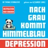

Für Angehörige, Freunde, Betroffene und Workaholics. Authentisch. Ungeschminkt. Fesselnd. Eine wahre Geschichte, die mitten aus dem Leben gegriffen ist.

»Nach Grau kommt Himmelblau« erzählt die wahre Geschichte rund um den brutalen Absturz von Dr. Thomas Reinbacher, der nach einer Raketenkarriere (NASA, McKinsey, Amazon, Google) und einem perfekten Familienleben in eine schwerste Depression (F33.2) schlittert. Die Genesung wird ein steiniger Weg, der 2 Jahre und 200 Tage Psychiatrie in Anspruch nimmt. Ein Kraftakt für die ganze Familie. Aber einer, der sich lohnt!

Das Buch bietet Einblicke in die Krankheit Depression und wie man damit umgeht, wie sie so noch nicht zu lesen waren.

- Aus Sicht eines Betroffenen. Basierend auf Thomas' Tagebucheinträgen nimmt er seine Leser*innen mit auf eine packende, ungeschminkte Reise in die dunkelsten Abgründe einer depressiven Seele. Erst durch die radikale Akzeptanz seiner Erkrankung gelang ihm der erste Schritt in Richtung Genesung und Leben 2.0.

- Aus Sicht der Angehörigen. Xiaoxi ist die verzweifelte Partnerin in der Geschichte, die erzählt wie sie versucht, die Familie zusammenzuhalten und nicht auch noch zum »Opfer« seiner Depression zu werden.

Gemeinsam erzählen sie, wie sie es trotz aller Widrigkeiten geschafft haben, die Depression zu besiegen und als Paar in ein besseres Leben 2.0 zu starten. Mit neuen Werten. Mit Aussicht auf Himmelblau!

Ein Buch, das tief berührt und Betroffenen &amp; Angehörigen viel Mut macht, dass einmal psychisch krank nicht ein Leben lang psychisch krank bedeutet .

Eine augenöffnende Lektüre nicht nur für Angehörige, Betroffene, Pädagogen, Therapeuten etc. sondern auch für alle »Leistungsträger«. Aber die haben ja sowieso keine Zeit zum Lesen, oder?

[View on Apple](https://books.apple.com/de/audiobook/nach-grau-kommt-himmelblau/id1780362043)

## Das schwimmende Café von Kopenhagen

Zwischen Zimtschnecken und Hygge – Neues Glück in der Stadt der Gelassenheit
Mit einem gebrochenen Herzen flieht Milly nach Kopenhagen, um ihre beste Freundin dabei zu unterstützen, ein schwimmendes Café zu retten. Dabei trifft sie auf Theo – wortkarg, charmant und unverschämt attraktiv. Inmitten von duftenden Zimtschnecken, heißem Kaffee und dänischem Lebensgefühl knistert es gewaltig. Doch als das Ende des Sommers naht, müssen sich die beiden der Frage stellen, ob sie bereit sind, ihrer Liebe eine Chance zu geben.
Romantische Neuanfänge in den schönsten europäischen Destinationen am Wasser - Herzklopfen inklusive!

[View on Apple](https://books.apple.com/de/audiobook/das-schwimmende-caf%C3%A9-von-kopenhagen/id1895730538)

## Die Tochter der Hexe

"Hexentochter, du wirst sterben!"
Als junges Mädchen erfährt Marthe-Marie, dass sie die Tochter einer Frau ist, die als Hexe galt. Sie macht sich auf in die Stadt, in der ihre Mutter grausam sterben musste. Doch als in Freiburg aufs Neue die Scheiterhaufen lodern, bleibt Marthe-Marie nur die Flucht. Sie schließt sich einer Truppe von Gauklern an, die kreuz und quer durch den Südwesten des Deutschen Reiches ziehen. Bald merkt sie, dass ihr zwei Männer auf den Fersen sind. Der eine sucht ihre Liebe, der andere ihren Tod. "Die Tochter der Hexe" ist ein großer Schicksalsroman, eine Liebesgeschichte und ein Porträt der Ausgestoßenen jener Zeit.

[View on Apple](https://books.apple.com/de/audiobook/die-tochter-der-hexe/id6769743161)

## Die Betrogene

<b>Einsam wacht, wer um die Schuld weiß ...</b>  Es gibt nur einen Menschen, den die Polizistin Kate Linville liebt: ihren Vater. Als dieser grausam ermordet wird, verliert Kate ihren letzten Halt. Da sie dem alkoholkranken Ermittler vor Ort nicht traut, begibt sie sich selbst auf die Spurensuche. Und entlarvt die Vergangenheit ihres Vaters als Trugbild, denn er war nicht der, für den sie ihn hielt.

[View on Apple](https://books.apple.com/de/audiobook/die-betrogene/id1435937361)

## Shaolin Spirit - Meistere dein Leben (Ungekürzte Lesung)

Shi Heng Yi eröffnet mit diesem Hörbuch Einsichten in einer bisher unveröffentlichten Form der Shaolin-Tradition - anwendbare Praktiken für das alltägliche Leben, untermauert mit Sichtweisen, um Bekanntes neu zu erkennen.
Shaolin Spirit - Meistere dein Leben!
Wünschst du dir mehr Disziplin, Willensstärke, Mut, Ausdauer und tief empfundene Loyalität? Shi Heng Yi bietet dir auf Basis seines eigenen Lebensweges Werkzeuge, die dein Leben leichter machen - indem du stärker wirst.
Das Geheimnis der inneren Stärke basiert auf den Tugenden der Shaolin. Diese schrittweise in deinem Leben zu kultivieren, ist in Wahrheit so simpel, dass jeder Shi Heng Yis Lehre folgen kann. Lerne deinen Körper kennen und ergründe ihn - bereichere dein Leben mit den Methoden, die seit über 1500 Jahren erfolgreich praktiziert werden.
Praxisteil: Stärke Körper und Geist
Lerne, bewusst zu werden und zu stehen, und spüre, vor welche Herausforderung dich das stellen kann. Begegne und trainiere damit ebenso deine Tugenden. Der begleitende Praxisteil im Hörbuch führt dich über einfache, aber nicht minder effektive Übungen zur Entdeckung deiner inneren Fähigkeiten. Finde zurück auf deinen persönlichen Weg und ergründe, worum es in deinem Leben wirklich geht - denn es ist einzigartig.
Shi Heng Yi lehrt dich in seinem Hörbuch die Essenz der Shaolin-Lehren, entsprungen aus seiner persönlichen Erfahrung. Beherzigst du sie und integrierst die Eindrücke und Praktiken in deinen Alltag, kannst du:
das Leben auf einer bisher unbekannten und tieferen Ebene in die eigene Hand nehmen;
lernen, feinfühliger zu werden. Das Zusammenspiel gegensätzlicher Kräfte, wie zum Beispiel Freiheit und Struktur, Spontanität und Planung, Aktivität und Passivität für dich nutzen;
tiefes Vertrauen in das Leben entwickeln und Antworten entdecken, die nur in ihrem wahren Selbst aufzufinden sind
Du darfst positive Resultate erwarten - doch übe dich in Geduld.
Erfahre wahrhaftige Veränderung
Shi Heng Yi ist überzeugt: Leben mehr Menschen nach den Tugenden der Shaolin, würde sehr viel Leid von den Menschen - und der ganzen Welt - genommen. Indem du dir diese Tugenden aneignest und bewusst lebst, trägst du deinen Teil dazu bei. Es geht um echte Veränderung für dich und dein Leben - und das der Menschen um dich herum.
Lerne noch mehr von Shi Heng Yi
Shi Heng Yi amtiert als leitender Meister des Shaolin Temple Europe, einem buddhistischen Kloster mit Sitz in Deutschland. Er trainiert Shaolin Kung Fu seit seinem vierten Lebensjahr und absolvierte mit achtzehn Jahren die Meisterprüfung. Neben dem Praxisteil im Hörbuch findest du zahlreiche kostenfreie Lernvideos und vertiefende Praktiken auf der offiziellen Präsenz von Shi Heng Yi www.shaolinspirit.online sowie auf seinem YouTube-Kanal.
Coverfoto: © Christine Sommerfeldt

[View on Apple](https://books.apple.com/de/audiobook/shaolin-spirit-meistere-dein-leben-ungek%C3%BCrzte-lesung/id1709992608)

## Der erloschene Traum: Nik Pohl 6

<b>Ein Fall für den BND oder Privatermittler Nik Pohl? Von #1-Bestsellerautor Alexander Hartung</b>  Das Entsetzen in München ist groß, als eine ältere Dame einen Mann scheinbar grundlos in einem Café ersticht. Erste polizeiliche Ermittlungen deuten auf keine Verbindung zwischen der Frau und dem Getöteten hin. Nik Pohl steigt in den Fall ein und findet heraus, dass die Täterin seit Jahren unter falschem Namen lebte. Als ihn ein Agent des Bundesnachrichtendiensts auffordert, die Ermittlungen einzustellen, ist sein Misstrauen endgültig geweckt. Motivierter denn je sucht er nach der Wahrheit und macht es zu seiner Mission, Gerechtigkeit für das Opfer herzustellen.

[View on Apple](https://books.apple.com/de/audiobook/der-erloschene-traum-nik-pohl-6/id1750190520)

## Tod und Teufel

<b>Endlich – Frank Schätzings Bestseller als Lesung</b>  Köln, im Jahre 1260. Jakob der Fuchs, ein charmanter Dieb und Vagabund, wird Zeuge, wie der Dombaumeister vom Gerüst in den Tod gestoßen wird. Doch alle, denen Jakob von dem Mord erzählt, sind kurz darauf ebenfalls tot. Als er begreift, wer die Intrige gesponnen hat, muss er den Verbrecher so rasch wie möglich überführen. Doch der ist ein eiskalter Auftragsmörder, und als nächstes hat er Jakob im Visier … Stefan Kaminski, der wohl bekannteste Stimmenvirtuose unter den Hörbuchsprechern, ist inzwischen als Interpret der Romane von Frank Schätzing etabliert.  <b>(Laufzeit: ca. 15h 25)</b>

[View on Apple](https://books.apple.com/de/audiobook/tod-und-teufel/id1435725813)

## Essentialismus. Die konsequente Suche nach Weniger. Ein neuer Minimalismus erobert die Welt

Der New York Times Bestseller. Mehr als eine Million verkaufte Exemplare.
Beim Essentialismus geht es nicht darum, mehr in kürzerer Zeit zu erledigen. Es geht darum, mit ganzem Herzen das zu verfolgen, was wirklich wichtig ist.
Der Google-Coach und Bestsellerautor Greg McKeown teilt in diesem Hörbuch seine Erfahrungen im Umgang mit den Top-Managern der erfolgreichsten Unternehmen dieser Welt um zu zeigen, wie man mit Weniger sehr viel mehr erreichen kann.
Die Strategie von McKeown, der Weg des Essentialisten, hat schon Viele aus dem Griff der Belanglosigkeiten und konstanten Überforderung befreit. Die Geheimformel: Weniger, aber besser!
In vier praktischen Schritten zeigt McKeown, der nach der Promotion in Stanford eine Firma für Strategie und Leadership im Silicon Valley gegründet hat, auszusortieren und die richtigen Fragen zu stellen, die Energie auf das zu lenken, was wirklich zählt.
Dabei ist dieses Hörbuch keine neue Zeitmanagementstrategie oder Produktivitätstechnik. Es geht vielmehr darum, das Wesentliche vom Unwesentlichen zu unterscheiden und mit Disziplin das zu verfolgen, was die eigene größte Stärke ist.
Mit dem Hörbuch werden Sie:
- endlich wieder glücklich sein,
- mehr Freude am Arbeitsplatz haben,
- privat erfüllter leben,
- Entscheidungen treffen, die neue Maßstäbe setzen,
- statt tausend Belanglosigkeiten eine wesentliche Sache bewegen.
Greg McKeown schreibt, unterrichtet und spricht weltweit über die Bedeutung eines Lebens als Essentialist. Er hat bereits Vorträge bei Unternehmen wie Apple, Google, Facebook, LinkedIn, Salesforce.com, Symantec und Twitter gehalten und zählt zu den beliebtesten Bloggern der Harvard Business Review und der LinkedIn Influencers-Gruppe. Er ist Mitentwickler des Kurses Designing Life, Essentially der Stanford University, hat den Wall Street Journal-Bestseller Multipliers mitverfasst und ist als Young Global Leader für das World Economic Forum tätig. Greg McKeown hat einen Abschluss als Master of Business Administration der Stanford University.

[View on Apple](https://books.apple.com/de/audiobook/essentialismus-die-konsequente-suche-nach-weniger-ein/id1874320903)

## Das Hindernis ist der Weg: Mit der Philosophie der Stoiker zum Triumph

Die großen Frauen und Männer hatten weder außergewöhnlich viel Glück, Talent oder Erfahrung. Sie hatten lediglich das gleiche Motto: Was dir im Weg steht, wird dein Weg! 
  Ryan Holiday, Marketing-Guru und Bestsellerautor, wendet die vergessene Erfolgsformel der antiken Philosophen auf die heutige Welt an und gibt konkrete Anleitung, wie wir unser Leben selbst erfolgreich gestalten können: Manage deine Wahrnehmung! Erkenne, welche Begebenheiten du verändern kannst! Lenke deine Handlungen auf ein Ziel! Und mache jedes Hindernis in deinem Weg zu einer Chance! &gt;&gt; Diese ungekürzte Hörbuch-Fassung genießt du exklusiv nur bei Audible.

[View on Apple](https://books.apple.com/de/audiobook/das-hindernis-ist-der-weg-mit-der-philosophie-der-stoiker/id1215374097)

## Momo

Momos Welt ist eine Großstadt, irgendwo im Süden Europas. Ein gespenstisches Heer grauer Herren ist am Werk und veranlasst immer mehr Menschen, Zeit zu sparen. Aber in Wirklichkeit betrügen sie die Menschen um diese ersparte Zeit und nehmen ihnen alle Lebensfreude. Je mehr die Menschen an Zeit sparen, desto ärmer, hastiger und kälter wird ihr Dasein. Am meisten bekommen die Kinder diese Lieblosigkeit zu spüren. Als die Not am größten ist, greift Meister Hora ein, der geheimnisvolle Verwalter der Zeit. Doch braucht er dazu die Hilfe eines Menschenkindes. Momo, die kleine struppige Heldin der Geschichte, übernimmt die schwierige Aufgabe und kämpft ganz allein, mit nichts als einer Blume in der Hand und einer Schildkröte unter dem Arm, gegen das riesige Heer der grauen Herren – und siegt auf wunderbare Weise. &#xa0;
Hier geht es um die Fragen unserer Wirklichkeit, die sich in den Figuren und Schicksalen widerspiegeln – deswegen ist Michael Endes Märchen-Roman voller Poesie und Herzenswärme über den Zauber der Zeit heute immer noch und wieder aktuell und hat von seinem Reiz nach 45 Jahren nichts eingebüßt.

[View on Apple](https://books.apple.com/de/audiobook/momo/id1500529583)

## Alles klar! Der kleine Drache Kokosnuss erforscht den Weltraum

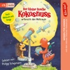

<b>Sonne, Mond und Sterne – mit Kokosnuss das Weltall entdecken!</b>  Der kleine Drache Kokosnuss, Matilda und Oskar planen einen weiteren Besuch im Weltraum, denn bei ihrer letzten Begegnung mit dem Außerirdischen Bobby von Zitterpappel sind einige Fragen unbeantwortet geblieben ... Seit wann beobachten die Menschen die Sterne? Wer hat den „Mann im Mond” erfunden? Wann gab es die erste Rakete? Wie hieß der erste Astronaut? Wie lief die Mondlandung ab? Und seit wann gibt es die Internationale Raumstation ISS?  Die schlauen Antworten gibt es für kleine Forscherinnen und Forscher nicht nur zum Hören, sondern auch zusammen mit vielen Bildern zum Angucken in „Matildas Notizbuch”, dem Booklet. Mit vielen lustigen Songs zum Mitsingen!   Inszenierte Lesung mit Musik mit Philipp Schepmann 1h 15min

[View on Apple](https://books.apple.com/de/audiobook/alles-klar-der-kleine-drache-kokosnuss-erforscht-den/id1618345799)
