- [Ausgerechnet Sylt](#ausgerechnet-sylt)
- [King's Legacy - Alles für dich](#king-s-legacy-alles-fu-r-dich)
- [Herzklopfen im Cottage am Strand (Teil 1)](#herzklopfen-im-cottage-am-strand-teil-1)
- [Absolute Bedrohung (Ein Jake Mercer Politthriller — Band 1)](#absolute-bedrohung-ein-jake-mercer-politthriller-band-1)
- [Die Vernehmung](#die-vernehmung)
- [Auf diese Art zusammen](#auf-diese-art-zusammen)
- [Mamies kleinster Coup](#mamies-kleinster-coup)
- [Westwell - Valerie & Adam](#westwell-valerie-adam)
- [Fake-Dating mit dem Hockey-Kapitän](#fake-dating-mit-dem-hockey-kapita-n)
- [SYLTKRIMI Dünengrab](#syltkrimi-du-nengrab)
- [Second Chance](#second-chance)
- [Die Tochter des Uhrmachers: Glass & Steele](#die-tochter-des-uhrmachers-glass-steele)
- [Icebreaker](#icebreaker)
- [Die Verwandlung](#die-verwandlung)
- [Mein fast perfekter Sommer](#mein-fast-perfekter-sommer)
- [Bevor er tötet (ein Mackenzie White Krimi – Buch 1)](#bevor-er-to-tet-ein-mackenzie-white-krimi-buch-1)
- [NORDSEEKRIMI - Aenne Feddersen und der vergessene Tod: Küstenkrimi](#nordseekrimi-aenne-feddersen-und-der-vergessene-tod-ku-stenkrimi)
- [The Odyssey](#the-odyssey)
- [Sommer auf Schottisch](#sommer-auf-schottisch)
- [Wenn Sie Wüsste (Ein Kate Wise Mystery – Buch 1)](#wenn-sie-wu-sste-ein-kate-wise-mystery-buch-1)
- [1984](#1984)
- [Mein erstes iPhone](#mein-erstes-iphone)
- [Die Abenteuer des Sherlock Holmes](#die-abenteuer-des-sherlock-holmes)
- [Ein Baby vom Captain](#ein-baby-vom-captain)
- [Krieg und Frieden](#krieg-und-frieden)
- [Vice: Dark Mafia Romance (Deutsche Ausgabe)](#vice-dark-mafia-romance-deutsche-ausgabe)
- [Kommissar Dampfmoser und sein neuer Fall: Alpenkrimi: Kommissar Dampfmoser ermittelt 21](#kommissar-dampfmoser-und-sein-neuer-fall-alpenkrimi-kommissar-dampfmoser-ermittelt-21)
- [Die Legende von Gold und Jade 1: Sonne und Mond](#die-legende-von-gold-und-jade-1-sonne-und-mond)
- [Faust](#faust)
- [Silo 1](#silo-1)
- [Siddhartha](#siddhartha)
- [Selbstbetrachtungen - Mark Aurels Meisterwerk](#selbstbetrachtungen-mark-aurels-meisterwerk)
- [Das Falsche Mädchen (Ein spannender Miles-Sterling-FBI-Thriller - Band Eins)](#das-falsche-ma-dchen-ein-spannender-miles-sterling-fbi-thriller-band-eins)
- [Dieken und die Saat des Todes: Ostfrieslandkrimi](#dieken-und-die-saat-des-todes-ostfrieslandkrimi)
- [Make Something Wonderful](#make-something-wonderful)
- [Ein Sommer in Kirkby](#ein-sommer-in-kirkby)
- [Pride and Prejudice](#pride-and-prejudice)
- [Mord in der Marsch: Ostfrieslandkrimi](#mord-in-der-marsch-ostfrieslandkrimi)
- [Dark Instinct: Dunkle Mafia Romance (Deutsche Ausgabe)](#dark-instinct-dunkle-mafia-romance-deutsche-ausgabe)
- [Alice im Wunderland](#alice-im-wunderland)
- [Bibi & Miyu – Gratis Comic Tag](#bibi-miyu-gratis-comic-tag)
- [Tochter der Zeit](#tochter-der-zeit)
- [Sommer der Erinnerung](#sommer-der-erinnerung)
- [Physik 7](#physik-7)
- [Die drei Königinnen](#die-drei-ko-niginnen)
- [iPad an Schulen](#ipad-an-schulen)
- [Kill for You: Dark Mafia Romance](#kill-for-you-dark-mafia-romance)
- [House of Thirst: Dark Vampire Romance (Deutsche Ausgabe)](#house-of-thirst-dark-vampire-romance-deutsche-ausgabe)
- [Zu spät (Ein spannender Morgan-Stark-FBI-Thriller – Buch 1)](#zu-spa-t-ein-spannender-morgan-stark-fbi-thriller-buch-1)
- [Lustige Witze](#lustige-witze)
- [Alphas Versuchung](#alphas-versuchung)
- [Mörderisches Halleluja](#mo-rderisches-halleluja)
- [Vow of Silence: Mafia Romanze (Deutsch)](#vow-of-silence-mafia-romanze-deutsch)
- [Über Psychoanalyse](#u-ber-psychoanalyse)
- [Nie wieder Geheimnisse - Die TikTok Liebesroman Sensation jetzt GRATIS](#nie-wieder-geheimnisse-die-tiktok-liebesroman-sensation-jetzt-gratis)
- [Die Zauberfabrik (Oliver Blue und die Schule für Seher - Buch Eins)](#die-zauberfabrik-oliver-blue-und-die-schule-fu-r-seher-buch-eins)
- [Die Tochter der Toskana – wie alles begann](#die-tochter-der-toskana-wie-alles-begann)
- [Mathematik Oberstufe: Analysis](#mathematik-oberstufe-analysis)
- [Physik 8](#physik-8)
- [Das Festival der Liebe (Die Liebe auf Reisen – Buch #1)](#das-festival-der-liebe-die-liebe-auf-reisen-buch-1)
- [Die Diebe von Venedig 1 Kinderbuch GRATIS](#die-diebe-von-venedig-1-kinderbuch-gratis)
- [Jenseits von Gut und Böse](#jenseits-von-gut-und-bo-se)
- [Effi Briest](#effi-briest)
- [A single day](#a-single-day)
- [Eisiger Tod (Wegners erste Fälle)](#eisiger-tod-wegners-erste-fa-lle)
- [Ein Planet, viele Welten](#ein-planet-viele-welten)
- [Birds of Paris – Die Goldene Feder](#birds-of-paris-die-goldene-feder)
- [The Little Prince](#the-little-prince)
- [Eine Welt für dich und mich](#eine-welt-fu-r-dich-und-mich)
- [Die Verlassenen](#die-verlassenen)
- [Das nächste Mädchen (Ein Meg-Thorne-Thriller – Band 1)](#das-na-chste-ma-dchen-ein-meg-thorne-thriller-band-1)
- [Kurzgeschichten für Kinder: Bezaubernde Tierabenteuer - Band 1](#kurzgeschichten-fu-r-kinder-bezaubernde-tierabenteuer-band-1)
- [Nochmal 3 Hamburg Thriller mit Kommissarin Stein Juli 2026](#nochmal-3-hamburg-thriller-mit-kommissarin-stein-juli-2026)
- [Ueberreuter Lesebuch Kinder- und Jugendbuch Herbst 2017](#ueberreuter-lesebuch-kinder-und-jugendbuch-herbst-2017)
- [Wenn dein Herz woanders wohnt – Sehnsuchtsträume](#wenn-dein-herz-woanders-wohnt-sehnsuchtstra-ume)
- [Emma](#emma)
- [The Adventures of Sherlock Holmes](#the-adventures-of-sherlock-holmes)
- [Vermieter küsst man nicht (Clover Park: Die Reynolds-Marino-Familie 1)](#vermieter-ku-sst-man-nicht-clover-park-die-reynolds-marino-familie-1)
- [Animal Farm](#animal-farm)
- [The Devil's Dance: Dark Mafia Romance (Deutsche Ausgabe)](#the-devil-s-dance-dark-mafia-romance-deutsche-ausgabe)
- [Die Brüder Karamasow. Erster Teil](#die-bru-der-karamasow-erster-teil)
- [Hier sprechen wir Deutsch](#hier-sprechen-wir-deutsch)
- [Wuthering Heights](#wuthering-heights)
- [Die Spur der Schatten](#die-spur-der-schatten)
- [Flutgrab und kalte Gischt: Ostfrieslandkrimi](#flutgrab-und-kalte-gischt-ostfrieslandkrimi)
- [3 Hamburg Thriller mit Kommissarin Stein Juli 2026](#3-hamburg-thriller-mit-kommissarin-stein-juli-2026)
- [The Idiot](#the-idiot)
- [Die Hostess des Doms: Ein geheimes Baby Milliardär Liebesroman](#die-hostess-des-doms-ein-geheimes-baby-milliarda-r-liebesroman)
- [The Odyssey](#the-odyssey)
- [Dracula](#dracula)
- [The Brothers Karamazov](#the-brothers-karamazov)
- [Luna, das kleine Einhorn](#luna-das-kleine-einhorn)
- [Flavia de Luce - Das Geheimnis des kupferroten Toten](#flavia-de-luce-das-geheimnis-des-kupferroten-toten)
- [Never Date Your Brother's Best Friend](#never-date-your-brother-s-best-friend)
- [Nachtclub-Sünden Kurzgeschichten: Milliardär Liebesromane](#nachtclub-su-nden-kurzgeschichten-milliarda-r-liebesromane)
- [Für jetzt und für immer (Die Pension in Sunset Harbor – Buch 1)](#fu-r-jetzt-und-fu-r-immer-die-pension-in-sunset-harbor-buch-1)
- [Betrachtung](#betrachtung)
- [The Kissing Booth - Noahs Story](#the-kissing-booth-noahs-story)
- [Von allem etwas für Dummies](#von-allem-etwas-fu-r-dummies)
- [Anna Karenina](#anna-karenina)

## Ausgerechnet Sylt

<i><b>Ausgerechnet Sylt ...</b></i>&#xa0;denkt sich Hannah Lambert, schon&#xa0;bevor sie ihre neue Dienststelle in Nordfriesland antritt. Denn dort wartet bereits Arbeit auf die Hauptkommissarin: Auf dem Autoreisezug Richtung Westerland wurde ein Mann erschossen. Anfangs ermitteln Hannah und ihr neuer Kollege Sven-Ole in alle Richtungen. Schließlich könnte es sich bei Doktor Jakob Rubin – einem Notar im Ruhestand – auch ebenso gut um ein zufälliges Opfer handeln. Doch diese Möglichkeit scheidet nach einem weiteren Mord aus. Stück für Stück entwirren die Ermittler eine jahrzehntealte Fehde, bei der alle Beteiligten weit mehr als nur ihren üppigen Wohlstand zu verlieren haben … <b>»Ausgerechnet Sylt«</b>&#xa0;ist Auftakt der Friesenkrimi-Reihe rund um Hauptkommissarin Hannah Lambert und ihre Kollegen. <b>&#xa0;Jeder Fall ist in sich abgeschlossen. </b>Es kann allerdings nicht schaden, auch die vorangegangenen Fälle zu kennen ;) &#xa0; <b>Bisher erschienen:</b> "Ausgerechnet Sylt" "Eiskaltes Sylt" "Mörderisches Sylt" "Stürmisches Sylt" "Schneeweißes Sylt" "Gieriges Sylt" "Turbulentes Sylt" "Düsteres Sylt" "Funkelndes Sylt" "Brennendes Sylt" "Vergangenes Sylt" "Trügerisches Sylt"<b> </b> <b>"Vergessenes Sylt" - JETZT BRANDNEU!</b>  "Hannah Lambert ermittelt" ist mit über 1 Mio. verkauften Exemplaren eine der erfolgreichsten Krimi-Serien der letzten Jahre. Alle Teile sind als eBook, Taschenbuch und Hörbuch verfügbar (der neueste Teil als Hörbuch folgt in Kürze).

[View on Apple](https://books.apple.com/de/book/ausgerechnet-sylt/id6477328637)

## King's Legacy - Alles für dich

Jaxon King ist jung, gutaussehend und noch dazu Besitzer des King’s Legacy - der angesagtesten New Yorker Bar. Er könnte jede Frau haben. Doch dass Hope, die hübsche neue Kellnerin, immun gegen seinen rauen Charme zu sein scheint, ist neu für ihn. Sie hält ihn auf Abstand, egal wie sehr er sich ins Zeug legt. Denn sie hat ein Geheimnis. Eines, das ihre Liebe unmöglich macht. Aber Jaxon ist nicht bereit, sich damit abzufinden ...
eBooks bei beHEARTBEAT - Herzklopfen garantiert.

[View on Apple](https://books.apple.com/de/book/kings-legacy-alles-f%C3%BCr-dich/id1463169329)

## Herzklopfen im Cottage am Strand (Teil 1)

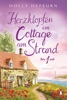

<b>Große Gefühle in Schottlands süßestem Cottage</b>  Im ersten Teil von Holly Hepburns herzerwärmendem Roman muss für Schriftstellerin Merry ein Tapetenwechsel her: Die Leserinnen warten sehnsüchtig auf ihre nächste romantische Liebesgeschichte, doch die Worte wollen einfach nicht mehr aus ihrer Feder fließen – und ihr Verlobter macht in einem voll besetzten Restaurant mit ihr Schluss. Kurzerhand zieht sie vom glitzernden London in ein verträumtes kleines Cottage auf den wunderschönen Orkney-Inseln vor der schottischen Küste. Doch zur Ruhe kommt sie nicht, denn die naseweisen Inselbewohner interessieren sich mehr für Merrys Privatleben, als ihr lieb ist. Und dann gibt es da noch Niall, den charmanten Leiter der örtlichen Bücherei, und den unverschämt attraktiven Bootsbauer Magnus, dessen Vorfahren von den Wikingern abstammen ... <b>Lesen Sie alle Teile des Romans um das bezaubernde kleine Cottage:</b> Teil 1: Herzklopfen im Cottage am Strand Teil 2: Frühlingszauber im Cottage am Strand Teil 3: Sommerküsse im Cottage am Strand Teil 4: Sonnenuntergänge im Cottage am Strand  <b>Oder lesen sie den kompletten Roman in einem Band:</b> Süße Träume im Cottage am Strand

[View on Apple](https://books.apple.com/de/book/herzklopfen-im-cottage-am-strand-teil-1/id1597265289)

## Absolute Bedrohung (Ein Jake Mercer Politthriller — Band 1)

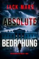

„Ein Thriller vom Feinsten.“&#xa0; 
--Midwest Book Review (KOSTE ES, WAS ES WOLLE) 
⭐⭐⭐⭐⭐  
<b>Vom #1 Bestsellerautor Jack Mars kommt nun eine bahnbrechende neue Politthrillerreihe: Als der Präsident der Vereinigten Staaten und seine Familie bedroht werden, liegt es an Jake Mercer, ehemaligem Scharfschützen in den Marines, und heutigem Secret Service Agenten, sie zu beschützen – vor Feinden, die sowohl von Innen als auch von Außen kommen.</b>  
Als eine tödliche Miliz den mächtigsten Mann der Welt ins Visier nimmt, muss Jake ihr Attentat aufhalten und das höchste Amt der Nation schützen – selbst, als sich herausstellt, dass der Drahtzieher jemand aus seiner eigenen Vergangenheit ist.  
„Thrillerfans, die die technischen Details eines internationalen Thrillers lieben, aber auch auf psychologische Einblicke und Glaubwürdigkeit eines Protagonisten Wert legen, der sowohl mit Problemen auf der Arbeit als auch in seinem Privatleben zu kämpfen hat, werden diese Reihe kaum aus den Händen legen können.“ 
--Midwest Book Review, Diane Donovan (zu KOSTE ES, WAS ES WOLLE) 
⭐⭐⭐⭐⭐  
„Einer der besten Thriller, die ich dieses Jahr gelesen habe. Die Handlung ist intelligent und fesselt dich von Anfang an. Der Autor hat hervorragende Arbeit geleistet und eine Reihe von Charakteren geschaffen, die voll entwickelt und sehr unterhaltsam sind. Ich kann die Fortsetzung kaum erwarten.“ 
-Books and Movie Reviews, Roberto Mattos (zu KOSTE ES, WAS ES WOLLE) 
⭐⭐⭐⭐⭐  
ABSOLUTE BEDROHUNG ist der erste Band der neuen Reihe von #1 Bestsellerautor Jack Mars, dessen Bücher bereits über 10.000 Fünf-Sterne-Bewertungen und Rezensionen erhalten haben.  
Ein spannender und unvorhersehbarer Politthriller! Die Jake Mercer Reihe ist voller atemberaubender Action, und man kann sie nur schwer aus der Hand legen. Dieser brandneue Actionheld wird dafür sorgen, dass Sie bis spät in die Nacht weiterlesen und Fans von Brad Taylor, Vince Flynn, sowie Tom Clancy kommen hier voll auf ihre Kosten.  
Weitere Bände sind ebenfalls erhältlich!

[View on Apple](https://books.apple.com/de/book/absolute-bedrohung-ein-jake-mercer-politthriller-band-1/id6503454986)

## Die Vernehmung

»Die Zeugin hat einen weiteren Mord vorausgesagt.«  Berlin, November 1999: Das Millennium steht kurz bevor. Doch während sich die Menschen nichtsahnend auf die Neujahrsfeier vorbereiten, sitzt eine Zeugin im Vernehmungszimmer. Ivonne Becker hat einen Mord beobachtet und möchte nur mit einer Person über ihre Beobachtungen sprechen – mit Hauptkommissarin Lisa Seifert. Als die junge ambitionierte Polizistin die Vernehmung beginnt, wird schnell klar, dass es sich hier nicht um einen Standardfall handelt, denn Ivonne Becker gibt an, einen Mord gesehen zu haben, der noch nicht geschehen ist. Während Lisa krampfhaft versucht, sich einen Reim auf die Geschehnisse zu machen, kämpft der Verhaltensanalyst Jan Theurer damit, ein Täterprofil zu erstellen. Mehrere Obdachlose wurden brutal ermordet, aber es gibt keine Spur. Frustriert über den Stillstand in seinen Ermittlungen kommt ihm die Anfrage einer anderen Direktion genau recht, denn genau diese bringt ihn auf eine Spur und zu Lisa Seifert. Obwohl sich Jan offiziell nicht in diesen Fall einmischen soll, beginnt er insgeheim mit Hauptkommissarin Seifert zusammenzuarbeiten. Als der durch Ivonne vorhergesehene Mord schließlich geschieht, während sie in der Vernehmungszelle sitzt, gerät Lisa in einen Strudel aus Wahrheit und Lügen, der sich immer schneller zu drehen beginnt. Die Zeitungen haben von der Zeugin erfahren, taufen sie »Die Todesbringerin« und setzen die Polizei mit ihrer Berichterstattung unter Druck. Der Schlüssel liegt darin, die Zeugin zu durchschauen, denn die Wahrheit liegt im Vernehmungsraum und die Einzigen, die sie ans Tageslicht bringen können, sind Seifert und Theurer. Sie müssen das Rätsel schnell lösen, denn die nächsten Opfer stehen bereits fest.  <i>»Die Vernehmung« ist ein packender Thriller, der die Abgründe der menschlichen Psyche ins Detail analysiert und damit die Profiler-Crime-Reihe »Seifert und Theurer« mit einem Knall einleitet.</i>

[View on Apple](https://books.apple.com/de/book/die-vernehmung/id6764779288)

## Auf diese Art zusammen

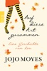

Louisa Clark sitzt fest. Eigentlich wollte sie nur kurz zurück nach England, um neue Ware für ihren Vintage-Mode-Verleih The Bees Knees zu kaufen. Aber plötzlich ist alles anders. Lockdown. Die Welt steht still. Lou hat keine andere Wahl, als die nächsten Wochen bei ihrer liebenswert chaotischen Familie zu verbringen. Dabei macht sie sich große Sorge um ihren Freund Sam, der als Sanitäter in New York arbeitet. Wie so viele andere Mediziner und Pflegekräfte überall auf der Welt bringt er sich täglich in Gefahr, um anderen zu helfen. Doch Lou wäre nicht Lou, wenn sie nicht selbst aus dieser Situation etwas Gutes machen würde ... Lou is back. Jojo Moyes schenkt ihren Leser*innen eine Mut machende Geschichte über Louisa Clark, die Protagonistin aus dem Bestseller "Ein ganzes halbes Jahr".

[View on Apple](https://books.apple.com/de/book/auf-diese-art-zusammen/id1519800036)

## Mamies kleinster Coup

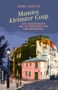

Eine Kurzgeschichte aus »Die mysteriöse Tote vom Montmartre«.  Das E-Book Mamies kleinster Coup wird angeboten von GMEINER-Verlag und wurde mit folgenden Begriffen kategorisiert: 
Kurzgeschichte,Kriminalroman,Krimi,Frankreich,Ile-de-France,Paris,Commissaire Morel,Weinfestival,Montmartre,Champagne,Urlaubskrimi,Kolumbien,Dschungel,Christian Schleifer,Musée de Montmartre,Night-Run

[View on Apple](https://books.apple.com/de/book/mamies-kleinster-coup/id6743468530)

## Westwell - Valerie & Adam

SIE STARBEN, WEIL SIE SICH LIEBTEN ...  Der Beginn von Valerie Westons und Adam Coldwells tragischer Liebesgeschichte.  Eine kostenlose Kurzgeschichte von der Platz-1-SPIEGEL-Bestseller-Autorin Lena Kiefer für alle Leser:innen, die noch einmal in die Welt von WESTWELL eintauchen und mehr über Valerie und Adam erfahren möchten.

[View on Apple](https://books.apple.com/de/book/westwell-valerie-adam/id6736967718)

## Fake-Dating mit dem Hockey-Kapitän

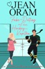

<b><i>Sie ist tabu.</i></b> 
<b><i>Er ist schon total in sie verknallt.</i></b> 
<b><i>Und eine vorgetäuschte Beziehung wird alles nur noch schlimmer machen.</i></b>  
Eine süße Hockey-Romanze hinter verschlossenen Türen, voller langsam aufkeimender Spannung, Freundschaft und all den schwärmerischen Gefühlen einer vorgetäuschten Beziehung.  
Mein Hockey-Trainer spielt den Heiratsvermittler.  
Leider ist die Frau, die er für mich ausgesucht hat, absolut tabu.  
Sie ist klug, schön, ablenkend … und die Ex meines besten Freundes.  
Außerdem ist sie die einzige Person, die immer an mich geglaubt hat.  
Jetzt will mein Trainer, dass wir eine Scheinbeziehung führen, um meinen Ruf nach einem sehr öffentlichen Missverständnis wiederherzustellen. Wenn ich mich nicht auf den Plan einlasse, könnte ich Sponsorenverträge verlieren, meine Teamkollegen im Stich lassen und alles riskieren, wofür wir in dieser Saison gearbeitet haben.  
So tun, als ob, sollte eigentlich einfach sein.  
Nur bedeutet eine vorgetäuschte Beziehung, in der Öffentlichkeit ihre Hand zu halten. 
Sie vor den Kameras zu küssen. 
Sie so zu behandeln, wie sie es verdient.  
Und je mehr Zeit wir miteinander verbringen, desto schwerer fällt es mir, die Wahrheit zu ignorieren – ich tue nicht mehr nur so, als ob.  
Warmherzig, gefühlvoll und voller langsam aufkeimender Chemie – diese „Closed-Door“-Hockey-Romanze ist perfekt für Leser, die emotionale Freundschaften und Helden lieben, die sich Hals über Kopf verlieben.  
Band 1 der „Sweetheart Creek Hockey-Romanze“-Reihe. Diese „Closed-Door“-Hockey-Romanze kann als eigenständiges Buch gelesen werden.  
<b>Perfekt für Fans von:</b> 
• Scheindating-Romanzen / Fake Dating 
• Von besten Freunden zu Liebenden / Friends to lovers 
• Romanzen hinter verschlossenen Türen / Closed Door Romance 
• Hockey-Romanzen 
• Beschützende, liebenswerte Helden 
• Langsam aufkeimende Chemie 
• Herzliche Liebesromane mit emotionaler Tiefe 
• Kleinstadt-Romanzen / Small Town Romance 
• Wohlfühl-Romantik der Gegenwart

[View on Apple](https://books.apple.com/de/book/fake-dating-mit-dem-hockey-kapit%C3%A4n/id6760672236)

## SYLTKRIMI Dünengrab

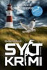

Die Idylle des Wattenmeeres ist trügerisch...
Hauptkommissarin Bente Brodersen ermittelt mit friesischer Sturheit auf Deutschlands nördlichster Insel.
Von einem luxuriösen Anwesen in Kampen verschwindet ein Mädchen spurlos.
Die Indizien weisen auf ein Gewaltverbrechen hin. Als Hauptkommissarin Bente Brodersen die Bewohner und Nachbarn befragt, trifft sie auf falsche Alibis, Lügen, Widersprüche und Verleumdungen.
Nach einem Doppelmord setzt Bente alles daran, das vermisste Mädchen zu retten, bevor der Mörder wieder zuschlägt?
Die raue See, der frische Wind und die endlosen Dünen machen SYLT zum idealen Schauplatz der spannenden Küstenkrimis.
Jeder Teil der Syltkrimiserie ist in sich abgeschlossen und kann unabhängig voneinander gelesen werden.

[View on Apple](https://books.apple.com/de/book/syltkrimi-d%C3%BCnengrab/id6475054562)

## Second Chance

Elly hat in ihrem Leben schon so einiges erlebt. Gezeichnet durch schwere Schicksalsschläge meidet sie seit Jahren jedes Gefühl. Hass, Wut oder Liebe hat sie schon lang nicht mehr gespürt.   Doch als der attraktive Devon neben ihr einzieht, ändert sich alles. Ellys Gefühle drängen immer mehr an die Oberfläche. Devon ist alles, was sie nicht will, und doch kann sie ihn nicht einfach ignorieren.  Langsam aber sicher fühlt sie sich zu diesem arroganten und fiesen Unterground-Boxer hingezogen. Wäre da nicht seine Freundin, die ständige Geheimniskrämerei und vor allem die Frage:   Kann man sein Herz verschenken, obwohl es eigentlich schon immer jemand anderem gehört hat?

[View on Apple](https://books.apple.com/de/book/second-chance/id1167220720)

## Die Tochter des Uhrmachers: Glass & Steele

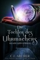

India Steele ist verzweifelt. Ihr Vater ist verstorben, ihr Verlobter hat sie um ihr Erbe erleichtert, und niemand will ihr Arbeit geben, obwohl sie jahrelang ihren Vater, den Uhrmacher, unterstützt hat. Vielmehr scheinen sich die Uhrmacher von London vor ihr zu fürchten. Auf sich gestellt, verarmt und am Ende ihrer Kräfte lässt sich India vom einzigen Menschen anstellen, der sie nimmt – einem geheimnisvollen Mann aus Amerika. Einem Mann mit einer seltsamen Taschenuhr, die ihn regeneriert, wenn er krank wird.  
Matthew Glass muss einen bestimmten Uhrmacher finden, aber er verrät India nicht, warum es nicht der nächstbeste tut. Genauso wenig erzählt er ihr von seinem Beruf in Übersee, und wie er es sich leisten kann, in einem Haus in einer der besten Straßen Londons zu wohnen. Als India von der Ankunft des amerikanischen Banditen Dark Rider in England hört, vermutet sie darum, dass Mr. Glass der Flüchtige ist. Es wird zur Gewissheit, als die Gefahr an ihre Tür klopft. Doch zur Polizei zu gehen hieße, wieder arbeits- und heimatlos zu werden – und den Mann zu verraten, der ihr das Leben rettete.  
Mit verschrobenen Figuren, einem spannenden Geheimnis und einem Hauch Romantik ist DIE TOCHTER DES UHRMACHERS der Reihenauftakt der historischen Fantasy Glass &amp; Steele, eines mehrfachen <i>USA Today</i>-Bestsellers.

[View on Apple](https://books.apple.com/de/book/die-tochter-des-uhrmachers-glass-steele/id1499149040)

## Icebreaker

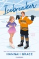

&lt;p&gt;&lt;strong&gt;Han er det eneste, hun ikke havde planlagt …&lt;/strong&gt;&lt;/p&gt;&lt;p&gt;Anastasia Allen har drømt om at deltage i OL, lige siden hun begyndte til kunstskøjteløb som femårig. Hun har knoklet sig til et universitetslegat, og nu må intet komme i vejen for hendes kvalifikation til Team USA.&lt;/p&gt;&lt;p&gt;Nathan Hawkins er anfører for universitetets ishockeyhold. Et ansvar, som hviler tungt på hans skuldre, men han har aldrig mødt en forhindring, han ikke kunne overkomme … Det skulle da lige være at samarbejde med den stædige kunstskøjteløber, holdet skal dele skøjtehallen med næste semester.&lt;/p&gt;&lt;p&gt;Anastasia er på ingen måde tilfreds, og det bliver ikke bedre, da hendes partner kommer til skade, og hun akut mangler nogen at træne med. Den eneste, der kan træde til, er Nathan, fyren som irriterer hende grænseløst.&lt;/p&gt;&lt;p&gt;Men de har intet valg, og det er ikke bare isen, der slår gnister, når Nathan skifter hockeystaven ud med en kropsnær trikot …&lt;br /&gt;&#xa0;&lt;/p&gt;&lt;p&gt;”&lt;em&gt;Icebreaker&lt;/em&gt; fik mig til at smelte fra top til tå.” – &lt;em&gt;New York Times&lt;/em&gt;-bestsellerforfatter Elena Armas&lt;/p&gt;&lt;p&gt;”Hannah Grace blander med succes humor, drama og erotik - og bogen er lydefrit oversat.” – &lt;em&gt;Lektørudtalelse&lt;/em&gt;&lt;/p&gt;

[View on Apple](https://books.apple.com/de/book/icebreaker/id6477571349)

## Die Verwandlung

Ungeliebter Sohn und unverstandener Außenseiter. Franz Kafka verwandelt die Tragik seines eigenen Lebens in einen fiktionalen Horrortrip der literarischen Extraklasse, der ihm posthum Weltruhm und ein eigenes Adjektiv einbrachte – kafkaesk. Das Wort steht für „auf unergründliche Weise bedrohlich“. Und genau so kommt Kafkas Erzählung über den jungen Handlungsreisenden Gregor Samsa daher, der eines Morgens als überdimensionaler Käfer in seinem Bett aufwacht. Die Geschichte ist rätselhaft, verstörend und dennoch dank ihres klaren Stils und der eindringlichen Wortwahl packend und hervorragend lesbar. Kafka gelingt eine bedeutende Parabel über Nonkonformismus, gesellschaftliche Ausgrenzung und Entmenschlichung, die auch über 100 Jahre nach ihrem Erscheinen nichts an Aktualität verloren hat.  
Karl May ist laut UNESCO einer der am häufigsten übersetzten deutschen Schriftsteller und definitiv einer der weltweit wichtigsten Autoren von Abenteuerromanen. Band zwei der Trilogie über den edlen Apachenhäuptling Winnetou und seinen weißen Blutsbruder Old Shatterhand führt uns von New York, durch den Wilden Westen bis nach Mexiko. Großartige Landschaftsbeschreibungen wechseln sich ab mit spannend erzählten Abenteuern auf der Suche nach dem gnadenlosen Schurken Santer. Ein Buch über Freundschaft, Mut und Abenteuerlust, das uns auf schönste Art und Weise in unsere Jugend zurückwirft. Da vergeht die Zeit so schnell wie bei einem Ritt auf Winnetous legendärem Rappen Iltschi.  
Karl May schrieb seine Romane nicht nur, er lebte sie. So ließ er sich die berühmten Gewehre Bärentöter und Silberbüchse von einem Büchsenmacher nachbauen und behauptete in den 1890er-Jahren, in Wahrheit selbst Old Shatterhand zu sein und die niedergeschriebenen Abenteuer wirklich erlebt zu haben. Ob dies nun eine geschickte PR-Maßnahme oder Auswuchs seiner überschäumenden Fantasie ist, lässt sich nicht endgültig klären. Sicher ist, auch der dritte Band seiner Winnetou-Reihe steht den Vorgängern in Sachen Spannung in nichts nach. Zugüberfälle, Schießereien, ein Goldschatz und die blutsbrüderliche Freundschaft zwischen dem legendären Apachen-Häuptling und Old Shatterhand sind die Zutaten, die dieses Buch zu einem Muss auf jeder persönlichen Leseliste machen. Howgh, wir haben gesprochen!

[View on Apple](https://books.apple.com/de/book/die-verwandlung/id492186116)

## Mein fast perfekter Sommer

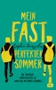

<b>Das eine Mal, als mir die potenzielle Liebe meines Lebens am Wasserspender auflauerte</b>  Der 17-jährige Ollie Di Fiore verbringt die Sommerferien mit seinen Eltern in North Carolina, um seiner kranken Tante unter die Arme zu greifen. Doch schon sein erster Einsatz als Babysitter für seinen kleinen Cousin und seine Cousine droht in einer Katastrophe zu enden. Rettung naht in Form von Will Tavares – gutaussehend, charmant und ein wahres Wunder im Umgang mit kleinen Kindern. Ollie ist sofort hin und weg … Aber geht es Will genauso?

[View on Apple](https://books.apple.com/de/book/mein-fast-perfekter-sommer/id1569355853)

## Bevor er tötet (ein Mackenzie White Krimi – Buch 1)

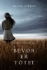

Von der #1 Bestsellerautorin Blake Pierce erscheint nun eine spannende neue Krimireihe.  
In den Maisfeldern Nebraskas wird eine ermordete, an einen Holzbalken gebundene Frau gefunden, die zum Oper eines gestörten Mörders wurde. Die Polizei erkennt schnell, dass ein Serienkiller unterwegs ist – und dass seine Mordserie gerade erst begonnen hat.  
Detective Mackenzie White, jung, schlagfertig und kleiner als die alternden, chauvinistischen Männer ihrer Polizeiwache, wird mit der Aufklärung des Falles beauftragt. So ungern es die anderen Polizisten auch zugeben, sie brauchen ihren jungen und brillanten Verstand, der schon bei vielen Fällen die entscheidenden Impulse gegeben hat. Doch auch für Mackenzie erweist sich dieser Fall als unlösbares Rätsel, etwas, das weder sie noch die anderen Polizisten auf dem örtlichen Revier schon einmal erlebt haben.  
Als das FBI zur Hilfe gerufen wird, beginnt eine aufregende Verbrecherjagd. Mackenzie, die von ihrer eigenen Vergangenheit, ihrer gescheiterten Beziehung und ihrer unbestreitbaren Anziehung zu dem neuen FBI Agenten geplagt wird, muss gegen ihre eigenen Dämonen kämpfen, um den Mörder, der sie an die dunkelsten Ecken ihres Geistes bringt, zu jagen. Als sie sich in den Kopf des Mörders versetzt und sich intensiv mit seiner gestörten Psychologie auseinandersetzt, erkennt sie, dass es das Böse wirklich gibt. Sie hofft nur, dass sie sich noch rechtzeitig aus seiner Denkweise befreien kann, während ihr gesamtes Leben um sie herum einstürzt.  
Da immer mehr Leichen auftauchen, beginnt ein hektischer Wettkampf gegen die Zeit, der Täter muss gefasst werden, bevor er noch einmal zuschlagen kann.  
Als dunkler Psychothriller mit kaum auszuhaltender Spannung ist BEVOR ER TÖTET ein grandioses Debut einer fesselnden neuen Krimireihe – und eines neuen, liebenswerten Charakters – die Sie bis spät in die Nacht fesseln wird.  
Buch #2 der Mackenzie White Krimireihe wird bald verfügbar sein.

[View on Apple](https://books.apple.com/de/book/bevor-er-t%C3%B6tet-ein-mackenzie-white-krimi-buch-1/id1194094122)

## NORDSEEKRIMI - Aenne Feddersen und der vergessene Tod: Küstenkrimi

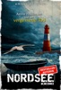

»Das Vergessen kennt keine Schuld und Schuld kennt kein Vergessen.«
Rechtsanwältin Aenne Feddersen ermittelt mit zwanghaftem Scharfsinn und nordischem Charme dort, wo Gummistiefel und Fischbrötchen zum Kulturgut gehören.
Aenne Feddersen kämpft als Strafverteidigerin nicht nur erbittert vor Gericht, sondern auch täglich gegen ihre manischen Zwänge an.
Ihre neue Mandantin, Lisa Hellmann, leidet an einer Amnesie und ruft alte Erinnerungen in Aenne hervor. Hellmann wurde aus einem zertrümmerten Autowrack geborgen. Hatte sie versucht, sich umzubringen? Mühsam beginnt Aenne, sich in diesen Fall einzuarbeiten. Ein Leichenfund im Kranichmoor führt sie auf die Spur eines raffiniert ausgeklügelten Mordes.

Die nordfriesischen Inseln bieten die perfekte Kulisse für Nordseekrimis, die unter die Haut gehen.

[View on Apple](https://books.apple.com/de/book/nordseekrimi-aenne-feddersen-und-der-vergessene-tod/id6742842727)

## The Odyssey

An Apple Books Classic edition.  
Homer’s eighth-century epic poem is a companion to <i>The Iliad</i>. It tells the story of Odysseus, who journeys by ship for 10 years after the Trojan War, trying to make his way back home to Ithaca. Homer’s work was intended to be performed out loud, so it’s a masterful example of poetic meter and rhythm. But above all, <i>;The Odyssey</i> is a story of adventure-and true love.  
Odysseus has been gone for 20 years, and he longs to reclaim his role as king and reunite with his beloved, faithful Queen Penelope. During his absence, hundreds of suitors have eaten his food, lived in his home, and even plotted to kill his son. But before he can confront his enemies at home, Odysseus must fight a cyclops, escape after being imprisoned by a lovesick nymph, and confront the twin terrors of Scylla and Charybdis. As if that wasn’t enough, the gods take their grudges out on him, adding obstacles to suit their whims. Will Odysseus ever get home? And what will he find once he does? Within the pages of this ancient Greek classic are the origins for many of the myths we’re familiar with today. Pick up a copy and meet Odysseus, Homer’s timeless hero.

[View on Apple](https://books.apple.com/de/book/the-odyssey/id395540967)

## Sommer auf Schottisch

Job auf der Kippe, frisch getrennt und mit einem Zelt im Kofferraum in Schottland gestrandet. Ellie ist am Tiefpunkt angelangt. Als sie jedoch ein altes Bootshaus vor der traumhaften Kulisse der Highlands entdeckt, weiß die Hamburgerin, wie es für sie weitergeht: Sie pachtet den baufälligen Kasten und erfüllt sich damit ihren Traum vom eigenen Restaurant! Das einzige Problem ist der Besitzer, der sich als alles andere als kooperativ erweist. Sie beschließt, sich als Hausmädchen bei ihm einzuschleusen und den unsympathischen Schlossherrn heimlich von ihren Kochkünsten zu überzeugen. Kenneth muss nach Schottland zurückkehren, um sein ungewolltes Erbe loszuwerden. Das ist schwieriger als gedacht, als er entdeckt, dass sein Vater ihm nicht nur ein Schloss, einen Adelstitel und einen unerzogenen irischen Wolfshund vererbt hat, sondern auch Briefe seiner verstorbenen Mutter. Für Kenneth beginnt eine schmerzhafte Reise in die Vergangenheit. Sein einziger Lichtblick ist die attraktive, aber penetrante Touristin Ellie, die auffällig oft seinen Weg kreuzt und ständig an Orten auftaucht, an denen sie eigentlich nichts zu suchen hat …

[View on Apple](https://books.apple.com/de/book/sommer-auf-schottisch/id1587329283)

## Wenn Sie Wüsste (Ein Kate Wise Mystery – Buch 1)

„Ein Meisterwerk von Thriller und Mystery. Auf großartige Art und Weise hat Blake Pierce seine Charaktere entwickelt, und dabei deren psychologischen Seiten so präzise beschrieben, dass wir uns in deren Gedankenwelt einfinden und ihren Ängsten und ihren Erfolgserlebnissen folgen können. Dieses Buch ist so reich an unerwarteten Wendungen, dass es Sie bis tief in die Nacht wachhalten wird, bis zur letzten Seite.“ 
--Buch- und Film-Kritiken, Roberto Mattos (über Once Gone)  
<b>WENN SIE WÜSSTE (Ein Kate Wise Mystery) ist das erste Buch der neuen Psycho-Thriller Reihe von Bestseller Autor Blake Pierce, dessen Nummer 1 Bestseller Once Gone (Buch Nr. 1) (erhältlich als gratis Download) mehr als 1000 Fünfsterne-Kritiken erhalten hat.</b>  
Kate Wise, eine fünfundfünfzigjährige FBI-Agentin im Ruhestand, deren Tochter schon aus dem Haus ist, wird aus ihrem ruhigen Vorstadtleben gerissen, als die Tochter ihrer Freundin ermordet in deren Haus aufgefunden wird – und Kate angefleht wird, sich in den Fall einzuschalten.  
Kate ist der Meinung gewesen, das FBI nach 30 Jahren als Top-Agentin hinter sich gelassen zu haben; 30 Jahre, in denen sie für ihren scharfsinnigen Verstand und ihre brillante Fähigkeit, Serienmörder dingfest zu machen, großen Respekt geerntet hat. Kate, die vom Leben in der ruhigen Stadt gelangweilt ist und sich an einem Scheidepunkt ihres Lebens befindet, wird von ihrer Freundin um Hilfe gebeten; eine Bitte, die sie ihr nicht abschlagen kann.  
Während Kate den Killer jagt und sie sich schnell an vorderster Front der Jagd wiederfindet, tauchen immer mehr Leichen auf – alles Mütter, die die perfekten Ehen geführt haben – und es wird offensichtlich, dass ein Serienmörder in dem ruhigen Städtchen sein Unwesen treibt. Von den Nachbarn erfährt sie Geheimnisse, von denen sie am liebsten gar nichts gewusst hätte, und schon bald ist sie sich im Klaren darüber, dass nicht alles in diesem Vorzeigemodell an hübschen Straßen und netten Nachbarn so war, wie es den Anschein hat. Affären und Lügen kommen ans Licht, und Kate kämpft sich durch die dunkle Seite des Städtchens, um den Killer zu fassen, bevor er noch einmal zuschlagen kann.

[View on Apple](https://books.apple.com/de/book/wenn-sie-w%C3%BCsste-ein-kate-wise-mystery-buch-1/id1445776861)

## 1984

<b>BIG BROTHER IS WATCHING YOU</b>

Newspeak, Doublethink, Big Brother, the Thought Police - the language of 1984 has passed into the English language as a symbol of the horrors of totalitarianism. George Orwell's story of Winston Smith's fight against the all-pervading Party has become a classic, not the least because of its intellectual coherence. First published in 1949, it retains as much relevance today as it had then.

[View on Apple](https://books.apple.com/de/book/1984/id6503603856)

## Mein erstes iPhone

Ich denke, Sie geben mir recht, wenn ich behaupte, dass die Erfindung des iPhones im Jahre 2007 die Welt verändert hat. 
Sensationell ist die wirklich sprichwörtlich einfache Bedienung mit Fingergesten auf dem brillanten Display, die Nutzung des Internets immer und überall und die Erweiterbarkeit der Funktionalität über die Installation von Apps aus dem entsprechenden Store. 
Das alles hat dazu geführt, dass das iPhone weltweit ein Bestseller wurde. Aber: Es kommen noch immer Menschen neu zum iPhone. Vielleicht gehören auch Sie dazu? Haben Sie vorher ein Android-Telefon von Samsung oder einem anderen Hersteller benutzt oder es erfolgte ein Aufstieg von einem älteren iPhone-Modell?  
Wie dem auch sei, mit diesem Gratis PREMIUM-E-Book schaffen Sie den Einstieg im Handumdrehen. Über eine Stunde <b>Videoanleitungen</b> helfen Ihnen dabei. So können Sie gleich von Anfang an alles richtig machen und viel Freude mit dem Gerät haben.

[View on Apple](https://books.apple.com/de/book/mein-erstes-iphone/id6445655228)

## Die Abenteuer des Sherlock Holmes

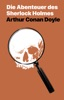

Sir Arthur Conan Doyle hat nicht nur den berühmtesten Privatermittler der Welt erfunden, sondern das Genre des modernen Detektivromans gleich mit. In zwölf kurzen Erzählungen erleben wir, wie Sherlock Holmes und sein kongenialer Partner Doktor Watson von der Baker Street 221b aus losziehen, um aufsehenerregende Fälle zu lösen. Vor ihrer untrüglichen Intuition, messerscharfen Kombinationsgabe und wissenschaftlichen Methodik ist kein Täter sicher. Genau das macht die beiden Gefährten nicht nur zu literarischen Kultfiguren, sondern auch zu den Urvätern der Forensik. Was wären Spurensicherung, Gerichtsmedizin und Profiling ohne Sir Arthur Conan Doyle?

[View on Apple](https://books.apple.com/de/book/die-abenteuer-des-sherlock-holmes/id1521762253)

## Ein Baby vom Captain

Cheryl Cook sollte sich eigentlich Sorgen um den Biologieunterricht machen. Um die Miete. Und darum, wie sie das College mit Kaffee, Crackern und purem Trotz überleben sollte.  Sie sollte nicht in einem Campusbad stehen und auf zwei rosa Linien starren.  Und sie sollte Kurt Fisher ganz bestimmt nicht sagen müssen, dass sich ihr Leben gerade seinetwegen verändert hatte. Kurt Fisher – Captain der Calder Wolves, Nummer sechzehn und der One-Night-Stand, an den sie seitdem nicht mehr aufhören kann zu denken.  Kurt kennt Druck. Trainer, Scouts, Teamkollegen, Erwartungen – er weiß, wie man ruhig bleibt, wenn alle Augen auf einen gerichtet sind. Aber Cheryl ist keine Spielsituation, die er kontrollieren kann. Und dieses Baby ist kein Problem, das er löst, indem er sich nützlich macht.  Cheryl will nicht gerettet werden. Sie will nicht zum Gesprächsthema auf dem Campus werden. Sie will nicht, dass die Ängste ihrer Mutter, die Pläne von Kurts Vater oder die halbe Eishalle entscheiden, wie ihre Zukunft auszusehen hat, bevor sie selbst es weiß.  Aber Kurt taucht immer wieder auf.  In der Klinik. Vor der Bibliothek. In der Kälte. In den stillen Momenten. Mit einer Geduld, die Cheryl wütend macht. Mit einem Verlangen, bei dem sie vergisst zu atmen. Und mit einer Liebe, die fragt, statt zu nehmen.  Eine Nacht hat alles verändert.  Jetzt müssen Cheryl und Kurt entscheiden, ob zwei rosa Linien das Ende dessen sind, was sie einmal waren – oder der Anfang von etwas, das keiner von beiden geplant hat.  <b>Ein Baby vom Captain</b> ist eine moderne New-Adult-Hockey-Romance mit ungeplanter Schwangerschaft, einem College-Hockey-Captain, den Folgen eines One-Night-Stands, Campusgerüchten, emotionaler Anziehung, Found-Family-Rückhalt und einem hart erkämpften Happy-for-Now.

[View on Apple](https://books.apple.com/de/book/ein-baby-vom-captain/id6778639725)

## Krieg und Frieden

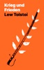

Dieses monumentale Werk über die russische Gesellschaft zu Zeiten der Napoleonischen Kriege hat seinen Verfasser Lew Tolstoi unsterblich gemacht. Mit unglaublicher historischer Authentizität, erstaunlicher Detailversessenheit und sprachlicher Wucht entwirft der Autor einen gigantischen Figurenkosmos voller Machtkämpfe, Liebesgeschichten und Schicksalsschläge. Er zeigt uns den Schrecken der Schlachtfelder von Austerlitz und Borodino genauso wie das unbeschwerte adlige Leben mit Bällen und Jagdausflügen. Historienroman, Bildungsroman, Familienepos, Gesellschaftskritik – „Krieg und Frieden“ ist all das und noch viel mehr. Ein großes, bedeutendes Buch, dem man sich einfach hingeben muss und das den eigenen Horizont Seite für Seite erweitert.

[View on Apple](https://books.apple.com/de/book/krieg-und-frieden/id1521745184)

## Vice: Dark Mafia Romance (Deutsche Ausgabe)

Mein Vater dachte, er würde eine Schuld begleichen. &#xa0;&#xa0;&#xa0;&#xa0;Er lieferte mich dem Teufel aus.  Azlan Zharkov ist kein Mann, mit dem man verhandelt. Er ist eine Waffe in einem maßgeschneiderten Anzug, ein Schlächter mit perfekten Manieren und einer Akte voller Blut. Ich sollte nur eine vorübergehende Sache sein, eine Abmachung, eine Unterschrift unter dem Ruin meines Vaters. Stattdessen wurde ich zu dem, was er nicht eingeplant hatte.  Er nahm mir meine Seide, meine Musik, meinen Namen. Er lehrte mich, wie man kniet, ohne zu zerbrechen, und wie man brennt, ohne zu schreien. Jeder Befehl, der über seine Lippen kommt, fühlt sich an wie eine Klinge auf meiner Haut, und Gott steh mir bei – ich will dem gar nicht immer ausweichen.  Er nennt mich sein Eigentum.  Er nahm mir meine Freiheit, meine Würde… und jetzt greift er nach dem Einzigen, von dem ich schwor, dass er es niemals haben würde. Das Schlimmste daran? Ich könnte ihn das vielleicht sogar nehmen lassen.  Aber je fester er zupackt, desto mehr begreife ich etwas Gefährliches. Jedes Mal, wenn diese eiskalten Augen die meinen finden, regt sich etwas Böses und Hungerndes unter meiner Haut.  Kollateralschaden kann zur Waffe werden.  Dies ist das erste Buch der The Ledger of Blood and Silk Series. Reihenfolge der Bücher:  AZLAN  Sie sollte bloß eine Transaktion sein. Ein hübsches Stück Macht, um ihren korrupten Vater ausbluten zu lassen, nicht mehr.  Dann sah mich Mila &#xa0;&#xa0;Montclair an, als wollte sie mir mit bloßen Händen das Herz herausreißen, und alles Kalte, Kalkulierte in mir begann einen Krieg gegen sich selbst.  Die Tochter des Senators sieht zerbrechlich aus in ihrer zerrissenen Seide, aber hinter diesen haselnussbraunen Augen steckt Gift, und ich habe es geschmeckt, in dem Moment, als sie versuchte, sich mir zu widersetzen. Sie zittert unter meinen Regeln, unter meinen Händen, unter meinem Schatten, und trotzdem starrt sie mich an, als wollte sie mein Imperium in Brand stecken.  Gut.  Ich will keine Puppe. Ich will jemanden, der zurückschlägt.  Sie gehört jetzt mir – jeder Atemzug, jeder blaue Fleck, jeder geflüsterte Protest in der Dunkelheit –, und sie hat keine Ahnung, dass sie aufgehört hat, nur eine Schuld zu sein, in dem Moment, als ich beschloss, dass sie mir gehört. Ich werde ihr altes Leben zertrümmern, die Illusionen ihres Vaters vernichten und ihr genau zeigen, was sie in meiner Welt wert ist.  Und wenn sie glaubt, das hier sei Gefangenschaft, dann hat sie das Spiel noch nicht verstanden.  Denn sobald sie aufhört, gegen mich zu kämpfen,  beginnt sie vielleicht damit, an meiner Seite zu kämpfen.  Und das wird der Moment sein, in dem diese Stadt lernt, uns beide zu fürchten.  Dies ist das erste Buch der Crowned in Vice Duet. Reihenfolge der Bücher: Vice, Ruin.

[View on Apple](https://books.apple.com/de/book/vice-dark-mafia-romance-deutsche-ausgabe/id6764674465)

## Kommissar Dampfmoser und sein neuer Fall: Alpenkrimi: Kommissar Dampfmoser ermittelt 21

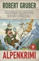

Idylle und Abgrund im Alpendorf

Mitten in der bayerischen Postkartenidylle zerreißt ein brutaler Mord die trügerische Ruhe. Für Kriminalhauptkommissar Ludwig Dampfmoser endet der Traum vom Feierabend mit Schweinebraten jäh, als der mächtige Hotelier Xaver Brunninger erschlagen in seinem Büro aufgefunden wird – ausgerechnet mit einem silbernen Kerzenleuchter.

Die Liste der Verdächtigen ist lang: die Kinder, die ihren Vater hassten; eine junge, heimliche Geliebte, die alles erben sollte; und ein wütender Künstler mit einem verdächtigen Alibi. Während die Spuren auf ein Familiendrama oder einen Raubmord hindeuten, spürt Dampfmoser, dass etwas faul ist. Ein leerer Safe, mysteriöse Holzsplitter und das Gerede über einen „Schatten aus der Vergangenheit“ führen den Kommissar in ein Labyrinth aus alten Lügen, Verrat und einer Wahrheit, die tödlicher ist als jede Waffe.

In einem Tal, in dem jeder jeden kennt, muss Dampfmoser erkennen, dass die tiefsten Abgründe sich nicht in den Schluchten der Berge, sondern in den Herzen einer Familie auftun.

[View on Apple](https://books.apple.com/de/book/kommissar-dampfmoser-und-sein-neuer-fall-alpenkrimi/id6790509489)

## Die Legende von Gold und Jade 1: Sonne und Mond

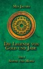

Alle fünf Jahre verlangen die Menschen von Kathalea, dass sich ein Freiwilliger zum Wohle des Volkes beim großen Fest zur Sonnenfinsternis opfert. Inmitten einer Spaltung von Gewalt und Frieden muss sich Noa von Kathalea entscheiden, wie sie das Land aus einer blutigen Tradition zurück in die Vernunft führen kann. Doch einer setzt alles daran, dass in diesem Jahr ein ganz besonderes Opfer verlangt wird.  
Zwischen Angst und Abenteuer, Hass und Liebe, jagen und gejagt werden – sie muss die Wahrheit erfahren. In diesem Leben oder im nächsten.

[View on Apple](https://books.apple.com/de/book/die-legende-von-gold-und-jade-1-sonne-und-mond/id6443168825)

## Faust

Dichterfürst, Universalgenie, Mythos – Johann Wolfgang von Goethe hält seit über 200 Jahren unangefochten den Spitzenplatz unter den deutschen Literaten. Der „Faust“, sein wohl großartigstes dramatisches Werk, gehört zum Besten, was die Weltliteratur zu bieten hat. Die Tragödie des gealterten und vom Leben enttäuschten Dr. Faustus, der in einem Pakt mit dem Teufel die eigene Seele gegen Lebensgenüsse, Glück und Jugend tauscht, beruht auf einer alten Sage. Bereits mit 21 Jahren begann Goethe sich mit diesem Stoff zu beschäftigen, der ihn sein ganzes Leben lang begleitete. Dabei variiert der Dichter in den hochpoetischen und dennoch klaren Versen meisterhaft Tonfall, Rhythmus und Klang je nach Figur und Gemütslage. Und nun zur Gretchenfrage: Hast du den „Faust“ schon gelesen?

[View on Apple](https://books.apple.com/de/book/faust/id955026676)

## Silo 1

Drei Jahre nach dem mysteriösen Tod seiner Frau setzt Sheriff Holston seiner Aufgabe ein Ende und entschließt sich, die strengste Regel zu brechen: Er will wie seine Frau das Silo verlassen. Doch die Erdoberfläche ist hoch toxisch, ihr Betreten sein sicherer Tod. Holston nimmt ihn in kauf, um endlich mit eigenen Augen zu sehen, was sich hinter der großen Luke befindet, die sie alle gefangen hält. Was ihn dort erwartet, ist ebenso ungeheuerlich wie die Folgen, die sein für alle anderen schwer nachvollziehbares Handeln hat … Hugh Howeys verstörende Zukunftsvision ist rasanter Thriller und Gesellschaftsroman in einem. Silo handelt von Lüge und Verrat, Menschlichkeit und der großen Tragik unhinterfragter Regeln.  <b>Dies ist der erste von fünf Teilen des Romans »Silo«.</b>

[View on Apple](https://books.apple.com/de/book/silo-1/id581931138)

## Siddhartha

Siddhartha ist Hermann Hesses zeitloser Klassiker über die Suche nach Sinn, Weisheit und innerem Frieden. Im Mittelpunkt steht Siddhartha, der Sohn eines Brahmanen, der sein behütetes Leben verlässt, um den wahren Weg zur Erleuchtung zu finden. Auf seiner Reise begegnet er Asketen, Lehrern, Liebe, Reichtum, Verlust und Einsamkeit – doch keine äußere Lehre kann ihm die Antwort geben, nach der er sucht. 
 
Erst am Fluss, im stillen Lauschen auf das Leben selbst, beginnt Siddhartha zu verstehen, dass Weisheit nicht gelehrt, sondern erfahren werden muss. Hesses poetischer Roman verbindet spirituelle Tiefe mit klarer, meditativer Sprache und bleibt bis heute ein bewegendes Werk über Selbstfindung, Vergänglichkeit und die Einheit allen Lebens. 
 
Ein unverzichtbarer Klassiker der Weltliteratur für Leserinnen und Leser, die sich für Spiritualität, Philosophie, östliche Weisheit und die großen Fragen des Menschseins interessieren.

[View on Apple](https://books.apple.com/de/book/siddhartha/id6773243854)

## Selbstbetrachtungen - Mark Aurels Meisterwerk

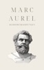

&#34;Selbstbetrachtungen&#34; von Marc Aurel ist eine philosophische Sammlung von persönlichen Notizen und Betrachtungen des römischen Kaisers Marc Aurel. Geschrieben im 2. Jahrhundert n. Chr., reflektiert das Werk seine stoische Philosophie und bietet Einblicke in seine inneren Gedanken und Überlegungen. Die Selbstbetrachtungen behandeln Themen wie Selbstdisziplin, Akzeptanz von Schicksalsschlägen und die Suche nach innerem Frieden. Das Werk ist eine bedeutende Quelle für die stoische Ethik und dient als Leitfaden für ein erfülltes und tugendhaftes Leben. Marc Aurels persönliche Reflexionen bieten zeitlose Weisheiten, die auch heute noch relevant und inspirierend sind.

[View on Apple](https://books.apple.com/de/book/selbstbetrachtungen-mark-aurels-meisterwerk/id6477541494)

## Das Falsche Mädchen (Ein spannender Miles-Sterling-FBI-Thriller - Band Eins)

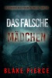

„Ein Meisterwerk des Thrillers und der Spannung.“ 
&#xa0;—Bücher und Filmkritiken, Roberto Mattos (zu Einmal Verschwunden) 
&#xa0;⭐⭐⭐⭐⭐ 
&#xa0; 
&#xa0;Als der forensische Toxikologe des FBI, Miles Sterling, eine erschütternde Entdeckung macht – dass ein Dutzend ungelöster Todesfälle des letzten Jahrzehnts jeweils einem Element des Periodensystems entsprechen – muss er sich beeilen, der Spur zu folgen und den Drahtzieher hinter diesen Morden zu finden – und ihn aufhalten, bevor er erneut zuschlägt… 
&#xa0; 
&#xa0;Im Herzen von San Francisco wird eine neue Leiche gefunden, ein weiteres Opfer des „Element-Killers“, eingehüllt in Gold. Was einst ein ungelöster Fall war, wird nun zur dringenden Priorität – während Miles Sterling all seine Brillanz einsetzt, um die Hinweise zu entschlüsseln – und dabei gefährlich nahe daran ist, selbst zum nächsten Ziel zu werden… 
&#xa0; 
&#xa0;Dies ist das erste Buch einer lang erwarteten neuen Serie des Nr. 1-Bestseller- und USA-Today-Bestsellerautors Blake Pierce. 
&#xa0; 
&#xa0;Die Miles-Sterling-Krimireihe nimmt Sie mit auf eine wilde Thrillerfahrt mit atemberaubendem Tempo und stellt einen brillanten Protagonisten vor, der sich mit all seinem Wissen an erschütternde Fälle wagt. Unwiderstehlich – die Wendungen und Überraschungen lassen Sie bis zum allerletzten Wort atemlos zurück. Fans von Rachel Caine, Teresa Driscoll und Lisa Gardner werden begeistert sein. 
&#xa0; 
&#xa0;„Ein Thriller, der Sie an den Rand Ihres Sitzes bringt – eine neue Serie, die Sie nicht mehr aus der Hand legen können! ...So viele Wendungen, Überraschungen und falsche Fährten… Ich kann es kaum erwarten, zu erfahren, wie es weitergeht.“ 
&#xa0;—Leserrezension (Ihr letzter Wunsch) 
&#xa0;⭐⭐⭐⭐⭐ 
&#xa0; 
&#xa0;„Eine starke, komplexe Geschichte über zwei FBI-Agenten, die versuchen, einen Serienmörder zu stoppen. Wenn Sie einen Autor suchen, der Ihre Aufmerksamkeit fesselt und Sie rätseln lässt, während Sie versuchen, die Puzzleteile zusammenzusetzen, dann ist Pierce Ihr Autor!“ 
&#xa0;—Leserrezension (Ihr letzter Wunsch) 
&#xa0;⭐⭐⭐⭐⭐ 
&#xa0; 
&#xa0;„Ein typischer Blake Pierce – eine Achterbahnfahrt voller Wendungen und Spannung. Sie werden die Seiten bis zum letzten Satz des letzten Kapitels umblättern!!!“ 
&#xa0;—Leserrezension (Stadt der Beute) 
&#xa0;⭐⭐⭐⭐⭐ 
&#xa0; 
&#xa0;„Schon von Anfang an haben wir einen ungewöhnlichen Protagonisten, wie ich ihn in diesem Genre noch nie gesehen habe. Die Action ist nonstop… Ein sehr atmosphärischer Roman, der Sie bis in die frühen Morgenstunden weiterlesen lässt.“ 
&#xa0;—Leserrezension (Stadt der Beute) 
&#xa0;⭐⭐⭐⭐⭐ 
&#xa0; 
&#xa0;„Alles, was ich mir von einem Buch wünsche… eine großartige Handlung, interessante Charaktere und es fesselt einen sofort. Das Buch nimmt von Anfang an ein atemberaubendes Tempo auf und bleibt bis zum Ende so. Jetzt geht es für mich weiter zu Band zwei!“ 
&#xa0;—Leserrezension (Mädchen, allein) 
&#xa0;⭐⭐⭐⭐⭐ 
&#xa0; 
&#xa0;„Spannend, atemberaubend, ein Buch, das Sie an den Rand Ihres Sitzes bringt… ein Muss für alle Krimi- und Spannungsfans!“ 
&#xa0;—Leserrezension (Mädchen, allein) 
&#xa0;⭐⭐⭐⭐⭐

[View on Apple](https://books.apple.com/de/book/das-falsche-m%C3%A4dchen-ein-spannender-miles-sterling-fbi/id6753728956)

## Dieken und die Saat des Todes: Ostfrieslandkrimi

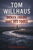

Ein Toter, der vom Himmel fiel. Eine Kommissarin, die an ihre Grenzen geht. Eine Waffe, die es nicht geben dürfte.

Mitten im ostfriesischen Nichts, auf einem frisch gepflügten Acker, wird die Leiche des Agrar-Titans Hinrich Janssen gefunden. Das Unheimliche daran: Zum Toten führen keine Spuren. Nur seine eigenen. Für Kriminalhauptkommissarin Rieke Holland beginnt der bizarrste Fall ihrer Karriere.

Während die Ermittlungen im Sande verlaufen und der Druck von oben wächst, offenbart die Autopsie eine noch schrecklichere Wahrheit: Janssen wurde Opfer eines perfekten, unsichtbaren Gifts, das keine Spuren hinterlässt. Um einen Mörder zu fassen, der die Gesetze der Physik außer Kraft zu setzen scheint, muss Rieke alles riskieren. Sie sucht Hilfe bei einem exzentrischen Biologen, einem Phantom, das die Sprache der Natur liest wie kein Zweiter. Gemeinsam jagen sie ein Genie, dessen Waffe tödlicher ist als alles, was sie sich je vorstellen konnte.

[View on Apple](https://books.apple.com/de/book/dieken-und-die-saat-des-todes-ostfrieslandkrimi/id6790843965)

## Make Something Wonderful

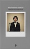

A curated collection of Steve’s speeches, interviews and correspondence, <i>Make Something Wonderful</i> offers an unparalleled window into how one of the world’s most creative entrepreneurs approached his life and work.   Across the pages of this book, Steve shares his perspective on his childhood, on launching and being pushed out of Apple, on his time with Pixar and NeXT, and on his ultimate return to the company that started it all.  Featuring an introduction by Laurene Powell Jobs and edited by Leslie Berlin, founding executive director of the Steve Jobs Archive, this beautiful handbook is designed to inspire readers to make their own “wonderful somethings” that move the world forward.

[View on Apple](https://books.apple.com/de/book/make-something-wonderful/id6446905902)

## Ein Sommer in Kirkby

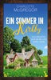

<i><b>Wenn ein kleines Dorf im Nirgendwo plötzlich zum Zentrum deiner Welt wird ...</b></i>  Lila Harper hat eine Mission: Um einen besseren Job als ihr Volontariat bei der Reitsportzeitschrift »Horse &amp; Hound« zu ergattern, reist sie zu entfernten Verwandten nach Kirkby. Ein Artikel über das schillernde Herrenhaus Monroe Manor soll ihr Karrieresprungbrett werden. Profireiter Cameron Sinclair wollte nie wieder nach Kirkby zurückkehren, doch sein wertvolles Springpferd Artemis verweigert auf einmal jede Zusammenarbeit. Jetzt kann nur noch sein alter Mentor, der Pferdeflüsterer Rupert Fraser helfen. Doch dann kommt alles anders: Exzentrische Dorfbewohner, eine wütende Exfreundin, Mister Spock und ein mythisches Wasserpferd in Loch Leary können nicht verhindern, dass zwischen Lila und Cameron die Funken sprühen und die Liebe einschlägt.  <b>Ein Sommer in Kirkby</b> ist ein in sich abgeschlossener Liebesroman, der im fiktiven schottischen Highland-Dorf Kirby spielt und bereits einige Figuren aus<b> Highland Hope</b> und <b>Highland Happiness</b> enthält - ganz ohne zu spoilern!  <b>Alle Kirkby-Geschichten auf einen Blick:</b> »Highland Hope – Ein Bed &amp; Breakfast für Kirkby«»Highland Hope – Ein Pub für Kirkby«»Highland Hope – Eine Destillerie für Kirkby«»Highland Hope – Eine Bäckerei für Kirkby«»Die Glückskuh von Kirkby« – kostenloser Kurzroman auf der Website der Autorin»Highland Happiness – Die Weberei von Kirkby« – 2023»Highland Happiness – Die Töpferei von Kirkby« – 2023»Highland Happiness – Das Herrenhaus von Kirkby« – 2023 <b>Leseprobe:</b>  »Willkommen auf Monroe Manor!« Lila Harper schluckte schwer, als sie an diesem erstaunlich milden Juli-Abend aus dem Auto ihrer Tante stieg – oder wie bezeichnete man die Frau des Cousins des eigenen Vaters? – und auf ihr Feriendomizil zulief. Sie war nicht sicher, ob sie lachen oder schreiend davonrennen sollte, denn das Ganze erinnerte sie an eine bizarre Version von Downton Abbey: Vor dem riesigen alten, zum Teil von Efeu umrankten Gemäuer hatten sich tatsächlich der Butler, die Köchin und der Schlossherr höchstpersönlich – ebenjener Cousin – aufgereiht und hießen sie willkommen. Zwei große Hunde flankierten Onkel George und rundeten das Begrüßungskomitee ab. »Hi«, entgegnete sie lahm. Das war vermutlich keine angemessene Replik, aber nach einer über neunstündigen Zugfahrt und der knappen Dreiviertelstunde im Auto ihrer dauerplappernden Tante Heather war ihre Eloquenz im Koma. Was ein bisschen schade war, denn mit wohlformulierten Sätzen verdiente sie sonst ihr Geld. Nein, das stimmte nicht ganz: Damit würde sie in Zukunft ihr Geld verdienen. Wenn in sechs Wochen ihr Volontariat in London begann, als Journalistin bei dem Magazin Horse &amp; Hound, das sie ungefähr so attraktiv fand wie eine Wurzelbehandlung beim Zahnarzt. Doch offenbar konnte man selbst mit einem glänzenden Master in Modejournalismus derzeit nicht wählerisch sein ... &#xa0;

[View on Apple](https://books.apple.com/de/book/ein-sommer-in-kirkby/id6443074598)

## Pride and Prejudice

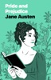

An Apple Books Classic edition.  Jane Austen’s beloved classic opens with this witty and very memorable line: “It is a truth universally acknowledged, that a single man in possession of a good fortune, must be in want of a wife.” With all the twists and turns of a soap opera, <i>Pride and Prejudice</i> chronicles the drama that ensues when the wealthy bachelor Mr. Darcy moves close to the Bennet family home in the English countryside. The news of his arrival sends the socially ambitious Mrs. Bennet-whose main concern is finding suitable matches for her five daughters-into overdrive.  The book’s main character, the high-spirited Elizabeth Bennet, is a strikingly modern heroine: a woman who refuses to lower her expectations or transform herself to suit society’s norms. Austen’s novel achieves a remarkable balance, serving up barbed criticism of the obsession with money, status, and matrimony even as it draws us into a swoon-worthy love story. At its heart, <i>Pride and Prejudice</i> is a romantic comedy, and a darned great one at that. It’s so much fun to turn the pages and wonder about Elizabeth and Mr. Darcy: Will they or won’t they overcome their excessive pride and initial prejudices to make a happily-ever-after connection?

[View on Apple](https://books.apple.com/de/book/pride-and-prejudice/id395534643)

## Mord in der Marsch: Ostfrieslandkrimi

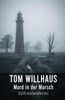

Ein Toter, den der Sturm zurückgibt. Ein Geheimnis, für das wieder gemordet wird.

Hauptkommissar Tim Roloffs, von der Großstadt an die Küste strafversetzt, glaubt, seinen Frieden mit der rauen See und den wortkargen Menschen gemacht zu haben. Doch als eine gewaltige Sturmflut die Sünden der Vergangenheit freispült – ein Jahrzehnte altes Skelett in der Marsch –, ist die trügerische Ruhe vorbei.

Kaum beginnen die Ermittlungen, erschüttert ein neuer, brutaler Mord die Region. Ein Geologe, der genau dort bohrte, wo die Leiche lag, wird in seinem Hotelzimmer hingerichtet. Für Roloffs wird klar: Der Mörder von damals ist immer noch da. Und er ist bereit, erneut zu töten, um sein Schweigen zu wahren.

Seine Jagd führt ihn tief in ein Netz aus Lügen, Macht und Korruption, das bis in die höchsten Kreise der angesehenen Küsten-Patriarchen reicht. In einer Gemeinschaft, in der jeder schweigt, muss Roloffs alles riskieren – denn der Sturm hat nicht nur einen Toten zurückgebracht, sondern auch einen Killer geweckt

[View on Apple](https://books.apple.com/de/book/mord-in-der-marsch-ostfrieslandkrimi/id6789511685)

## Dark Instinct: Dunkle Mafia Romance (Deutsche Ausgabe)

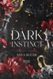

DAHLIA  Ich wollte den Teufel nie heiraten.  Doch als Pietro Zanetti – Roms meistgefürchteter Mafia-Erbe – mir einen Ring an den Finger steckte, beanspruchte er nicht nur meinen Körper. Er beanspruchte meine Seele.  Jeder Kuss brennt. Jedes Kommando zerstört mich.  Er ist mein Ehemann… und mein Entführer.  Und selbst wenn ich ihn hassen sollte, kann ich nicht aufhören, mich nach der Sünde in seiner Berührung zu sehnen.  PIETRO  Sie sollte meine Schwäche sein.  Stattdessen wurde sie meine Besessenheit.  In einer Welt, die auf Blut und Verrat aufgebaut ist, ist Liebe ein Risiko – und Dahlia ist das eine Geheimnis, das ich nicht begraben kann.  Ich werde sie beschützen, sie besitzen, und wenn jemand es wagt, das anzutasten, was mir gehört…  Werde ich die Welt in Schutt und Asche legen.  Das ist Band 1 der Dark Devotion Series. Lesereihenfolge:  Dark Instinct, Dark Temptation, Dark Craving.

[View on Apple](https://books.apple.com/de/book/dark-instinct-dunkle-mafia-romance-deutsche-ausgabe/id6781987486)

## Alice im Wunderland

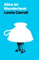

Der verrückte Hutmacher, die Grinsekatze, der Märzhase und die böse Herzkönigin – ein ganzes Arsenal liebenswert skurriler Figuren bevölkert das unterirdische Wunderland. Mittenhinein platzt das Menschenmädchen Alice und erlebt ein absurdes Abenteuer nach dem anderen. Erdacht hat sich das Ganze der britische Schriftsteller Lewis Carroll, dessen scheinbar grenzenloser Ideenreichtum auch heute noch verblüfft. Das vielfach verfilmte Werk hat die Kindheit unzähliger Menschen bereichert und unsere Kulturgeschichte nachhaltig beeinflusst. Auch für erwachsene Leser ist der zeitlose Kinderbuchklassiker eine inspirierende Fluchtmöglichkeit aus den Zwängen des Alltags. Wir würden dem weißen Kaninchen jederzeit wieder ins Wunderland folgen.

[View on Apple](https://books.apple.com/de/book/alice-im-wunderland/id492182617)

## Bibi & Miyu – Gratis Comic Tag

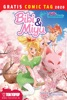

Bibi fliegt nach Japan! Bibi hat die Nase voll! Erst ein blöder Streit mit ihrem Vater und dann taucht auch noch eine neue Mitschülerin auf: Miyu aus Japan! Alle können sie sofort total gut leiden. Alle außer Bibi. Denn Miyu verbirgt ein Geheimnis. Es wird Zeit, dem auf den Grund zu gehen! Bibis Reise führt sie direkt nach Japan, ein aufregendes Land voller neuer Regeln und Zauberwesen. Und ganz schnell wird klar: Bibi und Miyu haben das Potenzial, beste Freundinnen zu werden!

[View on Apple](https://books.apple.com/de/book/bibi-miyu-gratis-comic-tag/id1530378981)

## Tochter der Zeit

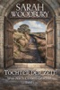

Als Mann des Mittelalters mit ungewissem Schicksal sieht sich Llywelyn, der Prinz von Wales, konfrontiert mit Verrat und Täuschung, von der Hand seiner Freunde ebenso wie von der seiner Feinde…

Meg ist eine moderne Frau mit schwieriger Vergangenheit. Ihr Leben ist aus den Fugen geraten, als sie durch die Zeit fällt und im mittelalterlichen Wales landet…

Nur gemeinsam können Meg und Llywelyn die Umwälzungen der politischen Allianzen meistern, welche die Existenz von Wales im Kern bedrohen – und nur gemeinsam können sie ihre eigene Geschichte gestalten, die den Gesetzen der Zeit trotzt. Tochter der Zeit ist die Vorgeschichte der After Cilmeri (Was nach Cilmeri geschah) Reihe.

**Anmerkung der Autorin: Ich freue mich sehr, diese Vorgeschichte zur After Cilmeri Reihe mit Ihnen teilen zu können. Als erste Bücher der Serie habe ich Spuren in der Zeit (Footsteps in Time) und Prinz der Zeit (Prince of Time) geschrieben. Tochter der Zeit ist erst entstanden, nachdem eine Vielzahl von Lesern wissen wollte, wie die Geschichte begann. Megs Reise geht weiter in Spuren in der Zeit und Wind der Zeit, einer Novelle, die als Begleitband zur Serie gedacht ist.
Viel Vergnügen beim Lesen!

In dieser Serie sind bisher in deutscher Sprache erschienen: Tochter der Zeit, Spuren in der Zeit, Wind der Zeit, Prinz der Zeit, Am Scheideweg der Zeit, Kinder der Zeit, Verschollen in der Zeit, Schiffbruch in der Zeit, Asche der Zeit, Beschützer der Zeit, Wächter der Zeit, Beherrscher der Zeit.

Das Begleitbuch zur Serie in englischer Sprache: This Small Corner of Time: The After Cilmeri Series Companion.

[View on Apple](https://books.apple.com/de/book/tochter-der-zeit/id1527443212)

## Sommer der Erinnerung

Die Vorgeschichte zum Sommer-Roman "Ein Sommer wie Limoneneis" von der Bestseller-Autorin Marie Matisek. 
Eine Geschichte über die Sehnsucht nach der Kindheit und die Suche nach den eigenen Wurzeln. 
Marco Pantanella lebt als erfolgreicher Anwalt in München, seine Heimat, die italienische Amalfi-Küste, hat er schon lange hinter sich gelassen. In letzter Zeit nagt ein leises Unbehagen an ihm, und als er bei einem Geschäftsessen mit einem Italiener ins Gespräch kommt, wandern seine Gedanken zurück in die Zeit, da er Kind gewesen ist - zu seinem Vater, dem zauberhaften Amalfi und zu jenem Tag, als er sich in der wilden Landschaft zu Hause verirrte …

[View on Apple](https://books.apple.com/de/book/sommer-der-erinnerung/id1333119493)

## Physik 7

Als Gewinner-Titel des Deutschen eBook Awards ist <i>Physik 7</i> eines der innovativsten Lehrwerke, das je entwickelt wurde, um Schüler:innen ein tiefgreifendes Verständnis für grundlegende physikalische Sachverhalte zu vermitteln.&#xa0;  
In diesem faszinierenden Apple Books Lehrbuch wird Schüler:innen der Lehrstoff übersichtlich, nachvollziehbar und interaktiv aufbereitet näher gebracht, wodurch das Entdecken, Lernen, Vertiefen und Wiederholen noch lebendiger, motivierender und inspirierender wird.  
In der siebten Jahrgangsstufe befassen sich Schüler:innen im Rahmen des Fachs „Natur und Technik“ mit der Physik und ihrer Bedeutung für diesen Bereich. Aufbauend auf ihrem Wissen über wissenschaftliches Arbeiten aus vorherigen Jahrgangsstufen entwickeln sie dieses in Hinblick auf die Physik weiter, indem sie sich mit verschiedenen Themenbereichen der Physik auseinandersetzen; dadurch wird den Schüler:innen bewusst, dass die Physik sowohl Erklärungsansätze als auch Implikationen für viele Bereiche des Lebens liefert.  
Konzept 
· Inhalte in Anlehnung an den bayerischen Lehrplan (G8): „Elektrizität“, „Mechanik“ und „Optik“ 
· Gezielter Lernweg: Einführungs-, Lern-, Wiederholungs- und Exkursabschnitte 
· Glossar: integriertes Physik-Lexikon zum Nachschlagen von Begriffen und zur Verwendung auf Lernkarten  
Design 
· Ausgezeichnet mit dem Deutschen eBook Award (Frankfurter Buchmesse 2014) für den didaktisch hervorragenden Einsatz von iBooks Author für die mediengerechte Umsetzung von Wissenschafts-Inhalten 
· Unterstützung verschiedener Lesemodi: Normal- und Scrollansicht 
· Optimierte Usability: vertraute Multi-Touch-Gesten, Systemschrift und LaTeX-Formeln  
Interaktivität 
· Medien: Galerien, interaktive Bilder, Audio &amp; Video 
· Popover und Scrollbalken: kontextuelles Einblenden relevanter bzw. weiterführender Hintergrundinformationen 
· Wiederholung: eigenständiges Überprüfen des aktuellen Lernstands anhand interaktiver Wiederholungsfragen mit sofortigem Feedback 
· Keynote: virtuell Experimente durchführen, in animierte Schaubilder eintauchen, Lösungsansätze mit Schritt-für-Schritt-Anleitungen nachvollziehen  
Hinweise: Dieses Lehrbuch wird voraussichtlich nicht mehr aktualisiert und wird neuen Benutzer:innen ab sofort kostenlos angeboten. Bitte beachte zudem, dass dieses Lehrbuch während meiner Schulzeit entstanden und daher auch in diesem Kontext zu betrachten ist. Aktualität, Richtigkeit und Vollständigkeit können deswegen nicht gewährleistet werden. Ich freue mich, wenn es dennoch für dich hilfreich ist. 
Änderungen am Angebot sowie Weiteres vorbehalten.

[View on Apple](https://books.apple.com/de/book/physik-7/id1032675692)

## Die drei Königinnen

Zunächst scheint es sich um einen Einbruch zu handeln, als ein junger Mann erschossen aufgefunden wird und der Hausherr die Tat gesteht. Aber dann wird der Fall immer rätselhafter: Was hat es mit den drei verschwundenen Queen Victoria-Figürchen auf sich? Und wieso haben die Nachbarn nichts gehört? Inspector Jones von Scotland Yard sucht in seiner Verzweiflung Rat bei Sherlock Holmes, und dank der bewährten Unterstützung durch Dr. Watson gelingt es dem Meisterdetektiv in kürzester Zeit, die verwirrenden Puzzleteile zu sortieren und dem staunenden Inspektor ein kaltblütiges Verbrechen zu enthüllen.

[View on Apple](https://books.apple.com/de/book/die-drei-k%C3%B6niginnen/id915745650)

## iPad an Schulen

Dieses E-Book hilft Ihnen dabei, einen Überblick zu erhalten, was alles getan werden sollte, damit die Entscheidung pro iPad in der Schule eine tragfähige und für alle beteiligten Personen ein zukunftsweisender Richtungswechsel werden wird. 
Denn mit dem Kauf der iPads alleine ist es nicht getan. Es gibt einige Dinge zu berücksichtigen, damit der Start problemfrei gelingt. Und je intensiver und klarer die Vorplanung, desto besser wird das Projekt umgesetzt werden können. Ziel ist ein moderner, digitaler und kreativer Unterricht, der die Kinder motiviert und für die Lehrer eine große Hilfe darstellt.

[View on Apple](https://books.apple.com/de/book/ipad-an-schulen/id1573895666)

## Kill for You: Dark Mafia Romance

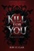

<b>DAHLIA</b>  <b>Früher glaubte ich an zarte Dinge.Rosa Schleifen, zuckersüße Lattes, sanfte Liebe, die höflich anklopfte, bevor sie dein Leben betrat.</b>  Dann trat Pietro Ferraro wieder in mein Leben.  Er war immer noch derselbe Sturm, den ich vor fünf Jahren getroffen hatte — leise, gefährlich, die Welt betrachtend, als schulde sie ihm Blut. Aber jetzt bewegt er sich wie ein König, spricht wie eine Drohung und trägt Gewalt so selbstverständlich wie andere Männer ihre Brieftaschen.  Wenn jemand versucht, mir ein Messer in die Brust zu stoßen, zögert er nicht. Er stellt sich vor mich. Blutet für mich. Und wenn ich ihn aus Angst und Erleichterung küsse, küsst er mich, als hätte er gehungert.  Aber Pietro gehört zu einer Welt, die ich niemals hätte berühren sollen. Milliardäre. Mafia-Gerüchte. Ausgemachte Verlobungen. Geheimnisse, die dunkler triefen als das Blut auf seiner Schulter.  <b>Er sagt, er würde für mich töten. Er sieht mich an, als hätte er es schon getan.</b>  &#xa0;  Und das Erschreckende daran?  <b>Ich glaube, ich würde es ihm erlauben.</b>  <b>PIETRO</b>  Ich wurde mit Loyalität, Macht und der Erkenntnis erzogen, dass Liebe eine Schwäche ist, die sich Männer wie ich nicht leisten können.  <b>Dann ist da Dahlia Quinn.</b>  Sanfte Stimme. Rosa Kleider. Augen, die mich ansehen, als wäre ich etwas, das es wert ist, gerettet zu werden.  Jemand versuchte, ihr weh zu tun. Das war ihr erster Fehler. Der zweite war zu fliehen.  Wegen Gewalt verliere ich keinen Schlaf. Ich bereue nicht, was ich Männern antue, die es verdient haben. Aber als sie mich auf einem Parkplatz küsste, zitternd und voller Angst, verlor ich fast die Kontrolle über alles, was ich jahrelang aufgebaut habe.  Sie weiß nicht, was ich bin. Sie weiß nicht, was mein Nachname wirklich bedeutet. Sie weiß nicht, dass das Blut an meinen Händen sie für immer beflecken würde, wenn sie zu nahe käme.  &#xa0;  <b>Aber sie ist bereits zu nah.</b>  Und wenn die Welt mich zwingt, zwischen meinem Imperium und ihr zu wählen?  Ich werde nicht zögern.  Ich werde das Imperium niederbrennen.  <i><b>Dies ist Buch 1 der Until Death‑Serie. Leseordnung: Kill for You, Die for You.</b></i>

[View on Apple](https://books.apple.com/de/book/kill-for-you-dark-mafia-romance/id6760651863)

## House of Thirst: Dark Vampire Romance (Deutsche Ausgabe)

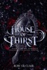

<b>SCARLETT</b>  <b>Ich lebte mein Leben im Glauben, gewöhnlich zu sein. Menschlich. Unauffällig in einer Welt, die nie zweimal hinsah. Diese Lüge zerbrach in dem Moment, als Aleksandr Noctov mich sah.</b>  In seiner Nähe zu sein fühlt sich an, als stünde ich zu nah an einem Sturm. Gefährlich. Rauschhaft. Unausweichlich. Seine Anwesenheit zieht etwas an, das tief in meinen Knochen vergraben liegt, etwas Uraltes, das erwacht, wenn er nahe ist.  Ich verstehe die Macht nicht, die unter meiner Haut summt, noch warum seine Berührung eine Finsternis zähmt, die alle anderen in Angst versetzt.  Man sagt, meine Seele habe schon zuvor gelebt. Dass sie mit Sicherheit verborgen war. Dass ich niemals gefunden werden sollte, bis zu ihm.  Aleksandr zu lieben heißt, eine Wahrheit zu akzeptieren, älter als Erinnerung, Blutlinien zu akzeptieren, die Königreiche und Götter durchqueren. Es bedeutet, ihn zu wählen, selbst wenn seine Schatten weit genug reichen, um die Welt zu verschlingen.  <b>Und trotzdem wähle ich ihn.</b>  <b>ALEKSANDR</b>  Ich wurde geschmiedet, um über Monster zu herrschen, und man fürchtet mich, weil ich selbst eines bin. Jahrhunderte der Herrschaft halten die Dunkelheit in mir gefesselt. Wut. Hunger. Macht, die selbst die Götter vernichten würden, kämen sie ihr auf die Spur.  <b>Dann erweckt Scarlett etwas in mir, das ich nie fühlen sollte.</b>  Sie beruhigt den Sturm, ohne es zu wollen. Ihre Gegenwart legt die uralte Seele in mir still, als erkenne sie in ihr eine Gleichgestellte. Ihr Gegenstück. Das Einzige, das mich zurückziehen kann, wenn ich am Abgrund stehe, alles zu werden, was man fürchtet.  Ich habe Reiche zu Grabe getragen für weniger als die Drohung, sie zu verlieren. Ich würde Reiche auseinanderreißen, bevor ich zuließe, dass irgendjemand an das rührt, was das Schicksal an mich gebunden hat.  Sie ist nicht zerbrechlich. Sie ist nicht menschlich in der Kunst, wie die Welt es versteht. Sie ist Erbe. Macht. Mein Verderben und mein Anker.  <b>Und wenn ihre Liebe bedeutet, das zu entfesseln, was ich seit Jahrhunderten eingesperrt halte, dann lasse die Welt erzittern.</b>  <b>Denn ohne sie war ich nie dafür bestimmt zu überleben.</b>  <i>Dies ist Band 1 der Reihe Haus des Purpurs. Leseordnung: Haus des Durstes, Haus des Hungers.</i>

[View on Apple](https://books.apple.com/de/book/house-of-thirst-dark-vampire-romance-deutsche-ausgabe/id6758740474)

## Zu spät (Ein spannender Morgan-Stark-FBI-Thriller – Buch 1)

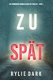

Morgan Stark, ein brillanter Arzt, ist fassungslos, als der Stationsarzt seines Krankenhauses ermordet aufgefunden wird, eindeutig das Werk eines Serienmörders. Das FBI braucht Morgan mit seinem medizinischen Fachwissen, um die subtilen medizinischen Hinweise zu entschlüsseln, die zu dem Mörder führen – aber kann er den Code knacken, bevor es zu spät ist? 
 
„Ein brillantes Buch. Ich konnte es nicht aus der Hand legen und hätte nie erraten, wer der Mörder ist.“ 
-Lesekritik zu NUR MORD 
 
ZU SPÄT ist der Debütroman einer neuen Serie der von Kritikern hochgelobten Krimi- und Spannungsautorin Rylie Dark, die auf Platz 1 der Bestsellerliste steht. 
 
Morgan Stark ist ein renommierter Chirurg, der von seinen Kollegen für seine brillanten Diagnosen gelobt wird. Doch als sein enger Freund und Schützling ermordet wird, sieht sich Morgan gezwungen, dem FBI zu helfen, die Spur der medizinischen Hinweise zu entschlüsseln und den Mörder vor Gericht zu bringen. 
 
FBI Special Agent Quinn Carter, 28, ein aufsteigender Stern in der BAU, die von ihren Kollegen für ihre Brillanz und Entschlossenheit gleichermaßen geschätzt wird, ist es nicht gewohnt, einen Arzt um Hilfe bei der Aufklärung von Verbrechen zu bitten. Diese unwahrscheinliche Kooperation könnte sie jedoch beide überraschen. 
 
Doch so brillant dieses Team auch ist – sie haben es mit einem teuflischen Superhirn zu tun, das vor nichts zurückschrecken wird, um sie zu überlisten. 
 
Und wenn sie zu tief in seine Gedankenwelt eindringen, könnte das ihr Ende bedeuten. 
 
Die MORGAN STARK-Krimireihe bietet einen Katz-und-Maus-Thriller mit erschütternden Wendungen und herzzerreißender Spannung, der dem Genre eine neue Wendung gibt und zwei brillante Protagonisten vorstellt, in die du dich verlieben wirst.  
 
Die Bücher #2 und #3 der Serie – ZU NAH und ZU WEIT GEGANGEN – sind jetzt ebenfalls erhältlich. 
 
„Ich habe diesen Thriller geliebt und in einer Session gelesen. Es gibt viele Wendungen und ich hätte den Täter nicht erraten … Ich habe den zweiten Band bereits vorbestellt.“ 
-Lesekritik zu NUR MORD 
 
„Dieses Buch fängt mit einem Knall an … Eine hervorragende Lektüre und ich freue mich schon auf das nächste Buch.“ 
-Lesekritik zu WIE SIE FLÜCHTET 
 
„Fantastisches Buch. Es war schwer, es aus der Hand zu legen. Ich kann es kaum erwarten, zu sehen, wie es weitergeht.“ 
-Lesekritik zu WIE SIE FLÜCHTET 
 
„Die Drehungen und Wendungen hielten mich auf Trab. Ich kann es kaum erwarten, das nächste Buch zu lesen!“ 
-Lesekritik zu WIE SIE FLÜCHTET 
 
„Ein Muss für alle, die actionreiche Geschichten mit guten Plots mögen!“ 
-Lesekritik zu WIE SIE FLÜCHTET 
 
„Ich mag diese Autorin sehr und diese Serie beginnt mit einem Paukenschlag. Sie fesselt dich bis zum Ende des Buches und macht Lust auf mehr. 
-Lesekritik zu WIE SIE FLÜCHTET 
 
„Ich kann diese Autorin gar nicht genug loben! Einfach nur sagenhaft! Diese Autorin wird es weit bringen!“ 
-Lesekritik zu WIE SIE FLÜCHTET 
 
„Dieses Buch hat mir wirklich gut gefallen … Die Charaktere waren lebendig und die Wendungen großartig. Es fesselt dich bis zum Ende und lässt dich nach mehr verlangen.“ 
-Lesekritik zu KEIN AUSWEG 
 
„Diese Autorin kann ich sehr empfehlen. Ihre Bücher lassen dich um mehr betteln.“ 
-Lesekritik zu KEIN AUSWEG

[View on Apple](https://books.apple.com/de/book/zu-sp%C3%A4t-ein-spannender-morgan-stark-fbi-thriller-buch-1/id6443274336)

## Lustige Witze

Wer liebt es nicht, zu lachen? Lachen ist gesund, macht glücklich und vertreibt die Sorgen. Und was gibt es Besseres, um zu lachen, als lustige Witze? In diesem Buch hat Norbert Reinwand die besten Witze aus allen Bereichen des Lebens gesammelt: von Politik über Sport bis hin zu Familie und Schule. Hier ist für jeden Geschmack etwas dabei, ob man nun schwarzen Humor mag, Wortspiele liebt oder einfach nur albern sein will. Dieses Buch ist die perfekte Lektüre für alle, die sich selbst und die Welt nicht zu ernst nehmen und gerne mal einen guten Witz reißen. Also, schnapp dir das Buch, schlag es auf und lass dich von Norbert Reinwands Humor anstecken. Du wirst dich vor Lachen kaum halten können!Inhalt:Kapitel 1: Lange Witze Kapitel 2: Kurze Scherzfragen

[View on Apple](https://books.apple.com/de/book/lustige-witze/id6466730290)

## Alphas Versuchung

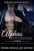

SIE GEHÖRT MIR. ICH WERDE SIE SCHÜTZEN. BESTRAFEN. MEIN. 
Ich bin ein einsamer Wolf, und das gefällt mir. Mein Geburtsrudel hat mich nach einem Blutbad verbannt und ich hatte nie das Bedürfnis nach einer Gefährtin. 
Dann treffe ich Kylie. Meine&#xa0;Versuchung. Wir stecken zusammen in einem Fahrstuhl fest und ihre Platzangst lässt sie fast in meinen Armen ohnmächtig werden. Sie ist stark, aber gebrochen. Und sie verheimlicht etwas. 
Mein Wolf will sie beanspruchen. Aber sie ist menschlich und ihr zartes Fleisch wird die Markierung eines Wolfes nicht überstehen. 
Ich bin zu gefährlich. Ich sollte mich fernhalten. Aber als ich herausfinde, dass sie die Hackerin ist, die fast meine Firma in den Ruin getrieben hat, verlange ich von ihr, sich ihrer Strafe zu stellen. Und das wird sie. 
Kylie gehört mir. 
Verlegerhinweis: Alphas&#xa0;Versuchung&#xa0;ist ein eigenständiger Roman in der Serie Bad Boy Alphas mit Happy End und ohne Fremdgehen. Dieses Buch beinhaltet einen heißen, fordernden Alphawolf mit einer Vorliebe dafür, sein Weibchen zu beschützen und zu dominieren. Wenn dir so etwas nicht gefällt, dann kaufe dieses Buch bitte nicht.

[View on Apple](https://books.apple.com/de/book/alphas-versuchung/id1536846769)

## Mörderisches Halleluja

"Wenn ich sage, ich habe mich mordsmäßig amüsiert, dann meine ich das durchaus wörtlich! Eine Empfehlung von Herzen!" Max Müller, Schauspieler, Sänger und Sprecher. Seit vielen Jahren begeistert er als Michi Mohr in der ZDF-Erfolgsserie die "Rosenheim Cops" ein Millionenpublikum  Im idyllischen oberbayerischen Fackenreuth, wo die Blumen blühen, die Bienen summen und die Bächlein murmeln, könnte das Leben nicht ruhiger sein. Dorfpolizist Xaver ist gerade mit Kleinkram-Problemen beschäftigt: Pfarrer Hartl vermisst Geld aus dem Klingelbeutel, und Xavers Freundin Bettina ist nicht gerade glücklich mit ihm, obwohl er keinen blassen Schimmer hat, warum.  Doch alles ändert sich, als Jesus im Wald auftaucht – zumindest glaubt das die tiefgläubige Monika. Denn während einige Fackenreuther die Wiederkehr des Heilands feiern, vermuten andere einen Schwindel. Doch die Wahrheit wird schnell blutiger als erwartet: Ein Mord geschieht, und noch während Xaver im Dunkeln tappt, wird auch Monika ermordet – ans große Kreuz in der Kirche genagelt. Und damit nimmt das Chaos seinen Lauf.  Satanisten, fanatische Christen und sogar eine päpstliche Kommission – angefordert vom Bischof, um die Echtheit Jesu zu überprüfen – ziehen ins Dorf. Doch Xaver ist noch mit der Lösung der Morde beschäftigt – und das ist schwieriger als gedacht. Und als wäre das alles noch nicht genug, scheint es erst der Anfang zu sein: Ein schwatzhafter Schweinebauer verschwindet, die Esel auf einem Reiterhof drehen durch, und plötzlich ist Fackenreuth von Schaulustigen, Medien und Gläubigen überrannt.  Xaver weiß bald nicht mehr, wo ihm der Kopf steht – das Dorf ist ein einziges mörderisches Halleluja.

[View on Apple](https://books.apple.com/de/book/m%C3%B6rderisches-halleluja/id6762044747)

## Vow of Silence: Mafia Romanze (Deutsch)

<b>🔥 ER GEHÖRT DER STADT — ABER DASS ICH IHM GEHÖRE, STAND NIE IM PLAN 🔥</b>  ★★★★★ "Silas Thorne ist der Antiheld, nach dem alle anderen blass wirken. Düster, brillant und furchteinflößend kontrolliert." – Leser*in  Man sagt, ich habe die Augen meines Großvaters, seine Anmut, sogar seine Gabe zur Restauration. Was sie mir verschwiegen, war, dass er abgrundtiefe Schulden hinterließ, die nun meinen Namen tragen. <b>Mein Name ist Elara Novak.</b> Und offenbar gehöre ich dem gefährlichsten Mann der Stadt.  Ich dachte, ich würde einen neuen Job anfangen – kein Krieg.  <b>Silas Thorne</b> ist ein König in einer <b>Welt der Schatten, die Art von Mann, der nicht fragt – er nimmt sich.</b> Er herrscht mit kalter Berechnung, nicht mit Mitgefühl, und er hat mir klargemacht: Ich bin jetzt sein Faustpfand. Mein Leben ist akribisch geordnet, jeder Pinselstrich kontrolliert – und er ist Chaos in maßgeschneiderter Perfektion.  Ich sollte Angst haben.  <b>Aber das Schlimmste ist: Ich bin es nicht. Ich sehe, wie er mich beobachtet, wie seine Wut in Verlangen brennt. Jedes Mal, wenn er mich als die Seine beansprucht, vergesse ich, dass ich jemals fliehen wollte.</b>  Die Schulden mögen mich hierhergebracht haben. <b>Aber was zwischen uns wächst… das ist etwas Dunkleres.</b> Etwas Bindendes.  <b>Und Silas gibt niemals zurück, was er beansprucht hat.</b>  <b>Band 1 von 3 in der </b><i><b>Vows of the Throne</b></i><b> Reihe – eine dunkle, obsessive Mafia-Romanze, in der Macht verführt, Loyalität trügt und Hingabe zum gefährlichsten Schwur wird.</b>  ⚠️ <i>Enthält psychologische Machtspiele, moralisch fragwürdige Entscheidungen und emotional komplexe Dynamiken. Für Leser</i>innen, die emotionale Intensität und langsame, gefährlich süchtig machende Spannung lieben.*

[View on Apple](https://books.apple.com/de/book/vow-of-silence-mafia-romanze-deutsch/id6790016742)

## Über Psychoanalyse

Die Psychoanalyse ist eine Reihe von psychologischen und psychotherapeutischen Theorien und damit verbundenen Techniken, die ursprünglich von österreichischen Arzt Sigmund Freud popularisierte und teilweise aus der klinischen Arbeit von Josef Breuer und andere ergeben. Seitdem hat sich die Psychoanalyse erweitert und überarbeitet, verbessert und in verschiedene Richtungen entwickelt. Dies war ursprünglich von Freuds Kollegen und Studenten, wie Alfred Adler und Carl Gustav Jung, der fortfuhr, ihre eigenen Ideen unabhängig von Freud zu entwickeln.

[View on Apple](https://books.apple.com/de/book/%C3%BCber-psychoanalyse/id511159517)

## Nie wieder Geheimnisse - Die TikTok Liebesroman Sensation jetzt GRATIS

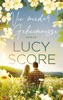

Small Town Romance von der Autorin des Weltbestsellers &#34;Things we never got over&#34;! 
 
&#34;Du erhebst also Besitzansprüche auf sie?&#34; 
&#34;Sie ist eine Frau, nicht das letzte Stück Kuchen. Und ja, ich erhebe Besitzansprüche, also lass die Finger von ihr.&#34; 
 
Als die New Yorker Modejournalistin Summer Lentz nach Blue Moon reist, um einen Artikel über ökologische Landwirtschaft zu schreiben, glaubt sie zuerst, versehentlich auf einer Modenschau für Männerunterwäsche gelandet zu sein. Carter Pierce sieht überhaupt nicht so aus, wie sie sich einen Farmer vorgestellt hat. Und seine beiden Brüder sind ebenso attraktiv. Kein Wunder, dass die Pierce-Männer die begehrtesten Junggesellen der Kleinstadt sind. 
 
Summer hatte eigentlich vor, nur eine Woche in Blue Moon zu verbringen, doch das fällt ihr zunehmend schwer. Denn die drei Brüder haben mehr zu bieten als nur definierte Bauchmuskeln. Sie sind warmherzig und immer füreinander da. Sie zeigen Summer, was echte Gemeinschaft bedeutet - auch wenn es mal den einen oder anderen Streit um eine Frau gibt. 
 
Doch Summer weiß, dass sie nicht in Blue Moon bleiben kann. Sie hat nicht nur eine Karriere und ein Leben in New York. Sie hat ein Geheimnis. Eines, das sie niemandem verraten kann. 
Nicht einmal Carter, der sich mit Geheimnissen gut auskennt. 
 
*** 
 
Die ganz große Kleinstadt Liebe 
In der Kleinstadt Blue Moon bleibt niemand lange Single. Dafür sorgt das geheime Komitee für Lebensqualität. 
Ihr neuestes Verkupplungsprojekt: die drei attraktiven Pierce-Brüder. Nur wissen die noch nichts von ihrem Glück. 
 
So unterschiedlich Carter, Beckett und Jack auch sein mögen, eines haben sie gemeinsam: Sie sind überzeugte Junggesellen. 
 
Bis die richtige Frau vorbeikommt ...  
 
In acht Bänden hat Amazon Nr.1 Autorin Lucy Score mit ihrer Saga über Blue Moon und die Pierce-Brüder eine Welt erschaffen, die Millionen Lesern ein Zuhause wurde.

[View on Apple](https://books.apple.com/de/book/nie-wieder-geheimnisse-die-tiktok-liebesroman-sensation/id6467653375)

## Die Zauberfabrik (Oliver Blue und die Schule für Seher - Buch Eins)

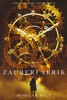

„Ein starker Startschuss zu einer Serie, die eine gute Mischung aus lebhaften Protagonisten und herausfordernden Situationen bietet und nicht nur jugendliche, sondern&#xa0; auch erwachsene Fantasy-Fans mit epischen Geschichten über starke Freundschaften und Feindschaften in ihren Bann zieht.“ 
--Midwest Book Review (Diane Donovan) (über <i>A Throne for Sisters</i>)  
„Morgan Rices Ideenreichtum ist grenzenlos!” 
--Books and Movie Reviews (über <i>A Throne for Sisters</i>)  
Vom #1 Fantasy Bestsellerautor Morgan Rice kommt eine neue Serie für junge Leser — und auch Erwachsene! Fans von Harry Potter und Percy Jackson – aufgepasst!  
DIE ZAUBERFABRIK: OLIVER BLUE UND DIE SCHULE FÜR HELLSEHER (BUCH EINS) erzählt die Geschichte&#xa0; des elfjährigen Oliver Blue, der von seiner Familie nicht geliebt wird. Oliver weiß, dass er anders ist und er spürt, dass er Fähigkeiten besitzt, die andere nicht haben. Er ist besessen von Erfindungen und fest entschlossen, seinem schrecklichen Leben zu entkommen und es zu etwas zu bringen.&#xa0;  
Als Olivers Familie in das nächste heruntergekommene Haus zieht, wird er in eine neue sechste Klasse geschickt, die noch schrecklicher ist als die letzte. Er wird ausgeschlossen und schikaniert. Oliver sieht keinen Ausweg mehr. Doch dann stolpert er über eine verlassene Fabrik, in der einst wundersame Gerätschaften erfunden wurden. Plötzlich könnte es sein, dass seine Träume doch wahr werden.&#xa0;  
Wer ist der geheimnisvolle alte Mann, der sich in der Fabrik versteckt?&#xa0;  
Was ist seine geheime Erfindung?&#xa0;  
Wird Oliver am Ende in die Vergangenheit zurückversetzt, um im Jahre 1944 an einer magischen Schule für Kinder mit besonderen Fähigkeiten seine eigenen übernatürlichen Kräfte zu erforschen?  
DIE ZAUBERFABRIK ist das erste Buch einer belebenden Fantasy-Reihe voller Magie, Liebe, Humor, Tragik und schicksalhaften Begegnungen, die immer überraschende Wendungen bereithält. Sie werden Oliver Blue lieben und seine Erlebnisse bis tief in die Nacht hinein nicht aus der Hand legen können.  
Buch #2 (DIE KUGEL VON KANDRA) und Buch #3 (DIE OBSIDIANE) der Reihe sind auch bereits erhältlich! 
&#xa0; 
„Der Beginn einer bemerkenswerten Geschichte.”&#xa0; 
--San Francisco Book Review (über <i>A Quest of Heroes</i>)

[View on Apple](https://books.apple.com/de/book/die-zauberfabrik-oliver-blue-und-die-schule-f%C3%BCr-seher/id1446054480)

## Die Tochter der Toskana – wie alles begann

Italien, 1832: Antonella lebt in einem kleinen Dorf in der Toskana. Ihr Traum ist es, zu kochen und Wein anzubauen. Doch das Schicksal hat etwas anderes für sie im Sinn. 
Michele wurde gegen seinen Willen zum Studium nach Pisa geschickt. Dann aber erkennt er seine wahre Berufung und setzt alles aufs Spiel, sogar sein Leben.

Die Geschichte einer starken Frau zur Zeit der italienischen Freiheitskämpfe - lesen Sie in diesem kostenlosen E-Book, wie alles begann.

[View on Apple](https://books.apple.com/de/book/die-tochter-der-toskana-wie-alles-begann/id1325520862)

## Mathematik Oberstufe: Analysis

Inspiriert vom Gewinner-Titel des Deutschen eBook Awards ist <i>Mathematik Oberstufe: Analysis</i> eines der innovativsten Lehrwerke, das je entwickelt wurde, um Schüler:innen ein tiefgreifendes Verständnis für fortgeschrittene mathematische Sachverhalte zu vermitteln.&#xa0;  
In diesem faszinierenden Apple Books Lehrbuch wird Schüler:innen der Lehrstoff übersichtlich, nachvollziehbar und interaktiv aufbereitet näher gebracht, wodurch das Entdecken, Lernen, Vertiefen und Wiederholen noch lebendiger, motivierender und inspirierender wird.  
In der Oberstufe befassen sich die Schüler:innen im Mathematikunterricht mit komplexen mathematischen Denkweisen und Sachverhalten, wobei die bereits in den unteren Jahrgangsstufen begonnene und stetig ausgebaute Funktionenlehre einen Schwerpunkt bildet; der bereits in der zehnten Jahrgangsstufe eingeführte Grenzwertbegriff wird erweitert; basierend darauf erlernen Schüler:innen die Methoden der Differential- und&#xa0; Integralrechnung, wodurch sie komplexere Anwendungsaufgaben lösen können, wie etwa aus Natur, Technik und Wirtschaft. Zudem entwickeln Schüler:innen ein tiefes Verständnis für funktionale Zusammenhänge und können diese entsprechend visualisieren.  
Konzept 
· Inhalte in Anlehnung an den bayerischen Lehrplan (G8): Themenkomplex „Analysis“ 
· Gezielter Lernweg: stringente und logische Grundstruktur zur Vor- und Nachbereitung des Lehrstoffs für den Unterricht, Klausuren sowie schließlich die Abiturprüfung 
· Klarer Fokus auf Wissensvermittlung: ausführliche Behandlung von Herleitungen und einzelnen Rechenschritten, anschauliche Darstellung des Lehrstoffs, Verzicht auf „Rechenaufgaben“  
Design 
· Fachspezifische Adaptation und Weiterentwicklung des mit dem Deutschen eBook Award ausgezeichneten Designs 
· Hochformat mit eleganter Seitenleiste für übersichtliche Buchseiten mit zusätzlichen Materialien per Fingertipp 
· Optimierte Usability: vertraute Multi-Touch-Gesten, Systemschrift und LaTeX-Formeln  
Interaktivität 
· Medien: intelligente Bilder mit adaptiver Miniatur- und Vollbildansicht von Graphen 
· Popover: kontextuelles Einblenden relevanter bzw. weiterführender Informationen wie beispielsweise Rechenwege, Tipps und Beispiele 
· Keynote: durch Animationen Zusammenhänge erkennen, Lösungsansätze mit Schritt-für-Schritt-Anleitungen nachvollziehen 
· LiveGraph: direkte Interaktion mit dynamischen Graphiken zur Entwicklung eines besseren Verständnisses für mathematische Konzepte, Veränderung der Parameter von verschiedenen Funktionstypen mit Echtzeit-Visualisierung  
Hinweise: Dieses Lehrbuch wird voraussichtlich nicht mehr aktualisiert und wird neuen Benutzer:innen ab sofort kostenlos angeboten. Bitte beachte zudem, dass dieses Lehrbuch während meiner Schulzeit entstanden und daher auch in diesem Kontext zu betrachten ist. Aktualität, Richtigkeit und Vollständigkeit können deswegen nicht gewährleistet werden. Ich freue mich, wenn es dennoch für dich hilfreich ist. 
Änderungen am Angebot sowie Weiteres vorbehalten.

[View on Apple](https://books.apple.com/de/book/mathematik-oberstufe-analysis/id1150017233)

## Physik 8

Als Grundlage für den Gewinner-Titel des Deutschen eBook Awards ist <i>Physik 8</i> eines der innovativsten Lehrwerke, das je entwickelt wurde, um Schüler:innen ein tiefgreifendes Verständnis für grundlegende physikalische Sachverhalte zu vermitteln.&#xa0;  
In diesem faszinierenden Apple Books Lehrbuch wird Schüler:innen der Lehrstoff übersichtlich, nachvollziehbar und interaktiv aufbereitet näher gebracht, wodurch das Entdecken, Lernen, Vertiefen und Wiederholen noch lebendiger, motivierender und inspirierender wird.  
In der achten Jahrgangsstufe erweitern und vertiefen Schüler:innen ihre Erfahrungen und Kenntnisse aus dem Fach „Natur und Technik“, indem sie sich erstmals mit der Physik im Rahmen eines eigenständigen Unterrichtsfaches befassen, wodurch sie ihre Fertigkeiten hinsichtlich wissenschaftlicher Arbeitsweisen zur Erkenntnisgewinnung sowie logischer Argumentation weiterentwickeln. Durch Themen wie der Energieerhaltung lernen Schüler:innen wichtige, grundlegende Prinzipien kennen, welche nicht nur sämtliche Teilbereiche der Physik tangieren, sondern in allen Naturwissenschaften vorzufinden sind.  
Konzept 
· Inhalte in Anlehnung an den bayerischen Lehrplan (G8): „Energie“, „Aufbau der Materie und Wärmelehre“ und „Elektrizität“ 
· Gezielter Lernweg: Lern- und Wiederholungsabschnitte; lässt Raum für ergänzende Inhalte aus dem Profilbereich (NTG) 
· Glossar: integriertes Physik-Lexikon zum Nachschlagen von Begriffen und zur Verwendung auf Lernkarten  
Design 
· Basiert auf dem mit dem Deutschen eBook Award ausgezeichneten Design 
· Unterstützung verschiedener Lesemodi: Normal- und Scrollansicht 
· Optimierte Usability: vertraute Multi-Touch-Gesten, Systemschrift und LaTeX-Formeln  
Interaktivität 
· Medien: Galerien, interaktive Bilder, Audio &amp; Video 
· Popover und Scrollbalken: kontextuelles Einblenden relevanter bzw. weiterführender Hintergrundinformationen 
· Wiederholung: eigenständiges Überprüfen des aktuellen Lernstands anhand interaktiver Wiederholungsfragen mit sofortigem Feedback 
· Keynote: virtuell Experimente durchführen, in animierte Schaubilder eintauchen, Lösungsansätze mit Schritt-für-Schritt-Anleitungen nachvollziehen  
Hinweise: Dieses Lehrbuch wird voraussichtlich nicht mehr aktualisiert und wird neuen Benutzer:innen ab sofort kostenlos angeboten. Bitte beachte zudem, dass dieses Lehrbuch während meiner Schulzeit entstanden und daher auch in diesem Kontext zu betrachten ist. Aktualität, Richtigkeit und Vollständigkeit können deswegen nicht gewährleistet werden. Ich freue mich, wenn es dennoch für dich hilfreich ist. 
Änderungen am Angebot sowie Weiteres vorbehalten.

[View on Apple](https://books.apple.com/de/book/physik-8/id1032717000)

## Das Festival der Liebe (Die Liebe auf Reisen – Buch #1)

„Sophie Loves Fähigkeit, bei ihren Lesern Magie zu bewirken, zeigt sich in ihrem höchst inspirierenden Ausdruck und den lebendigen Beschreibungen…FÜR JETZT UND FÜR IMMER ist der perfekte Liebes- oder Strandroman, der sich von anderen abhebt: seine mitreißende Begeisterung und die wunderschönen Beschreibungen machen deutlich, wie komplex die Liebe und auch die Gedanken der Menschen sein können. Dieses Buch ist perfekt geeignet für Leser, die nach einem Liebesroman mit Tiefgang suchen.“ 
--Midwest Book Review (Diane Donovan über Für jetzt und für immer)  
„Ein sehr gut geschriebener Roman, in dem es um die inneren Kämpfe geht, die eine Frau durchstehen muss, um ihr wahres Ich zu finden. Der Autorin gelang die Ausarbeitung der Charaktere und die Beschreibung der Handlung wunderbar. Romantik ist zwar Teil der Geschichte, doch sie ist nicht erdrückend. Ein Lob an die Autorin für diesen wunderbaren Auftakt einer Reihe, die verspricht, äußerst unterhaltsam zu werden.“ 
--Books and Movies Reviews, Roberto Mattos (über Für jetzt und Für immer)  
DAS FESTIVAL DER LIEBE (DIE LIEBE AUF REISEN – BUCH #1) ist der erste Band einer neuen Romanreihe der Bestseller-Autorin Sophie Love.  
Keira Swanson, 28, ergattert ihren Traumjob als aufstrebende Journalistin bei <i>Viatorum</i>, einem Hochglanz-Reisemagazin in New York City. Aber hinter den Kulissen brodelt es gewaltig, denn ihr Boss ist ein Monster und sie weiß nicht, wie lange sie das aushält.  
Das ändert sich, als Keira eher zufällig einen wichtigen Auftrag erhält, der für sie die große Chance bedeutet: eine Reise für 30 Tage, nach Irland, um dort an dem legendären Festival der Liebe in Lisdoonvarna teilzunehmen. Sie soll mit dem Mythos aufräumen, dass es die wahre Liebe wirklich gibt. Keira, selber überaus zynisch und in einer schwierigen Phase in ihrer Beziehung, ist nur allzu bereit, sich in das Abenteuer zu stürzen.  
Aber dann verliebt sie sich in Irland und begegnet ihrem irischen Tourguide, der sich als Mann ihrer Träume entpuppen könnte und das stellt einfach alles in Frage.  
Eine stürmisch-romantische Komödie, tiefsinnig und humorvoll. DAS FESTIVAL DER LIEBE ist der erste Band einer bezaubernden neuen Romance-Reihe, die dich zum Lachen und zum Weinen bringen wird und die man nicht mehr aus der Hand legen kann. Du wirst dich ganz neu in die Romantik verlieben.  
Band 2 ist in Vorbereitung.

[View on Apple](https://books.apple.com/de/book/das-festival-der-liebe-die-liebe-auf-reisen-buch-1/id1277200396)

## Die Diebe von Venedig 1 Kinderbuch GRATIS

Alles ist Schein. Die Wahrheit unvorstellbar. Besonders nachts in Venedig. 
 
 
Der junge Taschendieb Drago weiß, wie man in Venedig überlebt. Er ist der Junge, der mit den Schatten verschmilzt. Der weg ist, bevor man sich umdreht – zusammen mit der Uhr und dem Geldbeutel.  
Doch einem entkommt Drago nicht: dem geheimnisvollen Gelehrten Hannibal Rabe. Er gibt Drago einen Auftrag, den er nicht ablehnen kann. Denn Rabe ist nicht der, für den ihn Drago anfangs hält … 
 
Tauche ein in die geheimnisvolle Welt der Betrüger und Diebe und decke mit Drago eine Verschwörung dunkler Magier auf. Denn ein Geheimnis schlummert in der Stadt, in der die Zeit einst stehen blieb … 
 
Eine märchenhafte Trilogie für alle Leser ab 10 bis 99 
Fans von Percy Jackson, Gregors Reise und Herr der Diebe werden Dragos Geschichte lieben!

[View on Apple](https://books.apple.com/de/book/die-diebe-von-venedig-1-kinderbuch-gratis/id6738928844)

## Jenseits von Gut und Böse

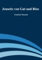

Jenseits von Gut und Böse. Vorspiel einer Philosophie der Zukunft ist ein Werk Friedrich Nietzsches, das im Jahr 1886 erschien und auf eine Kritik überkommener Moralvorstellungen zielt. Das Werk bildet den Übergang von Nietzsches mittlerer, eher dichterisch, positiv geprägten Schaffensperiode zu seinem von philosophischem Denken dominierten späteren Werk. Dies kommt auch im Untertitel des Werks „Vorspiel einer Philosophie der Zukunft“ zum Ausdruck. [1] Jenseits von Gut und Böse war das Denken in der prähistorischen Zeit, in der Handlungen nach ihrer Wirkung beurteilt wurden. Die Moral kam erst, als man Handlungen nach ihrer Absicht beurteilte. Nietzsches Forderung war, wieder zu der Perspektive der vormoralischen Zeit zurückzukehren. Er suchte eine Moral jenseits bestehender Normen und Werte, die nicht an die historische, von der Religion beeinflusste Tradition gebunden ist.

[View on Apple](https://books.apple.com/de/book/jenseits-von-gut-und-b%C3%B6se/id666814403)

## Effi Briest

Mit über 75 Jahren legt Theodor Fontane 1896 einen Gesellschaftsroman vor, der stilprägend für die ganze Gattung sein sollte und auch Schriftsteller wie Thomas Mann nachhaltig beeinflusste. Das Meisterwerk des poetischen Realismus erzählt die Geschichte der 17-jährigen Effi Briest, deren unglückliche Zwangsehe mit einem wesentlich älteren Mann sie in eine Affäre treibt, die eine Lawine tragischer Ereignisse auslöst. Intelligent und geistreich kritisiert Fontane die bürgerliche Moral der Wilhelminischen Ära, in der echte Emotionen keinen Platz hatten. Gefühlvoll durchdringt er das Seelenleben seiner Protagonistin und spricht ihr im wahrsten Sinne des Wortes aus dem Herzen. Dieses wunderbare Buch ist definitiv eine Wiederentdeckung wert.

[View on Apple](https://books.apple.com/de/book/effi-briest/id500447460)

## A single day

<b>Ein einziger Tag kann dein Leben für immer verändern – sichere dir jetzt das kostenlose Bonuskapitel zur "L.O.V.E."-Reihe von Ivy Andrews!</b>  Für Val und Parker sollen endlich die Hochzeitsglocken läuten, doch die Feier droht zu platzen – und dann verschwindet auch noch das Brautkleid! Wie gut, dass Val mit Libby, Oxy und Ella nicht nur drei Freundinnen fürs Leben gefunden hat, sondern auch drei clevere Designerinnen. Gemeinsam machen sich die vier Frauen der L.O.V.E.-WG daran, den großen Tag zu retten. Dieses E-Book ist eine kostenlose Kurzgeschichte zur "L.O.V.E."-Reihe von Ivy Andrews.  <b>Die L.O.V.E.-Reihe bei Blanvalet:</b> Band 1: A single night (Libby &amp; Jasper) Band 2: A single word (Oxy &amp; Henri) Band 3: A single touch (Val &amp; Parker) Band 4: A single kiss (Ella &amp; Callum) Bonuskapitel: A single day  Alle Bände können auch unabhängig voneinander gelesen werden.  Die Autorin schreibt auch unter den Pseudonymen Ava Innings und Violet Truelove.

[View on Apple](https://books.apple.com/de/book/a-single-day/id1549457007)

## Eisiger Tod (Wegners erste Fälle)

<b>Januar 1979:</b> Nach einigen Jahren im Streifendienst tritt Manfred Wegner seinen ersten Posten bei der Hamburger Mordkommission an. Was mit Bergen von Akten und Langeweile beginnt, ändert sich abrupt, als die Leiche eines Rentners unter Schneemassen gefunden wird. Mehr und mehr stellt Wegners erster Fall nicht nur ihn, sondern auch seinen kauzigen Chef auf die Probe. Nach dem bestialischen Mord an einer Bauernfamilie nimmt der Druck auf das neue Ermittler-Team jeden Tag zu ... <b>(Jeder Wegner-Fall ist eine in sich abgeschlossene Geschichte. Aber natürlich kann es nicht schaden, wenn man auch die vorangegangenen, also seine schwersten Fälle kennt ...;)</b>&#xa0; <b>Eisiger Tod</b> ist der Start in die neue Serie <b>Wegners erste Fälle</b>. Wer zuvor schon seine schwersten Fälle mitverfolgt hat, möchte sicherlich wissen, wie es mit dem Raubein angefangen hat. Begleiten wir Manfred Wegner, damals nicht mal 25, auf seinem Weg an die Spitze der Hamburger Mordkommission ... <b>Lektorat/Korrektorat: Michael Lohmann</b> &#xa0; <b>Aus der Reihe Wegners erste Fälle:</b>»Eisiger Tod« (Teil 1)»Feuerprobe« (Teil 2)»Blinde Wut« (Teil 3)»Auge um Auge« (Teil 4)»Das Böse« (Teil 5)»Alte Sünden« (Teil 6)»Vergeltung« (Teil 7)»Martin« (Teil 8)»Der Kiez« (Teil 9)»Die Schatzkiste« (Teil 10)<b>Aus der Reihe Wegner &amp; Hauser (Hamburg: Mord)</b>»Mausetot« (Teil 1)»Psycho« (Teil 2)<b>Aus der Reihe Wegners schwerste Fälle:</b>»Der Hurenkiller« (Teil 1)»Der Hurenkiller – das Morden geht weiter …« (Teil 2)»Franz G. - Thriller« (Teil 3)»Blutige Rache« (Teil 4)»ErbRache« (Teil 5)»Blutiger Kiez« (Teil 6)»Mörderisches Verlangen« (Teil 7)»Tödliche Gier« (Teil 8)»Auftrag: Mord« (Teil 9)»Ruhe in Frieden« (Teil 10)<b>Aus der Reihe Wegners letzte Fälle:</b>»Kaltes Herz« (Teil 1)»Skrupellos« (Teil 2)»Kaltblütig« (Teil 3)»Ende gut, alles gut« (Teil 4)»Mord: Inklusive« (Teil 5)»Mörder gesucht« (Teil 6)»Auf Messers Schneide« (Teil 7)»Herr Müller« (Teil 8)<b>Aus der Reihe "Hannah Lambert ermittelt":</b>»Ausgerechnet Sylt« (1)»Eiskaltes Sylt« (2)»Mörderisches&#xa0;Sylt« (3)»Stürmisches Sylt« (4)»Schneeweißes Sylt« (5)»Gieriges Sylt« (6)»Turbulentes Sylt« (7)<b>Aus der Reihe "Zwischen Mord und Ostsee":</b>»Nasses Grab« (1)»Grünes Grab« (2)<b>Weitere Titel aus der Reihe Auftrag: Mord!:</b>»Der Schlitzer« (Teil 1)»Deutscher Herbst« (Teil 2)»Silvana« (Teil 3)<b>Unter meinem Pseudonym „Thore Holmberg“:</b>»Marthas Rache« (Schweden-Thriller)»XIII« (Thriller)<b>Weitere Titel:</b>»Zwischen Schutt und Asche« (Nachkrieg:&#xa0;Hamburg in Trümmern 1)»Zwischen Leben und Tod« (Nachkrieg: Hamburg in Trümmern 2)»E.S.K.E.: Blutrausch« (Serienstart E.S.K.E.)»E.S.K.E.: Wiener Blut« (Teil 2 - E.S.K.E.)»Ansonsten lächelt nur de[...]

[View on Apple](https://books.apple.com/de/book/eisiger-tod-wegners-erste-f%C3%A4lle/id6476964662)

## Ein Planet, viele Welten

Zum zweiten Mal bat das Auswärtige Amt Kinder und Jugendliche bis zu 17 Jahren, ihre Gedanken und Geschichten aufzuschreiben. Über 200 junge Menschen aus der ganzen Welt folgten dem Aufruf und schickten ihre Kurzgeschichten, Tagebucheinträge, Gedichte und Aufsätze, die unter dem Thema „Ein Planet, viele Welten“ versammelt sind.  

Die Kinder und Jugendlichen beschreiben ihre Begegnungen mit fremden Sprachen, Lebens- und Essgewohnheiten, mit Bräuchen und Religionen auf ihren Reisen und im Schüleraustausch. Sie schreiben über Beziehungen mit Klassenkameraden und Freunden, die aus fremden Lebenswelten kommen, über Unterschiede und Gemeinsamkeiten zwischen den Kulturen, über Flucht und Vertreibung ebenso wie über ihre Fantasien, Hoffnungen und Träume. Und am Ende ist für sie nur eines wichtig: Wir sind alle Menschen. 

Die zahlreichen Geschichten zeigen die Neugier der jungen Menschen auf die Welt und auf andere Kulturen, aber auch die Lust am Schreiben.

[View on Apple](https://books.apple.com/de/book/ein-planet-viele-welten/id1145827658)

## Birds of Paris – Die Goldene Feder

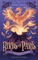

Wünscht du dir auch manchmal, dass es Magie wirklich gibt? Dann geht es dir so wie Ari! Natürlich weiß er, dass es Magie nur in Büchern gibt, aber wäre es nicht schön, wenn ...? Eines Tages trifft Ari mitten in Paris auf einen Jungen, der sich wie ein Akrobat bewegt und sogar an Hausfassaden hochklettern kann. Er trägt eine geheimnisvolle Federmaske und eine innere Stimme flüstert Ari zu, dem Jungen zu folgen. Ari taucht ein in ein Leben voller Abenteuer und Magie – und er findet die besten Freunde, die man sich nur wünschen kann.  Bist DU bereit für Magie? Dann folge Ari und seinen Freunden in die magische Unterwelt von Paris!  Eine Birds-of-Paris-Prequel für alle Fans und Neueinsteiger.

[View on Apple](https://books.apple.com/de/book/birds-of-paris-die-goldene-feder/id6737915804)

## The Little Prince

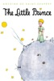

The Little Prince is a novella written by Antoine de Saint-Exupéry. First published in 1943, it tells the story of a young prince who travels from planet to planet, meeting various characters and learning important life lessons. The book is a philosophical and poetic exploration of themes such as friendship, love, and the human condition. It is considered a classic of children's literature and has been translated into over 300 languages. It is also a popular and enduring work of adult literature. It is a simple yet profound story that has been enjoyed by generations of readers of all ages.

[View on Apple](https://books.apple.com/de/book/the-little-prince/id6445534612)

## Eine Welt für dich und mich

Über 300 schreibbegeisterte Kinder und Jugendliche folgten in diesem Jahr dem Aufruf des Auswärtigen Amts, ihre eigene Geschichte zu erzählen. Unter dem Motto „Eine Welt für dich und mich“ sind die Kurzgeschichten, Tagebucheinträge und Gedichte junger Autorinnen und Autoren aus der ganzen Welt versammelt, die über ihre Fantasien, Hoffnungen und Träume schreiben: In was für einer Welt wollen sie leben? Wie wollen sie leben? Was wünschen sie sich für sich selbst, aber auch für andere? Was kann jeder Einzelne, was können Politik und Gesellschaft dafür tun, diese Wunschwelt zu realisieren?
Die eingesandten Geschichten sind nach Alterskategorien in bis 10 Jahre, 11 bis 14 Jahre und 15 bis 19 Jahre sortiert.

[View on Apple](https://books.apple.com/de/book/eine-welt-f%C3%BCr-dich-und-mich/id1387793803)

## Die Verlassenen

Ree Hutchins arbeitet als Praktikantin in einer psychiatrischen Klinik. Sie kümmert sich vor allem um Violet Tisdale: eine alte Dame, die abgeschottet und allein im Südflügel der Klinik lebt. Als Violet stirbt, findet Ree heraus, dass Violet geistig völlig gesund war und zu unrecht ihr Leben in der Klinik verbracht hat. Doch was hat der Friedhof von Oak Grove, der offenbar ein finsteres Geheimnis birgt, damit zu tun? Ree beginnt, der Sache nachzugehen. Dabei sucht sie Hilfe bei Amelia Gray, die den Friedhof Oak Grove restaurieren soll. Die Frau, die man auch "die Friedhofskönigin" nennt, und die jedes Geheimnis der Toten aufdecken kann.   Dieses eBook enthält eine Leseprobe von "Totenhauch", Band 1 der Graveyard-Queen Reihe von Amanda Stevens.  Die Graveyard-Queen Reihe jetzt als eBook bei beTHRILLED  - mörderisch gute Unterhaltung

[View on Apple](https://books.apple.com/de/book/die-verlassenen/id1324017620)

## Das nächste Mädchen (Ein Meg-Thorne-Thriller – Band 1)

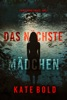

„Das ist ein hervorragendes Buch… Wenn Sie zu lesen beginnen, stellen Sie sicher, dass Sie am nächsten Morgen nicht früh aufstehen müssen!“ —Leserrezension zu Das tödliche Spiel ⭐⭐⭐⭐⭐ Detective Meg Thorne, verfolgt von den Jahren ungelöster Fälle, die sie nicht lösen konnte, geht frühzeitig in den Ruhestand, in ihren Fünfzigern, fühlt sich von den Grenzen des Gesetzes eingeengt und ist fest entschlossen, alles zu tun, was nötig ist, um diese Fälle auf eigene Faust zu lösen, die Täter zu stoppen und mögliche Opfer zu retten. Außerhalb des bürokratischen Dschungels ist sie frei, alle Grenzen zu überschreiten und alles zu tun, was getan werden muss—solange sie sich nicht selbst, allein, im Fadenkreuz eines Killers wiederfindet… Als bei der Renovierung eines Gebäudes menschliche Überreste entdeckt werden, die mit einem ungelösten Fall in Verbindung stehen, taucht Meg Thorne erneut in eine Reihe ungeklärter Vermisstenfälle aus dem Jahr 1999 ein. Von den Schatten vergangener Fehler bis zur Dringlichkeit der Gegenwart kämpft Meg gegen die Zeit—und gegen die Abrissbirnen, die drohen, die letzten Hoffnungen auf Gerechtigkeit auszulöschen—um das nächste Opfer zu retten, bevor es zu spät ist… Dies ist BAND #1 einer neuen Serie der Nr. 1-Bestsellerautorin für Krimis und Spannung, Kate Bold, deren Bestseller über 3.000 Fünf-Sterne-Bewertungen und Rezensionen erhalten haben. Die Serie bietet einen atemberaubenden Nervenkitzel mit nonstop Action, fesselnder Spannung und rätselhaften Puzzlen, die Sie bis weit nach Mitternacht in den Bann ziehen werden—mit einer faszinierenden Protagonistin, die entschlossen ist, das Geheimnis zu entschlüsseln. Fans von Lisa Gardner, Kendra Elliot und Teresa Driscoll werden begeistert sein. Weitere Bände der Serie sind ebenfalls erhältlich! „Dieses Buch war rasant und jede Seite spannend. Viel Dialog, man schließt die Charaktere sofort ins Herz und fiebert die ganze Geschichte über mit den Guten mit… Ich freue mich schon auf den nächsten Band der Serie.“ —Leserrezension zu Das tödliche Spiel ⭐⭐⭐⭐⭐ „Kate hat bei diesem Buch großartige Arbeit geleistet und ich war schon ab dem ersten Kapitel gefesselt!“ —Leserrezension zu Das tödliche Spiel ⭐⭐⭐⭐⭐ „Ich habe dieses Buch wirklich genossen. Die Charaktere waren authentisch, und die Bösewichte sind genau das, worüber wir täglich in den Nachrichten hören… Ich freue mich auf Band 2.“ —Leserrezension zu Das tödliche Spiel ⭐⭐⭐⭐⭐ „Das war ein wirklich gutes Buch. Die Hauptfiguren waren echt, fehlerhaft und menschlich. Die Geschichte kam schnell voran und verlor sich nicht in unnötigen Details. Ich habe es sehr genossen.“ —Leserrezension zu Das tödliche Spiel ⭐⭐⭐⭐⭐ „Alexa Chase ist eigensinnig, ungeduldig, aber vor allem mutig mit einem großen M. Sie gibt niemals, wirklich niemals auf, bis die Bösen dort sind, wo sie hingehören. Ganz klar fünf Sterne!“ —Leserrezension zu Das tödliche Spiel ⭐⭐⭐⭐⭐ „Fesselnder und packender Serienmord mit einem Hauch Makabrem… Sehr gut gemacht.“ —Leserrezension zu Das tödliche Spiel ⭐⭐⭐⭐⭐ „WOW, was für ein großartiges Buch! Von einem teuflischen Killer kann man wirklich sprechen! Ich habe dieses Buch sehr genossen. Ich freue mich darauf, weitere Bücher dieser Autorin zu lesen.“ —Leserrezension zu Das tödliche Spiel ⭐⭐⭐⭐⭐ „Definitiv ein Pageturner. Großartige Charaktere und Beziehungen. Ich war mitten in der Geschichte und konnte das Buch nicht mehr aus der Hand legen. Ich freue mich auf mehr von Kate Bold.“ —Leserrezension zu Das tödliche Spiel ⭐⭐⭐⭐⭐ „Schwer aus der Hand zu legen. Es hat eine ausgezeichnete Handlung und genau die richtige Portion Spannung. Ich habe dieses Buch wirklich genossen.“ —Leserrezension zu Das tödliche Spiel ⭐⭐⭐⭐⭐ „Extrem gut geschrieben und absolut lesens- und kaufenswert. Ich kann es kaum erwarten, Band zwei zu lesen!“ —Leserrezension zu Das tödliche Spiel ⭐⭐⭐⭐⭐

[View on Apple](https://books.apple.com/de/book/das-n%C3%A4chste-m%C3%A4dchen-ein-meg-thorne-thriller-band-1/id6751829249)

## Kurzgeschichten für Kinder: Bezaubernde Tierabenteuer - Band 1

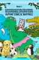

6 Kurzgeschichten für Kinder im Alter von 2-5 Jahren. Geschichten, die sich nachweislich hervorragend zum Vorlesen vor dem Einschlafen eignen! In diesen Geschichten geht es um einen Geparden, ein Ungeheuer, einen Elefanten, einen supertollen Frosch und zwei weitere Tiere.

[View on Apple](https://books.apple.com/de/book/kurzgeschichten-f%C3%BCr-kinder-bezaubernde-tierabenteuer/id1564440555)

## Nochmal 3 Hamburg Thriller mit Kommissarin Stein Juli 2026

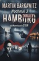

Dieser Band enthält folgende Krimis:

Kommissarin Stein und die Inkassogeier

Kommissarin Stein und das Hotel des Killers

Kommissarin Stein und der Frauentöter

Das Mobile Einsatzkommando kam zu spät.
Als die Eliteeinheit der Hamburger Polizei das Abbruchhaus in Bahrenfeld stürmte, waren die beiden jungen Frauen bereits tot.
Der Raum mit den Schimmelecken und der abblätternden Farbe auf den Wänden glich einem Schlachthaus. Wie sich später herausstellte, war der Tod von Saskia Rottmann und Nadine Tespe nur knapp eine Stunde vor dem Zugriff eingetreten. Und der Mörder dieser beiden jungen Frauen hatte bereits die Flucht ergriffen.
Doch dabei stellte der Verbrecher sich sehr dilettantisch an. Vielleicht fühlte er sich auch unangreifbar, weil das Töten ihn in einen Blutrausch versetzt hatte. Auf jeden Fall hatte der Killer mit Saskia Rottmann telefoniert, bevor sie ihm in die Falle gegangen war. Seine Mobilfunknummer befand sich noch im Anrufspeicher des Opfers.
Womöglich hatte er schlicht und einfach vergessen, ihr Smartphone mitzunehmen oder zu zerstören.
Die Polizei konnte im Handumdrehen seinen Namen ermitteln.

[View on Apple](https://books.apple.com/de/book/nochmal-3-hamburg-thriller-mit-kommissarin-stein-juli-2026/id6790546353)

## Ueberreuter Lesebuch Kinder- und Jugendbuch Herbst 2017

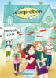

Beinhaltet Leseproben folgender Herbstnovitäten 2017 des Ueberreuter Kinder- und Jugendbuchprogramms

[View on Apple](https://books.apple.com/de/book/ueberreuter-lesebuch-kinder-und-jugendbuch-herbst-2017/id1261037216)

## Wenn dein Herz woanders wohnt – Sehnsuchtsträume

<b>Der kostenlose Einstieg zu "Wenn dein Herz woanders wohnt"  Was brauchst du, um dich zuhause zu fühlen?</b>  Himbeerrot, Honiggold, Bergwiesengrün: Die Einrichtungsexpertin Leonie hat ein Händchen für Farben und experimentiert gerne damit in ihrer Wohnung. Doch im Grunde weiß sie, dass ihr ganzes Leben einen neuen Anstrich braucht: Seit sie den Alltag mit ihrem kleinen Sohn alleine meistert, braucht sie dringend mehr Gehalt und eine günstigere Bleibe in München. Als sich eine überraschende Gelegenheit bietet, zögert sie nicht lange und mietet sich für ein Wochenende in der Wohnung des Wochenendheimfahrers Thies ein, um Kraft und Kreativität zu tanken. Leonie fühlt sich sofort wohl in der Wohnung mit Stapeln von Büchern, Schallplatten, Pflanzen und einem gemütlichen Ledersessel – und fragt sich neugierig, wie Thies wohl sein mag …  <b>Sie wollen wissen, wie es weitergeht? Lesen Sie den kompletten Wohlfühlroman "Wenn dein Herz woanders wohnt", in Print und als E-Book erhältlich.</b>

[View on Apple](https://books.apple.com/de/book/wenn-dein-herz-woanders-wohnt-sehnsuchtstr%C3%A4ume/id6443033567)

## Emma

An Apple Books Classic edition.  Emma Woodhouse may just be Jane Austen’s most controversial character. Some see her as a spoiled narcissist who’s deluded about reality, while others view her as a well-intentioned and bitingly sarcastic young woman who matures before our eyes.  This well-loved novel-which is often adapted for the screen-is set in the early 19th century, among England’s landed gentry. After seeing her governess happily married, Emma decides she is a natural matchmaker and devises a plan to find her new friend Harriet a mate. What follows has all the makings of a contemporary soap opera. As usual, Austen portrays her contemporaries with a brilliant and subtle snark. <i>Emma</i> is a wonderfully entertaining read.

[View on Apple](https://books.apple.com/de/book/emma/id395536171)

## The Adventures of Sherlock Holmes

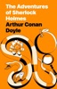

An Apple Books Classic edition.  You get not one, not two, but <i>25</i> gripping mysteries in Arthur Conan Doyle’s first of five collections of Sherlock Holmes short stories. Follow the brilliant and eccentric Holmes and his loyal sidekick, Dr. Watson, as they journey to lavish country estates to investigate baffling cases involving indiscreet royal affairs, cheetahs, redheads, and gypsies. Every one of Conan Doyle’s tales is full of surprising - but always logical - twists. (Fun fact: This book includes “The Speckled Band,” the author’s self-proclaimed favorite of all of his Sherlock Holmes short stories.)

[View on Apple](https://books.apple.com/de/book/the-adventures-of-sherlock-holmes/id395536306)

## Vermieter küsst man nicht (Clover Park: Die Reynolds-Marino-Familie 1)

<b>Die besten Beziehungen fangen als Freundschaften an…</b> 
Jazz-Sängerin Zoë Davis hat nach einer winzigen, unbedachten Affäre mit ihrem Vermieter die Kündigung bekommen. Als ihr Gabe Reynold daraufhin die Wohnung über seiner Garage anbietet, hat Zoë ihre Lektion gelernt und wird sich hüten, noch einmal etwas mit einem Vermieter anzufangen – ganz gleich, wie heiß er ist.  
Der ehemalige knallharte Rechtsanwalt Gabe kehrt nach Clover Park zurück, um ein stressfreies Leben zu führen und sich dort dem Markt lächerlicher „Rechtsfälle“ zu widmen. Als Zoë ihn um juristischen Rat bittet, ist Gabes Lösung für ihr Problem auch ein Schock für ihn.  
Gabe hat jeden Grund, irgendetwas von Dauer zu vermeiden; als Zoë ihm sagt, dass sie nur einen Monat bleiben würde, hält er das für eine perfekte Situation. Doch wenn die Leidenschaft derart heiß auflodert, muss sich jemand die Finger verbrennen.  
<b>Die </b><b>Clover Park-Serie</b><b>!</b>  
<b>Clover Park: Die O’Hare-Familie</b> 
Das Gegenteil von wild 
Daisy schafft alles 
In den Falschen verguckt 
Ein Weihnachtsmann zum Küssen 
Raus aus der Tretmühle  
<b>Clover Park: Die Reynolds-Marino-Familie</b> 
Vermieter küsst man nicht 
Nicht mein Romeo 
Bring mich auf Touren 
Clover Park Braut 
Gewagte Verlobung 
Retter in der Not 
Eine verführerische Freundschaft

[View on Apple](https://books.apple.com/de/book/vermieter-k%C3%BCsst-man-nicht-clover-park-die-reynolds/id1460071297)

## Animal Farm

"Animal Farm" by George Orwell is a captivating allegory that takes you on a thought-provoking journey. Set on a farm, the animals rebel against their human oppressors, establishing their own society. Initially, it's a utopian vision of equality and justice, but power and corruption soon creep in.

Orwell's storytelling brilliance shines as each animal represents a facet of society, and their revolution mirrors historical events. Witness the rise and fall of their animal-led government, the emergence of a ruthless elite, and the haunting parallels with the human world.

This novella is a warning against totalitarianism, propaganda, and the corrupting influence of power. Orwell's vivid prose and sharp social commentary make "Animal Farm" an essential read for those interested in politics and society. It's a timeless tale of how ideals can be twisted, leaving you pondering the nature of power and the fragility of freedom.

[View on Apple](https://books.apple.com/de/book/animal-farm/id6471925492)

## The Devil's Dance: Dark Mafia Romance (Deutsche Ausgabe)

Rocco D’Alessio, der Don der D’Alessio-Familie, trauert um seine verstorbene Frau, während er gleichzeitig versucht, Chicago unter Kontrolle zu halten und seine Feinde auf Distanz zu halten.  Rocco arbeitet fieberhaft daran, Allianzen zu schmieden, um einen alles vernichtenden Krieg zu verhindern… und was würde sich dafür besser eignen als eine arrangierte Ehe?  Oder etwa nicht?  Seine Pläne geraten jedoch abrupt ins Stocken, als er Dahlia Rossi begegnet; eine aufbrausende Stripperin in einem seiner Clubs. Dahlia tanzt, als gäbe es kein Morgen, und kümmert sich einen Dreck um die Welt.  Dahlia ist es völlig egal, wer Rocco ist oder was er will – doch was passiert, wenn die Spannung zwischen den beiden unerträglich wird?  Wer wird zuerst nachgeben? Wird Rocco in der Lage sein, Dahlia zu beschützen, oder wird sich die Geschichte wiederholen?

[View on Apple](https://books.apple.com/de/book/the-devils-dance-dark-mafia-romance-deutsche-ausgabe/id6764674155)

## Die Brüder Karamasow. Erster Teil

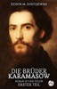

Die Brüder Karamasow sind so unterschiedlich wie Körper, Geist und Seele. Iwan, ein Atheist und grüblerischer Intellektueller; Dmitri, ein sprunghafter Sensualist und Rivale seines Vaters um die schöne Gruschenka; und Alexej, getrieben von unerschütterlicher Frömmigkeit. In ihrem Schatten steht ihr verstoßener Halbbruder, der in die Knechtschaft gedrängt wurde. Gemeinsam handeln sie, um sich von dem ausschweifenden Patriarchen zu befreien. Dann, in einer einzigen schockierenden Tat, ändert sich das Schicksal der Brüder unaufhaltsam. Die Ermordung des brutalen Großgrundbesitzers Fjodor Karamasow verändert das Leben seiner Söhne unwiderruflich: Dmitri, der Sensualist, der aufgrund der erbitterten Rivalität mit seinem Vater sofort unter Mordverdacht gerät; Iwan, der Intellektuelle, der an den Rand des Zusammenbruchs getrieben wird; der spirituelle Alexej, der versucht, die Risse in der Familie zu kitten; und die schattenhafte Gestalt ihres unehelichen Halbbruders Smerdjakow.

“Die Brüder Karamasow” sind Fjodor Dostojewskis tiefgründiges, bahnbrechendes Meisterwerk des psychologischen Realismus, das sich mit den Themen Gott, freier Wille, Glaube, Zweifel und moralische Verantwortung auseinandersetzt. Dostojewskis düsteres Meisterwerk beschwört eine Welt herauf, in der die Grenzen zwischen Unschuld und Korruption, Gut und Böse verschwimmen und der Glaube an die Menschheit auf die Probe gestellt wird.

Dies ist der erste von insgesamt vier Teilen. Die Ausgabe ist ausgestattet mit erläuternden Anmerkungen und einem verlinkten Namensregister.

[View on Apple](https://books.apple.com/de/book/die-br%C3%BCder-karamasow-erster-teil/id6447354268)

## Hier sprechen wir Deutsch

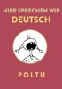

Die lustige Seite des Deutschlernens. Ein Comicstrip auf Englisch und gebrochenes Deutsch. A comic strip on the funny side of learning German as second language. In English and broken German!  Two cool dudes set out to learn German…  Vics and Sids sign up for a German course at a well-known German institute, and get more than they bargained for. Join the linguistic adventures of the laid-back duo as they grapple with hairy German grammar, their irascible teacher Thelma Snax, and a slightly batty fellow student, Malini, with whom Vics proceeds to fall hopelessly in love, German style.  This is an adaption into German of an original Anglo-French cartoon strip. In 2015, the French speaking cartoonist Poltu was invited by Alliance Française de Bangalore to draw an in-house comic strip. The result was ‘Ici, on parle français’, which quickly gained a cult following with the various Alliance regional centers worldwide.  Since Poltu also happens to speak German, he adapted the comic strip into the Deutsche Sprache. Extensive changes were required: gags based on French grammar and French culture had to be replaced with German ones, French icons like Victor Hugo and Yves St Laurent had to be replaced with German celebrities like Goethe and Schumacher. But eventually it got done. The result is this book.  For inspiration, Poltu drew on his experiences studying German at a well-known language institute, plus oodles of comic imagination. If you have ever learnt German as second language, this strip should revive fond memories.  The original French version is also available as a separate book on this website.

[View on Apple](https://books.apple.com/de/book/hier-sprechen-wir-deutsch/id1264800277)

## Wuthering Heights

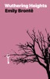

An Apple Books Classic edition.  If you’ve only ever seen <i>Wuthering Heights</i> on screen, you may have an image of Catherine and Heathcliff as the ultimate star-crossed lovers. But that’s just scratching the surface of this iconic Gothic romance. Emily Brontë’s only novel is an unabashedly dark tale of passion and revenge that created shockwaves upon its publication in 1847.  Without spoiling too much, the original Heathcliff is breathtakingly vengeful, cruel, and possessive, not the deeply misunderstood romantic hero of some adaptations. And Brontë’s story does not end happily ever after. After tragedy strikes, Heathcliff haunts the swirling mists of the Yorkshire moors, consumed with possessing a ghost. A must-read for fans of Gothic literature, this novel will appeal to anyone who loves a creepy story.

[View on Apple](https://books.apple.com/de/book/wuthering-heights/id395546348)

## Die Spur der Schatten

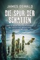

Ein exklusives E-Book Only mit zwei hoch spannenden Kurzkrimis um Detective Inspector Anthony McLean und einem Probekapitel zu „Der dunkle Ort der Seele“.  "Böse Folgen": Die Leiche eines Teenagers, abgelegt in einer verwahrlosten Gegend Edinburghs, gibt der Polizei Rätsel auf. Wer war der Junge, den niemand zu vermissen scheint? Und wie kam er zu Tode? Detective Inspector Anthony McLean ermittelt …  "Job": Auf einem verschneiten Friedhof bietet sich DI McLean ein erschütternder Anblick: An einem Grabstein kauert ein toter Obdachloser, seine Hand umklammert ein Herz aus Holz. Offenbar ist der Mann erfroren. McLean will mehr über das Schicksal des Verstorbenen in Erfahrung bringen und gelangt zu einer erschütternden Erkenntnis …

[View on Apple](https://books.apple.com/de/book/die-spur-der-schatten/id998861620)

## Flutgrab und kalte Gischt: Ostfrieslandkrimi

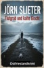

Manche Geheimnisse sollten im Watt begraben bleiben. Andere kehren mit der Flut zurück.

Ein perfekter Tag zum Kitesurfen vor Norderney wird für Finn zum Horrortrip, als der Wind stirbt und er im schlickigen Herzen des Watts eine grausame Entdeckung macht: Ein Mann, gekettet an einen massiven, rostigen Anker, dem die zurückkehrende Flut den Tod bringen sollte. Doch er ist nicht ertrunken. Er ist verdurstet.

Für Hauptkommissar Thaddäus Adden ist dieser bizarre Fund der Beginn seines kompliziertesten Falls. Der Tatort: vom Meer verschluckt. Das Motiv: ein Rätsel. Das Opfer, ein Datenanalyst, stand kurz davor, einen Betrug von unvorstellbarem Ausmaß aufzudecken. Doch die Hinrichtungsmethode spricht eine andere Sprache – die einer alten, unbarmherzigen Blutrache, die seit Jahrhunderten im Verborgenen gärt.

Als die digitale und die reale Welt auf unheilvolle Weise kollidieren, weiß Adden, dass er an seine Grenzen stößt. Er muss sich erneut an die einzige Person wenden, die die Codes der Vergangenheit und der Zukunft gleichermaßen lesen kann: die geniale Hackerin Dr. Jette Vandermeer, die „Zauberin“. Was als Mordermittlung beginnt, wird schnell zu einem verzweifelten Kampf gegen einen unsichtbaren Feind, der Legenden als Waffe einsetzt und die Ermittler zu Gejagten in seinem eigenen, perfiden Spiel macht. In einem Krieg, in dem die Flut nicht nur aus Wasser besteht und der gefährlichste Anker die eigene Vergangenheit ist

[View on Apple](https://books.apple.com/de/book/flutgrab-und-kalte-gischt-ostfrieslandkrimi/id6791970661)

## 3 Hamburg Thriller mit Kommissarin Stein Juli 2026

Dieser Band enthält folgende Krimis:

Kommissarin Stein und der Tod in Teufelsbrück

Kommissarin Stein und der Alsterclown

Kommissarin Stein und die Satansmaske

Christine Becker ahnte nichts von der Todesgefahr, als sie die Gartenparty verließ.
»Soll ich dich nach Hause bringen?«, rief der achtzehnjährige Dirk Bahl ihr zu.
»Nicht nötig«, entgegnete die gleichaltrige Christine. »Ich kann das Haus meiner Eltern ja fast von hier aus sehen. Mich wird schon keiner klauen. – Tschühüss!«
Erleichtert bemerkte das blonde Mädchen, wie Dirk sich wieder seinen Kumpels Olli Menkhoff und Carsten Broder zuwandte.
Christine wusste, dass Dirk ein heimlicher Verehrer von ihr war. Wenn er sie zu ihrem Elternhaus begleiten durfte, würde er sich noch irgendwelche Schwachheiten einbilden.
Die Achtzehnjährige fand Dirk ja ganz nett, aber ihr Klassenkamerad war überhaupt nicht ihr Typ. Christine war nämlich heimlich in Nils Rade verliebt. Er war einfach der umwerfendste Typ auf dem Gymnasium Blankenese. Das war jedenfalls Christines Meinung. Aber auch die vieler anderer Mädchen.

[View on Apple](https://books.apple.com/de/book/3-hamburg-thriller-mit-kommissarin-stein-juli-2026/id6790542465)

## The Idiot

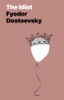

An Apple Books Classic edition.  Bold, romantic, and emotionally explosive, <i>The Idiot</i> follows a kindhearted prince whose sincerity is so rare, the people he encounters don’t know whether they should adore him or destroy him.   When Prince Myshkin returns to Saint Petersburg after years in a Swiss sanitarium, his openness and kindheartedness unsettle a society ruled by power and money. Drawn into the orbit of two women—brilliant, wounded Nastasya Filippovna and spirited Aglaya Epanchin—he finds himself at the heart of a perilous rivalry.  With daring psychological insight and disarming flashes of comedy, Fyodor Dostoyevsky examines what goodness looks like when it’s caught between desire and society’s pressure to conform. <i>The Idiot</i> reveals how easily innocence is mistaken for weakness and how steep the cost can be for those who keep believing in love.

[View on Apple](https://books.apple.com/de/book/the-idiot/id395539815)

## Die Hostess des Doms: Ein geheimes Baby Milliardär Liebesroman

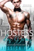

<b>Ich leite Imperien und knicke nicht ein – bis sie auftaucht.</b>  Eine feurige Hostess im Resort, die mir bei jedem Schritt widerspricht.  Ich sah eine Herausforderung. Also mach ich ihr ein Angebot:  Gib mir den Sommer – und ich zeig dir, wer das Sagen hat.  Sie sagt ja, aber spielt nicht nach meinen Regeln.  Ich ließ sie zurück und dachte, ich hätte gewonnen.  Falscher Zug.  Jetzt bin ich zurück – und sie versteckt etwas, das uns für immer verbindet.  Ich dachte, ich bestimme – aber sie hält die Zügel in der Hand.  Sie gehört mir. Ich weiß es. Sie weiß es. Und diesmal geh ich nicht ohne sie.  <b>Niemand zähmt mich – aber verdammt, sie kommt nah ran.</b>

[View on Apple](https://books.apple.com/de/book/die-hostess-des-doms-ein-geheimes-baby-milliard%C3%A4r-liebesroman/id1499921007)

## The Odyssey

The poem mainly centers on the Greek hero Odysseus (known as Ulysses in Roman myths) and his journey home after the fall of&#xa0;Troy. It takes Odysseus ten years to reach&#xa0;Ithaca&#xa0;after the ten-year&#xa0;Trojan War.  In his absence, it is assumed he has died, and his wife&#xa0;Penelope&#xa0;and son&#xa0;Telemachus&#xa0;must deal with a group of unruly suitors, the&#xa0;Mnesteres or&#xa0;Proci, who compete for Penelope's hand in marriage.

[View on Apple](https://books.apple.com/de/book/the-odyssey/id498683870)

## Dracula

An Apple Books Classic edition.  Few characters have seized readers’ imaginations quite like Count Dracula of Transylvania, the hero of Bram Stoker’s classic. The 1897 novel put vampires front and center on the cultural map, providing direct inspiration for an entire subgenre of bloodsucker fiction - including blockbusters like the <i>Twilight</i> series and Anne Rice’s <i>Vampire Chronicles</i> - and spawning hundreds of movie adaptations!  Stoker’s novel is a thrill ride, following Dracula as he moves from Transylvania to England in search of fresh blood, while a small but dedicated group attempts to thwart him. Want more Stoker? Check out his great-grandnephew Dacre Stoker’s 2018 novel, <i>Dracul</i>.

[View on Apple](https://books.apple.com/de/book/dracula/id395541616)

## The Brothers Karamazov

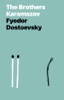

An Apple Books Classic edition.  A towering achievement of psychological depth and spiritual inquiry, <i>The Brothers Karamazov</i> blends passionate philosophy into a riveting story of family conflict, erotic jealousy, betrayal, and murder.  Cruel, self-indulgent Fyodor Karamazov has never acted like a father to his sons, brilliant skeptic Ivan, impulsive and romantic Dmitri, and kindhearted novice Alyosha. They’ve grown into three men as different as one could imagine, but Fyodor remains heartless as ever, taking joy in his own callous conduct and sadistic games.  As Fyodor mires himself in financial misdeeds and a devious love triangle, author Fyodor Dostoevsky probes timeless questions of justice, faith, and responsibility, asking what a father owes his sons and what a society owes its people. Ferocious and unforgettable, <i>The Brothers Karamazov</i> remains one of literature’s most profound explorations of the moral soul.

[View on Apple](https://books.apple.com/de/book/the-brothers-karamazov/id395688080)

## Luna, das kleine Einhorn

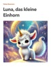

Luna, das kleine Einhorn, lebt in einem magischen Wald voller Abenteuer. Begleite sie und ihr Kätzchen auf einer Reise voller Magie, Freundschaft und glitzernder Überraschungen. Ein liebevolles Kinderbuch für alle kleinen Träumer ab 3 Jahren.
Lunas Geschichte geht weiter: In den weiteren Bänden erlebt sie neue kleine Abenteuer voller Mut, Gefühle und Geborgenheit.

[View on Apple](https://books.apple.com/de/book/luna-das-kleine-einhorn/id6740263402)

## Flavia de Luce - Das Geheimnis des kupferroten Toten

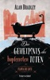

<b>Wer Wednesday Addams als Ermittlerin liebt, kommt an Flavia de Luce nicht vorbei.</b>  "Mord! Komm sofort her", steht in dem Brief, der Flavia an einem Sonntagmorgen in ihrem Zuhause Buckshaw zugestellt wird. Wie könnte die elfjährige Hobbydetektivin einer derart dringlichen Bitte widerstehen? Mit ihrem treuen Fahrrad Gladys macht sie sich auf zum Internat Greyminster, das schon ihr Vater besuchte. Nebelumwabert ragt das altehrwürdige Gemäuer vor ihr auf, doch der Fund, der sie in einem der Badezimmer erwartet, ist noch unheimlicher: In der Wanne liegt ein nackter toter Mann, der Körper überzogen mit einer Kupferschicht ... Chemikerin Flavia ist in ihrem Element! <b>Diese außergewöhnliche All-Age-Krimireihe hat die Herzen von Lesern, Buchhändlern und Kritikern aus aller Welt im Sturm erobert!</b>

[View on Apple](https://books.apple.com/de/book/flavia-de-luce-das-geheimnis-des-kupferroten-toten/id1207237786)

## Never Date Your Brother's Best Friend

<b>My plan was perfect. My friend needed a date, and my brother's best friend was single. Problem solved.</b>  
Until I saw Jaeger for the first time in years, and sparks flew in the wrong direction.  
Jaeger has grown up and bulked up. But that shouldn't matter, because I have the perfect life. Really.  
Only my plans are beginning to unravel and now visions of Jaeger's hard abs, broad shoulders, and intense green eyes fill my head.  
I should hold back in case my friend is interested. Or in case of a million other reasons.&#xa0;<b>But if Jaeger isn't willing to play by the rules, I don't think I can either.</b>  
"Addictive and marvelously refreshing."<b>~ Rumpled Sheets Blog</b>  
"Realistic characters and smart writing."&#xa0;<b>~ Lauren Layne,&#xa0;<i>USA Today</i>&#xa0;Bestselling Author</b>  
<b><i>Grab&#xa0;</i>NEVER DATE YOUR BROTHER'S BEST FRIEND<i>&#xa0;now!</i></b>

[View on Apple](https://books.apple.com/de/book/never-date-your-brothers-best-friend/id849072821)

## Nachtclub-Sünden Kurzgeschichten: Milliardär Liebesromane

<b>Drei erotische Bücher, die deine Sinne verführen!</b>  <b>Nachtclub-Sünden Kurzgeschichten: Milliardär Liebesromane ist eine Sammlung von drei in voller Länge geschriebenen Romanen mit einer internationalen Besetzung schöner Menschen, atemberaubenden Schauplätzen, dunklen Handlungssträngen und heißer, sinnlicher Romantik!</b>  <b>Buch Eins - Erzwungene Intimität: Ein Verbotene Babysitterin Extra</b>  Eine Mission, von der ich wohl nicht zurückkehren würde, brachte mich dazu, Deals zu machen wie noch nie zuvor ...  Als Marine war mir Gefahr nicht fremd.  Diese Mission allerdings ... Nun, es war mit ziemlicher Sicherheit ein Todeskommando.  Ich brauchte jemanden, der mir half, die Woche zu überleben, bevor ich zu meinem sicheren Untergang geschickt wurde.  Ich hätte nie erwartet, sie zu finden. Ein perfektes Mädchen.  Unsere Körper benahmen sich nicht so, als wären wir Fremde.  Von Anfang an erlag sie mir auf eine Weise, die ich mir nie vorstellen konnte.  Ich nahm die Erinnerung an ihren süßen Körper mit, als ich sie an jenem Tag verließ.  Würde ich sie jemals wiedersehen?  <b>Buch Zwei - Der Jungfrauenschleier: Ein Maskierter Genuss Extra</b>  Unser zweijähriger Maximus und unsere acht Monate alte Serenity waren zu Hause bei meinen Eltern, als ich Katana für eine Nacht entführte.  Unser drittes Weihnachtsfest und unser dritter Hochzeitstag sollten ein kleines Abenteuer werden.  Mit verbundenen Augen und Handschellen saß Katana auf dem Beifahrersitz meines Maserati.  "Ich kann nichts sehen, aber ich kann fühlen, wie schnell du fährst, Nix. Warum die Eile?"  <b>Buch Drei - Swank: Ein Nachtclub Überraschung Extra</b>  Der große Abend war endlich da. Es war Silvester, und August Harlow, Nixon Slaughter und Gannon Forester standen vor dem Haupteingang ihres Nachtclubs und warteten auf die Frauen, in die sie sich verliebt hatten. Alle drei hatten Smokings an und alle drei sahen ultrareich und fantastisch aus.

[View on Apple](https://books.apple.com/de/book/nachtclub-s%C3%BCnden-kurzgeschichten-milliard%C3%A4r-liebesromane/id1547095512)

## Für jetzt und für immer (Die Pension in Sunset Harbor – Buch 1)

Emily Mitchell, 35, lebt und arbeitet in New York City und kämpfte sich durch einige misslungene Beziehungen. Als sie von ihrem Freund, mit dem sie schon seit sieben Jahren zusammen ist, an ihrem Jahrestag zum Essen ausgeführt wird, ist sich Emily sicher, dass es dieses Mal anders sein wird, dass sie diesmal endlich einen Ring bekommen wird.  
Als er ihr stattdessen eine kleine Parfümflasche schenkt, weiß Emily, dass es an er Zeit ist, mit ihm Schluss zu machen – und ihr komplettes Leben von vorne zu beginnen.  
Emily ist mit ihrem unbefriedigenden, anstrengenden Leben unzufrieden und beschließt, dass sie eine Veränderung braucht. Spontan beschließt sie, zu dem verlassenen Haus ihres Vaters, einem ausladenden, historischen Anwesen an der Küste Maines, in dem sie als Kind magische Sommer verbracht hatte, zu fahren. Doch das Haus, das lange Zeit vernachlässigt wurde, muss dringend repariert werden und der Winter ist nicht gerade die beste Jahreszeit in Maine. Emily war seit zwanzig Jahren nicht mehr dort gewesen, seit dem tragischen Unfall, der das Leben ihrer Schwester veränderte und ihre Familie zerstörte. Ihre Eltern schieden sich, ihr Vater verschwand und Emily konnte es nie wieder über sich bringen, einen Fuß in das Haus zu setzen.  
Doch jetzt fühlt sich Emily durch ihr hektisches und kompliziertes Leben aus irgendeinem Grund zu dem einzigen Ort hingezogen, den sie mit ihrer Kindheit verband. Sie hat vor, nur ein Wochenende dort zu verbringen, um wieder einen klaren Kopf zu bekommen. Doch etwas in dem Haus – seine zahlreichen Geheimnisse, die Erinnerungen an ihren Vater, der Ausblick aufs Meer, die Lage in einer Kleinstadt – und vor allem der mysteriöse Grundstückspfleger – lassen sie nicht mehr los. Kann sie an diesem für sie unerwarteten Ort Antworten auf ihre Fragen finden?  
Kann ein Wochenende zu einem ganzen Leben werden?  
FÜR JETZT UND FÜR IMMER ist das erste Buch einer hinreißenden Debüt-Romanreihe, die Sie zum Lachen und Weinen bringen und dafür sorgen wird, dass Sie das Buch bis spät in die Nacht nicht aus der Hand legen können – und dass sie sich immer wieder neu in die Romantik verlieben.  
Buch 2 erscheint bald.

[View on Apple](https://books.apple.com/de/book/f%C3%BCr-jetzt-und-f%C3%BCr-immer-die-pension-in-sunset-harbor-buch-1/id1174514772)

## Betrachtung

Der Begriff Betrachtung steht in Nähe zum philosophischen Konzept der&#xa0;Anschauung. &#xa0;Betrachtung&#xa0;ist eine schon im&#xa0;Mittelhochdeutschen&#xa0;als&#xa0;betrahtunge&#xa0;belegte Substantivbildung aus dem Verb&#xa0;betrachten&#xa0;und bedeutet "Trachten nach etwas, Überlegung". [1]&#xa0;Das Verb&#xa0;betrachten&#xa0;(mhd. &#xa0;betrahten, ahd. &#xa0;bitrahtön) bedeutete als Präfixbildung zu&#xa0;trachten&#xa0;zunächst "bedenken, erwägen, streben". Im&#xa0;Frühneuhochdeutschen&#xa0;entwickelte sich daraus über "nachdenklich ansehen" die heutige Bedeutung von betrachten: "ansehen, beschauen".

[View on Apple](https://books.apple.com/de/book/betrachtung/id511193363)

## The Kissing Booth - Noahs Story

<b>Exklusives Bonusmaterial zur Netflix-Sensation THE KISSING BOOTH: der erste Kuss</b>  Alle erinnern sich noch an den legendären ersten Kuss von Elle und Noah in THE KISSING BOOTH. Aber wie war das eigentlich für Noah?  <b>Starautorin Beth Reekles erfüllt den größten Wunsch ihrer Leser*innen: den ersten Kuss im KISSING BOOTH aus Noahs Sicht! Das exklusive Bonusmaterial erzählt die beliebte Kussszene aus Noahs Sicht.</b>  <b>Alle Bücher der Kissing-Booth-Reihe:</b> The Kissing Booth (Band 1) Noahs Story – Eine Kissing-Booth-Geschichte (Bonusmaterial, nur als E-Bookverfügbar)  Going the Distance (Band 2) The Beach House - Eine Kissing-Booth-Geschichte (nur als E-Book verfügbar) One Last Time (Band 3)

[View on Apple](https://books.apple.com/de/book/the-kissing-booth-noahs-story/id1569355845)

## Von allem etwas für Dummies

Dieses eBook bietet Ihnen Auszüge aus 14 Büchern und damit einen wunderbaren Einblick in die Welt der Bücher für Dummies. Nutzen Sie die Chance, in ganz verschiedenen Themen hineinzuschnuppern: Testen Sie, wie ausgeglichen Sie sind; erfahren Sie, wie Sie auf Französisch etwas zu Essen bestellen; lernen Sie effektive Yoga-Übungen für den Bauch kennen oder lassen Sie sich Tipps geben, wie Sie sich am Arbeitsplatz organisieren und organisiert bleiben. Dies alles und noch viel mehr finden Sie in diesem Buch. Viel Spaß beim Lesen!

[View on Apple](https://books.apple.com/de/book/von-allem-etwas-f%C3%BCr-dummies/id826721339)

## Anna Karenina

An Apple Books Classic edition.  "Happy families are all alike; every unhappy family is unhappy in its own way." Thus begins what many consider the world’s greatest novel. Leo Tolstoy originally published this sweeping saga in serial form beginning in 1875, portraying a vast swath of Russian life, from the fields worked by starving peasant farmers to the sitting rooms (and bedrooms) of privileged aristocrats.  Despite its epic nature, <i>Anna Karenina</i> is an intricate, intimate study of one woman’s downward spiral into tragedy. As Anna’s husband becomes increasingly absorbed in philosophical and political introspection, Tolstoy’s heroine grows weary of her life as a mother and wealthy man’s wife. Increasingly unsettled by the stark class differences she observes, Anna finds passion again in a forbidden affair with Count Vronsky. But can she overcome her obsessive concern with societal norms to find a measure of happiness?  Passion. Betrayal. Love. Revenge. Tolstoy’s classic has it all.

[View on Apple](https://books.apple.com/de/book/anna-karenina/id395534656)
