- [Bretonische Nächte](#bretonische-na-chte)
- [Die Psychiaterin – Wurde ihr der Job zum Verhängnis?](#die-psychiaterin-wurde-ihr-der-job-zum-verha-ngnis)
- [Elternabend](#elternabend)
- [Kaputtes Sylt](#kaputtes-sylt)
- [FIVE - Das Ticken der Zeit](#five-das-ticken-der-zeit)
- [Alles ihre Schuld](#alles-ihre-schuld)
- [Ein unglücklicher Tod](#ein-unglu-cklicher-tod)
- [Eine Frage der Chemie](#eine-frage-der-chemie)
- [Memories of Heidelberg](#memories-of-heidelberg)
- [Sturmland](#sturmland)
- [Die Kollegin – Wer hat sie so sehr gehasst, dass sie sterben musste?](#die-kollegin-wer-hat-sie-so-sehr-gehasst-dass-sie-sterben-musste)
- [Für jede Lösung ein Problem](#fu-r-jede-lo-sung-ein-problem)
- [In ewiger Freundschaft](#in-ewiger-freundschaft)
- [Windstärke 17](#windsta-rke-17)
- [The Score – Mitten ins Herz](#the-score-mitten-ins-herz)
- [Tod in heller Sommernacht](#tod-in-heller-sommernacht)
- [Bretonischer Glanz](#bretonischer-glanz)
- [The Mistake – Niemand ist perfekt](#the-mistake-niemand-ist-perfekt)
- [Ist doch schön hier](#ist-doch-scho-n-hier)
- [Navy Love](#navy-love)
- [Kaltes Versprechen](#kaltes-versprechen)
- [The Deal](#the-deal)
- [Das Leuchten der kleinen Momente](#das-leuchten-der-kleinen-momente)
- [Fourth Wing – Flammengeküsst](#fourth-wing-flammengeku-sst)
- [The Shell House Detectives](#the-shell-house-detectives)
- [Nachtschatten](#nachtschatten)
- [Cover Story. Sie haben eine Abmachung – Küssen gehört nicht dazu](#cover-story-sie-haben-eine-abmachung-ku-ssen-geho-rt-nicht-dazu)
- [The Deal – Reine Verhandlungssache](#the-deal-reine-verhandlungssache)
- [The Play – Spiel mit dem Feuer](#the-play-spiel-mit-dem-feuer)
- [Secret – Du sollst mich fürchten](#secret-du-sollst-mich-fu-rchten)
- [Das Gift der Sünde](#das-gift-der-su-nde)
- [Last Chance](#last-chance)
- [The Mistake](#the-mistake)
- [Perry Rhodan 3387: Andromeda antwortet nicht](#perry-rhodan-3387-andromeda-antwortet-nicht)
- [Totenfang](#totenfang)
- [Deviant Hearts (Deutsche Ausgabe)](#deviant-hearts-deutsche-ausgabe)
- [Rise and Fall](#rise-and-fall)
- [The Legacy](#the-legacy)
- [Weil sie dich kennt](#weil-sie-dich-kennt)
- [Todesstrand](#todesstrand)
- [Kein Kuss unter dieser Nummer](#kein-kuss-unter-dieser-nummer)
- [Teufelsring](#teufelsring)
- [Der Fall Kallmann](#der-fall-kallmann)
- [Schnelles Denken, langsames Denken](#schnelles-denken-langsames-denken)
- [Ilias & Odyssee (Vollständige deutsche Ausgabe, speziell für elektronische Lesegeräte)](#ilias-odyssee-vollsta-ndige-deutsche-ausgabe-speziell-fu-r-elektronische-lesegera-te)
- [One more Chance](#one-more-chance)
- [Still Beating](#still-beating)
- [Schlosshotel Fuschl](#schlosshotel-fuschl)
- [Wie das Schweigen vor der Flut](#wie-das-schweigen-vor-der-flut)
- [Mord ohne Vorwort](#mord-ohne-vorwort)
- [Verlogenes Sylt](#verlogenes-sylt)
- [Nasses Grab](#nasses-grab)
- [The Legacy – Endlich erwachsen](#the-legacy-endlich-erwachsen)
- [Orangenleuchten an der Algarve](#orangenleuchten-an-der-algarve)
- [Die Bernsteinfischerin](#die-bernsteinfischerin)
- [Extinction](#extinction)
- [The Goal – Jetzt oder nie](#the-goal-jetzt-oder-nie)
- [Die Vergessene](#die-vergessene)
- [Mile High](#mile-high)
- [Madame le Commissaire und die gefährliche Begierde](#madame-le-commissaire-und-die-gefa-hrliche-begierde)
- [Ocean View Avenue – Wo deine Träume wahr werden](#ocean-view-avenue-wo-deine-tra-ume-wahr-werden)
- [G. F. Unger 2385](#g-f-unger-2385)
- [Turbulentes Sylt](#turbulentes-sylt)
- [Bedrohliche Alpilles](#bedrohliche-alpilles)
- [Schuld und Sühne](#schuld-und-su-hne)
- [The Love Hypothesis – Die theoretische Unwahrscheinlichkeit von Liebe](#the-love-hypothesis-die-theoretische-unwahrscheinlichkeit-von-liebe)
- [Die Flüsse von London](#die-flu-sse-von-london)
- [Paper Prince](#paper-prince)
- [Die Hummerfrauen](#die-hummerfrauen)
- [Dungeon Crawler Carl](#dungeon-crawler-carl)
- [Eisenblume](#eisenblume)
- [Firefly Island: Zurück zu dir](#firefly-island-zuru-ck-zu-dir)
- [Bad Bishop](#bad-bishop)
- [Blood – Du sollst bereuen](#blood-du-sollst-bereuen)
- [Blutrotes Grab](#blutrotes-grab)
- [Grünes Grab](#gru-nes-grab)
- [Hunting Adeline](#hunting-adeline)
- [Endstation Küste](#endstation-ku-ste)
- [Sie kann dich hören](#sie-kann-dich-ho-ren)
- [Paper Princess](#paper-princess)
- [This could be home](#this-could-be-home)
- [Heated Rivalry](#heated-rivalry)
- [Mörderisches Sylt](#mo-rderisches-sylt)
- [Ostfriesengrab](#ostfriesengrab)
- [Provenzalische Geheimnisse](#provenzalische-geheimnisse)
- [Er lügt](#er-lu-gt)
- [Lügen, die von Herzen kommen](#lu-gen-die-von-herzen-kommen)
- [Schlafenszeit – Albträume erwachen, wenn diese Tür sich schließt](#schlafenszeit-albtra-ume-erwachen-wenn-diese-tu-r-sich-schließt)
- [Deal with the Devil](#deal-with-the-devil)
- [Der Bademeister ohne Himmel](#der-bademeister-ohne-himmel)
- [Der Schatten des Windes](#der-schatten-des-windes)
- [Du schon wieder](#du-schon-wieder)
- [Schattenmädchen](#schattenma-dchen)
- [Guten Morgen, schönes Wetter heute](#guten-morgen-scho-nes-wetter-heute)
- [Vergessenes Sylt](#vergessenes-sylt)
- [Das Erbe des Hochstaplers: Glass and Steele](#das-erbe-des-hochstaplers-glass-and-steele)
- [Die Bibliothekarin aus der Crooked Lane](#die-bibliothekarin-aus-der-crooked-lane)
- [Akte Nordsee - Die letzte Predigt](#akte-nordsee-die-letzte-predigt)
- [Throne of Glass – Erbin des Feuers](#throne-of-glass-erbin-des-feuers)
- [Sie haben mich verkauft](#sie-haben-mich-verkauft)

## Bretonische Nächte

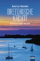

<b>Ein tödliches Familiengeheimnis, rätselhafte Vorfälle und ein schwerverletzter Inspektor Kadeg – ein Fall, der Dupin und sein Team bis ins Mark erschüttert.&#xa0;</b>  Während auch noch im Oktober die Sonne vom Himmel strahlt und die Nächte lau sind, ereilt Inspektor Kadeg ein schwerer Schicksalsschlag. Seine Lieblingstante stirbt. Doch damit nicht genug. Der Inspektor wird auf ihrem Anwesen angegriffen und lebensgefährlich verletzt.  Dupin und sein Team sind zutiefst bestürzt und suchen fieberhaft nach möglichen Gründen für die Tat. Schon bald häufen sich die Merkwürdigkeiten. Was hat es mit den sensationellen Vogelsichtungen an der <b>Côte des Légendes</b> auf sich, die Kadegs Tante kurz vor ihrem Tod notierte? Und welche Geheimnisse verbergen die anderen Familienmitglieder?  Im wilden <b>bretonischen Norden</b>, zwischen rauem Atlantik und betörenden Apfelwiesen, entwickelt sich ein vertrackter und höchst persönlicher Fall für <b>Commissaire Dupin</b>. Der 11. Band der erfolgreichen <b>Bretagne</b>-Krimi-Reihe entführt die Leser in eine Welt voller Rätsel, regionaler Eigenheiten und kulinarischer Köstlichkeiten.  »Trotz des raschen Tempos der Ermittlungen bleibt […] genug Raum für die Schilderungen der Bretagne und ihrer eigenwilligen Einwohner – Bannalec liebt beide offenbar sehr. Und er beschreibt so schön, dass sich der Leser wünscht, selber Bretone zu sein.« Westdeutsche Zeitung  In den fesselnden Geschichten von Jean-Luc Bannalec um Kommissar Dupin in der Bretagne findet man die perfekte Urlaubslektüre: Durch humorvolle Erzählkunst und ein Auge für das lokale Umfeld lässt Bannalec seine Leser die frische Atlantikbrise der Bretagne förmlich riechen.  Die Krimi-Bestseller aus der Bretagne sind in folgender Reihenfolge erschienen: Bretonische VerhältnisseBretonische BrandungBretonisches GoldBretonischer StolzBretonische FlutBretonisches LeuchtenBretonische GeheimnisseBretonisches VermächtnisBretonische SpezialitätenBretonische IdylleBretonische NächteBretonischer RuhmBretonische SehnsuchtBretonische Versuchungen <b>Die Bücher erzählen eigenständige Fälle und können unabhängig voneinander gelesen werden.</b>

[View on Apple](https://books.apple.com/de/book/bretonische-n%C3%A4chte/id1592938837)

## Die Psychiaterin – Wurde ihr der Job zum Verhängnis?

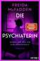

<b>Eine Psychiaterin verschwindet. Hat einer ihrer Patienten etwas damit zu tun?</b>  Die beiden frisch vermählten Tricia und Ethan sind auf dem Weg zur Besichtigung eines abgelegenen Anwesens, das bald ihr Zuhause sein könnte. Während Ethan voller Begeisterung ist, spürt Tricia, dass etwas nicht stimmt. Bis vor drei Jahren lebte hier noch die Psychiaterin Dr. Adrienne Hale. Ihr plötzliches Verschwinden damals ging durch die Presse. Weil ein Schneesturm die Straßen unbefahrbar macht, muss das junge Paar die Nacht im Haus verbringen. Dabei entdeckt Tricia ein verborgenes Zimmer voller Kassetten – Aufnahmen von Adriennes Patientensitzungen. Mit jeder Kassette, die sie sich anhört, wird ihr klarer, wie es zu Adriennes Verschwinden kam und dass sie selbst in tödlicher Gefahr schwebt. Denn manche Stimmen schweigen nie …

[View on Apple](https://books.apple.com/de/book/die-psychiaterin-wurde-ihr-der-job-zum-verh%C3%A4ngnis/id6754520062)

## Elternabend

<b>Stell dir vor ...</b> … du musst eine halbe Ewigkeit auf einem Elternabend verbringen. Dabei hast du gar kein Kind!  <b>Ein lebenskluger und hinreißend komischer Roman im Stil von Sebastian Fitzeks Nr.1-Bestseller »Der erste letzte Tag«</b>  Sascha Nebel hat sich zur falschen Zeit am falschen Ort das falsche Auto für einen Diebstahl ausgesucht. Kaum, dass er hinter dem Steuer eines Geländewagens Platz genommen hat, zieht eine Horde demonstrierender Klimaaktivisten durch die Straße. Allen voran eine junge Frau, die den SUV mit einer Baseballkeule demoliert. Als die Polizei auf der Bildfläche erscheint, ergreifen Sascha und die Unbekannte die Flucht und platzen in den Elternabend einer 5. Klasse. Um die Nacht nicht in Polizeigewahrsam zu verbringen, bleibt ihnen keine andere Wahl: Sie müssen in die Rolle von Christin und Lutz Schmolke schlüpfen, den Eltern des 11jährigen Hector, die bislang jede Schulveranstaltung versäumten. Zwei wildfremde Menschen, zwischen denen kaum größeres Streitpotential herrschen könnte, geben sich als Vater und Mutter eines ihnen völlig unbekannten Kindes aus. Dabei ist die Tatsache, dass Hector der größte Rüpel der Schule ist, sehr schnell ihr kleinstes Problem …

[View on Apple](https://books.apple.com/de/book/elternabend/id6444142557)

## Kaputtes Sylt

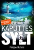

<b>Sylt, im Juni: </b>Hauptkommissarin Hannah Lambert und ihr Team ermitteln in einem neuen Fall, der sie immer tiefer in einen Sumpf aus Drogen, Lügen und Gewalt zwingt. Doch was genau steckt hinter einer Leiche am Rantumer Becken, einem angeblichen Ausflug mitten in der Nacht, und einer steinreichen Familie mit dunklen Geheimnissen? Während interne Querelen die Ermittlungen noch zusätzlich erschweren, wird plötzlich klar: Der Tote ist nur das Ende einer Tragödie. Denn manchmal ist das größte Verbrechen nicht der Mord selbst – sondern alles, was zuvor geschah …  <b>"Kaputtes Sylt" ist Teil 15 der Reihe "Hannah Lambert ermittelt".</b> <b>Jeder Fall ist in sich abgeschlossen. Es kann allerdings nicht schaden, auch die vorangegangenen Fälle zu kennen ;)</b>  <b>Bisher erschienen:</b> "Ausgerechnet Sylt" "Eiskaltes Sylt" "Mörderisches Sylt" "Stürmisches Sylt" "Schneeweißes Sylt" "Gieriges Sylt" "Turbulentes Sylt" "Düsteres Sylt" "Funkelndes Sylt" "Brennendes Sylt" "Vergangenes Sylt" "Trügerisches Sylt" "Vergessenes Sylt" "Verlogenes Sylt" <b>"Kaputtes Sylt" - JETZT BRANDNEU!</b>  "Hannah Lambert ermittelt" ist mit über 1 Mio. verkauften Exemplaren eine der erfolgreichsten Krimi-Serien der letzten Jahre. Alle Teile sind als eBook, Taschenbuch und Hörbuch verfügbar (der neueste Teil als Hörbuch folgt in Kürze).

[View on Apple](https://books.apple.com/de/book/kaputtes-sylt/id6776365008)

## FIVE - Das Ticken der Zeit

Jetzt das eBook zum Einführungsangebot sichern!  <b>Ein Bahnsteig. Fünf Fremde. Fünf Minuten, bis ein Leben endet …</b>  »FIVE – Das Ticken der Zeit« ist ein <b>außergewöhnlicher psychologischer Pageturner</b> voller persönlicher Dramen und Hochspannung, die sich bis zur letzten Seite steigert.  <b>Fünf zu Herzen gehende Schicksale. Die Uhr tickt.&#xa0;</b>  Noch fünf Minuten, bis jemand stirbt: Ist es Emma, die unter der Last des Mutterseins fast zerbricht? Ihr Sohn Gideon, dessen kindliche Unbezähmbarkeit zur gefährlichen Falle wird? Der Geschäftsmann Liam, der in einen Streit mit Emma gerät? Die störrische Wissenschaftlerin Mrs Worth, die endlich ihre Enkel wiedersehen will? Oder der hilfsbereite junge Sonny, der kurz davor ist, sein Leben zu verspielen?  Sie alle warten an einem Londoner Bahnsteig auf den Zug. Einer von ihnen wird dessen Ankunft nicht überleben. Sie alle haben Schicksale. Manche von ihnen haben Geheimnisse. Wir werden alles über sie erfahren, während wir mit ihnen auf den Zug warten. Während der Streit eskaliert. Während Panik ausbricht. Während die Uhr gnadenlos heruntertickt …  <b>Brillant geplottetes Thriller-Drama für alle, die mehr suchen als nur den Täter</b>  Ilona Bannisters <b>Spannungsroman spielt sich in Echtzeit ab </b>und verwebt die Schicksale von fünf ganz normalen Menschen zu einem Teppich, der so bunt, so unvollkommen und so dramatisch ist wie das Leben. Nur einer weiß, was in fünf Minuten geschehen wird. Und er (oder sie?) verrät nur so viel, dass wir bis zum Ende wie gebannt an den Seiten kleben.&#xa0;

[View on Apple](https://books.apple.com/de/book/five-das-ticken-der-zeit/id6761787556)

## Alles ihre Schuld

<b>Ein verschwundener Junge und eine Nachbarschaft voller Geheimnisse … Hochspannung für Fans von Freida McFadden und Claire Douglas.</b>  <i>"Die Adresse ist Tudor Grove 14 – sollte ich noch nicht zu Hause sein, wenn du Milo abholst, passt unsere Nanny auf ihn und Jacob auf." </i>Doch als Marissa Irvine zur vereinbarten Adresse kommt, wo ihr kleiner Sohn zum Playdate eingeladen war, erwartet sie ein Schock: Ihr öffnet nicht Jenny, die Mutter von Jacob. Auch kein Kindermädchen. Und von Milo hat die Frau, die dort wohnt, noch nie gehört. Eine fieberhafte Suche beginnt, doch der vierjährige Junge bleibt spurlos verschwunden. Wer hat Marissa und ihrem Mann diese Falle gestellt? Bald machen böse Gerüchte in der Idylle des Dubliner Vororts die Runde, und eine junge Frau gerät ins Visier der Polizei. Die Wahrheit verbirgt sich hinter abgründigen Geheimnissen, die nun Schicht um Schicht freigelegt werden ... <b>"Andrea Mara ist ein Star." </b><i><b>Lee Child</b></i>  <b>"Ein Thriller, bei dem einem fast Herz stehenbleibt – und der einen bis zuletzt überrascht." </b><i><b>Sunday Times </b></i><b>(Crime Book of the Month)</b>  Der Thriller wird als Miniserie mit Sarah Snook ("Succession") in der Hauptrolle verfilmt. Außerdem dabei: Dakota Fanning, Jake Lacey ("White Lotus") und Abbey Elliot ("The Bear").

[View on Apple](https://books.apple.com/de/book/alles-ihre-schuld/id6754519901)

## Ein unglücklicher Tod

Nach einem internen Ermittlungsverfahren hätte man DC Smith bei der Polizei von Norfolk gern in Rente geschickt. Zu alt, zu eigensinnig, zu charakterstark befand man, doch Smith lebt für seinen Beruf und schert sich wenig darum, was seine Vorgesetzten gern hätten. Er bekommt einen Routinefall zugeteilt – der Unfalltod eines Siebzehnjährigen –, doch was sich da vor Smith eröffnet, ist nichts weniger als die Frage nach Recht oder Gerechtigkeit.

[View on Apple](https://books.apple.com/de/book/ein-ungl%C3%BCcklicher-tod/id6762463351)

## Eine Frage der Chemie

<b>Elizabeth Zott wird Ihr Herz erobern, ganz sicher!</b>  Elizabeth Zott ist eine Frau mit dem unverkennbaren Auftreten eines Menschen, der nicht durchschnittlich ist und es nie sein wird. Doch es ist 1961, und die Frauen tragen Hemdblusenkleider und treten Gartenvereinen bei. Niemand traut ihnen zu, Chemikerin zu werden. Außer Calvin Evans, dem einsamen, brillanten Nobelpreiskandidaten, der sich ausgerechnet in Elizabeths Verstand verliebt. Aber auch 1961 geht das Leben eigene Wege. Und so findet sich eine alleinerziehende Elizabeth Zott bald in der TV-Show »Essen um sechs« wieder. Doch für sie ist Kochen Chemie. Und Chemie bedeutet Veränderung der Zustände ...  <b>So smart wie »Damengambit«, so amüsant wie »Mrs. Maisel«</b>

[View on Apple](https://books.apple.com/de/book/eine-frage-der-chemie/id1589480271)

## Memories of Heidelberg

<b>Ein Buch zur Ferienzeit – so schrecklich komisch wie Ein <i>Sommer in Niendorf</i></b>  Bertram und Isolde, ein in die Jahre gekommenes Paar aus Oldenburg, möchten sich in Heidelberg mal einen richtig schönen Kurzurlaub gönnen. Vielleicht vertreibt das ja auch den seelischen Smog über dem Eheleben. Das Boutiquehotel ist für das viele Geld gar nicht so toll; dafür haben die beiden gleich einen neuen Stamm-Italiener ausgemacht. Das Restaurant voller Flair befindet sich auf einem alten Flussschiff im Neckar.  Während die Ehe der beiden im Verlauf einer Woche zusehends aus der Form gerät, wird auch der abendliche Gang auf das Restaurantschiff immer mehr zur Enttäuschung, zur Strafe, zur Höllenqual. Das Teuflische bricht mit verheerender Macht in den Alltag, am Ende steht eine Katastrophe – und das alles zum Schlager-Oldie Memories of Heidelberg in Dauerschleife.

[View on Apple](https://books.apple.com/de/book/memories-of-heidelberg/id6760732379)

## Sturmland

<b>Der neue große Zweiteiler der Bestsellerautorin! Eine Hamburger Reedertochter will mehr vom Leben, als sie darf. Ein Tagelöhner hat das seine bereits aufgegeben. Eine schicksalhafte Liebe entsteht – zum Beginn der Seenotrettung in Hamburg und in den norddeutschen Seebädern.</b>  Niemand darf erfahren, wer Cora wirklich ist! Die Reedertochter muss aus ihrem alten Leben in Hamburg fliehen – und nimmt unter falschem Namen eine Stelle als Hauslehrerin im Seebad Norderney an. Doch die Nordsee ist unberechenbar. Schon kurz nach ihrer Ankunft bringt Cora sich und ihre Schülerin Emmi in Lebensgefahr …  Der Tagelöhner Onnen beobachtet das Unglück. Kein Wunder, dass die unwissenden Badegäste ständig in Seenot geraten. Ausgerechnet mit dieser Gouvernante soll er nun zusammenarbeiten. Weil er dringend Geld braucht, nimmt er den Job an.  Von Tag zu Tag kommen Cora und Onnen sich näher. Doch Onnen hat eine Vergangenheit auf seiner Heimatinsel Borkum, die er fest in sich verschlossen hält. Und Cora hat Menschen in Hamburg, die sie verzweifelt zurückholen wollen.  Aber das darf nicht passieren. Niemand darf erfahren, wer Cora ist – und was sie getan hat …  <b>Der erste Band der «Sturmland»-Saga.</b>  «Miriam Georg hat einen ganz eigenen kraftvollen Stil.» Meins

[View on Apple](https://books.apple.com/de/book/sturmland/id6754540510)

## Die Kollegin – Wer hat sie so sehr gehasst, dass sie sterben musste?

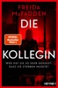

<b>Zwei Frauen. Ein Büro. Ein schreckliches Verbrechen.</b>  Dawn Schiff ist seltsam. Darin sind sich ihre Kollegen einig. Sie sagt nie das Richtige. Sie hat keine Freunde. Aber sie ist jeden Morgen um Punkt 8:45 Uhr an ihrem Platz in der Firma, in der sie als Buchhalterin arbeitet. Bis sie eines Morgens nicht auftaucht. Dawns Kollegin Natalie Farrell wundert sich. Dann erhält sie einen anonymen Anruf und fährt zu Dawns Wohnung. Keine Spur von ihrer Kollegin. Doch Natalie bietet sich ein Bild des Grauens. Eins scheint bald klar: Jemand muss Dawn so sehr gehasst haben, dass er sie getötet hat. War es jemand aus ihrem Büro? Je mehr Natalie herausfindet, desto tiefer verstrickt sie sich selbst in ein Netz aus Lügen und Gewalt, aus dem es kein Entkommen gibt.

[View on Apple](https://books.apple.com/de/book/die-kollegin-wer-hat-sie-so-sehr-gehasst-dass-sie-sterben/id6736446409)

## Für jede Lösung ein Problem

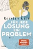

Gerri schreibt Abschiedsbriefe an alle, die sie kennt, und sie geht nicht gerade zimperlich mit der Wahrheit um. Nur dummerweise klappt es dann nicht mit den Schlaftabletten und dem Wodka und Gerris Leben wird von einem Tag auf den anderen so richtig spannend. 

Denn es ist nicht einfach, mit seinen Mitmenschen klarzukommen, wenn sie wissen, was man wirklich von ihnen hält ...

[View on Apple](https://books.apple.com/de/book/f%C3%BCr-jede-l%C3%B6sung-ein-problem/id374944416)

## In ewiger Freundschaft

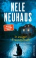

<b>Der 10. Band der Bodenstein-Kirchhoff-Krimis von Bestsellerautorin Nele Neuhaus!</b>  <b>Der Nr. 1 SPIEGEL-Bestseller um das Ermittlungsduo Pia Sander und Oliver von Bodenstein.</b>  » ›In ewiger Freundschaft‹ ist ein höchst gelungener Taunuskrimi, in dem alles endet, wo alles beginnt. Dem Jubiläum angemessen.« Hamburger Abendblatt  <b>Ein tödliches Geheimnis – in Blut geschrieben…</b>  Eine Frau wird vermisst. Im Obergeschoss ihres Hauses in Bad Soden findet die Polizei den dementen Vater, verwirrt und dehydriert. Und in der Küche Spuren eines Blutbads. Die Ermittlungen führen Pia Sander und Oliver von Bodenstein zum renommierten Frankfurter Literaturverlag Winterscheid, wo die Vermisste Programmleiterin war. Ihr wurde nach über dreißig Jahren gekündigt, woraufhin sie einen ihrer Autoren wegen Plagiats ans Messer lieferte – ein Skandal und vielleicht ein Mordmotiv?  Als die Leiche der Frau gefunden wird und ein weiterer Mord geschieht, stoßen Pia und Bodenstein auf ein gut gehütetes Geheimnis. Beide Opfer kannten es. Das war ihr Todesurteil. Wer muss als nächstes sterben? &#xa0;Pia und Bodenstein jagen einen Täter, der ihnen immer einen Schritt voraus zu sein scheint ...  »So muss ein Krimi sein – genauso abwechslungsreich, tiefgründig, überraschend und originell. Ein Buch, das wieder mal zeigt, dass Nele Neuhaus ihre Tatorte literarisch und spannend erzählen kann. Perfekt.« Literaturbühne  *** Absolutes Krimi-Highlight für Fans von Nele Neuhaus: hochspannend, humorvoll und von der ersten bis zur letzten Seite fesselnd. ***

[View on Apple](https://books.apple.com/de/book/in-ewiger-freundschaft/id1574499088)

## Windstärke 17

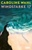

Ida hat nichts bei sich außer dem alten, verschrammten Hartschalenkoffer ihrer Mutter, ein paar Lieblingsklamotten und ihrem MacBook, als sie ihr Zuhause verlässt. Es ist wahrscheinlich ein Abschied für immer von der Kleinstadt, in der sie ihr ganzes bisheriges Leben verbracht hat. Im Abschiednehmen ist Ida richtig schlecht; sie hat es vor zwei Monaten nicht einmal auf die Beerdigung ihrer Mutter geschafft. Am Bahnhof sucht sie sich den Zug aus, der am weitesten wegfährt – auf keinen Fall will sie zu ihrer Schwester Tilda nach Hamburg –, und landet auf Rügen. Ohne Plan, nur mit einem großen Klumpen aus Wut, Trauer und Schuld im Bauch, streift sie über die Ostseeinsel. Und trifft schließlich auf Knut, den örtlichen Kneipenbesitzer, und seine Frau Marianne, die Ida kurzerhand bei sich aufnehmen. Zu dritt frühstücken sie jeden Morgen Aufbackbrötchen, den Tag verbringt Ida dann mit Marianne, sie walken gemeinsam durch den Wald oder spielen Skip-Bo, abends arbeitet Ida mit Knut in der "Robbe". Und sie lernt Leif kennen, der ähnlich versehrt ist wie sie. Auf einmal ist alles ein bisschen leichter, erträglicher in Idas Leben. Bis ihre Welt kurz darauf wieder aus den Angeln gehoben wird.

[View on Apple](https://books.apple.com/de/book/windst%C3%A4rke-17/id6471633689)

## The Score – Mitten ins Herz

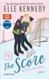

<b>Er weiß, wie man siegt. Aber kann er auch ihr Herz gewinnen?</b>  College-Eishockey-Player Dean bekommt immer, was er will. Zumindest war das bisher so. Denn nach einer gemeinsamen Nacht mit der Studentin Allie, die seine Welt auf den Kopf gestellt hat, will sie plötzlich nur Freundschaft. Auf dem Eis fühlt sich Dean wohl, in der Friendzone hingegen überhaupt nicht. Er will Allie um jeden Preis für sich gewinnen! Doch wie soll ein draufgängerischer Eishockeyspieler, der nie um eine Frau kämpfen musste, jemanden von sich überzeugen, dem gerade das Herz gebrochen wurde?  »Elle Kennedy schafft es immer wieder, uns zum Lachen und Schwärmen zu bringen. ›The Score‹ ist genau das, was wir gebraucht haben.« Totally Booked Blog  »Wie Dean Di Laurentis sollte auch ›The Score‹ mit einer Warnung versehen werden: zu sexy, um es in Worte zu fassen. Elle Kennedy hat wieder einen Volltreffer gelandet.« Wit and Sin  »Off-Campus«-Reihe, Band 3

[View on Apple](https://books.apple.com/de/book/the-score-mitten-ins-herz/id1176575675)

## Tod in heller Sommernacht

<b>Tödliche Geheimnisse im finnischen Hochsommer</b>  Eine schöne Sommernacht in der Kleinstadt Porvoo bei Helsinki endet für die junge Studentin Lina tödlich. Ein Auto drängt sie von dem sandigen Waldweg ab und überfährt sie brutal. Die Polizei in dem idyllischen Küstenort nahe Helsinki bittet Kommissarin Leena Victor um Hilfe. Bei ihren Ermittlungen stößt sie auf ein Geflecht aus Widersprüchen, heimlichen Affären und perfekt platzierten Lügen. Als ein zweiter Mord den kleinen Ferienort erschüttert und eine junge Frau spurlos verschwindet, beginnt ein Wettlauf gegen die Zeit, und Leena Victor versucht, das Mosaik Stück für Stück zusammenzusetzen. Denn unter der gleißenden finnischen Mitternachtssonne lauert ein Täter, dessen Rachedurst noch lange nicht gestillt ist. <b> »Ein eiskalter Fall, ein spannender Krimi!« Leseecke, freie-radios.net</b>

[View on Apple](https://books.apple.com/de/book/tod-in-heller-sommernacht/id6749852509)

## Bretonischer Glanz

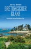

<b>Weltberühmte Zwiebeln und mysteriöse Morde im idyllischen Roscoff</b>  Die Mittagssonne lässt die bunten Segel der Boote im Hafenbecken aufleuchten, als Kommissar Dupin sich auf der Terrasse des&#xa0;<i>Amiral</i> niederlässt. Gerade will er sich seinem <i>tartare de bœuf</i>&#xa0;widmen, als sein Handy klingelt: In Roscoff im hohen bretonischen Norden wurde eine junge Frau ermordet aufgefunden – ausgerechnet dort, wo gerade das berühmte Krimifestival stattfindet …  Umgehend macht sich der Kommissar zusammen mit seinen Inspektoren Riwal und Kadeg auf den Weg. In dem Hafenstädtchen, das für seine Zwiebeln weltbekannt ist, herrscht Ausnahmezustand: Inmitten des Festivaltrubels ziehen Mitarbeiter des lokalen Fährunternehmens wegen drohender Entlassungen durch die Straßen.  Außerdem scheinen in der »Bruderschaft zum Schutz der Roscoff-Zwiebel« obskure Dinge vor sich zu gehen. Als Unbekannte beginnen, rätselhafte Drohparolen auf Hauswände zu schmieren, spitzt sich die Lage zu. Für Dupin wird es so gefährlich wie in keinem Fall zuvor …

[View on Apple](https://books.apple.com/de/book/bretonischer-glanz/id6753773602)

## The Mistake – Niemand ist perfekt

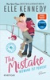

<b>Wenn aus einem kleinen Fehler die große Liebe wird ...</b>  College-Eishockeystar Logan ahnt nicht, dass er die richtige Frau am falschen Ort trifft, als er sich eines Nachts nach einer Feier im Zimmer irrt und in das Bett von Grace stolpert. Er hinterlässt einen miserablen ersten Eindruck und verscherzt es sich mit der zurückhaltenden Studentin. Trotzdem geht ihm dieses hübsche, scharfzüngige Mauerblümchen nicht mehr aus dem Kopf. Irgendwie muss er es schaffen, dass sie ihm eine zweite Chance gibt. Schade nur, dass Grace nicht vorhat, ihm zu verzeihen – wobei es ihr durchaus Spaß macht, diesem selbstverliebten Player dabei zuzusehen, wie er es immer wieder bei ihr versucht.  »Mehr Eishockey-Hotness von Elle Kennedy? Yes, please! ›The Mistake‹ ist ein witziger Feel-Good-Pageturner zum Verlieben, der Fans dazu bringen wird, ihre Herzen auf die Eisfläche zu werfen.« Sarina Bowen, Autorin der »Ivy Years«-Reihe  »›The Mistake‹ hat alles: Freundschaft, Liebe, Humor und jede Menge Leidenschaft.« Totally Booked Blog  »Off-Campus«-Reihe, Band 2

[View on Apple](https://books.apple.com/de/book/the-mistake-niemand-ist-perfekt/id1112532126)

## Ist doch schön hier

<b>Familie ist nicht das, was bleibt, sondern das, was wir immer wieder neu erfinden</b>  Als Liesel ihre Großmutter Emmi auf eine Reise in die ehemalige Provinz Ostpreußen begleitet, sucht sie mehr als nur einen Ort – sie sucht Antworten. Antworten auf die Fragen, die zwischen den Generationen stehen, auf die Geheimnisse, die sich in vergilbten Kalendern und in Emmis Schweigen verstecken. Zwischen Birkenalleen, alten Gutshäusern und dem Rauschen der Ostsee entfaltet sich eine Geschichte von Verlust und Hoffnung, von Schuld und Liebe. Doch je näher Liesel der Vergangenheit kommt, desto deutlicher spürt sie: Heimat ist kein Ort, den man auf der Landkarte findet. Heimat sind die Menschen, die bleiben, wenn alles andere verschwindet. Ein gewaltiger und zutiefst berührender Roman über das Erinnern, das Vergeben und die Sehnsucht, irgendwo anzukommen.

[View on Apple](https://books.apple.com/de/book/ist-doch-sch%C3%B6n-hier/id6761613022)

## Navy Love

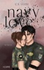

<b>Verbotene Liebe beginnt nicht immer mit einem Kuss. </b> <b>Manchmal beginnt sie mit einem Befehl.</b>  Carly ist Rekrutin – und er ist ihr Ausbilder. Lieutenant Commander Keziah Lenox: eiskalt, kompromisslos, der Mann, der entscheidet, ob sie fällt oder über sich hinauswächst. Während der Höllenwochen der Navy-SEAL-Ausbildung geht Carly nicht nur über ihre körperlichen Grenzen hinaus, sondern kämpft zugleich gegen ein System, das keine Frauen duldet. Aber Keziah ist die verbotene Prüfung, auf die sie nicht vorbereitet war. Der Mann, dem sie nicht zu nahe kommen sollte. Und trotzdem bringt er ihre Mauern zum Bröckeln. Zwischen Pflicht und Verlangen, zwischen Regeln und Sehnsucht geraten beide in einen verhängnisvollen Konflikt, der ihnen alles abfordert: ihr Herz, ihr Leben und ihre Zukunft … <b>Spicy Military Romance</b> – emotionale Mischung aus Navy-Action und tiefgehender Liebesgeschichte (2 von 5 Chilis).<b>New Adult</b> mit Twist: Starke, moderne Protagonistin trifft auf charismatisch-heißen Navy-Helden​!<b>Tropes</b>: Forbidden Love, Boss, Elite Academy, Brother's Best Friend, Trainer x Trainee<b>Coverillustration </b>von @itsberry.rose»Navy Love« ist ein in sich abgeschlossener <b>Einzelband</b>. »Ein Phönix steht nicht aus der Asche auf, weil er muss – sondern weil er gelernt hat, im Feuer zu überleben.«  <b>Knisternde Forbidden Love Story zwischen Ausbilder und Rekrutin – ein mitreißender Roman über Leistungsdruck, Drill und die Schatten der Vergangenheit.</b>

[View on Apple](https://books.apple.com/de/book/navy-love/id6769010950)

## Kaltes Versprechen

<b>Wer sorgt für Gerechtigkeit in einer Welt, in der die Guten zu Schuldigen werden?</b>&#xa0;  Als die Kriminalpsychologin Hannah Jakob tot am Fuß einer Treppe gefunden wird, spricht zunächst alles für einen tragischen Unfall. Doch Kommissarin Rebekka Just spürt sofort, dass etwas nicht stimmt. Gerade erst hat Rebekka ihre neue Stelle bei der Mordkommission Hamburg angetreten, und mit ihren Ermittlungen zum Fall Jakob macht sie sich keine Freunde. Dann bekommt sie Hilfe von einem Mann, der sich jenseits von Recht und Gesetz bewegt – Krølle. Gemeinsam stoßen sie auf ein gefährliches Netz aus Lügen. Und auf eine Wahrheit, für die jemand bereit ist, erneut zu töten ...&#xa0;  Ein Fall, der unsere Vorstellungen von Gut und Böse in ihren Grundfesten erschüttert – von Bestsellerautorin Katharina Peters.

[View on Apple](https://books.apple.com/de/book/kaltes-versprechen/id6762280302)

## The Deal

Original Series now on Prime Video  <b>Welcome to Briar U!</b>  <b> Get ready for your newest obsession . . . Discover the addictive world of the Off-Campus series from The Queen of Hockey Romance, Elle Kennedy! </b> <b>Read <i>The Deal</i> now for the perfect fake-dating romance! </b> <b>Also available as a Deluxe HB and a TV Tie-in edition</b>  <b>She's about to make a deal with the college bad boy . . .</b>  Hannah Wells has finally found someone who turns her on. But while she might be confident in every other area of her life, she's carting around a full set of baggage when it comes to sex and seduction. If she wants to get her crush's attention, she'll have to step out of her comfort zone and <i>make</i> him take notice . . . even if it means tutoring the annoying, childish, <i>cocky</i> captain of the hockey team in exchange for a pretend date  <b>. . . and it's going to be oh so good</b>  All Garrett Graham has ever wanted is to play professional hockey after graduation, but his plummeting GPA is threatening everything he's worked so hard for. If helping a sarcastic brunette make another guy jealous will help him secure his position on the team, he's all for it. But when one unexpected kiss leads to the wildest sex of both their lives, it doesn't take long for Garrett to realize that pretend isn't going to cut it.  Now he just has to convince Hannah that the man she wants looks a lot like <i>him</i>.  ***  <b>Why fans love Elle Kennedy </b><b>⭐ ⭐ ⭐ ⭐ ⭐!</b>  'Delicious, complicated and drama-filled . . . I read it in one sitting, and you will, too'<b> L. J. Shen, <i>USA Today</i> bestselling author</b>  'A deliciously sexy story with a wallop of emotions that sneaks up on you' <b>Vi Keeland, <i>New York Times</i> bestselling author</b>  'This book had the ability to make me swoon one minute, put my heart in my throat the next, then literally make me burst right out laughing out of the blue' <b>Goodreads Review</b>  'The best college romance I've read. It had epic banter, sexy romance, and fantastic writing!! I laughed, I swooned, I couldn't put it down. Highly recommended!!'<b>Goodreads Review</b>  'Elle Kennedy proves, once again, that she is the Queen of College Hockey Romance!!'<b> Goodreads Review</b>  '5-Made My Heart Pitter Patter-Stars' <b>Goodreads Review</b>  'One of the few authors who can instantly put a grin on my face as soon as I start reading her books' <b>Goodreads Review</b>

[View on Apple](https://books.apple.com/de/book/the-deal/id6466581098)

## Das Leuchten der kleinen Momente

Ein altes, verwunschenes Hotel in den venetischen Hügeln, in seinem Garten ein beeindruckendes grünes Labyrinth – als Nina die Villa Primaluna zum ersten Mal sieht, verschlägt es ihr die Sprache. Eigentlich sollte sie jetzt woanders sein, gemeinsam mit ihrem Mann, eine Reise zu ihrem fünfzigsten Geburtstag. Doch nun ist sie allein hier, in ihrem Sehnsuchtsland, und wünscht sich, endlich etwas Zeit für sich zu haben.&#xa0; Nina begegnet Consilia, die das kleine Hotel seit Jahrzehnten führt. Eine weise alte Frau, deren Leben so ganz anders ist als ihr eigenes. Und obwohl sie anfangs zögert, sich Consilia ganz zu öffnen, spürt sie bald, dass diese Reise mehr für sie bereithält als Entspannung und gutes Essen.&#xa0; Vielleicht gibt es hier, an diesem besonderen Ort, endlich einen Weg aus der Leere, die sie schon so lange in sich fühlt. Vielleicht ist im Labyrinth die Antwort auf die Frage verborgen, die sie schon zu lange meidet. Und vielleicht findet sie endlich, was sie schon so lange sucht: sich selbst.

[View on Apple](https://books.apple.com/de/book/das-leuchten-der-kleinen-momente/id6760677258)

## Fourth Wing – Flammengeküsst

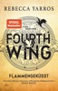

<b>Knisternde Spannung und große Gefühle – der fulminante Romantic-Fantasy-Reihenauftakt!</b>  <b>Ein Drache ohne seinen Reiter ist tragisch. Ein Reiter ohne seinen Drachen ist tot.</b>  Violets Traum, Schriftgelehrte am renommierten Basgiath War College zu werden, zerplatzt jäh, als sie als Tochter der Generalin am Auswahlverfahren der Drachenreiter teilnehmen muss. Das erste Jahr wird nicht einmal die Hälfte aller Kadetten überleben, denn Drachen binden keine schwachen Menschen, sie fackeln sie nieder. Die meisten Kadetten würden Violet vermutlich allein aufgrund ihrer Herkunft niederstrecken wollen – besonders Xaden, der mächtigste und skrupelloseste unter den Geschwaderführern. Und ohne Frage auch der attraktivste. Ausgerechnet ihm wird Violet unterstellt. Sie muss jeden Vorteil nutzen, wenn sie überleben will. Denn am Basgiath War College haben alle eine Agenda, egal ob Freund, Feind oder möglicher Geliebter, und es gibt nur zwei Wege hinaus: den Abschluss machen oder sterben.  <b>Alle bisher erschienenen Bände der Flammengeküsst-Reihe:</b>  Band 1: Fourth Wing&#xa0; Band 2: Iron Flame&#xa0; Band 3: Onyx Storm  Die Bände sind nicht unabhängig voneinander lesbar. »Rebecca Yarros hat&#xa0;<b>großartige Drachen</b> erschaffen! <b>Stolz, schön</b> und <b>voll einzigartiger Magie</b>.« Christopher Paolini  »Eine <b>Fantasy, wie</b> man sie <b>noch nie</b> gelesen hat.« Jennifer L. Armentrout  »Unwiderstehliches <b>Abenteuer </b>trifft epische <b>Liebesgeschichte</b>.« Tracy Wolff  »Ein Buch, das mich den <b>Schlaf gekostet</b> hat. Ich <b>konnte nicht aufhören!</b>« Millie Bobby Brown

[View on Apple](https://books.apple.com/de/book/fourth-wing-flammengek%C3%BCsst/id6443992664)

## The Shell House Detectives

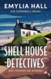

<b>Der erste Kriminalfall für Ally Bright und Jayden Weston – Auftakt einer Reihe mit einem ungleichen Amateur-Ermittlerduo, das einem sofort ans Herz wächst.</b>  Porthpella, ein beschaulicher Küstenort in Cornwall. Seit dem Tod ihres Mannes lebt Ally Bright allein in ihrem hübschen Cottage am Meer. Eines Nachts klopft ein verzweifelter Mann an ihre Tür, doch bevor sie richtig reagieren kann, ist er wieder weg – und wird am nächsten Morgen am Fuß der Klippen gefunden.  <b>»Ein meisterhaft konstruierter und äußerst fesselnder Krimi.« Lucy Clarke&#xa0; </b>  Ally ist überzeugt, dass es kein Selbstmordversuch war, eine Gewissheit, die sie mit dem jungen Ex-Polizisten Jayden Weston teilt, der mit seiner hochschwangeren Frau gerade erst nach Porthpella gezogen ist. Dann, nahezu zeitgleich, kehrt die Besitzerin der neuen Luxusvilla nicht mehr vom Joggen nach Hause zurück. Zufall? Oder gibt es einen Zusammenhang mit dem Sturz des jungen Mannes?  <b>»Dieser wunderschön geschriebene, beschauliche Küstenkrimi hat es in sich: Mit atmosphärischer Prosa und zahlreichen Wendungen wird Sie die Handlung noch lange nach der letzten Seite in Atem halten. Wenn Sie ein Fan von Cornwall sind, werden Sie dieses Buch lieben. « Sarah Pearse </b>  <b>»Ein Buch, das die Herzen der Richard-Osman- und Agatha-Christie-Fans im Sturm erobern wird.« Hannah Richell</b>

[View on Apple](https://books.apple.com/de/book/the-shell-house-detectives/id6754460507)

## Nachtschatten

<b>Eine kalte Frühlingsnacht auf einer Schäreninsel. Eine Frau auf der Flucht. Und eine Hochzeit mit Hindernissen ...</b>  In Hovenäset laufen die Vorbereitungen für die Hochzeit von August und Maria auf Hochtouren. Ihre Freude wird jedoch überschattet: Denn August hat sich in den Kopf gesetzt, ein lange verborgenes Familiengeheimnis zu lüften, und stößt auf Widerstand. Unterdessen erhält Maria verstörende Nachrichten. Könnten diese mit einem ihrer früheren Polizeifälle zusammenhängen? Dann wird in einer kalten Nacht auf der Insel Guleskär eine Frau beobachtet, die in Panik flüchtet. Als Maria und ihr Kollege Ray-Ray Nachforschungen anstellen, machen sie eine grausige Entdeckung. Was geschah in dieser Nacht?   <b>Können Sie nicht genug bekommen von August Strindberg? Lesen Sie in "Die Tote im Sturm", wie er nach Hovenäset kam.</b>

[View on Apple](https://books.apple.com/de/book/nachtschatten/id6759602814)

## Cover Story. Sie haben eine Abmachung – Küssen gehört nicht dazu

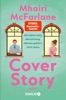

<b>Jetzt das eBook zum Einführungsangebot sichern!</b>  »Alles, was man sich von einer romantischen Komödie wünscht!«&#xa0;<b>Jojo Moyes</b>  <b>Enemies-to-lovers </b>und <b>Fake Dating</b> treffen auf den <b>unvergleichlichen Witz und Tiefgang der Queen of RomCom</b>&#xa0;in dieser unvergleichlichen<b> Office Romance</b>  Bel hat aufgrund ihres preisgekrönten Podcasts einen Job als Journalistin bei einer von Englands größten Tageszeitungen gelandet. Im kleinen und wenig glamourösen Zweigbüro in Manchester, in das es sie verschlagen hat, sind sie jedoch nur zu dritt: Bel, ihr gnadenlos ehrgeiziger, aber unterhaltsamer Kollege Aaron, und der neue Praktikant. Als sich herausstellt, dass es sich bei Letzterem um einen über dreißigjährigen Mann namens Connor handelt, nimmt der Beginn ihrer Zusammenarbeit eine ungute Wendung. Bel ist herablassend, Connor feindselig. Der neueste Office-Klatsch: Die beiden hassen sich.&#xa0;  Während Bel an einer richtig großen Story dran ist, gerät Connor ihr in die Quere, und ehe sie sichs versehen, müssen sie alle überzeugen, dass sie ein Paar sind – noch dazu ein bis über beide Ohren verliebtes. Wenn sie es versauen, fliegt Bels Deckung auf und die größte Story, die sie jemals landen wird, löst sich in Luft auf. Und mit ihr jede Chance auf Gerechtigkeit für Bels Informant*innen.  <b>Eine Top-Journalistin, ein Rivale, eine Fake Romance. Die Schlagzeile schreibt sich wie von allein ...</b>  Zuletzt von Bestsellerautorin Mhairi McFarlane bei Knaur erschienen:  Und plötzlich ist es wunderbar Between Us – Die große Liebe kennt viele Geheimnisse

[View on Apple](https://books.apple.com/de/book/cover-story-sie-haben-eine-abmachung-k%C3%BCssen-geh%C3%B6rt/id6761787329)

## The Deal – Reine Verhandlungssache

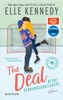

<b>Sie lässt sich auf einen Deal mit dem College Bad Boy ein …</b>  Hannah ist verliebt. Doch während die Einser-Studentin sonst kein Blatt vor den Mund nimmt, bringt sie ihrem Crush Justin gegenüber kein Wort heraus. Sie ist ... verzweifelt.  Warum sonst hätte sie sich auf das Angebot von Garrett Graham eingelassen, dem selbstverliebten, kindischen und vor allem sturen Captain des Eishockey-Teams?&#xa0; Der Deal: Sie gibt ihm Nachhilfe, damit er die Abschlussprüfung besteht, und er gibt vor, dass er sich für Hannah interessiert, damit Justin endlich auf sie aufmerksam wird. Der Plan scheint aufzugehen, aber je mehr Zeit Hannah und Garrett miteinander verbringen, desto stärker verschwimmt die Grenze zwischen gespielten und echten Gefühlen …  »Eindeutig die beste College-Romance aller Zeiten! Extrem empfehlenswert!« Aestas Book Blog  »Ich liebe dieses Buch! Garrett ist ein Traum. Ein Muss für alle New Adult Fans!« Monica Murphy, »New York Times«-­Bestsellerautorin  »Off-Campus«-Reihe, Band 1

[View on Apple](https://books.apple.com/de/book/the-deal-reine-verhandlungssache/id1060155012)

## The Play – Spiel mit dem Feuer

<b>"The Play – Spiel mit dem Feuer" ist nach "The Chase – Gegensätze ziehen sich an" und "The Risk – Wer wagt, gewinnt" Band 3 der neuen "Briar University"-Reihe von SPIEGEL-Bestseller-Autorin Elle Kennedy!</b> Nach einer katastrophalen letzten Saison fasst Hunter Davenport, der neue Kapitän des Briar-Eishockeyteams, einen klaren Entschluss: Keine Niederlagen mehr, keine Ablenkungen – und vor allem: keine Frauen. Ab sofort lebt er offiziell im Zölibat. Doch seine Kommilitonin Demi Davis stellt seine guten Vorsätze auf eine harte Probe. Denn nach der Trennung von ihrem Freund ist sie auf der Suche nach Ablenkung und genießt es, mit Hunter zu spielen. Obwohl er fest entschlossen ist, Demi zu widerstehen, fällt es Hunter immer schwerer, auch seinen Körper davon zu überzeugen – und sein Herz …  Hockeyspieler, Leidenschaft und Herzklopfen – mit der "Briar University"-Reihe, einem Spin-Off der beliebten "Off-Campus"-Reihe, sorgt Elle Kennedy für Knistern in der Luft!  <b>Elle Kennedy</b> wuchs in einem Vorort von Toronto auf und studierte Englische Literatur an der York University. Ihre "Off Campus"-Reihe war wochenlang auf den internationalen Bestsellerlisten und wurde in zahlreiche Sprachen übersetzt. Elle Kennedy ist außerdem eine Hälfte des SPIEGEL-Bestseller-Autorenduos Erin Watt, das mit der "Paper"-Reihe große Erfolge feiert.

[View on Apple](https://books.apple.com/de/book/the-play-spiel-mit-dem-feuer/id1509538829)

## Secret – Du sollst mich fürchten

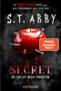

<b>Sie ist eine Serienkillerin. Er ist der FBI-Agent, der sie jagt. Band 1 des sensationellen BookTok-Hypes aus den USA endlich auf Deutsch!</b>  Die junge erfolgreiche Lana Myers lebt zurückgezogen in Virginia. Niemand würde vermuten, dass sie die meistgesuchte Serienkillerin des Landes ist. Ihre Opfer: Männer, die alle aus derselben Kleinstadt stammen. In einer dunklen Nacht vor zehn Jahren begingen sie ein unaussprechliches Verbrechen, und Lana hat grausame Rache geschworen. Dicht auf den Fersen ist ihr ein Spezialteam des FBI unter der Leitung von Agent Logan Bennett. Als Logan in einem Café eine attraktive junge Frau kennenlernt, ahnt er nicht, dass er dabei ist, eine Killerin in sein Leben zu lassen … <b>Schockierend, dark und sexy – alle Bände der Reihe im Überblick:</b> <b>Band 1</b>: Secret – Du sollst mich fürchten <b>Band 2</b>: Blood – Du sollst bereuen <b>Band 3</b>: Revenge – Du sollst flehen <b>Band 4</b>: Pain – Du sollst leiden <b>Band 5</b>: Rage – Du sollst brennen

[View on Apple](https://books.apple.com/de/book/secret-du-sollst-mich-f%C3%BCrchten/id6760581947)

## Das Gift der Sünde

<b>In den Wäldern Michigans lauern dunkle Geheimnisse</b>  Eine Reihe brutaler Morde bringt das FBI in Bedrängnis. Alle Beweise deuten auf einen Verdächtigen hin: Sam Noble, der Vater von FBI-Agentin Emma Noble. Sam, ein erfahrener CIA-Agent, ist spurlos verschwunden und lässt Emma zwischen Pflicht und Loyalität hin- und hergerissen zurück. Entschlossen, seine Unschuld zu beweisen, beginnt sie eine unerbittliche Jagd nach ihrem Vater. Als Emma tiefer gräbt, stößt sie auf alte Geheimnisse und einen Familienverrat, der alles zu erschüttern droht, was sie über Sam – und sich selbst – zu wissen glaubte. Während die Zeit abläuft und die Zahl der Toten steigt, steht Emma vor einer unmöglichen Entscheidung: ihre Familie zu schützen oder ihren Vater vor Gericht zu bringen.  <b>Dieser Fall bringt FBI-Agentin Emma Noble an ihre Grenzen – ist ihr Vater wirklich ein Mörder</b>?  Band 2 der unabhängig voneinander lesbaren Thriller-Serie rund um Special Agent Emma Noble&#xa0;  <b>Band 1: Sein Wille geschehe&#xa0;</b>  <b>Band 2: Das Gift der Sünde</b>

[View on Apple](https://books.apple.com/de/book/das-gift-der-s%C3%BCnde/id6754460508)

## Last Chance

Ellys Leben scheint zerstört. Alle Träume, Wünsche Hoffnungen – verloren, zerbrochen. Außer Stande, überhaupt noch Freude zu empfinden, zieht sie sich immer weiter zurück. Und wird langsam aber stetig wieder zu der Frau, die sie nie wieder sein wollte. Devon ist seit dem Anschlag ein völlig anderer. Ohne zu wissen, was er ihr damit antut, stößt er Elly von sich. Doch damit riskiert er, sie für immer zu verlieren. Denn Ryan ist noch nicht fertig mit den beiden und wartet schon seit langem darauf, ihnen endlich den finalen Schlag zu versetzen. Wie groß kann eine Liebe sein, wenn sie aufgehört hat zu wachsen?

[View on Apple](https://books.apple.com/de/book/last-chance/id1243589034)

## The Mistake

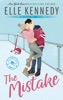

<b>Original Series now on Prime Video. Can't wait for Season 2 of Off Campus? Fall in love with Grace and Logan...</b>  <b>Welcome to Briar U!</b>  <b> Get ready for your newest obsession . . . Discover the addictive world of the Off-Campus series from The Queen of Hockey Romance, Elle Kennedy! </b> <b>Read <i>The Mistake </i>now for the perfect second chance romance!</b> <b>Also available as a Deluxe HB</b>  <b>He's a player in more ways than one . . . </b>  College junior John Logan can get any girl he wants. For this hockey star, life is a parade of parties and hook-ups, but behind his killer grins and easygoing charm, he hides growing despair about the dead-end road he'll be forced to walk after graduation. A sexy encounter with freshman Grace Ivers is just the distraction he needs, but when a thoughtless mistake pushes her away, Logan plans to spend his final year proving to her that he's worth a second chance.   <b>Now he's going to need to up his game . . . </b>  After a less than stellar freshman year, Grace is back at Briar University, older, wiser, and so over the arrogant hockey player she nearly handed her V-card to. She's not a charity case, and she's not the quiet butterfly she was when they first hooked up. If Logan expects her to roll over and beg like all his other puck bunnies, he can think again. He wants her back? He'll have to work for it. This time around, she'll be the one in the driver's seat . . . and she plans on driving him wild.  ***  <b>Why fans love Elle Kennedy </b><b>⭐ ⭐ ⭐ ⭐ ⭐!</b>   'Delicious, complicated and drama-filled . . . I read it in one sitting, and you will, too'<b> L. J. Shen, <i>USA Today</i> bestselling author</b>  'A deliciously sexy story with a wallop of emotions that sneaks up on you' <b>Vi Keeland, <i>New York Times</i> bestselling author</b>  'This book had the ability to make me swoon one minute, put my heart in my throat the next, then literally make me burst right out laughing out of the blue' <b>Goodreads Review</b>  'The best college romance I've read. It had epic banter, sexy romance, and fantastic writing!! I laughed, I swooned, I couldn't put it down. Highly recommended!!' <b>Goodreads Review</b>  'Elle Kennedy proves, once again, that she is the Queen of College Hockey Romance!!'<b> Goodreads Review</b>  '5-Made My Heart Pitter Patter-Stars' <b>Goodreads Review</b>  'One of the few authors who can instantly put a grin on my face as soon as I start reading her books' <b>Goodreads Review</b>  <b>💗💗💗</b>  <b>Tropes:</b> <b>🏒</b>Second chance romance 🏒Hockey romance 🏒Bad Boy x Good Girl 🏒College romance 🏒He falls first

[View on Apple](https://books.apple.com/de/book/the-mistake/id6466581025)

## Perry Rhodan 3387: Andromeda antwortet nicht

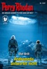

Gut 4000 Jahre in der Zukunft bildet die Erde das Zentrum eines Sternenreiches, das Tausende von Welten umfasst. Überall leben die Menschen in Frieden und Freiheit. Zu den anderen Völkern der Milchstraße und ihren Angehörigen besteht ein freundschaftlicher Austausch. 
 
Perry Rhodan hat darüber hinaus eine ­Vi­sion: Er will die Verbindungen zu anderen Galaxien ausbauen. Das Projekt von San soll das ermöglichen, Raumschiffe des Typs PHOENIX sollen als Kuriere dienen. Der ­ursprüngliche PHOENIX ist derzeit unter dem Kommando von Reginald Bull in der kosmischen Nähe der Sterneninsel Malora unterwegs. 
 
In der Milchstraße bahnen sich Neuerungen an: Das Elysion, ein friedlicher Galaxienbund, ist nach langer Vorbereitung im Begriff, sich zu konstituieren. Aber der neue Bund steht, ebenso wie die Wiederentstehung der Superintelligenz ES, im Fadenkreuz geheimnis­voller Feinde. 
 
Dabei handelt es sich um die Legaten, über die man so gut wie nichts weiß. Der Arkonide Atlan folgt ihrer Spur und gelangt in die ­Außenbezirke der Galaxis Andromeda – doch ANDROMEDA ANTWORTET NICHT …

[View on Apple](https://books.apple.com/de/book/perry-rhodan-3387-andromeda-antwortet-nicht/id6755304194)

## Totenfang

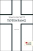

<b>Fesselnd und atmosphärisch dicht erzählt Bestsellerautor Simon Beckett in «Totenfang» den fünften Fall für den forensischen Anthropologen David Hunter – ein Thriller mit Gänsehaut-Garantie.</b> In den Backwaters, einem unwirtlichen Mündungsgebiet in Essex, wird zwischen Seetang und Schlamm eine stark verweste Männerleiche gefunden. Die Polizei geht davon aus, dass es sich um den seit über einem Monat verschwundenen Leo Villiers handelt. Er soll eine Affäre mit einer verheirateten Frau gehabt und schließlich sich selbst umgebracht haben. Doch David Hunter kommen Zweifel an der Identität des Toten, denn tags darauf treibt ein einzelner Fuß im Wasser, und der gehört definitiv zu einer anderen Leiche. Für die Zeit seiner Ermittlungen kommt Hunter in einem abgeschiedenen Bootshaus unter. Die Bewohner der Gegend begegnen ihm mit unverhohlener Feindseligkeit, jeder hier scheint etwas zu verbergen. Und noch ehe er das Rätsel um den unbekannten Toten lösen kann, fordert die unbarmherzige Wasserlandschaft erneut ihren Tribut …

[View on Apple](https://books.apple.com/de/book/totenfang/id1152699917)

## Deviant Hearts (Deutsche Ausgabe)

Jetzt das eBook zum Einführungsangebot sichern!  <b>Die Enemies-to-lovers-Romance und erste Band der <i>Dark Hearts</i>-Reihe: Eine arrangierte Ehe soll einen Mafiakrieg verhindern. </b>  Mafia Romance, arranged marriage, forced proximity – spicy, dark und unwiderstehlich.  Ich würde alles tun, um den kommenden Mafiakrieg zu verhindern. Sogar meinen Todfeind heiraten.  Ares Drakos – der neue König der Drakos Familie – verkörpert mit jeder Faser den Kriegsgott, nach dem er benannt wurde. Ein brutaler Tyrann, ein tödlich schönes Monster, und bald mein Ehemann.&#xa0;  Doch nichts an dieser Beziehung ist echt. Wir müssen nur unsere gegenseitige Abneigung genug zügeln, um endlich das Blutvergießen zwischen der irischen und griechischen Mafia zu stoppen.  Auch wenn er sündhaft gefährlich und köstlich unanständig ist.  Auch wenn er und sein Traumkörper in mein Leben, meine Gedanken und mein Bett eingedrungen sind.  Eines wird er nie erobern:  mein Herz.&#xa0;  Eine <b>spicy Dark-Mafia-Romance</b> perfekt für Fans von <b>D. C. Odesza</b>, <b>Sophie Lark</b> und <b>L. J. Shen</b>.  Diese <b>Tropes </b>erwarten dich: Enemies to LoversArranged MarriageFamily SecretsLook at her and dieForced ProximityPossessive and protective hero Auch einzeln als&#xa0;<b>Standalone </b>lesbar!  Die weiteren Bände der Dark-Romance-Reihe sind: Deviant HeartsVicious Hearts (erscheint voraussichtlich im Herbst 2026)Sinful Hearts (erscheint voraussichtlich im Herbst 2026)Twisted Hearts (erscheint voraussichtlich im Frühjahr 2027) Diese Reihe beinhaltet Themen, die bei manchen Menschen ungewollte Reaktionen auslösen können. Bitte achtet daher auf die Liste mit sensiblen Inhalten, die wir im Buch zur Verfügung stellen. Leseempfehlung ab 18 Jahren.

[View on Apple](https://books.apple.com/de/book/deviant-hearts-deutsche-ausgabe/id6754895791)

## Rise and Fall

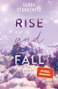

<b>Auftakt der Faith-Trilogie von Sarah Stankewitz: Romantisch, dramatisch, zum Weinen und zum Lachen!</b>  »Die Geschichte von Sky und Carter hat mich zutiefst berührt und wird mich so schnell nicht wieder loslassen.« thebookelle  <b>Wenn du den Boden unter den Füßen verlierst, musst du nach den Sternen greifen!</b>  Nach einem One-Night-Stand mit ihrem besten Freund Carter flieht Skylar überstürzt aus der Wohnung. Auf dem Heimweg hat sie einen Unfall, der ihr Leben für immer verändert. Sie wird nie wieder gehen können und sitzt von nun an im Rollstuhl. Carter verlässt am Morgen nach ihrer gemeinsamen Nacht für ein halbes Jahr das Land, um als Musikjournalist mit einer Band durch Europa zu touren. Sky möchte nicht, dass er für sie seinen Traum aufgibt, und so verheimlicht sie ihm den Unfall. Und ihre Gefühle, die weit über eine Freundschaft hinausreichen. Doch seine Rückkehr naht, und bald müssen sie sich der Wahrheit stellen…  <b>Die berührende Faith-Reihe</b> Rise and Fall: Wenn du den Boden unter den Füßen verlierst, musst du nach den Sternen greifen.Shatter and Shine: Wenn in einer lauten Welt plötzlich alles verstummt, kannst du nur noch auf dein Herz hören.Dream and Dare: Wenn die Angst dir die Sprache verschlägt, musst du dein Herz singen lassen. *** Eine berührende Friends-To-Lovers Geschichte über einen One-Night-Stand, einen Unfall, der alles verändert und eine ganz besondere Liebe. Fesselnd von der ersten bis zur letzten Seite! ***

[View on Apple](https://books.apple.com/de/book/rise-and-fall/id1596963519)

## The Legacy

<b>Original Series now on Prime Video</b>  <b>Welcome to Briar U!</b>  <b> Get ready for your newest obsession . . . Discover the addictive world of the Off-Campus series from The Queen of Hockey Romance, Elle Kennedy! </b> <b>Read <i>The Legacy </i>now for the much-anticipated answer to the question: Where are they now?</b><b></b>  <b>Four stories. Four couples. Three years of real life after graduation. . .</b>  A wedding. A proposal. An elopement. And a surprise pregnancy.  Life after college for Garrett and Hannah, Logan and Grace, Dean and Allie, and Tucker and Sabrina, isn't quite what they imagined it would be. Sure, they have each other, but they also have real-life problems that four years at Briar U didn't exactly prepare them for. As it turns out, for these four couples, love is the easy part. Growing up is a whole lot harder.  <b>Come for the drama, stay for the laughs! Catch up with your </b><b>favourite</b><b> Off-Campus characters as they navigate the changes that come with growing up and discover that big decisions can have big consequences . . . and big rewards.</b>  ***  <b>Why fans love Elle Kennedy </b><b>⭐ ⭐ ⭐ ⭐ ⭐!</b>  'Delicious, complicated and drama-filled . . . I read it in one sitting, and you will, too'<b> L. J. Shen, <i>USA Today</i> bestselling author</b>  'A deliciously sexy story with a wallop of emotions that sneaks up on you' <b>Vi Keeland, <i>New York Times</i> bestselling author</b>  'This book had the ability to make me swoon one minute, put my heart in my throat the next, then literally make me burst right out laughing out of the blue' <b>Goodreads Review</b>  'The best college romance I've read. It had epic banter, sexy romance, and fantastic writing!! I laughed, I swooned, I couldn't put it down. Highly recommended!!' <b>Goodreads Review</b>  'Elle Kennedy proves, once again, that she is the Queen of College Hockey Romance!!'<b> Goodreads Review</b>  '5-Made My Heart Pitter Patter-Stars' <b>Goodreads Review</b>  'One of the few authors who can instantly put a grin on my face as soon as I start reading her books' <b>Goodreads Review</b>

[View on Apple](https://books.apple.com/de/book/the-legacy/id6466581837)

## Weil sie dich kennt

<b>Stehst du vor dem Altar, kannst du nicht mehr entkommen</b>  Es soll der schönste Tag in Millies Leben werden. In wenigen Stunden wird sie ihre große Liebe Enzo heiraten. Es gibt nur ein Problem: Jemand will nicht, dass sie diesen Moment noch erlebt. Jemand, der ihr bereits näher ist, als sie ahnt … <b>Eine packende Kurzgeschichte, die zwischen Band 2 und 3 der "Housemaid"-Reihe spielt und nach der Lektüre beider Bücher gelesen werden kann.</b>

[View on Apple](https://books.apple.com/de/book/weil-sie-dich-kennt/id6739147280)

## Todesstrand

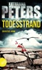

Ostseemorde.  Emma Klar war eine leidenschaftliche Polizistin. Bis ein Einsatz gegen Mädchenhändler furchtbar schieflief. Sie wurde tagelang gefangen gehalten und wäre fast getötet worden. Nun hat sie sich ins beschauliche Wismar zurückgezogen – angeblich als Privatdetektivin. In Wahrheit jedoch hat man sie angewiesen, verdeckt zu ermitteln. Ihr erster Fall erscheint harmlos. Ein Mann glaubt nicht, dass seine sechzehnjährige Tochter sich umgebracht hat. Routiniert macht sich Emma an die Arbeit. Bald findet sie heraus, dass noch andere junge Frauen verschwunden sind – und sie stößt auf einen Namen, der sie beinahe in Panik versetzt: Teith. Ein Mann mit diesem Namen gehörte zu ihren Peinigern ...  Ein packender Ostseekrimi mit einer verdeckten Ermittlerin, der erste Band der Serie um Emma Klar. Von der Autorin der Bestseller „Hafenmord“,„Leuchtturmmord“ und "Bornholmer Schatten".

[View on Apple](https://books.apple.com/de/book/todesstrand/id1096711554)

## Kein Kuss unter dieser Nummer

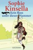

Poppy Wyatt schwebt im siebten Himmel, schließlich steht sie kurz vor der Hochzeit mit ihrem Traummann. Dummerweise verliert sie ihren äußerst wertvollen Verlobungsring, dann wird ihr auch noch das Handy gestohlen. Als Poppy ein weggeworfenes Smartphone findet, behält sie es kurzerhand. Schließlich muss sie die Suchaktion für ihren Ring organisieren. Dummerweise gehört das Handy dem Geschäftsmann Sam Roxton, dessen Leben bald kopfsteht. Denn Poppy kann dem Impuls nicht widerstehen, in Sams Nachrichten zu stöbern und kurzerhand ein paar Kleinigkeiten für ihn zu regeln – mit den besten Absichten, aber chaotischen Folgen. Gleichzeitig laufen Poppys Hochzeitsvorbereitungen aus dem Ruder und ihr Privatleben gerät in die Krise. Bald ist klar: Sam und Poppy sind aufeinander angewiesen, wenn sie ihr Leben wieder in den Griff bekommen wollen ...

[View on Apple](https://books.apple.com/de/book/kein-kuss-unter-dieser-nummer/id549665038)

## Teufelsring

<b>Atmosphärisch, vielschichtig, hochspannend – Ein skandinavischer Krimi mit einem Twist, der alles verändert</b>  Mit ›Teufelsring‹ setzt Frida Skybäck ihre erfolgreiche Reihe um Ermittlerin Fredrika Storm eindringlich fort: ein Nordic Noir-Krimi über verdrängte Wahrheiten, das Echo der Vergangenheit und den Moment, in dem ein Dorf nicht länger wegsehen kann.<b></b>  <b>Ein brutaler Mord im Moor und die Schatten einer alten Tragödie</b> Im Naturreservat Nöbbelövs Mosse bei Lund entdeckt eine Familie beim Camping die grausam zugerichtete Leiche des 21-jährigen Mattias Lindqvist. Für Fredrika Storm und Henry Calment beginnt ein Fall, der schnell über die Grenzen des kleinen Dorfs Vallkärra hinausweist – und der mehr Fragen aufwirft, als den Ermittlern lieb sein kann.  "Joost?", sagte Lenz in einem sanfteren Tonfall und ging neben seinem Sohn in die Hocke. "Was schaust du da an?"   Der Junge sagte nichts, doch als Lenz versuchte, ihn zu sich zu drehen, hob er die Hand und zeigte auf etwas. "Da", flüsterte er. Lenz ließ seinen Blick wandern, und als er hinter den Grashalmen etwas entdeckte, stand er wieder auf.   Lag dort jemand? Er ging näher und zuckte zusammen, als er einen blutigen Kopf sah.   "Ist er tot?", fragte Joost.   Als Lenz begriff, was sie gefunden hatten, brach eine Welle der Panik über ihn herein. Eine männliche Leiche in gepflegter Kleidung, über dessen zerschlagenem Gesicht Insekten schwirrten.  <b>Ein Verbrechen, das nie aufgeklärt wurde</b> Mattias' Tod rührt an eine alte Wunde: Vor fünfzehn Jahren wurde seine Mutter Lena auf dieselbe grausame Weise ermordet, der Täter nie gefunden, ihr Partner verschwand spurlos. In Vallkärra lebt die Erinnerung in Gerüchten und Verdächtigungen weiter. Was verbindet die beiden Verbrechen – und wer hat ein Interesse daran, dass die Wahrheit bis heute im Dunkeln bleibt?  <b>Das Ermittlerduo Frederika Storm und Henry Calment gegen ein Netz aus Einschüchterung und Loyalität</b> Während Fredrika in Mattias' zurückgezogenes Leben zwischen Hörbehinderung, Dorfalltag und einer Online-Community eintaucht, stoßen sie und Henry auf Drohungen, Abhängigkeiten und eine Familie, die Probleme lieber mit Druck als mit Worten löst. Je näher sie dem Kern der Geschichte kommen, desto gefährlicher wird es – denn in Vallkärra schützt man Geheimnisse um jeden Preis.  <b>»Frida Skybäck wird immer besser. ›Teufelsring‹ ist ein sehr gut geschriebener und kluger Kriminalroman.« Mattias Edvardsson, Bestsellerautor von "Die Lüge"</b>  Bisher sind von der Frederika Storm-Reihe von Frida Skybäck bereits erschienen:  Band 1: Schwarzvogel  Band 2: Eisenblume  Band 3: Schattenmädchen

[View on Apple](https://books.apple.com/de/book/teufelsring/id6762142307)

## Der Fall Kallmann

<b>Wie lebt es sich im Schatten eines Mordes? </b>  Wer war Eugen Kallmann? Warum musste der beliebte Gesamtschullehrer in der beschaulichen schwedischen Kleinstadt sterben? Wirklich nur ein Unglücksfall, wie die Polizei behauptet? Als sein Nachfolger im Schwedischunterricht, Leon Berger, nach der langen Sommerpause seinen Dienst antritt, findet er im Pult unter Kallmanns Sachen eine Reihe von Tagebüchern, die sich als eine Mischung aus Dichtung und Wahrheit entpuppen und ihn schon bald daran zweifeln lassen, dass sein Vorgänger tatsächlich eines natürlichen Todes gestorben ist. Denn in seinen Einträgen behauptet Kallmann unter anderem, er würde die Gabe besitzen, in den Augen anderer Menschen erkennen zu können, ob sie gemordet haben. Und er scheint in den letzten Monaten seines Lebens einem nie entdeckten und nie gesühnten Verbrechen auf der Spur gewesen zu sein. Leon Berger will den Fall Kallmann lösen – seine privaten Ermittlungen setzen etwas in Gang, das schließlich die ganze Kleinstadt erschüttert.

[View on Apple](https://books.apple.com/de/book/der-fall-kallmann/id1273594381)

## Schnelles Denken, langsames Denken

<b>Der Weltbestseller, der das Denken von Millionen Menschen verändert hat - jetzt als hochwertige Erfolgsausgabe</b>  Dieses Buch hat die Welt erobert und die Art und Weise, wie wir über unser Verhalten nachdenken, revolutioniert. Ein Kompass für den Alltag, ein Handbuch für Entscheider - ein Bestseller, der von einer jüngeren Generation immer wieder aufs Neue entdeckt wird. Wie treffen wir unsere Entscheidungen? Warum ist Zögern ein überlebensnotwendiger Reflex, und warum ist es so schwer zu wissen, was uns in der Zukunft glücklich macht? Daniel Kahneman, Nobelpreisträger und einer der einflussreichsten Wissenschaftler der Gegenwart, zeigt anhand ebenso nachvollziehbarer wie verblüffender Beispiele, welchen mentalen Mustern wir folgen und wie wir uns gegen verhängnisvolle Fehlentscheidungen wappnen können.  Der Weltbestseller jetzt in einer hochwertigen Erfolgsausgabe: Eine Million verkaufte Exemplare der deutschsprachigen Ausgabe!

[View on Apple](https://books.apple.com/de/book/schnelles-denken-langsames-denken/id540851666)

## Ilias & Odyssee (Vollständige deutsche Ausgabe, speziell für elektronische Lesegeräte)

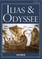

Homer: Ilias &amp; Odyssee  
• Für die eBook-Ausgabe neu editiert, und speziell an elektronische Lesegeräte angepasst 
• Voll verlinkt, mit separaten Inhaltsverzeichnissen der beiden Epen, inklusive der Kapitel-Zusammenfassungen, sowie einem dezidierten Gesamt-Inhaltsverzeichnis. 
• Mit einem Vorwort des Herausgebers  
Die »Homerische Frage« ist eines der großen ungelösten Rätsel der Literaturwissenschaft, und möglicherweise wird die Antwort für immer im Dunkeln bleiben. Die Frage lautet in ihrem Kern: Gab es tatsächlich den einen Schöpfer der großen griechischen Epen, den wir Homer nennen? Und wenn es ihn gab, war er der ursprüngliche Autor, oder ein geschickter Sammler und Redakteur des Materials? Oder sind die homerischen Epen das Werk mehrerer Dichter? Und wann und unter welchen Umständen sind sie entstanden? Wir wissen es nicht.  
Was man aber weiß: »Ilias« und »Odyssee« sind in ihrem Ursprung rund 3000 Jahre alte Texte, und gehören zu den ältesten Meisterwerken der Weltliteratur. Ihr Einfluss auf die gesamte abendländische Kultur, Literatur und Kunst ist überwältigend, zu vergleichen allenfalls mit der Bibel.  
Homer lieferte mit beiden Epen einen unvergleichlichen Schatz von Episoden, Motiven, Gleichnissen und Parabeln, von denen Dichtung, Literatur und Film bis heute profitieren – bis hin zum letzten großen Hollywoodfilm, der sich dem Thema widmete, »Troja«  
eClassica – Die Buchreihe, die Klassiker neu belebt.

[View on Apple](https://books.apple.com/de/book/ilias-odyssee-vollst%C3%A4ndige-deutsche-ausgabe-speziell/id852975897)

## One more Chance

Während des alles entscheidenden Kampfes gegen Ryan erfährt Devon, dass sowohl von Elly als auch von seiner Schwester jede Spur fehlt. Um sie zurückzubringen, würde er alles tun.   Elly erwacht und weiß nicht, wo sie ist oder wer sie entführt hat. Doch schnell erkennt sie, dass ihr ein Kampf auf Leben und Tod bevorsteht. Als sich eine grausame Wahrheit auftut, weiß Elly, dass nichts mehr so sein wird, wie es einmal war. Unklar bleibt nur, was das für ihre Zukunft bedeuten wird …  Wie weit gehst du, um diejenigen zu retten, die du liebst? Und was passiert, wenn sie nie wieder dieselben sein werden?

[View on Apple](https://books.apple.com/de/book/one-more-chance/id1144030834)

## Still Beating

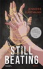

<b>"Solange dein Herz schlägt, bist du okay" – der Booktok-Megaerfolg erstmals auf Deutsch!</b>  Als Cora die Geburtstagsparty ihrer Schwester verlässt, erwartet sie höchstens einen schlimmen Kater. Womit sie nicht rechnet, ist ein gestohlenes Portemonnaie und dass ausgerechnet Dean, der unausstehliche Verlobte ihrer Schwester, sie nach Hause fahren muss. Womit sie auch nicht rechnet, ist, nach einem Unfall an Dean gefesselt im Keller eines Fremden aufzuwachen. Cora und Dean müssen sich gemeinsam ihrem schlimmsten Albtraum stellen. Diese traumatische Erfahrung wird ihnen alles abverlangen – sie wird die Grenzen zwischen Hass und Liebe nachhaltig verwischen und sie beide mehr aneinanderbinden, als Ketten es je vermochten … <b>Bei diesem Buch handelt es sich um Dark-Thriller-Romance mit düsteren Themen und einer Leseempfehlung ab 18 Jahren. Im Buch sind Triggerwarnungen enthalten.</b>  <b>Books that make you – blush.</b> Du suchst Liebesgeschichten mit reichlich Spice, mitreißenden Tropes oder morally grey book boyfriends? Dann entdecke weitere Bücher von Blush!  Enthaltene Tropes: Rivals to Lovers, Forbidden Love/Romance, Forced Proximity, He Falls First, Morally grey Spice-Level: 4 von 5

[View on Apple](https://books.apple.com/de/book/still-beating/id6754518246)

## Schlosshotel Fuschl

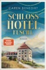

<b>Ein malerisch gelegenes Hotel. Eine Besitzerin, die um ihre Existenz kämpft. Und eine Familie voller abgrundtiefer Geheimnisse. +++Jetzt zum Einführungspreis sichern! (Befristete Preisaktion des Verlages)+++</b>  Salzburger Land, Sommer 1955: Theresa von Reuschenberg, Hotelière mit Herz und Vision, steht vor dem Chaos. Die Festspiele laufen, "Sissi" wird gedreht, die High Society geht bei ihr ein und aus – und plötzlich taucht ihr tot geglaubter Bruder Benedikt auf. Gezeichnet von der Kriegsgefangenschaft, fordert er seinen Anteil am Familienerbe. Während Theresa von finanziellen Schwierigkeiten geplagt um ihre Hotels kämpft, droht Benedikt, alles zu zerstören. Doch Theresa lässt sich ihre Liebe und Leidenschaft nicht nehmen und tut alles, um ihre Hotels, vor allem aber ihre Familie, beisammenzuhalten. <b>Noch mehr mitreißenden Lesestoff bietet die Bestsellerautorin mit ihrer Trilogie "Das Grand Hotel".</b>

[View on Apple](https://books.apple.com/de/book/schlosshotel-fuschl/id6761611797)

## Wie das Schweigen vor der Flut

Die lang ersehnte Fortsetzung von WIE DIE RUHE VOR DEM STURM  Seit dem Tod ihrer Mutter vor einem Jahr fühlt sich Karla East, als hätte das Leben sie vergessen. Jeder Tag zieht leer an ihr vorbei — bis ein stiller Morgen auf dem Friedhof alles verändert. Dort begegnet sie ihm: Dem Jungen mit den traurigsten Augen, die sie je gesehen hat. Dem Jungen, dessen Schweigen lauter klingt als jedes Wort. Karlas Herz erkennt in seiner Seele einen Schmerz, der dem ihren so ähnlich ist, dass er Hoffnung macht. Und zum ersten Mal seit Langem fragt sie sich: Kann aus zwei gebrochenen Herzen ein neuer Anfang wachsen? Und darf man wirklich wieder leben lernen - wenn man glaubt, alles verloren zu haben?
  Fortsetzung von WIE DIE RUHE VOR DEM STURM von SPIEGEL-Bestseller-Autorin Brittainy Cherry

[View on Apple](https://books.apple.com/de/book/wie-das-schweigen-vor-der-flut/id6754835749)

## Mord ohne Vorwort

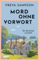

Der Buchclub des englischen Küstendorfs St Tredock ist eine eingeschworene Gemeinschaft: Die Rentnerin Phyllis kennt alle Agatha-Christie-Krimis in- und auswendig, Arthur liest seiner Frau Liebesgeschichten vor, und der schüchterne Teenager Ash flüchtet sich am liebsten in Science-Fiction-Romane. Nova, die neue Leiterin des Buchclubs im Gemeindezentrum, hat alle Hände voll zu tun, die Lesevorlieben unter einen Hut zu bringen. Eines Tages bekommt die bunte Runde unerwarteten Zuwachs: Der geheimnisvolle Michael taucht auf – und verschwindet während eines Treffens genauso plötzlich wieder. Kurz darauf wird seine Mutter tot aufgefunden, und 10.000 Pfund fehlen in der Kasse des Gemeindezentrums. Das schreit nach Verbrechen!, denken die Hobbydetektive des Buchclubs und wittern ihre Chance, ihren bei Miss Marple erlernten Spürsinn einzusetzen, um für Gerechtigkeit zu sorgen. Denn dass es sich beim Tod von Michaels Mutter nicht um einen Unfall handeln kann, ist schnell klar. Inspiriert von Weisheiten aus ihren liebsten Büchern begeben sich die Buchclubmitglieder auf die Spuren des Verbrechens, immer mit einem guten Schuss britischem Humor im Gepäck.

[View on Apple](https://books.apple.com/de/book/mord-ohne-vorwort/id6761890781)

## Verlogenes Sylt

<b>Sylt, im März:</b> Während sich die Einheimischen schon mit Grauen auf das nächste Protestcamp und die Rückkehr der Punker vorbereiten, sterben zwei Überbleibsel der Szene, die auf der Insel überwintert haben. Ein Fall, der Hannah Lambert und ihr Team vor besondere Herausforderungen stellt, denn die Punker hinterlassen neben haufenweise ungelösten Rätseln auch eine sechsjährige Tochter. Als Hannah dann bei einem ihrer typischen Alleingänge zur Dienstwaffe greifen muss, ist das Chaos komplett. Vorläufig freigestellt, ermittelt sie von nun an unterm Radar und bringt dabei nicht nur sich selbst in größte Gefahr …  <b>"Verlogenes Sylt" ist Teil 14 der Reihe "Hannah Lambert ermittelt".</b> <b>Jeder Fall ist in sich abgeschlossen. Es kann allerdings nicht schaden, auch die vorangegangenen Fälle zu kennen ;)</b>  <b>Bisher erschienen:</b> "Ausgerechnet Sylt" "Eiskaltes Sylt" "Mörderisches Sylt" "Stürmisches Sylt" "Schneeweißes Sylt" "Gieriges Sylt" "Turbulentes Sylt" "Düsteres Sylt" "Funkelndes Sylt" "Brennendes Sylt" "Vergangenes Sylt" "Trügerisches Sylt" "Vergessenes Sylt" <b>"Verlogenes Sylt" - JETZT BRANDNEU!</b>  "Hannah Lambert ermittelt" ist mit über 1 Mio. verkauften Exemplaren eine der erfolgreichsten Krimi-Serien der letzten Jahre. Alle Teile sind als eBook, Taschenbuch und Hörbuch verfügbar (der neueste Teil als Hörbuch folgt in Kürze).

[View on Apple](https://books.apple.com/de/book/verlogenes-sylt/id6761104079)

## Nasses Grab

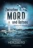

#Ein Toter am Strand ist das Letzte, was sie jetzt gebrauchen können!#

Am Ostseestrand der Halbinsel Holnis, Dänemark in Sichtweite, wird die schrecklich entstellte Leiche eines Mannes gefunden. Eine Hiobsbotschaft, die kurz vor Start der neuen Urlaubssaison zahlende Gäste abschrecken könnte. Somit ist bei den Ermittlungen Leisetreten angesagt.

Ina Drews und Jörn Appel – das neue Team der Flensburger Mordkommission – kommen da gerade recht. Aber schon ihr erstes Aufeinandertreffen endet im Eklat, wofür es gute Gründe gibt. Während sich die beiden widerwillig zusammenraufen, geht es mit den Ermittlungen anfangs erfreulich schnell voran.

Doch mehr und mehr versinkt alles sicher Geglaubte in einem Strudel aus Lügen und Halbwahrheiten. Hinzu kommt Druck von oben, mit dem sich Ina und Jörn noch zusätzlich herumschlagen müssen. Dabei gerät selbst der Mordfall zeitweise in Vergessenheit...

Der Nummer 1 Küstenkrimi von Bestseller-Autor Thomas Herzberg.

---

Zwischen Mord und Ostsee - Ein Tippfehler? Keineswegs! Vielmehr definiert diese Schreibweise, wo genau die Kommissare Ina Drews und Jörn Appel in dieser Krimi-Reihe auf die Jagd nach Mördern gehen. Zwischen den Meeren, wo Wind &amp; Wetter einen auf die Probe stellen, die meisten Leute nicht besonders redselig sind, und wo das Land so flach ist, dass man morgens schon sehen kann, wer mittags zu Besuch kommt. Eine Landschaft, in die man sich einfach verlieben muss. Wer dabei sein will, wenn Ina und Jörn zwischen Sylt, St. Peter-Ording und Usedom an Nordsee und Ostsee ermitteln, ist herzlich eingeladen. Und eins ist sicher: Langweilig wird es bestimmt nicht!

"Nasses Grab" ist Teil 1 der Krimi-Serie. Jedes Buch ist in sich abgeschlossen und kann unabhängig von den anderen Teilen gelesen werden.

[View on Apple](https://books.apple.com/de/book/nasses-grab/id6759726388)

## The Legacy – Endlich erwachsen

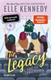

<b>Vier Geschichten. Vier Paare. Vier Happy Ends?</b>  Das Leben nach dem College ist für Garrett und Hannah, Logan und Grace, Dean und Allie sowie Tucker und Sabrina nicht ganz so, wie sie es sich vorgestellt haben. Plötzlich stehen sie vor Problemen, auf die sie die Jahre auf dem Campus nicht vorbereitet haben. &#xa0; Wie geht es nach dem Abschluss weiter? Haben sie eine gemeinsame Zukunft? Schnell stellen sie fest, dass es leicht ist, einander zu lieben. Ein gemeinsames Leben zu beginnen, ist dagegen viel schwieriger.&#xa0; Im fünften und letzten Band der »Off-Campus«-Reihe finden die Liebesgeschichten der vier Vorgängerbände in jeweils einer eigenen Novella ihren krönenden Abschluss.   »Witzig und herzerwärmend! Diese Sammlung ist ein echter Volltreffer! Unglaublich, was die Off-Campus-Crew alles anstellt!«  Sarina Bowen, »USA Today«-Bestsellerautorin  »Off-Campus«-Reihe, Band 5

[View on Apple](https://books.apple.com/de/book/the-legacy-endlich-erwachsen/id6444026165)

## Orangenleuchten an der Algarve

Mit Ende zwanzig scheint Cassys Leben perfekt: erfolgreiche TV‑Köchin, eigene Show, große Reichweite auf Social Media. Gefühle hält sie lieber auf Abstand. Doch als ihr entfremdeter Vater stirbt und ausgerechnet ihr einen Teil seiner Orangenplantage an der Algarve hinterlässt, gerät ihr sorgfältig geordnetes Leben aus dem Takt. In Faro trifft Cassy zwischen duftenden Orangenhainen und Atlantikküste auf ihre Halbschwester und Miterbin Lia - und auf Eliano, der eine Seite in ihr weckt, die sie lange verborgen hielt. Wie viel Mut braucht ein Neuanfang?

[View on Apple](https://books.apple.com/de/book/orangenleuchten-an-der-algarve/id6761406488)

## Die Bernsteinfischerin

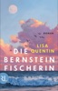

Da waren nur noch sie beide, ihre erschöpft schlagenden Herzen, das Meer, das sie trug, die Bucht, die sie umarmte. Tagsüber taucht Julika als Bernsteinforscherin in längst vergangene Welten ein, die sich ihr unter dem Mikroskop eröffnen – Farne, Echsen, alles Leben, das vor Millionen von Jahren vom Harz der Urzeitwälder eingeschlossen wurde. Am Abend, bei der Pflege ihrer kranken Mutter, steht ihr eigenes Leben still. Bis Julika in einem Bernstein einen außergewöhnlichen Fund macht, der sie an die Ostsee führt, zu Ebba, einer Frau, die immer ihren eigenen Weg gesucht hat. An der Steilküste, hoch oben über dem Meer, erfährt Julika dann von einer Liebe, die Jahrzehnte, Stürme, Schicksalsschläge überdauerte und die ihr den Mut gibt, an einen Neuanfang zu glauben ...  Ein so poetischer wie kraftvoller Roman über zwei Frauen und ihre Suche nach innerer Freiheit.    Die große E-Book-Premiere zum Einführungspreis!

[View on Apple](https://books.apple.com/de/book/die-bernsteinfischerin/id6762279801)

## Extinction

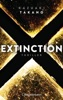

Ist die nächste Stufe der Evolution das Ende von uns allen?  Jonathan Yeager wird im Auftrag der amerikanischen Regierung in den Kongo geschickt. Bei einem Pygmäenstamm sei ein tödliches Virus ausgebrochen. Die Verbreitung muss mit allen Mitteln verhindert werden. Doch im Dschungel erkennt Yeager, dass es um etwas ganz anderes geht: Ein kleiner Junge, der über unglaubliche Fähigkeiten und übermenschliche Intelligenz verfügt, ist das eigentliche Ziel der Operation. Kann es sein, dass dieses Geschöpf die Zukunft der Menschheit bedroht? Yeager weigert sich, das Kind zu töten. Er setzt alles daran, den Jungen in Sicherheit zu bringen. Eine gnadenlose Jagd auf die beiden beginnt.

[View on Apple](https://books.apple.com/de/book/extinction/id952658970)

## The Goal – Jetzt oder nie

<b>Wunderbar romantisch und fesselnd bis zur letzten Seite: Im vierten Band der »Off-Campus«-Reihe von Elle Kennedy muss die Liebe viele Hürden meistern.   </b>  Sabrina James ist ein echtes Powergirl: Sie hat ihre Ziele klar vor Augen und arbeitet hart dafür, sie zu erreichen. Das College hat sie bereits als Jahrgangsbeste abgeschlossen, jetzt bereitet sie sich auf ihr Studium in Harvard vor. Die Karriere als Anwältin scheint zum Greifen nah.  &#xa0;  Wenn es eines gibt, das Sabrina jetzt nicht gebrauchen kann, dann ist das Ablenkung. Doch dann tritt Tucker in ihr Leben und bringt alles durcheinander.   Auch Tucker weiß ganz genau, was er will: Sabrina. Der Eishockeyspieler ist hin und weg von dem klugen, ehrgeizigen Mädchen und tut alles, um ihr seine Liebe zu beweisen. Doch Sabrina hat sich fest vorgenommen, sich durch nichts und niemanden von ihrem Weg abbringen zu lassen. Schafft Tucker es, ihr zu zeigen, dass man im Leben beides braucht: Karriere und Liebe?  &#xa0;  Mit Tucker hat Elle Kennedy einen Protagonisten geschaffen, wie man ihn sich nicht besser erträumen könnte: attraktiv, kein Macho wie seine Kumpels, ehrgeizig und verständnisvoll. Unermüdlich kämpft der gut aussehende und liebevolle Eishockeyspieler um Sabrinas Herz. Auch wenn es bei Sabrina etwas länger dauert, die Herzen der Leserinnen erobert Tucker im Sturm.    &#xa0;  <b>Träume, Wünsche und die ganz große Liebe: die »Off-Campus«-Reihe  </b>  Die »Off-Campus«-Reihe von Elle Kennedy ist New Adult-Romance in Bestform. Die Träume und Zweifel dieser besonderen Lebensphase werden ebenso thematisiert wie die ewigen Wirren des Herzens.  &#xa0; Nach »The Deal – Reine Verhandlungssache«, »The Mistake – Niemand ist perfekt« und »The Score – Mitten ins Herz« findet die beliebte Serie mit der Geschichte um Sabrina und Tucker ihr berauschendes Ende.&#xa0;

[View on Apple](https://books.apple.com/de/book/the-goal-jetzt-oder-nie/id1233210650)

## Die Vergessene

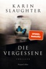

Vierzig Jahre Schweigen: Karin Slaughters neuer SPIEGEL-Bestseller zeichnet das aufrüttelnde Portrait eines grausamen Mordes  Ein Mädchen mit einem Geheimnis ... Ein kleiner Ort an der US-Ostküste, 1982: Sorgfältig macht sich die siebzehnjährige Emily Vaughn für ihren Abschlussball zurecht. Doch sie verbirgt ein Geheimnis, das ihr am Ende des Abends zum Verhängnis werden soll.  Ein ungelöster Mord ... Nicht nur Emily wurde in der Horrornacht vor vierzig Jahren zum Schweigen gebracht. Ihre Freunde und Familie haben sich abgeschottet, die Gemeinde spricht nicht über das brutal ermordete Mädchen. Aber dem malerischen Küstenort steht ein gewaltiger Sturm bevor.  Eine letzte Chance, den Täter zu finden ... US-Marshal Andrea Oliver ist aus scheinbar unverfänglichen Gründen in Longbill Beach: Sie soll eine Richterin vor Morddrohungen zu beschützen. Doch der Auftrag ist eine Tarnung. In Wirklichkeit ist Andrea auf den Spuren von Emilys Mörder – und sie muss die Wahrheit aufdecken, bevor sich die Tragödie des Jahrs 1982 wiederholt ...  »Ein mühelos gelungener Thriller« The Times  »Karin Slaughter [zeigt] erneut ihre Bestform.« Kulturnews  »Dieser Thriller liefert, was er verspricht. Er ist überraschend, berührend und spannend. Ich finde ihn absolut faszinierend« Adele Parks, Autorin von One Last Secret  »Gewohnt geschickt lässt Erfolgsautorin Slaughter die Handlung Haken schlagen, schickt Leserschaft und Ermittler gleichermaßen durch ein Labyrinth der Vermutungen und Anschuldigungen.« Axel Hill, Kölnische Rundschau  »Dieser erstklassige Detektivthriller ist ein düsteres, raffiniertes Juwel« Janice Hallett, Autorin von The Appeal  »Alles in allem hat mich das Buch von Anfang bis Ende wirklich gefesselt, auch weil der Schreibstil unglaublich mitreißend ist und ich unbedingt wissen wollte, was hinter dem Tod von Emily steckt.« feliz auf Vorablesen.de  »Ich mag Karin Slaughter, je spannender desto besser! Und hier hat sie wieder einen grandiosen Thriller hingelegt!!! Was ist mit der jungen Emily damals am Tag ihres Abschlussballs wirklich passiert? Wer hat sie so kaltblütig ermordet und warum?« Martina Dienstl, Buchhändlerin, auf NetGalley.de  »Erneut beweist Karin Slaughter ihr Gespür für lebensechte Charakterzeichnungen und einen Plot ohne überflüssigen Ballast.« Johannes Baumstuhl, Galore   »Sagenhaft spannende[r] Thriller der US-Autorin Karin Slaughter.« Morgenpost am Sonntag   Lesen Sie Karin Slaughters neuen Cold-Case-Thriller Die Vergessene, bereits jetzt ein SPIEGEL-Bestseller!

[View on Apple](https://books.apple.com/de/book/die-vergessene/id6443085313)

## Mile High

<b>Als der Hockey-Playboy Zanders der taffen Flugbegleiterin Stevie begegnet, fliegen die Funken – doch mit der Affäre riskieren sie nicht nur ihre Jobs, sondern auch ihre Herzen! Der TikTok-Hype endlich auf Deutsch!</b>  Frauenheld und Badboy Zanders lebt seinen Traum: Er spielt in der National Hockey League für Chicago, reist mit seinem Team durchs Land und nimmt fast jeden Abend eine andere Frau mit ins Bett. Für die neue Saison gibt es erstmals eine feste Crew für den Privatjet und damit eine goldene Regel: Finger weg von den Flugbegleiterinnen! Doch das ist hart: Crewmitglied Stevie ist schlagfertig, anders, ihre Art zieht Zanders an und vor allem ihre Kurven bekommt er nicht mehr aus dem Kopf …  Schon bald kann auch Stevie sich nicht mehr gegen die Anziehung wehren, doch sie weiß, dass sie nicht nur ihren Job, sondern auch ihr Herz riskiert, wenn sie sich auf Zanders einlässt …   <b>Sports Romance trifft auf Forbidden Love und Enemies to Lovers! </b>  Die "Windy City"-Reihe bei Blanvalet:  Band 1: Mile High  Band 2: The Right Move Band 3: Caught Up Band 4: Play Along <i>Alle Bände sind unabhängig voneinander lesbar. </i>  Enthaltene Tropes: Sports Romance, Enemies to Lovers, Forbidden Love/Romance Spice-Level: 4 von 5

[View on Apple](https://books.apple.com/de/book/mile-high/id6471257370)

## Madame le Commissaire und die gefährliche Begierde

<b>Madame le Commissaire ermittelt an den Traumzielen der französischen Riviera:</b>  »Madame le Commissaire und die gefährliche Begierde« ist der<b> 12. Provence-Krimi um die sympathische Kommissarin Isabelle Bonnet</b> von Bestseller-Autor Pierre Martin.  Isabelle Bonnet ist geschockt, als sie von einer psychiatrischen Klinik kontaktiert wird: Dort behandelt man eine Patientin mit Amnesie. Die Frau ist ihre beste Freundin, Clodine. Sie wurde vor einigen Tagen früh morgens am Strand von Pampelonne aufgegriffen, splitterfasernackt und völlig verwirrt. Als erste Erinnerungen zurückkehren, erzählt Clodine von einer Party am Strand. Waren K.-o.-Tropfen im Spiel?  Madame le Commissaire bemerkt ein auffälliges Armband, das sie noch nie an Claudine gesehen hat – die ebenfalls nicht weiß, woher sie es hat. Als Apollinaire auf einen ähnlichen Fall stößt, bei dem das Opfer das gleiche Armband trug, wird der Fall brisant. Denn diese junge Frau ist tot …  <b>Die perfekte Urlaubslektüre für alle Frankreich-Fans</b>  Ihre Ermittlungen führen Isabelle Bonnet an pittoreske Schauplätze, die die Provence von ihren schönsten Seiten zeigen – von malerischen Stränden bis zu blühenden Lavendelfeldern. Mit seinen <b>Urlaubskrimis</b> bietet Pierre Martin die perfekte Mischung aus spannenden Fällen, sympathischen Figuren, traumhaftem Urlaubsflair und einer Prise Witz.  Die <b>Wohlfühlkrimis</b> um Madame le Commissaire Isabelle Bonnet sind in folgender Reihenfolge erschienen:  1.&#xa0;&#xa0;&#xa0; Madame le Commissaire und der verschwundene Engländer  2.&#xa0;&#xa0;&#xa0; Madame le Commissaire und die späte Rache  3.&#xa0;&#xa0;&#xa0; Madame le Commissaire und der Tod des Polizeichefs  4.&#xa0;&#xa0;&#xa0; Madame le Commissaire und das geheimnisvolle Bild  5.&#xa0;&#xa0;&#xa0; Madame le Commissaire und die tote Nonne  6.&#xa0;&#xa0;&#xa0; Madame le Commissaire und der tote Liebhaber  7.&#xa0;&#xa0;&#xa0; Madame le Commissaire und die Frau ohne Gedächtnis  8.&#xa0;&#xa0;&#xa0; Madame le Commissaire und die panische Diva  9.&#xa0;&#xa0;&#xa0; Madame le Commissaire und die Villa der Frauen  10.&#xa0; Madame le Commissaire und die Mauer des Schweigens  11.&#xa0; Madame le Commissaire und das geheime Dossier  12.&#xa0; Madame le Commissaire und die gefährliche Begierde  Noch mehr spannende Urlaubslektüre aus Südfrankreich liefert Bestseller-Autor Pierre Martin mit seiner <b>Krimi-Reihe »Monsieur le Comte«</b>.

[View on Apple](https://books.apple.com/de/book/madame-le-commissaire-und-die-gef%C3%A4hrliche-begierde/id6737575182)

## Ocean View Avenue – Wo deine Träume wahr werden

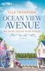

<b>Willkommen in der Ocean View Avenue – wo die Liebe ein Zuhause findet</b>  Harper McNally würde alles für ihre Familie tun. Vor zehn Jahren ist sie mit ihrer Schwester Brooke aus dem gewalttätigen Elternhaus in Kansas geflohen. Gemeinsam ziehen sie seitdem Brookes Tochter Reeva in der Sicherheit des kleinen Inselstädtchens Jamestown in Rhode Island groß. In dem gemütlichen Viertel mit den bunten Häusern an der Ocean View Avenue verläuft Harpers Leben endlich in geordneten Bahnen. Wäre da nicht ihr Chef, Blake Marshall, der ihr Herz stolpern lässt, sie aber nicht mal wahrzunehmen scheint. Bis er sie zu einem Wochenende auf die Ranch seiner Familie einlädt. Was Harper jedoch nicht ahnt: Blake hat sich geschworen, nie wieder einer Frau zu vertrauen.

[View on Apple](https://books.apple.com/de/book/ocean-view-avenue-wo-deine-tr%C3%A4ume-wahr-werden/id6447099010)

## G. F. Unger 2385

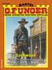

Als sie die Filiale der Kansas Bank in Longhorn City betreten, wirken sie ganz und gar wie seriöse Geschäftsleute und gewiss nicht wie Banditen. Denn sie haben sich gut getarnt. Lyn Skinner trägt einen Vollbart und auf der Nase einen Kneifer. Er sieht in seinem zu weiten Anzug wie ein zerstreuter Professor aus.  Jeremy Kilroy wirkt mit seiner grauen Perücke und dem Krückstock sehr viel älter, als er ist. Er humpelt stark und hält sich leicht gebückt. Johnny Hackett hat sich als mexikanischer Hidalgo verkleidet und gibt sich stolz und vornehm.  Nun, diese drei so unterschiedlich wirkenden »Gentlemen« betreten also nacheinander kurz vor Geschäftsschluss die Bank und warten geduldig, bis sie die letzten Kunden sind ...

[View on Apple](https://books.apple.com/de/book/g-f-unger-2385/id6781996531)

## Turbulentes Sylt

<b>Sylt, Ostersamstag: </b>Ein erstklassiges Surf-Event lockt tausende Erlebnishungrige an den Strand vor Westerland. Neben Wellenreiten ist auf der beliebten Ferieninsel Party angesagt. Die ausgelassene Stimmung der Nacht endet abrupt, als in den frühen Morgenstunden die Leiche einer jungen Frau gefunden wird. Die Identität der Toten und auch die des vermeintlichen Mörders sorgen bei Hannah und ihrem Team für einen regelrechten Schock – handelt es sich doch um Oles Ex und seinen besten Freund. Ein neuer Fall, der alle Beteiligten vor ungeahnte Herausforderungen stellt … &#xa0; <b>"Turbulentes Sylt"&#xa0;ist Teil 7 der Reihe "Hannah Lambert ermittelt".&#xa0; Jeder Fall ist in sich abgeschlossen. Es kann allerdings nicht schaden, auch die vorangegangenen Fälle zu kennen ;)</b> &#xa0; <b>Bisher erschienen:</b> "Ausgerechnet Sylt" "Eiskaltes Sylt" "Mörderisches Sylt" "Stürmisches Sylt" "Schneeweißes Sylt" "Gieriges Sylt" "Turbulentes Sylt" "Düsteres Sylt" "Funkelndes Sylt" "Brennendes Sylt" "Vergangenes Sylt" "Trügerisches Sylt"<b> </b> "Vergessenes Sylt" "Verlogenes Sylt" <b>"Kaputtes Sylt" - JETZT BRANDNEU!</b>  "Hannah Lambert ermittelt" ist mit über 1 Mio. verkauften Exemplaren eine der erfolgreichsten Krimi-Serien der letzten Jahre. Alle Teile sind als eBook, Taschenbuch und Hörbuch verfügbar (der neueste Teil als Hörbuch folgt in Kürze).

[View on Apple](https://books.apple.com/de/book/turbulentes-sylt/id6476923204)

## Bedrohliche Alpilles

Der 13. Fall der SPIEGEL-Bestseller-Reihe Capitaine Roger Blanc ist von Gadet ins benachbarte Salon-de-Provence versetzt worden, wo er ab jetzt vor allem rätselhafte Cold Cases aufklären soll. Sein erster Fall ist ein Mord, der vor sechs Jahren stattgefunden hat: Damals wurde eine Familie in ihrem Auto auf einem entlegenen Parkplatz in den Alpilles nahezu vollständig ausgelöscht. Ebenso starb dort ein Radfahrer, der scheinbar nichts mit den anderen Opfern zu tun hatte. Blanc und seine Kollegen ermitteln in Eyguières und in Aureille, zwei malerischen Kleinstädten, deren Bewohner jedoch dunkle Geheimnisse mit sich herumtragen. Da ist die Freundin eines Opfers, die durch das Verbrechen zu einem Kind und Geld kam. Die alte Bäuerin, die sich betrogen fühlt. Da sind die beiden Rentner, die nicht nur als Touristen in die Provence fahren. Und dann die Toten selbst, die immer mysteriöser werden, je länger die Ermittlungen andauern. Nach und nach entwirren Blanc und seine Kollegen ein Gespinst aus Lügen, Täuschungen und Illusionen. Bis sie erkennen, was sich an dem heißen Sommertag vor sechs Jahren wirklich zugetragen hat. Mord in der Provence – Capitaine Roger Blanc ermittelt: Band 1: Mörderischer Mistral Band 2: Tödliche Camargue Band 3: Brennender Midi Band 4: Gefährliche Côte Bleue Band 5: Dunkles Arles Band 6: Verhängnisvolles Calès Band 7: Verlorenes Vernègues Band 8: Schweigendes Les Baux Band 9: Geheimnisvolle Garrigue Band 10: Stille Sainte-Victoire Band 11: Unheilvolles Lançon Band 12: Rätselhaftes Saint-Rémy Band 13: Bedrohliche Alpilles Alle Bände sind eigenständige Fälle und können unabhängig voneinander gelesen werden.

[View on Apple](https://books.apple.com/de/book/bedrohliche-alpilles/id6754271709)

## Schuld und Sühne

"Schuld und Sühne", in neueren Übersetzungen auch "Verbrechen und Strafe", ist der 1866 erschienene erste große Roman von Fjodor Dostojewski.  
Sankt Petersburg Mitte des 20. Jahrhunderts: Der intelligente, aber arme Jura-Student Raskolnikow sieht sich selbst als "außergewöhnlichen Menschen", der sich nur einer höheren, abstrakten Macht verantwortlich fühlt. Um sich und der Welt diese Besonderheit zu beweisen, plant er einen perfekten, einen "erlaubten" Mord an der Pfandleiherin Iwanowna, in der er das Übel der Welt vertreten sieht. Raskolnikow gleitet in die Katastrophe, denn er ist nicht der Übermensch ohne Gewissen, für den er sich gehalten hat.  
Eines der wichtigsten Werke russischer Literatur. Mit einem Vorwort zu Autor und Werk.

[View on Apple](https://books.apple.com/de/book/schuld-und-s%C3%BChne/id588287654)

## The Love Hypothesis – Die theoretische Unwahrscheinlichkeit von Liebe

<b>Die Unvernunft der Liebe</b>.  Biologie-Doktorandin Olive glaubt an Wissenschaft – nicht an etwas Unkontrollierbares wie die Liebe. Doch dann ist sie gezwungen, eine Beziehung vorzutäuschen, und küsst in ihrer Not den Erstbesten. Was nicht nur eine Kette irrationaler Gefühle auslöst – der Geküsste ist Adam Carlsen: größter Labortyrann von ganz Stanford. Schon bald droht nicht nur Olives wissenschaftliche Karriere über dem Bunsenbrenner geröstet zu werden, auch ihre Verwicklung mit Carlsen fühlt sich mehr nach oxidativer Reaktion als romantischer Reduktion an. Olive muss dringend ihre Gefühle einer Analyse unterziehen …&#xa0;   <i>"Ein echtes Einhorn in der Welt der Liebesgeschichten – die unmöglich scheinende Verbindung von zutiefst schlau und herrlich eskapistisch."</i> Christina Lauren, New-York-Times-Bestsellerautorin   <b>Mit Bonus-Kapitel: Eine bislang auf Deutsch unveröffentlichte Szene aus Adams POV.</b>

[View on Apple](https://books.apple.com/de/book/the-love-hypothesis-die-theoretische/id1595725475)

## Die Flüsse von London

<b>»Können Sie beweisen, dass Sie tot sind?«</b>  Peter Grant ist Police Constable in London mit einer ausgeprägten Begabung fürs Magische. Was seinen Vorgesetzten nicht entgeht. Auftritt Thomas Nightingale, Polizeiinspektor und außerdem der letzte Zauberer Englands. Er wird Peter in den Grundlagen der Magie ausbilden. Ein Mord in Covent Garden führt den frischgebackenen Zauberlehrling Peter auf die Spur eines Schauspielers, der vor 200 Jahren an dieser Stelle den Tod fand.  <i>»Mein Name ist Peter Grant. Ich bin seit Neuestem Police Constable und Zauberlehrling, der erste seit fünfzig Jahren. Mein Leben ist dadurch um einiges komplizierter geworden. Jetzt muss ich mich mit einem Nest von Vampiren in Purley herumschlagen, einen Waffenstillstand zwischen Themsegott und Themsegöttin herbeiführen, Leichen in Covent Garden ausgraben. Ziemlich anstrengend, kann ich Ihnen sagen – und der Papierkram!« </i>

[View on Apple](https://books.apple.com/de/book/die-fl%C3%BCsse-von-london/id503879517)

## Paper Prince

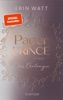

<b>Diese Royals werden dich ruinieren ...</b> Seit Ella in die Villa der Royals gezogen ist, steht das Leben dort auf dem Kopf. Durch ihre aufrichtige Art hat sie so manches Herz erobert – vor allem das von Reed. Zum ersten Mal seit dem Tod seiner Mutter kann der attraktivste der fünf Royal-Söhne echte Gefühle zulassen. Wie groß seine Liebe ist, merkt er allerdings erst, als es zu spät ist: Nach einem Streit verschwindet Ella spurlos. Und er trägt die Schuld daran. Seine Brüder hassen ihn dafür, doch er hasst sich selbst am meisten. Wird er Ella finden und ihr Herz zurückerobern können? <b>»Leidenschaftlich, sexy und voller Gefühl.« ―Buch Versum</b> <b>Die Paper-Reihe - New Adult mit Suchtfaktor</b> Ella Harpers Leben verändert sich schlagartig, als der Multimillionär Callum Royal behauptet, ihr Vormund zu sein. Aus ihrem ärmlichen Leben kommt Ella in eine Welt voller Luxus. Die Familie mit den fünf attraktiven Brüdern hat einige Geheimnisse zu verbergen ...

[View on Apple](https://books.apple.com/de/book/paper-prince/id1176586096)

## Die Hummerfrauen

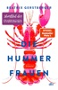

<b>Sommer in Maine: wo Vergangenheit auf&#xa0;Gegenwart trifft</b>  »Ich kann dir nichts über das Meer beibringen«, hatte Ann einmal zu Mina gesagt. »Du spürst es oder eben nicht. Am Ende ist es mit dem Meer wie mit dem Leben, man muss alles allein herausfinden. Andere können dich auf dem Weg nur begleiten.«   Die Sommer ihrer Kindheit verbrachte Mina jedes Jahr auf einer kleinen Insel in Maine, gemeinsam mit ihren Eltern und dem großen Bruder. Auf Eagle Island fühlte sich das Leben frei und leicht an: Mina streifte mit dem Fischerjungen Sam durch die Kiefernwälder, sammelte Muscheln und Vogelfedern, während die Erwachsenen die Tage am Strand und auf Gartenpartys vorbeiziehen ließen. Doch ein schicksalhafter Sommertag veränderte alles, die Wege von Mina und Sam trennten sich.  <b>Ein eindringlicher und berührender Roman über eine große Liebe, die für immer im Schatten der Vergangenheit steht </b>  Nun, fast zwanzig Jahre später, ist Minas Familie durch den plötzlichen Tod des Bruders zerbrochen. Sie hat allen Halt verloren, auch sich selbst ist sie fremd geworden. Und sie weiß: Ihre Suche nach sich selbst muss an jenem Ort beginnen, an dem sie zum letzten Mal glücklich war. In Maine, so hofft sie, wird sie endlich herausfinden, warum die Familie die Insel nach diesem Sommer für immer verließ und nie wieder zurückkehrte.  <b>Stürmisch wie das Leben, tief wie das Meer </b>  Mina strandet in einem Hummerfischerdorf bei den beiden Fischerinnen Ann und Julie. Die 72-jährige Ann lebt seit der Trennung von ihrer Lebensgefährtin allein in einem großen Haus am Wasser, nur ein seltener blauer Hummer namens Mr. Darcy leistet ihr Gesellschaft. Julie ist Mitte 50 und musste sich ihren Platz in der männlich geprägten Dorfgemeinschaft hart erkämpfen. Sie packt an, wo es nötig ist und nimmt kein Blatt vor den Mund, aber ihre Gefühle für den Fischer Nat kann sie aufgrund alter Verletzungen nicht zulassen.&#xa0;  <b>Der raue Alltag der Hummerfischerinnen wird zum Schauplatz eines inspirierenden Romans über Liebe, die Kraft weiblicher Gemeinschaft – und die Frage, ob die Vergangenheit unsere Gegenwart bestimmt </b>  Mit Ann und Julie fährt Mina hinaus aufs Meer, von ihnen erfährt sie Wärme und ein noch nie gekanntes Gefühl von Zugehörigkeit. Dann begegnet sie jedoch Sam wieder. Die tiefe Verbindung aus Kindheitstagen ist vom ersten Moment an wieder spürbar: Mina und Sam verlieben sich leidenschaftlich ineinander. Aber auch Sam kämpft mit seiner Vergangenheit, denn auch seine Familie war nach jenem schicksalhaften Sommer nicht mehr die, die sie einmal war.&#xa0;  »Wusstest du, dass ein Hummer nur deshalb fast hundert Jahre alt werden kann, weil er sich alle zwei bis drei Jahre häutet? Er stapelt einfach ein Leben auf ein nächstes, ohne zwischendurch den Tod reinzulassen. Er wächst sein Leben lang weiter und muss deshalb regelmäßig den alten Panzer abwerfen, damit er nicht zerquetscht wird. Klingt nicht schön, ist aber die größte Weisheit, die der alte Mr. Darcy mir mitgegeben hat.«

[View on Apple](https://books.apple.com/de/book/die-hummerfrauen/id6737350393)

## Dungeon Crawler Carl

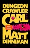

Arschwitzig, einfallsreich und absolut suchterzeugend. Die legendäre LitRPG-Fantasyserie um Dungeon Crawler Carl und die Perserkatze Princess Donut gibt es endlich auf Deutsch.&#xa0;  Willkommen im Dungeon. Entertainment ist Pflicht. Überleben nicht.  Das Leben ist nicht fair. Erst wird Carl von seiner Freundin sitzengelassen, und dann muss er mitten in der Nacht in Boxer Shorts und Lederjacke raus, um ihre Katze Prinzessin Donut zu retten. Noch unfairer wird es, als er von außerirdischen Invasoren gezwungen wird, an einer sadistischen, intergalaktischen Spielshow teilzunehmen.  In einem Dungeon voller Fallen, explodierender Goblins, Drogen dealenden Lamas besteht sein Leben von nun an vor allem darin, am Leben zu bleiben. Und dafür muss er neue Fähigkeiten entwickeln, mächtige Waffen finden und Sponsoren, die ihn in einer perversen und intriganten Medienwelt unterstützen, gegen die Panem ein Kindergarten ist. Zum Glück hat er Donut dabei, eine Katze mit viel Erfahrung im Showbusiness. Und dem unbedingten Willen zum Erfolg.  "Frisch. Kreativ. Urkomisch. Ich bin obsessed ... Princess Donut ist meine Königin." Felicia Day  "Wenn es ein besseres LitRPG als Dungeon Crawler Carl gibt, habe ich es noch nicht gelesen." Shirtaloon, Autor von He Who Fights Monsters  "Wie kann eine Serie nur so viel Tiefe, Gefühl und Komplexität unter ihrer derben, blutrünstigen Oberfläche verbergen? Was für eine verrückte und unerwartete Freude." Scott Lynch

[View on Apple](https://books.apple.com/de/book/dungeon-crawler-carl/id6742422659)

## Eisenblume

<b>Eine verlassene Psychiatrie und ein mysteriöser Leichenfund: Die schwedische Bestseller-Serie geht weiter!</b>  <b>Eine verlassene Psychiatrie</b>  Oktober 1987. Aus der psychiatrischen Klinik St. Lars verschwinden der 23-jährige Tommy Svensson und die psychisch instabile Ann-Louise Sparre, 17. Hinweise auf ein Gewaltverbrechen gibt es nicht.  <b>Ein schrecklicher Leichenfund</b>  35 Jahre später wird in der ehemaligen Klinik – das Gebäude ist längst zur Ruine verfallen – ein verwester Leichnam gefunden, in eine Wand eingemauert: Tommy Svensson, gestorben an Herzstillstand, angeblich aufgrund einer Überdosis Beruhigungsmittel.  <b>Ein nervenzerfetzender Falll für das ungleiche Duo Fredrika Storm und Henry Calment</b>  Fredrika Storm und Henry Calment rollen den Fall wieder auf, auch wenn die Spurenlage mehr als dürftig ist, befragen den früheren Klinikleiter, Ärzte und Pfleger. Was ist in der Oktobernacht passiert? Sie ernten nur Schulterzucken, keiner weiß etwas, keiner erinnert sich.  <b>Dieser Cold Case deckt Abgründe auf</b>  Fredrika und Henry sind überzeugt: Sie lügen alle! Während die beiden Ermittler sich mühsam in die Vergangenheit graben, gibt es einen weiteren Toten: Roger, seinerzeit Pfleger in St. Lars. Was wusste er, das ihm den Tod brachte? Welche Vorfälle in der Klinik werden seit Jahrzehnten vertuscht?  <b>Mit ›Eisenblume‹ gelang Frida Skybäck der Durchbruch in Schweden – jetzt erobert ihre Serie auch die deutschen Spannungsfans:</b>  »Die schwedische Bestsellerautorin Frida Skybäck hat mit ›Eisenblume‹ einen Kriminalroman geschrieben, der tief unter die Haut geht. Es ist der zweite Band der Fredrika-Storm-Reihe, mit atmosphärischer Dichte und psychologischem Feingespür sorgt er für Gänsehaut – mitten im Sommer.« boersenblatt.net&#xa0; »Unmöglich zur Seite zu legen. Gut konstruiert und gut geschrieben.« @bokfilosoferna   <b>Über Band 1: ›Schwarzvogel‹:</b>  »Hochspannender erster Fall für Fredrika Storm, dem hoffentlich noch viele weitere folgen werden.« Mainhattan Kurier

[View on Apple](https://books.apple.com/de/book/eisenblume/id6744529959)

## Firefly Island: Zurück zu dir

<b>Entscheidung für die Liebe</b>  Ivy Huntington Parker ist froh, auf Firefly Island etwas Abstand zu ihrem untreuen Ehemann in Hongkong zu bekommen. Das Wiedersehen mit ihren zwei Schwestern und die Aufregung um die erste Inselhochzeit haben sie von ihren Problemen daheim abgelenkt. Nun kündigt sich die nächste Hochzeitsfeier an, und während Ivys Jugendliebe, Schreiner Noah, vorher einiges rund um die Firefly Lodge reparieren muss, flammen die alten Gefühle wieder auf. Doch dann kommen erst Ivys Tochter und schließlich ihr Noch-Ehemann auf der Insel an. Kann sich Ivy für einen Neuanfang auf Firefly Island entscheiden, ohne ihre Tochter zu verlieren?

[View on Apple](https://books.apple.com/de/book/firefly-island-zur%C3%BCck-zu-dir/id6754519699)

## Bad Bishop

<b>"Du musst aufhören, mich töten zu wollen, Lila – du weißt, dass mich das anmacht." Band 1 der viralen Dark-Mafia-Romance-Reihe endlich auf Deutsch!</b>  Um ihren ruinierten Ruf zu retten, soll Mafiaprinzessin Lila Ferrante ausgerechnet an Tiernan Callaghan verheiratet werden, den Anführer des irischen Syndikats und Erzfeind ihrer Familie. Tiernan ist geheimnisvoll, grausam, berechnend – und stimmt dem wahnwitzigen Vorschlag zu Lilas Entsetzen zu. Was niemand weiß: Tiernan hat noch eine Rechnung mit einem alten Feind offen und braucht dafür dringend Verbündete. Lila scheint der Schlüssel zu sein, um seinen Racheplan endlich in die Tat umzusetzen. Doch nach und nach erschweren echte Gefühle dieses Vorhaben …  <b>Bei diesem Buch handelt es sich um Dark Romance mit einer Leseempfehlung ab 18 Jahren. Im Buch sind Triggerwarnungen enthalten.</b> <b>Books that make you – blush.</b> Du suchst Liebesgeschichten mit reichlich Spice, mitreißenden Tropes oder morally grey book boyfriends? Dann entdecke weitere Bücher von Blush!  Enthaltene Tropes: Arranged Marriage, Enemies to Lovers, Forced Proximity, Opposites Attract Spice-Level: 4 von 5

[View on Apple](https://books.apple.com/de/book/bad-bishop/id6755589421)

## Blood – Du sollst bereuen

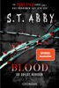

<b>Sie wollten mich auslöschen. Doch sie haben ein Monster erschaffen – Band 2 des sensationellen BookTok-Hypes aus den USA endlich auf Deutsch!</b>  Lana Myers ist jung, erfolgreich und seit Kurzem in einer glücklichen Beziehung mit dem FBI-Agenten Logan Bennett. Alles scheint perfekt. Was Logan aber nicht weiß: Lana ist die meistgesuchte Serienmörderin des Landes. Ihr Motiv ist Rache an einer Gruppe Männer, die ihr vor zehn Jahren unsagbares Leid angetan haben. Noch kann sie ihre wahre Identität geheim halten, doch Logan und sein Profiler-Team arbeiten unermüdlich an ihrem Fall. Ein einziger Fehler könnte Lanas Vergeltungsplan zum Einsturz bringen. Und sie ihre große Liebe kosten. Besonders seit Logans Kollegin Hadley sie im Visier hat … <b>Schockierend, dark und sexy – alle Bände der Reihe im Überblick:</b> <b>Band 1</b>:<b> </b>Secret – Du sollst mich fürchten <b>Band 2</b>: Blood – Du sollst bereuen <b>Band 3</b>: Revenge – Du sollst flehen <b>Band 4</b>: Pain – Du sollst leiden <b>Band 5</b>: Rage – Du sollst brennen

[View on Apple](https://books.apple.com/de/book/blood-du-sollst-bereuen/id6760581976)

## Blutrotes Grab

# Wo sonst Seehunde und Robben das Sagen haben, regieren plötzlich Gier und Angst. #

Helgoland im Sommer: Auf der kleinen Insel mitten in der Nordsee treibt ein Mörder sein Unwesen. Wo normalerweise schon ein Gemüsedieb für Aufruhr sorgt, wird plötzlich eine Leiche nach der anderen entdeckt.

Bei ihren Ermittlungen stehen Ina Drews und Jörn Appel vor zahlreichen Problemen, denn sie müssen nicht nur den Täter inmitten von Tagestouristen und Inselklüngel dingfest machen, sondern auch gegen interne Widerstände ankämpfen.

Zuletzt bleiben den Ermittlern nur Mittel, die auch leicht ihr Karriereende bedeuten könnten…

Der Nummer 1 Küstenkrimi von Bestseller-Autor Thomas Herzberg.

---

Zwischen Mord und Ostsee - Ein Tippfehler? Keineswegs! Vielmehr definiert diese Schreibweise, wo genau die Kommissare Ina Drews und Jörn Appel in dieser Krimi-Reihe auf die Jagd nach Mördern gehen. Zwischen den Meeren, wo Wind &amp; Wetter einen auf die Probe stellen, die meisten Leute nicht besonders redselig sind, und wo das Land so flach ist, dass man morgens schon sehen kann, wer mittags zu Besuch kommt. Eine Landschaft, in die man sich einfach verlieben muss. Wer dabei sein will, wenn Ina und Jörn zwischen Sylt, St. Peter-Ording und Usedom an Nordsee und Ostsee ermitteln, ist herzlich eingeladen. Und eins ist sicher: Langweilig wird es bestimmt nicht!

"Blutrotes Grab" ist Teil 3 der Krimi-Serie. Jedes Buch ist in sich abgeschlossen und kann unabhängig von den anderen Teilen gelesen werden.

[View on Apple](https://books.apple.com/de/book/blutrotes-grab/id6759726602)

## Grünes Grab

# Mord und Totschlag im Land der Horizonte! #

Ein neuer Fall führt Ina Drews und Jörn Appel nach Sankt Peter-Ording, wo eine kopflose Leiche für Aufruhr sorgt. Und die Ermittlungen im beliebten Ferienort an der Nordsee beginnen direkt mit einer unangenehmen Überraschung: Passt doch die DNA der Leiche zu einem Mann, der bereits für einen anderen Mord hinter Gittern sitzt. Ein Ding der Unmöglichkeit!

Aber dabei bleibt es nicht, denn die Liste der Verdächtigen wächst beinahe täglich. Um den wahren Mörder zu enttarnen, müssen Ina und Jörn sämtliche Register ziehen und tief in der Vergangenheit aller Beteiligten graben. Was sie dabei zutage fördern, ist an Abscheulichkeit kaum zu überbieten …

Der Nummer 1 Küstenkrimi von Bestseller-Autor Thomas Herzberg.

---

Zwischen Mord und Ostsee - Ein Tippfehler? Keineswegs! Vielmehr definiert diese Schreibweise, wo genau die Kommissare Ina Drews und Jörn Appel in dieser Krimi-Reihe auf die Jagd nach Mördern gehen. Zwischen den Meeren, wo Wind &amp; Wetter einen auf die Probe stellen, die meisten Leute nicht besonders redselig sind, und wo das Land so flach ist, dass man morgens schon sehen kann, wer mittags zu Besuch kommt. Eine Landschaft, in die man sich einfach verlieben muss. Wer dabei sein will, wenn Ina und Jörn zwischen Sylt, St. Peter-Ording und Usedom an Nordsee und Ostsee ermitteln, ist herzlich eingeladen. Und eins ist sicher: Langweilig wird es bestimmt nicht!

"Grünes Grab" ist Teil 2 der Krimi-Serie. Jedes Buch ist in sich abgeschlossen und kann unabhängig von den anderen Teilen gelesen werden.

[View on Apple](https://books.apple.com/de/book/gr%C3%BCnes-grab/id6759728358)

## Hunting Adeline

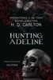

Der Diamant Der Tod geht neben mir, aber der Sensenmann ist kein Gegner für mich. Ich bin gefangen in einer Welt voller Monster, die als Männer verkleidet sind, und solchen, die nicht so sind, wie sie scheinen. Sie werden mich nicht ewig festhalten. Ich erkenne die Person, die ich geworden bin, nicht wieder. Und ich kämpfe darum, meinen Weg zurückzufinden. Zu der Bestie, die mich nachts jagt. Sie nennen mich einen Diamanten, aber sie schufen einen Engel des Todes. Der Jäger Ich wurde als Raubtier geboren, die Rücksichtslosigkeit tief in meinen Knochen verankert. Als mir nachts das, was mir gehört, gestohlen wurde und wie ein Diamant in einer Festung versteckt wird, stellte ich fest, dass ich die Bestie nicht länger zurückhalten kann. Blut wird den Boden bedecken, während ich die Welt auseinanderreiße, um sie zu finden. Um sie dahin zurückzubringen, wo sie hingehört. Niemand wird meinem Zorn entkommen, vor allem nicht diejenigen, die mich verraten haben.

[View on Apple](https://books.apple.com/de/book/hunting-adeline/id6475816504)

## Endstation Küste

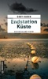

In Carolinensiel führt Kommissarin Tomke Evers ein beschauliches Leben, seitdem sie in den Innendienst gewechselt ist. Doch als Peter Schweigert, ein ehemaliger Kollege aus NRW und ihre frühere Liebe, eines Morgens reglos auf ihrer Gartenbank kauert, kippt die Ruhe. Er und seine Familie werden bedroht, verzweifelt sucht er Schutz bei Tomke. Als Tomke eine Verbindung zu einem ihrer Fälle erkennt, geraten nicht nur sie, sondern auch Oma Jettchen und Tant’ Fienchen, zwei ostfriesische Originale an ihrer Seite, ins Visier eines zwielichtigen Netzwerks - und in einen gefährlichen Strudel, der sich bedrohlich zuspitzt.

[View on Apple](https://books.apple.com/de/book/endstation-k%C3%BCste/id6761407865)

## Sie kann dich hören

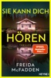

<b>Du kannst sie nicht sehen. Aber sie kann dich hören. Und ehe du es begreifst, hat das tödliche Spiel längst begonnen</b>  Millie Calloway hat einen neuen Job. Um sich ihr Studium zu finanzieren, hilft sie einem reichen Paar aus Manhattan im Haushalt. Ihr neuer Arbeitgeber Douglas Garrick wirkt nett, und zum Glück stellt er ihr nicht zu viele Fragen zu ihrer Vergangenheit. Doch warum darf Millie nicht mit seiner Frau Wendy sprechen oder in ihr Zimmer gehen? Was bedeuten das Weinen und die Blutflecke auf Wendys Kleidung? Ist Douglas in Wahrheit nicht der fürsorgliche Ehemann, der er vorgibt zu sein? Millie weiß nur eins: Sie muss Wendy helfen. Auch wenn sie damit riskiert, dass ihr dunkelstes Geheimnis doch noch ans Licht kommt.

[View on Apple](https://books.apple.com/de/book/sie-kann-dich-h%C3%B6ren/id6453475220)

## Paper Princess

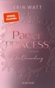

<b>Sie sind reich, sie sind mächtig und verdammt heiß! Kannst Du ihnen widerstehen?</b> Ellas Leben war bisher alles andere als leicht, und als ihre Mutter stirbt, muss sie sich auch noch ganz alleine durchschlagen. Bis ein Fremder auftaucht und behauptet, ihr Vormund zu sein: der Milliardär Callum Royal.&#xa0; Aus ihrem ärmlichen Leben kommt Ella in eine Welt voller Luxus. Doch bald merkt sie, dass mit dieser Familie etwas nicht stimmt. Callums fünf Söhne – einer schöner als der andere – verheimlichen etwas und behandeln Ella wie einen Eindringling. Und ausgerechnet der attraktivste von allen, Reed Royal, ist besonders gemein zu ihr.&#xa0; Trotzdem fühlt sie sich zu ihm hingezogen, denn es knistert gewaltig zwischen ihnen. Und Ella ist klar: Wenn sie ihre Zeit bei den Royals überleben will, muss sie ihre eigenen Regeln aufstellen … <b>»Leidenschaftlich, sexy und voller Gefühl.« ―Buch Versum</b> <b>Die Paper-Reihe - New Adult mit Suchtfaktor</b> Ella Harpers Leben verändert sich schlagartig, als der Multimillionär Callum Royal behauptet, ihr Vormund zu sein. Aus ihrem ärmlichen Leben kommt Ella in eine Welt voller Luxus. Die Familie mit den fünf attraktiven Brüdern hat einige Geheimnisse zu verbergen ...

[View on Apple](https://books.apple.com/de/book/paper-princess/id1176572862)

## This could be home

<b>Wenn sie aneinandergeraten, schlagen die Wellen hoch</b>  <b>Sunshine </b>Laurie, angehende Rettungsschwimmerin, trifft auf <b>Grumpy</b> Lifeguard Tristan im <b>zweiten New-Adult-Roman der Hawaii-Love-Trilogie von Bestseller-Autorin Lilly Lucas. </b>  Seit Laurie Greenfield von dem gefeierten Big Wave Surfer Griffin »Chip« Chipman vor dem Ertrinken gerettet wurde, steht für sie fest, dass sie Rettungsschwimmerin werden möchte. Dafür ausbilden soll sie Chips Bruder Tristan, der Lifeguard ist, allerdings kein Geheimnis daraus macht, dass er Laurie für völlig ungeeignet hält, den harten Bedingungen am rauen North Shore standzuhalten.  Doch während er Laurie trainiert, merkt er, dass viel mehr in ihr steckt, als er dachte. Und dass sie ein ziemlich bezauberndes Lächeln hat. Auch Laurie muss ihre Meinung von Tristan überdenken, als ihr bewusst wird, dass er nicht nur zu ihr hart ist, sondern auch zu sich selbst. Vor allem fragt sie sich, was der Grund dafür ist …  Eine charmante Enemies-to-Lovers-Geschichte von der Bestseller-Autorin der New-Adult-Reihen »Green Valley« und »Cherry Hill«. Zum Wegträumen und Verlieben!  Die Hawaii-Love-Trilogie auf einen Blick: This could be love (Louisa &amp; Vince: Enemies to Lovers)This could be home (Laurie &amp; Tristan: Grumpy &amp; Sunshine, Enemies to Lovers, Forced Proximity)This could be forever (Millie &amp; Chip: Second Chance Romance, Forced Proximity)

[View on Apple](https://books.apple.com/de/book/this-could-be-home/id6476070331)

## Heated Rivalry

A&#xa0;NEW YORK TIMES&#xa0;BESTSELLER • NOW A #1 STREAMING SHOW&#xa0;  The epic enemies-to-lovers hockey romance from Rachel Reid, streaming on Crave in Canada and on HBO Max in the U.S.  "The book that got me into hockey romance." —NPR's&#xa0;Weekend Edition  Nothing interferes with pro hockey star Shane Hollander’s game.  Now that he’s captain of the Montreal Voyageurs, he won’t let anything jeopardize that—definitely not the sexy rival he loves to hate.  Boston Bears captain Ilya Rozanov is everything Shane’s not. The self-proclaimed king of the ice, he’s as cocky as he is talented. No one can beat him—except Shane. Publicly, they’re enemies. Privately, they can’t stop touching each other.&#xa0;  The smart thing to do? Walk away, once a few secret hookups turn into a struggle to keep their relationship out of the press. The truth could ruin them both. But for Shane and Ilya, secrecy is soon no longer an option…  Game Changers Book 1: Game Changer Book 2: Heated Rivalry Book 3: Tough Guy Book 4: Common Goal Book 5: Role Model Book 6: The Long Game Book 7: Unrivaled  Need more Reid?! Check out these other standalones from your favorite MM hockey romance writer: Time to Shine The Shots You Take

[View on Apple](https://books.apple.com/de/book/heated-rivalry/id6446993012)

## Mörderisches Sylt

<b>Sylt, mitten in der Hochsaison – doch für Urlaubspläne bleibt den Kommissaren Hannah Lambert und Sven-Ole Friedrichsen keine Zeit</b>. &#xa0; Nacheinander werden die Leichen zweier Callgirls gefunden, und schnell wird offensichtlich, dass sämtliche Spuren auf Deutschlands beliebtester Ferieninsel enden. Als dann eine dritte junge Frau verschwindet, beginnt ein Wettrennen, bei dem Hannah und Ole gezwungen werden, weiter als je zuvor über ihre Grenzen hinauszugehen. Um einen weiteren Mord zu verhindern, müssen sie wirklich <i>alles</i> auf eine Karte setzen … &#xa0; <b>"Mörderisches Sylt" ist Teil 3 der Reihe "Hannah Lambert ermittelt". Jeder Fall ist in sich abgeschlossen. Es kann allerdings nicht schaden, auch die vorangegangenen Fälle zu kennen ;)</b> &#xa0; <b>Bisher erschienen:</b> "Ausgerechnet Sylt" "Eiskaltes Sylt" "Mörderisches Sylt" "Stürmisches Sylt" "Schneeweißes Sylt" "Gieriges Sylt" "Turbulentes Sylt" "Düsteres Sylt" "Funkelndes Sylt" "Brennendes Sylt" "Vergangenes Sylt" "Trügerisches Sylt"<b> </b> "Vergessenes Sylt" "Verlogenes Sylt" <b>"Kaputtes Sylt" - JETZT BRANDNEU!</b>  "Hannah Lambert ermittelt" ist mit über 1 Mio. verkauften Exemplaren eine der erfolgreichsten Krimi-Serien der letzten Jahre. Alle Teile sind als eBook, Taschenbuch und Hörbuch verfügbar (der neueste Teil als Hörbuch folgt in Kürze).

[View on Apple](https://books.apple.com/de/book/m%C3%B6rderisches-sylt/id6476921155)

## Ostfriesengrab

»Die ideale Lektüre für einen sonnigen Tag im Strandkorb.« krimi-couch.de  
Im zauberhaften Park von Schloss Lütetsburg wird eine weibliche Leiche gefunden. Der Mörder hat sie wie eine Elfe in den blühenden Sträuchern drapiert. Welche Botschaft will er Kommissarin Ann Kathrin Klaasen und ihrem Team damit übermitteln? Auch der dritte Kriminalroman mit der beliebten Kommisarin verspricht Spannung pur.

[View on Apple](https://books.apple.com/de/book/ostfriesengrab/id420095552)

## Provenzalische Geheimnisse

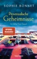

<b>Ein spannender Hochgenuss!</b>  Im idyllischen Dorf Sainte-Valérie wird eine Hochzeit gefeiert: Die Tische sind geschmückt, es duftet nach Lavendel, und der Wildschweinbraten dreht sich am Spieß. Der ehemalige Kommissar Pierre Durand fiebert bereits dem Ende der Feier entgegen, denn dann will er ein Gläschen mit Köchin Charlotte trinken. Doch so weit kommt es nicht: Der Bruder der Braut wird tot aufgefunden, von Schrotkugeln durchsiebt. War es ein Jagdunfall? Oder Mord? Pierres Ermittlungen führen ihn in die einsamen Wälder der Provence – und mitten ins Herz des Dorfes ... <b>"Niemand verbindet Genuss und Verbrechen so harmonisch wie Sophie Bonnet in ihren Provence-Krimis." </b><i><b>Hamburger Morgenpost</b></i>  <b>Lesen Sie auch weitere Romane der hoch spannenden "Pierre Durand"-Reihe! </b> <b>Alle Bände sind eigenständige Fälle und können unabhängig voneinander gelesen werden.</b>

[View on Apple](https://books.apple.com/de/book/provenzalische-geheimnisse/id953333273)

## Er lügt

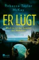

<b>Das perfekte Paar? Der perfekte Urlaub? Es ist: die perfekte Lüge.</b> <b>Die neue sensationelle Stimme in der internationalen psychologischen Spannung ist ein Summer Beach Read der Extraklasse. Unter der gleißenden Sonne des Trendsettings Amalfiküste liegen Luxus, Eskapismus und Slow-Burn-Lesethrill tödlich nah beieinander. </b>August 1961: Clara Carmichael ist glücklich. Sicher lenkt ihr Mann Spencer das zitronengelbe Cabrio auf der berühmten Küstenstraße nach Positano. Nur eine niedrige Mauer trennt sie vom hunderte Meter tiefer liegenden türkisblauen Meer. Eine aufregende Kulisse für die Flitterwochen an der Amalfiküste. Spencer ist reich, charmant und sorgt sich rührend um seine zweiundzwanzigjährige Frau. Schon bald nach ihrer Ankunft im Palazzo Rosso mit dem spektakulären Blick bemerkt die zurückhaltende Clara jedoch, dass ihr Mann angespannt ist. Und warum spricht er Italienisch? Die Fragen werden zu ernsthaften Zweifeln, als ihr jemand einen Zettel zukommen lässt: «Er lügt». Aber nicht nur Spencer scheint hinter der perfekten Fassade etwas zu verbergen. Die beiden Eheleute lernen die selbstbewusste Vivian und den lebenslustigen Fred kennen, die ein Paar sind. Was verschweigen die neuen Freunde? Und was Clara?&#xa0; Unter der gleißend hellen Sonne der Urlaubsidylle brodeln dunkle Geheimnisse – so dunkel wie Tod. Clara ahnt: Dieser Sommer ist der Sommer der Wahrheit. <b>Ein Muss für alle Fans von&#xa0;Bad Summer People und Freida McFadden, White Lotus und Ripley.&#xa0;</b>

[View on Apple](https://books.apple.com/de/book/er-l%C3%BCgt/id6760677505)

## Lügen, die von Herzen kommen

Hanna hat keinen Freund. Und sie hat die klassische Eieruhrfigur. Zu beidem steht sie. Trotzdem muss man Letzteres ja nicht gleich in die Cyberwelt hinausposaunen. 

Prompt lernt sie beim Chatten "Boris" kennen, endlich den Mann, der all das zu haben scheint, was Hanna sich wünscht. Beim Online-Partnerschaftstest erreicht er 397 von 400 Punkten. Einem Real-Date steht nichts mehr im Weg. Wäre da nicht der neue Chef. Der ist nämlich sehr viel charmanter als zunächst vermutet und ein ernsthafter Konkurrent für den 397-Punkte-Mann aus der Chat-Runde ...

[View on Apple](https://books.apple.com/de/book/l%C3%BCgen-die-von-herzen-kommen/id399664985)

## Schlafenszeit – Albträume erwachen, wenn diese Tür sich schließt

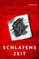

<b>»Ich habe </b><b>›Schlafenszeit‹ gelesen und geliebt ... die Plot-Twists sind wirklich überraschend, und es hat diese schwer zu erreichenden Sogkraft, die einen das Buch nicht aus der Hand legen lässt. Und die Bilder sind großartig!« -STEPHEN KING</b>  Der vierjährige Teddy malt für sein Leben gerne. Seine neue Babysitterin Mallory liebt seine Kreativität, und gemeinsam spielen, malen und lachen sie. Doch dann werden Teddys Zeichnungen immer düsterer und verstörender. Nach dem so liebenswürdigen Gekritzel malt der kleine Junge plötzlich einen grausamen Mord, immer und immer wieder. Mallory ist besorgt und verängstigt, doch Teddys Eltern behaupten, es sei nur eine Phase. Aber Mallory lassen die schrecklichen Bilder keine Ruhe und rauben ihr nachts den Schlaf, wenn sie allein in ihrer Hütte im Garten ist. Sie versucht dahinterzukommen, was es mit den schrecklichen Zeichnungen auf sich hat, ohne zu ahnen, in welche Spirale des Grauens sie sich begibt.  <b>Mit Schwarz-Weiß-Illustrationen</b><b></b>  Das mitreißende Horrordebut von Jason Rekulak überzeugt nicht nur durch Hochspannung und unvorhersehbare Plottwists, sondern liefert auch düstere Schwarz-Weiß-Illustrationen, die essentieller Teil der Handlung sind und den Lesespaß ins Unermessliche steigern.&#xa0;  <b>Gewinner "Bestes Horror-Buch" des Goodreads Choice Awards 2022</b>  Jason Rekulak ist Autor und Herausgeber von Quirk Books in Philadelphia. Dort hat er bereits zahlreiche New-York-Times-Bestseller mitkonzipiert und veröffentlicht. Mit »Schlafenszeit«&#xa0; legt er nun sein Horror-Debüt vor, das Leser:innen und Autor:innen gleichermaßen begeistert. Die Illustrationen stammen von Will Staehle und Doogie Horner.

[View on Apple](https://books.apple.com/de/book/schlafenszeit-albtr%C3%A4ume-erwachen-wenn-diese-t%C3%BCr-sich/id6469048206)

## Deal with the Devil

<b>Du kannst versuchen, ihm zu widerstehen. Aber es wird dir nicht gelingen ...</b>  Ria Sanchez hat eines im Leben gelernt: Man kann die Zeit nicht zurückdrehen, so schön das auch wäre. Und leider hat ihr kleiner Fauxpas den Chef ihrer Schwester Millionen gekostet und ihn zum Gespött Torontos gemacht. Adrien Cloutier, milliardenschwerer, berühmt-berüchtigter Spross Kanadas größter Hoteliersfamilie, hat anscheinend eines im Leben <i>nicht</i> gelernt: zu vergeben und zu vergessen. Oh nein, Ria soll büßen, oder ihre geliebte Schwester ist ihren Job los. 24 Stunden am Tag muss Ria dem teuflisch attraktiven Adrien jeden Wunsch von den Lippen ablesen. Und er hat nicht vor, ihr diesen Deal leicht zu machen. Doch Adrien weiß nicht, aus welchem Holz Ria geschnitzt ist. Kampflos aufzugeben, gehört nicht zu ihren Stärken. Sie muss den arroganten Schönling nur ansehen und verspürt reine Lust … äh, Mordlust natürlich!   Enthaltene Tropes: Billionaire, Enemies to Lovers, Fake Dating, Forced Proximity Spice-Level: 2 von 5

[View on Apple](https://books.apple.com/de/book/deal-with-the-devil/id6754519489)

## Der Bademeister ohne Himmel

<b>«Es gibt Bücher, die lange nachhallen. Dieses ist so eines. Steht auf meiner persönlichen Bestsellerliste jetzt ganz oben.» (Christine Westermann)</b>  Linda ist fünfzehn und würde am liebsten vor ein Auto laufen. Doch noch halten zwei Menschen sie davon ab: ihr einziger Freund Kevin, der daran verzweifelt, dass die Welt am Abgrund steht. Und Hubert, sechsundachtzig Jahre alt, ein Bademeister im Ruhestand, der seine Wohnung kaum mehr verlässt, Karotten toastet und auf seine Frau wartet, die vor sieben Jahren verstorben ist. Dreimal wöchentlich verbringt Linda den Nachmittag bei Hubert, um die polnische Pflegerin Ewa zu entlasten, die mit durchaus eigenwilligen Mitteln ihren Beruf ausübt. Feinfühlig und spielerisch begegnet Linda Huberts fortschreitender Demenz und versucht, den alten Bademeister im Leben zu halten. Bis das Schicksal ihre Pläne durchkreuzt …  Petra Pellini erzählt mit Wärme und Humor vom Erwachsenwerden und Vergessen und von einer einzigartigen Freundschaft.

[View on Apple](https://books.apple.com/de/book/der-bademeister-ohne-himmel/id6480137155)

## Der Schatten des Windes

Der unvergessliche Roman eines einzigartigen Erzählers – Carlos Ruiz Zafóns Welterfolg An einem dunstigen Sommermorgen des Jahres 1945 wird der junge Daniel Sempere von seinem Vater an einen geheimnisvollen Ort in Barcelona geführt – den Friedhof der Vergessenen Bücher. Dort entdeckt Daniel den Roman eines verschollenen Autors für sich, er heißt ›Der Schatten des Windes‹, und er wird sein Leben verändern … Carlos Ruiz Zafón eroberte mit seinem Buch die Herzen leidenschaftlicher Leser rund um den Globus. ›Der Schatten des Windes‹ bildet den Auftakt eines einzigartigen, fesselnden und berührenden Werks, er ist der erste von vier Barcelona-Romanen um den Friedhof der Vergessenen Bücher und die Buchhändler Sempere &amp; Söhne. Auf ›Der Schatten des Windes‹ folgten ›Das Spiel des Engels‹ und ›Der Gefangene des Himmels‹. Der vierte und abschließende Band ist in Arbeit.

[View on Apple](https://books.apple.com/de/book/der-schatten-des-windes/id605642611)

## Du schon wieder

<b>Vorbei ist vorbei – oder verdient die Liebe doch noch eine zweite Chance?</b> <b></b>   Krankenhausärztin Fanny kann es nicht fassen: Ausgerechnet ihr Ex-Mann Dustin wird in die Notaufnahme eingeliefert. Nun soll sie sein Herz retten, obwohl er ihres gebrochen hat. Und es kommt noch krasser: Plötzlich ist da wieder dieses alte Kribbeln. Und das, obwohl Fanny ihr stilles Glück an der Seite des beständigen Robert gefunden hat. Was zur Hölle soll das werden – Beziehung reloaded? Oder doch nur Sex mit dem Ex? Schon bald steht Fanny vor den ganz großen Fragen …&#xa0;  Einmalig komisch und immer romantisch schreibt Bestsellerautorin Ellen Berg darüber, wie es manchmal einfach schlechtes Timing und die Herausforderungen des Alltags sein können, die der Liebe im Wege stehen.

[View on Apple](https://books.apple.com/de/book/du-schon-wieder/id6755205200)

## Schattenmädchen

<b>Welches Geheimnis hüten die alten Mauern der Elite-Universität Lund?</b>  <b>Eine verschwundene Studentin, ein Sommer voller Lügen</b> An einem drückend heißen Sommerabend verschwindet die Studentin Isabelle Karlsson von der Party eines erfolgreichen Technologieunternehmens, gegründet von zwei ehemaligen Studenten der Universität Lund. Der charismatische CEO Martin Zenberg beteuert, weder er noch sein Unternehmen hätten irgendeine Verbindung zu der jungen Frau – doch ist er wirklich glaubwürdig?  <b>Ein Fall, der nie wirklich abgeschlossen war</b> Fredrika Storm und Henry Calment entdecken Parallelen zum Mord an der Studentin Petra Olsen, die sieben Jahre zuvor getötet wurde. Zwar gibt es einen verurteilten Täter, doch die damaligen Ermittlungen zeigen eklatante Mängel. Was ist wirklich mit den beiden Frauen passiert? Und wer profitiert bis heute von der offiziellen Wahrheit?  <b>Ein Ermittlerduo gegen ein Netzwerk aus Macht und Schweigen</b> Zwischen Elite-Universität, Start-up-Glitzerwelt und einer Kultur des Wegschauens stoßen Fredrika und Henry auf widersprüchliche Aussagen, verschwiegene Beziehungen und Spuren, die nie hätten verschwinden dürfen. Je näher sie den Kreisen um Martin Zenberg kommen, desto gefährlicher wird die Suche nach Isabelle Karlsson – und nach Gerechtigkeit für Petra Olsen.  <b>Atmosphärisch, vielschichtig, klug – mit einem unvorhersehbaren Ende</b> ›Schattenmädchen‹ beruht auf wahren Verbrechen an der Elite-Universität Lund und führt die Erfolgsserie um Fredrika Storm eindringlich fort. Frida Skybäck, 1980 in Göteryd geboren, lebt heute mit ihrer Familie in Lund – dem Schauplatz ihrer Reihe – und hat als Autorin internationale Bekanntheit erreicht. Bei dtv sind bereits erschienen: ›Schwarzvogel‹ und ›Eisenblume‹, die beide auf wochenlang auf schwedischen Bestsellerliste standen.  »Frida Skybäck schreibt hervorragend. ›Schattenmädchen‹ ist unglaublich spannend!« Pascal Engman, schwedischer Bestsellerautor  <b>Bisher sind von der Frederika Storm-Reihe von Frida Skybäck bereits erschienen:</b>  Band 1: Schwarzvogel  Band 2: Eisenblume

[View on Apple](https://books.apple.com/de/book/schattenm%C3%A4dchen/id6754610548)

## Guten Morgen, schönes Wetter heute

<b><b>Dieses Buch lässt Sie wieder an das Gute im Menschen glauben</b></b>  Diesmal ist es etwas anderes. Darauf hofft Ina jedes Mal, wenn sie sich verliebt. Doch es geht immer schief. Sie arbeitet in einem Tattoo-Studio und wohnt mit ihrem Sohn Henry in der Siedlung »Am Kastanienbaum«, irgendwo mitten in einer großen Stadt. Dort gibt es noch mehr Menschen wie Ina, 1.583 genauer gesagt.  <b>Ein anrührender Roman über das Alleinsein – und wie nah das Miteinander doch ist </b>  Sie leben nah beisammen und bleiben doch allein. Da ist Herr Bello, der am liebsten im Faltenrock tanzt. Samy, der davon träumt, eine Ente zu streicheln. Und Frau Arslan, die Gedichte in Pralinenschachteln versteckt. Sie alle eint die Sehnsucht nach Glück und Verbundenheit.  <b>»Wenn Sie dieses Buch beendet haben, wird Ihre Welt eine bessere sein. Ich verspreche es!« Florian Valerius @literarischernerd </b>  Eines Tages macht Baggerfahrer Paco eine schicksalhafte Entdeckung: Eine Weltkriegsbombe liegt unter der Erde. Darauf geschieht in der Siedlung etwas Wundersames. Die Menschen kommen einander näher, als es möglich schien. Und Ina begegnet dem Mann, mit dem es etwas anderes ist.  <b>Ein Gesellschaftsroman voller Wärme und zartem Humor über Freundschaft, Familie und Nachbarschaft </b>  »Wäre Ina eine Minute später losgerannt, hätte sie Herrn Bello in seinem karierten Pyjama sehen können, wie er die Schlafzimmervorhänge aufzieht, das Fenster aufmacht und mit ernster Miene hinausschaut. Obwohl sie es eilig gehabt hätte, hätte Ina Herrn Bello zugewunken, sie kennt ihn vom Sehen, und Herr Bello hätte ›Guten Morgen‹ gesagt. Und damit hätte er an diesem Tag viel früher als sonst gesprochen. Es wäre eine flüchtige Begegnung gewesen, nichts Außergewöhnliches, nur ein kleiner Moment, der das Alleinsein überdeckt hätte.«

[View on Apple](https://books.apple.com/de/book/guten-morgen-sch%C3%B6nes-wetter-heute/id6759177196)

## Vergessenes Sylt

<b>Sylt, im Herbst:</b> Der vorangegangene Fall steckt Hannah Lambert immer noch tief in den Knochen. Schließlich wurde sie entführt und hätte ihre Hilfsbereitschaft beinahe mit dem Leben bezahlt. Ausgerechnet in ihrem schwächsten Moment wird sie mit einem neuen Mordfall konfrontiert, der sofort alte Erinnerungen weckt. Um dem Täter das Handwerk zu legen, muss Hannah weit in ihre eigene Vergangenheit reisen und sich mit abscheulichen Bluttaten auseinandersetzen, die seinerzeit auf Sylt für Angst und Schrecken sorgten …  <b>"Vergessenes Sylt" ist Teil 13 der Reihe "Hannah Lambert ermittelt". Jeder Fall ist in sich abgeschlossen. Es kann allerdings nicht schaden, auch die vorangegangenen Fälle zu kennen ;)</b>  <b>Bisher erschienen:</b> "Ausgerechnet Sylt" "Eiskaltes Sylt" "Mörderisches Sylt" "Stürmisches Sylt" "Schneeweißes Sylt" "Gieriges Sylt" "Turbulentes Sylt" "Düsteres Sylt" "Funkelndes Sylt" "Brennendes Sylt" "Vergangenes Sylt" "Trügerisches Sylt"<b> </b> "Vergessenes Sylt" <b>"Verlogenes Sylt" - JETZT BRANDNEU!</b>  "Hannah Lambert ermittelt" ist mit über 1 Mio. verkauften Exemplaren eine der erfolgreichsten Krimi-Serien der letzten Jahre. Alle Teile sind als eBook, Taschenbuch und Hörbuch verfügbar (der neueste Teil als Hörbuch folgt in Kürze).

[View on Apple](https://books.apple.com/de/book/vergessenes-sylt/id6748056540)

## Das Erbe des Hochstaplers: Glass and Steele

Ein schmutziger Skandal erschüttert den Glass-Haushalt und droht Matts Familie zu ruinieren, wenn er ihn nicht vertuschen kann. Nachdem sich das Gerücht jedoch verbreitet und eine wertvolle magische Krone abhandenkommt, haben er und India alle Mühe, das Erbstück wiederzubeschaffen und den Klatsch zu unterbinden, bevor es keinen Ruf mehr zu verlieren gibt. 
&#xa0; 
Um alles noch schlimmer zu machen, schickt jemand Drohbriefe an die Magier von London. Die Spannungen zwischen Talentfreien und Magiern nehmen zu, doch India und Matt beschließen, nicht zu ermitteln – bis der Verfasser der Briefe angegriffen wird. 
&#xa0; 
Und als ob sie nicht schon genug um die Ohren hätten, wird Willie festgenommen. Der Grund für ihre Verhaftung ist … kompliziert.

[View on Apple](https://books.apple.com/de/book/das-erbe-des-hochstaplers-glass-and-steele/id6443422488)

## Die Bibliothekarin aus der Crooked Lane

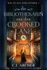

Eine Bibliothekarin mit rätselhafter Vergangenheit, ein Kriegsheld mit einem Geheimnis und der Raub eines magischen Gemäldes. DIE BIBLIOTHEKARIN AUS DER CROOKED LANE ist ein spannender neuer Fantasy-Roman von C.J. Archer, der USA Today-Bestsellerautorin der Reihe Glass and Steele.

Die Bibliothekarin Sylvia Ashe weiß nichts über ihre Vergangenheit, da sie ohne ihren Vater aufwuchs und ihre Mutter sich weigerte, über ihn zu sprechen. Als sie über ein Tagebuch stolpert, das andeutet, ihre Vorfahren wären Magier, ist sie skeptisch. Magier sind immerhin etwas Besonderes, und sie ist nur ein gewöhnliches Mädchen, das Bücher liebt. Sie sucht die Wahrheit bei einem Mitglied der berühmtesten Magierfamilie, doch bald erfährt sie, dass es nicht leicht wird, diese Wahrheit zu finden, insbesondere, als er sich als so talentfrei wie sie erweist, und als noch faszinierender und gefährlicher als Bücher.

Dem Kriegshelden Gabe wurden Reichtum, eine liebende Familie und unfassbares Glück zuteil, das ihn vier erschütternde Jahre in einem grausamen Krieg ohne Verletzung überstehen ließ. Aber nicht alle Verletzungen sind äußerlich sichtbar. Indem er sich in seiner Arbeit als Berater für Scotland Yard vergräbt, ermittelt Gabe ohne Ansporn wegen des Diebstahls eines magischen Gemäldes. Sein Leben wird jedoch auf den Kopf gestellt, als er unwissentlich Sylvias Entlassung herbeiführt und sie in Gefahr bringt.
 
Als er ihr neue Arbeit in einer Bibliothek verschafft, die die weltgrößte Sammlung von Büchern über Magie beherbergt, verstricken sich Gabes und Sylvias Leben ineinander, während sie sowohl das Gemälde als auch die Wahrheit über Sylvias Vergangenheit suchen, bevor die Mächtigen sie aufhalten können.

Doch manchmal lässt man die Vergangenheit lieber ruhen …

[View on Apple](https://books.apple.com/de/book/die-bibliothekarin-aus-der-crooked-lane/id6743186121)

## Akte Nordsee - Die letzte Predigt

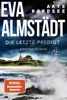

Der Pastor in Estherwieck wird tot im Watt aufgefunden. Ertrunken. War es ein Unfall? Am Tag zuvor hatte er jedoch eine ungewöhnlich entrüstete Predigt gehalten, und die Polizei geht von einem Verbrechen aus. Die Ermittlungen der Polizei nehmen eine neue Wendung als eine frühere Freundin, die den Pastor am Tag zuvor besucht hatte, als vermisst gemeldet wird, und Niklas John gerät unter Verdacht. Er hatte die junge Frau am Abend ihres Verschwindens noch getroffen. Als deren sterbliche Überreste in der Nähe einer alten Marinekapelle gefunden werden und Niklas den Verdacht nicht ausräumen kann, bittet er Fentje Jacobsen als Anwältin um Hilfe. Können die beiden gemeinsam den wahren Mörder finden?

[View on Apple](https://books.apple.com/de/book/akte-nordsee-die-letzte-predigt/id6754759933)

## Throne of Glass – Erbin des Feuers

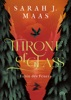

<b>Das Abenteuer geht weiter</b>  Celaena hat tödliche Wettkämpfe überlebt, ihr wurde das Herz gebrochen und sie hat es überstanden. Nun macht sie sich auf in ein neues, unbekanntes Land. Von den Salzminen Endoviers über das gläserne Schloss in Rifthold bis nach Wendlyn – ganz gleich, wohin Celaenas Weg führt, sie muss sich ihrer Vergangenheit stellen und dem Geheimnis ihrer Herkunft.  Kennen Sie bereits die weiteren Serien von Sarah J. Maas bei dtv? »Das Reich der sieben Höfe« »Crescent City«

[View on Apple](https://books.apple.com/de/book/throne-of-glass-erbin-des-feuers/id1035598834)

## Sie haben mich verkauft

Es sollte ein Job für drei Monate sein, als Kellnerin in einem Club in Rumänien. Sie braucht das Geld für die Zukunft ihrer drei kleinen Kinder. Doch was sie dort in Wirklichkeit erwartet, ist ein wahrer Albtraum, kaum vorstellbar im 21. Jahrhundert: Der Club ist ein Bordell, ihre neuen Arbeitgeber entpuppen sich als europaweit agierende Menschenhändler. 

Eine schreckliche Zeit voller Angst und Gewalt beginnt, Oxana wird immer wieder verkauft, nach Italien, Deutschland, England verschleppt. Doch ihr gelingt das Unglaubliche, sie gibt niemals die Hoffnung auf und schafft es sich zu befreien. 

Ein erschütternder Bericht über die dunkelste Seite unserer Gegenwart.

[View on Apple](https://books.apple.com/de/book/sie-haben-mich-verkauft/id406318483)
