- [M6+ : Streaming & Tv Replay](#m6-streaming-tv-replay)
- [Google Gemini](#google-gemini)
- [Claude by Anthropic](#claude-by-anthropic)
- [ChatGPT](#chatgpt)
- [DramaWave - Drama & Reel](#dramawave-drama-reel)
- [NetShort -Beliebte Dramen & TV](#netshort-beliebte-dramen-tv)
- [ReelShort - Stream Drama & TV](#reelshort-stream-drama-tv)
- [Airbnb](#airbnb)
- [Revolut — Banking & Trading](#revolut-banking-trading)
- [Shop: Deine Lieblingsmarken](#shop-deine-lieblingsmarken)
- [Winamax Paris Sportifs & Poker](#winamax-paris-sportifs-poker)
- [多邻国Duolingo英语日语法语](#多邻国duolingo英语日语法语)
- [Whatnot: Shop, Sell, Connect](#whatnot-shop-sell-connect)
- [Waze Navigation und Verkehr](#waze-navigation-und-verkehr)
- [Threads](#threads)
- [Bolt: Fahrten anfordern](#bolt-fahrten-anfordern)
- [Betclic Paris Sportifs & Poker](#betclic-paris-sportifs-poker)
- [Netflix Game Controller](#netflix-game-controller)
- [CapCut: Foto- und Video-Editor](#capcut-foto-und-video-editor)
- [Uber: Ride-Hailing & Taxis](#uber-ride-hailing-taxis)
- [leboncoin](#leboncoin)
- [Booking.com: Hotel Angebote](#booking-com-hotel-angebote)
- [Google Maps](#google-maps)
- [Google](#google)
- [Wero](#wero)
- [France Identité](#france-identite)
- [Strava: Laufen & Radfahren](#strava-laufen-radfahren)
- [tricount: compte entre amis](#tricount-compte-entre-amis)
- [Vinted: Secondhand-Marktplatz](#vinted-secondhand-marktplatz)
- [SNCF Connect: Trains & trajets](#sncf-connect-trains-trajets)
- [Facebook](#facebook)
- [Uber Eats: Essen, Lieferdienst](#uber-eats-essen-lieferdienst)
- [Meta AI](#meta-ai)
- [Pinterest](#pinterest)
- [Telegram Messenger](#telegram-messenger)
- [Amazon FR](#amazon-fr)
- [Polarsteps](#polarsteps)
- [Spotify Musik und Podcasts](#spotify-musik-und-podcasts)
- [WePlay - Partyspiel & Chat](#weplay-partyspiel-chat)
- [Hinge Dating App: Date & Meet](#hinge-dating-app-date-meet)
- [Netflix](#netflix)
- [X](#x)
- [teststar: Gagnez de l’Argent](#teststar-gagnez-de-l-argent)
- [Instagram](#instagram)
- [INTERSPORT France](#intersport-france)
- [EasyPark parken - Park App](#easypark-parken-park-app)
- [Proton VPN: Privé et Rapide](#proton-vpn-prive-et-rapide)
- [Google Chrome](#google-chrome)
- [Mondial Relay, suivi de colis](#mondial-relay-suivi-de-colis)
- [GetYourGuide: Planen & buchen](#getyourguide-planen-buchen)
- [Roole Map : Navigation](#roole-map-navigation)
- [Île-de-France Mobilités](#i-le-de-france-mobilite-s)
- [AllTrails Rando Sentiers Carte](#alltrails-rando-sentiers-carte)
- [Discord - Chat, Jeux, Détente](#discord-chat-jeux-de-tente)
- [Mon E.Leclerc](#mon-e-leclerc)
- [TikTok - Videos, Shop und LIVE](#tiktok-videos-shop-und-live)
- [Bump - va voir tes amis IRL](#bump-va-voir-tes-amis-irl)
- [Parions Sport](#parions-sport)
- [Doctolib - Die Gesundheits-App](#doctolib-die-gesundheits-app)
- [DramaBox - Film et Drame Court](#dramabox-film-et-drame-court)
- [Zalando Mode & Fashion online](#zalando-mode-fashion-online)
- [Gmail – E-Mail von Google](#gmail-e-mail-von-google)
- [PayPal: Geld senden, verwalten](#paypal-geld-senden-verwalten)
- [Amazon Prime Video](#amazon-prime-video)
- [Action](#action)
- [SeLoger location & achat immo](#seloger-location-achat-immo)
- [Planity](#planity)
- [Indeed Jobs](#indeed-jobs)
- [Too Good To Go: Essen retten](#too-good-to-go-essen-retten)
- [Commerce B2B avec Alibaba](#commerce-b2b-avec-alibaba)
- [Free](#free)
- [VPN - Super Unlimited Proxy ™](#vpn-super-unlimited-proxy-tm)
- [Grand Frais](#grand-frais)
- [YouTube](#youtube)
- [WhatsApp Messenger](#whatsapp-messenger)
- [L’Identité Numérique La Poste](#l-identite-nume-rique-la-poste)
- [BlaBlaCar : Bus, Train, Covoit](#blablacar-bus-train-covoit)
- [Temu : Achats et Mode en Ligne](#temu-achats-et-mode-en-ligne)
- [Hacoo - Discovering &Inspiring](#hacoo-discovering-inspiring)
- [Charge E-Lec - E.Leclerc](#charge-e-lec-e-leclerc)
- [Google Photos](#google-photos)
- [Ryanair](#ryanair)
- [Joko | Cashback & code promo](#joko-cashback-code-promo)
- [Canva: KI-Foto- & Video-Editor](#canva-ki-foto-video-editor)
- [McDo+ : Faites-vous livrer !](#mcdo-faites-vous-livrer)
- [Unibet Paris Sportifs et Poker](#unibet-paris-sportifs-et-poker)
- [Grok - Assistant IA](#grok-assistant-ia)
- [Shotgun - Musique Live](#shotgun-musique-live)
- [TV Télécommande Universelle・](#tv-te-le-commande-universelle)
- [Snapchat: Chatte mit Freunden](#snapchat-chatte-mit-freunden)
- [Feux de Forêt](#feux-de-fore-t)
- [Lidl Plus](#lidl-plus)
- [Tinder: appli de rencontre](#tinder-appli-de-rencontre)
- [france.tv: direct et replay TV](#france-tv-direct-et-replay-tv)
- [Compte ameli](#compte-ameli)
- [GenK : Culture Générale](#genk-culture-ge-ne-rale)
- [JustPlay: Cumulez pts fidélité](#justplay-cumulez-pts-fide-lite)
- [inDrive - Au-delà du taxi](#indrive-au-dela-du-taxi)
- [Flo : calendrier menstruel](#flo-calendrier-menstruel)
- [BoursoBank](#boursobank)

## M6+ : Streaming & Tv Replay

M6+ : Streaming TV & Replay
Le meilleur de la télé, en direct et en streaming.

Retrouvez M6, W9, 6ter, Gulli, Paris Première et Téva dans une seule application. 
Que ce soit pour suivre vos émissions préférées en direct ou explorer un catalogue exclusif de films et séries, M6+ vous offre une expérience fluide et personnalisée.

LES POINTS FORTS DE L'APP
DIRECT & REPLAY : Regardez vos programmes favoris (Top Chef, Pékin Express, Kaamelott) dès leur diffusion ou en rattrapage HD pendant 30 jours.

M6+ ORIGINALS : Des séries intégrales, des films et des documentaires que vous ne trouverez nulle part ailleurs.
MULTIPLE ÉCRANS : Commencez sur votre iPhone, continuez sur iPad ou Apple TV. Votre progression est synchronisée.
PODCASTS : Écoutez le meilleur de RTL, Fun Radio et RTL2 directement dans l'app.
MODE PORTRAIT : Découvrez nos "Stories" pour explorer les meilleurs moments de nos programmes en format vertical.
PICTURE-IN-PICTURE : Naviguez sur votre iPhone tout en gardant votre programme dans un coin de l'écran.

OPTION M6+ MAX : PROFITEZ DE VOS PROGRAMMES PREFERES
Passez au niveau supérieur pour seulement 5,99€/mois (sans engagement) :

ZÉRO PUB : Profitez de vos contenus sans interruptions publicitaires*.
AVANT-PREMIÈRES : Regardez vos épisodes avant tout le monde.
MODE HORS-LIGNE : Téléchargez vos vidéos pour les regarder dans le train ou l'avion.

Pour plus d’informations sur l’option, rendez-vous sur notre FAQ. 
Vous avez une remarque ? Une question ? Contactez-nous sur support@supportclient.m6plus.m6.fr

(*) Certains replays pourront contenir des publicités en début de programme pour des raisons contractuelles. Les chaînes en direct conservent la publicité.

[View on Apple](https://apps.apple.com/fr/app/m6-streaming-tv-replay/id369692259)

## Google Gemini

Ob auf dem Weg zur Arbeit oder bei der Recherche bis spät in die Nacht – Google Gemini ist dein persönlicher, proaktiver und leistungsstarker KI-Assistent.

DIE BELIEBTESTEN FUNKTIONEN VON GEMINI
• Unsere neuesten Modelle, Gemini 3.5 Flash und Gemini Omni, eröffnen ganz neue Möglichkeiten für Produktivität und Kreativität.
• Tausche dich mit Gemini Live aus: Brainstorme in Echtzeit oder teile deinen Bildschirm bzw. deine Kamera, um direkt über das zu sprechen, was du siehst.
• Statt langer, monotoner Texte erhältst du sorgfältig ausgearbeitete Antworten mit eingebetteten Bildern, Zeitachsen und interaktiven Grafiken.
• Du kannst unter anderem Dokumente, Tabellen, Fotos oder Videos hochladen, um Antworten, Zusammenfassungen und Informationen zu deinen Inhalten zu erhalten.

ERWECKE DEINE KREATIVEN IDEEN ZUM LEBEN
• Fotos erstellen und bearbeiten mit Nano Banana 2: Wende die Kamera- und Belichtungseinstellungen an, füge mehrere Bilder zu einem Mockup zusammen, designe Poster mit gestochen scharfem Text und erstelle mühelos Diagramme. Anschließend kannst du die Größe beliebig anpassen.
• Verwandle deine Ideen mit Gemini Omni in kinoreife Videos – verfügbar für Nutzer*innen von Google AI Plus, Pro, Ultra und Workspace.
• Erstelle mit Lyria 3 individuelle Soundtracks für jeden Moment.

STEIGERE DEINE PRODUKTIVITÄT
• Recherche mit NotebookLM: Du erhältst fundiertere und relevantere Antworten auf Basis deiner eigenen Quellen.
• Lernhilfe und einfache Prüfungsvorbereitung: Lade deine Kursnotizen hoch, um individuelle Übungsquizze und interaktive Grafiken zu generieren.
• Vom Prompt zum Prototyp: Erstelle Webseiten, Spiele oder Dashboards. Du kannst sogar deine Dateien in eine Podcast-ähnliche Übersicht umwandeln, um sie dir unterwegs anzuhören.

MEHR MÖGLICHKEITEN DURCH EIN UPGRADE
Mit einem Upgrade auf ein Google AI Plus-, Pro- oder Ultra-Abo kann Gemini dich noch besser bei komplexen Aufgaben und Projekten unterstützen.

Datenschutzhinweise für Gemini-Apps: g.co/gemini/privacynotice
Hinweis: Gemini bietet zwar leistungsstarke Funktionen für mehr Produktivität, unterstützt aber derzeit keine iOS-Geräteaktionen wie das Stellen von Weckern oder das direkte Senden von SMS. Gemini for Business ist über entsprechende Google Workspace-Abos verfügbar.

[View on Apple](https://apps.apple.com/fr/app/google-gemini/id6477489729)

## Claude by Anthropic

Verbinde dich mit Claude – deinem persönlichen KI-Assistenten, der mit dir denkt, aber dich nicht lenkt.

Claude von Anthropic ist deine All-in-One-App als KI-Assistent fürs Schreiben, Recherchieren, Programmieren und Lösen komplexer Aufgaben. Claude steigert deine Produktivität und Effizienz.

KI-SCHREIBASSISTENT

Nutze Claude als deinen persönlichen KI-Schreibassistenten und verwandle Ideen in überzeugende Texte. Ob Social-Media-Posts, professionelle E-Mails oder Berichte – Claude bringt Ton, Struktur und Klarheit auf den Punkt. 

Professionelle KI-Schreibhilfe, die publikationsfertige Inhalte liefert.

ÜBERSETZE NATÜRLICH ZWISCHEN ÜBER 100 SPRACHEN

Claude bietet fortgeschrittene KI-Übersetzung mit Präzision und natürlichem Klang. Ob Gespräch oder Text, Claude liefert flüssige Übersetzungen für über 100 Sprachen und bewahrt Ton und Bedeutung.

KI-CODING UND PROGRAMMIERUNG

Claude ist dein KI-Coding-Assistent für ernsthaftes Development. Bewältige Programmieraufgaben auf Production-Level mit Präzision. Überprüfe Codes, behebe Fehler und entdecke neue Programmiersprachen. Claude erklärt komplexe Konzepte leicht verständlich und liefert Lösungen für Python, JavaScript, React und Dutzende weitere Sprachen.

Als vielseitiger KI-Agent und Coding-Assistent plant Claude mehrstufige Coding-Aufgaben, integriert relevantes Wissen und passt sich deinem Projekt an. Entwickle Programme durch natürliche Konversation und nutze Claude als präzisen KI-Debugger, der Fehler blitzschnell findet und behebt. Claude skaliert von schnellen Skripten bis hin zur Unternehmensentwicklung.

FORSCHUNG UND DATENANALYSE

Claude bietet KI-gestützte Recherche, fasst zusammen und analysiert Daten für umsetzbare Erkenntnisse. Durchsuche Google Drive, Gmail, Kalender und das Web mit präzisen Quellenangaben. Claude unterstützt Business-Analysen, Report-Erstellung und Ideenfindung.

VISUELLE ANALYSE

Lade Bilder, PDFs oder Screenshots für sofortige Einblicke hoch. Claude bietet KI-Bildanalyse zum Extrahieren von Text, Interpretieren von Diagrammen und Bewerten von UI-Layouts oder technischen Zeichnungen. Feedback zu Screenshots, App-Designs und Datenvisualisierungen. Generiere SVG-Code für Grafiken und Illustrationen.

SPRECHEN STATT TIPPEN

Nutze Claude als deinen KI-Sprachassistenten und diktiere direkt in mehreren Sprachen. Ideal für Multitasking oder spontanes Brainstorming.

ENTFALTE DEIN SKILLSET

Erweitere deinen Horizont mit KI-Tools, die sich an dein Level anpassen. Lerne neue Fähigkeiten, erschließe unbekannte Bereiche oder hole dir einen frischen Blick.

Claude hilft bei Folgendem:

▶ Texte schreiben und mit KI-Schreibhilfe verbessern
▶ Meetings zusammenfassen und Erkenntnisse herausfiltern
▶ Berichte und Marketinginhalte generieren
▶ Komplexe Themen mit Erklärungen lösen
▶ Projekte planen, KI-Aufgaben managen und Ideen strukturieren
▶ Über 100 Sprachen natürlich übersetzen
▶ Inhalte aus PDFs, Screenshots und Bildern auslesen
▶ Freihändig per KI-Chat und Diktat arbeiten
▶ Programmieren lernen, mit KI-Coding-Hilfe debuggen
▶ Kalkulatoren, Charts und interaktive Tools erstellen

VERTRAUENSWÜRDIG & ZUVERLÄSSIG

Claude ist verlässlich, präzise und hilfreich. Entwickelt von Anthropic, einem KI-Forschungsunternehmen für sichere und zuverlässige KI-Tools. Angetrieben von Claude Opus und Sonnet vereint die App starke Analyse-, Kreativ- und Produktivitätsfunktionen in einem KI-Assistenten.

PROBIER CLAUDE KOSTENLOS AUS – MILLIONEN VERTRAUEN IHM

Schließ dich Millionen Nutzer:innen an und nutze Claude kostenlos. Ob du programmierst, schreibst, recherchierst oder Business-Herausforderungen meisterst – Claude erweitert dein Skillset.

Nutzungsbedingungen: https://www.anthropic.com/legal/consumer-terms
Datenschutzrichtlinie: https://www.anthropic.com/legal/privacy

© 2026 Anthropic, PBC

[View on Apple](https://apps.apple.com/fr/app/claude-by-anthropic/id6473753684)

## ChatGPT

Neu: ChatGPT für iOS – Lerne die neuesten Verbesserungen in OpenAI kennen.

Diese offizielle App ist kostenlos. Sie synchronisiert deinen Verlauf über mehrere Geräte hinweg und stellt dir die neuesten Funktionen von OpenAI zur Verfügung, einschließlich des neuen Bildgenerators.

ChatGPT bietet dir folgende Funktionen:

· Bildgenerierung: Lass ChatGPT anhand einer Beschreibung beeindruckende Bilder erstellen oder fordere es mit ein paar einfachen Worten auf, vorhandene Bilder nach deinen Wünschen zu verwandeln. 
· Fortgeschrittener Audiomodus: Tippe auf das Schallwellen-Icon, um auch unterwegs in Echtzeit Gespräche zu führen. Schlichte einen Streit am Esstisch oder übe eine neue Sprache. 
· Foto-Upload: Mache ein Foto oder lade ein Bild hoch, um ein handschriftliches Rezept zu transkribieren oder Informationen über eine Sehenswürdigkeit zu erhalten. 
· Kreative Inspiration: Lass dir Vorschläge für individuelle Geburtstagsgeschenke machen oder erstelle eine personalisierte Grußkarte.
· Maßgeschneiderte Ratschläge: Besprich schwierige Situationen, frage nach einer detaillierten Reiseroute oder lass dir beim Verfassen der perfekten Antwort helfen. 
· Personalisiertes Lernen: Erkläre einem von Dinosauriern begeisterten Kind, was Elektrizität ist, oder frische im Handumdrehen dein Wissen über ein historisches Ereignis auf.
· Professioneller Input: Sammle Ideen für Marketingtexte oder entwirf einen Geschäftsplan.
· Sofortige Antworten: Lass dir Rezeptvorschläge machen, wenn du nur ein paar Zutaten im Kühlschrank hast.

Schließe dich Millionen von Benutzern an und probiere die App aus, die die Welt begeistert. Lade ChatGPT noch heute herunter.

Nutzungsbedingungen und Datenschutzrichtlinie:
https://openai.com/policies/terms-of-use
https://openai.com/policies/privacy-policy

[View on Apple](https://apps.apple.com/fr/app/chatgpt/id6448311069)

## DramaWave - Drama & Reel

Willkommen bei DramaWave – deiner Streaming-Plattform der nächsten Generation für exklusive vertikale TV-Videos, Serien und Filme in HD. Tauche in über 30.000 Dramen in 18 Sprachen ein– mit exklusiven Highlights, die du nirgendwo anders findest!

Warum DramaWave wählen?
1. Live-Kommentare
Reagiere in Echtzeit mit On-Screen-Kommentaren während des Schauens – teile Emotionen und erlebe Community-Feeling.
2. Offline-Ansehen
Lade Episoden herunter und schau sie jederzeit – auch ohne Internetverbindung.
3. Vertikaler Vollbild-Feed
Erlebe immersive Unterhaltung. Personalisierte Empfehlungen helfen dir, deine Lieblingsdramen sofort zu finden.
4. Kurze & packende Dramen
Dramen voller Emotionen und Spannung in wenigen Minuten – perfekt zum Kurzgenuss oder Durchbingen.
5. Kristallklare Streams
Erlebe jedes Detail in lebendigem 1080P – für echtes Kino-Feeling auf dem Handy.
6. Wöchentliche Original-Updates
Bleib dran mit exklusiven neuen Dramen – regelmäßig neu! Drama-Fans erwartet immer etwas Spannendes.
7. Jederzeit & überall streamen
Genieße ruckelfreies Streaming mit Top-Bild & -Sound – egal wo du bist.
8. Weltweit verfügbar
Mit Untertiteln in Englisch, Spanisch, Französisch, Deutsch, Japanisch, Koreanisch u. v. m.
 
Entfessle das Drama
Erlebe Storytelling neu – einfach, fesselnd & überall dabei mit DramaWave!

Abo-Details
Schalte exklusive Inhalte mit einem Abo frei. Die Verlängerung erfolgt automatisch, kann aber jederzeit in den Kontoeinstellungen verwaltet oder gekündigt werden.

Kontakt
Website: mydramawave.com
E-Mail: dramawaveteam@gmail.com
Lade DramaWave jetzt herunter und tauche in eine neue Welt des Dramas ein!

[View on Apple](https://apps.apple.com/fr/app/dramawave-courts-reels/id6670430706)

## NetShort -Beliebte Dramen & TV

Hast du genug von langen, langweiligen Serien? Möchtest du jederzeit und überall in packende, mitreißende Geschichten eintauchen? Dann probiere NetShort aus!
Entdecke unzählige exklusive Kurzserien im Hochformat: Boss-Romantik, tragische Werwolf-Liebe, spannende Rachegeschichten – alle Genres, die du liebst, sind dabei! Tägliche Updates, personalisierte Auswahl und HD-Qualität sorgen für ein Kinoerlebnis – sogar auf dem kleinen Bildschirm. Ob beim Warten, in der Mittagspause oder auf Reisen: Mach deine freie Zeit zur ultimativen Entertainment-Zeit!

Ausgewählte Serien:
„Vertrag zur Liebe“: Am Tag der Trauung wird er nach sechs Jahren von seiner Freundin verlassen. Doch plötzlich taucht eine milliardenschwere CEO-Schönheit auf, schenkt ihm ein Privatflugzeug und macht ihm einen Heiratsantrag! Ein Jade-Anhänger enthüllt: Er ist der verschollene Erbe einer noblen Familie. Sieh zu, wie er das Blatt wendet und triumphiert!

„Schlächterheld“: Der von seiner Familie verachtete „Versager“ ist in Wahrheit ein legendärer Schwertmeister! Von seinem Vater öffentlich als nutzlos verurteilt, zerreißt er seine Tarnung, stellt seinen Vater bloß und legt mit seiner Klinge eine Spur der Gerechtigkeit. Er rächt seine Familie und beschützt seine Lieben!

„Goodbye, my tempting wife“: Während seine Frau ihn betrügt, verfolgt er die Szenen genüsslich... Von seiner Familie verraten und verlassen, verliert John seine letzte Spur von Zuneigung. Doch nun kehrt er als mächtiger CEO zurück – um sich alles zurückzuholen, was ihm zusteht!

Warum solltest du NetShort wählen?
Sofort verfügbar: Perfekt für kurze Pausen, jederzeit streamen ohne Verpflichtung.
Vielfältige Serien: Alle beliebten Genres, spannende Wendungen nonstop.
Tägliche Updates: Hunderte neue Episoden täglich – keine Wartezeit.
Kinoqualität: HD-Bildqualität, selbst auf kleinen Bildschirmen ein großes Erlebnis.
VIP-Vorteile: Keine Werbung, keine Unterbrechungen – für ungestörtes Serienvergnügen.
Lade NetShort jetzt herunter und starte dein persönliches Serien-Highlight!

Hinweise:
Wenn du über Apple abonnierst, wird der Betrag nach Bestätigung des Kaufs von deinem App Store-Konto abgebucht.
Dein Abonnement wird innerhalb von 24 Stunden nach dem Kauf aktiviert, je nach Status der Bestellung im Apple Store.
24 Stunden vor Ablauf deines aktuellen Abonnements wird das System den Abonnementpreis von deinem Konto abziehen. Nach erfolgreicher Verlängerung wird dein Abonnement automatisch verlängert.
Du kannst das Abonnement wie folgt kündigen: Einstellungen > iTunes & App Store > Apple ID > Apple ID anzeigen > Abonnements > NetShort.
Wenn du das Abonnement nicht mindestens 24 Stunden vor Ablauf kündigst, wird es automatisch verlängert.

Verwandte Vereinbarungen:
Nutzervereinbarung: https://netshort.com/agreement/1
Datenschutzrichtlinie: https://netshort.com/agreement/2
Automatische Verlängerungsvereinbarung: https://netshort.com/agreement/3
Mitgliedschaftsvereinbarung: https://netshort.com/agreement/4

[View on Apple](https://apps.apple.com/fr/app/netshort-dramas-populaires/id6504849169)

## ReelShort - Stream Drama & TV

Bienvenue sur ReelShort, la plateforme de streaming HD pour tous types de courts métrages dramatiques captivants ! Reconnus par Times100 pour notre innovation dans l'industrie du divertissement, nous changeons votre façon de regarder des films avec des épisodes d'une minute que vous pouvez apprécier n'importe où, n'importe quand !

Choisissez parmi notre collection infinie de contenus addictifs ajoutés quotidiennement, des rencontres romantiques avec des milliardaires et des tragédies déchirantes aux histoires épiques de come-back, et bien plus encore. Vous ne manquerez jamais de divertissement !

Histoires en vedette :

• [Ne me Regrettez pas] : Orpheline, je trouve refuge chez ma marraine Sandra et ses deux fils, les frères Miller, qui m'accueillent avec tendresse. Je rêve d'un avenir avec l'un d'eux, jusqu'à ce que Lola, fille de leur domestique, bouleverse tout. Mon cœur vole en éclats quand ceux que j'aime me trahissent. Une fois partie, ils deviennent fous en me cherchant partout.

• [Écartez-vous ! Je suis le boss final] : Kingsley est Roi dans le plus grand des secrets, ainsi qu'à la tête des Fonds souverains et donc l'homme le plus riche sur Terre. Cependant, lors de son retour de déploiement en zone de guerre, son amour de jeunesse met brutalement fin à leur relation, avançant qu'il n'est rien d'autre qu'une farce. Comment le Roi de tous les hommes va-t-il s'y prendre pour lui faire ravaler sa fierté ?

Pourquoi vous allez adorer ReelShort :
• Des originaux en format courts que vous ne pourrez pas lâcher.
• Des émissions exclusives avec du contenu vertical captivant qui vous accrochera
• De nouvelles émissions ajoutées quotidiennement, avec des centaines de nouveaux épisodes chaque semaine
• Divertissement de qualité Hollywoodienne, conçu pour le grand écran et livré sur un petit écran près de vous
• Les premiers spectacles interactifs en direct pour mobile où vous décidez de ce qui se passe ensuite

Vivez l'avenir du divertissement, minute après minute – téléchargez ReelShort dès maintenant !
"Crazy Maple Studio is quietly changing the streaming game with its ReelShort app." - Time100 
"The biggest player in this new genre is ReelShort." - New York Times
"Every minute has a hook that keeps you watching." - Wall Street Journal
"ReelShort, which has dozens of shows — similarly light on character development and packed with curveballs — made for binge-watching in minutes." - Washington Post

Autres:
• Si vous vous abonnez via Apple, le paiement sera débité de votre compte App Store lors de la confirmation de l'achat.
• Privilèges d'abonnement : Tant que votre abonnement est actif, vous pouvez regarder toutes les histoires gratuitement.
• Votre abonnement prendra effet dans les 24 heures suivant l'achat, en fonction du statut de votre commande dans l'Apple Store. L'abonnement est valable pendant 7 jours.
• Renouvellement automatique : Votre abonnement sera automatiquement renouvelé. Vous serez facturé dans les 24 heures avant le début de chaque période d'abonnement jusqu'à ce que vous annuliez votre abonnement.
• Annulation : Sur les appareils iOS, vous pouvez annuler votre abonnement au moins 24 heures avant la date de renouvellement suivante en allant dans Réglages > iTunes & App Store > Apple ID > View Apple ID > Subscriptions > ReelShort.
• L'abonnement est facturé chaque semaine. Le prix réel peut varier selon la région.

Conditions de service : https://crazymaplestudios.com/v/user-agreement
Politique de confidentialité : https://crazymaplestudios.com/v/privacy-agreement

[View on Apple](https://apps.apple.com/fr/app/reelshort-stream-drama-tv/id1636235979)

## Airbnb

AIRBNB IST JETZT NOCH MEHR FÜR DICH
Die Welt ist unendlich interessant – und mit Airbnb kannst du sie auf mehr Arten als je zuvor erkunden. Finde bemerkenswerte Unterkünfte, unvergessliche Entdeckungen und erstklassige Services in einer App. Lass dich inspirieren, buche, und los geht’s.

BUCHE EINE UNTERKUNFT, DIE DIR MEHR BIETET ALS HOTELS
Erkunde mehr als 8 Millionen Ferienunterkünfte in mehr als 240 Ländern und Regionen, um die perfekte Unterkunft für jede Art von Reise zu finden – ganz gleich, ob du alleine oder mit einer Gruppe reist. Nutze über 80 Filteroptionen, um Ausstattung wie einen Pool, eine Küche oder barrierefreie Merkmale wie einen stufenlosen Zugang zu finden. Prüfe alle Details einer Unterkunft auf einen Blick auf der Inseratsseite und lies dir Bewertungen durch, um zu erfahren, was andere Gäste, die dort übernachtet haben, darüber denken.

SCHAU DIR ORTE NICHT BLOSS AN. ENTDECKE SIE.
Finde Tausende von Entdeckungen auf der ganzen Welt, angeboten von Einheimischen, die ihre Stadt am besten kennen. Sie alle sind auf ihre Qualität überprüft, basierend auf den Fachkenntnissen, der Reputation und der Authentizität von Gastgeber:innen. Entdecke einzigartige Perspektiven auf Sehenswürdigkeiten und Museen. Lerne die lokale Küche bei Kochkursen und Food-Touren kennen. Genieße die Natur, einen Kunstworkshop, eine Live-Performance und vieles mehr. Schau dir außerdem Airbnb Originals an – außergewöhnliche Entdeckungen, die von den interessantesten Menschen der Welt veranstaltet werden und exklusiv für Airbnb entwickelt wurden.

MACH DEINEN AUFENTHALT MIT ERSTKLASSIGEN SERVICES NOCH BESSER
Mach das Beste aus deinem Aufenthalt, indem du erstklassige Services direkt auf Airbnb buchst, beispielsweise Privatköch:innen, Fotograf:innen, Catering, zubereitete Mahlzeiten, Haarstyling, Nagelpflege, Make-up, Massagen, Personal Training und Spa-Behandlungen. Alle Services werden von erfahrenen Gastgeber:innen angeboten, die auf ihre Qualität überprüft wurden. Du kannst Tausende professionelle Services zu fast jedem Preis buchen – alles in einer App, auf der ganzen Welt. Und das Beste daran ist, dass du keine Unterkunft auf Airbnb buchen oder überhaupt auf Reisen sein musst, um Services nutzen zu können. So kannst du ein Blowout für die Haare, ein Training oder eine Massage direkt bei dir zuhause buchen.

HOL DIR EINE REISE-APP, DIE MIT DIR AUF REISEN GEHT
Nachdem du eine Unterkunft gebucht hast, erhältst du auf der Startseite personalisierte Vorschläge für Services und Entdeckungen für deine Reise. Diese sind darauf zugeschnitten, wo du übernachtest und mit wem du reist. Und das neu gestaltete Profil gibt dir einen Überblick über alle Orte, die du auf Airbnb besucht hast, sowie die Menschen, die du unterwegs kennengelernt hast.

FINDE ALLE DEINE REISEINFORMATIONEN AN EINEM ORT
Finde oder teile schnell die Details deiner Buchung. So ist es für alle einfacher, anzureisen, in die Unterkunft zu kommen und sich mit nur einem Fingertipp mit dem WLAN zu verbinden. Dank der Nachrichtenfunktion in der App können alle Gäste ganz einfach mit Gastgeber:innen kommunizieren, um Hallo zu sagen, Fragen zu stellen und aktuelle Buchungsinformationen zu erhalten. Du kannst Fotos und Videos teilen und Services auf Airbnb individuell anpassen – alles im gleichen Chat. Und mit der Tag-für-Tag-Übersicht für alle deine Buchungen im aktualisierten Tab „Reisen“ behältst du deine Pläne im Blick und kannst wichtige Details wie Check-in-Zeiten, spezielle Anweisungen und Zugangscodes aufrufen, sogar wenn du offline bist.

AIRBNB MACHT DAS GASTGEBEN EINFACH
Ganz gleich, ob du eine Unterkunft, eine Entdeckung oder einen Service anbieten möchtest: Du kannst Millionen von Reisenden erreichen und dein Geschäft auf Airbnb ausbauen. Inseriere deine Unterkunft in wenigen einfachen Schritten. Oder bewirb dich, um Gastgeber:in einer Entdeckung oder eines Services zu werden. Nach der erfolgreichen Überprüfung bist du bereit, die ganze Welt willkommen zu heißen.

[View on Apple](https://apps.apple.com/fr/app/airbnb/id401626263)

## Revolut — Banking & Trading

Alles in einem: Weltweite Zahlungen, Bargeldabhebungen, Sparzinsen, Wero und mehr.

Unsere deutsche IBANs machen Zahlungen einfach.

Deine Finanzen, nur besser
* Weltweites Konto, lokale Handhabung.
* Perfekt organisiert – mit Pockets, Gemeinschaftskonten, Konten für Kids & Teens und (bislang) über 30 Währungen.

Effizienter bezahlen
* Physische Karten, virtuelle Karten, Einwegkarten, Google Pay oder Apple Pay
* Individuelle Karten, die zu dir passen (Personalisierungsgebühren können anfallen).
* Im Ausland zahlen wie zu Hause mit  attraktiven Wechselkursen (zusätzliche Gebühren können anfallen).
* Kostenlose Kids & Teens Konten samt Debitkarte, damit Kinder den Umgang mit Geld durch Eltern kontrolliert lernen können.
* Verwaltet Geld zusammen – mit Gemeinschaftskonten und passenden Debitkarten.

Geld senden: Nah, fern, egal wohin
* Über 70 Währungen empfangen und senden, mit nur einem Schritt, in über 160 Länder.
* Senden, empfangen, chatten – alles in einer App. GIFs oder Texte geben die persönliche Note.
* Teile Ausgaben für Trips, Geschenke oder Events mit Gruppenrechnungen. Gib alle Zahlungen in der App ein, und wir übernehmen das Rechnen.

Weniger unnötige Ausgaben
* Sortiere dein Gehalt für Rechnungen, Sparen, Haushaltsausgaben und mehr automatisch.
* Voller Überblick über deine Finanzen an einem Ort, ohne zwischen Apps wechseln zu müssen.
* Verknüpfe externe Konten weltweit, um jeden Penny, Cent oder Dollar im Blick zu haben.
* Analysiere Zahlungen nach Kategorie, Händler und Zeitraum. Kein manuelles Tracking mehr nötig.

Sparen mit attraktiven Zinsen
* Jährliche Zinsen, täglich direkt auf dein Konto ausgezahlt.
* Greife jederzeit auf dein Erspartes zu.
* Daueraufträge und Aufrundungsfunktion für Kleingeld, um nebenbei zu sparen.

Vermögensaufbau startet jetzt
* Investiere an einem Ort in über 6.000 Aktien, ETFs und Anleihen. Finanziere dein Investmentdepot in Sekundenschnelle vom Revolut Privatkonto.
* Provisionsfreies Trading (1 bis 10 Trades je nach Abo, von Standard bis Ultra); andere Kosten wie Wechselgebühren oder regulatorische Gebühren können anfallen.
* Automatisierung hilft – der Robo-Advisor verwaltet für dich ein Portfolio, das sich automatisch an Marktveränderungen anpasst. Investitionen auf eigenes Risiko. Deine Investitionen können zu Gewinnen oder Verlusten führen. Investmentdienstleistungen im Europäischen Wirtschaftsraum und in der Schweiz werden von Revolut Securities Europe UAB erbracht. Lies unsere AGB, Kosten- und Risikohinweise auf unserer Webseite oder in der App.

Mit RevPoints die Welt entdecken
* Sammle bei deinen täglichen Kartenzahlungen RevPoints zu attraktiven Kursen.
* Löse deine Punkte für Flugmeilen, Rabatte auf Unterkünfte, Ersparnisse beim Shopping und mehr ein.

Revolut auf dem nächsten Level
* Kostenpflichtige Abos für exklusive Karten, Abonnements, Versicherungen, Reisevorteile und mehr. Wähle zwischen Plus, Premium, Metal oder Ultra (AGB für kostenpflichtige Abos gelten und Abonnementgebühren fallen an).

Sicherheit nach deinen Regeln
* Sperre und entsperre deine Karte in nur einem Schritt.
* Nutze für zusätzlichen Schutz online Einwegkarten, deren Daten sich nach jeder Zahlung ändern.
* Lege Limits für ausgehende Transaktionen fest und vermeide böse Überraschungen.

So schützen wir dein Geld
* Als regulierte Bank sind berechtigte Einlagen bis zu 100.000 € durch die litauische staatliche Einlagen- und Investitionsgarantie geschützt. Investitionen, Rohstoffe und Krypto-Dienstleistungen fallen nicht darunter.
* Unser System zur Betrugsprävention ist rund um die Uhr aktiv, markiert risikoreiche Transaktionen und sendet dir eine Warnmeldung, damit du sofort handeln kannst.
* Wir sind rund um die Uhr, 24/7, über unseren Kundenservice in der App für dich erreichbar.

Bankdienstleistungen werden von der Revolut Bank UAB, Zweigniederlassung Deutschland, erbracht. Weitere Informationen unter https://www.revolut.com/de-DE/ 

30 South Colonnade, London E14 5HX, Vereinigtes Königreich.

[View on Apple](https://apps.apple.com/fr/app/revolut-plus-quune-banque/id932493382)

## Shop: Deine Lieblingsmarken

Jeden Shopping-Moment zum Highlight machen

– Aktuelle Trends in einer einzigen Shopping-App entdecken, verfolgen und kaufen
– Mit Push-Benachrichtigungen von Marken, denen du folgst, nie wieder einen Sale, eine Lagerauffüllung oder ein Bestellupdate verpassen
– Personalisierte Einkaufsempfehlungen erhalten und neue Marken entdecken

Shoppen, das sich lohnt

– Shop Cash-Prämien für Einkäufe in der Shop App*
– Mit Shop Pay kannst du deine Rechnungsdaten geschützt aufbewahren und mit nur einem Tastendruck den Shopping-Checkout durchführen.
– Unkompliziertes Shopping mit flexiblen Zahlungsoptionen, wann immer du willst*

Unbesorgtes Shopping

– Online-Bestellungen in einer App verwalten
– Mit Nachverfolgung in Echtzeit immer über den Verbleib deines Pakets auf dem Laufenden bleiben – vom Versand bis zur Haustür.



---

Kontaktinformationen:

Du hast eine Frage oder möchtest mit uns reden? Kontaktiere uns unter help.shop.app

Sicher und unbesorgt einkaufen: Unsere Server erfüllen strenge PCI-Compliance-Standards für die Hinterlegung von Kreditkarteninformationen.

Powered by Shopify: Shop beruht auf der Commerce-Plattform, der Millionen von Unternehmen weltweit vertrauen.

* Nur in den USA und Kanada verfügbar. Zahlungsoptionen werden von Affirm angeboten und unterliegen einer Berechtigungsprüfung. Nicht verfügbar in New Mexico. Einwohner:innen Kaliforniens: Darlehen von Affirm Loan Services, LLC werden gemäß einer California Finance Lender-Lizenz erteilt oder geregelt.

[View on Apple](https://apps.apple.com/fr/app/shop-vos-marques-pr%C3%A9f%C3%A9r%C3%A9es/id1223471316)

## Winamax Paris Sportifs & Poker

Tour de France :
- La Course aux Maillots: place des paris pour remporter le maximum de points. 100 000 € de Freebets à se partager !

Promos Coupe du Monde:
-Penalty World: débloque une séance de penalty et gagne des Freebets !

Profite des bonus de bienvenue dès aujourd’hui !

-Paris sportifs: Le 1er pari remboursé en cash dans la limite de 100 € s'il est perdant !
-Bonus poker de bienvenue jusqu’à 250 € !
-Application tout-en-un: poker + paris sportifs dans une interface moderne et intuitive.

PARIS SPORTIFS

Les meilleures cotes du marché sont proposées par Winamax (Études Odoxa 2025).
Avec le retrait instantané, récupère tes gains immédiatement !

La meilleure application de paris sportifs et poker, pour les passionnés de sport et de jeux.
Winamax est l’application qui te propose le plus d’événements sportifs:
Football, basket, rugby, tennis, MMA, tous tes sports préférés sont disponibles au pari !

Parie sereinement grâce à toutes les garanties Winamax sur le football et le basket.
 
Exemple garanties football:
-Garantie remplaçant: le remplaçant de ton buteur marque ? On paye ton pari !
-Garantie 2 buts: ton équipe mène de 2 buts ? Ton pari est payé direct !

Gagne un max de Freebets grâce à tous nos jeux et promotions innovantes (Pyramide, Survivor, Bang, Ice bank, 10 € Live).
Programme de fidélité Supercharged: place des paris pour faire monter ta jauge et viens récupérer tes Freebets.

Parie en live et vibre devant les plus grandes compétitions (Ligue 1, Ligue des champions, Liga, NBA, UFC, Premier League, Roland-Garros, Coupe du monde de football, Jeux Olympiques).

Regarde le match en direct sur l’application:
Plus de 30 000 événements sportifs sont retransmis en live en streaming sur Winamax TV, dont les compétitions majeures telles que la Liga, l’ATP, la NBA ou l’UFC.

Sur Winamax, tu as toutes les fonctionnalités possibles:
-MyMatch: crée ton scénario et fais grimper la cote ! (exclusivité football)
-Combo Booster: tes gains sont boostés dès 3 sélections, jusqu’à +1 000 % en bonus.
-Cashout: change d’avis à tout moment: tu peux revendre ton pari ou bien le compléter en ajoutant une nouvelle sélection.
-Nouvelles Fiches Joueurs: infos, stats, cotes... optimise ton pari.
-Retrouve en un coup d'œil les paris sportifs les plus HOT du moment.
-Parie directement sur tes joueurs préférés depuis les compositions des matchs.

Parrainage: pour chaque ami parrainé, reçois un bonus de 20€.
Grilles: pronostics sur les grilles 7, 9 ou 12 matchs en solo ou avec des amis.

POKER EN LIGNE

Plus de 5 millions de joueurs actifs.
Licence ANJ: sécurité maximale pour les dépôts et retraits instantanés.
Expérience mobile fluide : multitabling jusqu’à 4 tables comme sur ton ordinateur.
Option poker gratuit disponible: joue en play money.

Formats exclusifs et innovants:

-Expresso: tournoi ultra-rapide 3 joueurs, jusqu’à 1 million € à gagner en 3 minutes.
-KING5: tournoi par équipes gratuit unique en France avec de vrais prix (packages WSOP à Las Vegas).
-Space KO: format de tournoi unique au monde où chaque élimination rapporte une prime aléatoire en cash.
-Expresso et freerolls quotidiens : joue des Expresso et des tournois gratuits et gagne de l’argent réel.
-Formats classiques: Cash Game, tournois multi-table, Sit&Go.
-Nombreuses variantes: Texas Hold’em, Omaha.
-Masterclasses, vidéos pédagogiques: apprends des meilleurs joueurs professionnels.

Promotions et bonus toute l’année:
-Bonus de bienvenue jusqu’à 250 €.
-Challenges quotidiens avec récompenses cash.
-SuperFreeroll 200 000 € en été.
-Winamax Series et Pokus, les plus gros festivals de poker online européen.
-Expresso Saloon, Monopoly, Koh Lanta: des promotions hors-normes et jackpots.
-Winamax Poker Tour: participe au plus grand circuit Live de poker Français.
-Qualifications pour les grands tournois live (WSOP, Sismix, WPT, Texapoker).

Jouer comporte des risques: endettement, isolement, dépendance.
Pour être aidé, appelez le 09-74-75-13-13 (Appel non surtaxé)

[View on Apple](https://apps.apple.com/fr/app/winamax-paris-sportifs-poker/id385720307)

## 多邻国Duolingo英语日语法语

火遍全球的语言学习APP：多邻国Duolingo！5亿用户的选择。

【40多个语种】包含英语、日语、韩语、法语、意大利语、西班牙语等流行语言，还有夏威夷语、威尔士语等小众和濒危语言，甚至有《权力的游戏》中的龙语哦。

【游戏化学习】零基础入门，将生活场景分成单元学习，旅行、点菜、聊天、面试...忘掉那些枯燥乏味的死记硬背吧，用游戏闯关的方法，有宝石、王冠，有可可爱爱的动画人物为你加油鼓气，玩儿着玩儿着就学会了。

【碎片时间】每天10-15分钟即可循序渐进，通勤、排队、等待时间都不会浪费啦！

【可免费学习所有课程】我们的愿景是为全世界提供平等且优质的学习机会。

千呼万唤，多邻国粤语课程终于迎来重磅更新！
【从虾饺到糖水，终于可以从早吃到晚】
“你哋是但叫嘢，今日多兒埋單。”
 糖水、地方美食、街头小吃……更多粤式美食词汇和真实场景上线。下一次去茶楼，不只是会说“唔该”，还能自信加单！
【看港片不用等字幕，不必空耳懂情歌】
“今日唔想做嘢，不如我哋去唱K啦。”
经典粤语歌词、港片对白首次加入课程。那些耳熟能详的旋律和台词，这次终于不只是会跟着唱，而是真的听得懂。
【走进真实生活语境，从天气寒暄聊到人生百态】
“我唔想做馬騮，好想放工啊！”
租房、上班、点外卖、刷社交媒体；从校园生活到职场日常，从谈情说爱到中年烦恼。学的不只是语言，更是粤语区年轻人的真实生活。
【去顺德食饭，去珠海散步，感受大湾区的烟火气】
“我哋去順德啦！上次去順德仲係上次！”
跟着课程走进大湾区不同城市，感受各地独特的节奏与烟火气。在学习粤语的同时，也认识一个真实鲜活的粤语世界。
【食粽子、賞月光，透过习俗领略粤语文化的魅力】
“我阿婆整嘅粽香到飛起。”：端午、中秋、清明……通过丰富有趣的例句，体验粤语文化圈里那些代代相传的仪式感与人情味。

2013&2014年谷歌「年度手机应用」
2013年苹果「年度手机应用」
2019年福布斯「下一家潜力独角兽公司」
2018 - 2020年CNBC「最具开创性品牌TOP50」

欢迎关注微信公众号：多邻国Duolingo，和官方微博@多邻国_Duolingo。

[View on Apple](https://apps.apple.com/fr/app/duolingo-langues-et-%C3%A9checs/id570060128)

## Whatnot: Shop, Sell, Connect

Whatnot ist die größte Plattform für Live Shopping in Europa, der UK und den USA – wir sind ein Marktplatz, der Millionen zusammenbringt, um die Dinge, die sie lieben, zu kaufen, verkaufen und sich zu vernetzen. Von Taschen bis Beauty, Comics bis Münzen, von Sneakers bis Streetwear und Vintage bis Vinyl – wir haben alles. Erkunde über 250 Kategorien, darunter Electronics, Sport und Pokémon-Karten, Mode, Pflanzen, Schmuck und mehr.

FINDE UNGLAUBLICHE MARKENDEALS – Schließe dich Hunderttausenden von Verkäufern an und shoppe mit hohen Rabatten deine Lieblingsmode und Dinge des täglichen Bedarfs. Von Marken, die du kennst und liebst, bis hin zu neuen und schwer zu findenden Spezialprodukten. Whatnot hat einen Deal für alles, was du suchst.

SHOPPEN HAT NOCH NIE SO VIEL SPASS GEMACHT. Ob du an schnellen Auktionen, unglaublichen Flash-Sales oder Livestream-Giveaways teilnimmst, den Marktplatz durchstöberst oder dich im Chat beteiligst – du hattest noch nie so viel Spaß beim Shoppen. Whatnot hat das Beste des physischen Einzelhandels ins Netz gebracht. 

SHOPPE MIT VERTRAUEN - Falls bei deinem Kauf doch mal etwas schiefgeht, sind wir für dich da. Mit unserem Käuferschutz bist du abgesichert - egal, ob dein Artikel beschädigt ankommt, fehlt oder nicht der Beschreibung entspricht.

INTERESSE AM VERKAUF AUF WHATNOT? Im letzten Jahr generierten kleine Unternehmen mehr als 3 Milliarden Euro Umsatz auf Whatnot. Verdiene mehr, indem du live verkaufst, komm noch heute zu Whatnot.

[View on Apple](https://apps.apple.com/fr/app/whatnot-live-shopping-vid%C3%A9o/id1488269261)

## Waze Navigation und Verkehr

Waze ist eine community-basierende Navigations-App, die Millionen Nutzern an ihr Ziel hilft, indem sie Echtzeitwarnungen zu den Straßenverhältnissen und eine tagesaktuelle Karte bietet. Dank unserem Netzwerk an Fahrern spart Dir Waze Zeit, weil es sofort warnt bei Stau, Baustellen, Unfällen, Polizeikontrollen und mehr. Von Routenaktualisierungen zur Stauvermeidung, Echtzeit-Warnungen zu Deiner Sicherheit, bis zu Hinweisen zu niedrigen Treibstoffpreisen, ist Waze eine Gemeinschaft von Fahrern, die anderen Fahrern helfen.

Mit Waze wirst du...

• Schneller ankommen: Stauvermeidende Routenupdates
• Bußgelder vermeiden: sei über Polizeikontrollen und Blitzer informiert
• Eine genauere Ankunftszeit haben: Aufgrund von Live-Verkehrsdaten, Baustellen, Wetter und mehr
• Von der Community-basierende Navigationprofitieren: Echtzeit-Updates von anderen Autofahrern
• Geld sparen: Finde die günstigste Tankstelle auf deiner Route
• Maut sparen: Sieh dir die Mautpreise an, wenn du eine Route auswählst
• Apple Car Play nutzen können: Verbinde Waze mit dem eingebauten System
• den Vorteil des Echtzeit-Tacho erleben: Erhalte Warnungen, wenn du zu schnell fährst und vermeide Strafzettel
• Deine Fahrt individualisieren könnne: erhalte Routenanweisungen von Deinen Lieblings-Stars und Filmcharakteren
• Nicht mehr zwischen Apps hin- und herschalten müssen: nutze Deine Lieblings-Audio-App direkt aus Waze heraus

Fahre sicherer und smarter mit Waze!

Du kannst jederzeit Deine Waze Privatsphäreeinstellungen verwalten und ändern. Erfahre mehr über die Waze Datenschutzerklärung unter www.waze.com/legal/privacy.

Die Waze Routenführung ist nicht für Einsatzfahrzeuge und übergroße Fahrzeuge bestimmt.

[View on Apple](https://apps.apple.com/fr/app/navigation-waze-et-trafic/id323229106)

## Threads

Entdecke neue Perspektiven und unterhalte dich mit anderen auf Threads.

Finde heraus, worüber die Menschen gerade sprechen, von ungewöhnlichen Interessen bis zu großen Momenten. Mit Communitys findest du auf Threads Menschen mit ähnlichen Interessen. Antworte, höre zu, teile selbst etwas oder folge ihnen.

Das kannst du auf Threads tun:

■ Starte einen Thread, teile deine Sichtweise
Beschäftigt dich etwas? Poste es auf Threads. Teile einen Gedanken, stelle eine Frage oder beginne eine Unterhaltung. Es gibt verschiedene Möglichkeiten, um Dinge mit Text, Bildern, Umfragen, selbstlöschenden Beiträgen und mehr ins Rollen zu bringen.

■ Springe direkt zu den Antworten
Beteilige dich direkt an der Diskussion, reagiere auf neue Ideen oder beobachte, in welche Richtung sich das Gespräch entwickelt. Jeder Thread ist eine Einladung, dich zu beteiligen.

■ Behalte Trends im Blick
Von Live-Ergebnissen bis zu entscheidenden Momenten: Mit Threads bist du immer auf dem Laufenden und kannst dich direkt an der Diskussion beteiligen, wenn du etwas zu sagen hast.

■ Du steuerst, welche Inhalte du siehst
Steuere, wer dir antworten, dich erwähnen oder deine Beiträge sehen kann. Verwende unerwünschte Begriffe, um Beiträge und Antworten herauszufiltern, die Begriffe oder Formulierungen enthalten, die du nicht sehen möchtest. So gestaltest du dein Nutzungserlebnis nach deinen Vorstellungen.

■ Vertiefe deine Interessen
Folge Freund*innen, Creator*innen und Communitys, die dich interessieren. Threads wurde entwickelt, um neue Perspektiven zu entdecken und miteinander ins Gespräch zu kommen – angefangen mit den Communitys, die dir am wichtigsten sind.

■ Schaffe Verbindungen im Chat
Führe private Unterhaltungen mit 1:1-Chats und Gruppen-Direktnachrichten. Wenn ein öffentlicher Thread persönlich wird, kannst du ihn in dein Postfach verschieben, um das Gespräch zu vertiefen oder den Teilnehmerkreis einzugrenzen.

Meta Terms: https://www.facebook.com/terms.php
Threads Supplemental Terms: https://help.instagram.com/769983657850450
Meta Privacy Policy: https://privacycenter.instagram.com/policy
Threads Supplemental Privacy Policy: https://help.instagram.com/515230437301944
Instagram Community Guidelines: https://help.instagram.com/477434105621119

[View on Apple](https://apps.apple.com/fr/app/threads/id6446901002)

## Bolt: Fahrten anfordern

Komme dank der Bolt App leichter ans Ziel! Egal, ob du eine Fahrt in der Stadt, einen Flughafentransfer oder einen E-Scooter benötigst, um von A nach B zu kommen — unsere App macht es dir leicht, sicher und komfortabel unterwegs zu sein.

WARUM SOLLTEST DU DIE BOLT APP WÄHLEN?
- Du kannst innerhalb von Sekunden eine Fahrt anfordern: Genieße sichere, preiswerte Fahrten mit qualifizierten Fahrer:innen.
- Transparente Preise: Du siehst deinen Fahrpreis im Voraus, damit es keine Überraschungen gibt.
- Mehrere Zahlungsmöglichkeiten: Bezahle sicher mit deiner Kredit-/Debitkarte, Apple Pay, Google Pay oder in bar.

EINFACHE FAHRTANFRAGE:
- Öffne die App und gib dein Ziel an.
- Wähle eine Kategorie aus, die deinen Bedürfnissen entspricht (Comfort, Premium, Priority, XL und mehr).
- Folge Fahrer:innen in Echtzeit in der App.
- Komme entspannt ans Ziel und bewerte deine Fahrt.

SICHERHEIT STEHT AN ERSTER STELLE:
Einige der Sicherheitsfunktionen von Bolt erfordern, dass die App im Hintergrund läuft.

- Notfall-Hilfe-Button: Alarmiere in Notfällen diskret unser Sicherheitsteam.
- Audioaufzeichnung der Fahrt: Nimm während der Fahrt den Ton auf, um dich abzusichern.
- Deine Kontaktdaten sind privat: Dein Nummer und deine allgemeinen privaten Informationen bleiben vertraulich, wenn du Fahrer:innen anrufst.

VORAUSSCHAUEND PLANEN:
Benötigst du einen Flughafentransfer oder eine Fahrt am frühen Morgen? Du kannst deine Fahrt 30 Minuten bis 90 Tage vor der erwarteten Abholzeit im Voraus planen.

*BOLT PLUS ABONNIEREN UND PREMIUM-FUNKTIONEN FREISCHALTEN!
Hol dir mit Bolt Plus das Beste von Bolt. Genieße exklusive Vorteile, die dir Zeit und Geld sparen und jede Fahrt noch angenehmer und komfortabler machen.

*BOLT DRIVE:
Wir haben uns dem Ziel verpflichtet, bis 2040 klimaneutral zu werden. Deshalb erweitern wir das Angebot an Elektro- und Hybridautos in Bolt Drive, unserem Carsharing-Service. Du kannst auch Bolt E-Scooter und E-Bikes über die App mieten.

*PAKETE AUSLIEFERN
Nutze die Kategorie „Send“, um in deiner Stadt schnell und einfach Pakete ausliefern zu lassen.

Bolt - die globale Plattform für geteilte Mobilität, die in 50 Ländern und über 600 Städten weltweit verfügbar ist. Wir haben uns 2019 von Taxify in Bolt umbenannt.

Bolt ist die perfekte Taxi-Alternative für schnelle, zuverlässige und preiswerte Fahrten. Die App ermöglicht das unkomplizierte Anfordern von Fahrten, egal ob du zur Arbeit fährst, verreist oder Besorgungen machst. Wenn du also das nächste Mal von A nach B kommen möchtest, wähle die Bolt App!

*Die Bolt Angebote unterscheiden sich je nach Ort. Schau in der App nach, welche Optionen in deiner Stadt verfügbar sind.

Mit der Bolt Driver App kannst du als Fahrer:in Umsatz erzielen. Registriere dich hier: https: //bolt.eu/driver/

Noch Fragen? Kontaktiere uns über info@bolt.eu oder unter https://bolt.eu

Folge uns auf Social Media, um Updates, Rabatte und Angebote zu erhalten!

Facebook - https://www.facebook.com/Bolt/
Instagram - https://www.instagram.com/bolt
X - https://x.com/Boltapp

[View on Apple](https://apps.apple.com/fr/app/bolt-demandez-un-trajet-24-7/id675033630)

## Betclic Paris Sportifs & Poker

Télécharge Betclic et retrouve le meilleur du pari sportif et du poker sur une seule et même app ! 
Découvre toutes les fonctionnalités pour parier sur l'app n°1 :

INSCRIPTION FACILE : Inscris-toi en quelques secondes et rejoins l'application n°1 et ses 18 millions de parieurs et joueurs de poker ! 

TOUS LES SPORTS : Parie sur la meilleure offre possible avec plus de 50 sports et jusqu'à 350 paris dispos par match. 

LE KOP : Inspire-toi des autres joueurs et retrouve les meilleurs paris de la communauté. 

XTRAWIN : Ton buteur marque, ton pari est payé... et s’il marque plus d’un but, tes gains sont multipliés ! 

EARLYWIN LIVE: T’as aimé EarlyWin ? C’est maintenant dispo en LIVE uniquement sur Betclic ! Si ton équipe mène de 2 buts, ton pari est payé peu importe le résultat final.
 
STREAMING : Regarde et parie sur le meilleur du sport avec la Betclic TV ! 

POKER EN LIGNE : 5 parties de Spin & Rush offertes** avec ton 1er dépôt pour découvrir notre offre poker ! 

ONGLET ""POUR TOI"" : une offre de pari 100% personnalisée selon tes habitudes de jeu ! 

CARTES & PAGES JOUEUR : Parier sur tes joueurs préférés n'a jamais été aussi simple ! 

NOUVELLES STATS DE MATCH : Prépare tes matchs avec les meilleures stats pour les vivre à fond et t'aider à optimiser tes paris. 

FASTBET : Parier en live n'a jamais été aussi rapide ! 

MULTIBOOST : Combine un max de matchs (2 minimum), booste ta cote et tes gains en CASH sur les paris sportifs. 

TOURNOIS SKO AU POKER : T’aimes distribuer des KO ? Élimine tes adversaires et récupère jusqu’à 50x leur prime en CASH ! 

RETRAIT INSTANTANÉ : Pari gagné ? Ton argent arrive sur ton compte bancaire en moins de 2 minutes. 

SUPERSUB : Ton buteur sort en cours de match ? Si son remplaçant marque, c'est gagné ! 

ASSURER MON COMBI : Plat du pied = sécurité ! Récupère ta mise en CASH si une seule sélection de ton combiné est perdante !
 
GAGNE TES PLACES : Chaque semaine, retrouve des centaines de places à gagner : Betclic Elite, Équipes de France, Top 14, UFC Paris, Ligue Magnus, Coupe de France… 

DÉFIS : Relève tes défis et débloque tes récompenses instantanément ! 

UN GAIN ? Montre ton talent de joueur et partage-le en un clic avec tes amis ! 

CONNEXION OPTIMISÉE : Face ID, Touch ID, ton compte est accessible en toute sécurité sans rentrer tes identifiants. 

COTES BOOSTÉES : Foot, tennis, basket, rugby, MMA... retrouve des boosts sur tes compétitions préférées toute l'année. 

CASHOUT : Ton combiné est mal parti, il ne te reste qu'un seul match à valider… Cashout et retire tes gains ! 

SPIN & RUSH : Jusqu'à 1 million d'euros à gagner en 5 minutes avec notre nouveau format jackpot de poker rapide ! 

TOURNOIS DE POKER : Près de 5 000 tournois disponibles chaque mois avec près d'1 million d'euros à se partager (des buy-in allant de 1€ à 100€). 

CASH GAME : Des tables de cash game allant du niveau NL 5 à NL 1000 en Texas Holdem ou Omaha. 

Des questions ? Contacte-nous directement sur mobile@betclic.fr 

* Montant de ton 1er pari reversé en crédits de jeu non retirables s'il est perdant 

** Offre détaillée dans les conditions générales (Poker), accessible aux nouveaux joueurs. Buy-in 1€. Valables 3 mois après crédit. Sous réserve d'éligibilité. 

+18 : le jeu des mineurs est interdit. Les jeux d'argent et de hasard peuvent être dangereux : pertes d'argent, conflits familiaux, addiction… Retrouvez nos conseils sur joueurs-info-service.fr (09-74-75-13-13, appel non surtaxé). INTERDICTION VOLONTAIRE DE JEUX : Toute personne peut demander à être interdite de jeux. Cette demande est formée auprès de l'Autorité nationale des jeux.

[View on Apple](https://apps.apple.com/fr/app/betclic-paris-sportifs-poker/id441081528)

## Netflix Game Controller

Spiele Spiele auf deinem Fernseher oder Computerbrowser mit dem Netflix-Gamecontroller.

Mit dieser App kannst du Spiele auf Netflix spielen, indem du dein Handy oder Mobilgerät als Gamecontroller verwendest. Die Netflix-Gamecontroller-App ist für alle verfügbar.

Netflix Games befindet sich in der Beta-Phase und je nach Gerätetyp wird dein Fernseher oder Browser möglicherweise derzeit nicht unterstützt.

Lass die Spiele beginnen!

[View on Apple](https://apps.apple.com/fr/app/netflix-game-controller/id6447582581)

## CapCut: Foto- und Video-Editor

CapCut ist eine kostenlose App für die umfangreiche Videobearbeitung, mit der du tolle Videos erstellen kannst.

「Benutzerfreundlich」
Zuschneiden, umkehren und Geschwindigkeit verändern: Perfektion war noch nie so einfach; veröffentliche deine wunderbaren Momente.

「Hohe Qualität」
Erweiterte Filter und makellose Schönheitseffekte eröffnen eine ganz neue Welt an Möglichkeiten.

「Topmusikhits/Toller Klang」
Umfangreiche Musikbibliothek und exklusive urheberrechtlich geschützte Lieder

「Sticker und Text」
Mit den besten angesagten Stickern und Schriftarten kannst du dich in deinen Videos kreativ ausdrücken.

「Effekt」
Werde kreativ mit einer Vielzahl an magischen Effekten

Nutzungsbedingungen —
http://www.capcut.com/clause/terms-of-service

Datenschutzerklärung —
https://www.capcut.com/clause/privacy-policy

Kontakt: capcut.support@bytedance.com

[View on Apple](https://apps.apple.com/fr/app/capcut-%C3%A9diteur-vid%C3%A9o-photo/id1500855883)

## Uber: Ride-Hailing & Taxis

Schließe dich Millionen von Nutzer*innen in Deutschland an, die mit der Uber App bequem an ihr Ziel gelangen. Wähle zwischen verschiedenen Vermittlungsoptionenptionen und Transportmitteln aus und gelange von A nach B, wie du es willst – leger mit dem Lime Scooter oder stilvoll mit Uber Premium.

FINDE DIE PASSENDE FAHRT
Deine nächste Fahrt ist nur einen Fingertipp entfernt! Mit Uber kommst du völlig unkompliziert und bequem von A nach B.
Wähle aus einer Vielzahl von Produkten für die verschiedensten Bedürfnisse:

- UberX: günstige Preise und eine Fahrt nur für dich allein
- Electric: Elektroautos – die besonders umweltfreundliche Option
- UberXL: günstige Fahrten für Gruppen bis zu 6 Personen
- Uber Comfort: neuwertige Autos, die viel Beinfreiheit bieten
- Uber Comfort Electric: Elektroautos aus dem Premiumsegment
- Uber Pet: günstige Fahrten für dich und dein Haustier
- Uber Taxi: In ausgewählten Städten findest du auch lokale Taxis in der Uber App.
- 2-Rad: Buche ein E-Bike oder einen Roller (Lime Scooter) und fahre gleich los.
- Uber Assist: Der Service für Menschen mit eingeschränkter Mobilität
- Uber Taxi Wheelchair: Taxis, die auf die Bedürfnisse von Rollstuhlfahrer*innen zugeschnitten sind
- Uber Taxi Van: Großraumtaxis für Gruppen

FAHRPREISSCHÄTZUNG ANZEIGEN
Mit der Uber App kannst du den Fahrpreis schon im Vorfeld abfragen, noch bevor du deine Fahrt bestellst. So weißt du gleich, wie viel du bezahlen musst.

ERSCHWINGLICHE PREISE
Wir gestalten unsere Preisstruktur so transparent wie möglich.
- Fahrpreisteilung: Teile dir den Betrag direkt auf der Fahrt mit deinen Freund*innen – so müsst ihr euch später nicht den Kopf zerbrechen.

REGISTRIERE DICH BEI UBER ONE UND ERHALTE ATTRAKTIVE PRÄMIEN
Profitiere von 0,00 € Liefergebühr und spare bis zu 10 % auf berechtigte Liefer- und Abholbestellungen, erhalte 5 % Uber Cash auf berechtigte Fahrten und eine Gutschrift von 5,00 € sollte unsere Schätzung für die späteste Ankunftszeit deiner Bestellung mal nicht der Realität entsprechen. Es gelten weitere Gebühren und Bedingungen. Weitere Details findest du unter uber.com/uberone.

UMWELTBEWUSST VON A NACH B
Uber engagiert sich für eine nachhaltige Zukunft in unseren Städten. Mit einer wachsenden Flotte von Elektro- und Hybridfahrzeugen hast du jetzt auch die Möglichkeit, dich für besonders umweltfreundliche Fahrten zu entscheiden.

SPONTANE MOBILITÄTSOPTIONEN FÜR MEHR BARRIEREFREIHEIT
Gemeinsam mit verschiedenen Taxi-Partnern in Deutschland wurden Autos speziell für die Bedürfnisse von Rollstuhlfahrer*innen umgerüstet.

WEITERE HILFREICHE FEATURES
Bequem zu dir nach Hause
Lieferung: Bestelle dir dein Lieblingsgericht vom Italiener im Viertel direkt zu dir nach Hause. Lasse dir außerdem Lebensmittel, etwas aus der Apotheke oder Haustierartikel liefern.
Taxi, bitte!
Uber Taxi: Ab sofort hast du noch mehr Beförderungsmöglichkeiten in nur einer App – buche dir ganz bequem mithilfe der Uber App ein lokales Taxi zum regulären Taxitarif.
Darf es ein E-Bike oder E-Scooter sein?
2-Rad: Wusstest du, dass du dir mit der Uber App auch E-Bikes und Roller (Lime Scooter) ausleihen kannst? Perfekt für die Tage, an denen du etwas mehr Antrieb brauchst, als ein normales Fahrrad hergibt.
Alles auf einen Blick
Uber for Business: Verwalte und tracke Geschäftsfahrten, Essenslieferungen und vieles mehr in nur einem Dashboard.
Lege gleich los! Lade dir die Uber App herunter und erstelle noch heute ein Konto.
Uber ist in verschiedenen Städten in Deutschland verfügbar, Infos dazu findest du auf unserer Website. Bleibe auf dem Laufenden über neueste Nachrichten, Aktionen und Angebote, indem du uns auf Twitter unter https://twitter.com/uber_ger oder auf Facebook unter https://www.facebook.com/uberdeutschland folgst.
Uber vermittelt Beförderungsaufträge an professionelle und lizenzierte Mietwagenunternehmer. Uber selbst bietet keine Fahrten an und ist für die Beförderung als solche nicht verantwortlich.

[View on Apple](https://apps.apple.com/fr/app/uber-commandez-un-trajet/id368677368)

## leboncoin

Multimédia, déco, mode, livres, jeux, vélo, bricolage, immo, auto, l’application leboncoin vous accompagne au quotidien.

Plus de 84 millions de bonnes raisons de télécharger l’appli.
leboncoin facilite tous vos échanges au quotidien grâce à ses 83 millions d’annonces dans 5 univers.

Simple comme un clic.
Publiez vos annonces et vendez vos biens en quelques clics avec le dépôt d’annonces automatisé.
Toute la seconde main est accessible en livraison ou en main propre.
Achetez et payez en ligne grâce au paiement sécurisé. Votre argent est versé au vendeur une fois que vous avez récupéré et validé votre article. Et s’il ne correspond pas à vos attentes, vous
pouvez annuler la transaction. Et en plus de ça, les profils des vendeurs sont vérifiés. Vos prochains coups de coeur n’attendent que vous.

Question logement, vous êtes à la bonne adresse.
leboncoin, premier site immobilier de France, est la clé pour vendre, acheter ou louer votre maison, appartement, ou terrain avec plus d’1,5 million d’annonces en ligne. On est invités à la
crémaillère ?

En route pour trouver votre bonheur.
Envie de partir à l’aventure ? Consultez nos annonces de voitures, motos, scooters ou motos cross d’occasion.
Achetez ou vendez votre véhicule au meilleur prix sur leboncoin, premier site pour les annonces auto.

Le bon candidat pour trouver un job.
Ici, on aime le travail bien fait. Découvrez toutes les offres d’emploi faites pour vous et postulez en deux clics dans la catégorie emploi du boncoin, deuxième site d’emploi privé en France.

Partez l’esprit léger.
Que vous préfériez le bord de mer, la campagne, ou la montagne… Votre location de vacances vous attend sur leboncoin. Réservez votre prochain voyage partout en France, du camping au
chalet en passant par la cabane dans les arbres en pleine nature, en toute sécurité. Détente garantie.

[View on Apple](https://apps.apple.com/fr/app/leboncoin/id484115113)

## Booking.com: Hotel Angebote

Laden Sie sich die am besten bewertete Reise-App herunter und finden Sie wie tausende andere Reisende Angebote für Hotels, Motels und Ferienunterkünfte. Finden Sie Unterkünfte für Ihren Urlaub, Wochenendausflug oder Ihre Geschäftsreise – und das auf der ganzen Welt!

Suchen Sie nach Hotels, Motels und Ferienunterkünften

• 27 Millionen Hotels, Ferienunterkünfte, Ferienhäuser und -wohnungen sowie weitere einzigartige Unterkünfte
• Suchen Sie mit nur einmal Tippen nach Stadt, Attraktion, Sehenswürdigkeit oder Hotelname
• Filtern Sie nach Preis, Bewertungsergebnis, Annehmlichkeiten und anderen, für Sie wichtigen Dingen
• Finden Sie Ihren Last-Minute-Aufenthalt oder buchen Sie lange im Voraus

Finden Sie ein tolles Reiseangebot

• Tägliche Angebote für jedes Budget
• Kostenlose Stornierung bei den meisten Zimmern
• Sehen Sie sich über 135 Millionen echte Gästebewertungen an

Verwalten Sie Ihre Buchung unterwegs

• Erhalten Sie eine papierlose Bestätigung
• Nehmen Sie Änderungen wann und wo Sie möchten vor
• Kundenservice rund um die Uhr in über 40 Sprachen
• Kontaktieren Sie Ihren Gastgeber, sehen Sie sich die Check-in-Zeiten an und schreiben Sie Bewertungen
• Keine Buchungs- oder Kreditkartengebühren

[View on Apple](https://apps.apple.com/fr/app/booking-com-h%C3%B4tels-voyage/id367003839)

## Google Maps

Mit Google Maps kannst du die Welt ganz einfach erkunden und bereisen. Anhand von Live-Verkehrsdaten und GPS-Navigation lassen sich die besten Routen finden – ganz gleich, ob du mit dem Auto, zu Fuß, mit dem Fahrrad oder mit öffentlichen Verkehrsmitteln unterwegs bist. Über 250 Millionen Orte und Unternehmen, darunter Restaurants, Geschäfte und Lebensmittelhändler, sind bei Google Maps eingetragen – mit Fotos, Rezensionen und nützlichen Informationen.

Erkunde die Welt auf deine Weise:
• Erreiche dein Ziel mit kraftstoffsparenden Routen
• Finde die beste Route anhand von Echtzeitinformationen mit detaillierter Routenführung per Sprachnavigation oder Navigation auf dem Bildschirm
• Komm schneller ans Ziel mithilfe der automatischen Neuberechnung von Routen, je nach aktueller Verkehrslage, Verkehrsbehinderungen und Straßensperrungen
• Echtzeitinformationen machen es einfacher, deinen Bus, Zug oder Fahrdienst zu erreichen.
• Wenn du besser vorankommen und flexibler sein möchtest, kannst du nach einem Fahrrad- oder Rollerverleih suchen.

Plane Reisen und Ausflüge ohne viel Aufwand:
• Street View ermöglicht es dir, schon vorab die Gegend zu erkunden und herauszufinden, wo sich beispielsweise Parkmöglichkeiten und Eingänge befinden.
• Mit Immersive View kannst du dir Sehenswürdigkeiten, Parks und Routen ansehen oder sogar die Wetterverhältnisse beobachten, damit du optimal auf deinen Besuch vorbereitet bist.
• Teile Listen mit deinen gespeicherten Lieblingsorten mit anderen.
• Du hast die Möglichkeit, Essen zur Lieferung und Selbstabholung zu bestellen, Reservierungen vorzunehmen und Hotels zu buchen.
• Mithilfe von Offlinekarten findest du dich auch in Gegenden mit schlechtem Empfang gut zurecht.
• Du kannst nach lokalen Orten und möglichen Aktivitäten suchen und basierend auf Nutzerrezensionen und Fotos Entscheidungen treffen.

Lass dich von Insidertipps inspirieren:
• Jährlich tragen 500 Millionen Nutzer dazu bei, die Google Maps auf dem neuesten Stand zu halten. Dir stehen also aktuelle Informationen zur Verfügung.
• Du kannst vorab herausfinden, wie stark ein Ort besucht ist, und so Menschenansammlungen meiden.
• Mithilfe von Lens in Maps lassen sich Fußgängerrouten in die reale Umgebung einblenden.
• Restaurants können beispielsweise nach Restauranttyp, Öffnungszeiten, Preisen oder Bewertungen gefiltert werden.
• Bei Fragen zu einem Ort – etwa zu den angebotenen Gerichten oder Parkplätzen – erhältst du schnell Antworten.

Einige Funktionen sind nicht in allen Ländern oder Städten verfügbar.
Die Navigation ist nicht für übergroße Fahrzeuge oder Einsatzfahrzeuge geeignet.

[View on Apple](https://apps.apple.com/fr/app/google-maps/id585027354)

## Google

Mit der Google App bist du immer über die Dinge informiert, die dir wichtig sind. Hier findest du schnelle Antworten, erhältst Informationen zu deinen Interessen und bleibst mit Discover immer auf dem Laufenden.

Funktionshighlights:
• Nutze die Kamera, um Objekte in deiner Umgebung zu identifizieren, z. B. einen bunten Schmetterling oder eine stachelige Pflanze
• Lass dir Straßenschilder, Speisekarten oder andere Texte mit deiner Kamera übersetzen – mehr als 100 Sprachen werden unterstützt
• Du siehst etwas, was dir gefällt? Finde mit der Kamera heraus, was es ist und wo du es kaufen kannst
• Füge deiner Kamerasuche Wörter hinzu, um die Ergebnisse einzugrenzen – z. B. wenn du ein paar Schuhe entdeckt hast, die du gern in „blau“ hättest, oder wenn du wissen möchtest, wie du ein kaputtes Teil an deinem Fahrrad „reparieren“ kannst
• Suche Lieder mit deiner Stimme, auch wenn du den Text nicht kennst. Summe einfach die Melodie eines Songs – die App zeigt dir den Titel des Songs
• Nutze die Kamera, um Hilfe bei deinen Hausaufgaben zu erhalten. So findest du detaillierte Anleitungen und Videos zur Lösung von Aufgaben aus beispielsweise Mathematik, Chemie, Biologie und Physik

Lass dich von Discover auf dem Laufenden halten – ganz auf dich zugeschnitten:
• Aktuelle Informationen zu Themen, die dich interessieren
• Jeden Morgen die neuesten Nachrichten und den Wetterbericht
• Echtzeit-Updates zu Sport, Filmen und Veranstaltungen
• Informationen zu Neuveröffentlichungen deiner Lieblingsmusiker
• Artikel zu deinen Interessen und Hobbys
• Interessante Themen direkt aus den Google-Suchergebnissen

Sicherheit bei der Suche:
• Alle Suchanfragen in der Google App werden mit einer verschlüsselten Verbindung zwischen deinem Gerät und Google geschützt.
• Die Datenschutzeinstellungen sind leicht zu finden und zu verwalten. Tippe einfach auf dein Profilbild. Daraufhin öffnet sich das Menü, wo du mit einem Klick die Suchverlaufeinträge der letzten paar Minuten aus deinem Konto löschen kannst.
• Webspam wird in der Google Suche proaktiv herausgefiltert, damit du sichere, hochwertige Ergebnisse erhältst.

Du hast noch mehr Möglichkeiten, Google zu nutzen:
• Google Such-Widget – mit dem neuen Google-Widget kannst du Suchanfragen direkt auf deinem Start- oder Sperrbildschirm ausführen. Du hast die Wahl zwischen 2 Widgets, die dir eine Schnellsuchleiste in zwei Größen bieten. Über Verknüpfungen kannst du im mittelgroßen Widget auswählen, wenn du mit Lens, Voice und im Inkognitomodus suchen möchtest.

Hier erfährst du mehr zu den Vorteilen der Google App: https://search.google/

Datenschutzerklärung: https://www.google.com/policies/privacy

Das Feedback unserer Nutzerinnen und Nutzer hilft uns, bessere Produkte zu entwickeln. Wenn auch du an Nutzungsstudien teilnehmen möchtest, besuche:

https://goo.gl/kKQn99

[View on Apple](https://apps.apple.com/fr/app/google/id284815942)

## Wero

L'application Wero vous accompagne pour une utilisation simple et fluide de la solution de paiement Wero avec votre banque.

Les clients de La Banque Postale et de Postbank profitent d'une intégration directe, leur offrant une expérience optimisée pour réaliser leurs paiements en toute simplicité.

Wero, votre solution de paiement mobile instantanée arrive très bientôt sur votre store d’application favori !

Des paiements rapides, sécurisés et instantanés dans toute l’europe. Tout ce dont vous avez besoin est un compte bancaire et un smartphone pour transformer Wero en un moyen pratique pour payer vos proches.

Principales fonctionnalités :
•	Envoyez et recevez de l’argent en quelques secondes, 24 heures sur 24 et 7 jours sur 7, même le week-end et les jours fériés.
•	Aucun frais pour l’envoi ou la réception d'argent.
•	Ajoutez plusieurs comptes bancaires facilement.

Facile à configurer :
Il suffit de quelques minutes et de quelques étapes pour configurer Wero sur votre smartphone.
•	Téléchargez l’application Wero.
•	Confirmez votre compte bancaire.
•	Liez votre numéro de téléphone à votre compte.
•	Retrouvez vos amis utilisant Wero.
•	Commencez à envoyer et recevoir de l'argent.

Envoyer et recevoir de l’argent :
•	Faites un envoi d’argent en quelques clics,
•	Envoyez des demandes de paiement,
•	Présentez ou scannez un QR code Wero.

Toujours informé :
N'oubliez pas d'activer vos notifications:
•	Soyez informé lorsque vous recevez de l’argent.
•	Soyez alerté quand vous recevez des demandes de paiement.
•	Historique complet des paiements.
•	Assistant virtuel intégré et Foire aux questions.

Soutenu par des banques européennes :
La solution de paiement Wero est supportée par les principaux établissements financiers et bancaires européens. Wero vous permet d’envoyer, de demander et de recevoir de l’argent depuis la plupart des comptes bancaires en Belgique, en France et en Allemagne – et d'autres pays européens sont à venir.

Dans le future:
Wero s’enrichira de fonctionnalités supplémentaires, paiements en lignes, abonnements et paiements en magasins sont au programme pour les années à venir.

[View on Apple](https://apps.apple.com/fr/app/wero/id6480469576)

## France Identité

L'IDENTITÉ NUMÉRIQUE RÉGALIENNE PERMET DE :
- Prouver votre identité sans divulguer toutes vos données
- Remplacer vos identifiants et mots de passe
- Empêcher l'usurpation de votre d'identité
VOUS AVEZ PLUS DE 18 ANS ET VOUS ÊTES MUNIS DE LA NOUVELLE CARTE NATIONALE D'IDENTITÉ ?
- Téléchargez France Identité
- Créez votre identité numérique
- Gardez la maitrise de vos données
AVEC L'APPLICATION FRANCE IDENTITÉ :
- Lisez votre nouvelle carte d'identité directement avec votre téléphone
- Définissez votre code personnel pour sécuriser l'accès à vos données
- Créez des justificatifs d'identité à usage unique pour remplacer les photocopies de votre carte d'identité
- Authentifiez-vous sur tous les services disponibles sur FranceConnect
- Dématérialisez votre permis de conduire
À VENIR:
- La dématérialisation de la carte grise et de l'assurance
LE RESPECT DE VOS DONNÉES
L'application ne traite pas vos données à des fins commerciales ou publicitaires et applique notamment les dispositions du règlement général sur la protection des données (ou RGPD) et de la loi informatique et libertés.

[View on Apple](https://apps.apple.com/fr/app/france-identit%C3%A9/id1590142959)

## Strava: Laufen & Radfahren

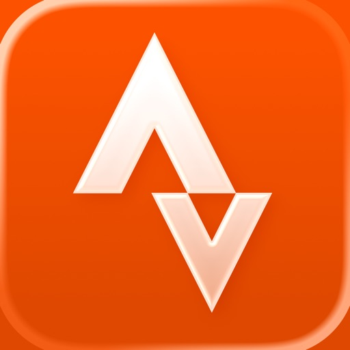

App Store Award-Gewinner: Apple Watch‑App des Jahres

Strava verbindet Fitness-Tracking mit sozialem Netzwerk. Wir erfassen deinen gesamten sportlichen Lebensweg an einem zentralen Ort – und du kannst diesen mit deinen Freunden teilen. So geht's:

• Zeichne alles auf – Läufe, Fahrten, Wanderungen, Yoga und über 50+ andere Sportarten. Stell dir Strava als die Zentrale für deine Aktivitäten vor.

• Mach dir ein Bild von deinem Krafttraining – du trainierst jede Woche im Fitnessstudio, machst HIIT-Workouts und nimmst an Gruppenkursen für Krafttraining teil? Nutze dein Lieblingsgerät oder deine Lieblings-App für Krafttraining, und deine Übungen, Sätze, Wiederholungen, Gewichte und eine Muskelkarte werden automatisch angezeigt. Oder leg noch heute los und sieh, wie schnell Krafttraining zu einem wichtigen Teil deines aktiven Lebens wird.

• Überall gibt es etwas zu entdecken – unser Routen-Tool nutzt anonymisierte Strava-Daten, um dir auf intelligente Weise beliebte Routen zu empfehlen, die auf deinen Vorlieben basieren. Du kannst auch deine eigenen Routen erstellen.

• Entdecke beliebte Wander-Routen in deiner Umgebung, darunter lokale Favoriten, malerische Trails und Langstrecken-Aufstiege

• Entdecke beliebte Wander-Routen in deiner Umgebung, darunter lokale Favoriten, malerische Trails und Langstrecken-Aufstiege

• Baue dir ein Netzwerk von Unterstützern auf – bei Strava geht es darum, Bewegung zu feiern. Hier findest du eine Community, die sich gegenseitig anfeuert.

• Trainiere intelligenter – erhalte Dateneinblicke, um deinen Fortschritt zu verstehen und zu sehen, wie du dich verbesserst. In deinem Trainingstagebuch werden alle deine Trainingseinheiten aufgezeichnet.

• Bewege dich sicherer – teile deinen Standort in Echtzeit mit deinen Lieben, wenn du draußen bist, um deine Sicherheit zu erhöhen.

• Synchronisiere deine Lieblings-Apps und -Geräte – Strava ist mit Tausenden von ihnen kompatibel (Apple Watch, Fitbit, Garmin – was immer du willst).

• Nimm an Herausforderungen teil und erstelle selbst welche – nimm gemeinsam mit Millionen von Sportlern an monatlich wechselnden Herausforderungen teil, um neue Ziele zu verfolgen, digitale Abzeichen zu sammeln und fit zu bleiben.

• Lass dich von ungefilterten Erfahrungen inspirieren – dein Feed auf Strava ist voller echter Leistungen von echten Menschen. Auf diese Weise motivieren wir uns gegenseitig.

• Egal ob du ein Weltklasse-Sportler oder ein totaler Anfänger bist, du gehörst hierher. Zeichne einfach deine Aktivitäten auf und los geht's.

Strava bietet sowohl eine kostenlose Version als auch eine Mitgliedschaft mit Premium-Funktionen.
Strava nutzt HealthKit, um deine Strava-Aktivitäten in die Health-App zu exportieren und um deine Herzfrequenz- und biometrische Daten zu lesen.

Du kannst die Mitgliedschaft im App Store mit deiner Apple ID abschließen und bezahlen. Die Zahlung wird bei der Kaufbestätigung über deine Apple ID abgebucht. Deine Mitgliedschaft verlängert sich automatisch, wenn sie nicht mindestens 24 Stunden vor Ablauf des aktuellen Zeitraums gekündigt wird. Dein Konto wird innerhalb von 24 Stunden vor dem Ende des aktuellen Zeitraums für die Verlängerung belastet. Die Mitgliedschaft und die automatische Verlängerung kann nach dem Kauf in den Einstellungen des App Stores unter „Abonnements“ verwaltet und deaktiviert werden. Ein ungenutzter Teil einer kostenlosen Probemitgliedschaft verfällt, wenn eine kostenpflichtige Mitgliedschaft abgeschloßen wird. Die Mitgliedschaft verlängert sich dann zu den gleichen Kosten.

Allgemeine Geschäftsbedingungen: 
https://www.strava.com/legal/terms
Datenschutzerklärung: 
https://www.strava.com/legal/privacy

[View on Apple](https://apps.apple.com/fr/app/strava-course-v%C3%A9lo-rando/id426826309)

## tricount: compte entre amis

tricount est la solution la plus simple pour suivre et régler les dépenses partagées entre amis. Que vous partiez en voyage, sortiez au restaurant ou partagiez simplement des factures, nous nous occupons des calculs pour que vous puissiez profiter de l'essentiel.

FONCTIONNALITÉS :

• Une interface conviviale qui permet d'ajouter rapidement des dépenses et de voir qui doit quoi, pour un règlement instantané.
• Une carte bancaire gratuite qui ajoute automatiquement les dépenses à vos tricounts à chaque utilisation – plus besoin de saisie manuelle ! Pas de frais d'intérêt ni de cotisation annuelle.
• Prise en charge multi-devises pour vos voyages à l'étranger, avec conversion automatique des dépenses pour une transparence totale.
• Ajoutez facilement votre carte bancaire gratuite à Apple Pay pour la recharger et effectuer des paiements en ligne dans le monde entier.
• Un suivi complet qui organise clairement vos dépenses, revenus et transferts.
• Un accès partagé pour que tous les membres de votre groupe puissent ajouter des dépenses et consulter les soldes à tout moment, où qu'ils soient.
• La possibilité de répartir les dépenses de manière inégale, garantissant l'équité pour tous.
• Envoyez des demandes de paiement directement depuis l'application pour un règlement simplifié.
• Des rapports de dépenses avec des comparaisons mois par mois, vous offrant des analyses détaillées.
• Partagez des photos haute définition avec vos amis dans votre tricount, que ce soit une seule photo ou un album entier.
• Économisez jusqu'à 90 % sur les frais d'itinérance grâce à notre eSIM. Installez-la une fois et profitez d'un accès internet fiable dans le monde entier.
• Une calculatrice intégrée à l'application pour attribuer facilement des montants à chaque membre lors de l'ajout de dépenses.
• Accès hors ligne pour ajouter des dépenses sans connexion internet.

CE QU'EN DISENT LES UTILISATEURS :

« La meilleure application de gestion des dépenses que j'ai jamais téléchargée ! L'application est très intuitive. » - Michael P.
« Elle facilite énormément le partage des factures entre amis. Il y a tellement d'options utiles, c'est un must absolu. » - Tom C.
« Super utile - mes colocataires et moi ne pouvons plus nous en passer ! » - Sarah P.

Ils recommandent tricount :

FORBES :

« Avec tricount, vous pouvez créer un rapport de dépenses de groupe directement depuis votre téléphone. Celui-ci permet de suivre les dépenses de chacun, puis de répartir le montant dû ou à recevoir sur le solde total. Lorsque vous êtes prêt à partager la répartition finale, l'application envoie un lien à chaque personne pour qu'elle puisse consulter les données sur le site de tricount. »

BUSINESS INSIDER :

« La prochaine fois que vous organiserez une activité de groupe, tricount répartira les dépenses pour vous. »

DÉCOUVREZ COMMENT ÇA MARCHE

Créez un compte tricount, partagez le lien avec vos amis et le tour est joué ! tricount simplifie l'organisation et la répartition des dépenses de groupe, que ce soit lors de vacances, d’excursions en ville, d’une cohabitation ou de sorties occasionnelles. Il suffit de créer un tricount, de partager le lien et le tour est joué ! Chacun peut ajouter ses dépenses ou suivre les mises à jour en direct, facilitant ainsi le suivi des montants dus par chaque participant.

Plus besoin de feuilles de calcul : tricount s'occupe de tout. Idéal pour les couples, collègues, colocataires ou tout autre groupe, tricount assure un suivi équilibré et un règlement facile des dépenses. Gérez tout depuis votre téléphone et laissez tricount faire le reste.

Découvrez la façon la plus simple de suivre les dépenses de groupe.

[View on Apple](https://apps.apple.com/fr/app/tricount-compte-entre-amis/id349866256)

## Vinted: Secondhand-Marktplatz

Die Idee ist simpel: Du verkaufst deine aussortierten Sachen an andere Mitglieder, die sie wieder lieben werden. Sie freuen sich aufs Unboxing und über ihren tollen neuen Schatz und du hast wieder mehr Platz zu Hause. Bedeutet also: Guter Style, Gutes tun, gutes Gefühl – für alle! 

Das Verkaufen ist einfach und kostenfrei
Mach einfach ein paar Fotos von deinem Artikel, beschreibe ihn und leg einen Preis fest. Alles, was du verdienst, gehört dir – zu 100 %!  
• Verdien dir was dazu, indem du pre-loved Kleidung, Haushaltswaren, Elektronik, Sammlerstücke, Spielzeug und mehr verkaufst. 
• Schau zu, wie dein Guthaben wächst. Lass dir dein Geld direkt auf dein Bankkonto auszahlen. 
• Den Versand zahlt der Käufer. Bei einem Verkauf erhältst du einen bereits bezahlten Versandschein – einfach und praktisch. 

Shoppe Wieder-neu-Schätze     
Freu dich über deine Secondhand-Entdeckungen – von Designer-Teilen bis zu hochwertigen elektronischen Geräten. 
• Schnell gefunden, lang geliebt. Auf Vinted gibt’s Kategorien für fast alles. Nutze Filter, um schneller zu finden, was du suchst. 
• Wir sind für dich da. Wenn du auf Vinted kaufst, wirst du von unserem Käuferschutz abgesichert. Gegen eine geringe Gebühr erhältst du eine Rückerstattung, falls dein Artikel verloren gegangen ist, bei der Lieferung beschädigt wurde oder deutlich anders als beschrieben ist. 
• Wähle einen Versandanbieter und lass dir deine Sendung nach Hause oder an eine Abholstelle liefern.  

Hol dir zusätzliche Sicherheit
Auf Vinted stehen dir 2 Verifizierungsdienste zur Verfügung. Mit ihnen kannst du auch hochpreisige Artikel mit ruhigem Gewissen kaufen und verkaufen. 
Die Artikelverifizierung für Designerartikel
Lass die Authentizität qualifizierter Artikel von unserem Expertenteam prüfen. 
Die Elektronikverifizierung 
Lass die Funktionalität, den Zustand und die Authentizität bestimmter technischer Artikel prüfen. 
Wir schicken den Artikel nur an dich weiter, wenn er erfolgreich verifiziert werden konnte. Andernfalls erhältst du eine Rückerstattung. Die Verifizierung kannst du beim Checkout hinzufügen. 

Dich erwartet eine facettenreiche Community von Secondhand-Fans in Deutschland, Frankreich und Italien. Chatte mit anderen Mitgliedern, erhalte Updates und verwalte deine Bestellungen an einem Ort. 

Mach mit
TikTok: https://www.tiktok.com/@vinted 
Instagram: https://www.instagram.com/vinted
Mehr Infos findest du in unserem Hilfe-Center: https://www.vinted.de/help.

[View on Apple](https://apps.apple.com/fr/app/vinted-shopping-seconde-main/id632064380)

## SNCF Connect: Trains & trajets

SNCF CONNECT, L’APPLICATION TOUT-EN-UN POUR TOUS VOS TRAJETS 
 
Partez avec SNCF Connect, l’application de référence pour le train et les mobilités durables, qui accompagne plus de 15 millions d’utilisateurs dans leurs déplacements sur tout le territoire et en Europe. 
 
Avec vous de A à Z 
Véritable compagnon du quotidien, SNCF Connect permet, en quelques clics, de planifier, réserver et gérer tous vos trajets : 
- Anticipez et organisez vos déplacements, en trouvant le bon trajet au meilleur prix, 
- Achetez et retrouvez en un geste vos billets, cartes/abonnements, titres de transport, 
- Echangez et annulez vos réservations facilement. 
 
Vos trajets de tous les jours comme des grands jours 
Retrouvez tous vos voyages en train en France et en Europe au même endroit, vos trajets en transport en commun (métro, bus, tramway) et même vos déplacements en covoiturage et Taxi/VTC !  Voyagez avec sérénité avec les services de location de voiture, Allianz Travel, Junior & Cie, restauration, Mes Bagages, hôtels ALL Accor… 
 
Une information personnalisée et proactive 
SNCF Connect, ce n’est pas que de l’achat de billets ! C’est aussi un outil qui vous informe et vous alerte en temps réel pour faciliter vos déplacements. 
 
DES FONCTIONNALITES POUR VOUS AIDER AU QUOTIDIEN 
 
Planifier un trajet : 
- Recherchez le meilleur itinéraire pour rejoindre votre destination 
- Réservez vos billets de train en France (TER, TGV INOUI, OUIGO Grande Vitesse et Train Classique, INTERCITÉS), vers l’Europe (TGV Lyria, Eurostar (ex-Thalys), DB SNCF Voyageurs), en Allemagne (Deutsche Bahn) et en Suisse (CFF SBB) 
- Achetez vos tickets de transports en commun à Paris et en Île-de-France (réseau IDFM) et dans 62 villes partout en France (métro, bus, tram, RER, Transilien SNCF, RATP) 
- Réservez vos autocars (Flixbus, Blablacar Bus), covoiturage Blablacar et Taxi/VTC Uber 
- Planifiez des alertes réservation, alertes petits prix et alertes train complet pour trouver le billet de train qui vous convient 
- Posez une option sur un billet pour bloquer le prix pendant une période donnée 
 
Réserver des titres de transport et abonnements : 
- Achetez tous vos billets de train, cartes Avantage et Liberté, abonnements SNCF dont TER régionaux, et billets Deutsche Bahn (Allemagne) et CFF (Suisse) 
- En Île-de-France, rechargez votre passe Navigo sur votre téléphone 
- Achetez et validez vos tickets et forfaits dématérialisés pour voyager sur le réseau RATP & SNCF en Île-de-France (Tickets Métro-Train-RER, Bus-Tram, Paris Région - Aéroports, passe Navigo) 
- Grâce au compte client, mémorisez votre profil voyageur, compagnons de voyage, cartes de paiement, abonnements, cartes de réduction et fidélité SNCF 
- Payez en toute sécurité avec votre carte bancaire ou PayPal en une ou plusieurs fois, vos Chèques-Vacances Connect, Apple Pay ou vos cartes budget mobilité… 
 
Voyager sereinement le jour J : 
- Enregistrez vos itinéraires fréquents  
- Préparez votre voyage : retrouvez votre e-billet et sauvegardez-le dans votre Wallet Apple, enregistrez votre voyage dans votre calendrier, ou partagez-le avec vos proches 
- Consultez les horaires et les voies des prochains départs et arrivées en gare 
- Consultez l’info trafic et la position de votre train en temps réel sur votre trajet, et recevez des alertes en cas de perturbations ou travaux y compris sur les trajets en Europe (Eurostar (ex-Thalys), TGV Lyria) 
- Recevez des messages relayant les annonces vocales émises à bord de votre train (TGV INOUI, OUIGO, INTERCITÉS et TER) 
- Retrouvez les informations sur la composition de votre train TGV INOUI, OUIGO, TER, Transilien, RER 
- Facilitez vos correspondances : on vous informe dans quelle rame/voiture monter ou quelle sortie emprunter  
- Retrouvez vos justificatifs d’achat et de voyage 
 
Besoin d’aide ? 
- Trouvez rapidement une réponse via le chatbot ou l’aide en ligne 
- Contactez nos conseillers disponibles 7j/7 par messagerie, téléphone, réseaux sociaux…

[View on Apple](https://apps.apple.com/fr/app/sncf-connect-trains-trajets/id343889987)

## Facebook

Wo echte Menschen deine Neugier wecken. Auf Facebook kannst du mit echten Personen interagieren, wie in keinem anderen Social Network: Verkaufe und kaufe Second-Hand-Ausrüstung, teile Reels mit Menschen auf deiner Wellenlänge oder lache mit anderen über witzige Bilder, denen KI einen unerwarteten Twist gegeben hat.

Entdecke Neues und erweitere deine Interessen: 
* Fordere die Meta-KI auf, nach interessanten Themen für dich zu suchen, und erhalte sofort interaktive Ergebnisse, die mehr als nur Text zu bieten haben.
* Suche auf dem Marketplace nach guten Deals und Schätzen für deine Hobbys.
* Personalisiere deinen Feed, um mehr von dem zu sehen, was dir gefällt.
* Sieh dir Reels und Videos an – für Unterhaltung oder hilfreiche Anleitungen.

Verbinde dich mit Menschen und Communitys:
* Tritt Gruppen bei und erhalte nützliche Tipps und Tricks von anderen Nutzer*innen
* Teile deine Inhalte automatisch auf Instagram und spare Zeit
* Sende Posts in einer privaten Nachricht an deine BFF, weil nur sie weißt, was du meinst, oder einen Reel-Trend, über den alle reden.

Lass andere an deiner Welt teilhaben:
* Nutze generative KI, um deine Freund*innen mit individuellen Bildern zu überraschen, oder um dir beim Verfassen von Beiträgen zu helfen.
* Passe dein Profil an und lege fest, wie du angezeigt wirst und wer deine Beiträge sehen kann.
* Erstelle aus aktuellen Vorlagen mühelos eigene Reels oder lass deiner Kreativität mit vielfältigen Bearbeitungs-Tools freien Lauf.
* Zeige spontane Momente in den Stories.

Nutzungsbedingungen & Richtlinien https://www.facebook.com/policies_center

[View on Apple](https://apps.apple.com/fr/app/facebook/id284882215)

## Uber Eats: Essen, Lieferdienst

Lass dir mit der Uber Eats App Essen von tausenden fantastischen lokalen und internationalen Restaurants direkt an die Haustür liefern. Finde das Essen, das du suchst und bestelle es ganz einfach und schnell online. Verfolge deine Bestellung in Echtzeit und genieße den besten Lieferservice.

FINDE DEIN LIEBLINGSESSEN & RESTAURANTS
Bestelle Essen von Restaurants in deiner Nähe und suche nach Gerichten wie Pizza, Burritos, Burger, Sushi, Bowls, Donuts, Döner, Lasagne, Tapas, Waffeln und mehr. Ob asiatisch, indisch, japanisch, koreanisch, halal, vegan oder chinesisch - Uber Eats hat und liefert dir alles. Abholung bevorzugt? Überspringe einfach die Schlange. Du kennst nur Lieferando, Just Eat, Deliveroo, Wolt, Bolt Food oder Glovo? Dann probiere doch jetzt Uber Eats und lass dir dein Lieblingsessen liefern.

UBER ONE ABONNIEREN
Für nur 4,99 € im Monat erhältst du als Uber One-Abonnent 0€ Liefergebühren für berechtigte Bestellungen. Verdiene 5% Uber Cash für berechtigte Uber Fahrten. Profitiere von Prämien, Rabatten, Gutscheinen und Angeboten. Die vollständigen Uber One Geschäftsbedingungen findest du in der Uber Eats und Uber App.

BESTELLE FAST ALLES, WANN IMMER DU WILLST
Bestelle Artikel und Lebensmittel von Supermärkten, Tierhandlungen, deinem Lieblings-Restaurant und mehr. Ob Babynahrung, Windeln, Schönheitsprodukte, Kosmetik, Brot, Milch, Bananen, Obst, Blumen oder Tiefkühlkost - wir lassen alles liefern. Auch alkoholische Getränke wie Bier, Wein und Spirituosen sind erhältlich*. Bezahle sicher und einfach mit Klarna, Paypal, Debit- oder Kreditkarte.

EINFACH BESTELLEN, EINFACH GELIEFERT
Wähle dein Essen aus einer beliebigen Speisekarte und füge es mit wenigen Klicks deinem Warenkorb hinzu. Uber Eats macht es einfach, Essen online zu bestellen und geliefert zu bekommen. Plane deine Bestellung im Voraus oder bestelle sofort - du hast die Wahl! Einfach mit Klarna, Paypal, Debit- oder Kreditkarte bezahlen und mit der Uber Eats App alle deine Bestellungen bequem online nachverfolgen.

ECHTZEIT-BESTELLVERFOLGUNG
Verfolge deine Essenslieferung in Echtzeit auf einer Karte. Lass dich benachrichtigen, wenn deine Bestellung eintrifft. Nutze den Tracker in der Uber Eats App, um deine Bestellung live zu verfolgen und sei immer auf dem Laufenden.

FINDE DEINE LIEBLINGSRESTAURANTS
Egal ob du Pizza, Döner, Fast Food oder vegetarisches Essen bestellen möchtest, Uber Eats ist dein Lieferservice für alles. Genieße auch die leckeren Gerichte von L’Osteria, Burgermeister, Five Guys und vielen anderen Restaurants. Wähle aus verschiedenen Gerichten für Frühstück, Mittagessen oder Abendessen. Bestelle Sushi, Bowls, Bubble Tea, vegan oder einen Loco Chicken Burger. Einige unserer Lieferpartner sind McDonald's, Burger King, Dominos, KFC, Subway, Starbucks, Pizza Hut und viele mehr.

RESTAURANTS, LEBENSMITTELGESCHÄFTE UND MEHR FINDEN
Bestelle bei Lebensmittelgeschäften wie Flink oder anderen Kiosken. Andere Lieferpartner sind Pets Deli und lokale Supermärkte. Lass dir deine Einkäufe bequem nach Hause liefern. Finde alle deine Lieblingsprodukte und bestelle sie ganz einfach online. Von japanischem Sushi über koreanisches BBQ bis hin zu traditionellen deutschen Gerichten - bei Uber Eats findest du alles.

IN DEINER STADT VERFÜGBAR
Schließe dich den Tausenden von Menschen in Deutschland (DE) an, die Uber Eats nutzen, um in ihren Lieblingsrestaurants zu bestellen. Uber Eats ist in Städten wie Berlin, Frankfurt am Main, München, Köln, Düsseldorf, Essen, Hamburg, Stuttgart, Bremen, Leipzig, Hannover, Dresden und vielen mehr verfügbar. Finde Essenslieferungen in deiner Stadt mit Uber Eats. Bestelle Essen online und nutze die App, um den Lieferstatus in Echtzeit zu verfolgen. Genieße die Vielfalt der internationalen Küche, von italienischer Pizza über chinesisches Dim Sum bis hin zum klassichen Hamburger und arabischen Mezze.

*Alkohol in ausgewählten Märkten. Mindestalter: 18 Jahre. Verfügbarkeit variiert je nach Markt. Siehe App für Details.

[View on Apple](https://apps.apple.com/fr/app/uber-eats-repas-et-courses/id1058959277)

## Meta AI

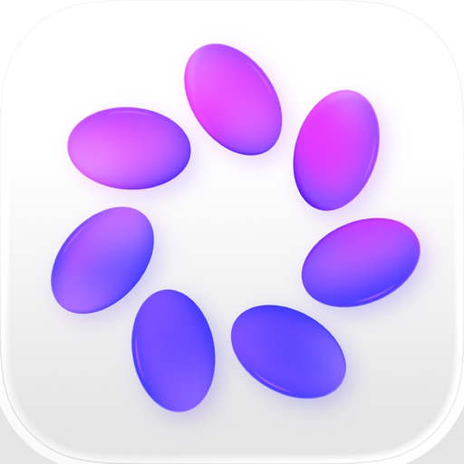

Meta AI est votre assistant IA personnel - connecté au monde, mais ancré dans votre univers. Obtenez des réponses, des recommandations et de l'inspiration réellement utiles.

• Des réponses plus riches : Meta AI s'appuie sur ce que les gens partagent et sur les sujets dont ils parlent sur Instagram, Facebook et Threads.

• Achetez plus intelligemment : Décrivez ce que vous recherchez ou prenez une photo pour trouver de l'inspiration. Meta AI tient compte des Creators que vous suivez et des marques que vous aimez pour vous proposer des recommandations qui reflètent votre style.

• Découvrez des lieux près de chez vous : Demandez des recommandations de restaurants, des idées d'activités ou des endroits à visiter ce week-end. Meta AI s'appuie sur des avis authentiques, des publications et les tendances du moment pour vous fournir des suggestions, avec des notes, photos et détails.

• Obtenez des réponses à partir de n'importe quelle photo, vidéo, document ou fichier : Prenez une photo pour obtenir une aide instantanée. Importez des documents, PDF ou feuilles de calcul pour obtenir des résumés, des comparaisons ou des analyses. Envoyez plusieurs fichiers et Meta AI les traitera ensemble.

• Réfléchissez aux sujets les plus complexes : Qu'il s'agisse d'une grande décision ou d'une question rapide, Meta AI vous aide à y voir plus clair. Activez le mode Réflexion pour raisonner étape par étape sur des questions complexes.

• Discutez en privé : Démarrez une discussion incognito avec Meta AI pour une conversation privée et temporaire que vous seul(e) pouvez voir.

• Exprimez votre créativité : Créez et partagez des vibes, ces vidéos immersives de vous, de vos amis et de tout ce que vous pouvez imaginer.

• Parlez avec Meta AI : Oralement ou par écrit. Les conversations vocales sont plus rapides et naturelles, disponibles dans 13 langues. Obtenez des réponses en temps réel sur ce que vous voyez avec live AI.

• Mode mains libres : Appairez vos lunettes IA pour une assistance personnelle tout au long de votre journée. L'application Meta AI est nécessaire à la gestion de vos lunettes IA, à l'importation et au partage de contenu multimédia et à d'autres fonctionnalités.

Meta AI est conçu avec Muse Spark, le premier d'une nouvelle famille de modèles issus de Meta Superintelligence Labs. Vous pouvez utiliser Meta Al sur WhatsApp, Messenger, Instagram, Facebook, les lunettes IA, l'application Meta AI et meta.ai.

Certaines fonctionnalités de Meta AI ne sont disponibles que dans certains pays et certaines langues. Certaines fonctionnalités pourront être déployées progressivement. Vous souhaitez signaler un problème ou nous faire part de vos commentaires ? Secouez votre téléphone et appuyez sur « Envoyer un signalement ».

[View on Apple](https://apps.apple.com/fr/app/meta-ai/id1558240027)

## Pinterest

Pinterest ist ein Ort endloser Möglichkeiten. Du kannst:
- Inspiration sammeln
- Die neuesten Trends shoppen
- Neue Hobbys ausprobieren

Erstelle Pinnwände, merke dir Pins und kreiere Collagen mit allem, was dich inspiriert. Entdecke zahllose Ideen, von Fashion-Tipps und einfachen Rezepten bis DIY-Projekten und kreativen Ideen, mit denen du deinem Zuhause einen neuen Anstrich verpassen kannst. Gestalte ein Leben, das du liebst? 

It's Possible.

[View on Apple](https://apps.apple.com/fr/app/pinterest-id%C3%A9es-inspiration/id429047995)

## Telegram Messenger

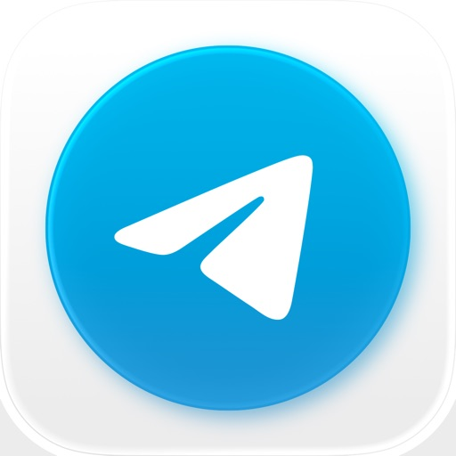

Echtes Instant Messaging – einfach, schnell, sicher und mit all deinen Geräten synchronisiert. Eine der Top 5 der am meisten heruntergeladenen Apps der Welt, mit über 1 Milliarde aktiven Nutzern.

SCHNELL: Telegram ist die schnellste Messaging-App auf dem Markt, um Leute über ein weltweit einmalig verteiltes Netzwerk von Rechenzentren zu verbinden.

SYNCHRONISIERT: Du kannst auf alle deine Chatnachrichten und Dateien von verschiedenen Geräten (einschließlich PCs, Tablets und Smartphones) gleichzeitig zugreifen. Die Telegram-Apps sind unabhängig, sodass du dein Handy nicht ständig eingeschaltet lassen musst. Starte deine Nachricht auf einem Gerät und setze sie jederzeit auf einem anderen Gerät fort. Verliere niemals wieder deine Daten.

UNBEGRENZT: Du kannst Chatnachrichten, Bilder, Videos und Dateien jeglicher Art senden. Dein Chatverlauf, inkl. Medien und Dateien, verbraucht keinen Speicherplatz auf deinem Gerät und wird sicher in der Telegram Cloud gespeichert – solange du es möchtest.

SICHER: Unsere Mission ist, ein sicheres, schnelles und globales Kommunikationsmittel zu schaffen. Alles bei Telegram, inklusive Chats, Gruppen, Medien etc. ist verschlüsselt. Wir setzen auf eine Kombination aus 256-Bit symmetrischer AES Verschlüsselung, 2048-Bit RSA Verschlüsselung und dem sicheren Diffie-Hellman Schlüsselaustauschverfahren.

100 % KOSTENLOS & OFFEN: Telegram hat eine vollständig dokumentierte und kostenlose API für Entwickler, Open-Source-Apps und überprüfbare Builds, um zu beweisen, dass die App, die du herunterlädst, aus genau demselben Quellcode erstellt wurde, der veröffentlicht wurde.

LEISTUNGSSTARK: Bei uns kannst du Gruppen mit bis zu 200.000 Mitgliedern erstellen, große Videos und Dateien jeglicher Art (.DOCX, .MP3, .ZIP etc.) mit jeweils bis zu 2 GB teilen und sogar Bots für bestimmte Aufgaben einsetzen. Telegram ist so das perfekte Werkzeug für deine Online-Community und um Teamarbeit zu koordinieren.

ZUVERLÄSSIG: Telegram ist das zuverlässigste Nachrichtensystem, welches je entwickelt wurde, um deine Nachrichten mit möglichst wenig Datenverkehr zu übertragen. Es funktioniert selbst mit der langsamsten mobilen Verbindung.

UNTERHALTSAM: Telegram verfügt über leistungsstarke Foto- und Videobearbeitungswerkzeuge, animierte Sticker und Emoji, vollständig anpassbare Farbthemen, um das Aussehen deiner App zu verändern, und eine offene Sticker-/GIF-Plattform, um all deine ausdrucksstarken Bedürfnisse zu erfüllen.

EINFACH: Obwohl wir eine noch nie dagewesene Vielfalt an Funktionen bieten, achten wir sehr darauf, die Oberfläche schlicht zu halten. Telegram ist so einfach, dass du bereits weißt, wie man es benutzt. 

PRIVAT: Wir nehmen deine Privatsphäre sehr ernst und werden es niemals Dritten erlauben, auf deine Daten zuzugreifen. Du kannst jede Nachricht, die du jemals gesendet oder empfangen hast, für beide Seiten, jederzeit und spurlos löschen. Telegram wird deine Daten niemals nutzen, um dir Werbung zu zeigen.

Für alle, die an maximaler Privatsphäre interessiert sind, gibt es Geheime Chats. Hier zerstören sich Nachrichten, Videos oder Bilder auf Wunsch bei beiden Chatpartnern selbst, sodass es gar keine Spuren mehr von dieser Unterhaltung gibt. Geheime Chats nutzen eine Ende-zu-Ende-Verschlüsselung, um sicherzustellen, dass eine Nachricht nur von dem vorgesehenen Empfänger gelesen werden kann.

Wir setzen neue Standards: Regelmäßige Updates und immer wieder neue interessante Funktionen, die es bei keinem anderen Messenger gibt. Entdecke die Zukunft.

Terms of Use: https://www.apple.com/legal/internet-services/itunes/dev/stdeula/

[View on Apple](https://apps.apple.com/fr/app/telegram-messenger/id686449807)

## Amazon FR

Complète
Recherchez et achetez des produits, obtenez des informations détaillées, lisez des avis et faites votre choix parmi les millions de produits proposés par Amazon.fr ou amazon.com.be et par d'autres vendeurs.
 
Pratique
Connectez-vous avec votre compte Amazon déjà existant pour accéder à votre panier et à vos options de paiement et de livraison. Pas besoin de créer de nouveau compte pour gérer vos paramètres de commande 1-Click et vos listes d'envie, suivre vos commandes et utiliser vos avantages Premium/ Prime. Faites vos achats aussi facilement que sur Internet.
 
Rapide
Comparez les prix et vérifiez la disponibilité d'un produit instantanément en scannant un code-barres, en prenant une photo ou en saisissant votre recherche. Les utilisateurs de l’Apple Watch peuvent à présent utiliser la reconnaissance vocale pour rechercher des produits, acheter en 1-Click et ajouter des idées à leur Liste d’envies sur leur montre.
 
Sûre
Tous les paiements passent par les serveurs sécurisés d'Amazon.
 
Universelle
Faites vos achats sur Amazon.co.uk, Amazon.de, Amazon.fr, Amazon.com, Amazon.it, Amazon.cn, Amazon.co.jp ou amazon.com.be depuis une même application.

En utilisant cette app, vous acceptez les Conditions générales de vente d’Amazon (www.amazon.fr/conditionsofuse ou www.amazon.com.be/conditionsofuse). Veuillez consulter notre Notice Protection de vos informations personnelles (www.amazon.fr/privacynotice ou www.amazon.com.be/privacynotice), notre Notice Cookies (www.amazon.fr/cookies ou www.amazon.com.be/cookies) et notre Notice Annonces publicitaires basées sur vos centres d’intérêt (www.amazon.fr/interestbasedads ou www.amazon.com.be/interestbasedads).

Si votre appareil prend en charge la technologie TrueDepth, l’application en utilisera l’appareil photo pour détecter les mouvements de votre visage uniquement lorsque vous utilisez certaines fonctionnalités telles que des produits essayés virtuellement comme des lunettes de soleil. Toutes les informations traitées à l’aide de cette technologie restent sur votre appareil et ne sont pas stockées, traitées ou partagées par Amazon.

[View on Apple](https://apps.apple.com/fr/app/amazon-fr/id358861688)

## Polarsteps

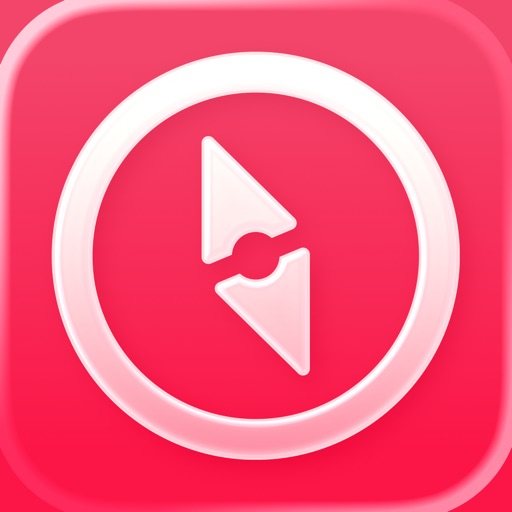

Planifiez, suivez et revivez vos aventures avec Polarsteps et tenez vos proches informés tout au long de votre voyage. Que vous partiez pour six mois ou pour un week-end canoë près de chez vous, Polarsteps vous permet d'immortaliser et de partager chaque instant.

Récompenses
■ Application du jour — Apple App Store (2025)
■ Top 26 des applications — Apple App Store (2026)
■ Top 3 des applications de voyage — Apple App Store (2026)

PLANIFIEZ
■ Planificateur d'itinéraires avec IA : créez une aventure personnalisée en fonction de vos voyages passés ou de vos objectifs actuels.
■ Clichés de destination : obtenez un bref aperçu de chaque lieu, découvrez pourquoi il correspond à votre style de voyage et qui de vos proches s'y sont déjà rendus.
■ Détails du voyage : ajoutez des notes, des informations sur l'hébergement, ainsi que les spots et activités à ne pas manquer.
■ Planificateur de transport : choisissez votre moyen de transport pour chaque étape de votre voyage.
■ Inspiration : suivez d'autres explorateur(rice)s, découvrez leurs destinations et trouvez des idées pour vos propres voyages.

SUIVEZ
■ Suivi automatique de l'itinéraire : suivez de manière précise l'itinéraire que vous avez emprunté sur une magnifique carte du monde numérique.
■ Compagnons de voyage : invitez vos ami(e)s à suivre vos voyages en commun.
■ Immortalisez votre aventure : ajoutez des photos, des vidéos et des stories à chaque step pour donner vie à votre voyage.
■ Statistiques de voyage : découvrez l'étendue de vos voyages à travers le monde, avec le nombre total de pays visités, les distances parcourues et bien plus encore.
■ Spots préférés : ajoutez vos lieux et activités préférés à votre récit.
Mode de transport : sélectionnez les moyens de transport utilisés, que ce soit l'avion, le train ou même le tuk-tuk.

PARTAGEZ
■ Actualités de voyage : partagez votre aventure afin que vos proches puissent la vivre avec vous, où qu'ils soient, et savoir où vous vous trouvez et ce que vous faites.
■ Conseils pour les voyageur(euse)s : suggérez aux autres voyageur(euse)s des choses à voir et à faire.
■ Contrôles de la confidentialité : décidez qui peut voir vos aventures : tout le monde, vos abonné(e)s uniquement ou seulement vous.

REVIVEZ
■ Souvenirs numériques : parcourez les lieux, les photos, les récits et les statistiques de tous vos voyages.
■ Reels de voyage : il vous suffit d'appuyer sur un bouton pour transformer votre voyage en une vidéo inoubliable (idéale pour le partage sur les réseaux sociaux).
■ Travel Book : transformez votre voyage en un magnifique Travel Book imprimé qui retrace votre itinéraire et vos souvenirs.

TÉMOIGNAGES DE NOS UTILISATEUR(RICE)S :
« J'adore cette appli ! Elle suit mes aventures et envoie des notifications en temps réel à mes proches. En rentrant, j'ai commandé un Travel Book regroupant mes photos, qui est d'excellente qualité. »

« L'appli Polarsteps est géniale. Je suis complètement accro. C'est vraiment sympa de pouvoir garder une trace de tous ses voyages. En plus, mes proches peuvent me suivre partout où je vais. Le Travel Book, disponible une fois le voyage terminé, est de très bonne qualité. »

« J'utilise cette application depuis des années. Je l'ai toujours trouvée super et elle ne cesse de s'améliorer. »

POLARSTEPS DANS LA PRESSE
« L'application Polarsteps remplace votre carnet de voyage, et le rend plus pratique et plus esthétique. » - National Geographic

« Polarsteps vous aide à suivre et à partager vos voyages en toute simplicité et avec un rendu visuel des plus attrayants. » - The Next Web

« Le carnet de voyage généré par Polarsteps est remarquable et donne envie d'embarquer pour de nouvelles aventures. » - TechCrunch

[View on Apple](https://apps.apple.com/fr/app/polarsteps/id947925763)

## Spotify Musik und Podcasts

Entdecke eine riesige Auswahl an Podcasts und Musik – kostenlos auf Spotify. Stelle Playlists zusammen und streame Millionen von Songs, Alben und Podcasts kostenlos auf dem Smartphone oder Tablet. Mit Spotify Premium kannst du Musik herunterladen, Musik offline hören und mit Hörbüchern aus aller Welt in spannende Geschichten eintauchen.

Warum Spotify als Musikplayer und Podcast-App verwenden? Hier einige der Vorteile:
• Streame über 100 Millionen Songs und 6 Millionen Podcasts.
• Entdecke von Spotify zusammengestellte Playlists mit Musik von deinen Lieblingskünstler*innen.
• Suche schnell und einfach nach Lieblingssongs, -alben und -Podcasts.
• Erhalte personalisierte Musikempfehlungen ganz nach deinem Geschmack.
• Abonniere deine Lieblings-Podcasts kostenlos und stelle deine eigene Podcast-Bibliothek zusammen.

Spotify Free ist mehr als ein Musikplayer. Du kannst Podcasts und Musik kostenlos streamen, personalisierte Playlists entdecken oder deine eigenen zusammenstellen und teilen. Und auch bei Neuerscheinungen und Events deiner Lieblingskünstler*innen bleibst du immer auf dem Laufenden.
• Streame Millionen Songs und Podcasts kostenlos.
• Erstelle Playlists mit deiner Lieblingsmusik.
• Teile Songs und Playlists mit Freund*innen und Familie. (In manchen Regionen können Einschränkungen gelten.)
• Entdecke personalisierte Playlists. Du kannst auch welche mit Freund*innen erstellen.
• In „Dein Mix der Woche“ findest du jede Woche neue Songs, die dir gefallen könnten.
• Mit der Playlist „Release Radar“ und „New Music Friday“ bleibst du auf dem Laufenden.
• Finde heraus, wann deine Lieblingskünstler*innen in der Nähe auftreten.
• In Spotify Wrapped siehst du jedes Jahr deine am meisten gestreamten Songs, Genres, Künstler*innen, Podcasts und mehr.
• Höre Musik auf mehreren Geräten – Spotify macht’s möglich.
• Streame Musik über Spotify Connect auf Smart Speakern und gib Musik über PC, Laptop, Smart-TV, Chromecast, PlayStation®, XBOX®, Wearables, in deinem Auto und mehr wieder. Begrenzte Anzahl von Gerätemodellen.

Mit Spotify Premium genießt du die Vorteile eines Offline-Musikplayers und von Musik ohne Internet. Dank der Downloader-Funktion kannst du Songs, Podcasts und Playlists auch offline wiedergeben, egal wo du bist.
• Hör Musik, Podcasts und Hörbücher an einem Ort.
• Musik ohne Werbeunterbrechungen: Genieße deine Musik ohne Ads.
• Spiele Inhalte auf Abruf ab.
• Hörbücher mit Spotify Premium sind derzeit in Australien, Kanada, Irland, Neuseeland, den USA und dem Vereinigten Königreich verfügbar. Nutzer*innen von Premium Individual und Manager*innen von Duo und Family Abos können mit 15 Wiedergabestunden/Monat mehr als 250.000 Hörbücher streamen.
• Genieße hochwertiges Audio auf unterstützen Geräten.
• Spotify bietet jetzt einen KI-DJ: Dieser persönliche DJ kennt deinen Musikgeschmack und wählt Songs für dich aus.
• Streame über PC, Smartphone, Tablet, Smartwatch und im Auto.
• Hoste einen Jam mit Freund*innen, um in Echtzeit miteinander Musik zu hören und gemeinsam zu bestimmen, was als Nächstes läuft.
• Lade Musik herunter und hör Podcasts und Hörbücher offline, auch ohne Internetverbindung.
• Kein Vertrag erforderlich – das Spotify Premium Abo ist jederzeit kündbar.

Mit Spotify kannst du überall Musik spielen. Streame deine Lieblingssongs und entdecke neue Musik, Podcasts und Hörbücher mit der Musik-App von Spotify.

DIR GEFÄLLT SPOTIFY?
Folge uns auf Instagram: https://www.instagram.com/spotify
Folge uns auf TikTok: https://www.tiktok.com/@spotify

[View on Apple](https://apps.apple.com/fr/app/spotify-musique-et-podcasts/id324684580)

## WePlay - Partyspiel & Chat

[WePlay - Lustige Partyspiele]
WePlay ist eine Partyspiel-App, die junge Leute gerne spielen. Sie bietet die beliebtesten Partyspiele und Sprachinteraktion. Du wirst mehr Spaß beim Spielen haben!

[Online-Partyspiel-Plattform]
Wer ist der Impostor: Ein klassisches Spiel in Unterhaltungssendungen. Komm und kämpfe gegen deine Freunde!
HitMaster: Das extrem fesselnde Musik-Partyspiel! Spiele mit Musik und finde heraus, wer der wahre HitMaster ist!
Weltraum Werwolf: Das beliebteste soziale Deduktionsspiel, bei dem Zivilisten und Werwölfe gegeneinander antreten!
Schnapp die Musik: Neuer Modus für Schnapp die Musik und viele heiße Songs. Wenn du gerne singst, dann darfst du es nicht verpassen!
Zeichnen & Raten: Es testet nicht nur deine Kreativität, sondern auch dein Teamwork und deine Zeichenfähigkeiten!

[Neue interaktive Funktionen]
3D-Avatar & Kleidungswechsel: Erstelle einen 3D-Avatar, kneife in das Gesicht, modelliere Kleidung und zeige deinen eigenen Avatar!
Momente & Platz:  Die charmantesten Jungs und Mädels sind alle hier. Verfolge interessante Themen und teile deine aufregenden Momente!

Spiele, singe, chatte und unternehme interessante Dinge mit Freunden in WePlay!
In WePlay warten immer lustige und freundliche Menschen auf dich.

---------------
Wenn Sie sich für den Kauf eines VIP-Abonnements mit automatischer Verlängerung entscheiden, wird der Betrag nach Ihrer Kaufbestätigung von Ihrem Apple-Konto abgebucht. Die Verlängerung erfolgt automatisch innerhalb von 24 Stunden vor Ablauf des aktuellen Abonnementzeitraums, wobei der entsprechende Betrag erneut von Ihrem Konto abgebucht wird. Nach dem Kauf können Sie die automatische Verlängerung jederzeit in den „Einstellungen“ des App Store deaktivieren. Bitte beachten Sie, dass ein laufendes Abonnement während seiner Gültigkeitsdauer nicht storniert werden kann. Wenn Sie kein VIP-Abo mit automatischer Verlängerung erwerben möchten, können Sie WePlay weiterhin kostenlos nutzen.
Automatische Verlängerung – Nutzungsvereinbarung: https://weplayapp.com/docs/yw0ZHNvM

Terms of Use (EULA)：https://www.apple.com/legal/internet-services/itunes/dev/stdeula/

[View on Apple](https://apps.apple.com/fr/app/weplay-jeu-chat/id1580330718)

## Hinge Dating App: Date & Meet

HINGE IST DIE DATING-APP, DIE ENTWICKELT WURDE, UM GELÖSCHT ZU WERDEN
Hinge ist für alle, die von Dating-Apps loskommen wollen. Mit einem Profil, das deine Persönlichkeit durch Text, Fotos, Video und Stimme zeigt, entstehen einzigartige Unterhaltungen, die zu tollen Dates führen. 

SO WIRST DU HINGE WIEDER LOS
Beim Online-Dating sind die Leute so sehr mit Matching beschäftigt, dass sie sich gar nicht erst persönlich treffen.  Hinge will das ändern. Also haben wir eine Dating-App entwickelt, die gelöscht werden soll. So geht's:

* Wir lernen schnell deinen Typ kennen. Du wirst nur den für dich besten Personen vorgestellt.

* Wir zeigen dir die Persönlichkeit einer Person. Du lernst potenzielle Dates durch ihre individuellen Antworten auf Fragen kennen und erfährst auch etwas über ihre religiösen Überzeugungen, ihre Größe, ihre politische Einstellung, ihre Dating-Absichten, ihren Beziehungstyp und vieles mehr.

* Wir machen es dir leicht, miteinander ins Gespräch zu kommen. Jedes Match beginnt damit, dass jemand einen bestimmten Teil deines Profils mag oder kommentiert.

* Wir wollen, dass du dich sicher fühlst, wenn du jemanden persönlich triffst, und auf tolle Dates gehst. Die Selfie-Verifizierung macht es Datern auf Hinge einfacher, sicherzustellen, dass sie die sind, die sie vorgeben zu sein.

* Wir fragen, wie deine Dates laufen. Nachdem du mit einem Match Telefonnummern ausgetauscht hast, melden wir uns bei dir, um zu erfahren, wie dein Date gelaufen ist. So können wir dir in Zukunft bessere Empfehlungen geben.

PRESSE
"Die App ist für nach Liebe suchende Personen die erste Adresse." - The Daily Mail
"Der CEO von Hinge sagt, eine gute Dating-App beruhe auf Verletzlichkeit und nicht auf Algorithmen." - Washington Post
"Hinge ist die erste Dating-App, die tatsächlich den Erfolg in der realen Welt misst" - TechCrunch

Die Nutzung der App ist kostenlos. Mitglieder, die alle sehen wollen, die sie mögen oder unbegrenzte Likes senden möchten, können auf Hinge+ upgraden. Für den Zugriff auf zusätzliche Funktionen, einschließlich erweiterter Empfehlungen und bevorzugter Likes, bieten wir HingeX an.

ABO-INFOS
Bei der Kaufbestätigung wird das Apple-Konto mit dem Betrag belastet.
Das Abonnement verlängert sich automatisch, wenn die automatische Verlängerung nicht mindestens 24- Stunden vor Ablauf des aktuellen Zeitraums deaktiviert wird.
Das Konto wird innerhalb von 24- Stunden vor Ablauf des aktuellen Zeitraums für die Erneuerung belastet.
Nach dem Kauf können in den Kontoeinstellungen die Abonnements verwaltet und die automatische Erneuerung deaktiviert werden.

Support: hello@hinge.co
Nutzungsbedingungen: https://hinge.co/terms.html
Datenschutzerklärung: https://hinge.co/privacy.html

Alle Fotos sind von Modellen und dienen nur zur Veranschaulichung.

[View on Apple](https://apps.apple.com/fr/app/hinge-rencontre-date-tchat/id595287172)

## Netflix

Auf der Suche nach den angesagtesten Filmen und Serien aus aller Welt? Die gibt’s bei Netflix.

Entdecken Sie preisgekrönte Serien, Filme, Live-Events, Podcasts und Games unterwegs – alles in der Netflix-App. Egal, ob Sie auf Reisen oder auf dem Weg zur Arbeit sind oder einfach nur eine Pause einlegen wollen: Ab jetzt verpassen Sie nichts mehr auf Netflix.

Was Sie an Netflix lieben werden:

– Einfache Navigation mit Verknüpfungen am unteren Bildschirmrand zum schnellen Stöbern oder direkten Aufrufen Ihrer Favoriten

– Eine neue Möglichkeit, um herauszufinden, was als Nächstes kommt, inklusive eines Feeds mit neuen Clips

– Eine Welt voller Unterhaltung mit Serien, Filmen, Live-Events, Games und Podcasts – alles an einem Ort

– Ihre Favoriten jederzeit im Blick – von Ihren Lieblingsmomenten bis zu „Meine Liste“ finden Sie alles auf dem Tab „Mein Netflix“.

– Personalisierte Empfehlungen auf Basis Ihrer Bewertungen. Sofortige Benachrichtigungen bei Neuerscheinungen, neuen Folgen und Live-Events

Die Netflix-Mitgliedschaft ist ein monatliches Abo, das mit Ihrer Registrierung beginnt. Sie können jederzeit problemlos online kündigen – rund um die Uhr. Ganz ohne langfristige Verträge oder Kündigungsgebühren. Wir möchten einfach, dass Ihnen das, was Sie sich ansehen, gefällt.

Bitte beachten Sie, dass die App-Datenschutzinformationen für Daten gelten, die über die Netflix-App für iOS, iPadOS und tvOS erhoben werden. In der Datenschutzerklärung von Netflix (siehe Link unten) erfahren Sie mehr darüber, welche Daten wir in anderen Zusammenhängen, z. B. bei der Kontoregistrierung, erheben.

Datenschutzrichtlinie: www.netflix.com/privacy

Nutzungsbedingungen: www.netflix.com/terms

Telefonnummer: +18667160414

E-Mail: iosappstore@netflix.com

[View on Apple](https://apps.apple.com/fr/app/netflix/id363590051)

## X

Willkommen bei X, früher bekannt als Twitter, Ihrem vertrauenswürdigen digitalen Marktplatz wo Gespräche in Echtzeit ablaufen und die Welt sich über Eilmeldungen, Live-Events, Podcasts und alles dazwischen verbindet.

Ob Sie leidenschaftlich an Sport, Technik, Musik oder Politik interessiert sind, X bietet Ihnen einen Platz in der ersten Reihe für das, was weltweit passiert.

X ist nicht nur eine weitere Social-Media-App, sondern das ultimative Ziel, um gut informiert zu bleiben, Ideen zu teilen und Communities aufzubauen. 

Mit X sind Sie immer auf dem Laufenden mit relevanten Trending-Themen und Eilmeldungen, die sofort auf Ihrem Bildschirm erscheinen, roh und ungefiltert.

Was Sie auf X tun können:
• Verfolgen Sie Eilmeldungen aus der ganzen Welt, bevor sie in die Schlagzeilen kommen, und bleiben Sie voraus mit Echtzeit-Updates zu Trending-Themen und viralen Gesprächen.
• Teilen Sie Ihre Gedanken, Fotos und Videos mit einer globalen Community. Schließen Sie sich Millionen von Nutzern an, um den öffentlichen Diskurs in sozialen, kulturellen und politischen Gesprächen zu gestalten.
• Entdecken Sie Grok, den KI-Assistenten, der von den Echtzeit-Daten von X angetrieben wird. Sie können Grok bitten, Trending-News zusammenzufassen, Videos zu erklären oder mehr Kontext zu Beiträgen zu geben.
• Streamen Sie Live-Videos oder gehen Sie live mit Spaces, unserem Audio-Feature, das es Ihnen ermöglicht, Diskussionen zu moderieren, Interviews zu führen oder Ihren nächsten Live-Podcast zu starten. Ob Sie ein Konzert, ein Live-Spiel oder Ihre Gedanken zu einem heißen Thema streamen, X hält Ihr Publikum bei der Stange.
• Schauen Sie Videos: von Live-Eilmeldungen und Sport-Clips bis hin zu Podcasts und Gaming-Sessions, die bis zu 3 Stunden lang sein können. Viele der führenden Stimmen der Welt in Komödie, Gaming, Podcasting und Politik teilen ihren Content auf X.
• Verbinden Sie sich und chatten Sie privat mit Freunden, Followern, Kunden oder Kollaborateuren über Direktnachrichten.
• Treten Sie Communities bei und bauen Sie sie auf, die auf Ihre Interessen zugeschnitten sind: von Sport-News, Gaming, Entertainment, Krypto, Unternehmertum, Tech und mehr.
• Abonnieren Sie X Premium, um exklusive Features freizuschalten wie das blaue Häkchen, erhöhte Sichtbarkeit, priorisierte Antworten, weniger Werbung, längere Videos und die Bearbeitung von Beiträgen. X Premium gibt Ihnen auch Zugang zum Revenue-Sharing für Creator und die Möglichkeit, exklusiven Content für Abonnenten anzubieten.

Warum X?
In einer Welt des ständigen Wandels ist X Ihre Echtzeit-Quelle, um voraus zu sein, mit Menschen in Kontakt zu treten und vielfältige Perspektiven zu erkunden. Von Live-Eilmeldungen und Trending-Memes bis hin zu Top-Podcasts und Live-Streams Ihrer Lieblings-Creator bringt X alles in einer leistungsstarken Social-Erfahrung zusammen.

Datenschutzrichtlinie: https://x.com/de/privacy
Nutzungsbedingungen: https://x.com/de/tos

[View on Apple](https://apps.apple.com/fr/app/x-anciennement-twitter/id333903271)

## teststar: Gagnez de l’Argent

Fatigué de faire défiler votre téléphone sans rien gagner ? Vous voulez gagner de l’argent en ligne tout en vous amusant ? Ne cherchez plus ! teststar est l’application de récompenses ultime qui vous paie pour faire ce que vous aimez déjà : tester des produits, répondre à des sondages et partager vos avis.
Chaque clic vous rapproche de vrais gains en argent. Que vous testiez de nouveaux produits, exploriez des sondages passionnants ou réalisez de petites tâches, vous gagnez de l’argent où que vous soyez !

Pourquoi choisir teststar ?

- Gagnez de l’Argent Réel – Accédez aux meilleurs sondages et tâches et soyez récompensé pour vos tests.
- Simple, Amusant et Gratifiant – Effectuez des missions faciles et stimulantes et regardez vos gains augmenter.
- Paiements Rapides et Sécurisés – Retirez vos gains en toute simplicité via PayPal.
- Pas de Piège, Juste du Cash – Contrairement à d’autres applis, nous offrons de vraies récompenses en argent, sans arnaques. Gagnez facilement et retirez vos gains à tout moment !
- Fiable et recommandé par nos utilisateurs – Testé, vérifié, approuvé ! Consultez nos avis sur Trustpilot.
- Des Options Infinies – Large choix avec de nouvelles offres chaque jour.

Comment fonctionne teststar ?

Commencer est simple. Suivez ces trois étapes faciles :
Inscrivez-vous gratuitement – Découvrez des tâches et sondages passionnants.

Choisissez ce qui vous plaît – Chaque mission terminée vous rapporte de l’argent.

Recevez vos gains – Retirez vos gains directement via PayPal, rapidement et en toute sécurité.
C’est aussi simple que ça ! Commencez à gagner dès aujourd’hui tout en vous amusant !

Avec autant de façons de gagner de l’argent réel, teststar est l’application idéale pour les petits boulots, les étudiants et toute personne cherchant un revenu supplémentaire.
Gagnez de l'argent réel n’importe où, n’importe quand ! Que vous soyez à la maison, en déplacement ou en pause, transformez votre temps libre en argent avec teststar. Il n’y a pas de limite à vos gains – c’est vous qui décidez de l’effort à fournir ! Pas de tâches compliquées, pas de faux points – juste de l’argent réel !

Rejoignez des millions d’utilisateurs satisfaits qui ont déjà gagné avec teststar !

Des gains sûrs et sécurisés

Votre sécurité est notre priorité. teststar est 100 % sûr, fiable et approuvé par des millions d’utilisateurs. Nous garantissons des récompenses justes pour votre temps, et nos paiements rapides via PayPal vous assurent de ne jamais attendre longtemps pour recevoir votre argent.
Pas d’arnaques. Pas de fausses promesses. Juste de vraies récompenses.
Prêt à transformer votre temps libre en argent réel ? Téléchargez teststar maintenant et commencez à gagner de l’argent en faisant ce que vous aimez – tester, réaliser des tâches et partager vos avis !

Si vous avez besoin d’aide, notre support en ligne est disponible 24h/24 et 7j/7.

[View on Apple](https://apps.apple.com/fr/app/teststar-gagnez-de-largent/id6749456669)

## Instagram

Aus kleinen Momenten werden große Freundschaften. Teile deine auf Instagram.
– Von Meta

Bleib mit deinen Freund*innen in Kontakt, finde andere Fans und finde heraus, was die Menschen in deinem Umfeld so treiben. Erkunde deine Interessen und poste, was gerade bei dir los ist – ob Alltagsmomente oder besondere Highlights in deinem Leben.

Teile, was dich gerade bewegt.
- Halte deine Freund*innen mit Stories und Notizen, die für 24 Stunden sichtbar sind, auf dem Laufenden.
- Starte Gruppenchats und teile spontane Momente mit deinen engen Freund*innen.
- Teile Erinnerungen von aktuellen Veranstaltungen oder Reisen im Feed.
- Verwandle dein Leben in einen Film und entdecke mit Reels auf Instagram unterhaltsame Kurzvideos.
- Personalisiere deine Beiträge mit exklusiven Vorlagen, Musik, Stickern und Filtern.

Erkunde Themen, die dich interessieren.
- Sieh dir Videos deiner Lieblings-Creator*innen an und entdecke neue Inhalte, die auf deine Interessen zugeschnitten sind.
- Lass dich im „Explore“-Tab von den Fotos und Videos neuer Konten inspirieren.
- Entdecke Marken und Kleinunternehmen und shoppe Produkte, die deinen Stil unterstreichen.

Manche Instagram-Features sind in deinem Land oder deiner Region möglicherweise nicht verfügbar.

Nutzungsbedingungen und Richtlinien: https://help.instagram.com/581066165581870

[View on Apple](https://apps.apple.com/fr/app/instagram/id389801252)

## INTERSPORT France

Bienvenue sur l’application officielle INTERSPORT France, votre destination n°1 pour l’équipement sportif. Que vous soyez un athlète de haut niveau, un passionné d’aventure en plein air ou un pratiquant occasionnel, notre application a été conçue pour vous accompagner dans chaque mouvement
Accédez à un catalogue de plus de 30 sports et retrouvez les plus grandes marques mondiales à prix accessible en quelques clics

VIVEZ VOS PASSIONS À 100% : NOS 4 UNIVERS MAJEURS

L'application INTERSPORT met à l'honneur vos disciplines favorites avec une profondeur de gamme inégalée :
FOOTBALL : Préparez votre saison avec les derniers crampons, maillots officiels et accessoires d'entraînement. Retrouvez les innovations de Nike et Adidas pour dominer le terrain, que vous jouiez en club ou entre amis
RUNNING : Repoussez vos limites avec une sélection pointue de vêtements et chaussures de course. Profitez de l'amorti révolutionnaire de Hoka, de la stabilité légendaire d'Asics, de la respirabilité des débardeurs Energetics et du dynamisme des modèles les plus récents pour tous types de foulées
RANDONNÉE & OUTDOOR : Équipez-vous pour l'aventure avec des produits techniques conçus pour durer. De la technicité de The North Face à la fiabilité des chaussures Salomon, en passant par la versatilité des produits McKinley nous vous offrons le meilleur pour explorer les sommets en toute sécurité
VÉLO : Du VTT au vélo de route en passant par la mobilité urbaine, découvrez nos gammes de cycles, casques et protections. Fiabilité, performance et sécurité vous accompagnent pour vos sorties quotidiennes ou vos défis sportifs avec nos marques NAKAMURA et SUNN

UN LARGE CHOIX ET DES PRIX ENGAGÉS

INTERSPORT, c'est la force d'un réseau coopératif leader alliant marques internationales et marques propres. Affichez votre style lifestyle ou sportif, et profitez de notre positionnement prix unique : 
Offres promotionnelles régulières et ventes flash sur vos marques préférées
Prix Engagés pour rendre le sport accessible à tous
Gamme Premier Prix Performance : la qualité technique au prix le plus bas
        
L’EXPÉRIENCE TEAM INTERSPORT : PLUS QU’UN PROGRAMME DE FIDÉLITÉ

Rejoignez la communauté et profitez d'un parcours personnalisé avant, pendant et après vos achats : 
Votre carte digitale : Accédez directement à votre carte fidélité dans votre application et scannez-la en caisse pour profiter de tous vos avantages
Cagnotte en temps réel : Suivez le montant de vos points et recevez des alertes exclusives pour utiliser vos remises
Espace personnel complet : Gérez vos informations, consultez votre historique d'achat et suivez l'avancée de vos commandes en un clin d’œil
Store Locator : Trouvez le magasin INTERSPORT le plus proche, consultez ses horaires et découvrez les services spécifiques (atelier, location, etc.)

UNE EXPÉRIENCE E-COMMERCE FLUIDE ET CONNECTÉE

Scan Produit en magasin : Vous hésitez sur une taille ou voulez consulter les avis clients ? Scannez le code-barres en rayon pour accéder immédiatement à la fiche produit détaillée et vérifier la disponibilité des stocks
Wishlist : Enregistrez vos articles favoris pour créer la liste de vos envies
Parcours d’achat rapide : Une interface optimisée pour une commande sécurisée en quelques secondes

EXPERTISE ET CONSEILS À VOTRE SERVICE

Accédez directement via l'app à nos sections Guides & Conseils : 
Des guides d'achat experts pour choisir le matériel adapté à votre morphologie et à votre niveau
Des articles d'inspiration lifestyle et sport pour rester au top des tendances
Des conseils d'entretien pour prolonger la vie de vos équipements de marque

TOUS LES SERVICES POUR VOUS SIMPLIFIER LA VIE

Commandez l'esprit tranquille grâce à nos engagements : 
Click & Collect : Retrait gratuit en magasin pour vos articles favoris
Paiement 100% sécurisé : Plusieurs options de paiement pour une transaction sereine
Retours étendus : Vous avez jusqu'à 100 jours pour changer d'avis et nous retourner vos produits

[View on Apple](https://apps.apple.com/fr/app/intersport-france/id6759600510)

## EasyPark parken - Park App

Seit 2001 macht EasyPark Städte lebenswerter. Mit Millionen von Autofahrer:innen, Unternehmen und Betreiber:innen, die unsere Dienste in mehr als 20 Ländern nutzen, entwickeln wir bequeme und einfach zu bedienende Lösungen. Das spart oft Zeit und Geld und verringert den unnötigen Stress des Parkens.

EasyPark ist die Nr. 1 unter den Park-Apps in Europa, mit der besten Abdeckung. Unsere Lösung für mobiles Parken erlaubt es, für das Parken in Parkhäusern, Garagen, auf der Straße oder am Flughafen zu bezahlen. Ob von zu Hause oder im Ausland - wo immer das Leben stattfindet!

Preis: An den meisten Standorten erheben wir eine Servicegebühr zusätzlich zu den vom Betreiber/der Stadt erhobenen Parkgebühren. Der Gesamtpreis und die Aufschlüsselung der Gebühren werden in der EasyPark-App vor jedem Parkvorgang angezeigt. Weitere Informationen sind auf unserer lokalen easypark.com-Website verfügbar.

Mit der App von EasyPark kann jeder:
- Einen Parkvorgang vom Smartphone aus starten.
- Das Parken jederzeit stoppen und nur für die tatsächlich genutzte Zeit bezahlen.
- Die Parkdauer von überall aus anpassen, wenn es mal etwas länger dauert.
- Einfacher einen freien Parkplatz in der Nähe des Zielorts finden.
- Die App beruflich oder privat nutzen.
- Kosten, ob beruflich oder privat, einfach aufteilen und übersichtlich darstellen.
- Aus sicheren Zahlungsarten frei auswählen.
- Benachrichtigungen aktivieren, um über Parkvorgänge auf dem Laufenden zu bleiben.

Mit der App von EasyPark kann man in folgenden Städten parken: Berlin, Hamburg, Köln, Frankfurt, Stuttgart, München, Düsseldorf, Dortmund, Wien, Graz, Linz, Innsbruck, Zürich, Genf, Bulle, Bellinzona, Fribourg, Lugano, Locarno, Bern und viele viele mehr!

Leider ist die EasyPark-App im Vereinigten Königreich nicht verfügbar. Um in Großbritannien zu parken, empfehlen wir die App von RingGo zu verwenden.

[View on Apple](https://apps.apple.com/fr/app/easypark-stationnement-facile/id449594317)

## Proton VPN: Privé et Rapide

Proton VPN est la seule application de VPN gratuite au monde qui est sûre et respecte votre vie privée. Notre VPN rapide offre un accès internet sécurisé, privé et chiffré avec des fonctionnalités de sécurité avancées. Proton VPN débloque également l'accès aux sites web et plateformes de streaming populaires. Proton VPN a été créé par les scientifiques du CERN à l'origine de Proton Mail, le plus grand service de messagerie chiffrée au monde. Largement utilisé dans le monde, le VPN sécurisé sans journaux de Proton offre un accès Internet privé 24h/24 et 7j/7, sans enregistrer votre historique de navigation ni afficher de publicités, vendre vos données à des tiers ou limiter les téléchargements.

Fonctionnalités VPN gratuites disponibles pour tous les utilisateurs :
• Données illimitées, sans limites de bande passante ou de vitesse
• Politique stricte de non-journalisation
• Contournement des restrictions géographiques : la fonctionnalité Smart Protocol lève automatiquement les interdictions de VPN et débloque les contenus censurés
• Des serveurs avec disque chiffré protègent vos données
• Confidentialité persistante : le trafic chiffré ne peut pas être capturé et déchiffré
• Protection contre les fuites DNS : nous chiffrons les requêtes DNS pour que vos activités de navigation ne puissent pas être exposées à des fuites DNS
• VPN permanent/arrêt d'urgence offrant une protection contre les fuites causées par des déconnexions accidentelles

Fonctionnalités VPN premium :
• Accès à plus de 20 000 serveurs haut débit dans plus de 140 pays
• VPN rapide : connexions jusqu'à 10 Gbit/s
• VPN Accelerator: technologie unique qui augmente les vitesses de Proton VPN jusqu'à 400 %, pour une navigation plus rapide
• Déblocage de l'accès aux contenus bloqués ou censurés
• Connexion simultanée de 10 appareils
• Bloqueur de publicités (NetShield) : fonction de filtrage DNS qui vous protège des logiciels malveillants, bloque les publicités et empêche les traqueurs de sites web de vous suivre
• Visionnage de films, événements sportifs et vidéos sur tous les services de streaming (Netflix, Hulu, Amazon Prime Video, Disney+, BBC iPlayer, etc.)
• Prise en charge du partage de fichiers et du P2P
• Serveurs Secure Core protégeant contre les attaques réseau grâce à un VPN multi-sauts
• Tor via VPN, pour une intégration automatique avec le réseau d'anonymat Tor

Pourquoi choisir Proton VPN ?
• Aucune donnée personnelle requise pour s'inscrire
• Application VPN facile à utiliser pour iOS, iPadOS, visionOS et tvOS
• Mieux qu'un proxy internet, en raison du chiffrement plus fort de votre connexion
• Appuyez simplement sur « Connexion rapide » pour sécuriser votre connexion, en particulier sur les points d'accès Wi-Fi publics
• La technologie unique VPN Accelerator augmente la vitesse de votre VPN jusqu'à 400 %, pour une connexion internet plus rapide
• L'architecture Secure Core de Proton VPN permet à notre service de VPN sécurisé de se défendre contre les attaques réseau
• Nous n'utilisons que des protocoles VPN dont la sécurité est éprouvée : WireGuard
• La solution est auditée par des experts indépendants et nous publions tous les résultats sur notre site internet

Opinion des experts :
PCMag : « [Proton VPN] offre toute une série de fonctionnalités avancées et propose le meilleur abonnement gratuit que nous ayons vu. Peu de concurrents peuvent rivaliser avec ce mélange de prix abordable, de fonctionnalités et de design. Pour tout cela, il obtient la note de 5 étoiles et remporte le prix du Choix de la rédaction. »

Mozilla : « Il existe de nombreux fournisseurs de VPN, mais tous ne se valent pas. Proton VPN offre un service sécurisé, fiable et convivial, et est exploité par les créateurs de Proton Mail, un service de messagerie respecté axé sur le respect de la vie privée... En tant qu'entreprise, Proton a fait ses preuves dans la défense de la vie privée en ligne et partage notre engagement en faveur de la sécurité sur internet. »"

[View on Apple](https://apps.apple.com/fr/app/proton-vpn-priv%C3%A9-et-rapide/id1437005085)

## Google Chrome

Chrome ist der schnelle, sichere Browser von Google und bietet dir unzählige Möglichkeiten im Web. Lade ihn noch heute herunter und überzeuge dich selbst.

DAS BESTE VON GOOGLE IN CHROME

• GOOGLE SUCHE: Du findest in Sekundenschnelle Antworten auf alle deine Fragen – wenn du möchtest, auch per Sprachbefehl.
• GOOGLE LENS: Du kannst nach allem suchen, was du auf dem Display oder durch die Kamera siehst.
• GOOGLE ÜBERSETZER: Unser Dienst unterstützt mehr als 130 Sprachen. Ein Klick genügt – du kannst sogar ganze Websites übersetzen lassen.

ERSTKLASSIGE SICHERHEITSFUNKTIONEN

• MODUS „ERWEITERTER SCHUTZ“: Dieser Chrome-Modus sorgt für höchstmöglichen Schutz, wenn du im Web unterwegs bist.
• SICHERHEITSCHECK: Wir informieren dich mit proaktiven Sicherheitswarnungen rechtzeitig über Sicherheitsprobleme, damit du dich auf das Wesentliche konzentrieren kannst.
• GOOGLE PASSWORTMANAGER: Mit diesem Dienst kannst du Passwörter erstellen und speichern, damit du dich immer und überall schnell anmelden kannst. Außerdem warnt er dich, wenn deine Passwörter doch einmal in Gefahr sein sollten.

VERFÜGBAR AUF ALLEN DEINEN GERÄTEN

• GERÄTEÜBERGREIFENDE SYNCHRONISIERUNG: Wichtige Dinge wie Lesezeichen, Tabs und Passwörter lassen sich speichern und sind dann sofort verfügbar, wenn du dich auf deinem Smartphone, Computer oder Tablet in Chrome anmeldest.
• TABGRUPPEN: Dank Tabgruppen behältst du beim Surfen immer den Überblick, auch wenn du mehrere Geräte nutzt.
• AUTOFILL: Du kannst Zahlungsinformationen, Adressen und Passwörter speichern und automatisch in Onlineformulare eintragen lassen. Das spart jede Menge Zeit.

Funktionsverfügbarkeit kann je nach Land und Sprache variieren. Kompatibilität variiert. Antworten sollten auf ihre Richtigkeit geprüft werden.

[View on Apple](https://apps.apple.com/fr/app/google-chrome/id535886823)

## Mondial Relay, suivi de colis

Vous êtes mobile ? Envie de suivre en temps réel tous vos colis ? Rien de plus simple, avec l’application Mondial Relay L'application Mondial Relay est gratuite et vous facilite la vie ! Elle est simple, fiable et sécurisée. Avec elle dans votre poche, le suivi, le retrait et l'envoi de vos colis, c'est facile ! Localisez vos Lockers 24/7 et vos Points Relais® favoris dans un réseau de 18 000 points de proximité.

SUIVEZ EN TEMPS REEL TOUS VOS COLIS 
Quoi de mieux que d’avoir les informations importantes dans votre poche ? Avec l’application Mondial Relay, suivez tous vos colis : livraisons e-commerce, envois entre particuliers, marketplaces, retours…
Le détail de chaque étape de livraison est clair, précis et vous permet de savoir exactement où en est votre colis. 
Vous ne souhaitez plus voir un colis dans votre suivi ? Archivez-le ou supprimez-le depuis l'application.

LOCALISEZ VOS LOCKERS/ POINTS RELAIS®
Avec + de 11 000 Lockers, Mondial Relay est le Leader en France. Trouvez facilement les Points de proximité autour de vous, de votre domicile ou encore de votre lieu de travail grâce à notre carte interactive. Le dépôt et le retrait de colis chez Mondial Relay c’est où vous voulez, quand vous voulez ! 

RETIREZ RAPIDEMENT VOS COLIS 
Grâce aux notifications de votre application mobile, soyez informé dès que vos colis sont disponibles. N’oubliez pas de les activer depuis les paramètres de votre compte. 
Encore plus simple et rapide pour retirer vos colis en Locker ! Muni de l’app Mondial Relay, ouvrez votre casier à distance avec votre smartphone et laissez la magie opérer…Tadam ! La porte s’ouvre et votre colis est prêt à être récupéré. Une fonctionnalité qui donne vraiment le Smiiile ;)
En alternative à l’ouverture à distance, le QR code et le code de retrait restent toujours opérationnels pour récupérer un colis.

ENVOYEZ DES COLIS A VOS PROCHES
Envie de faire plaisir à un proche ? Qu’il s’agisse d’un anniversaire ou d’un objet oublié, pas de panique ! Vous pouvez acheter vos étiquettes directement depuis l’onglet "Envoyer" de l’app, à partir de 4,15 € seulement. Et bonne nouvelle : la livraison à domicile est désormais disponible partout en France. Vous pouvez également envoyer un colis sans étiquette, en le déposant simplement dans un Locker grâce à un QR code. Plus besoin d’imprimante, l’envoi de colis n’a jamais été aussi simple !

AJOUTEZ MANUELLEMENT UN COLIS À VOTRE SUIVI 
Un des colis que vous attendez ne s'affiche pas dans votre application ? Pas de panique, vous pouvez l'ajouter à votre suivi en cliquant sur "+" et en renseignant son numéro de suivi.

SUIVEZ LES COLIS DE VOTRE FAMILLE ET DE VOS AMIS 
A vous de choisir ! Renseignez jusqu’à 5 adresses emails et/ou jusqu’à 5 numéros de mobile dans votre profil, de manière sécurisée. Cela vous permet de suivre et de retirer des colis supplémentaires : les vôtres et ceux de vos proches. Pour ajouter ou supprimer un email / n° de mobile, tout se fait en un clic !

L'application Mondial Relay est gérée et hébergée par la société MONDIAL RELAY SASU : - Adresse : 1 avenue de l'Horizon, 59650 VILLENEUVE D'ASCQ, France - Capital social : 500 400 Euros - Immatriculation : n°385 218 631 au Registre du Commerce et des Sociétés - de LILLE METROPOLE (FRANCE) - TVA Intracommunautaire : FR 39 385 218 631 - Directeur en charge de l'Application : Mr Quentin BENAULT - Téléphone : 09 69 32 23 32 - Email : app-feedback@mondialrelay.fr - Politique RGPD : https://www.mondialrelay.fr/donnees-personnelles/.

[View on Apple](https://apps.apple.com/fr/app/mondial-relay-suivi-de-colis/id1633060599)

## GetYourGuide: Planen & buchen

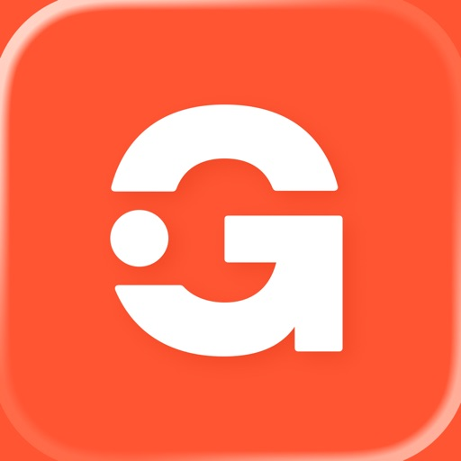

Entdecke die Welt mit GetYourGuide!

Mit der GetYourGuide-App kannst du ganz einfach Tickets für unzählige Aktivitäten und Erlebnisse auf deinen Reisen buchen. Ob du auf der Suche nach einer aufregenden Tagestour, einem unvergesslichen Reiseerlebnis oder einer faszinierenden Stadtführung bist, hier findest du eine Vielzahl von Optionen, um das Beste aus deinem Urlaub herauszuholen.

Egal, ob für die Urlaubsplanung oder für die spontane Suche nach Last-Minute-Erlebnissen an einem beliebigen Reiseziel – mit uns ist das Buchen von Touren, Tagesausflügen und Aktivitäten so einfach wie nie.

Mach mehr aus deiner Reise mit exklusivem Zugang zu den besten Attraktionen und Museen der Welt, entdecke die Highlights und die versteckten Geheimtipps und bleib stets auf dem Laufenden über Last-Minute-Angebote mit der App – wir machen Reiseplanung einfach.

Deine Vorteile mit der GetYourGuide-App

Jetzt reservieren, später zahlen: Sichere dir deinen Platz für beliebte Erlebnisse frühzeitig und bezahle erst später.

Sofortige Buchungsbestätigung: Egal, ob du deine Tour schon lange im Voraus oder last minute buchst, du erhältst deine Tickets und Buchungsbestätigung sofort.

Offline-Tickets: Greife über die App ganz bequem offline auf deine Tickets zu.

24/7 Kundenservice: Du erreichst uns rund um die Uhr kostenlos per E-Mail, Telefon oder WhatsApp

Tickets sicher und bequem im Voraus buchen

Planst du eine Reise und möchtest die wichtigsten Sehenswürdigkeiten besuchen? Mit GetYourGuide kannst du bequem im Voraus Touren und Tickets für berühmte Wahrzeichen wie den beeindruckenden Mailänder Dom, faszinierende Museen und andere Attraktionen buchen. Spare dir das Anstehen in der Warteschlange und genieße einen stressfreien Besuch, indem du deine Tickets einfach auf deinem Smartphone vorzeigst.

Entdecke über 75.000 Erlebnisse

Mit der GetYourGuide-App hast du Zugriff auf eine beeindruckende Auswahl von über 75.000 Erlebnissen, Tickets und Aktivitäten weltweit. Egal, ob du Abenteuer suchst, kulturelle Sehenswürdigkeiten erkunden möchtest oder kulinarische Entdeckungen machen willst – bei uns wirst du fündig. Stöbere durch unsere umfangreiche Sammlung von Tagestouren, Stadtführungen, Museumsbesuchen und vielem mehr und finde das perfekte Erlebnis für deine Reise.

Bleibe flexibel

Mit GetYourGuide bleibst du flexibel und kannst deine Reisepläne mühelos anpassen. Unsere App bietet dir eine einfache Möglichkeit, nach Aktivitäten und Tickets an deinem Reiseziel zu suchen und sie nach deinen individuellen Vorlieben zu filtern. Du kannst spontan entscheiden, ob du lieber eine Stadtführung machen möchtest, an einer Outdoor-Aktivität teilnehmen willst oder Lust auf ein Museum hast. Wähle aus verschiedenen Terminen und Optionen, um sicherzustellen, dass deine Erlebnisse nahtlos in deine Reiseroute passen.

Sichere Buchung

Mit GetYourGuide kannst du deine Aktivitäten sicher und bequem buchen. Unsere App sorgt für ein schnelles und unkompliziertes Buchungserlebnis. Durchstöbere Bewertungen und Erfahrungen anderer Reisender, um dir ein Bild von den Aktivitäten zu machen. Sobald du dich entschieden hast, kannst du deine Tickets direkt über die App buchen und erhältst eine sofortige Buchungsbestätigung. Vermeide das lästige Anstehen an den Attraktionen, indem du deine Tickets einfach auf deinem Smartphone vorzeigst.

Lade jetzt die GetYourGuide-App herunter und entdecke die Welt der unvergesslichen Erlebnisse und Aktivitäten. Egal, ob du alleine reist, mit deinem Partner oder mit Freunden – bei uns findest du das perfekte Abenteuer, um deine Reise unvergesslich zu machen. Erkunde neue Orte, lerne interessante Fakten und schaffe unvergessliche Erinnerungen – alles mit nur wenigen Klicks auf deinem Smartphone.

Starte jetzt dein Abenteuer mit GetYourGuide!

[View on Apple](https://apps.apple.com/fr/app/getyourguide-tours-billets/id705079381)

## Roole Map : Navigation

Roole Map est l’application GPS gratuite, sans publicité, pensée pour les conducteurs en France et labellisée Origine France Garantie.

Profitez d’une navigation intuitive et intégrée, compatible CarPlay, pour planifier vos trajets du quotidien ou vos départs en vacances. Trouvez les meilleurs itinéraires, roulez en évitant le trafic et les radars, faites le plein, rechargez, faites une pause et stationnez avec des données locales fiables et mises à jour en temps réel.

Tout ce qu’il vous faut, dans une seule app :

- Itinéraires intelligents selon votre véhicule (thermique, hybride ou électrique)
- Stations-service les moins chères, bornes de recharge disponibles, aires d'autoroute avec les restaurations disponibles, parkings ouverts 24/7
- Infos stationnement en voirie : tarifs et règles locales affichés

Pourquoi choisir Roole Map ?

- Navigation fluide : itinéraires alternatifs, trafic et radars sont affichés sur votre mobile ou sur CarPlay dans votre voiture
- Signalements communautaires : alertes de la communauté des Rooleurs : accidents, zones de contrôle, travaux, dangers ...
- Économies garanties : prix des péages, du carburant, des recharges et du stationnement affichés et comparés
- Temps réel : bornes disponibles, pénuries et erreurs signalées par notre communauté de conducteurs
- Respect de votre vie privée: vos données restent à 100 % sur votre téléphone
- Des infos locales et fiables, fournies par les meilleurs partenaires en France

Téléchargez l’app et reprenez la route à votre rythme !
Roole Map est une application de Roole, le premier club automobile en France.

Envie de faire partie de l’aventure Roole Map ? Faites-nous part de vos retours et suggestions par e-mail → contact-map@roole.fr ou sur https://contribuer.roolemap.fr

Mentions légales : https://app.roolemap.fr/mentions-legales
Charte de confidentialité : https://app.roolemap.fr/charte-de-confidentialite
Conditions générales d’utilisation : https://app.roolemap.fr/cgu
Source de données du gouvernement : https://www.prix-carburants.gouv.fr/rubrique/opendata

[View on Apple](https://apps.apple.com/fr/app/roole-map-navigation/id1621923838)

## Île-de-France Mobilités

Île-de-France Mobilités vous accompagne au quotidien, achetez un titre dématérialisé, rechargez votre passe Navigo, recherchez un itinéraire pour les trains, RER, métros, tramways, bus, cars, vélos, Vélib’, en covoiturage, autopartage, cherchez un horaire en temps réel ou une info trafic... Retrouvez les outils et informations essentielles à l’organisation de vos déplacements en Île-de-France. Ensemble, voyageons en toute simplicité.

Évitez les files d’attente en station : achetez vos titres de transport depuis votre iPhone !
Il est possible d’acheter les titres suivants :

- Tickets Métro-Train-RER ou Ticket Bus-tram
- Titres Paris Région Aéroports (ce titre ne peut être acheté lorsqu’un Ticket Métro-Train RER est déjà chargé sur votre support (passe Navigo ou iPhone)
- Forfaits Navigo jour (ce titre ne permet pas de se rendre aux aéroports), semaine ou mois
- Titres spéciaux (Forfait antipollution, Forfaits Paris Visite etc.)
- Titres Vélib’ journaliers

Les titres achetés peuvent ensuite être (en fonction du parcours d’achat choisi) :

- Stockés sur l’iPhone et validé directement en station (à partir de l’iPhone Xr et à partir d'iOS 17.5)
- Chargés sur votre passe Navigo (à partir d’un iPhone 7, disposant au minimum de la version iOS 13. Les iPhones XR et XS sont compatibles à partir d’iOS 14.5)

Pour les titres compatibles (Tickets Métro-Train-RER ou Ticket Bus-Tram, forfaits Navigo Jour, titres spéciaux) aucun compte n’est nécessaire, et vous pouvez payer directement avec Apple Pay !

Vous pouvez préparer et planifier vos déplacements :

- Retrouver les arrêts de bus, gares et stations de métro proches de vous
- Rechercher en temps réel vos itinéraires en transports en commun, en covoiturage et vélo
- Enregistrer vos trajets à venir sur l’agenda de votre téléphone
- Consulter les prochains passages de vos lignes en temps réel et l’ensemble des fiches horaires
- Visualiser les plans des réseaux de transport en commun (accessibles même hors connexion)
- Suivre l’itinéraire piéton pour les tronçons de marche

Soyez le premier informé et anticipez les perturbations :

- Consulter le fil Twitter de vos lignes pour connaitre l’info trafic en temps réel
- Être alerté en cas de perturbations sur vos lignes et trajets favoris
- Rester informé sur l’état des ascenseurs dans les stations empruntées

Personnalisez vos déplacements :

- Enregistrer vos destinations (travail, domicile, salle de sport…), stations et gares en favoris
- Personnaliser votre profil (marcheur rapide, avec difficultés, mobilité réduite…)
- Sélectionner les lignes ou stations à éviter

Privilégiez des modes de transport doux ou alternatif :

- Réservez vos trajets en covoiturage et/ou en autopartage, en partenariat avec les principaux acteurs
- Préférez les itinéraires à vélo proposés pour tous vos trajets
- Louez une voiture ou un utilitaire pour une courte durée en choisissant un véhicule d'autopartage Communauto parmi un large choix de stations autour de vous et réservez-le sans délai pour la durée de votre choix.
--
Vous utilisez déjà l'application Île-de-France Mobilités et appréciez ses services ? Faites-le nous savoir avec 5 étoiles !
Des bugs ou des remarques à nous faire remonter ? Aidez-nous à nous améliorer en nous envoyant vos suggestions depuis le formulaire de contact disponible via l'espace personnel.

[View on Apple](https://apps.apple.com/fr/app/%C3%AEle-de-france-mobilit%C3%A9s/id484527651)

## AllTrails Rando Sentiers Carte

Que vous préfériez la randonnée, le vélo ou la course à pied, AllTrails est votre  guide du plein air ultime. Consultez des avis détaillés et trouvez l'inspiration parmi notre communauté d'explorateurs comme vous. Nous vous aiderons à planifier, partager et profiter de vos aventures en plein air.

AllTrails est bien plus qu'une simple application de sport. Nous vous permettons de découvrir des itinéraires adaptés aux chiens, aux poussettes ou aux fauteuils roulants et bien plus encore, et de les explorer encore mieux grâce à une navigation suivie.

◆Découvrez des itinéraires : recherchez parmi plus de 500 000 itinéraires dans le monde entier, par lieu, point d'intérêt, niveau de difficulté et plus encore.
◆ Préparez votre prochaine aventure : obtenez des informations détaillées sur les itinéraires, telles que les avis laissés, l'état des sentiers et les indications GPS, et sauvegardez vos itinéraires favoris pour plus tard.
◆ Gardez le cap : suivez l'itinéraire prévu ou créez facilement votre propre parcours sur le moment avec votre téléphone ou votre appareil Wear OS. Utilisez Wear OS pour commencer et enregistrer toutes vos activités
◆ Trouvez des points d'intérêt : découvrez des cascades, des sites historiques, des points de vue et plus encore, tout au long de l'itinéraire.
◆ Faites grandir votre communauté : célébrez vos aventures en plein air et trouvez l'inspiration en communiquant avec des explorateurs comme vous.
◆ Partagez vos aventures en plein air : publiez facilement vos itinéraires et activités sur Facebook, Instagram ou WhatsApp.
◆ Enregistrez vos activités : sauvegardez vos statistiques, laissez des avis et publiez des photos de vos randonnées préférées.

Découvrez des itinéraires qui vous correspondent, que vous soyez fan de fitness, de randonnée, de marche, de VTT, de course ou de cyclisme. Que vous poussiez vos limites ou une poussette, vous trouverez forcément un itinéraire qui correspond à vos besoins. Laissez AllTrails vous guider vers le parcours idéal pour vous.

► Allez plus loin avec AllTrails Plus ►
Passez moins de temps à chercher où vous voulez être et plus de temps à profiter de là où vous êtes. Avec nos cartes hors ligne, nos notifications de sortie d'itinéraire et d'autres fonctionnalités de sécurité et de planification, votre abonnement annuel vous offre plus d'outils pour plus d'aventures.

◆ Recherchez par distance pour trouver les itinéraires les plus proches de vous.
◆ Préparez-vous en consultant l'état du terrain, la météo, la qualité de l'air, l'index UV et plus.
◆ Suivez le changement des conditions sur l'itinéraire selon l'heure de la journée.
◆ Déconnectez-vous complètement en emportant une carte imprimée avec vous.
◆ Explorez hors ligne en téléchargeant des cartes d'itinéraires, de parcs et de zones entières.
◆ Partagez votre activité sur les sentiers en direct avec votre famille et vos amis.
◆ Ne vous laissez pas surprendre par les montées : visualisez la carte topographique de votre itinéraire en 3D.
◆ Admirez la vue sans vous soucier de garder un œil sur la carte grâce aux notifications de sortie d'itinéraire.
◆ Donnez en retour : AllTrails reverse une portion de chaque abonnement à 1% for the Planet.
◆ Explorez sans publicité : supprimez les publicités occasionnelles en vous abonnant.

► Nouveau ! Explorez pleinement avec AllTrails Peak ►

Profitez encore plus de chaque itinéraire grâce à notre tout nouvel abonnement premium. Créez votre propre tracé, prévoyez la météo et explorez les sentiers populaires, le tout avec les avantages hors ligne de Plus.

◆ Dessinez votre propre itinéraire ou modifiez l'un des 500 000 déjà en ligne.
◆ Découvrez quelles zones sont fréquentées ou non grâce à notre heatmap de la communauté.
◆ Accédez également aux fonctionnalités Plus et Base.

Que vous fassiez du géocaching dans un parc national, partiez en aventure VTT ou planifiez une course pour vous changer les idées, AllTrails Plus et Peak rendent les activités de plein air encore plus agréables.

[View on Apple](https://apps.apple.com/fr/app/alltrails-rando-sentiers-carte/id405075943)

## Discord - Chat, Jeux, Détente

Discord est conçu pour le gaming, mais c'est aussi le moyen idéal pour simplement se détendre avec des amis ou créer une communauté. Personnalise ton propre espace et réunis tes amis pour discuter en jouant à tes jeux favoris, ou simplement pour passer du temps ensemble.

DES GROUPES DE DISCUSSION POUR JOUER ET S'AMUSER
∙ Discord est idéal pour jouer à des jeux et se détendre avec des amis, ou même pour créer une communauté mondiale. Personnalise ton propre espace pour discuter, jouer et y passer du temps.

RENDS TES GROUPES DE DISCUSSION ENCORE PLUS FUN
∙ Crée des émojis personnalisés, des autocollants, des effets de soundboard et plus encore pour ajouter une touche de ta personnalité à un chat vocal, vidéo ou textuel. Définis ton avatar et un état personnalisé, et rédige ton propre profil pour te présenter dans le chat comme tu le sens.

STREAME COMME SI VOUS ÉTIEZ DANS LA MÊME PIÈCE
∙ La haute qualité et le streaming à faible latence te donnent l'impression d'être tranquillement sur le canapé avec des amis pendant que tu joues à un jeu, que tu regardes des émissions ou des photos, ou je sais pas, que tu fais devoirs ou ce que tu veux !

VIENS QUAND TU VEUX, PAS BESOIN D'APPELER
∙ Rejoins ou quitte les chats vocaux ou textuels sans avoir à appeler ou inviter qui que ce soit, histoire que tu puisses discuter avec tes amis avant, pendant et après ta session de jeu.

VOIS QUI EST DISPO POUR PAPOTER
∙ Tu peux voir qui est là, qui joue à des jeux ou qui se détend, au calme ! Pour les jeux pris en charge, tu peux même voir à quels modes ou avec quels personnages tes amis jouent et les rejoindre directement.

TOUJOURS UN TRUC À FAIRE ENSEMBLE
∙ Regardez des vidéos, jouez à des jeux intégrés, écoutez de la musique ou scrollez ensemble pour spammer des mèmes ! Envoyez des messages, appelez, faites des chats vidéo et jouez à des jeux, tout ça dans un seul et même groupe de discussion.

OÙ QUE TU JOUES, RETROUVE TES AMIS ICI
∙ Sur ton PC, ton téléphone ou ta console, tu peux toujours venir sur Discord. Alterne facilement entre les appareils et utilise des outils intégrés pour gérer plusieurs groupes de discussion avec tes amis.

[View on Apple](https://apps.apple.com/fr/app/discord-chat-jeux-d%C3%A9tente/id985746746)

## Mon E.Leclerc

Découvrez l'application Mon E.Leclerc, votre assistant personnel de courses. Planifiez vos courses depuis votre smartphone : 
 
VOS TICKETS DE CAISSE TOUJOURS AVEC VOUS.
Gardez une vue d'ensemble sur vos dépenses en retrouvant tous vos tickets de caisse dans votre application Mon E.Leclerc. Consultez l’historique de vos achats et générez une facture directement depuis votre application Mon E.Leclerc.

VOS RÉDUCTIONS À PORTÉE DE MAIN
Avec l’application Mon E.Leclerc, profitez d’encore plus d’avantages et de réductions personnalisées. Activez vos bons de réduction et ajoutez-les directement sur votre carte E.Leclerc pour faire le plein d’économies !

VOTRE CARTE E.LECLERC DANS VOTRE MOBILE
Créez ou ajoutez votre Carte E.Leclerc pour bénéficier de tous ses avantages. Ajoutez-y vos bons de réduction et suivez votre cagnotte directement depuis votre application. 
 
VOS CATALOGUES DANS VOTRE POCHE
Désormais, vos promotions sont dans votre poche. Soyez informés en avant-première de nos offres et bons plans et ajoutez-les en un clic à votre mémo courses. Lors de votre passage en caisse, présentez votre carte E.Leclerc depuis votre application et le tour est joué !

VOTRE LISTE DE COURSES
Gagnez du temps pendant vos courses : parcourez vos catalogues, vos réductions et préparez votre mémo courses à l’avance sur votre application Mon E.Leclerc. Ajoutez-y vos promotions pour ne rien rater.
 
ACTUALITÉS DE VOTRE MAGASIN
Consultez les informations liées à votre magasin (actualités, promotions, horaires d'ouvertures exceptionnelles, prix du carburant…) en temps réel !

ET AUSSI… Profitez de jeux exclusifs pour cumuler toujours plus d’avantages !

Téléchargez dès maintenant l’application Mon E.Leclerc et bénéficiez de tous ces avantages pour faire le plein d’économies !

Accessibilité : partiellement conforme
https://media.e.leclerc/LEN/document/D%C3%A9claration%20d%E2%80%99accessibilit%C3%A9_MON_LECLERC?vh=34ca8d&func=proxy

[View on Apple](https://apps.apple.com/fr/app/mon-e-leclerc/id756693888)

## TikTok - Videos, Shop und LIVE

TikTok ist deine globale Video-Community für kurze und unterhaltsame Videos. Die Inhalte sind dabei auf dich zugeschnitten: Lass dich von spannenden Storys unterhalten, lerne fürs Leben und entdecke neue Talente in dir.
Du kannst dabei auch selbst unvergessliche Momente hochladen und sie mit der Welt teilen. Mit einer großen Auswahl an Musik, Filtern und Stickern wird jede Aufnahme einzigartig – Deiner Kreativität sind keine Grenzen gesetzt!

■ Schaue Millionen von Videos, basierend auf den Inhalten, die dir gefallen!
■ Lass dich von unserer globalen TikTok-Community unterhalten und inspirieren!
■ Mit unseren Edit-Tools kannst du Videoclips problemlos schneiden, zusammenfügen und duplizieren.
■ Füge deinen Videos kostenlose Musikclips, Sounds und viele weitere Effekte hinzu!
■ Livestreaming-Filter werden ständig mit neuen Designs aktualisiert.
■ Stelle dich abwechslungsreichen Challenges und zeige, was in dir steckt!
■ Hast du Feedback für uns? Kontaktiere uns unter https://www.tiktok.com/legal/report/feedback

Erhalte Zugriff auf LIVE-Vorteile, um besser mit Hosts interagieren zu können!
Du kannst dich für ein einmaliges Abonnement oder für ein Abonnement mit automatischer Verlängerung entscheiden, um in den Genuss besonderer LIVE-Vorteile zu kommen (derzeit nur in bestimmten Regionen verfügbar)

Hinweis: 
Wenn du das Abonnement über Apple abgeschlossen hast, wird dein mit deiner Apple-ID verknüpftes Konto nach der Bestätigung des Kaufs mit dem Kaufbetrag belastet. Dein Abonnement wird automatisch verlängert, sofern die automatische Verlängerung nicht mindestens 24 Stunden vor Ablauf des aktuellen Abonnementzeitraums deaktiviert wird. Dein Konto wird innerhalb von 24 Stunden vor Ablauf des aktuellen Abonnementzeitraums mit der für den verlängerten Tarif fälligen Gebühr belastet. Abonnements und automatische Verlängerungen können nach dem Kauf unter Kontoeinstellungen verwaltet werden.

Nutzungsbedingungen —
https://www.tiktok.com/legal/terms-of-service

Datenschutzerklärung —
https://www.tiktok.com/legal/privacy-policy

[View on Apple](https://apps.apple.com/fr/app/tiktok-%C3%A7a-commence-avec-toi/id835599320)

## Bump - va voir tes amis IRL

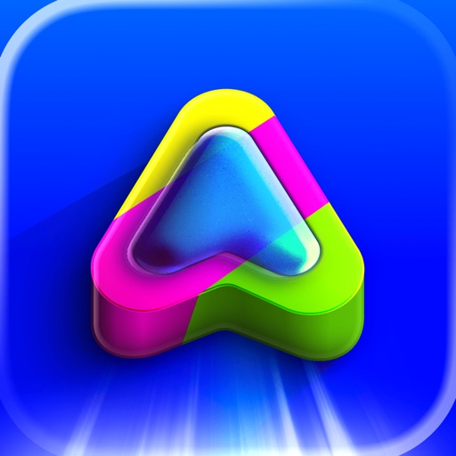

Par l’équipe Zenly, l’app originale de partage de localisation que des centaines de millions de personnes adorent dans le monde entier !

Sur Bump, crée une carte perso de tes potes et de tes endroits préférés avec un partage de localisation ultra précis, en temps réel, et économe en batterie.

[Potes]
• Vois avec qui sont tes potes, leur niveau de batterie, leur vitesse et depuis combien de temps ils sont quelque part
• Check ce qu’ils écoutent en ce moment
• Enregistre leurs sons dans ta bibliothèque Apple Music ou Spotify, sans quitter l’appli
• Secouez vos phones pour BUMP! Et partagez à vos potes que vous êtes ensemble

[Adresses]
• Les endroits que tu visites sont détectés automatiquement pour construire ta carte perso
• Recherche n’importe quelle adresse, vois si tes potes y sont déjà allés, obtiens l'itinéraire ou ajoute-la à ta liste
• Check dans quel bar sont tes potes ou s’ils sont à la maison, au taf ou à l’école
• Rejoins ton école pour voir tout le monde et revendiquer ton asso

[Messages]
• Envoie des textes, stickers, images, vidéos et GIFs dans une toute nouvelle messagerie
• Lance une conv en 1:1 ou en groupe direct depuis la map
• Vois (et ressens même !) quand tes potes sont dans la conv en même temps que toi
• Ne fais pas que chatter : dessine, crée et partage tes meilleurs moments

[Scratch Map]
• Ta Scratch Map se remplit toute seule avec les endroits où tu vas, sans sortir ton tél de la poche
• Défie tes potes pour débloquer 100 % de ta région
• Vois tous les endroits où t’as passé la nuit, et avec qui tu étais

[Navigation]
• Obtiens l'itinéraire pour rejoindre tes potes avec Plans ou appelle un Uber direct là-bas
• Partage ton ETA en live sur l’écran de verrouillage de tes potes
• Fais vibrer leur tél quand t’es à proximité pour attirer leur attention

[Extras]
• Transforme tes photos & vidéos en stickers pour envoyer ce que tu veux
• Sois le premier au courant quand tes potes partent en voyage dans d’autres pays ou régions
• Disparaît de la map à tout moment en activant le mode fantôme
• Ajoute des widgets de localisation sur ton écran d’accueil pour voir direct ce que font tes potes
• Fonctionne aussi pour tes potes qui n’ont pas d’iPhone !
• Siri et raccourcis intégrés
• App gratuite
• Et plein d’autres nouveautés à venir très bientôt !

Bump a été présenté par Apple, TechCrunch, Business Insider, Highsnobiety, Wired et bien d'autres. Ils adorent Bump et tu vas l’adorer aussi.

Pour des questions, demandes de fonctionnalités ou du merch exclusif, envoie-nous un DM sur Instagram : @bumpbyamo. On lit et on répond à chaque message, promis :)

[View on Apple](https://apps.apple.com/fr/app/bump-va-voir-tes-amis-irl/id6471519217)

## Parions Sport

◆ L’appli N°1 pour parier en point de vente (FDJ officiel) ◆

Pariez très simplement avec l’application Parions Sport : pas besoin de vous inscrire, préparez votre pari sportif quand vous le souhaitez, rendez-vous dans un point de vente et pariez en Cash ou CB.

En bref :
• Accédez à des statistiques et discutez avec les autres parieurs sur notre forum pour préparer vos paris sportifs
• Ajoutez vos paris dans votre panier, enregistrez vos QR codes et validez vos paris dans un point de vente FDJ
• Consultez les résultats et découvrez vos gains potentiels
• Et jouez en exclusivité à Loto Foot !

20 000 PARIS PAR JOUR
Davantage de paris sportifs sont disponibles sur l’app que pour le bulletin papier. Un large choix de sports : foot, tennis, basket, rugby, hockey... mais aussi les plus grandes compétitions sportives : Ligue 1, Premier League, Liga, Ligue des Champions, Ligue Europa, MMA, Roland-Garros, NBA… et de paris : buteur, Mi-temps, Combi-bonus avec des cotes boostées

Un doute sur un pronostic ? Notre forum vous permet de discuter avec les autres parieurs pour profiter des meilleurs tips sur votre prochain pari sportif.

LIVE SCORE 
Pour suivre en direct les résultats de vos matchs pariés

LOTO SPORTS EN EXCLUSIVITE
Préparez aisément vos grilles Loto Foot, Loto Rugby ou Loto Basket, grâce notamment à la répartition des mises en temps réel, ou à l’estimateur de rapports pour estimer vos gains. Et suivez les résultats en direct.

PARI GAGNE ?
Partagez vos plus belles cotes ou votre grille Loto Foot en 1 clic ! Il est temps de montrer vos talents de parieur. 

27 000 POINTS DE VENTE FDJ
Trouvez rapidement le point de vente autour de vous avec la carte des points de vente, et rendez-vous y avec l'itinéraire proposé.

PARIONS STORE
Découvrez notre collection de vêtements Parions Sport !

Restons en contact :
votreAvisAppliPSPDVNousInteresse@lfdj.com.
Et si ça vous plaît et que vous voulez nous soutenir, laissez-nous 5 étoiles dans l'App Store :)

Vous pouvez également nous suivre sur les réseaux sociaux :
https://www.instagram.com/parionssport
https://www.facebook.com/ParionsSport

L'équipe Parions Sport

+18 - Les jeux d'argents et de hasard sont interdits aux mineurs
Jouer comporte des risques : endettement, isolement, dépendance. Pour être aidé appelez le 09-74-75-13-13 ou rendez-vous sur http://www.joueurs-info-service.fr/

L'utilisation de l'application étant limitée aux territoires français et monégasque, nous vérifions votre localisation. Vous disposez d’un droit d’opposition pour des motifs légitimes que vous pouvez exercer en contactant le service client à cette adresse : Service Clients FDJ® TSA 36 707 95 905 CERGY PONTOISE Cedex 9.

[View on Apple](https://apps.apple.com/fr/app/parions-sport/id496184783)

## Doctolib - Die Gesundheits-App

Doctolib - Ihr digitaler Gesundheitsbegleiter

Verwalten Sie Ihre Gesundheit und die Ihrer Familie, jederzeit und von überall mit der Doctolib-App:

• Finden Sie Arzttermine nach Fachgebiet und Standort bei zehntausenden medizinischen Fachkräften.
• Schnell und jederzeit Ihre nächsten Arzttermine in der Doctolib-App buchen, beim Arzt vor Ort in Ihrer Nähe oder als Doctolib-Videosprechstunde.
• Egal, ob gesetzlich oder privat versichert: Online-Arzttermine werden von allen gängigen Krankenkassen übernommen, wie z.B. Barmer, Techniker Krankenkasse oder AOK.
• Senden Sie Nachrichten direkt per Chat an das Gesundheitsteam für Folgerezepte, Befunde oder sonstige Themen. 

• Egal wo Sie sind: Mit der Videosprechstunde erhalten Sie eine flexible Versorgung für Ihre Gesundheit von überall:
• Gewinnen Sie mehr Zeit: Lassen Sie sich bequem per Videosprechstunde behandeln und sparen Sie sich den Weg zu Ihrem Arzt.
• Profitieren Sie von einer professionellen Behandlung: Bequem und sicher – ganz genau so, wie Sie es von einem Termin in der Praxis bei Ihrem Arzt kennen.

• Gesundheitsmanagement der gesamten Familie: Fügen Sie Angehörige Ihrem Doctolib-Konto hinzu und verwalten Sie die Gesundheit und die Arzttermine Ihrer Familie.
• Bewahren Sie Ihre Dokumente an einem Ort: Immer verfügbar, sicher und digital, wie z. B. E-Rezepte. Lösen Sie das E-Rezept ganz einfach in der Apotheke mit Ihrer Versichertenkarte oder der Gematik E-Rezept-App ein. 
• Behalten Sie Ihre Gesundheit im Blick: Mit der Terminerinnerungsfunktion verpassen Sie keine Arzttermine mehr. 
• Fügen Sie Ärzt:innen und Therapeut:innen zu Ihren Favoriten und teilen Sie diese mit Familie und Freunden.

Mit Doctolib, Ihrem digitalen Gesundheitsbegleiter, verwalten Sie Ihre Gesundheit und Ihre Arzttermine digital in der Doctolib-App: Erhalten Sie Zugriff auf eine große Auswahl an Ärzt:innen und Gesundheitsexpert:innen:
Verfügbare Fachrichtungen: Allergologe, Allgemeinmediziner, Augenarzt, Dermatologe, Ernährungsberater, Gastroenterologe, Gynäkologe, Hämatologe, Heilpraktiker, HNO-Arzt, Kardiologe, Kinderarzt, Logopäde, Nephrologe, Onkologe, Orthopäde, Osteopath, Physiotherapeut, Psychologe, Rheumatologe, Urologe, Zahnarzt etc.

Für ein gesünderes Leben. Mehr als Arzttermine.
Seit 2013 hat sich Doctolib einem einzigen Ziel verschrieben: Die Gesundheitsversorgung der Zukunft zu gestalten, gemeinsam mit Gesundheitsteams und Patient:innen. Doctolib unterstützt europaweit 410.000 Gesundheitsfachkräfte mit innovativen Technologien, verbessert ihren Arbeitsalltag und ermöglicht es ihnen, die bestmögliche Versorgung zu gewährleisten. Darüber hinaus hilft das Unternehmen 80 Millionen Menschen in ganz Europa, einen sicheren, vertraulichen und reibungslosen Zugang zur Gesundheitsversorgung zu erhalten – für ein gesünderes Leben.

Doctolib – eines der führenden E-Health Unternehmen in Europa: 
• 80 Millionen Patient:innen
• 410.000 Ärzt:innen und Therapeut:innen

Ihre Gesundheit. Ihre Daten.
Die Vertraulichkeit Ihrer persönlichen Daten ist für Doctolib eine absolute Priorität und leitet unser tägliches Handeln. Erfahren Sie mehr darüber hier: https://about.doctolib.de/privatsphaere/

Noch Fragen? Weitere Informationen erhalten Sie hier: https://www.doctolib.de/help

Alle Informationen zu unseren Nutzungsbedingungen finden Sie hier: https://media.doctolib.com/image/upload/v1721138417/legal/C1_B2C-CU-Sep-23-DE_1.pdf

[View on Apple](https://apps.apple.com/fr/app/doctolib-compagnon-de-sant%C3%A9/id925339063)

## DramaBox - Film et Drame Court

Bienvenue sur DramaBox - Films et Drame, le monde des courts-métrages, la destination ultime pour un divertissement captivant! Avec DramaBox, vous plongerez dans un kaléidoscope d'émotions, d'histoires et de créativité. DramaBox est votre passeport pour regarder des milliers d'heures de courts-métrages exclusifs et originaux, couvrant une myriade de genres.              
  
- Genres divers, histoires illimitées          
Immergez-vous dans un trésor de courts-métrages exclusifs, méticuleusement conçues pour répondre à tous les goûts. Des courts métrages romantiques aux courts métrages déchirants, DramaBox vous propose une vaste collection, garantissant que chacun y trouve son bonheur. Préparez-vous à un voyage à travers les frontières des mini-séries.

- Libérez vos émotions           
Que vous recherchiez de la joie, de l'émotion ou des sensations fortes, DramaBox est là pour vous. Nos courts-métrages sélectionnés avec soin sont conçus pour éveiller en vous une multitude d'émotions, offrant une expérience intense à travers une narration qui laisse un impact durable. Préparez-vous pour un tourbillon d'émotions à chaque clic et glissement.

- Exclusivités originales 
Explorez un monde de contenus que vous ne trouverez nulle part ailleurs. DramaBox est fier de vous présenter une gamme de courts-métrages exclusifs et originaux, dotés de perspectives nouvelles, de narrations uniques et d'une créativité incomparable. Plongez-vous dans des histoires riches et captivantes, où chaque court-métrage témoigne de l'art de raconter des histoires en toute simplicité.

- Personnalisez votre expérience           
Adaptez votre expérience de visionnage avec les fonctionnalités personnalisables de DramaBox. Ajustez les paramètres de lecture vidéo, explorez différents genres et organisez votre liste de surveillance pour créer un voyage personnalisé à travers le vaste paysage de bonnes vidéos courtes. Votre divertissement, à votre façon.

- Regardez n'importe où et n'importe quand 
Peu importe où vous vous trouvez, DramaBox est votre meilleur compagnon. Profitez du plaisir de regarder des courts-métrages n'importe où et n'importe quand. Que vous soyez en déplacement ou à la maison, il vous suffit d'un simple clic pour plonger dans un monde de mini-séries remplies de moments captivants.

- Mises à jour régulières               
Grâce aux mises à jour régulières du contenu de DramaBox, découvrez la joie de toujours trouver quelque chose de nouveau. Notre bibliothèque s'agrandit constamment, garantissant que chaque visite de l'application vous réserve de nouveaux courts-métrages excitants. Dites adieu à la monotonie et bonjour à un flux constant de courts-métrages passionnants.             

DramaBox n'est pas seulement une application, c'est une véritable expérience.Embarquez pour un voyage dans le monde des courts-métrages, dont vous ne pourrez plus vous passer. DramaBox - Films et Théâtre propose certaines fonctionnalités gratuitement, mais pour une expérience plus immersive, pensez à vous abonner pour profiter d'offres exclusives.

Note : Si vous vous abonnez via Apple, le paiement sera débité de votre compte App Store lorsque vous confirmerez votre achat. À moins que l'utilisateur ne désactive la fonction de renouvellement automatique au moins 24 heures avant la fin de la période d'abonnement en cours, l'abonnement sera automatiquement prolongé. Dans les 24 heures suivant la fin de la période d'abonnement en cours, le système facturera les frais de renouvellement du compte en fonction du prix du forfait sélectionné. Après avoir effectué l'achat, l'utilisateur peut gérer l'abonnement et le renouvellement automatique dans les paramètres du compte. 

Politique de confidentialité : https://support.dramaboxdb.com/privacy.html 
Conditions de service payantes de DramaBox : https://www.apple.com/legal/internet-services/itunes/dev/stdeula 
Site web du développeur : https://dramaboxdb.com

[View on Apple](https://apps.apple.com/fr/app/dramabox-film-et-drame-court/id6445905219)

## Zalando Mode & Fashion online

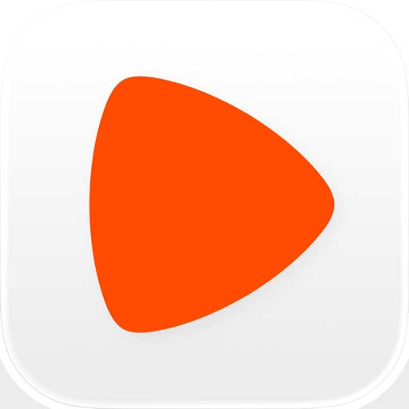

Die Zalando App ist mit mehr als 6000 Marken deine erste Adresse für hochwertige Fashion- und Lifestyle-Brands. Hol dir Inspo für Outfits sowie Beauty- und Pflegeprodukte und genieße ein reibungsloses, stressfreies Shopping-Erlebnis – direkt auf deinem Handy.

LASS DICH INSPIRIEREN
• Folge deinen Lieblingscreators für Outfit- und Styling-Inspo
• Lieblingsbrands folgen und neue Releases sowie exklusive Kollektionen zuerst shoppen
• Erstelle und folge Boards mit Outfits, Videos und Produkten, die dich inspirieren – oder werde selbst zur Inspiration
• Entdecke mit Trend Spotter, was in Europa gerade angesagt ist – und was man in Berlin, Paris und Mailand trägt
• Live-Videos ansehen, Profi-Tipps holen, Produkt-How-tos entdecken und deine Favoriten direkt shoppen
• Entdecke unsere Storys und hol dir deinen Style- und Culture-Guide – mit Formaten wie „Was zieh ich an?“ und den neuesten Infos zu großen Brand-Collabs
• Speichere deine Favoriten auf der Wunschliste und verpasse keine Größen-Updates oder Preissenkungen

ENTDECKE VIELFALT
• Entdecke mehr als 11.000 Artikel von einer umfassenden Auswahl an Brands, darunter auch zeitlose Fashion-Favoriten
• Tauche ein in unsere vielseitigen Kategorien: Bekleidung, Schuhe, Accessoires, Sport, Beauty & Hautpflege, Pre-owned Pieces und Kidswear
• Erhalte Updates zu allem, was dich interessiert – von News und Trends bis zu Sales und Promo-Codes
• Erfahre als Erstes von neuen Kollektionen und Produkt-Launches deiner Lieblingsbrands
• Aktiviere Benachrichtigungen für deine Wunschliste und verpasse keine Preissenkung oder Wiederverfügbarkeit
• Schenke Pre-owned Pieces ein neues Leben – mit unserer großen Auswahl an Kleidung, Accessoires und Boots – fast wie neu
• Wähle deine bevorzugte Zahlungsmethode und freu dich auf eine Lieferung direkt bis an deine Haustür

HIER WIRDS PERSÖNLICH
• Erhalte persönliche Empfehlungen, die genau zu deinem Style passen – ganz ohne stundenlanges Browsen
• Bewerte die Passform deiner Bestellungen und genieße individuelle Größenberatung beim Shoppen
• Finde mit unserem Mess-Tool im Handumdrehen heraus, was wirklich passt
• Probiere Outfits virtuell an und finde vor dem Bestellen heraus, wie sie sitzen
• Hol dir jederzeit Style- und Outfittipps vom Zalando Assistant – deinem maßgeschneiderten, KI-gestützten Fashion-Begleiter für deine gesamte Shopping-Reise

Bereit, die App zu entdecken?
Shoppe deine Lieblingsbrands, sichere dir exklusive Vorteile und hol dir Inspiration und Empfehlungen, die genau zu dir passen.

[View on Apple](https://apps.apple.com/fr/app/zalando-boutique-mode-en-ligne/id585629514)

## Gmail – E-Mail von Google

Mit der offiziellen Gmail App können Sie sich das Beste von Gmail auf Ihr iPhone oder iPad holen: hilfreiche KI-Funktionen, umfassender Schutz, Benachrichtigungen in Echtzeit, Unterstützung für mehrere Konten und die intelligente Suche im gesamten Posteingang.

Vorteile der Gmail App:
• Sie können Gmail auf iOS-Geräten als Standard-E-Mail-App festlegen.
• Dank hilfreicher Infokarten bleiben Sie ganz einfach über die neuesten Pakete, anstehende Termine, Rechnungen und Reisedaten auf dem Laufenden.
• Mit der integrierten E-Mail-Aboverwaltung lässt sich Ihr Posteingang übersichtlich halten.
• Gemini* in Gmail kann für Sie lange E-Mails zusammenfassen, Antworten entwerfen oder verfeinern oder in Ihrem Posteingang nach Informationen suchen.
• Sie können mehrere E-Mail-Konten von verschiedenen Anbietern verbinden und zwischen ihnen wechseln.
• Über 99,9 % der Spam-, Phishing- und Malware-Inhalte werden automatisch blockiert – bevor sie Ihren Posteingang erreichen.
• Mit Gemini in Gmail lassen sich Termine aus E-Mails schnell in Google Kalender eintragen.
• Über den personalisierten Tab „Werbung“ finden Sie schneller die besten Angebote.
• Sie können schneller auf E-Mails antworten – dank KI-basierter Antwortvorschläge, die sowohl den Kontext Ihrer E-Mails als auch Ihren individuellen Schreibstil und Ton berücksichtigen.
• E-Mails lassen sich nach dem Senden bis zu 30 Sekunden lang zurückrufen, um Fehler zu vermeiden.
• Sie können direkt auf Google Meet und Google Chat zugreifen – ohne Gmail zu verlassen.
• Sie können Ihre E-Mails mit Labeln versehen, markieren, löschen und als Spam melden – so behalten Sie besser den Überblick.
• Mithilfe der Wischgesten zum Archivieren oder Löschen lässt sich Ihr Posteingang schnell und einfach aufräumen.

Gmail ist Teil von Google Workspace – Sie können sich also ganz leicht mit Ihrem Team austauschen und zusammenarbeiten. Dazu haben Sie folgende Möglichkeiten:
• Mit Kolleginnen und Kollegen über Google Meet oder Google Chat in Kontakt bleiben, Einladungen in Google Kalender senden, Aufgabenlisten erstellen und mehr – viele alltägliche Aufgaben lassen sich direkt in Gmail erledigen.
• Mit den Funktionen von Gemini in Gmail wie „Formuliere für mich“, „Antwortvorschläge“, „Übersichten mit KI“ und „Korrekturlesen“ erhalten Sie einen besseren Überblick über Ihre Arbeit und können Routineaufgaben schneller abschließen und effizienter sein.
• Umfassender Schutz: Mit unseren Modellen für maschinelles Lernen werden über 99,9 % der Spam-, Phishing- und Malware-Inhalte blockiert – noch bevor sie Ihren Posteingang erreichen.

* Zur Nutzung einiger Gemini-Funktionen ist ein Abo für Google One AI erforderlich. Es ist eine Internetverbindung erforderlich. Die Verfügbarkeit variiert je nach Sprache und Land. Antworten sollten auf ihre Richtigkeit geprüft werden.

[View on Apple](https://apps.apple.com/fr/app/gmail-la-messagerie-google/id422689480)

## PayPal: Geld senden, verwalten

Mit der neuen PayPal-App bezahlst du auf deine Art. Sende und empfange Geld, bezahle kontaktlos im Laden und nutze flexible Zahlungsoptionen wie Später bezahlen1, wenn du online shoppst – alles ganz einfach über dein Smartphone.

GELD SENDEN UND EMPFANGEN

Eine einfache und sichere Methode, deinen Lieben sofort Geld zu senden und Geld zu empfangen2. Deine persönliche Nachricht macht das Ganze noch entspannter und ist ein netter Touch.
Mit Verschlüsselungstechnologie sorgen wir dafür, dass deine Transaktionen sicher sind.
Sende deinen Lieben auch Geld ins Ausland: mit Xoom in über 110 Länder3, und es gibt noch mehr Zahlungsoptionen.
2Um Geld zu senden und zu empfangen, benötigst du ein PayPal-Konto.
3Es gelten Bedingungen und Einschränkungen. Es können Gebühren für Transaktionen, Währungsumrechnung sowie weitere Gebühren anfallen.

GELD EINFACH ZUSAMMENLEGEN
Du musst nicht alles vorstrecken. Hol dir das Geld für Gruppengeschenke oder gemeinsame Aktivitäten einfach vorher und spar dir den Stress mit dem Zurückzahlen danach.4

4Ein PayPal-Konto ist erforderlich, um einen Pool zu erstellen. Gebühren fallen an, wenn Währungen umgewandelt und Geld in anderen Währungen als Euro an ein Auslandskonto gesendet wird. Es gelten Bedingungen und Einschränkungen.

ZAHLE KONTAKTLOS VOR ORT MIT PAYPAL
Mit der PayPal-App kannst du im Laden ganz bequem kontaktlos bezahlen5 – ganz einfach über dein Smartphone. Tschüss Bargeld, tschüss EC-Karte.
5Einrichtung erforderlich. Die PayPal-Debit Mastercard für Verbraucher:innen kann überall dort verwendet werden, wo kontaktlose Mastercard-Zahlungen akzeptiert werden. Es gelten die Bedingungen.

BEZAHLE JETZT ODER SPÄTER1 
Bleib beim Online-Shopping oder Einkauf im Laden flexibel. Bei PayPal hast du die Wahl: Bezahle sofort, nach 30 Tagen6  oder bei größeren Einkäufe in 3, 6, 12 oder 24 monatlichen Raten7. 
Ratenzahlung To Go ist unsere neue Zahlungsoption für Einkäufe im Laden8. Du beantragst, für welchen Betrag du eine Ratenzahlung vereinbaren willst – direkt über dein Smartphone. Zahle kontaktlos vor Ort und bezahle deinen Einkauf in deinen vereinbarten Raten ab.
1Es ist ein PayPal-Konto in Deutschland erforderlich. Vorbehaltlich Kreditwürdigkeitsprüfung.
6Vorbehaltlich Kreditwürdigkeitsprüfung. Für Einkäufe zwischen 1 € und 2.000 €. Alle Informationen findest du unter https://www.paypal.com/de/30tage.
7Vorbehaltlich Kreditwürdigkeitsprüfung. Laufzeiten von 3, 6, 12 oder 24 Monaten. Ab 99 € und bis zu 10.000 € Bestellwert. Alle Informationen findest du unter https://www.paypal.de/ratenzahlung
8Separate Beantragung erforderlich. Vorbehaltlich vorheriger Kreditbewilligung. PayPal Ratenzahlung To Go kann mit Ausnahme einiger Branchen dort verwendet werden, wo Mastercard kontaktlos akzeptiert wird. Es gelten die Bedingungen. Mehr erfahren: www.paypal.de/RatenzahlungToGo

ZAHLUNGEN BEQUEM  ZENTRAL VERWALTEN
Verwalte deine Abonnements und wiederkehrenden Zahlungen direkt in der PayPal-App.

[View on Apple](https://apps.apple.com/fr/app/paypal-transfert-dargent/id283646709)

## Amazon Prime Video

Sehen Sie Filme, Serien und Sportübertragungen, darunter Amazon Originals wie The Boys, The Marvelous Mrs. Maisel und Tom Clancy’s Jack Ryan oder unsere Empfehlungen speziell für Sie.

App-Funktionen:
• Videos herunterladen und offline ansehen
• Neue Filme und beliebte Serien kaufen oder leihen (Verfügbarkeit abhängig vom jeweiligen Marktplatz)
• Videos mit Chromecast vom Smartphone oder Tablet auf den großen Bildschirm übertragen
• Individuelle Unterhaltungserlebnisse durch Profile für mehrere Benutzer
• Blick hinter die Kulissen von Filmen und Serien mit exklusivem X-Ray-Zugang und IMDb
• Separate tvOS-App herunterladen (erfordert Apple TV, 3. Generation oder neuer) und Sendungen auf Apple TV ansehen

Die Prime Video-App ist jetzt auf Mac verfügbar, wenn Sie die separate macOS-App herunterladen (erfordert macOS Big Sur 11.4 oder höher).

Wenn Sie eine Amazon Prime Video-Mitgliedschaft über iTunes abschließen (sofern verfügbar), wird die Zahlung nach der Bestätigung der Registrierung über Ihr iTunes-Konto abgewickelt. Ihre Mitgliedschaft wird automatisch verlängert, falls die automatische Verlängerung nicht mindestens 24 Stunden vor dem Ende des entsprechenden Abrechnungszeitraums deaktiviert wird. Ihr Konto wird jeweils innerhalb von 24 Stunden vor Ende des Abrechnungszeitraums mit dem Preis des gewählten Pakets belastet. Verwalten Sie Ihre Mitgliedschaft jederzeit über iTunes oder "Mein Konto". Dort können Sie auch die automatische Verlängerung deaktivieren.

Für Kunden in der Europäischen Union, Großbritannien oder Brasilien: Durch die Verwendung dieser App stimmen Sie den Nutzungsbedingungen von Amazon sowie den Nutzungsbedingungen von Prime Video zu, die hier zu finden sind: www.primevideo.com/ww-av-legal-home. Unsere Datenschutzerklärung, unsere Cookie-Richtlinien und unsere Hinweise zu interessenbasierter Werbung können Sie hier nachlesen: www.primevideo.com/ww-av-legal-home. 
 
Für alle anderen Kunden: Durch die Verwendung dieser App stimmen Sie den Nutzungsbedingungen und der Datenschutzerklärung von Amazon sowie den Nutzungsbedingungen von Prime Video zu, die hier zu finden sind: www.primevideo.com/ww-av-legal-home.

[View on Apple](https://apps.apple.com/fr/app/amazon-prime-video/id545519333)

## Action

Dank der Action App hast du jetzt rund um die Uhr Zugriff auf all die tollen Dinge, für die du normalerweise in die Action-Filiale gehst. Sichere dir die Pole-Position, was die aktuellsten Wochenangebote und neuesten Produkte betrifft. Sobald du etwas siehst, das dir gefällt oder das du brauchst, kannst du es gleich auf deine ganz persönliche Einkaufsliste setzen! Auf diese Weise vergisst du nie wieder etwas bei deinem Shopping-Erlebnis bei Action. Das willst du dir nicht entgehen lassen? Dann lade dir schnell App herunter und lass dich von den vielen tollen und nützlichen Funktionen überraschen!

*Alles von Action stets zur Hand 
*Die Action App hält dich immer auf dem Laufenden und versorgt dich mit den neuesten Infos zu all den fantastischen Angeboten und Produkten, die du von Action gewohnt bist. So bist du unter den Ersten, die von unseren aufregendsten Wochenangeboten, neuesten Produkten und aktuellsten Neuigkeiten erfahren.

*Aufregende Produkte, speziell für dich ausgewählt
*Gib in der App deine Interessen an, damit Action dir die Produkte zeigen kann, die am besten zu dir passen. 

*Erstelle eine Liste mit deinen Lieblingsprodukten
*Bei so vielen überraschenden Produkten vergisst man schon mal, was man eigentlich gesucht hat.  Setze die Artikel, die du brauchst, auf deine Einkaufsliste, damit dir das so schnell nicht mehr passiert. Das Beste daran: Du kannst dir die Einkaufsliste auf jedem deiner Geräte anzeigen lassen.

* Verwende den praktischen Produktscanner für mehr Informationen 
*Du willst mehr über ein bestimmtes Produkt erfahren? Dann kannst du dein Handy mithilfe der App im Handumdrehen in einen Scanner verwandeln. Auf diese Weise gelangst du in der Filiale (oder zu Hause) genau an die Informationen, die du suchst. 

*Alle deine Kassenbons digital und an einem Ort 
*Ab jetzt findest du alle deine Kassenbons von Action übersichtlich in deiner App gelistet. Scanne beim Einkaufen deine digitale Kundenkarte, dann erscheint der digitale Kassenbon automatisch in der App.

Lass dich von über 6.000 Artikeln inspirieren
Beginne in aller Ruhe deine Entdeckungsreise durch die App und lass dich von den mehr als 6.000 Artikeln überraschen, die dir Action jeden Tag bietet. Du wirst staunen, wie viel es zu entdecken gibt!

[View on Apple](https://apps.apple.com/fr/app/action/id1531860284)

## SeLoger location & achat immo

SeLoger est l’application incontournable pour louer, acheter ou vendre un bien immobilier en France – rapidement, facilement et avec la puissance de l’IA. Que vous cherchiez un appartement, une maison, une colocation ou un garage, SeLoger vous propose un large choix de biens à louer ou à acheter. Trouvez votre appartement, maison ou logement idéal à la location ou à la vente en France avec SeLoger.

Points forts de l’application SeLoger :

• Parcourez un large choix de biens : appartements, maisons, studios et plus encore
• Recherchez sur la carte ou en liste, et affinez avec des filtres personnalisés
• Enregistrez vos recherches et recevez des alertes instantanées
• Regroupez vos annonces préférées dans le mémo
• Comparez les prix et estimez gratuitement la valeur d’un bien
• Déposez votre annonce en quelques secondes et contactez des acheteurs immédiatement
• Gérez vos annonces et trouvez des agences immobilières facilement

Biens immobiliers à louer
Notre puissant moteur de recherche vous aide à trouver rapidement votre prochain appartement, maison, studio ou logement à louer parmi la plus grande sélection de biens immobiliers en France. Recevez des alertes en temps réel pour les nouveaux biens correspondant à vos critères de recherche et enregistrez vos annonces préférées pour les consulter rapidement et facilement. Des descriptions détaillées et des visites virtuelles vous donnent une vision claire des biens qui vous intéressent.

Biens à vendre
Parcourez la plus grande sélection de logements à vendre en France, maisons, appartements, terrains, bureaux, magasins et garages, grâce à notre moteur de recherche avancé. Que vous soyez à la recherche d'une maison familiale ou d'un appartement moderne, trouvez votre bien idéal en seulement quelques clics.

Enregistrez vos annonces préférées, créez des alertes personnalisées et facilitez votre achat immobilier. Utilisez notre calculatrice de prêt immobilier pour estimer vos mensualités et décider en toute connaissance de cause de votre investissement immobilier.

Vendre un bien
Mettez votre bien en vente rapidement et entrez en contact avec des acheteurs potentiels grâce à l'application SeLoger, optimisée pour faciliter le processus de vente. Accédez à vos annonces et gérez-les sans effort, communiquez avec les acheteurs et concluez la transaction rapidement grâce à nos outils dédiés.

Évaluer le prix des biens
Évaluez rapidement la valeur de votre propriété et obtenez des conseils pour mieux vendre grâce à notre outil d'évaluation en ligne gratuit. Vous obtiendrez une estimation précise en fonction de l'emplacement, de la surface et des caractéristiques de votre bien. Comparez les prix de vente récents de logements similaires dans votre région pour affiner votre estimation.

Explorez l'espace Mon Propriétaire mis à jour, où vous pouvez suivre, gérer et recevoir des conseils pour votre projet. Louez et vendez votre bien gratuitement sur SeLoger.

Prêt à trouver votre futur logement en France ? Téléchargez SeLoger et commencez votre recherche dès maintenant !

N'oubliez pas de nous suivre sur les réseaux sociaux pour les dernières mises à jour et les actualités immobilières :

• Facebook: @SeLoger
• Twitter/X: @SeLoger
• Instagram: @seloger

SeLoger, MySeLogerPro, Immowelt, Immonet, Immoweb, Meilleurs Agents, Belles Demeures, LogicImmo et Yad2 font partie du groupe AVIV, l'une des plus grandes sociétés immobilières technologiques numériques dans le monde, avec une forte présence en Europe.

Vous pouvez nous partager votre expérience en nous laissant un avis sur l'Apple App Store. Si vous avez des questions supplémentaires, n'hésitez pas à nous contacter à l'adresse mobile@seloger.com.

*En nombre de monthly active user - data.ai, décembre 2024

[View on Apple](https://apps.apple.com/fr/app/seloger-location-achat-immo/id326883014)

## Planity

Planity, c’est l’application qui simplifie votre quotidien et qui révolutionne vos prises de rendez-vous beauté en ligne.
Alors que nos modes de vie sont de plus en plus intenses, prendre soin de soi est devenu un besoin essentiel.
Gagnez du temps en prenant rendez-vous dans l’un de nos établissements beauté partenaire, en quelques clics et 7j/7.

Rapide, immédiat et 24h/24.

Vous n’avez pas eu le temps de faire votre manucure ou votre brushing ? Vous souhaitez vous faire plaisir avec un soin du visage ? Ou vous avez besoin d’un rafraîchissement et vous cherchez le meilleur barbier à proximité ?
Nous avons pris le soin de sélectionner les meilleurs professionnels de la beauté, partout en France.

• 15 millions d’utilisateurs actifs,
• 60 000 établissements de beauté référencés partout en France, Belgique et Allemagne
• Une fiche détaillée incluant les prestations, les tarifs, les disponibilités et les photos de vos établissements préférés,
• Des sms de rappel pour éviter l’oubli de vos rendez-vous,
• Un espace personnel pour gérer, déplacer ou annuler vos rendez-vous en quelques clics.

« L’Application beauté MUST-HAVE » selon ELLE magazine.
Déjà plus de 400 millions de rendez-vous pris.
Laissez Planity prendre soin de vous.

[View on Apple](https://apps.apple.com/fr/app/planity/id1434056190)

## Indeed Jobs

Finden Sie passende Jobs mit der kostenlosen Indeed-App – überall und jederzeit.

Ihre App für die Jobsuche: Mit 12 neuen Stellenanzeigen pro Sekunde und intelligenten Suchfiltern für passende Stellen finden Sie Ihren nächsten Job im Handumdrehen.

Ob Sie nur gelegentlich oder sehr dringend suchen, auf Indeed finden Sie alle passenden Stellen an einem einzigen Ort. Dank unserer erweiterten Funktionen können Sie Jobs nach Ihren Vorstellungen finden und sich unkompliziert über jedes Ihrer Geräte bewerben. 

• Finden Sie passende Jobs in unserer umfassenden Datenbank, darunter auch Stellenanzeigen von anderen Online-Jobseiten, und erhalten Sie Job-Vorschläge basierend auf Ihren Präferenzen und Ihrer Berufserfahrung.

• Laden Sie Ihren Lebenslauf hoch, oder erstellen Sie einen auf Indeed, um sich von Ihrer besten Seite zu zeigen und von Arbeitgebern gefunden zu werden.

• Legen Sie einen Indeed Lebenslauf an, um ihn bei jeder Bewerbung sofort parat zu haben.

• Lassen Sie sich benachrichtigen, wenn Arbeitgeber Ihre Bewerbung auf Indeed gelesen und beantwortet haben.

• Erfahren Sie in über 700 Millionen Unternehmensratings und -bewertungen, was Mitarbeiter*innen über ihre Arbeitgeber denken. 

• Erhalten Sie noch vor der Bewerbung Einblick in das Gehalt – dank 1,1 Mrd. nach Jobtitel, Unternehmen und Arbeitsort durchsuchbaren Gehaltsangaben.

• Finden Sie flexible Jobs mit unseren intelligenten Suchfiltern für Remote- und Homeoffice-Jobs, Nebenjobs, freie Mitarbeit, Beamten-Jobs, Teilzeit-Jobs und weitere Kriterien.

Mit unserer Jobsuche-App können Sie sich von der Bewerbung bis zum Vorstellungsgespräch von Ihrer besten Seite zeigen, egal in welcher Phase Ihrer Karriere Sie sich befinden. Wir stehen Ihnen dabei zur Seite.

Mit dem Download dieser App stimmen Sie den Richtlinien zur Verwendung von Cookies, der Datenschutzerklärung und den Nutzungsbedingungen von Indeed zu, die Sie unter www.indeed.com/legal abrufen können. Sie können jederzeit von Ihrem Recht Gebrauch machen, der rechtmäßigen Nutzung Ihrer personenbezogenen Daten zu Marketingzwecken zu widersprechen. Außerdem stimmen Sie mit dem Download dieser App zu, dass Indeed alle Ihre Aktivitäten in der App sowie alle Interaktionen und Kontakte, die Sie mit, in oder über diese App pflegen, verarbeiten, analysieren und erfassen darf. Wir tun dies, um das Nutzererlebnis zu optimieren und die gewünschte Funktionsweise der App herzustellen. Damit wir Ihnen bestimmte Dienste zur Verfügung stellen und die Anzeigenzuordnung unterstützen können, werden Nutzerdaten wie die IP-Adresse oder andere eindeutige Kennzeichner sowie Ereignisdaten, die im Zusammenhang mit der Installation der Indeed-App stehen, beim Download oder der Installation der App möglicherweise an unsere Dienstleister weitergegeben.
Dies wird aufgrund des berechtigten Interesses von Indeed so gehandhabt, damit wir sämtliche Vorgänge auf Kundenseite nachvollziehen und optimieren können, indem wir

• besser verstehen, wie Nutzer*innen auf unsere Website gelangen
• die Ergebnisse unserer Anzeigen besser messen
• Nutzer*innen in bestimmten Fällen die Anmeldung über Drittanbieterkonten ermöglichen
• besser nachvollziehen, wann Nutzer*innen über ein anderes Gerät auf Indeed zugreifen

Wir freuen uns über Feedback: ios@indeed.com.

Meine personenbezogenen Daten dürfen nicht verkauft werden: https://www.indeed.com/legal/ccpa-dns

[View on Apple](https://apps.apple.com/fr/app/indeed-recherche-demploi/id309735670)

## Too Good To Go: Essen retten

Too Good To Go ist dein einfacher Weg, leckere Lebensmittel zu genießen und gleichzeitig Gutes für die Umwelt zu tun. Die #1-App zur Reduzierung von Lebensmittelverschwendung hilft dir, leckere, überschüssige Snacks, Mahlzeiten und Lebensmittel von Läden, Cafés, Supermärkten, Restaurants und Co. in deiner Nähe zu retten – und das zu großartigen Preisen. 

Jedes Jahr werden 40 % der produzierten Lebensmittel verschwendet. Wenn du Lebensmittelverschwendung reduzierst, hilfst du, den Klimawandel einzudämmen (tgtg.to/claims). So sicherst du dir mit Too Good To Go nicht nur preiswerte Mahlzeiten und Lebensmittel, sondern hilfst gleichzeitig mit jeder geretteten Überraschungstüte, den Planeten zu retten. Gemeinsam können wir einen Unterschied bewirken.


SO FUNKTIONIERT TOO GOOD TO GO:

ENTDECKE DAS ANGEBOT IN DEINER NÄHE
Lade die App herunter, um auf der Karte Restaurants, Cafés, Bäckereien, Supermärkte und mehr in der Nähe zu finden, die gutes Essen zu einem tollen Preis anbieten.

RETTE DEINE ÜBERRASCHUNGSTÜTE ODER TOO GOOD TO GO PAKET
Entdecke eine Vielzahl von Überraschungstüten, die mit leckeren, überschüssigen Lebensmitteln gefüllt sind – von Sushi, Pizza und Burger bis hin zu Obst und Gemüse. Du willst dir Produkte deiner Lieblingsmarken lieber liefern lassen? Rette ein Too Good To Go Paket zu einem großartigen Preis, das mit Produkten deiner Lieblingsbrands gefüllt ist. 

BEZAHLBARE MAHLZEITEN
Rette eine Überraschungstüte oder ein Too Good To Go Paket zu 50% des Preises oder weniger. 

RESERVIERE DEINEN FAVORITEN
Bestätige den Kauf über die App, um deine Überraschungstüte zu reservieren und die leckere Mahlzeit vor der Verschwendung zu retten. Indem du Lebensmittel rettest, sparst du Geld und trägst dazu bei, Lebensmittelverschwendung zu reduzieren.

GENIESSEN
Hol deine Überraschungstüte zur vereinbarten Zeit ab oder lass dir dein Too Good To Go Paket direkt nach Hause liefern.


WARUM TOO GOOD TO GO?:

BUDGETFREUNDLICHER GENUSS
Genieße gute Mahlzeiten zu erschwinglichen Preisen, die sowohl deinen Gaumen als auch deinen Geldbeutel zufriedenstellen.

VIELFALT UND AUSWAHL
Too Good To Go arbeitet mit einer großen Auswahl an lokalen Favoriten und bekannten Marken zusammen, die alles von Sushi, Pizza, Backwaren und frischen Lebensmitteln bis hin zu leicht lagerbaren Grundnahrungsmitteln wie Snacks, Getränken, Süßigkeiten oder Pasta anbieten.

AUSWIRKUNGEN AUF DIE UMWELT
Jede gerettete Mahlzeit vermeidet CO2e-Emissionen und die unnötige Nutzung von Wasser und landwirtschaftlicher Fläche (tgtg.to/claims). Indem du  Lebensmittel vor der Verschwendung rettest, machst du einen Schritt in Richtung eines grüneren Planeten. 

EINFACHE ABWICKLUNG
Die einfache und benutzerfreundliche Oberfläche der App erleichtert dir das Durchsuchen, Auswählen und Speichern von Überraschungstüten oder Too Good To Go Paketen.

BEQUEMLICHKEIT
Hol deine Überraschungstüte zur vereinbarten Zeit ab oder lass dir ein Too Good To Go Paket direkt nach Hause liefern.

WERDE TEIL DER TOO GOOD TO GO COMMUNITY
Werde Teil der Community von Foodies, die durch die Reduzierung von Lebensmittelverschwendung einen positiven Einfluss auf die Umwelt ausüben. Lade jetzt die App herunter und fang an, Lebensmittelverschwendung zu reduzieren – eine Überraschungstüte nach der anderen. 
Lebensmittelverschwendung zu reduzieren hilft, den Klimawandel einzudämmen. Erfahre mehr unter tgtg.to/claims. Für weitere Informationen besuche tgtg.to/claims.

[View on Apple](https://apps.apple.com/fr/app/too-good-to-go-pas-de-gaspi/id1060683933)

## Commerce B2B avec Alibaba

Qu'est-ce qu'Alibaba.com ?
Alibaba.com est l'un des principaux marchés mondiaux de commerce électronique B2B. Notre application vous permet de vous approvisionner en produits auprès de fournisseurs mondiaux, le tout depuis le confort de votre appareil mobile.

Achetez en toute confiance
 Notre service d'assurance protège vos commandes et vos paiements sur la plateforme, vous permettant d'acheter en toute sécurité et facilement avec une assistance étendue.

Produits personnalisables
 Rencontrez des fournisseurs avec des années d'expérience dans la personnalisation et l'exécution des commandes pour les vendeurs sur Amazon, eBay, Wish, Etsy, Mercari, Lazada, etc. 

Approvisionnement facile
 Découvrez des millions de produits prêts à expédier dans toutes les catégories de l'industrie. Dites aux fournisseurs ce dont vous avez besoin et obtenez rapidement des devis grâce aux services de demande de devis.

Expédition rapide
 Alibaba.com s'associe aux principaux transitaires pour fournir des solutions de transport terrestre, maritime et aérien avec des services de livraison ponctuels, un suivi de bout en bout et des prix compétitifs.

Diffusions en direct et visites d'usine
Interagissez avec les fabricants en temps réel via des démonstrations de produits et des visites d'usines, fournissant un aperçu et une surveillance de la fabrication de vos produits.

Catégories populaires et salons professionnels
 Trouvez une large gamme d'articles populaires - des biens de consommation tendance aux matières premières - et rejoignez nos salons professionnels annuels pour découvrir des produits de niche et des remises.

Contrôle de qualité
Choisissez les services de surveillance et d'inspection de la production d'Alibaba.com pour réduire les retards de production et les risques de qualité.

Réductions et promotions
 Débloquez de nouvelles remises et promotions des fabricants et fournisseurs en vedette.

Restez à jour
 Utilisez l'application Alibaba.com pour rester à jour sur les nouveaux produits et les promotions de vos fournisseurs préférés.

Prise en charge des langues et des devises
 Alibaba.com prend en charge 18 langues et 54 devises locales. Utilisez notre traducteur en temps réel pour communiquer avec les vendeurs dans votre langue maternelle.

[View on Apple](https://apps.apple.com/fr/app/commerce-b2b-avec-alibaba/id503451073)

## Free

Retrouvez vos Espaces Abonné Freebox et mobile réunis en une seule application.  
Et pour vous simplifier la vie, toutes les fonctionnalités de Freebox Connect sont maintenant incluses dans l’application Free ! 
 
Que vous soyez abonné Freebox ou mobile Free, tout ce dont vous avez besoin se trouve sur l'application : suivi de consommation, gestion de vos offres et équipements, partage du Wi-Fi par QR code, contrôle parental avancé, accès à votre assistance personnalisée, ... Tout se passe ici ! 

Vous êtes abonné mobile ?  

- Suivre votre consommation en temps réel 
En France comme à l'étranger, consultez votre consommation de données ainsi que vos appels et SMS et évitez le hors-forfait. 

- Commander ou rattacher une ligne 
Besoin d'une nouvelle ligne ou de rattacher un forfait existant ? C'est fait en quelques clics. Simple, rapide, et sans paperasse. 

- Changer de forfait 
Envie de plus de data ou de changer d'offre ? Passez d'un forfait à l'autre sans stress, directement depuis l'app. 

- Commander et installer une nouvelle SIM directement depuis l'app 
Plus besoin de vous déplacer : commandez votre nouvelle eSIM et activez-la directement depuis l'application Free. Prête à l'emploi en quelques minutes. 

- Commander un nouveau smartphone 
Commandez-le directement depuis l'app et profitez des meilleures offres Free. Vous êtes titulaire d'un contrat Free Flex ? Gérez-le en toute simplicité. 

Vous êtes abonné Freebox ?    

- Partager votre Wi-Fi en un clic et garder un œil sur les appareils qui y sont connectés 
Invitez vos amis à profiter de votre Wi-Fi sans leur donner votre mot de passe et surveillez qui est connecté, pour plus de sécurité. 

- Planifier les coupures de votre Wi-Fi 
Vous voulez couper le Wi-Fi pendant vos heures d’absence ou de sommeil ? Planifiez-les à l'avance et gardez le contrôle sur votre consommation énergétique. 

- Gérer les profils de vos enfants  
Protégez vos enfants avec des profils personnalisés : limitez leur temps de connexion et bloquez les sites inappropriés. 

- Gérer vos avantages Free Family 
Vous êtes abonné mobile et Freebox ? Bénéficiez des avantages Free Family sur vos forfaits mobiles. 

- Auto-diagnostique et aide à la performance 
Des problèmes de connexion ? L'app vous guide pour optimiser votre réseau et placer votre équipement au bon endroit. Votre Wi-Fi n'a jamais été aussi fluide. 

- Télécommande compatible avec les players Android TV, dont Player Pop et mini 4K, pour piloter facilement votre équipement directement depuis l’application.
Clavier intégré pour simplifier la recherche dans le catalogue, sans avoir à sélectionner les lettres une par une.
Widget d’accès rapide permettant d’accéder instantanément à la télécommande, sans ouvrir l’application.

Avec la rubrique Assistance, contactez un conseiller, prenez rendez-vous, accédez à nos articles et consultez les guides d'installation en quelques clics. 
Pour les abonnés Freebox éligibles, profitez du service Free Proxi, votre assistance de proximité et discutez avec votre équipe dédiée. 
 
Retrouvez bien d’autres fonctionnalités sur votre application Free !  
L’app vous plaît ? N’hésitez pas à la noter 5 étoiles ainsi qu’à nous laisser vos retours.

[View on Apple](https://apps.apple.com/fr/app/free/id1643534870)

## VPN - Super Unlimited Proxy ™

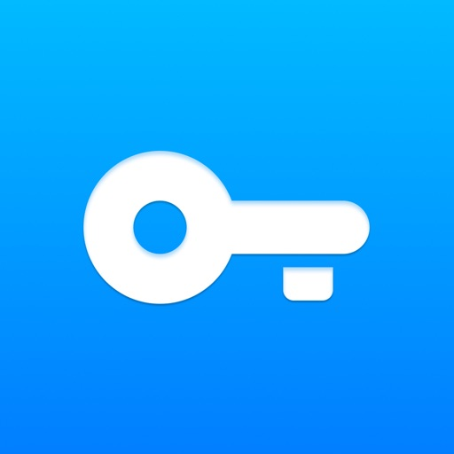

Kostenloses VPN für iPhone und iPad – schützen Sie Ihre Privatsphäre in WLAN und Hotspots!

- Express Lightning Speed 10G-Server machen dies zur schnellen VPN-Wahl für Streaming
- Globale Abdeckung: 700+ Server in 53+ Ländern (auch für VPN kostenlose Nutzer!)
- Keine Logs-Politik: Wir verfolgen oder speichern Ihre Online-Aktivitäten nicht
- Benutzerfreundlich: Einmal tippen zum Verbinden – keine Registrierung erforderlich
- Plattformübergreifend: iPhone, iPad, iPod, Apple Vision und Mac mit iOS 11.0+
- Keine Zeitlimits, Datenbegrenzungen oder Bandbreitenrestriktionen
- 256-Bit-Verschlüsselung wpn schützt Ihre Aktivitäten und Ihren Standort
- VPN kostenlos blockiert das Tracking Ihrer iPhone-Browsing-Gewohnheiten
- WiFi Guardian: Kostenlose VPN-Schutz für Passwörter in öffentlichen Netzwerken
- Zugang zu sozialen Medien, Messaging und Streaming-Diensten: Tiktok (tik tok), Netflix, HBO, Hulu, Youtube und Youtube TV, Facebook, Instagram, Spotify, Snapchat, X (Twitter), Reddit, Discord, Steam, Telegram (Телеграм ВПН), vk ВПН und mehr wpn Optionen.
- Optimierung Ihres Spielerlebnisses: Verringern Sie die Latenz bei Ponor of Kings, Genshin Impact, Minecraft, Pokémon GO, Rise of Kingdoms, Clash of Kings, PUBG Mobile, Call of Duty (COD): Mobile, Fortnite, Mobile Legends: Bang Bang, Free Fire, Roblox, Apex Legends Mobile, Arena of Valor, League of Legends (LOL): Wild Rift, Diablo Immortal, Brawl Stars, Subway Surfers, Among Us, Clash Royale, State of Survival, Lords Mobile, Evony: The King's Return, und anderen Spielen.

■ Was können Sie mit dem VPN - Super Unlimited Proxy Free VPN iPhone / iPad tun?

- Anonym bleiben: Surfen Sie mit vollständigem Datenschutz
- Erhöhte Sicherheit: Verschlüsseln Sie Verbindungen in öffentlichen WiFi-Netzen und Hotspots
- Schutz der Identität: Verbergen Sie Ihre echte IP-Adresse und Ihren Standort
- iOS-Datenschutz: free VPN-Schutz für iPhone und iPad, auf den Sie sich verlassen können
- Vollständiger iOS-Schutz: VPN kostenlos schützt persönliche Daten auf allen Apple-Geräten
- Schulzugriffs-Lösung: Umgehen Sie Einschränkungen mit unserem BPN für sichereres Surfen

■ Serverstandorte weltweit:

Wählen Sie aus über 700+ Servern in 53+ Ländern, einschließlich:

- Asien: Singapur, Südkorea, Japan, Hongkong, Indonesien, Indien, Israel, Kasachstan, Taiwan, Vietnam, Türkei
- Europa: Bulgarien, Schweiz, Tschechien, Deutschland, Dänemark, Estland, Spanien, Finnland, Frankreich, Vereinigtes Königreich, Griechenland, Kroatien, Ungarn, Irland, Island, Italien, Litauen, Luxemburg, Lettland, Moldawien, Niederlande, Norwegen, Polen, Portugal, Rumänien, Serbien, Russische Föderation, Slowakei, Schweden, Ukraine
- Nord Amerika VPN: USA, Kanada, Mexiko
- Südamerika: Brasilien, Chile, Kolumbien, Peru
- Afrika: Ägypten, Südafrika

■ Einfache Preisoptionen

Während unser kostenloser von-Service außergewöhnliche Leistungen bietet, können Sie für noch mehr Funktionen upgraden:

- Free VPN-Plan: Unbegrenzter Zugang mit grundlegenden Funktionen
- Premium-Pläne (werbefrei, 10G-Server und mehr):
- -  Wöchentlich: $9.99/Woche
- - Monatlich: $11.99/Monat (7-Tage-Test)
- - Jährlich: $79.99/Jahr (7-Tage-Test)

Kein Aufwand oder unnötige Datenmengen: Unsere VPN-Lösung für iPad und iPhone bietet rundum Schutz.

■ Welches VPN-Protokoll sollte ich verwenden?

- Auto (Empfohlen): Intelligente Protokollwahl
- Manuelle Optionen: OpenVPN, IKEv2

■ Datenschutzerklärung

Im Gegensatz zu Diensten, die Ihre Daten durchsuchen wie ein Hai oder im Dunkeln lauern, verpflichtet sich VPN Super Unlimited Proxy zu absoluter Privatsphäre mit Null-Protokollen.
Links zu unseren Nutzungsbedingungen und der Datenschutzerklärung finden Sie unten:

- Datenschutzerklärung: https://www.vpnsuper.com/privacy-notice
- Nutzungsbedingungen: https://www.vpnsuper.com/terms-of-service

Laden Sie noch heute die beste free VPN iPhone und iPad herunter und erleben Sie grenzenlose Freiheit im Internet!

[View on Apple](https://apps.apple.com/fr/app/vpn-super-unlimited-proxy/id1370293473)

## Grand Frais

L’APP QUI VOUS RECOMPENSE

Pour rendre chaque visite dans votre magasin Grand Frais encore plus savoureuse, scannez simplement votre QR code en caisse, depuis « Ma carte » dans l’application et laissez la magie opérer : 

• Des cadeaux et récompenses toute l'année
• Le Panier Gourmand : tentez de gagner un panier rempli de vos produits préférés ! Le Grand Jeu : chaque semaine, un tirage au sort exceptionnel pour gagner un lot qui mettra des étoiles dans votre cuisine.
• Des promotions exclusives : chaque semaine, bénéficiez de promos et offres réservées aux membres de l'APP Grand Frais.

L’APP QUI VOUS DIVERTIT

Réveillez le joueur qui est en vous !
Quiz gourmands : devenez experts de vos produits préférés avec nos quiz gourmands et tentez de gagner des récompenses
Sac'célère : jouez au premier jeu en ligne Grand Frais et tentez de remporter des bons d’achat

L’APP QUI VOUS FACILITE LE QUOTIDIEN

L'application vous simplifie les courses et votre quotidien en cuisine. 
• Tickets de caisse : retrouvez tous nos conseils sur vos produits préférés en 1 clic depuis votre ticket de caisse sur l’app.
• Produits : tous les secrets de vos produits préférés et des conseils pour les cuisiner !
• Liste de courses : les ingrédients de vos recettes favorites ou de vos envies du moment pour ne rien oublier en magasin.
• Recettes : trouvez toute l’inspiration avec les recettes Grand Frais. Appuyez sur play et laissez-vous guider étape par étape. Entrée, plat, dessert ? Toutes les recettes dans votre poche.
• Informations magasins : consultez les horaires et infos de votre magasin Grand Frais le plus proche et les promotions du moment.

TOUT LE MEILLEUR DE VOTRE MARCHÉ GRAND FRAIS

Retrouvez dans l'application l'esprit de nos halles et la passion de nos professionnels pour les bons produits.
Fruits et Légumes : la fraîcheur et la variété au rythme des saisons.
Épiceries d'ici et d'ailleurs : pour faire voyager vos papilles.
Fromagerie : un savoir-faire unique pour des fromages et des produits laitiers de caractère.
Boucherie : des viandes de qualité préparées et conseillées par de vrais artisans.
Poissonnerie : les trésors de la mer, sélectionnés pour leur fraîcheur incomparable.

MAINTENANT, VOUS SAVEZ TOUT SUR L’APP QUI REGALE

Trouvez l'inspiration en cuisine pour tous vos repas, de l'entrée au dessert. Téléchargez l'application Grand Frais dès maintenant. Le meilleur de vos courses vous attend !

[View on Apple](https://apps.apple.com/fr/app/grand-frais/id6753673412)

## YouTube

Hol dir die offizielle YouTube App auf iPhones und iPads und entdecke angesagte Videos weltweit – von den coolsten Musikvideos bis hin zu Hits in Sachen Gaming, Fashion, Beauty, Nachrichten, Bildung und mehr. Du kannst deine Lieblingskanäle abonnieren, eigene Inhalte erstellen sowie Videos mit Freunden teilen und auf allen Geräten wiedergeben.

Ansehen und abonnieren
● Auf dem Tab „Start“ findest du persönliche Empfehlungen.
● Unter „Abos“ siehst du die neuesten Uploads von deinen Lieblingskanälen.
● Die „Mediathek“ enthält die Videos, die du dir angesehen, mit „Mag ich“ bewertet und für später gespeichert hast.

Verschiedene Themen, angesagte Inhalte sowie aufstrebende Creator, Gamer und Künstler entdecken
(in ausgewählten Ländern verfügbar)
● Du kannst dich in Bereichen wie Musik, Gaming, Beauty, Nachrichten und Bildung auf dem Laufenden halten.
● Auf dem Tab „Entdecken“ siehst du, was auf YouTube und weltweit gerade im Trend liegt.
● Du erfährst mehr über aufstrebende Creator, Gamer und Künstler (in ausgewählten Ländern verfügbar).

Mit der YouTube-Community in Kontakt bleiben
● Über Beiträge, Stories, Premieren und Livestreams kannst du immer mitverfolgen, was es bei deinen Lieblings-Creatorn gerade Neues gibt.
● In den Kommentaren kannst du dich mit Creatorn und anderen Community-Mitgliedern austauschen.

Inhalte über dein Mobilgerät erstellen
● Du kannst direkt in der App eigene Videos erstellen oder hochladen.
● Mit Livestreams direkt über die Appkannst du in Echtzeit mit deinen Zuschauern in Kontakt treten.

Die passende Lösung für dich und deine Familie finden (in ausgewählten Ländern verfügbar)
● Jede Familie nutzt Onlinevideos anders. Unter youtube.com/myfamily findest du weitere Informationen zur YouTube Kids App und zu den neuen YouTube-Konten mit Elternaufsicht.

Upgrade auf YouTube Premium durchführen (in ausgewählten Ländern verfügbar)
● Du kannst dir Videos ansehen, während du andere Apps verwendest oder dein Bildschirm gesperrt ist –ganz ohne Werbeunterbrechungen.
● Du kannst Videos speichern und jederzeit abspielen – auch im Flugzeug oder auf dem
Weg zur Arbeit.
● Die Mitgliedschaft beinhaltet außerdem den Zugriff auf YouTube Music Premium.

Hinweis: Bei einem Abo über Apple wird dein App Store-Konto in dem Moment mit dem fälligen Betrag belastet, in dem du den Kauf bestätigst. Das Abo wird automatisch verlängert, wenn die automatische Verlängerung nicht bis spätestens 24 Stunden vor Ablauf des aktuellen Abozeitraums deaktiviert wird.
Die Gebühren für die Verlängerung des Abos werden am letzten Gültigkeitstag des laufenden Abos entsprechend dem gewählten Tarif in Rechnung gestellt. Du kannst deine Abos und die Einstellungen
für die automatische Verlängerung nach dem Kauf in den Kontoeinstellungen ändern.

Nutzungsbedingungen für kostenpflichtige Dienste von YouTube: https://www.youtube.com/t/terms_paidservice.
Datenschutzerklärung: https://www.google.com/policies/privacy

[View on Apple](https://apps.apple.com/fr/app/youtube/id544007664)

## WhatsApp Messenger

WhatsApp from Meta est une application gratuite permettant d’envoyer des messages et de passer des appels, utilisée par plus de 2 milliards de personnes dans plus de 180 pays. Simple, fiable et privée, il s’agit de l’application idéale pour rester en contact avec vos proches partout dans le monde. WhatsApp fonctionne sur mobile, tablette et ordinateur, même avec des connexions lentes, et sans frais d’inscription*.

Des messages et des appels privés dans le monde entier

La protection de votre vie privée est notre priorité. Grâce au chiffrement de bout en bout, vous avez la certitude que vos messages et vos appels personnels restent entre vous et leurs destinataires. Personne, pas même WhatsApp, ne peut les lire ou les écouter.

Des connexions simples et sécurisées, directement

Tout ce dont vous avez besoin, c’est d’un numéro de téléphone. Aucun nom d’utilisateur ou identifiant n’est nécessaire. Vous pouvez rapidement voir qui parmi vos contacts utilise WhatsApp et commencer à discuter. Plus encore, vous pouvez facilement associer vos autres appareils, y compris les iPad, pour une communication plus fluide.

Des appels vocaux et vidéo de qualité

Vous pouvez passer gratuitement* des appels vocaux et vidéo comptant jusqu’à 32 personnes en toute sécurité. Vos appels fonctionnent sur les différents appareils, même si votre connexion est lente, et utilisent le service Internet de votre téléphone ou de votre tablette.

Des discussions de groupe pour garder le contact

Restez en contact avec vos proches grâce aux discussions et appels de groupe chiffrés de bout en bout. Partagez des messages, des photos, des vidéos et des documents sur mobile, tablette et ordinateur. Vous pouvez également utiliser des liens d'appel et partager votre écran afin de faciliter les appels de groupe et la collaboration.

Discutez en temps réel

Vous pouvez partager votre localisation avec les personnes faisant partie de vos discussions individuelles ou de groupe, en utilisant WhatsApp sur votre téléphone mobile. Vous pouvez également enregistrer un message vocal lorsque les messages texte ne suffisent pas.

Partagez les moments de votre journée via votre statut

Partagez votre quotidien avec les personnes qui comptent pour vous. Les statuts vous permettent de partager du texte, des photos, des vidéos et des GIF qui disparaissent au bout de 24 heures. Vous contrôlez toujours qui peut voir votre statut. Il vous suffit de choisir si vous souhaitez partager votre statut avec tous vos contacts ou seulement avec certains, et de donner vie à votre quotidien.

* Des frais de données peuvent s’appliquer. Veuillez contacter votre opérateur pour en savoir plus.

---------------------------------------------------------------------------

Si vous avez des commentaires ou des questions, n’hésitez pas à vous rendre dans WhatsApp > Paramètres > Aide > Nous contacter

Conditions d'utilisation : https://www.whatsapp.com/legal/terms-of-service 

En savoir plus sur l’envoi de messages privés : https://www.whatsapp.com/privacy 

En savoir plus sur la sécurité sur WhatsApp : https://www.whatsapp.com/security

[View on Apple](https://apps.apple.com/fr/app/whatsapp-messenger/id310633997)

## L’Identité Numérique La Poste

L’IDENTITÉ NUMÉRIQUE LA POSTE, C’EST COMME PRÉSENTER VOTRE PIÈCE D’IDENTITÉ AVEC VOTRE SMARTPHONE
- Prouvez votre identité sur des centaines de services en ligne et libérez-vous de vos multiples comptes et mots de passe à gérer.

- Utilisez FranceConnect avec votre Identité Numérique La Poste et accédez à des démarches en ligne nécessitant la certitude que c’est bien vous et uniquement vous derrière la démarche en cours.  
- Retirez votre colis en Bureau de Poste en ouvrant simplement votre application Identité Numérique La Poste sur votre smartphone.
Ce service simple, sécurisé et gratuit vous fait gagner du temps et vous protège au quotidien.
 
COMMENT CRÉER VOTRE IDENTITÉ NUMÉRIQUE LA POSTE ?
Vous êtes majeur.e, possédez une pièce d'identité française en cours de validité et disposez d'un smartphone compatible ? Téléchargez notre application et suivez les étapes de création OU rendez-vous en bureau de poste pour créer votre Identité Numérique avec un chargé de clientèle.
 
OÙ UTILISER L’IDENTITÉ NUMÉRIQUE LA POSTE ?
Vous pouvez utiliser votre Identité Numérique La Poste pour accéder à plus de 1400 services publics et privés en ligne via le portail FranceConnect : services publics, fournisseurs d’énergie, banques, mutuelles, services postaux, et bien d’autres.
 
COMMENT UTILISER L’IDENTITÉ NUMÉRIQUE LA POSTE ?
A chaque fois que vous vous rendez sur un site proposant de vous connecter avec L’Identité Numérique La Poste :
1 - Cliquez sur le bouton L'Identité Numérique La Poste ;
2 - Saisissez vos identifiants ;
3 - Confirmez que c'est bien vous qui vous connectez en validant la demande de connexion sur l'application L'Identité Numérique.
L'Identité Numérique La Poste repose sur la combinaison unique de votre identifiant, votre application mobile et votre code secret. Cette procédure d'authentification forte permet de garantir vos accès en s'assurant que c'est bien vous qui êtes à l'origine de la demande de connexion. Avec La Poste, L'Identité Numérique c'est plus simple, plus sûre et plus pratique.
 
SOYEZ VIGILANT, NE COMMUNIQUEZ JAMAIS VOTRE CODE SECRET OU N’ACTIVEZ JAMAIS VOTRE IDENTITÉ NUMÉRIQUE SI QUELQU’UN VOUS LE DEMANDE EN FACE À FACE, PAR TÉLÉPHONE OU PAR MAIL.
- La Poste ne réalise pas de démarchage téléphonique pour inciter à la création d’Identité Numérique ou pour proposer un accompagnement à la création d’une Identité Numérique.
- La Poste ne vous demandera jamais le code confidentiel de votre Identité Numérique. Ne confiez jamais votre code confidentiel à un inconnu, votre Identité Numérique est personnelle.

[View on Apple](https://apps.apple.com/fr/app/lidentit%C3%A9-num%C3%A9rique-la-poste/id1434857287)

## BlaBlaCar : Bus, Train, Covoit

BlaBlaCar Bus, train, covoiturage : comparez et réservez tous vos trajets à petits prix sur une seule appli. Allez partout avec BlaBlaCar et voyagez mieux, pour moins cher !

Voyagez malin
Comparez les prix et profitez des meilleures options pour bouger moins cher. Sur l'appli, trouvez votre trajet idéal parmi des milliers de destinations à petits prix.

Partagez vos frais de route
Vous prenez la route ? Proposez vos places libres en quelques minutes : c'est le bon plan pour réduire vos frais d'essence et de péage.
Choisissez qui monte à bord grâce aux Profils Vérifiés des membres et gardez la main sur vos covoiturages.

Allez-y direct en covoit’
Réservez une place en covoit' pour voyager sans détour ! Trouvez un trajet qui part juste à côté et arrivez tout près de votre destination.
Consultez les profils et avis des autres membres pour voyager l'esprit tranquille.

BlaBlaCar Bus : l'Europe à prix mini
Voyagez partout en France et en Europe avec des billets dès 2,99 €. Réservez votre trajet, faites vos valises et partez à prix mini avec BlaBlaCar Bus.

Vos billets de train, sans frais cachés
SNCF, TGV Lyria, Renfe et plein d'autres : réservez vos trajets en train directement sur l'appli. Achetez vos billets en toute confiance et toujours sans frais cachés.

À noter : l'utilisation continue du GPS peut diminuer considérablement la durée de vie de la batterie de votre téléphone.
Une idée, une suggestion ? Partagez votre avis avec nous : https://www.blablacar.fr/contact

[View on Apple](https://apps.apple.com/fr/app/blablacar-bus-train-covoit/id341329033)

## Temu : Achats et Mode en Ligne

Visitez Temu pour des offres exclusives. 

Quels que soient vos désirs, Temu a ce qu'il vous faut, mode, décoration intérieure, DIY, produits de beauté, vêtements, chaussures, et plus encore.

Téléchargez Temu aujourd'hui et profitez d'offres incroyables tous les jours.

PROMOS EXCEPTIONNELLES D'OUVERTURE
Achetez des cadeaux pour vous et vos proches. Profitez de jusqu'à -90% !

GRANDE SÉLECTION
Découvrez des milliers de nouveaux produits et boutiques.

PRATIQUE
Paiement rapide et sécurisé.
Livraison et retours gratuits sous 90 jours.
*D'autres conditions peuvent s'appliquer.

Visitez temu.com ou suivez-nous sur :
Instagram: https://www.instagram.com/temu/
TikTok: https://www.tiktok.com/@temu 
Facebook: https://www.facebook.com/shoptemu
Youtube: https://www.youtube.com/@temu

[View on Apple](https://apps.apple.com/fr/app/temu-achats-et-mode-en-ligne/id1641486558)

## Hacoo - Discovering &Inspiring

Hacoo est une communauté de partage de contenu innovante et ouverte où nous nous engageons à créer un espace interactif diversifié, fiable et dynamique pour nos utilisateurs. Ici, vous pouvez vous exprimer librement, partager votre vie et vous connecter avec des amis partageant les mêmes idées ainsi qu'avec un vaste marché.

**Partagez votre belle vie**
Que vous soyez un passionné de mode, un explorateur de voyages, un amateur de gastronomie ou quelqu'un qui aime capturer et partager des moments uniques de la vie quotidienne, Hacoo permet à vos moments précieux de devenir une source d'inspiration pour les autres. Cela vous offre également une richesse de contenu pour vous aider à trouver des amis partageant les mêmes intérêts.

**Examen et confiance**
Sur Hacoo, vous pouvez évaluer des produits, des marques et même des services, en partageant vos expériences et idées personnelles. Cela fournit des références fiables aux autres utilisateurs et favorise l’établissement d’un climat de confiance, garantissant que chacun puisse trouver les choix qui lui conviennent le mieux.

**Ouvrir les connexions**
Fidèle à sa philosophie ouverte, Hacoo vise à faciliter les connexions et les interactions libres entre les utilisateurs. Nous créons des canaux de liaison faciles pour chaque utilisateur, vous permettant de vous connecter sans effort avec les autres et d'étendre votre influence. Nous aidons les utilisateurs à trouver des produits et services adaptés et aidons les marques et les entreprises à élargir leur portée.

Hacoo simplifie le partage et renforce les liens, alors que nous explorons les possibilités infinies de la vie avec vous.

[View on Apple](https://apps.apple.com/fr/app/hacoo-discovering-inspiring/id1399907836)

## Charge E-Lec - E.Leclerc

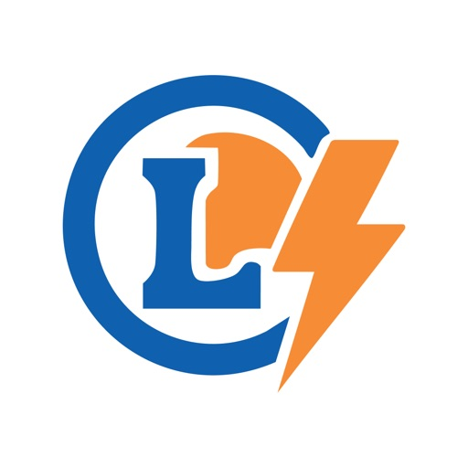

L'application Charge E-Lec est conçue pour accompagner les conducteurs de véhicules électriques vers une mobilité durable et accessible. Accédez à notre réseau de bornes de recharge et profitez de la simplicité d'utilisation alliée à la puissance du prix E.Leclerc.

POURQUOI CHOISIR CHARGE E-LEC ?

Le meilleur prix : Profitez de tarifs transparents et compétitifs pour votre recharge électrique, sans frais cachés.

Liberté totale : Pas d’abonnement requis. Vous rechargez quand vous voulez, où vous voulez.

Localisation instantanée : Trouvez la borne de recharge la plus proche en temps réel et vérifiez sa disponibilité pour éviter les attentes inutiles.

Cagnottez des tickets E.Leclerc* : Profitez de la possibilité de cagnotter sur votre Carte de fidélité E.Leclerc lors de vos recharges 

VOS AVANTAGES AU QUOTIDIEN

Visualisation rapide des points de charge sur votre itinéraire.

Historique de vos sessions et suivi de vos consommations.

La qualité de service et le sérieux du réseau E.Leclerc à votre service.

*La possibilité de cumuler des tickets E.Leclerc dans une cagnotte et leurs montants dépendent du magasin où se situe la borne.

[View on Apple](https://apps.apple.com/fr/app/charge-e-lec-e-leclerc/id6744098315)

## Google Photos

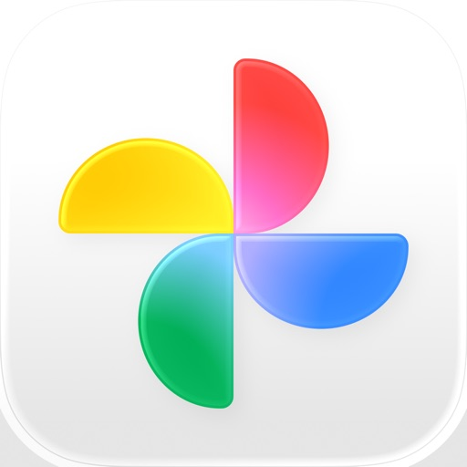

Google Photos vous permet de centraliser toutes vos photos et vidéos. Stockez, retouchez, organisez et recherchez facilement vos souvenirs à l'aide de l'IA de Google.

• 15 GO D'ESPACE DE STOCKAGE CLOUD : chaque compte Google dispose de 15 Go d'espace de stockage*, soit trois fois plus que de nombreux autres services de stockage cloud. Vous pouvez ainsi sauvegarder vos souvenirs automatiquement et les conserver en lieu sûr sur tous vos appareils.

• OUTILS DE RETOUCHE OPTIMISÉS PAR L'IA : effectuez des retouches complexes en quelques gestes. Supprimez les éléments indésirables avec la Gomme magique. Améliorez les photos floues grâce à la fonctionnalité Anti-flou. Optimisez l'éclairage et la luminosité avec Éclairage portrait.

• RECHERCHE SIMPLIFIÉE : retrouvez facilement vos photos grâce à des descriptions naturelles, telles que "Alice et moi en train de rire", "Kayak sur un lac entouré de montagnes" ou "Emma qui peint dans le jardin".

• ORGANISATION FACILE : Google Photos vous aide à désencombrer votre galerie en organisant automatiquement les doublons et les photos similaires dans des piles de photos. Il propose également des dossiers intelligents et intuitifs pour les captures d'écran, les documents, les albums personnalisés et l'organisation quotidienne de la pellicule, afin que votre galerie soit ordonnée et personnalisée. Vous pouvez même enregistrer des photos et des vidéos sensibles dans un dossier verrouillé protégé par le verrouillage de l'écran de votre appareil.

• REVIVEZ ET PARTAGEZ VOS SOUVENIRS PRÉFÉRÉS : replongez dans vos souvenirs directement depuis Google Photos. Partagez des photos, des vidéos et des albums avec tous vos contacts, même s'ils n'utilisent pas Google Photos.

• VOS SOUVENIRS SONT EN LIEU SÛR : vos photos et vidéos sont en sécurité dès l'instant où vous les stockez. Elles sont protégées par notre infrastructure de sécurité avancée, qu'elles soient stockées ou partagées.

• TOUS VOS SOUVENIRS AU MÊME ENDROIT : avec la sauvegarde activée, vous pouvez facilement transférer vos photos depuis d'autres applications, galeries et appareils, pour regrouper tous vos contenus au même endroit.

• LIBÉREZ DE L'ESPACE : fini les problèmes d'espace sur votre téléphone. Supprimez de votre appareil les photos déjà sauvegardées dans Google Photos en un seul geste.

• IMPRIMEZ VOS MOMENTS PRÉFÉRÉS :
Imprimez vos souvenirs sur papier depuis votre téléphone. Transformez vos souvenirs préférés en livres photo, tirages photo, toiles murales et plus encore. Le prix varie selon le produit. Les services d'impression sont disponibles uniquement au Canada, aux États-Unis, au Royaume-Uni et dans l'Union européenne.

• GOOGLE LENS : recherchez ce que vous voyez. Cette fonctionnalité disponible en preview permet d'identifier du texte et des objets dans vos photos pour en savoir plus et effectuer différentes actions.

Règles de confidentialité de Google : https://google.com/intl/fr_FR/policies/privacy

* L'espace de stockage du compte Google est partagé entre Google Photos, Gmail et Google Drive. Dans certains pays, chaque compte dispose de 5 Go d'espace de stockage, avec la possibilité d'obtenir 10 Go supplémentaires en ajoutant un numéro de téléphone.

[View on Apple](https://apps.apple.com/fr/app/google-photos/id962194608)

## Ryanair

Mit dieser griffbereiten App liegt Ihnen Europa zu Füßen.

Wir von Ryanair bieten Ihnen auf unserer App natürlich die niedrigsten Flugpreise in Europa an. Doch nicht nur das – jetzt können Sie auch unterwegs einchecken, denn die mobile Bordkarte wird direkt an Ihr Handy gesendet. Und mit einem Klick können Sie weitere Extras auswählen.

Warum lesen Sie also noch? Laden Sie die App jetzt herunter und buchen Sie den nächsten Flug!

[View on Apple](https://apps.apple.com/fr/app/ryanair/id504270602)

## Joko | Cashback & code promo

Votre shopping, au meilleur prix.

Avec Joko, vous faites des économies et gagnez de l’argent sur tous vos achats en ligne et en magasin. Cashback, codes promo automatiques, réductions exclusives, bons d’achat à cashback instantané, cartes cadeaux, paiement en 3 fois sans frais, cagnotte simplifiée… tout est réuni dans une seule app gratuite.

COMMENT JOKO AUGMENTE VOTRE POUVOIR D'ACHAT ?

1. CASHBACK EN LIGNE ET EN MAGASIN

Faites vos courses en supermarché ou votre shopping chez plus de 3500 enseignes partenaires (Carrefour, Auchan, Leclerc, Intermarché, Monoprix, Fnac, Amazon, Cdiscount, Fortuneo, Zalando, Nike, Adidas, Sephora, SNCF Connect, La Redoute, Airbnb, Uber…). À chaque achat, une partie est remboursée automatiquement. Votre cashback alimente votre cagnotte. Vous pouvez demander un virement bancaire, convertir en cartes cadeaux, ou même donner à une association.

2. BONS D'ACHAT : CASHBACK INSTANTANÉ

Achetez un bon d’achat du montant de votre choix (Carrefour, Airbnb, Uber, Zalando, Kiabi, Fnac…), et votre cashback est crédité instantanément dans votre cagnotte. Utilisable en ligne et en magasin, cumulable avec réductions, promos et bons plans déjà en cours. Plus vous payez avec vos bons, plus vous êtes remboursé.

3. CODES PROMO AUTO

L’app et l’extension testent et appliquent le meilleur code promo et réduction disponible à votre panier. Vous ne ratez plus aucun bon plan. Résultat : encore plus d’économies, et dans la plupart des cas, cashback + code promo se cumulent.

4. PAIEMENT EN 3 FOIS SANS FRAIS

Faites vos achats maintenant, payez plus tard. Réglez en 3 échéances sans frais sur des centaines de sites. Gérez vos paiements facilement dans votre tableau de bord clair.

5. CARTES DE FIDÉLITÉ ET CARTES CADEAUX

Centralisez toutes vos cartes de fidélité et cartes cadeaux dans Joko. Scannez-les en caisse, cumulez vos points, et profitez de chaque réduction sans effort.

PARTOUT OÙ VOUS SHOPPEZ

Joko, c’est une application mobile, un site web et des extensions de navigateur (Chrome, Safari). Sur iPhone, l’extension Safari détecte automatiquement cashback, codes promo et réductions. Sur ordinateur, Chrome et Safari vous évitent de passer à côté d’un bon plan.

CASHBACK MAGASIN : CONNECTEZ VOTRE BANQUE

Activez le cashback automatique en magasin en connectant votre banque à Joko. 100 % sécurisé : partenaires agréés DSP2, accès en lecture seule, aucune conservation d’identifiants, déconnexion à tout moment. Vos achats sont suivis et vos gains sont remboursés directement dans votre cagnotte.

DES OFFRES QUI ÉVOLUENT

Les taux de cashback, codes promo et réductions changent chaque semaine. Certaines offres sont même boostées pour maximiser vos économies et faire grimper votre cagnotte plus vite.

Des partenaires dans tous les univers

- Courses alimentaires / supermarchés : Carrefour, Auchan, Leclerc, Aldi, Lidl, Intermarché, Monoprix…
- Mode : Zalando, ASOS, Nike, Adidas, Kiabi, Sarenza, H&M, Bershka, Courir…
- Technologie : Fnac, Amazon, Cdiscount, Xiaomi, Bose, Revolut…
- Beauté : Sephora, Yves Rocher, NYX, Nocibé…
- Maison : But, Tediber, Darty…
- Voyage : SNCF Connect, Airbnb, Expedia, eDreams, Transavia…
- Enfants : Ravensburger, Lego…

Besoin d’aide ?

Notre service client basé en France vous accompagne à tout moment : https://support.joko.com/fr/articles/200579-comment-contacter-le-service-client

Rejoignez des millions d’utilisateurs et commencez à économiser dès aujourd’hui.

Téléchargez Joko et profitez de chaque bon plan, réduction et cashback.

[View on Apple](https://apps.apple.com/fr/app/joko-cashback-code-promo/id1378996692)

## Canva: KI-Foto- & Video-Editor

ERSTELLEN SIE ALLES MIT CANVA
Canva ist Ihre All-in-One-Kreativplattform für beeindruckendes Grafikdesign, Fotobearbeitung und Videoerstellung. Von der Erstellung von Präsentationen und visuellen Tabellen bis hin zur Gestaltung von Lebensläufen und Social-Media-Inhalten – Canva ermöglicht es jedem, wie ein Profi zu gestalten.

FORTGESCHRITTENER FOTO-EDITOR UND COLLAGEN-ERSTELLER
Verwandeln Sie Ihre Fotos mit unserer leistungsstarken Bearbeitungssuite. Entfernen Sie Hintergründe mühelos mit unserem Hintergrundradierer, wenden Sie beeindruckende Filter an, passen Sie Helligkeit und Kontrast an und erstellen Sie auffällige Fotocollagen. Perfekt für soziale Medien, Marketing oder persönliche Projekte.

PROFESSIONELLER VIDEO-EDITOR UND MOBILE OPTIMIERUNG
Erstellen Sie ansprechende Videos mit unserem intuitiven Video-Editor. Fügen Sie Untertitel hinzu, wenden Sie filmische Effekte wie Zeitlupe an, synchronisieren Sie Ihre Bearbeitungen mit Musik durch Beat Sync und optimieren Sie Inhalte für die mobile Anzeige. Ideal für Social-Media-Reels, Geschäftspräsentationen oder kreatives Storytelling. Speichern Sie Ihre beste Arbeit mit 5 GB für alle.

DYNAMISCHE PRÄSENTATIONEN UND DIASHOWS
Erstellen Sie fesselnde Präsentationen und Diashows mit professionellen Vorlagen. Visualisieren Sie Daten effektiv, gestalten Sie interaktive Arbeitsblätter für die Bildung und erstellen Sie Präsentationen, die Ihr Publikum begeistern. Von Unternehmenspräsentationen bis hin zu Universitätsaufgaben – machen Sie jede Folie zum Erfolg.

HERAUSRAGENDER LEBENSLAUF-ERSTELLER
Erstellen Sie beeindruckende Lebensläufe, die Ergebnisse liefern. Durchsuchen Sie Hunderte professionell gestalteter Vorlagen, passen Sie Layouts an, um Ihre Persönlichkeit widerzuspiegeln, und erstellen Sie Dokumente, die die Aufmerksamkeit von Arbeitgebern auf sich ziehen. Unverzichtbar für Arbeitssuchende und Karriereentwicklung.

VISUELLE TABELLEN UND AUTOMATISIERUNG MIT MASSENERSTELLUNG
Verwandeln Sie Daten in überzeugende visuelle Tabellen und Infografiken. Nutzen Sie die KI-gestützte Massenerstellung, um automatisch Tausende von Design-Variationen für Werbekampagnen und Marketingmaterialien zu generieren. Perfekt für Unternehmen, die ihre kreative Produktion skalieren.

UMFANGREICHE VORLAGENBIBLIOTHEK
Wählen Sie aus Tausenden anpassbaren Vorlagen für Social-Media-Beiträge, Visitenkarten, Flyer, Einladungen, Logos, Memes und mehr. Jedes Design ist vollständig anpassbar, um zu Ihrer einzigartigen Marke und Ihrem kreativen Stil zu passen.

ECHTZEIT-ZUSAMMENARBEIT
Arbeiten Sie nahtlos in Echtzeit mit Teammitgliedern zusammen. Teilen Sie Designs sofort, sammeln Sie Feedback und arbeiten Sie gemeinsam an Projekten von überall aus. Ideal für kreative Teams, Studenten und professionelle Organisationen.

ENTFESSELN SIE IHRE KREATIVITÄT
Greifen Sie auf Tausende hochwertiger Vorlagen, Bilder und Designelemente zu. Erstellen Sie professionelle Designs mit leistungsstarken KI-Funktionen und erwecken Sie Ihre kreative Vision mit branchenführenden Tools zum Leben.

CANVA FÜR BILDUNG
Transformieren Sie Ihren Unterricht mit einer von Schulen und Bezirken verwalteten Canva-Erfahrung, die für das Klassenzimmer entwickelt wurde. Erstellen Sie ansprechendes visuelles Lernmaterial mit integrierter Moderation und altersgerechten Kontrollen für sichere, kollaborative Lektionen. Kostenlos für berechtigte Lehrer und Schüler der Klassen K-12.

Nutzungsbedingungen: https://www.canva.com/policies/terms-of-use/
Datenschutzrichtlinie: https://www.canva.com/policies/privacy-policy/

[View on Apple](https://apps.apple.com/fr/app/canva-montage-photo-vid%C3%A9o-ia/id897446215)

## McDo+ : Faites-vous livrer !

L'application McDo+ évolue pour rendre chaque commande simple et rapide. Commandez et dégustez les incontournables de McDonald's en quelques clics : Big Mac™, 280™, McChicken™, McNuggets™, McFlurry™, Happy Meal™  et bien plus encore ! Avec McDo+, bénéficiez des mêmes prix qu'en restaurant et cumulez des points de fidélité pour des récompenses exclusives.

Tous les Services McDo+ au Bout des Doigts

- Programme de Fidélité : Activez votre programme de fidélité et cumulez des points pour des offres exclusives. Échangez vos points contre des produits gratuits (petite boisson, Happy Meal™, Maxi Best Of™) et des articles collectors uniques comme des serviettes de plage, sauces Big Mac™ et bien plus encore.
- Livraison : Faites-vous livrer vos plats préférés directement chez vous pour un repas sans interruption.
- Click & Collect : Commandez sur l’app et récupérez votre commande au McDrive ou en restaurant.
- Click & Ready™ : Choisissez le service piéton ou parking, lancez la préparation de votre commande en arrivant près du restaurant et récupérez-la sans attente.
- Service à Table : Installez-vous, scannez le QR code via l'app McDo+, commandez depuis votre mobile, et détendez-vous – on vous apporte votre commande directement à table.
- Offres Personnalisées : Profitez d’offres exclusives adaptées à vos préférences et à votre restaurant préféré.

Nouveau : Plongez dans la Ligue 1 avec McDonald's

Fans de football, vivez la passion de la Ligue 1 entre amis avec McDo+ ! 
Découvrez des menus exclusifs Menu Golden Ligue 1, à déguster en solo ou le   Menu Golden Ligue 1 Duo  à partager entre amis.
Célébrez chaque match et commandez facilement depuis l’application McDo+ pour une expérience conviviale et gourmande, où que vous soyez !

Des Fonctions Pratiques pour Simplifier Vos Commandes

- Trouver un restaurant : Repérez facilement le McDonald's le plus proche, partout en France.
- Commandes favorites : Sauvegardez vos commandes préférées pour les retrouver en un clic.
- Notifications push : Activez les notifications pour rester informé des nouveautés, offres, et autres actualités toujours plus exclusives de votre enseigne McDonalds. 
 
Des Services Spéciaux pour les Familles

- Ateliers de Créativité : Inscrivez vos enfants aux ateliers gratuits pour stimuler leur créativité.
- Anniversaires McDonald’s : Organisez un anniversaire inoubliable avec animations, goûter et activités amusantes. Vos enfants vivront une aventure incroyable, avec magiciens, licornes, yétis et plus encore !
 

Téléchargez McDo+ dès maintenant et profitez d'une application de commande rapide et personnalisée, avec des expériences exclusives !

Les Services McDo+ sont disponibles dans les restaurants participants. Plus d'informations sur l'application McDo+ et le site mcdonalds.fr.

[View on Apple](https://apps.apple.com/fr/app/mcdo-faites-vous-livrer/id324887734)

## Unibet Paris Sportifs et Poker

Profite de nos MEILLEURES COTES et parie sur plus de 60 sports : football, basket, rugby, tennis, volley, MMA, tennis de table, Formule 1, ski, biathlon, rallye… et sur les plus grandes compétitions comme la Ligue 1 McDonald's, la Premier League, la Ligue des champions, la NBA, Roland-Garros, l’UFC et bien d’autres !

Unibet te propose le meilleur des paris sportifs

• STREAMING. Parie en live et regarde tes matchs sur Unibet TV.

• VIREMENT INSTANTANÉ. Reçois tes gains sur ton compte bancaire en un éclair.

• COACHING GAGNANT. Si le remplaçant de ton buteur marque, ton pari est gagnant.

• COTES BOOSTÉES : des boosts de cotes tous les jours sur les plus grands matchs !

• PARI PAYÉ DIRECTEMENT. Ton équipe prend une belle avance ? Ton pari est gagnant, même si l’adversaire revient ensuite au score ! +2 buts en foot, +2 sets en tennis, +20 points en basket, +3 buts en hockey et +15 points en rugby.

• COMBI BOOSTÉ. Booste tes gains jusqu’à 50 % pour un maximum de gains en un clic.

• CASHOUT. Encaisse tes gains quand tu le décides.

• COMPLÈTE TON PARI. Ajoute une sélection à ton pari même après l’avoir validé.

• ASSURANCE BUTEUR. Ton buteur se blesse ou sort en 1re mi-temps ? Ton pari est remboursé.

• PARI SUR MESURE. Crée ton scénario parfait en combinant jusqu’à 10 sélections sur un même match.

• STATS. Analyse détaillée en avant-match et en live.

• BETSHARE. Partage tes paris en 1 clic et montre qui est le boss !

◆ Poker et Turf ◆

Profite d’une offre complète avec les paris sportifs, le poker et le turf. Un seul compte et un seul solde valables sur les 3 univers !
• Pour les amateurs de POKER, tente de gagner un jackpot jusqu’à 1 Million d'euros avec les Power Spin
• Les paris hippiques avec ZEturf, c’est l’assurance d’être chez les meilleurs : numéro 1 sur les rapports.

◆ Promotions et Bonus Unibet ◆

• Profite de PROMOTIONS exclusives toute l’année : challenges, cotes boostées et gagne des paris gratuits (freebets) chaque semaine.
• Nouveau chez Unibet ? Crée un compte et reçois jusqu’à 450 € : 3 BONUS* = Bonus Sport : jusqu’à 100 €* + Bonus Poker : jusqu’à 250 €* + Bonus Turf : jusqu’à 100 €*.
• Invite tes amis à s’inscrire sur Unibet et recevez chacun des Freebets (pari gratuit) !

◆ Jeu Responsable ◆

Chez Unibet, marque FDJ UNITED, le jeu responsable est au cœur de nos engagements. Chaque rencontre, chaque partie a son propre scénario : les surprises sont l’essence même du sport.
• Mon tableau de bord centralise l’ensemble de ton activité de jeu.
• Mes pratiques de jeu : à tout moment, tu as la possibilité de consulter ton statut de jeu.
• Mes limites de jeu : limite de versement et de mise.

Une question ? Envoie un email à votreavisappsport@fdjunited.com

* Sport: 1er dépôt et 1ère prise de jeu de 5€ minimum dans les 60 jours suivants l’inscription. Poker: 1er dépôt et 1ère connexion poker dans les 60 jours suivants l'inscription. Turf: 1er dépôt + mises 60 jours pour le calcul du cashback. Voir conditions sur www.unibet.fr. * Etude réalisée par Nielsen Sports sur les cotes (pari [1N2]) auprès de ParionsSport En Ligne, Winamax, Betclic, Unibet, Netbet.

+18 - Les jeux d'argent et de hasard sont interdits aux mineurs
Jouer comporte des risques : endettement, isolement, dépendance. Pour être aidé appelez le 09 74 75 13 13 ou rendez-vous sur http://www.joueurs-info-service.fr/

L'utilisation de l'application étant limitée aux territoires français et monégasque, nous vérifions votre localisation. Vous disposez d’un droit d’opposition pour des motifs légitimes que vous pouvez exercer en contactant le service client à cette adresse : Service Clients FDJ® TSA 36 707 95 905 CERGY PONTOISE Cedex 9.

[View on Apple](https://apps.apple.com/fr/app/unibet-paris-sportifs-et-poker/id360945239)

## Grok - Assistant IA

Grok est un assistant alimenté par l'intelligence artificielle, développé par xAI, conçu pour être d'une véracité maximale, utile et curieux. Obtenez des réponses à toutes vos questions, générez des images frappantes et téléchargez des photos pour mieux comprendre votre monde. Avec Grok, l'univers est entre vos mains !

Caractéristiques principales :
- DeepSearch : Disposez de votre propre chercheur web qui fournit des réponses détaillées et bien raisonnées à toutes vos interrogations.
- Think : Faites résoudre par Grok les problèmes les plus complexes en mathématiques, sciences et programmation grâce au modèle de raisonnement de Grok.
- Génération d'images : Accédez gratuitement à la création d'images de haute qualité grâce aux capacités avancées de Grok AI.
- En temps réel : Avec un accès aux données actuelles de X et du web, Grok fournit des informations à jour pour vos questions, vous tenant informé des derniers développements.
- Ton conversationnel : Engageant et humoristique, Grok rend l'apprentissage et la collecte d'informations agréables, le distinguant des autres chatbots IA.
- Axé sur la confidentialité : Toutes les interactions avec les données sont gérées en gardant à l'esprit la confidentialité des utilisateurs, garantissant une expérience sécurisée conforme à la politique de confidentialité de xAI.

Avec Grok comme copilote, naviguer dans l'immense étendue de la connaissance devient un voyage passionnant. Son intégration avec X et son accent sur les informations en temps réel en font le compagnon idéal pour ceux qui recherchent un assistant alimenté par l'IA.

Conditions de service : https://x.ai/legal/terms-of-service
Politique de confidentialité : https://x.ai/legal/privacy-policy

Grok par xAI

[View on Apple](https://apps.apple.com/fr/app/grok-assistant-ia/id6670324846)

## Shotgun - Musique Live

Découvre Shotgun, ton passeport pour les festivals, concerts, soirées et raves les plus électrisants. Fan d'électro, de hip-hop ou d'autres genres, rejoins les évènements et communautés qui te font vibrer. Profite d'achats de billets simplifiés, de la revente sécurisée et de recommandations personnalisées pour ne jamais manquer les événements marquants.

• Explore et sort : Accède à une large sélection d'événements selon ton mood et tes goûts !
• Sur Mesure : Reçoit des alertes personnalisées en synchronisant avec ta musique et en suivant tes artistes ou organisateurs préférés.
• Billetterie Facile : Achète et revends tes billets facilement, ou inscris-toi sur des listes d'attente pour les événements complets!
• Communauté & Récompenses : Suis où vont tes amis, conserve un historique de tes sorties, engage-toi comme ambassadeur et gagne des récompenses en explorant plus d'événements.

Rejoins Shotgun : passionnés de musique, souvenirs inoubliables, nouvelles expériences et nouveaux horizons. 
Live long, dance, and take care.

[View on Apple](https://apps.apple.com/fr/app/shotgun-musique-live/id760028892)

## TV Télécommande Universelle・

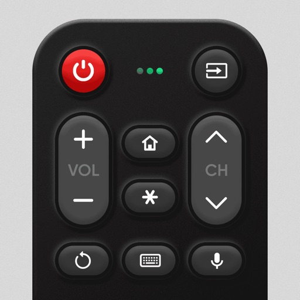

Votre télécommande disparaît toujours au moment où commence votre émission préférée ?

Cela arrive toujours au pire moment — le match est sur le point de commencer, le pop-corn est prêt… mais la télécommande a mystérieusement disparu. Vous fouillez le canapé, la table basse, voire le réfrigérateur (oui, c’est déjà arrivé) — et toujours rien.

Ou peut-être que vous la retrouvez, mais les piles sont mortes, les boutons se coincent et taper le titre d’un film ressemble à envoyer un SMS dans les années 90.

Découvrez Universal Remote TV Control・ — l’application qui met fin au chaos des télécommandes une fois pour toutes. Transformez votre iPhone ou iPad en une télécommande intelligente, réactive et tout-en-un pour votre Smart TV ou appareil de streaming. Fini les recherches frénétiques, fini les disputes du genre « Qui l’avait en dernier ? ».

FONCTIONNALITÉS PRINCIPALES :
• Contrôle sans limites
Avec Universal Remote TV Control・, votre téléphone devient le centre de commande de votre divertissement. Changez de chaîne instantanément, lancez Netflix, YouTube, Hulu ou votre application de streaming préférée d’un simple geste. Réglez le volume, changez de source ou ouvrez les paramètres sans jamais toucher une télécommande en plastique.

• Recherche en quelques secondes
Oubliez la saisie lettre par lettre — tapez ou dictez votre recherche directement grâce au clavier rapide ou au contrôle vocal de l’app. Trouvez le film parfait avant que le pop-corn ne refroidisse.

• Partagez & diffusez sur TV
Envie de montrer vos photos de vacances, de lire des vidéos ou de diffuser de la musique sur grand écran ? Diffusez-les directement depuis votre téléphone. Idéal pour les soirées cinéma, les fêtes ou pour transformer votre salon en piste de danse.

• Installation simple & intuitive
Il suffit de connecter votre téléphone et votre TV au même réseau Wi-Fi. L’application détecte automatiquement votre télé — pas de codes, pas de complications. Vous serez prêt à contrôler en moins d’une minute.

Pourquoi vous ne reviendrez plus en arrière :
– Remplacez toutes les télécommandes de la maison par une seule app.
– Compatible avec la plupart des Smart TV et appareils de streaming populaires.
– Navigation rapide et fluide au toucher ou à la voix.
– Plus de désordre, plus de télécommandes perdues, plus de temps gaspillé.

Marques de téléviseurs prises en charge :
Roku
TCL
Sony
LG Smart TV
Samsung
Android TV
Hisense
FireTV
Philips
Vizio

Avertissement : Universal Remote TV Control・ n’est affiliée ni approuvée par aucune des marques mentionnées.

Informations sur les achats intégrés :
Passez à la version Premium pour supprimer les publicités et débloquer toutes les fonctionnalités. L’abonnement coûte 6,99 $ par semaine.
– Le paiement sera facturé sur le compte iTunes à la confirmation de l’achat (après la période d’essai gratuite si proposée).
– L’abonnement se renouvelle automatiquement sauf si la fonction de renouvellement automatique est désactivée au moins 24 heures avant la fin de la période en cours.
– Le compte sera facturé pour le renouvellement dans les 24 heures précédant la fin de la période en cours, avec indication du coût.
– L’utilisateur peut gérer son abonnement et désactiver le renouvellement automatique depuis les paramètres de son compte après l’achat.
– Toute partie inutilisée d’une période d’essai gratuite, si proposée, sera perdue lorsque l’utilisateur achètera un abonnement.

Pour toute assistance, contactez-nous à : feedback@begamob.com

Politique de confidentialité : https://begamob.com/cast-policy.html
Conditions d’utilisation : https://begamob.com/ofs-termofuse.html

[View on Apple](https://apps.apple.com/fr/app/tv-t%C3%A9l%C3%A9commande-universelle/id1581765635)

## Snapchat: Chatte mit Freunden

Mit Snapchat kannst du schnell und auf lustige Weise Momente mit Freunden und Familie teilen.

SNAPPEN
• Snapchat öffnet direkt die Kamera – tippe, um ein Foto zu machen oder halte gedrückt, um ein Video aufzunehmen.
• Mit Linsen, Filtern, Bitmoji und weiteren tollen Funktionen kannst du deiner Kreativität Ausdruck verleihen!
• Probiere täglich neue Linsen aus, die von der Snapchat-Community erstellt werden!

CHATTEN
• Bleib über den Chat in Kontakt mit deinen Freunden oder zeig in Gruppen-Storys, wie dein Tag so läuft.
• Du kannst mit bis zu 16 Freunden gleichzeitig videochatten – dabei kannst du sogar Filter und Linsen verwenden!
• Zeig deine Individualität mit Friendmoji – das sind exklusive Bitmoji, die extra für dich und einen Freund erstellt werden.

STORYS
• Schau dir die Storys deiner Freunde an, um zu sehen, was bei ihnen los ist.
• Sieh dir Storys aus der Snapchat-Community an, die auf deinen Interessen basieren.
• Entdecke aktuelle Nachrichten und exklusive Original-Shows.

SPOTLIGHT
• Bei Spotlight findest du die besten Snaps!
• Poste eigene Snaps oder lehne dich einfach zurück und schau zu. 
• Wähle deine Favoriten aus und teile sie mit deinen Freunden.

SNAP MAP
• Teile deinen Standort mit deinen besten Freunden oder tauche unter mit dem Geistmodus.
• Auf deiner persönlichen Karte kannst du sehen, was deine Freunde gerade machen, wenn sie ihren Standort mit dir teilen.
• Entdecke Live-Storys aus der Community in deiner Nähe oder aus der ganzen Welt!

MEMORYS
• Speichere eine unbegrenzte Anzahl von Fotos und Videos deiner schönsten Momente.
• Bearbeite vergangene Momente und schicke sie an Freunde oder speichere sie in deinen Aufnahmen.
• Erstelle Storys aus deinen schönsten Erinnerungen, um sie mit Freunden und Familie zu teilen.

FREUNDSCHAFTSPROFIL
• Jede Freundschaft hat ein eigenes Profil mit all den Momenten, die ihr gemeinsam erlebt habt. 
• Mit den Meilensteinen kannst du neue Gemeinsamkeiten entdecken – zum Beispiel, wie lange ihr schon Freunde seid, ob ihr astrologisch kompatibel seid, welchen Modestil eure Bitmoji haben und vieles mehr!
• Freundschaftsprofile sind nur für dich und einen Freund sichtbar, sodass ihr gemeinsam feiern könnt, was eure Freundschaft so besonders macht.

Happy Snapping!

Hinweis: Snapchatter können deine Nachrichten immer festhalten oder speichern, indem sie beispielsweise einen Screenshot machen oder eine Kamera verwenden. Pass also auf, was du snappst!

Eine vollständige Beschreibung unserer Datenschutzmaßnahmen findest du im Datenschutzcenter.

[View on Apple](https://apps.apple.com/fr/app/snapchat-chats-entre-ami-e-s/id447188370)

## Feux de Forêt

"Feux de Forêt" est la première application mobile dédiée à la protection des populations et des forêts, contre les feux d'espaces naturels.

Consultez en temps réel, toutes les informations relatives aux feux de forêt proche de vous et restez en sécurité.  Suivez l'actualité de la défense des forêts et des populations contre les incendies. 

Soyez alertés en direct de tous les nouveaux événements à proximité de vous, notamment à l'aide des notifications Push en fonction de votre position géographique.

Conditions d’utilisation : https://www.apple.com/legal/internet-services/itunes/dev/stdeula/

[View on Apple](https://apps.apple.com/fr/app/feux-de-for%C3%AAt/id1211866961)

## Lidl Plus

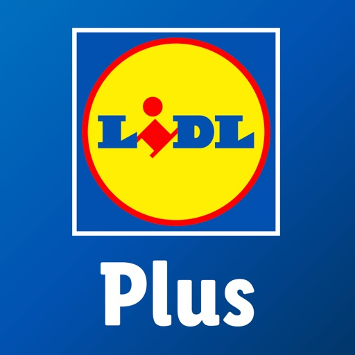

Lade die Lidl App gratis herunter, melde dich bei Lidl Plus an und spare jeden Tag mit exklusiven Lidl Plus Aktionen oder shoppe in unserem Onlineshop!

Entdecke alle Vorteile von Lidl Plus:
- Zusätzliche Rabatte auf wöchentlich wechselnde Artikel
- Lidl Pay Bezahlfunktion, um den Einkauf noch schneller zu machen 
- Digitale Rubbellose für zusätzliche Überraschungen nach jedem Einkauf
- Digitale Kassenbons für den optimalen Überblick
- E-Mobilität an vielen unserer Filialen – Starte den Ladevorgang ab sofort über Lidl Plus
- Der wöchentliche Prospekt immer digital griffbereit
- Einkaufsliste zum besseren planen des Lidl Einkaufs
- Vorteile bei ausgewählten Partnern
- Benachrichtigungen, um keine Aktion mehr zu verpassen

Der Dienst Lidl Plus richtet sich an Verbraucher, die von der Lidl Stiftung personalisierte Informationen über Angebote und Aktionen von Lidl Plus sowie über Angebote, Waren und Dienstleistungen von ausgewählten Kooperationspartnern und Lidl-Gesellschaften erhalten möchten, die möglichst stark ihren Interessen entsprechen. Grundlage für die Ermittlung der relevanten Interessen ist das Kauf- und Nutzungsverhalten hinsichtlich der Produkte und Services der Lidl-Gesellschaften.

Mehr Infos unter www.lidlplus.de, www.lidlplus.ch und www.lidlplus.at

In der App gibt es noch viel mehr zu entdecken und wir arbeiten kontinuierlich daran, dein Einkaufserlebnis zu verbessern.
Bei Fragen oder Anregungen steht dir unser Kundenservice zur Verfügung. 

Kontaktformular:
Deutschland: https://kundenservice.lidl.de/SelfServiceDE/s/contactsupport
Österreich: https://kundenservice.lidl.at/SelfServiceAT/s/contactsupport
Schweiz: https://service.lidl.ch/SelfServiceCH/s/contactsupport?language=de_CH

Telefon:
Deutschland: +49 800 5435 7587
Österreich: +43 800 500 810
Schweiz: +41 71 588 05

Datenschutz & Teilnahmebedingungen:
Im Rahmen der Lidl Plus App Nutzung kannst du Datenanalysetechnologien zulassen, welche wir bei der Teilnahme am Lidl Plus Programm nutzen, um die Inhalte, die wir dir in Lidl Plus präsentieren, personalisieren können. Dazu gehört, welche Produkte dich ansprechen, welche Coupons für dich interessanter sind, wie oft du die App verwendest und welche Teile der App für dich relevant sind. Das Tracking ermöglicht uns, dir Inhalte zu bieten, die an deine Vorlieben und Bedürfnisse angepasst sind. Darüber hinaus verwenden wir diese Daten, um Fehler zu identifizieren und zu beheben und die App und Lidl Plus zu verbessern.

Datenschutzhinweise für den Lidl Onlineshop und die Lidl App:
Deutschland: https://www.lidl.de/c/datenschutz/s10007528?hidebanner=true 
Österreich: https://www.lidl.at/c/datenschutz/s10012009?salesChannel=02&hidebanner=true
Schweiz: https://www.lidl.ch/c/de-CH/datenschutz/s10017521?salesChannel=02&hidebanner=true

Datenschutzhinweise Lidl Plus:
Deutschland: https://www.lidl.de/c/datenschutzhinweise/s10005247?salesChannel=02
Österreich: https://www.lidl.at/c/lidl-plus-datenschutzinformationen/s10012223?salesChannel=02
Schweiz: https://www.lidl.ch/c/de-CH/datenschutzerklaerung-lidl-plus/s10020718?salesChannel=02

Teilnahmebedingungen Lidl Plus:
Deutschland: https://www.lidl.de/c/lidl-plus-teilnahme-und-nutzungsbedingungen/s10005289?salesChannel=02
Österreich: https://www.lidl.at/c/lidl-plus-nutzungsbedingungen/s10012221?salesChannel=02
Schweiz: https://www.lidl.ch/c/de-CH/nutzungsbedingungen-lidl-plus/s10020600?salesChannel=02

[View on Apple](https://apps.apple.com/fr/app/lidl-plus/id1238611143)

## Tinder: appli de rencontre

TOUT COMMENCE PAR UN SWIPE™ : MATCHE, DISCUTE, FAIS DES RENCONTRES
Avec plus de 97 milliards de Matchs à ce jour, Tinder® est la meilleure appli de rencontres gratuite (et le meilleur endroit pour discuter). Grâce à ses nouvelles fonctionnalités de sécurité, fais des rencontres sans crainte. 

Tu cherches quoi ? Un crush, un date, une relation libre ou des potes pour sortir ? (Ou tout à la fois ?) Tinder te connecte à des profils autour de toi.

COMMENT FONCTIONNE TINDER
C’est simple. Choisis tes meilleures photos et ajoute des infos sur toi pour te démarquer. Partage une anecdote, réponds aux quiz et poste des photos où on peut voir ton visage pour augmenter tes chances de matcher. Pour liker un profil, swipe à droite et pour passer au profil suivant, swipe à gauche. Et si quelqu’un like aussi ton profil, c’est un Match ! Avec ce système de double validation, l’intérêt doit être réciproque pour matcher.

LA SÉCURITÉ : NOTRE PRIORITÉ
Essaie l’une de nos fonctionnalités pour faire des rencontres sereinement.

- Partager Ton Date : donne les infos de ton plan à tes potes et à ta famille pour qu’ils sachent qui tu rencontres et où.
- Vérification photo : passe par ce processus  pour que les autres membres sachent que ce ou cette BG sur les photos, c’est bien toi
- Are You Sure/Does This Bother You : Tinder détecte les propos inappropriés. En général, les gens réfléchissent à deux fois avant d’envoyer un message déplacé.
- Signaler un profil : signale ou bloque les profils qui ont une activité louche ou un comportement inapproprié.
- Bloquer les contacts : prends le contrôle. Bloque les personnes que tu ne veux pas voir sur l’app (au hasard, ton ex).
- Chat vidéo : vérifie que ça passe entre vous et discute en face à face sans bouger de ton canap’ !

ESSAIE TINDER PLUS
- Grâce à un nombre illimité de Likes, tu peux crusher sur pleeein de profils !
- Utilise Passeport pour matcher et discuter avec des locaux, avant même de débarquer dans la ville.
- Rewind® te permet d’annuler ton dernier Swipe et de revenir en arrière (en illimité).
- Tu ne veux être vu•e que par les personnes que t’as likées ? Passe en mode incognito.

PASSE À TINDER GOLD
- Profite des fonctionnalités Tinder Plus ! Et si t’hésites, sache que tu peux tester l’abonnement pendant une semaine avant de t’engager.
- Likes You te fait de gagner du temps en découvrant les personnes qui ont liké ton profil.
- La fonction Boost mensuel met ton profil en avant pendant 30 minutes, pour être vu•e par plus de membres !
- Enfin, profite de Superlikes toutes les semaines, au cas où tu crush vraaaiment fort.

OFFRE-TOI TINDER PLATINUM
Tu veux accéder aux fonctionnalités premium de Tinder ? Choisis Tinder Platinum™ pour obtenir des Likes prioritaires, envoyer des DM avant de matcher, et bien plus encore.

Alors, t’attends quoi ? Rejoins des millions de personnes situées aux quatre coins du monde, pour tenter de trouver la personne qu’il te faut, car Tinder, c’est la plus grande communauté de daters au monde ! Télécharge la meilleure appli de rencontres gratuite.

---------------
Si tu choisis de t’abonner à Tinder Plus®, Tinder Gold™ ou Tinder Platinum™, le paiement sera effectué via ton compte Apple. Il sera débité du montant du renouvellement dans les 24 heures précédant la fin de la période en cours. Tu peux désactiver à tout moment le renouvellement automatique, en allant dans les Paramètres de l’App Store après ton achat. L’annulation de l’abonnement en cours n’est pas possible durant la période d’activation de l’abonnement. Si tu ne souhaites pas t’abonner à Tinder Plus®, Tinder Gold™ ou Tinder Platinum™, tu peux continuer d’utiliser la version gratuite.

Toutes les photos représentent des modèles et ne sont utilisées qu’à des fins d’illustration.

Politique de confidentialité : https://www.gotinder.com/privacy
Conditions d’utilisation : https://www.gotinder.com/terms

[View on Apple](https://apps.apple.com/fr/app/tinder-appli-de-rencontre/id547702041)

## france.tv: direct et replay TV

Avec l’application france.tv, accédez gratuitement à des milliers de programmes en direct et en replay : séries, films, émissions, documentaires, ainsi que des contenus en avant-première et des exclusivités. Retrouvez toutes nos offres : France 2, France 3, France 4, France 5, Franceinfo, Culturebox, Slash, Okoo, Outre-mer La 1ère. Profitez également des contenus de nos partenaires : Arte, TV5 Monde, France 24, INA, LCP, Public Sénat. 

france.tv est une application gratuite, sans abonnement. 

Une offre complète pour tous les goûts : 

• Séries & fictions : Un si grand soleil, L’affaire Laura Stern, Alex Hugo, Je sais pas… 
• Actualité & société : Les JT, Envoyé Spécial, C politique, C dans l’air, C à vous, Ça commence aujourd’hui... 
• Sport : Jeux Olympiques et Paralympiques, Roland-Garros, Tour de France, Tournoi des 6 Nations… 
• Cinéma & culture : Films, Festival de Cannes, concerts live, spectacles… 
• Documentaires : Infrarouge, Echappées Belles, Des racines & des ailes, Rendez-vous en terre inconnue... 
• Divertissement : N’oubliez pas les paroles, Fort Boyard, Drag Race France, Tout le monde veut prendre sa place… 
• Jeunesse : Okoo-koo, Peppa Pig, Simon, Les lapins crétins… 

Explorez les séries du moment, les films, les émissions et les documentaires sur france.tv gratuitement, en direct ou en replay. 

Profitez de vos programmes où vous voulez quand vous voulez : 

• Regardez nos chaînes en direct : France 2, France 3, France 4, France 5, Franceinfo, Arte, LCP, TV5 Monde, France 24, Mieux. 
• Ajoutez vos films, séries, émissions et documentaires à votre liste pour y revenir facilement. 
• Reprenez vos lectures là où vous les avez laissées : films, séries, émissions, documentaires… 
• Accédez à des recommandations personnalisées. 
• Regardez sur votre TV via Chromecast. 
• Téléchargez certains programmes pour les regarder hors connexion.* 

*Le téléchargement n’est pas encore possible pour tous les programmes. Nous travaillons à vous proposer de plus en plus de vidéos disponibles au téléchargement. 

Avertissement : Cette application est gratuite hors coût d’abonnement à l’opérateur et hors surcoût éventuel facturé par l’opérateur pour le chargement et l’envoi des données. L’utilisation de cette application pouvant engendrer une consommation importante de données, notamment lors du visionnage de vidéos, France Télévisions vous recommande de vérifier auprès de votre opérateur mobile que vous disposez bien d’un abonnement adapté à cet usage. 

La politique de confidentialité ne change pas : vos données personnelles sont protégées et ne sont pas revendues. Vous pouvez à tout moment accéder à vos données, les modifier ou les supprimer. 

Pour des raisons juridiques de droits de diffusion, certaines vidéos ne sont pas accessibles en dehors du territoire français. 

France Télévisions se réserve le droit de ne pas autoriser l’installation de cette application sur les terminaux sur lesquels la qualité de lecture de ses vidéos sera jugée insuffisante. 

Pour rester en contact avec vos programmes préférés : 

• Rejoignez nos réseaux sociaux : 

Instagram : https://www.instagram.com/france.tv/  
Facebook : https://www.facebook.com/francetv  
Tiktok : https://www.tiktok.com/@france.tv?lang=fr 
Youtube : https://www.youtube.com/francetv  
Twitter : https://twitter.com/francetv  

• Inscrivez-vous à nos newsletters thématiques : www.francetelevisions.fr/abonnements 

Envoyez vos suggestions ou signalez un problème via : https://www.france.tv/services/aide-contact.html

[View on Apple](https://apps.apple.com/fr/app/france-tv-direct-et-replay-tv/id428835098)

## Compte ameli

Connectez-vous à votre compte avec votre numéro de sécurité sociale, votre mot de passe et le code unique reçu par email ou via l'authentification biométrique (disponible sur smartphone) et accéder à tous les services suivants :

Consultez vos remboursements de soins :
    - Visualisez tous vos remboursements en détails

Consultez tous vos documents :    
    - Téléchargez votre attestation de droits ou d’indemnités journalières
    - Téléchargez vos relevés mensuels de remboursements, disponibles pour les 27 derniers mois

Réalisez certaines démarches sans vous déplacer :
    - Simulez et estimez vos indemnités journalières, et effectuez vos éventuelles démarches
    - Commandez votre carte européenne d’assurance maladie (CEAM) et visualisez-la sur votre smartphone
    - Déclarez la perte ou le vol de votre carte Vitale
    - Commandez une carte Vitale 
    - Déclarez votre nouveau-né à votre caisse 
    - Inscrivez votre enfant sur les cartes des deux parents
    - Modifiez votre nom d’usage
    - Déclarez un accident causé par un tiers
    - Accédez à la simulation de vos droits aux aides sociales
    - Consultez les délais de traitement de votre caisse
    - Choisissez votre organisme complémentaire en cas de chevauchement de contrats
    - Déclarez un acte médical ou un soin non réalisé

Gérez vos informations personnelles :
    - Retrouvez toutes vos informations personnelles
    - Modifiez votre adresse postale, votre adresse email et vos numéros de téléphone

Prenez rendez-vous avec votre caisse :
    - Choisissez un créneau de rendez-vous téléphonique
    - Modifiez vos rendez-vous
    - Supprimez vos rendez-vous
    - Visionnez vos rendez-vous à venir

[View on Apple](https://apps.apple.com/fr/app/compte-ameli/id620447173)

## GenK : Culture Générale

Et si scroller te rendait plus intelligent(e) ?
Avec GenK, transforme ton temps d'écran en savoir.
Apprends quelque chose de nouveau chaque jour en seulement 2 minutes, et plonge plus en profondeur quand un sujet te passionne.
De l'histoire à la science, de l'art à la société, découvre des idées que tu vas vraiment retenir.

UN PARCOURS D'APPRENTISSAGE LUDIQUE QUI TE GUIDE PAS À PAS
• Suis un chemin clair et captivant qui rend l'apprentissage simple
• Débloque de nouvelles étapes au fil de ta progression
• Reste motivé(e) en voyant tes connaissances grandir

LES QUIZ : NE FAIS PAS QU'APPRENDRE, RETIENS
• Teste tes connaissances juste après chaque leçon
• Relève des quiz thématiques qui parcourent tout ce que tu as appris
• Révise grâce aux quiz pour ne rien oublier avec le temps
• Comprends tes erreurs avec des explications claires
• Transforme de courtes leçons en savoir durable

DES LEÇONS DE 2 MINUTES, PLUS APPROFONDIES SI TU LE VEUX
• Des leçons rapides de 2 minutes, parfaites pour une pause ou les trajets
• Touche pour approfondir quand un sujet éveille ta curiosité
• Explore plus de 28 thèmes et apprends un peu de tout
• Lis ou écoute, choisis ce qui te convient sur le moment
• Police adaptée à la dyslexie pour une lecture plus fluide

MONTE EN NIVEAU EN APPRENANT
• Gagne des étoiles et de l'XP à chaque leçon ou quiz réussi
• Grimpe les niveaux et débloque de nouvelles récompenses
• Collectionne des badges en maîtrisant de nouveaux sujets
• Dépense tes étoiles pour débloquer des quiz spéciaux

CONSTRUIS TON SAVOIR JOUR APRÈS JOUR
• Fixe un objectif quotidien adapté à ton rythme
• Garde ta série et atteins des paliers pour des récompenses bonus
• Reviens sur ton historique pour renforcer ta mémoire
• Enregistre tes leçons préférées pour y revenir quand tu veux

APPRENDS À TON RYTHME
• Reste régulier(ère) et vois ta série s'allonger
• Accède à tes leçons en un instant depuis ton Apple Watch
• Reste motivé(e) avec des widgets personnalisés sur ton écran d'accueil

ANTI DOOMSCROLLING : MÉRITE TON SCROLL
Bloque les applis qui te distraient jusqu'à ce que tu atteignes ton objectif du jour.
Transforme la distraction en motivation et installe une vraie habitude d'apprentissage.

POURQUOI TU VAS ADORER GENK
• Tu apprends sans même t'en rendre compte
• Tu transformes ton temps d'écran en vrais progrès
• Tu as toujours quelque chose d'intéressant à raconter
• Tu deviens plus curieux(se), plus confiant(e)… plus toi

Télécharge GenK gratuitement sur iPhone, iPad, Apple Watch et Vision Pro. Une version gratuite est disponible, passe à Premium pour apprendre sans limites.

Contact
Une question ou besoin d'aide ?
Écris-nous à hello@genk.app

Conditions générales
https://www.genk.app/app-terms-conditions

[View on Apple](https://apps.apple.com/fr/app/genk-culture-g%C3%A9n%C3%A9rale/id6612027371)

## JustPlay: Cumulez pts fidélité

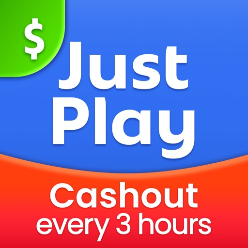

Bienvenue sur JustPlay, le programme de fidélité exclusif pour les fans de Gimica Games ! Nous avons conçu ce programme pour vous récompenser pour ce que vous aimez le plus : jouer à vos jeux Gimica préférés.

Voici comment ça marche :

• JOUEZ ET GAGNEZ DES POINTS FIDÉLITÉ
Terminez des niveaux et débloquez des succès pour accumuler des points. C’est aussi simple que ça. Plus vous jouez, plus vous gagnez !

• DES RÉCOMPENSES TOUTES LES 3 HEURES
Avec JustPlay, pas d’attente interminable. Toutes les 3 heures, convertissez vos points de fidélité en récompenses bien réelles. En partenariat avec des acteurs mondiaux comme Amazon et PayPal, votre temps de jeu est vraiment valorisé.

• FAITES UN DON À DES ASSOCIATIONS DE RÉFÉRENCE
JustPlay, ce n’est pas que des récompenses. C’est le seul programme de fidélité gaming qui vous permet aussi de redonner. Choisissez de reverser vos gains à des organisations majeures comme The Hunger Project, Médecins Sans Frontières ou Clean Air Force, entre autres. Et pour chaque don, Gimica ajoute le même montant : votre impact est doublé.

• BOOSTEZ VOTRE EXPÉRIENCE GIMICA
Passez au niveau supérieur avec JustPlay. Profitez de vos jeux favoris, soutenez des causes qui comptent et obtenez de super récompenses - le tout au même endroit.

Installez JustPlay dès maintenant, plongez dans l’univers fun des jeux casual et gagnez en jouant. It’s time to JustPlay !
Rendez votre temps avec Gimica encore plus gratifiant : avantages supplémentaires ou soutien à des causes importantes, JustPlay ajoute du + à chaque session de jeu.

[View on Apple](https://apps.apple.com/fr/app/justplay-cumulez-pts-fid%C3%A9lit%C3%A9/id6444946155)

## inDrive - Au-delà du taxi

Depuis notre siège en Californie, nous avons lancé inDrive dans 48 pays à travers le monde.

Nouvelle success story de la Silicon Valley, inDrive est une application de covoiturage gratuite disponible dans plus de 1100 villes de 48 pays. Nous nous développons rapidement en remettant le pouvoir entre les mains des gens. 

Ici, des trajets abordables pour les passagers sont toujours synonymes de trajets bien rémunérés pour les conducteurs. 

En tant que passager, vous pouvez trouver rapidement une course et convenir d'un tarif équitable avec le conducteur.

En tant que conducteur, vous pouvez conduire de manière flexible selon votre propre horaire et choisir les trajets que vous prenez.

ÉQUITABLE POUR TOUS
Un prix équitable est celui sur lequel vous vous mettez d'accord - et non celui que vous espérez. inDrive existe pour prouver que les gens peuvent toujours se mettre d'accord. 

RAPIDE ET FACILE
Il est simple et rapide de demander un trajet abordable - il suffit de saisir les points " A " et " B " dans l'application, d'indiquer le prix que vous êtes prêt à payer et de choisir votre conducteur.

PROPOSEZ VOTRE TARIF
inDrive vous offre une expérience de covoiturage sur mesure et sans surcharge. C'est vous, et non l'algorithme, qui décidez du tarif et choisissez le conducteur. Nous ne fixons pas le prix en fonction du temps et du kilométrage comme d'autres services. Vous convenez d'un prix gagnant-gagnant avec le conducteur avant le début de la course.

CHOISISSEZ VOTRE CONDUCTEUR
inDrive vous permet de choisir votre conducteur à partir d'une liste de conducteurs qui ont accepté votre demande de transport. Choisissez-les en fonction de la meilleure offre, de l'heure d'arrivée, de l'évaluation du conducteur, du nombre de trajets effectués et même du modèle de voiture.

RESTEZ EN SÉCURITÉ
Consultez le nom du conducteur, le modèle de voiture, le numéro de plaque d'immatriculation et le nombre de trajets déjà effectués avant d'accepter la course. Pendant votre trajet, vous pouvez partager les informations relatives au conducteur et la localisation de la voiture en temps réel avec votre famille ou vos amis en utilisant le bouton ""Partager votre trajet"". Votre géolocalisation en temps réel peut être partagée via des messageries, des réseaux sociaux, des e-mails ou des SMS. Tout cela est mis en place pour rendre votre expérience sûre et fiable. Nous ajoutons continuellement de nouvelles fonctions de sécurité à l'application pour que les conducteurs et les passagers puissent profiter de trajets 100 % sûrs.

AJOUTEZ DES OPTIONS DE VOYAGE
Vous avez des besoins spécifiques ? Précisez les options de voyage - un SUV, des arrêts supplémentaires en cours de route, un siège enfant ou la prise en compte de besoins particuliers. Vous pouvez indiquer vos demandes spécifiques ou tout autre détail dans le champ des commentaires, par exemple "je voyage avec mon animal de compagnie", "j'ai des bagages", etc.

INSCRIVEZ-VOUS COMME CONDUCTEUR ET GAGNEZ DE L'ARGENT SUPPLÉMENTAIRE
Si vous avez une voiture, inDrive vous offre une excellente opportunité de gagner de l'argent supplémentaire. Définissez votre horaire et profitez d'une transparence totale avec inDrive. Voyez le lieu de dépôt de votre passager et son prix avant d'accepter la demande de transport. Si le prix proposé par le passager ne vous semble pas suffisant, vous pouvez toujours proposer votre tarif ou sauter les trajets qui ne vous plaisent pas, sans aucune pénalité.
Mieux encore, les tarifs de service bas ou nuls signifient que vous gagnez plus d'argent en conduisant avec inDrive !

Nous sommes impatients que vous en fassiez l'expérience. Installez l'application et allons-y ! La seule et unique application de mobilité qui convient à tout le monde. Ici, les clients et les fournisseurs de services peuvent choisir l'un ou l'autre et afficher leurs tarifs pour chaque service.

[View on Apple](https://apps.apple.com/fr/app/indrive-au-del%C3%A0-du-taxi/id780125801)

## Flo : calendrier menstruel

Vivez en harmonie avec votre cycle en utilisant Flo, l’appli de santé féminine la plus populaire au monde. Obtenez des informations et des prévisions personnalisées au sujet de votre corps.

Flo est votre partenaire unique pour tous les aspects de la santé féminine : prédire les règles, tomber enceinte, suivre une grossesse ou mieux comprendre des symptômes. Rejoignez plus de 460 millions de membres.

Avantages de Flo :
– Vos données sont en sécurité : Flo est le premier outil de suivi des règles et de l’ovulation à obtenir les certifications ISO 27001 et ISO 27701, des normes de pointe en matière de protection des données.
– Vous vous sentez mieux compris·e : partagez vos données Flo via Flo à deux pour vous sentir plus proche et bénéficier d’un meilleur soutien.
– Vous profitez d’un niveau de protection supplémentaire : avec le mode Anonyme, personne, pas même Flo, ne peut vous identifier d’après vos données de santé.
– Vous accédez à des informations de santé fiables : Flo collabore avec une organisation mondialement reconnue qui agit en faveur de la santé et des droits en matière de reproduction, pour vous offrir un soutien fiable.

Voici ce que Flo Premium vous offre :
– Rapports mensuels sur le cycle
– Tendances et prévisions de symptômes
– Prévisions personnalisées
– Suivi détaillé de la grossesse
– Accès complet à Flo à deux
– Assistant Flo Health 24 h/24 et 7 j/7
– Articles, vidéos et cours tous vérifiés par l’un·e des 140 spécialistes de la santé de Flo

Flo inclut désormais la périménopause :
– Découvrez ce à quoi peut ressembler la périménopause et comment rester à l’écoute des changements de votre corps.
– Apprenez-en plus sur les symptômes courants de la périménopause et comment les soulager.
– Prenez des décisions plus éclairées sur votre santé et identifiez vos besoins pour vous sentir au top de votre forme.

Commencez à suivre votre cycle gratuitement aujourd’hui.

Politique de confidentialité et Conditions d’utilisation :
https://flo.health/fr/politique-de-confidentialite 
https://flo.health/fr/conditions-dutilisation

Suivez Flo :
Web : flo.health
TikTok : @flotracker
Instagram : @flotracker

Remarque : Flo n’est pas un outil de diagnostic et ne doit pas être utilisée comme moyen de contraception ou pour faciliter la conception. Les prévisions et les informations de l’application sont fournies à titre indicatif uniquement. Elles ne peuvent se substituer à un avis, diagnostic ou traitement médical professionnel. Consultez systématiquement un·e professionnel·le de santé qualifié·e pour toute décision ou tout problème lié à votre santé.

Flo utilise HealthKit pour lire vos données de cycle menstruel et exporter vos activités Flo vers l’appli Santé.

Si vous avez des difficultés à utiliser l’application, contactez Flo via support@flo.health.

[View on Apple](https://apps.apple.com/fr/app/flo-calendrier-menstruel/id1038369065)

## BoursoBank

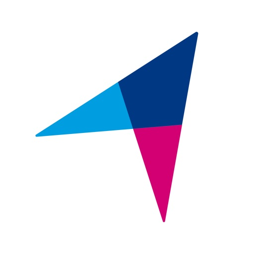

Avec l'application BoursoBank ouvrez votre compte et commandez votre carte bancaire en quelques minutes (1), et payez immédiatement avec votre mobile (2) (via Apple Pay après votre 1er versement).

En tant que client BoursoBank, vous pourrez depuis votre mobile :

• Accéder à notre offre complète de produits (3) :
- Banque au quotidien
- Crédits immobiliers, prêts personnels, petit crédit en un clic, crédit lombard
- Epargne de précaution
- Assurance vie et épargne retraite
- Bourse
- Assurances crédits, prévoyance, habitation, ...
- Bons plans

• Découvrir la banque au quotidien en toute sécurité :
- Consultez l’évolution de vos comptes ainsi que ceux détenus dans d’autres banques (4)
- Réalisez vos virements gratuitement et en quelques clics
- Visualisez et partagez votre RIB directement par email ou SMS
- Accédez au solde de votre compte courant sans ouvrir l’application grâce au widget (pour les versions iOS 14 et supérieures, activation depuis les réglages de votre téléphone)

• Gérer votre carte bancaire en toute autonomie :
- Consultez votre code PIN à tout moment
- Augmentez vos plafonds de paiement/retrait en temps réel (5)

- Verrouillez et déverrouillez temporairement votre carte si vous pensez l’avoir égarée
- Pilotez votre découvert autorisé (4) en temps réel
- Effectuez un retrait d’espèces exceptionnel (5) en cas de besoin

• Gérer facilement l’ensemble de vos investissements :
- Alimentez vos comptes (livrets, bourse, assurance vie, plan d’épargne retraite individuel) par des versements libres ou programmés
- Passez des ordres de bourse de 8h à 22h depuis votre mobile
- Déléguez si vous le souhaitez – et gratuitement - la gestion de vos produits d’épargne (assurance vie, PERin) à nos partenaires
- Bénéficiez de l’ensemble des contenus du leader de l’information financière en ligne (news, cotations, webinaires, vidéos live, guides pédagogiques, …)

LES VALEURS MOBILIERES PRESENTENT UN RISQUE DE PERTE EN CAPITAL ; TOUT INVESTISSEMENT DOIT S'ENVISAGER A MOYEN OU LONG TERME.

• Retrouver votre code parrainage, le partager facilement et suivre vos parrainages en cours

L’application est également disponible sur Apple Watch, vous pouvez consulter :
- Le solde de vos comptes
- Les dernières opérations
- Le cours de la bourse

L’application BoursoBank est un service gratuit accessible pour les clients BoursoBank.
Pour bénéficier d’une assistance technique ou pour toutes autres suggestions, contactez-nous à l’adresse : iphone@boursorama.fr ou laissez-nous votre avis depuis la rubrique « Vos commentaires sur l’appli ». En cas de dysfonctionnement, merci d'indiquer le modèle de votre téléphone, la version de l'OS et de l'application.

(1) Sous réserve d’acceptation par BoursoBank.
(2) Paiement immédiat via Apple Pay après votre 1er versement. Sous réserve d'un solde suffisant. Service disponible sur tous les smartphones dotés d'un système d'exploitation iOS et d'un accès au Apple Store.
(3) Des conditions peuvent s'appliquer. Sous réserve d'acceptation par BoursoBank.
(4) Comptes à vue et certains éléments de patrimoine (comptes d’épargne, placements financiers…).
Liste des établissements éligibles disponible sur votre Espace Client.
(5) Réservé aux clients de plus de 3 mois, sous réserve d’éligibilité et d’acceptation par BoursoBank.
(6) Le plafond d’émission d’un virement instantané à partir d’un compte bancaire BoursoBank est de 2000€. Le plafond maximum fixé pour la réception d’un virement instantané sur un compte bancaire BoursoBank dépendra des règles fixées par la banque du donneur d’ordre.

Boursorama - 44 rue Traversière, CS 80134, 92772 BOULOGNE BILLANCOURT CEDEX

[View on Apple](https://apps.apple.com/fr/app/boursobank/id425368900)
