- [PeakFinder](#peakfinder)
- [Shadowrocket](#shadowrocket)
- [AnkiMobile Flashcards](#ankimobile-flashcards)
- [Blitzer.de PRO](#blitzer-de-pro)
- [WorkOutDoors](#workoutdoors)
- [Procreate Pocket](#procreate-pocket)
- [Manager for KuKirin](#manager-for-kukirin)
- [Heredis 2026](#heredis-2026)
- [Alpin Quest PRO – Outdoor GPS](#alpin-quest-pro-outdoor-gps)
- [TeleGuard](#teleguard)
- [Monash FODMAP Diet](#monash-fodmap-diet)
- [Babyphone 3G](#babyphone-3g)
- [Wagotabi : Cours de japonais](#wagotabi-cours-de-japonais)
- [PhotoPills](#photopills)
- [FL Studio Mobile](#fl-studio-mobile)
- [AutoSleep - 苹果手表睡眠监测，睡觉记录及智能闹钟](#autosleep-苹果手表睡眠监测-睡觉记录及智能闹钟)
- [AutoSnore: 鼾声记录器](#autosnore-鼾声记录器)
- [MapOut](#mapout)
- [iReal Pro](#ireal-pro)
- [HealthFit](#healthfit)
- [Things 3](#things-3)
- [HeartWatch: 心脏和活动监测器](#heartwatch-心脏和活动监测器)
- [Threema. Der sichere Messenger](#threema-der-sichere-messenger)
- [iVerify Basic](#iverify-basic)
- [Knoten 3D  (Knots 3D)](#knoten-3d-knots-3d)
- [SkyView®](#skyview)
- [WeatherPro](#weatherpro)
- [Flyskyhy](#flyskyhy)
- [BorderWatcher](#borderwatcher)
- [ProCamera. RAW+ Fotografie](#procamera-raw-fotografie)
- [Fongo World Edition](#fongo-world-edition)
- [Rarevision VHS: Retro Cam](#rarevision-vhs-retro-cam)
- [Wipr 2](#wipr-2)
- [WikiCamps Australia](#wikicamps-australia)
- [Cozmo Robot](#cozmo-robot)
- [Madeira Weather](#madeira-weather)
- [EE35 Film Camera](#ee35-film-camera)
- [HappyCow - Vegan Food Near You](#happycow-vegan-food-near-you)
- [Trevni: Inverseur négatifs](#trevni-inverseur-ne-gatifs)
- [WikiCamps New Zealand](#wikicamps-new-zealand)
- [Stylebook](#stylebook)
- [Parchment: Agenda & Daily Note](#parchment-agenda-daily-note)
- [WikiFarms Australia](#wikifarms-australia)
- [Rally Call](#rally-call)
- [Forvo Pronunciation](#forvo-pronunciation)
- [Blueprint 4-Track](#blueprint-4-track)
- [Ableton Note](#ableton-note)
- [Unora](#unora)
- [Fiches IDE](#fiches-ide)
- [NightCap相机](#nightcap相机)
- [Paprika Rezept-Manager 3](#paprika-rezept-manager-3)
- [Mono Lab](#mono-lab)
- [Groundwire: VoIP SIP Softphone](#groundwire-voip-sip-softphone)
- [GOSAP BMPM](#gosap-bmpm)
- [CineTemp](#cinetemp)
- [Pure Acid](#pure-acid)
- [Pocket Light Meter](#pocket-light-meter)
- [Salatuk - صلاتك](#salatuk-صلاتك)
- [Permis bateau côtier ENF](#permis-bateau-co-tier-enf)
- [SKRWT](#skrwt)
- [Zoiper Premium voip soft phone](#zoiper-premium-voip-soft-phone)
- [Tresor Quotidien 2026](#tresor-quotidien-2026)
- [La conjugaison française](#la-conjugaison-franc-aise)
- [VisualTerms construction](#visualterms-construction)
- [Magic Spider - My Pet Boris](#magic-spider-my-pet-boris)
- [My Moon Phase Pro - Alerts](#my-moon-phase-pro-alerts)
- [iTanpura](#itanpura)
- [Map Points - GPS Location Storage for Hunting, Fishing and Camping with Map Area Measurement](#map-points-gps-location-storage-for-hunting-fishing-and-camping-with-map-area-measurement)
- [TurboCollage Automatic](#turbocollage-automatic)
- [RenpyReader](#renpyreader)
- [S:G LiDAR - Infrared Laser Cam](#s-g-lidar-infrared-laser-cam)
- [ChoreFit - Track Cleaning](#chorefit-track-cleaning)
- [BlueLocation](#bluelocation)
- [Avionics Buddy](#avionics-buddy)
- [iCompta 6](#icompta-6)
- [Network Analyzer Pro](#network-analyzer-pro)
- [ProCam - 专业相机](#procam-专业相机)
- [Streaks](#streaks)
- [YoungPhoto - Aesthetic Camera](#youngphoto-aesthetic-camera)
- [2026人体解剖学图谱](#2026人体解剖学图谱)
- [Board Game Stats](#board-game-stats)
- [Tampermonkey](#tampermonkey)
- [PerfExpert](#perfexpert)
- [GPX-Viewer](#gpx-viewer)
- [Orientation : Boussole & Carte](#orientation-boussole-carte)
- [Legendex](#legendex)
- [RoadTrippin](#roadtrippin)
- [LumaFusion](#lumafusion)
- [FORScan Lite - for Ford, Mazda](#forscan-lite-for-ford-mazda)
- [Cadrage Director's Viewfinder](#cadrage-director-s-viewfinder)
- [Just Press Record](#just-press-record)
- [Loto Quine Helper](#loto-quine-helper)
- [RaceChrono Pro](#racechrono-pro)
- [Tenuto](#tenuto)
- [Badoo Premium](#badoo-premium)
- [Nomad Sculpt](#nomad-sculpt)
- [TV Cast Pro for Sony TV](#tv-cast-pro-for-sony-tv)
- [Guitar Pro](#guitar-pro)
- [Folium](#folium)
- [Smur Bmpm](#smur-bmpm)

## PeakFinder

群山在召唤！力争在登山家队伍中探索最多高山吧！ PeakFinder让你的梦想成为可能…，还能以360°全景显示所有山脉和山峰的名称。
该功能可完全脱机离线工作- 全球适用!

本应用的内容涉及到超过1'000'000座山峰- 从珠穆朗玛峰到世界角落的小山丘。

•••••••••
荣获数个奖项的冠军，如'AppStore最佳应用'、'每周最佳应用',…
macnewsworld.com, nationalgeographic.com, smokinapps.com, outdoor-magazin.com, digital-geography.com, …强烈推荐
•••••••••

••• 特色 •••

• 可在全球完全脱机离线工作
• 包括超过1'000'000座山峰的名称
• 利用全景图覆盖相机图像
• 快速渲染300公里范围周围地形
• 数码双目望远镜可选择远方不显著山峰
• '显示我'功能适合可见的山峰
• 通过GPS、山峰目录或（在线）地图选择观察点
• 可像鸟一样在山峰之间飞翔并垂直上升
• 标记您喜欢的山脉和地方
• 显示太阳和月球轨道以及升落时间
• 使用指南针和加速度传感器
• 山峰目录每周更新
• 不包含任何经常性费用。您只需一次性付款
• 无广告

••• 评价 •••

iTunes中的每个好评（包括下述更新）都让我快乐。好的评价和评论使我得以一直改进本应用。多谢你的支持！

••• 支持 •••

如有问题、疑问、错误、遗漏的山脉名称以及对将来发展想发表意见，我很乐意帮助你。请给我来信：support@peakfinder.com.

[View on Apple](https://apps.apple.com/fr/app/peakfinder/id357421934)

## Shadowrocket

Rule based proxy utility client for iPhone/iPad.

- Capture all HTTP/HTTPS/TCP traffic from any applications on your device, and redirect to the proxy server.
- Record and display HTTP, HTTPS, DNS requests from your iOS devices.
- Configure rules using domain match, domain suffix, domain keyword, CIDR IP range, and/or GeoIP lookup.
- Measure traffic usage and network speed on WiFi, cellular, direct and proxy connections.
- Import rule files from URL or iCloud Drive.
- Block ads by domain, user agent rules.
- Local DNS Mapping.
- Work on cellular networks.
- Decrypt HTTPS traffic.
- Perform URL rewrite.
- Fully IPv6 supports.
- Script filter supports.
- Multi-level forward proxy.
- Support kcptun, cloak, gost, v2ray plugins.
- Support DNS over HTTPS, DNS over TLS, DNS over QUIC.

[View on Apple](https://apps.apple.com/fr/app/shadowrocket/id932747118)

## AnkiMobile Flashcards

AnkiMobile is a mobile companion to Anki®, a powerful, intelligent flashcard program that is free, multi-platform, and open-source. Sales of this app support the development of both the computer and mobile version, which is why the app is priced as a computer application.

AnkiMobile was written by the lead developer of Anki and AnkiWeb, and it has been around since 2010. Beware other apps using "Anki" in their name that have sprung up recently - they are not compatible with the rest of the Anki ecosystem, and they offer far fewer features, despite charging expensive subscriptions.

Some of AnkiMobile's features include:

- A free cloud synchronization service that lets you keep your card content synchronized across multiple mobile and computer devices. This makes it easy to add content on a computer and then study it on your mobile, easily keep your study progress current between an iPhone and iPad, and so on.
- The same SM2 and FSRS scheduling algorithms that the computer version of Anki uses, which remind you of material as you're about to forget it.
- A flexible interface designed for smooth and efficient study. You can set up AnkiMobile to perform different actions when you tap or swipe on various parts of the screen, and control which actions appear on the tool buttons.
- Comprehensive graphs and statistics about your studies.
- Support for large card decks - even 100,000+ cards.
- If your cards use images or audio clips, the media is stored on your device, so you can study without an internet connection.
- A powerful search facility that allows you to find cards that match criteria such as 'tagged high priority, answered in the last ten days and not containing the following words', and automatically place them into a deck to study.
- Support for displaying mathematical equations with MathJax, and rendering LaTeX created with the computer version.
- Support for adding images drawn with the Apple Pencil to your cards.

Please note that AnkiMobile is currently intended as a companion to the computer version of Anki, rather than a complete replacement for it. While AnkiMobile is able to display and schedule your cards in the same way the computer version does, certain changes like modifying note types need to be done with the computer software. Add-ons are not supported, so while you can study image occlusion cards created with the computer version, they can not be created within AnkiMobile. For this reason, please start with the computer version of Anki before you think about buying this app.

The cloud synchronization service is optional, and data can also be imported/exported from the app via a USB cable or AirDrop.

Like all apps, AnkiMobile can be purchased once and then used on multiple devices in a household using the same Apple ID. Family sharing is also supported (apart from in India). For information on bulk discounts for educational institutions, please see Apple's Volume Purchase Program.

For more information on AnkiMobile, including a link to the online manual, please have a look at the support page: https://docs.ankimobile.net/support.html. If you have any questions or want to report an issue, please let us know on our support site and we'll get back to you as soon as possible.

[View on Apple](https://apps.apple.com/fr/app/ankimobile-flashcards/id373493387)

## Blitzer.de PRO

Blitzer.de PRO - Die Verkehrssicherheits-App!
Und der Marktführer in Deutschland seit über 10 Jahren.

Blitzer.de PRO versorgt dich mit Live-Warnungen zu mobilen und festen Blitzern, Pannen, Unfällen, Stauenden und mehr in deiner Nähe. Schließe dich Europas größter und bekanntester Verkehrs-Community mit über 5 Millionen aktiven Nutzern an und mache deine Autofahrt sicherer und entspannter.

► VERSCHIEDENE ANSICHTEN
Wähle zwischen der einfachen Klassik-Ansicht, der Karte oder dem unauffälligen Dunklen Modus.

► AUTO START & STOPP
Einfach einsteigen, losfahren! Definiere eigene Kurzbefehle und die App aktiviert & deaktiviert sich ganz automatisch.

► CARPLAY
Alles im Blick auf dem Autobildschirm! Und das Audio direkt über die Autolautsprecher.

► PERSONALISIERT
Bestimme selbst, vor welchen Blitzern und Gefahren du gewarnt werden möchtest.

► INNOVATIVE NAVIGATION
Mit Schwarmintelligenz navigieren und schneller am Ziel ankommen.

► VIELE AUDIO OPTIONEN
Warnungen per Stimme oder Piepton - über das iPhone oder die Autolautsprecher. Zusätzliche Vibration für Motorradfahrer.

► STABILER HINTERGRUNDBETRIEB
Erhalte Warnungen auch während Telefonaten und beim Nutzen anderer Apps.

ÜBERSICHT DER VORTEILE
* Live-Aktualisierung der Blitzer und Gefahren
* Über 109.000 feste Blitzer weltweit
* Zuverlässige, präzise und straßenbezogene Warnungen, von unserer Verkehrsredaktion geprüft
* Anzeige von Blitzer-/Gefahrentyp mit erlaubter Höchstgeschwindigkeit und Entfernung
* Optimiert für die Nutzung im Auto: selbsterklärend und ohne Ablenkung vom Verkehr
* Einfaches Melden und Bestätigen von Blitzern und Gefahren
* Persönlicher Kundensupport für Fragen, Anregungen oder Probleme
* Keine lästige Werbung

SYSTEMANFORDERUNGEN
* Aktivierte Ortungsdienste
* Internetverbindung für Online-Updates (Flatrate empfohlen)

IN-APP-KAUF: MOBILE BLITZER & GEFAHREN
Profitiere in den ersten 14 Tagen von sämtlichen Funktionen der App. Nach Ablauf dieses 14-tägigen Testzeitraums erhältst du fortlaufend unbegrenzt aktualisierte Warnungen vor festen Blitzern weltweit. Sichere dir mit dem einmaligen In-App-Kauf für nur 9.99 EUR den vollen Funktionsumfang der App, einschließlich lebenslanger mobiler Blitzerwarnungen und Echtzeitinformationen zu Gefahren wie Pannen, Stauenden, Unfällen, Baustellen und mehr. Ohne Abo, ohne Zusatzkosten.

FOLGE UNS
https://www.instagram.com/blitzer.de
https://www.facebook.com/www.Blitzer.de

BESUCHE UNS IM WEB
https://www.blitzer.de/

[View on Apple](https://apps.apple.com/fr/app/blitzer-de-pro/id498732510)

## WorkOutDoors

WorkOutDoors is the most advanced and most configurable workout app for the Apple Watch. It's perfect for running, cycling, hiking and any other indoor or outdoor activity.

Note: WorkOutDoors requires an Apple Watch Series 4 or later. It is not necessary to have your iPhone with you during a workout.

The app uses Apple’s workout system, so all workouts are saved to the Health system.  However it also provides many extra features over Apple's app, such as:

- a super-smooth vector map that can be shown during a workout;
- multiple configurable screens with metrics and graphs from a pool of 800+ data fields;
- route files can be imported and used for navigation (including turn by turn directions);
- dozens of configurable alerts (e.g. every mile; high heart rate; low pace; off-route etc);
- interval schedules can be created using the larger screen of the phone app;
- climbs and descents are supported with notifications and on-screen data and graphs;
- waypoints can be created, navigated to, and exported;
- use shortcuts to associate operations with gestures (e.g. double tap to hear configurable metrics);
- compare pace against a target or a previous workout (using metrics and a dot on the map);
- show zones for pace and power as well as heart rate (with optional coloured backgrounds);
- auto-pause is available for all outdoor activities;
- shows GPS and heart rate before starting a workout, so that you can wait for good signals;
- configure distance and pace for running / walking to come from Apple’s pedometer or from GPS;
- workouts can be exported in FIT / TCX / GPX files, or automatically sent to Strava;
- workouts created by the app can be analysed in great depth in the iPhone app.

The app also has many more features.  The map is a particular highlight.  It uses OpenStreetMap, which provides worldwide coverage and includes the trails necessary for outdoor workouts.  It also has several features that help you navigate during a workout:

- maps can be smoothly panned and zoomed, and can rotate according to the compass;
- a breadcrumb trail of your whole route is displayed on the map during the workout;
- topographic data can be shown, with configurable contour colours and hill shading;
- map-only mode is provided for when you don't want to start a workout and just need a map;
- a circular scale is shown when you zoom, making it easy to see the distance to features;
- maps can be stored on the watch for use when offline (they are downloaded as required if online);
- a red compass points north and a green compass points to the start;
- choose a waypoint to see a compass and distance to it in the corner of the map;
- you can also navigate to waypoints on the map, such as hospitals, sights, cafes etc.

If you load a route from a GPX / TCX / FIT file then navigation is even easier:

- your position is shown on an elevation profile of the route;
- the remaining distance, time and ascent can also be displayed;
- you can get alerted when you go off-route; 
- when off-route then a compass is shown which points to the nearest part of the route;
- if the route contains turn by turn directions then these can be used like a sat nav;
- if there are no directions then the app can use “bend detection” to generate them;
- the next direction is shown as an icon and distance in the corner of the map;
- the map can automatically zoom in when you are approaching a turn;
- you can use shake gestures to hear the distance to the next turn or the end of the route;
- routes are coloured by gradient: from red for steep uphill to blue for steep downhill;
- you can configure what information is displayed during a climb or descent.

All this is included for a single one-off payment. No extra in-app purchases or subscriptions are required (although there is a completely optional in-app tip jar which was requested by long-term users). 

If you own an Apple Watch and do any form of exercise, then WorkOutDoors is the app for you. Give it a go!

[View on Apple](https://apps.apple.com/fr/app/workoutdoors/id1241909999)

## Procreate Pocket

荣获“年度 App”奖项的 Procreate Pocket 汇聚多种功能，是 iPhone 上有史以来最全能的绘画 App。

Procreate Pocket 提供你所需的一切，助你画出富有表现力的线条、色彩浓郁的画作、漂亮的插画和精巧的动画。Procreate Pocket 提供数百款手工画笔、上手简单的艺术创作工具组、高级的图层系统，以及强大的 Valkyrie 图形引擎。无论躺在沙发上，还是乘坐火车，在海边休闲，还是排队买咖啡，都可以轻松创作。

Procreate Pocket 就是你手中的移动画室。

亮点：
• 在兼容的设备上，可创建高达 16k x 4k 像素的高清画布
• 针对 iPhone 设计的直观深色模式界面
• 革命性的速创形状功能，可以创作出完美的形状
• 平滑灵敏的涂抹采样
• 由高速的 64 位绘图引擎 Valkyrie 提供支持
• 借助键盘快捷键提高工作效率
• 使用惊艳的 64 位色彩进行创作
• 250 步撤销和重做操作
• 连续自动保存-不再丢失作品

突破性画笔：
• 配备了数百款设计精美的画笔
• 画笔组，有序摆放各种上漆、素描和绘图画笔
• 每个画笔有超过 100 个自定义设置
• 画笔工作室—设计自定义画笔
• 导入和导出自定义 Procreate 画笔
• 导入 Adobe® Photoshop® 画笔，运行速度甚至比 Photoshop® 更快

功能齐全的图层系统：
• 通过每一个细节和构图准确控制你的图层
• 创建图层和剪辑蒙板，进行无损编辑
• 通过将多个图层存储到组中来保持有序组织
• 跨多个图层同时转换对象
• 获取超过 25 种图层混合模式，实现业界级别合成效果

面面俱到的颜色：
• 使用色彩快填为线条稿填色
• 色盘、经典、色彩调和、值和调色板等色彩面板
• 导入颜色文件进行配色
• 为任意画笔分配颜色动态

精准设计工具：
• 为插图添加矢量文本
• 轻松导入自己喜欢的字体
• 裁剪和调整画布大小，实现最佳布局
• 透视、等距、2D 和对称可视指引
• 绘画辅助实时绘制完美笔划
• 流线功能平滑描边，书写效果更精美，实现专家级着墨效果

动画辅助：
• 利用可以自定义的洋葱皮轻松制作逐帧动画
• 制作故事板、GIF、动态分镜和简单动画
• 充分利用画布的像素导出动画

绝妙的处理效果：
• 渐变映射-使用自定义渐变色，重新映射图片的颜色
• 故障艺术、色像差、泛光和半色调，为你的作品添加新维度
• 高斯模糊和动态模糊滤镜可以提高景深和动态效果，锐化功能可以让图像更加清晰
• 高级杂色滤镜可以更好地调整经典复古外观
• 实时调节色相、饱和度或亮度
• 强大的图像调节功能，包括颜色平衡、曲线和 HSB
• 运用有趣、简单上手且创新的弯曲、对称和液化动态功能实现创作

缩时视频回放：
• 使用 Procreate 的缩时视频回放功能重温你的创作之旅
• 以 4K 格式导出你的缩时视频，用于制作高端视频
• 在你的社交网络上分享 30 秒的缩时短视频

参考助手：
• 使用全画布或一直打开参考图像
• 借助 AR 在脸上绘画
• 从参考窗口中直接选取颜色

导入素材和分享作品：
• 以 Adobe® Photoshop® PSD 文件格式导入或导出你的作品
• 导入 Adobe® ASE 和 ACO 调色板
• 导入 JPG、PNG 和 TIFF 等格式的图像文件
• 在应用之间拖放作品、画笔、调色板和字体
• 导出至 AirDrop、iCloud Drive、“照片”App、iTunes、Dropbox、Google Drive、Facebook、X（前身为 Twitter）、Instagram、TikTok、“微博”App、“邮件”App，等等。
• 将你的艺术作品以 PDF、JPEG、PNG、TIFF、GIF、HEVC 或 MP4 文件格式分享

[View on Apple](https://apps.apple.com/fr/app/procreate-pocket/id916366645)

## Manager for KuKirin

Odblokuj pełen potencjał swojej hulajnogi dzięki aplikacji KuKirin - najlepszej aplikacji stworzonej specjalnie dla pojazdów marki KuKirin. Zyskaj dostęp do zaawansowanych danych na żywo, pełnej personalizacji i wsparcia technicznego bezpośrednio na swoim iPhonie.
Najważniejsze funkcje:
• Telemetria w czasie rzeczywistym: Monitoruj aktualną prędkość, moc silnika i kluczowe statystyki na bieżąco podczas jazdy.
• Zaawansowana diagnostyka baterii: Śledź dokładne napięcie oraz procentowe naładowanie ogniw, aby optymalnie zarządzać zasięgiem i osiągami.
• Zmiana trybów jazdy: Wygodnie przełączaj się między trybami Eco, Sport i Race, dopasowując dynamikę do miejskiego terenu.
• Inteligentna kontrola pojazdu: Zarządzaj funkcjami takimi jak tempomat (Cruise Control) czy start od zera (Zero Start) z poziomu czystego, minimalistycznego interfejsu.
• Wbudowane poradniki i instrukcje: Uzyskaj dostęp do instrukcji wideo i tekstowych krok po kroku - od unboxingu, przez wymianę opon i regulację hamulców, aż po wymianę kontrolera.
Zaprojektowany z myślą o czytelności, pozbawiony rozpraszaczy kokpit KuKirin zapewnia bezpośrednią kontrolę i pełną widoczność stanu sprzętowego Twojej hulajnogi - bez zbędnych i ciężkich frameworków.
Brak ukrytych subskrypcji, brak trackerów reklamowych i brak wymogu zakładania konta w chmurze. Płacisz raz, łączysz się przez Bluetooth i ruszasz w drogę.
Kompatybilność: KuKirin G2 / G2 Master / G3 / G4

[View on Apple](https://apps.apple.com/fr/app/manager-for-kukirin/id6778099993)

## Heredis 2026

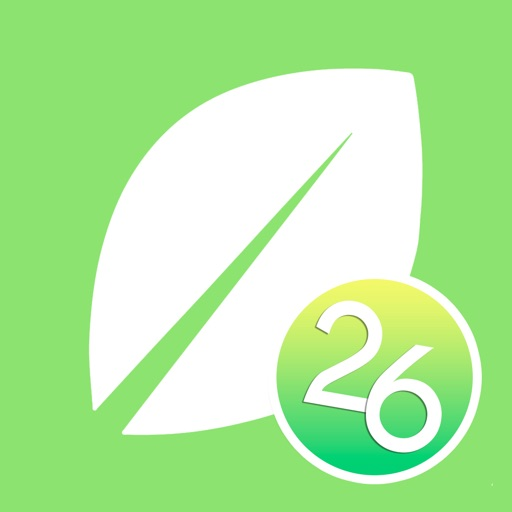

Emportez votre généalogie partout avec vous ! Très pratique lors d'événements familiaux ou généalogiques pour présenter la généalogie de la famille, montrer l'avancée de vos recherches, échanger des informations, mais aussi en collecter de nouvelles, en mode nomade, même sans connexion internet.

Il n’est pas nécessaire de posséder le logiciel Heredis pour utiliser la version mobile. Si vous possédez le logiciel Heredis 2026 pour ordinateur, vous aurez accès aux fonctionnalités d’importation et d'exportation de fichiers entre vos deux appareils, en plus du format GEDCOM.

Vous pouvez créer autant de généalogies que vous le souhaitez, sans limite d’individus, ou importer un fichier GEDCOM.  Simple à utiliser mais néanmoins complet quant aux informations que vous pouvez saisir, créez le premier personnage puis laissez vous guider !

Pour chaque individu, associez des photos que vous capturez immédiatement avec la caméra de votre appareil. Vous pouvez ainsi numériser et enregistrer portraits, photos de famille, actes d’état civil, archives historiques...

Partagez vos découvertes : choisissez votre thème d’arbre graphique, enregistrez-le au format PDF, imprimez-le ou envoyez-le par email. Très pratique pour rester près de toute sa famille !

Nouveautés de cette version :
• Patronymes multiples : saisissez des patronymes qui comprennent le nom du père et le nom de la mère conformément à la législation française ou espagnole en matière de noms.
• Étiquettes : vous pouvez désormais attribuer ou détacher des étiquettes de couleurs que vous avez déjà créées dans votre application Heredis. Les étiquettes de couleur des personnes s'affichent dans le noyau familial, l'arbre dynamique et les détails d'une personne.
• Mise en conformité avec les nouveaux systèmes d’exploitation.

Heredis conçoit des logiciels d'arbre généalogique depuis 30 ans. Avant-gardiste et révolutionnaire dans son approche, Heredis s'impose par ses choix technologiques innovants et ses solutions généalogiques entièrement adaptées aux besoins des utilisateurs. Afin de maintenir le meilleur logiciel possible, Heredis travaille en étroite collaboration avec ses utilisateurs.

Heredis est une société coopérative française, c'est-à-dire détenue par ses salariés. Elle se place dans la mouvance des entreprises qui défendent un modèle d’entreprise éco-responsable et socialement solidaire.
 
Compatible uniquement avec Heredis 2026
iOS : iOS 14 à 26

[View on Apple](https://apps.apple.com/fr/app/heredis-2026/id6748059803)

## Alpin Quest PRO – Outdoor GPS

Alpin Quest PRO – GPS Outdoor
Alpine Quest est une application avancée de navigation GPS et de gestion de terrain, conçue pour le personnel militaire, les ingénieurs géologues et géomètres, le personnel de terrain, les unités tactiques, les alpinistes, les chasseurs et les professionnels du tout-terrain. Elle est utilisée dans le monde entier avec une prise en charge de 32 langues. Using ArcGIS and QGIS project files.

UTILISATION MILITAIRE ET TACTIQUE
MGRS (Military Grid Reference System) — Prise en charge complète des coordonnées militaires

Systèmes de quadrillage USNG (United States National Grid) et UTM

Format horaire DTG (Date-Time Group) — heure Zulu et locale

Lignes de quadrillage militaire (superposition MGRS) sur la carte

Déplacement tactique et planification d'itinéraires

Fonctionnement entièrement hors ligne — sans réseau cellulaire

Toutes les données sur l'appareil — aucun transfert vers un serveur (sécurité opérationnelle)

GÉOLOGIE ET INGÉNIERIE TOPOGRAPHIQUE
Détermination et calcul des limites de zones à l'aide de polygones

Import/export de données de terrain KML/GPX/GeoJSON

Conversions de coordonnées MGRS et UTM

Couches cartographiques topographiques et satellite

Couches de courbes de niveau (isohypses) et d'ombrage du relief

Tracé des limites de parcelles/terrains par sélection multipoints

Format KML compatible avec le cadastre

Import de cartes géologiques personnalisées au format MBTiles

SYSTÈMES DE COORDONNÉES TACTIQUES
MGRS (Military Grid Reference System)

Formats UTM, USNG, QTH et LAT/LON décimal

Conversion de coordonnées en temps réel

SYSTÈME CARTOGRAPHIQUE AVANCÉ
Couches topographiques, satellite, routières et hybrides

Lignes de quadrillage militaire (superposition MGRS)

Téléchargement de cartes hors ligne pour les opérations de terrain

Import de cartes personnalisées au format MBTiles

Vue du terrain en 3D et profils d'altitude

GESTION DES CIBLES ET DES POINTS
Enregistrement et gestion illimités de points

Saisie manuelle de cibles avec coordonnées MGRS

Distance, azimut et heure d'arrivée estimée (ETA) en temps réel vers les cibles actives

Partage de points via des liens profonds dédiés

POINTS PHOTO
Documentez les points critiques avec des photos pendant les opérations.

PRISE EN CHARGE MULTIFORMAT
GPX (point, itinéraire, trace) — compatibilité militaire et civile

KML (Google Earth) — Point, LineString, Polygon, MultiGeometry

KMZ (KML compressé) — extraction automatique

GeoJSON — pour les cartes web modernes

Ouverture directe de fichiers depuis WhatsApp, Mail et Fichiers

Détection intelligente du format — dirige automatiquement les fichiers vers le bon onglet

SYSTÈME D'ITINÉRAIRES AVANCÉ
Tracé d'itinéraires tactiques sur la carte

Planification d'itinéraires multipoints

Édition complète des itinéraires — déplacer, supprimer ou ajouter des points

Édition du milieu de segment — ajoutez des courbes entre deux points

Alertes d'écart d'itinéraire et correction de cap

Mode déplacement — navigation active et enregistrement de trace intégrés

Export et partage d'itinéraires en GPX/KML

ENREGISTREMENT DE TRACES SUR LE TERRAIN
Enregistrement de trace en arrière-plan, sans interruption

Statistiques de vitesse, distance, altitude, montée/descente

Visualisez les traces enregistrées sur la carte

Naviguer avec une trace — utilisez les traces enregistrées comme itinéraires

Partage de traces (format GPX/KML)

Boussole numérique de haute précision

Indicateur d'écart de cap

DESSIN SUR LA CARTE
Utilisez l'outil de briefing pour dessiner à main levée.

GESTION DES ZONES
Création et édition de zones polygonales

Import automatique de zones depuis KML (compatible cadastre)

Calcul de superficie (m² / km² / acre / hectare)

OUTILS DE TERRAIN
Convertisseur de coordonnées (LAT/LON ↔ MGRS ↔ UTM)

Calculateur de superficie de polygone

Outil de mesure de distance

Gestion du cache de cartes hors ligne

Intégration météo

Outils d'analyse d'altitude et de pente

[View on Apple](https://apps.apple.com/fr/app/alpin-quest-pro-outdoor-gps/id6760764479)

## TeleGuard

Anonymität garantiert – keine Registrierung
Es gibt keine Bindung an eine Telefonnummer und keine Erfassung von Benutzeri-dentifikationsdaten. Die TeleGuard-ID ist Ihre ganz persönliche Identifikationsnummer, die Sie brauchen, um sich mit Ihren Freunden zu verbinden. Jeder TeleGuard Nutzer erhält eine ID Nummer und einen QR-Code, welche zur Kontaktaufnahme verschickt werden können. 

Entworfen, um der sicherste Messenger der Welt zu sein
Der Fokus von TeleGuard liegt auf dem Schutz von Privatsphäre und vertraulicher Kommunikation. TeleGuard ist der datensichere Messenger aus dem Hause Swisscows. Swisscows hat es sich zur Aufgabe gemacht, seine Nutzer in jeder Lage vor Datenmissbrauch zu bewahren. Da heutzutage das Smartphone das meistgenutz-te Medium der Welt ist, ist ein sicherer Messenger unverzichtbar. 

Hochsicherer und moderner Server
Alle Server befinden sich in den Rechenzentren der Schweiz. Es wird ein komplexes Verschlüsselungssystem für alle übertragenen Daten verwendet und es werden abso-lut keine Benutzerdaten auf den Servern gespeichert. Alles ist absolut anonym. 

Darum ist TeleGuard besser als die anderen
TeleGuard verschlüsselt jede Nachricht und alle Telefongespräche mit dem besten Verschlüsselungsprogramm, was es derzeit gibt: SALSA 20. Da unsere Server in der Schweiz stehen, unterstehen wir nicht den Datenschutzgesetzen der EU / USA und müssen keine Daten weitergeben.

Wie wird meine Privatsphäre gesichert? 
HTTPS, Ende-zu-Ende-Verschlüsselung, Löschen von Nachrichten auf dem Server nach dem Lesen. Es werden keinerlei Benutzerdaten, weder IP-Adresse noch andere, erfasst oder gespeichert.

Funktionen

•	Text- und Sprachnachrichten senden
•	Bilder und Videos teilen
•	Video- und Sprachtelefonie
•	Dateien senden
•	Gruppen erstellen
•	Die Identität von Kontakten kann durch Scannen des QR-Codes verifiziert werden.

Support

Bei weiteren Fragen finden Sie hier unsere FAQs: teleguard.com/de#faq

[View on Apple](https://apps.apple.com/fr/app/teleguard/id1505636751)

## Monash FODMAP Diet

Die Wissenschaftler der Monash University haben die FODMAP-arme Diät und eine zugehörige App entwickelt, um bei der Behandlung von Magen-Darm-Beschwerden im Zusammenhang mit dem Reizdarmsyndrom zu helfen. Die FODMAP-Diät der Monash University funktioniert, indem sie Lebensmittel mit hohem Gehalt an fermentierbaren Kohlenhydraten (FODMAPs) gegen Alternativen mit niedrigem FODMAP-Wert austauscht. Etwa 75 % der Menschen mit Reizdarm erleben eine Symptomlinderung bei einer FODMAP-armen Diät.

Die App kommt direkt vom Forschungsteam der Monash University und beinhaltet Folgendes:

- Allgemeine Informationen über die FODMAP-Diät und Reizdarm.
- Leicht verständliche Anleitungen, die Sie durch die App und die 3-stufige FODMAP-Diät führen.
- Ein Lebensmittel-Leitfaden, der den FODMAP-Gehalt für Hunderte von Lebensmitteln mit einem einfachen „Ampelsystem“ beschreibt.. 
- Eine Liste von Markenprodukten, die von Monash als FODMAP-arm zertifiziert wurden..
- Eine Sammlung von über 70 nahrhaften, FODMAP-armen Rezepten.. 
- Funktionen, mit denen Sie Ihre eigene Einkaufsliste erstellen und Notizen zu einzelnen Lebensmitteln hinzufügen können.
- Ein Tagebuch, mit dem Sie verzehrte Lebensmittel, Reizdarm-Symptome, Darmverhalten und Stressniveaus erfassen können. Das Tagebuch führt Sie auch durch Schritt 2 der Diät – erneute Einführung von FODMAPs in die Ernährung.
- Die Möglichkeit, Maßeinheiten (metrisch oder imperial) einzustellen und die Hilfe bei Farbenblindheit zu aktivieren.

[View on Apple](https://apps.apple.com/fr/app/monash-fodmap-diet/id586149216)

## Babyphone 3G

Kein Abo. Keine monatlichen Gebühren.
Babyphone 3G kaufen Sie einmal – und nutzen es immer dann, wenn Sie es brauchen.

Machen Sie aus zwei iPhones/iPads ein zuverlässiges Video- und Audio-Babyphone. Es funktioniert über WLAN und Mobilfunk (LTE/5G), ist in wenigen Minuten eingerichtet und begleitet Sie überall – zu Hause und unterwegs.

Darum Babyphone 3G
	•	Einmal zahlen – kein Abo, keine laufenden Kosten
	•	Überall erreichbar – WLAN oder Mobilfunk, unbegrenzte Reichweite
	•	Sicher & privat – verschlüsselte Verbindung zwischen Ihren Geräten
	•	Schnell startklar – einfache Kopplung, einfache Bedienung
	•	Zuverlässige Alarme – hören Sie jedes Geräusch, erhalten Sie Benachrichtigungen

Für den Alltag gemacht

Zu Hause
Nutzen Sie ein altes iPhone/iPad als Baby-Gerät und Ihr aktuelles Smartphone als Eltern-Gerät.

Unterwegs
Hotel, Ferienwohnung, Besuch bei Familie – wenn WLAN schwach ist, hilft Mobilfunk.

Mehr Ruhe
Live-Bild und Ton, Nachtmodus und Benachrichtigungen geben Ihnen Sicherheit, wenn Ihr Baby schläft.

Wichtige Funktionen
	•	Live-HD-Video und klarer Ton
	•	Nachtmodus und Bildschirm dimmen
	•	Push-Benachrichtigungen und Vibrationsalarm
	•	Gegensprechen (beruhigen Sie Ihr Baby aus der Ferne)
	•	Audio im Hintergrund (während Sie andere Apps nutzen)
	•	Mehrere Eltern-Geräte (teilen mit Partner/Familie)
	•	Einstellbare Empfindlichkeit und Alarm-Optionen

Datenschutz & Sicherheit
	•	Verschlüsselte Verbindung zwischen Ihren Geräten
	•	Kein öffentliches Streaming
	•	Keine Registrierung erforderlich (kein Konto nötig)

Kompatibilität

Funktioniert auf iPhone und iPad.
Hinweis: iOS- und macOS-Version werden separat verkauft.

[View on Apple](https://apps.apple.com/fr/app/baby-phone-3g/id490077681)

## Wagotabi : Cours de japonais

Wagotabi est votre compagnon quotidien pour apprendre le japonais à partir de zéro, à votre rythme et avec une immersion maximale. Apprenez à lire, écrire et comprendre le japonais en contexte, tout en retenant les Hiragana, Katakana et Kanji. Utilisez vos compétences en japonais pour progresser dans l'aventure proposée par ce jeu éducatif.

Conçu en étroite collaboration avec plus de 300 professeurs de japonais, associations touristiques officielles de préfectures japonaises et des milliers de testeurs, Wagotabi vous propose une approche immersive inédite pour l'apprentissage de la langue. Nous vous fournissons un contenu adapté à votre niveau actuel. Les mots et les points de grammaire sont introduits selon les standards du JLPT, en commençant par le niveau N5.

—

◆ DÉBUTEZ de zéro : le jeu est adapté aux débutants : aucune connaissance initiale du japonais n'est nécessaire. Les concepts sont introduits peu à peu et utilisés immédiatement dans le jeu. Les faux-débutants progresseront plus vite et apprécieront tout autant le jeu.
◆ VOYAGEZ au Japon : explorez de vraies villes, apprenez à vous présenter, à commander de la nourriture, à demander votre chemin aux habitants et à découvrir des secrets cachés !
◆ COLLECTIONNEZ de nouveaux mots, Kana, Kanji et obtenez des explications détaillées sur la grammaire et la conjugaison. Fini les listes de Kana, Kanji et vocabulaire surchargées et inutilisables !
◆ DÉFIEZ les grands maîtres du japonais dans leur château pour gagner leur respect !
◆ PARTAGEZ vos meilleurs scores aux mini-jeux de Kana et de Kanji avec d'autres apprenants sur le tableau de classement !
◆ PERSONNALISEZ votre expérience d'apprentissage : tirez parti de notre outil SRS (répétition espacée), conçu pour cibler vos points faibles, créez votre propre avatar, réglez la difficulté du jeu. C'est votre voyage d'apprentissage de la langue japonaise.
◆ PROFITEZ d'une expérience sans publicité et sans achat in-app, le jeu peut être entièrement joué hors ligne !

—

Liste (non exhaustive) des fonctionnalités :
Dictionnaire interactif (avec illustrations, tags etc.), explications grammaticales claires, infobulles interactives, entièrement vocalisé, tests intelligents gérés par SRS, interactions avec l'environnement, quêtes, 2 mini-jeux (Kana et Kanji), combats de boss, ordre des traits Hiragana / Katakana / Kanji et calligraphie, Kanjidex, Kanji similaires, conjugaison, sauvegarde en ligne, outils avancés pour le suivi de votre progression....

—
Le jeu est en développement constant, avec des mises à jour régulières ajoutant du nouveau contenu.
Contenu actuellement disponible :
+400 mots et points de grammaire soigneusement sélectionnés
+195 Kanji
+600 phrases exemple
+2600 dialogues japonais vocalisés
+350 PNJ uniques dans le jeu
Tous les mots / points de grammaire sont utilisés au maximum et en contexte pour une meilleure rétention.

—

L’avis de nos premiers testeurs sur Wagotabi :
"C’est une bénédiction d’avoir une telle application sur le marché de l'apprentissage !"
"J'ai utilisé certains des exemples de l'application pour mes cours et mes élèves réagissent très bien."
"Je n'ai pas le budget nécessaire pour me rendre au Japon, mais je suis totalement immergé dans ce jeu, j'apprends efficacement et je constate mes progrès quotidiennement."
"Grâce à cette application, mes enfants sont maintenant motivés pour apprendre le japonais et renouer avec leurs racines. Ce concept est tellement Kawaii !"
"Je prépare un voyage au Japon et je vais certainement aller voir ces endroits que j'ai déjà visités dans le jeu."

—

Politique de confidentialité : https://www.wagotabi.com/privacy-policy
Conditions d'utilisation : https://www.wagotabi.com/terms-of-service

[View on Apple](https://apps.apple.com/fr/app/wagotabi-cours-de-japonais/id6474207287)

## PhotoPills

Entdecke wie einfach es ist Sonne, Mond oder Milchstraße weltweit zu fotografieren!

Ob erfahrener Fotograf, professioneller Videofilmer oder Neuling, PhotoPills sorgt dafür, dass du die Konzeption, Planung und Aufnahme von einzigartigen Bildern lieben wirst.

* Alles in einer einzigen App
Der erste 2D-kartenbasierte Sonne-, Mond- und Milchstraße-Planer - Schnellsuche von Sonne-, Mondkonstellationen - 3D-Augmented Reality: Sonne, Mond, Milchstraße, Himmelsäquator, Polarstern, Tiefenschärfe, Blickfeld - Fotoplaner - Tool zur Suche von Aufnahmeorten - Informationen: Sonnenauf/-untergang, Dämmerung, Goldene Stunde, Blaue Stunde - Informationen: Mondauf/-untergang, Supermondtermine, Mondkalender - Rechner: Zeitraffer, Sterne erkennen, Sternspuren, lange Belichtungszeiten, hyperfokale Tabellen, Tiefenschärfe, Blickfeld, Entfernung zum Motiv, Brennweite-Einstellung - Komplette Anleitung und vieles mehr...

* von Profis empfohlen
"PhotoPills - ein unersetzbares Werkzeug, das ich zur Planung jeder Aufnahme benutze." – Mark Gee, Astronomie-Fotograf des Jahres
“Ein Werkzeug, das jeder Fotograf haben sollte” – Kevin Raber, Luminous-landscape.com
"Es zahlt sich aus! Dank diesem Tool können wir immer wieder tolle Aufnahmen schnell planen; Bietet die besten Möglichkeiten, um kreativer vorzugehen."- José B. Ruiz, Innovationspreis, Naturfotograf des Jahres

* Übernimm die Kontrolle
Warst du schon einmal an einem Ort und hast dir gedacht: "Schade, der Mond ist nicht genau da, ... das wäre ein hervorragendes Foto!"? Und die Sonne? Und die Milchstraße? Lasse deiner Fantasie freien Lauf und berechne, wann genau das passiert:

- Stellen dir vor: die Milchstraße erscheint über eine zauberhafte Landschaft, der Vollmond geht unter einem geheimen Steinbogen unter, ein Sonnenaufgang zwischen zwei riesigen Felsen an einem Traumstrand, ein Sonnenuntergang über der Hauptstraße in deiner Heimatstadt oder ein spektakulärer Vollmond hinter einem nahe gelegenen Hügel.
- Plane: Einfach das Datum und die Uhrzeit der gewünschten Szene berechnen und effektiver arbeiten!
- Fotografiere: Geh einfach raus, tauche in die Natur ein und genieße es den perfekte Moment festzuhalten!

* Keine Enttäuschungen!
Berechne schnell, ob das Foto möglich ist oder nicht. Verschwende keine kostbare Zeit mehr mit langen Nachforschungen.

* Verpasse nie wieder die perfekte Szene
Erstelle eine To-Do-Liste von geplanten Fotos und fahre zum richtigen Zeitpunkt zum Aufnahmeort.

* Mach es perfekt
Wähle den perfekten Bildausschnitt schon vor der Aufnahme aus. Durch die 3D-Augmented Reality siehst du, ob die Sonne, der Mond, die Milchstraße, der Himmelsäquator und der Polarstern sich an der gewünschten Position befinden, wenn du den Auslöser drückst.

* Entdecke tolle Orte und füge sie zu deiner persönlichen Datenbank hinzu
Nutze PhotoPills, um einen Ort als POI zu speichern. Füge anschauliche Fotos und Notizen hinzu.

* Fokussiere dich auf deine Kreativität; überlasse das Rechnen den Nerds
- Berechne: Zeitraffer-Einstellungen, Langzeitbelichtungen, Sternspuren, die max. Belichtungszeit um Sterne als Punkte zu erfassen, Einstellungen für einen gewünschten Schärfegrad, Einstellungen für ein gewünschtes Sichtfeld, Objektivauswahl und Motivabstand für deinen Bildausschnitt, min. Abstand zum Motiv, entspr. Brennweite des Objektivs zur Reproduktion des Blickwinkels usw.
- Prognose: Positionen von Sonne, Mond, Milchstraße, Himmelsäquator und Polarstern.

* Teile deine Ergebnisse
Egal ob du deine Ergebnisse deinen Freunden, der Familie oder der ganzen Welt zeigen willst: PhotoPills hilft dir dabei. Teile deine Pläne, geheimen Orte und all die anderen Planungen auf Facebook, Twitter oder beiden in nur wenigen Schritten.

* Triff andere Fotografen
Teile deine Pläne und Orte via E-Mail. Lade deine Freunde ein dabei zu sein. Andere PhotoPillers können deine Planungen importieren und selbst betrachten.

Worauf wartest du? Hol dir PhotoPills gleich jetzt und mache wirklich einzigartig Aufnahmen!

[View on Apple](https://apps.apple.com/fr/app/photopills/id596026805)

## FL Studio Mobile

Create and save complete multi-track music projects on your iPad, iPhone or Mac. Record, sequence, edit, mix and render complete songs.

FEATURE HIGHLIGHTS

* Audio recording, track-length stem/wav import
* Browse sample and presets with preview
* Effects modules (see Included Content)
* Full-screen MacBook and iMac Trackpad and Mouse support.
* High quality synthesizers, sampler, drum kits & sliced-loop beats
* Instrument modules (see Included Content)
* Load projects in the FL STUDIO** FREE Plugin version of this App
* MIDI controller support (class compliant). Automation support.
* MIDI file import and Export (Single-track or Multi-track)
* Mixer: Per-track mute, solo, effect bus, pan and volume adjustment
* Piano roll. Edit notes or capture recorded performances.
* Save and load WAV, MP3, AAC*, FLAC, MIDI
* Share your songs via Wi-Fi or Cloud to other Mobile 3 installations
* Step sequencer
* User interface configurable with all screen resolutions and sizes.
* Virtual piano-keyboard & Drumpads
* IAA App support (In/Out), Audiobus support (In/Out)
* Audio recording (external and internal sources)
* Share your songs via Sync to other Mobile 3 devices / installations
* Load your projects in the FL STUDIO* FREE 'Plugin' Version of this App#

IN APP PURCHASES & INCLUDED CONTENT

FL Studio Mobile includes in-app purchases for the DirectWave sample player. You can install your own samples and don’t need to buy content.

All Instrument modules are included: Drum Sampler, DirectWave Sample Player, GMS (Groove Machine Synth), Transistor Bass, MiniSynth & SuperSaw.

All Effect modules are included: Analyzer (visual), Auto Ducker, Auto-Pitch (pitch correction), Chorus, Compressor, Limiter, Distortion, Parametric Equalizer, Graphic Equalizer, Flanger, Reverb, Tuner (Guitar/Vocal/Inst), High-Pass/Low-Pass/Band-Pass/Formant (Vox) Filters, Delays, Phaser and Stereoizer.

Included Drum Samples: Cymbals, Hats, Kicks, Snares, Toms, Percussion, Risers, SFX

Included DirectWave Instruments: Guitars, Keyboards, Orchestral, Synth, Bass, Synth Keyboards, Synth Leads, Synth Pads, Sliced, Drums, Drum Kits and Effects.

Included MiniSynth Presets: Bass, Keys, Leads, Pads, SFX, Synths

Included SuperSaw Presets: Arps, Bass, Bells, SFX, Leads, Pads, Sequences, Synths

WANT TO TRY BEFORE YOU BUY?

Install FL STUDIO 20 for macOS / Windows and you can use the FL Studio Mobile Plugin. This is identical to the App, as a plugin inside FL Studio. Get it here: http://www.image-line.com/downloads/flstudiodownload.html

MANUAL / TRAINING / VIDEOS

http://support.image-line.com/redirect/flstudiomobile_help
http://support.image-line.com/redirect/flstudiomobile_videos

SUPPORT

Please help us to help you! In the App, tap 'Help > Users & Support Forums' to register FL Studio Mobile to your Image-Line account and gain access to the forum. You can then report bugs, make feature requests and access free downloadable content: http://support.image-line.com/redirect/flmobile_forum

[View on Apple](https://apps.apple.com/fr/app/fl-studio-mobile/id432850619)

## AutoSleep - 苹果手表睡眠监测，睡觉记录及智能闹钟

使用手表来自动追踪您的睡眠*。无需按动任何按钮，无需安装任何手表应用，只要安稳睡觉就好！

关于 AutoSleep
-----------------
使用先进的启发式应用 AutoSleep 来计算您的睡眠时长。

如果您戴上手表睡觉，您什么都不需要做。AutoSleep 会自动监控您的睡眠时长与质量并在您早晨第一次解锁手机后给你发送通知。

即使您不带着手表睡觉, AutoSleep 也可以计算您在床上的时间。这非常简单。

因为人总是各异的，AutoSleep 提供了微调选项，您可以通过简单地滑动滑块来调整自己的睡眠活跃度检测级别并可以很快速地看到睡眠时钟的统计变化。它还允许您自定义睡眠窗口, 是否需要每日通知以及在睡眠时钟上显示更多或更少的信息。 

与 Apple 睡眠阶段应用完全集成，使您可以选择使用 Apple 睡眠应用并在 AutoSleep 中查看所有信息。

AutoSleep 包括睡眠监控所需的所有信息和功能，包括：
睡眠时间 – 睡眠时长和睡眠银行余额
睡眠评分 – 对您睡眠的综合评分
睡眠环 – 用高质量的睡眠填充您的睡眠环，包括心率、深度睡眠和快速动眼
Apple 睡眠阶段 – 可使用 Apple 睡眠应用中数据的选项
睡眠呼吸暂停 - 了解您是否患有睡眠呼吸暂停
睡眠血氧 – 睡眠时的测量值
呼吸频率 – 记录您每分钟的呼吸
噪声 – 环境噪声测量值
睡眠分析 – 查看您的睡眠周期的详细图表和细分情况
睡眠燃料 – 衡量您的睡眠质量和效率
今晚就寝时间 – 根据您的习惯推荐您最近的就寝时间
就绪 – 表示您的身体和精神压力
温度 – 跟踪您睡眠时的手腕温度
睡眠一致性 – 了解您的就寝时间习惯
熄灯 – 跟踪入睡时间
实时睡眠跟踪 – 查看您夜间的睡眠统计信息
智能闹钟 – Watch 内置的智能闹钟，帮助您从较浅的睡眠中醒来
小组件 – 各种各样超棒的 iPhone 小组件
复杂功能 – 多种 Watch 表盘选项
HomeKit – 与 Apple HomeKit 完全集成
表情符号和笔记 – 记录对睡眠时段的评论和标签
探索 – 深入分析视图
Siri – 通过 Siri 语音指令使用
快捷方式 – 创建您自己用于 AutoSleep 的快捷方式
调整 – 调整您个人睡眠/醒来检测的简单功能
历史 – 高级图表和趋势
配置 – 更改主题并设计您的时钟睡眠环
设置 – 定制您的睡眠目标、设置通知和提醒
导出 – 导出选项以保存数据

AutoSleep 可以与 HeartWatch 联动，它是我们首推的心跳与活动检测应用。AutoSleep 会将您的睡眠信息记入健康应用中。 

*需要运行 Watch OS 4 或更高版本的 Apple Watch。

- 2018年度最佳
https://apps.apple.com/story/id1438574124/

- 2019年度最佳
https://apps.apple.com/story/id1484100916/

- 2020年度最佳
https://apps.apple.com/story/id1535572713/

- 2021年度最佳
https://apps.apple.com/story/id1591083005/

- 2022年度最佳
https://apps.apple.com/story/id1654240446

- 2023年度最佳
https://apps.apple.com/story/id1719170110

[View on Apple](https://apps.apple.com/fr/app/autosleep-tracker-de-sommeil/id1164801111)

## AutoSnore: 鼾声记录器

通过 iPhone 自动追踪您的鼾声和睡眠声音，无需订阅费！ 只需轻点开始按钮，然后安心入睡。

实力团队匠心打造
-------------
由广受欢迎的 AutoSleep App 原班团队开发，以全新创新方案助力用户掌控睡眠、改善健康。

诚信软件，良心定价
--------------------
无订阅机制。 无额外 App 内购买。 无后续费用。 一次性低价购买，即可终身使用。 包括所有功能。

简单易用
-------------
您只需要一部 iPhone。 只需启动 AutoSnore 并将手机放在床边。 醒来后即可聆听录音并查看洞见，就是这么简单。

为什么选择 AutoSnore？
-------------
睡眠弥足珍贵。全球近一半成年人受打鼾问题困扰（而大多数人甚至不自知）。是时候认真对待这个问题了。 打鼾会对睡眠质量产生严重影响，不仅会影响打鼾者本人，也会干扰同床伴侣的休息。

AutoSnore 有什么作用？
-------------
AutoSnore 可记录各种打鼾和睡眠声音，包括每次打鼾的频率、强度和持续时间，全面呈现每晚的打鼾情况。早上醒来时，系统会提供可视化分析图表，帮助您了解打鼾对整体睡眠质量的影响。

高级声音识别
-------------
AutoSnore 利用机器学习声音识别技术，可以对您所有的睡眠声音进行分类，例如打鼾、梦呓、打哈欠、咳嗽等等！这真是太神奇了。

它能帮到我吗？
-------------
当然可以！ AutoSnore 支持个性化策略跟踪，帮助您尝试各种改善方法： 无论是改变生活方式、调整睡姿、更换枕头、尝试放松技巧，还是避免晚餐时饮酒，该 App 都能帮助用户尝试不同的方法，找到最适合自己的解决方案。

AutoSleep 集成
-------------
与 AutoSleep 应用程序完美配合，您的打鼾数据可自动与睡眠分析同步！

全面保护隐私
-------------
与我们所有的 App 一样，AutoSnore 将用户隐私和数据安全放在首位。 请对比下方的 App 隐私标签，查看“未收集数据”。 您可以查看其他所谓“免费”打鼾 App，看它们能否做到同样承诺：

无数据分析跟踪。 无广告插件。 无第三方代码。 无数据上传。 所有录音数据和洞见仅安全地保存在您的设备上。 只有用户可以选择与其他人分享录音。 这才是隐私保护该达到的标准。

立即开始使用
-----------------
越早开始收集数据，就能越早进行管理。

对于任何想要改善睡眠和整体健康的人来说，AutoSnore 都是一款必备 App。 其采用独特的 App 设计方法，摒弃一切冗余，直击问题核心，同时不让您花费过多。

AutoSnore并非医疗器械。如有任何健康问题或疑虑，请务必咨询专业医疗人员。

Xiaohongshu
https://xhslink.com/m/2jNT7YK0hDk

Weixin
https://mp.weixin.qq.com/s/VG_LflL7y0QYrdOIrpRlLw

[View on Apple](https://apps.apple.com/fr/app/autosnore-appli-ronflement/id6746705608)

## MapOut

«Ein Hingucker ist auch die 3-D-Ansicht, bei der die Berge quasi plastisch hervortreten.» – Tages-Anzeiger

«MapOut saves the day by using a simple interface to draw routes, and check out elevation profiles… I’m pretty blown away by its capabilities.» – Alee from cyclingabout.com

Offline Landkarte der Welt für iPhone und iPad. Fast so schön wie eine Papierkarte – nur vielfältiger.
- für Wanderer: mit gut lesbarer Darstellung der Geländeform, auch im hintersten Winkel ohne Internet 
- für Velofahrer: mit Velorouten-Netz, Geschwindigkeits- und Distanzanzeige
- für Stadtreisende: Stadtpläne mit Touristik-Informationen
- für Geniesser: einfach schön anzuschauen

3D Neige-Ansicht
- Neige das Gerät in beliebige Richtungen um einen besseren Eindruck des Geländes zu erhalten. Mehr Info auf https://mapout.app.

Suchfunktion
- Suche nach Orten, Strassen, Berge, usw. Es wird dazu keine Internetverbindung benötigt.

Kartenmaterial
- MapOut basiert auf dem OpenStreetMap-Projekt, dem «Wikipedia der Karten» – Korrekturen und Ergänzungen kannst Du selber auf OpenStreetMap.org vornehmen. Mit periodischen Updates werden jeweils aktuelle Karten ausgeliefert.
- Lade die Regionen Deiner Wahl herunter - die Karten sind nun ohne Internetverbindung anzeigbar (Offline-Karte).

Touren
- Zeichnen: Zeichne Deine eigenen Touren und Wegpunkte direkt auf die Karte. Retuschiere existierende Touren und importierte GPX Dateien oder lass sie direkt auf das Wegnetz schnappen
- Importieren: mit einem gratis «MapOut.me» Konto können «Wegbeschreibungen» per Email an dein Gerät gesendet werden. GPS-Touren findest du als gpx or kml Dateien auf vielen Webseiten mit Tipps zum Wandern oder Biken (z.B. auf www.gpsies.com)
- Aufnehmen: mache «Aufnahmen» deiner eigenen Touren und teile sie mit Freunden. 
- Informationen: schnelle Übersicht zu jeder Tour – Länge, Höhendifferenz, Kartenausschnitt und Streckenprofil

Kartenbild
- Schnelle Kartendarstellung (OpenGL beschleunigt)
- Stufenfreier Zoom, immer eine pixelperfekte Karte
- Topographische Karte mit Höhenlinien und Schattierung
- Wählbare Overlays: Velo/Wander/Ski Routen, Sehenswürdigkeiten, öffentlicher Verkehr

Finde alle Antworten auf Deine Fragen in unserem Benutzerhandbuch: https://mapout.app/manual

Kartendaten © OpenStreetMap Mitwirkende (http://www.openstreetmap.org/copyright)

[View on Apple](https://apps.apple.com/fr/app/mapout/id477094081)

## iReal Pro

iReal Pro réunit deux choses que les musiciens adorent en une seule app : un groupe d’accompagnement au son réaliste qui joue avec vous, et une énorme bibliothèque gratuite de grilles d’accords consultables à tout moment — en répétition, en jam session ou sur scène. Besoin de transposer un morceau pour un chanteur ? C’est fait. Envie de jouer avec une section rythmique complète derrière vous ? Appuyez sur play.

Désignée parmi les 50 Meilleures Inventions du TIME Magazine et utilisée par des milliers d’étudiants, professeurs et pros dans des écoles comme le Berklee College of Music — iReal Pro aide les musiciens à progresser depuis 2008.

GROUPE
• 50 styles d’accompagnement — Swing, Bossa Nova, Blues, Funk, Rock, Bluegrass, Reggae, Latin, Gypsy Jazz, Country et bien d’autres
• Personnalisez chaque style avec piano acoustique ou électrique, Fender Rhodes, guitares, contrebasse ou basse électrique, batterie, vibraphone et orgue
• 40 styles supplémentaires — blues, salsa, brésiliens — disponibles en achats intégrés

RECUEIL
• Téléchargez des milliers de grilles d’accords gratuites partagées par la communauté iReal Pro
• Créez vos propres grilles en quelques minutes avec l’éditeur intégré
• Organisez les grilles en listes pour vos concerts, sets ou cours

PRATIQUE
• Ajustez le tempo, bouclez les passages difficiles, transposez dans n’importe quelle tonalité
• Accélération automatique du tempo et cycle de tonalités pour un travail ciblé
• Transposition globale pour les instruments en Mib, Sib, Fa et Sol

ACCORDS
• Doigtés de guitare, ukulélé et piano pour chaque accord
• Touchez n’importe quel accord dans votre grille pour voir comment il se joue
• Suggestions de gammes pour l’improvisation

PARTAGER
• Partagez grilles et listes avec d’autres utilisateurs iReal Pro
• Exportez les grilles en PDF ou MusicXML
• Exportez les morceaux d’accompagnement en fichiers audio ou MIDI
• Synchronisez entre iPhone, iPad et Mac avec iCloud

POUR LES PROFS
• Créez des listes d’exercices ou de morceaux pour vos élèves
• Utilisez en classe, en direct ou en partage d’écran lors de cours en ligne

Nous sommes une petite équipe de musiciens qui avons créé cette app parce que nous en avions besoin nous-mêmes. Nous espérons que vous l’apprécierez autant que nous.

[View on Apple](https://apps.apple.com/fr/app/ireal-pro/id298206806)

## HealthFit

Verwandle deine Apple Watch in eine umfassende Trainingsplattform.

HealthFit verwandelt die in Apple Health gespeicherten Trainings- und Gesundheitsdaten in fortschrittliche Fitnessmetriken, Trainingsanalysen und eine nahtlose Synchronisierung deiner Workouts – ganz ohne Benutzerkonto.

Egal, ob du für deinen nächsten Wettkampf trainierst, deine Fitness verbessern oder einfach aktiv bleiben möchtest – HealthFit hilft dir, deine Fortschritte zu verstehen, dein Training zu optimieren und deine Ziele zu erreichen.

INTELLIGENTER TRAINIEREN

HealthFit hilft dir dabei, Folgendes zu verstehen:

• Trainingsbelastung
• Fitness (CTL), Ermüdung (ATL) und Form (TSB)
• Trainingsbelastungsverhältnis
• Herzfrequenzzonen und Trainingsverteilung
• Jahresvergleiche und Trends
• Explorer Score und Trainings-Heatmaps

Diese Metriken und Analysen sind normalerweise professionellen Trainingsplattformen vorbehalten.

ALLES AN EINEM ORT

Verfolge Trainingsbelastung, Fitnessentwicklung, Gesundheitsmetriken und deinen gesamten Trainingsverlauf über ein einziges Dashboard.

EIN BESSERER AKTIVITÄTSFEED

Durchsuche deine Workouts mit Karten, Fotos und den wichtigsten Kennzahlen auf einen Blick.

• Anpassbare Herzfrequenzzonen
• Verfolgung der Trainingsbelastung
• Ausrüstungsverfolgung (Schuhe, Fahrräder und mehr)
• Analyse von Höhenmetern, Tempo, Leistung und Kadenz
• Detaillierte Diagramme und Leistungstrends

HealthFit kann automatisch Fotos zuordnen, die während deiner Workouts aufgenommen wurden.

LEISTUNGSANALYSE

Analysiere deine Lauf- und Radleistung mit:

• Geschätzte kritische Leistung
• Gewichtete Durchschnittsleistung
• Mean-Maximal-Power-Kurven
• Leistungsverteilung
• Historische Leistungstrends

GESUNDHEITSMETRIKEN FÜR ATHLETEN

• Herzfrequenzvariabilität (HRV)
• Ruheherzfrequenz
• Kardiorespiratorische Fitness (VO₂max)
• Schlafmetriken
• Gewicht, BMI und Körperfettanteil
• Baevsky-Stressindex

FÜR JEDE SPORTART GEEIGNET

HealthFit unterstützt alle Aktivitätstypen und passt Statistiken, Diagramme und Analysen automatisch an deine häufigsten Aktivitäten an.

AUTOMATISCHE WORKOUT-SYNCHRONISIERUNG

HealthFit synchronisiert deine Workouts automatisch im Hintergrund mit deinen bevorzugten Fitnessplattformen.

Jedes mit der Apple Watch aufgezeichnete Workout wird automatisch hochgeladen – ohne manuelle Exporte und ohne zusätzliche Schritte.

Du kannst sogar deinen gesamten Trainingsverlauf synchronisieren.

MULTISPORT-UNTERSTÜTZUNG

HealthFit unterstützt Multisport- und Intervalltrainings vollständig und kann Multisport-Aktivitäten als echte Multi-Session-Aktivitäten exportieren.

DEINE DATEN GEHÖREN DIR

Kein Benutzerkonto erforderlich. Keine Anmeldung erforderlich.

HealthFit arbeitet direkt mit Apple Health und speichert deine Daten auf deinem Gerät.

VERBINDET SICH MIT DEINEN LIEBLINGS-FITNESSPLATTFORMEN

Strava, TrainingPeaks, Final Surge, Selfloops, Smashrun, Ride with GPS, Cycling Analytics, Today's Plan, Runalyze, Suunto, 2PEAK, Komoot, COROS, Intervals.icu, Nolio, TrainAsONE, Tredict, Stages Link, Map My Tracks und Xhale.

Exportiere detaillierte Trainingsberichte im Markdown-Format mit Diagrammen, Karten und Analysen oder exportiere deine Daten in den Formaten FIT, GPX, CSV und Google Sheets.

Nutzungsbedingungen:
https://www.apple.com/legal/internet-services/itunes/dev/stdeula/

[View on Apple](https://apps.apple.com/fr/app/healthfit/id1202650514)

## Things 3

So kriegst du alles geregelt! Mit der preisgekrönten Things-App planst du deinen Tag, verwaltest Projekte und arbeitest effizient auf deine Ziele hin.

Und das Beste: Sie ist ganz einfach zu verwenden. Im Handumdrehen ordnest du deine Gedanken und Aufgaben – von alltäglichen Erledigungen bis hin zu den größten Lebenszielen – und kannst dich mit freiem Kopf ganz darauf konzentrieren, was heute für dich zählt.

„Von allen getesteten Apps bietet Things das beste Gesamtpaket aus Design und Funktionalität – mit beinahe allen Features anderer Profi-Apps und einer stilsicher gestalteten Oberfläche, die bei der Arbeit nie in die Quere kommt.“
– Wirecutter, The New York Times

WICHTIGSTE MERKMALE

• Deine Aufgaben
In Things dreht sich alles um Aufgaben. Immer, wenn du eine erledigst, ist das ein kleiner Schritt zu einem großen Erfolg. Teile große Aufgaben in kleinere auf. Kläre die nötigen Details mit Notizen. Kategorisiere sie mithilfe von Tags. Und mach dir einen Plan für die nächsten Tage.

• Deine Projekte
Erstelle ein Projekt für jedes deiner großen Ziele. Things hilft dir, den nächsten Schritt klar zu sehen. Behalte den Überblick dank Überschriften, Notizen und Deadlines. So bleibst du stets auf Kurs.

• Deine Bereiche
Erstelle einen Bereich für jeden Aspekt deines Lebens, der dir wichtig ist. Zum Beispiel für Arbeit, Familie, Gesundheit oder Finanzen. So bleibt alles sauber geordnet und du behältst das große Ganze im Blick.

• Dein Plan
Die Listen „Heute“ und „Geplant“ zeigen übersichtlich deine geplanten Aufgaben zusammen mit deinen Kalender-Einträgen. So siehst du jeden Morgen mit einem Blick, was an diesem Tag ansteht.

WEITERE GENIALE FEATURES

Wenn du mit Things arbeitest, wirst du auf weitere hilfreiche Funktionen stoßen. Hier nur einige davon:

• Erinnerungen – stelle eine Zeit ein, und Things erinnert dich.
• Wiederholungen – wiederhole Aufgaben automatisch im eingestellten Rhythmus.
• Heute Abend – ein Feature speziell für deine Abendplanung.
• Kalender-Integration – lass Kalender-Ereignisse und Aufgaben kombiniert anzeigen.
• Tags – kategorisiere Aufgaben und filtere Listen im Handumdrehen.
• Schnellsuche – finde sofort Aufgaben oder wechsle zwischen Listen.
• Magic Plus – ziehe die „+“-Taste, um Aufgaben an einer beliebigen Stelle einer Liste hinzuzufügen.
• Per E-Mail an Things – leite eine E-Mail an Things weiter; schon wird eine Aufgabe erstellt.
• Markdown — strukturiere und gestalte deine Notizen.
• Apple Watch-App – hebe das Handgelenk, um die Liste „Heute“ zu sehen.

FÜR DAS IPHONE ENTWICKELT

Things ist speziell an das iPhone angepasst und schöpft seine Möglichkeiten voll aus. Erstelle schnell Aufgaben innerhalb anderer Apps, binde Kalender ein, füge eine Vielzahl von Widgets hinzu, sprich mit Siri und integriere Kurzbefehle – all das bietet Things!

PREISGEKRÖNTES DESIGN

Things wurde aufgrund seines herausragenden Designs vielfach ausgezeichnet, unter anderem mit zwei Apple Design Awards. Jedes Detail wurde genau durchdacht und dann bis zur Perfektion ausgefeilt.

„Anspruchsvoll genug für professionelles Arbeiten, überraschend einfach zu bedienen und ein echter Hingucker.“
– Apple

HOL DIR THINGS NOCH HEUTE

Was auch immer du im Leben erreichen willst, Things hilft dir dabei. Installiere heute die App und sieh, was du schaffen kannst!

• Things gibt es auch für Mac, iPad und Apple Vision Pro (separat erhältlich).
• Die Synchronisierung erfolgt kostenlos über Things Cloud.
• Things für den Mac kann kostenlos getestet werden: www.things.app

Wende dich an uns, wenn du Fragen hast. Wir helfen gerne weiter.

[View on Apple](https://apps.apple.com/fr/app/things-3/id904237743)

## HeartWatch: 心脏和活动监测器

所有隐私
HeartWatch没有用户分析跟踪，没有广告插件，没有第三方代码，不会上传数据。

关于HEARTWATCH
健康
- 所有关键心率指标的智能视图，包括白天、久坐、睡眠、醒来以及体能训练。
- 详细的趋势分析，包括心率、血压、心率变异性等。
- 在手表上，带有内容的后台心率警报。
- 记录个人心率读数。

活动
- 每天都不同。根据您的习惯进行活动、移动距离和步数的智能化目标设定。
- 每日预测可帮助您保持进度以实现目标。

体能训练
- 深入分析心率、训练摘要、GPS地图等。
- 在手表上带有自定义提醒功能及更注重于心率的体能训练应用，可让您始终处于正确的心率区间。
- 详细的趋势分析。
- 使用数据流，将体能训练的信息从手表传送到您的手机上。

新闻
-浏览不同的新闻版本，了解你的健康进展和趋势。
-晨间简报：阅读你的关键健康信息，开始新的一天
-健身习惯：通过动态健身习惯跟踪器了解你的健身趋势

日记帐和笔记
-每天记录笔记和测量结果
-查看详细列表，其中包含所有注释、测量和训练的完整概述
-从手表或iPhone输入笔记和测量值。包括血压、体温、血糖、体重、腰围和体脂百分比。

图表与分析
-超过30个健康指标可供查看
-将7天和21天趋势应用于任何指标，并具有重叠能力
-查看6周到12个月

导出
- 导出所有健康指标和体能训练数据。

没有什么比您的健康更重要！
HeartWatch是一个非常有用的工具，它可以以简洁的格式来提醒您任何可能存在的健康问题，您可以向医疗执业者展示这些数据。

心脏月
2022 年官方 Apple 心脏月推荐应用
https://www.apple.com/au/newsroom/2022/01/apple-celebrates-heart-month-with-new-resources-across-services

要求
此应用程序需要已安装“健康”应用的iPhone。心率读数读取自健康数据库，理想情况下，这是从您的Apple Watch获取的数据。

[View on Apple](https://apps.apple.com/fr/app/heartwatch-moniteur-cardiaque/id1062745479)

## Threema. Der sichere Messenger

Threema ist der weltweit meistverkaufte sichere Messenger, der von mehr als 12 Millionen Menschen in über 175 Ländern verwendet wird – entwickelt in der Schweiz und konsequent auf Datenschutz und Privatsphäre ausgelegt. Ob Chats, Anrufe oder Dateien: Alles ist Ende-zu-Ende-verschlüsselt, und keine Datenspur bleibt zurück. Anstelle einer Telefonnummer oder E-Mail-Adresse dient eine zufällig erzeugte Threema-ID als eindeutige Kennung – anonym und sicher. Threema schützt, was wirklich zählt: Ihre Privatsphäre.

Vorteile mit Threema:
• Text- und Sprachnachrichten inkl. Emoji-Reaktionen
• Durchgängig verschlüsselte Sprach-, Video- und Gruppenanrufe
• Teilen des Standorts
• Versand von Dateien aller Formate (PDF, GIF, MP3, ZIP und mehr)
• Möglichkeit, bereits gesendete Nachrichten zu bearbeiten und für Chatpartner zu löschen
• Desktop-App und Web-Client, um bequem am PC zu chatten
• Erstellen von Gruppen und Umfragen
• Helles oder dunkles Design
• Keine Werbung, keine Tracker, keine Datensammelei
• Verifikation der Identität von Kontakten durch Scannen des QR-Codes

Zuverlässige Sicherheit:
• Open Source und regelmässige Audits
• Server in der Schweiz
• Anonyme Nutzung möglich: keine Telefonnummer oder E-Mail-Adresse erforderlich
• Löschung von Nachrichten vom Server sofort nach Zustellung

Haben Sie Fragen oder Probleme? Unsere FAQ helfen weiter: https://threema.com/support

Viel Freude mit Threema!

[View on Apple](https://apps.apple.com/fr/app/threema-messagerie-s%C3%A9curis%C3%A9e/id578665578)

## iVerify Basic

iVerify Basic is your gateway to enhanced device security and threat awareness, offering a glimpse into the powerful capabilities of our enterprise-grade solution, iVerify EDR. Designed for individuals who prioritize their digital security, iVerify Basic empowers users to take proactive measures to safeguard their devices against a myriad of threats. Users can scan their devices with a tap to detect vulnerabilities and stay proactive against threats.

[View on Apple](https://apps.apple.com/fr/app/iverify-basic/id1466120520)

## Knoten 3D  (Knots 3D)

Binden, lösen und rotiere 220+ Knoten mit Deinem Finger in 3D!

Knoten 3D, unsere erstklassige 3D-Knoten-App wird Dir eine komplett neue Perspektive über Knoten geben! Nimm Dir ein Stück Seil und habe Spaß!

Produktmerkmale und Funktionen
- Lerne, 225 einzigartige Knoten zu binden
- Lokalisierte für: Niederländisch, Französisch, Deutsch, Italienisch, Koreanisch, Spanisch, Russisch, Dänisch, Chinesisch, Portugiesisch, Japanisch, Schwedisch, Türkisch, Hebräisch, Norwegisch, Polnisch und Englisch!
- Durchsuche die Knoten nach Kategorie, Art, Favoriten oder sehe Dir die gesamte Bibliothek an
- Sehe zu, wie sich Knoten selbst binden und mache eine Pause oder passe die Geschwindigkeit der Animation jederzeit an
- Rotiere die Knoten um 360 Grad, 3D-Ansichten helfen dabei, sie von einem anderen Winkel zu untersuchen
- Zoome einen Knoten heran, um ihn größer zu sehen
- Interagiere mit dem Knoten auf dem Bildschirm durch Multi-Touch-Gesten

Die Knoten werden unter ihren gebräuchlichen Synonymen oder lokalisierten Entsprechungen aufgelistet. Die Knotennamen sind in Niederländisch, Französisch, Deutsch, Italienisch, Koreanisch und Russisch aufgeführt.

Schmetterlingsknoten
Blutknoten
Palstek
Webeleinenstek
Doppelter Schotstek
Flämischer Achtknoten
Affenfaust
Halbmastwurf
Anglerschlaufe
Trompetenknoten
Zeppelinstek
...

Die gesamte Knotenliste:

https://knots3d.com/de/komplette-knotenliste

[View on Apple](https://apps.apple.com/fr/app/n%C5%93uds-3d-knots-3d/id453571750)

## SkyView®

SkyView® macht Sternguckerei für alle möglich. Richten Sie Ihr iPhone, iPad oder iPod einfach in den Himmel, und schon  können Sie Sterne, Sternbilder, Planeten, Satelliten und mehr bestimmen! 

Mehr als 1 Million Downloads

App Store Rewind 2011 – Beste Lern-App

"Wenn Sie schon immer wissen wollten, was Sie da im Nachthimmel sehen, dann ist diese App der perfekte Begleiter für jeden Sterngucker." 
– CNET 

"Wenn Sie immer schon auf der Suche nach einer Sterngucker-App für Ihr iPhone waren, dann [ist] dies definitiv jene, die Sie sich zulegen sollten." 
– AppAdvice 

"SkyView ist eine App für Erweiterte Realität, mit der Sie sehen können, welche Schätze der Himmel zu bieten hat." 
– 148Apps Editor's Choice

Sie müssen kein Astronom sein, um Sterne oder Sternbilder am Himmel zu finden. Öffnen Sie einfach SkyView® und lassen Sie sich von der App zu ihrer Position führen und sie benennen. SkyView® ist eine wunderbare und intuitive App für Sterngucker, die bei Tag und Nacht Himmelskörper mithilfe der Kamera präzise erkennen und benennen kann. Sie finden alle 88 Sternbilder, wenn sie auf- oder untergehen, während Sie den Himmel absuchen. Finden Sie jeden Planeten im Sonnensystem, entdecken Sie entfernte Galaxien und beobachten Sie, wie Satelliten vorbei rasen.

Funktionen: 

• Einfach: Richten Sie Ihr Gerät in den Himmel, um Galaxien, Sterne, Sternbilder, Planeten und Satelliten (inklusive ISS und Hubble) zu bestimmen, während sie über Ihren Standort hinweg ziehen.
• Erweiterte Realität (AR): Entdecken Sie mithilfe Ihrer Kamera Himmelsobjekte bei Tag und Nacht.
• Himmelswege: Verfolgen Sie die täglichen Bewegungen von Sonne, Mond und Planeten und bestimmten Sie deren exakte Position am Himmel für jedes Datum und jede Uhrzeit.
• Umfassend: Enthält tausende Sterne, Planeten und Satelliten mit tausenden interessanten Fakten.
• Zeitreise: Springen Sie in die Zukunft oder die Vergangenheit und sehen Sie sich den Himmel an verschiedenen Tagen und zu verschiedenen Uhrzeiten an.
• Soziale Medien: Machen Sie wunderschöne Aufnahmen und teilen Sie diese in sozialen Netzwerken mit Freunden und Familienmitgliedern. 
•  Mobil: WLAN ist NICHT erforderlich (es wird kein Datensignal oder GPS benötigt). Nehmen Sie es zum Camping, auf Bootsausflüge oder sogar auf Flugreisen mit!

Eine unterhaltsame Art sich selbst, Kindern, Studenten oder Freunden die Wunder des Universums näher zu bringen!

[View on Apple](https://apps.apple.com/fr/app/skyview/id404990064)

## WeatherPro

WeatherPro ist eine zuverlässige, preisgekrönte App, die unübertroffene, hochwertige und detaillierte Informationen bietet, einschließlich Apple Watch-Unterstützung. All diese Funktionen werden Ihnen von leidenschaftlichen Wetterexperten zur Verfügung gestellt - daher der Name WeatherPro! 

„Im Moment gibt es nichts Besseres.“ Testsieger bei Connect *****
„Die Prognosen von WeatherPro erweisen sich als die präzisesten.“ Telekom TopApps *****

•	 7-Tage-Vorhersage, übersichtlich aufgeschlüsselt in 3-stündliche Daten-Intervalle
• 	präzise Prognosen für mehr als zwei Millionen Orte weltweit
•	 umfangreiche Wetterdaten zu Temperatur, Wind, Luftdruck und Regen, aber auch Zusatz-Informationen wie “gefühlte Temperatur”, Sonnenscheindauer und UV-Index
•	 grafische Darstellung für die vereinfachte Langfrist-Prognose
•	 weltweite Warnungen vor Unwetter – bis zu drei Tage im Voraus
•	 beliebig viele Favoriten, synchronisierbar über die iCloud
•	 Verbindung zur eigenen Netatmo Wetterstation und die Apple Watch
•	 animierte Satellitenbilder weltweit und Radar für die USA, Australien und den Großteil Europas
•	 Zusatzfunktionen wie Widget, Webcams, Wetter-Fotos, tägliche News und weitere Features im „Mehr“-Bereich
•	 KEINE Werbung!!!

Optional können Sie per In-App-Kauf den beliebten Premium-Dienst aktivieren – die optimale App-Erweiterung für Sport, Reisen und alle, die einfach etwas mehr von einer Wetter-App verlangen.
•	 14-Tage-Vorhersage aufgeschlüsselt in stündliche Daten
•	 Wind-Layout – optionales Interface mit Fokus auf Wind
•	 hochauflösende Wetterkarten (inkl. Niederschlagsartradar mit 2-stündiger Vorhersage, Wolken- und Niederschlagsprognosen, Blitz-Animation etc.)
•	 Badewetter und mehr

[View on Apple](https://apps.apple.com/fr/app/weatherpro/id294631159)

## Flyskyhy

Flyskyhy forms your flight instrument during flight and shows all information you need for that. You get the normal data like altitude, climb rate, ground speed, and glide angle. But it also calculates and shows the current wind direction and strength, very important for your safety.

A moving and rotating map shows your current flying position and flight trail. It indicates where you have gone up (in a thermal), and where you have had faster than normal decline. With that, you can easily find back that thermal that you lost. The map also shows the nearest known landing spots, and whether they are reachable by normal glide, given your current altitude and wind direction.

Integration with Bluetooth varios SensBox, FlyNet, GoFly iPico, XC-Tracer, BlueFlyVario, and SkyDrop gives accurate altitude and lift information. That turns your iPhone into an full-fletched GPS-vario, including vario tones.

The app makes a full log of your flight, that can be analyzed afterwards. Besides normal data like start and landing positions, duration of flight, and an altitude graph of the flight, Flyskyhy also calculates the scoring distances for you. So you can immediately see whether you have broken that FAI triangle record.

Your live location is reported on livetrack24.com or loctome.com if you desire, so anybody can follow your flight while it is happening. If you are flying together with friends, then their location is shown on your map during your flight. So you never have to wonder anymore whether they are in front of or behind you.

The flight display has multiple screens which are all fully configurable. You can move all elements to other spots, delete and add elements, and resize them.

Through in-app purchases, the app also supports airspaces and waypoints.

The app is optimised for paragliding and hang gliders, but can be used with all  kinds of airsports.

Main features during the flight;
• Altitude, climb rate, ground speed, air speed, direction, glide angle and many more
• Wind strength and direction
• Moving map of the flying area
• Spots where you have had lift, great for thermal coring
• Shows whether you can still reach a landing spot with the current altitude and wind
• Live tracking of your flight on livetrack24.com or loctome.com
• Shows live location of your friends during flight

After the flight:
• Full logbook of all your flights
• Basic flight data like start/landing, duration, height difference, distance flown, and many more
• Calculation of 5-points, open triangle, and FAI triangle distances
• Graph of altitude and climb rate
• Signed IGC and KML log files of flights
• Transfer the log to iTunes or send by email
• Upload the flight directly to XContest, ParaglidingForum, DHV-XC, and other Leonardo servers
• Open flight in Google Earth on the iPhone
• Replay the flight and relive it!

By purchasing the Waypoints Extension you get access to:
• A fully zoomable and scrollable map with the waypoints and optimised route. The map also shows start and landing spots, as well as restricted airspaces (with the Airspace Extension)
• Enter new waypoints, either on the map or by specifying the parameters
• Full route support with start time, goal, entry/exit points, etc. 
• Many instruments to guide you along the route
• Visible and audible indication when a waypoint has been reached
• Complete waypoints organiser
• Import and export of various waypoint file formats

By purchasing the Airspace Extension you get access to:
• Airspaces of 30 countries
• Display of airspaces on the map with configurable colors and formats
• Display of your vertical position w.r.t. airspaces
• Visible and audible warnings when approaching and entering an airspace
• Shows local airspaces by touching a spot on the map

Note: a live internet connection is required for live tracking of your and your friends locations
Note: continuous GPS and screen usage makes the battery drain faster than normal

[View on Apple](https://apps.apple.com/fr/app/flyskyhy/id516879039)

## BorderWatcher

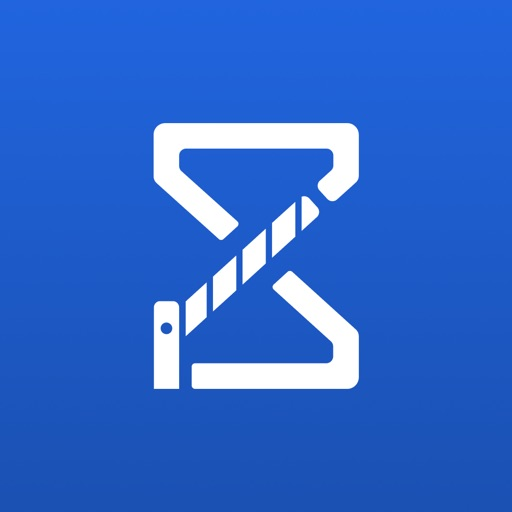

BorderWatcher wurde entwickelt, um eine Plattform zu schaffen, die über den Autoverkehr an allen ungarischen Grenzübergängen informiert. Die Anwendung ruft die Daten regelmäßig von der offiziellen Website ab, aber die dort gefundenen Informationen sind nicht genau. Um genauere Informationen bereitzustellen, müssen Sie angeben, wie lange Ihr Grenzübertritt gedauert hat. Jahr für Jahr wird die Anwendung um andere Länder erweitert, wie z. B. (Serbien, Rumänien, Ukraine, Slowakei, Österreich, Deutschland, Slowenien, Kroatien, Bulgarien, Nordmazedonien, Montenegro, Bosnien und Herzegowina, Griechenland, Tschechische Republik, Italien, Schweiz, Türkei, Kosovo, Polen).

[View on Apple](https://apps.apple.com/fr/app/borderwatcher/id1444681822)

## ProCamera. RAW+ Fotografie

DAS ORIGINAL: ProCamera ist die führende professionelle Kamera-App für Enthusiasten, Kreative und Profis. Seit über fünfzehn Jahren hilft ProCamera Nutzern dabei, das Optimum aus der iPhone-Kamera herauszuholen – für Foto, Video und Bildbearbeitung!

––– MILLIONEN NUTZER VERTRAUEN DARAUF –––

New York Times: „High-End Nutzer schwören auf ProCamera“

National Geographic: „‚Must-have‘ Reise-App“

––– VON FOTOGRAFEN, FÜR FOTOGRAFEN –––

ProCamera ist als intuitive „Immer-dabei-Kamera“ entworfen, mit der Sie im Alltag mit iPhone und iPad spielend einfach fotografieren und filmen können. Bei besonderen Anforderungen und professionellen Einsätzen bietet ProCamera eine ganze Reihe an Extrafunktionen und Eingriffsmöglichkeiten für maximale Kontrolle über die Kamera. 

Zusätzlich zu den leistungsfähigen Aufnahmefunktionen für Fotos und Video, die man normalerweise nur von großen Profi-Kameras kennt, steht auch ein umfassendes Bildbearbeitungsstudio bereit, inkl. Werkzeugen für RAW, HDR und Schärfentiefe.

Es ist unsere Mission, das iPhone zur einzigen Kamera zu machen, die Sie benötigen. Daher wurden alle Bereiche von ProCamera mit dem Ziel entwickelt, die kleinen und großen Momente des Lebens bei jedem Auslösen perfekt festzuhalten.

––– HAUPTFUNKTIONEN –––

Automatik, Halbautomatik, Manueller Modus
Fokus- & Belichtungssteuerung
Manueller Fokus & Focus Peaking
Belichtungskorrektur mit Zebrastreifen
Porträt-Modus mit Tiefenschärfeeffekt & Ansicht der Tiefenkarte
Unterstützung aller Objektive (Ultraweitwinkel, Weitwinkel, Tele, LiDAR)
RAW, ProRAW, TIFF, JPG & HEIF
Manueller Weißabgleich
48 MP Fotos (ab iPhone 14 Pro)
EDR und ISO-HDR
Selbstauslöser & ProTimer Intervalometer
Selfie-Modus mit Bildschirmblitz
OIS Bildstabilisierung an/aus
EXIF & Metadaten Anzeige
Histogramm
Digital-Zoom
Dimmbares Dauerlicht
Anti-Shake
Rapid Fire Serienaufnahmen
Apple Watch Fernauslöser
Viele Seitenverhältnisse (4:3, 5:4, 3:2, 1:1, 16:9, 2:1, 2.4:1, 3:1, Goldener Schnitt)
Code Scanner (QR, Barcode,…)
Umfangreiche Galerie mit iCloud Integration
Unterstützung für iOS Alben
Graukarten-Kalibrierung
Lightbox
3D Tiltmeter

––– BILDBEARBEITUNG –––

ProRAW/RAW Bearbeitung mit EDR-Unterstützung
Porträt-Editing (Schärfentiefe, Bokeh, simulierte Blende)
80+ Fotofilter
Zahlreiche Profi-Werkzeuge & Export-Einstellungen

––– VIDEOFUNKTIONEN –––

Auflösung (4K UHD, 1080, 720, 480, SD)
Framerate (24, 25, 30, 48, 50, 60, 96, 100, 120, 192, 200, 240 fps)
Manuelle Steuerung: Belichtung, Fokus, Weißabgleich
Frei einstellbare Belichtungszeiten für äußerste Präzision
Kontinuierlicher Autofokus an/aus
Zebrastreifen & Focus Peaking
Video Codec (H.264, H.265 HEVC, ProRes, ProRes RAW)
ProRes LOG (ab iPhone 15 Pro)
Dolby Vision HDR
Speicherplatzanzeige
Audiometer
Stereo Audio (ab iPhone XS)
Anbindung von Bluetooth, Lightning, USB Mikrofonen (Apple AirPods, Shure MV88, MV88+, etc.)

…und vieles mehr!

Weitere Infos: funktionen.procamera-app.com

––– PROCAMERA UP –––

ProCamera Up ist ein optionales Funktionspaket, das exklusive Sonderfunktionen enthält:

Automatische Perspektivkorrektur: APC nutzt den internen Lagesensor in Verbindung mit einem patentierten Verfahren, um automatisch Fotos ohne perspektivische Verzerrungen wie stürzende Linien aufzunehmen
Benutzerdefinierte Kamera-Presets
Anamorphe Video- und Fotoaufnahmen
(RAW) Belichtungsreihen für einen höheren Dynamikumfang
Geschützer Private Lightbox Ordner
Einzigartige Fotofilter-Sets

ProCamera Up AGB: https://procameraterms.cocologics.com

––– INFOS & SUPPORT –––

Sie haben Fragen, Feedback oder Vorschläge? Dann schreiben Sie uns an support@procamera-app.com oder über die Kundenservice-Option in der App.

Die aktuellsten Informationen gibt es im ProCamera Newsletter und unter procamera-app.com.

[View on Apple](https://apps.apple.com/fr/app/procamera-appareil-photo-raw/id694647259)

## Fongo World Edition

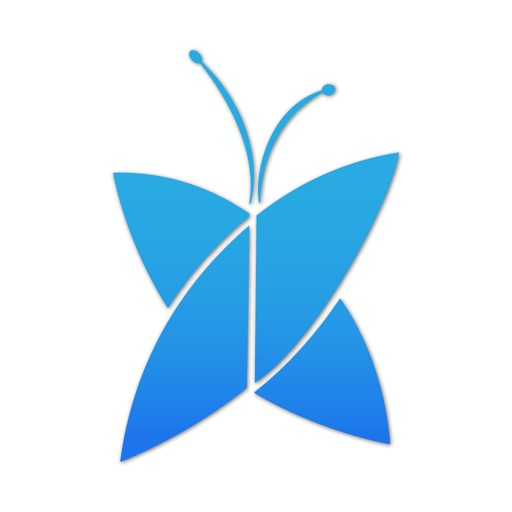

Fongo World Edition est la meilleure façon d'appeler le Canada et le monde entier !

Appels et messages illimités partout au Canada, où que vous soyez avec une connexion Internet. C'est l'application parfaite pour appeler et texter.

POURQUOI FONGO MOBILE ?

• Votre propre numéro de téléphone canadien : obtenez un vrai numéro canadien dans votre ville.

• Appels illimités partout au Canada : appelez à volonté vers n'importe quel numéro canadien.

• Textos illimités : envoyez gratuitement un SMS à tous les utilisateurs de Fongo, sans aucune limite !

• Appels Wi-Fi et données : utilisez Fongo partout où vous avez une connexion Internet.

• Appels internationaux à bas prix : tarifs abordables pour appeler partout dans le monde.

• Messagerie vocale visuelle, affichage du numéro et plus encore : les fonctionnalités d'appel essentielles sont incluses gratuitement !

FONCTIONNALITÉS INCLUSES

• Messagerie vocale visuelle

• Affichage du numéro, appel en attente et transfert d'appel

• Conférence téléphonique et transfert d'appel

• Réception de télécopieur directement dans l'application

• Synchronisation avec les contacts de votre appareil pour appeler et envoyer des messages facilement

• Prise en charge multilingue : anglais, chinois, français, allemand, hindi, coréen, espagnol et portugais

VOYAGES

• Fongo World Edition est l'application idéale pour appeler et envoyer des SMS en voyage :

• Recevez des appels internationaux gratuits

• Parlez à n'importe quel Canadien à l'étranger : gratuit pour vous comme pour lui

• Envoyez des textos à la conciergerie de votre hôtel ou à vos hôtes de location

• Recevez des textos de votre compagnie aérienne

• Appelez des restaurants pour réserver

DEUXIÈME NUMÉRO DE TÉLÉPHONE

• Utilisez Fongo World Edition comme deuxième numéro de téléphone gratuit pour :

• Achats et inscriptions en ligne : évitez les appels et les textos indésirables des commerçants grâce à un numéro gratuit.

• Applications de rencontres : protégez votre numéro personnel tout en restant connecté.

• Marchés en ligne : utilisez un numéro canadien gratuit au lieu du vôtre. • Travail autonome et activités complémentaires : séparez vos appels professionnels et personnels grâce à une application d’appels Wi-Fi.

• Concours et codes de vérification : utilisez une application de messagerie gratuite pour un usage ponctuel ou de courte durée.

APPELS INTERNATIONAUX À BAS PRIX VERS PLUS DE 220 PAYS

• Appelez les États-Unis, l’Inde, le Royaume-Uni, la France et bien plus encore à partir de seulement 0,02 $ la minute.

• Consultez Fongo.com/rates pour la liste complète des tarifs internationaux.

IMPORTANT

• Une connexion Internet stable est requise avec des vitesses de téléchargement/envoi supérieures à 2 Mbits/s.

• Si vous désactivez les notifications, vous ne recevrez pas les appels ni les textos entrants.

• Pour les appels d’urgence (112 au Canada), utilisez l’application Téléphone intégrée à votre appareil (aucune carte SIM requise).

Besoin d'aide ? Appuyez sur « Aide » dans l’application. Des commentaires ? Faites-nous-en part par le biais de l’application.

SUIVEZ-NOUS

• Facebook : fongomobile

• Instagram : @fongo_mobile

• TikTok : @fongo_mobile

• X : @Fongo_Mobile

Conditions d’utilisation : https://www.fongo.com/about/legal/terms/
Utilisation acceptable : https://www.fongo.com/about/legal/acceptable-use/
Politique de confidentialité : https://www.fongo.com/about/legal/privacy/
Conditions d’utilisation du service d’urgence 911 : https://www.fongo.com/about/legal/fongo-911/

[View on Apple](https://apps.apple.com/fr/app/fongo-world-edition/id860809977)

## Rarevision VHS: Retro Cam

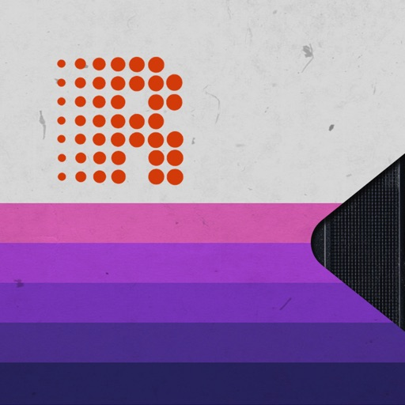

Used by Kendall Jenner, Snoop Dogg, BTS, Ariana Grande, Khloe Kardashian, Wiz Khalifa, Victoria Beckham, Die Antwoord and featured on SNL (S41E01) and in countless TV shows and music videos!

Covered by WIRED, Forbes, The Wall Street Journal, Popular Mechanics, The Independent, Macworld, TMZ, TechCrunch, Mashable and many others!

App of the Day for Friday, Dec 22, 2017

It's 1984, and you've got a VHS camcorder! It'll look that way when you record and send old, messed up-looking retro videos to friends. They'll swear you built a time machine: "OMG, how'd you shoot that?"

With Rarevision VHS, you'll make videos that look and sound like real retro video tapes pulled out of storage after 30 years. You can change the on-screen date to trick your friends, create custom animated titles, glitch up the picture by shaking your device and use the fake zoom to emphasize those truly embarrassing moments!

"That's freakin' amazing!" -Everyone

Here's Why You Need It:

• Four words: Best. Throwback. Videos. Ever.
• Create VHS-style retro videos of your kids that look like the ones from your childhood
• The only VHS cam app you should ever consider to capture your 80s and 90s-themed parties
• Shoot your own "found footage" movie and become a big Hollywood director like those other guys
• Make your kids' incredibly boring school plays actually rad
• Impress the new girl by using our app to convince her you built a time machine
• Pretend like you lived through the rad 1980s using our app!

What Rarevision VHS Can Do:

• Realism: the ORIGINAL and BEST VHS cam app for simulating the glitches of old videotape recordings
• Import videos and give them the VHS look
• Make your own signature look using the old-school picture adjustment menu
• Create your own animated titles for the ultimate in on-screen awesomeness
• Change the on-screen date so people think you're way younger (or older) than you really are
• Glitch the picture during recording using your finger or by shaking your device
• Fake zoom feature dramatically enhances the cheese factor
• Don't think we forgot to make things sound retro terrible. We didn't.
• Up to 60p recording for a more accurate VHS video look (depends on device capability)
• Widescreen recording option (but would you REALLY want to use it?)

Follow Rarevision:
http://instagram.com/rarevision
http://x.com/rarevision
http://facebook.com/rarevisionvhs

Rarevision is a US-based company.

Copyright © 2015-2025 Rarevision LLC. All rights reserved.

[View on Apple](https://apps.apple.com/fr/app/rarevision-vhs-retro-cam/id679454835)

## Wipr 2

Wipr blocks ads, popups, trackers, cookie warnings, and other nasty things that make the web slow and ugly.

Websites in Safari will look clean, load fast, and stop invisibly tracking you. You’ll notice significant improvements to your battery life and data usage. Setup is a snap.

The Filtr add-on extends Wipr’s blocking to all apps on your device. It acts at the network level, but unlike a VPN, it can access none of your data, and can be used in conjunction with VPNs, iCloud Private Relay, and custom DNS.

Wipr’s blocklist is updated twice a week automatically, and has enhanced versions for the following languages: Bosnian, Chinese, Croatian, Czech, Danish, Dutch, Estonian, Finnish, French, German, Greek, Hebrew, Hindi, Hungarian, Icelandic, Indonesian, Italian, Japanese, Korean, Macedonian, Malay, Montenegrin, Norwegian, Polish, Romanian, Russian, Serbian, Slovak, Spanish, Thai, and Vietnamese.

Wipr is a universal app: install it on all your devices (iPhone, iPad, Mac, Vision Pro) with a single purchase. It’s fully accessible with VoiceOver, Voice Control, and more. Dark, Tinted, and Clear icon variants are included. Family Sharing is supported.

Because it’s developed by a single independent developer and 100% funded by its users, Wipr only answers to you: no one can pay to have their ads unblocked, and there are no “acceptable ads”.

This app was made with love and patience. I hope you’ll enjoy using it as much as I enjoyed designing and building it.

– Kaylee

Terms & Conditions: https://kaylees.site/terms-and-conditions.html
EULA: https://www.apple.com/legal/internet-services/itunes/dev/stdeula/

[View on Apple](https://apps.apple.com/fr/app/wipr-2/id1662217862)

## WikiCamps Australia

The app for knowing where you’re going.

--- Explore over 60,000 sites across Australia --- 
Whether you're heading away for a weekend camping trip or planning an outback adventure, find the right places for you with WikiCamps!

Search with ease using intuitive filters to access detailed information, provided and kept up to date by a community of like-minded WikiCampers.

Get exclusive insights from real travellers, including authentic reviews, fee information to help your budgeting, and photos that show you the real deal—before you travel.  

--- Plan your journey from here to there or anywhere --- 
WikiCamps has the ultimate tools to plan your next journey. 

Use collections to create a wishlist, mark where you’ve been, or remember places you liked on previous adventures. 

In Trip Planner, you can build an itinerary, plot a route, gauge your fuel spend, and see every place in your adventure mapped out. 

--- No signal? No worries! Use offline mode --- 
Thanks to offline mode, you can download everything you need to explore and travel. You’ll always be in the know, wherever you go! 

--- New! Book and Save with WikiCamps --- 
Many of your favourite sites are now bookable through WikiCamps! Plus, check out how you can save money on your adventures with our travel partners. 

--- Why not download the ultimate travel companion today? ---

[View on Apple](https://apps.apple.com/fr/app/wikicamps-australia/id505365608)

## Cozmo Robot

Say hello to Cozmo, a gifted little guy who’s got a mind of his own and a few tricks up his sleeve. He’s the sweet spot where supercomputer meets loyal sidekick. He’s curiously smart, a little mischievous, and unlike anything ever created.

You see, Cozmo is a real-life robot like you've only seen in movies, with a one-of-a-kind personality that evolves the more you hang out. He'll nudge you to play and keep you constantly surprised. More than a companion, Cozmo’s a collaborator. He’s your accomplice in a crazy amount of fun.

Some robots just have it all.

Cozmo robot required to play. Available at Anki.com.

©2025 Anki, LLC. All rights reserved. Anki, Cozmo, and the Anki and Cozmo logos are registered trademarks of Anki, LLC.

[View on Apple](https://apps.apple.com/fr/app/cozmo-robot/id6748243845)

## Madeira Weather

With ‘madeira Weather' you will never need to refer to highly complex websites or wait for the official weather report, to know the weather in the Madeira Archipelago.
Now you can consult the weather forecast for any locality, including some strategic places like ‘Pico do Arieiro’, ‘Pico Ruivo’ and ‘Rabaçal’, well known other locations with fantastic views and walks.

Connect your tablet or smartphone to the Internet, download a small data file and use your updated forecast for the rest of the day, no need for constant downloads and expensive bills.
Unlike other weather services, the madeiraWeather uses high-resolution mathematical models.
New functionalities will be added in the future. Do not hesitate to contact us and let us know your difficulties and suggestions!

* Key Features *
=> Forecasts in a Map: quickly get a glimpse of the weather across the island, by viewing the forecast icons overlaid onto a map. Use the zoom to view full resolution.
=> All places: browse through a list of forecasts organized by locality. Besides icons representing the weather you may also view the predicted values for temperature, humidity and wind. Consult the legend for details on each icon.
=> More details: access more detailed weather information in each locality.
=> Favorites: want browse forecasts in a list of locations of your choice? Open sites individually and add them to your ‘Favorites’ list.
=> Satellite images: use this option to view the satellite images from EUMETSAT-RGB, centered over Madeira Archipelago. Sequence of images usually hosts data for three consecutive days, with snapshots available several times a day.
=> Time-navigation for up to three days, with hourly forecasts for all your favorite locations. Beyond three days any forecasting system becomes too unreliable to trust.

* Some Notes *
Forecasts are mathematical calculations and should be used with care. In fact, the information provided by ANY prediction systems is only indicative. As such, CIIMAR-Madeira cannot be held liable for any incorrect information and / or inaccuracy, and for any consequences that may arise.

[View on Apple](https://apps.apple.com/fr/app/madeira-weather/id778610321)

## EE35 Film Camera

EE35 film camera simulates a retro mechanical camera around the 1960's.
This camera app is made in Japan.

Basic usage
(1) Pull the film advance lever
(2) Press the shutter

There are two types of film, color and black&white. It's easy to take 12 shots.
Development ends immediately after taking a picture, and the image of the film is also saved.

The timer is about 7 seconds.
Multiple exposure can be done by shutter charge without film advance.

Please enjoy retro camera life.

[View on Apple](https://apps.apple.com/fr/app/ee35-film-camera/id1313164055)

## HappyCow - Vegan Food Near You

Featured auf CNN und in der New York Times und The Guardian: Die #1 unter den veganen und vegetarischen Restaurantführer des App Store. Seit 1999 hat HappyCow Benutzern geholfen, vegane Optionen in über 200.000 Restaurants, Cafés und Lebensmittelgeschäften in über 180 Ländern zu finden. Jetzt ist es einfach, vegane Lebensmittel in der Nähe zu finden oder zum Mitnehmen zu bekommen. Lesen Sie mehr als 1.875.000 Bewertungen und sehen Sie mehr als 3.000.000 Fotos, die von unserer großartigen Community gepostet wurden! Mit HappyCow können Sie nach vegan-freundlichen Bäckereien, Reformhäusern, Catering, Bauernmärkten, Saftbars, Cafés oder anderen veganen Geschäften suchen und Filter für Lieferung und Mitnahme verwenden!

Eigenschaften:
* Suchfilter nach Standort, vegan, vegetarisch, Geschäften usw. und nach Stichworten
* Stöbere in HappyCow nach einem beliebten Café oder Restaurant mit guten Bewertungen
* Speichere Deine Favoriten zum zukünftigen Zugriff (offline verfügbar!)
* Organisiere Restaurants und Geschäfte für Deine bevorstehenden Reisen (Nutzung ohne Internet)
* Zeige Unternehmen auf interaktiven Karten an
* Sieh dir Fotos, Rezensionen und Informationen an, die Dir helfen, die beste Mahlzeit zu finden
* Rufe Wegbeschreibungen, Telefonnummern, Bewertungen und Website-Informationen ab
* Einfach teilen, was Du mit Deinen Freunden gefunden hast
* Über 220.000 vegan-freundliche Angebote
* Der Inhalt wird rund um die Uhr von einem engagierten Team und unseren 2 Millionen + monatlichen Besuchern aktualisiert
* Lade Fotos von Deinem köstlichen Essen hoch
* Hilf allen anderen HappyCow-Nutzern mit Deinen Bewertungen und Ratschlägen
* Tritt der größten Veg Community von über 1.000.000 Mitgliedern bei
Gibt's Probleme? Schick uns eine Nachricht: ios (at) happycow.net

[View on Apple](https://apps.apple.com/fr/app/happycow-vegan-food-near-you/id435871950)

## Trevni: Inverseur négatifs

Trevni : Convertisseur de négatifs argentiques

Que vous numérisiez de vieux négatifs de famille ou vos pellicules récentes, Trevni convertit des négatifs photo déjà photographiés ou scannés depuis votre photothèque en images fidèles à la réalité. Aucun réglage de courbes ou de niveaux n’est nécessaire.

Conversion en un geste :

• Conversion instantanée des négatifs couleur C-41 et noir et blanc
• Suppression automatique du masque orange des films couleur
• Préserve la qualité d’image et les métadonnées d’origine
• Fonctionne avec des négatifs photographiés ou scannés

Préréglages et réglages fins :

• Préréglages intégrés pour un point de départ rapide et fiable
• Créez et enregistrez vos propres préréglages personnalisés
• Échantillonnage pour une précision colorimétrique ou tonale
• Réglage de la température, teinte, exposition, contraste et saturation
• Conçu pour les flux de travail analogiques et les caractéristiques du film

Flux de travail rapide et intuitif :

• Importez un négatif depuis votre photothèque
• Choisissez film couleur ou noir et blanc
• Échantillonnez, ajustez et exportez l’image finale
• Prêt à partager, archiver ou imprimer

Flux compatibles :

• Captures iPhone (table lumineuse ou rétroéclairage)
• Scans d’appareils photo numériques
• Fichiers de scanners à plat

Idéal pour :

• Photographes argentiques
• Passionnés de photographie analogique
• Étudiants et enseignants
• Restauration d’images et archivage numérique

Conçu par un photographe argentique, pour les photographes argentiques

Trevni privilégie une conversion fidèle, sans artifices, pour des résultats naturels qui respectent votre processus créatif.

[View on Apple](https://apps.apple.com/fr/app/trevni-inverseur-n%C3%A9gatifs/id6741860536)

## WikiCamps New Zealand

The app for knowing where you’re going.

--- Explore over 12,000 sites across New Zealand ---
Whether you're heading away for a weekend camping trip or planning a big adventure, find the right places for you with WikiCamps!

Search with ease using intuitive filters to access detailed information, provided and kept up to date by a community of like-minded WikiCampers.

Get exclusive insights from real travellers, including authentic reviews, fee information to help your budgeting, and photos that show you the real deal—before you travel.

--- Plan your journey from here to there or anywhere ---
WikiCamps has the ultimate tools to plan your next journey.

Use collections to create a wishlist, mark where you’ve been, or remember places you liked on previous adventures.

In Trip Planner, you can build an itinerary, plot a route, gauge your fuel spend, and see every place in your journey mapped out.

--- No signal? No worries! Use offline mode ---
Thanks to offline mode, you can download everything you need to explore and travel. You’ll always be in the know, wherever you go!

--- New! Book and Save with WikiCamps ---
Many of your favourite sites are now bookable through WikiCamps! Plus, check out how you can save money on your travels with our partners.

--- Why not download the ultimate travel companion today? ---

[View on Apple](https://apps.apple.com/fr/app/wikicamps-new-zealand/id582527125)

## Stylebook

Optimisez votre garde-robe : pour moins cher qu'un café au lait, découvrez votre propre style et changez votre relation avec les vêtements pour la toujours !

Stylebook® est le meilleur outil d'organisation de votre garde-robe. Grâce à plus de 90 fonctionnalités, vous pouvez organiser votre garde-robe et profiter au maximum des vêtements que vous possédez déjà !

Importez vos vêtements en quelques secondes grâce à une variété d'outils d'importation, y compris le glisser-déposer et la génération d'images par IA. Créez des collages de tenues comme dans les magazines avec vos propres vêtements. Vous pourrez ainsi vous souvenir de vos meilleurs looks et vous habiller plus rapidement chaque jour. Vous pouvez aussi planifier vos tenues grâce au calendrier des tenues, créer des listes pour préparer vos bagages qui vous indiquent automatiquement les vêtements à emporter et en savoir plus sur votre garde-robe grâce à des statistiques telles que le coût par utilisation. Tout cela dans cette application totalement personnalisable !

Ce n'est pas pour rien que Stylebook est l'application de gestion de la garde-robe la plus ancienne ! Cette application a fait ses preuves et constitue un excellent outil d'organisation et de gestion de la garde-robe. Nos clients l'apprécient depuis plus de 15 ans. Elle reste une petite entreprise familiale, gérée par une équipe composée d'un couple.

FONCTIONNALITÉS :

• PLACARD : ajoutez rapidement des images de vos propres vêtements sans avoir besoin de prendre des photos, sauf si vous le souhaitez. 
• IMPORTATION RAPIDE : génération d'images par IA (*), glisser-déposer des photos, importation multiple et découpage rapide à partir de vos sites web préférés.
• SUPPRESSION AUTOMATIQUE DE L'ARRIÈRE-PLAN : découpez avec précision vos vêtements sur presque toutes les images, quasi instantanément.
• DISPOSITION DE VÊTEMENTS : superposez et redimensionnez les vêtements sur une toile libre.  
• GÉNÉRATEUR DE TENUE : mélangez votre garde-robe comme un jeu de cartes pour découvrir de nouvelles idées de tenues qui se cachent dans votre armoire !
• CALENDRIER : planifiez à l'avance les tenues que vous allez porter.
• LISTES DE VOYAGE : ajoutez des tenues complètes, préparez le contenu de votre valise en avance, créez des listes et des illustrations à imprimer.
• STYLE STATS : des informations sur la façon dont vous portez vos vêtements et vos tenues, y compris ce que vous portez le plus, ce que vous portez le moins et les éléments qui vous rapportent le plus.
• COÛT PAR UTILISATION : suivez automatiquement le coût par utilisation de tous vos vêtements
• PARCOUREZ VOTRE GARDE-ROBE : consultez tous vos vêtements au même endroit, classés par marque, tissu, couleur, taille et bien plus encore.
• BIBLIOTHÈQUE D'INSPIRATIONS : enregistrez toutes vos inspirations de style dans un espace qui vous est réservé, sans l'influence des algorithmes.
• CATÉGORIES PERSONNALISÉES : ajoutez, modifiez ou supprimez n'importe quelle catégorie de votre placard, vos looks ou votre galerie d'inspirations.
• SYNCHRONISATION : la synchronisation automatique affiche les mêmes données sur votre iPhone et votre iPad.
• PARTAGE : partagez des tenues et des vêtements avec vos amis par e-mail, SMS, Instagram ou Pinterest.
• AUCUNE LIMITE : ajoutez un nombre illimité de vêtements, accessoires et inspirations à vos tenues.
• SAUVEGARDE ET SYNCHRONISATION ICLOUD : protégez vos données avec la synchronisation iCloud.
• RECHERCHE : recherchez des mots-clés ou des critères tels que le tissu, la saison ou la couleur dans votre garde-robe.
• SHOPPING : achetez des articles sur les boutiques en ligne et essayez-les dans votre garde-robe virtuelle avant de les acheter et mettez vos propres boutiques en favoris !
• AIDE : manuels pratiques dans lesquels vous pouvez effectuer des recherches et vidéos de démonstration incluses

(*) La génération d'images par l'IA nécessite Apple Intelligence.

[View on Apple](https://apps.apple.com/fr/app/stylebook/id335709058)

## Parchment: Agenda & Daily Note

Parchment is a private daily journal that brings your writing, plans, calendar, and reminders together in one quiet place.

Open today and start writing immediately. Your calendar events and due or overdue reminders can appear above your journal entry, giving you the context of the day without switching apps. Capture notes, reflect on what happened, plan what comes next, or use Parchment as a simple daybook for work and life.

On iPad, Parchment also supports handwriting and drawing with Apple Pencil, so typed notes and handwritten thoughts can live together on the same day.

Parchment is built for iPhone, iPad, and Mac, with iCloud sync available through your private iCloud account. There is no Parchment account to create, no advertising, and no third-party analytics SDKs.

Features include:

- Daily journal entries organized by date
- Calendar events shown alongside your writing
- Due and overdue reminders in your daily view
- Reminder completion from inside the app
- Apple Pencil handwriting and drawing on iPad
- iCloud sync across iPhone, iPad, and Mac
- Widgets for a quick look at your agenda
- Shortcuts, Siri, and App Intents support
- Spotlight indexing for finding past entries
- Export tools for keeping a copy of your writing
- Custom appearance, fonts, and themes

Parchment is for people who want a journal that understands the shape of their day. It gives you one place to write what happened, see what is coming up, and keep a private record over time.

[View on Apple](https://apps.apple.com/fr/app/parchment-agenda-daily-note/id6779987526)

## WikiFarms Australia

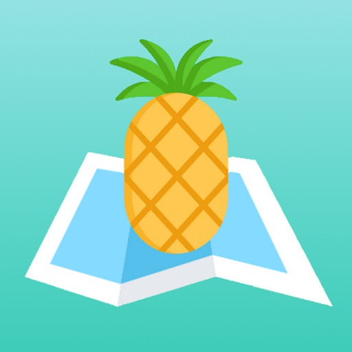

What is WikiFarms Australia?

WikiFarms Australia is the essential application for backpackers looking for a farm job in Australia. Whether you are looking for a casual job during your trip or aiming to complete your 88 days of farm work to get your Second Year Visa, WikiFarms Australia will be your guide!
The application will help you to be in direct contact with farmers by making available a map with thousands of farms around Australia!
The database is always growing and constantly being updated by our team: companies are added weekly, contacts are regularly verified, making it the largest database for fruit picking jobs in Australia! With more than 2000 companies listed in the app you’ll have all the information you need to find a farm job quickly.

 
So do not wait to get the best farm job tool available in Australia!

 
What can I do with the app?

WikiFarms Australia makes it easy to find a farm. Simply use the map screen to see exactly where are located the farms. Then tap a site to bring up its description. It will show you the name of the company, type of crops, phone number, and, for some of them, website and email. You can then call the farmers directly from the app and ask them if they need workers. If you are ready to go, you can also start an itinerary from your current location and ask them in person!

The app also allows you to use filters. If you are looking to work in a specific area or to pick a specific type of fruit during a specific time, you can do that!

The app lists also tons of working hostels, tourism offices, working agencies that can give you more information or help to find a job in a specific area.

With the app you can also calculate your 88 days of farm work easily and see if you’re ready to apply for the Second (or Third soon!) Year Visa.

 
Who made WikiFarms Australia?

Fellow backpackers like you created WikiFarms Australia! When we were looking for farm work to get our Second Year Visa, we really struggled knowing where to look for farms! There was some information here and there but nothing really consistent. This is when we started to think about a tool that will have all the farmers at once and WikiFarms Australia started just like that J

 
Why is the app not free?

We are a very small team working on this project for more than 2 years! As a result, the profit of the app really helps us to make it better day after day. In addition, it also contributes to our travelling passion (which we are sure that if you are here you can relate!)

In addition, you certainly think that most apps are free, but are they really? Most of the time, free apps are full of unwanted and annoying ads and you often have to pay more to have the full use of it.

We made the choice to offer a complete, advertising-free experience for as low of a price as we could make it. Consider that half the price you pay for it goes to taxes and Google share.

The application helps you get what you need the most, find a farm job, and when you will get it, its price will be covered in less than half an hour of work!

Thanks for your purchase and we hope that you’ll have a good experience with our app!

 
Feel free to join us on our Facebook page or to visit our website:
https://wikifarmsaustralia.com/

 
Are you a farmer looking for workers? You can contact us at: info.wikifarms@gmail.com
We will answer you within 24h.

[View on Apple](https://apps.apple.com/fr/app/wikifarms-australia/id1483519317)

## Rally Call

Préparez vos notes comme un pro.
- Ajoutez des notes vocales géolocalisées sur chaque portion de route
- Visualisez en temps réel l’angle de rotation du volant avec un cadran cockpit animé
- Utilisez un outil de précision pour vos prises de distance
- Gardez une trace du dernier virage significatif automatiquement
- Accédez à la météo du jour sur la spéciale, avec localisation intégrée
- Accédez à vos résultats en live via le lien FFSA
- Partagez et sauvegardez vos reconnaissances avec les fichiers Rally Call

Pensée par des copilotes, pour les copilotes.

[View on Apple](https://apps.apple.com/fr/app/rally-call/id6748931500)

## Forvo Pronunciation

Améliorez votre prononciation avec Forvo ! Le guide de prononciation Forvo vous permet d'écouter, d'apprendre et d'enregistrer des prononciations dans plus de 450 langues.

Avec Forvo, vous pouvez rechercher des mots et écouter les prononciations enregistrées par des locuteurs natifs de la langue dont vous avez besoin. Et ce ne sont pas seulement les langues les plus parlées au monde telles que l'anglais, l'espagnol, le chinois, l'arabe, le russe, le français, l'allemand, le japonais ou l'italien, vous pouvez également rechercher des mots en kabyle, bachkir, tamoul et bien d'autres.

Caractéristiques:

* Recherchez des mots et écoutez les prononciations de locuteurs natifs.
* Prononciations anglaises, prononciations françaises, prononciations allemandes, prononciations chinoises, prononciations espagnoles et des centaines d'autres.
* Plus de 7 millions de prononciations disponibles.
* Comparez différents accents pour le même mot dans la même langue.
* Écoutez des voix masculines ou féminines.
* Gardez une trace de vos prononciations récemment écoutées.
* Fonctionne avec votre compte forvo.com.
* Enregistrez les prononciations dans votre langue maternelle et aidez les autres apprenants !
* Apprenez à prononcer correctement dans plus de 400 langues.
* Mode sombre pour que vos yeux ne se fatiguent pas.
* Suivez les prononciations des utilisateurs dont vous aimez le plus la voix.

Forvo vous permet également de comparer la façon dont un mot est prononcé dans différents accents de la même langue. Forvo garantit que vous écoutez toujours les prononciations de locuteurs natifs. Vous pouvez écouter ces prononciations par des locuteurs féminins et masculins et vous pouvez également adapter Forvo à vos propres besoins.

Inscrivez-vous aujourd'hui pour profiter de tous ces avantages et faire partie du plus grand réseau de prononciation au monde.

[View on Apple](https://apps.apple.com/fr/app/forvo-pronunciation/id375819093)

## Blueprint 4-Track

Great for demos, first takes, and fresh ideas: voice and guitar at the kitchen table, or a band passing one phone around the room.

The sound of the machine is built in. Each track has its own set of knobs and there is no undo.
  
  - Records one track at a time, from the built-in mic, a headset mic, or a USB audio interface.
  - Has track merging/clearing, punch-in recording, and a metronome.
  - Your recordings are WAV files saved on your phone. Share the song, or export the whole session.
  - Works entirely offline and collects nothing.
  - Pay once. No subscription, no ads, no account.
  - Works on iPhone and iPad.
  
  TIPS

  - Overdub with wired headphones, so the mic doesn't pick up the other tracks.
  - Don't use Bluetooth headphones while recording: they add delay, and only play in mono.
  - Tap record while playing to punch in over a part you want to redo.
  - Tap the ? at the top left for a guide to the controls.

Blueprint is made by one person. If something feels confusing or missing, email max@blueprintdaw.com and I will answer.

[View on Apple](https://apps.apple.com/fr/app/blueprint-4-track/id6777792345)

## Ableton Note

Entwickele neue musikalische Ideen mit ausgewählten Sounds und Effekten. Erstelle Beats und Melodieparts, sample deine Umgebung und entwickele deine Tracks in Ableton Live weiter.

Note ist ein Ort für Skizzen, neue Sounds und Ideen: Lass deinen Ideen freien Lauf oder experimentiere einfach, bis die Inspiration einsetzt. Dabei steht dir eine Auswahl von Lives Drum-Kits, Synths und Instrumenten zur Verfügung. Erstelle deine eigene Klangpalette, indem du mit dem integrierten Mikrofon deines Telefons Samples aufnimmst. Und nutze den integrierten MIDI-Editor von Note, um Noten, Beats und Akkorde zu sequenzieren oder beim Hören Anpassungen zu vorzunehmen
 
Verfolge deine Ideen, wohin auch immer sie dich führen und sende deine Projekte mit Ableton Cloud an Live, ohne die App zu verlassen. Du findest deine Projekte in Lives Browser und kannst dort weiterarbeiten. Sämtliche Samples und Sounds werden direkt aus Note übernommen, MIDI-Noten kannst du nach Belieben verändern. Alle Nutzerinnen und Nutzer von Ableton Note bekommen eine kostenlose Lizenz für Ableton Live Lite – der einfachen und intuitiven Software, mit der Musikschaffende, Producer und DJs aus aller Welt komponieren, aufnehmen und performen. Nutzerinnen und Nutzern von Ableton Move können mit Note außerdem vom Telefon aus weiter an Sets arbeiten.
  
Mit einem Beat einsteigen:
• Wähle zwischen 76 Drum-Sampler-Kits
• Tippe auf 16-Pads einen Beat ein oder sequenziere ihn mit dem MIDI-Editor
• Spiele Drums melodisch im 16-Pitch-Modus
• Quantisiere deine Beats oder verschiebe Noten, um ungenaues Timing und Fehler zu korrigieren
• Schichte Rhythmen übereinander
• Erzeuge Beat-Wiederholungen mit Note Repeat
• Verändere deine Sounds mit Parametern
• Experimentiere mit Effekten oder sorge mit Swing für mehr Abwechslung
 
Mit einer Melodie starten:
• Entdecke 317 Synth-Sounds and 60 melodische Sampler-Instrumente
• Spiele oder programmiere Melodien und Akkordfolgen mit dem 25-Pad-Raster, der Pianorolle oder dem MIDI-Editor
• Lege Tonarten und Skalen fest – für harmonische Ergebnisse
• Schichte mehre Harmonien übereinander
• Verändere deine Sounds mit Parametern
• Spiele mit Effekten für experimentelles Sound Design
 
Deine Welt sampeln:
• Erstelle eigene Drum-Kits aus Aufnahmen perkussiver Sounds im Drum Sampler von Note
• Baue eigene melodische Sampler-Instrumente aus zuvor aufgenommenen tonalen Sounds
• Bearbeite deine Samples durch Zerschneiden, Filter und Pitch-Änderungen
• Sequenziere Samples mit dem MIDI-Editor in Beats, Melodien und Akkorde
• Forme und verzerre Sounds mit Effekten
• Importiere eigene Samples oder Audiomaterial aus Videos

Mit Audio arbeiten:
• Füge Audio-Clips aus der Bibliothek hinzu
• Warpe das Tempo oder passe die Tonhöhe deiner Clips an
• Nimm Audio direkt mit dem integrierten Mikrofon deines Telefons auf
• Schließe ein Audio-Interface an, um externe Quellen aufzunehmen
• Kombiniere aufgenommenes und importiertes Audio mit deinen Beats und Melodien

Improvisationen einfangen:
• Halte deine Ideen mit „Capture“ fest – auch nach dem Spielen
• Spiele nach Gefühl – Note erkennt das Tempo
• Note bestimmt automatisch die Länge einer Phrase und erzeugt einen Loop
• Quantisiere Loops, füge Sounds hinzu und verändere sie
• Schließe deinen MIDI-Controller an, um mit Tasten zu spielen und den Sound der Instrumente intuitiv zu verändern
 
Abwechslung reinbringen:
• Note bietet ein Raster zum Spielen, ähnlich der Session-Ansicht in Live
• Verdopple Loops, um innerhalb von Clips Variation reinzubringen
• Dupliziere Clips und kombiniere verschiedene Versionen von Ideen
• Mehrere Noten gleichzeitig mit dem MIDI-Editor hinzufügen, löschen oder anpassen
• Erstelle acht Spuren mit bis zu acht Clips in acht Szenen
• Experimentiere mit verschiedenen Clip-Kombinationen und Songstrukturen
• Exportiere deine Skizzen und Songs als Audio-Datei, um sie mit anderen zu teilen

[View on Apple](https://apps.apple.com/fr/app/ableton-note/id1633243177)

## Unora

Förenkla ditt digitala liv med Unora!
Säg hejdå till kaoset av att konstant växla mellan flera appar. Unora samlar dina email, meddelanden från Instagram, Slack, WhatsApp, Snapchat, Gmail och Discord i en användarvänlig app. Bli den organiserade personen du alltid velat vara med  hjälp av funktioner såsom filtrering, färgkodning och maillistor.

KOMMUNIKATION
Unora är en universell messagingapp som visar chattar och mail från flertal chattplattformar i ett interface. Den stödjer appar som Instagram, WhatsApp, Gmail samt 4 ytterligare plattformar, tillåter dig att skicka och svara på meddelanden utan att behöva växla mellan appar. 

FILTRERING 
Appen erbjuder organiserade funktioner såsom filtrering, maillistor och färgkodning. Unora ger rum för en användarvänlig design som främjar enkelhet och effektivitet. 

MAILLISTOR
Har du en mail-inkorg fylld med reklam och nyhetsbrev där de viktiga mailen försvinner? Genom Unora kan du se en tydlig och enad lista över alla nyhetsbrev från ditt kopplade mail-konto. I samma lista kan du med ett klick även avregistrera dig!

Unora är kompatibel med iPhone-enheter med iOS 18.0 eller nyare.

Mer finner du på https://unora.se/

Terms of Service: https://unora.se/terms
Privacy Policy: https://unora.se/privacy

[View on Apple](https://apps.apple.com/fr/app/unora/id6739263703)

## Fiches IDE

Fiches IDE, l'application référence indispensable à tous les Etudiants en Soins Infirmiers (ESI) ou les Infirmier(e)s Diplômé(e)s d'Etat.

Vous pourrez y trouver des fiches pratiques concernant les différentes UE enseignées dans le nouveau référentiel de formation. Une aide aux révisions pour les étudiants et une aide pour les professionnels diplômés qui souhaitent reprendre les bases ou encadrer les futurs jeunes diplômés. L'application permet de vous donner accès à tout son contenu de manière illimitée et sans pubs !

Fonctionnalités :
- Cours (+ de 500 fiches)
- Vocabulaire : Plus de 50 000 définitions (Dictionnaire de l'Académie de Médecine)
- Pathologies
- Quizz
- Annales (+ de 100)
- Familles de médicaments
- Examens biologiques
- Contacts de professionnels pour vos TFE

... Et plus encore ! 

Ne nécessite aucun accès à internet.
Paiement unique - sans abonnement !

Merci de choisir Fiches IDE!
Julie & Romain

[View on Apple](https://apps.apple.com/fr/app/fiches-ide/id1089856777)

## NightCap相机

NightCap相机是功能强大的应用，可在光线弱和夜间拍摄超赞照片、进行录像和4K定时拍摄。以弱光和独特的天文模式采用长曝光拍摄星星、北极光等的漂亮照片！

是否觉得你的照片在低光下有点昏暗和颗粒感？NightCap将通过充分发挥iPhone或iPad相机的潜力助您一臂之力。

人工智能相机控制通过自动设置最佳对焦和曝光可轻松拍摄出更明亮、更清晰的照片。只需持稳相机并点击快门。若你更喜欢手动控制，那么即时手势调整随时可用，特技相机模式让您拍出单反相机的效果。您甚至可以随意进行黑白定时拍摄、拍摄照片和视频。

试试长曝光模式，在光线弱的情况下可获得超赞动态模糊特效和图像降噪效果。NightCap有提升感光度的特点，比任何其他应用的感光度高4倍，以长曝光模式为低光线照片提高亮度并降噪！

亮光轨迹模式可留住移动光线，适合夜间行车交通、焰火或光画照片。

这些模式结合高清或4K定时拍摄时效果超赞！

它有4种专用于天文摄影相机模式。星拍模式最适合拍摄星空或南极和北极光或让设备以星迹拍摄模式拍摄并观看星星在空中画圈！还有简单的国际空间站和流星摄影模式。

访问 nightcapcamera.com 以获得更多教程。

特点：

• 录像具有特殊夜间模式和全手动控制。
• 定时拍摄利用可调速度录制，支持长曝光和亮光轨迹，需要在iPhone 6s或更新设备上4K分辩率或较旧设备上1080p高清。
• Aidie，一款全自动人工智能相机自动为你选择最佳相机设置，在低光条件下拍出更亮、更清晰的照片，降低模糊镜头的几率。只需持稳相机并点击快门。
• 人工智能增强对焦功能，在非常低的光线中实现快速，可靠的对焦。
• 自动拍照模式，用于拍摄流星（星落）、ISS（国际空间站）、星星和星星轨迹，它让困难的拍摄任务变得很容易。
• 为摄影师设计的创新手动相机控制：手势控制曝光、ISO、对焦及白平衡，直观易用。滑动即可调整。
• 长曝光模式: 捕捉细致、无噪的低光影像。
• 亮光轨迹模式: 用于光画照片及天文非常棒: 可利用无限曝光时间拍摄星迹！
• ISO增强可实现感光度比任何其他应用高4倍。
• 亮光增强模式: 能立即增加亮度，同时保留图像细节。 
• 降噪模式有助于图像降噪。
• 8x 缩放控制（相机风格提供简单平滑的缩放）
• 完全支持 Apple Watch，有实时预览和应用程序主要的功能控制。

[View on Apple](https://apps.apple.com/fr/app/nightcap-camera/id754105884)

## Paprika Rezept-Manager 3

Ordnen Sie Ihre Rezepte. Erstellen Sie eine Einkaufsliste. Planen Sie Ihre Mahlzeiten. Laden Sie Rezepte von Ihren Lieblingswebseiten herunter. Synchronisieren Sie sie nahtlos mit all Ihren Geräten .

Ausstattung

• Rezepte - Laden Sie Rezepte von Ihren Lieblingswebseiten herunter oder fügen Sie Ihre eigenen hinzu.
• Einkaufslisten - Erstellen Sie intelligente Einkaufslisten, die automatisch Zutaten kombinieren und sie nach Regal sortieren.
• Vorratskammer - Benutzen Sie die Vorratskammer, um den Überblick zu haben, welche Zutaten Sie haben und wann sie abgelaufen sind.
• Mahlzeitenplaner - Planen Sie Ihre Mahlzeiten mithilfe unseres Tages-, Wochen- oder Monatskalenders.
• Menüs - Speichern Sie Ihre Lieblingsmenüpläne als wiederverwendbare Menüs.
• Synchronisieren - Bewahren Sie Ihre Rezepte, Einkaufslisten und Mahlzeitenpläne auf all Ihren Geräten synchronisiert auf.

• Anpassen - Dimensionieren Sie Zutaten anhand der von Ihnen benötigten Portionen und rechnen Sie die Maßeinheiten um.
• Kochen - Lassen Sie den Bildschirm geöffnet, während Sie kochen, streichen Sie Zutaten und markieren Sie Ihren aktuellen Schritt.
• Suchen - Ordnen Sie Ihre Rezepte in Kategorien und Unterkategorien.
• Wecker - Die Garzeiten werden automatisch in Ihren Anweisungen ermittelt. Einfach nur antippen, um den Wecker zu starten.

• Importieren - Aus bereits existierenden Apps wie MacGourmet, YummySoup!, MasterCook & Living Cookbook importieren.
• Exportieren - Exportieren Sie Ihre Mahlzeitenpläne in den Kalender und Ihre Einkaufslisten in die Wiedervorlage.
• Teilen - Teilen Sie Rezepte über AirDrop oder E-Mail.
• Drucken - Drucken Sie Rezepte, Einkaufslisten und Mahlzeitenpläne. Die Rezepte unterstützen zahlreiche Druckformate einschließlich Karteikarten.

• Erweiterungen - Speichern Sie Rezepte direkt auf Safari und sehen Sie den Speiseplan für heute.
• Bookmarklet - Laden Sie Rezepte aus jedem Browser direkt in Ihr Paprika Cloud Sync-Konto.
• Offline-Zugriff - All Ihre Daten werden lokal gespeichert. Sie brauchen keine Internetverbindung, um Ihre Rezepte zu sehen.

Was gibt es Neues in 3.0

• iPhone X und iOS 11 Unterstützung. 
• Die iOS-App ist jetzt universell.
• Multitasking-Unterstützung auf dem iPad.
• Fügen Sie zahlreiche Vollbilder zu jedem Rezept hinzu. Fügen Sie Fotos in Ihre Anweisungen ein.
• Fügen Sie Links zu anderen Rezepten oder Webseiten in Ihre Zutaten oder Anweisungen ein.
• Formatieren Sie Ihre Rezepte mit Fett- und Kursivschrift.
• Rechnen Sie Zutatenmengen von US-Einheiten in metrische Einheiten um.
• Suchen Sie nach Rezepten übergreifend in mehreren Kategorien.
• Fügen Sie maßgeschneiderte Regale zu Ihrer Einkaufsliste hinzu und arrangieren Sie sie neu in Ihrer bevorzugten Reihenfolge.
• Erstellen Sie zahlreiche Einkaufslisten.
• Fügen Sie benutzerdefinierte Zutaten zu Ihrer Vorratskammer hinzu. Verfolgen Sie Mengen, Einkaufsdatum und Verfalldatum.
• Bewegen Sie Artikel zwischen der Vorratskammer und der Einkaufsliste hin und her.
• Fügen Sie benutzerdefinierte Mahlzeitenarten dem Mahlzeitenplaner hinzu.
• Erstellen Sie wiederverwendbare Menüs, die mehrere Tage abdecken.

[View on Apple](https://apps.apple.com/fr/app/gestion-de-recettes-paprika-3/id1303222868)

## Mono Lab

Experiment with images in black and white.
Mono Lab is designed for exploring the unexpected.

From subtle relief to structural collapse, topology drift, mesh warps, fracture effects, misregistration, and controlled instability, every tool is built for focused experimentation. Responsive. Direct. Tactile.

// Interactive Filters (X)

Distortion that responds to you.

Shift the image through movement and contact. Tilt to bend structure. Rotate to redirect tension. Touch to anchor, drag to stretch, hold to resist. Each gesture leaves a trace. Each motion reshapes the result.

// 3D Surface Mode

A dimensional approach to distortion.

Map images across 12 surfaces and interpret them through 13 lenses. Adjust depth. Refine spatial tension. Each surface behaves differently. Each lens reshapes the outcome.

Monochromatic.
Structure, tone, dimension, possibility.

What You Can Do

• 158 filters for black and white distortion
• Touch and motion control transformations
• 12 surfaces. 13 lenses
• Press, drag, and hold to reshape the image like a surface
• Refine light, contrast, and structure
• Warp topology and form
• Collapse, fracture, and distort
• Create raster and vector outputs
• Build layered misregistrations
• Adjust pressure, grain, and tone
• Stack transformations
• Save your favorite filters to the Index
• Save directly to Files

Mono Lab is for designers, artists, photographers, illustrators, and visual experimenters working in black and white.

[View on Apple](https://apps.apple.com/fr/app/mono-lab/id6759029184)

## Groundwire: VoIP SIP Softphone

Acrobits Groundwire: Elevate Your Communication

Acrobits, a leader in UCaaS and communication solutions for over 20 years, proudly introduces the Acrobits Groundwire softphone. This top-tier SIP softphone client offers unmatched voice and video call clarity. A softphone designed for both personal and professional use, it seamlessly integrates quality communication with an intuitive interface.

IMPORTANT, PLEASE READ

Groundwire is a SIP Client, not a VoIP service. You must have service with a VoIP provider or PBX that supports use on a standard SIP client to use it.

Choosing the Best Softphone App

Experience robust communication with a leading SIP softphone application. Preconfigured for major VoIP providers, this softphone app guarantees high-quality, secure, and intuitive calling. Perfect for maintaining connections with friends, family, and colleagues, maximizing all aspects of your VoIP experience.

Key Features of the SIP Softphone
- Exceptional Audio Quality: Enjoy crystal clear audio with support for multiple formats including Opus and G.729.
- HD Video Calls: Conduct up to 720p HD video calls, supported by H.264 and VP8.
- Robust Security: Our SIP softphone app ensures private conversations with military-grade encryption.
- Battery Efficiency: Thanks to our efficient push notifications, you can stay connected with minimal battery drain.
- Seamless Call Transition: Our VoIP dialer smoothly switches between WiFi and data plans during calls.
- Softphone Customization: Tailor your SIP settings, UI, and ringtones.
- 5G and Multi-Device Support: Ready for the future, compatible with most mobile operating systems.

Other features included on this robust app include: instant messaging, attended and unattended transfers, group calls, voicemail, and extensive customization for each SIP account. 

More Than Just a VoIP Softphone Dialer

Groundwire softphone offers more than the standard VoIP dialer experience. It’s a comprehensive tool for crystal clear Wi-Fi calling, equipped with robust business VoIP dialer features. It offers a secure and reliable softphone choice with no hidden fees and a one-time cost. Leverage SIP technology for improved call quality. Make this softphone your first choice for dependable, and easy SIP communication.

Download a feature-rich and modern SIP softphone now and be part of a community enjoying the best in voice and SIP calling. Transform your daily communication with our exceptional VoIP softphone app.

[View on Apple](https://apps.apple.com/fr/app/groundwire-voip-sip-softphone/id378503081)

## GOSAP BMPM

Ce «Guide Opérationnel de Secours aux Personnes» a été spécialement réalisé pour tous les secouristes, équipiers secouristes, chefs d’agrès ou chefs d’intervention, professionnels, volontaires ou bénévoles au sein des services de secours publics ou des associations agréés de secourisme qui participent à la prise en charge initiale, en situation d’urgence, des malades et des blessés. Il a été crée par des médecins et des formateurs en premiers secours du Bataillon de Marins-Pompiers de Marseille.

La mise à disposition de ce référentiel en matière de premiers secours, sous la forme d’une application pour smartphone ou tablette, permet à chacun d’avoir à disposition immédiate les informations qui lui sont indispensables, que ce soit en formation ou sur le terrain.

Présentée sous forme de fiches faciles à compulser, vous retrouverez dans cette application toutes les connaissances nécessaires et toutes les conduites à tenir. De plus, afin d'en faciliter la compréhension et la réalisation, près de 800 illustrations réalisées spécifiquement accompagnent la description des gestes de premiers secours, avec ou sans matériel.

Le contenu de l’application est conforme aux référentiels édités par la Direction Générale de la Sécurité Civile et de la Gestion des Crises (DGSCGC), ainsi qu’aux recommandations scientifiques internationales (ILCOR, ERC, FIFR) et nationales (CFRC, SFMU) en vigueur. Ce contenu est applicable immédiatement sur le terrain.

Régulièrement mise à jour, l’utilisation de l’application «Guide Opérationnel de Secours aux Personnes» vous permettra d’être informé et d’appliquer les toutes dernières évolutions de la prise en charge des malades et des blessés.

[View on Apple](https://apps.apple.com/fr/app/gosap-bmpm/id1314289300)

## CineTemp

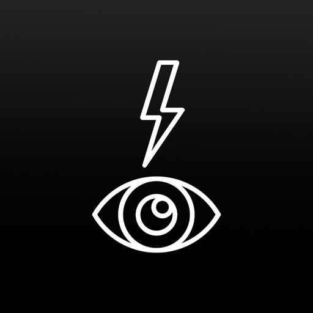

KEY FEATURES:
	•	Approximate color temperature readings through your iPhone camera
	•	Approximate ND calculation through your iPhone camera
	•	Real-time values using wide, telephoto, and front-facing lenses
	•	Luminance histogram
	•	Location-aware shot library with custom notes and metadata
	•	Scene comparison tools to assist with color consistency

Perfect for:
	•	Location scouting
	•	Pre-production planning
	•	On-set color adjustments
	•	White balance optimization
	•	Multi-camera coordination

Created by filmmakers for filmmakers, CineTemp is designed to simplify your workflow and support your creative vision. While it’s not total replacement for dedicated hardware, CineTemp offers an intuitive way to make informed color decisions.

The app seamlessly integrates with most iPhone cameras, and the customizable interface keeps essential tools at your fingertips. Save and organize your readings with automatic time, date, and location tagging to streamline your pre-production process.

Join the creators using CineTemp to elevate their craft. 

Download now and explore an innovative approach to color temperature measurement.

[View on Apple](https://apps.apple.com/fr/app/cinetemp/id6738967033)

## Pure Acid

Pure Acid is a top quality bassline synthesizer and drum machine in one app! Inspired by classic hardware bassline synthesizers and rhythm machines, which changed musical world back in 80's, like the legendary TB-303 synthesizer, TR-808 / 707 / 909 rhythm boxes and their numerous replicas, Pure Acid is designed to bring back the feeling of retro analog gear in every detail in terms of sound, as well as to provide new functions previously unavailable in the original devices to make your music creation workflow fast and fun! A large number of factory preset patterns will immerse you into an exciting world of Acid House, Techno, Hardcore and Big Beat music genres, which will inspire you to create your own basslines and rhythms for your compositions!

You can use Pure Acid app as a ready-to-go realtime musical instrument (groove box) in your jam sessions together with Ableton Link to synchronize it with the rest of your music gear. Its bassline editing system and randomization options will be handy to create unique groovy basslines easily. Realtime master effects with XY-pad controls can add expression to your live performance. You can also use Pure Acid with AudioBus, AUM or other IAA-supporting apps to create complex and interesting sound setups.

Features:

• supports AUv3, Ableton Link, AudioBus, Inter-App Audio, Core Midi, Virtual Midi In/Out, Bluetooth Midi
• AudioBus state saving support
• 64-bit sound engine
• Midi Learn
• Export to midi file
• includes Multiple Output AUv3 plugin with 6 audio output busses

Bassline Section:

• 2 classic bassline waveforms: Saw and Pulse
• classic knobs: Tune, Cutoff, Resonance, Env Mod, Decay and Accent
• Distortion effect with amount, HPF and Boost knobs
• filter LFO with rate and depth knobs

Sequencer Section:

• up to 12 bassline patterns can be stored in one preset
• up to 32 steps per each bassline pattern
• patterns can be chained together to create more complex patterns
• pattern Tempo and Swing parameters
• Gate parameter, which allows you to adjust bass note lengths
• Pattern Editor allows you to copy, transpose patterns, shift notes left/right, insert or delete a note, variate (randomize all note properties expect pitch), shuffle (randomize notes order only), reverse and compose patterns using Bassline Composer function
• onscreen keyboard allows you to enter bassline notes in a comfortable way. You can also record basslines in realtime.

Drums Section:

• 16 independent drum parts
• 35 different classic drum sounds with ability to tune your own drum kit
• each drum part sound has its own parameters: Tune, Decay, Attack/Snap/Color, FX A send, FX B send, Boost, Pan, Level
• up to 12 drum patterns and 4 drum fill patterns per preset
• 16 steps per each drum pattern, with ability to add 16 "backbeat" steps between main steps (32 steps per drum pattern in total)
• patterns can be chained together to create more complex patterns
• Swing and Flam features
• Total Accent part with adjustable total accent value can give you ability to "highlight" specific steps in your drum pattern
• new: step conditions for drum steps

Mixer Section:

• 2 mixer channels: Bassline and Drums
• Drive effect for each channel
• 2 send effect pedals: FX A and FX B
• 14 send effect types
• send effect can be routed to either master output, MFX or another send effect (FX A -> FX B), which allows to chain several effects one after another
• MFX pedal with 22 effect types to choose from
• FX A and FX B send amount knobs for each mixer channel
• XY-pad on each effect pedal to control their parameters
• Master Limiter effect to prevent sound clipping

and more:

• Unlimited number of user presets
• 84 factory presets
• Audio export to wav file (16, 24 or 32 bit)
• Preset / Bank Share function
• Selectable UI color schemes with ability to adjust colors manually
• Can work either as a standalone app, or as AUv3 audio unit plugin
• Designed for both iPad and iPhone

[View on Apple](https://apps.apple.com/fr/app/pure-acid/id1481283602)

## Pocket Light Meter

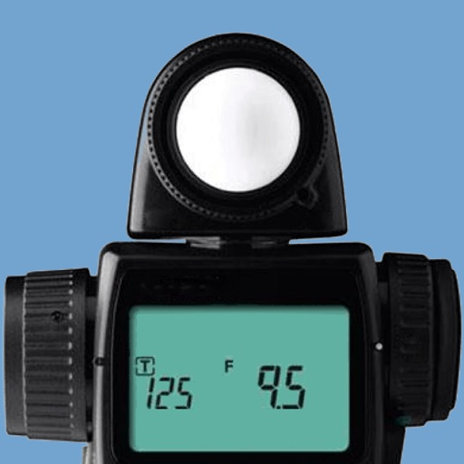

A light meter that is always in your pocket. It is indispensable for film photography with all manual camera. Measures reflected light, and allows reciprocity calculations.

[View on Apple](https://apps.apple.com/fr/app/pocket-light-meter/id381698089)

## Salatuk - صلاتك

************************************
Salatuk est votre compagnon de prières.

En vous localisant automatiquement, cette application vous propose les horaires de prières adaptés et la direction de la Qibla correspondant à votre position.

L'algorithme de Salatuk supporte un grand nombre de méthodes de calcul adoptées dans le monde islamique. En fonction de votre localité, l'application choisit la méthode et l'école Fiqhi appropriées. Toutefois, vous avez aussi la possibilité de modifier ces informations manuellement dans l'onglet 'Paramètres' si vous le souhaitez.

Salatuk est actuellement disponible en 3 langues : Arabe, Anglais et Français.

Note Importante
----------------------------
Si vous êtes familier avec Salatuk sur d'autres systèmes, merci de noter que cette version NE SUPPORTE PAS certaines fonctions comme "Passer en mode silencieux après le Adhan". D'autres fonctions comme le "Adhan complet" ou l’utilisation d'un  "Athan personnalisé". Ceci est dû à des limitations techniques qu’on essaiera d'enlever une fois le système iOS le permettra.

A propos des horaires de prière
----------------------------------------
Merci de noter que nous attachons beaucoup d'attention à la précision des horaires de prière. Toutefois, dans certains pays, ces horaires peuvent ne pas être exacts. Dans ce cas, merci de vous référer aux institutions islamiques officielles de votre localité et régler manuellement les horaires de prière dans les paramètres de l'application.

A propos du Adhan
----------------------------------------
Salatuk rappelle qu'il est temps pour la prière en utilisant  "4 takbeerats" au lieu du Adhan complet.

Conseils pour une meilleure utilisation
-------------------------------------------------
Pour rafraîchir les notifications de prière, il est recommandé d’ouvrir l'application fréquemment (1 fois par jour). Cela doit être le cas, aussi, quand vous changez de localisation ou d’horaire (heure d’été).

****************************

[View on Apple](https://apps.apple.com/fr/app/salatuk-%D8%B5%D9%84%D8%A7%D8%AA%D9%83/id686077611)

## Permis bateau côtier ENF

Bienvenue sur cette application développée par les formateurs de l’École de Navigation Française.

Vous trouverez dans cette application l'INTÉGRALITÉ des questions conformes au programme officiel de l'examen du permis bateau mer côtier 2022. Et seulement celles-ci.

Nous avons pensé et conçu cette interface afin de vous aider à préparer au mieux votre examen du permis côtier.

L’École de Navigation Française prépare toute l’année des candidats aux différents permis bateau avec un taux de réussite proche de 100%.

Quoi de plus rassurant que de faire confiance à de véritables professionnels de la formation ?

Cette application est entièrement autonome : vous la conservez en mémoire et vous pouvez réviser où bon vous semble.

Des mises à jour régulières sont effectuées pour s'adapter à l'évolution du programme de l'examen du permis côtier. Si une mise à jour intervient, vous en serez averti.

Vous trouverez dans cette application trois modes de fonctionnement :

Le mode « apprentissage », où vous pouvez choisir des questionnaires thématiques, et accéder à des explications que nous avons voulues claires.

Le mode « entraînement » vous permettra de vous familiariser avec l’examen comportant 40 questions dont 5 sur la VHF mais sans aucune limite de temps.

Le mode « examen » vous mettra dans les conditions réelles de l'examen avec une limite de temps pour répondre à chaque question.

Très important :

Nous attirons votre attention sur le fait que cette application n’est qu’une aide afin de vous permettre de vous entraîner à l’examen du permis bateau.

En aucun cas elle ne prétend se substituer à des cours dispensés par de vrais formateurs en bateau école.

La navigation est une activité très subtile, qui demande une pratique régulière afin d’en saisir la complexité. Ce n’est pas en répondant sans réfléchir à des questions d’examen que vous pourrez vous faire une idée de ce que vous allez trouver en mer !

D’où l’utilité d’une vraie formation… avec de vrais formateurs…

L’équipe de l’École de Navigation Française

[View on Apple](https://apps.apple.com/fr/app/permis-bateau-c%C3%B4tier-enf/id455573706)

## SKRWT

«Meilleures applications 2014» - App Store
«Les 10 meilleures applications de photographie» - The Guardian
«Faites en sorte que vos photos iPhone paraissent professionnelles avec SKRWT» - AppAdvice
«SKRWT est le chaînon manquant de la perfection photo sur iPhone» - Paste Magazine
«10 Applications iPhone qui feront merveille pour votre photographie» - Business Insider
«7 Applications Must-Have pour les pilotes de drones» - fromwhereidrone.com
«5 Applications iPhone à ne pas rater…» - Time.com

-

SKRWT (« Meilleures applications 2014 » sur l’App Store) est l’outil de correction de perspective et d’objectif le plus puissant qui soit. Fabriqué pour vous aider à améliorer vos meilleures photos sur smartphone en seulement quelques clics, la version 1.5 de SKRWT est meilleure que jamais. Avec une variété de fonctionnalités inégalées et les extensions intégrées impressionnantes MRRW et 4PNTS, cette application raffinée est l’outil d’édition par excellence pour les amateurs de photographie sophistiquée tels que vous. Vive la symétrie !

#SKRWT #MRRW #4PNTS

-

SKRWT

Dites au revoir aux lignes convergentes : SKRWT est l’application de correction de perspective et d’objectif à tout faire pour les amateurs de symétrie. Corrigez les lignes horizontales et verticales ainsi que les distorsions de l’objectif pour des photos prises avec un adaptateur, un DLSR, une GoPro ou l’appareil photo d’un drone. Avec sa fonctionnalité de recadrage automatique unique en son genre et son interface intuitive et explicite, SKRWT est le chaînon manquant de la photographie haut-de-gamme sur smartphone. Si vous êtes nul en qualité et en symétrie, SKRWT est pour vous. 

-

4PNTS 

Avec 4PNTS, la gentille équipe de SRKWT a repensé les flux de travail de la correction de perspective, et a mis en place une nouvelle extension must-have. Une approche pratique à la transformation de photos professionnelle : 4PNTS vous laisse manuellement travailler un ou plusieurs coins de votre image, transformant la correction de perspective en un processus de manipulation entièrement intuitif. L’outil-de-perspective-4-points est disponible comme achat interne dans l’application – afin de pouvoir transformer, déformer et améliorer artistiquement vos photos directement sur SKRWT. Votre interprétation personnelle, votre créativité, votre photo. 

-

MRRW

SKRWT présente quatre effets miroirs de haute précision dans cet outil pour smartphone inégalé. Avec une nouvelle approche à la manipulation créative d’images, MRRW aide à dévoiler la symétrie cachée dans vos meilleures prises et vous permet de trouver une nouvelle liberté créative et artistique. Explorez de nouvelles possibilités en composition et utilisez la correction de perspective et le recadrage automatique en qualité SKRWT. C’est parti pour un flux de mrrwgrams interminable ! 

instagram.com/doyouskrwt 
facebook.com/skrwtapp
twitter.com/doyouskrwt
hello@skrwt.com

-

#SKRWT #DOYOUSKRWT #VIVELASYMÉTRIE

[View on Apple](https://apps.apple.com/fr/app/skrwt/id834248867)

## Zoiper Premium voip soft phone

Zoiper is an easy to use sip video softphone, with excellent voice quality and easy to setup. 



Feel free to contact us with support questions or for more information on whitelabel solutions.

Connect Zoiper to your PBX or voip provider and make crystal clear, echo free, voice or video calls through wireless and 3g.



Zoiper works flawlessly in the background and is optimized to use as little battery as possible while ensuring the reliability of incoming calls.



Use bluetooth to pair the Zoiper SIP softphone to your car audio system or your headset and enjoy voip on the go.



This softphone comes with a built in QR code scanner for 1 click account configurations. Never type account details and credentials again!


Try it for 7 days free! Subscription is not charged if cancelled within trial period. Please note that the in-app subscription purchases are not supported through Family Sharing.

1-Year Subscription: $9.99, 1 month $0.99 USD, automatically renewed until cancelled by the user.
Additional Subscription Information:
• Subscriptions will be automatically renewed within 24-hours prior to following subscription period. Please check user's Account Setting to disable the auto-renewal.

Features:

- Call waiting
- Call transfer
- Call statistics


- Call recording
- Conference calls
- Instant messaging (SIP simple)
- Presence (SIP simple)
- Encryption (TLS / ZRTP)

Supported codecs:

- g.711 (ulaw/alaw)
- OPUS
- G722
- G.722.1
- G.722.1C

- Speex

- iLBC

- gsm

- g.729*

- vp8

- h264*



* The 3rd party patented codecs h264 and g729 are available as optional in app purchase. 




Zoiper is also available as an OEM / whitelabel solution license and can be customized on demand.

Be sure to configure ios to allow notifications for incoming calls for Zoiper and provide access to the contact list.

For more information on Zoiper’s features, please visit: https://www.zoiper.com/en/products/zoiperios
Terms of use: https://www.zoiper.com/en/zoiper-general-terms
Privacy Policy: https://www.zoiper.com/en/zoiper-privacy-policy

Regarding the subscriptions:

• Payment will be charged to iTunes Account at confirmation of purchase
• Subscription automatically renews unless auto-renew is turned off at least 24-hours before the end of the current period
• Account will be charged for renewal within 24-hours prior to the end of the current period, and identify the cost of the renewal
• Any unused portion of a free trial period, if offered, will be forfeited when the user purchases a subscription to that publication, where applicable

[View on Apple](https://apps.apple.com/fr/app/zoiper-premium-voip-soft-phone/id787863350)

## Tresor Quotidien 2026

Chaque jour méditez sur un texte biblique où que vous soyez grâce à chaque message diffusé quotidiennement pour encourager votre foi.

[View on Apple](https://apps.apple.com/fr/app/tresor-quotidien-2026/id6760400471)

## La conjugaison française

Version payante SANS publicité consultable hors connexion, le contenu étant stocké dans l'application. 

Besoin de vérifier un verbe ou de vous entraîner sur la conjugaison française ? Cette application est faite pour vous !
Avec l'application La conjugaison, vous pourrez consulter toutes les conjugaisons de plus de 9 000 verbes français. En plus d'un conjugueur de verbes, vous allez également y trouver pour chaque verbe des exercices de conjugaison, avec la possibilité de sélectionner vos verbes favoris, les groupes, auxiliaires, modes et temps d'entraînement.

Cette application vous propose :
* Plus de 9 000 verbes de la langue française conjugués à tous les temps (présent, passé, futur...), tous les modes (indicatif, subjonctif, impératif, conditionnel, participe,gérondif, infinitif...), voix (active, passive), genre (masculin, féminin), à la forme pronominale si elle existe.
* Les informations essentielles sur les groupes : auxiliaire, premier, deuxième ou troisième groupe.
* La possibilité de sélectionner les verbes favoris qui seront utilisés dans les exercices
* La possibilité de modifier les paramètres du verbe : auxiliaire alternatif, voix pronominale, genre féminin ou masculin, voix passive
* Des exercices de conjugaison sur mesure avec une multitude d'options pour sélectionner les verbes favoris, le type de verbes ou de temps sur lesquels vous souhaitez vous tester (auxiliaires, verbes du 3e groupe, temps, modes, voix...).
* Le mode sombre.

Pour accéder rapidement au verbe recherché (quel que soit son groupe, son temps, son mode), utilisez le moteur de recherche, en y tapant directement le verbe à l'infinitif.

Avec l'application La conjugaison française, la conjugaison redevient un jeu d'enfant, et vous ne tomberez plus dans les pièges des nombreux verbes irréguliers français.

Bonne conjugaison française !

Nous proposons d'autres applications pour conjuguer les verbes italiens, espagnols, allemands et portugais.

[View on Apple](https://apps.apple.com/fr/app/la-conjugaison-fran%C3%A7aise/id495169311)

## VisualTerms construction

Dictionnaire visuel de la construction et de l’architecture

AVEC VISUALTERMS :
- Accédez à des milliers de dessins légendés, classés par thèmes. Retrouvez en un instant un mot précis ou une technique de construction. 
- Zoomez à volonté dans les illustrations. Naviguez très facilement sur tous vos écrans.
- Approfondissez vos connaissances grâce aux centaines de notes et commentaires.
- Consultez VisualTerms hors connexion, partout, même sur un chantier isolé.

VISUALTERMS POUR QUI ?
- Vous êtes un professionnel ? VisualTerms est un aide-mémoire précieux : utilisez toujours le mot juste dans vos échanges… et expliquez par l’image les différents procédés de construction. 
- Vous êtes étudiant ? VisualTerms est l'outil pédagogique idéal pour apprendre rapidement les fondamentaux de la construction, sans vous plonger dans de longs textes. 
- Vous êtes bricoleur ou vous avez un projet de construction ? Enrichissez votre vocabulaire technique pour devenir plus « pro » et pour bien comprendre tous les spécialistes.

LA TRADUCTION PAR L’IMAGE
Si vous devez travailler dans une autre langue, VisualTerms se transforme en un outil de traduction révolutionnaire, par l’image : versions ANGLAISE et ESPAGNOLE intégrées.

MISES A JOUR GRATUITES
VisualTerms est très complet, mais la construction évolue constamment : téléchargez gratuitement les mises à jour de contenus à venir !

N.B. : VisualTerms est le nouveau nom de l'application VisuelBat.

[View on Apple](https://apps.apple.com/fr/app/visualterms-construction/id1193055047)

## Magic Spider - My Pet Boris

This is the Original "Spider on Hand" app as seen on Youtube. Beware of imitations.

Do you know anyone who is afraid of spiders? Everyone right? Then this is the perfect magic trick/prank for you.

Watch the trailer video at http://www.mypetboris.com/trailer.htm

My Pet Boris app is the scariest app for the iPhone. Inspired by Jim Pace's magic trick "The Web" where a spider magically appears on the back of your spectator's hand. Bound to get amazing reactions.

The app uses the idea of "Augmented Reality" merging real life objects with computer generated graphics to create a truly frightening effect.

THE MAGIC SPIDER EFFFECT
You take a photo of the spectator's palm (secretly loading a plastic spider on the back of their hand) and place the phone on their palm to hold.

Your Pet Boris - an Australian Red back spider (black widow) creeps onto the screen and they can feel the vibrations as it walks. You can tap the screen and even slide your finger into the animation to scratch the spider's back. Boris walks off the screen.

You tell them that the phone has special sensors that when you wave your hand over the screen it makes the spider come back. He does.

You get them to wave their hand over the phone. 
It is just then that they glimpse a realistic spider clinging to the back of their hand and they FREAK OUT!!

Bound to get BIG reactions. 

Finger tone and size can be set to suit your own or you can import an image of your own finger. 

Start-up screen can be customised to suit your performance style. An actual  photo of their hand, solid white or any image from your library can be used as a background.

NOTE: Requires a plastic spider or cockroach and adhesive dots to perform. You should be able to find these locally or you can purchase from our website.

See our website http://www.mypetboris.com for more details, spider and cockroach supplies and video presentation & instructions.

Like our Facebook page to keep up to date with changes, tips and suggestions. http://www.facebook.com/MyPetBoris

THE MAGIC COCKROACH
The app also comes with a cockroach animation for those who think they are scarier than spiders.

THE MAGIC BUTTERFLY EFFECT - IN-APP PURCHASE - (for the Professional Magician)

The Magic Butterfly is an additional effect within the Magic Spider – My Pet Boris App. 

It is enabled as an “in app purchase” for around US$2.99 depending on your local currency. The custom finger feature is also unlocked when you purchase the butterfly effect.
 
This is a perfect routine for those times when you want to perform a beautiful effect for a little girl or woman, leaving her with a magical gift at the end. You will get similarly strong reactions to the Magic Spider effect without the scare factor.

PRESENTATION:
The magician simulates a grand illusion in the palm of the spectator’s hand. A tiny foil covered “Magical Egg” is placed in the palm of the spectator’s hand and then photographed. The phone is placed on their hand.

The egg transforms into a Chrysalis and then into a butterfly. The magician’s finger is seen to tickle the virtual butterfly on screen which then flies away. 
Using a magical gesture the magician brings the butterfly back briefly before it flies off again.

The spectator is asked to try and make it return. When they try, they find a matching butterfly (in an impossible location) on the back of their hand. The original foil egg has vanished.

THE CARD REVELATION EFFECT - IN-APP PURCHASE - (for the Professional Magician)

The Magic Spider effect with the addition of a torn card corner revelation as a finale.

Accessory packs and supplies are available at: http://www.mypetboris.com/store.htm

See our FAQ Section. http://www.mypetboris.com/faq.htm

Full instructions at: (everything is explained)
http://www.mypetboris.com/inst2099.htm.

Use the password at the bottom of the "CREDITS" screen for access.

[View on Apple](https://apps.apple.com/fr/app/magic-spider-my-pet-boris/id578230583)

## My Moon Phase Pro - Alerts

Ma Phase Lunaire Pro est la meilleure application pour suivre le calendrier lunaire. Son design sombre et élégant facilite la visualisation d'informations telles que le cycle actuel de la lune, les heures de lever et coucher de la lune, ainsi que des extras tels que le moment de la prochaine pleine lune. Si vous êtes intéressé par la photographie de la lune, vous pouvez également savoir quand sont les heures dorées et les heures bleues afin de pouvoir prendre les plus belles photos.

- Voyez le cycle lunaire pour une date future en faisant défiler la barre de dates ou en tapant sur le bouton du calendrier !
- Autorisez l'appli à utiliser votre localisation actuelle ou sélectionnez manuellement un endroit de votre choix à utiliser !
- Voyez à quel point le ciel est censé être nuageux ces prochains jours afin de déterminer si vous pourrez ou non voir la lune !
- Trouvez les prochaines phases de la lune directement sur l'écran principal - vous saurez instantanément quand auront lieu la prochaine pleine lune, la nouvelle lune, le premier et le dernier quartier.
- Les indications relatives aux heures dorées et bleues sont disponibles pour vous permettre de calculer le meilleur moment pour prendre des photos.
- Des informations plus spécifiques sont disponibles, telles que la distance de la lune à la Terre, son âge et son altitude actuelle. Ceci est disponible pour n'importe quelle date du calendrier lunaire.
- Recevez des notifications lorsque la lune atteint une phase particulière de votre choix.

Si vous souhaitez le moyen le plus efficace de suivre le calendrier lunaire et les phases lunaires actuelles, alors Ma Phase Lunaire Pro est l'application parfaite pour vous.

[View on Apple](https://apps.apple.com/fr/app/my-moon-phase-pro-alerts/id1104649303)

## iTanpura

Got tanpura? Well guess what, we have two for you, PLUS a Swar Mandal AND a Sur-Peti / Shruti box! Come listen to the beautiful, meditative sound of real Hemraj tanpuras, and get lost in the mysteries of Indian Classical music.
________________________________________

◆◆◆ 5-STRING TANPURAS & AUTO-TUNER!
◆◆◆ Before buying also consider iTablaPro
◆◆◆ which has all iTanpura features + tabla
◆◆◆ Note: All updates are always free!
________________________________________

And the reviews are in:
***** "BEAUTIFUL SOUND"
***** "Excellent App, superb sound"
***** "Concert-quality tanpura in your pocket"
***** "This is what I've been waiting for"
________________________________________

◆ ABOUT THE TANPURA ◆
The Tanpura is a musical instrument used in Indian classical music to provide a background "drone" against which the rest of the music is performed. It is a 4-stringed instrument with a base made from cured pumpkin gourd and a stem made from wood.
________________________________________

◆ AND NOW PRESENTING - iTanpura ◆
iTanpura is an electronic Tanpura for the iPhone and iPod Touch. It uses stereo digital sound to simulate a set of two tanpuras each of which can be tuned with a different string combination. It uses sounds sampled from real Hemraj tanpuras to provide beautiful yet realistic sound in a pleasing and intuitive package. And now iTanpura also includes fantastic Swar Mandal sound (with presets for 75+ raags) for an instant concert atmosphere guaranteed to inspire! iTanpura is ideal for everyday music practice, concerts, or even as a serene background for meditation.
________________________________________

◆ KEY FEATURES ◆
√ FOUR fantastic instruments in one app: includes two 5-string tanpuras with independent pan and volume controls, a 15-string Swar Mandal, and a Sur-Peti/Shruti Box
√ Uses sounds sampled from actual male & female tanpuras for realistic tanpura sound throughout the pitch range
√ Wide range of pitch from lower A (A2) through upper E (E4) for one and a half octaves of tuning
√ INTEGRATED AUTO-TUNER: Auto-Tune iTanpura to your instrument such as harmonium, or use it to tune other instruments (microphone capability required such as iPhone built-in mic or 2nd/3rd generation iPod Touch with external microphone)
√ BACKGROUND PLAY: Start playing the tanpuras and switch to another app, or play along with iPod music
√ Integrated 15-string Swar Mandal - completely tunable & can be played manually OR set to auto-loop
√ Suitable for Hindustani or Carnatic, vocal or instrumental music 
√ Fine-tune pitch in cents. The display shows the fine-tune value to allow exact recreation of any pitch
√ Play one or two simultaneous tanpuras both controlled by the master pitch controls
√ Each tanpura's first string can be tuned to Pa, Ma or Ni, or any custom note such as Re, Ga, Dha, etc 
√ Or tune first string to any shruti in the octave using a slider
√ Each tanpura has its own pan and volume controls to allow precise placement within the stereo image. For example you can have a tanpura with Pa on your left and one with Ni on your right
√ PRESETS: Save your favorite settings as named presets. Includes presets for the 100+ most popular raags. And now you can also export/import presets via email or iTunes File Sharing.
√ Turn the Sur-Peti/Shruti Box on or off and adjust its volume from the settings page
√ Can be used with speakers, headset, or the internal speaker (a high-quality speaker dock is recommended for maximum effect)
________________________________________

Not yet convinced? Try iTanpura Lite for free! It has most of the features of the full version, except the sound stops playing after 30 seconds and it does not include the Swar Mandal or the Tuner.
________________________________________

[View on Apple](https://apps.apple.com/fr/app/itanpura/id326115058)

## Map Points - GPS Location Storage for Hunting, Fishing and Camping with Map Area Measurement

Want to store custom locations?  mapPoints will store all of your favorite locations in one spot.  This app is great for traveling, if you would like to store your locations and take a snapshot of where you were.  It is also great for hunting or fishing or any activity that a specific coordinate is needed.  There are four ways you can store your location - 

1. Your current location.
2. You can enter an address.
3. You can store a custom latitude and longitude coordinate.
4. You can drop a pin on the map where ever you would like.

The location information is all editable after you store it.

There is an option to draw lines between the map location displayed on the map.  You can draw a line between all of the locations in the order selected including the user location.  You can draw a line from the user location to the last location selected.  You can draw a line form the user location to the first location selected.  And you can draw a line between all of the points excluding the user location.  This last option is handy when trying to compute distance on a map.  When drawing any lines on the map, the distance is displayed in the lower right corner of the screen.

There is a meter on the main page that measures the accuracy of the GPS signal.

You can display your heading and altitude on the main page as an option.

[View on Apple](https://apps.apple.com/fr/app/map-points-gps-location-storage-for-hunting-fishing/id394909320)

## TurboCollage Automatic

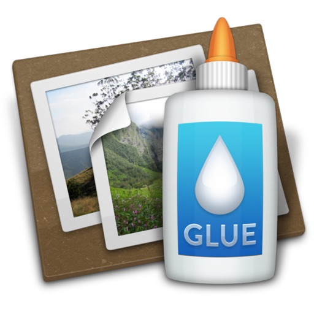

Le n°1 des créateurs automatiques de collages photo pour iPhone et iPad.

Conçue pour être facile à utiliser, TurboCollage vous permet de créer de magnifiques collages photo en seulement 2 étapes — sélectionnez une taille et les photos à utiliser. Avec TurboCollage, vous n'êtes pas limité aux 2, 3 ou 4 mêmes montages photos, à la mise en page identique. Vous pouvez utiliser autant de photos que vous le désirez et TurboCollage se charge de les disposer en un sublime collage qui vous surprendra, vous et vos amis, à coup sûr.

Si vous êtes à la recherche d'un contrôle manuel complet, de photos plus grandes et de plus d'options de collage, nous vous invitons à essayer nos apps de bureau TurboCollage, disponibles sur www.TurboCollage.com.

Nous adorons recevoir des commentaires de nos utilisateurs, merci donc de nous envoyer vos messages à apps@silkenmermaid.com.

[View on Apple](https://apps.apple.com/fr/app/turbocollage-automatic/id1076224918)

## RenpyReader

RenpyReader is capable of running both Renpy's and ONS:
*Quickly runs Renpy's visual novels and ensures language compatibility.
*You can readily open the folder where the project is located, view the archived content or other configurations, and facilitate stocking or recovery.

Notes:
*When importing a project, please make sure there is a "Renpy" folder under the project folder (to confirm that it is a Renpy project) or there is a ONS scripter file in there.
*In addition to file transfer, you can also place the Renpy/ONS project in the "Documents" folder through your own iTunes. This application only provides a runtime environment and does not provide any Renpy/ONS projects. Please confirm that your Renpy/ONS project comes from a legitimate channel.

[View on Apple](https://apps.apple.com/fr/app/renpyreader/id6479896772)

## S:G LiDAR - Infrared Laser Cam

** IMPORTANT INFORMATION - PLEASE READ **

Introducing S:G LiDAR - Infrared Laser Cam: Unleash the Power of Lidar Vision

Discover a new dimension of paranormal exploration with the SG LiDAR - Infrared Laser Cam.

This innovative app utilises the cutting-edge rear facing LiDAR sensor or the front facing TrueDepth infrared camera on your device to reveal the unseen world.

S:G Lidar adapts to your iPhone's capabilities, utilising the rear-facing Lidar sensor if available. For devices without a rear-facing Lidar sensor, the front-facing TrueDepth infrared camera is seamlessly integrated. If your device has both cameras, you can seamlessly switch between the 2 using the flip camera button.

Capture your encounters with ease using the built-in screen recording feature on your device. 

** Important Info **

Not all iPhones or iPads have got the rear facing LiDAR sensor.

iPhone 12 pro, iPhone 13 pro, iPhone 14 pro have all got the rear facing LiDAR sensor, along with the latest iPad pro.

If your iPhone or iPad has the front facing camera used for Face ID, then you will be able to use the front facing true depth camera.

PLEASE check your device capabilities before purchasing this app.

** Disclaimer **

Use at your own risk, I cannot be held personally responsible for you or any outcome (paranormal or otherwise) from using this app!

[View on Apple](https://apps.apple.com/fr/app/s-g-lidar-infrared-laser-cam/id6448686968)

## ChoreFit - Track Cleaning

Turn everyday chores into real workouts.  

ChoreFit transforms the movement you already do at home into measurable fitness. Using science‑based MET values, load‑adjusted algorithms, and Apple Watch sensor data, ChoreFit makes your invisible labor visible — and finally gives your home activity the credit it deserves.
Track cleaning, organizing, laundry, vacuuming, and more. Watch your Activity Rings close with movement that actually reflects your effort. ChoreFit syncs directly with Apple Health to calculate calories, heart rate, duration, and intensity, giving you accurate energy‑burn data tailored to your pace and optional added weight (like a weighted vest or wrist weights).

Whether you’re tidying your home, deep‑cleaning, or organizing for the week, ChoreFit turns daily tasks into workouts that count.

About Calories & Accuracy
ChoreFit uses validated MET (Metabolic Equivalent of Task) values from the Compendium of Physical Activities to quantify household work as exercise. Each session captures duration, movement, and intensity to estimate calorie burn. Early estimates may vary as your activity patterns are established, but ChoreFit prioritizes physiologically grounded measurement over inflated calorie claims.

Why ChoreFit
• Everyday chores are real exercise
• Home activity contributes significantly to NEAT (Non‑Exercise Activity Thermogenesis)
• Weighted chores can boost calorie burn, strength, and cardiovascular activity
ChoreFit helps you capture all of this automatically.

Features
• Convert household chores into measurable fitness
• Accurate calorie burn using MET‑based algorithms
• Add weight (vests, wrist weights) for enhanced burn
• Apple Watch integration with real‑time heart rate
• Syncs instantly with Apple Health
• View daily movement, streaks, and workout history
• Supports all major cleaning and home‑chore activities
• Great for caregivers, parents, athletes, beginners, and anyone who moves at home

How It Works
Select a chore (vacuuming, bathroom cleaning, laundry, etc.)
Add optional weight
Start the workout on your Apple Watch
ChoreFit records calories, heart rate, and total movement
Data syncs automatically to Apple Health and closes your rings

The Mission
ChoreFit was created to turn invisible labor into visible strength by recognizing real movement that traditional fitness apps ignore. Your everyday effort matters — and now it finally counts.

Pricing
ChoreFit is a one‑time download for $2.99.

Support
Questions or feedback?
Email: chorefit@chorefitapp.com
Privacy Policy: https://chorefitapp.jimdosite.com/privacy-policy/

Thank you for using ChoreFit.

[View on Apple](https://apps.apple.com/fr/app/chorefit-track-cleaning/id6753065929)

## BlueLocation

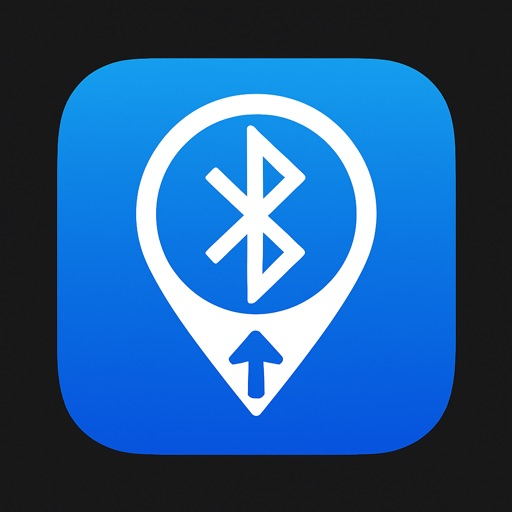

BlueLocate – Find your Bluetooth devices with ease

Never lose your Bluetooth speaker, headphones, or gadgets again. BlueLocate helps you track down your devices by showing both direction and distance – all directly on your phone.

Key Features

Device Finder – Scan for nearby Bluetooth devices and pick the one you want to locate.

Arrow Guidance – Follow a big, easy-to-read arrow that points you towards your device.

Distance Estimate – See how far away your device is (approximate meters/feet).

Confidence Indicator – Know how reliable the current reading is with simple high/medium/low feedback.

Favorites – Save frequently used devices for quick access.

Smart Tips – Get guidance on how to move (walk in L-shape, stand still briefly) for better accuracy.

How it Works

BlueLocate uses the Bluetooth signal strength (RSSI) from your device combined with your phone’s sensors (compass, motion, gyroscope). By moving with your phone, the app can estimate the position of your Bluetooth device and guide you with a direction arrow and distance readout.

Designed for Everyone

Works with any Bluetooth device – speakers, headphones, smartbands, and more.

Simple, minimalistic interface with clear arrows and distance badges.

Privacy-friendly: All scanning and processing happens on your phone – no data leaves your device.

Why BlueLocate?

Unlike simple “signal strength meters,” BlueLocate combines sensor data and smart algorithms to not only tell you if your device is nearby, but also which way to walk and how far it is.

Stop searching blindly. Let BlueLocate point the way.

[View on Apple](https://apps.apple.com/fr/app/bluelocation/id6752529353)

## Avionics Buddy

Avionics Buddy connects to Microsoft Flight Simulator through a local Windows bridge and brings live aircraft telemetry, maps, gauges, airports, runways and approach helpers to your Apple devices — without leaving the simulator window on your PC.

See your aircraft position on the map, follow altitude, heading, airspeed and vertical speed, browse airports, inspect runways and use visual approach helpers while you fly.

Avionics Buddy is built for sim pilots who want to extend their Microsoft Flight Simulator setup beyond the main screen. Use it as a minimal, beautifully styled cockpit display on your desk, or as an extra avionics layer in a larger multi-screen simulator setup. Build your own creative flight deck using the Apple devices you already have around you.

During long flights, keep your position, heading, altitude and flight status visible from your iPhone or iPad while you step away from your cockpit. During arrivals, use the native map, runway information and visual approach helpers to stay aware of runway alignment, descent behavior and landing flow. Between flights or during cruise, browse nearby airports and runway details without pausing or alt-tabbing out of Microsoft Flight Simulator.

Stay connected to your flight, even when Microsoft Flight Simulator is running on another screen.

Key features:

• Live aircraft telemetry from Microsoft Flight Simulator
• Follow-mode map with aircraft position, heading and your selected aircraft icon
• Glass-cockpit-inspired and compact gauges for altitude, speed, heading and vertical speed
• Optional cabin sound effects, including seatbelt announcements and small details to discover
• Airport search with runway information, saved airports and favorites
• Runway approach helpers for visual alignment during simulator arrivals
• iPhone and iPad support
• Local network connection through Avionics Buddy Bridge on Windows
• No account required
• No cloud telemetry

How it works:

1. Start Microsoft Flight Simulator on your Windows PC.
2. Run Avionics Buddy Bridge on your Windows PC, available for free from avionicsbuddy.com.
3. Scan the QR code with Avionics Buddy on your iPhone or iPad.
4. Fly with live data on your second screen.

Avionics Buddy is made for Microsoft Flight Simulator entertainment use only. It is not intended for real-world navigation, flight training, flight planning or any operational aviation use. Avionics Buddy is not affiliated with Microsoft, Asobo Studio, Working Title, OurAirports or any aircraft manufacturer.

[View on Apple](https://apps.apple.com/fr/app/avionics-buddy/id6773903019)

## iCompta 6

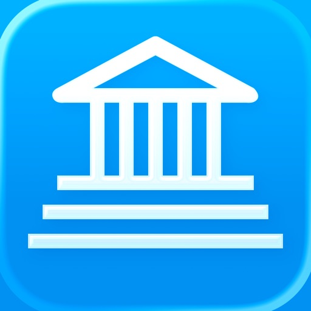

iCompta est une application permettant de gérer vos comptes avec une grande simplicité. Conservez la trace de vos revenus et dépenses, prévoyez vos prochaines factures, respectez votre budget et découvrez enfin où part tout votre argent grâce à de magnifiques graphiques.

FONCTIONNALITÉS :
- Gérez tous vos comptes dans des devises différentes si besoin
- Triez et filtrez vos opérations afin de faire des statistiques sur vos revenus et dépenses
- Créez des budgets afin de surveiller vos revenus et dépenses périodiques
- Gérez votre portefeuille d'actions
- Réglez enfin l'éternel problème des dépenses en commun afin de toujours savoir qui doit quoi à qui
- Faites de superbes rapports et graphiques
- Téléchargez automatiquement vos opérations depuis votre banque (nécessite un abonnement facultatif, liste des banques disponibles sur le site ou dans l'application) ou manuellement avec un navigateur
- Importez / exportez vos opérations au format QIF, OFX, CSV, XML ou JSON
- Synchronisation entre iCompta 6 sur Mac et iCompta 6 sur iPhone / iPad via iCloud, Dropbox ou le réseau local
- Modifiez de nombreuses opérations d'un coup grâce à l'édition multiple ou avec le moteur de règles performant
- Fonctions professionnelles : gérez la TVA, entrez vos clients et faites des factures
- Pointez les opérations qui figurent sur vos relevés pour vérifier que vous êtes bien à jour dans vos comptes
- Protection par mot de passe

Support en français et anglais.

Conditions générales : https://www.apple.com/legal/internet-services/itunes/dev/stdeula/

[View on Apple](https://apps.apple.com/fr/app/icompta-6/id1149769928)

## Network Analyzer Pro

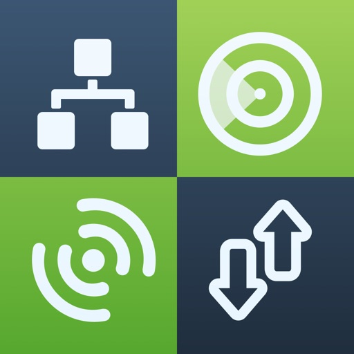

An advanced tool for network diagnostics, LAN scanning, and problem detection.

Network Analyzer can help you diagnose various problems in your wifi network setup, Internet connectivity, and also detect various issues on remote servers thanks to the wide range of tools it provides.

It is equipped with a fast wifi device discovery tool, including all the LAN device's addresses and names, together with the Bonjour/DLNA services they provide. Further, Network Analyzer contains standard diagnostic tools such as ping, traceroute, port scanner, DNS lookup, whois, and Internet speed tester. Finally, it displays various useful information related to your wifi/cell connection.

WIFI LAN SCANNER 
• Detection of all connected network devices (wifi & VPN) 
• IP addresses of all discovered devices 
• NetBIOS, mDNS (Bonjour​), LLMNR, and DNS name where available 
• Pingability test of discovered devices
• IPv6 availability and discovered IPv6 addresses
• Wake on LAN (WOL) including remote WOL 
• Scan of custom IP ranges 
• Filtering and search in the discovered device list

PING & TRACEROUTE 
• Round trip delay including IP address and hostname for every network node 
• Geolocation data including latitude, longitude, country, city, and time zone 
• AS number and network name information 
• Complete trace route visualization on the map 
• Graphical ping statistics updated in real time
• Configurable ICMP/UDP probes for traceroute
• Configurable ping payload size
• Both IPv4 and IPv6 - selectable

PORT SCANNER
• Scanning the most common ports or user-specified port ranges 
• Detection of closed, firewalled, and open ports 
• Description of the known open port services 
• Scan of complete port range or user-editable common ports
• Both IPv4 and IPv6 - selectable

WHOIS 
• Whois of domains, IP addresses and AS numbers 

DNS LOOKUP
• Functionality similar to nslookup or dig 
• Support of A, AAAA, CAA, CNAME, HINFO, MX, NS, PTR, SOA, SPF, SRV, SSHFP, TXT records
• Decoding and showing DNSSEC records such as DNSKEY, CDNSKEY, RRSIG, NSEC3PARAM, NSEC, NSEC3, DS, CDS, TLSA 

INTERNET SPEED 
• Test of both download and upload speeds
• Graphical speed test view
• Speed test history 

NETWORK INFORMATION
• Default gateway, external IP (v4 and v6), DNS server, HTTP proxy 
• Wifi network information such as SSID, BSSID, IP address, and subnet mask 
• Cell network information such as network type
• Monitor of wifi, cell and VPN data usage (both sent and received data since the last boot) 

LOCAL SERVICE DISCOVERY
• Bonjour service browser
• UPnP/DLNA service and device browser

MORE
• Full IPv6 support everywhere
• History of all performed tasks with the possibility to star the favorite ones 
• Export by email, AirPrint, and AirDrop for most tools
• Light/dark theme
• Copy/paste support 
• Detailed help
• Regular updates

[View on Apple](https://apps.apple.com/fr/app/network-analyzer-pro/id557405467)

## ProCam - 专业相机

拍摄模式

- 单次拍摄 
- 低速快门模式
- 人像
- 3D 照片
- 防抖功能
- 连拍模式
- 自拍计时器 
- 拍摄间隔时间 
- 大尺寸快门按钮 
- 视频模式 
- 4K Ultra HD 视频模式 - 3840x2160
- 4K Max 视频模式 - 4032x2268 - 应用内购买
- 慢动作视频模式
- 延时摄影 
- 4K Ultra HD 延时摄影 - 3840x2160 
- 4K Max 延时摄影 - 4032x2268 - 应用内购买 

相机功能

- 手动对焦，曝光，快门速度，ISO 和白平衡控制
- 全方位对焦和曝光控制（触摸对焦 / 触摸曝光） 
- 对焦、曝光与白平衡 (WB) 锁定 
- 可调节的长宽比（4:3 / 3:2 / 16:9 / 1:1） 
- 无损的 TIFF 格式 - 仅适用于 iPhone 4S 及更高版本
- 提供四种快门速度选择 (1/8 sec / 1/4 sec / 1/2 sec / 1 sec) 
- 视频暂停/恢复功能 
- 可调节的视频分辨率（全高清：1080p / 高清：720p / VGA：640x480 / 低品质：480x360) 
- 录制视频的同时拍摄静态照片的功能 
- 实时视频图像稳定系统（可开启或关闭） 
- 视频磁盘空间计数器 
- 延时摄影视频分辨率（全高清：1080p / 高清：720p / VGA：640x480 / 低品质：480x360) 
- 真正的慢动作视频模式，4 种播放速度（最大 fps / 30 fps / 24 fps / 15 fps)
- 6 倍数码变焦 
- 视频缩放 
- 音量计 ( 级别 平均 / 峰值) 
- 地理位置标记 
- 对齐网格（三等分 / Trisec / 黄金分割线 / 地平线) 
- 支持前 / 后置摄像头 
- 日期戳 
- 时间戳 
- 位置戳 
- 版权戳 
- 视频日期戳 
- 视频位置戳 
- 视频版权戳 
- 延时摄影日期戳 
- 延时摄影位置戳 
- 延时摄影版权戳 
- 音乐嵌入至延时摄影视频中 
- 闪光灯设置（自动 / 开启 / 关闭 / 常亮照明） 

照片 / 视频编辑器

- 非破坏性编辑——所有的编辑操作，包括裁剪，是完全可以修正 / 还原的
- 60个专业制作的过滤器
- 17 种实时镜头: 晕影 / 白晕影 / 鱼眼 / 移轴 / 宏观 / 小星球 / 虫洞 / 分割 / 万花筒 I, II, III, IV, V / 涟漪 / 条纹 / 阴影 / 半色调 
- 19 种综合调整工具
- 剪裁、修剪、旋转、镜像、拉伸和透视校正
- 您可以使用高精度的时间线逐帧查看视频 
- 将音乐歌曲添加到您的视频的功能
- 可对原始录音和背景音乐进行音量控制
- 可从视频中提取静止帧
- 支持4K (3840x2160) 高清视频格式

批量照片动作

- 批量盖章： 添加日期/时间/地点/版权印章到你相簿中的多张照片
- 批量调整大小：调整你相簿中多张照片的大小

反馈

遇到问题？对后续更新有意见或建议？请发邮件至 support@procamapp.com 与我们取得联系、

[View on Apple](https://apps.apple.com/fr/app/procam-cam%C3%A9ra-pro/id730712409)

## Streaks

STREAKS. Die Aufgabeliste für gute Gewohnheiten.
Gewinner des Apple Design Award

Wähle bis zu 24 Aufgaben, die du jeden Tag erledigen willst. Ziel ist es, diese Aufgaben mehrere Tage hintereinander zu erledigen. Streaks funktioniert mit der Health-App, damit du deine Fitness-Ziele erreichen kannst.

FUNKTIONEN:

* Passe die App-Farbe an.
* Wähle aus hunderten Symbolen.
* Lass dir benutzerdefinierte Benachrichtigungen schicken, um auf dem Laufenden zu bleiben.
* Betrachte deine aktuelle und beste Aufgabenserie und deine Erledigungsstatistik.
* Streaks erkennt automatisch, wann du Health-Aufgaben erledigst.
* Gewöhne dir schlechte Angewohnheiten mit unschönen Aufgaben ab
* Apple Watch

Solltest du Fragen, Anregungen oder sonstiges Feedback haben, schreibe bitte eine E-Mail an support@streaks.app oder eine Twitter-Nachricht an @TheStreaksApp.

Wenn dir Streaks gefällt, hinterlasse bitte einen Erfahrungsbericht! Die Erfahrungsberichte werden zurückgesetzt, sobald wir ein neues Update veröffentlichen. Daher sind wir auf deine ständige Unterstützung angewiesen.

ÜBER HEALTH-DATEN:

Auf kompatiblen Geräten kann Streaks deine Spazieren-/Joggen-Daten lesen, vorausgesetzt du erteilst die Erlaubnis, die Erledigung deiner Aufgaben zu bestimmen. Alle Daten werden in voller Übereinstimmung mit den iOS-Regeln von Apple für Erfahrungsberichte abgerufen. Bitte lies unsere Datenschutzerklärung unter https://streaks.app/privacy.html und erfahre mehr über die Verwendung deiner Daten.

Schritt- und Entfernungsdaten sind nur automatisch verfügbar, wenn du ein iPhone 5S, eine höhere Version oder ein Zubehörgerät wie die Apple Watch verwendest, um Daten auf die Health-App zu übertragen. Bei Fragen schreibe uns bitte an support@streaks.app.

[View on Apple](https://apps.apple.com/fr/app/streaks/id963034692)

## YoungPhoto - Aesthetic Camera

Hi :) I’m YoungPhoto, a photography creator who makes taking better photos easier for over 400K followers.

Over the years, I’ve shared content about photo composition, color, and shooting tips. Now, I’ve created a photo app you can use in real life, right when you’re taking a picture.

The composition ideas and color filter tips you’ve seen on social media are now available directly in the app, so you can view them, follow them, and shoot in real time.

YoungPhoto is not just a filter app. It helps you understand how to take more aesthetic photos with real-time guidelines and composition tools that anyone can follow.

It was made for people who love photography but often feel like something is missing, people who want to capture ordinary moments like scenes from a movie, and beginners who want beautiful, emotional results without complicated editing.

YoungPhoto is designed to naturally guide the viewer’s eye, add story and atmosphere to each shot, and help you create photos with thoughtful composition and dreamy filters that work in many different settings.

Use YoungPhoto to capture your everyday life with more feeling, style, and intention :)

[Recommended For]

- Anyone who has thought, “Why don’t my photos look like that?”
- People who find photo composition difficult
- Anyone who wants easy guides for taking aesthetic photos
- People who want beautiful colors without complicated editing

[Key Featrues]

- Composition guidelines
- Composition lessons
- YoungPhoto aesthetic filters
- Effects
- Photo and video filter editing

[View on Apple](https://apps.apple.com/fr/app/youngphoto-aesthetic-camera/id6763737180)

## 2026人体解剖学图谱

通过Visible Body探索交互式3D人体解剖学！一次性购买人体解剖学图谱，即可在iOS设备上访问基本的大体解剖3D模型和精选的微观解剖模型和动画。生理学动画和牙科内容可提供App内购。

通过人体解剖学图谱，您可以获得：

* 用于研究大体解剖的完整女性和男性3D模型。配合尸体和诊断图像查看这些模型。
* 关键器官的多层次3D视图。学习肺、支气管和肺泡。复习肾脏、肾锥体和肾单位。
* 解释核心生理学和常见疾病的简短动画。使用这些内容更深入地了解系统过程！
* 您可以移动的肌肉和骨骼模型。学习肌肉动作、骨性标志、附着点、神经支配和血供。
* 了解筋膜如何将上肢和下肢的肌肉分成筋膜鞘。

您还将获得各种各样的学习和演示工具：

* 在屏幕上、增强现实（AR）和横截面中仔细分析各种模型。下载免费实验室活动，引导您了解关键结构。
* 参加3D解剖测验并检查您的进度。
* 制作与模型集关联的交互式3D演示文稿，用来解释和复习主题。使用标签、注释和3D画图来标记各种结构。

[View on Apple](https://apps.apple.com/fr/app/atlas-danatomie-humaine-2026/id1117998129)

## Board Game Stats

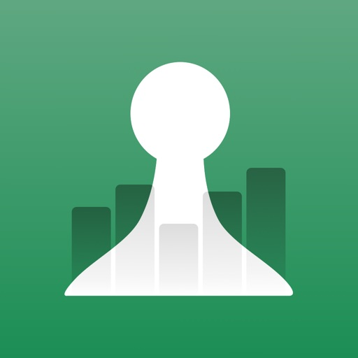

Keep track of your Board Game collection, plays and scores in this easy to use tool.
View statistics and graphs for your games, plays, and other players.
Works offline, can sync with BoardGameGeek.

- How many games did you play recently?
- Who scored the highest for a game?
- With whom did you play and who wins more?
- Did you improve your score from last times?
- Use tailor-made score sheets to enter scores.
- Compare players, view graphs and charts.
- Keep track of your collection and sync with BoardGameGeek.

Collection management features:
- Keep track of every game you've played or are interested in.
- Choose a specific version and image, and track multiple copies.
- Set status to Owned, Wishlist, Want to play, and much more.
- Enter details like comments, price paid, acquisition date, etc.
- Filter games on status, Played but not owned, Unplayed owned games.
- Set Custom filters to select a game for your specific group.
- Full automatic syncing with your BoardGameGeek (BGG) collection.

Play tracking features:
- Set scoring rules, cooperative and team play for each game.
- Select game and played expansions.
- Set Players and Locations, including anonymous players.
- Enter location, scores per player and many more details.
- Calculate scores on the fly by using the math keyboard.
- Create teams and enter team scores.
- Use over 2800 game-specific tailor-made score sheets.
- Add Player roles, and choose from previously used ones.
- Use a timer to keep track of your play length.
- Add a Game note you can view each time you start a Play.
- Post your plays to BoardGameGeek, including auto-post after each save.
- Import existing plays from BoardGameGeek (BGG), Yucata and Board Game Arena (BGA)
- Send one or more Plays to other BG Stats users so only one of you has to enter the details.

Statistics features:
- View statistics for each game and player, and combination.
- See pie charts, play times and durations graphs, and score charts.
- View insights for Games and Players, for different time periods.
- See your H-index, fives, dimes, quarters and centuries.
- View a Player's personal H-index and win percentage.
- Share Insights charts and 3x3 images.
- See cost per play for your games.

BG Stats has export and import functions for easy backup to a variety of services.
You can sync with other devices via BG Stats Cloud sync (an in-app subscription).
All in a native iOS interface, supports dark mode, landscape and iPad screens.

With the Power Expansion (in-app purchase):
- Extended game charts, based on number of players.
- Filter your data on players, locations, specific periods and player counts.
- Statistics for a specific combination of players, and compare them.
- Winning streaks, tiebreakers, and new and starting player stats.
- Role- and board-based statistics.
- Heat map of plays and play duration. 
- Cost per hour, player and more.
- Add tags to Games, Players and Locations.
- Create and save custom filters, now also with tags.
- Customize the Game filter dropdown menu.
- Create advanced filters with multiple criteria and logical operations.
- View combined game statistics.
- Sync game tags with BoardGameGeek.
- Create Challenges (if available) based on game filters or tags.

With the Challenges expansion (in-app purchase):
- Create a challenge from one of the many templates.
- x times y challenges: play x games y times.
- Ongoing Reach your next H-index challenges.
- Set the time period and choose specific games to track, or use auto-fill.
- Filter specific Players, Locations and player counts to count for the challenge.

With a Cloud sync subscription:
- Seamlessly sync your data between all your devices.
- Keep a backup of your data in the cloud.

Please note that changes to the BGG website or API can temporarily break BGG related features. I cannot guarantee their continued availability.

[View on Apple](https://apps.apple.com/fr/app/board-game-stats/id892542000)

## Tampermonkey

Tampermonkey 是一款广受欢迎的浏览器扩展，兼容所有主流浏览器。
它允许您使用用户脚本——添加或修改功能的小型 JavaScript 程序——来自定义和增强网页。
使用 Tampermonkey，您可以轻松地在任何网站上创建、管理和运行这些脚本。

[View on Apple](https://apps.apple.com/fr/app/tampermonkey/id6738342400)

## PerfExpert

Transformez votre smartphone en banc de puissance embarqué !

Mesurez la puissance réelle et le couple moteur de votre voiture avec une précision de 2 %, simplement en effectuant une accélération.

Vérifiez l’efficacité de vos réglages, reprogrammations ou modifications avec une solution indépendante, objective et abordable.

-------------

Qu’est-ce que PerfExpert ?
PerfExpert – Banc de puissance et chronomètre embarqué est une application professionnelle qui vous permet de mesurer les performances réelles de votre voiture :
• Courbes de puissance et de couple moteur
• Temps d’accélération 0–100 km/h / 0–60 mph
• 0–400 m / 1/4 mile, et plus encore

Tous les tests sont réalisés uniquement avec votre téléphone, sans connexion au véhicule. Les résultats sont présentés sous forme de rapports détaillés avec des graphiques interactifs.

-------------

Comment fonctionne le banc de puissance ?
	1.	Créez le profil de votre voiture
Saisissez les caractéristiques clés comme le poids à vide, la taille des pneus ou la cylindrée. L’application vous aide à les trouver si besoin.
	2.	Fixez votre téléphone solidement
Pas besoin d’OBD ni de capteurs externes. PerfExpert utilise les capteurs internes de votre téléphone pour mesurer précisément l’accélération.
	3.	Effectuez une accélération à plein régime
Sur une route plane et droite, accélérez de bas régime jusqu’au rupteur sur un seul rapport. C’est tout !

Note : Les tests dyno ne sont pas compatibles avec les boîtes automatiques sans mode manuel.

-------------

Ce que vous pouvez faire avec PerfExpert :
• Évaluer les gains après une reprog, un filtre, une ligne d’échappement, etc.
• Comparer les performances avant/après une modification mécanique
• Partager vos rapports dyno avec un préparateur ou des amis
• Exporter vos tests sous forme de graphiques interactifs et de données brutes

-------------

Exemples de résultats et FAQ
    • Résultats en vedette : https://www.perfexpert-network.com/results/featured
    • FAQ : https://www.perfexpert-app.com/faq

-------------

Rejoignez la communauté
    • Page Facebook : https://www.facebook.com/PerfExpert
    • Groupe d’utilisateurs et support : https://www.facebook.com/groups/perfexpert/

-------------

Fonctionnalités clés
    • Test Dyno :
Mesurez avec précision la puissance et le couple. Détection du rupteur et modélisation des pertes de transmission.
    • Normes de correction :
Appliquez les normes (DIN, SAE, ISO, JIS, CEE) selon les conditions ambiantes (pression, température, humidité).
    • Test de Chrono :
Mesurez les accélérations et distances : 0–100 km/h, 0–400 m, 0–60 mph, etc.
    • Utilisation haute fréquence des capteurs :
Précision maximale grâce à l’échantillonnage rapide de l’accéléromètre et au traitement avancé du signal.
    • Connexion à des GPS externes :
RaceBox Mini, Mini S, Micro, RaceBox.ru ou VBox Sport pour plus de précision et les tests en départ lancé (abonnement PerfExpert Pro requis).
    • Partage en ligne des résultats :
Lien public consultable sur le réseau PerfExpert.
    • Unités personnalisables :
Hp, Ch, Nm, Ft.lb, m/s², °C, psi, km/h, mph, m, ft, etc.
    • Export des résultats :
Données au format TSV et images PNG.

Politique de confidentialité : https://www.perfexpert-app.com/privacy-policy  
Conditions d’utilisation : https://www.apple.com/legal/internet-services/itunes/dev/stdeula/

[View on Apple](https://apps.apple.com/fr/app/perfexpert/id549390700)

## GPX-Viewer

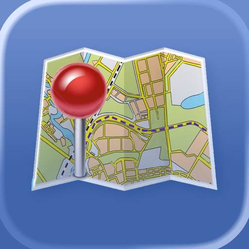

Import and view GPS eXchange format (GPX) files. GPX-Viewer offers a customizable display of GPX files exported from many GPS devices and other apps that create GPX files.

Import GPX files from the Cloud (includes iCloud, Dropbox, Google Drive, etc), your local device, or by using iTunes file sharing, email, a URL, or your pasteboard.

  - Customize your map: Apple Maps, Google Maps, OpenStreetMaps, or use a custom map tile source URL
  - Color customization for waypoints, track points, routes and tracks
  - Hide or show the waypoints, track points, routes or tracks on the map
  - Choose units: Metric, imperial, or nautical

  - Organize and quick-view files: Create folders to better organize your GPX files, and preview the tracks of all files within a folder
  - Import GPX files to the current GPX file
  - Send the waypoints to Apple Maps
  - Keep device from sleeping: Option to disable screen auto-lock

Create and share charts:
  - Y axis: Elevation or speed
  - X axis: Track points, distance, or time

A sample GPX file is included.

Download free GPX files from many web sites, such as http://www.poi-factory.com and https://www.hikingproject.com.

We also have GPX Viewer and GPX Editor apps for Mac computers. Visit the Mac App Store or our website for more info.

[View on Apple](https://apps.apple.com/fr/app/gpx-viewer/id880510678)

## Orientation : Boussole & Carte

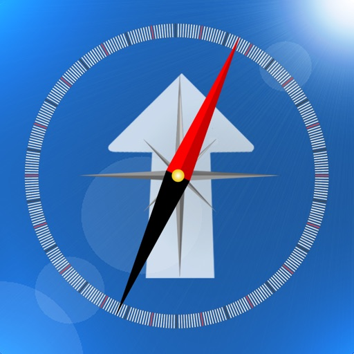

Gardez vos repères, où que vous soyez.

Orientation vous permet de choisir jusqu’à six lieux et de voir immédiatement où ils se trouvent par rapport à votre position. Comparez leur direction et leur distance, consultez leurs coordonnées et gardez en vue les endroits qui comptent, en voyage, en promenade, en randonnée ou au quotidien.

Gardez en vue la direction de votre hôtel, de votre voiture, de votre point de départ, d’un lieu de rendez-vous, d’un monument ou de toute position choisie sur la carte.

FONCTIONNALITÉS PRINCIPALES

• Affichez jusqu’à six lieux en même temps
• Visualisez la direction et la distance de chaque lieu sur une boussole
• Consultez les coordonnées de latitude et de longitude
• Affichez tous les lieux sélectionnés sur la carte
• Recherchez un lieu ou une adresse, ou touchez la carte pour placer ou déplacer une cible
• Recentrez la carte sur votre position et changez de type de carte
• Partagez une position ou ouvrez une cible dans Plans
• Interface adaptée à l’iPhone et à l’iPad

Pensée pour s’orienter d’un coup d’œil, Orientation offre une vue claire de chaque lieu par rapport à vous, afin de comparer vos destinations et de choisir votre direction.

L’accès à la localisation et une connexion Internet sont nécessaires. La précision de la boussole peut être affectée par les interférences magnétiques ou électromagnétiques.

[View on Apple](https://apps.apple.com/fr/app/orientation-boussole-carte/id536158103)

## Legendex

Ruines hantées, grottes oubliées, statues insolites, châteaux maudits, villages fantômes, menhirs perdus...
Legendex répertorie les lieux les plus étranges, oubliés ou sacrés de notre territoire.

Chaque site est illustré, expliqué, sourcé et localisé.
Grâce à la géolocalisation, les lieux les plus insolites se révèlent autour de vous.
La carte vous invite à plonger dans l’inconnu et à suivre ce qui vous appelle.

[View on Apple](https://apps.apple.com/fr/app/legendex/id1585001263)

## RoadTrippin

Retrouvez tous les conseils de RoadTrippin.fr pour préparer votre voyage aux USA, les guides de visite des plus beaux parcs américains et des plus belles villes des États-Unis, ainsi que de nombreux outils (météo, heure locale, carnet de notes, suivi de dépenses, conversions, traducteur...) très utiles pour organiser et réaliser votre road trip !

GUIDES DE VISITE
Plus de 300 guides de visite, détaillant les activités à ne pas manquer dans les nombreux et magnifiques parcs américains et les plus grandes villes des USA : conditions d'accès, prix, balades et randonnées à faire, points de vue à ne pas manquer, excursions, météo, logements...
Vous saurez tout sur les différents parcs d'État et nationaux (Grand Canyon, Monument Valley, Yellowstone, Yosemite, Zion, Death Valley...), la Route 66, les plus belles routes scéniques de l'Ouest ainsi que les plus grandes villes américaines (Los Angeles, San Francisco, Las Vegas, New York, la Nouvelle-Orléans...).

FICHES DE CONSEILS
40 fiches de conseils pour bien préparer votre séjour sur le sol américain : formalités, ESTA, assurance-voyage, billets d'avion, location de voiture, camping-car et moto, conduite, hébergements, budget, informations pratiques, moyens de paiement...

CONVERTISSEURS
Un convertisseur de devises (EUR/CAD/CHF / USD) et un convertisseur d'unités (distances, volumes, poids, températures, consommation de carburant...).

CALCULATRICE DE POURBOIRE
Une calculatrice de pourboire pour déterminer facilement le tip que vous souhaitez laisser.

CARNET DE NOTES
Un carnet de notes pour vous permettre de sauvegarder facilement et rapidement toute information utile récoltée durant votre road trip.

CARNET DE BORD
Un carnet de bord, dans lequel vous pouvez enregistrer vos achats et dépenses quotidiennes : hôtels, carburant, restaurants, shopping..., ainsi que le suivi des randonnées effectuées et des trajets réalisés en véhicule.

TRADUCTEUR FRA/ANG
Un module de traduction français/anglais des termes les plus utiles en voyage aux USA.

Tout ceci est disponible partout et tout le temps, même si vous n'avez pas de connexion Internet !

De plus, si vous disposez d'une connexion Internet (Wi-Fi ou réseau mobile) lors de votre voyage aux USA, vous pourrez alors bénéficier de fonctionnalités supplémentaires :

CARTE INTERACTIVE
Une carte interactive vous permettant d'afficher en temps réel votre position et les points de vue et points d'intérêt situés autour de vous (2500 POI enregistrés), et de suivre les tracés des randonnées alentours (900 randonnées référencées).

MÉTÉO
La météo locale, pour connaître les prévisions météorologiques à 3 jours dans votre secteur.

HEURE LOCALE
Finis les calculs d'apothicaire avec les décalages/fuseaux horaires et les heures d'été et d'hiver ! Avec l'heure locale, vous aurez d'un coup d'œil l'heure juste en fonction de votre position.

Notez que vous devez autoriser l'application à accéder à votre position pour que celle-ci puisse vous géolocaliser.

[View on Apple](https://apps.apple.com/fr/app/roadtrippin/id1622550520)

## LumaFusion

LumaFusion: Das ultimative Storytelling-Erlebnis für die Videobearbeitung

Willkommen bei der App, die im App Store den Titel „App des Jahres 2021“ und den Editors' Choice Award gewonnen hat! Der Goldstandard für Geschichtenerzähler weltweit. Bietet eine flüssige, intuitive, Touchscreen-Bearbeitungserfahrung.

PROFESSIONELLES EDITIEREN LEICHT GEMACHT
• Sechs Video-/Audio- oder Grafikspuren: Erstellen Sie Bearbeitungen mit mehreren Ebenen und verarbeiten Sie problemlos 4K-ProRes- und HDR-Medien.
• Sechs zusätzliche Audiospuren: Bauen Sie Ihr Klangbild.
• Die ultimative Zeitleiste: Flüssige Bearbeitung mit der weltweit flexibelsten spurbasierten UND magnetischen Zeitleiste
• Jede Menge Übergänge: Halten Sie Ihre Geschichte in Bewegung.
• Vorschau auf externem Monitor: Sehen Sie auf einem großen Bildschirm.
• Marker, Tags und Notizen: Behalten Sie die Übersicht.
• Voiceover: Nehmen Sie VO auf, während Sie Ihren Film abspielen.

EBENENEFFEKTE UND FARBKORREKTUR
• Greenscreen-, Luma- und Chroma-Keys: Für kreatives Compositing.
• „Lock & Load“-Videostabilisierung: Sorgen Sie für ruhe im Bild.
• Leistungsstarke Farbkorrektur: Erstellen Sie Ihren eigenen Look.
• Videowellenform-, Vektorscope- und Histogrammscope.
• LUTs: Importieren und wenden Sie mehrere .cube- oder .3dl-LUTs an.
• Unbegrenzte Anzahl an Keyframes: Animieren Sie Effekte mit höchster Präzision.
• Anpassbare Text- und Effektpresets: Speichern und teilen Sie Ihre Lieblingsanimationen und -looks.
• Raster und Hilfslinien: Richten Sie die Elemente mit „Title-Safe“, „Action-Safe“ und einer Horizontlinie präzise aus.

ERWEITERTE AUDIOREGELUNG
• Grafischer und parametrischer EQ sowie Sprachisolierung: Präzise Klangregelung.
• Keyframes für Audiopegel, Panning und EQ: Erstellen Sie makellose Mischungen.
• Unterstützung von Stereo und Dual-Mono-Audiodateien: Für Interviews mit mehreren Mikrofonen in einem Clip.
• Audio-Ducking: Pegeln Sie Musik und Dialog ausgewogen aus.
• Drittanbieter-Audio-Plugins: Verbessern Sie den Klang.

KREATIVE TITEL UND MEHRERE TEXTEBENEN
• Titel mit mehreren Ebenen: Kombinieren Sie Formen, Bilder und Text in Ihre Grafik.
• Anpassbare Schriften, Farben, Rahmen und Schatten: Entwerfen Sie ansprechende Titel.
• Import von eigenen Schriftarten: Stärken Sie Ihre Marke.
• Speichern und teilen von Titel-Presets: Perfekt für die Zusammenarbeit.

PROJEKTFLEXIBILITÄT UND MEDIATHEK
• Bildformate für alle Zwecke: Vom Breitbildkino bis zu Social Media.
• Bildfrequenzen von 18 bis 240 FPS: Flexibilität für jeden Workflow.
• Bearbeiten Sie Material aus der Foto-App, von Frame.io und auf USB-C-Laufwerken: Greifen Sie überall auf Ihre Medieninhalte zu.
• Importieren Sie Dateien aus der Cloud: Wo auch immer Sie sie gespeichert haben.

TEILEN SIE IHRE MEISTERWERKE
• Bestimmen Sie Auflösung, Qualität und Format:
• Teilen Sie Filme auf sozialen Medien, lokalem Speicher oder Cloudspeicher.
• Arbeiten Sie auf unterschiedlichen Geräten: Projekte lassen sich nahtlos übertragen.

ERWEITERTE FUNKTIONEN (einzeln erwerben oder sie ALLE als Teil des Creator Pass-Abonnements erhalten – siehe unten)
• Geschwindigkeitserhöhung und verbesserte Keyframe-Erstellung - Erstellen Sie Geschwindigkeitserhöhungen, Bézier-Kurven und sanfte Übergänge mit dieser einzigartigen, benutzerfreundlichen Funktion.
• XML-Export: Senden Sie Ihr Projekt an Final Cut Pro für Mac
• Multicam-Studio: Synchronisieren Sie 6 Kameras oder Audio und tippen Sie, um die Perspektive zu wechseln

ERSTELLER-PASS-ABONNEMENT
• Erhalten Sie vollen Zugriff auf Storyblocks für LumaFusion: Millionen von hochwertiger lizenzfreier Musik, Soundeffekten und Videos, PLUS erhalten Sie ALLE oben genannten erweiterten Funktionen.

HERVORRAGENDER GRATIS-SUPPORT
• Online-Tutorials: www.youtube.com/@LumaTouch
• Benutzerhandbuch: luma-touch.com/lumafusion-reference-guide
• Support: lumatouch.co/support

[View on Apple](https://apps.apple.com/fr/app/lumafusion/id1062022008)

## FORScan Lite - for Ford, Mazda

FORScan Lite application was developed specially for a computer diagnostics of Ford, Mazda, Lincoln and Mercury vehicles. 

Supported adapters:
- OBDLink MX+ (recommended)
- vLinker FS Bluetooth (recommended)
- vLinker FD BLE (recommended)
- other ELM327-compatible WiFi or BLE adapter (not recommended). Attention: this application may not work properly in case of bad quality ELM327 adapter used!

Supported cars:
- Ford, Lincoln, Mercury models of 1996 - 2022MY (some models of 1994-1995MY are also supported)
- Mazda 1996-2022MY. Attention: Mazda 7G models (new Mazda 3, CX-30, MX-30, CX-50 etc) are supported partially or not supported!
- Vehicles other than Ford, Mazda, Lincoln, Mercury are not supported!

Features:
- Analyzing an on-board network configuration of the connected vehicle
- Read and reset DTC for all modules
- Read sensors and other data (PIDs) from all modules
- Execute tests
- Execute majority of service functions

Note: Configuration and Programming functions, as well as some of service functions, are not available in FORScan Lite.

[View on Apple](https://apps.apple.com/fr/app/forscan-lite-for-ford-mazda/id892347083)

## Cadrage Director's Viewfinder

CADRAGE Viseur du réalisateur, l'application qui transformera votre façon de travailler.

CADRAGE vous permet d'aligner vos prises de vue avec des aperçus de cadrage précis compatibles avec toutes les combinaisons caméra / objectif et garanti que tout le monde est à jour pendant la pré-production et sur le plateau.

◈◈◈ La préparation de votre tournage n'a jamais été aussi simple. Téléchargez CADRAGE maintenant et regardez comment ça change votre façon de travailler. ◈◈◈

FONCTIONNALITÉS

● Aperçus précis pour des milliers de caméras et d'objectifs
● Sauvegarde photos et vidéos
● Cadrages personnalisés dans n'importe quel rapport d’aspect
● Suivez la trajectoire du soleil là où vous vous trouvez, pour n'importe quelle date
● Galerie intégrée et gestionnaire de projet
● Créations de listes de prises PDF soignées avec téléchargement direct sur Dropbox ou par e-mail
● Contrôle manuel de l'exposition, de la mise au point et de la balance des blancs
● Correction de couleur professionnelle à 3 voies pour pré-visualiser le look final
● Prise en charge des appareils à double et triple caméra

◈◈◈ Communiquez votre vision à votre équipe. Téléchargez CADRAGE maintenant et profitez au maximum de votre journée de tournage. ◈◈◈

◆ Caméras de cinéma ◆
ARRI Alexa 265, Alexa 35, Alexa 35 Xtreme, Alexa 65, Alexa Classic, Alexa LF, Alexa Mini, Alexa Mini LF, Alexa SXT, Alexa XT, Amira, D-21
Blackmagic Cinema Camera, Cinema Camera 6K, Micro Cinema Camera, Micro Studio Camera 4K, Pocket Cinema Camera, Pocket Cinema Camera 4K, Pocket Cinema Camera 6K, Pocket Cinema Camera 6K Pro, Production Camera 4K, PYXIS 12K, PYXIS 6K, Studio Camera 4K, Studio Camera 4K Plus, Studio Camera 4K Pro, Studio Camera HD, URSA, URSA (Broadcast), URSA 4.6K, URSA Cine 12K LF, URSA Cine 17K 65, URSA Mini 4.6K, URSA Mini 4K, URSA Mini Pro, URSA Mini Pro 12K, URSA Mini Pro 4.6K G2
Canon C100, C100 Mark II, C200, C300, C300 Mark II, C300 Mark III, C400, C50, C500, C500 Mark II, C70, C700, C80
DJI Ronin 4D (6K), Ronin 4D (8K), Zenmuse X7
Film 16mm, 35mm, 65mm/70mm, 8mm
Freefly Systems Ember S2.5K, Ember S5K, Wave
Fujifilm GFX Eterna 55
Generic Broadcast 
Kinefinity KineMAX, KineMini, Mavo, Mavo Edge, Mavo LF, TERRA
Panasonic AF101, DC-BGH1, EVA1, HDX 900, VariCam 35, VariCam LT
Panavision DXL, DXL2
Phantom 65, Flex, Flex4K, HD GOLD, Miro LC321S, v2640 ONYX, VEO4K-PL
RED Dragon-X, Epic Dragon, Epic-W (Helium), Epic-X, Gemini, Komodo, Komodo-X, Monstro-VV, One, Ranger (Gemini), Ranger (Helium), Ranger (Monstro), Raven, Scarlet-W (Dragon), Scarlet-X, V-Raptor S35, V-Raptor VV, V-Raptor XE VV, V-Raptor XL S35, V-Raptor XL VV, Weapon (Dragon-VV), Weapon (Helium)
Sony Burano, F23, F3, F35, F5, F55, F65, F900, FS100, FS5, FS5 Mark II, FS7, FS7 Mark II, FS700, FX2, FX3, FX30, FX6, FX9, HDC-1500R, Venice, Venice 2 (6K), Venice 2 (8K)
Z CAM E2, E2-F6, E2-F8, E2-M4, E2-S6, E2-S6G, E2C, E2G

◆ Appareils photo ◆
Canon 1D C, 1D Mark III, 1D Mark IV, 1D X, 1D X Mark II, 1D X Mark III, 1Ds Mark III, 200D/SL2, 20D, 30D, 5D, 5D Mark II, 5D Mark III, 5D Mark IV, 5DS, 6D, 6D Mark II, 77D, 7D, 7D Mark II, M50, R, R5, R6, Ra, RP
Film (Still) 35mm (135), APS, Large Format, Medium Format, XPan
Fujifilm GFX 100, GFX 100S, GFX 50R, GFX 50S, X-A7, X-H1, X-Pro2, X-Pro3, X-S10, X-T2, X-T200, X-T3, X-T4, X100V
Hasselblad Digital Medium Format
Leica CL, M10/M10-R, M8/M8.2, M9/M9-P, S, S2, SL, SL2, SL2-S
Mamiya Leaf Credo Series
Nikon D1, D1H, D2H, D2Hs, D2x, D3100, D3200, D3300, D3400, D3s, D3x, D4, D40, D40X, D4s, D50, D500, D5000, D5100, D5300, D5500, D5600, D60, D600, D610, D70, D700, D7000, D70s, D7100, D7200, D750, D7500, D80, D800, D810, D850, D90, DF, Z50, Z6, Z7
Olympus E Series
Panasonic GH1, GH2, GH3, GH4, GH5, GH5S, S1, S1H, S1R, S5
Pentax 645D, 645Z, K Series
Phase One Achromatic+, IQ Series, P 30+, P 40+, P 45+, P 65+
Sigma fp, fp L, SD1, SD15
Sony A450, A580, A6000, A6300, A6500, A6600, A7 III, A7C, A7r II, A7r III, A7r IV, A7s, A7s II, A7s III, A850, A9, A9 II

Langue de l’app: anglais

[View on Apple](https://apps.apple.com/fr/app/cadrage-directors-viewfinder/id793232740)

## Just Press Record

Just Press Record ist der ultimative Audiorekorder, der Aufnahme mit nur einem Fingertipp, Transkription und iCloud-Synchronisation auf all deine Geräte bringt. Sie können Audio und Transkriptionen direkt in der App bearbeiten und mit Siri sogar völlig berührungslos aufnehmen!

Das Leben ist voller unvergesslicher Momente - die ersten Worte Ihres Kindes, ein wichtiges Meeting oder eine spontane Idee. Fange diese Momente mühelos auf dem iPhone, iPad, Mac oder sogar der Apple Watch ein.

AUFNEHMEN
• Ein Fingertipp zum Starten, Stoppen, Pausieren und Fortsetzen der Aufnahme.
• Starte und stoppe die Aufnahme über Shortcuts, Siri, das Widget, eine 3D-Touch-Schnellaktion oder über das URL-Schema.
• Unbegrenzte Aufnahmedauer.
• Diskrete Aufnahme im Hintergrund.
• Aufnahme via integriertem Mikrofon, AirPods oder externen Mikrofonen.
• Unabhängige Aufnahme auf Apple Watch, mit späterer Synchronisation.

WIEDERGEBEN
• Während der Wiedergabe vor- und zurückspulen.
• Anpassbare Wiedergabegeschwindigkeit.

TRANSKRIBIEREN
• Verwandeln Sie Sprache in durchsuchbaren Text.
• Unterstützung für über 30 Sprachen.
• Synchronisierte Textmarkierung und Audiowiedergabe.
• Formatiere während der Aufnahme mit Interpunktionsbefehlen.

BEARBEITEN
• Audio - visualisieren Sie Ihre Aufnahme in Wellenform und schneiden Sie nicht benötigte Abschnitte heraus.
• Text - Nehmen Sie Korrekturen vor und fügen Sie Ihren Transkriptionen neuen Text hinzu.

TEILEN
• Teile Audio und Text mit anderen Apps.
• Einfaches Teilen mit sozialen Medien.
• Teile mit iTunes auf dem Mac oder PC via USB-Kabel.
• Drucke eine Kopie deiner Transkripte aus.
• Teile Audiodateien von anderen Apps mit Just Press Record. 

ORGANISATION
• Sehen Sie neue Aufnahmen an oder durchsuchen Sie Ihre Bibliothek.
• Suche nach Dateiname oder Transkriptinhalt.
• Eigener Tab für Schnellzugriff auf Apple-Watch-Aufnahmen.
• Aufnahmen umbenennen.
• Unterstützung für Slide Over und Split View auf iPad.
• Fügen Sie dem App-Symbol eine Plakette mit der Anzahl ungespielter Aufzeichnungen hinzu.

SPEICHER
• Sichern Sie Aufnahmen in iCloud Drive oder lokal auf dem Gerät.
• In iCloud Drive gesicherte Aufnahmen werden automatisch auf alle Geräte synchronisiert.
• Lokal gespeicherte Aufnahmen profitieren von der Integration mit der iOS-Dateien-App und der automatischen iTunes-Dateifreigabe.
• Transkripte werden in der Audiodatei gesichert.

PRO-AUDIO
• Unterstützung für Stereoaufnahmen über integrierte Mikrofone.
• Unterstützung für hochqualitative, externe Mikrofone, verbunden via Lightning.
• Anpassbare Audioeinstellungen.
• Dateitypen enthalten WAV, AIF oder das übliche iTunes M4A (ACC).
• Hochqualitatives Audio bis zu 96kHz / 24-bit.

BEDIENBARKEIT
• VoiceOver-Unterstützung in der gesamten App.
• Magische Tipp-Geste um eine Aufnahme zu starten / stoppen.

APPLE WATCH
Just Press Record umfasst eine App für die Apple Watch, die Ihnen die Freiheit bietet, überall aufzunehmen, auch wenn Sie Ihr iPhone nicht bei sich haben.

• Starten Sie die Aufnahme mit einem einzigen Tipp auf die Complication.
• Diskrete Aufnahme im Hintergrund.
• Unbegrenzte Aufnahmedauer.
• Aufnahmen übertragen sich automatisch auf das iPhone für die Transkription und iCloud-Synchronisation.
• Hören Sie sich kürzliche Aufnahmen über die integrierten Lautsprecher oder AirPods an.
• Lautstärke mit der Digitalen Krone anpassen.
• Aufnahme mit einem Wisch nach unten pausieren.
• Bedienbarkeitsunterstützung mit VoiceOver, reduzierter Bewegung und Unterstützung für das extragroße Complication-Thema.

WICHTIG:
• Just Press Record nimmt keine Telefongespräche oder Audio von anderen Apps auf.
• Transkription erfordert ein gutes, sauberes Audiosignal.  Meiden Sie Aufnahmen in lauten Umgebungen und stellen Sie sicher, dass das Mikrofon nah an der Quelle ist.

[View on Apple](https://apps.apple.com/fr/app/just-press-record/id1033342465)

## Loto Quine Helper

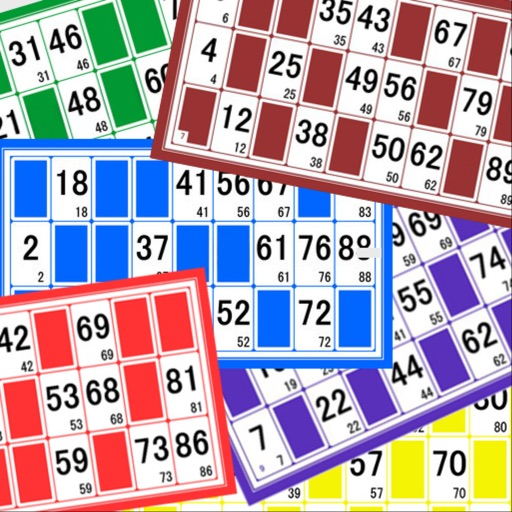

Loto Quine Helper est une application permettant de vous aider lors de vos parties de loto associatif. Cette application gérera vos différents cartons ainsi que ceux de vos amis ou votre famille. Il vous suffit d’ajouter les cartons dans l’application en début du loto. Puis au fil des tirages, vous saisissez les numéros annoncés et l’application va gérer automatiquement vos cartons, vous n’aurez pas à utiliser vos cartons et vos jetons. En début de partie vous choisissez votre objectif dans liste (une ligne, deux lignes, carton plein, ...), lorsqu’il est atteint un message vous est affiché pour vous prévenir. Cette application ne génère pas les numéros, elle permet seulement de gérer vos cartons. Fonctionne aussi pour les rifles.

Fonctionnalités :

- Visualiser des numéros tirés dans la partie en cours
- Afficher les derniers numéros manquants avant la victoire
- Gérer vos cartons dans des catégories correspondant à différents joueurs ou différentes journées. 
- Visualiser les statistiques de vos parties permettant de voir les nombres les plus et les moins tirés
                                      

À propos :

Les développeurs de l’application déclinent toute responsabilité en cas de crash durant la partie pouvant rendre impossible l’utilisation de l’application. De même, à vous de faire attention à votre batterie afin qu’elle tienne durant tout le loto. Veiller à enregistrer correctement vos cartons, car si une erreur de saisie est réalisée toute vos parties seront basées sur de faux cartons. L’application n’est qu’un utilitaire elle n’augmente pas vos chances de gains, en cas de victoire vous devrez présenter votre carte.

[View on Apple](https://apps.apple.com/fr/app/loto-quine-helper/id1451851037)

## RaceChrono Pro

RaceChrono Pro est un chronomètre polyvalent, conçu spécialement pour l'enregistrement et l'analyse des sports motorisés. RaceChrono Pro vous permet également d'enregistrer des vidéos et d'incruster vos donnés enregistrées.

Les apps RaceChrono ont une forte communauté avec actuellement plus de 100000 utilisateurs actifs. Si vous regardez autour de vous dans le pits un jour de course ou sur une journée de roulage il y a de fortes chances que vous croisiez des utilisateurs de RaceChrono. Même les professionnel, comme les pilotes d'essai usine ou les formateurs piste, utilisent cette app ! Que vous soyez pilote moto, de karting ou de voiture, sur piste ou route fermée c'est l'app qu'il vous faut.

RaceChrono Pro a les fonctionnalités principales suivantes :
• Chrono au tour avec gestion des secteurs et tour optimal
• Bibliothèque de pistes de plus de 2600 pistes pré-configurées
• Possibilité de personnaliser un circuit ou de créer une piste point-à-point.
• Analyse des donnés par défilement progressif avec synchronisation de la vidéo et de la carte
• Prédiction de temps au tour et graph de delta temps
• Export de vidéo accéléré matériellement avec incrustation paramétrable
• Enregistrement multi-camera et export picture-in-picture
• Enregistrement vidéo avec camera interne
• Lien et synchronisation des fichiers vidéo de presque toutes les action cam
• Support des récepteurs GPS externes : Dragy Pro/DRG70/DRG70-C/Lite, RaceBox Mini/Mini S/Micro, Qstarz BL-818GT/BL-1000GT/LT-8000GT, Columbus P-9 Race, Dual XGPS 150/160, VBOX Sport, Garmin GLO
• Support des lecteurs OBD-II : OBDLink MX+ Bluetooth, OBDLink CX Bluetooth, Dragy OBD, Vgate vLinker FS, Vgate vLinker/iCar BLE, PLX Kiwi 3/4, Carista OBD2 Bluetooth, Tonwon BLE 1/2/Pro, Veepeak OBDCheck BLE, UniCarScan UCSI-2000, OBDLink MX Wi-Fi, generic Wi-Fi OBD-II
• Support des cardiofréquencemètre Bluetooth LE (BLE)
• Longueur de sessions illimité (pour les courses de 24h par exemple)
• Export des données de session en formats .ODS (résumé de session pour Excel), .NMEA, .VBO et .CSV

[View on Apple](https://apps.apple.com/fr/app/racechrono-pro/id1129429340)

## Tenuto

Tenuto is a collection of 24 highly-customizable exercises designed to enhance your musicality. From recognizing chords on a keyboard to identifying intervals by ear, it has an exercise for you. Tenuto also includes six musical calculators for accidentals, intervals, scales, chords, analysis symbols, and twelve-tone matrices.

A short description of the exercises and calculators follows.

––––––

• Note Identification
• Key Signature Identification
• Interval Identification
• Scale Identification
• Chord Identification
Tap the button corresponding to the written staff line. For example: if shown a C, E, and G with a sharp; tap the "Augmented Triad" button.

––––––

• Note Construction
• Key Signature Construction
• Interval Construction
• Scale Construction
• Chord Construction
Construct the specified label by moving notes and/or adding accidentals. For example: if shown a C and an "Augmented 4th" label, move the second note to F and add a sharp.

––––––

• Keyboard Reverse Identification
Tap the piano key corresponding to the written note on the staff. While similar to Note Identification, this exercise uses a piano keyboard rather than note name buttons.

• Keyboard Note Identification
• Keyboard Interval Identification
• Keyboard Scale Identification
• Keyboard Chord Identification
Tap the button corresponding to the highlighted piano key(s). If the C and G keys are highlighted, tap the "P5" (Perfect 5th) button.

––––––

• Fretboard Note Identification
• Fretboard Interval Identification
• Fretboard Scale Identification
• Fretboard Chord Identification
Tap the button corresponding to the marked fretboard position(s). If the 2nd fret of the D string is marked, tap the "E" button.

––––––

• Keyboard Ear Training
• Note Ear Training
Listen to the played reference and question notes. Select the piano key or note button corresponding to the question note.

• Interval Ear Training
• Scale Ear Training
• Chord Ear Training
Tap the button corresponding to the played notes. If E and F are played, tap the "Minor 2nd" button.

––––––

• Accidental Calculator
Display the accidental for a note and key.

• Interval Calculator
Display the interval for a note, type, and key.

• Chord Calculator
Display the scale for a tonic and scale type.

• Chord Calculator
Display the chord for a note, type, and key.

• Analysis Calculator
Display the chord for a symbol and key.

• Matrix Calculator
Display the twelve-tone matrix for a specified tone row.

[View on Apple](https://apps.apple.com/fr/app/tenuto/id459313476)

## Badoo Premium

Badoo, c'est le moyen idéal de faire des rencontres avec des millions d'utilisateurs partout dans le monde. Et tu peux maintenant t'abonner à Badoo Premium tout en profitant d'une super réduction ! C'est une offre à durée limitée : ne rate pas ta chance ! Grâce à Badoo Premium, tu sauras qui t'a donné un Like, tu pourras booster ton profil, et débloquer plein d'autres fonctions exclusives. 

Tu verras que les options ne manquent pas : 

- Discute avec des millions de célibataires 
- Découvre les gens à proximité ou ceux que tu as croisés en chemin 
- Profite de nos dernières fonctions grâce à nos mises à jour fréquentes 
- Dis adieu aux profils fake : notre processus de vérification est le meilleur ! 
- Fais-toi toutes sortes d'amis comme bon te semble... et plus si affinités ! 

Inscris-toi dès maintenant et viens faire de super rencontres sur Badoo ! Les paiements seront prélevés de ton compte iTunes. 

Ton abonnement se renouvellera automatiquement, sauf si tu désactives cette option au moins 24 heures avant la fin de la période en cours. Tu peux annuler ton abonnement à tout moment à partir des paramètres de l’iTunes Store. Si tu choisis de ne pas t'abonner à Badoo Premium, tu peux continuer à utiliser Badoo gratuitement. 

Tes données personnelles sont stockées sur Badoo en toute sécurité. Pense bien à lire notre Politique de Confidentialité et nos Conditions Générales d’Utilisation : 

https://www.badoo.com/privacy 
https://badoo.com/terms

[View on Apple](https://apps.apple.com/fr/app/badoo-premium/id403684733)

## Nomad Sculpt

• Outils de Sculpture
Clay, aplatir, lisser, masque et de nombreux autres pinceaux vous permettront de façonner votre création.
Vous pouvez également utiliser l'outil de découpe boolean trim avec lasso, rectangle et d'autres formes, pour le hardsurface.

• Personnalisation de tracé
Falloff, alphas, pavages, pression du crayon et d'autres paramètres de tracé peuvent être personnalisés.
Vous pouvez également sauvegarder et charger votre préréglage d'outils.

• Outils de peinture
Peinture de sommet avec couleur, roughness et metalness.
Vous pouvez également gérer facilement tous vos préréglages de matériaux.

• Calques
Enregistrez vos opérations de sculpture et de peinture dans des calques séparés pour faciliter l'itération pendant le processus de création.
Les changements de sculpture et de peinture sont enregistrés.

• Sculpture multirésolution
Naviguez entre plusieurs résolutions de votre maillage pour un flux de travail flexible.

• Voxel remeshing
Remailler rapidement votre mesh pour obtenir un niveau de détail uniforme.
Cela peut être utilisé pour esquisser rapidement une forme grossière au début du processus de création.

• Topologie dynamique
Affinez localement votre mesh sous votre pinceau pour obtenir un niveau de détail automatique.
Vous pouvez même conserver vos calques, car ils seront automatiquement mis à jour !

• Décimer
Réduisez le nombre de polygones tout en conservant autant de détails que possible.

• Face Group
Segmentez votre mesh en sous-groupes avec l'outil de face group.

• Dépliage UV automatique
Le dépliage UV automatique peut utiliser les face groups pour contrôler le processus de dépliage.

• Baking
Vous pouvez transférer les données de sommet telles que la couleur, roughness, metalness et les détails de petite échelle dans des textures.
Vous pouvez également faire l'inverse, transférant les données de textures sur les sommets ou calques.

• Forme primitive
Cylindre, torus, tube, tour et d'autres primitives peuvent être utilisées pour commencer rapidement de nouvelles formes à partir de zéro.

• Rendu PBR
Beau rendu PBR par défaut, avec éclairage et ombres.
Vous pouvez toujours passer en MatCap pour un ombrage plus standard pour des fins de sculpture.

• Post-process
Screen Space Reflection, Depth of Field, Ambient Occlusion, Tone mapping, etc

• Export et Import
Les formats pris en charge incluent les fichiers glTF, OBJ, STL ou PLY.

• Interface
Interface facile à utiliser, conçue pour l'expérience mobile.
La personnalisation est possible également !

• Quad Remesher (achat in-app séparé uniquement)
Remesh automatiquement votre objet avec un mesh dominant en quads qui suit les courbures du mesh.
Il prend en charge les guides, les face groups et la peinture de densité.

[View on Apple](https://apps.apple.com/fr/app/nomad-sculpt/id1519508653)

## TV Cast Pro for Sony TV

Watch any web-video, online movie, livestream or live tv show on your Sony TV, Hisense TV or VIDAA/VEWD powered Smart TVs. Enjoy the show on your big screen with the no#1 web video streamer.

With Video & TV Cast for Sony TV you can browse the web and stream any web video, online movie, livestream or live tv show you want on your Sony TV. Mp4, m3u8, hls livestreams and also video-over-https are supported.
 
There is no time limit at all! You can watch videos of 2 minutes or 2 hours or even more. Just open Video & TV Cast, navigate to a website, wait for link detection and send the video with a single tap to your Sony TV. The discovered link will be shown below the browser. A tap on the link will start the show. You don't need to install a big media server like Plex or any other third party software.

>>> Important Notes

* To enable video casting please open the App Store on your Sony TV, search for 'TV Cast' and install the companion app.

* If your Sony TV is powered by Google Cast or Chromecast built-in, please download our dedicated App 'Video & TV Cast | Google Cast' to enable casting.

* Please enter the ip-address of your iPhone/iPad by using the number pad and up/down/left/right keys on your Sony Remote. Just enter the numbers, no need to press the enter key.

* iTunes movies, Flash video and DRM protected videos like Amazon Prime, Netflix, Hulu, Vudu, DirecTV, Xfinity, HBO now are not supported!

* Please test your favorite videos with the free edition before upgrading!

* Please use the Remote Playbar for video control while browsing (see more info below)

* The app streams only the video part of a website and not the whole website content (No screen or tab mirroring!). 

* Sometimes it is necessary to play the video on your iPad or iPhone first before it gets discovered by the app for streaming. It may also be neccessary to start casting multiple times until it works with specific videos.

* If a specific video is not working, please check the FAQ on the app startpage. If that does not help you, please drop us an email before leaving a negative comment on the App Store. We will try to add support for that website as soon as possible.

>>> PRO FEATURES

* Remote Playbar: Use the Playbar for advanced video control while browsing, including video scrubbing, forward, rewind, play, pause, stop.

* Local Videos: Cast your camera roll videos from an iPhone or iPad. Supports mp4, m4v and mov videos that were saved to the camera roll via Apples SD-Card/USB Adapter, iTunes Desktop Software or third party apps.

* Ad-Blocker + No Sponsoring Ads: The Pro app version has no ads and the Ad-Blocker blocks ads & popups on most websites that you visit. You can update, enable/disable ad-blocking at any time in the settings. 

* Bookmarks: Save unlimited website bookmarks. Synchronize and transfer them between different TV Cast apps and iOS devices by using backup and restore via iCloud.

* Desktop Mode: Change the browser user-agent and cloak your iPhone/iPad as a desktop PC to load the desktop website instead of a mobile website. Please note that this will NOT enable video casting on websites that serve Flash videos in desktop mode.

* Change Homepage: Set your personal homepage in the settings.

Disclaimer: This app is not affiliated with Sony or any other trademark mentioned here.

[View on Apple](https://apps.apple.com/fr/app/tv-cast-pro-for-sony-tv/id1198515341)

## Guitar Pro

L’application Guitar Pro permet à tout musicien de visualiser et d’écouter les partitions et tablatures réalisées avec le logiciel Guitar Pro pour Windows et Mac.

Cette version mobile est le compagnon idéal pour travailler vos morceaux préférés et les partager où et quand vous le souhaitez ! Un arpège, un riff, une suite d’accords en tête ? Le bloc-notes de tablatures monopiste est également disponible.

Lecteur de partitions complet

• Support des formats GP3/4/5/6/7/8 (.gp) et PowerTab (.ptb),
• Notations tablature (avec rythmique), slash et standard,
• Compatible avec le portail de partitions mySongBook (abonnement et achat à l’unité),
• Support du mode clair et du mode sombre,
• Chargement de fichiers via WiFi, iTunes, e-mail, web,
• Bibliothèque de partitions intégrée avec recherche, filtres et favoris,
• Lecture multipiste avec table de mixage : volume / solo-mute / banques de sons,
• Métronome et décompte visuel,
• 3 niveaux de zoom,
• Manche de guitare ou basse (droitier/gaucher) et clavier virtuel,
• Tempo ajustable à la volée,
• Transposition globale par demi-ton à la volée,
•  Jeu en boucle sur une sélection,
•  Navigation simplifiée entre les sections,
•  Envoi de fichiers par e-mail depuis l’application,
•  Export de fichiers au format PDF,
•  Compatible avec les guitares Fretlight Wireless.

Outil NotePad pour créer une tablature

•  Edition d'une tablature monopiste pour guitare, basse, banjo, ukulele et mandoline,
•  Tablature pour instruments de 4 à 8 cordes,
•  19 sons intégrés,
•  Accordage et tempo paramétrables,
•  Export de vos idées aux formats Guitar Pro 6 et 7 pour poursuivre votre composition dans le logiciel Guitar Pro pour ordinateur.

——————————————————————- 
L'application est mise à jour fréquemment, alors n'hésitez pas à contacter notre équipe pour envoyer une question ou donner votre avis.

Retrouvez-nous sur : 
Besoin d'aide : https://support.guitar-pro.com
Facebook : http://www.facebook.com/arobas.music
Twitter : http://www.twitter.com/arobasmusic
Instagram : https://www.instagram.com/guitarpro_official

Questions fréquentes : 

Q : Puis-je créer ou éditer des partitions avec cette application ?
R : Contrairement à Guitar Pro pour Windows et Mac, il n’est pas possible de modifier la notation d’un fichier Guitar Pro ou de créer des partitions en notation standard avec cette application. Il est en revanche possible d’éditer une tablature monopiste avec l’outil NotePad. L’édition d’une piste batterie n’est pas disponible.

[View on Apple](https://apps.apple.com/fr/app/guitar-pro/id400666114)

## Folium

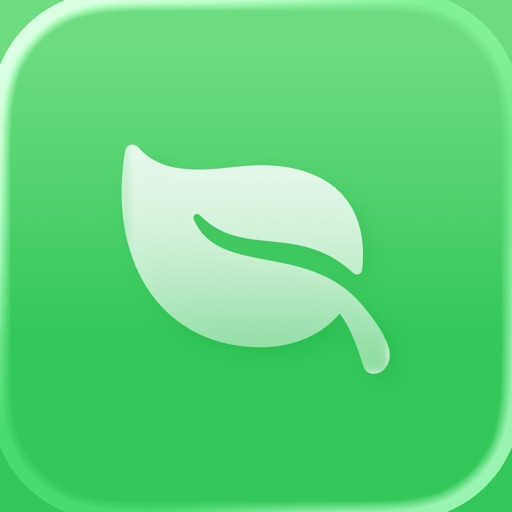

Folium is a beautifully designed, high performing multi-system emulator that allows you to play video games from retro consoles and handhelds

-- NOTE --
Folium does not provide any games or system files, these must be provided by the user

Emulation may be slow on older devices depending on the console or handheld emulated
-- NOTE --

Supported Consoles
- ColecoVision
- Game Boy, Game Boy Color
- Game Boy Advance
- Nintendo 3DS, New Nintendo 3DS
- Nintendo DS, Nintendo DSi
- Nintendo Entertainment System
- SEGA Genesis, Mega Drive
- Super Nintendo Entertainment System
- PlayStation 1

Supported Controllers
- Backbone One
- Nintendo Switch Joy-Con
- Nintendo Switch Pro Controller
- PlayStation DualShock 4
- PlayStation 5 DualSense
- Xbox Series S
- Xbox Series X

Folium is in no way affiliated with Nintendo. "Nintendo" and all associated game console and handheld names and game controller names are registered trademarks of Nintendo Co., Ltd

Folium is in no way affiliated with Sony. "PlayStation" and all associated game controller names are registered trademarks of Sony Group Corporation

Folium is in no way affiliated with SEGA. "SEGA" and all associated game console and handheld names are registered trademarks of SEGA Group Corporation

[View on Apple](https://apps.apple.com/fr/app/folium/id6498623389)

## Smur Bmpm

L'application «Protocoles d'intervention SMUR» a été réalisée à partir de données actualisées de la science et de l’expérience des médecins du Service de Santé/SMUR du Bataillon de Marins-Pompiers de Marseille.

Présentée sous forme de fiches faciles à compulser, agrémentée de nombreuses illustrations réalisées spécifiquement pour en faciliter la compréhension et la réalisation, cette application propose plus d’une centaine de protocoles médicaux ou fiches techniques, plus de 80 fiches médicamenteuses et de nombreux outils de calculs, destinés à la prise en charge des patients en milieu préhospitalier.

Elle permet à tous les médecins et infirmiers du monde de l'urgence d'avoir sur eux en permanence un outil efficace, rapide et adapté, pour les aider à faire face aux situations d'urgence les plus diverses.

Elle se divise en quatre parties : 
- protocoles,
- fiches thérapeutiques,
- fiches techniques,
- scores.

L'application est non seulement en mesure de fonctionner en mode «hors ligne», afin d'être utilisable même en l'absence de connexion Internet, mais elle est aussi capable, en présence d'une liaison Internet, de télécharger les éventuelles mises à jour de son contenu, sans frais d'abonnement, pour vous faire profiter immédiatement des actualisations de protocoles ou de la mise à disposition de nouvelles fiches.

Il est également possible de rajouter dans chaque fiche des notes personnelles, qui peuvent être sauvegardées dans iCloud.

[View on Apple](https://apps.apple.com/fr/app/smur-bmpm/id384759615)
