- [Influence et manipulation](#influence-et-manipulation)
- [Les heures fragiles](#les-heures-fragiles)
- [Accidentally Amy](#accidentally-amy)
- [La vie heureuse](#la-vie-heureuse)
- [Le dîner](#le-di-ner)
- [Toutes les nuances de la nuit](#toutes-les-nuances-de-la-nuit)
- [Verity](#verity)
- [PNL POUR DÉBUTANTS - Le pouvoir du subconscient: Comment exploiter le pouvoir de la psychologie, de la communication et des techniques de manipulation pour obtenir enfin tout ce que vous voulez](#pnl-pour-de-butants-le-pouvoir-du-subconscient-comment-exploiter-le-pouvoir-de-la-psychologie-de-la-communication-et-des-techniques-de-manipulation-pour-obtenir-enfin-tout-ce-que-vous-voulez)
- [Un palais de cendres et de ruines](#un-palais-de-cendres-et-de-ruines)
- [La Dernière Allumette](#la-dernie-re-allumette)
- [Dieu, la science, les preuves](#dieu-la-science-les-preuves)
- [L'Imitation de Jésus-Christ](#l-imitation-de-je-sus-christ)
- [La Mythologie](#la-mythologie)
- [Lune rouge](#lune-rouge)
- [La Cité hantée: Une enquête de l'inspecteur Pendergast : Pendergast 20 (Pendergast)](#la-cite-hante-e-une-enque-te-de-l-inspecteur-pendergast-pendergast-20-pendergast)
- [Chère Ella](#che-re-ella)
- [Le portrait de Dorian Gray - Livre Audio](#le-portrait-de-dorian-gray-livre-audio)
- [Désolation](#de-solation)
- [Dark Sacred Night](#dark-sacred-night)
- [Boss Games](#boss-games)
- [Comment l'IA Transformera Notre Avenir: Comprendre l'Intelligence Artificielle pour être à l'Avant-garde. Apprentissage Automatique. IA Générative. Robots. Superintelligence. (Unabridged)](#comment-l-ia-transformera-notre-avenir-comprendre-l-intelligence-artificielle-pour-e-tre-a-l-avant-garde-apprentissage-automatique-ia-ge-ne-rative-robots-superintelligence-unabridged)
- [In the Blink of an Eye](#in-the-blink-of-an-eye)
- [Un palais d'épines et de roses](#un-palais-d-e-pines-et-de-roses)
- [Le mystère de la chambre jaune](#le-myste-re-de-la-chambre-jaune)
- [Dynastie Hariston - Tome 1](#dynastie-hariston-tome-1)
- [Psychologie Noire Et Manipulation Mentale \[Dark Psychology and Mental Manipulation\]: 5 livres en 1 | Les techniques cachées de la psychologie noire | Pnl | Persuasion | Thérapie cognitivo-comportementale ... | Intelligence émotionnelle (French Edition)](#psychologie-noire-et-manipulation-mentale-dark-psychology-and-mental-manipulation-5-livres-en-1-les-techniques-cache-es-de-la-psychologie-noire-pnl-persuasion-the-rapie-cognitivo-comportementale-intelligence-e-motionnelle-french-edition)
- [La locataire - Le nouveau roman de l'autrice de La femme de ménage](#la-locataire-le-nouveau-roman-de-l-autrice-de-la-femme-de-me-nage)
- [Un rien peut tout changer !](#un-rien-peut-tout-changer)
- [Les langages de l'Amour: Les actes qui disent "je t'aime"](#les-langages-de-l-amour-les-actes-qui-disent-je-t-aime)
- [Les Secrets de la femme de ménage - Tome 2 - Prix Babelio 2024 Polar et Thriller](#les-secrets-de-la-femme-de-me-nage-tome-2-prix-babelio-2024-polar-et-thriller)
- [La méthode simple pour en finir avec la cigarette](#la-me-thode-simple-pour-en-finir-avec-la-cigarette)
- [The Let Them Theory: A Life-Changing Tool That Millions of People Can’t Stop Talking About (Unabridged)](#the-let-them-theory-a-life-changing-tool-that-millions-of-people-can-t-stop-talking-about-unabridged)
- [Harry Potter à L'école des Sorciers](#harry-potter-a-l-e-cole-des-sorciers)
- [D'autres printemps : Suivi d'un entretien avec l'autrice](#d-autres-printemps-suivi-d-un-entretien-avec-l-autrice)
- [La mue](#la-mue)
- [Le Trône de fer (Tome 2) - Le Donjon rouge](#le-tro-ne-de-fer-tome-2-le-donjon-rouge)
- [Le Poids de l’Honneur (Rois et Sorciers – Livre 3)](#le-poids-de-l-honneur-rois-et-sorciers-livre-3)
- [Matrices](#matrices)
- [Les Légendaires - Aube et crépuscule - Tome 7](#les-le-gendaires-aube-et-cre-puscule-tome-7)
- [You belong to me](#you-belong-to-me)
- [L'art d'avoir toujours raison](#l-art-d-avoir-toujours-raison)
- [Ce que révèlent vos prénoms](#ce-que-re-ve-lent-vos-pre-noms)
- [Un si beau couple](#un-si-beau-couple)
- [La source](#la-source)
- [The Sons of Death - tome 2](#the-sons-of-death-tome-2)
- [L'art subtil de s'en f*utre: Un guide à contre-courant pour être soi-même](#l-art-subtil-de-s-en-f-utre-un-guide-a-contre-courant-pour-e-tre-soi-me-me)
- [Les aventures de Tom Sawyer](#les-aventures-de-tom-sawyer)
- [Histoires des Jean-Quelque-Chose (Tome 1) - L'omelette au sucre](#histoires-des-jean-quelque-chose-tome-1-l-omelette-au-sucre)
- [Le Boyfriend](#le-boyfriend)
- [Le Poète](#le-poe-te)
- [Quand Cornebidouille était petite](#quand-cornebidouille-e-tait-petite)
- [ABC contre Poirot](#abc-contre-poirot)
- [Game changer - Tome 1](#game-changer-tome-1)
- [La splendeur et l'infamie](#la-splendeur-et-l-infamie)
- [Regime Change (Unabridged)](#regime-change-unabridged)
- [Adoration: Mémoires D'un Vampire – Livre Deux: Narration par une voix synthétisée](#adoration-me-moires-d-un-vampire-livre-deux-narration-par-une-voix-synthe-tise-e)
- [A Language of Dragons : Suivi d'un entretien avec l'autrice (Language of Dragons)](#a-language-of-dragons-suivi-d-un-entretien-avec-l-autrice-language-of-dragons)
- [De Gaulle - Une certaine idée de la France](#de-gaulle-une-certaine-ide-e-de-la-france)
- [Fourth Wing - Tome 01 (Empyrean)](#fourth-wing-tome-01-empyrean)
- [Les morts ne chantent pas - La Onzième Enquête du département V](#les-morts-ne-chantent-pas-la-onzie-me-enque-te-du-de-partement-v)
- [La place](#la-place)
- [Obsolète](#obsole-te)
- [L'odyssée de L'Odyssée](#l-odysse-e-de-l-odysse-e)
- [L'art d'aimer](#l-art-d-aimer)
- [Atlas, l'histoire de Pa Salt - Les Sept Soeurs, tome 8](#atlas-l-histoire-de-pa-salt-les-sept-soeurs-tome-8)
- [Cent ans de solitude](#cent-ans-de-solitude)
- [Les Misérables - Édition abrégée](#les-mise-rables-e-dition-abre-ge-e)
- [Le Journal d'Anne Frank](#le-journal-d-anne-frank)
- [Le Piège Zéro (Un Thriller d’Espionnage de l’Agent Zéro—Volume #4)](#le-pie-ge-ze-ro-un-thriller-d-espionnage-de-l-agent-ze-ro-volume-4)
- [Captive](#captive)
- [Le Cercle des mensonges](#le-cercle-des-mensonges)
- [The Expanse, tome 1 -  L'Éveil du Léviathan](#the-expanse-tome-1-l-e-veil-du-le-viathan)
- [L'Alchimiste](#l-alchimiste)
- [L'Odyssée](#l-odysse-e)
- [Les Piliers de la terre 2 - Aliena](#les-piliers-de-la-terre-2-aliena)
- [Logocratie](#logocratie)
- [Attached](#attached)
- [La Sainte Bible: Ancien et Nouveau Testament](#la-sainte-bible-ancien-et-nouveau-testament)
- [Les cerfs-volants](#les-cerfs-volants)
- [Pour le meilleur et pour le pire](#pour-le-meilleur-et-pour-le-pire)
- [La Guerre de l'Art: Gagner le combat intérieur de la créativité (Unabridged)](#la-guerre-de-l-art-gagner-le-combat-inte-rieur-de-la-cre-ativite-unabridged)
- [Le Maître des fureurs](#le-mai-tre-des-fureurs)
- [L'Arbre de fer](#l-arbre-de-fer)
- [Ellana - Le Pacte des Marchombres, tome 2 - L'Envol](#ellana-le-pacte-des-marchombres-tome-2-l-envol)
- [La Prof](#la-prof)
- [La Loi des mâles - Les Rois maudits, tome 4](#la-loi-des-ma-les-les-rois-maudits-tome-4)
- [Le Réveil Du Vaillant (Rois et Sorciers — Livre 2)](#le-re-veil-du-vaillant-rois-et-sorciers-livre-2)
- [Le code de Katharina](#le-code-de-katharina)
- [Le Livre des Baltimore](#le-livre-des-baltimore)
- [Le jour où Rose a disparu](#le-jour-ou-rose-a-disparu)
- [Volare](#volare)
- [La psy](#la-psy)
- [Fractures](#fractures)
- [Pouvoir illimité - Le livre majeur sur la PNL (programmation neurolinguistique)](#pouvoir-illimite-le-livre-majeur-sur-la-pnl-programmation-neurolinguistique)
- [Intérieur nuit](#inte-rieur-nuit)
- [Le Petit Nicolas et les copains](#le-petit-nicolas-et-les-copains)
- [Feu et sang - Partie 1 (House of the Dragon)](#feu-et-sang-partie-1-house-of-the-dragon)
- [Leçons d'un siècle de vie](#lec-ons-d-un-sie-cle-de-vie)
- [Tout cela je te le donnerai](#tout-cela-je-te-le-donnerai)
- [Un jour sans femme](#un-jour-sans-femme)

## Influence et manipulation

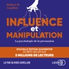

Découvrez pourquoi certaines personnes sont douées d'un remarquable don pour la persuasion et comment il est possible de les battre sur leur propre terrain. Résultat de plus de 35 ans de recherches scientifiques, cette nouvelle édition du best-seller international Influence et manipulation est un guide exhaustif et pratique pour comprendre les rouages de l'art de la persuasion et les appliquer aussi bien dans la vie quotidienne que dans le champ professionnel.S'appuyant sur des récits marquants et des exemples concrets pour en faciliter la compréhension, Robert B. Cialdini, docteur en psychologie sociale, y livre sept principes universel de l'influence :La réciprocitéL'engagement et la cohérenceLa preuve socialeLa sympathieL'autoritéLa raretéL'unité, le tout nouveau principe dévoilé dans cette éditionVous apprendrez ainsi comment amener vos interlocuteurs à aller dans votre sens tout comme à vous défendre des tentatives d'influence.

[View on Apple](https://books.apple.com/fr/audiobook/influence-et-manipulation/id1604221371)

## Les heures fragiles

Diane a toujours eu des rêves simples. Un mari, deux enfants, un métier qui lui plaît, c'est plus que ce qu'elle osait espérer. Le jour où Seb la quitte, son monde vacille. Absorbée par sa peine, elle ne voit pas que le drame se joue ailleurs. 
Tout près d'elle, dans cette chambre qui fait face à la sienne, les rires de sa fille s'épuisent. Lou a seize ans, le mal de grandir, et son premier chagrin d'amour lui arrache plus que des larmes. Quand Diane comprend, elle est prête à tout pour l'aider. Y compris à retourner vers un passé qu'elle avait fui. 
Ensemble, mère et fille marchent sur un fil. Sous leurs pas, le torrent de la vie gronde et emporte avec lui les heures fragiles.

Toute la force de ce duo mère-fille prend son ampleur grâce à la justesse et la complicité de Caroline Anglade et Anna Apter. 
«&#xa0;Une épopée d’humour et de larmes. Son meilleur roman&#xa0;» (Baptiste Beaulieu)

Couverture&#xa0;: Création Studio Flammarion / Illustration : Jean Delabrière

[View on Apple](https://books.apple.com/fr/audiobook/les-heures-fragiles/id1808002406)

## Accidentally Amy

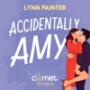

Izzy est habituellement très honnête. Mais aujourd’hui c’est son premier jour dans le job de ses rêves, elle est en retard et la barista appelle « Amy » trois fois sans réponse, alors… elle fait l’impensable : elle prend le Pumpkin Spice Latte d’Amy. Mais en se retournant, elle renverse le latte sur l’homme le plus séduisant qu’elle ait jamais vu, tachant son élégante chemise. Là, c’est la rencontre digne des meilleures comédies romantiques : étincelles, papillons dans le ventre, tout semble possible… jusqu’à ce qu’il lui dise : « À demain, Amy. » Izzy se dit qu’elle détrompera son crush le lendemain et file. Mais à son arrivée au bureau, elle découvre que Blake Philipps, le vice-président de son entreprise, n’est autre que… le bel inconnu du Starbucks. S’il était charmant avec « Amy », il se montre désagréable avec Izzy et ne trouve pas son explication drôle du tout. Pourtant, au fil des jours, l’attirance grandit entre eux, et ils vont devoir apprendre à travailler ensemble sans s’arracher la tête… ni les vêtements.

[View on Apple](https://books.apple.com/fr/audiobook/accidentally-amy/id6768949853)

## La vie heureuse

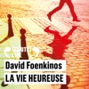

"Jamais aucune époque n’a autant été marquée par le désir de changer de vie. Nous voulons tous, à un moment de notre existence, être un autre." 

Bernard Gabay donne voix à ce roman au charme irrésistible et décalé, et à son duo de personnages parfois déboussolés mais toujours pleins d’envie !

[View on Apple](https://books.apple.com/fr/audiobook/la-vie-heureuse/id1721907010)

## Le dîner

Dans ce thriller psychologique interactif, chaque choix vous rapproche de la vérité... et de votre pire cauchemar. Vous êtes fauchée et vous risquez d'être expulsée de votre appartement. Alors quand une amie vous propose un job de serveuse lors d'un dîner chic dans un manoir totalement isolé, vous croyez rêver. Le salaire pour la soirée ? De quoi couvrir deux mois de loyer et vous remettre sur pied. C'est la chance de votre vie.Pourtant, une petite voix intérieure vous murmure que c'est trop beau pour être vrai. Il y a forcément quelque chose de louche dans l'histoire... Peut-être devriez-vous refuser ? La décision vous appartient. Serez-vous assez prudente pour rester chez vous ? Accepterez-vous de faire monter cet auto-stoppeur étrange sur la route du manoir ? Tournerez-vous à gauche ou à droite à la bifurcation ? Interprétation humaine

[View on Apple](https://books.apple.com/fr/audiobook/le-d%C3%AEner/id6780965706)

## Toutes les nuances de la nuit

Une exploration bouleversante des troubles adolescents et de leur impact sur la vie adulte. Jusqu'à ce jour de 1975, Monta Clare était une petite communauté tranquille des Ozarks. Aujourd'hui, les sirènes des voitures de police retentissent dans toute la ville. Dans un quartier paisible, les habitants sont interrogés, tous doivent fournir des alibis. La raison ? Le jeune Patch McCauley a disparu. Dans la forêt voisine, on a retrouvé son tee-shirt, maculé de sang. Saint, une jeune fille du village au caractère bien affirmé, décide de faire tout ce qui est en son pouvoir pour découvrir ce qui est arrivé à son ami. Elle harcèle le shérif, mène sa propre enquête, cherche des pistes. Les jours passent, puis les mois. L'affaire ne fait plus les gros titres des journaux, et cependant, Saint s'obstine. Trois cent sept jours plus tard, Patch McCauley réapparaît. L'affaire est réglée ? Non. Bien au contraire, il faudra des décennies pour élucider tous les mystères et faire la lumière sur ce qui s'est réellement passé durant ces trois cent sept jours."Impressionnant." Télérama"Passionnément romanesque" France Inter"Un très grand roman" LibérationInterprétation humaine

[View on Apple](https://books.apple.com/fr/audiobook/toutes-les-nuances-de-la-nuit/id1876607856)

## Verity

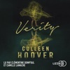

Toute vérité n'est pas bonne à dire. La vie a toujours souri à Verity Crawford. Ses livres font d'elle une auteur star, sa maison du Vermont est splendide et elle forme avec Jeremy, son mari, un couple parfait. Mais un jour, sur une route, son rêve tourne au cauchemar. L'accident l'empêche d'écrire, transforme sa trop grande maison en prison, et menace de l'éloigner de Jeremy. La vie n'a jamais été tendre avec Lowen ashleigh. Ses livres ne rencontrent qu'un accueil poli, ses finances sont au plus mal et ses histoires d'amour sont des feux de paille. Jusqu'à ce que Jeremy la recrute pour devenir le ghostwriter de Verity et terminer à sa place sa série à succès. Pour Lowen, aussi incongrue que soit la proposition, l'occasion est beaucoup trop belle pour ne pas la saisir. et Jeremy beaucoup trop séduisant pour qu'elle lui dise non. Mais en découvrant, dans les papiers de Verity, ce qui semble être son autobiographie, Lowen va voir se dessiner, page après page, le portrait d'une femme épouvantable, prête au plus atroce des crimes pour ne pas perdre ce qu'elle a, et prompte à toutes les perversités lorsqu'elle se sent menacée. Et aux yeux de Verity, Lowen est désormais une menace.

[View on Apple](https://books.apple.com/fr/audiobook/verity/id1656297029)

## PNL POUR DÉBUTANTS - Le pouvoir du subconscient: Comment exploiter le pouvoir de la psychologie, de la communication et des techniques de manipulation pour obtenir enfin tout ce que vous voulez

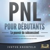

Voulez-vous comprendre sans effort le langage corporel des personnes qui vous entourent et l'utiliser à votre avantage? Aimeriez-vous remplacer les pensées négatives par des pensées positives et apprendre à vous programmer mentalement pour réussir? Voulez-vous influencer intelligemment d'autres personnes pour obtenir ce que vous voulez?

Ce livre vous montre des stratégies fructueuses à la fois simples et efficaces, issues des domaines de la psychologie et de la communication, grâce auxquelles vous pouvez contrôler votre propre subconscient et manipuler les autres afin d'atteindre tous vos objectifs le plus rapidement possible!

-Dégagez une plus grande confiance en vous en toutes circonstances et persuadez vos prochains de votre valeur et de votre opinion.

-Renforcez considérablement votre assertivité et obtenez toujours ce que vous voulez, que ce soit sur le plan professionnel ou privé.

-Répandez la joie de vivre, dirigez vos émotions, pensées et croyances exclusivement vers le positif.

-Comprenez et analysez les personnes qui vous entourent et établissez des relations interpersonnelles profondes.

Construisez les bases d'une vie heureuse et réussie avec la programmation neurolinguistique!

[View on Apple](https://books.apple.com/fr/audiobook/pnl-pour-d%C3%A9butants-le-pouvoir-du-subconscient-comment/id1790662085)

## Un palais de cendres et de ruines

Devenue Grande Dame de la Cour de la Nuit, Feyre a offert son cœur à Rhysand. Après la trahison de Tamlin, pourtant, la jeune femme n'a eu d'autre choix que de suivre celui-ci à la Cour du Printemps, qu'elle considérait autrefois comme sa maison. Mais Feyre n'a qu'une idée en tête : découvrir ce que manigance Tamlin, qui s'est rangé aux côtés du roi d'Hybern, et rentrer au plus vite à la Cour de la Nuit. Car la guerre contre Hybern est imminente, et Feyre et Rhysand doivent à tout prix rallier les Grands Seigneurs à leur cause…  ATTENTION : Ce roman contient des scènes de sexe explicites. Nous le conseillons à partir de 16 ans.

[View on Apple](https://books.apple.com/fr/audiobook/un-palais-de-cendres-et-de-ruines/id1687103209)

## La Dernière Allumette

Prix Audiolib 2024, Prix Poche RELAY x KitKat Depuis plus de vingt ans, Abigaëlle vit recluse dans un couvent en Bourgogne. Sa vie d’avant ? Elle l’a en grande partie oubliée. Elle est même incapable de se rappeler l’événement qui a fait basculer sa destinée et l’a poussée à se retirer du monde. De loin, elle observe la vie parisienne de Gabriel, son grand frère, dont la brillante carrière d’artiste et l’imaginaire rempli de poésie sont encensés par la critique. Mais le jour où il rencontre la lumineuse Zoé et tombe sous son charme, Abigaëlle ne peut s’empêcher de trembler, car elle seule connaît vraiment son frère…  Un trésor de sensibilité et d’émotions brillamment construit. Marie Vareille démontre une nouvelle fois son talent unique pour nous tenir en haleine de la première à la dernière page.

[View on Apple](https://books.apple.com/fr/audiobook/la-derni%C3%A8re-allumette/id1730973996)

## Dieu, la science, les preuves

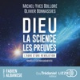

Trois ans de travail avec plus de vingt scientifiques et de spécialistes de haut niveau : voici révélées les preuves modernes de l'existence de Dieu. Pendant près de quatre siècles, de Copernic à Freud en passant par Galilée et Darwin, les découvertes scientifiques se sont accumulées de façon spectaculaire, donnant l'impression qu'il était possible d'expliquer l'Univers sans avoir besoin de recourir à un dieu créateur. Et c'est ainsi qu'au début du XXe siècle, le matérialisme triomphait intellectuellement.De façon aussi imprévue qu'étonnante, le balancier de la science est reparti dans l'autre sens, avec une force incroyable. Les découvertes de la Relativité, de la mécanique quantique, de l'expansion de l'Univers, de sa mort thermique, du Big Bang, du réglage fin de l'Univers ou de la complexité du vivant, se sont succédées.Ces connaissances nouvelles sont venues dynamiter les certitudes ancrées dans l'esprit collectif du XXe siècle, au point que l'on peut dire aujourd'hui que le matérialisme, qui n'a jamais été qu'une croyance comme une autre, est en passe de devenir une croyance irrationnelle.Dans une langue accessible à tous, les auteurs de ce livre retracent de façon passionnante l'histoire de ces avancées et offrent un panorama rigoureux des nouvelles preuves de l'existence de Dieu. À l'orée du XXe siècle, croire en un dieu créateur semblait s'opposer à la science. Aujourd'hui, ne serait-ce pas le contraire ?Une invitation à la réflexion et au débat.Table des matières :PréfaceAvertissementAvant-proposINTRODUCTION1. L'aube d'une révolution2. Qu'est-ce qu'une preuve ?3. Implications résultant des deux théories " il existe un dieu créateur " versus " l'Univers est exclusivement matériel "LES PREUVES LIÉES À LA SCIENCE4. La mort thermique de l'Univers : histoire d'une fin, preuve d'un début5. Une brève histoire du Big Bang6. Tentatives d'alternatives au Big Bang7. Les preuves convergentes d'un début absolu de l'Univers8. Le roman noir du Big Bang9. Le principe anthropique ou les fabuleux réglages de l'Univers10. Les multivers : théorie ou échappatoire ?11. Premières conclusions : un petit chapitre pour notre livre, un grand pas pour notre raisonnement 12. Biologie : le saut vertigineux de l'inerte au vivantDIEU - LA SCIENCE - LES PREUVES13. Ce qu'en disent les grands savants eux-mêmes : 100 citations essentielles 14. En quoi croient les savants ?15. En quoi croyait Einstein ?16. En quoi croyait Gödel ?LES PREUVES HORS SCIENCE17. Les vérités humainement inatteignables de la Bible18. Les " erreurs " de la Bible qui, en réalité, n'en sont pas19. Qui peut être Jésus ?20. Le peuple juif : un destin au-delà de l'improbable21. Fátima : illusion, supercherie ou miracle ?22. Tout est-il permis ?23. Les preuves philosophiques contre-attaquent24. Les raisons de croire à l'inexistence de Dieu selon les matérialistes CONCLUSION25. Le matérialisme : une croyance irrationnelleAnnexe 1 : Repères chronologiques Annexe 2 : Repères des ordres de grandeur en physiqueAnnexe 3 : Repères des ordres de grandeur en biologieGlossaireRemerciements

[View on Apple](https://books.apple.com/fr/audiobook/dieu-la-science-les-preuves/id1745853818)

## L'Imitation de Jésus-Christ

L'étonnant fortune de cet ouvrage, œuvre de piété chrétienne de la fin du XIVe siècle ou du début du XVe siècle, tient du prodige. Longtemps, dans les monastères d'Europe aucun livre n'eut pareil succès, ce qui fit dire à Fontenelle : "<i>L'Imitation de Jésus-Christ</i> est le plus beau livre qui soit parti de la main d'un homme, puisque l'Evangile n'en vient pas". Au cours des siècles, l'influence de l'Imitation de Jésus-Christ ne s'est pas démentie. En 1450, il en existait plus de deux cent cinquante manuscrits traduits dans toutes les langues des peuples civilisés qui se sont accordé à le considérer comme le plus utile semeur de la vie spirituelle chrétienne.

[View on Apple](https://books.apple.com/fr/audiobook/limitation-de-j%C3%A9sus-christ/id685288068)

## La Mythologie

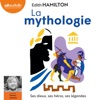

Edith Hamilton est sans doute le seul auteur à avoir saisi toute l’importance que gardent, à notre époque, les mythes et les légendes, qui sont le fondement même de notre culture, et où nous puisons encore une si large inspiration. Remontant aux sources, c’est chez les poètes Homère, Hésiode, Pindare, Ovide qu’elle retrouve la substance des grands thèmes mythologiques et nous les restitue, dans leur spontanéité, leur efficacité, sous forme de merveilleuses histoires : Orphée et Eurydice, Philémon et Baucis, Tantale et Niobé, les travaux d’Hercule, le défi d’Icare, la descente de Thésée aux Enfers.  L’ouvrage le plus clair et le plus complet sur la mythologie, lu magistralement par Thierry Janssen.  Le livre audio La Mythologie : ses dieux, ses héros, ses légendes est accompagné d'un livret PDF comportant une carte et des arbres généalogiques que vous pouvez retrouver en accès libre sur le site d'Audiolib.

[View on Apple](https://books.apple.com/fr/audiobook/la-mythologie/id1486566867)

## Lune rouge

Un passionnant roman d'exploration spatiale et de révolution politique, par l'un des grands maîtres américains de la science-fiction moderne.
2047 : l'homme a colonisé la Lune, territoire divisé par les grandes nations. L'Américain Fred Fredericks fait son premier voyage là-haut, afin de livrer un appareil de communication ultrasécurisé à un haut fonctionnaire de l'Autorité lunaire chinoise. Mais quelques heures seulement après son arrivée, il se voit impliqué malgré lui dans un assassinat et mis au secret par des agents mystérieux. Ta Shu, célèbre journaliste, visite également le satellite pour la première fois. Malgré ses contacts et son influence au cœur du pouvoir en Chine, lui aussi découvrira que la Lune est un endroit dangereux pour tout voyageur. Et enfin, il y a Chan Qi. Fille du ministre des Finances chinois, elle est sans aucun doute une « personne d'intérêt » pour les autorités de son pays. Renvoyée clandestinement en Chine à cause de ses agissements, elle va tout faire changer… sur la Terre comme sur la Lune.
« Un des meilleurs romanciers de notre temps, tous genres confondus. » - The Guardian
« Un chef-d'œuvre. » - The Times
« Tout nouveau roman de la part du grand Kim Stanley Robinson constitue un événement et celui-ci ne déçoit pas. » - The Independant
Ce livre audio est interprété par une voix humaine, dans le respect des engagements d'Hardigan.

[View on Apple](https://books.apple.com/fr/audiobook/lune-rouge/id1735910212)

## La Cité hantée: Une enquête de l'inspecteur Pendergast : Pendergast 20 (Pendergast)

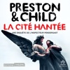

L'inspecteur Pendergast, du FBI, est appelé en Georgie, où des corps sont découverts vidés de leur sang. En proie à la panique, les habitants craignent le retour d'une créature qu'on croyait n'appartenir qu'à la légende : le Vampire de Savannah.Épaulé par sa pupille Constance et l'agent Coldmoon, Pendergast explore une autre piste qui le mène à la disparition inexpliquée d'un certain D.B. Cooper. Cinquante ans plus tôt, celui-ci a sauté d'un avion en parachute après s'être fait remettre 200000 dollars... pour ne plus jamais reparaître.Dans l'atmosphère étrange qui pèse sur l'enquête, l'inspecteur devra démêler les fils de ce mystère et faire face à un adversaire redoutable.

[View on Apple](https://books.apple.com/fr/audiobook/la-cit%C3%A9-hant%C3%A9e-une-enqu%C3%AAte-de-linspecteur-pendergast/id1736958432)

## Chère Ella

Le temps d’une lettre, Beckett, soldat américain en mission au Moyen-Orient, oublie les horreurs du quotidien. Même s’il ne la connaît qu’à travers leur correspondance, il tombe sous le charme d’Ella, la sœur de son meilleur ami. Avant de succomber au combat, ce dernier demande à Beckett de veiller sur elle, d’autant que la jeune mère se démène depuis que sa petite fille souffre d’un cancer. Fidèle aux dernières volontés de son frère d’armes, Beckett se rapproche d’elle, mais la vérité le rattrape…  Interprétation humaine

[View on Apple](https://books.apple.com/fr/audiobook/ch%C3%A8re-ella/id1883994388)

## Le portrait de Dorian Gray - Livre Audio

Le portrait de Dorian Gray est le seul roman d'Oscar Wilde, chef-d'œuvre gothique et philosophique explorant les limites du plaisir, de la morale et de la beauté. Dorian Gray, jeune homme d'une beauté exceptionnelle, fait le vœu que son portrait vieillisse à sa place. Ce souhait exaucé, il plonge dans une vie de décadence, tandis que son visage reste jeune et innocent.

Wilde interroge la dualité entre apparence et vérité, entre l'âme et le corps. Le roman est une critique brillante de l'esthétisme absolu et du nihilisme moral. Le portrait de Dorian Gray fascine par sa profondeur psychologique et sa noirceur élégante, posant la question éternelle : peut-on vivre sans conséquences ?

[View on Apple](https://books.apple.com/fr/audiobook/le-portrait-de-dorian-gray-livre-audio/id1831824682)

## Désolation

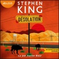

La nationale 50 coupe droit à travers le désert du Nevada, sous un soleil écrasant. On n’y entend que le jappement lointain des coyotes. C’est là qu’un flic étrange, un colosse aux méthodes très particulières, arrête des voyageurs sous des prétextes vagues, puis les oblige à le suivre à la ville voisine : Désolation. Et le cauchemar commence… Ce thriller éprouvant, au goût d’apocalypse, nous entraîne plus loin que jamais dans la lutte éternelle du Bien et du Mal.  Interprétation humaine

[View on Apple](https://books.apple.com/fr/audiobook/d%C3%A9solation/id1884932329)

## Dark Sacred Night

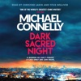

<b>A MURDER HE CAN'T FORGET.</b> <b>A CASE ONLY SHE CAN SOLVE.</b>  <b></b> <b>'OUTSTANDING' IAN RANKIN</b> <b></b><b></b> <b>Amazon Best 100 Books of The Year</b> <b></b><b></b> <b>Barnes &amp; Noble Best Books of The Year</b> <b></b><b></b> <b>Top Ten Best Thrillers of the Year - Washington Post</b> <b></b><b></b> <b>* * * * *</b> <b></b><b></b> <b>Daisy Clayton's killer was never caught. In over ten years, there has been no breakthrough in her murder case.</b> <b></b> Detective <b>Renée Ballard</b> has faced everything the LAPD's notorious dusk-till-dawn graveyard shift has thrown at her. But, until tonight, she'd never met <b>Harry Bosch</b> - an ex-homicide detective consumed by this case.  Soon, she too will become obsessed by the murder of Daisy Clayton.  Because Ballard and Bosch both know: every murder tells a story. And Daisy's case file reads like the first chapter in an untold tragedy that is still being written - one that could end with Ballard herself, if she cannot bring the truth to light... <b></b> <b>* * * * *</b> <b></b><b></b> <b>CRIME DOESN'T GET BETTER THAN CONNELLY.</b> <b></b> 'One of the world's greatest crime writers' <b><i>Daily Mail</i></b> <b><i></i></b> 'Crime thriller writing of the highest order' <b><i>Guardian</i></b> <b><i></i></b> 'A terrific writer with pace, style and humanity to spare' <b><i>The Times</i></b> <b><i></i></b> 'America's greatest living crime writer' <b><i>Daily Express</i></b> <b><i></i></b> 'The pre-eminent detective novelist of his generation' <b>Ian Rankin</b> <b></b> 'A master' <b>Stephen King</b> <b></b> 'A genius' <b><i>Independent on Sunday</i></b> <b><i></i></b> 'A superb natural storyteller' <b>Lee Child</b> <b></b> 'One of the great storytellers of crime fiction' <b><i>Sunday Telegraph</i></b> <b><i></i></b> 'Justly regarded as one of the world's finest crime writers' <b><i>Mail On Sunday</i></b> <b><i></i></b> 'No one writes a better modern thriller than Connelly' <b><i>Evening Standard</i></b>

[View on Apple](https://books.apple.com/fr/audiobook/dark-sacred-night/id1442719920)

## Boss Games

<b>Il fixe les règles. Elle les brise toutes.</b>  Gabriel Miller est arrogant, sûr de lui, séducteur et propriétaire d'un club échangiste. Les femmes, c'est son rayon. Le sexe, encore plus. À une condition : pas de conquêtes au boulot. Une règle horriblement difficile à respecter quand arrive Grace O'Brien, sa nouvelle serveuse. Étudiante fauchée au caractère affirmé, elle lui tient tête à chaque occasion et s’amuse à le rendre fou de désir. Mais à ce petit jeu des tentations, Gabriel se révèle être un adversaire redoutable…  <b><i>Boss Games</i>, d’Alexia Perkins, histoire intégrale.</b>

[View on Apple](https://books.apple.com/fr/audiobook/boss-games/id1644062839)

## Comment l'IA Transformera Notre Avenir: Comprendre l'Intelligence Artificielle pour être à l'Avant-garde. Apprentissage Automatique. IA Générative. Robots. Superintelligence. (Unabridged)

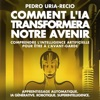

<b>BEST SELLER aux États-Unis et en Allemagne. Découvrez-le maintenant en français.</b>  <i>« Un fascinant voyage vers le futur de l'IA, offrant une perspective unique en combinant technologie, économie, géopolitique et histoire. »</i><b>—PASCAL BORNET, Influenceur en technologie, 2 millions de followers.</b>  Rédigé dans un style accessible à tous, <i>« Comment l'IA Transformera Notre Avenir »</i> explore un sujet d'une importance capitale pour notre futur : <b>que devons-nous attendre de l'IA ? Comment changera-t-elle nos vies et notre société dans les décennies à venir ?</b>  Pour répondre à ces questions fondamentales, Pedro Uria-Recio, <b>ancien consultant de McKinsey et Chief AI Officer d'une grande banque asiatique</b>, nous guide à travers l'histoire et l'avenir de l'IA, en abordant des questions essentielles. Comment l'IA fonctionne-t-elle réellement ? Comment va-t-elle redéfinir notre économie, notre politique, notre culture et notre façon de travailler ? Quels sont ses résultats utopiques et dystopiques potentiels, et qui sera le plus affecté ? Enfin, que devons-nous faire pour profiter de cette technologie, plutôt que d'en subir les conséquences ? Et surtout, que devons-nous demander à nos dirigeants aujourd'hui pour nous préparer à l'irrésistible avancée de l'IA ?  L'auteur, l'un des leaders mondialement reconnus en IA, répond à ces questions en s'appuyant sur ses 20 ans d'expérience entre l'Europe, les États-Unis et l'Asie. Il explore des sujets controversés tels que <b>la superintelligence, la biologie synthétique, le rôle de l'IA dans la compétition entre les États-Unis et la Chine, son impact sur les guerres futures et son influence croissante sur nos vies intimes et familiales</b>. Atteindrons-nous un jour une véritable coexistence homme-cyborg, capable de façonner l’évolution de notre espèce ? L'IA nous conduira-t-elle à notre extinction ou nous élèvera-t-elle vers de nouveaux sommets ?  <b>Please note: This audiobook is in French.</b>

[View on Apple](https://books.apple.com/fr/audiobook/comment-lia-transformera-notre-avenir-comprendre-lintelligence/id1892424796)

## In the Blink of an Eye

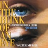

In the Blink of an Eye is celebrated film editor Walter Murch's vivid, multifaceted, thought -- provoking essay on film editing. Starting with what might be the most basic editing question -- Why do cuts work? -- Murch treats the reader to a wonderful ride through the aesthetics and practical concerns of cutting film. Along the way, he offers his unique insights on such subjects as continuity and discontinuity in editing, dreaming, and reality; criteria for a good cut; the blink of the eye as an emotional cue; digital editing; and much more. In this second edition, Murch reconsiders and completely revises his popular first edition's lengthy meditation on digital editing (which accounts for a third of the book's pages) in light of the technological changes that have taken place in the six years since its publication.   This audiobook is expertly read by Chris Brinkley, and was produced and published by Echo Point Books &amp; Media, an independent bookseller in Brattleboro, Vermont. Audio engineering by Annabel Dryden.   Copyright (c) 1995, 2001 by Walter Murch. Cover design by Heidi Freider, cover photograph by Michael D. Brown. (P) (2024) Echo Point Books &amp; Media, LLC.

[View on Apple](https://books.apple.com/fr/audiobook/in-the-blink-of-an-eye/id1765726009)

## Un palais d'épines et de roses

En chassant dans les bois enneigés, Feyre voulait seulement nourrir sa famille. Mais elle a commis l'irréparable en tuant un Fae, et la voici emmenée de force à Prythian, royaume des immortels. Là-bas, pourtant, sa prison est un palais magnifique et son geôlier n'a rien d'un monstre. Tamlin, un Grand Seigneur Fae, la traite comme une princesse. Et pourquoi lui et sa cour se cachent-ils derrière des masques ? Quel est le mal qui ronge son royaume et risque de s'étendre à celui des mortels ? À l'évidence, Feyre n'est pas une simple prisonnière. Mais comment une jeune humaine d'origine aussi modeste pourrait-elle venir en aide à de si puissants seigneurs ? Sa liberté, en tout cas, semble être à ce prix. &#xa0;  ATTENTION : Ce roman contient des scènes de sexe explicites. Nous le conseillons à partir de 16 ans.

[View on Apple](https://books.apple.com/fr/audiobook/un-palais-d%C3%A9pines-et-de-roses/id1687096482)

## Le mystère de la chambre jaune

Ce roman est une brillante illustration du principe du crime en lieu clos.

[View on Apple](https://books.apple.com/fr/audiobook/le-myst%C3%A8re-de-la-chambre-jaune/id1185409497)

## Dynastie Hariston - Tome 1

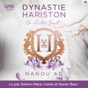

Elle voulait fuir son passé, mais il est plus séduisant que jamais et bien décidé à la rattraper. Des années après la trahison de Nate, son premier amour, Kara pensait avoir laissé derrière elle ce chapitre douloureux. Mais le destin en décide autrement : elle se voit confier l’organisation du mariage de Nate… avec son ancienne meilleure amie&#xa0; ! Une telle situation pourrait mettre en péril le secret qu’elle protège depuis toujours : Kara était enceinte lorsqu’elle s’est enfuie. Nate est désormais à la tête d’un empire puissant, et n’a plus rien du garçon qu’elle a connu. Il paraît mépriser Kara et ne tolérer sa présence que par obligation. Pourtant, derrière son indifférence glaciale, une possessivité silencieuse continue de le lier à elle. La priorité de Kara est de protéger son secret à tout prix, tout en affrontant celui qui l’a brisée. Mais l’homme d’affaires réveille des émotions qu’elle pensait enterrées à jamais, faisant vaciller les murs qu’elle a érigés pour se préserver…

[View on Apple](https://books.apple.com/fr/audiobook/dynastie-hariston-tome-1/id1833198151)

## Psychologie Noire Et Manipulation Mentale [Dark Psychology and Mental Manipulation]: 5 livres en 1 | Les techniques cachées de la psychologie noire | Pnl | Persuasion | Thérapie cognitivo-comportementale ... | Intelligence émotionnelle (French Edition)

![Psychologie Noire Et Manipulation Mentale \[Dark Psychology and Mental Manipulation\]: 5 livres en 1 | Les techniques cachées de la psychologie noire | Pnl | Persuasion | Thérapie cognitivo-comportementale ... | Intelligence émotionnelle (French Edition)](../../logos/1699888968-14b78cc9.png)

<b>Vous aimeriez savoir décrypter facilement les personnes qui vous entourent et détecter les individus toxiques et sans scrupules ?</b>  <b>Vous cherchez à développer votre pouvoir de persuasion, en comprenant la psychologie humaine et en sachant vous défendre contre les stratégies obscures ?</b>  Une étude publiée par la Harvard Business School a montré que 87 % de la population est manipulée ou influencée dans la vie quotidienne, que ce soit par leur partenaire, au travail ou par les personnes qu'ils côtoient.  Cette étude explique également qu'il peut être simple de contrer ou d'anticiper toute tentative de manipulation si l'on connaît les caractéristiques des personnalités de la triade noire et les bases de la manipulation mentale. Ces ancrages de manipulation nécessitent des processus d'implémentation assez longs qu'il est simple de repérer et de désamorcer.  <b>Voici un aperçu de ce que vous découvrirez dans cet ouvrage :</b> 

<b>L'analyse de la manipulation mentale et comment la repérer.</b>
Les 10 principales techniques de manipulation prédatrice.
<b>Les 10 techniques de contrôle de l'esprit.</b>
Comment fonctionne l'esprit des tueurs en série.
<b>Comment reconnaitre que vous êtes victime de manipulation mentale.</b>
Comment débloquer votre esprit et votre inconscient avec la TCC.
<b>Comment utiliser l'intelligence émotionnelle pour contrer la      psychologie noire.</b>
Les 10 techniques pour une meilleure intelligence émotionnelle.

 Ce livre et ces techniques ont déjà aidé de nombreuses personnes à découvrir le pouvoir de l’esprit en apprenant tout ce qu'il y a à savoir sur la triade noire. Pour ne plus être trompé(e) ou manipulé(e) dans votre vie quotidienne, faites défiler la page vers le haut et <b>ÉCOUTEZ-LE MAINTENANT !</b>  <b>Please note: This audiobook is in French.</b>

[View on Apple](https://books.apple.com/fr/audiobook/psychologie-noire-et-manipulation-mentale-dark-psychology/id1699888968)

## La locataire - Le nouveau roman de l'autrice de La femme de ménage

L'autrice à succès Freida McFadden frappe à votre porte avec un thriller psychologique saisissant : une histoire de vengeance, de privilèges et de secrets, portée par un duo de comédiens talentueux. Rien ne va plus pour Blake. Licencié brutalement, il n'arrive plus à payer le prêt immobilier de la nouvelle maison qu'il partage avec sa fiancée. La solution ? Prendre une locataire pour les aider à payer les frais de la maison. Et Whitney correspond exactement à ce que le jeune couple recherche. Elle est sympathique, charmante, sérieuse. La locataire parfaite. En apparence. Rapidement, quelque chose cloche. Une odeur putride imprègne la maison et des bruits étranges réveillent Blake au milieu de la nuit. Et bientôt, il commence à redouter que quelqu'un découvre ses secrets les plus sombres. Le danger a pénétré dans sa maison, et lorsqu'il s'en rend compte, il est bien trop tard : le piège est sur le point de se refermer...Interprétation humaine

[View on Apple](https://books.apple.com/fr/audiobook/la-locataire-le-nouveau-roman-de-lautrice-de-la/id1858317976)

## Un rien peut tout changer !

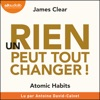

Créez de bonnes habitudes, abandonnez les mauvaises ! Micro-actions, méga-impact... De minuscules changements vont transformer votre vie.&#xa0;   Quels que soient vos objectifs, ce livre vous apporte les clés pour vous améliorer progressivement, grâce à de petits changements quotidiens. Il vous offre des stratégies pratiques vous permettant de parfaitement maîtriser d’infimes actions menant à des résultats concrets.&#xa0;  Expert mondial en matière de création d’habitudes, James Clear est réputé pour sa capacité à transformer des processus complexes en comportements simples facilement applicables à la vie quotidienne et au travail. Il s’appuie sur des concepts issus de la biologie, de la psychologie et des neurosciences pour vous aider à modifier vos agissements.  Émaillé d’histoires vraies, et lu avec entrain et pédagogie par Antoine-David Calvet, Un rien peut tout changer vous donne les techniques nécessaires pour changer enfin vos habitudes !  Table des matières : Introduction : Mon histoire &#xa0;  Première partie : Les fondamentaux - Pourquoi de petits changements ont un impact énorme Chapitre 1&#xa0; : Le pouvoir surprenant des petites habitudes Chapitre 2&#xa0; : Comment vos habitudes façonnent votre identité (et inversement) Chapitre 3&#xa0; : Comment construire de meilleures habitudes en quatre étapes simples &#xa0;  Deuxième partie : La 1ère loi - L’évidence Chapitre 4&#xa0; : L’homme qui n’avait pas l’air bien Chapitre 5&#xa0; : La meilleure façon d’adopter une nouvelle habitude Chapitre 6&#xa0; : La motivation est surestimée, l’environnement est souvent plus important Chapitre 7&#xa0; : Le secret de la maîtrise de soi &#xa0;  Troisième partie : La 2e loi - L’attractivité Chapitre 8&#xa0; : Comment rendre une habitude irrésistible Chapitre 9&#xa0; : Le rôle des proches dans la mise en place des habitudes Chapitre 10&#xa0; : Identifier les causes des mauvaises habitudes et y remédier &#xa0;  Quatrième partie : La 3e loi - La facilité Chapitre 11&#xa0; : Avancez lentement, mais sans revenir en arrière Chapitre 12&#xa0; : La loi du moindre effort Chapitre 13&#xa0; : Cessez de procrastiner en adoptant la règle des deux minutes Chapitre 14&#xa0; : Rendez les bonnes habitudes inévitables et les mauvaises habitudes impossibles &#xa0;  Cinquième partie : La 4e loi - La satisfaction Chapitre 15&#xa0; : La règle fondamentale du changement de comportement Chapitre 16&#xa0; : Comment rester fidèle à de bonnes habitudes chaque jour Chapitre 17&#xa0; : Comment un garant peut tout changer &#xa0;  Sixième partie : Tactiques élaborées - Comment passer du statut de « simplement bon » à « vraiment très bon » Chapitre 18&#xa0; : La vérité sur le talent (inné ou acquis ?) Chapitre 19&#xa0; : Le principe de Boucles d’Or : comment rester motivé dans la vie et au travail Chapitre 20&#xa0; : Les inconvénients de la création de bonnes habitudes &#xa0;  Conclusion : Le secret des résultats durables Annexes : Petits enseignements tirés des quatre lois Remerciements

[View on Apple](https://books.apple.com/fr/audiobook/un-rien-peut-tout-changer/id1519202717)

## Les langages de l'Amour: Les actes qui disent "je t'aime"

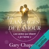

"Si nous voulons communiquer efficacement avec des personnes d'autres cultures, nous devons apprendre leur langue. Il en va de même dans le domaine de l'amour. Le langage de votre amour sentimental et celui de votre conjoint peuvent être aussi différents que le chinois l'est du français."  Avec plus de 11 millions de copies vendues, cet ouvrage se démarque d'autres livres sur le même sujet et le succès dont il profite est sans doute attribuable à son originalité. Rejoignez plus de 15 millions de personnes qui ont déjà amélioré leurs relations en découvrant la langue d'amour.&#xa0;  Gary Chapman, l'auteur des livres qui ont rencontré un large succès auprès du public francophone, identifie cinq moyens d'expression principaux par lesquels chaque individu peut manifester son amour :&#xa0;&#xa0; 

les paroles valorisantes ;
les moments de qualité ;
les cadeaux ;
les services rendus ;
le contact physique.

 Il se trouve rarement dans un couple deux personnes exprimant leur affection via le même moyen, d'où le problème de communication à l'origine de nombreuses désillusions. Ecouter ce livre audio c'est s'engager dans les sentiers captivants des "langages naturels" parlés au sein de sa relation amoureuse.  Grace aux nombreuses histoires vraies et aux idées exposées par ce conseiller conjugal de renom, l'auditeur apprendra à parler une nouvelle langue propre à son couple : une langue qui b'tit et épanouit car elle sera enfin comprise par les deux conjoints.  &gt;&gt; Ce livre audio en version intégrale vous est proposé en exclusivité par Audible et est uniquement disponible en téléchargement.&#xa0;

[View on Apple](https://books.apple.com/fr/audiobook/les-langages-de-lamour-les-actes-qui-disent-je-taime/id1437836223)

## Les Secrets de la femme de ménage - Tome 2 - Prix Babelio 2024 Polar et Thriller

C'est une chance inespérée pour Millie d'avoir décroché un nouveau travail. Chez les Garrick, un couple fortuné qui possède un somptueux appartement avec vue sur New York, elle fait le ménage et prépare les repas dans la magnifique cuisine. Cela paraît trop beau pour être vrai. Et effectivement, la femme de ménage ne tarde pas à déceler quelques ombres au tableau... Son patron, Douglas Garrick, est d'humeur de plus en plus changeante. Et pourquoi sa femme Wendy reste-t-elle toujours enfermée dans la chambre d'amis ? Le jour où Millie découvre du sang sur une chemise de nuit, elle ne peut plus rester les bras croisés. Quelque chose se trame dans cette maison. Une situation à laquelle Millie n'est pas préparée et qui pourrait bien se retourner contre elle si elle continue de vouloir découvrir les secrets des autres...Prix Babelio du meilleur thriller de l'année 2024

[View on Apple](https://books.apple.com/fr/audiobook/les-secrets-de-la-femme-de-m%C3%A9nage-tome-2-prix/id1756150815)

## La méthode simple pour en finir avec la cigarette

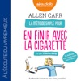

Voici LA méthode pour arrêter de fumer. Une méthode douce éprouvée qui a déjà permis à des millions de fumeurs à travers le monde d’écraser leur dernière cigarette. Vous aussi, vous pouvez vous débarrasser du tabac, définitivement. Et cela, sans médicaments, sans substituts ni prise de poids grâce aux conseils avisés du spécialiste du tabagisme : Allen Carr. Stop smoking, lisez ce livre ! En 1983, Allen Carr a conçu La Méthode simple pour en finir avec la cigarette, qui deviendra un best-seller vendu à plus de 14 millions d’exemplaires dans le monde. Il est considéré comme l’expert n°1 de l’assistance aux fumeurs et a adapté sa méthode à de nombreux autres domaines.

[View on Apple](https://books.apple.com/fr/audiobook/la-m%C3%A9thode-simple-pour-en-finir-avec-la-cigarette/id1440365314)

## The Let Them Theory: A Life-Changing Tool That Millions of People Can’t Stop Talking About (Unabridged)

<b>#1 </b><b><i>New York Times</i></b><b> Bestseller</b>  <b>#1 </b><b><i>Sunday Times</i></b><b> Bestseller</b>  <b>#1 </b><b><i>Amazon</i></b><b> Bestseller</b>  <b>#1 </b><b><i>Audible</i></b><b> Bestseller</b>  <b><i>A Life-Changing Tool Millions of People Can’t Stop Talking About</i></b>  What if the key to happiness, success, and love was as simple as two words?  If you've ever felt stuck, overwhelmed, or frustrated with where you are, the problem isn't you. The problem is the power you give to other people. Two simple words—<i>Let Them</i>—will set you free. Free from the opinions, drama, and judgments of others. Free from the exhausting cycle of trying to manage everything and everyone around you. <i>The Let Them Theory</i> puts the power to create a life you love back in your hands—and this book will show you exactly how to do it.  In her latest groundbreaking book, <i>The Let Them Theory</i>, Mel Robbins—New York Times bestselling author and one of the world's most respected experts on motivation, confidence, and mindset—teaches you how to stop wasting energy on what you can't control and start focusing on what truly matters: YOU. Your happiness. Your goals. Your life.  Using the same no-nonsense, science-backed approach that's made <i>The Mel Robbins Podcast </i>a global sensation, Robbins explains why <i>The Let Them Theory</i> is already loved by millions and how you can apply it in eight key areas of your life to make the biggest impact. As you listen, you'll realize how much energy and time you've been wasting trying to control the wrong things—at work, in relationships, and in pursuing your goals—and how this is keeping you from the happiness and success you deserve.  Written as an easy-to-understand guide, Robbins shares relatable stories from her own life, highlights key takeaways, relevant research and introduces you to world-renowned experts in psychology, neuroscience, relationships, happiness, and ancient wisdom who champion<i> The Let Them Theory</i> every step of the way.  <b>Learn how to:</b> 
Stop wasting energy on things you can't control
Stop comparing yourself to other people
Break free from fear and self-doubt
Release the grip of people's expectations
Build the best friendships of your life
Create the love you deserve
Pursue what truly matters to you with confidence
Build resilience against everyday stressors and distractions
Define your own path to success, joy, and fulfillment  
...and so much more.

 <i>The Let Them Theory </i>will forever change the way you think about relationships, control, and personal power. Whether you want to advance your career, motivate others to change, take creative risks, find deeper connections, build better habits, start a new chapter, or simply create more happiness in your life and relationships, this book gives you the mindset and tools to unlock your full potential.  Order your copy of<i> The Let Them Theory </i>now and discover how much power you truly have. It all begins with two simple words.

[View on Apple](https://books.apple.com/fr/audiobook/the-let-them-theory-a-life-changing-tool-that/id1789374695)

## Harry Potter à L'école des Sorciers

Le jour de ses onze ans, Harry Potter, un orphelin élevé par un oncle et une tante qui le détestent, voit son existence bouleversée. Un géant vient le chercher pour l'emmener à Poudlard, une école de sorcellerie! Voler en balai, jeter des sorts, combattre les trolls : Harry Potter se révèle un sorcier doué. Mais un mystère entoure sa naissance et l'effroyable V..., le mage dont personne n'ose prononcer le nom. Amitié, surprises, dangers, scènes comiques, Harry découvre ses pouvoirs et la vie à Poudlard. Le premier tome des aventures du jeune héros vous ensorcelle aussitôt!  <i>Thème principal composé par James Hannigan</i>

[View on Apple](https://books.apple.com/fr/audiobook/harry-potter-%C3%A0-l%C3%A9cole-des-sorciers/id1442130738)

## D'autres printemps : Suivi d'un entretien avec l'autrice

Flora vient de voir son plus grand rêve s’effondrer. Pourtant, quand on l’appelle au chevet de sa grand-mère, elle envoie tout valser pour la retrouver.
À son arrivée, Line, quatre-vingt-dix printemps, a une requête des plus surprenantes : Flora doit l’arracher à l’hôpital pour la conduire dans un petit village de Toscane. Pourquoi là-bas ? Personne ne lui connaît d’attaches en Italie.
Flora hésite, mais Line insiste : c’est sa dernière volonté.
Alors, au matin, elles fuguent.
Embarquée dans un road trip insolite, Flora ignore la vraie raison de ce voyage et l’ampleur du secret qu’elle s’apprête à découvrir. L’une roule vers son passé, l’autre vers son avenir : grand-mère et petite-fille ont des choses à se dire. 
Elles n’imaginent rien de ce qui les attend au bout du chemin, là où l’histoire a commencé. 

Un roman d’une tendresse infinie, incarné par la complicité et le talent de Julia Faure et Danièle Lebrun de la Comédie-Française.

Couverture : Création Studio Flammarion Illustration adaptée par jdlbr © Editions Flammarion

[View on Apple](https://books.apple.com/fr/audiobook/dautres-printemps-suivi-dun-entretien-avec-lautrice/id1891631176)

## La mue

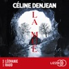

Le nouveau polar glaçant de Céline Denjean Dans une bergerie isolée des Pyrénées, Marion grave d'un trait sous la table chaque jour de sa captivité. Contrainte par celui qu'elle appelle " le Fou " de respecter à la lettre des règles de vie strictes et de jouer à la maman sous peine d'être sévèrement punie, elle n'a trouvé que cette façon pour rester en prise avec le réel. Ça, et l'espoir de revoir son vrai fils, Valentin.... Non loin de là, après avoir découvert le corps d'un jeune homme inconnu au crâne défoncé, la major Louise Caumont et ses troupes de la BR de Tarbes passent au peigne fin la Comba Retirat, étroite vallée encaissée au cœur des reliefs pyrénéens.

[View on Apple](https://books.apple.com/fr/audiobook/la-mue/id1791962718)

## Le Trône de fer (Tome 2) - Le Donjon rouge

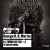

Comment lord Eddard Stark, seigneur de Winterfell, Main du Roi, gravement blessé par traîtrise, et par là même plus que jamais à la merci de la perfide reine Cersei ou des imprévisibles caprices du despotique roi Robert, aurait-il une chance d’échapper à la nasse tissée dans l'ombre pour l’abattre ? Comment, armé de sa seule et inébranlable loyauté, cerné de toutes parts par d’abominables intrigues, pourrait-il à la fois survivre, sauvegarder les siens et assurer la pérennité du royaume ? Comment ne serait-il pas voué à être finalement broyé dans un engrenage infernal, alors que Catelyn, son épouse, a mis le feu aux poudres en s’emparant du diabolique nain Tyrion, le frère de la reine ? 

Bernard Métraux prête sa voix à une multitude de personnages qui tissent à travers leurs forces, leurs faiblesses, leurs accès de rage et leurs rêves, l’histoire du royaume et de ses intrigues imprévisibles.

Illustration de couverture : © 2011 Home Box Office, Inc. All Rights Reserved. HBO and related service marks are the property of Home Box Office, Inc.

[View on Apple](https://books.apple.com/fr/audiobook/le-tr%C3%B4ne-de-fer-tome-2-le-donjon-rouge/id1441912147)

## Le Poids de l’Honneur (Rois et Sorciers – Livre 3)

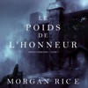

« Une fantasy pleine d'action qui saura plaire aux amateurs des romans précédents de Morgan Rice et aux fans de livres tels que le cycle L'Héritage par Christopher Paolini .... Les fans de fiction pour jeunes adultes dévoreront ce dernier ouvrage de Rice et en demanderont plus. » —The Wanderer, A Literary Journal (pour Le Réveil des Dragons)  La série n 1 de best-sellers !  LE POIDS DE L’HONNEUR est le tome n 3 de ROIS ET SORCIERS, la série de fantasy épique à succès de Morgan Rice (qui commence par LE RÉVEIL DES DRAGONS, disponible en téléchargement gratuit) !  Dans LE POIDS DE L’HONNEUR, Kyra finit par rencontrer son oncle mystérieux et elle se rend compte avec surprise qu’il n’est pas l’homme auquel elle s’attendait. Elle entame une période d’entraînement qui mettra à l’épreuve son endurance et sa frustration, car elle rencontrera vite les limites de son pouvoir. Incapable de convoquer son dragon, incapable de partir à la conquête de son être profond et motivée par le besoin impérieux d’aider son père à faire la guerre, Kyra ne sait pas si elle deviendra un jour la guerrière qu’elle pensait être et quand, au coeur de la forêt, elle rencontre un garçon mystérieux et plus puissant qu’elle, elle se demande ce que son avenir lui réserve vraiment.  Duncan doit descendre des pics de Kos avec sa nouvelle armée et, en grande infériorité numérique, lancer une invasion risquée de la capitale. S’il gagne, il sait que derrière ses anciennes murailles l’attendront le vieux roi et sa cour de nobles et d’aristocrates, qu’ils ont tous leurs intérêts propres et qu’ils mettront le même empressement à le trahir qu’à l’accueillir. En fait, il se pourrait qu’il soit plus difficile d’unifier Escalon que de le libérer.  A Ur, Alec doit faire appel à ses compétences exceptionnelles de forgeron pour aider la résistance à avoir une chance de se défendre contre l’invasion pandésienne qui s’annonce. Il est frappé d’admiration quand il fait la rencontre de Dierdre, la fille la plus forte qu’il ait jamais rencontrée. Cette fois, elle a une chance de se révolter contre Pandésia et, alors qu’elle les affronte, elle se demande si son père et ses hommes accepteront de la reprendre cette fois-ci.  Merk finit par entrer dans la tour de Ur et il est stupéfait par ce qu’il découvre. Initié à ses codes et ses règles étranges, il rencontre ses compagnons les Gardiens, les guerriers les plus coriaces qu’il ait jamais rencontrés, et il se rend compte qu’il sera difficile de gagner leur respect. Une invasion se profile à l’horizon et ils doivent tous préparer la tour; cependant, il se pourrait que même tous ses passages secrets ne puissent protéger les Gardiens contre la trahison qui rôde à l’intérieur.  Vesuvius fait traverser un Escalon vulnérable à sa nation Troll et dévaste le pays pendant que Theos, furieux à cause de ce qui arrive à son fils, mène son propre saccage et ne s’arrêtera que quand tout Escalon sera réduit en cendres. Avec son atmosphère puissante et ses personnages complexes, UNE FORGE DE VALEUR est une saga spectaculaire de chevaliers et de guerriers, de rois et de seigneurs, d'honneur et de valeur, de magie, de destinée, de monstres et de dragons. C'est une histoire d'amour et de cœurs brisés, de tromperie, d'ambition et de trahison. C'est de la fantasy de haute qualité qui nous invite à découvrir un monde qui vivra en nous pour toujours, un monde qui plaira à tous les âges et à tous les sexes.  Le tome n 4 de ROIS ET SORCIERS sera bientôt publié.  « Si vous pensiez qu'il n'y avait plus aucune raison de vivre après la fin de la série de L'ANNEAU DU SORCIER, vous aviez tort. Dans LE RÉVEIL DES DRAGONS, Morgan Rice a imaginé ce qui promet d'être une autre série brillante et nous plonge dans une histoire de fantasy avec trolls

[View on Apple](https://books.apple.com/fr/audiobook/le-poids-de-lhonneur-rois-et-sorciers-livre-3/id1523136345)

## Matrices

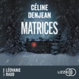

Jusqu'où la folie humaine est-elle prête à tendre pour assouvir un désir d'enfant ?Le nouveau thriller de Céline Denjean. En plein mois de décembre, une terrible tempête se déchaîne sur les Pyrénées. Sous la pluie battante, une jeune femme enceinte qui court à perdre haleine est percutée par une camionnette. Avant de mourir, elle murmure quelques mots en anglais : " Save the others. "Qui est cette femme sans identité ? Que cherchait-elle à fuir ? Que signifie la marque étrange sur son épaule ? Et qui sont ces autres qu'il faudrait sauver ?Les gendarmes Louise Caumont et Violaine Menou se lancent alors dans une enquête hors-norme. Au fil de leurs investigations se dessine la piste d'un trafic extrêmement organisé. Dès lors, les enquêtrices comprennent que l'horloge tourne pour d'autres femmes, sans doute prisonnières quelque part, et dont la vie ne tient plus qu'à un fil. Cet ouvrage a fait partie de la sélection pour le Prix de la Ligue de l'Imaginaire. " Glaçant. " Le Point" Bien documenté et construit à la manière d'un puzzle, Matrices ne laisse pas le lecteur indemne. L'intrigue est pertinente et la psychologie des personnages, fine et soignée. " CNews" Un roman noir puissant et désespérant." Libération

[View on Apple](https://books.apple.com/fr/audiobook/matrices/id1741520137)

## Les Légendaires - Aube et crépuscule - Tome 7

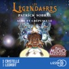

Découvrez le tome 7 des Légendaires ! Une aventure audio immersive, incarnée par de multiples comédiens ! Les Légendaires ont deux semaines pour inverser les effets de l'accident Jovenia, sous peine de voir leur monde anéanti par les dieux. Seule la Corne de Sygma a le pouvoir escompté, mais celle-ci se trouve dans de lointaines montagnes. Sur le départ, nos héros sont assaillis par une jeune élève qui les supplie de l'emmener avec eux. Alors que tous reprennent la route, Gryf adopte un étrange comportement... Interprétation humaine

[View on Apple](https://books.apple.com/fr/audiobook/les-l%C3%A9gendaires-aube-et-cr%C3%A9puscule-tome-7/id6779300623)

## You belong to me

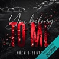

Après quatre années à être ballotée de foyer en foyer suite à la mort tragique de ses parents, Ruby est recueillie par son oncle et sa tante à l'âge de 12 ans. Hélas, elle est victime de leurs sévices durant près d'une décennie. C'est le jour de sa majorité qu'elle prend la décision de fuir la « maison de l'horreur », comme elle l'appelle. Mais ce à quoi Ruby ne s'attendait pas, c'est qu'elle allait quitter les ténèbres, pour sombrer dans bien pire encore...  Ou pas...  Kade, 28 ans, est un homme sans pitié, et surtout avec ceux qui tentent de le duper. Un soir, lorsqu'il vient justement régler ses comptes afin de récupérer son dû chez les tortionnaires de Ruby, faute de moyens, sa tante propose une chose au tueur de sang-froid : emmener sa nièce avec lui afin d'effacer leurs dettes. Au début peu convaincu, il accepte finalement, sans savoir dans quoi il s'embarque vraiment. Car Kade n'avait pas prévu une chose ;  Sa proie, qu'il pensait innocente, allait en fait devenir son adversaire la plus redoutable...

[View on Apple](https://books.apple.com/fr/audiobook/you-belong-to-me/id1822661351)

## L'art d'avoir toujours raison

Véritable guide de combat rhétorique, Schopenhauer nous invite, afin de convaincre en public, à ne reculer devant rien. Pour avoir toujours raison, il faut ainsi utiliser des stratagèmes tels que manipuler les réponses, utiliser une contre-proposition absurde, ou retourner les arguments de l'adversaire contre lui-même.

[View on Apple](https://books.apple.com/fr/audiobook/lart-davoir-toujours-raison/id1490570672)

## Ce que révèlent vos prénoms

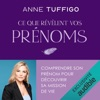

Et si votre prénom en disait bien plus que vous ne l'imaginez ? Et si ce choix d'apparence affective portait en lui la trace d'une mémoire ancienne, d'un héritage invisible transmis de génération en génération... voire d'un contrat d'âme passé avant même votre naissance ?  Dans cet ouvrage lumineux et accessible, Anne Tuffigo décrypte le sens profond des prénoms et leur rôle dans nos choix de vie. Elle nous livre l'analyse de 23 grandes missions de vie, auxquelles elle associe plus de 900 prénoms pour nous guider vers une lecture symbolique et transgénérationnelle riche de sens. L'autrice, sensible à la lecture des signes qui nous entourent, perçoit dans chaque prénom une trace sémiologique : un fil conducteur permettant d'explorer ses origines, de décrypter son histoire familiale et les dynamiques invisibles de sa lignée mais aussi un indice précieux sur le sens de notre vie terrestre. Plus qu'un simple guide, ce livre est un véritable voyage intérieur, une invitation à se découvrir autrement, au-delà des apparences et des conditionnements familiaux, pour renouer avec son essence profonde.

[View on Apple](https://books.apple.com/fr/audiobook/ce-que-r%C3%A9v%C3%A8lent-vos-pr%C3%A9noms/id1886498985)

## Un si beau couple

Une infirmière urgentiste zélée. Un présentateur adulé. Un couple que tout le monde envie. Jusqu’à ce drame qui fait chavirer leur existence. Et, dans l’épreuve, les masques tombent. Jusqu’où Amanda et Paul sont-ils prêts à aller pour sauver les apparences ?  Elisabeth Duda nous embarque dans ce captivant thriller psychologique issu de l'imagination fertile de Leslie Wolfe, autrice de <i>La chirurgienne</i>.

Couverture : illustration © Emmanuel Polanco

[View on Apple](https://books.apple.com/fr/audiobook/un-si-beau-couple/id1896255191)

## La source

"Tu veux savoir comment j'en suis arrivée là ? À genoux sur le parquet, les mains derrière la tête comme une criminelle ? Moi, Emma Paris, 4millions d'abonnés tous réseaux confondus, en train de hurler nue devant la BRI ? Peut-être que tu as vu la vidéo. Celle qui a fait 20millions de vues. Peut-être que tu sais déjà. Ou plutôt, tu crois savoir..."Août 2025. Emma Paris révèle que sa fiancée, Clara, a été incarcérée puis séduite en prison par une jeune femme soupçonnée de faits de terrorisme. Les réseaux sociaux explosent. Les médias se déchaînent. Les politiques s'en mêlent. Mais personne ne sait ce qui s'est réellement passé. La passion. Les sacrifices. La manipulation. L'aveuglement. Voici la vérité. Au-delà du scandale, Emma Paris se livre dans un récit intime coécrit avec la romancière Anne Akrich. Avec sincérité et autodérision, elle décortique les rouages de l'emprise amoureuse à l'ère des réseaux sociaux et raconte ce que personne n'a vu : les coulisses d'une chute.Interprétation humaine

[View on Apple](https://books.apple.com/fr/audiobook/la-source/id6776037318)

## The Sons of Death - tome 2

Même quand tout s’écroule, Maxine refuse de capituler.  Après l’attaque vient le chaos. Alors que Taylor se remet lentement de ses blessures, Max est brisée, mais debout. Déterminée à protéger ceux qu’elle aime, elle se relève, une fois de plus. Pourtant, une menace plane sur Taylor, prête à frapper. Pour protéger ses proches, il n’a qu’une issue : s’éloigner de Max… même si son cœur s’y refuse.  De son côté, Max se lance dans une mission désespérée&#xa0; : retrouver Tessa, la fille du chef des Anarchy, alors que l’ombre de son ennemi rôde. Insaisissable, toujours un pas devant, il brouille les pistes, pousse Max à bout. Et une vérité la hante : le temps lui est compté. Sa mort approche. Et bientôt, elle devra trouver le courage de l’annoncer aux Sons of Death… avant qu’il ne soit trop tard.  Mais une chose est sûre : l’âme d’un Sons of Death ne meurt jamais.

[View on Apple](https://books.apple.com/fr/audiobook/the-sons-of-death-tome-2/id1841373108)

## L'art subtil de s'en f*utre: Un guide à contre-courant pour être soi-même

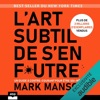

Le regard frais sur le bonheur ! Le best-seller hors du commun avec plus de 2 millions d'exemplaires vendus.&#xa0;  Dans ce guide d'auto-assistance définissant notre génération, un blogueur superstar, Mark Manson nous explique comment cesser d'essayer d'être "positif" pour atteindre le vrai bonheur.  Pendant de nombreuses années, on nous a dit que la pensée positive était la clé d'une vie heureuse et riche. Mais... "Soyons honnêtes, la merde arrive dans la vie de chacun et il faut vivre avec" dit Mark Mason. Ces conseils sont une dose de vérité brute, rafraîchissante et honnête qui fait cruellement défaut aujourd'hui. <i>L'art subtil de s'en foutre</i> est son antidote à la mentalité morose de "soyons heureux" qui a infecté notre société.  Manson avance l'argument, soutenu à la fois par des recherches académiques et des blagues, selon lequel l'amélioration de nos vies dépend non seulement de notre capacité à transformer des citrons en limonade, mais plutôt de notre capacité de mieux les digérer. Dans son best-seller l'auteur propose de : 

connaître vos limites et de les accepter,
savoir affronter de douloureuses vérités,
comprendre vos peurs et vos incertitudes,
trouver les réels courage, la persévérance, l'honnêteté et la responsabilité.

 <i>L'art subtil de s'en foutre</i> c'est votre chance d'oser être heureux à votre façon et de mener la vie plus réjouissante, plus ancrée.

[View on Apple](https://books.apple.com/fr/audiobook/lart-subtil-de-sen-f-utre-un-guide-%C3%A0-contre/id1478104615)

## Les aventures de Tom Sawyer

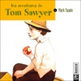

Tom Sawyer n'apprécie pas trop l'école. Il préfère de très loin retrouver son ami Huck qui mène une vie de bohème et vit dans un tonneau. Aussi turbulents qu'inséparables, les deux garçons aiment l'aventure, les expéditions, la vie de pirate sur une île du Mississippi et les expériences de sorcellerie... Sans oublier Becky, la fille du juge dont Tom Sawyer est amoureux. Jusqu'au jour où, cachés dans un cimetière, ils assistent à un véritable crime...

[View on Apple](https://books.apple.com/fr/audiobook/les-aventures-de-tom-sawyer/id390573566)

## Histoires des Jean-Quelque-Chose (Tome 1) - L'omelette au sucre

Connaissez-vous l'omelette au sucre ? Rien de moins compliqué à préparer. Prenez une famille de cinq garçons. Ajoutez-y un nouveau bébé à naître, une tortue, un cochon d'Inde et une poignée de souris blanches. Mélangez bien le tout, sans oublier une mère très organisée, un père champion du bricolage et quelques copains d'école à l'imagination débordante. Saupoudrez d'une pincée de malice et d'émotion, et servez aussitôt. C'est prêt... À consommer sans modération ! 
L'humour et l'énergie de Laurent Stocker servent avec bonheur et émotion cette chronique familiale inspirée de souvenirs d'enfance.

[View on Apple](https://books.apple.com/fr/audiobook/histoires-des-jean-quelque-chose-tome-1-lomelette-au-sucre/id1441956416)

## Le Boyfriend

Freida McFadden revient dans un thriller plus sombre que jamais, porté par un duo de comédiens Comme beaucoup de femmes célibataires de New York, Sydney a beaucoup de mal à faire des rencontres. Elle a tout vu : des hommes qui mentent sur eux-mêmes, d'autres qui lui font payer l'addition du dîner et, pire encore, des hommes qui n'arrêtent pas de parler de leur mère ! Mais elle vient de décrocher le jackpot. Son nouveau petit ami est tout simplement parfait. Il est charmant, beau et travaille comme médecin dans un hôpital. Sydney est éblouie. Jusqu'au jour où elle entend parler du meurtre d'une jeune femme - le dernier d'une série. Le principal suspect ? Un homme mystérieux qui sort avec ses victimes avant de les tuer. Sydney devrait se sentir en sécurité. Après tout, elle sort avec l'homme de ses rêves. Mais elle ne peut s'empêcher de se dire que quelque chose cloche : l'homme parfait n'est peut-être pas aussi parfait qu'il y paraît... Et surtout, elle a l'impression que quelqu'un l'épie. Elle doit absolument découvrir la vérité, sinon elle pourrait bien être la prochaine victime du tueur...

[View on Apple](https://books.apple.com/fr/audiobook/le-boyfriend/id1824521879)

## Le Poète

La spécialité de Jack McEvoy, c’est la mort. En tant que chroniqueur judiciaire au Rocky Mountain News, il y a été confronté plus d’une fois. Mais rien n’a pu le préparer au suicide de son frère jumeau. Inspecteur de police, déprimé et incapable de supporter le meurtre non résolu d’une jeune femme retrouvée coupée en deux, Sean s’est tiré une balle dans la bouche, comme le font souvent les policiers dépressifs. Un sujet dont Jack décide de s’emparer, en guise de dernier hommage à son frère. Mais en s’immisçant dans une base de données du FBI pour les besoins de son article, McEvoy découvre avec stupéfaction que beaucoup de policiers se sont suicidés dernièrement, et que le FBI mène l’enquête sur la mort de son frère. Il comprend alors que cette affaire est en passe de lui fournir le plus gros scoop de sa carrière. Il pressent aussi qu’il est devenu la prochaine cible du suspect, un assassin qui a, jusqu’à présent, toujours réussi à tromper les plus fins limiers lancés à ses trousses… Le Poète, l’un des premiers jalons de l’oeuvre magistrale de Michael Connelly, brillamment porté par la lecture de Benjamin Jungers, fête en 2021 ses 25 ans.

[View on Apple](https://books.apple.com/fr/audiobook/le-po%C3%A8te/id1555019450)

## Quand Cornebidouille était petite

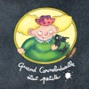

Incroyable, mais vrai : à sa naissance, Cornebidouille était une merveilleuse et inoffensive petite princesse, adorée de ses parents. Quoi ?! Mais alors, comment cette délicieuse enfant est-elle devenue ; l'horrible sorcière qui n'a que l'ordure à la bouche, et la terreur planétaire de tous les enfants (sauf un) qui ne veulent pas manger leur soupe ? Vous le saurez bientôt, nom d'un prout de chameau !

[View on Apple](https://books.apple.com/fr/audiobook/quand-cornebidouille-%C3%A9tait-petite/id1781714170)

## ABC contre Poirot

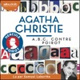

Bien sûr, la retraite a ses charmes… Cependant, Hercule Poirot ne peut s'empêcher, de temps à autre, de reprendre du service. Oh ! pas pour n'importe quelle affaire, bien entendu. Un détective aussi célèbre que lui ne se dérangerait pas pour un meurtre ordinaire. Non, Hercule Poirot ne s'intéresse qu'aux crimes les plus déroutants, les plus passionnants, les plus… Bref, à la crème des crimes. Et quelque chose lui dit que cette curieuse lettre signée A.B.C. va l'entraîner dans un mystère suffisamment épineux pour qu'il daigne faire fonctionner ses petites cellules grises. Oui, de toute évidence, A.B.C. fait partie de la crème des assassins… De quoi réjouir la crème des détectives !

[View on Apple](https://books.apple.com/fr/audiobook/abc-contre-poirot/id1614801854)

## Game changer - Tome 1

" Je n'ai jamais désiré personne comme ça avant. " Star du hockey, Scott Hunter a appris à vivre derrière une armure. Sur la glace, il incarne la maîtrise parfaite ; hors du regard du public, il dissimule un secret bien plus fragile : son homosexualité. Pour se protéger, il ne s'autorise que des rencontres furtives, loin, très loin de New York... Mais lorsqu'un smoothie préparé par Kip Grady précède miraculeusement la fin de sa mauvaise passe sur la glace, le joueur, superstitieux, trouve soudain de bonnes raisons de repasser par le café... et tombe sous le charme du barista sexy derrière le comptoir. Très vite, leurs rendez‑vous volés se transforment en nuits brûlantes où Scott peut enfin tomber le masque. Mais ces moments hors du monde s'effritent au grand jour : Kip rêve d'un amour assumé, tandis que Scott sait que révéler leur relation pourrait lui coûter tout ce qu'il a construit. Combien de temps pourront‑ils encore s'aimer dans l'ombre... avant que le cœur ne réclame la lumière ?

[View on Apple](https://books.apple.com/fr/audiobook/game-changer-tome-1/id1879536025)

## La splendeur et l'infamie

Vous avez aimé The Crown ? Vous allez adorer La Splendeur et l'Infamie. 10 mai 1940. Le jour où Churchill est nommé Premier ministre, Adolf Hitler envahit les Pays-Bas et la Belgique. Au cours de l'année qui suit, l'Allemagne nazie mène contre l'Angleterre une campagne de bombardement d'une intensité inédite. Acculé, le " Vieux Lion " doit préserver à tout prix le moral de son peuple... et convaincre le président Roosevelt d'entraîner les États-Unis dans la guerre. Si durant cette période la vie publique de Churchill est chaotique, sa vie privée ne l'est pas moins. Son épouse et lui doivent gérer leur fille qui se rebelle contre leur autorité, et leur fils, confronté à l'adultère de sa femme.  À partir de nombreux documents inédits (depuis les journaux intimes des principaux protagonistes jusqu'aux documents confidentiels récemment déclassifiés), Erik Larson redonne ses lettres de noblesse à la politique en nous faisant vivre une année exceptionnelle aux côtés de Churchill. Que ce soit au 10 Downing Street ou à son domicile privé, cet homme aux ressources inépuisables, toujours surprenant, fera preuve d'un leadership hors du commun qui permettra à tout un pays – et à une famille – de rester unis.  Aussi palpitant et addictif qu'une série, La Splendeur et l'Infamie s'est classé numéro un des ventes dès sa sortie en Angleterre et aux États-Unis. Il a été élu meilleur livre de l'année par le Washington Post et Barack Obama l'a désigné parmi ses livres préférés de l'année.  " Le genre de page-turner que l'on voudrait trouver plus souvent parmi les livres d'Histoire. Larson réussit véritablement à donner au lecteur l'impression "d'y être?, de vivre aux côtés de Churchill. " Bill Gates.  À propos d'Erik Larson : " Larson raconte comme on filme : au plus près des événements, des acteurs et des témoins. Hautement recommandable. " Jean-Christophe Buisson, Le Figaro  Pour consulter les sources de l'auteur, rendez-vous , et pour sa bibliographie, c'est .  Rentrée littéraire 2021  Original title : The Demon of Unrest © 2024 by Erik Larson Traduit de l’anglais par Hubert Tézenas © Le Cherche Midi, 2025, pour la traduction française

[View on Apple](https://books.apple.com/fr/audiobook/la-splendeur-et-linfamie/id1862458511)

## Regime Change (Unabridged)

<b>THE INSTANT </b><i><b>SUNDAY TIMES</b></i><b> AND NUMBER ONE </b><i><b>NEW YORK TIMES</b></i><b> BESTSELLER</b>  ‘A flabbergasting feat of political reporting . . . A news bomb on every page’ <b>Tina Brown, </b><i><b>Observer</b></i>  <i>‘</i>A blockbuster’<i><b> Guardian </b></i>  ‘Gobsmacking’ <i><b>Daily Mail </b></i>  ‘Eye-popping’ <i><b>Economist </b></i>  ‘Deeply reported and gripping'<i><b> Financial Times</b></i>  ‘Riveting’<b> Fintan O'Toole, </b><i><b>New York Times</b></i>  ‘Exceptional . . . packed with news that will stay news’ <b>David Remnick, </b><i><b>New Yorker</b></i>  ‘It’s sparked fear – and leak inquiries – in the White House’ <i><b>Sunday Times</b></i>  <i>*</i>  <b>Few expected Donald Trump to return to the White House stronger than before. </b>The indictments, convictions, assassination attempts, and four years of political exile made him not weaker but more powerful, more vengeful, and more willing to gamble than any President that came before him.  <i>Regime Change </i>is the definitive account of the first year of Donald Trump’s second presidency, based on hundreds of interviews and unprecedented reporting from deep within the administration’s most closely guarded rooms. Journalists Jonathan Swan and Maggie Haberman investigate the decisions that have defined Trump’s second term, which has been liberated from every constraint that defined his first. The generals who once told him ‘no’ are gone, and the lawyers who remain have learned to pick their battles.  Haberman and Swan take you behind the scenes of a presidency that has launched a new war in the Middle East, sealed the border, deployed National Guard troops into American cities, transformed the Justice Department into an instrument of retribution against the President’s enemies, and turned the office itself into a brazen vehicle for profit. They reveal a President operating almost entirely on instinct and a White House operating at the edge of political power.  <i>Regime Change </i>shows how Trump has wielded that power, who has tried to stop him, and why nearly all of them have failed.<b> A landmark work of real-time political history, this is the story of a President who has fundamentally altered how the world understands American power.</b>

[View on Apple](https://books.apple.com/fr/audiobook/regime-change-unabridged/id1895373529)

## Adoration: Mémoires D'un Vampire – Livre Deux: Narration par une voix synthétisée

Cet enregistrement a été produit numériquement par Morgan Rice, en utilisant une version synthétisée de la voix d’un narrateur sous licence.« TRANSFORMATION est un livre qui rivalise avec la saga FASCINATION (TWILIGHT) et JOURNAL D’UN VAMPIRE (VAMPIRE DIARIES), et un livre qui vous donnera envie de continuer à lire jusqu’à la toute dernière page ! Si vous adorez l‘aventure, l’amour et les vampires ce livre est pour vous ! » 
--Vampirebooksite.com (Transformation)

ADORATION est le livre #2 de la série Mémoires d'un Vampire, suivant le livre #1 (TRANSFORMATION)—un téléchargement GRATUIT avec plus de 500 revues à cinq étoiles sur Amazon ! 

Dans ADORATION, Caitlin et Caleb se lancent dans une quête pour trouver le seul objet qui peut arrêter la guerre imminente entre les vampires et les humains : l’épée perdue. Un objet du folklore vampirique et il y a de graves doutes sur son existence. 

Leur seul espoir de trouver l’épée réside dans l’identification des ancêtres de Caitlin. Est-elle vraiment l’Élue ? Leur quête commence avec la recherche du père de Caitlin. Qui était-il ? Pourquoi l’a-t-il abandonnée ? Comme la recherche s’élargie, ils sont choqués par ce qu’ils découvrent au sujet de Caitlin. 

Mais ils ne sont pas les seuls à chercher l’épée légendaire. La bande Blacktide veut aussi l’épée et ils suivent de près Caitlin et Caleb. Pire, le petit frère de Caitlin, Sam, est toujours obsédé par l’idée de retrouver son père. Mais Sam se retrouve bientôt en plein milieu d’une guerre de vampires. Mettra-t-il en danger leur recherche ? 

Le parcours de Caitlin et Caleb leur fait visiter une plénitude d’endroits historiques—de la vallée de l’Hudson, à Salem, en passant par le Boston historique—l’endroit exact ou des sorcières ont été pendues sur la colline du Boston Common. Pourquoi ces endroits sont-ils si importants pour la race des vampires ? Et qu’est-ce qu’ils ont à faire avec les ancêtres de Caitlin et avec ce qu’elle est en train de devenir ? 

Mais, ils vont peut-être échouer.  L’amour que Caitlin et Caleb ressente l’un pour l’autre s’épanouit. Et leur romance défendue détruira peut-être tout ce qu’ils essaient d’accomplir…. 

« Aussi bon que le premier livre et plein d’action, de romance, d’aventure et de suspense. Si vous avez adoré le premier livre, achetez celui-ci et tombez en amour une fois de plus. » 
— Vampirebooksite.com 

« ADORATION  spécialement est le type de livre que vous aurez de la difficulté à déposer le soir. La fin est un cliffhanger tellement spectaculaire que vous voudrez immédiatement  acheter le prochain livre, juste pour voir ce qui arrive. » 
— The Dallas Examiner

[View on Apple](https://books.apple.com/fr/audiobook/adoration-m%C3%A9moires-dun-vampire-livre-deux-narration/id1779889961)

## A Language of Dragons : Suivi d'un entretien avec l'autrice (Language of Dragons)

Il suffit d'une étincelle pour allumer un brasier.  Londres, 1923. Les dragons sillonnent le ciel et dans les rues, le peuple se révolte.   Vivien, elle, reste concentrée : elle veut devenir traductrice de langues draconiques et s'assurer que sa petite soeur n'aura jamais à vivre dans la misère de la troisième classe.  Et pourtant, il ne lui faudra qu'une journée pour déclencher une guerre civile.  Dès lors, elle n'a pas le choix : pour réhabiliter les siens, elle doit travailler pour le gouvernement britannique et tout faire pour décrypter un mystérieux code draconique. Si elle échoue... sa famille mourra. Mais aux côtés des autres jeunes recrutés, et notamment d'Atlas, un garçon aux tendances rebelles issu de la troisième classe, Viv comprend peu à peu que les enjeux du conflit ne sont pas ceux qu'elle pensait.   Quelle guerre est-elle vraiment prête à mener ?  Un premier roman incontournable, et une nouvelle voix unique.  Une Fantasy épique pleine de rebondissements, de trahisons, d'identités secrètes et de romance clandestine slow burn.

[View on Apple](https://books.apple.com/fr/audiobook/a-language-of-dragons-suivi-dun-entretien/id1789578755)

## De Gaulle - Une certaine idée de la France

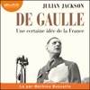

S’appuyant sur une très large masse d’archives et de mémoires, Julian Jackson explore toutes les dimensions du mystère De Gaulle, sans chercher à lui donner une excessive cohérence. Personne n’avait décrit ses paradoxes et ses ambiguïtés, son talent politique et sa passion pour la tactique, son pragmatisme et son sens du possible, avec autant d’acuité et d’esprit. Des citations abondantes, éblouissantes d’intelligence, de drôlerie, de méchanceté parfois, restituent la parole de De Gaulle mais aussi les commentaires de Churchill et de tous ceux qui ont appris à le connaître, à se méfier de lui ou à s’exaspérer de son caractère vindicatif, de son ingratitude ou de ses provocations… Aucun détail inutile ici et aucun des défauts de ces biographies-fleuves où l’on se perd, mais une narration toujours tendue, attachée aux situations politiques, intellectuelles, sociales et aux configurations géopolitiques qui éclairent une action et son moment.  80 ans après l'Appel du 18 juin, un livre qui fera date sur cette grande figure, toujours aussi fascinante, de l'histoire de France.  TABLE DES MATIÈRES Notes à l’édition audio Introduction : De Gaulle, une figure omniprésente  Première partie : De Gaulle avant « De Gaulle », 1890-1940 Chapitre 1 : Commencements, 1890-1908 Chapitre 2 : « Ce regret ne me quittera pas », 1908-1918 Chapitre 3 : Une carrière à reconstruire, 1919-1932 Chapitre 4 : « Il s’agit de marquer », 1932-1939 Chapitre 5 : La bataille de France, septembre 1939-juin 1940  Deuxième partie : L’exil, 1940-1944 Chapitre 6 : Rébellion, 1940 Chapitre 7 : Survivre, 1941 Chapitre 8 : L’invention du gaullisme Chapitre 9 : Sur la scène mondiale, septembre 1941-juin 1942 Chapitre 10 : La France combattante, juillet-octobre 1942 Chapitre 11 : Luttes de pouvoir, novembre 1942-novembre 1943 Chapitre 12 : Construire un État en exil, juillet 1943-mai 1944 Chapitre 13 : Libération, juin-août 1944  Troisième partie : Les intermittences du pouvoir, 1944-1958 Chapitre 14 : Au pouvoir, août 1944-mai 1945 Chapitre 15 : Du libérateur au sauveur, mai 1945-décembre 1946 Chapitre 16 : Le nouveau messie, 1947-1955 Chapitre 17 : La traversée du désert, 1955-1958 Chapitre 18 : Le 18 Brumaire de Charles de Gaulle, février-juin 1958 Chapitre 19 : Président du Conseil, juin-décembre 1958  Quatrième partie : Monarque républicain, 1958-1965 Chapitre 20 : L’Algérie : « Cette affaire qui nous absorbe et nous paralyse », 1959-1962 Chapitre 21 : Le grand tournant, 1962 Chapitre 22 : La politique de la grandeur, 1959-1962 Chapitre 23 : Sur la scène mondiale, 1963-1964 Chapitre 24 : Un monarque modernisateur, 1959-1964 Chapitre 25 : Mi-temps, 1965  Cinquième partie : Vers la fin, 1966-1970 Chapitre 26 : « Bousculer le pot de fleurs » Chapitre 27 : Rendements décroissants Chapitre 28 : Révolution, 1968 Chapitre 29 : La fin, juin 1968-novembre 1970 Chapitre 30 : Le mythe, l’héritage et l’oeuvre  Remerciements

[View on Apple](https://books.apple.com/fr/audiobook/de-gaulle-une-certaine-id%C3%A9e-de-la-france/id1514437960)

## Fourth Wing - Tome 01 (Empyrean)

Passer toutes les épreuves… ou mourir !  Rien ne prédestinait Violet Sorrengail à être une cavalière. Elle était censée intégrer le quadrant des Scribes et mener une vie tranquille parmi les livres. Elle dont les os sont si fragiles qu’ils peuvent se briser en un instant…  Mais aujourd’hui est le jour des conscriptions, et en tant que fille de la Générale - elle-même cavalière et dresseuse de dragons -, Violet n’a d’autre choix que de satisfaire les ordres de sa mère, et de rejoindre les épreuves de sélection pour devenir dragonnière… L’élite de la Navarre !  Pourtant, le simple fait d’envisager s’inscrire à cette compétition lui paraît ridicule… Car les dragons ne se lient pas aux humains « fragiles » : ils les brûlent ! Mais Violet est peut-être la candidate la moins forte physiquement, elle est cependant rusée et rapide. Des qualités indispensables quand on évolue dans un monde sans foi ni loi, où les alliés peuvent vite devenir des ennemis, ou peut-être encore des conquêtes… Violet va vite devoir penser à un plan solide, car cette compétition n’a que deux issues : passer toutes les épreuves ou mourir !

[View on Apple](https://books.apple.com/fr/audiobook/fourth-wing-tome-01-empyrean/id1726927083)

## Les morts ne chantent pas - La Onzième Enquête du département V

Combien de temps peut-on être tenu pour responsable de ses actes ? Carl Mørck a depuis peu quitté le Département V pour prendre sa retraite que déjà le crime se rappelle à lui. Un enregistrement audio, la voix d’une femme agressée, un silence brutal. Une vieille affaire – un drame conjugal suivi d’un suicide – qui avait pourtant été classée. Or, la bande sonore ne laisse aucun doute : il s’agit d’un meurtre. À la demande de Carl, le Département V, en piètre état depuis son départ, reprend l’affaire, et lève le voile sur des faits qui se seraient déroulés à la fin des années 1980, dans une prestigieuse école réputée pour son chœur de jeunes garçons. &#xa0;  Dans ce thriller intense qui nous parle de rêves brisés, d’innocence et de cruauté, le géant du polar danois Jussi Adler-Olsen s’allie aux journalistes et romancières Line Holm et Stine Bolther pour une nouvelle enquête du Département V. Trois plumes pour un même frisson.  Interprétation humaine

[View on Apple](https://books.apple.com/fr/audiobook/les-morts-ne-chantent-pas-la-onzi%C3%A8me-enqu%C3%AAte-du-d%C3%A9partement/id1870517963)

## La place

"Enfant, quand je m'efforçais de m'exprimer dans un langage châtié, j'avais l'impression de me jeter dans le vide. 
Une de mes frayeurs imaginaires, avoir un père instituteur qui m'aurait obligée à bien parler sans arrêt en détachant les mots. On parlait avec toute la bouche. 
Puisque la maîtresse me "reprenait", plus tard j'ai voulu reprendre mon père, lui annoncer que "se parterrer" ou "quart moins d'onze heures" n'existaient pas. Il est entré dans une violente colère. Une autre fois : "Comment voulez-vous que je ne me fasse pas reprendre, si vous parlez mal tout le temps !" Je pleurais. Il était malheureux. Tout ce qui touche au langage est dans mon souvenir motif de rancœur et de chicanes douloureuses, bien plus que l'argent." 
Prix Renaudot.

[View on Apple](https://books.apple.com/fr/audiobook/la-place/id1501331372)

## Obsolète

Convoquant tout autant le roman d'anticipation que la littérature de suspense, Sophie Loubière nous offre une plongée fascinante et terrifiante dans un monde rétrofuturiste visionnaire. Une œuvre totale par une grande voix du roman noir français. La femme, un produit sans grand avenir ?  2224. Depuis le Grand Effondrement de la civilisation fossile et les crises qui ont suivi, l'humanité s'est adaptée. Économiser les ressources, se protéger du soleil, modifier son habitat, ses besoins, et adhérer au tout-recyclage.  Y compris celui des femmes.  Afin d'enrayer le déclin de la population, toute femme de cinquante ans est retirée de son foyer pour laisser la place à une autre, plus jeune et encore fertile.  L'heure a sonné pour Rachel. Solide et sereine, elle est prête. Mais qu'en est-il de son mari et de ses enfants ? Car personne n'est jamais revenu du Grand Recyclage. Et Rachel sent bien que le Domaine des Hautes-Plaines n'est pas ce lieu de rêve que promet la Gouvernance territoriale aux futures Retirées...

[View on Apple](https://books.apple.com/fr/audiobook/obsol%C3%A8te/id1756541182)

## L'odyssée de L'Odyssée

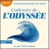

Les sirènes tentatrices, l’infâme cyclope, Circé et ses pourceaux, et bien sûr Ulysse, mari aimant et roi éclairé, qui parvient après mille détours à rentrer chez lui auprès de sa fidèle épouse pour récupérer sa terre et n’en plus bouger… Voilà ce qu’on nous a toujours raconté des aventures d’Ulysse dans&#xa0; L’Odyssée. Mais lit-on encore vraiment les 12 000 vers d’Homère, ou de celui qu’on appelle Homère&#xa0; ? Or, les lire en compagnie d’un passeur passionné comme Christophe Ono-dit-Biot, c’est découvrir, au-delà des images d’Épinal moralisatrices et simplistes, un univers beaucoup plus riche, sensuel, brutal, complexe et captivant. L’entreprise de l’auteur est directe, généreuse et efficace&#xa0; : raconter&#xa0; L’Odyssée&#xa0; aux adultes, en suivant l’ordre des chants, dans une succession de brefs chapitres qui nous content au plus près du texte les aventures des héros et des héroïnes, des déesses et des dieux, mais creusent aussi le sens profond que les contemporains leur donnaient et les leçons que nous pouvons en tirer aujourd’hui. Nous comprenons enfin pourquoi&#xa0; L’Odyssée, l’une des plus merveilleuses inventions littéraires de tous les temps, fascine toujours, près de trente siècles après qu’elle a été fixée par écrit, et comment elle nous aide encore à naviguer dans les brouillards de notre époque. A prendre, aussi, un plaisir fou. Un livre romanesque en diable, à la pédagogie charmeuse&#xa0; et à l’érudition toujours ludique : le «&#xa0; gai savoir&#xa0; » à la portée de toutes et de tous. &#xa0;  Interprétation humaine.&#xa0;

[View on Apple](https://books.apple.com/fr/audiobook/lodyss%C3%A9e-de-lodyss%C3%A9e/id1885590574)

## L'art d'aimer

L'ouvrage majeur du XXe siècle ! La bible de la philosophie !  Qu'est-ce que l'amour ? Comment naît le sentiment amoureux chez un homme / une femme ? Voulez-vous trouver les réponses à vos questions ?  Dans ce cas, ce livre audio est fait pour vous !  Vous découvrirez l'analyse magistrale de l'éminent psychanalyste Erich Fromm, qui fait la lumière sur la signification de l'amour dans notre société moderne.  Aujourd'hui la plupart des gens attendent l'amour en pensant qu'il va nous tomber dessus sans crier gare. Ils s'attendent à ce qu'on leur donne une recette facile sur l'art d'aimer.  L'auteur nous montre que l'amour est un art qui s'apprend. Aimer c'est se sentir responsable de votre prochain et ne faire qu'un avec lui. C'est aussi, paradoxalement, réaliser que c'est en épanouissant sa personnalité qu'on apprend comment aimer.  Après avoir écouté ce livre, vous apprendrez: 

pourquoi l'amour de soi est si important dans notre époque ;
que signifie l'amour maternel, fraternel, et érotique ;
quelle est la conception de l'amour de Dieu&#xa0;;
comment cultiver l'amour et accomplir l'union ;
comment faire pour aimer inconditionnellement sans souffrir&#xa0;;
quelles valeurs existent dans notre société de consommation ;

 Et plus encore !  La capacité d'aimer dépend de notre niveau de maturité. La sollicitude, la responsabilité, le respect et la connaissance sont les composantes de l'amour et vous pouvez les rencontre chez une personne mûre. Ce livre audio vous aidera à créer et entretenir des relations harmonieuses avec votre entourage.  N'hésitez plus, découvrez <i>L'art d'aimer</i>, un classique indispensable !

[View on Apple](https://books.apple.com/fr/audiobook/lart-daimer/id1612058977)

## Atlas, l'histoire de Pa Salt - Les Sept Soeurs, tome 8

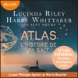

Comme l’a souhaité leur père, l’énigmatique milliardaire Pa Salt, les sept sœurs d’Aplièse sont réunies à bord du Titan sur la mer Égée pour lui rendre un dernier hommage. Si chacune a découvert sa propre histoire, la véritable identité de leur père bien-aimé leur demeure inconnue. D’où vient cet homme qui les a élevées et quels secrets cachait-il ? Les réponses se trouvent peut-être dans le journal qu’il a laissé en héritage… Tout commence en 1928 à Paris, lorsqu’un jeune garçon est découvert, presque mort, au détour d’une ruelle. Bien qu’il refuse de prononcer le moindre mot et de révéler son nom, son don exceptionnel pour la musique lui permet de nouer des liens profonds avec les membres de la famille Landowski qui l’a recueilli. Auprès d’eux, il redécouvre l’amour et soigne peu à peu les blessures de son passé. Mais dans une Europe aux prises avec les heures les plus sombres de son histoire, il sait que le jour viendra où il devra fuir à nouveau…  À travers les océans et les continents, Atlas, l’histoire de Pa Salt est l’inoubliable conclusion, faite d’amours et de drames, de la saga phénomène dont elle révèle le plus grand secret !

[View on Apple](https://books.apple.com/fr/audiobook/atlas-lhistoire-de-pa-salt-les-sept-soeurs-tome-8/id1682441856)

## Cent ans de solitude

À Macondo, petit village isolé d’Amérique du Sud, l’illustre famille Buendía voit, cent ans durant, les générations se succéder. Dans un tourbillon de tragédies, d’amours dévorantes, de superstitions et de guerres civiles, cette lignée connaît une épopée mythique à la saveur inoubliable qui traverse les trois âges de la vie : naissance, maturité et décadence. Époustouflant et magnétique, <i>Cent ans de solitude</i> est l’un des plus grands romans du XXe siècle et a été admiré par des millions de lecteurs à travers le monde.

Texte intégral lu par <b>François Berland</b>

[View on Apple](https://books.apple.com/fr/audiobook/cent-ans-de-solitude/id1768952811)

## Les Misérables - Édition abrégée

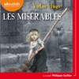

Le destin de Jean Valjean, forçat échappé du bagne, est bouleversé par sa rencontre avec Fantine. Mourante et sans le sou, celle-ci lui demande de prendre soin de Cosette, sa fille confiée aux Thénardier. Ce couple d’aubergistes, malhonnête et sans scrupules, exploite la fillette jusqu’à ce que Jean Valjean tienne sa promesse et l’adopte. Cosette devient alors sa raison de vivre. Mais son passé le rattrape et l’inspecteur Javert le traque.  La première version audio pour les plus jeunes d'un grand classique de la littérature française, avec le texte original abrégé.&#xa0;

[View on Apple](https://books.apple.com/fr/audiobook/les-mis%C3%A9rables-%C3%A9dition-abr%C3%A9g%C3%A9e/id1440359593)

## Le Journal d'Anne Frank

Honorez la mémoire d'Anne Frank, une voix qui ne doit jamais être oubliée.
Plongez au cœur de la vie clandestine de cette adolescente juive durant la Seconde Guerre mondiale, alors qu'elle se cache avec sa famille dans l'Annexe secrète à Amsterdam. Avec une voix vibrante, l'histoire d'Anne Frank vous transporte dans un récit intime qui capture l'angoisse, la peur et l'espoir d'une époque troublée. Une expérience audio qui rend hommage à la force de caractère, à la résilience et à l'indomptable humanité d'Anne Frank et de tous ceux qui ont vécu l'Holocauste.
Une œuvre rappelant l'importance de la tolérance et de la mémoire collective.

[View on Apple](https://books.apple.com/fr/audiobook/le-journal-danne-frank/id1696104300)

## Le Piège Zéro (Un Thriller d’Espionnage de l’Agent Zéro—Volume #4)

“Vous ne trouverez pas le sommeil tant que vous n’aurez pas terminé L’AGENT ZÉRO. L’auteur a fait un magnifique travail en créant un ensemble de personnages à la fois très développé et vraiment plaisant à suivre. La description des scènes d’action nous transporte dans une réalité telle que l’on aurait presque l’impression d’être assis dans une salle de cinéma équipée du son surround et de la 3D (cela ferait d’ailleurs un super film hollywoodien). Il me tarde de découvrir la suite.” --Roberto Mattos, auteur du blog Books and Movie Reviews  Dans LE PIÈGE ZÉRO (Volume #4), une cellule terroriste du Moyen-Orient hérite d’un nouveau leader fanatique qui a en tête d’orchestrer l’attaque la plus mortelle qui soit sur le territoire américain. L’Agent Zéro pourra-t-il découvrir ce qu’il mijote et l’arrêter à temps ?  Même si les filles de l’Agent Zéro sont de retour à la maison, saines et sauves, les séquelles mentales de ce qu’elles ont vécu pèsent lourd sur leur petite famille. Zéro, voulant plus que tout être un bon père et réparer les dégâts, décide que le temps est venu de subir l’opération qui lui permettra de retrouver tous ses souvenirs. Mais est-ce que ça va marcher ?  Coupé au beau milieu de ses résolutions, le devoir l’appelle à nouveau, alors qu’une ambassade des États-Unis est détruite au Moyen-Orient et qu’une nouvelle arme expérimentale est découverte. Mais sans ses souvenirs, alors que certains de ses propres alliés à la CIA œuvrent à sa destruction, en qui peut-il véritablement avoir confiance ?   LE PIÈGE ZÉRO (Volume #4) est un thriller d’espionnage que vous n’arriverez pas à reposer une fois que vous l’aurez commencé. Il vous tiendra éveillé, à tourner ses pages, jusque tard dans la nuit.  “Une écriture qui élève le thriller à son plus haut niveau.” --Midwest Book Review (à propos de Tous Les Moyens Nécessaires)  “L’un des meilleurs thrillers que j’ai lus cette année.” --Books and Movie Reviews (à propos de Tous Les Moyens Nécessaires)  Jack Mars est également l’auteur de la série best-seller de thrillers LUKE STONE (7 volumes), qui commence par Tous Les Moyens Nécessaires (Volume #1), téléchargeable gratuitement, avec plus de 800 avis cinq étoiles !

[View on Apple](https://books.apple.com/fr/audiobook/le-pi%C3%A8ge-z%C3%A9ro-un-thriller-despionnage-de-lagent/id1507142322)

## Captive

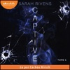

L'histoire d'Asher et Ella par theblurredgirl qui a déjà conquis plus de 7 millions de lecteurs sur Wattpad !  Au sein des réseaux criminels, là où règnent puissance, meurtre et pouvoir, il y avait elles. Les captives. Dangereuses, malignes, et mortelles, elles sont les ombres des plus grands réseaux, les représentantes de leurs chefs, aussi appelés possesseurs. Depuis son adolescence, Ella est une captive contre son gré. John, son possesseur, préfère utiliser son corps plutôt que ses talents, plongeant sa vie dans un cauchemar éveillé. Jusqu’au jour où il lui annonce qu’elle va travailler pour quelqu’un d’autre… Si Ella pensait qu'il ne pouvait y avoir pire que John, elle réalise très vite que son nouveau possesseur joue dans une tout autre catégorie. Ce certain « Ash », leader charismatique du réseau des Scott, refuse la présence d’une captive à ses côtés. Pour une raison obscure, il voue une haine viscérale à ces femmes. Un jeu dangereux s’installe alors entre eux, car Asher entend bien faire payer Ella, mais celle-ci ne compte pas céder…  « Ne joue pas avec le diable, mon ange, ne t'aventure pas dans ce que tu regretteras. » &#xa0;  Captive est une dark romance qui n’entre pas dans les codes de la romance classique : romance y rime avec violence, et certaines scènes peuvent surprendre les lectrices non averties. Trigger warnings : mentions de viol, violences physiques, langage violent. &#xa0;

[View on Apple](https://books.apple.com/fr/audiobook/captive/id1655887421)

## Le Cercle des mensonges

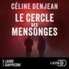

La nouvelle enquête d'Éloïse Bouquet, entre quête personnelle et série de meurtres sans lien apparent... Un meurtrier aux abois, pris dans une spirale infernale. Une agente d'entretien, obligée de prendre la fuite après avoir été témoin d'un meurtre. Un étudiant sans histoire tombé du toit d'un immeuble en construction. Une femme bien sous tous rapports retrouvée assassinée dans une forêt près de Toulouse. Et si tous ces événements étaient liés ? S'ils formaient les éléments d'une gigantesque toile ? Le lieutenant de police Urbain Malot, dit le Zèbre, et la gendarme Éloïse Bouquet enquêtent chacun de leur côté, tirant, sans le savoir, les fils d'une même pelote. Alors qu'Éloïse poursuit également la piste d'Anne Poey, la criminelle qui lui a échappé trois ans plus tôt, elle va devoir s'unir au Zèbre pour démêler l'écheveau qui les mènera jusqu'au dernier cercle des mensonges, au risque de se heurter à un adversaire beaucoup plus fort qu'eux... Interprétation humaine

[View on Apple](https://books.apple.com/fr/audiobook/le-cercle-des-mensonges/id6779551733)

## The Expanse, tome 1 -  L'Éveil du Léviathan

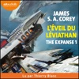

L’humanité a colonisé le système solaire (Mars, la Lune rebaptisée Luna, la Ceinture d’astéroïdes et au-delà), mais les étoiles restent toujours hors de sa portée. Jim Holden est second sur un transport de glace qui effectue la navette entre les anneaux de Saturne et les stations installées dans la Ceinture. Quand son équipage et lui croisent la route du&#xa0; Scopuli, un appareil à l’abandon, ils se retrouvent en possession d’un secret qu’ils auraient souhaité ne jamais connaître.&#xa0;  L’inspecteur Miller, de son côté, recherche une jeune femme. Elle n’est qu’une personne parmi des milliards, mais ses parents ont les moyens, et l’argent peut beaucoup. Quand l’enquête le mène au&#xa0; Scopuli&#xa0; et à Holden, Miller comprend que cette jeune femme est peut-être la réponse à tout. Holden et Miller doivent désormais jouer la partie en finesse. Leurs chances sont minces mais au cœur de la Ceinture les règles sont différentes, et un petit vaisseau peut changer le destin de l’univers.  Le premier tome de cette saga-événement installe un univers inédit et réaliste en abordant des sujets d’actualité (le dérèglement climatique, les luttes politiques, les virus…) Cette série d’envergure, qui connaît un succès grandissant tant en librairie que sur petit écran (Amazon Prime), est interprétée avec virtuosité par le très apprécié Thierry Blanc&#xa0; !

[View on Apple](https://books.apple.com/fr/audiobook/the-expanse-tome-1-l%C3%A9veil-du-l%C3%A9viathan/id1567071178)

## L'Alchimiste

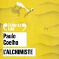

Santiago, un jeune berger andalou, part à la recherche d’un trésor enfoui au pied des Pyramides. Lorsqu’il rencontre l’Alchimiste dans le désert, celui-ci lui apprend à écouter son coeur, à lire les signes du destin et, par-dessus tout, à aller au bout de son rêve.

[View on Apple](https://books.apple.com/fr/audiobook/lalchimiste/id1543212712)

## L'Odyssée

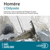

L'Odyssée, est-il nécessaire de présenter ce " très vieux poème " ? La superbe traduction (en vers) de Philippe Jaccottet fait revivre l'épopée d'Homère, qui vient " à son lecteur ou, mieux peut-être, à son auditeur un peu comme viennent à la rencontre du voyageur ces statues ou ces colonnes lumineuses dans l'air cristallin de la Grèce... ". D'après la tradition antique, Homère, l'aède aveugle, aurait vécu au IXe siècle avant J.-C. et serait l'auteur de cette épopée universellement connue, composée après L'Iliade. Cette traduction de référence est complétée par le bel essai de l'historien François Hartog, Des lieux et des hommes, qui parcourt l'espace géographique et maritime, mental et poétique du monde d'Ulysse.

[View on Apple](https://books.apple.com/fr/audiobook/lodyss%C3%A9e/id1501303586)

## Les Piliers de la terre 2 - Aliena

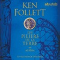

Une fresque monumentale par le plus grand bâtisseur&#xa0; de romans historiques de notre époque. 1123. Motivés par d’obscures raisons, un prêtre, un chevalier et un moine font pendre un prisonnier après un procès expéditif. Une étrange malédiction semble alors s’abattre sur eux.  1140. La construction de la grande cathédrale est sur le point de commencer. À l’appel du clergé, des travailleurs de toute l’Angleterre affluent vers la ville de Kingsbridge, dans l’espoir de racheter leurs péchés par le dur labeur de la pierre. Déterminé à s’emparer du comté de Shiring, William Hamleigh, l’un des prétendants au trône, dresse une armée contre ses rivaux : une guerre civile éclate. Dans son sillage de flammes et de dévastations, le peuple, assoiffé de justice, de vérité ou de vengeance, oeuvre à reconstruire la vie qu’on lui a arrachée. Les destins de Philip, le prieur, de Jack, le bâtisseur, ou de la jeune aristocrate Aliena vont s’entremêler. Tous égaux devant Dieu, ils seront seuls pour affronter leur sort.

[View on Apple](https://books.apple.com/fr/audiobook/les-piliers-de-la-terre-2-aliena/id1440369242)

## Logocratie

C’est vrai, le populisme gagne, les démocraties vacillent. Pourtant nous continuons de voter et n’est-ce pas là la preuve incontestable que la souveraineté populaire reste intacte ? Faut-il s'arrêter à ce fait d'autant que récemment plusieurs élections ont été niées, voire attaquées : l’assaut du Capitole aux États-Unis le 6 janvier 2021, la tentative de coup d’État de Jair Bolsonaro en 2023. En France, les élections législatives de juillet 2024 sont aussi un bon exemple. Mais qu’est-ce qui autorise à nier à ce point le réel ? En apparence les institutions démocratiques sont les mêmes, mais quelque chose semble s’être déplacé.  Parole et démocratie sont associées par nature et le fonctionnement de ce régime dépend de fait du respect de sa propre parole publique, de la transparence et de l’accessibilité du discours politique. Or, il semble y avoir une crise du sens, du langage commun : le mensonge devient moins palpable, la mauvaise foi la forme la plus courante d’expression, le réel s’enferme dans des mots-écrans (wokisme, islamo-gauchisme), jetés dans le débat comme des arguments d’autorité.  Cet ordre, où la parole affranchie du réel manipule l’espace public et oriente les élections, Clément Viktorovitch l’appelle logocratie et en propose l’exploration dans ce nouvel essai. Il y voit une dérive, une subversion interne de la démocratie où les mots ont perdu une partie de leur prise sur le réel.  Un véritable manuel d'autodéfense intellectuelle alors même que la démocratie ne tient plus qu'à un fil.  Pour les citations dans le texte : George Orwell, Essais, articles, lettres vol. IV. Traduit de l’anglais par Anne Krief, Bernard Pecheur et Jaime Semprun. © Éditions Ivrea et Éditions de l’Encyclopédie des Nuisances,&#xa0;Paris, 2001.

[View on Apple](https://books.apple.com/fr/audiobook/logocratie/id6768557434)

## Attached

<b>'A groundbreaking book that redefines what it means to be in a relationship.' </b>– <b>John Gray, PhD., bestselling author of <i>Men Are from Mars, Women Are from Venus</i></b>  <b>An insightful look at the science behind love,<i> Attached </i>offers listeners a road map for building stronger, more fulfilling connections.</b>  Is there a science to love? In this groundbreaking audiobook, psychiatrist and neuroscientist Amir Levine and psychologist Rachel S. F. Heller reveal how an understanding of attachment theory – the most advanced relationship science in existence today – can help us find and sustain love.  Pioneered by psychologist John Bowlby in the 1950s, the field of attachment explains that each of us behaves in relationships in one of three distinct ways:  <b>Anxious</b> people are often preoccupied with their relationships and tend to worry about their partner’s ability to love them back.  <b>Avoidant</b> people equate intimacy with a loss of independence and constantly try to minimize closeness.  <b>Secure</b> people feel comfortable with intimacy and are usually warm and loving.  With fascinating psychological insight, quizzes and case studies, Dr Amir Levine and Rachel Heller help you understand the three attachment styles, identify your own and recognize the styles of others so that you can find compatible partners or improve your existing relationship.  <b>'For its many, many fans, <i>Attached </i>has been life changing.' - <i>Stylist</i></b>  <b>‘Over a decade after its publication, one book on dating has people firmly in its grip’ – <i>The New York Times</i></b>  <b>PLEASE NOTE: When you purchase this title, the accompanying reference material will be available in your Library section along with the audio.</b>

[View on Apple](https://books.apple.com/fr/audiobook/attached/id1514745436)

## La Sainte Bible: Ancien et Nouveau Testament

La Sainte Bible : Ancien et Nouveau Testament  La Sainte Bible, composée de l'Ancien Testament et du Nouveau Testament, est le texte sacré central du christianisme, traduit en français pour rendre accessible la parole divine aux fidèles francophones. Cette version unifiée incarne des siècles de travail théologique et linguistique, marquée par des traductions historiques et des adaptations culturelles.  Structure et contenu  1. Ancien Testament (39 livres) :  Il relate l'histoire du peuple hébreu, depuis la Création jusqu'à la période préchrétienne, incluant la Loi (Torah), les Prophètes et les Écrits. Les récits comme la Genèse, l'Exode ou les Psaumes y occupent une place centrale, mêlant lois, poésie et prophéties.  2. Nouveau Testament (27 livres) :  Centré sur la vie de Jésus-Christ et les enseignements apostoliques, il comprend les Évangiles, les Actes des Apôtres, les Épîtres et l'Apocalypse. Le message de la rédemption et de la « Nouvelle Alliance » y est développé.

[View on Apple](https://books.apple.com/fr/audiobook/la-sainte-bible-ancien-et-nouveau-testament/id1812930830)

## Les cerfs-volants

Pour Ludo le narrateur, l'unique amour de sa vie commence à l'âge de dix ans, en 1930, lorsqu'il aperçoit dans la forêt de sa Normandie natale la petite Lila Bronicka, aristocrate polonaise passant ses vacances avec ses parents. Depuis la mort des siens, le jeune garçon a pour tuteur son oncle Ambroise Fleury dit « le facteur timbré » parce qu'il fabrique de merveilleux cerfs-volants connus dans le monde entier. Doué de l'exceptionnelle mémoire « historique » de tous les siens, fidèle aux valeurs de « l'enseignement public obligatoire », le petit Normand n'oubliera jamais Lila. Il essai de s'en rendre digne, étudie, souffre de jalousie à cause du bel Allemand Hans von Schwede, devient le secrétaire du comte Bronicki avant le départ de la famille en Pologne, où il les rejoint au mois de juin 1939, juste avant l'explosion de la Seconde Guerre mondiale qui l'oblige à rentrer en France.
Alors la séparation commence pour les très jeunes amants... Pour traverser les épreuves, défendre son pays et les valeurs humaines, pour retrouver son amour, Ludo sera toujours soutenu par l'image des grands cerfs-volants, leur symbole d'audace, de poésie et de liberté inscrit dans le ciel.

[View on Apple](https://books.apple.com/fr/audiobook/les-cerfs-volants/id1459245903)

## Pour le meilleur et pour le pire

Émilie ne laisse pas de place à l'imprévu : sa vie professionnelle comme sa vie privée obéissent à des plannings bien définis. Elle n’avait cependant pas anticipé que Jonathan, avec lequel elle rêvait de mariage et d’enfants, la largue... pas plus que Lara, sa meilleure amie, pourtant jadis célibataire libre et endurcie, lui annonce son union avec Pierre. Par un concours de circonstances, en tant que témoin, Émilie se retrouve à devoir&#xa0; chapeauter toute l’organisation du mariage avec un compagnon de choc&#xa0; : Nathanaël, témoin du marié, aussi sexy qu’intimidant. Émilie cédera-t-elle à son charme et réussira-t-elle (enfin) à se laisser aller&#xa0; ?

[View on Apple](https://books.apple.com/fr/audiobook/pour-le-meilleur-et-pour-le-pire/id1565807272)

## La Guerre de l'Art: Gagner le combat intérieur de la créativité (Unabridged)

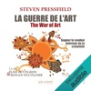

Qu’est-ce qui nous empêche si souvent de réaliser les projets qui nous tiennent le plus à cœur&#xa0;? Quelle est cette force contraire, quel est cet adversaire intérieur&#xa0;? Comment pouvons-nous éviter ces blocages internes qui entravent toute démarche créative, qu’il s’agisse de lancer l’entreprise de nos rêves, d’écrire un roman ou de peindre un chef-d’œuvre&#xa0;?  Au travers de <i>La Guerre de l’Art</i>, le scénariste et romancier à succès Steven Pressfield identifie l’ennemi intime auquel chacun d’entre nous doit faire face, propose un plan de bataille pour le vaincre, et nous montre comment atteindre le plus haut niveau de maîtrise créative et le succès dans toute sa splendeur.  Une sorte de thérapie de choc... pour vous-même&#xa0;!  Que vous soyez artiste, écrivain ou encore à l’œuvre dans le monde des affaires, ce livre va droit au but et vous incitera à exploiter tout le potentiel qui est en vous.

[View on Apple](https://books.apple.com/fr/audiobook/la-guerre-de-lart-gagner-le-combat-int%C3%A9rieur-de/id1680688271)

## Le Maître des fureurs

La guerre a ravagé le Marquensas et les habitants de Mont-Beran ont été massacrés sans pitié. Son avenir réduit en cendres, Declan jure de retrouver les meurtriers, une soif de vengeance que partage le baron Daylon Dumarch, dont la famille a été décimée après avoir fui la capitale.
Pendant ce temps, Hava s'emploie à parfaire sa carrière dans la piraterie. Celle que l'on surnomme désormais le Démon des Mers se rapproche de plus en plus des commanditaires des raids sanglants au Marquensas.
Hatushaly, le dernier survivant des légendaires Firemane, la famille régnante de l'Ithrace, apprend à contrôler les pouvoirs dont il a hérité. Il réussit désormais à visualiser et même à parcourir les fureurs, ces filaments d'énergie qui lient toutes choses.
Mais parviendra-t-il à maîtriser sa magie à temps pour affronter la menace la plus sombre que le monde de Garn ait jamais connue ?
&#xa0;
« Une contribution essentielle dans le domaine de la Fantasy. » - The Washington Post
« Un vrai plaisir coupable. » - The Guardian
Ce livre audio est interprété par une voix humaine, dans le respect des engagements d'Hardigan.

[View on Apple](https://books.apple.com/fr/audiobook/le-ma%C3%AEtre-des-fureurs/id1796155827)

## L'Arbre de fer

L’inspecteur Stilwell mène l’enquête aux côtés de Renée Ballard  Au cœur de la nuit sur Santa Catalina, un avion atterrit discrètement dans un petit aéroport niché dans la montagne. Au courant grâce à une source, l’inspecteur Stilwell et son équipe sont aux premières loges pour assister à ce qui ressemble à du trafic de drogue, mais leur intervention tourne mal. Mis sur la touche le temps d’une enquête interne, Stilwell se plonge dans une affaire de randonneuse originaire de Los Angeles disparue il y a quatre ans et dont le sac à dos vient d’être retrouvé sur l’île. Ses recherches l’amènent à l’unité des Affaires non résolues de Renée Ballard. Travaillant ensemble sur le continent et sur Santa Catalina, tous deux seront confrontés à un criminel qui nargue les autorités depuis déjà longtemps, et révéleront une affaire d’une ampleur inédite.  Interprétation humaine

[View on Apple](https://books.apple.com/fr/audiobook/larbre-de-fer/id6769727875)

## Ellana - Le Pacte des Marchombres, tome 2 - L'Envol

Ellana, apprentie Marchombre, se voit confier une mission à haut risque par son maître Jilano : escorter une caravane au chargement précieux. En chemin, Ellana croise des alliés, mais elle découvre aussi la trahison et la voie tend à se dérober devant elle…  Retrouvez les aventures d’Ellana au cœur de Gwendalavir dans ce deuxième tome de la trilogie Young adult culte de Pierre Bottero, qui a déjà conquis des dizaines de milliers de lecteurs.

[View on Apple](https://books.apple.com/fr/audiobook/ellana-le-pacte-des-marchombres-tome-2-lenvol/id1531862697)

## La Prof

Un thriller psychologique déroutant de Freida McFadden, l'autrice du best-seller La femme de ménage, lu par un trio de comédiens ! Eve Bennett, une professeure de mathématiques du lycée Casham, mène une vie ordinaire qui est un jour perturbée par Addie, l'une de ses élèves. Les rumeurs racontent que l'adolescente aurait entretenu une liaison l'année précédente avec un professeur.

[View on Apple](https://books.apple.com/fr/audiobook/la-prof/id1797274940)

## La Loi des mâles - Les Rois maudits, tome 4

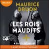

Juin 1316. Louis X le Hutin vient de mourir empoisonné. Pour la première fois depuis trois cents ans, un roi capétien disparaît sans qu'un fils lui succède. Ce quatrième volume des Rois maudits fait revivre les luttes acharnées qui vont être livrées afin de s'emparer de la Régence. C'est le frère du roi mort, le comte de Poitiers, qui l'emportera. Pour préparer son accession au trône, il s'appuiera sur une certaine loi salique, cette « loi des mâles », en vérité adaptée pour la circonstance, qui constituera désormais le règlement de succession de la monarchie française.  C’est toujours avec un talent exceptionnel que Maurice Druon, à travers l’interprétation remarquable de Jérémie Covillault, nous plonge dans le grand roman de l’Histoire, au cœur des intrigues de cour et des jeux de pouvoir.  Avec le soutien du CNL (Centre National du Livre). Musique composée par Julien Rimailho. &#xa0;

[View on Apple](https://books.apple.com/fr/audiobook/la-loi-des-m%C3%A2les-les-rois-maudits-tome-4/id1652689614)

## Le Réveil Du Vaillant (Rois et Sorciers — Livre 2)

« Une fantasy pleine d'action qui saura plaire aux amateurs des romans précédents de Morgan Rice et aux fans de livres tels que le cycle de L'héritage par Christopher Paolini ....Les fans de fiction pour jeune adulte dévoreront ce dernier ouvrage de Rice et en demanderont plus. » --The Wanderer, A Literary Journal (au sujet du Réveil des dragons  La série bestseller # 1!   LE RÉVEIL DU VAILLANT est le livre n ° 2 de la série best-sellers de fantasy épique ROIS ET SORCIERS de Morgan Rice (qui commence avec LE RÉVEIL DES DRAGONS, un téléchargement gratuit)!   Dans le sillage de l'attaque du dragon, Kyra est envoyée dans une quête urgente: traverser Escalon et chercher son oncle à la mystérieuse Tour de Ur. Le temps est venu pour elle d'apprendre qui elle est, qui est sa mère et de former et développer ses pouvoirs spéciaux. Ce sera une quête semée d'embûches pour une fille seule — Escalon étant rempli de dangers provenant des bêtes sauvages, mais aussi des hommes — qui exigera toute sa force pour survivre.  Son père, Duncan, doit mener ses hommes au sud, vers la grande ville sur l'eau d'Esephus, pour tenter de libérer ses compatriotes de la poigne de fer de Pandesia. S'il réussit, il devra voyager vers le perfide Lac de Ire et ensuite vers les sommets glacés de Kos, où vivent les guerriers les plus résistants d'Escalon, des hommes qu'il doit recruter s'il a une chance de prendre la capitale.  Alec s'échappe avec Marco des Flammes et se retrouve à courir à travers le Bois des Épines, chassé par des bêtes exotiques. C'est un pénible voyage à travers la nuit dans sa quête vers sa ville natale, dans l'espoir d'être réuni avec sa famille. Quand il y arrive, il est choqué par ce qu'il découvre.  Merk, en dépit de son meilleur jugement, retourne pour aider la jeune fille et se retrouve, pour la première fois de sa vie, empêtré dans les affaires d'un étranger. Il ne renoncera pas à son pèlerinage à la Tour d'Ur, cependant, et il est angoissé quand il réalise que la tour n'est pas ce à quoi il s'attendait.  Vesuvius pousse son géant comme il conduit les Trolls dans leur mission souterraine, tentant de contourner les Flammes, tandis que le dragon, Théos, a sa propre mission spéciale à Escalon.  Avec ses personnages complexes et sa forte atmosphère, LE RÉVEIL DU VAILLANT est une saga de grande envergure mettant en vedettes des chevaliers et guerriers, des rois et des seigneurs, l'honneur et la bravoure, la magie, le destin, des monstres et des dragons. C'est une histoire d'amour et de cœurs brisés, de tromperie, d'ambition et de trahison. C'est le fantastique à son meilleur, nous invitant dans un monde qui vivra avec nous pour toujours, un qui saura plaire à tous les âges et les sexes.   Le livre # 3 de ROIS ET SORCIERS sera bientôt publié.   Si vous pensiez qu'il n'y avait plus aucune raison de vivre après la fin de la série de L'ANNEAU DU SORCIER, vous aviez tort. Dans LE RÉVEIL DES DRAGONS, Morgan Rice a imaginé ce qui promet d'être une autre brillante série, nous plongeant dans une histoire du genre fantastique de trolls et dragons, de bravoure, d'honneur, de courage, de magie et de foi dans votre destinée. Morgan Rice a de nouveau réussi à produire un solide ensemble de personnages qui nous font les acclamer à chaque page.... Recommandé pour la bibliothèque permanente de tous les lecteurs qui aiment une histoire du genre fantastique bien écrite ». — Critiques de films et livres, Roberto Mattos

[View on Apple](https://books.apple.com/fr/audiobook/le-r%C3%A9veil-du-vaillant-rois-et-sorciers-livre-2/id1513434730)

## Le code de Katharina

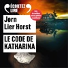

Cela fait vingt-quatre ans que Katharina Haugen a disparu. Depuis, Wisting explore obstinément les archives de ce dossier non élucidé. Et personne n’a jamais pu déchiffrer ce qu’on appelle le code de Katharina : des chiffres, des lignes et une croix que la jeune femme avait griffonnés sur une feuille trouvée dans sa cuisine.
L’ouverture d’une enquête sur son mari, Martin, suspecté d’avoir jadis été impliqué dans l’enlèvement de la fille d’un industriel milliardaire, laisse envisager un lien entre les deux affaires. Mais tout cela remonte à si longtemps… Wisting sera t-il capable d’arracher des aveux à un homme avec qui, sans être tout à fait son ami, il pratique parfois la pêche au lancer et à la foëne ?

[View on Apple](https://books.apple.com/fr/audiobook/le-code-de-katharina/id1640238775)

## Le Livre des Baltimore

Véritable plongée dans le labyrinthe des souvenirs d'un homme marqué par un événement effroyable, le " Drame ", ce livre est un roman puissant et haletant. ​Jusqu'au jour du Drame, il y avait deux familles Goldman. Les Goldman-de-Baltimore et les Goldman-de-Montclair. Les Goldman-de-Montclair, dont est issu Marcus Goldman, l'auteur de La Vérité sur l'Affaire Harry Quebert, sont une famille de la classe moyenne, habitant une petite maison à Montclair, dans le New Jersey. Les Goldman-de-Baltimore sont une famille prospère à qui tout sourit, vivant dans une luxueuse maison d'une banlieue riche de Baltimore, à qui Marcus vouait une admiration sans borne. Huit ans après le Drame, c'est l'histoire de sa famille que Marcus Goldman décide cette fois de raconter, lorsqu'en février 2012, il quitte l'hiver new-yorkais pour la chaleur tropicale de Boca Raton, en Floride, où il vient s'atteler à son prochain roman. Au gré des souvenirs de sa jeunesse, Marcus revient sur la vie et le destin des Goldman-de-Baltimore et la fascination qu'il éprouva jadis pour cette famille de l'Amérique huppée, entre les vacances à Miami, la maison de vacances dans les Hamptons et les frasques dans les écoles privées. Mais les années passent et le vernis des Baltimore s'effrite à mesure que le Drame se profile. Jusqu'au jour où tout bascule. Et cette question qui hante Marcus depuis : qu'est-il vraiment arrivé aux Goldman-de-Baltimore ? Illustration de couverture : Edward Hopper (1882-1967), "Shakespeare at dusk", 1935. Courtesy Sotheby's © Heirs of Josephine Hopper /2021, ProLitteris, Zurich Maquette : Apropos Agency

[View on Apple](https://books.apple.com/fr/audiobook/le-livre-des-baltimore/id1672452343)

## Le jour où Rose a disparu

Certaines renaissances font trembler plus d'une vie
&#xa0;
À Toulon, Aïda est embauchée à la Maison des femmes, un lieu unique où l'on soigne et accompagne celles qui tentent de se relever de violences. Peu à peu, elle s'attache à cet endroit à part, à ses patientes, à son équipe… mais&#xa0;reste sur ses gardes avec le jardinier bénévole, dont les silences la&#xa0;dérangent autant qu'ils l'intriguent.
À des centaines de kilomètres de là, Rose ouvre les yeux dans un hôpital de Bruxelles. Elle n'a plus aucun souvenir de sa vie d'avant. Le seul indice dont elle dispose, c'est cette inscription griffonnée sur sa hanche : un numéro de téléphone et un prénom, à moitié effacés.
Rose et Aïda ne se sont jamais vues, ne se connaissent pas.&#xa0;
Elles ne savent pas encore que leurs destins sont intimement liés.

Julien Sandrel nous entraîne dans un roman à couper le souffle, où les émotions frappent le coeur et les rebondissements tiennent en haleine jusqu'à la dernière page. Une histoire puissante, incandescente, traversée de lumière, de rage de vivre et d'espoir.

[View on Apple](https://books.apple.com/fr/audiobook/le-jour-o%C3%B9-rose-a-disparu/id1840600940)

## Volare

Ambre a tout pour être heureuse : un métier qu’elle aime au milieu d’adolescents en pleine crise, Manuela, sa meilleure amie excentrique, des sœurs jumelles qu’elle chérit comme une mère, et un drôle d’animal de compagnie à l’aile brisée. Alors, elle ne comprend pas ce manque d’énergie qui la plaque au fond de son lit et cette lassitude pour tout ce qui faisait le sel de sa vie. « Dépression », lui dit le médecin. Elle, dépressive ? … Manuela prend les choses en main et l’expédie en Sicile, où sa cousine organise des retraites spirituelles. La spiritualité, ce n’est pas trop le truc d’Ambre ; mais le soleil, la mer, une vespa, Stromboli, les cannoli… Pourquoi pas, au fond. Cela pourrait lui redonner envie de vivre, tout simplement.  Interprétation humaine

[View on Apple](https://books.apple.com/fr/audiobook/volare/id1873264093)

## La psy

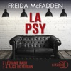

Un thriller déroutant porté par un envoûtant duo de comédiennes ! Jeunes mariés, Tricia et Ethan recherchent la maison de leurs rêves. Alors qu'ils visitent un manoir isolé ayant appartenu au docteur Adrienne Hale, une psychiatre renommée disparue sans laisser de trace quatre ans plus tôt, une violente tempête de neige les piège sur place. Et la maison n'a rien d'un cocon rassurant... Il y a ces empreintes de pas récentes sur le parquet, ces bruits à l'étage, comme si quelqu'un vivait là. Pire encore : Tricia découvre une pièce secrète qui renferme les enregistrements audio de chaque patient du docteur Hale. La jeune femme les écoute les uns après les autres, tard dans la nuit. La toile de mensonges ayant conduit à la disparition de la psy se dévoile lentement. Mais déterrer de vilains petits secrets est un jeu dangereux, et lorsque Tricia écoute le dernier enregistrement, il est déjà trop tard...

[View on Apple](https://books.apple.com/fr/audiobook/la-psy/id1777980142)

## Fractures

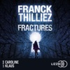

Alice sait que quelque chose ne tourne pas rond dans sa tête et les événements étranges qui se multiplient autour d'elle ne vont rien arranger : cette photo récente de sa sœur jumelle, pourtant morte dix ans auparavant, qu'elle récupère des mains d'un immigré clandestin ; son père, agressé chez lui à l'arme blanche, et qui prétend avoir tenté de se suicider ; ce chemisier ensanglanté qu'elle découvre dans sa douche et dont elle n'a pas le moindre souvenir. Alice vient de prendre un aller simple vers la folie... " Thilliez signe ici l'un de ses meilleurs polars. " Alexis Brocas – Le Figaro Magazine

[View on Apple](https://books.apple.com/fr/audiobook/fractures/id1732424374)

## Pouvoir illimité - Le livre majeur sur la PNL (programmation neurolinguistique)

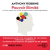

Nous sommes tous capables d'améliorer notre vie et celle des autres, d'accéder à l'excellence, et d'atteindre notre développement personnel maximal. L'énergie, clé de l'excellence humaine ; la maîtrise de l'esprit et du corps ; la magie de la sympathie ; la fin des résistances ; les points d'ancrage de la réussite ; le pouvoir de persuasion... Telles sont les grandes lignes de cet ouvrage best-seller d'Anthony Robbins qui met en évidence les effets extraordinaires des techniques enseignées par la PNL (programmation neurolinguistique). Grâce à ces techniques, nous pouvons mieux tirer parti de ces pouvoirs illimités qui sont en nous et que nous ne soupçonnons pas. Ce livre, très pratique et très accessible, décompose les éléments, les stratégies et les techniques de la PNL, et nous ouvre la possibilité de comprendre nos propres fonctionnements, ceux des autres, pour tirer le meilleur de nous-mêmes.

[View on Apple](https://books.apple.com/fr/audiobook/pouvoir-illimit%C3%A9-le-livre-majeur-sur-la-pnl-programmation/id1501243033)

## Intérieur nuit

" Les événements racontés dans ce livre se déroulent sur plus de vingt ans. Pendant toutes ces années, je me suis tu. Aujourd'hui, j'écris en pensant à toutes celles et ceux, des centaines de milliers, peut-être des millions, qui souffrent en silence du même mal. " Nicolas Demorand est journaliste. Il co-anime la matinale de France Inter depuis 2017.

[View on Apple](https://books.apple.com/fr/audiobook/int%C3%A9rieur-nuit/id1814799730)

## Le Petit Nicolas et les copains

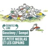

Mon premier a un papa qui lui achète tout ce qu'il veut. Mon deuxième est le chouchou de la maîtresse. Mon troisième est le plus fort de laclasse. Le papa de mon quatrième est agent de police. Mon cinquième est le dernier de la classe. Mon sixième, qui est très gros, aime manger. Mon tout est la plus chouette bande de copains qui ait existé : Geoffroy, Agnan, Eudes, Rufus, Clotaire, Alceste... et le Petit Nicolas ! 

Édouard Baer nous entraîne dans les aventures désopilantes du Petit Nicolas, accompagné d'une musique aussi vive et tendre que les héros de Jean-Jacques Sempé et René Goscinny.

[View on Apple](https://books.apple.com/fr/audiobook/le-petit-nicolas-et-les-copains/id1441977264)

## Feu et sang - Partie 1 (House of the Dragon)

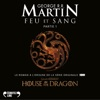

Feu et sang, le roman à l’origine de la série TV originale "House of the Dragon". 

"Au septième jour, une nuée de corbeaux jaillit des tours de Peyredragon pour propager la parole de lord Aegon aux Sept Couronnes de Westeros. Ils volaient vers les sept rois, vers la Citadelle de Villevieille, vers les seigneurs tant petits que grands. Tous apportaient le même message : à compter de ce jour, il n’y aurait plus à Westeros qu’un roi unique. Ceux qui ploieraient le genou devant Aegon de la maison Targaryen conserveraient terres et titres. Ceux qui prendraient les armes contre lui seraient jetés à bas, humiliés et anéantis." 

Trois cents ans avant les événements du Trône de Fer, Feu et sang raconte l’unification des sept royaumes.

[View on Apple](https://books.apple.com/fr/audiobook/feu-et-sang-partie-1-house-of-the-dragon/id1468086389)

## Leçons d'un siècle de vie

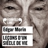

À 100 ans, Edgar Morin demeure préoccupé par les tourments de notre temps. Ce penseur humaniste a été témoin et acteur des errances et espoirs, crises et dérèglements de son siècle. Il nous transmet dans ce livre les enseignements tirés de son expérience centenaire de la complexité humaine. 
Avec une grande intensité François Berland prête sa voix à Edgar Morin, grande figure du monde intellectuel français. Un texte puissant mais d'une fluidité qui se prête bien à l'audio.

[View on Apple](https://books.apple.com/fr/audiobook/le%C3%A7ons-dun-si%C3%A8cle-de-vie/id1569215958)

## Tout cela je te le donnerai

" Un superbe roman noir, au coeur d'une Galice mystérieuse et enchanteresse. " Thierry Clermont, Le Figaro littéraire Interrompu un matin dans l'écriture de son prochain roman, Manuel Ortigosa, auteur à succès, trouve deux policiers à sa porte. Cela aurait pu n'être qu'un banal et triste accident – une voiture qui, au petit jour, quitte la route de façon inexpliquée. Mais le mort, Álvaro Muñiz de Dávila, est le mari de Manuel, et le chef d'une prestigieuse dynastie patricienne de Galice. Dans ce bout du monde aussi sublime qu'archaïque commence alors pour Manuel un chemin de croix, au fil duquel il découvre qu'Álvaro n'était pas celui qu'il croyait. Accompagné par un garde civil à la retraite et par un ami d'enfance du défunt, il plonge dans les arcanes d'une aristocratie où la cupidité le dispute à l'arrogance. Il lui faudra toute sa ténacité pour affronter des secrets impunis, pour lutter contre ses propres démons, et apprendre qu'un rire d'enfant peut mener à la vérité aussi sûrement que l'amour.

[View on Apple](https://books.apple.com/fr/audiobook/tout-cela-je-te-le-donnerai/id1501316526)

## Un jour sans femme

Islande. À la mort de sa meilleure amie, tuée par son compagnon, Katla se lance un défi inédit : organiser une grève des femmes dans le monde entier, pour dénoncer les violences et les inégalités. Japon. Michiko, jeune salariée enceinte, est harcelée par son patron. Salvador. Ana María, ouvrière à l’usine, se bat pour sa fille, condamnée à trente ans de prison pour suspicion d’avortement. Sénégal. Hawa, urgentiste, tente de sauver une enfant quand le trauma de son passé ressurgit. Katla, Michiko, Ana María et Hawa ne se connaissent pas, mais toutes décident de dire non. Elles étaient seules, elles seront des millions. Sans les femmes, le monde s’arrêtera-t-il de tourner ? Et s’il suffisait d’un jour pour tout changer ? &#xa0;  Après les inoubliables best-sellers La Tresse, Les Victorieuses et Le Cerf-volant, le grand retour de Laetitia Colombani. Une immense romancière, plus déterminée que jamais à faire vivre l’espoir au féminin.  Interprétation humaine

[View on Apple](https://books.apple.com/fr/audiobook/un-jour-sans-femme/id1893951671)
