- [Tout va mal... je vais bien !](#tout-va-mal-je-vais-bien)
- [L'Odyssée](#l-odysse-e)
- [Le dernier jour d'un condamné](#le-dernier-jour-d-un-condamne)
- [Les Grandes dates de l'Histoire de France pour les nuls](#les-grandes-dates-de-l-histoire-de-france-pour-les-nuls)
- [Si elle savait (Un mystère Kate Wise – Volume 1)](#si-elle-savait-un-myste-re-kate-wise-volume-1)
- [Maintenant et à tout jamais (L’Hôtel de Sunset Harbor – Tome 1)](#maintenant-et-a-tout-jamais-l-ho-tel-de-sunset-harbor-tome-1)
- [L'Iliade](#l-iliade)
- [Laurie](#laurie)
- [1984](#1984)
- [Icebreaker](#icebreaker)
- [Psychologie des foules](#psychologie-des-foules)
- [Asterix - Le Papyrus de César -N36 - Les étapes de création](#asterix-le-papyrus-de-ce-sar-n36-les-e-tapes-de-cre-ation)
- [Poèmes](#poe-mes)
- [After - Tome 01](#after-tome-01)
- [Le comte de Monte-Cristo, Tome I](#le-comte-de-monte-cristo-tome-i)
- [Sans laisser de traces (Une enquête de Riley Paige - Tome 1)](#sans-laisser-de-traces-une-enque-te-de-riley-paige-tome-1)
- [Madame Bovary](#madame-bovary)
- [Le rouge et le noir](#le-rouge-et-le-noir)
- [La Ferme des Animaux](#la-ferme-des-animaux)
- [Campus drivers - Tome 01](#campus-drivers-tome-01)
- [La Parure](#la-parure)
- [Au bonheur des dames](#au-bonheur-des-dames)
- [La Mort est une garce](#la-mort-est-une-garce)
- [Hamlet](#hamlet)
- [20 000 lieues sous les mers](#20-000-lieues-sous-les-mers)
- [The Avengers, Vol. 1](#the-avengers-vol-1)
- [La métamorphose](#la-me-tamorphose)
- [Un crime parfait](#un-crime-parfait)
- [Avant qu’il ne tue (Un mystère Mackenzie White – Volume 1)](#avant-qu-il-ne-tue-un-myste-re-mackenzie-white-volume-1)
- [L'Argent](#l-argent)
- [Le joueur d'échecs](#le-joueur-d-e-checs)
- [Jane Eyre](#jane-eyre)
- [Le Comte de Monte-Cristo - Alexandre Dumas](#le-comte-de-monte-cristo-alexandre-dumas)
- [Fables de La Fontaine](#fables-de-la-fontaine)
- [Conquérir sa liberté financière](#conque-rir-sa-liberte-financie-re)
- [Le Fils de la Voisine - Tome 1](#le-fils-de-la-voisine-tome-1)
- [Raison de tuer (Un Polar Avery Black – Tome 1)](#raison-de-tuer-un-polar-avery-black-tome-1)
- [Le Noël d'Agatha - nouvelle inédite Agatha Raisin](#le-noe-l-d-agatha-nouvelle-ine-dite-agatha-raisin)
- [Les Misérables](#les-mise-rables)
- [69 gages érotiques pour pimenter votre vie sexuelle](#69-gages-e-rotiques-pour-pimenter-votre-vie-sexuelle)
- [Meditation Sur L’Univers, L’Homme Et Le Coran](#meditation-sur-l-univers-l-homme-et-le-coran)
- [Le dernier jour d'un condamné](#le-dernier-jour-d-un-condamne)
- [Captive de la Mafia](#captive-de-la-mafia)
- [After - Tome 01](#after-tome-01)
- [Les Fleurs du Mal](#les-fleurs-du-mal)
- [Fables de la Fontaine](#fables-de-la-fontaine)
- [Proposition indécente](#proposition-inde-cente)
- [Le paradis en Islam](#le-paradis-en-islam)
- [En route pour le Zoo](#en-route-pour-le-zoo)
- [Milou, le petit loup](#milou-le-petit-loup)
- [Briar university - Tome 01](#briar-university-tome-01)
- [Un été pas comme les autres](#un-e-te-pas-comme-les-autres)
- [Les trois mousquetaires](#les-trois-mousquetaires)
- [1984](#1984)
- [The Art of War](#the-art-of-war)
- [L'Homme de ma Meilleure Amie 💋🥵😉](#l-homme-de-ma-meilleure-amie)
- [Le Malade Imaginaire](#le-malade-imaginaire)
- [Dévotion Totale](#de-votion-totale)
- [Voyage au centre de la Terre](#voyage-au-centre-de-la-terre)
- [La Tentation de l’Alpha](#la-tentation-de-l-alpha)
- [La Femme Parfaite (Un thriller psychologique avec Jessie Hunt, Tome n 1)](#la-femme-parfaite-un-thriller-psychologique-avec-jessie-hunt-tome-n-1)
- [Carnet d'un inconnu](#carnet-d-un-inconnu)
- [Regarde-moi j'apprends l'anglais](#regarde-moi-j-apprends-l-anglais)
- [Germinal](#germinal)
- [Notre-Dame de Paris](#notre-dame-de-paris)
- [La prière en Islam](#la-prie-re-en-islam)
- [Hollywood incognito](#hollywood-incognito)
- [Le Père Goriot](#le-pe-re-goriot)
- [Le tour du monde en quatre-vingts jours](#le-tour-du-monde-en-quatre-vingts-jours)
- [Le comte de Monte-Cristo, Tome III](#le-comte-de-monte-cristo-tome-iii)
- [L'école des Femmes](#l-e-cole-des-femmes)
- [Le destin en Islam](#le-destin-en-islam)
- [The Stranger](#the-stranger)
- [Ne me dites plus jamais bon courage !](#ne-me-dites-plus-jamais-bon-courage)
- [La fille, seule (Un Thriller à Suspense d’Ella Dark, FBI – Livre 1)](#la-fille-seule-un-thriller-a-suspense-d-ella-dark-fbi-livre-1)
- [Une vie](#une-vie)
- [Les misérables Tome I](#les-mise-rables-tome-i)
- [Le comte de Monte-Cristo, Tome II](#le-comte-de-monte-cristo-tome-ii)
- [L'avare](#l-avare)
- [Le Misanthrope](#le-misanthrope)
- [😈 Culbutée devant son Mari - Tome 1](#culbute-e-devant-son-mari-tome-1)
- [Le Cid](#le-cid)
- [Mon tourmenteur: Une romance dark](#mon-tourmenteur-une-romance-dark)
- [Dr. Stone - Tome 01 - Extrait Gratuit](#dr-stone-tome-01-extrait-gratuit)
- [L'homme Qui Rit](#l-homme-qui-rit)
- [En route pour la Garderie](#en-route-pour-la-garderie)
- [La mort en Islam](#la-mort-en-islam)
- [Le Pouvoir De L'influence Positive](#le-pouvoir-de-l-influence-positive)
- [Le jour du jugement en Islam](#le-jour-du-jugement-en-islam)
- [Crime and Punishment](#crime-and-punishment)
- [Faits de Psychologie et de Sociologie](#faits-de-psychologie-et-de-sociologie)
- [Un mauvais pressentiment (Une Enquête de Keri Locke – Tome 1)](#un-mauvais-pressentiment-une-enque-te-de-keri-locke-tome-1)
- [Oliver Twist](#oliver-twist)
- [30 choses à savoir avant de se convertir à l'Islam](#30-choses-a-savoir-avant-de-se-convertir-a-l-islam)
- [Eclaire moi sur le Coran](#eclaire-moi-sur-le-coran)
- [Le Collège maléfique (Tome 1) - extrait gratuit](#le-colle-ge-male-fique-tome-1-extrait-gratuit)
- [Marie, la toute petite souris](#marie-la-toute-petite-souris)
- [The Odyssey](#the-odyssey)
- [Discours de la méthode](#discours-de-la-me-thode)
- [Les 5 piliers de l'Islam](#les-5-piliers-de-l-islam)

## Tout va mal... je vais bien !

Pourquoi sommes-nous si souvent convaincus que la vie est une mer de difficultés ou d’efforts, alors qu’elle est en réalité un océan de plaisirs et d’opportunités ? Si vous en doutez, il est urgent de changer de lunettes. Car oui, le monde est incertain, violent, changeant, chaotique. Mais votre vie est belle&#xa0;! Et elle pourrait l’être encore davantage, en suivant quelques principes aussi simples qu’efficaces. Après nous avoir alertés sur les dérives de notre vocabulaire pessimiste avec le best-seller «&#xa0;Ne me dites plus jamais bon courage&#xa0;!&#xa0;», Philippe Bloch nous livre ici neuf clés pour vivre heureux dans un «&#xa0;monde de merde&#xa0;». Les Français ont compris que personne ne règlera plus leurs problèmes à leur place. Un miracle français est donc enfin possible. A chacun de nous d’en apporter la preuve&#xa0;!

[View on Apple](https://books.apple.com/fr/book/tout-va-mal-je-vais-bien/id1048763250)

## L'Odyssée

L’Odyssée est une épopée grecque antique attribuée à l’aède Homèrenote 1, qui l'aurait composée après l’Iliade, vers la fin du viiie siècle av. J. -C. Elle est considérée comme l’un des plus grands chefs-d’œuvre de la littérature et, avec l’Iliade, comme l'un des deux poèmes fondateurs de la civilisation européenne.

[View on Apple](https://books.apple.com/fr/book/lodyss%C3%A9e/id508678932)

## Le dernier jour d'un condamné

La peine de mort, Victor Hugo est contre. Résolument, définitivement contre. À seulement 26 ans, il écrit ce roman pour le dire, ou plutôt le crier haut et fort à la face du monde. On y suit ave angoisse, tristesse, espoir, le récit des dernières vingt-quatre heures d'un condamné à mort dont on ne connaîtra jamais le nom, entre ses états d’âme et la violence du sytème judiciaire. Ce réquisitoire est le plus véhément jamais prononcé sur cette question qui continue de faire débat. Un texte d’une modernité aussi géniale que son auteur.

[View on Apple](https://books.apple.com/fr/book/le-dernier-jour-dun-condamn%C3%A9/id492291541)

## Les Grandes dates de l'Histoire de France pour les nuls

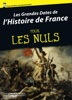

Avec les Nuls, tout devient facile ! 
		Découvrez les grandes dates de l'Histoire de France dans ce livre Pour Les Nuls inédit ! Les événements sont classés par ordre chronologique pour visualiser au mieux les grandes périodes de l'Histoire de France et être moins Nul !

[View on Apple](https://books.apple.com/fr/book/les-grandes-dates-de-lhistoire-de-france-pour-les-nuls/id901959922)

## Si elle savait (Un mystère Kate Wise – Volume 1)

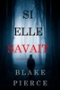

«&#xa0;Un chef-d’œuvre de thriller et de mystère. Blake Pierce est parvenu à créer des caractères avec un côté psychologique tellement bien décrit, que nous avons l’impression de pouvoir entrer dans leur esprit, suivre leurs peurs et nous réjouir de leurs succès. Plein de rebondissements, ce livre vous tiendra en haleine jusqu’à la dernière page.&#xa0;»&#xa0; 
--Critiques de livres et de films, Roberto Mattos (re Une fois partie)  
<b>SI ELLE SAVAIT (Un mystère Kate Wise) est le volume 1 d’une nouvelle série thriller psychologique par Blake Pierce, l’auteur à succès de Une fois partie (volume 1) (téléchargement gratuit), un bestseller nº1 ayant reçu plus de 1 000 critiques à cinq étoiles.</b>  
<b>L’agent du FBI récemment à la retraite, Kate Wise, 55 ans, se retrouve à quitter sa vie tranquille de banlieue quand la fille d’une de ses amies est assassinée chez elle – et qu’on la supplie d’apporter son aide. &#xa0;</b> 
<b></b> 
Kate pensait qu’elle avait laissé le FBI derrière elle après 30 ans de bons et loyaux services en tant que l’un de leurs meilleurs agents, respectée pour son esprit brillant, son attitude coriace et sa troublante capacité à traquer les tueurs en série. Mais fatiguée de la petite vie tranquille de banlieue et à un carrefour de sa vie, Kate est appelée à la rescousse par une de ses amies et elle ne peut vraiment pas refuser.&#xa0;  
Alors que Kate traque l’assassin, elle se retrouve très vite en première ligne d’une chasse à l’homme, avec plus en plus de victimes – toutes des mères au foyer avec des mariages parfaits – et il devient clair qu’un tueur en série sévit dans cette petite ville tranquille. Elle exhume des secrets des voisins qu’elle aurait préféré ne jamais connaître et découvre que tout n’est pas aussi rose dans ce quartier de banlieue bordé de jolies rues. Les liaisons et les mensonges sont monnaie courante, et Kate doit fouiller les bas-fonds de cette banlieue si elle veut empêcher l’assassin de frapper à nouveau.&#xa0;  
Mais cet assassin a une longueur d’avance sur elle et il se pourrait que ce soit Kate qui finisse par être en danger.&#xa0;  
Un thriller riche en action avec un suspense qui vous tiendra en haleine, SI ELLE SAVAIT est le volume 1 d’une fascinante nouvelle série qui vous fera tourner les pages jusqu’à des heures tardives de la nuit.  
Le volume 2 dans la série MYSTÈRE KATE WISE est déjà disponible en précommande. &#xa0;

[View on Apple](https://books.apple.com/fr/book/si-elle-savait-un-myst%C3%A8re-kate-wise-volume-1/id1445614126)

## Maintenant et à tout jamais (L’Hôtel de Sunset Harbor – Tome 1)

Emily Mitchell, trente-cinq ans, qui vit et travaille à New-York, s’est débattue à travers une série d’échecs amoureux. Quand son petit-ami depuis sept ans l’invite à sortir pour leur diner d’anniversaire tant attendu, Emily est certaine que cette fois-ci sera différente, que cette fois-ci elle recevra enfin la bague.  
Quand il lui donne un petit flacon de parfum à la place, Emily sait que le temps est venu de rompre avec lui – et de prendre un nouveau départ dans la vie.  
Assommée par sa vie insatisfaisante et stressante, Emily décide qu’elle a besoin de changement. Elle décide sur un coup de tête de conduire jusqu’à la demeure abandonnée de son père sur la côte du Maine, une vaste et vieille maison où elle a passé des été magiques étant enfant. Mais, depuis longtemps négligé, l’édifice a désespérément besoin de réparations, et l’hiver n’est pas le moment idéal pour être dans le Maine. Emily n’y a pas été en vingt ans, quand un accident tragique a changé la vie de sa sœur et fait voler en éclats sa famille. Ses parents ont divorcé, son père a disparu, et Emily n’a jamais été capable de se résoudre à remettre un pied dans cette maison.  
Maintenant, pour une raison ou une autre, avec sa vie qui chancelle, Emily se sent attirée par le seul lieu de son enfance qu’elle ait jamais connu. Elle ne prévoit d’y aller que pour un week-end, pour s’éclaircir l’esprit. Mais quelque chose à propos de la maison, ses nombreux secrets, ses souvenirs de son père, le charme du bord de mer, sa situation dans une petite ville – et plus que tout, son magnifique gardien mystérieux – ne veulent pas la laisser partir. Peut-elle trouver les réponses qu’elle a cherchées ici, dans l’endroit le plus inattendu de tous&#xa0;?  
Un week-end peut-il devenir une vie&#xa0;?  
Maintenant et à tout jamais est le tome 1 du début d’une éblouissante nouvelle série romantique qui vous fera rire, vous fera pleurer, vous fera continuer à tourner les pages jusque tard dans la nuit – et vous refera tomber amoureuse des romances encore une fois.  
Le tombe 2 sera bientôt disponible.

[View on Apple](https://books.apple.com/fr/book/maintenant-et-%C3%A0-tout-jamais-lh%C3%B4tel-de-sunset-harbor-tome-1/id1163224476)

## L'Iliade

L’Iliade est une épopée de la Grèce antique attribuée à l'aède Homère. Ce nom provient de la périphrase « le poème d'Ilion » , Ilion étant l'autre nom de la ville de Troie. L’Iliade est composée de quinze mille trois cent trente-sept hexamètres dactyliques et, depuis l'époque hellénistique, divisée en vingt-quatre chants.

[View on Apple](https://books.apple.com/fr/book/liliade/id492176574)

## Laurie

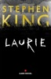

<b>Une nouvelle inédite et gratuite de Stephen King pour replonger dans l'univers de L'Outsider !</b>  Lloyd vient de perdre sa femme. Pour l’aider à surmonter son deuil, sa sœur Beth lui rend visite et lui offre un adorable chiot baptisé Laurie dont il ne veut pas. Mais avec le temps, un lien se crée entre l’homme et l’animal…

[View on Apple](https://books.apple.com/fr/book/laurie/id1453974981)

## 1984

Nouvelle traduction du chef-d’œuvre de George Orwell.
Après la Révolution, le parti de l’Angsoc domine Océania. Sous la figure de Tonton, il impose une société où la réalité n’a plus de sens. Le Parti contrôle le passé, en manipulant les archives, le présent, par la surveillance permanente, et compte dominer le futur en créant un langage où toute pensée séditieuse sera impossible.
Winston Smith, un employé du ministère de la Vérité, commet le crime ultime: le crimepense. Pourra-t-il échapper à la Police des Pensées, qui traque les hérétiques ? Trouvera-t-il des alliés dans ce monde en guerre, ou est-il seul dans son combat ? Parviendra-t-il à rejoindre la mystérieuse Fraternité, l’organisation souterraine de l’opposant Emmanuel Goldstein ?
Cette aventure explore les méandres d’une société dystopique, où la surveillance constante, la destruction de la langue, l’état de guerre permanente et le contrôle des esprits permettent à un pouvoir brutal et autoritaire de se maintenir en place.

[View on Apple](https://books.apple.com/fr/book/1984/id1545355007)

## Icebreaker

&lt;p&gt;&lt;strong&gt;Han er det eneste, hun ikke havde planlagt …&lt;/strong&gt;&lt;/p&gt;&lt;p&gt;Anastasia Allen har drømt om at deltage i OL, lige siden hun begyndte til kunstskøjteløb som femårig. Hun har knoklet sig til et universitetslegat, og nu må intet komme i vejen for hendes kvalifikation til Team USA.&lt;/p&gt;&lt;p&gt;Nathan Hawkins er anfører for universitetets ishockeyhold. Et ansvar, som hviler tungt på hans skuldre, men han har aldrig mødt en forhindring, han ikke kunne overkomme … Det skulle da lige være at samarbejde med den stædige kunstskøjteløber, holdet skal dele skøjtehallen med næste semester.&lt;/p&gt;&lt;p&gt;Anastasia er på ingen måde tilfreds, og det bliver ikke bedre, da hendes partner kommer til skade, og hun akut mangler nogen at træne med. Den eneste, der kan træde til, er Nathan, fyren som irriterer hende grænseløst.&lt;/p&gt;&lt;p&gt;Men de har intet valg, og det er ikke bare isen, der slår gnister, når Nathan skifter hockeystaven ud med en kropsnær trikot …&lt;br /&gt;&#xa0;&lt;/p&gt;&lt;p&gt;”&lt;em&gt;Icebreaker&lt;/em&gt; fik mig til at smelte fra top til tå.” – &lt;em&gt;New York Times&lt;/em&gt;-bestsellerforfatter Elena Armas&lt;/p&gt;&lt;p&gt;”Hannah Grace blander med succes humor, drama og erotik - og bogen er lydefrit oversat.” – &lt;em&gt;Lektørudtalelse&lt;/em&gt;&lt;/p&gt;

[View on Apple](https://books.apple.com/fr/book/icebreaker/id6477571349)

## Psychologie des foules

Les idées exposées dans cet ouvrage, publié pour la première fois en 1895, semblèrent alors fort paradoxales. Pourtant, ce texte qui n'a en rien été modifié dans les éditions successives, est devenu un classique, traduit dans de nombreuses langues. Sa lecture et son étude sont toujours d'actualité et font partie de la formation de toutes les nouvelles générations de jeunes sociologues.

[View on Apple](https://books.apple.com/fr/book/psychologie-des-foules/id510973968)

## Asterix - Le Papyrus de César -N36 - Les étapes de création

C'est bien connu, dans les albums d'Astérix, les Gaulois adorent se bagarrer.&#xa0;Le Papyrus de César, signé Didier Conrad (dessinateur) et Jean-Yves Ferri (scénario), ne dérogera pas à cette règle imaginée par&#xa0;Albert Uderzo&#xa0;et&#xa0;René Goscinny&#xa0;dès 1959. Ce document vous dévoile les étapes de création d’une des cases les plus complexes du nouvel album, véritable prouesse technique signée Didier Conrad. &#xa0; Le dessinateur détaille son processus de création&#xa0;: «&#xa0;Il y a plusieurs étapes. Il y a le découpage, très précis, qui met tous les éléments en place. Le crayonné, ensuite, est une sorte de remise au modèle pour être sûr que le trait colle au style d'Uderzo. L'encrage, enfin, emballe le tout pour que la dynamique fonctionne. Il y a toujours un petit réajustement, parce que ces étapes ne sont jamais réalisées en continu. Chaque étape est souvent réalisée à plusieurs semaines, voire à plusieurs mois, de distance. Il y a un nouveau regard à chaque fois. »

[View on Apple](https://books.apple.com/fr/book/asterix-le-papyrus-de-c%C3%A9sar-n36-les-%C3%A9tapes-de-cr%C3%A9ation/id1050095075)

## Poèmes

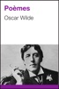

[View on Apple](https://books.apple.com/fr/book/po%C3%A8mes/id509096533)

## After - Tome 01

Tessa est une jeune fille ambitieuse, volontaire, réservée. Elle contrôle sa vie. Son petit ami Noah est le gendre idéal. Celui que sa mère adore, celui qui ne fera pas de vagues. Son avenir est tout tracé : de belles études, un bon job à la clé, un mariage heureux... Mais ça, c'était avant qu'il ne ne la bouscule dans le dortoir. Lui, c'est Hardin, bad boy, sexy, tatoué, piercé, avec un « p... d'accent anglais ! » Il est grossier, provocateur et cruel, bref, il est le type le plus détestable que Tessa ait jamais croisé.  Et pourtant, le jour où elle se retrouve seule avec lui, elle perd tout contrôle...  Cet homme ingérable, au caractère sombre, la repousse sans cesse, mais il fait naître en elle une passion sans limites. Une passion qui, contre toute attente, semble réciproque... Initiation, sexe, jalousie, mensonges, entre Tessa et Hardin est-ce une histoire destructrice ou un amour absolu ? L'écriture rythmée d'Anna Todd rendra accros tous ses lecteurs.  « Anna Todd est le plus important phénomène de sa génération. » COSMO U.S. « Le phénomène littéraire issu du web ! » N.Y. TIMES

[View on Apple](https://books.apple.com/fr/book/after-tome-01/id6445272055)

## Le comte de Monte-Cristo, Tome I

Au Panthéon des marins naufragés, Edmond Dantès occupe sans conteste une place à part. Victime d'une dénonciation calomnieuse alors qu'il allait épouser la belle Mercédès, le malheureux – à l'aube de sa vie – est enfermé pour 14 ans dans un sinistre cachot du château d'If en rade de Marseille. Son salut viendra de l'abbé Faria, un autre prisonnier avec lequel il entretient une amitié clandestine des années durant. Celui-ci lui transmet sa vaste culture et à sa mort, un trésor caché.

[View on Apple](https://books.apple.com/fr/book/le-comte-de-monte-cristo-tome-i/id492180920)

## Sans laisser de traces (Une enquête de Riley Paige - Tome 1)

Des femmes sont retrouvées mortes dans la campagne de Virginie, tuées de façon grotesque. Quand le FBI est appelé en renfort, ils sont sonnés par l'amplitude de l'affaire. Un tueur en série rôde et passe à l'acte de plus en plus souvent. Ils savent qu'un seul agent est assez bon pour résoudre l'enquête : l'agent spécial Riley Paige  
Riley est en arrêt maladie pour se remettre de sa rencontre avec son dernier tueur en série. Devant sa fragilité, le FBI hésite à faire appel à son esprit brillant. Cependant Riley, en lutte contre ses propres démons, accepte l'affaire et son enquête la conduit dans l'univers perturbant des collectionneurs de poupées, dans les foyers de familles brisées et dans les sombres sentiers qu'emprunte l'esprit du tueur. A mesure qu'elle avance, elle comprend que le tueur dont elle suit la trace est encore plus malade qu'elle ne l'avait imaginé. Une derniere course contre le temps la pousse dans ses derniers retranchements et met en jeu son travail et sa propre famille, ainsi que sa santé mentale.  
Mais, quand Riley Paige accepte une affaire, elle n'abandonne jamais. Son enquête l'obsède et la mène dans les tréfonds de sa propre mémoire. La frontière entre le chasseur et la proie se brouille. Au terme d'une série de rebondissements, son instinct la conduit vers une fin que même Riley n'aurait pu imaginée.  
Sombre thriller psychologique au suspense insoutenable, SANS LAISSER DE TRACES&#xa0; marque le début d'une série haletante—et la découverte d'un personnage attachant—qui vous poussera à lire jusqu'à tard dans la nuit.  
Le prochain livre de la série sera bientôt disponible.

[View on Apple](https://books.apple.com/fr/book/sans-laisser-de-traces-une-enqu%C3%AAte-de-riley-paige-tome-1/id1079554682)

## Madame Bovary

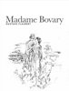

«&#xa0;Madame Bovary&#xa0;» est un roman de Gustave Flaubert, écrivain français (1821-1880), publié pour la première fois en 1857. Considéré comme une oeuvre majeure de la littérature réaliste, le roman dépeint la vie d’une femme d’un médecin de province. Insatisfaite de son mariage et de la médiocrité de la vie de province, Madame Bovary vit au-dessus de ses moyens et recherche un amour sublime et impossible.

[View on Apple](https://books.apple.com/fr/book/madame-bovary/id1448148895)

## Le rouge et le noir

Le Rouge et le Noir, sous-titré Chronique du XIXe siècle, deuxième sous-titré Chronique de 1830 est un roman écrit par Stendhal, publié pour la première fois à Paris chez Levasseur en novembre 1830, bien que l'édition originale1 mentionne la date de 1831. C'est le deuxième roman de Stendhal, après Armance. Il est cité par William Somerset Maugham en 1954, dans son essai : Ten Novels and Their Authors parmi les dix plus grands romans. Le roman est divisé en deux parties : la première partie retrace le parcours de Julien Sorel en province à Verrières puis à Besançon et plus précisément son entrée chez les de Rênal, de même que son séjour dans un séminaire ; la seconde partie porte sur la vie du héros à Paris comme secrétaire du marquis de La Mole.

[View on Apple](https://books.apple.com/fr/book/le-rouge-et-le-noir/id498732779)

## La Ferme des Animaux

Nouvelle traduction du texte de George Orwell.
À la Ferme du Manoir, le vieux Major, un vénérable cochon, décrit aux autres animaux un avenir meilleur, où ils seront débarrassés de l’oppression humaine et ne travailleront plus que pour leur propre bénéfice.
Pour cela, ils doivent participer à la Rébellion, qui renversera les humains et installera la République des Animaux. Mais tout ne se passe pas comme ils l’avaient imaginé…
Les péripéties des animaux dans leur lutte pour la liberté mettent en lumière les mécanismes qui pervertissent les idéaux originels et permettent l’avènement, petit à petit, d’une nouvelle domination.

[View on Apple](https://books.apple.com/fr/book/la-ferme-des-animaux/id1545359737)

## Campus drivers - Tome 01

L'année universitaire qui débute promet d'être radieuse pour Lane O'Neill. Campus Drivers, l'application qu'il a fondée avec ses meilleurs amis, cartonne. Le concept est simple : jouer les taxis pour étudiant, au volant de voitures de collection. Les filles en raffolent, et les quatre chauffeurs ont à coeur de ne jamais décevoir leur clientèle. Lane n'a qu'un seul défaut aux yeux de la gent féminine : il ne s'attache pas. Jamais. Dès qu'il pousse la porte de chez lui, il aspire à ce qu'on lui fiche la paix. Alors comment se retrouve t-il à héberger Lois Hogan, la fille que son voisin vient de larguer ?

[View on Apple](https://books.apple.com/fr/book/campus-drivers-tome-01/id6445270826)

## La Parure

C'était une de ces jolies et charmantes îles, nées, comme par une erreur du destin, dans une famille d'employés. Elle n'avait pas de dot, pas d'espérances, aucun moyen d'être connue, comprise, aimée, épousée par un homme riche et distingué ; et elle se laissa marier avec un petit commis du ministère de l'Instruction publique.

[View on Apple](https://books.apple.com/fr/book/la-parure/id666323566)

## Au bonheur des dames

Au Bonheur des Dames est un roman d’Émile Zola publié en 1883, prépublié dès décembre 1882 dans Gil Blas, le onzième volume de la suite romanesque les Rougon-Macquart. Cest un roman naturaliste avec une histoire sentimentale heureuse, ce qui est étrange pour l'époque. Emile Zola nous emmène découvrir les grands magasins, une nouveauté du Second Empire lancé en par Aristide Bouicaut et son Bon Marché – qui existe toujours plus de 160 ans après sa création –, et le monde de la distribution. Dans ce livre, nous suivons l'histoire de Denise Baudu qui arrive à Paris en 1864 pour travailler dans la petite boutique de son oncle. Cependant, elle se rend compte que les grands magasins sont l'avenir du commerce. C'est pour cela que Denise Baudu se fait embaucher Au Bonheur des Dames. De là, elle va découvrir la cruauté qui règne entre vendeuses, la précarité et aussi la mise à mort des petits commerçants. Malgré tout, elle va réussir une ascension sociale fulgurante.

[View on Apple](https://books.apple.com/fr/book/au-bonheur-des-dames/id510864536)

## La Mort est une garce

Un vieux médecin se souvient de sa première dissection, de son grand amour et de son goût immodéré pour la charcuterie espagnole. Une tranche de vie touchante, drôle et décalée.  Par Baptiste Beaulieu, auteur du blog "Alors voilà" (5 millions de visiteurs)  Cette nouvelle inédite de Baptiste Beaulieu, médecin généraliste de 29 ans, vous est offerte à l’occasion de la parution de son nouveau roman,&#xa0;Alors vous ne serez plus jamais triste&#xa0;chez Fayard et de la sortie au LIvre de Poche d’Alors voilà, les 1001 vies des Urgences&#xa0;(Fayard, 2013), un très beau succès de librairie, déjà traduit en douze langues.

[View on Apple](https://books.apple.com/fr/book/la-mort-est-une-garce/id971213938)

## Hamlet

The prince of Denmark tries to summon the will to kill his father's murderer, his uncle and now king.

[View on Apple](https://books.apple.com/fr/book/hamlet/id916363037)

## 20 000 lieues sous les mers

L’année 1866 fut marquée par un événement bizarre, un phénomène inexpliqué et inexplicable que personne n’a sans doute oublié. Sans parler des rumeurs qui agitaient les populations des ports et surexcitaient l’esprit public à l’intérieur des continents les gens de mer furent particulièrement émus. Les négociants, armateurs, capitaines de navires, skippers et masters de l’Europe et de l’Amérique, officiers des marines militaires de tous pays, et, après eux, les gouvernements des divers États des deux continents, se préoccupèrent de ce fait au plus haut point.

[View on Apple](https://books.apple.com/fr/book/20-000-lieues-sous-les-mers/id666318563)

## The Avengers, Vol. 1

Read the first chapter of Avengers by Brian Michael Bendis Vol. 1. The Avengers have never been mightier as Iron Man, Captain America, Thor, Spider-Man, Wolverine and more team together to stop threats no single hero can stop.

[View on Apple](https://books.apple.com/fr/book/the-avengers-vol-1/id587908188)

## La métamorphose

Grégor, un voyageur de commerce sans histoire, se réveille un matin métamorphosé en une sorte de scarabée. Voilà&#xa0; l’étrange point de départ du chef-d’œuvre de Franz Kafka. Un roman passionnant, remuant, drôle parfois, cruel souvent. Et surtout, criant de vérité. Entre thriller et fable sociale, un œuvre d’une incroyable modernité.

[View on Apple](https://books.apple.com/fr/book/la-m%C3%A9tamorphose/id1526882036)

## Un crime parfait

Une nouvelle inédite en français de Jeffrey Archer, le roi du polar publié dans près de cent pays aux 275 millions de lecteurs. À découvrir également, le dernier tome de sa série William Warwick&#xa0; :&#xa0; Plutôt mourir.  Carla Moorland a été assassinée, et John Hoskins, son amant, connaît le meurtrier. Pas étonnant, c’est lui qui l’a fait. Sa femme, Elizabeth, le sait mais n’appelle pas la police&#xa0; : elle est déterminée à lui éviter les barreaux. Tant pis si ça signifie qu’un homme innocent doit payer pour le crime à la place de John… &#xa0;   Traduit de l’anglais par Santiago Artozqui &#xa0;  À propos de l’auteur Né en Angleterre en 1940, Sir Jeffrey Archer fait ses études à l’université d’Oxford avant de se tourner vers la politique. Il démissionne de la Chambre des communes en 1974 pour se consacrer à l’écriture. Il est l’auteur d’une vingtaine de romans parmi lesquels Kane &amp; Abe, Seul contre tous et La Chronique des Clifton. Ses ouvrages ont été traduits dans une trentaine de langues, publiés dans près de cent pays et se sont écoulés à plus de 275 millions d’exemplaires.

[View on Apple](https://books.apple.com/fr/book/un-crime-parfait/id6447955635)

## Avant qu’il ne tue (Un mystère Mackenzie White – Volume 1)

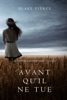

Une nouvelle série mystère qui vous tiendra en haleine par l’auteur bestseller Blake Pierce.  
Une femme est retrouvée assassinée dans un champ de maïs du Nebraska, attachée à un poteau, victime d’un tueur cinglé. Il ne faut pas longtemps à la police pour se rendre compte qu’ils ont affaire à un tueur en série et que sa folie meurtrière ne fait que commencer.&#xa0;  
La détective Mackenzie White, jeune, coriace et plus futée que la plupart de ses collègues machos et vieillissants, est appelée à contrecœur sur l’affaire. Bien que les autres officiers ne veuillent pas l’admettre, ils ont besoin de son esprit jeune et brillant qui avait déjà permis de résoudre des affaires qui les avaient laissés perplexes. Cependant, même pour Mackenzie, cette enquête se révèle être une énigme impossible à résoudre, quelque chose que ni elle ni ses collègues n’avaient jamais vu auparavant.&#xa0;  
Le FBI est appelé en renfort et une intense chasse à l’homme s’ensuit. Mackenzie, sous le choc de son propre passé obscur, de ses relations amoureuses ratées et de son attirance indéniable pour le nouvel agent du FBI, se retrouve à lutter contre ses propres démons quand sa poursuite du tueur l’emmène jusqu’aux recoins les plus sombres de son esprit. Alors qu’elle se plonge dans l’esprit du tueur, obsédée par sa psychologie de tordu, elle découvre que le mal existe vraiment. Alors que toute sa vie s’écroule autour d’elle, elle espère juste pouvoir s’en extirper à temps.&#xa0;  
Alors que les cadavres continuent à apparaître et qu’une course effrénée contre le temps s’ensuit, il n’y a pas d’autre issue que de trouver ce monstre avant qu’il ne tue à nouveau.&#xa0;  
Un thriller psychologique sombre avec un suspense qui vous tiendra en haleine, AVANT QU’IL NE TUE marque le début d’une fascinante nouvelle série, et d’un nouveau personnage, qui vous fera tourner les pages jusqu’à des heures tardives de la nuit.&#xa0;  
Le volume 2 de la série mystère Mackenzie White sera bientôt disponible.&#xa0;

[View on Apple](https://books.apple.com/fr/book/avant-quil-ne-tue-un-myst%C3%A8re-mackenzie-white-volume-1/id1167660805)

## L'Argent

Onze heures venaient de sonner à la Bourse, lorsque Saccard entra chez Champeaux, dans la salle blanc et or, dont les deux hautes fenêtres donnent sur la place. D'un coup d'oeil, il parcourut les rangs de petites tables, où les convives affamés se serraient coude à coude ; et il parut surpris de ne pas voir le visage qu'il cherchait.

[View on Apple](https://books.apple.com/fr/book/largent/id666801577)

## Le joueur d'échecs

Cette nouvelle est d’abord un récit captivant impossible à lâcher. C’est aussi le portrait inquiétant d’un monde en train de sombrer dans la folie. Car rappelons-le, nous sommes en 1941 et Hitler est au pouvoir. Stefan Zweig est exilé au Brésil, où Il va bientôt choisir de mourir. Quel que soit son degré de lecture, cette fable fantastique fascine tant elle est bien ficelée. Et, comme toujours chez l’Autrichien, elle parvient à percer l’âme humaine et à résonner en chacun de nous.

[View on Apple](https://books.apple.com/fr/book/le-joueur-d%C3%A9checs/id1521750201)

## Jane Eyre

Charlotte Brontë, sous le nom de plume de Currer Bell, signe un roman dont l’héroïne raconte son enfance, sa jeunesse et son entrée dans l’âge adulte, dans le nord de l’Angleterre entre 1760 et 1820. Cet ouvrage, publié pour la première fois en 1847, offre une traduction de l’anglais de Mme Leszabeilles Souvestre.

[View on Apple](https://books.apple.com/fr/book/jane-eyre/id510909311)

## Le Comte de Monte-Cristo - Alexandre Dumas

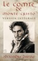

Plongez dans l'univers fascinant du Comte de Monte-Cristo, l'un des chefs-d'œuvre d'Alexandre Dumas, publié pour la première fois en 1846. Ce classique incontournable de la littérature française raconte l'histoire d'Edmond Dantès, un jeune marin dont l'ascension prometteuse est brisée par une trahison. Injustement emprisonné, il parvient à s'échapper après des années de captivité et réapparaît sous l'identité énigmatique du Comte de Monte-Cristo. Sa quête de vengeance, implacable et calculée, le confronte alors à des dilemmes moraux profonds : jusqu'où peut-on aller pour obtenir justice sans se perdre soi-même ?
Avec une intrigue haletante, des personnages inoubliables et des rebondissements magistraux, Le Comte de Monte-Cristo explore les thèmes universels de la trahison, de la vengeance et de la rédemption.
Cette édition Intégrale et Collector des Sables du Temps rend hommage à ce chef-d'œuvre intemporel qui continue de captiver les lecteurs, génération après génération.

Ce roman, aux côtés des Trois Mousquetaires, est l’une des œuvres les plus emblématiques d’Alexandre Dumas, reconnue et célébrée aussi bien en France qu’à travers le monde.

Nous vous souhaitons une immersion inoubliable dans ce chef-d'œuvre intemporel.

[View on Apple](https://books.apple.com/fr/book/le-comte-de-monte-cristo-alexandre-dumas/id6737460277)

## Fables de La Fontaine

[View on Apple](https://books.apple.com/fr/book/fables-de-la-fontaine/id511011760)

## Conquérir sa liberté financière

Il y a des milliers de livres qui vous promettent de vous apprendre à&#xa0;devenir riche&#xa0;vite.&#xa0;  Ce ne sont en général ni des propositions honnêtes, ni sécures.&#xa0;  Je fais exactement le contraire.&#xa0;  Vous allez avec moi apprendre à devenir riche et à conquérir votre liberté financière plus&#xa0;lentement&#xa0;peut être, mais très&#xa0;sûrement.&#xa0;  Il faudra compter 10 à 20 ans, ce qui n’est vraiment pas beaucoup quand&#xa0;l’espérance de vie est de plus de 80 ans à présent.&#xa0;  Ceci est un livre honnête qui vous apprend&#xa0;une méthode réaliste et prouvée&#xa0;pour construire la&#xa0;sécurité financière qui vous survivra.  Voulez-vous savoir comment devenir&#xa0;riche et prendre votre&#xa0;retraite plus riche?  Assez riche pour faire ce que vous voulez, quand vous voulez le faire?  Pour le reste de votre&#xa0;vie?  Si la réponse est ‘oui’, arrêtez ce que vous faites et achetez ce livre.  Voici ce que vous apprendrez:  -Quelle est la véritable formule pour devenir riche  -Comment dépenser moins d'argent  -Comment gagner plus d'argent  -Comment investir en bourse de façon sûre, facile et rentable  -Comment investir dans l'immobilier  -Comment planifier sa retraite  -Comment devenir millionnaire  Pourquoi suis-je si sûr que vous pouvez réussir?  Parce que mes méthodes&#xa0;m’ont aidé à&#xa0;devenir millionnaire&#xa0;moi-même.  Et je l’ai fait en ignorant les idées d’investissement généralement admises.  Si vous voulez devenir une de ces personnes qui réussissent à&#xa0;faire ce qu’elles désirent, quand elles le&#xa0;veulent, ma&#xa0;stratégie vous fera réussir. Et si vous ne voulez jamais plus dépendre du gouvernement, de votre employeur ou de votre famille pour assurer votre confort financier,&#xa0;aujourd’hui est le jour où votre vie changera à jamais.  En fait, je suis certain que vous pouvez devenir millionnaire – en quelques étapes logiques&#xa0;– si vous suivez ma&#xa0;méthode expliquée en Français simple.  Je suis 100% convaincu que ce livre est le moyen idéal pour vous fournir des opportunités d’investissement spécifiques et des stratégies d’économie d’argent qui vous feront conquérir votre&#xa0;liberté financière.  Et voici la meilleure nouvelle: vous pouvez commencer tout de suite à devenir riche.  À qui est destiné ce livre?  
Ce livre est destiné aux débutants qui ne savent pas par où commencer pour se libérer enfin financièrement. Il ne convient pas pour les investisseurs déjà expérimentés. Il n’est pas pour ceux qui espèrent devenir riche du jour au lendemain. Si vous cherchez cela, il y a assez de gugusses qui proposent ces arnaques ailleurs.

[View on Apple](https://books.apple.com/fr/book/conqu%C3%A9rir-sa-libert%C3%A9-financi%C3%A8re/id1512666833)

## Le Fils de la Voisine - Tome 1

Sylvie vient d'emménager dans un nouvel appartement après un divorce difficile, à 43 ans, c’est une nouvelle vie qui s’annonce !

Elle se lie rapidement d’amitié avec sa voisine de palier, Sonia qui vit seule avec son fils de 20 ans. Toutes les deux passent de nombreuses soirées à papoter et boire du vin.

Mais elle ne sont pas que voisines de palier, leurs balcons se touchent, alors quand le soleil donne, et que Romain, le fils de Sonia vient faire bronzette en boxer, Sylvie a une vue magnifique sur ce corps de rêve qui lui donne tellement envie !

Sylvie craquera-t-elle pour le fils de sa voisine ? Romain est-il expérimenté sexuellement ? Comment gérer cette histoire si excitante et tellement interdite ?

[View on Apple](https://books.apple.com/fr/book/le-fils-de-la-voisine-tome-1/id6470828309)

## Raison de tuer (Un Polar Avery Black – Tome 1)

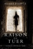

«&#xa0;Un scénario dynamique qui vous saisit dès le premier chapitre et ne vous laisse plus partir.&#xa0;» 
Midwest Book Review, Diane Donovan (à propos de Sans Laisser de Traces)  
De l’auteur de polars n°1 Blake Pierce nous vient un nouveau chef-d’œuvre de suspense psychologique.  
La lieutenante de la police criminelle Avery Black a traversé l’enfer. Autrefois la meilleure avocate de la défense, elle est tombée en disgrâce quand elle a réussi à faire sortir un brillant professeur de Harvard – seulement pour le voir tuer à nouveau. Elle a perdu son mari ainsi que sa fille, et sa vie s’est effondrée autour d’elle.  
Essayant de se racheter, Avery s’est tournée vers l’autre côté de la loi. En travaillant dur pour gravir les échelons, elle a atteint la Brigade Criminelle, au mépris des autres agents, qui se souviennent encore de ce qu’elle a fait, et qui la haïront toujours.  
Cependant même eux ne peuvent nier qu’Avery a un esprit brillant, et quand un inquiétant tueur en série sème la peur au cœur de Boston, tuant des filles issues des meilleures universités, c’est vers Avery qu’ils se tournent. C’est l’occasion pour Avery de faire ses preuves, de trouver finalement la rédemption dont elle a tant besoin. Et pourtant, comme elle va bientôt le découvrir, Avery va se heurter à un tueur aussi brillant et audacieux qu’elle.  
Dans ce jeu psychologique du chat et de la souris, des femmes meurent avec de mystérieux indices, et les enjeux ne pourraient être plus élevés. Une frénétique course contre la montre mène Avery à travers une série de rebondissements stupéfiants et inattendus – culminant dans un climax que même Avery ne pourrait imaginer.  
Un sombre thriller psychologique au suspens palpitant, Raison de Tuer marque le début d’une nouvelle série captivante – et un nouveau personnage apprécié – qui vous laissera à tourner les pages jusque tard dans la nuit.  
Le tome 2 de la série Avery Black sera bientôt disponible.  
«&#xa0;Un chef-d’œuvre de thriller et de roman policier. Pierce a fait un travail formidable en développant des personnages avec un côté psychologique, si bien décrits que nous nous sentons dans leurs esprits, suivons leurs peurs et applaudissons leur succès. L’intrigue est très intelligente et vous gardera occupés le long du livre. Plein de rebondissements, ce livre vous gardera éveillés jusqu’à avoir tourné la dernière page.&#xa0;» 
&#xa0;Books and movie Review, Roberto Mattos (à propos de Sans Laisser de Traces)

[View on Apple](https://books.apple.com/fr/book/raison-de-tuer-un-polar-avery-black-tome-1/id1194222664)

## Le Noël d'Agatha - nouvelle inédite Agatha Raisin

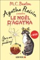

Le pudding était presque parfait…   Lorsqu’Agatha Raisin décide d’organiser le Noël des personnes âgées dans un petit village des Cotswolds, elle ne s’attend pas à ce que la fête tourne au drame. Ni une ni deux, la voilà pourtant avec un cadavre sur les bras, accusée de meurtre ! L’arme du crime ? Le dessert le plus <i>british</i> qui soit : un pudding ! Il faudrait un miracle ou l’intervention du père Noël pour la sortir de ce bourbier. Mais Agatha compte bien pister le vrai coupable...  En tête des meilleures ventes, M.C. Beaton est devenue la reine du mystère à l’anglaise et Agatha Raisin la plus célèbre détective après Miss Marple : une nouvelle délicieuse, à savourer sans modération.  <i> Exemplaire offert </i>

[View on Apple](https://books.apple.com/fr/book/le-no%C3%ABl-dagatha-nouvelle-in%C3%A9dite-agatha-raisin/id1454638555)

## Les Misérables

It has been said that Victor Hugo has a street named after him in virtually every town in France. A major reason for the singular celebrity of this most popular and versatile of the great French writers is Les Misérables (1862). In this story of the trials of the peasant Jean Valjean — a man unjustly imprisoned, baffled by destiny, and hounded by his nemesis, the magnificently realized, ambiguously malevolent police detective Javert — Hugo achieves the sort of rare imaginative resonance that allows a work of art to transcend its genre.
Les Misérables is at once a tense thriller that contains one of the most compelling chase scenes in all literature, an epic portrayal of the nineteenth-century French citizenry, and a vital drama — highly particularized and poetic in its rendition but universal in its implications — of the redemption of one human being.

One of the half-dozen greatest novels of the world. —Upton Sinclair
The greatest of all novels. —Leo Tolstoy
Hugo is unquestionably the most powerful talent that has appeared in France in the nineteenth century. —Fyodor Dostoyevsky
I sobbed and wailed and thought [books] were the greatest things. —Susan Sontag

[View on Apple](https://books.apple.com/fr/book/les-mis%C3%A9rables/id1541840550)

## 69 gages érotiques pour pimenter votre vie sexuelle

<b>Tu as perdu. Voici ton gage !</b>
 Un gage est une punition. Mais un gage érotique est une punition particulière, émouvante, délicieuse, voire jouissive, autant pour celui des deux partenaires qui l'impose et en bénéficie que pour celui ou celle qui doit s'y livrer. Organisés par niveau (de plus en plus hard...), par sexe, avec des gadgets, déguisés, à l'extérieur ou chez soi, les 69 gages contenus dans ce livre vont vous permettre d'apporter un peu de " piment " à vos jeux érotiques.

[View on Apple](https://books.apple.com/fr/book/69-gages-%C3%A9rotiques-pour-pimenter-votre-vie-sexuelle/id803570735)

## Meditation Sur L’Univers, L’Homme Et Le Coran

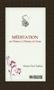

Qu'un salut éternel soit adressé à notre bien-aimé Prophète (pbsl *), ainsi qu'à sa famille et à ses Compagnons, eux qui méditaient sur l'univers, l'humanité et le Saint Coran dans la plus belle, la plus profonde et la plus sensible des manières et qui ont enseigné à leurs continuateurs à lire tout ces choses avec l'œil du cœur.

[View on Apple](https://books.apple.com/fr/book/meditation-sur-lunivers-lhomme-et-le-coran/id501955690)

## Le dernier jour d'un condamné

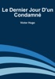

Voilà cinq semaines que j'habite avec cette pensée, toujours seul avec elle, toujours glacé de sa présence, toujours courbé sous son poids !

[View on Apple](https://books.apple.com/fr/book/le-dernier-jour-dun-condamn%C3%A9/id666327466)

## Captive de la Mafia

<b>Deux mâles alphas dominants et sombres.</b> 
<b>L’un d’eux m’échauffe les sangs.</b> 
<b>L’autre me fait trembler.</b> 
<b>Et ils jurent qu’ils ne me relâcheront pas.</b>  
Ma vie d’étudiante universitaire ordinaire devient extraordinaire quand Joseph surgit dans mon monde et me fait chavirer. Notre alchimie intense semble trop belle pour être vraie, comme un merveilleux conte de fées.  
Jusqu’à ce que le rêve se transforme en cauchemar.  
<i>Droguée. Kidnappée.</i>  
Quand je me réveille, je me retrouve piégée dans les bras d’un homme qui était censé être mon féroce protecteur. Mon premier amour, mon prince charmant, est un criminel, le fils d’un puissant parrain de la mafia. Et son meilleur ami Marco – l’homme terrifiant, hyper musclé qui m’a enlevée – est un homme de main brutal.  
Ils affirment qu’ils ne peuvent pas me relâcher, que leurs ennemis pourraient s’en prendre à moi.  
Malgré tout, mon cœur appartient toujours à Joseph, et je ne peux pas m’empêcher de céder à la passion enfiévrée qui nous lie.  
Les règles inflexibles de Marco me rendent folle, mais son regard d’onyx et ses ordres sévères font brûler quelque chose de plus dépravé que la colère dans mon bas-ventre.  
Ils jurent qu’ils m’ont kidnappée pour me protéger, mais pourrait-il être encore plus dangereux pour moi de me rapprocher de mes ravisseurs criminels si séduisants ?

[View on Apple](https://books.apple.com/fr/book/captive-de-la-mafia/id6445729525)

## After - Tome 01

<b>AVANT, ELLE CONTRÔLAIT SA VIE.AFTER, TOUT A CHAVIRÉ </b> Tessa est une jeune fille ambitieuse, volontaire, réservée. Elle contrôle sa vie. Son petit ami Noah est le gendre idéal. Celui que sa mère adore, celui qui ne fera pas de vagues. Son avenir est tout tracé : de belles études, un bon job à la clé, un mariage heureux Mais ça, c'était avant qu'il ne ne la bouscule dans le dortoir. Lui, c'est Hardin, bad boy, sexy, tatoué, piercé, avec un « p d'accent anglais ! » Il est grossier, provocateur et cruel, bref, il est le type le plus détestable que Tessa ait jamais croisé.  Et pourtant, le jour où elle se retrouve seule avec lui, elle perd tout contrôle  Cet homme ingérable, au caractère sombre, la repousse sans cesse, mais il fait naître en elle une passion sans limites. Une passion qui, contre toute attente, semble réciproque Initiation, sexe, jalousie, mensonges, entre Tessa et Hardin est-ce une histoire destructrice ou un amour absolu ? L'écriture rythmée d'Anna Todd rendra accros tous ses lecteurs.  « Anna Todd est le plus important phénomène de sa génération. » COSMO U.S. « Le phénomène littéraire issu du web ! » N.Y. TIMES

[View on Apple](https://books.apple.com/fr/book/after-tome-01/id6445272075)

## Les Fleurs du Mal

La lecture de poèmes ne vous est pas familière? Découvrez l’un des recueils de poésie les plus célèbres et succombez au charme intemporel de ses vers. Au fil des pages, on s’enivre de la beauté du mal. On respire le poison de sa beauté. Bref, on ne se lasse pas de plonger dans cet ouvrage à la sensualité universelle. Cent poèmes légendaires qui ont changé la face de la littérature.

[View on Apple](https://books.apple.com/fr/book/les-fleurs-du-mal/id506621982)

## Fables de la Fontaine

Qui dit fable dit bien sûr Jean de La Fontaine. « Le Corbeau et le renard », « Le lièvre et la tortue », « Le loup et l’agneau » figurent parmi les textes les plus récité à l’école. C’est oublier que le plus célèbre des fabulistes du XVIIe siècle est l’auteur de plus de 200 bijoux en vers. En ayant recours aux animaux, il manie la critique de la société humaine avec une redoutable efficacité. Une œuvre percutante, acerbe, étonnamment moderne, qui recèle bien davantage que de simples histoires pour enfants.

[View on Apple](https://books.apple.com/fr/book/fables-de-la-fontaine/id511011724)

## Proposition indécente

<b>Une femme. Deux hommes. Une nuit. Un demi-million de dollars</b> 
Julianne est endettée jusqu’au cou à cause de la maladie de sa mère, et son emploi pour un service de traiteur ne suffira jamais à boucler les fins de mois. Mais une proposition mystérieuse pourrait résoudre tous ses problèmes. Seul bémol&#xa0;: elle doit coucher avec un inconnu. 
Erik et Keegan sont deux partenaires de travail, dont l’amitié a failli voler en éclats en même temps que leur laboratoire lorsqu’une explosion a manqué de coûter la vie à Erik, qui en porte encore les stigmates aujourd’hui, tant physiques que psychologiques. Son travail, dans lequel il se réfugie, lui sert de bouclier contre le monde entier. Keegan n’en peut plus de le voir se retrancher ainsi, et décide de faire tout son possible pour faire sortir Erik des ténèbres. 
<b>Leur plan parfait est parfaitement indécent.</b> 
Erik propose à Keegan de faire l’amour à Julianne sous ses yeux. Keegan est abasourdi… et secrètement ravi. Il désire la jeune femme tout autant que son meilleur ami. 
Julianne accepte l’argent, mais elle ne s’attendait pas à être aussi excitée par cet arrangement indécent ni à tomber amoureuse de Keegan, cet Irlandais tranquille, ou d’Erik, son ami blessé. Et alors que l’aventure d’une nuit se transforme en relation plus poussée, Julianne sera-t-elle en mesure de faire sortir les hommes de l’ombre pour les ramener vers la lumière ?

[View on Apple](https://books.apple.com/fr/book/proposition-ind%C3%A9cente/id1534900900)

## Le paradis en Islam

Le paradis est la récompense éternelle destinée aux croyants de cette vie d'ici bas, mais que savons-nous vraiment du paradis ?
Nous essayerons d'apporter le plus d'informations à travers 40 questions essentielles.

[View on Apple](https://books.apple.com/fr/book/le-paradis-en-islam/id6459995742)

## En route pour le Zoo

Ce livre vous emmène dans une petite aventure où le personnage principal visite un zoo pour la première fois. Notre personnage vous emmène voir différents animaux, tels que des lions, des hippopotames, des zèbres, et bien d'autres encore ! Vous verrez peut-être des éléphants avec des trompes plus grandes que ce que vous pensiez. Vous pourrez laisser libre cours à l'imagination de votre enfant lorsque le personnage imagine à quel point il serait ridicule qu'un rhinocéros porte des vêtements, ou qu'un flamant rose soit un pirate avec une jambe de bois. Chaque ami à fourrure (ou à plumes) présenté dans ce livre donnera envie à votre enfant de visiter un zoo !

[View on Apple](https://books.apple.com/fr/book/en-route-pour-le-zoo/id1591028817)

## Milou, le petit loup

À l’heure du goûter, auprès de la cheminée, Grand-Mère Loup raconte à ses louveteaux l’histoire de Milou, un petit loup étrange, qui avait des difficultés à parler et à comprendre. Un petit loup avec une tâche&#xa0;couleur grenat, en forme de cœur,&#xa0;non loin de sa bouche…  À PROPOS DES AUTEURS  Secrétaire médicale, <b>Sonia Goerger </b>accueille et rencontre, depuis plusieurs années, de nombreux patients de génétique. Ce contact lui a donné envie de créer la collection de livres pour enfants « Les Enfants de la Génétique ». Les livres de la collection abordent les difficultés que les patients peuvent être amenés à vivre au quotidien avec des mots simples et des personnages attachants. Pour leur donner vie, Sonia Goerger a notamment collaboré avec Christine Juif, psychologue clinicienne, qui accompagne les patients porteurs de maladies génétiques, et leur famille, au cours de la démarche diagnostique.  Graphiste pendant plusieurs années, <b>Élodie Garcia </b>s’est reconvertie en tant qu’auteure et illustratrice de livres pour enfants et bandes dessinées. La délicatesse de son trait lui permet d’aborder, tout en douceur, des sujets parfois difficiles. En illustrant la collection « Les Enfants de la Génétique », Élodie Garcia espère pouvoir aider les familles confrontées aux maladies rares.  L’association <b>ARGAD </b>(Association de Recherche en Génétique et d’Accompagnement des familles et professionnels de Dijon-Bourgogne) est une association de loi 1901, à but non lucratif, créée en septembre 2010. Cette association soutient le développement de la FHU-TRANSLAD par de nombreuses actions : - améliorer les conditions d’accueil et de prise en charge des patients atteints de maladies rares en Bourgogne, - diffuser des informations sur les maladies rares par l’organisation de réunions spécifiques, - aider les médecins et les professionnels de santé impliqués dans les maladies génétiques rares à approfondir leur formation et améliorer leurs connaissances dans ce domaine, - soutenir les activités de recherche clinique et biologique dans le domaine de la génétique des anomalies du développement en Bourgogne.

[View on Apple](https://books.apple.com/fr/book/milou-le-petit-loup/id6445644237)

## Briar university - Tome 01

<b>Summer parviendra-t-elle à se faire une place parmi les trois sportifs dont elle partage dorénavant la maison ?</b> On dit que les opposés s'attirent. Et s'il y en a bien une qui est d'accord avec ça, c'est Summer, parce qu'il n'y a aucune raison logique pour qu'elle soit attirée par Colin Fitzgerald. En règle générale, elle n'aime pas les intellos tatoués, les jeux vidéo, les joueurs de hockey qui pensent qu'elle est volage et superficielle. Cette image qu'il a d'elle ne joue pas en sa faveur. Ce qui arrange encore moins Summer, c'est qu'il soit copain-copain avec son frère.  Et que son meilleur ami ait le béguin pour elle.  Et qu'elle vienne d'emménager avec eux.  Parce que oui, pour couronner le tout, ils sont colocataires !  Summer a décidé que ça n'avait pas d'importance. Fitzy a clairement déclaré qu'elle ne l'intéressait pas, même si les étincelles entre eux risquent de mettre le feu à leur maison. Elle n'est pas le genre de fille à courir après un homme, et elle ne va pas commencer. La vie de Summer est déjà bien assez remplie par une nouvelle école, un professeur louche et un avenir incertain. Et puis, si son colocataire sexy se réveille et réalise ce qu'il manque... il sait où la trouver.

[View on Apple](https://books.apple.com/fr/book/briar-university-tome-01/id6445271410)

## Un été pas comme les autres

<b>Il enchaîne les conquêtes. Elle est la sœur de son meilleur ami.&#xa0; Ils ne devraient pas être ensemble. Mais cet été, la tentation est trop forte.&#xa0;</b>  Cet été, Emilia Moretti, 16 ans, n'a qu'un objectif : oublier jusqu'à l'existence de Nick Grawsky, le meilleur ami de son frère. Cela devrait être facile : il passe les vacances dans les Hamptons, à briser le cœur de toutes filles à la ronde. Emilia a décidé de ne plus passer de nuits blanches à penser à lui. Car si elle veut décrocher un rôle dans le ballet de l'an prochain, elle doit s'entraîner à fond pour atteindre la perfection dans chaque mouvement. Et elle se sent enfin prête à rechercher ses parents biologiques. Mais quand Nick décide de rester à New York pour l'été, les bonnes résolutions d'Emilia s'évanouissent en un clin d'œil. Peut-être est-ce le destin qui les pousse l'un vers l'autre. Mais il ne faudrait pas qu'elle se fasse trop d'illusions sur le devenir de leur relation…&#xa0;  Nick, de son côté, n'est pas aussi heureux et insouciant qu'il en a l'air. Son père veut qu'il arrête la danse classique pour devenir… avocat. Nick décide alors de tout donner pour lui prouver qu'il est capable de réussir. Mais comment se concentrer en croisant tous les jours Emilia ? Avec elle, il perd tous ses moyens. Il faut dire qu'elle est intouchable : par respect pour Roberto, il ne devrait même pas s'autoriser les pensées lubriques qu'il a sur elle. De toute façon, il n'est pas fait pour les relations sérieuses. Il n'a pas de temps pour autre chose que des histoires d'un soir, des filles qui n'attendent rien de lui, des filles auxquelles il ne s'attachera jamais. Il sait qu'il devrait résister à la tentation, mais il n'est pas sûr d'en avoir envie…&#xa0;  Juste le temps d'un été.&#xa0; Un été pas comme les autres.

[View on Apple](https://books.apple.com/fr/book/un-%C3%A9t%C3%A9-pas-comme-les-autres/id1076116483)

## Les trois mousquetaires

Dans l'intervalle, l'hôte, qui ne faisait aucun doute que ce était la présence du jeune homme qui a conduit l'étranger de son hôtellerie, remonta dans la chambre de sa femme, et a trouvé d'Artagnan simplement récupérer ses sens. Lui donnant à entendre que la police pourrait bien lui assez sévèrement pour avoir cherché une querelle avec un grand seigneur - dans l'opinion de l'hôte l'étranger pourrait être rien de moins qu'un grand seigneur - il a insisté que, malgré sa faiblesse d 'Artagnan devrait se lever et de se écarter aussi rapidement que possible. D'Artagnan, moitié abasourdi, sans pourpoint et la tête lié dans un linge, se leva alors, et poussé par l'hôte, a commencé à descendre les escaliers; mais en arrivant à la cuisine, la première chose qu'il vit fut son antagoniste parler tranquillement au marchepied d'un lourd carrosse tiré par deux grands chevaux normands.

[View on Apple](https://books.apple.com/fr/book/les-trois-mousquetaires/id507939247)

## 1984

1984 is a dystopian novel by George Orwell written in 1948, which follows the life of Winston Smith, a low ranking member of ‘the Party’, who is frustrated by the omnipresent eyes of the party, and its ominous ruler Big Brother. 
‘Big Brother’ controls every aspect of people’s lives. It has invented the language ‘Newspeak’ in an attempt to completely eliminate political rebellion; created ‘Throughtcrimes’ to stop people even thinking of things considered rebellious. The party controls what people read, speak, say and do with the threat that if they disobey, they will be sent to the dreaded Room 101 as a looming punishment. 
Orwell effectively explores the themes of mass media control, government surveillance, totalitarianism and how a dictator can manipulate and control history, thoughts, and lives in such a way that no one can escape it.

[View on Apple](https://books.apple.com/fr/book/1984/id1517999417)

## The Art of War

An Apple Books Classic edition.  It’s believed that Sun Tzu wrote this Chinese military primer during the 5th century BC-hundreds of years before the Bible. The book’s 13 chapters explore principles that statesmen around the globe have employed for centuries to defeat their enemies at war.  Sun Tzu starts by mapping out the five fundamental factors that lead to war. He then covers a wide range of topics, from avoiding conflict altogether to strategically positioning soldiers, pulling off tactical maneuvers, and putting spies to use.  Despite the technological advances made since <i>The Art of War</i> was published, Sun Tzu is still considered one of history’s foremost military strategists, and his methods still ring true. While he wrote the book as a manual for those who would literally wield swords, it has reached a much broader audience in this day and age. Warriors of all kinds-like corporate leaders or athletes-seek out Sun Tzu’s wisdom in their quest for success.

[View on Apple](https://books.apple.com/fr/book/the-art-of-war/id395534623)

## L'Homme de ma Meilleure Amie 💋🥵😉

Une curiosité innocente pourrait entraîner Soraya dans un jeu qu'elle ne peut pas se permettre de perdre...

Amélie, la meilleure amie de Soraya, vient lui rendre visite et lui pose une question intéressante. Si son mari venait à perdre la vue, serait-il capable de faire la différence entre sa femme et sa meilleure amie ? 

Soraya est convaincue que son mari saurait s'il l'embrasse ou non, mais Amélie pense le contraire. Soraya accepte de laisser Amélie mener sa petite expérience, mais elle ne s'attend pas à ce qui va suivre…

Ayant peur de faire marche arrière, Soraya se soumet au test, mais découvre plus de choses sur elle-même qu'elle ne l'avait prévu. 

Car au fond d'elle-même, Soraya espère que son mari ne pourra pas faire la différence. Au fond d'elle-même, elle espère que son mari ira plus loin qu'un homme marié ne le devrait avec la meilleure amie de sa femme.

[View on Apple](https://books.apple.com/fr/book/lhomme-de-ma-meilleure-amie/id6753871290)

## Le Malade Imaginaire

Après les glorieuses fatigues et les exploits victorieux de notre auguste monarque, il est bien juste que tous ceux qui se mêlent d'écrire travaillent ou à ses louanges, ou à son divertissement. C'est ce qu'ici l'on a voulu faire, et ce prologue est un essai des louanges de ce grand prince, qui donne entrée à la comédie du Malade imaginaire, dont le projet a été fait pour le délasser de ses nobles travaux.

[View on Apple](https://books.apple.com/fr/book/le-malade-imaginaire/id667520259)

## Dévotion Totale

Elle le voulait tellement... Ce père célibataire si sexy !

Après avoir été marié pendant plus d’une quinzaine d’année, Christopher trouve la vie de célibataire difficile. Alors pour s’occuper de ses deux petits garçons après l’école, il décide de recruter une babysitter… et son dévolu se jettera alors... sur Amy !

La babysitter s’occupe des deux ptis bouts, et elle lui arrive parfois de consoler Christopher, en lui disant que tout ira bien. Il ne la croit pas, il ne se rappelle même pas la dernière fois qu'il a embrassé une femme qui n'était pas son ex-femme.

La jolie baby-sitter se porte volontaire pour être son premier baiser ! Voyons où tout cela mène après ce tout ! Mais vont-ils aller jusqu'au bout ?

[View on Apple](https://books.apple.com/fr/book/d%C3%A9votion-totale/id6479415746)

## Voyage au centre de la Terre

Voyage au centre de la Terre est un roman de science-fiction, écrit en 1864 par Jules Verne. Il fut publié en édition originale in-18 le 25 novembre 1864, puis en gd in-8° le 13 mai 1867. Le texte de 1867 est différent de celui de 1864. Il comporte en effet deux chapitres de plus (45 au lieu de 43).

[View on Apple](https://books.apple.com/fr/book/voyage-au-centre-de-la-terre/id501002415)

## La Tentation de l’Alpha

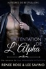

C’EST À MOI DE LA PROTÉGER. À MOI DE LA PUNIR. ELLE EST À MOI.&#xa0; 
Je suis un loup solitaire, et ça me convient très bien. Banni de la meute dans laquelle je suis né après un règlement de comptes sanglant, je n’ai jamais eu envie de trouver une compagne.  
Et puis je rencontre Kylie. Ma tentation. Lorsque nous nous retrouvons enfermés dans un ascenseur ensemble, la panique manque de la faire s’évanouir entre mes bras. Elle est forte, mais traumatisée. Et elle cache quelque chose.  
Mon loup veut la marquer et en faire sa compagne, mais elle est humaine et délicate&#xa0;: elle ne survivrait pas à une morsure de métamorphe.  
Je suis trop dangereux pour elle. Je ferais mieux de garder mes distances. Mais lorsque je découvre qu’elle est la hackeuse qui a failli détruire mon entreprise, j’exige qu’elle se soumette à ma punition. Et elle le fera.  
Kylie m’appartient.  
Note de l’éditeur&#xa0;: La Tentation de l’Alpha est une histoire individuelle de la série Alpha Bad Boys. Une histoire d’amour avec une fin heureuse garantie. Ce roman suit l’histoire d’un loup alpha séduisant et autoritaire avec un penchant pour la domination et la protection de sa femelle. Si ce genre de thèmes vous choque, n’achetez pas ce livre.

[View on Apple](https://books.apple.com/fr/book/la-tentation-de-lalpha/id6443165323)

## La Femme Parfaite (Un thriller psychologique avec Jessie Hunt, Tome n 1)

<b>Profileuse criminelle de profession (et jeune mariée), Jessie Hunt, 29 ans, découvre que de noirs secrets rôdent dans la ville de banlieue où elle vient d’arriver. Dès l’apparition d’un cadavre, elle se retrouve menacée par ses nouveaux amis, les secrets de son mari, le nombre de cas de tueurs en série qu’elle doit traiter et les mystérieuses zones d’ombre de son propre passé.</b>  
Dans LA FEMME PARFAITE (Un thriller psychologique avec Jessie Hunt, Tome n 1), Jessie Hunt, profileuse criminelle de formation, est sûre qu’elle s’est finalement débarrassée des ténèbres de son enfance. Avec son mari, Kyle, elle vient de déménager d’un appartement trop petit du centre de Los Angeles pour emménager dans un manoir de Westport Beach. Grâce à la promotion de Kyle, ils roulent sur l’or. De plus, Jessie est sur le point d’avoir sa maîtrise en psychologie judiciaire, ce qui lui permettra enfin de réaliser son rêve de devenir profileuse criminelle.  
Cependant, peu après leur arrivée, Jessie commence à remarquer une série d’événements étranges. Les voisins et leurs filles au pair ont tous l’air de cacher des secrets. Le mystérieux yacht club dont Kyle veut désespérément devenir membre déborde d’épouses qui trompent leur mari et de règles préoccupantes qui lui sont propres. De plus, le tueur en série notoire qui est détenu à l’hôpital psychiatrique où Jessie termine son diplôme semble connaître la vie de Jessie plus en détail qu’il ne le devrait pour la sécurité de cette dernière.  
Alors que son monde commence à révéler sa face sombre, Jessie se met à remettre en question tout ce qui l’entoure, dont sa propre raison. A-t-elle vraiment mis à jour une conspiration troublante qui se trame dans une ville ensoleillée et riche du littoral californien ? Est-ce que l’assassin de masse qu’elle étudie connaît vraiment, d’une façon ou d’une autre, l’origine de ses cauchemars intimes ?  
Ou son passé tourmenté serait-il finalement revenu s’emparer d’elle ?  
Roman à suspense psychologique au rythme haletant, aux personnages inoubliables et au suspense palpitant, LA FEMME PARFAITE est le premier tome d’une nouvelle série captivante dont vous tournerez les pages jusque tard dans la nuit.

[View on Apple](https://books.apple.com/fr/book/la-femme-parfaite-un-thriller-psychologique-avec/id1442728224)

## Carnet d'un inconnu

Yegor Ilich Rostaniev, colonel à la retraite, est veuf avec deux enfants de huit et quinze ans. Il vit dans son petit domaine et vient de recueillir sa mère, dont le mari, le général Krakhotkine, vient de décéder. Sa mère, insupportable et capricieuse, vit entourée d’une cour de commères acariâtres. Elle vient de s’enticher d’un parasite doté d’un amour-propre immense, Foma Fomitch Opiskine. Tout ce petit monde vit maintenant chez Rostaniev. Extrait : Soulevant ma casquette, je remarquai avec toute la gentillesse du monde que les voyages nous occasionnent parfois des accidents bien désagréables, mais le gros bonhomme me toisa des pieds à la tête d’un regard dédaigneux et mécontent, puis, grommelant, me tourna le dos. Cette partie de sa personne était sans doute fertile en suggestions intéressantes, mais peu propice à la conversation. Grichka, ne ronchonne pas ou je te ferai fouetter ! cria-t-il à son domestique sans avoir l’air d’entendre mon observation sur les désagréments du voyage.

[View on Apple](https://books.apple.com/fr/book/carnet-dun-inconnu/id509433583)

## Regarde-moi j'apprends l'anglais

Ce nouveau livre d'images bilingue est l'histoire parfaite pour les jeunes enfants pour apprendre les base de la langue anglaise. Un livre coloré, drôle et instructif!  Mo est un enfant vif et curieux, qui a une grande soif de nouvelles connaissances. Il veut apprendre l'anglais pour se faire plus d'amis!  Au début de l'histoire, le petit Mo découvre les bases essentielles de la langue: apprendre à saluer, à se présenter et à compter jusqu'à dix.  Nous suivons ensuite Mo et les autres enfants pour continuer l'apprentissage de l'anglais et découvrir de nouveaux sujets comme:  -Quel âge as-tu? -Qu'est-ce que tu aimes/détestes? -Jeux et loisirs/hobbies -Les couleurs de l'arc-en-ciel - Les animaux domestiques - L'heure de dormir  Sur toutes les pages, le texte est imprimé en français et anglais pour que le parent, l'enseignant, ou la personne qui lit le livre à l'enfant puisse le faire dans les deux langues.  Les adultes (ou les lecteurs) seront bien équipés avec cet outil parfait, drôle et coloré qui permet à l'enfant de découvrir la langue anglaise et de s'entrainer à apprendre les mots et la prononciation correcte à l'aide des images jointes.  Ce livre s'adresse à tour parent bilingue ou simplement désireux d'apprendre une nouvelle langue à son enfant. Dans tous les cas, cet ouvrage est l'outil idéal pour commencer l'apprentissage de l'anglais.  Clause de non-responsabilité: Ce produit ayant été conçu comme un livre d'images pour enfants, il inclue de grandes images colorées et est idéalement utilisable comme un livre de poche ou comme ebook. Il peut-être utilisé pour le format kindle veuillez tenir compte que selon le modèle de votre kindle, les livres de cette série ne pourront être vus en couleur et que la taille des caractères pourraient être trop petits pour certains lecteurs.

[View on Apple](https://books.apple.com/fr/book/regarde-moi-japprends-langlais/id1560274064)

## Germinal

Germinal est un roman d'Émile Zola publié en 1885. Il s'agit du treizième roman de la série des Rougon-Macquart. Étienne Lantier, fils de Gervaise Macquart (voir l'Assommoir), arrive une nuit de mars à la fosse du Voreux, où l'accueille le vieux Bonnemort. Il prend pension chez une famille de mineurs, les Maheu. Les parents et les sept enfants, dont Catherine, Jeanlin et Zacharie, vivent entassés dans la promiscuité. Étienne trouve du travail à la mine, qu'il découvre. Intégré à l'équipe de Chaval, il comprend enfin que Catherine, qu'il avait d'abord prise pour un garçon, est une fille. Catherine initie Étienne au métier. Ce dernier lui raconte qu'il a giflé un chef après avoir bu et qu'il redoute son hérédité alcoolique. Au moment où il va embrasser Catherine, arrive Chaval qui impose un baiser à la jeune fille, en signe de possession. Catherine nie être l'amie de Chaval. L'ingénieur Négrel inflige une amende à l'équipe pour défaut de boisage. Les mineurs sont révoltés. Après avoir voulu quitter la mine, Étienne va au cabaret de Rasseneur, ancien mineur devenu chef des mécontents. Celui-ci loge le nouveau venu, qui désire partager la souffrance et la lutte des mineurs, et qui songe aussi aux yeux de Catherine…

[View on Apple](https://books.apple.com/fr/book/germinal/id501616286)

## Notre-Dame de Paris

Frollo, l'archidiacre de Notre-Dame désire Esmeralda, la jeune et très belle bohémienne. Il ordonne à Quasimodo, le hideux sonneur de cloches de s'emparer d'elle. Elle est sauvée par le capitaine Phoebus, dont elle s'éprend. Frollo poignarde Phoebus et laisse accuser Esmeralda. Quasimodo entraîne la jeune fille dans la cathédrale pour lui offrir un asile. Inquiets de sa disparition, les truands, compagnons d'Esmeralda, attaquent Notre-Dame pour libérer la jeune fille. Ils sont repoussés par Quasimodo. Frollo assiste à la pendaison d'Esmeralda, mays Quasimodo, secrètement amoureux, va la venger.

[View on Apple](https://books.apple.com/fr/book/notre-dame-de-paris/id511080555)

## La prière en Islam

La prière est un des 5 piliers de l'Islam, faisant partie du quotidien des croyants. Mais que savons-nous vraiment de la prière ?

Nous essayerons d'apporter le plus d'informations à travers 25 questions essentielles.

[View on Apple](https://books.apple.com/fr/book/la-prie-re-en-islam/id6462992154)

## Hollywood incognito

<b>Une star du cinéma déguisée en fille normale</b> 
<b>Un milliardaire qui échange sa place avec son jumeau</b> 
<b>Une nuit de passion…</b> 
<b>Parfois le happy end n’est que le début.</b> 
<b></b> 
<b>Elle est au sommet...</b> 
Lorsque la star Claire Jordan se documente pour son rôle dans les films de la Trilogie Féroce, elle ne s’attend pas au lien qu’elle va former avec l’auteur et son cercle de lecture de romances, le Club de Lecture Happy End. Claire leur confesse bientôt son désir secret pour un type normal – elle ne veut plus de play-boys riches et égocentriques – et tout le club est ravi de l’aider. Déguisée en fille normale, elle est prête pour un rendez-vous avec Josh Campbell, approuvé par le club de lecture.  
<b>Il est au sommet...</b> 
Le PDG milliardaire de l’informatique Jake Campbell se méfie des croqueuses de diamants, en particulier de celles qui sont superficielles et glamour. Lorsque Josh, son frère jumeau, lui demande de le remplacer pour un rendez-vous galant, Jake se dit que l’une des jolies filles ordinaires qui sortent en général avec son frère pourrait être exactement ce dont il a besoin. Après une nuit de passion avec l’adorable fille d’à côté, Jake ne veut pas s’arrêter là, sauf qu’elle semble avoir disparu.  
Parfois le <i>happy end</i> n’est que le début.  
<b>La série du Club de Lecture Happy End</b> 
Hollywood incognito (Tome&#xa0;1) 
Au-devant des ennuis (Tome 2) 
Même pas cap (Tome 3) 
Entente formelle (Tome 4) 
Erreur sur le bad boy (Tome 5) 
Joue avec moi (Tome&#xa0; 6) 
Résister au destin (Tome&#xa0;7) 
Une chance de romance (Tome 8) 
Un séducteur diabolique (Tome 9) 
Un plan désagréable (Tome 10) 
Un mariage Happy End (Tome 11)

[View on Apple](https://books.apple.com/fr/book/hollywood-incognito/id1317018863)

## Le Père Goriot

Le Père Goriot est un roman d’Honoré de Balzac, commencé à Saché en 1834, dont la publication commence dans la Revue de Paris et qui paraît en 1835 en librairie. Il fait partie des Scènes de la vie privée de La Comédie humaine. Le Père Goriot établit les bases de ce qui deviendra un véritable édifice : La Comédie humaine, construction littéraire unique en son genre, avec des liens entre les volumes, des passerelles, des renvois.

[View on Apple](https://books.apple.com/fr/book/le-p%C3%A8re-goriot/id667527899)

## Le tour du monde en quatre-vingts jours

C’est le roman d’aventure par excellence. Écrit il y a plus d’un siècle, ce récit de voyage connu dans le monde entier n’a pas pris une ride. Le pari d’un gentleman anglais de réussir le tour du monde en 80 jours pourrait faire rire à l’heure d’Internet et des voyages express. Et pourtant, il n’en est rien. Bien au contraire. Les aventures de Phileas Fogg et de son célèbre valet Passepartout continuent de fasciner des générations de lecteurs impatients de savoir si le défi sera relevé.

[View on Apple](https://books.apple.com/fr/book/le-tour-du-monde-en-quatre-vingts-jours/id499812246)

## Le comte de Monte-Cristo, Tome III

Attendre et espérer, voilà toute la sagesse d'Edmond Dantès. Fier marin sur le point d'être nommé capitaine et d'épouser sa bien-aimée, Mercédès, il est arrêté. Dénoncé comme bonapartiste, il est enfermé au château d'If et attendra quatorze ans sa délivrance et sa vengeance. Elle sera terrible. Edmond Dantès est devenu riche et titré. Son vieux compagnon de cellule, l'abbé Faria, en lui révélant son secret, l'a fait comte de Monte-Cristo. Après sa spectaculaire évasion, les fortunes se font et se défont au gré de son implacable volonté. Dumas raconte ces aventures extraordinaires avec génie.

[View on Apple](https://books.apple.com/fr/book/le-comte-de-monte-cristo-tome-iii/id511013199)

## L'école des Femmes

Bien des gens ont frondé d'abord cette comédie ; mais les rieurs ont été pour elle, et tout le mal qu'on en a pu dire n'a pu faire qu'elle n'ait eu un succès dont je me contente.

[View on Apple](https://books.apple.com/fr/book/l%C3%A9cole-des-femmes/id666327511)

## Le destin en Islam

Le destin est la volonté d'Allah prédestinant chaque événement, mais que savons-nous vraiment du destin ?

Nous essayerons d'apporter le plus d'informations à travers 15 questions essentielles.

[View on Apple](https://books.apple.com/fr/book/le-destin-en-islam/id6474468842)

## The Stranger

The Stranger is a 1942 novella by French author Albert Camus. Its theme and outlook are often cited as examples of Camus' philosophy, absurdism, coupled with existentialism; though Camus personally rejected the latter label. 
Through the story of an ordinary man unwittingly drawn into a senseless murder on an Algerian beach, Camus explored what he termed "the nakedness of man faced with the absurd." First published in English in 1946; now in a new translation by Matthew Ward. 
Translated four times into English, and also into numerous other languages, the novel has long been considered a classic of 20th-century literature. Le Monde ranks it as number one on its 100 Books of the Century. 
The novel was twice adapted as films: Lo Straniero (1967) (Italian) by Luchino Visconti and Yazgı (2001, Fate) by Zeki Demirkubuz (Turkish).

[View on Apple](https://books.apple.com/fr/book/the-stranger/id6444053859)

## Ne me dites plus jamais bon courage !

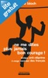

Vous en avez marre d'être rabat-joie, de vivre triste, vous habiller triste, rêver triste&#xa0;? Alors, arrêtez de parler triste&#xa0;! La vie est belle, mais elle est courte. Chaque instant mérite d'être vécu intensément et apprécié à sa juste mesure. C'est possible, et il était temps de le rappeler.  
	Découvrez dans ce "petit" lexique les douze expressions qui vous pourrissent la vie au quotidien sans même vous en rendre compte, et apprenez à vous en débarrasser au plus vite. Cela fera du bien à tout le monde, et permettra d'économiser à la Sécurité Sociale des milliards d'euros en antidépresseurs. Mais surtout, cela libérera votre énergie et vous redonnera envie de l'avenir, infiniment plus excitant que vous ne le pensez. De refaire des projets, de rêver grand, de ne plus vous accrocher à un passé révolu.  
	Avoir peur de tout ne sert à rien, ni à personne. Alors mettez à jour votre logiciel personnel et rejoignez le camp des optimistes&#xa0;! Vous le verrez, le bonheur est contagieux et il est à portée de mots...  
	Découvrez dans cette version Lite gratuite les bonnes feuilles de l'introduction, la conclusion et des 12 chapitres du livre !

[View on Apple](https://books.apple.com/fr/book/ne-me-dites-plus-jamais-bon-courage/id719176350)

## La fille, seule (Un Thriller à Suspense d’Ella Dark, FBI – Livre 1)

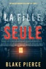

«&#xa0;UN CHEF-D’ŒUVRE DU THRILLER ET DU MYSTÈRE. Blake Pierce a fait un travail magnifique de développement des personnages avec une psychologie si bien décrite que nous ressentons ce qu’ils ressentent, éprouvons leurs peurs et applaudissons leur succès. Plein de rebondissements, ce livre vous tiendra éveillé jusqu’à la dernière page&#xa0;».&#xa0; 
--Roberto Mattos, <i>Books and Movie Review</i> (pour <i>Sans laisser de traces</i>)&#xa0;  
LA FILLE, SEULE (Un Thriller à Suspense d’Ella Dark, FBI – Livre 1) est le premier roman d’une nouvelle série très attendue de l’auteur à succès de best-sellers Blake Pierce, dont le best-seller <i>Sans laisser de traces</i> (à télécharger gratuitement) a reçu plus de 1 000 critiques cinq étoiles.&#xa0;  
L’agente du FBI Ella Dark, 29 ans, se voit offrir une grande chance de réaliser le rêve de sa vie&#xa0;: rejoindre l’Unité des crimes comportementaux. Ella a une obsession cachée&#xa0;: elle a étudié les tueurs en série depuis qu’elle sait lire, dévastée par le meurtre de sa propre sœur. Grâce à sa mémoire photographique, elle possède une connaissance encyclopédique de chaque tueur en série, de chaque victime et de chaque affaire. Distinguée pour son esprit brillant, Ella est invitée à rejoindre la cour des grands.  
Mais lorsqu’un tueur frappe dans les marécages de Louisiane, Ella apprend vite que la réalité n’a rien de prévisible. Face à un vrai meurtre, un vrai tueur et un vrai compte à rebours, Ella se rend compte qu’elle ne peut pas compter sur son savoir. Elle doit apprendre à se fier à son instinct et oser explorer les canaux obscurs de l’esprit d’un vrai tueur. Si elle se trompe, sa carrière est en jeu.  
Et la vie de la prochaine victime aussi.  
Le talent d’Ella sera-t-il un atout&#xa0;? Ou la source de sa chute&#xa0;?  
Thriller policier poignant et passionnant mettant en scène une agente du FBI brillante et torturée, la série ELLA DARK est un mystère fascinant, plein de suspense, de rebondissements, de révélations, sur un rythme effréné qui vous fera tourner les pages jusque tard dans la nuit.  
Les livres 2 et 3 de la série – FILLE PRISE et FILLE CHASSÉE – sont également disponibles.

[View on Apple](https://books.apple.com/fr/book/la-fille-seule-un-thriller-%C3%A0-suspense-della-dark-fbi-livre-1/id1541216478)

## Une vie

Jeanne, fille du baron Simon-Jacques et de la baronne Adélaïde, est une jeune aristocrate qui, pour ses dix-sept ans, quitte le couvent pour commencer une vraie vie. Elle s'en va donc de chez elle avec son père et sa mère qui lui lèguent un château pour y vivre avec son prochain mari. Julien de Lamare, qu'elle rencontre dans les quelques jours suivants sa sortie du couvent, est un véritable avare et un égoïste, mays elle ne le découvre qu'après leur mariage. Il trompe Jeanne avec sa domestique Rosalie qui tombe enceinte, puis avec une voisine du nom de Gilberte de Fourville qui se disait amie avec Jeanne.

[View on Apple](https://books.apple.com/fr/book/une-vie/id492178974)

## Les misérables Tome I

Le livre s'ouvre sur le portrait long et détaillé de monseigneur Myriel, l'évêque du diocèse de Digne, où il vit très modestement en compagnie de sa sœur Baptistine et d'une servante, Madame Magloire. Ce religieux est un juste qui se contente du strict nécessaire pour distribuer le reste de ses économies aux pauvres. Montrant un amour immense, il laisse sa porte grande ouverte et fraternise avec ceux que la société rejette.

[View on Apple](https://books.apple.com/fr/book/les-mis%C3%A9rables-tome-i/id510969617)

## Le comte de Monte-Cristo, Tome II

Le temps est venu pour Monte-Cristo d'accomplir sa vengeance. De ses ennemis, il n'ignore plus rien. Il a percé leurs secrets, exhumé un à un les autres crimes du passé. Danglars, Morcerf, Villefort. chacun sans le savoir est à présent à sa merci. Mais n'a-t-il pas oublié qu'il est un homme et que la moindre faiblesse peut faire tout échouer ?.

[View on Apple](https://books.apple.com/fr/book/le-comte-de-monte-cristo-tome-ii/id511013191)

## L'avare

Représentée pour la première fois à Paris sur le Théâtre du Palais Royal le 9e du mois de septembre 1668 par la Troupe du Roi.

[View on Apple](https://books.apple.com/fr/book/lavare/id666818556)

## Le Misanthrope

Allez, vous devriez mourir de pure honte;Une telle action ne sauroit s'excuser,Et tout homme d'honneur s'en doit scandaliser.Je vous vois accabler un homme de caresses,Et témoigner pour lui les dernières tendresses;De protestations, d'offres et de serments,Vous chargez la fureur de vos embrassements;Et quand je vous demande après quel est cet homme,A peine pouvez vous dire comme il se nomme;Votre chaleur pour lui tombe en vous séparant,Et vous me le traitez, à moi, d'indifférent.Morbleu! c'est une chose indigne; lâche, infâme,De s'abaisser ainsi jusqu'à trahir son âme;Et si, par un malheur, j'en avois fait autant,Je m'irois, de regret, pendre tout à l'instant

[View on Apple](https://books.apple.com/fr/book/le-misanthrope/id667243884)

## 😈 Culbutée devant son Mari - Tome 1

🔥 Quand les tabous deviennent réalités ! 🔥

Catherine a toujours dominé Fabrice entre les draps… mais aujourd’hui, elle veut aller plus loin, beaucoup plus loin. 😈
Un fantasme la consume : goûter d’autres plaisirs, sous les yeux de son mari.

Pour leur anniversaire de mariage, elle enfile une tenue terriblement sexy… sans culotte. Et au restaurant, le regard insistant d’un voisin de table met immédiatement le feu aux poudres. 👀🔥
Fabrice comprend. Catherine a un plan. Un plan audacieux, interdit, excitant.

Va-t-il accepter d’offrir à sa femme ce cadeau de mariage inoubliable ? Ou reculera-t-il devant le désir brûlant qui s’invite à leur table ? 💋💫

[View on Apple](https://books.apple.com/fr/book/culbut%C3%A9e-devant-son-mari-tome-1/id6756352156)

## Le Cid

CHIMÉNE Elvire, m'as-tu fait un rapport bien sincère ? Ne déguises-tu rien de ce qu'a dit mon père ? ELVIRE Tous mes sens à moi-même en sont encore charmés : Il estime Rodrigue autant que vous l'aimez, Et si je ne m'abuse à lire dans son âme, Il vous commandera de répondre à sa flamme.

[View on Apple](https://books.apple.com/fr/book/le-cid/id666826182)

## Mon tourmenteur: Une romance dark

<b>Une nouvelle dark romance de l’auteure Anna Zaires meilleures ventes du <i>New York Times</i>&#xa0;</b>  
Il est venu à moi dans la nuit, un sombre et cruel étranger des coins les plus dangereux de la Russie. Il m'a tourmentée et m'a détruite, mettant en pièces mon monde dans sa quête de vengeance.  
Maintenant, il est de retour, mais ce n’est plus après mes secrets.  
L’homme qui joue dans mes cauchemars me veut.

[View on Apple](https://books.apple.com/fr/book/mon-tourmenteur-une-romance-dark/id1238349449)

## Dr. Stone - Tome 01 - Extrait Gratuit

<b>Survivre et évoluer !</b>  Taiju, un lycéen tokyoïte, est un jour victime d’un phénomène mystérieux : en une fraction de seconde, l’humanité entière est transformée en pierre ! Des milliers d’années plus tard, à son réveil, il décide de rebâtir la civilisation à partir de zéro avec son ami Senku !! Ne manquez pas le premier opus du meilleur récit de survie et d’aventure S.F. de tous les temps !!  Lorsque le scénariste d'<i>Eyeshield 21</i> et le dessinateur de <i>Sun-ken Rock</i>, décident de travailler ensemble, le résultat ne peut être qu'exceptionnel. Issu du prestigieux <i>Weekly Shônen Jump</i>, qui a vu éclore <i>Dragon Ball</i> et <i>One Piece</i>, <i>Dr. Stone</i> séduit d'emblée par son propos novateur et ses enjeux colossaux. Quand le renouveau de l'espèce humaine ne tient qu'à deux garçons, quelles solutions peuvent bien s'offrir à la survie de l'humanité ?

[View on Apple](https://books.apple.com/fr/book/dr-stone-tome-01-extrait-gratuit/id1374224155)

## L'homme Qui Rit

L’Homme qui rit suit les destins croisés de plusieurs personnages. Le premier est Ursus (ours en latin), un vagabond qui s’habille de peaux d’ours et est accompagné d’un loup domestique, Homo (homme en latin). Ursus et Homo voyagent à travers l’Angleterre en traînant une cahute, dont Ursus se sert pour haranguer les foules et vendre des potions.

[View on Apple](https://books.apple.com/fr/book/lhomme-qui-rit/id500615704)

## En route pour la Garderie

Ce livre parle d'une petite fille nommée Yana. Elle se prépare pour une nouvelle journée à la garderie. Yana est enthousiaste&#xa0;: nous voyons sa routine matinale et son excitation grandir au fil du temps. Ce livre est idéal pour établir de nouvelles habitudes et apprendre aux enfants que la garderie peut être une nouvelle expérience merveilleuse. Vous verrez Yana et ses parents se brosser les dents et effectuer d'autres tâches matinales. C'est un très bon livre pour les enfants qui semblent nerveux à l'idée de quitter la maison ou d'aller à la crèche pour la première fois.

[View on Apple](https://books.apple.com/fr/book/en-route-pour-la-garderie/id1591029191)

## La mort en Islam

La mort marque la fin de la vie éphémère ici-bas et le début de la vie éternelle dans l’au-delà, mais que savons-nous vraiment de la mort ?

Nous essayerons d'apporter le plus d'informations à travers 25 questions essentielles.

[View on Apple](https://books.apple.com/fr/book/la-mort-en-islam/id6468871029)

## Le Pouvoir De L'influence Positive

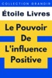

Se faire de nouveaux amis peut être un défi. Rencontrer une nouvelle personne implique généralement des bavardages sans but, des pauses gênantes et un sentiment de malaise lors d'un contact visuel.  En conséquence, la plupart d'entre nous évitent les tracas et la terreur liés à l'idée de se faire de nouveaux amis. Nous restons fidèles à notre cercle de connaissances et évitons les gens que nous ne connaissons pas.  Cependant, nouer de nouvelles amitiés présente des avantages importants.  S'engager dans des activités sociales élargit non seulement votre réseau social, mais améliore également votre capacité à interagir avec d'autres personnes, ce qui peut apporter de nombreux avantages tant au niveau personnel que professionnel.  Depuis que nous avons coexisté pour la première fois dans les plaines africaines, Homo sapiens a reconnu les avantages de vivre en communauté.  Dans le passé, les premiers humains se rassemblaient pour chasser et pratiquer des activités culinaires.  Ils ont reconnu qu'en travaillant ensemble en tant que collectif, leurs chances de survie étaient bien plus grandes que si chacun devait répondre à ses besoins de manière indépendante.

[View on Apple](https://books.apple.com/fr/book/le-pouvoir-de-linfluence-positive/id6479320173)

## Le jour du jugement en Islam

Le jour du jugement représente le moment où la justice sera rendue pour toutes les âmes, d'Adam au dernier Homme sur Terre, mais que savons-nous vraiment du jour du jugement ? Nous essayerons d'apporter le plus d'informations à travers 15 questions essentielles.

[View on Apple](https://books.apple.com/fr/book/le-jour-du-jugement-en-islam/id6472051546)

## Crime and Punishment

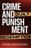

"Crime and Punishment" is a novel written by Fyodor Dostoevsky in 1866. The story follows the impoverished ex-student Rodion Raskolnikov, who commits a brutal murder as an experiment to test his theory that some people are capable of committing crimes without remorse or guilt. As Raskolnikov tries to cover up his crime, he becomes consumed with guilt and paranoia, which eventually leads to his downfall.  
The novel explores themes of morality, guilt, and redemption, and provides a powerful critique of both the legal and moral systems of nineteenth-century Russia. As Raskolnikov struggles to come to terms with his actions, he is forced to confront the consequences of his actions and grapples with questions of justice and punishment.  
Along the way, Raskolnikov encounters a cast of fascinating characters, including his friend Razumikhin, the cunning detective Porfiry Petrovich, and the tragic prostitute Sonya, who helps him to find redemption.  
"Crime and Punishment" is a classic of Russian literature, known for its psychological depth, vivid characters, and gripping plot. It has been adapted into numerous films, television shows, and stage productions, and continues to be a widely read and studied work of literature. The novel is a timeless exploration of the human condition, and it remains as relevant today as it was when it was first published over a century ago.

[View on Apple](https://books.apple.com/fr/book/crime-and-punishment/id6448697439)

## Faits de Psychologie et de Sociologie

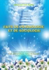

Le Saint Coran qui contient toute la vérité sous sa forme la plus parfaite et la plus complète. Son étude et l'application de ce qu'il recommande illumine l'homme et le rapproche de la perfection. Bien plus, en étudiant le Coran, l'homme acquiert le discernement et comprend sa raison d'être dans le monde d'ici bas. Il appréhende mieux la grande sagesse que recouvre l'univers. Il comprend à la lecture du Coran que ce monde est une école où l'on s'exerce pour réussir et s'élever vers Dieu, l'Excellent Architecte. L'homme est invité dans le Coran à déployer des efforts pour faire du bien, à mette son temps au service du bien dans l'espoir d'avoir une grande récompense auprès de Dieu. Le Coran exige à l'homme une intelligence active afin d'avoir une foi illuminée et parfaite. Dans cet ouvrage intitulé "Faits de Psychologie et de Sociologie" une science tirée du coran qui étudie l'individu dans son environnement sociale, le lecteur prendra connaissance des recherches menées par l'érudit Mohammad Amin Sheikho (1890-1964).

[View on Apple](https://books.apple.com/fr/book/faits-de-psychologie-et-de-sociologie/id1569098007)

## Un mauvais pressentiment (Une Enquête de Keri Locke – Tome 1)

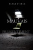

«&#xa0;Une histoire haletante qui vous accroche dès le premier chapitre pour ne plus vous lâcher&#xa0;» 

Ð	Midwest Book Review, Diane Donovan (au sujet de <i>Sans laisser de traces</i>)

Blake Pierce, auteur à succès de romans policiers, nous livre son dernier chef-d’œuvre de suspense. 
Keri Locke, une agent du service des personnes disparues au sein de la police de Los Angeles, n’a qu’une obsession&#xa0;: retrouver sa fille, qui a été enlevée des années plus tôt et n’a jamais été retrouvée. Keri noie sa peine en s’investissant à corps perdu dans ses enquêtes sur des personnes disparues à Los Angeles. 
Un après-midi, elle reçoit un appel d’une maman inquiète, dont la fille adolescente ne donne plus de nouvelles depuis deux heures. Malgré qu’on lui ordonne de l’ignorer, Keri est touchée par l’accent désespéré de cette mère, et décide de mener l’enquête. 
Ce qu’elle va découvrir est choquant&#xa0;: l’adolescente, qui est aussi la fille d’un sénateur américain, avait de nombreux secrets. Tout semble indiquer une fugue, et Keri est dessaisie de l’affaire. Et pourtant, malgré la pression de ses supérieurs, des médias, et malgré l’absence de pistes, Keri persiste. Brillante et obstinée, Keri sait qu’elle n’a que 48 heures pour retrouver la jeune fille vivante. 
<i>Un mauvais pressentiment</i> est un thriller psychologique au suspense haletant, qui ouvre une nouvelle série de romans – et une nouvelle enquêtrice attachante – et qui vous tiendra en haleine jusqu’à la fin. 
«&#xa0;Un chef-d’œuvre de suspense et de mystère&#xa0;! L’auteur a parfaitement réussi à développer la psychologie des personnages, qui sont si bien décrits qu’on se sent dans leur peau et qu’on a peur pour eux. L’intrigue est très bien ficelée et vous captivera tout au long du livre. Ce roman plein de rebondissements vous tiendra en haleine jusqu’à la toute dernière page.&#xa0;» 

Ð	Books and Movie Reviez, Roberto Mattos (au sujet de <i>Sans laisser de traces</i>)

Le deuxième tome de la série Keri Locke sera bientôt disponible.

[View on Apple](https://books.apple.com/fr/book/un-mauvais-pressentiment-une-enqu%C3%AAte-de-keri-locke-tome-1/id1232422181)

## Oliver Twist

Oliver Twist s'inspire au moins en partie de l'histoire autobiographique de Robert Blincoe, publiée dans les années 1830 et très appréciée du public — même si subsiste un doute quant à son authenticité — où l'auteur, orphelin élevé à la dure dans un hospice paroissial, est soumis à un labeur forcé et aux pires souffrances dans une manufacture de coton.

[View on Apple](https://books.apple.com/fr/book/oliver-twist/id510859642)

## 30 choses à savoir avant de se convertir à l'Islam

Tu es sur le point de te convertir à l'Islam et tu te rends compte que les vidéos en ligne ne répondent pas à toutes tes questions ? Ce livre te donne des informations claires et essentielles, couvrant 30 points importants pour mieux comprendre et pratiquer ta foi.

[View on Apple](https://books.apple.com/fr/book/30-choses-a-savoir-avant-de-se-convertir-a-lislam/id6605935156)

## Eclaire moi sur le Coran

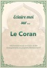

Plongez dans une série captivante en explorant les fondements essentiels de l'Islam.

Chaque volume de cette série vous permettra d'explorer les bases de la foi, dévoilant les enseignements du Coran et du prophète Mohammed (paix et salut soient sur lui).

Cette série offre un regard clair et accessible sur les aspects fondamentaux de l'Islam, visant à enrichir la compréhension et la réflexion de tous.

Embarquez pour un voyage où la sagesse de l'Islam est présentée de manière simple et concise.

[View on Apple](https://books.apple.com/fr/book/eclaire-moi-sur-le-coran/id6473804010)

## Le Collège maléfique (Tome 1) - extrait gratuit

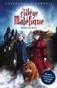

Pendant treize ans, Emma Dreamaker avait réussi à cacher ses pouvoirs, échappant ainsi à la vigilance du Ministère. Jusqu’au jour où elle reçoit sa lettre d’admission pour l’École des Enfants Spéciaux. La jeune fille n’a pas le choix, elle doit entrer dans ce collège étrange qui dissimule de terrifiants secrets. Peu à peu, Emma plonge dans un monde sombre et inconnu, peuplé de monstres et de démons. Un monde qu’elle va devoir affronter si elle veut survivre.

[View on Apple](https://books.apple.com/fr/book/le-coll%C3%A8ge-mal%C3%A9fique-tome-1-extrait-gratuit/id1521675013)

## Marie, la toute petite souris

Marie est une toute petite souris, plus petite que les autres. Elle est atteinte d’achondroplasie, une maladie génétique qui l’empêche de grandir normalement.  Sa petite taille sera-t-elle un obstacle à l’accomplissement de grandes choses ?  À PROPOS DES AUTEURS  Secrétaire médicale, <b>Sonia Goerger</b> accueille et rencontre, depuis plusieurs années, de nombreux patients de génétique. Ce contact lui a donné envie de créer la collection de livres pour enfants « Les Enfants de la Génétique ».  Les livres de la collection abordent les difficultés que les patients peuvent être amenés à vivre au quotidien avec des mots simples et des personnages attachants.  Graphiste pendant plusieurs années, <b>Élodie Garcia</b> s’est reconvertie en tant qu’auteure et illustratrice de livres pour enfants et bandes dessinées. La délicatesse de son trait lui permet d’aborder, tout en douceur, des sujets parfois difficiles. En illustrant la collection « Les Enfants de la Génétique », Élodie Garcia espère pouvoir aider les familles confrontées aux maladies rares.  <b>L’association ARGAD</b> (Association de Recherche en Génétique et d’Accompagnement des familles et professionnels de Dijon-Bourgogne) est une association de loi 1901, à but non lucratif, créée en septembre 2010. Cette association soutient le développement de la FHU-TRANSLAD par de nombreuses actions : - améliorer les conditions d’accueil et de prise en charge des patients atteints de maladies rares en Bourgogne, - diffuser des informations sur les maladies rares par l’organisation de réunions spécifiques, - aider les médecins et les professionnels de santé impliqués dans les maladies génétiques rares à approfondir leur formation et améliorer leurs connaissances dans ce domaine, - soutenir les activités de recherche clinique et biologique dans le domaine de la génétique des anomalies du développement en Bourgogne.

[View on Apple](https://books.apple.com/fr/book/marie-la-toute-petite-souris/id1613346077)

## The Odyssey

An Apple Books Classic edition.  
Homer’s eighth-century epic poem is a companion to <i>The Iliad</i>. It tells the story of Odysseus, who journeys by ship for 10 years after the Trojan War, trying to make his way back home to Ithaca. Homer’s work was intended to be performed out loud, so it’s a masterful example of poetic meter and rhythm. But above all, <i>;The Odyssey</i> is a story of adventure-and true love.  
Odysseus has been gone for 20 years, and he longs to reclaim his role as king and reunite with his beloved, faithful Queen Penelope. During his absence, hundreds of suitors have eaten his food, lived in his home, and even plotted to kill his son. But before he can confront his enemies at home, Odysseus must fight a cyclops, escape after being imprisoned by a lovesick nymph, and confront the twin terrors of Scylla and Charybdis. As if that wasn’t enough, the gods take their grudges out on him, adding obstacles to suit their whims. Will Odysseus ever get home? And what will he find once he does? Within the pages of this ancient Greek classic are the origins for many of the myths we’re familiar with today. Pick up a copy and meet Odysseus, Homer’s timeless hero.

[View on Apple](https://books.apple.com/fr/book/the-odyssey/id395540967)

## Discours de la méthode

Le Discours de la méthode est aussi l'occasion pour Descartes de présenter une morale provisoire, tenant en quelques maximes de conduite, et de développer des considérations sur les animaux (théorie des « animaux-machines ») et sur le rôle du cœur dans la circulation du sang. Enfin, le traité présente des déclarations sur le rapport de l'homme à la nature, représentatives de la modernité, puisque Descartes y dit que les hommes doivent se « rendre comme maîtres et possesseurs de la nature », par le progrès des techniques, au premier plan desquelles il recommande d'améliorer la médecine.

[View on Apple](https://books.apple.com/fr/book/discours-de-la-m%C3%A9thode/id508334709)

## Les 5 piliers de l'Islam

Beaucoup d'entre nous ont entendu parler des cinq piliers de l'Islam, mais combien savent à quoi ils correspondent ? Ces cinq piliers sont les bases de l'Islam.

Dans ce livre, nous allons explorer ces piliers, de leur origine à leurs conditions.

Nous espérons que cet ouvrage vous donnera une meilleure compréhension de l’Islam.

[View on Apple](https://books.apple.com/fr/book/les-5-piliers-de-lislam/id6496133035)
