- [Dynastie Hariston - Tome 1](#dynastie-hariston-tome-1)
- [Celle qui sait](#celle-qui-sait)
- [Recherche faux mec pour vrai plan C...aliente](#recherche-faux-mec-pour-vrai-plan-c-aliente)
- [Les heures fragiles](#les-heures-fragiles)
- [Le dîner](#le-di-ner)
- [Play with me, Boss](#play-with-me-boss)
- [Le secret de Jeanne](#le-secret-de-jeanne)
- [Off-campus - Tome 02](#off-campus-tome-02)
- [First Line](#first-line)
- [Le boyfriend](#le-boyfriend)
- [Just romance, tome 1 : Et si tu me laisses partir...](#just-romance-tome-1-et-si-tu-me-laisses-partir)
- [L'odyssée de l'Odyssée](#l-odysse-e-de-l-odysse-e)
- [La locataire](#la-locataire)
- [Triple Effect - Tome 01](#triple-effect-tome-01)
- [Le Crime du paradis - Nouveau roman 2026](#le-crime-du-paradis-nouveau-roman-2026)
- [Les secrets de la femme de ménage](#les-secrets-de-la-femme-de-me-nage)
- [Le Calamity Club](#le-calamity-club)
- [Archange](#archange)
- [Off campus The deal Saison 1](#off-campus-the-deal-saison-1)
- [Let it burn](#let-it-burn)
- [Un cantique pour Leibowitz](#un-cantique-pour-leibowitz)
- [La Ferme du bout du monde](#la-ferme-du-bout-du-monde)
- [Night Shift](#night-shift)
- [Nous qui avons connu Solange](#nous-qui-avons-connu-solange)
- [La Colline - Grand Prix des lectrices de ELLE policier 2026](#la-colline-grand-prix-des-lectrices-de-elle-policier-2026)
- [Les morsures du silence - Prix Maison de la presse 2025](#les-morsures-du-silence-prix-maison-de-la-presse-2025)
- [Rhapsody in blue (dark romance)](#rhapsody-in-blue-dark-romance)
- [Hollow Boys #1 - The Lies We Steal](#hollow-boys-1-the-lies-we-steal)
- [Swan - Tome 1](#swan-tome-1)
- [Lies & Truths Duet - tome 1 : All the lies](#lies-truths-duet-tome-1-all-the-lies)
- [Castel boy](#castel-boy)
- [Give Us a Chance](#give-us-a-chance)
- [Les Femmes du bout du monde](#les-femmes-du-bout-du-monde)
- [Mad majesty](#mad-majesty)
- [Le Portier](#le-portier)
- [Brimstone - Fae & Alchimie - tome 2 (version française)](#brimstone-fae-alchimie-tome-2-version-franc-aise)
- [The Windsor (Tome 1) - The Wrong Bride](#the-windsor-tome-1-the-wrong-bride)
- [Brûlez tout](#bru-lez-tout)
- [Fire & Desire - Tome 1 : La Promise du roi des flammes](#fire-desire-tome-1-la-promise-du-roi-des-flammes)
- [Amoureuse d’un comte](#amoureuse-d-un-comte)
- [Fourth Wing - Version française](#fourth-wing-version-franc-aise)
- [Le Mariage parfait](#le-mariage-parfait)
- [L'Arbre de fer](#l-arbre-de-fer)
- [Tenir debout](#tenir-debout)
- [L'Autre moi](#l-autre-moi)
- [Macallan](#macallan)
- [La femme de ménage voit tout](#la-femme-de-me-nage-voit-tout)
- [Donner l'ordre ne suffit pas](#donner-l-ordre-ne-suffit-pas)
- [Captive - tome 2](#captive-tome-2)
- [La femme de ménage](#la-femme-de-me-nage)
- [The World's Game](#the-world-s-game)
- [Briar university - Tome 04](#briar-university-tome-04)
- [Captive - tome 1](#captive-tome-1)
- [Battle Chasers - Intégrale](#battle-chasers-inte-grale)
- [D'autres printemps](#d-autres-printemps)
- [L’invitée surprise](#l-invite-e-surprise)
- [La belle famille](#la-belle-famille)
- [Lakestone - tome 1](#lakestone-tome-1)
- [SEAL Team 9, Tome 1 - Alt](#seal-team-9-tome-1-alt)
- [Redline](#redline)
- [L'Héritier Rebelle](#l-he-ritier-rebelle)
- [Toutes les nuances de la nuit](#toutes-les-nuances-de-la-nuit)
- [Clamser à Tataouine](#clamser-a-tataouine)
- [Le Syndrome du spaghetti](#le-syndrome-du-spaghetti)
- [Danse de mort](#danse-de-mort)
- [L'Alchimiste](#l-alchimiste)
- [Celles qui ne dorment pas](#celles-qui-ne-dorment-pas)
- [The Nanny](#the-nanny)
- [Windy City - Tome 1 Mile High](#windy-city-tome-1-mile-high)
- [Dear Ava](#dear-ava)
- [Dynastie Hariston - Tome 2](#dynastie-hariston-tome-2)
- [L'intruse](#l-intruse)
- [Hunter](#hunter)
- [La Dernière allumette](#la-dernie-re-allumette)
- [Les sept sœurs](#les-sept-sœurs)
- [The Deal](#the-deal)
- [La femme de ménage se marie](#la-femme-de-me-nage-se-marie)
- [Une unique lueur](#une-unique-lueur)
- [Ma Voisine](#ma-voisine)
- [Off-campus - Tome 05](#off-campus-tome-05)
- [Les Suppliciées du Rhône](#les-supplicie-es-du-rho-ne)
- [La prof](#la-prof)
- [Personne ne doit savoir](#personne-ne-doit-savoir)
- [Kingdom Duet - Tome 1 : Reign of a King](#kingdom-duet-tome-1-reign-of-a-king)
- [Sweet regret](#sweet-regret)
- [Le jour où Rose a disparu](#le-jour-ou-rose-a-disparu)
- [Memento mori (dark romance)](#memento-mori-dark-romance)
- [Changer l'eau des fleurs](#changer-l-eau-des-fleurs)
- [L'héritier - Les Yakuzas T2](#l-he-ritier-les-yakuzas-t2)
- [Off-campus - Tome 04](#off-campus-tome-04)
- [Dans la ligne de tir](#dans-la-ligne-de-tir)
- [La Sœur du soleil](#la-sœur-du-soleil)
- [Langage corporel](#langage-corporel)
- [If you stayed](#if-you-stayed)
- [The Bucket List](#the-bucket-list)
- [La maison des pancakes aux fraises](#la-maison-des-pancakes-aux-fraises)
- [Le roi de la guerre et du sang](#le-roi-de-la-guerre-et-du-sang)
- [Kings of the Ice - tome 3 - Learn your lesson](#kings-of-the-ice-tome-3-learn-your-lesson)
- [L'As de coeur](#l-as-de-coeur)
- [La Passion du Comte](#la-passion-du-comte)

## Dynastie Hariston - Tome 1

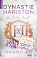

Elle voulait fuir son passé, mais il est plus séduisant que jamais et bien décidé à la rattraper. Des années après la trahison de Nate, son premier amour, Kara pensait avoir laissé derrière elle ce chapitre douloureux. Mais le destin en décide autrement : elle se voit confier l’organisation du mariage de Nate… avec son ancienne meilleure amie&#xa0; ! Une telle situation pourrait mettre en péril le secret qu’elle protège depuis toujours : Kara était enceinte lorsqu’elle s’est enfuie. Nate est désormais à la tête d’un empire puissant, et n’a plus rien du garçon qu’elle a connu. Il paraît mépriser Kara et ne tolérer sa présence que par obligation. Pourtant, derrière son indifférence glaciale, une possessivité silencieuse continue de le lier à elle. La priorité de Kara est de protéger son secret à tout prix, tout en affrontant celui qui l’a brisée. Mais l’homme d’affaires réveille des émotions qu’elle pensait enterrées à jamais, faisant vaciller les murs qu’elle a érigés pour se préserver…

[View on Apple](https://books.apple.com/fr/book/dynastie-hariston-tome-1/id6742996011)

## Celle qui sait

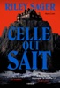

<b>TOUT LE MONDE EST CONVAINCU QUE LENORA HOPE EST LA TUEUSE. ET VOUS ?</b>  Le massacre de la famille Hope, lors d'une nuit sanglante de 1929, a bouleversé les habitants du Maine. Si la plupart des gens sont persuadés que Lenora, dix-sept ans, en est responsable, la police n’a jamais pu le prouver. Après avoir nié à l’époque toute implication, l’intéressée n’a plus quitté Hope’s End, le manoir dressé en bord de falaise où le drame s’est produit.  Nous sommes en 1983 lorsque Kit McDeere, aide-soignante à domicile, se présente pour s’occuper de Lenora après la fuite inexpliquée de sa précédente infirmière. Âgée de plus de soixante-dix ans et en fauteuil roulant, Lenora a été rendue muette par une série d’AVC. Elle ne peut communiquer avec Kit que grâce à une vieille machine à écrire.  Jusqu’au soir où, de son seul doigt valide, elle commence à taper : <b><i>je veux tout vous raconter</i></b>  Auteur best-seller, <b>RILEY SAGER </b>a écrit neuf thrillers publiés dans plus de vingt pays. Né en Pennsylvanie, il vit à Princeton, dans le New Jersey.  « Un vrai choc. » <b>LISA GARDNER</b> « Des twists à couper le souffle. » <b>SHARI LAPENA</b> « Une lecture d’enfer. » <b>RACHEL HAWKINS</b> « Terrifiant. » <b>KARIN SLAUGHTER</b>

[View on Apple](https://books.apple.com/fr/book/celle-qui-sait/id6767224898)

## Recherche faux mec pour vrai plan C...aliente

Après des années à enchaîner les coups d’un soir, l’impétueuse Alba s’est posée. Elle s’apprête à épouser l’homme de sa vie.   La belle photographe ne s’attendait donc pas à ce que le ciel lui tombe sur la tête le jour de son mariage. Elle apprend avec horreur que son fiancé l’a trompée avec la strip-teaseuse de l’enterrement de vie de garçon !   Toutefois, hors de question de se laisser abattre, même par le pire des chagrins d’amour. Elle plaque le mufle infidèle et décide de partir en voyage de noces en Égypte... toute seule !   C’était compter sans Ayden, le frère ultra craquant de son ex, venu superviser un chantier de fouilles archéologiques à Sunshine. Un concours de circonstances amène ce scientifique sexy, HPI et plus jeune qu’Alba, à l’accompagner durant sa croisière, sur le Nil.   Suite à un quiproquo, il joue son faux mec pour donner le change auprès du groupe. Le brillant archéologue confie son secret à son ex-belle-sœur : il s’est tellement investi dans sa carrière qu’il manque d’expérience avec la gent féminine.    Alors, tant qu’à faire... Pourquoi ne pas accepter la proposition indécente d’Ayden, qui demande à Alba de parfaire son initiation charnelle afin de conquérir la fille de ses rêves ?   On n’est plus à un plan c... aliente foireux près, non ?

[View on Apple](https://books.apple.com/fr/book/recherche-faux-mec-pour-vrai-plan-c-aliente/id6746715448)

## Les heures fragiles

Diane a toujours eu des rêves simples. Un mari, deux enfants, un métier qui lui plaît, c'est plus que ce qu'elle osait espérer. Le jour où Seb la quitte, son monde vacille. Absorbée par sa peine, elle ne voit pas que le drame se joue ailleurs. Tout près d'elle, dans cette chambre qui fait face à la sienne, les rires de sa fille s'épuisent. Lou a seize ans, le mal de grandir, et son premier chagrin d'amour lui arrache plus que des larmes. Quand Diane comprend, elle est prête à tout pour l'aider. Y compris à retourner vers un passé qu'elle avait fui. Ensemble, mère et fille marchent sur un fil. Sous leurs pas, le torrent de la vie gronde et emporte avec lui les heures fragiles.

[View on Apple](https://books.apple.com/fr/book/les-heures-fragiles/id6743445041)

## Le dîner

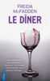

Vous êtes fauchée et vous risquez d’être expulsée de votre appartement. Alors quand une amie vous propose un job de serveuse lors d’un dîner chic dans un manoir totalement isolé, vous croyez rêver. Le salaire pour la soirée ? De quoi couvrir deux mois de loyer et vous remettre sur pied. C’est la chance de votre vie.  Pourtant, une petite voix intérieure vous murmure que c’est trop beau pour être vrai. Il y a forcément quelque chose de louche dans l’histoire… Peut-être devriez-vous refuser ?&#xa0;   La décision vous appartient. Serez-vous assez prudente pour rester chez vous ? Accepterez-vous de faire monter cet auto-stoppeur étrange sur la route du manoir ? Tournerez-vous à gauche ou à droite à la bifurcation ? Dans ce thriller psychologique interactif, chaque choix vous rapproche de la vérité... et de votre pire cauchemar.

[View on Apple](https://books.apple.com/fr/book/le-d%C3%AEner/id6775776681)

## Play with me, Boss

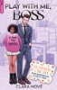

Un patron sexy et impitoyable, dans un jeu de séduction où les règles sont faites pour être brisées.&#xa0;   Carmindy Suarez trouve refuge dans l'univers des jeux vidéo en ligne, préférant cet espace virtuel à la réalité. Aucun petit-ami, deux copines virtuelles, et zéro expérience professionnelle... Sa mère ne lui laisse plus le choix : elle doit trouver un travail et vite !&#xa0;  Mais quand la jeune femme se présente à son entretien d'embauche, défaitiste et débraillée, elle s'attendait à tout, sauf à être engagée... par un boss très sexy.&#xa0;  Stetson May, intransigeant et psychorigide, est loin d'être le patron idéal. Déterminé à pousser sa nouvelle assistante, aussi attirante qu'impertinente, à quitter son poste, il redouble de créativité pour faire de son quotidien un enfer.&#xa0;  Ce que le jeune boss ignore alors, c'est que son assistante est une championne hors pair tous jeux confondus, prête à tout pour triompher. Finalement, Stetson pourrait bien succomber le premier.

[View on Apple](https://books.apple.com/fr/book/play-with-me-boss/id6477822992)

## Le secret de Jeanne

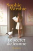

Trois femmes, trois époques et un mystérieux héritage&#xa0;: celui d’un secret jamais révélé. 
 
Tout commence quand Alexandra apprend le décès de son père… qu’elle croyait mort depuis dix-sept ans. La jeune femme n’ose pas interroger sa mère, certaine qu’elle gardera le silence. Au même moment, elle doit vider la maison de sa grand-mère tant aimée. C’est dans le sac à main de cette dernière qu’elle découvre un plan mystérieux qui lui révèle, près de la chambre, l’existence d’une porte cachée. Et derrière, sans doute, autant de secrets à percer. 
En entremêlant, avec une écriture aussi romanesque qu’inspirée, trois destinées féminines à trois époques différentes, Sophie Astrabie construit un roman vertigineux sur ce que l’on transmet malgré soi. Et, ce faisant, elle embrasse tout un pan de l’histoire des femmes.

« Une histoire captivante »
FRANCE BLEU

« Une lecture intimiste, captivante, à glisser dans sa valise cet été »
ELLE

« Sophie Astrabie noue et dénoue les fils à travers des héroïnes qu’on aimerait accompagner aussi longtemps que possible »
TELE LOISIRS

« Un roman vif, qui traite du secret et de la transmission, sous forme de puzzle »
+ DE PEP'S MAGAZINE

« Trois femmes, trois destinées, trois époques différentes pour un roman vertigineux axé sur la transmission et la lignée. Une réussite ! »
ICI PARIS

« Une écriture romanesque qui construit un roman vertigineux sur ce que l’on transmet malgré soi. Une belle lecture pour cet été ! »
LE COURRIER DE MANTES

« Un roman de filiation et de réconciliation »
L'EVENTAIL

« Un page-turner qui pose également la question de la transmission. »
PLEINE VIE

« Le rythme des révélations, posées par touche entre passé et présent, maintient en haleine jusqu’à l’épilogue. »
LE POPULAIRE DU CENTRE

« Un puzzle narratif haletant, où chaque révélation bouleverse. »
LA DEPÊCHE

[View on Apple](https://books.apple.com/fr/book/le-secret-de-jeanne/id6744737031)

## Off-campus - Tome 02

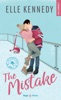

<b>C'est un joueur et pas uniquement sur le terrain...</b> John Logan est un star de l'équipe de Hockey ce qui lui permet d'avoir toutes les filles qu'il veut.  Mais derrière ses sourires de tueurs et son charme ravageur, se cache un être blessé et inquiet de son avenir qui ne s'annonce pas tout rose.  Quand il rencontre Grace, étudiante en première année, et il se dit qu'elle sera la fille idéale pour lui changer les idées. Mais Grace fini par le repousser à cause de son comportement et John va devoir se mettre en quatre s'il veut la récupérer.  Grace n'est plus la jeune fille timide et innocente du début de l'année, et elle compte bien lui faire payer son erreur. John va devoir élever son niveau de jeu.

[View on Apple](https://books.apple.com/fr/book/off-campus-tome-02/id6445271925)

## First Line

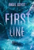

<b>Il fera tout pour l'avoir. Elle fera tout pour lui résister. </b>    Après une rupture douloureuse, Olivia change d’université pour tout recommencer. Elle voit cette nouvelle année comme une chance de se reconstruire et se fixe une seule règle : aucune histoire d’amour.   Nathan, lui, voulait se concentrer sur le hockey. Pourtant sa rencontre avec Olivia bouleverse tous ses plans. Le coup de foudre est instantané et la jeune femme devient son obsession.   Malgré ses bonnes intentions, Olivia refuse d’ouvrir son cœur au capitaine de l’équipe de hockey et meilleur ami de son frère. Mais Nathan est déterminé et il est prêt à tout pour la conquérir.   Entre tension et regards brûlants, leur attirance ne cesse de grandir. Résister devient impossible... et tomber amoureux, inévitable.

[View on Apple](https://books.apple.com/fr/book/first-line/id6766841581)

## Le boyfriend

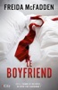

Célibataire, Sydney n’a jamais eu vraiment de chance en amour. Jusqu’au jour où elle rencontre Tom. Il est charmant, séduisant, et médecin dans un hôpital. C’est l’homme idéal et Sydney est conquise.  Et puis, un jour, le meurtre barbare d’une femme sème la terreur dans la ville. Ce n’est que le dernier crime d’une série déjà longue. Le profil du suspect ? Un homme mystérieux qui entretiendrait une relation avec ses victimes avant de les assassiner.  Avec Tom à ses côtés, Sydney devrait se sentir en sécurité. Mais elle ne peut s’empêcher de trouver que quelque chose ne va pas, elle a le sentiment que cet homme parfait lui cache quelque chose... et puis, depuis quelque temps, elle se sent suivie et épiée. Sydney doit absolument découvrir au plus vite la vérité. Sinon...

[View on Apple](https://books.apple.com/fr/book/le-boyfriend/id6749051701)

## Just romance, tome 1 : Et si tu me laisses partir...

« Pas de nom. Pas d’histoire. Pas de complications. »   C’est ce que Romance a exigé de l’inconnu sexy avec qui elle a passé cette nuit, il y a six mois.   Talentueuse mais asociale, Romance travaille au sein de la très réputée Burnett-Grey Agency. Son job ? Concevoir les plus efficaces des campagnes publicitaires.   Aussi, lorsqu’elle apprend que son agence est en compétition pour remporter le contrat du groupe Cazadilla Stars, dirigé par le charismatique César Cazadilla, elle est enthousiasmée.   Le problème ? Le redoutable « chef Godzilla », réputé autant pour sa cuisine que pour son tempérament volcanique, n’est pas un inconnu pour elle. Bien au contraire, puisqu’elle a couché avec, cette fameuse nuit...   Or, si Romance semble être passée à autre chose, César, lui, n’a pas pu oublier cette mystérieuse et sensuelle jeune femme.   Lui veut à tout prix la récupérer, quand elle espère ne rien dévoiler de ses lourds secrets.   Entre jeux de pouvoir et passés douloureux, Romance et César devront affronter les conséquences de leurs décisions.   César l’a déjà laissée partir une fois et il se pourrait bien qu’il n’ait pas d’autre choix que de recommencer...

[View on Apple](https://books.apple.com/fr/book/just-romance-tome-1-et-si-tu-me-laisses-partir/id6743739726)

## L'odyssée de l'Odyssée

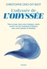

Les sirènes tentatrices, l’infâme cyclope, Circé et ses pourceaux, et bien sûr Ulysse, mari aimant et roi éclairé, qui parvient après mille détours à rentrer chez lui auprès de sa fidèle épouse pour récupérer sa terre et n’en plus bouger… Voilà ce qu’on nous a toujours raconté des aventures d’Ulysse dans L’Odyssée. Mais lit-on encore vraiment les 12 000 vers d’Homère, ou de celui qu’on appelle Homère&#xa0; ? Or, les lire en compagnie d’un passeur passionné comme Christophe Ono-dit-Biot, c’est découvrir, au-delà des images d’Épinal moralisatrices et simplistes, un univers beaucoup plus riche, sensuel, brutal, complexe et captivant. L’entreprise de l’auteur est directe, généreuse et efficace&#xa0; : raconter L’Odyssée aux adultes, en suivant l’ordre des chants, dans une succession de brefs chapitres qui nous content au plus près du texte les aventures des héros et des héroïnes, des déesses et des dieux, mais creusent aussi le sens profond que les contemporains leur donnaient et les leçons que nous pouvons en tirer aujourd’hui. Nous comprenons enfin pourquoi&#xa0; L’Odyssée, l’une des plus merveilleuses inventions littéraires de tous les temps, fascine toujours, près de trente siècles après qu’elle a été fixée par écrit, et comment elle nous aide encore à naviguer dans les brouillards de notre époque. A prendre, aussi, un plaisir fou. Un livre romanesque en diable, à la pédagogie charmeuse&#xa0; et à l’érudition toujours ludique : le «&#xa0; gai savoir&#xa0; » à la portée de toutes et de tous.

[View on Apple](https://books.apple.com/fr/book/lodyss%C3%A9e-de-lodyss%C3%A9e/id6761003343)

## La locataire

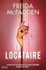

Rien ne va plus pour Blake. Licencié brutalement, il n’arrive plus à payer le prêt immobilier de la nouvelle maison qu'il partage avec sa fiancée. La solution ? Prendre une locataire pour les aider à payer les frais de la maison.&#xa0;   Et Whitney correspond exactement à ce que le jeune couple recherche. Elle est sympathique, charmante, sérieuse. La locataire parfaite. En apparence. Rapidement, quelque chose cloche. Une odeur putride imprègne la maison et des bruits étranges réveillent Blake au milieu de la nuit.&#xa0;   Et bientôt, il commence à redouter que quelqu'un découvre ses secrets les plus sombres. Le danger a pénétré dans sa maison, et lorsqu’il s'en rend compte, il est bien trop tard : le piège est sur le point de se refermer…

[View on Apple](https://books.apple.com/fr/book/la-locataire/id6756112410)

## Triple Effect - Tome 01

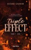

<b>De l'amour à la haine, il n'y a qu'une flamme à souffler.</b>  Devi Leela Paramar, aka Devi-L, est à bout de nerfs. Cela ne fait que quelques semaines qu’elle est de retour à Princeton, sa ville natale, <b>et tout part déjà en vrille.</b>  L’appartement de sa meilleure amie, qui l’accueillait, a pris feu et <b>elle est obligée d’aller vivre chez les «&#xa0;Triple X&#xa0;», les triplés les plus sexy de tout le New Jersey</b> –&#xa0;et accessoirement ses meilleurs amis depuis l’enfance... Mais entre Xander, le sportif au grand cœur aussi drôle qu'agaçant, Xyler, le rebelle amoureux de la musique qui dégage un magnétisme indécent, et Xael, un manipulateur extrêmement habile qui se passionne pour la politique, <b>il y a de quoi perdre la tête ! Surtout quand son cœur bat très fort pour l’un d’eux…</b>  Non, vraiment&#xa0;: <b>c'est plus qu'elle ne peut en supporter.</b>  Et si l'on ajoute à toutes ces turbulences déjà plus que chaotiques <b>son deuil pas tout à fait terminé,</b> ses résultats universitaires médiocres, sa mère qui s'est fait la malle en Jamaïque avec son amant et plus de la moitié de son héritage, sa cousine qui traverse une crise existentielle à l'autre bout du pays, ainsi que<b> l’arrivée d’un nouvel inspecteur chaud comme la braise</b> et chargé d’attraper le pyromane qui met le feu à tout ce que Devi aime… <b>elle le sent, elle est sur le point de craquer.</b>

[View on Apple](https://books.apple.com/fr/book/triple-effect-tome-01/id6761269289)

## Le Crime du paradis - Nouveau roman 2026

Une histoire sombre et splendide dans une Côte d’Azur magnétique et sensuelle  Florence et Julian Livingstone, un couple d’Américains fortunés, réunissent chaque été un petit cercle d’amis dans leur somptueuse maison du cap d’Antibes.  Mais ce monde idyllique s’effondre la nuit où Oscar, leur fils de trois ans, est enlevé dans des conditions mystérieuses. Alors que l’affaire passionne le monde entier et que la peur se répand, le policier chargé de l’enquête se heurte à un mur de mensonges et de secrets. Son chemin va croiser celui de la jeune romancière Agatha Harding qui espère s’emparer du drame pour écrire un best-seller… &#xa0;   Un suspense renversant où l’esprit d’Agatha Christie rencontre l’atmosphère fiévreuse de Tendre est la nuit jusqu’à un dénouement prodigieux  Un immense plaisir de lecture &#xa0;   « LE ROI DU NOIR EUROPÉEN. »&#xa0; La Repubblica, Italie « UN PHÉNOMÈNE. »&#xa0; El Mundo, Espagne « LE MAÎTRE FRANÇAIS DU SUSPENSE. »&#xa0; The New York Times, États-Unis «&#xa0; IL N'EST PAS ÉTONNANT QUE GUILLAUME MUSSO SOIT L'UN DES AUTEURS LES PLUS APPRÉCIÉS DE FRANCE. » Harlan Coben  #LeCrimeduParadis

[View on Apple](https://books.apple.com/fr/book/le-crime-du-paradis-nouveau-roman-2026/id6758297017)

## Les secrets de la femme de ménage

C’est une chance inespérée pour Millie d’avoir décroché un nouveau travail. Chez les Garrick, un couple fortuné qui possède un somptueux appartement avec vue sur New York, elle fait le ménage et prépare les repas dans la magnifique cuisine.  Cela paraît trop beau pour être vrai. Et effectivement, la femme de ménage ne tarde pas à déceler quelques ombres au tableau… Son patron, Douglas Garrick, est d’humeur de plus en plus changeante. Et pourquoi sa femme Wendy reste-t-elle toujours enfermée dans la chambre d’amis&#xa0; ?  Le jour où Millie découvre du sang sur une chemise de nuit, elle ne peut plus rester les bras croisés. Quelque chose se trame dans cette maison. Une situation à laquelle Millie n’est pas préparée et qui pourrait bien se retourner contre elle si elle continue de vouloir découvrir les secrets des autres…

[View on Apple](https://books.apple.com/fr/book/les-secrets-de-la-femme-de-m%C3%A9nage/id6467242209)

## Le Calamity Club

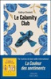

<b>Après plus de 15 ans d'absence et 15 millions d'exemplaires vendus dans le monde, le grand retour de Kathryn Stockett, l'autrice de<i>La Couleur des sentiments.</i>Bienvenue dans<i>Le Calamity Club</i>, une histoire de résilience et d'amitié où la solidarité féminine n'a d'égale que la soif de justice et de liberté.</b>  <i>" Si on donne à une fille une bouffée d'air frais et qu'ensuite on la lui reprend, elle se battra comme une lionne pour la récupérer. "</i>Mississipi, 1933.  Meg, onze ans, a appris à ne compter sur personne. Depuis que sa mère l'a abandonnée, elle fait partie des grandes filles " inadoptables " de l'orphelinat, où elle se bat chaque jour pour garder espoir malgré le mépris et la cruauté de la présidente. Birdie, missionnée d'aller retrouver sa sœur récemment mariée à un riche banquier pour sauver sa famille ruinée, découvre un foyer parfait en apparence mais qui repose en réalité sur un tissu de mensonges. Charlie, internée de force dans un asile après avoir été jugée " faible d'esprit ", est prête à tout pour récupérer sa fille perdue et retrouver sa dignité. Trois destins qui vont se rencontrer par la force du hasard autour de l'orphelinat du comté de Lafayette, puis converger avec celui d'un groupe de femmes intrépides qui élaborent un plan audacieux : le " Calamity Club ". Mais dans une ville où règne l'hypocrisie, le moindre acte de défi vous expose à tous les dangers... Quel sera le prix à payer pour leur désobéissance ?  ----------------------------------------------  <b>" Intelligent, drôle, et porté par des personnages inoubliables dont les idées et les actions jaillissent de la page. À lire absolument ! " Bonnie Garmus</b>  <b>" Aussi fin, audacieux, et entraînant que déchirant et empreint de compassion,<i>Le Calamity Club</i>est une narration de haut vol. Les personnages construits avec brio par Stockett sont tout simplement inoubliables. Bravo à Meg, Birdie et Charlie, qui nous rappellent de ne jamais sous-estimer la résilience inébranlable de femmes intelligentes et fougueuses qui se révoltent contre l'injustice. " Shelley Read</b>  <b>" Grâce à sa narration délicieuse et ses personnages inoubliables,<i>Le Calamity Club</i>est une lecture qui vous rend heureux, vous brise et vous réchauffe le cœur en même temps. Je l'ai tellement aimé. " Jennie Godfrey</b>

[View on Apple](https://books.apple.com/fr/book/le-calamity-club/id6759027641)

## Archange

<b>Il l'a aimée en secret. Il l’a quittée en silence. Elle ira le chercher en enfer.</b>   Je suis l’Archange. La CIA m’a façonné pour être une ombre, tuer sans trembler, mentir sans me trahir. Aimer n’a jamais fait partie de ma mission, surtout Kristen, la sœur de Hunter qui a juré de me réduire en poussière si je m’approchais d’elle.  Notre histoire était clandestine, fragile... parfaite. Seulement mon passé a refait surface, brutal, implacable. Alors je pars. Sans un mot. Parce que certains secrets sont trop lourds pour être partagés.  -   Je croyais connaître Gabriele, l’homme derrière l’Archange. Celui qui me regardait comme si j’étais la lumière de son existence, qui était ma vie. Quand il disparaît, je refuse de rester passive. Je me lance sur ses traces. De St Louis aux confins du Moyen-Orient, je traque un fantôme, ses silences... ses mensonges.  Ce que je découvre me dépasse : son vrai nom, son histoire, ses démons, cette vérité pouvant nous séparer pour toujours.    <b>Les prédateurs, des agents secrets aux compétences redoutables, des hommes d'honneur confrontés au pire. Une série haletante où action rime avec passion !</b>   [Amour interdit / Dark secret]   <i><b>Trigger Warning :</b> thèmes sensibles, violence, tension émotionnelle.</i>

[View on Apple](https://books.apple.com/fr/book/archange/id6780243511)

## Off campus The deal Saison 1

Hannah est une très bonne élève et elle a un don incroyable pour le chant.  Mais quand il s'agit d'hommes et de séduction, elle perd tous ses moyens. Garrett est la star de l'équipe de hockey de l'université, mais ses résultats scolaires ne sont pas à la hauteur et il risque de perdre sa place dans l'équipe. Ils vont passer un drôle d'accord. Elle lui donne des cours et il l'aide à séduire le quaterback de l'équipe de football.  Cet arrangement original va-t-il changer leur vie ?

[View on Apple](https://books.apple.com/fr/book/off-campus-the-deal-saison-1/id6445272066)

## Let it burn

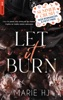

Brillant avocat de Manhattan, Viggo ne perd jamais une affaire. Une seule chose lui manque pour devenir associé dans son cabinet : la nationalité américaine. Quand sa demande de carte verte est rejetée une fois de plus, il sait qu’il ne lui reste plus qu’un recours&#xa0; : un mariage arrangé. North Smith, pompier à New York, est contraint de subvenir aux besoins de la famille de son frère. Rongé par la culpabilité de n’avoir pu sauver son jumeau dans un incendie, il est en effet prêt à aller contre tous ses principes et à se marier en échange d’une somme d’argent qui pourrait tout changer. Après tout, ce n’est qu’un accord temporaire… &#xa0;  Ce plan est censé être simple : un mariage factice, aucun sentiment. Viggo n’a jamais été attiré par les hommes. North ne tombe jamais amoureux. Aucune objection&#xa0; ?

[View on Apple](https://books.apple.com/fr/book/let-it-burn/id6746439591)

## Un cantique pour Leibowitz

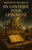

Avec « Un cantique pour Leibowitz », Walter M. Miller Jr. signe l’un des grands classiques de la science-fiction moderne. Dans un monde dévasté par une apocalypse nucléaire, la civilisation a sombré dans l’oubli, et seule une communauté de moines, les disciples de saint Leibowitz, s’attache à préserver les vestiges du savoir ancien. Manuscrits, schémas et fragments scientifiques deviennent des reliques sacrées, transmis de génération en génération sans toujours être compris. À travers les siècles, l’humanité renaît, trébuche, progresse et menace de s’autodétruire à nouveau. Miller déploie une réflexion magistrale sur le cycle éternel de la connaissance et de la folie humaine, entre foi, science et pouvoir. Avec une plume ironique et une profondeur philosophique rare, il interroge notre capacité à apprendre de nos erreurs. « Un cantique pour Leibowitz » est bien plus qu’un récit post-apocalyptique : c’est une parabole visionnaire sur l’espoir, la mémoire et la fragilité de la civilisation.

[View on Apple](https://books.apple.com/fr/book/un-cantique-pour-leibowitz/id6752842664)

## La Ferme du bout du monde

Cornouailles, une ferme isolée au sommet d’une falaise. Battus par les vents de la lande et les embruns, ses murs abritent depuis trois générations une famille… et ses secrets.1939. Will et Alice trouvent refuge auprès de Maggie, la fille du fermier. Ils vivent une enfance protégée des ravages de la guerre. Jusqu’à cet été 1943 qui bouleverse leur destin. Été 2014. La jeune Lucy, trompée par son mari, rejoint la ferme de sa grand-mère Maggie. Mais rien ne l’a préparée à ce qu’elle y découvrira. Deux étés, séparés par un drame inavouable. Peut-on tout réparer soixante-dix ans plus tard ? Après le succès de La Meilleure d’entre nous, Sarah Vaughan revient avec un roman vibrant.  Destinées prises dans les tourments de la Seconde Guerre mondiale, enfant disparu, paysages envoûtants de la Cornouailles, La Ferme du bout du monde a tout pour séduire les lecteurs de L’Île des oubliés, d’Une vie entre deux océans et de La Mémoire des embruns.  Un livre que vous ne voudrez plus quitter. Marie Claire Bouleversant. Woman Magazine

[View on Apple](https://books.apple.com/fr/book/la-ferme-du-bout-du-monde/id1198520029)

## Night Shift

Étudiante en lettres, discrète et irrémédiablement romantique : Kendall Holiday fuit le tumulte du campus pour se perdre dans l'univers de ses romances, préférant les murs rassurants de la bibliothèque.  Vincent Knight, lui, incarne tout l’inverse. Capitaine de l’équipe de basket, star du campus, il vit sous les projecteurs, porté par l’adrénaline des matchs et des soirées sans lendemain. Ils n’auraient jamais dû se rencontrer. Jusqu’au soir où il débarque en catastrophe à la bibliothèque et lui demande de l'aide pour un devoir en poésie.  Un service. Rien de plus. Un simple service qui provoque une étincelle… et une attirance qu’ils ne peuvent plus réprimer.

[View on Apple](https://books.apple.com/fr/book/night-shift/id6774153093)

## Nous qui avons connu Solange

"Le jour où je suis devenue une meurtrière, j’ai cessé d’aimer les mirabelles." 
 
Sarégnac, Corrèze. Célestine grandit dans la ferme familiale, bien décidée à réussir ses études pour échapper à la vie de labeur qui l’attend aux champs. 
Cadiran, Gironde. Solange est internée dans une école de préservation pour jeunes filles où sont envoyées des adolescentes jugées "déviantes". 
Quel secret lie ces deux jeunes femmes&#xa0;? Pourquoi Solange déteste-t-elle tant Célestine&#xa0;? Et comment cette dernière a-t-elle pu commettre l’irréparable&#xa0;? 
De la France de nos grands-parents jusqu’à nos jours, cette intrigue poignante ménage autant de suspense que de rebondissements. À travers les destinées de quatre générations de femmes puissantes, Marie Vareille retrace l’extraordinaire évolution de notre monde depuis un siècle et nous rappelle ce que nous devons tous à la persévérance et au courage de nos aînées.

« Marie Vareille donne vie à une fresque haletante, à une intrigue passionnante et révoltante. » ; « Un tournant littéraire audacieux qui confirme toute sa maîtrise narrative. »
LIRE MAGAZINE LITTERAIRE

« Derrière un récit haletant, l’autrice (Marie Vareille) dépeint à merveille l’évolution de la société française vue à travers quatre générations de femmes puissantes, tenaces et courageuses. »
PRESSE ECRITE - NOUS DEUX

« Bouleversant. Une saga familiale, portée par des femmes fortes et inoubliables. »
ICI MATIN, ICI PICARDIE – CARENE PONTE

« Une fresque haletante aux destins féminins mêlés. Le roman historique de Marie Vareille est un chef-d’œuvre. »
WEB – OUEST France

« C’est un vrai coup de cœur. On est happé par le mystère autour du personnage principal. »
LA PROVENCE, LAURENT MARCHAND 

« Une puissante histoire familiale qui met en valeur des destins de femmes bouleversantes. »
LE FIGARO

« Un texte qui serre le cœur autant qu’il captive, une histoire qui prend aux tripes et que l’on ne lâche plus. »
ONIRIK – CLAIRE

« Un chef-d’œuvre. Marie Vareille donne vie à une fresque haletante. » ; « Un tournant littéraire audacieux qui confirme toute sa maîtrise narrative. »
OUEST FRANCE

« Une plume engagée et vive. Une histoire simple qui donne toute sa grandeur à l’évolution de la condition de la femme dans notre monde. »
COURRIER PICARD

« C’est un roman magnifique. »
LA VOIX DU NORD

[View on Apple](https://books.apple.com/fr/book/nous-qui-avons-connu-solange/id6758699641)

## La Colline - Grand Prix des lectrices de ELLE policier 2026

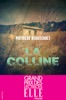

<i> <b>Un roman choral et viscéral qui mêle brutalité et grâce, par la lauréate du Grand Prix de littérature policière 2025</b> </i>   Un jour d’hiver, dans une cité de Rennes, un nouveau-né est découvert au fond d’un container à ordures. Vivant. Quelques étages plus haut, une jeune fille se vide de son sang.  Elle s’appelle Monroe, elle a dix-sept ans. Dans cette chambre où sa mère l’a enfermée, Monroe revit les mois passés sur la colline, chez sa grand-mère Madeleine.  Là-haut, le vent, le labeur et le silence façonnent les corps. Auprès de cette vieille femme solitaire aux mains guérisseuses, Monroe, enceinte, a découvert une paix inespérée. Et puis tout s’est écroulé.  Monroe s’affaiblit, les policiers enquêtent, les soignants espèrent, les pompiers s’interrogent, la famille se désintègre : durant ces quelques heures d’une intensité foudroyante, chacun mesurera ce qu’il a perdu – ou sauvé – de son humanité.  <i>Née en Bretagne au début des années 1980, Mathilde Beaussault, fille d’agriculteurs, enseignante, a fait une entrée remarquée dans le monde de la littérature avec son premier roman </i>Les Saules<i>, un des 100 meilleurs livres de l’année 2025 selon le palmarès Lire Magazine, Grand Prix de littérature policière, Prix du jury du polar L’Humanité, Prix Louis-Guilloux.</i>

[View on Apple](https://books.apple.com/fr/book/la-colline-grand-prix-des-lectrices-de-elle-policier-2026/id6758405243)

## Les morsures du silence - Prix Maison de la presse 2025

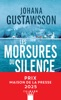

Vêtu d’une aube blanche et coiffé de bougies, un adolescent est retrouvé le crâne fracassé sur l’île de Lidingö, qui fait face à Stockholm. Or vingt-trois ans plus tôt, une jeune fille a été découverte assassinée elle aussi, au même endroit, dans le même costume traditionnellement destiné à fêter la Sainte-Lucie. À l'époque, le petit ami de la victime avait été condamné pour ce meurtre qu'il a toujours nié. &#xa0;  Était-il innocent ? Le véritable coupable aurait-il frappé à nouveau ? Mais pourquoi maintenant ? &#xa0;  Le commissaire Aleksander Storm, avec l’aide inattendue de la policière française Maïa Rehn récemment installée en Suède, va obstinément tenter de démêler les fils de cette énigme. Et mettre au jour un secret enfoui depuis si longtemps qu'il a fait bien des ravages... &#xa0;  Un thriller glaçant et impitoyable où le lecteur devient lui-même l’enquêteur, obsédé par l’envie de résoudre les mystères de cette affaire.

[View on Apple](https://books.apple.com/fr/book/les-morsures-du-silence-prix-maison-de-la-presse-2025/id6739500283)

## Rhapsody in blue (dark romance)

<b>DARK ROMANCE</b>  Pour protéger sa petite soeur, Olympe accepte d'obéir à son frère et laisse des types sordides profiter de ses charmes pour une poignée de billets. Ça s'appelle de "l'escorting" dans le milieu. Elle, elle appelle ça mourir à petit feu.   Seule sa passion pour la musique et la composition l’empêche de sombrer. Sa troisième année en fac de musicologie est sa dernière bouffée d’air, car tel est le deal avec son frère. Une fois sa licence obtenue, elle devra enterrer ses rêves et se dévouer à cette vie de misère.   Arthur, de son côté, avait tout. Il était le plus grand pianiste de sa génération, un virtuose que tous s’arrachaient, jusqu’à l’accident qui lui a coûté l’usage de sa main gauche. Le voilà donc balayé dans une université de province, pour enseigner l’écriture musicale et l’accompagnement pianistique à des étudiants qu’il méprise.    Quand ces deux âmes écorchées se percutent, ce ne sont pas des étincelles mais de la musique qui jaillit du néant. Entre la jeune femme condamnée à une vie de ténèbres et l’homme qui n’attend plus rien de la sienne, les rêves et l’espoir auront-ils une chance de renaître ?

[View on Apple](https://books.apple.com/fr/book/rhapsody-in-blue-dark-romance/id6743075150)

## Hollow Boys #1 - The Lies We Steal

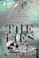

Hollow Heights University. Une université d’élite perchée dans la ville côtière sombre et oppressante de Ponderosa Springs. Un écrin réservé aux héritiers privilégiés. Pourtant, derrière les façades prestigieuses, la ville étouffe sous les vérités enterrées.Mais ce ne sont ni la forêt menaçante qui encercle le campus, ni le mausolée dissimulé dans ses profondeurs qui m’ont brisée... Ce sont eux. Les Hollow Boys. Des garçons forgés dans la violence et le pouvoir, habitués à ce que tout leur appartienne. Cruels, imprévisibles, dangereux, ils règnent sur la nuit. Une seule erreur a suffi pour attirer leur attention. Une seule, et je suis devenue leur cible. Sa cible à lui.

[View on Apple](https://books.apple.com/fr/book/hollow-boys-1-the-lies-we-steal/id6764273254)

## Swan - Tome 1

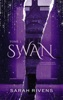

À vingt-six ans, Cléo n’a plus rien à perdre. Ou presque. Danseuse dans les clubs nocturnes de Manchester, elle survit dans l’ombre, dissimulant son passé derrière des paillettes et des mensonges. Lorsqu’elle emménage dans une maison élégante de Firswood pour un loyer dérisoire, elle ignore qu’elle vient de croiser la route de Zachary, héritier arrogant et gardien de secrets bien plus sombres qu’il n’y paraît. Entre eux, c’est la guerre. Une guerre de secrets, de provocations et de chantages mutuels. Tous deux portent des masques, tous deux cachent des blessures que personne ne doit voir. Quand le passé resurgit sous les lustres de cristal, la frontière entre haine et attirance s’efface. Le fil rouge du destin qui les relie est aussi celui qui pourrait les détruire.

[View on Apple](https://books.apple.com/fr/book/swan-tome-1/id6759603334)

## Lies & Truths Duet - tome 1 : All the lies

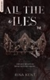

Certains mensonges deviennent des vérités.  Reina Ellis avait tout&#xa0; : la beauté, le prestige, le pouvoir. Jusqu’au jour où on la retrouve au milieu des bois. Seule. Blessée. Sans aucun souvenir. Ni de la nuit qui a tout fait basculer, ni de la personne qu’elle était. Encore moins de la raison pour laquelle Asher la déteste autant.  Asher Carson est froid, magnétique et dangereux. Et surtout… il est son fiancé et son seul repère. Devant le reste du monde, il incarne le gendre idéal. En privé ses yeux ne mentent jamais, et dès qu’ils sont seuls, il la méprise et lui voue une haine incommensurable.  À Blackwood, derrière les sourires parfaits et les apparences soignées, chacun dissimule ses secrets. Et plus Reina tente de recoller les morceaux de sa mémoire, plus elle découvre qu’avant son accident, son ancienne vie semble comporter des parts d’ombre et Asher a peut-être une bonne raison de vouloir se venger.

[View on Apple](https://books.apple.com/fr/book/lies-truths-duet-tome-1-all-the-lies/id6778369018)

## Castel boy

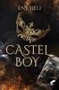

Quand Marise déménage avec sa mère dans la ville de San Pedro, à des centaines de kilomètres dans le sud du pays, elle ne s'attend à rien.     Un nouveau lycée banal, des rues comme on en voit partout, des gens qui l'intéressent peu.    Pourtant, il y a bien un élément qui retient son attention : ce château maudit qui domine la ville. Selon la rumeur, aucune de ses habitantes n’en ressort jamais.    Alors, quand sa mère lui annonce qu'elles vont y vivre pour officialiser son union avec son riche propriétaire, Joseph Ravel, Marise s'inquiète.    Et son angoisse grandit d'autant plus en rencontrant son nouveau demi-frère, Castel. Ce dernier n’est autre que le dealer extrêmement sexy et mystérieux avec qui elle flirte depuis son arrivée en ville, via une appli de rencontre...

[View on Apple](https://books.apple.com/fr/book/castel-boy/id6745778326)

## Give Us a Chance

À trop vouloir résister à la tentation, il va finir par y céder…  Ange le sait : il est le genre de mec qui plaît à toutes les femmes. Son look de bûcheron sauvage et ténébreux les fait systématiquement craquer. Si bien que, depuis qu’il a l’occasion de parfaire sa silhouette grâce à son poste de garde forestier, il enchaîne les coups d’un soir. Avec Inès, en revanche, c’est plus compliqué. La jeune éditrice au fort caractère, avec laquelle il doit créer un guide touristique, l’attire plus qu’aucune autre auparavant. Pourtant, il s’est fait la promesse de ne pas l’approcher. Si elle attend un prince charmant capable de l’aider à surmonter le drame qui l’a mise en fauteuil roulant, Ange n’est pas l’homme qu’il lui faut. Cela ne fonctionnera jamais entre eux. Il aimerait donc que son cerveau détraqué cesse de l’imaginer nue, dans son lit, chaque fois qu’il ferme les yeux…  A propos de l'auteur Pour Vanessa Degardin, l'écriture est plus qu'un hobby, c'est une passion ! Avec une imagination sans limites, elle adore raconter des histoires sensuelles et prenantes. Entre l'immobilier et sa petite famille, elle trouve toujours un moment pour écrire et faire rêver ses lecteurs.

[View on Apple](https://books.apple.com/fr/book/give-us-a-chance/id1545368634)

## Les Femmes du bout du monde

<b>Palmarès les 100 meilleurs livres de l'année 2023 du magazine Lire.</b>  <b>Prix des lecteurs Babelio 2023 - Catégorie littérature française.</b>  <b>Si tu te demandes ce que nous faisons ainsi, loin des hommes, je vais te dire : nous veillons sur notre petit univers, nous veillons les unes sur les autres. C’est ce que font les femmes du bout du monde.</b>   <b>À la pointe sud de la Nouvelle-Zélande, dans la région isolée des Catlins, au cœur d’une nature sauvage, vivent Autumn et sa fille Milly.</b> Sur ce dernier bastion de terre avant l’océan Austral et le pôle Sud, elles gèrent le camping <i>Mutunga o te ao</i>, le bout du monde en maori. <b>Autumn et Milly forment un duo inséparable</b>,<b> jusqu’au jour où débarque Flore, une jeune parisienne en quête de rédemption…</b> Hantées par le passé mais bercées par les vents et les légendes maories, ces trois femmes apprendront à se connaître, se pardonner et s’aimer.   <b>Mélissa Da Costa - </b><b>autrice la plus lue en France en 2023 -</b><b>&#xa0;nous offre un voyage inoubliable</b> à travers des paysages d’une stupéfiante beauté, aux côtés de personnages inspirés et inspirants. Un nouveau roman magistral et une ode à la liberté.

[View on Apple](https://books.apple.com/fr/book/les-femmes-du-bout-du-monde/id6445574715)

## Mad majesty

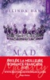

<b>Assumer le poids de la couronne, mais à quel prix ?</b>  Plongez dans la trilogie <b><i>Majesty</i></b> avec <b><i>Mad Majesty</i></b> (Tome 1), <b><i>Fallen Majesty</i></b> (Tome 2) et <b><i>Dark Majesty</i></b> (tome 3), des romances à découvrir indépendamment, dans l’ordre que vous voulez !  <i><b>Mad Majesty</b></i><b>&#xa0;a remporté le prix de la meilleure New Romance® 2025&#xa0;et le prix&#xa0;Nextory de la meilleure romance audio 2025.</b>  <b> <b>Depuis son retour de l’armée, le prince Damian enchaîne les scandales en tout genre.&#xa0;</b></b>  Qu’importe la volonté de sa famille, impossible de le faire rentrer dans le rang. Il fait régulièrement la une des tabloïds, jetant le discrédit sur la couronne.&#xa0;<b>Alors quand le roi décède et que le prince héritier est appelé à monter sur le trône, c’est toute la monarchie qui est ébranlée.&#xa0;</b>La seule manière de sauver les apparences ?&#xa0;<i>Un mariage, avec celle que sa mère lui a choisie : Ophélia St John, une future épouse obéissante et malléable. En somme, parfaite pour le rôle.&#xa0;</i>  <b>Mais Damian n’entend pas se plier de bon gré à ce jeu de dupes. Si l’institution lui impose des fiançailles, il compte bien choisir qui il épousera.</b>&#xa0;Et cela sera Esmée St John, la petite sœur de celle qui a été élevée pour régner.&#xa0;  <i>Synesthète, sarcastique, mais profondément humaine et empathique, Esmée parviendra-t-elle à ravir les cœurs du royaume ou précipitera-t-elle sa chute ?</i>

[View on Apple](https://books.apple.com/fr/book/mad-majesty/id6504677768)

## Le Portier

Meilleur thriller 2025 selon le New York Times ! 

Rien ne peut arriver au Bohemia, mythique et luxueux building new-yorkais en bordure de Central Park. Le personnel, en majorité hispanique, reste à sa place, au sous-sol. Les copropriétaires, tous blancs, nouveaux riches imbuvables ou anciens riches en perte de vitesse, accordent à peine un regard au portier, Chicky Diaz, avant de se replier dans leurs apparts-coffres-forts. 
Mais un peu plus au nord, l'émeute enfle, car un Noir vient d'être tué par la police. 
Et au même moment surgit devant l'entrée de l'immeuble un groupe d'hommes masqués et tout de noir vêtus, l'arme au poing. 
Porté par les inégalités sociales, les ressentiments intimes, la cupidité et la haine, omniprésentes, le récit se déploie implacablement, jusqu'au drame. Une bombe à retardement évocatrice du Bûcher des vanités de Tom Wolfe et des thrillers de Richard Price, dont le détonateur est une poignante histoire d'amour. 

"Un mélange approchant la perfection : intrigue brillante, commentaire social au vitriol, décor incomparable, personnages inoubliables et bon vieux thriller à couper le souffle." John Grisham. 

"Chris Pavone a toujours été bon, mais ici, il est beaucoup mieux que bon... Cynique, tendre, percutant, dense, drôle, et bourré de références à la façon dont New York fonctionne (et ne fonctionne pas). Il montre tous les aspects des deux guerres culturelles qui s’y livrent, et avec les deux canons fumants." Stephen King

[View on Apple](https://books.apple.com/fr/book/le-portier/id6771373199)

## Brimstone - Fae & Alchimie - tome 2 (version française)

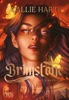

Saeris Fane n’a jamais voulu d’une couronne.   Pourtant, après les événements qui ont bouleversé Yvélia, elle est devenue reine de la Cour Sanguinaire. Désormais mi-fae, mi-vampire et liée à Kingfisher par des Liens Divins qui la désignent comme son âme soeur, elle tente d’assumer les responsabilités qui lui incombent. Mais le pouvoir a un prix.   Son frère, Hayden, est toujours coincé à Zilvaren où il peut mourir à tout instant. Et Saeris doit faire face à une vérité cruelle : les soleils jumeaux de son monde natal lui sont désormais fatals. Elle n’a donc d’autre choix que d’envoyer Kingfisher, accompagné de Carrion, pour le sauver à sa place.   Tandis que les deux hommes s’enfoncent dans les ruelles dangereuses de la Cité d’Argent, les pouvoirs d’alchimiste de Saeris se font de plus en plus instables. Et une ombre s’étend sur Yvélia, menaçant le royaume tout entier.   Le temps presse. Saeris et Kingfisher devront passer l’épreuve du feu et du soufre pour espérer sauver ceux qu’ils aiment.   Traduit de l’anglais (États-Unis) par Chloé Bardan

[View on Apple](https://books.apple.com/fr/book/brimstone-fae-alchimie-tome-2-version-fran%C3%A7aise/id6765523477)

## The Windsor (Tome 1) - The Wrong Bride

Quand sa sœur Hannah ne se présente pas le jour de son mariage, Raven Du Pont n’a d’autre choix que de prendre sa place. Pour elle, épouser Arès Windsor relève de la torture. Car si Raven est amoureuse du milliardaire depuis son adolescence, celui-ci n’a toujours eu d’yeux que pour Hannah. Mais ni lui ni elle ne peuvent s’opposer à la décision de la matriarche de l’empire Windsor. Pour la première fois de sa vie, les cartes sont redistribuées en faveur de Raven. 
Entre pressions et jalousies, parviendra-t-elle enfin à se battre pour elle-même&#xa0;?

« Je l’ai dévorée, j’ai ri et pleuré, et pourtant, je n’ai qu’une envie : la relire encore et encore. » @Les.mots.d.Astra 

 « Ce roman m’a redonné littéralement goût à l’amour.»@NourakKinda 

 « Magistral !! J’en ai eu le souffle coupé !! » @Grenier_des_mystere 

« Un coup de cœur total et absolu. Une vraie obsession. » @Ettoitulisquoi

[View on Apple](https://books.apple.com/fr/book/the-windsor-tome-1-the-wrong-bride/id6743128112)

## Brûlez tout

Cette nuit-là, un feu ravage la permanence d’un député. Le lendemain, un relais 5G explose. Quelques jours plus tard, un essayiste célèbre est violemment agressé, un avocat menacé de mort. À chaque fois, la même revendication, la même signature : un mystérieux groupe sème la terreur… et diffuse ses exploits sur les réseaux sociaux, sous les yeux d’une France sidérée. Face à cette vague de crimes spectaculaires, Sacha Letellier, flic à l’ancienne, se lance dans une course contre la montre. Marqué par une fusillade qui a pulvérisé sa vie, incompris de ses collègues, il doit affronter une criminalité nouvelle, insaisissable, qui se nourrit du chaos numérique et défie la police à chaque clic. Mais quand la technologie devient le terrain de jeu des criminels, Sacha n’a plus qu’une arme : son instinct. Et s’il était le seul à pouvoir faire tomber ce réseau qui rêve d’insurrection ? Christophe Molmy est flic et écrivain. Ancien patron de la BRI de Paris, il dirige aujourd’hui la brigade de protection des mineurs. Brûlez tout est son septième roman.

[View on Apple](https://books.apple.com/fr/book/br%C3%BBlez-tout/id6753763193)

## Fire & Desire - Tome 1 : La Promise du roi des flammes

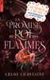

Arrachée aux griffes de la mort, Isavelle devait devenir la fiancée sacrifiée d’un roi défunt. Mais son destin bascule lorsque Zabriel, le redoutable Roi des Flammes, envahit son pays à dos d’un dragon monstrueux et la revendique comme sienne. Pourtant, Isavelle ne se laisse pas facilement séduire. Ayant grandi dans un pays dévasté par la guerre, elle se méfie de l’autorité brutale et des hommes comme Zabriel, qui incarnent la violence et la domination. Alors qu’elle tente désespérément de retrouver sa famille disparue et d’élucider les mystères entourant les villages fantômes de Maledin, Isavelle est confrontée à un dilemme. Chaque fois que Zabriel murmure d’un ton possessif qu’elle est sienne, son âme s’embrase, mais son esprit lutte pour conserver son indépendance. Pour lui, elle est son Omega : rare, vulnérable, précieuse. Celle qu’il veut protéger et posséder à tout prix. Mais tandis que des forces malveillantes menacent tout ce qu’elle aime, une chose devient claire : elle n’aura aucune chance de survivre sans l’aide du Roi des Flammes.

[View on Apple](https://books.apple.com/fr/book/fire-desire-tome-1-la-promise-du-roi-des-flammes/id6504091167)

## Amoureuse d’un comte

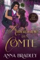

Peu de jeunes femmes seraient prêtes à accepter un poste de gouvernante auprès de deux jumeaux turbulents dans un château isolé au cœur de la campagne de l'Oxfordshire. Mais Helena Templeton n'a jamais vraiment ressemblé aux autres jeunes femmes. Elle vient à peine de s'installer dans ses nouvelles fonctions lorsque le père des garçons, le comte de Hawke, un séducteur notoire, rentre chez lui à l'improviste, à moitié habillé, fuyant son dernier scandale londonien.  Adrian Chatham ignorait qu'il avait une gouvernante jusqu'à ce qu'il rentre chez lui, après que des mois de débauche à Londres ont échoué à effacer de son esprit le souvenir de sa défunte épouse. La dernière chose dont il a besoin, c'est d'une jeune femme autoritaire et indiscrète comme Helena Templeton sous son toit, mais ses garçons ont besoin d'elle, et peut-être, juste peut-être… que lui aussi.  Mais au moment même où ils parviennent à une fragile trêve, les sœurs d'Helena la rappellent chez elle. Le cœur brisé, elle quitte Hawke's Run, mais Adrian n'est pas disposé à la laisser partir si aisément. Il veut qu'Helena se serve de ses talents miraculeux d'entremetteuse pour lui trouver une épouse, et il a déjà la dame toute désignée en tête…

[View on Apple](https://books.apple.com/fr/book/amoureuse-dun-comte/id6789675456)

## Fourth Wing - Version française

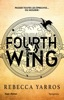

<b>Passer toutes les épreuves… ou mourir&#xa0;!</b>  Rien ne prédestinait Violet Sorrengail à être une cavalière. Elle était censée intégrer le quadrant des Scribes et mener une vie tranquille parmi les livres. Elle dont les os sont si fragiles qu’ils peuvent se briser en un instant…  Mais aujourd’hui est le jour des conscriptions, et en tant que fille de la Générale - elle-même cavalière et dresseuse de dragons -, Violet n’a d’autre choix que de satisfaire les ordres de sa mère, et de rejoindre les épreuves de sélection pour devenir dragonnière… L’élite de la Navarre&#xa0;!  Pourtant, le simple fait d’envisager s’inscrire à cette compétition lui paraît ridicule… Car les dragons ne se lient pas aux humains «&#xa0;fragiles&#xa0;»&#xa0;: ils les brûlent&#xa0;! Mais Violet est peut-être la candidate la moins forte physiquement, elle est cependant rusée et rapide. Des qualités indispensables quand on évolue dans un monde sans foi ni loi, où les alliés peuvent vite devenir des ennemis, ou peut-être encore des conquêtes… Violet va vite devoir penser à un plan solide, car cette compétition n’a que deux issues&#xa0;: passer toutes les épreuves ou mourir&#xa0;!  <i><b>"Une fantasy comme vous n'en avez jamais lu auparavant."&#xa0;</b></i>Jennifer L. Armentrout, auteure #1&#xa0;New York Times&#xa0;bestseller  <i><b>"J'ai applaudi, j'ai ri, j'ai souri, j'ai réfusé de poser ce livre."&#xa0;</b></i>Lexi Ryan, auteure #1&#xa0;New York Times&#xa0;bestseller  <i><b>"Les lecteur.rices seront envoûtés et impatients d'en savoir plus."&#xa0;</b></i>Publishers Weekly

[View on Apple](https://books.apple.com/fr/book/fourth-wing-version-fran%C3%A7aise/id6474303567)

## Le Mariage parfait

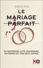

À trente-trois ans, Sarah Morgan est la meilleure avocate pénaliste de Washington DC et elle ne pourrait rêver d’une vie plus heureuse. 
Adam, son mari, n’en est pas au même point. Sa carrière d’écrivain patine et sa relation avec Sarah, qui ne lui consacre que peu de temps, ne lui suffit plus. 
Leur résidence secondaire devient alors pour Adam le refuge où s’épanouit sa liaison passionnée avec Kelly Summers. Mais un matin, tout bascule. Adam est arrêté pour le meurtre de Kelly, qui a été retrouvée poignardée dans la maison. 
Sarah décide alors, à la surprise générale, d’assumer son cas le plus difficile à ce jour : défendre son propre mari, un homme accusé du meurtre de sa maîtresse ! 
<b>Un premier roman admirablement ficelé sur la trahison et la justice, qui oscille entre drôlerie, cynisme et désespoir.</b> 
« Un excellent premier roman, hâte de découvrir le suivant ! » &#xa0;Bookends 
« Si vous êtes fan de thrillers psychologiques avec des rebondissements fracassants, alors&#xa0;<i>Le Mariage parfait</i>&#xa0;est le livre qu’il vous faut. »&#xa0;&#xa0;Nerd Problems

[View on Apple](https://books.apple.com/fr/book/le-mariage-parfait/id6442824402)

## L'Arbre de fer

L’inspecteur Stilwell mène l’enquête aux côtés de Renée Ballard  Au coeur de la nuit sur Santa Catalina, un avion atterrit discrètement dans un petit aéroport niché dans la montagne. Au courant grâce à une source, l’inspecteur Stilwell et son équipe sont aux premières loges pour assister à ce qui ressemble à du trafic de drogue, mais leur intervention tourne mal. Mis sur la touche le temps d’une enquête interne, Stilwell se plonge dans une affaire de randonneuse disparue il y a quatre ans à Los Angeles et dont le sac à dos a été retrouvé sur l’île deux mois plus tôt. Ses recherches l’amènent à l’unité des Affaires non résolues de Renée Ballard. Travaillant ensemble sur le continent et sur Santa Catalina, tous deux seront confrontés à un criminel qui nargue les autorités depuis déjà longtemps, et révéleront une affaire d’une ampleur inédite.

[View on Apple](https://books.apple.com/fr/book/larbre-de-fer/id6769720329)

## Tenir debout

<b>Palmarès Les 100 livres de l'année 2024</b> - <b>Lire Magazine</b>  <b>" Cette intrigue bouleversante nous tient en haleine au fil de rebondissements imprevisibles." Pelerin</b>  <b>Jusqu’où peut-on aimer ? Jusqu’à s’oublier…</b>   <b>Le nouveau roman de Mélissa Da Costa</b> nous plonge au cœur de l’intimité d’un couple en miettes et affronte, avec une force inouïe, la réalité de l’amour, du désespoir, et la soif de vivre, malgré les épreuves.  « Elle a conquis ses lectrices avec Tout le bleu de ciel, les a désarçonnées avec La Doublure et enthousiasmées avec Les Femmes du bout du monde. »&#xa0;<b> Olivia de Lamberterie, Elle</b> <b></b> <b> </b>« Un succès complètement mérité. » <b>Augustin Trapenard, La Grande Librairie</b>  <b> </b>&#xa0;« Mélissa da Costa, la jeune romancière qui chamboule tout ».<b> Mohammed Aïssaoui, Le Figaro littéraire</b>

[View on Apple](https://books.apple.com/fr/book/tenir-debout/id6504121723)

## L'Autre moi

<b>Ici, le cauchemar commence.</b>  Longepin. Un endroit niché au cœur de la forêt de la Grande Chartreuse. Un site sur lequel militaires et civils travaillent à des projets classés secret-défense. Un cadre de vie d'exception, mais ultra-surveillé et régi par des règles étranges. Sibylle vient d'arriver avec son compagnon, Erwann. Docteur en neurosciences, celui-ci a vu la possibilité d'intégrer cette communauté comme la chance de sa carrière. Comme un espoir, aussi, que là-bas des confrères parviennent à aider celle qu'il aime. Car Sibylle, depuis l'accident qui a coûté la vie à son enfant et lui a valu une douloureuse reconstruction du visage, n'est plus la même. Elle souffre d'une amnésie post-traumatique et est sujette à des cauchemars aussi intenses que troublants, au point de ne plus toujours savoir distinguer le rêve de la réalité...

[View on Apple](https://books.apple.com/fr/book/lautre-moi/id6757790633)

## Macallan

L’Écosse, ses jeux traditionnels, ses kilts, sa culture et ses légendes font de moi celui que je suis.   Propriétaire avec mon grand-père du château familial, je passe mon temps à tout gérer et à trouver des solutions pour pallier nos difficultés financières. Angus, mon aïeul, a eu l’idée saugrenue d’engager une relieuse d’art pour restaurer les livres de la bibliothèque afin d’attirer davantage de touristes.   Il l’adore, je la déteste. Elle, c’est Harmony... une pipelette, certes talentueuse, mais surtout très maladroite !   Me voilà donc obligé de cohabiter et de chercher avec elle un soi-disant trésor caché dans les profondeurs du château. Pire encore ! Moi, véritable handicapé des sentiments, célibataire qui ne vit que pour ses terres et les Highland Games, je sens mes certitudes s’effriter les unes après les autres, face à son sourire ravageur.   Et si le plus précieux des trésors était juste sous mes yeux ?

[View on Apple](https://books.apple.com/fr/book/macallan/id6742397187)

## La femme de ménage voit tout

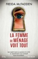

Après avoir été au service des autres en tant que femme de ménage, Millie s’est enfin construit une vie à elle. Elle vient même d’emménager dans une belle maison, dans une petite impasse chic et tranquille, avec son mari et ses deux enfants.  Mais son rêve d’une vie paisible est rapidement terni par la rencontre de ses voisins. Il y a Suzette, bien trop snob et aguicheuse, son insipide mari, mais surtout leur terrifiante femme de ménage au regard perçant et au comportement plus que suspect.  Les craintes de Millie montent d’un cran lorsque des bruits étranges se font entendre la nuit dans sa propre maison. Pire&#xa0; : elle éprouve un étrange malaise et se sent épiée. C’est certain, quelque chose ne tourne pas rond dans cette rue si tranquille. Mais est-elle prête à en découvrir les secrets&#xa0; ? Et surtout, le temps de comprendre ce qui ne va pas, tout peut arriver…

[View on Apple](https://books.apple.com/fr/book/la-femme-de-m%C3%A9nage-voit-tout/id6670250261)

## Donner l'ordre ne suffit pas

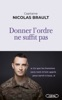

<b>" Ce que les hommes sans nom m'ont appris peut servir à tous. "</b>  " Si tu ralentis, ils s'arrêtent. Si tu faiblis, ils flanchent. Si tu t'assieds, ils se couchent. Si tu critiques, ils démolissent. Mais si tu marches devant, ils te dépasseront. "  À la Légion étrangère, comme dans le monde du travail, tout repose sur la communication. Dans ce livre, le capitaine Nicolas Brault transmet son expérience du commandement, forgée sur le terrain. Il montre comment l'autorité se construit au quotidien, par la clarté, l'écoute et l'exemplarité, bien plus que par le charisme ou la contrainte. Une vision du leadership applicable à toute situation où il faut entraîner, décider et agir ensemble.

[View on Apple](https://books.apple.com/fr/book/donner-lordre-ne-suffit-pas/id6759670170)

## Captive - tome 2

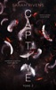

Entre guerres de pouvoir, famille de cœur, nouvelles chances et trahisons, la dynastie des Scott est sur le point de vivre un nouveau tournant. &#xa0;  Une année s’est écoulée depuis qu’Asher a arraché Ella à sa nouvelle vie. Et tandis que la jeune femme essaie de panser ses blessures, lui, est hanté par le souvenir de ses yeux bleus. Pourtant, le leader du réseau des Scott est bien trop fier pour revenir toquer à sa porte. Jusqu’à ce que leurs univers entrent à nouveau en collision. La possessivité d’Asher prend le dessus, et le leader est bien déterminé à réveiller les sentiments de celle qu’il surnomme «&#xa0; son ange&#xa0; »… sans réaliser que cela signifie également raviver les siens. Mais Ella refuse de lui pardonner son année de silence. Et si pendant longtemps, l’ange s’est plié à ses volontés, elle est aujourd’hui décidée à embraser son univers, quitte à y laisser quelques plumes.

[View on Apple](https://books.apple.com/fr/book/captive-tome-2/id6443354003)

## La femme de ménage

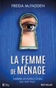

Chaque jour, Millie fait le ménage dans la belle maison des Winchester, une riche famille new-yorkaise. Elle récupère aussi leur fille à l'école et prépare les repas avant d'aller se coucher dans sa chambre, au grenier. Pour la jeune femme, ce nouveau travail est une chance inespérée. L'occasion de repartir de zéro.  Mais, sous des dehors respectables, sa patronne se montre de plus en plus instable et toxique. Et puis il y a aussi cette rumeur dérangeante qui court dans le quartier&#xa0;: madame Winchester aurait tenté de noyer sa fille il y a quelques années.  Heureusement, le gentil et séduisant monsieur Winchester est là pour rendre la situation supportable. Mais le danger se tapit parfois sous des apparences trompeuses. Et lorsque Millie découvre que la porte de sa chambre mansardée ne ferme que de l'extérieur, il est peut-être déjà trop tard...

[View on Apple](https://books.apple.com/fr/book/la-femme-de-m%C3%A9nage/id6444698763)

## The World's Game

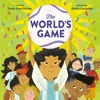

<b>A vibrant picture book celebrating soccer and its worldwide fans, perfect for the 2026 World Cup--hosted in the US, Canada, and Mexico.</b>  <i>One field.</i> <i>One ball.</i> <i>Two teams...and a whole lot of fans!</i>  Soccer and the World Cup bring people from all over the world together. Witness the energy, passion, and glory of the world's most popular sport, on and off the field. As one match happens in the stadium, one family gathers to watch the game at home. See the players leave it all on the field and the&#xa0;family watch enthusiastically on tv.  With bright, colorful art and lively dialogue, this uplifting and heartfelt story is a love letter to the sport, the fans, and the communities we make. Get ready to jump, holler, and cheer for "the beautiful game"!

[View on Apple](https://books.apple.com/fr/book/the-worlds-game/id6752588257)

## Briar university - Tome 04

<b>Dans la lignée de Off campus, la suite de la nouvelle série de Elle Kennedy !Retrouvez les héros que vous avez aimé dans les 3 premiers tome de Briar U et découvrez l'histoire étonnante de Taylor et Conor, deux étudiants que tout oppose mais qu'un stupide défi va rapprocher.</b> L'université était censée être ma chance de surmonter mon complexe de vilain petit canard et de déployer mes ailes. Au lieu de cela, je me suis retrouvée dans une sororité pleine de filles odieuses. J'ai déjà du mal à m'intégrer, alors quand mes soeurs Kappa Chi me lancent le défi, je ne peux pas dire non. Le défi : séduire la nouvelle recrue de l'équipe de hockey. Le mec le plus sexy de la classe. Conor Edwards est un habitué des soirées de Greek Row... et des lits de la sororité. Il fait fondre les filles mais ne leur accorde jamais un second regard, surtout aux filles comme moi. Sauf que M. Populaire me surprend, au lieu de me rire au nez, il me fait une faveur en prétendant devant tout le monde que je l'intéresse. Encore plus fou, il veut continuer à faire semblant. Il s'avère que Conor adore les jeux et il pense que c'est amusant de ridiculiser mes ennemis. Mais résister à son charme est presque impossible. Je me rends compte que l'histoire de Conor est bien plus compliquée que ce que son fan club peut voir. Et plus cette stupide ruse se prolonge, plus le danger est grand que tout cela m'explose à la figure.

[View on Apple](https://books.apple.com/fr/book/briar-university-tome-04/id6445270694)

## Captive - tome 1

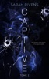

L'histoire d'Asher et Ella par&#xa0; theblurredgirl aux&#xa0; plus de 19&#xa0; millions de lectures sur Wattpad ! Au sein des réseaux criminels, là où règnent puissance, meurtre et pouvoir, il y avait elles. Les captives. Dangereuses, malignes, et mortelles, elles sont les ombres des plus grands réseaux, les représentantes de leurs chefs, aussi appelés possesseurs. Depuis son adolescence, Ella est une captive contre son gré. John, son possesseur, préfère utiliser son corps plutôt que ses talents, plongeant sa vie dans un cauchemar éveillé. Jusqu’au jour où il lui annonce qu’elle va travailler pour quelqu’un d’autre… Si Ella pensait qu'il ne pouvait y avoir pire que John, elle réalise très vite que son nouveau possesseur joue dans une tout autre catégorie. Ce certain «&#xa0; Ash&#xa0; », leader charismatique du réseau des Scott, refuse la présence d’une captive à ses côtés. Pour une raison obscure, il voue une haine viscérale à ces femmes. Un jeu dangereux s’installe alors entre&#xa0; eux, car Asher entend bien faire payer Ella, mais celle-ci ne compte pas céder… &#xa0;  «&#xa0; Ne joue pas avec le diable, mon ange, ne t'aventure pas dans ce que tu regretteras.&#xa0; »

[View on Apple](https://books.apple.com/fr/book/captive-tome-1/id1616472561)

## Battle Chasers - Intégrale

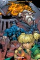

Les lecteurs et les fans attendaient la conclusion de cette saga qui a marqué les comics des années 2000, quasiment depuis deux décennies. L'attente est terminée, grâce à Joe Madureira et Ludo Lullabi, qui nous offrent cette intégrale de plus de 400 pages qui regorge de bonus !  Le moment est venu de (re)découvrir les aventures bourrées d'action de la jeune Gully lancée dans une quête pour retrouver son père disparu. Elle est aidée de Garrison, un épéiste légendaire ; de Knolan, le magicien rusé ; de Calibretto, un golem de guerre hors-la-loi ; et de la célèbre mercenaire Red Monika !

[View on Apple](https://books.apple.com/fr/book/battle-chasers-int%C3%A9grale/id6766758667)

## D'autres printemps

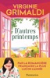

Flora vient de voir son plus grand rêve s’effondrer. Pourtant, quand on l’appelle au chevet de sa grand-mère, elle envoie tout valser pour la retrouver. 
À son arrivée, Line, quatre-vingt-dix printemps, a une requête des plus surprenantes : Flora doit l’arracher à l’hôpital pour la conduire dans un petit village de Toscane. Pourquoi là-bas ? Personne ne lui connaît d’attaches en Italie. 
Flora hésite, mais Line insiste : c’est sa dernière volonté. 
Alors, au matin, elles fuguent. 
Embarquée dans un road trip insolite, Flora ignore la vraie raison de ce voyage et l’ampleur du secret qu’elle s’apprête à découvrir. L’une roule vers son passé, l’autre vers son avenir : grand-mère et petite-fille ont des choses à se dire. 

Elles n’imaginent rien de ce qui les attend au bout du chemin, là où l’histoire a commencé.

[View on Apple](https://books.apple.com/fr/book/dautres-printemps/id6759984041)

## L’invitée surprise

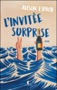

<b>Après en avoir rêvé depuis des années, Phoebe arrive enfin au Cornwall Inn, un luxueux hôtel du XIXe siècle sur la falaise de Newport, dans le Rhode Island. </b>  Elle s’est toujours imaginée y séjourner avec son mari, à déguster des huîtres et faire des promenades en bateau au coucher du soleil. C’est finalement seule qu’elle s’y rend, sans bagages, dans sa plus belle robe en soie verte, déterminée à s’offrir une dernière folie avant de mettre fin à ses jours. Car après plusieurs fausses couches et le départ de son mari, Phoebe n’a plus envie de vivre.  Si elle a pensé à tout, elle ne s’attendait en revanche pas à se retrouver au milieu d’un mariage…  <b>Alison Espach </b>est professeure de Creative Writing à l’université Providence dans le Rhode Island. Elle est l’autrice de The Adults et Notes on Your Sudden Disparition. L’invitée surprise est son premier roman traduit en français et lauréat du Reader’s Favorite Fiction 2024 sur Goodreads.

[View on Apple](https://books.apple.com/fr/book/linvit%C3%A9e-surprise/id6748487590)

## La belle famille

"Quand j’ai répondu à cette petite annonce, et Dieu sait qu’à cette époque j’aurais pris n’importe quoi, je n’aurais jamais pu imaginer ce qui allait m’arriver. 
D’ailleurs, personne n’aurait pu s’en douter. 
Et je ne sais pas si quelqu’un aurait pu m’en protéger." 
 
Manon a 20 ans quand elle rencontre l’homme qui va changer le cours de sa vie. Charmeur et sûr de lui, ce catholique intégriste et père de cinq enfants révèle peu à peu son caractère trouble et dangereux. En fonçant tête baissée dans l’obscurité d’une famille et d’un monde qui lui sont étrangers, Manon s’engage sur un chemin chaotique dont personne ne sortira indemne. 
Inspiré d’une histoire vraie, ce roman nous est raconté à la fois par Manon, jeune étudiante indépendante et affranchie, ainsi que par tous les protagonistes, chacun ayant un regard et un jugement différents. 
Qui est cette femme capable d’abnégation, de bonté mais aussi de vraie liberté&#xa0;?

[View on Apple](https://books.apple.com/fr/book/la-belle-famille/id1620544930)

## Lakestone - tome 1

Dans la tranquillité trompeuse de la ville d'Ewing aux États-Unis, Iris, confinée à la bibliothèque, est plongée dans ses révisions. À des kilomètres de là, un mercenaire affronte le froid tranchant de la nuit, aussi glaciale que le cadavre qu'il vient d’enterrer. Ils n’ont rien en commun, pourtant tous deux ont le même objectif&#xa0; : amasser assez d'argent. Iris, pour payer ses frais de scolarité à l'université, le mercenaire, pour mener à bien sa mission. Mission dont elle est la cible. Désormais, l'existence d'Iris est liée à celle de cet homme, une connexion qui éveille en lui curiosité et désir. Arrachée à la vie qu’elle a toujours connue, la jeune étudiante se retrouve à la merci du mercenaire dont l’impulsivité a forgé la réputation, celui qui a été façonné pour tuer… Celui qu’on appelait Lakestone.

[View on Apple](https://books.apple.com/fr/book/lakestone-tome-1/id6463405987)

## SEAL Team 9, Tome 1 - Alt

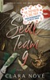

Tireur d’élite au sein des Navy SEALs, Alt n’a pas de place pour une vie de famille. Rien ne compte plus que sa carrière et son équipe. Lorsqu’il est sélectionné pour une mission inhabituelle, promouvoir l’armée auprès d’une classe de primaire, il est d’abord réfractaire à l’idée. Mais contre toute attente le militaire se laisse séduire, en particulier par la jolie institutrice.  À l'autre bout du pays, Astrid, a renoncé à l'amour après une relation difficile. Les hommes, c’est fini pour elle ! Elle trouve d’ailleurs refuge auprès de ses élèves. Pourtant, lorsqu'elle échange avec Alt, ses certitudes vacillent.  Cette correspondance les rapproche bien plus qu’ils ne l’auraient imaginé. Alt et Astrid partagent leurs rêves, leurs espoirs et leurs secrets, se découvrant peu à peu à travers leurs mots. Une relation à distance semble parfaite. Aucun risque de se rencontrer, aucun risque d’aller plus loin…

[View on Apple](https://books.apple.com/fr/book/seal-team-9-tome-1-alt/id6497229713)

## Redline

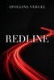

<b>Ce qui se passe à Vegas reste à Vegas… jusqu'à ce qu'un test de grossesse affiche positif.</b>  Alyssia pensait avoir touché le fond. Larguée par son petit ami et tout juste licenciée de son travail à New York, elle découvre qu'elle est enceinte d'un parfait inconnu, rencontré quelques semaines plus tôt lors d'une nuit d'égarement à Las Vegas. Mais ce bel inconnu aux yeux vert écume et à la détermination de fer n'a rien d'un homme ordinaire.  Travis Townsend est au sommet de sa carrière. Pilote de Formule 1 adulé, membre d'une illustre dynastie et redoutable compétiteur, il ne vit que pour remporter son premier championnat du monde. L'amour et l'engagement ? Très peu pour lui. Mais lorsqu'il recroise la route d'Alyssia par hasard et découvre son secret, son instinct protecteur et possessif prend le dessus. Il veut cette femme, il veut son enfant, et il est prêt à tout pour l'installer près de lui, à Monaco.  Farouchement indépendante depuis le décès de ses parents, Alyssia refuse d'être achetée ou dirigée. Travis, mâle alpha habitué à ce qu'on lui obéisse au doigt et à l'œil, va devoir apprendre que le cœur d'Alyssia ne se dicte pas : il se conquiert.  Alors qu'une passion incandescente se rallume entre eux, l'univers impitoyable de la course automobile et les sombres menaces d'un rival assoiffé de vengeance viennent assombrir leur avenir. Travis a l'habitude de foncer à trois cents kilomètres à l'heure vers la victoire, mais cette fois, c'est pour protéger sa nouvelle famille qu'il va devoir se battre.  <b>Entre le faste de Monaco, l'adrénaline des paddocks et un suspense haletant, succombez à une romance sportive addictive où l'amour file à toute vitesse.</b>  <i>Ce roman est une romance contemporaine destinée à un <b>public adulte (18+)</b>. Il contient des scènes de sexe explicites, un langage cru et aborde des thèmes sensibles tels que le deuil, la perte de parents, une grossesse à risque (complications médicales) ainsi que des scènes de suspense incluant violence et agressions. La possessivité du héros est un trait central de l'intrigue (mâle alpha).</i>

[View on Apple](https://books.apple.com/fr/book/redline/id6762311294)

## L'Héritier Rebelle

Comment bien démarrer un super été dans les Hamptons :

Dénicher une location magnifique sur la plage : fait.

Trouver un travail dans un lieu de rencontre estival à la mode : fait.

Comment gâcher un super été dans les Hamptons :

Craquer pour le type à la veste en cuir noir, avec sa barbe fine et son regard intense, qui se démarque du reste de la foule plutôt chic. Un homme que je ne peux pas avoir, puisque je pars à la fin de la saison.

Fait. Fait. Fait.

Je devrais ajouter : surtout quand ce dieu tatoué et sexy est mon patron.

Surtout quand il est non seulement propriétaire de mon lieu de travail, mais qu’il a aussi hérité de la moitié de la ville.

Surtout quand il est méchant avec moi.

Ou du moins, je le pensais.

Jusqu’à ce fameux soir où il me demande de monter dans sa voiture pour pouvoir me raccompagner chez moi, parce qu’il ne veut pas que je marche dans le noir.

C’est un peu comme ça que tout a commencé avec Rush.

Et puis, petit à petit, la carapace de cet homme a commencé à se fissurer.

Je ne m’attendais pas à me rapprocher autant d’une personne qui semblait pourtant être mon opposé.

Je n’étais pas censée tomber amoureuse de l’héritier rebelle, surtout quand il a été très clair sur le fait de ne pas vouloir franchir cette limite avec moi.

Lorsque les températures commencent à chuter, les nuits se font torrides. Mon été devient bien plus intéressant… et compliqué.

Toutes les bonnes choses ont une fin, pas vrai ?

Seulement, je n’avais pas imaginé que notre histoire se finirait ainsi.

[View on Apple](https://books.apple.com/fr/book/lh%C3%A9ritier-rebelle/id6755602083)

## Toutes les nuances de la nuit

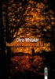

<b>" Un roman qui vous percute comme un marteau ! Je n'ai pas pu le lâcher et je ne l'oublierais jamais. " Gillian Flynn</b>  Jusqu'à ce jour de 1975, Monta Clare était une petite communauté tranquille du Missouri. Aujourd'hui, les sirènes des voitures de police retentissent dans toute la ville. Dans un quartier paisible, les habitants sont interrogés, tous doivent fournir des alibis. La raison ? Le jeune Patch Macauley a disparu. Dans la forêt voisine, on a retrouvé son tee-shirt, maculé de sang. Saint, une jeune fille au caractère bien affirmé, décide de faire tout ce qui est en son pouvoir pour découvrir ce qui est arrivé à son ami. Elle harcèle le shérif, mène sa propre enquête, cherche des pistes. Les jours passent, puis les semaines. L'affaire ne fait plus les gros titres des journaux, et cependant, Saint s'obstine. Des mois plus tard, Patch Macauley réapparaît. L'affaire est réglée ? Non. Bien au contraire, il faudra des décennies pour élucider tous les mystères et faire la lumière sur ce qui s'est réellement passé durant sa disparition.  <b>Après<i>Duchess</i>, salué par la presse et les libraires, Chris Whitaker revient avec un roman magistral. S'étendant sur plus de trente ans, ce récit, jamais prévisible, met en œuvre des émotions aussi complexes que bouleversantes.<i>Toutes les nuances de la nuit</i>confirme avec éclat le talent infini de son auteur pour explorer jusqu'à l'incandescence les troubles de l'adolescence et la façon dont ceux-ci influent et pèsent sur l'âge adulte. Chris Whitaker s'installe sans conteste parmi les plus grands romanciers contemporains.</b>  " À couper le souffle... Un récit ondoyant qui transcende les décennies et les points de vue pour saisir la manière dont un seul instant fait basculer la vie d'un petit garçon et de ceux qui l'aiment. "<b><i>The Washington Post</i></b>  " Il y a bien une enquête dans<i>Toutes les nuances de la nuit</i>, et elle est passionnante, mais le roman a tellement plus à offrir. C'est aussi une fable profonde et complexe sur l'amour, le deuil et l'espoir. "<i><b>Kirkus Reviews</b></i>

[View on Apple](https://books.apple.com/fr/book/toutes-les-nuances-de-la-nuit/id6738673136)

## Clamser à Tataouine

"La discutable dextérité dont j’ai fait montre pour me dépatouiller de mon existence laisse à penser que je suis tout sauf un exemple à suivre." 
 
C’est le moins qu’on puisse dire. Le narrateur est un jeune marginal qui n’a jamais cherché à s’intégrer. Ce qui ne l’empêche pas de trouver plus commode de rejeter l’entière responsabilité de son ratage sur la société. Et il compte bien, «&#xa0;en joyeux sociopathe&#xa0;», lui faire salement payer l’addition de sa défaite. Son plan&#xa0;? S’immiscer dans toutes les classes sociales pour dénicher chaque fois une figure représentative de cette société détestée. Et la tuer. En écrivant le roman de ce psychopathe diaboliquement pervers, provocateur et gouailleur, l’auteur entraîne le lecteur dans une épopée macabre mâtinée d’un humour noir très grinçant. 
Avec un style aussi électrique qu’inventif, Raphaël Quenard dissèque le cerveau malade d’un monstre moderne et met en scène toute la galerie de personnages qui l’entourent.

[View on Apple](https://books.apple.com/fr/book/clamser-%C3%A0-tataouine/id6744935708)

## Le Syndrome du spaghetti

Quand la vie prend un virage aussi terrible qu'inattendu, comment se réinventer et garder espoir dans l'avenir ?  Léa a 16 ans, un talent immense et un rêve à réaliser. Entraînée par son père, qui est à la fois son modèle, son meilleur ami et son confident, elle avance avec confiance vers cet avenir tout tracé. À 17 ans, Anthony, obligé de faire face à l'absence de son père et aux gardes à vue de son frère, ne rêve plus depuis longtemps. Ils se sont croisés une fois par hasard ; ils n'auraient jamais dû se revoir. Pourtant, lorsque la vie de Léa s'écroule, Anthony est le seul à pouvoir l'aider à se relever. Leurs destinées s'en trouvent à jamais bouleversées.

[View on Apple](https://books.apple.com/fr/book/le-syndrome-du-spaghetti/id1524397059)

## Danse de mort

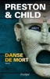

Quand le chauffeur de l?inspecteur Pendergast, du FBI, prie le sergent Vincent d?Agosta de le suivre, celui-ci s?attend à enfin retrouver son ami, dont il est sans nouvelles depuis leur aventure précédente ( Le Violon du diable , l?Archipel, 2006). Mais d?Agosta se voit remettre une lettre, dont les premiers mots le font frémir : " Mon cher Vincent, si vous lisez ces lignes, cela signifie que je n?ai pas survécu? " La suite le fait pâlir. Pendergast lui confie la mission d?empêcher Diogène ? son propre frère ? de commettre un forfait dont il planifie l?exécution depuis des années : un crime parfait qui marquera l?apothéose de sa carrière criminelle. Comment d?Agosta pourrait-il seul, et en sept jours seulement, déjouer un meurtre dont il ignore tout ? Et comment lutter contre un tel adversaire, supérieurement intelligent mais dépourvu de toute conscience morale et vouant à l?humanité un profond mépris ? Heureusement, l?inspecteur Pendergast est prêt à revenir du pays des morts pour prêter main forte à son ami. Débute alors un mano a mano entre deux frères qui se vouent une haine sans égale. Une valse effrénée, qui pourrait se révéler mortelle. Qui d?Abel ou de Caïn survivra ?

[View on Apple](https://books.apple.com/fr/book/danse-de-mort/id1494184532)

## L'Alchimiste

L'Alchimiste « Mon coeur craint de souffrir, dit le jeune homme à l'alchimiste, une nuit qu'ils regardaient le ciel sans lune. - Dis-lui que la crainte de la souffrance est pire que la souffrance elle-même. Et qu'aucun coeur n'a jamais souffert alors qu'il était à la poursuite de ses rêves. »  Santiago, un jeune berger andalou, part à la recherche d'un trésor enfoui au pied des Pyramides. Lorsqu'il rencontre l'Alchimiste dans le désert, celui-ci lui apprend à écouter son coeur, à lire les signes du destin et, par-dessus tout, à aller au bout de son rêve.  Merveilleux conte philosophique destiné à l'enfant qui sommeille en chaque être, ce livre a marqué une génération de lecteurs.

[View on Apple](https://books.apple.com/fr/book/lalchimiste/id876785813)

## Celles qui ne dorment pas

Fin février 2020, lors de fouilles dans le gouffre de Legarrea en Navarre, Nash Elizondo, psychologue médico-légale, et son équipe de chercheurs découvrent à cinquante mètres de profondeur une dépouille de brebis, une guirlande de minuscules roses desséchées et le corps d’une jeune fille&#xa0;: Andrea Dancur, portée disparue depuis trois ans. Parmi ses proches, chacun a quelque chose à cacher, et la silhouette menaçante du grand-père fait obstacle aux confidences. 
Mêlant approche scientifique et sensibilité aux croyances et aux légendes locales, Nash entame une enquête discrète, soutenue par Amaia Salazar, désormais inspectrice de la Police forale de Navarre. Mais l’annonce du confinement ne va pas lui faciliter la tâche.

[View on Apple](https://books.apple.com/fr/book/celles-qui-ne-dorment-pas/id6758515893)

## The Nanny

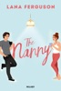

Quand elle se retrouve au chômage, Cassie Evans n'a d'autre choix que de décrocher très vite un nouveau travail, sinon elle sera contrainte de réactiver le compte OnlyFans qu'elle avait abandonné à raison. C'est alors qu'elle tombe sur une annonce pour un poste de nounou à domicile. Une solution à son problème qui lui semble presque trop parfaite... jusqu'à ce qu'elle rencontre son futur employeur. Aiden Reid, chef-cuisinier et père célibataire sexy, est loin de l'homme ennuyeux qu'elle avait imaginé. Il la supplie d'accepter son offre, et Cassie emménage donc avec lui et son adorable fille. Mais elle ne tarde pas à découvrir qu'Aiden n'est pas véritablement un inconnu. C'est un ancien fan, même s'il ne la reconnaît pas aujourd'hui. Entre eux, l'attirance est immédiate, et Cassie ne sait plus quoi faire.  Doit-elle lui avouer la vérité au risque de rater sa chance d'être heureuse ?  « The Nanny est un livre doux et sexy. Aiden est le zaddy que vous voulez dans votre vie. Un premier roman incroyable. » Elena Armas, autrice de The Spanish Love Deception  « Sous la plume de Ferguson, la tension entre les personnages est émotionnellement complexe et leur lien a quelque chose d'inévitable. » Publishers Weekly  « Cette comédie romantique torride réinvente les codes du genre et les modernise. Une lecture légère, joyeuse et sexy. » Library Journal  « On aime tout dans The Nanny : l'histoire, le rythme, les personnages, et surtout la plume de Ferguson, qui est à la fois drôle et pleine de sagesse. Il est également très rafraîchissant de voir des personnages parler d'intimité avec maturité et de manière positive. » BookPage  « Intelligent, drôle, sexy, et débordant de tension romantique, The Nanny offre un point de vue délicieux sur les secondes chances, agrémenté d'une bonne dose de sensualité ! J'ai hâte de lire d'autres romans de Lana Ferguson » Sara Desai, autrice de The Dating Plan  « J'ai besoin de plus de livres comme The Nanny, et tout de suite ! Une héroïne intelligente et éduquée (je dis oui !) rencontre un père célibataire concentré sur sa carrière. La température monte... et monte encore. Sérieusement, si Ali Hazelwood et Tessa Bailey avait un bébé spicy, ce serait ce roman. Je l'ai dévoré et, à la fin, j'étais triste de le quitter. C'est le genre de smut que veut BookTok ! Maintenant, j'ai besoin que Lana Ferguson écrive plus, parce que je veux lire tout ce qu'elle a à offrir. » Ruby Dixon, autrice de Ice Planet Barbarians  « Si vous cherchez une romance sincère qui sait faire monter la température, ne cherchez pas plus loin : The Nanny de Lana Ferguson est fait pour vous. » The Bookish Libra

[View on Apple](https://books.apple.com/fr/book/the-nanny/id6755597583)

## Windy City - Tome 1 Mile High

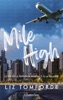

"Tu veux être choisie en premier ? Moi aussi, alors choisis-moi" Le hockey à Chicago ne serait pas ce qu'il est sans Evan Zanders, le joueur que tout le monde adore détester. Il connaît son rôle et le joue bien. En fait, il aime beaucoup passer la majeure partie de son temps de jeu sur le banc des pénalités avant de quitter l'arène avec une nouvelle fille à son bras. Ce qu'il n'aime pas, c'est la nouvelle hôtesse de l'air de l'avion privé de l'équipe, qui ne semble pas du tout impressionnée par lui. Stevie Shay est hôtesse depuis plusieurs années. Elle pensait avoir tout vu, mais lorsque son nouveau poste l'amène à travailler pour la saison avec la diva la plus égoïste et la plus imbue d'elle-même de la NHL, elle commence à tout remettre en question. Y compris la promesse qu'elle s'était faite de ne plus jamais sortir avec un athlète... même le plus attirant. Chaque déplacement brouille un peu plus les lignes entre Zanders et Stevie. Stevie commence à croire qu'il n'est pas juste ce que les médias disent de lui. Et Zanders n'arrive pas à savoir s'il appuie sur le bouton d'appel de l'hôtesse juste pour la pousser à bout ou s'il y a plus que ça.

[View on Apple](https://books.apple.com/fr/book/windy-city-tome-1-mile-high/id6503333811)

## Dear Ava

<b> <i>* N°1 des ventes US en Romance Contemporaine, Romance Sport et Romance New Adult *</i> </b>    <b> <i>* #1 Best-selling Author d'après le Wall Street Journal, le New York Times et USA Today *</i> </b>    <b> <i>L'auteure best-seller américaine Ilsa Madden-Mills débarque enfin en France !</i> </b>    Les riches et populaires Sharks règnent sur la prestigieuse école de Camden Prep.  Il fut un temps où je voulais faire partie de leur monde... jusqu’à cette fameuse nuit, jusqu’à cette fête où tout a basculé. Celle où je me suis réveillée dans les bois, sans aucun souvenir. Seule et démunie.  Mais désormais, je suis de retour. Et je ne les laisserai plus m’atteindre. Ils ne parviendront pas à me détruire.  Pourtant, la dernière chose à laquelle je m’attendais, c’était de recevoir une lettre d’amour anonyme de l’un de ces types. <i>Pitié ! </i>Je déteste chacun de ces enfoirés pour ce qu’ils m'ont fait.  La question est, quel Shark est mon admirateur secret ?   Knox, le quarterback balafré ? Dane, son frère jumeau ? Liam, le c*****d de service ? Ou Chance, l’ex qui m’a larguée... ?  Mais surtout, lequel d’entre eux est responsable de ce qu’il s’est passé cette nuit-là ?    <i>[Histoire intégrale - Version française]</i>

[View on Apple](https://books.apple.com/fr/book/dear-ava/id1614234058)

## Dynastie Hariston - Tome 2

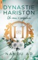

Elle n’attendait plus rien de l’amour… mais il pourrait bien bouleverser tous ses plans.  Après avoir surpris son petit ami dans les bras d’une collègue, Faye n’a plus qu’une envie : fuir. Direction les États-Unis, où retrouver Kara devrait enfin lui permettre de se reconstruire.  Lorsqu’elle rencontre, en plein vol, un inconnu aussi séduisant qu’excentrique, son nouveau départ prend une tournure inattendue. Jude possède ce charme insolent qui ébranle Faye au premier regard. Troublée, elle s’éclipse sitôt l’avion atterri, persuadée qu’elle ne le reverra jamais.  Mais le destin n’a pas dit son dernier mot, car dès son arrivée dans sa nouvelle entreprise, Faye découvre la véritable identité de son mystérieux inconnu : Jude n’est autre qu’Ezra Hariston, l’un des trois grands directeurs de H.D. Corp. Le genre d’homme scandaleux à la une des tabloïds qu’elle déteste. Si la priorité de Faye est de protéger son cœur, elle se retrouve rapidement au centre d’un jeu de mystères lorsqu’elle se met à recevoir d’étranges boîtes personnalisées d’un admirateur secret qui semble la connaître personnellement…

[View on Apple](https://books.apple.com/fr/book/dynastie-hariston-tome-2/id6775777190)

## L'intruse

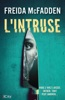

La petite maison de Casey, perdue au cœur de la forêt, n’est pas faite pour affronter la tempête qui s’abat cette nuit-là. Le vent hurle, les murs tremblent… et quelqu’un observe. Depuis sa fenêtre, Casey aperçoit une jeune fille, seule. Couverte de sang, un couteau à la main, elle refuse de dire qui elle est et d’expliquer ce qui s’est passé.&#xa0;   Malgré tout, Casey décide de l’aider. Mais au fil des heures, les incohérences s’accumulent. Quelque chose ne colle pas. Et lorsqu’elle fait, au milieu de la nuit, une découverte qui lui glace le sang, il est déjà trop tard.  Car cette jeune fille cache un secret. Un secret pour lequel elle est prête à tout. Et si Casey s’approche trop près de la vérité, elle pourrait bien ne jamais voir le soleil se lever…&#xa0;

[View on Apple](https://books.apple.com/fr/book/lintruse/id6760700815)

## Hunter

<b>Pour la sauver, elle doit devenir ma proie... </b>    J'ai du mal à croire que j'ai rencontré Franck, le plus gentil garçon du monde, le petit ami idéal.  J'ai encore plus de mal à croire que je viens d'être enlevée par des proxénètes, que je suis prisonnière, en route pour l'enfer. Je vais me battre pour m'échapper, comptant aussi sur mon oncle Tiger.  Une seule chose me fait peur: m'être trompée sur Franck, qu'il soit de mèche avec mes kidnappeurs. Il cache tant de secrets...   Je voulais changer de vie, devenir un mec normal, vivre heureux avec ma merveilleuse petite amie à Honolulu, sur son île de rêve.  Seulement pour sauver Emma, je dois réveille Hunter, cette part de moi aux instincts mortels.  Ceux qui ont enlevé la femme que j'aimevont le regrette, ne suis-je pas l'exécuteur numéro un de la CIA?    <b>Les prédateurs, des agents secrets aux compétences redoutables, des hommes d'honneur confrontés au pire.</b>    <b>Une série haletante où action rime avec passion !</b>   ___   <b>Extrait</b>   " J’ai peur.  Comme dit ma mère « la peur n’évite pas le danger ». Oncle Chris lui répète plutôt : « Seuls ceux qui réfléchissent survivent. » Les adages de flics m’ont toujours fait rire, mais ça, c’était avant, quand je pensais qu’il ne pourrait jamais rien m’arriver de pire qu’une mauvaise note aux partiels.   <i>Rester calme, à tout prix.</i>   Sur le dos, les yeux ouverts, je cherche à capter la moindre lueur qui me donnerait un repère. Je vais finir claustrophobe et incapable de supporter l’obscurité. Je serre les dents pour regrouper mon courage. Je vais tout faire pour m’en sortir, comptant également sur ma famille.  Pas une seconde, je ne doute de ma mère, de son acharnement et de ses capacités. Elle me retrouvera. Je regrette d’avoir fait ma tête de mule et de lui avoir caché l’existence de Franck. Il doit lui aussi s’inquiéter de ne pas m’avoir trouvée à notre rendez-vous. Je ne veux pas le perdre. Ce n’est pas tous les jours qu’on rencontre l’homme le plus gentil et le plus respectueux du monde.  Penser à lui me fait du bien. Je me laisse aller une nouvelle fois à revivre nos souvenirs. Ils m’offrent une bulle de sécurité qui m’aide à tenir le choc, à me préserver. Je m’immerge dans un passé tout proche en attendant l’atterrissage – qui risque d’être brutal dans cette boîte –, et d’oublier la faim et la soif. J’ai froid aussi malgré ma couverture."    <i>Note de l'éditeur : Les tomes de la série "Les prédateurs" sont indépendants et peuvent se lire séparément. Série complète.</i>    <i>[Amour interdit / Services Secrets]</i>

[View on Apple](https://books.apple.com/fr/book/hunter/id6759802066)

## La Dernière allumette

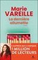

Depuis plus de vingt ans, Abigaëlle vit recluse dans un couvent en Bourgogne. Sa vie d’avant ? Elle l’a en grande partie oubliée. Elle est même incapable de se rappeler l’événement qui a fait basculer sa destinée et l’a poussée à se retirer du monde.   De loin, elle observe la vie parisienne de Gabriel, son grand frère dont la brillante carrière d’artiste et l’imaginaire rempli de poésie sont encensés par la critique. Mais le jour où Gabriel rencontre la lumineuse Zoé et tombe sous son charme, Abigaëlle ne peut s'empêcher de trembler, car elle seule sait qui est vraiment son frère...   <b>Un roman unique, brillamment construit et impossible à lâcher avant la dernière page.</b>  <b>Marie Vareille</b> est née en Bourgogne en 1985 et vit aux Pays-Bas avec son mari et ses deux filles. Elle est l’autrice de plusieurs best-sellers totalisant plus d’un demi-million de ventes en France, parmi lesquels <b><i>Désenchantées</i> (Prix des lecteurs de la librairie Lamartine 2023, Prix des lecteurs Système U 2023)</b> paru aux éditions Charleston et au Livre de Poche, ainsi que <i><b>La Vie rêvée des chaussettes orphelines</b></i> (<b>Prix des lectrices Charleston 2020 et Prix des Petits mots des libraires 2021).</b> Ses livres sont traduits dans plus d’une dizaine de pays.

[View on Apple](https://books.apple.com/fr/book/la-derni%C3%A8re-allumette/id6473976589)

## Les sept sœurs

À la mort de leur père, énigmatique milliardaire qui les a adoptées aux quatre coins du monde lorsqu’elles étaient bébés, Maia d’Aplièse et ses sœurs se retrouvent dans la maison de leur enfance, Atlantis, un magnifique château sur les bords du lac de Genève. Pour héritage, elles reçoivent chacune un mystérieux indice qui leur permettra peut-être de percer le secret de leurs origines. La piste de Maia la conduit au-delà des océans, dans un manoir en ruines sur les collines de Rio de Janeiro, au Brésil. C’est là que son histoire a commencé... Dans ce récit épique qui mêle amour et tragédie, premier volet d’une série de sept volumes inspirée des légendes de la constellation des Sept Sœurs, Lucinda Riley prouve comme jamais son merveilleux talent de conteuse. <b>Lucinda Riley</b> est née en Irlande. Après une carrière d’actrice au théâtre, au cinéma et à la télévision, elle écrit son premier roman à 24 ans. Ses livres ont depuis été traduits dans plus de trente langues et se sont vendus à quinze millions d’exemplaires dans le monde entier. Elle figure fréquemment en tête de liste des auteurs best-sellers du New York et du Sunday.  <b>Les quatre premiers tomes de sa série Les Sept sœurs se sont hissés en tête des meilleures ventes dans toute l’Europe.</b>

[View on Apple](https://books.apple.com/fr/book/les-sept-s%C5%93urs/id6445599073)

## The Deal

Original Series now on Prime Video  <b>Welcome to Briar U!</b>  <b> Get ready for your newest obsession . . . Discover the addictive world of the Off-Campus series from The Queen of Hockey Romance, Elle Kennedy! </b> <b>Read <i>The Deal</i> now for the perfect fake-dating romance! </b> <b>Also available as a Deluxe HB and a TV Tie-in edition</b>  <b>She's about to make a deal with the college bad boy . . .</b>  Hannah Wells has finally found someone who turns her on. But while she might be confident in every other area of her life, she's carting around a full set of baggage when it comes to sex and seduction. If she wants to get her crush's attention, she'll have to step out of her comfort zone and <i>make</i> him take notice . . . even if it means tutoring the annoying, childish, <i>cocky</i> captain of the hockey team in exchange for a pretend date  <b>. . . and it's going to be oh so good</b>  All Garrett Graham has ever wanted is to play professional hockey after graduation, but his plummeting GPA is threatening everything he's worked so hard for. If helping a sarcastic brunette make another guy jealous will help him secure his position on the team, he's all for it. But when one unexpected kiss leads to the wildest sex of both their lives, it doesn't take long for Garrett to realize that pretend isn't going to cut it.  Now he just has to convince Hannah that the man she wants looks a lot like <i>him</i>.  ***  <b>Why fans love Elle Kennedy </b><b>⭐ ⭐ ⭐ ⭐ ⭐!</b>  'Delicious, complicated and drama-filled . . . I read it in one sitting, and you will, too'<b> L. J. Shen, <i>USA Today</i> bestselling author</b>  'A deliciously sexy story with a wallop of emotions that sneaks up on you' <b>Vi Keeland, <i>New York Times</i> bestselling author</b>  'This book had the ability to make me swoon one minute, put my heart in my throat the next, then literally make me burst right out laughing out of the blue' <b>Goodreads Review</b>  'The best college romance I've read. It had epic banter, sexy romance, and fantastic writing!! I laughed, I swooned, I couldn't put it down. Highly recommended!!'<b>Goodreads Review</b>  'Elle Kennedy proves, once again, that she is the Queen of College Hockey Romance!!'<b> Goodreads Review</b>  '5-Made My Heart Pitter Patter-Stars' <b>Goodreads Review</b>  'One of the few authors who can instantly put a grin on my face as soon as I start reading her books' <b>Goodreads Review</b>

[View on Apple](https://books.apple.com/fr/book/the-deal/id6466581098)

## La femme de ménage se marie

Aujourd’hui est censé être le plus beau jour de la vie de Millie. La femme de ménage se marie avec Enzo, l’homme de ses rêves, et rien ne peut gâcher son bonheur. D’autant que ses parents, avec lesquels elle est brouillée depuis quinze ans, ont promis d’assister à la cérémonie.  Mais alors qu’elle devrait se préoccuper uniquement de sa robe et de sa coiffure, Millie est confrontée à un sérieux problème&#xa0; : quelqu’un ne veut pas qu’elle vive assez longtemps pour prononcer ses vœux. Quelqu’un qui épie ses faits et gestes, jusque dans sa chambre.  Prise au piège, Millie décide pourtant de ne pas se laisser intimider. Elle se mariera coûte que coûte, pour le meilleur et pour le pire. Mais le pire pourrait bien arriver plus tôt que prévu…

[View on Apple](https://books.apple.com/fr/book/la-femme-de-m%C3%A9nage-se-marie/id6742749195)

## Une unique lueur

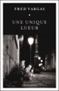

- Vous avez regardé les photos, Danglard ? De la scène du crime ? Demanda Adamsberg. 
- Cela va de soi. 
- Et donc ? Cela vous dit quelque chose ? Parce qu’à moi, oui. 
- Tiens. Et cela vous raconte quoi ? 
- Mais justement, rien. C’est quelque chose que je ne sais pas alors que cela me dit quelque chose. Donc ? 
- Aucune idée. 
- Faites un effort, nom d’un chien. 
- Désolé commissaire, dit Danglard avec une pointe d’indifférence. 
- Bien. Réunion plénière dans quinze minutes. Il nous faut comprendre. 
- Comprendre quoi ? 
- Mais le quelque chose, commandant. On commence par là.

« Des dialogues magnifiques et magiques. Une ode au roman et à l’amitié. »
LIRE MAGAZINE

« Un polar captivant. »
FRANCE INTER 

« Son héros Adamsberg, avec son univers lunaire et décalé, reste le fil rouge du roman, véritable pièce maîtresse d’une intrigue habilement tissée. »
OUEST FRANCE

« Fred Vargas régale les amoureux du polar sans laisser les autres sur le bord de la route. Un bel ouvrage qui nous fait dire que, décidément, Fred Vargas a « quelque chose » que les autres n’ont pas. »
LE POINT

« Un polar exceptionnel, jubilatoire et extrêmement malin. »
LIBERATION

« Ce livre est un tour de force et une réussite absolue. »
TRIBUNE DE GENEVE

« Fred Vargas déroule sur 523 pages une intrigue romanesque remarquablement maîtrisée, dont les personnages hauts en couleur sont servis par des dialogues brillantissimes. Comment ne pas s’incliner devant un tel talent ? »
VERSION FEMINA

« Fred Vargas signe un retour magistral avec « Une unique lueur », dans une enquête hypnotisante, subtile et poétique. »
LE TELEGRAMME

« On sort de ces 300 pages avec l’envie d’y retourner, du côté de cet enquêteur si follement charmant et de cette autrice qui sait bien nous mener par le bout savant des mots. »
LA CROIX

« Un excellent cru ».
LE FIGARO

« Une enquête cinématographique, érudite et rebondissante à souhait. »
LA CROIX

[View on Apple](https://books.apple.com/fr/book/une-unique-lueur/id6758737891)

## Ma Voisine

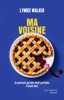

<b>Ma voisine ? Une mère idéale. Une épouse irréprochable. La perfection incarnée. Enfin... C'est ce que je croyais.</b>  Cinq enfants modèles, du pain fait maison qui cuit au four tous les matins, un vrai mariage d'amour avec son petit ami du lycée : ma voisine est la parfaite femme au foyer. Alors pourquoi est-elle si froide avec moi ? Pourquoi ses enfants ne vont-ils pas à l'école ? Pourquoi la famille ne se rend-elle jamais en ville ? Ma voisine cache quelque chose. Moi aussi.

[View on Apple](https://books.apple.com/fr/book/ma-voisine/id6758228382)

## Off-campus - Tome 05

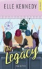

La série Off-Campus, best-seller international, revient dans un recueil de quatre nouvelles de l'auteure à succès du New York Times, Elle Kennedy ! Ce tout nouvel épisode apporte la réponse tant attendue à la question : où sont-ils maintenant ? Quatre histoires. Quatre couples. Trois années de vie réelle après l'obtention du diplôme... Un mariage. Une demande en mariage. Une fugue. Et une grossesse surprise. La vie après l'université pour Garrett et Hannah, Logan et Grace, Dean et Allie, et Tucker et Sabrina, n'est pas tout à fait ce qu'ils avaient imaginé. Bien sûr, ils sont ensemble, mais ils ont aussi des problèmes de la vie réelle auxquels quatre années à Briar U ne les ont pas vraiment préparés. Et il s'avère que, pour ces quatre couples, l'amour est la partie la plus facile. Grandir est beaucoup plus difficile. Retrouvez vos personnages préférés de Off-Campus alors qu'ils naviguent dans les changements qui viennent avec la croissance et découvrent que les grandes décisions peuvent avoir de grandes conséquences... et, s'ils sont chanceux, de grandes récompenses.

[View on Apple](https://books.apple.com/fr/book/off-campus-tome-05/id6445270076)

## Les Suppliciées du Rhône

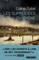

Lyon, 1897. Alors que des corps exsangues de jeunes filles sont retrouvés dans la ville, pour la première fois des scientifiques partent à la recherche du coupable, mettant en pratique sur le terrain toutes les avancées acquises en cette fin de XIXe siècle. Autopsies des victimes, profils psychologiques des criminels, voilà ce que le professeur Alexandre Lacassagne veut imposer dans l’enquête avec son équipe, mais sait-il vraiment ce qu’il fait en nommant à sa tête Félicien Perrier, un de ses étudiants aussi brillant qu’intrigant ? Entouré d’Irina, une journaliste pseudo-polonaise, et de Bernard, un carabin cent pour cent janséniste, Félicien va dénouer, un à un, les fils enchevêtrés de cette affaire au coeur d’un Lyon de notables, d’opiomanes et de faiseuses d’anges. Jusqu’à ce que le criminel se dévoile, surprenant et inattendu, conduisant le jeune médecin au-delà de ses limites.  LE POLAR HISTORIQUE ÉVÉNEMENT SUR LA NAISSANCE DE LA CRIMINOLOGIE.  Voici Les Experts à Lyon en 1897, passionnant ! Julie Malaure, Le Point.  PRIX DU ROMAN KOBO BY FNAC-PRÉLUDES-LE POINT

[View on Apple](https://books.apple.com/fr/book/les-supplici%C3%A9es-du-rh%C3%B4ne/id1436285641)

## La prof

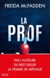

Chaque matin, Eve se lève et embrasse tendrement son mari, Nate. Ils partent&#xa0; au travail ensemble, au lycée où elle enseigne les mathématiques et où Nate est professeur d’anglais. Une vie parfaite, réglée comme du papier à musique. Tranquille.  Pourtant, l’année dernière, l’école a été secouée par un scandale. Un professeur a été licencié parce qu’il aurait eu une liaison avec Addie, une élève. Et cette année, cette élève se retrouve dans la classe d’Eve et dans celle de son charmant mari.  Comme tout le monde, Eve sait que l’on ne peut pas faire confiance à la jeune fille, une menteuse invétérée qui fait du mal autour d’elle. Et quand la prof commence à comprendre qui est véritablement Addie et ce qu’elle cherche à cacher, il est déjà trop tard…

[View on Apple](https://books.apple.com/fr/book/la-prof/id6742742482)

## Personne ne doit savoir

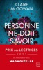

Et si on parlait du bon vieux temps&#xa0;?  Alison organise une réunion d'anciens camarades d'Oxford pour fêter une amitié longue d'un quart de siècle. Entre-temps, elle s'est mariée avec Mike, avocat d'affaires, dont elle a eu deux enfants. Elle vit dans la maison de ses rêves dans le Kent. Elle a réussi sa vie, et elle a bien l'intention d'en faire la démonstration lors de ces retrouvailles.  Mais la fête vire au drame lorsque Karen, la meilleure amie d'Alison, fait irruption dans la maison, en état de choc. Elle affirme que le mari d'Alison l'a violée. Mike jure qu'il est innocent. À qui se fier&#xa0;? Ce douloureux épisode fait resurgir les plus sombres souvenirs de leurs années de fac. Et certains sont prêts à tuer pour que ces souvenirs restent des secrets bien gardés.  «&#xa0;Un suspense à couper le souffle.&#xa0;» Sunday Mirror  «&#xa0;Ces pages fourmillent de fausses pistes et de rebondissements&#xa0;: accrochez-vous, ça va secouer.&#xa0;» Crime Time  «&#xa0;Un thriller époustouflant qui vous tiendra en haleine jusqu'à la dernière page.&#xa0;» Erin Kelly

[View on Apple](https://books.apple.com/fr/book/personne-ne-doit-savoir/id6476974095)

## Kingdom Duet - Tome 1 : Reign of a King

Dans le royaume du pouvoir, l’amour est une guerre. Et Jonathan King ne perd jamais.  Aurora Harper pensait avoir laissé son passé derrière elle. Mais lorsqu’elle revient à Londres pour sauver son entreprise de la faillite, elle se retrouve face à Jonathan King, l’ex-mari de sa sœur défunte. Froid. Implacable. Corrompu. Il ne négocie jamais. Il prend, il soumet, il possède. Elle voulait une transaction. Il impose un marché. Six mois sous le toit de Jonathan, à ses côtés, selon ses règles. Ce qu’elle n’avait pas prévu, c’est que derrière le masque du tyran se cache un homme aussi magnétique que dangereux. Mais Aurora n’est pas seulement désespérée. Partagée entre des émotions contradictoires, et hantée par la mort mystérieuse de sa sœur, Aurora doit non seulement se battre pour assurer sa survie mais aussi surmonter de lourds secrets de famille. Et dans ce jeu de désir et de vengeance, elle devra choisir : se soumettre… ou se rebeller.

[View on Apple](https://books.apple.com/fr/book/kingdom-duet-tome-1-reign-of-a-king/id6751188856)

## Sweet regret

<b>&#xa0;<i>K. Bromberg, auteure de best-sellers du </i>New York Times<i>, est de retour avec une romance de la seconde chance autour d’une rockstar qui va vous stupéfier longtemps après avoir tourné la dernière page...</i>&#xa0;</b>  Vince Jennings a eu deux amours dans sa vie. La musique et Bristol Matthews. Ses talents de guitariste le propulsent vers la gloire au sein du groupe de rock le plus populaire du moment. Mais il lui faut abandonner Bristol –&#xa0;son premier amour&#xa0;– pour y parvenir. Malgré les groupies, le succès et son quotidien exaltant, la vie sous les feux de la rampe et la fortune ne lui suffisent plus. Une douleur profonde et sombre menace de réduire à néant tout ce qu’il a construit, quand le destin remet sur sa route celle qu’il n’a jamais pu oublier.  Bristol Matthews a connu l’amour et l’a perdu plus jeune que la plupart des gens, mais elle s’acharne à aller de l’avant sans se retourner. Même si, par la force des choses... elle pense tous les jours à lui. Aujourd’hui, son rêve de devenir avocate est enfin à portée de main, quand son patron lui confie un nouveau client. La rock star Vince Jennings.  &#xa0;Un homme qui ne doit surtout pas découvrir son secret.  &#xa0;Un homme qui lit en elle comme s’il la connaissait par cœur.  &#xa0;L’homme qui l’aime toujours.  &#xa0;Toutefois,&#xa0;quelque chose a changé. Tous deux gardent jalousement des secrets qui menacent de les séparer. Mais cela n’a-t-il pas toujours été le cas entre eux&#xa0;? L’issue sera-t-elle différente, ou malgré la force de leur amour, ne sont-ils tout simplement pas faits l'un pour l'autre&#xa0;?

[View on Apple](https://books.apple.com/fr/book/sweet-regret/id6756919490)

## Le jour où Rose a disparu

Certaines renaissances font trembler plus d'une vie  À Toulon, Aïda est embauchée à la Maison des femmes, un lieu unique où l’on soigne et accompagne celles qui tentent de se relever de violences. Peu à peu, elle s’attache à cet endroit à part, à ses patientes, à son équipe… mais&#xa0; reste sur ses gardes avec le jardinier bénévole, dont les silences la&#xa0; dérangent autant qu’ils l’intriguent. À des centaines de kilomètres de là, Rose ouvre les yeux dans un hôpital de Bruxelles. Elle n’a plus aucun souvenir de sa vie d’avant. Le seul indice dont elle dispose, c’est cette inscription griffonnée sur sa hanche : un numéro de téléphone et un prénom, à moitié effacés.  Rose et Aïda ne se sont jamais vues, ne se connaissent pas.&#xa0;   Elles ne savent pas encore que leurs destins sont intimement liés.  Julien Sandrel nous entraîne dans un roman à couper le souffle, où les émotions frappent le coeur et les rebondissements tiennent en haleine jusqu’à la dernière page. Une histoire puissante, incandescente, traversée de lumière, de rage de vivre et d’espoir.  Lauréat du Prix Babelio 2026 catégorie Littérature française  "Sans doute le roman le plus fort de Julien Sandrel [...] Un roman sensible, impossible à lâcher et dont on garde la trace, longtemps." Adèle Bréau  "Julien Sandrel signe une intrigue parfaitement menée jusqu'à la dernière page, tout en mettant en lumière des thématiques poignates et on peut plus actuelles." Le Bonbon  "Riche en rebondissements, ce roman captive autant qu'il bouleverse, tenant le lecteur en haleine jusqu'à la dernière ligne." Charles Demoulin, Janette Magazine  À propos de l'auteur&#xa0;   Julien Sandrel a connu un succès fulgurant dès son 1er roman,&#xa0; La Chambre des merveilles (Calmann-Lévy, 2018), qui a été traduit en 27 langues, adapté au théâtre et au cinéma, et a obtenu plusieurs prix littéraires. La popularité de l’auteur, qui compte désormais 2 millions de lecteurs, ne s’est jamais démentie depuis. Il vit à Paris et est originaire de Hyères.

[View on Apple](https://books.apple.com/fr/book/le-jour-o%C3%B9-rose-a-disparu/id6748218780)

## Memento mori (dark romance)

DARK ROMANCE   Recluse dans une maison au cœur des Landes, Bellone a choisi la solitude pour fuir un passé qui la hante. Depuis huit ans, elle attend le retour de sa sœur jumelle, disparue.   Mais sa tranquillité vacille lorsque Roman, un garde du corps imposant et mystérieux, est envoyé par son oncle pour la protéger d’un harceleur récidiviste.   Bellone sent qu’il cache quelque chose. Son regard glacé, ses silences, ses gestes mesurés... tout en lui semble calculé, comme si sa présence relevait d’un jeu bien plus sombre que celui qu’il prétend jouer.   Pourtant, à mesure que les jours passent, elle découvre un homme capable d’ébranler ses certitudes, d’attiser une flamme qu’elle croyait à jamais éteinte.   Mais ce qu’elle ignore, c’est qu’il n’est pas là pour la sauver. Roman est un tueur à gages, et elle, sa prochaine cible.   Entre la méfiance et une attirance irrésistible, Bellone devra affronter une vérité terrifiante : peut-on aimer celui qui est destiné... à nous tuer ?   Dans ce huis clos où le temps semble suspendu, chaque battement de cœur pourrait être le dernier.

[View on Apple](https://books.apple.com/fr/book/memento-mori-dark-romance/id6751485007)

## Changer l'eau des fleurs

Violette Toussaint est garde-cimetière dans une petite ville de Bourgogne. Les gens de passage et les habitués viennent se réchauffer dans sa loge où rires et larmes se mélangent au café qu’elle leur offre. Son quotidien est rythmé par leurs confidences. Un jour, parce qu’un homme et une femme ont décidé de reposer ensemble dans son carré de terre, tout bascule. Des liens qui unissent vivants et morts sont exhumés, et certaines âmes que l’on croyait noires, se révèlent lumineuses. Après l’émotion et le succès des Oubliés du dimanche,&#xa0;Valérie Perrin nous fait partager l’histoire intense d’une femme qui, malgré les épreuves, croit obstinément au bonheur. Avec ce talent si rare de rendre l’ordinaire exceptionnel, Valérie Perrin crée autour de cette fée du quotidien un monde plein de poésie et d’humanité.   Un hymne au merveilleux des choses simples.

[View on Apple](https://books.apple.com/fr/book/changer-leau-des-fleurs/id1340352428)

## L'héritier - Les Yakuzas T2

<b>Ils ont tout perdu… sauf l’espoir de se retrouver.</b>  De retour en Russie, Nikita tombe sous la coupe d’un frère qui n’a plus aucune raison de la ménager. Isolée et trahie, elle doit apprendre à survivre dans un monde qui cherche à l’engloutir.  Au Japon, le clan Hitake vacille sous l’assaut d’un Héritier déterminé à renverser l’ordre établi. Contraint de défendre son titre d’Oyabun, Kuro doit aussi faire face aux répercussions de ses propres choix. Pourtant, une obsession demeure : retrouver Nikita, coûte que coûte.  Entre eux, l’amour a le goût d’une rédemption qui guérit autant qu’elle mutile. Leur union pourrait devenir une renaissance… ou le dernier acte d’une tragédie.  Niveau d'intensité : 2/4 Présence de trigger warnings  <b>À propos de l’autrice</b>  <b>Aya Estrela</b> aime donner vie à des personnages complexes plongés dans des relations tout aussi tourmentées. Passionnée d’art, elle voit dans l’écriture une échappatoire où émotions et intensité se mêlent. Avec son humour grinçant et son goût pour les histoires sombres, elle aime rappeler à ses lecteurs que leurs larmes sont sa plus belle récompense.

[View on Apple](https://books.apple.com/fr/book/lh%C3%A9ritier-les-yakuzas-t2/id6758611812)

## Off-campus - Tome 04

<b>Il suffit d'une nuit pour que tout change.</b> Sabrina James est en dernière année de lycée. Elle a depuis longtemps planifié son avenir : obtenir son diplôme, entrer à la fac de droit et décrocher un super-job dans un des plus grands cabinets d'avocats du pays.   Elle veut aller de l'avant et oublier son passé.   Quand elle croise le beau Tucker, elle n'a à lui offrir qu'une nuit, il ne peut pas faire partie de ses projets.   Mais tout va se compliquer...   John Tucker, la star du hockey qui ne vit que pour sa passion, va se transformer quand Sabrina lui annonce qu'elle est enceinte. Il compte bien assumer son rôle de futur papa.   Mais la jeune fille est têtue et ne veut accepter aucune aide de sa part.   Il va falloir toute la ténacité de Tucker pour que, petit à petit, elle lui ouvre son coeur.   Saura-t-il convaincre la belle et froide Sabrina que, parfois, mener un projet à deux est plus facile ?

[View on Apple](https://books.apple.com/fr/book/off-campus-tome-04/id6445271751)

## Dans la ligne de tir

Lucy vient d’atterrir en plein cauchemar. Ou plutôt, de s’y crasher. Son avion s’est écrasé en pleine jungle amazonienne, et ils ne sont qu’une poignée de survivants, terrifiés, fatigués, perdus au milieu de nulle part, dans un environnement hostile… C’est alors que surgissent deux soldats intimidants et surentraînés, chargés de les ramener sains et saufs à la civilisation. Pour les sauver, ils sont prêts à tout. Et Lucy comprend que, si jamais elle s’en sort, sa vie ne sera plus jamais la même. Car dans cet enfer de verdure est née la plus intense des passions.

[View on Apple](https://books.apple.com/fr/book/dans-la-ligne-de-tir/id1439445109)

## La Sœur du soleil

<b>Electra d’Apliese a tout pour elle : mannequin le plus en vue de la planète, elle est belle, riche et célèbre.</b> Mais derrière cette image idéale, c’est une jeune femme perdue depuis la mort de son père, Pa Salt, un milliardaire excentrique qui l’a adoptée avec ses six sœurs. Electra va tomber dans la spirale infernale de la drogue et de l’alcool, et alors que tout son entourage craint pour elle, elle va recevoir une lettre d’une inconnue qui dit être sa grand-mère... 1939. Cecily Huntley-Morgan arrive au Kenya depuis New York, à la suite d’un chagrin d’amour. Elle réside chez sa marraine, membre influent de la bonne société locale, sur les rives du somptueux lac Naivasha. Cecily va y rencontrer Bill Forsythe, un fermier connu pour ses relations avec la fière tribu Massaï. Mais l’arrivée de la guerre en Europe va bouleverser leur quotidien. Jusqu’à sa rencontre avec une jeune kenyane, qui lui arrachera une promesse qui changera le cours de sa vie... <b>Lucinda Riley</b> est née en Irlande. Après une carrière d’actrice au théâtre, au cinéma et à la télévision, elle écrit son premier roman à 24 ans. Ses livres ont depuis été traduits dans plus de trente langues et se sont vendus à quinze millions d’exemplaires dans le monde entier. Elle figure fréquemment en tête de liste des auteurs best sellers du New York Times et du Sunday Times. <b>Les cinq premiers tomes de sa série Les Sept sœurs se sont hissés en tête des meilleures ventes dans toute l’Europe.</b>

[View on Apple](https://books.apple.com/fr/book/la-s%C5%93ur-du-soleil/id6445595891)

## Langage corporel

<b>Lisez Les gens comme un livre et ayez toujours le dessus dans n’importe quelle conversation grâce à ces techniques infaillibles!</b>  <i>Les gens sont fascinants.</i>  Nous avons tous des personnalités, des antécédents et des motivations différents qui nous poussent à agir de manière unique.  Mais en fin de compte, nous sommes tous animés par les mêmes besoins et désirs humains fondamentaux. Apprendre à identifier ces points communs est essentiel pour établir un rapport avec les autres et construire des relations solides.  Une fois que vous avez <b>compris ce qui fait réagir les gens sur le plan </b>émotionnel, vous pouvez utiliser cette connaissance comme un outil de persuasion ou de manipulation si nécessaire!  En maîtrisant l'art du langage corporel, vous découvrirez comment votre langage corporel affecte la perception que les autres ont de vous - à la fois positivement et négativement - afin que vous puissiez vous assurer que chaque interaction les laisse se sentir bien dans leur peau... et dans la <i>vôtre!</i>  Ce livre vous apprendra tout ce qu'il faut savoir pour lire le langage corporel et comprendre le comportement humain.  Vous apprendrez comment les autres perçoivent les différents types de communication non verbale, des hochements de tête au contact visuel, en passant par les gestes de la main et les indices plus subtils comme la posture. Vous pouvez utiliser ces conseils dans n'importe quel contexte, que ce soit au travail, à l'école, à la maison ou même lorsque vous parlez au téléphone!  Sachez analyser les gens comme un livre afin de pouvoir prédire ce qu'ils vont faire ensuite!  Dans ce livre, vous obtiendrez les plans pour...:  - Ne soyez plus jamais victime de manipulations.  - Entrez dans la tête de tous ceux que vous rencontrerez!  - Interpréter avec succès le langage corporel et l'utiliser à votre avantage.  - Des leçons mentalement stimulantes pour une expérience à la fois amusante et instructive.  - Maîtriser l'analyse d'une personne et connaître ses motivations.  - Prenez le dessus dans toutes les situations!  Une fois que vous aurez maîtrisé ces techniques, vos amis ne tarderont pas à vous appeler "<i>le détecteur de mensonges humain</i>" ou "le <i>polygraphe humain</i>". Et si jamais quelqu'un essaie de vous tromper, rappelez-vous ;  <b><i>Les yeux ne mentent jamais!</i></b>  <b>Faites défiler Les pages, procurez-vous ce livre et changez votre vie dès aujourd’hui!</b>

[View on Apple](https://books.apple.com/fr/book/langage-corporel/id6464130364)

## If you stayed

<b><i>B. Cherry possède un art de la narration brillant et magnifique.&#xa0;</i>- Lucy Score, autrice du best-sellers #1 du <i>New York Times</i>, <i>Things We Never Got Over</i></b>  Il était l’amour de sa vie, jusqu’à ce qu’un accident n’efface de sa mémoire tout souvenir d’elle.  À la suite d’un accident tragique, Gabriel Sinclair a tout oublié de son premier amour. Aujourd’hui il est de retour, engagé en qualité d’architecte pour concevoir la maison que Kierra va partager avec son époux dominateur. Il ne se souvient pas de leur passé commun, a tout oublié de leurs baisers, de leurs promesses, et du chagrin de la rupture. Mais quelque chose en lui vibre encore à son contact.&#xa0;  Kierra avait appris à vivre avec cette perte. Elle pensait avoir enterré ce chapitre de sa vie, pour le bien de sa fille. Mais le retour de Gabriel menace de démolir le fragile équilibre de la vie qu’elle a construite et de réveiller un amour auquel elle n’a jamais vraiment renoncé.  Lorsque l’amour est oublié et que la sécurité devient une prison, que risque-t-on à retrouver le chemin de la seule chose qui vous a jamais parue réelle&#xa0;?  <b><i>U</i></b><i>ne romance de la seconde chance envoûtante évoquant la mémoire, la survie, et le genre d’amour qui refuse de mourir, même lorsque le cœur a oublié la façon de le retenir.</i>  &#xa0;«<i>&#xa0;</i>D’une forte puissance émotionnelle et magnifiquement écrit, <i>If You Stayed</i> vous brisera le cœur dès la première page pour le remettre en état d’une façon dont seule Brittainy Cherry est capable.&#xa0;» AVERY MAXWELL, auteur à succès de <i>Love Notes &amp; Lifelines</i>

[View on Apple](https://books.apple.com/fr/book/if-you-stayed/id6756919652)

## The Bucket List

<b>Le phénomène Wattpad aux 3 millions de lecteurs débarque enfin sur vos liseuses !</b>    Lily a tout pour être heureuse : de bonnes notes à la fac, un environnement familial sain et une carrière de médecin en perspective.  Seulement, elle est trop sage, trop sérieuse, à l’inverse de son frère, Kyllian, qui part en vrille depuis la mort de leur père. Alors, sa meilleure amie décide de lui concocter une bucket list...  Adulé, méprisé, Maël est la star montante du foot, quarterback de l’une des plus grandes équipes de l’histoire, les New York Giants. Mais les apparences sont parfois trompeuses, et s’il sait bien une chose, c’est que succès ne rime pas toujours avec bonheur.  Quand la petite sœur de son coéquipier débarque dans sa vie, il comprend vite qu’elle le déteste. Et ça l’amuse... beaucoup. Jusqu’à ce qu’il doive jouer les babysitters. Et qu’il ait besoin de son aide.  Accepter son chantage ? Pas le choix. Accepter qu’elle emménage au sein de la colocation de footballeurs ? C’est tout de suite moins drôle.  Mais Maël n'est pas du genre à se laisser faire, et il compte bien montrer à cette petite peste qu'il ne cédera pas à ses caprices...    <b>NB : la série Heart Players est composée de 3 tomes indépendants centrés sur 3 couples différents. Chaque tome a sa propre fin.</b>

[View on Apple](https://books.apple.com/fr/book/the-bucket-list/id6445284882)

## La maison des pancakes aux fraises

<b>Replongez au coeur de Dream Harbor...</b>  Archer, chef mondialement célèbre et père solo, n’aurait jamais cru troquer ses cuisines étoilées pour un diner spécialisé dans les pancakes, niché dans une petite ville. Mais Dream Harbor a besoin d’un chef, et lui, d’un endroit où élever sa petite Olive avec un coup de main.  Iris n'a jamais réussi à garder un emploi plus de quelques mois. Alors, quand elle apprend qu’Archer cherche une nounou à domicile, son instinct lui hurle de filer loin, très loin.  Et pourtant, la voilà plongée dans une nouvelle vie : une fillette craquante, des montagnes de pancakes, un patron canon qui aime cuisiner et une tension impossible à ignorer. Rester pro ? Facile à dire... Mais alors, vraiment pas à faire.  Niveau d'intensité : 2/4 Traduit de l’anglais par Marion Schwartz  À propos de l’autrice :  Laurie Gilmore écrit des romans à l’atmosphère chaleureuse typique des petites villes. Sa série « Dream Harbor » est remplie de citadins excentriques, de décors douillets et de romances cosy. Elle aime les livres au parfait équilibre entre doux et épicé, et s’efforce de le trouver dans ses propres récits.

[View on Apple](https://books.apple.com/fr/book/la-maison-des-pancakes-aux-fraises/id6742231889)

## Le roi de la guerre et du sang

<b>Le tome 1 de la série <i>Adrian et Isolde</i>.</b>  <b>Leur union est sa revanche.</b>  Isolde de Lara considère le jour de son mariage comme celui de sa mort. Pour mettre fin à une guerre qui dure depuis des années, elle doit épouser le roi des vampires, Adrian Aleksandr Vasiliev, et le tuer.  Mais sa tentative d'assassinat est déjouée, et Adrian menace Isolde de l’élever au rang de morte-vivante si elle tente à nouveau de le tuer.&#xa0;<b>Confrontée à la possibilité de devenir ce qu'elle déteste le plus, Isolde cherche d'autres moyens de le défier et de survivre à la brutale cour des vampires.</b>  Mais ce n'est pas le tribunal qu'elle craint le plus, c'est Adrian.  Malgré leur indéniable alchimie, elle se demande pourquoi le roi – féroce, sauvage, sans pitié – l'a choisie comme épouse.  <b>La réponse va bouleverser son monde.</b>

[View on Apple](https://books.apple.com/fr/book/le-roi-de-la-guerre-et-du-sang/id6480454401)

## Kings of the Ice - tome 3 - Learn your lesson

<b>Will ne laisse personne entrer dans sa vie.</b>  <b>Mais face à Chloe, ses défenses risquent de céder...</b>  Quand la baby-sitter d’une de ses élèves ne se présente pas, Chloe Knott décide de raccompagner la petite à l’Aréna, où l’attend son père. Il s’agit de Will Perry, gardien de l’équipe locale de hockey. Un veuf qui s’est réfugié dans son rôle de père et sa carrière, laissant son cœur derrière lui.  Excédé par les absences répétées de la baby-sitter, Will se retrouve sans solution. Chloe, qui adore les enfants, lui propose de la remplacer. D’abord surpris, il accepte, soulagé de voir à quel point Ava et elle s’entendent bien. Pour Chloe, côtoyer Ava et Will chaque jour est une grande source de joie. Mais très vite, elle comprend qu’elle n’est pas insensible au charme de cet homme aussi taciturne qu’attentionné… et cette attirance semble loin d’être à sens unique.

[View on Apple](https://books.apple.com/fr/book/kings-of-the-ice-tome-3-learn-your-lesson/id6760735947)

## L'As de coeur

S'il y a bien une chose que Rose et Levi ont en commun, autre qu'un passé sombre, c'est le poker. Elle est née avec un don ; il a passé sa vie à dépouiller les casinos du monde entier pour un jour devenir le meilleur. Arrivé à son apogée, un seul obstacle se dresse devant lui : Tito Ferragni, sa némésis de toujours. Si son honneur lui a jusqu'ici évité de révéler au public les nombreuses tricheries de Tito, Levi refuse de se laisser faire plus longtemps.  Cette année, un seul homme remportera le Tournoi Mondial de Poker, et ce sera lui. Pour cela, il fait appel à Rose, un détecteur de mensonges sur pattes en recherche d'argent facile. Capable d'affirmer qui bluffe et qui dit la vérité, elle accepte de devenir son arme secrète. Mais si Levi refuse de se laisser distraire par l'attirance qu'il ressent envers elle, Rose compte bien lui rendre la tâche difficile.  Entre vengeance, mensonges et secrets, tout devient possible à Las Vegas...

[View on Apple](https://books.apple.com/fr/book/las-de-coeur/id6445270604)

## La Passion du Comte

<i><b>Le mariage dont tout le monde parle jusque dans les salons de la Reine Victoria !</b> </i>    Entre le séduisant et mystérieux comte de Lichfield et la Perle de la saison, Cassandra Seymour, ce devait être un mariage parfait.  Mais Alexander abrège la lune de miel sans explication, se montrant toujours plus froid et distant.  Se sentant délaissée, Cassandra ne sait plus quoi penser. Son époux lui est-il infidèle ? Son mariage est-il voué à l’échec ?  Décidée à se battre, elle ignore qu’elle va s’attaquer aux terribles fantômes qui hantent Alexander.  __   <b>Extrait</b>   " Les orgues retentirent sous les voûtes. L’assistance fit silence dans l’abbaye royale de Westminster.  Lord Alexander Westlake, huitième comte de Lichfield et son témoin, le capitaine John Graham, se tournèrent pour regarder entrer la future mariée au bras de son père.  Ils ne virent guère qu’un immense voile de dentelle blanche enveloppant des brassées de soie crème. Avançant à petits pas, avec toute la majesté exigée par les lieux et les circonstances, miss Cassandra Seymour se dirigeait vers eux.  <i>Elle va mettre une heure pour arriver jusqu’ici</i>, ironisa le fiancé.  Prenant son mal en patience, Alexander croisa les mains devant lui. Après tout, ce n’était que la première étape du long chemin de croix que représentait cette journée pour lui.  — Maintien élégant. Démarche altière. Port de Reine. D’ici, elle m’a tout l’air d’un fort joli bibelot, chuchota à sa seule attention Graham. J’ai hâte de voir ce que cache le voile.  Le comte de Lichfield dut retenir un sourire. Son meilleur ami avait raison, Cassandra était charmante.  — Ma fiancée est très belle, certifia-t-il. Quitte à m’encombrer d’une épouse, autant qu’elle soit agréable à regarder, non ?  — J’en conviens.  Graham était arrivé le matin même de Plymouth où était cantonné son régiment. Avec difficultés – à cause des rumeurs de guerre –, il avait réussi à obtenir une brève permission pour pouvoir assister à ce mariage qui avait un si grand retentissement. Son ami Alexander, titré, jeune, riche et convoité par toutes les mères de demoiselles à marier de l’aristocratie britannique, qui avait toujours mené ses affaires avec discrétion et préservait ses secrets avec un soin jaloux, n’avait clairement pas prévu que son empressement à convoler avec la jolie miss Cassandra Seymour, « la perle de la saison » comme la surnommait le <i>Times</i>, ferait de tels remous dans le beau monde et intéresserait les foules qui rêvaient de cette union ressemblant à un conte de fées. "  (Nouvelle édition)  [secret de famille / Mariage arrangé]

[View on Apple](https://books.apple.com/fr/book/la-passion-du-comte/id1555945497)
