- [LEGEND](#legend)
- [Les Grosses Têtes](#les-grosses-te-tes)
- [L'After Foot](#l-after-foot)
- [Affaires sensibles](#affaires-sensibles)
- [CHRONIQUES CRIMINELLES](#chroniques-criminelles)
- [Entrez dans l'Histoire](#entrez-dans-l-histoire)
- [Hondelatte Raconte](#hondelatte-raconte)
- [L'Heure Du Crime](#l-heure-du-crime)
- [C dans l'air](#c-dans-l-air)
- [Les grands dossiers de l'Histoire par Franck Ferrand](#les-grands-dossiers-de-l-histoire-par-franck-ferrand)
- [HugoDécrypte - Actus et interviews](#hugode-crypte-actus-et-interviews)
- [La dernière](#la-dernie-re)
- [Les pieds sur terre](#les-pieds-sur-terre)
- [Crime story](#crime-story)
- [Les Grandes Traversées](#les-grandes-traverse-es)
- [Espions, une histoire vraie](#espions-une-histoire-vraie)
- [Passages, le podcast d'histoires vraies de Louie Media](#passages-le-podcast-d-histoires-vraies-de-louie-media)
- [Si besoin](#si-besoin)
- [Naufragés - une histoire vraie](#naufrage-s-une-histoire-vraie)
- [Enquêtes criminelles](#enque-tes-criminelles)
- [L'Heure du Monde](#l-heure-du-monde)
- [Transfert](#transfert)
- [Face à l'histoire](#face-a-l-histoire)
- [Ça commence aujourd'hui](#c-a-commence-aujourd-hui)
- [Métamorphose, éveille ta conscience !](#me-tamorphose-e-veille-ta-conscience)
- [Small Talk - Konbini](#small-talk-konbini)
- [EX...](#ex)
- [Les Lueurs](#les-lueurs)
- [Secrets d'Histoire](#secrets-d-histoire)
- [Bliss Stories - Maternité sans filtre](#bliss-stories-maternite-sans-filtre)
- [WINAMAX FOOTBALL CLUB](#winamax-football-club)
- [Génération Do It Yourself](#ge-ne-ration-do-it-yourself)
- [Au Coeur du Crime](#au-coeur-du-crime)
- [Home(icides)](#home-icides)
- [Les collections de l'heure du crime](#les-collections-de-l-heure-du-crime)
- [Au Cœur de l'Histoire](#au-cœur-de-l-histoire)
- [Choses à Savoir - Culture générale](#choses-a-savoir-culture-ge-ne-rale)
- [Intégrale Coupe du Monde de la FIFA](#inte-grale-coupe-du-monde-de-la-fifa)
- [L'œil de Philippe Caverivière](#l-œil-de-philippe-caverivie-re)
- [HVF - Histoires Vraies et Flippantes](#hvf-histoires-vraies-et-flippantes)
- [Vraiment Riches](#vraiment-riches)
- [Happy End Le Podcast](#happy-end-le-podcast)
- [Les Baladeurs](#les-baladeurs)
- [Les Récits extraordinaires de Pierre Bellemare](#les-re-cits-extraordinaires-de-pierre-bellemare)
- [Les aventures du professeur Caillou](#les-aventures-du-professeur-caillou)
- [Émotions, un podcast pour mettre des mots sur vos émotions, présenté par Marie Misset](#e-motions-un-podcast-pour-mettre-des-mots-sur-vos-e-motions-pre-sente-par-marie-misset)
- [Le Cours de l'histoire](#le-cours-de-l-histoire)
- [En apparence](#en-apparence)
- [Scandales](#scandales)
- [LSD, la série documentaire](#lsd-la-se-rie-documentaire)
- [Les Odyssées](#les-odysse-es)
- [Les affaires reprennent](#les-affaires-reprennent)
- [Les Grosses Têtes - Les archives de Philippe Bouvard](#les-grosses-te-tes-les-archives-de-philippe-bouvard)
- [Sip & Gossip](#sip-gossip)
- [Un Bon Moment avec Kyan KHOJANDI et NAVO](#un-bon-moment-avec-kyan-khojandi-et-navo)
- [Le Collimateur](#le-collimateur)
- [Le temps d'un bivouac](#le-temps-d-un-bivouac)
- [Storiavoce, un podcast d'Histoire & Civilisations](#storiavoce-un-podcast-d-histoire-civilisations)
- [Cahier de Brouillon](#cahier-de-brouillon)
- [Code source](#code-source)
- [InPower par Louise Aubery](#inpower-par-louise-aubery)
- [100% HONDELATTE](#100-hondelatte)
- [Criminels](#criminels)
- [L'humour d'Inter](#l-humour-d-inter)
- [SPHERE5](#sphere5)
- [Les nuits du Cazarre enchaîné](#les-nuits-du-cazarre-enchai-ne)
- [Encore une histoire](#encore-une-histoire)
- [La riposte](#la-riposte)
- [Laurent Gerra](#laurent-gerra)
- [Nota Bene](#nota-bene)
- [Les Maîtres du mystère](#les-mai-tres-du-myste-re)
- [Dialogues par Fabrice Midal](#dialogues-par-fabrice-midal)
- [Sous le soleil de Platon](#sous-le-soleil-de-platon)
- [Quand les dieux rôdaient sur la Terre](#quand-les-dieux-ro-daient-sur-la-terre)
- [SAFE PACE - Le podcast des sports d'endurance, présenté par Hugo Clément](#safe-pace-le-podcast-des-sports-d-endurance-pre-sente-par-hugo-cle-ment)
- [CONVERSATIONS AVANT LA FIN DU MONDE](#conversations-avant-la-fin-du-monde)
- [L'Équipe du Tour, le podcast cylisme de L'Équipe sur le Tour de France](#l-e-quipe-du-tour-le-podcast-cylisme-de-l-e-quipe-sur-le-tour-de-france)
- [Aura](#aura)
- [Le grand récit](#le-grand-re-cit)
- [Les Grandes Gueules](#les-grandes-gueules)
- [Petit Vulgaire](#petit-vulgaire)
- [La Traque](#la-traque)
- [Underscore_](#underscore)
- [FloodCast](#floodcast)
- [Profils : des récits uniques](#profils-des-re-cits-uniques)
- [Thinkerview](#thinkerview)
- [Le Fil de l'histoire](#le-fil-de-l-histoire)
- [Le masque et la plume](#le-masque-et-la-plume)
- [Unfinished Sentences by Ogee](#unfinished-sentences-by-ogee)
- [Laurent Baffie](#laurent-baffie)
- [La face sombre de l'Histoire](#la-face-sombre-de-l-histoire)
- [Les Couilles sur la table](#les-couilles-sur-la-table)
- [La Science CQFD](#la-science-cqfd)
- [L'Équipe du Mondial, le podcast foot de L'Équipe pour la Coupe du monde 2026](#l-e-quipe-du-mondial-le-podcast-foot-de-l-e-quipe-pour-la-coupe-du-monde-2026)
- [Le Cœur sur la table](#le-cœur-sur-la-table)
- [Vivons heureux avant la fin du monde : des idées pour repenser nos modèles de société](#vivons-heureux-avant-la-fin-du-monde-des-ide-es-pour-repenser-nos-mode-les-de-socie-te)
- [Culture G](#culture-g)
- [BANGERZ - CONVERSATION](#bangerz-conversation)
- [6 Minute English](#6-minute-english)
- [Global News Podcast](#global-news-podcast)

## LEGEND

[View on Apple](https://podcasts.apple.com/fr/podcast/legend/id1691740320)

## Les Grosses Têtes

[View on Apple](https://podcasts.apple.com/fr/podcast/les-grosses-t%C3%AAtes/id369369012)

## L'After Foot

[View on Apple](https://podcasts.apple.com/fr/podcast/lafter-foot/id140644703)

## Affaires sensibles

[View on Apple](https://podcasts.apple.com/fr/podcast/affaires-sensibles/id912451024)

## CHRONIQUES CRIMINELLES

[View on Apple](https://podcasts.apple.com/fr/podcast/chroniques-criminelles/id1509742508)

## Entrez dans l'Histoire

[View on Apple](https://podcasts.apple.com/fr/podcast/entrez-dans-lhistoire/id1583548883)

## Hondelatte Raconte

[View on Apple](https://podcasts.apple.com/fr/podcast/hondelatte-raconte/id1146402624)

## L'Heure Du Crime

[View on Apple](https://podcasts.apple.com/fr/podcast/lheure-du-crime/id389542173)

## C dans l'air

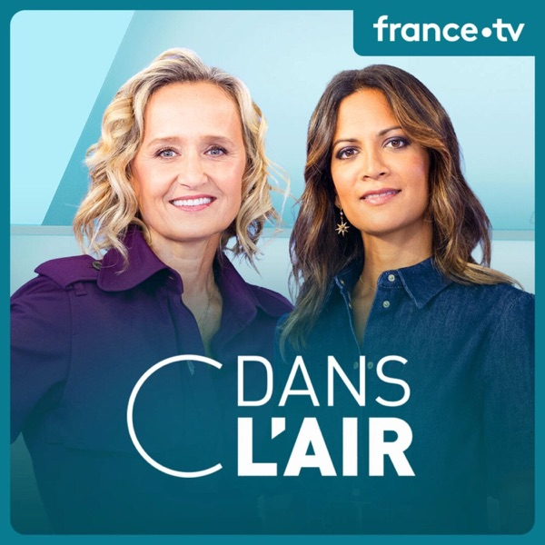

[View on Apple](https://podcasts.apple.com/fr/podcast/c-dans-lair/id1438726711)

## Les grands dossiers de l'Histoire par Franck Ferrand

[View on Apple](https://podcasts.apple.com/fr/podcast/les-grands-dossiers-de-lhistoire-par-franck-ferrand/id1434297164)

## HugoDécrypte - Actus et interviews

[View on Apple](https://podcasts.apple.com/fr/podcast/hugod%C3%A9crypte-actus-et-interviews/id1552365367)

## La dernière

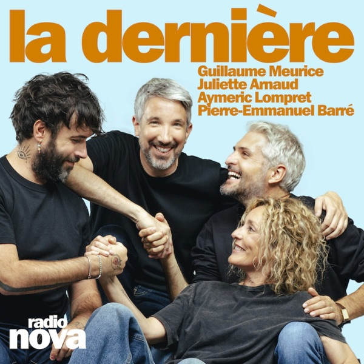

[View on Apple](https://podcasts.apple.com/fr/podcast/la-derni%C3%A8re/id1766744611)

## Les pieds sur terre

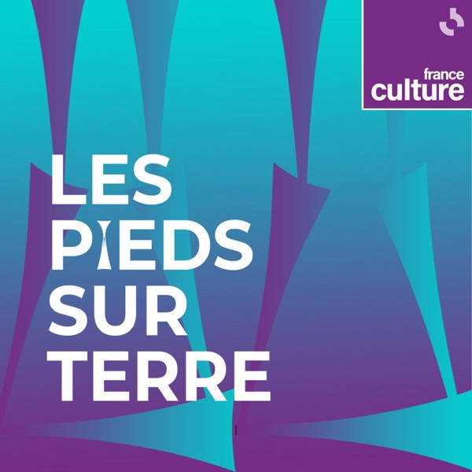

[View on Apple](https://podcasts.apple.com/fr/podcast/les-pieds-sur-terre/id160879442)

## Crime story

[View on Apple](https://podcasts.apple.com/fr/podcast/crime-story/id1658362786)

## Les Grandes Traversées

[View on Apple](https://podcasts.apple.com/fr/podcast/les-grandes-travers%C3%A9es/id1016823985)

## Espions, une histoire vraie

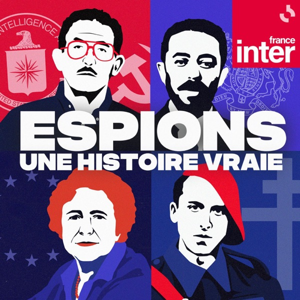

[View on Apple](https://podcasts.apple.com/fr/podcast/espions-une-histoire-vraie/id1520686401)

## Passages, le podcast d'histoires vraies de Louie Media

[View on Apple](https://podcasts.apple.com/fr/podcast/passages-le-podcast-dhistoires-vraies-de-louie-media/id1534412600)

## Si besoin

[View on Apple](https://podcasts.apple.com/fr/podcast/si-besoin/id1896928447)

## Naufragés - une histoire vraie

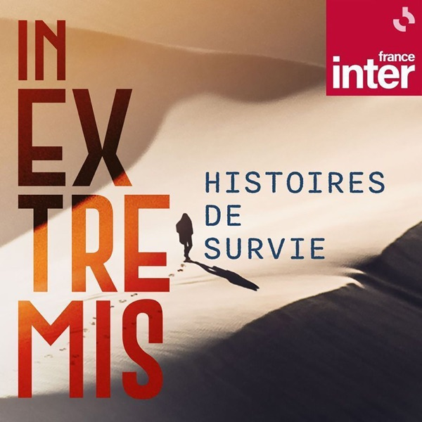

[View on Apple](https://podcasts.apple.com/fr/podcast/naufrag%C3%A9s-une-histoire-vraie/id1664214619)

## Enquêtes criminelles

[View on Apple](https://podcasts.apple.com/fr/podcast/enqu%C3%AAtes-criminelles/id1710726263)

## L'Heure du Monde

[View on Apple](https://podcasts.apple.com/fr/podcast/lheure-du-monde/id1704984604)

## Transfert

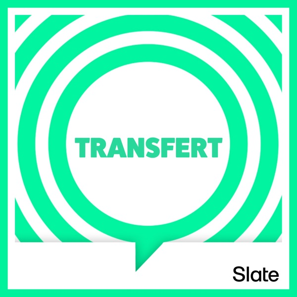

[View on Apple](https://podcasts.apple.com/fr/podcast/transfert/id1567870398)

## Face à l'histoire

[View on Apple](https://podcasts.apple.com/fr/podcast/face-%C3%A0-lhistoire/id1688993204)

## Ça commence aujourd'hui

[View on Apple](https://podcasts.apple.com/fr/podcast/%C3%A7a-commence-aujourdhui/id1561370616)

## Métamorphose, éveille ta conscience !

[View on Apple](https://podcasts.apple.com/fr/podcast/m%C3%A9tamorphose-%C3%A9veille-ta-conscience/id1448632119)

## Small Talk - Konbini

[View on Apple](https://podcasts.apple.com/fr/podcast/small-talk-konbini/id1644493181)

## EX...

[View on Apple](https://podcasts.apple.com/fr/podcast/ex/id1503701694)

## Les Lueurs

[View on Apple](https://podcasts.apple.com/fr/podcast/les-lueurs/id1677352708)

## Secrets d'Histoire

[View on Apple](https://podcasts.apple.com/fr/podcast/secrets-dhistoire/id1724311426)

## Bliss Stories - Maternité sans filtre

[View on Apple](https://podcasts.apple.com/fr/podcast/bliss-stories-maternit%C3%A9-sans-filtre/id1365837531)

## WINAMAX FOOTBALL CLUB

[View on Apple](https://podcasts.apple.com/fr/podcast/winamax-football-club/id1531278198)

## Génération Do It Yourself

[View on Apple](https://podcasts.apple.com/fr/podcast/g%C3%A9n%C3%A9ration-do-it-yourself/id1209142994)

## Au Coeur du Crime

[View on Apple](https://podcasts.apple.com/fr/podcast/au-coeur-du-crime/id1773924080)

## Home(icides)

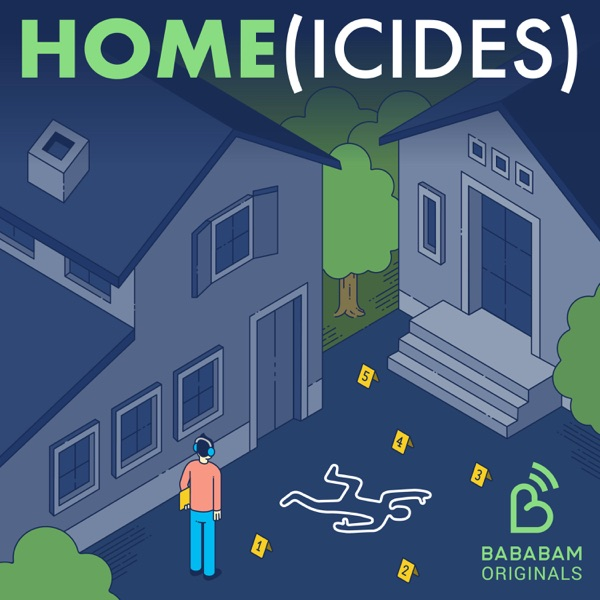

[View on Apple](https://podcasts.apple.com/fr/podcast/home-icides/id1546899313)

## Les collections de l'heure du crime

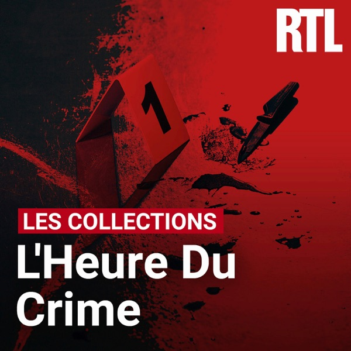

[View on Apple](https://podcasts.apple.com/fr/podcast/les-collections-de-lheure-du-crime/id1593842944)

## Au Cœur de l'Histoire

[View on Apple](https://podcasts.apple.com/fr/podcast/au-c%C5%93ur-de-lhistoire/id423534806)

## Choses à Savoir - Culture générale

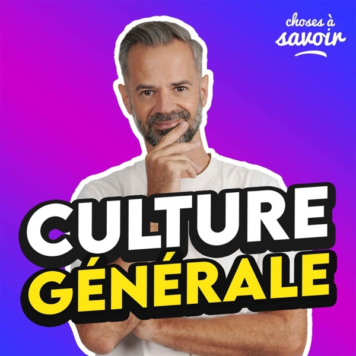

[View on Apple](https://podcasts.apple.com/fr/podcast/choses-%C3%A0-savoir-culture-g%C3%A9n%C3%A9rale/id1048372492)

## Intégrale Coupe du Monde de la FIFA

[View on Apple](https://podcasts.apple.com/fr/podcast/int%C3%A9grale-coupe-du-monde-de-la-fifa/id1399479353)

## L'œil de Philippe Caverivière

[View on Apple](https://podcasts.apple.com/fr/podcast/l%C5%93il-de-philippe-caverivi%C3%A8re/id1477882043)

## HVF - Histoires Vraies et Flippantes

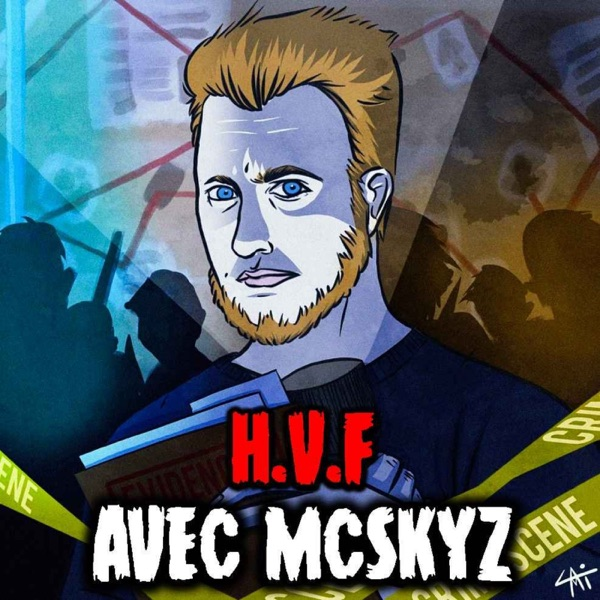

[View on Apple](https://podcasts.apple.com/fr/podcast/hvf-histoires-vraies-et-flippantes/id1647619123)

## Vraiment Riches

[View on Apple](https://podcasts.apple.com/fr/podcast/vraiment-riches/id1896928866)

## Happy End Le Podcast

[View on Apple](https://podcasts.apple.com/fr/podcast/happy-end-le-podcast/id1878471112)

## Les Baladeurs

[View on Apple](https://podcasts.apple.com/fr/podcast/les-baladeurs/id1388330691)

## Les Récits extraordinaires de Pierre Bellemare

[View on Apple](https://podcasts.apple.com/fr/podcast/les-r%C3%A9cits-extraordinaires-de-pierre-bellemare/id1581950528)

## Les aventures du professeur Caillou

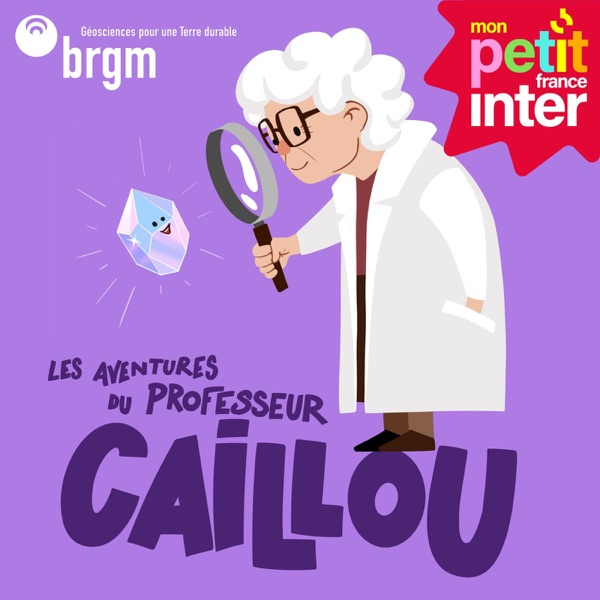

[View on Apple](https://podcasts.apple.com/fr/podcast/les-aventures-du-professeur-caillou/id1811582936)

## Émotions, un podcast pour mettre des mots sur vos émotions, présenté par Marie Misset

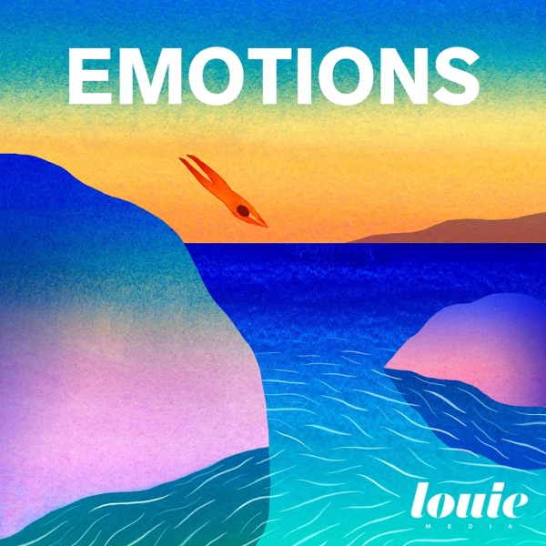

[View on Apple](https://podcasts.apple.com/fr/podcast/%C3%A9motions-un-podcast-pour-mettre-des-mots-sur-vos/id1447653027)

## Le Cours de l'histoire

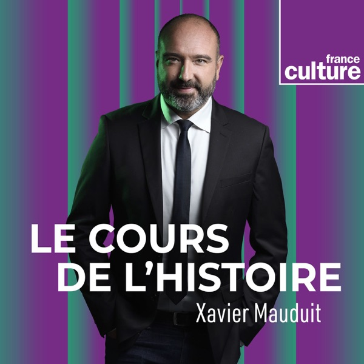

[View on Apple](https://podcasts.apple.com/fr/podcast/le-cours-de-lhistoire/id390164336)

## En apparence

[View on Apple](https://podcasts.apple.com/fr/podcast/en-apparence/id1877628982)

## Scandales

[View on Apple](https://podcasts.apple.com/fr/podcast/scandales/id1612611213)

## LSD, la série documentaire

[View on Apple](https://podcasts.apple.com/fr/podcast/lsd-la-s%C3%A9rie-documentaire/id390167127)

## Les Odyssées

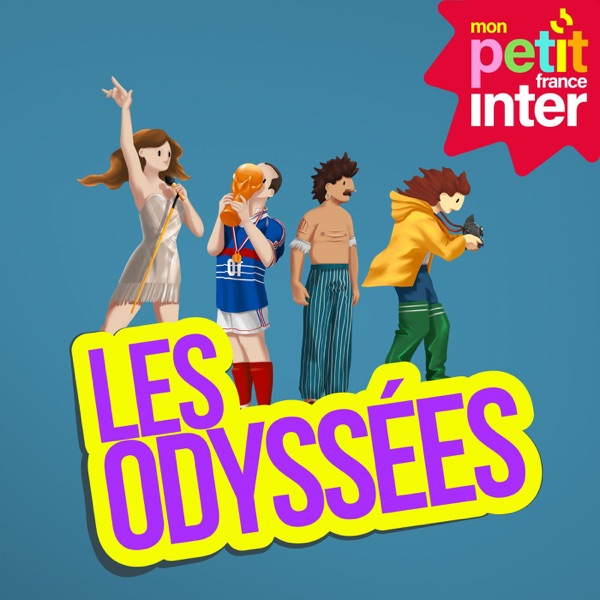

[View on Apple](https://podcasts.apple.com/fr/podcast/les-odyss%C3%A9es/id1469858852)

## Les affaires reprennent

[View on Apple](https://podcasts.apple.com/fr/podcast/les-affaires-reprennent/id6788026454)

## Les Grosses Têtes - Les archives de Philippe Bouvard

[View on Apple](https://podcasts.apple.com/fr/podcast/les-grosses-t%C3%AAtes-les-archives-de-philippe-bouvard/id1653946628)

## Sip & Gossip

[View on Apple](https://podcasts.apple.com/fr/podcast/sip-gossip/id1713166190)

## Un Bon Moment avec Kyan KHOJANDI et NAVO

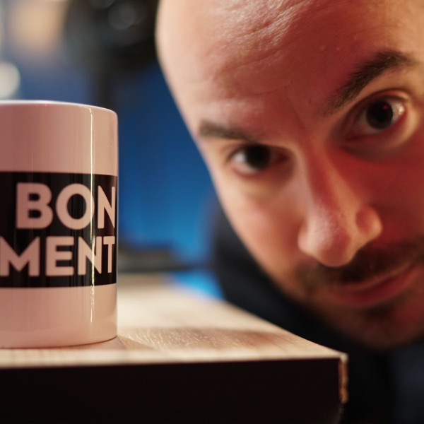

[View on Apple](https://podcasts.apple.com/fr/podcast/un-bon-moment-avec-kyan-khojandi-et-navo/id1498725708)

## Le Collimateur

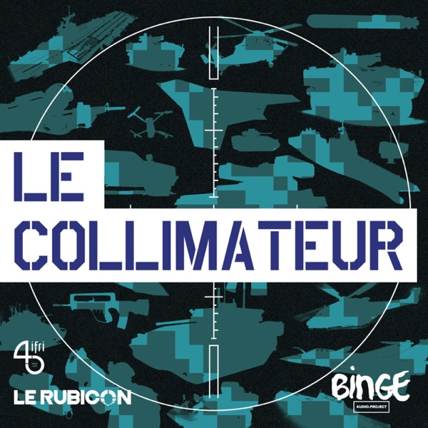

[View on Apple](https://podcasts.apple.com/fr/podcast/le-collimateur/id1449461859)

## Le temps d'un bivouac

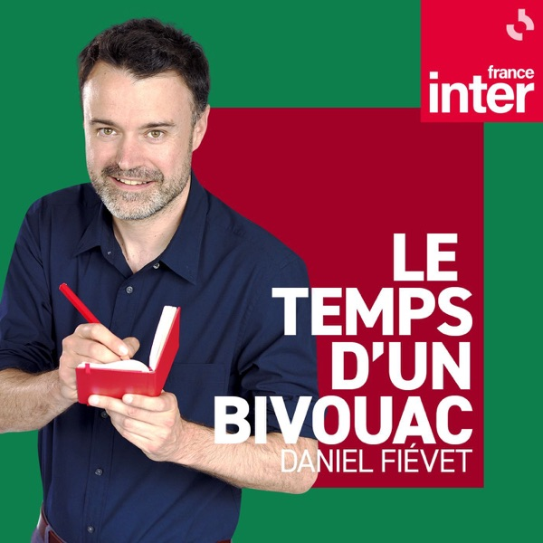

[View on Apple](https://podcasts.apple.com/fr/podcast/le-temps-dun-bivouac/id668983908)

## Storiavoce, un podcast d'Histoire & Civilisations

[View on Apple](https://podcasts.apple.com/fr/podcast/storiavoce-un-podcast-dhistoire-civilisations/id1370632727)

## Cahier de Brouillon

[View on Apple](https://podcasts.apple.com/fr/podcast/cahier-de-brouillon/id6785305616)

## Code source

[View on Apple](https://podcasts.apple.com/fr/podcast/code-source/id1460276302)

## InPower par Louise Aubery

[View on Apple](https://podcasts.apple.com/fr/podcast/inpower-par-louise-aubery/id1373863417)

## 100% HONDELATTE

[View on Apple](https://podcasts.apple.com/fr/podcast/100-hondelatte/id1866982143)

## Criminels

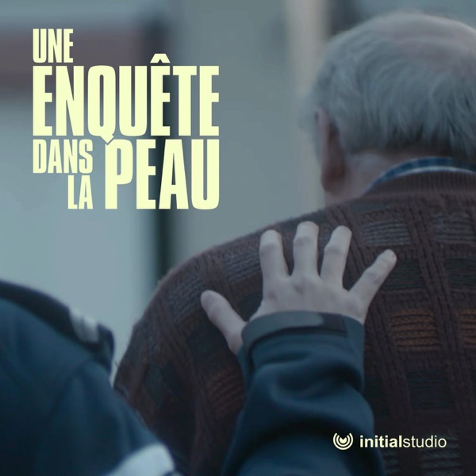

[View on Apple](https://podcasts.apple.com/fr/podcast/criminels/id1571491157)

## L'humour d'Inter

[View on Apple](https://podcasts.apple.com/fr/podcast/lhumour-dinter/id1045510928)

## SPHERE5

[View on Apple](https://podcasts.apple.com/fr/podcast/sphere5/id1890917355)

## Les nuits du Cazarre enchaîné

[View on Apple](https://podcasts.apple.com/fr/podcast/les-nuits-du-cazarre-encha%C3%AEn%C3%A9/id1482611627)

## Encore une histoire

[View on Apple](https://podcasts.apple.com/fr/podcast/encore-une-histoire/id1463322273)

## La riposte

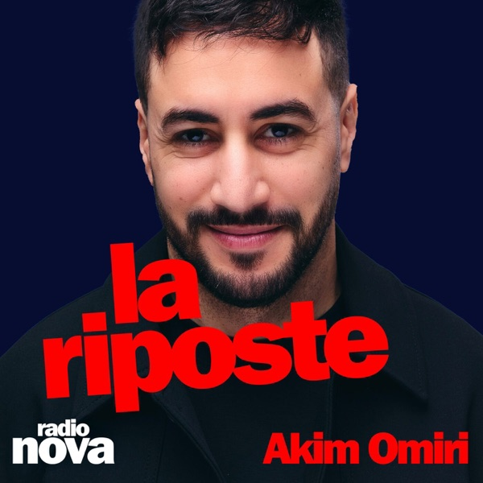

[View on Apple](https://podcasts.apple.com/fr/podcast/la-riposte/id1802654473)

## Laurent Gerra

[View on Apple](https://podcasts.apple.com/fr/podcast/laurent-gerra/id290152576)

## Nota Bene

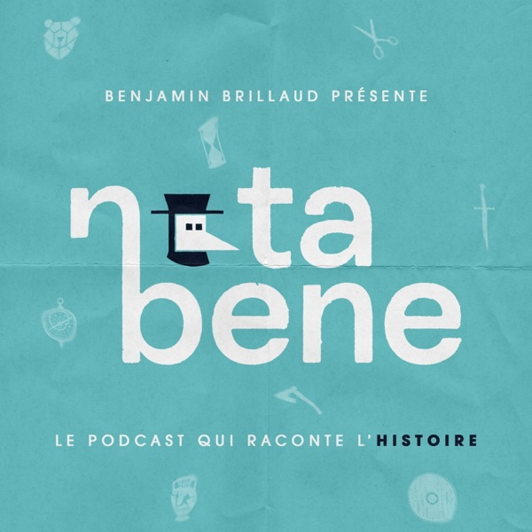

[View on Apple](https://podcasts.apple.com/fr/podcast/nota-bene/id1573434643)

## Les Maîtres du mystère

[View on Apple](https://podcasts.apple.com/fr/podcast/les-ma%C3%AEtres-du-myst%C3%A8re/id1672297528)

## Dialogues par Fabrice Midal

[View on Apple](https://podcasts.apple.com/fr/podcast/dialogues-par-fabrice-midal/id1542543989)

## Sous le soleil de Platon

[View on Apple](https://podcasts.apple.com/fr/podcast/sous-le-soleil-de-platon/id1575915522)

## Quand les dieux rôdaient sur la Terre

[View on Apple](https://podcasts.apple.com/fr/podcast/quand-les-dieux-r%C3%B4daient-sur-la-terre/id1643553784)

## SAFE PACE - Le podcast des sports d'endurance, présenté par Hugo Clément

[View on Apple](https://podcasts.apple.com/fr/podcast/safe-pace-le-podcast-des-sports-dendurance-pr%C3%A9sent%C3%A9/id1813423407)

## CONVERSATIONS AVANT LA FIN DU MONDE

[View on Apple](https://podcasts.apple.com/fr/podcast/conversations-avant-la-fin-du-monde/id1746169884)

## L'Équipe du Tour, le podcast cylisme de L'Équipe sur le Tour de France

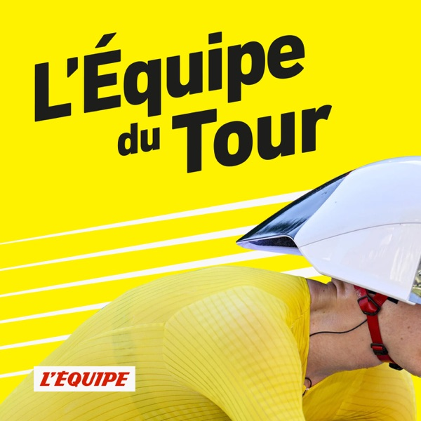

[View on Apple](https://podcasts.apple.com/fr/podcast/l%C3%A9quipe-du-tour-le-podcast-cylisme-de-l%C3%A9quipe-sur-le/id1695114908)

## Aura

[View on Apple](https://podcasts.apple.com/fr/podcast/aura/id1878621900)

## Le grand récit

[View on Apple](https://podcasts.apple.com/fr/podcast/le-grand-r%C3%A9cit/id1834670628)

## Les Grandes Gueules

[View on Apple](https://podcasts.apple.com/fr/podcast/les-grandes-gueules/id82354094)

## Petit Vulgaire

[View on Apple](https://podcasts.apple.com/fr/podcast/petit-vulgaire/id1574084044)

## La Traque

[View on Apple](https://podcasts.apple.com/fr/podcast/la-traque/id1675024215)

## Underscore_

[View on Apple](https://podcasts.apple.com/fr/podcast/underscore/id1556250107)

## FloodCast

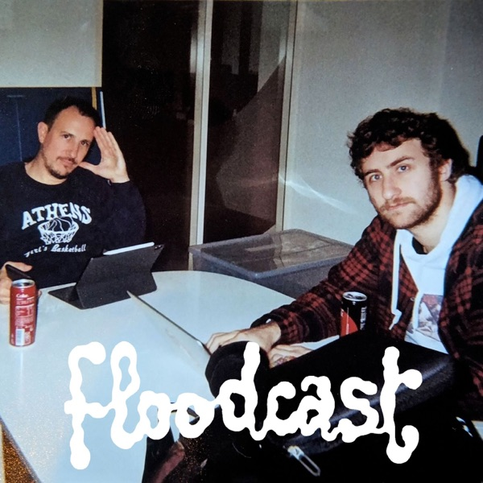

[View on Apple](https://podcasts.apple.com/fr/podcast/floodcast/id1019768302)

## Profils : des récits uniques

[View on Apple](https://podcasts.apple.com/fr/podcast/profils-des-r%C3%A9cits-uniques/id1093080425)

## Thinkerview

[View on Apple](https://podcasts.apple.com/fr/podcast/thinkerview/id1196519121)

## Le Fil de l'histoire

[View on Apple](https://podcasts.apple.com/fr/podcast/le-fil-de-lhistoire/id1035249857)

## Le masque et la plume

[View on Apple](https://podcasts.apple.com/fr/podcast/le-masque-et-la-plume/id115156841)

## Unfinished Sentences by Ogee

[View on Apple](https://podcasts.apple.com/fr/podcast/unfinished-sentences-by-ogee/id1874658713)

## Laurent Baffie

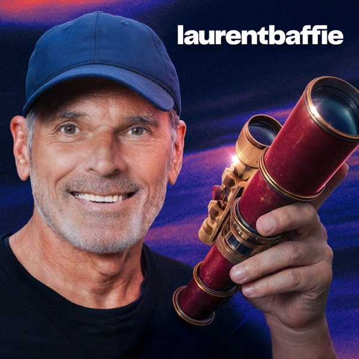

[View on Apple](https://podcasts.apple.com/fr/podcast/laurent-baffie/id1752843346)

## La face sombre de l'Histoire

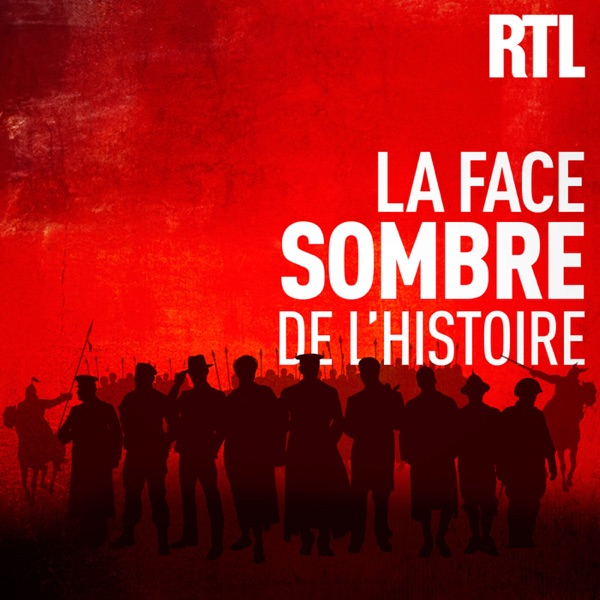

[View on Apple](https://podcasts.apple.com/fr/podcast/la-face-sombre-de-lhistoire/id1765145100)

## Les Couilles sur la table

[View on Apple](https://podcasts.apple.com/fr/podcast/les-couilles-sur-la-table/id1283233873)

## La Science CQFD

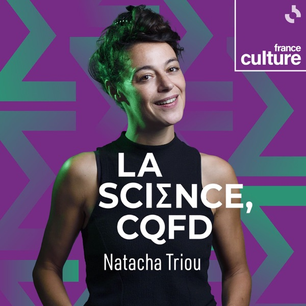

[View on Apple](https://podcasts.apple.com/fr/podcast/la-science-cqfd/id1134937775)

## L'Équipe du Mondial, le podcast foot de L'Équipe pour la Coupe du monde 2026

[View on Apple](https://podcasts.apple.com/fr/podcast/l%C3%A9quipe-du-mondial-le-podcast-foot-de-l%C3%A9quipe-pour/id1896912868)

## Le Cœur sur la table

[View on Apple](https://podcasts.apple.com/fr/podcast/le-c%C5%93ur-sur-la-table/id1549677326)

## Vivons heureux avant la fin du monde : des idées pour repenser nos modèles de société

[View on Apple](https://podcasts.apple.com/fr/podcast/vivons-heureux-avant-la-fin-du-monde-des-id%C3%A9es-pour/id1532728722)

## Culture G

[View on Apple](https://podcasts.apple.com/fr/podcast/culture-g/id1440467605)

## BANGERZ - CONVERSATION

[View on Apple](https://podcasts.apple.com/fr/podcast/bangerz-conversation/id1840965894)

## 6 Minute English

[View on Apple](https://podcasts.apple.com/fr/podcast/6-minute-english/id262026947)

## Global News Podcast

[View on Apple](https://podcasts.apple.com/fr/podcast/global-news-podcast/id135067274)
