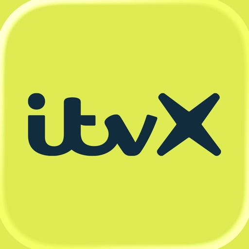
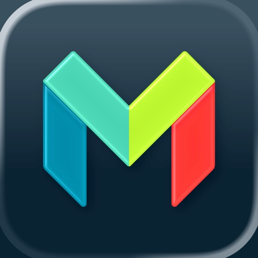
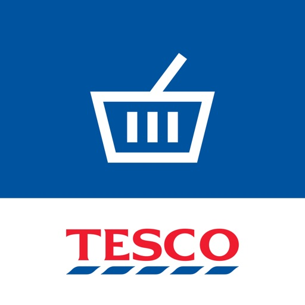
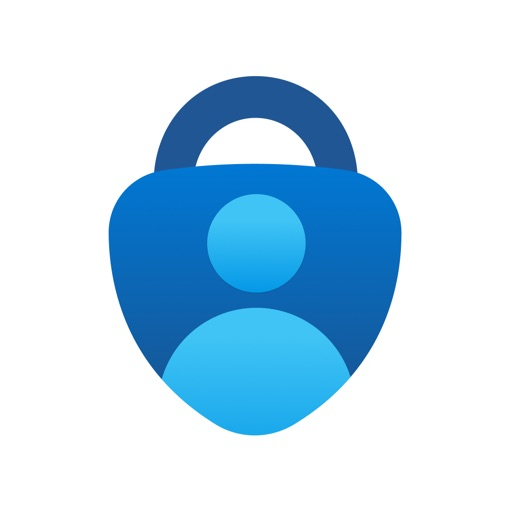
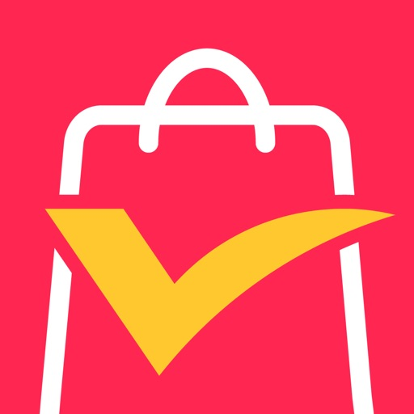
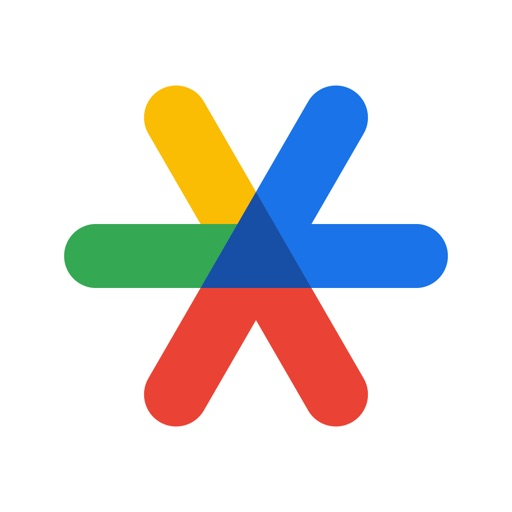
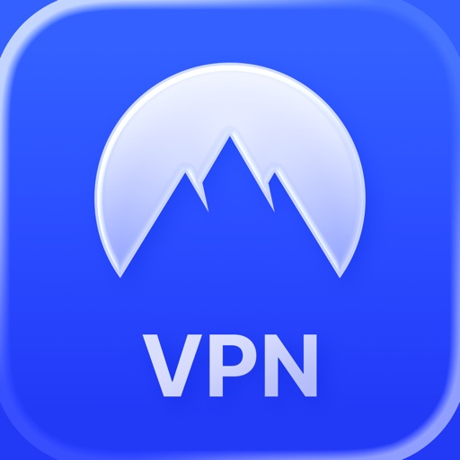
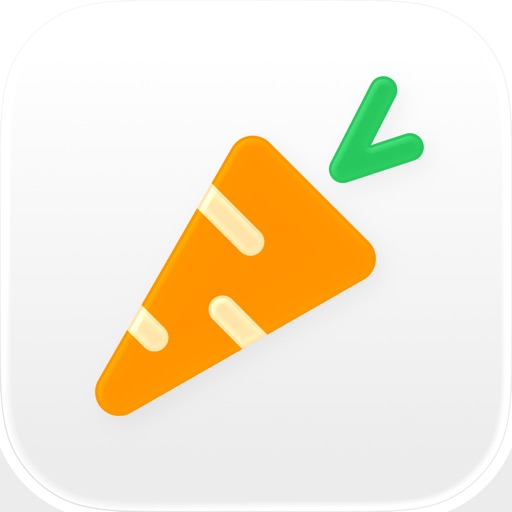

- [GOV.UK One Login](#gov-uk-one-login)
- [BBC iPlayer](#bbc-iplayer)
- [ChatGPT](#chatgpt)
- [InPost UK](#inpost-uk)
- [BBC Sport - News & Live Scores](#bbc-sport-news-live-scores)
- [ITVX](#itvx)
- [Whatnot: Shop, Sell, Connect](#whatnot-shop-sell-connect)
- [Lloyds Mobile Banking](#lloyds-mobile-banking)
- [Netflix Game Controller](#netflix-game-controller)
- [Google Gemini](#google-gemini)
- [Claude by Anthropic](#claude-by-anthropic)
- [bet365 - Sports Betting](#bet365-sports-betting)
- [Google](#google)
- [Dola: Smart AI Assistant](#dola-smart-ai-assistant)
- [Uber: Ride-Hailing & Taxis](#uber-ride-hailing-taxis)
- [Monzo Bank - Mobile Banking](#monzo-bank-mobile-banking)
- [Threads](#threads)
- [Temu : Achats et Mode en Ligne](#temu-achats-et-mode-en-ligne)
- [Vinted: Secondhand-Marktplatz](#vinted-secondhand-marktplatz)
- [Ryanair](#ryanair)
- [Bolt: Fahrten anfordern](#bolt-fahrten-anfordern)
- [Google Maps](#google-maps)
- [CapCut: Foto- und Video-Editor](#capcut-foto-und-video-editor)
- [Airbnb](#airbnb)
- [Revolut — Banking & Trading](#revolut-banking-trading)
- [VibeShort: AI Comic Dramas](#vibeshort-ai-comic-dramas)
- [Jet2 - Holidays and Flights](#jet2-holidays-and-flights)
- [StoryReel: Exclusive Drama](#storyreel-exclusive-drama)
- [Shop: Deine Lieblingsmarken](#shop-deine-lieblingsmarken)
- [DramaWave - Drama & Reel](#dramawave-drama-reel)
- [Tesco Grocery & Clubcard](#tesco-grocery-clubcard)
- [RingGo: Mobile Car Parking App](#ringgo-mobile-car-parking-app)
- [Microsoft Authenticator](#microsoft-authenticator)
- [Life360: Family Safety & GPS](#life360-family-safety-gps)
- [Lidl Plus](#lidl-plus)
- [Waze Navigation und Verkehr](#waze-navigation-und-verkehr)
- [Telegram Messenger](#telegram-messenger)
- [HMRC](#hmrc)
- [Ticketmaster－Buy, Sell Tickets](#ticketmaster-buy-sell-tickets)
- [Booking.com: Hotel Angebote](#booking-com-hotel-angebote)
- [AliExpress Shopping App](#aliexpress-shopping-app)
- [Freecash - Geld verdienen](#freecash-geld-verdienen)
- [easyJet: Travel App](#easyjet-travel-app)
- [Merlin Bird ID by Cornell Lab](#merlin-bird-id-by-cornell-lab)
- [多邻国Duolingo英语日语法语](#多邻国duolingo英语日语法语)
- [AllTrails Rando Sentiers Carte](#alltrails-rando-sentiers-carte)
- [Indeed Jobs](#indeed-jobs)
- [Testerup: Test & Earn Rewards](#testerup-test-earn-rewards)
- [GetYourGuide: Planen & buchen](#getyourguide-planen-buchen)
- [McDonald’s U.K.](#mcdonald-s-u-k)
- [Just Eat: Food and Shops](#just-eat-food-and-shops)
- [SHEIN-Shopping Online](#shein-shopping-online)
- [Uber Eats: Essen, Lieferdienst](#uber-eats-essen-lieferdienst)
- [TikTok - Videos, Shop und LIVE](#tiktok-videos-shop-und-live)
- [X (anciennement Twitter)](#x-anciennement-twitter)
- [VPN - Super Unlimited Proxy ™](#vpn-super-unlimited-proxy-tm)
- [Trainline: Train & Bus Tickets](#trainline-train-bus-tickets)
- [Instagram](#instagram)
- [NetShort -Beliebte Dramen & TV](#netshort-beliebte-dramen-tv)
- [PayByPhone Parking](#paybyphone-parking)
- [Greene King Pubs & Restaurants](#greene-king-pubs-restaurants)
- [JustPark Parking](#justpark-parking)
- [Facebook](#facebook)
- [Gmail – E-Mail von Google](#gmail-e-mail-von-google)
- [NHS App](#nhs-app)
- [Nectar: Shop & Collect Points](#nectar-shop-collect-points)
- [Proton VPN: Privé et Rapide](#proton-vpn-prive-et-rapide)
- [Spotify Musik und Podcasts](#spotify-musik-und-podcasts)
- [Google Chrome](#google-chrome)
- [Netflix](#netflix)
- [Amazon Shopping](#amazon-shopping)
- [Google Authenticator](#google-authenticator)
- [Pinterest](#pinterest)
- [Reddit](#reddit)
- [Cleanup: Clean Storage Space](#cleanup-clean-storage-space)
- [eBay: kaufen & verkaufen](#ebay-kaufen-verkaufen)
- [TrainPal: Cheap train tickets](#trainpal-cheap-train-tickets)
- [Klarna: Verwalte Geld smarter](#klarna-verwalte-geld-smarter)
- [Airalo: eSIM-Reisen & Internet](#airalo-esim-reisen-internet)
- [Trip.com: Flight, Hotel, Train](#trip-com-flight-hotel-train)
- [Octopus Energy](#octopus-energy)
- [Dunelm: The Home of Homes](#dunelm-the-home-of-homes)
- [Voi – E-Scooter & E-Bikes](#voi-e-scooter-e-bikes)
- [Meta AI](#meta-ai)
- [Flightradar24 | Flight Tracker](#flightradar24-flight-tracker)
- [Deliveroo: Food & Shopping](#deliveroo-food-shopping)
- [NordVPN: VPN Fast & Secure](#nordvpn-vpn-fast-secure)
- [Lime - #RideGreen](#lime-ridegreen)
- [Strava: Laufen & Radfahren](#strava-laufen-radfahren)
- [Amazon Prime Video](#amazon-prime-video)
- [Too Good To Go: Essen retten](#too-good-to-go-essen-retten)
- [Greggs App - Food & Drink](#greggs-app-food-drink)
- [PayPal: Geld senden, verwalten](#paypal-geld-senden-verwalten)
- [Commerce B2B avec Alibaba](#commerce-b2b-avec-alibaba)
- [Royal Mail](#royal-mail)
- [Grok - Assistant IA](#grok-assistant-ia)
- [Yuka - Food & Cosmetic Scanner](#yuka-food-cosmetic-scanner)
- [DramaBox - Film et Drame Court](#dramabox-film-et-drame-court)
- [YouTube](#youtube)
- [Canva: KI-Foto- & Video-Editor](#canva-ki-foto-video-editor)

## GOV.UK One Login

You can use the GOV.UK One Login app to prove your identity to access some government services. It works by matching your face to your photo ID.

You can also use this app to save a digital version of your HM Armed Forces Veteran Card to your phone. 

In future you'll be able to save other digital documents, such as your driving licence. This is not available yet.

Before you start

You need to get this app if you’re:
• using a service on the GOV.UK website that asks you to prove your identity with GOV.UK One Login
• saving your digital Veteran Card to your phone

You’ll be guided to this app when it is time to use it.

What you need

You can use any of the following types of photo ID to prove your identity:
• UK passport
• non-UK passport with a biometric chip
• UK photocard driving licence
• UK biometric residence permit (BRP)
• UK biometric residence card (BRC)
• UK Frontier Worker permit (FWP)

You can use an expired driving licence if it expired in the last 90 days and it was issued by DVLA.

You can use an expired BRP, BRC or FWP up to 24 months after its expiry date.

You need to have your original photo ID with you. You cannot use a photocopy or digital copy.

You will also need:
• a well-lit area where you can take a good quality photograph
• an iPhone 8 or newer
• iOS 16.7 or higher

How it works

You'll need to sign in to the app with your GOV.UK  One Login details. This links the app to the GOV.UK website so you can continue proving your identity.

If your photo ID is a passport, BRP, BRC or FWP you will:
• take a photo of your photo ID
• scan the biometric chip in your photo ID using your phone
• scan your face using your phone

If your photo ID is a driving licence you will:
• take a photo of your driving licence
• scan your face using your phone

What happens next

Once your information has been submitted in the app, you'll need to go back to the GOV.UK website, so you can finish proving your identity and access the service you were trying to use.
 
Privacy and security

The personal information you provide to prove your identity will not be saved either on the app or on your phone. We collect your data securely and delete it when it is no longer needed.
Digital documents you add to the app will be saved on your phone so you can access them whenever you need.

[View on Apple](https://apps.apple.com/gb/app/gov-uk-one-login/id6737119425)

## BBC iPlayer

Enjoy BBC iPlayer in the palm of your hand, from live news coverage, music and big sporting events to great comedies, gripping documentaries and nail-biting dramas. 
 
KEY FEATURES:
 
WATCH ON DEMAND
Discover the latest TV series including The Traitors, Race Across the World and Gladiators.
 
LIVE TV
Pause, restart and rewind live channels part way through so that you don’t miss a thing.
 
OFFLINE VIEWING
Download shows to your device so that you can watch on the go.
 
PARENTAL CONTROLS
Create a child profile for a more age appropriate experience with all their favourite shows from CBBC, CBeebies and more!
 
MORE FEATURES TO ENJOY:

- Build a watchlist of your favourite shows.
- Sign in or create an account so that you can start watching on one device and resume watching on another.
- Receive recommendations of shows we think you might enjoy.
- Stream programmes to your TV using Apple AirPlay and Google Chromecast; please note this requires a supported device and compatible supported device connected to your TV

 
To give you the best experience, this app tracks what you’ve searched for. This can be deleted by tapping the ‘Clear History’ button on the Search screen. What you’ve watched and how long you’ve watched programmes are also tracked. You can turn this off by logging into your BBC account and turning off “Allow Personalisation”. The device uses performance cookies for internal purposes to help us improve the app. You can choose to opt out of this at any time from the in-app Settings menu. For more information about this and privacy, cookies and iPlayer more generally, visit the BBC iPlayer Apps Privacy notice at https://www.bbc.co.uk/iplayer/help/app_privacy. To read the BBC’s Privacy Policy go to https://www.bbc.co.uk/privacy/

You can “opt out” from our data processor’s tracking by filling the “Forget My Device” form in this link https://www.appsflyer.com/optout
If you install this app you accept the BBC Terms of Use at https://www.bbc.co.uk/terms.
The app was developed by Media AT (BBC Media Applications Technologies Limited) which is a wholly owned subsidiary of the BBC (British Broadcasting Corporation). Full details of Media AT are available on the Companies House website at: http://data.companieshouse.gov.uk/doc/company/07100235

[View on Apple](https://apps.apple.com/gb/app/bbc-iplayer/id416580485)

## ChatGPT

Neu: ChatGPT für iOS – Lerne die neuesten Verbesserungen in OpenAI kennen.

Diese offizielle App ist kostenlos. Sie synchronisiert deinen Verlauf über mehrere Geräte hinweg und stellt dir die neuesten Funktionen von OpenAI zur Verfügung, einschließlich des neuen Bildgenerators.

ChatGPT bietet dir folgende Funktionen:

· Bildgenerierung: Lass ChatGPT anhand einer Beschreibung beeindruckende Bilder erstellen oder fordere es mit ein paar einfachen Worten auf, vorhandene Bilder nach deinen Wünschen zu verwandeln. 
· Fortgeschrittener Audiomodus: Tippe auf das Schallwellen-Icon, um auch unterwegs in Echtzeit Gespräche zu führen. Schlichte einen Streit am Esstisch oder übe eine neue Sprache. 
· Foto-Upload: Mache ein Foto oder lade ein Bild hoch, um ein handschriftliches Rezept zu transkribieren oder Informationen über eine Sehenswürdigkeit zu erhalten. 
· Kreative Inspiration: Lass dir Vorschläge für individuelle Geburtstagsgeschenke machen oder erstelle eine personalisierte Grußkarte.
· Maßgeschneiderte Ratschläge: Besprich schwierige Situationen, frage nach einer detaillierten Reiseroute oder lass dir beim Verfassen der perfekten Antwort helfen. 
· Personalisiertes Lernen: Erkläre einem von Dinosauriern begeisterten Kind, was Elektrizität ist, oder frische im Handumdrehen dein Wissen über ein historisches Ereignis auf.
· Professioneller Input: Sammle Ideen für Marketingtexte oder entwirf einen Geschäftsplan.
· Sofortige Antworten: Lass dir Rezeptvorschläge machen, wenn du nur ein paar Zutaten im Kühlschrank hast.

Schließe dich Millionen von Benutzern an und probiere die App aus, die die Welt begeistert. Lade ChatGPT noch heute herunter.

Nutzungsbedingungen und Datenschutzrichtlinie:
https://openai.com/policies/terms-of-use
https://openai.com/policies/privacy-policy

[View on Apple](https://apps.apple.com/gb/app/chatgpt/id6448311069)

## InPost UK

*NEW* Track Yodel by InPost home deliveries straight from the app. Save your delivery preferences, get an estimated date and 2-hour window, and redirect parcels to a locker if you're not going to be in. Import your Yodel app preferences to get set up in seconds.

SEND PARCELS 24/7 - PRINT-FREE 
Drop off at any locker or shop and we'll get it from A to B - straight to a locker or home address. Upgrade your cover for extra peace of mind.

YODEL PARCEL REDIRECTION 
Use our app to divert your Yodel parcels - whether they're heading to your home or a locker - wherever suits you best.

CHECK FOR SPACE BY COMPARTMENT SIZE 
See if small, medium or large compartments have availability in your nearest lockers. Plan your route and get tips on spotting lockers on-site.

REMOTE OPENING 
Collecting a parcel from an InPost Locker? Walk up and use your app to open the compartment - no locker screen needed.

TRACK PARCELS 
Whether you're collecting, returning or sending, track all your parcels from A to B - right in the palm of your hand.

GET UPDATES 
We'll keep you posted while your parcels are on the move and send all your collection details straight to your app.

[View on Apple](https://apps.apple.com/gb/app/inpost-uk/id1591214233)

## BBC Sport - News & Live Scores

The official BBC Sport app offers you the latest sports news, scores, live sport and highlights. It’s the best way to follow all the latest sporting action!

Download the BBC Sport app, you’ll get live analysis and scores so that you can keep up to date throughout the sporting year.

The BBC Sport app has dedicated sections covering Premier League Football, Six Nations Rugby Union, Rugby League, Cricket, Formula 1, Tennis, Golf, Boxing and Athletics so you’ll be up to date with the world’s biggest events.

SPORTS NEWS
The BBC Sport app brings you all the breaking news across the world of sport including football, cricket, rugby union, rugby league, F1, tennis, golf, athletics and much more. Read all of the latest headlines, football gossip, transfer rumours and league action as the stories unfold. You can even share news stories and sports results with your friends and followers across your social channels.

SPORT RESULTS
Never again do you have to miss any of the latest action. The BBC Sport app offers in-depth results, analysis, live scores, match stats and text commentaries — keeping you up-to-date with all the action when you’re on the go.

MY SPORT
Create a personalised “My Sport” page to bring together the stories, results and fixtures for the sports you love. Choose from over 350 different topics to follow including your favourite team or sports.

TOP FLIGHT FOOTBALL
As well as our football and Premier League pages, each team in England's top flight also has their own page — a one-stop shop for all the best digital content about that club, including insight and analysis from journalists and pundits across the BBC, plus the best of social media.
 
And, of course, you also get your fixtures, results, tables and player stats.
 
Want the biggest news and match updates from your team sent direct to your phone or tablet? Then download the BBC Sport app and sign up to notifications.
 
With news notifications for all 20 Premier League sides, you will have the biggest stories and the best content about your club at your fingertips.
 
ALERTS
Receive personalised notifications that get delivered directly to your locked screen. Set notifications for top sports stories, plus more than 400 football teams, dozens of cricket and rugby teams and every Formula 1 race!

LIVE SPORT
Watch major sporting events live or catch up with on-demand highlights straight to your mobile or tablet device.

AROUND THE BBC
Discover the best sporting content from around the BBC via the BBC Sport app including podcasts through BBC Sounds, exclusive content on BBC iPlayer and more.

------
Please note a network connection and a BBC Account are required to access content. https://www.bbc.co.uk/usingthebbc/account/
You can “opt out” from our data processor’s tracking by filling the “Forget My Device” form in this link https://www.appsflyer.com/optout 
If you install this app you accept the BBC Terms of Use at https://www.bbc.co.uk/terms. Find out about your privacy rights and the BBC’s Privacy and Cookies Policy at https://www.bbc.co.uk/privacy. To give you the best experience and to enable the features listed above this app stores data around your usage of the app. You can read more about this and can turn off any or all data tracking by following the instructions in our privacy notice at https://www.bbc.co.uk/sport/44130693.

[View on Apple](https://apps.apple.com/gb/app/bbc-sport-news-live-scores/id377388936)

## ITVX

Stream live TV, new shows every week, hundreds of films and boxsets and loads of live events. All of ITV and so much more of your favourite telly – only on ITVX. It's the stuff you love to watch and it's all free. There's no place like ITV.

Terms of Use (EULA): https://www.itv.com/terms/articles/itvxtermsofuse

[View on Apple](https://apps.apple.com/gb/app/itvx/id446079916)

## Whatnot: Shop, Sell, Connect

Whatnot ist die größte Plattform für Live Shopping in Europa, der UK und den USA – wir sind ein Marktplatz, der Millionen zusammenbringt, um die Dinge, die sie lieben, zu kaufen, verkaufen und sich zu vernetzen. Von Taschen bis Beauty, Comics bis Münzen, von Sneakers bis Streetwear und Vintage bis Vinyl – wir haben alles. Erkunde über 250 Kategorien, darunter Electronics, Sport und Pokémon-Karten, Mode, Pflanzen, Schmuck und mehr.

FINDE UNGLAUBLICHE MARKENDEALS – Schließe dich Hunderttausenden von Verkäufern an und shoppe mit hohen Rabatten deine Lieblingsmode und Dinge des täglichen Bedarfs. Von Marken, die du kennst und liebst, bis hin zu neuen und schwer zu findenden Spezialprodukten. Whatnot hat einen Deal für alles, was du suchst.

SHOPPEN HAT NOCH NIE SO VIEL SPASS GEMACHT. Ob du an schnellen Auktionen, unglaublichen Flash-Sales oder Livestream-Giveaways teilnimmst, den Marktplatz durchstöberst oder dich im Chat beteiligst – du hattest noch nie so viel Spaß beim Shoppen. Whatnot hat das Beste des physischen Einzelhandels ins Netz gebracht. 

SHOPPE MIT VERTRAUEN - Falls bei deinem Kauf doch mal etwas schiefgeht, sind wir für dich da. Mit unserem Käuferschutz bist du abgesichert - egal, ob dein Artikel beschädigt ankommt, fehlt oder nicht der Beschreibung entspricht.

INTERESSE AM VERKAUF AUF WHATNOT? Im letzten Jahr generierten kleine Unternehmen mehr als 3 Milliarden Euro Umsatz auf Whatnot. Verdiene mehr, indem du live verkaufst, komm noch heute zu Whatnot.

[View on Apple](https://apps.apple.com/gb/app/whatnot-shop-sell-connect/id1488269261)

## Lloyds Mobile Banking

BE THE BOSS OF YOUR MONEY
Manage your money with confidence, whenever and wherever you need. Join our 10 million App users – get the app and get started.

Seeing your balance, paying a bill or checking your transactions are just the start. Here’s some of the great stuff we’ve got going on in the App.

SPEND? SAVE? BORROW? INSURE? INVEST? APPLY IN THE APP TODAY
-	Not yet banking with us? Don’t worry – download the App, it’s the quickest and easiest way to apply for a bank account with us.
-	You can share documents with us in real-time using your built-in camera to complete your application quickly.

TAKE CONTROL OF YOUR EVERYDAY SPENDING
-	Ever fallen into the subscription trap after that free trial? See, block and cancel subscriptions anytime.
-	Need to settle up or transfer money fast? With Faster Payments you can sort it in quick time.
-	Splitting the bill? Friend forgot their card? Request and receive money you’re owed from family and friends using ‘Request a Payment’.
-	Get support all day and night, every day. 

STAY IN THE KNOW WITH REAL TIME INSIGHTS
-	Know what’s going on with your money in real-time, with upcoming payments and instant notifications when money’s coming in and going out.
-	Wondering where your money goes? See where you’re spending and where you might be able to save, with Spending Insights.

MAKE YOUR MONEY WORK HARDER FOR YOU
-	Enjoy a cheeky bargain or three with Everyday Offers. Earn cashback of up to 15% from a range of retailers with our current accounts and credit cards.
-	Turn your pennies to pounds – using ‘Save the Change’. We’ll round up your debit card spend to the nearest pound and move it into a chosen savings account with us. 
-	Keep track of your credit score for free, with helpful tips and tools to improve it.

KEEPING YOU AND YOUR MONEY SAFE
-	Use your fingerprint or face to login - it’s the fastest and most secure way to bank.
-	Whether your card is lost, stolen or turned into a chew toy, you can relax knowing you can freeze it, unfreeze it or order a new one in seconds.
-	With the latest security tech we keep your money safe and stop those pesky hackers in their tracks.
-	Your eligible deposits with Lloyds are protected up to £85,000 by the Financial Services Compensation Scheme. Find out more at lloydsbank.com/FSCS

LEAVE US A REVIEW ABOUT OUR APP
We’re always ready to listen and make things better for you.

Lloyds and Lloyds Bank are trading names of Lloyds Bank Plc (registered in England and Wales (no. 2065), registered office: 25 Gresham Street, London EC2V 7HN). Authorised by the Prudential Regulation Authority and regulated by the Financial Conduct Authority and the Prudential Regulation Authority under registration number 119278.

The app is available to customers with a UK personal bank account and valid registered phone number.
 
LEGAL INFORMATION
This app is designed and intended for Lloyds UK customers to access and service UK personal products, and for customers of Lloyds Bank Corporate Markets plc, using the business names Lloyds Bank International and Lloyds Bank International Private Banking, to access and service personal products held in Jersey, Guernsey and the Isle of Man. It should only be downloaded for this purpose.

While the app can be downloaded from App Stores outside the UK, this does not mean we are inviting, offering or recommending you engage in any transactions or establish a customer relationship with Lloyds or Lloyds Bank Corporate Markets plc.

Any confirmation that our product or service complies with European Union law is made to Apple to meet this legal requirement. This does not imply any representation, warranty, or statement to you and should not be relied upon for entering into any contract.

[View on Apple](https://apps.apple.com/gb/app/lloyds-mobile-banking/id469964520)

## Netflix Game Controller

Spiele Spiele auf deinem Fernseher oder Computerbrowser mit dem Netflix-Gamecontroller.

Mit dieser App kannst du Spiele auf Netflix spielen, indem du dein Handy oder Mobilgerät als Gamecontroller verwendest. Die Netflix-Gamecontroller-App ist für alle verfügbar.

Netflix Games befindet sich in der Beta-Phase und je nach Gerätetyp wird dein Fernseher oder Browser möglicherweise derzeit nicht unterstützt.

Lass die Spiele beginnen!

[View on Apple](https://apps.apple.com/gb/app/netflix-game-controller/id6447582581)

## Google Gemini

Ob auf dem Weg zur Arbeit oder bei der Recherche bis spät in die Nacht – Google Gemini ist dein persönlicher, proaktiver und leistungsstarker KI-Assistent.

DIE BELIEBTESTEN FUNKTIONEN VON GEMINI
• Unsere neuesten Modelle, Gemini 3.5 Flash und Gemini Omni, eröffnen ganz neue Möglichkeiten für Produktivität und Kreativität.
• Tausche dich mit Gemini Live aus: Brainstorme in Echtzeit oder teile deinen Bildschirm bzw. deine Kamera, um direkt über das zu sprechen, was du siehst.
• Statt langer, monotoner Texte erhältst du sorgfältig ausgearbeitete Antworten mit eingebetteten Bildern, Zeitachsen und interaktiven Grafiken.
• Du kannst unter anderem Dokumente, Tabellen, Fotos oder Videos hochladen, um Antworten, Zusammenfassungen und Informationen zu deinen Inhalten zu erhalten.

ERWECKE DEINE KREATIVEN IDEEN ZUM LEBEN
• Fotos erstellen und bearbeiten mit Nano Banana 2: Wende die Kamera- und Belichtungseinstellungen an, füge mehrere Bilder zu einem Mockup zusammen, designe Poster mit gestochen scharfem Text und erstelle mühelos Diagramme. Anschließend kannst du die Größe beliebig anpassen.
• Verwandle deine Ideen mit Gemini Omni in kinoreife Videos – verfügbar für Nutzer*innen von Google AI Plus, Pro, Ultra und Workspace.
• Erstelle mit Lyria 3 individuelle Soundtracks für jeden Moment.

STEIGERE DEINE PRODUKTIVITÄT
• Recherche mit NotebookLM: Du erhältst fundiertere und relevantere Antworten auf Basis deiner eigenen Quellen.
• Lernhilfe und einfache Prüfungsvorbereitung: Lade deine Kursnotizen hoch, um individuelle Übungsquizze und interaktive Grafiken zu generieren.
• Vom Prompt zum Prototyp: Erstelle Webseiten, Spiele oder Dashboards. Du kannst sogar deine Dateien in eine Podcast-ähnliche Übersicht umwandeln, um sie dir unterwegs anzuhören.

MEHR MÖGLICHKEITEN DURCH EIN UPGRADE
Mit einem Upgrade auf ein Google AI Plus-, Pro- oder Ultra-Abo kann Gemini dich noch besser bei komplexen Aufgaben und Projekten unterstützen.

Datenschutzhinweise für Gemini-Apps: g.co/gemini/privacynotice
Hinweis: Gemini bietet zwar leistungsstarke Funktionen für mehr Produktivität, unterstützt aber derzeit keine iOS-Geräteaktionen wie das Stellen von Weckern oder das direkte Senden von SMS. Gemini for Business ist über entsprechende Google Workspace-Abos verfügbar.

[View on Apple](https://apps.apple.com/gb/app/google-gemini/id6477489729)

## Claude by Anthropic

Verbinde dich mit Claude – deinem persönlichen KI-Assistenten, der mit dir denkt, aber dich nicht lenkt.

Claude von Anthropic ist deine All-in-One-App als KI-Assistent fürs Schreiben, Recherchieren, Programmieren und Lösen komplexer Aufgaben. Claude steigert deine Produktivität und Effizienz.

KI-SCHREIBASSISTENT

Nutze Claude als deinen persönlichen KI-Schreibassistenten und verwandle Ideen in überzeugende Texte. Ob Social-Media-Posts, professionelle E-Mails oder Berichte – Claude bringt Ton, Struktur und Klarheit auf den Punkt. 

Professionelle KI-Schreibhilfe, die publikationsfertige Inhalte liefert.

ÜBERSETZE NATÜRLICH ZWISCHEN ÜBER 100 SPRACHEN

Claude bietet fortgeschrittene KI-Übersetzung mit Präzision und natürlichem Klang. Ob Gespräch oder Text, Claude liefert flüssige Übersetzungen für über 100 Sprachen und bewahrt Ton und Bedeutung.

KI-CODING UND PROGRAMMIERUNG

Claude ist dein KI-Coding-Assistent für ernsthaftes Development. Bewältige Programmieraufgaben auf Production-Level mit Präzision. Überprüfe Codes, behebe Fehler und entdecke neue Programmiersprachen. Claude erklärt komplexe Konzepte leicht verständlich und liefert Lösungen für Python, JavaScript, React und Dutzende weitere Sprachen.

Als vielseitiger KI-Agent und Coding-Assistent plant Claude mehrstufige Coding-Aufgaben, integriert relevantes Wissen und passt sich deinem Projekt an. Entwickle Programme durch natürliche Konversation und nutze Claude als präzisen KI-Debugger, der Fehler blitzschnell findet und behebt. Claude skaliert von schnellen Skripten bis hin zur Unternehmensentwicklung.

FORSCHUNG UND DATENANALYSE

Claude bietet KI-gestützte Recherche, fasst zusammen und analysiert Daten für umsetzbare Erkenntnisse. Durchsuche Google Drive, Gmail, Kalender und das Web mit präzisen Quellenangaben. Claude unterstützt Business-Analysen, Report-Erstellung und Ideenfindung.

VISUELLE ANALYSE

Lade Bilder, PDFs oder Screenshots für sofortige Einblicke hoch. Claude bietet KI-Bildanalyse zum Extrahieren von Text, Interpretieren von Diagrammen und Bewerten von UI-Layouts oder technischen Zeichnungen. Feedback zu Screenshots, App-Designs und Datenvisualisierungen. Generiere SVG-Code für Grafiken und Illustrationen.

SPRECHEN STATT TIPPEN

Nutze Claude als deinen KI-Sprachassistenten und diktiere direkt in mehreren Sprachen. Ideal für Multitasking oder spontanes Brainstorming.

ENTFALTE DEIN SKILLSET

Erweitere deinen Horizont mit KI-Tools, die sich an dein Level anpassen. Lerne neue Fähigkeiten, erschließe unbekannte Bereiche oder hole dir einen frischen Blick.

Claude hilft bei Folgendem:

▶ Texte schreiben und mit KI-Schreibhilfe verbessern
▶ Meetings zusammenfassen und Erkenntnisse herausfiltern
▶ Berichte und Marketinginhalte generieren
▶ Komplexe Themen mit Erklärungen lösen
▶ Projekte planen, KI-Aufgaben managen und Ideen strukturieren
▶ Über 100 Sprachen natürlich übersetzen
▶ Inhalte aus PDFs, Screenshots und Bildern auslesen
▶ Freihändig per KI-Chat und Diktat arbeiten
▶ Programmieren lernen, mit KI-Coding-Hilfe debuggen
▶ Kalkulatoren, Charts und interaktive Tools erstellen

VERTRAUENSWÜRDIG & ZUVERLÄSSIG

Claude ist verlässlich, präzise und hilfreich. Entwickelt von Anthropic, einem KI-Forschungsunternehmen für sichere und zuverlässige KI-Tools. Angetrieben von Claude Opus und Sonnet vereint die App starke Analyse-, Kreativ- und Produktivitätsfunktionen in einem KI-Assistenten.

PROBIER CLAUDE KOSTENLOS AUS – MILLIONEN VERTRAUEN IHM

Schließ dich Millionen Nutzer:innen an und nutze Claude kostenlos. Ob du programmierst, schreibst, recherchierst oder Business-Herausforderungen meisterst – Claude erweitert dein Skillset.

Nutzungsbedingungen: https://www.anthropic.com/legal/consumer-terms
Datenschutzrichtlinie: https://www.anthropic.com/legal/privacy

© 2026 Anthropic, PBC

[View on Apple](https://apps.apple.com/gb/app/claude-by-anthropic/id6473753684)

## bet365 - Sports Betting

Join bet365, the Official Betting Partner of the UEFA Champions League, download the app for Super Boosts and other offers on this summer’s International Football and experience sports betting like never before. 

Bet on the biggest Football competition as the World Cup begins, bet on a variety of other sports and markets, both live and pre-match with bet365, get the latest odds on the Premier League, Champions League, Horse Racing, Boxing, Darts, Basketball, Golf and Tennis.

Enjoy the ultimate gaming experience at bet365! Spin to win with a wide range of top slot games, including unique Originals, and experience the world of Live Casino action, classic table games, Poker, Bingo, and mighty jackpots all from one app.

bet365 customers can enjoy an unrivalled user experience including:
· Super Boosts: Get our BIGGEST prices on selected markets with Super Boosted odds.

· Winnings Boosts: BOOST your winnings on featured sports and events for Bet Builders and selected single bets, increasing your winnings without raising your stake.

· Bet Boosts: Daily BOOSTS on hundreds of markets across various sports, indicated by two green chevrons for boosted odds.

· Bet Builder+: Combine popular markets from selected events into one bet. Our user-friendly interface allows you to build the bet you want and give you instant odds, available pre-match and In-Play.

· Free Games: Enter free-to-play games like 6 Scores Challenge and Goals Giveaway for a chance to win cash prizes!

· Fantasy Sports: Enter our Full Season and Weekly Tournaments with varying entry prices and prizes.

· In-Play Betting: Bet on thousands of In-Play markets across sports like American Football, Soccer, and Basketball.

· Live Streaming: bet365 streams hundreds of thousands of events worldwide every year, bringing top quality live sporting action straight to your device wherever you are. Featuring events globally from major Soccer leagues, the NBA, NFL & more.

· Bet Track: Stay updated on all your live bets, the dynamic island displays on your widgets to keep you in the loop on any bet for a match In-Play.

· Match Live: Follow In-Play events live and monitor your bets and stats as the action unfolds. Available on a wide range of fantastic sports.

· Live Golf Tracker: Follow every drive, iron and putt from your favourite players in some of the biggest Golf competitions in the world from the PGA TOUR and DP World Tour.

· Sports Stats: Study the stats for major leagues across the globe including American Football, Soccer and Basketball.

· Personalised Display: Easily navigate to your preferred sports as our intuitive App will show you the type of sports you bet on. You can also favourite specific sports via the A-Z Sports menu for easy access.

· My Teams: Our dedicated My Teams page allows you to quickly place your Soccer bets and view upcoming fixtures for your favourite teams.

· Sports Betting & News: Keep up to date with the very latest news across a wide range of sports and get extra betting insights from our talent and tipsters.

· bet365 Extra: View our extensive range of offers and promotions.

· Search: Use our search facility to quickly find the sport, league, event or market you want to bet on.

· Face ID: Access your account securely within seconds. Only available on supported devices.

· Payment Methods: Choose from a wide range of payment options, including Debit Card, PayPal, and Apple Pay.

· Account Access: Use your existing bet365 account or sign up via the app.

You must be 18 or over to have a bet365 account. Availability may differ by location. Tell us what you think and rate our app today! 

bet365 is committed to Responsible Gambling, offering tools to help you stay in control, such as Time-Outs, Deposit Limits, Reality Checks, and Self-Exclusion. 

For UK customers, additional support is available at www.gambleaware.org or by calling 0808 8020 133. For customers in Ireland, visit GambleAware.ie or call 1800 753 753.

[View on Apple](https://apps.apple.com/gb/app/bet365-sports-betting/id519684662)

## Google

Mit der Google App bist du immer über die Dinge informiert, die dir wichtig sind. Hier findest du schnelle Antworten, erhältst Informationen zu deinen Interessen und bleibst mit Discover immer auf dem Laufenden.

Funktionshighlights:
• Nutze die Kamera, um Objekte in deiner Umgebung zu identifizieren, z. B. einen bunten Schmetterling oder eine stachelige Pflanze
• Lass dir Straßenschilder, Speisekarten oder andere Texte mit deiner Kamera übersetzen – mehr als 100 Sprachen werden unterstützt
• Du siehst etwas, was dir gefällt? Finde mit der Kamera heraus, was es ist und wo du es kaufen kannst
• Füge deiner Kamerasuche Wörter hinzu, um die Ergebnisse einzugrenzen – z. B. wenn du ein paar Schuhe entdeckt hast, die du gern in „blau“ hättest, oder wenn du wissen möchtest, wie du ein kaputtes Teil an deinem Fahrrad „reparieren“ kannst
• Suche Lieder mit deiner Stimme, auch wenn du den Text nicht kennst. Summe einfach die Melodie eines Songs – die App zeigt dir den Titel des Songs
• Nutze die Kamera, um Hilfe bei deinen Hausaufgaben zu erhalten. So findest du detaillierte Anleitungen und Videos zur Lösung von Aufgaben aus beispielsweise Mathematik, Chemie, Biologie und Physik

Lass dich von Discover auf dem Laufenden halten – ganz auf dich zugeschnitten:
• Aktuelle Informationen zu Themen, die dich interessieren
• Jeden Morgen die neuesten Nachrichten und den Wetterbericht
• Echtzeit-Updates zu Sport, Filmen und Veranstaltungen
• Informationen zu Neuveröffentlichungen deiner Lieblingsmusiker
• Artikel zu deinen Interessen und Hobbys
• Interessante Themen direkt aus den Google-Suchergebnissen

Sicherheit bei der Suche:
• Alle Suchanfragen in der Google App werden mit einer verschlüsselten Verbindung zwischen deinem Gerät und Google geschützt.
• Die Datenschutzeinstellungen sind leicht zu finden und zu verwalten. Tippe einfach auf dein Profilbild. Daraufhin öffnet sich das Menü, wo du mit einem Klick die Suchverlaufeinträge der letzten paar Minuten aus deinem Konto löschen kannst.
• Webspam wird in der Google Suche proaktiv herausgefiltert, damit du sichere, hochwertige Ergebnisse erhältst.

Du hast noch mehr Möglichkeiten, Google zu nutzen:
• Google Such-Widget – mit dem neuen Google-Widget kannst du Suchanfragen direkt auf deinem Start- oder Sperrbildschirm ausführen. Du hast die Wahl zwischen 2 Widgets, die dir eine Schnellsuchleiste in zwei Größen bieten. Über Verknüpfungen kannst du im mittelgroßen Widget auswählen, wenn du mit Lens, Voice und im Inkognitomodus suchen möchtest.

Hier erfährst du mehr zu den Vorteilen der Google App: https://search.google/

Datenschutzerklärung: https://www.google.com/policies/privacy

Das Feedback unserer Nutzerinnen und Nutzer hilft uns, bessere Produkte zu entwickeln. Wenn auch du an Nutzungsstudien teilnehmen möchtest, besuche:

https://goo.gl/kKQn99

[View on Apple](https://apps.apple.com/gb/app/google-more-ways-to-search/id284815942)

## Dola: Smart AI Assistant

Meet Dola: your all-in-one AI assistant for writing, thinking, and creating. 

Dola helps you work, study, and create — all in one app. Whether you need to draft a report, generate stunning visuals, plan a weekend trip, or just have a friendly chat, Dola is here to help — anytime, anywhere. 

- Built to support your day 
Dola helps you summarize meetings and articles in seconds, learn new languages, plan meals, find recipes, and stay organized, all through a clean, intuitive interface available across devices. 

- Talk or type, anytime 
Dola supports fast voice input, making it easy to interact however you prefer. 

- Create various art styles fast 
Dola can turn your ideas or photos into stunning AI art in seconds. You can explore diverse styles, from cyberpunk to anime, and customize every detail. Need to edit or restyle photos? Just tell Dola your requirements, no design skills needed.

Whether you're working, studying, or just exploring, Dola makes it fast, smart, and fun.

Terms of Service —
https://www.dola.com/legal/terms/en

Privacy Policy —
https://www.dola.com/legal/privacy/en

[View on Apple](https://apps.apple.com/gb/app/dola-smart-ai-assistant/id6451431247)

## Uber: Ride-Hailing & Taxis

Schließe dich Millionen von Nutzer*innen in Deutschland an, die mit der Uber App bequem an ihr Ziel gelangen. Wähle zwischen verschiedenen Vermittlungsoptionenptionen und Transportmitteln aus und gelange von A nach B, wie du es willst – leger mit dem Lime Scooter oder stilvoll mit Uber Premium.

FINDE DIE PASSENDE FAHRT
Deine nächste Fahrt ist nur einen Fingertipp entfernt! Mit Uber kommst du völlig unkompliziert und bequem von A nach B.
Wähle aus einer Vielzahl von Produkten für die verschiedensten Bedürfnisse:

- UberX: günstige Preise und eine Fahrt nur für dich allein
- Electric: Elektroautos – die besonders umweltfreundliche Option
- UberXL: günstige Fahrten für Gruppen bis zu 6 Personen
- Uber Comfort: neuwertige Autos, die viel Beinfreiheit bieten
- Uber Comfort Electric: Elektroautos aus dem Premiumsegment
- Uber Pet: günstige Fahrten für dich und dein Haustier
- Uber Taxi: In ausgewählten Städten findest du auch lokale Taxis in der Uber App.
- 2-Rad: Buche ein E-Bike oder einen Roller (Lime Scooter) und fahre gleich los.
- Uber Assist: Der Service für Menschen mit eingeschränkter Mobilität
- Uber Taxi Wheelchair: Taxis, die auf die Bedürfnisse von Rollstuhlfahrer*innen zugeschnitten sind
- Uber Taxi Van: Großraumtaxis für Gruppen

FAHRPREISSCHÄTZUNG ANZEIGEN
Mit der Uber App kannst du den Fahrpreis schon im Vorfeld abfragen, noch bevor du deine Fahrt bestellst. So weißt du gleich, wie viel du bezahlen musst.

ERSCHWINGLICHE PREISE
Wir gestalten unsere Preisstruktur so transparent wie möglich.
- Fahrpreisteilung: Teile dir den Betrag direkt auf der Fahrt mit deinen Freund*innen – so müsst ihr euch später nicht den Kopf zerbrechen.

REGISTRIERE DICH BEI UBER ONE UND ERHALTE ATTRAKTIVE PRÄMIEN
Profitiere von 0,00 € Liefergebühr und spare bis zu 10 % auf berechtigte Liefer- und Abholbestellungen, erhalte 5 % Uber Cash auf berechtigte Fahrten und eine Gutschrift von 5,00 € sollte unsere Schätzung für die späteste Ankunftszeit deiner Bestellung mal nicht der Realität entsprechen. Es gelten weitere Gebühren und Bedingungen. Weitere Details findest du unter uber.com/uberone.

UMWELTBEWUSST VON A NACH B
Uber engagiert sich für eine nachhaltige Zukunft in unseren Städten. Mit einer wachsenden Flotte von Elektro- und Hybridfahrzeugen hast du jetzt auch die Möglichkeit, dich für besonders umweltfreundliche Fahrten zu entscheiden.

SPONTANE MOBILITÄTSOPTIONEN FÜR MEHR BARRIEREFREIHEIT
Gemeinsam mit verschiedenen Taxi-Partnern in Deutschland wurden Autos speziell für die Bedürfnisse von Rollstuhlfahrer*innen umgerüstet.

WEITERE HILFREICHE FEATURES
Bequem zu dir nach Hause
Lieferung: Bestelle dir dein Lieblingsgericht vom Italiener im Viertel direkt zu dir nach Hause. Lasse dir außerdem Lebensmittel, etwas aus der Apotheke oder Haustierartikel liefern.
Taxi, bitte!
Uber Taxi: Ab sofort hast du noch mehr Beförderungsmöglichkeiten in nur einer App – buche dir ganz bequem mithilfe der Uber App ein lokales Taxi zum regulären Taxitarif.
Darf es ein E-Bike oder E-Scooter sein?
2-Rad: Wusstest du, dass du dir mit der Uber App auch E-Bikes und Roller (Lime Scooter) ausleihen kannst? Perfekt für die Tage, an denen du etwas mehr Antrieb brauchst, als ein normales Fahrrad hergibt.
Alles auf einen Blick
Uber for Business: Verwalte und tracke Geschäftsfahrten, Essenslieferungen und vieles mehr in nur einem Dashboard.
Lege gleich los! Lade dir die Uber App herunter und erstelle noch heute ein Konto.
Uber ist in verschiedenen Städten in Deutschland verfügbar, Infos dazu findest du auf unserer Website. Bleibe auf dem Laufenden über neueste Nachrichten, Aktionen und Angebote, indem du uns auf Twitter unter https://twitter.com/uber_ger oder auf Facebook unter https://www.facebook.com/uberdeutschland folgst.
Uber vermittelt Beförderungsaufträge an professionelle und lizenzierte Mietwagenunternehmer. Uber selbst bietet keine Fahrten an und ist für die Beförderung als solche nicht verantwortlich.

[View on Apple](https://apps.apple.com/gb/app/uber-request-a-ride/id368677368)

## Monzo Bank - Mobile Banking

MAKE YOUR MONEY MORE MONZO

Images and description are relevant for the UK only.

Hi, we're Monzo – a bank that lives on your phone.

Numbers are kind of our thing. Here are a few of our favourites:

15 million: how many people bank with us
800,000: how many businesses bank with us
24/7: the hours and days you can chat to our customer support

OPEN A FREE MOBILE BANK ACCOUNT IN MINUTES
Track spending, save money, split bills and manage your finances, all in one app
Sent money by mistake? Undo a payment within seconds before it leaves your account

GET TO KNOW WHERE YOUR MONEY GOES
Get instant notifications when money comes in and out of your account
Learn about your spending habits with weekly and monthly insights
Schedule your bills or regular monthly payments and manage subscriptions
Get that payday feeling one business day early when your salary is paid via Bacs
Free yourself from travel fees. Pay anywhere, in any currency on your debit or credit card (we pass Mastercard's exchange rate directly onto you, without hidden fees)

SUPERCHARGE YOUR SAVINGS WITH POTS
Create personalised Pots to separate spending money and savings
Turn spare change into savings with automatic roundups
Earn interest on money with Instant Access Savings Pots

SPLIT AND PAY THE MONZO WAY
Split bills, send reminders, and keep track of joint costs
Get paid back or make payments with a link (limits apply: £500 for requesting money and £250 for making payments with a link)

INVEST IN WHAT MATTERS TO YOU
Choose from a range of investing options to suit your interests, financial goals, and the level of risk you’re happy with
Start with as little as £1
Grow your investing know-how with bite-sized topics on investing essentials
The value of your investments may go up or down. You could get back less than you put in. UK residents 18+. Ts&Cs apply

MONZO FLEX: AN AWARD-WINNING CREDIT CARD
Monzo Flex is a credit card you can count on. It gives you real-time balance updates, a credit limit up to £10,000 and a 0% offer you can use time and time again.

Protect eligible purchases made with the Flex card with Section 75 Protection
Apply from your Monzo bank account. Eligibility criteria & Ts&Cs apply. 18+. Not keeping up with payments may negatively impact credit score
Representative example: 29% APR representative (variable). £1200 credit limit. 29% yearly interest (variable)

BUSINESS BANKING FEELS BETTER WITH MONZO
Monzo Business Banking helps small businesses stay on top of their finances. Voted Best Business Banking Provider at the 2024 British Bank Awards.

Choose from Lite for free or upgrade to Pro or Team from £9 p/month
Enjoy automated Tax Pots, multi-user access, invoicing, expense cards and more
Connect Xero, FreeAgent, Sage or QuickBooks for taxes and accounting
Send and receive money internationally: make payments from your bank account (depending on the currency, you may need a Wise account. Fees apply) and receive money from 40+ currencies via SWIFT
Only sole traders and limited company directors in the UK can apply. Ts&Cs apply.

TRUSTED BY MILLIONS
15 million customers and counting
Voted Best Business Banking Provider – 2024 British Bank Awards

Download Monzo today and join millions using mobile banking to make money simple.
Manage your finances, savings, travel payments, credit cards and business banking, all in one award-winning app.

Your eligible deposits in Monzo are protected by The Financial Services Compensation Scheme (FSCS) up to a value of £120,000 per person.

You'll need a Monzo current account to access Investments, Instant Access Savings Pots and the Monzo Flex Credit Card.

UK Residents only, Ts&Cs apply. Award is by Smart Money People.
Registered address: Broadwalk House, 5 Appold St, London EC2A 2AG

[View on Apple](https://apps.apple.com/gb/app/monzo-bank-mobile-banking/id1052238659)

## Threads

Entdecke neue Perspektiven und unterhalte dich mit anderen auf Threads.

Finde heraus, worüber die Menschen gerade sprechen, von ungewöhnlichen Interessen bis zu großen Momenten. Mit Communitys findest du auf Threads Menschen mit ähnlichen Interessen. Antworte, höre zu, teile selbst etwas oder folge ihnen.

Das kannst du auf Threads tun:

■ Starte einen Thread, teile deine Sichtweise
Beschäftigt dich etwas? Poste es auf Threads. Teile einen Gedanken, stelle eine Frage oder beginne eine Unterhaltung. Es gibt verschiedene Möglichkeiten, um Dinge mit Text, Bildern, Umfragen, selbstlöschenden Beiträgen und mehr ins Rollen zu bringen.

■ Springe direkt zu den Antworten
Beteilige dich direkt an der Diskussion, reagiere auf neue Ideen oder beobachte, in welche Richtung sich das Gespräch entwickelt. Jeder Thread ist eine Einladung, dich zu beteiligen.

■ Behalte Trends im Blick
Von Live-Ergebnissen bis zu entscheidenden Momenten: Mit Threads bist du immer auf dem Laufenden und kannst dich direkt an der Diskussion beteiligen, wenn du etwas zu sagen hast.

■ Du steuerst, welche Inhalte du siehst
Steuere, wer dir antworten, dich erwähnen oder deine Beiträge sehen kann. Verwende unerwünschte Begriffe, um Beiträge und Antworten herauszufiltern, die Begriffe oder Formulierungen enthalten, die du nicht sehen möchtest. So gestaltest du dein Nutzungserlebnis nach deinen Vorstellungen.

■ Vertiefe deine Interessen
Folge Freund*innen, Creator*innen und Communitys, die dich interessieren. Threads wurde entwickelt, um neue Perspektiven zu entdecken und miteinander ins Gespräch zu kommen – angefangen mit den Communitys, die dir am wichtigsten sind.

■ Schaffe Verbindungen im Chat
Führe private Unterhaltungen mit 1:1-Chats und Gruppen-Direktnachrichten. Wenn ein öffentlicher Thread persönlich wird, kannst du ihn in dein Postfach verschieben, um das Gespräch zu vertiefen oder den Teilnehmerkreis einzugrenzen.

Meta Terms: https://www.facebook.com/terms.php
Threads Supplemental Terms: https://help.instagram.com/769983657850450
Meta Privacy Policy: https://privacycenter.instagram.com/policy
Threads Supplemental Privacy Policy: https://help.instagram.com/515230437301944
Instagram Community Guidelines: https://help.instagram.com/477434105621119

[View on Apple](https://apps.apple.com/gb/app/threads/id6446901002)

## Temu : Achats et Mode en Ligne

Visitez Temu pour des offres exclusives. 

Quels que soient vos désirs, Temu a ce qu'il vous faut, mode, décoration intérieure, DIY, produits de beauté, vêtements, chaussures, et plus encore.

Téléchargez Temu aujourd'hui et profitez d'offres incroyables tous les jours.

PROMOS EXCEPTIONNELLES D'OUVERTURE
Achetez des cadeaux pour vous et vos proches. Profitez de jusqu'à -90% !

GRANDE SÉLECTION
Découvrez des milliers de nouveaux produits et boutiques.

PRATIQUE
Paiement rapide et sécurisé.
Livraison et retours gratuits sous 90 jours.
*D'autres conditions peuvent s'appliquer.

Visitez temu.com ou suivez-nous sur :
Instagram: https://www.instagram.com/temu/
TikTok: https://www.tiktok.com/@temu 
Facebook: https://www.facebook.com/shoptemu
Youtube: https://www.youtube.com/@temu

[View on Apple](https://apps.apple.com/gb/app/temu-shop-like-a-billionaire/id1641486558)

## Vinted: Secondhand-Marktplatz

Die Idee ist simpel: Du verkaufst deine aussortierten Sachen an andere Mitglieder, die sie wieder lieben werden. Sie freuen sich aufs Unboxing und über ihren tollen neuen Schatz und du hast wieder mehr Platz zu Hause. Bedeutet also: Guter Style, Gutes tun, gutes Gefühl – für alle! 

Das Verkaufen ist einfach und kostenfrei
Mach einfach ein paar Fotos von deinem Artikel, beschreibe ihn und leg einen Preis fest. Alles, was du verdienst, gehört dir – zu 100 %!  
• Verdien dir was dazu, indem du pre-loved Kleidung, Haushaltswaren, Elektronik, Sammlerstücke, Spielzeug und mehr verkaufst. 
• Schau zu, wie dein Guthaben wächst. Lass dir dein Geld direkt auf dein Bankkonto auszahlen. 
• Den Versand zahlt der Käufer. Bei einem Verkauf erhältst du einen bereits bezahlten Versandschein – einfach und praktisch. 

Shoppe Wieder-neu-Schätze     
Freu dich über deine Secondhand-Entdeckungen – von Designer-Teilen bis zu hochwertigen elektronischen Geräten. 
• Schnell gefunden, lang geliebt. Auf Vinted gibt’s Kategorien für fast alles. Nutze Filter, um schneller zu finden, was du suchst. 
• Wir sind für dich da. Wenn du auf Vinted kaufst, wirst du von unserem Käuferschutz abgesichert. Gegen eine geringe Gebühr erhältst du eine Rückerstattung, falls dein Artikel verloren gegangen ist, bei der Lieferung beschädigt wurde oder deutlich anders als beschrieben ist. 
• Wähle einen Versandanbieter und lass dir deine Sendung nach Hause oder an eine Abholstelle liefern.  

Hol dir zusätzliche Sicherheit
Auf Vinted stehen dir 2 Verifizierungsdienste zur Verfügung. Mit ihnen kannst du auch hochpreisige Artikel mit ruhigem Gewissen kaufen und verkaufen. 
Die Artikelverifizierung für Designerartikel
Lass die Authentizität qualifizierter Artikel von unserem Expertenteam prüfen. 
Die Elektronikverifizierung 
Lass die Funktionalität, den Zustand und die Authentizität bestimmter technischer Artikel prüfen. 
Wir schicken den Artikel nur an dich weiter, wenn er erfolgreich verifiziert werden konnte. Andernfalls erhältst du eine Rückerstattung. Die Verifizierung kannst du beim Checkout hinzufügen. 

Dich erwartet eine facettenreiche Community von Secondhand-Fans in Deutschland, Frankreich und Italien. Chatte mit anderen Mitgliedern, erhalte Updates und verwalte deine Bestellungen an einem Ort. 

Mach mit
TikTok: https://www.tiktok.com/@vinted 
Instagram: https://www.instagram.com/vinted
Mehr Infos findest du in unserem Hilfe-Center: https://www.vinted.de/help.

[View on Apple](https://apps.apple.com/gb/app/vinted-shop-sell-pre-loved/id632064380)

## Ryanair

Mit dieser griffbereiten App liegt Ihnen Europa zu Füßen.

Wir von Ryanair bieten Ihnen auf unserer App natürlich die niedrigsten Flugpreise in Europa an. Doch nicht nur das – jetzt können Sie auch unterwegs einchecken, denn die mobile Bordkarte wird direkt an Ihr Handy gesendet. Und mit einem Klick können Sie weitere Extras auswählen.

Warum lesen Sie also noch? Laden Sie die App jetzt herunter und buchen Sie den nächsten Flug!

[View on Apple](https://apps.apple.com/gb/app/ryanair/id504270602)

## Bolt: Fahrten anfordern

Komme dank der Bolt App leichter ans Ziel! Egal, ob du eine Fahrt in der Stadt, einen Flughafentransfer oder einen E-Scooter benötigst, um von A nach B zu kommen — unsere App macht es dir leicht, sicher und komfortabel unterwegs zu sein.

WARUM SOLLTEST DU DIE BOLT APP WÄHLEN?
- Du kannst innerhalb von Sekunden eine Fahrt anfordern: Genieße sichere, preiswerte Fahrten mit qualifizierten Fahrer:innen.
- Transparente Preise: Du siehst deinen Fahrpreis im Voraus, damit es keine Überraschungen gibt.
- Mehrere Zahlungsmöglichkeiten: Bezahle sicher mit deiner Kredit-/Debitkarte, Apple Pay, Google Pay oder in bar.

EINFACHE FAHRTANFRAGE:
- Öffne die App und gib dein Ziel an.
- Wähle eine Kategorie aus, die deinen Bedürfnissen entspricht (Comfort, Premium, Priority, XL und mehr).
- Folge Fahrer:innen in Echtzeit in der App.
- Komme entspannt ans Ziel und bewerte deine Fahrt.

SICHERHEIT STEHT AN ERSTER STELLE:
Einige der Sicherheitsfunktionen von Bolt erfordern, dass die App im Hintergrund läuft.

- Notfall-Hilfe-Button: Alarmiere in Notfällen diskret unser Sicherheitsteam.
- Audioaufzeichnung der Fahrt: Nimm während der Fahrt den Ton auf, um dich abzusichern.
- Deine Kontaktdaten sind privat: Dein Nummer und deine allgemeinen privaten Informationen bleiben vertraulich, wenn du Fahrer:innen anrufst.

VORAUSSCHAUEND PLANEN:
Benötigst du einen Flughafentransfer oder eine Fahrt am frühen Morgen? Du kannst deine Fahrt 30 Minuten bis 90 Tage vor der erwarteten Abholzeit im Voraus planen.

*BOLT PLUS ABONNIEREN UND PREMIUM-FUNKTIONEN FREISCHALTEN!
Hol dir mit Bolt Plus das Beste von Bolt. Genieße exklusive Vorteile, die dir Zeit und Geld sparen und jede Fahrt noch angenehmer und komfortabler machen.

*BOLT DRIVE:
Wir haben uns dem Ziel verpflichtet, bis 2040 klimaneutral zu werden. Deshalb erweitern wir das Angebot an Elektro- und Hybridautos in Bolt Drive, unserem Carsharing-Service. Du kannst auch Bolt E-Scooter und E-Bikes über die App mieten.

*PAKETE AUSLIEFERN
Nutze die Kategorie „Send“, um in deiner Stadt schnell und einfach Pakete ausliefern zu lassen.

Bolt - die globale Plattform für geteilte Mobilität, die in 50 Ländern und über 600 Städten weltweit verfügbar ist. Wir haben uns 2019 von Taxify in Bolt umbenannt.

Bolt ist die perfekte Taxi-Alternative für schnelle, zuverlässige und preiswerte Fahrten. Die App ermöglicht das unkomplizierte Anfordern von Fahrten, egal ob du zur Arbeit fährst, verreist oder Besorgungen machst. Wenn du also das nächste Mal von A nach B kommen möchtest, wähle die Bolt App!

*Die Bolt Angebote unterscheiden sich je nach Ort. Schau in der App nach, welche Optionen in deiner Stadt verfügbar sind.

Mit der Bolt Driver App kannst du als Fahrer:in Umsatz erzielen. Registriere dich hier: https: //bolt.eu/driver/

Noch Fragen? Kontaktiere uns über info@bolt.eu oder unter https://bolt.eu

Folge uns auf Social Media, um Updates, Rabatte und Angebote zu erhalten!

Facebook - https://www.facebook.com/Bolt/
Instagram - https://www.instagram.com/bolt
X - https://x.com/Boltapp

[View on Apple](https://apps.apple.com/gb/app/bolt-request-a-ride/id675033630)

## Google Maps

Mit Google Maps kannst du die Welt ganz einfach erkunden und bereisen. Anhand von Live-Verkehrsdaten und GPS-Navigation lassen sich die besten Routen finden – ganz gleich, ob du mit dem Auto, zu Fuß, mit dem Fahrrad oder mit öffentlichen Verkehrsmitteln unterwegs bist. Über 250 Millionen Orte und Unternehmen, darunter Restaurants, Geschäfte und Lebensmittelhändler, sind bei Google Maps eingetragen – mit Fotos, Rezensionen und nützlichen Informationen.

Erkunde die Welt auf deine Weise:
• Erreiche dein Ziel mit kraftstoffsparenden Routen
• Finde die beste Route anhand von Echtzeitinformationen mit detaillierter Routenführung per Sprachnavigation oder Navigation auf dem Bildschirm
• Komm schneller ans Ziel mithilfe der automatischen Neuberechnung von Routen, je nach aktueller Verkehrslage, Verkehrsbehinderungen und Straßensperrungen
• Echtzeitinformationen machen es einfacher, deinen Bus, Zug oder Fahrdienst zu erreichen.
• Wenn du besser vorankommen und flexibler sein möchtest, kannst du nach einem Fahrrad- oder Rollerverleih suchen.

Plane Reisen und Ausflüge ohne viel Aufwand:
• Street View ermöglicht es dir, schon vorab die Gegend zu erkunden und herauszufinden, wo sich beispielsweise Parkmöglichkeiten und Eingänge befinden.
• Mit Immersive View kannst du dir Sehenswürdigkeiten, Parks und Routen ansehen oder sogar die Wetterverhältnisse beobachten, damit du optimal auf deinen Besuch vorbereitet bist.
• Teile Listen mit deinen gespeicherten Lieblingsorten mit anderen.
• Du hast die Möglichkeit, Essen zur Lieferung und Selbstabholung zu bestellen, Reservierungen vorzunehmen und Hotels zu buchen.
• Mithilfe von Offlinekarten findest du dich auch in Gegenden mit schlechtem Empfang gut zurecht.
• Du kannst nach lokalen Orten und möglichen Aktivitäten suchen und basierend auf Nutzerrezensionen und Fotos Entscheidungen treffen.

Lass dich von Insidertipps inspirieren:
• Jährlich tragen 500 Millionen Nutzer dazu bei, die Google Maps auf dem neuesten Stand zu halten. Dir stehen also aktuelle Informationen zur Verfügung.
• Du kannst vorab herausfinden, wie stark ein Ort besucht ist, und so Menschenansammlungen meiden.
• Mithilfe von Lens in Maps lassen sich Fußgängerrouten in die reale Umgebung einblenden.
• Restaurants können beispielsweise nach Restauranttyp, Öffnungszeiten, Preisen oder Bewertungen gefiltert werden.
• Bei Fragen zu einem Ort – etwa zu den angebotenen Gerichten oder Parkplätzen – erhältst du schnell Antworten.

Einige Funktionen sind nicht in allen Ländern oder Städten verfügbar.
Die Navigation ist nicht für übergroße Fahrzeuge oder Einsatzfahrzeuge geeignet.

[View on Apple](https://apps.apple.com/gb/app/google-maps/id585027354)

## CapCut: Foto- und Video-Editor

CapCut ist eine kostenlose App für die umfangreiche Videobearbeitung, mit der du tolle Videos erstellen kannst.

「Benutzerfreundlich」
Zuschneiden, umkehren und Geschwindigkeit verändern: Perfektion war noch nie so einfach; veröffentliche deine wunderbaren Momente.

「Hohe Qualität」
Erweiterte Filter und makellose Schönheitseffekte eröffnen eine ganz neue Welt an Möglichkeiten.

「Topmusikhits/Toller Klang」
Umfangreiche Musikbibliothek und exklusive urheberrechtlich geschützte Lieder

「Sticker und Text」
Mit den besten angesagten Stickern und Schriftarten kannst du dich in deinen Videos kreativ ausdrücken.

「Effekt」
Werde kreativ mit einer Vielzahl an magischen Effekten

Nutzungsbedingungen —
http://www.capcut.com/clause/terms-of-service

Datenschutzerklärung —
https://www.capcut.com/clause/privacy-policy

Kontakt: capcut.support@bytedance.com

[View on Apple](https://apps.apple.com/gb/app/capcut-photo-video-editor/id1500855883)

## Airbnb

AIRBNB IST JETZT NOCH MEHR FÜR DICH
Die Welt ist unendlich interessant – und mit Airbnb kannst du sie auf mehr Arten als je zuvor erkunden. Finde bemerkenswerte Unterkünfte, unvergessliche Entdeckungen und erstklassige Services in einer App. Lass dich inspirieren, buche, und los geht’s.

BUCHE EINE UNTERKUNFT, DIE DIR MEHR BIETET ALS HOTELS
Erkunde mehr als 8 Millionen Ferienunterkünfte in mehr als 240 Ländern und Regionen, um die perfekte Unterkunft für jede Art von Reise zu finden – ganz gleich, ob du alleine oder mit einer Gruppe reist. Nutze über 80 Filteroptionen, um Ausstattung wie einen Pool, eine Küche oder barrierefreie Merkmale wie einen stufenlosen Zugang zu finden. Prüfe alle Details einer Unterkunft auf einen Blick auf der Inseratsseite und lies dir Bewertungen durch, um zu erfahren, was andere Gäste, die dort übernachtet haben, darüber denken.

SCHAU DIR ORTE NICHT BLOSS AN. ENTDECKE SIE.
Finde Tausende von Entdeckungen auf der ganzen Welt, angeboten von Einheimischen, die ihre Stadt am besten kennen. Sie alle sind auf ihre Qualität überprüft, basierend auf den Fachkenntnissen, der Reputation und der Authentizität von Gastgeber:innen. Entdecke einzigartige Perspektiven auf Sehenswürdigkeiten und Museen. Lerne die lokale Küche bei Kochkursen und Food-Touren kennen. Genieße die Natur, einen Kunstworkshop, eine Live-Performance und vieles mehr. Schau dir außerdem Airbnb Originals an – außergewöhnliche Entdeckungen, die von den interessantesten Menschen der Welt veranstaltet werden und exklusiv für Airbnb entwickelt wurden.

MACH DEINEN AUFENTHALT MIT ERSTKLASSIGEN SERVICES NOCH BESSER
Mach das Beste aus deinem Aufenthalt, indem du erstklassige Services direkt auf Airbnb buchst, beispielsweise Privatköch:innen, Fotograf:innen, Catering, zubereitete Mahlzeiten, Haarstyling, Nagelpflege, Make-up, Massagen, Personal Training und Spa-Behandlungen. Alle Services werden von erfahrenen Gastgeber:innen angeboten, die auf ihre Qualität überprüft wurden. Du kannst Tausende professionelle Services zu fast jedem Preis buchen – alles in einer App, auf der ganzen Welt. Und das Beste daran ist, dass du keine Unterkunft auf Airbnb buchen oder überhaupt auf Reisen sein musst, um Services nutzen zu können. So kannst du ein Blowout für die Haare, ein Training oder eine Massage direkt bei dir zuhause buchen.

HOL DIR EINE REISE-APP, DIE MIT DIR AUF REISEN GEHT
Nachdem du eine Unterkunft gebucht hast, erhältst du auf der Startseite personalisierte Vorschläge für Services und Entdeckungen für deine Reise. Diese sind darauf zugeschnitten, wo du übernachtest und mit wem du reist. Und das neu gestaltete Profil gibt dir einen Überblick über alle Orte, die du auf Airbnb besucht hast, sowie die Menschen, die du unterwegs kennengelernt hast.

FINDE ALLE DEINE REISEINFORMATIONEN AN EINEM ORT
Finde oder teile schnell die Details deiner Buchung. So ist es für alle einfacher, anzureisen, in die Unterkunft zu kommen und sich mit nur einem Fingertipp mit dem WLAN zu verbinden. Dank der Nachrichtenfunktion in der App können alle Gäste ganz einfach mit Gastgeber:innen kommunizieren, um Hallo zu sagen, Fragen zu stellen und aktuelle Buchungsinformationen zu erhalten. Du kannst Fotos und Videos teilen und Services auf Airbnb individuell anpassen – alles im gleichen Chat. Und mit der Tag-für-Tag-Übersicht für alle deine Buchungen im aktualisierten Tab „Reisen“ behältst du deine Pläne im Blick und kannst wichtige Details wie Check-in-Zeiten, spezielle Anweisungen und Zugangscodes aufrufen, sogar wenn du offline bist.

AIRBNB MACHT DAS GASTGEBEN EINFACH
Ganz gleich, ob du eine Unterkunft, eine Entdeckung oder einen Service anbieten möchtest: Du kannst Millionen von Reisenden erreichen und dein Geschäft auf Airbnb ausbauen. Inseriere deine Unterkunft in wenigen einfachen Schritten. Oder bewirb dich, um Gastgeber:in einer Entdeckung oder eines Services zu werden. Nach der erfolgreichen Überprüfung bist du bereit, die ganze Welt willkommen zu heißen.

[View on Apple](https://apps.apple.com/gb/app/airbnb/id401626263)

## Revolut — Banking & Trading

Alles in einem: Weltweite Zahlungen, Bargeldabhebungen, Sparzinsen, Wero und mehr.

Unsere deutsche IBANs machen Zahlungen einfach.

Deine Finanzen, nur besser
* Weltweites Konto, lokale Handhabung.
* Perfekt organisiert – mit Pockets, Gemeinschaftskonten, Konten für Kids & Teens und (bislang) über 30 Währungen.

Effizienter bezahlen
* Physische Karten, virtuelle Karten, Einwegkarten, Google Pay oder Apple Pay
* Individuelle Karten, die zu dir passen (Personalisierungsgebühren können anfallen).
* Im Ausland zahlen wie zu Hause mit  attraktiven Wechselkursen (zusätzliche Gebühren können anfallen).
* Kostenlose Kids & Teens Konten samt Debitkarte, damit Kinder den Umgang mit Geld durch Eltern kontrolliert lernen können.
* Verwaltet Geld zusammen – mit Gemeinschaftskonten und passenden Debitkarten.

Geld senden: Nah, fern, egal wohin
* Über 70 Währungen empfangen und senden, mit nur einem Schritt, in über 160 Länder.
* Senden, empfangen, chatten – alles in einer App. GIFs oder Texte geben die persönliche Note.
* Teile Ausgaben für Trips, Geschenke oder Events mit Gruppenrechnungen. Gib alle Zahlungen in der App ein, und wir übernehmen das Rechnen.

Weniger unnötige Ausgaben
* Sortiere dein Gehalt für Rechnungen, Sparen, Haushaltsausgaben und mehr automatisch.
* Voller Überblick über deine Finanzen an einem Ort, ohne zwischen Apps wechseln zu müssen.
* Verknüpfe externe Konten weltweit, um jeden Penny, Cent oder Dollar im Blick zu haben.
* Analysiere Zahlungen nach Kategorie, Händler und Zeitraum. Kein manuelles Tracking mehr nötig.

Sparen mit attraktiven Zinsen
* Jährliche Zinsen, täglich direkt auf dein Konto ausgezahlt.
* Greife jederzeit auf dein Erspartes zu.
* Daueraufträge und Aufrundungsfunktion für Kleingeld, um nebenbei zu sparen.

Vermögensaufbau startet jetzt
* Investiere an einem Ort in über 6.000 Aktien, ETFs und Anleihen. Finanziere dein Investmentdepot in Sekundenschnelle vom Revolut Privatkonto.
* Provisionsfreies Trading (1 bis 10 Trades je nach Abo, von Standard bis Ultra); andere Kosten wie Wechselgebühren oder regulatorische Gebühren können anfallen.
* Automatisierung hilft – der Robo-Advisor verwaltet für dich ein Portfolio, das sich automatisch an Marktveränderungen anpasst. Investitionen auf eigenes Risiko. Deine Investitionen können zu Gewinnen oder Verlusten führen. Investmentdienstleistungen im Europäischen Wirtschaftsraum und in der Schweiz werden von Revolut Securities Europe UAB erbracht. Lies unsere AGB, Kosten- und Risikohinweise auf unserer Webseite oder in der App.

Mit RevPoints die Welt entdecken
* Sammle bei deinen täglichen Kartenzahlungen RevPoints zu attraktiven Kursen.
* Löse deine Punkte für Flugmeilen, Rabatte auf Unterkünfte, Ersparnisse beim Shopping und mehr ein.

Revolut auf dem nächsten Level
* Kostenpflichtige Abos für exklusive Karten, Abonnements, Versicherungen, Reisevorteile und mehr. Wähle zwischen Plus, Premium, Metal oder Ultra (AGB für kostenpflichtige Abos gelten und Abonnementgebühren fallen an).

Sicherheit nach deinen Regeln
* Sperre und entsperre deine Karte in nur einem Schritt.
* Nutze für zusätzlichen Schutz online Einwegkarten, deren Daten sich nach jeder Zahlung ändern.
* Lege Limits für ausgehende Transaktionen fest und vermeide böse Überraschungen.

So schützen wir dein Geld
* Als regulierte Bank sind berechtigte Einlagen bis zu 100.000 € durch die litauische staatliche Einlagen- und Investitionsgarantie geschützt. Investitionen, Rohstoffe und Krypto-Dienstleistungen fallen nicht darunter.
* Unser System zur Betrugsprävention ist rund um die Uhr aktiv, markiert risikoreiche Transaktionen und sendet dir eine Warnmeldung, damit du sofort handeln kannst.
* Wir sind rund um die Uhr, 24/7, über unseren Kundenservice in der App für dich erreichbar.

Bankdienstleistungen werden von der Revolut Bank UAB, Zweigniederlassung Deutschland, erbracht. Weitere Informationen unter https://www.revolut.com/de-DE/ 

30 South Colonnade, London E14 5HX, Vereinigtes Königreich.

[View on Apple](https://apps.apple.com/gb/app/revolut-mobile-finance/id932493382)

## VibeShort: AI Comic Dramas

VibeShort turns every short drama into a vivid comic-style experience — powered by AI. Watch romance, werewolf, revenge, and fantasy stories in a whole new way. Each episode is 1–2 minutes long, perfect for your daily commute, lunch break, or quick escape.

AI learns what you like. The more you watch, the better your recommendations get. Discover episodes every day, across a wide range of genres. From billionaire dramas to time travel adventures — there is always something fresh waiting for you.

Watch offline. Download any episode and take it with you. No Wi-Fi? No problem. Your stories are always ready, wherever life takes you.

Full-screen immersion. HD visuals and cinematic sound. Every frame is crafted to pull you into the story. No distractions. Just drama.

Check in daily. Earn coins. Unlock exclusive episodes. Build your streak and keep the drama going. Your next favorite story is just a tap away.

Featured Short Dramas This Week

Beastward Academy: Reborn, I Claimed My Sister's Serpent
She fed a noble dragon for ten years. On the day he took human form, he chose her sister instead. Together, they burned her world to ashes. She died. She woke up. This time, she will not make the same mistake.

My Dad Is Poseidon
The god of the sea traded his trident for video games and junk food. He just wants to be left alone. But when mythical creatures start wreaking havoc and a forest nymph crashes through his roof, Poseidon is dragged back into chaos. Even a washed-up god can still make waves.

From Fox Scratches to Dog Kisses
She blew her savings on an arrogant silver fox who betrayed her cruelly. She replaced him with a loyal golden retriever who adores her. When the silver fox faces ruin, he finally confesses his love. But is it too late?

Start your AI comic drama journey today.

Subscriptions & Related Information
• Weekly Pro Pass: Valid for 7 days, $19.99/week, auto-renews at $19.99/week
• Yearly Pro Pass: Valid for 1 year, $149.99/year, auto-renews at $149.99/year
Subscription & Payment Rules:
1. Subscriptions are processed through the Apple App Store. Payment will be charged to your Apple ID account upon confirmation of purchase.
2. All subscriptions automatically renew unless auto-renewal is turned off at least 24 hours before the end of the current subscription period.
3. The renewal fee will be charged to your account within 24 hours prior to the end of the current subscription period, at the rate of your selected plan.
4. You can manage or cancel your subscription at any time by going to your Apple ID account settings > Subscriptions.
  
Privacy Policy: https://www.vibeshort.live/vibeshort-privacy-policy.html
Terms of Service: https://www.vibeshort.live/vibeshort-terms-of-service.html
Payment Agreement: https://www.vibeshort.live/vibeshort-user-recharge-agreement.html
Customer Service Email: service@vibeshort.live

[View on Apple](https://apps.apple.com/gb/app/vibeshort-ai-comic-dramas/id6758667154)

## Jet2 - Holidays and Flights

Dreaming of your next trip? Download the Jet2 app today! Search, book and manage award-winning package holidays and flights all in one handy place. 

Pick a package holiday that's right for you, with beach holidays, city breaks, villa getaways and luxury escapes among the line-up.

As the UK’s largest tour operator and a Which? Recommended Provider, we offer unbeatable holiday value with ultra-low £60pp deposits*, flexible Pay Monthly* options, 22kg baggage, return flights and transfers included as standard. Whether you're planning a relaxing beach holiday or a last-minute getaway, you’ll find amazing holiday deals all in one place.

Plus, we’re proud to be Tripadvisor’s Best Airline (UK), so you can book your next trip with complete confidence from take-off to touchdown.

Why you’ll love the Jet2 app...

Before you book

- Search and book a wide range of holidays, trips and flights
- Filter your results to find your perfect trip, from specific destinations to All Inclusive hotels
- Unsure where to go? Get travel inspiration in the app and scroll through our wide range of destinations
- Quickly re-visit your recent searches
- Search family holidays and find Free Child Places with ease*
- Sign up to push notifications to get the latest deals on holidays and flights, travel news and inspiration straight to your phone
- Get exclusive discounts and rewards with a myJet2 account
- Save and share your favourite shortlisted holidays

Manage your booking

- With a myJet2 account, you can save your booking, so you won't need to log in more than once
- See your holiday countdown clock
- Check in online and access your boarding passes in the app or via Apple Wallet
- Add Travel Essentials like seats, in-flight meals and extra baggage
- Upload and manage all your travel documents in one place
- Receive important updates through handy notifications 
- Need to speak to us? Alongside WhatsApp, we now have a handy, in-app messaging service where you can get answers to your queries quickly! 

On holiday

- Use our handy new translator tool to get to grips with the local lingo in your destination. You can simply type in words or scan menus, signs and more for instant translation! There are also some pre-set phrases you can practice. 
- See your pick-up time from your hotel and track your return transfer to the airport with live transfer status (available in selected resorts) 
- Fly with ease – keep track of your flight with real-time, live flight time updates and information 
- Got a question while you're away? We're ready to help around the clock, with 24/7 support. We have added WhatsApp to our get in touch section, so you can easily message us

Don’t forget to sign up to myJet2 for our app-exclusive myJet2Perks. You can now enter prize draws to win fantastic goodies from amazing brands!

Ready for your next getaway? Download the Jet2 app now, on mobile or tablet, and take the stress out of planning and managing your holiday. 

*Terms and conditions apply

[View on Apple](https://apps.apple.com/gb/app/jet2-holidays-and-flights/id784548884)

## StoryReel: Exclusive Drama

Discover StoryReel – Where Moments Become Stories

In a world that moves fast, StoryReel lets you enjoy storytelling in minutes. Designed for your on-the-go life, this app offers short series, micro-films, and vivid reels. Whether you’re commuting, waiting in line, or winding down at night, StoryReel fits into your day with emotion, intrigue, and variety.

A Universe of Stories Tailored to Your Pace
Step into StoryReel’s library with many genres. From romances to thrillers, from time-travel journeys to fantasy worlds—every genre opens a new adventure. Here you’ll find tales of resilience, secret identities, unlikely heroes, and love that defies expectations, all in just a few minutes.

Epic Miniatures, Immersive Impact
StoryReel offers short stories with depth: clear dialogue, rich character arcs, and memorable moments. These are complete narratives designed to draw you in and keep you interested. In minutes, you’ll connect with characters and look forward to the next chapter.

Watch Your Way, Anytime, Anywhere
Personalized recommendations help you find stories that match your taste.

Quality in Every Frame
Every shot is crafted with care, turning your device into a window to different worlds. It’s more than watching – it’s experiencing.

Your Story Starts Here
StoryReel invites you to rediscover storytelling, one moment at a time.

Subscriptions & Related Information

• Weekly Pro Pass: Valid for 7 days, $19.99/week, auto-renews at $19.99/week
• Yearly Pro Pass: Valid for 1 year, $149.99/year, auto-renews at $149.99/year

Subscription & Payment Rules:

1. Subscriptions are processed through the Apple App Store. Payment will be charged to your Apple ID account upon confirmation of purchase.
2. All subscriptions automatically renew unless auto-renewal is turned off at least 24 hours before the end of the current subscription period.
3. The renewal fee will be charged to your account within 24 hours prior to the end of the current subscription period, at the rate of your selected plan.
4. You can manage or cancel your subscription at any time by going to your Apple ID account settings > Subscriptions.

Here’s how to contact us:
Privacy Policy: https://www.storyreel.life/Privacy-Policy.html
Terms of Service: https://www.storyreel.life/User-Agreement.html
Website: www.storyreel.life
Customer Service Email: service@storyreel.life

Thank you for your support of StoryReel!

[View on Apple](https://apps.apple.com/gb/app/storyreel-exclusive-drama/id6761538521)

## Shop: Deine Lieblingsmarken

Jeden Shopping-Moment zum Highlight machen

– Aktuelle Trends in einer einzigen Shopping-App entdecken, verfolgen und kaufen
– Mit Push-Benachrichtigungen von Marken, denen du folgst, nie wieder einen Sale, eine Lagerauffüllung oder ein Bestellupdate verpassen
– Personalisierte Einkaufsempfehlungen erhalten und neue Marken entdecken

Shoppen, das sich lohnt

– Shop Cash-Prämien für Einkäufe in der Shop App*
– Mit Shop Pay kannst du deine Rechnungsdaten geschützt aufbewahren und mit nur einem Tastendruck den Shopping-Checkout durchführen.
– Unkompliziertes Shopping mit flexiblen Zahlungsoptionen, wann immer du willst*

Unbesorgtes Shopping

– Online-Bestellungen in einer App verwalten
– Mit Nachverfolgung in Echtzeit immer über den Verbleib deines Pakets auf dem Laufenden bleiben – vom Versand bis zur Haustür.



---

Kontaktinformationen:

Du hast eine Frage oder möchtest mit uns reden? Kontaktiere uns unter help.shop.app

Sicher und unbesorgt einkaufen: Unsere Server erfüllen strenge PCI-Compliance-Standards für die Hinterlegung von Kreditkarteninformationen.

Powered by Shopify: Shop beruht auf der Commerce-Plattform, der Millionen von Unternehmen weltweit vertrauen.

* Nur in den USA und Kanada verfügbar. Zahlungsoptionen werden von Affirm angeboten und unterliegen einer Berechtigungsprüfung. Nicht verfügbar in New Mexico. Einwohner:innen Kaliforniens: Darlehen von Affirm Loan Services, LLC werden gemäß einer California Finance Lender-Lizenz erteilt oder geregelt.

[View on Apple](https://apps.apple.com/gb/app/shop-all-your-favorite-brands/id1223471316)

## DramaWave - Drama & Reel

Willkommen bei DramaWave – deiner Streaming-Plattform der nächsten Generation für exklusive vertikale TV-Videos, Serien und Filme in HD. Tauche in über 30.000 Dramen in 18 Sprachen ein– mit exklusiven Highlights, die du nirgendwo anders findest!

Warum DramaWave wählen?
1. Live-Kommentare
Reagiere in Echtzeit mit On-Screen-Kommentaren während des Schauens – teile Emotionen und erlebe Community-Feeling.
2. Offline-Ansehen
Lade Episoden herunter und schau sie jederzeit – auch ohne Internetverbindung.
3. Vertikaler Vollbild-Feed
Erlebe immersive Unterhaltung. Personalisierte Empfehlungen helfen dir, deine Lieblingsdramen sofort zu finden.
4. Kurze & packende Dramen
Dramen voller Emotionen und Spannung in wenigen Minuten – perfekt zum Kurzgenuss oder Durchbingen.
5. Kristallklare Streams
Erlebe jedes Detail in lebendigem 1080P – für echtes Kino-Feeling auf dem Handy.
6. Wöchentliche Original-Updates
Bleib dran mit exklusiven neuen Dramen – regelmäßig neu! Drama-Fans erwartet immer etwas Spannendes.
7. Jederzeit & überall streamen
Genieße ruckelfreies Streaming mit Top-Bild & -Sound – egal wo du bist.
8. Weltweit verfügbar
Mit Untertiteln in Englisch, Spanisch, Französisch, Deutsch, Japanisch, Koreanisch u. v. m.
 
Entfessle das Drama
Erlebe Storytelling neu – einfach, fesselnd & überall dabei mit DramaWave!

Abo-Details
Schalte exklusive Inhalte mit einem Abo frei. Die Verlängerung erfolgt automatisch, kann aber jederzeit in den Kontoeinstellungen verwaltet oder gekündigt werden.

Kontakt
Website: mydramawave.com
E-Mail: dramawaveteam@gmail.com
Lade DramaWave jetzt herunter und tauche in eine neue Welt des Dramas ein!

[View on Apple](https://apps.apple.com/gb/app/dramawave-dramas-reels/id6670430706)

## Tesco Grocery & Clubcard

Get more power in your pocket with the Tesco Grocery and Clubcard app. It makes online and in-store supermarket shopping quicker and more convenient than ever. Shop from up to 50,000 grocery products, including all the brands you love. Choose from Home Delivery, Click+Collect or our super fast delivery service, Whoosh*, and get your supermarket grocery shopping when, where and how you want. And with with our new online Marketplace, you can now shop 1,000s more products from our trusted brand partners, delivered straight to your door by post or courier.

In our app, you'll find everything you love about Tesco Clubcard ready to use in one scan of your Clubcard barcode when you shop in your local supermarket or express store. Save more with exclusive Clubcard Prices. Collect Clubcard points when you shop for groceries online and in-store. Turn your points into Clubcard vouchers and spend them straight from your app. Spend your vouchers on your groceries or get 2x their value to use with our Reward Partners, including everything from days out to a Disney+ subscription. Join Clubcard Christmas Savers and budget for your best festive celebration yet. Plus, use your Clubcard to unlock exclusive subscriptions including Clubcard Plus and Delivery Saver and get even better value.

F&F Clothing

Shop the ranges you know and love, delivered straight to your door by courier. Collect Clubcard points on every order and track deliveries right from the app.

Discover Tesco Marketplace

Check out the exciting new way to enjoy even more from Tesco in our online Marketplace. Shop 1,000s of products from our trusted brand partners, delivered straight to your door by post or courier. With free delivery on orders over £50, Clubcard points on everything you buy and full order tracking in the app, shopping has never been simpler or more rewarding.

What's more, we've added tools to help you shop smarter. Check your local store has what you need before you visit with Stock Check. Make a list right in your app and use it while you shop in store. And add your favourites straight to your online basket.

Never miss a deal

With Clubcard in your app, all deals and Clubcard Prices are right there on your home screen. So you'll always see the best offers on products you love.

Do more of what you love for less

Get 2x your Clubcard voucher value to spend with Reward Partners on fun days out with the family, dinner with friends, gym membership and much more.

Get your shopping how, when and where you want it

Choose from Home Delivery, Click+Collect and Whoosh super fast delivery and get your shopping in the way that suits you best.

Change your order when it suits you

Forgotten something? You can add or remove items from your order and choose a different delivery slot up until 11.45pm the evening before it’s due.

Get handy order updates

We’ll send you reminders when your order is due, how long you have to make changes and more. Just opt-in to push notifications

Check we've got what you need before you visit

Baking a cake and run out of eggs? With Stock Check, you can now check if the products you need are available in your local store.

Make a list with live stock info

You can make a shopping lists that includes live stock information from your local store. And when you’re in store, your list is always at your fingertips.

Build your basket straight from your favourites

We save your favourites, usual purchases and previous orders to make shopping even quicker.

Enjoy easier online shopping

We’re here to help all of our customers. Our app is fully accessible with VoiceOver functionality and support for larger font sizes.

Sign in quickly and securely

Add fingerprint or face recognition to make signing in even quicker. And two factor authentication via SMS adds extra account protection.

Help us get better

We're always making updates and improvements based on your feedback.

[View on Apple](https://apps.apple.com/gb/app/tesco-grocery-clubcard/id389581236)

## RingGo: Mobile Car Parking App

Pay to park in seconds. With secure methods such as debit or credit cards available for payment and Apple Pay available in most locations, RingGo is the safe, cashless, flexible, and easy solution for your parking needs. 

You can pay with RingGo in more than 500 towns and cities across the UK. Our space availability solution, with its traffic light indicator, shows where spaces are most likely to be found, so you don’t need to circle the block multiple times. 

If you want to use RingGo for business parking, check out our RingGo Corporate service or download your VAT receipts from within the app if you want to pay and claim.

Use the RingGo app to pay to park across London in Westminster, Bexley, Brent, Bromley, City of London, Croydon, Fulham, Hackney, Hammersmith, Haringey, Islington, Kingston, Merton, Redbridge, Richmond, Sutton, Tower Hamlets, and Wandsworth, as well as Birmingham, Bournemouth, Bristol, Cambridge, Edinburgh, Glasgow, Guildford, Manchester, Milton Keynes, Nottingham, Oxford, Plymouth, and Winchester, plus a host of other towns and cities across the UK.

For more information and to see the 500 towns and cities where RingGo is offered for parking, please see our website at www.RingGo.co.uk

Searched for Ringo but looking for RingGo? You’ve reached the right place.

[View on Apple](https://apps.apple.com/gb/app/ringgo-mobile-car-parking-app/id342898717)

## Microsoft Authenticator

Verwenden Sie Microsoft Authenticator, um sich über die Multi-Faktor-Authentifizierung oder eine kennwortlose Anmeldung einfach und sicher bei all Ihren Onlinekonten anzumelden oder AutoAusfüllen für Kennwörter zu nutzen. Darüber hinaus stehen Ihnen zusätzliche Kontoverwaltungsoptionen für Ihre persönlichen Microsoft-Konten und Ihre Geschäfts-, Schul- oder Unikonten zur Verfügung.

Erste Schritte mit der Multi-Faktor-Authentifizierung

Durch die Multi-Faktor-Authentifizierung (MFA) wird eine zweite Sicherheitsebene bereitgestellt. Wenn aktiviert, werden Sie bei der Anmeldung nach dem Sie Ihr Kennwort eingegeben haben dazu aufgefordert, mithilfe einer zusätzlichen Methode nachzuweisen, dass es sich wirklich um Sie handelt. Sie können hierzu entweder die an Microsoft Authenticator gesendete Nachricht genehmigen oder das von der App generierte Einmalkennwort eingeben. Das Einmalkennwort ist 30 Sekunden lang gültig. Diese zeitliche begrenzte Gültigkeitsdauer stellt sicher, dass Sie nie dasselbe Einmalkennwort zweimal verwenden und sich die Zahl merken müssen. Für das Einmalkennwort ist keine Netzwerkverbindung erforderlich, und es belastet den Akku nicht. Sie können Ihrer App mehrere Konten hinzufügen, darunter auch Nicht-Microsoft-Konten wie Facebook, Amazon, Dropbox, Google, LinkedIn, GitHub und andere.

Erste Schritte mit der kennwortlosen Anmeldung

Verwenden Sie anstelle eines Kennworts Ihr Telefon für die Anmeldung bei Ihrem Microsoft-Konto. Geben Sie lediglich Ihren Benutzernamen ein, und genehmigen Sie dann die Benachrichtigung, die an Ihr Telefon gesendet wird. Ihr Fingerabdruck, Face ID oder eine PIN stellen bei dieser zweistufigen Verifizierung die zweite Sicherheitsebene dar. Nach der Anmeldung mithilfe der zweistufigen Authentifizierung (2FA) haben Sie Zugriff auf all Ihre Microsoft-Produkte und -Dienste, beispielsweise Outlook, OneDrive, Office usw.

Erste Schritte mit dem AutoAusfüllen von Kennwörtern

Die Microsoft Authenticator-App kann auch für das automatische Ausfüllen von Kennwörtern genutzt werden. Melden Sie sich in der Authenticator-App auf der Registerkarte "Kennwörter" mit Ihrem persönlichen Microsoft-Konto an, um die Kennwortsynchronisierung (in Microsoft Edge gespeicherte Kennwörter eingeschlossen) zu starten. Legen Sie Microsoft Authenticator als Standardanbieter für das AutoAusfüllen von Kennwörtern fest, und starten Sie das AutoAusfüllen von Kennwörtern für Apps und Websites, die Sie auf Ihrem mobilen Gerät nutzen oder besuchen. Ihre Kennwörter werden mithilfe der Multi-Faktor-Authentifizierung in der App geschützt. Sie müssen Ihre Identität per Fingerabdruck, Face ID oder PIN nachweisen, um auf Ihrem mobilen Gerät auf Kennwörter zuzugreifen und das AutoAusfüllen für Kennwörter zu nutzen. Sie haben außerdem die Möglichkeit, Kennwörter aus Google Chrome und anderen Kennwort-Managern zu importieren.

Persönliche Microsoft-Konten, Geschäfts-, Schul- oder Unikonten

Gelegentlich kann es vorkommen, dass Sie durch Ihren Arbeitgeber oder Ihre Schule/Universität aufgefordert werden, Microsoft Authenticator zu installieren, wenn Sie auf bestimmte Dateien der Organisation zugreifen. Sie müssen Ihr Gerät über die App bei Ihrer Organisation registrieren und Ihr Geschäfts-, Schul- oder Unikonto hinzufügen. Microsoft Authenticator unterstützt die zertifikatbasierte Authentifizierung durch das Ausstellen eines Zertifikats auf Ihrem Gerät. Auf diese Weise weiß Ihre Organisation, dass die Anmeldeanforderung von einem vertrauenswürdigen Gerät stammt, und Sie erhalten nahtlosen und sicheren Zugriff auf zusätzliche Microsoft-Apps und -Dienste, ohne sich immer wieder neu anmelden zu müssen.

[View on Apple](https://apps.apple.com/gb/app/microsoft-authenticator/id983156458)

## Life360: Family Safety & GPS

Whether at home, online, or on the move, our comprehensive family safety features bring peace of mind to your loved ones AND help safeguard your personal belongings. Experience location safety features that surpass ordinary GPS tracking apps. More than just a GPS location tracker, with Life360, finding friends and family has never been easier.

In addition to focusing on safety, Life360 allows you to effortlessly keep tabs on your pets, keys, wallet, phone, and other essentials using Tile Bluetooth trackers and the NEW Life360 Pet GPS. These trackers integrate with your Life360 map, ensuring you can easily locate everything and everyone that matters most from a single, convenient platform.

Life360 memberships include essential safety features like:

- SOS Alerts: Send silent alerts with your precise location to friends, family members, emergency contacts, and responders.
- 24/7 Emergency Dispatch: We're here for your loved ones, always ready to respond, even when you can't make the call.
- Identity Theft Protection: Safeguard sensitive digital information for each family member, backed by a white-glove restoration service.
- Roadside Assistance: Free towing, jumpstarts, tire changes, lockout assistance, refueling and more.
	
Download the free app now to access Advanced Location Sharing, Location History, Crash Detection, and Place Alerts. Keep tabs on your family members as they come and go from key locations like home, school and work.

Take your safety to the next level by upgrading to one of our premium Life360 memberships. Choose the plan that suits your friend's and family's unique needs and enjoy a 7-day free trial.

Life360 Silver - Simplify your safety with features such as:
- 2 Places with unlimited Alerts
- 2 days of Location History
- Crash Detection
- Family Driving Summary
- Data Breach Alerts
- SOS Help Alerts During Emergencies

Life360 Gold* - Keep your family secure on the go with all the features of Life360 Silver, plus:	
- 30 days of Location History
- Unlimited Place Alerts
- Individual Driver Reports
- Crash Detection with emergency dispatch and live agent support
- 24/7 Roadside Assistance
- $250 in Stolen Phone Protection
- ID Theft Protection and Data Breach Alerts
- $25,000 in Stolen Fund Reimbursement

Life360 Platinum* - Prepare for anything, anywhere, with all the features of Life360 Gold, plus:
- $1 million in Stolen Fund Reimbursement
- 50 miles of Free towing
- $500 in Stolen Phone Protection
- Travel Support with Disaster Assistance
- Medical Support

https://www.life360.com/privacy_policy/
https://www.life360.com/terms_of_use/

Explanation for App Permissions [Optional Permissions]
• Camera: App accesses user’s camera to allow users to take photos or videos on the app.
• Location: App accesses location information to allow users to share location information to other Circle members.
• Microphone: App accesses microphone to allow users to record and share voice memos.
• Music and audio: App accesses music and audio to play music and audio.
• Nearby devices: App accesses nearby devices to find, connect to and determine the relative position of nearby devices by using Bluetooth.
• Notifications: App accesses notification to send notification to users.
• Phone: App accesses user’s phone to allow users to make phone calls on the app
• Photos and videos: App accesses photos and videos to allow users to view photos and videos on the app.
• Physical activity: App accesses physical activities to calculate and detect driving events, such as driving speed, use of breaks, and accident detection. 

You may still use the app even if you withhold optional permissions. However, app features requiring permission may not be available in such cases.

[View on Apple](https://apps.apple.com/gb/app/life360-family-safety-gps/id384830320)

## Lidl Plus

Lade die Lidl App gratis herunter, melde dich bei Lidl Plus an und spare jeden Tag mit exklusiven Lidl Plus Aktionen oder shoppe in unserem Onlineshop!

Entdecke alle Vorteile von Lidl Plus:
- Zusätzliche Rabatte auf wöchentlich wechselnde Artikel
- Lidl Pay Bezahlfunktion, um den Einkauf noch schneller zu machen 
- Digitale Rubbellose für zusätzliche Überraschungen nach jedem Einkauf
- Digitale Kassenbons für den optimalen Überblick
- E-Mobilität an vielen unserer Filialen – Starte den Ladevorgang ab sofort über Lidl Plus
- Der wöchentliche Prospekt immer digital griffbereit
- Einkaufsliste zum besseren planen des Lidl Einkaufs
- Vorteile bei ausgewählten Partnern
- Benachrichtigungen, um keine Aktion mehr zu verpassen

Der Dienst Lidl Plus richtet sich an Verbraucher, die von der Lidl Stiftung personalisierte Informationen über Angebote und Aktionen von Lidl Plus sowie über Angebote, Waren und Dienstleistungen von ausgewählten Kooperationspartnern und Lidl-Gesellschaften erhalten möchten, die möglichst stark ihren Interessen entsprechen. Grundlage für die Ermittlung der relevanten Interessen ist das Kauf- und Nutzungsverhalten hinsichtlich der Produkte und Services der Lidl-Gesellschaften.

Mehr Infos unter www.lidlplus.de, www.lidlplus.ch und www.lidlplus.at

In der App gibt es noch viel mehr zu entdecken und wir arbeiten kontinuierlich daran, dein Einkaufserlebnis zu verbessern.
Bei Fragen oder Anregungen steht dir unser Kundenservice zur Verfügung. 

Kontaktformular:
Deutschland: https://kundenservice.lidl.de/SelfServiceDE/s/contactsupport
Österreich: https://kundenservice.lidl.at/SelfServiceAT/s/contactsupport
Schweiz: https://service.lidl.ch/SelfServiceCH/s/contactsupport?language=de_CH

Telefon:
Deutschland: +49 800 5435 7587
Österreich: +43 800 500 810
Schweiz: +41 71 588 05

Datenschutz & Teilnahmebedingungen:
Im Rahmen der Lidl Plus App Nutzung kannst du Datenanalysetechnologien zulassen, welche wir bei der Teilnahme am Lidl Plus Programm nutzen, um die Inhalte, die wir dir in Lidl Plus präsentieren, personalisieren können. Dazu gehört, welche Produkte dich ansprechen, welche Coupons für dich interessanter sind, wie oft du die App verwendest und welche Teile der App für dich relevant sind. Das Tracking ermöglicht uns, dir Inhalte zu bieten, die an deine Vorlieben und Bedürfnisse angepasst sind. Darüber hinaus verwenden wir diese Daten, um Fehler zu identifizieren und zu beheben und die App und Lidl Plus zu verbessern.

Datenschutzhinweise für den Lidl Onlineshop und die Lidl App:
Deutschland: https://www.lidl.de/c/datenschutz/s10007528?hidebanner=true 
Österreich: https://www.lidl.at/c/datenschutz/s10012009?salesChannel=02&hidebanner=true
Schweiz: https://www.lidl.ch/c/de-CH/datenschutz/s10017521?salesChannel=02&hidebanner=true

Datenschutzhinweise Lidl Plus:
Deutschland: https://www.lidl.de/c/datenschutzhinweise/s10005247?salesChannel=02
Österreich: https://www.lidl.at/c/lidl-plus-datenschutzinformationen/s10012223?salesChannel=02
Schweiz: https://www.lidl.ch/c/de-CH/datenschutzerklaerung-lidl-plus/s10020718?salesChannel=02

Teilnahmebedingungen Lidl Plus:
Deutschland: https://www.lidl.de/c/lidl-plus-teilnahme-und-nutzungsbedingungen/s10005289?salesChannel=02
Österreich: https://www.lidl.at/c/lidl-plus-nutzungsbedingungen/s10012221?salesChannel=02
Schweiz: https://www.lidl.ch/c/de-CH/nutzungsbedingungen-lidl-plus/s10020600?salesChannel=02

[View on Apple](https://apps.apple.com/gb/app/lidl-plus/id1238611143)

## Waze Navigation und Verkehr

Waze ist eine community-basierende Navigations-App, die Millionen Nutzern an ihr Ziel hilft, indem sie Echtzeitwarnungen zu den Straßenverhältnissen und eine tagesaktuelle Karte bietet. Dank unserem Netzwerk an Fahrern spart Dir Waze Zeit, weil es sofort warnt bei Stau, Baustellen, Unfällen, Polizeikontrollen und mehr. Von Routenaktualisierungen zur Stauvermeidung, Echtzeit-Warnungen zu Deiner Sicherheit, bis zu Hinweisen zu niedrigen Treibstoffpreisen, ist Waze eine Gemeinschaft von Fahrern, die anderen Fahrern helfen.

Mit Waze wirst du...

• Schneller ankommen: Stauvermeidende Routenupdates
• Bußgelder vermeiden: sei über Polizeikontrollen und Blitzer informiert
• Eine genauere Ankunftszeit haben: Aufgrund von Live-Verkehrsdaten, Baustellen, Wetter und mehr
• Von der Community-basierende Navigationprofitieren: Echtzeit-Updates von anderen Autofahrern
• Geld sparen: Finde die günstigste Tankstelle auf deiner Route
• Maut sparen: Sieh dir die Mautpreise an, wenn du eine Route auswählst
• Apple Car Play nutzen können: Verbinde Waze mit dem eingebauten System
• den Vorteil des Echtzeit-Tacho erleben: Erhalte Warnungen, wenn du zu schnell fährst und vermeide Strafzettel
• Deine Fahrt individualisieren könnne: erhalte Routenanweisungen von Deinen Lieblings-Stars und Filmcharakteren
• Nicht mehr zwischen Apps hin- und herschalten müssen: nutze Deine Lieblings-Audio-App direkt aus Waze heraus

Fahre sicherer und smarter mit Waze!

Du kannst jederzeit Deine Waze Privatsphäreeinstellungen verwalten und ändern. Erfahre mehr über die Waze Datenschutzerklärung unter www.waze.com/legal/privacy.

Die Waze Routenführung ist nicht für Einsatzfahrzeuge und übergroße Fahrzeuge bestimmt.

[View on Apple](https://apps.apple.com/gb/app/waze-navigation-live-traffic/id323229106)

## Telegram Messenger

Echtes Instant Messaging – einfach, schnell, sicher und mit all deinen Geräten synchronisiert. Eine der Top 5 der am meisten heruntergeladenen Apps der Welt, mit über 1 Milliarde aktiven Nutzern.

SCHNELL: Telegram ist die schnellste Messaging-App auf dem Markt, um Leute über ein weltweit einmalig verteiltes Netzwerk von Rechenzentren zu verbinden.

SYNCHRONISIERT: Du kannst auf alle deine Chatnachrichten und Dateien von verschiedenen Geräten (einschließlich PCs, Tablets und Smartphones) gleichzeitig zugreifen. Die Telegram-Apps sind unabhängig, sodass du dein Handy nicht ständig eingeschaltet lassen musst. Starte deine Nachricht auf einem Gerät und setze sie jederzeit auf einem anderen Gerät fort. Verliere niemals wieder deine Daten.

UNBEGRENZT: Du kannst Chatnachrichten, Bilder, Videos und Dateien jeglicher Art senden. Dein Chatverlauf, inkl. Medien und Dateien, verbraucht keinen Speicherplatz auf deinem Gerät und wird sicher in der Telegram Cloud gespeichert – solange du es möchtest.

SICHER: Unsere Mission ist, ein sicheres, schnelles und globales Kommunikationsmittel zu schaffen. Alles bei Telegram, inklusive Chats, Gruppen, Medien etc. ist verschlüsselt. Wir setzen auf eine Kombination aus 256-Bit symmetrischer AES Verschlüsselung, 2048-Bit RSA Verschlüsselung und dem sicheren Diffie-Hellman Schlüsselaustauschverfahren.

100 % KOSTENLOS & OFFEN: Telegram hat eine vollständig dokumentierte und kostenlose API für Entwickler, Open-Source-Apps und überprüfbare Builds, um zu beweisen, dass die App, die du herunterlädst, aus genau demselben Quellcode erstellt wurde, der veröffentlicht wurde.

LEISTUNGSSTARK: Bei uns kannst du Gruppen mit bis zu 200.000 Mitgliedern erstellen, große Videos und Dateien jeglicher Art (.DOCX, .MP3, .ZIP etc.) mit jeweils bis zu 2 GB teilen und sogar Bots für bestimmte Aufgaben einsetzen. Telegram ist so das perfekte Werkzeug für deine Online-Community und um Teamarbeit zu koordinieren.

ZUVERLÄSSIG: Telegram ist das zuverlässigste Nachrichtensystem, welches je entwickelt wurde, um deine Nachrichten mit möglichst wenig Datenverkehr zu übertragen. Es funktioniert selbst mit der langsamsten mobilen Verbindung.

UNTERHALTSAM: Telegram verfügt über leistungsstarke Foto- und Videobearbeitungswerkzeuge, animierte Sticker und Emoji, vollständig anpassbare Farbthemen, um das Aussehen deiner App zu verändern, und eine offene Sticker-/GIF-Plattform, um all deine ausdrucksstarken Bedürfnisse zu erfüllen.

EINFACH: Obwohl wir eine noch nie dagewesene Vielfalt an Funktionen bieten, achten wir sehr darauf, die Oberfläche schlicht zu halten. Telegram ist so einfach, dass du bereits weißt, wie man es benutzt. 

PRIVAT: Wir nehmen deine Privatsphäre sehr ernst und werden es niemals Dritten erlauben, auf deine Daten zuzugreifen. Du kannst jede Nachricht, die du jemals gesendet oder empfangen hast, für beide Seiten, jederzeit und spurlos löschen. Telegram wird deine Daten niemals nutzen, um dir Werbung zu zeigen.

Für alle, die an maximaler Privatsphäre interessiert sind, gibt es Geheime Chats. Hier zerstören sich Nachrichten, Videos oder Bilder auf Wunsch bei beiden Chatpartnern selbst, sodass es gar keine Spuren mehr von dieser Unterhaltung gibt. Geheime Chats nutzen eine Ende-zu-Ende-Verschlüsselung, um sicherzustellen, dass eine Nachricht nur von dem vorgesehenen Empfänger gelesen werden kann.

Wir setzen neue Standards: Regelmäßige Updates und immer wieder neue interessante Funktionen, die es bei keinem anderen Messenger gibt. Entdecke die Zukunft.

Terms of Use: https://www.apple.com/legal/internet-services/itunes/dev/stdeula/

[View on Apple](https://apps.apple.com/gb/app/telegram-messenger/id686449807)

## HMRC

Take control of your money and tax with the HMRC app

It’s secure, free to download, and easy to use. Get on it, and join millions of people already saving time with the HMRC app.

Key Features: 
- Quick setup: sign in using face recognition, fingerprint scan, or a six-digit PIN 
- Stay in control: check your tax code and see your pay before it even shows in your bank, so you know you're paying the right amount
- Claim a tax refund: find out if you’re due any tax back from us and quickly claim a refund if you’re owed one 
- Check your State Pension: see how much State Pension you could get, when you can get it and how to increase it, if you can 
- Self Assessment: a safe and secure way to make Self Assessment payments and get information you'll need to file 
- Child Benefit support: claim, manage, and update your Child Benefit details 
- National Insurance: find and save your National Insurance number so you have it when you need it 
- Go paperless: opt to receive key messages from HMRC online

Download the HMRC app today and stay on top of your money and taxes

[View on Apple](https://apps.apple.com/gb/app/hmrc/id514561561)

## Ticketmaster－Buy, Sell Tickets

The Ticketmaster app makes it easier to buy, sell, and get into the very best of live entertainment – so you can get on with making memories that last.

We give you unparalleled access to thousands of venues, artists, theatre and sports events.

DISCOVER
- Explore millions of events from concerts, festivals and theatre to sport and comedy shows
- Get real-time updates about your favourite artists, events, and venues
- Take control of your experience by browsing available seats and selecting those that best match your preferences

BUY
- Buy your tickets simply and safely
- Credit Card, Gift Cards, instalments and more – Choose the payment option that works best for you

SELL
- Safely and securely resell your tickets to fellow fans if you can’t go
- Set your price for your tickets, and if they sell, you'll be paid through your selected payment method

GET INTO THE SHOW
- No need to worry about printing tickets! Access your tickets and all event details directly from your app
-E asily transfer your tickets to family and friends before the show giving everyone the freedom to enter when they want

Download the Ticketmaster app and go live.

[View on Apple](https://apps.apple.com/gb/app/ticketmaster-buy-sell-tickets/id500003565)

## Booking.com: Hotel Angebote

Laden Sie sich die am besten bewertete Reise-App herunter und finden Sie wie tausende andere Reisende Angebote für Hotels, Motels und Ferienunterkünfte. Finden Sie Unterkünfte für Ihren Urlaub, Wochenendausflug oder Ihre Geschäftsreise – und das auf der ganzen Welt!

Suchen Sie nach Hotels, Motels und Ferienunterkünften

• 27 Millionen Hotels, Ferienunterkünfte, Ferienhäuser und -wohnungen sowie weitere einzigartige Unterkünfte
• Suchen Sie mit nur einmal Tippen nach Stadt, Attraktion, Sehenswürdigkeit oder Hotelname
• Filtern Sie nach Preis, Bewertungsergebnis, Annehmlichkeiten und anderen, für Sie wichtigen Dingen
• Finden Sie Ihren Last-Minute-Aufenthalt oder buchen Sie lange im Voraus

Finden Sie ein tolles Reiseangebot

• Tägliche Angebote für jedes Budget
• Kostenlose Stornierung bei den meisten Zimmern
• Sehen Sie sich über 135 Millionen echte Gästebewertungen an

Verwalten Sie Ihre Buchung unterwegs

• Erhalten Sie eine papierlose Bestätigung
• Nehmen Sie Änderungen wann und wo Sie möchten vor
• Kundenservice rund um die Uhr in über 40 Sprachen
• Kontaktieren Sie Ihren Gastgeber, sehen Sie sich die Check-in-Zeiten an und schreiben Sie Bewertungen
• Keine Buchungs- oder Kreditkartengebühren

[View on Apple](https://apps.apple.com/gb/app/booking-com-travel-deals/id367003839)

## AliExpress Shopping App

AliExpress: Your Ultimate Summer Shopping Destination

Get ready to upgrade your summer with the AliExpress app! Whether you’re gearing up for vacation, refreshing your wardrobe, or hunting for the latest tech gadgets, AliExpress is your go-to marketplace for millions of items at unbeatable prices. From seasonal fashion staples to innovative smart-home solutions, we bring the world’s best deals directly to your fingertips.

Why Shop on AliExpress?
AliExpress is designed for the modern shopper who demands variety, quality, and value. Our app simplifies your shopping experience, allowing you to browse through endless categories with ease. Looking for those viral social media finds or everyday essentials? You’ll discover hidden gems and global trends that fit every budget and lifestyle.

Key Features for a Smarter Shopping Experience:

Summer Sales & Exclusive Deals: July is all about big savings! Stay ahead of the curve with our seasonal promotions and exclusive app-only discounts. Enable push notifications to be the first to know when prices drop on your favorite items.
Personalized Recommendations: Our app learns your style. By analyzing your interests, we curate a personalized feed filled with new arrivals and trending products tailored specifically to you.
Secure & Effortless Checkout: Shop with complete confidence. Our streamlined, secure payment system supports multiple trusted methods. Your privacy and financial security are our top priorities, ensuring a worry-free experience from cart to delivery.
Global Shipping & Real-Time Tracking: Wherever you are, we’ve got you covered. Benefit from our reliable global shipping network and stay in the loop with real-time order tracking. Know exactly when your summer haul will arrive at your door.
Informed Decisions: Shop smart by reading verified buyer reviews and checking detailed product descriptions. Join a global community of millions of satisfied shoppers who share their experiences and photos to help you make the best choice.
Shopping Made Simple
The AliExpress app is more than just a store—it’s your personal shopping companion. Whether you’re at the beach, on your commute, or relaxing at home, our user-friendly interface makes it fun and intuitive to discover what you need. From high-tech electronics to stylish home decor, finding the perfect item has never been faster or easier.

Join the AliExpress Community
Be a part of a vibrant global marketplace. With millions of products and thousands of sellers, you’ll connect with a world of choices that you won’t find anywhere else. We are committed to making your shopping journey exciting, reliable, and rewarding.

Ready to start your summer adventure?
Don’t miss out on the season’s best finds! Download the AliExpress app today and start exploring a world of endless possibilities. Whether you're treating yourself to a well-deserved upgrade or finding the perfect gift, your next great discovery is just a tap away.

Your world, your style, your deals—all on AliExpress.

[View on Apple](https://apps.apple.com/gb/app/aliexpress-shopping-app/id436672029)

## Freecash - Geld verdienen

Willkommen bei Freecash - Earn Rewards, der spaßigen Art, in deiner Freizeit ein bisschen Geld online zu verdienen! Spiel Spiele, die dir wirklich Spaß machen, beantworte Umfragen, shoppe online und verdien dabei echtes Geld — direkt auf deinem Handy.

Jede Aufgabe, die du erledigst, bringt echtes Geld auf dein Guthaben, und du kannst es dir jederzeit auszahlen lassen.

So funktioniert Freecash - Earn Rewards:

- Kostenlos anmelden — dein Konto ist in Sekunden erstellt.
- Spielen & verdienen — entdecke Spiele, die Spaß machen, und lass dein Guthaben beim Spielen wachsen.
- Auszahlen — verwandle dein Guthaben in PayPal-Geld, Amazon-Gutscheine und mehr.

Egal ob du fünf Minuten Zeit hast oder einen ganzen entspannten Nachmittag — Freecash - Earn Rewards passt perfekt in deinen Tag.

Lass dir dein Guthaben als Belohnungen auszahlen, zum Beispiel:

- PayPal-Geld
- Amazon-Gutscheine
...und vieles mehr!

Es gibt immer ein neues Spiel zu spielen und mehr Geld zu verdienen — so hört der Spaß nie auf.

Willst du noch schneller verdienen? Lade deine Freunde über unser Empfehlungsprogramm ein und verdien mit!

Also worauf wartest du? Lade Freecash - Earn Rewards noch heute herunter und leg los. Mit einer einfachen App und flexiblen Auszahlungen war Geldverdienen mit Spaß noch nie so leicht.

Freecash - Earn Rewards — spiel lustige Spiele, verdien echtes Geld, ganz bequem von zu Hause aus.

[View on Apple](https://apps.apple.com/gb/app/freecash-earn-money/id1673567402)

## easyJet: Travel App

Wherever you’re going, take us with you.

Search, book and manage your flights and holidays - anytime, anywhere.

BOOK TRIPS – Search and book a flight or package holiday to your favourite destination.  Our holidays only require a £60pp deposit, have a best price guarantee, and are ATOL protected. T&Cs apply.

TRIP UPDATES – Stay informed with upcoming trip information on the app homescreen and real-time lockscreen updates for your flight.

MANAGE BOOKINGS – Keep track of your easyJet flight and holiday bookings all in one place.

MOBILE BOARDING PASSES – Use your mobile boarding pass to travel through the airport quickly, speed up boarding and reduce paper waste. You can store up to 8 boarding passes per flight, which will be available offline. For even more convenience, you can also save your boarding passes to Apple Wallet.

FLIGHT TRACKER – Track your plane's location in real-time on a FlightRadar24 Map. Plus, check the latest arrival and departure information.

Please keep sending us feedback and feature ideas at  app.feedback.iPhone@easyjet.com

[View on Apple](https://apps.apple.com/gb/app/easyjet-travel-app/id483568103)

## Merlin Bird ID by Cornell Lab

What's that bird? Ask Merlin—the world’s leading app for birds. Just like magic, Merlin Bird ID will help you solve the mystery.

Merlin Bird ID helps you identify birds you see and hear. Merlin is unlike any other bird app—it's powered by eBird, the world’s largest database of bird sightings, sounds, and photos.

Merlin offers four fun ways to identify birds. Answer a few simple questions, upload a photo, record a singing bird, or explore birds in a region.

Whether you’re curious about a bird you’ve seen once or you’re hoping to identify every bird you can find, the answers are waiting for you with this free app from the renowned Cornell Lab of Ornithology.

WHY YOU’LL LOVE MERLIN
• Expert ID tips, range maps, photos, and sounds help you learn about the birds you spot and build birding skills.
• Discover a new bird species each day with your own personalized Bird of the Day
• Get customized lists of birds you can find where you live or travel - anywhere in the world!
• Keep track of your sightings—build your personal list of the birds you find

MACHINE LEARNING MAGIC
• Powered by Visipedia, Merlin Sound ID and Photo ID uses machine learning to identify birds in photos and sounds. Merlin learns to recognize bird species based on training sets of millions of photos and sounds collected by birders at eBird.org, archived in the Macaulay Library at the Cornell Lab of Ornithology.
• Merlin delivers the most accurate results thanks to experienced birders, who curate and annotate sightings, photos, and sounds, who are the true magic behind Merlin.

AMAZING CONTENT
• Merlin has bird photos, songs, and calls, and identification help for anywhere in the world, including Mexico, Costa Rica, South America, Europe, Africa, the Middle East, India, Australia, Korea, Japan, China, and more.

The Cornell Lab of Ornithology’s mission is to interpret and conserve the Earth’s biological diversity through research, education, and citizen science focused on birds and nature. We are able to offer Merlin for free thanks to the generosity of Cornell Lab members, supporters, and citizen-science contributors.

[View on Apple](https://apps.apple.com/gb/app/merlin-bird-id-by-cornell-lab/id773457673)

## 多邻国Duolingo英语日语法语

火遍全球的语言学习APP：多邻国Duolingo！5亿用户的选择。

【40多个语种】包含英语、日语、韩语、法语、意大利语、西班牙语等流行语言，还有夏威夷语、威尔士语等小众和濒危语言，甚至有《权力的游戏》中的龙语哦。

【游戏化学习】零基础入门，将生活场景分成单元学习，旅行、点菜、聊天、面试...忘掉那些枯燥乏味的死记硬背吧，用游戏闯关的方法，有宝石、王冠，有可可爱爱的动画人物为你加油鼓气，玩儿着玩儿着就学会了。

【碎片时间】每天10-15分钟即可循序渐进，通勤、排队、等待时间都不会浪费啦！

【可免费学习所有课程】我们的愿景是为全世界提供平等且优质的学习机会。

千呼万唤，多邻国粤语课程终于迎来重磅更新！
【从虾饺到糖水，终于可以从早吃到晚】
“你哋是但叫嘢，今日多兒埋單。”
 糖水、地方美食、街头小吃……更多粤式美食词汇和真实场景上线。下一次去茶楼，不只是会说“唔该”，还能自信加单！
【看港片不用等字幕，不必空耳懂情歌】
“今日唔想做嘢，不如我哋去唱K啦。”
经典粤语歌词、港片对白首次加入课程。那些耳熟能详的旋律和台词，这次终于不只是会跟着唱，而是真的听得懂。
【走进真实生活语境，从天气寒暄聊到人生百态】
“我唔想做馬騮，好想放工啊！”
租房、上班、点外卖、刷社交媒体；从校园生活到职场日常，从谈情说爱到中年烦恼。学的不只是语言，更是粤语区年轻人的真实生活。
【去顺德食饭，去珠海散步，感受大湾区的烟火气】
“我哋去順德啦！上次去順德仲係上次！”
跟着课程走进大湾区不同城市，感受各地独特的节奏与烟火气。在学习粤语的同时，也认识一个真实鲜活的粤语世界。
【食粽子、賞月光，透过习俗领略粤语文化的魅力】
“我阿婆整嘅粽香到飛起。”：端午、中秋、清明……通过丰富有趣的例句，体验粤语文化圈里那些代代相传的仪式感与人情味。

2013&2014年谷歌「年度手机应用」
2013年苹果「年度手机应用」
2019年福布斯「下一家潜力独角兽公司」
2018 - 2020年CNBC「最具开创性品牌TOP50」

欢迎关注微信公众号：多邻国Duolingo，和官方微博@多邻国_Duolingo。

[View on Apple](https://apps.apple.com/gb/app/duolingo-language-chess/id570060128)

## AllTrails Rando Sentiers Carte

Que vous préfériez la randonnée, le vélo ou la course à pied, AllTrails est votre  guide du plein air ultime. Consultez des avis détaillés et trouvez l'inspiration parmi notre communauté d'explorateurs comme vous. Nous vous aiderons à planifier, partager et profiter de vos aventures en plein air.

AllTrails est bien plus qu'une simple application de sport. Nous vous permettons de découvrir des itinéraires adaptés aux chiens, aux poussettes ou aux fauteuils roulants et bien plus encore, et de les explorer encore mieux grâce à une navigation suivie.

◆Découvrez des itinéraires : recherchez parmi plus de 500 000 itinéraires dans le monde entier, par lieu, point d'intérêt, niveau de difficulté et plus encore.
◆ Préparez votre prochaine aventure : obtenez des informations détaillées sur les itinéraires, telles que les avis laissés, l'état des sentiers et les indications GPS, et sauvegardez vos itinéraires favoris pour plus tard.
◆ Gardez le cap : suivez l'itinéraire prévu ou créez facilement votre propre parcours sur le moment avec votre téléphone ou votre appareil Wear OS. Utilisez Wear OS pour commencer et enregistrer toutes vos activités
◆ Trouvez des points d'intérêt : découvrez des cascades, des sites historiques, des points de vue et plus encore, tout au long de l'itinéraire.
◆ Faites grandir votre communauté : célébrez vos aventures en plein air et trouvez l'inspiration en communiquant avec des explorateurs comme vous.
◆ Partagez vos aventures en plein air : publiez facilement vos itinéraires et activités sur Facebook, Instagram ou WhatsApp.
◆ Enregistrez vos activités : sauvegardez vos statistiques, laissez des avis et publiez des photos de vos randonnées préférées.

Découvrez des itinéraires qui vous correspondent, que vous soyez fan de fitness, de randonnée, de marche, de VTT, de course ou de cyclisme. Que vous poussiez vos limites ou une poussette, vous trouverez forcément un itinéraire qui correspond à vos besoins. Laissez AllTrails vous guider vers le parcours idéal pour vous.

► Allez plus loin avec AllTrails Plus ►
Passez moins de temps à chercher où vous voulez être et plus de temps à profiter de là où vous êtes. Avec nos cartes hors ligne, nos notifications de sortie d'itinéraire et d'autres fonctionnalités de sécurité et de planification, votre abonnement annuel vous offre plus d'outils pour plus d'aventures.

◆ Recherchez par distance pour trouver les itinéraires les plus proches de vous.
◆ Préparez-vous en consultant l'état du terrain, la météo, la qualité de l'air, l'index UV et plus.
◆ Suivez le changement des conditions sur l'itinéraire selon l'heure de la journée.
◆ Déconnectez-vous complètement en emportant une carte imprimée avec vous.
◆ Explorez hors ligne en téléchargeant des cartes d'itinéraires, de parcs et de zones entières.
◆ Partagez votre activité sur les sentiers en direct avec votre famille et vos amis.
◆ Ne vous laissez pas surprendre par les montées : visualisez la carte topographique de votre itinéraire en 3D.
◆ Admirez la vue sans vous soucier de garder un œil sur la carte grâce aux notifications de sortie d'itinéraire.
◆ Donnez en retour : AllTrails reverse une portion de chaque abonnement à 1% for the Planet.
◆ Explorez sans publicité : supprimez les publicités occasionnelles en vous abonnant.

► Nouveau ! Explorez pleinement avec AllTrails Peak ►

Profitez encore plus de chaque itinéraire grâce à notre tout nouvel abonnement premium. Créez votre propre tracé, prévoyez la météo et explorez les sentiers populaires, le tout avec les avantages hors ligne de Plus.

◆ Dessinez votre propre itinéraire ou modifiez l'un des 500 000 déjà en ligne.
◆ Découvrez quelles zones sont fréquentées ou non grâce à notre heatmap de la communauté.
◆ Accédez également aux fonctionnalités Plus et Base.

Que vous fassiez du géocaching dans un parc national, partiez en aventure VTT ou planifiez une course pour vous changer les idées, AllTrails Plus et Peak rendent les activités de plein air encore plus agréables.

[View on Apple](https://apps.apple.com/gb/app/alltrails-hike-run-walk/id405075943)

## Indeed Jobs

Finden Sie passende Jobs mit der kostenlosen Indeed-App – überall und jederzeit.

Ihre App für die Jobsuche: Mit 12 neuen Stellenanzeigen pro Sekunde und intelligenten Suchfiltern für passende Stellen finden Sie Ihren nächsten Job im Handumdrehen.

Ob Sie nur gelegentlich oder sehr dringend suchen, auf Indeed finden Sie alle passenden Stellen an einem einzigen Ort. Dank unserer erweiterten Funktionen können Sie Jobs nach Ihren Vorstellungen finden und sich unkompliziert über jedes Ihrer Geräte bewerben. 

• Finden Sie passende Jobs in unserer umfassenden Datenbank, darunter auch Stellenanzeigen von anderen Online-Jobseiten, und erhalten Sie Job-Vorschläge basierend auf Ihren Präferenzen und Ihrer Berufserfahrung.

• Laden Sie Ihren Lebenslauf hoch, oder erstellen Sie einen auf Indeed, um sich von Ihrer besten Seite zu zeigen und von Arbeitgebern gefunden zu werden.

• Legen Sie einen Indeed Lebenslauf an, um ihn bei jeder Bewerbung sofort parat zu haben.

• Lassen Sie sich benachrichtigen, wenn Arbeitgeber Ihre Bewerbung auf Indeed gelesen und beantwortet haben.

• Erfahren Sie in über 700 Millionen Unternehmensratings und -bewertungen, was Mitarbeiter*innen über ihre Arbeitgeber denken. 

• Erhalten Sie noch vor der Bewerbung Einblick in das Gehalt – dank 1,1 Mrd. nach Jobtitel, Unternehmen und Arbeitsort durchsuchbaren Gehaltsangaben.

• Finden Sie flexible Jobs mit unseren intelligenten Suchfiltern für Remote- und Homeoffice-Jobs, Nebenjobs, freie Mitarbeit, Beamten-Jobs, Teilzeit-Jobs und weitere Kriterien.

Mit unserer Jobsuche-App können Sie sich von der Bewerbung bis zum Vorstellungsgespräch von Ihrer besten Seite zeigen, egal in welcher Phase Ihrer Karriere Sie sich befinden. Wir stehen Ihnen dabei zur Seite.

Mit dem Download dieser App stimmen Sie den Richtlinien zur Verwendung von Cookies, der Datenschutzerklärung und den Nutzungsbedingungen von Indeed zu, die Sie unter www.indeed.com/legal abrufen können. Sie können jederzeit von Ihrem Recht Gebrauch machen, der rechtmäßigen Nutzung Ihrer personenbezogenen Daten zu Marketingzwecken zu widersprechen. Außerdem stimmen Sie mit dem Download dieser App zu, dass Indeed alle Ihre Aktivitäten in der App sowie alle Interaktionen und Kontakte, die Sie mit, in oder über diese App pflegen, verarbeiten, analysieren und erfassen darf. Wir tun dies, um das Nutzererlebnis zu optimieren und die gewünschte Funktionsweise der App herzustellen. Damit wir Ihnen bestimmte Dienste zur Verfügung stellen und die Anzeigenzuordnung unterstützen können, werden Nutzerdaten wie die IP-Adresse oder andere eindeutige Kennzeichner sowie Ereignisdaten, die im Zusammenhang mit der Installation der Indeed-App stehen, beim Download oder der Installation der App möglicherweise an unsere Dienstleister weitergegeben.
Dies wird aufgrund des berechtigten Interesses von Indeed so gehandhabt, damit wir sämtliche Vorgänge auf Kundenseite nachvollziehen und optimieren können, indem wir

• besser verstehen, wie Nutzer*innen auf unsere Website gelangen
• die Ergebnisse unserer Anzeigen besser messen
• Nutzer*innen in bestimmten Fällen die Anmeldung über Drittanbieterkonten ermöglichen
• besser nachvollziehen, wann Nutzer*innen über ein anderes Gerät auf Indeed zugreifen

Wir freuen uns über Feedback: ios@indeed.com.

Meine personenbezogenen Daten dürfen nicht verkauft werden: https://www.indeed.com/legal/ccpa-dns

[View on Apple](https://apps.apple.com/gb/app/indeed-job-search/id309735670)

## Testerup: Test & Earn Rewards

Earn money as an online tester? As often and whenever you want?

Join Germany's largest platform for paid online jobs and join over 2,900,000 online testers.

After signing up for free, you'll immediately have access to countless online surveys.

- Earn over USD 850 directly after download, whether on the go or from the comfort of your home, maximum flexibility guaranteed.
- Choose from the largest assortment in the German-speaking area, orders that fit you exactly.
- You will be regularly invited to the latest surveys.
- Orders with multi goals allow you to achieve higher earnings through continuous testing.
- Fast and secure payout: Get paid within 24 hours.
- Upgrade to a premium tester and earn exclusive access to higher-paying assignments.
- Tested, Verified, Recommended! We value authenticity and trustworthiness. Not for nothing we are recommended by Verbraucherschutz.de. In addition, testerup.com is certified with the TÜV - eKomi rating of 4.3/5.

[View on Apple](https://apps.apple.com/gb/app/testerup-test-earn-rewards/id1241984225)

## GetYourGuide: Planen & buchen

Entdecke die Welt mit GetYourGuide!

Mit der GetYourGuide-App kannst du ganz einfach Tickets für unzählige Aktivitäten und Erlebnisse auf deinen Reisen buchen. Ob du auf der Suche nach einer aufregenden Tagestour, einem unvergesslichen Reiseerlebnis oder einer faszinierenden Stadtführung bist, hier findest du eine Vielzahl von Optionen, um das Beste aus deinem Urlaub herauszuholen.

Egal, ob für die Urlaubsplanung oder für die spontane Suche nach Last-Minute-Erlebnissen an einem beliebigen Reiseziel – mit uns ist das Buchen von Touren, Tagesausflügen und Aktivitäten so einfach wie nie.

Mach mehr aus deiner Reise mit exklusivem Zugang zu den besten Attraktionen und Museen der Welt, entdecke die Highlights und die versteckten Geheimtipps und bleib stets auf dem Laufenden über Last-Minute-Angebote mit der App – wir machen Reiseplanung einfach.

Deine Vorteile mit der GetYourGuide-App

Jetzt reservieren, später zahlen: Sichere dir deinen Platz für beliebte Erlebnisse frühzeitig und bezahle erst später.

Sofortige Buchungsbestätigung: Egal, ob du deine Tour schon lange im Voraus oder last minute buchst, du erhältst deine Tickets und Buchungsbestätigung sofort.

Offline-Tickets: Greife über die App ganz bequem offline auf deine Tickets zu.

24/7 Kundenservice: Du erreichst uns rund um die Uhr kostenlos per E-Mail, Telefon oder WhatsApp

Tickets sicher und bequem im Voraus buchen

Planst du eine Reise und möchtest die wichtigsten Sehenswürdigkeiten besuchen? Mit GetYourGuide kannst du bequem im Voraus Touren und Tickets für berühmte Wahrzeichen wie den beeindruckenden Mailänder Dom, faszinierende Museen und andere Attraktionen buchen. Spare dir das Anstehen in der Warteschlange und genieße einen stressfreien Besuch, indem du deine Tickets einfach auf deinem Smartphone vorzeigst.

Entdecke über 75.000 Erlebnisse

Mit der GetYourGuide-App hast du Zugriff auf eine beeindruckende Auswahl von über 75.000 Erlebnissen, Tickets und Aktivitäten weltweit. Egal, ob du Abenteuer suchst, kulturelle Sehenswürdigkeiten erkunden möchtest oder kulinarische Entdeckungen machen willst – bei uns wirst du fündig. Stöbere durch unsere umfangreiche Sammlung von Tagestouren, Stadtführungen, Museumsbesuchen und vielem mehr und finde das perfekte Erlebnis für deine Reise.

Bleibe flexibel

Mit GetYourGuide bleibst du flexibel und kannst deine Reisepläne mühelos anpassen. Unsere App bietet dir eine einfache Möglichkeit, nach Aktivitäten und Tickets an deinem Reiseziel zu suchen und sie nach deinen individuellen Vorlieben zu filtern. Du kannst spontan entscheiden, ob du lieber eine Stadtführung machen möchtest, an einer Outdoor-Aktivität teilnehmen willst oder Lust auf ein Museum hast. Wähle aus verschiedenen Terminen und Optionen, um sicherzustellen, dass deine Erlebnisse nahtlos in deine Reiseroute passen.

Sichere Buchung

Mit GetYourGuide kannst du deine Aktivitäten sicher und bequem buchen. Unsere App sorgt für ein schnelles und unkompliziertes Buchungserlebnis. Durchstöbere Bewertungen und Erfahrungen anderer Reisender, um dir ein Bild von den Aktivitäten zu machen. Sobald du dich entschieden hast, kannst du deine Tickets direkt über die App buchen und erhältst eine sofortige Buchungsbestätigung. Vermeide das lästige Anstehen an den Attraktionen, indem du deine Tickets einfach auf deinem Smartphone vorzeigst.

Lade jetzt die GetYourGuide-App herunter und entdecke die Welt der unvergesslichen Erlebnisse und Aktivitäten. Egal, ob du alleine reist, mit deinem Partner oder mit Freunden – bei uns findest du das perfekte Abenteuer, um deine Reise unvergesslich zu machen. Erkunde neue Orte, lerne interessante Fakten und schaffe unvergessliche Erinnerungen – alles mit nur wenigen Klicks auf deinem Smartphone.

Starte jetzt dein Abenteuer mit GetYourGuide!

[View on Apple](https://apps.apple.com/gb/app/getyourguide-plan-book/id705079381)

## McDonald’s U.K.

Download and place your first McDonald's order in restaurant, drive thru or delivery using the My McDonald's App. Ordering has never been easier with our new McDelivery feature. Or, if you prefer, why not have your order brought to you with Click & Serve? Available any time of day, with many restaurants open 24/7!
 
Exclusive App Offers
Fancy a cheeky mid-week treat? Check out our range of food offers available exclusively on the McDonald’s app.

McDelivery®
Need a night off cooking? You can now order McDonald’s delivery through the McDonald’s app!

Order Ahead
Want to make your breakfast AND your 9am train? Order ahead with the McDonald’s app to make picking up even easier.

Click & Serve
Want to park up and get your order brought over to your car? Park in a Click & Serve numbered bay, enter your bay number into the app and we’ll do the rest.

Table Service
How about a little bit of ‘me time’ with Table Service? Place your order through the McDonald’s app, relax and let us come to you.

[View on Apple](https://apps.apple.com/gb/app/mcdonalds-u-k/id1082476620)

## Just Eat: Food and Shops

Whether it’s Friday night pizza cravings, a healthy lunch on the go, or fun dinner with friends, the free Just Eat app has you covered. Order online for delivery or collection from your favourite restaurants and local takeaways in your area.

Order from your favourite restaurants
From big brands like Kentucky Fried Chicken and Burger King to local gems nearby, order your favourite food online on Just Eat.
• Boost your energy with a fresh salad or speedy lunch delivered straight to your work.
• Unwind with a tasty dinner at home. From aromatic Indian to fresh sushi, crispy fried chicken to rich desserts, vegan treats to juicy steak. Find your flavours on Just Eat.
• Satisfy your food cravings with pizza, kebab, and more comfort food from a takeaway nearby.

Your benefits at a glance
Download the Just Eat app now and enjoy perks like:
• Easy ordering: Fast checkout for delivery or collection
• Exclusive offers: Special deals and discounts
• Wide selection: Discover local favourites and famous places near you
• Endless options: A variety of cuisines, flavours, and dietary options
• Real-time updates: Follow your order with our handy Food Tracker®
• Pay your way: Multiple payment options to choose from

Over 14.000+ restaurants at your fingertips.

From big brands like McDonald's to local hidden gems. From pizza delivery to lunch to go. Find it near you, order online, and track it to your door.

Download Just Eat now and get what you love, delivered or ready for collection.

[View on Apple](https://apps.apple.com/gb/app/just-eat-food-and-shops/id566347057)

## SHEIN-Shopping Online

Everything you love, now at your fingertips!

SHEIN is an affordable online shopping platform offering rich items and trendy goods. Discovering pretty items, trying new things and sharing with others,  SHEIN is dedicated to meet all your needs in life and works as your one-stop shopping destination! We take pride in satisfying our customers and bringing them the best shopping experience.

Inspire yourself with SHEIN right now!

Save you more
- Register and get £8 includes sale
- Free limited-time delivery and free returns within 30 Days（*conditions apply）
- Daily flash sales on many items 

Wide selections
- Fun, easy shopping with wide selections
- Browse by New Arrivals, Trends, Category, Best Sellers and more

Considerate services
- Get first access to sale alerts and promotional discounts
- Now accepting PayPal and major Credit Cards 
- Style now, pay later! Choose Afterpay to pay in 4 interest-free payments.
- 24/7 Customer Service and Live Chat available

Contact us:
Facebook:  https://www.facebook.com/SHEINOFFICIAL/
Instagram: https://www.instagram.com/sheinofficial/
Email: dispute@shein.com

The app needs the following access permissions when it is running on your device:

-	Optional permission(s):

o	Notification: it will allow us to send push notifications to your device.

o	Camera: the camera function is required when you need to capture photos and videos and upload them to the app.

o	Photo and video: it will enable you to upload photos and videos from your device to the app.

o	Location: where the relevant service is available, it enables location based services on your device. 
(This is not used in Korea.)

o	Calendar: it enables you to sync the SHEIN LIVE events to your device calendar. 

o	Microphone: when you try to capture videos using Camera function, the app will also need the microphone access permission to capture the voice. 

※ Even if you do not grant optional access permissions, you can still use SHEIN service, except for the functions related to those permissions.

[View on Apple](https://apps.apple.com/gb/app/shein-shopping-online/id878577184)

## Uber Eats: Essen, Lieferdienst

Lass dir mit der Uber Eats App Essen von tausenden fantastischen lokalen und internationalen Restaurants direkt an die Haustür liefern. Finde das Essen, das du suchst und bestelle es ganz einfach und schnell online. Verfolge deine Bestellung in Echtzeit und genieße den besten Lieferservice.

FINDE DEIN LIEBLINGSESSEN & RESTAURANTS
Bestelle Essen von Restaurants in deiner Nähe und suche nach Gerichten wie Pizza, Burritos, Burger, Sushi, Bowls, Donuts, Döner, Lasagne, Tapas, Waffeln und mehr. Ob asiatisch, indisch, japanisch, koreanisch, halal, vegan oder chinesisch - Uber Eats hat und liefert dir alles. Abholung bevorzugt? Überspringe einfach die Schlange. Du kennst nur Lieferando, Just Eat, Deliveroo, Wolt, Bolt Food oder Glovo? Dann probiere doch jetzt Uber Eats und lass dir dein Lieblingsessen liefern.

UBER ONE ABONNIEREN
Für nur 4,99 € im Monat erhältst du als Uber One-Abonnent 0€ Liefergebühren für berechtigte Bestellungen. Verdiene 5% Uber Cash für berechtigte Uber Fahrten. Profitiere von Prämien, Rabatten, Gutscheinen und Angeboten. Die vollständigen Uber One Geschäftsbedingungen findest du in der Uber Eats und Uber App.

BESTELLE FAST ALLES, WANN IMMER DU WILLST
Bestelle Artikel und Lebensmittel von Supermärkten, Tierhandlungen, deinem Lieblings-Restaurant und mehr. Ob Babynahrung, Windeln, Schönheitsprodukte, Kosmetik, Brot, Milch, Bananen, Obst, Blumen oder Tiefkühlkost - wir lassen alles liefern. Auch alkoholische Getränke wie Bier, Wein und Spirituosen sind erhältlich*. Bezahle sicher und einfach mit Klarna, Paypal, Debit- oder Kreditkarte.

EINFACH BESTELLEN, EINFACH GELIEFERT
Wähle dein Essen aus einer beliebigen Speisekarte und füge es mit wenigen Klicks deinem Warenkorb hinzu. Uber Eats macht es einfach, Essen online zu bestellen und geliefert zu bekommen. Plane deine Bestellung im Voraus oder bestelle sofort - du hast die Wahl! Einfach mit Klarna, Paypal, Debit- oder Kreditkarte bezahlen und mit der Uber Eats App alle deine Bestellungen bequem online nachverfolgen.

ECHTZEIT-BESTELLVERFOLGUNG
Verfolge deine Essenslieferung in Echtzeit auf einer Karte. Lass dich benachrichtigen, wenn deine Bestellung eintrifft. Nutze den Tracker in der Uber Eats App, um deine Bestellung live zu verfolgen und sei immer auf dem Laufenden.

FINDE DEINE LIEBLINGSRESTAURANTS
Egal ob du Pizza, Döner, Fast Food oder vegetarisches Essen bestellen möchtest, Uber Eats ist dein Lieferservice für alles. Genieße auch die leckeren Gerichte von L’Osteria, Burgermeister, Five Guys und vielen anderen Restaurants. Wähle aus verschiedenen Gerichten für Frühstück, Mittagessen oder Abendessen. Bestelle Sushi, Bowls, Bubble Tea, vegan oder einen Loco Chicken Burger. Einige unserer Lieferpartner sind McDonald's, Burger King, Dominos, KFC, Subway, Starbucks, Pizza Hut und viele mehr.

RESTAURANTS, LEBENSMITTELGESCHÄFTE UND MEHR FINDEN
Bestelle bei Lebensmittelgeschäften wie Flink oder anderen Kiosken. Andere Lieferpartner sind Pets Deli und lokale Supermärkte. Lass dir deine Einkäufe bequem nach Hause liefern. Finde alle deine Lieblingsprodukte und bestelle sie ganz einfach online. Von japanischem Sushi über koreanisches BBQ bis hin zu traditionellen deutschen Gerichten - bei Uber Eats findest du alles.

IN DEINER STADT VERFÜGBAR
Schließe dich den Tausenden von Menschen in Deutschland (DE) an, die Uber Eats nutzen, um in ihren Lieblingsrestaurants zu bestellen. Uber Eats ist in Städten wie Berlin, Frankfurt am Main, München, Köln, Düsseldorf, Essen, Hamburg, Stuttgart, Bremen, Leipzig, Hannover, Dresden und vielen mehr verfügbar. Finde Essenslieferungen in deiner Stadt mit Uber Eats. Bestelle Essen online und nutze die App, um den Lieferstatus in Echtzeit zu verfolgen. Genieße die Vielfalt der internationalen Küche, von italienischer Pizza über chinesisches Dim Sum bis hin zum klassichen Hamburger und arabischen Mezze.

*Alkohol in ausgewählten Märkten. Mindestalter: 18 Jahre. Verfügbarkeit variiert je nach Markt. Siehe App für Details.

[View on Apple](https://apps.apple.com/gb/app/uber-eats-food-groceries/id1058959277)

## TikTok - Videos, Shop und LIVE

TikTok ist deine globale Video-Community für kurze und unterhaltsame Videos. Die Inhalte sind dabei auf dich zugeschnitten: Lass dich von spannenden Storys unterhalten, lerne fürs Leben und entdecke neue Talente in dir.
Du kannst dabei auch selbst unvergessliche Momente hochladen und sie mit der Welt teilen. Mit einer großen Auswahl an Musik, Filtern und Stickern wird jede Aufnahme einzigartig – Deiner Kreativität sind keine Grenzen gesetzt!

■ Schaue Millionen von Videos, basierend auf den Inhalten, die dir gefallen!
■ Lass dich von unserer globalen TikTok-Community unterhalten und inspirieren!
■ Mit unseren Edit-Tools kannst du Videoclips problemlos schneiden, zusammenfügen und duplizieren.
■ Füge deinen Videos kostenlose Musikclips, Sounds und viele weitere Effekte hinzu!
■ Livestreaming-Filter werden ständig mit neuen Designs aktualisiert.
■ Stelle dich abwechslungsreichen Challenges und zeige, was in dir steckt!
■ Hast du Feedback für uns? Kontaktiere uns unter https://www.tiktok.com/legal/report/feedback

Erhalte Zugriff auf LIVE-Vorteile, um besser mit Hosts interagieren zu können!
Du kannst dich für ein einmaliges Abonnement oder für ein Abonnement mit automatischer Verlängerung entscheiden, um in den Genuss besonderer LIVE-Vorteile zu kommen (derzeit nur in bestimmten Regionen verfügbar)

Hinweis: 
Wenn du das Abonnement über Apple abgeschlossen hast, wird dein mit deiner Apple-ID verknüpftes Konto nach der Bestätigung des Kaufs mit dem Kaufbetrag belastet. Dein Abonnement wird automatisch verlängert, sofern die automatische Verlängerung nicht mindestens 24 Stunden vor Ablauf des aktuellen Abonnementzeitraums deaktiviert wird. Dein Konto wird innerhalb von 24 Stunden vor Ablauf des aktuellen Abonnementzeitraums mit der für den verlängerten Tarif fälligen Gebühr belastet. Abonnements und automatische Verlängerungen können nach dem Kauf unter Kontoeinstellungen verwaltet werden.

Nutzungsbedingungen —
https://www.tiktok.com/legal/terms-of-service

Datenschutzerklärung —
https://www.tiktok.com/legal/privacy-policy

[View on Apple](https://apps.apple.com/gb/app/tiktok-videos-music-live/id835599320)

## X (anciennement Twitter)

Bienvenue sur X, anciennement connu sous le nom de Twitter, votre place publique numérique de confiance où les conversations se déroulent en temps réel et où le monde se connecte via les actualités de dernière minute, les événements en direct, les podcasts et tout ce qui se passe entre les deux.

Que vous soyez passionné par le sport, la technologie, la musique ou la politique, X vous offre une place au premier rang pour ce qui se passe dans le monde entier.

X n’est pas seulement une autre application de réseaux sociaux, c’est la destination ultime pour rester bien informé, partager des idées et construire des communautés. Avec X, vous êtes toujours au courant des sujets tendance pertinents et des actualités de dernière minute, livrés instantanément sur votre écran, bruts et non filtrés.

Ce que vous pouvez faire sur X :
• Suivez les actualités de dernière minute du monde entier avant qu’elles ne fassent les gros titres, et restez en avance avec des mises à jour en temps réel sur les sujets tendance et les conversations virales.

• Publiez vos pensées, photos et vidéos avec une communauté mondiale. Rejoignez des millions d’utilisateurs pour façonner le dialogue public à travers des conversations sociales, culturelles et politiques.

• Découvrez Grok, l’assistant IA alimenté par les données en temps réel de X. Vous pouvez demander à Grok de résumer les actualités tendance, d’expliquer des vidéos ou de fournir plus de contexte sur les publications.

• Diffusez des vidéos en direct ou passez en live avec Spaces, notre fonctionnalité audio qui vous permet d’animer des discussions, de mener des interviews ou de lancer votre prochain podcast en direct. Que vous diffusiez un concert, un match en direct ou vos réflexions sur un sujet brûlant, X garde votre public engagé.

• Regardez des vidéos : des actualités de dernière minute en direct et des extraits sportifs aux podcasts et sessions de jeu pouvant durer jusqu’à 3 heures. De nombreuses voix leaders mondiales en comédie, jeux, podcasts et politique partagent leur contenu sur X.

• Connectez-vous et discutez en privé avec des amis, des abonnés, des clients ou des collaborateurs via les Messages Directs.

• Rejoignez et construisez des communautés adaptées à vos intérêts : des actualités sportives aux jeux, divertissement, crypto, entrepreneuriat, technologie et plus encore.

• Abonnez-vous à X Premium pour débloquer des fonctionnalités exclusives comme la coche bleue, une visibilité accrue, des réponses priorisées, moins de publicités, des vidéos plus longues et l’édition de publications. X Premium vous donne également accès au partage de revenus pour les créateurs et à la possibilité d’offrir du contenu exclusif aux abonnés.

Pourquoi X ?
Dans un monde en constante évolution, X est votre source en temps réel pour rester en avance, vous connecter avec les gens et explorer des perspectives diverses. Des actualités de dernière minute en direct et des mèmes tendance aux meilleurs podcasts et streams en direct de vos créateurs préférés, X réunit tout dans une expérience sociale puissante.

Politique de Confidentialité : https://x.com/fr/privacy
Conditions Générales : https://x.com/fr/tos

[View on Apple](https://apps.apple.com/gb/app/x/id333903271)

## VPN - Super Unlimited Proxy ™

Kostenloses VPN für iPhone und iPad – schützen Sie Ihre Privatsphäre in WLAN und Hotspots!

- Express Lightning Speed 10G-Server machen dies zur schnellen VPN-Wahl für Streaming
- Globale Abdeckung: 700+ Server in 53+ Ländern (auch für VPN kostenlose Nutzer!)
- Keine Logs-Politik: Wir verfolgen oder speichern Ihre Online-Aktivitäten nicht
- Benutzerfreundlich: Einmal tippen zum Verbinden – keine Registrierung erforderlich
- Plattformübergreifend: iPhone, iPad, iPod, Apple Vision und Mac mit iOS 11.0+
- Keine Zeitlimits, Datenbegrenzungen oder Bandbreitenrestriktionen
- 256-Bit-Verschlüsselung wpn schützt Ihre Aktivitäten und Ihren Standort
- VPN kostenlos blockiert das Tracking Ihrer iPhone-Browsing-Gewohnheiten
- WiFi Guardian: Kostenlose VPN-Schutz für Passwörter in öffentlichen Netzwerken
- Zugang zu sozialen Medien, Messaging und Streaming-Diensten: Tiktok (tik tok), Netflix, HBO, Hulu, Youtube und Youtube TV, Facebook, Instagram, Spotify, Snapchat, X (Twitter), Reddit, Discord, Steam, Telegram (Телеграм ВПН), vk ВПН und mehr wpn Optionen.
- Optimierung Ihres Spielerlebnisses: Verringern Sie die Latenz bei Ponor of Kings, Genshin Impact, Minecraft, Pokémon GO, Rise of Kingdoms, Clash of Kings, PUBG Mobile, Call of Duty (COD): Mobile, Fortnite, Mobile Legends: Bang Bang, Free Fire, Roblox, Apex Legends Mobile, Arena of Valor, League of Legends (LOL): Wild Rift, Diablo Immortal, Brawl Stars, Subway Surfers, Among Us, Clash Royale, State of Survival, Lords Mobile, Evony: The King's Return, und anderen Spielen.

■ Was können Sie mit dem VPN - Super Unlimited Proxy Free VPN iPhone / iPad tun?

- Anonym bleiben: Surfen Sie mit vollständigem Datenschutz
- Erhöhte Sicherheit: Verschlüsseln Sie Verbindungen in öffentlichen WiFi-Netzen und Hotspots
- Schutz der Identität: Verbergen Sie Ihre echte IP-Adresse und Ihren Standort
- iOS-Datenschutz: free VPN-Schutz für iPhone und iPad, auf den Sie sich verlassen können
- Vollständiger iOS-Schutz: VPN kostenlos schützt persönliche Daten auf allen Apple-Geräten
- Schulzugriffs-Lösung: Umgehen Sie Einschränkungen mit unserem BPN für sichereres Surfen

■ Serverstandorte weltweit:

Wählen Sie aus über 700+ Servern in 53+ Ländern, einschließlich:

- Asien: Singapur, Südkorea, Japan, Hongkong, Indonesien, Indien, Israel, Kasachstan, Taiwan, Vietnam, Türkei
- Europa: Bulgarien, Schweiz, Tschechien, Deutschland, Dänemark, Estland, Spanien, Finnland, Frankreich, Vereinigtes Königreich, Griechenland, Kroatien, Ungarn, Irland, Island, Italien, Litauen, Luxemburg, Lettland, Moldawien, Niederlande, Norwegen, Polen, Portugal, Rumänien, Serbien, Russische Föderation, Slowakei, Schweden, Ukraine
- Nord Amerika VPN: USA, Kanada, Mexiko
- Südamerika: Brasilien, Chile, Kolumbien, Peru
- Afrika: Ägypten, Südafrika

■ Einfache Preisoptionen

Während unser kostenloser von-Service außergewöhnliche Leistungen bietet, können Sie für noch mehr Funktionen upgraden:

- Free VPN-Plan: Unbegrenzter Zugang mit grundlegenden Funktionen
- Premium-Pläne (werbefrei, 10G-Server und mehr):
- -  Wöchentlich: $9.99/Woche
- - Monatlich: $11.99/Monat (7-Tage-Test)
- - Jährlich: $79.99/Jahr (7-Tage-Test)

Kein Aufwand oder unnötige Datenmengen: Unsere VPN-Lösung für iPad und iPhone bietet rundum Schutz.

■ Welches VPN-Protokoll sollte ich verwenden?

- Auto (Empfohlen): Intelligente Protokollwahl
- Manuelle Optionen: OpenVPN, IKEv2

■ Datenschutzerklärung

Im Gegensatz zu Diensten, die Ihre Daten durchsuchen wie ein Hai oder im Dunkeln lauern, verpflichtet sich VPN Super Unlimited Proxy zu absoluter Privatsphäre mit Null-Protokollen.
Links zu unseren Nutzungsbedingungen und der Datenschutzerklärung finden Sie unten:

- Datenschutzerklärung: https://www.vpnsuper.com/privacy-notice
- Nutzungsbedingungen: https://www.vpnsuper.com/terms-of-service

Laden Sie noch heute die beste free VPN iPhone und iPad herunter und erleben Sie grenzenlose Freiheit im Internet!

[View on Apple](https://apps.apple.com/gb/app/vpn-super-unlimited-proxy/id1370293473)

## Trainline: Train & Bus Tickets

Welcome, future Trainliner. Get on board with millions of world-wide users, today, to travel or commute confidently with us – Europe’s leading train and coach app.   

Why? 
In a matter of clicks you’ll be booking the best seats in advance or saving money on-the-day with our Best Price Guarantee. And for those who like to stay looped, you can turn on real-time notifications and keep an eye on live timetable tracking. Plus, forgetting, misplacing, or totally destroying your paper tickets becomes a thing of the past when you purchase digital versions through our app! (That goes for Railcards and Season Tickets, too.)   

With so much to see and do, getting there should be the easy part – and when you book through our app, it is! Book domestic tickets for Avanti West Coast, GWR, LNER, National Express, ScotRail, Southeastern, South Western Railway, and more. Or plan your international trips across 45 countries in Europe, including France, Italy, Spain, and Germany. Need some travel inspo first? We got that covered, too, with travel blogs and suggested “popular journeys”.  

So, whether you want to book coach seats, buy a Railcard, or get cheap train tickets, you can always rely on our app to get you everywhere. 

Why use Trainline to book train and coach tickets? 
• Book all your train and coach journeys in one place. 
• Plan and book your journey based on your preferred route. 
• Auto-split your single ticket into multiple ones to save on longer journeys, with SplitSave.  
• Compare UK train travel options from 220 rail and coach companies. 
• Quickly find and buy the cheapest UK Advance tickets. 
• Ask Siri for your journey’s updates. 
• Pay in your preferred currency. Available in GBP, USD, EUR, AUD, CAD, CHF, and SEK. 
• Get great discounts like GroupSave for savings up to 34%.  
• Skip station queues using tickets on your phone (selected routes). 
• Find carriages with available seats, and the fastest bus route for your journey. 
• Book in advance or with our Best Price Guarantee for on the day travel. 
• Buy your tickets with Apple Pay, PayPal, and all major credit cards and debit cards. 
• Use your Railcard and learn how you can get cheap train tickets. 

Why not book coach travel? 

Book coach tickets with us and you’ll get air conditioning, free WiFi, and VUER – National Express’ onboard entertainment system. Start a coach search and if there’s a coach available, we’ll show you the options.

Our Domestic Partners: 
In the UK, we partner with Avanti West Coast, London North Eastern Railway, London North Western Railway, Great Western Railway (GWR), South Western Railway, London Overground, TfL Rail, Gatwick Express, Heathrow Connect, Heathrow Express, Stansted Express, ScotRail, Greater Anglia, East Midlands Trains, West Midlands Railway, Thameslink, Southeastern, Southern Rail, c2c, Caledonian Sleeper, Chiltern Railways, CrossCountry, Hull Trains, Island Line, Grand Central Railway, Mersey Rail, and TransPennine Express. 

Our International Partners: 
Across Europe, you can browse routes with Eurostar (France and Belgium), SNCF (France), TGV Lyria (France), Thalys (France), Renfe (Spain), Trenitalia (Italy), Italo (Italy), Deutsche Bahn (Germany), ÖBB (Austria), SBB (Switzerland), SNCB (Belgium), NS (the Netherlands), Alsa (Spain), First Bus, and Flixbus.  

No matter who you choose to rail with, you’ll always be able to find the best fares available for every journey. So, download our FREE Trainline app and get access to everything you need to train across the UK and Europe like a pro.  

Visit our FAQs page to find out more: https://www.thetrainline.com/en/help/  
Or, follow us on social: 
FB: thetrainlinecom 
TW: /thetrainline 
IG: @trainline 

*Book online 14 – 20 Jan for travel from 17 Jan – 31 Mar 2025. Tickets must be bought at least 3-7 days prior to travel, varies by operator. Selected routes only and subject to availability. See full Conditions for details. Booking fees may apply.

[View on Apple](https://apps.apple.com/gb/app/trainline-train-bus-tickets/id334235181)

## Instagram

Aus kleinen Momenten werden große Freundschaften. Teile deine auf Instagram.
– Von Meta

Bleib mit deinen Freund*innen in Kontakt, finde andere Fans und finde heraus, was die Menschen in deinem Umfeld so treiben. Erkunde deine Interessen und poste, was gerade bei dir los ist – ob Alltagsmomente oder besondere Highlights in deinem Leben.

Teile, was dich gerade bewegt.
- Halte deine Freund*innen mit Stories und Notizen, die für 24 Stunden sichtbar sind, auf dem Laufenden.
- Starte Gruppenchats und teile spontane Momente mit deinen engen Freund*innen.
- Teile Erinnerungen von aktuellen Veranstaltungen oder Reisen im Feed.
- Verwandle dein Leben in einen Film und entdecke mit Reels auf Instagram unterhaltsame Kurzvideos.
- Personalisiere deine Beiträge mit exklusiven Vorlagen, Musik, Stickern und Filtern.

Erkunde Themen, die dich interessieren.
- Sieh dir Videos deiner Lieblings-Creator*innen an und entdecke neue Inhalte, die auf deine Interessen zugeschnitten sind.
- Lass dich im „Explore“-Tab von den Fotos und Videos neuer Konten inspirieren.
- Entdecke Marken und Kleinunternehmen und shoppe Produkte, die deinen Stil unterstreichen.

Manche Instagram-Features sind in deinem Land oder deiner Region möglicherweise nicht verfügbar.

Nutzungsbedingungen und Richtlinien: https://help.instagram.com/581066165581870

[View on Apple](https://apps.apple.com/gb/app/instagram/id389801252)

## NetShort -Beliebte Dramen & TV

Hast du genug von langen, langweiligen Serien? Möchtest du jederzeit und überall in packende, mitreißende Geschichten eintauchen? Dann probiere NetShort aus!
Entdecke unzählige exklusive Kurzserien im Hochformat: Boss-Romantik, tragische Werwolf-Liebe, spannende Rachegeschichten – alle Genres, die du liebst, sind dabei! Tägliche Updates, personalisierte Auswahl und HD-Qualität sorgen für ein Kinoerlebnis – sogar auf dem kleinen Bildschirm. Ob beim Warten, in der Mittagspause oder auf Reisen: Mach deine freie Zeit zur ultimativen Entertainment-Zeit!

Ausgewählte Serien:
„Vertrag zur Liebe“: Am Tag der Trauung wird er nach sechs Jahren von seiner Freundin verlassen. Doch plötzlich taucht eine milliardenschwere CEO-Schönheit auf, schenkt ihm ein Privatflugzeug und macht ihm einen Heiratsantrag! Ein Jade-Anhänger enthüllt: Er ist der verschollene Erbe einer noblen Familie. Sieh zu, wie er das Blatt wendet und triumphiert!

„Schlächterheld“: Der von seiner Familie verachtete „Versager“ ist in Wahrheit ein legendärer Schwertmeister! Von seinem Vater öffentlich als nutzlos verurteilt, zerreißt er seine Tarnung, stellt seinen Vater bloß und legt mit seiner Klinge eine Spur der Gerechtigkeit. Er rächt seine Familie und beschützt seine Lieben!

„Goodbye, my tempting wife“: Während seine Frau ihn betrügt, verfolgt er die Szenen genüsslich... Von seiner Familie verraten und verlassen, verliert John seine letzte Spur von Zuneigung. Doch nun kehrt er als mächtiger CEO zurück – um sich alles zurückzuholen, was ihm zusteht!

Warum solltest du NetShort wählen?
Sofort verfügbar: Perfekt für kurze Pausen, jederzeit streamen ohne Verpflichtung.
Vielfältige Serien: Alle beliebten Genres, spannende Wendungen nonstop.
Tägliche Updates: Hunderte neue Episoden täglich – keine Wartezeit.
Kinoqualität: HD-Bildqualität, selbst auf kleinen Bildschirmen ein großes Erlebnis.
VIP-Vorteile: Keine Werbung, keine Unterbrechungen – für ungestörtes Serienvergnügen.
Lade NetShort jetzt herunter und starte dein persönliches Serien-Highlight!

Hinweise:
Wenn du über Apple abonnierst, wird der Betrag nach Bestätigung des Kaufs von deinem App Store-Konto abgebucht.
Dein Abonnement wird innerhalb von 24 Stunden nach dem Kauf aktiviert, je nach Status der Bestellung im Apple Store.
24 Stunden vor Ablauf deines aktuellen Abonnements wird das System den Abonnementpreis von deinem Konto abziehen. Nach erfolgreicher Verlängerung wird dein Abonnement automatisch verlängert.
Du kannst das Abonnement wie folgt kündigen: Einstellungen > iTunes & App Store > Apple ID > Apple ID anzeigen > Abonnements > NetShort.
Wenn du das Abonnement nicht mindestens 24 Stunden vor Ablauf kündigst, wird es automatisch verlängert.

Verwandte Vereinbarungen:
Nutzervereinbarung: https://netshort.com/agreement/1
Datenschutzrichtlinie: https://netshort.com/agreement/2
Automatische Verlängerungsvereinbarung: https://netshort.com/agreement/3
Mitgliedschaftsvereinbarung: https://netshort.com/agreement/4

[View on Apple](https://apps.apple.com/gb/app/netshort-popular-dramas-tv/id6504849169)

## PayByPhone Parking

PayByPhone is a global leader in mobile parking payments. More than 95 million drivers worldwide have trusted us with their payments to date.   

We simplify journeys for millions with smart, intuitive technology and user-focused features. Available in 11 languages, our app is used across more than 1,300 locations -including cities and private operators - in the UK, North America, France, Germany, and Switzerland. 

With the PayByPhone app, we help parking to be quick, seamless, and secure. Just enter or scan the location code, choose your duration, and pay using your preferred payment method - all from your phone. . In addition to fast, secure parking payments, drivers can also locate nearby fuel stations and EV chargers – and pay for EV charging – all in the 

PayByPhone app. It’s all designed to simplify your journey, so you can focus on what matters most. 

Parking features:  

Start and extend parking sessions from your phone 

View your session with the Today View Widget 

Use Maps or Nearby feature to find out where you can use PayByPhone 

Opt into SMS reminders to get notified before your parking expires 

View parking history 

Pin location of vehicle once parked to find it easily 

Get receipts emailed to you for convenient expense reconciliation 

Flexible payment forms, including credit card and Apple Pay 

 

EV charging features (UK only): 

Help find the best priced or fastest EV charger near you 

Pay for charging at over 19,000 UK locations 

 

Fuel price features (UK only): 

Help find the best priced fuel near you or at a location you specify

[View on Apple](https://apps.apple.com/gb/app/paybyphone-parking/id448474183)

## Greene King Pubs & Restaurants

Why Download The Greene King App?

Discover a smarter, faster and more rewarding way to enjoy your favourite Greene King pubs and restaurants. Whether you are planning a casual visit, a night out with friends, or a family meal, the Greene King Pub and Restaurant App puts everything you need in one place. 

- Spin to Win a freebie
- Order food & drink
- Earn & track rewards
- Access exclusive offers & savings
- Play Pub Match & other exciting games
- Find your nearest pub or restaurant

Spin to Win 

Fancy a freebie? Yes, you read that right - free food and drink is up for grabs for all you newcomers. Download the Greene King app & register, spin the wheel, and you might land yourself a main, pud or pint. No catch, just pure joy (and maybe some gravy). 

Order & Pay From Your Table

Browse our full menu of delicious food and refreshing drinks, from hearty pub classics to your favourite pint, and place your order straight from the comfort of your table. Pay quickly and securely using your saved card details or use Apple Pay for a convenient contactless option. View live wait times so you know how long your food or drink will take. Fancy another round? Reorder drinks in a single tap.

Enjoy Exclusive Rewards

Register and activate rewards in the app to unlock exclusive offers, discounts, and occasional freebies, whether you’re grabbing a pint with friends or enjoying a full meal. Your rewards are stored in the app, making it easy to view and redeem them whenever you like. Access your Membership ID QR code via the app, and download it to your Apple Wallet for quick scanning when paying at the bar.

Win Prizes with Pub Match

Activate rewards and order on the app or scan your code at the bar to unlock Pub Match. Match threes, climb the leader board, and maybe even win vouchers if you hit the top ten. Freebies and bragging rights? That’s a solid two-for-one. Can't get enough of it? Well, with every transaction, you unlock another go at the game!

Find Your Perfect Pub or Restaurant

Our upgraded pub finder helps you locate Greene King pubs and restaurants nearby. View photos, check features such as beer gardens, play areas and dog-friendly spaces, and filter locations to suit your visit. Live wait times and easy menu browsing make planning your trip straightforward and stress free.

Whether you’re stopping by for a pint, enjoying a meal, spinning to win fantastic rewards, or testing your skills in Pub Match, the Greene King Pub and Restaurant App makes every visit smoother, quicker and more fun. From ordering from the menu to finding your nearest pub, paying securely, and earning rewards, the app is your perfect companion for every Greene King experience.

Discover our brands: Greene King pubs, Hungry Horse, Flaming Grill, Farmhouse Inns, Chef & Brewer Collection, Wacky Warehouse, Belhaven, and the Metropolitan Pub Company and more!

[View on Apple](https://apps.apple.com/gb/app/greene-king-pubs-restaurants/id1297987541)

## JustPark Parking

Parking made easy. Find a space in seconds with the UK's favourite parking app.

JustPark is the simple way to park & charge your vehicle.

Join our community of over 14 million UK drivers already using JustPark to get them closer to where they need to be. With our exclusive network of private and public parking spaces, you can book your space before you leave the house. All through our award-winning app.

PARK
- Unlock access to tens of thousands of bookable driveways.
- Choose from over a million parking spaces nationwide.
- Book for anything from 10 minutes to a whole month.

CHARGE
- Hundreds of EV chargers available to book in a flash.
- No driveway, no problem. Switch to an EV with confidence thanks to our community charging network JustCharge.

RELAX
- Make parking stress a thing of the past by booking your space in advance.
- Our handy app lets you update booking times, add new vehicles, save your receipts and rebook past spaces.
- Meeting running late? Match gone to extra time? Extend your stay with a tap of the app.
- Join our community of hosts today & use the app to manage your bookings.

JustPark: Simplifying journeys so we can all breathe easier.

[View on Apple](https://apps.apple.com/gb/app/justpark-parking/id519652671)

## Facebook

Wo echte Menschen deine Neugier wecken. Auf Facebook kannst du mit echten Personen interagieren, wie in keinem anderen Social Network: Verkaufe und kaufe Second-Hand-Ausrüstung, teile Reels mit Menschen auf deiner Wellenlänge oder lache mit anderen über witzige Bilder, denen KI einen unerwarteten Twist gegeben hat.

Entdecke Neues und erweitere deine Interessen: 
* Fordere die Meta-KI auf, nach interessanten Themen für dich zu suchen, und erhalte sofort interaktive Ergebnisse, die mehr als nur Text zu bieten haben.
* Suche auf dem Marketplace nach guten Deals und Schätzen für deine Hobbys.
* Personalisiere deinen Feed, um mehr von dem zu sehen, was dir gefällt.
* Sieh dir Reels und Videos an – für Unterhaltung oder hilfreiche Anleitungen.

Verbinde dich mit Menschen und Communitys:
* Tritt Gruppen bei und erhalte nützliche Tipps und Tricks von anderen Nutzer*innen
* Teile deine Inhalte automatisch auf Instagram und spare Zeit
* Sende Posts in einer privaten Nachricht an deine BFF, weil nur sie weißt, was du meinst, oder einen Reel-Trend, über den alle reden.

Lass andere an deiner Welt teilhaben:
* Nutze generative KI, um deine Freund*innen mit individuellen Bildern zu überraschen, oder um dir beim Verfassen von Beiträgen zu helfen.
* Passe dein Profil an und lege fest, wie du angezeigt wirst und wer deine Beiträge sehen kann.
* Erstelle aus aktuellen Vorlagen mühelos eigene Reels oder lass deiner Kreativität mit vielfältigen Bearbeitungs-Tools freien Lauf.
* Zeige spontane Momente in den Stories.

Nutzungsbedingungen & Richtlinien https://www.facebook.com/policies_center

[View on Apple](https://apps.apple.com/gb/app/facebook/id284882215)

## Gmail – E-Mail von Google

Mit der offiziellen Gmail App können Sie sich das Beste von Gmail auf Ihr iPhone oder iPad holen: hilfreiche KI-Funktionen, umfassender Schutz, Benachrichtigungen in Echtzeit, Unterstützung für mehrere Konten und die intelligente Suche im gesamten Posteingang.

Vorteile der Gmail App:
• Sie können Gmail auf iOS-Geräten als Standard-E-Mail-App festlegen.
• Dank hilfreicher Infokarten bleiben Sie ganz einfach über die neuesten Pakete, anstehende Termine, Rechnungen und Reisedaten auf dem Laufenden.
• Mit der integrierten E-Mail-Aboverwaltung lässt sich Ihr Posteingang übersichtlich halten.
• Gemini* in Gmail kann für Sie lange E-Mails zusammenfassen, Antworten entwerfen oder verfeinern oder in Ihrem Posteingang nach Informationen suchen.
• Sie können mehrere E-Mail-Konten von verschiedenen Anbietern verbinden und zwischen ihnen wechseln.
• Über 99,9 % der Spam-, Phishing- und Malware-Inhalte werden automatisch blockiert – bevor sie Ihren Posteingang erreichen.
• Mit Gemini in Gmail lassen sich Termine aus E-Mails schnell in Google Kalender eintragen.
• Über den personalisierten Tab „Werbung“ finden Sie schneller die besten Angebote.
• Sie können schneller auf E-Mails antworten – dank KI-basierter Antwortvorschläge, die sowohl den Kontext Ihrer E-Mails als auch Ihren individuellen Schreibstil und Ton berücksichtigen.
• E-Mails lassen sich nach dem Senden bis zu 30 Sekunden lang zurückrufen, um Fehler zu vermeiden.
• Sie können direkt auf Google Meet und Google Chat zugreifen – ohne Gmail zu verlassen.
• Sie können Ihre E-Mails mit Labeln versehen, markieren, löschen und als Spam melden – so behalten Sie besser den Überblick.
• Mithilfe der Wischgesten zum Archivieren oder Löschen lässt sich Ihr Posteingang schnell und einfach aufräumen.

Gmail ist Teil von Google Workspace – Sie können sich also ganz leicht mit Ihrem Team austauschen und zusammenarbeiten. Dazu haben Sie folgende Möglichkeiten:
• Mit Kolleginnen und Kollegen über Google Meet oder Google Chat in Kontakt bleiben, Einladungen in Google Kalender senden, Aufgabenlisten erstellen und mehr – viele alltägliche Aufgaben lassen sich direkt in Gmail erledigen.
• Mit den Funktionen von Gemini in Gmail wie „Formuliere für mich“, „Antwortvorschläge“, „Übersichten mit KI“ und „Korrekturlesen“ erhalten Sie einen besseren Überblick über Ihre Arbeit und können Routineaufgaben schneller abschließen und effizienter sein.
• Umfassender Schutz: Mit unseren Modellen für maschinelles Lernen werden über 99,9 % der Spam-, Phishing- und Malware-Inhalte blockiert – noch bevor sie Ihren Posteingang erreichen.

* Zur Nutzung einiger Gemini-Funktionen ist ein Abo für Google One AI erforderlich. Es ist eine Internetverbindung erforderlich. Die Verfügbarkeit variiert je nach Sprache und Land. Antworten sollten auf ihre Richtigkeit geprüft werden.

[View on Apple](https://apps.apple.com/gb/app/gmail-email-by-google/id422689480)

## NHS App

The NHS App gives you a simple and secure way to access a range of NHS services on your smartphone or tablet. 

You can use the app if you are aged 13 or over. You must be registered with an NHS GP surgery in England or the Isle of Man.

You can also log in through the NHS website on a computer to use NHS App services.

Access NHS services

----------------------
Use the NHS App to access your NHS services, anytime and anywhere. You can request repeat prescriptions, use 111 online, find nearby NHS services and more.
Depending on your GP surgery, you may also be able to book appointments and contact your surgery about a health problem.

Manage your health

--------------------
The NHS App gives you a convenient way to view your health information, including your test results.
You can manage your upcoming appointments and prescription requests. You can also make choices about your health, like your organ donation decision.



Receive messages

-------------------
You can get important messages from your GP surgery and other NHS services through the app. Turning on notifications can alert you to new messages.



Manage services for other people

---------------------------------

You can switch profiles to access services for other people in the NHS App, such as a child or family member. Your GP surgery needs to give you access and you must both share the same surgery.



Log in securely

---------------
The NHS App will guide you through setting up an NHS login if you do not have one already. You will be asked to prove who you are. The app will then securely connect to information from your NHS services.

If your iPhone or iPad supports Touch ID or Face ID, you can use it to log in, every time you use the app.

[View on Apple](https://apps.apple.com/gb/app/nhs-app/id1388411277)

## Nectar: Shop & Collect Points

About the app

Download the Nectar app to get more value when you shop. Collect points with over 900 brands, like Argos and Esso or convert your Nectar points into Avios with British Airways. You can spend your points on everyday essentials or save them up for something special. Plus, bag Your Nectar Prices and personalised points offers at Sainsbury’s. Find all your offers in one place and always have your Nectar card on you, with your digital Nectar card in the app.

Our app’s best bits

- Unlock Sainsbury’s offers and Your Nectar Prices 
- Use your digital Nectar card 
- See your points balance and Nectar Prices savings 
- Search from over 900 partners to collect points with 
- Find out where you can spend your points 
- Lock your points to keep them secure, unlock them when you’re ready to spend

Getting started

Already have a Nectar account? 
- Log in to the app using your email address and password

Got a Nectar card but haven’t registered? 
- If you haven’t registered your Nectar card online yet, download the app, click register and then 'I have a Nectar card' to start using the app

New to Nectar? 
- Download the app and sign up now

[View on Apple](https://apps.apple.com/gb/app/nectar-shop-collect-points/id385266473)

## Proton VPN: Privé et Rapide

Proton VPN est la seule application de VPN gratuite au monde qui est sûre et respecte votre vie privée. Notre VPN rapide offre un accès internet sécurisé, privé et chiffré avec des fonctionnalités de sécurité avancées. Proton VPN débloque également l'accès aux sites web et plateformes de streaming populaires. Proton VPN a été créé par les scientifiques du CERN à l'origine de Proton Mail, le plus grand service de messagerie chiffrée au monde. Largement utilisé dans le monde, le VPN sécurisé sans journaux de Proton offre un accès Internet privé 24h/24 et 7j/7, sans enregistrer votre historique de navigation ni afficher de publicités, vendre vos données à des tiers ou limiter les téléchargements.

Fonctionnalités VPN gratuites disponibles pour tous les utilisateurs :
• Données illimitées, sans limites de bande passante ou de vitesse
• Politique stricte de non-journalisation
• Contournement des restrictions géographiques : la fonctionnalité Smart Protocol lève automatiquement les interdictions de VPN et débloque les contenus censurés
• Des serveurs avec disque chiffré protègent vos données
• Confidentialité persistante : le trafic chiffré ne peut pas être capturé et déchiffré
• Protection contre les fuites DNS : nous chiffrons les requêtes DNS pour que vos activités de navigation ne puissent pas être exposées à des fuites DNS
• VPN permanent/arrêt d'urgence offrant une protection contre les fuites causées par des déconnexions accidentelles

Fonctionnalités VPN premium :
• Accès à plus de 20 000 serveurs haut débit dans plus de 140 pays
• VPN rapide : connexions jusqu'à 10 Gbit/s
• VPN Accelerator: technologie unique qui augmente les vitesses de Proton VPN jusqu'à 400 %, pour une navigation plus rapide
• Déblocage de l'accès aux contenus bloqués ou censurés
• Connexion simultanée de 10 appareils
• Bloqueur de publicités (NetShield) : fonction de filtrage DNS qui vous protège des logiciels malveillants, bloque les publicités et empêche les traqueurs de sites web de vous suivre
• Visionnage de films, événements sportifs et vidéos sur tous les services de streaming (Netflix, Hulu, Amazon Prime Video, Disney+, BBC iPlayer, etc.)
• Prise en charge du partage de fichiers et du P2P
• Serveurs Secure Core protégeant contre les attaques réseau grâce à un VPN multi-sauts
• Tor via VPN, pour une intégration automatique avec le réseau d'anonymat Tor

Pourquoi choisir Proton VPN ?
• Aucune donnée personnelle requise pour s'inscrire
• Application VPN facile à utiliser pour iOS, iPadOS, visionOS et tvOS
• Mieux qu'un proxy internet, en raison du chiffrement plus fort de votre connexion
• Appuyez simplement sur « Connexion rapide » pour sécuriser votre connexion, en particulier sur les points d'accès Wi-Fi publics
• La technologie unique VPN Accelerator augmente la vitesse de votre VPN jusqu'à 400 %, pour une connexion internet plus rapide
• L'architecture Secure Core de Proton VPN permet à notre service de VPN sécurisé de se défendre contre les attaques réseau
• Nous n'utilisons que des protocoles VPN dont la sécurité est éprouvée : WireGuard
• La solution est auditée par des experts indépendants et nous publions tous les résultats sur notre site internet

Opinion des experts :
PCMag : « [Proton VPN] offre toute une série de fonctionnalités avancées et propose le meilleur abonnement gratuit que nous ayons vu. Peu de concurrents peuvent rivaliser avec ce mélange de prix abordable, de fonctionnalités et de design. Pour tout cela, il obtient la note de 5 étoiles et remporte le prix du Choix de la rédaction. »

Mozilla : « Il existe de nombreux fournisseurs de VPN, mais tous ne se valent pas. Proton VPN offre un service sécurisé, fiable et convivial, et est exploité par les créateurs de Proton Mail, un service de messagerie respecté axé sur le respect de la vie privée... En tant qu'entreprise, Proton a fait ses preuves dans la défense de la vie privée en ligne et partage notre engagement en faveur de la sécurité sur internet. »"

[View on Apple](https://apps.apple.com/gb/app/proton-vpn-fast-secure/id1437005085)

## Spotify Musik und Podcasts

Entdecke eine riesige Auswahl an Podcasts und Musik – kostenlos auf Spotify. Stelle Playlists zusammen und streame Millionen von Songs, Alben und Podcasts kostenlos auf dem Smartphone oder Tablet. Mit Spotify Premium kannst du Musik herunterladen, Musik offline hören und mit Hörbüchern aus aller Welt in spannende Geschichten eintauchen.

Warum Spotify als Musikplayer und Podcast-App verwenden? Hier einige der Vorteile:
• Streame über 100 Millionen Songs und 6 Millionen Podcasts.
• Entdecke von Spotify zusammengestellte Playlists mit Musik von deinen Lieblingskünstler*innen.
• Suche schnell und einfach nach Lieblingssongs, -alben und -Podcasts.
• Erhalte personalisierte Musikempfehlungen ganz nach deinem Geschmack.
• Abonniere deine Lieblings-Podcasts kostenlos und stelle deine eigene Podcast-Bibliothek zusammen.

Spotify Free ist mehr als ein Musikplayer. Du kannst Podcasts und Musik kostenlos streamen, personalisierte Playlists entdecken oder deine eigenen zusammenstellen und teilen. Und auch bei Neuerscheinungen und Events deiner Lieblingskünstler*innen bleibst du immer auf dem Laufenden.
• Streame Millionen Songs und Podcasts kostenlos.
• Erstelle Playlists mit deiner Lieblingsmusik.
• Teile Songs und Playlists mit Freund*innen und Familie. (In manchen Regionen können Einschränkungen gelten.)
• Entdecke personalisierte Playlists. Du kannst auch welche mit Freund*innen erstellen.
• In „Dein Mix der Woche“ findest du jede Woche neue Songs, die dir gefallen könnten.
• Mit der Playlist „Release Radar“ und „New Music Friday“ bleibst du auf dem Laufenden.
• Finde heraus, wann deine Lieblingskünstler*innen in der Nähe auftreten.
• In Spotify Wrapped siehst du jedes Jahr deine am meisten gestreamten Songs, Genres, Künstler*innen, Podcasts und mehr.
• Höre Musik auf mehreren Geräten – Spotify macht’s möglich.
• Streame Musik über Spotify Connect auf Smart Speakern und gib Musik über PC, Laptop, Smart-TV, Chromecast, PlayStation®, XBOX®, Wearables, in deinem Auto und mehr wieder. Begrenzte Anzahl von Gerätemodellen.

Mit Spotify Premium genießt du die Vorteile eines Offline-Musikplayers und von Musik ohne Internet. Dank der Downloader-Funktion kannst du Songs, Podcasts und Playlists auch offline wiedergeben, egal wo du bist.
• Hör Musik, Podcasts und Hörbücher an einem Ort.
• Musik ohne Werbeunterbrechungen: Genieße deine Musik ohne Ads.
• Spiele Inhalte auf Abruf ab.
• Hörbücher mit Spotify Premium sind derzeit in Australien, Kanada, Irland, Neuseeland, den USA und dem Vereinigten Königreich verfügbar. Nutzer*innen von Premium Individual und Manager*innen von Duo und Family Abos können mit 15 Wiedergabestunden/Monat mehr als 250.000 Hörbücher streamen.
• Genieße hochwertiges Audio auf unterstützen Geräten.
• Spotify bietet jetzt einen KI-DJ: Dieser persönliche DJ kennt deinen Musikgeschmack und wählt Songs für dich aus.
• Streame über PC, Smartphone, Tablet, Smartwatch und im Auto.
• Hoste einen Jam mit Freund*innen, um in Echtzeit miteinander Musik zu hören und gemeinsam zu bestimmen, was als Nächstes läuft.
• Lade Musik herunter und hör Podcasts und Hörbücher offline, auch ohne Internetverbindung.
• Kein Vertrag erforderlich – das Spotify Premium Abo ist jederzeit kündbar.

Mit Spotify kannst du überall Musik spielen. Streame deine Lieblingssongs und entdecke neue Musik, Podcasts und Hörbücher mit der Musik-App von Spotify.

DIR GEFÄLLT SPOTIFY?
Folge uns auf Instagram: https://www.instagram.com/spotify
Folge uns auf TikTok: https://www.tiktok.com/@spotify

[View on Apple](https://apps.apple.com/gb/app/spotify-music-and-podcasts/id324684580)

## Google Chrome

Chrome ist der schnelle, sichere Browser von Google und bietet dir unzählige Möglichkeiten im Web. Lade ihn noch heute herunter und überzeuge dich selbst.

DAS BESTE VON GOOGLE IN CHROME

• GOOGLE SUCHE: Du findest in Sekundenschnelle Antworten auf alle deine Fragen – wenn du möchtest, auch per Sprachbefehl.
• GOOGLE LENS: Du kannst nach allem suchen, was du auf dem Display oder durch die Kamera siehst.
• GOOGLE ÜBERSETZER: Unser Dienst unterstützt mehr als 130 Sprachen. Ein Klick genügt – du kannst sogar ganze Websites übersetzen lassen.

ERSTKLASSIGE SICHERHEITSFUNKTIONEN

• MODUS „ERWEITERTER SCHUTZ“: Dieser Chrome-Modus sorgt für höchstmöglichen Schutz, wenn du im Web unterwegs bist.
• SICHERHEITSCHECK: Wir informieren dich mit proaktiven Sicherheitswarnungen rechtzeitig über Sicherheitsprobleme, damit du dich auf das Wesentliche konzentrieren kannst.
• GOOGLE PASSWORTMANAGER: Mit diesem Dienst kannst du Passwörter erstellen und speichern, damit du dich immer und überall schnell anmelden kannst. Außerdem warnt er dich, wenn deine Passwörter doch einmal in Gefahr sein sollten.

VERFÜGBAR AUF ALLEN DEINEN GERÄTEN

• GERÄTEÜBERGREIFENDE SYNCHRONISIERUNG: Wichtige Dinge wie Lesezeichen, Tabs und Passwörter lassen sich speichern und sind dann sofort verfügbar, wenn du dich auf deinem Smartphone, Computer oder Tablet in Chrome anmeldest.
• TABGRUPPEN: Dank Tabgruppen behältst du beim Surfen immer den Überblick, auch wenn du mehrere Geräte nutzt.
• AUTOFILL: Du kannst Zahlungsinformationen, Adressen und Passwörter speichern und automatisch in Onlineformulare eintragen lassen. Das spart jede Menge Zeit.

Funktionsverfügbarkeit kann je nach Land und Sprache variieren. Kompatibilität variiert. Antworten sollten auf ihre Richtigkeit geprüft werden.

[View on Apple](https://apps.apple.com/gb/app/google-chrome/id535886823)

## Netflix

Auf der Suche nach den angesagtesten Filmen und Serien aus aller Welt? Die gibt’s bei Netflix.

Entdecken Sie preisgekrönte Serien, Filme, Live-Events, Podcasts und Games unterwegs – alles in der Netflix-App. Egal, ob Sie auf Reisen oder auf dem Weg zur Arbeit sind oder einfach nur eine Pause einlegen wollen: Ab jetzt verpassen Sie nichts mehr auf Netflix.

Was Sie an Netflix lieben werden:

– Einfache Navigation mit Verknüpfungen am unteren Bildschirmrand zum schnellen Stöbern oder direkten Aufrufen Ihrer Favoriten

– Eine neue Möglichkeit, um herauszufinden, was als Nächstes kommt, inklusive eines Feeds mit neuen Clips

– Eine Welt voller Unterhaltung mit Serien, Filmen, Live-Events, Games und Podcasts – alles an einem Ort

– Ihre Favoriten jederzeit im Blick – von Ihren Lieblingsmomenten bis zu „Meine Liste“ finden Sie alles auf dem Tab „Mein Netflix“.

– Personalisierte Empfehlungen auf Basis Ihrer Bewertungen. Sofortige Benachrichtigungen bei Neuerscheinungen, neuen Folgen und Live-Events

Die Netflix-Mitgliedschaft ist ein monatliches Abo, das mit Ihrer Registrierung beginnt. Sie können jederzeit problemlos online kündigen – rund um die Uhr. Ganz ohne langfristige Verträge oder Kündigungsgebühren. Wir möchten einfach, dass Ihnen das, was Sie sich ansehen, gefällt.

Bitte beachten Sie, dass die App-Datenschutzinformationen für Daten gelten, die über die Netflix-App für iOS, iPadOS und tvOS erhoben werden. In der Datenschutzerklärung von Netflix (siehe Link unten) erfahren Sie mehr darüber, welche Daten wir in anderen Zusammenhängen, z. B. bei der Kontoregistrierung, erheben.

Datenschutzrichtlinie: www.netflix.com/privacy

Nutzungsbedingungen: www.netflix.com/terms

Telefonnummer: +18667160414

E-Mail: iosappstore@netflix.com

[View on Apple](https://apps.apple.com/gb/app/netflix/id363590051)

## Amazon Shopping

Comprehensive
Quickly search, get product details, read reviews and purchase millions of products available from Amazon.co.uk, Amazon.com.be and other merchants.

Convenient
Sign in with your existing Amazon account to access your basket, payment and shipping options. No need to create a new account to manage your 1-Click settings and wish lists, track your orders and use your Prime membership benefits. Shop just as you do on the web.
 
Fast
Compare prices and check availability instantly by scanning a barcode, snapping a picture or typing your search. 
 
Secure
All purchases are routed through Amazon's secure servers.
 
Universal
Shop Amazon.co.uk, Amazon.de, Amazon.es, Amazon.fr, Amazon.com, Amazon.it, Amazon.cn, Amazon.co.jp or Amazon.com.be from a single app.

By using this app, you agree to Amazon’s Conditions of Use (www.amazon.co.uk/conditionsofuse or www.amazon.com.be/conditionsofuse). Please see our Privacy Notice (www.amazon.co.uk/privacynotice or www.amazon.com.be/privacynotice), our Cookies Notice (www.amazon.co.uk/cookies or www.amazon.com.be/cookies) and our Interest-Based Ads Notice (www.amazon.co.uk/interestbasedads or ou www.amazon.com.be/interestbasedads).

If your device supports TrueDepth technology, the app will use your device camera to detect your facial movements only while using certain features such as virtually try-on products like sunglasses. All information processed using this technology remains on your device and is not otherwise stored, processed or shared by Amazon.

[View on Apple](https://apps.apple.com/gb/app/amazon-shopping/id335187483)

## Google Authenticator

Google Authenticator erhöht die Sicherheit Ihrer Onlinekonten, da bei der Anmeldung ein zweiter Bestätigungsschritt erforderlich ist. Das bedeutet, dass Sie neben Ihrem Passwort auch einen Code eingeben müssen, der von der Google Authenticator App auf Ihrem Smartphone generiert wurde.

Der Bestätigungscode kann über die Google Authenticator App auf Ihrem Smartphone erstellt werden, auch wenn keine Netzwerk- oder Mobilfunkverbindung besteht.

• Synchronisieren Sie Ihre Authenticator-Codes mit Ihrem Google-Konto und auf allen Ihren Geräten. So können Sie jederzeit auf sie zugreifen, selbst wenn Sie Ihr Smartphone verlieren.

• Richten Sie Ihre Authenticator-Konten automatisch mit einem QR-Code ein. Das geht schnell und einfach und hilft Ihnen, Ihre Codes korrekt einzurichten.

• Unterstützung mehrerer Konten. Mit der Authenticator App können Sie mehrere Konten verwalten, sodass Sie nicht bei jeder Anmeldung zwischen Apps wechseln müssen.

• Unterstützung einer zeit- und zählergesteuerten Codegenerierung. Sie können die Art der Codegenerierung auswählen, die Ihren Anforderungen am besten entspricht.

• Übertragen Sie Konten mit einem QR-Code zwischen Geräten. So können Sie Ihre Konten ganz bequem auf ein neues Gerät verschieben.

Zur Verwendung von Google Authenticator müssen Sie die 2-Faktor-Authentifizierung in Ihrem Google-Konto aktivieren. Unter http://www.google.com/2step finden Sie weitere Informationen.

[View on Apple](https://apps.apple.com/gb/app/google-authenticator/id388497605)

## Pinterest

Pinterest ist ein Ort endloser Möglichkeiten. Du kannst:
- Inspiration sammeln
- Die neuesten Trends shoppen
- Neue Hobbys ausprobieren

Erstelle Pinnwände, merke dir Pins und kreiere Collagen mit allem, was dich inspiriert. Entdecke zahllose Ideen, von Fashion-Tipps und einfachen Rezepten bis DIY-Projekten und kreativen Ideen, mit denen du deinem Zuhause einen neuen Anstrich verpassen kannst. Gestalte ein Leben, das du liebst? 

It's Possible.

[View on Apple](https://apps.apple.com/gb/app/pinterest-lifestyle-ideas/id429047995)

## Reddit

Willkommen bei Reddit – dem Ort für authentische Gespräche, in denen deine Stimme zählt.
Entdecke die Kraft deiner Stimme in echten Diskussionen. Von aktuellen Nachrichten bis hin zu tiefgehenden Debatten – diese Social- und News-Plattform fördert echte Gespräche. Stelle Fragen, erhalte echte Antworten, teile Tipps und sei du selbst. Tritt Communitys bei, in denen Menschen über das sprechen, was wirklich wichtig ist – Post für Post.
Warum Reddit?
■ Finde Communitys für Nachrichten und Diskussionen
Egal, ob du dich für Popkultur, Sport oder Technologie interessierst – Reddit bietet Inhalte für jedes Interesse. Tauche in aktuelle Diskussionen ein, erstelle Beiträge und sprich über Themen, die dich interessieren.
■ Stelle Fragen und erhalte echte Antworten
Reddit steht für echte Gespräche mit echten Menschen. Hole dir Ratschläge, erhalte Antworten von Menschen mit Erfahrung, teile Tipps, äußere deine Meinung und führe großartige Gespräche.
■ Sprich über alles
Triff Menschen, die deine Interessen teilen, erhalte Ratschläge oder entdecke einfach etwas Neues. Finde Communitys, die sich den Themen widmen, die dir wichtig sind.
Finde Communitys nach Interessen und Fachgebieten:
■ r/fragreddit & r/AskReddit
Stelle Fragen und erhalte echte Antworten von engagierten Communitys. Egal, ob du persönliche Ziele verfolgst oder auf aktuelle Ereignisse reagierst – es gibt immer etwas Neues zu entdecken und zu besprechen.
■ r/Nachrichten 
Entdecke aktuelle Nachrichten, diskutiere reale Ereignisse und erfahre, was weltweit passiert.
■ r/ich_iel
Suchst du nach etwas zum Lachen? Reddit hat es. Finde Communitys für Humor und Memes.
■ r/Gaming
Triff echte Gamer, hole dir Tipps von erfahrenen Spielern und entdecke Gaming-Inhalte.
■ r/Music & r/Movies
Sprich über deine Lieblingsfilme und deine Lieblingsmusik. Entdecke Neues und teile deine Perspektiven zu allem rund um Musik und Filme.
Voting & Karma
Jeder Beitrag und Kommentar kann von der Community hoch- oder heruntergevotet werden. Je mehr Upvotes du erhältst, desto sichtbarer wird dein Beitrag. Dein Karma-Wert zeigt, wie sehr die Community deine Beiträge schätzt.
Reddit Premium:
Kaufe Reddit Premium und genieße eine werbefreie Erfahrung sowie Zugriff auf Premium-Avatar-Items, r/lounge, individuelle App-Icons und mehr.
Die Zahlung erfolgt monatlich oder jährlich über dein Apple-Konto. Dein monatliches oder jährliches Premium-Abonnement verlängert sich automatisch, sofern du es nicht mindestens 24 Stunden vor Ablauf kündigst. Du kannst jederzeit in den Kontoeinstellungen deines Geräts kündigen. Keine Teilrückerstattungen.
Datenschutzrichtlinie: https://www.redditinc.com/policies/privacy-policy
Nutzervereinbarung: https://www.redditinc.com/policies/user-agreement
Reddit-Regeln: https://redditinc.com/policies/reddit-rules
Wenn du Probleme mit der App hast, erhalte Unterstützung unter RedditHelp.com

[View on Apple](https://apps.apple.com/gb/app/reddit/id1064216828)

## Cleanup: Clean Storage Space

Clean up your iPhone and optimize storage in seconds. 

Remove duplicate photos, videos, and junk emails. Cleanup helps you clear your camera roll, merge duplicate contacts, compress videos, and organize storage — all in one app.

OPTIMIZE STORAGE – FREE UP SPACE WITH ONE TAP
Running low on space? Cleanup gives you powerful tools to take control:
- Delete duplicate photos and videos
- Remove similar screenshots and lookalike videos
- Compress large files without losing quality
- Clean up spam and promotional emails
- Delete unused contacts and tidy up your address book
- Free up storage instantly with one tap.

CLEAN YOUR GALLERY FAST - DELETE DUPLICATE PHOTOS
No more manual browsing. Cleanup makes it easy:
- Instantly detect and delete duplicate photos
- Smart grouping for similar photos, with “Best” marked
- Remove large, lookalike videos
- Identify and delete screenshots in bulk

EMAIL CLEANER - DECLUTTER YOUR INBOX
Declutter your inbox in seconds:
- Highlight and remove promo, spam, and unread emails
- Clear out junk with one tap

CONTACTS CLEANUP
Keep your contacts organized and up to date:
- Merge duplicates
- Remove incomplete or unused entries
- View and edit from one place

COMPRESS VIDEOS  - SAVE SPACE, KEEP QUALITY
Save storage without deleting memories:
- Compress large files with minimal quality loss
- Select exactly which videos to compress

CHARGING ANIMATIONS
Turn charging into a personal moment with vivid, customizable animations.

SECRET SPACE – HIDE WHAT’S PERSONAL
Hide personal content in a secure, PIN-protected vault only you can access.

WIDGETS
Add instant cleanup tools to your Home and Lock Screens:
- Battery and storage widgets
- Tap to launch cleanup features quickly

REVIEW BEFORE YOU DELETE
Nothing is removed without your approval.  After each cleaning session, you get a final review screen to double-check your selections.
 No accidental deletions, no surprises — you're always in control.

OFFLINE AND PRIVATE
Your data stays private:
- No internet connection needed
- No files leave your phone
- No tracking or data misuse

Your privacy is fully protected — even we can’t access your photos.

Payment & Subscription Terms:

Choose between the following subscription options for unlimited access to all features:

• Weekly Subscription
• Lifetime Subscription

FREE TRIAL FOR 7 DAYS - OFFERING UNLIMITED GALLERY CLEANING FOR A LIMITED TIME

***You may cancel your subscription at any time***

Cleanup’s free trial allows you unlimited access to all features for the duration of 7 days. Your account will be automatically charged for renewal, based on the annual subscription plan, within 24 hours before the end of the 7 days free trial period.

You can cancel auto-renewal at any time, given that the cancellation is at least 24 hours before the end of the current period. Any unused portion of a free trial period will be forfeited when making a purchase of an auto-renewing subscription.

***Manage your subscription directly from your iPhone***
Subscriptions can be managed by the user and auto-renewal can be turned off by going to the Account Settings:
- Open the Settings app.
- Tap your name.
- Tap Subscriptions.
- Tap the subscription that you want to manage.

Privacy policy: https://cleanup.photos/privacy
Terms of use: https://cleanup.photos/terms

[View on Apple](https://apps.apple.com/gb/app/cleanup-clean-storage-space/id1510944943)

## eBay: kaufen & verkaufen

Mach dir dein Leben leichter – mit der eBay-App. Verkaufe und kaufe Millionen Artikel auch von unterwegs und entdecke jeden Tag exklusive Angebote.

Verpasse keine Deals
Mit der eBay-App bleibst du immer auf dem Laufenden: Erhalte personalisierte Echtzeit-Benachrichtigungen zu täglich neuen Top-Angeboten, Updates zu Bestellungen und mehr – direkt auf dein Handy.

Schneller Artikel einstellen mit KI
Einfach Fotos über die eBay-App aufnehmen oder hochladen und KI erstellt sofort eine Artikelbeschreibung sowie wichtige Details für dein Angebot, inklusive Marke, Kategorie und mehr.

Lieblingsartikel suchen, finden und speichern
Entdecke ein neues Shopping-Erlebnis, egal wo du bist.
● Suche nach dem Zustand eines Artikels: Ob neue Mode, Pre-Loved Fashion oder refurbished Technik – entdecke genau das, was zu dir passt.
● Deine Favoriten: Füge Artikel zu deiner Beobachtungsliste hinzu und verpasse keine neuen Drops und Deals.
● Mit Fotos suchen: Etwas gesehen, das dir gefällt? Lade einfach ein Bild hoch und finde über die eBay-App sofort die passenden Artikel.

Bewusster shoppen
Entdecke echte Unikate und spare dabei – von Vintage bis zu Pre-Loved Schätzen. Oder schenke deinen Lieblingsstücken mit Privatverkäufen ein zweites Leben. Was gibt’s da nicht zu lieben?

Einfach und gebührenfrei verkaufen
So schaffst du im Handumdrehen mehr Platz zu Hause! Bei eBay sind Privatverkäufe gebührenfrei und dank praktischer KI-Tools stellst du schnell & mühelos deine alten Schätze ein. Alles ganz stressfrei dank sicherer Zahlungen, Verkäuferschutz und Versand mit vorab bezahlten Versandetiketten – oder noch bequemer: lokal mit Abholung.

Echtheitsprüfung
Shoppen – aber sicher: Das blaue Häkchen bedeutet, dass Sneaker, Luxusuhren and Luxus-Handtaschen von Expert*innen auf Echtheit geprüft und verifiziert werden.

eBay-Käuferschutz
Genieße volle Sicherheit mit dem eBay-Käuferschutz. Du bekommst den Artikel, den du bestellt hast oder dein Geld zurück, wenn mal etwas nicht stimmt. So einfach ist das.*
*Alle Infos & Bedingungen dazu findest du hier:
https://pages.ebay.de/einkaufen/ebay-kaeuferschutz.html

Schnelle und einfache Zahlungsoptionen
Hinterlege deine bevorzugten Zahlungsoptionen direkt in der App – das ist sicher und du bezahlst ganz entspannt im Handumdrehen alles, was du shoppst.

Bleib in Kontakt
Dein Feedback ist uns wichtig. Bei Fragen und Kommentaren kontaktiere uns einfach unter www.ebay.com/iOS

[View on Apple](https://apps.apple.com/gb/app/ebay-marketplace-shopping-app/id282614216)

## TrainPal: Cheap train tickets

Planning a trip across the UK or Europe? Download TrainPal, your all-in-one smart travel app for trains, coaches, flights, and stays. Featured on Channel 5's The Gadget Show, TrainPal helps millions of travellers find cheaper fares and book their journeys with ease.

NEW FEATURES
TrainPal is no longer just a train ticket and coach booking app. You can now search, compare, and book flights and stays directly in the app. Whether you're commuting across the UK, travelling around Europe or planning an international holiday, TrainPal helps you secure great-value travel deals in one place.

Why travellers choose TrainPal
• SplitTickets
Our smart split ticketing algorithm can help you save up to 50% on UK and European rail fares by finding cheaper combinations of train tickets.
• No booking fees
Book train tickets, coach tickets and flights with no booking fees and enjoy even better value on every journey.
• Global travel coverage
Search and book trains, coaches, flights and stays across 47 countries and regions worldwide.
• Smart journey planning
Compare routes, fares and travel options instantly to find cheaper and more convenient journeys.
• E-tickets
Travel with paperless e-tickets and skip the queues at the station.

TrainPal partners with over 1,000 trusted rail and coach operators across 47 countries and regions, helping you search, compare and book cheaper train and coach tickets in real time!

Our official rail and coach partners include:
• United Kingdom: National Rail, Elizabeth Line, ScotRail, LNER, Avanti West Coast, GWR, CrossCountry, East Midlands Railway, National Express and more. 
From major destinations across the UK, including London, Manchester, Liverpool, Leeds, Glasgow, Birmingham, Brighton, Cambridge and more. Link your Railcard to unlock additional savings on eligible rail fares and get even better value on every journey.
• Italy: Trenitalia services including Frecciarossa, Frecciargento, Frecciabianca, Intercity, Malpensa Express, Leonardo Express and Eurocity, plus Italo and FlixBus.
• Europe and beyond: Eurostar, Thalys, Trenitalia, Renfe, Iryo, SNCF, Deutsche Bahn (DB), Lyria, Swiss Federal Railways (SBB), FlixBus and many more leading rail and coach operators.

NEW: Flights and stays, all in one app
TrainPal now brings transport and stays together in one app, making travel planning easier than ever.
• Cheaper flights now available
Compare fares from leading airlines and low-cost carriers across Europe's most popular routes to find cheap flights and limited-time deals. Book one-way, return or multi-city flights with no booking fees. Enjoy fast checkout without registration, plus online check-in and seat selection.
• Curated stays by TrainPal
Book quality stays across the UK and Europe directly in the app. Enjoy competitive rates, 24/7 customer support and free cancellation on many stays for a smoother travel experience.

Reliable support for every journey
• 24/7 customer support
Our dedicated customer support team is available around the clock.
• Flexible refunds and changes
For eligible tickets, request refunds or ticket changes directly in the app without contacting customer support.
• Fast checkout
Book tickets in just a few taps with no lengthy registration process required.
• Business travel invoices
Need an expense invoice? Request one directly in the app.
• Secure payments
Pay with Apple Pay and major credit/debit cards. All customer and payment information is protected with bank-level encryption.

Download TrainPal today and start saving on trains, coaches, flights and stays across the UK and Europe.

Follow TrainPal for exclusive offers & updates!
Instagram: @trainpal_official
TikTok: @trainpal_official
Facebook: @thetrainpal

[View on Apple](https://apps.apple.com/gb/app/trainpal-cheap-train-tickets/id1411737922)

## Klarna: Verwalte Geld smarter

DU ENTSCHEIDEST, WIE DU BEZAHLST
Wähle die Zahlungsmethode, die zu deinem Budget passt.

SHOPPE MIT DER KLARNA CARD
Bezahle mit Klarna überall dort, wo Visa akzeptiert wird.¹ Bezahle sofort oder flexibel – alles mit einer Karte.² Deine Bonität wird bei der Anmeldung nicht beeinträchtigt.

BIS ZU 10 % CASHBACK
Shoppe in der App und erhalte bis zu 10 % Cashback.³  Hol dir Cashback in Hunderten Shops in der App.

SPARE MIT KLARNA
Verdiene Zinsen mit unseren Flex- oder Festgeldkonten. Kostenlos und ganz ohne monatliche Gebühren.²

AKTIVIERE DEIN KLARNA GUTHABEN
Lade in der Klarna App Geld auf und bezahle überall flexibel. Erhalte Rückerstattungen in Sekunden, verdiene Cashback bei teilnehmenden Shops und wandle dein Cashback in Geld für dein Klarna Guthaben um.³

DEINE KUNDENKARTEN, ALLE AN EINEM ORT
Etliche Karten mit sich rumschleppen zu müssen ist out. Es gibt einen einfacheren Weg, auf alle deine Kundenkarten zuzugreifen – direkt in der Klarna App. Füge deine Kundenkarten jetzt hinzu, damit dir nie wieder ein Punkt entgeht.

TOP-PREISE WARTEN AUF DICH
Suche nach beliebigen Produkten und vergleiche sofort die Preise in verschiedenen Shops.

RETOUREN LEICHT GEMACHT
Du möchtest etwas retournieren? Dann melde deine Retoure direkt in der App. Wir pausieren deinen Zahlungsplan, damit du zwischenzeitlich nichts zahlen musst.

ALLE LIEFERUNGEN IM BLICK
Erhalte Updates in Echtzeit, Ankunftszeiten und Abholfotos – direkt in der Klarna App.

KUNDENSERVICE RUND UM DIE UHR
Nutze unseren Chat in der Klarna App für 24/7-Support.

¹ Für die Nutzung der physischen Karte ist eine kostenpflichtige Klarna Mitgliedschaft erforderlich. Für die Plastikkarte fällt eine einmalige Gebühr an. Klarna Mitgliedschaft wird gegen eine monatliche Gebühr angeboten. Jederzeit in der Klarna App kündbar. Ausschlüsse, Bedingungen und Einschränkungen gelten für Mitgliedschaftsvorteile wie das Klarna Mitgliedschaft Cashback. Es gelten die Klarna Mitgliedschaftsbedingungen. Der jährliche Wertbetrag spiegelt die insgesamt verfügbaren Vorteile deiner Mitgliedschaft wider, wie beispielsweise Cashback und Rabatte. Die tatsächlichen Ergebnisse variieren je nach Nutzung der Vorteile.
Deutschland: klarna.com/de/agb/
Österreich: klarna.com/at/agb/

² Für die Nutzung der „Später bezahlen”-Features ist eine kostenpflichtige Klarna Mitgliedschaft oder die Zahlung einer Servicegebühr erforderlich. 
Deutschland: Das Konto ist durch das schwedische Einlagensicherungssystem gedeckt. Die max. Entschädigung pro Kund:in beträgt: EUR 100.000. Die Entschädigung wird durch die Entschädigungseinrichtung deutscher Banken (EdB) https://edb-banken.de/ ausgezahlt und innerhalb von 7 Geschäftstagen ab dem Zeitpunkt bereitgestellt, zu dem der Entschädigungsanspruch entsteht. Mehr Informationen hier: https://www.riksgalden.se/en/our-operations/deposit-insurance/
Österreich: Das Konto ist durch das schwedische Einlagensicherungssystem gedeckt. Die max. Entschädigung pro Kund:in beträgt 1.150.000 SEK. Die schwedische Schuldenverwaltung zahlt die Entschädigung innerhalb von 7 Werktagen ab dem Datum aus, an dem der Anspruch auf Entschädigung entstanden ist. Weitere Informationen findest du hier: https://www.riksgalden.se/en/our-operations/deposit-insurance

³ Klarna Cashback wird in Form von Punkten vergeben, die sich gegen eine Gutschrift oder andere Vorteile einlösen lassen. Cashback wird nur für Käufe in der Klarna App und mit aktivem Klarna Guthaben gewährt. Ob Cashback gewährt wird, hängt vom jeweiligen Shop ab und kann durch Cookies, Angebotkombinationen, Artikelausschlüsse oder andere Faktoren beeinflusst werden. Es gelten weitere Einschränkungen und die AGB. 
Deutschland: https://cdn.klarna.com/1.0/shared/content/legal/terms/de-DE/cashback
Österreich: https://cdn.klarna.com/1.0/shared/content/legal/terms/de-AT/cashback

[View on Apple](https://apps.apple.com/gb/app/klarna-smarter-everyday-money/id1115120118)

## Airalo: eSIM-Reisen & Internet

Wähle aus eSIMs für über 200 Länder und Regionen auf der ganzen Welt

Bleibe in Verbindung, egal wohin du reist. Mit einer Airalo eSIM geht das weltweit. Installiere die eSIM und gehe direkt online. Keine Roaming-Gebühren – einfache, günstige, globale Konnektivität.

Was ist eine eSIM?
Eine eSIM ist eine eingebettete SIM-Karte. Sie ist in die Hardware deines Telefons integriert und funktioniert wie eine physische SIM-Karte. Sie ist aber 100 % digital.

Anstatt dich mit einer physischen SIM-Karte zu ärgern, kannst du eine eSIM kaufen, installieren und dich direkt mit einem Netz verbinden.

Was ist ein Airalo eSIM Plan?
Mit einem Airalo eSIM Plan erhältst du Zugang zu Anrufen, SMS und mobilen Daten. Du kannst einen lokalen, regionalen oder globalen eSIM-Tarif wählen, um weltweit online zu gehen. Lade die eSIM herunter, installiere sie auf deinem Gerät und verbinde dich am Zielort mit einem Mobilfunknetz!

Wie funktioniert das?
1. Installiere die Airalo-App.
2. Kaufe einen eSIM-Tarif für dein Reiseziel.
3. Installiere die eSIM.
4. Aktiviere deine eSIM und verbinde dich bei Ankunft mit dem Internet.

Erhältlich für mehr als 200 Länder und Regionen, darunter:
- Vereinigte Staaten
- Vereinigtes Königreich
- Türkei
- Italien
- Frankreich
- Spanien
- Japan
- Deutschland
- Kanada
- Thailand

Warum Airalo?
- Über 200 unterstützte Länder und Regionen.
- Installiere und aktiviere eine eSIM in wenigen Minuten.
- Günstige eSIM-Tarife ohne versteckte Gebühren.
- Lokale, regionale und globale eSIMs.
- Telefonieren, SMS und Datenzugriff mit einer globalen Discover+ eSIM.

Warum Reisende eSIMs lieben:
- Einfache und erschwingliche Konnektivität.
- 100 % digital. Du musst dich nicht mit physischen SIM-Karten oder WLAN-Geräten ärgern.
- Keine versteckten Gebühren oder überraschende Roaming-Kosten.
- Speichere mehrere eSIMs auf einem einzigen Gerät.
- Füge eSIM-Tarife unterwegs hinzu oder wechsle sie.

eSIM-FAQ
- Was beinhaltet ein Airalo eSIM Plan?
- Ein Airalo Paket enthält Daten (z. B. 1 GB, 5 GB usw.), die für einen Zeitraum gültig sind (z. B. 7 Tage, 30 Tage usw.). Wenn die eSIM-Daten ausgehen oder die Gültigkeitsdauer abläuft, kannst du sie aufladen oder eine neue über die Airalo-App herunterladen.

Was kostet das?
- eSIMs von Airalo kosten ab 4 € für 1 GB Daten.

Wird eine eSIM mit einer Nummer geliefert?
- Einige eSIMs, wie unsere globale Discover+ eSIM, kommen mit einer Nummer für Anrufe, SMS und Datenzugriff. Details findest du in der Beschreibung deiner eSIM.

Welche Geräte sind kompatibel?
- Eine aktuelle Liste der eSIM-kompatiblen Geräte findest du hier: https://www.airalo.com/help/about-airalo/what-devices-support-esim
Viel Spaß auf deinen Reisen!

-

Mehr über eSIMs und Airalo: 
Website: www.airalo.com
Blog: www.airalo.com/blog
Hilfezentrum: www.airalo.com/help

Werde Teil der Airalo Community! Folge @airalocom auf Instagram, Facebook, TikTok, X und LinkedIn.

Datenschutzbestimmungen
www.airalo.com/more-info/privacy-policy

AGB
www.airalo.com/more-info/terms-conditions

[View on Apple](https://apps.apple.com/gb/app/airalo-esim-for-travel-data/id1475911720)

## Trip.com: Flight, Hotel, Train

Rated 'Excellent' on Trustpilot.

The Trip.com app is your trusted travel companion whenever and wherever you are. Get the app now to create your perfect trip at a fantastic price!
 
#Why is the Trip.com App Trust-worthy?
 
24/7 SERVICE GUARANTEE ► You can rely on timely customer support and post-booking protection with our 24/7 service guarantee. Our awarding-winning customer support helps every customer with a stress-free trip.
 
24 LANGUAGES SUPPORTED ► Switch the app to your native language and manage all your bookings with ease.
 
31 CURRENCIES & MULTIPLE PAYMENT OPTIONS ► We have a payment solution for international travellers. All frequently-used payment methods supported in the app.
 
TRAVEL INSURANCE ► Fly with peace of mind with our comprehensive travel insurance plans.
 
OFFICIAL PARTNERSHIPS ► Trip.com app is an official partner of National Rail, Eurostar, Ryanair, British Airways, meaning you have access to industry-leading travel products. In short, you can count on us for a reliable travel experience!
 
MEMBER-ONLY REWARDS ► Become a Trip member and get exclusive rewards, such as earning in our rewards scheme Trip Coins that will help you save more in the future. Join us now for free and get more for less!
 
#How can you get the best service at the best price on the Trip.com app?
 
FLIGHTS.
 
FIND YOUR PERFECT FLIGHT ► The Trip.com app offers flights to around 5,000 cities worldwide. You can even book a chartered flight! The Trip.com app lets you filter by price, flight duration, travel time, airline, or number of stops. Pick a multi-city itinerary, so you can fly into one city and out of another.
 
LOW-PRICE MAP ► The map offers our cheapest available flights worldwide, from Europe, Asia to the Americas, Oceania, and Africa. Get inspiration from thousands of routes and find your next adventure.
 
PRICE DROP ALERTS ► Can't find a flight in your price range? Just set up a price drop alert. We'll let you know as soon as it hits the point you're happy with.
 
FLIGHT STATUS CHECKER ► Enter your flight number and get real-time flight info.
 
TRAINS.
 
WORLDWIDE TRAIN TICKETS ► Whether you're hitting the rails in Europe (incl. the UK, France, Italy, Spain, and Germany), mainland China, Taiwan, Hong Kong, or South Korea, you'll find everything you need on Trip.com.
 
OFFICIAL PARTNERSHIPS ► We connect directly with the train's information for updated schedule info and prices, which lets you search quickly through available fares, saving you time and money.
 
SPLIT TICKETS ► Book your journey in separate segments and enjoy lower fares without compromising on your travel experience.
 
LIVE TRACKER ► We'll keep an eye on the status of your train. Check back one day before departure for the latest information.
 
HOTELS.
 
ADVANCED SEARCH FILTER ► On Trip.com, you can browse more than 1.4 million options worldwide. Whether you’re in the mood for a money-saving apartment stay or a luxury five-stay hotel, a cozy B&B or a fun-filled resort, it’s easy to find the right accommodation.
 
WE PRICE MATCH ► We aim to offer you the best possible price. If you find a cheaper option elsewhere, we'll refund the difference.
 
VERIFIED USER REVIEWS ► We have over 30 million verified hotel reviews to help you make your decision.
 
HOTEL AND FLIGHT BUNDLE BOOKING ► Save money by booking your hotel and flight together. If your flight is rescheduled, we'll guarantee your hotel room.
 
AND MORE.
 
TRIP.BEST RANKINGS ► You can find top attractions, family-friendly spots, natural sites and much more!
 
TRIP MANAGEMENT IN ONE APP ► You can add itinerary to your calendar, or save as a photo for offline use.
 
CAR RENTAL ► Free cancellation available!
 
Download the Trip.com app now to discover more amazing features and create your perfect trip - just like that!

[View on Apple](https://apps.apple.com/gb/app/trip-com-flight-hotel-train/id681752345)

## Octopus Energy

Manage your Octopus Energy account from your fingertips.

- Keep track of your account balance
- View your recent transactions and billing history
- Manage your payments
- Get help with your account

[View on Apple](https://apps.apple.com/gb/app/octopus-energy/id1093452209)

## Dunelm: The Home of Homes

The new Dunelm app is here! Download now for easier, smarter shopping, instant inspiration and updates – at home or on the go. 

All of this, just a tap away: 

-Our full range at your fingertips
Explore 1,000s of products across furniture, bedding, curtains and more for easier shopping when you want, wherever you are. 

-Never miss a thing 
Get alerts for our latest offers, new arrivals and seasonal launches so you’re always in the loop.

-Find your favourites, faster 
Seen something you love? Save it straight to your wish list so it’s ready when you are. Build your own collection of ideas to revisit later or share with family and friends. 

-Need it now? 
See what’s ready to Click & Collect in your local store in as little as 2 hours.†

†Subject to availability

Download the app today.

[View on Apple](https://apps.apple.com/gb/app/dunelm-the-home-of-homes/id6751280607)

## Voi – E-Scooter & E-Bikes

Leih dir einen E-Scooter (E-Roller) oder ein E-Bike mit nur einem Tippen auf deinem Telefon und du erreichst jeden Ort in der Stadt innerhalb weniger Minuten. Lad dir einfach die kostenlose Voi-App herunter, erstelle ein Konto und los geht’s!

EINE NEUE ART DER FORTBEWEGUNG
Voi bietet ein neues Maß an Mobilität für Stadtbewohner, die clever unterwegs sein und weniger Geld ausgeben wollen, ohne die Umwelt zu belasten. Tausch also die U-Bahn, den Bus oder das Auto (und spar dir den Ärger mit dem Parken!) gegen einen gemeinsam genutzten E-Scooter oder ein E-Bike und fahre stilvoll durch die Stadt, ohne einen ökologischen Fußabdruck zu hinterlassen. Mit einem E-Scooter oder E-Bike durch die Straßen zu rollen, ist die perfekte Möglichkeit, günstig eine neue Stadt zu erkunden oder einfach die eigene Heimatstadt aus einer anderen Perspektive zu erleben.

IM HANDUMDREHEN LOSFAHREN:
1. Hol dir die kostenlose Voi-App und erstelle ein Konto.
2. Finde einen E-Scooter oder ein E-Bike in deiner Nähe mit der In-App-Karte.
3. Schalte den E-Scooter oder das E-Bike durch Scannen des QR-Codes am Lenker frei.
4. Fahre mit dem E-Scooter oder E-Bike los und erreiche dein Ziel in kürzester Zeit.

E-SCOOTER ODER E-BIKE?
Der E-Scooter von Voi ist eine ausgezeichnete Wahl, wenn man schnell und auf einer etwas kürzeren Strecke unterwegs sein muss, während das E-Bike ideal für längere Strecken ist.

PREISE UND PÄSSE
Spar dir mit dem Voi Pass jedes Mal die Freischaltgebühr – wähle ein Abo mit oder ohne Fahrminuten, schnapp dir ein Paket mit ermäßigten Minuten (unbegrenzte Freischaltungen immer inklusive!) oder zahle einfach nach Bedarf.

Die Preise variieren je nach Ort, Zeit und Fahrzeugtyp. Prüfe die App auf aktuelle Tarife, Angebote und verfügbare Optionen in deiner Region.

UM DIE ECKE, AUF DEM GANZEN KONTINENT
Mit Voi kannst du über 100 Städte in ganz Europa auf zwei Rädern erkunden. Prüfe unter cities.voi.com/city, ob es in deiner Nähe einen E-Scooter oder ein E-Bike gibt.

VERKEHRSSICHERHEIT BEGINNT MIT DIR
Die Entscheidungen, die du beim Fahren eines E-Scooters oder E-Bikes triffst, haben nicht nur Auswirkungen auf dich, sondern auch auf alle anderen Verkehrsteilnehmer. Machen wir es also richtig! Informiere dich über die Verkehrsregeln, bevor du mit einem E-Scooter oder E-Bike losfährst. Bleib auf den Radwegen oder in der Nähe des Bordsteins und meide Bürgersteige. Fahre nie unter Alkoholeinfluss, und trage immer einen Helm, um deinen Kopf zu schützen. Oh, und fahrt nicht zu zweit – immer nur eine Person pro E-Scooter oder E-Bike.

ZUM ERSTEN MAL AUF EINEM E-SCOOTER?
Wenn du noch nie einen E-Scooter benutzt hast, aktiviere den Modus mit reduzierter Geschwindigkeit in der App. Dadurch wird die Höchstgeschwindigkeit des Scooters begrenzt, so dass du langsam anfangen kannst, während du die Bedienung des Fahrzeugs lernst.

PARKEN VON E-SCOOTERN UND E-BIKES
Richtiges Parken ist eine Frage der Sicherheit und Zugänglichkeit. Informiere dich über die örtlichen Regeln und Vorschriften für das Parken von E-Scootern und E-Bikes – und halte sie ein. Parke deinen Voi E-Scooter oder dein E-Bike immer aufrecht, benutze den Ständer und achte darauf, dass er nicht den Weg von Fußgängern, Radfahrern oder anderen Fahrzeugen versperren.

LERNEN UND VERDIENEN
Die RideSafe Academy bietet Mikrokurse an, die dir wichtige Kenntnisse und hilfreiche Tipps zu den örtlichen Verkehrsregeln für E-Scooter und E-Bikes sowie zur Fahrersicherheit vermitteln – und das alles auf eine unterhaltsame und ansprechende Art. Stärke dein Selbstvertrauen im Straßenverkehr und werde mit einer kostenlosen Voi-Fahrt belohnt! Die Kurse sind für alle kostenlos und in mehreren Sprachen verfügbar. Geh zu ridesafe.voi.com.

[View on Apple](https://apps.apple.com/gb/app/voi-e-scooters-e-bikes/id1395921017)

## Meta AI

Meta AI est votre assistant IA personnel - connecté au monde, mais ancré dans votre univers. Obtenez des réponses, des recommandations et de l'inspiration réellement utiles.

• Des réponses plus riches : Meta AI s'appuie sur ce que les gens partagent et sur les sujets dont ils parlent sur Instagram, Facebook et Threads.

• Achetez plus intelligemment : Décrivez ce que vous recherchez ou prenez une photo pour trouver de l'inspiration. Meta AI tient compte des Creators que vous suivez et des marques que vous aimez pour vous proposer des recommandations qui reflètent votre style.

• Découvrez des lieux près de chez vous : Demandez des recommandations de restaurants, des idées d'activités ou des endroits à visiter ce week-end. Meta AI s'appuie sur des avis authentiques, des publications et les tendances du moment pour vous fournir des suggestions, avec des notes, photos et détails.

• Obtenez des réponses à partir de n'importe quelle photo, vidéo, document ou fichier : Prenez une photo pour obtenir une aide instantanée. Importez des documents, PDF ou feuilles de calcul pour obtenir des résumés, des comparaisons ou des analyses. Envoyez plusieurs fichiers et Meta AI les traitera ensemble.

• Réfléchissez aux sujets les plus complexes : Qu'il s'agisse d'une grande décision ou d'une question rapide, Meta AI vous aide à y voir plus clair. Activez le mode Réflexion pour raisonner étape par étape sur des questions complexes.

• Discutez en privé : Démarrez une discussion incognito avec Meta AI pour une conversation privée et temporaire que vous seul(e) pouvez voir.

• Exprimez votre créativité : Créez et partagez des vibes, ces vidéos immersives de vous, de vos amis et de tout ce que vous pouvez imaginer.

• Parlez avec Meta AI : Oralement ou par écrit. Les conversations vocales sont plus rapides et naturelles, disponibles dans 13 langues. Obtenez des réponses en temps réel sur ce que vous voyez avec live AI.

• Mode mains libres : Appairez vos lunettes IA pour une assistance personnelle tout au long de votre journée. L'application Meta AI est nécessaire à la gestion de vos lunettes IA, à l'importation et au partage de contenu multimédia et à d'autres fonctionnalités.

Meta AI est conçu avec Muse Spark, le premier d'une nouvelle famille de modèles issus de Meta Superintelligence Labs. Vous pouvez utiliser Meta Al sur WhatsApp, Messenger, Instagram, Facebook, les lunettes IA, l'application Meta AI et meta.ai.

Certaines fonctionnalités de Meta AI ne sont disponibles que dans certains pays et certaines langues. Certaines fonctionnalités pourront être déployées progressivement. Vous souhaitez signaler un problème ou nous faire part de vos commentaires ? Secouez votre téléphone et appuyez sur « Envoyer un signalement ».

[View on Apple](https://apps.apple.com/gb/app/meta-ai/id1558240027)

## Flightradar24 | Flight Tracker

The world's best flight tracker app - #1 Travel app in over 150 countries.

Turn your iPhone or iPad into a live flight tracker and see planes around the world move in real-time on a detailed map. Or point your device at a plane to find out where it’s going and what kind of aircraft it is. Download for free today and discover why millions are already tracking flights and checking flight status with Flightradar24.

• Watch aircraft move around the world in real-time
• Identify flights overhead & see flight information—including a photo of the actual aircraft—by simply pointing your device at the sky 
• See what the pilot of an aircraft sees in 3D 
• Tap on a plane for flight details such as route, estimated time of arrival, actual time of departure, aircraft type, speed, altitude, high-resolution photos of the actual aircraft & more.
• See historical data & watch playback of past flights
• Tap on an airport icon for arrival & departure boards, flight status, aircraft on the ground, current delay stats, & detailed weather conditions
• Search and bookmark individual flights using flight number, airport, or airline
• Filter flights by airline, aircraft, altitude, speed, & more
• Get a detailed list of all flights in your area.
• View aircraft in 3D with hundreds of new aircraft and airline liveries added.

Flightradar24 is a free app and includes all the above features. If you want even more great features from Flightradar24 | Flight Tracker there are upgrade options—Silver & Gold—and each comes with a free trial.
 
SILVER

• 90 days of flight history
• More aircraft details
• More flight details, like vertical speed & squawk
• Filters and alerts to find and track flights
• Current weather at 3,000+ airports overlaid on the map
 
GOLD

• All the features included in Flightradar24 Silver +
• 365 days of flight history
• Detailed live map weather layers for clouds & precipitation
• Aeronautical charts & oceanic tracks showing the pathways flights follow across the sky
• Air traffic control boundaries that show which controllers are responsible for a flight
• Extended Mode S data— even more information about a flight’s altitude, speed, and wind & temperature conditions
 
If you choose to upgrade to a Silver or Gold subscription, a payment will be charged to your iTunes account at the end of the free trial period. Your account will be charged for renewal within 24 hours prior to the end of the current period. Auto-renewal may be turned off at any time by going to your account settings in the iTunes Store. Silver and Gold upgrade prices are listed in the app as they vary depending on your country and currency. Any unused portion of a free trial period, if offered, will be forfeited when the user purchases a subscription to that publication, where applicable.

HOW IT WORKS

Most aircraft today are equipped with ADS-B transponders that transmit positional data. Flightradar24 has a rapidly growing network of 50,000 ground stations around the world to receive this data that then shows up as aircraft moving on a map in the app. In an expanding number of regions, with the help of multilateration (MLAT), we’re able to calculate the positions of aircraft that don’t have ADS-B transponders. 

CONNECT WITH US

We love getting feedback on FR24. Since we’re unable to respond directly to reviews, you can contact us directly and we’ll be happy to assist.
• Email (support@fr24.com)
• X (@Flightradar24)
• Facebook (@Flightradar24)
• YouTube (@Flightradar24DotCom)

DISCLAIMER

The use of this app is strictly limited to entertainment purposes. This specifically excludes activities that might endanger yourself or the lives of others. Under no circumstances will the developer of this app be held responsible for incidents resulting from the use of the data or its interpretation or its use contrary to this agreement.

Terms of Service: https://www.flightradar24.com/terms-and-conditions
EULA: https://www.apple.com/legal/internet-services/itunes/dev/stdeula

[View on Apple](https://apps.apple.com/gb/app/flightradar24-flight-tracker/id382233851)

## Deliveroo: Food & Shopping

Hungry? Get your favourite meals, takeaways and groceries delivered to your door in minutes with Deliveroo. From local gems to big-name brands, discover thousands of restaurants and supermarkets near you.

ALL YOUR FAVOURITES, DELIVERED:

- Restaurants: Big brands and local gems
- Grocery: Always fresh with our Freshness Promise
- Convenience: Beauty essentials, flowers, gifts, DIY and more in minutes

Order from the restaurants you’re craving...

- Sushi or pizza?
- A Chinese or Indian?
- Burgers, pasta, breakfast or something sweet?

All of your favourites are just a tap away from top brands like KFC, McDonald’s, Burger King, Subway, Nando’s, Wagamama, Popeyes, Papa John’s, Wingstop, Giggling Squid, Kokoro, Pizza Express, Five Guys, Franco Manca, Dishoom, Pho, Taco Bell, Starbucks, Gail's Bakery, Joe & the Juice, GBK and more!

Or Fancy something different? Discover thousands of local gems that deliver right to your door.

£0 DELIVERY FEE WITH DELIVEROO PLUS

Become a member and you’ll also unlock:

- Exclusive offers and member-only deals
- Monthly rewards that help your money go further
- Discounted service fees*
- Earn 10% back on restaurant orders over £30*

*Plus Gold members only

It’s the simplest way to save while enjoying what you love most.

SUPERMARKETS SORTED

Get groceries delivered fast from top supermarkets, including Waitrose, ASDA, Morrisons, M&S, Sainsbury’s, Co-Op, Amazon Fresh, Whole Foods, Spar, One Stop, Iceland and Majestic Wine.

MORE THAN FOOD

We’re here for the everyday essentials and little treats too. From Boots and Healf to Not On The High Street, B&Q, Screwfix, Accessorize and The Perfume Shop, we've got you covered.

WHY CHOOSE DELIVEROO?

- Track every order live from kitchen to doorstep
- Enjoy fast, reliable delivery when it matters
- Order for right now or schedule for later
- Pick up deals you won’t find anywhere else

Download the app today and let us bring the best of your neighbourhood straight to your door.

T&Cs apply. Visit the website for full details.

[View on Apple](https://apps.apple.com/gb/app/deliveroo-food-shopping/id1001501844)

## NordVPN: VPN Fast & Secure

Looking for a way to browse safer and have more privacy online? Here’s how you can get both. With NordVPN, one tap is all you need to change your IP address, protect your browsing from snoopers, and enjoy the internet the way it was meant to be.

NordVPN is an all-in-one digital security app for an iPhone or iPad, trusted by millions of users worldwide. It shields your online activities from nosy advertisers, cybercriminals, and intrusive internet service providers. How? By stopping trackers and encrypting your traffic to make it unreadable to anyone trying to take a peek at your browsing.

Why NordVPN?

TURBO SPEEDS

We do everything we can to give you VPN connection speeds that are hard to beat. That includes creating custom protocols so you can have super-fast connections without sacrificing security. 

AS EASY AS 1-2-3

Download, login, and connect – that’s it! With our VPN app, one tap is enough to encrypt your internet traffic. You can also set the app to connect automatically and enjoy full peace of mind.

GET HELP 24/7

Whatever it is — app issues, VPN connection problems, or payment options — we’ll sort it. Browse the Support Center, write an email, or visit our website for a live chat with customer support. 

POWERFUL ONLINE SECURITY

NordVPN secures your iPhone data with next-generation encryption algorithms. It would take millions of years to decrypt — so you know the information you send and receive is safe. 

STAY SAFE ON PUBLIC WI-FI

Found a cozy cafe with a Wi-Fi hotspot, but it’s unsecured? Don’t give up! Use our VPN and hide your online activities from snoopers and hackers.

THOUSANDS OF VPN SERVERS

Lightning-fast VPN protocols sure help, but our vast server network is there to do the heavy lifting. Thousands of VPN servers covering 220+ locations mean that the perfect one is always just a tap away. 

PROTECT TEN DEVICES WITH ONE ACCOUNT

Your iPhone is probably not your only device that needs VPN protection. Use NordVPN to secure your laptop, tablet, and smart TV, or set up NordVPN on your router to protect your entire household.  

RELIABLE SERVICE

Unlike a proxy server or the Tor browser, a VPN will not only change your IP. It will also encrypt your traffic and maintain a stable connection with speeds that are hard to match.

Features our users love:

• Strong VPN encryption for top-grade security.
• Unlimited VPN data for internet freedom.
• VPN protocols to choose from: NordLynx based on WireGuard, NordWhisper, and OpenVPN.  
• Thousands of VPN servers worldwide for turbo speeds.
• 220+ server locations in every corner of the world.
• Double VPN for even more privacy — encrypt your traffic twice!
• VPN auto-connect for effortless online protection.
• Protection against scams and phishing. 
• Identify leaked credentials with the Dark Web Monitor. 

Online security is just a tap away — wind down, connect to NordVPN, and enjoy safer and more private internet access wherever you go.

Users must buy a subscription to be able to use the app.
WireGuard® is a registered trademark of Jason A. Donenfeld.
Auto-renewals do not apply to subscriptions purchased from resellers.

“All-in-one" refers to the VPN, scam protection, phishing protection, tracker and ad blocking, and other features available within the NordVPN app, depending on your device and the plan you choose.

For the terms of service, visit: https://nordvpn.com/terms-of-service/
For the privacy policy, visit: https://nordvpn.com/privacy-policy/

[View on Apple](https://apps.apple.com/gb/app/nordvpn-vpn-fast-secure/id905953485)

## Lime - #RideGreen

Sie müssen Orte besuchen und Menschen treffen? Mit einem emissionsfreien E-Bike oder E-Scooter von Lime kommen Sie mühelos und pünktlich ans Ziel! 

BEGINNEN SIE IHRE FAHRT IN 3 SCHRITTEN

Schritt 1

Laden Sie die App herunter, erstellen Sie ein Konto und stimmen Sie unsere Allgemeinen Geschäftsbedingungen zu: https://www.li.me/user-agreement

Datenschutzerklärung 

https://www.li.me/legal/privacy-policy/ 

Schritt 2 

Suchen Sie auf der Karte nach einem Lime-Fahrzeug in Ihrer Nähe (die Verfügbarkeit der Fahrzeuge hängt von Ihrer Stadt und dem Angebot ab)

Schritt 3

Entsperren Sie Ihr Fahrzeug durch Scannen des QR-Codes, Eingabe des Kennzeichens oder durch Tippen auf eine Schaltfläche in der App.

FAHREN SIE VERANTWORTUNGSVOLL

Eine sichere Gemeinschaft beginnt mit verantwortungsvollem Fahren. Es ist wichtig, sich vor jeder Fahrt an die Straßenverkehrsordnung zu erinnern. Sie sollten stets:

- Auf Radwegen fahren, niemals auf Bürgersteigen

- Beim Fahren einen Helm tragen

- Nicht auf Gehwegen, Einfahrten und Zufahrtsrampen parken

- Besuchen Sie für weitere Informationen https://safety.li.me/

#UMWELTFREUNDLICHFAHREN

Lime hat es sich zur Aufgabe gemacht, eine Zukunft zu gestalten, in der Transportmittel gemeinsam genutzt werden, erschwinglich sind und keine Kohlenstoffemissionen verursachen.

Weitere Informationen zu den Produkten und Dienstleistungen von Lime, einschließlich der Berechnung unserer Preise, finden Sie in unseren Allgemeinen Geschäftsbedingungen https://www.li.me/user-agreement.

[View on Apple](https://apps.apple.com/gb/app/lime-ridegreen/id1199780189)

## Strava: Laufen & Radfahren

App Store Award-Gewinner: Apple Watch‑App des Jahres

Strava verbindet Fitness-Tracking mit sozialem Netzwerk. Wir erfassen deinen gesamten sportlichen Lebensweg an einem zentralen Ort – und du kannst diesen mit deinen Freunden teilen. So geht's:

• Zeichne alles auf – Läufe, Fahrten, Wanderungen, Yoga und über 50+ andere Sportarten. Stell dir Strava als die Zentrale für deine Aktivitäten vor.

• Mach dir ein Bild von deinem Krafttraining – du trainierst jede Woche im Fitnessstudio, machst HIIT-Workouts und nimmst an Gruppenkursen für Krafttraining teil? Nutze dein Lieblingsgerät oder deine Lieblings-App für Krafttraining, und deine Übungen, Sätze, Wiederholungen, Gewichte und eine Muskelkarte werden automatisch angezeigt. Oder leg noch heute los und sieh, wie schnell Krafttraining zu einem wichtigen Teil deines aktiven Lebens wird.

• Überall gibt es etwas zu entdecken – unser Routen-Tool nutzt anonymisierte Strava-Daten, um dir auf intelligente Weise beliebte Routen zu empfehlen, die auf deinen Vorlieben basieren. Du kannst auch deine eigenen Routen erstellen.

• Entdecke beliebte Wander-Routen in deiner Umgebung, darunter lokale Favoriten, malerische Trails und Langstrecken-Aufstiege

• Entdecke beliebte Wander-Routen in deiner Umgebung, darunter lokale Favoriten, malerische Trails und Langstrecken-Aufstiege

• Baue dir ein Netzwerk von Unterstützern auf – bei Strava geht es darum, Bewegung zu feiern. Hier findest du eine Community, die sich gegenseitig anfeuert.

• Trainiere intelligenter – erhalte Dateneinblicke, um deinen Fortschritt zu verstehen und zu sehen, wie du dich verbesserst. In deinem Trainingstagebuch werden alle deine Trainingseinheiten aufgezeichnet.

• Bewege dich sicherer – teile deinen Standort in Echtzeit mit deinen Lieben, wenn du draußen bist, um deine Sicherheit zu erhöhen.

• Synchronisiere deine Lieblings-Apps und -Geräte – Strava ist mit Tausenden von ihnen kompatibel (Apple Watch, Fitbit, Garmin – was immer du willst).

• Nimm an Herausforderungen teil und erstelle selbst welche – nimm gemeinsam mit Millionen von Sportlern an monatlich wechselnden Herausforderungen teil, um neue Ziele zu verfolgen, digitale Abzeichen zu sammeln und fit zu bleiben.

• Lass dich von ungefilterten Erfahrungen inspirieren – dein Feed auf Strava ist voller echter Leistungen von echten Menschen. Auf diese Weise motivieren wir uns gegenseitig.

• Egal ob du ein Weltklasse-Sportler oder ein totaler Anfänger bist, du gehörst hierher. Zeichne einfach deine Aktivitäten auf und los geht's.

Strava bietet sowohl eine kostenlose Version als auch eine Mitgliedschaft mit Premium-Funktionen.
Strava nutzt HealthKit, um deine Strava-Aktivitäten in die Health-App zu exportieren und um deine Herzfrequenz- und biometrische Daten zu lesen.

Du kannst die Mitgliedschaft im App Store mit deiner Apple ID abschließen und bezahlen. Die Zahlung wird bei der Kaufbestätigung über deine Apple ID abgebucht. Deine Mitgliedschaft verlängert sich automatisch, wenn sie nicht mindestens 24 Stunden vor Ablauf des aktuellen Zeitraums gekündigt wird. Dein Konto wird innerhalb von 24 Stunden vor dem Ende des aktuellen Zeitraums für die Verlängerung belastet. Die Mitgliedschaft und die automatische Verlängerung kann nach dem Kauf in den Einstellungen des App Stores unter „Abonnements“ verwaltet und deaktiviert werden. Ein ungenutzter Teil einer kostenlosen Probemitgliedschaft verfällt, wenn eine kostenpflichtige Mitgliedschaft abgeschloßen wird. Die Mitgliedschaft verlängert sich dann zu den gleichen Kosten.

Allgemeine Geschäftsbedingungen: 
https://www.strava.com/legal/terms
Datenschutzerklärung: 
https://www.strava.com/legal/privacy

[View on Apple](https://apps.apple.com/gb/app/strava-run-bike-walk/id426826309)

## Amazon Prime Video

Sehen Sie Filme, Serien und Sportübertragungen, darunter Amazon Originals wie The Boys, The Marvelous Mrs. Maisel und Tom Clancy’s Jack Ryan oder unsere Empfehlungen speziell für Sie.

App-Funktionen:
• Videos herunterladen und offline ansehen
• Neue Filme und beliebte Serien kaufen oder leihen (Verfügbarkeit abhängig vom jeweiligen Marktplatz)
• Videos mit Chromecast vom Smartphone oder Tablet auf den großen Bildschirm übertragen
• Individuelle Unterhaltungserlebnisse durch Profile für mehrere Benutzer
• Blick hinter die Kulissen von Filmen und Serien mit exklusivem X-Ray-Zugang und IMDb
• Separate tvOS-App herunterladen (erfordert Apple TV, 3. Generation oder neuer) und Sendungen auf Apple TV ansehen

Die Prime Video-App ist jetzt auf Mac verfügbar, wenn Sie die separate macOS-App herunterladen (erfordert macOS Big Sur 11.4 oder höher).

Wenn Sie eine Amazon Prime Video-Mitgliedschaft über iTunes abschließen (sofern verfügbar), wird die Zahlung nach der Bestätigung der Registrierung über Ihr iTunes-Konto abgewickelt. Ihre Mitgliedschaft wird automatisch verlängert, falls die automatische Verlängerung nicht mindestens 24 Stunden vor dem Ende des entsprechenden Abrechnungszeitraums deaktiviert wird. Ihr Konto wird jeweils innerhalb von 24 Stunden vor Ende des Abrechnungszeitraums mit dem Preis des gewählten Pakets belastet. Verwalten Sie Ihre Mitgliedschaft jederzeit über iTunes oder "Mein Konto". Dort können Sie auch die automatische Verlängerung deaktivieren.

Für Kunden in der Europäischen Union, Großbritannien oder Brasilien: Durch die Verwendung dieser App stimmen Sie den Nutzungsbedingungen von Amazon sowie den Nutzungsbedingungen von Prime Video zu, die hier zu finden sind: www.primevideo.com/ww-av-legal-home. Unsere Datenschutzerklärung, unsere Cookie-Richtlinien und unsere Hinweise zu interessenbasierter Werbung können Sie hier nachlesen: www.primevideo.com/ww-av-legal-home. 
 
Für alle anderen Kunden: Durch die Verwendung dieser App stimmen Sie den Nutzungsbedingungen und der Datenschutzerklärung von Amazon sowie den Nutzungsbedingungen von Prime Video zu, die hier zu finden sind: www.primevideo.com/ww-av-legal-home.

[View on Apple](https://apps.apple.com/gb/app/amazon-prime-video/id545519333)

## Too Good To Go: Essen retten

Too Good To Go ist dein einfacher Weg, leckere Lebensmittel zu genießen und gleichzeitig Gutes für die Umwelt zu tun. Die #1-App zur Reduzierung von Lebensmittelverschwendung hilft dir, leckere, überschüssige Snacks, Mahlzeiten und Lebensmittel von Läden, Cafés, Supermärkten, Restaurants und Co. in deiner Nähe zu retten – und das zu großartigen Preisen. 

Jedes Jahr werden 40 % der produzierten Lebensmittel verschwendet. Wenn du Lebensmittelverschwendung reduzierst, hilfst du, den Klimawandel einzudämmen (tgtg.to/claims). So sicherst du dir mit Too Good To Go nicht nur preiswerte Mahlzeiten und Lebensmittel, sondern hilfst gleichzeitig mit jeder geretteten Überraschungstüte, den Planeten zu retten. Gemeinsam können wir einen Unterschied bewirken.


SO FUNKTIONIERT TOO GOOD TO GO:

ENTDECKE DAS ANGEBOT IN DEINER NÄHE
Lade die App herunter, um auf der Karte Restaurants, Cafés, Bäckereien, Supermärkte und mehr in der Nähe zu finden, die gutes Essen zu einem tollen Preis anbieten.

RETTE DEINE ÜBERRASCHUNGSTÜTE ODER TOO GOOD TO GO PAKET
Entdecke eine Vielzahl von Überraschungstüten, die mit leckeren, überschüssigen Lebensmitteln gefüllt sind – von Sushi, Pizza und Burger bis hin zu Obst und Gemüse. Du willst dir Produkte deiner Lieblingsmarken lieber liefern lassen? Rette ein Too Good To Go Paket zu einem großartigen Preis, das mit Produkten deiner Lieblingsbrands gefüllt ist. 

BEZAHLBARE MAHLZEITEN
Rette eine Überraschungstüte oder ein Too Good To Go Paket zu 50% des Preises oder weniger. 

RESERVIERE DEINEN FAVORITEN
Bestätige den Kauf über die App, um deine Überraschungstüte zu reservieren und die leckere Mahlzeit vor der Verschwendung zu retten. Indem du Lebensmittel rettest, sparst du Geld und trägst dazu bei, Lebensmittelverschwendung zu reduzieren.

GENIESSEN
Hol deine Überraschungstüte zur vereinbarten Zeit ab oder lass dir dein Too Good To Go Paket direkt nach Hause liefern.


WARUM TOO GOOD TO GO?:

BUDGETFREUNDLICHER GENUSS
Genieße gute Mahlzeiten zu erschwinglichen Preisen, die sowohl deinen Gaumen als auch deinen Geldbeutel zufriedenstellen.

VIELFALT UND AUSWAHL
Too Good To Go arbeitet mit einer großen Auswahl an lokalen Favoriten und bekannten Marken zusammen, die alles von Sushi, Pizza, Backwaren und frischen Lebensmitteln bis hin zu leicht lagerbaren Grundnahrungsmitteln wie Snacks, Getränken, Süßigkeiten oder Pasta anbieten.

AUSWIRKUNGEN AUF DIE UMWELT
Jede gerettete Mahlzeit vermeidet CO2e-Emissionen und die unnötige Nutzung von Wasser und landwirtschaftlicher Fläche (tgtg.to/claims). Indem du  Lebensmittel vor der Verschwendung rettest, machst du einen Schritt in Richtung eines grüneren Planeten. 

EINFACHE ABWICKLUNG
Die einfache und benutzerfreundliche Oberfläche der App erleichtert dir das Durchsuchen, Auswählen und Speichern von Überraschungstüten oder Too Good To Go Paketen.

BEQUEMLICHKEIT
Hol deine Überraschungstüte zur vereinbarten Zeit ab oder lass dir ein Too Good To Go Paket direkt nach Hause liefern.

WERDE TEIL DER TOO GOOD TO GO COMMUNITY
Werde Teil der Community von Foodies, die durch die Reduzierung von Lebensmittelverschwendung einen positiven Einfluss auf die Umwelt ausüben. Lade jetzt die App herunter und fang an, Lebensmittelverschwendung zu reduzieren – eine Überraschungstüte nach der anderen. 
Lebensmittelverschwendung zu reduzieren hilft, den Klimawandel einzudämmen. Erfahre mehr unter tgtg.to/claims. Für weitere Informationen besuche tgtg.to/claims.

[View on Apple](https://apps.apple.com/gb/app/too-good-to-go-save-good-food/id1060683933)

## Greggs App - Food & Drink

The all singing-all dancing, new Greggs App has landed, and in our humble opinion, your phone isn’t smart without it!

Whether you want to earn rewards for your shopping, grab and go with our Click + Collect service or just browse our menu – we’ve got you covered.

We’ve also added some handy extras like a new and improved Shop Finder to make getting your Greggs fix even easier, no matter where you are. And there’s a brand-new Greggs Wallet which stores all your ways to pay in one handy place, including the option to ‘auto top-up’ so you always have money to spend in Greggs.

How does it work?
 
Easy, just download the app for FREE to get in on the action. In your app you’ll get 6 different stamp cards, one for each product category - from sandwiches to sweet treats. Each time you buy a product in a shop or through Click + Collect, you get a stamp. Collect 9 stamps in a category, and the 10th item you choose in that category will be on us.

If that wasn’t enough to make you smile, as a thank you, we’ll send you tasty treats and little surprises, like a FREE sweet treat on your birthday. Because you know, we’re nice like that :)

[View on Apple](https://apps.apple.com/gb/app/greggs-app-food-drink/id1098233626)

## PayPal: Geld senden, verwalten

Mit der neuen PayPal-App bezahlst du auf deine Art. Sende und empfange Geld, bezahle kontaktlos im Laden und nutze flexible Zahlungsoptionen wie Später bezahlen1, wenn du online shoppst – alles ganz einfach über dein Smartphone.

GELD SENDEN UND EMPFANGEN

Eine einfache und sichere Methode, deinen Lieben sofort Geld zu senden und Geld zu empfangen2. Deine persönliche Nachricht macht das Ganze noch entspannter und ist ein netter Touch.
Mit Verschlüsselungstechnologie sorgen wir dafür, dass deine Transaktionen sicher sind.
Sende deinen Lieben auch Geld ins Ausland: mit Xoom in über 110 Länder3, und es gibt noch mehr Zahlungsoptionen.
2Um Geld zu senden und zu empfangen, benötigst du ein PayPal-Konto.
3Es gelten Bedingungen und Einschränkungen. Es können Gebühren für Transaktionen, Währungsumrechnung sowie weitere Gebühren anfallen.

GELD EINFACH ZUSAMMENLEGEN
Du musst nicht alles vorstrecken. Hol dir das Geld für Gruppengeschenke oder gemeinsame Aktivitäten einfach vorher und spar dir den Stress mit dem Zurückzahlen danach.4

4Ein PayPal-Konto ist erforderlich, um einen Pool zu erstellen. Gebühren fallen an, wenn Währungen umgewandelt und Geld in anderen Währungen als Euro an ein Auslandskonto gesendet wird. Es gelten Bedingungen und Einschränkungen.

ZAHLE KONTAKTLOS VOR ORT MIT PAYPAL
Mit der PayPal-App kannst du im Laden ganz bequem kontaktlos bezahlen5 – ganz einfach über dein Smartphone. Tschüss Bargeld, tschüss EC-Karte.
5Einrichtung erforderlich. Die PayPal-Debit Mastercard für Verbraucher:innen kann überall dort verwendet werden, wo kontaktlose Mastercard-Zahlungen akzeptiert werden. Es gelten die Bedingungen.

BEZAHLE JETZT ODER SPÄTER1 
Bleib beim Online-Shopping oder Einkauf im Laden flexibel. Bei PayPal hast du die Wahl: Bezahle sofort, nach 30 Tagen6  oder bei größeren Einkäufe in 3, 6, 12 oder 24 monatlichen Raten7. 
Ratenzahlung To Go ist unsere neue Zahlungsoption für Einkäufe im Laden8. Du beantragst, für welchen Betrag du eine Ratenzahlung vereinbaren willst – direkt über dein Smartphone. Zahle kontaktlos vor Ort und bezahle deinen Einkauf in deinen vereinbarten Raten ab.
1Es ist ein PayPal-Konto in Deutschland erforderlich. Vorbehaltlich Kreditwürdigkeitsprüfung.
6Vorbehaltlich Kreditwürdigkeitsprüfung. Für Einkäufe zwischen 1 € und 2.000 €. Alle Informationen findest du unter https://www.paypal.com/de/30tage.
7Vorbehaltlich Kreditwürdigkeitsprüfung. Laufzeiten von 3, 6, 12 oder 24 Monaten. Ab 99 € und bis zu 10.000 € Bestellwert. Alle Informationen findest du unter https://www.paypal.de/ratenzahlung
8Separate Beantragung erforderlich. Vorbehaltlich vorheriger Kreditbewilligung. PayPal Ratenzahlung To Go kann mit Ausnahme einiger Branchen dort verwendet werden, wo Mastercard kontaktlos akzeptiert wird. Es gelten die Bedingungen. Mehr erfahren: www.paypal.de/RatenzahlungToGo

ZAHLUNGEN BEQUEM  ZENTRAL VERWALTEN
Verwalte deine Abonnements und wiederkehrenden Zahlungen direkt in der PayPal-App.

[View on Apple](https://apps.apple.com/gb/app/paypal-send-manage-pay/id283646709)

## Commerce B2B avec Alibaba

Qu'est-ce qu'Alibaba.com ?
Alibaba.com est l'un des principaux marchés mondiaux de commerce électronique B2B. Notre application vous permet de vous approvisionner en produits auprès de fournisseurs mondiaux, le tout depuis le confort de votre appareil mobile.

Achetez en toute confiance
 Notre service d'assurance protège vos commandes et vos paiements sur la plateforme, vous permettant d'acheter en toute sécurité et facilement avec une assistance étendue.

Produits personnalisables
 Rencontrez des fournisseurs avec des années d'expérience dans la personnalisation et l'exécution des commandes pour les vendeurs sur Amazon, eBay, Wish, Etsy, Mercari, Lazada, etc. 

Approvisionnement facile
 Découvrez des millions de produits prêts à expédier dans toutes les catégories de l'industrie. Dites aux fournisseurs ce dont vous avez besoin et obtenez rapidement des devis grâce aux services de demande de devis.

Expédition rapide
 Alibaba.com s'associe aux principaux transitaires pour fournir des solutions de transport terrestre, maritime et aérien avec des services de livraison ponctuels, un suivi de bout en bout et des prix compétitifs.

Diffusions en direct et visites d'usine
Interagissez avec les fabricants en temps réel via des démonstrations de produits et des visites d'usines, fournissant un aperçu et une surveillance de la fabrication de vos produits.

Catégories populaires et salons professionnels
 Trouvez une large gamme d'articles populaires - des biens de consommation tendance aux matières premières - et rejoignez nos salons professionnels annuels pour découvrir des produits de niche et des remises.

Contrôle de qualité
Choisissez les services de surveillance et d'inspection de la production d'Alibaba.com pour réduire les retards de production et les risques de qualité.

Réductions et promotions
 Débloquez de nouvelles remises et promotions des fabricants et fournisseurs en vedette.

Restez à jour
 Utilisez l'application Alibaba.com pour rester à jour sur les nouveaux produits et les promotions de vos fournisseurs préférés.

Prise en charge des langues et des devises
 Alibaba.com prend en charge 18 langues et 54 devises locales. Utilisez notre traducteur en temps réel pour communiquer avec les vendeurs dans votre langue maternelle.

[View on Apple](https://apps.apple.com/gb/app/alibaba-com-b2b-trade-app/id503451073)

## Royal Mail

Track an Item:
• Simply enter your Royal Mail tracking ID or scan the barcode and we’ll notify you on the progress of your delivery.
Send an Item:
• Quickly and easily buy postage in just a few steps. You can either print your own labels or we can print it for you, just take the QR code on the app to one of our Delivery Office Customer Service Points and have your label printed for free.
Book a Collection:
• Send and return your parcel from home or work? Book a Parcel Collect so you won’t have to go out, because your postie can collect your items from you. And if you can’t print out a label, don’t worry, we’ll bring one with us.
Services Near You:
• We can help you find your nearest drop-off location - Postbox, Parcel Postbox (available 24/7), Royal Mail Delivery Office or Post Office branch including collection times and opening hours.
Book a Redelivery:
• Missed a delivery? Using the Royal Mail App, you can easily book a Redelivery to your address, your neighbour’s address or a local Post Office – and you pick the delivery day!
Change Your Delivery Options to Suit You:
• You can now change where your parcel is delivered, to a Safeplace or neighbour after it has been sent.
Set up a Redirection
•Our Redirection service will ensure you won't miss important documents and will help prevent your personal details falling into the wrong hands.
Many More Great Features:
• Find the size and format of your parcel using our Augmented Reality Parcel Sizer;
• See a photograph of the signature if someone has signed for it, or the Safeplace an item has been delivered to;
• Get proof of postage sent straight to your phone – get that extra peace of mind when dropping off at any of our locations including Parcel Postboxes;
• Save items you are tracking and add an alias name making them easier to identify;
• Save postage receipts – simply take a photo of your receipt and store it to the app;
• Pay a fee – if you’ve received a grey Fee to pay card you can now pay this on the App
• Postcode and address finder – if you’re not sure of a full address, or want to check a postcode, just enter part of the address and we’ll fill in the blanks.
• Click & Drop – the Royal Mail App and Click & Drop work hand in hand, making your interactions more seamless with one login.
• Alexa integration – if you have an Alexa, you can track your item using a nickname you have previously assigned to an item.

[View on Apple](https://apps.apple.com/gb/app/royal-mail/id1435168829)

## Grok - Assistant IA

Grok est un assistant alimenté par l'intelligence artificielle, développé par xAI, conçu pour être d'une véracité maximale, utile et curieux. Obtenez des réponses à toutes vos questions, générez des images frappantes et téléchargez des photos pour mieux comprendre votre monde. Avec Grok, l'univers est entre vos mains !

Caractéristiques principales :
- DeepSearch : Disposez de votre propre chercheur web qui fournit des réponses détaillées et bien raisonnées à toutes vos interrogations.
- Think : Faites résoudre par Grok les problèmes les plus complexes en mathématiques, sciences et programmation grâce au modèle de raisonnement de Grok.
- Génération d'images : Accédez gratuitement à la création d'images de haute qualité grâce aux capacités avancées de Grok AI.
- En temps réel : Avec un accès aux données actuelles de X et du web, Grok fournit des informations à jour pour vos questions, vous tenant informé des derniers développements.
- Ton conversationnel : Engageant et humoristique, Grok rend l'apprentissage et la collecte d'informations agréables, le distinguant des autres chatbots IA.
- Axé sur la confidentialité : Toutes les interactions avec les données sont gérées en gardant à l'esprit la confidentialité des utilisateurs, garantissant une expérience sécurisée conforme à la politique de confidentialité de xAI.

Avec Grok comme copilote, naviguer dans l'immense étendue de la connaissance devient un voyage passionnant. Son intégration avec X et son accent sur les informations en temps réel en font le compagnon idéal pour ceux qui recherchent un assistant alimenté par l'IA.

Conditions de service : https://x.ai/legal/terms-of-service
Politique de confidentialité : https://x.ai/legal/privacy-policy

Grok par xAI

[View on Apple](https://apps.apple.com/gb/app/grok-ai-assistant/id6670324846)

## Yuka - Food & Cosmetic Scanner

◆ 85 MILLION USERS ◆

Yuka is a free mobile app that allows you to scan the barcodes of food and personal care products and instantly see their impact on your health. A rating and detailed information help you understand the analysis of each product.

When a product has a negative impact on your health, Yuka also recommends similar but healthier alternative products.

◆ A 100% INDEPENDENT PROJECT ◆

Yuka is a 100% independent project : product reviews and recommendations of healthier alternatives are done in an objective way. No brand or manufacturer can influence them in one way or another. Furthermore, there is no in-app advertising. You can access detailed information on our business model on our website (www.yuka.io).

◆ 6 MILLION REFERENCED PRODUCTS ◆

Yuka established a database that contains 4 million food products and 2 million cosmetic products.

Each food product is evaluated according to 3 objective criteria: nutritional quality, presence of additives and organic aspect of the product.

The method to analyse cosmetic products is based on the analysis of all the ingredients of the product. Each ingredient is assigned a risk level according to the latest scientific data.

---
You can choose a Yuka Premium subscription at £15/year to access a search bar, an offline mode, and unlimited history.

Terms of use: https://yuka-app.helpdocs.io/l/en/article/2a12869y56

[View on Apple](https://apps.apple.com/gb/app/yuka-food-cosmetic-scanner/id1092799236)

## DramaBox - Film et Drame Court

Bienvenue sur DramaBox - Films et Drame, le monde des courts-métrages, la destination ultime pour un divertissement captivant! Avec DramaBox, vous plongerez dans un kaléidoscope d'émotions, d'histoires et de créativité. DramaBox est votre passeport pour regarder des milliers d'heures de courts-métrages exclusifs et originaux, couvrant une myriade de genres.              
  
- Genres divers, histoires illimitées          
Immergez-vous dans un trésor de courts-métrages exclusifs, méticuleusement conçues pour répondre à tous les goûts. Des courts métrages romantiques aux courts métrages déchirants, DramaBox vous propose une vaste collection, garantissant que chacun y trouve son bonheur. Préparez-vous à un voyage à travers les frontières des mini-séries.

- Libérez vos émotions           
Que vous recherchiez de la joie, de l'émotion ou des sensations fortes, DramaBox est là pour vous. Nos courts-métrages sélectionnés avec soin sont conçus pour éveiller en vous une multitude d'émotions, offrant une expérience intense à travers une narration qui laisse un impact durable. Préparez-vous pour un tourbillon d'émotions à chaque clic et glissement.

- Exclusivités originales 
Explorez un monde de contenus que vous ne trouverez nulle part ailleurs. DramaBox est fier de vous présenter une gamme de courts-métrages exclusifs et originaux, dotés de perspectives nouvelles, de narrations uniques et d'une créativité incomparable. Plongez-vous dans des histoires riches et captivantes, où chaque court-métrage témoigne de l'art de raconter des histoires en toute simplicité.

- Personnalisez votre expérience           
Adaptez votre expérience de visionnage avec les fonctionnalités personnalisables de DramaBox. Ajustez les paramètres de lecture vidéo, explorez différents genres et organisez votre liste de surveillance pour créer un voyage personnalisé à travers le vaste paysage de bonnes vidéos courtes. Votre divertissement, à votre façon.

- Regardez n'importe où et n'importe quand 
Peu importe où vous vous trouvez, DramaBox est votre meilleur compagnon. Profitez du plaisir de regarder des courts-métrages n'importe où et n'importe quand. Que vous soyez en déplacement ou à la maison, il vous suffit d'un simple clic pour plonger dans un monde de mini-séries remplies de moments captivants.

- Mises à jour régulières               
Grâce aux mises à jour régulières du contenu de DramaBox, découvrez la joie de toujours trouver quelque chose de nouveau. Notre bibliothèque s'agrandit constamment, garantissant que chaque visite de l'application vous réserve de nouveaux courts-métrages excitants. Dites adieu à la monotonie et bonjour à un flux constant de courts-métrages passionnants.             

DramaBox n'est pas seulement une application, c'est une véritable expérience.Embarquez pour un voyage dans le monde des courts-métrages, dont vous ne pourrez plus vous passer. DramaBox - Films et Théâtre propose certaines fonctionnalités gratuitement, mais pour une expérience plus immersive, pensez à vous abonner pour profiter d'offres exclusives.

Note : Si vous vous abonnez via Apple, le paiement sera débité de votre compte App Store lorsque vous confirmerez votre achat. À moins que l'utilisateur ne désactive la fonction de renouvellement automatique au moins 24 heures avant la fin de la période d'abonnement en cours, l'abonnement sera automatiquement prolongé. Dans les 24 heures suivant la fin de la période d'abonnement en cours, le système facturera les frais de renouvellement du compte en fonction du prix du forfait sélectionné. Après avoir effectué l'achat, l'utilisateur peut gérer l'abonnement et le renouvellement automatique dans les paramètres du compte. 

Politique de confidentialité : https://support.dramaboxdb.com/privacy.html 
Conditions de service payantes de DramaBox : https://www.apple.com/legal/internet-services/itunes/dev/stdeula 
Site web du développeur : https://dramaboxdb.com

[View on Apple](https://apps.apple.com/gb/app/dramabox-stream-drama-shorts/id6445905219)

## YouTube

Téléchargez l'application YouTube officielle sur votre iPhone ou iPad. Découvrez les contenus regardés partout dans le monde : des clips musicaux du moment aux vidéos populaires sur les jeux vidéo, la mode, la beauté, les actualités, l'éducation et bien plus encore. Abonnez-vous aux chaînes que vous aimez, créez vos propres vidéos, partagez des contenus avec vos amis et profitez de YouTube sur n'importe quel appareil.

Regardez des vidéos et abonnez-vous à des chaînes
● Explorez les recommandations personnalisées dans "Accueil".
● Découvrez les nouveautés de vos chaînes préférées dans "Abonnements".
● Retrouvez les vidéos que vous avez regardées, aimées et enregistrées pour plus tard dans "Bibliothèque".

Explorez des sujets variés, des contenus populaires et nos sélections à découvrir (disponibles dans certains pays)
● Ne manquez aucune vidéo populaire sur les jeux vidéo, la beauté, les actualités, l'éducation et bien plus encore.
● Découvrez les tendances sur YouTube et à travers le monde dans "Explorer".
● Parcourez nos sélections de créateurs, gamers et artistes à découvrir (disponibles dans certains pays).

Rejoignez la communauté YouTube
● Suivez vos créateurs favoris via les posts, les stories, les Premières et les diffusions en direct.
● Participez à la discussion dans les commentaires, et interagissez avec les créateurs et les autres membres de la communauté.

Créez des contenus sur votre appareil mobile
● Créez ou importez vos propres vidéos directement dans l'application.
● Interagissez avec votre audience en temps réel avec le streaming en direct depuis l'application.

Choisissez l'expérience adaptée à vos besoins et ceux de votre famille (disponible dans certains pays)
● L’encadrement de l'accès aux vidéos en ligne varie d'une famille à l'autre. Découvrez les options que nous vous proposons : l'application YouTube Kids et la nouvelle expérience supervisée par les parents sur YouTube (youtube.com/myfamily).

Passez à YouTube Premium (disponible dans certains pays)
● Regardez des vidéos sans publicité tout en utilisant d'autres applications ou avec l'écran verrouillé.
● Enregistrez des vidéos pour les regarder quand vous voulez, par exemple dans l'avion ou les transports.
● Profitez de YouTube Music Premium dans le cadre de vos avantages.

Remarque : Si vous vous abonnez via Apple, le montant de l'abonnement sera prélevé sur votre compte App Store après confirmation de l'achat. L'abonnement est automatiquement renouvelé, sauf si le renouvellement automatique est désactivé au moins 24 heures avant la fin de la période en cours. Le montant du renouvellement de l'abonnement sera prélevé sur le compte dans les 24 heures précédant la fin de la période en cours, au tarif de l'abonnement sélectionné. Vous pouvez gérer vos abonnements et la fonctionnalité de renouvellement automatique dans les paramètres du compte une fois l'achat effectué.

Conditions d'utilisation du service payant YouTube : https://www.youtube.com/t/terms_paidservice
Règles de confidentialité : https://www.google.com/policies/privacy

[View on Apple](https://apps.apple.com/gb/app/youtube/id544007664)

## Canva: KI-Foto- & Video-Editor

ERSTELLEN SIE ALLES MIT CANVA
Canva ist Ihre All-in-One-Kreativplattform für beeindruckendes Grafikdesign, Fotobearbeitung und Videoerstellung. Von der Erstellung von Präsentationen und visuellen Tabellen bis hin zur Gestaltung von Lebensläufen und Social-Media-Inhalten – Canva ermöglicht es jedem, wie ein Profi zu gestalten.

FORTGESCHRITTENER FOTO-EDITOR UND COLLAGEN-ERSTELLER
Verwandeln Sie Ihre Fotos mit unserer leistungsstarken Bearbeitungssuite. Entfernen Sie Hintergründe mühelos mit unserem Hintergrundradierer, wenden Sie beeindruckende Filter an, passen Sie Helligkeit und Kontrast an und erstellen Sie auffällige Fotocollagen. Perfekt für soziale Medien, Marketing oder persönliche Projekte.

PROFESSIONELLER VIDEO-EDITOR UND MOBILE OPTIMIERUNG
Erstellen Sie ansprechende Videos mit unserem intuitiven Video-Editor. Fügen Sie Untertitel hinzu, wenden Sie filmische Effekte wie Zeitlupe an, synchronisieren Sie Ihre Bearbeitungen mit Musik durch Beat Sync und optimieren Sie Inhalte für die mobile Anzeige. Ideal für Social-Media-Reels, Geschäftspräsentationen oder kreatives Storytelling. Speichern Sie Ihre beste Arbeit mit 5 GB für alle.

DYNAMISCHE PRÄSENTATIONEN UND DIASHOWS
Erstellen Sie fesselnde Präsentationen und Diashows mit professionellen Vorlagen. Visualisieren Sie Daten effektiv, gestalten Sie interaktive Arbeitsblätter für die Bildung und erstellen Sie Präsentationen, die Ihr Publikum begeistern. Von Unternehmenspräsentationen bis hin zu Universitätsaufgaben – machen Sie jede Folie zum Erfolg.

HERAUSRAGENDER LEBENSLAUF-ERSTELLER
Erstellen Sie beeindruckende Lebensläufe, die Ergebnisse liefern. Durchsuchen Sie Hunderte professionell gestalteter Vorlagen, passen Sie Layouts an, um Ihre Persönlichkeit widerzuspiegeln, und erstellen Sie Dokumente, die die Aufmerksamkeit von Arbeitgebern auf sich ziehen. Unverzichtbar für Arbeitssuchende und Karriereentwicklung.

VISUELLE TABELLEN UND AUTOMATISIERUNG MIT MASSENERSTELLUNG
Verwandeln Sie Daten in überzeugende visuelle Tabellen und Infografiken. Nutzen Sie die KI-gestützte Massenerstellung, um automatisch Tausende von Design-Variationen für Werbekampagnen und Marketingmaterialien zu generieren. Perfekt für Unternehmen, die ihre kreative Produktion skalieren.

UMFANGREICHE VORLAGENBIBLIOTHEK
Wählen Sie aus Tausenden anpassbaren Vorlagen für Social-Media-Beiträge, Visitenkarten, Flyer, Einladungen, Logos, Memes und mehr. Jedes Design ist vollständig anpassbar, um zu Ihrer einzigartigen Marke und Ihrem kreativen Stil zu passen.

ECHTZEIT-ZUSAMMENARBEIT
Arbeiten Sie nahtlos in Echtzeit mit Teammitgliedern zusammen. Teilen Sie Designs sofort, sammeln Sie Feedback und arbeiten Sie gemeinsam an Projekten von überall aus. Ideal für kreative Teams, Studenten und professionelle Organisationen.

ENTFESSELN SIE IHRE KREATIVITÄT
Greifen Sie auf Tausende hochwertiger Vorlagen, Bilder und Designelemente zu. Erstellen Sie professionelle Designs mit leistungsstarken KI-Funktionen und erwecken Sie Ihre kreative Vision mit branchenführenden Tools zum Leben.

CANVA FÜR BILDUNG
Transformieren Sie Ihren Unterricht mit einer von Schulen und Bezirken verwalteten Canva-Erfahrung, die für das Klassenzimmer entwickelt wurde. Erstellen Sie ansprechendes visuelles Lernmaterial mit integrierter Moderation und altersgerechten Kontrollen für sichere, kollaborative Lektionen. Kostenlos für berechtigte Lehrer und Schüler der Klassen K-12.

Nutzungsbedingungen: https://www.canva.com/policies/terms-of-use/
Datenschutzrichtlinie: https://www.canva.com/policies/privacy-policy/

[View on Apple](https://apps.apple.com/gb/app/canva-ai-video-photo-editor/id897446215)
