- [Driving Theory Test 4 in 1 Kit](#driving-theory-test-4-in-1-kit)
- [Official DVSA Theory Test Kit](#official-dvsa-theory-test-kit)
- [Tales on the Tyne](#tales-on-the-tyne)
- [CITB Op/Spec HS&E test](#citb-op-spec-hs-e-test)
- [Official Life in the UK Test](#official-life-in-the-uk-test)
- [Shadowrocket](#shadowrocket)
- [Squeezy](#squeezy)
- [Dartford Bear Hunt](#dartford-bear-hunt)
- [Trunks across the Thames](#trunks-across-the-thames)
- [St Luke's Guiding Lights](#st-luke-s-guiding-lights)
- [Manager for KuKirin](#manager-for-kukirin)
- [Procreate Pocket](#procreate-pocket)
- [CITB MAP HS&E test V11](#citb-map-hs-e-test-v11)
- [AnkiMobile Flashcards](#ankimobile-flashcards)
- [Parchment: Agenda & Daily Note](#parchment-agenda-daily-note)
- [Freya • Surge Timer](#freya-surge-timer)
- [PeakFinder](#peakfinder)
- [Shambala 2026](#shambala-2026)
- [Monash FODMAP Diet](#monash-fodmap-diet)
- [TeleGuard](#teleguard)
- [The Official DVSA Highway Code](#the-official-dvsa-highway-code)
- [Streaks](#streaks)
- [Blueprint 4-Track](#blueprint-4-track)
- [Site Audit Pro](#site-audit-pro)
- [Spirit Talker ®](#spirit-talker)
- [Baby Led Weaning Recipes](#baby-led-weaning-recipes)
- [Blitzer.de PRO](#blitzer-de-pro)
- [HappyCow - Vegan Food Near You](#happycow-vegan-food-near-you)
- [Hit the Button Maths](#hit-the-button-maths)
- [Goblin Tools](#goblin-tools)
- [DVSA Hazard Perception](#dvsa-hazard-perception)
- [WorkOutDoors](#workoutdoors)
- [Llwybrau'r Wyddfa](#llwybrau-r-wyddfa)
- [Koala Sampler • Beat Maker](#koala-sampler-beat-maker)
- [Paprika Rezept-Manager 3](#paprika-rezept-manager-3)
- [Universalis](#universalis)
- [Shot Tracer](#shot-tracer)
- [Bear's Big Adventure Trail](#bear-s-big-adventure-trail)
- [Blower](#blower)
- [Wales Airshow](#wales-airshow)
- [Life in the UK 2026 Test Prep](#life-in-the-uk-2026-test-prep)
- [Threema. Der sichere Messenger](#threema-der-sichere-messenger)
- [Fussy Toddler Recipes](#fussy-toddler-recipes)
- [Stylebook](#stylebook)
- [Slow Shutter Cam](#slow-shutter-cam)
- [RESET by Sarah Rusbatch](#reset-by-sarah-rusbatch)
- [Wipr 2](#wipr-2)
- [PhotoPills](#photopills)
- [Driver CPC Case Studies Test](#driver-cpc-case-studies-test)
- [Ableton Note](#ableton-note)
- [Cloud Baby Monitor](#cloud-baby-monitor)
- [Antenna Finder](#antenna-finder)
- [Pocket God](#pocket-god)
- [Ship Finder](#ship-finder)
- [Squeezy Men](#squeezy-men)
- [SkyView®](#skyview)
- [HealthFit](#healthfit)
- [FL Studio Mobile](#fl-studio-mobile)
- [Things 3](#things-3)
- [AutoSleep - 苹果手表睡眠监测，睡觉记录及智能闹钟](#autosleep-苹果手表睡眠监测-睡觉记录及智能闹钟)
- [Unora](#unora)
- [BritTest: Life in the UK Test practice tests](#brittest-life-in-the-uk-test-practice-tests)
- [Spelling Shed](#spelling-shed)
- [QZ - qdomyos-zwift](#qz-qdomyos-zwift)
- [U.K. Biker Cafes](#u-k-biker-cafes)
- [Foundation Doctor Handbook](#foundation-doctor-handbook)
- [Necrophonic](#necrophonic)
- [Official Car/Bike DTT-Ireland](#official-car-bike-dtt-ireland)
- [CBAT](#cbat)
- [NightCap相机](#nightcap相机)
- [Teach Your Monster to Read](#teach-your-monster-to-read)
- [Stop Motion Studio Pro](#stop-motion-studio-pro)
- [My Tide Times Pro - Tide Chart](#my-tide-times-pro-tide-chart)
- [Theory Lessons](#theory-lessons)
- [TonalEnergy Stimmgerät & Metro](#tonalenergy-stimmgera-t-metro)
- [Isle of Man Theory Test Suite](#isle-of-man-theory-test-suite)
- [Love, Manuela](#love-manuela)
- [ABRSM Music Theory Trainer](#abrsm-music-theory-trainer)
- [Cozmo Robot](#cozmo-robot)
- [YoungPhoto - Aesthetic Camera](#youngphoto-aesthetic-camera)
- [AutoSnore: 鼾声记录器](#autosnore-鼾声记录器)
- [LocoPast: The History Map](#locopast-the-history-map)
- [Camping Assistant: Ausrichten](#camping-assistant-ausrichten)
- [FORScan Lite - for Ford, Mazda](#forscan-lite-for-ford-mazda)
- [ProCamera. RAW+ Fotografie](#procamera-raw-fotografie)
- [CS Card Test Revision 2026](#cs-card-test-revision-2026)
- [Voice Recorder : Ton aufnehmen](#voice-recorder-ton-aufnehmen)
- [Moment Pro Camera II](#moment-pro-camera-ii)
- [Watch to 5K: Couch to 5km plan](#watch-to-5k-couch-to-5km-plan)
- [Bristol Playgrounds](#bristol-playgrounds)
- [Knoten 3D  (Knots 3D)](#knoten-3d-knots-3d)
- [Alice Box](#alice-box)
- [Gruffalo: Games](#gruffalo-games)
- [LineLearner](#linelearner)
- [Morse-It](#morse-it)
- [atvTools](#atvtools)
- [World Map Pro Edition](#world-map-pro-edition)

## Driving Theory Test 4 in 1 Kit

**Apple's No.1 paid iPhone app for 8 years running**

97% of learners pass their Theory Test using ONLY this 4 in 1 AWARD-WINNING app*! Revise with full confidence knowing you have EVERYTHING you need to pass your 2026 Theory Test first time, getting you 1 step closer to your full DVLA licence, or we’ll give you your test fee back.
Join the 19 MILLION+ learner drivers we’ve helped prepare for their driving theory test.

Suitable for GB & NI:
• Car Drivers
• Motorcyclists
• Trainee ADIs
• HGV/LGV & PCV Drivers preparing to take Module 1a & 1b Tests

DRIVING THEORY TEST 2026
Practise the latest Theory Test revision questions, answers & explanations, licensed directly from the DVSA (the people who set the official test). No other Theory Test app contains more revision questions!

UNLIMITED timed mock tests including the NEW DVSA video case studies. Car drivers can practise multiple-choice questions based on a short video...just like the real test.

Keep track of your progress so you know when you’re ready to sit the official Theory Test!

FREE PASS GUARANTEE
We’re so confident that our app will help you pass your Driving Theory Test, we will give you your £23 test fee back if you fail after completing the revision plan. Available for learner car drivers & motorcyclists only. T&C’s apply**.

LEARNER PLAN
Struggling to know where to start with your Theory Test revision? Our structured Learner Plan ensures you a first time pass, guiding your revision from start to finish.

LEADERBOARD
Rev up your revision with our weekly Leaderboard! Earn points for acing practice quizzes, passing Mock Tests & more. Revise for a prize as you make the most of your study sessions.

LEARNER JOURNEY
Ready to go from learner to licensed driver? The Learner Journey is your all-in-one guide, leading you step-by-step to pass your test & become a safe driver with exclusive rewards along the way.

SMART AI MODE
Want a more tailored approach to revision? Smart AI Mode makes revising for your theory test more efficient & tracks your progress to help you concentrate on the areas where you need the most support.

VOICEOVER
English voiceover for all Driving Theory Test revision questions PLUS The Highway Code...ideal for users with reading difficulties or dyslexia.

HAZARD PERCEPTION TEST
85 interactive video clips, including all 36 DVSA CGI clips covering bad weather & night time driving, with built-in cheat detection just like in the official test.

THE HIGHWAY CODE 2026
Revise and refresh your knowledge of the latest UK Highway Code.

ROAD SIGNS 2026
Learn ALL the UK road signs with over 1,500 photos and descriptions.

Optional LEARN TO DRIVE PRACTICAL CAR DRIVING CONTENT
Includes:
• 3 day trial access to over 250 virtual Practical Driving Lesson videos, to help you learn & understand manoeuvres that you could be asked to perform on your Driving Test
• The top 10 reasons for failing
• Learn how to banish test nerves & anxiety
• A full mock driving test with examiner debrief
• All the latest DVSA help & advice on the 'Ready to Pass?' campaign
Helping you get one step closer to your full DVLA licence

EXCLUSIVE OFFERS
Access to exclusive offers and discounts!

AWARDS:
• Apple's No.1 paid iPhone app of 2025, 2024, 2023, 2022, 2021, 2020, 2019 & 2018
• Featured on the Gadget Show
• Intelligent Instructor Product of the Year 2022, 2023 & 2024
• App of the Year, FirstCar Awards 2021 & 2019
• Winner of the Auto Express Theory Test App
• DIA Driver and Rider Training Awards "Product of the Year"

CONTACT: support@drivingtestsuccess.com

This app includes the Driver & Vehicle Standards Agency (DVSA) revision question bank. The DVSA has given permission for the reproduction of Crown copyright material. DVSA does not accept responsibility for the accuracy of the reproduction.

*Based users who complete the Learner Plan in full
**Pass Guarantee T&C’s apply. See www.drivingtestsuccess.com/app-pass-guarantee
https://www.apple.com/legal/internet-services/itunes/dev/stdeula/

[View on Apple](https://apps.apple.com/gb/app/driving-theory-test-4-in-1-kit/id829581836)

## Official DVSA Theory Test Kit

The Driver and Vehicle Standards Agency (DVSA) are the people who set the tests and this app is by their official publisher, The Stationery Office (TSO). It’s regularly updated and covers everything you need to know to pass your theory test, drive or ride safely and improve your road safety awareness! 

Our app is for CAR DRIVERS & MOTORCYCLE RIDERS in Great Britain and Northern Ireland.

This app can be used offline so that you can practise anytime and anywhere. 

KEY HIGHLIGHTS
• Choose between car or motorcycle revision questions and study materials. 
• Over 770+  practice theory questions.
• Custom mock tests.
• 36 interactive CGI hazard perception clips.
• Free access to The Highway Code.
• Exclusive access to one of the 3 source materials for the theory test (additional purchase required).
• Progress tracking.
• Advanced search tool.
• Voiceover features.
• Can be used even when offline!

AWARDS AND RECOGNITION
• Produced by the official publishers of DVSA (TSO).
• Over 4+ million downloads.
• Featured on Apple’s Top Education Apps.
• Nominated for App of the Year (FirstCar).

TEST YOURSELF
• Take unlimited quick and timed mock tests. Build a custom practice set or take a timed mock test with 50 questions – just like the real thing. 
• Your progress will also be monitored and visualised in graphs, so you can see how far you’ve come and when you are ready to pass.

STUDY AND PRACTISE
• Read the exclusive study content to increase your knowledge of all theory test topics and test your understanding by answering practice questions (including all official questions, over 770+!).
• You can also select specific question sets from areas you may be struggling with. Got a question wrong? See the correct answer, note the explanation and find out more with references to The Highway Code and other official DVSA guides! 
• Includes the complete study material from both The Official DVSA Theory Test for Car Drivers and The Official DVSA Theory Test for Motorcyclists.

VIDEO CASE STUDIES
• 9 bonus case studies so that you can practise multiple choice questions about a short video clip. 

PROGRESS GAUGE
• Backed by learning science, use the progress gauge to measure your test readiness, providing you with confidence that you’re ready to pass your theory test. 

THE HIGHWAY CODE
• To support your study, we’ve included a free copy of The Official Highway Code to revise from.

EXCLUSIVE CONTENT
• This is the only app to offer ‘The Official DVSA Guide to Driving – the essential skills’ and 'The Official DVSA Guide to Riding - the essential skills' one of the key source materials that the multiple choice questions in the theory test for car and motorcycle are based on. Study these to learn the rules and skills you’ll be tested on (additional purchase required). 

SEARCH FEATURE
• Do you want to learn about airbags, stopping distances, or yellow lines, or practise questions on road markings? Use our advanced search tool to find the content you need.

ENGLISH VOICEOVER
• If you have reading difficulties (such as dyslexia), or prefer to learn by listening, use our voiceover feature within the test section to support you. 

USEFUL LINKS AND SUPPLIER ZONE
• Navigate through useful resources to support your learning, including the Safe Driving for Life website – a one-stop information resource featuring helpful blogs with lots of tips to help you pass. 
• Passed your test? Use our supplier zone to help you with the next steps in your driving/riding journey. 
• Ready to Pass? links to DVSA’s official resources to help you understand what it takes to be ready for your driving/riding test. Give yourself the best possible chance of passing by learning vital skills, managing your nerves and taking mock tests. 

SUPPORT AND FEEDBACK
• Contact our UK-based team at feedback@williamslea.com  or +44 (0)333 202 5070. We listen and respond to your feedback by updating the app and adding new features.

[View on Apple](https://apps.apple.com/gb/app/official-dvsa-theory-test-kit/id463295925)

## Tales on the Tyne

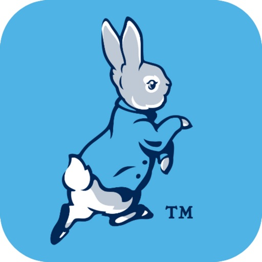

Find and collect sculptures across Newcastle and North Tyneside while unlocking exciting rewards and milestones along the way. Discover the design inspiration and vote for your favourite. Share your photos to the sculpture galleries while tracking your steps and miles. Keep up to date with the latest trail related news and events. 

Art trail app includes: map, sculpture listings, design inspiration, sculpture and milestone rewards, sculpture galleries, voting, trail stats, social sharing and event listings.

Peter Rabbit™: Tales on the Tyne is a Wild in Art event delivered by St Oswald's Hospice, which offers a range of care services, free of charge, to adults, children and their families, from across the north east. As a charity, the hospice relies on the support of their community and funds raised from the trail will support running costs.

Wild in Art is a leading creative producer of spectacular, mass-appeal public art events, which connect businesses, artists and communities through the power of creativity and innovation.

[View on Apple](https://apps.apple.com/gb/app/tales-on-the-tyne/id6774624118)

## CITB Op/Spec HS&E test

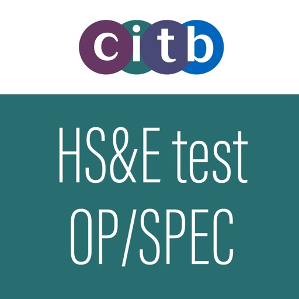

*The official CITB HS&E test app for Operatives and Specialists*
 
The CITB Health, safety and environment (HS&E) operatives and specialists test app offers the only complete revision experience available. This app contains everything you need to know to book, prepare for - and sit the test
 
Key application features:
- Experience our most realistic test simulation yet, revise on the move using your smartphone or tablet
- Benefit from having the full suite of revision material on your mobile device – practise knowledge questions and learning content with the ability to navigate forwards, backwards and flag questions for review.
- Take a simulated test against the clock to measure how ready you really are and where further preparation is needed
- Use questions and answers and learning content in book mode- Search the content bank for keywords
- Sit a practice test covering your weakest areas
- Smart revision concentrates on unseen questions and those you have answered incorrectly, to minimise repetition and maximise learning
- Review your progress with a comprehensive breakdown of scores – look at individual questions to see which answers are correct, watch as your scores improve over time with practice
- Revise for your test, even if English isn't your first language – The app provides voice-overs for the CITB HS&E Operatives test in 14 different languages including Bulgarian, Polish and Lithuanian
- Share your score on Facebook and Twitter
- Find your closest HS&E test centres, when you are ready to book and take your test
 
New for this version:
- Content updated to reflect industry and legislation changes
- Addition of new learning content in book mode
- Updated test information
- New marking scheme
- Updated user interface
 
For more information around the changes to the test, visit www.citb.co.uk/hsetestdev

[View on Apple](https://apps.apple.com/gb/app/citb-op-spec-hs-e-test/id1456274821)

## Official Life in the UK Test

Preparing for your Life in the UK Test has never been easier!

Download the only Official Life in the UK Test Questions and Answers app which contains the most up to date questions to ensure you can pass your Life in the UK test in 2026, approved by the Home Office, the people who set the test.

It is a simple and convenient way to practice for your Life in the UK British Citizenship test on the go.

The app includes:
• Hundreds of official practice questions taken from the "Life in the United Kingdom: A Guide for New Residents, 3rd Edition" handbook
• Random mock tests which select 24 questions to be answered in 45 minutes – just like the real test
• Practice mode which focuses on questions from each category
• Progress section that analyses your test results so you can review your answers and identify areas for improvement
• Key products tab to shop other official products in the range.

An essential practice app for anyone:
• Taking the Life in the UK British Citizenship Test
• Wanting to apply for British citizenship or settlement
• Teaching English or basic skills to refugees, immigrants or prospective applicants for British citizenship or settlement.

This app has been created by TSO – the publisher of the official Life in the UK Test learning aids. The questions are provided by the Home Office, the people who set the citizenship test.

Please note: To fully prepare for your test, this app should be used in conjunction with the 'Life in the United Kingdom: A Guide for New Residents, 3rd Edition' handbook.

[View on Apple](https://apps.apple.com/gb/app/official-life-in-the-uk-test/id632064672)

## Shadowrocket

Rule based proxy utility client for iPhone/iPad.

- Capture all HTTP/HTTPS/TCP traffic from any applications on your device, and redirect to the proxy server.
- Record and display HTTP, HTTPS, DNS requests from your iOS devices.
- Configure rules using domain match, domain suffix, domain keyword, CIDR IP range, and/or GeoIP lookup.
- Measure traffic usage and network speed on WiFi, cellular, direct and proxy connections.
- Import rule files from URL or iCloud Drive.
- Block ads by domain, user agent rules.
- Local DNS Mapping.
- Work on cellular networks.
- Decrypt HTTPS traffic.
- Perform URL rewrite.
- Fully IPv6 supports.
- Script filter supports.
- Multi-level forward proxy.
- Support kcptun, cloak, gost, v2ray plugins.
- Support DNS over HTTPS, DNS over TLS, DNS over QUIC.

[View on Apple](https://apps.apple.com/gb/app/shadowrocket/id932747118)

## Squeezy

Squeezy has helped thousands of women regain confidence in their pelvic floor. Pelvic health specialists around the world recommend Squeezy to their patients every day because it works! If you are thinking about downloading Squeezy for your pelvic floor, you are not alone. 

All women should be doing these exercises and some will be doing them as part of a physiotherapy programme.

Squeezy is simple to use, informative and designed to help women to remember to do their pelvic floor muscle exercises (also known as Kegel exercises).

Features includes:
• A pre-set exercise plan that follows public health guidelines
• A record of the number of exercises you have completed, compared to your target
• Visual and audio prompts for exercises
• Exercise reminders with customisable settings
• Educational information about the pelvic floor
• “Professional mode” – if working with a pelvic health specialist, you can tailor the exercise plan to fit your needs
• A bladder diary to keep track of your symptoms, if required
• Simple and clear interface

Squeezy was designed by chartered physiotherapists specialising in pelvic health working in the NHS. It has been clinically reviewed and approved by the NHS for its clinical safety, and is compliant with NHS Information Governance requirements.

Squeezy won several industry awards including ehi Awards 2016, Health Innovation Network 2016, National Continence Care Awards 2015/16 and was a finalist for awards including Advancing Healthcare Awards 2014 and 2017, Abbvie Sustainable Healthcare Awards 2016.

The app is UKCA marked as Class I medical device in the United Kingdom and developed in compliance with Medical Devices Regulations 2002 (SI 2002 No 618, as amended).

For more about Squeezy and additional pelvic health information visit squeezyapp.com.

[View on Apple](https://apps.apple.com/gb/app/squeezy/id700740791)

## Dartford Bear Hunt

Find and collect Bears & Cubs across Dartford town centre & Bluewater Shopping Centre, while unlocking exciting rewards and milestones along the way. Discover the design inspiration and vote for your favourite. Share your photos to the sculpture galleries while tracking your steps and miles. Keep up to date with the latest trail related news and events. 

Art trail app includes: map, sculpture listings, design inspiration, sculpture and milestone rewards, sculpture galleries, voting, trail stats, social sharing and event listings.

Dartford We're Going on a Bear Hunt is a Wild in Art event brought to you by ellenor, your local hospice charity, providing vital support to patients and their families across North Kent and Bexley.

Wild in Art is a leading creative producer of spectacular, mass-appeal public art events, which connect businesses, artists and communities through the power of creativity and innovation.

We're Going on a Bear Hunt is an award-winning TV feature animation produced by Lupus Films, based on the bestselling bedtime book, written by Michael Rosen and illustrated by Helen Oxenbury, published by Walker Books.

[View on Apple](https://apps.apple.com/gb/app/dartford-bear-hunt/id6780478751)

## Trunks across the Thames

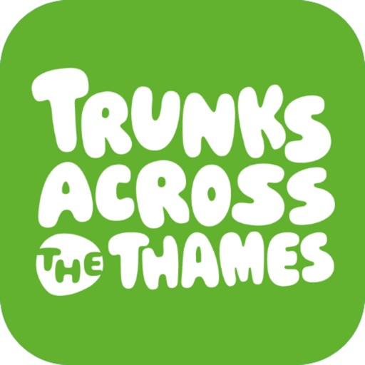

Find and collect sculptures across Slough and Windsor while unlocking exciting rewards and milestones along the way. Discover the design inspiration and vote for your favourite. Share your photos to the sculpture galleries while tracking your steps and miles. Keep up to date with the latest trail related news and events. 

Art trail app includes: map, sculpture listings, design inspiration, sculpture and milestone rewards, sculpture galleries, voting, trail stats, social sharing and event listings.

Trunks across the Thames is a Wild in Art event delivered by Thames Hospice. 

Wild in Art is a leading creative producer of spectacular, mass-appeal public art events, which connect businesses, artists and communities through the power of creativity and innovation.

[View on Apple](https://apps.apple.com/gb/app/trunks-across-the-thames/id6776153321)

## St Luke's Guiding Lights

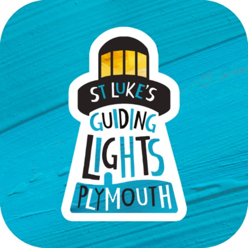

Find and collect sculptures across Plymouth and beyond while unlocking exciting rewards and milestones along the way. Discover the design inspiration and vote for your favourite. Share your photos to the sculpture galleries while tracking your steps and miles. Keep up to date with the latest trail related news and events. 

Art trail app includes: map, sculpture listings, design inspiration, sculpture and milestone rewards, sculpture galleries, voting, trail stats, social sharing and event listings.

St Luke's Guiding Lights is a Wild in Art event delivered by St Luke's Hospice Plymouth, which alongside the fun of the trail also secures the ultimate aim of the project – to raise vital funds and increase awareness to support the expert end of life care St Luke’s Hospice provides for patients and their families, not only across the city but also in towns and villages of West Devon, Dartmoor and the South Hams.

Wild in Art is a leading creative producer of spectacular, mass-appeal public art events, which connect businesses, artists and communities through the power of creativity and innovation.

[View on Apple](https://apps.apple.com/gb/app/st-lukes-guiding-lights/id6762812850)

## Manager for KuKirin

Odblokuj pełen potencjał swojej hulajnogi dzięki aplikacji KuKirin - najlepszej aplikacji stworzonej specjalnie dla pojazdów marki KuKirin. Zyskaj dostęp do zaawansowanych danych na żywo, pełnej personalizacji i wsparcia technicznego bezpośrednio na swoim iPhonie.
Najważniejsze funkcje:
• Telemetria w czasie rzeczywistym: Monitoruj aktualną prędkość, moc silnika i kluczowe statystyki na bieżąco podczas jazdy.
• Zaawansowana diagnostyka baterii: Śledź dokładne napięcie oraz procentowe naładowanie ogniw, aby optymalnie zarządzać zasięgiem i osiągami.
• Zmiana trybów jazdy: Wygodnie przełączaj się między trybami Eco, Sport i Race, dopasowując dynamikę do miejskiego terenu.
• Inteligentna kontrola pojazdu: Zarządzaj funkcjami takimi jak tempomat (Cruise Control) czy start od zera (Zero Start) z poziomu czystego, minimalistycznego interfejsu.
• Wbudowane poradniki i instrukcje: Uzyskaj dostęp do instrukcji wideo i tekstowych krok po kroku - od unboxingu, przez wymianę opon i regulację hamulców, aż po wymianę kontrolera.
Zaprojektowany z myślą o czytelności, pozbawiony rozpraszaczy kokpit KuKirin zapewnia bezpośrednią kontrolę i pełną widoczność stanu sprzętowego Twojej hulajnogi - bez zbędnych i ciężkich frameworków.
Brak ukrytych subskrypcji, brak trackerów reklamowych i brak wymogu zakładania konta w chmurze. Płacisz raz, łączysz się przez Bluetooth i ruszasz w drogę.
Kompatybilność: KuKirin G2 / G2 Master / G3 / G4

[View on Apple](https://apps.apple.com/gb/app/manager-for-kukirin/id6778099993)

## Procreate Pocket

荣获“年度 App”奖项的 Procreate Pocket 汇聚多种功能，是 iPhone 上有史以来最全能的绘画 App。

Procreate Pocket 提供你所需的一切，助你画出富有表现力的线条、色彩浓郁的画作、漂亮的插画和精巧的动画。Procreate Pocket 提供数百款手工画笔、上手简单的艺术创作工具组、高级的图层系统，以及强大的 Valkyrie 图形引擎。无论躺在沙发上，还是乘坐火车，在海边休闲，还是排队买咖啡，都可以轻松创作。

Procreate Pocket 就是你手中的移动画室。

亮点：
• 在兼容的设备上，可创建高达 16k x 4k 像素的高清画布
• 针对 iPhone 设计的直观深色模式界面
• 革命性的速创形状功能，可以创作出完美的形状
• 平滑灵敏的涂抹采样
• 由高速的 64 位绘图引擎 Valkyrie 提供支持
• 借助键盘快捷键提高工作效率
• 使用惊艳的 64 位色彩进行创作
• 250 步撤销和重做操作
• 连续自动保存-不再丢失作品

突破性画笔：
• 配备了数百款设计精美的画笔
• 画笔组，有序摆放各种上漆、素描和绘图画笔
• 每个画笔有超过 100 个自定义设置
• 画笔工作室—设计自定义画笔
• 导入和导出自定义 Procreate 画笔
• 导入 Adobe® Photoshop® 画笔，运行速度甚至比 Photoshop® 更快

功能齐全的图层系统：
• 通过每一个细节和构图准确控制你的图层
• 创建图层和剪辑蒙板，进行无损编辑
• 通过将多个图层存储到组中来保持有序组织
• 跨多个图层同时转换对象
• 获取超过 25 种图层混合模式，实现业界级别合成效果

面面俱到的颜色：
• 使用色彩快填为线条稿填色
• 色盘、经典、色彩调和、值和调色板等色彩面板
• 导入颜色文件进行配色
• 为任意画笔分配颜色动态

精准设计工具：
• 为插图添加矢量文本
• 轻松导入自己喜欢的字体
• 裁剪和调整画布大小，实现最佳布局
• 透视、等距、2D 和对称可视指引
• 绘画辅助实时绘制完美笔划
• 流线功能平滑描边，书写效果更精美，实现专家级着墨效果

动画辅助：
• 利用可以自定义的洋葱皮轻松制作逐帧动画
• 制作故事板、GIF、动态分镜和简单动画
• 充分利用画布的像素导出动画

绝妙的处理效果：
• 渐变映射-使用自定义渐变色，重新映射图片的颜色
• 故障艺术、色像差、泛光和半色调，为你的作品添加新维度
• 高斯模糊和动态模糊滤镜可以提高景深和动态效果，锐化功能可以让图像更加清晰
• 高级杂色滤镜可以更好地调整经典复古外观
• 实时调节色相、饱和度或亮度
• 强大的图像调节功能，包括颜色平衡、曲线和 HSB
• 运用有趣、简单上手且创新的弯曲、对称和液化动态功能实现创作

缩时视频回放：
• 使用 Procreate 的缩时视频回放功能重温你的创作之旅
• 以 4K 格式导出你的缩时视频，用于制作高端视频
• 在你的社交网络上分享 30 秒的缩时短视频

参考助手：
• 使用全画布或一直打开参考图像
• 借助 AR 在脸上绘画
• 从参考窗口中直接选取颜色

导入素材和分享作品：
• 以 Adobe® Photoshop® PSD 文件格式导入或导出你的作品
• 导入 Adobe® ASE 和 ACO 调色板
• 导入 JPG、PNG 和 TIFF 等格式的图像文件
• 在应用之间拖放作品、画笔、调色板和字体
• 导出至 AirDrop、iCloud Drive、“照片”App、iTunes、Dropbox、Google Drive、Facebook、X（前身为 Twitter）、Instagram、TikTok、“微博”App、“邮件”App，等等。
• 将你的艺术作品以 PDF、JPEG、PNG、TIFF、GIF、HEVC 或 MP4 文件格式分享

[View on Apple](https://apps.apple.com/gb/app/procreate-pocket/id916366645)

## CITB MAP HS&E test V11

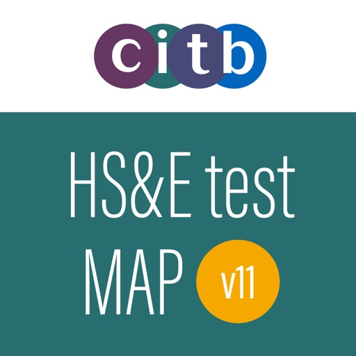

*The Official CITB HS&E test app for Managers and Professionals (GT200) V11*
 
The CITB Health, Safety and Environment (HS&E) Managers and Professionals (GT200-V11) test app offers the only complete revision experience available. This app contains everything you need to know to book, prepare for and sit the Managers and Professionals HS&E test.
 
Key application features:
• Experience our most realistic test simulation yet - revise on the move using your smartphone or tablet
• Benefit from having the full suite of revision material on your mobile device – practise the knowledge questions with the ability to navigate forwards, backwards and flag questions for review
• Take a simulated test against the clock, to measure how ready you really are and where further preparation is needed
• Read through the entire, up to date, official question bank, category by category
• Search the question bank for keywords and sit tests on matching items
• Sit a practice test covering your weakest areas
• Smart revision technology concentrates on unseen questions and those you have answered incorrectly, to minimise repetition and maximise learning
• Review your progress with a comprehensive breakdown of scores – look at individual questions to see which answers are correct, and watch as your scores improve over time with practice
• Revise for your test, with voiceovers in English or on-screen text in Welsh
• Share your score on Facebook and Twitter
• Find your closest HS&E test centres, when you are ready to book and take your test

[View on Apple](https://apps.apple.com/gb/app/citb-map-hs-e-test-v11/id6445915563)

## AnkiMobile Flashcards

AnkiMobile is a mobile companion to Anki®, a powerful, intelligent flashcard program that is free, multi-platform, and open-source. Sales of this app support the development of both the computer and mobile version, which is why the app is priced as a computer application.

AnkiMobile was written by the lead developer of Anki and AnkiWeb, and it has been around since 2010. Beware other apps using "Anki" in their name that have sprung up recently - they are not compatible with the rest of the Anki ecosystem, and they offer far fewer features, despite charging expensive subscriptions.

Some of AnkiMobile's features include:

- A free cloud synchronization service that lets you keep your card content synchronized across multiple mobile and computer devices. This makes it easy to add content on a computer and then study it on your mobile, easily keep your study progress current between an iPhone and iPad, and so on.
- The same SM2 and FSRS scheduling algorithms that the computer version of Anki uses, which remind you of material as you're about to forget it.
- A flexible interface designed for smooth and efficient study. You can set up AnkiMobile to perform different actions when you tap or swipe on various parts of the screen, and control which actions appear on the tool buttons.
- Comprehensive graphs and statistics about your studies.
- Support for large card decks - even 100,000+ cards.
- If your cards use images or audio clips, the media is stored on your device, so you can study without an internet connection.
- A powerful search facility that allows you to find cards that match criteria such as 'tagged high priority, answered in the last ten days and not containing the following words', and automatically place them into a deck to study.
- Support for displaying mathematical equations with MathJax, and rendering LaTeX created with the computer version.
- Support for adding images drawn with the Apple Pencil to your cards.

Please note that AnkiMobile is currently intended as a companion to the computer version of Anki, rather than a complete replacement for it. While AnkiMobile is able to display and schedule your cards in the same way the computer version does, certain changes like modifying note types need to be done with the computer software. Add-ons are not supported, so while you can study image occlusion cards created with the computer version, they can not be created within AnkiMobile. For this reason, please start with the computer version of Anki before you think about buying this app.

The cloud synchronization service is optional, and data can also be imported/exported from the app via a USB cable or AirDrop.

Like all apps, AnkiMobile can be purchased once and then used on multiple devices in a household using the same Apple ID. Family sharing is also supported (apart from in India). For information on bulk discounts for educational institutions, please see Apple's Volume Purchase Program.

For more information on AnkiMobile, including a link to the online manual, please have a look at the support page: https://docs.ankimobile.net/support.html. If you have any questions or want to report an issue, please let us know on our support site and we'll get back to you as soon as possible.

[View on Apple](https://apps.apple.com/gb/app/ankimobile-flashcards/id373493387)

## Parchment: Agenda & Daily Note

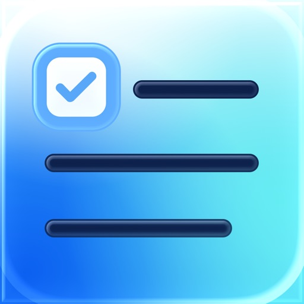

Parchment is a private daily journal that brings your writing, plans, calendar, and reminders together in one quiet place.

Open today and start writing immediately. Your calendar events and due or overdue reminders can appear above your journal entry, giving you the context of the day without switching apps. Capture notes, reflect on what happened, plan what comes next, or use Parchment as a simple daybook for work and life.

On iPad, Parchment also supports handwriting and drawing with Apple Pencil, so typed notes and handwritten thoughts can live together on the same day.

Parchment is built for iPhone, iPad, and Mac, with iCloud sync available through your private iCloud account. There is no Parchment account to create, no advertising, and no third-party analytics SDKs.

Features include:

- Daily journal entries organized by date
- Calendar events shown alongside your writing
- Due and overdue reminders in your daily view
- Reminder completion from inside the app
- Apple Pencil handwriting and drawing on iPad
- iCloud sync across iPhone, iPad, and Mac
- Widgets for a quick look at your agenda
- Shortcuts, Siri, and App Intents support
- Spotlight indexing for finding past entries
- Export tools for keeping a copy of your writing
- Custom appearance, fonts, and themes

Parchment is for people who want a journal that understands the shape of their day. It gives you one place to write what happened, see what is coming up, and keep a private record over time.

[View on Apple](https://apps.apple.com/gb/app/parchment-agenda-daily-note/id6779987526)

## Freya • Surge Timer

Meet Freya, the world’s first hypnobirthing-friendly birth timer, brought to you by The Positive Birth Company. This award-winning birth timer supports you through labour, coaching you through every single surge (or contraction) with a simple breathing technique and guided relaxations. 

Put hypnobirthing techniques into practice during pregnancy, labour and childbirth 
Relax between surges with a mix of guided relaxations, positive affirmations, gentle music and calming visualisations
Birth timer that keeps track of surges, logging each surge or contraction so you can see how frequently they are coming and how long they are lasting
Receive a notification from Freya when your labour is established and it might be a good time to call your midwife
Use Freya during pregnancy to practice breathing techniques and relaxation 
Available in French, German, Portuguese, Spanish and Italian

Never birth alone with Freya by your side.

TRACK YOUR SURGES
In hypnobirthing we refer to contractions as surges, because a ‘surge’ more accurately describes the sensation you’ll experience when in labour. Freya is the ONLY hypnobirthing-friendly contraction timer on the app store, designed specifically with hypnobirthing mums in mind, using appropriate terminology, but can be used by anyone. If you would like to know more about Hypnobirthing, follow The Positive Birth Company on Instagram or Tik Tok where we share loads of free resources to make your birth better.

PREPARE FOR BIRTH
You can use this birth timer in pregnancy to help you relax and prepare for childbirth. In fact the more you practice your breathing and listen to the guided relaxations and positive affirmations, the more familiar they will become and the more effective they will be at helping you relax when it comes to birth. Positive affirmations have been proven to change the way your mind works and listening regularly will help you feel less anxious and more confident in the lead up to birth. You can practice daily and then reset the surge history whenever you like.

THE SCIENCE
We know the more relaxed you are during birth, the more oxytocin you will produce. Oxytocin helps your uterus to work efficiently, making labour faster and more comfortable.

LIFESKILLS
Freya can be used for pregnancy and post-birth relaxation, any time you feel you could benefit from taking some deep breaths or need some help finding your zen. Everything you learn - mindfulness exercises and breathing techniques - are skills for life.

If you have any questions or spot any pesky bugs lurking about the place please do let us know at hello@thepositivebirthcompany.com

WHAT YOU’LL GET:
- iPhone and Apple Watch app
- Timer to record your surges (also known as a contraction timer) and let you know when you’re in established labour
- Coaching audio to keep your mind focused on breathing through each surge and the ability to switch between 4 and 8 breath counts or 3 and 6, or turn the counting off altogether.
- 4 different birth coach voices
- Guided relaxations, positive affirmations and soothing visuals to help keep you relaxed between surges
- A gentle expanding visualisation that you can use to sync your breathing
- Option to record your own music, visualisations or relaxation tracks
- You can listen to your own playlist on a third party app (such as Spotify) whilst still using the Freya app to keep track of your surges and coach you through each one.
- A detailed log of your surges over time, so you can track your progress through labour, reset this after you practice breathwork at any time
- Ability to easily share the log with your birth partner, midwife or doula
- Coaching created by renowned hypnobirthing expert Siobhan Miller, founder of The Positive Birth Company

Download the ONLY hypnobirthing-friendly birth timer on the App Store and prepare to meet your baby in the best possible way, feeling calm and confident, relaxed and happy!

[View on Apple](https://apps.apple.com/gb/app/freya-surge-timer/id1447509164)

## PeakFinder

群山在召唤！力争在登山家队伍中探索最多高山吧！ PeakFinder让你的梦想成为可能…，还能以360°全景显示所有山脉和山峰的名称。
该功能可完全脱机离线工作- 全球适用!

本应用的内容涉及到超过1'000'000座山峰- 从珠穆朗玛峰到世界角落的小山丘。

•••••••••
荣获数个奖项的冠军，如'AppStore最佳应用'、'每周最佳应用',…
macnewsworld.com, nationalgeographic.com, smokinapps.com, outdoor-magazin.com, digital-geography.com, …强烈推荐
•••••••••

••• 特色 •••

• 可在全球完全脱机离线工作
• 包括超过1'000'000座山峰的名称
• 利用全景图覆盖相机图像
• 快速渲染300公里范围周围地形
• 数码双目望远镜可选择远方不显著山峰
• '显示我'功能适合可见的山峰
• 通过GPS、山峰目录或（在线）地图选择观察点
• 可像鸟一样在山峰之间飞翔并垂直上升
• 标记您喜欢的山脉和地方
• 显示太阳和月球轨道以及升落时间
• 使用指南针和加速度传感器
• 山峰目录每周更新
• 不包含任何经常性费用。您只需一次性付款
• 无广告

••• 评价 •••

iTunes中的每个好评（包括下述更新）都让我快乐。好的评价和评论使我得以一直改进本应用。多谢你的支持！

••• 支持 •••

如有问题、疑问、错误、遗漏的山脉名称以及对将来发展想发表意见，我很乐意帮助你。请给我来信：support@peakfinder.com.

[View on Apple](https://apps.apple.com/gb/app/peakfinder/id357421934)

## Shambala 2026

Drop the outside world at the gates and dive into four days of Adventures in Utopia…

Whether you’re a meticulous planner or a barefoot wanderer, the official Shambala 2026 app is designed to help you squeeze every last drop of joy from your weekend. 

One of the UK’s last truly independent festivals, Shambala takes place over the August Bank Holiday Weekend at a gorgeous Northamptonshire countryside site, with stunning lakes, lush flat fields, woodlands and meadows.

Expect an astonishing array of things to do and see: hundreds of genre-busting musical acts, world-class performances, inspiring talks, captivating art installations, acclaimed poetry, hands-on workshops, and one of the best kids’ areas on the circuit.

We’re also proudly pioneering when it comes to sustainability: meat and fish free, single-use plastic free, 100% renewably-powered, and we’ve reduced our carbon footprint by nearly 90% over the past decade.

About the App:
Your essential companion for navigating this year’s adventures in utopia, the official Shambala 2026 app lets you:

- Effortlessly browse the full festival line-up

- Build a personalised schedule and set reminders for performances or experiences you don’t want to miss. You can even add your own items - like meet-ups or drinks with friends 

- Keep track of where you are and see what’s happening nearby with our interactive map

- Use GPS to find your tent, car or Campervan pitch

- Explore our diverse array food traders and bars and check for dietary information

- Receive real-time push notifications - from can’t-miss happenings to important weather or safety updates

- Shop our gorgeous Shambala 2026 official merch collection, designed by Sophie Bass

Even after the festival has ended, you’ll be able to stay connected with the Shambala community through the app. Receive updates from utopia, app-first news and get a first taste of Shambala 2027… 

See you in the fields! x

Please note that the app is built to work offline but only if downloaded in advance.

Disclaimer: The Shambala app uses location services to show you nearby performances, food and drink locations and other services. While we have built the app to consume the least amount of power possible, using location services consistently may increase battery consumption.

[View on Apple](https://apps.apple.com/gb/app/shambala-2026/id6777216049)

## Monash FODMAP Diet

Die Wissenschaftler der Monash University haben die FODMAP-arme Diät und eine zugehörige App entwickelt, um bei der Behandlung von Magen-Darm-Beschwerden im Zusammenhang mit dem Reizdarmsyndrom zu helfen. Die FODMAP-Diät der Monash University funktioniert, indem sie Lebensmittel mit hohem Gehalt an fermentierbaren Kohlenhydraten (FODMAPs) gegen Alternativen mit niedrigem FODMAP-Wert austauscht. Etwa 75 % der Menschen mit Reizdarm erleben eine Symptomlinderung bei einer FODMAP-armen Diät.

Die App kommt direkt vom Forschungsteam der Monash University und beinhaltet Folgendes:

- Allgemeine Informationen über die FODMAP-Diät und Reizdarm.
- Leicht verständliche Anleitungen, die Sie durch die App und die 3-stufige FODMAP-Diät führen.
- Ein Lebensmittel-Leitfaden, der den FODMAP-Gehalt für Hunderte von Lebensmitteln mit einem einfachen „Ampelsystem“ beschreibt.. 
- Eine Liste von Markenprodukten, die von Monash als FODMAP-arm zertifiziert wurden..
- Eine Sammlung von über 70 nahrhaften, FODMAP-armen Rezepten.. 
- Funktionen, mit denen Sie Ihre eigene Einkaufsliste erstellen und Notizen zu einzelnen Lebensmitteln hinzufügen können.
- Ein Tagebuch, mit dem Sie verzehrte Lebensmittel, Reizdarm-Symptome, Darmverhalten und Stressniveaus erfassen können. Das Tagebuch führt Sie auch durch Schritt 2 der Diät – erneute Einführung von FODMAPs in die Ernährung.
- Die Möglichkeit, Maßeinheiten (metrisch oder imperial) einzustellen und die Hilfe bei Farbenblindheit zu aktivieren.

[View on Apple](https://apps.apple.com/gb/app/monash-fodmap-diet/id586149216)

## TeleGuard

Anonymität garantiert – keine Registrierung
Es gibt keine Bindung an eine Telefonnummer und keine Erfassung von Benutzeri-dentifikationsdaten. Die TeleGuard-ID ist Ihre ganz persönliche Identifikationsnummer, die Sie brauchen, um sich mit Ihren Freunden zu verbinden. Jeder TeleGuard Nutzer erhält eine ID Nummer und einen QR-Code, welche zur Kontaktaufnahme verschickt werden können. 

Entworfen, um der sicherste Messenger der Welt zu sein
Der Fokus von TeleGuard liegt auf dem Schutz von Privatsphäre und vertraulicher Kommunikation. TeleGuard ist der datensichere Messenger aus dem Hause Swisscows. Swisscows hat es sich zur Aufgabe gemacht, seine Nutzer in jeder Lage vor Datenmissbrauch zu bewahren. Da heutzutage das Smartphone das meistgenutz-te Medium der Welt ist, ist ein sicherer Messenger unverzichtbar. 

Hochsicherer und moderner Server
Alle Server befinden sich in den Rechenzentren der Schweiz. Es wird ein komplexes Verschlüsselungssystem für alle übertragenen Daten verwendet und es werden abso-lut keine Benutzerdaten auf den Servern gespeichert. Alles ist absolut anonym. 

Darum ist TeleGuard besser als die anderen
TeleGuard verschlüsselt jede Nachricht und alle Telefongespräche mit dem besten Verschlüsselungsprogramm, was es derzeit gibt: SALSA 20. Da unsere Server in der Schweiz stehen, unterstehen wir nicht den Datenschutzgesetzen der EU / USA und müssen keine Daten weitergeben.

Wie wird meine Privatsphäre gesichert? 
HTTPS, Ende-zu-Ende-Verschlüsselung, Löschen von Nachrichten auf dem Server nach dem Lesen. Es werden keinerlei Benutzerdaten, weder IP-Adresse noch andere, erfasst oder gespeichert.

Funktionen

•	Text- und Sprachnachrichten senden
•	Bilder und Videos teilen
•	Video- und Sprachtelefonie
•	Dateien senden
•	Gruppen erstellen
•	Die Identität von Kontakten kann durch Scannen des QR-Codes verifiziert werden.

Support

Bei weiteren Fragen finden Sie hier unsere FAQs: teleguard.com/de#faq

[View on Apple](https://apps.apple.com/gb/app/teleguard/id1505636751)

## The Official DVSA Highway Code

This app will help you keep up to date with all the latest rules and guidance to keep you safe on the road and pass your theory test. 

Our app is suitable for all road users in GB.

This app can be used offline so that you can learn anytime, anywhere. 

HIGHWAY CODE
• navigate through an interactive copy of the Official Highway Code - regularly updated to keep you informed of any changes in rules. Featuring images, diagrams, and useful links to support your understanding.

STUDY AND PRACTICE
• test your understanding of the Highway Code by practicing over 360+ questions (including questions on Road and Traffic Signs). Got a question wrong? See the correct answer, note the explanation, and find out more with references to the Highway Code and more useful DVSA guides!

TEST YOURSELF
• take a custom quiz with a set number of questions and topics or a quick quiz with 20 questions covering all theory test topics!

SEARCH
• want to know more about ‘Airbags’, ‘Stopping Distances’, or ‘Yellow Lines’? Use the Index tool to navigate to specific areas of the Highway Code.

ENGLISH VOICEOVER
• if you have reading difficulties such as dyslexia, or prefer to learn by listening, use our voiceover feature within the test section to support you. 

PROGRESS GAUGE
• backed by learning science, use the progress gauge to measure how much of the Highway Code you’ve learned. If you’re preparing for your theory test it will provide you with confidence that you’re ready to pass.

USEFUL LINKS AND SUPPLIER ZONE
• navigate through useful resources to support your learning, including Safe Driving for Life – a one-stop information zone. Passed your test? Use our Supplier Zone to help you with the next steps in your driving journey.

• Ready to Pass? Links to DVSA’s official resources to help you understand what it takes to be ready for your driving test. Give yourself the best possible chance of passing by learning vital skills, managing your nerves, and taking mock tests.

FEEDBACK
• missing something? Let us know what you’d like to see. We’d love to hear from you with any comments or suggestions about this app. 

SUPPORT
• need support? Contact our UK-based team at feedback@williamslea.com or +44 (0)333 202 5070. We listen and respond to your feedback by updating the app and adding new features, so help others in their studies by letting us know what you’d like to see!

[View on Apple](https://apps.apple.com/gb/app/the-official-dvsa-highway-code/id522687241)

## Streaks

STREAKS. Die Aufgabeliste für gute Gewohnheiten.
Gewinner des Apple Design Award

Wähle bis zu 24 Aufgaben, die du jeden Tag erledigen willst. Ziel ist es, diese Aufgaben mehrere Tage hintereinander zu erledigen. Streaks funktioniert mit der Health-App, damit du deine Fitness-Ziele erreichen kannst.

FUNKTIONEN:

* Passe die App-Farbe an.
* Wähle aus hunderten Symbolen.
* Lass dir benutzerdefinierte Benachrichtigungen schicken, um auf dem Laufenden zu bleiben.
* Betrachte deine aktuelle und beste Aufgabenserie und deine Erledigungsstatistik.
* Streaks erkennt automatisch, wann du Health-Aufgaben erledigst.
* Gewöhne dir schlechte Angewohnheiten mit unschönen Aufgaben ab
* Apple Watch

Solltest du Fragen, Anregungen oder sonstiges Feedback haben, schreibe bitte eine E-Mail an support@streaks.app oder eine Twitter-Nachricht an @TheStreaksApp.

Wenn dir Streaks gefällt, hinterlasse bitte einen Erfahrungsbericht! Die Erfahrungsberichte werden zurückgesetzt, sobald wir ein neues Update veröffentlichen. Daher sind wir auf deine ständige Unterstützung angewiesen.

ÜBER HEALTH-DATEN:

Auf kompatiblen Geräten kann Streaks deine Spazieren-/Joggen-Daten lesen, vorausgesetzt du erteilst die Erlaubnis, die Erledigung deiner Aufgaben zu bestimmen. Alle Daten werden in voller Übereinstimmung mit den iOS-Regeln von Apple für Erfahrungsberichte abgerufen. Bitte lies unsere Datenschutzerklärung unter https://streaks.app/privacy.html und erfahre mehr über die Verwendung deiner Daten.

Schritt- und Entfernungsdaten sind nur automatisch verfügbar, wenn du ein iPhone 5S, eine höhere Version oder ein Zubehörgerät wie die Apple Watch verwendest, um Daten auf die Health-App zu übertragen. Bei Fragen schreibe uns bitte an support@streaks.app.

[View on Apple](https://apps.apple.com/gb/app/streaks/id963034692)

## Blueprint 4-Track

Great for demos, first takes, and fresh ideas: voice and guitar at the kitchen table, or a band passing one phone around the room.

The sound of the machine is built in. Each track has its own set of knobs and there is no undo.
  
  - Records one track at a time, from the built-in mic, a headset mic, or a USB audio interface.
  - Has track merging/clearing, punch-in recording, and a metronome.
  - Your recordings are WAV files saved on your phone. Share the song, or export the whole session.
  - Works entirely offline and collects nothing.
  - Pay once. No subscription, no ads, no account.
  - Works on iPhone and iPad.
  
  TIPS

  - Overdub with wired headphones, so the mic doesn't pick up the other tracks.
  - Don't use Bluetooth headphones while recording: they add delay, and only play in mono.
  - Tap record while playing to punch in over a part you want to redo.
  - Tap the ? at the top left for a guide to the controls.

Blueprint is made by one person. If something feels confusing or missing, email max@blueprintdaw.com and I will answer.

[View on Apple](https://apps.apple.com/gb/app/blueprint-4-track/id6777792345)

## Site Audit Pro

‘The fastest way to audit on the go’

Site Audit Pro helps thousands of businesses worldwide improve their productivity by making audits and inspections quicker to carry out and easier to manage. Whether performing a safety inspection, snagging issues, creating a punch list, or providing a quotation, Site Audit Pro will help you collate and share your findings on the go with customised Reports to add a personal and professional touch.

---

FEATURES

- Record Issues: Add a title, assignee, and comments to document each Issue.
- Add and Annotate Images: Highlight and draw important information directly on Images to emphasise key points.
- Organise Issues into Projects: Add Site and Client details specific to each Project for better organisation and clarity.
- Image Details: Optionally show timestamps and GPS locations on each Image in the Report for precise documentation of when and where Issues were recorded.
- Share Professional Audit Reports: Eliminate the need to return to the office by sharing a PDF or CSV via email, Dropbox, device file sharing, and more.

---

CUSTOMISATIONS

- Add personal details to your Reports; include Company Name, Logo, Auditor Name and Signature.
- Change the content to reflect your industry. Instead of ‘Identified 12 Issues’, why not use ‘Found 12 Problems’ or ‘Examined 12 Properties’?
- Choose from and customise a range of 8 professional Report designs.

---

GREAT FOR

- Audits
- Inspections
- Punch Lists
- Snag Lists
- Documenting various items

Site Audit Pro is adaptable to a number of industries. Whenever you need to capture and report important data, choose Site Audit Pro.

Download Site Audit Pro today to save time, improve productivity and make audits and inspections organised and hassle-free.

---

SUBSCRIPTION

Site Audit Pro Cloud is our subscription service that allows you to store your projects in the cloud and access them from the web. Whilst the subscription does give you access to some of the more advanced features and access, it is not required to use and generate Reports. The features below are what you would gain access to by subscribing, whereas the features above are what are already included in the base app.

SUBSCRIPTION FEATURES

1. ACCESS PROJECTS FROM THE WEB

Create, edit and share Reports from our web app. Using the website allows you to quickly type up comments using your computer keyboard as well as accessing your Projects from any browser.

2. MULTIPLE IMAGES

You can show more than one Image for each Issue. This is useful for showing several angles of the same Issue, or to compare before and after Images.

3. SYNCING

Sync your projects between devices. Start your project with your iPhone, type it up on an iPad, and do final editing on your PC or laptop. Reports can be generated from any location.

4. FOLDERS

Organise your Projects into Folders. Name your Folders after the property, area, client, group, site or anything you want to keep organised!

5. MORE PROJECT INFORMATION

Add a site address for each Project, as well as a Project photo to give the finishing touch to your Report’s cover.

6. ISSUE DUE DATES

Give Issues a Due Date so your Assignees know exactly how long they have to complete any tasks required.

7. COMPLETE ISSUES

Mark your Issues as completed. If all your Issues are completed, you can even mark the whole Project as completed.

8. REPORT COLOURS

In addition to more themes, you can set up your own colour scheme! Use this to match your company branding or specific report types. 

---

*** Subscription Information ***

Subscriptions will automatically renew unless cancelled within 24-hours before the end of the current period. You can cancel anytime with your Apple account settings. Any unused portion of a free trial will be forfeited if you purchase a subscription.

*** Subscription Terms ***

You can find the terms and conditions of the subscription here:

https://www.siteauditpro.com/terms

[View on Apple](https://apps.apple.com/gb/app/site-audit-pro/id430234732)

## Spirit Talker ®

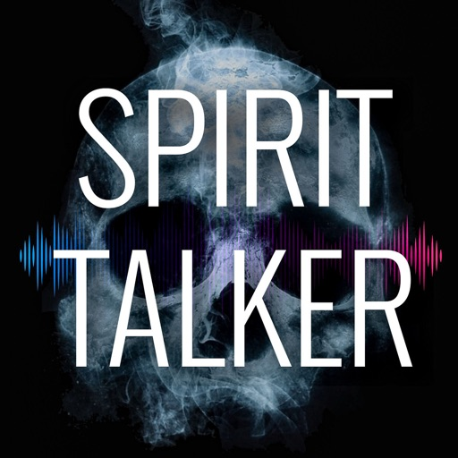

As seen on:

Haunted Finders, The Paranormal Files, Twin Paranormal, WWE, Scarlett & Shotzi, Bad Cat Paranormal, Exploring Harley, Ghost Club Paranormal, Barrier Beyond, Tommy Amongst the Tombstones, Hauntings with Hodge, Jasko, Omar Gosh, Paranormal XP, What Goes Bump in the Night, Exploring with Josh, Ghostly Travels with Zac, Kelsi Davies, Moxleys Paranormal World, Hunting the Dead, TylerReynolds TV, PollyFox Paranormal, Paranormal Discovery, Sam and Colby, WhatThe? Paranormal, F.D.L Paranormal and many many more.

Beware of FAKE copies, this is the Original Spirit Talker App.

*********************************************************************

Spirit Talker ® works in a similar way to the world famous Ovilus device, but it is based on my own research and theories.

It produces words and speech based on what the sensors in your phone are detecting.

The theory behind this app is that spirits might be able to manipulate the device sensors to communicate with you.

Spirit Talker ® is a modern form of ITC (Instrumental Trans Communication) and is very simple to use.

Just click the green ON button and begin asking your questions.

When a response is detected by the app the words will show visually in the text box along with audible speech.

Nothing is chosen randomly, everything produced is based on the values from the sensors.

When you have finished your session just click stop. You can also look back at the responses you received during your session by clicking on the folder button (this only works when the scanner is "Stopped").

You can also look back at the responses you received during your session by clicking on the folder button (this only works when the scanner is "Stopped").

The sensors that the app uses are:

Magnetometer (EMF)
Accelerometer
Gyroscope
Orientation
Barometer
Compass

The EMF Meter only works if your device has a Magnetometer Sensor. If not then the EMF Meter won't be displayed.
Please check the compatibility of your phone / tablet.

When you have finished your session, turn off the scanner to save the words to the file.

Moving your phone quickly or putting it near electronic equipment will manipulate the sensors and make it produce a result, please do not do this!

Languages in the app are:

English, Latin, French, German, Chinese (Text or Symbols), Danish, Portuguese, Romanian, Turkish, Croatian, Polish, Finnish, Swedish, Hungarian, Greek, Czech, Dutch, Italian, Spanish Korean and Icelandic.

There are a lot of misconceptions being spread about how Spirit Talker works, please have a read here:

https://spottedghosts.com/spirit-talker-common-misconceptions/

*******************************

IMPORTANT INFO

** App Voice **

The voice uses the "Spoken Content" voice on your device, “Settings” -> “Accessibility” -> “Spoken Content”

** Sensor Permissions **

Since the iOS 17 update, this app now needs to have the "Motion and Fitness" permission to be granted so that it can access certain sensors that it needs in order to work. If you don't grant this permission, the app will not be able to work.

*******************************

** Disclaimer **

Use at your own risk. We cannot be held personally responsible for you or any outcome (paranormal or otherwise) from using this app!

The paranormal is not a proven science and is considered theoretical. Accordingly, words or phrases generated are not intended as requests or instructions, and should not be used to make legal, financial, medical or other decisions. Words/phrases generated do not represent the official position of the developer.

Refer to our website for a full list of terms and conditions http://www.spottedghosts.com

*******************************

Beware of FAKE copies, this is the ORIGINAL Spirit Talker App.

[View on Apple](https://apps.apple.com/gb/app/spirit-talker/id1536762482)

## Baby Led Weaning Recipes

Enjoy 800+ quick, nutritious meals for confident weaning from 6 months. 

The Baby-Led Weaning Recipes app is designed to make starting solids simple, stress-free and enjoyable - even on your busiest days.

Inside, you’ll find 800+ delicious, family-friendly recipes, all suitable from 6 months alongside clear monthly guides and routines to support you through every stage of your weaning journey.

My goal is simple: to help you serve food that’s quick to prepare, nutrient-rich and most importantly food your baby actually wants to eat. 

What you’ll love:

• 800+ recipes, suitable from 6 months
• Breakfast, lunch, dinner & snack sections for easy planning
• Monthly guides & routines (6–12 months) so you know what to offer and when
• Search by recipe name or ingredient - perfect for “what’s in the fridge?” days
• Save your favourites for quick access
• Add ingredients straight to your shopping basket
• Special occasions recipes for parties, holidays and family events
• Clean, bright, easy-to-use design made for busy parents
• Free help and support, in-app or via my online support group
• Regular free updates and improvements

New & improved features:

• 2-3 new recipes added every week (except a short Christmas break)
• First finger foods guide to get you started with confidence
• Filter by dietary requirements (vegetarian, vegan, dairy-free, egg-free)
• Like button to quickly spot the most popular recipes
• Fun recipe videos for selected dishes

- - - -

Access exclusive recipes:

The app starts with over 800 recipes, with new recipes added weekly at no extra cost - incredible value from day one. If you’d like to support the app further, you can unlock 50+ additional exclusive recipes every year via a low-cost subscription.

The Quarterly Subscription to Baby-Led Weaning Recipes is available for £1.99 per quarter (Price may vary by country). These recipes will be delicious, nutritious and seasonal – allowing you an increasing number of recipes at your fingertips to keep things fresh and new in your kitchen.

Your subscription payment will be charged to iTunes Account at confirmation of purchase. The subscription will renew automatically each quarter and payment will be charged to your iTunes Account within 24-hours prior to the end of the current period. You can turn off auto-renewal by going to your Account Settings after purchase. Subscriptions can be cancelled at any time. Access to premium content will continue up to the end of the subscription period. Any unused portion of a free trial or introductory period, if offered, will be forfeited when you purchase a subscription to Quarterly Subscriptions, where applicable.

These recipes are seasonal, nutritious and family-friendly, giving you even more inspiration to keep mealtimes fresh and exciting.

- - - -

Support & policies:

Terms of Use:
https://babyledweaningcookbook.com/terms-and-conditions

Privacy Policy:
https://babyledweaningcookbook.com/privacy-policy

- - - -

If you ever have questions or need support, please reach out — I’m always happy to help.

Natalie x

[View on Apple](https://apps.apple.com/gb/app/baby-led-weaning-recipes/id1114320457)

## Blitzer.de PRO

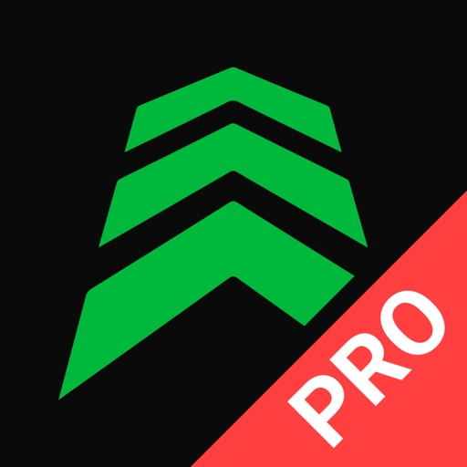

Blitzer.de PRO - Die Verkehrssicherheits-App!
Und der Marktführer in Deutschland seit über 10 Jahren.

Blitzer.de PRO versorgt dich mit Live-Warnungen zu mobilen und festen Blitzern, Pannen, Unfällen, Stauenden und mehr in deiner Nähe. Schließe dich Europas größter und bekanntester Verkehrs-Community mit über 5 Millionen aktiven Nutzern an und mache deine Autofahrt sicherer und entspannter.

► VERSCHIEDENE ANSICHTEN
Wähle zwischen der einfachen Klassik-Ansicht, der Karte oder dem unauffälligen Dunklen Modus.

► AUTO START & STOPP
Einfach einsteigen, losfahren! Definiere eigene Kurzbefehle und die App aktiviert & deaktiviert sich ganz automatisch.

► CARPLAY
Alles im Blick auf dem Autobildschirm! Und das Audio direkt über die Autolautsprecher.

► PERSONALISIERT
Bestimme selbst, vor welchen Blitzern und Gefahren du gewarnt werden möchtest.

► INNOVATIVE NAVIGATION
Mit Schwarmintelligenz navigieren und schneller am Ziel ankommen.

► VIELE AUDIO OPTIONEN
Warnungen per Stimme oder Piepton - über das iPhone oder die Autolautsprecher. Zusätzliche Vibration für Motorradfahrer.

► STABILER HINTERGRUNDBETRIEB
Erhalte Warnungen auch während Telefonaten und beim Nutzen anderer Apps.

ÜBERSICHT DER VORTEILE
* Live-Aktualisierung der Blitzer und Gefahren
* Über 109.000 feste Blitzer weltweit
* Zuverlässige, präzise und straßenbezogene Warnungen, von unserer Verkehrsredaktion geprüft
* Anzeige von Blitzer-/Gefahrentyp mit erlaubter Höchstgeschwindigkeit und Entfernung
* Optimiert für die Nutzung im Auto: selbsterklärend und ohne Ablenkung vom Verkehr
* Einfaches Melden und Bestätigen von Blitzern und Gefahren
* Persönlicher Kundensupport für Fragen, Anregungen oder Probleme
* Keine lästige Werbung

SYSTEMANFORDERUNGEN
* Aktivierte Ortungsdienste
* Internetverbindung für Online-Updates (Flatrate empfohlen)

IN-APP-KAUF: MOBILE BLITZER & GEFAHREN
Profitiere in den ersten 14 Tagen von sämtlichen Funktionen der App. Nach Ablauf dieses 14-tägigen Testzeitraums erhältst du fortlaufend unbegrenzt aktualisierte Warnungen vor festen Blitzern weltweit. Sichere dir mit dem einmaligen In-App-Kauf für nur 9.99 EUR den vollen Funktionsumfang der App, einschließlich lebenslanger mobiler Blitzerwarnungen und Echtzeitinformationen zu Gefahren wie Pannen, Stauenden, Unfällen, Baustellen und mehr. Ohne Abo, ohne Zusatzkosten.

FOLGE UNS
https://www.instagram.com/blitzer.de
https://www.facebook.com/www.Blitzer.de

BESUCHE UNS IM WEB
https://www.blitzer.de/

[View on Apple](https://apps.apple.com/gb/app/blitzer-de-pro/id498732510)

## HappyCow - Vegan Food Near You

Featured auf CNN und in der New York Times und The Guardian: Die #1 unter den veganen und vegetarischen Restaurantführer des App Store. Seit 1999 hat HappyCow Benutzern geholfen, vegane Optionen in über 200.000 Restaurants, Cafés und Lebensmittelgeschäften in über 180 Ländern zu finden. Jetzt ist es einfach, vegane Lebensmittel in der Nähe zu finden oder zum Mitnehmen zu bekommen. Lesen Sie mehr als 1.875.000 Bewertungen und sehen Sie mehr als 3.000.000 Fotos, die von unserer großartigen Community gepostet wurden! Mit HappyCow können Sie nach vegan-freundlichen Bäckereien, Reformhäusern, Catering, Bauernmärkten, Saftbars, Cafés oder anderen veganen Geschäften suchen und Filter für Lieferung und Mitnahme verwenden!

Eigenschaften:
* Suchfilter nach Standort, vegan, vegetarisch, Geschäften usw. und nach Stichworten
* Stöbere in HappyCow nach einem beliebten Café oder Restaurant mit guten Bewertungen
* Speichere Deine Favoriten zum zukünftigen Zugriff (offline verfügbar!)
* Organisiere Restaurants und Geschäfte für Deine bevorstehenden Reisen (Nutzung ohne Internet)
* Zeige Unternehmen auf interaktiven Karten an
* Sieh dir Fotos, Rezensionen und Informationen an, die Dir helfen, die beste Mahlzeit zu finden
* Rufe Wegbeschreibungen, Telefonnummern, Bewertungen und Website-Informationen ab
* Einfach teilen, was Du mit Deinen Freunden gefunden hast
* Über 220.000 vegan-freundliche Angebote
* Der Inhalt wird rund um die Uhr von einem engagierten Team und unseren 2 Millionen + monatlichen Besuchern aktualisiert
* Lade Fotos von Deinem köstlichen Essen hoch
* Hilf allen anderen HappyCow-Nutzern mit Deinen Bewertungen und Ratschlägen
* Tritt der größten Veg Community von über 1.000.000 Mitgliedern bei
Gibt's Probleme? Schick uns eine Nachricht: ios (at) happycow.net

[View on Apple](https://apps.apple.com/gb/app/happycow-vegan-food-near-you/id435871950)

## Hit the Button Maths

Hit the Button Maths is an app designed to help develop mental maths and calculation skills.

The app is aimed at 5-11 year olds. There are 166 different game modes of varying difficulty so it is useful throughout the primary school age range. Answer as many questions as possible in minute-long games, or you can now practice without the pressure of a countdown timer. Questions are randomly generated which means it is very replayable. The game has been carefully designed for children, with large, widely spaced buttons. We recommend that young children play on a tablet.

Six main topics are covered:

* Times tables - up to 10 or 12
* Division - up to 10 or 12
* Square numbers 
* Number bonds
* Doubling 
* Halving

Between these topics, the four standard arithmetic operations are covered: addition, subtraction, multiplication and division.

You can create up to 30 player profiles per device to track an individual's scores. If you prefer there's also the option to play as a guest. All data is stored locally on your device so you don't have to worry about privacy issues. We've also made it very easy for children to quickly switch between profiles after playing a game, if they're sharing a device.

After each game, the score achieved is displayed along with the child's high score. Bronze, silver or gold stars and trophies are awarded depending on the score achieved in each game.

[View on Apple](https://apps.apple.com/gb/app/hit-the-button-maths/id1001893116)

## Goblin Tools

This is an app version of the free website goblin.tools, a collection of small, simple, single-task tools, mostly designed to help neurodivergent people with tasks they find overwhelming or difficult.

Tools include
- A Magic Todo list that automatically breaks down tasks into steps
- The Formalizer that transforms your language to be more formal, sociable, concise, or many other options
- The Judge that helps with interpreting tone
- The Estimator that can guess at a timeframe for an activity
- The Compiler to take entire braindumps and turn them into actionable tasks
- The Chef, who turns a description of what ingredients and tools you have in your kitchen into a real recipe

And many more to come!

The website is free and publicly available. Purchases of this app go first towards keeping the site free and ad-free, before supporting the author.

[View on Apple](https://apps.apple.com/gb/app/goblin-tools/id6449003064)

## DVSA Hazard Perception

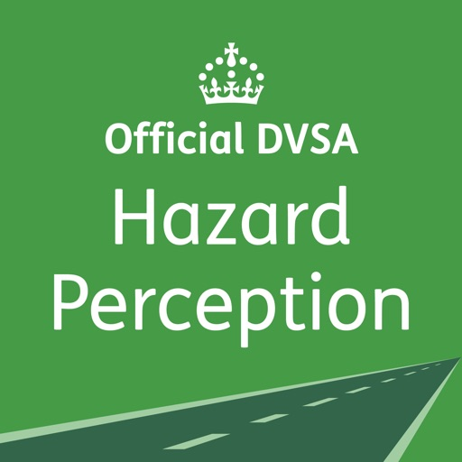

Struggling with the Hazard Perception section of your Theory Test? 

This app provides extra support and resources to help you ace your Hazard Perception test!

Improve your road safety awareness and hazard perception skills and be confident in knowing that you’re ready to pass! 

Whether you’re a learner or an experienced driver or rider, you can help make the roads safer by becoming more aware of potential hazards. 

HAZARD PERCEPTION
• practice your skills with an extra 30 Official DVSA hazard perception video clips – featuring all environments and weather conditions. Receive immediate feedback after each clip to find out where the hazard was and where maximum points could have been achieved! 

USEFUL LINKS AND SUPPLIER ZONE
• navigate through useful resources to support your learning, including Safe Driving for Life – a one-stop information zone. Passed your test? Use our Supplier Zone to help you with the next steps in your driving journey. 

FEEDBACK
• missing something? Let us know what you’d like to see. We’d love to hear from you with any comments or suggestions about this app. 

SUPPORT
• need support? Contact our UK-based team at feedback@williamslea.com or +44 (0)333 202 5070. We listen and respond to your feedback by updating the app and adding new features, so help others in their studies by letting us know what you’d like to see!

[View on Apple](https://apps.apple.com/gb/app/dvsa-hazard-perception/id1019610471)

## WorkOutDoors

WorkOutDoors is the most advanced and most configurable workout app for the Apple Watch. It's perfect for running, cycling, hiking and any other indoor or outdoor activity.

Note: WorkOutDoors requires an Apple Watch Series 4 or later. It is not necessary to have your iPhone with you during a workout.

The app uses Apple’s workout system, so all workouts are saved to the Health system.  However it also provides many extra features over Apple's app, such as:

- a super-smooth vector map that can be shown during a workout;
- multiple configurable screens with metrics and graphs from a pool of 800+ data fields;
- route files can be imported and used for navigation (including turn by turn directions);
- dozens of configurable alerts (e.g. every mile; high heart rate; low pace; off-route etc);
- interval schedules can be created using the larger screen of the phone app;
- climbs and descents are supported with notifications and on-screen data and graphs;
- waypoints can be created, navigated to, and exported;
- use shortcuts to associate operations with gestures (e.g. double tap to hear configurable metrics);
- compare pace against a target or a previous workout (using metrics and a dot on the map);
- show zones for pace and power as well as heart rate (with optional coloured backgrounds);
- auto-pause is available for all outdoor activities;
- shows GPS and heart rate before starting a workout, so that you can wait for good signals;
- configure distance and pace for running / walking to come from Apple’s pedometer or from GPS;
- workouts can be exported in FIT / TCX / GPX files, or automatically sent to Strava;
- workouts created by the app can be analysed in great depth in the iPhone app.

The app also has many more features.  The map is a particular highlight.  It uses OpenStreetMap, which provides worldwide coverage and includes the trails necessary for outdoor workouts.  It also has several features that help you navigate during a workout:

- maps can be smoothly panned and zoomed, and can rotate according to the compass;
- a breadcrumb trail of your whole route is displayed on the map during the workout;
- topographic data can be shown, with configurable contour colours and hill shading;
- map-only mode is provided for when you don't want to start a workout and just need a map;
- a circular scale is shown when you zoom, making it easy to see the distance to features;
- maps can be stored on the watch for use when offline (they are downloaded as required if online);
- a red compass points north and a green compass points to the start;
- choose a waypoint to see a compass and distance to it in the corner of the map;
- you can also navigate to waypoints on the map, such as hospitals, sights, cafes etc.

If you load a route from a GPX / TCX / FIT file then navigation is even easier:

- your position is shown on an elevation profile of the route;
- the remaining distance, time and ascent can also be displayed;
- you can get alerted when you go off-route; 
- when off-route then a compass is shown which points to the nearest part of the route;
- if the route contains turn by turn directions then these can be used like a sat nav;
- if there are no directions then the app can use “bend detection” to generate them;
- the next direction is shown as an icon and distance in the corner of the map;
- the map can automatically zoom in when you are approaching a turn;
- you can use shake gestures to hear the distance to the next turn or the end of the route;
- routes are coloured by gradient: from red for steep uphill to blue for steep downhill;
- you can configure what information is displayed during a climb or descent.

All this is included for a single one-off payment. No extra in-app purchases or subscriptions are required (although there is a completely optional in-app tip jar which was requested by long-term users). 

If you own an Apple Watch and do any form of exercise, then WorkOutDoors is the app for you. Give it a go!

[View on Apple](https://apps.apple.com/gb/app/workoutdoors/id1241909999)

## Llwybrau'r Wyddfa

*** SCROLL DOWN FOR ENGLISH ***

Mae’r Wyddfa yn fynydd eiconig sy’n adnabyddus dros y byd i gyd. Mae’n gartref i gymuned fywiog, egnïol, ac i fusnesau a mannau gwaith arloesol yn ogystal â chlytwaith o ffermydd mynydd. Mae'n ased cenedlaethol a hwn yw mynydd mwyaf poblogaidd y Deyrnas Unedig o ran ymwelwyr. Mae'n denu pobl o bob cwr o Gymru, y DU, ac o bob rhan o'r byd.

Dyluniwyd yr ap gan Awdurdod Parc Cenedlaethol Eryri a phartneriaid gweithgar sy’n cynnwys cynrychiolwyr o sefydliadau sydd â dyletswydd ymarferol o reoli’r mynydd ar lawr gwlad. Mae’r gwaith yn amrywio o reolaeth cadwraeth a llwybrau i dwristiaeth, ffermio ac achub mynydd.

Mae’r ap yn hawdd i’w ddefnyddio, yn gweithio gyda GPS ac yn cynnwys mapiau manwl sy’n dilyn eich taith wrth i chi gerdded ar unrhyw un o’r 6 prif lwybr i’r copa. Mae hyn yn gweithio all-lein, sy’n golygu nad oes angen cyflenwad i’r we neu signal ffôn tra’n ei ddefnyddio ar y mynydd. Mae pob map yn cynnwys cyfuchliniau fel y gallwch gadw golwg ar ddarnau anodd wrth i chi gerdded.

Fe fydd yr ap yn eich helpu i gynllunio ymlaen llaw cyn eich ymweliad ac yn cynnwys cyngor pwysig fydd yn eich galluogi i’n cynorthwyo i barchu, gofalu, a gwarchod y mynydd, yr amgylchedd o’i amgylch, a’r cymunedau lleol.

Yn cynnwys data AO © Hawlfraint y goron a hawl basdata 2020.

Datblygwyd yr ap gan Tiny Mobile Limited ar gyfer Partneriaeth Yr Wyddfa. Cysylltwch â paul@tinymobile.co.uk os oes diddordeb gennych mewn datblygu ap cerdded.

Yr Wyddfa (pronounced uhr-with-va) is a globally renowned, iconic mountain and home to vibrant, energetic communities and a mosaic of upland hill farms. It is a national asset, the most visited mountain in the UK, attracting people from across Wales, the UK and around the world.

This app is designed by the Eryri National Park Authority (Snowdonia) together with partners who are responsible for the on-the-ground management of the mountain. The work ranges from conservation and path management to tourism, farming and mountain rescue.

Our simple to use GPS-enabled app covers the 6 main paths to the summit of Yr Wyddfa with detailed route maps that tracks your progress as you ascend. This works offline, meaning no internet or phone signal is required when using the app on the mountain. Each map also includes contour information so you can look out for hazardous sections as you climb.

This app will also help you plan ahead before your visit and includes important advice which will allow you to help us respect, care, and protect this incredible mountain, the surrounding environment and local communities.

Contains OS data © Crown copyright and database right 2023.

This walking app was developed for Partneriaeth Yr Wyddfa by Tinymobile Limited. Email Paul on paul@tinymobile.co.uk if you would like to discuss walking app development.

[View on Apple](https://apps.apple.com/gb/app/llwybraur-wyddfa/id1522259939)

## Koala Sampler • Beat Maker

Koala is the ultimate pocket-sized sampler. Record anything with your phone's mic instantly. Use Koala to create beats with those samples, add effects and create a track!

Koala’s super intuitive interface helps you make a tracks in a flash, there is no brake pedal. You can also resample the output of the app back into the input, through the effects, so the sonic possibilities are endless.

Koala's design focuses totally on making the music making progress instant, keeping you in the flow and keeping it fun, not getting bogged down by pages of parameters and micro-editing.

"Been putting that $4 koala sampler to good use lately. Undeniably great tool that puts some of these expensive beat boxes to shame. A must cop." 
-- flying lotus, twitter

* Record up to 64 different samples with your mic
* Transform your voice or any other sound with 16 superb built-in fx
* Load your own samples
* Choose from one of 250 built-in sounds
* Resample the output of the app back into a new sample
* Export loops or entire tracks as professional quality WAV files
* Direct export to Ableton Live Set
* Copy/paste or merge sequences just by dragging them
* Create beats with the high-resolution sequencer
* Import samples using AudioShare or just open them in Koala
* Keyboard mode lets you play chromatically or one of 9 scales
* Quantize, add swing to get the right feel
* Normal/One-shot/Loop/Reverse playback of samples
* 6 Choke groups
* Attack, release and tone adjustable on each sample
* AUv3 compatible - use in GarageBand, Logic, Cubasis etc etc
* MIDI controllable - play your samples on a keyboard, map the effects to knobs
* Jam with others over WiFi with Ableton Link
* Free copy of Ableton Live Lite included
* Use AI to separate samples into individual instruments (drums, bass, vocals and other)
* Set your own background image and choose from a growing list of background visual FX.

8 Built-in Microphone FX:
* More Bass
* More Treble
* Fuzz
* Robot
* Reverb
* Octave up
* Octave down
* Synthesizer 

16 Built-in DJ Mix FX:
* Bit-crusher
* Pitch-shift
* Comb filter
* Ring modulator
* Reverb
* Stutter
* Gate
* Resonant High/Low Pass Filters
* Cutter
* Reverse
* Dub
* Tempo Delay
* Talkbox
* VibroFlange
* Dirty
* Compressor

Features included in SAMURAI In-App Purchase
* Timestretch (4 modes: Modern, Retro, Beats and Re-pitch) 
* Piano roll editor 
* Auto-chop (auto, equal, and lazy chop)
* 3 Band EQ
* Pocket operator sync out

[View on Apple](https://apps.apple.com/gb/app/koala-sampler-beat-maker/id1449584007)

## Paprika Rezept-Manager 3

Ordnen Sie Ihre Rezepte. Erstellen Sie eine Einkaufsliste. Planen Sie Ihre Mahlzeiten. Laden Sie Rezepte von Ihren Lieblingswebseiten herunter. Synchronisieren Sie sie nahtlos mit all Ihren Geräten .

Ausstattung

• Rezepte - Laden Sie Rezepte von Ihren Lieblingswebseiten herunter oder fügen Sie Ihre eigenen hinzu.
• Einkaufslisten - Erstellen Sie intelligente Einkaufslisten, die automatisch Zutaten kombinieren und sie nach Regal sortieren.
• Vorratskammer - Benutzen Sie die Vorratskammer, um den Überblick zu haben, welche Zutaten Sie haben und wann sie abgelaufen sind.
• Mahlzeitenplaner - Planen Sie Ihre Mahlzeiten mithilfe unseres Tages-, Wochen- oder Monatskalenders.
• Menüs - Speichern Sie Ihre Lieblingsmenüpläne als wiederverwendbare Menüs.
• Synchronisieren - Bewahren Sie Ihre Rezepte, Einkaufslisten und Mahlzeitenpläne auf all Ihren Geräten synchronisiert auf.

• Anpassen - Dimensionieren Sie Zutaten anhand der von Ihnen benötigten Portionen und rechnen Sie die Maßeinheiten um.
• Kochen - Lassen Sie den Bildschirm geöffnet, während Sie kochen, streichen Sie Zutaten und markieren Sie Ihren aktuellen Schritt.
• Suchen - Ordnen Sie Ihre Rezepte in Kategorien und Unterkategorien.
• Wecker - Die Garzeiten werden automatisch in Ihren Anweisungen ermittelt. Einfach nur antippen, um den Wecker zu starten.

• Importieren - Aus bereits existierenden Apps wie MacGourmet, YummySoup!, MasterCook & Living Cookbook importieren.
• Exportieren - Exportieren Sie Ihre Mahlzeitenpläne in den Kalender und Ihre Einkaufslisten in die Wiedervorlage.
• Teilen - Teilen Sie Rezepte über AirDrop oder E-Mail.
• Drucken - Drucken Sie Rezepte, Einkaufslisten und Mahlzeitenpläne. Die Rezepte unterstützen zahlreiche Druckformate einschließlich Karteikarten.

• Erweiterungen - Speichern Sie Rezepte direkt auf Safari und sehen Sie den Speiseplan für heute.
• Bookmarklet - Laden Sie Rezepte aus jedem Browser direkt in Ihr Paprika Cloud Sync-Konto.
• Offline-Zugriff - All Ihre Daten werden lokal gespeichert. Sie brauchen keine Internetverbindung, um Ihre Rezepte zu sehen.

Was gibt es Neues in 3.0

• iPhone X und iOS 11 Unterstützung. 
• Die iOS-App ist jetzt universell.
• Multitasking-Unterstützung auf dem iPad.
• Fügen Sie zahlreiche Vollbilder zu jedem Rezept hinzu. Fügen Sie Fotos in Ihre Anweisungen ein.
• Fügen Sie Links zu anderen Rezepten oder Webseiten in Ihre Zutaten oder Anweisungen ein.
• Formatieren Sie Ihre Rezepte mit Fett- und Kursivschrift.
• Rechnen Sie Zutatenmengen von US-Einheiten in metrische Einheiten um.
• Suchen Sie nach Rezepten übergreifend in mehreren Kategorien.
• Fügen Sie maßgeschneiderte Regale zu Ihrer Einkaufsliste hinzu und arrangieren Sie sie neu in Ihrer bevorzugten Reihenfolge.
• Erstellen Sie zahlreiche Einkaufslisten.
• Fügen Sie benutzerdefinierte Zutaten zu Ihrer Vorratskammer hinzu. Verfolgen Sie Mengen, Einkaufsdatum und Verfalldatum.
• Bewegen Sie Artikel zwischen der Vorratskammer und der Einkaufsliste hin und her.
• Fügen Sie benutzerdefinierte Mahlzeitenarten dem Mahlzeitenplaner hinzu.
• Erstellen Sie wiederverwendbare Menüs, die mehrere Tage abdecken.

[View on Apple](https://apps.apple.com/gb/app/paprika-recipe-manager-3/id1303222868)

## Universalis

Universalis is a missal and a breviary, and more besides. It gives you the Liturgy of the Hours (Divine Office) and the Mass for every day; plus valuable additional material. 

Tens of thousands of people use Universalis daily. Come and join them!

• Single purchase: the app lasts for ever. It does not need a subscription to make it work.
• No Internet needed: everything you need is already built in.
• No cleverness needed: each day, Universalis works out exactly what you need to see.
• View any date: past, present and future.
• Use your own local calendar: USA, Canada, Singapore, Ireland, and every diocese in Australia, New Zealand and the UK.
• Easy to read and use: a choice of fonts; big or small type; dark or light theme; page-turning or scrolling.
• Optional add-on: spoken audio read by real human beings (this needs a subscription: see below).
• Latin if you want it: by itself or alongside the English.
• Help and support: tips and instructions are included; or press “Contact Us” to send us a message, and we will reply.

EXTRA MATERIAL

• The “About Today” page tells you what saints are being celebrated today, worldwide. It includes reflections, biographies and illustrations.
• “Mass Today” gives you the Order of Mass and today’s readings and prayers, all in one page. Bishops have been known to use it to say Mass from their iPads!
• “Spiritual Reading” gathers the patristic and hagiographic readings for all the saints and feasts of the day.  
• “The Rosary” has a verse of Scripture for every Hail Mary of every Mystery. Spoken audio is included.
• Daily Books takes selected spiritual classics and presents them in daily instalments to focus and enrich your prayer life.
• Commentaries on the day’s Mass readings from a leading biblical scholar.

And more – Home Screen widgets; liturgical events for your iOS calendar; daily email service; copy and paste into other apps; reminders and alarms; Mass readings on your Apple Watch.

LITURGY OF THE HOURS (Divine Office)

The complete official Liturgy of the Hours of the Catholic Church, as used worldwide. Morning (Lauds), daytime (Terce, Sext and None), evening (Vespers), night (Compline) and the deeply reflective Office of Readings. Do as many or as few of them as you like.
• The psalms and canticles match the official English and American books. Scripture readings – United States: RSV. Elsewhere: Jerusalem Bible (with RSV as an optional add-on).

READINGS AT MASS

The exact prayers and readings at Mass for each day.
• England, Wales, Scotland: the official ESV version. 
• United States: the official NAB version. 
• Elsewhere: Jerusalem Bible readings and Grail psalms, as used at Mass in most of the English-speaking world.

OPTIONAL ADD-ON AUDIO (in-app purchase required)

Just press the button and listen! If you want to see what you are hearing, the text is highlighted to follow the sound. After an initial download, no Internet is required. Works with CarPlay too.

• Spoken English Liturgy of the Hours: every Hour of every day of every year. Monthly or annual subscription.
• Spoken English Mass Readings: First and Second Reading and the Gospel. Jerusalem Bible translation only. Monthly or annual subscription.

(You can listen to a sample before subscribing. Following App Store rules, subscriptions renew automatically but you can cancel auto-renewal at any time.)

• Sung Latin Compline (Night Prayer): by the boys of the Schola Cantorum of the London Oratory School. Single purchase.

--

Privacy policy and terms of service: universalis.com/n-ios-privacy.htm

[View on Apple](https://apps.apple.com/gb/app/universalis/id284942719)

## Shot Tracer

Shot Tracer® • Live Tracer • 3D Map Tracer • Putt Reader • Golf Video Editor • Live Scores

Turn Every Shot Into Broadcast-Quality Content.

Shot Tracer® is the world's leading golf ball tracer, golf video editor, and golf content creation platform, trusted by golfers worldwide and recognized by Golf Digest and Golf Magazine.

Create stunning TV-style golf videos, relive your best shots, improve your putting, and share your game like never before directly from your iPhone or iPad.

ONE-TIME APP PURCHASE INCLUDES

Everything you need to start creating golf content immediately:

LEGACY TRACER

The original Shot Tracer® video editor.

• Add professional ball tracing lines to your golf videos
• Fast and intuitive manual editing
• Create TV-style graphics
• Perfect for practice sessions, tournaments, and social media

PUTT READER™

Bring broadcast-style green reading technology to your game.

• Augmented reality green reading
• Visual putt lines and slope analysis
• Understand break, speed, and aiming points
• Improve putting confidence and green reading skills

LIVE TOUR SCORING

Follow professional golf in real time.

• Live scoring from major professional golf tours
• Track players, leaderboards, and tournament action

UPGRADE TO PRO

Unlock the complete golf content creator toolkit.

LIVE TRACER™

Create real-time tracers while recording.

• Automatic ball flight tracking
• Real-time tracer generation
• Fully customizable tracer styles
• No special hardware required

3D MAP TRACER™

Relive your shots from a stunning bird's-eye perspective.

• Flyovers on 44,000+ golf courses worldwide
• Cinematic shot replays
• Showcase strategy, landing zones, and shot placement
• Professional aerial-style visualizations

PRO EDITOR™

Create broadcast-quality golf videos directly on your phone.

• Automatic ball flight tracking
• Broadcast-style scoreboards and graphics
• Video-in-video overlays
• Custom logos, text, and branding
• Voice-over and captions
• Sound effects library
• Alpha channel export support
• Professional editing workflows
• Faster rendering and exports

PROFESSIONAL SCORECARD EDITOR

Create animated scorecards in seconds.

• 44,000+ golf course scorecards worldwide
• Professional scorecard templates
• Fully customizable animations and graphics

AR FUN MODE

Create unique golf content for social media.

• Hit virtual targets and hoops
• Shoot down UFOs and moving targets
• Create engaging golf challenge videos

MORE FEATURES

• 44,000+ golf course database
• Golf GPS and distance tools
• Digital scorecards
• iPhone and iPad support
• Weekly feature updates and improvements

Whether you're a casual golfer, coach, content creator, golf influencer, or tournament organizer, Shot Tracer® gives you the same visual storytelling tools used in professional golf broadcasts.

Created by golfers for golfers.

Shot Tracer® is a registered trademark of Visual Vertigo Software Technologies GmbH. All rights reserved.

Terms of Use:
https://www.apple.com/legal/internet-services/itunes/dev/stdeula/

[View on Apple](https://apps.apple.com/gb/app/shot-tracer/id1140451547)

## Bear's Big Adventure Trail

Find and collect sculptures across Perth and Kinross while unlocking milestones along the way. Discover the design inspiration and vote for your favourite. Share your photos to the sculpture galleries while tracking your steps and miles. Keep up to date with the latest trail related news and events. 

Art trail app includes: map, sculpture listings, design inspiration, sculptures and milestones, sculpture galleries, voting, trail stats, social sharing and event listings.

Bear's Big Adventure Trail is a Wild in Art event delivered by YMCA Tayside.

Wild in Art is a leading creative producer of spectacular, mass-appeal public art events, which connect businesses, artists and communities through the power of creativity and innovation.

[View on Apple](https://apps.apple.com/gb/app/bears-big-adventure-trail/id6762607526)

## Blower

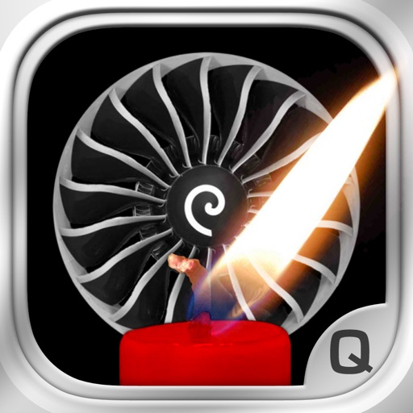

"It blows air!", CNN --- Unlocken Sie den neuen mind-blowing-Funktion auf Ihrem iPhone und iPad: Ändern Sie es in einem echten Luft Blower! Blower nutzt geheime Hardware-Features von Ihrem Device, überprüfen Sie unten die Blower Power.

• "Believe it or not, it blows air!" , Gizmodo
• Knocked Ellen Degeneres out of her chair during her TV talkshow!
• "a one-of-a-kind application that pushes the iPhone’s functionality and awesomeness even further", krapps.com

• Ranked overall #1 in 20+ countries in the App Store
• 40+ YouTube Videos von Blower Nutzern auf der ganzen Welt
• "This is both totally stupid and incredibly brilliant", youtube comment by "mambokurtz"

Probieren Sie es aus und staunen Sie... Starten Sie Ihren Blower und spüren Sie die Luft aus der Lautsprecheröffnung. Lustige Party Trick Beispiele:

• BLOW Modus: Kerzen und Feuerzeugflamme ausblasen
• BEAT Modus: lassen Sie Flammen zum Musik Beat tanzen, oder kontrolliere Flammen mit deiner Stimme!
• GUN Modus: lassen Sie Flammen zittern mit automatischen Gun Modus
• TUNER Modus: passen Sie den Gebläsemotor an, um den Luftstrom auf Ihrem Gerät zu optimieren
• Berühren Sie die Rotor des Blowers: treiben Sie es selbst it und sehen Sie die Funken
• Geburtstag iMessage Stickerpack

Neugierig? Sehen Sie sich Blower in Aktion auf BlowerApp.com, oder suchen Sie "iPhone blower" auf YouTube.
Vielen Spaß!

Qneo

BLOWER POWER
Für ein Maximum Blower Power, verwenden Sie das Device ohne zusätzliche Schutzhüllen / Gehäuse, verwenden Sie maximale Lautstärke, optimieren mit dem eingebauten Tuner, und stellen Sie sicher daB kein Staub in Ihrem Lautsprecheröffnung angesammelt ist. Sie können den kühlen Luftstrom überprüfen, durch die Lautsprecheröffnung nahe Ihrem Mund zu halten. Beim Ausblasen von Kerzen, brennen Sie nicht Ihren Gerät!

[View on Apple](https://apps.apple.com/gb/app/blower/id335862325)

## Wales Airshow

This is the official App for the annual Wales Airshow (Swansea Bay) brought to you by the City and County of Swansea.  Featuring display bios, live updates and notifications, updating timetable, event information, exclusive offers and more – it’s your guide to the Wales Airshow in the palm of your hand. On the event days users will receive push notifications giving them advance notice of when the next display is arriving and directing them to info within the app about the display team. This APP is bilingual (Welsh and English).

[View on Apple](https://apps.apple.com/gb/app/wales-airshow/id1109429666)

## Life in the UK 2026 Test Prep

The Life in the UK Citizenship Test is a computer-based exam constituting one of the requirements for anyone seeking naturalisation as a British citizen. It is meant to prove that the applicant has a sufficient knowledge of British life and sufficient proficiency in the English language. The test consists of 24 questions covering topics such as British values, history, traditions and everyday life.

You’ll be tested on information in the official handbook for the Life in the UK Test included in this app - this is the only book recommended to prepare for the test. You’ll have 45 minutes to answer 24 questions.

This app also contains many practice questions you will be asked in the citizenship test.

- 51 Practice Tests - 1200+ Practice Questions
- Summary of key material and facts
- View them in a random order in a mock test to simulate an actual exam
- Take a practice test and see if you can score well enough to pass the actual test
- Based on real test questions
- You can track how many questions you have done correctly, incorrectly, and get a final passing or failing score based on official passing grades
- Option to review all the test questions if you don't want to take the quiz (Question Bank feature)
- Track Past Test Results - Individual tests will be listed with pass or fail and your mark
- Send questions feedback directly from the app
- Test Timer - Track how long it takes for you to take the test
- Test Timer - On/Off option
- Get immediate feedback for correct or incorrect answers

Note: Remeber that you must book your Life in the UK Test online at least 3 days in advance. There is a fee to register. There are around 60 test centres in the UK - choose one of the 5 closest to where you live. If the centre isn’t close to where you live, you won’t be allowed to sit the test and you won’t get a refund. Remeber to bring proof of your address to the test. If you have covered all the material in this app - It should be a breeze!

[View on Apple](https://apps.apple.com/gb/app/life-in-the-uk-2026-test-prep/id1113930361)

## Threema. Der sichere Messenger

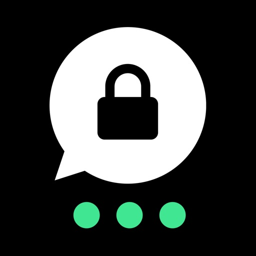

Threema ist der weltweit meistverkaufte sichere Messenger, der von mehr als 12 Millionen Menschen in über 175 Ländern verwendet wird – entwickelt in der Schweiz und konsequent auf Datenschutz und Privatsphäre ausgelegt. Ob Chats, Anrufe oder Dateien: Alles ist Ende-zu-Ende-verschlüsselt, und keine Datenspur bleibt zurück. Anstelle einer Telefonnummer oder E-Mail-Adresse dient eine zufällig erzeugte Threema-ID als eindeutige Kennung – anonym und sicher. Threema schützt, was wirklich zählt: Ihre Privatsphäre.

Vorteile mit Threema:
• Text- und Sprachnachrichten inkl. Emoji-Reaktionen
• Durchgängig verschlüsselte Sprach-, Video- und Gruppenanrufe
• Teilen des Standorts
• Versand von Dateien aller Formate (PDF, GIF, MP3, ZIP und mehr)
• Möglichkeit, bereits gesendete Nachrichten zu bearbeiten und für Chatpartner zu löschen
• Desktop-App und Web-Client, um bequem am PC zu chatten
• Erstellen von Gruppen und Umfragen
• Helles oder dunkles Design
• Keine Werbung, keine Tracker, keine Datensammelei
• Verifikation der Identität von Kontakten durch Scannen des QR-Codes

Zuverlässige Sicherheit:
• Open Source und regelmässige Audits
• Server in der Schweiz
• Anonyme Nutzung möglich: keine Telefonnummer oder E-Mail-Adresse erforderlich
• Löschung von Nachrichten vom Server sofort nach Zustellung

Haben Sie Fragen oder Probleme? Unsere FAQ helfen weiter: https://threema.com/support

Viel Freude mit Threema!

[View on Apple](https://apps.apple.com/gb/app/threema-the-secure-messenger/id578665578)

## Fussy Toddler Recipes

Do you want your child to eat a healthy, balanced diet but feel stuck when they refuse everything you offer?

Are mealtimes turning into negotiations, stress and wasted food?

The Fussy Toddler App is here to help.

Packed with quick, easy, family-friendly recipes, this app is designed specifically for toddlers and children who are fussy with food. You’ll find realistic meals that actually get eaten with clever, enjoyable ways to include fruit and vegetables without pressure or battles.

From breakfasts and lunches to dinners and snacks, every recipe focuses on nourishment, variety and enjoyment - because food shouldn’t feel like a fight.

Why I created this app:

Every toddler goes through fussy phases, especially when it comes to fruit and vegetables. I know how frustrating and worrying that can feel.

My daughter, Annabelle, has had her fair share of fussy stages, as have my twin boys. After creating my best selling Baby-Led Weaning recipes app in Annabelle’s early years, I wanted to build something that supported parents beyond that stage - something practical, realistic, and rooted in real life.

This app is the result.

Each recipe is designed to bring health, variety and excitement back to mealtimes, helping fussy eaters stay interested while giving parents peace of mind.

I also know how busy life is. When you’re juggling work, childcare and everything else, spending hours in the kitchen just isn’t realistic. That’s why every recipe is simple to prepare, family-friendly and tested by my own fussy eaters - so you don’t have to guess what might work.

If you’re struggling to offer healthy meals your child will actually eat, this app gives you the confidence, ideas and reassurance you need - without guilt or pressure.

Key App Features

• Over 200 family recipes designed specifically for fussy eaters
• Quick, easy meals using everyday ingredients
• Recipes clearly divided into breakfast, lunch, dinner and snacks
• Search by recipe name or ingredient
• Add ingredients straight to your shopping list
• Save favourites for easy access
• Free help and support via the  online community (linked in the app)
• Free updates with new features and improvements

If you ever have a question or need support, please don’t hesitate to get in touch - I’m always happy to help.

Natalie x

[View on Apple](https://apps.apple.com/gb/app/fussy-toddler-recipes/id1234987252)

## Stylebook

Optimisez votre garde-robe : pour moins cher qu'un café au lait, découvrez votre propre style et changez votre relation avec les vêtements pour la toujours !

Stylebook® est le meilleur outil d'organisation de votre garde-robe. Grâce à plus de 90 fonctionnalités, vous pouvez organiser votre garde-robe et profiter au maximum des vêtements que vous possédez déjà !

Importez vos vêtements en quelques secondes grâce à une variété d'outils d'importation, y compris le glisser-déposer et la génération d'images par IA. Créez des collages de tenues comme dans les magazines avec vos propres vêtements. Vous pourrez ainsi vous souvenir de vos meilleurs looks et vous habiller plus rapidement chaque jour. Vous pouvez aussi planifier vos tenues grâce au calendrier des tenues, créer des listes pour préparer vos bagages qui vous indiquent automatiquement les vêtements à emporter et en savoir plus sur votre garde-robe grâce à des statistiques telles que le coût par utilisation. Tout cela dans cette application totalement personnalisable !

Ce n'est pas pour rien que Stylebook est l'application de gestion de la garde-robe la plus ancienne ! Cette application a fait ses preuves et constitue un excellent outil d'organisation et de gestion de la garde-robe. Nos clients l'apprécient depuis plus de 15 ans. Elle reste une petite entreprise familiale, gérée par une équipe composée d'un couple.

FONCTIONNALITÉS :

• PLACARD : ajoutez rapidement des images de vos propres vêtements sans avoir besoin de prendre des photos, sauf si vous le souhaitez. 
• IMPORTATION RAPIDE : génération d'images par IA (*), glisser-déposer des photos, importation multiple et découpage rapide à partir de vos sites web préférés.
• SUPPRESSION AUTOMATIQUE DE L'ARRIÈRE-PLAN : découpez avec précision vos vêtements sur presque toutes les images, quasi instantanément.
• DISPOSITION DE VÊTEMENTS : superposez et redimensionnez les vêtements sur une toile libre.  
• GÉNÉRATEUR DE TENUE : mélangez votre garde-robe comme un jeu de cartes pour découvrir de nouvelles idées de tenues qui se cachent dans votre armoire !
• CALENDRIER : planifiez à l'avance les tenues que vous allez porter.
• LISTES DE VOYAGE : ajoutez des tenues complètes, préparez le contenu de votre valise en avance, créez des listes et des illustrations à imprimer.
• STYLE STATS : des informations sur la façon dont vous portez vos vêtements et vos tenues, y compris ce que vous portez le plus, ce que vous portez le moins et les éléments qui vous rapportent le plus.
• COÛT PAR UTILISATION : suivez automatiquement le coût par utilisation de tous vos vêtements
• PARCOUREZ VOTRE GARDE-ROBE : consultez tous vos vêtements au même endroit, classés par marque, tissu, couleur, taille et bien plus encore.
• BIBLIOTHÈQUE D'INSPIRATIONS : enregistrez toutes vos inspirations de style dans un espace qui vous est réservé, sans l'influence des algorithmes.
• CATÉGORIES PERSONNALISÉES : ajoutez, modifiez ou supprimez n'importe quelle catégorie de votre placard, vos looks ou votre galerie d'inspirations.
• SYNCHRONISATION : la synchronisation automatique affiche les mêmes données sur votre iPhone et votre iPad.
• PARTAGE : partagez des tenues et des vêtements avec vos amis par e-mail, SMS, Instagram ou Pinterest.
• AUCUNE LIMITE : ajoutez un nombre illimité de vêtements, accessoires et inspirations à vos tenues.
• SAUVEGARDE ET SYNCHRONISATION ICLOUD : protégez vos données avec la synchronisation iCloud.
• RECHERCHE : recherchez des mots-clés ou des critères tels que le tissu, la saison ou la couleur dans votre garde-robe.
• SHOPPING : achetez des articles sur les boutiques en ligne et essayez-les dans votre garde-robe virtuelle avant de les acheter et mettez vos propres boutiques en favoris !
• AIDE : manuels pratiques dans lesquels vous pouvez effectuer des recherches et vidéos de démonstration incluses

(*) La génération d'images par l'IA nécessite Apple Intelligence.

[View on Apple](https://apps.apple.com/gb/app/stylebook/id335709058)

## Slow Shutter Cam

Slow Shutter Cam brings new life into your device's photo toolbox by letting you capture a variety of amazing slow shutter speed effects that you only thought you could get with a DSLR. Continue reading to learn more about this unique app!

-----------------------

• Featured numerous times by Apple:

- App Store Essentials: Camera & Photography
- Photography for Professionals - Total Control
- Extraordinary Photo Apps
- Best New App

-----------------------

"It’s one of those rare photography apps that creates effects that few others are capable of, and it does it easily and with better results."
— Marty Yawnick, Life In LoFi

-----------------------

How many times have you tried to capture artful images with your iPhone camera but were left wishing you had more features to work with? Slow Shutter Cam puts an end to mere snapshots and gives you some of the most powerful features of a DSLR camera. All this, in a package that fits in your pocket.
 
Slow Shutter Cam offers three capture modes to capture unique images:
 
MOTION BLUR: Equivalent to the shutter priority mode on a DSLR, the Motion Blur mode is perfect for creating ghost images, waterfall effects or suggesting movement in your photographs by adding a blur.

LIGHT TRAIL: The Light Trail mode allows you to 'paint' with light, show car light trails and fireworks or capture any other moving light in a unique way. Unlike shooting with a DSLR and being tied to specific rigid settings to obtain good results, the Light Trail mode takes care of the essentials, letting your creativity soar!

LOW LIGHT: In low light conditions, this capture mode allows the camera to accumulate every photon of light hitting the sensor. The longer the shutter speed, the more light it will accumulate. You can even fine-tune the result using the exposure compensation slider to achieve the exact effect you want!

Highlights:

•  Unlimited Shutter Speed and manual ISO
•  Option to resume capture  and create multiple exposure photos
•  Real time live preview - See the result in real time
•  Innovative 'Freeze'  and ‘Blur Strength’ controls
•  Tap to adjust focus/exposure
•  Time-lapse Intervalometer
•  Apple Watch support and handy Self-Timer 
•  Full resolution support on every devices
•  Camera Control support (iPhone 16)

With Slow Shutter Cam on your iPhone you get the features of a DSLR camera with the convenience of a device that you can drop in your pocket and take with you wherever you go. Download it now and put an end to mere snapshots!

Search #slowshuttercam on Instagram or visit the "Slow Shutter Cam - iPhone" group on flickr for amazing samples!

[View on Apple](https://apps.apple.com/gb/app/slow-shutter-cam/id357404131)

## RESET by Sarah Rusbatch

Backed by 12,000 women. Built by women who've been there. RESET is the app that finally understands what women need to change their drinking, hormones, cravings, emotions and all.

This is not a clinical app. Not a 12-step program. Not a one-size-fits-all tool built with men in mind. RESET is a warm, judgment-free daily companion created by women's wellness coaches who have lived this journey themselves, and who know exactly what it feels like to question your relationship with alcohol. It’s everything they needed when they changed their drinking and the tools that ACTUALLY work.

Whether you're taking a break, exploring sober curiosity, or committing to an alcohol free life, RESET meets you exactly where you are. No shame. No pressure. Just real support, whenever you need it, right in your pocket.

WHAT RESET GIVES YOU

Coach In Your Pocket!

You are never alone in the hard moments. Hear directly from Sarah Rusbatch and her team. real voices, real warmth, any time the evening wine is calling.

Daily Check-Ins and Mood Tracking

Show up for yourself every single day with a simple, pressure-free check-in. Log how you're feeling, track your alcohol-free days, and build self-awareness one day at a time.

Milestone Celebrations

Every day counts. RESET tracks your alcohol free days and celebrates every milestone, from your very first day to your first year and beyond, with beautiful, shareable cards that mark how far you've come.

Craving Support Tools - Right When You Need Them

When a craving hits, RESET has you covered. Play The Tape Forward, urge surfing, the HALTBSH check and more, science-backed tools designed specifically for women, available the moment you need them most.

Coach Voice Notes

Four real women's wellness coaches. Pre-recorded voice notes designed to calm your nervous system, lift your spirits and get you through your hardest moments. Because sometimes you just need to hear a real voice that gets it.

Guided Journaling Prompts

Reflect, grow and reconnect with yourself through guided prompts for daily reflection, gratitude and glimmer moments. Journaling has never felt this supportive.

Stats, Insights and Savings

Track your streak, your alcohol free percentage, and yes, the money you've saved. All in one beautiful, motivating dashboard that shows you exactly how far you've come.

CREATED BY WOMEN WHO TRULY GET IT

RESET was built by a team of women who have all walked this path themselves. Sarah Rusbatch, accredited grey area drinking coach and author of Beyond Booze, has supported over 12,000 women to change their relationship with alcohol. Her expertise, warmth and hard-won wisdom are woven into every single feature of this app.

This is what 12,000 women's experiences looks like when it's distilled into one powerful tool.

THIS APP IS FOR YOU IF:

• You're curious about taking a break from alcohol
• You've tried before and want real support this time
• You want tools designed for how women actually feel and function
• You're done with shame and ready for something different
• You want coach tools in your pocket for the moments that matter most

RESET is not about perfection. It is about progress, one day at a time.

Download RESET today and take the first step toward a life you love waking up to.

[View on Apple](https://apps.apple.com/gb/app/reset-by-sarah-rusbatch/id6779501593)

## Wipr 2

Wipr blocks ads, popups, trackers, cookie warnings, and other nasty things that make the web slow and ugly.

Websites in Safari will look clean, load fast, and stop invisibly tracking you. You’ll notice significant improvements to your battery life and data usage. Setup is a snap.

The Filtr add-on extends Wipr’s blocking to all apps on your device. It acts at the network level, but unlike a VPN, it can access none of your data, and can be used in conjunction with VPNs, iCloud Private Relay, and custom DNS.

Wipr’s blocklist is updated twice a week automatically, and has enhanced versions for the following languages: Bosnian, Chinese, Croatian, Czech, Danish, Dutch, Estonian, Finnish, French, German, Greek, Hebrew, Hindi, Hungarian, Icelandic, Indonesian, Italian, Japanese, Korean, Macedonian, Malay, Montenegrin, Norwegian, Polish, Romanian, Russian, Serbian, Slovak, Spanish, Thai, and Vietnamese.

Wipr is a universal app: install it on all your devices (iPhone, iPad, Mac, Vision Pro) with a single purchase. It’s fully accessible with VoiceOver, Voice Control, and more. Dark, Tinted, and Clear icon variants are included. Family Sharing is supported.

Because it’s developed by a single independent developer and 100% funded by its users, Wipr only answers to you: no one can pay to have their ads unblocked, and there are no “acceptable ads”.

This app was made with love and patience. I hope you’ll enjoy using it as much as I enjoyed designing and building it.

– Kaylee

Terms & Conditions: https://kaylees.site/terms-and-conditions.html
EULA: https://www.apple.com/legal/internet-services/itunes/dev/stdeula/

[View on Apple](https://apps.apple.com/gb/app/wipr-2/id1662217862)

## PhotoPills

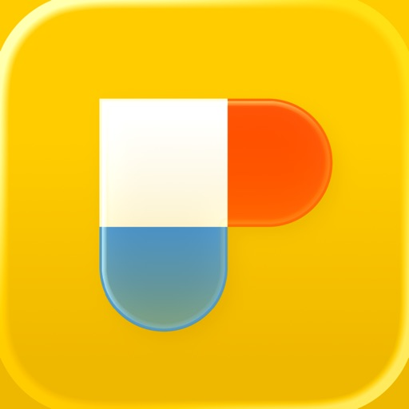

Entdecke wie einfach es ist Sonne, Mond oder Milchstraße weltweit zu fotografieren!

Ob erfahrener Fotograf, professioneller Videofilmer oder Neuling, PhotoPills sorgt dafür, dass du die Konzeption, Planung und Aufnahme von einzigartigen Bildern lieben wirst.

* Alles in einer einzigen App
Der erste 2D-kartenbasierte Sonne-, Mond- und Milchstraße-Planer - Schnellsuche von Sonne-, Mondkonstellationen - 3D-Augmented Reality: Sonne, Mond, Milchstraße, Himmelsäquator, Polarstern, Tiefenschärfe, Blickfeld - Fotoplaner - Tool zur Suche von Aufnahmeorten - Informationen: Sonnenauf/-untergang, Dämmerung, Goldene Stunde, Blaue Stunde - Informationen: Mondauf/-untergang, Supermondtermine, Mondkalender - Rechner: Zeitraffer, Sterne erkennen, Sternspuren, lange Belichtungszeiten, hyperfokale Tabellen, Tiefenschärfe, Blickfeld, Entfernung zum Motiv, Brennweite-Einstellung - Komplette Anleitung und vieles mehr...

* von Profis empfohlen
"PhotoPills - ein unersetzbares Werkzeug, das ich zur Planung jeder Aufnahme benutze." – Mark Gee, Astronomie-Fotograf des Jahres
“Ein Werkzeug, das jeder Fotograf haben sollte” – Kevin Raber, Luminous-landscape.com
"Es zahlt sich aus! Dank diesem Tool können wir immer wieder tolle Aufnahmen schnell planen; Bietet die besten Möglichkeiten, um kreativer vorzugehen."- José B. Ruiz, Innovationspreis, Naturfotograf des Jahres

* Übernimm die Kontrolle
Warst du schon einmal an einem Ort und hast dir gedacht: "Schade, der Mond ist nicht genau da, ... das wäre ein hervorragendes Foto!"? Und die Sonne? Und die Milchstraße? Lasse deiner Fantasie freien Lauf und berechne, wann genau das passiert:

- Stellen dir vor: die Milchstraße erscheint über eine zauberhafte Landschaft, der Vollmond geht unter einem geheimen Steinbogen unter, ein Sonnenaufgang zwischen zwei riesigen Felsen an einem Traumstrand, ein Sonnenuntergang über der Hauptstraße in deiner Heimatstadt oder ein spektakulärer Vollmond hinter einem nahe gelegenen Hügel.
- Plane: Einfach das Datum und die Uhrzeit der gewünschten Szene berechnen und effektiver arbeiten!
- Fotografiere: Geh einfach raus, tauche in die Natur ein und genieße es den perfekte Moment festzuhalten!

* Keine Enttäuschungen!
Berechne schnell, ob das Foto möglich ist oder nicht. Verschwende keine kostbare Zeit mehr mit langen Nachforschungen.

* Verpasse nie wieder die perfekte Szene
Erstelle eine To-Do-Liste von geplanten Fotos und fahre zum richtigen Zeitpunkt zum Aufnahmeort.

* Mach es perfekt
Wähle den perfekten Bildausschnitt schon vor der Aufnahme aus. Durch die 3D-Augmented Reality siehst du, ob die Sonne, der Mond, die Milchstraße, der Himmelsäquator und der Polarstern sich an der gewünschten Position befinden, wenn du den Auslöser drückst.

* Entdecke tolle Orte und füge sie zu deiner persönlichen Datenbank hinzu
Nutze PhotoPills, um einen Ort als POI zu speichern. Füge anschauliche Fotos und Notizen hinzu.

* Fokussiere dich auf deine Kreativität; überlasse das Rechnen den Nerds
- Berechne: Zeitraffer-Einstellungen, Langzeitbelichtungen, Sternspuren, die max. Belichtungszeit um Sterne als Punkte zu erfassen, Einstellungen für einen gewünschten Schärfegrad, Einstellungen für ein gewünschtes Sichtfeld, Objektivauswahl und Motivabstand für deinen Bildausschnitt, min. Abstand zum Motiv, entspr. Brennweite des Objektivs zur Reproduktion des Blickwinkels usw.
- Prognose: Positionen von Sonne, Mond, Milchstraße, Himmelsäquator und Polarstern.

* Teile deine Ergebnisse
Egal ob du deine Ergebnisse deinen Freunden, der Familie oder der ganzen Welt zeigen willst: PhotoPills hilft dir dabei. Teile deine Pläne, geheimen Orte und all die anderen Planungen auf Facebook, Twitter oder beiden in nur wenigen Schritten.

* Triff andere Fotografen
Teile deine Pläne und Orte via E-Mail. Lade deine Freunde ein dabei zu sein. Andere PhotoPillers können deine Planungen importieren und selbst betrachten.

Worauf wartest du? Hol dir PhotoPills gleich jetzt und mache wirklich einzigartig Aufnahmen!

[View on Apple](https://apps.apple.com/gb/app/photopills/id596026805)

## Driver CPC Case Studies Test

WHAT’S INCLUDED?

- Practise hundreds of interactive multiple-choice questions.

- Covers every aspect of the Great Britain (GB) and Northern Ireland (NI) DVSA syllabus with the largest database of professionally written CPC questions.

- Review your answers and read explanations to help improve your skills.

- Sit hundreds of mock tests.

- Over 40 minutes of professional video tutorials covering pre-driving checks, use of the tachograph and driver’s hours*

- Learn the latest rules and regulations from a searchable Highway Code.

- Keep a track of your progress to see if you’re test ready.

- Optional English voiceover to help those with reading difficulties or dyslexia.*

- No annoying ads to interrupt your learning.

- Free in-house customer services and technical support (support@completetheorytest.co.uk).

Practise interactive case studies covering the full DVSA syllabus: 

• Customer Service
• Diet and Health
• Documentation
• Drivers' Hours
• EcoSafe Driving
• Health and Safety
• Incidents, Emergencies and First Aid
• Legal Matters
• Licensing and Qualifications
• Risk Factors
• Speed, Height, Weight and Other Limits
• Tachograph Use
• Technical Matters
• Vehicle Loading, Unloading and Security
• Vulnerable Road Users
• Working Time Directive

-------------------------------------------------------------------------

* Internet access required for voiceovers and videos (WiFi recommended)

IMPORTANT: The revision materials in this app are NOT the actual questions you will be asked in the official test. The DVSA do not release any of the live CPC questions, nor do they publish a revision question set. The questions in this product have been written by experts within the industry and cover the DVSA’s CPC test syllabus.

The Official Highway Code is Crown Copyright material and reproduced under the terms of the Open Government Licence. ‘The Complete’ is a brand name owned by Driving Test Success Ltd. App developed by Imagitech Ltd ©2026. All rights reserved.

[View on Apple](https://apps.apple.com/gb/app/driver-cpc-case-studies-test/id1181449615)

## Ableton Note

Entwickele neue musikalische Ideen mit ausgewählten Sounds und Effekten. Erstelle Beats und Melodieparts, sample deine Umgebung und entwickele deine Tracks in Ableton Live weiter.

Note ist ein Ort für Skizzen, neue Sounds und Ideen: Lass deinen Ideen freien Lauf oder experimentiere einfach, bis die Inspiration einsetzt. Dabei steht dir eine Auswahl von Lives Drum-Kits, Synths und Instrumenten zur Verfügung. Erstelle deine eigene Klangpalette, indem du mit dem integrierten Mikrofon deines Telefons Samples aufnimmst. Und nutze den integrierten MIDI-Editor von Note, um Noten, Beats und Akkorde zu sequenzieren oder beim Hören Anpassungen zu vorzunehmen
 
Verfolge deine Ideen, wohin auch immer sie dich führen und sende deine Projekte mit Ableton Cloud an Live, ohne die App zu verlassen. Du findest deine Projekte in Lives Browser und kannst dort weiterarbeiten. Sämtliche Samples und Sounds werden direkt aus Note übernommen, MIDI-Noten kannst du nach Belieben verändern. Alle Nutzerinnen und Nutzer von Ableton Note bekommen eine kostenlose Lizenz für Ableton Live Lite – der einfachen und intuitiven Software, mit der Musikschaffende, Producer und DJs aus aller Welt komponieren, aufnehmen und performen. Nutzerinnen und Nutzern von Ableton Move können mit Note außerdem vom Telefon aus weiter an Sets arbeiten.
  
Mit einem Beat einsteigen:
• Wähle zwischen 76 Drum-Sampler-Kits
• Tippe auf 16-Pads einen Beat ein oder sequenziere ihn mit dem MIDI-Editor
• Spiele Drums melodisch im 16-Pitch-Modus
• Quantisiere deine Beats oder verschiebe Noten, um ungenaues Timing und Fehler zu korrigieren
• Schichte Rhythmen übereinander
• Erzeuge Beat-Wiederholungen mit Note Repeat
• Verändere deine Sounds mit Parametern
• Experimentiere mit Effekten oder sorge mit Swing für mehr Abwechslung
 
Mit einer Melodie starten:
• Entdecke 317 Synth-Sounds and 60 melodische Sampler-Instrumente
• Spiele oder programmiere Melodien und Akkordfolgen mit dem 25-Pad-Raster, der Pianorolle oder dem MIDI-Editor
• Lege Tonarten und Skalen fest – für harmonische Ergebnisse
• Schichte mehre Harmonien übereinander
• Verändere deine Sounds mit Parametern
• Spiele mit Effekten für experimentelles Sound Design
 
Deine Welt sampeln:
• Erstelle eigene Drum-Kits aus Aufnahmen perkussiver Sounds im Drum Sampler von Note
• Baue eigene melodische Sampler-Instrumente aus zuvor aufgenommenen tonalen Sounds
• Bearbeite deine Samples durch Zerschneiden, Filter und Pitch-Änderungen
• Sequenziere Samples mit dem MIDI-Editor in Beats, Melodien und Akkorde
• Forme und verzerre Sounds mit Effekten
• Importiere eigene Samples oder Audiomaterial aus Videos

Mit Audio arbeiten:
• Füge Audio-Clips aus der Bibliothek hinzu
• Warpe das Tempo oder passe die Tonhöhe deiner Clips an
• Nimm Audio direkt mit dem integrierten Mikrofon deines Telefons auf
• Schließe ein Audio-Interface an, um externe Quellen aufzunehmen
• Kombiniere aufgenommenes und importiertes Audio mit deinen Beats und Melodien

Improvisationen einfangen:
• Halte deine Ideen mit „Capture“ fest – auch nach dem Spielen
• Spiele nach Gefühl – Note erkennt das Tempo
• Note bestimmt automatisch die Länge einer Phrase und erzeugt einen Loop
• Quantisiere Loops, füge Sounds hinzu und verändere sie
• Schließe deinen MIDI-Controller an, um mit Tasten zu spielen und den Sound der Instrumente intuitiv zu verändern
 
Abwechslung reinbringen:
• Note bietet ein Raster zum Spielen, ähnlich der Session-Ansicht in Live
• Verdopple Loops, um innerhalb von Clips Variation reinzubringen
• Dupliziere Clips und kombiniere verschiedene Versionen von Ideen
• Mehrere Noten gleichzeitig mit dem MIDI-Editor hinzufügen, löschen oder anpassen
• Erstelle acht Spuren mit bis zu acht Clips in acht Szenen
• Experimentiere mit verschiedenen Clip-Kombinationen und Songstrukturen
• Exportiere deine Skizzen und Songs als Audio-Datei, um sie mit anderen zu teilen

[View on Apple](https://apps.apple.com/gb/app/ableton-note/id1633243177)

## Cloud Baby Monitor

Hochqualitativer Livevideo + Audio Babyphone mit unbegrenzter Reichweite (WiFi, 3G, LTE, 4G, 5G, Bluetooth). Einfach zu verwenden, funktioniert auf jedem iPhone, iPad, iPod Touch oder Mac, ohne Konfiguration. Exzellente Wahl für sicheres Überwachen des Babys zu Hause und auf Reisen.

Cloud Baby Monitor hilft täglich Zehntausenden von Eltern, sich um ihre Kleinen zu kümmern.

Vorgestellt von Apple in der Geschichte von The Quantified Dad (www.apple.com).
Vorgestellt in Good Morning America von ABC News (www.abcnews.com).
Vorgestellt in USA Today (www.usatoday.com).
Gewählt durch App Advice zur essentiellen App für das Überwachen Ihres Babys (www.appadvice.com).
Empfohlen von Mashable unter den besten “Elternapps für Baby's erstes Jahr” (www.mashable.com).
Ausgewählt von TUAW für den "Urlaubsgeschenke-Guide: iPad Apps für zu Hause" (www.tuaw.com).
Gewinn des 3. Platzes von Babble.com in den "Top 25 Reiseapps für Eltern” (www.babble.com).

FUNKTIONEN

• SICHER, VERLÄSSLICH UND EINFACH ZU VERWENDEN
• LIVEVIDEO, ÜBERALL 
• SUPEREMPFINDLICHES AUDIO
• GERÄUSCH- UND BEWEGUNGSALARM
• ACTIVITY LOG
• BELIEBTE RAUSCHGERÄUSCHE UND SCHLAFLIEDER INKLUSIVE
• ERSTELLEN SIE IHRE EIGENEN WIEDERGABELISTEN 
• NACHTLICHT MIT FERNSTEUERBARER HELLIGKEITSKONTROLLE
• SPRECHEN SIE AUS DER FERNE MIT IHREM BABY
• FUNKTION FÜR MEHRERE ELTERNTEILE UND KINDER
• VERBINDUNGSQUALITÄTSANZEIGE
• AKKUSTATUSÜBERWACHUNG UND -ALARM
• UNTERSTÜTZUNG FÜR MULTITASKING, BILD-IN-BILD

SICHERER , VERLÄSSLICHER, UND EINFACH ZU VERWENDENDER BABY MONITOR
Verwenden Sie Ihr iPhone, iPad, iPod Touch oder einen Mac als Kindereinheit, platzieren Sie sie im Babyzimmer und genießen Sie live Video und klares Audio im Vollbildmodus auf der Elterneinheit. Beide Geräte werden automatisch verbunden, ohne jegliche Konfiguration. Die gesamte Kommunikation ist sicher, geschützt durch Verschlüsselung nach dem Industriestandard, um sicherzustellen, dass nur Sie Zugriff auf Baby's Videostream haben.

LIVE VIDEO, ÜBERALL
Mit dieser einzigartigen Funktion können Sie ein Live-Vollbildvideo Ihres Babys ohne Distanzbeschränkung sehen. Cloud Baby Monitor funktioniert in jedem WiFi-Netzwerk, über 3G, LTE, 5G, oder via Bluetooth.

SUPEREMPFINDLICHES AUDIO
Hören Sie Ihr Baby atmen, als ob es direkt neben Ihnen schlafen würde. 

GERÄUSCH- UND BEWEGUNGSALARM
Erhalten Sie Benachrichtigungen über alle Aktivitäten Ihres Kindes mit Geräusch- und Bewegungsalarmen.

BELIEBTE RAUSCHGERÄUSCHE UND SCHLAFLIEDER INKLUSIVE
Genießen Sie die Palette an beliebtesten Schlafliedern und Rauschgeräuschen für Babys in der App. Kontrollieren Sie aus der Ferne Lautstärke, Wiedergabe und Autostopp-Timer. 

ERSTELLEN SIE IHRE EIGENEN WIEDERGABELISTEN
Erstellen Sie eigene Wiedergabelisten mit Songs, Rauschgeräuschen oder Märchen aus Ihrer iTunes-Bibliothek.

NACHTLICHT MIT FERNGESTEUERTER HELLIGKEITSKONTROLLE
Verwenden Sie ein ferngesteuertes Nachtlicht, um Ihr Baby durch die Nacht hindurch schlafen zu sehen. Helligkeitskontrolle ermöglicht Ihnen das Anpassen der Lichtintensität, um ein gutes Bild zu erhalten und das Baby nicht zu stören.  

SPRECHEN SIE AUS DER FERNE MIT DEM BABY
Beruhigen Sie das Baby einfach mit Ihrer Stimme von der Elterneinheit aus.

UNTERSTÜTZUNG FÜR MEHRERE ELTERNTEILE UND KINDER 
Verwenden Sie die Funktion für mehrere Kinder zum Überwachen von zwei Kindern, die in verschiedenen Räumen schlafen.
Verwenden Sie die Funktion für mehrere Elternteile zum Überwachen Ihres Babys von zwei verschiedenen Elterneinheiten aus.

KUNDENSUPPORT

Glückliche Kunden sind unsere Top-Priorität, und Ihr Feedback ist immer willkommen. Wenn Sie ein Problem oder einen Vorschlag haben, kontaktieren Sie uns bitte direkt via support@cloudbabymonitor.com.

Danke, dass Sie Cloud Baby Monitor verwenden.

[View on Apple](https://apps.apple.com/gb/app/cloud-baby-monitor/id432791399)

## Antenna Finder

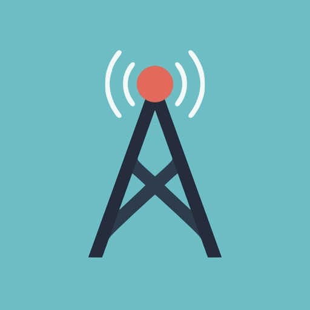

Antenna Finder is the easiest way to find the best Freeview (UK), Saorview (Ireland) and TnT (France) TV signal no matter where you are in the country. It's also perfect for finding the best signal from your mobile home or caravan. 

Use your current GPS location or postcode / eircode and with a single tap the app will show you how to point your aerial to the best signal (no internet connection required for postcode search).

All Freeview transmitters in the UK and Northern Ireland are supported. All Saorview transmitters in the Republic of Ireland are supported.

*** IMPORTANT INFO ***
Some devices don't have GPS or Compass support but you will still be able to find a list of the nearest transmitters and the direction to point your aerial in.

*** SAFETY INFO ***
If your aerial is not easily accessible from the ground level please consider getting a professional installer to align it for you. We are unable to accept any liability for accidents or injuries arising from aerial installation.

[View on Apple](https://apps.apple.com/gb/app/antenna-finder/id1278887323)

## Pocket God

What kind of god would you be? Benevolent or vengeful? Play Pocket God and discover the answer within yourself. On a remote island, you are the all-powerful god that rules over the primitive islanders. You can bring new life, and then take it away just as quickly. Exercise your powers on the islanders. Lift them in the air, alter gravity, hit them with lightning...you're the island god! All god powers are demonstrated in Pocket God's help menu.

Pocket God is an episodic microgame for you to explore, show your friends and have fun with. We have been growing the game with the help of player suggestions!  What sort of godly powers would you like to see added?

More info can be found at our blog:
http://www.boltcreative.com

On Facebook:
http://www.facebook.com/PocketGodGame

And on Twitter:
http://www.twitter.com/PocketGod

Releases:

Ep 1: Nowhere To Go, Nothin' To Do 
Ep 2: Does this Megabyte Make My App Look Fat?
Ep 3: You Always Hurt the One You Lava 
Ep 4: Shake That App!
Ep 5: A Storm is Coming
Ep 6: And on the 7th Day, Rest!
Ep 7: Just Give Us 5 Minutes
Ep 8: Jump the Shark
Ep 9: Idle Hands
Ep 10: Hi, Dracula!
Ep 11: A Mighty Wind
Ep 12: Something's Fishy…
Ep 13: March of the Fire Ants
Ep 14: Say My Name!
Ep 15: A New Home
Ep 16: The Tyrannosaurus Strikes Back!
Ep 17: Return of the Pygmy
Ep 18: Surf's Up
Ep 19: Fun 'n Games Until A Pygmy Gets Hurt
Ep 20: Stop! My App is On Fire!
Ep 21: Flipping the Bird
Ep 22: Ooga Jump
Ep 23: Bait Master
Ep 24: Idle Hands 2: Caught with your Pants Down
Ep 25: Sharks With Frickin' Laser Beams Attached To Their Heads
Ep 26: Dead Pygmy Walking
Ep 27: Good Will Haunting
Ep 28: Barking Spider, Crouching Pygmy
Ep 29: The Pyg Chill
Ep 30: Great Job Ice Hole
Ep 31: What's the Story Morning Gory?
Ep 31B: What's the Story Morning Gory? Part II
Ep 32: Crack is Wack
Ep 33: A Pygmy A Day Keeps the Ape Away
Ep 34: Monkey See, Monkey Chew
Ep 35: Double Rainbow All The Way Across The Sky
Ep 36: Konkey Dong
Ep 37: The Moron Pests
Ep 38: Two and a Half Pygmies
Ep 39: Challenge of the Gods
Ep 40: Battle of the Gods.
Ep 41: I Sting The Body Electric
Ep 42: Bone Soup
Ep 43: Killing Time
Ep 44: The Perfect Swarm
Ep 45: Dance Dance Execution
Ep 46: Germs of Endearment
Ep 47: Apocalypse, Ow!

[View on Apple](https://apps.apple.com/gb/app/pocket-god/id301387274)

## Ship Finder

Ship Finder shows live moving ships on a worldwide map. The intuitive design combined with incredible performance puts you in control. Watch in full screen, view in AR, search, add filters and so much more!

Ship Finder has been top rated and top ranking since 2009 and covers most of the world, tracking 30,000+ ships simultaneously.

Our incredible app performance means that you can see all tracked vessels at once.
Simply tap a ship to see its name, type, photos, speed, dimensions and much more.
Powerful features such as filters, search, night mode and the ability to save favourite ships are included. (You can choose Apple or Google maps too!).

Add and browse bookmarks to saved locations around the globe to quickly navigate to areas or ports of interest.

You can even use Augmented Reality (AR) view to identify ships out at sea using your device camera. 

Ship Finder works by picking up AIS ship feeds used by all passenger vessels, vessels over 300 tons and increasingly by smaller pleasure craft and yachts. This technology is actually faster than radar and is used by vessels for safety and navigation.

Ship Finder provides near real time “virtual radar” AIS maps. It’s easy to use and is an amazing app for anyone interested in shipping, cruising and sailing in ports and locations across the world. It’s also great if you simply want to know what boats are out there or want to see where your friends and family are. Ship Finder is also used extensively by maritime professionals and mariners.

Our global AIS coverage is impressive and expanding all of the time as we add new AIS feeds and receivers. Please check www.shipfinder.co regularly to see the latest coverage.

Pinkfroot are committed to customer service and continually improve our Ship Finder apps based on feedback. Why not join our online community at www.pinkfroot.com or if you have any questions please email us via support@pinkfroot.com and we’ll be happy to help. 

Disclaimer: Ship Finder should not be used for navigational purposes. 
Under no circumstances will the developer of this application be held responsible for incidents resulting from the use of the data or its interpretation.

[View on Apple](https://apps.apple.com/gb/app/ship-finder/id363360636)

## Squeezy Men

Squeezy has been designed by chartered, NHS physiotherapists specialising in men's health.

It is suitable for all men who should be doing pelvic floor muscle exercises (also known as Kegel exercises). Men should only be doing these exercises if they have symptoms (like leaking) or before and after a prostatectomy. 

The app is particularly aimed at men who are seeing a specialist physiotherapist for problems connected to their bladder, bowels or pelvic floor muscles, as it can be tailored to a specific exercise programme and set to remind you when to do your exercises.

Having pelvic floor muscles that are working well can help with premature ejaculation, erectile dysfunction and urinary incontinence.

It is simple to use, discreet, informative and has helpful visual and audio prompts to support your exercise programme. Also, it maintains a record of the number of exercises you have completed. 

Features:
• Customisable exercise plan
• "Professional mode" to help physiotherapists set detailed exercise plans for patients
• Visual, and audio prompts for exercises
• Information and tips written by men's health physiotherapists
• Graphs to track and monitor your progress
• Write a short note after a completed exercise
• Bladder diary to keep track of your symptoms, if required
• Simple and clear interface

The app is UKCA marked as Class I medical device in the United Kingdom and developed in compliance with Medical Devices Regulations 2002 (SI 2002 No 618, as amended).

[View on Apple](https://apps.apple.com/gb/app/squeezy-men/id929618748)

## SkyView®

SkyView® macht Sternguckerei für alle möglich. Richten Sie Ihr iPhone, iPad oder iPod einfach in den Himmel, und schon  können Sie Sterne, Sternbilder, Planeten, Satelliten und mehr bestimmen! 

Mehr als 1 Million Downloads

App Store Rewind 2011 – Beste Lern-App

"Wenn Sie schon immer wissen wollten, was Sie da im Nachthimmel sehen, dann ist diese App der perfekte Begleiter für jeden Sterngucker." 
– CNET 

"Wenn Sie immer schon auf der Suche nach einer Sterngucker-App für Ihr iPhone waren, dann [ist] dies definitiv jene, die Sie sich zulegen sollten." 
– AppAdvice 

"SkyView ist eine App für Erweiterte Realität, mit der Sie sehen können, welche Schätze der Himmel zu bieten hat." 
– 148Apps Editor's Choice

Sie müssen kein Astronom sein, um Sterne oder Sternbilder am Himmel zu finden. Öffnen Sie einfach SkyView® und lassen Sie sich von der App zu ihrer Position führen und sie benennen. SkyView® ist eine wunderbare und intuitive App für Sterngucker, die bei Tag und Nacht Himmelskörper mithilfe der Kamera präzise erkennen und benennen kann. Sie finden alle 88 Sternbilder, wenn sie auf- oder untergehen, während Sie den Himmel absuchen. Finden Sie jeden Planeten im Sonnensystem, entdecken Sie entfernte Galaxien und beobachten Sie, wie Satelliten vorbei rasen.

Funktionen: 

• Einfach: Richten Sie Ihr Gerät in den Himmel, um Galaxien, Sterne, Sternbilder, Planeten und Satelliten (inklusive ISS und Hubble) zu bestimmen, während sie über Ihren Standort hinweg ziehen.
• Erweiterte Realität (AR): Entdecken Sie mithilfe Ihrer Kamera Himmelsobjekte bei Tag und Nacht.
• Himmelswege: Verfolgen Sie die täglichen Bewegungen von Sonne, Mond und Planeten und bestimmten Sie deren exakte Position am Himmel für jedes Datum und jede Uhrzeit.
• Umfassend: Enthält tausende Sterne, Planeten und Satelliten mit tausenden interessanten Fakten.
• Zeitreise: Springen Sie in die Zukunft oder die Vergangenheit und sehen Sie sich den Himmel an verschiedenen Tagen und zu verschiedenen Uhrzeiten an.
• Soziale Medien: Machen Sie wunderschöne Aufnahmen und teilen Sie diese in sozialen Netzwerken mit Freunden und Familienmitgliedern. 
•  Mobil: WLAN ist NICHT erforderlich (es wird kein Datensignal oder GPS benötigt). Nehmen Sie es zum Camping, auf Bootsausflüge oder sogar auf Flugreisen mit!

Eine unterhaltsame Art sich selbst, Kindern, Studenten oder Freunden die Wunder des Universums näher zu bringen!

[View on Apple](https://apps.apple.com/gb/app/skyview/id404990064)

## HealthFit

Verwandle deine Apple Watch in eine umfassende Trainingsplattform.

HealthFit verwandelt die in Apple Health gespeicherten Trainings- und Gesundheitsdaten in fortschrittliche Fitnessmetriken, Trainingsanalysen und eine nahtlose Synchronisierung deiner Workouts – ganz ohne Benutzerkonto.

Egal, ob du für deinen nächsten Wettkampf trainierst, deine Fitness verbessern oder einfach aktiv bleiben möchtest – HealthFit hilft dir, deine Fortschritte zu verstehen, dein Training zu optimieren und deine Ziele zu erreichen.

INTELLIGENTER TRAINIEREN

HealthFit hilft dir dabei, Folgendes zu verstehen:

• Trainingsbelastung
• Fitness (CTL), Ermüdung (ATL) und Form (TSB)
• Trainingsbelastungsverhältnis
• Herzfrequenzzonen und Trainingsverteilung
• Jahresvergleiche und Trends
• Explorer Score und Trainings-Heatmaps

Diese Metriken und Analysen sind normalerweise professionellen Trainingsplattformen vorbehalten.

ALLES AN EINEM ORT

Verfolge Trainingsbelastung, Fitnessentwicklung, Gesundheitsmetriken und deinen gesamten Trainingsverlauf über ein einziges Dashboard.

EIN BESSERER AKTIVITÄTSFEED

Durchsuche deine Workouts mit Karten, Fotos und den wichtigsten Kennzahlen auf einen Blick.

• Anpassbare Herzfrequenzzonen
• Verfolgung der Trainingsbelastung
• Ausrüstungsverfolgung (Schuhe, Fahrräder und mehr)
• Analyse von Höhenmetern, Tempo, Leistung und Kadenz
• Detaillierte Diagramme und Leistungstrends

HealthFit kann automatisch Fotos zuordnen, die während deiner Workouts aufgenommen wurden.

LEISTUNGSANALYSE

Analysiere deine Lauf- und Radleistung mit:

• Geschätzte kritische Leistung
• Gewichtete Durchschnittsleistung
• Mean-Maximal-Power-Kurven
• Leistungsverteilung
• Historische Leistungstrends

GESUNDHEITSMETRIKEN FÜR ATHLETEN

• Herzfrequenzvariabilität (HRV)
• Ruheherzfrequenz
• Kardiorespiratorische Fitness (VO₂max)
• Schlafmetriken
• Gewicht, BMI und Körperfettanteil
• Baevsky-Stressindex

FÜR JEDE SPORTART GEEIGNET

HealthFit unterstützt alle Aktivitätstypen und passt Statistiken, Diagramme und Analysen automatisch an deine häufigsten Aktivitäten an.

AUTOMATISCHE WORKOUT-SYNCHRONISIERUNG

HealthFit synchronisiert deine Workouts automatisch im Hintergrund mit deinen bevorzugten Fitnessplattformen.

Jedes mit der Apple Watch aufgezeichnete Workout wird automatisch hochgeladen – ohne manuelle Exporte und ohne zusätzliche Schritte.

Du kannst sogar deinen gesamten Trainingsverlauf synchronisieren.

MULTISPORT-UNTERSTÜTZUNG

HealthFit unterstützt Multisport- und Intervalltrainings vollständig und kann Multisport-Aktivitäten als echte Multi-Session-Aktivitäten exportieren.

DEINE DATEN GEHÖREN DIR

Kein Benutzerkonto erforderlich. Keine Anmeldung erforderlich.

HealthFit arbeitet direkt mit Apple Health und speichert deine Daten auf deinem Gerät.

VERBINDET SICH MIT DEINEN LIEBLINGS-FITNESSPLATTFORMEN

Strava, TrainingPeaks, Final Surge, Selfloops, Smashrun, Ride with GPS, Cycling Analytics, Today's Plan, Runalyze, Suunto, 2PEAK, Komoot, COROS, Intervals.icu, Nolio, TrainAsONE, Tredict, Stages Link, Map My Tracks und Xhale.

Exportiere detaillierte Trainingsberichte im Markdown-Format mit Diagrammen, Karten und Analysen oder exportiere deine Daten in den Formaten FIT, GPX, CSV und Google Sheets.

Nutzungsbedingungen:
https://www.apple.com/legal/internet-services/itunes/dev/stdeula/

[View on Apple](https://apps.apple.com/gb/app/healthfit/id1202650514)

## FL Studio Mobile

Create and save complete multi-track music projects on your iPad, iPhone or Mac. Record, sequence, edit, mix and render complete songs.

FEATURE HIGHLIGHTS

* Audio recording, track-length stem/wav import
* Browse sample and presets with preview
* Effects modules (see Included Content)
* Full-screen MacBook and iMac Trackpad and Mouse support.
* High quality synthesizers, sampler, drum kits & sliced-loop beats
* Instrument modules (see Included Content)
* Load projects in the FL STUDIO** FREE Plugin version of this App
* MIDI controller support (class compliant). Automation support.
* MIDI file import and Export (Single-track or Multi-track)
* Mixer: Per-track mute, solo, effect bus, pan and volume adjustment
* Piano roll. Edit notes or capture recorded performances.
* Save and load WAV, MP3, AAC*, FLAC, MIDI
* Share your songs via Wi-Fi or Cloud to other Mobile 3 installations
* Step sequencer
* User interface configurable with all screen resolutions and sizes.
* Virtual piano-keyboard & Drumpads
* IAA App support (In/Out), Audiobus support (In/Out)
* Audio recording (external and internal sources)
* Share your songs via Sync to other Mobile 3 devices / installations
* Load your projects in the FL STUDIO* FREE 'Plugin' Version of this App#

IN APP PURCHASES & INCLUDED CONTENT

FL Studio Mobile includes in-app purchases for the DirectWave sample player. You can install your own samples and don’t need to buy content.

All Instrument modules are included: Drum Sampler, DirectWave Sample Player, GMS (Groove Machine Synth), Transistor Bass, MiniSynth & SuperSaw.

All Effect modules are included: Analyzer (visual), Auto Ducker, Auto-Pitch (pitch correction), Chorus, Compressor, Limiter, Distortion, Parametric Equalizer, Graphic Equalizer, Flanger, Reverb, Tuner (Guitar/Vocal/Inst), High-Pass/Low-Pass/Band-Pass/Formant (Vox) Filters, Delays, Phaser and Stereoizer.

Included Drum Samples: Cymbals, Hats, Kicks, Snares, Toms, Percussion, Risers, SFX

Included DirectWave Instruments: Guitars, Keyboards, Orchestral, Synth, Bass, Synth Keyboards, Synth Leads, Synth Pads, Sliced, Drums, Drum Kits and Effects.

Included MiniSynth Presets: Bass, Keys, Leads, Pads, SFX, Synths

Included SuperSaw Presets: Arps, Bass, Bells, SFX, Leads, Pads, Sequences, Synths

WANT TO TRY BEFORE YOU BUY?

Install FL STUDIO 20 for macOS / Windows and you can use the FL Studio Mobile Plugin. This is identical to the App, as a plugin inside FL Studio. Get it here: http://www.image-line.com/downloads/flstudiodownload.html

MANUAL / TRAINING / VIDEOS

http://support.image-line.com/redirect/flstudiomobile_help
http://support.image-line.com/redirect/flstudiomobile_videos

SUPPORT

Please help us to help you! In the App, tap 'Help > Users & Support Forums' to register FL Studio Mobile to your Image-Line account and gain access to the forum. You can then report bugs, make feature requests and access free downloadable content: http://support.image-line.com/redirect/flmobile_forum

[View on Apple](https://apps.apple.com/gb/app/fl-studio-mobile/id432850619)

## Things 3

So kriegst du alles geregelt! Mit der preisgekrönten Things-App planst du deinen Tag, verwaltest Projekte und arbeitest effizient auf deine Ziele hin.

Und das Beste: Sie ist ganz einfach zu verwenden. Im Handumdrehen ordnest du deine Gedanken und Aufgaben – von alltäglichen Erledigungen bis hin zu den größten Lebenszielen – und kannst dich mit freiem Kopf ganz darauf konzentrieren, was heute für dich zählt.

„Von allen getesteten Apps bietet Things das beste Gesamtpaket aus Design und Funktionalität – mit beinahe allen Features anderer Profi-Apps und einer stilsicher gestalteten Oberfläche, die bei der Arbeit nie in die Quere kommt.“
– Wirecutter, The New York Times

WICHTIGSTE MERKMALE

• Deine Aufgaben
In Things dreht sich alles um Aufgaben. Immer, wenn du eine erledigst, ist das ein kleiner Schritt zu einem großen Erfolg. Teile große Aufgaben in kleinere auf. Kläre die nötigen Details mit Notizen. Kategorisiere sie mithilfe von Tags. Und mach dir einen Plan für die nächsten Tage.

• Deine Projekte
Erstelle ein Projekt für jedes deiner großen Ziele. Things hilft dir, den nächsten Schritt klar zu sehen. Behalte den Überblick dank Überschriften, Notizen und Deadlines. So bleibst du stets auf Kurs.

• Deine Bereiche
Erstelle einen Bereich für jeden Aspekt deines Lebens, der dir wichtig ist. Zum Beispiel für Arbeit, Familie, Gesundheit oder Finanzen. So bleibt alles sauber geordnet und du behältst das große Ganze im Blick.

• Dein Plan
Die Listen „Heute“ und „Geplant“ zeigen übersichtlich deine geplanten Aufgaben zusammen mit deinen Kalender-Einträgen. So siehst du jeden Morgen mit einem Blick, was an diesem Tag ansteht.

WEITERE GENIALE FEATURES

Wenn du mit Things arbeitest, wirst du auf weitere hilfreiche Funktionen stoßen. Hier nur einige davon:

• Erinnerungen – stelle eine Zeit ein, und Things erinnert dich.
• Wiederholungen – wiederhole Aufgaben automatisch im eingestellten Rhythmus.
• Heute Abend – ein Feature speziell für deine Abendplanung.
• Kalender-Integration – lass Kalender-Ereignisse und Aufgaben kombiniert anzeigen.
• Tags – kategorisiere Aufgaben und filtere Listen im Handumdrehen.
• Schnellsuche – finde sofort Aufgaben oder wechsle zwischen Listen.
• Magic Plus – ziehe die „+“-Taste, um Aufgaben an einer beliebigen Stelle einer Liste hinzuzufügen.
• Per E-Mail an Things – leite eine E-Mail an Things weiter; schon wird eine Aufgabe erstellt.
• Markdown — strukturiere und gestalte deine Notizen.
• Apple Watch-App – hebe das Handgelenk, um die Liste „Heute“ zu sehen.

FÜR DAS IPHONE ENTWICKELT

Things ist speziell an das iPhone angepasst und schöpft seine Möglichkeiten voll aus. Erstelle schnell Aufgaben innerhalb anderer Apps, binde Kalender ein, füge eine Vielzahl von Widgets hinzu, sprich mit Siri und integriere Kurzbefehle – all das bietet Things!

PREISGEKRÖNTES DESIGN

Things wurde aufgrund seines herausragenden Designs vielfach ausgezeichnet, unter anderem mit zwei Apple Design Awards. Jedes Detail wurde genau durchdacht und dann bis zur Perfektion ausgefeilt.

„Anspruchsvoll genug für professionelles Arbeiten, überraschend einfach zu bedienen und ein echter Hingucker.“
– Apple

HOL DIR THINGS NOCH HEUTE

Was auch immer du im Leben erreichen willst, Things hilft dir dabei. Installiere heute die App und sieh, was du schaffen kannst!

• Things gibt es auch für Mac, iPad und Apple Vision Pro (separat erhältlich).
• Die Synchronisierung erfolgt kostenlos über Things Cloud.
• Things für den Mac kann kostenlos getestet werden: www.things.app

Wende dich an uns, wenn du Fragen hast. Wir helfen gerne weiter.

[View on Apple](https://apps.apple.com/gb/app/things-3/id904237743)

## AutoSleep - 苹果手表睡眠监测，睡觉记录及智能闹钟

使用手表来自动追踪您的睡眠*。无需按动任何按钮，无需安装任何手表应用，只要安稳睡觉就好！

关于 AutoSleep
-----------------
使用先进的启发式应用 AutoSleep 来计算您的睡眠时长。

如果您戴上手表睡觉，您什么都不需要做。AutoSleep 会自动监控您的睡眠时长与质量并在您早晨第一次解锁手机后给你发送通知。

即使您不带着手表睡觉, AutoSleep 也可以计算您在床上的时间。这非常简单。

因为人总是各异的，AutoSleep 提供了微调选项，您可以通过简单地滑动滑块来调整自己的睡眠活跃度检测级别并可以很快速地看到睡眠时钟的统计变化。它还允许您自定义睡眠窗口, 是否需要每日通知以及在睡眠时钟上显示更多或更少的信息。 

与 Apple 睡眠阶段应用完全集成，使您可以选择使用 Apple 睡眠应用并在 AutoSleep 中查看所有信息。

AutoSleep 包括睡眠监控所需的所有信息和功能，包括：
睡眠时间 – 睡眠时长和睡眠银行余额
睡眠评分 – 对您睡眠的综合评分
睡眠环 – 用高质量的睡眠填充您的睡眠环，包括心率、深度睡眠和快速动眼
Apple 睡眠阶段 – 可使用 Apple 睡眠应用中数据的选项
睡眠呼吸暂停 - 了解您是否患有睡眠呼吸暂停
睡眠血氧 – 睡眠时的测量值
呼吸频率 – 记录您每分钟的呼吸
噪声 – 环境噪声测量值
睡眠分析 – 查看您的睡眠周期的详细图表和细分情况
睡眠燃料 – 衡量您的睡眠质量和效率
今晚就寝时间 – 根据您的习惯推荐您最近的就寝时间
就绪 – 表示您的身体和精神压力
温度 – 跟踪您睡眠时的手腕温度
睡眠一致性 – 了解您的就寝时间习惯
熄灯 – 跟踪入睡时间
实时睡眠跟踪 – 查看您夜间的睡眠统计信息
智能闹钟 – Watch 内置的智能闹钟，帮助您从较浅的睡眠中醒来
小组件 – 各种各样超棒的 iPhone 小组件
复杂功能 – 多种 Watch 表盘选项
HomeKit – 与 Apple HomeKit 完全集成
表情符号和笔记 – 记录对睡眠时段的评论和标签
探索 – 深入分析视图
Siri – 通过 Siri 语音指令使用
快捷方式 – 创建您自己用于 AutoSleep 的快捷方式
调整 – 调整您个人睡眠/醒来检测的简单功能
历史 – 高级图表和趋势
配置 – 更改主题并设计您的时钟睡眠环
设置 – 定制您的睡眠目标、设置通知和提醒
导出 – 导出选项以保存数据

AutoSleep 可以与 HeartWatch 联动，它是我们首推的心跳与活动检测应用。AutoSleep 会将您的睡眠信息记入健康应用中。 

*需要运行 Watch OS 4 或更高版本的 Apple Watch。

- 2018年度最佳
https://apps.apple.com/story/id1438574124/

- 2019年度最佳
https://apps.apple.com/story/id1484100916/

- 2020年度最佳
https://apps.apple.com/story/id1535572713/

- 2021年度最佳
https://apps.apple.com/story/id1591083005/

- 2022年度最佳
https://apps.apple.com/story/id1654240446

- 2023年度最佳
https://apps.apple.com/story/id1719170110

[View on Apple](https://apps.apple.com/gb/app/autosleep-watch-sleep-tracker/id1164801111)

## Unora

Förenkla ditt digitala liv med Unora!
Säg hejdå till kaoset av att konstant växla mellan flera appar. Unora samlar dina email, meddelanden från Instagram, Slack, WhatsApp, Snapchat, Gmail och Discord i en användarvänlig app. Bli den organiserade personen du alltid velat vara med  hjälp av funktioner såsom filtrering, färgkodning och maillistor.

KOMMUNIKATION
Unora är en universell messagingapp som visar chattar och mail från flertal chattplattformar i ett interface. Den stödjer appar som Instagram, WhatsApp, Gmail samt 4 ytterligare plattformar, tillåter dig att skicka och svara på meddelanden utan att behöva växla mellan appar. 

FILTRERING 
Appen erbjuder organiserade funktioner såsom filtrering, maillistor och färgkodning. Unora ger rum för en användarvänlig design som främjar enkelhet och effektivitet. 

MAILLISTOR
Har du en mail-inkorg fylld med reklam och nyhetsbrev där de viktiga mailen försvinner? Genom Unora kan du se en tydlig och enad lista över alla nyhetsbrev från ditt kopplade mail-konto. I samma lista kan du med ett klick även avregistrera dig!

Unora är kompatibel med iPhone-enheter med iOS 18.0 eller nyare.

Mer finner du på https://unora.se/

Terms of Service: https://unora.se/terms
Privacy Policy: https://unora.se/privacy

[View on Apple](https://apps.apple.com/gb/app/unora/id6739263703)

## BritTest: Life in the UK Test practice tests

The leading independent app for the Life in the UK test, from LifeintheUK.net. Now you can take practice questions wherever you go with our easy-to-use app.

This app provides the ideal companion to the best-selling independent series, Life in the UK Test: Study Guide and Handbook. Give yourself the flexibility to study on the move. Features include:
* A huge database of 1500 questions based on the official study materials, ‘Life in the United Kingdom: A Guide for New Residents, 3rd edition’ (ISBN 9780113413409)
* Randomised mock practice tests which simulate the real test
* Tests by chapter so you can focus your studies on specific areas
* Detailed feedback on every test including your best and worst categories and summaries of correct answers
* Reporting so you can track your overall performance and identify which chapters you need to improve

Passing the Life in the UK Test is a compulsory requirement for anyone applying for British citizenship of Indefinite Leave to Remain (ILR or Settlement). With the test fee of £50 and 1 in 4 people failing it can be expensive. Customer feedback shows more than 9 in 10 (92%) of Red Squirrel Publishing customers pass their test.

This app is published by Red Squirrel Publishing, who have been making study aids since the citizenship test was first launched in 2006. This app gives you the best advice at an affordable price. Take advantage of our years of experience today.

IMPORTANT NOTE: This app does not contain the text of the official study materials. You must use it as a study aid and not instead of reading the official materials. You can find our full study guides at www.lifeintheuk.net/studyguide

[View on Apple](https://apps.apple.com/gb/app/brittest-life-in-the-uk-test-practice-tests/id835976083)

## Spelling Shed

Spelling Shed is the #1 spelling game enjoyed by over 2.5 million children every month! 
 
Spelling Shed’s multi-award-winning app is the leading spelling app and has been #1 in several countries. Designed by a team of teachers, our platform enables everyone to succeed with spelling and enjoy the process! 
 
Used in thousands of schools across the globe, our games make spelling enjoyable, accessible and achievable. As well as improving spelling, our app significantly impacts reading ability, vocabulary acquisition and writing.  

Created by EdShed, the multi-award-winning EdTech company trusted by over 170,000 educators and enjoyed by millions of children worldwide. 
 

Improve Results 

‣ Spelling Shed is proven to improve results by up to 80%. 
‣ Proven to improve pupil engagement. 
‣ Makes spelling fun, effective and meaningful. 
‣ Reduces teacher workload. 

Play a variety of games 

‣ Feed Hungry Horses, shoot your shot in Penalty Spell-out, take on a Shed Load  or play the original Spelling Bee game. The choice of how you practice spelling is yours.  
‣ Avoid the lava and beat Chipper. Squirrel Scurry allows you to play solo or against the computer, choose to reach the top or enjoy endless gameplay. 
‣ Includes bonus Bee Keeper and Buzz Words games. 
‣ Boost vocabulary acquisition by playing Missing Words or Definitions games.  
‣ Choose from 4 different levels: easy, medium, hard and extreme! 
 

Play Hive Games 

‣ Hive games are multi-player games that allow you to play with your friends or classmates in real-time.  
‣ Create your own hives or join others.  
‣ See real-time league statistics between each word spelled.  
‣ Includes a range of levels and play options. 
 

Empowering Every Learner 

‣ Inclusive and accessible for all pupils. 
‣ Includes multi-modal learning options such as audio assistance and being able to read the word before spelling it.  
‣ Choose from 4 different levels: easy, medium, hard and extreme! 
‣ Choose the amount of support needed to succeed. 
‣ Ensures every learner experiences success to further motivate them.  
‣ Gives instant feedback and rewards.  
‣ Clear interface reduces cognitive load and makes navigation simple.  
‣ Proven to be effective for pupils with ADHD, dyslexia and autism.  
 

Play anytime, anywhere 

‣ Play with classmates from home. 
‣ Perfect for in-class practice, home learning or intervention. 
‣ No in-app downloads required. 
‣ Engaging games that fit around busy schedules. 
 

100% Curriculum Coverage

‣ Choose from over 1,000,000 word lists.  
‣ Provides full curriculum coverage for spelling.  
‣ Subscribers (via website) can use alongside Spelling Shed’s evidence-based spelling scheme.  
‣ Create your own custom word lists. 
 

Unique Phonics Spelling System 

‣ Choose to spell using graphemes or letters.  
‣ Select ‘phonics on’ to spell words using graphemes.  
‣ Support phonics learning 
‣ Support home learning of phonics.  
 

The Science of Spelling  

‣ Use alongside Spelling Shed’s evidence-based spelling scheme for maximum impact. Subscribe via Spelling Shed’s website.  
‣ Support phonological knowledge. 
‣ Develop orthographical knowledge. 
‣ Strengthen morphological knowledge. 
 

Celebrate Success 

‣ Receive instant feedback. 
‣ Honeypots are awarded immediately. 
‣ Honeypots are EdShed’s currency, which can be spent on customising your avatar. 
‣ Harder levels and bonuses give more points and honeypots.  
‣ More points gives a higher league position in class league.  
‣ More points also mean a higher class/group position in school and world leagues!

[View on Apple](https://apps.apple.com/gb/app/spelling-shed/id1264568098)

## QZ - qdomyos-zwift

** QZ is not affiliated with or endorsed by any subscription service or maker of exercise equipment. **

Have you got a bike (echelon, flywheel, proform, i-console yesoul, decathlon, domyos, keiser, ...) or a Domyos (Decathlon) / Horizon / Proform  treadmill and you want to join to zwift? This app allows you to give a second life to your machine!

Also ellipticals and rowers machinery are supported now!

Simply connect your smartphone to the treadmill/bike and zwift/peloton/fulgaz/rouvy will recognize it!

Also this app allow you to use HealthKit to read your heart rate direct from your Apple Watch or any Heart Rate Bluetooth Belt. This metric will also be saved in your workout!

Compatible machineries:
- all the Echelon bikes (please check the firmware compatibility https://robertoviola.cloud/2025/07/22/how-i-built-qz-and-how-echelon-is-now-breaking-it/ )
- all the Domyos bikes
- all the Domyos treadmills
- all the Domyos elliptical machinery
- Smart Row Rower
- Echelon Rower (please check the firmware compatibility https://robertoviola.cloud/2025/07/22/how-i-built-qz-and-how-echelon-is-now-breaking-it/ )
- Concept Rower 2
- Yesoul S3 (M3 is currently on testing, if you have one, contact me)
- Sportstech bikes
- Inspire bikes
- Schwinn IC4 and Bowflex C6
- Toorx bikes and spinbikes
- Fassi treadmills
- all the Proform bikes without a tablet builtin
- Proform treadmills
- Flywheel bike (the calibration tool is here https://ptx2.net/apps/flytest/ )
- JK Fitness treadmill
- Toorx treadmills
- Sole elliptical
- Chrono bike
- NPECable
- and much more! ask me by email about the compatibility

If you want you can join the Swag Bag auto-renewing subscription through an In-App Purchase in order to help me in the development of the app!
• an auto-renewable subscription
• 1 month ($1.99)
• Your subscription will be charged to your iTunes account at confirmation of purchase and will automatically renew (at the duration selected) unless auto-renew is turned off at least 24 hours before the end of the current period.
• Current subscription may not be cancelled during the active subscription period; however, you can manage your subscription and/or turn off auto-renewal by visiting your iTunes Account Settings after purchase.
• Privacy policy: https://robertoviola.cloud/privacy-policy-qdomyos-zwift/
• Licensed Application end user license agreement: https://www.apple.com/legal/internet-services/itunes/dev/stdeula/

[View on Apple](https://apps.apple.com/gb/app/qz-qdomyos-zwift/id1543684531)

## U.K. Biker Cafes

UK Biker Cafes is a location based app showing placemarks for Biker friendly cafes, pubs, & accommodation, with the ability to launch navigation apps of your choice to a selected item or search for a placemark in the list view. This is also the official app recommended by the Bike and Brew Passport event.

[View on Apple](https://apps.apple.com/gb/app/u-k-biker-cafes/id1554468911)

## Foundation Doctor Handbook

Foundation Doctor Handbook: Your Essential Clinical Companion on the Go

Designed specifically for Foundation Doctors and junior medical staff, the Foundation Doctor Handbook is the ultimate quick-reference tool to support your daily clinical decisions. Whether you’re on ward rounds, in the emergency department, or studying, this app puts essential information right at your fingertips.

Key Features:
•⁠  ⁠Detailed clinical documents including assessment frameworks
•⁠  ⁠Clear management algorithms to guide decision-making
•⁠  ⁠Comprehensive reference information on variety of topics
•⁠  ⁠NEW ### Interactive calculators for accurate and fast clinical assessments
•⁠  ⁠NEW ### Interactive citations listed for each document to support evidence-based practice
•⁠  ⁠NEW ### All citations listed in Knowledge Base section to support evidence-based practice and studying
•⁠  ⁠NEW ### All documents and calculators have short descriptions to assist in choosing what you need
•⁠  ⁠Regular updates to keep you current with medical best practices
•⁠  ⁠Offline mode for use without internet connection

Stay confident, informed, and efficient during your foundation years with the Foundation Doctor Handbook — your pocket mentor for safe, effective patient care.

### FEATURES ### 

19 ASSESSMENT documents:
-	Wide variety of presenting complaints 
-	Assessment reminders in A-E format
-	Provides potential differential diagnoses to consider
-      Including: Chest pain, SOB, Low GCS, and more...

44 MANAGEMENT documents:
-	Management information for typical conditions and symptoms
-	Presented in easy to follow flow diagram / step-by-step format
-      Including: ACS, Acute asthma, Sepsis 6, Electrolyte disturbances, and more...

27 REFERENCE documents
-	Quick reference information regarding a range of clinical topics 
-	Including: Radiology interpretation, ECG interpretation, Insulin and Antibiotic information, Basic anatomy, CSF / Joint fluid analysis, and more...

108 INTERACTIVE CALCULATORS
-	Commonly used medical calculators and scoring systems
-	Interactive with UK and US standard units
-      Including: Wells DVT / PE, GCS, Creatinine clearance, HAS-BLED, CHAD-VAS, and more...

### USABILITY ### 
Easy to use navigation system, including favourite list and search function to help you find the key information fast

All documents are downloaded into the app and are therefore available at all times

### CONFIDENCE ### 
The Foundation Doctor Handbook application provides academic references where possible and SHO, SpR and Consultant level doctors have reviewed its content

### LEGAL ### 
This application is designed for fully qualified UK health care professionals only. You must read, understand and accept the Disclaimer + User Agreement to use this application. 

This application requires and collects non-identifiable information for research purposes, including but not limited to: your grade, your trust and the documents you view. It does not ask for nor collect any identifiable information such as: name or email address. You must read, understand and accept the Privacy Policy to use this application. 

The Disclaimer + User Agreement and Privacy Policy are available at: http://www.doctorshandbook.com and we advise you review these before downloading this application.

[View on Apple](https://apps.apple.com/gb/app/foundation-doctor-handbook/id1463210190)

## Necrophonic

Necrophonic is an ITC app used for spirit communication and EVP research.

8 Sounds Banks:

The audio has been mastered in a way to bring out various sound properties . 
Using Pro Tools I was able to enhance high, mid, and low range frequencies. I also applied 
other filters to create unique sound characteristics to help layer the audio and create an 
environment suitable for spirit communication.

The audio itself is made up of phonemes, 
partial words, reverse audio, foreign languages, and other parts of speech that can help 
spirits communicate. Besides some basic phonetic sounds such as na, no, da, do, di, ma, may, etc.
there are no real words of phrases contained in the banks.

These sounds banks play in a similar
way to that of my other app "Spiritus Ghost Box" but instead of 4 sound banks Necrophonic has
8 active sound banks.

White Noise Sound Bank:

This app also has an optional 9th sound bank called "White noise". 
This bank can be used alone or with the other 8 giving you a total of 9 sound banks. This 
audio is taken for the internal sounds of the famous DR60 recorder that is known as the 
"Holy Grail" of EVP recorders. This is not a White Noise Generator, this is a normal sound bank like the others but this one contains white noise from the DR60.

Audio Effects:

This app does contain Echo and Reverb audio effects. These have been proven 
to be the best effects to apply to ITC sessions. The echo can create audio that can be 
manipulated within the echo itself. Echo can also help in live, real time communication by 
repeating the audio and allowing you to better hear whats coming through. Reverb can be 
applied to the audio to create a spacious sound environment that will enhance audio manipulation.

[View on Apple](https://apps.apple.com/gb/app/necrophonic/id1396698319)

## Official Car/Bike DTT-Ireland

PASS YOUR CAR / MOTORCYCLE THEORY TEST FIRST TIME!

The only official driver theory test preparation app for car drivers and motorcyclists.

New and updated with the latest questions, richer progress tracking, new illustrations, more advanced question selection, voiceovers / Irish sign language (ISL) videos - and an updated user interface. Features additional useful information including a full copy of The Rules of the Road.

This Driver Theory Test learning app offers you unlimited access to the Official Driver Theory Test learning material for categories AM (motorcycles and mopeds) and BW (cars and work vehicles) and also tracks your progress as you learn.

In addition, you will be able to complete Official Driver Theory Test sample tests, ensuring you are fully prepared and confident on the day of your theory test.

[View on Apple](https://apps.apple.com/gb/app/official-car-bike-dtt-ireland/id6503046688)

## CBAT

CBAT helps you prepare for computer-based aptitude tests used in military and aircrew selection. It is designed for candidates practising for CBAT-style and FAT-style assessments, with timed tests, generated questions, instructions, scoring, score history, and Game Center leaderboards.

Useful for candidates applying to organisations such as:

Royal Air Force (RAF)
Royal Navy (RN)
Royal Canadian Air Force (RCAF)
Royal Australian Air Force (RAAF)
Royal New Zealand Air Force (RNZAF)

The initial download includes the Basic plan, giving you access to a core set of CBAT-style practice tests.

Basic plan included with initial download:

Arithmetic
- Numerical Operations Test
- Arithmetic Trainer

Instrument Comprehension
- Instrument Comprehension Part 1
- Instrument Comprehension Part 2

Speed, Distance, Time
- Basic SDT
- Airborne Numerical Test (ANT)

Multitasking
- Colours, Letters and Numbers - CLAN Test

Spatial Awareness
- Bearings Test
- Angles Test

Coordination
- Reaction Test
- Sensory Motor Apparatus / Align the Dot

Memory
- Memory Test 1
- Memory Test 2

Search
- Visual Search Test - VST

The optional Advanced CBAT Pack is a one-time in-app purchase. It unlocks additional advanced modules, score history features, advanced scoring tools, and full battery practice. No subscription is required.

Advanced CBAT Pack includes:

Multitasking
- Figures, Letters and Groups - FLAG Test
- Cognitive Update Test - CUT

Spatial Awareness
- Directions and Distances - DAD Test

Search
- Target Recognition Test
- Vigilance Test

Trace
- Trace Test Part 1
- Trace Test Part 2

Battery Practice
- Run the core point-scored aptitude tests one after another
- Review individual test scores and a combined weighted battery score at the end
- Track battery score history over time

Questions are computer generated, so practice sessions can vary each time you play.

Each section includes instructions explaining how the test works. At the end of supported games, you can review incorrectly answered questions to understand where you went wrong. Supported games also save score history so you can track progress across attempts.

Please note: this app is an independent training tool and is not official or affiliated with any military organisation.

Good luck with your test.

Terms of Use: https://www.apple.com/legal/internet-services/itunes/dev/stdeula/

[View on Apple](https://apps.apple.com/gb/app/cbat/id1295254227)

## NightCap相机

NightCap相机是功能强大的应用，可在光线弱和夜间拍摄超赞照片、进行录像和4K定时拍摄。以弱光和独特的天文模式采用长曝光拍摄星星、北极光等的漂亮照片！

是否觉得你的照片在低光下有点昏暗和颗粒感？NightCap将通过充分发挥iPhone或iPad相机的潜力助您一臂之力。

人工智能相机控制通过自动设置最佳对焦和曝光可轻松拍摄出更明亮、更清晰的照片。只需持稳相机并点击快门。若你更喜欢手动控制，那么即时手势调整随时可用，特技相机模式让您拍出单反相机的效果。您甚至可以随意进行黑白定时拍摄、拍摄照片和视频。

试试长曝光模式，在光线弱的情况下可获得超赞动态模糊特效和图像降噪效果。NightCap有提升感光度的特点，比任何其他应用的感光度高4倍，以长曝光模式为低光线照片提高亮度并降噪！

亮光轨迹模式可留住移动光线，适合夜间行车交通、焰火或光画照片。

这些模式结合高清或4K定时拍摄时效果超赞！

它有4种专用于天文摄影相机模式。星拍模式最适合拍摄星空或南极和北极光或让设备以星迹拍摄模式拍摄并观看星星在空中画圈！还有简单的国际空间站和流星摄影模式。

访问 nightcapcamera.com 以获得更多教程。

特点：

• 录像具有特殊夜间模式和全手动控制。
• 定时拍摄利用可调速度录制，支持长曝光和亮光轨迹，需要在iPhone 6s或更新设备上4K分辩率或较旧设备上1080p高清。
• Aidie，一款全自动人工智能相机自动为你选择最佳相机设置，在低光条件下拍出更亮、更清晰的照片，降低模糊镜头的几率。只需持稳相机并点击快门。
• 人工智能增强对焦功能，在非常低的光线中实现快速，可靠的对焦。
• 自动拍照模式，用于拍摄流星（星落）、ISS（国际空间站）、星星和星星轨迹，它让困难的拍摄任务变得很容易。
• 为摄影师设计的创新手动相机控制：手势控制曝光、ISO、对焦及白平衡，直观易用。滑动即可调整。
• 长曝光模式: 捕捉细致、无噪的低光影像。
• 亮光轨迹模式: 用于光画照片及天文非常棒: 可利用无限曝光时间拍摄星迹！
• ISO增强可实现感光度比任何其他应用高4倍。
• 亮光增强模式: 能立即增加亮度，同时保留图像细节。 
• 降噪模式有助于图像降噪。
• 8x 缩放控制（相机风格提供简单平滑的缩放）
• 完全支持 Apple Watch，有实时预览和应用程序主要的功能控制。

[View on Apple](https://apps.apple.com/gb/app/nightcap-camera/id754105884)

## Teach Your Monster to Read

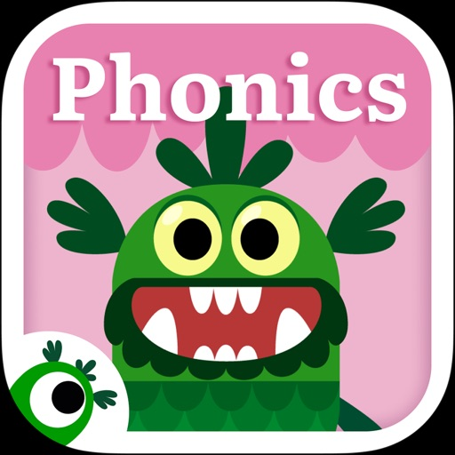

Welcome to Teach Your Monster to Read, the award-winning app that makes learning to read fun and engaging! Our educational phonics and reading games have helped millions of children build essential literacy skills. Create your own monster and embark on a magical journey through interactive games designed for home and school use. With a safe, trusted, and highly recommended approach, Teach Your Monster to Read offers phonics-based reading games for all levels. Teaching through play is what we do best—download today and start your child’s reading adventure!

TEACH YOUR MONSTER TO READ FEATURES

INTERACTIVE KIDS READING GAMES
• Take your custom-designed monster through educational games that are suitable for ages 3-6. 
• Improve letter sound recognition with reading games
• Explore a world of phonics and educational games that teach your child to read sentences
• Easily track their player’s progress to identify areas where their reader may need extra support

PHONICS & READING GAMES DESIGNED BY EXPERTS
• Designed in collaboration with Roehampton University and leading game designers
• Phonics tools and educational games that complement phases 2-5 of UK Government-approved Letters and Sounds and other major systematic synthetic phonics programmes
• 3 reading games designed for those in preschool, nursery, primary school, kindergarten, and first grade

EDUCATIONAL PLAY AT NO ADDITIONAL COST
• Teach Your Monster to Read is available on iPad and iPhone
• Explore phonics and educational games without in-app purchases, hidden costs, or in-game adverts
• Teach Your Monster to Read supports your child through every step of their reading journey

HEAR FROM TEACHERS AND PARENTS WHO USE OUR READING  GAMES

"This game is the absolute best quality phonics game I have come across for educational and fun value."
Marie Lewis, Rochdale

“My class have reaped loads of benefits from using the programme and the difference in some of their reading skills has been dramatic."
Maria Andrews, Foundation Phase Teacher

"This is a fabulous game. I'm not kidding when I say that my daughter essentially learned all her letter sounds using First steps, with relatively minimal input from me! Great for parents to practise their letter sounds too."
Eleanor Jones

PART OF THE USBORNE FOUNDATION CHARITY

Teach Your Monster to Read has been created by Teach Monster Games Ltd. which is a subsidiary of The Usborne Foundation. The Usborne Foundation is a charity founded by children’s publisher, Peter Usborne MBE. Harnessing research, design and technology, we create playful media addressing issues from literacy to health.

Teach a monster today when you download our educational app! 

Teach Monster Games Ltd is a subsidiary of The Usborne Foundation, a registered charity in England and Wales, charity number 1121957.

[View on Apple](https://apps.apple.com/gb/app/teach-your-monster-to-read/id828392046)

## Stop Motion Studio Pro

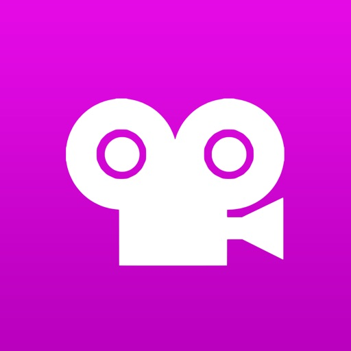

Schließ dich 25 Millionen Kreativen an und erstelle Stop-Motion-Animationen im Handumdrehen.
Stop Motion Studio ist die App, mit der du beeindruckende Stop-Motion-Filme erstellen kannst.
Genieße leistungsstarke Kreativ-Tools – ganz ohne Werbung, Tracking oder Abos.

Stop Motion Studio ist die einfachste und gleichzeitig leistungsstärkste Stop-Motion-App für iPhone und iPad. Egal ob LEGO, Knete, Zeichnungen oder Alltagsgegenstände – hier kannst du alles in tolle Animationen verwandeln, ganz ohne Vorerfahrung.

Egal ob Anfänger oder erfahrener Animator – Stop Motion Studio gibt dir alles, was du brauchst, um deine Ideen in Bewegung zu bringen.

Beliebt bei Millionen

* Über 25 Millionen Nutzer weltweit
* Durchschnittlich 4,7 Sterne bei über 65.000 Bewertungen
* Zu sehen in Apples „Life on iPad“-TV-Werbung

„Stop Motion Studio macht es einfach, eigene Stop-Motion-Filme zu erstellen.“ – The Washington Post
„Weckt in uns allen den LEGO-Film-Fan.“ – TechNewsWorld

Präzise erstellen und bearbeiten

* Onion-Skin-Funktion und Animationshilfen für perfekte Ausrichtung
* Interaktive Timeline und Frame-für-Frame-Bearbeitung
* Frames kopieren, einfügen, ausschneiden oder einfügen
* Rotoscoping: über Videos zeichnen für coole Effekte
* Eingebaute Zeichenwerkzeuge, Textkarten und Sprechblasen
* Unerwünschte Objekte entfernen, Gesichtsausdrücke oder Ebenen hinzufügen
* Frames zusammenführen, um Bewegungsunschärfe oder Geschwindigkeit zu simulieren

Jeden Frame perfekt einfangen

* Manuelle Kamerasteuerung: Fokus, Belichtung, ISO, Weißabgleich
* Zeitraffer-Modus für automatische Aufnahmen
* Apple Watch oder ein anderes Gerät als Fernauslöser nutzen

Sound und Style hinzufügen

* Voiceover oder Erklärungen direkt in der App aufnehmen
* Soundeffekte, Musik nutzen oder aus der Bibliothek importieren
* Filter, Blenden und Übergänge für einen filmischen Look
* Greenscreen-Effekte für beliebige Hintergründe

Dein Meisterwerk teilen

* Export in 4K oder 1080p HD
* Direkt auf YouTube, TikTok teilen oder als GIF / iMessage-Sticker speichern
* Projekte via AirDrop, iCloud oder Dropbox übertragen
* Auf iPhone starten, auf Mac fertigstellen – alles bleibt synchron

Lernen und verbessern

* Schritt-für-Schritt-Tutorials und kreative Tipps inklusive
* Eingebautes Handbuch für schnelle Hilfe und Inspiration

Alles, was du brauchst
Keine Werbung. Kein Tracking. Keine Abos.
Deine Daten bleiben privat, deine Kreativität bleibt ganz dir.

Lade Stop Motion Studio noch heute herunter.
Schließ dich Millionen von Kreativen an und lass deine Ideen Frame für Frame lebendig werden.

[View on Apple](https://apps.apple.com/gb/app/stop-motion-studio-pro/id640564761)

## My Tide Times Pro - Tide Chart

My Tide Times Pro is the only tide times application you'll ever need. Whether you're surfing, fishing or just going to the beach you'll be able to use it to get quick and easy access to the times. We think it's the most beautiful tide times application on the market to date.

FEATURES 
- Supports over 9,000 tidal stations across over 40 countries (including the US, Canada, UK, Ireland, Australia and New Zealand)! 
- Find the nearest tide tables to you when the app opens, so you can get tide predictions no matter where you are! 
- View sunrise & sunset times for all locations alongside the tides in the application! 
- Moonrise, moonset and moon phase information!
- View currents information for selected locations around the US & Canada! (Simply tap on a tide station, if there's currents information you'll see an extra tab).
- Never have to worry about ensuring the data is up-to-date because the app takes care of that for you!
- See 5 to 7 day forecasts for all locations (locations outside of the UK even have up to 30-day charts!) 
- When information has been downloaded it is stored on the phone so you can view it without an internet connection! 
- It offers a clean interface that you just won't get from other apps! 
- Optimized for the latest iPhone and iPad models.
- Pro version offers the same great functionality of My Tide Times but is ad-free, includes widgets and also includes support for Apple Watch to check the tides on the go (including an Apple Watch complication)!

If you're in need of tide tables, charts, forecasts or times, don't go elsewhere - install My Tide Times today. It's similar to apps like Tides Near Me, Windy and UK Tide Times.

[View on Apple](https://apps.apple.com/gb/app/my-tide-times-pro-tide-chart/id804031883)

## Theory Lessons

Theory Lessons features 39 music theory lessons from musictheory.net, presented in their original animated versions.

Complete lesson list:

• The Staff, Clefs, and Ledger Lines
• Note Duration
• Measures and Time Signature
• Rest Duration
• Dots and Ties
• Steps and Accidentals

• Simple and Compound Meter
• Odd Meter

• The Major Scale
• The Minor Scales
• Scale Degrees
• Key Signatures
• Key Signature Calculation

• Generic Intervals
• Specific Intervals
• Writing Intervals
• Interval Inversion

• Introduction to Chords
• Triad Inversion
• Seventh Chords
• More Seventh Chords
• Seventh Chord Inversion

• Diatonic Triads
• Roman Numeral Analysis: Triads
• Diatonic Seventh Chords
• Roman Numeral Analysis: Seventh Chords
• Composing with Minor Scales
• Voicing Chords
• Analysis: O Canada

• Nonharmonic Tones
• Phrases and Cadences
• Circle Progressions
• Common Chord Progressions
• Triads in First Inversion
• Triads in Second Inversion
• Analysis: Auld Lang Syne

• Building Neapolitan Chords
• Using Neapolitan Chords
• Analysis: Moonlight Sonata

[View on Apple](https://apps.apple.com/gb/app/theory-lessons/id493157418)

## TonalEnergy Stimmgerät & Metro

Für Musiker, ob Profi oder Anfänger, ob Sie singen, ein Blechblas-, Holzblas-, Saiteninstrument oder Gitarre spielen, diese App bietet funktionsreiche Übungs-Tools mit unterhaltsamem & lohnendem Feedback. So viel mehr als nur ein Stimmgerät! 
Was macht TonalEnergy zur meistverkauften Musik-Übungs-App? 

• Alles in einem: hochmodernes Stimmgerät, fortschrittliches Metronom, eigene Orchesterstreicher & Gitarrenstimmseite, Klaviatur, Klanganalyse-Seiten & Audio-/visuelle Aufnahmemöglichkeiten. 

• Einfach anzuwenden: Optionen wie Target Tuner oder Pitch Tracker auf allen Hauptseiten. TonalEnergy hilft Nutzern, lohnende & erreichbare Ziele für Proben oder eigenständiges Üben festzulegen. Bunte Analysen-Datenseiten & Funktionen zur Audio-/Video-Aufnahme erleichtern das Üben zusätzlich. 

• Innovatives Metronom. Beispiellose Flexibilität in Klangauswahl, Tempo-Einstellungen, Taktarten, Subdivisionsmustern & visuellen Anzeigen. Dank gesprochenem Einzählen, Erstellen & Bearbeiten von Voreinstellungsgruppen & Ableton Link zur Synchronisierung mehrerer Geräte ein hervorragendes Tool für Live-Musiker. 

• Endlose Möglichkeiten zur Schulung des Gehörs. Die hochwertigen, multi-gesampelten Instrumentenklänge für Symphonie-Instrumente sind einzigartig unter allen anderen Stimmgerät-Apps. Das Gehör kann mit einer 8-Oktaven-Klaviatur, einem chromatischen Rad & einem Tonerzeuger geschult werden.

• Lernen ist eine soziale Aktivität. Mit TonalEnergy Tuners einzigartigen Funktionen lassen sich Daten sammeln, prüfen, bearbeiten & mit anderen teilen. Für Konzertmusiker ist Feedback zur Weiterentwicklung ihrer Fähigkeiten entscheidend. Der Austausch steht im Zentrum. 

Chris Coletti, Mitglied von The Canadian Brass, fasst TonalEnergy so zusammen: 

“TonalEnergy ist ein Muss für jeden ernsthaften Musiker. Es bietet eine komplette Tool-Suite in nur einer App: Stimmgerät, Tonerzeuger, Aufnahmegerät, Metronom & die hübsche Oberfläche machen es zu einem der besten Tools für Musiker, die es gibt, Punkt.” 

FUNKTIONEN 

• Erkennt einen großen Tonhöhenbereich, auch in tieferen Stimmlagen als viele andere Stimmgeräte (C0-C8). Spricht bestens auf Blas-, Akustik- & elektrische Saiteninstrumente an 
• Anpassbarer Normalton A=440 Hz 
• Autom. oder manuelle Transpositionsoptionen 
• Wechselt sofort zwischen gleichstufigen, reinen & anderen benutzerdef. Stimmungen 
• Autom.- oder sofortige Normalton-Funktion mit TonalEnergy-Tönen 
• Umfassende Stimmliste für alle Orchestersaiten- & Saiteninstrumente mit Bünden, inkl. weit mehr Funktionen als die meisten anderen Stimmgeräte-Apps nur für Saiteninstrumente 
• Ausklappbare 8-Oktaven-Klaviatur bereichert viele wichtige Stimmfunktionen 
• Tongenerator am chromatischen Rad, mit optionaler autom. Vibrato-Funktion 
• Frequenz & Naturton-Grafiken mit multifunktionaler Wellenform 
• Spezielle Metronomseite, die die Funktionen aller anderen Metronom-Apps erfüllt oder überbietet 
• Notationsoptionen inkl. den Varianten Standard-Englisch, Solfège, Nordeuropäisch & Indisch 
• Bluetooth & andere Eingang-/Ausgangs-Unterstützung 
• Audio- & Video-Aufnahmefunktionen, inkl. Bearbeiten, Looping, Zeitdehnung, alles exportierbar über iTunes gemeinsamen Dateizugriff, AirDrop, E-Mail, AudioCopy, SoundCloud usw. 
• Musik-Import aus der iTunes-Bibliothek oder E-Mail-Anhängen 
• Kompatibel mit externen Mikrofon- & Ansteck-Schwingungssensor-Geräten 
• Unterstützt externe Video-Ausgabe auf externem Display zur Nutzung in Proberäumen 
• Externe MIDI-Keyboard-Steuerungsunterstützung 
• Universelle App, unterstützt alle Geräteausrichtungen 
• Audiobus- & Inter-App-Audio-Unterstützung 
• VoiceOver-Unterstützung für Blinde & Sehbehinderte 

INSTRUMENTE 
• Piccoloflöte, Flöte 
• Oboe, Englischhorn, Fagott 
• Es-, B/A-Klarinette, Bassklarinette 
• Sopran-, Alt-, Tenor- & Bariton-Saxophon 
• Trompete 
• Waldhorn 
• Tenor- & Bassposaune 
• Euphonium & Tuba 
• Eckige, Sägezahn- & Sinus-Wellenformen 
• Orgel 
• Zupfinstrumente

[View on Apple](https://apps.apple.com/gb/app/tonalenergy-tuner-metronome/id497716362)

## Isle of Man Theory Test Suite

The Official IoM Theory Test Suite helps you to fully prepare for taking your Theory Test on the Isle of Man

Features combined Theory Test & Hazard Perception practice.

All Vehicle Categories are included:

Motor Car & Other Vehicle (CAR)
Motor Bicycle & Moped (BIKE)
Approved Driving Instructor (ADI)
Motor Bicycle Approved Instructor (CBT)
Large Goods Vehicle (LGV)
Passenger Carrying Vehicle (PSV)

Simply choose your appropriate Vehicle Category from the settings screen and get learning!

Contains questions and topics which cover the entire knowledge requirements needed to practise for your live IoM Theory Test.

The IoM & UK Highway Code forms the basis of the questions within the app. There are also questions which relate to the French Highway Code.

You can revise individual topics using the handy Topic Training feature, or practise an unlimited number of Mock Tests.

The Mock Test feature chooses a random set of questions from all available topics, and is designed to test your overall knowledge and performance. The test is presented in a similar way to that which you will experience when you take your real test, using the same conditions and pass requirements.

The Hazard Perception feature explains how the Hazard Perception element of the live IoM Theory Test Hazard Perception element is scored and allows you to practise several sample Hazard Perception clips. Full explanations and performance evaluation of each hazard is given at the end of each clip, designed to assist you with your preparations for the IoM Hazard Perception element of the live test.

Hints and advice are given throughout the app to assist your understanding of all questions and Hazard Perception clips presented.

A performance review is presented at the end of each test, showing you where you are performing well, as well as highlighting any areas where you need to improve.

Designed for both iPhone & iPad devices.

[View on Apple](https://apps.apple.com/gb/app/isle-of-man-theory-test-suite/id1470389616)

## Love, Manuela

Love, Manuela is a baking app created by Norwegian baker Manuela Kjeilen, known as @passionforbaking. For more than a decade, Manuela has shared her love of baking with people around the world. She has published nine baking books, hosted her own baking show on TV in Sweden, and inspires more than 1.6 million followers on Instagram with her cakes, recipes, and beautiful baking ideas.

Inside the Love, Manuela app, you get instant access to more than 470 baking recipes, all written in English, with high-quality step-by-step photos for every recipe from beginning to end.

One-time purchase. No subscription. New recipes are included when they are added.

For Manuela, taste always comes first. Beautiful cakes are lovely, but the most important thing is that every bite tastes delicious. Her recipes are created to let the flavors shine, with soft textures, creamy fillings, balanced sweetness, and desserts that taste just as good as they look. From everyday treats to celebration cakes, the recipes are made for home baking.

Inside the app, you will find sponge cakes in many variations, ganaches in delicious flavors like strawberry, latte, and banana milkshake, lots of Scandinavian-style cakes, light fillings, cheesecakes, ice creams, sweet dough, frostings, cookies, cupcakes, and so much more.

The app is made to feel like a growing digital baking book that you can return to again and again. It is easy to navigate, with clear recipe categories, improved search and filtering, and helpful tags so you can quickly find what you are looking for. A few more categories have also been added to make browsing even easier.

Each recipe opens with a large photo and a short introduction, followed by clear directions, recipe notes, a place where you can write your own notes, and step-by-step photos that guide you through the recipe. Whether you are baking a cake, preparing a filling, whipping a frosting, or making cookies, the app is designed to help you feel confident in every step.

New Cake Mode helps keep your screen awake while you read and follow a recipe, so you do not have to keep touching your phone or tablet while your hands are busy baking. The app has also been refined with improved UI, a smoother overall user experience, and an improved password reset flow.

Love, Manuela is not a subscription. It is a one-time purchase of $12.99, converted to your local currency by the App Store or Google Play. You get access to all recipes inside the app instantly, and when new recipes are added in the future, they are included at no extra cost.

Your purchase is connected to the store account you buy it with, either App Store or Google Play. You can restore your purchase anytime using the same store account.

What you get inside the app:

More than 470 baking recipes
Recipes written in English only
Clear and easy-to-follow instructions
High-quality step-by-step photos for every recipe
Easy recipe categories
Improved search and filtering
Helpful tags to find recipes faster
A place to write your own notes inside each recipe
Recipe notes and tips from Manuela
Cake Mode to keep your screen awake while baking
Access to new recipes when they are added
One-time purchase on this platform
No subscription

This is not a baking video app. The Love, Manuela app is focused on written recipes, high-quality photos, clear directions, recipe notes, and step-by-step pictures for every recipe. It is created for bakers who love to read, follow, save, and return to recipes whenever they want.

The Love, Manuela app has more than 75,000 registered users worldwide, and Manuela’s recipes are loved by home bakers, cake lovers, professional bakers, and bakeries around the world.

If you love soft cakes, sponge cakes, ganache, creamy frostings, light fillings, cupcakes, cookies, Scandinavian-style baking, sweet dough, cheesecakes, ice creams, and homemade desserts that taste as good as they look, you are going to love the Love, Manuela app.

Happy baking!

XO,
Love, Manuela

[View on Apple](https://apps.apple.com/gb/app/love-manuela/id1505065609)

## ABRSM Music Theory Trainer

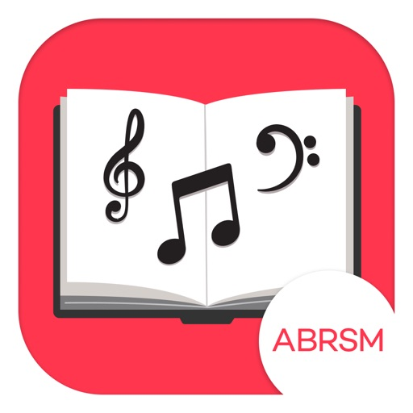

ABRSM Music Theory Trainer contains over 6,000 specially-written questions designed to test and challenge your music theory knowledge. Start by learning the basics then test yourself and see if you can get a perfect score. Every time you complete a round, you unlock the next level. Watch your music theory knowledge build up in these fun and addictive challenges and become a music theory expert!

In the app, you can learn about:

The musical stave, pitches, clefs
Scales, keys and chords
Rhythm and time signatures
Musical terminology and signs
Voices and instruments

And much, much more!

Strong foundations in musical knowledge and understanding are essential for developing well-rounded and confident musicians. That’s why we believe in the importance of music theory.

Hey, phone users! Music notation is complex and phone screens are small. This app is best viewed on an iPad, but there is still a lot you can learn and enjoy if you’re using the app on a smaller phone. Make sure you check out the preview screenshots in the App Store to see how the app will look on your device.

[View on Apple](https://apps.apple.com/gb/app/abrsm-music-theory-trainer/id1415709055)

## Cozmo Robot

Say hello to Cozmo, a gifted little guy who’s got a mind of his own and a few tricks up his sleeve. He’s the sweet spot where supercomputer meets loyal sidekick. He’s curiously smart, a little mischievous, and unlike anything ever created.

You see, Cozmo is a real-life robot like you've only seen in movies, with a one-of-a-kind personality that evolves the more you hang out. He'll nudge you to play and keep you constantly surprised. More than a companion, Cozmo’s a collaborator. He’s your accomplice in a crazy amount of fun.

Some robots just have it all.

Cozmo robot required to play. Available at Anki.com.

©2025 Anki, LLC. All rights reserved. Anki, Cozmo, and the Anki and Cozmo logos are registered trademarks of Anki, LLC.

[View on Apple](https://apps.apple.com/gb/app/cozmo-robot/id6748243845)

## YoungPhoto - Aesthetic Camera

Hi :) I’m YoungPhoto, a photography creator who makes taking better photos easier for over 400K followers.

Over the years, I’ve shared content about photo composition, color, and shooting tips. Now, I’ve created a photo app you can use in real life, right when you’re taking a picture.

The composition ideas and color filter tips you’ve seen on social media are now available directly in the app, so you can view them, follow them, and shoot in real time.

YoungPhoto is not just a filter app. It helps you understand how to take more aesthetic photos with real-time guidelines and composition tools that anyone can follow.

It was made for people who love photography but often feel like something is missing, people who want to capture ordinary moments like scenes from a movie, and beginners who want beautiful, emotional results without complicated editing.

YoungPhoto is designed to naturally guide the viewer’s eye, add story and atmosphere to each shot, and help you create photos with thoughtful composition and dreamy filters that work in many different settings.

Use YoungPhoto to capture your everyday life with more feeling, style, and intention :)

[Recommended For]

- Anyone who has thought, “Why don’t my photos look like that?”
- People who find photo composition difficult
- Anyone who wants easy guides for taking aesthetic photos
- People who want beautiful colors without complicated editing

[Key Featrues]

- Composition guidelines
- Composition lessons
- YoungPhoto aesthetic filters
- Effects
- Photo and video filter editing

[View on Apple](https://apps.apple.com/gb/app/youngphoto-aesthetic-camera/id6763737180)

## AutoSnore: 鼾声记录器

通过 iPhone 自动追踪您的鼾声和睡眠声音，无需订阅费！ 只需轻点开始按钮，然后安心入睡。

实力团队匠心打造
-------------
由广受欢迎的 AutoSleep App 原班团队开发，以全新创新方案助力用户掌控睡眠、改善健康。

诚信软件，良心定价
--------------------
无订阅机制。 无额外 App 内购买。 无后续费用。 一次性低价购买，即可终身使用。 包括所有功能。

简单易用
-------------
您只需要一部 iPhone。 只需启动 AutoSnore 并将手机放在床边。 醒来后即可聆听录音并查看洞见，就是这么简单。

为什么选择 AutoSnore？
-------------
睡眠弥足珍贵。全球近一半成年人受打鼾问题困扰（而大多数人甚至不自知）。是时候认真对待这个问题了。 打鼾会对睡眠质量产生严重影响，不仅会影响打鼾者本人，也会干扰同床伴侣的休息。

AutoSnore 有什么作用？
-------------
AutoSnore 可记录各种打鼾和睡眠声音，包括每次打鼾的频率、强度和持续时间，全面呈现每晚的打鼾情况。早上醒来时，系统会提供可视化分析图表，帮助您了解打鼾对整体睡眠质量的影响。

高级声音识别
-------------
AutoSnore 利用机器学习声音识别技术，可以对您所有的睡眠声音进行分类，例如打鼾、梦呓、打哈欠、咳嗽等等！这真是太神奇了。

它能帮到我吗？
-------------
当然可以！ AutoSnore 支持个性化策略跟踪，帮助您尝试各种改善方法： 无论是改变生活方式、调整睡姿、更换枕头、尝试放松技巧，还是避免晚餐时饮酒，该 App 都能帮助用户尝试不同的方法，找到最适合自己的解决方案。

AutoSleep 集成
-------------
与 AutoSleep 应用程序完美配合，您的打鼾数据可自动与睡眠分析同步！

全面保护隐私
-------------
与我们所有的 App 一样，AutoSnore 将用户隐私和数据安全放在首位。 请对比下方的 App 隐私标签，查看“未收集数据”。 您可以查看其他所谓“免费”打鼾 App，看它们能否做到同样承诺：

无数据分析跟踪。 无广告插件。 无第三方代码。 无数据上传。 所有录音数据和洞见仅安全地保存在您的设备上。 只有用户可以选择与其他人分享录音。 这才是隐私保护该达到的标准。

立即开始使用
-----------------
越早开始收集数据，就能越早进行管理。

对于任何想要改善睡眠和整体健康的人来说，AutoSnore 都是一款必备 App。 其采用独特的 App 设计方法，摒弃一切冗余，直击问题核心，同时不让您花费过多。

AutoSnore并非医疗器械。如有任何健康问题或疑虑，请务必咨询专业医疗人员。

Xiaohongshu
https://xhslink.com/m/2jNT7YK0hDk

Weixin
https://mp.weixin.qq.com/s/VG_LflL7y0QYrdOIrpRlLw

[View on Apple](https://apps.apple.com/gb/app/autosnore-snoring-recorder/id6746705608)

## LocoPast: The History Map

Something incredible happened where you're standing right now.

We built LocoPast because we kept wondering about the places around us. Every street, building, coastline and landscape has a story, but discovering those stories often meant searching through books, articles and websites. LocoPast is a way to open a map and instantly see the history beneath your feet.

LocoPast is the location-based history map app. We transform the world into an interactive map of human history. Open the app and discover the battles, revolutions, inventions, disasters, cultural movements, scandals and forgotten stories that happened exactly where you're standing - or anywhere else on Earth.

History isn't just something that happened somewhere else. It's all around us. Whether you're exploring your local area, travelling abroad, or simply curious about a place you've never visited, LocoPast reveals the events that shaped the landscapes, cities and communities we see today.

With LocoPast, you can:

• Discover historical events near your current location
• Explore any place in the world
• Browse a global, interactive history map
• Listen to hands-free audio guides of each historical event or site
• Travel through centuries of events connected to real locations
• Open source articles for deeper context and further reading

Every event is linked to the place where it happened, turning ordinary locations into gateways to the past. As you move across the map, new stories appear automatically, creating a continuous journey of discovery.

Explore events including:

• Battles and military history
• Art, culture and creative movements
• Political events and revolutions
• Scientific discoveries and innovation
• Architecture and landmarks
• Religion and belief systems
• Crime, scandals and mysteries
• Natural disasters and major world events
• Industry, commerce and economic history

The next time you look at a street, a square, a river or a landmark, you'll know something most people don't: What happened there.

Download LocoPast and uncover the hidden history of the world around you.

[View on Apple](https://apps.apple.com/gb/app/locopast-the-history-map/id6782311773)

## Camping Assistant: Ausrichten

EINMALKAUF – KEIN ABO – KEINE WERBUNG!
Entwickelt von Campern, für Camper!

Du kommst nach langer Fahrt am Campingplatz an, die Sonne scheint, aber wie richte ich den Camper schnell aus, um endlich zu entspannen? Mit dem Camping Assistant gehört das mühsame Raten, Diskutieren und das nervige Hin- und Herlaufen der Vergangenheit an. Richte dein Wohnmobil oder deinen Wohnwagen ab heute absolut zentimetergenau, stressfrei und entspannt aus.

Warum Camping Assistant die einzige App ist, die du brauchst:
Die App ist das ultimative Schweizer Taschenmesser für deinen Urlaub. Wir haben alle wichtigen Funktionen in einer einzigen Anwendung gebündelt, damit du dein Smartphone nicht mit unzähligen Einzel-Apps zumüllen musst.

Die wichtigsten Funktionen im Überblick:

Zentimetergenaue Ausrichtung & Nivellieren: Fahrzeugprofil wählen und für jedes Rad exakt in Echtzeit ablesen, wie weit du kurbeln oder auf deine Auffahrkeile auffahren musst. Die App ersetzt die ungenaue Wasserwaage komplett und macht die Nivellierung zum Kinderspiel.

Smartwatch-Integration (Apple Watch & Wear OS): Das Handy bleibt im Camper! Verbinde deine Smartwatch und erhalte das Live-Feedback direkt am Handgelenk, während du draußen am Stützrad kurbelst. Dank haptischem Feedback spürst du per Vibration genau, wenn das Fahrzeug perfekt im Lot steht.

Zweitgerät-Modus über WLAN: Du möchtest draußen arbeiten, aber die App im Auge behalten? Verbinde ein zweites Tablet oder Handy per lokalem WLAN. Das Live-Display überträgt alle Daten in Echtzeit, damit du während der Ausrichtung die volle Kontrolle behälst.

Stützlast- & Beladungssimulator (speziell für Wohnwagen): Wie viel Gewicht darf in den Gaskasten oder auf die Deichsel? Platziere Gepäck virtuell im Gewichtsrechner und sieh in Echtzeit die Stützlaständerung. Die perfekte digitale Ergänzung zu deiner Wohnwagenwaage oder Caravanwaage – für eine sichere Reise.

Intelligente Sprachausgabe: Konzentriere dich voll aufs Rangieren. Die App sagt dir die Werte akustisch an, wenn du korrigieren musst (z.B. "Vorne links 3 Zentimeter hoch").

100% personalisierbare Abfahrts-Checklisten: Schluss mit dem "Habe ich das Fenster zu?"-Syndrom. Nutze unsere interaktiven Listen für Innen, Außen und die Kupplung. Alle Listen sind komplett nach deinen Wünschen editierbar und beliebig erweiterbar um eigene Punkte und völlig neue Listen!

Ankuppel-Hilfe: Die App merkt sich deine perfekte Deichselhöhe beim Abkuppeln, damit das Ankuppel beim nächsten Mal auf Anhieb klappt.

KI-Routen-Check: Keine Überraschungen bei der Anfahrt! Gib Start und Ziel ein und erhalte sofort Infos zu Maut, Verkehrsregeln und kritischen Durchfahrthöhen für Gespanne.

Sonnen- & Satelliten-Radar: Finde den perfekten Schattenplatz oder richte deine Satellitenschüssel im Handumdrehen aus. Die AR-Anzeige zeigt dir präzise, wo die Sonne steht und wo sich die TV-Satelliten befinden.

Smarte Restaurant-Suche: Hunger nach einem anstrengenden Fahrtag? Finde mit einem Klick die besten Restaurants in der Umgebung, sortiert nach deiner Lieblingsküche.

Deine Vorteile auf dem Stellplatz & Campingplatz:

100% Offline-fähig: Alle Kernfunktionen wie das Ausrichten, der Simulator und die Checklisten funktionieren komplett ohne Internet mitten in der Natur.

Kein Abo, kein Risiko: Einmal fair zahlen, für immer unbegrenzt auf all deinen Geräten (Handy, Tablet und Uhr) nutzen.

Lade den Camping Assistant jetzt herunter und mach deinen nächsten Trip zum entspanntesten Urlaub deines Lebens!

Rechtlicher Hinweis: Die berechneten Werte basieren auf mathematischen Modellen. Bitte überprüfe die tatsächliche Stützlast vor jedem Fahrtantritt immer zusätzlich mit einer physischen Waage. Verlasse dich im Straßenverkehr stets auf die offizielle Beschilderung und deinen gesunden Menschenverstand. Der Entwickler haftet nicht für Schäden durch fehlerhafte Messergebnisse oder unsachgemäße Nutzung.

[View on Apple](https://apps.apple.com/gb/app/camping-assistant-level/id6760473513)

## FORScan Lite - for Ford, Mazda

FORScan Lite application was developed specially for a computer diagnostics of Ford, Mazda, Lincoln and Mercury vehicles. 

Supported adapters:
- OBDLink MX+ (recommended)
- vLinker FS Bluetooth (recommended)
- vLinker FD BLE (recommended)
- other ELM327-compatible WiFi or BLE adapter (not recommended). Attention: this application may not work properly in case of bad quality ELM327 adapter used!

Supported cars:
- Ford, Lincoln, Mercury models of 1996 - 2022MY (some models of 1994-1995MY are also supported)
- Mazda 1996-2022MY. Attention: Mazda 7G models (new Mazda 3, CX-30, MX-30, CX-50 etc) are supported partially or not supported!
- Vehicles other than Ford, Mazda, Lincoln, Mercury are not supported!

Features:
- Analyzing an on-board network configuration of the connected vehicle
- Read and reset DTC for all modules
- Read sensors and other data (PIDs) from all modules
- Execute tests
- Execute majority of service functions

Note: Configuration and Programming functions, as well as some of service functions, are not available in FORScan Lite.

[View on Apple](https://apps.apple.com/gb/app/forscan-lite-for-ford-mazda/id892347083)

## ProCamera. RAW+ Fotografie

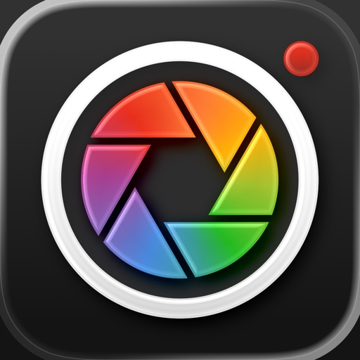

DAS ORIGINAL: ProCamera ist die führende professionelle Kamera-App für Enthusiasten, Kreative und Profis. Seit über fünfzehn Jahren hilft ProCamera Nutzern dabei, das Optimum aus der iPhone-Kamera herauszuholen – für Foto, Video und Bildbearbeitung!

––– MILLIONEN NUTZER VERTRAUEN DARAUF –––

New York Times: „High-End Nutzer schwören auf ProCamera“

National Geographic: „‚Must-have‘ Reise-App“

––– VON FOTOGRAFEN, FÜR FOTOGRAFEN –––

ProCamera ist als intuitive „Immer-dabei-Kamera“ entworfen, mit der Sie im Alltag mit iPhone und iPad spielend einfach fotografieren und filmen können. Bei besonderen Anforderungen und professionellen Einsätzen bietet ProCamera eine ganze Reihe an Extrafunktionen und Eingriffsmöglichkeiten für maximale Kontrolle über die Kamera. 

Zusätzlich zu den leistungsfähigen Aufnahmefunktionen für Fotos und Video, die man normalerweise nur von großen Profi-Kameras kennt, steht auch ein umfassendes Bildbearbeitungsstudio bereit, inkl. Werkzeugen für RAW, HDR und Schärfentiefe.

Es ist unsere Mission, das iPhone zur einzigen Kamera zu machen, die Sie benötigen. Daher wurden alle Bereiche von ProCamera mit dem Ziel entwickelt, die kleinen und großen Momente des Lebens bei jedem Auslösen perfekt festzuhalten.

––– HAUPTFUNKTIONEN –––

Automatik, Halbautomatik, Manueller Modus
Fokus- & Belichtungssteuerung
Manueller Fokus & Focus Peaking
Belichtungskorrektur mit Zebrastreifen
Porträt-Modus mit Tiefenschärfeeffekt & Ansicht der Tiefenkarte
Unterstützung aller Objektive (Ultraweitwinkel, Weitwinkel, Tele, LiDAR)
RAW, ProRAW, TIFF, JPG & HEIF
Manueller Weißabgleich
48 MP Fotos (ab iPhone 14 Pro)
EDR und ISO-HDR
Selbstauslöser & ProTimer Intervalometer
Selfie-Modus mit Bildschirmblitz
OIS Bildstabilisierung an/aus
EXIF & Metadaten Anzeige
Histogramm
Digital-Zoom
Dimmbares Dauerlicht
Anti-Shake
Rapid Fire Serienaufnahmen
Apple Watch Fernauslöser
Viele Seitenverhältnisse (4:3, 5:4, 3:2, 1:1, 16:9, 2:1, 2.4:1, 3:1, Goldener Schnitt)
Code Scanner (QR, Barcode,…)
Umfangreiche Galerie mit iCloud Integration
Unterstützung für iOS Alben
Graukarten-Kalibrierung
Lightbox
3D Tiltmeter

––– BILDBEARBEITUNG –––

ProRAW/RAW Bearbeitung mit EDR-Unterstützung
Porträt-Editing (Schärfentiefe, Bokeh, simulierte Blende)
80+ Fotofilter
Zahlreiche Profi-Werkzeuge & Export-Einstellungen

––– VIDEOFUNKTIONEN –––

Auflösung (4K UHD, 1080, 720, 480, SD)
Framerate (24, 25, 30, 48, 50, 60, 96, 100, 120, 192, 200, 240 fps)
Manuelle Steuerung: Belichtung, Fokus, Weißabgleich
Frei einstellbare Belichtungszeiten für äußerste Präzision
Kontinuierlicher Autofokus an/aus
Zebrastreifen & Focus Peaking
Video Codec (H.264, H.265 HEVC, ProRes, ProRes RAW)
ProRes LOG (ab iPhone 15 Pro)
Dolby Vision HDR
Speicherplatzanzeige
Audiometer
Stereo Audio (ab iPhone XS)
Anbindung von Bluetooth, Lightning, USB Mikrofonen (Apple AirPods, Shure MV88, MV88+, etc.)

…und vieles mehr!

Weitere Infos: funktionen.procamera-app.com

––– PROCAMERA UP –––

ProCamera Up ist ein optionales Funktionspaket, das exklusive Sonderfunktionen enthält:

Automatische Perspektivkorrektur: APC nutzt den internen Lagesensor in Verbindung mit einem patentierten Verfahren, um automatisch Fotos ohne perspektivische Verzerrungen wie stürzende Linien aufzunehmen
Benutzerdefinierte Kamera-Presets
Anamorphe Video- und Fotoaufnahmen
(RAW) Belichtungsreihen für einen höheren Dynamikumfang
Geschützer Private Lightbox Ordner
Einzigartige Fotofilter-Sets

ProCamera Up AGB: https://procameraterms.cocologics.com

––– INFOS & SUPPORT –––

Sie haben Fragen, Feedback oder Vorschläge? Dann schreiben Sie uns an support@procamera-app.com oder über die Kundenservice-Option in der App.

Die aktuellsten Informationen gibt es im ProCamera Newsletter und unter procamera-app.com.

[View on Apple](https://apps.apple.com/gb/app/procamera-raw-manual-camera/id694647259)

## CS Card Test Revision 2026

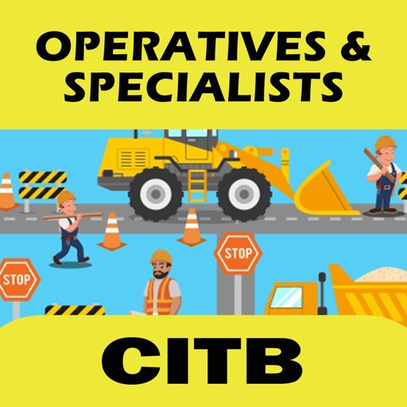

Refine. Master. Excel.
.....Pass First Time !!

Elevate your exam preparation with the Essential CITB HS&E Op/Spec Revision Test App 2026

This comprehensive tool empowers you to grasp and review crucial concepts assessed in the Health & Safety CITB op/spec exam. Through in-depth flashcards and practice questions & answers, you'll be equipped to secure your CSCS site card.

Unlock Success…

As you engage with practice questions tailored for the health and safety test necessary to obtain a CSCS card, the app meticulously monitors your progress. It illuminates your test proficiencies and areas for improvement, guiding you to focus your study efforts effectively and enhance your test performance.

Tailored for comprehensive coverage across all facets of the exam path toward earning your CSCS card.

-- WHAT'S INCLUDED:

* Limitless Practice Questions
* Timed Mock Exams
* Flash Cards for Efficient Revision
* Offline Revision Mode - No internet connection needed
* Performance Analysis Tools
* Meticulously Crafted Exam-Style Revision Questions
* Personalized Study Plans
* Time-Optimized Revision Components that pinpoint essential questions for your mastery
* Motivational Resources promoting consistent and effective study habits

-- ORGANIZED BY TOPICS:

* Construction Noise and Vibration
* Transportation Safety and Lifting Operations
* Health and Welfare
* Visual Communication through Safety Signs
* General Responsibilities in the Workplace
* Accurate Accident Reporting and Recording
* First Aid Procedures and Emergency Protocols
* Effective Usage of Personal Protective Equipment
* Management of Dust and Fumes
* Handling Hazardous Substances
* Techniques for Safe Manual Handling
* Strategies for Fire Prevention and Control
* Ensuring Electrical Safety and Mastery of Tools and Equipment
* Proficiency in Excavations and Confined Spaces
* Environmental Awareness and Waste Management
* Mastery in Working at Height

Elevate your exam readiness today – download the app and set your course toward excellence!

[View on Apple](https://apps.apple.com/gb/app/cs-card-test-revision-2026/id6444266283)

## Voice Recorder : Ton aufnehmen

Voice Recorder ist ein einfach zu bedienen und praktische Anwendung der Sitzung, Vortrag, Musik und vieles mehr aufzeichnen. Die Schnittstelle ist so konzipiert, es schnell zu machen. Mit einzigen Antippen können Sie aufnehmen und die Aufnahmen teilen.

Live-Sound mit seinem wahren Gefühle. Genießen Sie die Aufnahme, Wiedergabe und Audio-Editing mit Voice Recorder. Wir haben abgestimmt es gut für den Tag-zu-Tag-Aktivitäten. Der Besuch etwas Wichtiges und wollen es aufnehmen
für die spätere Wiedergabe, wird Voice Recorder können Sie Ihre Meetings, Vorträge aufzuzeichnen und andere Veranstaltungen mit Codec-Rauschunterdrückung. Sie können alles innerhalb von 10 bis 100 Metern um die Sie aufnehmen.

Bearbeiten Sie die Aufnahme nach Ihren Bedarf und speichern Sie sie für eine spätere Wiedergabe. Voice Recorder verfügt über mehrere Optionen der Wiedergabe helfen Sie entscheiden, wie Sie die Aufnahme hören wollen. Entwickelt speziell für Apple, es spielt ebenso hervorragend mit Apple EarPods wie es mit unseren alten Kopfhörer spielt.

Sie können die automatische Upload und sogar die Aufnahme auf Wolke (Dropbox) in Sekunden teilen.

Genießen Sie Sound, aufnehmen, bearbeiten, spielen und hören!

Liste der Funktionen

# Audio Recorder
- Qualitätsoptionen: (Low: 8 kHz, Mittel: 22,05 kHz, Hoch: 44,1 KHz)
- Format Optionen: (WAV, CAF, M4A)
- Externe Eingabegerät Unterstützung: Bluetooth Mic, Andere externe Mic (Getestet mit Tascam mic)
- Hintergrund Aufnahmeunterstützung

(Neu)
- Fahren Sie weiter in bestehende Aufnahmen der Aufnahme.
- Anrufunterbrechung Handhabung - Die Aufnahme wird weiterhin nach einem Anruf oder eine andere Unterbrechung.

# Audio-Abspielgerät; Audio-Player; Musikabspielgerät
- Schnell-Audio-Player
- Steuerelemente für die Wiedergabe (Schnellrücklauf, Schnellrücklauf)
- Externe Ausgabegerät Unterstützung (Bluetooth und externen Lautsprecher-Geräte)
- Hintergrund Audio-Wiedergabe

# Audio Trimmen
Wählen Sie einen Teil der Aufnahme und schneiden Sie es -.

# Freigabe
- E-Mail-Aufnahmen
- Dropbox-Sharing (Auto-Upload-Aufnahme-Unterstützung)
Laden Sie icloud-Laufwerk -
- Import-Aufnahmen auf den Computer mit iTunes File-Sharing
- Fallschirmabwurf Austausch mit iOS und Mac-Geräten.

# Universal-App
- Unterstützung für beide iPhone und iPad-Geräte.

# In 11 verschiedenen SPRACHE
Englisch, Spanisch, Französisch, Deutsch, Português (Br.), Português, Italiano, 中文 (vereinfacht), Русский, 日本語, 한국어

[View on Apple](https://apps.apple.com/gb/app/voice-recorder-audio-record/id936694037)

## Moment Pro Camera II

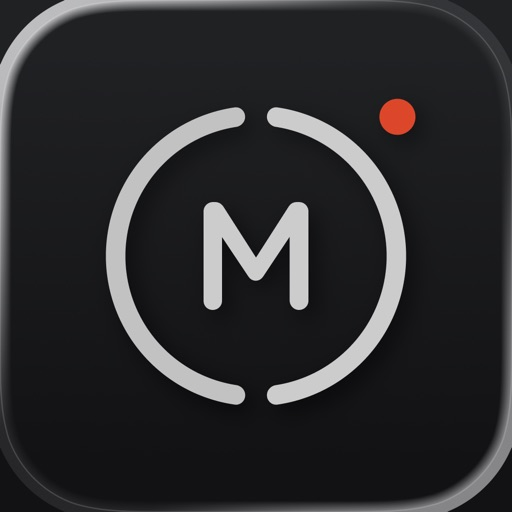

Your Camera, Your Looks, Your Way.

Moment Pro Camera II turns your phone into your favorite camera for photography and filmmaking. Shoot like a pro with full manual controls, creative looks, and an upgraded interface – all in one intuitive app.

What’s New in Pro Camera II?

Our first pro camera app has been the #1 rated camera app for years. Now, it’s time for the next chapter. We’ve re-engineered Pro Camera II from the ground up to give you better performance, advanced controls, and new customizable interfaces and shooting modes.

Key Features:

• Pro-Level Exposure Control – Our smart exposure system allows you to take control with Shutter Priority, ISO Priority, Manual, and Auto exposure modes, including the ability to limit Auto ISO to a specific range.
• Upgraded White Balance – Beyond auto white balance, you can manually configure temperature and tint, choose a preset, or calibrate via a gray card.
• Advanced Photo Options – Control the level of processing and HDR applied to your photos. Shoot in RAW, ProRAW, TIFF, HEIF, or JPG.
• Cinematic Video Tools – Apple Log, Open Gate, ProRes, 10-bit recording, and more. Adjust the resolution, color space, frame rate, codec, bitrate, and chroma subsampling for total creative freedom.
• Precision Monitoring – Get pro-level feedback with Waveform, RGB Histograms, and audio meters — normally reserved for cinema cameras.
• Aspect Ratio – Frame your shot within your favorite aspect ratio (4:3, 16:9, 3:2, 5:4, 1:1)
• Designed for All Creators – A beautiful, intuitive interface that adapts to how you shoot. Swipe, tap, and adjust anything immediately with one hand (including a dedicated left-handed layout), or go distraction-free with Zen Mode. Works natively in landscape orientation.
• Looks, Your Way – Apply creative Looks or import your own LUTs to video and photos. Preview them live, bake them into your footage, or adjust intensity on the fly.
• Focus Tools That Just Work – Separate reticles for exposure and focus with a tap, or dial in the shot with Manual Focus and Focus Peaking.
• Quick Actions, Faster Shooting – One swipe to reach your most used tools: flash, stabilization, zebras, focus peaking, grids, and more.
• Intuitive Lens Control – Remove the guesswork of which lens you are using and eliminate surprises with our Optic Controls. Say goodbye to shaky zoom with our fluid zoom control.
• Hardware-Ready – Optimized for every iPhone, with seamless integration for external mics and Moment’s entire lens + case ecosystem.

Upcoming Feature Releases
• Look Store: purchase creator color grades and film emulations
• Slow Shutter and Timelapse modes
• Advanced Profile sharing and collaboration tools
• Extended hardware integration partnerships

We love hearing from our community. For feature requests, ideas, or support, email us at hello@shopmoment.com or message us @momentprocamera on social media.

Fully Compatible with iPhone and Moment's complete ecosystem of lenses, cases, and accessories.

[View on Apple](https://apps.apple.com/gb/app/moment-pro-camera-ii/id6748837351)

## Watch to 5K: Couch to 5km plan

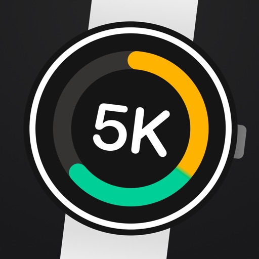

Watch to 5K helps you build up to running 5K in just 9 weeks. It’s designed for absolute beginners and runs entirely on your Apple Watch, so you can leave your phone at home.
The plan includes three runs per week with a rest day between, and a new schedule each week. By the end of the program, you’ll be able to run continuously for 30 minutes.

BUILT FOR THE APPLE WATCH
• Runs independently without the need for your iPhone.
• Watch face complications are included allowing you to monitor your progress and quickly launch the app.

PHONE COMPANION APP
• An iPhone companion app is included to allow you to track your progress.
• View a breakdown of your previous runs, including health data and run route.
• Achievements are awarded as you progress through the plan to celebrate milestones such as running continuously for 5 minutes or running for a certain distance.

APPLE HEALTH INTEGRATION
• Sessions are stored in Apple Health and count towards your activity goals.
• Watch to 5K tracks your route, distance, calories, average speed and heart rate so you can easily track your progress.
• Supports outdoors or indoor runs.

LISTEN TO YOUR MUSIC WHILE YOU RUN
• Works alongside your preferred music player or podcast watch app, automatically ‘dipping’ the volumes so you can hear the instructions and updates on your progress.
• Signals the halfway point, so you know when to head home!
• Easy to follow countdown timer that uses sounds and haptics, so you know how long you’ve got left of each run.

GO AT YOUR OWN PACE 
• Ability to repeat runs, allowing you to go at a pace that suits you.
• Start the plan from any week. Perfect if you are coming to Watch to 5K from a different plan/app.
• After completing the 5K plan, challenge yourself with the available 10K expansion plan.

NO SUBSCRIPTION REQUIRED
• Watch to 5K is a one time purchase with no ongoing subscriptions.

FEATURED ON
* TechRadar - Top Apple Watch app of 2024 *
* MacRumors - Apps to Check Out *
* Stuff.tv -  40 best Apple Watch apps *
* Coach - The Best Apple Watch Fitness apps * 
* Wareable - The Best Apple Watch running apps * 

Watch to 5K integrates with Apple Health using HealthKit to store your run activity.

If you have any questions, comments or ideas, you can get in touch at support@watchto5k.com

[View on Apple](https://apps.apple.com/gb/app/watch-to-5k-couch-to-5km-plan/id1517914828)

## Bristol Playgrounds

Discover, play, and collect!
Bristol Playgrounds helps you find the best playgrounds in Bristol with an interactive map and curated list. Visit playgrounds to unlock equipment and build your own virtual playground—while rating and saving your favourites along the way.

[View on Apple](https://apps.apple.com/gb/app/bristol-playgrounds/id1459763927)

## Knoten 3D  (Knots 3D)

Binden, lösen und rotiere 220+ Knoten mit Deinem Finger in 3D!

Knoten 3D, unsere erstklassige 3D-Knoten-App wird Dir eine komplett neue Perspektive über Knoten geben! Nimm Dir ein Stück Seil und habe Spaß!

Produktmerkmale und Funktionen
- Lerne, 225 einzigartige Knoten zu binden
- Lokalisierte für: Niederländisch, Französisch, Deutsch, Italienisch, Koreanisch, Spanisch, Russisch, Dänisch, Chinesisch, Portugiesisch, Japanisch, Schwedisch, Türkisch, Hebräisch, Norwegisch, Polnisch und Englisch!
- Durchsuche die Knoten nach Kategorie, Art, Favoriten oder sehe Dir die gesamte Bibliothek an
- Sehe zu, wie sich Knoten selbst binden und mache eine Pause oder passe die Geschwindigkeit der Animation jederzeit an
- Rotiere die Knoten um 360 Grad, 3D-Ansichten helfen dabei, sie von einem anderen Winkel zu untersuchen
- Zoome einen Knoten heran, um ihn größer zu sehen
- Interagiere mit dem Knoten auf dem Bildschirm durch Multi-Touch-Gesten

Die Knoten werden unter ihren gebräuchlichen Synonymen oder lokalisierten Entsprechungen aufgelistet. Die Knotennamen sind in Niederländisch, Französisch, Deutsch, Italienisch, Koreanisch und Russisch aufgeführt.

Schmetterlingsknoten
Blutknoten
Palstek
Webeleinenstek
Doppelter Schotstek
Flämischer Achtknoten
Affenfaust
Halbmastwurf
Anglerschlaufe
Trompetenknoten
Zeppelinstek
...

Die gesamte Knotenliste:

https://knots3d.com/de/komplette-knotenliste

[View on Apple](https://apps.apple.com/gb/app/knots-3d/id453571750)

## Alice Box

After years of activities in the domain of Trans Communication research, and in all the different types of mediumship development, our relationship has strengthened with our spirit partners, and we have learned how to connect with them and how to communicate with them.

Instrumental Trans Communication (ITC) and Electronic Voice Phenomena (EVP) are considered aspects of physical mediumship, as the spirit's actions also affect the objects, specifically the equipment.

Alice Box is the moble app version of Alice, the Instrumental Trans Communication (ITC) software. Using wide ranging programmer skill sets in the areas of natural language programming (NLP) and artificial intelligence (AI), this is an ideal device to add to any paranormal group's armoury for site investigative work.

[View on Apple](https://apps.apple.com/gb/app/alice-box/id1622546772)

## Gruffalo: Games

A BAFTA NOMINATED APP - 6 Gruffalo themed mini-games specially designed for 3 - 7 year olds!

**Educational App Store Certified with no in-app purchases**

***Great technical support - see below or contact office@magiclightpictures.com***

Featuring 6 beautiful and challenging puzzle games that help develop reactions, logic and problem solving skills.
• Are you faster than the Gruffalo? Challenge him to a game of Snap!
• Clear the woodland floor – pair Gruffalo, Mouse, Fox, Owl and Snake as quickly as you can!
• Help Mouse catch nuts - they’re all good!
• Outsmart the Gruffalo in a game of 3 in a Row.
• Piece together your favorite characters - how quickly can you complete the jigsaws?
• Keep the bug colony moving – pull down the correct leaves to send them on their merry way.

Based on ‘The Gruffalo’, the classic children’s picture book written by Julia Donaldson and illustrated Axel Scheffler.

These games are brought to you by Magic Light Pictures, producers of the Oscar nominated animations 'The Gruffalo' and 'Room on the Broom' as well as 'The Gruffalo's Child' and 'Stick Man'.

You can play Gruffalo: Games on iPhone (4 and above), iPod Touch (4 and above), iPad (2 and above) and iPad mini. Previous generations of these devices will not be fully supported.

***Technical Support***
If you’re having trouble loading Gruffalo: Games, you may need to fully reboot your device. This should not affect any apps or data currently on your device.

iPhone
1. Hold the sleep/wake button at the top right of the device and the Home button at the same time.
2. Keep holding both buttons until the screen goes black and the silver Apple logo appears.
3. Let go of both buttons. Your iPhone should now be rebooting.

iPad
1. Press the Hold and home buttons at the same time. The hold button can be found in the top right corner of the iPad. The home button is round and can be found at the bottom of the iPad screen.
2. Keep holding both buttons until the screen either flashes and goes black or a red slider appears at the top of the screen.
3. If the red slider appears, slide it to the right to turn the iPad off.
4. Once the iPad screen is black, hold down the Hold and Home buttons to reset and restart the device. The Apple logo should appear before the device reboots.

Once your device has rebooted, click on the game icon to reload the app.

If you are still experiencing technical difficulties please email office@magiclightpictures.com

[View on Apple](https://apps.apple.com/gb/app/gruffalo-games/id909269064)

## LineLearner

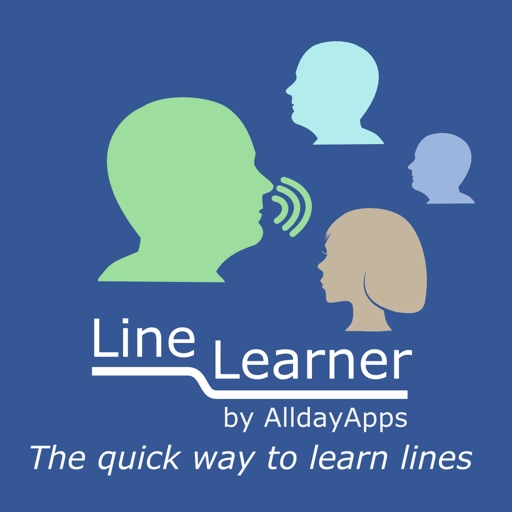

Line Learner helps you to learn lines as quickly and easily as you learn a catchy song.
Line Learner enables you to record scenes from plays.  It allows you to listen to the full recording while you learn your part.  You can then select to leave gaps in the recording for you to speak your part aloud.  A prompt button is there to remind you of your line if you forget.
You can choose to repeat individual scenes, or the whole play.
With line learner you can record your script, and share it with others, who can record their lines, and share them back, giving you the ability to rehearse together even when apart.
The app allows you to load up a script in PDF or Word format and display it as you record your lines.
After you have recorded your lines you can alter the pitch of the other characters so as to more easily tell their lines apart from your own.
Some quotes from some of our users:
" I attribute much of my success to using your app"
"Great app, really enjoying it!"
"I say this app is damn near perfect!"
"I really love your app and find it very useful."

[View on Apple](https://apps.apple.com/gb/app/linelearner/id368070258)

## Morse-It

Morse-it is an easy-to-use application that lets you translate, interpret, type, learn, convert Morse code, and more.
You can run it on your iPhone or iPad and it is compatible with VoiceOver.

Note: By getting this app, you'll have access to several useful and fun features related to Morse code (these are the features explained in this description and visible in the screenshots).
In addition, you can unlock advanced features in the app if you need them: learning and social features. More information at the end of this description.

Type any text and it will be automatically encoded into a full-screen flashing effect of the corresponding Morse code.
The flashlight of your device is also used.

Your "SOS" messages will be seen quite far away!

Some sound will also be played accordingly. In detailed mode, the encoded text will scroll during the decoding process.

Tap some Morse code on the screen and the program will translate it into some text.
Several input types are supported: Novice, Straight Key, Memory Paddle, Iambic Paddle (A and B), Microphone. Left and right handed modes are supported.
Test and improve your skills: are you good enough to be understood?

Create Morse code audio files from a given text (or variables).
Use these files as you like: listen to them to train your decoding skills or use them as ringtones for your mobile phone.

Create beautiful abstract wallpapers for your device (or posters to be printed) by customizing the display of the dashes and dots of the sentence you like.

Exclusive feature that allows you to decode in real time the Morse code recorded by the microphone into text (note: the sound must be quite clear/loud and without much noise).
Some automatic calibration is performed, allowing adaptation to speed, tone and volume changes.

The full Morse alphabet (including prosigns) can also be viewed and the associated Morse code can be played.
Tapped and decoded text can be edited and exported to clipboard, in-app email and SMS.
A special screen allows textual conversion of Morse code and text. Exchange encrypted messages with your friends.

Wikipedia and Visual Mnemonic screens to get information and mnemonics about Morse code.
You can also add your own websites for in-app consultation.
The whole application is highly configurable (frequency, WPM, tone type, color, Morse code, variables ...)

A customizable today view widget can be added to your home screen to display the current date in Morse code.
Some custom actions are available in the shortcut app, and some features of the app can be triggered using Siri.

You can also become part of the Morse-it Social Club (thanks to a renewable subscription) and unlock the following Social features:
Messages, Forums, QSO Bot, Poem of the Day, Quotes of the Day, Games of the Day ... and more.

The following Learning features will also be unlocked (but can also be unlocked with a single one-time in-app purchase if you prefer):
Koch trainer, Sending trainer, Cards trainer, CWops Academy learning method, Quiz, Macros, Dictionaries: abbreviations, QSOs, mnemonics, timing (Farnsworth) and Morse alphabet/Prosigns personalization, appearance customization ... and more.

Some Morse-it features are powered by Icom, a world leader in the amateur radio market.

!!! As seen on TV !!! (UK) in Most Haunted Live: Apparently you can use it to communicate with ghosts (no guarantee though :D)

[View on Apple](https://apps.apple.com/gb/app/morse-it/id284942940)

## atvTools

开发的应用程序用于通过 iOS 设备控制电视设备。您需要在 Android 设备上启用 USB/网络调试才能使其工作
根据设备的不同，某些功能可能不可用。此外，它尚未经过测试

应用程序允许：
- 从 iOS 设备安装（侧载）应用程序到电视设备
- 控制电视应用程序（包括打开、卸载、禁用/启用和下载 APK）
- 控制应用程序权限（授予/撤销）
- 内置文件管理器
- 截屏或录屏（由于操作系统限制，您无法捕获任何视频内容）
- 将文件从手机发送到电视
- 使用应用程序中的遥控器和鼠标模式控制您的设备
- 在 iOS 设备上打开频道（仅限 Android TV 8+）
- 从手机粘贴文本
- 运行 Shell 命令
- 使用一个按钮清除所有应用程序缓存
- 重新启动并打开电视设备
- 查看 CPU、RAM、网络和存储的使用情况
- 查看正在运行的应用程序并在需要时强制停止它们

[View on Apple](https://apps.apple.com/gb/app/atvtools/id1661419573)

## World Map Pro Edition

Explore the World at Your Fingertips!

Looking for a fast, easy, and beautiful way to access world maps? Whether you're a student, traveler, trivia lover, or just curious about the world, this app gives you instant access to a collection of informative reference world maps.

What's Inside:
==========

- Interactive World Map - Zoom in to see greater detail
- Large Detailed Map – See countries, U.S. states, Canadian provinces, and even ocean floor contours.
- Political Map – Understand global borders and countries.
- Physical Map – Study landforms, elevations, and terrain.
- World Time Zone Map – Track global time changes and stay in sync.

Top Features:
==========

- Quick search for countries and capital cities
- Smooth map switching – just tap the top left corner!
- Full-screen viewing in portrait or landscape
- High-resolution maps – perfect for study or reference
- Works offline and online (internet required for Interactive World Map)

Fun Fact: Did you know that on May 4, 2018, North Korea adjusted its clocks by 30 minutes to align with South Korea? With the World Time Zone Map, you can track unique changes like this in real time!

Download now and explore the world like never before.

[View on Apple](https://apps.apple.com/gb/app/world-map-pro-edition/id350925062)
