- [The Midnight Library](#the-midnight-library)
- [Odyssey](#odyssey)
- [Never To Be Found](#never-to-be-found)
- [London Falling](#london-falling)
- [It Could Have Been Her](#it-could-have-been-her)
- [Red Dwarf: Titan](#red-dwarf-titan)
- [Mythos](#mythos)
- [Did I Ever Tell You This?](#did-i-ever-tell-you-this)
- [Harry Potter and the Philosopher's Stone](#harry-potter-and-the-philosopher-s-stone)
- [The Long Shoe (Unabridged)](#the-long-shoe-unabridged)
- [The Psychology of Money](#the-psychology-of-money)
- [The Correspondent](#the-correspondent)
- [The Odyssey](#the-odyssey)
- [Project Hail Mary (Unabridged)](#project-hail-mary-unabridged)
- [The Subtle Art of Not Giving a F*ck](#the-subtle-art-of-not-giving-a-f-ck)
- [The Secret of Secrets](#the-secret-of-secrets)
- [Nuclear War](#nuclear-war)
- [The Let Them Theory: A Life-Changing Tool That Millions of People Can’t Stop Talking About (Unabridged)](#the-let-them-theory-a-life-changing-tool-that-millions-of-people-can-t-stop-talking-about-unabridged)
- [ICARUS 17](#icarus-17)
- [The Satsuma Complex (Unabridged)](#the-satsuma-complex-unabridged)
- [One of Us](#one-of-us)
- [Harry Potter and the Goblet of Fire](#harry-potter-and-the-goblet-of-fire)
- [$100M Money Models: How to Make Money (Acquisition.com $100M Series) (Unabridged)](#100m-money-models-how-to-make-money-acquisition-com-100m-series-unabridged)
- [The Bat](#the-bat)
- [Harry Potter and the Prisoner of Azkaban](#harry-potter-and-the-prisoner-of-azkaban)
- [Careless People](#careless-people)
- [The Kill Switch](#the-kill-switch)
- [Caller Unknown](#caller-unknown)
- [The Trading Game](#the-trading-game)
- [The Land and its People](#the-land-and-its-people)
- [Atomic Habits](#atomic-habits)
- [Lost Until Love](#lost-until-love)
- [The Wager (Unabridged)](#the-wager-unabridged)
- [Harry Potter and the Chamber of Secrets](#harry-potter-and-the-chamber-of-secrets)
- [Heroes](#heroes)
- [The Housemaid Is Watching](#the-housemaid-is-watching)
- [The Tailor](#the-tailor)
- [Red Dwarf: Series I to IV](#red-dwarf-series-i-to-iv)
- [The Life Impossible](#the-life-impossible)
- [Such a Nice Girl](#such-a-nice-girl)
- [The Odyssey (Unabridged)](#the-odyssey-unabridged)
- [Diddly Squat](#diddly-squat)
- [The 7 Habits of Highly Effective People (Unabridged)](#the-7-habits-of-highly-effective-people-unabridged)
- [The Thursday Murder Club](#the-thursday-murder-club)
- [We Did Ok, Kid (Unabridged)](#we-did-ok-kid-unabridged)
- [The Long Call](#the-long-call)
- [Stars and Swipes](#stars-and-swipes)
- [Troy](#troy)
- [The Iliad](#the-iliad)
- [Father Material](#father-material)
- [Harry Potter and the Order of the Phoenix](#harry-potter-and-the-order-of-the-phoenix)
- [The Mistake (Unabridged)](#the-mistake-unabridged)
- [The Odyssey (Unabridged)](#the-odyssey-unabridged)
- [The Fellowship of the Ring](#the-fellowship-of-the-ring)
- [Five Fall Into Adventure](#five-fall-into-adventure)
- [Red Dwarf: Series V to VIII](#red-dwarf-series-v-to-viii)
- [Dissection of a Murder](#dissection-of-a-murder)
- [The Goal (Unabridged)](#the-goal-unabridged)
- [Five On A Hike Together](#five-on-a-hike-together)
- [The Names](#the-names)
- [The Seriously Epic Holiday of Lottie Brooks](#the-seriously-epic-holiday-of-lottie-brooks)
- [A Brief History Of Time](#a-brief-history-of-time)
- [The Intruder](#the-intruder)
- [Paddy Mayne : Lt Col Blair 'Paddy' Mayne, 1 SAS Regiment](#paddy-mayne-lt-col-blair-paddy-mayne-1-sas-regiment)
- [Think and Grow Rich (1937 Edition): The Original 1937 Unedited Edition (Unabridged)](#think-and-grow-rich-1937-edition-the-original-1937-unedited-edition-unabridged)
- [Clive Cussler’s Cold Fire](#clive-cussler-s-cold-fire)
- [Psycho-Cybernetics (Updated and Expanded)](#psycho-cybernetics-updated-and-expanded)
- [Wild](#wild)
- [The Last Truths We Told](#the-last-truths-we-told)
- [Harry Potter and the Deathly Hallows](#harry-potter-and-the-deathly-hallows)
- [Running on Air](#running-on-air)
- [Unbound](#unbound)
- [Mr Wilman’s Motoring Adventure](#mr-wilman-s-motoring-adventure)
- [Katabasis](#katabasis)
- [The Mother](#the-mother)
- [The Lord of the Rings: The Fellowship of the Ring](#the-lord-of-the-rings-the-fellowship-of-the-ring)
- [Boudicca's Daughter](#boudicca-s-daughter)
- [A Mind of My Own (Unabridged)](#a-mind-of-my-own-unabridged)
- [My Husband's Wife](#my-husband-s-wife)
- [Greenlights](#greenlights)
- [Meet Me at Rainbow Corner](#meet-me-at-rainbow-corner)
- [Regime Change (Unabridged)](#regime-change-unabridged)
- [Tom Lake](#tom-lake)
- [The Eye of the Bedlam Bride: Dungeon Crawler Carl, Book 6 (Unabridged)](#the-eye-of-the-bedlam-bride-dungeon-crawler-carl-book-6-unabridged)
- [The Bullet That Missed](#the-bullet-that-missed)
- [Then She Was Gone](#then-she-was-gone)
- [Prisoners of Geography (Unabridged)](#prisoners-of-geography-unabridged)
- [Odysseus: The Greatest Hero of them All (Unabridged)](#odysseus-the-greatest-hero-of-them-all-unabridged)
- [The Laws of Human Nature](#the-laws-of-human-nature)
- [Then She Vanishes](#then-she-vanishes)
- [It's Not That Radical](#it-s-not-that-radical)
- [What If Reform Wins](#what-if-reform-wins)
- [The Lost Women](#the-lost-women)
- [Clive Cussler’s Quantum Tempest](#clive-cussler-s-quantum-tempest)
- [The Midnight Train](#the-midnight-train)
- [Empire of the Damned](#empire-of-the-damned)
- [The Lost City of Z (Unabridged)](#the-lost-city-of-z-unabridged)
- [The Amulet of Samarkand (Abridged)](#the-amulet-of-samarkand-abridged)
- [Fruit Fly (Unabridged)](#fruit-fly-unabridged)
- [Fifty Shades Freed](#fifty-shades-freed)

## The Midnight Library

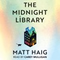

<b>THE <i>SUNDAY TIMES </i>NUMBER ONE<i> </i>BESTSELLING WORLDWIDE PHENOMENON </b> <b>READERS' MOST LOVED BOOK OF 2021</b> <b>WINNER OF THE GOODREADS CHOICE AWARD FOR FICTION</b> <b> 'BEAUTIFUL' Jodi Picoult, 'UPLIFTING' <i>i</i>, </b><b>'BRILLIANT' <i>Daily Mail, </i>'AMAZING' Joanna Cannon, 'ABSORBING' <i>New York Times, </i>'THOUGHT-PROVOKING' <i>Independent</i></b>  Nora's life has been going from bad to worse. Then at the stroke of midnight on her last day on earth she finds herself transported to a library. There she is given the chance to undo her regrets and try out each of the other lives she might have lived. Which raises the ultimate question: with infinite choices, what is the best way to live?

[View on Apple](https://books.apple.com/gb/audiobook/the-midnight-library/id1889844682)

## Odyssey

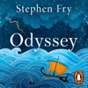

<b>Brought to you by Penguin.  A <i>Sunday Times</i> bestseller  The next book in Stephen Fry's acclaimed internationally bestselling Greek myths series telling the story of The Odyssey.</b>  <b>Sometimes the hardest journey is the way back home . . .</b>  Wily Odysseus, King of Ithaca, has won Troy for the Greeks – after a decade of brutal, bloody warfare. But now this warrior remembers he is a husband and father – and his gaze turns longingly towards home.  Setting sail with a small fleet, Odysseus dreams of soon lying in the arms of his beloved wife Penelope, and of teaching his son Telemachus the ways of a warrior. However, the gods laugh at the foolish hopes of mortals. And, angered by this upstart, Poseidon – God of the ocean realms – curses our hero to wander the seas for ten long years.  Encountering one-eyed giants, six-headed monsters, terrible storms, titanic whirlpools, hypnotic sirens, seductive witches and jealous goddesses, Odysseus is tempted and tormented beyond any man’s endurance.  Yet he is no mere mortal – and the lure of his wife and son draws him, step by step, stroke by stroke, ever closer to home and his ultimate destiny . . .  A tale of love and longing, return and redemption, home and hope, Stephen Fry’s <i>Odyssey</i> sees the author and national treasure weave the final threads of the fabulous story begun in the worldwide bestseller, <i>Mythos,</i> into an astonishing and mesmerising tapestry for the ages.  'With his distinctive narration, Fry brings warmth, exuberance and humour to these age-old stories, along with a range of voices...' <i>The Guardian </i>  'Fry is at his story-telling best . . . the gods will be pleased' <i>Times</i>  'Brilliant . . . all hail Stephen Fry' <i>Daily Mail</i>  © Stephen Fry 2024 (P) Penguin Audio 2024

[View on Apple](https://books.apple.com/gb/audiobook/odyssey/id1738221634)

## Never To Be Found

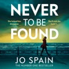

<b>She'll help anyone in need. But did she just save a killer?</b>  There is a chilling phenomenon in Japan known as <i>Johatsu</i> - people who vanish voluntarily from their lives. It's said 100,000 people per year are <i>Johatsu,</i> and an entire industry has sprung up to support those who choose to.  Life is hard. For some people, it's just too much.  That's what I thought when I brought the concept to England. People will disappear anyway. What if I could help them? So I pack their belongings discreetly, create new identities, forge documents, give directions to the cities and towns where the 'night-mover' can live anonymously.  It's just a business. I never saw it as a shameful act. I've helped people flee from abusive relationships, from work pressure, from debt, from unfulfilled lives. People in need.  I consider what I do to be honourable. Until now that is.  Because I've just learned that I'm not absent of responsibility. That I am capable of doing a terrible thing. That it's not just a business.  I helped somebody flee from a crime. From the police.  I evaporated a murderer.  And if I don't find him, I can't live with what he might do next.

[View on Apple](https://books.apple.com/gb/audiobook/never-to-be-found/id1822421626)

## London Falling

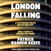

<b>A riveting blend of true crime, social history, and investigative journalism written and read by one of the most decorated non-fiction authors working today, Patrick Radden Keefe.  From the Baillie Gifford Prize-winning and<i> Sunday Times </i>bestselling author of<i> Empire of Pain </i>and <i>Say Nothing </i>comes a riveting story of wealth, violence and deceit at the heart of a glittering city.</b>  In 2019, a London teenager, Zac Brettler, fell to his death from a luxury apartment building on the banks of the Thames. On a desperate quest to understand how their son had died, his grieving parents made a terrible discovery: Zac had been leading a fantasy life, posing as the son of a wealthy Russian oligarch.  Patrick Radden Keefe follows Zac’s parents on a dark journey to find out what brought him to the balcony that night – and how a teenager’s life of make-believe drew him into the city’s terrifying underworld.  <b>'Gripping, rigorous, smart . . . breathtaking' - Jon Ronson  'A phenomenal book that will stay in your soul long after the last page . . . it captures how easily a life can go wrong in the shadows of a city bankrolled by billionaires' - Emily Maitlis  'More addictive than any box set, <i>London Falling</i> will break your heart, instil you with cold rage, and make you see London in a completely new light' - Sathnam Sanghera</b>

[View on Apple](https://books.apple.com/gb/audiobook/london-falling/id1825330248)

## It Could Have Been Her

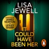

<b>PREPARE TO BE HOOKED by the brand new thriller from Lisa Jewell, author of the <i>Sunday Times</i> bestselling novels <i>None of This Is True </i>and<i> Don't Let Him In.</i>  This audiobook is read by a full cast including Lesley Sharp, James Norton, Joanna David, Emilia Fox, Freddie Fox, Tim McInnerny, Ella Rae Smith, Harriet Fisher, Elsa Lepecki Bean and Roy McMillan.</b>  <b>It was the night she almost died.</b>  Jane Trevally, newly divorced and feeling a little lost, agrees to accompany a man she doesn't know to his house in the darkest corner of Hampstead Heath. She's offered a drink, goes in, and then - a scream and the sound of something falling upstairs - Jane senses she's in a bad place. She runs.  Twenty five years later, Jane finds herself outside the same house, this time to return a small white dog who's been found near her home in the country; a dog whose owner has just been reported missing.  A fleeting glimpse of a haunted looking woman through the window sends Jane on a mission to uncover the house's secrets - secrets more terrifying than she could have ever imagined, especially when she realises it could have been her. . .  'A deliciously twisted gem of a thriller and her best yet' <b>CLAIRE DOUGLAS</b> 'A true masterpiece' <b>ANDREA MARA</b> 'Superbly written, entertaining and twisty' <b>LIZ NUGENT</b> 'Dark, intense, brilliant' <b>SHARI LAPENA</b>  © Lisa Jewell 2026 (P) Penguin Audio 2026

[View on Apple](https://books.apple.com/gb/audiobook/it-could-have-been-her/id1846558382)

## Red Dwarf: Titan

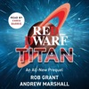

<b>Before the beginning...</b>  The mining ship Red Dwarf is in orbit around Saturnian moon Titan, and the bulk of the crew is heading down for their shore leave plans: A strangely reluctant hen party; a relaxing cheaty golfing break; a terminally-boring cultural Odessey; a marathon drinking and fighting binge; a stomach-challenging culinary beanfeast and an invigoratingly violent tour of Shore Patrol . . .   Menial chicken soup machine repairmen Dave Lister and Arnold Rimmer have slightly less noble ambitions. Rimmer is in search of some illicit exam-cheating tech, to land a much-lusted-for promotion, and Lister plans to acquire a cat to smuggle back on board as part of a nefarious scheme to return to Earth. Mainly they just want to get as far away from each other as possible. However, their objectives are scuppered when they receive a cryptic message . . . from the future.  The two feuding crewmen are catapulted into a breakneck race to save not only this, but every other Reality. Along the way, they'll find themselves united again, for the first time, with some new, but somehow old friends, as they embark on a labyrinthian quest through the seediest, most dangerous underbelly of humankind's furthest outpost, where lurk bizarre off-worldly dangers and one mysterious hidden nemesis with an obscure, yet clearly lethal agenda.  <b>So strap yourself into your Holly Hop Drive, and set your bazookoids to "thrill" - the Dwarfers are taking on TITAN. Read by Chris Barrie and featuring the original Red Dwarf music performed by the composer Howard Goodall.</b>  <i>'Don't tell my mother I died with my arm up a gorilla's bottom.'</i>  <i>'But sir - it will be on the death certificate.</i>'

[View on Apple](https://books.apple.com/gb/audiobook/red-dwarf-titan/id6779126967)

## Mythos

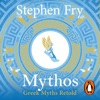

<b>Brought to you by Penguin  STEP INTO ANOTHER WORLD - OF MAGIC, MAYHEM, MONSTERS AND MANIACAL GODS - IN STEPHEN FRY'S MOMENTOUS SUNDAY TIMES AND AUDIBLE BESTSELLER, MYTHOS  Discover Stephen Fry's magnificent retelling of the greatest myths and legends ever told . . . </b> No one loves and quarrels, desires and deceives as boldly or brilliantly as Greek gods and goddesses.  In Stephen Fry's vivid retelling, we gaze in wonder as wise Athena is born from the cracking open of the great head of Zeus and follow doomed Persephone into the dark and lonely realm of the Underworld.  Shiver in fear when Pandora opens her jar of evil torments.  Listen with joy as the legendary love affair between Eros and Psyche unfolds.  Read by Stephen Fry himself, Mythos captures these extraordinary myths for our modern age - in all their dazzling and deeply human relevance.  If you're enthralled by the magic of Greek mythology you'll love the final instalment to Fry’s retellings, ODYSSEY, a legendary voyage of peril, temptation, loss and epic adventure.  ‘The Greek myths are told to you here by the ever-soothing voice of Stephen Fry, who takes you from Zeus to Athena with his typical humour.’ <b>The Guardian</b>  ‘Read by Fry with his accustomed ebullient showmanship [he] gives the legends modern resonance by telling them with a contemporary colloquial twist' <b>AUDIOBOOK of the WEEK, The Times</b>  '<i>Mythos</i> is the best thing he's written since his superb first novel...it is entertaining and edifying - one cannot really ask for more than that.' <b>The Telegraph </b> <b>If you're enthralled by the magic of Greek mythology you'll love the final instalment to Fry’s retellings, ODYSSEY, a legendary voyage of peril, temptation, loss and epic adventure.</b>  © Stephen Fry 2017 (P) Penguin Audio 2017

[View on Apple](https://books.apple.com/gb/audiobook/mythos/id1440419763)

## Did I Ever Tell You This?

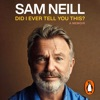

<b>Brought to you by Penguin.</b>  In this unexpected memoir, written in a creative burst of just a few months in 2022, Sam Neill tells the story of how he became one of the world's most celebrated actors, who has worked with everyone from Meryl Streep to Isabel Adjani, from Jeff Goldblum to Sean Connery, from Steven Spielberg to Jane Campion.  By his own account, his career has been a series of unpredictable turns of fortune. Born in 1947 in Northern Ireland, he emigrated to New Zealand at the age of seven. His family settled in Dunedin on the South Island, but young Sam was sent away to boarding school in Christchurch, where he was hopeless at sports and discovered he enjoyed acting.  But how did you become an actor in New Zealand in the 1960 and 1970s where there was no film industry? After university he made documentary films while also appearing in occasional amateur productions of Shakespeare. In 1977 he took the lead in Sleeping Dogs, the first feature made in New Zealand in more than a decade, a project that led to a major role in Gillian Armstrong's celebrated My Brilliant Career.  And after that Sam Neill found his way, sometimes by accident, into his own brilliant career. He has worked around the world, an actor who has moved effortlessly from blockbuster to art house to TV, from Dr Alan Grant in the Jurassic Park movies to The Piano and Peaky Blinders.  Did I Ever Tell You This? is a joy to read, a marvellous and often very funny book, the work of a natural storyteller who is a superb observer of other people, and who writes with love and warmth about his family. It is also his account of his life outside film, especially in Central Otago where he established Two Paddocks, his vineyard famous for its pinot noir.  ©2023 Sam Neill (P)2023 Penguin Audio

[View on Apple](https://books.apple.com/gb/audiobook/did-i-ever-tell-you-this/id1663210802)

## Harry Potter and the Philosopher's Stone

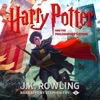

Stephen Fry brings the richness of these magical stories to life in the original British recordings.  <i>Turning the envelope over, his hand trembling, Harry saw a purple wax seal bearing a coat of arms; a lion, an eagle, a badger and a snake surrounding a large letter 'H'.</i>  Treat your ears to a performance so rich and captivating you'll imagine yourself in the halls of Hogwarts. Wherever you listen, the unmistakable voice of Stephen Fry is guaranteed to guide you ever more deeply into this magical story and transport you to the heart of the adventure.  Harry Potter has never even heard of Hogwarts when the letters start dropping on the doormat at number four, Privet Drive. Addressed in green ink on yellowish parchment with a purple seal, they are swiftly confiscated by his grisly aunt and uncle. Then, on Harry's eleventh birthday, a great beetle-eyed giant of a man called Rubeus Hagrid bursts in with some astonishing news: Harry Potter is a wizard, and he has a place at Hogwarts School of Witchcraft and Wizardry. An incredible adventure is about to begin!  Theme music composed by James Hannigan  Having become classics of our time, the Harry Potter stories never fail to bring comfort and escapism. With their message of hope, belonging and the enduring power of truth and love, the story of the Boy Who Lived continues to delight generations of new listeners.

[View on Apple](https://books.apple.com/gb/audiobook/harry-potter-and-the-philosophers-stone/id1442185522)

## The Long Shoe (Unabridged)

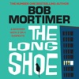

<b>THE BRAND-NEW BOOK FOR 2025 BY 2 MILLION COPY BESTSELLING AUTHOR BOB MORTIMER.</b>  &#xa0;  Bathroom salesman Matt is at a crossroads. He has lost his job, he is about to be made homeless and his girlfriend has left him. He wants his luck to change and he wants things to go back to how they were. Out of the blue he is offered a job that comes with a free luxury apartment. He hopes this might be enough to tempt her back. But, as events unfold, it starts to dawn on him that perhaps she didn't leave of her own accord after all...​  &#xa0; <b>Praise for Bob Mortimer:</b>  &#xa0;  'As a comedian, Bob Mortimer spins a shaggy-dog story like nobody else' <i>The Guardian</i>  &#xa0;  ‘The much loved comic proves adept at noirish fiction in a debut whose surrealist humour sets it apart’ – <i>Observer</i>   ‘Mortimer’s verbal specificity and off-kilter humour will keep his fans chuckling’ <i>The Times&#xa0;</i>  &#xa0;  'There is&#xa0;a sweetness to his worldview that makes his writing gently poignant... Like Spike Milligan, the only vintage comic whose fiction is still read, Mortimer has managed to use a novel as a vehicle for his distinctive comedic voice' <i>The Telegraph</i>

[View on Apple](https://books.apple.com/gb/audiobook/the-long-shoe-unabridged/id1784796432)

## The Psychology of Money

<b><i>The Sunday Times</i> Number One Bestseller.  Over 10 million copies sold around the world.  The original book from Morgan Housel, the <i>New York Times</i> and <i>Sunday Times</i> bestselling author of <i>Same As Ever</i> and <i>The Art of Spending Money</i>.  As featured on the Dr Chatterjee podcast <i>Feel Better, Live More</i> and <i>The</i> <i>Diary of a CEO</i> podcast with Steven Bartlett.</b>  Doing well with money isn't necessarily about what you know. It's about how you behave. And behavior is hard to teach, even to really smart people.  Money – investing, personal finance, and business decisions – is typically taught as a math-based field, where data and formulas tell us exactly what to do. But in the real world people don't make financial decisions on a spreadsheet. They make them at the dinner table, or in a meeting room, where personal history, your own unique view of the world, ego, pride, marketing, and odd incentives are scrambled together.  In <i>The Psychology of Money</i>, award-winning author Morgan Housel shares 19 short stories exploring the strange ways people think about money and teaches you how to make better sense of one of life's most important topics.

[View on Apple](https://books.apple.com/gb/audiobook/the-psychology-of-money/id1878646280)

## The Correspondent

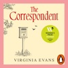

<b>Brought to you by Penguin. </b>  In her letters to family and friends we come to know the life of Sybil Van Antwerp: stubborn, cantankerous, opinionated, always steadfast in her belief in the power of the written word.  But as the clock begins to tick for Sybil, the need for a few post-scripts to the life she’s led becomes apparent. Fixing her difficult relationship with her children. Taking a final chance at romance. Atoning for an old legal case which has come back to haunt her. And finally, reckoning with a devastating loss that she has spent the last thirty years holding close to her chest.  <b>'Subtly told and finely made, <i>The Correspondent </i>is a portrait of a small life expanding' </b>ANN PATCHETT  'The superbly talented Virginia Evans has written a novel of connection and daring' - ADRIANA TRIGANI, bestselling author of <i>The Good Left Undone </i>  'I was wowed by this deliciously brilliant book! Thank you, Virginia Evans, for a life beautifully told in letters, for creating a character whose mind struggles with her heart in a most intriguing, sympathetic, witty, and binge-worthy way' - Elinor Lipman, author of MS DEMEANOR  © Virginia Evans 2025 (P) Penguin Audio 2025

[View on Apple](https://books.apple.com/gb/audiobook/the-correspondent/id1762577807)

## The Odyssey

<b>Brought to you by Penguin. </b>  This Penguin Classic is performed by George Blagden, star of Versailles and Vikings. This definitive recording is translated by E.V. Rieu, revised by D.C.H. Rieu, and contains an introduction by Peter Jones.  The epic tale of Odysseus and his ten-year journey home after the Trojan War forms one of the earliest and greatest works of Western literature. Confronted by natural and supernatural threats - shipwrecks, battles, monsters and the implacable enmity of the sea-god Poseidon - Odysseus must use his wit and native cunning if he is to reach his homeland safely and overcome the obstacles that, even there, await him.  (c) 1946, E. V. Rieu (P) 2019 Penguin Audio

[View on Apple](https://books.apple.com/gb/audiobook/the-odyssey/id1479199452)

## Project Hail Mary (Unabridged)

<b>THE #1 </b><b><i> NEW YORK TIMES </i></b><b> BESTSELLER FROM THE AUTHOR OF </b><b><i> THE MARTIAN. </i></b><b> Now a major motion picture starring Ryan Gosling, directed by Phil Lord and Christopher Miller, with a screenplay by Drew Goddard. Project Hail Mary is now playing exclusively in theaters.</b>  <b><i>Winner of the 2022 Audie Awards' Audiobook of the Year</i></b>  <b><i>Number-One Audible and </i></b><b>New York Times</b><b><i> Audio Best Seller</i></b>  <b><i>More than three million audiobooks sold</i></b>  <b>A lone astronaut must save the earth from disaster in this incredible new science-based thriller from the number-one </b><b><i>New York Times</i></b><b> best-selling author of </b><b><i>The Martian</i></b><b>.</b>  Ryland Grace is the sole survivor on a desperate, last-chance mission - and if he fails, humanity and the Earth itself will perish.  Except that right now, he doesn't know that. He can't even remember his own name, let alone the nature of his assignment or how to complete it.  All he knows is that he's been asleep for a very, very long time. And he's just been awakened to find himself millions of miles from home, with nothing but two corpses for company.  His crewmates dead, his memories fuzzily returning, he realizes that an impossible task now confronts him. Alone on this tiny ship that's been cobbled together by every government and space agency on the planet and hurled into the depths of space, it's up to him to conquer an extinction-level threat to our species.  And thanks to an unexpected ally, he just might have a chance.  Part scientific mystery, part dazzling interstellar journey, <i>Project Hail Mary</i> is a tale of discovery, speculation, and survival to rival <i>The Martian</i> - while taking us to places it never dreamed of going.  PLEASE NOTE: To accommodate this audio edition, some changes to the original text have been made with the approval of author Andy Weir.

[View on Apple](https://books.apple.com/gb/audiobook/project-hail-mary-unabridged/id1565808256)

## The Subtle Art of Not Giving a F*ck

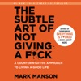

#1 New York Times Bestseller • More than&#xa0;10 million Copies Sold  In this generation-defining self-help guide, a superstar blogger cuts through the crap to show us how to stop trying to be ""positive"" all the time so that we can truly become better, happier people.  For decades, we’ve been told that positive thinking is the key to a happy, rich life. ""F**k positivity,"" Mark Manson says. ""Let’s be honest, shit is f**ked and we have to live with it."" In his wildly popular Internet blog, Manson doesn’t sugarcoat or equivocate. He tells it like it is—a dose of raw, refreshing, honest truth that is sorely lacking today. The Subtle Art of Not Giving a F**k is his antidote to the coddling, let’s-all-feel-good mindset that has infected&#xa0;modern society and spoiled a generation, rewarding them with gold medals just for showing up.  Manson makes the argument, backed both by academic research and well-timed poop jokes, that improving our lives hinges not on our ability to turn lemons into lemonade, but on learning to stomach lemons better. Human beings are flawed and limited—""not everybody can be extraordinary, there are winners and losers in society, and some of it is not fair or your fault."" Manson advises us to get to know our limitations and accept them. Once we embrace our fears, faults, and uncertainties, once we stop running and avoiding and start confronting painful truths, we can begin to find the courage, perseverance, honesty, responsibility, curiosity, and forgiveness we seek.  There are only so many things we can give a f**k about so we need to figure out which ones really matter, Manson makes clear. While money is nice, caring about what you do with your life is better, because true wealth is about experience. A much-needed grab-you-by-the-shoulders-and-look-you-in-the-eye moment of real-talk, filled with entertaining stories and profane, ruthless humor, The Subtle Art of Not Giving a F*ck is a refreshing slap for a generation to help them lead contented, grounded lives.

[View on Apple](https://books.apple.com/gb/audiobook/the-subtle-art-of-not-giving-a-f-ck/id1441488889)

## The Secret of Secrets

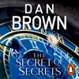

<b>Brought to you by Penguin.  Robert Langdon is back in the long-awaited new race-against-time thriller from the global bestselling author of <i>The Da Vinci Code</i> and<i> Angels and Demons</i>.</b>  Accompanying celebrated academic, Katherine Solomon, to a lecture she’s been invited to give in Prague, Robert Langdon’s world spirals out of control when she disappears without trace from their hotel room. Far from home and well out of his comfort zone, Langdon must pit his wits against forces unknown to recover the woman he loves.  But Prague is an old and dangerous city, steeped in folklore and mystery. For over two thousand years, the tides of history have washed back and forth over it, leaving behind echoes of everything that has gone before. Little can Langdon know that he is being stalked by a spectre from that dark past. He must use all of his arcane knowledge to decipher the world around him before he too is consumed by the rings of treachery and deception that have swallowed Katherine.  Against a backdrop of vast castles, towering churches, graveyards buried twelve deep and labyrinthine underground passages, Langdon must navigate a shadow city hiding in plain sight, a city which has successfully kept its secrets for centuries and will not readily deliver them.  <b>This is a battlefield unlike any he has previously experienced, one on which he must fight not for his only life, but for the future of humanity itself.</b>  The Secret Of Secrets<i> is Dan Brown’s first novel for over eight years and sees the stunning return of Harvard symbologist Robert Langdon, this time pitting his wits against a conspiracy which will test even his considerable brainpower and take him to the edge of losing all that he holds dear…</i>  © Dan Brown 2025 (P) Penguin Audio 2025

[View on Apple](https://books.apple.com/gb/audiobook/the-secret-of-secrets/id1792185388)

## Nuclear War

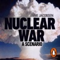

<b>Brought to you by Penguin.</b>  <b>The <i>Sunday Times </i>bestselling edge-of-your-seat exploration of what would happen in the event of nuclear war, perfect for readers of <i>American Prometheus: The Triumph and Tragedy of J. Robert Oppenheimer.</i></b> <b>  *Shortlisted for the Baillie Gifford Prize for Non-Fiction 2024*   </b>Nuclear war begins with a blip on a radar screen.  This is a minute-by-minute account of what comes next.  It has to be read to be believed.   There is only one scenario other than an asteroid strike that could end the world as we know it in a matter of hours: nuclear war.   Until now, no one outside official circles has known exactly what would happen if a rogue state launched a nuclear missile at the Pentagon. Second by second and minute by minute, these are the real-life protocols that choreograph the end of civilization.   Decisions that affect hundreds of millions of lives need to be made within six minutes, based on partial information, in the knowledge that once launched, nothing is capable of halting the destruction.   Based on dozens of new interviews with military and civilian experts who have built the weapons, been privy to the response plans, and taken responsibility for crucial decisions, this is the only account of what a nuclear exchange would look like.   Nuclear War is at once a compulsive non-fiction thriller and a powerful argument that we must rid ourselves of these world-ending weapons for ever. 'Essential' <b><i>New York Times</i></b>   'A stomach-clenching, multi-perspective, ticking-clock, geopolitical thriller' <b><i>Forbes</i></b>   'Tells a terrifying story in a devastatingly straightforward way' <b><i>Guardian</i></b>   ©2024 Annie Jacobsen (P)2024 Penguin Audio

[View on Apple](https://books.apple.com/gb/audiobook/nuclear-war/id1715824084)

## The Let Them Theory: A Life-Changing Tool That Millions of People Can’t Stop Talking About (Unabridged)

<b>#1 </b><b><i>New York Times</i></b><b> Bestseller</b>  <b>#1 </b><b><i>Sunday Times</i></b><b> Bestseller</b>  <b>#1 </b><b><i>Amazon</i></b><b> Bestseller</b>  <b>#1 </b><b><i>Audible</i></b><b> Bestseller</b>  <b><i>A Life-Changing Tool Millions of People Can’t Stop Talking About</i></b>  What if the key to happiness, success, and love was as simple as two words?  If you've ever felt stuck, overwhelmed, or frustrated with where you are, the problem isn't you. The problem is the power you give to other people. Two simple words—<i>Let Them</i>—will set you free. Free from the opinions, drama, and judgments of others. Free from the exhausting cycle of trying to manage everything and everyone around you. <i>The Let Them Theory</i> puts the power to create a life you love back in your hands—and this book will show you exactly how to do it.  In her latest groundbreaking book, <i>The Let Them Theory</i>, Mel Robbins—New York Times bestselling author and one of the world's most respected experts on motivation, confidence, and mindset—teaches you how to stop wasting energy on what you can't control and start focusing on what truly matters: YOU. Your happiness. Your goals. Your life.  Using the same no-nonsense, science-backed approach that's made <i>The Mel Robbins Podcast </i>a global sensation, Robbins explains why <i>The Let Them Theory</i> is already loved by millions and how you can apply it in eight key areas of your life to make the biggest impact. As you listen, you'll realize how much energy and time you've been wasting trying to control the wrong things—at work, in relationships, and in pursuing your goals—and how this is keeping you from the happiness and success you deserve.  Written as an easy-to-understand guide, Robbins shares relatable stories from her own life, highlights key takeaways, relevant research and introduces you to world-renowned experts in psychology, neuroscience, relationships, happiness, and ancient wisdom who champion<i> The Let Them Theory</i> every step of the way.  <b>Learn how to:</b> 
Stop wasting energy on things you can't control
Stop comparing yourself to other people
Break free from fear and self-doubt
Release the grip of people's expectations
Build the best friendships of your life
Create the love you deserve
Pursue what truly matters to you with confidence
Build resilience against everyday stressors and distractions
Define your own path to success, joy, and fulfillment  
...and so much more.

 <i>The Let Them Theory </i>will forever change the way you think about relationships, control, and personal power. Whether you want to advance your career, motivate others to change, take creative risks, find deeper connections, build better habits, start a new chapter, or simply create more happiness in your life and relationships, this book gives you the mindset and tools to unlock your full potential.  Order your copy of<i> The Let Them Theory </i>now and discover how much power you truly have. It all begins with two simple words.

[View on Apple](https://books.apple.com/gb/audiobook/the-let-them-theory-a-life-changing-tool-that/id1789374695)

## ICARUS 17

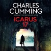

FROM SUNDAY TIMES BESTSELLING AUTHOR CHARLES CUMMING  THE NEW THRILLER FOLLOWING CAREER SPY, LACHLAN KITE  'Nobody writes more enjoyable spy thrillers’ ANTHONY HOROWITZ  ‘Charles Cumming has breathed new life into the spy novel’ BEN MACINTYRE  'The rightful inheritor of John le Carré's crown' OBSERVER  Lachlan Kite should have left fieldwork behind by now.  As director of covert intelligence agency Box 88, he’s at the apex of his espionage career. But when Martha Raine – a woman he hasn’t seen in twenty years – begs for his help, Kite finds himself back in the game, racing to avert disaster.  Kite must find Martha’s son, Max, who vanished in Athens with his girlfriend, Yasmine. But the couple aren’t just missing, they’re running for their lives. Two rival agencies are hunting them, both with orders to kill on sight.  Max and Yasmine are carrying a dizzying secret, one which could pull apart the foundations of the Middle East for a generation. If Kite fails to save them, the costs – both personal and professional – will be catastrophic.  ‘A fast-moving, believable spy thriller, which benefits from Cumming’s insider knowledge' Sun  'If there was any question as to who is the rightful inheritor of John le Carré’s crown as the king of elegant spy fiction, this proves that it’s Cumming beyond any doubt' Observer  'Icarus 17 demonstrates Cumming’s inimitable combination of human insight, geopolitical acumen and sheer excitement’ Christopher de Bellaigue  'The perfect thriller to read on holiday' Fani Papageorgiou, The Economist  'Hugely satisfying' Jay Rayner  About the author  Charles Cumming was born in Scotland in 1971. Shortly after university, he was approached for recruitment by the Secret Intelligence Service (MI6), an experience that inspired his first novel, A Spy by Nature. He has written several bestselling thrillers, including A Foreign Country which won the CWA Ian Fleming Steel Dagger for Best Thriller and the Bloody Scotland Crime Book of the Year. He worked on Sky’s acclaimed drama The Day of the Jackal and was the screenwriter of the Gerard Butler movie Plane. He lives in London.

[View on Apple](https://books.apple.com/gb/audiobook/icarus-17/id1824542980)

## The Satsuma Complex (Unabridged)

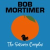

<b>*WINNER OF THE&#xa0;BOLLINGER EVERYMAN WODEHOUSE PRIZE FOR COMIC FICTION 2023*</b>  <b>THE <i>SUNDAY TIMES </i>BESTSELLER</b>  &#xa0; <b>‘Funny, clever and sweet’–&#xa0;<i>Sunday Times</i></b>  <b>‘The much loved comic proves adept at noirish fiction in a debut whose surrealist humour sets it apart’ –&#xa0;<i>Observer</i></b>  <b><i>My name is Gary. I’m a thirty-year-old legal assistant with a firm of solicitors in London. To describe me as anonymous would be unfair but to notice me other than in passing would be a rarity. I did make a good connection with a girl, but that blew up in my face and smacked my arse with a fish slice.</i></b>   Gary Thorn goes for a pint with a work acquaintance called Brendan. When Brendan leaves early, Gary meets a girl in the pub. He doesn’t catch her name, but falls for her anyway. When she suddenly disappears without saying goodbye, all Gary has to remember her by is the book she was reading:&#xa0;<i>The Satsuma Complex.</i>&#xa0;But when Brendan goes missing, Gary needs to track down the girl he now calls Satsuma to get some answers.   And so begins Gary’s quest, through the estates and pie shops of South London, to finally bring some love and excitement into his unremarkable life…  <b>A page-turning story with a cast of unforgettable characters,&#xa0;<i>The Satsuma Complex&#xa0;</i>is the brilliantly funny smash hit first novel by bestselling author and comedian Bob Mortimer.</b>  &#xa0;

[View on Apple](https://books.apple.com/gb/audiobook/the-satsuma-complex-unabridged/id1633071316)

## One of Us

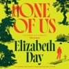

‘Intelligent, darkly humorous and brilliantly written’ STANLEY TUCCI  ‘This is Elizabeth Day's writing at its finest’ DOLLY ALDERTON  ‘A tantalising portrait of privilege and power’ THE TIMES  In this compulsive story of betrayal, old bonds and buried scandals, one British establishment family comes face to face with the consequences of privilege and the true cost of power.  Martin and Ben were friends for decades — best friends, Martin would have said — before the terrible events at Ben’s 40th birthday party tore them apart. So when Martin receives a surprise invitation back into the inner sanctum of the dazzling Fitzmaurice family after seven years of silence, he can’t resist the chance to get his revenge.  Ben has risen through the ranks of power, and is now touted as the next Prime Minister. But Martin can’t help but notice certain flies in the ointment… Ben’s wife, Serena, for instance, whose privileged existence is beginning to feel like a gilded cage. Or their daughter, Cosima, an environmental activist fighting against everything her parents once stood for. Or the disgraced MP Richard Take, determined to make his big comeback. And then there’s Fliss, the Fitzmaurice black sheep, whose untimely death sparks more suspicion than closure. Through their intertwined stories, we see a family – and a nation – unravelling under the weight of its secrets.  With everyone watching, the stage is set for a reckoning. It's time for Martin and Ben to confront what love truly means when everything—family, power, and loyalty—is on the line.  ‘Speaks truth to power in such an entertaining, gripping way’ MARIAN KEYES  ‘This timely story about the abuse of power is one of those books you just want to inhale in one go’ GOOD HOUSEKEEPING  ‘Gorgeously written, utterly compelling, and full of characters you will love and hate – and also love to hate’ SARA COLLINS  ‘The thinking person’s thriller. Part Highsmith, part Waugh … A superbly gripping plot’ LUCY FOLEY  About the author  Elizabeth Day is the author of five novels and four works of non-fiction, including her Sunday Times bestselling novel Magpie, and hit memoir How to Fail. She is the creator and host of the chart-topping podcast How to Fail with Elizabeth Day.

[View on Apple](https://books.apple.com/gb/audiobook/one-of-us/id1801333402)

## Harry Potter and the Goblet of Fire

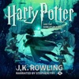

Stephen Fry brings the richness of these magical stories to life in the original British recordings.  <i>'There will be three tasks, spaced throughout the school year, and they will test the champions in many different ways ... their magical prowess - their daring - their powers of deduction - and, of course, their ability to cope with danger.'</i>  Treat your ears to a performance so rich and captivating you'll imagine yourself in the halls of Hogwarts. Wherever you listen, the unmistakable voice of Stephen Fry is guaranteed to guide you ever more deeply into this magical story and transport you to the heart of the adventure.  The Triwizard Tournament is to be held at Hogwarts. Only wizards who are over seventeen are allowed to enter - but that doesn't stop Harry dreaming that he will win the competition. Then at Hallowe'en, when the Goblet of Fire makes its selection, Harry is amazed to find his name is one of those that the magical cup picks out. He will face death-defying tasks, dragons and Dark wizards, but with the help of his best friends, Ron and Hermione, he might just make it through - alive!  Theme music composed by James Hannigan  Having become classics of our time, the Harry Potter stories never fail to bring comfort and escapism. With their message of hope, belonging and the enduring power of truth and love, the story of the Boy Who Lived continues to delight generations of new listeners.

[View on Apple](https://books.apple.com/gb/audiobook/harry-potter-and-the-goblet-of-fire/id1444945952)

## $100M Money Models: How to Make Money (Acquisition.com $100M Series) (Unabridged)

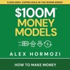

*Guinness World Record: Fastest Selling Non-Fiction Book in History*  *OVER 4,000,000 COPIES SOLD IN THE $100M SERIES!!*  This book will show you the art of getting more customers to spend more money faster.  If you have a business, this book will help you make more from it. If you don’t have a business, this will help you start one. If you have parents, this book will help you retire them. If you have rivals, this book will help you beat them. If you have monetary goals, this book will help you achieve them. I can show you how to accelerate cash flow in a business — in other words, get more customers to spend more money in less time (over &amp; over again). I know because it’s all I’ve done in my adult career. A little more about the book if you want that… A Money Model is a deliberate sequence of offers. It’s what you offer, when you offer, and how you offer it to make as much money as you can as fast as you can. Ideally, to make enough money from one customer to get and service at least two more customers in less than thirty days. And it rarely looks clean, but I break $100M Money Models into three stages:&#xa0;  Stage I: Get Cash  • Attraction Offers get more customers for less&#xa0;  Stage II: Get More Cash  • Upsell &amp; Downsell Offers make more money from them faster  Stage III: Get The Most Cash  • Continuity Offers maximize their total money spent In real life, it happens like this... First, I get customers reliably.  Then, I make sure they pay for themselves reliably.  Then, I make sure they pay for other customers reliably.  Then, I start maximizing each customer’s long-term value.  Then, I spend as many advertising dollars as I can to print as much money as possible. This is my cookbook for making money.  If you want to learn more and make more money for your business...then ADD TO CART, use its contents, and see for yourself.

[View on Apple](https://books.apple.com/gb/audiobook/%24100m-money-models-how-to-make-money-acquisition-com/id1834509876)

## The Bat

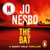

<b>Brought to you by Penguin.  *DETECTIVE HOLE IS SOON TO BE A MAJOR NETFLIX SERIES**  Discover the addictive first book in the bestselling Harry Hole series.</b>  <b>Harry is out of his depth.</b>  Detective Harry Hole is meant to keep out of trouble. A young Norwegian girl taking a gap year in Sydney has been murdered, and Harry has been sent to Australia to assist in any way he can.  <b>He's not supposed to get too involved. </b> When the team unearths a string of unsolved murders and disappearances, nothing will stop Harry from finding out the truth. The hunt for a serial killer is on, but the murderer will talk only to Harry.  <b>He might be the next victim.</b>  'A stunning opening to the series' <b>Sunday Times </b> 'Meaty, big and bloody, this is the rock and roll of detective fiction' <b>Financial Times</b>  'A searing read from a chilling thriller writer' <b>Independent </b> © Jo Nesbo 2012 (P) Penguin Audio 2012

[View on Apple](https://books.apple.com/gb/audiobook/the-bat/id1439956093)

## Harry Potter and the Prisoner of Azkaban

Stephen Fry brings the richness of these magical stories to life in the original British recordings.  <i>'Welcome to the Knight Bus, emergency transport for the stranded witch or wizard. Just stick out your wand hand, step on board and we can take you anywhere you want to go.'</i>  Treat your ears to a performance so rich and captivating you'll imagine yourself in the halls of Hogwarts. Wherever you listen, the unmistakable voice of Stephen Fry is guaranteed to guide you ever more deeply into this magical story and transport you to the heart of the adventure.  When the Knight Bus crashes through the darkness and screeches to a halt in front of him, it's the start of another far from ordinary year at Hogwarts for Harry Potter. Sirius Black, escaped mass-murderer and follower of Lord Voldemort, is on the run - and they say he is coming after Harry. In his first ever Divination class, Professor Trelawney sees an omen of death in Harry's tea leaves... But perhaps most terrifying of all are the Dementors patrolling the school grounds, with their soul-sucking kiss...  Theme music composed by James Hannigan  Having become classics of our time, the Harry Potter stories never fail to bring comfort and escapism. With their message of hope, belonging and the enduring power of truth and love, the story of the Boy Who Lived continues to delight generations of new listeners.

[View on Apple](https://books.apple.com/gb/audiobook/harry-potter-and-the-prisoner-of-azkaban/id1442094440)

## Careless People

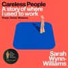

<b>Meta wants to silence her voice. You can hear her words.  'Devastating . . . funny . . . highly enjoyable . . . A <i>Bridget Jones’s Diary</i>-style tale of a young woman thrown into a series of improbable situations' <i>The Times</i></b> '<b>Jaw-dropping . . . A tell-all tome' <i>Financial Times</i></b>  Sarah Wynn-Williams, a young diplomat from New Zealand, pitched for her dream job. She saw Facebook’s potential and knew it could change the world for the better. But, when she got there and rose to its top ranks, things turned out a little different.  From wild schemes cooked up on private jets to risking prison abroad, <i>Careless People</i> exposes both the personal and political fallout when boundless power and a rotten culture take hold. In a gripping and often absurd narrative, Wynn-Williams rubs shoulders with Mark Zuckerberg, Sheryl Sandberg and world leaders, revealing what really goes on among the global elite – and the consequences this has for all of us.  Candid and entertaining, this is an intimate memoir set amid powerful forces. As all our lives are upended by technology and those who control it, <i>Careless People</i> will change how you see the world.  <b>'Darkly funny and genuinely shocking: an ugly, detailed portrait of one of the most powerful companies in the world' <i>The </i><i>New York Times</i></b>

[View on Apple](https://books.apple.com/gb/audiobook/careless-people/id1800204507)

## The Kill Switch

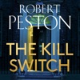

Journalist Gil Peck is back; in therapy, married to Jess - now editor of the Financial Chronicle - and still driven by the need to prove a point that he can't quite identify.  Yet all is not well at home. Jess is fed up with Gil's obsession with his job, and she's kicked him out of their home.    But Gil has never let anything get in the way of a scoop. He and Jess have landed the interview of a lifetime with the Prime Minister, Stella Barnsbury, for the podcast they co-host, and Gil has no intention of missing it.  During the interview, Barnsbury begins to pale, her coughing intensifying before she finally collapses.   Within 48 hours, the Prime Minister is dead.  Gil is used to landing the biggest stories. But as the last person to see the PM alive, he's now a main character. And when foul play is confirmed, he's also a prime suspect . . .

[View on Apple](https://books.apple.com/gb/audiobook/the-kill-switch/id1874461782)

## Caller Unknown

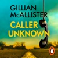

<b>Brought to you by Penguin.  They Took Her Daughter. Now She’ll Break Every Rule to Get Her Back.  From the Sunday Times bestselling author of <i>Famous Last Words</i> and <i>Wrong Place Wrong Time </i>comes an unmissable new thriller</b>  A road trip across America with her teenage daughter was meant to be much-needed bonding time for Simone before Lucy leaves home for university.  But on the first night of their stay, in a cabin deep in the Texan desert, Simone wakes to find Lucy missing and a mobile phone in her place. The phone rings and the voice on the other end issues instructions: Don’t tell the police. Come to this location. Be prepared to do a deal…  There is nothing Simone wouldn’t do to save her daughter. Hide the truth. Commit a terrible crime. Become a wanted woman.  But this is no ordinary kidnap and ransom. Getting Lucy back is just the beginning.  <b>'The best of the best' LISA JEWELL</b>  <b>'As moving as it is gripping' SOPHIE HANNAH</b> <b>'Utterly original' SHARI LAPENA</b> <b>'You’ll gasp, you’ll cry, you’ll never forget this story' HOLLY SEDDON</b>  © Gillian McAllister 2026 (P) Penguin Audio 2026

[View on Apple](https://books.apple.com/gb/audiobook/caller-unknown/id1834609632)

## The Trading Game

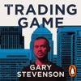

<b>Brought to you by Penguin.</b>  <b>*NO.1 <i>SUNDAY TIMES</i> BESTSELLER*  An outrageous, white-knuckle journey to the dark heart of an intoxicating world - from someone who survived the trading game and then blew it all wide open</b>  <i>'If you were gonna rob a bank, and you saw the vault door there, left open, what would you do? Would you wait around?</i>  Ever since he was a kid, kicking broken footballs on the streets of East London in the shadow of Canary Wharf's skyscrapers, Gary wanted something better. Something a whole lot bigger.  Then he won a competition run by a bank: 'The Trading Game'. The prize: a golden ticket to a new life, as the youngest trader in the whole city. A place where you could make more money than you'd ever imagined. Where your colleagues are dysfunctional maths geniuses, overfed public schoolboys and borderline psychopaths, yet they start to feel like family. Where soon you're the bank's most profitable trader, dealing in nearly a trillion dollars. A <i>day</i>. Where you dream of numbers in your sleep - and then stop sleeping at all.  But what happens when winning starts to feel like losing? When the easiest way to make money is to bet on millions becoming poorer and poorer - and, as the economy starts slipping off a precipice, your own sanity starts slipping with it? You want to stop, but you can't. Because <i>nobody ever leaves</i>.  Would you stick, or quit? Even if it meant risking everything?  'An unforgettable story of greed, financial madness and moral decay'<b> Rory Stewart</b>  'Hilarious, shocking and deeply sad — often in the same sentence'<b> <i>Sunday Times</i></b>  '<i>The Wolf of Wall Street</i> with a moral compass'<b> Irvine Welsh</b> ©2024 Gary Stevenson (P)2024 Penguin Audio

[View on Apple](https://books.apple.com/gb/audiobook/the-trading-game/id1707524961)

## The Land and its People

<b>In this new collection, recorded live, on-location from Massachusetts to California, David Sedaris reflects on what it means to be a foreigner, a brother, a lifelong friend, in essays that are "among the best of his career" (<i>Publishers Weekly,</i> starred review).</b> <b></b> <b>'Very little makes me laugh. I would say the one exception is anything by David Sedaris' GRAHAM NORTON</b> <b></b> <b></b><b>'Sedaris is the God of the comic essay... Sedaris' only rule: be funny or perish' LENA DUNHAM</b> <b></b> In <i>The Land and Its People</i>, David Sedaris investigates what it means to be a traveller, a brother, a lifelong friend. Trying on the role of carer after his boyfriend Hugh's hip-replacement surgery, he both succeeds and fails. He covers ground with his friend Dawn and challenges her to eat a truck tire. An ambivalent Duolingo bot becomes his unlikely confidante as he attempts to describe his family in a foreign language. Ever adding to his list of 'Countries I Have Been To,' he rides a horse named Tequila in Guatemala, buys a bespoke priest's cassock in Vatican City, and goes on safari in Kenya without taking a single photo.   Time takes its toll: Scrolling through his address book, he counts those he couldn't bear to outline and realizes how many are already gone. He is bitten by a dog and insulted by a wee train passenger. A woman on the street late at night either sexually harasses him or doesn't. It's easy to agree with the lady waving a sign that reads, 'Enough is Enough.' And yet, life holds much to delight in: the massive testicles of a ram, a trip abroad with his sisters, a really excellent reptile video, a pair of well-made cotton underpants.  Throughout these essays - at once acerbic and tender, playful and profound - Sedaris shows how much there is to marvel at when you keep your head up and your eyes open, observing with warmth and curiosity our fascinating human species and the lands we inhabit.  <b>'Sedaris is the premier observer of our world and its weirdness' ADAM KAY</b> <b>'Wonderful' IAN McKELLEN</b> <b>'Unquestionably the king of comic writing' HADLEY FREEMAN</b> <b>'The funniest writer alive today' JONATHAN ROSS</b> <b></b> <b></b>

[View on Apple](https://books.apple.com/gb/audiobook/the-land-and-its-people/id1886099941)

## Atomic Habits

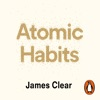

<b>There's never been a better time to make a few tiny changes that will revolutionise your life.</b> ________________________________ ‘<b>A supremely practical and useful book. James Clear distils the most fundamental information about habit formation, so you can accomplish more by focusing on less.</b>’ Mark Manson, author of <i>The Subtle Art of Not Giving A F*ck</i> ________________________________ <b>A revolutionary system to get 1 per cent better every day</b>  People think when you want to change your life, you need to think big. But world-renowned habits expert James Clear has discovered another way. He knows that real change comes from the compound effect of hundreds of small decisions – doing two push-ups a day, waking up five minutes early, or holding a single short phone call.  <b>He calls them atomic habits.</b>  In this ground-breaking book, Clear reveals exactly how these minuscule changes can grow into such life-altering outcomes. He uncovers a handful of simple life hacks (the forgotten art of Habit Stacking, the unexpected power of the Two Minute Rule, or the trick to entering the Goldilocks Zone), and delves into cutting-edge psychology and neuroscience to explain why they matter. Along the way, he tells inspiring stories of Olympic gold medalists, leading CEOs, and distinguished scientists who have used the science of tiny habits to stay productive, motivated, and happy.   <b>These small changes will have a revolutionary effect on your career, your relationships, and your life.</b> ________________________________  <b>‘James Clear has spent years honing the art and studying the science of habits. This engaging, hands-on book is the guide you need to break bad routines and make good ones.’ </b>Adam Grant, author of <i>Originals</i>  <b>‘A special book that will change how you approach your day and live your life.’ </b>Ryan Holiday, author of <i>The Obstacle is the Way</i> ________________________________ <b>Brought to you by Penguin. </b>

[View on Apple](https://books.apple.com/gb/audiobook/atomic-habits/id1440958277)

## Lost Until Love

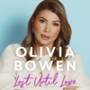

<b><i>'It's important for me to talk about everything that's happened to me in my life, to be open about it, because when you share something that you've gone through, and survived, it helps other people going through something similar. You aren't alone. And you are enough.</i>'</b>     In the summer of 2026, it is ten years since Olivia Bowen appeared on the second series of<i> Love Island</i>, finishing as a runner up with her partner, Alex. A true love story, the couple remain the longest standing success story of the show's entire history, now married with two beautiful children, Abel and Siena Grace.  Yet the last decade for Olivia has been a very different experience from her life before, where she'd struggled to navigate family disruption, unhealthy relationships and a battle with depression and anxiety.   In <i>Lost Until Love</i>, Olivia reflects on her life, sharing with her devoted followers what really drove her to enter the <i>Love Island</i> villa, as well as giving exclusive insight behind-the-scenes at Casa Amor, her relationship with Alex, and the many varied - and sometimes unexpected! - experiences and opportunities the show has brought her since.   Olivia also explores her raw journey of motherhood, as well as the devastating loss of her twin daughter while pregnant with Siena Grace and how this has changed her outlook on life and her future. Through the highs, lows and self-reflection, Olivia has finally created an authentic blueprint for her life that she hopes will inspire others to seek out their turning point and reach for their dreams.  <i> Lost Until Love</i> is a love letter to Olivia's younger self; it might be Olivia's own story but the hope and learnings between these pages are for every person who wants to own, learn, and turn their story into a life well lived and loved.  <b><i>'Applying to be on Love Island wasn't my dream, I didn't set out aiming to win it or believe it was going to be a life-changing opportunity. It was just a chance for me to escape from where I was, it piqued my interest. And I would encourage anyone who feels that spark of intrigue </i><i>to do the same. It's like following little breadcrumbs... You might not know where they will lead but if it feels right to follow the trail, you should do it!'</i></b>

[View on Apple](https://books.apple.com/gb/audiobook/lost-until-love/id1846233727)

## The Wager (Unabridged)

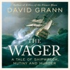

<b>THE <i>SUNDAY TIMES</i> NUMBER ONE BESTSELLER&#xa0;  &#xa0;  *LONGLISTED FOR THE 2023 BAILLIE GIFFORD PRIZE FOR NON-FICTION*   'The beauty of&#xa0;<i>The Wager</i>&#xa0;unfurls like a great sail... one of the finest nonfiction books I’ve ever read' </b><i>Guardian&#xa0;</i>  <b>‘The greatest sea story ever told’ </b><i>Spectator</i>  <b>'I cannot think of anyone who would not love this book . . . It is an extraordinary true story, beautifully written' </b>Richard Osman  <b>‘A cracking yarn… Grann’s taste for desperate predicaments finds its fullest expression here’ </b><i>Observer</i>  <b>From the international&#xa0;bestselling author of KILLERS OF THE FLOWER MOON and THE LOST CITY OF Z, a mesmerising story of shipwreck, mutiny and murder, culminating in a court martial&#xa0;that reveals a shocking truth.</b>  &#xa0;  On 28th January 1742, a ramshackle vessel of patched-together wood and cloth washed up on the coast of Brazil. Inside were thirty emaciated men, barely alive, and they had an extraordinary tale to tell. They were survivors of His Majesty’s ship The Wager, a British vessel that had left England in 1740 on a secret mission during an imperial war with Spain.&#xa0;While chasing a Spanish treasure-filled galleon, The Wager was wrecked on a desolate island off the coast of Patagonia. The crew, marooned for months and facing starvation, built the flimsy craft and sailed for more than a hundred days, traversing 2,500 miles of storm-wracked seas. They were greeted as heroes.  &#xa0;  Then, six months later, another, even more decrepit, craft landed on the coast of Chile. This boat contained just three castaways and they had a very different story to tell.&#xa0;The thirty sailors who landed in Brazil were not heroes – they were mutineers. The first group responded with counter-charges of their own, of a tyrannical and murderous captain and his henchmen. While stranded on the island the crew had fallen into anarchy, with warring factions fighting for dominion over the barren wilderness. As accusations of treachery and murder flew, the Admiralty convened a court martial to determine who was telling the truth. The stakes were life-and-death—for whomever the court found guilty could hang.  &#xa0;

[View on Apple](https://books.apple.com/gb/audiobook/the-wager-unabridged/id1671472416)

## Harry Potter and the Chamber of Secrets

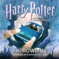

Stephen Fry brings the richness of these magical stories to life in the original British recordings.  <i>'There is a plot, Harry Potter. A plot to make most terrible things happen at Hogwarts School of Witchcraft and Wizardry this year.'</i>  Treat your ears to a performance so rich and captivating you'll imagine yourself in the halls of Hogwarts. Wherever you listen, the unmistakable voice of Stephen Fry is guaranteed to guide you ever more deeply into this magical story and transport you to the heart of the adventure.  Harry Potter's summer has included the worst birthday ever, doomy warnings from a house-elf called Dobby, and rescue from the Dursleys by his friend Ron Weasley in a magical flying car! Back at Hogwarts School of Witchcraft and Wizardry for his second year, Harry hears strange whispers echo through empty corridors - and then the attacks start. Students are found as though turned to stone... Dobby's sinister predictions seem to be coming true.  Theme music composed by James Hannigan  Having become classics of our time, the Harry Potter stories never fail to bring comfort and escapism. With their message of hope, belonging and the enduring power of truth and love, the story of the Boy Who Lived continues to delight generations of new listeners.

[View on Apple](https://books.apple.com/gb/audiobook/harry-potter-and-the-chamber-of-secrets/id1442189428)

## Heroes

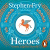

<b>Enter the monstrous and magical world of Stephen Fry's <i>Sunday Times</i> bestseller <i>Heroes</i>, brought to you by Penguin.</b> <b>Shortlisted for the 2018 Specsavers audiobook award.</b> Imagine sandals on your feet, a sword in your hand and the hot sun beating down on your helmet. Join Jason aboard the <i>Argo</i> as he quests for the Golden Fleece. Marvel as Atalanta - a woman raised by bears - outrun any man before being tricked with golden apples. Discover how Bellerophon captures the winged horse Pegasus to help him slay the monster Chimera. <i>Heroes</i> is the story of what we mortals are truly capable of - at our worst and our very best.. Read by Stephen Fry himself, <i>Heroes</i> harnesses the magic of ancient legends in an entertaining and modern retelling in Fry's iconic and captivating narration. <b>'A romp through the lives of ancient Greek gods. Fry is at his story-telling best . . . the gods will be pleased'</b><i> Times</i> <b>'Assured and engaging. The pace is lively, the jokes are genuinely funny'</b><i> Guardian</i> <b>'An Olympian feat. The gods seem to be smiling on Fry - his myths are definitely a hit'</b><i> Evening Standard</i>

[View on Apple](https://books.apple.com/gb/audiobook/heroes/id1445866799)

## The Housemaid Is Watching

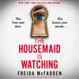

<b>“You must be our new neighbors!” Mrs Lowell gushes and waves across the picket fence. I clutch my daughter’s hand and smile back: but the second Mrs Lowell sees my husband a strange expression crosses her face. In that moment I make a promise. We finally have a family home. My past is far, far behind us. And I’ll do&#xa0;</b><i><b>anything</b></i><b>&#xa0;to keep it that way…</b>  I used to clean other people’s houses—now, I can’t believe this home is actually&#xa0;<i>mine</i>. The charming kitchen, the quiet cul-de-sac, the huge yard where my kids can play. My husband and I saved for years to give our children the life they deserve.  Even though I’m wary of our new neighbor Mrs Lowell, when she invites us over for dinner it’s our chance to make friends. Her maid opens the door wearing a white apron, her hair in a tight bun. I know exactly what it’s like to be in her shoes. But her cold stare gives me chills…  The Lowells’ maid isn’t the only strange thing on our street. I’m sure I see a shadowy figure watching us. My husband leaves the house late at night. And when I meet a woman who lives across the way, her words chill me to the bone:&#xa0;<i><b>Be careful of your neighbors.</b></i>  Did I make a terrible mistake moving my family here?  I thought I’d left my darkest secrets behind.&#xa0;<b>But could this quiet suburban street be the most dangerous place of all?</b>  <b>From&#xa0;</b><i><b>New York Times</b></i><b>,&#xa0;</b><i><b>USA Today</b></i><b>&#xa0;and&#xa0;</b><i><b>Wall Street Journal</b></i><b>&#xa0;bestselling author Freida McFadden comes the next installment of the unbelievably twisty, tension-packed and globally bestselling Housemaid series. This book can be enjoyed as a standalone read: and once you start, it will have you up all night racing through the pages until the final explosive twist.</b>  <b>Read what everyone’s saying about&#xa0;</b><i><b>The Housemaid is Watching</b></i><b>:</b>  “<b>Fantastic</b>… The amount of times&#xa0;<b>my jaw DROPPED</b>&#xa0;during this novel was crazy…&#xa0;<b>I binged this whole book in one sitting</b>… I simply&#xa0;<b>could not put it down</b>…&#xa0;<b>LOVED it</b>.”<i>@readingwithmamaeast</i>, ⭐⭐⭐⭐⭐  “<b>Wow.</b>&#xa0;I gasped and&#xa0;<b>dropped my Kindle at some of the twists</b>… A&#xa0;<b>wild, crazy ride</b>&#xa0;and&#xa0;<b>I read it in one sitting</b>. It was&#xa0;<b>gripping</b>, shocking, and&#xa0;<b>simply stunning</b>…&#xa0;<b>I loved it</b>.”&#xa0;<i>Curling up with a Coffee and a Kindle</i>, ⭐⭐⭐⭐⭐

[View on Apple](https://books.apple.com/gb/audiobook/the-housemaid-is-watching/id1823083756)

## The Tailor

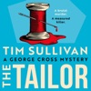

Bloomsbury presents The Tailor by Tim Sullivan, read by Finlay Robertson.

The unfailingly shrewd and uniquely brilliant DS George Cross is back...

'One of the most iconic British fictional detectives of the 21st century.' DAILY MAIL

'One of my favourite detectives.' ELLY GRIFFITHS

'Reaffirms everything that has made this series a bestseller.' VASEEM KHAN

'I absolutely loved The Tailor' GARY BARLOW

'A joy to read, beautifully penned, rich in detail and as elegantly put together as a bespoke suit.' ABIR MUKHERJEE
Measure twice. Cut once.

A bespoke tailor boards the 10:00 train from Bristol to London. Before it reaches Bath, he's found dead in the toilet, his throat slit and a plastic bag pulled over his head.

DS George Cross deduces that this wasn't a robbery – nothing about the killing is random.

It's an execution.

George's investigation brings him dangerously close to a cold and merciless world. And is it his imagination or is he being followed?

With the highest conviction rate of any officer in the force, someone will do anything to stop George from getting to the truth.
This time, the next cut could be meant for him...

Perfect for fans of MW Craven, Ann Cleeves and Joy Ellis, this is the eighth book in the million-copy-bestselling George Cross Mystery series, which can be read in any order.

[View on Apple](https://books.apple.com/gb/audiobook/the-tailor/id1880592182)

## Red Dwarf: Series I to IV

<b>The TV soundtracks of the iconic cult sci-fi comedy series</b>  Re-live your favourite moments from one of the greatest TV comedies of all time, now available to listen to as an audio download. Join Lister (<b>Craig Charles</b>), Rimmer (<b>Chris Barrie</b>), Kryten (<b>Robert Llewellyn</b>), Cat (<b>Danny John Jules</b>), Holly (<b>Norman Lovett/Hattie Hayridge</b>) and a gang of misfits they meet on their journey back to Earth.  Three million years into deep space, Dave Lister is the last surviving member of the human race. Woken from suspended animation on the mining ship <i>Red Dwarf</i>, he discovers a radiation leak has killed the rest of the crew and his only companions are Arnold Rimmer, a hologram of his dead bunkmate, Holly, a senile computer, and a creature who evolved from the descendants of the ship's cat. Resigned to his fate, Lister begins the long journey home. Parallel universes, time travel, false memories, and virtual reality all conspire to confuse the crew and delight audiences over the first four series of this ground-breaking, classic TV show.  This hilarious TV classic from Rob Grant and Doug Naylor is a must-listen for any fans of sci-fi, comedy, and everything in between. This audio-only collection of the original TV soundtracks provides the perfect opportunity for fans to relive the show's finest moments while on the go.  First airing in 1988, <i>Red Dwarf</i> was the longest-running and highest-ranked comedy on BBC 2 ever, amassing an audience of over 8 million. It won an International Emmy Award in the 'Popular Arts' category and 'Best BBC Comedy Series' at the British Comedy Awards as well as numerous other awards. Since airing, there have been 12 series of the show and a 2020 TV film - <i>The Promised Land</i>.  Series V-VIII are also available to download now.  <i>Please note: The audio on the last episode has been corrected.</i>  <i>Cast and credits</i> Written by Rob Grant and Doug Naylor Directed and Produced by Ed Bye  Arnold Rimmer - Chris Barrie Dave Lister - Craig Charles Cat - Danny John Jules Holly - Norman Lovett (Series 1-2), Hattie Hayridge (Series 3-4) Kryten - David Ross (Series 2), Robert Llewellyn (Series 3-4)  First Broadcast BBC2, 15 February – 21 March 1988 (Series 1), 6 September – 11 October 1988 (Series 2), 14 November – 19 December 1989 (Series 3), 14 February – 21 March 1991 (Series 4)  ©2025 BBC Studios Distribution Ltd (P)2025 BBC Studios Distribution Ltd

[View on Apple](https://books.apple.com/gb/audiobook/red-dwarf-series-i-to-iv/id1828901670)

## The Life Impossible

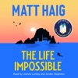

<b>NARRATED BY JOANNA LUMLEY</b> <b> The remarkable new <i>Sunday Times </i>bestselling novel from the author of the international sensation <i>The Midnight Library</i></b> <b><i> </i>‘A beautiful novel full of life-affirming wonder and imagination' BENEDICT CUMBERBATCH</b><i> </i><i><b> </b></i><i>'What looks like magic is simply a part of life we don’t understand yet . . .'</i>  When retired Maths teacher Grace Winters is left a run-down house on a Mediterranean island by a long-lost friend, curiosity gets the better of her. She arrives in Ibiza with a one-way ticket, no guidebook and no plan.  Among the rugged hills and golden beaches of the Balearics Grace searches for answers about her friend’s life, and how it ended. What she uncovers is stranger than she could have dreamed. But to dive into this impossible truth, Grace must first come to terms with her past.  Filled with wonder and wild adventure, this is a story of hope and the life-changing power of a new beginning.

[View on Apple](https://books.apple.com/gb/audiobook/the-life-impossible/id1889843510)

## Such a Nice Girl

<b>Brought to you by Penguin.  ‘The thing is, we always believe the best of our own kids. What mother thinks her own daughter will do something terrible? But every bad deed is carried out by a person who was once someone’s child.’ </b>  Get ready for your new obsession - it will make you question everything. Pre-order the gripping new thriller from the No.1 <i>Sunday Times</i> bestseller Andrea Mara.  <b>Everyone has secrets. Even your daughter…</b>  The morning after a glamorous, luxury wedding, you and your best friend go to wake your twenty-four-year-old daughters. You open the door to their shared room in the pool-house and find a lamp smashed on the floor, a blood stain on the carpet, a ringing phone – and both girls are nowhere to be seen.  The police come and you discover something shocking. Something inexplicable. Is one of your daughters trying to kill the other? And that’s when you and your best friend begin to unravel what's really going on between the girls.  You need to work together to find your daughters, testing your friendship to its limits. And you can’t help but wonder: which girl is the killer and which is the victim?  <b>Everyone is talking about Andrea Mara:</b>  '<b>Impossible to put down'</b>. Chris Whitaker 'Andrea Mara is <b>a star</b>.' Lee Child 'Probably <b>the most suspenseful book I will read all year</b>.' Liz Nugent  © Andrea Mara 2026 (P) Penguin Audio 2026

[View on Apple](https://books.apple.com/gb/audiobook/such-a-nice-girl/id1818812819)

## The Odyssey (Unabridged)

<b>A lean, fleet-footed translation that recaptures Homer’s “nimble gallop” and brings an ancient epic to new life. </b>  The first great adventure story in the Western canon, <i>The Odyssey</i> is a poem about violence and the aftermath of war; about wealth, poverty, and power; about marriage and family; about travelers, hospitality, and the yearning for home.Â&#xa0;  In this fresh, authoritative version - the first English translation of <i>The Odyssey</i> by a woman - this stirring tale of shipwrecks, monsters, and magic comes alive in an entirely new way. Written in iambic pentameter verse and a vivid, contemporary idiom, this engrossing translation matches the number of lines in the Greek original, thus striding at Homer’s sprightly pace and singing with a voice that echoes Homer’s music.Â&#xa0;  Wilson’s <i>Odyssey </i>captures the beauty and enchantment of this ancient poem as well as the suspense and drama of its narrative. Its characters are unforgettable, from the cunning goddess Athena, whose interventions guide and protect the hero, to the awkward teenage son, Telemachus, who struggles to achieve adulthood and find his father; from the cautious, clever, and miserable Penelope, who somehow keeps clamoring suitors at bay during her husband’s long absence, to the “complicated” hero himself, a man of many disguises, many tricks, and many moods, who emerges in this translation as a more fully rounded human being than ever before.Â&#xa0;  A fascinating introduction provides an informative overview of the Bronze Age milieu that produced the epic, the major themes of the poem, the controversies about its origins, and the unparalleled scope of its impact and influence. Maps drawn especially for this volume, a pronunciation glossary, and extensive notes and summaries of each book make this an <i>Odyssey </i>that will be treasured by a new generation of scholars, students, and general listeners alike.

[View on Apple](https://books.apple.com/gb/audiobook/the-odyssey-unabridged/id1434585229)

## Diddly Squat

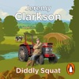

<b>Brought to you by Penguin.</b>  Welcome to Jeremy's farm. It's an idyllic spot, offering picturesque views across the Cotswolds, bustling hedgerows, woodlands and natural springs. Jeremy always liked the idea being a farmer. But, while he was barrelling around the world having more fun with cars than was entirely reasonable, it seemed obvious that the actual, you know, <i>farming</i> was much better left to someone else  Then one day he decided he would do the farming himself.  After all, how hard could it be?  Well . . .  Faced with suffocating red tape, biblical weather, local objections, a global pandemic and his own frankly staggering ignorance of how to 'do farming', Jeremy soon realises that turning the farm around is going to take more than splashing out on a massive tractor.  Fortunately, there's help at hand from a large and (mostly) willing team, including girlfriend Lisa, Kaleb the Tractor Driver, Cheerful Charlie, Ellen the Shepherd and Gerald, his Head of Security and Dry Stone Waller. Between them they enthusiastically cultivate crops, rear livestock and hens, keep bees, bottle spring water and open a farm shop. But profits remain elusive.  And yet while the farm may be called Diddly Squat for good reason, Jeremy soon begins to understand that it's worth a whole lot more to him than pounds, shillings and pence . . .  <b>Praise for <i>Clarkson's Farm</i>:</b>  <b>'The best thing Clarkson's done . . . it pains me to say this" </b><i>THE GUARDIAN;</i>  <b>'Shockingly hopeful' </b><i>THE INDEPENDENT</i>;  <b>'</b><b>Even the most committed Clarkson haters will find him likeable here' </b><i>THE TELEGRAPH;</i>  <b>'Quite lovely' </b><i>THE TIMES</i>  © Jeremy Clarkson 2021 (P) Penguin Audio 2021

[View on Apple](https://books.apple.com/gb/audiobook/diddly-squat/id1591395918)

## The 7 Habits of Highly Effective People (Unabridged)

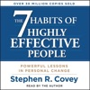

<b>*<i>New York Times</i> bestseller—over 40 million copies sold</b>*  <b>*The #1 Most Influential Business Book of the Twentieth Century*</b>  <b>One of the most inspiring and impactful books ever written, <i>The 7 Habits of Highly Effective People </i>has captivated readers for nearly three decades. It has transformed the lives of presidents and CEOs, educators and parents—millions of people of all ages and occupations. Now, this 30th anniversary edition of the timeless classic commemorates the wisdom of the 7 Habits with modern additions from Sean Covey. </b>  The 7 Habits have become famous and are integrated into everyday thinking by millions and millions of people. Why? Because they work!  With Sean Covey’s added takeaways on how the habits can be used in our modern age, the wisdom of the 7 Habits will be refreshed for a new generation of leaders.  They include:  Habit 1: Be Proactive  Habit 2: Begin with the End in Mind  Habit 3: Put First Things First  Habit 4: Think Win/Win  Habit 5: Seek First to Understand, Then to Be Understood  Habit 6: Synergize  Habit 7: Sharpen the Saw  This beloved classic presents a principle-centered approach for solving both personal and professional problems. With penetrating insights and practical anecdotes, Stephen R. Covey reveals a step-by-step pathway for living with fairness, integrity, honesty, and human dignity—principles that give us the security to adapt to change and the wisdom and power to take advantage of the opportunities that change creates.

[View on Apple](https://books.apple.com/gb/audiobook/the-7-habits-of-highly-effective-people-unabridged/id1445770287)

## The Thursday Murder Club

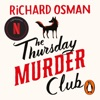

<b>Brought to you by Penguin. </b>  <b>THE FIRST NOVEL IN THE RECORD-BREAKING, MILLION-COPY BESTSELLING THURSDAY MURDER CLUB SERIES AND SOON TO BE A MAJOR NETFLIX MOVIE RELEASE!</b>  <b>Featuring an exclusive conversation between Richard Osman and Marian Keyes at the end of the audiobook. </b>  In a peaceful retirement village, four unlikely friends meet up once a week to investigate unsolved murders.  But when a brutal killing takes place on their very doorstep, the Thursday Murder Club find themselves in the middle of their first live case.  Elizabeth, Joyce, Ibrahim and Ron might be pushing eighty but they still have a few tricks up their sleeves.  <b>Can our unorthodox but brilliant gang catch the killer before it's too late?</b>  <i>The Times </i>Crime Book of the Month <i>Guardian </i>Best Crime and Thrillers  <b>'Smart, compassionate, warm, moving and so VERY funny' </b>Marian Keyes <b>'So smart and funny. Deplorably good' </b>Ian Rankin <b>'Thrilling, moving, laugh-out-loud funny' </b>Mark Billingham  Richard Osman, <i>Sunday Times</i> bestseller, March 2024 <i>The Bullet that Missed </i>broke the record for the fastest-selling adult fiction hardback ever, September 2022  © Richard Osman 2020 (P) Penguin Audio 2020

[View on Apple](https://books.apple.com/gb/audiobook/the-thursday-murder-club/id1527736133)

## We Did Ok, Kid (Unabridged)

<i><b>Narrated by Kenneth Branagh, with poetry readings from Sir Anthony Hopkins.</b></i>  <b>Academy Award-winning actor Sir Anthony Hopkins delves into his illustrious film and theatre career, difficult childhood and path to sobriety in his honest, moving and long-awaited memoir.</b>  Born and raised in Port Talbot – a small Welsh steelworks town – amid war and depression, Sir Anthony Hopkins grew up around men who were tough, to say the least, and eschewed all forms of emotional vulnerability in favor of alcoholism and brutality. A struggling student in school, he was deemed by his peers, his parents and other adults as a failure with no future ahead of him. But, on a fateful Saturday night, the disregarded Welsh boy watched the 1948 adaptation of <i>Hamlet</i>, sparking a passion for acting that would lead him on a path that no one could have predicted.  With candour and a voice that is both arresting and vulnerable, Sir Anthony recounts his various career milestones and provides a once-in-a-lifetime look into the brilliance behind some of his most iconic roles. His performance as Iago gets him admitted into the prestigious Royal Academy of Dramatic Art and places him under the wing of Laurence Olivier. He meets Richard Burton by chance as a young boy in his art teacher’s apartment, and later, backstage before a performance of <i>Equus</i>&#xa0;as an established actor meeting his hero. His iconic portrayal of Hannibal Lecter was informed by the creepy performance of Bela Lugosi in&#xa0;<i>Dracula&#xa0;</i>and the razor-sharp precision of his acting teacher. He pulls raw emotion from the stoicism of his father and grandfather for an unforgettable performance in&#xa0;<i>King Lear</i>.  Sir Anthony&#xa0;also takes a deeply honest look at the low points in his personal life. His addiction cost him his first marriage, his relationship with his only child, and nearly his life – the latter ultimately propelling him toward sobriety, a commitment he has maintained for nearly half a century. He constantly battles against the desire to move through life alone and avoid connection for fear of getting hurt – much like the men in his family – and as the years go by, he deals with questions of mortality, getting ready to discover what his father called The Big Secret.  <i>We Did OK, Kid</i> is a raw and passionate memoir from a complex, iconic man who has inspired audiences with remarkable performances for over sixty years.

[View on Apple](https://books.apple.com/gb/audiobook/we-did-ok-kid-unabridged/id1799755650)

## The Long Call

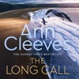

<b>This audiobook is a brand new edition, recorded by Ben Aldridge. </b> <b><i>The Long Call</i> is the</b><b> No.1 bestselling</b><b> first novel in the Two Rivers </b><b>series </b><b>from <i>Sunday Times</i> bestseller a</b><b>nd creator of Vera and Shetland, </b><b>Ann Cleeves.</b>  In North Devon, where the rivers Taw and Torridge converge and run into the sea, Detective Matthew Venn stands outside the church as his father's funeral takes place. The day Matthew turned his back on the strict evangelical community in which he grew up, he lost his family too.  Now he's back, not just to mourn his father at a distance, but to take charge of his first major case in the Two Rivers region; a complex place not quite as idyllic as tourists suppose.  A body has been found on the beach near to Matthew's new home: a man with the tattoo of an albatross on his neck, stabbed to death.  Finding the killer is Venn’s only focus, and his team’s investigation will take him straight back into the community he left behind, and the deadly secrets that lurk there.

[View on Apple](https://books.apple.com/gb/audiobook/the-long-call/id1561737064)

## Stars and Swipes

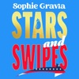

<b>A glamorous, laugh-out-loud romantic comedy packed with friendship, flirtation, and scandal, from the Queen of Holiday Reads, Sophie Gravia.</b> <b></b> <b><i>The Dicktionary Club girls are back...and seeking American members. </i></b>  Ella, Katy, and Zola are beside themselves when they are offered the opportunity to launch their now infamous dating website, The Dicktionary Club, stateside. The headlines covering their technological (mis)adventures have caught the eye of a Manhattan entrepreneur - and he wants the three besties to collaborate with him on a similar app for the American market.  With their love lives imploding back home, the girls are ready to escape the Glasgow dating scene and live their <i>Gossip Girl</i> fantasies in New York, but their romantic problems are not so easy to run away from.  A bigger city, bigger apartments, a bigger dating pool - but it turns out, not everything is bigger in America... Secrets spill. Lines blur. And in a city built on ambition and attraction, someone is always watching.  <b>Because in New York, love is a game - and EVERYONE is playing.</b>

[View on Apple](https://books.apple.com/gb/audiobook/stars-and-swipes/id1849804074)

## Troy

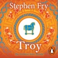

<b>Brought to you by Penguin.  'An inimitable retelling of the siege of Troy . . . Fry's narrative, artfully humorous and rich in detail, breathes life and contemporary relevance into these ancient tales'</b> -- Observer  THE #1 BESTSELLER.  AN EPIC BATTLE THAT LASTED TEN YEARS. A LEGENDARY STORY THAT HAS SURVIVED THOUSANDS.  'Troy. The most marvellous kingdom in all the world. The Jewel of the Aegean. Glittering Ilion, the city that rose and fell not once but twice . . .'  When Helen, the beautiful Greek queen, is kidnapped by the Trojan prince Paris, the most legendary war of all time begins.  Listen in awe as a thousand ships are launched against the great city of Troy.  Feel the fury of the battleground as the Trojans stand resolutely against Greek might for an entire decade.  And witness the epic climax - the wooden horse, delivered to the city of Troy in a masterclass of deception by the Greeks . . .  In Stephen Fry's exceptional retelling of our greatest story, TROY will transport you to the depths of ancient Greece and beyond.  <i>If you're enthralled by the magic of Greek mythology you'll love the final instalment to Fry’s retellings, ODYSSEY, a legendary voyage of peril, temptation, loss and epic adventure.</i>  'A fun romp through the world's greatest story. Fry's knowledge of the world - ancient and modern - bursts through' Daily Telegraph  'Hugely successful, graceful' The Times  'Fluent, crisp, nuanced, begins with a bang' The Times Literary Supplement  © Stephen Fry 2020 (P) Penguin Audio 2020

[View on Apple](https://books.apple.com/gb/audiobook/troy/id1532400419)

## The Iliad

<b>Brought to you by Penguin.</b>  This Penguin Classic is performed by Steve John Shepherd, whose theatre credits include <i>Much Ado About Nothing</i> at the Globe, <i>The Good Canary</i> directed by John Malkovich<i>, Bomber's Moon</i> and <i>Piaf</i>. His TV and film credits range from the iconic <i>This Life</i> to<i> Silent Witness </i>and <i>Eastenders. </i>This definitive recording includes an introduction by E V Rieu.   One of the foremost achievements in Western literature, Homer's Iliad tells the story of the darkest episode in the Trojan War. At its centre is Achilles, the greatest warrior-champion of the Greeks, and his refusal to fight after being humiliated by his leader Agamemnon. But when the Trojan Hector kills Achilles' close friend Patroclus, he storms back into battle to take revenge - although knowing this will ensure his own early death. Interwoven with this tragic sequence of events are powerfully moving descriptions of the ebb and flow of battle, of the domestic world inside Troy's besieged city of Ilium, and of the conflicts between the Gods on Olympus as they argue over the fate of mortals.

[View on Apple](https://books.apple.com/gb/audiobook/the-iliad/id1508125489)

## Father Material

<b>First comes love, then comes marriage, then comes . . . what was that, exactly?</b>  Luc and Oliver have been through it all: fake dating to save Luc's career, I–guess–this–is–actually–for–real dating when all of that blew up spectacularly, (briefly) breaking up over irreconcilable differences, (definitively) getting back together over perfectly reconcilable everything else, (almost) getting married, (finally) moving in together, and ultimately celebrating years of perfect domestic bliss.  But as all their very grown–up–now friends begin reaching new life milestones, advancing careers and having babies, Luc and Oliver decide it's time to open their hearts and lives to something new: a tiny, squirming, adorable bundle of furry joy named Spud.  And maybe now that hearts–and–lives are already open, there's room for someone else. Something more. Something that may require them to find in themselves a little father material.

[View on Apple](https://books.apple.com/gb/audiobook/father-material/id1885836226)

## Harry Potter and the Order of the Phoenix

Stephen Fry brings the richness of these magical stories to life in the original British recordings.  <i>'You are sharing the Dark Lord's thoughts and emotions. The Headmaster thinks it inadvisable for this to continue. He wishes me to teach you how to close your mind to the Dark Lord.'</i>  Treat your ears to a performance so rich and captivating you'll imagine yourself in the halls of Hogwarts. Wherever you listen, the unmistakable voice of Stephen Fry is guaranteed to guide you ever more deeply into this magical story and transport you to the heart of the adventure.  Dark times have come to Hogwarts. After the Dementors' attack on his cousin Dudley, Harry Potter knows that Voldemort will stop at nothing to find him. There are many who deny the Dark Lord's return, but Harry is not alone: a secret order gathers at Grimmauld Place to fight against the Dark forces. Harry must allow Professor Snape to teach him how to protect himself from Voldemort's savage assaults on his mind. But they are growing stronger by the day and Harry is running out of time...  Theme music composed by James Hannigan  Having become classics of our time, the Harry Potter stories never fail to bring comfort and escapism. With their message of hope, belonging and the enduring power of truth and love, the story of the Boy Who Lived continues to delight generations of new listeners.

[View on Apple](https://books.apple.com/gb/audiobook/harry-potter-and-the-order-of-the-phoenix/id1442755842)

## The Mistake (Unabridged)

He's a player in more ways than one....   College junior John Logan can get any girl he wants. For this hockey star, life is a parade of parties and hookups, but behind his killer grins and easygoing charm, he hides growing despair about the dead-end road he'll be forced to walk after graduation. A sexy encounter with freshman Grace Ivers is just the distraction he needs, but when a thoughtless mistake pushes her away, Logan plans to spend his final year proving to her that he's worth a second chance. Now he's going to need to up his game....   After a less than stellar freshman year, Grace is back at Briar University, older, wiser, and so over the arrogant hockey player she nearly handed her V-card to. She's not a charity case, and she's not the quiet butterfly she was when they first hooked up. If Logan expects her to roll over and beg like all his other puck bunnies, he can think again. He wants her back? He'll have to work for it. This time around, she'll be the one in the driver's seat, and she plans on driving him wild.

[View on Apple](https://books.apple.com/gb/audiobook/the-mistake-unabridged/id1048791225)

## The Odyssey (Unabridged)

<b>The great epic of Western literature, translated by the acclaimed classicist Robert Fagles  Soon to be a major motion picture directed by Christopher Nolan </b> Robert Fagles, winner of the PEN/Ralph Manheim Medal for Translation and a 1996 Academy Award in Literature from the American Academy of Arts and Letters, presents us with Homer's best-loved and most accessible poem in a stunning modern-verse translation. "Sing to me of the man, Muse, the man of twists and turns driven time and again off course, once he had plundered the hallowed heights of Troy." So begins Robert Fagles' magnificent translation of the <i>Odyssey</i>, which Jasper Griffin in the <i>New York Times Book Review</i> hails as "a distinguished achievement."  If the <i>Iliad</i> is the world's greatest war epic, the <i>Odyssey</i> is literature's grandest evocation of an everyman's journey through life. Odysseus' reliance on his wit and wiliness for survival in his encounters with divine and natural forces during his ten-year voyage home to Ithaca after the Trojan War is at once a timeless human story and an individual test of moral endurance.  In the myths and legends retold here, Fagles has captured the energy and poetry of Homer's original in a bold, contemporary idiom, and given us an <i>Odyssey</i> to read aloud, to savor, and to treasure for its sheer lyrical mastery. This is an <i>Odyssey</i> to delight both the classicist and the general listener, to captivate a new generation of Homer's students.

[View on Apple](https://books.apple.com/gb/audiobook/the-odyssey-unabridged/id1418923626)

## The Fellowship of the Ring

This brand-new unabridged audio book of The Fellowship of the Ring, the first part of J. R. R. Tolkien’s epic adventure, The Lord of the Rings, is read by the BAFTA award-winning actor, director and author, Andy Serkis.  In a sleepy village in the Shire, a young hobbit is entrusted with an immense task. He must make a perilous journey across Middle-earth to the Cracks of Doom, there to destroy the Ruling Ring of Power – the only thing that prevents the Dark Lord Sauron’s evil dominion.  Thus begins J. R. R. Tolkien’s classic tale of adventure, which continues in The Two Towers and The Return of the King.  Reviews  ‘The English-speaking world is divided into those who have read The Lord of the Rings and The Hobbit and those who are going to read them.’ Sunday Times  ‘A story magnificently told, with every kind of colour and movement and greatness.’ New Statesman  ‘Masterpiece? Oh yes, I’ve no doubt about that.’ Evening Standard  ‘Among the greatest works of imaginative fiction of the twentieth century.’ Sunday Telegraph  ‘Here are beauties which pierce like swords or burn like cold iron.’ C.S. Lewis  About the author  J.R.R.Tolkien (1892-1973) was a distinguished academic, though he is best known for writing The Hobbit, The Lord of the Rings, The Silmarillion and The Children of Hurin, plus other stories and essays. His books have been translated into over 50 languages and have sold many millions of copies worldwide.

[View on Apple](https://books.apple.com/gb/audiobook/the-fellowship-of-the-ring/id1583425444)

## Five Fall Into Adventure

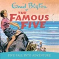

<b>Julian, Dick, Anne, George and Timmy the dog find excitement and  adventure wherever they go in Enid Blyton's most popular series.</b>  In  book nine, the Famous Five are really worried - George and her devoted  Timmy have disappeared. Not only that, somebody has broken into Kirrin  Cottage. Could there be a connection?   Will the Five find George and Timmy and bring them home safe?  (P) Hodder Children's Books 2013

[View on Apple](https://books.apple.com/gb/audiobook/five-fall-into-adventure/id1439881287)

## Red Dwarf: Series V to VIII

<b>The TV soundtracks of the iconic cult sci-fi comedy series</b>  The crew of the deep space mining ship, Red Dwarf, return!  A legion of hilarious new villains and heroes are here to hinder, help and generally create havoc for the beleaguered crew trying to get home. Re-live their iconic moments with the laugh-out-loud TV soundtracks of one of the greatest TV comedies of all time. Join Lister (<b>Craig Charles</b>), Rimmer (<b>Chris Barrie</b>), Kryten (<b>Robert Llewellyn</b>), Cat (<b>Danny John Jules</b>), Holly (<b>Norman Lovett/Hattie Hayridge</b>) and a cast of space misfits on their long journey home. Parallel universes, time travel, false memories and virtual reality all conspire to confuse the crew and delight listeners time and again in this ground-breaking classic TV show soundtrack.  The hilarious TV classic from Rob Grant and Doug Naylor is a must-listen for any fans of sci-fi, comedy and everything in-between. This audio-only collection of the original TV soundtracks provides the perfect opportunity for fans to relive the show's finest moments while on the go.  First airing in 1988, <i>Red Dwarf</i> was the longest-running and highest-ranked comedy on BBC 2 ever, amassing an audience of over 8 million. It won an International Emmy Award in the 'Popular Arts' category and 'Best BBC Comedy Series' at the British Comedy Awards as well as numerous other awards. Since airing, there have been 12 series of the show and a 2020 TV film - <i>The Promised Land</i>.  Series I-IV are also available to download now.  <i>Cast and credits</i> Written by Rob Grant and Doug Naylor (Series 5-6); Doug Naylor, Kim Fuller, Paul Alexander, Robert Llewellyn and James Hendrie (Series 7); Doug Naylor and Paul Alexander (Series 8) Directed by Juliet May, Rob Grant and Doug Naylor (Series 5), Andy de Emmony (Series 6), Ed Bye (Series 7-8)  Arnold Rimmer - Chris Barrie Dave Lister - Craig Charles Cat - Danny John Jules Kryten - Robert Llewellyn Holly - Norman Lovett (Series 5-8), Hattie Hayridge (Series 7-8)  First Broadcast BBC2, 20 February – 26 March 1992 (Series 5), 7 October – 11 November 1993 (Series 6), 17 January – 7 March 1997 (Series 7), 18 February – 5 April 1999 (Series 8)  ©2025 BBC Studios Distribution Ltd (P)2025 BBC Studios Distribution Ltd

[View on Apple](https://books.apple.com/gb/audiobook/red-dwarf-series-v-to-viii/id1829405869)

## Dissection of a Murder

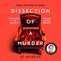

'So gripping, so clever, so good. This brilliant book had me hooked from the beginning' – <b>Alice Feeney</b>, author of <i>Beautiful Ugly</i>  <b>Read by Joanne Froggatt, best known for her roles in <i>Downton Abbey</i> and <i>Liar</i>.</b>  <b>A BBC RADIO 2 BOOKCLUB PICK</b>  <b>Breathlessly compulsive courtroom drama with expertly-crafted twists that you won't see coming, <i>Dissection of a Murder</i> is the razor-sharp debut novel from Jo Murray.</b>  <b>A dead judge. A silent defendant. And a courtroom full of liars.</b>  When Leila Reynolds is handed her first murder case, she’s shocked at how high-profile it is: the murder of a well-respected, well-known judge. This shouldn’t be the kind of case she’s leading; it’s way beyond her expertise. But the defendant, Jack Millman, is clear. He wants her, and only her.  To make things worse, he’s refusing to talk. How is she supposed to prove herself on what appears to be an unwinnable case?  Losing is not an option. She must find the most persuasive argument. Trials aren’t won by convincing judges or fellow barristers – they’re all about convincing a jury.  Suddenly, Leila finds herself fighting not only to keep Jack out of prison, but also to keep her own secrets buried.  It’s true what they say – there are two sides to every story.  Guilty or not guilty?  <b>You decide . . .</b>  <b>PRAISE FOR <i>DISSECTION OF A MURDER</i>:</b>  <b>'Absolutely outstanding' – TM Logan, author of<i> The Mother</i>  'What a terrific read!' – Sarah Vaughan, author of <i>Anatomy of a Scandal</i>  'Utterly compelling' – John Marrs, author of <i>The Family Experiment</i></b>

[View on Apple](https://books.apple.com/gb/audiobook/dissection-of-a-murder/id1815227176)

## The Goal (Unabridged)

<i>New York Times</i> best seller Elle Kennedy brings you a sexy new Off-Campus novel that can be enjoyed as a stand-alone.   <b>She's good at achieving her goals....</b>   College senior Sabrina James has her whole future planned out: graduate from college, kick butt in law school, and land a high-paying job at a cutthroat firm. Her path to escaping her shameful past certainly doesn't include a gorgeous hockey player who believes in love at first sight. One night of sizzling heat and surprising tenderness is all she's willing to give John Tucker, but sometimes one night is all it takes for your entire life to change.   <b>But the game just got a whole lot more complicated.</b>   Tucker believes being a team player is as important as being the star. On the ice he's fine staying out of the spotlight, but when it comes to becoming a daddy at the age of 22, he refuses to be a bench warmer. It doesn't hurt that the soon-to-be mother of his child is beautiful, whip-smart, and keeps him on his toes. The problem is Sabrina's heart is locked up tight, and the fiery brunette is too stubborn to accept his help. If he wants a life with the woman of his dreams, he'll have to convince her that some goals can be made only with an assist.   Cover design copyright Morten Gorm / Flamingo Books.

[View on Apple](https://books.apple.com/gb/audiobook/the-goal-unabridged/id1212531548)

## Five On A Hike Together

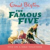

<b>Julian, Dick, Anne, George and Timmy the dog find excitement and  adventure wherever they go in Enid Blyton's most popular series.</b>  In  book ten, Dick is woken by a light flashing through his window. Is  someone trying to send him a coded message? When the Famous Five hear of  an escaped convict in the area, they are on red alert.  The police won't help, so the Five have no choice - yet again, they'll be solving this mystery by themselves...  (P) Hodder Children's Books 2013

[View on Apple](https://books.apple.com/gb/audiobook/five-on-a-hike-together/id1439886760)

## The Names

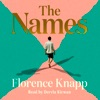

<b> A once-in-a-generation debut from a major new talent, <i>The Names </i>is the story of three names, three versions of a life, and the infinite possibilities that a single decision can spark.      </b> <b></b><b>THE NUMBER ONE <i>SUNDAY TIMES</i> BESTSELLER</b> <b></b><b>WINNER OF THE BRITISH BOOK AWARDS DEBUT NOVEL OF THE YEAR 2026</b> <b></b> <b>'I've just been blown away by the best debut novel in years . . . A genius idea for a book'</b> <b><i>Sunday Times</i></b> <b></b> <b>'Wildly original and emotionally profound'</b> <b><i>Observer</i></b> <b></b> <b>'An unadulterated success: moving, evocative and utterly convincing'</b> <b><i>The Times</i></b> <b></b> <b></b><b>OVER HALF A MILLION COPIES SOLD</b>  It is 1987, and in the wake of a great storm, Cora sets out with her young daughter to register the birth of her son. Her husband expects her to follow tradition and call the baby after him - but is it right for her child to inherit his name from generations of domineering men? Her choice will shape the course of their lives.  Seven years later, her son is Bear, a name chosen by his sister, hoping he will grow up to be brave and big-hearted. Or he is Julian, the name his mother set her heart on, keen for him to become his own person. Or he is Gordon, named after his father and raised in his cruel image - but is there still a chance to break the mould?  Powerfully moving and full of hope, this is the story of three names, three versions of a life, and the infinite possibilities that a single decision can spark. <b></b> <b>A BOOK OF THE YEAR IN THE <i>SUNDAY TIMES</i>, <i>GUARDIAN</i>, <i>INDEPENDENT</i>, <i>IRISH MAIL ON SUNDAY</i>, <i>COSMOPOLITAN</i> AND MANY MORE | A <i>READ WITH JENNA</i> AND <i>HAPPY PLACE</i> BOOKCLUB PICK</b> <b></b> <b>'The viral literary hit'</b> <b><i>Grazia</i></b> <b></b> <b>'A beautiful, heartwrenching, utterly original novel'</b> <b>Miranda Cowley Heller</b> <b></b> <b>'One of those rare books that makes you glad to be alive'</b> <b><i>Stylist</i></b> <b></b> <b>'Magnificent . . . Read it. It's very special'</b> <b>Chris Whitaker</b> <b></b> <b>'Beautifully written, and wise and tender . . . An utter original'</b> <b>Jojo Moyes</b> <b></b> <b>'Exceptional . . . will stay with me for a very long time'</b> <b>Anita Rani, Woman's Hour</b> <b></b> <b>'Heart-shattering . . . a sucker punch of a novel'</b> <b>Pandora Sykes</b> <b></b> <b>'A modern classic'</b> <b>Jenna Bush Hager</b> <b></b> <b>'Heartbreaking and yet brimful of hope . . . Exceptional'</b> <b><i>Mail on Sunday</i></b> <b></b> <b>'Brilliant . . . one of those books that will make you irritable with anyone who interrupts you, but which you'll finish wanting to press into the hands of a friend'</b> <b><i>The Times</i></b> <b></b> <b>'Astonishing, unique and incredibly moving, <i>The Names </i>is a beautiful novel about the courage of a mother in the moment she names her child . . . I know it will stay with me for a long time'</b> <b>Jeanine Cummins</b>

[View on Apple](https://books.apple.com/gb/audiobook/the-names/id1712125698)

## The Seriously Epic Holiday of Lottie Brooks

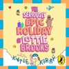

<b>Brought to you by Puffin.  From hilarious MEGA bestselling author, Katie Kirby, comes a brand-new story from the phenomenal Lottie Brooks series!</b>  Pack your bags, and put on your helmets, for Lottie’s latest hilarious diary! She’s off on a ONCE IN A LIFETIME skiing holiday - what could possibly go wrong?!  Amber has seen the light and returned to the QUEENS OF EIGHT GREEN. PHEW! And now she’s invited Lottie on her family skiing holiday – RESULT!  One tiny problem . . . Lottie’s never been skiing before and she doesn’t know her piste from her poles! How hard can it be though?  Join Lottie as she learns how to ski with old and new friends, tries fondue for the first time and discovers what the banana of destiny has in store for her.  Will this be the best holiday ever or is it all downhill from here?  © Katie Kirby 2026 (P) Penguin Audio 2026

[View on Apple](https://books.apple.com/gb/audiobook/the-seriously-epic-holiday-of-lottie-brooks/id1833248500)

## A Brief History Of Time

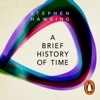

<b>Brought to you by Penguin. </b><b> Was there a beginning of time? Could time run backwards? Is the universe infinite or does it have boundaries?</b>  <b>These are just some of the questions considered in the internationally acclaimed masterpiece by the world renowned physicist - generally considered to have been one of the world's greatest thinkers.</b>  It begins by reviewing the great theories of the cosmos from Newton to Einstein, before delving into the secrets which still lie at the heart of space and time, from the Big Bang to black holes, via spiral galaxies and strong theory. To this day <i>A Brief History of Time </i>remains a staple of the scientific canon, and its succinct and clear language continues to introduce millions to the universe and its wonders.  'This book marries a child's wonder to a genius's intellect. We journey into Hawking's universe while marvelling at his mind.' The Sunday Times   "Lively and provocative . . . Mr. Hawking clearly possesses a natural teacher's gifts--easy, good-natured humor and an ability to illustrate highly complex propositions with analogies plucked from daily life."--The New York Times  © Stephen Hawking 2016 (P) Penguin Audio 2016

[View on Apple](https://books.apple.com/gb/audiobook/a-brief-history-of-time/id1442033877)

## The Intruder

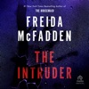

<b>There's someone at your front door—should you let them in? Find out in a riveting new thriller from global sensation and #1</b>&#xa0;<i><b>New York Times</b></i>&#xa0;<b>bestselling author of</b>&#xa0;<i><b>The Housemaid</b></i><b>, Freida McFadden!</b>  Who knows what the storm will blow in…  Casey's cabin in the wilderness is not built for a hurricane.&#xa0;Her roof shakes, the lights flicker, and the tree outside her front door sways ominously in the wind.&#xa0;But she's a lot more worried about the girl she discovers lurking outside her kitchen window.  She's young. She's alone. And she's covered in blood.  The girl won't explain where she came from, or loosen her grip on the knife in her right hand.&#xa0;And when Casey makes a disturbing discovery in the middle of the night, things take a turn for the worse.  The girl has a dark secret. One she'll kill to keep.&#xa0;And if Casey gets too close to the truth, she may not live to see the morning.  <b>In this taut, deadly tale of survival and desperation, #1</b>&#xa0;<i><b>New York Times</b></i>&#xa0;<b>bestselling author Freida McFadden explores how far one girl will go to save herself.</b>

[View on Apple](https://books.apple.com/gb/audiobook/the-intruder/id1817056833)

## Paddy Mayne : Lt Col Blair 'Paddy' Mayne, 1 SAS Regiment

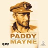

‘Paddy’ Mayne was one of the most outstanding special forces leaders of the Second World War. Hamish Ross’s authoritative study follows Mayne from solicitor and a rugby international to troop commander in the Commandos and then the SAS, whose leader he later became and whose annals he graced, winning the DSO and three bars, the Croix de Guerre and the Légion d’Honneur.  Mayne’s achievements attracted attention, and after his early death legends emerged, based largely on anecdote and assertion. Hamish Ross’s closely researched biography challenges much of the received version, using contemporary sources, the official war diaries, the chronicle of 1 SAS, Mayne’s papers and diaries, and a number of extended interviews with key contemporaries. It has the support of the Mayne family and the SAS Regimental Association.  In Ross’s analysis Mayne is a dynamic, yet principled and thoughtful man, committed to the unit’s original concepts; not flawless, but whose leadership qualities and tactical brilliance in the field secured the reputation of the SAS.

[View on Apple](https://books.apple.com/gb/audiobook/paddy-mayne-lt-col-blair-paddy-mayne-1-sas-regiment/id1683524432)

## Think and Grow Rich (1937 Edition): The Original 1937 Unedited Edition (Unabridged)

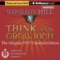

The Napoleon Hill Foundation received many requests from people wanting the original, unedited, 1937 copy of <i>Think and Grow Rich</i>. To satisfy those customers, the Foundation reproduced Napoleon Hill’s personal copy of the first edition, printed in March of 1937. The book has the notation, “not to be loaned”, and signed: Annie Lou Hill (the wife of Dr. Hill). This personal copy of Dr. Hill’s was given to me by Dr. Charles W. Johnson, Chairman of the Napoleon Hill Foundation and a nephew of Napoleon Hill. It was Napoleon Hill who sent Dr. Johnson to medical school, and today he is a practicing cardiologist. Charlie refers to Napoleon Hill as “Uncle Nap” and will often make the statement, "Uncle Nap would be proud of the Foundation today." The original 1937 manuscript was written and edited with the assistance of Napoleon’s wife. In later years, the existing document was again edited by Dr. Hill. For example, the Foundation owns a 1958 edition that Hill edited personally. This did not lessen the book’s value in Hill’s judgment. Hill made the editing remarks in his own handwriting and the resulting 1960 edited edition has sold over 100 million copies making it the most read self-help book of all time.    <i>Think and Grow Rich</i> sells more copies today than before Dr. Hill died in 1970. Now, a new and authoritative recording of this original, unedited, one-of-a-kind work, authorized by the Napoleon Hill Foundation is available. By purchasing this audio edition, you will be supporting the nonprofit Napoleon Hill Foundation. The entire philosophy of Napoleon Hill is based on the Golden Rule. The Foundation deeply appreciates the support of those of you who only purchase Napoleon Hill authorized books. You can identify these materials by the Foundation Logo and by looking inside for Napoleon Hill copyright.

[View on Apple](https://books.apple.com/gb/audiobook/think-and-grow-rich-1937-edition-the-original/id933455018)

## Clive Cussler’s Cold Fire

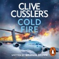

<b>DIVE INTO THE ELECTRIFYING ADVENTURE OF THE NUMA CREW FROM THE "GRAND MASTER OF ADVENTURE" CLIVE CUSSLER, THE LATEST IN THE #1 NEW YORK TIMES BESTSELLING SERIES  A VANISHED NATO WEAPON</b>  <b>RIVAL POWERS CLOSING IN</b>  <b>ONE CHANCE TO STOP WORLD WAR THREE</b>  When a NATO super-weapon is successfully tested at the North Pole, the aircraft carrying it suddenly vanishes off the radar, the crew are found murdered at their stations, and the weapon – capable of triggering global catastrophe – disappears into the Arctic mists.  The only American asset in the area is a small research vessel operated by NUMA’s Kurt Austin and Joe Zavala, who are pulled into a race against time to lead the search.  As rival Russian and Chinese powers close in to find the missing weapon, international rules of engagement are perilously suspended. But as Kurt and his team race to reach the wreck first, a darker mystery emerges: the world’s great powers are all being carefully manipulated by one vengeful man with a deadly plan . . .  <b>Praise for Clive Cussler:</b>  'The Adventure King' Sunday Express  'Just about the best in the business' New York Post  'Cussler is hard to beat' Daily Mail  © Graham Brown 2026 (P) Penguin Audio 2026

[View on Apple](https://books.apple.com/gb/audiobook/clive-cusslers-cold-fire/id1883972936)

## Psycho-Cybernetics (Updated and Expanded)

<b>The landmark self-help bestseller that has inspired and enhanced the lives of </b><b>more than 30 million readers.</b>  In this updated edition, with a new introduction and editorial commentary by Matt Furey, president of the Psycho-Cybernetics Foundation, the original 1960 text has been annotated and amplified to make Maxwell Maltz's message even more relevant for the contemporary reader.  Maltz was the first researcher and author to explain how the self-image (a term he popularized) has complete control over an individual's ability to achieve, or fail to achieve, any goal. He developed techniques for improving and managing self-image visualization, mental rehearsal and relaxation which have informed and inspired countless motivational gurus, sports psychologists, and self-help practitioners for more than sixty years.  Rooted in solid science, the classic teachings in <i>Psycho-Cybernetics</i> continue to provide a prescription for thinking and acting that lead to life-enhancing, quantifiable results.

[View on Apple](https://books.apple.com/gb/audiobook/psycho-cybernetics-updated-and-expanded/id1674144949)

## Wild

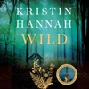

<b>'One of the greatest storytellers of our time' - Delia Owens</b>, author of <i>Where the Crawdads Sing</i>  <b>From the multimillion copy number one bestselling author of <i>The Women, The Nightingale</i> and <i>The Four Winds</i>, <i>Wild</i> is a remarkable story about the resilience of the human spirit, the triumph of hope and the promise of new beginnings.</b>  <i>'Don’t take peace for granted, he’d said to her often. It can shatter like glass'</i>  In the rugged Pacific Northwest of the United States lies the Olympic National Forest – a vast expanse of impenetrable darkness and impossible beauty. From deep within this mysterious woodland, a six-year-old girl appears. Speechless and alone, she offers no clue as to her identity, no hint of her past.  Having retreated to her hometown after a scandal left her career in ruins, child psychiatrist Dr Julia Cates begins working with the extraordinary little girl. Naming her Alice, Julia is determined to free her from a prison of unimaginable fear and isolation, and discover the truth about Alice’s past. The shocking facts of Alice’s life test the limits of Julia’s faith and strength, even as she struggles to make a home for Alice – and find a new one for herself.  <b>Praise for Kristin Hannah:</b>  'Utterly absorbing . . . A triumph' - <b>Taylor Jenkins Reid, </b>bestselling author of <i>Daisy Jones &amp; The Six</i>  'Stuns with sacrifice. Uplifts with heroism' –<b> Bonnie Garmus, </b>bestselling author of <i>Lessons in Chemistry</i>  ‘Moving and unforgettable’ – <b>Christy Lefteri</b>, bestselling author of <i>The Beekeeper of Aleppo</i>  ‘A classic storyteller’ – <b>Matt Haig</b>, bestselling author of <i>The Midnight Library</i>   ****  <b>Here’s what fans love about <i>Wild</i>:</b>  ‘I was moved to tears and devoured this book in a day’  ‘Couldn’t put it down’  ‘Gritty and thought-provoking’

[View on Apple](https://books.apple.com/gb/audiobook/wild/id1819446655)

## The Last Truths We Told

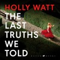

Bloomsbury presents The Last Truths We Told by Holly Watt, read by Amy Noble.

They predicted Ivo would become a tycoon
They predicted Ayda would go on to become a hotshot lawyer
They didn't predict that Lily would be dead

Twenty years ago, nine university friends made a series of predictions about what would happen to each of them after college. Now they've all gathered together for the weekend. Not for a reunion but for a reveal.

Some of them have gone on to staggering success, others to more mundane lives. And one of them is missing.

Before her death Lily seemed agitated. Even scared. In the weeks before her death, she called Maggie, wanting to talk but then refusing to say what was frightening her. Now Maggie is beginning to realise that not everyone at the house this weekend is who they appeared to be.

And those who are lying are prepared to do anything to stop the truth coming out.

An unputdownable page turner about old friends and new betrayals from an award winning thriller writer at the very top of her game, this is unmissable reading group suspense fiction.

[View on Apple](https://books.apple.com/gb/audiobook/the-last-truths-we-told/id1758721199)

## Harry Potter and the Deathly Hallows

Stephen Fry brings the richness of these magical stories to life in the original British recordings.  <i>'Give me Harry Potter,' said Voldemort's voice, 'and none shall be harmed. Give me Harry Potter, and I shall leave the school untouched. Give me Harry Potter, and you will be rewarded.'</i>  Treat your ears to a performance so rich and captivating you'll imagine yourself in the halls of Hogwarts. Wherever you listen, the unmistakable voice of Stephen Fry is guaranteed to guide you ever more deeply into this magical story and transport you to the heart of the adventure.  As he climbs into the sidecar of Hagrid's motorbike and takes to the skies, leaving Privet Drive for the last time, Harry Potter knows that Lord Voldemort and the Death Eaters are not far behind. The protective charm that has kept Harry safe until now is broken, but he cannot keep hiding. The Dark Lord is breathing fear into everything Harry loves and to stop him Harry will have to find and destroy the remaining Horcruxes. The final battle must begin - Harry must stand and face his enemy...  Theme music composed by James Hannigan  Having become classics of our time, the Harry Potter stories never fail to bring comfort and escapism. With their message of hope, belonging and the enduring power of truth and love, the story of the Boy Who Lived continues to delight generations of new listeners.

[View on Apple](https://books.apple.com/gb/audiobook/harry-potter-and-the-deathly-hallows/id1442185926)

## Running on Air

Bloomsbury presents Running on Air: From BBC Headlines to Life-Changing Finish Lines, written and read by Sophie Raworth
*This audiobook features an exclusive conversation between Sophie and fellow ultra-marathon runner, Susie Chan*

'A cracking read' – Jojo Moyes
From the BBC news to the Marathon des Sables, this is an inspiring journey into running from one of the UK's best-known broadcasters.
The marathon bug had bitten. I discovered I loved the training, the discipline and the structure that it brought to my life as well as the realisation that despite being in my early 40s, I was getting faster. My confidence grew too. At a time when I felt unsure of my footing at work, running was starting to make me feel steadier on my feet and in my mind. Could I go faster?

At the age of 40, BBC broadcaster Sophie Raworth assumed she was too old to start running. She had done no exercise for decades. But after seeing a friend do the London Marathon, Sophie decided to give it a go. Collapsing two miles from the finish line, her first attempt was a disaster. But she picked herself up and kept going on a path that would take her to races all over the world, across the Alps and even to the Sahara Desert for the famous 150-mile Marathon des Sables.

Along the way Sophie discovered great friends, unexpected strength, new confidence, and deep resilience that has helped her deal with some of the toughest challenges, both at work and in life.

Running on Air will show you that you can do so much more than you ever believed, just by putting one foot in front of the other.

[View on Apple](https://books.apple.com/gb/audiobook/running-on-air/id1857154841)

## Unbound

A five-thousand-year-old woman who has outlived empires and a doctor who’s spent his life fighting death collide in this novella from New York Times bestselling author Ali Hazelwood.  Lilit of Nineveh has spent millennia in control. As a powerful revenant, she enforces one rule above all: protect mortals. Disciplined and focused, she has never made the same mistake twice, and she has learned that attachments can only lead to ruin.  Enter Roman Martin. An overworked and relentlessly kind ER physician, he is the one mortal Lilit cannot quit. Any relationship between them is against everything Lilit has fought for. Still, she keeps coming back to him.  Until someone starts hunting Lilit, and Roman is caught in the crossfire. When everything comes crashing down, Lilit must choose between the world she has sworn to protect and the man she was never meant to love.

[View on Apple](https://books.apple.com/gb/audiobook/unbound/id1895973267)

## Mr Wilman’s Motoring Adventure

<b>Brought to you by Penguin.</b>  <i>Top Gear</i> turned gloomy Sunday nights into celebratory Friday nights. It made household names of presenters Clarkson, Hammond and May, their unique chemistry and buddy movie antics proving irresistible to a vast global audience. With these three at the helm, Top Gear earned a place in the Guinness Book of Records as the most popular factual TV show on the planet.  Then, a short while later, it was all gone.  How did a thoroughly sensible little consumer advice programme on cars turn into a global phenomenon in the first place, though? How did it all go wrong? And how did they rise from the ashes as The Grand Tour, and go on to scale even greater heights?  One man has all the answers.  There from the beginning, <i>Top Gear </i>and <i>The Grand Tour</i> co-creator, and Jeremy’s oldest friend, Andy Wilman, opens the bonnet on over twenty years of motoring mayhem. In <i>Mr Wilman’s Motoring Adventure</i>, the mysterious man in the shadows tells the inside story of your favourite TV shows for the first time.  Irreverent, joyful and as laugh-out-loud funny as the shows themselves, it’s the best book about Top Gear and The Grand Tour . . . in the world.  © Andy Wilman 2025 (P) Penguin Audio 2025

[View on Apple](https://books.apple.com/gb/audiobook/mr-wilmans-motoring-adventure/id1822795605)

## Katabasis

Prepare for one hell of a journey…  'A big, bold fantasy romp' GUARDIAN  'R.F. Kuang is making magic' ELLE  '[A] truly original and spellbinding hero's-journey story' VOGUE  'I devoured it' RED  One of the BBC's 25 best books of 2025  Katabasis, noun, Ancient Greek. The story of a hero's descent to the underworld.  Grad student Alice Law has only ever had one goal: to become the brightest mind in the field of analytic magick.  But the only person who can make her dream come true is dead and – inconveniently – in Hell. And Alice, along with her biggest rival Peter Murdoch, is going after him.  But Hell is not as the philosophers claim, its rules are upside-down, and if she’s going to get out of there alive, she and Peter will have to work together.  That’s if they can agree on anything.  Will they triumph, or kill each other trying?  2025’s most unexpected love story is going to be hell in the new No.1 Sunday Times bestselling novel by R.F. Kuang.  'Literary super-stardom doesn't seem too far out of her reach' THE HERALD  ‘Mind-bending fantasy’ GRAZIA  Reviews  ‘It’s Dante’s Inferno meets The Secret History and it’s at the top of our read-next pile’ Elle  'A novel to savour … I envy those who get to read it for the first time' Rebecca Ross  'A witty, gory, harrowing ride' Leigh Bardugo  'A formidable, timeless work, destined to be a modern classic' Olivie Blake  ‘A sprawling, erudite tale of magic … teeming with intelligence, ideas and humour’ Marie Claire  'The unrolling of a daring concept' Daily Mail  'An arresting and deeply affecting novel' SFX  'A rich novel of romance, history and magic’ iPaper  'An immersive, worldbuilding adventure … I devoured it' Red  'Profound … Linger[s] on the mind' New Statesmen  'Bitingly funny dark academia' Arts Hub  KATABASIS IS A RADIO 2 BOOK CLUB SUMMER SELECTION, ELLE'S BOOK OF THE MONTH, AND INCLUDED IN THE GUARDIAN'S ROUND-UP OF MOST ANTICIPATED 2025 FICTION.  BABEL WAS A BRITISH BOOK OF THE YEAR, BLACKWELL’S BOOK OF THE YEAR, A WATERSTONES BOOK OF THE YEAR FINALIST AND THE DAILY MAIL BEST BOOK OF 2022  About the author  R.F Kuang is the author of The Poppy War Trilogy, Babel: An Arcane History, and Yellowface. Her work has won the Nebula, Locus, and British Book Awards. She is pursuing a PhD in East Asian Language and Literature at Yale.

[View on Apple](https://books.apple.com/gb/audiobook/katabasis/id1737180114)

## The Mother

<b>**T.M. LOGAN'S BRAND NEW UNMISSABLE THRILLER, <i>THE WEEKEND, </i>IS AVAILABLE TO PRE-ORDER NOW IN HARDBACK, EBOOK AND AUDIO**</b> <b></b> THE UTTERLY UNPUTDOWNABLE THRILLER FROM THE AUTHOR OF <i>THE HOLIDAY </i>AND <i>THE CATCH</i>.  You wake up, your husband is dead and YOU are the prime suspect. Your children have been taken away, your life sent into freefall - and yet you can barely remember anything about the night you lost everything.  Ten years later you are released from prison. What do you do? Do you accept your fate, your conviction and leave your children to be raised by someone else?  Or do you stop at nothing to find out the truth about what <i>really</i> happened that night - and to get your family back?  Praise for THE MOTHER:  '<b>A tense and compelling thriller that demands to be read in one sitting, with a final twist that will make you gasp . . . </b><b>Logan belongs in the top echelons of British thriller writers' </b><i>Sunday Express</i> <i></i> <b>'A true single-sitting read, </b><i>The Mother </i><b>is the best yet from the master of the heartbreaking, heart-pounding, head-spinning thriller' </b>Ellery Lloyd, author of PEOPLE LIKE HER  'I ripped through <i>The Mother</i> in a day, my heart in my mouth the entire time. <b>Superbly plotted and packed full of danger, this is T.</b><b>M. Logan's best, most adrenaline-fuelled thriller yet' </b>Louise Candlish  <b>'A heart-pounding read that kept me gripped from start to finish' </b>Sarah Pearse  <b>'An irresistible new thriller . . . the real triumph in <i>The Mother</i> is that fierce, flawed title character. She's a mother like no other' </b>A.J. Finn, International bestselling author of <i>The Woman in the Window</i> <i></i> '<b>A heart-stopping, twisting, unmissable thrill-ride.</b> <i>The Mother </i><b>kept me glued to my seat </b>and guessing until the very end. <b>No one does it better than T.M. Logan</b>' Chris Whitaker  <b>'Sharply written and deeply emotive</b>, <i>The Mother </i>is <b>a gripping thriller </b>that kept me turning the pages late into the night. <b>This is T.M.Logan at his finest'  </b>Lucy Clarke  <b>'T.M. Logan is at the top of his game </b>- <i>The Mother </i>is <b>a propulsive novel of secrets, heartbreaking betrayal, and what lengths an individual goes to put 'family first''</b> L.V. Matthews <b></b> <b>'Unbearably tense from the very first chapter, and constantly shocking; T.M. Logan is a master of misdirection' </b>Sharon Bolton  <b>'A true single-sitting read, </b><i>The Mother </i><b>is the best yet from the master of the heartbreaking, heart-pounding, head-spinning thriller' </b>Ellery Lloyd, author of PEOPLE LIKE HER  <b>'A propulsive, unrelentingly compelling thriller</b>' B. P Walter, <i>Sunday Times</i> bestselling author of THE DINNER GUEST  <b>'T.M. Logan takes you an emotional rollercoaster with his latest unputdownable thriller. He just gets better and better'</b> Heidi Perks <b></b> <b>'Part mystery, part revenge story, 100% enthralling' Gillian McAllister, <i>Sunday Times</i> bestselling author of <i>Wrong Place Wrong Time</i></b> <b><i></i></b> <b><i></i></b><b>'A superbly crafted thriller about a woman reclaiming her life and past after a murder conviction. She will stop at nothing to clear her name and nothing will stop you turning the pages of this gripping read until the satisfying finale. Engrossing'</b> Olivia Kiernan

[View on Apple](https://books.apple.com/gb/audiobook/the-mother/id1646231365)

## The Lord of the Rings: The Fellowship of the Ring

With its first broadcast on BBC Radio 4 on March 8, 1981, this dramatised tale of Middle Earth became an instant global classic. It boasts a truly outstanding cast including Ian Holm (as Frodo), Michael Hordern (as Gandalf), Robert Stephens (as Aragorn), Bill Nighy (as Sam Gamgee) and John Le Mesurier (as Bilbo).  Brian Sibley's famous adaptation has been divided into three corresponding parts, with newly-recorded beginning and end narration by Ian Holm, who now stars as Bilbo in the feature films based on <i>The Lord of the Rings</i>.  Part One, <i>The Fellowship of the Ring</i>, introduces us to Frodo Baggins. With his uncle Bilbo having mysteriously disappeared, Frodo finds himself in possession of a simple gold ring that has great and evil power. It is the Ruling Ring, taken long ago from the Dark Lord, Sauron, who now seeks to possess it again. Frodo must do everything he can to prevent this, and with the help of Gandalf the wizard and a band of loyal companions he begins a perilous journey across Middle-earth. Sauron's Black Riders are on their trail as they travel to Rivendell, attempt to cross the snow-swept Misty Mountains and, in desperation, enter the terrifying Mines of Moria.  ©2018 BBC Studios Distribution Ltd (P)2018 BBC Studios Distribution Ltd

[View on Apple](https://books.apple.com/gb/audiobook/the-lord-of-the-rings-the-fellowship-of-the-ring/id1441550969)

## Boudicca's Daughter

Bloomsbury presents Boudicca's Daughter by Elodie Harper, read by Nathalie Emmanuel with an introduction read by Elodie Harper.

'Boudicca's Daughter is Elodie Harper's masterpiece.' Costanza Casati, bestselling author of Babylonia
'A beautiful, breathtaking novel... pre-order it immediately!' Jennifer Saint, Sunday Times bestselling author of Ariadne
'One of the best books I have ever read.' Bea Fitzgerald, Sunday Times bestselling author of Girl, Goddess, Queen

Boudicca. Infamous warrior, queen of the British Iceni tribe and mastermind of one of history's greatest revolts. Her defeat spelled ruin for her people, yet still her name is enough to strike fear into Roman hearts.

But what of the woman who grew up in her shadow?

The woman who has her mother's looks and cunning but a spirit all of her own?

The woman whose desperate bid for survival will take her from Britain's sacred marshlands to the glittering façades of Nero's Roman Empire…

Born to a legend. Forced to fight. Determined to succeed.
Meet Solina.
Boudicca's Daughter.
*CRITICS LOVE ELODIE HARPER*

'Magnificent' Observer

'A triumph' The Times

'Dazzling' Daily Mail

'Gripping' Independent

'One-of-a-kind' Red Magazine

'Captivating' Heat Magazine
*AUTHORS LOVE ELODIE HARPER*

'Phenomenal' Jennifer Saint

'Extraordinary' Costanza Casati

'Beautiful' Susan Stokes-Chapman

'Tender… powerful' Samantha Shannon

'Richly imagined' Louise O'Neill

'Spellbinding' Anna Mazzola
*READERS LOVE ELODIE HARPER*

'Elodie's writing style is a dream'

'Enlightening… transports you back in time'

'A work of art. I will read absolutely anything Elodie Harper writes'

'I have loved every page of this wonderful story'

'Essential reading for fans of historical fiction'

[View on Apple](https://books.apple.com/gb/audiobook/boudiccas-daughter/id1826072180)

## A Mind of My Own (Unabridged)

<b>'This is a book about being raised as a feral, motherless child; starting work at 17; immortalising several of this country’s most endearing catchphrases; triumphing at Cannes; being told you’re a genius by Peter Cook; and, at one party, accidentally taking some of Shaun Ryder’s crack, then attempting to set fire to a woman’s arse.' Caitlin Moran, Times Magazine</b>  Kathy Burke is one of Britain's most distinctive voices. Even as a fearless kid in Islington, she did things her own way; roaming the estate that raised her to find her own path. A place at the Anna Scher Theatre in her teens changed the course of her life, and she found unimaginable success as an actress and writer - and national fame. But the rare gift that has always set her apart, beyond the stage or screen, is her ability to see the truth and tell it like it is.  This spellbinding memoir is not just Kathy's story, but the story of her class, her gender and her time.  <i>A Mind of My Own&#xa0;</i>is&#xa0;funny, profound and deeply entertaining.  <b>'Glorious, very funny and no-nonsense, just like Kathy Burke' Jo Brand</b>

[View on Apple](https://books.apple.com/gb/audiobook/a-mind-of-my-own-unabridged/id1805506451)

## My Husband's Wife

<b>Prepare to be hooked by an original gripping thriller from Sunday Times and Multi-Million-Copy bestseller Alice Feeney.</b>  This breathtaking audiobook includes an all star cast with Richard Armitage (<i>The Hobbit, Fool Me Once</i>), Bel Powley (<i>The Morning Show)</i> and Henry Rowley (<i>Robin Hood</i>) along with a gripping soundscape and thrilling sound effects, providing a totally immersive audio experience.  Don't miss the new listen-in-one-sitting novel by Alice Feeney. A story about marriage, love, and revenge . . .  <b>One house. One husband. Two women. Someone is lying.</b>  Eden Fox, an artist on the brink of her big break, sets off for a run before her first exhibition. When she returns to the home she recently moved into, Spyglass, an enchanting old house in Hope Falls, nothing is as it should be. Her key doesn’t fit. A woman, eerily similar to her, answers the door. And her husband insists that the stranger is his wife.  <i>My Husband’s Wife</i> is a tangled web of deception, obsession and mystery that will keep you guessing until the last page. Prepare yourself for the ultimate mind-bending marriage thriller and step inside Spyglass – if you dare – to experience a story where nothing is as it seems.  <b>EVERYONE LOVES <i>MY HUSBAND'S WIFE</i>:</b>  'I loved <i>My Husband's Wife</i>, the pace is breathless, and the ending is jaw-dropping' <b>– </b><b>Chris Whitaker, author of <i>All the Colours of the Dark</i></b>  'Nonstop thrills and kept me guessing until the end! The best Feeney book yet!' <b>– Freida McFadden, author of <i>The Housemaid</i></b>  'Alice Feeney is a phenomenal storyteller. I was completely hooked' <b>– </b> <b>Clare Leslie Hall, author of <i>Broken Country</i></b>

[View on Apple](https://books.apple.com/gb/audiobook/my-husbands-wife/id1808384469)

## Greenlights

<b>From the Academy Award®-winning actor, an unconventional memoir filled with raucous stories, outlaw wisdom, and lessons learned the hard way about living with greater satisfaction.</b>  I've been in this life for fifty years, been trying to work out its riddle for forty-two, and been keeping diaries of clues to that riddle for the last thirty-five. Notes about successes and failures, joys and sorrows, things that made me marvel, and things that made me laugh out loud. How to be fair. How to have less stress. How to have fun. How to hurt people less. How to get hurt less. How to be a good man. How to have meaning in life. How to be more me.  Recently, I worked up the courage to sit down with those diaries. I found stories I experienced, lessons I learned and forgot, poems, prayers, prescriptions, beliefs about what matters, some great photographs, and a whole bunch of bumper stickers. I found a reliable theme, an approach to living that gave me more satisfaction, at the time, and still: If you know how, and when, to deal with life's challenges - how to <i>get relative with the inevitable</i> - you can enjoy a state of success I call 'catching greenlights.'  So I took a one-way ticket to the desert and wrote this book: an album, a record, a story of my life so far. This is fifty years of my sights and seens, felts and figured-outs, cools and shamefuls. Graces, truths, and beauties of brutality. Getting away withs, getting caughts, and getting wets while trying to dance between the raindrops.  Hopefully, it's medicine that tastes good, a couple of aspirin instead of the infirmary, a spaceship to Mars without needing your pilot's license, going to church without having to be born again, and laughing through the tears.  It's a love letter. <b>To life.</b>  It's also a guide to catching more greenlights-and to realising that the yellows and reds eventually turn green too.   Good luck.  <b>The audiobook now includes an exclusive interview with Matthew McConaughey which was recorded during his book tour in 2021. </b>  (P)2020 Penguin Random House LLC

[View on Apple](https://books.apple.com/gb/audiobook/greenlights/id1533248835)

## Meet Me at Rainbow Corner

Bloomsbury presents Meet Me at Rainbow Corner, written and read by Celia Imrie.

'Walking in time with the beat, clapping her hands, clicking her fingers. How could anyone resist the urge to dance? Dot swirled her Red Cross cape in time with the rhythm.'
London, 1944. The air raid sirens are blaring, bombers are hovering. The war with Germany has been raging for four years and there's no sign of peace coming.

Dot Gallagher is newly arrived from Liverpool and working as a nurse. During an air strike, she encounters an enthralling group of American GIs who tell her all about Rainbow Corner, a social club for US troops in Piccadilly – it's a wartime oasis where they can forget their fears, fall in and out of love and dance the nights away.

It's here that Dot finds a new best friend in Lilly. And together, against the stark realities of war, they must learn to face their fears, uncover secrets and discover the true meaning of love.

Praise for Meet Me At Rainbow Corner:

'From the first to the last page, I was captivated by this brilliant novel, and simply didn't want it to end' - Jenny Ashcroft

'Hugely enjoyable and meticulously researched… A must for anyone who likes wartime novels with a difference' - Rosie Goodwin

'A beautiful book about friendship, romance and courage set against a background of war and peril. I loved it' - Sue Cleaver

'Utterly charming and engrossing' - Joanna Lumley

'A deeply evocative snapshot of the experiences of a group of feisty and determined women, who became GI Brides in World War 2' - Fiona Valpy

[View on Apple](https://books.apple.com/gb/audiobook/meet-me-at-rainbow-corner/id1746148884)

## Regime Change (Unabridged)

<b>THE INSTANT </b><i><b>SUNDAY TIMES</b></i><b> AND NUMBER ONE </b><i><b>NEW YORK TIMES</b></i><b> BESTSELLER</b>  ‘A flabbergasting feat of political reporting . . . A news bomb on every page’ <b>Tina Brown, </b><i><b>Observer</b></i>  <i>‘</i>A blockbuster’<i><b> Guardian </b></i>  ‘Gobsmacking’ <i><b>Daily Mail </b></i>  ‘Eye-popping’ <i><b>Economist </b></i>  ‘Deeply reported and gripping'<i><b> Financial Times</b></i>  ‘Riveting’<b> Fintan O'Toole, </b><i><b>New York Times</b></i>  ‘Exceptional . . . packed with news that will stay news’ <b>David Remnick, </b><i><b>New Yorker</b></i>  ‘It’s sparked fear – and leak inquiries – in the White House’ <i><b>Sunday Times</b></i>  <i>*</i>  <b>Few expected Donald Trump to return to the White House stronger than before. </b>The indictments, convictions, assassination attempts, and four years of political exile made him not weaker but more powerful, more vengeful, and more willing to gamble than any President that came before him.  <i>Regime Change </i>is the definitive account of the first year of Donald Trump’s second presidency, based on hundreds of interviews and unprecedented reporting from deep within the administration’s most closely guarded rooms. Journalists Jonathan Swan and Maggie Haberman investigate the decisions that have defined Trump’s second term, which has been liberated from every constraint that defined his first. The generals who once told him ‘no’ are gone, and the lawyers who remain have learned to pick their battles.  Haberman and Swan take you behind the scenes of a presidency that has launched a new war in the Middle East, sealed the border, deployed National Guard troops into American cities, transformed the Justice Department into an instrument of retribution against the President’s enemies, and turned the office itself into a brazen vehicle for profit. They reveal a President operating almost entirely on instinct and a White House operating at the edge of political power.  <i>Regime Change </i>shows how Trump has wielded that power, who has tried to stop him, and why nearly all of them have failed.<b> A landmark work of real-time political history, this is the story of a President who has fundamentally altered how the world understands American power.</b>

[View on Apple](https://books.apple.com/gb/audiobook/regime-change-unabridged/id1895373529)

## Tom Lake

Bloomsbury presents Tom Lake by Ann Patchett, read by Meryl Streep.

The breathtaking new novel from Ann Patchett – a Sunday Times and No. 1 New York Times bestseller

'Filled with the moments I live for in a story'

BONNIE GARMUS, author of Lessons in Chemistry

'[Tom Lake] has it all ... Young love, sibling rivalry and deep mother-daughter relationships'

REESE WITHERSPOON

'One of the most beloved authors of her generation'

SUNDAY TIMES

There's more to every love story than what we choose to tell...

It's spring and Lara's three grown daughters have returned to the family orchard. While picking cherries, they beg their mother to tell them the one story they've always longed to hear – of the film star with whom she shared a stage, and a romance, years before.

Tom Lake is a meditation on youthful love, married love, and the lives parents lead before their children are born. Both hopeful and elegiac, it explores what it means to be happy even when the world is falling apart.

'One of our greatest living chroniclers of love and marriage … Expect wonder; Patchett always delivers' ELLE

* SHORTLISTED FOR WATERSTONES BOOKS OF THE YEAR 2023 *

* A REESE WITHERSPOON AND BBC RADIO 2 BOOK CLUB PICK *

* A 2023 BOOK OF THE YEAR FOR THE TIMES *

[View on Apple](https://books.apple.com/gb/audiobook/tom-lake/id1735688390)

## The Eye of the Bedlam Bride: Dungeon Crawler Carl, Book 6 (Unabridged)

A pantheon of forgotten gods. An old grudge between a talk show host, an heiress, and the man they shattered along the way. A rapidly deteriorating AI system. An inconvenient tiara upon the head of a friend.  It is bedlam on the eighth floor.  ;As management reels from the unexpected conclusion of the seventh level, the surviving crawlers stumble onto the eighth and find themselves scattered. It’s a map based on Earth’s final days before the collapse, where ethereal, intangible ghosts of humanity go about their lives, oblivious of the impending doom. Living amongst these ghosts are monsters based in Earth lore. “Legendary” creatures tied to the geographical location they inhabit.  Each team of crawlers is given a task: find and capture six of these beasts. The captured monsters will be turned into cards. Cards that can be summoned into battle again and again. The stronger, the deadlier, the better.  At the end of the floor, the bad guys will also have decks, and they will have some of the most powerful cards available. So it’s crucial to assemble the toughest squad possible.  But like always, there is a catch. There’s always a catch.  As Carl and Donut know all too well, just because someone is captured, it doesn’t mean they have been tamed.  Her name is Shi Maria. She’s easily the most powerful monster in their area. If they want to survive, they must capture her. But she is no ordinary beast. She’s intelligent. She was once married to a god, a god who is now missing. Her special attack is known to drive one insane. They call her the Bedlam Bride.  “Beware, beware. Beware the eye of the Bedlam Bride.”

[View on Apple](https://books.apple.com/gb/audiobook/the-eye-of-the-bedlam-bride-dungeon-crawler-carl/id1701480009)

## The Bullet That Missed

<b>Brought to you by Penguin.</b>  <b>THE THIRD NOVEL IN THE RECORD-BREAKING, MILLION-COPY BESTSELLING THURSDAY MURDER CLUB SERIES.  This audiobook in The Thursday Murder Club series is read by a new narrator, Fiona Shaw.  Featuring an exclusive conversation between Richard Osman and award-winning presenter Steph McGovern at the end of the audiobook.</b>  It is an ordinary Thursday and things should finally be returning to normal.  Except trouble is never far away where the Thursday Murder Club is concerned. A decade-old cold case leads them to a local news legend and a murder with no body and no answers.  Then a new foe pays Elizabeth a visit. Her mission? Kill...or be killed.  As the cold case turns white hot, Elizabeth wrestles with her conscience (and a gun), while Joyce, Ron and Ibrahim chase down clues with help from old friends and new. But can the gang solve the mystery and save Elizabeth before the murderer strikes again?  'Full of Osman's trademark charm, insight and intelligence' <b>Lee Child</b> 'Tender, hopeful and funny' <b>Marian Keyes</b> 'I adored this thrilling adventure. His best yet!' <b>Claire Douglas</b> 'Infectious, charming and full of heart' <b>Gillian McAllister</b>  © Richard Osman 2022 (P) Penguin Audio 2022

[View on Apple](https://books.apple.com/gb/audiobook/the-bullet-that-missed/id1590833473)

## Then She Was Gone

<b>THE <i>SUNDAY TIMES</i> NO. 1 BESTSELLER</b>  'Packs a huge emotional punch that will leave you winded.’  <b>CL Taylor, author of <i>The Missing</i></b>  'I defy you to put this addictive book down until you reach the final heart-breaking page.' <b><i>Daily Express</i></b>  'If you were the first of your friends to read <i>Girl on the Train</i> and have read <i>Gone Girl </i>more times than you can remember, HERE IS YOUR SUMMER READ!'  <b><i>Sun</i></b>  'A tense clever page-tuner that everyone will be talking about.' <b>Adele Parks</b> <b></b> <b>************************</b>  <b>A MISSING GIRL. A BURIED SECRET.</b>  From the acclaimed author of <i>I Found You</i> and the Richard &amp; Judy  bestseller, <i>The Girls</i>, comes a compulsively twisty psychological thriller that will keep you gripped to the very last page.  <b>She was fifteen, her mother's golden girl. </b> <b>She had her whole life ahead of her. </b> <b>And then, in the blink of an eye, Ellie was gone.</b>  Ten years on, Laurel has never given up hope of finding Ellie. And then she meets a charming and charismatic stranger who sweeps her off her feet.  But what really takes her breath away is when she meets his nine-year-old daughter.  Because his daughter is the image of Ellie.  Now all those unanswered questions that have haunted Laurel come flooding back.  <b>What really happened to Ellie? And who still has secrets to hide?</b>

[View on Apple](https://books.apple.com/gb/audiobook/then-she-was-gone/id1441187647)

## Prisoners of Geography (Unabridged)

<b>THE PHENOMENAL INTERNATIONAL BESTSELLER – 3 MILLION COPIES SOLD</b>  &#xa0; <b>The iconic bestseller&#xa0;<i>Prisoners of Geography</i>, now fully updated with brand new content to reflect the changing global geopolitical landscape since it was first published in 2015</b>  &#xa0;  ‘One of the best books about geopolitics you could imagine.’&#xa0;<b><i>Evening Standard</i></b>  &#xa0; <i>Prisoners of Geography</i>&#xa0;is&#xa0;<i>the</i>&#xa0;book people need to understand what’s happening in the news today, from China’s ambitions to the conflicts in Ukraine and Gaza.  Bestselling author and geopolitics expert Tim Marshall looks at the past, present and future to offer crucial insights into one of the major factors that determines world history – because if you don’t know geography, you’ll never have the full picture.  &#xa0; <b>This completely revised and updated edition brings the classic text up to date with the events and trends of the past decade, with new material including:</b>  &#xa0;  • the Russia–Ukraine war and Moscow's alliances with authoritarian states  • the conflicts in the Middle East  • China’s growing military and strategic power, and its stance on Taiwan  • American global power and pivot to the Pacific  • Europe’s leaning towards more extreme politics, increased defence spending, and the new ‘Iron Curtain’  • Japan's remilitarisation and increasing power  • great power play in Africa  • the growth of Indian economic and military strength  &#xa0; <b><i>Listen to Tim Marshall’s geopolitical primers (Prisoners of Geography, The Power of Geography&#xa0;and&#xa0;The Future of Geography) to understand what’s happening in our fast-changing world.</i></b>  &#xa0; <b><i>*Want to test your world knowledge?&#xa0;Challenge friends and family with&#xa0;Prisoners of Geography: The Quiz Book, and discover who is the ultimate armchair explorer! *</i></b>

[View on Apple](https://books.apple.com/gb/audiobook/prisoners-of-geography-unabridged/id1781583115)

## Odysseus: The Greatest Hero of them All (Unabridged)

The most powerful men in the world were all together in a circle in the middle of the room. Drawing their daggers, they cut their right hands and, above the pile of gold, swore Odysseus’ vow: Helen could marry whom she liked, and the Princes would defend them both…. Everyone’s heard of the wooden horse of Troy, and of the beauty of Helen. Well this is the story as Odysseus saw it, from his boyhood in Ithaca to his participation in the bloody Trojan war itself.

[View on Apple](https://books.apple.com/gb/audiobook/odysseus-the-greatest-hero-of-them-all-unabridged/id480053721)

## The Laws of Human Nature

Robert Greene is a master guide for millions of readers, distilling ancient wisdom and philosophy into essential texts for seekers of power, understanding and mastery. Now he turns to the most important subject of all - understanding people's drives and motivations, even when they are unconscious of them themselves.  We are social animals. Our very lives depend on our relationships with people. Knowing why people do what they do is the most important tool we can possess, without which our other talents can only take us so far. Drawing from the ideas and examples of Pericles, Queen Elizabeth I, Martin Luther King Jr, and many others, Greene teaches us how to detach ourselves from our own emotions and master self control, how to develop the empathy that leads to insight, how to look behind people's masks, and how to resist conformity to develop your singular sense of purpose.   Whether at work, in relationships, or in shaping the world around you, The Laws of Human Nature offers brilliant tactics for success, self-improvement, and self-defence.

[View on Apple](https://books.apple.com/gb/audiobook/the-laws-of-human-nature/id1445685755)

## Then She Vanishes

<b>Penguin presents the audiobook edition of </b><b><i>Then She Vanishes </i>written by Claire Douglas, read by Sian Thomas, Katie O'Flynn, Nathalie Buscombe and Olivia Dowd.</b>  <b>That summer, the three girls had the world at their feet.</b> <b>Now, one is missing.</b> On a summer's night in 1994, sixteen-year-old Flora Powell vanished from her sleepy seaside town. She left no trace - only heartache for her mother and her sister, Heather. <b>And one is a murderer.</b> Twenty-five years later, Heather walks into a stranger's house. There, the loving wife and doting new mother kills two people in cold blood. <b>So only one remains . . . </b> Jess is sent to report on the case that shocked the hometown she left behind. But it's anything but business to her. She was like a sister to the Powell girls, until the summer that tore them all apart. Can Jess find the key to both their mysteries? Or will her search reveal a darker side to the place she grew up - and put her in danger?  <b>'Few people do psychological thrillers as claustrophobic and as creepy as Claire Douglas' </b>Tim Weaver, bestselling author of <i>No One Home </i>

[View on Apple](https://books.apple.com/gb/audiobook/then-she-vanishes/id1468461277)

## It's Not That Radical

<b>For too long, representations of climate action in the mainstream media have been white-washed, green-washed and diluted to be made compatible with capitalism.</b>  We are living in an economic system which pursues profit above all else; harmful, oppressive systems that heavily contribute to the climate crisis, and environmental consequences that have been toned down to the masses. Tackling the climate crisis requires us to visit the roots of poverty, capitalist exploitation, police brutality and legal injustice. Climate justice offers the real possibility of huge leaps towards racial equality and collective liberation as it aims to dismantle the very foundations of these issues.  In this book, Mikaela Loach offers a fresh and radical perspective for real climate action that could drastically change the world as we know it for the benefit of us all. Written with candour and hope, It's Not That Radical will galvanise readers to take action, offering an accessible and transformative appraisal of our circumstances to help mobilise a majority for the future of our planet. ©2023 Mikaela Loach © 2023 DK Audio

[View on Apple](https://books.apple.com/gb/audiobook/its-not-that-radical/id1648238475)

## What If Reform Wins

Bloomsbury presents What If Reform Wins, written and read by Peter Chappell.

*This audiobook includes an exclusive conversation between the author and journalist John Merrick*

'Farage is Britain's new prime minister. Nirvana or nightmare? Whatever our reaction, we all need to take this scenario very seriously, as Peter Chappell's invigorating book does'

Anthony Seldon

'a dazzling imagined account of Nigel Farage's first year in Number Ten: hilarious, terrifying and totally believable... Spoiler alert: it doesn't end well.' Ferdinand Mount
A compulsive, chilling nonfiction thriller that imagines what might happen if Reform win a majority at the next general election.

At 10pm on 28th June 2029, exit polls predict that Nigel Farage will be the 60th Prime Minister of the United Kingdom. This is the story of what could happen next.
What If Reform Wins is a chilling and deeply researched scenario that takes us day-by-day, minute-by-minute through a world in which Reform has the opportunity to put their policies into practice, from deporting 600,000 people to leaving the ECHR, abandoning net zero and ending the BBC's license fee. How will people fight back against mass deportations and fracking? And will this self-described 'ill-disciplined pirate ship' survive the rigors of government?

Drawing on dozens of new interviews, Peter Chappell, a reporter at The Times, explores a nation on a new and dystopian path.

[View on Apple](https://books.apple.com/gb/audiobook/what-if-reform-wins/id1876125636)

## The Lost Women

<b>Brought to you by Penguin. </b>  <b>THE HEART-STOPPING NEW THRILLER FROM THE MILLION-COPY BESTSELLING MASTER OF THE MISSING PERSON MYSTERY</b>  <b>THE WOMEN WHO DISAPPEARED</b> Before he was a missing persons investigator, David Raker was a journalist – and there's one story that still haunts him. The Lost Women. Eighteen years ago, on the Cornish coast, three women were filming a documentary about a missing student…until they vanished too. With no bodies and no leads, the disappearances remain unsolved.  <b>THE PATIENT WHO VANISHED</b> Today, Raker is hired to crack an impossible mystery. Following a car accident, Preston Stewart has surgery on his face. The operation is a success. But when the dressings are removed, Preston's wife realises something is very wrong. The man under the bandages is not her husband.  <b>THE CLOCK IS TICKING</b> Raker and his ally, former detective Colm Healy, begin digging into Preston’s disappearance – and discover a horrifying connection to the lost women. But there’s something even worse. The men only have 48 hours to solve both cases – or everything that matters to them and everyone they love is in danger…  'Weaver's books are unputdownable. If you haven't yet met Raker, you're in for a treat' <b>MICK HERRON</b>  'What a talent'<b> <i>DAILY MAIL</i></b>  © Tim Weaver 2025 (P) Penguin Audio 2025

[View on Apple](https://books.apple.com/gb/audiobook/the-lost-women/id1770259530)

## Clive Cussler’s Quantum Tempest

<b>Brought to you by Penguin.  JOIN JUAN CABRILLO AND THE OREGON CREW IN THE LATEST EXPLOSIVE THRILL-RIDE FROM THE GRAND MASTER OF ADVENTURE, CLIVE CUSSLER</b>  <b>Juan Cabrillo and the crew of the Oregon face a ghost ship, deadly assassins and a threat from Cabrillo’s own past in their race to stop the launch of the world’s deadliest machine in this electrifying new entry in the #1 <i>New York Times</i> bestselling series. </b>  There’s a tempest brewing in Central America. A government crackdown on cartels leaves most of the drug lords locked up in an impregnable prison. In response,<b> Amador Fierro</b>, a brilliant, tech-savvy crime boss forges the seven largest cartels into an allegiance called La Liga. If they are to defeat the U.S. led offensive, they will need a powerful weapon. Thus is born Project Q: an Artificial General Intelligence computer that, when finished, will grant Fierro such overwhelming control of America.  <b>Chairman Juan Cabrillo</b> and the crew of the Oregon are the only ones standing in his way, but they have their own problems. While two members of the team are unreachable in the Darien Gap searching for an Iranian Quds Force base, the Oregon crew have a mole in their midst. Meanwhile, other dark forces are at play, competing for the all consuming power at hand.  <b>The race to stop the launching of Project Q will come down to the wire. It’s a race neither Juan Cabrillo, nor the western world, can afford to lose . . .</b>  The Adventure King - <b><i>Sunday Express</i></b>  Cussler is hard to beat -<b> <i>Daily Mail</i></b>  Just about the best in the business -<b><i> New York Post</i></b>  © Mike Maden 2025 (P) Penguin Audio 2025

[View on Apple](https://books.apple.com/gb/audiobook/clive-cusslers-quantum-tempest/id1836382859)

## The Midnight Train

<b>When your life flashes before your eyes, where would you stop?</b>  No one can change the past, but the Midnight Train can take you there.   The chance to re-live the moments that meant most.    To see what kind of person you really were.   For Wilbur his best days were with Maggie, the love of his life. On his honeymoon in Venice.   Before he gave it all away.  He wishes he could go back and live differently. But to do so risks everything . . .   A magical, time-travelling love story, from the world of <i>The Midnight Library.</i>

[View on Apple](https://books.apple.com/gb/audiobook/the-midnight-train/id1889917694)

## Empire of the Damned

The highly anticipated sequel to the SUNDAY TIMES bestselling EMPIRE OF THE VAMPIRE   'Bloody brilliant' V.E. Schwab  ‘A ripping read’ Joe Abercrombie  Gabriel de León has saved the Holy Grail from death, but his chance to end the endless night is lost.  After turning his back on his silversaint brothers once and for all, Gabriel and the Grail set out to learn the truth of how Daysdeath might finally be undone.  But the last silversaint faces peril, within and without. Pursued by children of the Forever King, drawn into wars and webs centuries in the weaving, and ravaged by his own rising bloodlust, Gabriel may not survive to see the truth of the Grail revealed.  A truth that may be too awful for any to imagine.  Includes a bonus conversation between Jay Kristoff and actor/director Joseph Morgan (The Vampire Diaries, The Originals, Halo).  Reviews  ‘If you were bitten by Empire Of The Vampire, you’ll know what to expect; if not, here’s another beautifully constructed, epic maelstrom of high-stakes gore and adventure… Awesome.’ Daily Mail  Praise for EMPIRE OF THE VAMPIRE  ‘A ripping read – dark as black coffee and savage as a slit throat’  Joe Abercrombie, bestselling author of the First Law trilogy  ‘A gothic bloodbath that will leave any reader breathless. The story is a vast apocalyptic canvas, reminiscent of Justin Cronin’s THE PASSAGE or even Stephen King’s THE STAND, yet Kristoff’s work stands on its own ruthless merit as the opening gambit of a richer tale yet to unfold. I can’t wait to return again to this rich, lush, and bloody world. Until then, read this book now!’  James Rollins, no.1 NEW YORK TIMES bestselling author of THE LAST ODYSSEY and THE STARLESS CROWN  ‘A wonderfully crafted tale, the pieces as meticulously interlocked as fine woodwork. A chilling new take on vampire lore and those who must battle that darkness. EMPIRE OF THE VAMPIRE looks fearlessly at how ruthless Good must become when confronted with unrelenting Evil’  Robin Hobb, SUNDAY TIMES and NEW YORK TIMES bestselling author of THE ASSASSIN’S APPRENTICE  'Brilliant and unputdownable, with tenderness and light bound into the bitter dark of a grim and fascinating world'  Laini Taylor, NEW YORK TIMES bestselling author of STRANGE THE DREAMER  'This book is bloody brilliant'  V.E. Schwab, NEW YORK TIMES bestselling author of THE INVISIBLE LIFE OF ADDIE LARUE  About the author  JAY KRISTOFF is a #1 international, New York Times and Sunday Times bestselling author of fantasy and science fiction. He is the winner of eight Aurealis Awards, an ABIA, has over two million books in print and is published in over thirty-five countries, most of which he has never visited. He is as surprised about all of this as you are. He is 6’7” and has approximately 10,000 days to live. He does not believe in happy endings.

[View on Apple](https://books.apple.com/gb/audiobook/empire-of-the-damned/id1689736743)

## The Lost City of Z (Unabridged)

<b>**NOW A MAJOR FILM STARRING ROBERT PATTINSON, CHARLIE HUNNAM AND SIENNA MILLER**</b>  <b>The story of Colonel Percy Harrison Fawcett, the inspiration behind Conan Doyle's&#xa0;<i>The Lost World</i></b>   Fawcett was among the last of a legendary breed of British explorers. For years he explored the Amazon and came to believe that its jungle concealed a large, complex civilization, like El Dorado. Obsessed with its discovery, he christened it the City of Z. In 1925, Fawcett headed into the wilderness with his son Jack, vowing to make history. They vanished without a trace.   For the next eighty years, hordes of explorers plunged into the jungle, trying to find evidence of Fawcett's party or Z. Some died from disease and starvation; others simply disappeared. In this spellbinding true tale of lethal obsession, David Grann retraces the footsteps of Fawcett and his followers as he unravels one of the greatest mysteries of exploration.  <b>‘A riveting, exciting and thoroughly compelling tale of adventure’&#xa0;</b><b>JOHN GRISHAM</b>   ‘A <b>wonderful story </b>of a lost age of heroic exploration’ <i>Sunday Times</i>   ‘Marvellous ... An engrossing book <b>whose protagonist could out-think Indiana Jones</b>’&#xa0;<i>Daily Telegraph</i>  <i><i>‘</i></i><b>The best story in the world</b>, told perfectly’&#xa0;<i>Evening Standard</i>

[View on Apple](https://books.apple.com/gb/audiobook/the-lost-city-of-z-unabridged/id1684760537)

## The Amulet of Samarkand (Abridged)

<b>Brought to you by Penguin.</b>  <b><i>The Amulet of Samarkand </i>is the first title in the New York Times bestselling Bartimaeus series by Jonathan Stroud, author of Lockwood &amp; Co. - a global No.1 show on Netflix.</b>  When a young magician’s apprentice secretly summons an irascible 5,000 year old djinni to do his bidding, neither are prepared for the peril that ensues.  Nathaniel is plotting the downfall of his nemesis – a ruthless magician by the name of Simon Lovelace – and tasks Bartimaeus to steal the powerful Amulet of Samarkand from him, in order to exact his revenge.  But before long, Nathaniel and Bartimaeus are caught up in a terrifying adventure much bigger than either of them anticipated, involving intrigue, rebellion and murder…  Set in an alternate London controlled by magicians, this hilarious and electrifying series will enthral readers of all ages.  <b><i>Drama, humour and hypnotically engaging storytelling – Independent</i></b>  <b><i>A thrilling tale of magic and adventure with deliciously pointed comedy – The Times</i></b>  ©2007 Jonathan Stroud (P)2007 Penguin Audio

[View on Apple](https://books.apple.com/gb/audiobook/the-amulet-of-samarkand-abridged/id1440972058)

## Fruit Fly (Unabridged)

A razor-sharp story about an author with writer's block who stalks a young man in pursuit of a book deal, from bestseller Josh Silver.

Anyone can write a bestseller. Here's how.

GO GAY

It's been seven years since Mallory shot to fame as a literary sensation. But after years of struggling with writer's block, she's desperate to resurrect her career before it spirals into obscurity. She needs inspiration to strike – and fast.

GO SAD

Enter Leo – a young struggling addict sleeping under bridges and trading sex for survival. He's vulnerable. He's enigmatic. He's exactly what Mallory has been looking for.

GO DARK

Mallory needs Leo if she wants another bestseller. Authenticity sells, and there's nothing more authentic than real life. She's the perfect person to tell Leo's story. Gay, sad, dark – just what the world needs right now. But as secrets threaten to unravel more than just her career, Mallory must decide: just how far will she go to pen the perfect story?

[View on Apple](https://books.apple.com/gb/audiobook/fruit-fly-unabridged/id1878378861)

## Fifty Shades Freed

<b>Penguin Presents the Duet Production of Fifty Shades Freed.  Narrated by Teddy Hamilton and Savannah Peachwood.</b>  <b>Romantic, liberating and totally addictive, the Fifty Shades trilogy will obsess you, possess you and stay with you for ever.</b>  When Ana Steele first encountered the driven, damaged entrepreneur Christian Grey, it sparked a sensual affair that changed both their lives irrevocably.  Ana always knew that loving her Fifty Shades would not be easy, and being together poses challenges neither of them had anticipated. Ana must learn to share Grey's opulent lifestyle without sacrificing her own integrity or independence; and Grey must overcome his compulsion to control and lay to rest the horrors that still haunt him.  Now, finally together, they have love, passion, intimacy, wealth, and a world of infinite possibilities.  But just when it seems that they really do have it all, tragedy and fate combine to make Ana's worst nightmares come true. . .  <b>Praise for <i>Fifty Shades of Grey:</i></b>  'The cream of the crop' <b><i>Independent</i></b>  'Not only reviving the book market, but also reader’s marriages' <i><b>Daily Mail</b></i>  'A phenomenon' <i><b>Telegraph</b></i>  'Revolutionised the genre of erotic fiction' <b><i>Observer</i></b>  E. L. James, Number 1<i> Sunday Times </i>bestseller, June 2021  © E L James 2012 (P) Penguin Audio 2026

[View on Apple](https://books.apple.com/gb/audiobook/fifty-shades-freed/id1860542604)
