- [1.2.3](#1-2-3)
- [Animal ABC](#animal-abc)
- [ABC - Let's Colour the Alphabet](#abc-let-s-colour-the-alphabet)
- [ABC's of Science](#abc-s-of-science)
- [The Absurd ABC](#the-absurd-abc)
- [Musical ABC](#musical-abc)
- [ABC](#abc)
- [ABC](#abc)
- [The Odyssey](#the-odyssey)
- [123 Counting Around the World HD](#123-counting-around-the-world-hd)
- [123 - Let's Play with the numbers](#123-let-s-play-with-the-numbers)
- [Sushi 123](#sushi-123)
- [My First 123](#my-first-123)
- [Love's Last Stand](#love-s-last-stand)
- [Leaders in Control](#leaders-in-control)
- [1+1=1 ... beyond the secrets of beautiful relationships](#1-1-1-beyond-the-secrets-of-beautiful-relationships)
- [REVERSE PSYCHOLOGY IN LOVE RELATIONSHIPS](#reverse-psychology-in-love-relationships)
- [Understanding our thoughts](#understanding-our-thoughts)
- [The Unbound Bookshop](#the-unbound-bookshop)
- [You’ve Got Chain Mail](#you-ve-got-chain-mail)
- [In Your Safe Embrace](#in-your-safe-embrace)
- [Vanity Project](#vanity-project)
- [My Brother's Grumpy Best Friend](#my-brother-s-grumpy-best-friend)
- [Murder at an English Pub](#murder-at-an-english-pub)
- [Those Three Words](#those-three-words)
- [1984](#1984)
- [Ghost Of A Chance](#ghost-of-a-chance)
- [The Girls in the Snow](#the-girls-in-the-snow)
- [Pride and Prejudice](#pride-and-prejudice)
- [The Odyssey](#the-odyssey)
- [Big Gruff Cowboy](#big-gruff-cowboy)
- [Huckleberry Hill](#huckleberry-hill)
- [Danger and Dominance](#danger-and-dominance)
- [Wuthering Heights](#wuthering-heights)
- [The Light Years](#the-light-years)
- [Falling for the Older Man](#falling-for-the-older-man)
- [Falling for the Forward](#falling-for-the-forward)
- [Animal Farm](#animal-farm)
- [The Bandalore: Pitch & Sickle Book One](#the-bandalore-pitch-sickle-book-one)
- [The Adventures of Sherlock Holmes](#the-adventures-of-sherlock-holmes)
- [Saved](#saved)
- [Entice](#entice)
- [Murder in the Bistro](#murder-in-the-bistro)
- [Petty Heart: A Feel Good Sports Romance Novella](#petty-heart-a-feel-good-sports-romance-novella)
- [Seducing Mr Remington - Spicy Billionaire Romance](#seducing-mr-remington-spicy-billionaire-romance)
- [Frankenstein](#frankenstein)
- [The Count of Monte Cristo](#the-count-of-monte-cristo)
- [Unlucky in Love](#unlucky-in-love)
- [The Next Girl](#the-next-girl)
- [He's So Into Her](#he-s-so-into-her)
- [The Iliad](#the-iliad)
- [Her Dragon Defender: A Rapunzel Retelling](#her-dragon-defender-a-rapunzel-retelling)
- [Dracula](#dracula)
- [I Loved You First](#i-loved-you-first)
- [The Vampire Spy](#the-vampire-spy)
- [The Rebound](#the-rebound)
- [Playing with Forever](#playing-with-forever)
- [The Art of War](#the-art-of-war)
- [The Tea Witch's Secret](#the-tea-witch-s-secret)
- [Knock Knock](#knock-knock)
- [Aftershocks](#aftershocks)
- [Crime and Punishment](#crime-and-punishment)
- [Free Your Mind](#free-your-mind)
- [Dream Psychology](#dream-psychology)
- [The Wind in the Willows](#the-wind-in-the-willows)
- [Little Women](#little-women)
- [The Strange Case of Dr. Jekyll and Mr. Hyde](#the-strange-case-of-dr-jekyll-and-mr-hyde)
- [Emma](#emma)
- [The Idiot](#the-idiot)
- [Sense and Sensibility](#sense-and-sensibility)
- [Knee Deep In Love](#knee-deep-in-love)
- [Diary of a 7th Grade Drama Queen](#diary-of-a-7th-grade-drama-queen)
- [Behind Her Lies (An Elise Close Psychological Thriller—Book One)](#behind-her-lies-an-elise-close-psychological-thriller-book-one)
- [How to Choose a Guy in 10 Days](#how-to-choose-a-guy-in-10-days)
- [Broken Angel](#broken-angel)
- [The Wonderful Wizard of Oz](#the-wonderful-wizard-of-oz)
- [The Iliad of Homer](#the-iliad-of-homer)
- [Moonlight Murder Mystery Club: A Bitter Taste Book 1 of 5](#moonlight-murder-mystery-club-a-bitter-taste-book-1-of-5)
- [The Maltese Falcon](#the-maltese-falcon)
- [Peter Pan](#peter-pan)
- [Under the Influence](#under-the-influence)
- [Hard Stick](#hard-stick)
- [Notes from the Underground](#notes-from-the-underground)
- [Take Her Under](#take-her-under)
- [Crime and Punishment](#crime-and-punishment)
- [Persuasion](#persuasion)
- [Macbeth](#macbeth)
- [Romeo and Juliet](#romeo-and-juliet)
- [Winnie-the-Pooh](#winnie-the-pooh)
- [Moby Dick](#moby-dick)
- [Meditations: Modern English Edition](#meditations-modern-english-edition)
- [The Great Gatsby](#the-great-gatsby)
- [All Because of You](#all-because-of-you)
- [Highlander Undone](#highlander-undone)
- [Every Time I Go on Vacation, Someone Dies](#every-time-i-go-on-vacation-someone-dies)
- [The Jungle Book](#the-jungle-book)
- [Anna Karenina](#anna-karenina)
- [The Little French Guesthouse](#the-little-french-guesthouse)
- [Through the Looking-Glass](#through-the-looking-glass)
- [Alice's Adventures in Wonderland](#alice-s-adventures-in-wonderland)

## 1.2.3

NANO Fiction are stories of extreme brevity. 1.2.3 includes 3 stories at, or below, 300 words by Indy Author F. Poj. Not to make this description longer than the stories themselves, take a look at a few moments in the character's life, and let them linger in your mind after the reading is done.

[View on Apple](https://books.apple.com/gb/book/1-2-3/id1066616456)

## Animal ABC

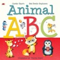

<b>Give your child a head start with the Red Beetle Beginner series...</b>  <i><b>"Lisette Starr's Animal ABC"</b> is a whimsical, fun alphabet picture book designed to help kids get a head start on learning their letters while learning about all different kinds of animals. Full of bright colorful illustrations. From alligators, cats, elephants and horses to wombats and zebras there is a whole alphabet full of cute fun creatures. &#xa0;</i>  <i>Each letter is accompanied by a cute illustration, a capital and lower case example, and a line of color coded alliterative text to help lock in the learning.</i>  <b>It's never too early to start on a child's education. The more kids can learn in the vital preschool years the better!</b>  Red Beetle Beginner Books are perfect for preschool kids from 1-5 yo.

[View on Apple](https://books.apple.com/gb/book/animal-abc/id6450139435)

## ABC - Let's Colour the Alphabet

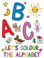

“ABC - Let's Colour the Alphabet" is a classic children's colouring book in its electronic version. The book is perfectly suited for little children to move their first steps into the world of the alphabet.

[View on Apple](https://books.apple.com/gb/book/abc-lets-colour-the-alphabet/id979047005)

## ABC's of Science

The author of this little book spent several years in composing his work, to the best of his ability, making the treatise brief and to the point, so that the reader may not become weary and misunderstand the true meaning. His desire is to have the flourishing human know the truth of Science and to learn what he can of its greatest wonders.

[View on Apple](https://books.apple.com/gb/book/abcs-of-science/id498658091)

## The Absurd ABC

Classic nursery rhymes are set in gilded letters and traditional paintings by Walter Crane. A detailed preface provides historic details of the earliest publishing of children's books and the importance that Walter Crane played in that history. For the Absurd ABC each upper-case letter caste in gold is presented with a silly two-line rhyme: "F for the frog in the story you know, Begun with the wooing but ending in woe". Shows a frog and his ukulele weaning a damsel frog on the balcony.

[View on Apple](https://books.apple.com/gb/book/the-absurd-abc/id510630671)

## Musical ABC

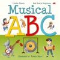

<b>Give your child a head start with the Red Beetle Beginner series...</b>  <i><b>"Lisette Starr's Musical ABC"&#xa0;</b>is a whimsical, fun alphabet book designed to help kids get a head start on learning their letters.</i>  <i>Each letter is accompanied by a cute illustration, a capital and lower case example, and a line of color coded alliterative text to help lock in the learning.</i>  It's never too early to start on a child's education. The more kids can learn in the&#xa0;vital preschool years the better!  <b>Red Beetle Beginner Books</b> are perfect for preschool kids from 1-5 yo.

[View on Apple](https://books.apple.com/gb/book/musical-abc/id6450139600)

## ABC

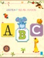

A fun way for your child to learn the alphabet by listening and reading-aloud, just touch the letter or the picture.

[View on Apple](https://books.apple.com/gb/book/abc/id795439044)

## ABC

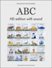

Interactive English alphabet. Letters shown in contrast red color. High definition images for retina display were carefully selected. Swipe left or right to choose letters. Press little speaker image for American or British english pronunciation.

[View on Apple](https://books.apple.com/gb/book/abc/id849603096)

## The Odyssey

An Apple Books Classic edition.  
Homer’s eighth-century epic poem is a companion to <i>The Iliad</i>. It tells the story of Odysseus, who journeys by ship for 10 years after the Trojan War, trying to make his way back home to Ithaca. Homer’s work was intended to be performed out loud, so it’s a masterful example of poetic meter and rhythm. But above all, <i>;The Odyssey</i> is a story of adventure-and true love.  
Odysseus has been gone for 20 years, and he longs to reclaim his role as king and reunite with his beloved, faithful Queen Penelope. During his absence, hundreds of suitors have eaten his food, lived in his home, and even plotted to kill his son. But before he can confront his enemies at home, Odysseus must fight a cyclops, escape after being imprisoned by a lovesick nymph, and confront the twin terrors of Scylla and Charybdis. As if that wasn’t enough, the gods take their grudges out on him, adding obstacles to suit their whims. Will Odysseus ever get home? And what will he find once he does? Within the pages of this ancient Greek classic are the origins for many of the myths we’re familiar with today. Pick up a copy and meet Odysseus, Homer’s timeless hero.

[View on Apple](https://books.apple.com/gb/book/the-odyssey/id395540967)

## 123 Counting Around the World HD

"123 Count the World With Me HD!" features REAL KIDS in REAL PLACES around the world.&#xa0; Count Geese in Germany, Horses in Mongolia, and Pyramids in Egypt!&#xa0; Your child will discover NUMBERS around the world!&#xa0; See OTHER KIDS from Costa Rica to Zambia teaching numbers with objects around them. Become immersed in CULTURE and DISCOVERY with each page.&#xa0; &#xa0;  
"123 Count the World With Me HD!" is optimized for “the new iPad’s Retina Display”.  
Bring learning to life!&#xa0; Our books make learning a multi-sensory experience with sight, sound and touch; empowering children to LEARN important concepts FASTER.&#xa0; Learn numbers with large, colorful photographs of children and objects from countries around the world. Learning through photography will increase your child's perception of the REAL WORLD and allow for a new level of cultural AWARENESS and appreciation.  
E3 Imagine was founded on the idea of helping others, so for each printed book sold, a printed book will be donated.&#xa0; We hope you enjoy our books and support the movement to bring education and literacy to places around the world where donation of simple educational books can make a big difference. #buyabookgiveabook  
Other Features  
+Images are optimized for iPad with Retina Display. 
+Pinch to put pages away, and swipe from side to side. 
+Learn Geography with maps on each page. 
+Learn new words in Swahili, Nepali, French, Cantonese and more. 
+See videos of kids around the world.&#xa0; Show your kids the world!  
Version 1.2

[View on Apple](https://books.apple.com/gb/book/123-counting-around-the-world-hd/id521336095)

## 123 - Let's Play with the numbers

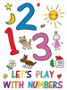

“123 - Let's Play With the Numbers” is a classic children's colouring book in its electronic version. The book is perfectly suited for little children to move their first steps into the world of the numbers.

[View on Apple](https://books.apple.com/gb/book/123-lets-play-with-the-numbers/id1241758960)

## Sushi 123

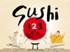

Learn to count to ten in Japanese. When a hungry sumo wrestler steps into a sushi bar, just how many pieces can he eat?

[View on Apple](https://books.apple.com/gb/book/sushi-123/id1296722139)

## My First 123

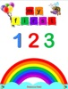

Ad-free. Interactive numbers for children. Includes colouring book, matching game and widget to practice writing numbers.Interactive book that includes number with sound, flashcard with sound &amp; drawing number widget

[View on Apple](https://books.apple.com/gb/book/my-first-123/id1003283771)

## Love's Last Stand

<b>In a world where loyalty is bought, lives are expendable, and love is the ultimate vulnerability,&#xa0;some truths are worth dying for—and some are worth killing to protect.</b>  Three years after her fiancé's murder,&#xa0;Harper Vale&#xa0;is still chasing the truth—and punishing herself for wanting out of a love that ended too violently, too soon. Once a fearless investigative journalist, she's now hiding behind a bar, until one reckless decision pulls her back into the gilded world that almost destroyed her life.  A single stolen flash drive. A warning buried in code. And someone powerful who wants her silenced.  Cole Maddox&#xa0;knows what it means to be marked for death. A former special ops soldier disgraced for refusing to follow illegal orders, he's been hunting the shadow network that ruined him—ex-military contractors, corrupt politicians, and men who erase their mistakes with bullets. When his investigation collides with Harper's, he sees her first as a liability…then as a target.  And then as something far more dangerous.  As assassins close in and secrets unravel, Harper discovers that the man she loved may not have been who she thought. Is the truth behind his death is tied to a covert operation known as&#xa0;Project VIGILANT?  Forced into an uneasy alliance, Harper and Cole navigate betrayal, buried guilt, and a magnetic attraction neither can afford.  Because trusting each other could get them killed. But walking away will cost them everything.  <i>This is Book 1 of the dark, high-stakes romantic suspense series, Love's Labyrinth.</i>  Love's Labyrinth Series:  •Book 1 –Love's Last Stand •Book 2 –Love's Tangled Web •Book 3 –Love's Fiery Trial

[View on Apple](https://books.apple.com/gb/book/loves-last-stand/id6757762448)

## Leaders in Control

<b>"No man is an island..."</b>  They said no man could ever replace Andrew Carter. So when he decided to take a step back from the Privy Council, he wasn't replaced by a single man. He was replaced by two.  Devon Wardell and Gabriel Alden never had the easiest relationship.  What started as teenage squabbles over the same girl, escalated into a supernatural blood-feud that grew infinitely more difficult when they became lifelong friends and their families moved in next door. After their children got married, they resolved to destroy each other once and for all.  But as usual, fate had other plans…  <b>Kerrigan Presidents Series</b>  •Leaders in Control •Director on a Mission •Devon Seeking Guidance •Gabriel Vanishing Light •President on Edge •Agreeing the Future  READ THE WHOLE SERIES: Prequel Series: Christmas Before the Magic Question the Darkness Into the Darkness Fight the Darkness Alone in the Darkness Lost in Darkness  The Chronicles of Kerrigan Series Rae of Hope Dark Nebula House of Cards Royal Tea Under Fire End in Sight Hidden Darkness Twisted Together Mark of Fate Strength &amp; Power Last One Standing Rae of Light  The Chronicles of Kerrigan Sequel A Matter of Time Time Piece Second Chance Glitch in Time Our Time Precious Time  The Chronicles of Kerrigan: Gabriel Living in the Past Present for Today Staring at the Future  Kerrigan Chronicles  Stopping Time  A Passage of Time  Ticking Clock  Secrets in Time  Time in the City  Ultimate Future  Kerrigan Kids  Book 1 - School of Potential  Book 2 - Myths &amp; Magic  Book 3 - Kith &amp; Kin  Book 4 - Playing With Power  Book 5 - Line of Ancestry  Book 6 - Descent of Hope  Book 7 – Illusion of Shadows  Book 8 – Frozen by the Future  Book 9 – Guilt of My Past  Book 10 – Demise of Magic  Book 11- Rise of the Prophecy  Book 12 – Deafened by the Past  Kerrigan Memoirs  The Chronicles of&#xa0;Devon  The Chronicles&#xa0;of&#xa0;Angel  The Chronicles of&#xa0;Julian  The Chronicles of Molly  The Chronicles of&#xa0;Gabriel  The Chronicles of&#xa0;Rae

[View on Apple](https://books.apple.com/gb/book/leaders-in-control/id6443335830)

## 1+1=1 ... beyond the secrets of beautiful relationships

1+1=1
... losing our identities
Being in love ... is a totally different way of experiencing life.
Being in love ... is amazing.
But … love is not for everyone.
Yes ...
Not any of us can understand and accept the illogical rules of love.
And ... the truth is ... we are afraid of getting lost ... of losing our souls ... our identities ... our minds.
I was in love.
... not only one time.
I dare to write about love ... cause i was into that ... heaven ... but unfortunately the emotional balance made me feel ... the hell too.
Love is ... duality.
I've felt it.
I've strongly felt it.
And I've understood that 1+1=1.
I was so connected ... that I've totally lost my identity.
... becoming one with the other soul.
My ego ... disappeared.
All my existence ... changed.
I was ... here ... but actually living only and only into that story.
... into that parallel universe.
I've became one with the other soul.
Everyone told me that i've lost my minds.
Everyone ...
... and they repeated me that on and on and on.
I've totally lost my identity.
But ... i was happy.
Fortunately ... the time ... made me realise that 2 souls can become one.
And i've liked it.
... in fact adored it.
I've lost myself ... but i was not worried.
I've metamorphosed my soul with the other soul ... into one unique soul.
It was amazing.
Unfortunately ... all was temporary.
I knew it ... but i've disliked it.
Today ... i don't regret anything.
Not regret anything ... anymore.
But ... i know that this is the magic formula ... for being happy while being into a relationship.
1+1=1.
Many ... laugh of me.
Of my thoughts.
... of all my perceptions about love and relationships.
But ... i know what i am taking about.
I was there.
... few times.
And ... it was amazing.
I felt ... alive.
I felt ... the Infinite.
I would do it ... again.
But ... i can't.
Maybe ... i am afraid of losing my identity again.
So ... I've decided to just write about the subject.
Like ... a self therapy.
But also ... guiding the others ... into those parallel universes which don't have anything to do with the real life.

[View on Apple](https://books.apple.com/gb/book/1-1-1-beyond-the-secrets-of-beautiful-relationships/id6737967487)

## REVERSE PSYCHOLOGY IN LOVE RELATIONSHIPS

I've always failed in love relationships ... ending up 
overwhelmed of lots of weird negative emotions ... not 
knowing what to do anymore.
But still hoping.
Illusory hoping.
Almost never being able to disconnect ... leave that lady ... and continue my life.
Yeah ... i just couldn't.
That is how ... trapped into this prisons with invisible walls ...the love stories i was writing about so, so much ... it all ended as an obsession for understanding the nonsense behind relationship man-woman.
Writing so much.
... not necessarily being clear ... or even by contrary ... being confusing.
So ... this is again ... another book ... when i actually try to open myself in front of the public ... analysing and defining my own experiences ... from a psychological perspective.
And ... it's not that i come up with any brilliant theory ... 
cause it's more a confession trying to reveal the difficulties of being in duality A way in how at least we should try ... but not being afraid of
... failing.
Simply be opened.
Analyse and accept all what is going on ... but be aware that  being in love for real ... means 1+1=1.
2 souls become one.
All rules and all we know is ... rewritten.
It's not about you and the loved one ... but about "us" as a  couple.
So ... let me share my stories in front of you ... and try to 
stop yourself calling me a lost soul ... until you end reading  the book.
Cause ... what i am talking about it's not only ... my lost soul .. but about our lost souls.
And ... we l are really so, so many.
Some denying.
Some having the guts ... to accept that love relationships ...  and duality in general ... it's not really easy.
But..

[View on Apple](https://books.apple.com/gb/book/reverse-psychology-in-love-relationships/id6757421500)

## Understanding our thoughts

The human being has always been dominated … by contradictory thoughts and emotions.
Maybe one of the worst diseases from the history of the world … worst even as cancer … sometimes without any possible treatment is the … doubt.

And is funny, cause the Universe is playing around with us … giving us so, so many contradictory … options.

I am laughing … going back in time and seeing myself in this weird situation of not being able to decide what to do … what to choose.

Today i somehow believe that it’s better to have … no option …. or just one option, cause each time when i had 2 or more options … everything was too complicated.

I had to think too much.

… to meditate on and on and on.

And when i decided i was still overwhelmed by …. doubt.

Instead of being happy for the life i had, i was unhappy …. In fact somehow ruined emotionally and mentally of all what was going on with me.

Everything was sometimes so amplified that i could not … continue the life itself.

The Universe letted me decide what to do … but i was not capable of seeing the path … the real one.

I was hearing into my head all the time … “What to do?! What to decide?! What should be the best?!”

But i did not know what to do … what to decide … and instead of being happy for having so many opportunities … my vibe was always f****d up.

And everything was like that cause i did not know how to close my eyes and connect to myself … asking to my intuition for guidance.

The undecided version of myself, was a result of the fact that i did not know anything about my soul … and how to be in total harmony with this inner self.

I did not know how to listen to all those voices … to my intuition … and keep the right balance between the inner and the outer world.

And instead of being happy and a soul dominated by joy … i was in this silly emotional balance … dominated by a non ending indecision.

I should name it today … the negative amplifier … and all what i want is just get rid of it.

Nothing more.

[View on Apple](https://books.apple.com/gb/book/understanding-our-thoughts/id6449027289)

## The Unbound Bookshop

<b>A bookshop by the bay. An ex she never forgot. And a second chance at love that could change everything...</b>  <b>Sage Harpe</b>r has one chance to make her childhood dream of opening a bookstore come true. But first, she has to spend three awkward days onboard a vintage sailboat with the ex who broke her heart.  <b>Flynn Cahill</b> has devoted his life to completing his late twin brother's bucket list, even when it cost him the only woman he's ever loved. Haunted by regret, he never expected to find himself stuck in close quarters with Sage—the woman who still holds his heart.  Meanwhile, <b>Abigail Preston's</b> happily ever after is finally within reach... until a stranger shows up at her door with a shocking secret that threatens her past, present, and her future.  <i>The Unbound Bookshop</i> is a tender, uplifting romance full of unforgettable characters, small-town charm, surprising twists, and the unshakable bonds of found family.  Perfect for fans of Debbie Macomber, Denise Hunter, and RaeAnne Thayne.  Start this heartwarming series today.  <b>Also Includes:</b>  An original recipe Book club questions and more….  <b>Praise for The Unbound Bookshop:</b>  ⭐️⭐️⭐️⭐️⭐️ "From the first page to the last, I was sucked into this story. I really enjoy the characters and feel like I am part of the community."  ⭐️⭐️⭐️⭐️⭐️ "I re-read Blessings on State Street and the Unbound Book Shop five times. I was so touched by the people in this series - all the love and support."  ⭐️⭐️⭐️⭐️⭐️ "The author just has a way of bringing the reader into her story so they can feel every emotion that the character is going through. You don't just read one of her books, you feel it."

[View on Apple](https://books.apple.com/gb/book/the-unbound-bookshop/id6504684323)

## You’ve Got Chain Mail

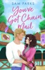

'An enchanting blend of Olivia Dade’s warmth and the adventurous spirit of A Knight’s Tale, all wrapped up in a spicy romcom that left me grinning from ear to ear.’ NetGalley Reader Review  Each book in the Roll for Romance series can be read as a standalone.  When life goes rogue, roll for romance…  Avid role-playing gamer Morgan is on a quest – to step out of her comfort zone and become her own knight in shining armour.  Jack, the group’s loveable cleric character, is also looking to rewrite a more exciting story for himself.  When they and their friends plan a Renaissance Faire adventure, Morgan and Jack embrace the magic of their alter egos – is it possible they might just fall for each other in real life too?  See why real readers are loving You’ve Got Chain Mail:   'The characters are loveable, the humour is spot-on, and the romance is heartwarming. A perfect feel-good read!'  'This book was so entertaining that I read it in a single day. Short but sweet and I loved the role-playing game part'  'This book felt like it was made for me: D&amp;amp;D, Renaissance Faire, costumes, romance, competency'  ‘A cute feel good plot with some nice chemistry'  'What a fabulous slow burn!! This is completely different to any romance book I’ve ever read… loved the story line along size the sweet romance'  'The characters were complex. The plot was well written and compelling, and the story was interesting.'  'THIS IS LITERALLY SO GOOD. I can't express how much I love this. Cheers to the author for writing this masterpiece'  About the author  Samantha Parks is the pen name of Sam Gale. Her pen name comes from her late grandmother Velma Hobbs nee Parks, who was one of Sam's greatest role models. Sam was born in North Carolina but now resides in Bournemouth, UK, with her husband Alex. She owns a successful marketing company and is enjoying her slow descent into "crazy plant lady" status.  The Summer House in Santorini is her first novel.

[View on Apple](https://books.apple.com/gb/book/youve-got-chain-mail/id6477527723)

## In Your Safe Embrace

<b>She lost everything in the fire… except the one man who might just save her life.</b>  Lily Maroney's world turns to ash when a devastating fire reduces her apartment, and everything she owns, to rubble. Left homeless and shaken, she's stunned when the firefighter who pulled her from the flames offers her a temporary place to stay. Thomas Jameson is everything she shouldn't lean on: protective, intense, and hiding scars of his own. But safety has never felt so real… or so dangerous.  But Tommy has demons, too, and the heat between them might just ignite something neither of them is ready for. As secrets unravel and obsession turns deadly, they'll have to fight not just for love, but for survival.  <i>In Your Safe Embrace</i> is a heart-pounding romantic suspense about trust, trauma, and the fierce power of love to protect and heal—even in the darkest of times. Note: This is book 1 of the series, not all your questions will be answered in the first book &#xa0;the series does end with an hea &#xa0; &#xa0;  <b>Embers of the Heart Series:</b>  •Book 1 – In Your Safe Embrace •Book 2 – Through Smoke and Flame •Book 3 – Where Ashes Meet Hope

[View on Apple](https://books.apple.com/gb/book/in-your-safe-embrace/id6753194485)

## Vanity Project

<b>Can DI Brian Brandon stop a ruthless killer before they bury him next, or will his demons bury him first?</b>  Cybersecurity consultant Ray Higgins is dead. Was it a love triangle turned deadly? Or is there something more at play?  As DI Brian Brandon digs deeper into the case, he uncovers a trail of blackmail and betrayal that leads straight to Strathburgh's elite.  But Brian is battling more than a killer hell-bent on silencing anyone who gets too close to the truth. A traumatic past and a drinking habit that's spiraling out of control threaten to derail the investigation and get him killed.  <i>Perfect for fans of JD Kirk, Ian Rankin, Helen Fields, and Val McDermid, this gripping first instalment in a dark, gritty new Scottish crime series introduces DI Brian Brandon of the city of Strathburgh's Major Investigations Team.</i>

[View on Apple](https://books.apple.com/gb/book/vanity-project/id6771699844)

## My Brother's Grumpy Best Friend

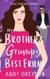

<i>This is a kisses only, sweet romance.</i>  <b>My checklist guarantees my brother a flawless wedding. I've missed nothing…except for the one person I never expected to be there.</b>  Male voices grab my attention. My eyes lock on one in particular.  Of course, my idiot brother forgot to tell me who his best man is.  Archer Sullivan. My high school crush.  Ten years have passed since I saw him, and he still leaves me breathless.  Archer's intense gaze makes me feel transparent. His silence even more so. My easy smile wobbles under his scrutiny.  The more time I spend with him, the more my defenses crumble. He's penetrating the armor encasing my heart. I can't resist him. .  <b>I'm falling for my brother's grumpy best friend…again.</b>  <i>This stand alone is a clean, brother's best friend, grumpy/sunshine, small town, military, sweet and swoony friend romance. Let yourself get swept up with Rosaline and Archer as they realize that they have always been each other's true love. Just like with all my other books, I hope you fall in love with the two of them and are left wanting more!</i>

[View on Apple](https://books.apple.com/gb/book/my-brothers-grumpy-best-friend/id6745745322)

## Murder at an English Pub

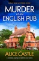

When retired doctor Sarah Vane moves to Merstairs, she has no idea that the quaint seaside town isn’t quite as friendly it seems, and something sinister is bubbling under the picturesque surface…

Recently widowed and looking for a fresh start away from city life, Sarah Vane moves into a lovely little cottage by the sea. The rustic charm is everything she hoped it would be, but her new home doesn’t quite have enough space for her things. Her old friend Daphne offers to store Sarah’s boxes in her messy beach hut, but while clearing it out, they’re shocked to find a heavy trunk… containing a dead body.

They immediately recognise the poor man as pub landlord Gus Trubshaw. Sarah concludes that he was suffocated, but who could have wanted jolly Gus dead? Unimpressed by the police’s lack of interest, Sarah realises she will have to solve the case herself.

Soon, Sarah discovers that not everyone loved Gus as much as she’d thought. Is the killer scoutmaster Bill, who was recently banned from the pub? Or perhaps it was antique store owner Charles, who owned the beach hut before Daphne? Or was it brewery director Mr. Grimes, who was livid with Gus for squeezing them on the purchase price of their delicious ale?

Just when the clues are starting to fall into place, the prime suspect is found strangled on the beach. And when Sarah discovers a deadly secret that links the two murders, she’s certain that a dangerous killer is roaming the streets of Merstairs. With the town in a panic, time is ticking for Sarah. Will she solve the mystery before it’s last orders for another victim?

Set off for the breezy English seaside and join Sarah on her adventures in quirky Merstairs, where nothing is quite as it seems! Fans of Agatha Christie, Betty Rowlands and Katie Gaylewill be instantly hooked by this deliciously gripping cozy mystery.

Readers love the Sarah Vane Mysteries:

‘Wow!!!… I absolutely LOVED this… had me hooked from the start to the end!!… Absolutely gorgeous… brilliant… amazing… incredible … absolutely smashed it out of the ballpark again!!!… completely sucked me in from beginning to end… a page-turner… I felt myself walking around with my kindle in my hand every chance I could get… filled with unexpected twists… absolutely fantastic… addictive… absolutely perfect.’
Bookworm86, ⭐⭐⭐⭐⭐

‘LOVED!… Many laughing moments!… A real page-turner… once start, you won't be able to put down until finished.’ Coffeeandpages2021, ⭐⭐⭐⭐⭐

‘Wow!… fantastic… I enjoyed every page… I loved the vivid scenery… I was chuckling throughout… unputdownable… Captivated me from the first to the last page.’ Goodreads reviewer, ⭐⭐⭐⭐⭐

‘Fantastic… I can't wait for this to come out and for y'all to lose your minds… You're going to want to read this one. I raced through it this weekend … Brilliantly plotted and compelling.’ Goodreads reviewer, ⭐⭐⭐⭐⭐

‘I read this in one day … laugh out loud… I highly recommend this book! More please!!!’ NetGalley reviewer, ⭐⭐⭐⭐⭐

‘Kept me glued to my Kindle! I loved the setting, the writing style. The main characters, and the antics of Hamish the Scotty dog.’ Goodreads reviewer, ⭐⭐⭐⭐⭐

‘A delight… twists and turns from start to finish… brilliant… highly recommended.’ Goodreads reviewer, ⭐⭐⭐⭐⭐

‘Gripping… The mystery was very intricate, the characters interesting and it took to the very last few pages for all the clues to fall into place… laugh out loud.’ NetGalley reviewer, ⭐⭐⭐⭐⭐

[View on Apple](https://books.apple.com/gb/book/murder-at-an-english-pub/id6783281149)

## Those Three Words

<b>I never thought getting fired from my dream job would change my life.</b>  <b>And I certainly never imagined three little words would be my undoing</b>.  <i>Trust me—they're not the words you're thinking.</i>  <i>Those three delicious, toe-curling words whispered by my boss were where it all changed.</i>  When budget cuts at my local school leave me scrambling to find a job before I get evicted, I stumble upon the listing of a lifetime.  How hard can being a live-in nanny for a little five year old girl be?  Especially when it's double the salary and comes with a sexy, single dad.  But the moment I step inside Graham Hayes multi-million dollar estate and meet the grumpy billionaire—I know I'm in way over my head.  It's not just that he's quite possibly the most attractive man I've ever seen, it's the way he stares at me like it takes everything he has to keep from devouring me.  The way he curls his hands into fists to avoid touching me.  The way he reprimands me through gritted teeth while his lust filled eyes burn through me.  The naughty things he whispers against my lips as his hands explore me.  <i>Way over my head.</i>  Caring for his daughter is a dream—even his mother loves me.  Soon, I'm head over heels in this fantasy I'm living.  I'm even able to ignore the cryptic threats from his house-keeper who's hellbent on getting me fired.  But I'm not prepared for the world of high-powered billionaires and glitzy parties.  Besides, Graham isn't like these people—he's different.  At least, I think he is…until a shady character I've tried to leave in the past reappears as Graham's new business partner and I'm reminded that I don't belong in this world.  Sometimes life changing news comes in the form of just <i>three simple words.</i>  Sometimes it comes in the form of an unexpected, heart-wrenching secret and the fairytale is shattered.  Sometimes, it comes in the form of the opportunity of a fresh new start.  <b>You just have to be willing to take the risk and walk away or maybe…there's three little words that can fix it all.</b>

[View on Apple](https://books.apple.com/gb/book/those-three-words/id6772280914)

## 1984

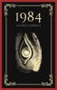

Nineteen Eighty-Four (also published as 1984) is a dystopian social science fiction novel and cautionary tale by English writer George Orwell. It was published on 8 June 1949 by Secker &amp; Warburg as Orwell's ninth and final book completed in his lifetime. Thematically, it centres on the consequences of totalitarianism, mass surveillance and repressive regimentation of people and behaviours within society. Orwell, a democratic socialist, modelled the authoritarian state in the novel on Stalinist Russia and Nazi Germany. More broadly, the novel examines the role of truth and facts within societies and the ways in which they can be manipulated.

The story takes place in an imagined future in the year 1984, when much of the world is in perpetual war. Great Britain, now known as Airstrip One, has become a province of the totalitarian superstate Oceania, which is led by Big Brother, a dictatorial leader supported by an intense cult of personality manufactured by the Party's Thought Police. Through the Ministry of Truth, the Party engages in omnipresent government surveillance, historical negationism, and constant propaganda to persecute individuality and independent thinking.

[View on Apple](https://books.apple.com/gb/book/1984/id6449234122)

## Ghost Of A Chance

<b><i>How well do you know the lover in your bed?&#xa0;</i></b> 
It was the hottest hookup of her life. When Tess Barrett spent the night in the arms of the too sexy to be real stranger, she knew she was walking on the wild side. Sex with James Smith was the best EVER. &#xa0; How was she supposed to walk away from that? From him? So…she didn’t. They planned secret dates. More body-melting hookups. The white-hot sex should have been enough.&#xa0; 
<b>So why does she start wanting more?</b> 
But they have rules. <i>She </i>has rules. No emotions. No ties. She has a past that is dark and twisted, and she’s worked hard to become a new person. She’s a doctor now. Respected. Controlled. Except…there is no control when she’s around James. 
<b>A bad guy…might be falling for the good girl.&#xa0;</b> 
James can’t keep his hands off his sexy little doctor. She’s buttoned down for everyone else but goes absolutely wild for him. Sure, she doesn’t know his history. Doesn’t know that the man she lets touch every inch of her body used to spend his days working for Uncle Sam and doing some seriously dirty deeds.&#xa0; What she doesn’t know can’t hurt her, right? And if she ever did learn the truth about him, he knew it would terrify his sweet doc right to her core. Terror would make her run. He doesn’t want her running. He just wants her in his bed.&#xa0; 
But then…something happens. Danger sneaks up on Tess. She needs help—a very particular expertise and protective skill set. She needs someone lethal and strong…and James is just the man for the job. After all, <i>lethal</i> is his middle name.&#xa0; 
<b>Hello, dangerous times.&#xa0;</b> 
When James steps in, Tess doesn’t know if she should be grateful or scared to death. &#xa0; Because her gorgeous lover? Turns out he has plenty of mad and dangerous skills. She’s been hooking up with a superhero or…maybe a super villain. It’s sort of hard to tell the difference.&#xa0; &#xa0; 
For the moment, she’s going to go with feeling grateful…but as she learns all of his secrets, Tess wonders what will happen next between them. Will they crash and burn? <i>Burn, baby, burn. </i>Or maybe, just maybe, they’ll actually have a GHOST OF A CHANCE at getting a happily ever after ending.&#xa0;  
Author’s Note:&#xa0; James Smith is one mad, bad, dangerous guy…but sometimes, bad guys fall hard for good girls. GHOST OF A CHANCE is super hot, charged with lots of feels, and, it’s got some pulse-pounding action for you.&#xa0; Dirty words and dirty deeds are dead ahead.&#xa0; Oh, and there’s plenty of fun thrown in, too. Mystery, humor, sexy times, and danger—all of my favorite things in a book.

[View on Apple](https://books.apple.com/gb/book/ghost-of-a-chance/id1480243934)

## The Girls in the Snow

<b>“One sensational read! Wow, this one just completely blew me away</b>. If you are looking for a brand new series to sink your teeth into, then look no further. <b>A must read!</b>” <i>Once Upon A Time Book Blog</i>, 5 stars 
<b>&#xa0;</b> 
<b>Madison walked through the fallen snow, looking left and right. It had been Kaylee’s idea to use the trail through the forest; she said no one would follow them. But Madison lost sight of Kaylee for a moment and when she found her again she wasn’t alone…</b> 
<b>&#xa0;</b> 
In the remote forests of Stillwater, Minnesota, you can scream for days and no one will hear you. So when the bodies of two fifteen-year-old girls are discovered frozen in the snow, <b>Special Agent Nikki Hunt</b> is sure the killer is local: someone knew where to hide the girls and thought they would never be found. 
&#xa0; 
Though Nikki hasn’t been home in twenty years, she knows she must take over the case. The Sheriff’s department in Stillwater has already made a mistake by connecting the girls’ murders to those of a famous serial killer, refusing to consider the idea that the killer could be someone from town. 
&#xa0; 
Then another girl’s body is found, a red silk ribbon tied in her hair, and Nikki realizes that the killer has a connection to her own dark past, and the reason she left Stillwater. 
&#xa0; 
<b>Nikki is not the only person in town who wants those secrets to stay hidden. Will she be able to face her demons before another child is taken?</b> 
<b>&#xa0;</b> 
<b>Gripping and spine-chilling, <i>The Girls in the Snow </i>will make you gasp, unable to put it down until the final heart-pounding twist. Perfect for fans of Karin Slaughter, Lisa Gardner and Robert Dugoni.</b> 
<b>&#xa0;</b> 
<b>What readers are saying about <i>The Girls in the Snow</i>:</b> 
“<b>Bloody fantastic!</b> I loved this book… <b>I was hanging on to every word and couldn’t put the book down</b>… full of tension and action and kept me guessing. Highly recommend this book.” <i>Bonnie’s Book Talk, </i>5 stars 
&#xa0; 
“This is the thriller that I didn’t know I was waiting for and needed in my life until I picked it up. <b>SO GOOD. I’m still reeling and trying to catch my breath</b> from this highly suspenseful and emotionally charged story…<b> I need more ASAP.</b>” <i>Reading in Autumn, </i>5 stars 
&#xa0; 
“<b>Addictive. I read this in one sitting.</b> It's unputdownable… Filled with intrigue and deceit, <i>The Girls in The Snow</i> is <b>guaranteed to keep you up all night.</b>” Lisa Regan 
&#xa0; 
“First time reading this author and <b>I couldn’t put it down. Suspense that will keep you hooked until the very last page. </b>Even when I wasn’t reading it, I couldn’t stop thinking about it… <b>I had to see what happened.</b>” Goodreads reviewer, 5 stars 
&#xa0; 
“<b>A dagger sharp crime thriller.</b> Highly recommended… <b>I loved Nikki Hunt</b>… Engaging. I never figured out what was going to happen next until I read it myself.” NetGalley reviewer, 5 stars 
&#xa0; 
“This is the first book in a long time that I’ve given up all household responsibilities,&#xa0; all TV time for and all my study time for. <b>[I] knew nothing was going to get done outside of my day job until I finished this book, which I did in 24 hours… Fast-paced and jam-packed from start to finish</b>.” Goodreads reviewer, 5 stars 
&#xa0; 
“Kept me guessing throughout… <b>This one gets 5 stars</b>, great series starter… <b>a compelling mystery that had me wondering whodunit</b> right up until the killer was revealed.” Goodreads reviewer, 5 stars 
&#xa0; 
“<b>This book was fantastic!</b> Everything about it worked… <b>I was hooked from page one and didn’t put it down until I was done</b>… I had no idea who the killer was until it was revealed. This is going to be <b>a must read series!</b>” Goodreads reviewer, 5 stars 
&#xa0; 
“<b>Wow!! Stacy Green's <i>The Girls in the Snow </i>opens with such force</b>… and it keeps going until the very end… this is a <b>top 10</b> for me!” NetGalley reviewer, 5 star

[View on Apple](https://books.apple.com/gb/book/the-girls-in-the-snow/id1524446911)

## Pride and Prejudice

An Apple Books Classic edition.  Jane Austen’s beloved classic opens with this witty and very memorable line: “It is a truth universally acknowledged, that a single man in possession of a good fortune, must be in want of a wife.” With all the twists and turns of a soap opera, <i>Pride and Prejudice</i> chronicles the drama that ensues when the wealthy bachelor Mr. Darcy moves close to the Bennet family home in the English countryside. The news of his arrival sends the socially ambitious Mrs. Bennet-whose main concern is finding suitable matches for her five daughters-into overdrive.  The book’s main character, the high-spirited Elizabeth Bennet, is a strikingly modern heroine: a woman who refuses to lower her expectations or transform herself to suit society’s norms. Austen’s novel achieves a remarkable balance, serving up barbed criticism of the obsession with money, status, and matrimony even as it draws us into a swoon-worthy love story. At its heart, <i>Pride and Prejudice</i> is a romantic comedy, and a darned great one at that. It’s so much fun to turn the pages and wonder about Elizabeth and Mr. Darcy: Will they or won’t they overcome their excessive pride and initial prejudices to make a happily-ever-after connection?

[View on Apple](https://books.apple.com/gb/book/pride-and-prejudice/id395534643)

## The Odyssey

The poem mainly centers on the Greek hero Odysseus (known as Ulysses in Roman myths) and his journey home after the fall of&#xa0;Troy. It takes Odysseus ten years to reach&#xa0;Ithaca&#xa0;after the ten-year&#xa0;Trojan War.  In his absence, it is assumed he has died, and his wife&#xa0;Penelope&#xa0;and son&#xa0;Telemachus&#xa0;must deal with a group of unruly suitors, the&#xa0;Mnesteres or&#xa0;Proci, who compete for Penelope's hand in marriage.

[View on Apple](https://books.apple.com/gb/book/the-odyssey/id498683870)

## Big Gruff Cowboy

This gruff cowboy won’t let anything stop him from claiming his curvy woman…

Lizzy

There are three things you should know about moving to Courage County:

1.	There are cowboys everywhere.
2.	Most of them are grumpy and scowling.
3.	You’ll probably fall in love with one. 

I fell hard for the gruffest cowboy of them all – Noah Maple.

Noah

There are three things Lizzy needs to know the moment I lay eyes on her:

1.	She’s my soulmate.
2.	She’s marrying me.
3.	And I’m putting my baby in her belly.

If you love an over the top cowboy who falls hard and fast for his curvy woman, it’s time to meet Noah in Big Gruff Cowboy. One click for a story so hot you’ll need an ice cube!

It’s time to meet the Maple Brothers, the sweetest cowboys in Courage County. These OTT alpha cowboys are determined to claim the curvy women who have stolen their hearts. Cuddle up with these sexy new book boyfriends from Mia Brody today!

[View on Apple](https://books.apple.com/gb/book/big-gruff-cowboy/id6482983095)

## Huckleberry Hill

From Wall Street Journal and USA Today bestselling author Emma Slate comes the first book in the Saddles &amp; Spurs series.

I flee to my family’s mountain ranch to heal a broken heart.

I did not expect a charging bear.

But then a shirtless, tattooed cowboy saves me.

Declan Brewer is my father’s new ranch hand.

He’s a retired rodeo star who’s got swagger in spades.

And he’s completely forbidden.

Declan is new to Huckleberry Hill, but the small town welcomes him as one of their own.

Then one night after bourbon and banter, we cross the line.

Now we’re sneaking around, in hopes my father doesn’t find out.

Declan makes me feel safe, even when I’m on the back of his motorcycle.

He’s everything I've ever wanted.

But I'm scared he’ll abandon me when he finds out I can’t have children.

Just like my ex.

And then the impossible happens:

I’m pregnant with a cowboy’s baby.

[View on Apple](https://books.apple.com/gb/book/huckleberry-hill/id6737988405)

## Danger and Dominance

<i><b>Never get involved with a client.</b></i>  For years, that's the code I've lived by. Keeping my work and private life separate, never muddying the waters.  Then again, I've never met a temptation like Cassidy Simone.  Beautiful, broken Cassidy. Staring up at me with those wide, haunted eyes. From the first moment I see her, all I can think is… Mine.  Every moment with her is agony, fighting the temptation to touch her, to taste her.  To claim her.  And when it becomes clear that the threat to Cassidy's safety is closer than we realized, I'll do whatever it takes to keep her safe.  Even if it means breaking all of my own rules.  Black Fox Security Doms 1. Danger and Dominance 2. Cuffs and Cupcakes 3. Security and Submission 4. Whips and Weddings 5. Rescue and Ropes 6. Bondage and Bad Guys

[View on Apple](https://books.apple.com/gb/book/danger-and-dominance/id6740463125)

## Wuthering Heights

An Apple Books Classic edition.  If you’ve only ever seen <i>Wuthering Heights</i> on screen, you may have an image of Catherine and Heathcliff as the ultimate star-crossed lovers. But that’s just scratching the surface of this iconic Gothic romance. Emily Brontë’s only novel is an unabashedly dark tale of passion and revenge that created shockwaves upon its publication in 1847.  Without spoiling too much, the original Heathcliff is breathtakingly vengeful, cruel, and possessive, not the deeply misunderstood romantic hero of some adaptations. And Brontë’s story does not end happily ever after. After tragedy strikes, Heathcliff haunts the swirling mists of the Yorkshire moors, consumed with possessing a ghost. A must-read for fans of Gothic literature, this novel will appeal to anyone who loves a creepy story.

[View on Apple](https://books.apple.com/gb/book/wuthering-heights/id395546348)

## The Light Years

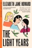

<b>As seen on BBC Two's <i>Between the Covers</i>  Told with exceptional grace, <i>The Light Years</i> is a modern classic of twentieth-century English life and is the first novel in Elizabeth Jane Howard’s extraordinary, bestselling family saga, The Cazalet Chronicles.</b>  <b>'Compelling, moving, unputdownable . . . Maybe my favourite books ever' - Marian Keyes, bestselling author of <i>My Favourite Mistake</i></b>  1937. Every summer, the Cazalet brothers – Hugh, Edward and Rupert – return to the family home in the heart of the Sussex countryside with their wives and children. There, they are joined by their formidable parents and unmarried sister Rachel to enjoy two glorious months of picnics, games and sun-drenched excursions to the coast. But not even this idyllic setting can soothe the siblings’ fears and heartache.  Hugh, haunted by memories of the Great War, is terrified at the looming prospect of a second. Edward, charming and handsome, is torn between his wife and his latest infidelity. Rupert, a talented painter, is in turmoil over his inability to please his demanding new wife. Meanwhile, Rachel’s unflinching loyalty to the family means risking her one chance at happiness . . .  <b>'She helps us to do the necessary thing – open our eyes and our hearts' – Hilary Mantel, bestselling author of <i>The Mirror and the Light</i></b>  <b><i>The Light Years</i> is the first volume in the extraordinary Cazalet Chronicles. Continue the dazzling historical series with <i>Marking Time</i>.</b>

[View on Apple](https://books.apple.com/gb/book/the-light-years/id427184379)

## Falling for the Older Man

Whether it's a stranger, your boss, your best friend's dad, your enemy, or the growly, reclusive mountain man everyone in town fears, falling for an older man means finding the kind of forbidden passion that will leave you breathless and begging for more. Experience these<i>&#xa0;</i>10 unique steamy stories about age gaps and unexpected love in the arms of an older man...  𝗧𝗵𝗶𝘀 𝗰𝗼𝗹𝗹𝗲𝗰𝘁𝗶𝗼𝗻 𝗶𝗻𝗰𝗹𝘂𝗱𝗲𝘀: Billionaire Lumberjack's Beauty by Gwyn McNamee Breach of Contract by Elizabeth Miller Hixon by Esther E. Schmidt Montana Protector by Hallie Bennett King's Crown by Marie Johnston Injustice and Absolution by Murphy Wallace Naughty Good Girl by Sapphire Knight Zeke by Shaw Hart Cruel Saint by T.K. Leigh Hot for Mr. Moneybags by Whitley Cox

[View on Apple](https://books.apple.com/gb/book/falling-for-the-older-man/id6786845692)

## Falling for the Forward

I co-signed loans for a man who promised forever. He took the money, fled the country, and left me drowning in his debt.
Now I'm working two jobs and barely surviving—until my new boss makes me an offer I can't refuse.
Carter Stanton is pro hockey's most eligible bachelor and the guardian of three little girls who've already lost too much. He needs a wife to secure permanent custody. I need half a million dollars to dig myself out of the hole my ex left me in.
The deal: fake marry him for one year. Play the devoted wife. Help him prove he can give his nieces a stable home. Walk away with enough money to start over.
It should be simple. Transactional. Safe.
But Carter isn't what I expected. Beneath the brooding scowls and sky-high walls, there's a man who reads bedtime stories in funny voices and panics over braiding hair. A man who looks at me across the dinner table like I'm not just playing a role.
And somewhere between becoming a family on paper and actually living like one, the lines blurred. The touches that were supposed to be for show linger too long. The warmth in his eyes when he thinks I'm not looking feels dangerously real.
I'm falling for a life that was never supposed to be mine.
The problem? Our marriage has an expiration date. The divorce papers are already drawn up, just waiting for signatures. And I have no idea if the man who's only ever let me in because of a contract could ever want me to stay for real.

_____________

Tropes: 

Pro Hockey Romance
Forced Proximity
Grumpy Sunshine
Fake Marriage
Found Family
He Falls First

_____________

Falling for the Forward is the first book in the Love on the Line series: all books are interconnected standalones about a team of professional hockey players and the women they fall hard for. The books don’t need to be read in order, but future characters appear in each book.

[View on Apple](https://books.apple.com/gb/book/falling-for-the-forward/id6737349097)

## Animal Farm

Animal Farm is a beast fable, in the form of a satirical allegorical novella, by George Orwell, first published in England on 17 August 1945. It tells the story of a group of farm animals who rebel against their human farmer, hoping to create a society where the animals can be equal, free, and happy. Ultimately, the rebellion is betrayed, and under the dictatorship of a pig named Napoleon, the farm ends up in a state as bad as it was before.

According to Orwell, Animal Farm reflects events leading up to the Russian Revolution of 1917 and then on into the Stalinist era of the Soviet Union. Orwell, a democratic socialist, was a critic of Joseph Stalin and hostile to Moscow-directed Stalinism, an attitude that was critically shaped by his experiences during the Barcelona May Days conflicts between the POUM and Stalinist forces during the Spanish Civil War. [a] In a letter to Yvonne Davet, Orwell described Animal Farm as a satirical tale against Stalin ("un conte satirique contre Staline"), and in his essay "Why I Write" (1946), wrote that Animal Farm was the first book in which he tried, with full consciousness of what he was doing, "to fuse political purpose and artistic purpose into one whole".

[View on Apple](https://books.apple.com/gb/book/animal-farm/id6449234055)

## The Bandalore: Pitch & Sickle Book One

<b>In Victorian England, the monsters don't always stay in the shadows. Some drag you from your grave and show you their true faces.</b>  Silas Mercer has no memory of his past — resurrected with only a name he doesn't recognise, and a summons from the mysterious Order of the Golden Dawn. Thrown into a hidden world of the arcane, the mythical, and the monstrous, he's partnered with Tobias Astaroth—an infamous rogue with a wicked tongue and a reputation as dark as his soul.  As Silas hunts horrors across England's countryside, he begins to realise that the greatest danger might lie closer than he imagined. Tobias is infuriating, impossible… and utterly magnetic. But beneath his charm lies a truth more perilous than any monster they will face.  When a chilling haunting draws them into the woods of Leicester, their partnership spirals into a nightmare of long-held secrets, dangerous desire, and formidable adversaries who don't take kindly to the Order's men getting in their way.  <b>On the hunt for the truth behind an ancient, angelic secret, a gentleman and a libertine will forge a bond neither of them wanted — and find a love that may damn them both.</b>  Begin The Diabolus Chronicles; a slow-burn MM dark historical fantasy of gothic mystery, forbidden magick, and reluctant partners with very inconvenient feelings. An eight-book gothic fantasy saga.  ⚠️ Content guidance This book contains:  •Violence and supernatural horror •Adult language and sexual content  Best suited to readers who enjoy dark, gothic fantasy with heart.  <b>Completed series (Eight Books):</b> The Verderer - Pitch &amp; Sickle Book Two The Skriker - Pitch &amp; Sickle Book Three The Greensward - Pitch &amp; Sickle Book Four The Fulbourn - Pitch &amp; Sickle Book Five The Herlequin - Pitch &amp; Sickle Book Six The Simurgh - Pitch &amp; Sickle Book Seven The Death Wish - Pitch &amp; Sickle Book Eight (Finale)

[View on Apple](https://books.apple.com/gb/book/the-bandalore-pitch-sickle-book-one/id1540873171)

## The Adventures of Sherlock Holmes

An Apple Books Classic edition.  You get not one, not two, but <i>25</i> gripping mysteries in Arthur Conan Doyle’s first of five collections of Sherlock Holmes short stories. Follow the brilliant and eccentric Holmes and his loyal sidekick, Dr. Watson, as they journey to lavish country estates to investigate baffling cases involving indiscreet royal affairs, cheetahs, redheads, and gypsies. Every one of Conan Doyle’s tales is full of surprising - but always logical - twists. (Fun fact: This book includes “The Speckled Band,” the author’s self-proclaimed favorite of all of his Sherlock Holmes short stories.)

[View on Apple](https://books.apple.com/gb/book/the-adventures-of-sherlock-holmes/id395536306)

## Saved

<b>He rescued her from the storm,</b>  <b>But who will save her from him?</b>  When a freak accident in the wilderness claims Erin's friends,  She's thankful for her brooding tour guide, Eli,  Especially when a sudden snow storm hits the forest.  Forced to take shelter with him in an abandoned cabin,  Erin succumbs to the visceral energy growing between them,  Relishing the way he takes control.  But she's bitten off more than she can chew with Eli.  <i><b>Her protector isn't a hero.</b></i>  <i><b>He's really the villain.</b></i>

[View on Apple](https://books.apple.com/gb/book/saved/id6740830083)

## Entice

When the most difficult decision of Laurie Baker's life needed to be made, she took off for a weekend alone to weigh her pros and cons and consider all her options.  What she didn't expect was to run face first into one more complication her life didn't need.  Distracting, sexy, and British, Liam Parker offered Laurie exactly what she needed when she was desperate for attention.  One night of pleasure.  She wanted it.  She craved it.  She took it.  And when the sunlight dawned and the lusty haze of one night of passion disappeared and reality revealed itself…  Laurie returned home knowing that everything she had once believed, everything she had once loved and desired, was about to be tossed upside down and shaken in a way she could never imagine.

[View on Apple](https://books.apple.com/gb/book/entice/id984019829)

## Murder in the Bistro

Is there a connection between the cat found napping in the flour barrel of the newest bistro and the dead American chef in the meat freezer? &#xa0;When it comes to Maggie Newberry and the cranky villagers of St-Buvard, how could there not be? 
Once more back in Provence, Maggie Newberry finds her hands full with village politics ratcheting up to nuclear level. &#xa0;Her BFF is back on her living room couch—this time with a snotty teenager in tow—and there’ a full-blown riot developing over the brand new American-owned bistro. When the fractious American chef ends up dead, Maggie will need to find out who killed her—and fast—before the chef’s killer decides that two dead Americans are better than one.

[View on Apple](https://books.apple.com/gb/book/murder-in-the-bistro/id1095434005)

## Petty Heart: A Feel Good Sports Romance Novella

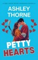

<b>Twenty years of rivalry. One season to ruin everything.</b>  Emma Porter has hated Scott Davidson since kindergarten. The spelling bees. The science fairs. The three hundred googly eyes on everything she owned.  So when he starts staring at her like she's someone he actually wants? She knows he's planning something big.  Scott has a problem. His childhood nemesis showed up to a party in a black dress, and his brain hasn't worked since. Now he can't stop noticing her, especially when she starts showing up to his hockey games, screaming about interference calls and learning plays faster than his freshmen.  Worse? He plays like a future first-round pick every time she's watching.  She's 5'2". He's 6'3". She's the one problem he can't solve. He's the one variable she can't control.  When sixteen&#xa0;years of rivalry collide with the kind of tension that makes it hard to breathe, the line between hate and something else was never a line at all.  It was a dare.  <b>Petty Hearts</b> is a closed-door hockey romance featuring rivals-to-lovers, a heroine who will fight you (and lose, because she's tiny), and enough competitive bickering to fill a penalty box.  <i>Alpha Athletes. Total Devotion. Closed Doors.</i>

[View on Apple](https://books.apple.com/gb/book/petty-heart-a-feel-good-sports-romance-novella/id6759760027)

## Seducing Mr Remington - Spicy Billionaire Romance

<b>SEBASTIAN</b>  Marry for love… not to lose our fortunes. That's the pledge we made ten years ago after our Harvard graduate brother suspiciously died three months into his marriage.  I've never wavered. The last thing I need is a woman distracting me from my billion-dollar NYC business. Taking it… or killing me.  So, when my private jet has an issue and I'm forced to fly first class, I take one look at Emily as she clambers over me and roll my eyes. She's clearly been upgraded, a sexy mess and totally out of her depth.  Four hours later, thirty thousand feet in the air, I get the best blow job of my life. Might have to rethink the private jet.  <b>EMILY</b>  That was <i>not</i> how I thought my new life in America would start.  I'm sure it's just a coincidence that his name is Sebastian, and so is my new boss.  Two days later, I find out I'm wrong.  <i><b>Seducing Mr. Remington is Book One in The Obsidian Club series - a spicy billionaire series with a romantic suspense twist. If you love forbidden workplace romances with a grumpy-sunshine trope, bantering wealthy men, and scorching hot happy ever after's tropes, then you'll love Sebastian and Emily's spicy love story. Can be read as a standalone.</b></i> &#xa0;

[View on Apple](https://books.apple.com/gb/book/seducing-mr-remington-spicy-billionaire-romance/id6740407641)

## Frankenstein

An Apple Books Classic edition.  Mary Shelley was just 18 when she had a nightmare vision: “I saw the pale student of unhallowed arts kneeling beside the thing he had put together. I saw the hideous phantasm of a man stretched out, and then, on the working of some powerful engine, show signs of life.”  Despite her lack of writing experience, Shelley converted her dream into what is often referred to as the world’s first horror novel, a timeless tale of science gone bad. <i>Frankenstein</i> follows the story of Swiss scientist Victor Frankenstein, who manages to animate a hulking creature referred to as a “monster,” “wretch,” or “fiend.” Shelley’s 1818 classic has become one of the most frequently taught works of fiction, a cultural touchstone for conversations about the dark side of innovation. (Made-up words like <i>Frankenscience</i> and<i>Frankenfood</i> have become shorthand for the products of technological tampering.) More than 200 years after it was published, this novel remains a thought-provoking read that explores timely themes like creators’ responsibilities for the unintended consequences of their inventions.

[View on Apple](https://books.apple.com/gb/book/frankenstein/id395546675)

## The Count of Monte Cristo

An Apple Books Classic edition.  Alexandre Dumas’ classic paints a portrait of Edmond Dantès, a dark and calculating man who is willing to wait years to exact his perfect plan for revenge. After his so-called friends frame him for treason, Dantès is sentenced to life imprisonment in a grim island fortress on what was supposed to be his wedding day. After 14 years, he manages to escape prison, but he is unable to free himself from an all-consuming fury. Instead, Dantès spends a decade carrying out the plan for revenge he conceived while behind bars, bringing nightmarish ruination to those who once betrayed him-and second chances to those who tried to save him.  When it was first published in 1844, <i>The Count of Monte Cristo</i> quickly became the best-selling book in all of Europe. Dumas’ novel was ahead of its time, an exciting tale of adventure, treasure, secret identities, and daring escapes. It also reads like an early psychological thriller, leaving readers uneasy as they cheer Dantès on in his vengeful quest. It’s no wonder this book has inspired dozens of screen adaptations!

[View on Apple](https://books.apple.com/gb/book/the-count-of-monte-cristo/id481657971)

## Unlucky in Love

Turns out, love’s a lot like luck. You don’t know just how good you have it until you stand to lose it all.

Kristen Collins is cursed. It’s the only explanation for this recent run of catastrophes. She’s lost her brand-new car and a winning lottery ticket, and her ex-boyfriend just drove off with all her possessions. She’s even lost the empty office that’s been her lunchtime sanctuary. Plus, the new hire who’s taken it over is precisely the kind of impending heartache she knows to avoid, from his intense gaze to that irresistible crooked smile.
Developer Aiden Scott plans to stay at the Denver architecture firm just long enough to prime it for takeover. A job like his can’t get personal. Yet from the moment he collides with Kristen, he’s smitten. He wants to save the stunning interior designer from every crazy scenario she winds up in. But who’s going to save him when his business agenda shatters Kristen’s trust?

[View on Apple](https://books.apple.com/gb/book/unlucky-in-love/id6748706929)

## The Next Girl

<b>IF YOU ONLY READ ONE BOOK THIS YEAR, MAKE IT <i>THE NEXT GIRL...</i></b> 
<b><i></i></b> 
<b>You thought he’d come to save you. You were wrong.</b> 
<b></b> 
‘<b>Absolutely the best thriller I’ve read this year!</b>’ Goodreads Reviewer, 5 stars 
‘I absolutely, totally and <b>utterly LOVED reading <i>The Next Girl</i></b>… has to be <b>one of my top reads of 2018</b>.' <i>Ginger Book Geek</i>, 5 stars 
‘<b>Oh my goodness!</b> This was <b>gripping and fast moving</b> from page one.’ <i>Southern and Sassy Wine Lady</i>, 5 stars  
<b>Deborah Jenkins</b> pulls her coat around her for the short walk home in the pouring rain. But she never makes it home that night. And she is never seen again…  
Four years later, an abandoned baby girl is found wrapped in dirty rags on a doorstep. An anonymous phone call urges the police to run a DNA test on the baby. But nobody is prepared for the results.&#xa0; 
<b></b> 
<b>The newborn belongs to Deborah. She’s still alive...</b>  
<b>THE GRIPPING THRILLER EVERYONE’S TALKING ABOUT – if you like Lisa Gardner, Robert Bryndza or Clare Mackintosh, you will absolutely love this. A completely unputdownable page-turner with an ending that will blow your mind.</b> 
<b></b> 
<b>**Each Gina Harte book can be read as part of the series or as a standalone**</b>  
‘Boy oh boy… <b>I absolutely blinking well LOVED it</b>.’ <i>Ginger Book Geek</i>, 5 stars 
‘<b>Just wow!</b>... <b>FANTASTIC... I just had to keep reading</b>.’<b> </b><i>Bonnie’s Book Talk</i>, 5 stars 
‘<b>I couldn’t put it down.</b>’ Goodreads Reviewer, 5 stars 
‘<b>Wow, wow wow!</b> Excellent book!’ Goodreads reviewer, 5 stars 
‘OMG... <b>gripping</b>... I have goosebumps.’ Goodreads reviewer, 5 stars 
‘I am <b>in love</b> with this author.’ Goodreads reviewer, 5 stars 
‘<b>Brilliant!... Exceptional... Thrilling... superb</b>.’ Renita D’Silva, 5 stars 
‘A <b>fantastic </b>book!!!!!<b> OMG so much suspense</b>.’ Goodreads reviewer, 5 stars 
‘I found this book <b>unputdownable!!</b>’ Goodreads reviewer 
‘<b>Brilliant, absolutely brilliant!!</b>’<b> </b>Goodreads reviewer, 5 stars 
‘I was<b> hooked from the start right to the last page</b>.’<b> </b>Goodreads reviewer, 5 stars 
‘<b>I loved this book! </b>Chilling, disturbing and gripping<b>!</b>’ Goodreads reviewer, 5 stars 
‘<b>DI Gina Harte is my new heroine!</b>’ Goodreads Reviewer, 5 stars  
‘I like to give honest reviews. If I don't like a book I will say I don't like it... So here goes my review of <i>The Next Girl</i>.... without a doubt this is <b>a fantastic book!!!!! OMG</b>... This book <b>literally I was not able to put down </b>it kept me <b>captivated</b> from the first chapter. Who left the baby on the library steps? and why? How is this baby connected to missing person Deborah Jenkins?... <b>YOU will HAVE to read to find out!</b>... There is nothing that I didn't like about this book. <b>SO much suspense that kept you flipping through the pages to the end! Read today you will not be disappointed!</b>’ Goodreads reviewer, 5 stars

[View on Apple](https://books.apple.com/gb/book/the-next-girl/id1331419687)

## He's So Into Her

Three men. Three women who have no idea. And three hearts that fell first—and fell hard.

He noticed first. He fell first. Now he's just waiting for her to catch up.

In this collection of he-falls-first romances, the heroines are too busy holding their worlds together to see what's right in front of them: a man who's already, completely, hopelessly into her.

Hero Ever After — She's the small-town mayor, the diner-booth lawyer, and the secret romantasy author whose viral hero looks an awful lot like her brother's best friend. When Ramsey Shaw comes home and kisses her like he knows the truth, the woman who's always been strong, quiet, and in control finally wants to be something else entirely: his.

Playboy in a Kilt — Connor MacKean has spent years being nothing more than her best friend's little brother. Now the marriage pact is broken, the playboy's reformed, and a fake engagement at his family's Scottish estate is starting to feel dangerously real. Trouble is, his Cinderella doesn't believe in princes—and isn't sure she deserves the fairy tale.

Don't You Wanna Stay — Contractor Wyatt Sullivan needs one big renovation to launch his home-improvement show. Newly divorced Deanna James needs to flip a historic disaster before her ex takes everything. The catch? Cameras rolling, walls coming down, and both of them under one roof—giving the viewers far more chemistry than either signed up for.

Because the best love stories start the moment he realizes he's already fallen.

[View on Apple](https://books.apple.com/gb/book/hes-so-into-her/id6778954089)

## The Iliad

The&#xa0;Iliad&#xa0;(sometimes referred to as the&#xa0;Song of Ilion&#xa0;or&#xa0;Song of Ilium) is an&#xa0;ancient Greek&#xa0;epic poem&#xa0;in&#xa0;dactylic hexameter, traditionally attributed to&#xa0;Homer. Set during the&#xa0;Trojan War, the ten-year siege of the city of&#xa0;Troy(Ilium) by a coalition of Greek states, it tells of the battles and events during the weeks of a quarrel between King&#xa0;Agamemnon&#xa0;and the warrior&#xa0;Achilles

[View on Apple](https://books.apple.com/gb/book/the-iliad/id498687001)

## Her Dragon Defender: A Rapunzel Retelling

<i><b>She expected to attend a fairytale ball, not become a character in one…</b></i>&#xa0; When I wake up locked in a tower, my only companions are a bottle of champagne and a terrifyingly large bed. I came here looking for my missing best friend, but now I'm the one who needs saving.  Then he appears on my balcony, a dangerously handsome man with silver hair and eyes that burn like indigo fire. He says he's here to rescue me, but he's looking for his sister… my friend. And he seems to think I have answers. I don't know who to fear more: the man who locked me in here, or the dragon shifter who looks at me like he's finally found his treasure.  <i>Her Dragon Defender</i> is the first book in the steamy Fated Mates of Mirror Academy romantasy series. If you like protective alpha heroes, spicy fairytale retellings, and fated mates, you'll love Demelza Carlton's addictive read. Begin your next adventure with <i>Her Dragon Defender</i> now.

[View on Apple](https://books.apple.com/gb/book/her-dragon-defender-a-rapunzel-retelling/id6745272181)

## Dracula

An Apple Books Classic edition.  Few characters have seized readers’ imaginations quite like Count Dracula of Transylvania, the hero of Bram Stoker’s classic. The 1897 novel put vampires front and center on the cultural map, providing direct inspiration for an entire subgenre of bloodsucker fiction - including blockbusters like the <i>Twilight</i> series and Anne Rice’s <i>Vampire Chronicles</i> - and spawning hundreds of movie adaptations!  Stoker’s novel is a thrill ride, following Dracula as he moves from Transylvania to England in search of fresh blood, while a small but dedicated group attempts to thwart him. Want more Stoker? Check out his great-grandnephew Dacre Stoker’s 2018 novel, <i>Dracul</i>.

[View on Apple](https://books.apple.com/gb/book/dracula/id395541616)

## I Loved You First

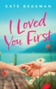

First Love. Second Chances. 
&#xa0; 
Fiona Willis always wanted a big, exciting life. At twenty-seven, she has one: great friends, a Seattle condo with an amazing view, and a killer job as a senior events planner with a world-renowned firm. So why can’t she forget the man who shattered her dreams and broke her heart? 
&#xa0; 
Cameron Bennet has his hands full. As a single dad and head construction manager at Bennet &amp; Sons, he’s an expert at the juggling act. Between playdates, soccer practices, and his hectic work schedule, he rarely has time to relax. Yet even on his craziest days, he’s never stopped thinking about the one who got away. 
&#xa0; 
When an emergency forces Fiona to return to her hometown, she discovers that nothing is how she thought it would be. Fiona tries her best to avoid Cam and their undeniable chemistry, but Cam is determined to right his wrongs before Fiona disappears from his life again.

[View on Apple](https://books.apple.com/gb/book/i-loved-you-first/id6584513658)

## The Vampire Spy

<b>Will he choose the sexy spy and bond, or remain loyal to the king and protect the race?</b>  Lance De Luca, a powerful warrior in the Moretti royal army, has captured a beautiful woman he believes to be a spy. In other words, the enemy!  Sparks ignite as he interrogates her, but she's the forbidden fruit he cannot taste.  To prove her innocence, Sofia is asked to become a double agent, forcing her back into the dangerous world she's just escaped.  Forced to watch and hide his feelings for the woman who could be his mate, Lance must let Sofia complete her mission or risk the fate of all vampires.  &#xa0;  <b><i>The Vampire Spy is the next installment in the bestselling steamy paranormal romance series the Moretti Blood Brothers. Part romance, part suspense, it will appeal to readers who love fated-mates, enemies to lovers, and military romance with supernatural abilities. And delicious happy ever after's.</i></b>

[View on Apple](https://books.apple.com/gb/book/the-vampire-spy/id1584811413)

## The Rebound

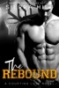

<b>He's my older brother's friend and teammate. Off-limits, unavailable and forbidden.</b>  A brother's best friend college sports romance  There are times I wish I was someone other than the shy, geeky, college virgin that I am.  I also wish that my crush on Van Gerard wasn't one sided and that he looked at me as something other than his best friend's little sister.  But he's firmly drawn the line in the friendship territory, even though there are times I think he might feel the same way about me. But then I remember that Van has a long-time girlfriend and we're strictly in the friend zone.  But I want more.  So, when Van's life is turned upside down, I'm there to comfort him. To break his fall. I'm his shoulder to cry on.  Even if he only considers me a rebound.

[View on Apple](https://books.apple.com/gb/book/the-rebound/id1555064719)

## Playing with Forever

Chase Noble always seemed unattainable…until one night with him at the Players Club changed everything.

I’ve wanted Chase for years, but much to my frustration, he’s always considered me off limits. When I walk into the Players Club with one goal in mind, to find a man who will give me what I need, it’s the maddeningly dominant, possessive (and I soon discover, pierced) Chase who refuses to allow any other man to touch me. He gives me a night I’ll never forget, a taste of what is possible, and I want more. With him. 

But Chase is a man with a dark past and secrets, and even though we come to an agreement, where I’m the student and he’s the teacher, he insists this is all it could ever be. That he’s not capable of anything more.

Just as things begin to heat up between us, someone starts leaving me cryptic messages and watching my every move. Chase insists I move in with him so he can protect me, and the moment I do, our undeniable chemistry ignites into something deeper than either of us expected. 

Soon, his protection isn’t enough. I want all of him—his body, his heart, and his trust. And this time, I’m not letting him go without a fight.  

Playing with Forever is a steamy romance with high stakes tension, a possessive alpha hero, and a love worth fighting for.

[View on Apple](https://books.apple.com/gb/book/playing-with-forever/id6743733329)

## The Art of War

An Apple Books Classic edition.  It’s believed that Sun Tzu wrote this Chinese military primer during the 5th century BC-hundreds of years before the Bible. The book’s 13 chapters explore principles that statesmen around the globe have employed for centuries to defeat their enemies at war.  Sun Tzu starts by mapping out the five fundamental factors that lead to war. He then covers a wide range of topics, from avoiding conflict altogether to strategically positioning soldiers, pulling off tactical maneuvers, and putting spies to use.  Despite the technological advances made since <i>The Art of War</i> was published, Sun Tzu is still considered one of history’s foremost military strategists, and his methods still ring true. While he wrote the book as a manual for those who would literally wield swords, it has reached a much broader audience in this day and age. Warriors of all kinds-like corporate leaders or athletes-seek out Sun Tzu’s wisdom in their quest for success.

[View on Apple](https://books.apple.com/gb/book/the-art-of-war/id395534623)

## The Tea Witch's Secret

<b>Hana knows she shouldn't fall for Oliver, even if his familiar training constantly leads him back to her for healing.&#xa0;</b>  As a tea witch and healer, Hana knows her role in Purple Oak Oasis, and as the heir of the Steeper family, she knows better than to fall for someone she shouldn't. But the heart wants what it wants, and for Hana Steeper, that means Oliver Fields.&#xa0;  Oliver's trouble with his owl familiar leads him to the infirmary, where he gets to flirt with the very cute Hana as much as he wants. When their friendship turns into something more, it's not long before they're unable to resist.&#xa0;  Are their feelings stronger than the rules they should be listening to?  -&#xa0;  The Tea Witch's Secret is a cozy fantasy romance with a friends-to-lovers m/f forbidden romance, an enthusiastic owl familiar, and a healer determined to do her job.&#xa0;

[View on Apple](https://books.apple.com/gb/book/the-tea-witchs-secret/id6743140744)

## Knock Knock

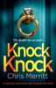

⭐⭐⭐⭐⭐ ‘<b>Wow. I absolutely loved this book!...</b> I was not able to put it down from the moment I started it, so much so that <b>I devoured it in just two days</b>.’ Goodreads reviewer  
<b>Natasha Mayston wasn’t expecting anyone to knock on her door so late at night. And she has no idea that the face staring back at her is the last one she’ll ever see…</b>  
As <b>Detective Dan Lockhart</b> is called to a wealthy London street to investigate Natasha’s death, he’s startled by the similarity to a previous case. Noticing the cable-tie restraints and the tiny scratches on Natasha’s wedding finger, Dan already knows what he will find if he looks in her mouth – the metal ball which choked her to death. He knows Natasha isn’t the killer’s first victim and is certain that he will strike again.  
Months earlier, Kim Hardy was found in the same position in a run-down hotel across the city – an identical silver ball in her throat. But Kim’s murderer was caught and sent to prison – did they arrest the wrong man? And what connects the two victims? Fearing that he’s dealing with a psychopathic serial killer, Dan calls in <b>psychologist Dr Lexi Green</b> to help him to get into the perpetrator’s mind. Tough and smart, Lexi will stop at nothing to hunt down the man responsible for the deaths.  
Then, another body is discovered, just as Lexi finds a clue online leading to the killer. Dan’s team aren’t convinced, but in pushing Lexi away from the investigation, they force her to dig further into the case on her own. Convinced that she’s on to something, she puts herself in unthinkable danger… but can Dan piece together the clues and identify the killer before it’s too late?  
<b>Fans of Angela Marsons, Robert Dugoni and Cara Hunter will love this thrilling new series from Chris Merritt. From an explosive start to a heart-stopping finale, you will not want to put this book down!</b> 
<b></b> 
What readers are saying about <i>Knock Knock</i>: 
‘<b>Gripping from the get go</b>… <b>Impossible to put down</b> once you start… The fact that I kept turning the pages, the adrenalin pumping, makes <i>Knock Knock</i> a <b>compelling read</b>.’ Goodreads reviewer, 5 stars  
‘<b>My heart beating so fast!</b> I couldn’t believe what I was reading. <b>It had me in shock</b>. Every page, every chapter was a page turner… <b>What a rollercoaster</b>.’ Goodreads reviewer, 5 stars  
‘<b>Oh wow</b>… I am a huge fan of this author’s work… These are the books that I love!... <b>This book is just great, greater, the greatest!</b>’ <i>B for Bookreview</i>, 5 stars 
<i></i> 
‘Loved the book. It’s <b>edge of your seat</b> reading.’ Goodreads reviewer  
‘<b>Wow!</b> This is one of the best books I have read this year. <b>Really incredible!</b>’ Goodreads reviewer, 5 stars 
<i></i> 
‘<b>Oh, this was good, very, very good</b>… <b>I was blown away</b>… It’s <b>one hell of a good thriller</b>.’ Goodreads reviewer 
<i></i> 
‘<b>I fell into this story and finished it in two days</b>… <b>A must read</b>.’ <i>Two Girls and a Book Obsession, </i>5 stars  
‘<b>My heart was in my mouth</b>… I loved it.’ Goodreads reviewer, 5 stars  
‘What a roller coaster!... <b>Like OMG!</b>... It’s so good.’ Goodreads reviewer, 5 stars&#xa0;  
‘An absolutely <b>gripping</b> and <b>fantastic</b> read.’ NetGalley Reviewer, 5 stars  
‘The ending is <b>brilliant</b> and full of suspense.’ Goodreads reviewer, 5 stars  
‘I was completely immersed in the story, the suspense had my <b>heart pounding</b> at times. This is an <b>unmissable and intense thriller</b>.’ Goodreads reviewer, 5 stars  
‘<b>Tense and chilling with so many twist and turns</b>.’ NetGalley reviewer  
‘I <b>literally couldn’t put it down</b>.’ <i>Book Lover</i>, 5 stars&#xa0;  
‘A fast-paced thriller with a <b>jaw-dropping finale</b>.’ Goodreads reviewer, 5 stars

[View on Apple](https://books.apple.com/gb/book/knock-knock/id6503291688)

## Aftershocks

Her past and her present collide with earthshaking results. Who will be her future…assuming she has one?

Sixteen years ago, Zoe Ardmore was abducted and held for a year before she escaped. After struggling to overcome the damage done by that year, she has put it behind her—completely. Her fiancé, Kellen Stone, doesn’t even know it happened. She has a successful career and social life untainted by the past.

Now her abductors have been released from prison, jeopardizing every part of that new life. She took something from them, a treasure they’ll never stop seeking, and they’ve threatened her new family if she doesn’t return that treasure. The problem is that she has no idea where it is. The solution? Grant Neely, the one person who knows everything about that dark time. He’s now a mercenary with the connections and skills to help her resolve this mess. He’s also the man whose proposal she refused ten years ago.

Zoe breaks her engagement and sells her company in an effort to remove the threat hanging over the people she cares about. But the only permanent solution is to find the treasure and destroy it so her enemies have no reason to come after her or anyone else. Grant’s the one man who can help her, even if it means dredging up old feelings. But then Kell shows up, refusing to be sidelined and showing Zoe that none of them are who they seem to be. At the end of her quest will be the hardest decision she’s ever had to make—if she’s around to make it.

This action-adventure romance launches the Seismic Victory series! Get book 2, Resonance, then read The Road to Victory, which leads right into the plight of the security company, Victory, in Victory on the Edge.

[View on Apple](https://books.apple.com/gb/book/aftershocks/id1515487217)

## Crime and Punishment

An Apple Books Classic edition.  Fyodor Dostoevsky’s intense novel uses the trappings of a taut thriller to excavate some of the darkest moral questions of the human experience.   Impoverished ex–law student Rodion Raskolnikov is at odds with himself. He’s wildly intelligent but can’t seem to outwit his own desperate circumstances. That is, until he decides to rob and murder an underhanded pawnbroker. After all, he thinks, by ridding the world of her cruelty, he’s committed a benevolent act.  But even as Raskolnikov is justifying himself in the grandest terms, the true moral weight of his actions is already stalking him through the shadowy streets of Saint Petersburg—and his own tortured subconscious. Grimy and enthralling, <i>Crime and Punishment</i> pits reason against principle, rationality against heart.

[View on Apple](https://books.apple.com/gb/book/crime-and-punishment/id6763984106)

## Free Your Mind

Everything is changing now. You don’t have to underestimate yourself as science is showing just how amazing and complex your brain really is. You don’t have to limit your horizons as the ability to create a new, empowered reality is available for you right now. You don’t have to settle for old ways of thinking as you can choose a more realistic mindset. You don’t have to accept a life of unhappiness as happiness is yours to control. You don’t have to live in fear as you can choose to be more optimistic. You don’t have to accept helplessness as you can embrace truths that empower your life. You don’t have to accept limiting beliefs as you can decide to free your mind… Now is the time to see yourself in a new light. This entertaining book will show you powerful ways to liberate your thinking. With science, psychology and inspiring examples – including the author’s own experiences sprinkled with a little humor too – ‘Free Your Mind’ illuminates your personal path, breaking down barriers to a new reality for you. It’s time to allow the truth to set you free!

[View on Apple](https://books.apple.com/gb/book/free-your-mind/id988186383)

## Dream Psychology

An Apple Books Classic edition.  Written by the founding father of psychoanalysis, Sigmund Freud’s 1899 book is the definitive text on learning to interpret dreams. Freud’s groundbreaking approach to healing psychiatric issues through dialogue between a patient and therapist gave us enduring concepts like projection and transference, as well as the superego, ego, and id.  Above all, Freud advanced the progressive idea of unconscious desire as a driving force for our thoughts and actions. This paved the way for the revolutionary notion that dreams are more than wild nonsense-they’re a channel for symbolically communicating our innermost fears, conflicts, and desires. While many of Freud’s theories have fallen out of fashion, <i>Dream Psychology</i> is a great introduction to the influential field of psychoanalysis. It’s a fascinating look into the world of the subconscious-and the human mind.

[View on Apple](https://books.apple.com/gb/book/dream-psychology/id395687522)

## The Wind in the Willows

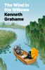

An Apple Books Classics edition.  Visit the Wild Wood along the pastoral banks of the Thames, where quiet Mole and fun-loving Water Rat seek out their friends Badger and Toad for adventures. When Toad’s reckless driving gets him into big trouble, he must rely on his friends to help him out—and as the season turns, the friends must band together against a crew of ferocious stoats, ferrets, and weasels who are threatening to steal Toad Hall.  See why Kenneth Grahame’s charming tale of friendship and home has captured the hearts of children—and adults—everywhere since its publication in 1908.

[View on Apple](https://books.apple.com/gb/book/the-wind-in-the-willows/id510922680)

## Little Women

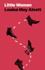

An Apple Books Classic edition.  Meet the Marches! Louisa May Alcott’s classic introduces us to four unforgettable sisters: beautiful Meg, tomboyish Jo, delicate Beth, and Amy, the indulged youngest of the lot. With their father serving as a Union chaplain, the Marches help their devoted mother, Marmee, make ends meet as their fortunes dwindle. The book starts with the family performing a small act of kindness for a family even less fortunate than they are and expands from there, drawing us in as the March girls grow up-and experience joy, hardship, failure, heartbreak, success, and love.  Alcott’s novel draws from her own life story. She herself was one of four sisters who all struck out on different paths. Open the pages of &gt;Little Women and fall into a world of innocence and generosity-one that you’ll want to return to again and again.

[View on Apple](https://books.apple.com/gb/book/little-women/id392614050)

## The Strange Case of Dr. Jekyll and Mr. Hyde

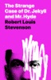

An Apple Books Classic edition.  What would happen if you let your darkness out? Are you certain you’d be able to rein it back in? When Dr. Jekyll turned toward the dark side, he was convinced he could turn back at will, while his friends assumed he’d fallen under the influence of the criminal Mr. Hyde. But the good doctor—and all his acquaintances—were very, very wrong. Can Dr. Jekyll escape the clutches of Mr. Hyde before it’s too late?  Set in the London society of the 1880s, Robert Louis Stevenson’s classic novella is a masterful tale of suspense and psychological intrigue. The story plays to primal fears like losing control of ourselves and discovering that a person we trusted is actually someone—or something—else entirely: a monster. <i>The Strange Case of Dr. Jekyll and Mr. Hyde</i> is a must-read for anyone who loves mysteries and crime fiction.

[View on Apple](https://books.apple.com/gb/book/the-strange-case-of-dr-jekyll-and-mr-hyde/id395542998)

## Emma

An Apple Books Classic edition.  Emma Woodhouse may just be Jane Austen’s most controversial character. Some see her as a spoiled narcissist who’s deluded about reality, while others view her as a well-intentioned and bitingly sarcastic young woman who matures before our eyes.  This well-loved novel-which is often adapted for the screen-is set in the early 19th century, among England’s landed gentry. After seeing her governess happily married, Emma decides she is a natural matchmaker and devises a plan to find her new friend Harriet a mate. What follows has all the makings of a contemporary soap opera. As usual, Austen portrays her contemporaries with a brilliant and subtle snark. <i>Emma</i> is a wonderfully entertaining read.

[View on Apple](https://books.apple.com/gb/book/emma/id395536171)

## The Idiot

An Apple Books Classic edition.  Bold, romantic, and emotionally explosive, <i>The Idiot</i> follows a kindhearted prince whose sincerity is so rare, the people he encounters don’t know whether they should adore him or destroy him.   When Prince Myshkin returns to Saint Petersburg after years in a Swiss sanitarium, his openness and kindheartedness unsettle a society ruled by power and money. Drawn into the orbit of two women—brilliant, wounded Nastasya Filippovna and spirited Aglaya Epanchin—he finds himself at the heart of a perilous rivalry.  With daring psychological insight and disarming flashes of comedy, Fyodor Dostoyevsky examines what goodness looks like when it’s caught between desire and society’s pressure to conform. <i>The Idiot</i> reveals how easily innocence is mistaken for weakness and how steep the cost can be for those who keep believing in love.

[View on Apple](https://books.apple.com/gb/book/the-idiot/id395539815)

## Sense and Sensibility

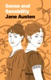

An Apple Books Classic edition. 
Jane Austen’s first published novel is a sparkling, heartfelt tale of family, friendship, and changes of the heart.&#xa0; 
Elinor Dashwood is the voice of reason. Her sister, Marianne, is impulsive and emotionally reactive. When their family loses its fortune, they have to trade a grand estate for a quiet cottage and step into an unpredictable new world of love, gossip, and heartbreak. 
One guards her heart, the other dives in feelings-first. As secrets surface and affections are tested, both discover that reason <i>and</i> passion together might be the perfect combination. Sharp, funny, and romantic, <i>Sense and Sensibility</i> captures Austen’s keen eye for love in all its messy forms.

[View on Apple](https://books.apple.com/gb/book/sense-and-sensibility/id481665171)

## Knee Deep In Love

<b>I'm a man who's eager to see the world.</b>  A new job offer opens up in Utah of all places, and I decide to welcome the opportunity with open arms. Why not? I've got nothing left to lose and everything to gain.  A beautiful new state with a breathtaking view, but I can only see one thing in the place I now call home… Candice.  She's spent her entire life here, and she's stuck in a rut. A bad one.  The only thing that seems to keep her getting out of the bed in the morning is her little girl. Being a single mother has to be beyond tough, but her daughter Sarah makes it easy.  Something about her makes my heart swell. No, not something. Everything.  She might have grown up in the cold icy winter of the northwest, but I want so badly to show her the beauty of what's right in front of her face. A chance at a love affair like she couldn't imagine or read about.  <b>Why? Because she stole my heart on my long road back to love.</b>

[View on Apple](https://books.apple.com/gb/book/knee-deep-in-love/id6692632381)

## Diary of a 7th Grade Drama Queen

Twelve-year-old Taylor Raegan Quinn never expected seventh grade to be easy, but from the very start she winds up in the middle of friendship battles, secrets, and a whole lot of drama.  She loses her best friend, gets blackmailed by her own brother, and winds up the target of secret notes—both from a secret admirer and someone threatening to ruin her life.  Can she dig her way out of all the drama and manage to pass seventh grade?

[View on Apple](https://books.apple.com/gb/book/diary-of-a-7th-grade-drama-queen/id1477089263)

## Behind Her Lies (An Elise Close Psychological Thriller—Book One)

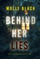

“I binge read this book. It hooked me in and didn't stop till the last few pages… I look forward to reading more!” 
—Reader review for Found You 
⭐⭐⭐⭐⭐ 
&#xa0; 
<b>Celebrity therapist Elise Close</b> is no stranger to families with skeletons in their closets. 
&#xa0; 
But when she crosses the threshold into <b>the Nolan household on Boston's exclusive Beacon Hill</b>, she may be entering a crypt of secrets and lies. 
&#xa0; 
Hired to treat their son's sudden engagement-induced turmoil,<b> Elise discovers a psychopathic person and cunning agenda </b>that could ruin the family's legacy. 
&#xa0; 
But with sleepless nights and overmedication, <b>distinguishing friend from foe becomes a perilous game.</b> Can Elise maintain her grasp on reality long enough to protect a legacy?&#xa0; 
&#xa0; 
Or <b>will she be undone by ghosts of her own making?</b> 
&#xa0; 
BEHIND HER LIES is the first book in a highly anticipated new psychological suspense series by critically-acclaimed and #1 bestselling mystery and suspense author Molly Black, whose books have received over 2,000 five-star reviews and ratings. 
&#xa0; 
Future books in the series are also available! 
&#xa0; 
&#xa0;“Molly Black has written a taut thriller that will keep you on the edge of your seat… I absolutely loved this book and can’t wait to read the next book in the series!” 
—Reader review for Girl One: Murder 
⭐⭐⭐⭐⭐ 
&#xa0; 
“I loved this book! Fast-paced plot, great characters and interesting insights into investigating cold cases. I can't wait to read the next book!” 
—Reader review for Girl One: Murder 
⭐⭐⭐⭐⭐ 
&#xa0; 
“Very good book… You will feel like you are right there looking for the kidnapper! I know I will be reading more in this series!” 
—Reader review for Girl One: Murder 
⭐⭐⭐⭐⭐ 
&#xa0; 
&#xa0; 
“This is a very well written book and holds your interest from page 1… Definitely looking forward to reading the next one in the series, and hopefully others as well!” 
—Reader review for Girl One: Murder 
⭐⭐⭐⭐⭐ 
&#xa0; 
“Wow, I cannot wait for the next in this series. Starts with a bang and just keeps going.” 
—Reader review for Girl One: Murder 
⭐⭐⭐⭐⭐ 
&#xa0; 
“Well written book with a great plot, one that will keep you up at night. A page turner!” 
—Reader review for Girl One: Murder 
⭐⭐⭐⭐⭐ 
&#xa0; 
“A great suspense that keeps you reading… can't wait for the next in this series!” 
—Reader review for Found You 
⭐⭐⭐⭐⭐ 
&#xa0; 
“Sooo soo good! There are a few unforeseen twists… I binge read this like I binge watch Netflix. It just sucks you in.” 
—Reader review for Found You 
⭐⭐⭐⭐⭐

[View on Apple](https://books.apple.com/gb/book/behind-her-lies-an-elise-close-psychological/id6502605251)

## How to Choose a Guy in 10 Days

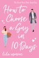

The only thing more hilarious than the movies is… real life?! Fall in love with the sizzling grumpy-sunshine romantic comedy - perfect for fans of Sophie Kinsella and Ali Hazelwood!  
Stylist Gemma Jones is competing for a once-in-a-lifetime promotion. All she has to do is take some fashion-backward guy from geek to GQ-worthy. The only problem? The man in question is her hairy manwhore of a next-door neighbor. AKA Bigfoot.  
Zach Morrison has zero interest in being Gemma’s makeover mannequin. Sure, it’s fun getting his smart-mouthed neighbor all riled up, but after cashing out of his tech start-up and going through an ugly break-up, he’s taking a permanent vacation. If he wants to wear sweatpants and sleep on a mattress in the corner of an empty apartment—  
OK. Maybe he needs a little push in the right direction. But as Gemma races the clock to win her bet, she finds that Bigfoot’s been hiding a few things under his baggy flannel shirts. Like abs of steel, and a surprisingly big...  
Heart. He has a big heart.  
Soon, sparks are flying between this unlikely couple, but can Zach embrace a fresh start - however manscaped it might be? And will Gemma beat out her fashionista rival for the top spot - and keep the truth about their bet from Zach?&#xa0;  
Find out in the hot and hilarious new romance from “the reigning queen of rom-com”, USA Today bestselling author Lila Monroe.&#xa0;  
The Chick Flick Club series: 
1. How to Choose a Guy in 10 Days 
2. You’ve Got Male&#xa0; 
3. Frisky Business

[View on Apple](https://books.apple.com/gb/book/how-to-choose-a-guy-in-10-days/id1341543775)

## Broken Angel

<i><b>He's gone without a trace, but I know his heart is still beating.</b></i>  <b>RUSLAN</b>  The men who shackled me here were told not to kill me. They should have when they had the chance. Now, I'm going to take them out one by one.  Once I figure out who's behind this, I won't hold back my anger. Revenge is a dish best served cold, and I'll make sure to hit them where it hurts the most.  But as soon as I'm free, I'm going to find her first.  The thief who may not be a thief… unless it's matters of the heart. She clenches mine in her fist, and I don't want her to let go.  <b>AMELIA</b>  The handsome Russian man I had a one-night stand with is gone. All I'm left with is the sickening realization he helped me make – that my ex-boyfriend stole my identity, and I've been paying off his debt.  Ruslan could have helped me out of this mess, but now that he's disappeared, I have no one on my side. I have to find him.  Not just because I owe him… because I can't be without him.  <i><b>Broken Angel</b></i><b> is book one of </b><i><b>The Umarova Crime Family </b></i><b>dark mafia series of interconnected standalone, full-length novels. Devour this decadent mafia story next!</b>  Step into the world of Ivy Black, where steamy dark romance meets danger and desire. From ruthless mafia kings to brooding motorcycle club bad boys, each story delivers intense passion, forbidden love, and possessive alphas who always claim what's theirs. Perfect for fans of spicy romance, dark desires, and unforgettable happily ever afters. &#xa0;

[View on Apple](https://books.apple.com/gb/book/broken-angel/id6738701788)

## The Wonderful Wizard of Oz

An Apple Books Classic edition.  Adventure takes a more mythic turn in <i>Rinkitink in Oz</i>, a thrilling fairy-tale quest filled with L. Frank Baum’s trademark whimsy and color. Prince Inga’s father protects their peaceful island kingdom of Pingaree with his three magic pearls. But when the island is invaded and conquered, Inga must flee with the cheerfully bumbling royal visitor King Rinkitink and use the magic pearls himself to save his parents and his home.  As the pair faces dangers and meets new allies—including some familiar characters for Oz fans—Inga must learn not only to use his new powers, but also his head when he loses those powers. <i>Rinkitink in Oz</i> steps beyond the Emerald City for a seafaring adventure that’s equal parts wit and wonder.

[View on Apple](https://books.apple.com/gb/book/the-wonderful-wizard-of-oz/id395544690)

## The Iliad of Homer

The Iliad (sometimes referred to as the Song of Ilion or Song of Ilium) is an ancient Greek epic poem in dactylic hexameter, traditionally attributed to Homer. Set during the Trojan War, the ten-year siege of the city of Troy (Ilium) by a coalition of Greek states, it tells of the battles and events during the weeks of a quarrel between King Agamemnon and the warrior Achilles.  
Although the story covers only a few weeks in the final year of the war, the Iliad mentions or alludes to many of the Greek legends about the siege; the earlier events, such as the gathering of warriors for the siege, the cause of the war, and related concerns tend to appear near the beginning. Then the epic narrative takes up events prophesied for the future, such as Achilles' looming death and the sack of Troy, prefigured and alluded to more and more vividly, so that when it reaches an end, the poem has told a more or less complete tale of the Trojan War.

[View on Apple](https://books.apple.com/gb/book/the-iliad-of-homer/id765086010)

## Moonlight Murder Mystery Club: A Bitter Taste Book 1 of 5

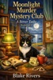

<i>Some mornings start with coffee. Sage Holloway's started with a corpse.</i>  <i>When Crescent Harbor's most hated developer drops dead, police zero in on the obvious suspect — Sage's employee, a single mom whose public threat against him now looks an awful lot like motive. But Sage knows her. And Sage knows better.</i>  <i>Armed with a baker's instincts, a suspicious coffee cup with very strange sediment, and Shadow — her unnervingly perceptive black cat with ancient golden eyes — Sage starts asking questions that powerful people would rather she didn't.</i>  <i>In Crescent Harbor, the scones are fresh, the secrets run deep, and some things were buried for a very good reason.</i>  <i>She just wanted to bake. Now she has to find a killer before someone decides she knows too much.</i>  <i>Book 1 of 5 — The complete Moonlight Murder Mystery Club series is available now.</i>

[View on Apple](https://books.apple.com/gb/book/moonlight-murder-mystery-club-a-bitter-taste-book-1-of-5/id6781108655)

## The Maltese Falcon

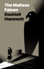

An Apple Books Classic edition.  Dashiell Hammett’s landmark detective novel introduced Sam Spade, a private eye who operates by his own slippery moral code in a world where everyone lies and almost no one gets out unscathed.  When a beautiful woman walks into Spade’s San Francisco office with a story that’s obviously fake, he takes the case anyway. Within hours, his partner is dead and Spade himself is a suspect. The hunt for a jewel-encrusted statue called the Maltese Falcon pulls him into a tangle of thieves, killers, and con artists, all willing to betray each other for a shot at the prize.  Spade plays every angle, trusting no one—not the cops, not his clients, and especially not the woman whose lies started it all. With a lean, brutal narrative that’s impossible to put down, <i>The Maltese Falcon</i> invented the hard-boiled detective and remains the template for every morally ambiguous hero that’s followed.

[View on Apple](https://books.apple.com/gb/book/the-maltese-falcon/id396136148)

## Peter Pan

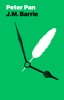

An Apple Books Classic edition.  
Lose yourself in the pages of J.M. Barrie’s beloved story about Neverland, the Lost Boys, and Tinkerbell. The book begins with older sister Wendy reading to her siblings, while Peter Pan and Tink peer in through the window. But when these magical visitors are spotted, the window slams shut, trapping Peter’s shadow inside!  
So begins the enchanted adventure of Wendy, John, and Michael Darling, who fly through the night to Neverland-a place of fairies, magical birds, and eternal youth. But danger lurks here, too, in the form of the vengeful Captain Hook and his band of pirates. This timeless tale invites us to escape to the idyllic and fantastical realm of childhood…no matter our age.

[View on Apple](https://books.apple.com/gb/book/peter-pan/id392612594)

## Under the Influence

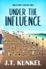

When thirty-year-old Cordelia Corbett returns to Point Pleasant Beach, New Jersey and rejoins her boss at Kohr’s Frozen Custard, they immediately run into a crime scene at the Food Shack down the boardwalk.  A handsome stranger lends a hand, and Cordelia is immediately drawn to him. Love may be in the air between them - if they can stop butting heads long enough to let it grow.  Together with her neighbor and co-worker Shelby, Cordelia searches for leads in order to find the killer. But can they piece together the clues and find the culprit?

[View on Apple](https://books.apple.com/gb/book/under-the-influence/id6736992666)

## Hard Stick

He carries a big stick. And he’s not afraid to use it.  On the ice, I’m Kellan Carter, powerhouse enforcer for the Charlotte Strikers. Off the ice, I’m just a regular guy. The last thing I want is to get mobbed by a bunch of groupies who are only after me for my fame and money. My ideal woman knows how to enjoy a little good, clean fun—and maybe some not-so-clean fun too. That’s the kind of girl I’d never let go.  When Kristen Robinson, the gorgeous, down-to-earth bartender I’ve been crushing on, agrees to let me take her out, I’m thrilled. We have an amazing night together, culminating in the most electrifying kiss of my life—and that’s it. Kristen tells me we can’t see each other again, but I know that kiss meant as much to her as it did to me. What I don’t know is that Kristen has a dangerous secret. . . .  I’ve proved to Kristen that she can trust me with her body and her heart. But when her past comes back to haunt her, I need to prove that she can trust me with her life. And I might have to get my hands dirty after all.

[View on Apple](https://books.apple.com/gb/book/hard-stick/id6450555726)

## Notes from the Underground

An Apple Books Classic edition.  Widely considered the first modern psychological novel, <i>Notes from the Underground</i> introduces one of literature’s most unforgettable narrators: a lonely, self-destructive civil servant determined to justify his refusal to fit into society. Smart, embittered, and painfully self-aware, he lashes out at the world even as he longs for the connection he insists he doesn’t need.  Fyodor Dostoyevsky crafts a fearless portrait of a mind at war with itself, in language that’s darkly funny and disarmingly vulnerable. As the underground man’s arguments twist themselves into knots, the story becomes a sharp examination of the parts of ourselves we try hardest to hide. Unsettling in its emotional honesty, <i>Notes from the Underground</i> remains a groundbreaking exploration of the contradictions that shape the human soul.

[View on Apple](https://books.apple.com/gb/book/notes-from-the-underground/id499195163)

## Take Her Under

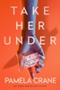

<i><b>A chilling page-turning psychological thriller with an unpredictable last-chapter twist, perfect for fans of Freida McFadden, Alice Feeney, and John Marrs.</b></i> <b></b>  <b>The next body on the embalming table may be hers.</b>  Preparing bodies for burial wasn't on Ashley's career list until a horrifying accident left her to inherit Fallon's Funeral Home. She spends her days applying final touches and ensuring the departed look more peaceful than they ever did in life.  When a crash echoes from the embalming room late one night, she expects to find a fallen tray or her clumsy assistant. Instead, she unveils a body laid out on the stainless-steel table, posed with unsettling care. The woman has Ashley's face. Ashley's hair. Ashley's scar just beneath her chin. She's even dressed in Ashley's clothes. Clutched in the corpse's pale fingers is a single note: <i><b></b></i>  <i><b>Murderer</b></i>  Someone knows what Ashley covered up. As strange threats arrive and familiar faces turn watchful, she realizes the funerals she controls so expertly have become her own fate. She must uncover who is exhuming her past before she becomes the final viewing. <b></b>  <b>As the town undertaker, she buries secrets with the dead. But someone is digging up hers, and they plan to&#xa0;<i>Take Her Under</i>.</b>

[View on Apple](https://books.apple.com/gb/book/take-her-under/id6759976051)

## Crime and Punishment

Crime and Punishment is a novel by the Russian author Fyodor Dostoyevsky. It was first published in the literary journal The Russian Messenger in twelve monthly installments during 1866. It was later published in a single volume. It is the second of Dostoyevsky's full-length novels following his return from ten years of exile in Siberia. Crime and Punishment is the first great novel of his "mature" period of writing. 
Crime and Punishment focuses on the mental anguish and moral dilemmas of Rodion Raskolnikov, an impoverished ex-student in St. Petersburg who formulates and executes a plan to kill an unscrupulous pawnbroker for her cash. Raskolnikov argues that with the pawnbroker's money he can perform good deeds to counterbalance the crime, while ridding the world of a worthless vermin. He also commits this murder to test his own hypothesis that some people are naturally capable of such things, and even have the right to do them. Several times throughout the novel, Raskolnikov justifies his actions by connecting himself mentally with Napoleon Bonaparte, believing that murder is permissible in pursuit of a higher purpose.

[View on Apple](https://books.apple.com/gb/book/crime-and-punishment/id764603953)

## Persuasion

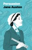

An Apple Books Classic edition. 
Jane Austen’s last completed novel is a mature, gorgeously bittersweet story about love, regret, and second chances. It’s been seven years since Anne’s family induced her to break off her engagement to Wentworth, a sea captain of little means. But losing him only made her realize how precious their love had been, leaving her with a sorrow that never quite faded.  
When their paths cross again, his presence cuts through the grayness of Anne’s world like sudden sunlight. But could he ever rekindle his feelings for her after such heartbreak? Nuanced in its humor and deeply yearning in its emotion, <i>Persuasion</i> shows Austen at her most ruminative and insightful.

[View on Apple](https://books.apple.com/gb/book/persuasion/id395533890)

## Macbeth

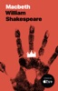

An Apple Books Classic edition.  <i>Macbeth</i> is one of Shakespeare’s darkest and most tragic works, a drama so steeped in legend that actors won’t even say its name for fear of bringing bad luck. The Bard’s shortest tragedy is a tale of murder, madness, and ambition full of iconic speeches. It’s been adapted countless times during its 400 years—and now director Joel Coen has created a bold and fierce Apple Original starring Denzel Washington and Frances McDormand.  The action begins when three witches predict the noble Macbeth will become king of Scotland. The story goes on to follow his bloody rise to power and his descent into madness. Touching on themes like unchecked ambition, the power of guilt, and the psychology of perception, this is one of the most riveting, action-packed literary classics in the world.

[View on Apple](https://books.apple.com/gb/book/macbeth/id916361213)

## Romeo and Juliet

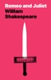

An Apple Books Classic edition.  Shakespeare’s romantic tragedy has inspired musicals, ballets, operas, and, of course, countless movies, including Italian director Franco Zeffirelli’s 1968 classic and Australian director Baz Luhrmann’s stylish remake starring Leonardo DiCaprio and Claire Danes. The Bard’s play is so fundamental to our culture-and to the popular trope of star-crossed lovers-that we all feel like we <i>know</i> the story of Romeo and Juliet’s doomed love affair.  And yet, have you ever read the original? And if yes, perchance was it a long, long time ago? The beautiful lyricism of Shakespeare’s storytelling makes poring over his words such a complex treat: 
What light in yonder window breaks? 
Parting is such sweet sorrow. 
O Romeo, Romeo, wherefore art thou Romeo? 
These are just a few of the play’s immortal lines. And it’s this masterful storytelling that makes the doomed lovers’ untimely deaths that much more poignant.

[View on Apple](https://books.apple.com/gb/book/romeo-and-juliet/id916363784)

## Winnie-the-Pooh

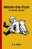

Alan Alexander Milne was an English writer best known for his books about the teddy bear Winnie-the-Pooh, as well as for children's poetry. Milne was primarily a playwright before the huge success of Winnie-the-Pooh overshadowed all his previous work.

[View on Apple](https://books.apple.com/gb/book/winnie-the-pooh/id6466734677)

## Moby Dick

An Apple Books Classic edition.  Herman Melville’s classic begins with one of the most famous opening lines in world literature: “Call me Ishmael.” <i>Moby Dick</i> was a commercial failure when it was first published in 1851, but during the 20th century, the book’s reputation grew and grew.  The novel features a memorable cast of characters, in particular the ivory-legged Captain Ahab, who lost a limb to the gargantuan white whale named Moby Dick. Now, Ahab’s sole obsession is hunting down the sea creature to exact his revenge. Heedless of warnings, Ahab risks ship and crew in his maniacal pursuit, bearing out Melville’s observation that  ”there is no folly of the beast of the earth which is not infinitely outdone by the madness of men.”

[View on Apple](https://books.apple.com/gb/book/moby-dick/id395539950)

## Meditations: Modern English Edition

This edition has been rewritten to be easier to read than the original translation. You will enjoy this version if you tried to read the original and found it too much like reading a King James Bible. Great effort was put into making this version pleasing to read while maintaining the essence of the original.

Discover Timeless Wisdom with Marcus Aurelius' "Meditations"
Unlock the profound insights of one of history's greatest philosophers with Marcus Aurelius' Meditations. Written by the Roman Emperor during the height of his reign, this remarkable book offers a unique window into the mind of a leader grappling with the complexities of life, duty, and personal growth.
Meditations is not just a philosophical treatise; it's a deeply personal journal where Aurelius reflects on his principles, struggles, and aspirations. His thoughts on resilience, mindfulness, and the pursuit of virtue resonate as powerfully today as they did nearly two millennia ago.
Whether you seek guidance on how to navigate challenges with grace, cultivate inner peace, or lead with integrity, Meditations provides timeless advice that transcends cultural and historical boundaries. It’s a must-read for anyone striving to live a more thoughtful and meaningful life.
Join the ranks of millions who have found inspiration in Aurelius' wisdom. Let his reflections guide you towards a life of greater purpose and tranquility. Invest in Meditations today and embark on a journey of self-discovery and personal excellence. Experience the enduring legacy of Marcus Aurelius, and let his wisdom transform your perspective.

[View on Apple](https://books.apple.com/gb/book/meditations-modern-english-edition/id6584519723)

## The Great Gatsby

An Apple Books Classics edition.  
The Roaring Twenties are in full effect in F. Scott Fitzgerald’s riveting classic. Man-about-town Jay Gatsby seems to have it all, including loads of money and a massive mansion where he hosts wild, extravagant parties every Saturday. But Gatsby’s missing one thing: Daisy Buchanan, the love of his life, the one who got away.  
<i>The Great Gatsby</i> explores the impossible, but uniquely human, longing to return to the past and the costs associated with chasing the American Dream. It’s a beautifully written, entertaining read with timeless emotional appeal.

[View on Apple](https://books.apple.com/gb/book/the-great-gatsby/id914355894)

## All Because of You

Sometimes you have to lose everything to find your happy ending.  Olivia Green has the picture-perfect life. Dating one of the most successful businessmen in New York City, living in a penthouse over Manhattan and a budding career, until one dreadful night when she discovers her future fiancé is a two-timing jerk. Left with nothing, she leaves the city to move back with her parents in the small town of Morgan's Bay.  After his mother dropped a family bombshell on her deathbed, Shane McConnell boards a train to meet a family he didn't know he had. What he doesn't expect are the secrets and lies dating back to long before his father's death. Nor can he predict the beautiful hot mess he meets on the train will find a way into his closed off heart.  Both struggling with the realities of their new lives, they unintentionally lean on each other. As their attraction builds and their undeniable chemistry explodes into passion, Shane holds onto his own secret that threatens his chance at love.  All Because of You is the start of a new steamy small-town series set in Morgan's Bay, a seaside escape on Long Island, New York, where an unexpected meeting on a train turns into a summer romance that can lead to forever.

[View on Apple](https://books.apple.com/gb/book/all-because-of-you/id1502418197)

## Highlander Undone

<i><b>Can be read as a stand-alone novella or in series order.</b></i>  When <b>Connor MacNeil</b> storms into his keep ranting about being forced to marry <i>"some crippled, cursed old hag,"</i> he has no idea his bride-to-be is listening in the next room.  Oops.  <b>Fiona Finnigan</b> may walk with a slight limp, but there's nothing wrong with her hearing, or her temper. This arranged marriage between feuding clans was supposed to make peace, but now it might just start another war.  And somewhere in the Highland mist, the person who tried to unalive Fiona with an arrow ten years ago is still out there, watching and waiting.  Between dealing with a stage-five-clinger ex-lover, navigating clan politics, and trying not to strangle each other, can two stubborn souls find love in the Scottish Highlands?  Or will Connor's big mouth doom them both before they make it to the altar?  <b>Tropes: </b>Arranged Marriage, Enemies to Lovers, Forced Proximity, Other Woman Drama, Brooding/Grumpy Hero, Feisty Heroine, Alpha Male/Protective Hero, Wounded Heroine, Ghosts from the past.  <b>Mature Content. NO cheating. NO cliffhangers. HEA.</b>

[View on Apple](https://books.apple.com/gb/book/highlander-undone/id6747458734)

## Every Time I Go on Vacation, Someone Dies

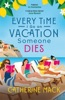

<b>Ten days. Eight suspects. Six cities. Five authors. Three bodies. One trip to die for.</b>  Eleanor Dash, bestselling author of the Vacation Mysteries series, is on a book tour along the gorgeous Amalfi Coast when life starts imitating art as her ex-boyfriend Connor Smith is targeted by a killer.  Eleanor’s sleuthing skills are about to be put to the ultimate test as – among literary rivals, rabid fans, a crazed stalker and another ex-flame on tour with her – suspicions are flying faster than paperbacks off a bestseller shelf. But who is<i> really</i> trying to get away with murder?  <b><i>Every Time I Go on Vacation, Someone Dies</i> is a whip-smart, utterly escapist mystery for fans of <i>The White Lotus</i>. </b><b>Eleanor Dash returns in the next book in the Vacation Mysteries series from Catherine Mack, <i>No One Was Supposed to Die at this Wedding.</i></b>  <b><i>PRAISE FOR CATHERINE MACK:</i>  'An absolute delight!</b><b>' </b>– Janice Hallett, <i>Sunday Times </i>bestselling author of <i>The Appeal</i>  <b>'A zany, madcap murder mystery' </b>– Nita Prose, <i>Sunday Times </i>bestselling author of <i>The Maid</i>  <b>'This book is fabulous! A hilarious and fun romp' </b>– Liv Constantine, author of <i>The Last Mrs. Parrish</i>  <b>'Quick, captivating and oh so much fun!' </b>– Elle Cosimano, author of <i>Finlay Donovan is Killing It</i>  <b>'A madcap Italian odyssey' </b>– Jessa Maxwell, author of <i>The Golden Spoon</i>  <b>'As spellbinding as <i>Knives Out</i>'</b> – Elle Cosimano, author of <i>Finlay Donovan Is Killing It</i>

[View on Apple](https://books.apple.com/gb/book/every-time-i-go-on-vacation-someone-dies/id6472714520)

## The Jungle Book

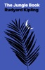

An Apple Books Classic edition.  Although most of <i>The Jungle Book</i> is set in India - where Rudyard Kipling spent much of his early life - he actually wrote this beloved story collection in Vermont. The most famous of the book’s seven stories feature Mowgli, a boy raised by a wolf pack and mentored by head wolf Akela, who teaches his human charge to survive and even thrive in the jungle. But when Mowgli eventually finds himself in human company again, he’s treated as an outsider and feared for his differences. Eventually, Mowgli uses his experiences to try and help the villagers and the animals co-exist in peace.  Many people got to know <i>The Jungle Book</i> through the Disney adaptation - and the story’s messages continue to be relevant today. More than just an all-ages adventure tale filled with talking animals, Kipling’s classic is a metaphor for acceptance and a touching exploration of themes of revenge, loyalty, and family.

[View on Apple](https://books.apple.com/gb/book/the-jungle-book/id395539415)

## Anna Karenina

An Apple Books Classic edition.  "Happy families are all alike; every unhappy family is unhappy in its own way." Thus begins what many consider the world’s greatest novel. Leo Tolstoy originally published this sweeping saga in serial form beginning in 1875, portraying a vast swath of Russian life, from the fields worked by starving peasant farmers to the sitting rooms (and bedrooms) of privileged aristocrats.  Despite its epic nature, <i>Anna Karenina</i> is an intricate, intimate study of one woman’s downward spiral into tragedy. As Anna’s husband becomes increasingly absorbed in philosophical and political introspection, Tolstoy’s heroine grows weary of her life as a mother and wealthy man’s wife. Increasingly unsettled by the stark class differences she observes, Anna finds passion again in a forbidden affair with Count Vronsky. But can she overcome her obsessive concern with societal norms to find a measure of happiness?  Passion. Betrayal. Love. Revenge. Tolstoy’s classic has it all.

[View on Apple](https://books.apple.com/gb/book/anna-karenina/id395534656)

## The Little French Guesthouse

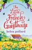

<b>Sun, croissants and fine wine.&#xa0; Nothing can spoil the perfect holiday.&#xa0; Or can it?&#xa0;</b> 
&#xa0; 
When Emmy Jamieson arrives at <i>La Cour des Roses</i>, a beautiful guesthouse in the French countryside, she can’t wait to spend two weeks relaxing with boyfriend Nathan. Their relationship needs a little TLC and Emmy is certain this holiday will do the trick. But they’ve barely unpacked before he scarpers with Gloria, the guesthouse owner’s cougar wife. 
&#xa0; 
Rupert, the ailing guesthouse owner, is shell-shocked. Feeling somewhat responsible, and rather generous after a bottle (or so) of wine, heartbroken Emmy offers to help. Changing sheets in the <i>gîtes</i> will help keep her mind off her misery. 
&#xa0; 
Thrust into the heart of the local community, Emmy suddenly finds herself surrounded by new friends. And with sizzling hot gardener Ryan and the infuriating (if gorgeous) accountant Alain providing welcome distractions, Nathan is fast becoming a distant memory.&#xa0; 
&#xa0; 
Fresh coffee and croissants for breakfast, feeding the hens in the warm evening light; Emmy starts to feel quite at home.&#xa0; But it would be madness to walk away from her friends, family, and everything she’s ever worked for, to take a chance on a place she fell for on holiday – wouldn’t it? 
&#xa0; 
Fans of Jenny Colgan, Lucy Diamond and Nick Alexander will want to join Emmy for a glass of wine as the sun sets on the terrace at <i>La Cour des Roses.</i> 
<i>&#xa0;</i> 
<b>Praise for <i>The Little French Guesthouse</i></b> 
&#xa0; 
<b>‘</b>Like sunshine on a cloudy day this is a book to warm your heart.<b> I loved it.’ </b><i>Shellyback Books</i> 
&#xa0; 
<b>‘I loved every single page of this book </b>and didn't want the story to end.<b> It had me hooked from start to finish, had me giggling </b>on the bus (rather embarrassing). It is <b>one of those warm, cosy books that needs coffee and croissants.’<i> </i></b><i>The Reading Shed</i> 
&#xa0; 
<b>‘Utterly delicious, I loved escaping into this delightful French community … definitely a feel good book that had me with a smile on my face and laughing out loud</b> … You’ve just got to love Rupert ... With the sexy gardener providing a great distraction from Nathan’s desertion, new friends and new possibilities this is <b>a real page turner that I thoroughly enjoyed … a truly wonderfully crafted novel that I highly recommend for its amazing characters, plot and storytelling that make it a brilliant story to escape into. I can’t wait for the next book in the series to be available, I definitely want to read it, please!’ </b><i>Splashes into Books</i> 
<i>&#xa0;</i> 
‘<b>From the very beginning to the very end, I absolutely adored this book …</b> If I ever found myself in a jam I would want a Rupert in my life for sure (even with his persistence and tendency to butt-in)!&#xa0; The emotional journey that ended up being <i>The Little French Guesthouse</i> is <b>sometimes sad, sometimes infuriating and sometimes hilarious … and abso-freaking-lutely worthy of a comfy chair, a cozy blanket and a nice cuppa.’ </b><i>Well Read Pirate Queen</i> 
<i>&#xa0;</i> 
<b>'Could not put down this fabulous book, peppered with humour and characters you can relate to</b>. &#xa0;A wonderful, <b>laugh out loud</b> summer read. One to share with friends and recommend to strangers.' Renita D’Silva 
<b>&#xa0;</b> 
<b>‘</b>What <b>a lovely gem of a book</b> … I picked this book up during a particularly intense period at work and it was <b>the perfect book – gentle and warm with some lovely characters and a good bit of eye candy</b> … perfect for a pick-me-up/ summer read where you just want to lose yourself in the story.’ <i>The Met Line Reader</i> 
&#xa0; 
<b>‘</b>A delightful story about love, community, getting over a crappy boyfriend and starting over.<b> Had me snorting with laughter.’</b><i> For the Love of Books</i> 
<i>&#xa0;</i> 
<b>‘</b>A<b> feel-good, heart-warming </b>story of friendship and finding yourself, this is<b> beautifully written </b>fiction ... <b>a joy to read</b>.’ <i>Writing Round the Block</i> 
<i>&#xa0;</i> 
‘This book is <b>lovely, charming and heart-warming, I felt like I was on holiday at the guesthouse too</b> ... <b>I cared a lot about the people and was drawn into the surroundings very easily. Which is why I enjoyed it so much</b> and would love to know how Emmy deals with the choices she makes.’ <i>The Book Jotter</i> 
&#xa0; 
‘La Cour des Roses is the name of the guesthouse that is central to the story and with its warmth of character, picturesque gardens and eccentric owner, its a place I would love to spend more time … <b>I am already looking forward to book two, and would love to go back to La Cour des Roses as soon as possible</b>.’ <i>Rachel’s Random Reads</i>

[View on Apple](https://books.apple.com/gb/book/the-little-french-guesthouse/id1095841746)

## Through the Looking-Glass

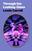

An Apple Books Classics edition.  Travel back to Wonderland in Lewis’s acclaimed sequel to <i>Alice’s Adventures in Wonderland</i>. When Alice’s game of “Let’s pretend” turns real, she finds herself stepping through a looking glass into a mirror image of her home—except here, nothing is as it seems, and her fireplace is filled with living chess pieces. Overjoyed to be back, Alice rushes outside and finds her garden alive with talking flowers. And that’s just the beginning. Readers are introduced to Tweedledee and Tweedledum and Humpty Dumpty, who is an actual egg. The poems “Jabberwocky” and “The Carpenter and the Walrus” appear for the first time in print. While scholars poured over their meaning, readers continue to soak up Lewis’s nonsensical humor and satirical style.  When Alice joins the living chess game, she must strategize if she wants to become a Queen. But in a land where time moves backwards, and dreams blend disconcertingly with reality…is that even possible? Find out in <i>Through the Looking Glass</i>, the sequel that has left an even more indelible mark on pop culture than its predecessor.

[View on Apple](https://books.apple.com/gb/book/through-the-looking-glass/id392612116)

## Alice's Adventures in Wonderland

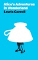

An Apple Books Classic edition.  Fall down the proverbial rabbit hole with Alice, the intrepid heroine of Lewis Carroll’s classic fantasy! When Alice spies a talking rabbit, she can’t resist following him into his hole - winding up in Wonderland, a nonsensical land of magical potions and never-ending tea parties. We accompany Alice on a journey that leads her to meet a grinning and elusive Cheshire Cat, a Mad Hatter, and, of course, the cruel, maniacal Queen of Hearts.  Is Alice and every other inhabitant of Wonderland mad? Or is it just a daydream? For over 100 years, children have come under the spell of Carroll’s topsy-turvy world, and adults have debated the meaning of the mathematician turned author’s feverish story. Visit Wonderland alongside Alice and find out why so many generations become “curiouser and curiouser” with each reading.

[View on Apple](https://books.apple.com/gb/book/alices-adventures-in-wonderland/id510986661)
