- [The Satsuma Complex](#the-satsuma-complex)
- [So, I Met This Guy . . .](#so-i-met-this-guy)
- [1Q84](#1q84)
- [The Family Friend](#the-family-friend)
- [Total Control](#total-control)
- [The Lost Women](#the-lost-women)
- [Her Perfect Escape](#her-perfect-escape)
- [Flesh](#flesh)
- [People Pleaser](#people-pleaser)
- [The Score](#the-score)
- [The Deal](#the-deal)
- [Watermelon](#watermelon)
- [Don't Fall in Love With Me](#don-t-fall-in-love-with-me)
- [Summer Island](#summer-island)
- [Stars and Swipes](#stars-and-swipes)
- [The Mistake](#the-mistake)
- [Odyssey](#odyssey)
- [Tom Clancy Executive Power](#tom-clancy-executive-power)
- [The Long Call](#the-long-call)
- [Maybe Someday](#maybe-someday)
- [The Frozen People](#the-frozen-people)
- [Never To Be Found](#never-to-be-found)
- [It Could Have Been Her](#it-could-have-been-her)
- [The Eights](#the-eights)
- [The Lucky Winners](#the-lucky-winners)
- [We Solve Murders](#we-solve-murders)
- [Brave New Summer](#brave-new-summer)
- [The Tailor](#the-tailor)
- [The Goal](#the-goal)
- [One Golden Summer](#one-golden-summer)
- [Fourth Wing](#fourth-wing)
- [What We Can Know](#what-we-can-know)
- [Gabriel's Moon](#gabriel-s-moon)
- [The House of Wolf](#the-house-of-wolf)
- [The Legacy](#the-legacy)
- [No Country for Old Men](#no-country-for-old-men)
- [The Secret of Secrets](#the-secret-of-secrets)
- [One of Us](#one-of-us)
- [I Will Find You](#i-will-find-you)
- [Yesteryear](#yesteryear)
- [The Odyssey](#the-odyssey)
- [The Impossible Fortune](#the-impossible-fortune)
- [Old Girls Go Off the Rails](#old-girls-go-off-the-rails)
- [The Midnight Train](#the-midnight-train)
- [Bride](#bride)
- [Flawless](#flawless)
- [The Daisy Chain Flower Shop](#the-daisy-chain-flower-shop)
- [The Hallmarked Man](#the-hallmarked-man)
- [The Heist](#the-heist)
- [Keeping 13](#keeping-13)
- [Blindsighted](#blindsighted)
- [Sisters in Yellow](#sisters-in-yellow)
- [They Thought I Was Dead: Sandy's Story](#they-thought-i-was-dead-sandy-s-story)
- [Revenge of the Tipping Point](#revenge-of-the-tipping-point)
- [Our Perfect Storm](#our-perfect-storm)
- [Just Friends](#just-friends)
- [Dolly All the Time](#dolly-all-the-time)
- [Atomic Habits](#atomic-habits)
- [Lost Until Love](#lost-until-love)
- [The Only One Left](#the-only-one-left)
- [A Court of Wings and Ruin](#a-court-of-wings-and-ruin)
- [The Spy and the Traitor](#the-spy-and-the-traitor)
- [The Villa of Secrets](#the-villa-of-secrets)
- [Love Song](#love-song)
- [Having Spent Life Seeking](#having-spent-life-seeking)
- [Verity](#verity)
- [Men in Love](#men-in-love)
- [My Name Is Lucy Barton](#my-name-is-lucy-barton)
- [Lost Lambs](#lost-lambs)
- [Love Redesigned](#love-redesigned)
- [For Richer For Poorer](#for-richer-for-poorer)
- [Iron Flame](#iron-flame)
- [Welcome to Pennycress Inn](#welcome-to-pennycress-inn)
- [Famous Last Words](#famous-last-words)
- [The Ministry of the Word and God's Dispensing for God's Economy](#the-ministry-of-the-word-and-god-s-dispensing-for-god-s-economy)
- [The Odyssey](#the-odyssey)
- [The Correspondent](#the-correspondent)
- [The Miss Silver Mysteries Volume One](#the-miss-silver-mysteries-volume-one)
- [London Falling](#london-falling)
- [Don't Let Him In](#don-t-let-him-in)
- [The Chimp Paradox](#the-chimp-paradox)
- [The Black Loch](#the-black-loch)
- [Transcription](#transcription)
- [Careless People](#careless-people)
- [No Friend to This House](#no-friend-to-this-house)
- [Project Hail Mary](#project-hail-mary)
- [The Tiny Magic Bookshop](#the-tiny-magic-bookshop)
- [Audition](#audition)
- [Heartstopper Volume 6](#heartstopper-volume-6)
- [What If Reform Wins](#what-if-reform-wins)
- [The Devils](#the-devils)
- [A Summer Wedding at Pennycress Inn](#a-summer-wedding-at-pennycress-inn)
- [The Politician](#the-politician)
- [Tower of Dawn](#tower-of-dawn)
- [Book Lovers](#book-lovers)
- [A Game of Thrones](#a-game-of-thrones)
- [The Kill Switch](#the-kill-switch)
- [Summer in the City](#summer-in-the-city)
- [Exit Strategy](#exit-strategy)
- [Falling in Love at Pennycress Inn](#falling-in-love-at-pennycress-inn)

## The Satsuma Complex

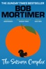

<b>*WINNER OF THE&#xa0;BOLLINGER EVERYMAN WODEHOUSE PRIZE FOR COMIC FICTION 2023*</b>  <b>THE <i>SUNDAY TIMES </i>BESTSELLER</b>  &#xa0; <b>‘Funny, clever and sweet’–&#xa0;<i>Sunday Times</i></b>  <b>‘The much loved comic proves adept at noirish fiction in a debut whose surrealist humour sets it apart’ –&#xa0;<i>Observer</i></b>  <b><i>My name is Gary. I’m a thirty-year-old legal assistant with a firm of solicitors in London. To describe me as anonymous would be unfair but to notice me other than in passing would be a rarity. I did make a good connection with a girl, but that blew up in my face and smacked my arse with a fish slice.</i></b>   Gary Thorn goes for a pint with a work acquaintance called Brendan. When Brendan leaves early, Gary meets a girl in the pub. He doesn’t catch her name, but falls for her anyway. When she suddenly disappears without saying goodbye, all Gary has to remember her by is the book she was reading:&#xa0;<i>The Satsuma Complex.</i>&#xa0;But when Brendan goes missing, Gary needs to track down the girl he now calls Satsuma to get some answers.   And so begins Gary’s quest, through the estates and pie shops of South London, to finally bring some love and excitement into his unremarkable life…  <b>A page-turning story with a cast of unforgettable characters,&#xa0;<i>The Satsuma Complex&#xa0;</i>is the brilliantly funny smash hit first novel by bestselling author and comedian Bob Mortimer.</b>  &#xa0;

[View on Apple](https://books.apple.com/gb/book/the-satsuma-complex/id6443081467)

## So, I Met This Guy . . .

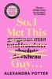

<b>From the author of the bestselling phenomenon <i>Confessions of a Forty-something F##k Up</i> comes the perfect, sun-kissed holiday read full of wit, wisdom and women who have had ENOUGH.</b>  ‘This book was superb’ – <i><b>Prima</b></i>  ‘Funny, sad and life-affirming’ – <i><b>The Sun</b></i>  ‘The Bridget Jones for our times’ – <i><b>Daily Telegraph</b></i>  So, I Met This Guy . . .  Isn't that how every love story starts? But how will it end . . .  Maggie thinks she's finally found 'the one', only to discover he's stolen her life-savings, along with her heart, home and self-esteem. With nothing left to lose, she teams up with Flick - a young reporter hungry for her big break - and together they chase the fraudster across Europe.  But when their adventure takes an unexpected turn, secrets are revealed and an unlikely friendship begins to blossom. And they realise it's not about finding the guy; it's about finding themselves.  Praise for <i>So, I Met This Guy . . .</i>  ‘A moving tribute to the <b>transformative power of female friendship</b>’ – <b>Freya North</b>  ‘A <b>rip-roaring plot</b> and some of the <b>best twists</b>’ – <b>Matt Cain</b>  ‘A <b>thrilling, witty, twisty, turny</b> wonderful adventure with a <b>grand splosh of self-discovery</b>’ – <b>Milly Johnson</b>  ‘<b>I could not love this book more</b>’ – <b>Lindsey Kelk</b>  ‘A story of <b>hope, redemption</b> and the <b>magical energy of female friendship</b>’ – <b>Lucy Dillon</b>  ‘Warm, witty and wise . . . An <b>absolute triumph</b>!’ – <b>Mike Gayle</b>  Readers love <i>So, I Met This Guy . . .</i>  ‘A delightful novel of <b>friendship, travel and adventure</b>!’  ‘The <b>perfect balance</b> between <b>emotional and uplifting</b>’  ‘One of the <b>best I've read this year</b>’  ‘<b>Warm, wise and wonderful</b>!’  ‘Kept me <b>hooked from start to finish</b>’  ‘<b>Fast paced, fun and fabulous</b>’

[View on Apple](https://books.apple.com/gb/book/so-i-met-this-guy/id6741419199)

## 1Q84

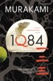

<b>The year is 1Q84. This is the real world, there is no doubt about that. But in this world, there are two moons in the sky.</b>  In this world, the fates of two people, Tengo and Aomame, are closely intertwined. They are each, in their own way, doing something very dangerous. And in this world, there seems no way to save them both.  Something extraordinary is starting.  '<b><i>1Q84 </i>has a range and sophistication that surpasses anything else in his oeuvre.' <i>Independent on Sunday</i></b>  <b>‘Murakami's magnum opus’ <i>Japan Times</i></b>  <b>‘Vi</b><b>brating with wit, intellect and ambition’ <i>The Times</i></b>

[View on Apple](https://books.apple.com/gb/book/1q84/id1611857083)

## The Family Friend

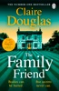

<b>THE NAIL-BITING NEW THRILLER FROM THE NUMBER ONE SUNDAY TIMES BESTSELLER  'A chilling story of legacy, memory and buried evil. I was absorbed from the first to last page.' ELLY GRIFFITHS</b>   <b>  'Claire Douglas is a class act - she never, ever disappoints' LISA JEWELL    </b> When Imogen inherits a country house near Bath, she thinks it’s a mistake. She last saw its owner, reclusive artist Dorothea Roe, sixteen years ago, during a tragic summer which she’s never forgotten.  But a chance discovery in the study leads Imogen to believe Dorothea left her a secret message. And when rumours begin to swirl that Dorothea was murdered, she suspects that the house might not be the life-changing gift she thought.  Who would want to kill Dorothea?  Could it be tangled up in Imogen’s own dark family history?  And what if Imogen is now the one in danger?

[View on Apple](https://books.apple.com/gb/book/the-family-friend/id6747465236)

## Total Control

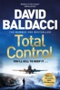

<b>Set in the cold-blooded world of high-tech espionage, <i>Total Control</i> was David Baldacci's enthralling second novel. It became a <i>New York Times </i>bestseller, cementing Baldacci as a worldwide bestselling author of non-stop action fiction.  With an exclusive new introduction from the author.  'Baldacci is the master of American detective stories' – Jeffrey Archer </b>  *****  <i><b>Total control. You’ll kill to keep it . . .</b></i>  <b>A RISING STAR.</b>  Jason Archer is a young executive at a world-leading technology conglomerate. Determined to give his wife and daughter the best of everything, he enters into a deadly game of cat and mouse.  <b>A GRIEVING WIDOW.</b>  When a plane plummets into the Virginia countryside, Sidney Archer is devastated by the loss of her husband. But then she learns the job interview Jason was flying to never existed, and everything changes. Suddenly there is no one she can trust.  <b>A RACE FOR THE TRUTH.</b>  A suspicious air crash investigation team, a tenacious veteran FBI agent and the threads of a sinister plot all beg the question: what really happened to Jason Archer?  <b>Perfect for fans of the Travis Devine and Atlee Pine series, <i>Total Control </i>is a breathtaking thrill ride of non-stop action and suspense from international bestselling author David Baldacci. </b>  *****  <b>KILLER TWISTS. HEROES TO BELIEVE IN. TRUST BALDACCI.</b>  'One of the world's thriller masters' – <i><b>Daily Mail</b></i>  'Baldacci is still peerless' – <i><b>The Sunday Times</b></i>  'One of the all-time best thriller authors' – <b>Lisa Gardner, author of <i>One Step Too Far </i></b>  'Baldacci delivers, every time!' – <b>Lisa Scottoline, author of <i>What Happened to the Bennetts </i></b>  'A master storyteller' – <i><b>Associated Press</b></i>  'Baldacci cuts everyone's grass – Grisham's, Ludlum's, even Patricia Cornwell's – and more than gets away with it' – <i><b>People</b></i>

[View on Apple](https://books.apple.com/gb/book/total-control/id438170157)

## The Lost Women

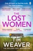

<b>THE HEART-STOPPING NEW THRILLER FROM THE MILLION-COPY BESTSELLING MASTER OF THE MISSING PERSON MYSTERY  '</b><i>The Lost Women</i> is Tim Weaver at the absolute top of his game – a masterclass in tense, propulsive thriller writing as a web of interlocking mysteries come together with deadly consequences' <b>T.M. LOGAN</b>  'Weaver's books are unputdownable. If you haven't yet met Raker, you're in for a treat' <b>MICK HERRON</b>  'What a talent'<b> <i>DAILY MAIL</i></b>  <b>EIGHTEEN YEARS AGO</b>  Three women visit a Cornish island...and vanish. No bodies. No trace. They are never seen again.  Journalist David Raker covers the story but, like everyone else, finds no answers. The fate of the women still haunts him.  <b>YESTERDAY</b>  Following a car accident, Preston Stewart requires surgery on his face. But when the dressings are removed, his wife realizes something is wrong.  The man under the bandages isn't her husband.  <b>TODAY</b>  Now a missing persons investigator, David Raker is hired to find Preston - and soon discovers a terrifying connection to the Lost Women.  Thrown into a desperate race against the clock, Raker has just hours to uncover the truth - or everyone he loves is in danger...  <b>PRAISE FOR TIM WEAVER</b>  'Impossibly clever. Impossible to put down' <b>CHRIS WHITAKER</b>  'Corkscrew twists. Impossible to read without breaking into a sweat' <b><i>THE TIMES</i></b>  'The master of clever, unpredictable plots' <b>CLAIRE DOUGLAS</b>

[View on Apple](https://books.apple.com/gb/book/the-lost-women/id6670592282)

## Her Perfect Escape

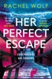

&#39;Luxury, lies and lethal secrets. Expect sun-drenched chills when a Greek paradise turns perilous&#39; JO FURNISS 
 
&#39;Immerses you in luxury and intrigue on a stunning Greek island... Perfect reading escapism.&#39; HEATHER CRITCHLOW 
 
&#39;I loved it!... Pacy, thrilling, clever - it was the perfect page-turner.&#39; FLISS CHESTER 
 
&#39;A sultry, gripping read and perfect for fans of The White Lotus.&#39; CASS GREEN 
 
Even paradise has shadows. 
 
July 2025. Tash and Mark host a birthday weekend for their son, Dom, at their luxury villa on a Greek island, inviting a select list of people to celebrate. As the drinks flow, the unthinkable happens when Tash&#39;s sister drowns, vanishing without a trace. 
 
No one suspects foul play – except for Tash. 
 
July 2026. One year on, Tash hosts a party for the same guests who were there when Emma died. She&#39;s learned that they&#39;re all hiding something - even Dom&#39;s behaviour has changed since that night. She knows that answers lie on the island and no one is leaving until she gets the truth. 
 
But if the villa holds the secrets to what happened, it also hides a killer... 
 
&#39;What a ride! Twists and turns, secrets and lies - it&#39;s all here in this thriller, set in glamorous Greece. A brilliant beach read to puzzle over - who is telling the truth? And who is not as they seem?&#39; SAM HOLLAND 
 
&#39;I devoured this tense glittering, gilded knot of a Mykonos mystery... it&#39;s prefect escapism.&#39; ANGELA CLARK 
 
&#39;Taut, relentless and breathtaking.&#39; KATE SIMANTS 
 
&#39;Thrilling... Soaked in sunshine. Dripping with glamour and privilege.&#39; S.E. LYNES

[View on Apple](https://books.apple.com/gb/book/her-perfect-escape/id6753729196)

## Flesh

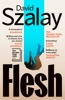

<b>**WINNER OF THE BOOKER PRIZE 2025**</b>  <b>‘Brilliant and wise on chance, love, sex, money’</b> David Nicholls <b>‘</b><b>I was tearing through [<i>Flesh</i>], I never once slowed down</b><b>’</b> Jennette McCurdy <b>‘</b><b>Brilliance on every page</b><b>’</b> Samantha Harvey <b>‘</b><b>So much searing insight into the way we live now</b><b>’</b> <i>Observer</i>  <b>Through chance, luck and choice, one man’s life takes him from a modest apartment in Hungary to the elite society of London – in this captivating new novel about the forces that make and break our lives</b>  Fifteen-year-old István lives with his mother in a quiet apartment complex in Hungary. New to the town and shy, he becomes isolated, with his neighbour – a married woman – as his only companion. When a clandestine relationship begins between them, his life spirals out of control.  As the years pass, István moves from the army to the circles of London’s elite. His competing impulses for love, intimacy, status and wealth win him unimaginable riches, until they threaten to undo him completely.  <b>‘An astonishingly moving portrait of a man’s life’ </b>Booker Prize Judges, 2025  <b>‘A revelatory novel’ </b><i>Sunday Times</i>  <b>‘Pure brilliance from the first to the (devastating) last sentence’ </b>India Knight  <b>‘Refreshing, illuminating and true’ </b><i>Financial Times</i>  <b>‘One of the most astonishing books I’ve ever read’ </b>Dua Lipa  <b>‘Hugely entertaining, gripping like a thriller’ </b><i>The Times</i>  <b>‘Visceral and compelling’ </b>Gary Stevenson  <b>‘Exciting, propulsive, emotional’ </b>Sarah Jessica Parker  <b>*A BOOK OF THE YEAR for the <i>Guardian</i>, <i>Observer</i>, <i>Financial Times</i>, <i>Sunday Times</i>, <i>Independent</i>, <i>GQ</i> and <i>Daily Telegraph</i>*</b>

[View on Apple](https://books.apple.com/gb/book/flesh/id6504962250)

## People Pleaser

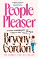

FROM THE No.1 SUNDAY TIMES BESTSELLING AUTHOR  <b>The fiercely funny and relatable new novel about people-pleasing, burnout and finding your voice - the perfect uplifting holiday read for fans of Sophie Kinsella and Alexandra Potter.</b>  ‘<b>Insightful, inspirational and SO much fun</b>’ Marian Keyes  ‘<i>People Pleaser</i> is <b>like therapy in rom-com form’</b> Beth O’Leary  ‘Completely <b>addictive</b>. A hard yes from me – I flew through it’ Vogue Williams  <b>Meet Olivia Greenwood. Unfiltered. Unashamed. Unapologetic. Or at least, she’s about to be . . .</b>  Olivia has been trying <i>very</i> hard to please people for a <i>very</i> long time.  Whilst her husband’s doing burpees, she’s doing everything else. She smiles through yet another ‘opportunity’ that isn’t a promotion. And she says yes to her mother, when what she really means is no.  But today, everything is going to change . . .  After soul-crushing career disappointment, a fiery young woman with a chip on her shoulder, and a single blue hallucinogenic gummy lead to a raucous night, Olivia wakes up the next morning, fresh out of f**ks to give and unable to please anyone but HERSELF.  So who actually <i>is</i> Olivia Greenwood when she’s not trying to be what everyone else wants her to be?  <b>Warm, witty and empowering, this is the story of one woman’s journey to stop people-pleasing and start living for herself.</b>  Praise for <i>People Pleaser:</i>  ‘Oozing <b>warmth, raw honesty and awkward relatable truths</b> . . . just wonderful’ Adele Parks, bestselling author of <i>Our Beautiful Mess</i>  <b>‘Riotously funny</b> and sharply observed . . <b>. a must read!</b>’ Jennie Godfrey, bestselling author of <i>The List of Suspicious Things</i>  ‘<b>Hilariously relatable</b>’ ⭐ ⭐ ⭐ ⭐ ⭐  ‘<b>Witty, warm and great</b> writing. Highly recommended’ ⭐ ⭐ ⭐ ⭐ ⭐  ‘Made me <b>laugh out loud</b>’ ⭐ ⭐ ⭐ ⭐ ⭐  ‘<b>I genuinely struggled to put it down</b>’ ⭐ ⭐ ⭐ ⭐ ⭐

[View on Apple](https://books.apple.com/gb/book/people-pleaser/id6748105398)

## The Score

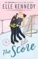

<b>Original Series now on Prime Video. Can't wait for Season 2 of Off Campus? Fall in love with Dean and Allie...</b>  <b>Welcome to Briar U!</b>  <b> Get ready for your newest obsession . . . Discover the addictive world of the Off-Campus series from The Queen of Hockey Romance, Elle Kennedy! </b> <b>Read <i>The Score </i>now for the perfect friends with benefits romance!</b> <b>Also available in Deluxe HB</b>  <b>He knows how to score, on and off the ice . . .  </b> Allie Hayes is in crisis mode. With graduation looming, she still doesn't have the first clue about what she's going to do after college. To make matters worse, she's nursing a broken heart thanks to the end of her longtime relationship. Wild rebound sex is definitely not the solution to her problems, but gorgeous hockey star Dean Di Laurentis is impossible to resist. Just once, though, because even if her future is uncertain, it sure as heck won't include the king of one-night stands. <b> It'll take more than flashy moves to win her over . . .  </b> Dean always gets what he wants. Girls, grades, girls, recognition, girls . . . he's a ladies man, all right, and he's yet to meet a woman who's immune to his charms. Until Allie. For one night, the feisty blonde rocked his entire world - and now she wants to be friends? Nope. It's not over until he says it's over. Dean is in full-on pursuit, but when life-rocking changes strike, he starts to wonder if maybe it's time to stop focusing on scoring . . . and shoot for love.  ***  <b>Why fans love Elle Kennedy </b><b>⭐ ⭐ ⭐ ⭐ ⭐!</b>  'Delicious, complicated and drama-filled . . . I read it in one sitting, and you will, too'<b> L. J. Shen, <i>USA Today</i> bestselling author</b>  'A deliciously sexy story with a wallop of emotions that sneaks up on you' <b>Vi Keeland, <i>New York Times</i> bestselling author</b>  'This book had the ability to make me swoon one minute, put my heart in my throat the next, then literally make me burst right out laughing out of the blue' <b>Goodreads Review</b>  'The best college romance I've read. It had epic banter, sexy romance, and fantastic writing!! I laughed, I swooned, I couldn't put it down. Highly recommended!!' <b>Goodreads Review</b>  'Elle Kennedy proves, once again, that she is the Queen of College Hockey Romance!!'<b> Goodreads Review</b>  '5-Made My Heart Pitter Patter-Stars' <b>Goodreads Review</b>  'One of the few authors who can instantly put a grin on my face as soon as I start reading her books' <b>Goodreads Review</b>  <b>❤️‍🔥❤️‍🔥❤️‍🔥</b>  <b>Tropes</b> 🏒College hockey romance 🏒One night stand 🏒Secret dating 🏒Spicy romance 🏒Frenemies to lovers

[View on Apple](https://books.apple.com/gb/book/the-score/id6466580963)

## The Deal

Original Series now on Prime Video  <b>Welcome to Briar U!</b>  <b> Get ready for your newest obsession . . . Discover the addictive world of the Off-Campus series from The Queen of Hockey Romance, Elle Kennedy! </b> <b>Read <i>The Deal</i> now for the perfect fake-dating romance! </b> <b>Also available as a Deluxe HB and a TV Tie-in edition</b>  <b>She's about to make a deal with the college bad boy . . .</b>  Hannah Wells has finally found someone who turns her on. But while she might be confident in every other area of her life, she's carting around a full set of baggage when it comes to sex and seduction. If she wants to get her crush's attention, she'll have to step out of her comfort zone and <i>make</i> him take notice . . . even if it means tutoring the annoying, childish, <i>cocky</i> captain of the hockey team in exchange for a pretend date  <b>. . . and it's going to be oh so good</b>  All Garrett Graham has ever wanted is to play professional hockey after graduation, but his plummeting GPA is threatening everything he's worked so hard for. If helping a sarcastic brunette make another guy jealous will help him secure his position on the team, he's all for it. But when one unexpected kiss leads to the wildest sex of both their lives, it doesn't take long for Garrett to realize that pretend isn't going to cut it.  Now he just has to convince Hannah that the man she wants looks a lot like <i>him</i>.  ***  <b>Why fans love Elle Kennedy </b><b>⭐ ⭐ ⭐ ⭐ ⭐!</b>  'Delicious, complicated and drama-filled . . . I read it in one sitting, and you will, too'<b> L. J. Shen, <i>USA Today</i> bestselling author</b>  'A deliciously sexy story with a wallop of emotions that sneaks up on you' <b>Vi Keeland, <i>New York Times</i> bestselling author</b>  'This book had the ability to make me swoon one minute, put my heart in my throat the next, then literally make me burst right out laughing out of the blue' <b>Goodreads Review</b>  'The best college romance I've read. It had epic banter, sexy romance, and fantastic writing!! I laughed, I swooned, I couldn't put it down. Highly recommended!!'<b>Goodreads Review</b>  'Elle Kennedy proves, once again, that she is the Queen of College Hockey Romance!!'<b> Goodreads Review</b>  '5-Made My Heart Pitter Patter-Stars' <b>Goodreads Review</b>  'One of the few authors who can instantly put a grin on my face as soon as I start reading her books' <b>Goodreads Review</b>

[View on Apple](https://books.apple.com/gb/book/the-deal/id6466581098)

## Watermelon

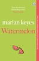

<b>Discover the riotously funny, tender and touching debut from the No. 1 bestselling author of Grown Ups</b>  <b>'A modern fairy tale, full of Keyes's self-deprecating wit' </b><i>Sunday Mirror</i> <b>'Reading a novel by Marian Keyes is like sitting at the kitchen table with your nicest, most confiding friend' </b><i>Daily Mail</i> __  Meet <b>Claire Walsh</b>.   On the day she gives birth, her husband drops a bombshell: he's been cheating and is leaving her.   Exhausted and furious, Claire runs home to Mum and Dad, but it's no sanctuary.   Amid family drama and baby demands, she misses her old life.   When James wants to reconcile, Claire must decide: forgive and forget, or take a chance on herself?  __  <b>'A warm and hilarious page turner' <i>Good Housekeeping</i></b> <b>'Gloriously funny' <i>Sunday Times</i></b> <b>'Keyes is in a class of her own' <i>Daily Express</i></b>  <b>FAMOUS FANS AND WHY THEY LOVE MARIAN KEYES</b>  <b>'Marian's writing is the truth. With big laughs' </b>Dawn French <b>'A giant of Irish writing'</b> Naoise Dolan <b>'Will make you laugh and make you cry, but will also reveal the truth of who you really are' </b>Louise O'Neill <b>'Keyes weaves the joy and pain of life in a unique and magical way' </b>Cathy Rentzenbrink <b>'One of the most honest writers writing today' </b>Pandora Sykes <b>'Compassionate, tender, incisive writing' </b>Lucy Foley <b>'Her talent for tackling serious issues with such humanity and wit is balm for the soul'</b> Nigella Lawson <b>'Marian Keyes is a brilliant writer. No one is better at making terrifically funny jokes while telling such important, perceptive and agonizing stories of the heart. She is a genius' </b>Sali Hughes <b>'Irresistible, profound. Keyes's comic gift is always evident' </b><i>Independent</i> <b>'Joyful. Keyes' clever way with words and extraordinary wit. People stared at me as I laughed to myself'</b> C.L. Taylor <b>'A born storyteller'</b><i> Independent on Sunday</i>  Marian Keyes, Number 1 <i>Sunday Times</i> bestseller, April 2023 Marian Keyes' books have sold over 7 million copies in the UK [Nielsen Bookscan, April 2024]

[View on Apple](https://books.apple.com/gb/book/watermelon/id1250897659)

## Don't Fall in Love With Me

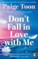

<b>Your next escapist summer read. A scorching new romance from the <i>Sunday Times</i> bestselling author of <i>Seven Summers </i>and <i>Only Love Can Hurt Like This</i>, perfect for fans of Colleen Hoover and JoJo Moyes</b>  ‘The queen of emotional love stories’ <b>Beth O’Leary</b> ‘Poignant, powerful, passionate’ <b>Milly Johnson</b> ‘One of my must-buy authors’ <b>Abby Jimenez</b>  ***********************************  <b>What if the person you love the most is the one you can’t have?</b>  Grace has loved Jackson since she was fifteen – when they spent every childhood summer exploring France's breathtaking Ardèche region together. They were best friends, until life took its course and Jackson married someone else.  Years later, Jackson re-enters Grace’s life with an irresistible offer: her dream job in the very town where their story began. And he’s newly single.  As memories from those idyllic summers flood back, Grace encounters an old friend Étienne, who proposes a plan to help make Jackson jealous. But as their scheme unfolds, Grace finds herself questioning if the sparks between them might not be so pretend after all…  Unbeknownst to Grace, Étienne is harbouring a secret that could shatter her world.  <b>Will learning the truth finally set her heart free? Or is this the beginning of a love story bigger than she ever imagined?</b>  *******************************************************  <i><b>PRAISE FOR </b></i><b>DON'T FALL IN LOVE WITH ME . . . </b>  ‘Another heartfelt, beautiful romance from <b>the queen of emotional love stories</b>.’ <b>Beth O’Leary</b>  ‘<b>So beautiful. A heartwarming love story</b> in the most romantic of settings. Off to get me a kayak’ <b>Giovanna Fletcher</b>  ‘A sweeping love story. . . Paige Toon has complete control of my heart.’ <b>Annabel Monaghan</b>  ‘Poignant, Powerful, Passionate. I think this is <b>my favourite one of hers yet</b>. This book is HOT.’ <b>Milly Johnson</b>  ‘<b>Emotional and seductive, this is sun-drenched perfection</b>. I loved every word!’ <b>Heidi Swain</b>  ‘<b>A gorgeous, heartfelt spin on friends-to-lovers</b> and coming of age romance. You will love Paige Toon!’ <b>Kristan Higgins</b>  ‘A <b>lush, addictive love story with sizzling chemistry and a twist I didn’t see coming</b> – prepare for heart-melting heat!’ <b>Jill Shalvis</b>  'Paige<b> had my heart yearning</b> for the stunning setting and for love to conquer all. <b>A triumph!</b>' <b>Zoe Folbigg</b>  ‘No-one writes a love story quite like Paige Toon.’ <b><i>Heat</i>, Book of the Month</b>  ‘A <b>gorgeous, perfect holiday read</b>.’ <i><b>Closer</b></i>  ‘Paige Toon delivers <b>a heart-warming tale</b> of love, friendship, passion and family<b>.’ </b><i><b>Woman's Weekly</b></i>  ‘A <b>page-turnin</b>g romance.’ <i><b>Woman</b></i>  ‘A <b>gorgeous,</b> multi-layered love story.' <i><b>The Sun</b></i>

[View on Apple](https://books.apple.com/gb/book/dont-fall-in-love-with-me/id6743825063)

## Summer Island

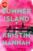

<b>‘One of the greatest storytellers of our time’ - Delia Owens, bestselling author of <i>Where the Crawdads Sing</i></b>  <b>From the multimillion-copy bestselling author of <i>The Women </i>and <i>The Nightingale</i>, <i>Summer Island </i>is a poignant, warm and tender novel about a mother and daughter: the complex ties that bind them, the past that separates them, and the healing that comes with forgiveness.</b>  Years ago, Nora Bridge walked out on her marriage and left her daughters behind. She has since become a famous radio talk-show host and newspaper columnist beloved for her moral advice, while her youngest daughter, Ruby, is a struggling comedian who uses her famous mother as fuel for her bitter, cynical humour.  When the tabloids unearth a scandalous secret from Nora’s past, their estrangement suddenly becomes dramatic. After Nora is injured in an accident, a glossy magazine offers Ruby a fortune to write a tell-all about her mother and Ruby returns home under the pretext of taking care of the woman she hasn’t spoken to for almost a decade.  Nora insists they retreat to Summer Island, to the lovely old house on the water where Ruby grew up; a place filled with childhood memories of love and joy and belonging. There, Ruby is also reunited with her first love and his brother. Once, the three of them had been best friends; inseparable. Until the summer that Nora left, and everyone’s hearts were broken . . .  <b>Praise for Kristin Hannah:</b>  ‘Utterly absorbing . . . A triumph’ – <b>Taylor Jenkins Reid</b>, bestselling author of <i>Daisy Jones &amp; The Six</i>  ‘Stuns with sacrifice. Uplifts with heroism’ – <b>Bonnie Garmus</b>, bestselling author of <i>Lessons in Chemistry</i>  ‘Moving and unforgettable’ – <b>Christy Lefteri</b>, bestselling author of <i>The Beekeeper of Aleppo</i>  ‘A classic storyteller’ – <b>Matt Haig</b>, bestselling author of <i>The Midnight Library</i>

[View on Apple](https://books.apple.com/gb/book/summer-island/id6744018869)

## Stars and Swipes

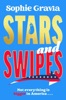

<b>A glamorous, laugh-out-loud romantic comedy packed with friendship, flirtation, and scandal, from the Queen of Holiday Reads, Sophie Gravia.</b> <b></b> <b><i>The Dicktionary Club girls are back...and seeking American members. </i></b>  Ella, Katy, and Zola are beside themselves when they are offered the opportunity to launch their now infamous dating website, The Dicktionary Club, stateside. The headlines covering their technological (mis)adventures have caught the eye of a Manhattan entrepreneur - and he wants the three besties to collaborate with him on a similar app for the American market.  With their love lives imploding back home, the girls are ready to escape the Glasgow dating scene and live their <i>Gossip Girl</i> fantasies in New York, but their romantic problems are not so easy to run away from.  A bigger city, bigger apartments, a bigger dating pool - but it turns out, not everything is bigger in America... Secrets spill. Lines blur. And in a city built on ambition and attraction, someone is always watching.  <b>Because in New York, love is a game - and EVERYONE is playing.</b>

[View on Apple](https://books.apple.com/gb/book/stars-and-swipes/id6758532393)

## The Mistake

<b>Original Series now on Prime Video. Can't wait for Season 2 of Off Campus? Fall in love with Grace and Logan...</b>  <b>Welcome to Briar U!</b>  <b> Get ready for your newest obsession . . . Discover the addictive world of the Off-Campus series from The Queen of Hockey Romance, Elle Kennedy! </b> <b>Read <i>The Mistake </i>now for the perfect second chance romance!</b> <b>Also available as a Deluxe HB</b>  <b>He's a player in more ways than one . . . </b>  College junior John Logan can get any girl he wants. For this hockey star, life is a parade of parties and hook-ups, but behind his killer grins and easygoing charm, he hides growing despair about the dead-end road he'll be forced to walk after graduation. A sexy encounter with freshman Grace Ivers is just the distraction he needs, but when a thoughtless mistake pushes her away, Logan plans to spend his final year proving to her that he's worth a second chance.   <b>Now he's going to need to up his game . . . </b>  After a less than stellar freshman year, Grace is back at Briar University, older, wiser, and so over the arrogant hockey player she nearly handed her V-card to. She's not a charity case, and she's not the quiet butterfly she was when they first hooked up. If Logan expects her to roll over and beg like all his other puck bunnies, he can think again. He wants her back? He'll have to work for it. This time around, she'll be the one in the driver's seat . . . and she plans on driving him wild.  ***  <b>Why fans love Elle Kennedy </b><b>⭐ ⭐ ⭐ ⭐ ⭐!</b>   'Delicious, complicated and drama-filled . . . I read it in one sitting, and you will, too'<b> L. J. Shen, <i>USA Today</i> bestselling author</b>  'A deliciously sexy story with a wallop of emotions that sneaks up on you' <b>Vi Keeland, <i>New York Times</i> bestselling author</b>  'This book had the ability to make me swoon one minute, put my heart in my throat the next, then literally make me burst right out laughing out of the blue' <b>Goodreads Review</b>  'The best college romance I've read. It had epic banter, sexy romance, and fantastic writing!! I laughed, I swooned, I couldn't put it down. Highly recommended!!' <b>Goodreads Review</b>  'Elle Kennedy proves, once again, that she is the Queen of College Hockey Romance!!'<b> Goodreads Review</b>  '5-Made My Heart Pitter Patter-Stars' <b>Goodreads Review</b>  'One of the few authors who can instantly put a grin on my face as soon as I start reading her books' <b>Goodreads Review</b>  <b>💗💗💗</b>  <b>Tropes:</b> <b>🏒</b>Second chance romance 🏒Hockey romance 🏒Bad Boy x Good Girl 🏒College romance 🏒He falls first

[View on Apple](https://books.apple.com/gb/book/the-mistake/id6466581025)

## Odyssey

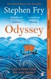

<b>WHEN GODS TURN VENGEFUL, ONLY THE BRAVE CAN DEFY FATE AND FIND THEIR WAY HOME</b>  <b>Discover Stephen Fry's epic re-telling of the Odyssey for the 21st century</b>  '<b>Relatable and full of humour '</b> GUARDIAN  '<b>Fry breathes contemporary relevance into these ancient tales'</b> OBSERVER  <b>--</b>  After the fall of Troy, wily Odysseus, King of Ithaca, sails for home and his steadfast queen Penelope.  However, the angry gods curse him to wander the seas for ten long years. Tormented by giants and monsters, tempted by witches and goddesses, Odysseus battles to draw ever closer to home.  Awaiting him is Penelope, defying reports of his death. But this queen endures her own tormentors – an army of young suitors eager to claim her hand and the throne . . .  --  '<b>Odyssey completes his Greek Myths series in marvellous fashion. . . Fry, a born storyteller, succeeds again in making the ancient stories accessible'</b> IRISH INDEPENDENT  <b>Praise for Stephen Fry's Greek Myths series:</b>  'Fry is at his story-telling best . . . the gods will be pleased' <i>The </i><i>Times</i>  'Brilliant . . . all hail Stephen Fry' <i>Daily Mail</i>  'A head-spinning marathon of legends' <i>Guardian</i>  'A rollicking good read' <i>Independent</i>  'An Olympian feat. The gods seem to be smiling on Fry - his myths are definitely a hit' <i>Evening Standard  </i> <i>Sunday Times bestseller, October 2024 </i>

[View on Apple](https://books.apple.com/gb/book/odyssey/id1537724946)

## Tom Clancy Executive Power

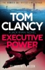

<b>Pre-order the pulse-racing new Jack Ryan thriller, TOM CLANCY THE COLDEST WAR, now!</b>  __________  <b>An international incident may fracture the Ryan family in the latest entry in this #1 New York Times bestselling series.</b>  Luanda, Angola  An American intelligence team on a routine mission is wiped out. The sole survivor: Kyle Ryan, youngest son of President Jack Ryan.  But the massacre of his colleagues is just the prelude to an even more devastating conflict - a deadly military coup in the central African nation. The next step is a shocking escalation, the seizure of the American Embassy and the taking of numerous hostages including the ambassador and the younger Ryan.  As US forces fight insurgents street by street in the African capital city, Lieutenant Katie Ryan leads the effort to untangle the mystery behind the coup and the identity of the plotters. Is it the Chinese government? Is it a corrupt Angolan general? Or is there a darker force pulling the strings?  In the White House Situation Room, President Jack Ryan and his National Intelligence Team anxiously await the answers. He may have a full Marine Expeditionary Unit at his command, but the full executive power of the presidency is useless if they can't find the target.  One thing's for sure, Kyle and his fellow hostages sit at the center of the bullseye - human shields to deflect an American response. Jack Ryan has faced many challenges as President, but solving this problem is no one-man job. It's going to take all three of them to get through this. __________  <b>WHAT READERS SAY ABOUT <i>EXECUTIVE POWER</i></b>  'Bringing in <b>new Ryan family characters</b> and characteristics. A great read, <b>a cant-put-down book</b>'  ⭐ ⭐ ⭐ ⭐ ⭐  'I haven't read a Clancy book in a few years . . . Now, <b>I need to go back and maybe start from the beginning!</b>'  ⭐ ⭐ ⭐ ⭐ ⭐  'My first ever Jack Ryan book . . . I thoroughly enjoyed, <b>it kept you gripped all the way through</b>'  ⭐ ⭐ ⭐ ⭐ ⭐  'Keeps you <b>on the edge of your seat</b>'  ⭐ ⭐ ⭐ ⭐ ⭐  'Love the Jack Ryan series! <b>Exciting storylines </b>that seem to come <b>directly from today's newspaper</b>'  ⭐ ⭐ ⭐ ⭐ ⭐  'A lot of <b>detailed information about the Navy and Marines</b>, and a great description of the Ryan Family bond. I truly enjoyed it!'  ⭐ ⭐ ⭐ ⭐ ⭐

[View on Apple](https://books.apple.com/gb/book/tom-clancy-executive-power/id6743124183)

## The Long Call

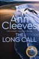

<b>Meet Detective Matthew Venn. From Ann Cleeves, the <i>Sunday Times</i> bestselling creator of Vera Stanhope and Shetland's Jimmy Perez, <i>The Long Call</i> is the number one bestselling first novel in the Two Rivers series. Now a major ITV series.  'Clever, compassionate and atmospheric, with a great cast of new characters to love' – Elly Griffiths, author of <i>The Frozen People</i></b>  <b>North Devon.</b> Where the rivers Taw and Torridge converge and run into the sea, Detective Matthew Venn stands outside the church as his father's funeral takes place. The day Matthew turned his back on the strict evangelical community in which he grew up, he lost his family too.  Now he's back, not just to mourn his father at a distance, but to take charge of his first major case in the Two Rivers region; a complex place not quite as idyllic as tourists suppose.  A body has been found on the beach near to Matthew's new home: a man with the tattoo of an albatross on his neck, stabbed to death.  Finding the killer is Venn’s only focus, and his team’s investigation will take him straight back into the community he left behind, and the deadly secrets that lurk there.  <b>'Stunning' – David Baldacci, author of <i>The 6:20 Man</i></b>  <b>'Another fine chapter in the Ann Cleeves story' – <i>The Times</i></b>  <b>'One of Britain's best crime writers' – <i>Daily Express</i></b>  <b><i>The Long Call</i> is the first entry in the Two Rivers series. Continue the mysteries with <i>The Heron's Cry</i>.</b>

[View on Apple](https://books.apple.com/gb/book/the-long-call/id1453379255)

## Maybe Someday

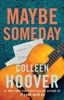

<b>From the #1&#xa0;<i>Sunday Times</i>&#xa0;bestselling author of&#xa0;<i>It Ends With Us&#xa0;</i>comes a passionate tale of friendship, betrayal, and romance.</b>   At twenty-two years old, Sydney is enjoying a great life: She’s in college, working a steady job, in love with her wonderful boyfriend, Hunter, and rooming with her best friend, Tori. But everything changes when she discovers that Hunter is cheating on her—and she’s forced to decide what her next move should be.   Soon, Sydney finds herself captivated by her mysterious and attractive neighbour, Ridge. She can't take her eyes off him or stop listening to the passionate way he plays his guitar every evening out on his balcony. And there’s something about Sydney that Ridge can’t ignore, either. They soon find themselves needing each other in more ways than one.  &#xa0;

[View on Apple](https://books.apple.com/gb/book/maybe-someday/id769413406)

## The Frozen People

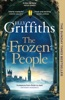

<b>The instant <i>Sunday Times</i> bestseller</b>  <b>SOME MURDERS CAN'T BE SOLVED IN JUST ONE LIFETIME.</b>  <b>'A five-star start to a dazzling new series . . . Smart, original and utterly masterful'</b> Janice Hallett  <b>'A pleasure from finish to start'</b> Anthony Horowitz  <b>'Fresh and exciting with both humour and thrills, Griffiths' first book in her new series knocks it out of the park'</b> Shari Lapena  Ali Dawson and her cold case team investigate crimes so old, they're frozen - or so their inside joke goes. Most people don't know that they travel back in time to complete their research.  The latest assignment sees Ali venture back farther than they have dared before: to 1850s London in order to clear the name of Cain Templeton, the eccentric great-grandfather of MP Isaac Templeton. Rumour has it that Cain was part of a sinister group called The Collectors; to become a member, you had to kill a woman...  Fearing for her safety in the middle of a freezing Victorian winter, Ali finds herself stuck in time, unable to make her way back to her life, her beloved colleagues, and her son, Finn, who suddenly finds himself in legal trouble in the present day.   Could the two cases be connected?  <b>Get ready for an original, transportive and characterful new crime novel from no. 1 bestselling author Elly Griffiths. Perfect for those missing the Dr Ruth Galloway series and for any crime and historical fiction fans.</b>  A <i>Sunday Times</i> bestseller w/c 17/02/2025

[View on Apple](https://books.apple.com/gb/book/the-frozen-people/id6478527022)

## Never To Be Found

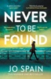

'Propulsive, break-neck pace and a wonderfully layered, twisty story <b>- ANDREA MARA</b> 'An utterly compelling thriller' <b>- TM LOGAN</b> 'A relentlessly gripping page-turner' <b>- CATHERINE RYAN HOWARD</b> <b></b> <b>THE BRAND NEW 2026 PSYCHOLOGICAL THRILLER FROM THE NO.1 BESTSELLING AUTHOR OF <i>THE CONFESSION.</i></b> <b>___________________</b> <b></b> <b>She helped him disappear.</b> <b>She'll wish she hadn't . . .</b>  <i>In Japan, one hundred thousand people voluntarily disappear every year, aided by those who help them start over. They call them Johatsu - the evaporated.</i>  <i>I brought the idea to England. No judgement, no questions. Just new identities, packed bags, and discreet escape plans from abusive partners, debt, or simply lives that no longer fit.</i>  <i>I thought I was doing something good - honourable, even. Until now.</i>  <i>I know now that not everyone is fleeing hardship. I've helped someone who committed a crime to flee the police. I've disappeared a murderer.</i>  <i>And unless I find him, I don't know what he'll do next . . .</i>  <b>More praise for </b><i><b>Never to be Found:</b></i> <b><i></i></b> <b><i></i></b>'Will grip you from the first page. With a fantastic concept and a fast-paced, twisty plot, this is undoubtedly one of my books of the year. A masterclass in how to write an impeccable crime novel' - <b>JANE CASEY</b> <b></b> 'The best thriller you will read this year. Utterly original, breathtakingly gripping, forensically plotted . . . this is a masterpiece that crowns Jo Spain as one of the best writers of a generation. You will be completely sucked into the world of the evaporated, and confounded by twist after terrifying twist. Unputadownable genius, pure and simple' -<b> SAM BLAKE</b> <b></b> 'Jo Spain's incomparable flair for plotting and a truly intriguing - and original - premise makes this a relentlessly gripping page-turner. Truly, I couldn't put it down' - <b>CATHERINE RYAN HOWARD</b>  'Non-stop tension, clever twists and turns, and nothing is ever as it seems' -<b> ANDREA MARA</b> (on Jo Spain)

[View on Apple](https://books.apple.com/gb/book/never-to-be-found/id6747759262)

## It Could Have Been Her

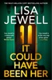

<b>PREPARE TO BE HOOKED by the brand new thriller from Lisa Jewell, author of the <i>Sunday Times</i> bestselling novels <i>None of This Is True </i>and<i> Don't Let Him In.</i></b>  'A deliciously twisted gem of a thriller and her best yet' <b>CLAIRE DOUGLAS</b> 'A true masterpiece' <b>ANDREA MARA</b> 'Superbly written, entertaining and twisty' <b>LIZ NUGENT</b> 'Dark, intense, brilliant' <b>SHARI LAPENA</b> ___________  <b>It was the night she almost died.</b>  Jane Trevally, newly divorced and feeling a little lost, agrees to accompany a man she doesn't know to his house in the darkest corner of Hampstead Heath. She's offered a drink, goes in, and then - a scream and the sound of something falling upstairs - Jane senses she's in a bad place. She runs.  Twenty five years later, Jane finds herself outside the same house, this time to return a small white dog who's been found near her home in the country; a dog whose owner has just been reported missing.  A fleeting glimpse of a haunted looking woman through the window sends Jane on a mission to uncover the house's secrets - secrets more terrifying than she could have ever imagined, especially when she realises it could have been her. . .  ___________  <b>Praise for <i>It Could Have Been Her </i>and Lisa Jewell:</b>  '<b>Deliciously dark, devilishly addictive</b> and<b> beautifully written'</b> ALICE FEENEY  'A <b>master of suspense</b>' RILEY SAGER  'Lisa Jewell is <b>a STONE COLD GENIUS</b>!' MARIAN KEYES  ‘Lisa Jewell is on <b>top-form</b>' RUTH WARE  'A <b>master of her craft</b>’ MICHELLE McDONAGH  '[Lisa Jewell] is a g<b>enius</b>' SABINE DURRANT  '<b>I'd literally read the phone book if Lisa Jewell wrote it</b>' ANDREA MARA  '<b>Nobody does it better </b>than Lisa Jewell’ A J FINN  ‘Lisa Jewell, the <b>Queen of sick psychopaths</b>’ TAMMY COHEN  'Lisa Jewell books are <b>a must-read</b> for me' JOJO MOYES  '<b>Lisa is a rare gem of a writer' </b>GILLIAN McALLISTER  <b>Readers love<i> It Could Have Been Her</i>: </b>  'It’s <b>by far Jewell’s creepiest and most unsettling book</b>' 5-star reader review  'Lisa Jewell’s name has become<b> a byword for guaranteed twisty page-turners' </b>Sam Baker  'An absolute <b>masterpiece</b>' 5-star reader review  'Such a <b>dark and delicious</b> mystery!' 5-star reader review  'An <b>absolute page-turner' </b>India Knight  '<b>Shook me to my core</b>' 5-star reader review  'I <b>devoured </b>this <b>addictive page turner</b>!' 5-star reader review

[View on Apple](https://books.apple.com/gb/book/it-could-have-been-her/id6753563751)

## The Eights

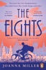

They knew they were changing history. They didn't know they would change each other.  Oxford, 1920. For the first time in its 1,000-year history, the world’s most famous university has admitted female students. Giddy with dreams of equality, education and emancipation, four young women move into neighbouring rooms on Corridor Eight and find themselves thrust into an unlikely, life-affirming friendship. They have come here from all walks of life, but Dora, Beatrice, Otto and Marianne all long to move on from the Great War, whose ghosts, grief, and secrets still feel very real indeed.  But Oxford is a place caught between tradition and change, where centuries of misogyny and exclusion clash with the promise of new freedoms. And as the group navigate this tumultuous moment in time under the city’s dreaming spires, their friendship will become more important than ever.  ‘A beautifully wrought story of women’s rights, freedom, love and experience. I couldn’t put it down’ Harriet Evans, author of <i>The Treasures</i>  ‘I became completely involved in the lives of the four pioneering heroines whose friendship is the beating heart of the book’ Clare Chambers, author of <i>Small Pleasures</i>

[View on Apple](https://books.apple.com/gb/book/the-eights/id6572286909)

## The Lucky Winners

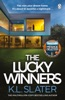

<b>THE NO.4 <i>SUNDAY TIMES </i>BESTSELLER</b>  <b>THE RICHARD &amp; JUDY BOOK CLUB PICK</b>  <b>'Excellent gripping storyline...keeps you guessing right to the end' </b>5***** reader review  -- When Merri and Dev buy a ticket on the last day of a national draw to win the house of their dreams, they never, in a million years, expect to win.  <b>Less than a week later, they’re receiving the keys to their new Lake District mansion.</b>  For Dev, it’s a dream come true – no more stressful rent negotiations, or waiting for the landlord to finally fix the damp. Of course he’s delighted to be interviewed about their good luck.  But Merri feels a little uneasy. Dev doesn’t realise there’s a reason she’s never wanted to put down roots, always trying to run away from the memories of what happened the day her little sister died.  At first it’s easy to think she’s imagining the shadowy figures in the lakefront garden. It’s silly to think that someone is watching her through the gorgeous floor-to-ceiling glass windows.  <b>And then a body is found in the lake. And Merri’s new perfect life is about to come crashing down…</b>  -- <b>PRAISE FOR K. L. SLATER</b>   ‘Full of secrets, lies and betrayal – it will keep you guessing right to the end’ <b>T.M. Logan</b>   'A triumph of clever plotting and sharp writing. A compelling thriller, masterfully executed' <b>Rachel Abbott </b>  ‘Brilliant, very clever . . . I absolutely recommend it’ <b>B. A. Paris</b>   ‘Just when you think you know exactly who did what, there is a twist to beat all twists’ <b><i>The Times</i></b>   ‘One of the best thrillers I have ever read’ <b>Angela Marsons</b>   ‘A gripping thriller that will make you question everything you thought you knew about marriage’ <b><i>New</i></b><b> magazine</b>  <b>*No.4 Sunday Times bestseller 21.12.25</b>

[View on Apple](https://books.apple.com/gb/book/the-lucky-winners/id6657975993)

## We Solve Murders

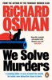

<b>FROM THE #1 BESTSELLING AUTHOR OF <i>THE THURSDAY MURDER CLUB</i>  A cunning killer. A race around the world. An iconic new detective team is born.</b>  -----  <b><i>Solving murders. It's a family business. </i></b>  <b>Steve Wheeler</b> is enjoying retired life. He still does the odd bit of investigation work, but he prefers the pub quiz and afternoons at home with his cat Trouble. His days of adventure are over – that’s his daughter-in-law Amy’s business now.  <b>Amy Wheeler </b>thinks adrenaline is good for the soul, which makes being a private security officer to billionaires the perfect job. She’s currently on a remote island keeping world-famous author Rosie D’Antonio alive. Then a dead body, a bag of money and a killer with their sights on Amy have her sending Steve an SOS...  As a breakneck race around the world begins, can they stay one step ahead of a deadly enemy?  -----  <b>PRAISE FOR RICHARD OSMAN</b>  ‘Brilliantly suspenseful’ <b>JEFFERY DEAVER</b>  ‘Deplorably good’ <b>IAN RANKIN</b>  ‘Funny, clever, compelling’ <b>HARLAN COBEN</b>  ‘I smiled a million times’ <b>MARIAN KEYES</b>  ‘Warm, wise and witty’ <b>VAL MCDERMID</b>  ‘Osman just gets better’<b> SHARI LAPENA</b>  'This is a sitcom-meets-Bond, and a fine murder mystery’ <b><i>DAILY EXPRESS</i></b>  ‘The twistiest, turniest tale told with all of Richard Osman’s trademark wit and warmth’ <i><b>RED</b></i>  'The entertainment value is sky-high' <b><i>i NEWS</i></b>  'Thursday Murder Club fans, you are in for a treat' <b><i>PRIMA</i></b>  'Much as with the earlier books, I read We Solve Murders in a few pleasured gulps' <i><b>SUNDAY TIMES</b></i>  <i><b>'</b></i>The thing that shines through in Osman’s writing is that he really likes people and revels in all their foibles and eccentricities ... a delightful read' <i><b>OBSERVER</b></i>  ‘The rightful king of crime’<i> <b>i</b></i>

[View on Apple](https://books.apple.com/gb/book/we-solve-murders/id6477904297)

## Brave New Summer

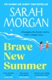

☀️Escape to Cornwall this summer with another heart-warming and feel-good novel from the Number One Sunday Times bestselling author!☀️  Readers LOVE Sarah Morgan  ‘Sarah Morgan never disappoints’ Reader review ⭐⭐⭐⭐⭐  'This is a summer must read!' Reader review ⭐⭐⭐⭐⭐  'Sarah never fails to deliver a great story … I loved it' Reader review ⭐⭐⭐⭐⭐  * * * *  Evie is the acting general manager of The Alexandra hotel in picturesque Cornwall, but she feels trapped in a life defined by others’ expectations. Just as she contemplates a fresh start, Abby arrives, sent undercover by the hotel’s owner to assess the staff and operations. But Abby is navigating her own struggles and longs to break free from the shadow of her mother.  As the two women forge an unexpected friendship, they confront their fears and the threat of change looming over them. With the help of a charming chef and a gruff pub owner, they begin to embrace their true selves and the bonds that unite them. Will they find the strength to reshape their futures, or will the weight of the past hold them back?  Full of warmth and heart, Brave New Summer is a joyful and uplifting novel about friendship, romance and being brave, from the Number One Sunday Times bestseller, Sarah Morgan.   Perfect if you love:   🏖️Escaping to seaside towns   🫶🏼Strong female bonds   💛Unlikely friendships   🍺Grumpy pub owners   👨🏼‍🍳Charming chefs   * * * *  Praise for Sarah Morgan:  ‘Sarah Morgan never disappoints I always look forward to my summer read from her … a must read for holidays’ Reader review ⭐⭐⭐⭐⭐  'A perfect slice of joyful summer escapism from Sarah Morgan, the master of the genre' Clare Pooley  ‘The perfect summer escape!’ Cathy Bramley  'I was absolutely hooked from the first chapter and knew straight away this was another book written with Sarah’s magic touch … utterly fabulous' Reader review ⭐⭐⭐⭐⭐  ‘A truly heart-warming read’ Woman &amp;amp; Home  Reviews  Praise for Sarah Morgan:  ‘Funny and often poignant … will thaw even the biggest Grinch’s heart’ The Independent  ‘A mug of hot chocolate in book form’ Good Housekeeping  ‘A feel-good pick-me-up you’ll love’ Fabulous magazine  ‘The perfect cosy escape’ My Weekly  ‘Full of drama to enjoy snuggled up in the warm’ Woman &amp;amp; Home  ‘A warm and funny festive romance’ Daily Mirror  ‘A heart-warming read packed with seasonal cheer’ Daily Express

[View on Apple](https://books.apple.com/gb/book/brave-new-summer/id6747780909)

## The Tailor

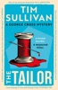

&#39;One of the most iconic British fictional detectives of the 21st century.&#39; DAILY MAIL 
&#39;One of my favourite detectives.&#39; ELLY GRIFFITHS 
&#39;Reaffirms everything that has made this series a bestseller.&#39; VASEEM KHAN 
&#39;I absolutely loved The Tailor&#39; GARY BARLOW 
&#39;A joy to read, beautifully penned, rich in detail and as elegantly put together as a bespoke suit.&#39; ABIR MUKHERJEE 
&#39;An elegantly woven mystery in all the best traditions of the genre… Sullivan is a writer&#39;s writer – witty, cutting and clever.&#39; HELEN S FIELDS 
 
George Cross: unfailingly shrewd. Uniquely brilliant. 
 
A bespoke tailor boards the 10:00 train from Bristol to London. Before it reaches Bath, he&#39;s found dead in the toilet, his throat slit and a plastic bag pulled over his head. 
 
DS George Cross deduces that this wasn&#39;t a robbery – nothing about the killing is random. 
 
It&#39;s an execution. 
 
George&#39;s investigation brings him dangerously close to a cold and merciless world. And is it his imagination or is he being followed? 
 
With the highest conviction rate of any officer in the force, someone will do anything to stop George from getting to the truth. 
 
This time, the next cut could be meant for him... 
 
Perfect for fans of MW Craven, Ann Cleeves and Joy Ellis, this is the eighth book in the million-copy-bestselling George Cross Mystery series, which can be read in any order, by the 2026 winner of the Crime Writers&#39; Association Dagger in the Library Award.

[View on Apple](https://books.apple.com/gb/book/the-tailor/id6740251363)

## The Goal

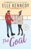

<b>Original Series now on Prime Video. Can't wait for Season 2 of Off Campus? Fall in love with Tuck and Sabrina...</b> <b> </b>  <b>Welcome to Briar U!</b>  <b> Get ready for your newest obsession . . . Discover the addictive world of the Off-Campus series from The Queen of Hockey Romance, Elle Kennedy! </b> <b> Read <i>The Goal </i>now for the perfect forced proximity romance!</b><b></b> <b>She's good at achieving her goals . . . </b>  College senior Sabrina James has her whole future planned out: graduate from college, kick butt in law school, and land a high-paying job at a cut-throat firm. Her path to escaping her shameful past certainly doesn't include a gorgeous hockey player who believes in love at first sight. One night of sizzling heat and surprising tenderness is all she's willing to give John Tucker, but sometimes, one night is all it takes for your entire life to change.  <b>But the game just got a whole lot more complicated . . . </b>  Tucker believes being a team player is as important as being the star. On the ice, he's fine staying out of the spotlight, but when it comes to becoming a daddy at the age of twenty-two, he refuses to be a bench warmer. It doesn't hurt that the soon-to-be mother of his child is beautiful, whip-smart, and keeps him on his toes. The problem is, Sabrina's heart is locked up tight, and the fiery brunette is too stubborn to accept his help. If he wants a life with the woman of his dreams, he'll have to convince her that some goals can only be made with an assist . . .  ***  <b>Why fans love Elle Kennedy </b><b>⭐ ⭐ ⭐ ⭐ ⭐!</b>  'Delicious, complicated and drama-filled . . . I read it in one sitting, and you will, too'<b> L. J. Shen, <i>USA Today</i> bestselling author</b>  'A deliciously sexy story with a wallop of emotions that sneaks up on you' <b>Vi Keeland, <i>New York Times</i> bestselling author</b>  'This book had the ability to make me swoon one minute, put my heart in my throat the next, then literally make me burst right out laughing out of the blue' <b>Goodreads Review</b>  'The best college romance I've read. It had epic banter, sexy romance, and fantastic writing!! I laughed, I swooned, I couldn't put it down. Highly recommended!!' <b>Goodreads Review</b>  'Elle Kennedy proves, once again, that she is the Queen of College Hockey Romance!!'<b> Goodreads Review</b>  '5-Made My Heart Pitter Patter-Stars' <b>Goodreads Review</b>  'One of the few authors who can instantly put a grin on my face as soon as I start reading her books' <b>Goodreads Review</b>  <b>💘💘💘</b>  <b>Tropes</b> 🏒College hockey romance 🏒He falls first 🏒One night stand 🏒Accidental pregnancy 🏒Grumpy x Sunshine

[View on Apple](https://books.apple.com/gb/book/the-goal/id6466581015)

## One Golden Summer

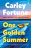

<b>Step back into the world of Barry's Bay with the unforgettable romance from Carley Fortune, bestselling author of Every Summer After - now a major TV series Every Year After</b>  <i><b>I never anticipated Charlie Florek. But Charlie Florek changed my life.</b></i>  Good things happen at the lake. That's what Alice's Nan always says. And it's true. It's where Alice took that photo, the one that catapulted her career.  But when Nan falls, Alice puts down her camera and heads back to Barry’s Bay. No camera. No deadlines. Quiet… until he shows up.  Charlie Florek. He was nineteen when she accidentally photographed him. Now he’s back - taller, hotter, and somehow even more unforgettable.  Sun-soaked days, slow-burning nights - and when Charlie looks at her like that, Alice starts to wonder if her heart’s in danger.  <b>She’s spent her life seeing others. But no one’s ever truly seen her...until now.</b>  ‘Crackling sexual tension’ <b>THE TIMES</b>  ‘This swoon-worthy romance is one for the beach bag’<b> WOMAN &amp; HOME</b>  ‘Radiant’ <b>Emily Henry</b>  'Funny and sexy, this promises to be the escapist novel of the summer' <b>HEAT</b>  'Beautiful, emotional love stories set in breathtaking places' <b>Paige Toon</b>  'A dreamy read full of romance ' <b>VIP Magazine</b>  'With summery weather, stunning sunsets and boat trips, it's impossible not to feel the holiday spirit while reading this book' <b>Mirror</b>  'Swoon-worthy, sun-drenched. . . Beautifully described scenery and a heart-fluttering friends-to-lovers story make this one of 2025’s best romances.' <b>Culturefly</b>  <b>Readers LOVE One Golden Summer:</b>  'This book was everything I wanted it to be and more! I’m calling it now. This is going to be the Summer romance read of 2025!' <b>***** Reader Review</b>  'One Golden Summer is my favourite read this year. Hands down, the easiest 5 stars' <b>***** Reader Review</b> 'This book is my absolute fav' <b>***** Reader Review</b>  'I’m so grateful I got to read this beautiful story, it was just what I needed for a bit of escapism! Good things happen at the lake'<b> ***** Reader Review</b>  'This was stunning. I loved the whole thing. The characters are incredible' <b>***** Reader Review</b>  'The must pick up Romance of 2025……. I absolutely fell in love and cannot recommend it enough'<b> ***** Reader Review</b>

[View on Apple](https://books.apple.com/gb/book/one-golden-summer/id6636470088)

## Fourth Wing

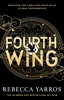

<b>DON'T BE THE LAST TO DISCOVER THE  SERIES THAT EVERYONE CAN'T STOP TALKING ABOUT:</b>  'I couldn't put it down!' <b>Millie</b> <b>Bobby</b> <b>Brown</b>  'This book contains an addictive, drug-like essence that will make you relinquish all responsibility'<i> <b>Glamour </b></i>  'Yarros had me hooked from the first chapter' <i><b>Mail on Sunday</b></i>  _  <b>FRIENDS. ENEMIES. LOVERS . . .</b> <b>EVERYONE HAS AN AGENDA</b>  Violet Sorrengail expected to live a quiet life surrounded by books, until she was forced onto the world's deadliest training ground. Now she must fight to join the army's elite: dragon riders. But dragons don't choose fragile riders, they incinerate them, and when your body breaks as easily as Violet's does - death is only a heartbeat away.  <b>EVERY NIGHT COULD BE YOUR LAST</b>  Many cadets would kill Violet to better their own chances of success; the rest would kill her just because of her last name . . . including the ruthless Xaden Riorson, her family's greatest enemy. With the odds stacked against her, Violet must use every edge her wits can give her just to see the next sunrise, because once you enter Basgiath War College, there are only two ways out:  <b>GRADUATE OR DIE</b> _   <b>OVER TWO MILLION READERS HAVE ALREADY GIVEN FOUR</b><b>T</b><b>H WING FIVE S</b><b>T</b><b>ARS. ARE YOU READY </b><b>T</b><b>O ENTER </b><b>T</b><b>HE WORLD OF BASGIA</b><b>T</b><b>H WAR COLLEGE? </b>  'Incredible storytelling on every page' <b><i>The Sun</i></b><b>'</b>Pure escapism . . . We'd suggest savouring every moment' <b><i>Independent </i></b>  'Full of action, suspense and intrigue. This is the ride you have been waiting for, hold on tight' <b><i>Daily Mirror </i></b> 'We weren't expecting to become obsessed . . . but we very much are and we're not alone' <b><i>Sunday</i></b><i> <b>Times</b> <b>Style</b></i>  'The new publishing sensation' <b><i>Daily</i></b><i> <b>Mail</b></i>  'Yarros is the true inheritor of Harry Potter and inspires Hunger Games levels of devotion' <b><i>Guardian</i></b>  'A deliciously gripping dish, which I downed in one sitting' <b><i>Stylist</i></b>  '2024 is the Year of the Dragon . . . Dive into a fantasy narrative featuring these mythical, winged creatures' <b><i>Pop</i></b><i> <b>Sugar</b></i>  'One of the publishing events of the year' <b>BBC</b> <b>News</b>  'Prepare to get obsessed' <b><i>Cosmopolitan</i></b> <b> OTHER BOOKS IN THE EMPYREAN SERIES:</b> - FOURTH WING - IRON FLAME - ONYX STORM  *Rebecca Yarros's <i>Fourth Wing</i> paperback was an instant number-one bestseller in the first week of April 2024.

[View on Apple](https://books.apple.com/gb/book/fourth-wing/id6445048129)

## What We Can Know

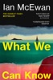

<b>The breathtaking new novel from Ian McEwan</b>  <b>‘A thumping literary mystery’ </b><i>Independent </i><b>‘A gripping page-turner’</b> <i>Observer </i><b>‘A beautiful novel, full of wisdom and heart. I loved it’ </b>Elif Shafak  <i>2014:</i> A poem is read aloud once then vanishes without a trace.  <i>2119: </i>A century later, the seas have risen and the world is under water. Those who remain are haunted by what’s been lost – and what might still be found.  When university scholar Tom Metcalfe stumbles across a clue that may lead to the great lost poem, he reveals a story of entangled love and a brutal crime that challenges everything he thought he knew about the past…  <b>READERS LOVE </b><i><b>WHAT WE CAN KNOW: </b></i>‘Fantastic…a book I will treasure forever’ ‘Brilliant, gripping, fascinating’ ‘Makes you question everything you think you know’ ‘A beautiful exploration of memory and love’ ‘What a book. Utterly absorbing’  <b>‘Rewarding and thought-provoking’ </b><i>Financial Times</i>  <b>‘A master storyteller’ </b><i>The Times</i>  <b>‘It gave me so much pleasure’ </b><i>New York Times</i>  <b>‘Haunting, playful and ultimately hopeful… A wonderful book’ </b>Kaliane Bradley  <b>*A BOOK OF THE YEAR for the </b><b><i>Sunday Times</i></b><b>, </b><b><i>Guardian</i></b><b>, </b><b><i>New York Times</i></b><b>, </b><b><i>New Statesman</i></b><b>, </b><b><i>Spectator</i></b><b>, </b><b><i>New Yorker</i></b><b>, </b><b><i>i Paper</i></b><b> and Barack Obama*</b>

[View on Apple](https://books.apple.com/gb/book/what-we-can-know/id6741511331)

## Gabriel's Moon

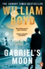

<b>In his most exhilarating novel yet, William Boyd transports you to the vibrant streets of sixties London, as an accidental spy is drawn into the shadows of espionage and obsession . . .</b>  <b>‘William Boyd once again brings to the spy novel his particular storytelling genius . . . brilliant fun’ </b>MICK HERRON <b>‘Wonderfully ambiguous with notions of twisted reality and uncertain memory’ </b>ANN CLEEVES <b>‘A wonderfully intricate novel of espionage and elegant skulduggery’ </b>JOHN BANVILLE  <b>AN ACCIDENTAL SPY. A WEB OF BETRAYALS. A MYSTERY THAT WILL TAKE YOU AROUND THE WORLD . . . </b>  Gabriel Dax is a young man haunted by the memories of a tragedy: every night, when sleep finally comes, he dreams about his childhood home in flames. His days are spent on the move as an acclaimed travel writer, capturing changing landscapes in the grip of the Cold War. When he’s offered the chance to interview a political figure, his ambition leads him unwittingly into the shadows of espionage.  As Gabriel’s reluctant initiation takes hold, he is drawn deeper into duplicity. Falling under the spell of Faith Green, an enigmatic and ruthless MI6 handler, he becomes ‘her spy’, unable to resist her demands. But amid the peril, paranoia and passion consuming Gabriel’s new covert life, it will be the revelations closer to home that change the rest of his story . . .  ------  <b>‘Engaging, intelligent and deeply satisfying. I rate him one of our greatest living novelists’</b> PETER JAMES <b>‘I enjoyed it hugely. Boyd is one of my favourite authors – he never disappoints’</b> KATE ATKINSON <b>‘Beautifully crafted and pleasingly unpredictable, the work of a man who knows what he is doing and makes it look effortless’ </b>JAMES RUNCIE <b>‘Simply the best realistic storyteller of his generation’ </b>SEBASTIAN FAULKS <b>‘There are few reading pleasures as great as giving in to a William Boyd novel’ </b><i>SUNDAY TIMES</i>

[View on Apple](https://books.apple.com/gb/book/gabriels-moon/id6501974613)

## The House of Wolf

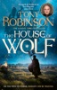

'George RR Martin meets Terry Pratchett' <i><b>OBSERVER</b></i> <b> ***NOW A <i>SUNDAY TIMES </i>BESTSELLER IN HARDBACK***</b> <b> Sir Tony Robinson - actor, presenter, historical expert and star of <i>Blackadder </i>and <i>Time Team</i> - makes his adult fiction debut with this earthy, entertaining and gloriously witty recreation of the Anglo-Saxons, Alfred the Great, and the making of England.</b>  'A page-turner full of historical intelligence, wit and heart' <b>DAN JONES</b>  'Brings the Anglo-Saxon world riotously to life' <b>S.J PARRIS</b>  'Entirely brilliant, a story and world vividly evoked'<b> KATE WILLIAMS</b>  'Every bit and wise, witty and entertaining as you would expect from one of our greatest storytellers'<b> MARK BILLINGHAM </b> ______  <b>Rome</b> Father Asser is waiting to die.  His idealism has landed him in a papal prison on trumped-up charges of heresy, until salvation arrives in an unexpected form. Cardinal Balotelli also dreams of a better world, free from the ravages of the Norlanders. He has a vital job for Asser, one that could shape the future of Europe.  <b>Wessex</b> King Aethelwolf's power is fading, but none of his feckless children are fit to rule.  His eldest sons would rather fight each other than the blood-thirsty Norland invaders. His daughter, Swift, is clever and cunning, but often blinded by her ambition. Finally there's Alfred, his once-promising younger son, whom nobody has seen in years.  Then Wolf meets a young priest with a proposition from Rome that could change everything.  <b>Lindisfarne</b> Rhiannon is a slave with a profound hatred for her Saxon captors. When she meets Guthrum, a Norlander hell-bent on wiping Wessex from the map, they set out on a journey of destruction.  <b>So begins an epic struggle between greed and idealism, ambition and betrayal, freedom and tyranny. Because change always meets with resistance and, on the path to power, nobody can be trusted.</b>  <i>The House of Wolf</i> <i>appeared in the Sunday Times hardback bestseller chart in the week ending 20th September 2025.</i>

[View on Apple](https://books.apple.com/gb/book/the-house-of-wolf/id6743436874)

## The Legacy

<b>Original Series now on Prime Video</b>  <b>Welcome to Briar U!</b>  <b> Get ready for your newest obsession . . . Discover the addictive world of the Off-Campus series from The Queen of Hockey Romance, Elle Kennedy! </b> <b>Read <i>The Legacy </i>now for the much-anticipated answer to the question: Where are they now?</b><b></b>  <b>Four stories. Four couples. Three years of real life after graduation. . .</b>  A wedding. A proposal. An elopement. And a surprise pregnancy.  Life after college for Garrett and Hannah, Logan and Grace, Dean and Allie, and Tucker and Sabrina, isn't quite what they imagined it would be. Sure, they have each other, but they also have real-life problems that four years at Briar U didn't exactly prepare them for. As it turns out, for these four couples, love is the easy part. Growing up is a whole lot harder.  <b>Come for the drama, stay for the laughs! Catch up with your </b><b>favourite</b><b> Off-Campus characters as they navigate the changes that come with growing up and discover that big decisions can have big consequences . . . and big rewards.</b>  ***  <b>Why fans love Elle Kennedy </b><b>⭐ ⭐ ⭐ ⭐ ⭐!</b>  'Delicious, complicated and drama-filled . . . I read it in one sitting, and you will, too'<b> L. J. Shen, <i>USA Today</i> bestselling author</b>  'A deliciously sexy story with a wallop of emotions that sneaks up on you' <b>Vi Keeland, <i>New York Times</i> bestselling author</b>  'This book had the ability to make me swoon one minute, put my heart in my throat the next, then literally make me burst right out laughing out of the blue' <b>Goodreads Review</b>  'The best college romance I've read. It had epic banter, sexy romance, and fantastic writing!! I laughed, I swooned, I couldn't put it down. Highly recommended!!' <b>Goodreads Review</b>  'Elle Kennedy proves, once again, that she is the Queen of College Hockey Romance!!'<b> Goodreads Review</b>  '5-Made My Heart Pitter Patter-Stars' <b>Goodreads Review</b>  'One of the few authors who can instantly put a grin on my face as soon as I start reading her books' <b>Goodreads Review</b>

[View on Apple](https://books.apple.com/gb/book/the-legacy/id6466581837)

## No Country for Old Men

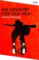

<b>A savage tale of violence and morality in the American West, Cormac McCarthy's <i>No Country for Old Men</i> follows a Vietnam veteran's dark path after stumbling upon a drug deal gone wrong.</b>  <b>Adapted for the screen by the Coen Brothers (<i>Fargo</i>, <i>True Grit</i>), winner of four Academy Awards (including Best Picture).</b>  <b>'A Western thriller with a racy plot and punchy dialogue' – <i>The Times</i></b>  1980. Llewelyn Moss is hunting antelope near the Rio Grande when he discovers the aftermath of a drug deal turned deadly. Finding bullet-ridden bodies, several kilos of heroin, and a caseload of cash, he faces a choice – walk away or take the money and run. Choosing the latter, he knows, will change everything.  And so begins a terrifying chain of events, as each player in this brutal game seems determined to answer one question: how does a man decide in what order to abandon his life?  <b>'It's hard to think of a contemporary writer more worth reading' – <i>Independent</i></b>  <b>Part of the Picador Collection, a series showcasing the best of modern literature.</b>  Praise for Cormac McCarthy:  ‘McCarthy worked close to some religious impulse, his books were terrifying and absolute’ – Anne Enright, author of The Green Road and <i>The Wren, The Wren</i>  'His prose takes on an almost biblical quality, hallucinatory in its effect and evangelical in its power' – Stephen King, author of <i>The Shining</i> and the Dark Tower series  'In presenting the darker human impulses in his rich prose, [McCarthy] showed readers the necessity of facing up to existence' – Annie Proulx, author of <i>Brokeback Mountain</i>  <b>Part of the Picador Collection, a series showcasing the best of modern literature.</b>

[View on Apple](https://books.apple.com/gb/book/no-country-for-old-men/id409370986)

## The Secret of Secrets

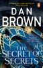

<b>THE INSTANT NUMBER 1 <i>SUNDAY TIMES</i> BESTSELLER &amp; THE MILLION-COPY SELLING, LONG-AWAITED RACE-AGAINST-TIME THRILLER TAKING OVER THE WORLD</b>  <b>'Left me speechless.'</b> <b>'Read it in 48 hours.'</b> <b>'Wow. Absolutely floored.'</b> <b>'Completely addictive.'</b> ⭐⭐⭐⭐⭐ <i><b>__________</b></i>  Accompanying celebrated academic, Katherine Solomon, to a lecture she’s been invited to give in Prague, Robert Langdon’s world spirals out of control when she disappears without trace from their hotel room. Far from home and out of his comfort zone, Langdon must pit his wits against forces unknown to recover the woman he loves.  But Prague is an old and dangerous place, steeped in folklore and mystery. Little can Langdon know that he is being stalked by a spectre from that dark past. He must use all of his arcane knowledge to navigate a shadow city hiding in plain sight, a city which has successfully kept its secrets for centuries and will not readily give them up...  <b>Dan Brown returns with his first novel in more than eight years - guaranteed to have you at the edge of your seat. This time, Robert Langdon is up against a deadly conspiracy that will test him to the limits - and take him to the edge of losing everything. ___________</b>  <b>Readers can't get enough of THE SECRET OF SECRETS:</b>  <b>'Astonishing</b>.'  'As I close <i>The Secret of Secrets</i>,<b> it is with my head spinning</b>… This is a<b> page-turner</b> <b>until one closes the book</b>.'  '<b>WHAT A RIDEEEE</b>.'  '<b>Loved it</b>… I have been waiting for this book for 8 years! Dan Brown, please don't make me wait 8 more.'  'One of <b>my favourite books of 2025</b> and a must-read!'  'New Robert Langdon??? This was in my 2025 Bingo. <b>Literally screaming</b>.'  'I knew this book would meet my expectations, what I didn't know was they would <b>surpass them beyond my wildest imagination!</b> <b>His best yet!</b>'  '<b>Very addictive </b>and exciting.'  '<b>Jaw-dropping</b>, mind-bending, and one of Brown’s most ambitious yet. If you love thrillers that make you think and race your pulse, this is one to add to the shelf. It is <b>exciting, provocative, and deeply satisfying</b>.'  'Dan Brown delivers <b>another thrilling masterpiece!</b> Fast-paced, intelligent, and<b> packed with twists</b>, this novel blends mythology, science, and suspense like only he can. Langdon’s race through Prague, London, and New York is<b> both heart-pounding and thought-provoking</b>. A must-read for fans of smart, gripping thrillers!'  'Is this book worth reading? <b>HELL YES!</b>'  '<b>I inhaled this </b>nearly 700 pages book and couldn’t wait to get to the end, because you KNOW there’s a plot twist!'

[View on Apple](https://books.apple.com/gb/book/the-secret-of-secrets/id6740487676)

## One of Us

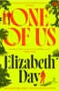

‘Intelligent, darkly humorous and brilliantly written’ STANLEY TUCCI  ‘This is Elizabeth Day's writing at its finest’ DOLLY ALDERTON  ‘A tantalising portrait of privilege and power’ THE TIMES  In this compulsive story of betrayal, old bonds and buried scandals, one British establishment family comes face to face with the consequences of privilege and the true cost of power.  Martin and Ben were friends for decades — best friends, Martin would have said — before the terrible events at Ben’s 40th birthday party tore them apart. So when Martin receives a surprise invitation back into the inner sanctum of the dazzling Fitzmaurice family after seven years of silence, he can’t resist the chance to get his revenge.  Ben has risen through the ranks of power, and is now touted as the next Prime Minister. But Martin can’t help but notice certain flies in the ointment… Ben’s wife, Serena, for instance, whose privileged existence is beginning to feel like a gilded cage. Or their daughter, Cosima, an environmental activist fighting against everything her parents once stood for. Or the disgraced MP Richard Take, determined to make his big comeback. And then there’s Fliss, the Fitzmaurice black sheep, whose untimely death sparks more suspicion than closure. Through their intertwined stories, we see a family – and a nation – unravelling under the weight of its secrets.  With everyone watching, the stage is set for a reckoning. It's time for Martin and Ben to confront what love truly means when everything—family, power, and loyalty—is on the line.  ‘Speaks truth to power in such an entertaining, gripping way’ MARIAN KEYES  ‘This timely story about the abuse of power is one of those books you just want to inhale in one go’ GOOD HOUSEKEEPING  ‘Gorgeously written, utterly compelling, and full of characters you will love and hate – and also love to hate’ SARA COLLINS  ‘The thinking person’s thriller. Part Highsmith, part Waugh … A superbly gripping plot’ LUCY FOLEY  About the author  Elizabeth Day is the author of five novels and four works of non-fiction, including her Sunday Times bestselling novel Magpie, and hit memoir How to Fail. She is the creator and host of the chart-topping podcast How to Fail with Elizabeth Day.

[View on Apple](https://books.apple.com/gb/book/one-of-us/id6743101190)

## I Will Find You

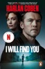

<b>THE NO. 1 <i>SUNDAY TIMES </i>BESTSELLER</b>  *** NOW A MAJOR NETFLIX TV SERIES, STARRING SAM WORTHINGTON, BRITT LOWER AND MILO VENTIMIGLIA***  <b>David and Cheryl Burroughs are living the dream - married, a beautiful house in the suburbs, a three year old son named Matthew - when tragedy strikes one night in the worst possible way.</b>  David awakes to find himself covered in blood, but not his own - his son's. And while he knows he did not murder his son, the overwhelming evidence against him puts him behind bars indefinitely.  Five years into his imprisonment, Cheryl's sister arrives - and drops a bombshell.  She's come with a photograph that a friend took on vacation at a theme park. The boy in the background seems familiar - and even though David realizes it can't be, he knows it is.  It's Matthew, and he's still alive.  <b>David plans a harrowing escape from prison, determined to do what seems impossible - save his son, clear his own name, and discover the real story of what happened that devastating night.</b> <b>______________</b>  <b>Readers are loving </b><i><b>I Will Find You . . .</b></i>  'A <b>thrilling roller-coaster </b>ride' 5-star reader review  'Harlan at his <b>absolute best</b>!' 5-star reader review  '<b>Couldn't put it down</b>' 5-star reader review  '<b>Extremely action packed</b>, absolutely <b>heart pounding</b>' 5-star reader review  'Such an <b>amazing</b> writer' 5-star reader review  'An <b>electrifying </b>game of cat-and-mouse' 5-star reader review  <b>_______________</b>  <b><i>Praise for Harlan Coben . . .</i></b>  <b>'Unbelievably brilliant'</b> RICHARD OSMAN  <b>'A GREAT writer' </b>JOHN GRISHAM  <b>'Never lets you down' </b>LEE CHILD  <b>'Simply one of the all-time greats' </b>GILLIAN FLYNN  <b>'The modern master of the hook and twist' </b>DAN BROWN  <b>'One of the world's finest thriller writers'</b> PETER JAMES  'The <b>king of the thriller</b> novel' JACK EDWARDS  <i>I Will Find You </i>was a <i>Sunday Times </i>no. 1 bestseller 14/01/2024

[View on Apple](https://books.apple.com/gb/book/i-will-find-you/id6443100402)

## Yesteryear

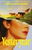

THE SUNDAY TIMES NUMBER ONE BESTSELLER  'EVERYONE WILL BE TALKING ABOUT THIS BOOK’ – BELLA MACKIE  'NIGHTMARISH, SHOCKING, BRILLIANT’ – STYLIST  'MADDENING, MESMERISING, INGENIOUS’ – NEW YORK TIMES  'INTELLIGENT, INCISIVE, INSANELY READABLE’ – JENNIE GODFREY  'DERANGED, DARING, CLEVERLY WRITTEN’ – VOGUE  'My name is Natalie Heller Mills, and I was perfect at being alive…'  Natalie lives a traditional lifestyle – and her followers are sick with envy. Her charming farmhouse on her working ranch is artfully cluttered, her husband is a handsome cowboy, her homemade sourdough boules are each more beautiful than the last. So what if there are nannies and producers and industrial-grade ovens behind the scenes? What her followers don’t know won’t hurt them.  Then, one morning, Natalie wakes up in a strange, horrible version of reality. Her home, her husband, her children—they’re all familiar, but something’s off. Is this a hoax? A reality show? A test from God? Natalie knows just two things for sure: this isn't her perfect life, and she must escape, by any means possible.  As darkly funny as it is shocking and gripping, Yesteryear is an electrifying examination of tradition, fame, faith and the grand performance of womanhood, from a thrilling new talent in fiction.  NOW BEING ADAPTED INTO A MAJOR FILM STARRING ANNE HATHAWAY  ‘WICKEDLY FUNNY, FRIGHTENINGLY PERCEPTIVE' ABIGAIL DEAN  'INVENTIVE, ADDICTIVE, A WILD RIDE' ASHLEY AUDRAIN  'SHOT THROUGH WITH HUMOUR, LACED WITH DARKNESS' CLARE MACKINTOSH  'THE STEPFORD WIVES MEETS THE HANDMAID'S TALE' HANNAH DEITCH  About the author  Caro Claire Burke received her Master’s in Fine Arts from the Bennington Writing Seminars. She is the co-host of Diabolical Lies, a politics and culture podcast. Yesteryear is her first novel.

[View on Apple](https://books.apple.com/gb/book/yesteryear/id6749934839)

## The Odyssey

Homer’s great epic of a hero’s journey home—inspiration for the major motion picture by Christopher Nolan—in a bold, contemporary, and refreshingly readable translation.  "Wilson’s language is fresh, unpretentious and lean. . . . It is rare to find a translation that is at once so effortlessly easy to read and so rigorously considered." —Madeline Miller, author of Circe  Composed at the rosy-fingered dawn of world literature almost three millennia ago, The Odyssey is a poem about violence and the aftermath of war; about wealth, poverty, and power; about marriage and family; about travelers, hospitality, and the yearning for home.  This fresh, authoritative translation captures the beauty of this ancient poem as well as the drama of its narrative. Its characters are unforgettable, none more so than the “complicated” hero himself, a man of many disguises, many tricks, and many moods, who emerges in this version as a more fully rounded human being than ever before.  Written in iambic pentameter verse and a vivid, contemporary idiom, Emily Wilson’s Odyssey sings with a voice that echoes the epic’s music, sailing along at Homer’s swift, smooth pace.  A fascinating, informative introduction explores the Bronze Age milieu that produced the epic, the poem’s major themes, the controversies about its origins, and the unparalleled scope of its impact and influence. Maps drawn especially for this volume, a pronunciation glossary, and extensive notes and summaries of each book make this an Odyssey that will be treasured by a new generation of readers.

[View on Apple](https://books.apple.com/gb/book/the-odyssey/id1215381921)

## The Impossible Fortune

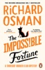

<b>THE UNMISSABLE NEW MYSTERY IN THE MULTI-MILLION-COPY BESTSELLING, RECORD-BREAKING <i>THURSDAY MURDER CLUB </i>SERIES</b>  ‘Irresistible’ <b>LEE CHILD</b>  ‘Funny, clever, compelling’ <b>HARLAN COBEN</b>  ‘The rightful king of crime’ <b><i>i PAPER</i></b>  ----------------------------  <b>A wedding. A code. A murder. Time is ticking . . .</b>  It’s been a quiet year for the Thursday Murder Club. Joyce is busy with table plans and first dances. Elizabeth is grieving. Ron is dealing with family troubles, and Ibrahim is still providing therapy to his favourite criminal.  But when Elizabeth meets a wedding guest who fears for their life, the thrill of the chase is ignited once again. A villain wants access to an uncrackable code and will stop at nothing to get it.  <b>Plunged back into their most explosive investigation yet, can the gang solve the puzzle and a murder in time?</b>  Praise for Richard Osman and the Thursday Murder Club series  ‘So smart and funny. Deplorably good’ <b>IAN RANKIN</b>  ‘Osman just gets better’ <b>SHARI LAPENA</b>  ‘I smiled a million times’ <b>MARIAN KEYES</b>  ‘Warm, wise and witty’ <b>VAL MCDERMID</b>  ‘Brilliantly suspenseful’ <b>JEFFERY DEAVER</b>  'The thing that shines through in Osman’s writing is that he really likes people and revels in all their foibles and eccentricities . . . a delightful read' <b><i>OBSERVER</i></b>  ‘Gripping and rather moving’ <b><i>SUNDAY TIMES</i></b>  ‘The biggest new fiction author of the decade’ <b><i>GUARDIAN</i></b>  'Underestimate him at your own peril' <b><i>INDEPENDENT</i></b>  'Richard Osman seems incapable of missing' <b><i>THE TIMES</i></b>

[View on Apple](https://books.apple.com/gb/book/the-impossible-fortune/id6723894411)

## Old Girls Go Off the Rails

A BRAND NEW hilarious, uplifting read, full of friendship and fun - from BESTSELLER Maddie Please✨ Perfect for fans of Judy Leigh, Kate Galley and Dee MacDonald!  A one way ticket to misadventure! 🚂🎟️💼  When Lizzie Stevens was eighteen, life took a wrong turn. While her best friends Harriet and Anna went interrailing across Europe, Lizzie stayed behind—shunted into a dusty bank job and a sensible life that never quite got back on track.  Now sixty-four, freshly divorced from terminally dull Freddie and wondering how she ended up here, Lizzie is unexpectedly reunited with the friends who left her behind. This time, she’s not missing the train.  Their plan? A gloriously reckless rail adventure across Europe. The women are older, allegedly wiser, and considerably less flexible—but their bags are packed and they’re ready to depart.  Yet once the train pulls out of Worcester, it’s clear this journey won’t be smooth. Old secrets derail fond memories, Harriet and Anna barely tolerate each other, and Lizzie discovers the trip she idolised for decades wasn’t quite first-class.  As they rattle from city to city - Paris to Venice before embarking on a cruise along the Croatian coast - the old girls are fuelled by laughter and questionable decisions. And Lizzie begins to realise it’s never too late to change direction—and that the best adventures are the ones without a timetable.  All aboard for another hilarious and heartwarming adventure with bestselling author Maddie Please  Praise for Maddie Please:  'Sea, sunshine, romance and fabulous characters; Maddie's light touch and sense of fun will lift your spirits!' Bestselling author Judy Leigh  'Warm, funny and poignant with engaging characters, it reminds us that you’re never too old for fun, romance and to learn new things!' Bestselling author Karen King  'A new lease of life under the Greek sun. As fresh and delicious as chilled retsina!' Sunday Times Bestselling author Phillipa Ashley  'For a book that’s as cheering and restorative as a long lunch with your very best friend, Maddie Please is the author you need to know!' Bestselling author Chris Manby  'Genuine and life-affirming…a wonderful, lighthearted novel about how it is never too late to find happiness.’ Bestselling author Kitty Wilson  'A heart-warming story filled with friendship and fun. It's official - I want to be an Old Duck!' Bestselling author Maisie Thomas

[View on Apple](https://books.apple.com/gb/book/old-girls-go-off-the-rails/id6755237873)

## The Midnight Train

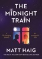

<b>THE INSTANT <i>SUNDAY TIMES </i>BESTSELLER </b>  ‘This book is a complete delight, not only a fairytale for adults that transports you on a magical journey of childlike wonder, but also a parable that helps you lead a better life’ - JAMES NORTON  ‘Magically hopeful. This story will speak to your soul and your monkey mind and bring them back into harmony. Beautiful and uplifting, charming and soul-nurturing, this is another glorious triumph from the beloved Matt Haig’ - DONNA ASHWORTH   ‘If you enjoyed <i>The Midnight Library, </i>you'll love this. <i>The Midnight Train</i> is exquisite storytelling and utterly brilliant. One of the most beautiful stories you'll ever experience’ - JOANNA CANNON <b>  When your life flashes before your eyes, what will matter most?</b>  For Wilbur it was his time with Maggie, the love of his life. Their honeymoon in Venice. Before he threw it all away.   Years later, on the brink of his own death, a train arrives. It can take Wilbur back in time. To relive his most important moments. Soon he realises just how much he would have changed…  An adventure through time, <i>T</i><i>he </i><i>Midnight Train i</i>s a story of love and second chances, from the world of <i>Th</i><i>e </i><i>Midnight Library.</i>

[View on Apple](https://books.apple.com/gb/book/the-midnight-train/id6753859092)

## Bride

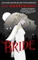

<b>A dangerous alliance between a Vampyre bride and an Alpha werewolf becomes a love deep enough to sink your teeth into in this new paranormal romance from the <i>New York Times</i> bestselling author of <i>The Love Hypothesis.</i></b>   Misery Lark, the only daughter of the most powerful Vampyre councilman of the Southwest, is an outcast - again. Her days of living in anonymity among the Humans are over: she has been called upon to uphold an historic peacekeeping alliance between the Vampyres and their mortal enemies, the Weres, and sees little choice but to surrender herself in the exchange - again . . .   Weres are ruthless and unpredictable, and their Alpha, Lowe Moreland, is no exception. He rules his pack with absolute authority, but not without justice. And, unlike the Vampyre Council, not without feeling. It's clear from the way he tracks Misery's every movement that he doesn't trust her. If only he knew how right he was . . .   Because Misery has her own reasons to agree to this marriage of convenience, reasons that have nothing to do with politics or alliances, and everything to do with the only thing she's ever cared about. And she is willing to do whatever it takes to get back what's hers, even if it means a life alone in Were territory . . . alone with the wolf.   <b>Praise for<i> The Love Hypothesis</i></b>  'Contemporary romance's unicorn: the elusive marriage of deeply brainy and delightfully escapist.' <b>Christina Lauren, <i>New York Times</i> bestselling author of <i>The Unhoneymooners</i></b>  'Funny, sexy and smart.' <b>Mariana Zapata, <i>New York Times</i> bestselling author</b>  'I couldn't put it down. Highly recommended!' <b>Jessica Clare, <i>New York Times</i> bestselling author</b>  'Pure slow-burning gold with lots of chemistry.'<b>  <i>Popsugar</i></b>  'A beautifully written romantic comedy with a heroine you will instantly fall in love with.' <b>Elizabeth Everett, author of <i>A Lady's Formula for Love</i></b>  *Ali Hazelwood's <i>Bride</i> was a Sunday Times bestseller w/e 10 February 2024.

[View on Apple](https://books.apple.com/gb/book/bride/id6450495799)

## Flawless

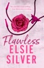

<b>The first book in the beloved small-town Chestnut Springs series from the no.1 <i>Sunday Times </i>bestselling author and Queen of Cowboy romance, Elsie Silver.</b> <b> '</b>No one really does it better than Elsie Silver' <b><i>THE RADIO TIMES</i></b>  'Elsie Silver is rapidly becoming one of my favourite romance authors' <b><i>DAILY MAIL</i></b> <b> 🤠</b>  <b> "You wear the hat, you ride the cowboy."</b>  Rhett Eaton lives for three things: riding bulls, causing trouble, and doing exactly what he wants. But when an outburst threatens his career, his team brings in a professional babysitter. Enter Summer Hamilton, his agent's daughter.  She has no interest in rodeos, cowboys, or babysitting overgrown man-children. Too bad she's stuck with Rhett for the entire season. He's arrogant. She's uptight. He thinks rules are made to be broken. She wrote the rulebook. But somewhere between the fake smiles, endless road trips, and the occasional hotel mix-up that leaves them sharing a bed, the line between enemies and something much more starts to blur.  Summer says there are boundaries they shouldn't cross. That his reputation can't take any more hits and neither can her damaged heart.   Rhett says he's going to steal it anyway.  ⭐  <b>READERS THINK ELSIE SILVER IS SIMPLY <i>FLAWLESS</i></b>  'Elsie Silver, Queen of Cowboy' <b><i>THE TIMES</i></b> 'Elsie Silver's writing is a true revelation!' <b>ALI HAZELWOOD</b>   'This book contains a hero to die for' <b>TESSA BAILEY</b>   'Heartwarming, sensual and thoroughly addicting' <b>ANA HUANG</b>   <b>'</b>Elsie Silver just hits the mark every time' <b>READER REVIEW</b>   'Each book is heart-wrenching in its own way'<b> READER REVIEW</b>   'The story is so well done that it turned me into a complete cowboy fangirl' <b>READER REVIEW</b>   'These books had me so sucked into the world that I barely looked up' <b>READER REVIEW</b>   *Elsie Silver became an instant <i>Sunday Times </i>bestselling author on the 2nd week of April 2024.

[View on Apple](https://books.apple.com/gb/book/flawless/id6445302573)

## The Daisy Chain Flower Shop

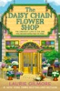

The brand new summer romance set in Dream Harbor from the #1 New York Times bestselling author of The Pumpkin Spice Café and The Strawberry Patch Pancake House!  “Another gentle small-town romance with Hallmark movie vibes… Dream Harbor remains a cozy spot to linger” Publisher’s Weekly  "A delightful escape filled with Gilmore’s signature whimsy and coziness” Hannah Bonam-Young, New York Times bestselling author  ***  The greatest love is the one you never expected to find  Daisy is fed up with being unlucky in love. And since Mayor Kelly declared her beloved flower shop cursed in one of his infamous visions, business has been slow.  Dream Harbor newcomer Elliot has been adjusting to small-town life following his own relationship turmoil. And until now he’s avoided the flower shop at all costs. If the mayor is correct, he doesn’t need any more bad luck in his life.  When he finds himself walking through the door of the Daisy Chain Flower Shop, he doesn’t expect it to be a life-changing moment. But as the petals blossom in the sunlight, might the unluckiest woman in Dream Harbor finally find that love comes when you’re least expecting it?  The Daisy Chain Flower Shop is a cozy romantic mystery with a fake relationship dynamic, a small-town setting and a HEA guaranteed.  Tropes: Fake relationshipFound familySmall townHe falls firstReturning favorite characters Every book in the Dream Harbor series can be read as a standalone.  “A setting that rivals the Gilmore Girls’ Stars Hollow for cozy charm… wonderfully warm and whimsically witty” Booklist   “Cosy… quirky… a swoon-worthy love story” My Weekly   About the author  Laurie Gilmore is a #1 New York Times, Sunday Times and Globe &amp; Mail bestselling author who writes small-town romance. Her first novel, The Pumpkin Spice Café, won the TikTok Shop Book of the Year award in 2024. Her Dream Harbor series is filled with quirky townsfolk, cozy settings, and swoon-worthy romance. She loves finding books with the perfect balance of sweetness and spice and strives for that in her own writing. Laurie is currently based in upstate New York.

[View on Apple](https://books.apple.com/gb/book/the-daisy-chain-flower-shop/id6747247467)

## The Hallmarked Man

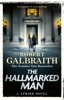

<b>'A triumph of storytelling'</b> <i>Guardian</i>  <b>THE NUMBER ONE <i>SUNDAY TIMES </i>BESTSELLER, SEPTEMBER 2025</b>  A dismembered corpse is discovered in the vault of a silver shop. The police initially believe it to be that of a convicted armed robber - but not everyone agrees with that theory. One of them is Decima Mullins, who calls on the help of private detective Cormoran Strike as she's certain the body in the silver vault was that of her boyfriend - the father of her newborn baby - who suddenly and mysteriously disappeared.  The more Strike and his business partner Robin Ellacott delve into the case, the more labyrinthine it gets. The silver shop is no ordinary one: it's located beside Freemasons' Hall and specialises in Masonic silverware. And in addition to the armed robber and Decima's boyfriend, it becomes clear that there are other missing men who could fit the profile of the body in the vault.  As the case becomes ever more complicated and dangerous, Strike faces another quandary. Robin seems increasingly committed to her boyfriend, policeman Ryan Murphy, but the impulse to declare his own feelings for her is becoming stronger than ever.  <b>A gripping, wonderfully complex novel which takes Strike and Robin's story to a new level, <i>The Hallmarked Man</i> is an unmissable read for any fan of this unique series.</b>  <b>PRAISE FOR THE CORMORAN STRIKE SERIES</b>  'A superlative piece of crime fiction' <i><b>Sunday Times</b></i>  'The work of a master storyteller' <i><b>Daily Telegraph</b></i>  'A scrupulous plotter and master of misdirection, Galbraith keeps the pages turning . . . Strike and Ellacott remain one of crime's most engaging duos' <i><b>Guardian</b></i>  'No one can deny [Robert Galbraith, pseudonym of] J. K. Rowling's formidable talents as a crime writer' <i><b>Daily Mail</b></i>  'Strike is a compelling creation . . . this is terrifically entertaining stuff' <i><b>Irish Times</b></i>

[View on Apple](https://books.apple.com/gb/book/the-hallmarked-man/id6740156196)

## The Heist

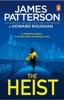

<b>Prepare to be hooked by James Patterson's newest thriller in which an art student must orchestrate the heist of a lifetime to save her father...  'A dizzying switchback thriller... Halston is a brilliant heroine' </b>- <i>The Times</i>  <b>'<i>The Picasso Heist</i> is a thrilling, engaging, funny, at times moving, scintillating read'</b> - Felicity Jones, Oscar-nominated actress and audiobook narrator  <b>'Patterson is in a class by himself' </b><i>Guardian</i>  <b>_________________________________</b>  <b>A rare masterpiece by Picasso is about to go to auction, and the whole world is watching.</b>  But bright art student Halston Graham sees an opportunity. One that could secure millions for her future – and freedom for her wrongly imprisoned father…  To pull off the crime of the century, she must assemble an unlikely crack team: an expert in forgery, a ruthless mob boss, and an eccentric fashion designer.  <b>In a game where trust is a luxury and failure is not an option, will Halston’s brilliance be enough to outsmart her enemies?</b>  <b>_________________________________  PRAISE FOR JAMES PATTERSON</b>  'It's no mystery why James Patterson is the world's most popular thriller writer ... Simply put: nobody does it better.' JEFFERY DEAVER  'No one gets this big without amazing natural storytelling talent - which is what Jim has, in spades.' LEE CHILD  'Patterson boils a scene down to the single, telling detail, the element that defines a character or moves a plot along. It's what fires off the movie projector in the reader's mind.' MICHAEL CONNELLY  'James Patterson is The Boss. End of.' IAN RANKIN  'Patterson knows where our deepest fears are buried ... there's no stopping his imagination' NEW YORK TIMES BOOK REVIEW  'Patterson is in a class by himself' GUARDIAN  'The master storyteller of our times' HILLARY RODHAM CLINTON  'One of the greatest storytellers of all time' PATRICIA CORNWELL

[View on Apple](https://books.apple.com/gb/book/the-heist/id6761807202)

## Keeping 13

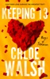

<b>An epic and unforgettable love story continues in <i>Keeping 13</i>, the second book in the international bestselling and TikTok-phenomenon The Boys of Tommen series, from Chloe Walsh.</b> <b>   The power and pain of first love has never been more deeply felt than in Chloe Walsh's extraordinary stories about the irresistible Boys of Tommen, which will give you the ultimate book hangover.   The reader reaction to The Boys of Tommen says it all!</b> <b>  'The chemistry, the love, everything about this book was so good it gave me all the feels . . . Beautiful book, beautiful words. Chloe Walsh you're my home' ⭐ ⭐ ⭐ ⭐ ⭐  'Chloe Walsh has surpassed herself again, from the get-go you will be hooked, you will be sad, angry, elated, hysterical and you will absolutely love it!' ⭐ ⭐ ⭐ ⭐ ⭐  'This was absolutely EVERYTHING. I find it difficult to even put into words just how much this book made me laugh, cry and swoon' ⭐ ⭐ ⭐ ⭐ ⭐  'There aren't enough stars for this book. It has everything, I laughed, I cried, I fumed and I despaired . . . This is a rare book, one that evokes every emotion'  ⭐ ⭐ ⭐ ⭐ ⭐</b>   <b>.........................</b>   <b>Falling in love was the easy part. What comes next is the test . . . </b>  Following a devastating injury that has left him sidelined and stripped of his beloved number 13 jersey, <b>Johnny Kavanagh</b> is struggling to hold onto his dreams. Lost, insecure, and desperately seeking comfort, he sets his sights on unravelling the mystery of the girl with the midnight-blue eyes, who haunts his every waking hour.   Keeping secrets has never been a problem for <b>Shannon Lynch</b>. The life she was born into demands nothing less. She knows that demons and evil men don't just exist in fairytales. They exist in her world, too. Traumatized beyond repair after her return from Dublin, and desperate to protect her little brothers, Shannon finds herself falling into the same old cover-up, barely keeping her head above water, as her future unravels before her eyes. Beaten and broken, her walls are up and her trust is shaken.   Only one boy has the ability to climb those walls. The boy who owns her heart. But secrets are about to be exposed and lives could be changed forever - can Johnny and Shannon's love survive?  <b>.........................</b>  <b>  Want more of Johnny, Shannon and the rest of The Boys of Tommen? Read the rest of the series so far:</b>  <b><i>Binding 13</i></b>  <b><i>Keeping 13</i></b>  <b><i>Saving 6</i></b>  <b><i>Redeeming 6</i></b> <b><i>Taming 7 </i>- preorder Claire and Gibsie's story now!</b>

[View on Apple](https://books.apple.com/gb/book/keeping-13/id6448654046)

## Blindsighted

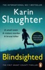

'I would follow her anywhere' <b>GILLIAN FLYNN</b> 'One of the boldest thriller writers working today' <b>TESS GERRITSEN</b> 'Her characters, plot, and pacing are unrivalled' <b>MICHAEL CONNELLY</b> <b>_________________________________________</b>  <b>The first book in Karin Slaughter's no.1 bestselling GRANT COUNTY series.</b>  <b><i>She was found in the local diner. Brutally murdered. Ritually mutilated.</i></b> <b><i>And she will not be the last.</i></b>  The sleepy town of Heartsdale, Georgia, is jolted into panic when Sara Linton, paediatrician and medical examiner, finds a woman dead in the local diner.  She has been cut: two deep knife wounds form a lethal cross over her stomach. But it's only once Sara starts to perform the post-mortem that the full extent of the killer's brutality becomes clear.  Police chief Jeffrey Tolliver - Sara's ex-husband - is in charge of the investigation, and when a second victim is found, crucified, only a few days later, both Jeffrey and Sara have to face the fact that the murder was not a one-off attack. What they dealing with is a seasoned sexual predator. A violent serial killer. . .  <b>_________________________________________</b>  <b>Crime and thriller masters know there is nothing better than a little Slaughter:</b>  'Passion, intensity, and humanity' <b>LEE CHILD</b> 'A writer of extraordinary talents' <b>KATHY REICHS</b> 'Fiction does not get any better than this!' <b>JEFFERY DEAVER</b> 'A great writer at the peak of her powers' <b>PETER JAMES</b> 'Raw, powerful and utterly gripping' <b>KATHRYN STOCKETT</b> 'With heart and skill Karin Slaughter keeps you hooked from the first page until the very last' <b>CAMILLA LACKBERG</b> 'Amongst the world's greatest and finest crime writers' <b>YRSA SIGURÐARDÓTTIR</b>

[View on Apple](https://books.apple.com/gb/book/blindsighted/id435976323)

## Sisters in Yellow

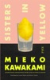

<b>The Instant <i>Sunday Times</i> Bestseller</b>  <b>'I can never forget the sense of pure astonishment I felt when I first read Mieko Kawakami'</b> <b>– Haruki Murakami</b>  <b>'The most exciting Japanese novelist at work today' – <i>The Times</i></b>  <b>A heart-stopping story of teenage girls on the brink in 1990s Tokyo from the International Booker Prize-Shortlisted author of <i>Heaven</i> and <i>Breasts and Eggs</i>.</b>  Hana has nothing but she’s hopeful. She’s fifteen years old. She lives in a tiny apartment in a suburb of Tokyo with her young mother, a hostess at a local dive bar. They have no money, no security. Then Kimiko appears.  Kimiko is older, a bright light in Hana’s dark world. Together they set up Lemon, a bar that, despite its shabby setting and seedy clientele, becomes a haven for Hana. Suddenly Hana has a job she loves, friends to share her days with, and the glittering promise of money. She feels like a normal girl. She feels invincible.  But in the narrow alleys of Sangenjaya, nothing is as it seems. Soon all of Hana’s hope, her optimism, and her drive, will be tested to the limit . . .  A story of enduring friendship and deep betrayal, Sisters in Yellow is a masterpiece of teenage dreams and adult cruelties that confirms Mieko Kawakami as one of the great writers of her generation.  <b>'Relentlessly riveting . . . My heart felt very tender reading this' – Frances Cha, author of <i>If I Had Your Face</i></b>  <b>Readers love <i>Sisters in Yellow</i>:</b>  'My new favourite book of ALL TIME. The ending absolutely destroyed me.'  'A powerful, emotionally charged exploration of friendship, survival and the quiet brutality of inequality'  'Mieko Kawakami doesn't need a high-speed chase to create tension; she lets a heavy, unsettling mood seep into the floorboards'  'Confirms Kawakami’s place as one of the most vital voices in contemporary literature'  'The character building is second to none . . . Mieko Kawakami is a generational talent'  'This is Kawakami at her best. Not for a second does the pace let up.'

[View on Apple](https://books.apple.com/gb/book/sisters-in-yellow/id6749863003)

## They Thought I Was Dead: Sandy's Story

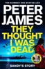

<b>'One of the best British crime writers, and therefore one of the best in the world' - Lee Child</b>  <b>Peter James, the number one, multi-million copy bestselling author of the Grace series returns to finally reveal the events of Roy Grace’s tortured past – the truth behind his wife’s disappearance. Thrillingly told from her perspective, this is Sandy’s story.  ***</b>  <b>Some will know how it begins . . .</b>  My name is Sandy. My husband is Detective Superintendent Roy Grace. But when I disappeared, even he couldn't find me . . .  <b>This is my story.</b>  There's more to Sandy than meets the eye. A woman with a dubious past, a complicated present and an uncertain future. Then she was gone.  <b>Some will think they know how it ends . . .</b>  Her disappearance caused a nationwide search. Even the best detective on the force couldn't find her. They thought she was dead.  <b>But nobody knows this . . .</b>  Where did she go? Why did she run? What would cause a woman to leave her whole life behind and simply vanish?  <b>For the first time the truth behind Sandy Grace’s dramatic disappearance is revealed. <i>They Thought I Was Dead</i> will thrill fans and new readers alike with its gripping story of a woman on the run. This is Sandy's story.</b>  <i>They Thought I was Dead </i>was an instant no.1 <i>Sunday Times</i> bestseller when it published in HB w/c 13/05/2024  <b>***</b>  <b>23 million books sold.  Creator of Her Majesty Queen Camilla’s favourite fictional detective.</b>  <b>'One of the best crime writers in the business' - Karin Slaughter, author of the Will Trent series</b>  <b>'This is the one I’ve been waiting for. And it’s a masterpiece of suspense. I quite literally couldn’t put it down - even when I was supposed to be doing other things . . .' - Barbara Erskine, author of <i>The Dream Weavers</i>  'Typically, <i>They Thought I Was Dead</i> is a brilliantly fast-paced thriller with more twists and turns than a Tour de France descent. No doubt it’ll be eagerly read by fans' - <i>Daily Express</i>  'One of the world’s most popular detective series' –</b> <b><i>The Guardian</i></b>

[View on Apple](https://books.apple.com/gb/book/they-thought-i-was-dead-sandys-story/id6466819152)

## Revenge of the Tipping Point

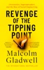

<i><b>'If the world can be moved by just the slightest push, then the person who knows where and when to push has real power. So who are those people? What are their intentions? What techniques are they using?'</b></i>   Through a series of riveting stories, Gladwell traces the rise of a new and troubling form of social engineering. He takes us to the streets of Los Angeles to meet the world's most successful bank robbers, rediscovers a forgotten television show from the 1970s that changed the world, visits the site of a historic experiment on a tiny cul-de-sac in northern California, and offers an alternate history of two of the biggest epidemics of our day: COVID and the opioid crisis.   <i>Revenge of the Tipping Point</i> is Gladwell's most personal book yet. With his characteristic mix of storytelling and social science, he offers a guide to making sense of the contagions of the modern world. It's time to revisit social epidemics, and it's time we took their tipping points seriously.  <b>'Addictive... fascinating and provocative'</b> <i>Guardian</i> <b>'Malcolm Gladwell explores the watershed moments that define this new age of societal upheaval... with curiosity and humor'</b> <i>TIME Magazine</i> <b>'Gladwell is a great storyteller with a contagious sense of curiosity' </b><i>The Economist</i> <b>'The match that so elegantly graced the cover of <i>The Tipping Point </i>is now on fire' </b><i>Wall Street Journal</i>

[View on Apple](https://books.apple.com/gb/book/revenge-of-the-tipping-point/id6503185665)

## Our Perfect Storm

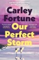

<b>**THE INSTANT #1 <i>NEW YORK TIMES </i>BESTSELLER**</b> <b> 'A dream of a love story</b>’ ROSIE WALSH<i>  '</i><b>Charged with chemistry and rippling with atmosphere’</b> HOLLY MILLER  <b>'Full of</b> <b>laughter and yearning' </b>HOLLY GRAMAZIO  <b>Two best friends. Seven days in paradise. One last chance to fall in love, or fall apart... </b> Frankie and George have been best friends since they were eight. They’ve always clashed and come back together—it’s what they do. Until now. On the eve of her wedding, Frankie doesn’t know where they stand or even if George will show up as her best man.  As she loses hope, in walks George. For one glorious evening, Frankie’s life is finally perfect. But it all comes crashing down when her fiancé dumps her the next morning, leaving only a note behind.  Crushed and confused, Frankie only wants to wallow. But George has a different idea. He wants her to go on her honeymoon. With him. For one week, to the lush rainforests and misty beaches of Tofino.  Frankie agrees, seeing the trip for what it really is: one last chance to repair their friendship.  <b>Even if it means unearthing secrets and long buried feelings neither knows how to handle. Even if it means falling apart for good.  </b>  <b>PRAISE FOR CARLEY FORTUNE: </b>  '<b>Funny and sexy</b>, this promises to be the escapist novel of the summer' <b><i>HEAT</i></b>  'A <b>dreamy read</b> full of romance ' <b><i>VIP Magazine</i></b>  'With summery weather, stunning sunsets and boat trips, <b>it's impossible not to feel the holiday spirit</b> while reading this book' <b><i>Mirror</i></b>  '<b>Swoon-worthy</b>, sun-drenched. . . Beautifully described scenery and a heart-fluttering friends-to-lovers story make this <b>one of 2025’s best romances</b>.' <b><i>Culturefly  </i></b>

[View on Apple](https://books.apple.com/gb/book/our-perfect-storm/id6751084359)

## Just Friends

<b>This heart warming and swoon worthy second chance romance about childhood friends reconnecting as adults is the highly anticipated debut novel from BookTok icon Haley Pham.</b>  <b>* AN INSTANT NEW YORK TIMES BESTSELLER *</b>  Blair and Declan were inseparable growing up – best friends who knew each other better than anyone else. But when an impulsive kiss took them from friends to something more, everything changed. Just as quickly as their romance started, one moment shattered it all, leaving them with nothing but heartbreak and silence.  Four years later, Blair is back in their coastal hometown of Seabrook to support her mom and care for her great-aunt Lottie. To make ends meet, Blair applies to work at a coffee shop – only to discover it’s managed by none other than Declan. The boy she loved. The boy she lost. The boy who still makes her heart race.  As Blair’s path keeps crossing with Declan’s, old wounds resurface, secrets are revealed and sparks reignite. But could their future ever be free of their past?  <b>Told in dual timelines that unravel the magic and pain of first love, </b><i><b>Just Friends</b></i><b> is a moving, romantic story about second chances, the weight of dreams and finding your way back to the people who feel like home.</b>  <b>Readers can't stop talking about </b><i><b>Just Friends . . .</b></i> ‘Honestly, I was so <b>pleasantly surprised</b> and <b>completely blown away</b> by this book’ ‘I cannot stress enough<b> how much fun I had with this book!</b>’ ‘The ending had an <b>absolute chokehold </b>on me’ ‘They didn’t feel like characters; they<b> felt like real people who had lived a whole life </b>before the pages even started’ ‘This is a couple<b> I’ll be thinking about for a long time</b>’ ‘This book<b> felt like having my favourite playlist on repeat</b>’ 'It felt light, bright and sparkled like only some books do'

[View on Apple](https://books.apple.com/gb/book/just-friends/id6747976678)

## Dolly All the Time

&#39;A luminous story of love, duty and the tension between the two, Dolly All the Time is so beautifully rendered... I never wanted to leave&#39; - CARLEY FORTUNE, bestselling author of Every Summer After 
 
&#39;Beautiful, sexy, and escapist, Dolly All the Time is my new favourite Annabel Monaghan book. I adored it!&#39; - BETH O&#39;LEARY, bestselling author of The Flatshare 
 
 
A hardworking single mom returns to her seaside hometown and stumbles into a fake dating situationship with a wealthy, workaholic scion, from the New York Times bestselling author of It&#39;s a Love Story 
 
If they begin by pretending, can they end with something real? 
 
Dolly Brick is a woman you can rely on. She&#39;s never met a problem she couldn&#39;t solve. Not when her mom left when she was ten, and not at thirty-nine when she returns to her hometown of Whitfield, Rhode Island to help her dad and brother from losing the family home. 
 
So when she sees Stewart Whitfield – annoyingly handsome scion of the Whitfield family – with a flat tire and at the wrong end of a very public, very humiliating breakup, it&#39;s in her nature to help. But what Stewart asks of Dolly ends up being more than either of them bargained for. As public dinners and high society benefits turn into sunset boat rides and kisses that give her butterflies, Dolly starts to feel something more than helpful. She&#39;s never relied on anyone besides herself, can she really start now? 
 
 
PRAISE FOR DOLLY ALL THE TIME: 
 
&#39;Packed full of chemistry, and Monaghan&#39;s signature humour and charm, this is going to be the must read rom com of the summer&#39; SOPHIE COUSENS 
&#39;Annabel has such a tender way of crafting her characters... The perfect book to soak up the summer sun with&#39; BK BORISON 
&#34;Quick, witty, and an absolute triumph, Dolly All the Time is escapism at its very best!&#39; PAIGE TOON 
&#39;Everything I want in a love story! Dolly and Stewart&#39;s chemistry is off the charts, and their summer romance grips you from the very first page and sparkles like the sun&#39; ELLE KENNEDY 
&#39;&#39;This book is like a spicy margarita or a magic ice cream cone, the way it&#39;s sweet and a little salty and tart and hot... I have fallen in love with Dolly&#39; CATHERINE NEWMAN 
&#39;This book isn&#39;t just brilliant, it&#39;s exceptional... It might be my favourite love story of all time&#39; ROSIE WALSH

[View on Apple](https://books.apple.com/gb/book/dolly-all-the-time/id6755198637)

## Atomic Habits

<b>***OUT NOW - THE ATOMIC HABITS WORKBOOK: OFFICIAL COMPANION TO THE #1 WORLDWIDE BESTSELLER***  THE PHENOMENAL INTERNATIONAL BESTSELLER: OVER 25 MILLION COPIES SOLD WORLDWIDE</b>  <b>Transform your life with tiny changes in behaviour,</b><b> starting <i>now.</i></b>  People think that when you want to change your life, you need to think big. But world-renowned habits expert James Clear has discovered another way. He knows that real change comes from the compound effect of hundreds of small decisions: doing two push-ups a day, waking up five minutes early, or holding a single short phone call.  <b>He calls them atomic habits.</b>  In this ground-breaking book, Clears reveals exactly how these minuscule changes can grow into such life-altering outcomes. He uncovers a handful of simple life hacks (the forgotten art of Habit Stacking, the unexpected power of the Two Minute Rule, or the trick to entering the Goldilocks Zone), and delves into cutting-edge psychology and neuroscience to explain why they matter. Along the way, he tells inspiring stories of Olympic gold medalists, leading CEOs, and distinguished scientists who have used the science of tiny habits to stay productive, motivated, and happy.  <b>These small changes will have a revolutionary effect on your career, your relationships, and your life.</b> ________________________________ <b>A <i>NEW YORK TIMES</i> AND <i>SUNDAY TIMES</i> BESTSELLER</b>  <b>'A supremely practical and useful book.' </b>Mark Manson, author of <i>The Subtle Art of Not Giving A F*ck</i>  <b>'James Clear has spent years honing the art and studying the science of habits. This engaging, hands-on book is the guide you need to break bad routines and make good ones.' </b>Adam Grant, author of <i>Originals</i>  <b>'</b><b><i>Atomic Habits</i> is a step-by-step manual for changing routines.</b><b>' </b>Books of the Month, <i>Financial Times</i>  <b>'A special book that will change how you approach your day and live your life.' </b>Ryan Holiday, author of <i>The Obstacle is the Way</i>

[View on Apple](https://books.apple.com/gb/book/atomic-habits/id1374709151)

## Lost Until Love

<b><i>'It's important for me to talk about everything that's happened to me in my life, to be open about it, because when you share something that you've gone through, and survived, it helps other people going through something similar. You aren't alone. And you are enough.</i>'</b>     In the summer of 2026, it is ten years since Olivia Bowen appeared on the second series of<i> Love Island</i>, finishing as a runner up with her partner, Alex. A true love story, the couple remain the longest standing success story of the show's entire history, now married with two beautiful children, Abel and Siena Grace.  Yet the last decade for Olivia has been a very different experience from her life before, where she'd struggled to navigate family disruption, unhealthy relationships and a battle with depression and anxiety.   In <i>Lost Until Love</i>, Olivia reflects on her life, sharing with her devoted followers what really drove her to enter the <i>Love Island</i> villa, as well as giving exclusive insight behind-the-scenes at Casa Amor, her relationship with Alex, and the many varied - and sometimes unexpected! - experiences and opportunities the show has brought her since.   Olivia also explores her raw journey of motherhood, as well as the devastating loss of her twin daughter while pregnant with Siena Grace and how this has changed her outlook on life and her future. Through the highs, lows and self-reflection, Olivia has finally created an authentic blueprint for her life that she hopes will inspire others to seek out their turning point and reach for their dreams.  <i> Lost Until Love</i> is a love letter to Olivia's younger self; it might be Olivia's own story but the hope and learnings between these pages are for every person who wants to own, learn, and turn their story into a life well lived and loved.  <b><i>'Applying to be on Love Island wasn't my dream, I didn't set out aiming to win it or believe it was going to be a life-changing opportunity. It was just a chance for me to escape from where I was, it piqued my interest. And I would encourage anyone who feels that spark of intrigue </i><i>to do the same. It's like following little breadcrumbs... You might not know where they will lead but if it feels right to follow the trail, you should do it!'</i></b>

[View on Apple](https://books.apple.com/gb/book/lost-until-love/id6753777192)

## The Only One Left

<b>Everyone believes that Lenora Hope is a mass murderer.</b>  When the Hope family was massacred decades ago, she was the only one left after that tragic night.  Mute, paralysed and confined to a wheelchair, Lenora has never been able to tell her side of the story.  Until her new live-in caregiver Kit brings her a typewriter.  And with one working finger Lenora begins to type:  <i>I want to tell you everything. </i> <b>THE HEART-POUNDING GOTHIC THRILLER FROM THE INTERNATIONALLY BESTSELLING AUTHOR</b>  <b>Readers LOVE <i>The Only One Left: </i></b> '<b>Plot twists on plot twists!</b> A story that keeps you guessing throughout' ⭐⭐⭐⭐⭐    '<b>Kept me guessing to the very end</b>'   ⭐⭐⭐⭐⭐    'I<b> literally couldn't leave this story alone</b>'   ⭐⭐⭐⭐⭐    'The tension throughout this book is so intense it is <b>breathtaking</b>'   ⭐⭐⭐⭐⭐    'I <b>devoured this in a single sitting</b>'   ⭐⭐⭐⭐⭐    'Laden with an abundance of twists and turns that are <b>truly mind-bending</b>' ⭐⭐⭐⭐⭐   'The ending though . . . <b>didn't see that one coming!'</b>   ⭐⭐⭐⭐⭐    '<b>Riley never fails</b> . . . now to wait for the next book...'   ⭐⭐⭐⭐⭐    <b>And your favourite authors love it too . . . </b> 'A master storyteller' ALEX MICHAELIDES 'Spine-chilling' RUTH WARE 'Twisty' SHARI LAPENA 'Addictive' STEPHANIE WROBEL 'Propulsive' ELLERY LLOYD 'Terrific' KARIN SLAUGHTER 'Shocking' LISA GARDNER

[View on Apple](https://books.apple.com/gb/book/the-only-one-left/id6445522533)

## A Court of Wings and Ruin

Coming soon … return to Prythian with TWO new books in the A Court of Thorns and Roses series. Pre-order ACOTAR 6 for 27th October 26, and ACOTAR 7 for 12th January 27. 
 
The third instalment of the GLOBAL PHENOMENON, romantic fantasy epic and TikTok sensation, ACOTAR. From multi-million and #1 Sunday Times bestselling author Sarah J. Maas. 
 
Maas has established herself as a fantasy fiction titan - Time 
Think Game of Thrones meets Buffy the Vampire Slayer with a drizzle of E.L. James – Telegraph 
Spiced with slick plotting and atmospheric world-building ... a page-turning delight – Guardian 
Sarah J. Maas does not disappoint … To be devoured with relish – Mail 
 
****** 
Feyre has returned to the Spring Court, determined to gather information on Tamlin&#39;s manoeuvrings and the invading king threatening to bring her land to its knees. But to do so she must play a deadly game of deceit – and one slip may spell doom not only for Feyre, but for her world as well. 
 
As war bears down upon them all, Feyre must decide who to trust amongst the dazzling and lethal High Lords and hunt for allies in unexpected places. And her heart will face the ultimate test as she and her mate are forced to question whether they can truly trust each other. 
 
Sarah J. Maas&#39;s books have sold millions of copies and have been translated into 38 languages. Discover the sweeping romantic fantasy that everyone&#39;s talking about for yourself.

[View on Apple](https://books.apple.com/gb/book/a-court-of-wings-and-ruin/id1487235488)

## The Spy and the Traitor

<b>THE NO.1 <i>SUNDAY TIMES</i> BESTSELLER </b>  <b>An exciting Cold War story about a KGB double agent, by one of Britain's greatest historians and the ultimate gift for anyone who loves a good spy thriller!</b>  <b>'The best true spy story I have ever read' John le Carré</b> <b><i>________________</i></b>  On a warm July evening in 1985, a middle-aged man stood on the pavement of a busy avenue in the heart of Moscow, holding a plastic carrier bag. In his grey suit and tie, he looked like any other Soviet citizen. The bag alone was mildly conspicuous, printed with the red logo of Safeway, the British supermarket.  The man was a spy. A senior KGB officer, for more than a decade he had supplied his British spymasters with a stream of priceless secrets from deep within the Soviet intelligence machine. No spy had done more to damage the KGB. The Safeway bag was a signal: to activate his escape plan to be smuggled out of Soviet Russia. So began one of the boldest and most extraordinary episodes in the history of spying.  Ben Macintyre reveals a tale of espionage, betrayal and raw courage that changed the course of the Cold War forever . . . <b><i>________________</i></b>  <b>'The world's most important spy since the Second World War. Mercilessly gripping' </b><i>Sunday Times</i>  <b>'Extraordinary. His best book yet' </b>John Preston, <i>Evening Standard</i>  <b>'A remarkable story of one man's courage' </b><i>The Times, Book of the Week</i>  <b>BEN MACINTYRE'S NEXT BOOK, <i>REDWOOD</i>, IS AVAILABLE FOR PRE-ORDER NOW</b>  Ben Macintyre, <i>Sunday Times </i>bestseller, August 2023

[View on Apple](https://books.apple.com/gb/book/the-spy-and-the-traitor/id1353868645)

## The Villa of Secrets

A BRAND NEW escapist, getaway read set in beautiful Greece🍋🇬🇷 Perfect for fans of of Victoria Hislop, Carol Kirkwood and Karen Swan☀️  Can a stay at a magical villa help her find her way to start again?  When Cleo arrives at Villa Ariadne on the sun-drenched island of Crete, she’s hoping for space to breathe – and perhaps some clarity about the life she no longer recognises. Newly divorced and estranged from one of her children, she’s not sure what comes next.  Sharing the villa with a small group of women, each carrying their own private heartaches, Cleo is drawn into the gentle rhythm of island life. Beneath the lemon trees and endless blue skies, friendships begin to form and long-buried hopes stir.  But when an unexpected event shakes their peaceful escape, the women are forced to come together in ways none of them anticipated. And as Villa Ariadne works its quiet magic once more, Cleo may discover that even in uncertainty, second chances are still possible.  Praise for Emma Burstall:  With a delightful Greek backdrop and an enticing mix of a fractured family, strained friendships, plus a healthy dose of mystery, love and loss, Beneath the Lemon Trees is a gorgeous summer escape' Kate Frost  'A wonderful escapist novel – mysteries, revelation and happy endings make it a perfect summer read' Rachel Burton  'Brilliant' Phillipa Ashley  'A novel to lose yourself in' Faith Hogan  'Step into a world of pure escapism in this gripping tale of family secrets, sibling rivalry and summer romance' Chat Magazine  'A charming, warm-hearted read... Pure escapism' Alice Peterson  'Burstall is a great writer, and this is not your usual run-of-the-mill chick lit... I was gripped from the start' Daily Mail  'Burstall has a true knack for transporting you to her world' Jane Corry  ‘Wow, what an incredible rollercoaster of a read! From the minute I picked up this book, I was swept away by the vividly described landscapes and mouthwatering descriptions of Crete's delectable cuisine.’ Reader Review ⭐️⭐️⭐️⭐️⭐️  ‘Fabulous, fabulous book, loved every minute of it. The storyline, the varied characters. The setting made me feel I was on holiday.’ Reader Review ⭐️⭐️⭐️⭐️⭐️  ‘Loved it. A magical villa, a broken family, a dead best friends husband being awkward, beautiful food descriptions, clear blue seas. Just read and escape. Perfect for September blues.’ Reader Review ⭐️⭐️⭐️⭐️⭐️  ‘Heartwarming and heartbreaking in equal measures! I loved this book so much and could relate to it and the characters! Beautifully written, really made you feel like you were right there in Greece!’ Reader Review ⭐️⭐️⭐️⭐️⭐️  ‘A charming book about marriage, grief, friendship and parenting, all set in a charming villa under the Cretan sun.’ Reader Review ⭐️⭐️⭐️⭐️⭐️  ‘What a lovely story, full of loss and grief, love and hope.’ Reader Review ⭐️⭐️⭐️⭐️⭐️

[View on Apple](https://books.apple.com/gb/book/the-villa-of-secrets/id6762262494)

## Love Song

<b>*The limited deluxe edition includes inside printing artwork*</b>  <b>Featuring the love story of the next generation of the beloved and iconic Off-Campus couples from The Deal and The Mistake - coming to TV on Amazon Prime in May...</b>  New York Times bestselling author Elle Kennedy returns with her signature heat and humor for a Briar universe standalone romance - where one unforgettable summer changes everything.  Join us at the Logan family lake house in Tahoe...  After a brutal breakup, college junior Blake Logan escapes to her family's lake house in Tahoe, determined to shut out the world. Her plan is simple: no men, no drama. Until Wyatt Graham shows up. Four years older and far too good at getting under her skin, Wyatt is the living embodiment of a "bad idea," and the guy who shattered her pride when she confessed her crush at sixteen.  With his music career stalled, Wyatt has come to Tahoe for inspiration. The last thing he expects is to find it with Blake. He's spent years keeping his distance, convinced he's all wrong for her, but she's no longer the innocent girl he once knew. She's confident, captivating, and impossible to ignore. And the slow-burning tension between them? It's catching fire fast.  They both know this can't last, but one reckless kiss turns into another, and soon they're tangled in something that feels dangerously like more. Just as they finally give in to the pull, tragedy tears them apart, leaving their hearts in pieces.  But forgetting that one, nearly perfect summer? Not a chance. And when fate brings them together again, Blake and Wyatt must decide if this is a second chance...or the final verse.

[View on Apple](https://books.apple.com/gb/book/love-song/id6744823016)

## Having Spent Life Seeking

<b>*Dua Lipa's Service95 Book Club Pick for June 2026*  'Trust me, you will love these characters' DUA LIPA 'Amazing, it really moved me' SHON FAYE 'If books can still change the world, this one most likely will' COLUM MCCANN</b>  <b>Rothko Taylor has washed up with the tide, back in their hometown, Edgecliff. Fifteen years since they left it behind.</b>  The past is accelerating towards them: the skateboard kids on the high street that remind them of their teenage years, the splintered benches looking out to sea, where their mum Meg clutched her cans. The nice bit of town, where their dad Ezra tried and failed to build a happy home. And Dionne's block. Beautiful, extraordinary Dionne, the only person who had ever looked at them and seen what was there.  Back then, overwhelmed and full of fear, they sank beneath the surface into chaos. But they made it out alive. And this time, Rothko is determined that things will be different.  <b>'A scorching story of love, change, homecoming and forgiveness' DAWN FRENCH</b>  <b>'A wonderful, moving and enlightening state-of-Britain novel' IRVINE WELSH</b>  <b>'A master-craftsman of deep feeling and linguistic intimacy' MAX PORTER  'Kae Tempest at his finest' ANTHONY SHAPLAND  'Unboundedly beautiful' MICHAEL PEDERSEN</b>

[View on Apple](https://books.apple.com/gb/book/having-spent-life-seeking/id6749034297)

## Verity

<b>Colleen Hoover brought you the beautiful, unforgettable <i>It Ends With Us</i>. Now, discover her thriller with a twist that will leave you reeling . . . <i>Verity </i>is a global word-of-mouth hit, with over a million five-star reviews from readers, and now adapted into a major film starring Anne Hathaway and Dakota Johnson.</b>  Lowen Ashleigh is a struggling writer on the brink of financial ruin when she accepts the job offer of a lifetime. Jeremy Crawford, husband of bestselling author Verity Crawford, has hired Lowen to complete the remaining books in a successful series his injured wife is unable to finish.  Lowen arrives at the Crawford home, ready to sort through years of Verity's notes and outlines, hoping to find enough material to get her started. What Lowen doesn't expect to uncover in the chaotic office is an unfinished autobiography Verity never intended for anyone to read. Page after page of bone-chilling admissions, including Verity's recollection of the night their family was forever altered.  Lowen decides to keep the manuscript hidden from Jeremy, knowing its contents would devastate the already-grieving father. But as Lowen's feelings for Jeremy begin to intensify, she recognizes all the ways she could benefit if he were to read his wife's words. After all, no matter how devoted Jeremy is to his injured wife, a truth this horrifying would make it impossible for him to continue loving her . . .

[View on Apple](https://books.apple.com/gb/book/verity/id1598523213)

## Men in Love

<b>Choose life. Choose love? The </b><b><i>Trainspotting</i></b><b> crew fall for rave and romance in Irvine Welsh</b><b>’</b><b>s exhilarating new novel.</b>  <b> ‘</b><b>Propulsive, hilarious and bittersweet in equal measure</b><b>’</b> <i>GQ</i>  It’s the late 1980s. Separated after a drug deal gone wrong, Renton, Sick Boy, Spud and Begbie each want to feel alive. They fill their days with sex and romance and trying to get ahead; they follow the call of the dance floor, with its promise of joy and redemption.  Sick Boy begins an intense relationship with Amanda – rich, connected, his ‘princess’. When the pair set a date for their wedding, he sees a chance for his generation to take control at last.   But as the 1990s dawn, will finding love be the answer to the group’s dreams or just another doomed quest?  <b>*A Best Summer Read for the <i>New York Times</i>, <i>Guardian</i>, <i>i Paper </i>and <i>Esquire</i>*</b>  <b>‘</b><b>His paciest, funniest, most page-turning book in years</b><b>’</b> <i>SCOTSMAN</i>  <b>‘</b><b>There</b><b>’</b><b>s no slacking in either the pace or the energy</b><b>’</b> <i>FINANCIAL TIMES</i> <b> ‘</b><b>These characters remain alive on the page</b><b>’</b> <i>DAILY MAIL</i>  <b>‘</b><b>Brilliant</b><b>’</b> <i>SUNDAY EXPRESS</i>  <b>**PRE-ORDER IRVINE WELSH’S NEXT NOVEL </b><b><i>CAN NOTHING SAVE US? </i></b><b>NOW**</b>  (<i>Men in Love</i> was a #4 <i>Sunday Times</i> bestseller, July 2025)

[View on Apple](https://books.apple.com/gb/book/men-in-love/id6738942232)

## My Name Is Lucy Barton

<b>A #1 NEW YORK TIMES BESTSELLER</b> <b>LONGLISTED FOR THE MAN BOOKER PRIZE &amp;</b><b> THE WOMEN'S PRIZE FOR FICTION</b>  <b>An exquisite story of mothers and daughters from the Pulitzer prize-winning author of <i>Olive Kitteridge</i></b>  Lucy is recovering from an operation in a New York hospital when she wakes to find her estranged mother sitting by her bed. They have not seen one another in years. As they talk Lucy finds herself recalling her troubled rural childhood and how it was she eventually arrived in the big city, got married and had children. But this unexpected visit leaves her doubting the life she's made: wondering what is lost and what has yet to be found.  <b>The story continues in <i>Anything is Possible</i>, <i>Oh William! </i>and <i>Lucy by the Sea</i>, available to read now!</b>  *****  <b>'A terrific writer' Zadie Smith</b>  <b>'A superbly gifted storyteller and a craftswoman in a league of her own' Hilary Mantel</b>  <b>'So good it gave me goosebumps. One of the best writers in America' <i>Sunday Times  </i></b><b>Elizabeth Strout's new novel <i>Tell Me Everything </i>is out now!</b>

[View on Apple](https://books.apple.com/gb/book/my-name-is-lucy-barton/id1047478196)

## Lost Lambs

<b>SHORTLISTED FOR THE WATERSTONES DEBUT FICTION PRIZE 2026</b>  ‘EXTREMELY SMART, IMPOSSIBLY FUNNY, AND JUST PLAIN FUN TO READ’ <b>CARO CLAIRE BURKE, AUTHOR OF <i>YESTERYEAR</i></b>  ‘A VOICE LIKE NO OTHER’ <b>LENA DUNHAM </b>  <b>Think your family is dysfunctional? Meet the Flynns.</b>  For the three Flynn daughters, it’s been disastrous since their parents opened up their marriage. Abigail, the eldest, is dating an ex-soldier several years her senior nicknamed ‘War Crimes Wes’. Louise, the middle child, maintains a secret correspondence with an online terrorist. And the brilliant youngest, Harper, is being sent to a wilderness reform camp due to her insistence that someone – or something – is monitoring the town’s citizens.  Casting a shadow across their lives is Paul Alabaster, a nefarious local billionaire. Rumours of corruption circulate, but no one dares dig too deep. No one except Harper, whose obsession with Alabaster’s machinations sends the family hurtling into a criminal conspiracy – one that may just, finally, bring them closer together.  <b>The instant</b> <b><i>Sunday Times</i></b> <b>bestseller</b>  ‘THE MOST WILDLY ORIGINAL BOOK OF THE YEAR’ <b><i>HARPER’S BAZAAR</i></b>  ‘THE DEBUT NOVEL FOR 2026 THAT HAS UNDOUBTEDLY BEEN THE MOST SHOUTED ABOUT’ <b><i>THE SUNDAY TIMES STYLE</i></b>  ‘A DARKLY FUNNY FAMILY SAGA’ <b><i>BUSTLE</i></b>  ‘AN INSTANT CLASSIC’ <b><i>SHORTLIST</i></b>  Readers love LOST LAMBS ‘What a ROMP!’ ⭐ ⭐ ⭐ ⭐ ⭐ ‘The hype is real!’ ⭐ ⭐ ⭐ ⭐ ⭐ ‘Hilarious, weird, original and addictive!’ ⭐ ⭐ ⭐ ⭐ ⭐ ‘If Wes Anderson wrote <i>Little Women</i>.’ ⭐ ⭐ ⭐ ⭐ ⭐ ‘I’m shouting it from every rooftop: THIS IS THE BOOK OF THE YEAR!’ ⭐ ⭐ ⭐ ⭐ ⭐ ‘Perhaps the funniest book I’ve ever read.’ ⭐ ⭐ ⭐ ⭐ ⭐

[View on Apple](https://books.apple.com/gb/book/lost-lambs/id6745533976)

## Love Redesigned

<b>Meet the Lakefront Billionaires . . .</b>  <b> Get ready for another addictive romance from international bestselling author and TikTok sensation, Lauren Asher </b>  <b>Julian</b> If I ever caught on fire, Dahlia Muñoz would fan the flames with a smile. So, when she returns to Lake Wisteria, I fully intend to avoid the interior designer. At least until my meddling mother exploits my saviour complex. The faster I help Dahlia find her creative spark, the sooner she will leave town. But while I was busy getting rid of Dahlia, I overlooked one potential issue. What happens if I want her to stay?  <b>Dahlia</b> People say the devil has many faces, but I know only one. Julian Lopez - my childhood rival and family frenemy. I vow to steer clear of him while recovering from my broken engagement, but then the billionaire makes an irresistible offer. Renovate a historic house together and triple our profits. Our temporary truce becomes compromised as we face years' worth of denied attraction and mixed emotions. Giving into our desire is inevitable . . . but falling in love? That isn't part of the plan.  'Lauren Asher is an expert at giving readers everything they could ever want in a romance book. It's impossible to avoid becoming addicted to the world she builds' <b>Hannah Grace</b>

[View on Apple](https://books.apple.com/gb/book/love-redesigned/id6445540915)

## For Richer For Poorer

<b><i>For Richer For Poorer</i></b><b> is a compelling family drama about a woman who faces losing everything she has worked for, and has to rebuild her world. From billion-copy bestselling author Danielle Steel.</b>  Eugenia Ward spent decades building a high-end and hugely successful fashion business, only to see it decimated economically by Covid. As she wrestles with anxious days and sleepless nights, fighting to avoid financial disaster, Eugenia desperately needs new investors – and new ideas.  Meanwhile, the demands of motherhood also lay claim to her time. A single parent for over a decade, Eugenia works hard to be a guiding light for her five adult children – but she often finds herself at a loss with their tumultuous lives, while they are oblivious to her financial woes.  Wedding plans for her daughter Gloria are ballooning in expense, even as the loutish behaviour of Gloria’s fiancé causes her to question her daughter’s judgment. Meanwhile, Eugenia’s other daughter, Daphne, is due to deliver twins right around the wedding date. As the family gathers for a luxurious holiday in the Hamptons, tempers soon fray, while an unexpected proposal offers Eugenia a professional lifeline.  <b>As storm clouds gather, Eugenia must find a way to unite her family and keep her business afloat, forging a new path to success, independent of her roles as mother and entrepreneur . . . </b>

[View on Apple](https://books.apple.com/gb/book/for-richer-for-poorer/id6743078265)

## Iron Flame

<b>The instant number one <i>Sunday Times</i> bestseller and thrilling sequel to the global phenomenon, <i>Fourth Wing!</i></b>  'Yarros is the true inheritor of Harry Potter and inspires Hunger Games levels of devotion'  <i><b>GUARDIAN</b>  </i>'Fear not, levels of fighting, rebelliousness and all-around sexiness are still sky-high'  <i><b>DAILY MAIL</b>  </i>  'Iron Flame is on course to set the world alight'  <b><i>GLAMOUR </i></b> -   <b>SECRETS. SACRIFICE. SURVIVAL.  </b>  Against all odds, Violet Sorrengail made it through her first year at Basgiath War College, but now, the <i>real</i> training begins. The stakes are higher than ever, and a determination to survive won't be enough this time.   When a powerful new enemy threatens everything she cares about, including the man she loves, Violet must do whatever it takes to keep their secrets safe. One wrong move could have horrifying consequences - and as the web of lies spun by those in charge starts to unravel, nothing, not even dragon fire, may be enough to save them in the end.   <b>THE DEADLY SECOND YEAR AT BASGIATH AWAITS</b>  <b>INCLUDES A BRAND-NEW BONUS CHAPTER FROM XADEN'S POINT OF VIEW!</b>  -  <b> MILLIONS OF READERS HAVE ALREADY GIVEN THE EMPYREAN SERIES FIVE STARS. </b>   'This book contains an addictive, drug like essence that will make you relinquish all responsibility'<i> <b>Glamour </b></i>   'I couldn't put it down!' <b>Millie Bobby Brown</b>  'Incredible storytelling on every page' <b><i>The Sun</i></b><b>'</b>Pure escapism . . . We'd suggest savouring every moment' <b><i>Independent </i></b>  'Full of action, suspense and intrigue. This is the ride you have been waiting for, hold on tight' <b><i>Daily Mirror </i></b> 'We weren't expecting to become obsessed . . . but we very much are and we're not alone' <b><i>Sunday</i></b><i> <b>Times</b> <b>Style</b></i>  'The new publishing sensation' <b><i>Daily</i></b><i> <b>Mail</b></i>  'A deliciously gripping dish, which I downed in one sitting' <b><i>Stylist</i></b>  '2024 is the Year of the Dragon . . . Dive into a fantasy narrative featuring these mythical, winged creatures' <b><i>Pop</i></b><i> <b>Sugar</b></i>  'One of the publishing events of the year' <b>BBC</b> <b>News</b>  'Prepare to get obsessed' <b><i>Cosmopolitan</i></b> <b> OTHER BOOKS IN THE EMPYREAN SERIES:</b> - FOURTH WING - IRON FLAME - ONYX STORM

[View on Apple](https://books.apple.com/gb/book/iron-flame/id6445193907)

## Welcome to Pennycress Inn

Escape to the beautiful Cotswolds with this gorgeous new romance, perfect for fans of Jessica Redland, Rachael Lucas and Phillipa Ashley ☀️💕  Shortlisted for the RNA contempoary romance novel of the year award 2026.  'Feel-good, romantic perfection - a warm hug in book form!' Jessica Redland  Every book in the Pennycress Inn series can be read as a standalone.  Laura wants to shake things up. She’s thirty-eight, and has been living in her parents’ house since her divorce last year. Her siblings seem to have got their lives together: successful careers, happy marriages, beautiful children.  Laura’s determined to prove herself. And buying the beautiful Pennycress Inn in the idyllic Cotswolds village of Meadowfield could be just the way to do it.  But getting the inn ready for its first guests proves easier said than done! With crumbling walls, dangerous woodwork and loose roof tiles, not to mention unfriendly locals and even errant sheep, Laura soon fears she’s made the wrong choice.  Luckily a friendly face is on hand in the form of gorgeous chef, Jackson. But is he too good to be true? And just why are the villagers so against her?  Can Laura turn her life around and get the fresh start she longs for at Pennycress Inn?  Praise for Sarah Hope:  'A gorgeous story and one I would definitely recommend. It is light-hearted but with some serious things as well.' ★★★★★ Reader Review  'A nice easy read that had me hooked. Loved all the characters.' ★★★★★ Reader Review  'A perfect feel good read that left a smile on my face.' ★★★★★ Reader Review  'All Sarah's characters are well constructed and three dimensional, the kind you'd want as your own friends.' ★★★★★ Reader Review  'Love, LOVE, LOVED this absolutely gorgeous page turner!! An absolute must read!!!' ★★★★★ Reader Review

[View on Apple](https://books.apple.com/gb/book/welcome-to-pennycress-inn/id6673907531)

## Famous Last Words

<b>He’s Your Husband. A Father. A Friend. And Now He’s Live on TV... as a Hostage-Taker.  A chilling new page-turner to devour this Christmas – from the Sunday Times bestseller and Queen of Thrillers, Gillian McAllister </b> '<b>What an incredible, gripping, thrilling read'</b> LISA JEWELL  ---  It’s Camilla’s first day back at work. And her daughter’s first day at nursery. But where is her husband Luke? The only trace of him is an unfinished note.  Then she sees the breaking news: a hostage situation just streets away. Next the police arrive: Luke is caught up in it.  But he isn't a hostage. Luke – doting father, successful writer, eternal optimist – is the gunman.  <b>What Camilla does next will be crucial. Because only she can figure out what clue lies in the note he left behind . . .</b> --  <b>PRAISE FOR <i>FAMOUS LAST WORDS</i></b>  '<b>Few things make me happier than a new Gillian McAllister book, and <i>Famous Last Words</i> did not let me down. Complex, surprising and utterly gripping</b>' JANE FALLON  '<b>An incredibly page-turning mystery wrapped up in a thoughtful and thought-provoking exploration of a most unusual kind of grief. Absolutely outstanding, one of my books of the year</b>' ANDREA MARA  '<b>Completely addictive. I was as desperate to find out the truth as any of the characters in the book ? if not more so!</b>' SOPHIA HANNAH  '<b>A totally fresh read that left me guessing until the very end!</b>' ASHLEY FLOWERS  '<b>McAllister is an expert in taut, twisty thrillers'</b> i PAPER  '<b>A thriller full of unexpected twists and turns, packing a real emotional punch</b>' RED MAGAZINE  '<b><i>Famous Last Words</i> blindsided me with twists and surprises that had me gasping... A brilliant, brilliant book</b>' JODI PICOULT  <b>'Utterly effing magnificent. I could NOT put it down!</b>' MARIAN KEYES  <b>PRAISE FOR GILLIAN MCALLISTER </b> <b>‘A first-class thriller’ </b><i>SUNDAY TIMES</i>  <b>‘A writer at the top of her game’ </b>CLAIRE DOUGLAS  <b>'Extraordinary' </b><i>DAILY MAIL</i>

[View on Apple](https://books.apple.com/gb/book/famous-last-words/id6480269009)

## The Ministry of the Word and God's Dispensing for God's Economy

This book is intended as an aid to believers in developing a daily time of morning revival with the Lord in His word. At the same time, it provides a limited review of the International Training for Elders and Responsible Ones held in Anaheim, California, on March 20-22, 2026. The general subject of the training was “The Ministry of the Word and God’s Dispensing for God’s Economy.” Through intimate contact with the Lord in His word, the believers can be constituted with life and truth and thereby equipped to prophesy in the meetings of the church unto the building up of the Body of Christ.

[View on Apple](https://books.apple.com/gb/book/the-ministry-of-the-word-and-gods/id6790176326)

## The Odyssey

<b>NOW A MAJOR FILM DIRECTED BY CHRISTOPHER NOLAN  '<i>The Odyssey</i> is a poem of extraordinary pleasures: it is a salt-caked, storm-tossed, wine-dark treasury of tales, of many twists and turns, like life itself' <i>Guardian</i></b>  The epic tale of Odysseus and his ten-year journey home after the Trojan War forms one of the earliest and greatest works of Western literature. Confronted by natural and supernatural threats - ship-wrecks, battles, monsters and the implacable enmity of the sea-god Poseidon - Odysseus must use his bravery and cunning to reach his homeland and overcome the obstacles that, even there, await him. E. V. Rieu's translation of <i>The Odyssey</i> was the very first Penguin Classic to be published, and has itself achieved classic status.  Translated by E. V. RIEU Revised translation by D. C. H. RIEU With an Introduction by PETER JONES

[View on Apple](https://books.apple.com/gb/book/the-odyssey/id374945150)

## The Correspondent

<b>WINNER OF THE WOMEN'S PRIZE FOR FICTION 2026</b> <b>A <i>SUNDAY TIMES </i>BESTSELLER</b> <b>THE #1  </b><i><b>NEW YORK TIMES  </b></i><b>BESTSELLER</b> <b>OVER TWO MILLION COPIES SOLD WORLDWIDE A </b><i><b>TIMES</b>  </i><b>BOOK OF THE YEAR 2025</b> <b>AN <i>IRISH TIMES</i> BESTSELLER</b> <b>A BBC RADIO 2 BOOK CLUB PICK </b> 'A warm, funny gem of a novel' <b>LAURA HACKETT, <i>THE TIMES</i></b>  'Masterful . . . I was delighted and moved' <b><i>NEW YORK TIMES  </i></b>  'I can't praise it enough. It's an absolute triumph' <b>CLARE CHAMBERS</b>  'What a novel! Tender, dry, sharp...devastating, but still feel good.' <b>PANDORA SYKES     </b> 'Tremendous' <b>FREDRIK BACKMAN</b>  'Shows us what a glorious thing growing older can be' <b>FLORENCE KNAPP</b>  'The year's breakout novel no one saw coming' <i><b>WALL STREET JOURNAL</b></i>  – Sybil Van Antwerp is seventy-three, slowly losing her sight and always writing letters . . .  To her children. Her favourite authors. Her ex-sister-in-law. The journalist poking into her past. Her doctor. Suitors. Kindly neighbours. The infuriating gardening club.  All receive Sybil’s witty, wise correspondence, rich with everyday concerns.  But there is one letter that she has never sent. It concerns the darkest period of her life. To post it, Sybil must find forgiveness within herself.  The hardest letter to write is the one you’d never dare to send.

[View on Apple](https://books.apple.com/gb/book/the-correspondent/id6633417458)

## The Miss Silver Mysteries Volume One

<b>The first three Miss Silver Mysteries introduce the British governess-turned-sleuth and a "timelessly charming" series (Charlotte MacLeod).</b>  From a "first-rate storyteller," here are three full-length mystery novels in one volume, set in England between the two world wars and featuring Maud Silver, a retired governess and teacher who embarks on a new career in private detection (<i>The Daily Telegraph</i>).  <i><b>Grey Mask</b></i>  After four years wandering the jungles of India and South America, Charles Moray has come home to England to collect his inheritance. Strangely, he finds his family estate unlocked and sees a light in one of its abandoned rooms. Eavesdropping, he learns of a conspiracy to commit a fearsome crime. His first instinct is to let the police settle it, but then he hears <i>her</i> voice: Margaret, his long-lost love, is part of the gang. To unravel their diabolical plot, he contacts Miss Silver.  <i><b>The Case Is Closed</b></i>  Marion Grey is growing used to the idea that her husband will never be released from prison, especially after the horrors of the very public trial. But when new evidence suggests her husband may be innocent of murder after all, she hires a professional—the inimitable Miss Silver—to clear his name.  <i><b>Lonesome Road</b></i>  A terrified young woman asks Miss Silver for help unmasking someone who has threatened her life. Rachel Traherne has been receiving menacing letters about her deceased father's fortune. The first two letters were vague; the third said simply, "Get ready to die."  These charming traditional British mysteries featuring the unstoppable Miss Silver—whose stout figure, fondness for Tennyson, and passion for knitting disguise a keen intellect and a knack for cracking even the toughest cases—are sure to delight readers of Agatha Christie, Ellis Peters, and Dorothy L. Sayers.

[View on Apple](https://books.apple.com/gb/book/the-miss-silver-mysteries-volume-one/id1122851550)

## London Falling

<b>THE INSTANT <i>SUNDAY TIMES</i> No.1 BESTSELLER  'A defining book of our time' - <i>The Times</i> 'The master of the non-fiction narrative' - <i>The Sunday Times</i> 'A masterpiece' - <i>The Observer</i> 'Compulsive' - <i>The Guardian</i> 'Exquisite . . . a masterpiece' <i>Financial Times</i> 'Breathtaking' - Jon Ronson 'Completely engrossing' - Louis Theroux 'Phenomenal' - Emily Maitlis 'More addictive than any box set' - Sathnam Sanghera</b>  <b>A book of the summer in <i>The Times, The Guardian</i>, <i>The Independent</i>, <i>The Irish Times</i>, <i>The New York Times</i>, <i>Financial Times</i> and<i> The Atlantic</i>  From the Baillie Gifford Prize-winning and<i> Sunday Times </i>bestselling author of<i> Empire of Pain </i>and <i>Say Nothing </i>comes a riveting story of wealth, violence and deceit at the heart of a glittering city.</b>  In 2019, a London teenager, Zac Brettler, fell to his death from a luxury apartment building on the banks of the Thames. On a desperate quest to understand how their son had died, his grieving parents made a terrible discovery: Zac had been leading a fantasy life, posing as the son of a wealthy Russian oligarch.  Patrick Radden Keefe follows Zac’s parents on a dark journey to find out what brought him to the balcony that night – and how a teenager’s life of make-believe drew him into the city’s terrifying underworld.

[View on Apple](https://books.apple.com/gb/book/london-falling/id6748343068)

## Don't Let Him In

<b>PREPARE TO BE HOOKED BY THE GRIPPING NEW THRILLER FROM SUNDAY TIMES AND MULTI-MILLION-COPY BESTSELLER LISA JEWELL</b>  <b>'Gripping. Shocking. Masterful.' </b>FREIDA McFADDEN  'A<b> thrilling chilling work of genius.' </b>CHRIS WHITAKER  '<b>Utterly absorbing, fiendishly clever </b>and<b> all-consuming' </b>ANDREA MARA  <b>___________</b>  <b>He’s the perfect man.</b>  He says he loves you.  You think he might even be made for you.  Before long he’s moved into your house – and into your heart.  And then he leaves for days at a time. You don’t know where he’s gone or who he’s with.  And you realise – if you looked back – you’d say to yourself:  <b>DON’T LET HIM IN.</b>  <b>___________</b>  <b>Praise for<i> Don't Let Him In</i>:</b>  'Lisa Jewell is a <b>STONE COLD GENIUS</b>!<i> Don't Let Him In </i>is a <b>PHENOMENAL achievement</b>' MARIAN KEYES  'A <b>taut, twisty masterclass </b>of a thriller' CLAIRE DOUGLAS  'A <b>masterclass in suspense</b> with one of the most <b>chilling, unsettling </b>villains I've encountered in a long time' ALEX MICHAELIDES  '<b>Hideously plausible </b>and<b> horribly unsettling</b>' HARRIET TYCE  <b>‘A twisty mosaic of a thriller’</b> GILLIAN McALLISTER  'Cancel all plans - this is a<b> read-in-one-sitting</b> book' ALICE FEENEY  'I inhaled it within 24 hours. <b>Stunning, shocking, superb</b>.' LIZ NUGENT  '<b>Creepy, twisty</b>, and compulsively readable. It <b>hooked me from the first page</b> and never let me go.’ EMILY HENRY  'Lisa Jewell, the <b>Queen of sick psychopaths, has outdone herself </b>with Nick, and I am one hundred percent here for it!<b>' </b>TAMMY COHEN  '<b>Utterly brilliant</b>' MARK EDWARDS  'I <b>adored</b> the women, I loved the story, I loved the <b>twists</b>! A <b>masterclass</b>' SARAH PINBOROUGH  <b>Readers love <i>Don't Let Him In</i>!:</b>  'An <b>absolute masterpiece t</b>hat keeps you<b> hooked</b> from start to finish' 5-star reader review  '<b>Gripping, thrilling, jaw dropping, shocking, and twist filled</b>!' 5-star reader review  <b>'Obsessed</b>!' 5-star reader review  'An absolute <b>page turner</b>' 5-star reader review  <b>'Twisty, fast paced</b>, and just an overall enjoyable read' 5-star reader review  'Very <b>gripping, creepy, suspenseful' </b>5-star reader review  '<b>I could not put it down!</b>' 5-star reader review

[View on Apple](https://books.apple.com/gb/book/dont-let-him-in/id6648761977)

## The Chimp Paradox

<b>The groundbreaking mind management model designed to improve self-confidence, communicate effectively, and build success, from the award-winning psychiatrist. </b>  THE MILLION-COPY BESTSELLER  <b>'The book that had the biggest impact on me' </b>Sir Gareth Southgate   <b>‘The mind programme that helped me win my Olympic Golds’</b> Sir Chris Hoy  Do you sabotage your own happiness and success? Are you struggling to make sense of yourself? Do your emotions sometimes dictate your life?  In his revolutionary, science-backed bestseller, Dr Steve Peters introduces <i>The Chimp Paradox, </i>the powerful mind management model that can help you become a happier, confident, and more successful person.  Drawing on years of research, Dr Peters explains the struggle that takes place within your mind and then shows how to apply this understanding to every area of your life so you can: Recognise how your mind worksUnderstand and manage your emotions and thoughtsReduce anxiety and grow self-confidenceIdentify what is holding you backTake control and improve your decision-makingBuild success in both your personal and professional life  Each chapter explores how your mind functions, highlighting key insights and practical exercises designed to help you see improvements in your daily life and build lasting emotional skills.  <b>Packed with proven techniques and easy-to-follow guidance, <i>The Chimp Paradox</i> will help you develop the habits and mindset needed to become the person you want to be.</b>  Praise for <i>The Chimp Paradox:</i>  ‘Steve Peters is <b>the most important person in my career’</b> Victoria Pendleton CBE, 2x Olympic Champion and 9x World Champion Cyclist  ‘This book is fantastic ... [it] really does offer <b>simple but effective ways to really improve your life</b>.’ Ronnie O'Sullivan, 7x World Snooker Champion  ‘Steve Peters is <b>a genius</b>.’ Dave Brailsford, Team Principal of UCI WorldTeam Ineos Grenadiers Cycling  ‘He is <b>the best</b>. I’ve played my most consistent form for Liverpool and England since seeing Steve.’ Steven Gerrard, manager and former professional footballer

[View on Apple](https://books.apple.com/gb/book/the-chimp-paradox/id482894788)

## The Black Loch

<b>THE RETURN OF FIN MACLEOD, PETER MAY'S MUCH-LOVED HERO OF THE INTERNATIONAL BESTSELLING LEWIS TRILOGY.</b>  <b>A MURDER</b>  The body of eighteen-year-old TV personality Caitlin is found abandoned on a remote beach at the head of <i>An Loch Dubh</i> - the Black Loch - on the west coast of the Isle of Lewis. A swimmer and canoeist, it is inconceivable that she could have drowned.  <b>A SECRET</b>  Fin Macleod left the island ten years earlier to escape its memories. When he learns that his married son Fionnlagh had been having a clandestine affair with the dead girl and is suspected of her murder, he and Marsaili return to try and clear his name.  <b>A RECKONING</b>  But nothing is as it seems, and the truth of the murder lies in a past that Fin would rather forget, and a tragedy at the cages of a salmon farm on East Loch Roag, where the tense climax of the story finds its resolution.  <b><i>The Black Loch</i> takes us on a journey through family ties, hidden relationships and unforgiving landscapes, where suspense, violent revenge and revelation converge in the shadow of the Black Loch.</b>

[View on Apple](https://books.apple.com/gb/book/the-black-loch/id6472585773)

## Transcription

A writer returns to his college town, where he is to conduct what will be the final published interview with Thomas, his ninety-year-old mentor. But after he drops his smartphone in the hotel sink, he arrives at Thomas's house with no recording device - a fact he is mysteriously unable to confess.   What unfolds from this dreamlike circumstance is both a brilliant meditation on those technologies that enrich and impoverish our connections to each other, that store and obliterate our memories, and a moving exploration of the relationships that make us who we are.

[View on Apple](https://books.apple.com/gb/book/transcription/id6769468102)

## Careless People

<b>The number one global bestseller and Book of the Year 2025 for Audible, <i>The Times, Cosmopolitan, The Economist </i>and more.</b>  ‘Amazing: of all the books in all the world Mr Free Speech Zuckerberg wants to ban, it’s the one about him’ –<b> Marina Hyde</b> ‘Jaw-dropping . . . A tell-all tome’ – <b><i>Financial Times</i></b> ‘A <i>Bridget Jones’s Diary</i>-style tale of a young woman thrown into a series of improbable situations’ – <b><i>The Times</i></b>  <b>Sarah Wynn-Williams joined Facebook believing the company could change things for the better. Instead, what she encountered over seven years was so shocking that Meta obtained a legal order to silence her.</b>  Now you can read her award-winning story. Candid and entertaining, Wynn-Williams’ account pulls back the curtain on Mark Zuckerberg, Sheryl Sandberg and the global elite. She exposes the true cost of Silicon Valley’s ambition, from outrageous schemes cooked up on private jets to the alarming consequences of Facebook’s aggressive pursuit of global dominance.  <i>Careless People </i>is an ordinary woman's gripping and darkly funny memoir that will forever change how you view the technology that runs our lives – and the unchecked power of those who control it.  <b>With a new foreword for paperback from Naomi Alderman.</b>  ‘Urgently necessary reading’<b> – Elizabeth Day, author of <i>The Party</i> and <i>Friendaholic</i></b> ‘How else to put this? Bloody hell’ –<i> <b>The Guardian</b></i>  Shortlisted for the British Book Awards Book of the Year 2026 Shortlisted for the Westminster Book Awards 2025 Shortlisted for the Hatchards First Biography Prize 2025 Shortlisted for the Unwin Award 2026 Winner of the Blueprint Asia-Pacific Whistleblowing Prize 2025 Winner of the Speakies Award for the Best Non-Fiction Memoir Audiobook

[View on Apple](https://books.apple.com/gb/book/careless-people/id6742833065)

## No Friend to This House

<b>* A <i>Marie Claire </i>Best Book of 2026 *</b>  <b>Exiled daughter, abandoned wife, vengeful mother. But is that where the truth lies? This is the story of Medea as you’ve never heard it before.</b>  Jason and his Argonauts set sail to find the Golden Fleece. The journey is filled with danger, and if Jason ever reaches the distant land he seeks, he faces almost certain death.  Medea – priestess, witch, and daughter of the brutal king who jealously guards the fleece – has the power to save Jason's life. Will she betray her family and her home?  Burning with desire for this stranger, as the gods intend, Medea chooses Jason over her kin. But their love is steeped in vengeance from the beginning, and no one – not even those closest to them – will be safe when their passion is spent . . .  <b>Based on the classic tragedy by Euripides, this is Medea as you’ve never seen her before . . .  Praise for Natalie Haynes:  ‘Witty, gripping, ruthless’ – Margaret Atwood on <i>Stone Blind</i>  ‘Fiercely feminist . . . A many-layered delight’ – <i>The Guardian </i>on <i>A Thousand Ships</i></b>  <b>‘Passionate and gripping’ – Madeline Miller, author of <i>Circe</i> on <i>The Children of Jocasta</i></b>  <b><i>No Friend to This House </i>is an extraordinary reimagining of the myth of Medea from Natalie Haynes, the <i>Sunday Times </i>bestselling author of <i>Stone Blind.</i></b>

[View on Apple](https://books.apple.com/gb/book/no-friend-to-this-house/id6739207763)

## Project Hail Mary

<b>THE <i>SUNDAY TIMES </i>BESTSELLING NOVEL</b>  <b>A BARACK OBAMA READING PICK NOW A MAJOR MOTION PICTURE STARRING RYAN GOSLING</b>  <b>A lone astronaut.</b> <b>An impossible mission.</b> <b>An ally he never imagined.</b>  'The most enjoyable hard SF I have read in years' <i><b>GUARDIAN</b></i>  'Weir's finest work to date. . . This is the one book I read last year that I am certain I can recommend to anyone, no matter who, and know they'll love it.' <b>BRANDON SANDERSON</b>  'If you like a lot of science in your science fiction, Andy Weir is the writer for you. . . This one has everything fans of old school SF (like me) love.' <b>GEORGE R.R. MARTIN</b>  'Brilliantly funny and enjoyable. One of the most plausible science fiction books I've ever read<b>' TIM PEAKE, </b><b>astronaut</b> <b>________________________________________</b>  Ryland Grace is the sole survivor on a desperate, last-chance mission - and if he fails, humanity and the earth itself will perish.  Except that right now, he doesn't know that. He can't even remember his own name, let alone the nature of his assignment or how to complete it.  All he knows is that he's been asleep for a very, very long time. And he's just been awakened to find himself millions of miles from home, with nothing but two corpses for company.  His crewmates dead, his memories fuzzily returning, Ryland realizes that an impossible task now confronts him. Hurtling through space on this tiny ship, it's up to him to puzzle out an impossible scientific mystery-and conquer an extinction-level threat to our species.  And with the clock ticking down and the nearest human being light-years away, he's got to do it all alone.  Or does he?  <b>An irresistible interstellar adventure as only Andy Weir could imagine it, <i>Project Hail Mary</i> is a tale of discovery, speculation, and survival to rival <i>The Martian -- </i>while taking us to places it never dreamed of going.</b> <b>________________________________________</b>  <b>'One of the most original, compelling, and fun voyages I've ever taken.'</b> ERNEST CLINE, author of <i>Ready Player One </i>and <i>Ready Player Two</i>  <b>'Undisputedly the best book I've read in a very, very long time. Mark my words: <i>Project Hail Mary</i> is destined to become a classic.'</b> BLAKE CROUCH  <b>'Andy Weir's brilliant <i>Project Hail Mary</i>...is one of those stirring sci-fi novels about every government on Earth banding together, through science, to save civilisation from collapse. I loved it.' </b><i>THE TIMES</i>  <b>'A suspenseful portrait of human ingenuity and resilience [that] builds to an unexpectedly moving ending. A winner.'</b> <i>PUBLISHERS WEEKLY</i>  <b>'Weir returns with gusto . . . his writing flows naturally, and his characters and dialogue crackle with energy. With this novel, he takes his place as a genuine star in the mainstream SF world.'</b> <i>BOOKLIST</i>

[View on Apple](https://books.apple.com/gb/book/project-hail-mary/id1526912734)

## The Tiny Magic Bookshop

Readers are LOVING The Tiny Magic Bookshop  'This book feels like the cosiest hug of all' ⭐⭐⭐⭐⭐  'Magical realism 🤝Grief 🤝 Learning to trust yourself'⭐⭐⭐⭐⭐  'I want to work in Lamplight books!' ⭐⭐⭐⭐⭐  'Creeps into all your dark corners and lights them up with a cosy glow' ⭐⭐⭐⭐⭐  'Wish I could give it more than five stars' ⭐⭐⭐⭐⭐  *******************  There’s magic in a book …  Max always felt too ordinary for the magical village of Lampton. No place more so than her mum’s bookshop, where the recommendations are more than just a matter of taste – they’re magic.  When Max’s mum dies suddenly, she leaves her daughter Lamplight Books and makes one last wish: that Max would spend a year working in the bookshop before she sells it.  Max has no desire to uproot her busy life in the city to return to a place that always made her feel inadequate, but she can’t ignore her mum’s last request. So she decides on a trial run of two weeks – if she can’t even last that long, then a year would be impossible…  For fans of: Outsider MCFound FamilySmall townClassic books *******************  Praise for The Tiny Magic Bookshop:  'A cosy read, perfect for book lovers' Woman&amp;amp;Home  ‘A tender story about grief and a wonderful love letter to bookstores and booksellers. This book will touch your heart!’ Sarah Beth Durst, New York Times bestselling author of The Spellshop  ‘Enchanting and comforting all at once, this is a hug of a book ’ Jamie Pacton, author of Homegrown Magic  ‘A real feel-good tale’ The Sun  ‘This book is magical, enchanting, and intriguing. Exactly the kind of escape booklovers adore.’ Amanda James, author of The Midnight Bookshop  ‘A story that has heart at its center. The Tiny Magic Bookshop reminds us how powerful literature can be. Reading books, recommending books, and sharing books is a magic in itself. August Bloom perfectly captures how magical this world is when we have books in it. A book lovers dream!’ Jack Strange, author of Look Up, Handsome  'August's writing is beautiful – sincere, assured, compassionate and witty. I adored sinking into this book and wrapping myself up in it like a warm blanket.’ Helen Gaskell, author of The Regency Switch  ‘The Tiny Magic Bookshop was the cosy, whimsical story I didn't know I needed…With dreamy prose and a magical cast, this is a must read this summer!’ Chloe Ford, author of Work Trip  ‘A whimsical fantasy and a navigation of grief, the self, and being true to one's own heart’ C.B. Lee, author of Not Your Sidekick  About the author  August Bloom writes magical novels from her cosy writing studio in Gloucestershire. She devours gentle fantasy stories alongside cinnamon buns and loves the cooler autumn months when she can curl up under a blanket with a good book. Her co-writer is a chronically clumsy Labrador who she explores the countryside with.

[View on Apple](https://books.apple.com/gb/book/the-tiny-magic-bookshop/id6754872025)

## Audition

<b>**SHORTLISTED FOR THE BOOKER PRIZE** **LONGLISTED FOR THE WOMEN'S PRIZE FOR FICTION 2026** **A FINALIST FOR THE PULITZER PRIZE FOR FICTION**</b>  <b>A <i>GUARDIAN</i>, <i>INDEPENDENT and NEW STATESMAN Book of the Year</i></b>  'Slick, sharp, strange and singular . . . You’ll gulp this novel down in one in-breath' <b>SAMANTHA HARVEY</b>, Booker Prize-winning author of <i>Orbital</i>  'A lightning bolt of a novel' <i><b>FINANCIAL TIMES</b></i>  'I’m not sure there’s anyone better writing in America today' <b>ALEX PRESTON</b>, <i>Observer</i>  <b>One woman, the performance of a lifetime. Or two. An exhilarating, destabilising novel that asks whether we ever really know the people we love</b>  Two people meet for lunch in a Manhattan restaurant. She’s an accomplished actress in rehearsals for an upcoming premiere. He’s attractive, troubling, young – young enough to be her son. Who is he to her, and who is she to him? In this compulsively readable, brilliantly constructed novel, two competing narratives unspool, rewriting our understanding of the roles we play every day – partner, parent, creator, muse – and the truths every performance masks, especially from those who think they know us most intimately.  Taut and hypnotic, <i>Audition</i> is Katie Kitamura at her virtuosic best.

[View on Apple](https://books.apple.com/gb/book/audition/id6557053936)

## Heartstopper Volume 6

<b>*FALL IN LOVE WITH THE FINAL CHAPTER - out now and a UK NUMBER ONE BESTSELLER*</b> <b> *Read it before you see it: Heartstopper Forever movie coming July 17 from Netflix*</b>  <b>Boy meets boy. Boys become friends. Boys fall in love. The bestselling LGBTQ+ graphic novel series about life, love, and everything that happens in between. </b>  <b>Join more than 10 million people worldwide and discover the fastest ever selling graphic novel, from a multi-award-winning, <i>New York Times</i> and <i>Sunday Times</i> bestselling author. </b>  Everyone in school knows Nick and Charlie. Everyone knows they're going to be together forever.  But Charlie's busy with his bid to become head boy. And while Nick is preparing to leave for uni, he's starting to wonder who he'll be . . . without Charlie.   <b>'The queer graphic novel we wished we had at high school.'<i> Gay Times</i></b>  <i>Contains discussions around mental health and eating disorders, underage drinking, and sexual references.</i>  <i>Heartstopper Volume 6 was Number 1 in the overall UK TCM chart on 7/7/26. </i>

[View on Apple](https://books.apple.com/gb/book/heartstopper-volume-6/id6752951162)

## What If Reform Wins

&#39;The must-read UK politics book of the summer&#39; The Guardian 
 
&#39;A gripping and important book&#39; Andrew Marr 
 
&#39;By turns entertaining and downright terrifying&#39; The Telegraph 
 
A compulsive, chilling nonfiction thriller that imagines what could happen if Reform win a majority at the next general election. 
 
At 10pm on 28th June 2029, exit polls predict that Nigel Farage will be the 60th Prime Minister of the United Kingdom. This is the story of what could happen next. 
 
What If Reform Wins is a chilling and deeply researched scenario that takes us day-by-day, minute-by-minute through a world in which Reform has the opportunity to put their policies into practice, from deporting 600,000 people to leaving the ECHR, abandoning net zero and ending the BBC&#39;s licence fee.  How will people fight back against mass deportations and fracking?  And will this self-described &#39;ill-disciplined pirate ship&#39; survive the rigours of government? 
 
Drawing on dozens of new interviews, Peter Chappell, a reporter at The Times, explores a nation on a new and dystopian path.

[View on Apple](https://books.apple.com/gb/book/what-if-reform-wins/id6759060990)

## The Devils

EUROPE STARES INTO THE ABYSS  Plague and famine stalk the land, greedy princes care for nothing but their own ambitions, and an ancient evil lurks beyond the edges of the map..  When only dark paths lead towards the light - paths the righteous dare not tread - the Chapel of the Holy Expediency steps forward. Its congregation of cursed monsters and convicted heretics will cross every line, commit every sin, and turn every mission into a disastrous bloodbath in the service of the greater good.  Now the hapless Brother Diaz must somehow bind the worst of the worst to a higher cause: to put a thief on the throne of Troy, and unite the sundered church against the coming apocalypse.  WHEN YOU'RE HEADED THROUGH HELL, YOU NEED THE DEVILS ON YOUR SIDE.

[View on Apple](https://books.apple.com/gb/book/the-devils/id6479122483)

## A Summer Wedding at Pennycress Inn

You are warmly invited to the wedding of the summer, in the BRAND NEW instalment in the bestselling Pennycress Inn series from Sarah Hope 💕 💐  Every book in the Pennycress Inn series can be read as a standalone.  She can plan everyone else’s happy ever after… but what about her own?  Ellie thought she was starting over. After her long-term relationship collapses and her career implodes, she was braving a new chapter on her own, setting up a wedding planning business in her beautiful Cotswold village.  But when her ex walks away with almost everything she owns, Ellie’s carefully rebuilt world begins to crack. Just as she’s clinging to her last lifeline, planning her first wedding at the idyllic Pennycress Inn, fate throws the biggest complication yet into her path.  Murray. The man who broke her heart. The love she never truly let go.  Murray is back, working as a carpenter at the inn, and determined to ‘clear the air’. As the days tick forwards towards the Pennycress wedding, Ellie must juggle the needs of her clients with new revelations from her old love, and a fresh spark of hope...  Could first love finally become forever love?  A warm, emotional and wholesome small-town romance that’s perfect for fans of Jessica Redland, Heidi Swain and Gilmore Girls.  Praise for Sarah Hope:  'Love, LOVE, LOVED this absolutely gorgeous page turner!! An absolute must read!!!' ★★★★★ Reader Review  'A gorgeous story and one I would definitely recommend. It is light-hearted but with some serious things as well.' ★★★★★ Reader Review  'A nice easy read that had me hooked. Loved all the characters.' ★★★★★ Reader Review  'A perfect feel good read that left a smile on my face.' ★★★★★ Reader Review  'All Sarah's characters are well constructed and three dimensional, the kind you'd want as your own friends.' ★★★★★ Reader Review

[View on Apple](https://books.apple.com/gb/book/a-summer-wedding-at-pennycress-inn/id6755238067)

## The Politician

Don&#39;t miss THE TAILOR, the brand new mystery in the million-copy-bestselling George Cross series - OUT NOW. 
 
A burglary gone wrong – or a staged murder? 
 
George Cross loves puzzles, and the crime scene at the home of Bristol&#39;s former mayor is a complicated one. To most, it looks like a burglary gone wrong, but George can see this was murder. 
 
There&#39;s no shortage of potential killers: the online trolls the victim fought in her new life as a controversial blogger, her bitter political rivals, even her own family. 
 
With suspects everywhere and pressure mounting, George finds his usually impeccable logic challenged just when he needs it most. 
 
Because politics can be a dangerous game – especially for people who don&#39;t know the rules… 
 
Perfect for fans of MW Craven, Ann Cleeves and Joy Ellis, The Politician is part of the million-copy-bestselling George Cross Mystery series, which can be read in any order, by the 2026 winner of the Crime Writers&#39; Association Dagger in the Library Award. 
 
ALSO IN THIS MILLION-COPY-BESTSELLING SERIES 
#1 THE DENTIST 
#2 THE CYCLIST 
#3 THE PATIENT 
#4 THE POLITICIAN 
#5 THE MONK 
#6 THE TEACHER 
#7 THE BOOKSELLER 
#8 THE TAILOR 
 
CROSS CHRONICLE SHORT STORIES 
THE LOST BOYS 
THE EX-WIFE 
THE HUNTER 
THE BASKET CASE 
 
Why readers love George Cross . . . 
 
&#39;A clever mystery full of tension but also humour and compassion. George Cross is becoming one of my favourite detectives.&#39; Elly Griffiths 
&#39;In DS George Cross, Tim Sullivan has created a character who is as endearing as any I&#39;ve ever come across in this genre. His quirks are his gift, and with Sullivan&#39;s tremendous plotting and superb writing, this series is a gift to readers.&#39; Liz Nugent 
&#39;Compelling, full of twists and turns, I couldn&#39;t put this down. Sullivan has created a truly original and endearing detective in George Cross.&#39; Simon McCleave 
&#39;Really satisfying... With compelling characters and an ending I didn&#39;t guess.&#39; Faith Martin 
&#39;True characters, a fresh setting, and a good mystery – this one&#39;s got the lot.&#39; The Morning Star 
&#39;We&#39;ve had sleuths on the autistic spectrum before but Sullivan&#39;s copper is among the most distinctive characterisations.&#39; Financial Times 
&#39;DS George Cross is as arresting as the cases he solves.&#39; Richard E Grant 
 
Why readers love George Cross . . . 
&#39;The fact that Cross has been diagnosed with autism spectrum disorder makes him just as intriguing as the murder mystery&#39; The Times 
&#39;A British detective for the 21st century who will be hard to forget&#39; Daily Mail 
&#39;A compelling, suspenseful police procedural with an intimate, positive insight into living on the autistic spectrum&#39; Woman 
&#39;The enigmatic DS Cross is a joy to get to know&#39; Reader Review 
&#39;One hell of a detective&#39; Reader review

[View on Apple](https://books.apple.com/gb/book/the-politician/id6444920974)

## Tower of Dawn

Coming soon … return to Prythian with TWO new books in the A Court of Thorns and Roses series. Pre-order ACOTAR 6 for 27th October 26, and ACOTAR 7 for 12th January 27. 
 
&#39;One of the best fantasy book series of the past decade&#39; TIME 
 
The final battle looms in the sixth book in the epic, bestselling fantasy series from the author of A Court of Thorns and Roses. 
 
A glorious empire. A desperate quest. An ancient secret. 
 
The search for allies extends to a new land in the sixth book of the #1 bestselling Throne of Glass series by Sarah J. Maas. 
 
Chaol Westfall and Nesryn Faliq have arrived in the shining city of Antica to forge an alliance with the Khagan of the Southern Continent, whose vast armies are Erilea&#39;s last hope. But they have also come to Antica for another purpose: to seek healing at the famed Torre Cesme for the wounds Chaol received in Rifthold. 
 
After enduring unspeakable horrors as a child at the hands of Adarlanian soldiers, Yrene Towers has no desire to help the young lord from Adarlan, let alone heal him. Yet she has sworn an oath to assist those in need, and she will honour it. But Lord Westfall carries his own dark past, and Yrene soon realises that those shadows could engulf them both. 
 
Chaol, Nesryn, and Yrene will have to draw on every scrap of their resilience to overcome the danger that surrounds them. But while they become entangled in the political webs of the khaganate, long-awaited answers slumber deep in the mountains, where warriors soar on legendary ruks. Answers that might offer their world a chance at survival ... or doom them all.

[View on Apple](https://books.apple.com/gb/book/tower-of-dawn/id1488633448)

## Book Lovers

<b>One holiday. Two rivals. A plot twist they didn't see coming...</b>  --------  <b>'Her best yet' </b>Taylor Jenkins Reid, <i>Malibu Rising</i> <b>'One of my favourite authors' </b>Colleen Hoover,<i> It Ends With Us</i> <b><i>'</i>Magical, delightful, and utterly one of a kind' </b>Ali Hazelwood, <i>The Love Hypothesis</i>  <b>Nora </b>is a cut-throat literary agent at the top of her game. Her whole life is books.  <b>Charlie </b>is an editor with a gift for creating bestsellers. And he's Nora's work nemesis.  Nora has been through enough break-ups to know she's the one men date <i>before</i> finding their happy-ever-after. To prevent another dating dud, Nora's sister has persuaded her to swap her city desk for a month's holiday in Sunshine Falls.  It's a small town straight out of a romance novel, but instead of meeting sexy lumberjacks, handsome doctors or cute bartenders, Nora keeps bumping into...Charlie.  <b>She's no heroine. He's no hero. So can they take a page out of an entirely different book?</b>  <b><i>Brimming with witty banter, characters you can't help but fall for and off-the-charts chemistry, BOOK LOVERS is Emily Henry's best novel yet.</i></b>  --------  <b>'Emily Henry's books are a gift, the perfect balance between steamy and sweet' </b>V. E Schwab, <i>Gallant</i>  <b>'So smart, so funny, so sexy' </b>Beth O'Leary,<i> The No-Show</i>  <b>'Emily Henry has another hit on her hands'</b> Sophie Cousens, <i>Just Haven't Met You Yet</i>  <b>'A thoroughly modern yet classic romance' </b><i>Sunday Times</i>  <b>'Heartfelt, funny, and full of joy. (Also, three cheers for Nora's super-relatable bangs journey!)' </b>Tia Williams, <i>Seven Days in June</i>  <b>'The master of witty repartee' </b><i>Daily Mail</i>  <b>'Super fun, sassy, smart, sexy... Emily Henry is now an auto-buy author for me' </b><i>Red Magazine</i>  <b>'<i>Book Lovers</i> is <i>Schitt's Creek</i> for book nerds' </b>Casey Mcquiston, <i>One Last Stop</i>  <b>'The most phenomenal portrayal of enemies to lovers I have ever read. . .'</b> Laura Jane Williams, <i>Our Stop  Sunday Times bestseller, May 2022</i>

[View on Apple](https://books.apple.com/gb/book/book-lovers/id1583160614)

## A Game of Thrones

HBO’s hit series A GAME OF THRONES is based on George R. R. Martin’s internationally bestselling series A SONG OF ICE AND FIRE, the greatest fantasy epic of the modern age. A GAME OF THRONES is the first volume in the series.  Summers span decades. Winter can last a lifetime. And the struggle for the Iron Throne has begun.  As Warden of the north, Lord Eddard Stark counts it a curse when King Robert bestows on him the office of the Hand. His honour weighs him down at court where a true man does what he will, not what he must … and a dead enemy is a thing of beauty.  The old gods have no power in the south, Stark’s family is split and there is treachery at court. Worse, the vengeance-mad heir of the deposed Dragon King has grown to maturity in exile in the Free Cities. He claims the Iron Throne.  Reviews  ‘Of those who work in the grand epic fantasy tradition, Martin is by far the best’ Time Magazine  ‘Colossal, staggering… Martin captures all the intoxicating complexity of the Wars of the Roses or Imperial Rome in his imaginary world … one of the greats of fantasy literature’ SFX  ‘The sheer-mind-boggling scope of this epic has sent other fantasy writers away shaking their heads … Its ambition: to construct the Twelve Caesars of fantasy fiction, with characters so venomous they could eat the Borgias’ Guardian  About the author  George R.R. Martin is the author of fourteen novels, including five volumes of A SONG OF ICE AND FIRE, several collections of short stories and numerous screen plays for television drama and feature films. He lives in Santa Fe, New Mexico.

[View on Apple](https://books.apple.com/gb/book/a-game-of-thrones/id410872932)

## The Kill Switch

<b>The death of a Prime Minister is just the beginning in this brand-new explosive political thriller from the bestselling author of </b><i>The Whistleblower </i><b>that sees journalist Gil Peck embroiled in a high-stakes conspiracy. Perfect for fans of Robert Harris, Frank Gardner and Tom Bradby.</b>  '<i>HOUSE OF CARDS </i>MEETS <i>SEVERANCE </i>IN PESTON'S PACY, WILD AND MIND-BENDING NEW NOVEL THAT MAY BE CLOSER TO THE FUTURE THAN WE THINK' <b>- ED BALLS</b>  'A scintillating, edge-of-the-seat read' - <i><b>RADIO TIMES</b></i> <i></i>________________________  Journalist Gil Peck has spent decades breaking stories about Britain's political elites, shining a light on the darkest corners of Whitehall.  But when the Prime Minister, Stella Barnsbury, collapses during an interview on his podcast he finds himself at the centre of the scoop.  Within 48 hours, the Prime Minister is dead. And when foul play is confirmed, Gil and his partner Jess - the last civilians to see Stella alive - become the prime suspects.    With everything on the line, Gil and Jess investigate the government's shadowy contract with a global tech giant - a deal that collapsed in the lead up to Stella's assassination. Was it just another government U-turn, motive for murder - or worse?  In a brave new world of megalomaniac technocrats, malevolent AI super-intelligence and cutting-edge brain implants, Gil must confront a deadly, age-old question: how far will some go in the name of progress . . . and profit?  <b>PRAISE FOR THE GIL PECK SERIES:</b> <b>'Brilliant' - THE TIMES</b> <b>'Cracking' - DAILY MAIL</b> <b>'Winning' - SUNDAY TIMES</b> <b>'A hell of a read' - OBSERVER</b> <b>'Enthralling' - FINANCIAL TIMES</b> <b>'Enjoyable, intelligent' - GUARDIAN</b> <b>'A romping thriller' - INDEPENDENT</b> <b>'A rollicking read' - EVENING STANDARD</b> <b>'A gripping thriller' - DAILY EXPRESS</b> <b>'Fascinating' - DAILY MIRROR</b> <b>'Gripping' - RADIO TIMES</b> <b>'Compelling' - THE SUN  </b>

[View on Apple](https://books.apple.com/gb/book/the-kill-switch/id6758532495)

## Summer in the City

&#39;Pure, steamy fun, and the perfect summer read&#39; Ali Hazelwood, author of The Love Hypothesis 
 
From New York Times and Sunday Times bestselling author Alex Aster comes this year&#39;s hottest romance. 
 
Elle has the chance of a lifetime to write a movie set in New York City. The only problem? Her recent writer&#39;s block. 
 
When Elle returns to NYC, she finds her new neighbour to be none other than handsome tech billionaire Parker Warren. The same guy she had a disastrous hook up with two years ago. When seeing him again leads to a night of hate-fuelled writing, Elle realises he might just be her twisted muse. 
 
Parker needs a fake relationship to help secure a business deal. Elle needs to test date spots for her screenplay. So, they make a deal. 
 
Summers always end, and so will this agreement. 
It&#39;s all pretend. 
Until it isn&#39;t. 
 
If you like... 
Billionaire romances 
Forced proximity 
Neighbours 
Fake dating 
Enemies-to-lovers 
Slow burn 
Spice 
...you&#39;ll love Summer in the City 
 
Discover Alex Aster&#39;s brand-new adult romantasy debut, Starside, available to pre-order now! 
 
 
 
Summer in the City ranked no. 10 on the Sunday Times bestseller chart and no. 2 on the New York Times bestseller chart week ending 29/03/25.

[View on Apple](https://books.apple.com/gb/book/summer-in-the-city/id6538720963)

## Exit Strategy

'If there is a more iconic character in modern fiction than Jack Reacher, I'd like to meet them.' DAILY MIRROR  <b>THE NEW JACK REACHER THRILLER</b>  <b>Jack Reacher will make three stops today. Not all of them were planned for. </b> The 'gripping must-read' (<i>Express</i>) new Jack Reacher thriller featuring 'the best villain yet' (USA Today)!  First – a Baltimore coffee shop. A seat in the corner, facing the door. Black coffee, two refills, no messing about. A minor interruption from two of the customers, but nothing he can’t deal with swiftly. As he leaves, a young guy brushes against him in the doorway. Instinctively Reacher checks the pocket holding his cash and passport. There's no problem. Nothing is missing.  Second – a store to buy a coat. Nothing fancy. Something he can ditch when he heads to warmer climes. Large enough to fit a man the size of a bank vault. As he pulls out his cash, he finds something new in his pocket. A handwritten note. A desperate plea for help.  Third – wherever this bend in the road takes him. Impressed by the guy's technique and intrigued by the message, Reacher makes it his mission to find out more . . .  <b><i>We all need Jack Reacher – a righteous avenger for our troubled times.</i></b>  'There's only one Jack Reacher. Accept no substitutes.' MICK HERRON  'It's no wonder Jack Reacher is everyone's favourite rebel hero.' KARIN SLAUGHTER  'These books are absolutely addictive. When you pick them up you can't put them down.' GEORGE R. R. MARTIN  <i>Although the Jack Reacher novels can be read in any order, EXIT STRATEGY is the 30th book in the internationally bestselling series.</i>  And don’t miss the hit Amazon Prime streaming series <b>Reacher</b>!

[View on Apple](https://books.apple.com/gb/book/exit-strategy/id6737301817)

## Falling in Love at Pennycress Inn

Brand new from Sarah Hope, bestselling author of Welcome to Pennycress Inn ☀️ 'Feel-good, romantic perfection - a warm hug in book form!' Jessica Redland Is this just a summer romance or could it be more? 💕  Nicola grew up at Pennycress Inn, in the beautiful Cotswold village of Meadowfield, and now she’s come full circle by landing a job there. After a difficult few months, she’s happy to be back in the place she loves and calls home.  The whole village is looking forward to the annual summer carnival, and Nicola is charged with asking the local farmers to lend their tractors and trailers for the occasion. It’s an easy task – until she meets the new owner of Little Mead Farm, who stubbornly refuses to help.  On sabbatical from his City job for the summer, Charlie wants to do up his late uncle’s farm and put it on the market as soon as possible. The place might have been in his family for generations but country life is simply not for him. He has no time for whatever the villagers are up to.  When Nicola and Charlie meet, sparks fly – and unexpected feelings grow. Soon there’s more at stake in Meadowfield than the success of the carnival. But whatever happens between them, this is just a summer romance… isn’t it?  A gorgeously romantic and feelgood summer read set in the Cotswolds, for fans of Laurie Gilmore, Sarah Morgan and Heidi Swain - it'll definitely put a smile on your face  Praise for Sarah Hope:  'Love, LOVE, LOVED this absolutely gorgeous page turner!! An absolute must read!!!' ★★★★★ Reader Review  'A gorgeous story and one I would definitely recommend. It is light-hearted but with some serious things as well.' ★★★★★ Reader Review  'A nice easy read that had me hooked. Loved all the characters.' ★★★★★ Reader Review  'A perfect feel good read that left a smile on my face.' ★★★★★ Reader Review  'All Sarah's characters are well constructed and three dimensional, the kind you'd want as your own friends.' ★★★★★ Reader Review

[View on Apple](https://books.apple.com/gb/book/falling-in-love-at-pennycress-inn/id6745398233)
