- [setlog](#setlog)
- [ChatGPT](#chatgpt)
- [ジハンピ](#シ-ハンヒ)
- [DAZN (ダゾーン) スポーツをライブ中継](#dazn-タ-ソ-ーン-スホ-ーツをライフ-中継)
- [Google Gemini](#google-gemini)
- [Rocket Now : 出前/フードデリバリー](#rocket-now-出前-フート-テ-リハ-リー)
- [コメダ珈琲店](#コメタ-珈琲店)
- [ラウンドワン　スペシャルクーポン毎週配信！](#ラウント-ワン-スヘ-シャルクーホ-ン毎週配信)
- [マツキヨココカラ公式アプリ](#マツキヨココカラ公式アフ-リ)
- [バーガーキング Burger King](#ハ-ーカ-ーキンク-burger-king)
- [マクドナルド](#マクト-ナルト)
- [GO タクシーが呼べるアプリ - AI予約・配車・迎車・決済](#go-タクシーか-呼へ-るアフ-リ-ai予約-配車-迎車-決済)
- [デジタル認証アプリ](#テ-シ-タル認証アフ-リ)
- [Threads](#threads)
- [NHKプラス（NHK ONE対応）](#nhkフ-ラス-nhk-one対応)
- [majica～電子マネー公式アプリ～](#majica-電子マネー公式アフ-リ)
- [GoodShort(グッドショート)-ショートドラマいつでも](#goodshort-ク-ット-ショート-ショートト-ラマいつて-も)
- [iAEON-イオンペイも使える！「アイイオン」](#iaeon-イオンヘ-イも使える-アイイオン)
- [はま寿司](#はま寿司)
- [NetShort -Beliebte Dramen & TV](#netshort-beliebte-dramen-tv)
- [ヤマダデジタル会員](#ヤマタ-テ-シ-タル会員)
- [しまむらパーク](#しまむらハ-ーク)
- [焼肉きんぐ公式アプリ](#焼肉きんく-公式アフ-リ)
- [DAISOアプリ](#daisoアフ-リ)
- [名古屋市プレミアム付き電子商品券](#名古屋市フ-レミアム付き電子商品券)
- [スシロー](#スシロー)
- [カラオケまねきねこ](#カラオケまねきねこ)
- [PayPay](#paypay)
- [スターバックス ジャパン公式モバイルアプリ](#スターハ-ックス-シ-ャハ-ン公式モハ-イルアフ-リ)
- [ホットペッパービューティー/美容院・ネイルなどのサロン予約](#ホットヘ-ッハ-ーヒ-ューティー-美容院-ネイルなと-のサロン予約)
- [Coke ON(コークオン)](#coke-on-コークオン)
- [d払い－スマホ決済アプリ、キャッシュレスでお支払い](#d払い-スマホ決済アフ-リ-キャッシュレスて-お支払い)
- [Google Chrome](#google-chrome)
- [DramaWave - Drama & Reel](#dramawave-drama-reel)
- [31Club サーティワン公式アプリ](#31club-サーティワン公式アフ-リ)
- [ENEOS公式アプリ - カーライフまるごと！みんなのアプリ](#eneos公式アフ-リ-カーライフまるこ-と-みんなのアフ-リ)
- [My SoftBank](#my-softbank)
- [楽天ペイ-楽天ポイントカードも利用できるスマホ決済アプリ](#楽天ヘ-イ-楽天ホ-イントカート-も利用て-きるスマホ決済アフ-リ)
- [Claude by Anthropic](#claude-by-anthropic)
- [アソビュー！：休日の便利でお得な遊び予約アプリ](#アソヒ-ュー-休日の便利て-お得な遊ひ-予約アフ-リ)
- [DramaBox - Film et Drame Court](#dramabox-film-et-drame-court)
- [Uber Eats: Essen, Lieferdienst](#uber-eats-essen-lieferdienst)
- [Google](#google)
- [Google Maps](#google-maps)
- [マイナポータル](#マイナホ-ータル)
- [AEON Pay](#aeon-pay)
- [X](#x)
- [イオンお買物](#イオンお買物)
- [北海道アプリ](#北海道アフ-リ)
- [Honeys(ハニーズ)アプリ -レディースファッション-](#honeys-ハニース-アフ-リ-レテ-ィースファッション)
- [ニトリアプリ 家具・インテリアの欲しいが見つかる！](#ニトリアフ-リ-家具-インテリアの欲しいか-見つかる)
- [U-NEXT - 映画やドラマ、アニメなどの動画が見放題](#u-next-映画やト-ラマ-アニメなと-の動画か-見放題)
- [Disney+](#disney)
- [うさポ by クラシル](#うさホ-by-クラシル)
- [イオンモールアプリ](#イオンモールアフ-リ)
- [Gmail – E-Mail von Google](#gmail-e-mail-von-google)
- [Netflix](#netflix)
- [EXアプリ | JR東海公式](#exアフ-リ-jr東海公式)
- [Instagram](#instagram)
- [Suica](#suica)
- [My UQ mobile](#my-uq-mobile)
- [Trip.com: Flight, Hotel, Train](#trip-com-flight-hotel-train)
- [Canva: KI-Foto- & Video-Editor](#canva-ki-foto-video-editor)
- [Temu : Achats et Mode en Ligne](#temu-achats-et-mode-en-ligne)
- [ファミマのアプリ「ファミペイ」](#ファミマのアフ-リ-ファミヘ-イ)
- [CHARGESPOT チャージスポット スマホ充電レンタル](#chargespot-チャーシ-スホ-ット-スマホ充電レンタル)
- [ジーユー](#シ-ーユー)
- [ReelShort - Stream Drama & TV](#reelshort-stream-drama-tv)
- [BUMP - ショートドラマ / Short Drama](#bump-ショートト-ラマ-short-drama)
- [カラオケBanBan](#カラオケbanban)
- [楽天市場 - お買い物で楽天ポイントが貯まる便利な通販アプリ](#楽天市場-お買い物て-楽天ホ-イントか-貯まる便利な通販アフ-リ)
- [アンドエスティ](#アント-エスティ)
- [TimeTree タイムツリー - カレンダーや予定表の共有](#timetree-タイムツリー-カレンタ-ーや予定表の共有)
- [CapCut: Foto- und Video-Editor](#capcut-foto-und-video-editor)
- [ビバムサシアプリ](#ヒ-ハ-ムサシアフ-リ)
- [zeta - AIキャラ・あなたの推しとロールプレイチャット](#zeta-aiキャラ-あなたの推しとロールフ-レイチャット)
- [ホットペッパーグルメ](#ホットヘ-ッハ-ーク-ルメ)
- [Spotify Musik und Podcasts](#spotify-musik-und-podcasts)
- [dポイントクラブ：お得情報満載のドコモ公式ポイントクラブ](#dホ-イントクラフ-お得情報満載のト-コモ公式ホ-イントクラフ)
- [ABC-MARTアプリ](#abc-martアフ-リ)
- [ahamo（アハモ）](#ahamo-アハモ)
- [SHEIN-Shopping Online](#shein-shopping-online)
- [JINS](#jins)
- [トットット](#トットット)
- [IKEA](#ikea)
- [かんたんnetprint－セブン‐イレブンでかんたん印刷](#かんたんnetprint-セフ-ン-イレフ-ンて-かんたん印刷)
- [TVer(ティーバー) 民放公式テレビ配信サービス](#tver-ティーハ-ー-民放公式テレヒ-配信サーヒ-ス)
- [ゼッテリア](#セ-ッテリア)
- [コストコ公式アプリ](#コストコ公式アフ-リ)
- [エディオンアプリ](#エテ-ィオンアフ-リ)
- [ZOZOTOWN ファッション通販](#zozotown-ファッション通販)
- [Amazon Prime Video](#amazon-prime-video)
- [セブン-イレブン マルチコピー](#セフ-ン-イレフ-ン-マルチコヒ-ー)
- [モスバーガー](#モスハ-ーカ-ー)
- [Uber: Ride-Hailing & Taxis](#uber-ride-hailing-taxis)
- [TikTok Lite](#tiktok-lite)
- [快活CLUB公式アプリ](#快活club公式アフ-リ)
- [食べログ - おいしいお店を見つけて予約できるグルメアプリ](#食へ-ロク-おいしいお店を見つけて予約て-きるク-ルメアフ-リ)
- [TikTok ティックトック](#tiktok-ティックトック)
- [Amazon ショッピングアプリ](#amazon-ショッヒ-ンク-アフ-リ)

## setlog

セットログ : 同じ1日、それぞれの瞬間
@setlog_app

毎時間のちょっとした瞬間を、友だちと一緒にVlogに残そう

[View on Apple](https://apps.apple.com/jp/app/setlog/id6587576438)

## ChatGPT

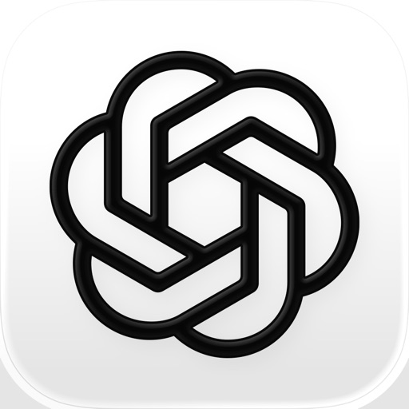

Neu: ChatGPT für iOS – Lerne die neuesten Verbesserungen in OpenAI kennen.

Diese offizielle App ist kostenlos. Sie synchronisiert deinen Verlauf über mehrere Geräte hinweg und stellt dir die neuesten Funktionen von OpenAI zur Verfügung, einschließlich des neuen Bildgenerators.

ChatGPT bietet dir folgende Funktionen:

· Bildgenerierung: Lass ChatGPT anhand einer Beschreibung beeindruckende Bilder erstellen oder fordere es mit ein paar einfachen Worten auf, vorhandene Bilder nach deinen Wünschen zu verwandeln. 
· Fortgeschrittener Audiomodus: Tippe auf das Schallwellen-Icon, um auch unterwegs in Echtzeit Gespräche zu führen. Schlichte einen Streit am Esstisch oder übe eine neue Sprache. 
· Foto-Upload: Mache ein Foto oder lade ein Bild hoch, um ein handschriftliches Rezept zu transkribieren oder Informationen über eine Sehenswürdigkeit zu erhalten. 
· Kreative Inspiration: Lass dir Vorschläge für individuelle Geburtstagsgeschenke machen oder erstelle eine personalisierte Grußkarte.
· Maßgeschneiderte Ratschläge: Besprich schwierige Situationen, frage nach einer detaillierten Reiseroute oder lass dir beim Verfassen der perfekten Antwort helfen. 
· Personalisiertes Lernen: Erkläre einem von Dinosauriern begeisterten Kind, was Elektrizität ist, oder frische im Handumdrehen dein Wissen über ein historisches Ereignis auf.
· Professioneller Input: Sammle Ideen für Marketingtexte oder entwirf einen Geschäftsplan.
· Sofortige Antworten: Lass dir Rezeptvorschläge machen, wenn du nur ein paar Zutaten im Kühlschrank hast.

Schließe dich Millionen von Benutzern an und probiere die App aus, die die Welt begeistert. Lade ChatGPT noch heute herunter.

Nutzungsbedingungen und Datenschutzrichtlinie:
https://openai.com/policies/terms-of-use
https://openai.com/policies/privacy-policy

[View on Apple](https://apps.apple.com/jp/app/chatgpt/id6448311069)

## ジハンピ

■ジハンピの６つの特徴

①好きな飲み物、３本無料！
ジハンピアプリをダウンロードし、支払い方法を連携すると、300円以下の商品を3本無料でもらえます。

②自販機にピッ！ですぐに買えちゃう。
自販機前のイライラとはさようなら。支払い方法連携後は、アプリを起動して、自販機にスマホをピッとタッチするだけで買えちゃいます。

③ダウンロードして最短60秒で使える！
名前、年齢、メールアドレスなどの情報登録は不要です。SMS認証、支払い方法連携のみで、最短60秒で購入が出来ます。
また、一度支払い方法を連携すると、毎回の支払い方法の選択も不要になります。

④好きなマネーが使える！
PayPayをはじめ13種類のマネーが使えるので、いつも使っているマネーでお支払いいただけます。

⑤いつものポイント使える！貯まる！
楽天ポイントなど5種のポイントが利用可能。余っているポイントを使って飲み物を購入したり、ポイントを貯めたりすることが出来ます。

⑥「ピ」マークの自販機で使える！
右上に「ピ」のロゴマークがついているサントリー自販機で利用可能です。

■利用に関する注意点
電波が良好な環境で本アプリをご利用ください。

■対応端末について
【OS要件】
iPhone  ：iOS 15以上
【機能】
・NFC機能に対応している
・SMS認証コードを受信できる

■ジハンピホームページ
https://www.suntory.co.jp/softdrink/jihanki/jihanpi/

[View on Apple](https://apps.apple.com/jp/app/%E3%82%B8%E3%83%8F%E3%83%B3%E3%83%94/id6667104573)

## DAZN (ダゾーン) スポーツをライブ中継

ここが、スポーツの究極の本拠地。 

DAZNは「FIFAワールドカップ2026」の全104試合をライブ配信する国内唯一のサービスです。試合はもちろん、様々なコンテンツで4年に一度の祭典をお楽しみください。 

DAZNは世界で唯一無二のグローバルスポーツプラットフォームです。私たちはスポーツ中継だけでなく、スポーツを楽しむためのあらゆるコンテンツ、機能をお届けしています。 

いつでもどこでも楽しめる！ 
今までにないスポーツ観戦をDAZNでお楽しみください。あなたの好きなチームや選手の試合をライフスタイルに合わせいつでもどこでもライブ＆見逃し配信でご覧いただけます。 

様々な楽しみ方がDAZNにはある！ 
FanZoneでは仲間と一緒に観戦しているようにリアルタイムにチャットやリアクションを送ったりして繋がれます。一緒に勝利を祝ったり、スタジアムにいるかような興奮を味わえます。 

DAZNは世界中の様々なスポーツを配信しています 
 
●DAZNは「FIFAワールドカップ2026」の全104試合をライブ配信する国内唯一のサービスです。試合はもちろん、様々なコンテンツで4年に一度の祭典をお楽しみください。 
● 明治安田生命Jリーグ、ラ・リーガ、ブンデスリーガ、セリエA、ベルギーリーグなど国内外のサッカーの主要リーグ&カップ戦をDAZNでライブ中継&見逃し配信。 
● プロ野球*、B.LEAGUE、ジャパンラグビー リーグワンと国内の４大スポーツの最高峰の戦い、さらにモータースポーツ、NFL、ボクシング、総合格闘技、アクションスポーツからオリジナルのドキュメンタリーや情報番組までお楽しみいただけます。 

* 広島東洋カープ主催試合及びその他一部試合を除く。 

＊定額に含まれるコンテンツの他、アプリ内でNFL Game Passをご購入いただくことで、NFLの全試合、NFLオリジナル番組、ドキュメンタリーなどをご視聴いただけます。  

DAZNは様々なスポーツをいつでもどこでも楽しめる、スポーツの究極の本拠地です。 
 
”番組表”で最新の試合をチェック。さらにあなたのお気に入りに合わせた通知も設定できます。 
 
新しいナビゲーションでお気に入りのスポーツや競技に素早くアクセス。 
  
リアルタイムであなたが気になる試合のスコアをチェック。DAZNで配信していない試合もカバー。 

強化された検索ページであなたが欲しい情報をより迅速に見つけられます。 

”FanZone”で応援し、チャットし、そしてみんなとつながる。投票やクイズにも参加できます。 

新しいプロフィールページで設定がより簡単に。 
 
世界中の様々な競技の24時間配信チャンネルをお届け。 

©J.LEAGUE ©読売巨人軍 YDB ©中日ドラゴンズ ©阪神タイガース  

©H.N.F. ©Rakuten Eagles SEIBU Lions C.L.M. ORIX Buffaloes SoftBank HAWKS

利用規約: https://www.dazn.com/help/articles/terms-jp  
プライバシーポリシー: https://www.dazn.com/help/articles/privacy-jp  

※関係当局や権利者等により、配信予定のコンテンツや試合が延期や中止等になる場合があります。

[View on Apple](https://apps.apple.com/jp/app/dazn-%E3%83%80%E3%82%BE%E3%83%BC%E3%83%B3-%E3%82%B9%E3%83%9D%E3%83%BC%E3%83%84%E3%82%92%E3%83%A9%E3%82%A4%E3%83%96%E4%B8%AD%E7%B6%99/id1129523589)

## Google Gemini

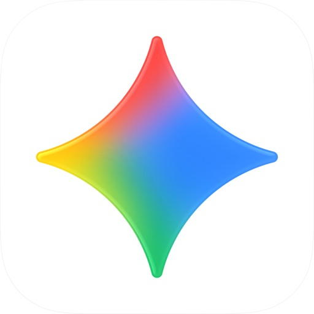

Ob auf dem Weg zur Arbeit oder bei der Recherche bis spät in die Nacht – Google Gemini ist dein persönlicher, proaktiver und leistungsstarker KI-Assistent.

DIE BELIEBTESTEN FUNKTIONEN VON GEMINI
• Unsere neuesten Modelle, Gemini 3.5 Flash und Gemini Omni, eröffnen ganz neue Möglichkeiten für Produktivität und Kreativität.
• Tausche dich mit Gemini Live aus: Brainstorme in Echtzeit oder teile deinen Bildschirm bzw. deine Kamera, um direkt über das zu sprechen, was du siehst.
• Statt langer, monotoner Texte erhältst du sorgfältig ausgearbeitete Antworten mit eingebetteten Bildern, Zeitachsen und interaktiven Grafiken.
• Du kannst unter anderem Dokumente, Tabellen, Fotos oder Videos hochladen, um Antworten, Zusammenfassungen und Informationen zu deinen Inhalten zu erhalten.

ERWECKE DEINE KREATIVEN IDEEN ZUM LEBEN
• Fotos erstellen und bearbeiten mit Nano Banana 2: Wende die Kamera- und Belichtungseinstellungen an, füge mehrere Bilder zu einem Mockup zusammen, designe Poster mit gestochen scharfem Text und erstelle mühelos Diagramme. Anschließend kannst du die Größe beliebig anpassen.
• Verwandle deine Ideen mit Gemini Omni in kinoreife Videos – verfügbar für Nutzer*innen von Google AI Plus, Pro, Ultra und Workspace.
• Erstelle mit Lyria 3 individuelle Soundtracks für jeden Moment.

STEIGERE DEINE PRODUKTIVITÄT
• Recherche mit NotebookLM: Du erhältst fundiertere und relevantere Antworten auf Basis deiner eigenen Quellen.
• Lernhilfe und einfache Prüfungsvorbereitung: Lade deine Kursnotizen hoch, um individuelle Übungsquizze und interaktive Grafiken zu generieren.
• Vom Prompt zum Prototyp: Erstelle Webseiten, Spiele oder Dashboards. Du kannst sogar deine Dateien in eine Podcast-ähnliche Übersicht umwandeln, um sie dir unterwegs anzuhören.

MEHR MÖGLICHKEITEN DURCH EIN UPGRADE
Mit einem Upgrade auf ein Google AI Plus-, Pro- oder Ultra-Abo kann Gemini dich noch besser bei komplexen Aufgaben und Projekten unterstützen.

Datenschutzhinweise für Gemini-Apps: g.co/gemini/privacynotice
Hinweis: Gemini bietet zwar leistungsstarke Funktionen für mehr Produktivität, unterstützt aber derzeit keine iOS-Geräteaktionen wie das Stellen von Weckern oder das direkte Senden von SMS. Gemini for Business ist über entsprechende Google Workspace-Abos verfügbar.

[View on Apple](https://apps.apple.com/jp/app/google-gemini/id6477489729)

## Rocket Now : 出前/フードデリバリー

Rocket Now（ロケットナウ） は、送料・サービス料のないフードデリバリーアプリです。
「お店と同価格」バッジの付いた店舗では、オフライン店舗と同じ価格で料理を注文できます。

人気レストランの料理をワンタップで簡単注文。忙しい毎日に、より手軽でスマートな食の体験をお届けします。

◆主な機能
・手数料ゼロ：送料・サービス料が無料。気軽に注文できます。
・リアルタイム追跡：配達状況をアプリで確認。到着までの流れが一目でわかります。
・豊富なジャンル：和食・洋食・中華料理・韓国料理・イタリアン・アジア/エスニック・定食・ラーメン・カレー・焼肉・弁当・寿司・ドリンク・コーヒー・スイーツなど、人気店が多数参加。
・簡単操作：数タップで注文完了。すぐに届く、かんたんデリバリー体験。
・多様な支払方法：クレジットカード・PayPayなどに対応。

◆こんな時に便利
・忙しくて外に出られないとき
・雨の日や夜遅く、小腹がすいたとき
・家族や友人との食事を手軽に楽しみたいとき
・デリバリーは高いと思っているとき

◆対応エリア
ロケットナウは、より安定したサービス運営のため、順次サービス提供地域を拡大しております。現在のサービス提供エリア配下となります。
東京都、神奈川県、埼玉県、千葉県、大阪府、京都府、兵庫県、福岡県、宮城県、広島県、静岡県、北海道, , 三重県, 奈良県, 滋賀県, 和歌山県

※一部地域ではご利用いただけません。詳しい対応エリアは公式サイトのサービス/エリアをご確認ください。（更新日：2026.05.11）

◆人気のレストラン多数掲載中
バーガーキング、KFC、Wendy’s First Kitchen、ファーストキッチン、Taco Bell、SHAKE SHACK、Mom’s Touch、ゴーゴーカレー、クリスピー・クリーム・ドーナツ、CRISP SALAD WORKS、BLUE BOTTLE COFFEE、ピザハット、PRONTO、吉野家、大戸屋、かっぱ寿司、牛たんねぎし、ナポリの窯、ゴーゴーカレー、もうやんカレー、日乃屋カレー、ターリー屋、いきなりステーキ、クリスピーチキンアンドトマト、SUBWAY、どんまつ、はなまるうどん、大阪王将、銀だこ、伝説のすた丼屋など、人気のレストランを注文できる。

[View on Apple](https://apps.apple.com/jp/app/rocket-now-%E5%87%BA%E5%89%8D-%E3%83%95%E3%83%BC%E3%83%89%E3%83%87%E3%83%AA%E3%83%90%E3%83%AA%E3%83%BC/id6739188587)

## コメダ珈琲店

コメダが大切にしている「くつろぎ」をみなさまに、より身近に感じていただきたいという思いを込め、「コメダ珈琲店」の公式アプリをリニューアルしました。

便利に楽しく使える機能が満載！

【アプリ機能紹介】
◯お気に入り登録
--------------------
・店舗やメニューなどをお気に入り登録することができます。登録することでお店やメニューをすぐ探せるようになります！

◯店舗検索
--------------------
・今いる場所から近くのコメダが地図に表示されて探しやすくなりました！
・より詳細な条件を指定できるようになりました。

◯モバイルコメカ
--------------------
・お持ちのコメカを登録してアプリでコメカ支払いができるようになりました！
・アプリに表示されるバーコードを見せるだけ。

＊コメカ登録後も板カードは破棄しないようご注意ください

◯KOMEDAでくつログ
--------------------
・アプリを使えば使うほどログが貯まる『くつログ』機能が搭載！
・ログが貯まるとコメダンディが登場する「くつログ農園日記」の続きが見れるように。

[View on Apple](https://apps.apple.com/jp/app/%E3%82%B3%E3%83%A1%E3%83%80%E7%8F%88%E7%90%B2%E5%BA%97/id1667214457)

## ラウンドワン　スペシャルクーポン毎週配信！

■来店前にボウリング・カラオケ・スポッチャの予約ができる
・行きたい店舗の現在の待ち時間をチェック！【現在の混雑状況】
・行きたい店舗の待ち時間の順番待ちが可能！【順番待ち申し込み】
・店舗と日時を指定して予約したい！【来店日時予約】
・歓送迎会・子供会行事に最適！【団体予約】
・ファンイベントも予約できる！【ROUND1LIVE 利用予約】

■クーポン毎週配信！
・毎週新しいクーポンが届く！
・お誕生日のお祝いに！バースデークーポン
・アプリ会員の方にだけ、特別なキャンペーンクーポン

■近くのラウンドワンが探せる店舗検索
・ボウリング・アミューズメント・カラオケ・スポッチャなどの施設検索
・各店舗・施設の営業時間
・無料シャトルバスの時刻表・のりば案内

■クラブ会員
・会員QRコードで素早くチェックイン
・各施設を会員料金で利用できる！
・ご利用回数に応じて、特典がグレードアップ！

■ボウリングスコア管理機能
・ボウリングのスコアをラウンドワンアプリに保存
・いつでもスコアシートが確認できる！
・詳細分析機能も搭載！

■アプリ限定　ラウンドワンオンラインショップ
・ラウンドワンとコラボ中のアーティストや
　人気コンテンツとのラウンドワン限定コラボグッズを販売中！
・人気プロボウラーのここでしか買えない限定グッズも！
・限定グッズが購入できるのはアプリだけ！

[View on Apple](https://apps.apple.com/jp/app/%E3%83%A9%E3%82%A6%E3%83%B3%E3%83%89%E3%83%AF%E3%83%B3-%E3%82%B9%E3%83%9A%E3%82%B7%E3%83%A3%E3%83%AB%E3%82%AF%E3%83%BC%E3%83%9D%E3%83%B3%E6%AF%8E%E9%80%B1%E9%85%8D%E4%BF%A1/id432455516)

## マツキヨココカラ公式アプリ

【新しくなった、マツキヨココカラ公式アプリの特徴】
・ダウンロードするだけですぐに店内商品10%オフクーポンがもらえる
・ミッションでも、ログインするだけで店内商品10%オフクーポンがもらえる
・おトクな情報をプッシュ通知で直接受け取れる
・現在地から近隣の店舗を探し、チラシ情報を手軽に確認可能 

【主な機能の紹介】
■会員証
カードを持ち歩かなくても、アプリのバーコードを見せるだけでポイントがたまります。

■ミニゲーム
毎日最大2回、ルーレットに挑戦して、おトクなクーポンを獲得できます。

■クーポン
あなたのニーズに合わせた、特別なクーポンをお届けします。

■ミッション
「ミッション」は、ゲーム感覚で、チャレンジできる機能です。
クリアするとポイントやクーポンを獲得できます。

■チラシ
位置情報を許可すると、近くの店舗のチラシ情報を取得できます。店舗検索で気になる店舗のチラシ情報も取得できます。

※画像の報酬や内容は一例です。タイミングによって報酬の内容は変動します
※動作保証環境 iOS16.4以上
※iPad では動作保証いたしません

[View on Apple](https://apps.apple.com/jp/app/%E3%83%9E%E3%83%84%E3%82%AD%E3%83%A8%E3%82%B3%E3%82%B3%E3%82%AB%E3%83%A9%E5%85%AC%E5%BC%8F%E3%82%A2%E3%83%97%E3%83%AA/id6451037644)

## バーガーキング Burger King

[アプリ機能のご紹介]
1.バーガーキングの最新情報を配信
新商品やキャンペーン情報などを、ホーム画面でいつでもチェックできます。

2.毎週更新！お得なクーポン配信中！
クーポンのデザインを変更し、さらに使いやすくなりました。クーポンをタップすると詳細が表示されます。※クーポンのご利用には、無料の会員登録が必要です。

3.ステージに応じて特典が増える！目指せダイヤモンド！
購入金額に応じてステージがアップし、もらえる特典もグレードアップするメンバーシッププログラムを開始しました。

4.レジに並ばず自分のタイミングで注文！便利なモバイルオーダー！
アプリで注文から支払いまで完了。店頭で列に並ぶことなく、自分のタイミングで注文とキャッシュレス決済が可能です。

5. お気に入りのメニューを登録して、注文をスムーズに！
好きなメニューやカスタマイズをお気に入りに登録しておけば、次回以降の注文がより簡単になります。

6.店舗検索で自分の近くのバーガーキングが見つかる！
条件を設定し、バーガーキング店舗を見つけることができます。

[留意事項]
アプリのご利用はiOS13.0以降の端末を推奨しております。
iPod Touch、iPadでは動作保証しておりません。

[View on Apple](https://apps.apple.com/jp/app/%E3%83%90%E3%83%BC%E3%82%AC%E3%83%BC%E3%82%AD%E3%83%B3%E3%82%B0-burger-king/id1456118550)

## マクドナルド

マクドナルド公式アプリは、クーポンなどのお得な情報を毎日配信しているだけでなく、注文からお支払いまでを完了できるアプリです。さらに、マクドナルドのお食事がもっと楽しく・お得になる、リワード(特典)プログラムにご参加いただけます！

【ご利用いただける機能】
●Myマクドナルド リワード
本アプリ上での商品購入で、ポイントが付与されるリワード(特典)プログラムです。ポイントは、マクドナルド商品の割引・無料クーポン、オリジナルのデジタルコンテンツ・グッズや他社サービスなど、多彩なリワードに交換できます。
さらに、初回注文時のボーナスポイントキャンペーンも実施中！通常購入分に加え、100ポイントが加算されます。 

●最新のクーポンを使える
店舗やモバイルオーダーでご利用いただけるお得なクーポンを配信しています。レジのスタッフに「お店で使う」を押して表示されるクーポン番号をご提示いただくか、モバイルオーダーのメニューカテゴリーからクーポンを選択してください。

●マクドナルドのニュースとメニューをチェックできる
あなたにおすすめのニュースやおすすめの商品がホーム画面に表示されます。マクドナルドの商品の「食材」・「アレルギー情報」・「栄養成分」など、詳細な商品情報をご確認いただけます。

●注文からお支払いまでをアプリで、モバイルオーダーが使える
注文の列に並ばずに、商品を受け取れます。じっくり商品を選べて、お席にいながら注文もできるので、お食事中に追加の注文も可能に。商品はお席までお届けいたします。（＊一部店舗・時間帯除く）

●おうちで注文、おうちへお届け、アプリでマックデリバリー®サービスが使える

【モバイルオーダーご注文方法】
＜Step 1 ログイン＞
クーポンのご利用、または商品のご注文時には会員登録、ログインが必要です。
パスワードをお忘れの方は、「パスワードを忘れた場合」から再設定が可能です。その際、 info@nsp.mdj.jp からのメールを受信できるように設定してください。

＜Step 2 店舗を選ぶ＞
受け取る店舗をお選びください。
※利用可能店舗はアプリでご確認ください。

＜Step 3 メニューを選ぶ＞
お好きなメニューをお選びください。配信中のクーポンもご利用いただけます。
※モバイルオーダーに利用できるクーポンがレジで利用できるものと一部異なることがございます。

＜Step 4 受け取り方法を選ぶ＞
テーブルにスタッフがお届け(テーブルサービス)、カウンターで受け取る、テイクアウト、パーク＆ゴー、ドライブスルー のいずれかをお選びください。
※店舗・時間帯により選べる受け取り方法が異なります。テーブルサービス、パーク＆ゴー、ドライブスルーは、一部店舗ではご利用できません。

＜Step 5 お支払い方法を選ぶ＞
クレジットカード（VISA、Master、JCB、Diners、American Express）、ｄ払い、PayPay、楽天ペイ、au PAY、LINE Pay、Apple Pay がご利用いただけます。

－ここから下のステップは、店舗到着後に実施ください－

＜Step 6 商品を受け取る＞
お店に到着されましたら、お支払いを確定してください。調理を開始し、商品をご用意いたします。できたての商品をお召し上がりください。

【マックデリバリー®サービスご注文方法】
＜Step 1 ログイン＞
商品のご注文時には会員登録、ログインが必要です。
パスワードをお忘れの方は、「パスワードを忘れた場合」から再設定が可能です。その際、 info@nsp.mdj.jp からのメールを受信できるように設定してください。

＜Step 2 お届け住所とお届け日時を選ぶ＞
今すぐ注文か予約注文でお好きな時間をお選びください。
※配達日時の１日時から当日２時間前まで予約可能です。

＜Step 3 メニューを選ぶ＞
お好きなメニューをお選びください。

＜Step 4 お支払い方法を選ぶ＞
現金、クレジットカード（VISA、Master、JCB、Diners、American Express）、ｄ払い、PayPay、楽天ペイ、au PAY、LINE Pay、Apple Pay がご利用いただけます。
※一部店舗では現金支払いをご選択いただけません。

＜Step 5 商品を受け取る＞
配達員ができたての商品をご指定の住所にお届けします。
※ご注文の際に「置き配を希望する」を選択いただくと、手渡しを避けて商品をお渡しさせていただきます。

※受付時間：店舗により異なります。
※朝マックメニューのご注文受付最終時刻は10:20まで。
※注文条件：¥1,500から注文可能(朝マックは￥1,000から)。
※別途デリバリー料 \300がかかります。

[View on Apple](https://apps.apple.com/jp/app/%E3%83%9E%E3%82%AF%E3%83%89%E3%83%8A%E3%83%AB%E3%83%89/id413618155)

## GO タクシーが呼べるアプリ - AI予約・配車・迎車・決済

GO―No.1タクシーアプリ※
・提携のタクシー車両から近くのタクシーを呼ぶことができます。支払いもキャッシュレス。
・タクシーアプリ『JapanTaxi』と『MOV』が2020年9月に統合
※ Sensor Tower調べ
-タクシー配車関連アプリにおける、日本国内ダウンロード数（iOS）
-調査期間：2020年10月1日~2026年3月31日

＜サービスの特徴＞
1．タクシーに、より早く乗れる
GOの提携車両の中から、近くのタクシーがスピーディーにあなたのもとへ配車されます。
アプリから簡単に呼べるので、寝坊してしまった朝や時間がないときの強い味方です。

2．目安到着時間がわかるから、待ち時間も有効に使える
タクシー配車を依頼すると到着時間の目安がわかります。
タクシーの到着通知も来るので、もう路上でタクシーを待つ必要はありません。
何かあった時はメッセージ機能で直接、乗務員と連絡もとれるので安心してご利用いただけます。

3．GO Payを使えばキャッシュレス、乗っている間にアプリで事前決済
アプリ内でクレジットカード情報を追加し、乗車の際にGO Payを選択していただければアプリで自動的に決済がおこなわれます。
目的地に到着したらそのままタクシーから降りるだけでOK。
お釣りやクレジットカードのやりとりに時間を取られません。
※一部対象外の車両あり

4．AI予約で日時を指定して配車可能
AI予約はあらかじめ日時を指定することで、指定した時間前後に乗車できるよう、車両を優先的に自動で手配するサービスです。
AI予約を利用すれば、出かける準備をしながら直前にバタバタして配車することなく、スムーズにご乗車いただけます。
AIが指定時間前後に手配できる車両の数を計算して注文をお受けするため、従来のタクシー予約より大幅に注文を受けられるようになりました。
※一部エリア限定。順次エリア拡大予定

5．乗りたい車両を指定できる
荷物が大きい時でも乗り降りしやすいスライドドアの車両の指定や、車いす対応の研修などを受けた乗務員が乗務するユニバーサルデザインタクシーを指定して車両を手配することができます。
※スライドドアの車両は東京限定。その他の車両は一部エリア限定。順次エリア拡大予定

6．アプリで利用できるサービスを拡大中
・空港定額：ご自宅・ホテル・駅・旅先など、ご指定の場所と空港間のタクシー運賃が定額になるサービスです。GOなら事前予約の必要はなし。今すぐタクシーを呼びたい時でも、空港定額のご利用が可能です。まずは東京 – 羽田・成田空港からスタート（東京 – 成田間は空港への移動のみ）。
・GOプレミアム：優良乗務員が高級ワンボックス車でお迎えにあがるサービスです。アプリ操作で手軽にご注文頂けます。東京都内15区（千代田区・中央区・港区・新宿区・文京区・台東区・墨田区・江東区・品川区・目黒区・大田区・世田谷区・渋谷区・中野区・豊島区）からのご乗車でご利用頂けます。
　※台東区・墨田区・江東区・品川区・大田区・世田谷区・中野区・豊島区の一部エリアは対象外となります。
・GOエコノミー：『GO』アプリで呼べるおトクなサービスです。タクシーとほぼ同じ快適な移動を、リーズナブルな料金でご利用いただけます。乗車手配は『GO』アプリ内『エコノミー』のタブからご利用ください。
※サービス提供エリア（順次拡大予定））：湾岸（豊洲 / 東雲 / 有明 / 晴海 / 台場 / 月島 / 勝どき)・東京・大手町・日本橋・銀座・有楽町・上野・御徒町・神田・秋葉原・浅草・蔵前・青山・表参道・広尾・六本木・麻布十番・赤坂・恵比寿・中目黒・目黒・五反田・白金台・高輪台・田町・浜松町・新橋・虎ノ門・天王洲・品川シーサイド・大崎・大井町・水道橋・御茶ノ水・神楽坂・飯田橋・四ツ谷・市ヶ谷・築地・八丁堀・門前仲町・木場・東陽町・砂町・潮見・辰巳・押上・亀戸・大島・錦糸町・新宿・代々木・都庁前・西新宿・初台・本町・笹塚・幡ヶ谷・池袋・早稲田・高田馬場・新大久保・中野・渋谷・原宿・富ヶ谷・西原・代々木上原・駒場東大前・代官山・池尻大橋・三軒茶屋・学芸大学・祐天寺※渋谷区はデマンド交通実証実験中エリアとなります。※ご乗車いただける最大距離には上限があります。詳細はアプリでご確認ください。
※運行時間：全日7:00頃〜25:00頃

＜GO 対応エリア＞
47都道府県対応済み！
北海道、青森県、岩手県、宮城県、秋田県、山形県、福島県、茨城県、栃木県、群馬県、埼玉県、千葉県、東京都、神奈川県、新潟県、富山県、石川県、福井県、山梨県、長野県、岐阜県、静岡県、愛知県、三重県、滋賀県、京都府、大阪府、兵庫県、奈良県、和歌山県、島根県、鳥取県、岡山県、広島県、山口県、徳島県、香川県、愛媛県、高知県、福岡県、佐賀県、長崎県、熊本県、大分県、宮崎県、鹿児島県、沖縄県でサービス提供中。
※一部対象外地域あり

＜利用の注意事項＞
・周辺に利用可能なタクシーがない場合は配車をお受け出来ない場合があります
・ご利用には運賃、迎車料金のほか、一部地域ではアプリ手配料等がかかります
・利用できるクレジットカードは Visa / Mastercard / JCB / American Express / Diners Clubとなります
・タクシーの到着予測時刻はその時点における予測であり、交通状況等により変動する場合があります
・交通状況やその他の事情により一度、配車をお受けした後にキャンセルさせていただく場合があります
・ご利用時は、端末のGPS機能、プッシュ通知機能をオンにしていただく必要がございます
・旧MOV及び旧タクベルに登録済の方はGOに新規登録しても、新規登録による500円クーポンは付与されません
・クーポンはGO Payを選択した場合のみご利用いただけます
・1回の乗車でのクーポン利用は１つまでです
・クーポンは決済方法選択時に利用するクーポンを選ぶことで利用いただけます
・乗るたび500円クーポンがもらえる、「GOする！キャンペーン（新規限定/月間3回まで)」は日本国内の電話番号でアカウント認証したユーザーのみが対象となります

[View on Apple](https://apps.apple.com/jp/app/go-%E3%82%BF%E3%82%AF%E3%82%B7%E3%83%BC%E3%81%8C%E5%91%BC%E3%81%B9%E3%82%8B%E3%82%A2%E3%83%97%E3%83%AA-ai%E4%BA%88%E7%B4%84-%E9%85%8D%E8%BB%8A-%E8%BF%8E%E8%BB%8A-%E6%B1%BA%E6%B8%88/id1254341709)

## デジタル認証アプリ

デジタル庁が提供する「デジタル認証アプリ」は、マイナンバーカードを使った本人の確認などを行うアプリです。
民間サービスや行政サービスで本人確認が必要な時に、デジタル認証アプリを開き、認証や署名を行います。

■ ご利用に必要なもの
①マイナンバーカード
②マイナンバーカードを受け取った際に設定した暗証番号

「デジタル認証アプリ」は、マイナンバーカードの電子証明書の発行を受けている人であれば、誰でも無料で利用することができます。

[View on Apple](https://apps.apple.com/jp/app/%E3%83%87%E3%82%B8%E3%82%BF%E3%83%AB%E8%AA%8D%E8%A8%BC%E3%82%A2%E3%83%97%E3%83%AA/id6454900894)

## Threads

Entdecke neue Perspektiven und unterhalte dich mit anderen auf Threads.

Finde heraus, worüber die Menschen gerade sprechen, von ungewöhnlichen Interessen bis zu großen Momenten. Mit Communitys findest du auf Threads Menschen mit ähnlichen Interessen. Antworte, höre zu, teile selbst etwas oder folge ihnen.

Das kannst du auf Threads tun:

■ Starte einen Thread, teile deine Sichtweise
Beschäftigt dich etwas? Poste es auf Threads. Teile einen Gedanken, stelle eine Frage oder beginne eine Unterhaltung. Es gibt verschiedene Möglichkeiten, um Dinge mit Text, Bildern, Umfragen, selbstlöschenden Beiträgen und mehr ins Rollen zu bringen.

■ Springe direkt zu den Antworten
Beteilige dich direkt an der Diskussion, reagiere auf neue Ideen oder beobachte, in welche Richtung sich das Gespräch entwickelt. Jeder Thread ist eine Einladung, dich zu beteiligen.

■ Behalte Trends im Blick
Von Live-Ergebnissen bis zu entscheidenden Momenten: Mit Threads bist du immer auf dem Laufenden und kannst dich direkt an der Diskussion beteiligen, wenn du etwas zu sagen hast.

■ Du steuerst, welche Inhalte du siehst
Steuere, wer dir antworten, dich erwähnen oder deine Beiträge sehen kann. Verwende unerwünschte Begriffe, um Beiträge und Antworten herauszufiltern, die Begriffe oder Formulierungen enthalten, die du nicht sehen möchtest. So gestaltest du dein Nutzungserlebnis nach deinen Vorstellungen.

■ Vertiefe deine Interessen
Folge Freund*innen, Creator*innen und Communitys, die dich interessieren. Threads wurde entwickelt, um neue Perspektiven zu entdecken und miteinander ins Gespräch zu kommen – angefangen mit den Communitys, die dir am wichtigsten sind.

■ Schaffe Verbindungen im Chat
Führe private Unterhaltungen mit 1:1-Chats und Gruppen-Direktnachrichten. Wenn ein öffentlicher Thread persönlich wird, kannst du ihn in dein Postfach verschieben, um das Gespräch zu vertiefen oder den Teilnehmerkreis einzugrenzen.

Meta Terms: https://www.facebook.com/terms.php
Threads Supplemental Terms: https://help.instagram.com/769983657850450
Meta Privacy Policy: https://privacycenter.instagram.com/policy
Threads Supplemental Privacy Policy: https://help.instagram.com/515230437301944
Instagram Community Guidelines: https://help.instagram.com/477434105621119

[View on Apple](https://apps.apple.com/jp/app/threads/id6446901002)

## NHKプラス（NHK ONE対応）

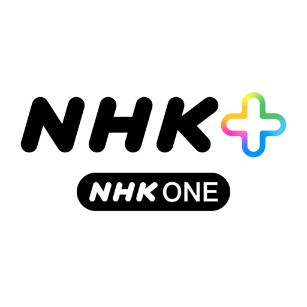

NHKの公式番組配信サービス「NHKプラス」では、朝ドラや大河など総合テレビ・Eテレの番組が同時・見逃し配信で見放題なだけでなく、新たにニュース記事も読めるようになりました。
ニュース、朝ドラ、大河ドラマ、教育番組、アニメ、ドキュメンタリー、スポーツなど、NHKの番組をスマホ・タブレットやテレビ向けアプリでもお楽しみください！

【NHKプラスについて】

・すでに受信契約がある場合は、別途のご契約やご負担なく、すぐにご利用いただけます。
・放送と同時に視聴できる「同時配信」と、放送後1週間以内に視聴できる「見逃し配信」でお楽しみいただけます。
・関連する番組をまとめたプレイリストの表示や、強化された検索機能により、見たい番組や知りたい情報に簡単にアクセスできます。
・お気に入りの番組やプレイリストは、「マイリスト」機能で登録でき、あとからすぐに視聴できます。
・「ニュース」のメニューでは、全国や地域の最新ニュースをいつでもチェック可能。
・テレビ向けアプリでは、子ども向けのアニメや教育番組が探しやすい「キッズモード」機能を搭載。
・一部のニュース番組では、番組内容と字幕がぴったり合う「ぴったり字幕」に対応。聴覚に障害のある方も、家族と一緒に生放送を楽しめます。

※日本国外からはご利用できません

[View on Apple](https://apps.apple.com/jp/app/nhk%E3%83%97%E3%83%A9%E3%82%B9-nhk-one%E5%AF%BE%E5%BF%9C/id6747368440)

## majica～電子マネー公式アプリ～

国内ドン・キホーテ、アピタ、ピアゴ、ロビン・フッド含むmajica加盟店でのお買い物を便利にお得にサポートする電子マネー「majica」の公式アプリです。
クーポン特別価格で商品購入ができたり、お得情報をメッセージで受け取る事ができます。
アプリ登録のみで「majica」のサービスがご利用頂けます。ぜひご利用ください。

■主なサービス・機能
＜majica詳細情報＞
majicaのマネー残高やポイント残高、ランク情報などmajicaに関する詳細情報を確認できます。

＜会員証バーコード＞
レジでmajicaアプリを提示するだけで、お会計からチャージまで会員証として利用ができます。

＜クーポン＞
国内ドン・キホーテ、アピタ、ピアゴ、ロビン・フッド含むmajica加盟店で使える、お得なクーポンが利用できます。
クーポンを選択して、お会計時にmajicaアプリを提示するだけでクーポン利用ができます。
※一部専門店、日本国外の店舗は除く。

＜タイムライン＞
ご登録いただいたお店の情報をタイムラインでお届けします。
チラシ・イベント・新商品情報など、最新情報がチェックできます。

＜クレジットチャージ＞
クレジットカードからmajicaにチャージ(入金)ができます。
ご利用可能なクレジットカードは下記カードとなります。
・majica donpen card
・UCSカード　※一部対象外のカードがございます。

＜銀行口座チャージ＞
銀行口座からmajicaにチャージ(入金)ができます。
指定のマネー残高を下回ると指定金額を自動でチャージする、オートチャージ機能もご利用いただけます。

＜残高履歴＞
残高履歴で、majicaマネーの利用やポイントの加算、利用履歴が確認できます。

＜電子レシート＞
国内ドン・キホーテ、アピタ、ピアゴ、ロビン・フッド含むmajica加盟店(一部専門店を除く)でのお買い物レシートをmajicaアプリで確認できます。
お買い物時にmajicaアプリを提示いただくだけで、お買い物レシートがアプリで確認できます。レシート管理がとても便利で簡単になります。
※一部専門店、日本国外の店舗は除く。

＜マジボイス＞
商品に対する評価・口コミが見られます。
お客様の声をもとに毎月商品のランキングを更新し、「人気商品」だけでなく、「イマイチ商品」も公開します。
さらに、商品にとどまらず、店舗や施設に対する要望や改善についても投稿を行うことができます。
お客様同士でも気軽に質問・回答することができます。

＜どこでもマジカ＞
Visaプリペイドカードをmajicaアプリ内で発行し、
ネットショッピングなどでmajicaマネー残高からお支払いができます。
さらにどこでもマジカをApple Payに設定すると
QUICPay＋™ （クイックペイプラス）対応店舗、Visaのタッチ決済利用可能店舗でmajicaマネー残高からお支払いができます。
どこでもマジカのお支払いに対しても0.5％のmajicaポイントが貯まります。

＜メッセージ＞
フォローした店舗のクーポン情報や特売情報、majicaご利用通知や、各種キャンペーン情報などをお届けします。

＜キャンペーン＞
majicaポイントや豪華賞品などが当たるお得なキャンペーン情報をたくさん掲載しています。

＜その他＞
電子マネーカード「majica」紛失時の一時停止、再発行が可能
紛失などの際に一時利用停止ができます。また、再発行手続きでマネー残高とポイント残高を引継ぐことができます。

■ご利用いただける店舗
全国のドン・キホーテ、MEGAドン・キホーテ、MEGAドン・キホーテUNY、ドン・キホーテUNY、長崎屋、ピカソ、essence、アピタ、ピアゴ、ユーストア、ロビン・フッド、一部専門店
※日本国外の店舗はご利用いただけません。
※どこでもマジカをApple Payに設定するとQUICPay＋™ （クイックペイプラス）対応店舗、Visaのタッチ決済利用可能店舗でもご利用できます。

・動作推奨環境：iOS バージョン16.0以上
　※一部機種において、正常に動作しない場合がございます。
　※iPad（iPad miniを含んだタブレット端末）は動作保証しておりません。

[View on Apple](https://apps.apple.com/jp/app/majica-%E9%9B%BB%E5%AD%90%E3%83%9E%E3%83%8D%E3%83%BC%E5%85%AC%E5%BC%8F%E3%82%A2%E3%83%97%E3%83%AA/id1001883210)

## GoodShort(グッドショート)-ショートドラマいつでも

GoodShort:オリジナルドラマや映画を観るのに必須のアプリ

旅行先でも、自宅でも、レストランでも、いつでもどこでも、1分程度のオリジナル短編ドラマや映画をお楽しみいただけます
小説を原作とした短編ドラマや映画を高品質、高解像度、高頻度で更新し、一味違うスクリーン体験をお約束します。

[様々なコンテンツ]
小説を原作とした短編ドラマや映画が数多くあり、きっとあなたの心をつかみます。現代ロマンス、都会のロマンス、青春ロマンスから、同居中の婿、魔法の医者、CEO、億万長者、女王、戦争の神まで、あなたの好きなジャンルやテーマがすべてここにあります！

[あなたにおすすめの作品のパーソナライズされたリスト]
優れた推奨システムにより、人気の小説を原作とした最高のオリジナル、短編ドラマ、短編映画を見つけることができ、あらゆる種類のドラマや映画愛好家の好みに合います！

[ユーザーのためのエレガントなインターフェイス]
シンプルでわかりやすく、ユーザーフレンドリーなインターフェイスは、目に優しい人間工学に基づいたものです。

GoodShortは、リラックスしたり待ち時間を過ごすのに最適な選択肢です。ダウンロードして、さまざまな機能を探索してみてください。

自動更新サブスクリプションについて:
支払い: 購入を確認すると、Apple iTunes アカウントから自動的に料金が引き落とされます。

更新: サブスクリプション有効期限の24時間前に、Apple iTunes アカウントから更新料が自動的に引き落とされます。更新料の支払いが完了すると、プレミアムメンバーシップが自動的に延長されます。

解約する場合: iPhone の「設定」を開き、「iTunesストアとApp Store」に入り、「Apple ID」をクリックし、「アカウント情報」を選択し、「サブスクリプション」をクリックして、
GoodShortを選択して解約してください。サブスクリプション期間終了の24時間前までに解約しない場合、自動的に更新されます。

ご意見やアイデアをお待ちしています。contact@goodshort.comまでメールでお送りください。

利用規約: https://m.goodreels.com/other/static_file/term_of_use.html
プライバシーポリシー: https://m.goodreels.com/other/static_file/privacy_policy.html

[View on Apple](https://apps.apple.com/jp/app/goodshort-%E3%82%B0%E3%83%83%E3%83%89%E3%82%B7%E3%83%A7%E3%83%BC%E3%83%88-%E3%82%B7%E3%83%A7%E3%83%BC%E3%83%88%E3%83%89%E3%83%A9%E3%83%9E%E3%81%84%E3%81%A4%E3%81%A7%E3%82%82/id6448176203)

## iAEON-イオンペイも使える！「アイイオン」

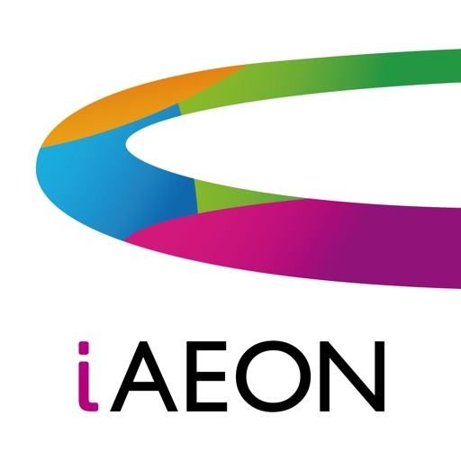

AEON Payもポイント管理もクーポンもこれ一つで便利。

電子レシートも使えてお財布いらずでスマートにお買物！

●ポイントがたまる、つかえる、まとめられる！

●お気に入り店舗よりおトクな情報を配信！

●お支払いは「AEON Pay」で！
 
▼iAEONの主な特徴

・会員登録はお持ちの携帯電話番号があればOK。
 
【ポイントがたまる、つかえる、まとめられる】　

・iAEONの会員コードでポイントをためたり、つかったり、またお手持ちのWAON POINTをおまとめ（合算）することができます。

・イオンマークのクレジットカードまたはイオンデビットカードどちらか1枚のみ登録可能です。

【お店のおトク情報を簡単ゲット】

・よく行くイオングループのお店を最大10店舗、お気に入り登録できます。

・お気に入り店舗を登録すると、ホーム画面から店舗のサービスが確認できたり、店舗のクーポンを利用できたり、お知らせが届きます。
 
【WAON POINT】

・WAON POINTのご利用は、AEON Pay支払い画面で利用するポイント数を指定して支払い時にAEON Pay支払いを選択することでご利用いただけます。

・または、イオングループの対象店舗のレジでiAEONの会員コードを提示の上、ご利用ポイント数をお伝えいただくことでご利用いただけます。

・smart WAONで複数のカードを登録している場合は、すべてのカードで貯めたWAON POINTをiAEONでご利用いただけます。

【お支払いは「AEON Pay 」で】

・イオンマークのクレジットカード、イオンデビットカードを登録いただくと、レジでAEON Payのコード支払い（QR・バーコード決済）をご利用いただけます。

・銀行口座やイオン銀行ATMを利用した現金チャージを利用して、AEON Payのチャージ払い（QR・バーコード決済）をご利用いただけます。

お支払い時に「AEON Payで支払います」とお申し出ください。

・ AEON PayのWAONタッチ支払いでお支払いの場合、「WAONで支払います」とお申し出いただき、レジに設置されたリーダーライター（読み取り機）に

　スマートフォンをかざすだけでお支払いができます。スマートフォンの電源がOFFでもお支払いいただけます。

・ご利用履歴はアプリ内で確認できます。

【お買い物の確認は「レシートレス」】

・イオングループの対象店舗のレジでiAEONの会員コードを提示いただくと、電子レシートが発行されます。

・iAEONの「レシートレス」アイコンをタップいただくとお買い物履歴と電子レシートをいつでもご確認いただけます。

※iAEONはSMSを受信可能な携帯電話番号（050で始まる番号を除く）をお持ちであればご利用いただけます。

▼動作確認端末

主要機種については動作検証済みですが、一部の機種において動作不良、表示崩れが発生する場合がございます。

あらかじめご了承ください。

▼ご利用にあたって

ご利用できる店舗、及びご利用時の操作方法など、詳しくiAEON公式HPをご確認ください。

https://www.aeon.com/aeonapp/ 

※アプリストア内スクリーンショット画像はイメージです。

※QRコードは㈱デンソーウェーブの登録商標です。

※「おサイフケータイR」は株式会社NTTドコモの登録商標です。

[View on Apple](https://apps.apple.com/jp/app/iaeon-%E3%82%A4%E3%82%AA%E3%83%B3%E3%83%9A%E3%82%A4%E3%82%82%E4%BD%BF%E3%81%88%E3%82%8B-%E3%82%A2%E3%82%A4%E3%82%A4%E3%82%AA%E3%83%B3/id1565489157)

## はま寿司

はま寿司の公式アプリです。
来店予約で待ち時間の短縮やお得なクーポンがご利用いただけます。

ご利用には会員登録が必要です。
WEB予約サイト「はまナビ」をご利用のお客様は
そのままアカウントをご利用いただけます。

はま寿司では、まぐろやサーモンなどの定番ネタから、
こだわりの創作にぎりまで、たくさんのお寿司を
お楽しみいただけるのはもちろんのこと、	
みそ汁やラーメンなどの一品もの、〆のデザートなど
サイドメニューも豊富に取り揃えております。

また、２～３週間ごとに変わるフェアを実施。
いつ来ても目新しい商品を楽しむことができます。

お支払いには
PayPay等のスマホ決済
楽天Edy,ID等の電子マネー、クレジットカード決済をご利用いただけます
　　　　※一部店舗を除きます

主な機能：

〇店舗検索〇

・都道府県から探す
　都道府県別に店舗を探すことができます。

・地図から探す
　現在地から近い店舗を検索が可能です。
　
〇来店予約〇

・順番待ち予約
　来店前に整理券をアプリから発行できます。
　待ち順番が近づくとpush通知orメールでお知らせします。

・日時指定予約
　来店時間を決めて予約を行い、指定時間帯に優先的にご案内します。
　予約時間が近づくとpush通知orメールでお知らせします。

〇メニュー〇
　
　定番からお持ち帰りメニューなど閲覧が可能です。
　
〇クーポン〇

　会員限定のお得なクーポンを配布しております。

[View on Apple](https://apps.apple.com/jp/app/%E3%81%AF%E3%81%BE%E5%AF%BF%E5%8F%B8/id1523009390)

## NetShort -Beliebte Dramen & TV

Hast du genug von langen, langweiligen Serien? Möchtest du jederzeit und überall in packende, mitreißende Geschichten eintauchen? Dann probiere NetShort aus!
Entdecke unzählige exklusive Kurzserien im Hochformat: Boss-Romantik, tragische Werwolf-Liebe, spannende Rachegeschichten – alle Genres, die du liebst, sind dabei! Tägliche Updates, personalisierte Auswahl und HD-Qualität sorgen für ein Kinoerlebnis – sogar auf dem kleinen Bildschirm. Ob beim Warten, in der Mittagspause oder auf Reisen: Mach deine freie Zeit zur ultimativen Entertainment-Zeit!

Ausgewählte Serien:
„Vertrag zur Liebe“: Am Tag der Trauung wird er nach sechs Jahren von seiner Freundin verlassen. Doch plötzlich taucht eine milliardenschwere CEO-Schönheit auf, schenkt ihm ein Privatflugzeug und macht ihm einen Heiratsantrag! Ein Jade-Anhänger enthüllt: Er ist der verschollene Erbe einer noblen Familie. Sieh zu, wie er das Blatt wendet und triumphiert!

„Schlächterheld“: Der von seiner Familie verachtete „Versager“ ist in Wahrheit ein legendärer Schwertmeister! Von seinem Vater öffentlich als nutzlos verurteilt, zerreißt er seine Tarnung, stellt seinen Vater bloß und legt mit seiner Klinge eine Spur der Gerechtigkeit. Er rächt seine Familie und beschützt seine Lieben!

„Goodbye, my tempting wife“: Während seine Frau ihn betrügt, verfolgt er die Szenen genüsslich... Von seiner Familie verraten und verlassen, verliert John seine letzte Spur von Zuneigung. Doch nun kehrt er als mächtiger CEO zurück – um sich alles zurückzuholen, was ihm zusteht!

Warum solltest du NetShort wählen?
Sofort verfügbar: Perfekt für kurze Pausen, jederzeit streamen ohne Verpflichtung.
Vielfältige Serien: Alle beliebten Genres, spannende Wendungen nonstop.
Tägliche Updates: Hunderte neue Episoden täglich – keine Wartezeit.
Kinoqualität: HD-Bildqualität, selbst auf kleinen Bildschirmen ein großes Erlebnis.
VIP-Vorteile: Keine Werbung, keine Unterbrechungen – für ungestörtes Serienvergnügen.
Lade NetShort jetzt herunter und starte dein persönliches Serien-Highlight!

Hinweise:
Wenn du über Apple abonnierst, wird der Betrag nach Bestätigung des Kaufs von deinem App Store-Konto abgebucht.
Dein Abonnement wird innerhalb von 24 Stunden nach dem Kauf aktiviert, je nach Status der Bestellung im Apple Store.
24 Stunden vor Ablauf deines aktuellen Abonnements wird das System den Abonnementpreis von deinem Konto abziehen. Nach erfolgreicher Verlängerung wird dein Abonnement automatisch verlängert.
Du kannst das Abonnement wie folgt kündigen: Einstellungen > iTunes & App Store > Apple ID > Apple ID anzeigen > Abonnements > NetShort.
Wenn du das Abonnement nicht mindestens 24 Stunden vor Ablauf kündigst, wird es automatisch verlängert.

Verwandte Vereinbarungen:
Nutzervereinbarung: https://netshort.com/agreement/1
Datenschutzrichtlinie: https://netshort.com/agreement/2
Automatische Verlängerungsvereinbarung: https://netshort.com/agreement/3
Mitgliedschaftsvereinbarung: https://netshort.com/agreement/4

[View on Apple](https://apps.apple.com/jp/app/netshort-%E4%BA%BA%E6%B0%97%E7%9F%AD%E7%B7%A8%E3%83%89%E3%83%A9%E3%83%9E/id6504849169)

## ヤマダデジタル会員

ヤマダデンキ公式デジタル会員アプリはデジタル会員証のほか、クーポンやお得な情報が満載！
さまざまな機能も搭載されておりショッピングには欠かすことができないアプリです。
家電のことならヤマダデンキ公式デジタル会員アプリを今すぐダウンロード！

【デジタル会員証】
ヤマダデンキ店頭でポイントカードとしてご利用いただけます

【お得なクーポン】
ヤマダデジタル会員限定のクーポンを常時配信中

【電子保証書】
紙の保証書を保管しなくてもアプリがデジタル保証書になります

【スマホタッチ】
店頭の電子プライスにスマホをかざす、またはQRスキャンして商品詳細やクチコミを確認することができます

【ネット通販】
ヤマダウェブコムやヤマダモールをアプリからご利用いただけます

【その他】
・デジタルチラシや店頭イベント、実施中のキャンペーン案内
・ヤマダデンキ店舗検索
・リフォームや新築住宅に関する情報　　など

※タブレット端末でのインストール、会員登録は非推奨です。
動作は保障致しかねますのでご了承ください。

[View on Apple](https://apps.apple.com/jp/app/%E3%83%A4%E3%83%9E%E3%83%80%E3%83%87%E3%82%B8%E3%82%BF%E3%83%AB%E4%BC%9A%E5%93%A1/id364504659)

## しまむらパーク

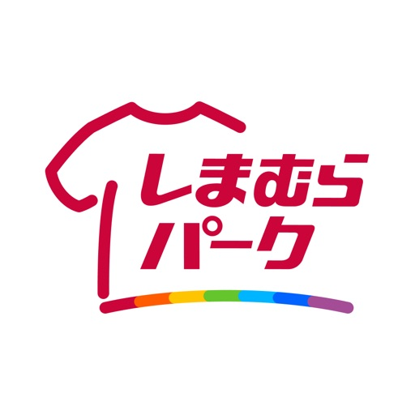

【アプリの機能紹介】
■ポイントが貯まる！使える！
店舗・オンラインストアでの買い物で100円（税抜）につき1ポイント付与。
100ポイント到達時に100円分の値引クーポン「100ポイント達成クーポン」が発行されます。

■会員証機能
店舗でのお買い物の際に会員証を提示することで「ポイント」がたまります。
また、オンラインストア購入品の店舗受取や、店頭での商品お取り寄せも、会員証を提示するだけで手続きが完了します。（本会員限定の機能となります。ログインの上、ご利用ください。）

■カテゴリの絞り込みや品番で在庫検索が可能！
近隣店舗の新着商品やお買得アイテムがおすすめ表示されます。
値札に印字されている7桁の品番やバーコードスキャンや、カテゴリの絞り込みで近隣店舗の在庫状況が検索できます。（本会員限定の機能となります。ログインの上、ご利用ください。）

■最新情報を配信
しまむら・アベイル・バースデイ・シャンブル・ディバロの最新チラシが閲覧できます。プッシュ配信にてチラシやその他おすすめ情報を見逃すことなく受け取れます。
＊プッシュ通知の設定が「オン」の場合のみ、ご利用できます。

■アプリ内でお買い物
オンラインストアでのお買い物及び商品のお気に入り登録ができます。

[View on Apple](https://apps.apple.com/jp/app/%E3%81%97%E3%81%BE%E3%82%80%E3%82%89%E3%83%91%E3%83%BC%E3%82%AF/id732775964)

## 焼肉きんぐ公式アプリ

焼肉きんぐの公式アプリは、お席の予約が簡単にできるだけでなく、来店回数に応じて階級があがると特典がもらえる「焼肉ポリス手帳」や、お誕生日を登録するとお得なクーポンがもらえるアプリです。
＜クーポン＞
・各種キャンペーンなど、随時お得なクーポンがご利用いただけます。
・お誕生日をご登録いただくとお誕生月に税込金額から10％引きのクーポンが配信されます。
※2026年4月20日現在。特典内容は予告なく変更になる場合がございます。

＜焼肉ポリス手帳＞
・来店回数ランキングをアプリにてご確認いただけます。
・焼肉ポリス手帳で来店回数に応じて階級が上がり、階級別クーポンがご利用いただけます。
・来店回数に応じて階級が上がり、階級別にクーポンや焼肉きんぐオリジナルアイテムを　もれなくプレゼントいたします。
※階級（会員ランク）は、巡査から警視総監までの10階級です。
※ポリス手帳の階級UPは税込820円以上ご利用の1会計ごとを来店回数として、翌日以降（通常1-2日）に焼肉ポリス手帳に来店回数が反映されます。
※個別会計（セパレート会計）による同一焼肉ポリス手帳アカウントへの来店回数の付与はしておりません。
【階級別クーポン】
※2026年4月20日現在。特典内容は予告なく変更になる場合がございます。
・巡査長　ソフトドリンク半額
・巡査部長　ソフトドリンク無料
・警部補　オリジナルスマホハンドル
・警部　　10％引きクーポン
・警視　　オリジナルポーチ
・警視正　20％引きクーポン
・警視長　オリジナルキャップ
・警視監　50％引きクーポン
・警視総監　国産牛　5kg

＜アプリダウンロード初回特典＞
・お会計時にアプリを初めてご提示いただくと、2回分の来店ポイントを付与いたします。
※2026年4月20日現在。特典内容は予告なく変更になる場合がございます。

＜アプリからの予約＞
・会員登録後、アプリから予約機能がご利用いただけます。
・位置情報設定を有効にして頂くと、ホーム画面に近隣店舗と予約待ち組数が表示され、ご予約が可能です。
・予約状況をアプリ内にてご確認いただけます。

『アプリからのご予約方法』
①「順番待ち受付」と②「優先案内予約」の2つの予約方法がございます。

① 順番待ち受付の場合
「順番待ち受付」では、現在店舗に並んでいる列へ順番待ちをすることができます。

・ホーム画面下の「店舗検索」ボタンから店舗検索画面に遷移します。
・ご予約されたい店舗をお選び頂き、「予約」ボタンを押してください。
・店舗詳細画面にある「順番待ち受付」から人数・携帯番号をご入力いただき、「次に進む」ボタンを押しご予約を確定させてください。

※「順番待ち受付」が押せない場合は、現在順番待ちを受け付けていない状況です。営業時間をご確認の上、店舗に直接ご来店ください。
※ご予約をキャンセルされる場合は、予約状況からキャンセルが可能です。

② 優先案内予約の場合
「優先案内予約」では、来店日時を選択して予約することができます。

・ホーム画面下の「店舗検索」ボタンから店舗検索画面に遷移します。
・ご予約されたい店舗をお選び頂き、「詳細」ボタンを押してください。
・店舗詳細画面にある「優先案内予約」から日時・人数・携帯番号・呼出名をご入力いただき、「次に進む」ボタンを押しご予約を確定させてください。

※非表示の時間帯は、ご予約可能時間外もしくは受付可能枠が埋まっております。
※ご予約をキャンセルされる場合は、予約状況からキャンセルが可能です。

＜会員登録＞
・LINE ID/appleID/メールアドレスにて会員登録が可能です。
・パスワードをお忘れの方は、「パスワードを忘れた場合」から再設定が可能です。
※info@app.yakiniku-king.jp からのメールを受信できるように設定してください。

【注意事項】
・このアプリは、インターネットを利用して最新情報を表示します。
・一部ご利用いただけないOSや、一部の機種にて正常に動作しない場合がございます。あらかじめご了承ください。
・iPadの動作保証はしておりません。あらかじめご了承ください。

[View on Apple](https://apps.apple.com/jp/app/%E7%84%BC%E8%82%89%E3%81%8D%E3%82%93%E3%81%90%E5%85%AC%E5%BC%8F%E3%82%A2%E3%83%97%E3%83%AA/id1345275897)

## DAISOアプリ

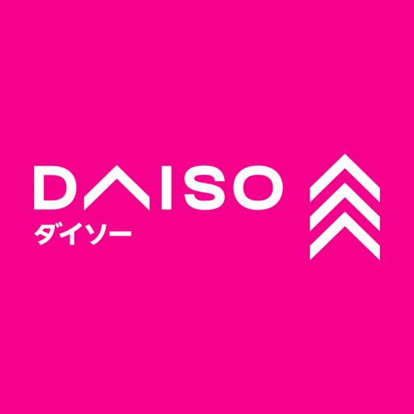

お探しの商品の在庫を検索できる「DAISOアプリ」ができました。
気になった商品の在庫をアプリでお手軽にチェックできます。

使い方は簡単。在庫を調べたい店鋪を指定して商品検索するだけ。
他店舗の在庫状況も検索できます。

また、在庫検索だけでなく、話題の新商品やキャンペーン情報をいち早くお知らせします。
便利なDAISOアプリを使って、お買い物をお楽しみください。

機能紹介

在庫検索
お探しの商品の在庫が店舗にあるか、アプリを使って素早くお調べいただくことができます。

お知らせ
DAISO、Standard Products、THREEPPYの最新情報を簡単にご覧いただける機能です。
アプリで情報を確認し、お買い物をお楽しみください。

コミュニティ
アプリから、お客様同士が交流し、情報を共有できるコミュニティサイトへ移動することができます。
みんなの楽しい、欲しい、新しい！が溢れるコミュニティサイトです。
※コミュニティへの参加は会員登録が必要です。

店舗検索
アプリを使って簡単にお近くの店舗を見つけることができます。
店舗ごとの営業時間や経路などの詳細情報もご確認いただけます。

ネットストア
アプリ内でお気に入りの商品を見つけたら、ネットストアで購入できる便利な機能をご用意しています。
※ネットストアでの購入は会員登録が必要です。

[View on Apple](https://apps.apple.com/jp/app/daiso%E3%82%A2%E3%83%97%E3%83%AA/id6466987025)

## 名古屋市プレミアム付き電子商品券

「名古屋市プレミアム付き電子商品券」はスマートフォンで電子商品券の申込・購入・利用ができるアプリです。

＜申込・結果確認＞
アプリ内で申し込みが可能です。応募多数の場合は申込者全員が購入できるよう、名古屋市が抽選を行い購入口数を決定します。決定した購入口数は申し込み口数に満たない場合があります。決定した購入口数はアプリ内で確認いただけます。

＜商品券の購入＞
商品券の購入はアプリの案内から購入期間内に手続きを完了くだい。支払方法はクレジットカードやコンビニエンスストアなど複数の方法から選択できます。購入後はプレミアム分を加算した金額が、アプリ内の電子商品券残高に反映されます。

＜店舗での利用＞
アプリ上で商品券を選択、取扱店の二次元コードを読み込み、支払金額を入力することで利用いただけます。

＜注意事項＞
本アプリにおける商品券の抽選は、名古屋市が独自に行うものであり、Apple Inc.及びApple Japan Inc.とは全く関係ありません。

[View on Apple](https://apps.apple.com/jp/app/%E5%90%8D%E5%8F%A4%E5%B1%8B%E5%B8%82%E3%83%97%E3%83%AC%E3%83%9F%E3%82%A2%E3%83%A0%E4%BB%98%E3%81%8D%E9%9B%BB%E5%AD%90%E5%95%86%E5%93%81%E5%88%B8/id6771445185)

## スシロー

「あきんどスシロー」の公式アプリ、スシローアプリです。

お店に行かずにお席の受付や予約ができる。
お持ち帰りすしのネット注文ができる。
さらに「スシローポイント」を貯めて、お得な特典と交換できる！
便利なスシローアプリをぜひご利用ください！

●スシローアプリの機能一覧●
１．受付・予約機能
スマートフォンの位置情報を利用して最寄り店舗を教えてくれたり、
 行きたいお店の待ち状況もアプリで確認ができるので、お店に行くまでの時間を有効活用できます！

・今すぐ行きたい人は、「受付」。表示時間にあわせてお店へGO！順番が近づいたらプッシュ通知でお知らせ。
・行きたい日が決まっている人は「予約」。15分毎の予約時間内で優先的にお席へご案内します。

※お店に着いたら、お客さま受付案内台でチェックインをお済ませください。
※チェックインをせずに30分経過すると、自動的にキャンセルとなります。
※スシロー桜塚店を除く全店でご利用いただけます。

２．スシローポイント
お会計金額100円（税込）ごとに1ポイントが貯まります。
 貯まったポイントは、値引きクーポンやだっこずしオリジナルグッズ、ガチャコイン、感謝まいど盛りなど、お好きな特典を自由に選んで交換いただけます。

＜ご来店でのポイントの貯め方＞
お会計時にスシローアプリの会員証（二次元コード）をレジにかざしてください。

＜お持ち帰りネット注文でのポイントの貯め方＞
①お持ち帰りネット注文で、ログインした状態で商品をご注文してください。 
②ご注文の商品を、ご注文時に指定した店舗にてお受け取りいただくと、ポイントが付与されます。

＜会員ランク＆誕生月特典＞
・ご自身の誕生月には「お会計から5％割引き」クーポンをプレゼント！
・お子さま（小学6年生まで・最大5名）の情報を登録すると、お子さまの誕生月に「ガチャコイン」をプレゼント！
・過去1年間の累計ポイントが200pt以上になると、ゴールド会員となりポイント付与率が1.5倍にアップします。

※ポイントはお会計もしくは商品のお受取後、翌日以降の付与になります。
※スシローアプリにご登録のメールアドレスとお持ち帰り注文のメールアドレスが同じ場合、ポイントが合算されます。

３．お持ち帰りすし・スシローデリバリー
お持ち帰りすしとスシローデリバリーがネットでご注文いただけます。ぜひスシローをご自宅でもお楽しみください。

※スシロー秋葉原中央通り店ではお持ち帰りとデリバリーは未実施です。

４．メニュー
定番メニュー以外にも、フェア商品などおすすめネタが目白押し！

５．お店を探す
住所や店舗名などのキーワードで行きたい店舗を検索することができ、受付・予約もすることができます。

６．新着情報
スシローのキャンペーンなど最新情報をお届け。
プッシュ通知でもお知らせいたします！

【推奨端末】
・iOSバージョン15.0以上搭載の端末でのご利用を推奨いたします。
（一部端末では正しく動作しない場合がございます）
・スマートフォン以外の機器は、動作保証外です。

[View on Apple](https://apps.apple.com/jp/app/%E3%82%B9%E3%82%B7%E3%83%AD%E3%83%BC/id551682016)

## カラオケまねきねこ

いつものカラオケが、もっとお得に、もっと便利に！

店舗数No.1！「カラオケまねきねこ」の公式アプリです。
会員証も予約もクーポンも、これ一つでOK！
あなたのカラオケライフをもっと充実させよう！

◆ 主な機能 ◆

●使えば使うほどお得な「会員ランク」
最高ランクの「ダイヤモンド会員」はなんと全会計30%OFFに！歌うほどお得になります。

●1分で完了！かんたん会員登録
面倒な入力は不要！マイナンバーカードを使えば、たった1分で登録が完了してすぐに使えます。

●全国のお店をいつでも簡単予約
店舗数No.1だから、あなたの「歌いたい！」にいつでも応えられる。
「今すぐ歌いたい！」と思ったら、近くのお店を検索してすぐに予約できます。

●お部屋からスマホで注文「まねちゅ〜」
盛り上がっている最中でも大丈夫！席を立たずにフードやドリンクをスマホから注文できます。

●お会計でポイントが貯まる
お会計で貯まるまねきねこポイントは、割引クーポンと交換できてとってもお得です。

●限定ミッションに挑戦しよう
コラボ企画など、期間限定のミッションをクリアして、特別なクーポンや特典をゲット！

さあ、今すぐアプリをダウンロードして、
手軽に、お得にカラオケを楽しみましょう！
お近くの「カラオケまねきねこ」で、お待ちしています！

[View on Apple](https://apps.apple.com/jp/app/%E3%82%AB%E3%83%A9%E3%82%AA%E3%82%B1%E3%81%BE%E3%81%AD%E3%81%8D%E3%81%AD%E3%81%93/id1434510930)

## PayPay

PayPayの登録ユーザー数はついに7,400万人到達！（※1）

PayPayは、スマホひとつで簡単・スマートにお支払いができる決済アプリです。

◆ 毎日おトクなクーポン多数！
PayPayクーポンは毎週月曜日更新！コンビニやドラッグストア、アパレルショップなどの有名店や人気ブランドのクーポンを獲得できます。

◆ 日本全国1,000万箇所以上で使える！
使えるお店やおトクなキャンペーンはアプリの「近くのおトク」で探せます。

◆ 支払うたびにポイントが貯まる
PayPayで支払うと、PayPayポイントが最大2%貯まります。 
（※付与条件はPayPayステップをご確認ください）

●最短1分で登録完了！

● PayPayの本人確認で、さらに便利・安心に
本人確認をすると「銀行口座からチャージ」や、万が一の不正利用に備えた「全額補償制度」が利用でき、安心してご利用いただけます。

●「送る・受け取る」も手数料0円
手軽に個人間でPayPay残高を送る・受け取るが可能です。LINEのトークルームからも！
毎月のおこづかいやお年玉にも使えます。
旅行の精算や食事会の割り勘は「グループ支払い」機能を使えば簡単で便利！
・1円単位で指定可能
・何度でも手数料無料
・24時間365日いつでも使える

●選べるチャージ方法（手数料無料）
1.銀行口座からチャージ
2.セブン銀行・ローソン銀行ATMから現金チャージ
3.PayPayカードからチャージ

【お支払い方法】
PayPayのマークがあるお店で「PayPayで」と伝えて支払うだけ！
 （※支払い方法はお店によって異なります）

【使えるお店の一例】
●コンビニ
セブン-イレブン
ファミリーマート
ローソン
　
●カフェ
Starbucks(スターバックス)
コメダ珈琲店
タリーズコーヒー

●スーパー
イトーヨーカドー
オーケー
西友
ライフ

●デリバリー
Uber Eats
出前館
ドミノ・ピザ

●ファッション
adidas(アディダス)
GU(ジーユー)
H&M
JINS
New Balance(ニューバランス)
SHEIN
UNIQLO(ユニクロ)
WEGO
ZARA
ZOZOTOWN(ゾゾタウン)
しまむら
洋服の青山

●ドラッグストア
Welcia(ウエルシア)
ココカラファイン
スギ薬局
マツモトキヨシ

●飲食店
31(サーティワン アイスクリーム)
ガスト(すかいらーく)
牛角
餃子の王将
くら寿司
ケンタッキーフライドチキン
すき家
スシロー
バーガーキング(Burger King)
はま寿司
ほっともっと(HottoMotto)
マクドナルド
松屋
丸亀製麺
ミスタードーナツ
モスバーガー
焼肉きんぐ
吉野家

●ショッピング／レジャー
ORBIS(オルビス)
カラオケ館
シャトレーゼ
ダイソー
資生堂オンラインストア

●家電量販店
エディオン
ビックカメラ
ヤマダ電機

●自販機
Coke ON(コークオン)
ジハンピ

利用可能店舗は順次拡大中！
※一部の店舗でご利用いただけない場合がございます。詳細は各店舗にてお問い合わせください。

※PayPay株式会社は、ソフトバンクグループ株式会社とソフトバンク株式会社、ならびにヤフー株式会社の共同出資会社です。
QRコードは（株）デンソーウェーブの登録商標です。

※1 アカウント登録を行ったユーザー数の累計です。2026年5月時点 当社調べ。

[View on Apple](https://apps.apple.com/jp/app/paypay/id1435783608)

## スターバックス ジャパン公式モバイルアプリ

こんにちは。スターバックスの公式アプリへようこそ。
さまざまな機能で、みなさまにもっと便利で楽しいスターバックス体験をお届けします。

■Starbucks® Rewards
Web登録済みのスターバックス カードによるお支払いでStarがたまります。たくさんStarをためることで、さまざまなごほうび「スター リワード」と交換できたり、会員ステータスに応じたリワードもお楽しみいただけます。

■Mobile Order & Pay
お店でレジに並ばずに注文できます。お持ち帰りはもちろん、お席でもゆっくりじっくり、お好みのカスタマイズも選べます。

■店舗でアプリ支払い
お手持ちのスターバックス カードをアプリに登録いただくと、画面に表示される二次元コードでお支払いいただけます。

■スターバックス カード管理
登録したスターバックス カードの残高・履歴照会、入金、オートチャージ設定、他のカードへ残高移行もできます。

■Starbucks eTicket
Starbucks eTicketは、店頭で商品と交換できるチケットです。スター リワード eTicketなど、受け取ったチケットはアプリ内で確認できます。

■Gift
好きなデザインのメッセージカードにスターバックスのドリンクを添えて贈ることができるStarbucks eGiftと、デジタルタイプのスターバックス カード。あなたの気持ちを添えてギフトを贈ってみませんか？

■店舗検索
最寄りのスターバックス店舗を検索し、店舗の営業時間や場所を確認できます。

■商品情報
アプリのHome画面内のPRODUCTSの「もっと見る」から、店舗で販売しているビバレッジやフード、タンブラーやマグカップ、コーヒー豆などの情報を見ることができます。

■お知らせ配信（Inbox）
新商品情報やキャンペーン、Starbucks® Rewardsのお知らせをお届けします。

※本アプリにおけるキャンペーンはスターバックス コーヒー ジャパン 株式会社が主催するもので、Apple Inc. およびその関連会社とは関係ございません。

[View on Apple](https://apps.apple.com/jp/app/%E3%82%B9%E3%82%BF%E3%83%BC%E3%83%90%E3%83%83%E3%82%AF%E3%82%B9-%E3%82%B8%E3%83%A3%E3%83%91%E3%83%B3%E5%85%AC%E5%BC%8F%E3%83%A2%E3%83%90%E3%82%A4%E3%83%AB%E3%82%A2%E3%83%97%E3%83%AA/id1113037275)

## ホットペッパービューティー/美容院・ネイルなどのサロン予約

ホットペッパービューティーは国内最大級のヘア・ネイル・まつげ・リラク・エステサロンの検索＆予約アプリです。アプリから24時間いつでも・どこでもサロンを検索＆予約できます。

■■■あなたにぴったりのサロンが探せる■■■■

■国内最大級の掲載情報
・ヘアサロン・ビューティーサロンの掲載数、15万件以上！
・ヘアサロンスタイリスト登録数、25万名以上！
・予約数、年間1.8億件！

国内最大級の掲載情報から、あなたにぴったりのサロンが探せます。

■幅広いジャンルにも対応！

ヘアサロンやネイルサロン、エステサロンやリラク・マッサージも簡単に検索＆予約できます。

■お住いの地域のサロンをサクサク検索！

地域・最寄り駅だけではなく、希望の日付やクーポン、ヘアカラーやマツエクといったこだわり条件など、あなたの好みからも検索が可能！

■サロンの情報も多数掲載

営業情報や地図、雰囲気がわかる写真の他、オトクなクーポン情報も満載！
約2,000万の口コミを掲載しているので、サロンの情報が事前にわかります。

■■■いつでも使えるオトクなネット予約■■■

行きたいサロンが決まったら、アプリからネット予約！

・24時間いつでも予約が可能です。
・美容師やサロンスタッフを指名して予約できます。
・ネット予約ではポイントもたまります。たまったポイントを使えば、ネット予約が更にオトクに！

■■■日本最大級のヘアカタログ・ネイルカタログ■■■

■ヘアスタイルが見られるヘアカタログ
髪質や顔型から検索もできるから、なりたいスタイルがきっと見つかる！
スタイリングのポイントや提供サロンの情報も詳しく見られます。
流行の髪色で髪の毛をおしゃれにしたい方、必見！メンズヘアスタイル特集もあります。

■ネイルデザインが見られるネイルカタログ
シーンや色・デザインなど色々な切り口であなたにぴったりのデザインが見つかる。
ヘアカタログ・ネイルカタログの検索から、そのままサロンの予約も可能です。

■■■他にも便利な機能がたくさん■■■

・気になるサロンやヘアカタログ・ネイルカタログをブックマークして後からでも確認できます。
・ブックマークはWebのホットペッパービューティーと連携できます。
・メンズにオススメのサロンも検索できます。
・サロンの発信するブログも多数掲載！

■■■ホットペッパービューティー(HOT PEPPER Beauty)は、こんな方へおすすめです■■■
■ヘアサロンを探している方
・髪の毛を切ったり髪色を変えてイメチェンしたい
・トレンドのヘアカラーに挑戦してみたい
・ヘアケアが得意なヘアサロンを見つけ、髪の毛をキレイにしたい
・掲載数が多いサロン予約アプリで美容院を探して予約したい
・自分に似合う髪型をヘアスタイル特集から見つけて、そのまま美容院予約したい
・メンズ向けヘアサロンを予約できる美容アプリを探している

■ネイル・マツエク・アイブロウサロンを探している方
・自分では難しいネイルデザインを、ネイルサロンでプロにお任せしたい
・結婚式に向けてネイルをするため、サロン選びからこだわりたい
・マツエクのメンテナンスがすぐできるよう、近所のまつげサロンを見つけたい
・丁寧なカウンセリングをしてくる眉毛サロンでアイブロウ施術を受けたい

■リラクサロン・エステサロンを探している方
・ビューティーアプリでリラクを予約して、癒しの時間を確保したい
・自分に合ったエステサロンや脱毛サロンを見つけたい

■オトクにサロン予約したい方
・リクルートポイントが使える美容アプリでサロン予約したい
・ビューティーサロン予約アプリで、オトクな美容施術を探したい

[View on Apple](https://apps.apple.com/jp/app/%E3%83%9B%E3%83%83%E3%83%88%E3%83%9A%E3%83%83%E3%83%91%E3%83%BC%E3%83%93%E3%83%A5%E3%83%BC%E3%83%86%E3%82%A3%E3%83%BC-%E7%BE%8E%E5%AE%B9%E9%99%A2-%E3%83%8D%E3%82%A4%E3%83%AB%E3%81%AA%E3%81%A9%E3%81%AE%E3%82%B5%E3%83%AD%E3%83%B3%E4%BA%88%E7%B4%84/id385724144)

## Coke ON(コークオン)

おトクで楽しいコカ･コーラ公式アプリ「Coke ON」（コーク オン）
スマホ自販機（Coke ON対応自販機）を使ってスタンプをためよう！
15個たまれば、お好きな製品と交換できるドリンクチケットがGETできる！

歩くだけでスタンプがたまる「Coke ONウォーク」、無料お試しドリンクチケットがもらえるキャンペーン、スタンプが2倍たまるキャンペーンなど、Coke ON限定キャンペーンも盛りだくさん！

もらったドリンクチケットは友だちにプレゼントすることもできます。友だちも一緒に、コカ・コーラ社製品を楽しもう！

======= 【本アプリの特徴】 =======
■購入のたびにスタンプがたまる！15個たまれば無料ドリンクチケットが獲得できる！
コカ·コーラのスマホ自販機とCoke ONアプリを接続して購入すると、購入のたびにスタンプがたまる！15個たまると、お好きな製品と無料で交換できるドリンクチケットがもらえる！

■自販機にシュッ！でドリンクをGETできる！
ドリンクチケットを使うときは、Coke ONアプリ内でお好きな製品を選んで、スマホ自販機に向かって「シュッ！」とスワイプするだけ！Coke ONで新・自販機体験をしてみよう。

■Coke ON限定！おトクなキャンペーンに参加できる！
コカ·コーラ製品と引き換え可能な無料ドリンクチケットがもらえるキャンペーンや、買ったときにスタンプが2倍たまるWスタンプキャンペーンなど、お得なイベントがもりだくさん。

■エリア限定、時間限定、ユーザー限定のキャンペーン！
お客様の現在地やご利用状況などに応じて、限定の特別なキャンペーンに参加できる場合もあります！アプリをチェックしてぜひお楽しみください！

■歩けば歩くほどスタンプがもらえる！
歩数目標を設定して毎日歩くだけで、歩数目標達成でスタンプがもらえます。さらに、期間限定のお得なCoke ONウォークのキャンペーンも続々開催いたします！
毎日歩いて、オトクにドリンクをGETしよう！

■チームチャレンジで、みんなおトク！
友だちとチームを作って参加しよう！チャレンジ達成で、チーム全員スタンプGET！

■Coke ON Payなら、スタンプも決済サービスのポイントもWで貯まって、簡単、便利、お得！
決済サービスを登録しておけば、小銭が無くても、自販機に触れなくてもドリンクを購入できます！
(Coke ON Wallet、PayPay、LINE Pay、楽天ペイ、au PAY、d払い、メルペイ、AEON Pay、Apple Pay、クレジットカードに対応)

■自販機で使えるおトクな電子マネーCoke ON Wallet
キャンペーンなどでたまるポイントを1ポイント=1円で、Coke ON Payの決済手段としてご利用できます。
銀行口座や自販機からのチャージもでき、ポイントと合算してご利用いただくこともできます。

■アプリを使わなくても、電子マネー決済でスタンプがたまる！
ご利用の電子マネーを登録しておけば、電子マネーで購入するだけ、アプリを自販機につながなくてもスタンプがたまります！

■おトクなドリンクチケット！Coke ON ドリンク回数券！
Coke ON Pay対応自販機で使える複数枚つづりのドリンクチケット！おトクにコカ･コーラ社製品と交換できます！　(PayPay、楽天ペイ、au Pay、d払い、AEON Payに対応)

■お好きなドリンクがおトクに飲めるサブスクサービス！
毎月定額で全国の対応自販機のコカ･コーラ社製品と交換できます！
(PayPay、d払い、au PAY、AEON Pay、Apple Pay、クレジットカードに対応)

■Coke ON コードリーダーも便利！
Coke ONコードリーダーで対象製品のバーコードやQRコード、キャップ裏コードを読み取るとキャンペーンも。

======= 【ご利用に際して】 ======= 
・本アプリは、電波状況の良好な場所でご利用ください。 
・スタンプの獲得やドリンクチケットの交換は、コカ·コーラのスマホ自販機でご利用いただけます。

・スマホ自販機との接続には、Bluetooth通信と位置情報サービスを利用します。スマホのBluetooth設定、位置情報サービスをオンにしてご利用ください。 
・位置情報サービスが有効な場合、お客様の地域限定のキャンペーンにご参加、ご利用頂けるようになります。
・位置情報サービスが「アプリ利用中のみ許可」状態では、お近くの自販機のお知らせ機能やバックグラウンド状態でのスマホ自販機のご利用ができません。

・本アプリは、お近くの自販機を探すためにバックグラウンド起動時にもGPS機能を利用します。GPSを継続利用すると、大幅にバッテリーを消耗する可能性があります。

======= 【対応端末について】 ======= 
詳細はこちらからご確認ください。
https://c.cocacola.co.jp/app/devicelist.html
※端末によっては正しく表示されない場合があります

[View on Apple](https://apps.apple.com/jp/app/coke-on-%E3%82%B3%E3%83%BC%E3%82%AF%E3%82%AA%E3%83%B3/id1088184021)

## d払い－スマホ決済アプリ、キャッシュレスでお支払い

～キャッシュレスは「d払い」～
■便利なスマホ決済！スマホのバーコード１つでお支払いが完結
■お支払い時にｄポイントがたまる、つかえる！ｄポイントをもっとお得につかいこなせるチャンス！
■電話料金合算払いからの支払い・d払い残高からの支払い・クレジットカード登録で今すぐに使えます　（※1）
■d払いはドコモグループの株式会社NTTドコモ・フィナンシャルグループが提供するサービスです

【はじめよう、d払い】
かんたん30秒！4桁のパスワードを入れるだけで、アプリでかんたんにスマホ決済がはじめられます。（※1）
アプリを開くと、あなた専用のバーコード／QRコードが表示されます。
※QRコードは、株式会社デンソーウェーヴの登録商標です。
ｄポイントカードもd払いアプリからワンタップで呼び出せます。

【d払いアプリでのお支払い方法】
お会計時は、レジで「d払いで！」と伝えましょう。
アプリ画面に表示されているバーコード／QRコードでお支払い完了！

・コードを見せてお支払い
1.お店の人にバーコードを提示
2.お店の人がバーコードを読み取り、お支払いが完了
※dポイントを利用するには、「dポイントを利用する」ボタンをタップしてから、お店の方にバーコード（またはQRコード）を提示してください。

・コードを読み取ってお支払い
1.「読み取る」をタップし、お店のQRコードを読み取る
2.お支払い金額を入力する
3.「支払う」をタップし、お店の人がお支払い完了画面を確認して完了

【dポイントをつかう】
アプリ上の「ポイント利用」をONにするだけ！あらかじめ設定した上限までdポイントでお支払いできます。

【dポイントをためる】
お支払い金額に応じて、200円（税込）につき、1ポイントのdポイントがたまります。
キャンペーン中ならさらにお得！最新のキャンペーン情報をGETしましょう。
ｄポイント加盟店なら、dポイントカードの提示でもたまるから、ポイント二重ドリも可能！
画面下の「支払い」からdポイントカードを表示して、dポイントをためることができます。

【設定はかんたん】
面倒な申込みは不要、ドコモと回線契約があるお客さまは4ケタのパスワードだけでかんたんにはじめられます。もちろんドコモと回線契約がないお客さまもご利用できます。
※ドコモと回線契約がないお客さまはdアカウントが必要です。

【選べるお支払い方法】
d払いは月々のドコモのケータイ料金と一緒にお支払いいただけます。
クレジットカード払いや銀行口座、ATMからのチャージにも対応しています。
ドコモの回線契約があるお客さまについては、ご利用いただいた金額はスマホ料金と一緒のお支払いをご利用頂けるため、クレジットカード登録は必須ではありません。
（※１）dアカウントとクレジットカードをご登録頂ければ、どなたでもすぐにご利用いただけます。ご利用設定方法やdアカウントについて詳しくは「d払い」WEBサイトをご確認ください。

【便利な機能も充実】
色々なサービスのモバイルオーダー（予約・注文）や、おトクなクーポン利用もアプリひとつで。
今後も便利な機能を拡充します。

【使えるお店の一例】
■d払い（街のお店） （※2）
＜コンビニ／スーパー＞
ローソン、ファミリーマート、セブン‐イレブン、ポプラグループ、ミニストップ、成城石井、オークワ、東急ストア、サミットストア、PLANT、セイコーマート、コープさっぽろ、フジ、ベイシア、イトーヨーカドー、サンリブ・マルショク、オーケー、平和堂、原信

＜ドラッグストア＞
マツモトキヨシ、ツルハグループ、ドラッグ新生堂、ウエルシアグループ、サツドラ、トモズ、薬王堂、V・ドラッグ、富士薬品ドラッグストアグループ、スギ薬局、サンキュードラッグ、Fit Care DEPOT、スギヤマ薬品、ココカラファイン、キリン堂、ドラッグストアモリ、クスリ岩崎チェーン、カワチ薬品、サンドラッグ、ザグザグ、クスリのアオキ

＜家電量販店＞
エディオン、ジョーシン、ビックカメラ、ケーズデンキ、ノジマ、ソニーストア、デンキチ、ヤマダデンキ

＜百貨店・モール/ショッピング＞
やまや、髙島屋、タワーレコード、メガネスーパーグループ、つるやゴルフ、東急ハンズ、ルクア大阪、スポーツデポ、オートバックス、近鉄百貨店、グッデイ、トイザらス、ホームセンターバロー、ブックオフ、パルコ、メガネのヨネザワ、MARUZEN＆ジュンク堂書店、ゲオ、Francfranc、紀伊國屋書店、西武・そごう、多慶屋、スーパースポーツゼビオ、カインズ、大丸・松坂屋、いよてつ高島屋、阪急阪神百貨店

＜ファッション＞
AOKI、はるやま、洋服の青山

＜グルメ＞
松屋、かっぱ寿司、牛角、ガスト、はなの舞、ほっかほっか亭、サンマルクカフェ、日高屋、吉野家、ケンタッキーフライドチキン、元気寿司、ミスタードーナツ、すき家、うまい鮨勘、モスバーガー、ほっともっと、丸亀製麺、ドトールコーヒーショップ、サーティワン アイスクリーム、スターバックス
	
＜その他＞
快活CLUB

（※2）記載の加盟店は2022年2月7日現在の対応加盟店の一部です。一部対象外の店舗・商品・サービスがございます。詳しくはｄ払い加盟店の最新情報は「d払い」WEBサイトよりご確認ください。

■d払い（ネットのお店） （※3）
Amazon、メルカリ、ふるさとチョイス、SHOPLIST.com by CROOZ、BUYMA、レコチョク、DHCオンラインショップ、無印良品ネットストア、NTT-X Store、TOHOシネマズ、minne、ワールド オンラインストア、サンプル百貨店、ABC－MARTオンラインストア、ソニーストア、GDOゴルフショップ、XPRICE

※Amazonでｄ払いを初めてご利用の方はお支払い方法の設定が必要となります。ご利用方法の詳細はこちら
（※3）記載のサイトは2022年2月7日現在の対応加盟店の一部です。ｄ払い対応サイトの最新情報は「d払い」WEBサイトよりご確認ください。

【安心・安全にご利用いただくために】
安心・安全にご利用いただくために、不正アクセス防止の二段階認証や不正利用被害の補償制度をご用意しています。

【ご利用上の注意】
本アプリケーションのご利用には、インターネット接続が必要となります。
ご利用にかかる通信料はお客さまの負担となります。
ご利用前には必ず利用規約をお読みください。
dポイント加盟店のみ、dポイントカードがご利用いただけます。
海外のパケット通信は、高額となる事がありますのでご注意ください。
アプリのご利用にパケット通信料がかかりますので、パケット定額サービスのご契約をお勧めします。

※dカード以外のクレジットカードをお支払い方法に設定された場合は、ｄポイントの進呈対象外となります。
※一部の加盟店又は店舗は、ｄポイントの進呈対象外となります。
※加盟店の商品・サービスによっては、ｄポイントの進呈対象外となることがあります。

[View on Apple](https://apps.apple.com/jp/app/d%E6%89%95%E3%81%84-%E3%82%B9%E3%83%9E%E3%83%9B%E6%B1%BA%E6%B8%88%E3%82%A2%E3%83%97%E3%83%AA-%E3%82%AD%E3%83%A3%E3%83%83%E3%82%B7%E3%83%A5%E3%83%AC%E3%82%B9%E3%81%A7%E3%81%8A%E6%94%AF%E6%89%95%E3%81%84/id1328132872)

## Google Chrome

Chrome ist der schnelle, sichere Browser von Google und bietet dir unzählige Möglichkeiten im Web. Lade ihn noch heute herunter und überzeuge dich selbst.

DAS BESTE VON GOOGLE IN CHROME

• GOOGLE SUCHE: Du findest in Sekundenschnelle Antworten auf alle deine Fragen – wenn du möchtest, auch per Sprachbefehl.
• GOOGLE LENS: Du kannst nach allem suchen, was du auf dem Display oder durch die Kamera siehst.
• GOOGLE ÜBERSETZER: Unser Dienst unterstützt mehr als 130 Sprachen. Ein Klick genügt – du kannst sogar ganze Websites übersetzen lassen.

ERSTKLASSIGE SICHERHEITSFUNKTIONEN

• MODUS „ERWEITERTER SCHUTZ“: Dieser Chrome-Modus sorgt für höchstmöglichen Schutz, wenn du im Web unterwegs bist.
• SICHERHEITSCHECK: Wir informieren dich mit proaktiven Sicherheitswarnungen rechtzeitig über Sicherheitsprobleme, damit du dich auf das Wesentliche konzentrieren kannst.
• GOOGLE PASSWORTMANAGER: Mit diesem Dienst kannst du Passwörter erstellen und speichern, damit du dich immer und überall schnell anmelden kannst. Außerdem warnt er dich, wenn deine Passwörter doch einmal in Gefahr sein sollten.

VERFÜGBAR AUF ALLEN DEINEN GERÄTEN

• GERÄTEÜBERGREIFENDE SYNCHRONISIERUNG: Wichtige Dinge wie Lesezeichen, Tabs und Passwörter lassen sich speichern und sind dann sofort verfügbar, wenn du dich auf deinem Smartphone, Computer oder Tablet in Chrome anmeldest.
• TABGRUPPEN: Dank Tabgruppen behältst du beim Surfen immer den Überblick, auch wenn du mehrere Geräte nutzt.
• AUTOFILL: Du kannst Zahlungsinformationen, Adressen und Passwörter speichern und automatisch in Onlineformulare eintragen lassen. Das spart jede Menge Zeit.

Funktionsverfügbarkeit kann je nach Land und Sprache variieren. Kompatibilität variiert. Antworten sollten auf ihre Richtigkeit geprüft werden.

[View on Apple](https://apps.apple.com/jp/app/google-chrome-%E3%82%A6%E3%82%A7%E3%83%96%E3%83%96%E3%83%A9%E3%82%A6%E3%82%B6/id535886823)

## DramaWave - Drama & Reel

Willkommen bei DramaWave – deiner Streaming-Plattform der nächsten Generation für exklusive vertikale TV-Videos, Serien und Filme in HD. Tauche in über 30.000 Dramen in 18 Sprachen ein– mit exklusiven Highlights, die du nirgendwo anders findest!

Warum DramaWave wählen?
1. Live-Kommentare
Reagiere in Echtzeit mit On-Screen-Kommentaren während des Schauens – teile Emotionen und erlebe Community-Feeling.
2. Offline-Ansehen
Lade Episoden herunter und schau sie jederzeit – auch ohne Internetverbindung.
3. Vertikaler Vollbild-Feed
Erlebe immersive Unterhaltung. Personalisierte Empfehlungen helfen dir, deine Lieblingsdramen sofort zu finden.
4. Kurze & packende Dramen
Dramen voller Emotionen und Spannung in wenigen Minuten – perfekt zum Kurzgenuss oder Durchbingen.
5. Kristallklare Streams
Erlebe jedes Detail in lebendigem 1080P – für echtes Kino-Feeling auf dem Handy.
6. Wöchentliche Original-Updates
Bleib dran mit exklusiven neuen Dramen – regelmäßig neu! Drama-Fans erwartet immer etwas Spannendes.
7. Jederzeit & überall streamen
Genieße ruckelfreies Streaming mit Top-Bild & -Sound – egal wo du bist.
8. Weltweit verfügbar
Mit Untertiteln in Englisch, Spanisch, Französisch, Deutsch, Japanisch, Koreanisch u. v. m.
 
Entfessle das Drama
Erlebe Storytelling neu – einfach, fesselnd & überall dabei mit DramaWave!

Abo-Details
Schalte exklusive Inhalte mit einem Abo frei. Die Verlängerung erfolgt automatisch, kann aber jederzeit in den Kontoeinstellungen verwaltet oder gekündigt werden.

Kontakt
Website: mydramawave.com
E-Mail: dramawaveteam@gmail.com
Lade DramaWave jetzt herunter und tauche in eine neue Welt des Dramas ein!

[View on Apple](https://apps.apple.com/jp/app/dramawave-%E6%97%A5%E6%9C%AC-%E9%9F%93%E5%9B%BD-%E4%BA%BA%E6%B0%97%E7%9F%AD%E7%B7%A8%E3%83%89%E3%83%A9%E3%83%9E/id6670430706)

## 31Club サーティワン公式アプリ

サーティワン公式アプリ「31Club」は、サーティワンをもっと楽しくおトクにご利用いただくためのアプリです。
新規会員登録をすると「新規入会クーポン」がすぐにご利用いただけます。また、お誕生月には「バースデークーポン」をお届けします。
さらに、お買い物で「アイスマイル」を貯めてクラスアップしたり、「来店ポイント」が貯まるとおトクなクーポンがもらえます。
その他にも様々な機能がご利用いただけますので、ぜひ会員登録（SMS認証もしくは電話番号認証でご本人様確認が必要）を行ってご利用ください！

＜ポイント機能＞
サーティワンでお買い物をすると「アイスマイル」と「来店ポイント」が貯まります。
「アイスマイル」を貯めてクラスアップしたり、「来店ポイント」が一定量貯まるとおトクなクーポンがもらえます。

＜クーポン機能＞
新規会員登録時には、すぐにご利用いただける「新規入会クーポン」をお届けします。
また、誕生月にお届けする「バースデークーポン」や、登録した大切な記念日には「アニバーサリークーポン」をお届けします。
さらに、クラスアップ時や来店ポイントが一定量貯まる度におトクなクーポンがもらえます。

＜商品紹介＞
今月のおすすめフレーバーや、アイスクリームケーキやサンデーなど販売中の商品情報を確認することができます。
商品情報は販売価格やアレルギー・エネルギー情報などが確認できます。

＜メッセージ機能＞
毎月のおすすめフレーバーや、新登場の商品紹介、おトク＆楽しいキャンペーン情報など、最新NEWSをお届けします。
お気に入りのフレーバーを登録すると、お気に入りフレーバーの販売開始情報や、あなたにおすすめのフレーバーの情報もお届けします。

＜店舗検索機能＞
地図やキーワードから全国各地のサーティワンの店舗が検索できます。

＜特記事項＞
スマートフォンは、フィーチャーフォンとは異なり個体ごとの識別が出来ないため、個体識別をすることだけを目的として、SMS認証・または電話番号認証を行っております。バースデークーポンをお配りするための機能となりますので、どうぞご了承頂ければと思います。 SMS認証・または電話番号認証は、即時完了するためお待たせしません。また、ログアウトしない限り再度認証手続きをする必要はなく、その後は簡単にバースデークーポンをご利用頂くことが可能です。また、識別以外の目的に利用できないよう、私どもにも復元不可能な文字列に変換しております。「同じ電話番号が二重に登録されないかを確認する」事にのみ限定して利用させて頂いており、他の目的で利用することは一切出来ないような仕組みとなっておりますので、どうぞご安心ください。

推奨端末：iPhone 8以降
対応OS：iOS14.0以上

[View on Apple](https://apps.apple.com/jp/app/31club-%E3%82%B5%E3%83%BC%E3%83%86%E3%82%A3%E3%83%AF%E3%83%B3%E5%85%AC%E5%BC%8F%E3%82%A2%E3%83%97%E3%83%AA/id910133705)

## ENEOS公式アプリ - カーライフまるごと！みんなのアプリ

ENEOS公式アプリは、サービスステーションでの給油はもちろん、給油以外のサービスも多彩でお得なアプリです。

【主な機能】
◆二次元コードひとつで全て完了
スマホで二次元コードを表示すればスピーディにお支払い！ 
◆いつもの給油でかんたん注文
よく使う燃料や量を登録してらくらく注文！面倒な注文操作も一切なし！
◆スマホで使えるモバイルEneKey
ENEOS公式アプリにクレジットカードを登録すると二次元コードでのお支払いが可能に！
◆アプリ限定おトクなクーポン
給油の値引き、洗車、カーメンテナンスが割引になるアプリ限定のお得なクーポンをゲット！
◆給油で好きなポイント貯まる
ポイントカード連携で、給油するたびにVポイント、楽天ポイント、dポイントが貯まる！
◆利用履歴もアプリで確認
いつ、どこで、いくらで給油したかがすぐ分かる！利用履歴もアプリでチェック！
◆カーメンテナンス予約
洗車、タイヤ交換、車検など、アプリから簡単予約！
◆SS検索機能
近くのENEOSガソリンスタンドを簡単に検索！
◆マイカーページ機能
愛車の情報をアプリ上からスピーディに確認できる！

アプリの機能や詳しい使い方については、
ENEOS公式アプリ紹介ページをご覧ください。
https://eneos-ss.app/

▼ENEOS公式アプリの使い方
https://eneos-ss.app/usage/
▼よくあるご質問
https://eneos-ss.app/faq/
▼お問い合わせ
https://eneos-ss.app/contact/

※iOS15未満はサポート対象外となりました。iOS15未満のバージョンをお使いの場合は、OSのバージョンアップをお願い致します。OSのアップデートの内容/方法に関しては、Appleのサポート（https://support.apple.com/ja-jp/HT204204）をご確認ください。
※二次元コードスキャンによる各種サービスはENEOS公式アプリ提携サービスステーションが対象となります。
※二次元コードでお支払いいただくためには、モバイルEneKeyの設定が必要です。
※同時に複数のポイントカードと連携することはできません。
※登録されているクレジットカードによっては連携できないポイントカードがあります。
※ご登録いただいたフォローSSから、給油や洗車、オイル交換が割引になるお得なクーポンやメッセージを配信しております（これらを配信していないサービスステーションもございます。予めご了承ください。）。

[View on Apple](https://apps.apple.com/jp/app/eneos%E5%85%AC%E5%BC%8F%E3%82%A2%E3%83%97%E3%83%AA-%E3%82%AB%E3%83%BC%E3%83%A9%E3%82%A4%E3%83%95%E3%81%BE%E3%82%8B%E3%81%94%E3%81%A8-%E3%81%BF%E3%82%93%E3%81%AA%E3%81%AE%E3%82%A2%E3%83%97%E3%83%AA/id1612229796)

## My SoftBank

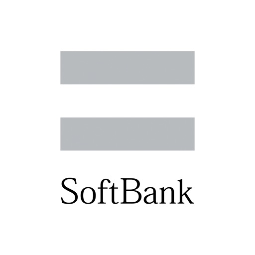

ソフトバンク・ワイモバイル・ラインモユーザー必須アプリ
■1,000万人以上が利用！
■2021年度グッドデザイン賞 受賞！

便利な機能をギュっと凝縮！
ご利用料金やデータ使用量など、アプリでかんたんに確認できます。

【主な機能】
■ご利用料金の確認
料金推移の確認や前の月との比較が、1タップでかんたんに出来ます。また気になる項目はタップで詳細をチェックできます。

■データ通信量の確認
メーターと色でデータの使用状況をお知らせします。データ量が少なくなったらチャージの予約・購入もかんたんに出来ます。

■サポート
店舗検索や来店予約がアプリ内で行えます。困ったときは、チャットでかんたんに問い合わせも可能。

■その他便利な機能
・ご加入中の料金プランやサービスの照会・変更
・オプションサービスのご加入・解除
・支払方法の変更
・迷惑メール設定
・PayPayの残高照会や利用、連携状況の確認
・ソフトバンクポイントの照会や利用、カードの連携
・ソフトバンクカードのチャージ残高照会
・お知らせ配信
・スマートログイン設定などのサービス連携

[View on Apple](https://apps.apple.com/jp/app/my-softbank/id1416481094)

## 楽天ペイ-楽天ポイントカードも利用できるスマホ決済アプリ

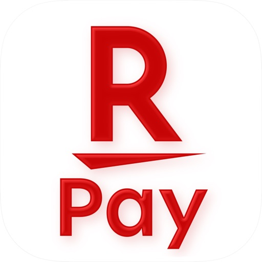

●ピッしてペイがいちばんおトク！楽天ポイント最大2.5%還元※1
●街のお支払いで楽天ポイントが使える・貯まる！
●もちろん、期間限定ポイントも！

楽天ペイアプリはカンタンにお支払いでき、さらに楽天ポイントカードやモバイルSuica※2もスマホひとつで使えるおトクなスマホ決済アプリです！

■おトクな楽天ペイアプリの使い方
・楽天ポイントがダブルで貯まる※3
（楽天ポイントカード提示＆楽天ペイのお支払い）
・モバイルSuicaへのチャージでも楽天ポイントが貯まる※4
・さらに貯まった楽天ポイントをモバイルSuicaにチャージ可能
・1ポイントからポイントが使え、無駄なく賢く利用できる

■お店でのご利用方法
【コード・QR払い】
コード・QRコードを店員の方に読みとってもらってください。

【QR読み取り】
店員の方から提示されたQRコードをご自身で読み取ってください。

【楽天ポイントカード】
楽天ポイントカードタブで表示されるバーコードを店員の方に読みとってもらってください。

【タッチ決済（Suica）】
利用する決済種類を店員に伝えて、タッチしてお支払いください。

■使えるお店の一例

【コンビニ】
・セイコーマート
・セブン-イレブン
・デイリーヤマザキ
・KIOSK
・ファミリーマート
・ポプラ
・ミニストップ
・ローソン　他

【スーパーマーケット】
・イトーヨーカドー
・オークワ
・オーケー
・コモディイイダ
・西友
・サニー
・東急ストア
・ベイシア
・平和堂
・ベルク　他

【ドラッグストア】
・ウエルシア
・キリン堂
・クスリのアオキ
・ココカラファイン
・サンドラッグ
・スギ薬局
・ツルハドラッグ
・トモズ
・富士薬品グループ
・V・ドラッグ　他

【グルメ】
・ガスト
・くら寿司
・ケンタッキーフライドチキン
・サンマルクカフェ
・ドトールコーヒーショップ
・スシロー
・すき家
・松屋
・吉野家
・はなまるうどん
・ほっともっと
・フレッシュネスバーガー 　他

【居酒屋】
・牛角
・魚民
・和民
・白木屋　他

【家電量販店】
・エディオン
・ケーズデンキ
・上新電機
・ビッグカメラ
・ヤマダ電機
・コジマ
・ベスト電器　他

【ファッション】
・アルペン
・スポーツデポ
・ABCマート
・チヨダ　他

【百貨店・モール】
・小田急百貨店
・近鉄百貨店
・高島屋
・PARCO　他

【その他】
・イエローハット
・オートバックス
・カインズ
・キャンドゥ
・ゲオ
・島忠
・トイザらス
・カラオケ館
・東急ハンズ
・ホームセンターコーナン
・ブックオフ
・ミスターマックス
・コカ・コーラ自動販売機（Coke ONアプリ）　他

他にも日本全国でご利用可能なお店が拡大中！
Webサイト使えるお店ページ、もしくはアプリ右上のお店ボタンから探すことができます。

■注意事項
※サービスや機能の詳細は、楽天ペイWebサイトよりご確認ください。 https://pay.rakuten.co.jp/detail/
※QRコードは（株）デンソーウェーブの登録商標です。

※1
・進呈条件や一部対象外の店舗及びお支払い方法があります。また、楽天ペイのお支払いによるポイント還元率は、利用状況・支払方法により異なります。
・詳細は、楽天ペイのウェブサイトよりご確認ください。
https://pay.rakuten.co.jp/topics/pointprogram/

※2
・FeliCa機能が搭載されたiPhone、かつOSバージョンがiOS 13.0以上でご利用いただけます。
・SuicaおよびモバイルSuicaは東日本旅客鉄道株式会社の登録商標です。
・「Suicaのペンギン」は東日本旅客鉄道株式会社のSuicaのキャラクターです。

※3 一部、楽天ポイントカードや楽天ペイアプリのご利用いただけない店舗やポイント進呈対象外の商品やサービスなど、および対象外の店舗やお支払い方法があります。

※4 楽天カード（Visa、Mastercard、JCB、American Express）からのチャージが対象となります。

■お問い合わせ
▼住所
Rakuten Crimson House 1-14-1 tamagawa, Setagaya-ku, 158-0094, Tokyo

▼電話番号
050-5581-6910

▼サポートメールアドレス
rakutenpayapp-customer@faq.rakuten.co.jp

[View on Apple](https://apps.apple.com/jp/app/%E6%A5%BD%E5%A4%A9%E3%83%9A%E3%82%A4-%E6%A5%BD%E5%A4%A9%E3%83%9D%E3%82%A4%E3%83%B3%E3%83%88%E3%82%AB%E3%83%BC%E3%83%89%E3%82%82%E5%88%A9%E7%94%A8%E3%81%A7%E3%81%8D%E3%82%8B%E3%82%B9%E3%83%9E%E3%83%9B%E6%B1%BA%E6%B8%88%E3%82%A2%E3%83%97%E3%83%AA/id1139755229)

## Claude by Anthropic

Verbinde dich mit Claude – deinem persönlichen KI-Assistenten, der mit dir denkt, aber dich nicht lenkt.

Claude von Anthropic ist deine All-in-One-App als KI-Assistent fürs Schreiben, Recherchieren, Programmieren und Lösen komplexer Aufgaben. Claude steigert deine Produktivität und Effizienz.

KI-SCHREIBASSISTENT

Nutze Claude als deinen persönlichen KI-Schreibassistenten und verwandle Ideen in überzeugende Texte. Ob Social-Media-Posts, professionelle E-Mails oder Berichte – Claude bringt Ton, Struktur und Klarheit auf den Punkt. 

Professionelle KI-Schreibhilfe, die publikationsfertige Inhalte liefert.

ÜBERSETZE NATÜRLICH ZWISCHEN ÜBER 100 SPRACHEN

Claude bietet fortgeschrittene KI-Übersetzung mit Präzision und natürlichem Klang. Ob Gespräch oder Text, Claude liefert flüssige Übersetzungen für über 100 Sprachen und bewahrt Ton und Bedeutung.

KI-CODING UND PROGRAMMIERUNG

Claude ist dein KI-Coding-Assistent für ernsthaftes Development. Bewältige Programmieraufgaben auf Production-Level mit Präzision. Überprüfe Codes, behebe Fehler und entdecke neue Programmiersprachen. Claude erklärt komplexe Konzepte leicht verständlich und liefert Lösungen für Python, JavaScript, React und Dutzende weitere Sprachen.

Als vielseitiger KI-Agent und Coding-Assistent plant Claude mehrstufige Coding-Aufgaben, integriert relevantes Wissen und passt sich deinem Projekt an. Entwickle Programme durch natürliche Konversation und nutze Claude als präzisen KI-Debugger, der Fehler blitzschnell findet und behebt. Claude skaliert von schnellen Skripten bis hin zur Unternehmensentwicklung.

FORSCHUNG UND DATENANALYSE

Claude bietet KI-gestützte Recherche, fasst zusammen und analysiert Daten für umsetzbare Erkenntnisse. Durchsuche Google Drive, Gmail, Kalender und das Web mit präzisen Quellenangaben. Claude unterstützt Business-Analysen, Report-Erstellung und Ideenfindung.

VISUELLE ANALYSE

Lade Bilder, PDFs oder Screenshots für sofortige Einblicke hoch. Claude bietet KI-Bildanalyse zum Extrahieren von Text, Interpretieren von Diagrammen und Bewerten von UI-Layouts oder technischen Zeichnungen. Feedback zu Screenshots, App-Designs und Datenvisualisierungen. Generiere SVG-Code für Grafiken und Illustrationen.

SPRECHEN STATT TIPPEN

Nutze Claude als deinen KI-Sprachassistenten und diktiere direkt in mehreren Sprachen. Ideal für Multitasking oder spontanes Brainstorming.

ENTFALTE DEIN SKILLSET

Erweitere deinen Horizont mit KI-Tools, die sich an dein Level anpassen. Lerne neue Fähigkeiten, erschließe unbekannte Bereiche oder hole dir einen frischen Blick.

Claude hilft bei Folgendem:

▶ Texte schreiben und mit KI-Schreibhilfe verbessern
▶ Meetings zusammenfassen und Erkenntnisse herausfiltern
▶ Berichte und Marketinginhalte generieren
▶ Komplexe Themen mit Erklärungen lösen
▶ Projekte planen, KI-Aufgaben managen und Ideen strukturieren
▶ Über 100 Sprachen natürlich übersetzen
▶ Inhalte aus PDFs, Screenshots und Bildern auslesen
▶ Freihändig per KI-Chat und Diktat arbeiten
▶ Programmieren lernen, mit KI-Coding-Hilfe debuggen
▶ Kalkulatoren, Charts und interaktive Tools erstellen

VERTRAUENSWÜRDIG & ZUVERLÄSSIG

Claude ist verlässlich, präzise und hilfreich. Entwickelt von Anthropic, einem KI-Forschungsunternehmen für sichere und zuverlässige KI-Tools. Angetrieben von Claude Opus und Sonnet vereint die App starke Analyse-, Kreativ- und Produktivitätsfunktionen in einem KI-Assistenten.

PROBIER CLAUDE KOSTENLOS AUS – MILLIONEN VERTRAUEN IHM

Schließ dich Millionen Nutzer:innen an und nutze Claude kostenlos. Ob du programmierst, schreibst, recherchierst oder Business-Herausforderungen meisterst – Claude erweitert dein Skillset.

Nutzungsbedingungen: https://www.anthropic.com/legal/consumer-terms
Datenschutzrichtlinie: https://www.anthropic.com/legal/privacy

© 2026 Anthropic, PBC

[View on Apple](https://apps.apple.com/jp/app/claude-by-anthropic/id6473753684)

## アソビュー！：休日の便利でお得な遊び予約アプリ

休日の便利でお得な遊び予約サイト「アソビュー！」のiPhoneアプリです。
620種類・１万件以上のおでかけスポットを簡単検索、お得に予約・電子チケット購入！

＝＝＝＝＝＝＝＝＝＝＝＝＝＝＝
●アソビュー！アプリはこんな時に便利
＝＝＝＝＝＝＝＝＝＝＝＝＝＝＝
●最新のイベント情報やおでかけスポットを知りたい
●映画や食事、レジャー施設をお得に楽しみたい
●位置情報で現在地や目的地周辺の遊びを探せる
●電子チケットで人気スポットのチケット購入列に並ばず入場！
●行きたい場所、やってみたい体験をストックできるお気に入り機能
●家族でのおでかけ先に新しいアイディアがほしい
●子どもにいろんな経験をさせてあげたい
●家族でのおでかけは少しでもお得にしたい
●普段とは違うデートのアイディアやおでかけ先の情報が知りたい
●友人や同僚みんなで楽しめる遊びを見つけたい
●予定のない休日、ひとりで楽しめることを見つけたい
●新しい趣味をはじめたい

＝＝＝＝＝＝＝＝＝＝＝＝＝＝＝
●アソビュー！アプリの機能
＝＝＝＝＝＝＝＝＝＝＝＝＝＝＝

■人気スポットから穴場まで！休日のおでかけ先が見つかる！
●日付や人数から情報を探す
おでかけ予定の日付から、当日に予約できる体験や施設を検索できるほか、体験のジャンルや人数などを指定して絞り込み検索ができます。

●地図検索で現在地周辺の体験や遊び場を発見
位置情報から、現在地周辺の体験やおでかけスポットを地図から探すことができます。
また、旅行先にどんな体験があるのかも地図上から検索できるので、宿の近くや訪問予定の観光スポット近くの体験を探すこともできます。

●ファミリー、友人・カップル、おひとりなどシーンに応じたおすすめスポット検索
おでかけシーンに応じたおすすめのスポットを絞り込んで検索することもできます。今までのおでかけでは思いつかなかった新しい遊び方、おでかけ先の発見にも繋がります。

●約193万件以上の実際におでかけした人の口コミで失敗しないおでかけ先選び
実際に体験した人、おでかけした人の口コミを事前に確認できるので、初めてのおでかけ先でも安心してお楽しみいただけます。

■いつものおでかけ先がお得に！
映画館やカラオケ、ファミリーレストラン、ファストフード、カフェなどのお得なクーポンチケットも購入できるので、日常のお食事やデート、ひとりの時間などもお得にお楽しみいただけます。

■人気のレジャー施設に並ばず入場
休日の人気スポットはチケットを購入するだけでも行列。アソビュー！アプリなら、人気のレジャー施設のチケットをアプリで購入し、電子チケットですぐに入場可能です。

■予約先とのメッセージもアプリでOK
体験当日の相談事項や予約変更の連絡などもアプリからメッセージでやり取り可能。

＝＝＝＝＝＝＝＝＝＝＝＝＝＝＝
●アプリで見つかる体験は620種類！
＝＝＝＝＝＝＝＝＝＝＝＝＝＝＝
●レジャー施設
遊園地やテーマーパークはもちろん、水族館や博物館・科学館・美術館の企画展・常設展、フラワーパーク・植物園などの定番のおでかけスポットから、プールやウォーターパーク、イルミネーションなどの季節のおでかけスポットまで、入場チケットを通常よりもお得にご購入いただけます。

●日帰り温泉・スパ・リラクゼーション
サウナが人気のスーパー銭湯や日帰り温泉をはじめ、リゾート感満点の絶景日帰り温泉、人気温泉地の日帰り入浴券をはじめ、スパやマッサージなどのリラクゼーションまで、癒やしのおでかけスポットを掲載。電子チケットでお得に購入・簡単入館できます。

●エンターテイメント体験
映画館やカラオケ、ライブ、演劇、ミュージカルなどの入場券もお得に！さらに最新のイベント情報も見つかるので、休日に開催中のイベントも探せます。

●グルメ
身近なファミリーレストランやファストフードのお得なクーポンチケットをはじめ、ラグジュアリーホテルのアフタヌーンティーやランチ、ディナーなど、さまざまなグルメ体験をお得にお楽しみいただけます。

●アウトドア体験
パラグライダーやバンジージャンプ、SUP（サップ）、ラフティング、シュノーケリングや体験ダイビング、カヌー・カヤック、サーフィンなど、人気のアウトドア体験をはじめ、本格的な船釣り、乗馬、アスレチック、キャンプ場、BBQなど、身近な自然や旅行先での絶景を楽しめる自然体験が充実。

●ハンドメイド・モノづくり体験
人気の陶芸体験や吹きガラスなどでのグラス作り体験をはじめ、シルバーリング作りやアクセサリー作り、キャンドル作り、アロマ作りなど、新しい趣味につながる体験を、位置情報検索を使ってご自宅の近くや旅行先で探すことができます。

●趣味・カルチャー
日本の伝統文化体験、滝行や写経体験の修行体験、沖縄文化体験、音楽教室、料理教室などをはじめ、思い出を美しく形に残す写真館・フォトスタジオ、猫カフェや動物カフェ、フクロウカフェなどの癒やしスポットなど、趣味にもつながるカルチャー体験も充実。

＝＝＝＝＝＝＝＝＝＝＝＝＝＝＝
●公式ページ
＝＝＝＝＝＝＝＝＝＝＝＝＝＝＝
●アソビュー！
https://www.asoview.com/
●X（旧：Twitter）
https://twitter.com/ASOVIEWofficial
●Instagram
https://www.instagram.com/asoview/
●TikTok
https://www.tiktok.com/@asoview
●Facebook
https://www.facebook.com/asoview/

＝＝＝＝＝＝＝＝＝＝＝＝＝＝＝
●お問い合わせ
＝＝＝＝＝＝＝＝＝＝＝＝＝＝＝
アソビュー！では、みなさまにとってより使いやすいサービスにしていくため、日々アップデートをおこなっております。機能や改善のご要望、利用についてのお困り事がございましたら以下のフォームよりお気軽にお問い合わせください。
https://www.asoview.com/brand/contactsupport/

[View on Apple](https://apps.apple.com/jp/app/%E3%82%A2%E3%82%BD%E3%83%93%E3%83%A5%E3%83%BC-%E4%BC%91%E6%97%A5%E3%81%AE%E4%BE%BF%E5%88%A9%E3%81%A7%E3%81%8A%E5%BE%97%E3%81%AA%E9%81%8A%E3%81%B3%E4%BA%88%E7%B4%84%E3%82%A2%E3%83%97%E3%83%AA/id1303314426)

## DramaBox - Film et Drame Court

Bienvenue sur DramaBox - Films et Drame, le monde des courts-métrages, la destination ultime pour un divertissement captivant! Avec DramaBox, vous plongerez dans un kaléidoscope d'émotions, d'histoires et de créativité. DramaBox est votre passeport pour regarder des milliers d'heures de courts-métrages exclusifs et originaux, couvrant une myriade de genres.              
  
- Genres divers, histoires illimitées          
Immergez-vous dans un trésor de courts-métrages exclusifs, méticuleusement conçues pour répondre à tous les goûts. Des courts métrages romantiques aux courts métrages déchirants, DramaBox vous propose une vaste collection, garantissant que chacun y trouve son bonheur. Préparez-vous à un voyage à travers les frontières des mini-séries.

- Libérez vos émotions           
Que vous recherchiez de la joie, de l'émotion ou des sensations fortes, DramaBox est là pour vous. Nos courts-métrages sélectionnés avec soin sont conçus pour éveiller en vous une multitude d'émotions, offrant une expérience intense à travers une narration qui laisse un impact durable. Préparez-vous pour un tourbillon d'émotions à chaque clic et glissement.

- Exclusivités originales 
Explorez un monde de contenus que vous ne trouverez nulle part ailleurs. DramaBox est fier de vous présenter une gamme de courts-métrages exclusifs et originaux, dotés de perspectives nouvelles, de narrations uniques et d'une créativité incomparable. Plongez-vous dans des histoires riches et captivantes, où chaque court-métrage témoigne de l'art de raconter des histoires en toute simplicité.

- Personnalisez votre expérience           
Adaptez votre expérience de visionnage avec les fonctionnalités personnalisables de DramaBox. Ajustez les paramètres de lecture vidéo, explorez différents genres et organisez votre liste de surveillance pour créer un voyage personnalisé à travers le vaste paysage de bonnes vidéos courtes. Votre divertissement, à votre façon.

- Regardez n'importe où et n'importe quand 
Peu importe où vous vous trouvez, DramaBox est votre meilleur compagnon. Profitez du plaisir de regarder des courts-métrages n'importe où et n'importe quand. Que vous soyez en déplacement ou à la maison, il vous suffit d'un simple clic pour plonger dans un monde de mini-séries remplies de moments captivants.

- Mises à jour régulières               
Grâce aux mises à jour régulières du contenu de DramaBox, découvrez la joie de toujours trouver quelque chose de nouveau. Notre bibliothèque s'agrandit constamment, garantissant que chaque visite de l'application vous réserve de nouveaux courts-métrages excitants. Dites adieu à la monotonie et bonjour à un flux constant de courts-métrages passionnants.             

DramaBox n'est pas seulement une application, c'est une véritable expérience.Embarquez pour un voyage dans le monde des courts-métrages, dont vous ne pourrez plus vous passer. DramaBox - Films et Théâtre propose certaines fonctionnalités gratuitement, mais pour une expérience plus immersive, pensez à vous abonner pour profiter d'offres exclusives.

Note : Si vous vous abonnez via Apple, le paiement sera débité de votre compte App Store lorsque vous confirmerez votre achat. À moins que l'utilisateur ne désactive la fonction de renouvellement automatique au moins 24 heures avant la fin de la période d'abonnement en cours, l'abonnement sera automatiquement prolongé. Dans les 24 heures suivant la fin de la période d'abonnement en cours, le système facturera les frais de renouvellement du compte en fonction du prix du forfait sélectionné. Après avoir effectué l'achat, l'utilisateur peut gérer l'abonnement et le renouvellement automatique dans les paramètres du compte. 

Politique de confidentialité : https://support.dramaboxdb.com/privacy.html 
Conditions de service payantes de DramaBox : https://www.apple.com/legal/internet-services/itunes/dev/stdeula 
Site web du développeur : https://dramaboxdb.com

[View on Apple](https://apps.apple.com/jp/app/dramabox-%E3%83%89%E3%83%A9%E3%83%9E%E3%83%9C%E3%83%83%E3%82%AF%E3%82%B9-%E3%82%B7%E3%83%A7%E3%83%BC%E3%83%88%E3%83%89%E3%83%A9%E3%83%9E%E8%A6%8B%E6%94%BE%E9%A1%8C/id6445905219)

## Uber Eats: Essen, Lieferdienst

Lass dir mit der Uber Eats App Essen von tausenden fantastischen lokalen und internationalen Restaurants direkt an die Haustür liefern. Finde das Essen, das du suchst und bestelle es ganz einfach und schnell online. Verfolge deine Bestellung in Echtzeit und genieße den besten Lieferservice.

FINDE DEIN LIEBLINGSESSEN & RESTAURANTS
Bestelle Essen von Restaurants in deiner Nähe und suche nach Gerichten wie Pizza, Burritos, Burger, Sushi, Bowls, Donuts, Döner, Lasagne, Tapas, Waffeln und mehr. Ob asiatisch, indisch, japanisch, koreanisch, halal, vegan oder chinesisch - Uber Eats hat und liefert dir alles. Abholung bevorzugt? Überspringe einfach die Schlange. Du kennst nur Lieferando, Just Eat, Deliveroo, Wolt, Bolt Food oder Glovo? Dann probiere doch jetzt Uber Eats und lass dir dein Lieblingsessen liefern.

UBER ONE ABONNIEREN
Für nur 4,99 € im Monat erhältst du als Uber One-Abonnent 0€ Liefergebühren für berechtigte Bestellungen. Verdiene 5% Uber Cash für berechtigte Uber Fahrten. Profitiere von Prämien, Rabatten, Gutscheinen und Angeboten. Die vollständigen Uber One Geschäftsbedingungen findest du in der Uber Eats und Uber App.

BESTELLE FAST ALLES, WANN IMMER DU WILLST
Bestelle Artikel und Lebensmittel von Supermärkten, Tierhandlungen, deinem Lieblings-Restaurant und mehr. Ob Babynahrung, Windeln, Schönheitsprodukte, Kosmetik, Brot, Milch, Bananen, Obst, Blumen oder Tiefkühlkost - wir lassen alles liefern. Auch alkoholische Getränke wie Bier, Wein und Spirituosen sind erhältlich*. Bezahle sicher und einfach mit Klarna, Paypal, Debit- oder Kreditkarte.

EINFACH BESTELLEN, EINFACH GELIEFERT
Wähle dein Essen aus einer beliebigen Speisekarte und füge es mit wenigen Klicks deinem Warenkorb hinzu. Uber Eats macht es einfach, Essen online zu bestellen und geliefert zu bekommen. Plane deine Bestellung im Voraus oder bestelle sofort - du hast die Wahl! Einfach mit Klarna, Paypal, Debit- oder Kreditkarte bezahlen und mit der Uber Eats App alle deine Bestellungen bequem online nachverfolgen.

ECHTZEIT-BESTELLVERFOLGUNG
Verfolge deine Essenslieferung in Echtzeit auf einer Karte. Lass dich benachrichtigen, wenn deine Bestellung eintrifft. Nutze den Tracker in der Uber Eats App, um deine Bestellung live zu verfolgen und sei immer auf dem Laufenden.

FINDE DEINE LIEBLINGSRESTAURANTS
Egal ob du Pizza, Döner, Fast Food oder vegetarisches Essen bestellen möchtest, Uber Eats ist dein Lieferservice für alles. Genieße auch die leckeren Gerichte von L’Osteria, Burgermeister, Five Guys und vielen anderen Restaurants. Wähle aus verschiedenen Gerichten für Frühstück, Mittagessen oder Abendessen. Bestelle Sushi, Bowls, Bubble Tea, vegan oder einen Loco Chicken Burger. Einige unserer Lieferpartner sind McDonald's, Burger King, Dominos, KFC, Subway, Starbucks, Pizza Hut und viele mehr.

RESTAURANTS, LEBENSMITTELGESCHÄFTE UND MEHR FINDEN
Bestelle bei Lebensmittelgeschäften wie Flink oder anderen Kiosken. Andere Lieferpartner sind Pets Deli und lokale Supermärkte. Lass dir deine Einkäufe bequem nach Hause liefern. Finde alle deine Lieblingsprodukte und bestelle sie ganz einfach online. Von japanischem Sushi über koreanisches BBQ bis hin zu traditionellen deutschen Gerichten - bei Uber Eats findest du alles.

IN DEINER STADT VERFÜGBAR
Schließe dich den Tausenden von Menschen in Deutschland (DE) an, die Uber Eats nutzen, um in ihren Lieblingsrestaurants zu bestellen. Uber Eats ist in Städten wie Berlin, Frankfurt am Main, München, Köln, Düsseldorf, Essen, Hamburg, Stuttgart, Bremen, Leipzig, Hannover, Dresden und vielen mehr verfügbar. Finde Essenslieferungen in deiner Stadt mit Uber Eats. Bestelle Essen online und nutze die App, um den Lieferstatus in Echtzeit zu verfolgen. Genieße die Vielfalt der internationalen Küche, von italienischer Pizza über chinesisches Dim Sum bis hin zum klassichen Hamburger und arabischen Mezze.

*Alkohol in ausgewählten Märkten. Mindestalter: 18 Jahre. Verfügbarkeit variiert je nach Markt. Siehe App für Details.

[View on Apple](https://apps.apple.com/jp/app/uber-eats-%E3%82%A6%E3%83%BC%E3%83%90%E3%83%BC%E3%82%A4%E3%83%BC%E3%83%84-%E5%87%BA%E5%89%8D-%E3%83%95%E3%83%BC%E3%83%89%E3%83%87%E3%83%AA%E3%83%90%E3%83%AA%E3%83%BC/id1058959277)

## Google

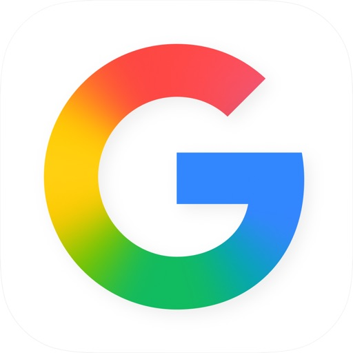

Mit der Google App bist du immer über die Dinge informiert, die dir wichtig sind. Hier findest du schnelle Antworten, erhältst Informationen zu deinen Interessen und bleibst mit Discover immer auf dem Laufenden.

Funktionshighlights:
• Nutze die Kamera, um Objekte in deiner Umgebung zu identifizieren, z. B. einen bunten Schmetterling oder eine stachelige Pflanze
• Lass dir Straßenschilder, Speisekarten oder andere Texte mit deiner Kamera übersetzen – mehr als 100 Sprachen werden unterstützt
• Du siehst etwas, was dir gefällt? Finde mit der Kamera heraus, was es ist und wo du es kaufen kannst
• Füge deiner Kamerasuche Wörter hinzu, um die Ergebnisse einzugrenzen – z. B. wenn du ein paar Schuhe entdeckt hast, die du gern in „blau“ hättest, oder wenn du wissen möchtest, wie du ein kaputtes Teil an deinem Fahrrad „reparieren“ kannst
• Suche Lieder mit deiner Stimme, auch wenn du den Text nicht kennst. Summe einfach die Melodie eines Songs – die App zeigt dir den Titel des Songs
• Nutze die Kamera, um Hilfe bei deinen Hausaufgaben zu erhalten. So findest du detaillierte Anleitungen und Videos zur Lösung von Aufgaben aus beispielsweise Mathematik, Chemie, Biologie und Physik

Lass dich von Discover auf dem Laufenden halten – ganz auf dich zugeschnitten:
• Aktuelle Informationen zu Themen, die dich interessieren
• Jeden Morgen die neuesten Nachrichten und den Wetterbericht
• Echtzeit-Updates zu Sport, Filmen und Veranstaltungen
• Informationen zu Neuveröffentlichungen deiner Lieblingsmusiker
• Artikel zu deinen Interessen und Hobbys
• Interessante Themen direkt aus den Google-Suchergebnissen

Sicherheit bei der Suche:
• Alle Suchanfragen in der Google App werden mit einer verschlüsselten Verbindung zwischen deinem Gerät und Google geschützt.
• Die Datenschutzeinstellungen sind leicht zu finden und zu verwalten. Tippe einfach auf dein Profilbild. Daraufhin öffnet sich das Menü, wo du mit einem Klick die Suchverlaufeinträge der letzten paar Minuten aus deinem Konto löschen kannst.
• Webspam wird in der Google Suche proaktiv herausgefiltert, damit du sichere, hochwertige Ergebnisse erhältst.

Du hast noch mehr Möglichkeiten, Google zu nutzen:
• Google Such-Widget – mit dem neuen Google-Widget kannst du Suchanfragen direkt auf deinem Start- oder Sperrbildschirm ausführen. Du hast die Wahl zwischen 2 Widgets, die dir eine Schnellsuchleiste in zwei Größen bieten. Über Verknüpfungen kannst du im mittelgroßen Widget auswählen, wenn du mit Lens, Voice und im Inkognitomodus suchen möchtest.

Hier erfährst du mehr zu den Vorteilen der Google App: https://search.google/

Datenschutzerklärung: https://www.google.com/policies/privacy

Das Feedback unserer Nutzerinnen und Nutzer hilft uns, bessere Produkte zu entwickeln. Wenn auch du an Nutzungsstudien teilnehmen möchtest, besuche:

https://goo.gl/kKQn99

[View on Apple](https://apps.apple.com/jp/app/google-%E3%82%A2%E3%83%97%E3%83%AA/id284815942)

## Google Maps

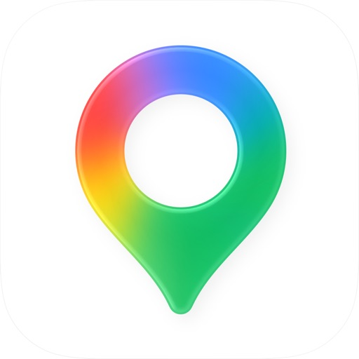

Mit Google Maps kannst du die Welt ganz einfach erkunden und bereisen. Anhand von Live-Verkehrsdaten und GPS-Navigation lassen sich die besten Routen finden – ganz gleich, ob du mit dem Auto, zu Fuß, mit dem Fahrrad oder mit öffentlichen Verkehrsmitteln unterwegs bist. Über 250 Millionen Orte und Unternehmen, darunter Restaurants, Geschäfte und Lebensmittelhändler, sind bei Google Maps eingetragen – mit Fotos, Rezensionen und nützlichen Informationen.

Erkunde die Welt auf deine Weise:
• Erreiche dein Ziel mit kraftstoffsparenden Routen
• Finde die beste Route anhand von Echtzeitinformationen mit detaillierter Routenführung per Sprachnavigation oder Navigation auf dem Bildschirm
• Komm schneller ans Ziel mithilfe der automatischen Neuberechnung von Routen, je nach aktueller Verkehrslage, Verkehrsbehinderungen und Straßensperrungen
• Echtzeitinformationen machen es einfacher, deinen Bus, Zug oder Fahrdienst zu erreichen.
• Wenn du besser vorankommen und flexibler sein möchtest, kannst du nach einem Fahrrad- oder Rollerverleih suchen.

Plane Reisen und Ausflüge ohne viel Aufwand:
• Street View ermöglicht es dir, schon vorab die Gegend zu erkunden und herauszufinden, wo sich beispielsweise Parkmöglichkeiten und Eingänge befinden.
• Mit Immersive View kannst du dir Sehenswürdigkeiten, Parks und Routen ansehen oder sogar die Wetterverhältnisse beobachten, damit du optimal auf deinen Besuch vorbereitet bist.
• Teile Listen mit deinen gespeicherten Lieblingsorten mit anderen.
• Du hast die Möglichkeit, Essen zur Lieferung und Selbstabholung zu bestellen, Reservierungen vorzunehmen und Hotels zu buchen.
• Mithilfe von Offlinekarten findest du dich auch in Gegenden mit schlechtem Empfang gut zurecht.
• Du kannst nach lokalen Orten und möglichen Aktivitäten suchen und basierend auf Nutzerrezensionen und Fotos Entscheidungen treffen.

Lass dich von Insidertipps inspirieren:
• Jährlich tragen 500 Millionen Nutzer dazu bei, die Google Maps auf dem neuesten Stand zu halten. Dir stehen also aktuelle Informationen zur Verfügung.
• Du kannst vorab herausfinden, wie stark ein Ort besucht ist, und so Menschenansammlungen meiden.
• Mithilfe von Lens in Maps lassen sich Fußgängerrouten in die reale Umgebung einblenden.
• Restaurants können beispielsweise nach Restauranttyp, Öffnungszeiten, Preisen oder Bewertungen gefiltert werden.
• Bei Fragen zu einem Ort – etwa zu den angebotenen Gerichten oder Parkplätzen – erhältst du schnell Antworten.

Einige Funktionen sind nicht in allen Ländern oder Städten verfügbar.
Die Navigation ist nicht für übergroße Fahrzeuge oder Einsatzfahrzeuge geeignet.

[View on Apple](https://apps.apple.com/jp/app/google-%E3%83%9E%E3%83%83%E3%83%97/id585027354)

## マイナポータル

デジタル庁が提供する「マイナポータルアプリ」は、マイナポータルなどを利用する際のログインや認証・署名、iPhoneのマイナンバーカードの設定に利用できるアプリです。

■ ご利用に必要なもの
①マイナンバーカード
②マイナンバーカードの電子証明書及び暗証番号
※②を設定していない場合はお住まいの市区町村窓口で設定が必要

■ マイナンバーカードとは
対面でもオンラインでも確実な本人確認ができるカードです。様々な行政や民間サービスの申込やログインなどに利用できます。

■動作環境
下記のデジタル庁マイナポータル動作環境紹介サイトをご確認ください。
https://services.digital.go.jp/mynaportal/system-requirements/

【インストール後もアプリが起動しない方へ】
インストール後もアプリが起動せずApp Storeに移ってしまう場合は、アプリの再インストールとiPhoneの再起動をお試しください。

[View on Apple](https://apps.apple.com/jp/app/%E3%83%9E%E3%82%A4%E3%83%8A%E3%83%9D%E3%83%BC%E3%82%BF%E3%83%AB/id1476359069)

## AEON Pay

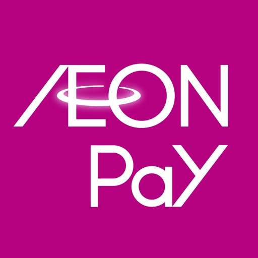

イオンウォレットはAEON Pay アプリとしてリニューアルしました！

AEON Pay アプリは、総合金融サービスの入口として、バーコード決済をはじめ、ご利用明細の確認、WAON POINT管理、口座情報の確認や、おトクなクーポン・お知らせの受取りができるアプリです。

決済を中心にアプリ名称・デザインを一新し、 より見やすく・使いやすくリニューアルしました。

リニューアルに伴い、イオンスクエアメンバーIDの名称も、AEON Pay IDに変更しております。
※名称変更のみのため、これまでと同じID・パスワードでご利用いただけます。

【主な特徴】
＼ 毎日のお買い物が、もっとスムーズに！ ／
●バーコード決済「AEON Pay」がすぐ使える
アプリ起動時にAEON Pay決済画面を表示。
「カード払い」「チャージ払い」は横スライドで簡単に切り替えができます。
AEON Payで利用できる主な機能は以下のとおりです。
・銀行口座やイオンカードから事前にチャージしてお支払い
・イオンカードを登録してお支払い
・WAON POINTを使ったお支払い
・AEON Pay利用履歴のご確認

＼ 見たい情報が、すぐ見つかる！ ／
●主要メニューをホーム画面に集約
ご利用明細やカードのご請求額、ご利用可能額など、
知りたい情報や関連サービスを分かりやすく表示。
日常的に使う機能へ迷わずアクセスできます。

＼ おトクな情報をお届け！ ／
●アプリ限定のクーポン配信
イオングループの店舗やショッピングサイトなどで
ご利用いただけるクーポンやお知らせが届きます。

＼イオンペイ／
●新たな AEON Pay 決済音
今回のリニューアルにより、AEON Pay をより身近に 感じていただけるように、決済音を「イオンペイ」に変更しました。

【公式ページ】
・詳しくはこちら https://www.aeon.co.jp/service/lp/aeonpay/app/

【動作環境など】
iOS 16以上
※iOS 16より前のOSでは動作保証はいたしません。
※タブレット端末での動作保証は行っておりません。あらかじめご了承ください。
※一部の端末に関しては対応OSバージョン以上でもインストールできない場合や動作しない場合がございます。

【お問い合わせについて】
個人情報を含むお問い合わせにつきましては、メールでのご回答はいたしておりません。
本文中に個人情報（カード番号・氏名・住所・電話番号・メールアドレスなど）は記載しないでください。

[View on Apple](https://apps.apple.com/jp/app/aeon-pay/id1100564842)

## X

Willkommen bei X, früher bekannt als Twitter, Ihrem vertrauenswürdigen digitalen Marktplatz wo Gespräche in Echtzeit ablaufen und die Welt sich über Eilmeldungen, Live-Events, Podcasts und alles dazwischen verbindet.

Ob Sie leidenschaftlich an Sport, Technik, Musik oder Politik interessiert sind, X bietet Ihnen einen Platz in der ersten Reihe für das, was weltweit passiert.

X ist nicht nur eine weitere Social-Media-App, sondern das ultimative Ziel, um gut informiert zu bleiben, Ideen zu teilen und Communities aufzubauen. 

Mit X sind Sie immer auf dem Laufenden mit relevanten Trending-Themen und Eilmeldungen, die sofort auf Ihrem Bildschirm erscheinen, roh und ungefiltert.

Was Sie auf X tun können:
• Verfolgen Sie Eilmeldungen aus der ganzen Welt, bevor sie in die Schlagzeilen kommen, und bleiben Sie voraus mit Echtzeit-Updates zu Trending-Themen und viralen Gesprächen.
• Teilen Sie Ihre Gedanken, Fotos und Videos mit einer globalen Community. Schließen Sie sich Millionen von Nutzern an, um den öffentlichen Diskurs in sozialen, kulturellen und politischen Gesprächen zu gestalten.
• Entdecken Sie Grok, den KI-Assistenten, der von den Echtzeit-Daten von X angetrieben wird. Sie können Grok bitten, Trending-News zusammenzufassen, Videos zu erklären oder mehr Kontext zu Beiträgen zu geben.
• Streamen Sie Live-Videos oder gehen Sie live mit Spaces, unserem Audio-Feature, das es Ihnen ermöglicht, Diskussionen zu moderieren, Interviews zu führen oder Ihren nächsten Live-Podcast zu starten. Ob Sie ein Konzert, ein Live-Spiel oder Ihre Gedanken zu einem heißen Thema streamen, X hält Ihr Publikum bei der Stange.
• Schauen Sie Videos: von Live-Eilmeldungen und Sport-Clips bis hin zu Podcasts und Gaming-Sessions, die bis zu 3 Stunden lang sein können. Viele der führenden Stimmen der Welt in Komödie, Gaming, Podcasting und Politik teilen ihren Content auf X.
• Verbinden Sie sich und chatten Sie privat mit Freunden, Followern, Kunden oder Kollaborateuren über Direktnachrichten.
• Treten Sie Communities bei und bauen Sie sie auf, die auf Ihre Interessen zugeschnitten sind: von Sport-News, Gaming, Entertainment, Krypto, Unternehmertum, Tech und mehr.
• Abonnieren Sie X Premium, um exklusive Features freizuschalten wie das blaue Häkchen, erhöhte Sichtbarkeit, priorisierte Antworten, weniger Werbung, längere Videos und die Bearbeitung von Beiträgen. X Premium gibt Ihnen auch Zugang zum Revenue-Sharing für Creator und die Möglichkeit, exklusiven Content für Abonnenten anzubieten.

Warum X?
In einer Welt des ständigen Wandels ist X Ihre Echtzeit-Quelle, um voraus zu sein, mit Menschen in Kontakt zu treten und vielfältige Perspektiven zu erkunden. Von Live-Eilmeldungen und Trending-Memes bis hin zu Top-Podcasts und Live-Streams Ihrer Lieblings-Creator bringt X alles in einer leistungsstarken Social-Erfahrung zusammen.

Datenschutzrichtlinie: https://x.com/de/privacy
Nutzungsbedingungen: https://x.com/de/tos

[View on Apple](https://apps.apple.com/jp/app/x/id333903271)

## イオンお買物

イオンお買物アプリがもっと便利に使いやすくなります
《イオンお買物アプリ会員特典》

◆特典１：クーポン
　あなたのためのクーポンをわかりやすく表示！おトクなクーポンが配信されます！

◆特典２：見つける
　あなたにオススメの商品を一覧でご紹介します！

◆特典３：買うかもリスト
　お買物前にクーポンや商品をチェックしリストを作りましょう！

◆特典４：スタンプカード
　対象商品を購入時、「クーポン・会員コード」を提示するとスタンプがたまります！
　たまったスタンプは、購入金額に応じてクーポンのプレゼントや割引特典が受けられます！
　※スタンプカードの詳しいご利用方法は、お買物アプリWEBサイトをご確認ください
　　　　　　
◆特典５：チラシ
　お買物の前にお気に入り登録している店舗のチラシをすぐに確認できます！

◆特典６：キャンペーン
　クーポンが当たる抽選会に参加できます！
　※キャンペーン実施は不定期であり、内容も予告なく変更する場合がございます

◆北海道・東北・九州・沖縄県ではご利用いただけません。

◆簡単登録！おトクがいっぱいの「イオンお買物アプリ」を今すぐダウンロード！

◆アプリ使用の通信料は、お客さまのご負担となります。
　
◆本アプリはGPSを使用しております。バックグラウンドでGPSを使用し続けると、バッテリーを消費しますのでご注意ください　

[View on Apple](https://apps.apple.com/jp/app/%E3%82%A4%E3%82%AA%E3%83%B3%E3%81%8A%E8%B2%B7%E7%89%A9/id634744681)

## 北海道アプリ

「北海道アプリ」は、北海道からの役立つ情報の受け取りや、地域ポイント「どうみんポイント」の活用、道政への参加などが一つになった北海道公式アプリです。
マイナンバーカードと連携することで、本人確認をスムーズに行い、より安心・便利にサービスをご利用いただけます。

■ マイナンバーカードでカンタン連携!
スマートフォンにマイナンバーカードをかざすだけで、氏名や住所などの情報を自動で取り込み、素早くアカウントを作成できます。手入力の手間やミスがなく、どなたでも簡単に登録が完了します。

※マイナンバーカードを連携しなくても、一部の機能はご利用いただけます。

■ 「どうみんポイント」を貯めて、地域を応援!
地域で使えるポイントをアプリで受け取れます。貯まったポイントは道内の加盟店でのお買い物に利用可能。地元のお店で道産品を購入して、北海道の経済を楽しく応援できます。

※ポイント受取にはマイナンバーカードとの連携が必要です。

[View on Apple](https://apps.apple.com/jp/app/%E5%8C%97%E6%B5%B7%E9%81%93%E3%82%A2%E3%83%97%E3%83%AA/id6772144925)

## Honeys(ハニーズ)アプリ -レディースファッション-

人気のプチプラアイテムをアプリですぐにチェックできて、お買い物もできます。
さらに全国の店舗・オンラインショップでポイントが貯まる・使えるハニーズ公式アプリです。

ベーシックからトレンドまで幅広いファッションアイテムを販売するハニーズでのお買い物が【もっと便利に・もっと使いやすく・もっと楽しく】なります。

＜ハニーズアプリのご紹介＞

■オンラインショップ
ハニーズの新作アイテムをすぐにチェック・ご購入ができます。オンラインショップ会員になると、店舗・オンラインショップ共通で使えるポイントが貯まり、ご使用することもできます。

■ランキング
アイテムの人気ランキングをご紹介します。
ハニーズでヒットしているアイテムをカテゴリ別にチェックできます。

■スタイル
ショップスタッフによる新作やおすすめアイテムを使ったリアルコーデをご紹介します。
気に入ったコーデアイテムはオンラインショップでも購入できます。

■お知らせ
店舗やオンラインショプからのお得な情報などをプッシュ通知で配信します。
アプリ限定のお得なクーポンも配信！
※クーポンは配信されない期間もございます。

■会員証
店舗購入時にこの会員証を見せるだけでポイントが貯まります。
貯まったポイントもすぐにチェックできます。

■店舗情報
お近くの店舗を都道府県、市町村から検索することができます。

※ ネットワーク環境が良好でない状況でご利用されるとコンテンツが表示されない等、正常に動作しないことがあります。

【プッシュ通知について】
お得な情報をプッシュ通知でお知らせします。アプリの初回起動時にプッシュ通知を「ON」に設定するようお願いします。なお、オン・オフの設定は後から変更もできます。

【位置情報の取得について】
近くのショップを探す目的、その他の情報配信の目的で位置情報取得の許可をアプリからさせて頂く場合がございます。
位置情報は個人情報とは一切関連するものではなく、また本アプリ以外での利用は一切行いませんので安心してご利用ください。

【著作権について】
本アプリに記載されている内容の著作権は株式会社ハニーズに帰属し、いかなる目的であれ無断での複製、引用、転送、頒布、改編、修正、追加など一切の行為を禁止いたします。

[View on Apple](https://apps.apple.com/jp/app/honeys-%E3%83%8F%E3%83%8B%E3%83%BC%E3%82%BA-%E3%82%A2%E3%83%97%E3%83%AA-%E3%83%AC%E3%83%87%E3%82%A3%E3%83%BC%E3%82%B9%E3%83%95%E3%82%A1%E3%83%83%E3%82%B7%E3%83%A7%E3%83%B3/id1130864757)

## ニトリアプリ 家具・インテリアの欲しいが見つかる！

～ニトリアプリ会員登録者数 累計2,500万人！！！～(※1)
【家具・インテリア雑貨が簡単に見つかる！コーディネートの悩みも解決！引っ越し・新生活はもちろん、ニトリアプリで日々の暮らしをもっと便利に！】 

■お、トクなアプリ新規入会特典！
・アプリに新規入会し、14日以内に3,000円(税抜)以上購入で500ptプレゼント！(※2)
・獲得できるポイントは60日間の期間限定ポイントです。
・貯めたポイントは、お買い上げの際に「1ポイント＝1円」として、ニトリグループ全店でご利用いただけます。

■ポイントが貯まる！使える！
・アプリ会員は、通常ポイントの2倍（200円(税抜)につき通常1pt+アプリ会員特典1pt）獲得できます。(※3)
・さらに年間3万円(税抜)以上ご購入で、翌年ゴールドアプリ会員にランクアップ！(※4)
ゴールドアプリ会員は通常ポイントの3倍（200円(税抜)につき通常1pt+アプリ会員特典1pt+ゴールドアプリ会員特典1pt）獲得できます。

■ 欲しい商品の受け取り方が簡単に選べる！
・『よく行く店舗』を事前に設定することで、その店舗の在庫状況をいつでも確認できます。また、設定した店舗に在庫がある商品のみで検索することもできます。
・『お届け先』を事前に設定することで、お届け先に合わせたお届け予定日がわかります。
・受け取り方法は『店舗受け取り』と『お届け』から選べます。『店舗受け取り』なら送料が不要で、最短で当日に受け取り可能です。(※5)
・ご注文後、商品のお渡し準備が整い次第、入荷状況やお届け日時の通知が届きます。
・ご注文した商品は『注文履歴』でいつでも確認でき、再度同じ商品を購入する場合や購入商品へのお問い合わせも簡単にできます。

■ 欲しい商品が簡単に見つかる！
・キーワードやカテゴリー検索で簡単に商品を探せます。
・ニトリネットには『ネット特別商品』が豊富にあり、店舗で取り扱いのない商品も見つかります。
・毎週放送している『ニトリLIVE』では、ニトリ社員が質問やコメントにリアルタイムでお答えします。まるで店舗にいるような感覚でお買い物ができ、オススメ商品が見つかります。

■ お買い物に役立つ『店内モード』で楽々ショッピング！
・簡単に商品の売場・在庫状況・お取り寄せ納期・お客様からの商品レビュー内容などを確認できます。
・お気に入りに登録した商品は最新の在庫状況が確認可能です。
・店舗にない商品の取り寄せや発送手続きは、商品をスキャンするだけで手ぶらでレジに行ける『アプリde注文』が便利です。

■ 他にもたくさん便利機能！
・みんなのニトリ/スタッフコーディネート：お客様やニトリスタッフのおすすめ商品と暮らしのアイデアを紹介します。
・お気に入り商品：気になった商品をお気に入りリストで管理でき、いつでも在庫状況の確認と注文が可能です。
・画像検索：撮影した写真から類似商品を探せます。
・サイズwithメモ：撮影した画像にサイズ記入やメモができます。収納など家に合うサイズをいつでもチェックできて便利です。
・比較機能：ソファやベッドなど、気になった商品を複数選択して比較できます。
・お知らせ：ニュースやキャンペーン情報などが直接アプリに届きます。

※1：ニトリグループ各社のアプリにて会員登録を行い、ログインをしたユーザー数の累計です。2026年2月28日時点当社調べ。
※2:サービス料や配送料の金額は含まれません。アプリ新規入会特典500ポイントはおひとり様1回のみ獲得できます。本特典は予告なく変更または終了する場合があります。
※3:通常ポイントとは200円(税抜)につき1ポイント獲得できるポイントです。1会計当たり200円(税抜)未満のご購入、または商品代金以外のサービス料・配送料等はポイントが付きません。
※4:商品代金以外のサービス料・配送料等はランク判定の対象外です。本サービスは予告なく変更、終了させていただく場合がございます。
※5:商品や店舗によっては、店舗受け取りおよび当日受け取りができない場合があります。予めご了承ください。

● ご留意事項
1.このアプリはスマートフォンの位置情報およびプッシュ通知を利用します。
2.このアプリはタブレット端末や一部のモバイル端末では動作保証しておりません。

[View on Apple](https://apps.apple.com/jp/app/%E3%83%8B%E3%83%88%E3%83%AA%E3%82%A2%E3%83%97%E3%83%AA-%E5%AE%B6%E5%85%B7-%E3%82%A4%E3%83%B3%E3%83%86%E3%83%AA%E3%82%A2%E3%81%AE%E6%AC%B2%E3%81%97%E3%81%84%E3%81%8C%E8%A6%8B%E3%81%A4%E3%81%8B%E3%82%8B/id814928018)

## U-NEXT - 映画やドラマ、アニメなどの動画が見放題

U-NEXTなら映画、ドラマ、アニメ、スポーツ・音楽ライブなどの動画から、マンガ、ラノベをはじめとする電子書籍まで、１つのアプリで楽しめます。今すぐ無料でお試しいただけます。映画、ドラマ、アニメ、テレビ番組など見放題本数40万本以上。マンガ、ラノベなど電子書籍127万冊以上。雑誌210誌以上。あなたの「観たい！」「読みたい！」がきっと見つかります。
【圧倒的なラインナップ】
●映画、海外ドラマ、韓国ドラマ、国内ドラマ、アニメ、バラエティ、NHKオンデマンドなど、多彩なジャンルを網羅。不朽の名作から話題の最新作まで、U-NEXTでたっぷりオトクに楽しめる。
●テレビ放送中のアニメ、ドラマ、バラエティも多数配信。放送を見逃してもU-NEXTで1話から最新話まで一気に楽しめる。
●世界有数の動画配信サービス「HBO Max」がU-NEXTで追加料金なく楽しめる。ハリー・ポッター、DCシリーズ、Maxオリジナルドラマなど、人気作品が見放題。
【ライブ配信も充実】
●人気アーティストの音楽ライブや舞台公演、サッカー、ゴルフ、格闘技、テニス、野球、バスケットボールなどのスポーツコンテンツをライブ配信。
●世界最高峰の欧州サッカーをライブ配信。プレミアリーグ全試合を独占配信。さらに「ラ・リーガ1部」「FAカップ（独占）」「コパ・デル・レイ（独占）」も配信中。
※サッカーコンテンツの視聴には「U-NEXTサッカーパック」への加入が必要です。
●世界のゴルフがU-NEXTに集結。「LPGAツアー」「PGAツアー」等の海外主要ツアー、「マスターズ」「全英オープン」「全米女子オープン」等の海外男女メジャー全9大会、国内女子「JLPGAツアー」を独占配信。
※「LPGAツアー」「PGAツアー」の視聴には「ワールドゴルフパック」への加入が必要です。
●国内最高峰のバレーボールリーグ「大同生命SVリーグ」を全試合生配信。プレシーズンマッチのライブ配信、過去のSVリーグ厳選試合のアーカイブ配信も。
※「大同生命SVリーグ」の視聴にはU-NEXTの「J SPORTS バレーボールパック」への加入が必要です。
●プロ野球 横浜DeNAベイスターズの2026シーズン主催公式戦を全試合ライブ配信。1軍&ファーム戦どちらも楽しめる。
【マンガ・電子書籍】
●マンガ、書籍、ラノベも豊富にラインナップ。映画やドラマを観た後に、原作マンガも楽しめる。「観る」「読む」が1つのアプリで。
●20,000作品以上のマンガが、毎日1話ずつ無料で読める。更に「毎日無料＋」対象マンガなら毎日合計12話も無料で読める。月額プランに加入していなくても、アカウント登録のみでマンガが毎日楽しめる。
●月額プランを利用中なら、ファッション、ビジネス、グルメなど様々な雑誌の最新号や、絵本、知育、図鑑などの児童書が読み放題。
【機能紹介】
●毎月もらえる1,200円分のポイントを活用すればさらにオトク。劇場公開から間もない最新映画の視聴や、マンガなどの電子書籍の購入、映画チケットの割引などに利用可能。
●毎月もらえる1,200円分のポイントを超えて利用した場合は購入金額の最大40%(※)がポイント還元。
※iOSアプリのUコイン決済をご利用される場合は、20％のポイント還元です。
※ポイントチャージ、Uコインチャージ、ライブコンテンツ購入、映画館クーポン、各種パックの購入はポイント還元の対象外です。
●ファミリーアカウントを登録すれば最大4人まで利用可能。アカウントの追加は無料で、4人での利用なら1人あたり実質約600円。
●ダウンロード・オフライン再生に対応。Wi-Fi環境で作品をダウンロードしておけば、通信料の心配は無用。アニメやマンガをどこでも快適に楽しめる。
●スマホ・タブレットは勿論、TV・パソコン・ゲーム機など様々なデバイスに対応。大画面でも映画やアニメを楽しめる。
【月額プランについて】
●月額プランにご登録いただくと、見放題・読み放題の作品をお楽しみいただけます。
●期間：1ヶ月間（申し込み日から起算）/ 月額自動更新
※契約期間終了の24時間前までに月額プランを解約しない限り、契約期間は1カ月自動更新されます。
※更新分の契約期間（1カ月分）の利用料は、契約期間終了時点からさかのぼって24時間以内に金額が確定し、請求されます。
●料金：2,400円（税込）
※価格は変更になる場合があります。

[View on Apple](https://apps.apple.com/jp/app/u-next-%E6%98%A0%E7%94%BB%E3%82%84%E3%83%89%E3%83%A9%E3%83%9E-%E3%82%A2%E3%83%8B%E3%83%A1%E3%81%AA%E3%81%A9%E3%81%AE%E5%8B%95%E7%94%BB%E3%81%8C%E8%A6%8B%E6%94%BE%E9%A1%8C/id882477693)

## Disney+

Disney+ではディズニー、ピクサー、マーベル、スター・ウォーズ、ナショナル ジオグラフィックなどの映画やドラマ、アニメが見放題。
 
Disney+ オリジナルシリーズの『マンダロリアン』、『ロキ』、『一流シェフのファミリーレストラン』をはじめ、大ヒット作『ミラベルと魔法だらけの家』、『アバター』、『ガーディアンズ・オブ・ギャラクシー』、イッキ見必須のシリーズ『グレイズ・アナトミー』、『クリミナル・マインド』、『9-1-1 LA救命最前線』など、隠れた名作や次々に追加される新作をお楽しみください。
 
Disney+のサブスクリプションには以下が含まれます。
• 続々登場する新作オリジナル、大ヒット映画、話題のシリーズ
• 視聴履歴に基づいたおすすめの作品の表示
• お子さまの視聴に安心のペアレンタルコントロール
• 追加料金なし。サブスクリプションの解約はいつでも可能（解約後は次の課金タイミングが来るまでの間、ご視聴いただけます）
• 4台（または2台）のデバイスで同時視聴（サービス・プランによって異なります）
• 続々追加される4Kで視聴できる作品（Disney+ プレミアムプランのみ、視聴には4K対応デバイスが必要になります）*
• IMAX版拡大アスペクト比で楽しめる大迫力の映像（Disney+が利用可能な地域ではマーベル／ピクサー作品の一部を対応デバイスで視聴できます）*

Disney+の詳細は、http://help.disneyplus.comをご覧ください  
Disney+利用規約、その他のポリシーはhttps://disneyplus.com/legalをご確認ください。

*画質と音質は、インターネットサービス、デバイスの機能、コンテンツの種類およびサービス・プランによって異なります。
Disney+で視聴できる作品は、国や地域によって異なる場合があります。
上記の作品を含め、一部の作品は、お住まいの国や地域では視聴できない場合があります。

[View on Apple](https://apps.apple.com/jp/app/disney/id1446075923)

## うさポ by クラシル

「クラシル」「レシチャレ」を手がけるクラシル株式会社から、
新アプリ「うさポ」が登場！

「うさポ」とは
うさポは、いつもの移動でポイントがたまるお得なアプリです。
移動距離や時間経過、ゲームプレイに応じてアプリ内のコインを獲得し、ためたコインは様々な特典(他社ポイント・デジタルギフト・電子マネーなど)と交換することができます。

コインが"たまる"
- 移動距離に応じてゲージがたまります。
- 時間経過に応じてゲージがたまります。
- ゲームプレイに応じてコインがたまります。
- ためたゲージをタップするとコインを回収することができます。

※移動ゲージを貯めるには「位置情報の許諾」が必要です。

ためたコインは"特典と交換"
- 様々な他社ポイント・デジタルギフト・電子マネーなどと交換可能
(Amazonギフト券、楽天ポイント、Tマネー、dポイント、Pontaポイント、nanacoポイント)
- 近くのコンビニで使えるコーヒーやアイスの引換券とも交換可能

※お問い合わせは、アプリ内「マイページ」の「ヘルプ」よりお願いいたします。

[View on Apple](https://apps.apple.com/jp/app/%E3%81%86%E3%81%95%E3%83%9D-by-%E3%82%AF%E3%83%A9%E3%82%B7%E3%83%AB/id6756568932)

## イオンモールアプリ

お気に入りのイオンモールのセールやイベント、ショップの新商品など、最新情報を受け取れます。
WAONPOINTと連携すると、WAONPOINTのポイント残高がアプリに表示されます。

【主な機能】
お気に入り登録したモールからの最新情報をお届けけします。　　　　　　　　　　　　　　　　　　　　　　　　　　　　　　　　　　　　　　　　　　　　　　
アプリ限定のお得なクーポンやキャンペーンをお届けします。
WAONPOINTと連携すると、WAONPOINTのポイント残高がアプリに表示されます。

※WAONPOINT連携には、各種イオンカード、電子マネーWAONカード（モバイルWAON含む）、WAONPOINTカード、イオンバンクカードが必要です。
※イオンJMBカードは対象外です。                                                                           
※イオンモール旭川西、イオンモール釧路昭和、イオンモール札幌発寒、イオンモール札幌平岡、イオンモール札幌苗穂、イオンモール苫小牧、イオンモール香椎浜、イオンモール福岡伊都、イオンモール佐賀大和、イオンモール鹿児島は対象外となりますので、ご注意ください。

【対応端末】
 iOS(16以上推奨) 搭載のスマートフォンです。
※App Store非対応端末や時計型端末などには対応しておりません。

[View on Apple](https://apps.apple.com/jp/app/%E3%82%A4%E3%82%AA%E3%83%B3%E3%83%A2%E3%83%BC%E3%83%AB%E3%82%A2%E3%83%97%E3%83%AA/id1451676515)

## Gmail – E-Mail von Google

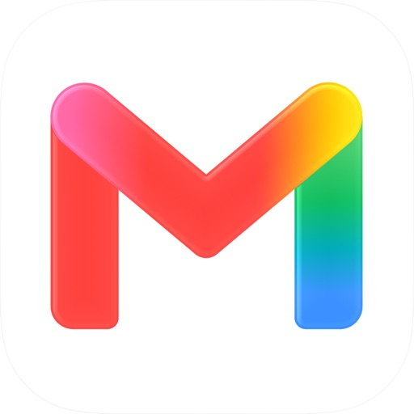

Mit der offiziellen Gmail App können Sie sich das Beste von Gmail auf Ihr iPhone oder iPad holen: hilfreiche KI-Funktionen, umfassender Schutz, Benachrichtigungen in Echtzeit, Unterstützung für mehrere Konten und die intelligente Suche im gesamten Posteingang.

Vorteile der Gmail App:
• Sie können Gmail auf iOS-Geräten als Standard-E-Mail-App festlegen.
• Dank hilfreicher Infokarten bleiben Sie ganz einfach über die neuesten Pakete, anstehende Termine, Rechnungen und Reisedaten auf dem Laufenden.
• Mit der integrierten E-Mail-Aboverwaltung lässt sich Ihr Posteingang übersichtlich halten.
• Gemini* in Gmail kann für Sie lange E-Mails zusammenfassen, Antworten entwerfen oder verfeinern oder in Ihrem Posteingang nach Informationen suchen.
• Sie können mehrere E-Mail-Konten von verschiedenen Anbietern verbinden und zwischen ihnen wechseln.
• Über 99,9 % der Spam-, Phishing- und Malware-Inhalte werden automatisch blockiert – bevor sie Ihren Posteingang erreichen.
• Mit Gemini in Gmail lassen sich Termine aus E-Mails schnell in Google Kalender eintragen.
• Über den personalisierten Tab „Werbung“ finden Sie schneller die besten Angebote.
• Sie können schneller auf E-Mails antworten – dank KI-basierter Antwortvorschläge, die sowohl den Kontext Ihrer E-Mails als auch Ihren individuellen Schreibstil und Ton berücksichtigen.
• E-Mails lassen sich nach dem Senden bis zu 30 Sekunden lang zurückrufen, um Fehler zu vermeiden.
• Sie können direkt auf Google Meet und Google Chat zugreifen – ohne Gmail zu verlassen.
• Sie können Ihre E-Mails mit Labeln versehen, markieren, löschen und als Spam melden – so behalten Sie besser den Überblick.
• Mithilfe der Wischgesten zum Archivieren oder Löschen lässt sich Ihr Posteingang schnell und einfach aufräumen.

Gmail ist Teil von Google Workspace – Sie können sich also ganz leicht mit Ihrem Team austauschen und zusammenarbeiten. Dazu haben Sie folgende Möglichkeiten:
• Mit Kolleginnen und Kollegen über Google Meet oder Google Chat in Kontakt bleiben, Einladungen in Google Kalender senden, Aufgabenlisten erstellen und mehr – viele alltägliche Aufgaben lassen sich direkt in Gmail erledigen.
• Mit den Funktionen von Gemini in Gmail wie „Formuliere für mich“, „Antwortvorschläge“, „Übersichten mit KI“ und „Korrekturlesen“ erhalten Sie einen besseren Überblick über Ihre Arbeit und können Routineaufgaben schneller abschließen und effizienter sein.
• Umfassender Schutz: Mit unseren Modellen für maschinelles Lernen werden über 99,9 % der Spam-, Phishing- und Malware-Inhalte blockiert – noch bevor sie Ihren Posteingang erreichen.

* Zur Nutzung einiger Gemini-Funktionen ist ein Abo für Google One AI erforderlich. Es ist eine Internetverbindung erforderlich. Die Verfügbarkeit variiert je nach Sprache und Land. Antworten sollten auf ihre Richtigkeit geprüft werden.

[View on Apple](https://apps.apple.com/jp/app/gmail-google-%E3%81%AE%E3%83%A1%E3%83%BC%E3%83%AB/id422689480)

## Netflix

Auf der Suche nach den angesagtesten Filmen und Serien aus aller Welt? Die gibt’s bei Netflix.

Entdecken Sie preisgekrönte Serien, Filme, Live-Events, Podcasts und Games unterwegs – alles in der Netflix-App. Egal, ob Sie auf Reisen oder auf dem Weg zur Arbeit sind oder einfach nur eine Pause einlegen wollen: Ab jetzt verpassen Sie nichts mehr auf Netflix.

Was Sie an Netflix lieben werden:

– Einfache Navigation mit Verknüpfungen am unteren Bildschirmrand zum schnellen Stöbern oder direkten Aufrufen Ihrer Favoriten

– Eine neue Möglichkeit, um herauszufinden, was als Nächstes kommt, inklusive eines Feeds mit neuen Clips

– Eine Welt voller Unterhaltung mit Serien, Filmen, Live-Events, Games und Podcasts – alles an einem Ort

– Ihre Favoriten jederzeit im Blick – von Ihren Lieblingsmomenten bis zu „Meine Liste“ finden Sie alles auf dem Tab „Mein Netflix“.

– Personalisierte Empfehlungen auf Basis Ihrer Bewertungen. Sofortige Benachrichtigungen bei Neuerscheinungen, neuen Folgen und Live-Events

Die Netflix-Mitgliedschaft ist ein monatliches Abo, das mit Ihrer Registrierung beginnt. Sie können jederzeit problemlos online kündigen – rund um die Uhr. Ganz ohne langfristige Verträge oder Kündigungsgebühren. Wir möchten einfach, dass Ihnen das, was Sie sich ansehen, gefällt.

Bitte beachten Sie, dass die App-Datenschutzinformationen für Daten gelten, die über die Netflix-App für iOS, iPadOS und tvOS erhoben werden. In der Datenschutzerklärung von Netflix (siehe Link unten) erfahren Sie mehr darüber, welche Daten wir in anderen Zusammenhängen, z. B. bei der Kontoregistrierung, erheben.

Datenschutzrichtlinie: www.netflix.com/privacy

Nutzungsbedingungen: www.netflix.com/terms

Telefonnummer: +18667160414

E-Mail: iosappstore@netflix.com

[View on Apple](https://apps.apple.com/jp/app/netflix/id363590051)

## EXアプリ | JR東海公式

▼EXアプリでこんなことができる
- アプリでカンタン新幹線予約
- 早めの予約でおトクに乗車
- 乗車で貯まるポイントサービス（※チケットレス乗車に限ります）
- 最大1年前から新幹線予約が可能（※一部の商品に限ります。ご予約いただける座席数には限りがあります。）
- 乗車前の予約変更が何度でも無料
-新幹線とホテル・宿セットで予約
-旅先の観光プラン・ホテル・レンタカーも予約可能
-シートマップからお好みの座席を選択（※指定席に限る）
-駅や車内で使えるサービス情報も
- Touch ID（指紋認証） / Face ID（顔認証）を利用して、スピーディーにログインできる（対応機種のみ）

▼主な機能
- 新規会員登録
- Touch ID / Face IDによるログイン
- 新規予約（時刻指定・列車名指定・自由席）
- 予約確認
- 予約変更・払戻
- 購入履歴照会・領収書表示
- 会員情報照会・変更
- 乗車用ＩＣカードの登録/指定
- 運行情報（リンク）

なお、お使いのiOSデバイスの言語設定が日本語以外の場合は、英語表示となります。

▼対象会員
○ エクスプレス予約会員
- JR東海エクスプレス・カード会員(個人・法人)
- ビュー・エクスプレス会員
- プラスEX会員
- J-WESTカード（エクスプレス）会員
- JQ CARDエクスプレス会員

○ スマートEX会員

▼注意事項
-本アプリのご利用には会員登録が必要です。

＜エクスプレス予約をご利用の方＞
事前にクレジットカード会社へのお申込みおよび、本アプリもしくはWEBサイトでの会員登録が必要です。（入会にはクレジットカード会社の審査があります。）

＜スマートEXをご利用の方＞

本アプリもしくはWEBサイトでの会員登録が必要です。

[View on Apple](https://apps.apple.com/jp/app/ex%E3%82%A2%E3%83%97%E3%83%AA-jr%E6%9D%B1%E6%B5%B7%E5%85%AC%E5%BC%8F/id1153448703)

## Instagram

Aus kleinen Momenten werden große Freundschaften. Teile deine auf Instagram.
– Von Meta

Bleib mit deinen Freund*innen in Kontakt, finde andere Fans und finde heraus, was die Menschen in deinem Umfeld so treiben. Erkunde deine Interessen und poste, was gerade bei dir los ist – ob Alltagsmomente oder besondere Highlights in deinem Leben.

Teile, was dich gerade bewegt.
- Halte deine Freund*innen mit Stories und Notizen, die für 24 Stunden sichtbar sind, auf dem Laufenden.
- Starte Gruppenchats und teile spontane Momente mit deinen engen Freund*innen.
- Teile Erinnerungen von aktuellen Veranstaltungen oder Reisen im Feed.
- Verwandle dein Leben in einen Film und entdecke mit Reels auf Instagram unterhaltsame Kurzvideos.
- Personalisiere deine Beiträge mit exklusiven Vorlagen, Musik, Stickern und Filtern.

Erkunde Themen, die dich interessieren.
- Sieh dir Videos deiner Lieblings-Creator*innen an und entdecke neue Inhalte, die auf deine Interessen zugeschnitten sind.
- Lass dich im „Explore“-Tab von den Fotos und Videos neuer Konten inspirieren.
- Entdecke Marken und Kleinunternehmen und shoppe Produkte, die deinen Stil unterstreichen.

Manche Instagram-Features sind in deinem Land oder deiner Region möglicherweise nicht verfügbar.

Nutzungsbedingungen und Richtlinien: https://help.instagram.com/581066165581870

[View on Apple](https://apps.apple.com/jp/app/instagram/id389801252)

## Suica

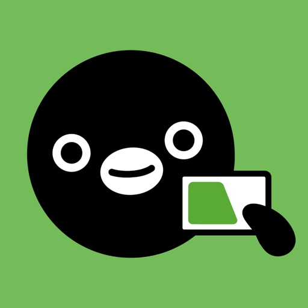

東日本旅客鉄道株式会社(JR東日本)が提供するSuicaをApple Payで利用するためのアプリです。Suicaの発行やチャージ、定期券の購入もアプリで完結します。スマホを「かざすだけ」で鉄道・バスの乗車やキャッシュレス決済をスムーズにご利用いただけます。「JRE POINT」に登録すれば、JR東日本の鉄道に乗るとポイントが貯まります。また、貯まったポイントをSuicaにチャージすることも可能です。

【Suicaアプリケーションでできること】
iPhone*とクレジットカードがあればSuicaアプリで簡単にキャッシュレス生活を始められます。お手元にSuicaカードがなくても、Suicaアプリにて新規発行することが可能です。Suicaカードをお持ちの場合は、iPhoneでApple Payに取り込んで利用できます。iPhoneとペアリングすることで、Apple Watch*でも利用可能です。

入会金、年会費、デポジット等はいただきません。
* iPhone 8以降のiPhone、Apple Watch Series 3以降のApple Watch、日本国内で発売されたiPhone 7及びApple Watch Series 2の機種が対象です。

決済手段は下記の2つが選べます。
・ Suicaアプリケーションに登録のクレジットカード*
・ Apple Payに設定したクレジットカード
　* ビューカードを登録いただくと「オートチャージ」も設定できます

■ 日本全国で使えます
・全国の鉄道・バスなどの交通機関*でご利用いただけます。
*Suica、PASMO、SAPICA、Kitaca、ICAS nimoca、icsca、りゅーと、TOICA、manaca、ICOCA、PiTaPa、SUGOCA、nimoca、はやかけん、OKICAの各エリア
・ICマークのある日本全国のお店やネットショッピングでのお支払いにもご利用いただけます。

■ Suicaへの入金（チャージ）、定期券、Suicaグリーン券、おトクなきっぷの購入もアプリで
Suicaアプリでは各種サービスを利用できます。
・ Suicaへの入金（チャージ）、オートチャージ設定
・ 電子マネー残高、利用履歴の確認
・ 定期券、Suicaグリーン券、おトクなきっぷの購入・払いもどし
・Suica定期券（カード）の取り込み
・ 領収書の印刷（会員向けウェブサイトにて）

【ご利用にあたって】
・ 困ったときにサポートを受けられるよう、モバイルSuica会員登録をお済ませください。
・ モバイルSuica会員は、紛失や端末故障時は会員向けウェブサイトから再発行登録（利用停止手続き）が可能です。
・ info@mobilesuica.comのメールを受信できるように設定してください。

◆ 重要なお知らせ ◆
【！】 端末を変更・交換する時は、以下の操作が必要です。
・ iPhoneは、旧端末のWalletで全てのSuicaを「削除」し、新端末で同じApple IDにサインイン後、Walletで「Suicaを追加」してください。
・ Apple Watchは、ペアリングを解除する前にiPhoneのWatch appまたはApple WatchのWalletで全てのSuicaを「削除」し、同じApple IDにサインインしているiPhoneと新端末をペアリング後、Watch appで「Suicaを追加」してください。
・Apple社製端末以外からの変更は、予め旧端末での手続きが必要です。iPhone/Apple WatchではSuicaを未設定のApple IDでサインインしお受け取りください。

【！】 端末の電源が切れた状態ではSuicaをご利用いただけません
　※鉄道のご利用中(改札内)に電源が切れた場合、ご利用区間の運賃等を現金でお支払いいただきます。

【！】 Suicaのエクスプレスカード設定を忘れずに
生体認証なしで自動改札を通るには「エクスプレスカード設定」が必要です。交通利用以外では生体認証が必要な場合があります。

【様々なアプリやサービスとの連携で、もっと便利に】
■ JRE POINT
「JRE POINT」にモバイルSuicaを登録することで、対象のJRE POINT加盟店やJR東日本の鉄道のご利用でポイントが貯まります。特に鉄道のご利用では、カードタイプのSuicaよりも多くポイントが貯まるのでおトクです。

■ タッチでGo!新幹線
Suicaアプリケーションで「タッチでGo!新幹線」のご利用登録が可能（Suicaカードの取り込みでも設定が引き継がれます）。チャージ残高で新幹線の自由席にご乗車いただけます（事前の予約は不要）。

■ 新幹線eチケットサービス
「えきねっと」に会員登録し、SuicaをICカード情報に登録すると、券売機やみどりの窓口できっぷを受け取ることなく、JR東日本の各新幹線をチケットレスでご利用いただけます。早めのお申込みでおトクな「えきねっとトクだ値」「お先にトクだ値」もご利用可能です。

■ エクスプレス予約
別途ご登録いただくことでとJR東海「エクスプレス予約」もご利用いただけます（有料サービス）。

[View on Apple](https://apps.apple.com/jp/app/suica/id1156875272)

## My UQ mobile

◆料金もデータ残量（ギガ）もポイントもすぐに確認できる！

〜主な機能〜

①データ残量（ギガ）・利用量
・現在のデータ残量（ギガ）や利用量を確認できます
・直近30日間、過去6ヶ月のデータ利用履歴（ギガ）もグラフで確認できます

②ご請求額・ご請求予定額
・ご請求額と内訳を確認できます
・過去6ヶ月のご請求額をグラフで比較できます

③ご契約情報の確認・変更
・ご契約情報の確認や、料金プラン・オプションサービスの変更手続きができます
・お引越し前に必要な住所変更ができます
・エンタメ、auの金融・保険サービスの加入状況が確認できます

④サポートメニュー
・疑問やトラブルをご自身でスムーズに解決できます
・テキスト形式でオペレーターへの相談ができるチャット機能や来店予約手続きができます

⑤お知らせ
・あなたにあったお知らせが確認できます

⑥カレンダー
・大事な予定が一目でわかります
・おトクな情報もカレンダーで確認できます

⑦Pontaポイント・au Ponta レベル
・保有しているPontaポイント・au Ponta レベルの確認ができます
・ポイントの使い方や貯め方もアプリから確認できます

⑧au PAY残高・au PAYカード
・au PAY残高やau PAYカードの利用額が確認できます

⑨UQ mobileオンラインショップ
・最新機種の購入や機種変更も簡単にお手続きできます

⑩データ通信モードの切り替え
・高速モード(高速通信)と節約モード(低速通信)を切り替えることができます
※対象の料金プランでご利用できます

利用規約URL：
https://www.uqwimax.jp/signup/term/files/myuqmobile_service.pdf

[View on Apple](https://apps.apple.com/jp/app/my-uq-mobile/id1117312593)

## Trip.com: Flight, Hotel, Train

Rated 'Excellent' on Trustpilot.

The Trip.com app is your trusted travel companion whenever and wherever you are. Get the app now to create your perfect trip at a fantastic price!
 
#Why is the Trip.com App Trust-worthy?
 
24/7 SERVICE GUARANTEE ► You can rely on timely customer support and post-booking protection with our 24/7 service guarantee. Our awarding-winning customer support helps every customer with a stress-free trip.
 
24 LANGUAGES SUPPORTED ► Switch the app to your native language and manage all your bookings with ease.
 
31 CURRENCIES & MULTIPLE PAYMENT OPTIONS ► We have a payment solution for international travellers. All frequently-used payment methods supported in the app.
 
TRAVEL INSURANCE ► Fly with peace of mind with our comprehensive travel insurance plans.
 
OFFICIAL PARTNERSHIPS ► Trip.com app is an official partner of National Rail, Eurostar, Ryanair, British Airways, meaning you have access to industry-leading travel products. In short, you can count on us for a reliable travel experience!
 
MEMBER-ONLY REWARDS ► Become a Trip member and get exclusive rewards, such as earning in our rewards scheme Trip Coins that will help you save more in the future. Join us now for free and get more for less!
 
#How can you get the best service at the best price on the Trip.com app?
 
FLIGHTS.
 
FIND YOUR PERFECT FLIGHT ► The Trip.com app offers flights to around 5,000 cities worldwide. You can even book a chartered flight! The Trip.com app lets you filter by price, flight duration, travel time, airline, or number of stops. Pick a multi-city itinerary, so you can fly into one city and out of another.
 
LOW-PRICE MAP ► The map offers our cheapest available flights worldwide, from Europe, Asia to the Americas, Oceania, and Africa. Get inspiration from thousands of routes and find your next adventure.
 
PRICE DROP ALERTS ► Can't find a flight in your price range? Just set up a price drop alert. We'll let you know as soon as it hits the point you're happy with.
 
FLIGHT STATUS CHECKER ► Enter your flight number and get real-time flight info.
 
TRAINS.
 
WORLDWIDE TRAIN TICKETS ► Whether you're hitting the rails in Europe (incl. the UK, France, Italy, Spain, and Germany), mainland China, Taiwan, Hong Kong, or South Korea, you'll find everything you need on Trip.com.
 
OFFICIAL PARTNERSHIPS ► We connect directly with the train's information for updated schedule info and prices, which lets you search quickly through available fares, saving you time and money.
 
SPLIT TICKETS ► Book your journey in separate segments and enjoy lower fares without compromising on your travel experience.
 
LIVE TRACKER ► We'll keep an eye on the status of your train. Check back one day before departure for the latest information.
 
HOTELS.
 
ADVANCED SEARCH FILTER ► On Trip.com, you can browse more than 1.4 million options worldwide. Whether you’re in the mood for a money-saving apartment stay or a luxury five-stay hotel, a cozy B&B or a fun-filled resort, it’s easy to find the right accommodation.
 
WE PRICE MATCH ► We aim to offer you the best possible price. If you find a cheaper option elsewhere, we'll refund the difference.
 
VERIFIED USER REVIEWS ► We have over 30 million verified hotel reviews to help you make your decision.
 
HOTEL AND FLIGHT BUNDLE BOOKING ► Save money by booking your hotel and flight together. If your flight is rescheduled, we'll guarantee your hotel room.
 
AND MORE.
 
TRIP.BEST RANKINGS ► You can find top attractions, family-friendly spots, natural sites and much more!
 
TRIP MANAGEMENT IN ONE APP ► You can add itinerary to your calendar, or save as a photo for offline use.
 
CAR RENTAL ► Free cancellation available!
 
Download the Trip.com app now to discover more amazing features and create your perfect trip - just like that!

[View on Apple](https://apps.apple.com/jp/app/trip-com-%E8%88%AA%E7%A9%BA%E5%88%B8-%E3%83%9B%E3%83%86%E3%83%AB%E3%81%AE%E4%BA%88%E7%B4%84%E3%81%AF%E3%83%88%E3%83%AA%E3%83%83%E3%83%97%E3%83%89%E3%83%83%E3%83%88%E3%82%B3%E3%83%A0%E3%81%A7/id681752345)

## Canva: KI-Foto- & Video-Editor

ERSTELLEN SIE ALLES MIT CANVA
Canva ist Ihre All-in-One-Kreativplattform für beeindruckendes Grafikdesign, Fotobearbeitung und Videoerstellung. Von der Erstellung von Präsentationen und visuellen Tabellen bis hin zur Gestaltung von Lebensläufen und Social-Media-Inhalten – Canva ermöglicht es jedem, wie ein Profi zu gestalten.

FORTGESCHRITTENER FOTO-EDITOR UND COLLAGEN-ERSTELLER
Verwandeln Sie Ihre Fotos mit unserer leistungsstarken Bearbeitungssuite. Entfernen Sie Hintergründe mühelos mit unserem Hintergrundradierer, wenden Sie beeindruckende Filter an, passen Sie Helligkeit und Kontrast an und erstellen Sie auffällige Fotocollagen. Perfekt für soziale Medien, Marketing oder persönliche Projekte.

PROFESSIONELLER VIDEO-EDITOR UND MOBILE OPTIMIERUNG
Erstellen Sie ansprechende Videos mit unserem intuitiven Video-Editor. Fügen Sie Untertitel hinzu, wenden Sie filmische Effekte wie Zeitlupe an, synchronisieren Sie Ihre Bearbeitungen mit Musik durch Beat Sync und optimieren Sie Inhalte für die mobile Anzeige. Ideal für Social-Media-Reels, Geschäftspräsentationen oder kreatives Storytelling. Speichern Sie Ihre beste Arbeit mit 5 GB für alle.

DYNAMISCHE PRÄSENTATIONEN UND DIASHOWS
Erstellen Sie fesselnde Präsentationen und Diashows mit professionellen Vorlagen. Visualisieren Sie Daten effektiv, gestalten Sie interaktive Arbeitsblätter für die Bildung und erstellen Sie Präsentationen, die Ihr Publikum begeistern. Von Unternehmenspräsentationen bis hin zu Universitätsaufgaben – machen Sie jede Folie zum Erfolg.

HERAUSRAGENDER LEBENSLAUF-ERSTELLER
Erstellen Sie beeindruckende Lebensläufe, die Ergebnisse liefern. Durchsuchen Sie Hunderte professionell gestalteter Vorlagen, passen Sie Layouts an, um Ihre Persönlichkeit widerzuspiegeln, und erstellen Sie Dokumente, die die Aufmerksamkeit von Arbeitgebern auf sich ziehen. Unverzichtbar für Arbeitssuchende und Karriereentwicklung.

VISUELLE TABELLEN UND AUTOMATISIERUNG MIT MASSENERSTELLUNG
Verwandeln Sie Daten in überzeugende visuelle Tabellen und Infografiken. Nutzen Sie die KI-gestützte Massenerstellung, um automatisch Tausende von Design-Variationen für Werbekampagnen und Marketingmaterialien zu generieren. Perfekt für Unternehmen, die ihre kreative Produktion skalieren.

UMFANGREICHE VORLAGENBIBLIOTHEK
Wählen Sie aus Tausenden anpassbaren Vorlagen für Social-Media-Beiträge, Visitenkarten, Flyer, Einladungen, Logos, Memes und mehr. Jedes Design ist vollständig anpassbar, um zu Ihrer einzigartigen Marke und Ihrem kreativen Stil zu passen.

ECHTZEIT-ZUSAMMENARBEIT
Arbeiten Sie nahtlos in Echtzeit mit Teammitgliedern zusammen. Teilen Sie Designs sofort, sammeln Sie Feedback und arbeiten Sie gemeinsam an Projekten von überall aus. Ideal für kreative Teams, Studenten und professionelle Organisationen.

ENTFESSELN SIE IHRE KREATIVITÄT
Greifen Sie auf Tausende hochwertiger Vorlagen, Bilder und Designelemente zu. Erstellen Sie professionelle Designs mit leistungsstarken KI-Funktionen und erwecken Sie Ihre kreative Vision mit branchenführenden Tools zum Leben.

CANVA FÜR BILDUNG
Transformieren Sie Ihren Unterricht mit einer von Schulen und Bezirken verwalteten Canva-Erfahrung, die für das Klassenzimmer entwickelt wurde. Erstellen Sie ansprechendes visuelles Lernmaterial mit integrierter Moderation und altersgerechten Kontrollen für sichere, kollaborative Lektionen. Kostenlos für berechtigte Lehrer und Schüler der Klassen K-12.

Nutzungsbedingungen: https://www.canva.com/policies/terms-of-use/
Datenschutzrichtlinie: https://www.canva.com/policies/privacy-policy/

[View on Apple](https://apps.apple.com/jp/app/canva-%E3%82%AD%E3%83%A3%E3%83%B3%E3%83%90-%E4%BF%A1%E3%81%98%E3%82%89%E3%82%8C%E3%81%AA%E3%81%84%E3%81%BB%E3%81%A9-%E7%B4%A0%E6%99%B4%E3%82%89%E3%81%97%E3%81%8F/id897446215)

## Temu : Achats et Mode en Ligne

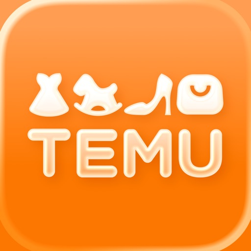

Visitez Temu pour des offres exclusives. 

Quels que soient vos désirs, Temu a ce qu'il vous faut, mode, décoration intérieure, DIY, produits de beauté, vêtements, chaussures, et plus encore.

Téléchargez Temu aujourd'hui et profitez d'offres incroyables tous les jours.

PROMOS EXCEPTIONNELLES D'OUVERTURE
Achetez des cadeaux pour vous et vos proches. Profitez de jusqu'à -90% !

GRANDE SÉLECTION
Découvrez des milliers de nouveaux produits et boutiques.

PRATIQUE
Paiement rapide et sécurisé.
Livraison et retours gratuits sous 90 jours.
*D'autres conditions peuvent s'appliquer.

Visitez temu.com ou suivez-nous sur :
Instagram: https://www.instagram.com/temu/
TikTok: https://www.tiktok.com/@temu 
Facebook: https://www.facebook.com/shoptemu
Youtube: https://www.youtube.com/@temu

[View on Apple](https://apps.apple.com/jp/app/temu-%E5%84%84%E4%B8%87%E9%95%B7%E8%80%85%E6%B0%97%E5%88%86%E3%81%A7%E3%81%8A%E8%B2%B7%E3%81%84%E7%89%A9/id1641486558)

## ファミマのアプリ「ファミペイ」

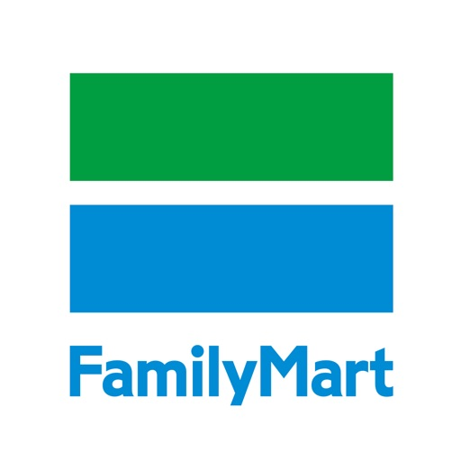

ファミリーマートでのお買い物が、もっとお得に楽しくなるアプリです。
◆クーポン・ポイント・決済が１回のバーコード提示ですべて完了！
◆お得なクーポン配信中！
◆バーコード決済で簡単にお支払い！
◆dポイント、楽天ポイント、Vポイントがたまる・つかえる！
◆ファミペイは街のお店でもお支払いできる！

＜主な機能＞
【クーポン】
・ファミリーマートでご利用いただけるお得なクーポンをお届けします。
・レジに行く前に使いたいクーポンをセットし、お会計時にバーコードを提示いただくことで使えます。

【チャレンジ】
・対象商品を購入して、スタンプをためるとクーポンなどを獲得できます。
・ゲームに挑戦し、あたるとクーポンなどを獲得できます。
・届いたアンケートに回答するとファミマポイントなどを獲得できます。

【ポイント】
・dポイント、楽天ポイント、Vポイントよりお好きなポイントを選んで、ためる・つかうことができます。
・事前にポイントカードの情報を登録して、ためる・つかうポイントを１つ選んでください。

【決済】
・ご利用履歴はいつでもアプリ内で確認できます。
・ファミペイは街のお店でもご利用できます。ネットのお店（JCB加盟店）の場合、ファミペイ バーチャルカードのカード番号で決済することも可能です。Apple Payに設定することで街のお店（QUICPay+加盟店）でもご利用いただけます。
・アプリ内で公共料金や各種料金の請求書（払込票）のお支払いができます。
※お支払いできない請求書（払込票）がございます。
※ファミリーマート店舗で支払える請求書（払込票）の場合でもアプリ内ではお支払いできない場合がございます。

【チャージ】
4種類の方法から選んでチャージができます。
 -レジで現金チャージ
 -クレジットカード（JCBブランド）でチャージ
 -銀行口座からチャージ
 -ファミペイローンからチャージ
・ギフトコードをお持ちの場合は入力することでチャージができます。
・事前チャージ不要でクレジットカードのように後日まとめて支払いができる「ファミペイ翌月払い」もご利用いただけます。
※「ファミペイ翌月払い」は、お申込みいただける方のみアプリ上のサービスアイコンからお手続きいただけます。お申込み後、ご利用には所定の審査があります。

【ファミマポイント】
・ファミペイでお支払いいただくと、200円(税込)につき、ファミマポイントが１ポイント(１円相当）たまります。
・ファミマポイントは１ポイント１円として、ファミペイ決済にご利用いただけます。
・ポイントとは別にファミマポイントがたまります。
※マルチコピーサービス、公共料金・各種お支払いは１件につき、10ポイント（10円相当）がたまります。
※一部商品・サービスではファミマポイントはたまりません。
※「ファミペイ翌月払い」のご利用はファミマポイントが2倍になります。

【回数券】
・回数券はファミペイ上で ファミペイ決済にて購入できます。 クーポンと同じようにファミペイにセットしてご利用になれます。
・メール、SNS等でお友達に贈ることもできます。

その他にも、電子レシート、店舗検索などの機能もお使いいただけます。

＜推奨環境＞
iOS 16～26

・クーポン、回数券、ファミペイ決済、ポイント、スタンプ、ゲームなどの機能の利用には、簡単な会員登録が必要です。
・ポイントカードの登録には、dアカウント、楽天ID、Yahoo!JAPAN ID等が必要です。
・このアプリはインターネットに接続します。インターネット接続ができない場合はご利用いただくことができません。
・アプリのご利用には通信料がかかります。
・銀行口座の登録には各銀行により、登録内容が異なります。
・クーポン・回数券は、利用できる店舗、利用期限などが異なります。配信していない期間もございます。
・スタンプ・ゲーム・アンケートは、賞品内容が実施時期により異なります。配信していない期間もございます。
・クーポン・回数券の商品は、一部の地域および一部の店舗では取扱いのない場合がございます。
・ファミリーマートの一部店舗では、このアプリは使用できません。

[View on Apple](https://apps.apple.com/jp/app/%E3%83%95%E3%82%A1%E3%83%9F%E3%83%9E%E3%81%AE%E3%82%A2%E3%83%97%E3%83%AA-%E3%83%95%E3%82%A1%E3%83%9F%E3%83%9A%E3%82%A4/id1138196572)

## CHARGESPOT チャージスポット スマホ充電レンタル

QRスキャンでモバイルバッテリーが手軽に借りられる！

スマホ充電レンタル「CHARGESPOT（チャージスポット）」

スマホの充電切れそう…そんな不安は過去のもの。

あなたのスマホにCHARGESPOTアプリがあれば

モバイルバッテリーを手軽に借りて、「行き先で、スポッと返却！」

▼使い方

STEP1：

アプリをダウンロードしてユーザー情報を登録しよう！

STEP2：

アプリで近くのバッテリースタンドがあるスポットを探そう！

STEP3：

QRをスキャンして、モバイルバッテリーを取り出そう！

STEP4：

同じ場所で返す必要はありません。充電しながら自由に移動して、行き先で、スポッと返却！スロットに差すだけのかんたん操作！

▼サービスの特徴
・スマホ充電レンタル全国設置数No.1（自社調べ）

・コンビニや駅、カラオケ店、カフェ、携帯ショップ、商業施設、空港など様々な場所で借りられる

・全国にバッテリースタンドは47,000台以上 ※2024年12月末時点

・別の場所で返却OK

・QRスキャンでモバイルバッテリーをレンタル

・モバイルバッテリーにはケーブルが3タイプ内蔵 (Lightning・USB Type-C・MicroUSB)

▼選べるお支払い方法

・クレジットカード

・Apple Pay

・PayPay

・メルペイ

・楽天ペイ

・d払い

・ソフトバンクまとめて支払い

・auかんたん決済

・Paidy

▼こんな方におすすめ

・外出中に手軽にスマホ充電したい方

・モバイルバッテリーを常に持ち歩きたくない方

・SNSやゲーム、動画配信サービスでバッテリーをよく消費する方

[View on Apple](https://apps.apple.com/jp/app/chargespot-%E3%83%81%E3%83%A3%E3%83%BC%E3%82%B8%E3%82%B9%E3%83%9D%E3%83%83%E3%83%88-%E3%82%B9%E3%83%9E%E3%83%9B%E5%85%85%E9%9B%BB%E3%83%AC%E3%83%B3%E3%82%BF%E3%83%AB/id1272481966)

## ジーユー

【ジーユーアプリで、便利におトクにお買い物。お店でもオンラインストアでもお買い物をもっと楽しく】
ジーユーのすべての商品が揃うオンラインストアなら、お気に入りの商品とスタイリングが見つかる。
賢くおトクに、旬の最新トレンドをあなただけのスタイルで。
自分を新しくする自由を。あなたの手のひらの中から。

● ジーユーアプリのご紹介
・オンライン新規会員登録で、オンラインストアで使える500円分のクーポンをプレゼント
・オンラインストアなら限定商品や先行販売商品、XS・XXLなど特別サイズも豊富。すべてのジーユー商品からお買い物ができます
・お店の在庫状況を、アプリから簡単にチェックできます
・「店舗受取り」なら、靴下1枚だけでも送料0円で受け取れます
・レジで「会員証」を提示すると、アプリ会員だけの特別価格でおトクに買えます

● 他にも便利な機能がたくさん
・気になる商品をお気に入りして「リスト」で次のお買い物を計画
・気になる商品の再入荷やお値下げは「メッセージ」としてお知らせします
・毎週の新作や、おトクな情報を「ニュース」にお届け
・位置情報を許可すれば、お店で便利に使える「店内モード」が利用できます
・店舗スタッフのスタイリング「StyleHint投稿スタイリング」や公式スタイリング集「STYLING BOOK」も充実。あなたのコーディネートの幅をぐっと広げます

● こんな方にオススメ
・最旬のファッション情報を手に入れたい
・「先行販売商品」や「一部店舗限定」の商品を含む、全てのジーユー商品から選んで買い物をしたい
・ジーユーの「アプリ会員限定価格」で、おトクにお買い物をしたい
・よく行く店舗の在庫を確認して、時間を有効活用したい
・新しいスタイリングや、みんなのコーディネートを服選びの参考にしたい

[View on Apple](https://apps.apple.com/jp/app/%E3%82%B8%E3%83%BC%E3%83%A6%E3%83%BC/id504542019)

## ReelShort - Stream Drama & TV

Bienvenue sur ReelShort, la plateforme de streaming HD pour tous types de courts métrages dramatiques captivants ! Reconnus par Times100 pour notre innovation dans l'industrie du divertissement, nous changeons votre façon de regarder des films avec des épisodes d'une minute que vous pouvez apprécier n'importe où, n'importe quand !

Choisissez parmi notre collection infinie de contenus addictifs ajoutés quotidiennement, des rencontres romantiques avec des milliardaires et des tragédies déchirantes aux histoires épiques de come-back, et bien plus encore. Vous ne manquerez jamais de divertissement !

Histoires en vedette :

• [Ne me Regrettez pas] : Orpheline, je trouve refuge chez ma marraine Sandra et ses deux fils, les frères Miller, qui m'accueillent avec tendresse. Je rêve d'un avenir avec l'un d'eux, jusqu'à ce que Lola, fille de leur domestique, bouleverse tout. Mon cœur vole en éclats quand ceux que j'aime me trahissent. Une fois partie, ils deviennent fous en me cherchant partout.

• [Écartez-vous ! Je suis le boss final] : Kingsley est Roi dans le plus grand des secrets, ainsi qu'à la tête des Fonds souverains et donc l'homme le plus riche sur Terre. Cependant, lors de son retour de déploiement en zone de guerre, son amour de jeunesse met brutalement fin à leur relation, avançant qu'il n'est rien d'autre qu'une farce. Comment le Roi de tous les hommes va-t-il s'y prendre pour lui faire ravaler sa fierté ?

Pourquoi vous allez adorer ReelShort :
• Des originaux en format courts que vous ne pourrez pas lâcher.
• Des émissions exclusives avec du contenu vertical captivant qui vous accrochera
• De nouvelles émissions ajoutées quotidiennement, avec des centaines de nouveaux épisodes chaque semaine
• Divertissement de qualité Hollywoodienne, conçu pour le grand écran et livré sur un petit écran près de vous
• Les premiers spectacles interactifs en direct pour mobile où vous décidez de ce qui se passe ensuite

Vivez l'avenir du divertissement, minute après minute – téléchargez ReelShort dès maintenant !
"Crazy Maple Studio is quietly changing the streaming game with its ReelShort app." - Time100 
"The biggest player in this new genre is ReelShort." - New York Times
"Every minute has a hook that keeps you watching." - Wall Street Journal
"ReelShort, which has dozens of shows — similarly light on character development and packed with curveballs — made for binge-watching in minutes." - Washington Post

Autres:
• Si vous vous abonnez via Apple, le paiement sera débité de votre compte App Store lors de la confirmation de l'achat.
• Privilèges d'abonnement : Tant que votre abonnement est actif, vous pouvez regarder toutes les histoires gratuitement.
• Votre abonnement prendra effet dans les 24 heures suivant l'achat, en fonction du statut de votre commande dans l'Apple Store. L'abonnement est valable pendant 7 jours.
• Renouvellement automatique : Votre abonnement sera automatiquement renouvelé. Vous serez facturé dans les 24 heures avant le début de chaque période d'abonnement jusqu'à ce que vous annuliez votre abonnement.
• Annulation : Sur les appareils iOS, vous pouvez annuler votre abonnement au moins 24 heures avant la date de renouvellement suivante en allant dans Réglages > iTunes & App Store > Apple ID > View Apple ID > Subscriptions > ReelShort.
• L'abonnement est facturé chaque semaine. Le prix réel peut varier selon la région.

Conditions de service : https://crazymaplestudios.com/v/user-agreement
Politique de confidentialité : https://crazymaplestudios.com/v/privacy-agreement

[View on Apple](https://apps.apple.com/jp/app/reelshort-%E3%82%AA%E3%83%AA%E3%82%B8%E3%83%8A%E3%83%AB%E7%9F%AD%E5%B0%BA%E3%83%89%E3%83%A9%E3%83%9E%E8%A6%8B%E6%94%BE%E9%A1%8C/id1636235979)

## BUMP - ショートドラマ / Short Drama

【ダウンロード数300万突破 BUMP】
ショートドラマアプリBUMP（バンプ）は、SNSで話題のショートドラマやショートアニメが見れるショートドラマアプリです。
全話無料で視聴ができるドラマも配信しています。

ショートドラマは、たった数分で心揺さぶる体験ができるのでTVドラマ、映画とは違った楽しみ方が可能です。
数分で楽しめるショート動画だから通勤・通学の合間やちょっとした空き時間にいつでもどこでも視聴できます。
                
【BUMPの特徴】
■日本初のショートドラマアプリ
BUMPは、日本初のショートドラマアプリです。
1話1~3分程で視聴でき、トイレの中の1分間、電車待ちの3分間、友達を待っている5分間の隙間時間や暇な時間をたった数分でショートドラマやアニメの世界に没入できる作品をお届けします。

■ショートドラマ（Short Drama）・アニメ（Anime）
不倫・復讐、女性同士のマウント合戦、下剋上や正体隠しなどの勧善懲悪、恋愛・サスペンス・ミステリー・青春・BL・韓国ドラマ・中国ドラマ・都市伝説と幅広いジャンルの縦型・横型で視聴が可能。新作も続々追加！ 
                
■無料でも楽しめる！
「待つと無料」や「CMで無料」を使用することで誰でも無料でドラマやアニメを視聴できます。
全話無料の作品もあるので、気軽に視聴が可能です！

■ 最新のショートドラマを続々追加
今話題のショートドラマや注目作品を随時更新！
最新作をチェックして、あなたのお気に入りのドラマを発見しよう！
                
■人気のショートドラマ＆ショートムービーを簡単にチェック
作品一覧画面から他のユーザーが注目する人気作品をランキング掲載しています。今話題のショートドラマをすぐに発見！
                
■ショートドラマが何十倍にも感じる再生体験
ドラマのハラハラするシーンや推しのかっこいい瞬間を何度も視聴したり、再生速度をあなた自身の好みに調整して快適に視聴することもできます！
さぁTikTokやYouTube・Instagramで人気のショートドラマをアプリ内で一気に視聴しよう！
                
■安心・安全な公式アプリ 
BUMPは著作権者さまからコンテンツ使用許諾を得た正規版配信サービスです。
海賊版サービスとは異なり、安心・安全に短編ドラマを閲覧することができます。
                
【こんな方におすすめ】
・全話無料のドラマを楽しみたい
・本格的なドラマや映画のショートムービーを無料で観たい
・小説や漫画(コミック)をよく読む方
・ドラマ、TV、アニメ、映画、短編ドラマ、ショートムービーが大好き
・ショートドラマ（Short Drama）を撮影してみたい
・暇な時間に短編ドラマを観たい
・地上波テレビにはないオリジナル無料ドラマ作品を観たい
・恋愛、ラブストーリー、ラブコメディー、不倫、浮気、BL（ボーイズラブ）などの恋愛ドラマに関係するコンテンツが好き
・ホラー、ミステリー、復讐劇などのハラハラドキドキが好き
・TVが家にないのでショート動画配信アプリで無料ドラマやアニメを観たい
・ドラマをよくアプリで視聴する
・SNSのリール（Reels）などでショート動画、特にショートドラマを見るのが好き
・おうち時間が増えたので、家で恋愛ドラマや韓国ドラマ、中国ドラマ、アニメなどを鑑賞したい
・話題のドラマ、流行りの映画を先取りしたい
・通勤/通学時間でショートドラマ、ショートムービーなどを観たい
・テレビで放送されていないドラマをアプリで観たい
・短編映画、ショートフィルム、シネマ、短尺動画が好き
・人気の俳優やインフルエンサーが登場するドラマが観たい
・トレンドの短編ドラマやショート動画が気になっている
・無料ドラマや無料ショートムービーを探している方   
・サブスクに登録して、全部のドラマを見放題で一気にみたい     
                
※一部有料のドラマもございます。
※一日に無料で視聴できる話数に制限がございます。
※予告なく内容や日程が変更となる場合がございます。

ご要望・ご質問・不具合は『BUMP』アプリ内のお問い合わせフォームからご連絡ください。

利用規約: https://frontend.bump.systems/rules/service-terms
プライバシーポリシー: https://frontend.bump.systems/rules/privacy-policy

[View on Apple](https://apps.apple.com/jp/app/bump-%E3%82%B7%E3%83%A7%E3%83%BC%E3%83%88%E3%83%89%E3%83%A9%E3%83%9E-short-drama/id1630710367)

## カラオケBanBan

全国約360店舗を展開する「カラオケBanBan」の公式アプリです。

ご来店時にアプリの会員証をご提示いただくだけで、お得な会員料金でご利用できるほか、ポイントが貯まり、ランクに応じた割引や特典をご利用いただけます。

＜主な機能＞

・アプリ会員証　
　アプリ画面の二次元コードを提示するだけで、いつでもお得な会員料金でカラオケをご利用いただけます。

・アプリ予約
　24時間いつでもアプリから簡単にご予約が可能です。
　当日のご予約もアプリ内で完結・即時確定するため、スムーズにご案内できます。予約内容の確認・変更もアプリからいつでも行えます。

・ポイントの利用
　ポイントは１pt＝１円としてお会計時に使用することができます。
　ポイントは複数人で利用した場合、アプリ会員全員に付与されます。※ポイントの取得には伝票の二次元コードの読み取りが必要になります。

・ランク特典
　ポイントを貯めると、ランクがあがります。来店時のポイント獲得数がアップするほか、お得なクーポンを特典としてプレゼントいたします。

・クーポン
　お得にカラオケを利用できるアプリ限定クーポンを多数ご用意しております。お会計時に割引として利用することができます。

・店舗検索
　エリア・機種・設備などの条件を指定して、ご希望の店舗を検索できます。
　店舗ごとの詳細ページでは、地図や料金表、フードメニューなど様々な情報がご覧いただけます。

[View on Apple](https://apps.apple.com/jp/app/%E3%82%AB%E3%83%A9%E3%82%AA%E3%82%B1banban/id6717609264)

## 楽天市場 - お買い物で楽天ポイントが貯まる便利な通販アプリ

日本最大級の通販サイト「楽天市場」の公式アプリでショッピング
登録商品数【3.6億点以上】・出店店舗数【約5万6千店舗】！
簡単に買い物できて、安心・安全な取引ができる通販アプリです。
いつでもどこでも気軽にショッピングをお楽しみください。
※登録商品数:2022年3月時点、出店店舗数:2022年4月時点

----------------------

◇お客様満度No.1(※)の楽天ポイントが貯まる・使える！
　楽天市場のお買い物では、購入金額に応じて楽天ポイントがザクザク貯まる！
　貯まったポイントは楽天市場でのお買い物に使える。
　※ポイントに関する調査、有効回答＝1,000、インターネット調査、2022年11月、実施機関：マイボイスコム

◇楽天のグループサービスを使えば使うほど、楽天市場でのお買い物がおトク！
　◆楽天カード支払いで誰でも毎日ポイント3倍！
　◆楽天モバイル最強プランご契約者ならさらに＋4倍！
　https://event.rakuten.co.jp/campaign/point-up/everyday/point/

◇楽天スーパーDEALでは、最大50％ポイントバック！
　対象商品の購入金額の一部をポイントで還元！
　◆10％〜50％ポイントバック
　◆楽天会員であれば誰でも利用できる
　◆人気ブランドを含む対象商品が毎日更新
　https://event.rakuten.co.jp/superdeal/

◇日本を元気に！47都道府県の特産品やふるさと納税の返礼品も
　楽天ふるさと納税では、約1,600の自治体への寄付を受け付け！(※)
　自治体への寄付を通じて、グルメや日用品、伝統工芸品やトラベルクーポンまで、魅力あふれる返礼品を楽天市場からお選びいただけます。
　◆寄付で地域を応援できる
　◆約60万点の返礼品数(※)
　※自治体数・返礼品数:2025年9月時点

◇楽天公式ファッション通販サイト「Rakuten Fashion」に出店する人気ブランドのファッションアイテムも買える！
　◆発送日から16日以内の未使用品は返品可能(※)
　◆靴の交換無料
　※一部対象外の商品がございます。
　https://brandavenue.rakuten.co.jp/guide/whatsrba/

----------------------
楽天市場アプリはこんな方におすすめ！
----------------------

◇楽しくショッピングしたい
◇ネットショップ・通販・買い物アプリが好き
◇時間・場所に関係なく、いつでもショッピングをしたい
◇安心・安全な通販サイトでショッピングをしたい
◇クーポンを利用してお得に買い物したい
◇キャンペーンを利用してお得に買い物したい
◇楽天ポイントで毎日ポイ活をしている
◇買い物しながらポイ活をしたい
◇ふるさと納税に興味がある
◇ふるさと納税の返礼品を検索したい
◇最新の人気商品ランキングを毎日チェックしたい
◇お気に入りのショップリストを作成したい
◇ショップリストを整理して、節約したい
◇ファッション・日用品などの欲しい商品はネットショップで検索する
◇最新のセール情報やクーポンを毎日チェックしたい
◇楽天ポイントを貯めている
◇楽天のグループサービスを利用している
◇初めて通販サイトを利用して買い物する
◇どの通販サイトを選べば良いか分からない

----------------------
おすすめポイント
----------------------

◇欲しい商品が簡単に見つかる！便利な検索機能
　3.6億点以上の商品から欲しい商品を簡単に見つけよう！
　キーワード検索やジャンル検索、画像検索、バーコード検索など、多数の検索方法を用意。
　その時々の最適な方法で欲しい商品を探すことができます。

◇類似商品をかしこく比較できる！
　類似商品を探せる「似た商品を探す」ボタンや値段の安い商品探せる「同じ商品を安い順で見る」ボタンを使って、類似商品をかしこく比較しよう！
　さらに、商品についての評価や感想が分かる「商品レビュー」も、商品の比較に役立ちます。

◇分からないことはショップに問い合わせてすぐ解決！
　商品ページから、チャット形式でショップへ相談することができます。
　商品について、配送について、支払いについてなど、分からないことは気軽に相談！すぐに解決！

◇豊富な決済方法に対応！
　楽天市場では、主に以下のお支払い方法のご利用が可能です。
　・クレジットカード
　・銀行振り込み
　・後払い決済
　・代金引換
　・コンビニ決済（セブンイレブン・ローソン、郵便局ATM等）
　・請求書払い　等
　※各ショップで対応している決済方法が異なります。

◇気になる商品を「お気に入り」に追加して、買い物リストを作成しよう！
　「お気に入り」に追加した商品は、値下げやポイントアップをお知らせします。
　さらに、好きなショップを「お気に入り」に追加して、自分だけのショップリストを作成することもできます。

◇人気の商品は何？売れ筋商品ランキング
　3.6億点以上の商品の中から売れ筋商品ランキングが一目で分かる！
　ジャンル別や男女別、週間ランキングやリアルタイムランキングなど、様々なランキングをチェックできます。

◇お得なクーポンを毎日更新中！
　楽天市場内で獲得できるクーポンや、ショップから贈られるクーポンを使い、さらにお得にお買い物ができる！
　獲得したクーポンは「myクーポン」から一覧で見ることができ、利用期限が迫ったクーポンはお知らせで通知されるので安心！
　※クーポンは楽天会員のみ利用可

◇セールやキャンペーンに参加しよう！
　楽天市場では、一年を通してたくさんのキャンペーンを随時開催！
　人気商品をお得な価格で手に入れられるかも!?
　◆楽天スーパーSALE：半額商品・割引商品が目白押しの大型セール＆「ショップ買い回り」でポイント最大10倍のお得なキャンペーン
　　https://event.rakuten.co.jp/campaign/supersale/guide/
　◆お買い物マラソン：「ショップ買い回り」でポイント最大10倍のお得なキャンペーン
　　https://event.rakuten.co.jp/campaign/point-up/marathon/guide/

◇季節に応じた様々な特集が盛りだくさん！
　母の日や、父の日、バレンタインデーからクリスマスまで、楽天市場では一年中シーズナル特集を用意しています。
　好みから選ぶ人も、特典から選ぶ人も、予算から選ぶ人もあなたにぴったりな商品が見つかります。

◇アプリ限定の機能やコンテンツも！
　◆毎日挑戦！当たってポイ活！アプリ限定ラッキーくじ
　　毎日引けるラッキーくじで楽天ポイントを獲得しよう。
　◆便利なPush通知機能
　　購入した商品の発送通知、気になる商品のポイントアップや値下げ通知など、あなただけの情報をリアルタイムでお届けします。

----------------------
楽天市場の特徴
----------------------

「楽天市場」は開設25周年！※2022年5月時点
5万6千以上の個性豊かな出店店舗が集まる日本最大級のインターネット・ショッピングモールです。
3.6億点以上の商品の中から、あなたにぴったりの商品が見つかります。
※登録商品数:2022年3月時点、出店店舗数:2022年4月時点

◇取扱商品のジャンル一覧
【ファッション】
レディースファッション
メンズファッション
キッズ・ベビーファッション
インナー・下着・ナイトウェア
バッグ・小物・ブランド雑貨
靴
腕時計
ジュエリー・アクセサリー

【グルメ・飲料】
食品
スイーツ・お菓子
水・ソフトドリンク
ビール・洋酒
ワイン
日本酒・焼酎

【日用品・ヘルスケア】
日用品雑貨・文房具・手芸
ダイエット・健康
医薬品・コンタクト・介護

【コスメ・ヘアケア】
美容・コスメ・香水

【ベビー・キッズ】
キッズ・ベビー・マタニティ
おもちゃ

【家電】
家電
TV・オーディオ・カメラ
タブレットPC・スマートフォン
パソコン・周辺機器

【スポーツ・アウトドア】
スポーツ・アウトドア
ゴルフ用品

【車体・オートパーツ】
車用品・バイク用品
車・バイク

【住まい・ペット・DIY】
インテリア・収納
寝具・ベッド・マットレス
キッチン用品・食器・調理器具
ペットフード・ペット用品
花・観葉植物
ガーデン・DIY・工具
サービス・リフォーム

【エンタメ・ホビー】
ゲーム
CD・DVD
ホビー
楽器・音楽機材
本・雑誌・コミック

◇お買い物をサステナブルに
　楽天市場では、サステナブルなお買い物を提案するインターネット・ショッピングモール&オンラインメディアを開設し、楽天市場で購入できる未来の環境、社会、経済に配慮してつくられた商品を紹介しています。
　https://event.rakuten.co.jp/earthmall/

◇安心・安全なお買い物を
　楽天市場は、お客様にどのショップでも安心・安全なお買い物を楽しんでいただけるよう、さまざまな取り組みを行っています。
　https://event.rakuten.co.jp/anshin/

◇ヘルプ･お問い合わせ
　https://ichiba-smp.faq.rakuten.net/

[View on Apple](https://apps.apple.com/jp/app/%E6%A5%BD%E5%A4%A9%E5%B8%82%E5%A0%B4-%E3%81%8A%E8%B2%B7%E3%81%84%E7%89%A9%E3%81%A7%E6%A5%BD%E5%A4%A9%E3%83%9D%E3%82%A4%E3%83%B3%E3%83%88%E3%81%8C%E8%B2%AF%E3%81%BE%E3%82%8B%E4%BE%BF%E5%88%A9%E3%81%AA%E9%80%9A%E8%B2%A9%E3%82%A2%E3%83%97%E3%83%AA/id419267350)

## アンドエスティ

グローバルワーク、ニコアンドなどのブランドが集結したファッション通販サイト「and ST (アンドエスティ)」の公式アプリ。

オンラインショッピング機能とお店で使える会員カードをひとつに、もっと便利にお買いもの。
たくさんの商品レビューや毎日更新のスタイリングはもちろん、アプリだけのコンテンツも。

アンドエスティアプリのご紹介

・会員証
お店でのお買いものに使える会員バーコードが、簡単に表示できます。
アンドエスティやお店での購入アイテムや、お持ちのクーポン情報も見られます。

・ホーム
ファッションやライフスタイルなど、幅広いラインナップから商品を見つけられます。
ランキングでは人気のアイテムを年代別にチェックできます。

・ポイントが貯まる、使える
1日1回、アプリを立ち上げてボタンをタップすると、ポイントGETのチャンス。
貯まったポイントは、アンドエスティとお店のどちらでもご利用いただけます。

・アイテム検索
2万点以上のアイテムから、ブランドやパンツ、トップスなどのカテゴリだけでなく、様々な条件を指定して検索できます。

・お気に入り
気になったアイテムやスタイリングはハートマークをタップしてお気に入り。
お気に入り登録したアイテムは一覧で見やすく管理できます。

・店舗検索
ブランドやエリアを指定して、お近くのお店が探せます。
商品詳細画面では、各店舗の在庫情報もチェックできます。

・メッセージ
お気に入りブランドやアンドエスティからのメッセージが届きます。
お得な情報や、クーポンなどの特典が届くことも。

ご利用上の注意
・会員証やポイントサービス等をご利用いただくには、アンドエスティ会員登録・ログインが必要となります。
また、会員登録時にはご住所などお客様情報をご入力いただきます。
・アプリ内の各サービスは通信を使用します。通信回線の状況によってはご利用いただけない場合がございます。

[View on Apple](https://apps.apple.com/jp/app/%E3%82%A2%E3%83%B3%E3%83%89%E3%82%A8%E3%82%B9%E3%83%86%E3%82%A3/id404786725)

## TimeTree タイムツリー - カレンダーや予定表の共有

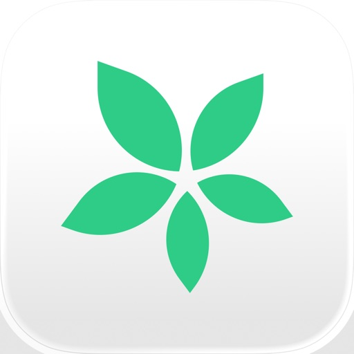

TimeTreeのある風景

○ 家族や夫婦で
「前から言ってたじゃん！」といった夫婦のすれ違いを無くしたいご家族。子供の送り迎え分担を共有のカレンダーに登録して忘れないようにしておきたいママやパパにピッタリ。いつでも持ち歩ける壁掛けカレンダーのようなアプリ

○ 仕事で
仕事においてスタッフ間のシフト（スケジュール）の管理をしたい人

○ カップルで
デートができる日を調整するためにお互い空いてる日を知りたいなど予定の調整に困っている方にピッタリ！

TimeTreeの特徴

○ カレンダーの共有
家族やカップル、仕事などグループごとの共有のカレンダーが作成できます

○ 通知・連絡
誰かが予定を作成/変更したりメッセージを送ると共有相手に通知が届くのでいちいち別アプリで確認をしなくても大丈夫

○ Google カレンダーとの連携
Googleカレンダーのデータもインポート/コピーできるのですぐに使い始められます。

○ 共有アルバム
写真を共有してグループごとにアルバムを作ることができます。

○ ToDoリストやメモ
日程が決まってない予定もあるので相手と共有できるメモ機能もあります

○ 予定ごとにチャット
作成した予定ごとにチャットができます。「何時？」「どこ？」も予定ごとの連絡でスッキリ！

○ PCでも
PC(Web)でもTimeTreeをご利用いただけます

○ 写真を予定に
予定ごとに写真や画像が投稿できます

○ 複数のカレンダー
共有カレンダーは複数作成することができます

○ スケジュール帳
スケジュール帳使いのユーザー目線で予定管理アプリを作りました

○ ウィジェット
カレンダーって毎日見るものだからアプリを開くのがめんどう。ウィジェットを設定しておけば予定・スケジュールの確認も簡単

こんなことで困ってませんか

○ パートナーとの連絡確認が不安
相手に予定が伝わっているのか不安になるときありませんか？予定連絡をTimeTreeにまとめれば毎回スケジュールの連絡確認をしなくて大丈夫！

○ 学校や保育園のイベント忘れ
プリントやお便りがゴチャゴチャして整理できていない人も締切日ごとに写真に収めておけばスッキリ。また日記/手帳代わりとしても

○ 趣味のイベントを見逃しがち
アーティストのライブ情報など見逃したくない情報は同じ趣味を持つ方たちと共有カレンダーを作成してスケジュール共有してみましょう

お問い合わせ用メールアドレス
support@timetreeapp.com

一年のスケジュール帳としてぜひTimeTreeをご利用ください！ユーザーのみなさまのご意見を大切にしております。ぜひ、ご意見ご感想（そしてたまにお褒めの言葉）もフィードバックお待ちしてます！

このアプリは以下の権限を利用します。オプション権限を許可しない場合でも、アプリの利用は可能です。
- 必須権限
ありません。

- オプション権限
カレンダー：デバイスのカレンダーを TimeTree に表示します。
場所情報: イベントの場所または地域を設定する際の提案の精度を向上させます。
写真へのアクセス: プロフィールやカレンダー等へ設定・投稿する場合や、端末に保存する場合に利用します。
カメラ: カメラを使用して、プロフィール、カレンダーなどに写真を設定して投稿します。
アプリからのリクエストを追跡する: より適切な広告を表示します。
通知: アプリからの更新やカレンダー イベントに関する通知を受け取ります。

[View on Apple](https://apps.apple.com/jp/app/timetree-%E3%82%BF%E3%82%A4%E3%83%A0%E3%83%84%E3%83%AA%E3%83%BC-%E3%82%AB%E3%83%AC%E3%83%B3%E3%83%80%E3%83%BC%E3%82%84%E4%BA%88%E5%AE%9A%E8%A1%A8%E3%81%AE%E5%85%B1%E6%9C%89/id952578473)

## CapCut: Foto- und Video-Editor

CapCut ist eine kostenlose App für die umfangreiche Videobearbeitung, mit der du tolle Videos erstellen kannst.

「Benutzerfreundlich」
Zuschneiden, umkehren und Geschwindigkeit verändern: Perfektion war noch nie so einfach; veröffentliche deine wunderbaren Momente.

「Hohe Qualität」
Erweiterte Filter und makellose Schönheitseffekte eröffnen eine ganz neue Welt an Möglichkeiten.

「Topmusikhits/Toller Klang」
Umfangreiche Musikbibliothek und exklusive urheberrechtlich geschützte Lieder

「Sticker und Text」
Mit den besten angesagten Stickern und Schriftarten kannst du dich in deinen Videos kreativ ausdrücken.

「Effekt」
Werde kreativ mit einer Vielzahl an magischen Effekten

Nutzungsbedingungen —
http://www.capcut.com/clause/terms-of-service

Datenschutzerklärung —
https://www.capcut.com/clause/privacy-policy

Kontakt: capcut.support@bytedance.com

[View on Apple](https://apps.apple.com/jp/app/capcut-%E5%86%99%E7%9C%9F-%E5%8B%95%E7%94%BB%E3%82%A8%E3%83%87%E3%82%A3%E3%82%BF%E3%83%BC/id1500855883)

## ビバムサシアプリ

「ビバムサシアプリ」は、くらしのお買い物を、もっとおトクに、快適にするアプリです。
【ビバムサシアプリでできること】
● ポイントが貯まる・使える
・お店のレジでアプリの会員証を提示すると、ビバホーム・ムサシで使えるポイント「ACPO(アクポ)」が貯まります。
・楽天ポイントを連携すれば、1つのバーコードを提示するだけで「ACPO」と楽天ポイントが一緒に貯まります。
・貯まったポイントはお買い物にご利用いただけます。
・会員登録された方は、直近1年間の購入金額に応じて会員ランクがアップし、最大4％の還元率でポイントが貯まります。
● チラシが見れる・キャンペーンに応募できる
・最新のチラシをアプリでチェックして、お買い得商品をすばやく確認できます。
・アプリ限定のキャンペーンにも、そのまま応募可能。もっとおトクにご利用いただけます。
・お買い得情報やキャンペーンをプッシュ通知で受け取れる。
● オンラインショップの商品を買える
・日用品、DIY、園芸、家具、ペット用品など豊富な品ぞろえから、欲しい商品を検索して購入できます。
● 店舗を検索できる
・お近くのビバホーム／ムサシの店舗を地図から検索して、営業時間、取り扱いサービスを確認できます。
・「お気に入り店舗」に追加するといつものお店の情報を簡単に確認できます。
【ご留意事項】
・ビバムサシアプリは、4G／LTE／Wi-Fi などのインターネット接続が必要です。接続環境により、チラシの検索・閲覧ができない場合があります。
・店舗検索ではGPS位置情報を使用します。お使いの端末の位置情報をONにしてご利用ください。
・一部の機能では、位置情報およびプッシュ通知を利用します。
・タブレット端末や一部機種では、動作の保証をしておりません。
・アプリが正常に動作しない場合は、端末の再起動やアプリの最新バージョンへのアップデートをお試しください。

[View on Apple](https://apps.apple.com/jp/app/%E3%83%93%E3%83%90%E3%83%A0%E3%82%B5%E3%82%B7%E3%82%A2%E3%83%97%E3%83%AA/id6749888354)

## zeta - AIキャラ・あなたの推しとロールプレイチャット

zeta(ゼタ)は、あなたの「推し」と自由に話せるAIチャットアプリです。
AIキャラとの会話はもちろん、夢小説・なりきり・乙女系ストーリーまで、zetaは全てを現実にします。
300万体以上のキャラクターの中から好きな相手を見つけて、無料で好きなだけ会話してみてください。

「小説や漫画を読むだけじゃ足りない。
zetaなら、自分の好きな展開をAIチャットで楽しめる。」
「スマホを開いた瞬間、
ここでは私が主人公。推しとの物語が始まる。」

【300万体以上のAIキャラと話せる】
幼なじみ、イケメン、ヤンデレ、BL、ヒロイン、異世界まで。
多種多様なAIキャラの中から、あなたの好みに合う相手が必ず見つかります！
気に入ったキャラがいなければ、オリキャラ作りも超簡単。
名前、性格、口調、設定まで…自分だけのキャラが1分で完成します。

【推し活・夢小説・なりきりがこれひとつで楽しめる】
zetaでは、あなただけの「推し」と会話を楽しむ
推し活アプリとしてはもちろん、夢小説アプリのように
理想のシチュエーションを作ったり、なりきりチャットで
好きな世界観に入り込んだりできます。
学園、恋愛、ファンタジーまで、好きな設定で自由に会話できるから、
自分だけのストーリーをAIと一緒にその場で作れます。

【何回話しても基本プレイ無料】
基本プレイは無料、推しとの会話を無限大に楽しめます。
気づいたら時間が溶けていく、
「夢中になれる」AIチャット体験があなたを待っています。

【AIがあなたをちゃんと覚えてくれる】
昨日話したことも、好きなことも、ふたりの思い出も全て覚えてくれます。
記念日には、推しから先に話しかけてくれることも。
ただ話すだけじゃない、関係を深められるAIチャットアプリです。

【会話からイメージも作れる】
会話した内容をもとに、AI画像生成でイメージも作れます。
キャラとの思い出や好きなシーンを、クリック一つで形にできます。

【返信に迷っても大丈夫】
迷った時は「オススメの返信機能」で解決！会話に困る心配0
夢小説もなりきりも、スムーズに楽しめます。

■ こんな人におすすめ
・推しと自由に会話できるAIチャットを探している人
・夢小説やなりきりチャットが好きな人
・イケメン、乙女系、ヤンデレ、BLなど好みに合うAIキャラを見つけたい人
・自分だけのオリジナルキャラ作成を楽しみたい人
・誰にも邪魔されない推し活空間がほしい人

■ 安心して使えます
キャラとの会話や個人情報は、安全に管理されています。
zetaはプライバシーを最重要に考え、
安心して楽しめる環境を目指し正式リリース以降、
ユーザーの声をもとに日々改善を続けています。

■ 公式チャンネル
X：https://x.com/zeta_officialJP
TikTok：https://www.tiktok.com/@zeta_jp_official

[View on Apple](https://apps.apple.com/jp/app/zeta-ai%E3%82%AD%E3%83%A3%E3%83%A9-%E3%81%82%E3%81%AA%E3%81%9F%E3%81%AE%E6%8E%A8%E3%81%97%E3%81%A8%E3%83%AD%E3%83%BC%E3%83%AB%E3%83%97%E3%83%AC%E3%82%A4%E3%83%81%E3%83%A3%E3%83%83%E3%83%88/id1619030760)

## ホットペッパーグルメ

「ホットペッパーグルメ」は人気の飲食店が多数掲載！アプリでかんたん検索・らくらく予約、さらにおトクなホットペッパーグルメ限定のクーポンも満載！！

■新機能追加
アプリで“今すぐ入れる近くのお店”を確認し、その場で席を確保できる「席押さえ」機能を提供開始しました！現在地周辺の空席をリアルタイムで検索・確保。

＝＝＝＝＝＝＝＝＝＝＝＝＝＝＝＝＝＝＝＝＝＝＝
ホットペッパーグルメアプリとは？
＝＝＝＝＝＝＝＝＝＝＝＝＝＝＝＝＝＝＝＝＝＝＝
～リクルートのグルメ情報サイト「ホットペッパーグルメ 人気の飲食店予約とおトクなクーポン検索」の公式アプリ～
・美味しいお店のおトクな割引や店内や料理のきれいな写真がたくさんある予約アプリ！
・レストランでの普段の食事から友人との飲み会、記念日や大切な日のお店選びまで、ホットペッパーグルメアプリなら無料でかんたん検索
・お店選びで迷ってもグルメなレポーターの口コミレポートを参考に
・話題の人気グルメも最新グルメもホットペッパーグルメアプリでかんたん検索
・行きたいお店が決まったらアプリでかんたんグルメ予約！
・席だけの予約もメニューを見てからの予約もどちらでも可能
・アプリからの予約は操作がかんたん！行きたいお店が決まったらワンタップで電話予約も営業時間を気にせずにネット予約も可能
・ご予約当日、最寄り駅からお店までのアクセスも見やすい地図で確認できる
・来店時にすぐ出せるグルメクーポンもアプリなら楽々表示
・グルメ予約でPontaポイントやdポイントも貯まる嬉しいサービス

「ホットペッパーグルメ 人気の飲食店予約とおトクなクーポン検索アプリ」で、 会社の歓送迎会や忘年会、友人との楽しいご飯、家族とのディナーや記念日も、いつもの食事に「嬉しい！」をプラスしよう！

＝＝＝＝＝＝＝＝＝＝＝＝＝＝＝＝＝＝＝＝＝＝＝
こんなシーン、ありませんか？
＝＝＝＝＝＝＝＝＝＝＝＝＝＝＝＝＝＝＝＝＝＝＝
・近くに安くておいしいお店、無いかな？
・明日のお出かけの後はおいしい料理をおトクに食べたい！
・今度のランチで予約しようと思ってるお店、割引でおトクに入れないかな…
・いつも行ってるファミレス、今日も行きたいんだけどせっかくならクーポン無いかな？
・食べ歩き中、現在地からお店を探したい！
・来週のデートは雰囲気が良いレストランがいいな(*^^*)
・あの焼肉店、一回行ってみたいんだけど電話しても予約でいっぱい…
・クリスマス直前だから、まだ空いてる穴場なレストラン無いかな？
・忘年会の幹事なのに、検索しても駅周辺の食べ放題・飲み放題の居酒屋が取れない(;_;)
・接待で予約しようと思ってるお店のメニュー、美味しそうかな？
そんなあなたが求めている条件にぴったりのお店を、「ホットペッパーグルメ 飲食店予約とおトクなクーポン検索アプリ」なら無料でかんたんに探すことができます。もちろん、おトクなクーポンも探せます。

＝＝＝＝＝＝＝＝＝＝＝＝＝＝＝＝＝＝＝＝＝＝＝
こんなお店、アプリで予約できちゃいます！
＝＝＝＝＝＝＝＝＝＝＝＝＝＝＝＝＝＝＝＝＝＝＝
・女子会やデートにオススメなお店
・今すぐ近くでランチを食べたい！そんな時のレストラン
・流行りのスイーツが食べられる話題のカフェ
・雰囲気の良いバーや夜カフェのお店
・二次会ですぐ入れるカラオケ
・誕生日や記念日ディナーなど、お二人の大切な日にサプライズができるお店
・結婚式の二次会に最適なおしゃれなお店
・食べ放題や飲み放題のメニューがあるオススメの居酒屋
・がっつり焼肉で流行りの肉会！
・飲み会の後の締めのラーメンをサクッと食べられる現在地周辺のお店
・年末年始の忘年会や新年会など、宴会やイベント向けにプロジェクターの使えるお店
・会食や歓送迎会の後の二次会にオススメな穴場の居酒屋
・接待にも使えそうな高級寿司の食べられる料亭

＝＝＝＝＝＝＝＝＝＝＝＝＝＝＝＝＝＝＝＝＝＝＝
ホットペッパーグルメアプリのおすすめポイント
＝＝＝＝＝＝＝＝＝＝＝＝＝＝＝＝＝＝＝＝＝＝＝
■お店の空き状況を見て、すぐに予約できる！
お店の空席状況を確認して空きがあれば、すぐに予約ができます。二次会のお店探しにも便利です。（※即予約に対応している店舗に限ります。）

例えば：『会社の飲み会が終わって幹事のお仕事も一段落！と思いきや、二次会に行く流れに…』
▷ ホットペッパーグルメアプリなら、大丈夫です！

二次会は雰囲気の良い飲み屋ご希望ですか？それともカラオケやダーツなど、遊べるところですか？
今日の日付・現在地に近いエリア・行きたいお店のジャンルを選べば、今すぐ予約できるお店だけ見つけられます！

■お好みの条件に絞ってお店検索！
現在地や駅・エリア、お店のジャンルや予算などから厳選されたお店のリストから、お目当てのお店をサクサク探すことができます。

例えば：『いつもよく行く駅周辺で美味しい創作料理が食べられるお店って無いのかな？』
▷ 「エリアから探す」から、よく行く駅のエリアを選び、お店のジャンルで「創作料理」を選べば、かんたんに見つかります！
ネットですぐに予約できるお店に絞って検索したい場合は、「ネット予約ができる」にチェックを入れれば一覧で見つかります。

■便利な地図検索機能も！
地図検索で、オフィスの近くや観光地の近くなど、自分の行きたい場所の近くにあるお店が地図上で探せます。

例えば：『旅行に来てご当地グルメを探しているんだけど、初めての土地だし分からない…。』
▷ ホットペッパーグルメアプリなら、「現在地から探す」で今いるところ周辺のお店を地図上に表示できます！

■お店の画像がきれいで雰囲気が分かりやすい！
お店の雰囲気や料理の写真など、大きくて綺麗なお店の写真がたくさんあります。

例えば：『今度デートで行こうと思っているカフェ、店内の雰囲気とかどうなのかな…。』
▷ ホットペッパーグルメアプリなら、お店の料理から中の雰囲気までキレイな写真をサクサク見ることができます！

■いま営業中のお店がその場で見つかる！
現在地の近くで今営業中のお店を、地図からかんたんに探すことができます。

例えば：『美味しそうなイタリアンのお店を何軒か見つけたけど、空いてるか電話するのは大変だな…。』
▷ ホットペッパーグルメアプリなら、電話をかけずに空き状況を確認できます！

■クーポンでおトクに！
もちろん、おトクなクーポン情報もついています。お店でクーポン画面を掲示すると、クーポンに記載されたサービスを受けることができます。
※一部クーポンは、予約時にご提示が必要な場合もあります。

例えば：『ホットペッパーっておトクなクーポンがいっぱいあるって聞いたんだけど、せっかく幹事やるならクーポンで安くおトクに済ませたいなぁ。』
▷ ホットペッパーグルメアプリは、ユーザーの皆様がハッピーになれるようなおトクなクーポンをどんどん掲載していきますので、ぜひご利用ください！

■ネット予約でPontaポイントやdポイントがたまる！
「ホットペッパーグルメ 飲食店予約とおトクなクーポン検索アプリ」では、ネット予約して頂くとPontaポイントやdポイントがたまります。

例えば：『ホットペッパーってクーポンで割引とかできておトクなのは分かったけど、ポイントはたまらないの？』
▷ ホットペッパーグルメアプリなら、おトクなクーポンも使えてPontaポイントやdポイントがたまります！

※これらの「全ての機能を無料で」お使いいただけます。

※間違えやすいキーワード
hottopeppa-、ほっとぺっぱー、ほっとぺっぱーぐるめ

[View on Apple](https://apps.apple.com/jp/app/%E3%83%9B%E3%83%83%E3%83%88%E3%83%9A%E3%83%83%E3%83%91%E3%83%BC%E3%82%B0%E3%83%AB%E3%83%A1/id290033990)

## Spotify Musik und Podcasts

Entdecke eine riesige Auswahl an Podcasts und Musik – kostenlos auf Spotify. Stelle Playlists zusammen und streame Millionen von Songs, Alben und Podcasts kostenlos auf dem Smartphone oder Tablet. Mit Spotify Premium kannst du Musik herunterladen, Musik offline hören und mit Hörbüchern aus aller Welt in spannende Geschichten eintauchen.

Warum Spotify als Musikplayer und Podcast-App verwenden? Hier einige der Vorteile:
• Streame über 100 Millionen Songs und 6 Millionen Podcasts.
• Entdecke von Spotify zusammengestellte Playlists mit Musik von deinen Lieblingskünstler*innen.
• Suche schnell und einfach nach Lieblingssongs, -alben und -Podcasts.
• Erhalte personalisierte Musikempfehlungen ganz nach deinem Geschmack.
• Abonniere deine Lieblings-Podcasts kostenlos und stelle deine eigene Podcast-Bibliothek zusammen.

Spotify Free ist mehr als ein Musikplayer. Du kannst Podcasts und Musik kostenlos streamen, personalisierte Playlists entdecken oder deine eigenen zusammenstellen und teilen. Und auch bei Neuerscheinungen und Events deiner Lieblingskünstler*innen bleibst du immer auf dem Laufenden.
• Streame Millionen Songs und Podcasts kostenlos.
• Erstelle Playlists mit deiner Lieblingsmusik.
• Teile Songs und Playlists mit Freund*innen und Familie. (In manchen Regionen können Einschränkungen gelten.)
• Entdecke personalisierte Playlists. Du kannst auch welche mit Freund*innen erstellen.
• In „Dein Mix der Woche“ findest du jede Woche neue Songs, die dir gefallen könnten.
• Mit der Playlist „Release Radar“ und „New Music Friday“ bleibst du auf dem Laufenden.
• Finde heraus, wann deine Lieblingskünstler*innen in der Nähe auftreten.
• In Spotify Wrapped siehst du jedes Jahr deine am meisten gestreamten Songs, Genres, Künstler*innen, Podcasts und mehr.
• Höre Musik auf mehreren Geräten – Spotify macht’s möglich.
• Streame Musik über Spotify Connect auf Smart Speakern und gib Musik über PC, Laptop, Smart-TV, Chromecast, PlayStation®, XBOX®, Wearables, in deinem Auto und mehr wieder. Begrenzte Anzahl von Gerätemodellen.

Mit Spotify Premium genießt du die Vorteile eines Offline-Musikplayers und von Musik ohne Internet. Dank der Downloader-Funktion kannst du Songs, Podcasts und Playlists auch offline wiedergeben, egal wo du bist.
• Hör Musik, Podcasts und Hörbücher an einem Ort.
• Musik ohne Werbeunterbrechungen: Genieße deine Musik ohne Ads.
• Spiele Inhalte auf Abruf ab.
• Hörbücher mit Spotify Premium sind derzeit in Australien, Kanada, Irland, Neuseeland, den USA und dem Vereinigten Königreich verfügbar. Nutzer*innen von Premium Individual und Manager*innen von Duo und Family Abos können mit 15 Wiedergabestunden/Monat mehr als 250.000 Hörbücher streamen.
• Genieße hochwertiges Audio auf unterstützen Geräten.
• Spotify bietet jetzt einen KI-DJ: Dieser persönliche DJ kennt deinen Musikgeschmack und wählt Songs für dich aus.
• Streame über PC, Smartphone, Tablet, Smartwatch und im Auto.
• Hoste einen Jam mit Freund*innen, um in Echtzeit miteinander Musik zu hören und gemeinsam zu bestimmen, was als Nächstes läuft.
• Lade Musik herunter und hör Podcasts und Hörbücher offline, auch ohne Internetverbindung.
• Kein Vertrag erforderlich – das Spotify Premium Abo ist jederzeit kündbar.

Mit Spotify kannst du überall Musik spielen. Streame deine Lieblingssongs und entdecke neue Musik, Podcasts und Hörbücher mit der Musik-App von Spotify.

DIR GEFÄLLT SPOTIFY?
Folge uns auf Instagram: https://www.instagram.com/spotify
Folge uns auf TikTok: https://www.tiktok.com/@spotify

[View on Apple](https://apps.apple.com/jp/app/spotify-%E9%9F%B3%E6%A5%BD%E3%81%A8%E3%83%9D%E3%83%83%E3%83%89%E3%82%AD%E3%83%A3%E3%82%B9%E3%83%88/id324684580)

## dポイントクラブ：お得情報満載のドコモ公式ポイントクラブ

【Sensor Tower APAC Awards 2025 ベストポイントアプリ受賞！】

いつもdポイントクラブアプリをご利用いただき、ありがとうございます。
この度、dポイントクラブは「Sensor Tower APAC Awards 2025」にてベストポイントアプリ賞を受賞いたしました！
これからも皆様の毎日をおトクに彩る情報をお届けします。

◆【アプリ限定】ミッションを達成してポイントがもらえる！ 
◆【アプリ限定】dポイントスタンプを達成してポイントがもらえる！ 
◆【アプリ限定】毎日くじや、動画の視聴でポイントがもらえる！ 
◆アプリがポイントカードになる！バーコードもポイント確認もすべてdポイントクラブアプリで完結 
◆おトクなキャンペーン情報やクーポンを配信中！ 
◆dポイントクラブの会員ランクに応じておトクな特典も 
◆アンケートモニターになって、アンケートに回答するとdポイントがおトクにたまる！ 
dポイントクラブアプリでは、普段のお買物でつかえるモバイルdポイントカード機能やポイント・ランクの確認だけでなく、ミッションやdポイントスタンプへの参加、キャンペーンのエントリーやクーポンの獲得、ポイント投資などができます。 
 
------------------------------------- 
【アプリ限定】ミッション機能 
------------------------------------- 
dポイントクラブアプリでは、定期的にミッションが開催されます。 
このミッションをクリアするとdポイントがもらえるアプリだけの限定機能です。 
 
------------------------------------- 
【アプリ限定】dポイントスタンプ機能 
------------------------------------- 
普段のお買物でdポイントカードをかざしてdポイントをためると、アプリ上でスタンプがたまります。 
必要な数のスタンプをためるとdポイントがもらえるアプリだけの限定機能です。 
 
------------------------------------- 
dポイントがたまる・つかえるお店（一例） 
------------------------------------- 
■dポイント（街のお店） 
＜コンビニ／スーパー＞ 
ローソン、ローソンストア100、ファミリーマート、さくらみくら便利店、オークワ、スーパーセンターオークワ、PLANT、フジ、サンリブ・マルショク、ライフ、カブセンター、ラッキー 
 
＜ドラッグストア＞ 
マツモトキヨシ、サツドラ、トモズ、薬王堂、Fit Care DEPOT、ココカラファイン、クスリのアオキ、ウェルパーク、どらっぐぱぱす 
 
＜家電量販店＞ 
エディオン、ジョーシン、ノジマ 
 
＜百貨店・モール/ショッピング＞ 
髙島屋、小田急百貨店、ジェイアール名古屋タカシマヤ、ハンズ、トイザらス・ベビーザらス、ジョイフル本田、三井アウトレットパーク北陸小矢部、三井ショッピングパークららぽーと愛知東郷、三井ショッピングパークららぽーと名古屋みなとアクルス、ENEOS、コスモ石油、apollostation、伊藤忠エネクス 
 
＜ファッション＞ 
洋服の青山、niko and ...、GLOBAL WORK、studio CLIP、LOWRYS FARM、LEPSIM、BAYFLOW、JEANASIS、LAKOLE、repipi armario、RAGEBLUE、Heather、PAGEBOY、HARE、apart by、BABYLONE、mysty woman、BARNYARDSTORM、Andemiu、Curensology、Chaos、PAS TIERRA、Me％ 
 
＜グルメ＞ 
松屋、すき家、なか卯、かっぱ寿司、はま寿司、ガスト、バーミヤン、ジョリーパスタ、ビッグボーイ／ヴィクトリアステーション、熟成焼肉いちばん、かつ庵、牛庵、久兵衛屋、華屋与兵衛、焼肉キャンプ、宝島、スガキヤ、ココス、日高屋、モスバーガー、ゼッテリア、PRONTO、ミスタードーナツ、サンマルクカフェ、ドトールコーヒーショップ、エクセルシオールカフェ、モリバコーヒー、カフェミラノ、やまや、ビアードパパ 
 
■dポイント（ネットのお店） 
Amazon、メルカリ、and ST、WINTICKET、HOT PEPPER Beauty、ホットペッパーグルメ、じゃらんnet 
 
※ご利用可能提携先は順次追加予定です。 
 
------------------------------------- 
dポイントがたまる・つかえるサービス・プログラム 
------------------------------------- 
dカード、dヘルスケア、dショッピング、dファッション、dブック、Lemino、dアニメストア、eximo、eximoポイ活、ahamo、irumoなど 
 
------------------------------------- 
クーポンがつかえるお店 
------------------------------------- 
dポイント加盟店でクーポンを提示するだけでクーポンを使うことができます。 
対象者限定や先着制など、特別なクーポンが届くことも。 
※ご利用可能提携先は順次追加予定です。 
 
------------------------------------- 
近くのお店のお得情報の配信 
------------------------------------- 
dポイントクラブアプリでは位置情報（GPS）に基づき、近くのお店の特別なクーポン等のお得な情報をリアルタイムに配信します。 
※バックグラウンドでの位置情報取得を許可することにより、アプリを閉じているときや、使用していないときにも、お得な情報を受け取ることができます。 
 
------------------------------------- 
注意事項 
------------------------------------- 
■dポイントクラブ会員の方がご利用いただけます。 
■本アプリにおけるキャンペーンは、NTTドコモが企画・運営するものであり、Apple Inc.および、関連会社は一切関係ありません。 
■海外でのパケット通信は、日本国内とは異なる料金体系となりますのでご注意ください。

[View on Apple](https://apps.apple.com/jp/app/d%E3%83%9D%E3%82%A4%E3%83%B3%E3%83%88%E3%82%AF%E3%83%A9%E3%83%96-%E3%81%8A%E5%BE%97%E6%83%85%E5%A0%B1%E6%BA%80%E8%BC%89%E3%81%AE%E3%83%89%E3%82%B3%E3%83%A2%E5%85%AC%E5%BC%8F%E3%83%9D%E3%82%A4%E3%83%B3%E3%83%88%E3%82%AF%E3%83%A9%E3%83%96/id821434357)

## ABC-MARTアプリ

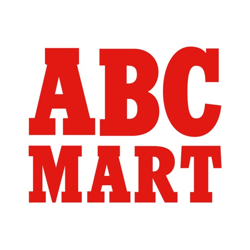

ABC-MART公式アプリがリニューアル。
店舗、オンラインストアでの購入でポイントが貯まり、割引として使えます。
貯まったポイントはお客様同士でプレゼントすることも可能です。
そのほか、店舗検索、商品検索、購入履歴、クーポン、オンラインストアなどの機能をご利用頂けます。

【主な機能】
・ポイント機能（会員証）
店舗、オンラインストアでの購入でポイントが貯まり、割引として使えます。
・オンライン連携
店舗とオンラインストアでポイント共通利用ができます。
・商品バーコードスキャン
商品バーコードを読み取ると商品詳細が確認できます。
・お気に入り（商品・店舗）
いくつかの商品を比較したいときに便利です。お気に入り店舗からお得な情報が届きます。
・購入履歴
買ったシューズのサイズが確認できるので同じものを買いたい時に便利です。
・抽選申込
イベントに参加したり、数量限定商品を購入する権利を抽選で手に入れることができます。

[View on Apple](https://apps.apple.com/jp/app/abc-mart%E3%82%A2%E3%83%97%E3%83%AA/id1299642230)

## ahamo（アハモ）

ahamoアプリなら・・・
◆都度ログインいらずで気になる利用料金・データ通信量が一目でわかる！
◆わからない手続きはチャットで相談できる！
◆「ahaクエスト」への参加でちょっとうれしい特典がもらえる！

-------------------------------------
日々のスマホライフでの「気になる」が一目でわかる！
-------------------------------------
dアカウントで一度ログインしていただくと、月々の利用料金・データ使用量が毎回のログインいらずですぐに確認できます。
ウィジェットを使えば、ホーム画面での利用GB状況の確認もできます。
データ使用量はグラフで表示されるので、残りデータ量がわかりやすく、足りなくなったらデータを追加することも可能です。

-------------------------------------
【アプリ限定】「クエスト」参加でちょっとうれしい特典がもらえる！
-------------------------------------
・毎日アプリにログインするだけ
・データ通信を利用するだけ
でちょっとうれしい特典がもらえる「クエスト」実施中！

ホーム画面の中央の宝箱アイコンから参加できます。

※クエスト・報酬は予告なく変更することがあります。
※クエスト・報酬は月により異なります。

-------------------------------------
お困りごとはチャットで解決！
-------------------------------------
「どうやるんだろう？」というお困りごとは、チャットから相談できるので、安心してahamoを利用できます。

[View on Apple](https://apps.apple.com/jp/app/ahamo-%E3%82%A2%E3%83%8F%E3%83%A2/id1542920778)

## SHEIN-Shopping Online

Everything you love, now at your fingertips!

SHEIN is an affordable online shopping platform offering rich items and trendy goods. Discovering pretty items, trying new things and sharing with others,  SHEIN is dedicated to meet all your needs in life and works as your one-stop shopping destination! We take pride in satisfying our customers and bringing them the best shopping experience.

Inspire yourself with SHEIN right now!

Save you more
- Register and get £8 includes sale
- Free limited-time delivery and free returns within 30 Days（*conditions apply）
- Daily flash sales on many items 

Wide selections
- Fun, easy shopping with wide selections
- Browse by New Arrivals, Trends, Category, Best Sellers and more

Considerate services
- Get first access to sale alerts and promotional discounts
- Now accepting PayPal and major Credit Cards 
- Style now, pay later! Choose Afterpay to pay in 4 interest-free payments.
- 24/7 Customer Service and Live Chat available

Contact us:
Facebook:  https://www.facebook.com/SHEINOFFICIAL/
Instagram: https://www.instagram.com/sheinofficial/
Email: dispute@shein.com

The app needs the following access permissions when it is running on your device:

-	Optional permission(s):

o	Notification: it will allow us to send push notifications to your device.

o	Camera: the camera function is required when you need to capture photos and videos and upload them to the app.

o	Photo and video: it will enable you to upload photos and videos from your device to the app.

o	Location: where the relevant service is available, it enables location based services on your device. 
(This is not used in Korea.)

o	Calendar: it enables you to sync the SHEIN LIVE events to your device calendar. 

o	Microphone: when you try to capture videos using Camera function, the app will also need the microphone access permission to capture the voice. 

※ Even if you do not grant optional access permissions, you can still use SHEIN service, except for the functions related to those permissions.

[View on Apple](https://apps.apple.com/jp/app/shein-%E3%82%AA%E3%83%B3%E3%83%A9%E3%82%A4%E3%83%B3%E3%82%B7%E3%83%A7%E3%83%83%E3%83%94%E3%83%B3%E3%82%B0/id878577184)

## JINS

ジンズでメガネ選びをもっと便利に、楽しく、お得に。

どんなメガネが似合うのか分からない、前回作ったメガネの度数が分からない、保証書が見つからない、欲しいフレームの在庫が何処にあるのか分からない。
アイウエアブランドJINSの公式アプリ「JINS」はメガネ選びの際の不満を解決し、メガネ選びをもっと便利に楽しくお得にするアプリです。

◆店頭で購入したメガネの保証書や度数情報が管理できます。
店頭でご購入頂いた商品の※保証書や度数情報をアプリで確認できます。

※保証書はご購入日の翌日以降に反映されます。保証書の無い商品やオンラインショップで購入頂いた際の保証書は現在連携対象外となりますのでご注意ください。

◆お得なクーポンが入手できます。
店頭やオンラインショップで使えるお得なクーポンがご利用頂けます。

◆マイルをためてクーポンGET。
店頭での購入金額に応じてマイルがたまります。マイルをためると特典でお得なクーポンがGETできます。

◆気に入ったメガネが、欲しい時に購入できます。
いつでもどこでも商品検索ができ、そのままオンラインショップで購入できます。また店頭で商品のQRコードを読み込むことでカラーバリエーションなどの商品詳細や近隣店舗での在庫状況も確認できます。

◆メガネの試着ができ、似合い度も判定できます。
気に入ったメガネをアプリ内で試着できます。さらにJINSが作った人工知能「JINS BRAIN」との連携により似合い度もチェック！

[View on Apple](https://apps.apple.com/jp/app/jins/id1249926853)

## トットット

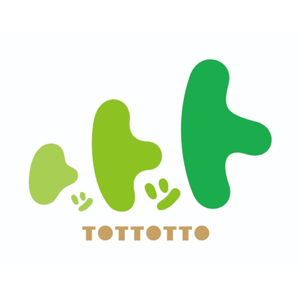

◆子ども会員証作成で、わいわいぱーく・のびっこ・スキッズガーデンなどの室内型プレイグラウンドをおトクに、便利に遊べる！
◆お子さまの年齢に合わせた「役立つ情報」を配信！

＼「トットット」アプリのおすすめポイント／

◆スタンプがたまる！
室内型プレイグラウンドの利用につきスタンプがたまります。
たまったスタンプはクーポンに交換でき、次回もっとおトクに遊べます。

◆おトクなクーポンが届く！
パパやママにうれしいクーポンを配信しています。
割引クーポンや、プレゼントクーポンなどおトクがいっぱい！

◆お子さまの年齢に合わせた「役立つ情報」を配信！
年齢ごとのお悩みや「どうしよう」に合わせたお役立ち情報をアプリで配信しています。

[View on Apple](https://apps.apple.com/jp/app/%E3%83%88%E3%83%83%E3%83%88%E3%83%83%E3%83%88/id6470903639)

## IKEA

Lass dich inspirieren und mach das Beste aus deinem Zuhause. Entdecke neue Produkte, visualisiere deinen Traum und genieße einfacheres Einkaufen – von überall aus. 

In der IKEA App findest du mehr als du dir vorstellen kannst:

•	Entdecke Angebote, neue Produkteinführungen und personalisierte Empfehlungen
•	Speichere deine Lieblingsartikel in Merkzetteln, damit du alles an einem Ort findest
•	Finde dich mit einer leicht verständlichen Navigation im Einrichtungshaus zurecht
•	Sammle Punkte, um Treueboni zu aktivieren und zu genießen
•	Scanne Produkte selbst und bezahle schneller im Einrichtungshaus
•	Gestalte deine Traumküche mit interaktiven Planern
•	Scanne deinen Raum und füge Produkte hinzu, um sie in deinem Raum zu visualisieren
•	Bezahle schnell und sicher beim Einkaufen in der App
•	Verfolge und verwalte deine Bestellung von überall aus
•	Prüfe die Verfügbarkeit und erhalte Benachrichtigungen, wenn ein Artikel wieder auf Lager ist
•	Finde digitale Belege und deine Kaufhistorie an einem Ort
•	Überprüfe die Stoßzeiten im Einrichtungshaus und bereite dich auf deinen nächsten Besuch vor
•	Schau dir IKEA Live an und hol dir Tipps von unseren Expert:innen für Innenarchitektur

Einige Funktionen sind möglicherweise nicht in jedem Land verfügbar, aber sie sind für die Veröffentlichung geplant. Wir empfehlen, die IKEA App auf dem neuesten Stand zu halten, damit du neue Funktionen nutzen kannst, wenn sie verfügbar sind.

Wir legen Wert auf deinen Datenschutz und glauben an die ethische Verwendung von Kundendaten. Deshalb hast du jederzeit die Kontrolle über deine Daten.

[View on Apple](https://apps.apple.com/jp/app/ikea/id1452164827)

## かんたんnetprint－セブン‐イレブンでかんたん印刷

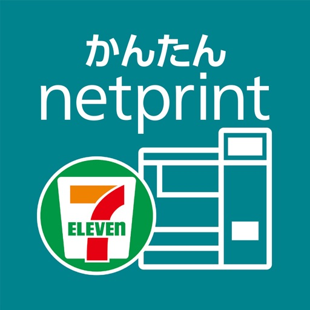

面倒な会員登録は一切不要。
スマホの中やクラウド上のPDFや写真をかんたんにプリントできます。
店内のマルチコピー機でプリントできるから、急な印刷もお任せください。

■こんな時に便利
・家にプリンターがない、インクが切れた、紙が詰まった

・旅行の帰りに思い出を写真にプリントして渡したい

・就職活動の履歴書のプリント

・スマホに送られてきたPDFファイルの印刷

・Webページのクーポンの印刷

・旅行のeチケットの印刷

・「A3サイズ」にプリント
・クラウドストレージに格納したファイルの印刷

■プリントできるファイル

・PDF

・写真（JPEG、PNG）

・Windows版 Microsoft Word/Excel/PowerPoint

※詳細は以下のURLでご確認ください

https://www.printing.ne.jp/support/m_kantan/ip_attention.html



■印刷できる用紙

・普通紙（A3,A4,B4,B5）

・はがき

・フォト用紙（L,2Lサイズ）

■印刷方法
以下の2通りの方法で、セブン‐イレブンにあるマルチコピー機から印刷できます。
・QRコードを使って印刷する
1. アプリから印刷したいファイルを選んで登録
2. アプリで「QRコード」を表示
3. 最寄りのセブン‐イレブンに行き、「QRコード」をマルチコピー機にかざす　
※10個までの予約番号を1つのQRコードにまとめてかざすことができます。

・予約番号を使って印刷する
1. アプリから印刷したいファイルを選んで登録
2. アプリで「プリント予約番号」を確認
3. 最寄りのセブン‐イレブンに行き、「プリント予約番号」をマルチコピー機に入力

■プリント料金
セブン‐イレブンのマルチコピー機で印刷時にお支払いください。
※プリント料金の詳細は以下のURLをご覧ください。
https://www.printing.ne.jp/support/common/pricelist.html
※アプリダウンロード、ファイル登録は無料です。

■プリント予約番号の有効期限

ファイル登録日の翌日23:59まで



■プリント有効期限を延ばしたいときは

会員登録が必要な「netprint」アプリをダウンロードください。

プリント有効期限が、ファイル登録日の30日後になります。

プリントアウトするまでに時間が必要な場合や誰かに予約番号を教えてプリントしてもらいたい場合は、「netprint」アプリをダウンロードください。



「かんたんnetprint」との違いの詳細は、以下のURLをご覧ください。

https://www.printing.ne.jp/support/mobile/mobile.html

■ご利用にあたって
- プリント有効期限は、ファイル登録の翌日23:59までです。
それまでにプリントアウトしてください。期限が切れた場合は、再度ファイルを登録いただければ印刷できます。
- 通信にかかる費用はお客様のご負担となります。
- 本サービスでは、日本国内のセブン‐イレブン店舗のマルチコピー機でのみプリント可能です。
- サービス時間帯は24時間365日です。ただし、月1回メンテナンスがあります。
- その他の仕様や制限事項は、以下のURLに記載しております。
https://www.printing.ne.jp/support/m_kantan/ip_attention.html

[View on Apple](https://apps.apple.com/jp/app/%E3%81%8B%E3%82%93%E3%81%9F%E3%82%93netprint-%E3%82%BB%E3%83%96%E3%83%B3-%E3%82%A4%E3%83%AC%E3%83%96%E3%83%B3%E3%81%A7%E3%81%8B%E3%82%93%E3%81%9F%E3%82%93%E5%8D%B0%E5%88%B7/id1552990335)

## TVer(ティーバー) 民放公式テレビ配信サービス

民放公式テレビ配信サービス「TVer(ティーバー)」は、見逃した1000以上のテレビ番組の動画が見放題！

「TVer(ティーバー)」では、普段ご覧いただいているドラマやバラエティ、アニメ、スポーツ、ニュースなどの番組を、パソコンやスマートフォン、タブレット、テレビでご覧いただけます。いつでもどこでも、自由にテレビ番組をお楽しみください。

【TVer(ティーバー)の特徴・機能】
・追加課金は一切なく、全ての動画が見られる
・安心安全！民放テレビ局制作の公式番組コンテンツを配信
・絞り込み/フリーワード検索など見たい番組動画をすぐに探せる便利な検索機能
・お気に入りのタレントや番組を登録できるお気に入り機能
・見たい番組が見つけられるレコメンド機能
・好きな番組をSNS等でシェアする機能
・全局のHPデータを利用した正確なテレビ番組情報を完全網羅
・インターネット上で話題になっているテレビニュースを集約
・全国対応した番組表(地上波・BS)を搭載
・テレビで放送している番組を TVerでも同時に視聴できるリアルタイム配信※1
・普段配信されてないスポーツ試合などをリアルタイムで配信するスペシャルライブ※2
※1 リアルタイム配信は、すべての番組ではなく夜帯の番組を中心に配信しております。詳細はhttps://tver.jp/live/ページをご覧ください。
インターネットを利用した地上波放送の同時配信となるため、地上波放送より遅延があります。遅延時間は視聴番組、ご利用の端末によって変動します。また、リアルタイム配信は、テレビアプリ（コネクテッドTV）では視聴できません。
※2 テレビアプリ（コネクテッドTV）では、対応端末にて一部の配信コンテンツのみご視聴いただけます。

◎TVer(ティーバー)はこんな方におすすめ！
・ドラマが大好きで、テレビで見逃した最新話を視聴したい
・テレビで放送中のお気に入りアニメをもう一度見たい
・人気の芸人・タレントが出演しているお笑い番組・バラエティを楽しみたい
・話題のドキュメンタリー番組やスポーツ特番をチェックしたい
・テレビ番組が視聴できる動画アプリを探している
・見逃し配信が見放題の動画配信サービスを利用したい
・地上波、BSテレビの番組表をアプリで確認したい
・機能が充実していて映像が綺麗な動画視聴アプリを使いたい
・地上波テレビ番組の放送をよく見逃してしまう
・映像作品が好きでビデオを普段よく借りるが、スマホでも動画を楽しみたい
・ドラマ、アニメ、バラエティ、スポーツ、ニュースなど様々なジャンルのテレビ番組を視聴したい

【利用規約】 https://tver.jp/tos
【プライバシーポリシー】 https://tver.jp/privacypolicy

【対応OSに関する重要なお知らせ】
2025年12月よりご利用いただける動作環境がiOS16以降になりました。
iOS15以前のスマートフォン、タブレットをご利用の場合、OSアップデートのご検討をお願いいたします。

[View on Apple](https://apps.apple.com/jp/app/tver-%E3%83%86%E3%82%A3%E3%83%BC%E3%83%90%E3%83%BC-%E6%B0%91%E6%94%BE%E5%85%AC%E5%BC%8F%E3%83%86%E3%83%AC%E3%83%93%E9%85%8D%E4%BF%A1%E3%82%B5%E3%83%BC%E3%83%93%E3%82%B9/id830340223)

## ゼッテリア

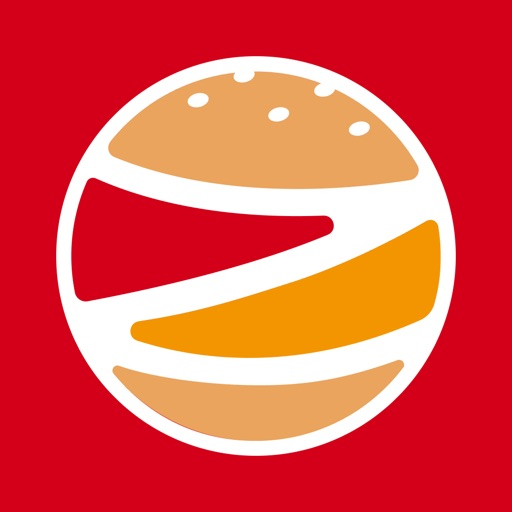

ゼッテリア公式アプリは、ゼッテリアをもっとお得にもっと便利にご利用いただけるアプリです。

【ご利用いただける機能】

◆アプリで簡単モバイルオーダー◆
お店にご来店されなくても、アプリでお持ち帰り注文が可能です！
クレジットカードの登録で簡単決済！
※3Dセキュア認証対応カードが必須です。

◆お好きな時間に受け取り予約◆
指定時間にお店に行くことで、待たずに商品が受け取れます！
24時間注文・1ヶ月先のご予約もできます！
（一部店舗を除く）

◆モバイルオーダーで共通ポイント付与◆
モバイルオーダーで共通ポイントが貯まります！

◆お得なクーポンをGET◆
限定クーポンが使用できます！

◆店舗検索◆
「近くの店舗」や「住所」で店舗が検索できます！

[View on Apple](https://apps.apple.com/jp/app/%E3%82%BC%E3%83%83%E3%83%86%E3%83%AA%E3%82%A2/id6478645600)

## コストコ公式アプリ

コストコショッピングアプリを使って、コストコオンラインでお買い物をお楽しみください。

【アプリの便利な機能】
オンラインショッピング
ほしいものリスト
倉庫店でご利用頂けるデジタルメンバーシップ
コストコ会員の新規入会・更新
オンライン・倉庫店でのお得な割引情報
オンラインでの購入履歴の閲覧・注文情報追跡
倉庫店でのイベント情報

その他、メンバー様に便利な機能を定期的に追加していきます。
このアプリでオンラインショッピングやコストコメンバー限定の機能をお楽しみ頂くには、コストコのメンバーシップが必要です。アプリ、ウェブサイト、または倉庫店のいずれかの場所からメンバーシップのご購入が可能です。ゲストとして利用できるアプリの機能は限られています。

[View on Apple](https://apps.apple.com/jp/app/%E3%82%B3%E3%82%B9%E3%83%88%E3%82%B3%E5%85%AC%E5%BC%8F%E3%82%A2%E3%83%97%E3%83%AA/id1560889555)

## エディオンアプリ

全国1200店舗以上「家電とリフォームのエディオン」の公式アプリ
１）クーポンでおトクがいっぱい！
２）無料保証も充実！最大10年保証
３）アプリコインが貯まる！交換できる！
４）デジタル会員証として購入履歴の確認も
５）お近くの店舗をMy店舗に登録してチラシをチェック
６）ネットショップでいつでも買い物！ポイントや保証も対応
７）V/d/楽天/Sポイント利用可能、しかもエディオンポイントと同時に貯まる！

１）クーポンでおトクがいっぱい！
初回500円クーポン配布中。他にも、お店でもネットショップでも使えるクーポンでお得にお買い物いただけます。
２）無料保証も充実！最大10年保証
3万以上22品種対象、3年・5年・10年保証。修理工賃、部品代、出張費すべてが保証対象で安心です。
３）アプリコインが貯まる！交換できる！
毎日のログインやゲームでコインを貯めて、豪華景品の当たるキャンペーンに応募できます。
４）デジタル会員証として購入履歴の確認も
店舗・ネットショップでの購入履歴や長期修理保証対象商品と保証期間が確認できます。保有ポイントやコインも確認できて便利です。
５）お近くの店舗をMy店舗に登録してチラシをチェック
エディオングループ各店舗の検索ができます。お店の最寄駅からのルート表示や、最新デジタルチラシもご覧いただけます。
６）ネットショップでも買い物！ポイントや保証も対応
24時間いつでもおトクにお買い物！お店の在庫をチェックして注文、お店での受け取りも可能です。
７）V/d/楽天/Sポイント利用可能、しかもエディオンポイントと同時に貯まる！
「V ポイント」「d ポイント」「楽天ポイント」「S ポイント」も利用可能、エディオンポイントと同時に貯めることができます。

※エディオンアプリ内で行っております各種キャンペーンについて、AppleInc.は一切関与しておりません。
※動作保証環境iOS17.0以上
（iPad,iPodTouch,Watchでは、動作保証いたしません。）

[View on Apple](https://apps.apple.com/jp/app/%E3%82%A8%E3%83%87%E3%82%A3%E3%82%AA%E3%83%B3%E3%82%A2%E3%83%97%E3%83%AA/id434823849)

## ZOZOTOWN ファッション通販

日本最大級のファッション通販サイト「ZOZOTOWN（ゾゾタウン）」公式アプリ。
レディース・メンズからキッズまで幅広く、人気ブランド【8,500以上】・商品【90万点以上】！
定番やトレンドの新品アイテムからブランド古着までまとめてチェック。
ファッションブランドだけでなくコスメブランドも多数取扱中。
便利でお得な割引クーポン毎日配布中！
即日配送（一部地域）なら最短で翌日お届け！いつでもどこでも気軽にショッピングをお楽しみください。

*--------------------------------------------*
ZOZOTOWN（ゾゾタウン）アプリの機能紹介
*--------------------------------------------*
◆◇オトクなクーポン毎日更新◆◇
ショップごとに使えて、ラインナップも毎日更新される便利でお得な割引クーポンです。
使い方はとっても簡単！クーポン対象商品を選びカートに入れるだけで割引価格が適用されます。

◆◇お気に入りのアイテム・ブランドをまとめて管理◆◇
アイテムやブランドをお気に入りに追加すると、自分だけのアイテムリストで在庫状況や値下がり状況の確認をしたり、好きなブランドだけでファッションアイテムを検索することができます。
他のスマートフォンやパソコン・タブレットでもお気に入りアイテムのチェックや、お気に入りブランドから新着のアイテムを検索できます。

◆◇お得情報のお知らせ◆◇
お気に入り機能といっしょに使うことで、「お気に入りアイテムの値下がり・再入荷」や「お気に入りブランドの新着情報」をプッシュ通知にてお知らせします。
お得情報が簡単にゲットできるオススメの機能です！

◆◇サイズ比較◆◇
サイズ感が気になる商品は、ZOZOTOWNで以前購入したアイテムのサイズ、着丈や肩幅、身幅などと比較することができます。

◆◇アイテムの検索◆◇
常時90万点以上のアイテムから、あなたが気になるファッションアイテムを様々な方法で探すことができます。
新品、古着、セール商品、ブランド、性別、カラー、価格帯、サイズの絞り込みや、「ビッグシルエット」「ワンショルダー」「セットアップ」などのキーワードによる検索。
Tシャツ、スニーカー、ワンピースなどのカテゴリからさらに袖丈の長さや柄、素材などを選択でき、よりこだわった条件での検索もできます。
人気ランキング形式でカテゴリ・性別ごとに今流行りのファッションアイテムをチェックできます。

◆◇マルチサイズ◆◇
身長・体重を選択するだけで数十サイズの中からあなたの体型にあったサイズを探せます。
ZOZOTOWN上の検索一覧や商品ページなどで表示される[マルチサイズ]マークが目印です。

◆◇いつでも買い替え割◆◇
ZOZOTOWNで購入したアイテムをお好きな時にいつでもZOZOポイントに交換できるサービスです。

*--------------------------------------------*
ZOZOTOWN（ゾゾタウン）の紹介
*--------------------------------------------*
ZOZOTOWN（ゾゾタウン）とは、8,500以上の人気ブランドが集まる日本最大級のファッション通販サイトです。
最新ファッションアイテムを常時90万点以上を取りそろえています。

お支払い方法はクレジットカード・代金引換・コンビニ決済・ツケ払いに対応しております。
ツケ払いならお支払いは2ヶ月後！商品を受け取り、中身を確認してからのお支払いが可能です。
また、ZOZOCARDでのお支払いではZOZOポイント5%還元！入会費・年会費は無料で、お申し込み後すぐにご利用できます。

ぜひZOZOTOWNでのお買い物をお楽しみください。

◆◇取り扱いショップ◆◇
A BATHING APE、ABC-MART、ADAM ET ROPE'、adidas、agnes b.、AZUL BY MOUSSY、A.P.C.、BEAMS、BEAUTY&YOUTH UNITED ARROWS、Deuxieme Classe、DIESEL、earth music&ecology、EDIFICE、ESTNATION、FREAK'S STORE、GAP、gelato pique、GLOBAL WORK、green label relaxing、HARE、HYSTERIC GLAMOUR、IENA、JOURNAL STANDARD、KBF、L.H.P、LOWRYS FARM、MARC JACOBS、marimekko、merlot、nano･universe、NATURAL BEAUTY BASIC、NIKE、Paul Smith、POLO RALPH LAUREN、ROPE' PICNIC、ROSE BUD、SHIPS、SNIDEL、SOPH.、STUDIOUS、STUSSY、TOMORROWLAND、UNDERCOVER、Ungrid、UNITED ARROWS、URBAN RESEARCH、WEGO、X-girl、ZUCCa, etc.

◆◇取り扱いカテゴリー例◆◇
トップス / ジャケット・アウター / パンツ / オールインワン・サロペット / スカート / ワンピース・ドレス / フォーマルスーツ・小物 / バッグ / シューズ / ファッション雑貨 / 財布・小物 / 腕時計 / アクセサリー / ヘアアクセサリー / アンダーウェア / レッグウェア / ルームウェア / 帽子 / インテリア / 食器・キッチン / 雑貨・ホビー / PC・スマホグッズ・家電 / スキンケア / ベースメイク / メイクアップ / ビューティーグッズ / ボディ・ヘアケア / フレグランス / 水着・着物・浴衣 / アウトドア・スポーツ / ママ&ベビー / ペットグッズ / 音楽・本・雑誌 / パーティードレス / 下着 / サンダル / セットアップ

*--------------------------------------------*
関連アプリ
*--------------------------------------------*
◆◇WEAR◆◇
ファッションコーディネートアプリ「WEAR（ウェア）」
1,600万ダウンロード突破！

WEARなら、
◆1,300万件以上のコーデからあなた好みの服装が見つかります。
◆デザイナーや芸能人、ショップスタッフなどおしゃれ上級者の私服をチェックできます。
◆ZOZOTOWNと連携すれば気になるアイテムの着こなし方が探せます。
◆欲しくなった洋服はそのまま購入することができます。
◆気に入ったコーデは簡単にフォルダ保存でいつでもすぐに見ることができます。

*--------------------------------------------*
公式SNS
*--------------------------------------------*
公式SNSにてセール・キャンペーンのお得な情報や、季節に合ったアイテム、有名人とのコラボアイテムなど旬なアイテム情報を配信しています。

○Instagram
https://www.instagram.com/zozotown/

○Twitter
https://twitter.com/zozojp

○facebook
https://www.facebook.com/zozotown

※ZOZOTOWNアプリは無料です。
※お客様に安全・安心かつ快適にご利用いただけるよう日々アプリ改善を行っております。
ご質問や不具合などございましたら、以下のお問い合わせよりご連絡くださいますようお願い申し上げます。

https://zozo.jp/_help/help_inquiry1.html

[View on Apple](https://apps.apple.com/jp/app/zozotown-%E3%83%95%E3%82%A1%E3%83%83%E3%82%B7%E3%83%A7%E3%83%B3%E9%80%9A%E8%B2%A9/id404529222)

## Amazon Prime Video

Sehen Sie Filme, Serien und Sportübertragungen, darunter Amazon Originals wie The Boys, The Marvelous Mrs. Maisel und Tom Clancy’s Jack Ryan oder unsere Empfehlungen speziell für Sie.

App-Funktionen:
• Videos herunterladen und offline ansehen
• Neue Filme und beliebte Serien kaufen oder leihen (Verfügbarkeit abhängig vom jeweiligen Marktplatz)
• Videos mit Chromecast vom Smartphone oder Tablet auf den großen Bildschirm übertragen
• Individuelle Unterhaltungserlebnisse durch Profile für mehrere Benutzer
• Blick hinter die Kulissen von Filmen und Serien mit exklusivem X-Ray-Zugang und IMDb
• Separate tvOS-App herunterladen (erfordert Apple TV, 3. Generation oder neuer) und Sendungen auf Apple TV ansehen

Die Prime Video-App ist jetzt auf Mac verfügbar, wenn Sie die separate macOS-App herunterladen (erfordert macOS Big Sur 11.4 oder höher).

Wenn Sie eine Amazon Prime Video-Mitgliedschaft über iTunes abschließen (sofern verfügbar), wird die Zahlung nach der Bestätigung der Registrierung über Ihr iTunes-Konto abgewickelt. Ihre Mitgliedschaft wird automatisch verlängert, falls die automatische Verlängerung nicht mindestens 24 Stunden vor dem Ende des entsprechenden Abrechnungszeitraums deaktiviert wird. Ihr Konto wird jeweils innerhalb von 24 Stunden vor Ende des Abrechnungszeitraums mit dem Preis des gewählten Pakets belastet. Verwalten Sie Ihre Mitgliedschaft jederzeit über iTunes oder "Mein Konto". Dort können Sie auch die automatische Verlängerung deaktivieren.

Für Kunden in der Europäischen Union, Großbritannien oder Brasilien: Durch die Verwendung dieser App stimmen Sie den Nutzungsbedingungen von Amazon sowie den Nutzungsbedingungen von Prime Video zu, die hier zu finden sind: www.primevideo.com/ww-av-legal-home. Unsere Datenschutzerklärung, unsere Cookie-Richtlinien und unsere Hinweise zu interessenbasierter Werbung können Sie hier nachlesen: www.primevideo.com/ww-av-legal-home. 
 
Für alle anderen Kunden: Durch die Verwendung dieser App stimmen Sie den Nutzungsbedingungen und der Datenschutzerklärung von Amazon sowie den Nutzungsbedingungen von Prime Video zu, die hier zu finden sind: www.primevideo.com/ww-av-legal-home.

[View on Apple](https://apps.apple.com/jp/app/amazon-prime-video/id545519333)

## セブン-イレブン マルチコピー

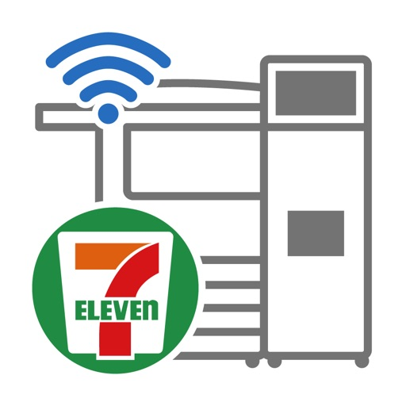

●スマートフォン内の写真や文書を気軽にプリント！
スマートフォン内の写真や文書を、日本国内のセブン-イレブン店舗にあるマルチコピー機へWi-Fi通信を使って送信し、かんたんにプリントできるアプリです。

●原稿をスキャンしてスマートフォンへ保存！
また、本アプリは、マルチコピー機でスキャンした画像データをスマートフォンへ保存することもできます。

●プリントの概要
　1) 普通紙プリント、写真プリント、はがきプリントが、すべて備え付けの専用用紙にプリントできます。
　　 (郵便はがきの持ち込みも可能)
　2) Wi-Fi通信を使ってダイレクトにプリントできます。
　3) パスワード入力不要の簡単操作で、なおかつセキュリティも確保。

●スキャンの概要
　1) 白黒６００dpi、フルカラー４００dpiの高画質スキャン対応。
　2) Wi-Fi通信を使ってダイレクトに保存できます。

●ご利用条件
- 日本国内のセブン-イレブン店舗にあるマルチコピー機でのみ利用できます。
- 本アプリは、日本語/英語に対応しています。
- OSは、iOS/iPadOS 17～18、26に対応（動作確認）しています。
- プリントするとき、またはスキャンデータを保存するときに、料金をお支払いいただきます。

●各サービスの仕様
- プリントできるファイル形式
　・写真プリント：JPEG、TIFF、BMP、PNG
　・普通紙プリント：PDF、XPS、XDW、JPEG、TIFF、BMP、PNG
　・はがきプリント：PDF、XPS、XDW、JPEG、TIFF、BMP、PNG
- スキャンデータのファイル保存形式
　・PDF、XDW、JPEG、TIFF
- 送信ファイルの上限
　・写真/普通紙/はがきプリント：30MB/ファイル
　・写真/普通紙/はがきプリント：60件
- 受信ファイルの上限
　・スキャン：800MB/ファイル
　・スキャン：20件

[View on Apple](https://apps.apple.com/jp/app/%E3%82%BB%E3%83%96%E3%83%B3-%E3%82%A4%E3%83%AC%E3%83%96%E3%83%B3-%E3%83%9E%E3%83%AB%E3%83%81%E3%82%B3%E3%83%94%E3%83%BC/id1562641276)

## モスバーガー

アプリでネット注文やモスカード表示・チャージやクーポン利用、店舗検索など、モスバーガーの利用を便利にする公式アプリです。
※アプリをご利用いただくには、iOS16以降の端末(タブレットを除く)が必要となります。

■ネット注文機能
・アプリで簡単にネット注文ができます。

■モスカード表示機能
・アプリでモスカードを表示できます。
・アプリで表示したモスカードを店舗でご利用できます。
・アプリでモスカードを表示するには以下の①～④のいずれかが必要となります。
①お手持ちのモスカードのカード番号およびPIN番号をアプリに入力
②ログインして新しいモスカードを発行
※モスカードの発行はモスカードを登録していない会員様のみのご利用となります。
③ログインして登録しているモスカードから表示するカードを選択
④ログインしてお手持ちのモスカードを登録して表示

■webチャージ機能
・モスカード表示画面の「チャージ」より、webチャージの利用できます。

■モスカード残高・ポイント移行機能
・ログインして登録しているモスカード間で残高およびポイントを移行できます。

■モスカード残高照会機能
・ログインしてアプリで表示しているモスカードのご利用履歴を確認できます。
※直近最大10件のご利用履歴を確認できます。

■その他各種情報照会・変更機能
・会員情報を照会・変更できます。
・表示しているモスカードのカードネームを照会・変更できます。
・メインカードを変更できます。
※ログインしてアプリをご利用の会員さまのみ

■クーポン機能（不定期）
・店舗でご利用できるお得なクーポンを取得できます。

■メニュー機能
・モスバーガーのメニューを確認できます。
・メニューの基本情報以外に、栄養成分情報、アレルギー情報、主要原産地情報などが確認できます。

■店舗検索機能
・店舗検索ができます。
・店舗検索は、現在地を利用した最寄りの店舗の検索、フリーワードを入力した検索、都道府県・市区町村を選択した検索ができます。

■注意事項
・アプリをご利用いただくには、iOS16以降の端末が必要となります。
※タブレット端末を除く
・一部のスマートフォン端末では正しく動作しない場合があります。

[View on Apple](https://apps.apple.com/jp/app/%E3%83%A2%E3%82%B9%E3%83%90%E3%83%BC%E3%82%AC%E3%83%BC/id390411817)

## Uber: Ride-Hailing & Taxis

Schließe dich Millionen von Nutzer*innen in Deutschland an, die mit der Uber App bequem an ihr Ziel gelangen. Wähle zwischen verschiedenen Vermittlungsoptionenptionen und Transportmitteln aus und gelange von A nach B, wie du es willst – leger mit dem Lime Scooter oder stilvoll mit Uber Premium.

FINDE DIE PASSENDE FAHRT
Deine nächste Fahrt ist nur einen Fingertipp entfernt! Mit Uber kommst du völlig unkompliziert und bequem von A nach B.
Wähle aus einer Vielzahl von Produkten für die verschiedensten Bedürfnisse:

- UberX: günstige Preise und eine Fahrt nur für dich allein
- Electric: Elektroautos – die besonders umweltfreundliche Option
- UberXL: günstige Fahrten für Gruppen bis zu 6 Personen
- Uber Comfort: neuwertige Autos, die viel Beinfreiheit bieten
- Uber Comfort Electric: Elektroautos aus dem Premiumsegment
- Uber Pet: günstige Fahrten für dich und dein Haustier
- Uber Taxi: In ausgewählten Städten findest du auch lokale Taxis in der Uber App.
- 2-Rad: Buche ein E-Bike oder einen Roller (Lime Scooter) und fahre gleich los.
- Uber Assist: Der Service für Menschen mit eingeschränkter Mobilität
- Uber Taxi Wheelchair: Taxis, die auf die Bedürfnisse von Rollstuhlfahrer*innen zugeschnitten sind
- Uber Taxi Van: Großraumtaxis für Gruppen

FAHRPREISSCHÄTZUNG ANZEIGEN
Mit der Uber App kannst du den Fahrpreis schon im Vorfeld abfragen, noch bevor du deine Fahrt bestellst. So weißt du gleich, wie viel du bezahlen musst.

ERSCHWINGLICHE PREISE
Wir gestalten unsere Preisstruktur so transparent wie möglich.
- Fahrpreisteilung: Teile dir den Betrag direkt auf der Fahrt mit deinen Freund*innen – so müsst ihr euch später nicht den Kopf zerbrechen.

REGISTRIERE DICH BEI UBER ONE UND ERHALTE ATTRAKTIVE PRÄMIEN
Profitiere von 0,00 € Liefergebühr und spare bis zu 10 % auf berechtigte Liefer- und Abholbestellungen, erhalte 5 % Uber Cash auf berechtigte Fahrten und eine Gutschrift von 5,00 € sollte unsere Schätzung für die späteste Ankunftszeit deiner Bestellung mal nicht der Realität entsprechen. Es gelten weitere Gebühren und Bedingungen. Weitere Details findest du unter uber.com/uberone.

UMWELTBEWUSST VON A NACH B
Uber engagiert sich für eine nachhaltige Zukunft in unseren Städten. Mit einer wachsenden Flotte von Elektro- und Hybridfahrzeugen hast du jetzt auch die Möglichkeit, dich für besonders umweltfreundliche Fahrten zu entscheiden.

SPONTANE MOBILITÄTSOPTIONEN FÜR MEHR BARRIEREFREIHEIT
Gemeinsam mit verschiedenen Taxi-Partnern in Deutschland wurden Autos speziell für die Bedürfnisse von Rollstuhlfahrer*innen umgerüstet.

WEITERE HILFREICHE FEATURES
Bequem zu dir nach Hause
Lieferung: Bestelle dir dein Lieblingsgericht vom Italiener im Viertel direkt zu dir nach Hause. Lasse dir außerdem Lebensmittel, etwas aus der Apotheke oder Haustierartikel liefern.
Taxi, bitte!
Uber Taxi: Ab sofort hast du noch mehr Beförderungsmöglichkeiten in nur einer App – buche dir ganz bequem mithilfe der Uber App ein lokales Taxi zum regulären Taxitarif.
Darf es ein E-Bike oder E-Scooter sein?
2-Rad: Wusstest du, dass du dir mit der Uber App auch E-Bikes und Roller (Lime Scooter) ausleihen kannst? Perfekt für die Tage, an denen du etwas mehr Antrieb brauchst, als ein normales Fahrrad hergibt.
Alles auf einen Blick
Uber for Business: Verwalte und tracke Geschäftsfahrten, Essenslieferungen und vieles mehr in nur einem Dashboard.
Lege gleich los! Lade dir die Uber App herunter und erstelle noch heute ein Konto.
Uber ist in verschiedenen Städten in Deutschland verfügbar, Infos dazu findest du auf unserer Website. Bleibe auf dem Laufenden über neueste Nachrichten, Aktionen und Angebote, indem du uns auf Twitter unter https://twitter.com/uber_ger oder auf Facebook unter https://www.facebook.com/uberdeutschland folgst.
Uber vermittelt Beförderungsaufträge an professionelle und lizenzierte Mietwagenunternehmer. Uber selbst bietet keine Fahrten an und ist für die Beförderung als solche nicht verantwortlich.

[View on Apple](https://apps.apple.com/jp/app/%E3%82%A6%E3%83%BC%E3%83%90%E3%83%BC-uber-taxi-%E3%82%BF%E3%82%AF%E3%82%B7%E3%83%BC%E9%85%8D%E8%BB%8A%E3%82%A2%E3%83%97%E3%83%AA/id368677368)

## TikTok Lite

TikTokLiteには、面白い動画やためになる動画、グルメやペット、音楽、ゲーム、スポーツなどなど、多様なジャンルの動画がたくさん。あなたの好きな動画がきっと見つかります。

また、従来に比べて少ないデータ容量でより早く、より快適な動画体験をお楽しみいただくことができます。

ぜひTikTokLiteの世界を楽しみながら、充実した毎日を送ってください！

[View on Apple](https://apps.apple.com/jp/app/tiktok-lite/id6447160980)

## 快活CLUB公式アプリ

快活CLUB公式アプリを大幅刷新！
いつも快活CLUBをご利用されている方も、初めての方も、快活CLUB公式アプリを使って、お手軽に・お得に、快活CLUBをご利用くださいませ。

【おすすめポイント】
1.ご来店前に・・・
GPS検索やお気に入り店舗登録で、事前に空席状況やコミックの入荷状況をチェックできます。

2.店頭で・・・
会員証として使えるので、プラスチックカードの持ち歩きは不要です。
さらに、パスワードや会員番号を忘れても自分で再設定できるようになりました。

【主な機能のご紹介】
①アプリ会員証
ご入店時に必要な会員証としてご利用できます。また当月の会員ランク・ランクアップ目標も表示されます。

②店舗検索
GPSを利用し、現在位置から近い快活CLUB店舗を検索し、地図に表示します。
また店舗設備、地名・駅名でのワードで絞り込みもできます。

③空席状況
最寄り店舗の空席状況をカテゴリー毎に、残り席数で表示します。

④WEB予約
大人気の鍵付個室を、アプリでかんたん予約できます。

⑤お気に入り店舗
普段よくご利用になる店舗を、あらかじめご登録いただけます。

⑥コミック検索
読みたいコミックの保有店舗を検索いただけます。

⑦ニュース
プッシュ通知でお届けしたニュースを一覧でご覧いただけます。

⑧動画視聴
店内Wi-Fi時限定で、店内PCご利用時に視聴できる動画や電子書籍がアプリでもご利用いただけます。

⑨ポイント
快活CLUBのご利用でたまるポイントの保有ポイント数を表示します。たまったポイントは店舗ご利用時に1ポイント1円でご利用いただけます。

【初回起動時設定方法】
初回起動時はログインまたは事前会員登録をお願いいたします。

●バージョンアップされた方
これまでの会員情報が引継がれます。

●快活CLUB公式アプリのご利用が初めてで、[快活CLUBのカード（会員証）をお持ちの方]
お手元にカードをご用意の上、パスワードを登録してください。

●快活CLUB公式アプリのご利用が初めてで、[快活CLUBを利用したことがない方]
快活CLUBの会員登録が必要となります。
アプリより事前登録を行い、店舗にて本会員登録くださいませ。
※本会員登録の際、ご本人確認証（東京都の店舗は現住所記載のものに限る）のご提示が必要となります。

●アプリを再インストールされた方
ID（店舗会員番号）、パスワードでログインしてください。

【対応OSバージョン】
iOS15.1以上

[View on Apple](https://apps.apple.com/jp/app/%E5%BF%AB%E6%B4%BBclub%E5%85%AC%E5%BC%8F%E3%82%A2%E3%83%97%E3%83%AA/id958083643)

## 食べログ - おいしいお店を見つけて予約できるグルメアプリ

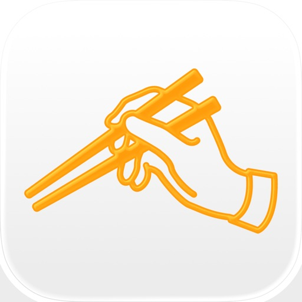

食べログは掲載店舗数No.1!!*
【2500万ダウンロード突破！】食べログは、空いているお店がすぐに見つかる飲食店アプリです。日本最大級の飲食店データベースから、ランチやディナーはもちろん、ラーメン、寿司、居酒屋、洋食、スイーツ、カフェなど幅広いジャンルのお店を選べます。飲食店探しから予約まで、食べログ1つで完結します。
全国89万件以上の飲食店、9,047万件以上の口コミ、2億4,074万枚以上の写真を無料でチェックできます。料理・雰囲気など気になる情報を比較しながらお店を選べて、会員登録なしですぐ使えます。近くのお店探しや旅先のグルメ検索、人気店のネット予約まで幅広く対応。プレミアム会員なら最新グルメランキングも快適にチェックできます。
*2024年5月当社調べ

■食べログが選ばれる理由■
食べログは、口コミ・写真・独自ランキング・地図検索・ネット予約がひとつになった飲食店アプリです。近くのランチを探したい時も、仕事帰りに入れる居酒屋を見つけたい時も、週末のディナー予約をしたい時も、シーンに合ったお店がすぐに見つかります。日々の食事からデート・記念日・接待まで幅広く使えて、はじめて訪れる街でもおいしいお店に出会えます。

■主な機能■
・現在地・エリア・駅・店名・チェーン名でレストランを検索。気になるお店をすぐに見つけられます。
・日付と人数を入れるだけで予約可能なお店に絞り込め、そのままネット予約でき、1タップで電話予約も可能です。
・「個室」「飲み放題」などの細かい条件で絞り込めるので、居酒屋・宴会向けのお店探しにも便利。
・気になるお店はワンタップで保存。「〇〇さんのおすすめ」といったメモを残せるので、自分だけのお気に入りリストを作れます。

■こんなときに便利■
・近くでランチできるお店を探したい
・金曜日でも今すぐ入れる居酒屋を見つけたい
・旅先で人気の寿司・ラーメン・洋食を楽しみたい
・まだ知られていない穴場のお店やスイーツ店に行きたい
・大切な接待・デートで雰囲気のいいお店を予約したい
・大人数の宴会向けの居酒屋を探したい

■地図でサクッとお店を探せる■
現在地周辺のお店を大きな地図でひと目で確認できます。急いでいる時も、旅先の初めての街でも、地図を見ながらすぐにお店が見つかります。店名・お店の場所・空席状況をその場で確認して、気になるお店をそのまま予約できます。

■食べログの口コミで、失敗しないお店選びを■
全国約300万人のリアルな口コミ・評価で、行く前にお店の雰囲気・料理・接客まで確認できます。口コミ検索を使えば、「接客」「個室」「コスパ」などのキーワードや食べたい料理名で絞り込めるので、知りたい情報をピンポイントで確認できます。

■グルメ記録が楽しくなる■
口コミを投稿すると、マイページで簡単にグルメ記録を振り返れます。食べた料理の写真が店名・エリア付きでアルバムのように一覧で表示され、訪れた日はカレンダーで確認できます。さらに日本地図に行ったエリアが色づいていくので、自分のよく行くエリアやグルメ傾向が一目でわかります。

■食べログプレミアム■
食べログプレミアムに登録すると、以下の機能をご利用いただけます。
・アプリ内でのランキング表示
・プレミアムクーポンによるお得な予約
・行ったお店・保存したお店の並び替え機能
・広告非表示で快適に利用可能
・初回1か月または30日間は無料でご利用可能
・アプリ内のランキング検索機能は「食べログプレミアム」（月額400円・税込）への登録が必要です
サービス詳細につきましては、アプリ内でご確認ください。

【食べログプレミアムの価格と期間】
月額400円（税込）
※価格は変更になる場合がございます。
※期間は申込日から起算して一ヶ月間で自動更新されます。

【課金方法】
お使いの iTunes アカウントに課金され、一ヶ月ごとの自動更新となります。

【自動更新の詳細】
・購読期間終了の24時間前までに食べログプレミアムの購読を解約しない限り、購読期間は1か月間自動更新されます。
・更新分の購読期間(1か月分)の利用料は、購読期間終了時点からさかのぼって24時間以内に金額が確定し、請求されます。
・食べログプレミアムの無料体験期間中に、AppStoreの画面上から有料で食べログプレミアムを購読すると、その時点で無料体験期間が終了し、お支払が発生いたしますのでご注意ください。

【登録状況の確認・自動更新の解除方法】
1. 「設定」アプリを開く
2. 「iTunes & App Store」を選択する
3. 画面の上部に表示されている「Apple ID: ＜メールアドレス＞」 を選択する
4. 表示されたポップアップの内の「Apple IDを表示」をタップする
5. 必要に応じてサインインする
6. 「登録」と書かれた項目の下の「管理」ボタンを選択する
現在登録している月額会員アプリが表示されます。こちらから食べログプレミアムを解約できます。食べログアプリ内から食べログプレミアムの解約はできませんので、ご注意ください。

【当月分のキャンセル】
食べログプレミアムの当月分のキャンセルについては受け付けておりません。

【推奨動作環境】
食べログアプリは、以下の動作環境を推奨しております。推奨動作環境以外のバージョンでは、正常に動作しない或いはインストール自体が出来ない場合もございますので、推奨動作環境へのアップデートをお願いいたします。

推奨OS：iOS17.0以上

※App Store上での動作、インストールなどの不具合については、Apple Inc.までお問い合わせください。
※「iPhone」「App Store」は、米国およびその他の国々で登録されたApple Inc.の商標または登録商標です。

プライバシーポリシー
http://corporate.kakaku.com/privacy
利用規約
https://tabelog.com/help/rules/

[View on Apple](https://apps.apple.com/jp/app/%E9%A3%9F%E3%81%B9%E3%83%AD%E3%82%B0-%E3%81%8A%E3%81%84%E3%81%97%E3%81%84%E3%81%8A%E5%BA%97%E3%82%92%E8%A6%8B%E3%81%A4%E3%81%91%E3%81%A6%E4%BA%88%E7%B4%84%E3%81%A7%E3%81%8D%E3%82%8B%E3%82%B0%E3%83%AB%E3%83%A1%E3%82%A2%E3%83%97%E3%83%AA/id763377066)

## TikTok ティックトック

TikTokは、世界中の動画を楽しめるアプリ。

おもしろ動画、グルメ、癒されペット、ためになる動画、など豊富なジャンル。

自分の好きな動画がきっと見つかる。

【ライブ】有名人や人気TikTokクリエイターなどのライブ配信も楽しめる

【編集】初心者でも簡単に映える動画が作成可能 - 倍速やスロー、スタンプ、美肌、アニメ化などの機能が満載

【繋がる】家族や友達だけでなく、世界中の人とも繋がれるグローバルコミニティ

【有名になれる】新しいチャレンジ動画を作ったり、人気クリエイターとコラボしたり、好きなことで有名になれるチャンスは無限大

自分に合った機能を使ってみよう！

チャンネル メンバーシップを通じて、好きなクリエイターを応援
月額制メンバーシップを提供しているチャンネルのメンバーになり、その活動を支援（一部の国で利用可能）

注: Apple 経由で定期購入する場合、購入を確定すると App Store アカウントに料金が課金されます。その後、メンバーシップは自動的に更新されます。自動的に更新されないようにするには、定期購入期間が終了する 24 時間前までに自動更新をオフに設定してください。定期購入期間が終了する 24 時間前になると、その時点で選択しているプランが自動更新され、料金がアカウントに課金されます。メンバーシップと自動更新は、購入後にアカウント設定で管理できます。

著作権許諾番号
JASRAC許諾番号:
9019719003Y31015
9019719004Y45122

NexTone許諾番号:
ID000005560

お問い合わせ：https://www.tiktok.com/legal/report/feedback

著作権について：https://www.tiktok.com/ja/licensing
利用規約：https://www.tiktok.com/ja/terms-of-use
プライバシーポリシー：https://www.tiktok.com/ja/privacy-policy
会社概要：https://www.bytedance.com/

[View on Apple](https://apps.apple.com/jp/app/tiktok-%E3%83%86%E3%82%A3%E3%83%83%E3%82%AF%E3%83%88%E3%83%83%E3%82%AF/id1235601864)

## Amazon ショッピングアプリ

Amazonの公式無料アプリ。本、日用品、ファッション、食品、ベビー用品ほか数億種類の商品をいつでもお安く。

●Amazonショッピングアプリの主な特徴
商品を調べたいときも、今すぐ買いたい時も。Amazonショッピングアプリは「探す」「比べる」「買う」「受け取る」を簡単、便利にする機能で、お客様のお買い物をサポートします。
１．「探す」を簡単、便利に
文字検索に加え、商品、バーコード、Amazonスマイルコードをカメラでスキャン撮影したり 、お客様の音声で探すことができます。いろいろな検索機能の中なっから、その時々の最適な方法でお望みの商品を探せます。
２．「比べる」を簡単、便利に
商品についての評価や感想がわかる「Amazonカスタマーレビュー」や、購入したい商品をリスト管理できる「ほしい物リスト」が、商品比較に役立ちます。
３．「買う」を簡単、便利に
「ウォッチリスト」でタイムセールの開始直前にお知らせを受信したり、「クレジットカードスキャン機能」で簡単にクレジットカードを登録できます。
４．「受け取る」を簡単、便利に
スマートフォンの通知機能や「Todayウィジェット」を使って、商品の配送状況を確認できます。商品の受け取りがスムーズに行えます。

●Amazon の主な特徴
１．豊富な品ぞろえ品揃えをお安くお安く
アマゾンAmazonで本、日用品、ファッション、食品、ベビー用品、カー用品 ほか数億種類の商品をいつでもお安くお買い求めいただけます。通常配送無料(一部を除く)。

２．通常配送、お急ぎ便、お届け日時指定便が選べる
通常配送は一部を除き無料(一部を除く)です。また、お急ぎ便ご利用で当日・翌日にお届けいたしますお届け。
更さらにAmazonの有料会員プログラム「Amazonプライム」に登録すれば、配送特典として、「お急ぎ便」、「当日お急ぎ便」、「お届け日時指定便」が無料で何度でも利用できます。

３．Amazonプライムで更に便利に
Amazonプライムは、年間プランまたは月間プランで、迅速で便利な配送特典や、プライム会員特典に含まれるPrime Video、Prime Music、Amazon Photos、Prime Reading等のデジタル特典を追加料金なしで使えご利用いただけます。また、対象エリアでは、食品や飲料、Amazonの売れ筋商品などをご注文から最短2時間以内にお届けする「Prime Now」＜専用アプリから利用可能＞や、生鮮食品やこだわりの食材、日用品など17万点以上の商品が1カ所で揃う「Amazonフレッシュ」をご利用いただけます。生鮮食品や日用品など必要なものが1カ所で揃う「Amazonフレッシュ」の会員になることができます。

●こんな方におすすめ
・欲しい商品の評価を確認して、比較したい方
・今すぐ商品を購入したい方
・お買い得な価格で商品を購入したい方

●商品カテゴリー一例
[Amazonデバイス]
Kindle (キンドル)
Echo (エコー)
Alexa（アレクサ）
Fire TV（ファイアーテレビ）
Fireタブレット (ファイアータブレット)

[本・DVD・ゲーム]
本・洋書・単行本
DVD・ミュージック・ゲーム
楽器・テレビゲーム・PCゲーム

[家電機器]
家電・周辺機器
照明・カメラ・ビデオカメラ・アクションカメラ
双眼鏡・望遠鏡・光学機器
携帯電話・スマートフォン
テレビ・レコーダー・オーディオ
イヤホン・ヘッドホン
ウェアラブルデバイス

[パソコン・オフィス用品]
パソコン・タブレット
ディスプレイ・モニター
プリンター・インク
キーボード、マウス等の入力機器
PCアクセサリ・記録メディア・PCソフト
文具・学用品
事務用品
筆記具
オフィス用品

[ホーム＆キッチン・ペット・DIY]
キッチン用品・食器
インテリア・雑貨
カーペット・カーテン・クッション
家具・収納用品
布団・枕・シーツ
掃除・洗濯・バス・トイレ
防犯・防災
家電
手芸・画材
ホーム＆キッチン
電動工具・作業工具
ガーデン
エクステリア
DIY・工具・ガーデン
ペット用品・ペットフード

[食品・飲料・お酒]
ビール・発泡酒
ワイン
日本酒
焼酎
梅酒
洋酒・リキュール
チューハイ・カクテル
ノンアルコール飲料

[ビューティー]
医薬品・ヘルスケア・衛生用品
コンタクトレンズ・サプリメント・ダイエット
シニアサポート・介護
おむつ・おしりふき
日用品 (掃除・洗濯・キッチン)
ヘアケア・スタイリング
スキンケア
メイクアップ・ネイル
バス・ボディケア
オーラルケア
ラグジュアリービューティー
ナチュラル・オーガニック
ビューティーストア

[おもちゃ・ホビー]
ベビー＆マタニティ
おもちゃ
絵本・児童書
楽器

[服・シューズ・バッグ ・腕時計]
レディース・メンズ・キッズ＆ベビー
バッグ・スーツケース・スポーツウェア＆シューズ

[スポーツ＆アウトドア]
自転車
アウトドア
釣り
フィットネス・トレーニング
ゴルフ
スポーツウェア＆シューズ
すべてのスポーツ＆アウトドア

[車＆バイク・産業・研究開発]
カー用品・バイク用品
自動車&バイク車体
DIY・工具・ガーデン
安全・保護用品
工業機器
研究開発用品
衛生・清掃用品
すべての産業

●自動ダウンロード設定のお願い
Amazonショッピングアプリでは、定期的にアップデートを行っております。アプリの自動ダウンロードを有効にすることで、不具合が修正されると共に、新しい機能をご利用いただけます。自動ダウンロードは、[設定]>[iTunes&AppStore]>[自動ダウンロード]の[App]項目で有効にできます。

●フィードバックのお願い
不具合などございましたらこちらまでご連絡いただけますと幸いです。
ios–feedback-jp@amazon.com

本アプリを使用することで、お客様はAmazon.co.jp利用規約(https://www.amazon.co.jp/conditionsofuse)およびプライバシー規約（www.amazon.co.jp/privacy）に同意するものとします。

お使いのデバイスがTrueDepthテクノロジーをサポートしている場合、アプリはデバイスのカメラを使用して、サングラスなどの商品をバーチャルに試着するなどの特定の機能を使用する際にのみ、お客様の顔の動きを検出します。この技術を使用して処理されたすべての情報は、お客様のデバイスに残り、Amazonがその他の方法で保存、処理、共有することはありません。

[View on Apple](https://apps.apple.com/jp/app/amazon-%E3%82%B7%E3%83%A7%E3%83%83%E3%83%94%E3%83%B3%E3%82%B0%E3%82%A2%E3%83%97%E3%83%AA/id374254473)
