- [280blocker](#280blocker)
- [Shadowrocket](#shadowrocket)
- [AnkiMobile Flashcards](#ankimobile-flashcards)
- [AutoSleep - 苹果手表睡眠监测，睡觉记录及智能闹钟](#autosleep-苹果手表睡眠监测-睡觉记录及智能闹钟)
- [オービスガイド - 移動式オービス・ネズミ捕り対応](#オーヒ-スカ-イト-移動式オーヒ-ス-ネス-ミ捕り対応)
- [YoungPhoto - Aesthetic Camera](#youngphoto-aesthetic-camera)
- [2026人体解剖学图谱](#2026人体解剖学图谱)
- [ブラックビデオ (BlackVideo)](#フ-ラックヒ-テ-オ-blackvideo)
- [AutoSnore: 鼾声记录器](#autosnore-鼾声记录器)
- [CalCs - Calendar Complications](#calcs-calendar-complications)
- [さんぽ神｜ドロッセルマイヤーさんの公式ゆるゲーアプリ](#さんほ-神-ト-ロッセルマイヤーさんの公式ゆるケ-ーアフ-リ)
- [Berry胶片相机 - 韩系自拍神器](#berry胶片相机-韩系自拍神器)
- [Koala Sampler • Beat Maker](#koala-sampler-beat-maker)
- [Procreate Pocket](#procreate-pocket)
- [filmhwa(フィルムファ)-ファミンフィルター](#filmhwa-フィルムファ-ファミンフィルター)
- [AdGuard Pro - 本格的な広告ブロック](#adguard-pro-本格的な広告フ-ロック)
- [パブロフ簿記３級](#ハ-フ-ロフ簿記3級)
- [原稿プランナー](#原稿フ-ランナー)
- [EE35 Film Camera](#ee35-film-camera)
- [英検®準1級 でた単](#英検-準1級-て-た単)
- [リスパス - リスニングで合格！英語共通テスト・大学受験対策](#リスハ-ス-リスニンク-て-合格-英語共通テスト-大学受験対策)
- [どんどん話すための瞬間英作文トレーニング](#と-んと-ん話すための瞬間英作文トレーニンク)
- [StageCameraPro2 - 高画質のマナーカメラ](#stagecamerapro2-高画質のマナーカメラ)
- [パブロフ簿記２級工業簿記](#ハ-フ-ロフ簿記2級工業簿記)
- [損保大学課程　試験対策](#損保大学課程-試験対策)
- [Control Panel for Twitter](#control-panel-for-twitter)
- [TonalEnergy Stimmgerät & Metro](#tonalenergy-stimmgera-t-metro)
- [Groundwire: VoIP SIP Softphone](#groundwire-voip-sip-softphone)
- [英検®2級 でた単](#英検-2級-て-た単)
- [ケアマネ 過去問(完全版)](#ケアマネ-過去問-完全版)
- [FX検証](#fx検証)
- [介護福祉士 過去問(完全版)](#介護福祉士-過去問-完全版)
- [ローン計算 iLoan Calc](#ローン計算-iloan-calc)
- [ComicGlass](#comicglass)
- [CafeEnglish-英会話フレーズ/日常英会話/英単語](#cafeenglish-英会話フレース-日常英会話-英単語)
- [iReal Pro](#ireal-pro)
- [Streaks](#streaks)
- [ProCam - 专业相机](#procam-专业相机)
- [iSafe Pro](#isafe-pro)
- [空論道｜ドロッセルマイヤーさんの公式ゆるゲーアプリ](#空論道-ト-ロッセルマイヤーさんの公式ゆるケ-ーアフ-リ)
- [Noir - Dark Mode for Safari](#noir-dark-mode-for-safari)
- [Wipr 2](#wipr-2)
- [Nomad Sculpt](#nomad-sculpt)
- [PeakFinder](#peakfinder)
- [FAir for FlashAir](#fair-for-flashair)
- [LumaFusion](#lumafusion)
- [動物占い®PREMIUM](#動物占い-premium)
- [HeartWatch: 心脏和活动监测器](#heartwatch-心脏和活动监测器)
- [パブロフ簿記２級商業簿記](#ハ-フ-ロフ簿記2級商業簿記)
- [宅建 過去問 (完全版)](#宅建-過去問-完全版)
- [OneCam 2 高画質マナーカメラ](#onecam-2-高画質マナーカメラ)
- [Min Habit - シンプルな習慣管理](#min-habit-シンフ-ルな習慣管理)
- [Fog of World](#fog-of-world)
- [社会福祉士 過去問(完全版)](#社会福祉士-過去問-完全版)
- [Photograph+ - 48 MP 高画質 マナーカメラ](#photograph-48-mp-高画質-マナーカメラ)
- [旅行英会話 - Help me Travel](#旅行英会話-help-me-travel)
- [WorkOutDoors](#workoutdoors)
- [オフトレカメラ](#オフトレカメラ)
- [ゴルフスコアカウンター - スマートなゴルフカウンター](#コ-ルフスコアカウンター-スマートなコ-ルフカウンター)
- [Tampermonkey](#tampermonkey)
- [精神保健福祉士 過去問（完全版)](#精神保健福祉士-過去問-完全版)
- [GAB対策 言語](#gab対策-言語)
- [英検®1級 でた単](#英検-1級-て-た単)
- [有機化学](#有機化学)
- [Sun Surveyor (Sonnenvermesser)](#sun-surveyor-sonnenvermesser)
- [GAB対策 非言語](#gab対策-非言語)
- [Ableton Note](#ableton-note)
- [HealthFit](#healthfit)
- [Real英会話](#real英会話)
- [オービス - らくらくオービス・移動式・ネズミ捕り・検問](#オーヒ-ス-らくらくオーヒ-ス-移動式-ネス-ミ捕り-検問)
- [Just Press Record](#just-press-record)
- [Y!News Excluder for Safari](#y-news-excluder-for-safari)
- [Handy Art Reference Tool](#handy-art-reference-tool)
- [iFacialMocap](#ifacialmocap)
- [eco検定 問題集アプリ　〜エコ検定/環境社会検定試験〜](#eco検定-問題集アフ-リ-エコ検定-環境社会検定試験)
- [VocalPitchMonitor](#vocalpitchmonitor)
- [楽器チューナー by Piascore](#楽器チューナー-by-piascore)
- [らくがきAR](#らくか-きar)
- [FE File Explorer Pro](#fe-file-explorer-pro)
- [Acrobits Softphone](#acrobits-softphone)
- [カクカク - おかしなかたちあそび](#カクカク-おかしなかたちあそひ)
- [Handy Guitar Lab for G2 FOUR](#handy-guitar-lab-for-g2-four)
- [アイビスペイント](#アイヒ-スヘ-イント)
- [うちメモ](#うちメモ)
- [星撮りカメラさん2](#星撮りカメラさん2)
- [Sleep Meister - 睡眠サイクルアラーム](#sleep-meister-睡眠サイクルアラーム)
- [FlashAir Instant WIFI](#flashair-instant-wifi)
- [関数電卓 Panecal Plus](#関数電卓-panecal-plus)
- [ピタゴラスイッチ うたアプリ スのまき](#ヒ-タコ-ラスイッチ-うたアフ-リ-スのまき)
- [東海道五十三次](#東海道五十三次)
- [SCOA　試験対策](#scoa-試験対策)
- [Whisper Notes: Sprache zu Text](#whisper-notes-sprache-zu-text)
- [請求書 見積書 かんたん作成の新定番 SmartForm](#請求書-見積書-かんたん作成の新定番-smartform)
- [RaceChrono Pro](#racechrono-pro)
- [ComicShare -（コミック/電子書籍リーダー）](#comicshare-コミック-電子書籍リータ-ー)
- [WELCOME PINK](#welcome-pink)
- [日本語教員試験 対策｜頻出500問・用語集](#日本語教員試験-対策-頻出500問-用語集)
- [日本地理クイズ 楽しく学べる教材シリーズ](#日本地理クイス-楽しく学へ-る教材シリース)

## 280blocker

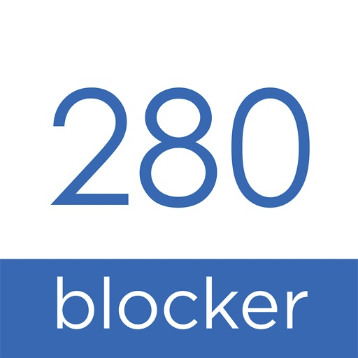

● 簡単設定でSafariの広告をブロック (日本の広告サイトに強い)
● App Storeトップ有料iPhoneアプリランキング3年連続1位 (2023年、2024年、2025年)
● DNSブロック機能で他アプリの広告も抑える
● 東証上場のセキュリティ企業が運営する安心・安全の純国産アプリ

280blockerは、Safari専用の高性能広告ブロッカーです。App Storeトップ有料アプリランキングの中で2年連続No.1と圧倒的に支持されています。
広告のブロックルールを常に更新しているため、高い精度で広告がブロックされています。
迷惑な広告をブロックすることで、Safariの通信量を大幅に減らすことができ、ページ表示の高速化にも貢献します。

▼ 280blockerスタンダードプランはこんな方におすすめ
・広告に邪魔されずスムーズにネットサーフィンしたい方
・性的な広告やギャンブルなどの意図しない広告に悩まされている方
・格安料金プランを利用しているため、常に通信量を気にしながらネットをご利用の方
(800円買い切りでご利用いただけます)

▼ 280blockerプレミアムプランはこんな方におすすめ
スタンダードプランに加えて、
・広告ブロックルールの更新頻度をより高めたい方
・アダルト広告を強力ブロックしたい方
・Safari以外のブラウザアプリで広告をブロックしたい方
・危険なサイトへ飛んでしまって怖い思いをされた方
(月額100円・年額900円でご利用いただけます)

▼ 280blocker詐欺対策プランはこんな方におすすめ
プレミアムプランに加えて、
・迷惑電話に悩まされている方
・迷惑メッセージ(ショートメッセージ)に悩まされている方
・とにかくスマホのセキュリティを高めたい方
(月額300円・年額2700円でご利用いただけます)

お子様や、ご高齢の方のWebブラウジングやスマホ利用にも安心をご提供します。

▼ ブロックするコンテンツ（Safariのみ）
・国内のスマホサイトの広告
・不要な関連PR記事
・不要なトラッキング（行動追跡）
・動作の重いSNSボタン
・仮想通貨採掘スクリプト（マイニングをブロックします）
・アンチアドブロック（広告ブロック対策）にも可能な範囲で対応済み
※動画サイトについては一部、対応していない広告があります。
また著作権に問題のある日本国外のサイトの広告については対応していません。

▼ セキュリティについて
本アプリはiOSのSafariに標準搭載されている、コンテンツブロッカー（機能拡張）を利用して実現されております。
このコンテンツブロッカーは、Webサイト上での行動を解析することはできない仕様となっております。
そのため、アプリからはお客様がどのサイトにアクセスしたか、どのような広告をブロックしたかなどの情報を取得することはできません。
またOS提供の機能のため、バッテリーへの影響も少ないです。
アプリのクラッシュ情報、機能の利用率等については品質改善のための情報として取得しておりますが、アプリから情報取得を停止できます。
アプリ内のイベントログを送信したくないお客様は、解析データの共有をOFFにしてご利用ください。（なお、クラッシュ情報の送信については停止できません）

▼ DNSブロック機能について
iOS14で標準機能となった暗号化DNS（DOH）を利用して、広告配信を行うドメインへのアクセスをブロックする機能です。
事前に定義された広告ドメインにアクセスする場合のみ、独自DNSサーバを利用することで、不要な通信・プライバシーに問題のある通信をブロックすることができます。
通常の通信や、どのアプリからアクセスするかという情報には干渉しないため、ご利用のお客様のプライバシーが侵害されることはありません。
不要な通信が行われない事により、ブラウザの挙動も安定します。ただし、DNSブロック機能はその性質上、完全なブロックを行うことはできません。
また、以前は試験機能として無料で公開していましたが、かねてより、多くのお客様からスピードアップのご要望をいただいておりました為、この度、サーバーをグレードアップして、従来型のスタンダードプランから詐欺対策プランまで、幅広くお客様がご利用いただけるように正式リリースいたしました。DNSブロック機能のバランス型に関しましては追加料金なくご利用いただけます。

▼ 購入後のサポートについて
公式ブログにトラブルが発生した際の対処方法をまとめていますので、「不具合かな？」と思った場合は、公式ブログをご参照ください。
それでも広告が消えない、アプリに不具合がある等、何かサポートが必要な場合、「よくある質問」また「広告がブロックされないときは」からお問い合わせください。
なお、大変申し訳ありませんが、アプリに関して運営元での返金処理ができかねます。課金や返金についてはApple社へお問い合わせください。
・280blocker公式ブログ：https://280blocker.net/
・ X（Twitter）：@280blocker

▼ 消えない広告について
・消えない広告や不具合が発生した場合、ブロックルールの更新を行うことで解消されることがあります
・Safari以外のアプリに表示される広告は消えないことがあります
・海外サイトや、著作権違反の可能性があるサイトの広告には、一部サイトを除き、原則対応をしていません
・YouTubeの広告はSafariから閲覧しても一部の広告を除き、消すことができません
　また黒い静止画が流れるなどスムーズに再生されない場合があります
　Youtubeの広告を完全にブロックしたい場合は、YouTube Premiumをご利用ください
・Safariを使用していても、すべての広告をブロックできるわけではありません
　動画サイト、SNS（Twitter,Facebook,Instagram)、その他サイトの一部の広告は消えません

▼ 全く広告が消えない場合
・Safariの広告が全く消えない場合は、アプリの設定を改めてご確認ください
・iPhoneの「設定」>Safari>「コンテンツブロッカー」、この中の「すべてのWebサイト」をオンにしてください
・それでも消えない場合はアプリを削除し、iPhoneを再起動してからアプリの再インストールをお願いいたします
・コンテンツブロッカーの設定ができない場合は、iPhoneの機能制限の可能性があります
　iPhoneの設定>スクリーンタイム>「コンテンツとプライバシーの制限」>「コンテンツ制限」、この中の「webコンテンツ」を「無制限のコンテンツ」に変更してください

▼コンテンツブロッカー280が紹介された書籍など
・日経新聞 全国版2018年6月19日朝刊
・ iPhone 11 Pro/11 Pro Max/11便利すぎる! テクニック(standards)
・家電批評 2019年 5月号(晋遊舎)
・iPad完全マニュアル2019(standards)
・iPhone XS便利すぎる! 250のテクニック (standards)
・今すぐ使えるかんたんPLUS+ iPhoneアプリ 完全大事典 2019年版（技術評論社）
・iPhone格安SIM完全ガイド (standards)
・iPhone芸人 かじがや卓哉のスゴいiPhone 超絶便利なテクニック123（インプレス）
・今すぐ使えるかんたん iPhone完全ガイドブック 困った解決&便利技（リンクアップ）
・iPhone 8便利すぎる! 240のテクニック(standards)
・iPhone X便利すぎる! 240のテクニック(standards)
・iPhoneアプリ 完全大事典 2018年版　（技術評論社）
・iPhone7がまるごとわかる本　（晋遊舎）
・iPhoneアプリ 完全大事典 2017年版　（技術評論社）
・ゼロからはじめる iPhone 7 スマートガイド au完全対応版
・ゼロからはじめる iPhone 7 スマートガイド ドコモ完全対応版
・ゼロからはじめる iPhone 7 スマートガイド ソフトバンク完全対応版
・iPhone7お得技ベストセレクション（晋遊舎）
・今すぐ使えるかんたん iPhone 7/7 Plus 完全ガイドブック(リンクアップ)
・iPhone芸人、かじかや卓哉さんのYoutubeで紹介

▼AppStore (日本) のiPhone売上実績 (2026年1月時点)
2021年 App Storeトップ有料アプリランキング 3位 (Best Of 2023)
2022年 App Storeトップ有料アプリランキング 3位 (Best Of 2023)
2023年 App Storeトップ有料アプリランキング 1位 (Best Of 2023)
2024年 App Storeトップ有料アプリランキング 1位 (Best Of 2024)
2025年 App Storeトップ有料アプリランキング 1位 (Best Of 2025)

[View on Apple](https://apps.apple.com/jp/app/280blocker/id1071235820)

## Shadowrocket

Rule based proxy utility client for iPhone/iPad.

- Capture all HTTP/HTTPS/TCP traffic from any applications on your device, and redirect to the proxy server.
- Record and display HTTP, HTTPS, DNS requests from your iOS devices.
- Configure rules using domain match, domain suffix, domain keyword, CIDR IP range, and/or GeoIP lookup.
- Measure traffic usage and network speed on WiFi, cellular, direct and proxy connections.
- Import rule files from URL or iCloud Drive.
- Block ads by domain, user agent rules.
- Local DNS Mapping.
- Work on cellular networks.
- Decrypt HTTPS traffic.
- Perform URL rewrite.
- Fully IPv6 supports.
- Script filter supports.
- Multi-level forward proxy.
- Support kcptun, cloak, gost, v2ray plugins.
- Support DNS over HTTPS, DNS over TLS, DNS over QUIC.

[View on Apple](https://apps.apple.com/jp/app/shadowrocket/id932747118)

## AnkiMobile Flashcards

AnkiMobile is a mobile companion to Anki®, a powerful, intelligent flashcard program that is free, multi-platform, and open-source. Sales of this app support the development of both the computer and mobile version, which is why the app is priced as a computer application.

AnkiMobile was written by the lead developer of Anki and AnkiWeb, and it has been around since 2010. Beware other apps using "Anki" in their name that have sprung up recently - they are not compatible with the rest of the Anki ecosystem, and they offer far fewer features, despite charging expensive subscriptions.

Some of AnkiMobile's features include:

- A free cloud synchronization service that lets you keep your card content synchronized across multiple mobile and computer devices. This makes it easy to add content on a computer and then study it on your mobile, easily keep your study progress current between an iPhone and iPad, and so on.
- The same SM2 and FSRS scheduling algorithms that the computer version of Anki uses, which remind you of material as you're about to forget it.
- A flexible interface designed for smooth and efficient study. You can set up AnkiMobile to perform different actions when you tap or swipe on various parts of the screen, and control which actions appear on the tool buttons.
- Comprehensive graphs and statistics about your studies.
- Support for large card decks - even 100,000+ cards.
- If your cards use images or audio clips, the media is stored on your device, so you can study without an internet connection.
- A powerful search facility that allows you to find cards that match criteria such as 'tagged high priority, answered in the last ten days and not containing the following words', and automatically place them into a deck to study.
- Support for displaying mathematical equations with MathJax, and rendering LaTeX created with the computer version.
- Support for adding images drawn with the Apple Pencil to your cards.

Please note that AnkiMobile is currently intended as a companion to the computer version of Anki, rather than a complete replacement for it. While AnkiMobile is able to display and schedule your cards in the same way the computer version does, certain changes like modifying note types need to be done with the computer software. Add-ons are not supported, so while you can study image occlusion cards created with the computer version, they can not be created within AnkiMobile. For this reason, please start with the computer version of Anki before you think about buying this app.

The cloud synchronization service is optional, and data can also be imported/exported from the app via a USB cable or AirDrop.

Like all apps, AnkiMobile can be purchased once and then used on multiple devices in a household using the same Apple ID. Family sharing is also supported (apart from in India). For information on bulk discounts for educational institutions, please see Apple's Volume Purchase Program.

For more information on AnkiMobile, including a link to the online manual, please have a look at the support page: https://docs.ankimobile.net/support.html. If you have any questions or want to report an issue, please let us know on our support site and we'll get back to you as soon as possible.

[View on Apple](https://apps.apple.com/jp/app/ankimobile-flashcards/id373493387)

## AutoSleep - 苹果手表睡眠监测，睡觉记录及智能闹钟

使用手表来自动追踪您的睡眠*。无需按动任何按钮，无需安装任何手表应用，只要安稳睡觉就好！

关于 AutoSleep
-----------------
使用先进的启发式应用 AutoSleep 来计算您的睡眠时长。

如果您戴上手表睡觉，您什么都不需要做。AutoSleep 会自动监控您的睡眠时长与质量并在您早晨第一次解锁手机后给你发送通知。

即使您不带着手表睡觉, AutoSleep 也可以计算您在床上的时间。这非常简单。

因为人总是各异的，AutoSleep 提供了微调选项，您可以通过简单地滑动滑块来调整自己的睡眠活跃度检测级别并可以很快速地看到睡眠时钟的统计变化。它还允许您自定义睡眠窗口, 是否需要每日通知以及在睡眠时钟上显示更多或更少的信息。 

与 Apple 睡眠阶段应用完全集成，使您可以选择使用 Apple 睡眠应用并在 AutoSleep 中查看所有信息。

AutoSleep 包括睡眠监控所需的所有信息和功能，包括：
睡眠时间 – 睡眠时长和睡眠银行余额
睡眠评分 – 对您睡眠的综合评分
睡眠环 – 用高质量的睡眠填充您的睡眠环，包括心率、深度睡眠和快速动眼
Apple 睡眠阶段 – 可使用 Apple 睡眠应用中数据的选项
睡眠呼吸暂停 - 了解您是否患有睡眠呼吸暂停
睡眠血氧 – 睡眠时的测量值
呼吸频率 – 记录您每分钟的呼吸
噪声 – 环境噪声测量值
睡眠分析 – 查看您的睡眠周期的详细图表和细分情况
睡眠燃料 – 衡量您的睡眠质量和效率
今晚就寝时间 – 根据您的习惯推荐您最近的就寝时间
就绪 – 表示您的身体和精神压力
温度 – 跟踪您睡眠时的手腕温度
睡眠一致性 – 了解您的就寝时间习惯
熄灯 – 跟踪入睡时间
实时睡眠跟踪 – 查看您夜间的睡眠统计信息
智能闹钟 – Watch 内置的智能闹钟，帮助您从较浅的睡眠中醒来
小组件 – 各种各样超棒的 iPhone 小组件
复杂功能 – 多种 Watch 表盘选项
HomeKit – 与 Apple HomeKit 完全集成
表情符号和笔记 – 记录对睡眠时段的评论和标签
探索 – 深入分析视图
Siri – 通过 Siri 语音指令使用
快捷方式 – 创建您自己用于 AutoSleep 的快捷方式
调整 – 调整您个人睡眠/醒来检测的简单功能
历史 – 高级图表和趋势
配置 – 更改主题并设计您的时钟睡眠环
设置 – 定制您的睡眠目标、设置通知和提醒
导出 – 导出选项以保存数据

AutoSleep 可以与 HeartWatch 联动，它是我们首推的心跳与活动检测应用。AutoSleep 会将您的睡眠信息记入健康应用中。 

*需要运行 Watch OS 4 或更高版本的 Apple Watch。

- 2018年度最佳
https://apps.apple.com/story/id1438574124/

- 2019年度最佳
https://apps.apple.com/story/id1484100916/

- 2020年度最佳
https://apps.apple.com/story/id1535572713/

- 2021年度最佳
https://apps.apple.com/story/id1591083005/

- 2022年度最佳
https://apps.apple.com/story/id1654240446

- 2023年度最佳
https://apps.apple.com/story/id1719170110

[View on Apple](https://apps.apple.com/jp/app/autosleep-%E7%9D%A1%E7%9C%A0%E3%81%AE%E8%BF%BD%E8%B7%A1%E3%82%92watch%E3%81%A7/id1164801111)

## オービスガイド - 移動式オービス・ネズミ捕り対応

オービスガイドは、業界屈指の全国オービス情報サイト『オービスガイド』が提供する全国の「固定式オービス」「移動式オービス」「Nシステム」「ネズミ捕り」「検問」等の情報を、お車の運転中にお知らせするアプリです。バッググラウンド機能によりナビアプリと併用が可能です。

リアルタイムで、移動式オービスやネズミ捕りをアプリから投稿して、ユーザー間で共有できる機能があります。

※お使いのアプリによっては通知やサウンドが競合する場合があります。

■収録データ■ 
【オービス】 約3000件（撤去反映済み／移動式オービス含む)
【Nシステム】 約2300件
【トンネル前】 都心や山間部など30件以上
【ネズミ捕り】 約4700件
【検問】 約4400件
※撤去済みのオービスは速やかに削除してあります。

■特殊機能■ ※一般的なオービス警告アプリにはない特別な機能です。
・移動式オービスに対応！
（ユーザー投稿・スタッフによる現地調査による最新情報提供）
・移動式オービス、ネズミ捕りなどのリアルタイム交通情報をプッシュ通知でお知らせします。
・オービスの通過履歴を記録して制限速度と通過速度の差を後から確認する事が可能です。
・通過時の走行速度も音声でお知らせします。
・都心や山間部などのGPSが利用できないトンネル内や出口付近のオービスも事前にお知らせします。
・オービスの手前で制限速度を大きく速度を超過している場合は音声で注意を促します。
・渋滞などの速度に合わせて低速時には連続警報音を中断します。
・警告時には実際のオービスの設置写真を確認する事ができます。
・さらに詳細画面では実際に通過した車載動画をYoutubeで閲覧する事も可能です。
・すれちがい機能で接近時にメッセージをやり取りしたりドライバー仲間を地図上で確認できます。
・つぶやき機能で全国の交通情報を聞きながら運転したり休憩中はコミュニケーションを楽しめます。

■基本機能■
・バックグラウンド動作でナビアプリと併用が可能です。
・任意の期間に一定以上の速度が出ていなければアプリを中断します。
・一般道と高速道路を選択して警告対象の切り替えが可能です。
・対向車線の警告ポイントはお知らせしません。
・時間帯によって夜も見やすいカラーテーマに切り替わります。
・接近時には連続した警告音を鳴らして渋滞の場合は臨機応変に中断します。
・地図を隠してバッテリー消費を抑えるエコモードがあります。
・全国の取り締まり情報をプッシュ通知します。

■動作環境■
・地図を表示する為にインターネット環境が必要です。
・現在位置と警告ポイントを比較する為にGPSが必要です。
・通知と位置情報の利用許可が必要です。

■取り締まり情報■
・ネズミ捕り・検問ポイントにつきましては、全てを網羅しているわけではございません。
・リアルタイム取り締まり情報は、ユーザーによる取締情報投稿によるポイントを表示しています。

通過した道路上で、初めての取り締まりや、未登録のポイントなどがございましたら投稿頂ければ幸いです。
皆様のご協力をよろしくお願いします。

■プレミアムコース＜120円(税込)／月＞■
プレミアムコースをご利用いただくと、リアルタイム取り締まり情報が快適にご利用いただけるようになります。
・取り締まり情報一覧から地図にジャンプ！
・プッシュ通知を必要な地域だけに！
・つぶやき情報をエリアで選別！
・音声種類を追加！

プレミアムコース(定期購読)について
・ご請求はご利用のiTunesアカウントへ対して行われます。
・停止の手続きを行うまで、自動で更新されます。
・停止する場合は「AppStore」の「アカウント画面」から「登録の管理」にて行えます。
・停止の手続きは有効期間終了の24時間前までに行う必要があります。
・有効期間終了まで24時間を切りますと、次の更新の請求は発生しますのでご注意下さい。
・停止の手続きの後も、有効期間内はプレミアムコースの機能をご利用いただけます。
・初めてプレミアムコースに登録した時のみ1ヶ月のお試し期間があります。

■注意事項■
・実際の交通ルールに従って安全に運転して下さい。
・走行中に操作したり画面を注視せずに運転して下さい。
・飲酒検問の情報はありません。
・地図の表示や位置情報の取得にバッテリーを大きく消費しますので給電しながらご利用下さい。
・すれちがい機能で利用する名前やメッセージには個人を特定する情報を記載しないようにして下さい。
・すれちがい機能をご利用する場合はプライバシーエリアの設定をお勧めします。
・プライバシーを特に気にする方は、すれちがい機能をOFFにしてご利用下さい。
・ネズミ捕りや検問はユーザー投稿による為に不正確なポイントがあります。
・移動式オービスや取締りポイントを全て把握することはできません。
・今後予告なくアプリの仕様を変更する場合があります。
・iOSのバージョンアップに従ってサポート可能なバージョンが変更される場合があります。
・バックグラウンドにおいてもGPSを利用しますのでバッテリーを多く消費します。
・バッテリーを節約する場合は設定画面で位置情報の取得を中断させる"静止時のスリープ"の時間を短くしてください。

【利用規約】
https://orbis-guide.com/app/terms/

【プライバシーポリシー】
http://orbis-guide.com/app/privacy/

■免責事項■
・このアプリの利用により不利益が生じても、当方は一切責任を負いません。

■サウンド提供
魔王魂 様 https://maou.audio/

■イラスト提供
いらすとや 様 https://www.irasutoya.com/

■ボタン音 共通ボイス
VOICEVOX 様 https://voicevox.hiroshiba.jp/

■リンク
サポートメール：help.ios@orbis-guide.com (必ずアプリ名を記載して下さい)
アプリ紹介ページ https://orbis-guide.com/app/pro/
オービスガイド・全国オービス情報サイト https://orbis-guide.com/

[View on Apple](https://apps.apple.com/jp/app/%E3%82%AA%E3%83%BC%E3%83%93%E3%82%B9%E3%82%AC%E3%82%A4%E3%83%89-%E7%A7%BB%E5%8B%95%E5%BC%8F%E3%82%AA%E3%83%BC%E3%83%93%E3%82%B9-%E3%83%8D%E3%82%BA%E3%83%9F%E6%8D%95%E3%82%8A%E5%AF%BE%E5%BF%9C/id1179959829)

## YoungPhoto - Aesthetic Camera

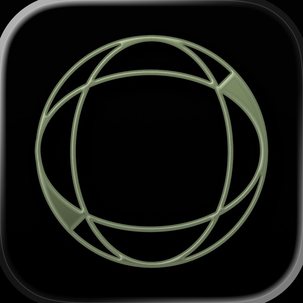

Hi :) I’m YoungPhoto, a photography creator who makes taking better photos easier for over 400K followers.

Over the years, I’ve shared content about photo composition, color, and shooting tips. Now, I’ve created a photo app you can use in real life, right when you’re taking a picture.

The composition ideas and color filter tips you’ve seen on social media are now available directly in the app, so you can view them, follow them, and shoot in real time.

YoungPhoto is not just a filter app. It helps you understand how to take more aesthetic photos with real-time guidelines and composition tools that anyone can follow.

It was made for people who love photography but often feel like something is missing, people who want to capture ordinary moments like scenes from a movie, and beginners who want beautiful, emotional results without complicated editing.

YoungPhoto is designed to naturally guide the viewer’s eye, add story and atmosphere to each shot, and help you create photos with thoughtful composition and dreamy filters that work in many different settings.

Use YoungPhoto to capture your everyday life with more feeling, style, and intention :)

[Recommended For]

- Anyone who has thought, “Why don’t my photos look like that?”
- People who find photo composition difficult
- Anyone who wants easy guides for taking aesthetic photos
- People who want beautiful colors without complicated editing

[Key Featrues]

- Composition guidelines
- Composition lessons
- YoungPhoto aesthetic filters
- Effects
- Photo and video filter editing

[View on Apple](https://apps.apple.com/jp/app/youngphoto-%E3%82%A8%E3%83%A2%E3%81%84%E6%A7%8B%E5%9B%B3%E3%82%AB%E3%83%A1%E3%83%A9/id6763737180)

## 2026人体解剖学图谱

通过Visible Body探索交互式3D人体解剖学！一次性购买人体解剖学图谱，即可在iOS设备上访问基本的大体解剖3D模型和精选的微观解剖模型和动画。生理学动画和牙科内容可提供App内购。

通过人体解剖学图谱，您可以获得：

* 用于研究大体解剖的完整女性和男性3D模型。配合尸体和诊断图像查看这些模型。
* 关键器官的多层次3D视图。学习肺、支气管和肺泡。复习肾脏、肾锥体和肾单位。
* 解释核心生理学和常见疾病的简短动画。使用这些内容更深入地了解系统过程！
* 您可以移动的肌肉和骨骼模型。学习肌肉动作、骨性标志、附着点、神经支配和血供。
* 了解筋膜如何将上肢和下肢的肌肉分成筋膜鞘。

您还将获得各种各样的学习和演示工具：

* 在屏幕上、增强现实（AR）和横截面中仔细分析各种模型。下载免费实验室活动，引导您了解关键结构。
* 参加3D解剖测验并检查您的进度。
* 制作与模型集关联的交互式3D演示文稿，用来解释和复习主题。使用标签、注释和3D画图来标记各种结构。

[View on Apple](https://apps.apple.com/jp/app/%E3%83%92%E3%83%A5%E3%83%BC%E3%83%9E%E3%83%B3-%E3%82%A2%E3%83%8A%E3%83%88%E3%83%9F%E3%83%BC-%E3%82%A2%E3%83%88%E3%83%A9%E3%82%B92026/id1117998129)

## ブラックビデオ (BlackVideo)

大切な瞬間を逃さずに直ちに無音で撮影してください。

アプリ実行と同時にビデオ録画が始まります。
 ホームボタンをタブすると自動的に録画が終了します。
ビデオを早く撮影したいとき,面白い瞬間を逃したくないときに使ってください。

スパイモード、4Kビデオ撮影、アルバム、無線ファイル送信、ビデオファイルの損失の防止機能も支援します。
このアプリだけで完璧に支援します。

【アプリが実行されない場合の解決方法】

- カメラ設定が間違っている場合、アプリは実行されません。 以下の方法で復旧してください。
- iPhone設定 -> ブラックビデオに移動した後、カメラ権限を無効にしてください。
- そしてアプリ設定でカメラ設定を変更した後、再びカメラ権限を有効にしてください。

[View on Apple](https://apps.apple.com/jp/app/%E3%83%96%E3%83%A9%E3%83%83%E3%82%AF%E3%83%93%E3%83%87%E3%82%AA-blackvideo/id500676238)

## AutoSnore: 鼾声记录器

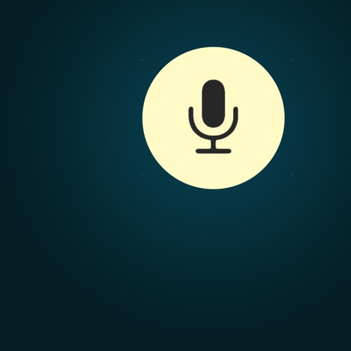

通过 iPhone 自动追踪您的鼾声和睡眠声音，无需订阅费！ 只需轻点开始按钮，然后安心入睡。

实力团队匠心打造
-------------
由广受欢迎的 AutoSleep App 原班团队开发，以全新创新方案助力用户掌控睡眠、改善健康。

诚信软件，良心定价
--------------------
无订阅机制。 无额外 App 内购买。 无后续费用。 一次性低价购买，即可终身使用。 包括所有功能。

简单易用
-------------
您只需要一部 iPhone。 只需启动 AutoSnore 并将手机放在床边。 醒来后即可聆听录音并查看洞见，就是这么简单。

为什么选择 AutoSnore？
-------------
睡眠弥足珍贵。全球近一半成年人受打鼾问题困扰（而大多数人甚至不自知）。是时候认真对待这个问题了。 打鼾会对睡眠质量产生严重影响，不仅会影响打鼾者本人，也会干扰同床伴侣的休息。

AutoSnore 有什么作用？
-------------
AutoSnore 可记录各种打鼾和睡眠声音，包括每次打鼾的频率、强度和持续时间，全面呈现每晚的打鼾情况。早上醒来时，系统会提供可视化分析图表，帮助您了解打鼾对整体睡眠质量的影响。

高级声音识别
-------------
AutoSnore 利用机器学习声音识别技术，可以对您所有的睡眠声音进行分类，例如打鼾、梦呓、打哈欠、咳嗽等等！这真是太神奇了。

它能帮到我吗？
-------------
当然可以！ AutoSnore 支持个性化策略跟踪，帮助您尝试各种改善方法： 无论是改变生活方式、调整睡姿、更换枕头、尝试放松技巧，还是避免晚餐时饮酒，该 App 都能帮助用户尝试不同的方法，找到最适合自己的解决方案。

AutoSleep 集成
-------------
与 AutoSleep 应用程序完美配合，您的打鼾数据可自动与睡眠分析同步！

全面保护隐私
-------------
与我们所有的 App 一样，AutoSnore 将用户隐私和数据安全放在首位。 请对比下方的 App 隐私标签，查看“未收集数据”。 您可以查看其他所谓“免费”打鼾 App，看它们能否做到同样承诺：

无数据分析跟踪。 无广告插件。 无第三方代码。 无数据上传。 所有录音数据和洞见仅安全地保存在您的设备上。 只有用户可以选择与其他人分享录音。 这才是隐私保护该达到的标准。

立即开始使用
-----------------
越早开始收集数据，就能越早进行管理。

对于任何想要改善睡眠和整体健康的人来说，AutoSnore 都是一款必备 App。 其采用独特的 App 设计方法，摒弃一切冗余，直击问题核心，同时不让您花费过多。

AutoSnore并非医疗器械。如有任何健康问题或疑虑，请务必咨询专业医疗人员。

Xiaohongshu
https://xhslink.com/m/2jNT7YK0hDk

Weixin
https://mp.weixin.qq.com/s/VG_LflL7y0QYrdOIrpRlLw

[View on Apple](https://apps.apple.com/jp/app/autosnore-%E3%81%84%E3%81%B3%E3%81%8D%E3%83%AC%E3%82%B3%E3%83%BC%E3%83%80%E3%83%BC/id6746705608)

## CalCs - Calendar Complications

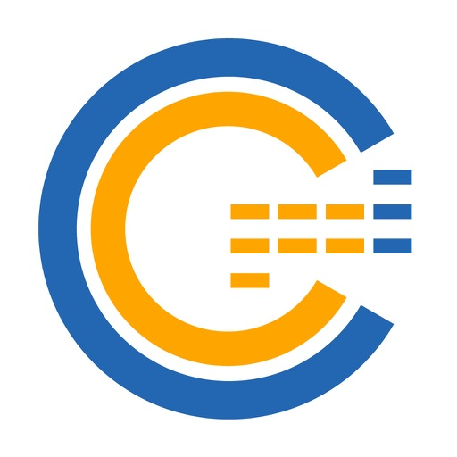

Calendar Complications、略して「CalCs」（カルシーズ）は、カレンダーに関する多彩なコンプリケーションを提供するwatchOS専用アプリです。

---重要な注意点 ---
●本アプリのアプリ本体に搭載された機能は、イベント・リマインダーの一覧表示と月カレンダー表示のみとなります。
その他の機能はコンプリケーションやスマートスタックで行う機能となります。

●iPhoneのApp StoreアプリからCalCsをダウンロードすると、iPhoneとApple Watchの同期の問題により、Apple WatchにCalCsが表示されないことがあります。
Appleの仕様上、watchOS専用アプリはiPhone上のApp Storeアプリから再ダウンロードできません。
そのため、"Apple Watch上の"App Storeアプリを使用し、以下の手順のいずれかで再ダウンロードしてください。
・左上の検索ボタン→「CalCs」を検索→再ダウンロード
・最下部までスクロール→「アカウント」→「購入済み」→「CalCs」→再ダウンロード
-------------------

主な特徴
●日付表示、イベント・リマインダー表示、月カレンダー表示などの多彩なコンプリケーションをサポート
・日付表示
現在の日付を様々な形式で表示します。
和暦・六曜を表示することも可能です。
カリフォルニア等の文字盤の四隅のコンプリケーション、インフォグラフ等の文字盤の円形のコンプリケーション、タイムラプス等の文字盤の1行のコンプリケーションに対応しています。

・イベント・リマインダーの表示
iPhoneと同期したイベント・リマインダーを表示します。
終日のイベントを含めるかどうかを選択することもできます。
四隅のコンプリケーション、円形のコンプリケーション、1行のコンプリケーション、モジュラー等の文字盤の長方形の大型のコンプリケーション、スマートスタックでの表示に対応しています。

*リマインダーは未完了のもののみが表示されます。
*円形のコンプリケーションではイベント・リマインダーのタイトルは先頭3文字までの表示となります。

・月カレンダー表示
月カレンダーを表示します。
月曜始まりにすることも可能です。
祝日にも対応しています。
長方形の大型のコンプリケーション、スマートスタックでの表示に対応しています。
週数や曜日表示の有無、和暦表示の有無、次のイベント・リマインダーの表示有無など、様々なタイプを提供しています。

*上下2つの長方形の大型のコンプリケーションの組み合わせで月カレンダーを表示できるのは、モジュラーデュオ文字盤に対応している機種(SEシリーズを除くシリーズ7以降の機種)のみになります。
*モジュラーデュオ文字盤に対応していない機種でも、フォントサイズは小さくなりますが1つの長方形の大型のコンプリケーションに月カレンダーを表示可能です。

・今日のイベント表示(チャート) *β版
今日のイベントをガントチャート風の形式で表示します。
長方形の大型のコンプリケーション、スマートスタックでの表示に対応しています。

*一部の表示に課題があり、リリースを迷いましたが、せっかく作成したためβ版として公開することにしました。
不完全ですが一応機能はしていますのでご容赦ください。

●アプリの本体ではイベント・リマインダーの一覧・月カレンダーを表示
コンプリケーションのタップで起動するアプリの本体では、iPhoneと同期したイベント・リマインダーの一覧、月カレンダーを表示します。

イベント・リマインダー一覧表示では以下の操作を行うことができます。
・スクロールすると先月・当月・未来の3ヶ月分のイベント・リマインダーを表示します。
・2回タップすると表示内容が「イベントとリマインダー両方→イベントのみ→リマインダーのみ」の順番で切り替わります。
・長押しすると現在または次のイベント・リマインダーにスクロールします。
・右から左にスワイプすると月カレンダー表示に切り替わります。

*リマインダーは未完了のもののみが表示されます。
*イベント・リマインダーの追加や編集、削除をする機能、リマインダーを完了にする機能は現時点では実装されていません。ご了承ください。

月カレンダー表示では以下の操作を行うことができます。
・スクロールすると先月・当月・未来の3ヶ月分の月カレンダーを表示します。
・2回タップすると日曜始まりと月曜始まりが切り替わります。
・長押しすると現在の月にスクロールします。
・左から右にスワイプするとイベント一覧表示に戻ります。

●必要最低限の設定項目
Apple Watchの小さい画面で、設定の変更が煩雑にならないよう、設定項目は表示するカレンダー・リマインダーリストの選択のみとしました。

*注意事項
・四隅のコンプリケーション、円形のコンプリケーション、長方形の大型のコンプリケーションはApple Watchシリーズ4以降で動作するため、CalCsはシリーズ3以前の機種での動作を保証しておりません。

・watchOSのコンプリケーション表示更新の制限により、日が変わったタイミングや、iPhoneでのイベントやリマインダーの追加や編集等のあと、即座にコンプリケーションに反映されない場合があります。

・コンプリケーションを初めて配置した後、実際に表示されるまでに時間がかかる場合があります。

・コンプリケーションが更新されない場合、コンプリケーションをタップしCalCsを起動すると更新される場合があるので、お試しください。

・CalCsを起動してもコンプリケーションが更新されない場合、以下のいずれかの手順で解決する場合があります。お試しください。
1. iPhoneとApple Watchの再起動

2. CalCsの強制再起動
①CalCsを開いた状態でサイドボタンを長押し
②緊急電話や電源オフの画面が表示されたらデジタルクラウンを長押し

3. CalCsの再インストール
①デジタルクラウンを押し、アプリ一覧を表示する
②CalCsを長押しし、×ボタンが表示されたらタップし削除
③"Apple Watch上の"App Storeアプリを起動
④最下部までスクロール→「アカウント」→「購入済み」→「CalCs」→再ダウンロード

・常時表示に対応したApple Watchで手首を下げた際にもコンプリケーションのデータを表示したい場合は以下の手順で設定を変更してください。
①設定アプリを起動し「画面表示と明るさ」をタップする
②「常にオン」をタップする
③「常にオン」を有効にし「コンプリケーションデータの表示」をタップする
④「コンプリケーションデータの表示」を有効にし「CalCs」を有効にする

・アプリ本体のイベント・リマインダー一覧画面やコンプリケーションにイベントの情報が表示されない場合、カレンダーへのフルアクセス権限が許可されていない可能性があります。
以下の手順を行い、カレンダーへのフルアクセス権限を許可しなおすことで解決する場合があります。お試しください。
①iPhoneの設定アプリの「プライバシーとセキュリティ」の「カレンダー」を開く
②CalCsのカレンダーへのアクセスを一度「なし」に変更し、その後「予定の追加のみ」を選択する
③CalCsを開くと、フルアクセスの許可を求められるので「フルアクセスを許可」をタップする

・アプリ本体のイベント・リマインダー一覧画面やコンプリケーションにリマインダーの情報が表示されない場合、リマインダーへのアクセス権限が許可されていない可能性があります。
以下の手順を行い、リマインダーへのアクセス権限を許可しなおすことで解決する場合があります。お試しください。
①iPhoneの設定アプリの「プライバシーとセキュリティ」の「リマインダー」を開く
②CalCsのリマインダーへのアクセスを一度無効に変更し、その後有効に変更する

・Apple Watchの言語設定を日本語にしている場合、四隅または1行のコンプリケーション選択画面で「年・月・日・曜日」などのコンプリケーションが二重に表示されます。
これは、言語設定が日本語以外のときに、曜日の省略形式を「3文字(例:WED)」または「2文字(例:WE)」から選べるようにしているためです。
日本語設定の場合は、どちらを選択しても「(水)」のように表示され、表示内容に違いはありません。
現時点では、Apple Watchの言語設定に応じてコンプリケーション選択画面の表示を切り替えることができないため、このような仕様となっております。ご了承ください。

[View on Apple](https://apps.apple.com/jp/app/calcs-calendar-complications/id6499201223)

## さんぽ神｜ドロッセルマイヤーさんの公式ゆるゲーアプリ

● 近所の散歩を「遊び」に変える専用アプリ
● 買い切り・追加料金なし！
● おつげに沿って歩くだけ！超簡単で誰でもすぐに楽しめます
● 1人でも、2人でも、家族でも、団体でも。何人でも遊べます
『ドロッセルマイヤーさんのさんぽ神アプリ』は、散歩の神様「さんぽ神」から届く、ちょっと不思議なおつげに従って歩く、アナログゲーム「さんぽ神」のアプリ版です。
目的も、距離も、正解もありません。ただ歩くだけの時間が、少しだけ楽しくなる。そんな散歩のためのアプリです。

---

■ 2000種類以上のお告げ

【高い建物を目指して歩いて】
【動物の絵を探そう】
【緑の多い場所で】
【普段聴かない音楽を聴こう】

「どこで」と「なにをする」の組み合わせで、
2000種類以上のお告げを自動生成。
毎回ちがう散歩が生まれます。

---

■ 日常のいろいろな散歩に

・予定のない日のぶらり外出
・近所でのちょっとしたひまつぶし
・犬とのいつもの散歩
・朝の気持ちいい散歩時間
・夜の静かなウォーキング

時間帯や歩き方を選ばず、あなたの生活に楽しみを。

---

■ さんぽの履歴とレベル

散歩の履歴は自動で記録。スタンプを集めることであなたの「さんぽレベル」が上がっていきます。レベル100の最高位「さんぽ神」を目指しましょう。

---

■ お告げカスタマイズ

出したいお題・出したくないお題をON／OFFで切り替え可能。環境や気分に合わせて、おつげを調整できます。

---

■ 自由に歩いてさんぽ神

「どこで」は自由に、「なにをする」だけをもらえるモード。コースは自分で決めたいときに便利です。

---

朝でも、夜でも。ひとりでも、犬と一緒でも。
クリアや勝ち負けはなし。ただただ、散歩を楽しくするアプリです。
「やれば楽しいんだけど、なかなかやらないこと」のきっかけとして、このアプリをご活用ください。

---

■ ドロッセルマイヤーズの「ゆるゲー」シリーズ

さんぽ神 / 空論道 / ひまつぶ神 / 大喜利神
ドロッセルマイヤーの人気アナログゲームをアプリで。各タイトル好評配信中！

[View on Apple](https://apps.apple.com/jp/app/%E3%81%95%E3%82%93%E3%81%BD%E7%A5%9E-%E3%83%89%E3%83%AD%E3%83%83%E3%82%BB%E3%83%AB%E3%83%9E%E3%82%A4%E3%83%A4%E3%83%BC%E3%81%95%E3%82%93%E3%81%AE%E5%85%AC%E5%BC%8F%E3%82%86%E3%82%8B%E3%82%B2%E3%83%BC%E3%82%A2%E3%83%97%E3%83%AA/id6758579274)

## Berry胶片相机 - 韩系自拍神器

大家好，我是 Berry，来自韩国的滤镜创作者。
也许你认识我，是通过 Instagram 账号 @berryveryloveyou。
我曾在社交媒体上分享过很多滤镜，但如今它们已经无法使用。
为了守护我在过去五年中倾注心血制作的滤镜，
我创建了这个专属空间：BerryFilm。

我会定期更新新的滤镜。
自然肤色校正与柔光特效也正在努力开发中。

希望你能在这里，继续享受我精心打造的滤镜。

--

功能特色

• 柔和自然的韩系滤镜
从奶油柔光感到冷色调、暖色调与复古底片风，
你可以找到最适合自己的氛围感滤镜。

• 支持照片与视频拍摄
让相册里“差点感觉”的照片或视频，
一键变身为具有风格感的社交媒体作品。

• 简单易用，静音拍摄
一键应用滤镜，收藏常用滤镜，
配合静音快门，随时随地自然自拍。

• 每月更新新滤镜
根据季节、情绪或风格，持续推出新滤镜。

• 来自用户反馈的持续优化
我们认真聆听每一条建议，持续改进应用体验。

--

推荐给以下用户

• 使用过 Berry Instagram 滤镜的老粉丝
• 想要韩系风格、自然柔光自拍的用户
• 喜欢不浮夸、不过度美颜的滤镜相机
• 享受每个月都有新色调的滤镜控

--

已收录滤镜

当前已包含 40 多款精选滤镜，
如 milk、iPhone 7、butter、cool、warm、blossom 等，
未来将持续更新更多滤镜。

--

联系与分享

欢迎在 Instagram 上标记 @berryfilm.app 分享你的照片。
有任何问题或建议，也欢迎通过私信或邮箱与我们联系。

邮箱：seesunapp@gmail.com
Instagram：@berryfilm.app

[View on Apple](https://apps.apple.com/jp/app/berry%E3%83%95%E3%82%A3%E3%83%AB%E3%83%A0-%E9%9F%93%E5%9B%BD%E9%A2%A8%E3%82%BB%E3%83%AB%E3%83%95%E3%82%A3%E3%83%BC/id6741474933)

## Koala Sampler • Beat Maker

Koala is the ultimate pocket-sized sampler. Record anything with your phone's mic instantly. Use Koala to create beats with those samples, add effects and create a track!

Koala’s super intuitive interface helps you make a tracks in a flash, there is no brake pedal. You can also resample the output of the app back into the input, through the effects, so the sonic possibilities are endless.

Koala's design focuses totally on making the music making progress instant, keeping you in the flow and keeping it fun, not getting bogged down by pages of parameters and micro-editing.

"Been putting that $4 koala sampler to good use lately. Undeniably great tool that puts some of these expensive beat boxes to shame. A must cop." 
-- flying lotus, twitter

* Record up to 64 different samples with your mic
* Transform your voice or any other sound with 16 superb built-in fx
* Load your own samples
* Choose from one of 250 built-in sounds
* Resample the output of the app back into a new sample
* Export loops or entire tracks as professional quality WAV files
* Direct export to Ableton Live Set
* Copy/paste or merge sequences just by dragging them
* Create beats with the high-resolution sequencer
* Import samples using AudioShare or just open them in Koala
* Keyboard mode lets you play chromatically or one of 9 scales
* Quantize, add swing to get the right feel
* Normal/One-shot/Loop/Reverse playback of samples
* 6 Choke groups
* Attack, release and tone adjustable on each sample
* AUv3 compatible - use in GarageBand, Logic, Cubasis etc etc
* MIDI controllable - play your samples on a keyboard, map the effects to knobs
* Jam with others over WiFi with Ableton Link
* Free copy of Ableton Live Lite included
* Use AI to separate samples into individual instruments (drums, bass, vocals and other)
* Set your own background image and choose from a growing list of background visual FX.

8 Built-in Microphone FX:
* More Bass
* More Treble
* Fuzz
* Robot
* Reverb
* Octave up
* Octave down
* Synthesizer 

16 Built-in DJ Mix FX:
* Bit-crusher
* Pitch-shift
* Comb filter
* Ring modulator
* Reverb
* Stutter
* Gate
* Resonant High/Low Pass Filters
* Cutter
* Reverse
* Dub
* Tempo Delay
* Talkbox
* VibroFlange
* Dirty
* Compressor

Features included in SAMURAI In-App Purchase
* Timestretch (4 modes: Modern, Retro, Beats and Re-pitch) 
* Piano roll editor 
* Auto-chop (auto, equal, and lazy chop)
* 3 Band EQ
* Pocket operator sync out

[View on Apple](https://apps.apple.com/jp/app/koala-sampler/id1449584007)

## Procreate Pocket

荣获“年度 App”奖项的 Procreate Pocket 汇聚多种功能，是 iPhone 上有史以来最全能的绘画 App。

Procreate Pocket 提供你所需的一切，助你画出富有表现力的线条、色彩浓郁的画作、漂亮的插画和精巧的动画。Procreate Pocket 提供数百款手工画笔、上手简单的艺术创作工具组、高级的图层系统，以及强大的 Valkyrie 图形引擎。无论躺在沙发上，还是乘坐火车，在海边休闲，还是排队买咖啡，都可以轻松创作。

Procreate Pocket 就是你手中的移动画室。

亮点：
• 在兼容的设备上，可创建高达 16k x 4k 像素的高清画布
• 针对 iPhone 设计的直观深色模式界面
• 革命性的速创形状功能，可以创作出完美的形状
• 平滑灵敏的涂抹采样
• 由高速的 64 位绘图引擎 Valkyrie 提供支持
• 借助键盘快捷键提高工作效率
• 使用惊艳的 64 位色彩进行创作
• 250 步撤销和重做操作
• 连续自动保存-不再丢失作品

突破性画笔：
• 配备了数百款设计精美的画笔
• 画笔组，有序摆放各种上漆、素描和绘图画笔
• 每个画笔有超过 100 个自定义设置
• 画笔工作室—设计自定义画笔
• 导入和导出自定义 Procreate 画笔
• 导入 Adobe® Photoshop® 画笔，运行速度甚至比 Photoshop® 更快

功能齐全的图层系统：
• 通过每一个细节和构图准确控制你的图层
• 创建图层和剪辑蒙板，进行无损编辑
• 通过将多个图层存储到组中来保持有序组织
• 跨多个图层同时转换对象
• 获取超过 25 种图层混合模式，实现业界级别合成效果

面面俱到的颜色：
• 使用色彩快填为线条稿填色
• 色盘、经典、色彩调和、值和调色板等色彩面板
• 导入颜色文件进行配色
• 为任意画笔分配颜色动态

精准设计工具：
• 为插图添加矢量文本
• 轻松导入自己喜欢的字体
• 裁剪和调整画布大小，实现最佳布局
• 透视、等距、2D 和对称可视指引
• 绘画辅助实时绘制完美笔划
• 流线功能平滑描边，书写效果更精美，实现专家级着墨效果

动画辅助：
• 利用可以自定义的洋葱皮轻松制作逐帧动画
• 制作故事板、GIF、动态分镜和简单动画
• 充分利用画布的像素导出动画

绝妙的处理效果：
• 渐变映射-使用自定义渐变色，重新映射图片的颜色
• 故障艺术、色像差、泛光和半色调，为你的作品添加新维度
• 高斯模糊和动态模糊滤镜可以提高景深和动态效果，锐化功能可以让图像更加清晰
• 高级杂色滤镜可以更好地调整经典复古外观
• 实时调节色相、饱和度或亮度
• 强大的图像调节功能，包括颜色平衡、曲线和 HSB
• 运用有趣、简单上手且创新的弯曲、对称和液化动态功能实现创作

缩时视频回放：
• 使用 Procreate 的缩时视频回放功能重温你的创作之旅
• 以 4K 格式导出你的缩时视频，用于制作高端视频
• 在你的社交网络上分享 30 秒的缩时短视频

参考助手：
• 使用全画布或一直打开参考图像
• 借助 AR 在脸上绘画
• 从参考窗口中直接选取颜色

导入素材和分享作品：
• 以 Adobe® Photoshop® PSD 文件格式导入或导出你的作品
• 导入 Adobe® ASE 和 ACO 调色板
• 导入 JPG、PNG 和 TIFF 等格式的图像文件
• 在应用之间拖放作品、画笔、调色板和字体
• 导出至 AirDrop、iCloud Drive、“照片”App、iTunes、Dropbox、Google Drive、Facebook、X（前身为 Twitter）、Instagram、TikTok、“微博”App、“邮件”App，等等。
• 将你的艺术作品以 PDF、JPEG、PNG、TIFF、GIF、HEVC 或 MP4 文件格式分享

[View on Apple](https://apps.apple.com/jp/app/procreate-pocket/id916366645)

## filmhwa(フィルムファ)-ファミンフィルター

100万インフルエンサーファミンの雰囲気を1秒で表現する方法
落ち着いたフィルムカメラのようなエモいフィルター、@filmhwa

#######
 
@hwa.min 

こんにちは。写真を愛するファミンです。
2015年からずっとインスタグラムで写真を共有しています。
多くの方々が私の写真の色感を好きになってくださったおかげで、
こうやってカメラアプリを発売することができました。
私は日常の風景をよく撮ります。
特に、日差しが差し込んだ暖かい瞬間が一番好きです！
私が写真を撮る時に感じた感情や雰囲気をfilmhwaのフィルターに収めてみました。
皆様が日常の煌びやかな瞬間を逃さず大切にしてほしいです。

 
######

■こういう方にオススメ
• フィルムカメラのようなアナログ感が好きな方
• 自然な基本カメラの感じが好きな方
• 光、海、花、木を撮るのが好きな方

■ 圧倒的な雰囲気のフィルター
• インスタグラムにアップロードされるたびに知りたかったファミンの写真の編集方法
• ファミンが直接作ったフィルターで、感性的な色味を再現してみましょう。
• 新しいフィルターが引き続き追加されます!

 
■ hwaminの天気、状況別おすすめフィルターと未公開写真
• 休日、曇った日、逆光、夜光など天気にふさわしい推薦フィルター
• ゆったりとした朝、ゆったりとした午後の散歩などシチュエーションに合わせたおすすめフィルター
• それぞれのフィルターに関する詳しい情報をホーム画面でマガジンのように確認してください
• hwaminが写真を撮った日付と時間、場所、そしてカメラ機種まで知ることができます。
• まだhwaminのinstagramに公開されていない写真も見られます！

■ ファミンの天気・状況別のおすすめフィルターと未公開写真
• 休日、曇りの日、逆光、夜光などの天候に合うおすすめフィルター
• 気だるい朝、平和な午後の散歩などの状況に合うおすすめフィルター
• それぞれのフィルターの詳しい詳細は、アプリのホーム画面でマガジンのように確認できます。
• ファミンが写真を撮った日付、時間、場所、そしてカメラの機種まで全て知ることができます。
• まだファミンのインスタグラムに公開されていない写真もご覧いただけます！

■ ヴィンテージフィルムのムードに合う写真撮影／編集ツール
• 明るさ、露出、コントラストなどの基本的な編集機能から
• 粒子、ライト、ダストなどのフィルムの感じを出せる様々なエフェクトまで
• インスタグラムの投稿、ストーリーのサイズに合う比率編集までも一度でOK！

​​​​​​■ 動く瞬間のための映像撮影／編集ツール
• ファミンのフィルターで、その日のムードを収めてみましょう。
• カメラの比率を[full]で撮影し、リール共有も簡単にできます。

​​​​​​■ 広角撮影、サイレントモード、肌のキメ補正機能も提供
※ サイレントモードの場合、機種によっては低画質で撮影されることがあります。

​​​​​​■ インスタグラム
@hwa.min : フォローしてファミンの写真をご覧ください。
@filmhwa : ファローして新しいアップデートや、イベントの通知をお受け取りください。

 
■ カスタマーセンター
お問い合わせは[support@arttic.app]にお送りください！

[View on Apple](https://apps.apple.com/jp/app/filmhwa-%E3%83%95%E3%82%A3%E3%83%AB%E3%83%A0%E3%83%95%E3%82%A1-%E3%83%95%E3%82%A1%E3%83%9F%E3%83%B3%E3%83%95%E3%82%A3%E3%83%AB%E3%82%BF%E3%83%BC/id6443723657)

## AdGuard Pro - 本格的な広告ブロック

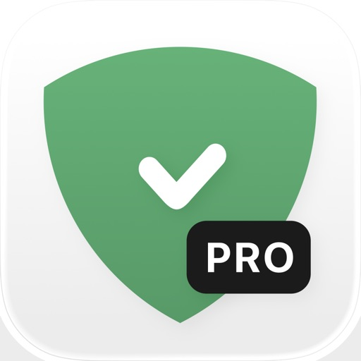

◆ 最大30万のフィルタリングルールを使用可
◆ 当社で定期更新される日本語専用フィルタ搭載 
◆ 日本語カスタマーサポート（年中無休）

AdGuardは、Safari用超効率的広告ブロッカーです。迷惑な広告を削除するだけでなく、高度な追跡防止機能を使用してプライバシーを保護します。AdGuard for iOSはオープンソースのアプリであり、安全にご利用いただけます。アプリは無料ですが、機能をさらにパワーアップさせる有料プレミアム機能を追加的に提供しております。

▼メイン機能

 ● Safari広告ブロック
Safari上のあらゆる種類の広告を削除します。迷惑なバナー、動画広告(Safari内でYoutubeなどを閲覧する場合）、ポップアップなどにお別れを言って結構です。フィルタは好きなようにカスタマイズできます。また、フィルタリング・広告ブロックしたくないサイトはホワイトリストに登録することも可能です。

 ● プライバシー保護
ウェブはあなたのあらゆるクリックを盗み見ようとする追跡者でいっぱいです。AdGuardでは、トラッカーとWeb分析を直接狙ってブロックするフィルタを数々提供しており、個人データを確実に保護することができます。

 ● 読み込みスピードUP
迷惑要素の読込をカットすることでSafariブラウザが最大4倍まで加速します。 AdGuardは大量のオンライン上ゴミを取り除き、快適にWebを閲覧できるようにします！

 ● 通信量節約とバッテリ寿命の延長
バナーや広告は時々ページの半分のサイズをとったりします。それらを読込する前の時点でブロックすることで、電池寿命とWi-Fi /モバイルトラフィックを節約できます。

 ● Safari内の直接手動ブロックツール
直接ブラウザでブロックしたい要素を選んだり、問題・バグをサポートに連絡できます。

 ● 50以上の人気フィルタ（EasyList、EasyPrivacyなど）に加えて、言語固有のフィルタを含むAdGuard独自の強力な広告フィルタ
高品質のコンビネーションで広告に絶対チャンス与えないようにします。

▼プレミアム（有料）機能

 ● カスタム・フィルタ
デフォルトのリストにない場合でも、URLで独自のフィルタを簡単に追加。

 ● DNSプライバシー
オンラインプライバシーの100％を確保したければ、通常のオンライントラッカーをブロックするだけでは不十分です。ユーザー人気のDNSプロバイダーを選択したり、独自のカスタムDNSサーバーを構成したりすることができます。

■ AdGuard（アドガード）について

AdGuardは、複数のプラットフォーム用の広告ブロックソフトウェア開発においての有力企業です。12年以上にわたり、AdGuardは何百万人ものユーザーが安全、清潔、高速なインターネットを楽しめるよう努力しております。

■ お問い合わせ・SNS
Twitter: @AdGuardJP
LINE: @adguard
Facebook: www.facebook.com/AdGuardJP/
カスタマーサポートメール(日本語対応): support@adguard.com

[View on Apple](https://apps.apple.com/jp/app/adguard-pro-%E6%9C%AC%E6%A0%BC%E7%9A%84%E3%81%AA%E5%BA%83%E5%91%8A%E3%83%96%E3%83%AD%E3%83%83%E3%82%AF/id1126386264)

## パブロフ簿記３級

●日商簿記３級の仕訳対策はアプリがオススメ！
●2026年度の試験範囲に完全対応！
●ネット試験、紙の試験のどちらにも対応！
●購入特典：ネット試験の模擬問題2026年度版に更新！
●購入特典： 紙の模擬試験も2026度版に更新！

■アプリの特長
忙しいので効率的に合格したい
解説は理解できるけど自分では解けない
合格まであと少しなのに点が取れない
見たことがない仕訳に対応したい

そんな経験ありませんか？

仕訳はコツさえつかめば簡単！
そのままマネできる解き方を全問解説しました。 

■パブロフ簿記で合格できる6つの理由
① 最新（2026年度）の試験範囲に対応！
② スキマ時間に勉強できる（オフラインで利用可能）
③ すぐにマネできる解き方が書いてある
④ 実務経験に基づいた、わかりやすい解説
⑤特典１「パブロフ流」解説付き60分実践問題が特典でダウンロードできる
⑥特典２「パブロフ流」解説付き60分ネット試験の模擬問題が利用できる

■前年2025年度の日商簿記3級も高い的中率！

■パブロフ簿記の実績
・パブロフシリーズ累計100万DL
・パブロフ簿記の書籍、Amazon簿記検定1位！

■パブロフ簿記のブログ
https://pboki.com/

■欲しい機能はすべて搭載
① 入門
・勘定科目の貸方借方の位置を覚えるための問題。 
・簿記に慣れるためのモード。 
・用語の意味も1つずつ確認できる。

② Lev1の仕訳
・出題率が高く確実に正解する必要がある問題。

③ Lev2の仕訳
・合格に必要なレベルの問題。
・基本的な出題範囲がカバーできる

④ Lev3の仕訳
・出題率は低いが、出題実績のある問題。

⑤ 分野別
・苦手な分野を重点的に解きたい方に最適
・同じ論点を様々な聞き方で出題
・全247問すべてが含まれている

⑥ つづきから
・Lev1〜3、分野別のセーブした問題から開始できる

⑦ テスト
・本試験の出題傾向に近い形で、1テスト10問を出題
・時間がかかりそうな問題や難しい問題を飛ばす練習にも最適
・全10回、合計100問

⑧ ランダム
・毎回異なる10問が選ばれる

⑨ ミスのみ
・間違った問題だけ集中して解ける
・本試験直前の復習に最適

⑩ チェックのみ
・チェックマークを付けた問題だけ集中して解ける
・苦手な問題を克服するのに最適

■制作者　willsi株式会社
著書：
パブロフ流でみんな合格　日商簿記3級
パブロフ流でみんな合格　日商簿記2級　商業簿記
パブロフ流でみんな合格　日商簿記2級　工業簿記

資格：公認会計士、簿記1級、2級。

監査法人を経てプログラミングを始める。簿記の学習に最適な、機能と内容を研究。 また、簿記3級の受験生へのリサーチを行い、アプリに反映しています。 

日商簿記3級に合格できる受験生が一人でも増えることを心から願っています。

[View on Apple](https://apps.apple.com/jp/app/%E3%83%91%E3%83%96%E3%83%AD%E3%83%95%E7%B0%BF%E8%A8%98%EF%BC%93%E7%B4%9A/id465136874)

## 原稿プランナー

「あと何日で何ページ進めればいい？」「ペース計算してる時間ない」「割増入稿になっちゃうかも」
  その不安、『原稿プランナー』が解決します。

『原稿プランナー』は、漫画・小説・イラスト・グッズなど、あらゆる創作物の原稿管理に対応した制作プランナー（進捗＆ペース管理）アプリです。

 ◆ こんな人におすすめ
  ・同人誌の入稿締切がいつもギリギリになる方
  ・複数の原稿を同時進行で管理したい方
  ・作業ペースを数値で把握したい方
  ・同人イベント参加に向けて管理ツールが欲しい方

【機能紹介】
◆ 工程ごとの自動スケジュール
  ページ数・作業可能時間・締切日を入力すると、工程ごと＋全体のスケジュールを自動生成。
  早割・通常・割増の3段階の入稿締切に対応し、ガントチャートで全体の見通しを確認できます。
  なんと複数印刷所が登録可能です。
  そしてもちろん、工程のカスタマイズに対応しています。
  さらに、祝日プリセットのほか、お休みの日や、多く作業する日、少なく作業する日を個別に設定できます。
  現実に即したスケジュール設定が可能です。

◆ ペース診断で遅れを見逃さない
  今の作業ペースで締切に間に合うかを記録のたびに判定。
  8段階のステータスのほか、望ましいペース、今のペース、不足時間などを詳細に表示します。

◆ 工程ごとの進捗記録
  表紙と本文を分けてかんたん記録可能。
  作業タイマーから記録すれば作業時間が自動登録されます。
  作業タイマーでは好きな休憩時間や、一定間隔での通知を設定できます。

  ◆ イベント管理
  主要即売会のプリセットを収録。
  会場情報、サークル配置、持ち込みメモ、買い物リスト、事前準備チェックリストまで一元管理。
  作品とイベントを紐づけて、どの原稿をどのイベントに出すかを把握できます。

  ◆ まとまったカレンダー
  月・週・日の3ビューで、締切・イベント・作業予定・作業記録をまとめて確認。
 メモ機能でスケジュールにTODOを残せます。

  ◆ レポート & 共有
  月別の作業時間・ページ数をグラフで可視化。進捗カードをSNSにシェアできます！
  1年間、どれだけ作業したかを振り返るのもいいかもしれません。

  ◆ ダークモードにも対応！

  ◆ iCloud同期
  複数のデバイスで自動同期。iPhoneで記録してiPadで確認、どこでもシームレスに管理しましょう。

  原稿プランナーで、修羅場を計画的に乗り越えましょう！

[View on Apple](https://apps.apple.com/jp/app/%E5%8E%9F%E7%A8%BF%E3%83%97%E3%83%A9%E3%83%B3%E3%83%8A%E3%83%BC/id6759912958)

## EE35 Film Camera

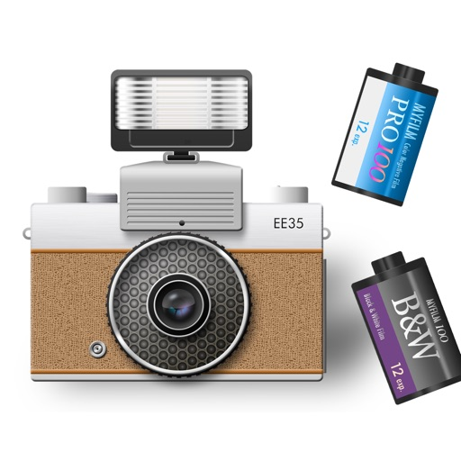

EE35 film camera simulates a retro mechanical camera around the 1960's.
This camera app is made in Japan.

Basic usage
(1) Pull the film advance lever
(2) Press the shutter

There are two types of film, color and black&white. It's easy to take 12 shots.
Development ends immediately after taking a picture, and the image of the film is also saved.

The timer is about 7 seconds.
Multiple exposure can be done by shutter charge without film advance.

Please enjoy retro camera life.

[View on Apple](https://apps.apple.com/jp/app/ee35-%E3%83%95%E3%82%A3%E3%83%AB%E3%83%A0%E3%82%AB%E3%83%A1%E3%83%A9/id1313164055)

## 英検®準1級 でた単

2026年6月実施分(2026年度第1回)の最新データを追加しました。
最高のデータを最速でお届け。
語彙問題を全問正解できる圧倒的的中率*
新形式全18問、旧形式全25問で正解の理論値を出しています。

新形式全18問
2026年6月、17問/18問
2026年1月、18問/18問
2025年10月、18問/18問
2025年6月、18問/18問
2025年1月、17問/18問
2024年10月、16問/18問
2024年6月、18問/18問

旧形式全25問
2024年1月、22問/25問
2023年10月、24問/25問
2023年6月、24問/25問
2023年1月、25問/25問
2022年6月、25問/25問
2022年10月、25問/25問
2022年6月、24問/25問
2022年1月、24問/25問
2021年10月、25問/25問

英検®準１級・語彙問題対策として選定した単語・熟語「5572単語」を収録しています。
単語データは現在も追加中です。
ステージ1: 1380単語
ステージ2: 1406単語
ステージ3: 1291単語
ステージ4: 1495単語
ステージ5: 1348単語(年度別掲載)
合計: 5572単語
英検の語彙問題は過去問から多く出題され、頻出の単語は繰り返し出題されています。アプリ内の各品詞のABCの範囲には正解として出題された単語と選択肢としての出題回数が多い単語をまとめています。A〜の順に優先的に学習することで効率よく合格点へ近づくことができます。
 
＜現在カバーしている英検準1級の過去問92回分＞
1991年第1, 2回
1992年第1, 2回
1993年第1, 2回
1994年第1, 2回
1995年第1, 2回
1996年第1, 2回
1997年第1, 2回
1998年第1, 2回
1999年第1, 2回
2000年第1, 2回
2001年第1, 2, 3回
2002年第1, 2, 3回
2003年第1, 2, 3回
2004年第1, 2, 3回
2005年第1, 2, 3回
2006年第1, 2, 3回
2007年第1, 2, 3回
2008年第1, 2, 3回
2009年第1, 2, 3回
2010年第1, 2, 3回
2011年第1, 2, 3回
2012年第1, 2, 3回
2013年第1, 2, 3回
2014年第1, 2, 3回
2015年第1, 2, 3回
2016年第1, 2, 3回
2017年第1, 2, 3回
2018年第1, 2, 3回
2019年第1, 2, 3回
2020年第1, 2, 3回
2021年第1, 2, 3回
2022年第1, 2, 3回
2023年第1, 2, 3回
2024年第1, 2, 3回
2025年第1, 2回
*アップデートを続け、最新のデータを収録していきます。
*すべて音声追加予定です。
 
このアプリでは単語が品詞別にカテゴリー分けされており、過去の英検での正解になった回数、出題頻度の高い順にリストアップされています（正解数と頻度が同じ単語の順番はランダムです）。
日本語訳は正解になった意味を採用。そのほかは複数の辞書が第一の意味としているものを採用しました。
 
アプリ内の練習とテストを繰り返し、ユーザーが自由に振り分けられる単語帳で苦手単語を復習できます。

＜練習＞
練習したいカテゴリー（例：形容詞A）を選択すると、設定画面が現れます。
自由に設定し、「練習スタート」を押してください。
 
＜単語テスト15問＞
左下「テスト15問」では、該当カテゴリー内の単語がランダムに15問出題されます。
出題間隔や出題順は英単語を記憶しやすいように最適化されていきます。
15問すべて答え終わると、タイムとスコアの結果が出ます。
素早く正解できると高いポイントを獲得でき、グラフで履歴が残ります。
テストで出題された15問は一覧となって表示されますので、復習に便利です。
 
＜単語帳機能＞
「日本語訳」のセル右上をタップするとチェックされ、チェックした単語を「単語帳」に登録できます。
チェックし、画面右下に出てくる「単語帳を選ぶ」をタップしてください。
単語帳は7つ用意されています。苦手単語のオリジナル・単語帳を作ることができます。

＜自動再生＞
単語帳や単語一覧のページでは英単語を自動再生することができます。

＜アプリ内検索＞
検索ページでは単語や意味、発音記号から検索することができます。検索した単語から品詞別リストへ移動できます。

＜タイピング＞
英単語のタイピングの練習ができます。資格試験のパソコン受験でのライティングを意識してキーボード入力の練習用に実装しました。

＊開発・作成
Namiko Takahashi
1級合格15回(以上、記録確認分)
2018年頃 合計2916
英検1級取得(1次試験2273/2550 G1 +10、2次試験643/850 G1 +2)
英検1級ライティング満点850/850
2023年第2回 合計2937
英検1級取得(1次試験2313/2550 G1 +11、 2次試験624/850 G1 +1)
2023年度 英検準1級 日本商工会議所会頭賞受賞(社会人枠1位)
TOEIC L&R 満点(新形式990点、旧形式990点)
元 大手コンサルタント会社、元 英語教育出版社

＊英語音声
Patricia D. （ワシントン大学卒）

＊アプリ内の効果音
フリー効果音素材 くらげ工匠
http://www.kurage-kosho.info/

効果音素材 :ポケットサウンド Pocket Sound
https://pocket-se.info/

英検®は、公益財団法人 日本英語検定協会の登録商標です。
このコンテンツは、公益財団法人 日本英語検定協会の承認や推奨、その他の検討を受けたものではありません。

「英検」商標使用に関するガイドライン
https://www.eiken.or.jp/trademark/

iOS版 Privacy Policy
https://ameblo.jp/detatan2018/entry-12791082133.html

利用規約 (EULA、Apple標準) LICENSED APPLICATION END USER LICENSE AGREEMENT
https://ameblo.jp/detatan2018/entry-12791083188.html

[View on Apple](https://apps.apple.com/jp/app/%E8%8B%B1%E6%A4%9C-%E6%BA%961%E7%B4%9A-%E3%81%A7%E3%81%9F%E5%8D%98/id1406157182)

## リスパス - リスニングで合格！英語共通テスト・大学受験対策

共通テスト英語リスニング対策の決定版！

「リスパス！」は「リスニングで合格(パス)！」の略称で、本アプリにはセンター試験でリスニングが始まった2006年以降全ての過去問を収録しています(利用申請済)。
スマホとイヤホンがあれば満員電車の中でもリスニングの練習ができます。

リスニングの問題は問われるポイントが決まっているので、過去問対策が有効です。

例えば、2023年本試験において正答率2割と最も低かった問題の聞き取りポイントは、
No, that one is for glass.「いいえ、そのゴミ箱はガラス用です」でした。

この is for ～「～のためのものだ→～用だ」が聞き取りにくく、that one is glass.だと思ってしまい、that oneを「ゴミ箱」ではなく「ゴミ」だと勘違いしてしまったために間違えてしまったというのが真相のようです。

しかし実は2022年本試験にてBox 3 is for children’s clothes「ボックス3は子供服用です」と類似の英文が出題されており、
過去問でしっかりと練習しておけばキャッチしやすかったかもしれません。

このようにリスニング対策は過去問で耳を鍛えることが有効といえるでしょう。

また、センター試験や共通テストは毎年約50万人が受験するという性質上、
かなり精査された良問で構成されています。

共通テスト受験者ではない英語学習者にとっても、大いに使えるアプリとなっています。

【こんな人におすすめ】
・共通テスト英語リスニングで高得点を取りたい受験生
・クイズ感覚で楽しみながらリスニング力を伸ばしたい英語学習者
・センター・共テのリスニングの過去問にさくっとアクセスしたい指導者
・ディクテーションで一語一語の音の聞き取り精度を上げたいリスニング初学者

【パスリス！の5大機能】
① 共通テスト・センター試験の全過去問がアプリ上で解ける！
② ディクテーション機能で聞けていない音の確認ができる！
③ 音声スピード調整機能(0.5～1.5倍速)でレベルを最適化できる！
④ 指でスクロールしてもう一度聞きなおしたい場所に巻き戻せる！
⑤ 「スクリプトを見ながら聞く」機能でリーディング力の確認もできる！ 

【規約等】
利用規約：
https://sites.google.com/view/listeningpass
プライバシーポリシー：https://fale.co.jp/privacy-policy.html
特定商取引法に関する表示：https://sites.google.com/view/scommercialtransactionlawfale

[View on Apple](https://apps.apple.com/jp/app/%E3%83%AA%E3%82%B9%E3%83%91%E3%82%B9-%E3%83%AA%E3%82%B9%E3%83%8B%E3%83%B3%E3%82%B0%E3%81%A7%E5%90%88%E6%A0%BC-%E8%8B%B1%E8%AA%9E%E5%85%B1%E9%80%9A%E3%83%86%E3%82%B9%E3%83%88-%E5%A4%A7%E5%AD%A6%E5%8F%97%E9%A8%93%E5%AF%BE%E7%AD%96/id6467176169)

## どんどん話すための瞬間英作文トレーニング

シリーズ117万部発行のベストセラー書籍の唯一の公式アプリ版がついに登場！
簡単な英語さえ反射的に口から出てこない、相手の話す英語はわかるのに自分が話すほうはからきしダメ、という行き詰まりを打破する英会話トレーニング。
書籍で推奨している「瞬間英作文トレーニング」の方法を最も効果的に行えるよう再現した「英会話トレーニング」アプリです。多彩な再生機能とナレーター収録音声でより実践的な英会話トレーニングを実現しました。

＜アプリの特徴＞
「瞬間英作文」とは日本語文を瞬時に簡単な英語に変換して声に出すことで、頭の中に英語回路をつくるトレーニングです。これを続けると会話の瞬発力が養われ、「知ってる英語」が「使える英語」に移行していきます。

本アプリは「瞬間英作文トレーニング」を最も効果的に行える機能を盛り込み、またお好みに応じて表示・音声のカスタマイズもできるようになっています。

・表示画面は1つの例文ごとに表示してじっくり学習するための「個別モード」と、10例文を一気に英作文する（「英作文の流し」）ための「一覧モード」があります。
・3つの再生内容（日本語＞英語、英語のみ、日本語のみ）を搭載。
・各再生内容に「自動再生」と「再生範囲」を組み合わせることで、12通りの再生が可能。
・ポーズ時間の設定が可能。カウント音・インジケーターでポーズの残り時間を確認できます。
・日本語・英語の音声は、それぞれON/OFFを個別に設定できます。
・各項目内でのシャッフル再生が可能。
・苦手な例文をチェックリストに登録し、その例文だけでトレーニングが可能。
・「一覧モード」では再生範囲を「グループ編集」することが可能（書籍の「セグメント分け」）。
・音声はプロのナレーターが生録音したものを採用。ネイティブの正しい発音で学べます。（読み上げソフト等の機械音声ではありません）

＜このアプリの想定利用者＞
・英語の知識はあるけれども、いざ話そうとすると詰まってしまう方。
・ネイティブと会話のキャッチボールをスムーズにできるようになりたい方。
・書籍版を体験したが、さらに効果的にトレーニングを行いたい方。

＜『おかわり！どんどん話すための瞬間英作文トレーニング』の購入について＞
本アプリを購入後、¥860で購入することができます。書籍版（¥1,785）のすべての例文と収録例文全体のシャッフル機能が追加されます。

※端末の空き容量が少ない場合、動作が不安定になることがあります。
その場合は、大変お手数ですが、容量を確保（500MB程度以上が目安）した上で、アプリの再インストールをしてください。

[View on Apple](https://apps.apple.com/jp/app/%E3%81%A9%E3%82%93%E3%81%A9%E3%82%93%E8%A9%B1%E3%81%99%E3%81%9F%E3%82%81%E3%81%AE%E7%9E%AC%E9%96%93%E8%8B%B1%E4%BD%9C%E6%96%87%E3%83%88%E3%83%AC%E3%83%BC%E3%83%8B%E3%83%B3%E3%82%B0/id443332137)

## StageCameraPro2 - 高画質のマナーカメラ

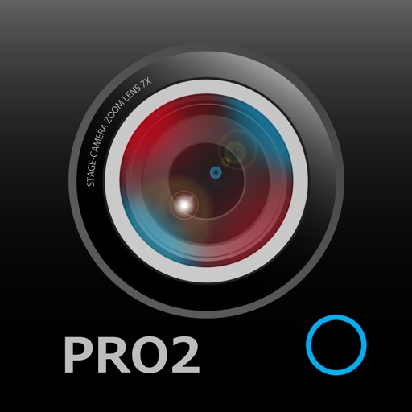

StageCameraPro2は最新iOSの最新技術を採用したマナーカメラです。
最新のHDRを適用した写真やビデオを撮影できます。
従来の12MPを超える高精細な48MPでの写真撮影も可能です。

強力な手振れ補正など画質の向上に重点を置き、手軽に高画質な写真とビデオが撮影できます。
マナーへの配慮が必要な場所や、子供やペットの撮影でご利用ください。

ロック画面ウィジェットに対応しています。

安心の日本製アプリです。

■特徴
- 最新HDR対応の写真撮影（機種依存）
- 48MPカメラでの写真撮影（iPhone14Pro以降）
- HEIF保存対応で写真サイズ半分

- HDRビデオ対応（機種依存）
- 4K/FullHD/HDビデオ切り換え（機種依存）
- 4K/FullHDビデオで60fpsに対応（機種依存）
- HEVC保存対応で動画サイズ半分

- ロック画面ウィジェット対応
- カメラコントロール撮影（対応機種のみ）
- 手振れ防止
- 高速な起動
- 最大15倍ズーム
- トリプルカメラのレンズ切り換え（対応機種のみ）
- デュアルカメラのレンズ切り換え（対応機種のみ）
- レンズ切替方式（自動切替、固定切替）の選択
- マニュアル操作（レンズ固定切替時のみ）
- シンプルなデザイン
- デザイン切り替え（ブラック or ホワイト）

■機能
- 最新HDR対応の写真撮影
- 48MPカメラでの写真撮影
- 写真アスペクト比 通常(4:3)、ワイド(16:9)、スクエア(1:1)、一眼レフ(3:2)、iPhoneXS全画面
- 写真の日時焼付け
- 写真の位置情報付加の有／無切替
- 写真のセルフタイマー撮影
- 写真のHEIF保存対応
- HDRビデオ対応（機種依存）
- ビデオ撮影 4K/FullHD/HD対応
- ビデオ撮影 4K/FullHDの60fps対応
- ビデオのHEVC保存対応
- マニュアル操作（レンズ固定切替時のみ）：露出補正、WB、フォーカス
- 手振れ補正
- タップでフォーカス＆露出の一時的なロック
- 長押しタップでフォーカス＆露出のロック
- 露出補正
- 解像度の切り換え
- メタデータの付加
- グリッド線表示
- 水平器の表示
- カメラ回転ロック
- フラッシュ
- Retinaフラッシュ
- 最大15倍ズーム
- トリプルカメラのレンズ切り換え
- デュアルカメラのレンズ切り換え
- レンズ切替方式（自動切替、固定切替）の選択
- カメラコントロール撮影
- ロック画面ウィジェット対応

撮影した動画・写真はデバイスの写真ライブラリに保存されます。
iPadのステージマネージャには対応していないため、フルスクリーンでご利用いただくか、回転の向きをロックしてご利用ください。

■URLスキーム
com.sky-nexus.stagecamerapro2://

※デバイス関連の不具合や、iOSのバージョンアップ等で起動が著しく遅くなったり、撮影に時間がかかるようになった場合は下記の手順を試してみてください。
　1.アンインストール
　2.デバイス再起動
　3.再インストール

[View on Apple](https://apps.apple.com/jp/app/stagecamerapro2-%E9%AB%98%E7%94%BB%E8%B3%AA%E3%81%AE%E3%83%9E%E3%83%8A%E3%83%BC%E3%82%AB%E3%83%A1%E3%83%A9/id1437885179)

## パブロフ簿記２級工業簿記

●2026年度の試験範囲に完全対応！
●仕訳練習モード（89問）で工業簿記の試験対策！
●購入特典で紙の模擬試験とネット試験の模擬試験の両方を解くことができる！
●ネット試験の模擬試験、紙の模擬試験を2026年度版に更新！

苦手な人でも問題が解ける！

工業簿記を限界までシンプルにした
工業簿記の考え方を身に付けるためのアプリです。

苦手だった工業簿記が得点源に変わります。
仕訳対策は仕訳練習モードで、全体的な内容は計算練習モードで特訓。

CVP分析も大丈夫、難しい方程式を使ってません。
シュラッター図が覚えやすいよう、問題を最適化しています。

ゴチャゴチャしている部門別計算の流れがサラッと理解できます。

■パブロフ簿記で合格できる7つの理由
① すべての分野がサクッと確認できる
② 処理の違いを重点的に勉強できる
③ 応用力がつく問題をセレクト
④ スキマ時間に勉強できる
⑤ 実務経験に基づいた、わかりやすい解説
⑥ 「パブロフ流」解説付き模擬試験が無料で利用できる
⑦ 最新の試験内容・傾向に更新済み

■パブロフ簿記の実績
・パブロフアプリシリーズ累計100万DL

■仕訳練習モード
1.仕訳を選んで解く
2.ランダム
3.ミスのみ
4.チェックのみ

■計算練習モード
1.原価計算の目的
2.総合原価計算
・BOX図の利用
・先入先出法
・平均法
・仕損品の処理(8パターン)
・工程別
・組別
・等級別
・副産物、作業屑
・材料平均投入
・材料追加投入
3.標準原価計算
・標準原価カード
・原価差異
 ・材料費
 ・労務費
 ・製造間接費
・パーシャルプラン等
4.原価の内訳
・直接費と間接費の区分
・仕訳 材料費
・仕訳 材料副費
・仕訳 労務費
・勘定記入
・製造間接費の部門別
 ・直接配賦法
 ・相互配賦法
 ・実際配賦、予定配賦
 ・仕訳
5.個別原価計算
・製造指図書
・製造原価報告書
6.直接原価計算
・損益計算書
・固定費調整
・CVP分析
7.本社工場会計
・仕訳

■制作者　willsi株式会社
著書：
パブロフ流でみんな合格　日商簿記3級
パブロフ流でみんな合格　日商簿記2級　商業簿記
パブロフ流でみんな合格　日商簿記2級　工業簿記

資格：公認会計士、簿記1級、2級。

監査法人を経てプログラミングを始める。簿記の学習に最適な、機能と内容を研究。 また、簿記2級の受験生へのリサーチを行い、アプリに反映しています。 

日商簿記2級に合格できる受験生が一人でも増えることを心から願っています。

[View on Apple](https://apps.apple.com/jp/app/%E3%83%91%E3%83%96%E3%83%AD%E3%83%95%E7%B0%BF%E8%A8%98%EF%BC%92%E7%B4%9A%E5%B7%A5%E6%A5%AD%E7%B0%BF%E8%A8%98/id504102949)

## 損保大学課程　試験対策

【損害保険大学課程 試験対策の決定版】

損害保険大学課程（損保大学課程）の法律単位・税務単位の試験対策ができる学習アプリです。

■ アプリの特徴

◇ 法律単位・税務単位に完全対応
損害保険契約、損害賠償、自動車保険、火災保険、傷害・新種保険、相続・税務など、試験範囲を網羅した問題を収録。

◇ 効率的な学習モード
・カテゴリー別学習：単元ごとに集中して学べます
・復習モード：間違えた問題だけを繰り返し学習
・ブックマーク機能：重要な問題を保存して後で確認

◇ 本番形式の模擬試験
・法律単位：30問/80分
・税務単位：20問/60分
実際の試験と同じ形式で実力を確認できます。合格ライン70%を目指して繰り返し挑戦しましょう。

◇ 学習分析
・学習履歴と正答率を自動記録
・連続学習日数でモチベーション維持
・苦手分野を可視化して効率的に対策

◇ 学習リマインダー
毎日の学習を習慣化する通知機能付き。

■ 収録内容

【法律単位】
・第1編 損害保険契約に関する知識
・第2編 損害賠償に関する知識
・第3編 自動車保険の知識
・第4編 火災保険の知識
・第5編 傷害・医療・介護の知識
・第6編 新種保険の知識
・第7編 募集コンプライアンス

【税務単位】
・第1編 税務の基本
・第2編 個人の税務
・第3編 法人の税務
・第4編 相続・贈与の税務

損害保険募集人として、より高度な知識とスキルを身につけたい方に最適なアプリです。通勤時間や隙間時間を活用して、効率的に合格を目指しましょう！

[View on Apple](https://apps.apple.com/jp/app/%E6%90%8D%E4%BF%9D%E5%A4%A7%E5%AD%A6%E8%AA%B2%E7%A8%8B-%E8%A9%A6%E9%A8%93%E5%AF%BE%E7%AD%96/id6755903573)

## Control Panel for Twitter

特徴

ホームタイムライン:

• 常にタイムラインをフォロー中（時系列順）にする
• アルゴリズムによる「おすすめ」を非表示
• フォロー中の並べ替え (最新 / 人気)
• リツイート (別タブで開く / 非表示)
• 引用ツイート (別タブで開く / 非表示)
• 引用ツイートのミュートを有効にする
• 「新しいツイートを表示」を非表示
• タイムラインのおすすめコンテンツを非表示
• タイムライン内のインラインプロンプトを非表示にする
• タイムラインのコンテンツを全幅表示（デスクトップ版） - サイドバーを非表示にして、タイムラインコンテンツを全幅表示にする

UIの改善:

• 次の動画の自動再生を防ぐ（モバイル版）
• もっと見るに「ミュートするキーワードを追加」を追加
• 即ブロック（確認画面をスキップする）
• ブロックまたはミュートしたアカウントへの引用や返信を非表示にする
• ユーザープロフィールでのリツイートを非表示にする
• 通知内の「いいね！」を非表示
• 通知内のリツイートを非表示
• リスト内のリツイート
• 検索のおすすめコンテンツを非表示
• 検索のデフォルトは「最新」タブ
• 引用ツイート閲覧時に引用元ツイートを非表示

X の修正:

• twitter.com にリダイレクト
• チャットナビをメッセージにリダイレクト
• X のブランド変更を置き換える
• ダークモードのテーマ (ダークブルー)
• ツイート下部のアナリティクスのリンクを非表示
• フォロワーの「認証済み」タブを非表示
• ツイートのソースラベルを復元
• ツイートの詳細表示にアカウントの場所を表示
• ユーザーのプロフィールカードにアカウントの場所を表示（デスクトップ版）
• 外部リンクの下に見出しを復元する
• ツイートの下にある「引用ツイート」リンクを復元する
• ツイートの下の他のリンクを復元する
• 返信のデフォルトの並べ替え (最新 / いいね)
• 「返信を並べ替え」メニューを非表示
• プレミアムブルーチェック (Twitter Blueロゴに変更 / 非表示)
• プレミアム ブルー チェックの返信を非表示にする
• プレミアムのアップセルを非表示にする
• Grok を非表示にする
• Grokのツイートを非表示
• 「画像を編集」を非表示
• 募集を非表示にする
• サブスクリプションを非表示にする

UIを微調整:

• Chirpフォントを使用しない
• ツイートの太字と斜体を無効にする
• ナビゲーションバーを通常のフォントサイズにする（デスクトップ版）
• ナビゲーションの密度（デスクトップ版） (快適 / コンパクト)
• ドロップダウンメニューを通常のフォントの太さにする
• フォロー／フォロワーボタンの反転表示を解除 (モノクロ / テーマ)
• 年齢確認をバイパス
• 機密性の高いコンテンツのぼかしを解除する

アルゴリズムコンテンツを取り除く:

• サイドバーコンテンツを非表示にする（デスクトップ版）
• 「話題を検索」ページの内容を非表示（検索のみに使用する）
• 「発見」の提案を非表示

「エンゲージメント」を減らす:

• メトリクスを非表示
• インタラクションモードを減らす - ツイートの下にあるアクションバーを非表示（リプライのみで交流する）
• ツイート作成ボタンを非表示
• 「ホーム」タイムラインを無効化 - Twitterに時間を盗まれていませんか？「ホーム」タイムラインの利用を控えてみる
• 通知 (バッジのみ非表示 / 非表示)

使用しないUI項目を非表示:

• ツイート下部のブックマークボタン
• ツイート下部のシェアボタン
• 「アクティビティを表示」リンク
• タイムラインのツイートボックス（デスクトップ版）
• アカウントの切り替え（デスクトップ版）
• チャットドロワー（デスクトップ版）
• 「話題を検索」（デスクトップ版）
• Creator Studio
• フォロー
• コミュニティ
• 使用しない「もっと見る」メニューの項目を非表示

TWITTER, TWEET and RETWEET are trademarks of Twitter Inc. or its affiliates

[View on Apple](https://apps.apple.com/jp/app/control-panel-for-twitter/id1668516167)

## TonalEnergy Stimmgerät & Metro

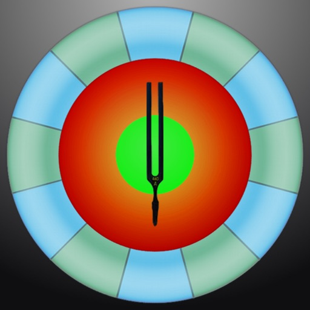

Für Musiker, ob Profi oder Anfänger, ob Sie singen, ein Blechblas-, Holzblas-, Saiteninstrument oder Gitarre spielen, diese App bietet funktionsreiche Übungs-Tools mit unterhaltsamem & lohnendem Feedback. So viel mehr als nur ein Stimmgerät! 
Was macht TonalEnergy zur meistverkauften Musik-Übungs-App? 

• Alles in einem: hochmodernes Stimmgerät, fortschrittliches Metronom, eigene Orchesterstreicher & Gitarrenstimmseite, Klaviatur, Klanganalyse-Seiten & Audio-/visuelle Aufnahmemöglichkeiten. 

• Einfach anzuwenden: Optionen wie Target Tuner oder Pitch Tracker auf allen Hauptseiten. TonalEnergy hilft Nutzern, lohnende & erreichbare Ziele für Proben oder eigenständiges Üben festzulegen. Bunte Analysen-Datenseiten & Funktionen zur Audio-/Video-Aufnahme erleichtern das Üben zusätzlich. 

• Innovatives Metronom. Beispiellose Flexibilität in Klangauswahl, Tempo-Einstellungen, Taktarten, Subdivisionsmustern & visuellen Anzeigen. Dank gesprochenem Einzählen, Erstellen & Bearbeiten von Voreinstellungsgruppen & Ableton Link zur Synchronisierung mehrerer Geräte ein hervorragendes Tool für Live-Musiker. 

• Endlose Möglichkeiten zur Schulung des Gehörs. Die hochwertigen, multi-gesampelten Instrumentenklänge für Symphonie-Instrumente sind einzigartig unter allen anderen Stimmgerät-Apps. Das Gehör kann mit einer 8-Oktaven-Klaviatur, einem chromatischen Rad & einem Tonerzeuger geschult werden.

• Lernen ist eine soziale Aktivität. Mit TonalEnergy Tuners einzigartigen Funktionen lassen sich Daten sammeln, prüfen, bearbeiten & mit anderen teilen. Für Konzertmusiker ist Feedback zur Weiterentwicklung ihrer Fähigkeiten entscheidend. Der Austausch steht im Zentrum. 

Chris Coletti, Mitglied von The Canadian Brass, fasst TonalEnergy so zusammen: 

“TonalEnergy ist ein Muss für jeden ernsthaften Musiker. Es bietet eine komplette Tool-Suite in nur einer App: Stimmgerät, Tonerzeuger, Aufnahmegerät, Metronom & die hübsche Oberfläche machen es zu einem der besten Tools für Musiker, die es gibt, Punkt.” 

FUNKTIONEN 

• Erkennt einen großen Tonhöhenbereich, auch in tieferen Stimmlagen als viele andere Stimmgeräte (C0-C8). Spricht bestens auf Blas-, Akustik- & elektrische Saiteninstrumente an 
• Anpassbarer Normalton A=440 Hz 
• Autom. oder manuelle Transpositionsoptionen 
• Wechselt sofort zwischen gleichstufigen, reinen & anderen benutzerdef. Stimmungen 
• Autom.- oder sofortige Normalton-Funktion mit TonalEnergy-Tönen 
• Umfassende Stimmliste für alle Orchestersaiten- & Saiteninstrumente mit Bünden, inkl. weit mehr Funktionen als die meisten anderen Stimmgeräte-Apps nur für Saiteninstrumente 
• Ausklappbare 8-Oktaven-Klaviatur bereichert viele wichtige Stimmfunktionen 
• Tongenerator am chromatischen Rad, mit optionaler autom. Vibrato-Funktion 
• Frequenz & Naturton-Grafiken mit multifunktionaler Wellenform 
• Spezielle Metronomseite, die die Funktionen aller anderen Metronom-Apps erfüllt oder überbietet 
• Notationsoptionen inkl. den Varianten Standard-Englisch, Solfège, Nordeuropäisch & Indisch 
• Bluetooth & andere Eingang-/Ausgangs-Unterstützung 
• Audio- & Video-Aufnahmefunktionen, inkl. Bearbeiten, Looping, Zeitdehnung, alles exportierbar über iTunes gemeinsamen Dateizugriff, AirDrop, E-Mail, AudioCopy, SoundCloud usw. 
• Musik-Import aus der iTunes-Bibliothek oder E-Mail-Anhängen 
• Kompatibel mit externen Mikrofon- & Ansteck-Schwingungssensor-Geräten 
• Unterstützt externe Video-Ausgabe auf externem Display zur Nutzung in Proberäumen 
• Externe MIDI-Keyboard-Steuerungsunterstützung 
• Universelle App, unterstützt alle Geräteausrichtungen 
• Audiobus- & Inter-App-Audio-Unterstützung 
• VoiceOver-Unterstützung für Blinde & Sehbehinderte 

INSTRUMENTE 
• Piccoloflöte, Flöte 
• Oboe, Englischhorn, Fagott 
• Es-, B/A-Klarinette, Bassklarinette 
• Sopran-, Alt-, Tenor- & Bariton-Saxophon 
• Trompete 
• Waldhorn 
• Tenor- & Bassposaune 
• Euphonium & Tuba 
• Eckige, Sägezahn- & Sinus-Wellenformen 
• Orgel 
• Zupfinstrumente

[View on Apple](https://apps.apple.com/jp/app/tonalenergy%E3%83%81%E3%83%A5%E3%83%BC%E3%83%8A%E3%83%BC%E3%81%A8%E3%83%A1%E3%83%88%E3%83%AD%E3%83%8E%E3%83%BC%E3%83%A0/id497716362)

## Groundwire: VoIP SIP Softphone

Acrobits Groundwire: Elevate Your Communication

Acrobits, a leader in UCaaS and communication solutions for over 20 years, proudly introduces the Acrobits Groundwire softphone. This top-tier SIP softphone client offers unmatched voice and video call clarity. A softphone designed for both personal and professional use, it seamlessly integrates quality communication with an intuitive interface.

IMPORTANT, PLEASE READ

Groundwire is a SIP Client, not a VoIP service. You must have service with a VoIP provider or PBX that supports use on a standard SIP client to use it.

Choosing the Best Softphone App

Experience robust communication with a leading SIP softphone application. Preconfigured for major VoIP providers, this softphone app guarantees high-quality, secure, and intuitive calling. Perfect for maintaining connections with friends, family, and colleagues, maximizing all aspects of your VoIP experience.

Key Features of the SIP Softphone
- Exceptional Audio Quality: Enjoy crystal clear audio with support for multiple formats including Opus and G.729.
- HD Video Calls: Conduct up to 720p HD video calls, supported by H.264 and VP8.
- Robust Security: Our SIP softphone app ensures private conversations with military-grade encryption.
- Battery Efficiency: Thanks to our efficient push notifications, you can stay connected with minimal battery drain.
- Seamless Call Transition: Our VoIP dialer smoothly switches between WiFi and data plans during calls.
- Softphone Customization: Tailor your SIP settings, UI, and ringtones.
- 5G and Multi-Device Support: Ready for the future, compatible with most mobile operating systems.

Other features included on this robust app include: instant messaging, attended and unattended transfers, group calls, voicemail, and extensive customization for each SIP account. 

More Than Just a VoIP Softphone Dialer

Groundwire softphone offers more than the standard VoIP dialer experience. It’s a comprehensive tool for crystal clear Wi-Fi calling, equipped with robust business VoIP dialer features. It offers a secure and reliable softphone choice with no hidden fees and a one-time cost. Leverage SIP technology for improved call quality. Make this softphone your first choice for dependable, and easy SIP communication.

Download a feature-rich and modern SIP softphone now and be part of a community enjoying the best in voice and SIP calling. Transform your daily communication with our exceptional VoIP softphone app.

[View on Apple](https://apps.apple.com/jp/app/groundwire-voip-sip-softphone/id378503081)

## 英検®2級 でた単

2026年6月実施分(2026年度第1回)の最新データを追加しました。
過去の英検®２級・語彙問題に出題された単語・熟語を「全2982単語」収容しています。単語データは最新データを随時追加していきます。
ステージ1: 1050単語
ステージ2: 1013単語
ステージ3: 919単語
ステージ4: 889単語(年度別・重複)
合計: 2925単語
英検の語彙問題は過去問から多く出題され、頻出の単語は繰り返し出題されています。アプリ内の各品詞のステージ1範囲には正解として出題された単語と選択肢としての出題回数が多い単語をまとめています。優先的にステージ1範囲を学習することで効率よく合格点へ近づくことができます。
 
＜英検2級の過去問87回分 30年分＞
1996年第1, 2回
1997年第1, 2回
1998年第1, 2回
1999年第1, 2回
2000年第1, 2回
2001年第1, 2, 3回
2002年第1, 2, 3回
2003年第1, 2, 3回
2004年第1, 2, 3回
2005年第1, 2, 3回
2006年第1, 2, 3回
2007年第1, 2, 3回
2008年第1, 2, 3回
2009年第1, 2, 3回
2010年第1, 2, 3回
2011年第1, 2, 3回
2012年第1, 2, 3回
2013年第1, 2, 3回
2014年第1, 2, 3回
2015年第1, 2, 3回
2016年第1, 2, 3回
2017年第1, 2, 3回
2018年第1, 2, 3回
2019年第1, 2, 3回
2019年第1回準会場
2020年第1, 2, 3回
2021年第1, 2, 3回
2022年第1, 2, 3回
2023年第1, 2, 3回
2024年第1, 2, 3回
2025年第1, 2, 3回
2026年第1,回
*アップデートを続け、最新のデータを収録していきます。
*すべて音声追加予定です。
 
このアプリでは単語が品詞別にカテゴリー分けされており、過去の英検での正解になった回数、出題頻度の高い順にリストアップされています（正解数と頻度が同じ単語の順番はランダムです）。
日本語訳は正解になった意味を採用。そのほかは複数の辞書が第一の意味としているものを採用しました。
 
アプリ内の練習とテストを繰り返し、ユーザーが自由に振り分けられる単語帳で苦手単語を復習できます。

＜練習＞
練習したいカテゴリー（例：形容詞A）を選択すると、設定画面が現れます。
自由に設定し、「練習スタート」を押してください。
 
＜テスト15問＞
右下「テスト15問」では、該当カテゴリー内の単語がランダムに15問出題されます。
出題間隔や出題順は英単語を記憶しやすいように最適化されていきます。
15問すべて答え終わると、タイムとスコアの結果が出ます。
素早く正解できると高いポイントを獲得でき、グラフで履歴が残ります。
テストで出題された15問は一覧となって表示されますので、復習に便利です。
 
＜単語帳機能＞
「日本語訳」のセル右上をタップするとチェックされ、チェックした単語を「単語帳」に登録できます。
チェックし、画面右下に出てくる「単語帳を選ぶ」をタップしてください。
単語帳は7つ用意されています。苦手単語のオリジナル・単語帳を作ることができます。

＜自動再生＞
単語帳や単語一覧のページでは英単語を自動再生することができます。

＜アプリ内検索＞
検索ページでは単語や意味、発音記号から検索することができます。検索した単語から品詞別リストへ移動できます。

＜タイピング＞
英単語のタイピングの練習ができます。資格試験のパソコン受験でのライティングを意識してキーボード入力の練習用に実装しました。

＊開発・作成
Namiko Takahashi 
1級合格13回(以上、記録確認分)
2018年頃 合計2916
英検1級取得(1次試験2273/2550 G1 +10、2次試験643/850 G1 +2)
英検1級ライティング満点850/850
2023年第2回 合計2937
英検1級取得(1次試験2313/2550 G1 +11、 2次試験624/850 G1 +1)
TOEIC満点(新形式990点、旧形式990点)
元大手コンサルタント会社勤務（翻訳など）
現在 有名英語教育出版社勤務

＊英語音声
Patricia D. （ワシントン大学卒）

＊アプリ内の効果音
フリー効果音素材 くらげ工匠
http://www.kurage-kosho.info/

効果音素材 :ポケットサウンド Pocket Sound
https://pocket-se.info/

英検®は、公益財団法人 日本英語検定協会の登録商標です。
このコンテンツは、公益財団法人 日本英語検定協会の承認や推奨、その他の検討を受けたものではありません。

「英検」商標使用に関するガイドライン
https://www.eiken.or.jp/trademark/

iOS版 Privacy Policy
https://ameblo.jp/detatan2018/entry-12791082133.html

利用規約 (EULA、Apple標準) LICENSED APPLICATION END USER LICENSE AGREEMENT
https://ameblo.jp/detatan2018/entry-12791083188.html

[View on Apple](https://apps.apple.com/jp/app/%E8%8B%B1%E6%A4%9C-2%E7%B4%9A-%E3%81%A7%E3%81%9F%E5%8D%98/id1438798917)

## ケアマネ 過去問(完全版)

最新の問題と解説を掲載！！ケアマネの過去問をアプリ化。過去問検索やマイリスト機能。ランダム10問テストなど、国家試験を受験した時に、あったら良かったと思う機能を搭載しています。

広告がなく、快適に学習することができます。成績やリストについては、無料版からの引き継ぎが可能となっています。
通常広告は非表示ですが、AI機能については外部連携コストが発生するため、本機能に限りチケット制を導入し、広告表示があります。
持続可能なサービス運営のため、ご理解いただけますと幸いです。

公式サイト
https://kakomonblog.com

利用規約
https://kakomonblog.com/kiyaku

[View on Apple](https://apps.apple.com/jp/app/%E3%82%B1%E3%82%A2%E3%83%9E%E3%83%8D-%E9%81%8E%E5%8E%BB%E5%95%8F-%E5%AE%8C%E5%85%A8%E7%89%88/id1583706593)

## FX検証

本アプリはチャート再生で練習・検証するためのユーティリティです。
※ 実際の金銭を伴う取引機能（入出金・約定・口座連携）はありません。

アプリの特徴
・カレンダーから好きな日付に移動することができます。その当時のチャートを再生できます。
・カレンダーは画面左上にあるボタンから表示できます。
・チャートデータは2015年から表示可能です。
・リアルタイムのデータではありません。過去のデータです。
・FX銘柄は日曜の朝8時に先週分のデータが追加されます。
　翌月のカレンダーはアプリのアップデートで追加していますので、アプリ自体をアップデートして頂かないと翌月のデータは表示できません。
・XAUUSDはアプリのアップデートのタイミングでデータが追加されます。毎週ではありませんのでご注意ください。
・クリスマスから年明けまではデータ提供が停止します。
・本アプリでは1分足のデータを使っています。ティックデータではありませんのでリアル性に欠けています。決済の判定も1分単位で行っているため、例えば損切りと利確が同時に発動したケースで秒足レベルでは先に利確されていたとしても損切りが優先されます。精度的に問題があります。
・本アプリではスプレッド固定となっていますので実際と違いがあります。指標発表時や朝1時間はかなり違いがあります。
・ pipsから金額への変換に使っているレートは月毎の固定値です。実際は常に変動していますので計算結果には誤差があります。
・スワップポイントを含めた損益を出すことはできません。
・各種インジケータは可能な限り正確な結果となるように努めていますが、実際とは多少の誤差がある場合がございます。例えばスプレッド等の違いにより、実際のチャートの計算結果と多少の誤差が発生します。
・対応時間足：1分足、3分足、5分足、10分足、15分足、30分足、1時間足、2時間足、4時間足、8時間足、12時間足、日足、週足、月足
・対応通貨ペア：EURUSD, USDJPY, GBPUSD,  AUDUSD, USDCHF, USDCAD,  EURJPY,  GBPJPY,  EURGBP, EURCHF, NZDUSD,  EURAUD, GBPAUD, AUDJPY, GBPCAD, GBPNZD, EURCAD, GBPCHF, AUDNZD, XAUUSD
・画面レイアウトはiPhone版は2個までチャートを同時に表示できます。iPad版は4個まで同時に表示できます。

注意事項
・このアプリは為替取引の取引を促進するものではありません。
・このアプリはシミュレーションソフトです。実際の為替通貨を売ったり買ったりすることはできません。
・Mac版はありません。

その他の詳細については、ディベロッパWebサイト
https://tradesimu.com をご参照ください。

FX検証アプリをダウンロードすることで、下記の文書に記載されている利用規約に同意したことになります。
https://tradesimu.com/terms

プライバシーポリシー
https://tradesimu.com/privacy

[View on Apple](https://apps.apple.com/jp/app/fx%E6%A4%9C%E8%A8%BC/id1516365841)

## 介護福祉士 過去問(完全版)

最新の問題と解説を掲載！！介護福祉士の過去問をアプリ化。過去問検索やマイリスト機能。ランダム10問テストなど、国家試験を受験した時に、あったら良かったと思う機能を搭載しています。

広告がなく、快適に学習することができます。成績やリストについては、無料版からの引き継ぎが可能となっています。
通常広告は非表示ですが、AI機能については外部連携コストが発生するため、本機能に限りチケット制を導入し、広告表示があります。
持続可能なサービス運営のため、ご理解いただけますと幸いです。

公式サイト
https://kakomonblog.com

利用規約
https://kakomonblog.com/kiyaku

[View on Apple](https://apps.apple.com/jp/app/%E4%BB%8B%E8%AD%B7%E7%A6%8F%E7%A5%89%E5%A3%AB-%E9%81%8E%E5%8E%BB%E5%95%8F-%E5%AE%8C%E5%85%A8%E7%89%88/id1583472073)

## ローン計算 iLoan Calc

【設定可能項目】
- 金額（最大20億円）
- 金利（固定／段階式固定／変動）
- 期間（年単位／月単位，最大50年）
- 返済方法（元利均等／元金均等）
- ボーナス返済（返済月の設定が可能）
- 繰上げ返済（返済額軽減／期間短縮，二つの方法を期間中に何度でも設定可能）
- 諸費用
- 返済開始日
- 開始時年齢
- 融資実行日

※ iLoan Calcはリボルビング方式の試算には対応しておりません。ご注意ください。

【シミュレーション結果の表示】
- 試算結果：月々の支払額、総支払額、繰上げ返済、完済日等
- 詳細表示：返済スケジュールを表示
- ローン比較：二つのローンを比較しグラフで表示

【その他の機能】
- CSVファイルでのエクスポート
- PDFファイルでのエクスポート
- 借り入れ可能額の試算（希望返済額または年収より）

【ご注意】期間短縮繰り上げ返済の試算では、「設定金額に最も近く、かつ、設定金額より低い」設定可能な返済金額を採用しています。そのため設定した金額すべてを元金に充当することができないことがあります。詳しくはアプリ内ヘルプ「試算時のご注意」やサポートサイトをご覧ください。

繰り上げ返済試算の詳細
http://natsuapps.com/iloancalc/ganri_kuriage

■ ご利用にあたってのご注意
iLoan Calcの試算結果は、あくまでも目安として使用していただくことを目的としております。詳細な計算方法は金融機関ごとに異なりますので、実際の借入時に金融機関が算出する値と異なることもありますが、あらかじめご了承ください。

■ 試算時の注意:
[期間短縮繰上げ返済設定時のご注意]
返済期間、月々の返済額に端数を出さないようにするため、ローン条件画面で入力した金額に近い設定可能な金額が自動計算されます。また、ボーナス払い併用時に期間短縮繰上げ返済を行った場合、短縮期間は6ヶ月または12ヶ月単位となります。

[月割り利息の発生]
ボーナス返済月以外に繰上げ返済や返済額の見直しが行われた場合、月割りでの利息計算が発生します。このため、ボーナス返済金額が通常より少なくなることがあります。

[5年ルール、125%ルール]
変動金利を設定した場合には、日本で一般的な5年ルール、125%ルールを用いて試算を行います。

試算に関する詳細は、オプション＞ヘルプの試算に関するご注意にも記載してありますので、そちらも合わせてご確認ください。

[View on Apple](https://apps.apple.com/jp/app/%E3%83%AD%E3%83%BC%E3%83%B3%E8%A8%88%E7%AE%97-iloan-calc/id329174056)

## ComicGlass

2010年のリリース以来、多くのユーザーに愛され続けるコミックビューアの決定版。 スキャンした自炊データやお手持ちのコミックファイルを快適に閲覧するための専用アプリです。

■ ComicGlassの特徴
• 使いやすさ： コミック閲覧に特化し日常的に使う「あったらいいな」と思う細かな設定・機能を多数搭載しています。
• どこからでもアクセス： PC/Mac、NAS、各種クラウド上のファイルを場所を選ばずすぐにダウンロードまたはそのまま閲覧できます。
• 豊富な対応フォーマット： ZIPやPDF、WebP、AVIF、7-Zipまで幅広くサポート。
• 一度の購入でOK： ユニバーサルアプリ対応。iPhoneでもiPadでも最高の環境で楽しめます。

■ 充実の機能
【多彩なファイル管理】
• 簡単転送： Windows/Mac専用転送ソフトで手間なく本をデバイスへ。OS標準のファイル共有やクラウドストレージでも簡単に転送できます。
• しおり共有： iCloud経由で「栞（しおり）」を同期。外ではiPhone、家ではiPadで続きを楽しめます。
• ネットワーク対応： SMB(Windows共有フォルダ)、FTP、WebDAV、各社クラウドストレージに対応。
• 対応クラウド： GoogleDrive / Dropbox / OneDrive / OneDrive business / Box / iCloud
【高度な閲覧体験】
• カスタマイズ： 見開き表示、右開き/左開きの切り替え、余白カットなど、多数の設定を好みに合わせて細かく設定可能。
• ストリーミング： PCやNAS内のファイルをダウンロードせずに直接再生できます。（アドオンは不要になりました）

■ 対応フォーマット
• アーカイブ: ZIP, CBZ, RAR, CBR, 7-Zip
• ドキュメント: PDF
• 画像: JPEG, PNG, BMP, WebP, AVIF, TIFF, GIF,HEIC

[View on Apple](https://apps.apple.com/jp/app/comicglass/id363992049)

## CafeEnglish-英会話フレーズ/日常英会話/英単語

「教科書の英語」ではなく、ネイティブが毎日使う"リアルなフレーズ"や"日常会話のための英文法"を集めた英会話アプリです。
Level 1〜5、合計500フレーズを、基本から応用までステップアップ。1つ1つのフレーズに 例文・和訳・使い方のコツ・関連表現 を添えているので、「知っている」を「使える」に変えられます。聞き流しに便利なリスニングモード ・自分専用辞書でお気に入り登録 も可能！
フレーズ以外にも、日本人あるあるの間違いや本当に役立つ英文法・英米の違いも収録。
一歩先の、自然な日常英会話へ。ゆったりとコーヒーでも飲みながら。

[View on Apple](https://apps.apple.com/jp/app/cafeenglish-%E8%8B%B1%E4%BC%9A%E8%A9%B1%E3%83%95%E3%83%AC%E3%83%BC%E3%82%BA-%E6%97%A5%E5%B8%B8%E8%8B%B1%E4%BC%9A%E8%A9%B1-%E8%8B%B1%E5%8D%98%E8%AA%9E/id1558406142)

## iReal Pro

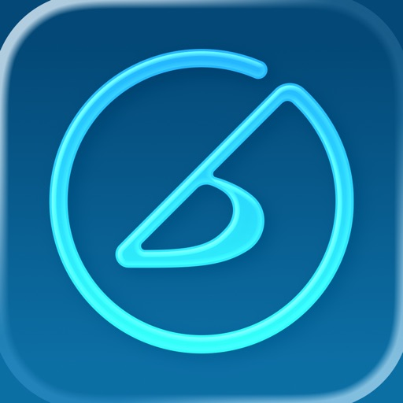

iReal Pro réunit deux choses que les musiciens adorent en une seule app : un groupe d’accompagnement au son réaliste qui joue avec vous, et une énorme bibliothèque gratuite de grilles d’accords consultables à tout moment — en répétition, en jam session ou sur scène. Besoin de transposer un morceau pour un chanteur ? C’est fait. Envie de jouer avec une section rythmique complète derrière vous ? Appuyez sur play.

Désignée parmi les 50 Meilleures Inventions du TIME Magazine et utilisée par des milliers d’étudiants, professeurs et pros dans des écoles comme le Berklee College of Music — iReal Pro aide les musiciens à progresser depuis 2008.

GROUPE
• 50 styles d’accompagnement — Swing, Bossa Nova, Blues, Funk, Rock, Bluegrass, Reggae, Latin, Gypsy Jazz, Country et bien d’autres
• Personnalisez chaque style avec piano acoustique ou électrique, Fender Rhodes, guitares, contrebasse ou basse électrique, batterie, vibraphone et orgue
• 40 styles supplémentaires — blues, salsa, brésiliens — disponibles en achats intégrés

RECUEIL
• Téléchargez des milliers de grilles d’accords gratuites partagées par la communauté iReal Pro
• Créez vos propres grilles en quelques minutes avec l’éditeur intégré
• Organisez les grilles en listes pour vos concerts, sets ou cours

PRATIQUE
• Ajustez le tempo, bouclez les passages difficiles, transposez dans n’importe quelle tonalité
• Accélération automatique du tempo et cycle de tonalités pour un travail ciblé
• Transposition globale pour les instruments en Mib, Sib, Fa et Sol

ACCORDS
• Doigtés de guitare, ukulélé et piano pour chaque accord
• Touchez n’importe quel accord dans votre grille pour voir comment il se joue
• Suggestions de gammes pour l’improvisation

PARTAGER
• Partagez grilles et listes avec d’autres utilisateurs iReal Pro
• Exportez les grilles en PDF ou MusicXML
• Exportez les morceaux d’accompagnement en fichiers audio ou MIDI
• Synchronisez entre iPhone, iPad et Mac avec iCloud

POUR LES PROFS
• Créez des listes d’exercices ou de morceaux pour vos élèves
• Utilisez en classe, en direct ou en partage d’écran lors de cours en ligne

Nous sommes une petite équipe de musiciens qui avons créé cette app parce que nous en avions besoin nous-mêmes. Nous espérons que vous l’apprécierez autant que nous.

[View on Apple](https://apps.apple.com/jp/app/ireal-pro/id298206806)

## Streaks

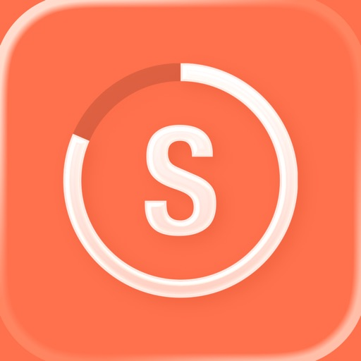

STREAKS. Die Aufgabeliste für gute Gewohnheiten.
Gewinner des Apple Design Award

Wähle bis zu 24 Aufgaben, die du jeden Tag erledigen willst. Ziel ist es, diese Aufgaben mehrere Tage hintereinander zu erledigen. Streaks funktioniert mit der Health-App, damit du deine Fitness-Ziele erreichen kannst.

FUNKTIONEN:

* Passe die App-Farbe an.
* Wähle aus hunderten Symbolen.
* Lass dir benutzerdefinierte Benachrichtigungen schicken, um auf dem Laufenden zu bleiben.
* Betrachte deine aktuelle und beste Aufgabenserie und deine Erledigungsstatistik.
* Streaks erkennt automatisch, wann du Health-Aufgaben erledigst.
* Gewöhne dir schlechte Angewohnheiten mit unschönen Aufgaben ab
* Apple Watch

Solltest du Fragen, Anregungen oder sonstiges Feedback haben, schreibe bitte eine E-Mail an support@streaks.app oder eine Twitter-Nachricht an @TheStreaksApp.

Wenn dir Streaks gefällt, hinterlasse bitte einen Erfahrungsbericht! Die Erfahrungsberichte werden zurückgesetzt, sobald wir ein neues Update veröffentlichen. Daher sind wir auf deine ständige Unterstützung angewiesen.

ÜBER HEALTH-DATEN:

Auf kompatiblen Geräten kann Streaks deine Spazieren-/Joggen-Daten lesen, vorausgesetzt du erteilst die Erlaubnis, die Erledigung deiner Aufgaben zu bestimmen. Alle Daten werden in voller Übereinstimmung mit den iOS-Regeln von Apple für Erfahrungsberichte abgerufen. Bitte lies unsere Datenschutzerklärung unter https://streaks.app/privacy.html und erfahre mehr über die Verwendung deiner Daten.

Schritt- und Entfernungsdaten sind nur automatisch verfügbar, wenn du ein iPhone 5S, eine höhere Version oder ein Zubehörgerät wie die Apple Watch verwendest, um Daten auf die Health-App zu übertragen. Bei Fragen schreibe uns bitte an support@streaks.app.

[View on Apple](https://apps.apple.com/jp/app/streaks/id963034692)

## ProCam - 专业相机

拍摄模式

- 单次拍摄 
- 低速快门模式
- 人像
- 3D 照片
- 防抖功能
- 连拍模式
- 自拍计时器 
- 拍摄间隔时间 
- 大尺寸快门按钮 
- 视频模式 
- 4K Ultra HD 视频模式 - 3840x2160
- 4K Max 视频模式 - 4032x2268 - 应用内购买
- 慢动作视频模式
- 延时摄影 
- 4K Ultra HD 延时摄影 - 3840x2160 
- 4K Max 延时摄影 - 4032x2268 - 应用内购买 

相机功能

- 手动对焦，曝光，快门速度，ISO 和白平衡控制
- 全方位对焦和曝光控制（触摸对焦 / 触摸曝光） 
- 对焦、曝光与白平衡 (WB) 锁定 
- 可调节的长宽比（4:3 / 3:2 / 16:9 / 1:1） 
- 无损的 TIFF 格式 - 仅适用于 iPhone 4S 及更高版本
- 提供四种快门速度选择 (1/8 sec / 1/4 sec / 1/2 sec / 1 sec) 
- 视频暂停/恢复功能 
- 可调节的视频分辨率（全高清：1080p / 高清：720p / VGA：640x480 / 低品质：480x360) 
- 录制视频的同时拍摄静态照片的功能 
- 实时视频图像稳定系统（可开启或关闭） 
- 视频磁盘空间计数器 
- 延时摄影视频分辨率（全高清：1080p / 高清：720p / VGA：640x480 / 低品质：480x360) 
- 真正的慢动作视频模式，4 种播放速度（最大 fps / 30 fps / 24 fps / 15 fps)
- 6 倍数码变焦 
- 视频缩放 
- 音量计 ( 级别 平均 / 峰值) 
- 地理位置标记 
- 对齐网格（三等分 / Trisec / 黄金分割线 / 地平线) 
- 支持前 / 后置摄像头 
- 日期戳 
- 时间戳 
- 位置戳 
- 版权戳 
- 视频日期戳 
- 视频位置戳 
- 视频版权戳 
- 延时摄影日期戳 
- 延时摄影位置戳 
- 延时摄影版权戳 
- 音乐嵌入至延时摄影视频中 
- 闪光灯设置（自动 / 开启 / 关闭 / 常亮照明） 

照片 / 视频编辑器

- 非破坏性编辑——所有的编辑操作，包括裁剪，是完全可以修正 / 还原的
- 60个专业制作的过滤器
- 17 种实时镜头: 晕影 / 白晕影 / 鱼眼 / 移轴 / 宏观 / 小星球 / 虫洞 / 分割 / 万花筒 I, II, III, IV, V / 涟漪 / 条纹 / 阴影 / 半色调 
- 19 种综合调整工具
- 剪裁、修剪、旋转、镜像、拉伸和透视校正
- 您可以使用高精度的时间线逐帧查看视频 
- 将音乐歌曲添加到您的视频的功能
- 可对原始录音和背景音乐进行音量控制
- 可从视频中提取静止帧
- 支持4K (3840x2160) 高清视频格式

批量照片动作

- 批量盖章： 添加日期/时间/地点/版权印章到你相簿中的多张照片
- 批量调整大小：调整你相簿中多张照片的大小

反馈

遇到问题？对后续更新有意见或建议？请发邮件至 support@procamapp.com 与我们取得联系、

[View on Apple](https://apps.apple.com/jp/app/procam-%E3%83%97%E3%83%AD%E3%82%AB%E3%83%A1%E3%83%A9/id730712409)

## iSafe Pro

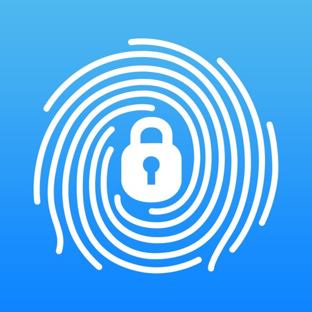

*** App of the Day ***
Top Overall in 25 countries 
Top Utility in 58 countries 

 
写真やビデオにパスワードを設定したくないですか?
友達にiPhoneを貸すときプライベートなファイルを見られないか心配ですか?
彼女にiPhoneをロック解除させられ、秘密がバレちゃったことないですか?
そんなあなたにピッタリなアプリがここにあります。

特徴: 
• パスワードとフェイクパス
このアプリはパスワードまたはフェイクパスで起動できます。
パスワード: ロックしていないアイテムとロックしたもの両方を閲覧できます。
フェイクパス: ロックしたアイテムは閲覧できません。
㊙: パスワードを入力して画面を引き上げて更新すると㊙フォルダが表示されます。
彼女にアプリの中身を見せるよう迫られたら、このフェイクパスで起動しましょう。
 
• ログイン形式
ロック解除の方法はさまざまな形式から選択できます。4桁の数字パスワード、9個のドット
 
• ベストなカテゴリ分け
ファイルはすべて3つのカテゴリ(写真、ビデオ、ファイル)に分けられます。 
そのすべてのカテゴリにおいて、アルバムやフォルダをロックすることができます。 
 
• 高機能ビデオプレイヤー
iSafeはほとんどすべてのビデオフォーマットに対応しているので、変換は必要ありません。

• プライベートブラウザ
あなたの足跡を非表示にします。

• その他の機能
- サブフォルダ
- テキストエディター
- ファイルブラウザ
- URLスキームによるファイルダウンロード
- zip、rarファイルの解凍
- ファイルの圧縮
- 外部ディスプレイとの接続
- 曲、ビデオのバックグラウンド再生
- ロック画面で音楽をコントロール
- 画像を連絡先に割り当て
 

さまざまなファイルフォーマットに対応
- 画像: png, jpg, jpeg, bmp, tif, gif
- ビデオ: mp4, mov, m4v, 3gp, flv, f4v, mpg, mpeg, wmv, rmvb, mkv, asf, webm
- 音声: mp3, m4a, m4r, aac, caf, wma
- テキスト: txt, php, cgi, asp, h, m, c (編集可能)
- リッチテキスト: rtf, pdf
- iWorks: pages, numbers, key
- MS Office: doc, xls, ppt, docx, xlsx, pptx
- ウェブ: htm, html, webarchive
- アーカイブ: zip, rar
- その他: …… (読み込み不可、保存のみ)
 

ファイル転送
- WIFI経由によるFTP転送
- WIFI経由によるブラウザ転送
- USB経由によるiTunes転送
- Bluetooth経由によるiOSデバイス間転送
- メールまたは他アプリからの"別アプリで開く"による転送
- カメラロールから写真とビデオの転送
 

複数言語対応: 20以上の言語に対応しています。
 
機能もドンドン追加していく予定です。ご購入をお待ちしています!

[View on Apple](https://apps.apple.com/jp/app/isafe-pro/id402012828)

## 空論道｜ドロッセルマイヤーさんの公式ゆるゲーアプリ

● 「無意味な議論（空論）」を楽しむ専用アプリ
● 買い切り・追加料金なし！
● お題を出すだけ！誰でもすぐに盛り上がる
● 1人でも、2人でも、家族でも、友達でも。何人でも遊べます

---

『ドロッセルマイヤーさんの空論道』は、結論の出ない議論を、あえて楽しむアナログゲーム「空論道」のアプリ版です。
正解も、勝ち負けも、意味もありません。あるのは、「どうでもいいのに、なぜか熱くなる」そんな会話と、それを楽しめるあなたたちだけ。

---

■ 1900種類以上の議論テーマ

「無人島に持っていきたい」「寿司ネタ」は？
「敵にまわしたくない」「文房具」は？
「上の句」と「下の句」の組み合わせで、1900種類以上の議論テーマを自動生成。その日、その場、そのメンバーだけのくだらない議論が生まれます。

---

■ いろいろなシーンで楽しめます

・友達との雑談タイムに
・家族でのちょっとした会話に
・飲み会や集まりのアイスブレイクに
・深夜、何もやることがない人たちが集まっているとき
・オンライン通話のお供に
・1人で空論を考えてニヤニヤしたいときにも

人数や場所を選ばず、会話のきっかけとして気軽に使えます。

---

■ 道場レベルを上げよう

議論のあとにもらえるポイントを集めることで、あなたの「道場レベル」が上がっていきます。レベル100の最高位「空論道場」を目指しましょう。

---

■ お題カスタマイズ

出したくない「上の句」「下の句」は個別にON／OFFが可能。メンバーや場の空気に合わせて、議論テーマを調整できます。

---

結論は出なくていい。むしろ、出ない方が面白い。
「やれば楽しいけど、なかなかやらない会話」を自然にはじめるためのアプリです。集まったとき、迷ったら、まずは空論してみてください。

---

■ ドロッセルマイヤーズの「ゆるゲー」シリーズ

さんぽ神 / 空論道 / ひまつぶ神 / 大喜利神
ドロッセルマイヤーの人気アナログゲームをアプリで。各タイトル好評配信中！

---

【協力】TBSラジオ「アフター6ジャンクション2」

(C) 2026 Drosselmeyer & Co.Ltd.
(C) 2026 TBS RADIO, Inc.

[View on Apple](https://apps.apple.com/jp/app/%E7%A9%BA%E8%AB%96%E9%81%93-%E3%83%89%E3%83%AD%E3%83%83%E3%82%BB%E3%83%AB%E3%83%9E%E3%82%A4%E3%83%A4%E3%83%BC%E3%81%95%E3%82%93%E3%81%AE%E5%85%AC%E5%BC%8F%E3%82%86%E3%82%8B%E3%82%B2%E3%83%BC%E3%82%A2%E3%83%97%E3%83%AA/id6758662999)

## Noir - Dark Mode for Safari

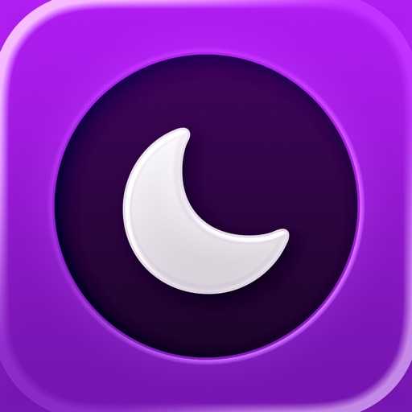

Noir is a Safari extension that automatically adds a dark mode to every website you visit.

It makes browsing the web at night so much better. With Noir, you won’t be blinded by bright websites ever again.

And the results look great too. Noir generates a custom dark style for each website you visit, based on the colors that are used on a page. You won’t even notice this happening in the background – that’s how fast it is – but you’ll certainly appreciate the end result: a beautiful dark mode tailored for each website, where contrast is preserved and highlights still pop. And with over 20 built-in themes and the ability to create your own, you can customize the results exactly the way you want.

Noir works with any website you visit in Safari, automatically. By default, Noir is linked to your device’s Dark Mode, so websites will only go dark when you want them to. But you can easily customize this to your liking, even per website. Only want to use Noir on just a few specific websites? Sure thing! Disable Noir on some websites? No problem!

Built from the ground up for iOS and iPadOS, the app feels right at home on your device. It supports the brand new Safari web extension feature, which means there’s no need to manually activate it every time you load a new page. The app also tightly integrates with system features such as Shortcuts, Control Center, Focus Filters, and Widgets to fully integrate Noir in all your workflows. And your settings are automatically synced to all your devices using iCloud.

And just as importantly, Noir takes your privacy seriously: it doesn’t collect any of your browsing data. Period.

Noir is made by an indie iOS developer. It does not include any subscriptions or ads. Buy Noir once, use it forever.

Notes:
• Found a website where Noir’s dark mode doesn’t look just right? Let me know by reporting it. The app will be frequently updated to address issues that are reported.

Privacy Policy:
• The Noir extension requires access to the websites you visit to analyze the existing style of the page and to override it with Noir's dark style.
• Noir never collects your browsing data. The only data Noir ‘collects’ are your settings, and those will never leave your device or iCloud account.
• You can read Noir’s full Privacy Policy at https://getnoir.app/privacypolicy

[View on Apple](https://apps.apple.com/jp/app/noir-dark-mode-for-safari/id1581140954)

## Wipr 2

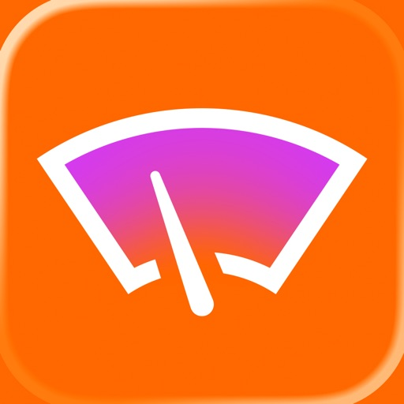

Wipr blocks ads, popups, trackers, cookie warnings, and other nasty things that make the web slow and ugly.

Websites in Safari will look clean, load fast, and stop invisibly tracking you. You’ll notice significant improvements to your battery life and data usage. Setup is a snap.

The Filtr add-on extends Wipr’s blocking to all apps on your device. It acts at the network level, but unlike a VPN, it can access none of your data, and can be used in conjunction with VPNs, iCloud Private Relay, and custom DNS.

Wipr’s blocklist is updated twice a week automatically, and has enhanced versions for the following languages: Bosnian, Chinese, Croatian, Czech, Danish, Dutch, Estonian, Finnish, French, German, Greek, Hebrew, Hindi, Hungarian, Icelandic, Indonesian, Italian, Japanese, Korean, Macedonian, Malay, Montenegrin, Norwegian, Polish, Romanian, Russian, Serbian, Slovak, Spanish, Thai, and Vietnamese.

Wipr is a universal app: install it on all your devices (iPhone, iPad, Mac, Vision Pro) with a single purchase. It’s fully accessible with VoiceOver, Voice Control, and more. Dark, Tinted, and Clear icon variants are included. Family Sharing is supported.

Because it’s developed by a single independent developer and 100% funded by its users, Wipr only answers to you: no one can pay to have their ads unblocked, and there are no “acceptable ads”.

This app was made with love and patience. I hope you’ll enjoy using it as much as I enjoyed designing and building it.

– Kaylee

Terms & Conditions: https://kaylees.site/terms-and-conditions.html
EULA: https://www.apple.com/legal/internet-services/itunes/dev/stdeula/

[View on Apple](https://apps.apple.com/jp/app/wipr-2/id1662217862)

## Nomad Sculpt

• Outils de Sculpture
Clay, aplatir, lisser, masque et de nombreux autres pinceaux vous permettront de façonner votre création.
Vous pouvez également utiliser l'outil de découpe boolean trim avec lasso, rectangle et d'autres formes, pour le hardsurface.

• Personnalisation de tracé
Falloff, alphas, pavages, pression du crayon et d'autres paramètres de tracé peuvent être personnalisés.
Vous pouvez également sauvegarder et charger votre préréglage d'outils.

• Outils de peinture
Peinture de sommet avec couleur, roughness et metalness.
Vous pouvez également gérer facilement tous vos préréglages de matériaux.

• Calques
Enregistrez vos opérations de sculpture et de peinture dans des calques séparés pour faciliter l'itération pendant le processus de création.
Les changements de sculpture et de peinture sont enregistrés.

• Sculpture multirésolution
Naviguez entre plusieurs résolutions de votre maillage pour un flux de travail flexible.

• Voxel remeshing
Remailler rapidement votre mesh pour obtenir un niveau de détail uniforme.
Cela peut être utilisé pour esquisser rapidement une forme grossière au début du processus de création.

• Topologie dynamique
Affinez localement votre mesh sous votre pinceau pour obtenir un niveau de détail automatique.
Vous pouvez même conserver vos calques, car ils seront automatiquement mis à jour !

• Décimer
Réduisez le nombre de polygones tout en conservant autant de détails que possible.

• Face Group
Segmentez votre mesh en sous-groupes avec l'outil de face group.

• Dépliage UV automatique
Le dépliage UV automatique peut utiliser les face groups pour contrôler le processus de dépliage.

• Baking
Vous pouvez transférer les données de sommet telles que la couleur, roughness, metalness et les détails de petite échelle dans des textures.
Vous pouvez également faire l'inverse, transférant les données de textures sur les sommets ou calques.

• Forme primitive
Cylindre, torus, tube, tour et d'autres primitives peuvent être utilisées pour commencer rapidement de nouvelles formes à partir de zéro.

• Rendu PBR
Beau rendu PBR par défaut, avec éclairage et ombres.
Vous pouvez toujours passer en MatCap pour un ombrage plus standard pour des fins de sculpture.

• Post-process
Screen Space Reflection, Depth of Field, Ambient Occlusion, Tone mapping, etc

• Export et Import
Les formats pris en charge incluent les fichiers glTF, OBJ, STL ou PLY.

• Interface
Interface facile à utiliser, conçue pour l'expérience mobile.
La personnalisation est possible également !

• Quad Remesher (achat in-app séparé uniquement)
Remesh automatiquement votre objet avec un mesh dominant en quads qui suit les courbures du mesh.
Il prend en charge les guides, les face groups et la peinture de densité.

[View on Apple](https://apps.apple.com/jp/app/nomad-sculpt/id1519508653)

## PeakFinder

群山在召唤！力争在登山家队伍中探索最多高山吧！ PeakFinder让你的梦想成为可能…，还能以360°全景显示所有山脉和山峰的名称。
该功能可完全脱机离线工作- 全球适用!

本应用的内容涉及到超过1'000'000座山峰- 从珠穆朗玛峰到世界角落的小山丘。

•••••••••
荣获数个奖项的冠军，如'AppStore最佳应用'、'每周最佳应用',…
macnewsworld.com, nationalgeographic.com, smokinapps.com, outdoor-magazin.com, digital-geography.com, …强烈推荐
•••••••••

••• 特色 •••

• 可在全球完全脱机离线工作
• 包括超过1'000'000座山峰的名称
• 利用全景图覆盖相机图像
• 快速渲染300公里范围周围地形
• 数码双目望远镜可选择远方不显著山峰
• '显示我'功能适合可见的山峰
• 通过GPS、山峰目录或（在线）地图选择观察点
• 可像鸟一样在山峰之间飞翔并垂直上升
• 标记您喜欢的山脉和地方
• 显示太阳和月球轨道以及升落时间
• 使用指南针和加速度传感器
• 山峰目录每周更新
• 不包含任何经常性费用。您只需一次性付款
• 无广告

••• 评价 •••

iTunes中的每个好评（包括下述更新）都让我快乐。好的评价和评论使我得以一直改进本应用。多谢你的支持！

••• 支持 •••

如有问题、疑问、错误、遗漏的山脉名称以及对将来发展想发表意见，我很乐意帮助你。请给我来信：support@peakfinder.com.

[View on Apple](https://apps.apple.com/jp/app/peakfinder/id357421934)

## FAir for FlashAir

使用FAir for FlashAir，あなたの無線FlashAir SDカードのすべての画像、ファイルをすばやく閲覧、ダウンロードできます。

サポートされているデバイス FlashAir W-02、W-03、W-04
主な機能のリストは以下の通りです。：

システム
- 完全に似合う iOS 13
- 完全に似合う Dark Mode

ダウンロード
- 独立したダウンロードプロセス管理は、あなたのダウンロード履歴を失うことはありません。
- ダウンロード速度の表示、ダウンロードジョブの削除、編集などができます。
- 先にアプリのローカルフォルダにダウンロードして、さらにフィルタして保存することができます。
- 個別のアルバムに保存し、アルバムのファイル名を設定できます。
- ダウンロードが完了したら、ハイビジョンのサムネイルを作成できます。
- 写真の情報を完全に保留して、ダウンロードしたのは原図で、カメラのピクチャーと完全に一致します。
- 写真を選択する場合は、全選択、スライド複数選択、時間グループ選択など様々な方法で画像を選択できます。
- 写真/動画の自動保存
- 自動更新 新しい写真を検出したら更新します
- 自動接続 アプリ内でFlashAir Wi-Fiを自動的に接続できます
- ダウンロード順序の設定ができます。

表示
- FlashAir上の画像はデフォルトビューまたは日付グループで表示できます。
- フォーマットフィルタリングは、あなたが見たいファイル形式を選択できます。JPG、RAWなどを表示するだけです。
- 画像を昇順または降順で並べ替えることができます。
- DCIMの中の写真だけを読み込むか、カード内のすべての画像を表示するかを選択できます。
- 画像ファイル名の表示/非表示ができます。
- ダウンロードされていないタグの表示を選択できます。
- 行ごとに表示される画像の数を設定できます。
- サムネイルまたは完全な大図で画像を見ることができます。
- 動画をスムーズにプレビューできます。
- 写真の完全なEXIF情報を見ることができます。
- FlashAirの完全なファイルシステムを確認し、ファイルを操作することができます。
- RAWプレビューを表示できます。(同じ名前のJPGプレビューを使用して)

FlashAir設定
- FlashAir SSID、Wi-Fiパスワードが設定できます。
- FlashAir Master Codeの設定と自動管理ができます。
- FlashAirの完全な情報SSID、パスワード、空きスペース、Macアドレスなどが確認できます。
- FlashAirとセルラーネットワークの共同使用が設定できます。

その他
- FlashAirのファイルを他のアプリで開くことができます。
- マスターコードの自動処理ができます。
- ダウンロード中のロック防止が可能です。
- 複数の画像をスライドさせ、効率を向上させます。
- 画像キャッシュをクリアして、アプリが多すぎるスペースを占めるのを防ぐことができます。
- 完全な操作マニュアル、問題フィードバックチャネル

[View on Apple](https://apps.apple.com/jp/app/fair-for-flashair/id1344681035)

## LumaFusion

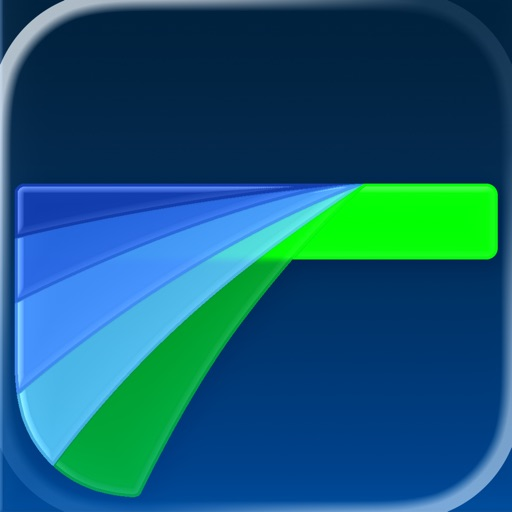

LumaFusion: Das ultimative Storytelling-Erlebnis für die Videobearbeitung

Willkommen bei der App, die im App Store den Titel „App des Jahres 2021“ und den Editors' Choice Award gewonnen hat! Der Goldstandard für Geschichtenerzähler weltweit. Bietet eine flüssige, intuitive, Touchscreen-Bearbeitungserfahrung.

PROFESSIONELLES EDITIEREN LEICHT GEMACHT
• Sechs Video-/Audio- oder Grafikspuren: Erstellen Sie Bearbeitungen mit mehreren Ebenen und verarbeiten Sie problemlos 4K-ProRes- und HDR-Medien.
• Sechs zusätzliche Audiospuren: Bauen Sie Ihr Klangbild.
• Die ultimative Zeitleiste: Flüssige Bearbeitung mit der weltweit flexibelsten spurbasierten UND magnetischen Zeitleiste
• Jede Menge Übergänge: Halten Sie Ihre Geschichte in Bewegung.
• Vorschau auf externem Monitor: Sehen Sie auf einem großen Bildschirm.
• Marker, Tags und Notizen: Behalten Sie die Übersicht.
• Voiceover: Nehmen Sie VO auf, während Sie Ihren Film abspielen.

EBENENEFFEKTE UND FARBKORREKTUR
• Greenscreen-, Luma- und Chroma-Keys: Für kreatives Compositing.
• „Lock & Load“-Videostabilisierung: Sorgen Sie für ruhe im Bild.
• Leistungsstarke Farbkorrektur: Erstellen Sie Ihren eigenen Look.
• Videowellenform-, Vektorscope- und Histogrammscope.
• LUTs: Importieren und wenden Sie mehrere .cube- oder .3dl-LUTs an.
• Unbegrenzte Anzahl an Keyframes: Animieren Sie Effekte mit höchster Präzision.
• Anpassbare Text- und Effektpresets: Speichern und teilen Sie Ihre Lieblingsanimationen und -looks.
• Raster und Hilfslinien: Richten Sie die Elemente mit „Title-Safe“, „Action-Safe“ und einer Horizontlinie präzise aus.

ERWEITERTE AUDIOREGELUNG
• Grafischer und parametrischer EQ sowie Sprachisolierung: Präzise Klangregelung.
• Keyframes für Audiopegel, Panning und EQ: Erstellen Sie makellose Mischungen.
• Unterstützung von Stereo und Dual-Mono-Audiodateien: Für Interviews mit mehreren Mikrofonen in einem Clip.
• Audio-Ducking: Pegeln Sie Musik und Dialog ausgewogen aus.
• Drittanbieter-Audio-Plugins: Verbessern Sie den Klang.

KREATIVE TITEL UND MEHRERE TEXTEBENEN
• Titel mit mehreren Ebenen: Kombinieren Sie Formen, Bilder und Text in Ihre Grafik.
• Anpassbare Schriften, Farben, Rahmen und Schatten: Entwerfen Sie ansprechende Titel.
• Import von eigenen Schriftarten: Stärken Sie Ihre Marke.
• Speichern und teilen von Titel-Presets: Perfekt für die Zusammenarbeit.

PROJEKTFLEXIBILITÄT UND MEDIATHEK
• Bildformate für alle Zwecke: Vom Breitbildkino bis zu Social Media.
• Bildfrequenzen von 18 bis 240 FPS: Flexibilität für jeden Workflow.
• Bearbeiten Sie Material aus der Foto-App, von Frame.io und auf USB-C-Laufwerken: Greifen Sie überall auf Ihre Medieninhalte zu.
• Importieren Sie Dateien aus der Cloud: Wo auch immer Sie sie gespeichert haben.

TEILEN SIE IHRE MEISTERWERKE
• Bestimmen Sie Auflösung, Qualität und Format:
• Teilen Sie Filme auf sozialen Medien, lokalem Speicher oder Cloudspeicher.
• Arbeiten Sie auf unterschiedlichen Geräten: Projekte lassen sich nahtlos übertragen.

ERWEITERTE FUNKTIONEN (einzeln erwerben oder sie ALLE als Teil des Creator Pass-Abonnements erhalten – siehe unten)
• Geschwindigkeitserhöhung und verbesserte Keyframe-Erstellung - Erstellen Sie Geschwindigkeitserhöhungen, Bézier-Kurven und sanfte Übergänge mit dieser einzigartigen, benutzerfreundlichen Funktion.
• XML-Export: Senden Sie Ihr Projekt an Final Cut Pro für Mac
• Multicam-Studio: Synchronisieren Sie 6 Kameras oder Audio und tippen Sie, um die Perspektive zu wechseln

ERSTELLER-PASS-ABONNEMENT
• Erhalten Sie vollen Zugriff auf Storyblocks für LumaFusion: Millionen von hochwertiger lizenzfreier Musik, Soundeffekten und Videos, PLUS erhalten Sie ALLE oben genannten erweiterten Funktionen.

HERVORRAGENDER GRATIS-SUPPORT
• Online-Tutorials: www.youtube.com/@LumaTouch
• Benutzerhandbuch: luma-touch.com/lumafusion-reference-guide
• Support: lumatouch.co/support

[View on Apple](https://apps.apple.com/jp/app/lumafusion/id1062022008)

## 動物占い®PREMIUM

皆さんおなじみ、「動物占い(R)」の公式アプリ第1弾!!
第1弾はキャラチェキ・5アニマル・アニマルカラーが占えちゃう基本編。
動物占い(R)に詳しくなれちゃう解説もあるから、初めての方にもお勧め!

* - * - * - * - * - * - * - * - * - * - *
【アプリ基本内容】
本アプリには、以下のコンテンツが入っています。

【占い項目】
◆キャラチェキ
生年月日から、12の動物キャラに分類します。
動物占い(R)の診断結果でいちばん使われるのが、このキャラチェキなので要チェック!

◆アニマルカラー
12種類の動物キャラをカラーでさらに詳しく分類!
例えば同じこじかでも「イエローのこじか」・「ゴールドのこじか」等に分かれていて、キャラバリエーションは、なんと60種類にもなります!

◆5アニマル
あなたの中にいる『本質キャラ』・『表面キャラ』・『希望キャラ』・『意思決定キャラ』・『隠れキャラ』を分析!

◆印象アップ法
あなたの魅力や気をつける点など、普段気づかない部分を動物占い(R)が占っちゃいます！
これを機に、一気に印象アップしよう。

◆恋愛相性ミニ
男女の生年月日を入力するだけで、二人の相性を診断します!
恋の行方は・・・?!

◆仕事相性ミニ
一緒に仕事をする上司や部下との相性を簡単チェック!
難しい人間関係をスムーズにするヒントになるかも。

◆ラッキーナンバー占い
あなたに幸運をもたらしてくれる『ラッキーナンバー』を占います。

◆月替わりお試し占い
お試し占いは、公式サイト占いがちょっとだけ楽しめるコーナー！
※毎月最初の営業日に切り替わります

◆アニマルカラー別占い「ホンネとタテマエ(60分類)」
人には表と裏の顔が存在する？あの人のホンネ、こっそりチェックしちゃいましょう！

【アニマルカラー別占いとは？】
１２のキャラをさらに細分化！全６０分類に分かれる究極の動物占い！
※アプリ購入後に120円のアプリ内課金が必要です

* - * - * - * - * - * - * - * - * - * - *
【その他の特徴】

◆スタンプ
12動物占いキャラの『喜ぶ』、『悲しむ』、『怒る』スタンプを追加！
チャットアプリへの送信とカメラロールへ保存ができます。
※iOS7端末では「LINEで送る」がご利用いただけません。

◆手帳管理
アプリ内の友達手帳のデータを対応アプリ間で共有出来ちゃう優れもの！サーバーにデータを送信することで別の動物占い(R)公式アプリに友達手帳のデータを読み込むことが出来るので、アプリごとに入力する必要がなくなります!!
　◎対応アプリ
　　・動物占い(R)Premium
　　・恋愛動物占い(R)

※この機能をご利用頂くには通信が必要です。

◆友達手帳
友達手帳に占いたい人を登録すれば、次から簡単に占えます!
最大99人まで登録できて、とっても便利。
さらに、「登録順」「名前順」「動物順」の並びにも変更できます!

◆Twitter
キャラチェキ・5アニマル・アニマルカラーの結果を
Twitterに投稿できます!
※Twitterのアカウントが必要となります。

◆マイページ
あなたの情報を登録すれば、占いメニューに
いかなくても、簡単に占い結果が見られます!

[View on Apple](https://apps.apple.com/jp/app/%E5%8B%95%E7%89%A9%E5%8D%A0%E3%81%84-premium/id349079731)

## HeartWatch: 心脏和活动监测器

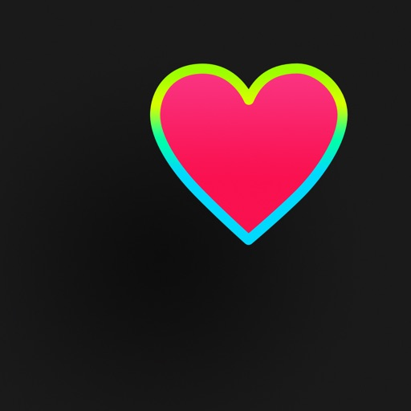

所有隐私
HeartWatch没有用户分析跟踪，没有广告插件，没有第三方代码，不会上传数据。

关于HEARTWATCH
健康
- 所有关键心率指标的智能视图，包括白天、久坐、睡眠、醒来以及体能训练。
- 详细的趋势分析，包括心率、血压、心率变异性等。
- 在手表上，带有内容的后台心率警报。
- 记录个人心率读数。

活动
- 每天都不同。根据您的习惯进行活动、移动距离和步数的智能化目标设定。
- 每日预测可帮助您保持进度以实现目标。

体能训练
- 深入分析心率、训练摘要、GPS地图等。
- 在手表上带有自定义提醒功能及更注重于心率的体能训练应用，可让您始终处于正确的心率区间。
- 详细的趋势分析。
- 使用数据流，将体能训练的信息从手表传送到您的手机上。

新闻
-浏览不同的新闻版本，了解你的健康进展和趋势。
-晨间简报：阅读你的关键健康信息，开始新的一天
-健身习惯：通过动态健身习惯跟踪器了解你的健身趋势

日记帐和笔记
-每天记录笔记和测量结果
-查看详细列表，其中包含所有注释、测量和训练的完整概述
-从手表或iPhone输入笔记和测量值。包括血压、体温、血糖、体重、腰围和体脂百分比。

图表与分析
-超过30个健康指标可供查看
-将7天和21天趋势应用于任何指标，并具有重叠能力
-查看6周到12个月

导出
- 导出所有健康指标和体能训练数据。

没有什么比您的健康更重要！
HeartWatch是一个非常有用的工具，它可以以简洁的格式来提醒您任何可能存在的健康问题，您可以向医疗执业者展示这些数据。

心脏月
2022 年官方 Apple 心脏月推荐应用
https://www.apple.com/au/newsroom/2022/01/apple-celebrates-heart-month-with-new-resources-across-services

要求
此应用程序需要已安装“健康”应用的iPhone。心率读数读取自健康数据库，理想情况下，这是从您的Apple Watch获取的数据。

[View on Apple](https://apps.apple.com/jp/app/heartwatch-%E5%BF%83%E6%8B%8D%E6%95%B0%E3%81%AE%E6%B8%AC%E5%AE%9A%E3%81%A8%E7%AE%A1%E7%90%86/id1062745479)

## パブロフ簿記２級商業簿記

●2026年度の試験範囲に完全対応！
●問題と解説を最新の内容に変更しました！
（仕訳343問、表示区分モード96問）
●ネット試験、紙の試験のどちらにも対応！
●購入特典：ネット試験の模擬問題2026年度版に更新！
●購入特典： 紙の模擬試験も2026年度版に更新！

忙しいので効率的に合格したい
解説は理解できるけど自分では解けない
合格まであと少しなのに点が取れない
見たことがない仕訳に対応したい

そんな経験ありませんか？

仕訳はコツさえつかめば簡単！
そのままマネできる解き方を全問解説しました。 

■パブロフ簿記で合格できる6つの理由
① 最新（2026年度改定）の試験範囲に対応している
② スキマ時間に勉強できる（オフラインで利用可能）
③ すぐにマネできる解き方が書いてある
④ 実務経験に基づいた、わかりやすい解説
⑤特典１「パブロフ流」解説付き90分実践問題が特典でダウンロードできる
⑥特典２「パブロフ流」解説付き90分ネット試験の模擬問題が利用できる

■前年2025年度の日商簿記2級も高い的中率！

■パブロフ簿記の実績
・パブロフシリーズ累計100万DL
・パブロフ簿記の書籍、Amazon簿記検定1位！

■パブロフくん簿記のブログ
https://pboki.com/

■欲しい機能はすべて搭載
① Lev1 
・出題率が高く確実に正解する必要がある問題

② Lev2
・合格に必要なレベルの問題
・基本的な出題範囲がカバーできる

③ Lev3
・出題率は低いが、出題実績のある問題

④ 分野別
・苦手な分野を重点的に解きたい方に最適
・同じ論点を様々な聞き方で出題
・全343問すべてが含まれている

⑤ つづきから
・Lev1〜3、分野別のセーブした問題から開始できる

⑥ テスト
・本試験の出題傾向に近い形で、1テスト10問を出題
・時間がかかりそうな問題や難しい問題を飛ばす練習にも最適
・全10回、合計100問

⑦ ランダム
・毎回異なる10問が選ばれる

⑧ ミスのみ
・間違った問題だけ集中して解ける
・本試験直前の復習に最適

⑨ チェックのみ
・チェックマークを付けた問題だけ集中して解ける
・苦手な問題を克服するのに最適

⑩ 表示区分モード
・勘定科目の表示区分を練習できる
・ランダムで96問でトレーニング

■制作者　willsi株式会社
著書：
パブロフ流でみんな合格　日商簿記3級
パブロフ流でみんな合格　日商簿記2級　商業簿記
パブロフ流でみんな合格　日商簿記2級　工業簿記

資格：公認会計士、簿記1級、2級。

監査法人を経てプログラミングを始める。簿記の学習に最適な、機能と内容を研究。 また、簿記2級の受験生へのリサーチを行い、アプリに反映しています。 

日商簿記2級に合格できる受験生が一人でも増えることを心から願っています。

[View on Apple](https://apps.apple.com/jp/app/%E3%83%91%E3%83%96%E3%83%AD%E3%83%95%E7%B0%BF%E8%A8%98%EF%BC%92%E7%B4%9A%E5%95%86%E6%A5%AD%E7%B0%BF%E8%A8%98/id468640323)

## 宅建 過去問 (完全版)

最新の問題と解説を掲載！！宅建の過去問をアプリ化。過去問検索やマイリスト機能。ランダム10問テストなど、国家試験を受験した時に、あったら良かったと思う機能を搭載しています。

広告がなく、快適に学習することができます。成績やリストについては、無料版からの引き継ぎが可能となっています。
通常広告は非表示ですが、AI機能については外部連携コストが発生するため、本機能に限りチケット制を導入し、広告表示があります。
持続可能なサービス運営のため、ご理解いただけますと幸いです。

公式サイト
https://kakomonblog.com

利用規約
https://kakomonblog.com/kiyaku

[View on Apple](https://apps.apple.com/jp/app/%E5%AE%85%E5%BB%BA-%E9%81%8E%E5%8E%BB%E5%95%8F-%E5%AE%8C%E5%85%A8%E7%89%88/id1660712014)

## OneCam 2 高画質マナーカメラ

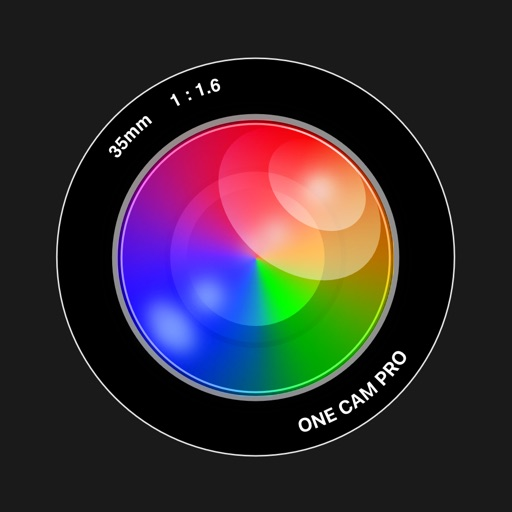

■ 旧OneCamは＜AppStore BEST OF 2018, 2016, 2011 トップApp受賞＞

■ 2011年3月リリースから10年半で68回の無料アップデートを続け、信頼度もNO.1でした！

■ 使いやすさはそのままで、さらに高性能、便利にアップグレードしたのがOneCam 2です。

◉ iPhoneの最高画質で手ぶれ補正も効いて高解像度で撮影

◉ シャッターボタンと明るさバー以外を消して、撮影に集中できる集中モードボタン

◉ 超広角レンズや望遠レンズの固定に対応、倍率ボタンで簡単にレンズを切り替え

◉ iPhone 17 Pro, ProMaxのズーム倍率、７種類 (x0.5, x1, x1.2, x1.5, x2, x4, x8)

◉ ズーム倍率、４種類（x5, x10, x15, x20）設定可能
    iPhone 17 Pro, ProMaxは、４種類（x5, x20, x40, x60）設定可能

◉ マクロ撮影対応機種は超広角レンズでマクロ撮影（接写撮影）可能

◉ 写真の位置情報を削除

◉ カメラ画面の右側の露出（明るさ）スライダーで簡単に明るさを調節

◉ カメラ画面のカラーをお好きな色に設定でカスタマイズ

◉ エフェクト調整、クロップ（切り抜き）や回転、反転など写真を自由に編集

◉ 画面の上下スワイプで写真ビューを表示したり消したりできるクイックプレビュー

◉ 写真の閲覧や削除、EXIFなどの情報も簡単に確認

【機能】 

- 固定式の超広角、広角、望遠レンズ、マクロ撮影（対応機種のみ）

- エフェクト（鮮やかさ、明るさ、コントラスト、色温度、白黒）

（編集画面を長押しすると、オリジナル画像が確認できます）

- 写真編集（切り抜き、回転、反転）

- 手振れ補正と最高画質（劣化無し）

- ファイルの保存サイズが小さくなるHEICフォーマット（対応機種のみ）
 
- カメラ画面を設定でお好きな色にカスタマイズ

- カメラコントロールやボリュームボタンの撮影（自撮り棒などのBluetooth撮影対応）

- アプリのアイコン（6種類）を変更可能

- 本体左側のサイレントスイッチで有音、消音を切り替え

- ホワイトバランス、フォーカス(ロック対応) 、露出(ロック対応)

- デジタルズーム 最大 x20　一部機種 x60（あるところまでは画質が綺麗で変わらない） 

- ジオタグ(位置情報)、ライト、グリッド、写真サイズの表示 

- 写真の位置情報を削除

- カメラロールの閲覧(ズーム、回転対応) 

- 写真の削除

- メターデータやExif, GPS情報の表示 

- Twitterのハッシュタグ

- iPhoneの明るさ調節 

- 日付+時間スタンプ(白、黒、オレンジ、カスタム) 

- セルフタイマー

- 連写（バーストモード）枚数設定可能

■ URL スキーム onecampro://

【写真サイズ】
- 4 : 3、1 : 1、 3 : 2、16 : 9 

- iPhone X 以上の全画面サイズ
- 4Kオーバーサイズ
- 一眼レフ比率 3 : 2
- 工事などの電子納品対応サイズ
- 小さいサイズも選択可能
- セルフィも高解像度

- 4032x3024、3024x3024
- 4032x2688
- 4032x2268
- 4032x1862
- 1600x1200、1200x1200 
- 1280x960
- 1920x1080
- 852x640、640x480、640x640

===注意 ===================== 
- iOS18.6以降が必要です。（OneCamはセキュリティーなどから、常に最新バージョンでお使いください。その為、古いiOSのサポートは早めに打ち切ります）
-  機種によって内容が一部異なります。
- 対応機種  iOSのバージョンに対応した機種。
- iPhone専用アプリの為、iPad, iPodTouchはサポート外です。 
===========================

[View on Apple](https://apps.apple.com/jp/app/onecam-2-%E9%AB%98%E7%94%BB%E8%B3%AA%E3%83%9E%E3%83%8A%E3%83%BC%E3%82%AB%E3%83%A1%E3%83%A9/id1579636154)

## Min Habit - シンプルな習慣管理

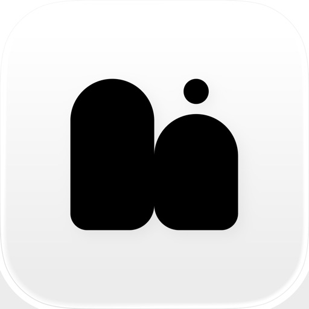

■Min Habit は、毎日を少しずつ整える習慣管理アプリ

・シンプルな習慣管理
習慣を登録して、毎日チェックするだけ
複雑な設定は一切不要

・週・月で振り返り
続けた日が一目でわかる
小さな積み重ねを実感できます

・自分にやさしい設計
続かなかった日も責めない
無理なく続くデザインと操作感

■こんな人におすすめ
・三日坊主になりがちな人
・習慣化アプリが続かなかった人
・シンプルで静かなアプリが好きな人
・毎日を少しずつ良くしたい人

利用規約：https://lead-cayenne-7c2.notion.site/Min-Habit-2ec6ed4e15a480a5b66cc6b1d56fd028?source=copy_link

[View on Apple](https://apps.apple.com/jp/app/min-habit-%E3%82%B7%E3%83%B3%E3%83%97%E3%83%AB%E3%81%AA%E7%BF%92%E6%85%A3%E7%AE%A1%E7%90%86/id6757673148)

## Fog of World

With Fog of World, you relive those destinations and the path that lead you there. Map it; draw each stride out for you to see. Look at the work of art you’ve created - just by traveling. By knowing you cannot be contained.

Join Us. Embrace a unique way of experiencing your adventures! Explore, visit and memorize your travels on the world map. Unfog the world and make your life more brilliant today!

● VISUALIZE & MEMORIZE EVERYWHERE YOU’VE BEEN

Fog of World is a real-life, travel and exploring game where you need to remove the fog on the map by exploring the world. It's a fantastic way to visualize everywhere you have been in your entire life or to discover places around you!

● EXQUISITE MAPPING 

Beautiful world maps are available at a glance. Explore the places near your location, find the spot to go and hit record. Your trip is then recorded, mapped and kept on your cloud storage forever. Start the travel explore the game, while memorizing the places you visit in a neat way. Grow your level and increase your visit percentages for every continent. Have fun exploring the world!

● CRITICALLY ACCLAIMED

• Featured by Apple as App of the Day in 137 countries
• This Fog of World App Might Be the Funniest App I’ve Seen in a Long Time - GIZMODO
• We don't remember the last time we've run into an app that is as interesting as Fog of World - Business Insider
• Fog of World turns moving through your city and your world into a game of exploration - AppStorm
• Original worldwide location tracking game that will make you want to explore every street in your city and far wider - LITTLE APP REVIEW
• Fog of World uses the fog of war from video games to gamify traveling - The Awesomer
• Was holding the 1st position for top stories on Hacker News!

● FEATURES

• Records your tracks and maps travel (even when the app running in the background).
• Shows everywhere you have been on the map at the same time with its advanced trip and travel mapping.
• Analyses your statistics around the world, around every continent, and around every country and territory.
• Lots of badges to motivate you to explore more around the world.
• Support for multiple databases and securing data with snapshots for various tracking purposes.
• Support for Importing tracks through GPX or KML files.
• Support for syncing your data with iCloud, Dropbox and OneDrive.
• Super high-accuracy offline reverse geocoding database that provides the most accurate statistics.
• Support for Siri shortcuts and personalized Siri phrases.

● PRIVACY POLICY

In short, we do not collect any of your exploration data. Your data will be uploaded when you sync them with your cloud storages, but only you have access to them. We don't.

● Why Fog of World?

• Fog of World is the first app that brings the fog of war idea into the real world map back in 2012 and provides free updates since then.
• Fog of World remains the best app to render the fog overlay and is the only app that shows you high-resolution tracks. Don't believe it? Download the copycat apps and compare the results with Fog of World screenshots.
• There is no user account of Fog of World. All of your data are saved in your device. You have 100% privacy.
• The database is designed to use as little storage as possible while providing high performance.
• Fog of World is the only app that truly works around the world since China uses the GCJ-02 coordinate system due to political reasons. Other copycats either work correctly in China or the rest of the world, but not both.

Map your trips, memorize and start your world adventure with Fog of World. It’s like having world atlas and yourself to explore and conquer it.

Download the ultimate explore game and places I've been travel tracker now!

Like us on Facebook:
https://www.facebook.com/OllixIO/

Follow us on Twitter:
https://twitter.com/OllixIO

Note:
Continued use of GPS running in the background can dramatically decrease battery life.

[View on Apple](https://apps.apple.com/jp/app/%E4%B8%96%E7%95%8C%E3%81%AE%E9%9C%A7-fog-of-world/id505367096)

## 社会福祉士 過去問(完全版)

最新の問題と解説を掲載！社会福祉士の過去問をアプリ化。過去問検索やマイリスト機能。ランダム10問テストなど、国家試験を受験した時に、あったら良かったと思う機能を搭載しています。

広告がなく、快適に学習することができます。成績やリストについては、無料版からの引き継ぎが可能となっています。
通常広告は非表示ですが、AI機能については外部連携コストが発生するため、本機能に限りチケット制を導入し、広告表示があります。
持続可能なサービス運営のため、ご理解いただけますと幸いです。

公式サイト
https://kakomonblog.com

利用規約
https://kakomonblog.com/kiyaku

[View on Apple](https://apps.apple.com/jp/app/%E7%A4%BE%E4%BC%9A%E7%A6%8F%E7%A5%89%E5%A3%AB-%E9%81%8E%E5%8E%BB%E5%95%8F-%E5%AE%8C%E5%85%A8%E7%89%88/id1583706435)

## Photograph+ - 48 MP 高画質 マナーカメラ

◉ 高画質な写真撮影・ビデオ撮影から写真編集まで、Photograph+ 2 一つで完結
・48 MP / 24 MP 高解像度で美しい写真撮影
・フロントカメラの 18 MP 写真撮影に対応
・4K ビデオ / シネマティックビデオ / スローモーションビデオ対応
・Apple ProRAW / Apple ProRes Log 対応の本格撮影
・ロック画面状態からカメラコントロールですばやく起動
・シネマティック手ぶれ補正で、手持ちでも滑らかな映像を実現
・高速連写と快適な撮影レスポンス
・撮影・編集・管理までこれ1つで完結

● Photograph+ 2 について
Photograph+ 2 は、撮影と写真編集を1つにまとめたシンプルで使いやすいカメラアプリです。
最新の iOS テクノロジーにより、iPhone のカメラ性能を最大限に引き出し、高画質な写真撮影から 4K ビデオ撮影、本格的な写真編集までシームレスに行えます。
累計 46 万ダウンロードを突破した「Photograph+」をベースに全面リニューアル。
バックカメラの 48 MP / 24 MP 写真撮影、フロントカメラの 18 MP 写真撮影に加え、Apple ProRAW や Apple ProRes Log にも対応し、初心者から上級者まで幅広い撮影スタイルに対応します。
さらに、フィルターや色調補正などの編集機能に加え、EXIF 対応の写真管理機能も搭載。
撮影から編集、管理までを一貫して行える、快適な写真体験を提供します。
ぜひ、Photograph+ 2 の使いやすさと快適な撮影体験をご体験ください。

● 主な機能

- 撮影機能

  写真
  ・バックカメラの 48 MP / 24 MP 高解像度撮影
  ・フロントカメラの 18 MP 高解像度撮影
  ・Live Photos
  ・Apple ProRAW
  ・アスペクト比（1:1 / 3:4 / 2:3 / 9:16）
  ・高速レスポンス画像処理
  ・Deep Fusion（ディープフュージョン）
  ・低解像度撮影（0.1 MP - 6 MP）
  ・日付スタンプ
  ・QR コードスキャン

  ビデオ
  ・4K ビデオ撮影
  ・解像度選択（HD / FHD）
  ・フレームレート選択（60 / 30 fps）
  ・手ぶれ補正（スタンダード / シネマティック）
  ・Apple ProRes Log
  ・シネマティックビデオ
  ・スローモーションビデオ
  ・クイックビデオ撮影

- 撮影補助機能
  ・ヒストグラム
  ・グリッド / 水平器
  ・タイマー / インターバル
  ・フラッシュ / トーチ
  ・AirPods リモートシャッター
  ・Bluetooth リモコンシャッター
  ・メタデータ編集

- 写真編集機能
  ・明るさ / コントラスト / 色温度 / 鮮やかさ
  ・ハイライト / シャドー / 周辺光量
  ・ブラー
  ・フィルムカメラ風エフェクト
  ・フィルター（40 種）
  ・ライトリーク（30 種）
  ・肌補正

- 写真ギャラリー
  ・EXIF 閲覧・編集
  ・自動編集
  ・リサイズ / 回転 / 複製

- ウィジェット
  ・ホーム画面 / ロック画面 / コントロール ウィジェット
  ・ライブアクティビティ

- ショートカット操作
  ・ロック画面のカメラコントロールからのクイック起動
  ・Siri ショートカット
  ・クイックアクション
  ・アクションボタン

● ご注意
※以下の機能はアプリ内購入が必要です。
・48 MP / 24 MP 写真撮影
・4K / 60 fps ビデオ撮影
・シネマティック手ぶれ補正
・シネマティックビデオ撮影
・Apple ProRes Log 撮影
・スローモーション撮影
・写真の一括自動編集 / 回転 / リサイズ

※Apple ProRes Log を 4K / 60 fps で撮影する場合、書き込み速度 220 MB / 秒以上・最大消費電力 4.5 W に対応した、iOS デバイス向け外付けストレージが必要です。
※バックカメラの 48 MP 写真撮影は、iPhone 14 Pro 以降のナンバリングシリーズで利用可能です。
※48 MP 撮影に対応しているカメラレンズは、機種によって異なります。
※フロントカメラの 18 MP 写真撮影は、iPhone 17 シリーズで利用可能です。

Photograph+ 2 は継続的なアップデートにより、最新の iOS 技術への対応と安定性の向上に努めています。
ご要望・不具合は、アプリ内［フィードバック］よりご連絡ください。
いただいた内容は、チームに共有されます。

お問い合わせ: contact.dev.n.m@gmail.com

[View on Apple](https://apps.apple.com/jp/app/photograph-48-mp-%E9%AB%98%E7%94%BB%E8%B3%AA-%E3%83%9E%E3%83%8A%E3%83%BC%E3%82%AB%E3%83%A1%E3%83%A9/id1028791881)

## 旅行英会話 - Help me Travel

Hey guys! バイリンガールのちかです！
私はYouTubeで「バイリンガール英会話」というチャンネルを通して楽しく英語に触れられる動画を配信しています。

海外旅行で英語で話す時って「なんて言えばよいのか？」「発音合ってるかな…」など、ドキドキしますよね。そんな時に、テキストと音声で英語のフレーズを確認できるのが、このアプリ。

空港やホテル、レストランなど11つのシチュエーションごとに分類して、1000個以上の英会話フレーズを紹介しています！音声は、私・吉田ちかのの声で収録しているので、YouTubeで馴染みのある声で聴くことができてちょっと安心？！
音声は3段階のスピードで聴くことができます。ちなみに、機械的に3段階にしているのではなく、私が「Slow」「Normal」「Fast」をそれぞれ実際に言って録音しています。

音声はオフラインでも聴くことができるので、Wi-Fiなどの環境がなくても大丈夫！海外に行って使いたいのにWi-Fiがないからいざという時に使えない！なんてことはありません。
さらに、シチュエーションごとによくある会話のセリフを動画で確認ができるようにしています。
リアルな会話が繰り広げられる「バイリンガール英会話」の動画もその場で視聴できるので、海外にいなくてもその雰囲気を味わいながら、フレーズを練習できます。

また多くリクエストいただいたフレーズの聞き流し機能も加わったので、連続でフレーズを聞くことができます。

さらに他の言い回しや海外旅行のTipsなどを知ることが書籍「HELP me TRAVEL 旅が100倍楽しくなる英会話」（実業之日本社）も発売中です。こちらの本では、フレーズに加えて、私が今まで体験してきたリアルな会話、そして旅のTipsなどをシェアしています。

このアプリと書籍によって、皆さんが海外旅行に行った時、『勇気を出して話してみたら通じた！』『事前に知っていたから相手の言っていることが分かった！』など、素敵な思い出を作ることが出来たら私も嬉しいです！

海外に行く予定がある方はもちろんのこと、海外に行って英語でコミュニケーションをとってみたい！と思う方は、ぜひ利用してみて下さい！

[View on Apple](https://apps.apple.com/jp/app/%E6%97%85%E8%A1%8C%E8%8B%B1%E4%BC%9A%E8%A9%B1-help-me-travel/id1432582444)

## WorkOutDoors

WorkOutDoors is the most advanced and most configurable workout app for the Apple Watch. It's perfect for running, cycling, hiking and any other indoor or outdoor activity.

Note: WorkOutDoors requires an Apple Watch Series 4 or later. It is not necessary to have your iPhone with you during a workout.

The app uses Apple’s workout system, so all workouts are saved to the Health system.  However it also provides many extra features over Apple's app, such as:

- a super-smooth vector map that can be shown during a workout;
- multiple configurable screens with metrics and graphs from a pool of 800+ data fields;
- route files can be imported and used for navigation (including turn by turn directions);
- dozens of configurable alerts (e.g. every mile; high heart rate; low pace; off-route etc);
- interval schedules can be created using the larger screen of the phone app;
- climbs and descents are supported with notifications and on-screen data and graphs;
- waypoints can be created, navigated to, and exported;
- use shortcuts to associate operations with gestures (e.g. double tap to hear configurable metrics);
- compare pace against a target or a previous workout (using metrics and a dot on the map);
- show zones for pace and power as well as heart rate (with optional coloured backgrounds);
- auto-pause is available for all outdoor activities;
- shows GPS and heart rate before starting a workout, so that you can wait for good signals;
- configure distance and pace for running / walking to come from Apple’s pedometer or from GPS;
- workouts can be exported in FIT / TCX / GPX files, or automatically sent to Strava;
- workouts created by the app can be analysed in great depth in the iPhone app.

The app also has many more features.  The map is a particular highlight.  It uses OpenStreetMap, which provides worldwide coverage and includes the trails necessary for outdoor workouts.  It also has several features that help you navigate during a workout:

- maps can be smoothly panned and zoomed, and can rotate according to the compass;
- a breadcrumb trail of your whole route is displayed on the map during the workout;
- topographic data can be shown, with configurable contour colours and hill shading;
- map-only mode is provided for when you don't want to start a workout and just need a map;
- a circular scale is shown when you zoom, making it easy to see the distance to features;
- maps can be stored on the watch for use when offline (they are downloaded as required if online);
- a red compass points north and a green compass points to the start;
- choose a waypoint to see a compass and distance to it in the corner of the map;
- you can also navigate to waypoints on the map, such as hospitals, sights, cafes etc.

If you load a route from a GPX / TCX / FIT file then navigation is even easier:

- your position is shown on an elevation profile of the route;
- the remaining distance, time and ascent can also be displayed;
- you can get alerted when you go off-route; 
- when off-route then a compass is shown which points to the nearest part of the route;
- if the route contains turn by turn directions then these can be used like a sat nav;
- if there are no directions then the app can use “bend detection” to generate them;
- the next direction is shown as an icon and distance in the corner of the map;
- the map can automatically zoom in when you are approaching a turn;
- you can use shake gestures to hear the distance to the next turn or the end of the route;
- routes are coloured by gradient: from red for steep uphill to blue for steep downhill;
- you can configure what information is displayed during a climb or descent.

All this is included for a single one-off payment. No extra in-app purchases or subscriptions are required (although there is a completely optional in-app tip jar which was requested by long-term users). 

If you own an Apple Watch and do any form of exercise, then WorkOutDoors is the app for you. Give it a go!

[View on Apple](https://apps.apple.com/jp/app/workoutdoors/id1241909999)

## オフトレカメラ

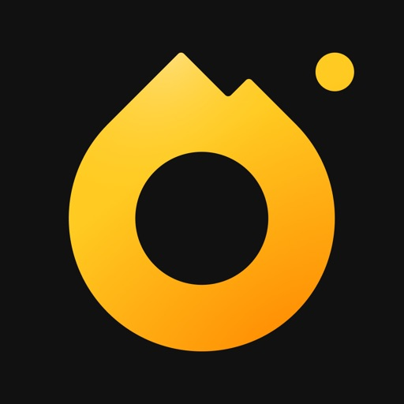

オフトレカメラは、スキー・スノーボードのハイクアップやトレーニングの動画撮影に特化したタイマー機能付きカメラアプリです。
指定した秒数が経過後、自動で録画を停止します。録画後は省電力モードに移行し、長時間の録画や充電の切れやすい寒い環境でもバッテリーを節約することができます。

さらに、リプレイ機能を使って直前に録画した動画をすぐに確認できます。録画後に自動でリプレイすることも可能です。

その他にもこんな機能があります
- 録画開始を遅らせる
- 多眼カメラを用いた録画
- 画質/フレームレートの変更
- スロー録画
- インカメ撮影
- 使用中にスリープしない（設定でオフにできます）
- 画面タップ/音量ボタンで録画開始

スキーヤー・スノーボーダーの方からの要望や意見お待ちしております。是非レビューにお書きください！

[View on Apple](https://apps.apple.com/jp/app/%E3%82%AA%E3%83%95%E3%83%88%E3%83%AC%E3%82%AB%E3%83%A1%E3%83%A9/id1566817391)

## ゴルフスコアカウンター - スマートなゴルフカウンター

AppleWatch でゴルフプレー中にスコアをリアルタイムに記録できるアプリです！
打点記録も同時に行えるので、飛距離も自然と計測することができます！
※ 本アプリは WatchOS7 以上対応のAppleWatch/WatchOSが必要です。

ゴルフのプレイ中に自分が何打目かを覚えておくのをつい忘れてしまいがちですよね？
「ゴルフスコアカウンター」は  AppleWatch をつかって、プレイ中にスコアをかんたん・スマートに記録することができるアプリです！

◎パットも記録◎
スコアに加えてパットも記録することができます。
シンプルにスコアだけの記録を行うこともできます。設定画面で設定することができます。 

◎ヘルスケアと連携(プレー中の常時起動機能)◎
AppleWatch でスコアの記録を開始すると、アクティビティが記録されます。
これによって、あなたがゴルフプレイ中にすぐにカウントを記録することができ、ラウンド終了時に ヘルスケア に消費カロリーを記録することができます！
(ヘルスケアと連携しないAppleWatch Series4以前のアプリですと、AppleWatchのアプリ作成の制約上、通常の時計画面に戻ってしまいますが、本アプリはヘルスケアと連携しておりますため、常にアプリがフロントで動作し、すぐにスコアを記録することができます。)
WatchOS5 以前だとiOS端末、 WatchOS 6 以降ですとAppleWatch 端末上に、ヘルスケアの使用許可を求められます。ぜひ使用許可を on にしてお楽しみください。

◎位置記録機能◎
位置記録機能は、GPS を利用してスコアをカウントした位置情報を iOS デバイスに記録する機能です。
各マーカー間の距離を表示するので、自分が何ヤード飛ばしたかを記録することができます。
パットのマーカーは小さく表示されます！またマーカーをドラッグアンドドロップすることで位置を修正できるようになりました！
(マーカーの位置修正はアップルウォッチによるスコア記録がすべて完了していないと正しく修正されません。予めご了承くださいませ。)
iOSデバイスの詳細画面を表示してお楽しみください。
位置記録機能については、 GPSを利用するので 電池の消耗が早くなることが予想されますが、位置記録 オプションの機能になっていますので一番最初のホール選択画面から右スワイプすると表示される設定画面で、使用するかどうかを選択してからホールを選択してくださいませ。
AppleWatch のGPSの代わりにiOSのGPSをご利用できるようになりました(v20.0~)。本設定を利用するには iOS アプリでの設定、 WatchOS アプリでの設定の両方が必要です。
詳しくはiOSの本アプリの iOS GPS Setting をご参照ください。

◎同伴者スコア記録機能◎
ついに watch だけですべて完結できる日が来ました。
同伴者スコアも簡単&便利に記録することができます！(v35.0~)

◎一時停止・再開機能◎
ゴルフの最中に、ランチを食べることはありますよね？
ワークアウトを開始後に、カロリー記録・GPS位置情報のバッテリーを抑えるために一時停止しておくことができるようになりました。
カウント画面で下にスクロールすると一時停止ボタンがありますので、そちらをタップしてください。
もとに戻すためには、モーダルで表示された画面の再生ボタンを押すことでもとに戻すことができます。
(この機能を利用しているときは、ヘルスケアのアクティビティも停止します。)

◎デジタルクラウンでカウント◎
AppleWatch のデジタルクラウンを回すことでもカウントすることができます！
こちらも設定で on/off を設定することができます。

◎全集中モード◎
プレー中、AppleWatch 上にトータルスコアが表示されますが、それによって自分のゴルフプレイの妨げになってしまうこともあります。
そんなあなたに、全集中モード。トータルスコアが表示されなくなるので、そのホールに全集中できます。

◎ギア・ペナ記録機能◎
スコアカウント時に、ギアやペナルティを記録することができます。 (v28.0~)
たとえば、ギアだと、利用したギアを 1:1W, 2:3I, 3: PT などと記録することができます。
ペナルティの場合は、1:OB、2:OB、3:、4:BK 等...を記録することができます。

1. iOSのアプリで、ギア・ペナ設定で、ギア・ペナルティを設定します。利用したい選択肢は3文字以内で自由に設定することができます。
2. 次に WatchOS のアプリを起動して、一番最初の画面から右に二回スワイプして、ギアペナ設定を表示します。
3. ギアペナ設定で下の方にスクロールすると、iOS の設定をロードするボタンがあります。iOS で登録したデータが Loaded Data に反映されていれば準備OK。
4. ギアペナ設定の上の方にある、ギアを利用を ON または ペナを利用を ON してください。
5. 最初の画面から記録を開始すると、カウント後にモーダルが表示され、設定したギア・ペナを選択することができるようになります。
また、ギア・ペナはスコアの下、一時停止ボタンの上に表示されているので、そこで再度モーダルを表示して変更することができます。

◎コンプリケーション◎
AppleWatch 上の待ち受け画面から すぐに ゴルフスコアカウンターを開けるようにコンプリケーションにも対応しています。
iOS のウォッチアプリの文字盤ギャラリー -> お好きな文字盤を選択 -> コンプリケーション の選択から 「カウンター」を探してみてください。
対応しているコンプリケーションは以下のとおりです。
- CircularSmall
- ExtraLarge
- GraphicCircular
- ModularSmall
- UtilitarianLarge
- UtilitarianSmall
- UtilitarianSmallFlat

◎ゴルフ場名・コースPAR・プレイ日時・メモ編集◎
ゴルフ場名、PAR、プレイ日時、メモを編集することができます。
また、プレーの履歴から、ゴルフ場名とPAR のデータを同時にコピーする機能もできました(v11.0~)。

◎ダークモードにも対応◎
寝る前や暗いところでスコアの振り返りをしても目が痛くならない！

◎バックアップ機能◎
もしものときのために、クラウドにデータを保存しておくことができます。
id/passwordは自動で発行されますので、それを控えておくことで機種変更にも対応！

◎こんな人におすすめです◎
 - ゴルフのプレイ中にスコアを記録したい
 - ゴルフのプレイ中に iPhone を取り出すのは面倒
 - 自分の飛距離を記録しておきたい
 - AppleWatch の使いみちがあまりない

(本アプリは iPhone アプリのみではご利用になれません。AppleWatch が必要です。予めご了承くださいませ。)

◎バッテリー消費テスト◎
当方の動作確認(AppleWatch Series4)では 打点位置記録機能 + ホール切替時のスコア反映オプションを利用して 7時間起動しっぱなしで 残り10% 程度となりました。
v20.0 で実装された iOS のGPSを利用する設定で試した場合、10時間以上の利用が確認できました。
※ GPS を利用しない場合はさらにバッテリーの消費を抑えることができます。

◎うまく動作しない場合◎
- 本アプリは AppleWatch Series3 以降の AppleWatch が必要です。
- iPhoneにダウンロードできたけど AppleWatch にアプリが表示されない場合は、iPhone や AppleWatch を再起動すると治ったという報告や、アプリを再インストールしたら治ったという報告をいただきましたので、その場合はお試しくださいませ。
- ゴルフスコアカウンターは WatchOS 7 以上で利用が可能です。AppleWatch Series2 などでは動作しません。
- iOS 上でアプリをダウンロードしても watch 上に反映されない場合がたまにあるという問題が報告されています。もし Watch 上に表示されない場合、 Watch上で AppStore アプリを起動して、「ゴルフスコアカウンター」と 音声入力して検索し、クラウドのマークからダウンロードしていただければ正常に動作できると考えています。お試しください。
- うまく動作しない場合、レビューに書く前に、一度iPhoneアプリからメールにてお問い合わせいただけるとありがたいです。そうしていただけるとより早く、より詳細に回答してユーザ様の不具合を解消することができます。何卒よろしくお願いいたします。

[View on Apple](https://apps.apple.com/jp/app/%E3%82%B4%E3%83%AB%E3%83%95%E3%82%B9%E3%82%B3%E3%82%A2%E3%82%AB%E3%82%A6%E3%83%B3%E3%82%BF%E3%83%BC-%E3%82%B9%E3%83%9E%E3%83%BC%E3%83%88%E3%81%AA%E3%82%B4%E3%83%AB%E3%83%95%E3%82%AB%E3%82%A6%E3%83%B3%E3%82%BF%E3%83%BC/id1453327924)

## Tampermonkey

Tampermonkey 是一款广受欢迎的浏览器扩展，兼容所有主流浏览器。
它允许您使用用户脚本——添加或修改功能的小型 JavaScript 程序——来自定义和增强网页。
使用 Tampermonkey，您可以轻松地在任何网站上创建、管理和运行这些脚本。

[View on Apple](https://apps.apple.com/jp/app/tampermonkey/id6738342400)

## 精神保健福祉士 過去問（完全版)

最新の問題と解説を掲載！精神保健福祉士の過去問をアプリ化。過去問検索やマイリスト機能。ランダム10問テストなど、国家試験を受験した時に、あったら良かったと思う機能を搭載しています。

広告がなく、快適に学習することができます。成績やリストについては、無料版からの引き継ぎが可能となっています。
通常広告は非表示ですが、AI機能については外部連携コストが発生するため、本機能に限りチケット制を導入し、広告表示があります。
持続可能なサービス運営のため、ご理解いただけますと幸いです。

公式サイト
https://kakomonblog.com

利用規約
https://kakomonblog.com/kiyaku

[View on Apple](https://apps.apple.com/jp/app/%E7%B2%BE%E7%A5%9E%E4%BF%9D%E5%81%A5%E7%A6%8F%E7%A5%89%E5%A3%AB-%E9%81%8E%E5%8E%BB%E5%95%8F-%E5%AE%8C%E5%85%A8%E7%89%88/id1660711912)

## GAB対策 言語

【アプリの説明】
本アプリでは、お手持ちのスマートフォン・タブレットでお手軽に本格的なGAB言語の対策を行えます。 

【アプリの特徴】
特徴１：本番に近いテスト環境
 GABテストにも登場するプログレスバーを再現し、一目でテスト回答ペースを把握することができます。加えて質の高い問題を用意しているため、より本番に近いテスト環境で勉強をすることができます。 

特徴２：豊富な問題数
 本アプリでは、GABの長文読解問題について合計156問収録しています(39個の文章、一文章に4個の設問) 。

特徴３：サポート機能の充実 

・一文演習機能
　 - 本番形式で本格的に対策するモードだけでなく、手軽に一文章で演習するモードも用意しています。

・文字サイズの調整
　 - 文章の文字を読みやすいサイズにご調整いただけます。 

・解いた問題を保存して復習できるノート機能
　 - 間違えた問題を保存して復習する、といったことが可能です。（最大30問保存可能） 

・テスト制限時間のON/OFF
　 - 時間制限を意識せずに、時間を掛けて問題を解くこともできます。 

・5種類のカラーテーマを用意
　 - 夜間の勉強時はナイトモードにするなど、お好みのテーマを選択可能です。 

【プライバシーポリシー】
　https://www.moakly.com/privacypolicy 

【利用規約】
　https://www.moakly.com/terms

[View on Apple](https://apps.apple.com/jp/app/gab%E5%AF%BE%E7%AD%96-%E8%A8%80%E8%AA%9E/id1507281523)

## 英検®1級 でた単

2026年6月実施分(2026年度第1回)の最新データを追加しました。
最高のデータで英検1級合格へ
語彙問題を全問正解できる圧倒的的中率*
新形式22問
2026年6月 22問正解(全問正解)
2026年1月 22問正解(全問正解)
2025年10月 21問正解(1ミス96%)
2025年6月 22問正解(全問正解)
2025年6月 22問正解(全問正解)
2025年1月 22問正解(全問正解)
2024年10月 21問正解(準1アプリを1問含む)
2024年6月 21問正解(1ミス96%)

全25問の旧形式
2024年1月 25問正解
2023年10月 25問正解
2023年1月 25問正解 (準1アプリを1問含む)
2022年10月 25問正解
2022年6月 25問正解
2022年1月 25問正解
2021年6月 25問正解
2021年1月 25問正解
2020年1月 25問正解
2020年6月 25問正解
実施分の理論値(消去法を含む)

英検®１級・語彙問題のために選出した単語・熟語を「5890単語」収容しています。単語データは現在も追加中です。
ステージ1: 1500単語
ステージ2: 1509単語
ステージ3: 1275単語
ステージ4: 1606単語
ステージ5: 1159単語(年度別再掲載)
合計: 5890単語
研究の結果、英検の語彙問題は過去問から多く出題されていることを証明し、最高の単語リストの作成に成功しました。優先的にステージ1の範囲を学習することで効率よく合格点へ近づくことができます。

本試験での出題回数、正解になった回数などもアプリ内で確認できます。
 
＜現在カバーしている英検1級の過去問95回分＞
1989年第1, 2回
1990年第1, 2回
1991年第1, 2回
1992年第1, 2回
1993年第1, 2回
1994年第1, 2回
1995年第1, 2回
1996年第1, 2回
1997年第1, 2回
1998年第1, 2回
1999年第1, 2回
2000年第1, 2回
2001年第1, 2, 3回
2002年第1, 2, 3回
2003年第1, 2, 3回
2004年第1, 2, 3回
2005年第1, 2, 3回
2006年第1, 2, 3回
2007年第1, 2, 3回
2008年第1, 2, 3回
2009年第1, 2, 3回
2010年第1, 2, 3回
2011年第1, 2, 3回
2012年第1, 2, 3回
2013年第1, 2, 3回
2014年第1, 2, 3回
2015年第1, 2, 3回
2016年第1, 2, 3回
2017年第1, 2, 3回
2018年第1, 2, 3回
2019年第1, 2, 3回
2020年第1, 2, 3回
2021年第1, 2, 3回
2022年第1, 2, 3回
2023年第1, 2, 3回
2024年第1, 2, 3回
2025年第1, 2回
*アップデートを続け、最新のデータを収録していきます。
*すべての単語に音声追加予定です。
 
このアプリでは単語が品詞別にカテゴリー分けされており、過去の英検での正解になった回数、出題頻度の高い順にリストアップされています（正解数と頻度が同じ単語の順番はランダムです）。
日本語訳は正解になった意味を採用。そのほかは複数の辞書が第一の意味としているものを採用しました。
 
アプリ内の練習とテストを繰り返し、ユーザーが自由に振り分けられる単語帳で苦手単語を復習できます。

＜練習＞
練習したいカテゴリー（例：形容詞A）を選択すると、設定画面が現れます。
自由に設定し、「練習スタート」を押してください。
 
＜単語テスト15問＞
左下「テスト15問」では、該当カテゴリー内の単語がランダムに15問出題されます。
出題間隔や出題順は英単語を記憶しやすいように最適化されていきます。
15問すべて答え終わると、タイムとスコアの結果が出ます。
素早く正解できると高いポイントを獲得でき、グラフで履歴が残ります。
テストで出題された15問は一覧となって表示されますので、復習に便利です。
 
＜単語帳機能＞
「日本語訳」のセル右上をタップするとチェックされ、チェックした単語を「単語帳」に登録できます。
チェックし、画面右下に出てくる「単語帳を選ぶ」をタップしてください。
単語帳は7つ用意されています。苦手単語のオリジナル・単語帳を作ることができます。

＜自動再生＞
単語帳や単語一覧のページでは英単語を自動再生することができます。

＜アプリ内検索＞
検索ページでは単語や意味、発音記号から検索することができます。検索した単語から品詞別リストへ移動できます。

＜タイピング＞
英単語のタイピングの練習ができます。資格試験のパソコン受験でのライティングを意識してキーボード入力の練習用に実装しました。

＊開発・作成
Namiko Takahashi
1級合格18回(以上、記録確認分)
2018年頃 合計2916
英検1級取得(1次試験2273/2550 G1 +10、2次試験643/850 G1 +2)
英検1級ライティング満点850/850
2023年第2回 合計2937
英検1級取得(1次試験2313/2550 G1 +11、 2次試験624/850 G1 +1)
TOEIC L&R 満点(新形式990点、旧形式990点)
元 大手コンサルタント会社、有名英語教育出版社勤務

＊英語音声
Patricia D. （ワシントン大学卒）

＊アプリ内の効果音
フリー効果音素材 くらげ工匠
http://www.kurage-kosho.info/

効果音素材 :ポケットサウンド Pocket Sound
https://pocket-se.info/

英検®は、公益財団法人 日本英語検定協会の登録商標です。
このコンテンツは、公益財団法人 日本英語検定協会の承認や推奨、その他の検討を受けたものではありません。

「英検」商標使用に関するガイドライン
https://www.eiken.or.jp/trademark/

iOS版 Privacy Policy
https://ameblo.jp/detatan2018/entry-12791082133.html

利用規約 (EULA、Apple標準) LICENSED APPLICATION END USER LICENSE AGREEMENT
https://ameblo.jp/detatan2018/entry-12791083188.html

[View on Apple](https://apps.apple.com/jp/app/%E8%8B%B1%E6%A4%9C-1%E7%B4%9A-%E3%81%A7%E3%81%9F%E5%8D%98/id1349212601)

## 有機化学

有機化合物の範囲を1602問。主要大学の過去問と最新の入試問題をもとに作成されています。入試に必要な知識を網羅しています。（*教科書を逸脱しない範囲とする）

以下のように入試問題をもとに問題を作っていきました。

東北大学 2016年 前期（他、東大など多数）
ポリビニルアルコールそのものが不安定で、構造異性体である[　ア　]にすぐに変化するためである。[　ア　]は、硫酸水銀(II)を触媒として[　イ　]に水を付加させることによって得ることができる。
[　ア　] アセトアルデヒド
[　イ　] アセチレン

アプリ内の問題（問題と正解のみ抜粋）
Q. アセチレンに触媒を用いて水を付加させると[____]が生じる。(中間体を含めない)。
A.アセトアルデヒド。中間体にビニルアルコールがありますが、直ちにアセトアルデヒドへ変化します。
Q.[____]に触媒を用いて水を付加させるとアセトアルデヒドが生じる
A. アセチレン

東北大学 2016年 前期
アニリンの希塩酸溶液を5℃以下に冷やしながら、[　ウ　]の水溶液を加えると、[　エ　]が生じる。この塩を酸性水溶液中で加熱すると、気体[　オ　]を発生しながら分解し、化合物Eが生じる。
[　ウ　] 亜硝酸ナトリウム NaNO₂
[　エ　] 塩化ベンゼンジアゾニウム C₆H₅-N₂Cl
[　オ　] 窒素 N₂
[化合物E] フェノール C₆H₅-OH

アプリ内の問題（問題と正解のみ抜粋）
Q. アニリンを希塩酸に溶かしたものに、5℃以下に冷却しながら加えると塩化ベンゼンジアゾニウムを生成する物質を選べ。A. 亜硝酸ナトリウム水溶液 
Q. 亜硝酸ナトリウムの化学式を選べ。A. NaNO₂
Q. アニリンを希塩酸に溶かし、5℃以下に冷却しながら、亜硝酸ナトリウム水溶液を加えると生成する物質を選べ。A. 塩化ベンゼンジアゾニウム（水溶液）
Q. 塩化ベンゼンジアゾニウム（水溶液）は5℃以上になると何になるか。A. 窒素とフェノールと塩酸 

（関連する次のような問題も収録されています）
Q. アニリンから塩化ベンゼンジアゾニウムを生成するときの条件として適切なものを選べ。A. 5℃以下に冷却
Q. アニリンから塩化ベンゼンジアゾニウムを生成するときの反応を何というか。A. ジアゾ化

主要大学の問題をもとに作問し、難問を見越して教科書範囲をできるだけ取り入れています。
おさえるべき重要ポイントを分割し、複数の角度から問題を作成しています。

（入試問題やアプリの問題をツイッターより発信しています。@kagaku_y_test を是非フォローしてください）

■抽出したデータ（入試問題を解きながら調べました）
東大37年分（東京大学）
京大32年分（京都大学）
東工大20年分以上（東京工業大学）
阪大20年分（大阪大学）
名大10年分（名古屋大学）
早稲田·慶応の理工系学部7年分
国立医科大学の入試問題20回程度
全国国立化学入試問題2年分(約100回分2016～2017)
共通テスト、センター試験1990～2024 年（本試験、追試験全て）
化学、化学基礎の教科書（啓林館、数研出版、東京書籍など）（現行課程に合わせるため）

*2024年も追加中です。

配列は教科書と比較してできるだけ合わせてみました。授業に合わせた日常学習にも使えます。（*教科書によって項目の並び順が違う部分があります。）
一部の教科書にのみ記されている用語もできるだけ入れました。教科書の用語もほぼ網羅しています。
入試に頻出ではありませんが、教科書に取り上げられているノーベル賞受賞者（もしくは候補者）の名前を答えさせる問題も入れてみました。
*ノーベル賞や法則の発見順序を問う問題が早稲田大学で出題されました。

Q. キラル触媒による不斉合成（不斉水素化）の研究で、2001年にノーベル化学賞を受賞した人物は誰か。A. 野依良治
Q. サルバルサンを開発し、1911年にノーベル化学賞と1912年·1913年にノーベル生理学·医学賞の候補に挙がった人物を選べ。A. 秦佐八郎

記憶や理解の助けになるよう必要に応じて言葉の定義を確認する問題を直前や直後に再度配列しています。
正解を導くためのヒントとなる知識、重要項目を覚えるヒントとなる知識も問題化しています。

○主な使い方
基本的には問題を解きながら覚えます。

■確認テスト
左右のスワイプで次の問題、前の問題が表示できます。タップで次の問題へ進めます。正解まで選択肢を選び、選択肢のタップで次の問題へ進みます。正解せずともスワイプで次へ進むこともできます。確認テストでは落ち着いて覚えながら進められるように時間ではなく手動にしてみました。

■テスト15
カテゴリ別（分野別）のミニテストです。
1問20秒の時間制限で解いていき、最後に答え合わせをします。1問につき1回選び、正解不正解は15問終了時、もしくはendボタンで途中終了をすると表示されます。成績がスコア化され、スコアの推移がグラフになり視覚的に見ることができます。テスト15では出題範囲が絞り込まれますので、やり込むことで比較的短期間で高得点を出せるようになります。出題間隔や順序には忘却曲線に近い仕組みを取り入れています。

■リスト
カテゴリ別（分野別）に出題範囲の問題と答えの一覧表を見ることができます。

■スコア
カテゴリ別（分野別）テスト15と診断テスト（25問）の成績表を見ることができます。

■診断テストABCDEF（25問）
テスト15と同じ形式です。診断テストはそのページが出題範囲となっています。出題間隔や順序には忘却曲線に近い仕組みを取り入れています。

■復習リスト
メニューページごとにリストが作られます。間違えた問題を自動的にリストへ追加します

■マイリスト
メニューページごとにリストが作られます。テスト結果後のどの画面からも、Checkボタンで選んでマイリストへ追加することができます。覚えたいものをリストアップし、重点的に覚えることで自分でカスタマイズした弱点補強ができます。

■設定
·昇順 or シャッフル
順序よく出題、シャッフルして出題、から選ぶことができます。
Test 15と診断テスト25問ではシャッフルでの出題のみとなります。

·問題数を10問、20問、ループから選ぶことができます。
テスト15と診断テスト25問ではそれぞれ15問と25問に固定されています。

·選択肢の表示
表示を選択するとカバーなし。隠すを選択するとカバー付きで選択肢がすぐに見えないようにカバーをかけることができます。タップや下スワイプでカバーを消します。
テスト15と診断テスト25問では選択肢は常に表示となります。

·続きから or はじめから
続きからボタンで前回解き終わった続きから始められます。はじめからボタンで1番目に戻ることができます。

·Normal, Blue, Pink, Greenは背景色や文字の色を変えるボタンです。
アプリを使い込むことで利用範囲が広がります。
配色4色にはそれぞれ5パターンを用意しています。メニュー画面もしくは設定画面の右上のベンゼン環マークを押すと5段階に切り替わります。

·復習リストをリセット、マイリストをリセット
押すとリストに入っている項目がゼロになります。

·メールを送る
開発者宛てのメールです。不具合バグ報告、誤植報告、リクエストやご感想など、メールで受け付けています。

·ブログを見る
サポートブログへリンクしています。不具合バグ報告、誤植報告、リクエストやご感想など、コメントへお書きください。

·他のアプリを見る
開発者の他のアプリです。

·開発者のツイッター
入試問題をもとにした一問一答や構造式を覚えるコツなどを発信していきます。ぜひフォローしてください。

メニュー
■有機化合物1
有機化合物の特徴
異性体など
構造式の決定
アルカンの構造
アルカンの性質
アルケン
アルキン

■有機化合物2
アルコール1
アルコールの融点と沸点
アルコールとエーテル
アルコール2
アルコール3
エーテル
アルデヒド1
アルデヒド2
ケトンとヨードホルム反応

■有機化合物3
カルボン酸1
カルボン酸2
カルボン酸無水物
エステル
油脂と洗剤
セッケン
けん化、ヨウ素との反応
けん化価とヨウ素価の計算

■有機化合物4
ベンゼン1
ベンゼン2
ベンゼン3
フェノール
フェノールの製法

■有機化合物5
芳香族カルボン酸
サリチル酸
窒素を含む芳香族1
窒素を含む芳香族2
窒素を含む芳香族3
芳香族化合物の分離

■有機化合物6
食品
医薬品
染料
洗剤

最新の入試問題にも目を通し、新しく必要になるものがあれば追加していきます。

ツイッター
https://twitter.com/kagaku_y_test
ブログ
http://kojimachi.hatenablog.com

効果音は「フリー効果音素材 くらげ工匠」より使用させて頂いております。
http://www.kurage-kosho.info

その他
当アプリは、学校、塾などの教育機関または個人による指導、学習活動などでの利用に連絡などを必要としません。また、SNS、動画サイト、ライブ放送などでの使用も同じく連絡を必要としません。連絡をされたい場合はメールやブログコメントよりお願いします。

[View on Apple](https://apps.apple.com/jp/app/%E6%9C%89%E6%A9%9F%E5%8C%96%E5%AD%A6/id1317601872)

## Sun Surveyor (Sonnenvermesser)

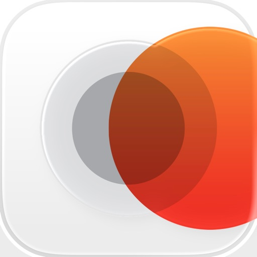

Sun Surveyor sagt die Positionen von Sonne & Mond (Azimut, Höhe, Zeiten) vorher, mit Modulen für Kartenansicht, Kameraansicht (Augmented Reality) und Details (Ephemeris). Sun Surveyor hilft dabei, Standorte für Film und Fotografie zu finden, Solaranlagen zu positionieren, ist nützlich im Gartenbau, beim Immobilienhandel, für geowissenschaftlich Versierte und mehr! Bereiten Sie sich auf jeden Sonnenauf- und untergang vor!

Verwenden Sie interaktive Bedienelemente, um:

- sich auf die „goldene Stunde“ vorzubereiten und diese zu visualisieren

- den richtigen Zeitpunkt im Jahr und Winkel zu finden, um an einem Standort bei Sonnenauf- oder -untergang zu fotografieren oder zu filmen, oder um Motive mit dem Mond zu treffen

- Sonne und Mond im Tages - oder Jahresverlauf für jeden Punkt auf der Erde zu visualisieren

- mit der Augmented-Reality-Kameraansicht eine sphärische 360-Grad-Ansicht auf das Kamerabild zu projizieren
- Bereiten Sie Nachtaufnahmen mit Funktionen für Milchstraße und Sternspuren vor

Funktionen:

- Peilung/Azimut und Höhe für Sonne & Mond, Sonnenauf- & -untergang, Schattenverhältnis, Mondauf- & -untergang, Mondphase & prozentuale Ausleuchtung, Dämmerungszeiten, Sommer- und Wintersonnenwendläufe, Zeiten für goldene und blaue Stunde
, Wahrer Mittag
- Visualisierungen für Milchstraßenband und -zentrum, Himmelskompass zur Visualisierung von Sternspuren
- 3D-Kompass — Eine 3D-Projektion der Positionen von Sonne und Mond sowie von Ereignissen, überlagert auf einen Kompass, der die Ausrichtung und Neigung des Geräts in der realen Welt abbildet.

- Kartenansicht — Eine Draufsicht auf die Positionen von Sonnen- und Mondereignissen, überlagert auf eine interaktive Karte.
- AR-Kameraansicht — Sehen Sie durch die Kamera Ihres Geräts, wo am Himmel Sonne und Mond stehen werden, oder wann sie hinter einem Gebäude verschwinden.

- Street-View-Panoramen — Ein interaktives 360-Grad-Panorama (sofern verfügbar) aus der Kartenansicht für Ihren gewählten Standort heraus.
- Fotogelegenheiten — eine interaktive Liste markanter Zeitpunkte, die dabei helfen soll, zu inspirieren und Ideen für Fotos zu finden, einschließlich des die Landschaft während der magischen Stunde dominierenden Vollmonds, völliger Dunkelheit fürs Sternegucken, und mehr
- Positionssuche — ein exterm leistungsfähiges Werkzeug zur Suche nach Positionen von Sonne, Mond und dem Zentrum der Milchstraße unter Berücksichtigung verschiedener Randbedingungen, für den perfektionistischen Planer
- Import und Export von Standorten — Importieren Sie Google-Earth-Dateien mit Ortsmarken („*.kmz“/„*.kml“) und exportieren Sie Standorte zu Backup-Zwecken oder um sie mit Anderen zu teilen
- „Zeitmaschine“-Schieberegler — Visualisieren Sie Ereignisse eines einzelnen Tages, oder beobachten Sie, wie die Tage im Jahresverlauf länger oder kürzer werden und der Mondlauf variiert.

- Offline-Nutzung (außer Kartenansicht) — Geben Sie Koordinaten ein, speichern & laden Sie Standorte, ohne dass eine Datenverbindung oder GPS-Verfügbarkeit erforderlich ist.

- Verschicken Sie Bildschirmfotos und Details.
- Sonnenschattenverhältnis und –Projektion — visualisieren Sie die von der Sonne geworfenen Schatten.

- Lokale, automatisch detektierte oder manuelle Zeitzonen-Einstellung

- Kompensation der magnetischen Missweisung

[View on Apple](https://apps.apple.com/jp/app/%E3%82%B5%E3%83%B3-%E3%82%B5%E3%83%BC%E3%83%99%E3%82%A4%E3%83%A4%E3%83%BC-sun-surveyor/id525176875)

## GAB対策 非言語

【アプリの説明】

全127問（図表読み取り問題）を収録した本格的なGAB非言語対策アプリです。
出題傾向を分析して質の高い問題を用意しています。
最初からきっちり学習したい方にも、ピンポイントで学習したい方にも最適なアプリとなっています。
効率的な試験対策をサポートするため、学習・テスト・ノート・分析・設定の5つのモードを備えています。

【各モードの説明】

■ 学習モード
問題の分野別に学習が行えます。
各問題には正解・不正解・未学習といったステータスが表示され、それらのステータスから算出される分野別の達成率をプログレスバーで簡単に確認できます。
各問題のステータスによる分類機能により、不正解もしくは未学習の問題だけに絞って解くといった効率的な学習機能も搭載しております。
また、後で見直したい問題を自分でピックアップしてノートに保存しておくこともできます。

■ テストモード
制限時間を設けて集中して問題に取り組めるモードです。
問題数が12問の簡易模擬テスト(2パターン)とランダム出題が用意されています。
また、計算力を鍛えるための四則計算モードも用意されています。

■ ノートモード
学習モード・テストモードで保存しておいた問題を見直すモードです。

■ 分析モード
各問題のステータスから算出される分野別の達成率と正答率をグラフで一目で確認でき、学習の進捗把握に大いに役立ちます。

■ 設定モード
目に優しいナイトモード設定を選択できます。
チュートリアルを見直して使い方をもう一度確認することもできます。

　
【プライバシーポリシー】

　https://www.moakly.com/privacypolicy

【利用規約】

　https://www.moakly.com/terms

[View on Apple](https://apps.apple.com/jp/app/gab%E5%AF%BE%E7%AD%96-%E9%9D%9E%E8%A8%80%E8%AA%9E/id1505268848)

## Ableton Note

Entwickele neue musikalische Ideen mit ausgewählten Sounds und Effekten. Erstelle Beats und Melodieparts, sample deine Umgebung und entwickele deine Tracks in Ableton Live weiter.

Note ist ein Ort für Skizzen, neue Sounds und Ideen: Lass deinen Ideen freien Lauf oder experimentiere einfach, bis die Inspiration einsetzt. Dabei steht dir eine Auswahl von Lives Drum-Kits, Synths und Instrumenten zur Verfügung. Erstelle deine eigene Klangpalette, indem du mit dem integrierten Mikrofon deines Telefons Samples aufnimmst. Und nutze den integrierten MIDI-Editor von Note, um Noten, Beats und Akkorde zu sequenzieren oder beim Hören Anpassungen zu vorzunehmen
 
Verfolge deine Ideen, wohin auch immer sie dich führen und sende deine Projekte mit Ableton Cloud an Live, ohne die App zu verlassen. Du findest deine Projekte in Lives Browser und kannst dort weiterarbeiten. Sämtliche Samples und Sounds werden direkt aus Note übernommen, MIDI-Noten kannst du nach Belieben verändern. Alle Nutzerinnen und Nutzer von Ableton Note bekommen eine kostenlose Lizenz für Ableton Live Lite – der einfachen und intuitiven Software, mit der Musikschaffende, Producer und DJs aus aller Welt komponieren, aufnehmen und performen. Nutzerinnen und Nutzern von Ableton Move können mit Note außerdem vom Telefon aus weiter an Sets arbeiten.
  
Mit einem Beat einsteigen:
• Wähle zwischen 76 Drum-Sampler-Kits
• Tippe auf 16-Pads einen Beat ein oder sequenziere ihn mit dem MIDI-Editor
• Spiele Drums melodisch im 16-Pitch-Modus
• Quantisiere deine Beats oder verschiebe Noten, um ungenaues Timing und Fehler zu korrigieren
• Schichte Rhythmen übereinander
• Erzeuge Beat-Wiederholungen mit Note Repeat
• Verändere deine Sounds mit Parametern
• Experimentiere mit Effekten oder sorge mit Swing für mehr Abwechslung
 
Mit einer Melodie starten:
• Entdecke 317 Synth-Sounds and 60 melodische Sampler-Instrumente
• Spiele oder programmiere Melodien und Akkordfolgen mit dem 25-Pad-Raster, der Pianorolle oder dem MIDI-Editor
• Lege Tonarten und Skalen fest – für harmonische Ergebnisse
• Schichte mehre Harmonien übereinander
• Verändere deine Sounds mit Parametern
• Spiele mit Effekten für experimentelles Sound Design
 
Deine Welt sampeln:
• Erstelle eigene Drum-Kits aus Aufnahmen perkussiver Sounds im Drum Sampler von Note
• Baue eigene melodische Sampler-Instrumente aus zuvor aufgenommenen tonalen Sounds
• Bearbeite deine Samples durch Zerschneiden, Filter und Pitch-Änderungen
• Sequenziere Samples mit dem MIDI-Editor in Beats, Melodien und Akkorde
• Forme und verzerre Sounds mit Effekten
• Importiere eigene Samples oder Audiomaterial aus Videos

Mit Audio arbeiten:
• Füge Audio-Clips aus der Bibliothek hinzu
• Warpe das Tempo oder passe die Tonhöhe deiner Clips an
• Nimm Audio direkt mit dem integrierten Mikrofon deines Telefons auf
• Schließe ein Audio-Interface an, um externe Quellen aufzunehmen
• Kombiniere aufgenommenes und importiertes Audio mit deinen Beats und Melodien

Improvisationen einfangen:
• Halte deine Ideen mit „Capture“ fest – auch nach dem Spielen
• Spiele nach Gefühl – Note erkennt das Tempo
• Note bestimmt automatisch die Länge einer Phrase und erzeugt einen Loop
• Quantisiere Loops, füge Sounds hinzu und verändere sie
• Schließe deinen MIDI-Controller an, um mit Tasten zu spielen und den Sound der Instrumente intuitiv zu verändern
 
Abwechslung reinbringen:
• Note bietet ein Raster zum Spielen, ähnlich der Session-Ansicht in Live
• Verdopple Loops, um innerhalb von Clips Variation reinzubringen
• Dupliziere Clips und kombiniere verschiedene Versionen von Ideen
• Mehrere Noten gleichzeitig mit dem MIDI-Editor hinzufügen, löschen oder anpassen
• Erstelle acht Spuren mit bis zu acht Clips in acht Szenen
• Experimentiere mit verschiedenen Clip-Kombinationen und Songstrukturen
• Exportiere deine Skizzen und Songs als Audio-Datei, um sie mit anderen zu teilen

[View on Apple](https://apps.apple.com/jp/app/ableton-note/id1633243177)

## HealthFit

Verwandle deine Apple Watch in eine umfassende Trainingsplattform.

HealthFit verwandelt die in Apple Health gespeicherten Trainings- und Gesundheitsdaten in fortschrittliche Fitnessmetriken, Trainingsanalysen und eine nahtlose Synchronisierung deiner Workouts – ganz ohne Benutzerkonto.

Egal, ob du für deinen nächsten Wettkampf trainierst, deine Fitness verbessern oder einfach aktiv bleiben möchtest – HealthFit hilft dir, deine Fortschritte zu verstehen, dein Training zu optimieren und deine Ziele zu erreichen.

INTELLIGENTER TRAINIEREN

HealthFit hilft dir dabei, Folgendes zu verstehen:

• Trainingsbelastung
• Fitness (CTL), Ermüdung (ATL) und Form (TSB)
• Trainingsbelastungsverhältnis
• Herzfrequenzzonen und Trainingsverteilung
• Jahresvergleiche und Trends
• Explorer Score und Trainings-Heatmaps

Diese Metriken und Analysen sind normalerweise professionellen Trainingsplattformen vorbehalten.

ALLES AN EINEM ORT

Verfolge Trainingsbelastung, Fitnessentwicklung, Gesundheitsmetriken und deinen gesamten Trainingsverlauf über ein einziges Dashboard.

EIN BESSERER AKTIVITÄTSFEED

Durchsuche deine Workouts mit Karten, Fotos und den wichtigsten Kennzahlen auf einen Blick.

• Anpassbare Herzfrequenzzonen
• Verfolgung der Trainingsbelastung
• Ausrüstungsverfolgung (Schuhe, Fahrräder und mehr)
• Analyse von Höhenmetern, Tempo, Leistung und Kadenz
• Detaillierte Diagramme und Leistungstrends

HealthFit kann automatisch Fotos zuordnen, die während deiner Workouts aufgenommen wurden.

LEISTUNGSANALYSE

Analysiere deine Lauf- und Radleistung mit:

• Geschätzte kritische Leistung
• Gewichtete Durchschnittsleistung
• Mean-Maximal-Power-Kurven
• Leistungsverteilung
• Historische Leistungstrends

GESUNDHEITSMETRIKEN FÜR ATHLETEN

• Herzfrequenzvariabilität (HRV)
• Ruheherzfrequenz
• Kardiorespiratorische Fitness (VO₂max)
• Schlafmetriken
• Gewicht, BMI und Körperfettanteil
• Baevsky-Stressindex

FÜR JEDE SPORTART GEEIGNET

HealthFit unterstützt alle Aktivitätstypen und passt Statistiken, Diagramme und Analysen automatisch an deine häufigsten Aktivitäten an.

AUTOMATISCHE WORKOUT-SYNCHRONISIERUNG

HealthFit synchronisiert deine Workouts automatisch im Hintergrund mit deinen bevorzugten Fitnessplattformen.

Jedes mit der Apple Watch aufgezeichnete Workout wird automatisch hochgeladen – ohne manuelle Exporte und ohne zusätzliche Schritte.

Du kannst sogar deinen gesamten Trainingsverlauf synchronisieren.

MULTISPORT-UNTERSTÜTZUNG

HealthFit unterstützt Multisport- und Intervalltrainings vollständig und kann Multisport-Aktivitäten als echte Multi-Session-Aktivitäten exportieren.

DEINE DATEN GEHÖREN DIR

Kein Benutzerkonto erforderlich. Keine Anmeldung erforderlich.

HealthFit arbeitet direkt mit Apple Health und speichert deine Daten auf deinem Gerät.

VERBINDET SICH MIT DEINEN LIEBLINGS-FITNESSPLATTFORMEN

Strava, TrainingPeaks, Final Surge, Selfloops, Smashrun, Ride with GPS, Cycling Analytics, Today's Plan, Runalyze, Suunto, 2PEAK, Komoot, COROS, Intervals.icu, Nolio, TrainAsONE, Tredict, Stages Link, Map My Tracks und Xhale.

Exportiere detaillierte Trainingsberichte im Markdown-Format mit Diagrammen, Karten und Analysen oder exportiere deine Daten in den Formaten FIT, GPX, CSV und Google Sheets.

Nutzungsbedingungen:
https://www.apple.com/legal/internet-services/itunes/dev/stdeula/

[View on Apple](https://apps.apple.com/jp/app/healthfit/id1202650514)

## Real英会話

ネイティブが実際に使う英会話フレーズを集結した10年間のトップセラー英語学習アプリ。
● 3200以上のフレーズ + 新しいフレーズを更新
● 全フレーズに例文、コメント、音声付き
● 自動再生、音声認識で発音チェック、４種類のクイズ
● 知りたいフレーズをテリー先生に質問

◎「Real英会話」について
英会話講師テリー先生が作った英語学習アプリです。ここでは難しい単語や英文法などにとらわれず、実際にネイティブが使う生きた日常英語フレーズを丸ごと覚える学習法を提供しています。フレーズ全てに例文がついており、シチュエーションが分かりやすく使い方を簡単にイメージする事ができます。英文をタップすることでネイティブの音声を瞬時に聞く事ができ、「こういう時ネイティブはこう言う」をコンセプトとしています。

また、知りたいフレーズが掲載されてない場合は「◯◯は英語でなんと言いますか?」とテリー先生にフレーズリクエストで質問しましょう。今まで150,000以上のリクエストに回答して参りました。

４種類のフレーズクイズで楽しみながら自然にフレーズを覚え、自信がついてきたらゲームセンターでみなさんと競い合って下さい。

自分の空いた時間に楽しく簡単に英会話表現が身に付きます。一日1フレーズだけでも英語表現を身につけましょう。

◎ 特徴
• 新しいフレーズ更新
• 日常英会話3100フレーズ(全て例文と音声付き)
• 音声認識で発音練習
• 4種類のクイズゲーム（リスニング・スピーキング・ディクテーション・スピード）
• 間隔反復システム採用
• フレーズリクエスト機能と掲示板
• 自動再生モード(音楽のように聞き流せます)

◎ 掲載フレーズ(サンプル)
- Before you know it.「あっと言う間に」
- I wouldn't say...「〜とは言えない」
- You asked for it.「自業自得」
- Let's leave it at that.「そういう事にしておこう」
- I was tied up with something.「ちょっと用事があった」

◎ カテゴリー
親友の会話、恋人の話、食べる時、車の中で、あいさつ、初対面の話題作り、好きと嫌い、待ち合わせ、仕事、電話で、買い物、ことわざ、怒るとき、体と健康、クラスルーム、感謝するとき、感情、性格、パソコン、エンターテイメント

ご利用契約
https://realeikaiwa.ltbox.co.jp/terms_of_use

プライバシーポリシー
https://realeikaiwa.ltbox.co.jp/privacy_policy

[View on Apple](https://apps.apple.com/jp/app/real%E8%8B%B1%E4%BC%9A%E8%A9%B1/id373563219)

## オービス - らくらくオービス・移動式・ネズミ捕り・検問

全国の固定式・半固定式オービスの最新データを搭載！
移動式オービス・ネズミ捕り・検問の過去目撃ポイントを搭載！

らくらくオービスは、業界屈指の全国オービス情報サイト『オービスガイド』が提供する「固定式オービス」「半固定式オービス」「移動式オービス過去目撃ポイント」「ネズミ捕り過去目撃ポイント」「検問過去目撃ポイント」「Nシステム」等の情報を、運転中にお知らせするアプリです。

■らくらくオービスの特徴■ 
・買い切りタイプのアプリです。お支払いは最初の１度のみです。
・入会も退会もユーザー登録も一切必要ありません。ダウンロードして直ぐにご利用いただけます。
・大きなボタンで操作がしやすい、らくらくメニューを搭載しています。
・実際に現地調査した最新で正確なデータを搭載しています。
・移動式オービスの過去目撃ポイントを案内します。
・オービスの通過履歴を記録して制限速度と通過速度の差を後から確認する事が可能です。
・通過時の走行速度も音声でお知らせします。
・都心や山間部などのGPSが利用できないトンネル内や出口付近のオービスも事前にお知らせします。
・オービスの手前で制限速度を大きく速度を超過している場合は音声で注意を促します。
・渋滞などの速度に合わせて低速時には連続警報音を中断します。
・警告時には実際のオービスの設置写真を確認する事ができます。
・さらに詳細画面では実際に通過した車載動画をYoutubeで閲覧する事も可能です。

■基本機能■
・バックグラウンド動作でナビアプリと併用が可能です。
・任意の期間に一定以上の速度が出ていなければアプリを中断します。
・一般道と高速道路を選択して警告対象の切り替えが可能です。
・対向車線の警告ポイントはお知らせしません。
・時間帯によって夜も見やすいカラーテーマに切り替わります。
・接近時には連続した警告音を鳴らして渋滞の場合は臨機応変に中断します。
・地図を隠してバッテリー消費を抑えるエコモードがあります。

■動作環境■
・地図を表示する為にインターネット環境が必要です。
・現在位置と警告ポイントを比較する為にGPSが必要です。
・通知と位置情報の利用許可が必要です。

■取り締まり情報■
・移動式オービス・ネズミ捕り・検問ポイントにつきましては、全てを網羅しているわけではございません。
・Nシステムはオービスと紛らわしい大型のタイプを主に登録してあります。

■オービスガイドとらくらくオービスの違い■
オービスガイドでは、利用者間でリアルタイム情報を共有する仕組みやコミュニケーション機能などがありますが
らくらくオービスはそれらを省き、操作しやすさや、わかりやすさを重視したアプリになります。
またオービスガイドではLHシステムやHシステムなど専門用語も多用していますが、らくらくオービスでは、なるべくわかりやすい用語で案内するように努めています。

■注意事項■
・実際の交通ルールに従って安全に運転して下さい。
・走行中に操作したり画面を注視せずに運転して下さい。
・飲酒検問の情報はありません。
・地図の表示や位置情報の取得にバッテリーを大きく消費しますので給電しながらご利用下さい。
・取締りポイントの中には不正確なポイントや古いポイントの場合も含まれます。
・移動式オービスや取締りポイントを全て把握することはできません。
・今後予告なくアプリの仕様を変更する場合があります。
・iOSのバージョンアップに従ってサポート可能なバージョンが変更される場合があります。
・バックグラウンドにおいてもGPSを利用しますのでバッテリーを多く消費します。
・バッテリーを節約する場合は設定画面で位置情報の取得を中断させる"静止時のスリープ"の時間を短くしてください。

■免責事項■
・このアプリの利用により不利益が生じても、当方は一切責任を負いません。

■サウンド提供
魔王魂 様 https://maou.audio/

■イラスト提供
いらすとや 様 https://www.irasutoya.com/

■リンク
サポートメール：help.ios@orbis-guide.com (必ずアプリ名を記載して下さい)

アプリ紹介ページ https://orbis-guide.com/app/simple/

オービスガイド・全国オービス情報サイト https://orbis-guide.com/

[View on Apple](https://apps.apple.com/jp/app/%E3%82%AA%E3%83%BC%E3%83%93%E3%82%B9-%E3%82%89%E3%81%8F%E3%82%89%E3%81%8F%E3%82%AA%E3%83%BC%E3%83%93%E3%82%B9-%E7%A7%BB%E5%8B%95%E5%BC%8F-%E3%83%8D%E3%82%BA%E3%83%9F%E6%8D%95%E3%82%8A-%E6%A4%9C%E5%95%8F/id6478748744)

## Just Press Record

Just Press Record ist der ultimative Audiorekorder, der Aufnahme mit nur einem Fingertipp, Transkription und iCloud-Synchronisation auf all deine Geräte bringt. Sie können Audio und Transkriptionen direkt in der App bearbeiten und mit Siri sogar völlig berührungslos aufnehmen!

Das Leben ist voller unvergesslicher Momente - die ersten Worte Ihres Kindes, ein wichtiges Meeting oder eine spontane Idee. Fange diese Momente mühelos auf dem iPhone, iPad, Mac oder sogar der Apple Watch ein.

AUFNEHMEN
• Ein Fingertipp zum Starten, Stoppen, Pausieren und Fortsetzen der Aufnahme.
• Starte und stoppe die Aufnahme über Shortcuts, Siri, das Widget, eine 3D-Touch-Schnellaktion oder über das URL-Schema.
• Unbegrenzte Aufnahmedauer.
• Diskrete Aufnahme im Hintergrund.
• Aufnahme via integriertem Mikrofon, AirPods oder externen Mikrofonen.
• Unabhängige Aufnahme auf Apple Watch, mit späterer Synchronisation.

WIEDERGEBEN
• Während der Wiedergabe vor- und zurückspulen.
• Anpassbare Wiedergabegeschwindigkeit.

TRANSKRIBIEREN
• Verwandeln Sie Sprache in durchsuchbaren Text.
• Unterstützung für über 30 Sprachen.
• Synchronisierte Textmarkierung und Audiowiedergabe.
• Formatiere während der Aufnahme mit Interpunktionsbefehlen.

BEARBEITEN
• Audio - visualisieren Sie Ihre Aufnahme in Wellenform und schneiden Sie nicht benötigte Abschnitte heraus.
• Text - Nehmen Sie Korrekturen vor und fügen Sie Ihren Transkriptionen neuen Text hinzu.

TEILEN
• Teile Audio und Text mit anderen Apps.
• Einfaches Teilen mit sozialen Medien.
• Teile mit iTunes auf dem Mac oder PC via USB-Kabel.
• Drucke eine Kopie deiner Transkripte aus.
• Teile Audiodateien von anderen Apps mit Just Press Record. 

ORGANISATION
• Sehen Sie neue Aufnahmen an oder durchsuchen Sie Ihre Bibliothek.
• Suche nach Dateiname oder Transkriptinhalt.
• Eigener Tab für Schnellzugriff auf Apple-Watch-Aufnahmen.
• Aufnahmen umbenennen.
• Unterstützung für Slide Over und Split View auf iPad.
• Fügen Sie dem App-Symbol eine Plakette mit der Anzahl ungespielter Aufzeichnungen hinzu.

SPEICHER
• Sichern Sie Aufnahmen in iCloud Drive oder lokal auf dem Gerät.
• In iCloud Drive gesicherte Aufnahmen werden automatisch auf alle Geräte synchronisiert.
• Lokal gespeicherte Aufnahmen profitieren von der Integration mit der iOS-Dateien-App und der automatischen iTunes-Dateifreigabe.
• Transkripte werden in der Audiodatei gesichert.

PRO-AUDIO
• Unterstützung für Stereoaufnahmen über integrierte Mikrofone.
• Unterstützung für hochqualitative, externe Mikrofone, verbunden via Lightning.
• Anpassbare Audioeinstellungen.
• Dateitypen enthalten WAV, AIF oder das übliche iTunes M4A (ACC).
• Hochqualitatives Audio bis zu 96kHz / 24-bit.

BEDIENBARKEIT
• VoiceOver-Unterstützung in der gesamten App.
• Magische Tipp-Geste um eine Aufnahme zu starten / stoppen.

APPLE WATCH
Just Press Record umfasst eine App für die Apple Watch, die Ihnen die Freiheit bietet, überall aufzunehmen, auch wenn Sie Ihr iPhone nicht bei sich haben.

• Starten Sie die Aufnahme mit einem einzigen Tipp auf die Complication.
• Diskrete Aufnahme im Hintergrund.
• Unbegrenzte Aufnahmedauer.
• Aufnahmen übertragen sich automatisch auf das iPhone für die Transkription und iCloud-Synchronisation.
• Hören Sie sich kürzliche Aufnahmen über die integrierten Lautsprecher oder AirPods an.
• Lautstärke mit der Digitalen Krone anpassen.
• Aufnahme mit einem Wisch nach unten pausieren.
• Bedienbarkeitsunterstützung mit VoiceOver, reduzierter Bewegung und Unterstützung für das extragroße Complication-Thema.

WICHTIG:
• Just Press Record nimmt keine Telefongespräche oder Audio von anderen Apps auf.
• Transkription erfordert ein gutes, sauberes Audiosignal.  Meiden Sie Aufnahmen in lauten Umgebungen und stellen Sie sicher, dass das Mikrofon nah an der Quelle ist.

[View on Apple](https://apps.apple.com/jp/app/just-press-record/id1033342465)

## Y!News Excluder for Safari

Yahoo!ニュースから指定ワードがタイトルに含まれる記事を除外する拡張機能です。
改行区切りでキーワードを複数指定する事ができます。

[View on Apple](https://apps.apple.com/jp/app/y-news-excluder-for-safari/id6461722709)

## Handy Art Reference Tool

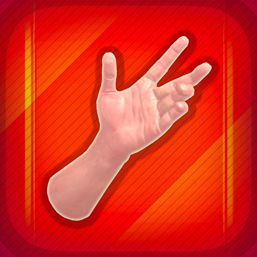

「このアプリを使えば、写実的に手を描く作業が格段に容易になる」 - ImagineFX

「下描き、ペン入れ、着色、どの工程の担当者もこのアプリをチェックするべき！」 - トニー・ムーア（『ウォーキング・デッド』の共著者）

絵を描く人で、きちんとした手や頭、足（アプリ内購入）のモデルを見て描きたい、鏡の前で手足を変な角度で曲げるのはもう嫌！という人におすすめのアプリです！

HANDY®は手足を様々なポーズを回転させて見ることができる、3Dのデッサン資料ツールです。手足や頭部のポーズをカスタマイズしたり編集することも可能です。

調整可能な3つの光源により、3D胸部を含む10種類以上の部位を使用して、簡単に光の当たり方を参考にすることができます。色塗りをする時に、特定の角度から頭部が表現する影を知りたい場合に役立ちます！

また動物の頭蓋骨パック（追加購入が必要です）が利用可能です。10種類以上の様々な動物が登場し、身体構造の参考にしたり生物デザインの着想を得たりするのに最適です。
[足部と動物の頭蓋骨パックを利用するには追加購入が必要です]

HANDY v5に新機能登場：モデルの材質を編集しましょう！質感を自由に切り替えたり、鏡面性の調整、特定の色を付けられるようになりました。

漫画家や画家だけでなく、スケッチ好きな人にもピッタリな機能となっています！

ImagineFXの必携アプリトップ10に選出！

動画デモを視聴
https://www.youtube.com/@handyarttool

HANDYのニュースレターにサインアップして、新着アップデート情報を入手しましょう！
http://www.handyarttool.com/newsletter

BlueskyでHANDYをフォロー
https://bsky.app/profile/handyarttool.bsky.social

XでHANDYをフォロー
http://x.com/HandyArtTool/

[View on Apple](https://apps.apple.com/jp/app/handy-art-reference-tool/id478643661)

## iFacialMocap

Mit iFacialMocap können Sie Gesichtsausdrücke in einer iOS-App erfassen und in Echtzeit mit der 3DCG-Software auf Ihrem PC kommunizieren. Sie können einen FBX-Export auch per E-Mail durchführen. Mit der PC-seitigen Software können Sie VRM-Modelle importieren.

Um FBX zu exportieren, schalten Sie den REC-Modus ein und nehmen Sie auf. Wenn Sie die Mail-Taste drücken, wird der Versionsauswahlbildschirm von FBX angezeigt. Wenn Sie die OK-Taste drücken, wird die FBX-Datei im Dateiordner gespeichert und der Mailer wird gestartet.

Eine ausführliche Verwendung finden Sie unter der folgenden URL:
https://ifacialmocap.com/

Diese App kann Gesichtsanimationen erstellen, indem sie in Echtzeit mit Maya, Unity, 3dsMax und Blender kommuniziert. Außerdem können in Echtzeit erstellte Animationen gebacken werden.

Starten Sie zur Verwendung zuerst diese App, starten Sie dann "iFacialMocap to SoftWare App" auf Ihrem PC und geben Sie die IP-Adresse Ihres iPhones ein.
(Vom PC herunterladen: https://ifacialmocap.com/download/
)

 Erstellen Sie als Nächstes bis zu 52 Morph-Ziele (BlendShape oder ShapeKey) gemäß der Namenskonvention.
Verwenden Sie zum Schluss die 3DCG-Software, um das Skript / Add-On zu laden, und drücken Sie die Verbindungstaste.

Eine sehr genaue Erfassung der Gesichtsbewegungen kann sehr einfach durchgeführt werden.

Diese App ist nur für Modelle verfügbar, die mit FaceID ausgestattet sind. Das Kamerabild und die daraus resultierenden Tiefendaten werden nur zum Senden von Bewegungserfassungsdaten an den PC des Benutzers verwendet. Diese Daten werden nicht im iPhone gespeichert. Um Tiefendaten von der Apple-API abzurufen, ist der Zugriff auf die Kamera erforderlich.

Diese Anwendung wird nur für die Kommunikation mit PCs innerhalb desselben Netzwerks verwendet und sendet keine Informationen an Dritte.

Diese App kann nur auf iOS-Geräten verwendet werden, die mit FaceID ausgestattet sind.

Folgende Geräte werden unterstützt:

・iPhone
iPhone13 mini
Phone13 Pro Max
iPhone13 Pro
iPhone13
iPhone12 Pro Max
iPhone12 Pro
iPhone12
iPhone 11 Pro Max
iPhone 11 Pro
iPhone 11
iPhone XS Max
iPhone XS
iPhone XR
iPhone X

・ IPad
iPad Pro 12,9 Zoll (5. Generation)
iPad Pro 12,9 Zoll (4. Generation)
iPad Pro 12,9 Zoll (3. Generation)
iPad Pro 11 Zoll (2. Generation)
iPad Pro 11 Zoll

* Face ID ist nicht in der neuen iPhone SE 2. Generation installiert, die im Jahr 2020 veröffentlicht wurde. Sie können iFacial Mocap jedoch verwenden, indem Sie auf iOS 14 oder höher aktualisieren. ICacial Mocap ist nicht nur auf das iPhone SE der 2. Generation beschränkt, sondern kann auch verwendet werden, wenn es über einen A12-Chip oder einen höheren Chip verfügt und auf iOS14 aktualisiert wurde.

[View on Apple](https://apps.apple.com/jp/app/ifacialmocap/id1489470545)

## eco検定 問題集アプリ　〜エコ検定/環境社会検定試験〜

【広告なし！解説付き！オフライン使用OK！】
本アプリは、eco検定のオリジナル問題集です。
広告が一切無く、解説付きのため効率よく学ぶことができます。
進捗状況・苦手分野を確認しながら、網羅的・集中的に学習できます。

また、オフラインで使用できるため、場所も問わずeco検定の勉強に集中できます。

【問題】
実際の試験に合わせた2択/4択問題を用意しています。
各章ごとに10問単位で分けて収録しているので、順番に学ぶことができます。
全ての章からランダムで10問ずつ出題することもできます。

また、誤った問題、未実施の問題だけに集中できるモードを搭載。
進捗状況をステータスバーにて確認し、誤った問題／未実施のみを効率よく学習できます。

【レーダーチャート】
得意・苦手な分野が一目でわかるレーダーチャートを搭載。
苦手分野を集中的に対策可能です。

【履歴】
実施した問題については履歴から結果を確認できます。
　
【eco検定（エコ検定/環境社会検定試験）とは】
〜公式サイトより〜
環境意識の高まりにともない、ビジネスと環境の相関を的確に説明する力が求められる今、
多くの企業でｅｃｏ検定が導入されています。
世界的な環境意識の高まりにともない、多くの製品やサービスが環境を意識したものに変わってきています。企業においても、ビジネスと環境の相関を的確に説明できる人材の育成が欠かせないものとなっています。
ｅｃｏ検定は、複雑・多様化する環境問題を幅広く体系的に身に付く「環境教育の入門編」として、幅広い業種・職種の方に活用いただいています。
ｅｃｏ検定は、専門家に限らず、学生から社会人まで幅広い方が受験しています。2006年の試験開始以来、これまでに69万人が受験し、41万人を超えるエコピープル（＝検定試験合格者）が誕生しています[2026年３月現在]。
ビジネスシーンにおけるキャリアアップはもちろん、生活者として健康で安全な暮らしを送るために、ｅｃｏ検定は社会の様々な場面で役立つ検定試験です。

【Reference】
環境社会検定試験 eco検定 公式テキスト

[View on Apple](https://apps.apple.com/jp/app/eco%E6%A4%9C%E5%AE%9A-%E5%95%8F%E9%A1%8C%E9%9B%86%E3%82%A2%E3%83%97%E3%83%AA-%E3%82%A8%E3%82%B3%E6%A4%9C%E5%AE%9A-%E7%92%B0%E5%A2%83%E7%A4%BE%E4%BC%9A%E6%A4%9C%E5%AE%9A%E8%A9%A6%E9%A8%93/id6443938132)

## VocalPitchMonitor

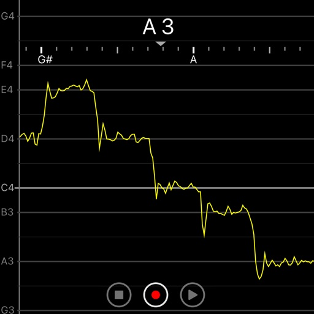

マイクから入力した音声の音程をリアルタイムにグラフにして表示するアプリです。横軸が時間、縦軸が音階になっています。カラオケや楽器の練習に使えます。

【特徴】
・マイクから入力した音程をリアルタイムに表示
・C2からB7までの6オクターブを表示
・表示範囲を自動でスクロール
・現在の音階を画面上部に文字で表示
・画面の横回転に対応
・録音と再生が可能
・保存/読み込み機能
・スケールの設定
・音階ごとに色を設定可能

【使い方】
マイクから音声を入力してください。音程がリアルタイムに表示されます。

【音程の解析について】
音声に複数の楽器や和音を含む場合は正しく解析できません。

【録音と再生について】
録音できるのは3分間だけです。

[View on Apple](https://apps.apple.com/jp/app/vocalpitchmonitor/id842218231)

## 楽器チューナー by Piascore

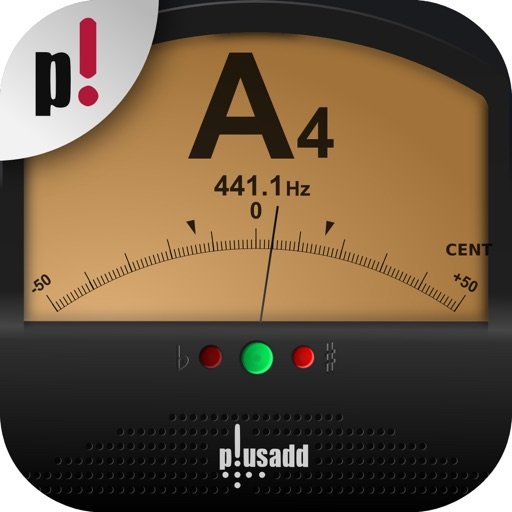

** 世界で1,000万人のミュージシャンに使われています！！ **

「楽器チューナー by Piascore」は、iPhone や iPad の内蔵マイクを使って、楽器の調律を行うためのクロマティック チューナーです。

移調、ソルフェージュなどの記譜法の変更、純正律などの音律の変更、キャリブレーションに対応し、簡単操作で誰にでもお使いいただけます。また、周波数ごとのパワースペクトルの表示により、音をより直感的に把握することが可能です。

「楽器チューナー by Piascore」は、アコースティックギター、エレクトリックギター、ベース、ヴァイオリンやチェロなどの弦楽器, 木管楽器、金管楽器、ピアノやトーンのある楽器なら何でも調律できます。音の高さは、E1～A8まで対応しています。

有料版の他に、無料版の「楽器チューナー Lite by Piascore」も用意しております。

** 機能 **
- 超高精度範囲50セントチューニングディスプレイ
- 直感的で分かりやすい針式メーター表示
- 音の高低の分かりやすいランプ表示
- 正確な半音 ±1/100(±1 cent)
- 横向き表示 (iPhone5 以降)
- パワースペクトル表示
- 選択可能な調律（純正律、キルンベルガー第3法など）
- 選択可能な記譜法（ソルフェージュなど）
- 移調楽器のサポート
- トーンジェネレーター
- 自動音選択
- 壁紙の変更

** コンタクト **
：http://piascore.com/ja/service/tuner/
：contact@piascore.com

[View on Apple](https://apps.apple.com/jp/app/%E6%A5%BD%E5%99%A8%E3%83%81%E3%83%A5%E3%83%BC%E3%83%8A%E3%83%BC-by-piascore/id635644097)

## らくがきAR

「らくがきAR」はみんなが思い描いていた「じぶんの描いたものに命が吹き込まれたら…」という想いを具現化させたアプリです。
ノートやホワイトボード、どこに描いたらくがきでも、このアプリでスキャンすると命が吹き込まれ、スマートフォンを通してバーチャル空間を歩きだします。
ご飯をあげたり、つっついたり、命を吹き込んだらくがきにちょっとちょっかいを出してみましょう。

※個人・法人にかかわらず、直接的・間接的に金銭等の利益を得る目的や催事イベントでの本アプリのご利用はご遠慮頂いております。ご利用をご希望の方は、 hello@whatever.co までお問い合わせください。

[View on Apple](https://apps.apple.com/jp/app/%E3%82%89%E3%81%8F%E3%81%8C%E3%81%8Dar/id1515215584)

## FE File Explorer Pro

FE File Explorer Pro is a file manager app on your iPhone and iPad. It can access not only local files, but also files on your computer, NAS and cloud storages. Transfer files among those locations. Stream movies and music to your iPhone/iPad. Directly view and manage documents, photos, files on your computer and cloud without downloading to your iPhone/iPad. 

FEATURES:
* Access network shares on macOS, Windows, Linux, Time Capsule, NAS via SMB/CIFS protocol.
* Access WebDAV Server, FTP Server and SFTP Server
* Access cloud storages: Google Drive, Dropbox, OneDrive, Box. 
 
* Automatically discover comptuers, NAS and servers when you setup new connections. 
* View, copy, move, rename and delete your files right on iPhone/iPad. 
* Stream movies and musics from network shares and cloud storages to iPhone/iPad. 
* AirPlay photos, musics and movies on Apple TV.
* Sort and search files
* Archive and unarchive files
* Dark Mode
* Multiple windows on iPad
* Integrated with iOS Files app
* Distribute configurations via MDM (Mobile Device Management).
* Built-in FTP Server and HTTP Server

* File Transfer:
Copy files among servers, cloud storages, iPhone and iPad. 
Transfer files by drag and drop.
Nearby file transfer: Directly transfer files between two nearby iOS devices without Wi-Fi or LTE connection.

===== CONTACT US =====
Email: support@skyjos.com
Twitter: @SkyjosApps
Facebook: @SkyjosApp

[View on Apple](https://apps.apple.com/jp/app/fe-file-explorer-pro/id499470113)

## Acrobits Softphone

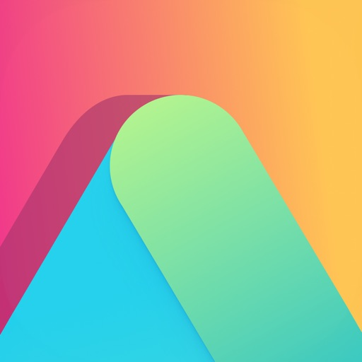

Make voice and video calls, send messages, and stay connected with Acrobits Softphone App — a powerful and feature-rich SIP softphone designed for all your calling needs.

IMPORTANT, PLEASE READ

Acrobits Softphone is a SIP Client, not a VoIP service. To use it, you need an account with a VoIP provider or PBX that supports standard SIP clients. 

Note: this app does not support call transfer or conference calling.

Take your VoIP calling experience to the next level with Acrobits Softphone with out-of-the-box support for many of the most popular providers and Bluetooth devices on the market.

Acrobits Softphone brings all the popular features you expect from a SIP app, including support for 5G, voice and video calling, push notifications, call handover between WiFi and data, multi-device compatibility, lifetime access to support and updates, and more.

Experience crystal clear calling with support for popular audio standards, including Opus, G.722, G.729, G.711, iLBC, and GSM. Need to make video calls? Acrobits Softphone supports up to 720p HD and supports both H.265 and VP8.

You can even create your own look and feel. Acrobits Softphone is fully customizable, allowing you to configure your own SIP call settings, UI, ringtones, and more.

Acrobits Softphone makes it easy for you to communicate with friends and family on any device. This SIP calling app is compatible with virtually all iPhones and iPads.

Don’t worry about hidden fees. You can try Acrobits Softphone today for a one-time fee that comes with lifetime support and updates.

[View on Apple](https://apps.apple.com/jp/app/acrobits-softphone/id314192799)

## カクカク - おかしなかたちあそび

ちょっと変わった"かたちあそび"をしてみませんか？

カクカクは、図形を操作して色々な形にしたり、
パーツをつけてモノや動物などを作ったりして絵を作成できます。
その絵でパズルなどの図形ゲームをして遊んだりもできます。

 [ つくる ] 

まず初めに図形の絵を作成します。
画面をタップして図形を増やして、
その図形を指で動かして好きな位置に持っていく。それだけです！

図形を動かしたり、消したり追加したり、
どのように操作してもカラフルな模様になるので、
見ているだけでも楽しめます。

また、図形にものや模様を追加することができるので、
動物や乗り物などいろいろな表現を試してみてください。

[ あそぶ ]

 - パズル - 

絵の中にある図形がバラバラになります。
その図形を元の場所に戻して絵を完成させてください。
自分が作成したオリジナルの絵で遊べるので、
パズルのパターンと難易度は無限です。

 - みつけて - 
 
ランダムに指定された図形を完成された絵の中からみつけてください。
制限時間はないので、時間をかけてゆっくりプレイしてもいいですし、
タイムを記録しているので、ベストを目指してもいいですね。

 - いろあわせ - 
 
図形が動かせるようになっているので、
おなじ色の図形が隣り合わせになるように移動してください。
その移動した図形とくっついている図形の色と同じ色が３つ以上の場合にその色の図形は消えます。
図形を動かすと新しい図形が追加されるので、
うまく図形を消しながら全ての図形を消してクリアしましょう！

------------------------------

積み木や粘土遊びのように作るものに"正しい、間違い"がないように、
このカクカクにも正解はありません。

さわって動かし、編集して組み合わせ、
自分だけの画を作ってお楽しみください！

[View on Apple](https://apps.apple.com/jp/app/%E3%82%AB%E3%82%AF%E3%82%AB%E3%82%AF-%E3%81%8A%E3%81%8B%E3%81%97%E3%81%AA%E3%81%8B%E3%81%9F%E3%81%A1%E3%81%82%E3%81%9D%E3%81%B3/id1506705379)

## Handy Guitar Lab for G2 FOUR

Handy Guitar Lab for G2 FOURは、ZOOM G2 FOUR / G2X FOUR EFFECTS & AMP EMULATORのために特別に設計されたリモート・コントロール・アプリです。
新しいエフェクトをダウンロードしたり、デバイスにインストールされているエフェクトを管理したりすることができます。
新しいパッチメモリーの表示とダウンロード、デバイス上のパッチメモリーリストのカスタマイズ、保管用のバックアップを作成することができます。
既存のパッチメモリーを編集したり、ゼロから新しいパッチメモリーを作成したりすることができます。
ファームウェアのアップデートが利用可能になったときに通知し、デバイスのアップデートを行うことができます。
iOS/iPadOS VoiceOverをサポートし、視覚障害者にアクセシビリティを提供します。

* Handy Guitar Lab for G2 FOURは、USB-CケーブルとApple カメラアダプタでデバイスと接続します。

[View on Apple](https://apps.apple.com/jp/app/handy-guitar-lab-for-g2-four/id1623283803)

## アイビスペイント

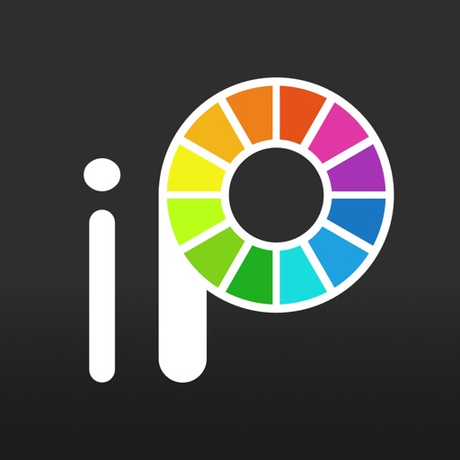

このアプリはibisPaint Xの広告除去版です。全機能のアンロックには追加でプレミアム会員の購入（アプリ内課金）が必要ですが、その場合はibisPaint Xをダウンロードしてプレミアム会員を購入する方がお安くなります。
5億ダウンロードの本格お絵かきアプリ！え？スマートフォン・タブレットでもこんなに描けちゃう！！
10万5千種以上のブラシ！29,000点以上の素材！3,000種類以上のフォント！84本の画像加工用フィルター！46種のスクリーントーン！27種のレイヤーブレンドモード！
手振れ補正！参照ウィンドウ！タイムラプス動画機能！定規機能！集中線定規！対称定規！クリッピングマスク！動くフィルター！ベクターツール！アニメーション機能！AI学習妨害！など本格的な機能満載！！

＜お絵かき講座YouTubeチャンネル＞
お絵かき講座YouTubeチャンネルでは、アイビスペイントの便利な使い方を多数配信しています。
ぜひご登録ください。
https://youtube.com/ibisPaint

＜コンセプト・特徴＞
・ PCのイラストソフトを凌駕する本格お絵かきアプリ！
・ さらさら描ける気持ちよさ、OpenGL技術を利用した高速動作！
・ 絵を描く工程を動画として保存できる機能！
・ 絵の描き方を学べるSNS機能付きお絵かきアプリ！

＜機能＞
絵を描く工程の動画の共有を目玉としつつも、お絵かきアプリとしての機能も充実させました。

[ブラシ機能]
・ 最大120fpsのなめらかで、さらさら描けるブラシ
・ Gペン、ペン、デジタルペン、エアブラシ、丸筆、平筆、鉛筆、油彩、木炭、クレヨン、スタンプなど、豊富なブラシパターン
・ 入りの太さ、抜きの太さ、先端部不透明度、パターンの回転の初期角度、回転の追従など多彩なブラシパラメータ
・ すぐに操作できるブラシ太さとブラシ不透明度のクイックスライダー
・ リアルタイムに確認できるブラシプレビュー
・ オリジナルブラシパターン

[レイヤー機能]
・ 無制限に追加可能なレイヤー機能
・ レイヤーごとの不透明度、アルファブレンディング、加算、減算、乗算などのブレンドモード
・ 画像の切り抜き等に便利なクリッピング機能
・ レイヤーの複製、フォトライブラリーからのインポート、左右反転、上下反転、レイヤーの回転、移動、拡大縮小など多彩なレイヤーコマンド
・ レイヤー識別のためのレイヤー名設定機能
・ 画質を下げず、自由自在に線を変形できるベクターレイヤー
・ フィルターの効果をいつでも修正できる調整レイヤー

[マンガ機能]
・ 縦書き、横書き、ふちどり、フォント選択、複数テキストに対応した本格テキストツール機能
・ アミ点、ノイズ、水平、垂直、斜め、クロス、四角などの46種類のスクリーントーン機能

[選択範囲機能]
・ ピクセルごとに256階調の選択範囲(選択レイヤー)
・ 選択範囲の反転、移動、回転、拡大縮小
・ 選択範囲を考慮したブラシ、塗りつぶし、レイヤーの複製、レイヤーの結合、レイヤーの移動、回転、拡大縮小

[カラー機能]
・ 登録数の制限が無いカラーパレットからの選択、色相環からの選択、HSBからの選択、RGBからの選択など豊富なカラー選択
・ カラーパレットへのドラッグ&ドロップによる保存
・ 複数のカラーパレットの作成、書き出し・読み込み
・ タップ&ホールドによるスポイト機能

[お絵かき機能全般]
・ 図形などの描画に便利な定規ツール機能（直前定規、円定規、楕円定規、集中線定規）
・ 手ぶれ補正や強制入り抜きといった描画支援機能
・ 明るさ・コントラスト、カラーバランス、線画抽出、グレースケール、階調化、ぼかし、グラデーション、アニメ調背景、マンガ調背景、色収差などのフィルタ機能
・ テクスチャやトーンを使用できる素材ツール機能
・ SD、HD、X(旧Twitter)ヘッダー、ハガキなど、さまざまなキャンバスサイズに加え、任意キャンバスサイズ指定機能
・ キャンバスの任意回転機能
・ 背景色（白、明るい透明、暗い透明）設定機能
・ 最大100ステップ以上の「取り消し」「やり直し」機能(ストレージの空き容量に依存します。)
・ ブラシ、消しゴム、指先ツール、ぼかしツール、塗りつぶし、スポイト機能
・ 高速でなめらかなパン・ズーム機能
・ 囲って塗る、囲って消す
・ フローティングレイヤーウィンドウ、フローティングカラーウィンドウ

[作品を楽しむ機能]
・ 自作のイラストを鑑賞するためのマイギャラリー機能
・ 絵を描く工程の再生機能(再生速度調整機能あり)
・ イラストの静止画(PNG/JPEG)および動画(MOV)のフォトライブラリへのエクスポート機能
・ 絵を描く工程動画のエンコード機能と、アップロード機能
・ 投稿したお絵描きURLをX(旧Twitter)やFacebookでシェア
・ イラストにコメントが来た場合のプッシュ通知
・ 他の人のイラスト(作品ファイル)のダウンロード機能
・ 他の人のイラストを鑑賞するコレクション機能
・ PC、MacとのUSBファイル転送による作品ファイルのインポート・エクスポート機能
・ 静止画(PNG/JPEG)、動画(MOV)、作品ファイル(IPV)をX(旧Twitter)やFacebook、LINE等にシェアする機能
・ CLIP STUDIO PAINT連携機能（クラウド経由でアイビスペイントで描いた続きがCLIP STUDIO PAINTで描けます）
・ CMYK・グレースケール・モノクロ2階調での画像出力
※ イラストのアップロード及びダウンロードにはibisアカウント、X(旧Twitter)、Facebook又はApple IDアカウントのいずれかが必要です。

＜アイビスペイントのご購入プランについて＞
アイビスペイントのご購入プランは以下のものがあります。
・ アイビスペイントX（無料版）
・ アイビスペイント（有料版）
・ 広告除去アップグレード
・ プレミアム会員（月額プラン・年額プラン）
※ 有料版と無料版の違いは広告の有無で機能差はありません。
※ 広告除去アップグレードをご購入頂ければ、広告は表示されなくなり、アイビスペイント有料版との差は無くなります。
※ さらに本格的な機能を使うためには、以下のプレミアム会員（月額プラン・年額プラン）のご契約が必要となります。

[プレミアム会員]
プレミアム会員はプレミアム機能が利用可能になります。初回のみ7日間または1ヶ月の無料お試しが可能です。プレミアム会員になると以下の機能が利用できます。
・ 20GBのクラウドストレージ容量
・ ベクターツール(*1)
・ プレミアム素材
・ プレミアム紙質
・ プレミアムフォント
・ トーンカーブフィルター
・ グラデーションマップフィルター
・ レベル補正フィルター
・ 色置換フィルター
・ 雲模様フィルター
・ プレミアム調整レイヤー
・ 囲って塗る、囲って消す
・ AI学習妨害
・ 自由なサイズでのアニメーション作品
・ マイギャラリーでの作品の並び替え
・ 作品フォルダ機能
・ オリジナルブラシパターンの読み込み
・ タイトル画面ランキング選択機能
・ キャンバス画面の背景色設定
・ 高度なベクター機能
・ 高度な図形ツール
・ 一部の特殊ペンツール
・ 複数のカラーパレットの作成
・ CMYK出力
・ ショートカットキーのカスタマイズ
・ 動画のウォーターマーク非表示
(*1) 1日1時間まで無料でお試しいただけます。
※ 無料お試しでプレミアム会員になったあと、無料期間の終了日の24時間以上前に自動更新の解除をしないと、自動更新により課金されます。
※ 今後プレミアム機能を追加していきますのでご期待ください。

＜質問・不具合について＞
レビューでのご質問、バグ報告は確認及び対応ができませんので、アイビスペイントサポート係までお願いします。
https://ssl.ibis.ne.jp/support/Entry?svid=25

＜ibisPaintサービス利用規約＞
https://ibispaint.com/agreement.jsp

[View on Apple](https://apps.apple.com/jp/app/%E3%82%A2%E3%82%A4%E3%83%93%E3%82%B9%E3%83%9A%E3%82%A4%E3%83%B3%E3%83%88/id441179131)

## うちメモ

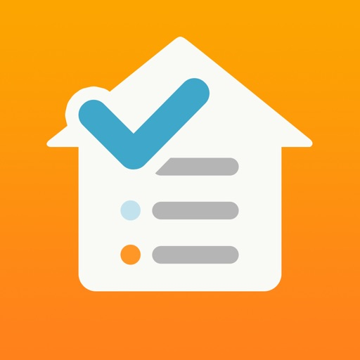

買い物中に「まだあったかな?」と思った経験 ありませんか?
でも
「うちメモ」していれば大丈夫!!
さっとアプリを起動し、在庫をチェック!

例えば、冷蔵庫の中、消耗品の買い置きなど、個数や賞味期限を記録しておけば
あとは使ったらマイナス、補充したらプラスするだけ。

何があるかわかるから
買い物前にメモする必要もなくなるんです!!

さらに、
1、買った場所や値段をメモすることができる
2、例えばトイレットペーパーって1ヶ月でこんなに使っているの〜 がわかる
3、思ったことを何でも書き込めるメモ欄がある
商品名やメーカーを書いておけば「どこの醤油だっけ?」も解消されちゃう
などなど

アイコンは600種類以上用意してあります。
好みのアイコンが無ければ、カメラで撮影してオリジナルのアイコンを作ることもできます。

チェックリストには、無くなりそうになったアイテムが表示されます。
警告数はアイテム毎に自分で決めることができます。
補充できたらチェックリストから自動で消えます。

さぁ あなたも
うちメモ生活を始めてみませんか?

【データファイルについて】
・保存場所はiCloudかデバイスから選べます。ネット接続を避けたい方はデバイスを選ぶとよいでしょう。
・データのバックアップや、複数人でのデータの共有をされたい方はiCloudがオススメです。
・デバイス保存の場合は、iOS付属の「ファイル」アプリやiTunesのファイル共有でデータを取り出せます。

【その他の使い方など】
・買い物メモの用途以外にも、コレクションの管理、倉庫の管理、TODO管理、どこに仕舞ったかメモなど、使い方はいろいろ!
・品物に対して、店名と値段をメモすることができ、底値メモとしても活用できます。
・グループの中にグループが作れる（グループを階層にできる）ので細かく分類できます。

【注意点】
・絵文字は入力、表示できなくなりました

ご意見、ご感想、ご質問などございましたらお気軽にご連絡くださいませ。

無料版「うちメモ LT」もあります。お気軽にお試し頂けます。

[View on Apple](https://apps.apple.com/jp/app/%E3%81%86%E3%81%A1%E3%83%A1%E3%83%A2/id1362509132)

## 星撮りカメラさん2

iPhoneでなるべく綺麗に星を撮るためのカメラアプリです。

### 使い方
１．気温が低くて星のよく見える場所に行く
２．iPhoneを三脚などに固定する（これが1番重要）
３．撮影モード、シャッタースピード、ISO感度を選択
４．シャッターボタンを押す

### モード毎の特徴
星空：明るい星を目立たせたい場合
星グル：星グル写真撮影用（30分撮影すればだいぶ星グル感でてきます）
天の川：天の川や細かい星までクッキリ写したい場合
夜景：何も加工したくない場合
比較明：比較明合成（蛍や花火、ライトトレイルの撮影など）

### 綺麗に撮る為に
・長時間撮影するので手持ちでは撮れません。ミニ三脚でもいいし、カメラを上に向けてテーブルに置いてもいいので、とにかく固定して撮影してください。
・フォーカスの微調整
・撮影後、純正写真アプリで明るさ、コントラスト、色合いなどを好みに合わせていじるとより見栄えのいい写真に仕上げることができます。
・三日月くらいの月がある夜に撮影すれば空の色も綺麗に出て星も映るのでおすすめです。天の川の撮影は月がまったく無いほうがいいです。

### フォーカスの微調整
１．画面中央に1等星や2等星などの明るい星を入れる
２．フォーカスボタンを押すと画面が拡大されるので、スライダーで大まかに移動してからステッパーで星が一番小さくなる位置に設定する
３．わかりにくい場合はフォーカス位置を変えて撮影して見比べてみる

### 星グルモードについて
　他のモードと違い星グルモードと比較明モードではシャッタースピードで明るさを変えることはできないのでISO感度で調整してください。
　星空モードでは長時間撮影すると真っ白になってしまうような場所でも撮れるので都市星景にも向いてます。
　銅像やモニュメントと一緒に撮影しても見応えある写真になります。
　ヤワなホルダーや三脚を使うと線がブレるのでシッカリしたものを使うことをお勧めします。
　星グルモードでは比較明合成で背景がならされるのでiPhoneのような小さいセンサーでノイズが多いカメラでも見栄えが良くなります。
　北極星をいれるとグルグル感は増しますが軌跡が短くなります。東などに向ければグルグル感はないけど軌跡が長くなります。お好みで。
　このアプリで撮る星グルは、ひと味違う写りをするのでiPhoneで撮ったとは思われないかもしれません
　流星群の時期であれば1時間星グル撮影すれば、流れ星2、3個写るかもしれません。

### 蛍の撮影について
iPhoneのナイトモードで撮影しても蛍は写りますが、背景がだいぶ明るく写ってしまいます。
このアプリの比較明モードと三脚使って撮影すればより雰囲気良く撮ることができるので試してみてください

### ウォーターマークについて
初期設定ではアプリ名になってるので、ハンドルネームやアカウント名を設定して著作権保護に使用してください

### アプリが落ちる場合
　アプリがクラッシュする場合は、iPhoneの設定の「プライバシー」-「解析」-「Appデベロッパと共有」をオンにして使用してみてください。バグ情報がアップルに送られ、修正する手助けになります。

[View on Apple](https://apps.apple.com/jp/app/%E6%98%9F%E6%92%AE%E3%82%8A%E3%82%AB%E3%83%A1%E3%83%A9%E3%81%95%E3%82%932/id1241570625)

## Sleep Meister - 睡眠サイクルアラーム

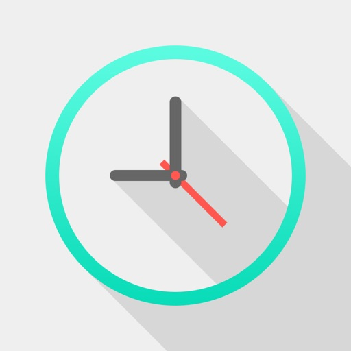

AppStore 総合ランキング1位!

Sleep Meister（スリープ・マイスター）は、端末に内臓されている加速度センサを用いて人の体動を感知し、眠りの浅いタイミングでアラームを鳴らすことにより、快適な目覚めをサポートする目覚ましアラームアプリです。

またその他にも、ヘルスケアとの連携や、寝言（物音）の録音機能、グラフやリストによる睡眠データの管理、各種SNSへの睡眠データの投稿、入眠時に自動停止する音楽プレイヤーなどなど、機能も充実。 

快適な毎朝を迎えましょう！ 

【機能・特徴】
・iOS 26 対応
・ヘルスケアアプリ連携（睡眠分析）
・睡眠サイクルの記録
・眠りの浅いタイミングで鳴動するアラーム
・寝言（物音）の録音機能
・入眠時に自動停止する音楽プレイヤー 

【使用方法】 
1. 設定にてアラーム音、スヌーズ等、お好みに応じて設定して下さい。 
2. アラーム時刻を設定し、STARTボタンを押すと睡眠サイクルの計測が始まります。 
3. 設定のヘルプを参考に、お使いの端末を寝具にセットして下さい。 
4. 設定時刻に従い、眠りの浅いタイミングでアラームが鳴ります。 
5. 起床後はスライダーを右へスライドさせて計測を停止して下さい。 

【URLスキーム】 
sleepmeister: 

【無料版・有料版の違い】 
広告の有無

[View on Apple](https://apps.apple.com/jp/app/sleep-meister-%E7%9D%A1%E7%9C%A0%E3%82%B5%E3%82%A4%E3%82%AF%E3%83%AB%E3%82%A2%E3%83%A9%E3%83%BC%E3%83%A0/id599456126)

## FlashAir Instant WIFI

This app allows user to automatically download new photos from FlashAir™. 

1. Power on your FlashAir™ Card. 

2. Connect to FlashAir™ WiFi with 
the SSID "flashair". 

3. Run this app and it will automatically download new photos taken by the camera. User can choose to play slideshow, save all the photos to camera album, or delete the photos.

[View on Apple](https://apps.apple.com/jp/app/flashair-instant-wifi/id528940068)

## 関数電卓 Panecal Plus

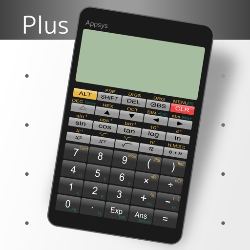

　広告が表示されない関数電卓Panecalの有料版です。
　関数電卓Panecalは数式を表示・修正できる関数電卓アプリです。数式を確認しながら入力できるため、誤入力や計算ミスを防ぐことができます。また、過去の計算式を再利用することや、変数メモリを利用して特定の値だけを変えて計算することも可能です。
　ディスプレイにはカーソルが表示され、タップまたは矢印キーを押して編集したい場所へすばやく移動できます。スワイプによる数式スクロール、ロングタップによるコピー&ペーストに対応しており、強力かつ柔軟で直感的なユーザインターフェイスを備えています。
　
変更履歴や改善予定など詳しい情報はhttp://www.appsys.jpをご覧ください。
　
【主な用途】
・情報工学・機械工学・力学・測量・建築などの技術系のお仕事に
・工作機械の座標計算に
・大学の授業や研究室での計算に
・中学・高校の受験勉強での計算に
・iPadを用いて特大関数電卓としての利用に
・外出先で関数電卓(実機)を持っていないときのために
　
【主な機能】
・過去の数式を利用した再計算
・タップによるカーソル移動やスワイプによる数式スクロールに対応
・コピー&ペーストに対応
・計算結果および数式の履歴一覧表示
・2進数、8進数、10進数、16進数の演算や各基数変換
・Mメモリと6種類の変数メモリ
・四則演算、三角関数、逆三角関数、指数関数、対数関数、べき乗関数、べき乗根関数、階乗、絶対値、パーセント演算、確率(順列・組合せ)、剰余算、極座標変換、デカルト座標変換
・角度単位はDEG、RAD、GRADから選択可能
・値の表示はNormal(標準)、Fix(固定小数点方式)、Sci(指数方式)、Eng(指数は3の倍数)から選択可能
・小数点の種類や桁区切り設定が可能
　
【免責】
本ソフトウェアの使用により生じた損害、逸失利益または第三者からのいかなる請求についても作者は一切その責任を負えませんので、あらかじめご了承ください。

[View on Apple](https://apps.apple.com/jp/app/%E9%96%A2%E6%95%B0%E9%9B%BB%E5%8D%93-panecal-plus/id672649451)

## ピタゴラスイッチ うたアプリ スのまき

「ビーだま ビーすけ」がピタゴラうたのアプリに登場！ 
テレビ『ピタゴラスイッチ』より、史上初の物語付きのピタゴラ装置「ビーだま ビーすけの大冒険」や「新しい生物の歌」といった大人気の歌と映像が、iPhoneやiPadでいつでも楽しめるアプリになりました。

◎『ピタゴラうたのアプリ　スのまき』収録されている歌
・ビーだま ビーすけの大冒険
・新しい生物の歌
・アルゴリズムたいそう３バージョン＋練習用山田バージョン＋練習用菊地バージョン付き）
・ぽんほんぼんの歌

番組で人気の歌の数々にくわえ、アプリならではのスペシャルコンテンツ「つくる おとうさんスイッチ」「新しい生物図鑑」も収録した、もりだくさんなアプリです。さらにさらに、満を持して「アルゴリズムたいそう」も収録です。「新幹線にかかわるみなさんといっしょ」など、大人気の３バージョンを収録しています。

◎「考え方」の解説付き！
ピタゴラスイッチは、「考え方」を育てる番組です。ピタゴラの歌にも、それぞれある「考え方」がひそんでいます。
「なるほど！」だけど「たのしい！」ピタゴラの歌の真髄がわかります。

◎スペシャルコンテンツ「つくる・おとうさんスイッチ」た行
「ピタゴラスイッチ」の大人気コーナーのひとつ「おとうさんスイッチ」。
おうちでお子さんと一緒に楽しんだお父さんも多いこのコーナーを、iphoneやipadで楽しむことができます。
子どもが監督となって「た・ち・つ・て・と」の動作をするおとうさんを撮影します。
５つの動作の撮影が完了すると、テレビと同じ「おとうさんスイッチ」の音楽とナレーションがついて、
ご家庭オリジナルの「おとうさんスイッチ」が完成します！

【おねがい　その１】端末をWi-Fiに接続してダウンロードしてください！
このアプリは、たくさんの映像を収録しており、サイズが大きいため、携帯回線（3G、4G）ではダウンロードできなくなっております。端末をWi-Fiに接続してダウンロードをお願いいたします。PC、MacのiTunesでダウンロードしてからのインストールも可能です。
【おねがい　その２】マナーモードを解除してお楽しみください！
本アプリを楽しむ際は、デバイスのマナーモードが解除されていることをご確認ください！（マナーモードになっていると、音を出さない仕様になっています）

◎お問い合わせ先
appsupport@euphrates.co.jp

[JASRAC 許諾番号]
9015684001Y43136,9015684002Y38026
ユーフラテス有限会社
EUPHRATES Ltd.

 © NHK・NHK エデュケーショナル

[View on Apple](https://apps.apple.com/jp/app/%E3%83%94%E3%82%BF%E3%82%B4%E3%83%A9%E3%82%B9%E3%82%A4%E3%83%83%E3%83%81-%E3%81%86%E3%81%9F%E3%82%A2%E3%83%97%E3%83%AA-%E3%82%B9%E3%81%AE%E3%81%BE%E3%81%8D/id971063062)

## 東海道五十三次

「東海道五十三次」旧道のルートマップアプリケーションです。

江戸日本橋から、
武蔵国(東京都・神奈川県)、相模国(神奈川県)、伊豆国(神奈川県・静岡県)、駿河国(静岡県)、
遠江国(静岡県)、三河国(愛知県)、尾張国(愛知県)、伊勢国(三重県)、近江国(滋賀県)を通り、
京都に至る53次、126里6町1間(約492km)あります。
GPSを使って迷わずトレースして歩けます。自転車でも楽しめます。(峠道は無理)
マップ上に、「宿場」「一里塚」「名所」などをポイントしました。
また、歌川広重 浮世絵「東海道五十三次」に描かれている現在の場所もポイントしました。
さあ、アプリを起動して、街道ウォークに出かけましょう!!
本アプリは、江戸日本橋から京都三条大橋までをポイントしています。

このアプリケーションは、「共有型成長アプリケーション」です。
街道は生きています。情報は随時更新をして継続的なアップデートとして対応していきます。

■表示

○ルート
旧道は赤で表示しています。
現在、旧道が消滅しているところは、迂回路として「緑」で表示していますが、
高速道路や線路で寸断されたための小さな迂回路は正規ルートとしています。

○宿場/名所など
宿場は、「本陣」をポイントしています。
情報は、文化三年(1806年)完成の『五街道分間延絵図』と、
天保から安政年間(1840-50年代)に調査されたという『宿村大概帳』の情報に基づいています。
江戸時代末期の視点で捉えていますので、明治以降の名所などは取り上げていません。
また、出入口は「見附」「木戸」「棒鼻」など、宿場によって名称がさまざまです。
本アプリでは、「江戸方」と「京方」に統一しています。

○一里塚
所在不明なものは「推測」としてポイントしています。

○浮世絵ポイント
さまざまな解釈がありますので、すべてを特定しているわけではありません。

■主な機能

○GPSボタン
マップ上のGPS機能をON/OFFに出来ます。

○ポイントボタン
マップ上のすべてのポイントを表示/非表示に出来ます。

○設定ボタン
アプリケーションの詳細・使い方・アドバイスなどを表示します。

[View on Apple](https://apps.apple.com/jp/app/%E6%9D%B1%E6%B5%B7%E9%81%93%E4%BA%94%E5%8D%81%E4%B8%89%E6%AC%A1/id490012937)

## SCOA　試験対策

【SCOA試験対策の決定版アプリ】

就活・転職で避けて通れないSCOA適性検査。このアプリで効率的に対策し、自信を持って本番に臨みましょう。

■ 充実の問題数
全1000問を収録。言語、数理、論理、英語、常識の5分野を網羅的にカバーしています。

■ 5つのカテゴリ
・言語（200問）: 慣用句、四字熟語、文法など
・数理（200問）: 計算、方程式、図形など
・論理（200問）: 推論、条件整理、サイコロなど
・英語（200問）: 文法、語彙、読解など
・常識（200問）: 理科、社会、文学、文化など

■ 本番形式の模擬試験
実際のSCOA-A（5尺度）と同じ形式で120問/60分の模擬試験が受けられます。本番さながらの緊張感で実力を測定できます。

■ 学習を継続できる機能
・10問ずつのセット学習で無理なく続けられる
・間違えた問題だけを復習できる機能
・ブックマーク機能で重要問題をすぐに確認
・学習分析で進捗と正答率を可視化
・連続学習日数の記録でモチベーション維持

■ スキマ時間を有効活用
通勤・通学中、休憩時間など、ちょっとした空き時間にサクッと学習。毎日コツコツ続けることで、確実に実力がつきます。

■ こんな方におすすめ
・就職活動を控えた学生
・転職を考えている社会人
・SCOA試験を初めて受ける方
・短期間で効率的に対策したい方

さあ、今すぐダウンロードして、SCOA対策を始めましょう！

[View on Apple](https://apps.apple.com/jp/app/scoa-%E8%A9%A6%E9%A8%93%E5%AF%BE%E7%AD%96/id6756841326)

## Whisper Notes: Sprache zu Text

Die Offline-Transkriptions-App, der über 60.000 Journalisten, Forscher und Profis vertrauen.

Verwandle Meetings, Vorlesungen und Sprachmemos in präzisen Text mit Sprecher-Labels – schnell, 100 % offline, auf deinem Gerät. Kein Abo. Einmal kaufen, für immer deins.

■ Kernfunktionen
- Sprachmemos aufnehmen, Ideen sofort festhalten – über Sperrbildschirm, Widgets, Aktionstaste oder per „Hey Siri“
- Audio und Video aus jeder App importieren (WhatsApp, Fotos, Sprachmemos usw.) – sogar Untertitel extrahieren
- Aus Meetings, Vorlesungen und Interviews werden Transkripte mit Sprecher-Labels – wer sagte was, Sprecher umbenennbar, ohne Längenlimit
- Über 100 Sprachen, automatisch erkannt (für Deutsch optimiert) – drei Modelle (Parakeet, Whisper, SenseVoice), frei wählbar
- Export als SRT, VTT oder TXT – Zeitstempel und Sprecher-Labels inklusive

■ Privatsphäre & Tempo
Weil alles auf deinem Gerät läuft, wird nichts hochgeladen – und nichts kann durchsickern. Aktiviere vor der Aufnahme den Flugmodus und lass ihn an: Whisper Notes funktioniert genau gleich. Wichtig, wenn die Aufnahme ein Interview ist, ein Kundengespräch – oder etwas, das nie auf einen fremden Server gehört.

5 Minuten Audio auf dem iPhone 15: ca. 18 Sekunden mit Parakeet, ca. 1 Minute mit Whisper. SenseVoice ist deutlich schneller als Whisper und am stärksten bei Chinesisch, Japanisch und Koreanisch. Jedes Modell hat seine Stärken – wähle frei nach Sprache und Einsatz. Ältere Geräte sind langsamer, funktionieren aber gut.

■ Ehrliche Preise
Weil die Transkription auf deinem Gerät läuft, haben wir keine Serverkosten – und damit keinen Grund für Monatsgebühren. Ähnliche Apps kosten meist $100+/year; bei uns zahlst du einmal.
Keine Abos, keine In-App-Käufe, keine Werbung.
Nicht zufrieden? Tippe auf Einstellungen → Rückerstattung anfordern.

■ Häufige Fragen

Funktioniert die App komplett offline?
Ja. Dein Audio verlässt nie dein Gerät. Funktioniert im Flugzeug, im Funkloch, überall.

Kann ich WhatsApp-Sprachnachrichten oder Videos transkribieren?
Ja. Teile oder sichere Audio/Video aus WhatsApp in Whisper Notes und transkribiere offline. Perfekt, um Untertitel ohne Cloud-Upload zu extrahieren.

Gibt es ein Zeitlimit für Aufnahmen?
Nein. Nimm stundenlang auf, wenn du willst. Längere Aufnahmen brauchen zum Transkribieren auf dem Gerät nur mehr Zeit.

Gibt es Echtzeit-Transkription während der Aufnahme?
Nicht während der Aufnahme, aber bei der Transkription: Danach siehst du das Transkript in Echtzeit entstehen.

Unterstützt ihr Sprecher-Labels (diarization)?
Ja – komplett offline. Tippe im Transkript aufs Sprecher-Symbol und sieh, wer was gesagt hat – direkt auf deinem Gerät. Genauigkeit und Tempo verbessern wir laufend.

Wo werden meine Daten gespeichert?
Nur auf deinem Gerät. Wir haben keinerlei Zugriff. Hinweis: Löschst du die App, werden auch deine Aufnahmen gelöscht (wir behalten keine heimlichen Backups). Exportiere wichtige Dateien regelmäßig.

Warum keine KI-Zusammenfassungen?
Privatsphäre. Wir laden deine Aufnahmen nie zu einem KI-Dienst hoch. Du willst Zusammenfassungen? Kopiere das Transkript in dein bevorzugtes KI-Tool. Wir sperren deine Daten in kein proprietäres System ein.

Warum stoppt die Transkription beim App-Wechsel?
iOS begrenzt die GPU-Nutzung von Dritt-Apps im Hintergrund. Kehre einfach zur App zurück und tippe auf „Erneut transkribieren“ – sie startet neu.

Welche Geräte werden empfohlen?
iPhone 12 und neuer. Ältere Geräte (iPhone 11, iPhone SE 2. Generation) werden nicht empfohlen – dort funktioniert die App nicht richtig.

Welche Sprachen werden unterstützt?
Deutsch, English, Español, Français, Português, Italiano, Nederlands, 简体中文, 繁體中文, 日本語, 한국어, Hindi, Arabic, Русский, Türkçe, Polski, Українська, Tiếng Việt, Thai, Tagalog, Bahasa Indonesia, Svenska, Norsk, Dansk, Suomi, Čeština, Greek, Hebrew, Română, Magyar, Persian, Urdu und über 65 weitere Sprachen.

■ Kontakt
Fragen? Schreib an support@whispernotes.app
Mehr Infos: whispernotes.app

[View on Apple](https://apps.apple.com/jp/app/whisper-notes-%E3%82%AA%E3%83%95%E3%83%A9%E3%82%A4%E3%83%B3%E9%9F%B3%E5%A3%B0%E6%96%87%E5%AD%97%E8%B5%B7%E3%81%93%E3%81%97/id6447090616)

## 請求書 見積書 かんたん作成の新定番 SmartForm

国内App Storeビジネス部門ランキング 第1位獲得！
インターネット環境不要！災害時にも安心して書類を作成出来ます！

【直感操作！PC不要！iCloudにも対応！】

「SmartForm(スマートフォーム)」は簡単に本格的な書類（見積書・納品書・請求書・領収書・発注書）を作成出来る仕事効率化ソフトになります。

PCを使えない・使いたくない、手書きをやめたい！移動中や待ち時間を利用してスマートに書類を作成したいって方にオススメ！

作成した書類はPDFファイルとして保存されます。
クライアントに合わせて、LINE・メール・AirPrint(Wi-Fi印刷)・画像保存・Dropbox等の書類提供を支援します。

郵送やFAXを送る際の送付状作成もおまかせ！
「送付状はPCの出番か。。」とは言わせません。

出先のコンビニでも印刷可能！
素早い対応で他社との差別化間違いなし！
（別途PrintSmash等をインストール）

【主な機能】

●生体認証機能
起動時・復帰時に生体認証(Face ID・Touch ID)を要求します。

●Backup(iCloud)
まさかの時にも安心！書類・各種設定情報をiCloudへ保存します。
機種変更の際はもちろん、他の端末への複製にも。

●顧客管理
顧客リストの他に顧客別の書類表示や、顧客情報の自動入力された書類を作成可能！
顧客情報はCSVファイルに書き出し可能（DM・挨拶状・年賀状ソフト等）
その他書類（送付状・FAX送付状・顧客発行書類「発注書・受領書等」・合計請求書）の作成も。

●印影の作成＆押印機能
SmartFormには印影作成機能を実装しています。
印影画像の事前準備は必要なく、面倒な押印作業からも解放されます。

●最近削除した書類機能
削除した書類は３０日間保存しております。
過って削除してしまった書類も安心して復元出来ます。

【特徴】

●設定
毎回入力の面倒な請求者情報、銀行口座情報の保存
消費税率・端数処理設定

●細かな税設定
項目毎に外税・内税・非課税・不課税・免税・対象外から選択可能
税区分の混在した書類作成・軽減税率にも対応。
源泉所得税設定

●転記
見積書->納品書->請求書->領収書へと簡単な操作にて転記可能

●検索＆絞り込み
顧客名・件名・書類番号・備考から検索可能！
また、ステータスからの絞り込みにも対応。
スマートな顧客対応を強力支援します。

●商品台帳
事前に明細の項目情報を登録出来ます。
よりスマートな書類作成を可能に。

●収入印紙貼り付け欄
５万円以上の領収書に自動表示されます。

●Template
書類をお好みのスタイルへ着せ替え出来ます。
カラー設定・行埋め機能（明細の最低行数）を使ってさらにお好みのスタイルへ！

●Custom Template
標準のTemplateは物足りない！という方のためにTemplateを編集可能に設計しています！
※Templateの編集はHTML＋CSSの知識を要します。

【不具合報告について】
原因の特定や早急対応のため、端末名・iOS・不具合の発生条件・症状等、可能な限り具体的な報告をお願いいたします。

【起動出来ない場合】
[ファイル(iOS11)]→[このiPhone(iPad)内]→[SmartForm]を圧縮→作成された[SmartForm.zip]を下記へメールにて送信をお願いいたします。
info@whitez.jp

今後ともSmartFormをよろしくお願いいたします。

[View on Apple](https://apps.apple.com/jp/app/%E8%AB%8B%E6%B1%82%E6%9B%B8-%E8%A6%8B%E7%A9%8D%E6%9B%B8-%E3%81%8B%E3%82%93%E3%81%9F%E3%82%93%E4%BD%9C%E6%88%90%E3%81%AE%E6%96%B0%E5%AE%9A%E7%95%AA-smartform/id963570332)

## RaceChrono Pro

RaceChrono Pro est un chronomètre polyvalent, conçu spécialement pour l'enregistrement et l'analyse des sports motorisés. RaceChrono Pro vous permet également d'enregistrer des vidéos et d'incruster vos donnés enregistrées.

Les apps RaceChrono ont une forte communauté avec actuellement plus de 100000 utilisateurs actifs. Si vous regardez autour de vous dans le pits un jour de course ou sur une journée de roulage il y a de fortes chances que vous croisiez des utilisateurs de RaceChrono. Même les professionnel, comme les pilotes d'essai usine ou les formateurs piste, utilisent cette app ! Que vous soyez pilote moto, de karting ou de voiture, sur piste ou route fermée c'est l'app qu'il vous faut.

RaceChrono Pro a les fonctionnalités principales suivantes :
• Chrono au tour avec gestion des secteurs et tour optimal
• Bibliothèque de pistes de plus de 2600 pistes pré-configurées
• Possibilité de personnaliser un circuit ou de créer une piste point-à-point.
• Analyse des donnés par défilement progressif avec synchronisation de la vidéo et de la carte
• Prédiction de temps au tour et graph de delta temps
• Export de vidéo accéléré matériellement avec incrustation paramétrable
• Enregistrement multi-camera et export picture-in-picture
• Enregistrement vidéo avec camera interne
• Lien et synchronisation des fichiers vidéo de presque toutes les action cam
• Support des récepteurs GPS externes : Dragy Pro/DRG70/DRG70-C/Lite, RaceBox Mini/Mini S/Micro, Qstarz BL-818GT/BL-1000GT/LT-8000GT, Columbus P-9 Race, Dual XGPS 150/160, VBOX Sport, Garmin GLO
• Support des lecteurs OBD-II : OBDLink MX+ Bluetooth, OBDLink CX Bluetooth, Dragy OBD, Vgate vLinker FS, Vgate vLinker/iCar BLE, PLX Kiwi 3/4, Carista OBD2 Bluetooth, Tonwon BLE 1/2/Pro, Veepeak OBDCheck BLE, UniCarScan UCSI-2000, OBDLink MX Wi-Fi, generic Wi-Fi OBD-II
• Support des cardiofréquencemètre Bluetooth LE (BLE)
• Longueur de sessions illimité (pour les courses de 24h par exemple)
• Export des données de session en formats .ODS (résumé de session pour Excel), .NMEA, .VBO et .CSV

[View on Apple](https://apps.apple.com/jp/app/racechrono-pro/id1129429340)

## ComicShare -（コミック/電子書籍リーダー）

ComicShareは高機能かつ高速なコミックリーダーです。自炊コミック、PDF、青空文庫、TXTなど快適に読書できます。SMB/FTP/GoogleDrive/Dropbox/OneDrive(Business)/Box/webDAV/OPDS/SFTP/Web(HTTP)に対応しています。ZIP(CBZ)/RAR(CBR)/7ZIP(CB7)/TAR(CBT)/LZH(LHA), TXT(RTF)/EPUB/PDF形式のファイルに対応しています。

【概要】
iPhone/iPod/iPad内に保存されている画像ファイル閲覧及び、サーバ上にある画像ファイルをストリーミング閲覧できます。
サーバ機能があれば、NAS, Windows, Mac等に保存されている画像ファイルを直接閲覧できます。
iCloud機能により、異なるiPhone/iPod/iPad間で閲覧履歴/しおり/ブックマークの同期ができます。
「BlueToothキーボード」「音」「ウインク」「他のiPhone/iPod/iPad」により、離れたiPhone/iPod/iPadを遠隔操作することも可能です。
本棚の大きさをピンチイン/ピンチアウトで調整することで、見やすい大きさに変更できます。
フォルダやサーバにパスワード設定することも可能で、他の人に見られないように書籍を保護できます。

【機能】
・ZIP(CBZ), RAR(CBR), 7ZIP(CB7), TAR(CBT), LZH(LHA)EPUB 圧縮ファイル及び、pdf内の画像ファイルを閲覧可能
・txt, rtfファイルの表示
・jpg, png, bmp, webp, avif, heic, jxl などの画像ファイルに対応
・gif, apng, webpのアニメーションに対応
・青空文庫に対応
・読書管理機能によるグラフやランキング表示
・見開きページの分割表示
・単ページの見開き表示
・iPhone, iPodTouchの最適化ズームに対応
・閲覧履歴機能
・しおり機能
・ブックマーク機能
・キャッシュ閲覧機能
・全体検索機能(サーバ内も可能)
・表紙画像表示(サムネイル)
・画像加工(各種フィルター、自動着色、自動余白トリム、回転)
・画像保存(写真/ローカル)&コピー(クリップボード)
・サーバースキャン機能
・WebDAV/HTTPサーバ機能
・Evernote機能
・タッチ設定のカスタマイズ
・iCloudによる閲覧履歴/ブックマーク/しおりの同期
・書庫内書庫ファイルを閲覧可能
・スライドショー
・起動パスコード(タッチID)
・フォルダのパスコード(タッチID)
・本棚/タイル表示
・フォルダ階層表示
・音によるページ移動
・笑顔やウインクによるページ移動
・他のデバイスによるリモート操作機能
・Bluetoothキーボードによるファイル選択、閲覧機能
・本棚のズーム機能
・カメラロール内の画像閲覧機能
・ダブルタップ後のスワイプズーム
・サーバのファイル削除、リネームなどが可能
・Webブラウザによる閲覧と画像保存機能
・PDFリフロー(簡易的な機能なので縦読みや段組み、画像を多用しているページではレイアウトが崩れます)
など他にも多数の機能を搭載しています。

※スクリーンショットにて使用させて頂いています。
　タイトル：ブラックジャックによろしく

　著者名：佐藤秀峰

　サイト名：漫画 on web

　URL：http://mangaonweb.com
※"This product includes software developed by the OpenSSL Project for use in the OpenSSL Toolkit.(http://www.openssl.org/)"
　This product includes cryptographic software written by Eric Young(eay@cryptsoft.com)
※Icons8
https://icons8.com

[View on Apple](https://apps.apple.com/jp/app/comicshare-%E3%82%B3%E3%83%9F%E3%83%83%E3%82%AF-%E9%9B%BB%E5%AD%90%E6%9B%B8%E7%B1%8D%E3%83%AA%E3%83%BC%E3%83%80%E3%83%BC/id642097030)

## WELCOME PINK

WELCOME to Learning World PINK テキスト完全準拠CDアプリを2021年改訂しました。
3歳からの初めての英語―朝起きてから寝るまでの場面で覚えたい歌、チャンツ、語彙を収録。
幼児の身の回りのものの語彙、おうちで言える日常表現（ダイアログ）30例も収録。
子どもは音や発音を真似る天才！
ご家庭で日常的に、英語教室への送り迎えの車の中でもどんどん聴くことが、リスニング力アップにつながります。
＜対象＞
・3～5歳
＜概要＞
■中本幹子 監修
・CDディスク1枚分
・収録時間：78分26秒 ＊2021年４月ミニ改訂
・トラック数：全97
・音声の内容：チャンツ20曲/ 歌18曲/単語100語/ダイアログ/単語（身の回りの物）170語/日常表現30例・音声の内容：チャンツ19曲/ 歌12曲/単語読み170語(10場面)

iOS(iPhone6/ iOS 12)は対象外です。

[View on Apple](https://apps.apple.com/jp/app/welcome-pink/id1388146548)

## 日本語教員試験 対策｜頻出500問・用語集

日本語教員試験（国家資格「登録日本語教員」になるための試験）の合格をサポートする学習アプリです。

基礎試験・応用試験の出題傾向を分析した頻出500問と、重要用語集558語を収録。社会・文化・地域／言語と社会／言語と心理／言語と教育／言語（一般）の全5区分を、スマホ1台でいつでも対策できます。完全オフライン・広告なし。

◆ 3つの学習モード

【学習モード】
問題を解きながらインプット。すべての問題に詳しい解説付きで、正解・不正解の理由までしっかり理解できます。出題範囲の5区分を体系的にカバー。

【復習モード】
忘却曲線・苦手・ランダムの3つのアルゴリズムから選べるスマート復習。エビングハウスの忘却曲線に基づき、忘れかけたタイミングで自動的に問題が再出題されるため、効率よく知識を長期定着できます。

【テストモード】
本番形式の模擬テストで実力を測定。合格レベルへの到達度がひと目でわかり、苦手分野も自動で可視化されます。

◆ 充実の学習サポート

・用語集 — 重要用語558語をいつでも確認。問題文や解説中の用語をタップするだけで定義をすぐに表示。
・メモ機能 — 問題ごとにメモを残して、自分だけのノートを作成。
・ブックマーク — 気になる問題を保存して、あとでまとめて確認。
・全文検索 — キーワードで問題や用語を素早く検索。
・中断＆再開 — 学習を途中で中断しても、続きからすぐに再開可能。

◆ 進捗の見える化

・今日の学習状況（学習時間・正答率・進捗率）をダッシュボードで一覧表示
・日別／週別／月別の進捗チャート
・区分別の正答率で弱点を自動検出
・合格判定で今の合格率の目安を表示

◆ 完全オフライン・広告なし

すべての問題・解説・用語集をデバイスに収録。インターネット接続なしで、通勤・通学中や外出先でもサクサク学習できます。広告は一切表示されず、学習に集中できます。

◆ こんな方におすすめ

・登録日本語教員（日本語教員試験）の合格を目指している方
・基礎試験・応用試験の両方を効率よく対策したい方
・日本語教師として国家資格の取得を目指す方
・日本語教育能力検定試験の学び直しにも
・スキマ時間を活用して効率よく勉強したい方

※ 本アプリは文部科学省および試験実施機関とは関係のない、非公式の試験対策アプリです。収録している問題は、過去の出題傾向を分析して作成したオリジナル問題です。

[View on Apple](https://apps.apple.com/jp/app/%E6%97%A5%E6%9C%AC%E8%AA%9E%E6%95%99%E5%93%A1%E8%A9%A6%E9%A8%93-%E5%AF%BE%E7%AD%96-%E9%A0%BB%E5%87%BA500%E5%95%8F-%E7%94%A8%E8%AA%9E%E9%9B%86/id6774603162)

## 日本地理クイズ 楽しく学べる教材シリーズ

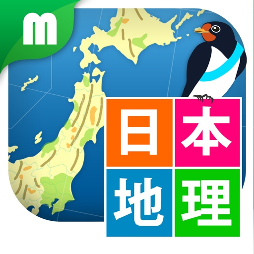

日本の地理を楽しく学べるクイズアプリが登場！「日本地理クイズ 楽しく学べる教材シリーズ」は、小学生や中学生の社会地理分野に対応し、地理に興味を持つすべての方に最適なアプリです。簡単な操作と音声読み上げ機能で、小さなお子さまから大人まで幅広く楽しんでいただけます。日本の地形や地図記号をクイズ形式で学びながら、地理知識を自然と身につけることができます。

【こんな人にオススメ】
・小学生や中学生で、社会地理分野を楽しく学びたい方
・日本地理の基本を身につけたいお子さまを持つ保護者の方
・地理や日本の文化に興味のある大人の方
・ゲーム感覚で学習を進めたい方

【アプリの構成】
「日本地理クイズ 楽しく学べる教材シリーズ」では、以下の8つのカテゴリーから出題されます：
1. 日本の山脈
2. 日本の山
3. 日本の平野
4. 日本の盆地・台地
5. 日本の河川・湖
6. 日本の湾・海・海峡
7. 日本の半島・岬
8. 地図記号

さらに、有料版「日本地図マスター」や無料版「日本地図パズル」と組み合わせることで、日本全体を総合的に学べるシリーズとなっています。

【アプリの利用方法】
1. アプリをダウンロードし、起動します。
2. 好きなカテゴリーを選んで、クイズに挑戦！
3. 問題が音声で読み上げられるので、正しい答えを指でタッチしてください。
4. 答えがわからなくても、正解が表示されるので安心！何度も挑戦するうちに自然と知識が身につきます。
5. カテゴリーごとにスコアが表示されるので、達成感を味わいながら学べます。

【ご利用環境】
・対象年齢：4歳以上
・iOS 12.0以降が必要
・インターネット通信が必要です。Wi-Fi接続を推奨します。
・ご利用前に利用規約（https://mirai.education/termofuse.html）をご確認ください。

○●○●○●○●○●○●○●○●○●○

「第7回キッズデザイン賞」受賞！

Mirai Child Education Project（ミライプロジェクト）の教育アプリが、
「第7回キッズデザイン賞」（主催：特定非営利活動法人キッズデザイン協議会）を受賞しました！
これからも、子どもたちが安心して楽しめる教育アプリを開発していきます。
ぜひ「日本地図マスター」で、楽しく学べる未来型教育を体験してください！

○●○●○●○●○●○●○●○●○●○

[View on Apple](https://apps.apple.com/jp/app/%E6%97%A5%E6%9C%AC%E5%9C%B0%E7%90%86%E3%82%AF%E3%82%A4%E3%82%BA-%E6%A5%BD%E3%81%97%E3%81%8F%E5%AD%A6%E3%81%B9%E3%82%8B%E6%95%99%E6%9D%90%E3%82%B7%E3%83%AA%E3%83%BC%E3%82%BA/id857557884)
