- [DUO3.0/CD基礎用](#duo3-0-cd基礎用)
- [女医マヤの相手の心をトリコにする心理術](#女医マヤの相手の心をトリコにする心理術)
- [朗読執事~高瀬舟~](#朗読執事-高瀬舟)
- [禅、シンプル生活のすすめ](#禅-シンフ-ル生活のすすめ)
- [そうか、君は課長になったのか。](#そうか-君は課長になったのか)
- [江戸のおんな気質](#江戸のおんな気質)
- [第三次世界大戦はもう始まっている](#第三次世界大戦はもう始まっている)
- [若くして英傑を育てた吉田松陰の希有な資質](#若くして英傑を育てた吉田松陰の希有な資質)
- [失敗学のすすめ](#失敗学のすすめ)
- [余寒の雪](#余寒の雪)
- [最高のオバハン (中島ハルコの恋愛相談室)](#最高のオハ-ハン-中島ハルコの恋愛相談室)
- [桃太郎](#桃太郎)
- [「自律神経のバランスを意識的に整えること」で健康な身体になれる](#自律神経のハ-ランスを意識的に整えること-て-健康な身体になれる)
- [おせっかいな神々](#おせっかいな神々)
- [下駄屋おけい (深川恋物語より): 深川恋物語より](#下駄屋おけい-深川恋物語より-深川恋物語より)
- [荒神](#荒神)
- [親といるとなぜか苦しい: 「親という呪い」から自由になる方法](#親といるとなせ-か苦しい-親という呪い-から自由になる方法)
- [Sanshiro](#sanshiro)
- [海と毒薬](#海と毒薬)
- [博士が解いた人付き合いの「トリセツ」](#博士か-解いた人付き合いの-トリセツ)
- [We Who Wrestle with God: Perceptions of the Divine (Unabridged)](#we-who-wrestle-with-god-perceptions-of-the-divine-unabridged)
- [You Are Not Alone (Unabridged)](#you-are-not-alone-unabridged)
- [Fully Human](#fully-human)
- [一寸法師](#一寸法師)
- [A Quiver Full of Arrows (Abridged)](#a-quiver-full-of-arrows-abridged)
- [なぜ、あなたの仕事は終わらないのか スピードは最強の武器である](#なせ-あなたの仕事は終わらないのか-スヒ-ート-は最強の武器て-ある)
- [Project Hail Mary (Unabridged)](#project-hail-mary-unabridged)
- [\[29巻\]本好きの下剋上～司書になるためには手段を選んでいられません～第五部「女神の化身8」: TO Books.](#29巻-本好きの下剋上-司書になるためには手段を選んて-いられません-第五部-女神の化身8-to-books)
- [営業の魔法――この魔法を手にした者は必ず成功する](#営業の魔法-この魔法を手にした者は必す-成功する)
- [同志少女よ、敵を撃て](#同志少女よ-敵を撃て)
- [BUTTER](#butter)
- [となりの小さいおじさん～大切なことのほぼ9割は手のひらサイズに教わった～](#となりの小さいおし-さん-大切なことのほほ-9割は手のひらサイス-に教わった)
- [ゾーンに入る技術](#ソ-ーンに入る技術)
- [\[13巻\] 転生したらスライムだった件13](#13巻-転生したらスライムた-った件13)
- [コーヒーが冷めないうちに](#コーヒーか-冷めないうちに)
- [成瀬は都を駆け抜ける](#成瀬は都を駆け抜ける)
- [また、同じ夢を見ていた](#また-同し-夢を見ていた)
- [\[18巻\] 転生したらスライムだった件18](#18巻-転生したらスライムた-った件18)
- [DUOセレクトCD](#duoセレクトcd)
- [人は話し方が9割](#人は話し方か-9割)
- [20歳の自分に受けさせたい文章講義](#20歳の自分に受けさせたい文章講義)
- [ラヴクラフト「外宇宙の色」](#ラウ-クラフト-外宇宙の色)
- [成瀬は天下を取りにいく](#成瀬は天下を取りにいく)
- [この嘘がばれないうちに](#この嘘か-は-れないうちに)
- [ホリエモンのビジネスウィークリーVOL.35 睡眠をしっかりとれば物事はもっとうまくいく](#ホリエモンのヒ-シ-ネスウィークリーvol-35-睡眠をしっかりとれは-物事はもっとうまくいく)
- [聞く聖書シリーズ \[第16巻\] 使徒言行録](#聞く聖書シリース-第16巻-使徒言行録)
- [コンサル一年目が学ぶこと](#コンサル一年目か-学ふ-こと)
- [経理以外の人のための日本一やさしくて使える会計の本](#経理以外の人のための日本一やさしくて使える会計の本)
- [新装版 神との対話1](#新装版-神との対話1)
- [超訳 韓非子](#超訳-韓非子)
- [The Fellowship of the Ring](#the-fellowship-of-the-ring)
- [鍵のない夢を見る](#鍵のない夢を見る)
- [キクタンフランス語会話【入門編】](#キクタンフランス語会話-入門編)
- [『お伽草子』より「カチカチ山」](#お伽草子-より-カチカチ山)
- [養老孟司の“逆さメガネ”](#養老孟司の-逆さメカ-ネ)
- [文庫版 近畿地方のある場所について: (KADOKAWA)](#文庫版-近畿地方のある場所について-kadokawa)
- [精神科医が見つけた 3つの幸福 最新科学から最高の人生をつくる方法](#精神科医か-見つけた-3つの幸福-最新科学から最高の人生をつくる方法)
- [インビジブルレイン](#インヒ-シ-フ-ルレイン)
- [Why We Sleep](#why-we-sleep)
- [amazonのすごい会議](#amazonのすこ-い会議)
- [The Two Towers](#the-two-towers)
- [\[1巻\] ひげを剃る。そして女子高生を拾う。: (KADOKAWA)](#1巻-ひけ-を剃る-そして女子高生を拾う-kadokawa)
- [『お伽草子』より 「カチカチ山」「瘤取り」](#お伽草子-より-カチカチ山-瘤取り)
- [早春/蜜柑](#早春-蜜柑)
- [200万人の「挫折」と「成功」のデータからわかった 継続する技術](#200万人の-挫折-と-成功-のテ-ータからわかった-継続する技術)
- [放課後インスタントセックス: シーズン 夏](#放課後インスタントセックス-シース-ン-夏)
- [\[2巻\] ひげを剃る。そして女子高生を拾う。2: (KADOKAWA)](#2巻-ひけ-を剃る-そして女子高生を拾う-2-kadokawa)
- [起きてから寝るまで英語表現1000 海外旅行編](#起きてから寝るまて-英語表現1000-海外旅行編)
- [Before the Coffee Gets Cold](#before-the-coffee-gets-cold)
- [\[3巻\] ひげを剃る。そして女子高生を拾う。3: (KADOKAWA)](#3巻-ひけ-を剃る-そして女子高生を拾う-3-kadokawa)
- [気の力](#気の力)
- [Nのために](#nのために)
- [\[4巻\] ひげを剃る。そして女子高生を拾う。4: (KADOKAWA)](#4巻-ひけ-を剃る-そして女子高生を拾う-4-kadokawa)
- [すべての疲労は脳が原因](#すへ-ての疲労は脳か-原因)
- [How To Know a Person](#how-to-know-a-person)
- [\[5巻\] ひげを剃る。そして女子高生を拾う。5: (KADOKAWA)](#5巻-ひけ-を剃る-そして女子高生を拾う-5-kadokawa)
- [Good Strategy Bad Strategy: The Difference and Why It Matters (Unabridged)](#good-strategy-bad-strategy-the-difference-and-why-it-matters-unabridged)
- [シャーロック・ホームズ/緋色の研究\[新版\]](#シャーロック-ホームス-緋色の研究-新版)
- [ケモノの城](#ケモノの城)
- [ナイツ漫才コレクション vol.10](#ナイツ漫才コレクション-vol-10)
- [The Thinking Machine](#the-thinking-machine)
- [天才はあきらめた](#天才はあきらめた)
- [フーガはユーガ](#フーカ-はユーカ)
- [The Ice Monster](#the-ice-monster)
- [新装版 続・森崎書店の日々](#新装版-続-森崎書店の日々)
- [The Emissary (Unabridged)](#the-emissary-unabridged)
- [\[2巻\] 悪役令嬢、ブラコンにジョブチェンジします2: (KADOKAWA)](#2巻-悪役令嬢-フ-ラコンにシ-ョフ-チェンシ-します2-kadokawa)
- [Mode One: Let the Women Know What You're REALLY Thinking (Unabridged)](#mode-one-let-the-women-know-what-you-re-really-thinking-unabridged)
- [「脳にいいこと」すべて試して1冊にまとめてみた](#脳にいいこと-すへ-て試して1冊にまとめてみた)
- [\[4巻\] 悪役令嬢、ブラコンにジョブチェンジします4: (KADOKAWA)](#4巻-悪役令嬢-フ-ラコンにシ-ョフ-チェンシ-します4-kadokawa)
- [\[3巻\] 悪役令嬢、ブラコンにジョブチェンジします3: (KADOKAWA)](#3巻-悪役令嬢-フ-ラコンにシ-ョフ-チェンシ-します3-kadokawa)
- [\[1巻\] 悪役令嬢、ブラコンにジョブチェンジします: (KADOKAWA)](#1巻-悪役令嬢-フ-ラコンにシ-ョフ-チェンシ-します-kadokawa)
- [Pedro Páramo](#pedro-pa-ramo)
- [The Last Girl: My Story of Captivity, and My Fight Against the Islamic State (Unabridged)](#the-last-girl-my-story-of-captivity-and-my-fight-against-the-islamic-state-unabridged)
- [The Righteous Mind : Why Good People Are Divided by Politics and Religion](#the-righteous-mind-why-good-people-are-divided-by-politics-and-religion)
- [月刊・中谷彰宏167「覚悟のある者同士が、結ばれる。」: 好きな人を成長させるアゲマン術](#月刊-中谷彰宏167-覚悟のある者同士か-結は-れる-好きな人を成長させるアケ-マン術)
- [Eye of the Earthquake Dragon: A Branches Book (Dragon Masters #13)](#eye-of-the-earthquake-dragon-a-branches-book-dragon-masters-13)
- [Kopf schlägt Kapital: Die ganz andere Art, ein Unternehmen zu gründen. Von der Lust, ein Entrepreneur zu sein](#kopf-schla-gt-kapital-die-ganz-andere-art-ein-unternehmen-zu-gru-nden-von-der-lust-ein-entrepreneur-zu-sein)
- [置き配的](#置き配的)
- [戦後日本経済史](#戦後日本経済史)

## DUO3.0/CD基礎用

「DUO3.0」は日本の「いろは歌」をヒントに、現代英語の重要単語1600語と重要熟語1000語を重複なしで560本の英文に凝縮させました。「DUO3.0/CD基礎用」の音声は「見出し英文和訳→見出し英文(スロースピード)→見出し語→最後にもう一度見出し英文(ナチュラルスピード)」という丁寧な録音パターンを採用し、英語が苦手な方も、楽しく確実にマスターできる内容となっています。語学の習得は、文字を読んで覚えるよりも、聞いて覚える方がはるかに簡単。「DUO3.0」テキストとあわせて学習いただくとより効果的です。この音声を繰り返して聞いて、一つ一つの単語や熟語の「実際の音」をしっかりマスターしていって下さい。

[View on Apple](https://books.apple.com/jp/audiobook/duo3-0-cd%E5%9F%BA%E7%A4%8E%E7%94%A8/id1641050567)

## 女医マヤの相手の心をトリコにする心理術

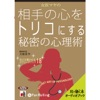

恋愛でも、ビジネスでも、自分の気持ちを高めて、相手の気持ちをトリコにしなければうまくいかないもの。本書では、明るくてセクシーな女医マヤ先生が、人の心をつかみ、抱きしめ、すべてがうまく回るようになる18の心理テクニックを紹介!マヤ先生は精神科医でもあり、部下である「ゆうきゆう」氏とメールマガジン「セクシー心理学」を運営。日本一の読者数15万人を誇り、2004年の「日本メルマガ大賞」にも選ばれています。この本には、あなたの気持ちを高め、そして相手の気持ちをトリコにする、「答え」があります。 私の学んできた精神医学・心理学、そして医師として活動する中で手に入れてきた技術。さらに学生の時から、ホスト・ホステスさんなど、さまざまな夜のお仕事の方たちと関わってきた中で得たテクニックを、余すところなく書いています。これを読み、覚えておくだけで、あなたは確実に色々な人の気持ちをつかみ、抱き締め、すべてがうまく回るようになるはずです。※本商品は「女医マヤの相手の心をトリコにする心理術」(海竜社刊 大和マヤ著ISBN:978-4-7593-0851-8 268頁1,470円(税込))をオーディオ化したものです。(C)2005 Maya Yamato

[View on Apple](https://books.apple.com/jp/audiobook/%E5%A5%B3%E5%8C%BB%E3%83%9E%E3%83%A4%E3%81%AE%E7%9B%B8%E6%89%8B%E3%81%AE%E5%BF%83%E3%82%92%E3%83%88%E3%83%AA%E3%82%B3%E3%81%AB%E3%81%99%E3%82%8B%E5%BF%83%E7%90%86%E8%A1%93/id303779515)

## 朗読執事~高瀬舟~

人気の声優が名作作品を朗読する話題のiPhoneアプリ「朗読執事」。その朗読がついにオーディオブックになって登場!  ◆あらすじ◆  京都の罪人を遠島に送るために高瀬川を下る高瀬舟。 その船に、弟を殺した喜助という男が乗せられてきた。  ここに乗せられていく罪人は、普段気の毒な様子をしているものだが、喜助はとても晴れやかな顔をしていた。  護送役の同心、羽田庄兵衛は、彼を不審に思い、訳を尋ねた。   朗読執事 公式サイト http://www.rodokushitsuji.jp/

[View on Apple](https://books.apple.com/jp/audiobook/%E6%9C%97%E8%AA%AD%E5%9F%B7%E4%BA%8B-%E9%AB%98%E7%80%AC%E8%88%9F/id1433898615)

## 禅、シンプル生活のすすめ

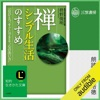

変化に「気づく」―すべては、この「気づき」から始まる、息をゆっくりと吐いてみる―マイナスの感情を退治する方法、脱いだ靴を揃える―すると、生き方が美しくなるなどなど、一日ひとつ、すぐにできる“心の洗い方”。

[View on Apple](https://books.apple.com/jp/audiobook/%E7%A6%85-%E3%82%B7%E3%83%B3%E3%83%97%E3%83%AB%E7%94%9F%E6%B4%BB%E3%81%AE%E3%81%99%E3%81%99%E3%82%81/id1281026815)

## そうか、君は課長になったのか。

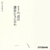

課長時代に、病に倒れた妻と自閉症の長男を守りながら、部下をまとめ上げ、数々の事業を成功させた「上司力」の真髄。

●今、“課長受難"の時代を迎えています。少ない人員・予算で、かつてより難易度の高い成果を求められているからです。
●こんなときこそ、課長職の「核心」をしっかりとらえることが重要。そして、部下の心ガッチリ掴んで、最短距離で成果を出す知恵を絞る必要があります。
●東レ経営研究所の佐々木常夫氏は、39歳で課長になったちょうどその年に奥様が病に倒れ、自閉症のご長男を含む3人の子どもの世話を焼くために定時で帰ることを余儀なくされました。
●当時、佐々木氏が課長を務めた部署は超多忙。「課長職の本質」を一刻も早く掴まなければ、仕事も家族もともに倒れてしまう状況でした。そこで、佐々木氏は、試行錯誤を繰り返しながら“上司力"とマネジメント・スキルを磨き上げていきました。
●そして、困難な状況のなか数々のビッグプロジェクトを成功させました。その後、部長、取締役、社長に就任。今では、奥様も完治され幸せな家庭生活を送っていらっしゃいます。
●本書では、その佐々木氏に、課長の「心得」と「仕事術」の真髄を伝授していただきました。大小さまざまなスキル・ノウハウを紹介しながら、その背後に欠かせない「志」について熱く語っていただきました。
●課長時代に苦労した佐々木氏だからこそ書ける、「悩める課長」への心のこもった37通の手紙。ぜひ、多くの職場のリーダーに読んでいただきたいと思います。

[View on Apple](https://books.apple.com/jp/audiobook/%E3%81%9D%E3%81%86%E3%81%8B-%E5%90%9B%E3%81%AF%E8%AA%B2%E9%95%B7%E3%81%AB%E3%81%AA%E3%81%A3%E3%81%9F%E3%81%AE%E3%81%8B/id1468464183)

## 江戸のおんな気質

名だたる文筆家が登場する、文藝春秋の文化講演会。  歌舞伎「加賀見山旧錦絵」の題材となった、江戸時代の〝加賀騒動〟。史実が物語化されてゆく背景を語る姿に、「新国劇の池波正太郎」がちらりと透ける。(1999年東京宝塚劇場 文藝春秋祭り 講演原題「私の時代小説」より)  ●白と黒のあいだ ●強いおんな ●史実と虚構 文藝春秋の文化講演会は、文学談や執筆秘話に人生論も交え、含蓄と味わい深い講演があなたの生き方に豊かさと彩りを添えます。

[View on Apple](https://books.apple.com/jp/audiobook/%E6%B1%9F%E6%88%B8%E3%81%AE%E3%81%8A%E3%82%93%E3%81%AA%E6%B0%97%E8%B3%AA/id964986802)

## 第三次世界大戦はもう始まっている

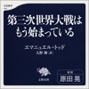

本タイトルには付属資料が用意されています。詳しくは「デジタルブックレットの探し方」ガイドをご参照ください。 https://support.apple.com/ja-jp/HT208929  &#xa0;ロシアによるウクライナ侵攻を受けての緊急出版。   戦争を仕掛けたのは、プーチンでなく、米国とNATOだ。   「プーチンは、かつてのソ連やロシア帝国の復活を目論んでいて、東欧全体を支配しようとしている。ウクライナで終わりではない。その後は、ポーランドやバルト三国に侵攻する。ゆえにウクライナ問題でプーチンと交渉し、妥協することは、融和的態度で結局ヒトラーの暴走を許した1938年のミュンヘン会議の二の舞になる」――西側メディアでは、日々こう語られているが、「ウクライナのNATO入りは絶対に許さない」とロシアは明確な警告を発してきたのにもかかわらず、西側がこれを無視したことが、今回の戦争の要因だ。   ウクライナは正式にはNATOに加盟していないが、ロシアの侵攻が始まる前の段階で、ウクライナは「NATOの“事実上”の加盟国」になっていた。米英が、高性能の兵器を大量に送り、軍事顧問団も派遣して、ウクライナを「武装化」していたからだ。現在、ロシア軍の攻勢を止めるほどの力を見せているのは、米英によって効果的に増強されていたからだ。   ロシアが看過できなかったのは、この「武装化」がクリミアとドンバス地方の奪還を目指すものだったからだ。「我々はスターリンの誤りを繰り返してはいけない。手遅れになる前に行動しなければならない」とプーチンは発言していた。つまり、軍事上、今回のロシアの侵攻の目的は、何よりも日増しに強くなるウクライナ軍を手遅れになる前に破壊することにあった。   ウクライナ問題は、元来は、国境の修正という「ローカルな問題」だったが、米国はウクライナを「武装化」して「NATOの事実上の加盟国」としていたわけで、この米国の政策によって、ウクライナ問題は「グローバル化=世界戦争化」した。   いま人々は「世界は第三次世界大戦に向かっている」と話しているが、むしろ「すでに第三次世界大戦は始まった」。ウクライナ軍は米英によってつくられ、米国の軍事衛星に支えられた軍隊で、その意味で、ロシアと米国はすでに軍事的に衝突しているからだ。ただ、米国は、自国民の死者を出したくないだけだ。   ウクライナ人は、「米国や英国が自分たちを守ってくれる」と思っていたのに、そこまでではなかったことに驚いているはずだ。ロシアの侵攻が始まると、米英の軍事顧問団は、大量の武器だけ置いてポーランドに逃げてしまった。米国はウクライナ人を“人間の盾”にしてロシアと戦っているのだ。&#xa0;

[View on Apple](https://books.apple.com/jp/audiobook/%E7%AC%AC%E4%B8%89%E6%AC%A1%E4%B8%96%E7%95%8C%E5%A4%A7%E6%88%A6%E3%81%AF%E3%82%82%E3%81%86%E5%A7%8B%E3%81%BE%E3%81%A3%E3%81%A6%E3%81%84%E3%82%8B/id1630287237)

## 若くして英傑を育てた吉田松陰の希有な資質

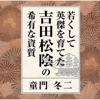

松下村塾で有名な吉田松陰は、圧倒的なカリスマ性で幕末に新しい思想をもたらした。 後の明治維新の英傑たちを育てた松陰の資質とは……。

[View on Apple](https://books.apple.com/jp/audiobook/%E8%8B%A5%E3%81%8F%E3%81%97%E3%81%A6%E8%8B%B1%E5%82%91%E3%82%92%E8%82%B2%E3%81%A6%E3%81%9F%E5%90%89%E7%94%B0%E6%9D%BE%E9%99%B0%E3%81%AE%E5%B8%8C%E6%9C%89%E3%81%AA%E8%B3%87%E8%B3%AA/id1433975259)

## 失敗学のすすめ

立花隆氏推薦!「失敗に学べ!失敗の現象学から失敗の本質学へ!」
創造力のつけ方から、大失敗の防ぎ方まで。

おもな内容
●「失敗学」に基づく東大機械科の学習法
●失敗には階層性がある
●よい失敗、悪い失敗
●失敗は成長する
●失敗情報は隠れたがる
●「偽ベテラン」と「本当のベテラン」の違い
●大切なのは仮想演習をすること ほか

[View on Apple](https://books.apple.com/jp/audiobook/%E5%A4%B1%E6%95%97%E5%AD%A6%E3%81%AE%E3%81%99%E3%81%99%E3%82%81/id1550557034)

## 余寒の雪

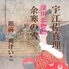

男髷を結い、男装し、剣士として生きることを夢見て修行に励む、知佐。当然ながら縁遠く、心配した両親が用意した縁談の相手には子供がいた・・・(時代小説)

[View on Apple](https://books.apple.com/jp/audiobook/%E4%BD%99%E5%AF%92%E3%81%AE%E9%9B%AA/id1101110317)

## 最高のオバハン (中島ハルコの恋愛相談室)

中島ハルコ52歳、バツ2、女社長。自称・いま最もブレイクしているオバハン。金持ちなのにドケチで、口の悪さは天下一品。新幹線ホームのキヨスクで週刊誌を立ち読みしたり、大地震が起きたとき、無理矢理運送会社のトラックに自宅まで送らせたりといった無茶苦茶なエピソードが満載。そんな彼女の周りには、なぜか悩みごとを抱えた人間が寄ってくる。「十年間付き合ってる不倫相手に貸した三百万円が返ってこない」「老舗の和菓子屋の跡継ぎ息子がミュージシャンになると言い出した」「自分の学歴(東大卒)が高すぎてオトコができない」「40過ぎてやっと結婚したい相手が現れたのに、同居している実家の両親が結婚に猛反対」など、さまざまな相談が持ち込まれる。これらの悩みを、ハルコは決してきれいごとは言わず、独特の人生観によって解決していく。 心あたりのある人は読んで恐ろしくなり、若い読者にとっては、きたる人生の参考書にすらなるのではないだろうか。常識にとらわれず、本音で行動するハルコの歯に衣着せぬ物言いには、聖人君子の教えにはない、不思議な説得力がある。胸のすくような啖呵と、ハルコの傍若無人なようで鋭い洞察力が、悩める人々の背中を押してくれる、痛快エンタテインメント小説。

[View on Apple](https://books.apple.com/jp/audiobook/%E6%9C%80%E9%AB%98%E3%81%AE%E3%82%AA%E3%83%90%E3%83%8F%E3%83%B3-%E4%B8%AD%E5%B3%B6%E3%83%8F%E3%83%AB%E3%82%B3%E3%81%AE%E6%81%8B%E6%84%9B%E7%9B%B8%E8%AB%87%E5%AE%A4/id1433051637)

## 桃太郎

勇気と力の源は、日本一のきびだんご    ◆このお話は『頭のいい子を育てるおはなし366』に収録されています。    脳科学おばあちゃん久保田カヨ子先生推薦!「想像力を伸ばし、脳を育む。幼児の宝となる1冊」。1日1話366日分、子どもの生きる力を育てる究極の読み聞かせ本です。  おはなしのジャンルは昔話や童話だけでなく、伝記・落語・詩・普遍的な名作など、子どもたちの将来に確実につながっていく作品を網羅していますので、知と脳を育むのはもちろんのこと、豊かな心も育んでいくことでしょう。

[View on Apple](https://books.apple.com/jp/audiobook/%E6%A1%83%E5%A4%AA%E9%83%8E/id1544694752)

## 「自律神経のバランスを意識的に整えること」で健康な身体になれる

小林氏は講演で数々の「健康語録」を紹介し「一度立ち止まって、ゆっくり心に余裕をもつことが大切」と説いた。まず健康とは何かについて。末梢の細胞一つ一つに質のいい十分な量の血液を供給出来るかということが健康の定義といってよい。自律神経は生命のライフラインを司る神経で、アクセル役の交感神経とブレーキ役の副交感神経がある。交感神経は朝から活発に動き、夕方からは副交感神経が高くなる。そのバランスが重要。この2つが血管と腸をコントロールして健康の質を決める。健康を最高にするには腸が良く活動することが必要。副交感神経が下がるとガンになりやすい。自律神経を鍛えるには呼吸が良く、その場合、息を長く吐くことが大切。ガムを噛むとリズムがとれ自律神経が高くなる。アメリカの野球選手がガムを噛むのはリズムをとるためだ。次に便秘について。便秘で多いのは精神的な疲れ。便秘の裏には腸の病気や糖尿病など別の病気が隠れている。腸内環境を良くするには副交感神経を高めること。そのためには水を飲む。1日に1.5㍑ぐらいは必要。また重要なことは朝食をがっちり摂ること。朝食を抜くと体が動かなくなる。早起きや睡眠は副交感神経を上げるので効果的。寝る前に食べないこと。食事は少量を時間をかけてゆっくりと。夕食後にゆっくり散歩し気分転換するのもいい。寝る前の風呂の温度はぬる目の39~40度がいい。笑顔は副交感神経を高めガンを攻撃する免疫を出す。怒ることは百害あって一利なし。日記も長く続ければ効果が大きい。

[View on Apple](https://books.apple.com/jp/audiobook/%E8%87%AA%E5%BE%8B%E7%A5%9E%E7%B5%8C%E3%81%AE%E3%83%90%E3%83%A9%E3%83%B3%E3%82%B9%E3%82%92%E6%84%8F%E8%AD%98%E7%9A%84%E3%81%AB%E6%95%B4%E3%81%88%E3%82%8B%E3%81%93%E3%81%A8-%E3%81%A7%E5%81%A5%E5%BA%B7%E3%81%AA%E8%BA%AB%E4%BD%93%E3%81%AB%E3%81%AA%E3%82%8C%E3%82%8B/id1433965164)

## おせっかいな神々

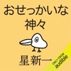

&lt;星新一 名作セレクション&gt;  神さまはおせっかい! 金もうけの夢を叶えてくれた“笑い顔の神"の正体は? スマートなユーモアあふれるショートショート集。全40編。  神さまたちはおせっかい。人間どもをからかったり、意地悪をしたり、時にはいたずらをしかけたり。あなたのそばで起こった事件も、ひょっとしたら神さまのしわざかもしれない……。 川ぞいで拾った〝笑い顔の神〟の正体とは?ブロンズの〝商売の神〟のご利益は?ふとした偶然から巻き起こる数々の事件を斬新・奇抜な着想で描き、異次元の笑いの世界へと導く魅惑のショートショート40編を収録。  目次 笑い顔の神 現代の美談 サービス 魔法使い 奇妙な旅行 出来心 問題の男 非常ベル 古代の秘法 死の舞台 マスコット 税金ぎらい 隊員たち 指紋 権利金 保護色 夜の声 機会 箱 魅力的な薬 未知の星へ 夜の事件 歴史の論文 重要なシーン 商売の神 四日間の出来事 愛の指輪 効果 協力者 狂気と弾丸 天罰 無表情な女 ささやき 午後の出来事 夜の召使い 三年目の生活 すばらしい銃 そそっかしい相手 伴奏者 敬服すべき一生

[View on Apple](https://books.apple.com/jp/audiobook/%E3%81%8A%E3%81%9B%E3%81%A3%E3%81%8B%E3%81%84%E3%81%AA%E7%A5%9E%E3%80%85/id1782430798)

## 下駄屋おけい (深川恋物語より): 深川恋物語より

深川の太物屋「伊豆屋」の長女おけいは、明るく活発な娘だった。べべやかんざしよりも下駄がすきなおけいは、いつもはす向いの「下駄清」の彦爺いの仕事ぶりをながめていた。(時代小説)

[View on Apple](https://books.apple.com/jp/audiobook/%E4%B8%8B%E9%A7%84%E5%B1%8B%E3%81%8A%E3%81%91%E3%81%84-%E6%B7%B1%E5%B7%9D%E6%81%8B%E7%89%A9%E8%AA%9E%E3%82%88%E3%82%8A-%E6%B7%B1%E5%B7%9D%E6%81%8B%E7%89%A9%E8%AA%9E%E3%82%88%E3%82%8A/id1101237508)

## 荒神

元禄太平の世の半ば、東北の小藩の山村が、一夜にして壊滅状態となる。  隣り合う二藩の反目、お家騒動、奇異な風土病など様々な事情の交錯するこの土地に、その"化け物"は現れた。  藩主側近・弾正と妹・朱音、朱音を慕う村人と用心棒・宗栄、  山里の少年・蓑吉、小姓・直弥、謎の絵師・圓秀……  山のふもとに生きる北の人びとは、突如訪れた"災い"に何を思い、いかに立ち向かうのか。  そして化け物の正体とは一体何なのか――!?  その豊潤な物語世界は現代日本を生きる私達に大きな勇気と希望をもたらす。  著者渾身の冒険群像活劇。

[View on Apple](https://books.apple.com/jp/audiobook/%E8%8D%92%E7%A5%9E/id1798684694)

## 親といるとなぜか苦しい: 「親という呪い」から自由になる方法

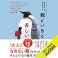

\全世界で大共感の声50万部突破/  「親のために努力し続けて、しんどい――そんな自分に気づき、涙が止まりません」 「共感できることがありすぎて、すべてのページにマーカーを引きたい」 「未熟な親のもとで育ち、自分を大切にする方法を知らなかった私のために書かれた本」 「これほど人生が変わる本はなかった!」  見た目は大人だが、精神年齢は子どものままの親が子どもを苦しめる。 愛したいのに愛せない親を持つ人が「心の重荷」を降ろす方法  ◆家庭環境は平凡です。だけど親が嫌いです ◆「本当にやりたいこと」が見つからない… ◆私は家族の落ちこぼれ?人生がむなしいです ◆恋愛が苦手。どうしていいかわかりません  こうした「生きづらさ」を抱える人は、 「自分がヘンなのではないか」と悩むことが多いでしょう。  でも、その原因が子ども時代にあるとしたら…?  あなたに呪いをかけ、いつまでもあなたを苦しめる 「見た目は大人、中身は子どもの親」の4タイプとは。  ◆感情的な親……機嫌を損ねないかと周囲はビクビク ◆熱心すぎる親……子どもの気持ちを無視した「完璧主義」 ◆受け身な親……見て見ぬふりで役に立たない ◆拒む親……冷たく無関心。なぜ子どもを持ったのか謎  「まわりの人たちは家族の愛やつながりを明るく語るのに、なぜ自分は孤独を感じるのか。 家族と仲よくしようとするだけで、傷ついたり無力感にさいなまれたりするのはなぜだろう。 親から受けたつらい思いや混乱から、どうやって子どもは立ちなおっていけばいいのだろうか。 本書ではその解決のヒントを提示する」  ――著者 リンジー・C・ギブソン

[View on Apple](https://books.apple.com/jp/audiobook/%E8%A6%AA%E3%81%A8%E3%81%84%E3%82%8B%E3%81%A8%E3%81%AA%E3%81%9C%E3%81%8B%E8%8B%A6%E3%81%97%E3%81%84-%E8%A6%AA%E3%81%A8%E3%81%84%E3%81%86%E5%91%AA%E3%81%84-%E3%81%8B%E3%82%89%E8%87%AA%E7%94%B1%E3%81%AB%E3%81%AA%E3%82%8B%E6%96%B9%E6%B3%95/id1710370406)

## Sanshiro

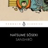

<b>Brought to you by Penguin. </b>  This Penguin Classic is performed by Andrew Koji, best known for <i>Warrior</i> and <i>Snake Eyes</i>. This definitive recording includes an introduction by Murakami.   One of Soseki's most beloved works of fiction, the novel depicts the 23-year-old Sanshiro leaving the sleepy countryside for the first time in his life to experience the constantly moving 'real world' of Tokyo, its women and university. In the subtle tension between our appreciation of Soseki's lively humour and our awareness of Sanshiro's doomed innocence, the novel comes to life. <i>Sanshiro</i> is also penetrating social and cultural commentary.  © Natsume Soseki 2009 (P) Penguin Audio 2021

[View on Apple](https://books.apple.com/jp/audiobook/sanshiro/id1590137065)

## 海と毒薬

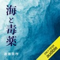

戦争末期、実際に起こった米軍捕虜に対する残虐行為を題材に日本人の罪責意識を問う。第5回新潮社文学賞、第12回毎日出版文化賞受賞作。

[View on Apple](https://books.apple.com/jp/audiobook/%E6%B5%B7%E3%81%A8%E6%AF%92%E8%96%AC/id1724979635)

## 博士が解いた人付き合いの「トリセツ」

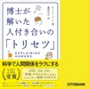

★最年少で王立協会科学図書賞受賞!
★タイムズ紙、BBCサイエンス・フォーカス絶賛!

科学で人間関係をラクにする!
思い悩むことがあったら、推量や思い込みではなく、決して嘘をつかない「科学」に頼ってみよう。
科学はあなたの陰口を言ったりしない、信頼に足る最高の友人になってくれる。

ADHD(注意欠如・多動性障害)、ASD(自閉症スペクトラム障害)、生化学のPhD(博士号)……
「普通」がわからない科学者が、幼いころの自分のために書き上げた人間関係のトリセツ。
タンパク質に人間関係を学び、『アトキンス 物理化学要論』で部屋の片付けに挑む——。
数々の失敗と「実験」を重ねてきた博士が語る、周りと協調しながら、それでも自分らしく生きる方法。

・チームワークは「がん細胞」に学べ
・部屋が散らかるのは「熱力学」のせい
・「波長」があう人の見つけ方
・恐怖を資産に変える「光の屈折」の考え方
・恥ずかしい思い出も「深層学習」でうまく活用
・礼儀作法で失敗しないための「ゲーム理論」

「地球での生活が始まってから5年目のこと、私は間違った場所に着陸したのではないかと思い始めていた。降りる惑星を間違えてしまったのに違いない。自分と同じ種と暮らしているのに、よそ者のような気分がしていた。言葉は理解できるのに伝わらない。仲間の人間たちと同じ外見をしているのに、本質的な特徴はまったく違う。……
この宇宙に存在するほとんどすべてのものについて、それを題材とする本があるというのに、私にどうあるべきかを教えてくれる本はないのだ。私が世の中に出る用意を助けてくれる本はなかった。苦しんでいる人がいたら肩を抱いて慰めればいい、他の人が笑っているときには一緒に笑えばいい、他の人が泣いているときには一緒に泣けばいいのだと、教えてくれる本はなかった。」(本文「はじめに」より)

【目次】
第1章 - 「機械学習と意思決定」箱思考から抜け出して、型にはまらず考えるには
第2章 - 「生化学、友情、違いが持つ力」自分の宿命的な奇妙さを受け入れるには
第3章 - 「熱力学、秩序、無秩序」完璧さを忘れるには
第4章 - 「光、屈折、恐れ」恐怖心を制御するには
第5章 - 「波動理論、調和運動、そして自分の共和振動数を見つけること」調和を見出すには
第6…

[View on Apple](https://books.apple.com/jp/audiobook/%E5%8D%9A%E5%A3%AB%E3%81%8C%E8%A7%A3%E3%81%84%E3%81%9F%E4%BA%BA%E4%BB%98%E3%81%8D%E5%90%88%E3%81%84%E3%81%AE-%E3%83%88%E3%83%AA%E3%82%BB%E3%83%84/id1767951659)

## We Who Wrestle with God: Perceptions of the Divine (Unabridged)

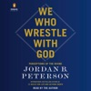

<b>A revolutionary new offering from Dr. Jordan B. Peterson, renowned psychologist and author of the global bestseller <i>12 Rules for Life</i>.</b>  In <i>We Who Wrestle with God</i>, Dr. Peterson guides us through the ancient, foundational stories of the Western world. In riveting detail, he analyzes the Biblical accounts of rebellion, sacrifice, suffering, and triumph that stabilize, inspire, and unite us culturally and psychologically. Adam and Eve and the eternal fall of mankind; the resentful and ultimately murderous war of Cain and Abel; the cataclysmic flood of Noah; the spectacular collapse of the Tower of Babel; Abraham’s terrible adventure; and the epic of Moses and the Israelites.&#xa0; What could such stories possibly mean? What force wrote and assembled them over the long centuries? How did they bring our spirits and the world together, and point us in the same direction?&#xa0;&#xa0;  It is time for us to understand such things, scientifically and spiritually; to become conscious of the structure of our souls and our societies; and to see ourselves and others as if for the first time.&#xa0;&#xa0;&#xa0;  Join Elijah as he discovers the Voice of God in the dictates of his own conscience and Jonah confronting hell itself in the belly of the whale because he failed to listen and act. Set yourself straight in intent, aim, and purpose as you begin to more deeply understand the structure of your society and your soul. Journey with Dr. Peterson through the greatest stories ever told.&#xa0;&#xa0;  Dare to wrestle with God.

[View on Apple](https://books.apple.com/jp/audiobook/we-who-wrestle-with-god-perceptions-of/id1729311711)

## You Are Not Alone (Unabridged)

<b>This sophisticated, no-holds-barred biography of Michael Jackson by his brother Jermaine is filled with keen insight, rich anecdotes, and behind-the-scenes detail.</b>  Older than Michael by four years, Jermaine knows the real Michael as only a brother can. In this raw, honest, and poignant account, he reveals Michael the private person, not Michael “the King of Pop.” From their shared childhood and the Jackson 5 years through Michael’s phenomenal solo career, his loves, his suffering, and his tragic end, Jermaine doesn’t flinch from tackling the tough issues: the torrid press, the scandals, the allegations, the court cases, the internal politics, the ill-fated This Is It tour, and the disturbing developments in the days leading up to Michael’s death.   But where previous works have presented only thin versions of a media construct, Jermaine provides a rare glimpse into the complex heart, mind, and soul of a brilliant but sometimes troubled entertainer. As a witness to history on the inside, Jermaine is the only person qualified to deliver the real Michael and reveal what made him tick: his private opinions and unseen emotions through the most headline-making episodes of his life.  His hope is to foster a true and final understanding of Michael: who he was, what he was, and what shaped him.

[View on Apple](https://books.apple.com/jp/audiobook/you-are-not-alone-unabridged/id1861371596)

## Fully Human

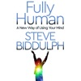

<b>A mother of small children trusts her 'gut feelings' and it saves her life.</b>  <b>A young dad is able to grieve for his lost baby – using a song.</b>  What if there were parts of our minds which we never use, but if awakened, could make us so much happier, connected and alive? What if awakening those parts could bring peace to the conflicts and struggles we all go through?  Here, one of the world's best-known psychotherapists and educators shows how you can be more alive, more connected. More <i>Fully Human</i>.  From the cutting edge, where therapy meets neuroscience, Steve Biddulph explores the new concept of 'supersense' – the feelings beneath our feelings – which can guide us to a more awake and free way of living every minute of our lives. And the Four-storey Mansion, a way of using your mind that can be taught to a five-year-old, but can also help the most damaged adult.  In <i>Fully Human</i>, Steve Biddulph draws on deeply personal stories from his own life, as well of those of his clients, and from the frontiers of thinking about how the brain works with the body and the wisdom of the 'wild creature' inside all of us.  From the bestselling author of <i>Raising Boys</i>.

[View on Apple](https://books.apple.com/jp/audiobook/fully-human/id1566532339)

## 一寸法師

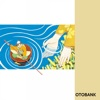

小さいけれど、ヒーローです!    ◆このお話は『頭のいい子を育てるおはなし366』に収録されています。    脳科学おばあちゃん久保田カヨ子先生推薦!「想像力を伸ばし、脳を育む。幼児の宝となる1冊」。1日1話366日分、子どもの生きる力を育てる究極の読み聞かせ本です。  おはなしのジャンルは昔話や童話だけでなく、伝記・落語・詩・普遍的な名作など、子どもたちの将来に確実につながっていく作品を網羅していますので、知と脳を育むのはもちろんのこと、豊かな心も育んでいくことでしょう。

[View on Apple](https://books.apple.com/jp/audiobook/%E4%B8%80%E5%AF%B8%E6%B3%95%E5%B8%AB/id1544698031)

## A Quiver Full of Arrows (Abridged)

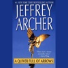

<b>The bestselling author of<i> Sons of Fortune</i>, Jeffrey Archer once again astonishes, delights, and electrifies with this audio collection.</b>  <b> Featuring bonus interviews with the author.  </b>  From London to China, and New York to Nigeria, Jeffrey Archer takes the listener on a tour of ancient heirlooms and modern romance, of cutthroat business and kindly strangers, of lives lived in the realms of power and lives freed from the gloom of oppression. Fortunes are made and squandered, honor betrayed and redeemed, and love lost and rediscovered.   Embracing the passions that drive men and women to love and to hate, <i>A Quiver Full of Arrow</i>s will captivate the hearts and souls of listeners everywhere.

[View on Apple](https://books.apple.com/jp/audiobook/a-quiver-full-of-arrows-abridged/id1496084815)

## なぜ、あなたの仕事は終わらないのか スピードは最強の武器である

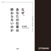

4か月で10万部突破!

元マイクロソフト伝説のプログラマーが、超速時間術を初めて公開する話題作が早くも登場!
いつも残業ばかり、締め切りに間に合わない、評価されない。
そんなあなたの悩みを解消し、本当にやりたいことに時間を使えるようになる、人生を変える一冊です。

・仕事が終わらない
・さぼっているわけではないのに納期に間に合わない
・実力があるのに活かせていない

このような悩みを抱えている方に、今日から人生を変えるためにまず聞いていただきたい一冊です。

本作品では、マイクロソフトでWindows95の開発に携わり、
その後自ら起業して世界で活躍してきた中島氏が、40年間実践してきた自らの時間術を公開します。

海外での勤務経験もある著者によれば、多くの日本人が「ラストスパート志向」。
最後に何とか頑張って終わらせよう、という姿勢で仕事に臨んでいることが、
仕事の効率を下げる要因になっています。

著者が勧めるのは、これとは全く逆の「ロケットスタート時間術」。
本作品では、締め切りに余裕をもって、クオリティの高い仕事をし、
仕事以外のことにも時間を十分割けるようになるために何をすべきか、
多くのエピソードとともに、具体的なノウハウが公開されています。

仕事を早く終わらせるためには、まずは全体像をしっかりと把握し、
さらに、今あなたに求められている仕事が何なのかをきちんと理解する必要があります。
ただやみくもに急いでも、頑張ってもだめで、仕事には早く進めるコツがあるのです。

柔軟に考え、仕事のスピードを速めてさっさと仕事を終わらせ、好きなことに向き合う。
そんな生活を手に入れたいあなたのための一冊です。

空いた時間は、プライベートの時間や、
さらに仕事を効率化し成果を上げるためのスキルアップの時間にあてることができ、
人生はどんどんあなたの思い通りに進んでいくようになることでしょう。

本作品の時間術を活かして時間を制し、人生の主導権を手にして、
昨日までとは全く違う新しい人生を始めてみませんか?

[View on Apple](https://books.apple.com/jp/audiobook/%E3%81%AA%E3%81%9C-%E3%81%82%E3%81%AA%E3%81%9F%E3%81%AE%E4%BB%95%E4%BA%8B%E3%81%AF%E7%B5%82%E3%82%8F%E3%82%89%E3%81%AA%E3%81%84%E3%81%AE%E3%81%8B-%E3%82%B9%E3%83%94%E3%83%BC%E3%83%89%E3%81%AF%E6%9C%80%E5%BC%B7%E3%81%AE%E6%AD%A6%E5%99%A8%E3%81%A7%E3%81%82%E3%82%8B/id1440701873)

## Project Hail Mary (Unabridged)

<b>THE #1 </b><b><i> NEW YORK TIMES </i></b><b> BESTSELLER FROM THE AUTHOR OF </b><b><i> THE MARTIAN. </i></b><b> Now a major motion picture starring Ryan Gosling, directed by Phil Lord and Christopher Miller, with a screenplay by Drew Goddard. Project Hail Mary is now playing exclusively in theaters.</b>  <b><i>Winner of the 2022 Audie Awards' Audiobook of the Year</i></b>  <b><i>Number-One Audible and </i></b><b>New York Times</b><b><i> Audio Best Seller</i></b>  <b><i>More than three million audiobooks sold</i></b>  <b>A lone astronaut must save the earth from disaster in this incredible new science-based thriller from the number-one </b><b><i>New York Times</i></b><b> best-selling author of </b><b><i>The Martian</i></b><b>.</b>  Ryland Grace is the sole survivor on a desperate, last-chance mission - and if he fails, humanity and the Earth itself will perish.  Except that right now, he doesn't know that. He can't even remember his own name, let alone the nature of his assignment or how to complete it.  All he knows is that he's been asleep for a very, very long time. And he's just been awakened to find himself millions of miles from home, with nothing but two corpses for company.  His crewmates dead, his memories fuzzily returning, he realizes that an impossible task now confronts him. Alone on this tiny ship that's been cobbled together by every government and space agency on the planet and hurled into the depths of space, it's up to him to conquer an extinction-level threat to our species.  And thanks to an unexpected ally, he just might have a chance.  Part scientific mystery, part dazzling interstellar journey, <i>Project Hail Mary</i> is a tale of discovery, speculation, and survival to rival <i>The Martian</i> - while taking us to places it never dreamed of going.  PLEASE NOTE: To accommodate this audio edition, some changes to the original text have been made with the approval of author Andy Weir.

[View on Apple](https://books.apple.com/jp/audiobook/project-hail-mary-unabridged/id1565808256)

## [29巻]本好きの下剋上～司書になるためには手段を選んでいられません～第五部「女神の化身8」: TO Books.

![\[29巻\]本好きの下剋上～司書になるためには手段を選んでいられません～第五部「女神の化身8」: TO Books.](../../logos/1885795787-3ef62ca6.png)

シリーズ累計600万部突破!(電子書籍を含む) 
2022年4月11日(月)より 
読売テレビ、 TOKYO MX 、 WOWOW 、 BS フジ、 AT-X にて 
TVアニメ第3期放送開始! 

『このライトノベルがすごい!2022』(宝島社刊) 
女性部門ランキング第1位! 
単行本・ノベルズ部門第3位!

[View on Apple](https://books.apple.com/jp/audiobook/29%E5%B7%BB-%E6%9C%AC%E5%A5%BD%E3%81%8D%E3%81%AE%E4%B8%8B%E5%89%8B%E4%B8%8A-%E5%8F%B8%E6%9B%B8%E3%81%AB%E3%81%AA%E3%82%8B%E3%81%9F%E3%82%81%E3%81%AB%E3%81%AF%E6%89%8B%E6%AE%B5%E3%82%92%E9%81%B8%E3%82%93%E3%81%A7%E3%81%84%E3%82%89%E3%82%8C%E3%81%BE%E3%81%9B%E3%82%93-%E7%AC%AC%E4%BA%94%E9%83%A8-%E5%A5%B3%E7%A5%9E%E3%81%AE%E5%8C%96%E8%BA%AB8-to-books/id1885795787)

## 営業の魔法――この魔法を手にした者は必ず成功する

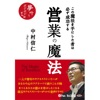

■推薦の言葉-『営業とはズバリ人間力だと思います。いやいや、それしかない!それを教えてくれるこれほどの本を私は他に知りません』 本のソムリエ 「読書のすすめ」店長 清水克衛 推薦 ■内容紹介-入社以来契約が一件も取れない新人営業マン小笠原は、時間つぶしに入り浸る喫茶店で「魔法のように」契約をまとめる紙谷と名乗る人物に出会う。仕事と人生に行き詰まっている小笠原は、思わず彼に声を掛ける。「紙谷さん。教えてください。営業を!」それから毎週月曜日、6時から1時間だけの早朝レッスンが始まる。「小笠原さんは、売れる営業のテクニックを学びたい・・・そう私にいいました。しかし、私は営業の素晴らしさしか教えられないといったことを覚えていますか」「はい。でも、絶対テクニックはあるはずです。僕はそう信じています」「そうですか。確かにテクニックはあるかもしれません。しかし、それは売るテクニックではなくて営業の基本かもしれません。いや、コミュニケーションの基本と言うべきかも・・・。つまり、人と人が接する時のマナーでもあるのです」「つまり営業と言う仕事は、人として当たり前のことをコツコツできるかどうかなんです」「こういう人を演じるということですね」「演じるのではなく、こういう人であるべきだということです。これは人間力です」「人間力・・・?」「そうです営業という職業は、誰にでもできるものではありません。人としてのマナーをしっかりもっているかどうかなんです」 ・よき営業マンとは、人間力溢れる人であるということ・人間には、その人がなりたいと思うようになる性質がある・人は皆悩んでいる。自分を理解してくれる人を求めている・既成概念は自分の可能性を狭めるもの。弱気な既成概念を破り続けるヒントとは。次々に紙谷が誘い込み、繰り出される会話の中に、営業の現場で、人生の場面で必要となる実践テクニックが、小笠原に気付きを与えていく。「売らない営業」「既成概念を破るヒント」「応酬話法」「二者択一話法」「イエス・バット話法」「質問話法」「類推話法(ストーリー話法)」「推定承諾話法」「肯定暗示法」「ビジョンから目をそらさないこと。身を投げ出す勇気を持って歩くこと」 アポイントからクロージングまで。 会話で紡がれた物語を通じ、二人のレッスンを隣の席で横聞きするように、具体的な会話のテクニックと心構え、なぜそれが心に響くのかなど、あなたは「教わることなく」見落としがちなコミュニケーションの基本を、深く理解することができる。このドラマ形式で紡がれた、成功物語である本オーディオブックを聴き終わったあなたは、すがすがしく晴れやかな気持ちと、具体的な営業のテクニックを正しく使う方法との両方を手にし、紙谷が最後に伝える「真のポジティブ・シンキング」=明確なビジョンを持ち、断固たる勇気を持って行動する働き人に生まれ変わっているはずだ。 ※本商品は『営業の魔法―この魔法を手にした者は必ず成功する 』[ビーコミュニケーションズ【刊】 中村信仁【著】ISBN:978-4902969511 200頁1,575円(税込)]をオーディオ化したものです。

[View on Apple](https://books.apple.com/jp/audiobook/%E5%96%B6%E6%A5%AD%E3%81%AE%E9%AD%94%E6%B3%95-%E3%81%93%E3%81%AE%E9%AD%94%E6%B3%95%E3%82%92%E6%89%8B%E3%81%AB%E3%81%97%E3%81%9F%E8%80%85%E3%81%AF%E5%BF%85%E3%81%9A%E6%88%90%E5%8A%9F%E3%81%99%E3%82%8B/id565953753)

## 同志少女よ、敵を撃て

*本タイトルは、音声差し替え修正済みです。(2022年7月25日更新)     
 <b>【2022年本屋大賞受賞!】 </b>  <b>キノベス! 2022 第1位、2022年本屋大賞受賞、第166回直木賞候補作、第9回高校生直木賞候補作</b> 
&#xa0;  <b>テレビ、ラジオ、新聞、雑誌で続々紹介!</b> 
&#xa0;  <b>史上初、選考委員全員が5点満点をつけた、第11回アガサ・クリスティー賞大賞受賞作</b>  
&#xa0;  アクションの緊度、迫力、構成のうまさは只事ではない。 
&#xa0;  とても新人の作品とは思えない完成度に感服。──北上次郎(書評家)  
&#xa0;  これは武勇伝ではない。 
&#xa0;  狙撃兵となった少女が何かを喪い、 
&#xa0;  何かを得る物語である。 
&#xa0;  ──桐野夏生(作家)  
&#xa0;  復讐心に始まった物語は、隊員同士のシスターフッドも描きつつ壮大な展開を見せる。胸アツ。──鴻巣友季子(翻訳家)  
&#xa0;  多くの人に読んで欲しい! ではなく、 
&#xa0;  多くの人が目撃することになる 
&#xa0;  間違いなしの傑作! 
&#xa0;  ──小島秀夫(ゲームクリエイター)  
&#xa0;  文句なしの5点満点、 
&#xa0;  アガサ・クリスティー賞の名にふさわしい傑作。──法月綸太郎(作家)  
&#xa0;  独ソ戦が激化する1942年、モスクワ近郊の農村に暮らす少女セラフィマの日常は、突如として奪われた。急襲したドイツ軍によって、母親のエカチェリーナほか村人たちが惨殺されたのだ。自らも射殺される寸前、セラフィマは赤軍の女性兵士イリーナに救われる。「戦いたいか、死にたいか」――そう問われた彼女は、イリーナが教官を務める訓練学校で一流の狙撃兵になることを決意する。母を撃ったドイツ人狙撃手と、母の遺体を焼き払ったイリーナに復讐するために。同じ境遇で家族を喪い、戦うことを選んだ女性狙撃兵たちとともに訓練を重ねたセラフィマは、やがて独ソ戦の決定的な転換点となるスターリングラードの前線へと向かう。おびただしい死の果てに、彼女が目にした“真の敵"とは? 
&#xa0;

[View on Apple](https://books.apple.com/jp/audiobook/%E5%90%8C%E5%BF%97%E5%B0%91%E5%A5%B3%E3%82%88-%E6%95%B5%E3%82%92%E6%92%83%E3%81%A6/id1615913034)

## BUTTER

世界が熱狂。 女と女の衝撃のダーク・スリラー  累計170万部突破。イギリスで4冠達成。 40か国・地域で翻訳された世界的ベストセラー  「脂肪分たっぷり、ミシュラン級の極上の一冊」――Sunday   Times 「文学界に旋風を巻き起こした」――BBC 「殺人的に面白い日本小説」――The   Times  男たちを虜にし、死へと追いやったとされる 婚活連続殺人事件の女性容疑者・梶井真奈子。 彼女に接見を重ねる週刊誌記者・町田里佳。 拘置所のアクリル板越しに語られる、濃厚なバターと食の快楽に、 里佳の日常は静かに崩れ始めるーー 女性の欲望と痛みを鮮烈に問い直す傑作長篇  「どうしても、許せないものが二つだけある。フェミニストとマーガリンです」  ◎「日本人初」続出、イギリスで4冠!  ・Books   Are My Bag Readers Awards 2024 Breakthrough   Author  ・Waterstones Book of the Year 2024  ・The   British Book Awards 2025 Debut Fiction部門  ・The Bestseller   Awards 2026 Gold Award  河出文庫収録の「野間出版文化賞受賞スピーチ:帝国ホテルですてきな立食パーティーを」「イギリスツアー日記:どんな場所にも小説とカラオケはある」は収録されておりません。

[View on Apple](https://books.apple.com/jp/audiobook/butter/id1860604969)

## となりの小さいおじさん～大切なことのほぼ9割は手のひらサイズに教わった～

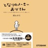

見えないけれど、となりにいて、気づいてくれる日を待っている!
宇宙と世の中の仕組みを教えてくれる手のひらサイズの「小さいおじさん」と著者の40年以上にわたる都市伝説でも、ファンタジーでもない、誰にも書けない唯一無二のすべてがリアルな実話。
メンター(助言役)であり、コーチでもある「小さいおじさん」が教えてくれた人生で大切なこと。

ファンタジーを読んでいるかのように面白く、人生の羅針盤にもなる1冊。

☆ベストセラー作家たちが大絶賛!☆
矢作直樹さん(東京大学名誉教授)
次元をまたぐ“小さなおじさん”の語る世の仕組みのなんとすばらしいことでしょう!

加茂谷真紀さん(エネルギー家事のベストセラー作家)
誰にも書けない唯一無二の体験談。1行目から脳天をトンカチでかち割られ「よくぞ書いてくれた」と胸も目じりも熱く沸騰する。読後は人生の見方が変わるが、それは“大いなる何か”と歩む筆者のリアル体験の力強さゆえ。
たまらなく愛しいエネルギーが全身を走り続け、未来に優しい希望が持てる本。

池田整治さん(元自衛隊・陸将補)
瀬知さんは私の処女作である『マインドコントロール』を編集した「生みの親」です。日本を陰から支配する者たちに陰謀論として封印されてきた「不都合な真実」を世に広める突破口を拓いた人です。
今回は究極の不都合な真実である「霊魂」の世界をわかりやすく「対話形式」で明らかにしています。滅びの道をまっしぐらに突き進められている日本人が目覚め、永久の道へと転換するための必読の書です。

東郷由香さん(予約殺到のライフ・カウンセラー)
小さいおじさん面白い! ファンタジーを読んでいるような、ですが現実世界で役にたつ内容ばかりでドンドン読み進められます。想像しながら読むとどっぷり本の世界に入って行くことができ、読み終わる頃には小さいおじさんの格言のおかげでちょっとだけ賢くなった気がします。
とくに人間関係に迷いや悩みのある人にオススメです!

高島康司さん(まぐまぐ大賞受賞の世界情勢アナリスト)
瀬知さんとはかれこれ十数年のおつき合いになるだろうか。彼がこのような興味深い体験を、それも何十年もしていたとは本当に驚きである。誰にとっても人生は一筋縄ではいかないものだが、何かの問題にぶつかった時に人生を俯瞰できる視点を提供できる何か…

[View on Apple](https://books.apple.com/jp/audiobook/%E3%81%A8%E3%81%AA%E3%82%8A%E3%81%AE%E5%B0%8F%E3%81%95%E3%81%84%E3%81%8A%E3%81%98%E3%81%95%E3%82%93-%E5%A4%A7%E5%88%87%E3%81%AA%E3%81%93%E3%81%A8%E3%81%AE%E3%81%BB%E3%81%BC9%E5%89%B2%E3%81%AF%E6%89%8B%E3%81%AE%E3%81%B2%E3%82%89%E3%82%B5%E3%82%A4%E3%82%BA%E3%81%AB%E6%95%99%E3%82%8F%E3%81%A3%E3%81%9F/id1846731927)

## ゾーンに入る技術

仕事の成果を高める集中脳について解説する、辻秀一著『ゾーンに入る技術』がオーディオブック化!

スポーツドクター、産業医として、成果を求める多くの人のメンタルトレーニングに取り組んできた著者が
仕事や勉強で集中状態を維持し、高いパフォーマンスを出すための集中の技術をご紹介します。
あなたの人生を充実させるうえで大いに役立つ、究極の集中状態で物事に取り組む力を本作品で身につけましょう。

仕事中に気が散ってなかなか作業が進まない。
いろいろなことを考えてしまって落ち着かない。
ここぞというポイントで集中できる力を身につけたい。

このような方に、ぜひ一度お聴きいただきたい、
脳の究極の集中状態とはどのようなものかを解き明かした人気作です。

人間の脳は、身の回りの状況を敏感に察知する認知能力が発達しており、五感で様々なことを感じます。

しかし、高い認知能力は、集中力を高めるうえでは邪魔になってしまいます。
五感の刺激に敏感になりすぎてしまい、目の前のことに集中できないのです。

高い集中状態を維持するためには、認知する機能とバランスをとって
フロー状態を作り出す、脳の「ライフスキル」機能を高める必要があります。

本作品では、数多くのアスリートやビジネスパーソンのメンタルトレーニングに取り組み
集中状態の作り方を指導してきた著者が、
高い集中状態である「ゾーン」のメカニズムを紐解き、集中状態に入る方法を解説します。

ここぞというときに「火事場のバカ力」を出し、難局を乗り越えた経験がある方も多いことでしょう。

本作品を取り入れれば、このような集中状態をより長く持続させることができ、
日々の仕事や、資格試験の勉強、そしてダイエットなどでもより大きな成果を出せるようになるでしょう。

人生をより充実したものにするために、いち早く身につけておくべき集中脳を作る技術を
あなたも本作品で身につけてみませんか?

[View on Apple](https://books.apple.com/jp/audiobook/%E3%82%BE%E3%83%BC%E3%83%B3%E3%81%AB%E5%85%A5%E3%82%8B%E6%8A%80%E8%A1%93/id1415722841)

## [13巻] 転生したらスライムだった件13

![\[13巻\] 転生したらスライムだった件13](../../logos/1683195749-65f85df7.png)

ジュラの大森林に攻め込む帝国94万の大軍勢。 
迎え撃つテンペストは、魔王ラミリスの権能により、 
ダンジョンへと町を避難させた。 
最前線で原初の悪魔であるテスタロッサ、 
ウルティマが猛威を振るう中、帝国軍はダンジョン攻略に乗り込む。 
しかしそこで待っていたのは、圧倒的な武力を誇るテンペストの、 
凄まじいまでの虐殺劇であった……。  
スライムが魔王に成り上がる!? 
話題のモンスター転生ファンタジー!!  
Audible版は岡咲美保が全編・全キャラクターを一人で読み上げます!

[View on Apple](https://books.apple.com/jp/audiobook/13%E5%B7%BB-%E8%BB%A2%E7%94%9F%E3%81%97%E3%81%9F%E3%82%89%E3%82%B9%E3%83%A9%E3%82%A4%E3%83%A0%E3%81%A0%E3%81%A3%E3%81%9F%E4%BB%B613/id1683195749)

## コーヒーが冷めないうちに

★2018年9月21日より、有村架純主演で映画公開決定!

28万部突破の大ベストセラー小説をオーディオブック化!
過去に戻れる喫茶店で起こった、心温まる4つの奇跡。
「4回泣ける」と大きな話題と感動を呼んでいる人気作を、オーディオブックでじっくりとお楽しみください。

【あらすじ】
とある街の、とある喫茶店の
とある座席には不思議な都市伝説があった
その席に座ると、望んだとおりの時間に戻れるという
ただし、そこにはめんどくさい……
非常にめんどくさいルールがあった

過去に戻っても、この喫茶店を訪れた事のない者には会う事はできない
過去に戻って、どんな努力をしても、現実は変わらない
過去に戻れる席には先客がいる その席に座れるのは、その先客が席を立った時だけ
過去に戻っても、席を立って移動する事はできない
過去に戻れるのは、コーヒーをカップに注いでから そのコーヒーが冷めてしまうまでの間だけ
めんどくさいルールはこれだけではない
それにもかかわらず、今日も都市伝説の噂を聞いた客がこの喫茶店を訪れる

喫茶店の名は、フニクリフニクラ

あなたなら、これだけのルールを聞かされて
それでも過去に戻りたいと思いますか?

◆ ◆ ◆

※下記、イベントはすでに終了しております。

イベント開催決定!「コーヒーが冷めないうちに」オーディオブック配信記念 生朗読&amp;トークライブ

オーディオブック化を記念して、高田憂希さん他出演者登壇の生朗読&amp;トークライブを開催することが決定!

◆イベント詳細
【日時】2016年11月9日(水) 20時30分~
 ※開場は19時45分~(お食事もしていただけます)
【場所】阿佐ヶ谷アニメストリート内 アニメコラボカフェSHIROBACO(http://shirobaco.com)
【出演】高田憂希さん、瀬戸ひかりさん、増田いつかさん
【チケット料金】3,000円(税込み)(サイン入りオリジナルグッズが当たる抽選券1枚付き!)

[View on Apple](https://books.apple.com/jp/audiobook/%E3%82%B3%E3%83%BC%E3%83%92%E3%83%BC%E3%81%8C%E5%86%B7%E3%82%81%E3%81%AA%E3%81%84%E3%81%86%E3%81%A1%E3%81%AB/id1416401636)

## 成瀬は都を駆け抜ける

シリーズ累計210万部突破の大人気シリーズ、遂に完結!
総勢18名もの豪華声優によるドラマ形式でお届けします。

『成瀬は天下を取りにいく』シリーズ 特設ページはこちら

シリーズ各巻はこちら
『成瀬は天下を取りにいく』
『成瀬は信じた道をいく』

成瀬シリーズ堂々完結!! 唯一無二の主人公が、今度は京都を駆け巡る!

膳所高校を卒業し、晴れて京大生となった成瀬あかり。一世一代の恋に破れた同級生、「達磨研究会」なる謎のサークル、簿記YouTuber、娘とともに地元テレビの取材を受ける母、憧れの人に一途に恋焦がれる男子大学生……。千年の都を舞台に、ますます個性豊かな面々が成瀬あかり史に名を刻む中、幼馴染の島崎のもとには成瀬から突然速達が届いて……⁉ 全6篇、最高の主人公に訪れる大団円を見届けよ!

【キャスト】
成瀬あかり:山根綺
島崎みゆき:緒方佑奈
坪井さくら:佐藤榛夏
梅谷誠:吉村海空
田中ののか:坂倉花
西浦航一郎:石毛翔弥
成瀬美貴子:鳴瀬まみ
木崎輝翔/成瀬慶彦:宮園拓夢
大曽根隼人:古屋亜南
橿原裕典/吉嶺マサル:岩崎了
大貫かえで:川邊紫
北川みらい:今泉りおな
呉間言実:御園理帆
篠原かれん:月城日花
城山/呉間祐生:内田修一
品川沙弥香/島崎の母:阿部菜摘子
咲子:中道美穂子
ナレーション(そういう子なので):鈴木卓朗

制作 : オトバンク
音楽・効果演出 : サウンドプロダクション吟 菊池常典
協力 : 京都市上下水道局

[View on Apple](https://books.apple.com/jp/audiobook/%E6%88%90%E7%80%AC%E3%81%AF%E9%83%BD%E3%82%92%E9%A7%86%E3%81%91%E6%8A%9C%E3%81%91%E3%82%8B/id1892279922)

## また、同じ夢を見ていた

デビュー作にして200万部を超えるベストセラーとなった「君の膵臓をたべたい」の著者、
住野よるのオーディオブック化第二弾!

友達のいない少女が出会ったのは、リストカットを繰り返す女子高生の“南さん”、
とても格好いい“アバズレさん”、一人静かに余生を送る“おばあちゃん”。
そして、尻尾の短い“彼女”だった――。

彼女たちの“幸せ”は、どこにあるのか。
「やり直したい」ことがある、“今”がうまくいかない全ての人たちに贈る物語。

大空直美、千菅春香、たかはし智秋、愛美、松田颯水、中島唯など
OBCの人気ラジオ番組でパーソナリティを務める声優6名を含む豪華キャストでお届けします。

&lt;キャスト&gt;
小柳奈ノ花役     : 大空直美
アバズレさん役    : 千菅春香
おばあちゃん役    : たかはし智秋
南さん役       : 愛美
桐生くん役      : 松田颯水
荻原くん&amp;猫役    : 中島唯
ひとみ先生役     : 金子有希

しんたろう先生役   : 阿座上洋平
馬鹿なクラスメイト役 : 森下由樹子
警備員役       : 千葉俊哉
桐生くんの父役    : 落合福嗣
お母さん役      : 香里有佐

&lt;スタッフ&gt;
著者:住野よる
出版社:双葉社
音響監督:伊藤誠敏(オトバンク)
音楽協力:菊池常典(SP吟)

[View on Apple](https://books.apple.com/jp/audiobook/%E3%81%BE%E3%81%9F-%E5%90%8C%E3%81%98%E5%A4%A2%E3%82%92%E8%A6%8B%E3%81%A6%E3%81%84%E3%81%9F/id1416416146)

## [18巻] 転生したらスライムだった件18

![\[18巻\] 転生したらスライムだった件18](../../logos/1813881480-2da1f52d.png)

シリーズ累計1,500万部突破!  スライムが異世界で成り上がる!  チートスキル『大賢者』と『捕食者』を武器に  最強モンスターへの道を突き進む!  大人気異世界転生ファンタジー小説!  ▼あらすじ  「最悪だな。ミカエル陣営に、ヴェルザードさんまで加わったのか……」  ミカエル率いるセラフィム軍団の侵攻計画が進む中、  その対策のために開かれたワルプルギスに集結する八星魔王たち。  ミカエルの能力『天使長の支配(アルティメットドミニオン)』により、  竜種の長女でもあるヴェルザードすらも敵の手中に落ちてしまったこの状況を打破するため、  リムルはテンペストの戦力を各所に配置するのだが――。

[View on Apple](https://books.apple.com/jp/audiobook/18%E5%B7%BB-%E8%BB%A2%E7%94%9F%E3%81%97%E3%81%9F%E3%82%89%E3%82%B9%E3%83%A9%E3%82%A4%E3%83%A0%E3%81%A0%E3%81%A3%E3%81%9F%E4%BB%B618/id1813881480)

## DUOセレクトCD

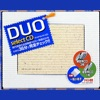

「DUOセレクト」は、日本の「いろは歌」をヒントに、現代英語の必須単語1000と熟語600を重複なしで377本の英文に完全凝縮しました。ベストセラー英単語・熟語集「DUO 3.0」の厳選版で、より「短くて暗記しやすい」英文で構成されています。「DUOセレクトCD」の音声は、[見出し英文和訳→見出し英文(スロースピード)→見出し語→見出し英文(ナチュラルスピード)の録音パターン]+[見出し英文だけをナチュラルスピードで通して読み上げる録音パターン]で構成されています。英語が苦手な方でも、楽しく確実にマスターできる内容です。「DUOセレクト」テキストとあわせて学習いただくとより効果的です。

[View on Apple](https://books.apple.com/jp/audiobook/duo%E3%82%BB%E3%83%AC%E3%82%AF%E3%83%88cd/id1641048173)

## 人は話し方が9割

本タイトルには付属資料が用意されています。詳しくは「デジタルブックレットの探し方」ガイドをご参照ください。 https://support.apple.com/ja-jp/HT208929  「人に好かれ、応援してもらえ、可愛がってもらえるコミュニケーション」の秘訣を初公開!&#xa0;&#xa0;  読むだけで「自己肯定感」が上がり、最後はホロリと泣ける会話本の決定版!&#xa0;&#xa0;  「初対面で何を話したらいいのかわからない」&#xa0;&#xa0;  「すぐに話が途切れて会話が続かない」&#xa0;&#xa0;  「何をどう相手に伝えたらいいのかわからない」&#xa0;&#xa0;  「うまく話せず失敗した経験がある」&#xa0;&#xa0;  「なぜだかわからないけど、相手を怒らせてしまった」&#xa0;&#xa0;  「何を話せば話が盛り上がるのかわからない」&#xa0;&#xa0;  「思っていることを正直に言えない」&#xa0;&#xa0;  「沈黙の時間が怖い」&#xa0;&#xa0;  こんな悩みを抱えている人は、少なくありません。&#xa0;&#xa0;  でも、大丈夫。&#xa0;&#xa0;  本書では、これらの悩みを解決する方法を、ズバリ、お伝えいたします。&#xa0;&#xa0;  目次&#xa0;&#xa0;  【はじめに】会話下手な人が、人と話すのが楽しくなるコツ&#xa0;&#xa0;  第1章 人生は「話し方」で9割決まる&#xa0;&#xa0;  第2章「また会いたい」と思われる人の話し方&#xa0;&#xa0;  第3章 人に嫌われない話し方&#xa0;&#xa0;  第4章 人を動かす人の話し方&#xa0;&#xa0;  【おわりに】会話がうまくなると、人間関係が劇的に良くなる理由―

[View on Apple](https://books.apple.com/jp/audiobook/%E4%BA%BA%E3%81%AF%E8%A9%B1%E3%81%97%E6%96%B9%E3%81%8C9%E5%89%B2/id1695634825)

## 20歳の自分に受けさせたい文章講義

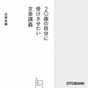

『嫌われる勇気』の著者、古賀史健のもう一つのベストセラー!
『20歳の自分に受けさせたい文章講義』がオーディオブックとなって登場です。

話せるのに書けない。文章だけで気持ちを表現したい。そんなあなたのための一冊です。
ビジネスでもプライベートでも「書く」ことが求められる時代に身につけておきたい「書く技術」を
現役のライターとして活躍する著者が余すところなく伝授します。

ビジネスやプライベートで、メールを打ったり手紙を書いているときに
「直接会って伝えれば早いのに・・。」
「この微妙なニュアンスを伝えるには、どう書けば良いだろう・・。」
と頭を悩ませた経験のある方は、多いのではないでしょうか。

話をするのには不自由を感じないのに、
いざ「書く」となると、言いたいことがうまく書けずに困ってしまう人が多いのです。

本作品は「話すのに書けない!」人のための“文章の授業”であり、
どうすれば自分の気持ちや考えを「文章だけ」で伝えることができるのか、
その方法を徹底的に伝授します。

多くの人は、人に口で伝えることはできても、それを頭の中で文章に変換しようとすると、
途端に固まってしまい、メールの一通ですらうまく書けなくなってしまいます。

実は「話すこと」と「書くこと」は全く別の行為であり、
同じ日本語といえど、ある“変換”の作業が鍵となってくるのです。

本作品では現役のライターである著者が、現場で15年かけて蓄積した
「話し言葉から書く言葉へ」のノウハウと哲学を、余すことなく伝授します。

本作品を聞き終えると、文章を書きたいという気持ちがわいてくるはず。
学校では誰も教えてくれなかった“書く技術”を、本作品で身につけましょう。

[View on Apple](https://books.apple.com/jp/audiobook/20%E6%AD%B3%E3%81%AE%E8%87%AA%E5%88%86%E3%81%AB%E5%8F%97%E3%81%91%E3%81%95%E3%81%9B%E3%81%9F%E3%81%84%E6%96%87%E7%AB%A0%E8%AC%9B%E7%BE%A9/id1440702507)

## ラヴクラフト「外宇宙の色」

アーカムの西に新しいダムが造られる。わたしは現地調査員として派遣され、周囲の人々から聞き取りをするうち、アーマイという老人にたどり着き、この土地の過去の因縁を聞くことになった。それは、ひどく恐ろしい“色”についての話だった。出来事の発端は、半世紀前、この地に隕石が落ちてきたことに始まる。汚染が広がり、恐ろしく奇妙な現象が次々と起こり始める。宇宙から飛来した隕石はその土地にいかなる影響を与えたのか…!?外宇宙からの正体不明の脅威がじわじわと忍び寄る。

[View on Apple](https://books.apple.com/jp/audiobook/%E3%83%A9%E3%83%B4%E3%82%AF%E3%83%A9%E3%83%95%E3%83%88-%E5%A4%96%E5%AE%87%E5%AE%99%E3%81%AE%E8%89%B2/id347194538)

## 成瀬は天下を取りにいく

「島崎、わたしはこの夏を西武に捧げようと思う」。 
各界から絶賛の声続々、いまだかつてない青春小説! 

2020年、中2の夏休みの始まりに、幼馴染の成瀬がまた変なことを言い出した。 
コロナ禍に閉店を控える西武大津店に毎日通い、中継に映るというのだが……。 
M-1に挑戦したかと思えば、自身の髪で長期実験に取り組み、市民憲章は暗記して全うする。 
今日も全力で我が道を突き進む成瀬あかりから、きっと誰もが目を離せない。 
発売前から超話題沸騰! 圧巻のデビュー作。

[View on Apple](https://books.apple.com/jp/audiobook/%E6%88%90%E7%80%AC%E3%81%AF%E5%A4%A9%E4%B8%8B%E3%82%92%E5%8F%96%E3%82%8A%E3%81%AB%E3%81%84%E3%81%8F/id1739197650)

## この嘘がばれないうちに

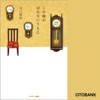

主演:有村架純で2018年9月に映画公開決定!
67万部を突破した『コーヒーが冷めないうちに』の7年後を描く、シリーズ最新刊。

愛する人を思う気持ちが生み出した、不器用で優しい4つの「嘘」。

「過去にいられるのは、コーヒーが冷めるまでの間だけ」

不思議な喫茶店フニクリフニクラにやってきた、4人の男たち。
どうしても過去に戻りたい彼らの口には出せない本当の願いとは……?

【あらすじ】

とある街の、とある喫茶店の
とある座席には不思議な都市伝説があった
その席に座ると、望んだとおりの時間に戻れるという

ただし、そこにはめんどくさい……
非常にめんどくさいルールがあった

1.過去に戻っても、この喫茶店を訪れた事のない者には会う事はできない
2.過去に戻って、どんな努力をしても、現実は変わらない
3.過去に戻れる席には先客がいるその席に座れるのは、その先客が席を立った時だけ
4.過去に戻っても、席を立って移動する事はできない
5.過去に戻れるのは、コーヒーをカップに注いでから、そのコーヒーが冷めてしまうまでの間だけ

めんどくさいルールはこれだけではない
それにもかかわらず、今日も都市伝説の噂を聞いた客がこの喫茶店を訪れる

喫茶店の名は、フニクリフニクラ

あなたなら、これだけのルールを聞かされて
それでも過去に戻りたいと思いますか?

この物語は、そんな不思議な喫茶店で起こった、心温まる四つの奇跡。

第1話 22年前に亡くなった親友に会いに行く男の話
第2話 母親の葬儀に出られなかった息子の話
第3話 結婚できなかった恋人に会いに行く男の話
第4話 妻にプレゼントを渡しに行く老刑事の話

あの日に戻れたら、あなたは誰に会いに行きますか?

【キャスト】
時田数:高田憂希
時田流:大泊貴揮
ミキ:菅野えみ
千葉剛太郎:永野善一
神谷秀一:小林直人
木嶋京子:山名枝里子
木嶋幸雄:井上健一
絹代:瑞沢渓
倉田克樹:大町朋裕
賀多田二美子:増田いつか
賀多田五郎:多田啓太
万田清:浅科准平
朗読:田所陽向

[View on Apple](https://books.apple.com/jp/audiobook/%E3%81%93%E3%81%AE%E5%98%98%E3%81%8C%E3%81%B0%E3%82%8C%E3%81%AA%E3%81%84%E3%81%86%E3%81%A1%E3%81%AB/id1517377622)

## ホリエモンのビジネスウィークリーVOL.35 睡眠をしっかりとれば物事はもっとうまくいく

会社経営・企業・就職・政党etc…、誰もが気になる堀江さんの持論を、毎週約20分間収録したものです。VOL.35睡眠をしっかりとれば物事はもっとうまくいく

[View on Apple](https://books.apple.com/jp/audiobook/%E3%83%9B%E3%83%AA%E3%82%A8%E3%83%A2%E3%83%B3%E3%81%AE%E3%83%93%E3%82%B8%E3%83%8D%E3%82%B9%E3%82%A6%E3%82%A3%E3%83%BC%E3%82%AF%E3%83%AA%E3%83%BCvol-35-%E7%9D%A1%E7%9C%A0%E3%82%92%E3%81%97%E3%81%A3%E3%81%8B%E3%82%8A%E3%81%A8%E3%82%8C%E3%81%B0%E7%89%A9%E4%BA%8B%E3%81%AF%E3%82%82%E3%81%A3%E3%81%A8%E3%81%86%E3%81%BE%E3%81%8F%E3%81%84%E3%81%8F/id407346323)

## 聞く聖書シリーズ [第16巻] 使徒言行録

![聞く聖書シリーズ \[第16巻\] 使徒言行録](../../logos/347250797-6f5ba641.png)

使徒言行録は、教会の最初の活動とその発展について描いています。教会の根本的な特徴、キリストに従うとはどういうことなのかを示しています。

[View on Apple](https://books.apple.com/jp/audiobook/%E8%81%9E%E3%81%8F%E8%81%96%E6%9B%B8%E3%82%B7%E3%83%AA%E3%83%BC%E3%82%BA-%E7%AC%AC16%E5%B7%BB-%E4%BD%BF%E5%BE%92%E8%A8%80%E8%A1%8C%E9%8C%B2/id347250797)

## コンサル一年目が学ぶこと

約半年で4万部突破の話題作!
外資系コンサル出身の筆者が社会人一年目で学んだ、あらゆる場面で役立つ普遍的なスキルを伝授!

15年後でも使える、汎用性の高い知識や技術を30個厳選して紹介します。
新社会人の方や転職をされる方はもちろん、部下を指導する立場の上司の方にも最適の、
プロフェッショナルの仕事術の基礎をじっくりと学ぶことができる1作です。

「社会人としてまず身につけておくべきことを学びたい」
「今の自分の仕事への取り組み方を、別の角度から見直したい」
「もっと効率的に、成果を高める仕事術を身につけたい」

このようにお思いの方に最適の作品が登場しました。

筆者のように外資系コンサル出身者で、業界や職種を問わず様々な場所で活躍している人は数多くいます。

それは、コンサル時代に学んだことが、他の仕事でも普遍的に活かせるスキルだからであり、
場所を変えても活かせるスキルを一度学んでしまえば、どこでも通用するからなのです。

つまり、コンサルティング会社に勤める人が最初に身につけるスキルを徹底的に身につけることで、
全てのビジネスパーソンが、ビジネススキルの基礎力を格段に高めることができます。

本作品では、ビジネスパーソンとしての力を高めたいという全ての人のために、
「話す技術」「思考術」「デスクワーク術」「ビジネスマインド」にポイントを絞って、
具体例を交えながら、著者がコンサル時代に学んだことを分かりやすく解説していきます。

コミュニケーションの基本やロジックツリーの方法論、パワポ・エクセルの使い方等、
本作品の内容は、初めてビジネスの世界に飛び込む方の基礎知識として大いに役立ちます。

また、既にこれらを活用している方も、体系化されていなかった断片的な知識や方法論を本作品で整理することができ、
より的確に成果につながるアウトプットを出すことができるようになることでしょう。

新たに社会に出る方も、社会人として今の自分の仕事力に自信が持てない方も、伸ばしたい部下がいる上司の方も、
本作品をお聴きいただき、短時間で社会人としての普遍的な知識を整理して、
今すぐに成果を高められる重要なスキルを、仕事の現場で活用してみませんか?

[View on Apple](https://books.apple.com/jp/audiobook/%E3%82%B3%E3%83%B3%E3%82%B5%E3%83%AB%E4%B8%80%E5%B9%B4%E7%9B%AE%E3%81%8C%E5%AD%A6%E3%81%B6%E3%81%93%E3%81%A8/id1440688181)

## 経理以外の人のための日本一やさしくて使える会計の本

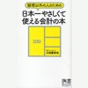

会計をまだ学んでいない方、既に多くを学習したのにイマイチ仕事の成果につながらない方、是非一度お聴きください。  会計が、細かい数字や専門用語であふれた難しいものだと思っていませんか? もしそうなら、あなたの勉強は“過剰投資”かもしれません。 ビジネスを進めていく上で、"経理専門ではないあなた"が知るべき内容は、この作品一本に集約されています。  「会計?勉強はしてみたけれど、難しい言葉や数字のオンパレードだったから・・・」  こんな風に、会計の勉強をしようと思って、 身につかないまま放置してしまったこと、ありませんか?  個々のビジネスパーソンに会計の素養を身につけることが求められてきている今、 会計の勉強が大ブームとなっています。  しかし、何も考えずに会計本に手を出すのはやめてください。  実は、ほとんどの会計書は、財務三表を作るルールや決算書の読み方など、 経理を始め“ごく一部”の人にしか必要のない専門知識ばかりを含んでいるのです。  現場で働くビジネスパーソンに求められているのは、会計書類を作成する能力ではなく、 「どうすれば会社の利益を最大化できるのか」についての正しい感覚、すなわち「会計感覚」です。  本作は、タイトルどおり、経理以外の人に本当に必要な「会計感覚」を学んでもらうことに特化した作品です。 具体的なビジネスシーンのストーリーも交えながら、会計の本質を突いていくので、 経理以外のあなたでも、飽きることなく、楽しく聴き進めることができます。  このオーディオブックを聴けば、本当の「会計感覚」が身に付き、 仕事でも会計・経理の本質を取り入れた仕事のできるビジネスパーソンとなることができるでしょう。

[View on Apple](https://books.apple.com/jp/audiobook/%E7%B5%8C%E7%90%86%E4%BB%A5%E5%A4%96%E3%81%AE%E4%BA%BA%E3%81%AE%E3%81%9F%E3%82%81%E3%81%AE%E6%97%A5%E6%9C%AC%E4%B8%80%E3%82%84%E3%81%95%E3%81%97%E3%81%8F%E3%81%A6%E4%BD%BF%E3%81%88%E3%82%8B%E4%BC%9A%E8%A8%88%E3%81%AE%E6%9C%AC/id1440654951)

## 新装版 神との対話1

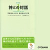

全米に衝撃を与え、シリーズ累計140万部を突破した伝説的ベストセラーの第1弾をオーディオブック化。

人生のどん底にあったある日、突然「神」が話しかけてきた。それから始まった「神との対話」。
自分について、人生について、魂について、宇宙について…あらゆる質問に神は答えていく。
丁寧に、ときにぶっきらぼうに、ユーモアを交えながら。

仕事も、家庭も、人間関係も、あらゆる面で悩み、苦しんでいた青年が
「なぜ、自分の人生がうまくいかないか」という問いを綴ったとき、答えてくる声がありました。
そして始まったのが「神との対話」です。

自分について、人生について、魂について、宇宙について……
あらゆる質問に丁寧に、ときにぶっきらぼうに、ユーモアを交えながら神は答えていきます。
全知全能の神が、主人公の青年そして、読む人すべての悩みを解決していく人生の教科書、決定版。

[View on Apple](https://books.apple.com/jp/audiobook/%E6%96%B0%E8%A3%85%E7%89%88-%E7%A5%9E%E3%81%A8%E3%81%AE%E5%AF%BE%E8%A9%B11/id1535430292)

## 超訳 韓非子

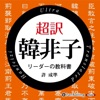

&lt;内容紹介&gt;  

始皇帝を驚愕させ、諸葛亮孔明が皇帝の教科書とした組織操縦の指南書がこれだ!  

筆者はこれまで、『孫子』、『論語』、『君主論』をはじめ、古典を解説する書籍を数多く手がけたが、『韓非子』ほど現実の世界で〝使える〟古典は見たことがない。 
『韓非子』は国を運営する君主のために書かれた書物だが、その内容はそのまま現代の仕事に通じるものだ。  

ビジネスマンなら誰しも、規模の大小は別として、いずれは部下を持つ。 
リーダーシップの教科書を読んでみたいと思っているなら、最も古いバイブルが『韓非子』だといえよう。 
本書は、原文の内容を主題別に分類し、10の章で構成した。 そして、分かりやすく〝超訳〟したうえで、原文の理解を助けるため、現代のビジネスの事例を加えて解説したものである。(「はじめに」より)  

&lt;収録内容&gt;  

はじめに 
1章 リーダーには権力が必要だ 
2章 平凡な人間をシステムで統治せよ 
3章 賞と罰が人を動かす 
4章 法はこうして確立せよ 
5章 組織と部下の利害関係を一致させる 
6章 リーダーは部下を警戒すべきだ 
7章 組織が失敗するのはどんな時か 
8章 人材の登用と人を見る眼 
9章 情報の掌握が不可欠な理由 
10章 部下のリーダーとの接し方 
おわりに  

&lt;許成準(ホ・ソンジュン)&gt;  

2000年KAIST(国立韓国科学技術院)大学院卒(工学修士)。 
ゲーム製作、VRシステム製作、インスタレーションアートなど、様々なプロジェクトの経験から、組織作り・リーダーシップを研究するようになり、ビジネス・リーダーシップ関連の著作を多数執筆。 
主な著書に『ヒトラーの大衆扇動術』『超訳 孫子の兵法』『超訳 君主論―マキャベリに学ぶ帝王学―』(共に彩図社刊)などがある。

[View on Apple](https://books.apple.com/jp/audiobook/%E8%B6%85%E8%A8%B3-%E9%9F%93%E9%9D%9E%E5%AD%90/id1509674650)

## The Fellowship of the Ring

This brand-new unabridged audio book of The Fellowship of the Ring, the first part of J. R. R. Tolkien’s epic adventure, The Lord of the Rings, is read by the BAFTA award-winning actor, director and author, Andy Serkis.  In a sleepy village in the Shire, a young hobbit is entrusted with an immense task. He must make a perilous journey across Middle-earth to the Cracks of Doom, there to destroy the Ruling Ring of Power – the only thing that prevents the Dark Lord Sauron’s evil dominion.  Thus begins J. R. R. Tolkien’s classic tale of adventure, which continues in The Two Towers and The Return of the King.  Reviews  ‘The English-speaking world is divided into those who have read The Lord of the Rings and The Hobbit and those who are going to read them.’ Sunday Times  ‘A story magnificently told, with every kind of colour and movement and greatness.’ New Statesman  ‘Masterpiece? Oh yes, I’ve no doubt about that.’ Evening Standard  ‘Among the greatest works of imaginative fiction of the twentieth century.’ Sunday Telegraph  ‘Here are beauties which pierce like swords or burn like cold iron.’ C.S. Lewis  About the author  J.R.R.Tolkien (1892-1973) was a distinguished academic, though he is best known for writing The Hobbit, The Lord of the Rings, The Silmarillion and The Children of Hurin, plus other stories and essays. His books have been translated into over 50 languages and have sold many millions of copies worldwide.

[View on Apple](https://books.apple.com/jp/audiobook/the-fellowship-of-the-ring/id1583425444)

## 鍵のない夢を見る

望むことは、罪ですか? 誰もが顔見知りの小さな町で盗みを繰り返す友達のお母さん、結婚をせっつく田舎体質にうんざりしている女の周囲で続くボヤ、出会い系サイトで知り合ったDV男との逃避行──。普通の町に生きるありふれた人々に、ふと魔が差す瞬間、転がり落ちる奈落を見事にとらえる五篇。現代の地方の閉塞感を背景に、五人の女がささやかな夢を叶える鍵を求めてもがく様を、時に突き放し、時にそっと寄り添い描き出す。著者の巧みな筆が光る傑作。第147回直木賞受賞作。

[View on Apple](https://books.apple.com/jp/audiobook/%E9%8D%B5%E3%81%AE%E3%81%AA%E3%81%84%E5%A4%A2%E3%82%92%E8%A6%8B%E3%82%8B/id1137529987)

## キクタンフランス語会話【入門編】

大好評の既刊本『キクタンフランス語』シリーズの流れを受け、フランス語の会話力の養成に狙いを定めた『キクタンフランス語会話【入門編】』の登場です!キクタンですから、もちろん、リズムに乗って楽しく学ぶことができます。  
この本は、フランス語をある程度学んだ方はもちろんのこと、フランス語に初めて触れるという方にもお読みいただける本として書かれました。フランス語の音について簡単な輪郭を身に付けていただいたのち、「旅行編」では旅行によくあるシチュエーション別の会話例に、「文法編」では日常的会話例に慣れていただきます。  
「旅行編」と「文法編」は、樹里という大学生が、フランスに旅行するというストーリーになっていますが、ご自分の興味あるところから読んでいただいてかまいません。それぞれの課には「練習」が付いていますので、会話例だけでなく、ヴァリエーションを身に付けることもできます。もちろん、「キクタン」ですから、チャンツに乗せて、思わず口ずさむようになるまで聞いてください。練習の方は、「問いと答え」になっているケースと、フランスでよく見られる一連の表現になっているケースがありますので、前者は「答え」の方を入れ替えて答えられるように、後者はひとまとまりで口に出せるように練習してください。  
※本商品は書籍のCD音声と同内容です。また、テキスト情報は含まれておりません。

[View on Apple](https://books.apple.com/jp/audiobook/%E3%82%AD%E3%82%AF%E3%82%BF%E3%83%B3%E3%83%95%E3%83%A9%E3%83%B3%E3%82%B9%E8%AA%9E%E4%BC%9A%E8%A9%B1-%E5%85%A5%E9%96%80%E7%B7%A8/id1484012252)

## 『お伽草子』より「カチカチ山」

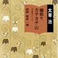

『お伽草子』は、戦争末期の昭和20年、米軍の空襲の度に、人々は家の庭に掘った防空壕に待避した。そんな中で父親が子供たちにおとぎ話を聞かせる、と云う設定で書かれた作品である。昔からよく知られたお伽話を太宰独特のおどけと風刺に満ちた物語に仕上げている短編集で、他に「浦島さん」「カチカチ山」がある。熊倉一雄の独特の語り口は、まさにこの作品の雰囲気を遺憾なく伝えてくれている。

[View on Apple](https://books.apple.com/jp/audiobook/%E3%81%8A%E4%BC%BD%E8%8D%89%E5%AD%90-%E3%82%88%E3%82%8A-%E3%82%AB%E3%83%81%E3%82%AB%E3%83%81%E5%B1%B1/id347202723)

## 養老孟司の“逆さメガネ”

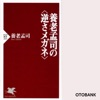

420万部を超える大ヒット作『バカの壁』の著者・養老孟司が語る、40万部突破のベストセラーがついに登場!

「逆さメガネ」をかけて常識を疑って見ると、「当たり前」だと思っていた物事の違う一面が見えてくる!

現代人はなぜ「利口なバカ」になったのか。そして、現代人が忘れかけている人間の本質とは?
軽快な口調であなたの心に語りかけ、常識の外側に向けて目を開かせてくれる、知的好奇心を刺激する1本です。

世の中には、多くの人が共有し「常識」とされている考え方があります。
しかし、そんな常識だらけの社会で暮らしていく中で、「本当にそうだろうか」と疑ってみたことはありませんか?

・反対意見を持っていたけれど、周りの意見に合わせてしまった
・常識的に考えても、解決の方法や行動が分からない場面に直面した
・自分と周りの認識が、何だかずれている気がする

少しでもそんな風に思ったことがある方にぜひ触れていただきたい、世の中の常識に真正面から挑む作品が登場しました。

ベストセラー『バカの壁』の著者としても知られる養老孟司氏が語る本作品は、
著者にとって身近な「教育」という題材を通して、ものごとの見方や考え方について考察しています。

教育を中心に脳化社会の問題や意識的世界の限界、男女の平等等について言及し、
様々な思い込みのワナを解きほぐそうと試みる本作品は、
科学ですべてが予測できる、ボタン一つで何でもできる、という現代人の思い込みに警鐘を鳴らすとともに、
いかに私たちの価値観が大きな錯覚をしているか、ということに気づかせてくれます。

凶悪犯罪、教育の荒廃、環境破壊、汚職など、「世の中がおかしくなった」と思うようなニュースがあふれている現代社会。
そんな時、世の中がおかしいのではなく、私たち自身の見方・考え方が間違っているのかもしれない、と疑ってみると、
人間が忘れてはならない、大切なものが見えてくることがあります。

その社会のなかで生活していると、その社会のおかしさにはなかなか気づくことができません。
この作品を通して、普通の人とは違う「逆さメガネ」をかけて、自分の視点でものを見ることができる力を身につけてみませんか?

「常識」の中でしか考えられなかった現代人の頭をほぐしてくれる本作品は、
ビジネスに…

[View on Apple](https://books.apple.com/jp/audiobook/%E9%A4%8A%E8%80%81%E5%AD%9F%E5%8F%B8%E3%81%AE-%E9%80%86%E3%81%95%E3%83%A1%E3%82%AC%E3%83%8D/id1415941080)

## 文庫版 近畿地方のある場所について: (KADOKAWA)

私、小澤雄也は本書の編集を手掛けた人間だ。  
収録されているテキストは、様々な媒体から抜粋したものであり、  
その全てが「近畿地方のある場所」に関連している。  
なぜこのようなものを発表するに至ったのか。  
その背景には、私の極私的な事情が絡んでいる。  
それをどうかあなたに語らせてほしい。 私はある人物を探している。  
その人物についての情報をお持ちの方はご連絡をいただけないだろうか。     
※単行本とは内容が異なります。ご了承ください。   
本タイトルには付属資料が用意されています。詳しくは「デジタルブックレットの探し方」ガイドをご参照ください。 https://support.apple.com/ja-jp/HT208929

[View on Apple](https://books.apple.com/jp/audiobook/%E6%96%87%E5%BA%AB%E7%89%88-%E8%BF%91%E7%95%BF%E5%9C%B0%E6%96%B9%E3%81%AE%E3%81%82%E3%82%8B%E5%A0%B4%E6%89%80%E3%81%AB%E3%81%A4%E3%81%84%E3%81%A6-kadokawa/id1891015121)

## 精神科医が見つけた 3つの幸福 最新科学から最高の人生をつくる方法

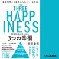

いま話題! 発売たちまち4万部突破!

『アウトプット大全』(60万部)
『ストレスフリー超大全』(18万部)の
ベストセラー著者、渾身の集大成!

これは「幸福論」ではなく、初めての「幸福の実用書」です。
「幸福」とは、「脳内物質」だった!

コロナ禍、人生100年時代、AI化、スマホ依存
現代のあらゆる問題を1冊で解決!
簡単にできる習慣だけ! 最新データとエビデンスをもとに、人生を充実させる方法を具体的にわかりやすく教えるまったく新しい本!

・なぜ5分に1回スマホをチェックする人は、健康、仕事、人間関係のすべてを失うのか?
・朝散歩するだけで人生が変わるこれだけの理由
・「成功」イコール「幸福」の時代は終わった!
・すべての課題を解決する「幸せの3段重理論」とは

[View on Apple](https://books.apple.com/jp/audiobook/%E7%B2%BE%E7%A5%9E%E7%A7%91%E5%8C%BB%E3%81%8C%E8%A6%8B%E3%81%A4%E3%81%91%E3%81%9F-3%E3%81%A4%E3%81%AE%E5%B9%B8%E7%A6%8F-%E6%9C%80%E6%96%B0%E7%A7%91%E5%AD%A6%E3%81%8B%E3%82%89%E6%9C%80%E9%AB%98%E3%81%AE%E4%BA%BA%E7%94%9F%E3%82%92%E3%81%A4%E3%81%8F%E3%82%8B%E6%96%B9%E6%B3%95/id1655614698)

## インビジブルレイン

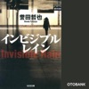

姫川班が捜査に加わったチンピラ惨殺事件。
暴力団同士の抗争も視野に入れて捜査が進む中、
「犯人は柳井健斗」というタレ込みが入る。
ところが、上層部から奇妙な指示が下った。
捜査線上に柳井の名が浮かんでも、
決して追及してはならない、というのだ。
隠蔽されようとする真実―。
警察組織の壁に玲子はどう立ち向かうのか?
シリーズ中もっとも切なく熱い結末。

[View on Apple](https://books.apple.com/jp/audiobook/%E3%82%A4%E3%83%B3%E3%83%93%E3%82%B8%E3%83%96%E3%83%AB%E3%83%AC%E3%82%A4%E3%83%B3/id1654465720)

## Why We Sleep

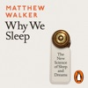

<b>Brought to you by Penguin</b>  THE #1 SUNDAY TIMES BESTSELLER   TLS, OBSERVER, SUNDAY TIMES, FT, GUARDIAN, DAILY MAIL AND EVENING STANDARD BOOKS OF THE YEAR 2017   Sleep is one of the most important aspects of our life, health and longevity and yet it is increasingly neglected in twenty-first-century society, with devastating consequences: every major disease in the developed world - Alzheimer's, cancer, obesity, diabetes - has very strong causal links to deficient sleep.   In this audiobook, the first of its kind written by a scientific expert, Professor Matthew Walker explores twenty years of cutting-edge research to solve the mystery of why sleep matters. Looking at creatures from across the animal kingdom as well as major human studies, Why We Sleep delves into everything from what really happens during REM sleep to how caffeine and alcohol affect sleep and why our sleep patterns change across a lifetime, transforming our appreciation of the extraordinary phenomenon that safeguards our existence.   Includes a bonus PDF of graphs and diagrams.  'Astonishing ... an amazing book ... absolutely chocker full of things that we need to know' Chris Evans  'Matthew Walker is probably one of the most influential people on the planet' Evening Standard   'Startling, vital ... a life-raft' Guardian   'A top sleep scientist argues that sleep is more important for our health than diet or exercise' The Times   'Passionate, urgent . . . it had a powerful effect on me' Observer  ©2017 Matthew Walker (P)2017 Penguin Books Ltd

[View on Apple](https://books.apple.com/jp/audiobook/why-we-sleep/id1440581035)

## amazonのすごい会議

すぐに決まる!
アイデアが湧き出る!
プロジェクトが進む!
なぜamazonは次々に新しい事業を同時展開できるのか?
世界最強企業の成長を支える原動力である「会議の技法」を初公開!

[View on Apple](https://books.apple.com/jp/audiobook/amazon%E3%81%AE%E3%81%99%E3%81%94%E3%81%84%E4%BC%9A%E8%AD%B0/id1575188030)

## The Two Towers

This brand-new unabridged audio book of The Two Towers, the second part of J. R. R. Tolkien’s epic adventure, The Lord of the Rings, is read by the BAFTA award-winning actor, director and author, Andy Serkis.  The company of the Ring is torn asunder. Frodo and Sam continue their journey alone down the great River Anduin – alone, that is, save for the mysterious creeping figure that follows wherever they go.  This continues the classic tale begun in The Fellowship of the Ring, which reaches its awesome climax in The Return of the King.  Reviews  ‘An extraordinary book. It deals with a stupendous theme. It leads us through a succession of strange and astonishing episodes, some of them magnificent, in a region where everything is invented, forest, moor, river, wilderness, town and the races which inhabit them.’ The Observer  ‘Among the greatest works of imaginative fiction of the twentieth century.’ Sunday Telegraph  ‘The English-speaking world is divided into those who have read The Lord of the Rings and The Hobbit and those who are going to read them.’ Sunday Times  ‘A story magnificently told, with every kind of colour and movement and greatness.’ New Statesman  ‘Masterpiece? Oh yes, I’ve no doubt about that.’ Evening Standard  About the author  J.R.R.Tolkien (1892-1973) was a distinguished academic, though he is best known for writing The Hobbit, The Lord of the Rings, The Silmarillion and The Children of Hurin, plus other stories and essays. His books have been translated into over 50 languages and have sold many millions of copies worldwide.

[View on Apple](https://books.apple.com/jp/audiobook/the-two-towers/id1583943157)

## [1巻] ひげを剃る。そして女子高生を拾う。: (KADOKAWA)

![\[1巻\] ひげを剃る。そして女子高生を拾う。: (KADOKAWA)](../../logos/1490954764-2590ca84.png)

5年片想いした相手にバッサリ振られたサラリーマンの吉田。ヤケ酒の帰り道、路上に蹲る女子高生を見つけて――「ヤらせてあげるから泊めて」「そういうことを冗談でも言うんじゃねえ」「じゃあ、タダで泊めて」なし崩し的に始まった、少女・沙優との同居生活。『おはよう』『味噌汁美味しい?』『遅ぉいぃぃぃぃぃ』『元気出た?』『一緒に寝よ』『……早く帰って来て』家出JKと26歳サラリーマン。微妙な距離の二人が紡ぐ、日常ラブコメディ。

[View on Apple](https://books.apple.com/jp/audiobook/1%E5%B7%BB-%E3%81%B2%E3%81%92%E3%82%92%E5%89%83%E3%82%8B-%E3%81%9D%E3%81%97%E3%81%A6%E5%A5%B3%E5%AD%90%E9%AB%98%E7%94%9F%E3%82%92%E6%8B%BE%E3%81%86-kadokawa/id1490954764)

## 『お伽草子』より 「カチカチ山」「瘤取り」

『お伽草子』は、戦争末期の昭和20年、米軍の空襲の度に、人々は家の庭に掘った防空壕に待避した。そんな中で父親が子供たちにおとぎ話を聞かせる、と云う設定で書かれた作品である。昔からよく知られたお伽話を太宰独特のおどけと風刺に満ちた物語に仕上げている短編集で、他に「浦島さん」「カチカチ山」がある。熊倉一雄の独特の語り口は、まさにこの作品の雰囲気を遺憾なく伝えてくれている。

[View on Apple](https://books.apple.com/jp/audiobook/%E3%81%8A%E4%BC%BD%E8%8D%89%E5%AD%90-%E3%82%88%E3%82%8A-%E3%82%AB%E3%83%81%E3%82%AB%E3%83%81%E5%B1%B1-%E7%98%A4%E5%8F%96%E3%82%8A/id347199045)

## 早春/蜜柑

早春:男の気持ちと女の気持ちのはかりと体の量り、何が基準になるかは、その人次第。 蜜柑:蜜柑にすさんでいる人の心を暖める力が、そして、ある行動で人の見方が変わる瞬間を細かい描写で描きます。

[View on Apple](https://books.apple.com/jp/audiobook/%E6%97%A9%E6%98%A5-%E8%9C%9C%E6%9F%91/id130047040)

## 200万人の「挫折」と「成功」のデータからわかった 継続する技術

200万ダウンロード超!国内No.1習慣化アプリ「継続する技術」の開発者が膨大なユーザーデータから明らかにした、「続けられる人になる」たった3つの原則

▼データを分析したら、こんなことが見えてきた

・60分以上かかる目標を設定すると、94.3%が挫折
・リマインダー活用で成功率が4.47倍
・1日でもサボると、92.5%が結局30日以内に挫折する

▼客観的な事実をもとに導きだされた「習慣三原則」

元・筋金入りの三日坊主が開発した、日本で一番使われている習慣化アプリ「継続する技術」。その開発過程やユーザーの行動データから、「継続する」ために重要な三原則がわかりました。

原則1:すごく目標を下げる
原則2:動けるときに思い出す
原則3:例外を設けない

とてもシンプルですが、この原則を守った人は、
筋トレや勉強などの「30日間継続成功率」がなんと8.23倍。

「なぜ、ここまで大きな差が生じるのか」
「具体的に何をすればいいのか」

本書は、その答えを客観的な事実にもとづいて示していきます。

▼理論だけでは動かない。人間だもの

それでも人は、事実や理論を示されたところで「えー、そうかなあ」「さすがにそれはできないよ」などと思うもの。
本書はそんな人間らしさがあふれる青年、高橋くんを主人公にしたストーリー形式です。
ただデータ分析の結果や理論を示すだけでなく、「実際に使える」現実的な知恵をお届けします!

▼こんな人におすすめです

・「これを習慣にしよう!」と意気込んでも、いつのまにか忘れている
・「今日はいいか」のくり返しで、気づけば1か月経っている
・三日坊主にすらなれない、せいぜい二日坊主で終わる
・習慣化のコツをいろいろ試してきたけど、結局いつも挫折する

[View on Apple](https://books.apple.com/jp/audiobook/200%E4%B8%87%E4%BA%BA%E3%81%AE-%E6%8C%AB%E6%8A%98-%E3%81%A8-%E6%88%90%E5%8A%9F-%E3%81%AE%E3%83%87%E3%83%BC%E3%82%BF%E3%81%8B%E3%82%89%E3%82%8F%E3%81%8B%E3%81%A3%E3%81%9F-%E7%B6%99%E7%B6%9A%E3%81%99%E3%82%8B%E6%8A%80%E8%A1%93/id1785084745)

## 放課後インスタントセックス: シーズン 夏

あっつあつの夏休み編スタート! セフレ以上恋人未満を続けている3人に夏休みがやってきた。 校長先生から「校内を植物でいっぱいにしてほしい」と頼まれた雫達は生徒会メンバーで友達の観音寺雛姫に連絡をする_。 生徒会のミーティングに参加すると観音寺雛姫からのSOSが・・・  シーズン春でちょこっと登場した観音寺雛姫と風香さんを加えて新しい物語が動き出す!  ・・・セフレ以上恋人未満はまだまだ続く!?!?!

[View on Apple](https://books.apple.com/jp/audiobook/%E6%94%BE%E8%AA%B2%E5%BE%8C%E3%82%A4%E3%83%B3%E3%82%B9%E3%82%BF%E3%83%B3%E3%83%88%E3%82%BB%E3%83%83%E3%82%AF%E3%82%B9-%E3%82%B7%E3%83%BC%E3%82%BA%E3%83%B3-%E5%A4%8F/id1561570673)

## [2巻] ひげを剃る。そして女子高生を拾う。2: (KADOKAWA)

![\[2巻\] ひげを剃る。そして女子高生を拾う。2: (KADOKAWA)](../../logos/1500563826-e51e7687.png)

ヤケ酒の帰り道に、家出JK・沙優を拾ったサラリーマンの吉田。そのまま始まった微妙な距離感の同居生活にも慣れてきた頃、沙優から”お願い”を切り出される。「バイトをさせてください」「いいぞ」「いいぞって! ……え、いいの?」 遠慮ばかりだった沙優が「自分のやりたいこと」を教えてくれた。それだけのことがなんだか嬉しい吉田。そんななか、元片想い相手である後藤さんに、なぜか2人きりの夕食に誘われて――「吉田君のお家に行きたいって言ってるんだけど」サラリーマンと女子高生の日常ラブコメディ第2巻。

[View on Apple](https://books.apple.com/jp/audiobook/2%E5%B7%BB-%E3%81%B2%E3%81%92%E3%82%92%E5%89%83%E3%82%8B-%E3%81%9D%E3%81%97%E3%81%A6%E5%A5%B3%E5%AD%90%E9%AB%98%E7%94%9F%E3%82%92%E6%8B%BE%E3%81%86-2-kadokawa/id1500563826)

## 起きてから寝るまで英語表現1000 海外旅行編

220万人が実践した「つぶやき」練習で、海外旅行はもっと楽しく、深く体験できるようになる! 準備・出発から帰国まで、海外旅行の主要シーン別に、よく使われる「単語」「動作表現」「つぶやき表現」がマスターできる。  
■3ステップのつぶやき練習で、海外旅行で頻出のフレーズをマスター 
「おっと、タクシーのドアは自分で閉めなきゃ」、「へえ、きれいな教会! 写真に撮っておこう」、「屋台からいいにおいがする」…。英語でとっさに出てこないこうした表現を、この本では、 
ステップ1:海外旅行で必須の単語を覚える「英単語」 
ステップ2:基本的な動作や行為を英語で言う「行動表現」 
ステップ3. これが英語で言いたかった!という思いを英語で言う「つぶやき表現」 
の3ステップの「つぶやき練習」でマスターします。 
いずれのステップも音声で、耳からも習得できます。  
■フレーズ全面刷新&amp;増量で多様化する旅に対応 
この本は大好評だった『起きてから寝るまで英語表現550 海外旅行編』(1990年刊)の全面改訂版です。旧版の刊行から30年近くが経ち、ホテル・飛行機のオンライン予約や、現地でのWiFi使用など、旅行を取り巻く技術環境は激変し、旅行者も若者中心から、シニア層の割合が大きな割合を占めるようになりました。この本では、フレーズを全面的に刷新し、数も大幅に増やし、多様化し今の旅に対応しました。  
※対象レベル:初級から(英検3級/TOEIC350点～) 
※本商品は書籍付属の音声と同内容です。また、テキスト情報は含まれておりません。

[View on Apple](https://books.apple.com/jp/audiobook/%E8%B5%B7%E3%81%8D%E3%81%A6%E3%81%8B%E3%82%89%E5%AF%9D%E3%82%8B%E3%81%BE%E3%81%A7%E8%8B%B1%E8%AA%9E%E8%A1%A8%E7%8F%BE1000-%E6%B5%B7%E5%A4%96%E6%97%85%E8%A1%8C%E7%B7%A8/id1489594860)

## Before the Coffee Gets Cold

<b>The cosy, heartwarming first book in the multi-million copy bestselling series.  What would you do if you could travel back in time? More importantly, who would you want to meet, maybe for one last time? Toshikazu Kawaguchi’s<i> Before the Coffee Gets Cold</i>, translated from Japanese, explores this age-old question . . .</b>  In a cosy back alley in Tokyo, there is a cafe which has been serving carefully brewed coffee for more than one hundred years. But this coffee shop offers its customers a unique experience: the chance to travel back in time.  Prepare to meet four visitors, each of whom is hoping to make use of the cafe’s time-travelling offer in order to: - confront the man who left them - receive a letter from their husband whose memory has been taken by Alzheimer's - see their sister one last time - meet the daughter they never got the chance to know.  But the journey into the past does not come without risks: customers must sit in a particular seat. They cannot leave the cafe. And finally, they must return to the present before the coffee gets cold . . .  <b>‘This book broke my heart, took the pieces, and put them back together in a messy and beautiful way. . . ' - well.read.woman on Instagram </b>  <b>Continue the beautifully moving storytelling with<i> Tales from the Cafe,</i> <i>Before Your Memory Fades</i>, <i>Before We Say Goodbye, </i><i>Before We Forget Kindness </i>and <i>Before I knew I loved you. </i></b>

[View on Apple](https://books.apple.com/jp/audiobook/before-the-coffee-gets-cold/id1479058492)

## [3巻] ひげを剃る。そして女子高生を拾う。3: (KADOKAWA)

![\[3巻\] ひげを剃る。そして女子高生を拾う。3: (KADOKAWA)](../../logos/1504243280-78e45331.png)

2人でいることがすっかり当たり前になってきた、家出JK・沙優とサラリーマンの吉田。自分とまっすぐ向き合ってくれる吉田と同居するうちに、沙優は自分の将来を見つめ、実家へ帰る覚悟を決めつつあった。そんなとき、吉田と同じ会社に、高校時代の彼女・神田先輩が異動してくる。吉田がかつて付き合っていたひと。予想もしなかった存在に、沙優の心はかき乱される。「私のことは、どう思ってる?」「吉田さんにとって、私って、何?」さらには戸惑う沙優のバイト先へ見慣れない高級車が現れて――サラリーマンと女子高生の日常ラブコメディ、波乱の第3巻。

[View on Apple](https://books.apple.com/jp/audiobook/3%E5%B7%BB-%E3%81%B2%E3%81%92%E3%82%92%E5%89%83%E3%82%8B-%E3%81%9D%E3%81%97%E3%81%A6%E5%A5%B3%E5%AD%90%E9%AB%98%E7%94%9F%E3%82%92%E6%8B%BE%E3%81%86-3-kadokawa/id1504243280)

## 気の力

気の使い手でもある、経営のカリスマ、船井氏の「気」活用法とは?疲れている、落ち込んでいる、そんな人にとって参考になるでしょう。  気とはこんなにすごいものだったのか!と思う一冊です。 本書では「気」とは何かというところから気と癒しや宇宙の関係、そして人間の 生死・死後の世界についてまでを、岡崎邦彦氏が船井幸雄氏にさまざまな質問を 投げかける対談形式で書き進められています。 気功というあまり馴染みのない話題かもしれませんが、その中に日々の暮らしに 役立つ言葉や考え方が隠れているのではないでしょうか。

[View on Apple](https://books.apple.com/jp/audiobook/%E6%B0%97%E3%81%AE%E5%8A%9B/id1086854165)

## Nのために

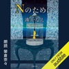

超高層マンション「スカイローズガーデン」の一室で、そこに住む野口夫妻の変死体が発見された。現場に居合わせたのは、20代の4人の男女。それぞれの証言は驚くべき真実を明らかにしていく。なぜ夫妻は死んだのか? それぞれが想いを寄せるNとは誰なのか? 切なさに満ちた、著者初の純愛ミステリー。

[View on Apple](https://books.apple.com/jp/audiobook/n%E3%81%AE%E3%81%9F%E3%82%81%E3%81%AB/id1702494760)

## [4巻] ひげを剃る。そして女子高生を拾う。4: (KADOKAWA)

![\[4巻\] ひげを剃る。そして女子高生を拾う。4: (KADOKAWA)](../../logos/1541300832-997cf575.png)

家出JK・沙優とサラリーマンの吉田、2人の同居生活は沙優の兄・一颯が訪ねてきたことで突然終わりを迎えることに。家に連れ戻されるまでに与えられた猶予は、たった1週間。 吉田が自分にそうしてくれたように、自分自身としっかり向き合いたい。 タイムリミットを前にして、沙優はゆっくりと口を開いた。 「聞いてほしい。私の……今までのこと」 学校のこと、友達のこと、家族のこと。沙優が何故家出をして、こんな遠く離れた街までやってきたのか。そして吉田と暮らした日々で、彼女が得たものとは――。 サラリーマンと女子高生の同居ラブコメディ、急展開の第4巻。

[View on Apple](https://books.apple.com/jp/audiobook/4%E5%B7%BB-%E3%81%B2%E3%81%92%E3%82%92%E5%89%83%E3%82%8B-%E3%81%9D%E3%81%97%E3%81%A6%E5%A5%B3%E5%AD%90%E9%AB%98%E7%94%9F%E3%82%92%E6%8B%BE%E3%81%86-4-kadokawa/id1541300832)

## すべての疲労は脳が原因

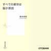

最新科学が解明した疲労の正体
疲れているのは、体じゃない脳だった!

“栄養ドリンクや運動は疲れに効く”“乳酸=疲労物質”は、すべてウソ!

疲労回復物質の存在が明らかになって以来、
疲労に関する科学的調査が進んでいる。

その結果、私たちが日常的に使う「体が疲れている」とは、
実は「脳の疲労」にほかならないことがわかった。
疲労のメカニズムとは何か、最新のエビデンスをもとに解説する。

また、真に有効な疲労対策や乳酸、活性酸素、紫外線、
睡眠との関係なども明らかにし、疲労解消の実践術を提示する。

[著者情報]
梶本修身(かじもと おさみ)
医学博士。大阪市立大学大学院疲労医学講座特任教授。
東京疲労・睡眠クリニック院長。一九六二年生まれ。
大阪大学大学院医学研究科修了。
二〇〇三年より産官学連携「疲労定量化及び抗疲労食薬開発プロジェクト」統括責任者。
ニンテンドーDS『アタマスキャン』をプログラムして「脳年齢」ブームを起こす。
著書に『間違いだらけの疲労の常識 だから、あなたは疲れている!』『最新医学でスッキリ! 「体の疲れ」が消える本』他。

[View on Apple](https://books.apple.com/jp/audiobook/%E3%81%99%E3%81%B9%E3%81%A6%E3%81%AE%E7%96%B2%E5%8A%B4%E3%81%AF%E8%84%B3%E3%81%8C%E5%8E%9F%E5%9B%A0/id1502205390)

## How To Know a Person

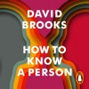

<b>Brought to you by Penguin.  A practical, heartfelt guide to the art of truly knowing another person in order to foster deeper connections at home, at work, and throughout our lives-from the #1 <i>New York Times </i>bestselling author of <i>The Road to Character </i>and <i>The Second Mountain</i></b>  If you are going to care for someone, you must first understand them. If you're going to hire, marry, or befriend someone, you have to be able to see them. If you are going to work closely with someone, you have to be able to make them feel recognized and valued. As David Brooks observes, "The older I get, the more I come to the certainty that there is one skill at the center of any healthy family, company, classroom, community or nation: the ability to see each other, to know other people, to make them feel valued, heard and understood."  And yet we humans don't do this well. All around us are people who feel invisible, unseen, misunderstood. In <i>How to Know a Person</i>, Brooks sets out to help us to do better, posing questions that are essential for all of us. If you want to know a person, what kind of attention should you cast on them? What kind of conversations should you have? What parts of a person's story should you pay attention to?  Driven by his trademark sense of curiosity, Brooks draws from the fields of psychology and neuroscience, and from the worlds of theatre, history, and education, to present a welcoming, hopeful, integrated approach to human connection. <i>How to Know a Person</i> helps readers become more understanding and considerate towards others; it helps readers find the joy that comes from being seen. Along the way it offers a possible remedy for a society that is riven by fragmentation, hostility, and misperception.  The act of seeing another person, Brooks argues, is a profoundly creative act: How can we look somebody in the eye and see something large in them, and in turn, see something larger in ourselves? <i>How to Know a Person</i> is for anyone searching for connection, seeking to understand and yearning to be understood.  ©2023 David Brooks (P)2023 Penguin Audio

[View on Apple](https://books.apple.com/jp/audiobook/how-to-know-a-person/id1702833022)

## [5巻] ひげを剃る。そして女子高生を拾う。5: (KADOKAWA)

![\[5巻\] ひげを剃る。そして女子高生を拾う。5: (KADOKAWA)](../../logos/1600233071-a5562a8c.png)

半年以上一緒に暮らしたアパートを後にして、吉田と沙優は共に北海道へ向かう。「家に帰る」という目標の達成は、同時に少しだけ先延ばしにした二人の別れがやってくるということ。その前に、沙優は「高校に寄ってほしい」と呟いた。彼女が普通の女子高生ではいられなくなった、きっかけとなる事件の現場。家出して遠く離れた場所に逃げてまで、目を背けてきたことにようやく立ち向かおうとしている。沙優の背中を後押しするため、吉田は夜の学校の階段を登って……。 「私、お髭のサラリーマンの吉田さんに出会えて良かった」  サラリーマンと家出女子高生の同居ラブコメディ、堂々の完結!

[View on Apple](https://books.apple.com/jp/audiobook/5%E5%B7%BB-%E3%81%B2%E3%81%92%E3%82%92%E5%89%83%E3%82%8B-%E3%81%9D%E3%81%97%E3%81%A6%E5%A5%B3%E5%AD%90%E9%AB%98%E7%94%9F%E3%82%92%E6%8B%BE%E3%81%86-5-kadokawa/id1600233071)

## Good Strategy Bad Strategy: The Difference and Why It Matters (Unabridged)

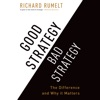

<b><i>Good Strategy/Bad Strategy</i> clarifies the muddled thinking underlying too many strategies and provides a clear way to create and implement a powerful action-oriented strategy for the real world.</b> &#xa0; Developing and implementing a strategy is <i>the </i>central task of a leader. A good strategy is a specific and coherent response to—and approach for—overcoming the obstacles to progress. A good strategy works by harnessing and applying power where it will have the greatest effect. Yet, Rumelt shows that there has been a growing and unfortunate  tendency to equate Mom-and-apple-pie values, fluffy packages of  buzzwords, motivational slogans, and financial goals with “strategy.”   In <i>Good Strategy/Bad Strategy</i>, he  debunks these elements of “bad strategy” and awakens an understanding  of the power of a “good strategy.” He introduces nine sources of power—ranging from using leverage to  effectively focusing on growth—that are eye-opening yet pragmatic tools that  can easily be put to work on Monday morning<i>, </i>and uses fascinating examples from business, nonprofit, and military affairs to bring its original and pragmatic ideas to life. The detailed examples range from Apple to General Motors, from the two Iraq wars to Afghanistan, from a small local market to Wal-Mart, from Nvidia to Silicon Graphics, from the Getty Trust to the Los Angeles Unified School District, from Cisco Systems to Paccar, and from Global Crossing to the 2007–08 financial crisis.  Reflecting an astonishing grasp and integration of economics, finance, technology, history, and the brilliance and foibles of the human character, <i>Good Strategy/Bad Strategy </i>stems from Rumelt’s decades of digging beyond the superficial to address hard questions with honesty and integrity.

[View on Apple](https://books.apple.com/jp/audiobook/good-strategy-bad-strategy-the-difference-and-why/id1460632058)

## シャーロック・ホームズ/緋色の研究[新版]

![シャーロック・ホームズ/緋色の研究\[新版\]](../../logos/1840776503-1ddd91dc.png)

空き家で見つかったアメリカ人男性の死体。外傷はまるでないのに、その顔は恐怖と苦痛にゆがみ、現場には血痕と、そして血で書かれた謎のメッセージが残されていた。男性の死因は何なのか? 彼が持っていた女性ものの指輪は何を示すのか? 名探偵ホームズと、その相棒ワトソン。世界的に有名なこの二人の最初の出会いと、まだ息の合わない二人が初めて一緒に手がけた事件を描いた、シャーロック・ホームズシリーズ最初の作品。

[View on Apple](https://books.apple.com/jp/audiobook/%E3%82%B7%E3%83%A3%E3%83%BC%E3%83%AD%E3%83%83%E3%82%AF-%E3%83%9B%E3%83%BC%E3%83%A0%E3%82%BA-%E7%B7%8B%E8%89%B2%E3%81%AE%E7%A0%94%E7%A9%B6-%E6%96%B0%E7%89%88/id1840776503)

## ケモノの城

17歳の少女が自ら警察に保護を求めてきた。その背景を探る刑事に鑑識から報告が入る。少女が生活していたマンションの浴室から、大量の血痕が見つかったのだった。やがて、同じ部屋で暮らしていた女も警察に保護される。2人は事情聴取に応じるが、その内容は食い違う。――圧倒的な描写力で描く事件は、小説でしか説明する術をもたない。単行本刊行時に大反響を呼んだ、著者の新しいステージを告げる問題作にして衝撃作!

[View on Apple](https://books.apple.com/jp/audiobook/%E3%82%B1%E3%83%A2%E3%83%8E%E3%81%AE%E5%9F%8E/id1827369247)

## ナイツ漫才コレクション vol.10

2020年に結成20周年を迎えたナイツが東京と横浜の2会場で開催した開催した『ナイツ独演会「四苦八苦してカンペィが正解」』。 
2020年10月26日、横浜にぎわい座での公演を収録。 
『ナイツ独演会 四苦八苦してカンペィが正解』より  
001:2020年をヤホーで調べました 
002:インクロスバッグ2020 
003:生背信 
004:料理マンザイ!  
2020年の時事ネタ「2020年をヤホーで調べました」、 
自己紹介ギャグを発表する「インクロスバッグ2020」、 
配信を意識した漫才「生背信」、 
全漫才師の中で誰が一番面白いのかを発表する「料理マンザイ!」。 
漫才ファン必聴の独演会!  
※権利上の都合により一部音声をカットしております。ご了承ください。

[View on Apple](https://books.apple.com/jp/audiobook/%E3%83%8A%E3%82%A4%E3%83%84%E6%BC%AB%E6%89%8D%E3%82%B3%E3%83%AC%E3%82%AF%E3%82%B7%E3%83%A7%E3%83%B3-vol-10/id1823897165)

## The Thinking Machine

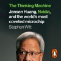

<b>Brought to you by Penguin.</b>  <b>WINNER OF THE <i>FT</i> SCHRODERS BUSINESS BOOK OF THE YEAR 2025</b>  <b>A <i>SUNDAY TIMES, ECONOMIST</i> AND <i>FINANCIAL TIMES</i> BOOK OF THE YEAR</b>  <b>This is the story of the company that is inventing the future.</b>  Nvidia is the world’s first $5-trillion company and the most important corporation on Earth. Led by its charismatic CEO, Jensen Huang, it has gone from video game equipment manufacturer to conquering the global market for AI hardware, reinventing the computer and shaping life as we know it.  With unprecedented access to Huang, award-winning investigative journalist Stephen Witt takes us inside Nvidia to tell the definitive story of the greatest technology company of our times. It is the astonishing story of renegade engineers and Silicon Valley disrupters, of fearless entrepreneurs and one revolutionary leader with an extraordinarily singular vision.  <b>‘Gripping and brilliantly told’ </b>MUSTAFA SULEYMAN <b>‘Highly entertaining’</b> <i>GUARDIAN</i> <b>‘Excellent’</b><i> ECONOMIST</i> <b>'Riveting ... exceptional'</b> RAY KURZWEIL <b>‘Page-turning’</b> DAVID EPSTEIN  © Stephen Witt 2025 (P) Penguin Audio 2025

[View on Apple](https://books.apple.com/jp/audiobook/the-thinking-machine/id1758102320)

## 天才はあきらめた

「自分は天才にはなれない」。そう悟った日から、地獄のような努力がはじまった。  嫉妬の化け物・南海キャンディーズ山里は、どんなに悔しいことがあっても、それをガソリンにして今日も爆走する。 コンビ不仲という暗黒時代を乗り越え再挑戦したM-1グランプリ。そして単独ライブ。 その舞台でようやく見つけた景色とは――。  2006年に発売された『天才になりたい』を本人が全ページにわたり徹底的に大改稿、新しいエピソードを加筆して、まさかの文庫化! 格好悪いこと、情けないことも全て書いた、芸人の魂の記録。 《解説・オードリー若林正恭》  【目次】 はじめに プロローグ  ●第1章 「何者か」になりたい 「モテたい」という隠れ蓑 母ちゃんの「すごいねえ」 お笑いやってみたら」 全ては芸人になるために 「逃げさせ屋」を無視する 大阪怖い! 人見知りは才能? 〝ならず者〞たちとの日々 先輩の涙  ●第2章 スタートライン 芸人養成所という魔境 相方は絶対男前 暴君山里 キングコングの快進撃 偽りでも天才になりきる 伸びる天狗山里の鼻 「もう許してくれ……」  ●第3章 焦り 富男君 加速する相方への要求 天才ごっこ 圧倒的な敗北感 モチベーションは低くて当たり前 芸人になれない日々 「おもしろい」がわからない 超戦略的オーディション 〝姑息ちゃん〞の勝利 初めてネタを創った日 解散 「もう一度」と言えなかった いいネタはどうしたら生まれるのか? 媚びを売って何が悪い! ピン芸人・イタリア人 最強の相方を探せ! 南海キャンディーズ結成  ●第4章 有頂天、そしてどん底 襲ってくる恐怖感 自分の立ち位置は何か? やっと見つけた僕たちのネタ お前たちは「素人だから」 怒りのパワーを成仏させる 僕を変えた運命の出会い 僕の中のクズとの付き合い方 「お前らのやったことの結果を見ておけ」 マネージャーを志願する男 嫉妬は最高のガソリン! M‐1グランプリ2004スタート 医者ネタ 失うものなんか何もない 夢の始まり M‐1バブル しずちゃんとの初めてのぶつかり合い ドヨーンの始まり 人と話すのが怖い 壊れていく心 M‐1グランプリ再び 「もう終わりだな」  ●終章 泣きたい夜を越えて 「おもしろいから早く死ね」 よみがえる「張りぼての自信」 しずちゃんへの嫉妬 最悪だったコンビ仲が 「M‐1に出たい」 周囲からの攻撃的な言葉 「死んだ! 」 しずちゃんの涙 初めて見た景色  ●解説 ぼくが一番潰したい男のこと 若林正恭(オードリー)

[View on Apple](https://books.apple.com/jp/audiobook/%E5%A4%A9%E6%89%8D%E3%81%AF%E3%81%82%E3%81%8D%E3%82%89%E3%82%81%E3%81%9F/id1717613684)

## フーガはユーガ

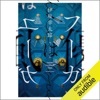

優我は仙台市のファミレスで一人の男に語り出す。双子の弟・風我のこと、幸せでなかった子供時代のこと、そして…。

[View on Apple](https://books.apple.com/jp/audiobook/%E3%83%95%E3%83%BC%E3%82%AC%E3%81%AF%E3%83%A6%E3%83%BC%E3%82%AC/id1592287771)

## The Ice Monster

The Ice Monster, from Children's author David Walliams.  Read all about it! Read all about it!  ICE MONSTER FOUND IN ARCTIC!  When Elsie, an orphan on the streets of Victorian London, hears about the mysterious Ice Monster – a woolly mammoth found at the North Pole – she’s determined to discover more…  A chance encounter brings Elsie face to face with the creature, and sparks the adventure of a lifetime – from London to the heart of the Arctic!  Reviews No reviews available About the author  David Walliams is a children's author. He published his first novel in 2008 and has since written over forty books for children, including fiction and picture books.

[View on Apple](https://books.apple.com/jp/audiobook/the-ice-monster/id1442725401)

## 新装版 続・森崎書店の日々

世界的ベストセラーの新装版第2弾本の街・神保町で近代文学を専門に扱う古書店「森崎書店」。貴子の叔父・サトルが経営するこの店は、かつて失意のどん底にあった彼女の心を癒やしてくれた場所だ。一時期出奔していたサトルの妻・桃子も店を手伝うようになり、貴子も休日のたびに顔を出していた。店で知り合った和田との交際も順調に進んでいた貴子だったが、ある日、彼が喫茶店で昔の恋人と会っているのを目撃してしまい――。50以上の言語で翻訳オファーが殺到し、世界的大ヒットを遂げたヒーリング小説の続編が新装版で登場。巻末には書き下ろしの掌編、「今日だけは、わたしたちが主役」も収録。

(C)Satoshi Yagisawa 2025 (P)小学館 2026

[View on Apple](https://books.apple.com/jp/audiobook/%E6%96%B0%E8%A3%85%E7%89%88-%E7%B6%9A-%E6%A3%AE%E5%B4%8E%E6%9B%B8%E5%BA%97%E3%81%AE%E6%97%A5%E3%80%85/id1892280221)

## The Emissary (Unabridged)

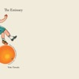

Japan, after suffering from a massive irreparable disaster, cuts itself off from the world. Children are so weak they can barely stand or walk: the only people with any get-go are the elderly. Mumei lives with his grandfather Yoshiro, who worries about him constantly. They carry on a day-to-day routine in what could be viewed as a post-Fukushima time, with all the children born ancient—frail and gray-haired, yet incredibly compassionate and wise. Mumei may be enfeebled and feverish, but he is a beacon of hope, full of wit and free of self-pity and pessimism. Yoshiro concentrates on nourishing Mumei, a strangely wonderful boy who offers “the beauty of the time that is yet to come.”  A delightful, irrepressibly funny book, The Emissary is filled with light. Yoko Tawada, deftly turning inside-out “the curse,” defies gravity and creates a playful joyous novel out of a dystopian one, with a legerdemain uniquely her own.

[View on Apple](https://books.apple.com/jp/audiobook/the-emissary-unabridged/id1416965759)

## [2巻] 悪役令嬢、ブラコンにジョブチェンジします2: (KADOKAWA)

![\[2巻\] 悪役令嬢、ブラコンにジョブチェンジします2: (KADOKAWA)](../../logos/1791735289-065ec474.png)

悪役令嬢エカテリーナに転生した社畜アラサーの利奈。 ヒロインのフローラとも仲良くなり、滅亡フラグも何とか乗り越え一安心……と思いきや、今度は皇室一家が公爵邸にいらっしゃると知り大慌て!  急いで公爵邸に戻り、もてなしの準備を始めるエカテリーナ。 けれどそこには、悪役兄妹の運命をねじ曲げた亡き祖母の影が……?  忌まわしい過去なんてすべて消去! 最愛のお兄様のため、全力でおもてなしさせていただきます!!

[View on Apple](https://books.apple.com/jp/audiobook/2%E5%B7%BB-%E6%82%AA%E5%BD%B9%E4%BB%A4%E5%AC%A2-%E3%83%96%E3%83%A9%E3%82%B3%E3%83%B3%E3%81%AB%E3%82%B8%E3%83%A7%E3%83%96%E3%83%81%E3%82%A7%E3%83%B3%E3%82%B8%E3%81%97%E3%81%BE%E3%81%992-kadokawa/id1791735289)

## Mode One: Let the Women Know What You're REALLY Thinking (Unabridged)

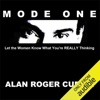

As a man, when you decide that you want to express your romantic or sexual desires, interests, and intentions to a woman, how do you go about communicating those desires and interests to her?   Do you communicate your desires and interests to women in a cautious, vague, ambiguous, or "beat around the bush" manner?   Do you avoid approaching women and avoid initiating conversations with women altogether?   Do you regularly cheat on your wife or girlfriend behind her back?   Are you currently filled with so much bitterness, misogyny, and resentment toward women that you have no desire whatsoever to even interact with them?   In the audiobook version of <i>Mode One: Let the Women Know What You're Really Thinking</i>, author and professional dating coach Alan Roger Currie describes and examines what he refers to as the "Four Modes of Verbal Communication".   Currie makes the strong argument in his audiobook that the most effective interpersonal communication style that a man can exhibit with a woman is MODE ONE behavior, which represents when a man expresses his romantic or sexual desires, interests, and intentions to a woman in a manner that is bold, highly self-assured, up front, specific, and straightforwardly honest.   Currie harshly criticizes the idea of men maintaining disingenuous platonic friendships with women (what Currie refers to as "FunClubbin"), and he also points out that many men and women tend to exhibit behavior that is very duplicitous, dishonest, disingenuous, misleading, and manipulative when interacting with members of the opposite sex in today's dating scene.   Currie invites his male listeners to take notes while listening to each and every chapter (preprinted notes are available at modeone.net/journal/).   Warning: Some chapters in the audiobook include explicit language.

[View on Apple](https://books.apple.com/jp/audiobook/mode-one-let-the-women-know-what-youre-really/id905378781)

## 「脳にいいこと」すべて試して1冊にまとめてみた

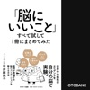

世界中の脳科学のエビデンスを自分の脳で実験。
医師が実践する脳のコンディションを整える方法。

「昔に比べ、仕事の処理能力が落ちた」
「なんとなく、毎日楽しくない」
「最近、イライラすることが増えた」

その悩みは、仕事のやり方に問題があるせいでも、
あなたが落ち込んでいるせいでも、
あなたを怒らせる人のせいでも、ありません。
ただ、「脳のコンディションが悪い」だけ。

この本では脳のコンディションを整えて
仕事のパフォーマンスや
日々の幸福度を上げる方法をお伝えします。

その方法はすべて医師である著者が
自分の脳で実験したものです。
きっかけは、自身の脳手術による後遺症に立ち向かうためでした。
医学知識、経験、ネットワークを総動員して
「脳のコンディションを整える」という100個ほどのエビデンスを集め
自分の脳を実験台にスタート。

◉科学的に裏付けられた「ストレス解消法」
◉脳を若返らせるのに効果的な「運動法」
◉やる気をもたらす“自分が主人公と思って過ごす”「マインド術」
◉幸せホルモンのオキシトシンを効果的に出す「人づき合いの方法」

など、本当に効果があった方法をこの1冊にまとめ上げました。
実践した結果、

◉判断がいままでよりも早くなった
◉週の半ばころには体が疲れてしまう……がなくなった
◉片頭痛が出なくなった
◉苦戦していた語学学習も新しい言葉がすんなりと入ってきた

という、“バージョンアップした自分”になって
見事、仕事復帰をかなえたのです。

【目次より】
◉集中力や幸福度の低下……ストレスや加齢が脳に及ぼす影響
◉感情の大きさがコントロールできなくなる「感情失禁」とは?
◉「なんとなく楽しくない」の裏にある脳のホルモン
◉ホストクラブにハマるのはドーパミン中毒の可能性
◉一日2時間以上5時間以下の「自分時間」でストレスを回避
◉筋トレやストレッチより「早歩き」の方が脳は若返る
◉課題を残したままランニングするとよいアイデアが湧く
◉緑がある場所に30分いるだけでポジティブになれる
◉『プラダを着た悪魔』からひらめいた前向きになれる方法
◉レジで従業員の名札を見るだけでもオキシトシンは出る

[View on Apple](https://books.apple.com/jp/audiobook/%E8%84%B3%E3%81%AB%E3%81%84%E3%81%84%E3%81%93%E3%81%A8-%E3%81%99%E3%81%B9%E3%81%A6%E8%A9%A6%E3%81%97%E3%81%A61%E5%86%8A%E3%81%AB%E3%81%BE%E3%81%A8%E3%82%81%E3%81%A6%E3%81%BF%E3%81%9F/id6781918462)

## [4巻] 悪役令嬢、ブラコンにジョブチェンジします4: (KADOKAWA)

![\[4巻\] 悪役令嬢、ブラコンにジョブチェンジします4: (KADOKAWA)](../../logos/1823855173-c20992af.png)

波乱に満ちた祝宴の夜が明けた。エカテリーナは多忙すぎる兄アレクセイの代参として、山岳神殿を参拝することに。最愛のお兄様と離れるのは寂しいけれど、いざはじめてのおつかい旅へ! 道中、神との邂逅によってこの世界と転生の謎の一端に触れるも、実際にユールノヴァ領を目にして学びながらの旅は順調に進む。……と思ったら、最強の隠し攻略キャラの予想外すぎる襲撃で、悪役令嬢(色んな意味で)大ピンチの予感――!?

[View on Apple](https://books.apple.com/jp/audiobook/4%E5%B7%BB-%E6%82%AA%E5%BD%B9%E4%BB%A4%E5%AC%A2-%E3%83%96%E3%83%A9%E3%82%B3%E3%83%B3%E3%81%AB%E3%82%B8%E3%83%A7%E3%83%96%E3%83%81%E3%82%A7%E3%83%B3%E3%82%B8%E3%81%97%E3%81%BE%E3%81%994-kadokawa/id1823855173)

## [3巻] 悪役令嬢、ブラコンにジョブチェンジします3: (KADOKAWA)

![\[3巻\] 悪役令嬢、ブラコンにジョブチェンジします3: (KADOKAWA)](../../logos/1818972441-9fa39a29.png)

魔法学園も夏休みを迎え、最愛の兄アレクセイと共に公爵領へ帰ることになった悪役令嬢エカテリーナ(元社畜アラサー)。 兄の爵位継承祝いとエカテリーナのお披露目を兼ねた祝宴が催されるのだ。 しかし公爵領にいまだはびこるのは――祖母の遺した闇と不正の数々。 そして本邸には傲岸不遜な分家の面々と縦ロールの悪役令嬢(もどき)が待ち受けていて……!?  ブラコンの名にかけて、お兄様をあなどる者は決して許しません!!

[View on Apple](https://books.apple.com/jp/audiobook/3%E5%B7%BB-%E6%82%AA%E5%BD%B9%E4%BB%A4%E5%AC%A2-%E3%83%96%E3%83%A9%E3%82%B3%E3%83%B3%E3%81%AB%E3%82%B8%E3%83%A7%E3%83%96%E3%83%81%E3%82%A7%E3%83%B3%E3%82%B8%E3%81%97%E3%81%BE%E3%81%993-kadokawa/id1818972441)

## [1巻] 悪役令嬢、ブラコンにジョブチェンジします: (KADOKAWA)

![\[1巻\] 悪役令嬢、ブラコンにジョブチェンジします: (KADOKAWA)](../../logos/1790223336-fccc210f.png)

悪役令嬢エカテリーナに転生した社畜アラサーの利奈。前世の最推し・妹溺愛(シスコン)の兄アレクセイに会えて喜んだものの、初めて知った悪役兄妹の生い立ちが不幸すぎる! しかもお兄様は公爵として多忙すぎる毎日。前世の知識でお兄様を助けようとするエカテリーナだけど……あれ、こんなところに皇国滅亡フラグが!? ゲームになかった設定だらけの世界で、没落も滅亡も絶対回避! すべてはお兄様のため、悪役令嬢は頑張ります!

[View on Apple](https://books.apple.com/jp/audiobook/1%E5%B7%BB-%E6%82%AA%E5%BD%B9%E4%BB%A4%E5%AC%A2-%E3%83%96%E3%83%A9%E3%82%B3%E3%83%B3%E3%81%AB%E3%82%B8%E3%83%A7%E3%83%96%E3%83%81%E3%82%A7%E3%83%B3%E3%82%B8%E3%81%97%E3%81%BE%E3%81%99-kadokawa/id1790223336)

## Pedro Páramo

“Desconcertante, lista a inquietar a la crítica, está ya en los escaparates la primera novela de Juan Rulfo, Pedro Páramo, que transcurre en una serie de transposiciones oníricas, ahondando más allá de la muerte de sus personajes, que uno no sabe en qué momento son sueño, vida, fábula, verdad, pero a los que se les oye la voz al través de la ‘perspicacia despiadada y certera’ de tan sin duda extraordinario escritor.” Con estas palabras iniciaba Edmundo Valadés la primera reseña de Pedro Páramo, aparecida el 30 de marzo de 1955 y conservada por Rulfo entre sus papeles. Desde entonces, escritores como Jorge Luis Borges, Gabriel García Márquez, Gunter Grass, Susan Sontag y Mario Vargas Llosa, o el cineasta Werner Herzog, entre muchos más de cualquier lengua, coinciden en calificar esta novela como una de las obras maestras de la literatura de todos los tiempos. La encuesta del Instituto Nobel de Suecia, de 2002, dirigida a un centenar de escritores y estudiosos de todo el mundo, ubicó a Pedro Páramo entre las cien obras que constituyen el núcleo del patrimonio universal de la literatura. El dibujo a tinta de la portada es de Ricardo Martínez. Apareció en la primera edición de Pedro Páramo, que se terminó de imprimir el 19 de marzo de 1955.

[View on Apple](https://books.apple.com/jp/audiobook/pedro-p%C3%A1ramo/id1546256618)

## The Last Girl: My Story of Captivity, and My Fight Against the Islamic State (Unabridged)

<b><b>WINNER OF THE NOBEL PEACE PRIZE •&#xa0;</b>In this “courageous” (<i>The Washington Post</i>) memoir of survival, a former captive of the Islamic State tells her harrowing and ultimately inspiring story.</b>  <b>&#xa0;</b>  Nadia Murad was born and raised in Kocho, a small village of farmers and shepherds in northern Iraq. A member of the Yazidi community, she and her brothers and sisters lived a quiet life. Nadia had dreams of becoming a history teacher or opening her own beauty salon.  &#xa0;  On August 15th, 2014, when Nadia was just twenty-one years old, this life ended. Islamic State militants massacred the people of her village, executing men who refused to convert to Islam and women too old to become sex slaves. Six of Nadia’s brothers were killed, and her mother soon after, their bodies swept into mass graves. Nadia was taken to Mosul and forced, along with thousands of other Yazidi girls, into the ISIS slave trade.  &#xa0;  Nadia would be held captive by several militants and repeatedly raped and beaten. Finally, she managed a narrow escape through the streets of Mosul, finding shelter in the home of a Sunni Muslim family whose eldest son risked his life to smuggle her to safety.  &#xa0; Today, Nadia's story—as a witness to the Islamic State's brutality, a survivor of rape, a refugee, a Yazidi—has forced the world to pay attention to an ongoing genocide. It is a call to action, a testament to the human will to survive, and a love letter to a lost country, a fragile community, and a family torn apart by war.

[View on Apple](https://books.apple.com/jp/audiobook/the-last-girl-my-story-of-captivity-and-my/id1416970463)

## The Righteous Mind : Why Good People Are Divided by Politics and Religion

Why can’t our political leaders work together as threats loom and problems mount? Why do people so readily assume the worst about the motives of their fellow citizens? In The Righteous Mind, social psychologist Jonathan Haidt explores the origins of our divisions and points the way forward to mutual understanding.   His starting point is moral intuition—the nearly instantaneous perceptions we all have about other people and the things they do. These intuitions feel like self-evident truths, making us righteously certain that those who see things differently are wrong. Haidt shows us how these intuitions differ across cultures, including the cultures of the political left and right. He blends his own research findings with those of anthropologists, historians, and other psychologists to draw a map of the moral domain, and he explains why conservatives can navigate that map more skillfully than can liberals. He then examines the origins of morality, overturning the view that evolution made us fundamentally selfish creatures. But rather than arguing that we are innately altruistic, he makes a more subtle claim—that we are fundamentally groupish. It is our groupishness, he explains, that leads to our greatest joys, our religious divisions, and our political affiliations. In a stunning final chapter on ideology and civility, Haidt shows what each side is right about, and why we need the insights of liberals, conservatives, and libertarians to flourish as a nation.

[View on Apple](https://books.apple.com/jp/audiobook/the-righteous-mind-why-good-people-are-divided-by/id1648912950)

## 月刊・中谷彰宏167「覚悟のある者同士が、結ばれる。」: 好きな人を成長させるアゲマン術

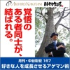

★遅咲きだから、成り上がれる。運命の人と結ばれる、中谷流「アゲマン」成功術。 ★成功者についての大誤解。それは「一生順風満帆だった」というもの。それも、無理もありません。描かれるのは、主に「成功」だからです。でも、史実を紐解いてみれば、成功者の人生は、むしろ敗北まみれ。立身出世の代名詞である豊臣秀吉にしても同様です。今なら40代半ばにあたる33歳で、ようやく「正社員」採用されました。「みんな勘違いしているけど、秀吉は出世が遅かった。33歳でようやく正社員。秀吉は、遅咲きだった。」と中谷さん。人生いつからでも立身出世。そのための心得、中谷さんから伺いました。 ★月ナカ167――7つの学び  ○「33歳で正社員。秀吉は、遅咲きだった。」 ○「言い訳すると、共感を得られない。」 ○「『侍』でなかったから、秀吉はいくさが強かった。」 ○「覚悟のある者同士が、結ばれる。」 ○「真ん丸は、品がない。完璧ではないところに美がある。」 ○「灰屋紹益が、好色一代男のモデル。」 ○「面白いことは、入り口の手前にある。」

[View on Apple](https://books.apple.com/jp/audiobook/%E6%9C%88%E5%88%8A-%E4%B8%AD%E8%B0%B7%E5%BD%B0%E5%AE%8F167-%E8%A6%9A%E6%82%9F%E3%81%AE%E3%81%82%E3%82%8B%E8%80%85%E5%90%8C%E5%A3%AB%E3%81%8C-%E7%B5%90%E3%81%B0%E3%82%8C%E3%82%8B-%E5%A5%BD%E3%81%8D%E3%81%AA%E4%BA%BA%E3%82%92%E6%88%90%E9%95%B7%E3%81%95%E3%81%9B%E3%82%8B%E3%82%A2%E3%82%B2%E3%83%9E%E3%83%B3%E8%A1%93/id1579472403)

## Eye of the Earthquake Dragon: A Branches Book (Dragon Masters #13)

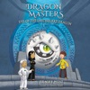

Time is running out for the Dragon Masters to stop the dark wizard Maldred!Pick a book. Grow a Reader!This series is part of Scholastic's early chapter book line, Branches, aimed at newly independent readers. With easy-to-read text, high-interest content, fast-paced plots, and illustrations on every page, these books will boost reading confidence and stamina. Branches books help readers grow!Dark wizard Maldred has stolen the Gold and Silver Keys! With these keys, he can now control the Naga: a powerful dragon who can cause terrible earthquakes. The Naga lives in a secret temple in the center of the earth... and Maldred is on his way there! Drake and his friends Jean and Darma travel to the temple to try to stop him. What will they find there? Will the Dragon Masters defeat Maldred once and for all?

[View on Apple](https://books.apple.com/jp/audiobook/eye-of-the-earthquake-dragon-a-branches/id1515376257)

## Kopf schlägt Kapital: Die ganz andere Art, ein Unternehmen zu gründen. Von der Lust, ein Entrepreneur zu sein

Viele glauben zu wissen, wie es geht. Wenige tun es wirklich. Noch weniger sind damit erfolgreich. Etwas ist falsch an der Art, wie wir versuchen Unternehmen zu gründen. Dabei geht es auch ganz anders: Ein Ideen-Kunstwerk schaffen und das eigene Unternehmen aus vorhandenen, jedermann zugänglichen Komponenten zusammensetzen. Den Kopf freihalten für die wichtigen Fragen. Den Horizont im Auge behalten, statt in den Alltagsanforderungen unterzugehen. Nur ein schöner Traum? Keineswegs. Wer heute erfolgreich gründen will, muss sogar so vorgehen. 
 Günter Faltin zeigt an vielen Beispielen, wie jeder ganz praktisch an eigenen Ideen arbeiten kann, sie wie ein Puzzle kombiniert und daraus etwas Neues schafft - das eigene Unternehmen. Je unkonventioneller man denkt, um so besser! Buchhaltung und Rechnungswesen? Sollte ein Gründer denen überlassen, die das schnell, zuverlässig und zu niedrigen Preisen erledigen. Versand, Verpackung und Logistik? Auch dafür gibt es Profis.Günter Faltin lehrt seine Methode seit vielen Jahren - und ist damit sehr erfolgreich: Die von ihm gegründete "Teekampagne" funktioniert nach diesem Modell: Sie hat mehr als 200.000 Kunden, ist das größte Teeversandhaus Deutschlands und der größte Importeur von Darjeeling-Tee weltweit. Eine ganze Reihe weiterer Unternehmen, die im Umfeld des Hochschullehrers entstanden, wenden seine Prinzipien erfolgreich an.

[View on Apple](https://books.apple.com/jp/audiobook/kopf-schl%C3%A4gt-kapital-die-ganz-andere-art-ein-unternehmen/id592064919)

## 置き配的

コロナ禍以降、社会は置き配的なものとなった――  
「紀伊國屋じんぶん大賞2025 読者と選ぶ人文書ベスト30」の1位に輝いた気鋭の批評家が放つ最初にして最高の2020年代社会批評!  
群像連載の「言葉と物」を単行本化。酷薄な現代を生き抜くための必読書!  
「外出を自粛し、Zoomで会議をし、外ではマスクを着け、ドアの前に荷物が置かれるのに気づくより早く、スマホで通知を受け取る。個々人の環境や選択とはべつに、そのような生活がある種の典型となった社会のなかで、何が抑圧され、何が新たな希望として開かれているのか。そうした観点から、人々のありうべきコミュニケーションのかたちを問うこと、それがこの本のテーマです。(中略) 
 つまり、狭義の置き配が「届ける」ということの意味を変えたのだとすれば、置き配的なコミュニケーションにおいては「伝える」ということの意味が変わってしまったのだと言えます。そして現在、もっとも置き配的なコミュニケーションが幅を利かせている場所はSNS、とりわけツイッター(現X)でしょう。保守とリベラル、男性と女性、老人と若者、なんでもいいですが、読者のみなさんもいちどは、彼らの論争は本当に何かを論じ合っているのかと疑問に思ったことがあるのではないでしょうか。 
(中略)置き配的な社会を問うことは、書くことの意味を立ち上げなおすことにも直結するはずです。」(本文より)  
本タイトルには付属資料が用意されています。詳しくは「デジタルブックレットの探し方」ガイドをご参照ください。 https://support.apple.com/ja-jp/HT208929

[View on Apple](https://books.apple.com/jp/audiobook/%E7%BD%AE%E3%81%8D%E9%85%8D%E7%9A%84/id6789163346)

## 戦後日本経済史

私たちの世代は、戦後日本の復興と高度成長、そして1990年代以降の日本経済の停滞と衰退を目の当たりにした。いま振り返れば、経験したさまざまな事柄が、日本と世界の大きな変化の一部だったと実感する。戦後のすべての期間にわたる日本経済の歴史を、自らの経験と重ねて語ることができるのは、我々の世代が最後になる。だから、我々は、その記憶を語る必要がある。そしてそれを、日本の将来を築く用に供する必要がある。――はじめにより

★★★戦後復興から世界一の日本になるまでの流れがわかる!
焼け跡からの復興、奇跡の高度成長を経て世界一の経済大国になった日本。その復興と高度成長の過程を、著者自らの経験と重ねて語ります。
★★★長期停滞から脱出するヒントがわかる!
バブル崩壊後、なぜ長期停滞から脱出できなかったのか。これからの日本経済の歴史を新しい可能性を追求する過程とするため、その原因を探ります!

【本書の目次】
第1章 焼け跡からの復興
第2章 奇跡の高度成長
第3章 「世界一の日本」とバブル。そして崩壊
第4章 1995年:日本病の始まり
第5章 中国工業化とデジタル敗戦
第6章 外需依存成長からリーマンショックへ
第7章 日本の製造業は、垂直統合と官主導で衰退した
第8章 大規模金融緩和で、日本の劣化が進んだ
第9章 賃金が、30年間も上がらなかった
第10章 老いる日本が負う過去の成功の重み
第11章 世界トップだった日本の競争力は、いま世界最低に近い
第12章 終わりが始まりである

[View on Apple](https://books.apple.com/jp/audiobook/%E6%88%A6%E5%BE%8C%E6%97%A5%E6%9C%AC%E7%B5%8C%E6%B8%88%E5%8F%B2/id6786921952)
