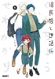
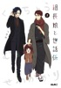
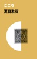
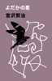
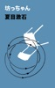
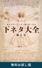
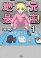
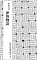

- [無自覚最硬タンクのおかしな牧場 1](#無自覚最硬タンクのおかしな牧場-1)
- [組長娘と世話係 7](#組長娘と世話係-7)
- [組長娘と世話係 6](#組長娘と世話係-6)
- [組長娘と世話係 9](#組長娘と世話係-9)
- [組長娘と世話係 8](#組長娘と世話係-8)
- [組長娘と世話係 5](#組長娘と世話係-5)
- [組長娘と世話係 4](#組長娘と世話係-4)
- [悪役令嬢に転生したと思ったら、シンデレラの義姉でした ～シンデレラオタクの異世界転生～ 2巻](#悪役令嬢に転生したと思ったら-シンテ-レラの義姉て-した-シンテ-レラオタクの異世界転生-2巻)
- [転生しました、サラナ・キンジェです。ごきげんよう。 ～優雅なスローライフで大忙し～1【電子書店共通特典イラスト付】](#転生しました-サラナ-キンシ-ェて-す-こ-きけ-んよう-優雅なスローライフて-大忙し-1-電子書店共通特典イラスト付)
- [組長娘と世話係 2](#組長娘と世話係-2)
- [組長娘と世話係 1](#組長娘と世話係-1)
- [組長娘と世話係 3](#組長娘と世話係-3)
- [人間失格](#人間失格)
- [転生してハイエルフになりましたが、スローライフは120年で飽きました -Highelf with a long life- 3](#転生してハイエルフになりましたか-スローライフは120年て-飽きました-highelf-with-a-long-life-3)
- [こころ](#こころ)
- [送り屋ヴァナルガンド 1巻](#送り屋ウ-ァナルカ-ント-1巻)
- [銀河鉄道の夜](#銀河鉄道の夜)
- [悪役令嬢に転生したと思ったら、シンデレラの義姉でした ～シンデレラオタクの異世界転生～ 1巻](#悪役令嬢に転生したと思ったら-シンテ-レラの義姉て-した-シンテ-レラオタクの異世界転生-1巻)
- [松本透はゴリラ妻とプリティ娘とツンデレ息子を愛しすぎてる 2巻](#松本透はコ-リラ妻とフ-リティ娘とツンテ-レ息子を愛しすき-てる-2巻)
- [相対性理論](#相対性理論)
- [罪と罰](#罪と罰)
- [武術バカの異世界無双～修行が趣味のおっさん、異世界まるごと道場にする～(1)](#武術ハ-カの異世界無双-修行か-趣味のおっさん-異世界まるこ-と道場にする-1)
- [転生してハイエルフになりましたが、スローライフは120年で飽きました -Highelf with a long life- 2](#転生してハイエルフになりましたか-スローライフは120年て-飽きました-highelf-with-a-long-life-2)
- [転生してハイエルフになりましたが、スローライフは120年で飽きました -Highelf with a long life- 1](#転生してハイエルフになりましたか-スローライフは120年て-飽きました-highelf-with-a-long-life-1)
- [俺一人だけカンストレベル帰還者第1話](#俺一人た-けカンストレヘ-ル帰還者第1話)
- [反逆のソウルイーター -魂の捕食者と少女たち-2【電子書店共通特典イラスト付】](#反逆のソウルイーター-魂の捕食者と少女たち-2-電子書店共通特典イラスト付)
- [エリアの騎士(新装版) 1](#エリアの騎士-新装版-1)
- [D坂の殺人事件](#d坂の殺人事件)
- [エリアの騎士(新装版) 2](#エリアの騎士-新装版-2)
- [注文の多い料理店](#注文の多い料理店)
- [エリアの騎士(新装版) 3](#エリアの騎士-新装版-3)
- [吾輩は猫である](#吾輩は猫て-ある)
- [プラチナデータ<ライト版>](#フ-ラチナテ-ータ-ライト版)
- [檸檬](#檸檬)
- [精魂貯蔵者(リビドータンカー)～異世界の幽霊は可愛かった～(1)](#精魂貯蔵者-リヒ-ト-ータンカー-異世界の幽霊は可愛かった-1)
- [ガベージブレイブ 異世界に召喚され捨てられた勇者の復讐物語(1)](#カ-ヘ-ーシ-フ-レイフ-異世界に召喚され捨てられた勇者の復讐物語-1)
- [古事記](#古事記)
- [よだかの星](#よた-かの星)
- [羅生門](#羅生門)
- [俺一人だけカンストレベル帰還者第2話](#俺一人た-けカンストレヘ-ル帰還者第2話)
- [ハブられルーン使いの異世界冒険譚【分冊版】 2](#ハフ-られルーン使いの異世界冒険譚-分冊版-2)
- [ハブられルーン使いの異世界冒険譚【分冊版】 1](#ハフ-られルーン使いの異世界冒険譚-分冊版-1)
- [坊っちゃん](#坊っちゃん)
- [元神童の自由気ままなセカンドライフ(1)](#元神童の自由気ままなセカント-ライフ-1)
- [イケメン夫はゴリラ妻とプリティ娘を愛しすぎてる1](#イケメン夫はコ-リラ妻とフ-リティ娘を愛しすき-てる1)
- [俺一人だけカンストレベル帰還者第3話](#俺一人た-けカンストレヘ-ル帰還者第3話)
- [斜陽](#斜陽)
- [舞姫](#舞姫)
- [松本透はゴリラ妻とプリティ娘とツンデレ息子を愛しすぎてる 1巻](#松本透はコ-リラ妻とフ-リティ娘とツンテ-レ息子を愛しすき-てる-1巻)
- [現代語訳 方丈記](#現代語訳-方丈記)
- [ハブられルーン使いの異世界冒険譚【分冊版】 3](#ハフ-られルーン使いの異世界冒険譚-分冊版-3)
- [反逆のソウルイーター -魂の捕食者と少女たち-1【電子書店共通特典イラスト付】](#反逆のソウルイーター-魂の捕食者と少女たち-1-電子書店共通特典イラスト付)
- [山月記](#山月記)
- [ドグラ・マグラ](#ト-ク-ラ-マク-ラ)
- [痴人の愛](#痴人の愛)
- [勝手に召喚したくせに「行き遅れだから聖女ではない」と言われました ～異世界はとても面倒です～【分冊版】 1](#勝手に召喚したくせに-行き遅れた-から聖女て-はない-と言われました-異世界はとても面倒て-す-分冊版-1)
- [細雪](#細雪)
- [蜘蛛の糸](#蜘蛛の糸)
- [引退した最強バトラーは自由に魔法研究を楽しみます(1)](#引退した最強ハ-トラーは自由に魔法研究を楽しみます-1)
- [山を渡る -三多摩大岳部録-【分冊版】 1](#山を渡る-三多摩大岳部録-分冊版-1)
- [ファイア・ドーム 冒頭試し読み特別版](#ファイア-ト-ーム-冒頭試し読み特別版)
- [勝手に召喚したくせに「行き遅れだから聖女ではない」と言われました ～異世界はとても面倒です～【分冊版】 3](#勝手に召喚したくせに-行き遅れた-から聖女て-はない-と言われました-異世界はとても面倒て-す-分冊版-3)
- [勝手に召喚したくせに「行き遅れだから聖女ではない」と言われました ～異世界はとても面倒です～【分冊版】 2](#勝手に召喚したくせに-行き遅れた-から聖女て-はない-と言われました-異世界はとても面倒て-す-分冊版-2)
- [山を渡る -三多摩大岳部録-【分冊版】 2](#山を渡る-三多摩大岳部録-分冊版-2)
- [山を渡る -三多摩大岳部録-【分冊版】 3](#山を渡る-三多摩大岳部録-分冊版-3)
- [三国志](#三国志)
- [世界で一番かわいそうな私たち<特別ショートストーリー>](#世界て-一番かわいそうな私たち-特別ショートストーリー)
- [仕事で使える「すごい」ChatGPTプロンプト集](#仕事て-使える-すこ-い-chatgptフ-ロンフ-ト集)
- [結液感戦【分冊版】 3](#結液感戦-分冊版-3)
- [結液感戦【分冊版】 2](#結液感戦-分冊版-2)
- [結液感戦【分冊版】 1](#結液感戦-分冊版-1)
- [正しいナイフの使い方【分冊版】 1](#正しいナイフの使い方-分冊版-1)
- [正しいナイフの使い方【分冊版】 2](#正しいナイフの使い方-分冊版-2)
- [正しいナイフの使い方【分冊版】 3](#正しいナイフの使い方-分冊版-3)
- [俺一人だけカンストレベル帰還者プロローグ](#俺一人た-けカンストレヘ-ル帰還者フ-ロローク)
- [アイスコーヒーが冷める前に](#アイスコーヒーか-冷める前に)
- [ドーナツとカフェラテと](#ト-ーナツとカフェラテと)
- [なつめとなつめ more Perfume 第3話【単話版】](#なつめとなつめ-more-perfume-第3話-単話版)
- [なつめとなつめ more Perfume 第2話【単話版】](#なつめとなつめ-more-perfume-第2話-単話版)
- [めっちゃ召喚された件【フルカラー】(81)](#めっちゃ召喚された件-フルカラー-81)
- [【単話版】魔族の王子様は私のためにスパダリを目指すそうです 第1話](#単話版-魔族の王子様は私のためにスハ-タ-リを目指すそうて-す-第1話)
- [怪人二十面相](#怪人二十面相)
- [読むだけでグングン頭が良くなる下ネタ大全 無料お試し版](#読むた-けて-ク-ンク-ン頭か-良くなる下ネタ大全-無料お試し版)
- [【分冊版】無自覚最硬タンクのおかしな牧場 第6話](#分冊版-無自覚最硬タンクのおかしな牧場-第6話)
- [リィンカーネーションの花弁(5)](#リィンカーネーションの花弁-5)
- [リィンカーネーションの花弁(4)](#リィンカーネーションの花弁-4)
- [今際の際のファムファタール【分冊版】 1](#今際の際のファムファタール-分冊版-1)
- [中国怪奇小説集](#中国怪奇小説集)
- [聖女の姉が棄てた元婚約者に嫁いだら、蕩けるほどの溺愛が待っていました 第1話](#聖女の姉か-棄てた元婚約者に嫁いた-ら-蕩けるほと-の溺愛か-待っていました-第1話)
- [今際の際のファムファタール【分冊版】 3](#今際の際のファムファタール-分冊版-3)
- [今際の際のファムファタール【分冊版】 2](#今際の際のファムファタール-分冊版-2)
- [めっちゃ召喚された件【フルカラー】(1)](#めっちゃ召喚された件-フルカラー-1)
- [地元最高!【単話版】第1巻 (1)](#地元最高-単話版-第1巻-1)
- [遠野物語](#遠野物語)
- [刺青](#刺青)
- [iPhoneユーザガイド](#iphoneユーサ-カ-イト)
- [伊勢物語](#伊勢物語)
- [雨ニモマケズ](#雨ニモマケス)
- [なつめとなつめ 1](#なつめとなつめ-1)
- [りんご性活～田舎育ちのエルフま●こは都会ち●ぽと相性抜群!【ソフト版】【フルカラー】【タテヨミ】(1)](#りんこ-性活-田舎育ちのエルフま-こは都会ち-ほ-と相性抜群-ソフト版-フルカラー-タテヨミ-1)

## 無自覚最硬タンクのおかしな牧場 1

探索者パーティから追放され、人生に疲れ果てた元タンク(盾役)のアイギスは、スローライフを送るため、辺境の土地を購入する。しかし、そこは硬い地面以外何もない「無の大地」と呼ばれる不毛の地だった…。 開拓は不可能…と絶望するアイギスだったが、持ち前の“硬すぎる”体や、空から落ちてきたドラゴンの少女・ソフィとの出会いによって、一筋の希望が見えてくる――! 自覚なしの“最硬”男による、ちょっとおかしな牧場生活が始まる!

[View on Apple](https://books.apple.com/jp/book/%E7%84%A1%E8%87%AA%E8%A6%9A%E6%9C%80%E7%A1%AC%E3%82%BF%E3%83%B3%E3%82%AF%E3%81%AE%E3%81%8A%E3%81%8B%E3%81%97%E3%81%AA%E7%89%A7%E5%A0%B4-1/id6752482438)

## 組長娘と世話係 7

TVアニメ化2022年放送開始!! 累計67万部突破!! 
大ヒット御礼、笑いと涙とすこし暴力のハートフル(?)コメディー♪ 
 
兄弟分の桃山に呼び出された桜樹。 
そこで告げられた衝撃の事実が桜樹を惑わす。 
最愛の妻を轢いた組の残党とは――。 
 
 
描き下ろしは6巻から続く【霧島の過去】を収録!! 
 
 
「コミックELMO」掲載話、 
第56話～64話までを収録しています。

[View on Apple](https://books.apple.com/jp/book/%E7%B5%84%E9%95%B7%E5%A8%98%E3%81%A8%E4%B8%96%E8%A9%B1%E4%BF%82-7/id1609023714)

## 組長娘と世話係 6

累計50万部突破!! 大ヒット御礼、笑いと涙とすこし暴力のハートフル(?)コメディー♪ 
 
母との思い出の花、カランコエ。それを手に霧島が向かったのは、墓地だった…。 
その他にも、鷹松組の大親分が来襲、ヤクザ達の仁義なき野球、楓パパは警察官などなど 
内容もりだくさん! 
 
描き下ろしは豪華30P超! 
待望の【霧島が桜樹組に拾われた日】、そして【楓パパの交番勤務】を収録!! 
 
「コミックELMO」掲載話、 
第48話～55話までを収録しています。

[View on Apple](https://books.apple.com/jp/book/%E7%B5%84%E9%95%B7%E5%A8%98%E3%81%A8%E4%B8%96%E8%A9%B1%E4%BF%82-6/id1584958004)

## 組長娘と世話係 9

アニメで人気上昇! 累計115万部突破!  
 
襲撃された二宮組と柿原組 
調査に動く最狂コンビ――。 
 
二宮組組長が凶弾に倒れ、柿原組の雅也も襲われた。 
調査に乗り出した霧島と真白の前に現れたのは…。 
 
葵と龍馬の過去エピソードを描き下ろし収録!! 
「コミックELMO」掲載話、 第74話～81話までを収録しています。

[View on Apple](https://books.apple.com/jp/book/%E7%B5%84%E9%95%B7%E5%A8%98%E3%81%A8%E4%B8%96%E8%A9%B1%E4%BF%82-9/id6445111286)

## 組長娘と世話係 8

2022年7月TVアニメ放送開始!  
累計67万部突破!  
大ヒット御礼、笑いと涙とすこし暴力のハートフル(?)コメディー♪  
みんなの恋の模様が動いたり、運動会にいったり、なにやら企んでたり…?  
描き下ろしは新規エピソードを収録!  
「コミックELMO」掲載話、 第65話～73話までを収録しています。

[View on Apple](https://books.apple.com/jp/book/%E7%B5%84%E9%95%B7%E5%A8%98%E3%81%A8%E4%B8%96%E8%A9%B1%E4%BF%82-8/id6443124321)

## 組長娘と世話係 5

【『なつめとなつめ1』コラボ漫画を豪華収録!また、電子限定で同作品の第一話を巻末に収録!】累計40万部突破!! 大ヒット爆進中! ヤクザとお嬢のハートフル(?)コメディー♪ 
 
桜樹組の本家・鷹松組の会合で霧島は天敵の男・真白と鉢合わせしてしまう。本当の霧島を知り、本性を好む真白に対し苛立ちをつのらせる霧島…。 
 
描き下ろしは組長と美幸さんの初めての出会いのエピソード! 
 
「コミックELMO」掲載話、 
第40話～47話までを収録しています。

[View on Apple](https://books.apple.com/jp/book/%E7%B5%84%E9%95%B7%E5%A8%98%E3%81%A8%E4%B8%96%E8%A9%B1%E4%BF%82-5/id1543674129)

## 組長娘と世話係 4

失踪した霧島―― 
それを追う八重花と杉原 
 
八重花を傷つけられた事件も無事収まったに見えたが、霧島の心にはある思いが。 
そして八重花と杉原の想いによって、ようやく平穏な日々が戻ってくる―― 
 
コミックス限定描き下ろしでは葵さんの過去が!? 
累計32万部突破!! 大ヒット爆進中! ヤクザとお嬢のハートフル(?)コメディー♪

[View on Apple](https://books.apple.com/jp/book/%E7%B5%84%E9%95%B7%E5%A8%98%E3%81%A8%E4%B8%96%E8%A9%B1%E4%BF%82-4/id1523962077)

## 悪役令嬢に転生したと思ったら、シンデレラの義姉でした ～シンデレラオタクの異世界転生～ 2巻

童話転生で悪役令嬢となってしまった私のリアル(?)シンデレラストーリー! 『シンデレラ』の世界に義姉として転生してしまったステラは、童話の結末である破滅エンドを回避するべく動き出す!義姉のリリアンとシンデレラとの仲を取り持ったり、義父の死亡フラグを回避するべく魔法使いと共に空飛ぶ馬車を造ったりしていると、それが王の耳に入り、王宮に招待されることになってしまい・・・!? 元祖「悪役令嬢」であるシンデレラの義姉に転生した主人公をコミカルに描く異色の童話転生物語、波乱万丈の第(2)巻!

[View on Apple](https://books.apple.com/jp/book/%E6%82%AA%E5%BD%B9%E4%BB%A4%E5%AC%A2%E3%81%AB%E8%BB%A2%E7%94%9F%E3%81%97%E3%81%9F%E3%81%A8%E6%80%9D%E3%81%A3%E3%81%9F%E3%82%89-%E3%82%B7%E3%83%B3%E3%83%87%E3%83%AC%E3%83%A9%E3%81%AE%E7%BE%A9%E5%A7%89%E3%81%A7%E3%81%97%E3%81%9F-%E3%82%B7%E3%83%B3%E3%83%87%E3%83%AC%E3%83%A9%E3%82%AA%E3%82%BF%E3%82%AF%E3%81%AE%E7%95%B0%E4%B8%96%E7%95%8C%E8%BB%A2%E7%94%9F-2%E5%B7%BB/id6449483668)

## 転生しました、サラナ・キンジェです。ごきげんよう。 ～優雅なスローライフで大忙し～1【電子書店共通特典イラスト付】

突然言い渡された、第二王子との婚約解消──。 
伯爵家令嬢のサラナ・キンジェは前世は独身貴族のアラフォーOL。 
今世では婚約破棄され、王都を離れて一家揃っての隣国移住。 
次こそは心静かな生活がサラナを待っている、、、と思いきや、モノづくりに商売に大忙し!? 
あら大変、気づけばすっかり大活躍ですわ!

[View on Apple](https://books.apple.com/jp/book/%E8%BB%A2%E7%94%9F%E3%81%97%E3%81%BE%E3%81%97%E3%81%9F-%E3%82%B5%E3%83%A9%E3%83%8A-%E3%82%AD%E3%83%B3%E3%82%B8%E3%82%A7%E3%81%A7%E3%81%99-%E3%81%94%E3%81%8D%E3%81%92%E3%82%93%E3%82%88%E3%81%86-%E5%84%AA%E9%9B%85%E3%81%AA%E3%82%B9%E3%83%AD%E3%83%BC%E3%83%A9%E3%82%A4%E3%83%95%E3%81%A7%E5%A4%A7%E5%BF%99%E3%81%97-1-%E9%9B%BB%E5%AD%90%E6%9B%B8%E5%BA%97%E5%85%B1%E9%80%9A%E7%89%B9%E5%85%B8%E3%82%A4%E3%83%A9%E3%82%B9%E3%83%88%E4%BB%98/id6737836091)

## 組長娘と世話係 2

表は組長の一人娘・八重花の世話係、裏ではヤクザ稼業な霧島。霧島の説得で母の見舞いにいくことを決心した八重花は母へ3年溜め込んだ思いを告げる――。 
食いしん坊JK・歩とのバレンタイチョコ作り、霧島の元世話係との再会、八重花のはじめての友達などなど笑って泣けるエピソードが満載! 
 
八年前、八重花がまだ産まれていなかった頃の桜樹組の一日を描き下ろし収録! 
 
「コミックライドピクシブ」掲載話、第13話～23話までを収録しています。

[View on Apple](https://books.apple.com/jp/book/%E7%B5%84%E9%95%B7%E5%A8%98%E3%81%A8%E4%B8%96%E8%A9%B1%E4%BF%82-2/id1472508143)

## 組長娘と世話係 1

霧島透28歳、桜樹組・若頭――  
極道であることをいいことに好き放題やらかし、 
『桜樹組の悪魔』と呼ばれていた。  
 
そんなある日、組長の一人娘の世話係に任命された!? 
 
ヤクザ×幼女のハートフル(?)ストーリー! 
 
コミックライドピクシブ掲載話、第1話～12話を収録。

[View on Apple](https://books.apple.com/jp/book/%E7%B5%84%E9%95%B7%E5%A8%98%E3%81%A8%E4%B8%96%E8%A9%B1%E4%BF%82-1/id1447591012)

## 組長娘と世話係 3

八重花から感じた心の距離も縮まり、 
世話係としての姿が板についてきた霧島。 
 
八重花の純真な心に引っぱられるように、 
霧島自身の心も変化し始めた矢先――八重花が狙われた。 
 
描き下ろし20P超!新規エピソード『嘘つき少年と救世主』『若衆とおるすばん』の2本を豪華収録! 
 
「コミックライドピクシブ」掲載話、 
第24話～31話までを収録しています。

[View on Apple](https://books.apple.com/jp/book/%E7%B5%84%E9%95%B7%E5%A8%98%E3%81%A8%E4%B8%96%E8%A9%B1%E4%BF%82-3/id1495927075)

## 人間失格

昭和時代の日本の作家、青森県生まれ、日本無賴派小說家太宰治。「日本語:だざい おさむ、英语:Dazai Osamu、1909年6月19日-1948年6月13日」、本名津島修治(津島 修治/つしま しゅうじ Tsushima Shūji)は底本の「太宰治全集8」では「日本の小説・文学」としてまとめられている。本書で登場するのは、「第一の手記」「第二の手記」「第三の手記」の3つ。初出は「展望」筑摩書房 1948年(昭和23年)6～8月号。

[View on Apple](https://books.apple.com/jp/book/%E4%BA%BA%E9%96%93%E5%A4%B1%E6%A0%BC/id566312230)

## 転生してハイエルフになりましたが、スローライフは120年で飽きました -Highelf with a long life- 3

魔術の国・オディーヌ。 
エイサーはそこで、魔術を学び、カウシュマンとの友情を得た。 
そして魔術師となったエイサーは、次はハーフエルフの子供を迎えに、ザインツでアイレナと合流する。

[View on Apple](https://books.apple.com/jp/book/%E8%BB%A2%E7%94%9F%E3%81%97%E3%81%A6%E3%83%8F%E3%82%A4%E3%82%A8%E3%83%AB%E3%83%95%E3%81%AB%E3%81%AA%E3%82%8A%E3%81%BE%E3%81%97%E3%81%9F%E3%81%8C-%E3%82%B9%E3%83%AD%E3%83%BC%E3%83%A9%E3%82%A4%E3%83%95%E3%81%AF120%E5%B9%B4%E3%81%A7%E9%A3%BD%E3%81%8D%E3%81%BE%E3%81%97%E3%81%9F-highelf-with-a/id6445302581)

## こころ

大正時代の日本の小説家、評論家、英文学者。夏目 漱石(なつめ そうせき、1867年2月9日(慶応3年1月5日) - 1916年(大正5年)12月9日)本名、金之助(きんのすけ)。江戸の牛込馬場下横町(現在の東京都新宿区喜久井町)出身。俳号は愚陀仏。「夏目 漱石」は底本の「こころ」では「日本の小説・文学」としてまとめられている。本書で登場するのは、「上 先生と私」「中 両親と私」「下 先生と遺書」「の3つ。初出は「朝日新聞」1914(大正3)年4月20日～8月11日。

[View on Apple](https://books.apple.com/jp/book/%E3%81%93%E3%81%93%E3%82%8D/id566365349)

## 送り屋ヴァナルガンド 1巻

気高く、そして粛然と――名もなき英雄、再び戦場へ。 ≪召喚大戦≫――。かつて人々が《召喚魔法》を駆使して争い、世界が火の海と化した惨劇から10年。大戦の帰還兵、ルドガー・アルフェウスは≪送り屋≫として相棒の召喚獣と共に平和の時代を駆けていた。しかし大戦の禍根は未だ消えず、巨大な陰謀がルドガーを飲み込んでゆく・・・。最強の老兵(イケオジ)が平和のため拳を振るう! ハードボイルド×アクションファンタジー、開幕!!【連載時のカラーページを完全収録!】

[View on Apple](https://books.apple.com/jp/book/%E9%80%81%E3%82%8A%E5%B1%8B%E3%83%B4%E3%82%A1%E3%83%8A%E3%83%AB%E3%82%AC%E3%83%B3%E3%83%89-1%E5%B7%BB/id6756991072)

## 銀河鉄道の夜

未定稿のまま死後発見された童話。昭和2年ごろの作と推定されている。初出『宮沢賢治全集』第三巻(文圃堂、昭和9年)。貧しいジョバンニと友人を助けるために死んだカムパネルラ、二人の少年は銀河鉄道に乗って幻想的な宇宙を旅する。青空文庫収録の、新潮文庫版と角川文庫版には、別表に示す相異がある。「銀河鉄道の夜」

[View on Apple](https://books.apple.com/jp/book/%E9%8A%80%E6%B2%B3%E9%89%84%E9%81%93%E3%81%AE%E5%A4%9C/id566312203)

## 悪役令嬢に転生したと思ったら、シンデレラの義姉でした ～シンデレラオタクの異世界転生～ 1巻

世界中で愛される童話『シンデレラ』 そんなシンデレラをいじめる義姉として、悪役令嬢のような形でこの世界に転生してしまっていた主人公・ステラは、童話の結末である破滅エンドを回避するべく、シンデレラと仲良くしようとするが・・・!? 元祖「悪役令嬢」であるシンデレラの義姉に転生した主人公をコミカルに描く、異色の童話転生物語、第1巻!

[View on Apple](https://books.apple.com/jp/book/%E6%82%AA%E5%BD%B9%E4%BB%A4%E5%AC%A2%E3%81%AB%E8%BB%A2%E7%94%9F%E3%81%97%E3%81%9F%E3%81%A8%E6%80%9D%E3%81%A3%E3%81%9F%E3%82%89-%E3%82%B7%E3%83%B3%E3%83%87%E3%83%AC%E3%83%A9%E3%81%AE%E7%BE%A9%E5%A7%89%E3%81%A7%E3%81%97%E3%81%9F-%E3%82%B7%E3%83%B3%E3%83%87%E3%83%AC%E3%83%A9%E3%82%AA%E3%82%BF%E3%82%AF%E3%81%AE%E7%95%B0%E4%B8%96%E7%95%8C%E8%BB%A2%E7%94%9F-1%E5%B7%BB/id6445313940)

## 松本透はゴリラ妻とプリティ娘とツンデレ息子を愛しすぎてる 2巻

SNSで話題沸騰! ゴリラ妻にぞっこん・家族にのみ粘着系の元モデル(現・美容師)夫×クール系ゴリゴリマッチョの奥様が織りなす日常ギャグコメディ。 かわいい娘に加えてもう一人家族が増えました! 感情激重息子の重すぎるツンデレ必見。 描き下ろし漫画もあります!

[View on Apple](https://books.apple.com/jp/book/%E6%9D%BE%E6%9C%AC%E9%80%8F%E3%81%AF%E3%82%B4%E3%83%AA%E3%83%A9%E5%A6%BB%E3%81%A8%E3%83%97%E3%83%AA%E3%83%86%E3%82%A3%E5%A8%98%E3%81%A8%E3%83%84%E3%83%B3%E3%83%87%E3%83%AC%E6%81%AF%E5%AD%90%E3%82%92%E6%84%9B%E3%81%97%E3%81%99%E3%81%8E%E3%81%A6%E3%82%8B-2%E5%B7%BB/id6740711158)

## 相対性理論

「相対性理論」は、20世紀初頭にアルベルト・アインシュタインが提唱した時空(時間と空間)に関する物理学の理論。  たとえば、「1秒や1メートルの長さは、立場や状況によって変わる」「重力で光が曲がる」といった現象は、「相対性理論」から導き出されたもので、こうした時空の伸び縮みを利用すればタイムトラベルも可能とされることから、その後のSF小説にも多大な影響を与えた  1905年に発表された「特殊相対性理論」とそれをさらに発展させて10年後に発表された「一般相対性理論」の総称として「相対性理論」は使われる。「特殊相対性理論」は時間と空間の、「一般相対性理論」は重力の新理論として、それまでの物理学の常識を根底から覆した。  そんな世紀の大理論を読み解く一冊。  この作品には、昨今では不適切として受け取られる可能性のある表現が含まれますが、当時の時代背景、表現およびオリジナリティを尊重し、そのままの形で作品を公開します。

[View on Apple](https://books.apple.com/jp/book/%E7%9B%B8%E5%AF%BE%E6%80%A7%E7%90%86%E8%AB%96/id6744514853)

## 罪と罰

ロシア文学の最高傑作のひとつとして名高いドストエフスキーの代表作。 「選ばれた非凡人は、新たな世の中の成長のためなら、社会道徳を踏み外す権利を持つ」という独自の犯罪哲学のもと、金貸しの強欲な老婆を殺害してしまう青年、ラスコーリニコフ。彼はまた殺人現場に偶然居合わせた老婆の妹まで手にかけてしまう。  この予期せぬ第二の殺人をきっかけに、ラスコーリニコフに罪の意識が芽生え、それは次第に幻覚や自白の衝動へと彼を駆り立てていく。そして、心の懊悩に耐え切れなくなったラスコーリニコフを待っていたものは……。  革命前夜の混乱するロシア社会を背景にする「正義とは何か」「贖罪と救済」といった普遍的な問いかけは、分断と対立の現代社会にあっても重要な意味を持っている。  尚、この作品には、今日からみれば、不適切と受け取られる可能性のある表現がみられます。その旨をここに記載した上で、そのままの形で作品を公開します。

[View on Apple](https://books.apple.com/jp/book/%E7%BD%AA%E3%81%A8%E7%BD%B0/id6741676015)

## 武術バカの異世界無双～修行が趣味のおっさん、異世界まるごと道場にする～(1)

実家に伝わる古武術に人生を捧げてきた男・斎藤茂。道場を失った彼が辿り着いたのは、凶悪な魔物が跋扈する異世界。  そこで冒険者の少女・エクレールと出会い、己を極める人生を歩み始める。最強の無自覚オッサンが贈る、純度100%の求道ファンタジー開幕!

[View on Apple](https://books.apple.com/jp/book/%E6%AD%A6%E8%A1%93%E3%83%90%E3%82%AB%E3%81%AE%E7%95%B0%E4%B8%96%E7%95%8C%E7%84%A1%E5%8F%8C-%E4%BF%AE%E8%A1%8C%E3%81%8C%E8%B6%A3%E5%91%B3%E3%81%AE%E3%81%8A%E3%81%A3%E3%81%95%E3%82%93-%E7%95%B0%E4%B8%96%E7%95%8C%E3%81%BE%E3%82%8B%E3%81%94%E3%81%A8%E9%81%93%E5%A0%B4%E3%81%AB%E3%81%99%E3%82%8B-1/id6784989177)

## 転生してハイエルフになりましたが、スローライフは120年で飽きました -Highelf with a long life- 2

千年の寿命をもてあます、気まぐれハイエルフ・エイサーは、代わり映えのない森の生活に飽き、外の世界に旅に出る。 
クソドワーフ師匠、カエハとの出会いにより、鍛治や剣術を習得していくエイサー。 
次は魔術を学ぶために、魔術の国・オディーヌを目指す。

[View on Apple](https://books.apple.com/jp/book/%E8%BB%A2%E7%94%9F%E3%81%97%E3%81%A6%E3%83%8F%E3%82%A4%E3%82%A8%E3%83%AB%E3%83%95%E3%81%AB%E3%81%AA%E3%82%8A%E3%81%BE%E3%81%97%E3%81%9F%E3%81%8C-%E3%82%B9%E3%83%AD%E3%83%BC%E3%83%A9%E3%82%A4%E3%83%95%E3%81%AF120%E5%B9%B4%E3%81%A7%E9%A3%BD%E3%81%8D%E3%81%BE%E3%81%97%E3%81%9F-highelf-with-a/id6443075918)

## 転生してハイエルフになりましたが、スローライフは120年で飽きました -Highelf with a long life- 1

千年の寿命をもてあます、気まぐれハイエルフ・エイサーは自由奔放な旅に出る——。  
前世の記憶を持つハイエルフ・エイサーは、果実を齧ってはのんびりするだけの生活を120年続けていた。 
代わり映えのない森の生活に飽き、外の世界でいろんな経験したいと考える。 
千年の寿命をもてあます、気まぐれハイエルフの自由奔放な旅がはじまる!!

[View on Apple](https://books.apple.com/jp/book/%E8%BB%A2%E7%94%9F%E3%81%97%E3%81%A6%E3%83%8F%E3%82%A4%E3%82%A8%E3%83%AB%E3%83%95%E3%81%AB%E3%81%AA%E3%82%8A%E3%81%BE%E3%81%97%E3%81%9F%E3%81%8C-%E3%82%B9%E3%83%AD%E3%83%BC%E3%83%A9%E3%82%A4%E3%83%95%E3%81%AF120%E5%B9%B4%E3%81%A7%E9%A3%BD%E3%81%8D%E3%81%BE%E3%81%97%E3%81%9F-highelf-with-a/id1603588607)

## 俺一人だけカンストレベル帰還者第1話

世界から1億2千万人の人間が消えた。’’最終クエスト完了報酬『帰還』が始まります’’22年ぶりにたった一人で最悪のサバイバルゲームをクリアした「伊野 明祥」。「一人軍団、最強プレーヤー」と呼ばれた男が帰ってきた。誰も受け取ることのできなかったクリア報酬としてすべてを手にしたまま。「仮面の君主、帰還」俺一人だけレベルマックス、俺一人だけフルアイテム、俺一人天下無双!

[View on Apple](https://books.apple.com/jp/book/%E4%BF%BA%E4%B8%80%E4%BA%BA%E3%81%A0%E3%81%91%E3%82%AB%E3%83%B3%E3%82%B9%E3%83%88%E3%83%AC%E3%83%99%E3%83%AB%E5%B8%B0%E9%82%84%E8%80%85%E7%AC%AC1%E8%A9%B1/id6758837928)

## 反逆のソウルイーター -魂の捕食者と少女たち-2【電子書店共通特典イラスト付】

『蠅の王』に襲撃され、絶体絶命の窮地の中、魂食い(ソウルイーター)として覚醒したソラは 
自分たちが助かるために彼を囮にした『隼の剣』の面々の罪を、冒険者ギルドで追及していた。 
人が変わったように自信に満ちた態度で眼前の仇敵に攻勢をかけるソラだったが、一人の偉丈夫の登場により場の空気が一変する!!

[View on Apple](https://books.apple.com/jp/book/%E5%8F%8D%E9%80%86%E3%81%AE%E3%82%BD%E3%82%A6%E3%83%AB%E3%82%A4%E3%83%BC%E3%82%BF%E3%83%BC-%E9%AD%82%E3%81%AE%E6%8D%95%E9%A3%9F%E8%80%85%E3%81%A8%E5%B0%91%E5%A5%B3%E3%81%9F%E3%81%A1-2-%E9%9B%BB%E5%AD%90%E6%9B%B8%E5%BA%97%E5%85%B1%E9%80%9A%E7%89%B9%E5%85%B8%E3%82%A4%E3%83%A9%E3%82%B9%E3%83%88%E4%BB%98/id6739193159)

## エリアの騎士(新装版) 1

サッカー少年の逢沢駆にはすでにサッカー選手として将来を期待された兄、逢沢傑がいた。しかし、駆は兄と交通事故に遭ってしまい、兄の心臓と魂を受け継いでひとり生き延びる。そこから運命のサッカー人生が始まった!2006年に週刊少年マガジンで連載が始まると、大ヒット。2017年のラストまで11年もの長きにわたり連載されたサッカーの素晴らしさを読む者に伝えるスポーツマンガだ。

[View on Apple](https://books.apple.com/jp/book/%E3%82%A8%E3%83%AA%E3%82%A2%E3%81%AE%E9%A8%8E%E5%A3%AB-%E6%96%B0%E8%A3%85%E7%89%88-1/id6463063749)

## D坂の殺人事件

日本の探偵小説史に燦然と輝く名探偵、明智小五郎が初登場した記念碑的作品。D坂にあるカフェ「白梅軒」の向かいの古本屋で起きた密室殺人事件の謎を、語り手である“私”と明智小五郎が「人間の心理」という迷宮に踏み込みつつ解き明かしていく。  モダニズムを標榜する雑誌「新青年」の1925(大正14)年1月号に6カ月連続短編掲載の1作目として掲載された。紙と木でできた日本家屋は「密室殺人」の舞台にはなりずらいという固定概念を破った意味でも、この作品がその後の日本の探偵小説に与えた影響は大きい。  ちなみに、作品の舞台となった「D坂」は千駄木にある団子坂のことで、江戸川乱歩は実際にこの地で古本屋「三人書房」を2人の弟と営んでいた。  尚、この作品には、今日からみれば、不適切と受け取られる可能性のある表現がみられます。その旨をここに記載した上で、そのままの形で作品を公開します。

[View on Apple](https://books.apple.com/jp/book/d%E5%9D%82%E3%81%AE%E6%AE%BA%E4%BA%BA%E4%BA%8B%E4%BB%B6/id6741675880)

## エリアの騎士(新装版) 2

サッカー少年の逢沢駆にはすでにサッカー選手として将来を期待された兄、逢沢傑がいた。しかし、駆は兄と交通事故に遭ってしまい、兄の心臓と魂を受け継いでひとり生き延びる。そこから運命のサッカー人生が始まった!2006年に週刊少年マガジンで連載が始まると、大ヒット。2017年のラストまで11年もの長きにわたり連載されたサッカーの素晴らしさを読む者に伝えるスポーツマンガだ。

[View on Apple](https://books.apple.com/jp/book/%E3%82%A8%E3%83%AA%E3%82%A2%E3%81%AE%E9%A8%8E%E5%A3%AB-%E6%96%B0%E8%A3%85%E7%89%88-2/id6463063873)

## 注文の多い料理店

『注文の多い料理店』は、1896年(明治29年)8月27日[1] - 1933年(昭和8年)9月21日、日本の詩人、童話作家、宮沢賢治の作品。初出は1924(大正13)年12月1日。この作品は小説・物語 (日本文学)である。

[View on Apple](https://books.apple.com/jp/book/%E6%B3%A8%E6%96%87%E3%81%AE%E5%A4%9A%E3%81%84%E6%96%99%E7%90%86%E5%BA%97/id566876061)

## エリアの騎士(新装版) 3

サッカー少年の逢沢駆にはすでにサッカー選手として将来を期待された兄、逢沢傑がいた。しかし、駆は兄と交通事故に遭ってしまい、兄の心臓と魂を受け継いでひとり生き延びる。そこから運命のサッカー人生が始まった!2006年に週刊少年マガジンで連載が始まると、大ヒット。2017年のラストまで11年もの長きにわたり連載されたサッカーの素晴らしさを読む者に伝えるスポーツマンガだ。

[View on Apple](https://books.apple.com/jp/book/%E3%82%A8%E3%83%AA%E3%82%A2%E3%81%AE%E9%A8%8E%E5%A3%AB-%E6%96%B0%E8%A3%85%E7%89%88-3/id6463115021)

## 吾輩は猫である

明治時代の日本の小説家、評論家、英文学者夏目漱石。本名、金之助(きんのすけ)。『吾輩は猫である』は底本の「「夏目漱石全集1」ちくま文庫、筑摩書房」では「日本の小説・文芸」としてまとめられている。本書で登場するのは、「(第一～十一)」などが収録されている。初出は「ホトトギス」1905(明治38)年1月～8月。

[View on Apple](https://books.apple.com/jp/book/%E5%90%BE%E8%BC%A9%E3%81%AF%E7%8C%AB%E3%81%A7%E3%81%82%E3%82%8B/id566854687)

## プラチナデータ<ライト版>

国民の遺伝子情報から犯人を特定するDNA捜査システム。その開発者が殺害された。神楽龍平はシステムを使って犯人を突き止めようとするが、コンピュータが示したのは何と彼の名前だった。革命的システムの裏に隠された陰謀とは?鍵を握るのは謎のプログラムと、もう一人の“彼”。果たして神楽は警察の包囲網をかわし、真相に辿り着けるのか。

[View on Apple](https://books.apple.com/jp/book/%E3%83%97%E3%83%A9%E3%83%81%E3%83%8A%E3%83%87%E3%83%BC%E3%82%BF-%E3%83%A9%E3%82%A4%E3%83%88%E7%89%88/id1507917697)

## 檸檬

1925(大正14)年に同人誌『青空』創刊号に発表された梶井基次郎の代表作。憂鬱な生活を送る「私」は、ある時、果物屋で一個の檸檬に出会う。その不可思議な美しさに魅了され、そこからインスパイアされた“空想”の世界が、色彩豊かな事物や心象と共に詩的に描かれる。梶井の亡くなる1年前に友人である三好達治らの奔走により武蔵野書院より刊行され、20篇余りの小品を残し31歳の若さで没した梶井にとって、これがの生涯で唯一の出版本となった。

[View on Apple](https://books.apple.com/jp/book/%E6%AA%B8%E6%AA%AC/id566955589)

## 精魂貯蔵者(リビドータンカー)～異世界の幽霊は可愛かった～(1)

霊媒体質に悩んでいたイツキは、ある日、異世界に召喚される。目の前にいたのは美少女。しかもいきなり密着されるわ、踏まれるわで、なすがままに…。美少女アンデッドたちのエネルギー源として使われる異世界アクションファンタジー、開幕!

[View on Apple](https://books.apple.com/jp/book/%E7%B2%BE%E9%AD%82%E8%B2%AF%E8%94%B5%E8%80%85-%E3%83%AA%E3%83%93%E3%83%89%E3%83%BC%E3%82%BF%E3%83%B3%E3%82%AB%E3%83%BC-%E7%95%B0%E4%B8%96%E7%95%8C%E3%81%AE%E5%B9%BD%E9%9C%8A%E3%81%AF%E5%8F%AF%E6%84%9B%E3%81%8B%E3%81%A3%E3%81%9F-1/id6762895530)

## ガベージブレイブ 異世界に召喚され捨てられた勇者の復讐物語(1)

喰らった数だけ強くなる【調理師】の復讐譚! 異世界に召喚されたツクルを待ち受けていたのは、勇者選別オークション。ハズレジョブ【調理師】のツクルは誰からも落札されず、魔物が跋扈する森へ転移させられ…。

[View on Apple](https://books.apple.com/jp/book/%E3%82%AC%E3%83%99%E3%83%BC%E3%82%B8%E3%83%96%E3%83%AC%E3%82%A4%E3%83%96-%E7%95%B0%E4%B8%96%E7%95%8C%E3%81%AB%E5%8F%AC%E5%96%9A%E3%81%95%E3%82%8C%E6%8D%A8%E3%81%A6%E3%82%89%E3%82%8C%E3%81%9F%E5%8B%87%E8%80%85%E3%81%AE%E5%BE%A9%E8%AE%90%E7%89%A9%E8%AA%9E-1/id1516754363)

## 古事記

8世紀初めに成立した現存する日本最古の歴史書。『日本書紀』とともに「記紀」と総称される。数多い口伝えを、天武天皇の命により稗田阿礼が収集し、それを元明天皇が太安万侶に書き留めさせたと伝えられる。上つ巻(序・神話)、中つ巻(初代から十五代天皇まで)、下つ巻(第十六代から三十三代天皇まで)の3巻から成る。天地開闢に始まり、伊邪那岐命、伊邪那美命の国生み神話、須佐之男命の大蛇退治など、神代より推古天皇に至る皇室の系譜を中心に、日本古代の神話・伝説・歌謡が収録されている。「こじき」の読み方は、江戸時代に本居宣長が提唱したとされるが、古代おいては「ふることぶみ」と読んでいたとも言われる。

[View on Apple](https://books.apple.com/jp/book/%E5%8F%A4%E4%BA%8B%E8%A8%98/id566904003)

## よだかの星

その容姿の醜さゆえに仲間から疎まれ、「よだか」とあだ名された鳥。そして、その名前から鷹に嫌われ、名前を変えるように強要される哀れな鳥。自分ではどうにもならない容姿や名前のことで責められ続けることに絶望し、太陽や星に別世界へ連れて行って欲しいと願うものの拒まれたよだかは、辛すぎるこの世に別れを告げる決心をする。「食べることと生きること」「生きることと殺すこと」など、宮沢賢治の「死生観」が随所にちりばめられ、生命の在り方とは何かを根源的に問いかける不朽の名作童話。

[View on Apple](https://books.apple.com/jp/book/%E3%82%88%E3%81%A0%E3%81%8B%E3%81%AE%E6%98%9F/id566850161)

## 羅生門

『羅生門』は、明治時代の日本の小説家芥川龍之介の作品。本名同じ、号は澄江堂主人、俳号は我鬼。この作品は底本の「「芥川龍之介全集1」ちくま文庫、筑摩書房」では「日本の小説」としてまとめられている。

[View on Apple](https://books.apple.com/jp/book/%E7%BE%85%E7%94%9F%E9%96%80/id566312119)

## 俺一人だけカンストレベル帰還者第2話

世界から1億2千万人の人間が消えた。’’最終クエスト完了報酬『帰還』が始まります’’22年ぶりにたった一人で最悪のサバイバルゲームをクリアした「伊野 明祥」。「一人軍団、最強プレーヤー」と呼ばれた男が帰ってきた。誰も受け取ることのできなかったクリア報酬としてすべてを手にしたまま。「仮面の君主、帰還」俺一人だけレベルマックス、俺一人だけフルアイテム、俺一人天下無双!

[View on Apple](https://books.apple.com/jp/book/%E4%BF%BA%E4%B8%80%E4%BA%BA%E3%81%A0%E3%81%91%E3%82%AB%E3%83%B3%E3%82%B9%E3%83%88%E3%83%AC%E3%83%99%E3%83%AB%E5%B8%B0%E9%82%84%E8%80%85%E7%AC%AC2%E8%A9%B1/id6758837772)

## ハブられルーン使いの異世界冒険譚【分冊版】 2

異世界召喚の混乱の中、親友の裏切りにより死線を彷徨った秋光司。魔族領の片隅で生き延びた彼のもとへ、裏切り者の恋人だった幼馴染・美穂乃が現れる。病の妹を救うためすがる彼女に、司が提示した救済の条件――それは、彼女の肉体を自由にすることだった。ルーン術士としての力を武器に、美穂乃との契約を皮切りに、異世界の美少女たちを、司は貪欲に我が物としていく。幼馴染との淫靡な【契約】から始まる、本格ダーク・エロティックファンタジーが開幕! 分冊版第2弾。 
※本作品は単行本を分割したもので、本編内容は同一のものとなります。重複購入にご注意ください。

[View on Apple](https://books.apple.com/jp/book/%E3%83%8F%E3%83%96%E3%82%89%E3%82%8C%E3%83%AB%E3%83%BC%E3%83%B3%E4%BD%BF%E3%81%84%E3%81%AE%E7%95%B0%E4%B8%96%E7%95%8C%E5%86%92%E9%99%BA%E8%AD%9A-%E5%88%86%E5%86%8A%E7%89%88-2/id6772031954)

## ハブられルーン使いの異世界冒険譚【分冊版】 1

異世界召喚の混乱の中、親友の裏切りにより死線を彷徨った秋光司。魔族領の片隅で生き延びた彼のもとへ、裏切り者の恋人だった幼馴染・美穂乃が現れる。病の妹を救うためすがる彼女に、司が提示した救済の条件――それは、彼女の肉体を自由にすることだった。ルーン術士としての力を武器に、美穂乃との契約を皮切りに、異世界の美少女たちを、司は貪欲に我が物としていく。幼馴染との淫靡な【契約】から始まる、本格ダーク・エロティックファンタジーが開幕! 分冊版第1弾。 
※本作品は単行本を分割したもので、本編内容は同一のものとなります。重複購入にご注意ください。

[View on Apple](https://books.apple.com/jp/book/%E3%83%8F%E3%83%96%E3%82%89%E3%82%8C%E3%83%AB%E3%83%BC%E3%83%B3%E4%BD%BF%E3%81%84%E3%81%AE%E7%95%B0%E4%B8%96%E7%95%8C%E5%86%92%E9%99%BA%E8%AD%9A-%E5%88%86%E5%86%8A%E7%89%88-1/id6772037358)

## 坊っちゃん

明治時代の日本の小説家、評論家、英文学者夏目漱石。本名、金之助(きんのすけ)。『坊っちゃん』は底本の「「ちくま日本文学全集 夏目漱石」筑摩書房」では「日本の小説」としてまとめられている。本書で登場するのは、「(第一～十一)」の11。

[View on Apple](https://books.apple.com/jp/book/%E5%9D%8A%E3%81%A3%E3%81%A1%E3%82%83%E3%82%93/id566312371)

## 元神童の自由気ままなセカンドライフ(1)

かつて「神童」と謳われた32歳の男・フィルは、扱き使われた挙句、家も失い異国へ漂着。そこで出会った少女・リアナに導かれ、彼は冒険者として第二の人生を踏み出すことに。  どん底おじさんが新しい居場所で自分らしく生きる、冒険ファンタジー、堂々開幕!

[View on Apple](https://books.apple.com/jp/book/%E5%85%83%E7%A5%9E%E7%AB%A5%E3%81%AE%E8%87%AA%E7%94%B1%E6%B0%97%E3%81%BE%E3%81%BE%E3%81%AA%E3%82%BB%E3%82%AB%E3%83%B3%E3%83%89%E3%83%A9%E3%82%A4%E3%83%95-1/id6762894319)

## イケメン夫はゴリラ妻とプリティ娘を愛しすぎてる1

イケメン夫はゴリラマッチョ妻とキュートな娘にぞっこんLove×2 どうみても王子のイケメン夫(元モデルにして現カリスマ美容師)が選んだのは、どう見てもゴリラのゴリゴリマッチョ系奥様!妻を偏愛し、かわいい娘を溺愛する夫……。愛が重い凸凹家族は今日もにぎやかです!  本書はナンバーナイン配信の電子書籍 『イケメン夫はゴリラ妻とプリティ娘を愛しすぎてる』1-2巻を収録し、描き下ろしを加えたものです。 電子書籍版とは収録範囲が異なりますが、 ぜひどちらも手に取っていただき、作品の世界をお楽しみください!

[View on Apple](https://books.apple.com/jp/book/%E3%82%A4%E3%82%B1%E3%83%A1%E3%83%B3%E5%A4%AB%E3%81%AF%E3%82%B4%E3%83%AA%E3%83%A9%E5%A6%BB%E3%81%A8%E3%83%97%E3%83%AA%E3%83%86%E3%82%A3%E5%A8%98%E3%82%92%E6%84%9B%E3%81%97%E3%81%99%E3%81%8E%E3%81%A6%E3%82%8B1/id6467213800)

## 俺一人だけカンストレベル帰還者第3話

世界から1億2千万人の人間が消えた。’’最終クエスト完了報酬『帰還』が始まります’’22年ぶりにたった一人で最悪のサバイバルゲームをクリアした「伊野 明祥」。「一人軍団、最強プレーヤー」と呼ばれた男が帰ってきた。誰も受け取ることのできなかったクリア報酬としてすべてを手にしたまま。「仮面の君主、帰還」俺一人だけレベルマックス、俺一人だけフルアイテム、俺一人天下無双!

[View on Apple](https://books.apple.com/jp/book/%E4%BF%BA%E4%B8%80%E4%BA%BA%E3%81%A0%E3%81%91%E3%82%AB%E3%83%B3%E3%82%B9%E3%83%88%E3%83%AC%E3%83%99%E3%83%AB%E5%B8%B0%E9%82%84%E8%80%85%E7%AC%AC3%E8%A9%B1/id6758837624)

## 斜陽

明治から昭和時代の日本の小説家である太宰治の小説。日本で最後の貴婦人だった美しいお母さま、貴族の血に反抗し、麻薬に溺れ、酒に溺れる弟・直治。没落貴族の末路を描く。「斜陽族」という語を生んだ著者の代表作。

[View on Apple](https://books.apple.com/jp/book/%E6%96%9C%E9%99%BD/id566858008)

## 舞姫

1890(明治23)年に雑誌『国民の友』に発表された森鷗外の処女小説。『うたかたの記』『文づかひ』と共に「独逸三部作」と呼ばれる。4年間にわたるドイツ留学時の恋愛体験を元に、手記という形で恋人エリスとの悲恋が綴られる鴎外初期の代表作で、1989(昭和64)年に、篠田正浩監督により郷ひろみ主演で日独合作で映画化された。1888年(明治21)年に鴎外はドイツ留学から帰国。その後を追うようにドイツ人女性が来日し、この女性こそ作中の恋人、エリスのモデルではないかとされている。発表直後に主人公の意志薄弱さを批判した文芸評論家、石橋忍月と鴎外の間で「舞姫論争」が起こり、これが日本で最初の本格的文学論争と言われている。

[View on Apple](https://books.apple.com/jp/book/%E8%88%9E%E5%A7%AB/id566853239)

## 松本透はゴリラ妻とプリティ娘とツンデレ息子を愛しすぎてる 1巻

SNSで話題沸騰! ゴリラ妻にぞっこん・家族にのみ粘着系の元モデル(現・美容師)夫×クール系ゴリゴリマッチョの奥様が織りなす日常ギャグコメディ。 かわいい娘に加えてもう一人家族が増えました! 感情激重息子の重すぎるツンデレ必見。 描き下ろし漫画もあります!

[View on Apple](https://books.apple.com/jp/book/%E6%9D%BE%E6%9C%AC%E9%80%8F%E3%81%AF%E3%82%B4%E3%83%AA%E3%83%A9%E5%A6%BB%E3%81%A8%E3%83%97%E3%83%AA%E3%83%86%E3%82%A3%E5%A8%98%E3%81%A8%E3%83%84%E3%83%B3%E3%83%87%E3%83%AC%E6%81%AF%E5%AD%90%E3%82%92%E6%84%9B%E3%81%97%E3%81%99%E3%81%8E%E3%81%A6%E3%82%8B-1%E5%B7%BB/id6736951306)

## 現代語訳 方丈記

兼好法師の『徒然草』、清少納言の『枕草子』と並んで、古典日本三大随筆のひとつに数えられる。作者は、鴨長明。原文は和漢混淆文で記されているが、本書は文豪・佐藤春夫による現代語訳。   明治末期から昭和中期にかけて、小説はもとより文芸評論、随筆、戯曲、和歌に至るまで、その才能をいかんなく発揮した佐藤春夫は古典にも造詣が深く、「方丈記」の現代語訳はその格調の高さゆえに、夏目漱石による最初の英訳と共に高く評価されている。  鴨長明の生きた平安末期から鎌倉時代は、武家社会の台頭による価値観の変化、そして度重なる天変地異など、まさに世は不安の時代だった。  下鴨神社の神官の子として生まれた鴨長明は、そんな世の儚さを憂い、都から遠く離れた山中に一丈四方の小さな庵を結び隠棲する。  そこから見た混迷する都、そしてそこで暮らす人々の姿、さらには自らの人生に思いを馳せて、鴨長明はこの世の無常を綴った。前半のほとんどが大火、飢饉、大地震などの災害について書かれていることから、「災害記録文学」として読んでも面白い。  この作品には、昨今では不適切として受け取られる可能性のある表現が含まれますが、当時の時代背景、表現およびオリジナリティを尊重し、そのままの形で作品を公開します。

[View on Apple](https://books.apple.com/jp/book/%E7%8F%BE%E4%BB%A3%E8%AA%9E%E8%A8%B3-%E6%96%B9%E4%B8%88%E8%A8%98/id6744514797)

## ハブられルーン使いの異世界冒険譚【分冊版】 3

異世界召喚の混乱の中、親友の裏切りにより死線を彷徨った秋光司。魔族領の片隅で生き延びた彼のもとへ、裏切り者の恋人だった幼馴染・美穂乃が現れる。病の妹を救うためすがる彼女に、司が提示した救済の条件――それは、彼女の肉体を自由にすることだった。ルーン術士としての力を武器に、美穂乃との契約を皮切りに、異世界の美少女たちを、司は貪欲に我が物としていく。幼馴染との淫靡な【契約】から始まる、本格ダーク・エロティックファンタジーが開幕! 分冊版第3弾。 
※本作品は単行本を分割したもので、本編内容は同一のものとなります。重複購入にご注意ください。

[View on Apple](https://books.apple.com/jp/book/%E3%83%8F%E3%83%96%E3%82%89%E3%82%8C%E3%83%AB%E3%83%BC%E3%83%B3%E4%BD%BF%E3%81%84%E3%81%AE%E7%95%B0%E4%B8%96%E7%95%8C%E5%86%92%E9%99%BA%E8%AD%9A-%E5%88%86%E5%86%8A%E7%89%88-3/id6772051092)

## 反逆のソウルイーター -魂の捕食者と少女たち-1【電子書店共通特典イラスト付】

全てを失い奈落に落ちた男は魂喰いの竜となり、復讐を誓う!!  「強い剣士になる」 思いとは裏腹に無能の烙印を押され、幻想一刀流、御剣家を追放されたソラは 5年の時を経て、遠く離れたイシュカの街でも再起を果たせず、惨めな日々を送る。 そんな中、かつて自分を見捨てた仲間たちに陥れられ魔物の餌食に───

[View on Apple](https://books.apple.com/jp/book/%E5%8F%8D%E9%80%86%E3%81%AE%E3%82%BD%E3%82%A6%E3%83%AB%E3%82%A4%E3%83%BC%E3%82%BF%E3%83%BC-%E9%AD%82%E3%81%AE%E6%8D%95%E9%A3%9F%E8%80%85%E3%81%A8%E5%B0%91%E5%A5%B3%E3%81%9F%E3%81%A1-1-%E9%9B%BB%E5%AD%90%E6%9B%B8%E5%BA%97%E5%85%B1%E9%80%9A%E7%89%B9%E5%85%B8%E3%82%A4%E3%83%A9%E3%82%B9%E3%83%88%E4%BB%98/id6503936173)

## 山月記

明治・昭和時代の日本の小説家である中島敦の作品。詩人として名を成そうと志すも、「臆病な自尊心と尊大な羞恥心」のせいで切磋琢磨しようとせず、人喰い虎と化してしまった元官吏・李徴。進んで教えを請い、求めて友と交わることの大切さ…。自分の中にある僅かばかりの才能の空費…。努力を嫌う怠惰…。自分自身のことを指摘されているような心持ちに…。名作。

[View on Apple](https://books.apple.com/jp/book/%E5%B1%B1%E6%9C%88%E8%A8%98/id574248045)

## ドグラ・マグラ

初版や復刻版には「幻想怪奇探偵小説」と銘打たれているが、幻想怪奇であるのはともかく探偵小説であるかどうかは疑わしい。この物語は著者の夢野久作が「探偵小説家」に位置づけられていたため「探偵小説」のジャンルに分けられてしまったのだろうと言われている。

[View on Apple](https://books.apple.com/jp/book/%E3%83%89%E3%82%B0%E3%83%A9-%E3%83%9E%E3%82%B0%E3%83%A9/id566312372)

## 痴人の愛

小悪魔的な女、ナオミに翻弄される謹厳実直を絵に描いたようなサラリーマン、河合譲治。カフェの女給だった美少女を妻に娶り、理想の女性へと育てるつもりが、彼女はいつしか破天荒で妖艶な女へと変貌していた。群がる男たちと放蕩の限りを尽くすナオミ。一度は家から追い出したものの、蠱惑的なナオミが忘れられない河合は、すべてを受け入れ愛欲の世界に溺れていく。文豪・谷崎潤一郎のマゾヒスティックな世界観がちりばめられた代表作のひとつ。1924(大正13)年に『大阪朝日新聞』で連載が始まり、「ナオミズム」という言葉が流行した。ナオミのモデルは谷崎の妻の妹とされ、谷崎は「一種の私小説」と断り書きを入れている。

[View on Apple](https://books.apple.com/jp/book/%E7%97%B4%E4%BA%BA%E3%81%AE%E6%84%9B/id6670191483)

## 勝手に召喚したくせに「行き遅れだから聖女ではない」と言われました ～異世界はとても面倒です～【分冊版】 1

ある日突然、異世界へ転移してしまった 
28歳独身社畜OLの神崎琴乃。 
聖女として召喚されたものの、 
婚期が早い異世界において琴乃は行き遅れとみなされ、 
聖女にふさわしくないと、追い出されそうに。 
話が通じないこの世界で生き延びるため、 
琴乃は王都で働かせてくれと突拍子もない提案をし働き始めたら 
なぜか年下の公爵様に求婚されることになって…!? 
社畜に幸あれ!異世界お仕事ラブコメ、ここに開幕! 
描き下ろし漫画収録!! 分冊版第1弾。 
※本作品は単行本を分割したもので、本編内容は同一のものとなります。重複購入にご注意ください。

[View on Apple](https://books.apple.com/jp/book/%E5%8B%9D%E6%89%8B%E3%81%AB%E5%8F%AC%E5%96%9A%E3%81%97%E3%81%9F%E3%81%8F%E3%81%9B%E3%81%AB-%E8%A1%8C%E3%81%8D%E9%81%85%E3%82%8C%E3%81%A0%E3%81%8B%E3%82%89%E8%81%96%E5%A5%B3%E3%81%A7%E3%81%AF%E3%81%AA%E3%81%84-%E3%81%A8%E8%A8%80%E3%82%8F%E3%82%8C%E3%81%BE%E3%81%97%E3%81%9F-%E7%95%B0%E4%B8%96%E7%95%8C%E3%81%AF%E3%81%A8%E3%81%A6%E3%82%82%E9%9D%A2%E5%80%92%E3%81%A7%E3%81%99-%E5%88%86%E5%86%8A%E7%89%88-1/id6756285627)

## 細雪

時代は昭和初期。大阪船場の旧家を舞台に繰り広げられる、古い暖簾を誇る蒔岡家の四人姉妹、鶴子、幸子、雪子、妙子の人間模様。絢爛でありながら、崩壊しつつある関西上流社会の生活が、全編を船場言葉で語られる。  長女鶴子と次女幸子の最大の悩みは、結婚が遅れている三女雪子だった。鶴子と幸子は縁談に奔走するが、昔の格式にとらわれる雪子はなかなか首を縦に振らない。そんな中、四女の妙子が末娘の奔放さゆえに大問題を引き起こす……。  1943(昭和18)年に「中央公論」で連載が始まるが、「戦時にそぐわない」という軍部の意向で掲載差し止めとなる。それでも、執筆を続けた谷崎は1944(昭和19)年に私家版の上巻を発表。しかし、これも軍部により印刷・配布を禁止される。戦後もGHQ(連合国軍最高司令官総司令部)の検閲を余儀なくされ、全巻が中央公論社より刊行されるのは、1949(昭和24)年になってのことだった。  この作品には、昨今では不適切として受け取られる可能性のある表現が含まれますが、当時の時代背景、表現およびオリジナリティを尊重し、そのままの形で作品を公開します。

[View on Apple](https://books.apple.com/jp/book/%E7%B4%B0%E9%9B%AA/id6744514765)

## 蜘蛛の糸

明治時代の日本の小説家芥川龍之介。本名同じ、号は澄江堂主人、俳号は我鬼。『蜘蛛の糸』は底本の「「芥川龍之介全集2」ちくま文庫、筑摩書房」では「評論・文学」としてまとめられている。本書で登場するのは、「(第一～三)」などが収録されている。

[View on Apple](https://books.apple.com/jp/book/%E8%9C%98%E8%9B%9B%E3%81%AE%E7%B3%B8/id566847160)

## 引退した最強バトラーは自由に魔法研究を楽しみます(1)

かつて「叡知の王笏(えいちのおうしゃく)」と称えられた伝説のバトラー・ゼル。長年仕えた主を看取り、彼が余生を捧げるのは、趣味の「魔導の研究」だった。遺跡で出会った古代種の少女・レニカの精霊魔法に魅せられ、彼女を守りながら魔導の深淵を追い求める。最強執事が贈る、至高の魔導ファンタジー。

[View on Apple](https://books.apple.com/jp/book/%E5%BC%95%E9%80%80%E3%81%97%E3%81%9F%E6%9C%80%E5%BC%B7%E3%83%90%E3%83%88%E3%83%A9%E3%83%BC%E3%81%AF%E8%87%AA%E7%94%B1%E3%81%AB%E9%AD%94%E6%B3%95%E7%A0%94%E7%A9%B6%E3%82%92%E6%A5%BD%E3%81%97%E3%81%BF%E3%81%BE%E3%81%99-1/id6785000475)

## 山を渡る -三多摩大岳部録-【分冊版】 1

伝統ある、三多摩大学の山岳部。だが今年の春、部は存続の危機を迎えていた。理由(1)新入部員は女子3名のみ。理由(2)全員、登山経験ナシ。理由(3)彼女たちの特徴は虚弱、ゲーム狂い、読書好き……。そんな「山ガール」ですらない3人を抱え、山岳部は果たして活動していけるのか!? 
過激な登攀もあり。楽しいピクニックもあり。男子も女子も、文系理系留年浪人、誰でもオーケー。すべてを包み込んでくれる“山”を舞台にした、大学生たちの群像劇! 分冊版第1弾。

[View on Apple](https://books.apple.com/jp/book/%E5%B1%B1%E3%82%92%E6%B8%A1%E3%82%8B-%E4%B8%89%E5%A4%9A%E6%91%A9%E5%A4%A7%E5%B2%B3%E9%83%A8%E9%8C%B2-%E5%88%86%E5%86%8A%E7%89%88-1/id1614757936)

## ファイア・ドーム 冒頭試し読み特別版

※本タイトルは2026/6/5発売予定 『ファイア・ドーム』上巻、下巻(著/辻村深月)の冒頭試し読み特別版です。  人はなぜ大きな事件に魅了されてしまうのか 噂は、軽薄な娯楽だ。  25年前、平穏だったはずの地方都市は、百貨店受付嬢誘拐殺人事件の発生、その報道により揺り動かされ、「噂」という大量の炎が、加害者のみならず被害者にも降り注ぎ、燃えさかった。ようやく静けさを取り戻したかに見える町に燻り続ける因縁が、いま新たな事件を呼び起こす――。 「もう言われてるよ! どうせ、親が殺したんだろうって!」――本文より  「今の私のすべてをかけて、書き上げました。 『ファイア・ドーム』、どうぞよろしくお願いいたします」 ――辻村深月  デビュー22周年記念刊行作品 渾身の本格的現代長編ミステリー! 執筆開始から7年。ついに完成した、2026年を席巻する記念碑的傑作!  ※本電子書籍に掲載されている二次元バーコードは、端末の機種やアプリの仕様によっては読み取れない場合があります。その際はURLからアクセスしてください。

[View on Apple](https://books.apple.com/jp/book/%E3%83%95%E3%82%A1%E3%82%A4%E3%82%A2-%E3%83%89%E3%83%BC%E3%83%A0-%E5%86%92%E9%A0%AD%E8%A9%A6%E3%81%97%E8%AA%AD%E3%81%BF%E7%89%B9%E5%88%A5%E7%89%88/id6762456495)

## 勝手に召喚したくせに「行き遅れだから聖女ではない」と言われました ～異世界はとても面倒です～【分冊版】 3

ある日突然、異世界へ転移してしまった 
28歳独身社畜OLの神崎琴乃。 
聖女として召喚されたものの、 
婚期が早い異世界において琴乃は行き遅れとみなされ、 
聖女にふさわしくないと、追い出されそうに。 
話が通じないこの世界で生き延びるため、 
琴乃は王都で働かせてくれと突拍子もない提案をし働き始めたら 
なぜか年下の公爵様に求婚されることになって…!? 
社畜に幸あれ!異世界お仕事ラブコメ、ここに開幕! 
描き下ろし漫画収録!! 分冊版第3弾。 
※本作品は単行本を分割したもので、本編内容は同一のものとなります。重複購入にご注意ください。

[View on Apple](https://books.apple.com/jp/book/%E5%8B%9D%E6%89%8B%E3%81%AB%E5%8F%AC%E5%96%9A%E3%81%97%E3%81%9F%E3%81%8F%E3%81%9B%E3%81%AB-%E8%A1%8C%E3%81%8D%E9%81%85%E3%82%8C%E3%81%A0%E3%81%8B%E3%82%89%E8%81%96%E5%A5%B3%E3%81%A7%E3%81%AF%E3%81%AA%E3%81%84-%E3%81%A8%E8%A8%80%E3%82%8F%E3%82%8C%E3%81%BE%E3%81%97%E3%81%9F-%E7%95%B0%E4%B8%96%E7%95%8C%E3%81%AF%E3%81%A8%E3%81%A6%E3%82%82%E9%9D%A2%E5%80%92%E3%81%A7%E3%81%99-%E5%88%86%E5%86%8A%E7%89%88-3/id6756285083)

## 勝手に召喚したくせに「行き遅れだから聖女ではない」と言われました ～異世界はとても面倒です～【分冊版】 2

ある日突然、異世界へ転移してしまった 
28歳独身社畜OLの神崎琴乃。 
聖女として召喚されたものの、 
婚期が早い異世界において琴乃は行き遅れとみなされ、 
聖女にふさわしくないと、追い出されそうに。 
話が通じないこの世界で生き延びるため、 
琴乃は王都で働かせてくれと突拍子もない提案をし働き始めたら 
なぜか年下の公爵様に求婚されることになって…!? 
社畜に幸あれ!異世界お仕事ラブコメ、ここに開幕! 
描き下ろし漫画収録!! 分冊版第2弾。 
※本作品は単行本を分割したもので、本編内容は同一のものとなります。重複購入にご注意ください。

[View on Apple](https://books.apple.com/jp/book/%E5%8B%9D%E6%89%8B%E3%81%AB%E5%8F%AC%E5%96%9A%E3%81%97%E3%81%9F%E3%81%8F%E3%81%9B%E3%81%AB-%E8%A1%8C%E3%81%8D%E9%81%85%E3%82%8C%E3%81%A0%E3%81%8B%E3%82%89%E8%81%96%E5%A5%B3%E3%81%A7%E3%81%AF%E3%81%AA%E3%81%84-%E3%81%A8%E8%A8%80%E3%82%8F%E3%82%8C%E3%81%BE%E3%81%97%E3%81%9F-%E7%95%B0%E4%B8%96%E7%95%8C%E3%81%AF%E3%81%A8%E3%81%A6%E3%82%82%E9%9D%A2%E5%80%92%E3%81%A7%E3%81%99-%E5%88%86%E5%86%8A%E7%89%88-2/id6756284957)

## 山を渡る -三多摩大岳部録-【分冊版】 2

伝統ある、三多摩大学の山岳部。だが今年の春、部は存続の危機を迎えていた。理由(1)新入部員は女子3名のみ。理由(2)全員、登山経験ナシ。理由(3)彼女たちの特徴は虚弱、ゲーム狂い、読書好き……。そんな「山ガール」ですらない3人を抱え、山岳部は果たして活動していけるのか!? 
過激な登攀もあり。楽しいピクニックもあり。男子も女子も、文系理系留年浪人、誰でもオーケー。すべてを包み込んでくれる“山”を舞台にした、大学生たちの群像劇! 分冊版第2弾。

[View on Apple](https://books.apple.com/jp/book/%E5%B1%B1%E3%82%92%E6%B8%A1%E3%82%8B-%E4%B8%89%E5%A4%9A%E6%91%A9%E5%A4%A7%E5%B2%B3%E9%83%A8%E9%8C%B2-%E5%88%86%E5%86%8A%E7%89%88-2/id1614767092)

## 山を渡る -三多摩大岳部録-【分冊版】 3

伝統ある、三多摩大学の山岳部。だが今年の春、部は存続の危機を迎えていた。理由(1)新入部員は女子3名のみ。理由(2)全員、登山経験ナシ。理由(3)彼女たちの特徴は虚弱、ゲーム狂い、読書好き……。そんな「山ガール」ですらない3人を抱え、山岳部は果たして活動していけるのか!? 
過激な登攀もあり。楽しいピクニックもあり。男子も女子も、文系理系留年浪人、誰でもオーケー。すべてを包み込んでくれる“山”を舞台にした、大学生たちの群像劇! 分冊版第3弾。

[View on Apple](https://books.apple.com/jp/book/%E5%B1%B1%E3%82%92%E6%B8%A1%E3%82%8B-%E4%B8%89%E5%A4%9A%E6%91%A9%E5%A4%A7%E5%B2%B3%E9%83%A8%E9%8C%B2-%E5%88%86%E5%86%8A%E7%89%88-3/id1614762455)

## 三国志

『三国志演義』と『通俗三国志』を底本に、吉川英治がイメージの翼を広げて描いた一大スペクタクル。舞台は、群雄割拠するおよそ1800年前の中国。原典とされる『三国志演義』は、黄色い頭巾をシンボルとする農民の反乱「黄巾の乱」に始まり、魏・蜀・呉の三国が晋に統一されるまでの壮大な叙事詩だが、吉川英治の『三国志』は蜀漢の軍師・孔明死後の武将・魏延による謀反までが描かれる。特派員として日中戦争に従軍し、中国大陸の悠久の歴史に胸を打たれた体験が、吉川に『三国志』執筆の意欲をかき立てたと言われる。新聞小説として1939(昭和14)年に連載が始まり、1943(昭和18)年に連載終了。その後、多くの出版社から単行本化され、『宮本武蔵』『鳴門秘帖』などに並んで吉川英治の代表作のひとつとなっている。

[View on Apple](https://books.apple.com/jp/book/%E4%B8%89%E5%9B%BD%E5%BF%97/id6737214241)

## 世界で一番かわいそうな私たち<特別ショートストーリー>

講談社タイガ新シリーズ『世界で一番かわいそうな私たち 第一幕』刊行(2019年1/23予定)記念企画! 書き下ろしのショートストーリー「小さな恋のショートケーキ」を、著者から読者の皆様へプレゼント! 巻末には「杏先生のお菓子レシピ」も収録しています。本編『世界で一番かわいそうな私たち 第一幕』に秘められた人間模様が垣間見えるSSは必読です!

[View on Apple](https://books.apple.com/jp/book/%E4%B8%96%E7%95%8C%E3%81%A7%E4%B8%80%E7%95%AA%E3%81%8B%E3%82%8F%E3%81%84%E3%81%9D%E3%81%86%E3%81%AA%E7%A7%81%E3%81%9F%E3%81%A1-%E7%89%B9%E5%88%A5%E3%82%B7%E3%83%A7%E3%83%BC%E3%83%88%E3%82%B9%E3%83%88%E3%83%BC%E3%83%AA%E3%83%BC/id1447226640)

## 仕事で使える「すごい」ChatGPTプロンプト集

あなたはこんな悩みがありませんか?  
<b>「メールや報告書の文章を考えるのが面倒</b><b>……</b><b>」</b> 
<b></b> 
<b>「プレゼンテーションを準備するのが苦手</b><b>……</b><b>」</b> 
<b></b> 
<b>「アイデアや企画を考えるのが難しい</b><b>……</b><b>」</b> 
<b></b> 
<b>「コミュニケーションに自信がない</b><b>……</b><b>」</b>  
仕事で必要な文章や企画を自分で作成するのは大変です。  
時間がかかったり、面倒くさかったり、思うように書けなかったりしませんか?  
そんなあなたに朗報です!  
人工知能が自然な会話を生成する技術、<b>ChatGPT</b><b>を使えば、仕事が劇的に変わります。</b>  
ChatGPTとは何でしょうか?  
ChatGPTとは、<b>人工知能に対して質問や指示を与えると、それに応じて回答や内容を生成する技術</b>です。  
例えば、「ビジネスメールの例文を教えてください」と人工知能に聞くと、  
「お世話になっております。株式会社ABCの山田と申します。……」というようなメールの例文を生成してくれます。  
この本では、ビジネス文書の作成、プレゼンテーションの準備、アイデアや企画の発想、コミュニケーションの向上など、様々なシーンで役立つプロンプトを紹介しています。  
<b>プロンプトとは、</b><b>ChatGPT</b><b>に送る質問などの文章のこと</b>を言います。  
この本を読めば、あなたもChatGPTの魅力に気づくことでしょう。  
この本では、具体的に以下のような内容を紹介しています。  
<b>ビジネス文書の作成</b>:ChatGPTは、あなたが必要なビジネス文書を簡単に作成できるようにします。  
メールやレポートや提案書など、様々な種類や形式の文書を生成できます。  
<b>プレゼンテーションの準備</b>:ChatGPTは、あなたが効果的なプレゼンテーションを準備できるようにします。  
プレゼンテーションの目的や内容や構成や流れなどを明確にすることができます。  
<b>アイデアや企画の発想</b>:ChatGPTは、あなたが新しいアイデアや企画を発想できるようにします。  
アイデアや企画のテーマ、キーワード、内容、評価などを生成できます。  
<b>コミュニケーションの向上</b>:ChatGPTは、あなたが円滑なコミュニケーションを行えるようにします。  
顧客や上司や同僚などとのコミュニケーションに役立つ、スキルやマナーや対処法などを学べます。  
この本を読んだ後には、以下のような行動がおすすめです。  
<b>ChatGPT</b><b>と一緒に仕事を始めること</b>:ChatGPTは、あなたの質問や指示に応じて回答や内容を生成します。  
あなたの仕事を助けるだけでなく、楽しくすることもできます。  
<b>ChatGPT</b><b>と一緒に会話すること</b>:ChatGPTは、あなたと自然に会話できます。  
あなたの仕事だけでなく、趣味や娯楽の会話もできます。  
さあ、ChatGPTと一緒に仕事を始めましょう!  
<b>【目次】</b>  
はじめに  
第0章 ChatGPTの基礎 
・ChatGPTとは何か 
・ChatGPTの仕組みと特徴 
・ChatGPTの利用方法と注意点  
第1章 ビジネス文書の作成 
・メールやレポートなどの文書作成に役立つプロンプト 
・文書の構成や表現を改善するプロンプト 
・文書の順序や論理性を整理するプロンプト 
・文書の表現や文体を適切にするプロンプト 
・文書のチェックや添削を行うプロンプト  
第2章 プレゼンテーションの準備 
・スライドやスピーチなどのプレゼンテーションに役立つプロンプト 
・プレゼンテーションの目的や内容を明確にするプロンプト 
・プレゼンテーションの効果や評価を測るプロンプト  
第3章 アイデアや企画の発想 
・クリエイティブなアイデアや企画を生み出すプロンプト 
・アイデアや企画を整理や発展させるプロンプト 
・アイデアや企画を評価や選択するプロンプト  
第4章 コミュニケーションの向上 
・顧客や上司などとのコミュニケーションに役立つプロンプト 
・コミュニケーションのスキルやマナーを学ぶプロンプト 
・コミュニケーションの問題や課題を解決するプロンプト  
おわりに 
・ChatGPTの可能性と限界 
・ChatGPTの今後の展望と応用例 
・ChatGPTを活用するためのアドバイス  
<b>【著者プロフィール】</b>  
大川賢太郎  
会社経営11年目 
千葉県出身・在住。  
大学在学中、ベンチャー企業で完全歩合制のセールスを2年行う。 
プレイングマネージャーとしてNo.1の売上を上げる。 
その後学生起業し、慶應義塾大学を中退。  
toC向け商品の営業代行事業、 
プログラミングスクールの運営などを4年半行う。  
投資で失敗して7桁のお金を失う、社員が全員辞める、 
自称経営コンサルタントに7桁のお金を支払うも成果なし、 
ビジネスパートナーが何人も変わる、などの様々な失敗を経験。   
それらの失敗を乗り越え、現在は会社経営11年目。 
電子書籍出版、AIツール開発などの事業を行う。  
世界一の電子書籍出版社にするべく、日々邁進している。  
趣味はお酒、旅行、フットサル、アニメ漫画鑑賞。  
お酒は毎日飲みたいぐらい好きで、 
映画『ハングオーバー』みたいな最高の二日酔いを一度やってみたい。  
好きなアニメは『銀魂』 
好きな漫画は『キングダム』『ワンピース』『推しの子』 
好きな海外ドラマは『ゲーム・オブ・スローンズ』  
好きなサッカーチームは『マンチェスター・ユナイテッド』 
好きなお酒は『キリン一番搾り』『黒ホッピー』

[View on Apple](https://books.apple.com/jp/book/%E4%BB%95%E4%BA%8B%E3%81%A7%E4%BD%BF%E3%81%88%E3%82%8B-%E3%81%99%E3%81%94%E3%81%84-chatgpt%E3%83%97%E3%83%AD%E3%83%B3%E3%83%97%E3%83%88%E9%9B%86/id6459829150)

## 結液感戦【分冊版】 3

ウイルスにより異能を手にした人間が無能力者を殺す世界で、能力を消滅させる力を持つ主人公玖太郎は、終わらぬ殺戮を止めるため、仲間と共に能力者たちと戦っていく 分冊版第3弾。 
※本作品は単行本を分割したもので、本編内容は同一のものとなります。重複購入にご注意ください。

[View on Apple](https://books.apple.com/jp/book/%E7%B5%90%E6%B6%B2%E6%84%9F%E6%88%A6-%E5%88%86%E5%86%8A%E7%89%88-3/id6777869314)

## 結液感戦【分冊版】 2

ウイルスにより異能を手にした人間が無能力者を殺す世界で、能力を消滅させる力を持つ主人公玖太郎は、終わらぬ殺戮を止めるため、仲間と共に能力者たちと戦っていく 分冊版第2弾。 
※本作品は単行本を分割したもので、本編内容は同一のものとなります。重複購入にご注意ください。

[View on Apple](https://books.apple.com/jp/book/%E7%B5%90%E6%B6%B2%E6%84%9F%E6%88%A6-%E5%88%86%E5%86%8A%E7%89%88-2/id6777868919)

## 結液感戦【分冊版】 1

ウイルスにより異能を手にした人間が無能力者を殺す世界で、能力を消滅させる力を持つ主人公玖太郎は、終わらぬ殺戮を止めるため、仲間と共に能力者たちと戦っていく 分冊版第1弾。 
※本作品は単行本を分割したもので、本編内容は同一のものとなります。重複購入にご注意ください。

[View on Apple](https://books.apple.com/jp/book/%E7%B5%90%E6%B6%B2%E6%84%9F%E6%88%A6-%E5%88%86%E5%86%8A%E7%89%88-1/id6777863028)

## 正しいナイフの使い方【分冊版】 1

「ある未成年による殺人事件」をモデルに描かれた小説『正しいナイフの使い方』で、鮮烈なデビューを果たした小説家・眞家准(まいえじゅん)。 
数年が経ち、順調に著作を増やしているが、どこか空虚で充実しない日々を過ごしていた。 
そんなある日、眞家の前に「小説の書き方」の教えを請う男・西(にし)が現れる。 
彼は、眞家の作品への批判と共に、「自分は眞家がモデルとした事件の犯人だ」と言う。 
「その小説に刺されぐちゃぐちゃにされた」と慇懃無礼に上がり込む西の目的とは……。 
小説家と殺人者が、互いの輝きに惹かれ合い、壊し合う。 
「創作」と「過去」という呪いに縛られた、ヒューマン・ミステリ。分冊版第1弾。 
※本作品は単行本を分割したもので、本編内容は同一のものとなります。重複購入にご注意ください。

[View on Apple](https://books.apple.com/jp/book/%E6%AD%A3%E3%81%97%E3%81%84%E3%83%8A%E3%82%A4%E3%83%95%E3%81%AE%E4%BD%BF%E3%81%84%E6%96%B9-%E5%88%86%E5%86%8A%E7%89%88-1/id6757413161)

## 正しいナイフの使い方【分冊版】 2

「ある未成年による殺人事件」をモデルに描かれた小説『正しいナイフの使い方』で、鮮烈なデビューを果たした小説家・眞家准(まいえじゅん)。 
数年が経ち、順調に著作を増やしているが、どこか空虚で充実しない日々を過ごしていた。 
そんなある日、眞家の前に「小説の書き方」の教えを請う男・西(にし)が現れる。 
彼は、眞家の作品への批判と共に、「自分は眞家がモデルとした事件の犯人だ」と言う。 
「その小説に刺されぐちゃぐちゃにされた」と慇懃無礼に上がり込む西の目的とは……。 
小説家と殺人者が、互いの輝きに惹かれ合い、壊し合う。 
「創作」と「過去」という呪いに縛られた、ヒューマン・ミステリ。分冊版第2弾。 
※本作品は単行本を分割したもので、本編内容は同一のものとなります。重複購入にご注意ください。

[View on Apple](https://books.apple.com/jp/book/%E6%AD%A3%E3%81%97%E3%81%84%E3%83%8A%E3%82%A4%E3%83%95%E3%81%AE%E4%BD%BF%E3%81%84%E6%96%B9-%E5%88%86%E5%86%8A%E7%89%88-2/id6757414351)

## 正しいナイフの使い方【分冊版】 3

「ある未成年による殺人事件」をモデルに描かれた小説『正しいナイフの使い方』で、鮮烈なデビューを果たした小説家・眞家准(まいえじゅん)。 
数年が経ち、順調に著作を増やしているが、どこか空虚で充実しない日々を過ごしていた。 
そんなある日、眞家の前に「小説の書き方」の教えを請う男・西(にし)が現れる。 
彼は、眞家の作品への批判と共に、「自分は眞家がモデルとした事件の犯人だ」と言う。 
「その小説に刺されぐちゃぐちゃにされた」と慇懃無礼に上がり込む西の目的とは……。 
小説家と殺人者が、互いの輝きに惹かれ合い、壊し合う。 
「創作」と「過去」という呪いに縛られた、ヒューマン・ミステリ。分冊版第3弾。 
※本作品は単行本を分割したもので、本編内容は同一のものとなります。重複購入にご注意ください。

[View on Apple](https://books.apple.com/jp/book/%E6%AD%A3%E3%81%97%E3%81%84%E3%83%8A%E3%82%A4%E3%83%95%E3%81%AE%E4%BD%BF%E3%81%84%E6%96%B9-%E5%88%86%E5%86%8A%E7%89%88-3/id6757412914)

## 俺一人だけカンストレベル帰還者プロローグ

世界から1億2千万人の人間が消えた。’’最終クエスト完了報酬『帰還』が始まります’’22年ぶりにたった一人で最悪のサバイバルゲームをクリアした「伊野 明祥」。「一人軍団、最強プレーヤー」と呼ばれた男が帰ってきた。誰も受け取ることのできなかったクリア報酬としてすべてを手にしたまま。「仮面の君主、帰還」俺一人だけレベルマックス、俺一人だけフルアイテム、俺一人天下無双!

[View on Apple](https://books.apple.com/jp/book/%E4%BF%BA%E4%B8%80%E4%BA%BA%E3%81%A0%E3%81%91%E3%82%AB%E3%83%B3%E3%82%B9%E3%83%88%E3%83%AC%E3%83%99%E3%83%AB%E5%B8%B0%E9%82%84%E8%80%85%E3%83%97%E3%83%AD%E3%83%AD%E3%83%BC%E3%82%B0/id6758837766)

## アイスコーヒーが冷める前に

「あの町には、何もないよ」──そう言われた。でも、私は知っている。この場所には、静かに灯る何かがあることを。

東京から地元に戻り、父の喫茶店を手伝うようになった葵。ある雨の日、かつてのクラスメイト・夏目がふと訪れたことから、彼女の日常が静かに揺れ始める。
過去のささやかな記憶、心の傷、再生の予感──喫茶店を舞台に織りなされる、ふたりの静かな時間。

特別なことは何も起きない。でも、確かに何かが心に残る。
「傷と再生」「暮らしと記憶」をテーマに描く、心あたたまる再出発の物語。

[View on Apple](https://books.apple.com/jp/book/%E3%82%A2%E3%82%A4%E3%82%B9%E3%82%B3%E3%83%BC%E3%83%92%E3%83%BC%E3%81%8C%E5%86%B7%E3%82%81%E3%82%8B%E5%89%8D%E3%81%AB/id6749476159)

## ドーナツとカフェラテと

2000年、まだスマホもなく、連絡は家の電話か手紙だった頃。
放課後の駄菓子屋、家の庭の仔馬、砂場で作ったお城。
小さな奇跡のように出会った奏汰と千穂は、親友でも恋人でもない、たった一つの関係を築いていた。

やがて訪れる別れとすれ違い。
途切れた文通、遠ざかる距離。
そして、大学の入学式の日と、駅前のドーナツ屋での再会。
「信じてるよ」――その言葉は、人生の暗闇を照らす光になった。

これは、忘れられない人との記憶が、
大人になった自分を支える物語。
会えない時間が残したもの、
そして、あの日交わした言葉が、ひとりの人生をどう変えたのか。

温かな余韻と、切ない懐かしさを胸に残す、文通と再会の物語。

[View on Apple](https://books.apple.com/jp/book/%E3%83%89%E3%83%BC%E3%83%8A%E3%83%84%E3%81%A8%E3%82%AB%E3%83%95%E3%82%A7%E3%83%A9%E3%83%86%E3%81%A8/id6749724898)

## なつめとなつめ more Perfume 第3話【単話版】

「俺はあいつのヒーローになりたい」 
 
不知火棗(しらぬいなつめ)、高校3年生。 
恋人は、幼馴染の水無月夏目(みなづきなつめ)。 
 
ピンチになると駆けつけてくれて、間違えたら道を示してくれる。 
いつも凛として、格好いい、ヒーローみたいな彼女に追いつきたい。 
 
これは、棗が夏目の本当のヒーローになるまでの、「なつめとなつめ」のお話。

[View on Apple](https://books.apple.com/jp/book/%E3%81%AA%E3%81%A4%E3%82%81%E3%81%A8%E3%81%AA%E3%81%A4%E3%82%81-more-perfume-%E7%AC%AC3%E8%A9%B1-%E5%8D%98%E8%A9%B1%E7%89%88/id6755807154)

## なつめとなつめ more Perfume 第2話【単話版】

「俺はあいつのヒーローになりたい」 
 
不知火棗(しらぬいなつめ)、高校3年生。 
恋人は、幼馴染の水無月夏目(みなづきなつめ)。 
 
ピンチになると駆けつけてくれて、間違えたら道を示してくれる。 
いつも凛として、格好いい、ヒーローみたいな彼女に追いつきたい。 
 
これは、棗が夏目の本当のヒーローになるまでの、「なつめとなつめ」のお話。

[View on Apple](https://books.apple.com/jp/book/%E3%81%AA%E3%81%A4%E3%82%81%E3%81%A8%E3%81%AA%E3%81%A4%E3%82%81-more-perfume-%E7%AC%AC2%E8%A9%B1-%E5%8D%98%E8%A9%B1%E7%89%88/id6754585293)

## めっちゃ召喚された件【フルカラー】(81)

高校生・高富士祈里は、クラスメートと一緒に異世界に召喚されてしまう。新しい生活を期待した矢先、足元に再び魔法陣が出現して有無を言わさずさらに別の異世界に召喚されてしまう!度重なる召喚の末、祈里の手元に残ったのは主人公級の大量チート能力で…。

[View on Apple](https://books.apple.com/jp/book/%E3%82%81%E3%81%A3%E3%81%A1%E3%82%83%E5%8F%AC%E5%96%9A%E3%81%95%E3%82%8C%E3%81%9F%E4%BB%B6-%E3%83%95%E3%83%AB%E3%82%AB%E3%83%A9%E3%83%BC-81/id6748432972)

## 【単話版】魔族の王子様は私のためにスパダリを目指すそうです 第1話

「君を傷つける奴は絶対に許さない」 アラサー転生王女×童心スパダリ王子の重愛ファンタジー!  アラサー女子の私は、7歳のクルジェ国王女・ロゼリアに転生した。 姉達に虐げられる日々の中で出会ったのは、ツノが生えた幼い男の子・オルフィオスことオルくん。 彼はなんと世界最強の国・魔国の王子様だった! 可愛い弟的な彼に癒されていたある日、見知らぬ超絶ドタイプイケメンに突然求婚されるが――その正体は、急成長したオルくん!? 私が好きなスパダリを目指すらしいけど、彼とクルジェ国の間にはなんだか因縁があるみたいで…? 「君を傷つける奴は絶対に許さない」 アラサー転生王女×童心スパダリ王子の重愛ファンタジー!

[View on Apple](https://books.apple.com/jp/book/%E5%8D%98%E8%A9%B1%E7%89%88-%E9%AD%94%E6%97%8F%E3%81%AE%E7%8E%8B%E5%AD%90%E6%A7%98%E3%81%AF%E7%A7%81%E3%81%AE%E3%81%9F%E3%82%81%E3%81%AB%E3%82%B9%E3%83%91%E3%83%80%E3%83%AA%E3%82%92%E7%9B%AE%E6%8C%87%E3%81%99%E3%81%9D%E3%81%86%E3%81%A7%E3%81%99-%E7%AC%AC1%E8%A9%B1/id6762714043)

## 怪人二十面相

日本の探偵小説の巨星・江戸川乱歩が生んだ大怪盗「怪人二十面相」。20の顔を自在に操る変装の名人であり、狙うのは宝石や高級美術品。『怪人二十面相』は、そんな大怪盗と永遠のライバルである名探偵・明智小五郎、そして助手の小林少年が推理対決を繰り広げる「少年探偵団シリーズ」の第一作。講談社の前身である日本雄弁会発行の『少年倶楽部』誌上で1936(昭和11)年から連載が始まった。江戸川乱歩にとって初めての少年少女向け小説であり、けっして人を傷つけることはない「怪人二十面相」のモダニズムは、当時の子どもたちに圧倒的に支持された。乱歩は当初、モーリス・ルブランの「怪盗ルパン」になぞらえて「怪盗二十面相」を想定したが、「盗」の文字が当時の少年雑誌倫理規定に抵触するとの理由で、「怪人二十面相」に変更したと言われる。

[View on Apple](https://books.apple.com/jp/book/%E6%80%AA%E4%BA%BA%E4%BA%8C%E5%8D%81%E9%9D%A2%E7%9B%B8/id6670192277)

## 読むだけでグングン頭が良くなる下ネタ大全 無料お試し版

<b>教養なき下ネタは去れ。令和に棹差す珠玉の金言集、完成。第1部がまるっと読める無料お試し版!</b>  ガンディーの禁欲実験が語り継がれない理由とは? ヘロドトスが見た「アナ・スロマイ」とは? コーンフレークは性欲を抑えるために開発された? 「正常位」の名には人類史が宿っている?  アリストテレス、ルソー、フロイト、ガンディー、正岡子規……歴史に名を残した偉人、医学者、科学者たちは飽くなき探究心と勇気ある実験により、性科学に関しての知見を蓄えてきた。それら下ネタの〈総合知〉に、著者ならではの多角的な考察を加えた賢者の書がここに完成!  教養溢れる知的下ネタが満載の本書から、 第1部「医学-医は仁術」 Ⅰ 自らのイチモツで実験した英雄たち。アリストテレスからガンディーまで。 Ⅱ 古代ローマの「義務づけられたキス」と隠された医療ドラマ。 Ⅲ ルソーも認めたオナニー害悪論と、その呪いからの解放。 を特別無料公開いたします。

[View on Apple](https://books.apple.com/jp/book/%E8%AA%AD%E3%82%80%E3%81%A0%E3%81%91%E3%81%A7%E3%82%B0%E3%83%B3%E3%82%B0%E3%83%B3%E9%A0%AD%E3%81%8C%E8%89%AF%E3%81%8F%E3%81%AA%E3%82%8B%E4%B8%8B%E3%83%8D%E3%82%BF%E5%A4%A7%E5%85%A8-%E7%84%A1%E6%96%99%E3%81%8A%E8%A9%A6%E3%81%97%E7%89%88/id6744920159)

## 【分冊版】無自覚最硬タンクのおかしな牧場 第6話

職業:タンク(盾役)のアイギスは、仲間から理不尽な扱いを受け、パーティから追放された。 これまでの人生に疲れ果てたアイギスは、ひとり農業をしながらのんびり暮らすための土地を購入。が、そこは硬い地面以外何もない不毛の地。彼の人生は、どん底かと思われた…。 しかし、アイギス持ち前の“硬すぎる”体によって開拓不可能な土地はみるみる耕され、古代竜の少女・ソフィとの出会いや、伝説の神獣まで手懐けて、アイギスの大地は誰もが驚愕する牧場へと生まれ変わっていく――!  自覚なしの“最硬”男と、そんな彼に興味津々のソフィが繰り広げる、ちょっとおかしな牧場生活!

[View on Apple](https://books.apple.com/jp/book/%E5%88%86%E5%86%8A%E7%89%88-%E7%84%A1%E8%87%AA%E8%A6%9A%E6%9C%80%E7%A1%AC%E3%82%BF%E3%83%B3%E3%82%AF%E3%81%AE%E3%81%8A%E3%81%8B%E3%81%97%E3%81%AA%E7%89%A7%E5%A0%B4-%E7%AC%AC6%E8%A9%B1/id6751246564)

## リィンカーネーションの花弁(5)

前世を、掘り起こせ。 決別せよ! 無才と罵られる日々に!! 目覚めよ!!! 自身に眠る、前世の才能に!!!!宮本武蔵の剣と数学者の超高速演算、シリアルキラーの大虐殺がいきなり激突する、天才異才鬼才続々登場の異能バトル!

[View on Apple](https://books.apple.com/jp/book/%E3%83%AA%E3%82%A3%E3%83%B3%E3%82%AB%E3%83%BC%E3%83%8D%E3%83%BC%E3%82%B7%E3%83%A7%E3%83%B3%E3%81%AE%E8%8A%B1%E5%BC%81-5/id1163976793)

## リィンカーネーションの花弁(4)

逆襲!! 罪人軍の猛反撃! 快進撃を続けていた偉人の杜は窮地に…!不死身の爆撃兵、伝説の革命家、世紀の独裁者の前に偉人達が散る!

[View on Apple](https://books.apple.com/jp/book/%E3%83%AA%E3%82%A3%E3%83%B3%E3%82%AB%E3%83%BC%E3%83%8D%E3%83%BC%E3%82%B7%E3%83%A7%E3%83%B3%E3%81%AE%E8%8A%B1%E5%BC%81-4/id1101599559)

## 今際の際のファムファタール【分冊版】 1

一度人生が破壊されると次に進みたくても底なし沼のように壊してきたあいつが追ってくる。 
キレキレの演出による圧倒的没入でそんな経験がある人もない人も感情の渦に飲み込まれてほしいです! 
――米代恭(漫画家) 
==== 
出会ったのは19のとき。 
漫画の主人公になったみたいな。隕石、落っこちたんだって。 
ふたりでいるとき、隠し撮りしちゃうくらい大好きで。 
テレパシーってあるんじゃないかってくらい、思ってることが通じ合ってた。 
お気に入りのCD、思い出の写真たち、誕生日の日にくれたバンクシアの花束(を私がドライフラワーにした)。 
北千住の家は、10年の思い出で溢れてる。 
プロポーズされて、ゆうちゃんの家のお墓に挨拶しにいったとき。 
私は、この世界に組み込まれたんだって。もう独りじゃないんだって。 
本当に本当に、本当に。嬉しかった。 
幸せで、当たり前みたいな日々がこれからもずっと続いて、 
それが「永遠」になって、「日常」になっていくんだよね。 
だから絶対大丈夫。絶対絶対大丈夫。 
だって、私たちは&#34;運命のふたり&#34;だから。 
そうだよね、ゆうちゃん。 
=== 
10年付き合ってきた彼氏のゆうちゃんを「運命の人」と信じる風香(ふうか)。 
最近、少しだけ価値観のズレを感じるものの、一緒に 
婚姻届けを出しにいくのを楽しみにしていた。 
しかし、入籍予定日の当日に、ゆうちゃんは「お腹が痛い」と言い出し……。 
『ミューズの真髄』の著者が描く、歪な恋の物語、開幕。分冊版第1弾。 
※本作品は単行本を分割したもので、本編内容は同一のものとなります。重複購入にご注意ください。

[View on Apple](https://books.apple.com/jp/book/%E4%BB%8A%E9%9A%9B%E3%81%AE%E9%9A%9B%E3%81%AE%E3%83%95%E3%82%A1%E3%83%A0%E3%83%95%E3%82%A1%E3%82%BF%E3%83%BC%E3%83%AB-%E5%88%86%E5%86%8A%E7%89%88-1/id6788222996)

## 中国怪奇小説集

この作品の作家、岡本綺堂(おかもときどう、1872年11月15日(明治5年10月15日)-1939年(昭和14年)3月1日) は、小説家、劇作家。『中国怪奇小説集(16 子不語(清))』は底本の「中国怪奇小説集」では「小説. 物語」としてまとめられている。

[View on Apple](https://books.apple.com/jp/book/%E4%B8%AD%E5%9B%BD%E6%80%AA%E5%A5%87%E5%B0%8F%E8%AA%AC%E9%9B%86/id566830024)

## 聖女の姉が棄てた元婚約者に嫁いだら、蕩けるほどの溺愛が待っていました 第1話

「メイナード様をあなたにあげるわ」 ある日、国の聖女で姉でもあるアンジェリカにそう告げられたフィリア。 魔物との戦いで重傷を負い、呪いによって起き上がることもできない騎士の元には嫁げないということらしい。 魔術師としての能力が低く、家族から疎まれていたフィリアに拒否権はない。 彼に対して密かに恋心を抱いていたこともあり、少しでも助けになりたいと急ぎ向かうのだが…。 そこには英雄と呼ばれていた時の面影などない憔悴しきったメイナードがいた。 フィリアはそんな彼を助けるべく、解呪方法を探すことを決意して――!?

[View on Apple](https://books.apple.com/jp/book/%E8%81%96%E5%A5%B3%E3%81%AE%E5%A7%89%E3%81%8C%E6%A3%84%E3%81%A6%E3%81%9F%E5%85%83%E5%A9%9A%E7%B4%84%E8%80%85%E3%81%AB%E5%AB%81%E3%81%84%E3%81%A0%E3%82%89-%E8%95%A9%E3%81%91%E3%82%8B%E3%81%BB%E3%81%A9%E3%81%AE%E6%BA%BA%E6%84%9B%E3%81%8C%E5%BE%85%E3%81%A3%E3%81%A6%E3%81%84%E3%81%BE%E3%81%97%E3%81%9F-%E7%AC%AC1%E8%A9%B1/id6754960758)

## 今際の際のファムファタール【分冊版】 3

一度人生が破壊されると次に進みたくても底なし沼のように壊してきたあいつが追ってくる。 
キレキレの演出による圧倒的没入でそんな経験がある人もない人も感情の渦に飲み込まれてほしいです! 
――米代恭(漫画家) 
==== 
出会ったのは19のとき。 
漫画の主人公になったみたいな。隕石、落っこちたんだって。 
ふたりでいるとき、隠し撮りしちゃうくらい大好きで。 
テレパシーってあるんじゃないかってくらい、思ってることが通じ合ってた。 
お気に入りのCD、思い出の写真たち、誕生日の日にくれたバンクシアの花束(を私がドライフラワーにした)。 
北千住の家は、10年の思い出で溢れてる。 
プロポーズされて、ゆうちゃんの家のお墓に挨拶しにいったとき。 
私は、この世界に組み込まれたんだって。もう独りじゃないんだって。 
本当に本当に、本当に。嬉しかった。 
幸せで、当たり前みたいな日々がこれからもずっと続いて、 
それが「永遠」になって、「日常」になっていくんだよね。 
だから絶対大丈夫。絶対絶対大丈夫。 
だって、私たちは&#34;運命のふたり&#34;だから。 
そうだよね、ゆうちゃん。 
=== 
10年付き合ってきた彼氏のゆうちゃんを「運命の人」と信じる風香(ふうか)。 
最近、少しだけ価値観のズレを感じるものの、一緒に 
婚姻届けを出しにいくのを楽しみにしていた。 
しかし、入籍予定日の当日に、ゆうちゃんは「お腹が痛い」と言い出し……。 
『ミューズの真髄』の著者が描く、歪な恋の物語、開幕。分冊版第3弾。 
※本作品は単行本を分割したもので、本編内容は同一のものとなります。重複購入にご注意ください。

[View on Apple](https://books.apple.com/jp/book/%E4%BB%8A%E9%9A%9B%E3%81%AE%E9%9A%9B%E3%81%AE%E3%83%95%E3%82%A1%E3%83%A0%E3%83%95%E3%82%A1%E3%82%BF%E3%83%BC%E3%83%AB-%E5%88%86%E5%86%8A%E7%89%88-3/id6788228395)

## 今際の際のファムファタール【分冊版】 2

一度人生が破壊されると次に進みたくても底なし沼のように壊してきたあいつが追ってくる。 
キレキレの演出による圧倒的没入でそんな経験がある人もない人も感情の渦に飲み込まれてほしいです! 
――米代恭(漫画家) 
==== 
出会ったのは19のとき。 
漫画の主人公になったみたいな。隕石、落っこちたんだって。 
ふたりでいるとき、隠し撮りしちゃうくらい大好きで。 
テレパシーってあるんじゃないかってくらい、思ってることが通じ合ってた。 
お気に入りのCD、思い出の写真たち、誕生日の日にくれたバンクシアの花束(を私がドライフラワーにした)。 
北千住の家は、10年の思い出で溢れてる。 
プロポーズされて、ゆうちゃんの家のお墓に挨拶しにいったとき。 
私は、この世界に組み込まれたんだって。もう独りじゃないんだって。 
本当に本当に、本当に。嬉しかった。 
幸せで、当たり前みたいな日々がこれからもずっと続いて、 
それが「永遠」になって、「日常」になっていくんだよね。 
だから絶対大丈夫。絶対絶対大丈夫。 
だって、私たちは&#34;運命のふたり&#34;だから。 
そうだよね、ゆうちゃん。 
=== 
10年付き合ってきた彼氏のゆうちゃんを「運命の人」と信じる風香(ふうか)。 
最近、少しだけ価値観のズレを感じるものの、一緒に 
婚姻届けを出しにいくのを楽しみにしていた。 
しかし、入籍予定日の当日に、ゆうちゃんは「お腹が痛い」と言い出し……。 
『ミューズの真髄』の著者が描く、歪な恋の物語、開幕。分冊版第2弾。 
※本作品は単行本を分割したもので、本編内容は同一のものとなります。重複購入にご注意ください。

[View on Apple](https://books.apple.com/jp/book/%E4%BB%8A%E9%9A%9B%E3%81%AE%E9%9A%9B%E3%81%AE%E3%83%95%E3%82%A1%E3%83%A0%E3%83%95%E3%82%A1%E3%82%BF%E3%83%BC%E3%83%AB-%E5%88%86%E5%86%8A%E7%89%88-2/id6788231675)

## めっちゃ召喚された件【フルカラー】(1)

高校生・高富士祈里は、クラスメートと一緒に異世界に召喚されてしまう。新しい生活を期待した矢先、足元に再び魔法陣が出現して有無を言わさずさらに別の異世界に召喚されてしまう!度重なる召喚の末、祈里の手元に残ったのは主人公級の大量チート能力で…。

[View on Apple](https://books.apple.com/jp/book/%E3%82%81%E3%81%A3%E3%81%A1%E3%82%83%E5%8F%AC%E5%96%9A%E3%81%95%E3%82%8C%E3%81%9F%E4%BB%B6-%E3%83%95%E3%83%AB%E3%82%AB%E3%83%A9%E3%83%BC-1/id6578457865)

## 地元最高!【単話版】第1巻 (1)

【フォロワー数14万人超え! 合計いいね100万超え! ☆Twitterで大人気☆】 SNSで「マジでヤバすぎる! 」「沼る! 」「イカれてる! 」と評判になっている『地元最高! 』がいよいよ書籍化☆ 主人公シャネルちゃんたちの「地元! 」は、暴力あり、いけないお薬あり、貧困も差別もありという、この世の罪悪を集めて煮込んだような環境。もちろん、シャネルちゃんたちの先輩もタトゥーだらけだったり、すぐに手が出たり、酒浸りだったりと、社会の枠組みからは少しはみ出てしまった人たちばかり。シャネルちゃんは友達のちひろちゃんと共に闇鍋のような地元! で無事に生きていくことができるのでしょうか? 読了後は誰もが「地元最高! 」と喝采を上げる一大スペクタクルロマンです♪  ※この作品は『地元最高!(1)』に収録されています。

[View on Apple](https://books.apple.com/jp/book/%E5%9C%B0%E5%85%83%E6%9C%80%E9%AB%98-%E5%8D%98%E8%A9%B1%E7%89%88-%E7%AC%AC1%E5%B7%BB-1/id6740817226)

## 遠野物語

「日本人とは何か」を問い続けた柳田國男が、民間伝承の宝庫であった岩手県遠野地方に伝わる逸話、伝承などを記した説話集。欧米で流行していたスピリチュアリズムの影響を受け、民俗学的な関心を深めていく中、遠野地方の土淵村出身の民話蒐集家で小説家でもあった佐々木喜善と出会い、彼が語る遠野地方に伝わる伝承を柳田が筆記・編纂する形で、1910(明治43)年に出版された。『後狩詞記』、『石神問答』とならぶ柳田の初期三部作の一作で、『遠野物語』の反響により、1935(昭和10)年には各地から寄せられた民間伝承299話を追加した『遠野物語増補版』が発表された。その年、柳田は民間伝承の会(後の日本民俗学会)を創立すると共に雑誌「民間伝承」を刊行し、日本民俗学の独自の立場を確立した。

[View on Apple](https://books.apple.com/jp/book/%E9%81%A0%E9%87%8E%E7%89%A9%E8%AA%9E/id596652614)

## 刺青

谷崎潤一郎の処女作であり、「すべて美しい者は強者である」という唯美性とそれに惹かれる人間の倒錯した欲望というその後の谷崎文学に一貫して流れるモチーフの源流となった。 元浮世絵職人の刺青師、清吉の願望は美女の身体に己の魂を込めた彫り物を入れることだった。そんな清吉の前に、ある日、夢にまで見た理想の美少女が現われる。怯える娘を麻酔で眠らせた清吉は、彼女の背に巨大な女郎蜘蛛の刺青を掘り込んでいく。そして、眠りから覚めた娘は、彫り終えた清吉に向けて妖艶な笑みを浮かべるのだった。 永井荷風が絶賛、「当代稀有の作家たることを知るに充分である」と高く評価したことで、谷崎は一躍文壇の寵児となった。  この作品には、昨今では不適切として受け取られる可能性のある表現が含まれますが、当時の時代背景、表現およびオリジナリティを尊重し、そのままの形で作品を公開します。

[View on Apple](https://books.apple.com/jp/book/%E5%88%BA%E9%9D%92/id6748213756)

## iPhoneユーザガイド

この公式ガイドには、iPhoneについて知っておくべきことのすべてが詰まっています。iOS 16を搭載したiPhoneの基本的な使い方やiPhoneに搭載された驚きの機能のすべてを説明している決定版ガイドです。 注記: このガイドのアップデートはApple Booksでは提供されなくなりました。最新のガイドはiPhoneのヒントアプリでご覧いただけます。

[View on Apple](https://books.apple.com/jp/book/iphone%E3%83%A6%E3%83%BC%E3%82%B6%E3%82%AC%E3%82%A4%E3%83%89/id6443225461)

## 伊勢物語

「伊勢物語(いせものがたり)」  10世紀、平安時代に成立した歌物語です。 125段あり、歌に短い話が付きます。多く「昔、男ありけり」で始まり、男女の場面を描きます。 作者不詳で、天皇の血筋で美男であった在五中将、在原業平(ありわらのなりひら)がモデルと言われます。 源氏物語にも言及があり、「在五物語」「在五中将の日記」とも呼ばれました。  本文を1冊の電子書籍にしました。 旧字旧仮名で総ルビです。訳や注釈はありません。 過剰なくらい漢字表記に直していますが、ふりがな付きなので読めます。かえって注釈なしで意味は取りやすいかもしれません。  本によって、章の数、順序が違います。 まず読みやすいもので一回読んで、さらに本や由来を調べてみましょう。  --- *百廿五段*   昔(むかし)、男(をとこ)、煩(わづら)ひて、心地(こゝち)死(し)ぬべく覺(おぼ)えければ、  終(つひ)に行(ゆ)く道(みち)とは豫(かね)て聞(き)きしかど昨日(きのふ)今日(けふ)とは思(おも)はざりしを  (とてなん絕(た)え入(い)りにけり。) ---  *目次* ├伊勢物語 │├一段 │├二段 │├三段 │├四段 │├五段 │├六段 │├七段 │├八段 │├九段 │├十段 │├十一段 │├十二段 │├十三段 │├十四段 │├十五段 │├十六段 │├十七段 │├十八段 │├十九段 │├二十段 │├二十一段 │├二十二段 │├二十三段 │├二十四段 │├二十五段 │├二十六段 │├二十七段 │├二十八段 │├二十九段 │├三十段 │├三十一段 │├三十二段 │├三十三段 │├三十四段 │├三十五段 │├三十六段 │├三十七段 │├三十八段 │├三十九段 │├四十段 │├四十一段 │├四十二段 │├四十三段 │├四十四段 │├四十五段 │├四十六段 │├四十七段 │├四十八段 │├四十九段 │├五十段 │├五十一段 │├五十二段 │├五十三段 │├五十四段 │├五十五段 │├五十六段 │├五十七段 │├五十八段 │├五十九段 │├六十段 │├六十一段 │├六十二段 │├六十三段 │├六十四段 │├六十五段 │├六十六段 │├六十七段 │├六十八段 │├六十九段 │├七十段 │├七十一段 │├七十二段 │├七十三段 │├七十四段 │├七十五段 │├七十六段 │├七十七段 │├七十八段 │├七十九段 │├八十段 │├八十一段 │├八十二段 │├八十三段 │├八十四段 │├八十五段 │├八十六段 │├八十七段 │├八十八段 │├八十九段 │├九十段 │├九十一段 │├九十二段 │├九十三段 │├九十四段 │├九十五段 │├九十六段 │├九十七段 │├九十八段 │├九十九段 │├百段 │├百一段 │├百二段 │├百三段 │├百四段 │├百五段 │├百六段 │├百七段 │├百八段 │├百九段 │├百十段 │├百十一段 │├百十二段 │├百十三段 │├百十四段 │├百十五段 │├百十六段 │├百十七段 │├百十八段 │├百十九段 │├百二十段 │├百廿一段 │├百廿二段 │├百廿三段 │├百廿四段 │└百廿五段 └底本などに関する情報

[View on Apple](https://books.apple.com/jp/book/%E4%BC%8A%E5%8B%A2%E7%89%A9%E8%AA%9E/id6789058748)

## 雨ニモマケズ

岩手の自然への畏怖。そして、そこに住む農民をこの世なく愛した宮沢賢治の代表作のひとつ。「雨ニモマケズ/風ニモマケズ」の有名なフレーズに始まり「サウイフモノニ/ワタシハナリタイ」で終る漢字まじりのカタカナ書きの詩『雨ニモマケズ』は、宮沢賢治の死後に遺作のメモとして発見された。メモが書かれた手帳は、賢治が闘病中の1931(昭和6)年に使用されていたもので、「雨ニモマケズ手帳」と呼ばれる。自然の脅威とその中での困難な生活に翻弄されながらも前向きに進んでいく人間の姿に、宮沢賢治が生涯追い求めた「幸せとは何か」の祈りが込められている。

[View on Apple](https://books.apple.com/jp/book/%E9%9B%A8%E3%83%8B%E3%83%A2%E3%83%9E%E3%82%B1%E3%82%BA/id6670191659)

## なつめとなつめ 1

『三白眼ちゃんは伝えたい。』(スクウェア・エニックス刊)空翔俊介の最新作!! 
 
不知火棗(しらぬいなつめ)、高校2年生。 
憧れの人は、幼馴染の水無月夏目(みなづきなつめ)。 
 
ピンチになると駆け付けてくれて、間違えたら道を示してくれる。 
いつも凛として、格好いい、ヒーローみたいな彼女に追いつきたい。 
 
これは、棗が夏目のヒーローになるまでの、「なつめとなつめ」のお話。 
 
巻末では『組長娘と世話係』とのコラボ漫画を収録!! 
さらに電子版の限定特典として、『組長娘と世話係』の第1話を収録しています。

[View on Apple](https://books.apple.com/jp/book/%E3%81%AA%E3%81%A4%E3%82%81%E3%81%A8%E3%81%AA%E3%81%A4%E3%82%81-1/id1543674196)

## りんご性活～田舎育ちのエルフま●こは都会ち●ぽと相性抜群!【ソフト版】【フルカラー】【タテヨミ】(1)

「銀髪、碧眼、透けるような肌の透明感──エルフ?」大学卒業後、ニートな日々を送る東川颯真。見かねた母に家を追い出され、8月から3か月間、ド田舎のりんご産地で農業体験バイトをすることに!仕事場かつ居候先の山尾農園でエルフのような見た目をしたハーフの少女・ふじと運命的な出会いを果たす。農園、川、トラックの中・・・と田舎ならではのシチュエーションで甘々&amp;濃密な体験をしながら、絆を深めていく2人。甘酸っぱいこの関係は無事実るのか・・・?

[View on Apple](https://books.apple.com/jp/book/%E3%82%8A%E3%82%93%E3%81%94%E6%80%A7%E6%B4%BB-%E7%94%B0%E8%88%8E%E8%82%B2%E3%81%A1%E3%81%AE%E3%82%A8%E3%83%AB%E3%83%95%E3%81%BE-%E3%81%93%E3%81%AF%E9%83%BD%E4%BC%9A%E3%81%A1-%E3%81%BD%E3%81%A8%E7%9B%B8%E6%80%A7%E6%8A%9C%E7%BE%A4-%E3%82%BD%E3%83%95%E3%83%88%E7%89%88-%E3%83%95%E3%83%AB%E3%82%AB%E3%83%A9%E3%83%BC-%E3%82%BF%E3%83%86%E3%83%A8%E3%83%9F-1/id6756955145)
