- [ARIRANG](#arirang)
- [HANA](#hana)
- [Michael: Songs From The Motion Picture](#michael-songs-from-the-motion-picture)
- [人生](#人生)
- [ND⁵(Selected Edition)](#nd5-selected-edition)
- [OFFICIAL HIGE DANDISM LIVE at STADIUM 2025](#official-hige-dandism-live-at-stadium-2025)
- [THE BOOK for,](#the-book-for)
- [Prema](#prema)
- [Thriller](#thriller)
- [Sakanaction](#sakanaction)
- [ぐっすり眠れるα波 ~ ディズニー プレミアム・オルゴール・ベスト](#く-っすり眠れるα波-テ-ィス-ニー-フ-レミアム-オルコ-ール-ヘ-スト)
- [Antenna](#antenna)
- [すやすや赤ちゃんα波 ぐっすりおやすみオルゴール プレミアムベスト](#すやすや赤ちゃんα波-く-っすりおやすみオルコ-ール-フ-レミアムヘ-スト)
- [Bakuretsu Aishiteru / Sukisugite METSU! - EP](#bakuretsu-aishiteru-sukisugite-metsu-ep)
- [LEMONADE - The 2nd Album](#lemonade-the-2nd-album)
- [Ao To Natsu - EP](#ao-to-natsu-ep)
- [Cosmic Princess Kaguya!](#cosmic-princess-kaguya)
- [Super Star](#super-star)
- [Attitude (Expanded Edition)](#attitude-expanded-edition)
- [Magic](#magic)
- [Love Story](#love-story)
- [Foreign Tongues](#foreign-tongues)
- [眠れるジブリ・オルゴール](#眠れるシ-フ-リ-オルコ-ール)
- [STRAY SHEEP](#stray-sheep)
- [MAMIHLAPINATAPAI - EP](#mamihlapinatapai-ep)
- [mile](#mile)
- [Daughter from Hell](#daughter-from-hell)
- [Ubugoe](#ubugoe)
- [Never Grow Up](#never-grow-up)
- [Sounds in the womb that make your baby stop crying and go to sleep Disney Selections](#sounds-in-the-womb-that-make-your-baby-stop-crying-and-go-to-sleep-disney-selections)
- [Umi No Yeah!!](#umi-no-yeah)
- [Harenchi](#harenchi)
- [LOVE ALL SERVE ALL](#love-all-serve-all)
- [HELP EVER HURT NEVER](#help-ever-hurt-never)
- [Momentary Sixth Sense](#momentary-sixth-sense)
- [The Romantic](#the-romantic)
- [Traveler](#traveler)
- [strobo](#strobo)
- [眠れるディズニーオルゴール MUSIC BOX BEST COLLECTION](#眠れるテ-ィス-ニーオルコ-ール-music-box-best-collection)
- [DETOX](#detox)
- [BOOTLEG](#bootleg)
- [HUMOR](#humor)
- [First Love (Remastered 2014)](#first-love-remastered-2014)
- [劇薬中毒 - EP](#劇薬中毒-ep)
- [KPop Demon Hunters (Soundtrack from the Netflix Film)](#kpop-demon-hunters-soundtrack-from-the-netflix-film)
- [CORKSCREW 2026](#corkscrew-2026)
- [Niche Syndrome](#niche-syndrome)
- [second person](#second-person)
- [Summer](#summer)
- [BAD HOP (THE FINAL Edition)](#bad-hop-the-final-edition)
- [Eye of the Storm](#eye-of-the-storm)
- [Excitement of Youth](#excitement-of-youth)
- [Happy End - EP](#happy-end-ep)
- [Unity (Expanded Edition)](#unity-expanded-edition)
- [Drug TReatment 2026](#drug-treatment-2026)
- [エスカパレード](#エスカハ-レート)
- [ぱわーオブらぶ / センセーション - EP](#は-わーオフ-らふ-センセーション-ep)
- [THE BEST 2020 - 2025](#the-best-2020-2025)
- [Off the Wall](#off-the-wall)
- [Magic Lantern](#magic-lantern)
- [Are You Red.Y?](#are-you-red-y)
- [834.194](#834-194)
- [壱](#壱)
- [CONFESSIONS II: Afterhours Edition](#confessions-ii-afterhours-edition)
- [Daytime COFFEE BGM - Relaxing Cafe Time -](#daytime-coffee-bgm-relaxing-cafe-time)
- [Editorial](#editorial)
- [BEST of TUBEst ～All Time Best～](#best-of-tubest-all-time-best)
- [÷ (Deluxe)](#deluxe)
- [you seem pretty sad for a girl so in love](#you-seem-pretty-sad-for-a-girl-so-in-love)
- [TA13OO](#ta13oo)
- [SWAG II](#swag-ii)
- [Oh yeah?](#oh-yeah)
- ['PUREFLOW' pt.1](#pureflow-pt-1)
- [THE BOOK](#the-book)
- [4th MINI ALBUM \[NEW WAV\] - EP](#4th-mini-album-new-wav-ep)
- [ALL the SINGLES](#all-the-singles)
- [Tamashi](#tamashi)
- [CEREMONY](#ceremony)
- [Doo-Wops & Hooligans (Deluxe)](#doo-wops-hooligans-deluxe)
- [DIFFERENT](#different)
- [Encore](#encore)
- [Anew](#anew)
- [LOST CORNER](#lost-corner)
- [Dear Jubilee -RADWIMPS TRIBUTE-](#dear-jubilee-radwimps-tribute)
- [Human Bloom](#human-bloom)
- [桜の木の下](#桜の木の下)
- [Ambitions](#ambitions)
- [Pre: Prema](#pre-prema)
- [Tokyo DisneySea 25th "Sparkling Jubilee" Music Album](#tokyo-disneysea-25th-sparkling-jubilee-music-album)
- [Frozen: The Songs (Japanese Edition)](#frozen-the-songs-japanese-edition)
- [Bad](#bad)
- [Darling - EP](#darling-ep)
- [II - The 2nd Mini Album - EP](#ii-the-2nd-mini-album-ep)
- [Your Name.](#your-name)
- [Yankee](#yankee)
- [Twelve](#twelve)
- [MESSAGE](#message)
- [音故知新](#音故知新)
- [RADWIMPS 4 - Okazu No Gohan](#radwimps-4-okazu-no-gohan)
- [Zankyo Reference](#zankyo-reference)

## ARIRANG

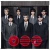

[View on Apple](https://music.apple.com/jp/album/arirang/1869053670)

## HANA

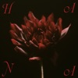

[View on Apple](https://music.apple.com/jp/album/hana/1874511603)

## Michael: Songs From The Motion Picture

[View on Apple](https://music.apple.com/jp/album/michael-songs-from-the-motion-picture/1883769984)

## 人生

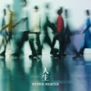

[View on Apple](https://music.apple.com/jp/album/%E4%BA%BA%E7%94%9F/6768990810)

## ND⁵(Selected Edition)

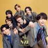

[View on Apple](https://music.apple.com/jp/album/nd-selected-edition/6771320836)

## OFFICIAL HIGE DANDISM LIVE at STADIUM 2025

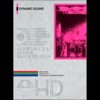

[View on Apple](https://music.apple.com/jp/album/official-hige-dandism-live-at-stadium-2025/6785845529)

## THE BOOK for,

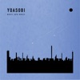

[View on Apple](https://music.apple.com/jp/album/the-book-for/6775750598)

## Prema

[View on Apple](https://music.apple.com/jp/album/prema/1819419299)

## Thriller

[View on Apple](https://music.apple.com/jp/album/thriller/269572838)

## Sakanaction

[View on Apple](https://music.apple.com/jp/album/sakanaction/604748196)

## ぐっすり眠れるα波 ~ ディズニー プレミアム・オルゴール・ベスト

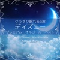

[View on Apple](https://music.apple.com/jp/album/%E3%81%90%E3%81%A3%E3%81%99%E3%82%8A%E7%9C%A0%E3%82%8C%E3%82%8B%CE%B1%E6%B3%A2-%E3%83%87%E3%82%A3%E3%82%BA%E3%83%8B%E3%83%BC-%E3%83%97%E3%83%AC%E3%83%9F%E3%82%A2%E3%83%A0-%E3%82%AA%E3%83%AB%E3%82%B4%E3%83%BC%E3%83%AB-%E3%83%99%E3%82%B9%E3%83%88/1054914398)

## Antenna

[View on Apple](https://music.apple.com/jp/album/antenna/1691229798)

## すやすや赤ちゃんα波 ぐっすりおやすみオルゴール プレミアムベスト

[View on Apple](https://music.apple.com/jp/album/%E3%81%99%E3%82%84%E3%81%99%E3%82%84%E8%B5%A4%E3%81%A1%E3%82%83%E3%82%93%CE%B1%E6%B3%A2-%E3%81%90%E3%81%A3%E3%81%99%E3%82%8A%E3%81%8A%E3%82%84%E3%81%99%E3%81%BF%E3%82%AA%E3%83%AB%E3%82%B4%E3%83%BC%E3%83%AB-%E3%83%97%E3%83%AC%E3%83%9F%E3%82%A2%E3%83%A0%E3%83%99%E3%82%B9%E3%83%88/1126901507)

## Bakuretsu Aishiteru / Sukisugite METSU! - EP

[View on Apple](https://music.apple.com/jp/album/bakuretsu-aishiteru-sukisugite-metsu-ep/1869537741)

## LEMONADE - The 2nd Album

[View on Apple](https://music.apple.com/jp/album/lemonade-the-2nd-album/1893868118)

## Ao To Natsu - EP

[View on Apple](https://music.apple.com/jp/album/ao-to-natsu-ep/1408505088)

## Cosmic Princess Kaguya!

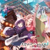

[View on Apple](https://music.apple.com/jp/album/cosmic-princess-kaguya/1869843536)

## Super Star

[View on Apple](https://music.apple.com/jp/album/super-star/1451570468)

## Attitude (Expanded Edition)

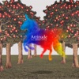

[View on Apple](https://music.apple.com/jp/album/attitude-expanded-edition/1606368929)

## Magic

[View on Apple](https://music.apple.com/jp/album/magic/1456062834)

## Love Story

[View on Apple](https://music.apple.com/jp/album/love-story/1451567957)

## Foreign Tongues

[View on Apple](https://music.apple.com/jp/album/foreign-tongues/1895941732)

## 眠れるジブリ・オルゴール

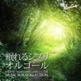

[View on Apple](https://music.apple.com/jp/album/%E7%9C%A0%E3%82%8C%E3%82%8B%E3%82%B8%E3%83%96%E3%83%AA-%E3%82%AA%E3%83%AB%E3%82%B4%E3%83%BC%E3%83%AB/562108798)

## STRAY SHEEP

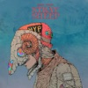

[View on Apple](https://music.apple.com/jp/album/stray-sheep/1538265733)

## MAMIHLAPINATAPAI - EP

[View on Apple](https://music.apple.com/jp/album/mamihlapinatapai-ep/1894837142)

## mile

[View on Apple](https://music.apple.com/jp/album/mile/6775358208)

## Daughter from Hell

[View on Apple](https://music.apple.com/jp/album/daughter-from-hell/6766750836)

## Ubugoe

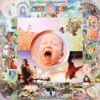

[View on Apple](https://music.apple.com/jp/album/ubugoe/1878294255)

## Never Grow Up

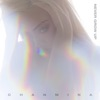

[View on Apple](https://music.apple.com/jp/album/never-grow-up/1468137281)

## Sounds in the womb that make your baby stop crying and go to sleep Disney Selections

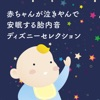

[View on Apple](https://music.apple.com/jp/album/sounds-in-the-womb-that-make-your-baby-stop-crying-and/1516752120)

## Umi No Yeah!!

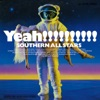

[View on Apple](https://music.apple.com/jp/album/umi-no-yeah/949272122)

## Harenchi

[View on Apple](https://music.apple.com/jp/album/harenchi/1585848047)

## LOVE ALL SERVE ALL

[View on Apple](https://music.apple.com/jp/album/love-all-serve-all/1611482396)

## HELP EVER HURT NEVER

[View on Apple](https://music.apple.com/jp/album/help-ever-hurt-never/1505498769)

## Momentary Sixth Sense

[View on Apple](https://music.apple.com/jp/album/momentary-sixth-sense/1446781785)

## The Romantic

[View on Apple](https://music.apple.com/jp/album/the-romantic/1866732792)

## Traveler

[View on Apple](https://music.apple.com/jp/album/traveler/1479397582)

## strobo

[View on Apple](https://music.apple.com/jp/album/strobo/1706831732)

## 眠れるディズニーオルゴール MUSIC BOX BEST COLLECTION

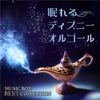

[View on Apple](https://music.apple.com/jp/album/%E7%9C%A0%E3%82%8C%E3%82%8B%E3%83%87%E3%82%A3%E3%82%BA%E3%83%8B%E3%83%BC%E3%82%AA%E3%83%AB%E3%82%B4%E3%83%BC%E3%83%AB-music-box-best-collection/1480811650)

## DETOX

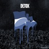

[View on Apple](https://music.apple.com/jp/album/detox/1783002566)

## BOOTLEG

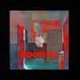

[View on Apple](https://music.apple.com/jp/album/bootleg/1538275115)

## HUMOR

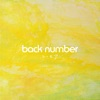

[View on Apple](https://music.apple.com/jp/album/humor/1653123045)

## First Love (Remastered 2014)

[View on Apple](https://music.apple.com/jp/album/first-love-remastered-2014/1440763349)

## 劇薬中毒 - EP

[View on Apple](https://music.apple.com/jp/album/%E5%8A%87%E8%96%AC%E4%B8%AD%E6%AF%92-ep/1886067570)

## KPop Demon Hunters (Soundtrack from the Netflix Film)

[View on Apple](https://music.apple.com/jp/album/kpop-demon-hunters-soundtrack-from-the-netflix-film/1820264137)

## CORKSCREW 2026

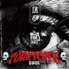

[View on Apple](https://music.apple.com/jp/album/corkscrew-2026/6786110824)

## Niche Syndrome

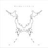

[View on Apple](https://music.apple.com/jp/album/niche-syndrome/1838917127)

## second person

[View on Apple](https://music.apple.com/jp/album/second-person/1876728371)

## Summer

[View on Apple](https://music.apple.com/jp/album/summer/6792234085)

## BAD HOP (THE FINAL Edition)

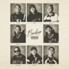

[View on Apple](https://music.apple.com/jp/album/bad-hop-the-final-edition/1737191486)

## Eye of the Storm

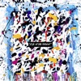

[View on Apple](https://music.apple.com/jp/album/eye-of-the-storm/1839482498)

## Excitement of Youth

[View on Apple](https://music.apple.com/jp/album/excitement-of-youth/1273709789)

## Happy End - EP

[View on Apple](https://music.apple.com/jp/album/happy-end-ep/1451567750)

## Unity (Expanded Edition)

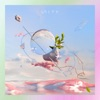

[View on Apple](https://music.apple.com/jp/album/unity-expanded-edition/1675598979)

## Drug TReatment 2026

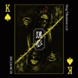

[View on Apple](https://music.apple.com/jp/album/drug-treatment-2026/6786097631)

## エスカパレード

[View on Apple](https://music.apple.com/jp/album/%E3%82%A8%E3%82%B9%E3%82%AB%E3%83%91%E3%83%AC%E3%83%BC%E3%83%89/1394013451)

## ぱわーオブらぶ / センセーション - EP

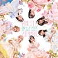

[View on Apple](https://music.apple.com/jp/album/%E3%81%B1%E3%82%8F%E3%83%BC%E3%82%AA%E3%83%96%E3%82%89%E3%81%B6-%E3%82%BB%E3%83%B3%E3%82%BB%E3%83%BC%E3%82%B7%E3%83%A7%E3%83%B3-ep/6781949279)

## THE BEST 2020 - 2025

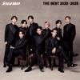

[View on Apple](https://music.apple.com/jp/album/the-best-2020-2025/1804833044)

## Off the Wall

[View on Apple](https://music.apple.com/jp/album/off-the-wall/186166282)

## Magic Lantern

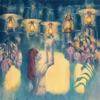

[View on Apple](https://music.apple.com/jp/album/magic-lantern/1678418019)

## Are You Red.Y?

[View on Apple](https://music.apple.com/jp/album/are-you-red-y/1896399036)

## 834.194

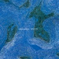

[View on Apple](https://music.apple.com/jp/album/834-194/1465208767)

## 壱

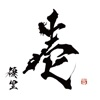

[View on Apple](https://music.apple.com/jp/album/%E5%A3%B1/1599542521)

## CONFESSIONS II: Afterhours Edition

[View on Apple](https://music.apple.com/jp/album/confessions-ii-afterhours-edition/6789326154)

## Daytime COFFEE BGM - Relaxing Cafe Time -

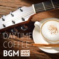

[View on Apple](https://music.apple.com/jp/album/daytime-coffee-bgm-relaxing-cafe-time/1523630121)

## Editorial

[View on Apple](https://music.apple.com/jp/album/editorial/1578260038)

## BEST of TUBEst ～All Time Best～

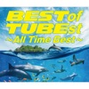

[View on Apple](https://music.apple.com/jp/album/best-of-tubest-all-time-best/1535540890)

## ÷ (Deluxe)

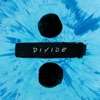

[View on Apple](https://music.apple.com/jp/album/deluxe/1193701079)

## you seem pretty sad for a girl so in love

[View on Apple](https://music.apple.com/jp/album/you-seem-pretty-sad-for-a-girl-so-in-love/1889992111)

## TA13OO

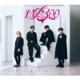

[View on Apple](https://music.apple.com/jp/album/ta13oo/6782013501)

## SWAG II

[View on Apple](https://music.apple.com/jp/album/swag-ii/1837867200)

## Oh yeah?

[View on Apple](https://music.apple.com/jp/album/oh-yeah/6773775032)

## 'PUREFLOW' pt.1

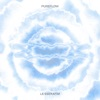

[View on Apple](https://music.apple.com/jp/album/pureflow-pt-1/6771246533)

## THE BOOK

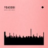

[View on Apple](https://music.apple.com/jp/album/the-book/1542182291)

## 4th MINI ALBUM [NEW WAV] - EP

![4th MINI ALBUM \[NEW WAV\] - EP](../../logos/6774116631-5f530fb3.png)

[View on Apple](https://music.apple.com/jp/album/4th-mini-album-new-wav-ep/6774116631)

## ALL the SINGLES

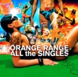

[View on Apple](https://music.apple.com/jp/album/all-the-singles/1537418560)

## Tamashi

[View on Apple](https://music.apple.com/jp/album/tamashi/1890909489)

## CEREMONY

[View on Apple](https://music.apple.com/jp/album/ceremony/1538116458)

## Doo-Wops & Hooligans (Deluxe)

[View on Apple](https://music.apple.com/jp/album/doo-wops-hooligans-deluxe/576670451)

## DIFFERENT

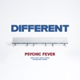

[View on Apple](https://music.apple.com/jp/album/different/1896361917)

## Encore

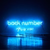

[View on Apple](https://music.apple.com/jp/album/encore/1451577721)

## Anew

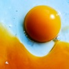

[View on Apple](https://music.apple.com/jp/album/anew/1842798505)

## LOST CORNER

[View on Apple](https://music.apple.com/jp/album/lost-corner/1759899363)

## Dear Jubilee -RADWIMPS TRIBUTE-

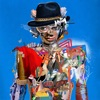

[View on Apple](https://music.apple.com/jp/album/dear-jubilee-radwimps-tribute/1852929105)

## Human Bloom

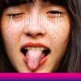

[View on Apple](https://music.apple.com/jp/album/human-bloom/1518843994)

## 桜の木の下

[View on Apple](https://music.apple.com/jp/album/%E6%A1%9C%E3%81%AE%E6%9C%A8%E3%81%AE%E4%B8%8B/1109978421)

## Ambitions

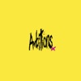

[View on Apple](https://music.apple.com/jp/album/ambitions/1839433615)

## Pre: Prema

[View on Apple](https://music.apple.com/jp/album/pre-prema/1882935769)

## Tokyo DisneySea 25th "Sparkling Jubilee" Music Album

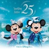

[View on Apple](https://music.apple.com/jp/album/tokyo-disneysea-25th-sparkling-jubilee-music-album/1889319490)

## Frozen: The Songs (Japanese Edition)

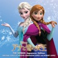

[View on Apple](https://music.apple.com/jp/album/frozen-the-songs-japanese-edition/1476003528)

## Bad

[View on Apple](https://music.apple.com/jp/album/bad/559334659)

## Darling - EP

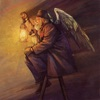

[View on Apple](https://music.apple.com/jp/album/darling-ep/1790599503)

## II - The 2nd Mini Album - EP

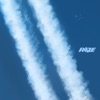

[View on Apple](https://music.apple.com/jp/album/ii-the-2nd-mini-album-ep/6776080128)

## Your Name.

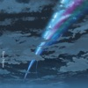

[View on Apple](https://music.apple.com/jp/album/your-name/1518516628)

## Yankee

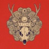

[View on Apple](https://music.apple.com/jp/album/yankee/1440791809)

## Twelve

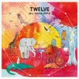

[View on Apple](https://music.apple.com/jp/album/twelve/1440787736)

## MESSAGE

[View on Apple](https://music.apple.com/jp/album/message/273169161)

## 音故知新

[View on Apple](https://music.apple.com/jp/album/%E9%9F%B3%E6%95%85%E7%9F%A5%E6%96%B0/6769350401)

## RADWIMPS 4 - Okazu No Gohan

[View on Apple](https://music.apple.com/jp/album/radwimps-4-okazu-no-gohan/1511080228)

## Zankyo Reference

[View on Apple](https://music.apple.com/jp/album/zankyo-reference/1838917940)
