- [定番！夏うた ベストヒット！](#定番-夏うた-ヘ-ストヒット)
- [邦楽ヒッツ・トゥデイ](#邦楽ヒッツ-トゥテ-イ)
- [J-Pop Now](#j-pop-now)
- [はじめての Mrs. GREEN APPLE](#はし-めての-mrs-green-apple)
- [はじめての『アンパンマン』](#はし-めての-アンハ-ンマン)
- [トゥデイズ ヒッツ](#トゥテ-イス-ヒッツ)
- [懐かしの J-Pop](#懐かしの-j-pop)
- [カラオケヒッツ](#カラオケヒッツ)
- [夏うた！定番サマーソングベスト50](#夏うた-定番サマーソンク-ヘ-スト50)
- [ディズニー・ヒッツ](#テ-ィス-ニー-ヒッツ)
- [洋楽ヒッツ・トゥデイ](#洋楽ヒッツ-トゥテ-イ)
- [平成ヒッツ](#平成ヒッツ)
- [はじめての マイケル・ジャクソン](#はし-めての-マイケル-シ-ャクソン)
- [はじめての サカナクション](#はし-めての-サカナクション)
- [KPOPWRLD](#kpopwrld)
- [はじめての back number](#はし-めての-back-number)
- [1990年代 邦楽 ベスト](#1990年代-邦楽-ヘ-スト)
- [2000年代 邦楽 ベスト](#2000年代-邦楽-ヘ-スト)
- [はじめての サザンオールスターズ](#はし-めての-ササ-ンオールスタース)
- [はじめての 嵐](#はし-めての-嵐)
- [はじめての 藤井 風](#はし-めての-藤井-風)
- [はじめての M!LK](#はし-めての-m-lk)
- [平成・令和の夏うたBEST!!](#平成-令和の夏うたbest)
- [はじめての Official髭男dism](#はし-めての-official髭男dism)
- [はじめての 米津玄師](#はし-めての-米津玄師)
- [TikTokで話題の楽曲！🎀✨](#tiktokて-話題の楽曲)
- [はじめての BTS](#はし-めての-bts)
- [Ａリスト：ポップ](#aリスト-ホ-ッフ)
- [1980年代 邦楽 ベスト](#1980年代-邦楽-ヘ-スト)
- [はじめての Vaundy](#はし-めての-vaundy)
- [盛り上がる！夏のドライブソング🚙](#盛り上か-る-夏のト-ライフ-ソンク)
- [はじめての あいみょん](#はし-めての-あいみょん)
- [2010年代 邦楽 ベスト](#2010年代-邦楽-ヘ-スト)
- [R&Bナウ](#r-bナウ)
- [はじめての Mr.Children](#はし-めての-mr-children)
- [サマーソング](#サマーソンク)
- [はじめての ちゃんみな](#はし-めての-ちゃんみな)
- [ゼンジン未到とイ/ミュータブル〜間奏編〜](#セ-ンシ-ン未到とイ-ミュータフ-ル-間奏編)
- [AIMYON 10th anniversary LIVE 2026「、、、」IN 阪神甲子園球場](#aimyon-10th-anniversary-live-2026-in-阪神甲子園球場)
- [ハイキュー!! 歴代テーマソング集 (Haikyu!! Theme songs)](#ハイキュー-歴代テーマソンク-集-haikyu-theme-songs)
- [はじめての ブルーノ・マーズ](#はし-めての-フ-ルーノ-マース)
- [はじめての YOASOBI](#はし-めての-yoasobi)
- [はじめての King Gnu](#はし-めての-king-gnu)
- [ヒップホップ ジャパン](#ヒッフ-ホッフ-シ-ャハ-ン)
- [はじめての ONE OK ROCK](#はし-めての-one-ok-rock)
- [はじめての SUPER BEAVER](#はし-めての-super-beaver)
- [セットリスト：BTS『WORLD TOUR 'ARIRANG'』](#セットリスト-bts-world-tour-arirang)
- [TikTok 洋楽ヒッツ](#tiktok-洋楽ヒッツ)
- [オフィスDJ：邦楽](#オフィスdj-邦楽)
- [2000年代 TVドラマテーマ曲 ベスト](#2000年代-tvト-ラマテーマ曲-ヘ-スト)
- [ENCORE - ちゃんみな / AFTER THE SHOW](#encore-ちゃんみな-after-the-show)
- [ウィークエンド K-Pop](#ウィークエント-k-pop)
- [邦楽 ヒッツ：2025年](#邦楽-ヒッツ-2025年)
- [最新ソング：K-Pop](#最新ソンク-k-pop)
- [夏に聴きたいドライブソング🚗](#夏に聴きたいト-ライフ-ソンク)
- [はじめての 中森明菜](#はし-めての-中森明菜)
- [はじめての Snow Man](#はし-めての-snow-man)
- [はじめての スピッツ](#はし-めての-スヒ-ッツ)
- [呪術廻戦 歴代テーマソング集 - Jujutsu Kaisen Theme Songs](#呪術廻戦-歴代テーマソンク-集-jujutsu-kaisen-theme-songs)
- [2000年代 邦楽ラブソング ベスト](#2000年代-邦楽ラフ-ソンク-ヘ-スト)
- [はじめての 宇多田ヒカル](#はし-めての-宇多田ヒカル)
- [はじめての『NARUTO-ナルト-』シリーズ](#はし-めての-naruto-ナルト-シリース)
- [はじめての 桑田佳祐](#はし-めての-桑田佳祐)
- [定番！平成のヒットソング ベスト](#定番-平成のヒットソンク-ヘ-スト)
- [最新ソング：J-Pop](#最新ソンク-j-pop)
- [久石譲 スタジオジブリ ベスト](#久石譲-スタシ-オシ-フ-リ-ヘ-スト)
- [2026 BEST HIT 100 令和の最新ヒットソングメドレー](#2026-best-hit-100-令和の最新ヒットソンク-メト-レー)
- [夏！王道 J-POP](#夏-王道-j-pop)
- [空間オーディオ：J-Pop](#空間オーテ-ィオ-j-pop)
- [トゥデイズ J-ロック](#トゥテ-イス-j-ロック)
- [ジャズ・チル](#シ-ャス-チル)
- [2010年代 洋楽ベストヒッツ -Best of 2010s-](#2010年代-洋楽ヘ-ストヒッツ-best-of-2010s)
- [ディズニープリンセス・ヒッツ](#テ-ィス-ニーフ-リンセス-ヒッツ)
- [1990年代 邦楽ラブソング ベスト](#1990年代-邦楽ラフ-ソンク-ヘ-スト)
- [ドライブで聴きたい洋楽　-Time to Drive-](#ト-ライフ-て-聴きたい洋楽-time-to-drive)
- [ピアノ・チル](#ヒ-アノ-チル)
- [1990年代 TVドラマテーマ曲 ベスト](#1990年代-tvト-ラマテーマ曲-ヘ-スト)
- [ボサノヴァ ベスト](#ホ-サノウ-ァ-ヘ-スト)
- [Disney Hits](#disney-hits)
- [はじめての B'z](#はし-めての-b-z)
- [沖縄気分でめんそ～れ！](#沖縄気分て-めんそ-れ)
- [映画『ワイルド・スピード』シリーズ・ベスト・ソングス](#映画-ワイルト-スヒ-ート-シリース-ヘ-スト-ソンク-ス)
- [はじめての 平井大](#はし-めての-平井大)
- [カフェミュージック](#カフェミューシ-ック)
- [はじめての ジャスティン・ビーバー](#はし-めての-シ-ャスティン-ヒ-ーハ-ー)
- [世界のサッカーアンセム](#世界のサッカーアンセム)
- [ドライブで聴きたい！30代のための青春★ヒットソング](#ト-ライフ-て-聴きたい-30代のための青春-ヒットソンク)
- [1980年代 洋楽 ベスト](#1980年代-洋楽-ヘ-スト)
- [令和・平成編 ドライブが100倍楽しくなるドライブソング](#令和-平成編-ト-ライフ-か-100倍楽しくなるト-ライフ-ソンク)
- [懐かしの昭和・平成の夏うた ヒットソング！](#懐かしの昭和-平成の夏うた-ヒットソンク)
- [はじめての ヨルシカ](#はし-めての-ヨルシカ)
- [はじめての 近藤真彦](#はし-めての-近藤真彦)
- [はじめての テイラー・スウィフト](#はし-めての-テイラー-スウィフト)
- [令和の最新ヒットソング ベスト](#令和の最新ヒットソンク-ヘ-スト)
- [2010年代 TVドラマテーマ曲 ベスト](#2010年代-tvト-ラマテーマ曲-ヘ-スト)
- [夏うた！海や山の想い出よみがえる平成・令和J-POP【おとラボ】](#夏うた-海や山の想い出よみか-える平成-令和j-pop-おとラホ)
- [カバー・スターズ：日本](#カハ-ー-スタース-日本)
- [一緒に歌おうディズニー・ソングス！](#一緒に歌おうテ-ィス-ニー-ソンク-ス)
- [はじめての エド・シーラン](#はし-めての-エト-シーラン)
- [はじめての『名探偵コナン』](#はし-めての-名探偵コナン)

## 定番！夏うた ベストヒット！

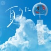

[View on Apple](https://music.apple.com/jp/playlist/%E5%AE%9A%E7%95%AA-%E5%A4%8F%E3%81%86%E3%81%9F-%E3%83%99%E3%82%B9%E3%83%88%E3%83%92%E3%83%83%E3%83%88/pl.7f406b6e1ee54587940bc9275cab7272)

## 邦楽ヒッツ・トゥデイ

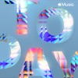

[View on Apple](https://music.apple.com/jp/playlist/%E9%82%A6%E6%A5%BD%E3%83%92%E3%83%83%E3%83%84-%E3%83%88%E3%82%A5%E3%83%87%E3%82%A4/pl.2f5fcebf9ad247098e445d27011aecc4)

## J-Pop Now

[View on Apple](https://music.apple.com/jp/playlist/j-pop-now/pl.dc16cb58902342cba9711cbcd9bf2840)

## はじめての Mrs. GREEN APPLE

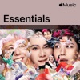

[View on Apple](https://music.apple.com/jp/playlist/%E3%81%AF%E3%81%98%E3%82%81%E3%81%A6%E3%81%AE-mrs-green-apple/pl.65e39e4f20164839b84cbf3e7f96b554)

## はじめての『アンパンマン』

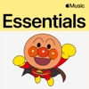

[View on Apple](https://music.apple.com/jp/playlist/%E3%81%AF%E3%81%98%E3%82%81%E3%81%A6%E3%81%AE-%E3%82%A2%E3%83%B3%E3%83%91%E3%83%B3%E3%83%9E%E3%83%B3/pl.3bdab808928043298b6d670b5f6c6356)

## トゥデイズ ヒッツ

[View on Apple](https://music.apple.com/jp/playlist/%E3%83%88%E3%82%A5%E3%83%87%E3%82%A4%E3%82%BA-%E3%83%92%E3%83%83%E3%83%84/pl.f4d106fed2bd41149aaacabb233eb5eb)

## 懐かしの J-Pop

[View on Apple](https://music.apple.com/jp/playlist/%E6%87%90%E3%81%8B%E3%81%97%E3%81%AE-j-pop/pl.85808cd4c9a84cf9811701283964c2d8)

## カラオケヒッツ

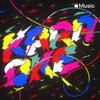

[View on Apple](https://music.apple.com/jp/playlist/%E3%82%AB%E3%83%A9%E3%82%AA%E3%82%B1%E3%83%92%E3%83%83%E3%83%84/pl.ad831dcfc24f456987b4011c1ddfdd39)

## 夏うた！定番サマーソングベスト50

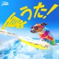

[View on Apple](https://music.apple.com/jp/playlist/%E5%A4%8F%E3%81%86%E3%81%9F-%E5%AE%9A%E7%95%AA%E3%82%B5%E3%83%9E%E3%83%BC%E3%82%BD%E3%83%B3%E3%82%B0%E3%83%99%E3%82%B9%E3%83%8850/pl.a0c0baec99c6445e8e0a3de4fc08548f)

## ディズニー・ヒッツ

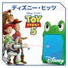

[View on Apple](https://music.apple.com/jp/playlist/%E3%83%87%E3%82%A3%E3%82%BA%E3%83%8B%E3%83%BC-%E3%83%92%E3%83%83%E3%83%84/pl.9d3bf8fc22084492b275f59db97e9817)

## 洋楽ヒッツ・トゥデイ

[View on Apple](https://music.apple.com/jp/playlist/%E6%B4%8B%E6%A5%BD%E3%83%92%E3%83%83%E3%83%84-%E3%83%88%E3%82%A5%E3%83%87%E3%82%A4/pl.7d657a836db14d768accd2e6ffd1b0ad)

## 平成ヒッツ

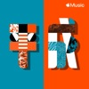

[View on Apple](https://music.apple.com/jp/playlist/%E5%B9%B3%E6%88%90%E3%83%92%E3%83%83%E3%83%84/pl.1bef9a17db784cc9be3a642fda0c6fcb)

## はじめての マイケル・ジャクソン

[View on Apple](https://music.apple.com/jp/playlist/%E3%81%AF%E3%81%98%E3%82%81%E3%81%A6%E3%81%AE-%E3%83%9E%E3%82%A4%E3%82%B1%E3%83%AB-%E3%82%B8%E3%83%A3%E3%82%AF%E3%82%BD%E3%83%B3/pl.f475b81eaf7546ffb8ffd20889f37032)

## はじめての サカナクション

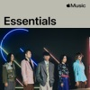

[View on Apple](https://music.apple.com/jp/playlist/%E3%81%AF%E3%81%98%E3%82%81%E3%81%A6%E3%81%AE-%E3%82%B5%E3%82%AB%E3%83%8A%E3%82%AF%E3%82%B7%E3%83%A7%E3%83%B3/pl.79370325db7644cc8df0ee684eff6891)

## KPOPWRLD

[View on Apple](https://music.apple.com/jp/playlist/kpopwrld/pl.48229b41bbfc47d7af39dae8e8b5276e)

## はじめての back number

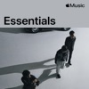

[View on Apple](https://music.apple.com/jp/playlist/%E3%81%AF%E3%81%98%E3%82%81%E3%81%A6%E3%81%AE-back-number/pl.2dc9165a063842d4abc29ef2105fca34)

## 1990年代 邦楽 ベスト

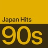

[View on Apple](https://music.apple.com/jp/playlist/1990%E5%B9%B4%E4%BB%A3-%E9%82%A6%E6%A5%BD-%E3%83%99%E3%82%B9%E3%83%88/pl.433c8f0315104be1b2c102be93046715)

## 2000年代 邦楽 ベスト

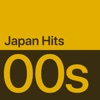

[View on Apple](https://music.apple.com/jp/playlist/2000%E5%B9%B4%E4%BB%A3-%E9%82%A6%E6%A5%BD-%E3%83%99%E3%82%B9%E3%83%88/pl.da3e2ffe598a4324aa7825f9a128daf0)

## はじめての サザンオールスターズ

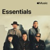

[View on Apple](https://music.apple.com/jp/playlist/%E3%81%AF%E3%81%98%E3%82%81%E3%81%A6%E3%81%AE-%E3%82%B5%E3%82%B6%E3%83%B3%E3%82%AA%E3%83%BC%E3%83%AB%E3%82%B9%E3%82%BF%E3%83%BC%E3%82%BA/pl.b8b19fa98a994f89986a0330e722c9a8)

## はじめての 嵐

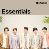

[View on Apple](https://music.apple.com/jp/playlist/%E3%81%AF%E3%81%98%E3%82%81%E3%81%A6%E3%81%AE-%E5%B5%90/pl.0e769c4d06214a72b09bb9119b0eb9db)

## はじめての 藤井 風

[View on Apple](https://music.apple.com/jp/playlist/%E3%81%AF%E3%81%98%E3%82%81%E3%81%A6%E3%81%AE-%E8%97%A4%E4%BA%95-%E9%A2%A8/pl.a40818571db34670a49596bcc92224e4)

## はじめての M!LK

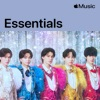

[View on Apple](https://music.apple.com/jp/playlist/%E3%81%AF%E3%81%98%E3%82%81%E3%81%A6%E3%81%AE-m-lk/pl.9b3a2f920cd24b518f9f2f517f7e56b7)

## 平成・令和の夏うたBEST!!

[View on Apple](https://music.apple.com/jp/playlist/%E5%B9%B3%E6%88%90-%E4%BB%A4%E5%92%8C%E3%81%AE%E5%A4%8F%E3%81%86%E3%81%9Fbest/pl.a2ae438a632543519cd10c970b0efabc)

## はじめての Official髭男dism

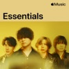

[View on Apple](https://music.apple.com/jp/playlist/%E3%81%AF%E3%81%98%E3%82%81%E3%81%A6%E3%81%AE-official%E9%AB%AD%E7%94%B7dism/pl.cd4ca70a55a24f5ba8cb15165fdc20c6)

## はじめての 米津玄師

[View on Apple](https://music.apple.com/jp/playlist/%E3%81%AF%E3%81%98%E3%82%81%E3%81%A6%E3%81%AE-%E7%B1%B3%E6%B4%A5%E7%8E%84%E5%B8%AB/pl.9f07c98e778c482eadb312d87d018b06)

## TikTokで話題の楽曲！🎀✨

[View on Apple](https://music.apple.com/jp/playlist/tiktok%E3%81%A7%E8%A9%B1%E9%A1%8C%E3%81%AE%E6%A5%BD%E6%9B%B2/pl.bd330acc6df946f9b2721a60c7f94fa7)

## はじめての BTS

[View on Apple](https://music.apple.com/jp/playlist/%E3%81%AF%E3%81%98%E3%82%81%E3%81%A6%E3%81%AE-bts/pl.e5a782b2b5424d1bbd6b5b9ac04d09a0)

## Ａリスト：ポップ

[View on Apple](https://music.apple.com/jp/playlist/%EF%BD%81%E3%83%AA%E3%82%B9%E3%83%88-%E3%83%9D%E3%83%83%E3%83%97/pl.5ee8333dbe944d9f9151e97d92d1ead9)

## 1980年代 邦楽 ベスト

[View on Apple](https://music.apple.com/jp/playlist/1980%E5%B9%B4%E4%BB%A3-%E9%82%A6%E6%A5%BD-%E3%83%99%E3%82%B9%E3%83%88/pl.35d3f5a2b7d04296b1defd1cf42c9823)

## はじめての Vaundy

[View on Apple](https://music.apple.com/jp/playlist/%E3%81%AF%E3%81%98%E3%82%81%E3%81%A6%E3%81%AE-vaundy/pl.e3a8bdb5d06246e7a409787f4a4b7264)

## 盛り上がる！夏のドライブソング🚙

[View on Apple](https://music.apple.com/jp/playlist/%E7%9B%9B%E3%82%8A%E4%B8%8A%E3%81%8C%E3%82%8B-%E5%A4%8F%E3%81%AE%E3%83%89%E3%83%A9%E3%82%A4%E3%83%96%E3%82%BD%E3%83%B3%E3%82%B0/pl.35523f4f81d6466daf8188d391f96cff)

## はじめての あいみょん

[View on Apple](https://music.apple.com/jp/playlist/%E3%81%AF%E3%81%98%E3%82%81%E3%81%A6%E3%81%AE-%E3%81%82%E3%81%84%E3%81%BF%E3%82%87%E3%82%93/pl.fdb2580447d8485a8a63f22b8d529bcc)

## 2010年代 邦楽 ベスト

[View on Apple](https://music.apple.com/jp/playlist/2010%E5%B9%B4%E4%BB%A3-%E9%82%A6%E6%A5%BD-%E3%83%99%E3%82%B9%E3%83%88/pl.cd1c5acfdb8440f593734ff0f9d17bfd)

## R&Bナウ

[View on Apple](https://music.apple.com/jp/playlist/r-b%E3%83%8A%E3%82%A6/pl.b7ae3e0a28e84c5c96c4284b6a6c70af)

## はじめての Mr.Children

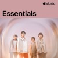

[View on Apple](https://music.apple.com/jp/playlist/%E3%81%AF%E3%81%98%E3%82%81%E3%81%A6%E3%81%AE-mr-children/pl.772af72de61341c48449cb21c00dc9ea)

## サマーソング

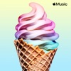

[View on Apple](https://music.apple.com/jp/playlist/%E3%82%B5%E3%83%9E%E3%83%BC%E3%82%BD%E3%83%B3%E3%82%B0/pl.34c6bf42a176492abb918edb57b565e9)

## はじめての ちゃんみな

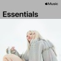

[View on Apple](https://music.apple.com/jp/playlist/%E3%81%AF%E3%81%98%E3%82%81%E3%81%A6%E3%81%AE-%E3%81%A1%E3%82%83%E3%82%93%E3%81%BF%E3%81%AA/pl.ac4a2caf8b22425ab2c2b62dbf4c1f38)

## ゼンジン未到とイ/ミュータブル〜間奏編〜

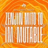

[View on Apple](https://music.apple.com/jp/playlist/%E3%82%BC%E3%83%B3%E3%82%B8%E3%83%B3%E6%9C%AA%E5%88%B0%E3%81%A8%E3%82%A4-%E3%83%9F%E3%83%A5%E3%83%BC%E3%82%BF%E3%83%96%E3%83%AB-%E9%96%93%E5%A5%8F%E7%B7%A8/pl.84d7c9f43e224466980c0e02b8a4af67)

## AIMYON 10th anniversary LIVE 2026「、、、」IN 阪神甲子園球場

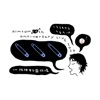

[View on Apple](https://music.apple.com/jp/playlist/aimyon-10th-anniversary-live-2026-in-%E9%98%AA%E7%A5%9E%E7%94%B2%E5%AD%90%E5%9C%92%E7%90%83%E5%A0%B4/pl.26c917a9d510414baed57b89ac43487f)

## ハイキュー!! 歴代テーマソング集 (Haikyu!! Theme songs)

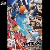

[View on Apple](https://music.apple.com/jp/playlist/%E3%83%8F%E3%82%A4%E3%82%AD%E3%83%A5%E3%83%BC-%E6%AD%B4%E4%BB%A3%E3%83%86%E3%83%BC%E3%83%9E%E3%82%BD%E3%83%B3%E3%82%B0%E9%9B%86-haikyu-theme-songs/pl.5083415ada174ea8aedd918e26a169b9)

## はじめての ブルーノ・マーズ

[View on Apple](https://music.apple.com/jp/playlist/%E3%81%AF%E3%81%98%E3%82%81%E3%81%A6%E3%81%AE-%E3%83%96%E3%83%AB%E3%83%BC%E3%83%8E-%E3%83%9E%E3%83%BC%E3%82%BA/pl.d6b08f229d4f4f9da58b64fe646061af)

## はじめての YOASOBI

[View on Apple](https://music.apple.com/jp/playlist/%E3%81%AF%E3%81%98%E3%82%81%E3%81%A6%E3%81%AE-yoasobi/pl.295be32ba47b44c0bdfddae49ff263b5)

## はじめての King Gnu

[View on Apple](https://music.apple.com/jp/playlist/%E3%81%AF%E3%81%98%E3%82%81%E3%81%A6%E3%81%AE-king-gnu/pl.32958a1d520f41ddb6154235d9530154)

## ヒップホップ ジャパン

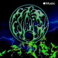

[View on Apple](https://music.apple.com/jp/playlist/%E3%83%92%E3%83%83%E3%83%97%E3%83%9B%E3%83%83%E3%83%97-%E3%82%B8%E3%83%A3%E3%83%91%E3%83%B3/pl.1274dfb78d3b421c9e28d865eb4d0419)

## はじめての ONE OK ROCK

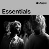

[View on Apple](https://music.apple.com/jp/playlist/%E3%81%AF%E3%81%98%E3%82%81%E3%81%A6%E3%81%AE-one-ok-rock/pl.cce9bfe420e547e1a8e2daa918ce9dc9)

## はじめての SUPER BEAVER

[View on Apple](https://music.apple.com/jp/playlist/%E3%81%AF%E3%81%98%E3%82%81%E3%81%A6%E3%81%AE-super-beaver/pl.707c950e775e42d2a2ca565d11c055a0)

## セットリスト：BTS『WORLD TOUR 'ARIRANG'』

[View on Apple](https://music.apple.com/jp/playlist/%E3%82%BB%E3%83%83%E3%83%88%E3%83%AA%E3%82%B9%E3%83%88-bts-world-tour-arirang/pl.93a821b81c0d4e1c91afca23a8ee3b08)

## TikTok 洋楽ヒッツ

[View on Apple](https://music.apple.com/jp/playlist/tiktok-%E6%B4%8B%E6%A5%BD%E3%83%92%E3%83%83%E3%83%84/pl.72ea820d38b34185b6ed08e2da4ac197)

## オフィスDJ：邦楽

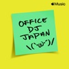

[View on Apple](https://music.apple.com/jp/playlist/%E3%82%AA%E3%83%95%E3%82%A3%E3%82%B9dj-%E9%82%A6%E6%A5%BD/pl.a2e8077550014d08a1c9d13d023f259e)

## 2000年代 TVドラマテーマ曲 ベスト

[View on Apple](https://music.apple.com/jp/playlist/2000%E5%B9%B4%E4%BB%A3-tv%E3%83%89%E3%83%A9%E3%83%9E%E3%83%86%E3%83%BC%E3%83%9E%E6%9B%B2-%E3%83%99%E3%82%B9%E3%83%88/pl.6a4f2215bb894115bf000c972839842c)

## ENCORE - ちゃんみな / AFTER THE SHOW

[View on Apple](https://music.apple.com/jp/playlist/encore-%E3%81%A1%E3%82%83%E3%82%93%E3%81%BF%E3%81%AA-after-the-show/pl.b7c0e4eaf3de4834bfa2509fafbc5eb1)

## ウィークエンド K-Pop

[View on Apple](https://music.apple.com/jp/playlist/%E3%82%A6%E3%82%A3%E3%83%BC%E3%82%AF%E3%82%A8%E3%83%B3%E3%83%89-k-pop/pl.d838905f50af4200a2ebbc614922dee9)

## 邦楽 ヒッツ：2025年

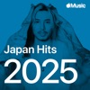

[View on Apple](https://music.apple.com/jp/playlist/%E9%82%A6%E6%A5%BD-%E3%83%92%E3%83%83%E3%83%84-2025%E5%B9%B4/pl.2ef10711a55848f5bb71606d9cec6d7b)

## 最新ソング：K-Pop

[View on Apple](https://music.apple.com/jp/playlist/%E6%9C%80%E6%96%B0%E3%82%BD%E3%83%B3%E3%82%B0-k-pop/pl.a784f95d4f504d579647523ff95433be)

## 夏に聴きたいドライブソング🚗

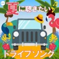

[View on Apple](https://music.apple.com/jp/playlist/%E5%A4%8F%E3%81%AB%E8%81%B4%E3%81%8D%E3%81%9F%E3%81%84%E3%83%89%E3%83%A9%E3%82%A4%E3%83%96%E3%82%BD%E3%83%B3%E3%82%B0/pl.4f00b55e6e774790b724169afa189bc8)

## はじめての 中森明菜

[View on Apple](https://music.apple.com/jp/playlist/%E3%81%AF%E3%81%98%E3%82%81%E3%81%A6%E3%81%AE-%E4%B8%AD%E6%A3%AE%E6%98%8E%E8%8F%9C/pl.47927ee354be4ccd9ecb215bbb06bd97)

## はじめての Snow Man

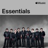

[View on Apple](https://music.apple.com/jp/playlist/%E3%81%AF%E3%81%98%E3%82%81%E3%81%A6%E3%81%AE-snow-man/pl.37571ee964854647ae4d5c49b087d089)

## はじめての スピッツ

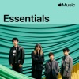

[View on Apple](https://music.apple.com/jp/playlist/%E3%81%AF%E3%81%98%E3%82%81%E3%81%A6%E3%81%AE-%E3%82%B9%E3%83%94%E3%83%83%E3%83%84/pl.a190adb2d44e463785b8ad99ac7cbbe0)

## 呪術廻戦 歴代テーマソング集 - Jujutsu Kaisen Theme Songs

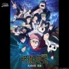

[View on Apple](https://music.apple.com/jp/playlist/%E5%91%AA%E8%A1%93%E5%BB%BB%E6%88%A6-%E6%AD%B4%E4%BB%A3%E3%83%86%E3%83%BC%E3%83%9E%E3%82%BD%E3%83%B3%E3%82%B0%E9%9B%86-jujutsu-kaisen-theme-songs/pl.db96095e33fa4a04898403a1f11bb66d)

## 2000年代 邦楽ラブソング ベスト

[View on Apple](https://music.apple.com/jp/playlist/2000%E5%B9%B4%E4%BB%A3-%E9%82%A6%E6%A5%BD%E3%83%A9%E3%83%96%E3%82%BD%E3%83%B3%E3%82%B0-%E3%83%99%E3%82%B9%E3%83%88/pl.abd0ed3ba98642ae8d6ae87a258b5054)

## はじめての 宇多田ヒカル

[View on Apple](https://music.apple.com/jp/playlist/%E3%81%AF%E3%81%98%E3%82%81%E3%81%A6%E3%81%AE-%E5%AE%87%E5%A4%9A%E7%94%B0%E3%83%92%E3%82%AB%E3%83%AB/pl.fc2f59c513644e81b8c40ffd3e339134)

## はじめての『NARUTO-ナルト-』シリーズ

[View on Apple](https://music.apple.com/jp/playlist/%E3%81%AF%E3%81%98%E3%82%81%E3%81%A6%E3%81%AE-naruto-%E3%83%8A%E3%83%AB%E3%83%88-%E3%82%B7%E3%83%AA%E3%83%BC%E3%82%BA/pl.25eb33c890b34d02a08ec90ccce4771a)

## はじめての 桑田佳祐

[View on Apple](https://music.apple.com/jp/playlist/%E3%81%AF%E3%81%98%E3%82%81%E3%81%A6%E3%81%AE-%E6%A1%91%E7%94%B0%E4%BD%B3%E7%A5%90/pl.bc3bc414f86c491baadf8431425d01c2)

## 定番！平成のヒットソング ベスト

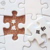

[View on Apple](https://music.apple.com/jp/playlist/%E5%AE%9A%E7%95%AA-%E5%B9%B3%E6%88%90%E3%81%AE%E3%83%92%E3%83%83%E3%83%88%E3%82%BD%E3%83%B3%E3%82%B0-%E3%83%99%E3%82%B9%E3%83%88/pl.d74ca1cab67e49849af707216f8ab15c)

## 最新ソング：J-Pop

[View on Apple](https://music.apple.com/jp/playlist/%E6%9C%80%E6%96%B0%E3%82%BD%E3%83%B3%E3%82%B0-j-pop/pl.32a7205ba49f4543b37e53477015dfed)

## 久石譲 スタジオジブリ ベスト

[View on Apple](https://music.apple.com/jp/playlist/%E4%B9%85%E7%9F%B3%E8%AD%B2-%E3%82%B9%E3%82%BF%E3%82%B8%E3%82%AA%E3%82%B8%E3%83%96%E3%83%AA-%E3%83%99%E3%82%B9%E3%83%88/pl.9d00cd92b13746c096dd552d24a46a3b)

## 2026 BEST HIT 100 令和の最新ヒットソングメドレー

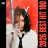

[View on Apple](https://music.apple.com/jp/playlist/2026-best-hit-100-%E4%BB%A4%E5%92%8C%E3%81%AE%E6%9C%80%E6%96%B0%E3%83%92%E3%83%83%E3%83%88%E3%82%BD%E3%83%B3%E3%82%B0%E3%83%A1%E3%83%89%E3%83%AC%E3%83%BC/pl.1165dee849004cf9b8b6fcbc244a70e3)

## 夏！王道 J-POP

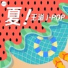

[View on Apple](https://music.apple.com/jp/playlist/%E5%A4%8F-%E7%8E%8B%E9%81%93-j-pop/pl.368604f0e54240448bf04f5de0089220)

## 空間オーディオ：J-Pop

[View on Apple](https://music.apple.com/jp/playlist/%E7%A9%BA%E9%96%93%E3%82%AA%E3%83%BC%E3%83%87%E3%82%A3%E3%82%AA-j-pop/pl.04a2d5c0ba2c4afa917241f1e22fa535)

## トゥデイズ J-ロック

[View on Apple](https://music.apple.com/jp/playlist/%E3%83%88%E3%82%A5%E3%83%87%E3%82%A4%E3%82%BA-j-%E3%83%AD%E3%83%83%E3%82%AF/pl.224eaf3201f342c5a582d031ea29a635)

## ジャズ・チル

[View on Apple](https://music.apple.com/jp/playlist/%E3%82%B8%E3%83%A3%E3%82%BA-%E3%83%81%E3%83%AB/pl.63271312c084419891982eab46cc68ac)

## 2010年代 洋楽ベストヒッツ -Best of 2010s-

[View on Apple](https://music.apple.com/jp/playlist/2010%E5%B9%B4%E4%BB%A3-%E6%B4%8B%E6%A5%BD%E3%83%99%E3%82%B9%E3%83%88%E3%83%92%E3%83%83%E3%83%84-best-of-2010s/pl.0da6a38311f843cb91c697df9411d54d)

## ディズニープリンセス・ヒッツ

[View on Apple](https://music.apple.com/jp/playlist/%E3%83%87%E3%82%A3%E3%82%BA%E3%83%8B%E3%83%BC%E3%83%97%E3%83%AA%E3%83%B3%E3%82%BB%E3%82%B9-%E3%83%92%E3%83%83%E3%83%84/pl.08cd1b3d5a474cefaa7ae76961e36180)

## 1990年代 邦楽ラブソング ベスト

[View on Apple](https://music.apple.com/jp/playlist/1990%E5%B9%B4%E4%BB%A3-%E9%82%A6%E6%A5%BD%E3%83%A9%E3%83%96%E3%82%BD%E3%83%B3%E3%82%B0-%E3%83%99%E3%82%B9%E3%83%88/pl.62c3e18bd2cb4f19bd0c4ba3362d26ec)

## ドライブで聴きたい洋楽　-Time to Drive-

[View on Apple](https://music.apple.com/jp/playlist/%E3%83%89%E3%83%A9%E3%82%A4%E3%83%96%E3%81%A7%E8%81%B4%E3%81%8D%E3%81%9F%E3%81%84%E6%B4%8B%E6%A5%BD-time-to-drive/pl.7f5b69c9e4a54592a839f33c5f308099)

## ピアノ・チル

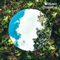

[View on Apple](https://music.apple.com/jp/playlist/%E3%83%94%E3%82%A2%E3%83%8E-%E3%83%81%E3%83%AB/pl.cb4d1c09a2df4230a78d0395fe1f8fde)

## 1990年代 TVドラマテーマ曲 ベスト

[View on Apple](https://music.apple.com/jp/playlist/1990%E5%B9%B4%E4%BB%A3-tv%E3%83%89%E3%83%A9%E3%83%9E%E3%83%86%E3%83%BC%E3%83%9E%E6%9B%B2-%E3%83%99%E3%82%B9%E3%83%88/pl.65941c221a5641d9ad32419f58bcf1e7)

## ボサノヴァ ベスト

[View on Apple](https://music.apple.com/jp/playlist/%E3%83%9C%E3%82%B5%E3%83%8E%E3%83%B4%E3%82%A1-%E3%83%99%E3%82%B9%E3%83%88/pl.0ba2b2f245a8436dba7b8120d8ade8c5)

## Disney Hits

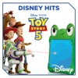

[View on Apple](https://music.apple.com/jp/playlist/disney-hits/pl.17a41e613df44c0ab2c0fcb49bda1e5f)

## はじめての B'z

[View on Apple](https://music.apple.com/jp/playlist/%E3%81%AF%E3%81%98%E3%82%81%E3%81%A6%E3%81%AE-bz/pl.2892630a66e241a7992a760bc3f8a1f3)

## 沖縄気分でめんそ～れ！

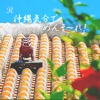

[View on Apple](https://music.apple.com/jp/playlist/%E6%B2%96%E7%B8%84%E6%B0%97%E5%88%86%E3%81%A7%E3%82%81%E3%82%93%E3%81%9D-%E3%82%8C/pl.19879e679084482c8627577fc22e961c)

## 映画『ワイルド・スピード』シリーズ・ベスト・ソングス

[View on Apple](https://music.apple.com/jp/playlist/%E6%98%A0%E7%94%BB-%E3%83%AF%E3%82%A4%E3%83%AB%E3%83%89-%E3%82%B9%E3%83%94%E3%83%BC%E3%83%89-%E3%82%B7%E3%83%AA%E3%83%BC%E3%82%BA-%E3%83%99%E3%82%B9%E3%83%88-%E3%82%BD%E3%83%B3%E3%82%B0%E3%82%B9/pl.e6ceba0b573e4730aac502f1c8ea62f4)

## はじめての 平井大

[View on Apple](https://music.apple.com/jp/playlist/%E3%81%AF%E3%81%98%E3%82%81%E3%81%A6%E3%81%AE-%E5%B9%B3%E4%BA%95%E5%A4%A7/pl.538f77ffe43f4359af2ca02c75b50671)

## カフェミュージック

[View on Apple](https://music.apple.com/jp/playlist/%E3%82%AB%E3%83%95%E3%82%A7%E3%83%9F%E3%83%A5%E3%83%BC%E3%82%B8%E3%83%83%E3%82%AF/pl.51abcc1adb164991acbaacfc11c0d5ea)

## はじめての ジャスティン・ビーバー

[View on Apple](https://music.apple.com/jp/playlist/%E3%81%AF%E3%81%98%E3%82%81%E3%81%A6%E3%81%AE-%E3%82%B8%E3%83%A3%E3%82%B9%E3%83%86%E3%82%A3%E3%83%B3-%E3%83%93%E3%83%BC%E3%83%90%E3%83%BC/pl.1b59383d41a74a889e8a28c31a3552c3)

## 世界のサッカーアンセム

[View on Apple](https://music.apple.com/jp/playlist/%E4%B8%96%E7%95%8C%E3%81%AE%E3%82%B5%E3%83%83%E3%82%AB%E3%83%BC%E3%82%A2%E3%83%B3%E3%82%BB%E3%83%A0/pl.66fc9e98da7d49e68cd00de798b86d69)

## ドライブで聴きたい！30代のための青春★ヒットソング

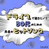

[View on Apple](https://music.apple.com/jp/playlist/%E3%83%89%E3%83%A9%E3%82%A4%E3%83%96%E3%81%A7%E8%81%B4%E3%81%8D%E3%81%9F%E3%81%84-30%E4%BB%A3%E3%81%AE%E3%81%9F%E3%82%81%E3%81%AE%E9%9D%92%E6%98%A5-%E3%83%92%E3%83%83%E3%83%88%E3%82%BD%E3%83%B3%E3%82%B0/pl.e9b50c06b44f454e814d89d82d2b977c)

## 1980年代 洋楽 ベスト

[View on Apple](https://music.apple.com/jp/playlist/1980%E5%B9%B4%E4%BB%A3-%E6%B4%8B%E6%A5%BD-%E3%83%99%E3%82%B9%E3%83%88/pl.af4d982795c6472ea48579eb147cd726)

## 令和・平成編 ドライブが100倍楽しくなるドライブソング

[View on Apple](https://music.apple.com/jp/playlist/%E4%BB%A4%E5%92%8C-%E5%B9%B3%E6%88%90%E7%B7%A8-%E3%83%89%E3%83%A9%E3%82%A4%E3%83%96%E3%81%8C100%E5%80%8D%E6%A5%BD%E3%81%97%E3%81%8F%E3%81%AA%E3%82%8B%E3%83%89%E3%83%A9%E3%82%A4%E3%83%96%E3%82%BD%E3%83%B3%E3%82%B0/pl.bda0b05b117246528387b1df61e9083c)

## 懐かしの昭和・平成の夏うた ヒットソング！

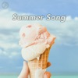

[View on Apple](https://music.apple.com/jp/playlist/%E6%87%90%E3%81%8B%E3%81%97%E3%81%AE%E6%98%AD%E5%92%8C-%E5%B9%B3%E6%88%90%E3%81%AE%E5%A4%8F%E3%81%86%E3%81%9F-%E3%83%92%E3%83%83%E3%83%88%E3%82%BD%E3%83%B3%E3%82%B0/pl.669ca01c8ea5491085255efeaf589847)

## はじめての ヨルシカ

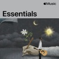

[View on Apple](https://music.apple.com/jp/playlist/%E3%81%AF%E3%81%98%E3%82%81%E3%81%A6%E3%81%AE-%E3%83%A8%E3%83%AB%E3%82%B7%E3%82%AB/pl.1dceafb41aae4ad7ae2e65c205854ae3)

## はじめての 近藤真彦

[View on Apple](https://music.apple.com/jp/playlist/%E3%81%AF%E3%81%98%E3%82%81%E3%81%A6%E3%81%AE-%E8%BF%91%E8%97%A4%E7%9C%9F%E5%BD%A6/pl.6c1f4bbea3c44d76a0a70a64b51e4c65)

## はじめての テイラー・スウィフト

[View on Apple](https://music.apple.com/jp/playlist/%E3%81%AF%E3%81%98%E3%82%81%E3%81%A6%E3%81%AE-%E3%83%86%E3%82%A4%E3%83%A9%E3%83%BC-%E3%82%B9%E3%82%A6%E3%82%A3%E3%83%95%E3%83%88/pl.3950454ced8c45a3b0cc693c2a7db97b)

## 令和の最新ヒットソング ベスト

[View on Apple](https://music.apple.com/jp/playlist/%E4%BB%A4%E5%92%8C%E3%81%AE%E6%9C%80%E6%96%B0%E3%83%92%E3%83%83%E3%83%88%E3%82%BD%E3%83%B3%E3%82%B0-%E3%83%99%E3%82%B9%E3%83%88/pl.34d301ff6b3f4151812de2fa29c170e4)

## 2010年代 TVドラマテーマ曲 ベスト

[View on Apple](https://music.apple.com/jp/playlist/2010%E5%B9%B4%E4%BB%A3-tv%E3%83%89%E3%83%A9%E3%83%9E%E3%83%86%E3%83%BC%E3%83%9E%E6%9B%B2-%E3%83%99%E3%82%B9%E3%83%88/pl.7cb86a4e3796474a89b5f40ab97b1b4d)

## 夏うた！海や山の想い出よみがえる平成・令和J-POP【おとラボ】

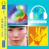

[View on Apple](https://music.apple.com/jp/playlist/%E5%A4%8F%E3%81%86%E3%81%9F-%E6%B5%B7%E3%82%84%E5%B1%B1%E3%81%AE%E6%83%B3%E3%81%84%E5%87%BA%E3%82%88%E3%81%BF%E3%81%8C%E3%81%88%E3%82%8B%E5%B9%B3%E6%88%90-%E4%BB%A4%E5%92%8Cj-pop-%E3%81%8A%E3%81%A8%E3%83%A9%E3%83%9C/pl.534920fd6e144d77bfe8cd189f4d4495)

## カバー・スターズ：日本

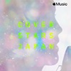

[View on Apple](https://music.apple.com/jp/playlist/%E3%82%AB%E3%83%90%E3%83%BC-%E3%82%B9%E3%82%BF%E3%83%BC%E3%82%BA-%E6%97%A5%E6%9C%AC/pl.73eedac330724ce59ccb8813324c7140)

## 一緒に歌おうディズニー・ソングス！

[View on Apple](https://music.apple.com/jp/playlist/%E4%B8%80%E7%B7%92%E3%81%AB%E6%AD%8C%E3%81%8A%E3%81%86%E3%83%87%E3%82%A3%E3%82%BA%E3%83%8B%E3%83%BC-%E3%82%BD%E3%83%B3%E3%82%B0%E3%82%B9/pl.96191da90be14d44af792b54bfcaba7a)

## はじめての エド・シーラン

[View on Apple](https://music.apple.com/jp/playlist/%E3%81%AF%E3%81%98%E3%82%81%E3%81%A6%E3%81%AE-%E3%82%A8%E3%83%89-%E3%82%B7%E3%83%BC%E3%83%A9%E3%83%B3/pl.3b75f58905aa4486b08432f0e98846e8)

## はじめての『名探偵コナン』

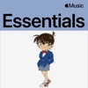

[View on Apple](https://music.apple.com/jp/playlist/%E3%81%AF%E3%81%98%E3%82%81%E3%81%A6%E3%81%AE-%E5%90%8D%E6%8E%A2%E5%81%B5%E3%82%B3%E3%83%8A%E3%83%B3/pl.2db747ff2be7431fa831f70b9bfa7eba)
