- [Brand New](#brand-new)
- [ライラック](#ライラック)
- [好きすぎて滅!](#好きすき-て滅)
- [青と夏](#青と夏)
- [爆裂愛してる](#爆裂愛してる)
- [夜の踊り子](#夜の踊り子)
- [IRIS OUT](#iris-out)
- [夜鷹 - Yodaka](#夜鷹-yodaka)
- [烏 - Raven](#烏-raven)
- [It's Me](#it-s-me)
- [Blue Jeans](#blue-jeans)
- [lulu.](#lulu)
- [アイドルパワー](#アイト-ルハ-ワー)
- [高嶺の花子さん](#高嶺の花子さん)
- [Soranji](#soranji)
- [点描の唄 (feat. 井上苑子)](#点描の唄-feat-井上苑子)
- [花束](#花束)
- [Five](#five)
- [マリーゴールド](#マリーコ-ールト)
- [ケセラセラ](#ケセラセラ)
- [HAPPY BIRTHDAY](#happy-birthday)
- [Yes! 東京 (feat. SUPER★DRAGON, Sakurashimeji, ONE N' ONLY, BUDDiiS, ICEx & Lienel)](#yes-東京-feat-super-dragon-sakurashimeji-one-n-only-buddiis-icex-lienel)
- [ダーリン](#タ-ーリン)
- [ROSE](#rose)
- [いとしのエリー](#いとしのエリー)
- [怪獣](#怪獣)
- [とくべチュ、して](#とくへ-チュ-して)
- [ハッピーエンド](#ハッヒ-ーエント)
- [マイオンリー](#マイオンリー)
- [You!Joy!Parade!](#you-joy-parade)
- [ブルーアンバー](#フ-ルーアンハ-ー)
- [僕のこと](#僕のこと)
- [AIZO](#aizo)
- [Magic](#magic)
- [水平線](#水平線)
- [ダンスホール](#タ-ンスホール)
- [Missing](#missing)
- [ブルーアンビエンス (feat. asmi)](#フ-ルーアンヒ-エンス-feat-asmi)
- [真夏の果実](#真夏の果実)
- [TSUNAMI](#tsunami)
- [怪獣の花唄](#怪獣の花唄)
- [115万キロのフィルム](#115万キロのフィルム)
- [Love so sweet](#love-so-sweet)
- [BPM (feat. KREVA)](#bpm-feat-kreva)
- [Pretender](#pretender)
- [GG EZ](#gg-ez)
- [StaRt](#start)
- [革命道中 - On The Way](#革命道中-on-the-way)
- [SAD SONG](#sad-song)
- [Never Grow Up](#never-grow-up)
- [ヒロイン](#ヒロイン)
- [花火](#花火)
- [Lemon](#lemon)
- [Automatic (Remastered 2014)](#automatic-remastered-2014)
- [波乗りジョニー](#波乗りシ-ョニー)
- [かげろう](#かけ-ろう)
- [わたがし](#わたか-し)
- [Bad Girl](#bad-girl)
- [風と町](#風と町)
- [カリスマックス](#カリスマックス)
- [ハレンチ](#ハレンチ)
- [クスシキ](#クスシキ)
- [グッタイム](#ク-ッタイム)
- [イイじゃん](#イイし-ゃん)
- [インフェルノ](#インフェルノ)
- [Subtitle](#subtitle)
- [Golden](#golden)
- [今夜このまま](#今夜このまま)
- [Happiness](#happiness)
- [夢中](#夢中)
- [イケナイ太陽](#イケナイ太陽)
- [どうしてもどうしても](#と-うしてもと-うしても)
- [Tiger](#tiger)
- [JANE DOE](#jane-doe)
- [夜に駆ける](#夜に駆ける)
- [君はロックを聴かない](#君はロックを聴かない)
- [きらり](#きらり)
- [アイラブユー](#アイラフ-ユー)
- [新宝島](#新宝島)
- [Cold Night](#cold-night)
- [NON STOP](#non-stop)
- [LEMONADE](#lemonade)
- [群青](#群青)
- [One Love](#one-love)
- [ドライフラワー](#ト-ライフラワー)
- [ロマンチシズム](#ロマンチシス-ム)
- [Billie Jean](#billie-jean)
- [Wherever you are](#wherever-you-are)
- [HANABI](#hanabi)
- [イエスタデイ](#イエスタテ-イ)
- [飛ぶ時](#飛ふ-時)
- [愛をこめて花束を](#愛をこめて花束を)
- [劇薬中毒](#劇薬中毒)
- [Burning Flower](#burning-flower)
- [怪盗](#怪盗)
- [お姫様の作り方](#お姫様の作り方)
- [満ちてゆく](#満ちてゆく)
- [SUMMER SONG](#summer-song)
- [First Love (Remastered 2014)](#first-love-remastered-2014)
- [夏色](#夏色)

## Brand New

[View on Apple](https://music.apple.com/jp/album/brand-new/6788211807?i=6788211810)

## ライラック

[View on Apple](https://music.apple.com/jp/album/%E3%83%A9%E3%82%A4%E3%83%A9%E3%83%83%E3%82%AF/1739088465?i=1739088799)

## 好きすぎて滅!

[View on Apple](https://music.apple.com/jp/album/%E5%A5%BD%E3%81%8D%E3%81%99%E3%81%8E%E3%81%A6%E6%BB%85/1846753945?i=1846753946)

## 青と夏

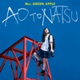

[View on Apple](https://music.apple.com/jp/album/%E9%9D%92%E3%81%A8%E5%A4%8F/1408505088?i=1408505264)

## 爆裂愛してる

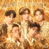

[View on Apple](https://music.apple.com/jp/album/%E7%88%86%E8%A3%82%E6%84%9B%E3%81%97%E3%81%A6%E3%82%8B/1869537741?i=1869537742)

## 夜の踊り子

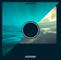

[View on Apple](https://music.apple.com/jp/album/%E5%A4%9C%E3%81%AE%E8%B8%8A%E3%82%8A%E5%AD%90/604748196?i=604748203)

## IRIS OUT

[View on Apple](https://music.apple.com/jp/album/iris-out/1837658528?i=1837658529)

## 夜鷹 - Yodaka

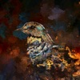

[View on Apple](https://music.apple.com/jp/album/%E5%A4%9C%E9%B7%B9-yodaka/6785367850?i=6785367852)

## 烏 - Raven

[View on Apple](https://music.apple.com/jp/album/%E7%83%8F-raven/6774039193?i=6774039202)

## It's Me

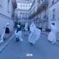

[View on Apple](https://music.apple.com/jp/album/its-me/1894837142?i=1894837345)

## Blue Jeans

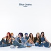

[View on Apple](https://music.apple.com/jp/album/blue-jeans/1821849174?i=1821849522)

## lulu.

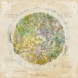

[View on Apple](https://music.apple.com/jp/album/lulu/1867354077?i=1867354081)

## アイドルパワー

[View on Apple](https://music.apple.com/jp/album/%E3%82%A2%E3%82%A4%E3%83%89%E3%83%AB%E3%83%91%E3%83%AF%E3%83%BC/1894988524?i=6762737233)

## 高嶺の花子さん

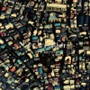

[View on Apple](https://music.apple.com/jp/album/%E9%AB%98%E5%B6%BA%E3%81%AE%E8%8A%B1%E5%AD%90%E3%81%95%E3%82%93/1451567957?i=1451567963)

## Soranji

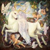

[View on Apple](https://music.apple.com/jp/album/soranji/1648865573?i=1648865575)

## 点描の唄 (feat. 井上苑子)

[View on Apple](https://music.apple.com/jp/album/%E7%82%B9%E6%8F%8F%E3%81%AE%E5%94%84-feat-%E4%BA%95%E4%B8%8A%E8%8B%91%E5%AD%90/1408505088?i=1408505419)

## 花束

[View on Apple](https://music.apple.com/jp/album/%E8%8A%B1%E6%9D%9F/1451570468?i=1451570480)

## Five

[View on Apple](https://music.apple.com/jp/album/five/1879524863?i=1879525016)

## マリーゴールド

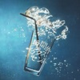

[View on Apple](https://music.apple.com/jp/album/%E3%83%9E%E3%83%AA%E3%83%BC%E3%82%B4%E3%83%BC%E3%83%AB%E3%83%89/1446781785?i=1446781787)

## ケセラセラ

[View on Apple](https://music.apple.com/jp/album/%E3%82%B1%E3%82%BB%E3%83%A9%E3%82%BB%E3%83%A9/1681600496?i=1681600508)

## HAPPY BIRTHDAY

[View on Apple](https://music.apple.com/jp/album/happy-birthday/1456062834?i=1456063581)

## Yes! 東京 (feat. SUPER★DRAGON, Sakurashimeji, ONE N' ONLY, BUDDiiS, ICEx & Lienel)

[View on Apple](https://music.apple.com/jp/album/yes-%E6%9D%B1%E4%BA%AC-feat-super-dragon-sakurashimeji-one-n-only-buddiis/6782749976?i=6782749979)

## ダーリン

[View on Apple](https://music.apple.com/jp/album/%E3%83%80%E3%83%BC%E3%83%AA%E3%83%B3/1790599503?i=1790599512)

## ROSE

[View on Apple](https://music.apple.com/jp/album/rose/1803063207?i=1803063210)

## いとしのエリー

[View on Apple](https://music.apple.com/jp/album/%E3%81%84%E3%81%A8%E3%81%97%E3%81%AE%E3%82%A8%E3%83%AA%E3%83%BC/947748513?i=947748526)

## 怪獣

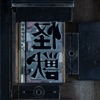

[View on Apple](https://music.apple.com/jp/album/%E6%80%AA%E7%8D%A3/1795905599?i=1795905600)

## とくべチュ、して

[View on Apple](https://music.apple.com/jp/album/%E3%81%A8%E3%81%8F%E3%81%B9%E3%83%81%E3%83%A5-%E3%81%97%E3%81%A6/1794066812?i=1794066813)

## ハッピーエンド

[View on Apple](https://music.apple.com/jp/album/%E3%83%8F%E3%83%83%E3%83%94%E3%83%BC%E3%82%A8%E3%83%B3%E3%83%89/1451567750?i=1451567751)

## マイオンリー

[View on Apple](https://music.apple.com/jp/album/%E3%83%9E%E3%82%A4%E3%82%AA%E3%83%B3%E3%83%AA%E3%83%BC/6785734869?i=6785734870)

## You!Joy!Parade!

[View on Apple](https://music.apple.com/jp/album/you-joy-parade/6789046108?i=6789046323)

## ブルーアンバー

[View on Apple](https://music.apple.com/jp/album/%E3%83%96%E3%83%AB%E3%83%BC%E3%82%A2%E3%83%B3%E3%83%90%E3%83%BC/1808852878?i=1808852932)

## 僕のこと

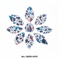

[View on Apple](https://music.apple.com/jp/album/%E5%83%95%E3%81%AE%E3%81%93%E3%81%A8/1445145788?i=1445145789)

## AIZO

[View on Apple](https://music.apple.com/jp/album/aizo/1860538546?i=1860538548)

## Magic

[View on Apple](https://music.apple.com/jp/album/magic/1691229798?i=1691229801)

## 水平線

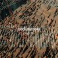

[View on Apple](https://music.apple.com/jp/album/%E6%B0%B4%E5%B9%B3%E7%B7%9A/1579439167?i=1579439168)

## ダンスホール

[View on Apple](https://music.apple.com/jp/album/%E3%83%80%E3%83%B3%E3%82%B9%E3%83%9B%E3%83%BC%E3%83%AB/1623304208?i=1623304209)

## Missing

[View on Apple](https://music.apple.com/jp/album/missing/6777027008?i=6777027010)

## ブルーアンビエンス (feat. asmi)

[View on Apple](https://music.apple.com/jp/album/%E3%83%96%E3%83%AB%E3%83%BC%E3%82%A2%E3%83%B3%E3%83%93%E3%82%A8%E3%83%B3%E3%82%B9-feat-asmi/1627629613?i=1627629624)

## 真夏の果実

[View on Apple](https://music.apple.com/jp/album/%E7%9C%9F%E5%A4%8F%E3%81%AE%E6%9E%9C%E5%AE%9F/949248376?i=949248404)

## TSUNAMI

[View on Apple](https://music.apple.com/jp/album/tsunami/949250891?i=949250892)

## 怪獣の花唄

[View on Apple](https://music.apple.com/jp/album/%E6%80%AA%E7%8D%A3%E3%81%AE%E8%8A%B1%E5%94%84/1706831732?i=1706832137)

## 115万キロのフィルム

[View on Apple](https://music.apple.com/jp/album/115%E4%B8%87%E3%82%AD%E3%83%AD%E3%81%AE%E3%83%95%E3%82%A3%E3%83%AB%E3%83%A0/1394013451?i=1394013614)

## Love so sweet

[View on Apple](https://music.apple.com/jp/album/love-so-sweet/1485857244?i=1485857408)

## BPM (feat. KREVA)

[View on Apple](https://music.apple.com/jp/album/bpm-feat-kreva/1892738151?i=1892738152)

## Pretender

[View on Apple](https://music.apple.com/jp/album/pretender/1459216693?i=1459216694)

## GG EZ

[View on Apple](https://music.apple.com/jp/album/gg-ez/6773028282?i=6773028284)

## StaRt

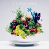

[View on Apple](https://music.apple.com/jp/album/start/1440745429?i=1440745441)

## 革命道中 - On The Way

[View on Apple](https://music.apple.com/jp/album/%E9%9D%A9%E5%91%BD%E9%81%93%E4%B8%AD-on-the-way/1821087726?i=1821087731)

## SAD SONG

[View on Apple](https://music.apple.com/jp/album/sad-song/1468137281?i=1468137516)

## Never Grow Up

[View on Apple](https://music.apple.com/jp/album/never-grow-up/1468137281?i=1468137287)

## ヒロイン

[View on Apple](https://music.apple.com/jp/album/%E3%83%92%E3%83%AD%E3%82%A4%E3%83%B3/1451566360?i=1451566361)

## 花火

[View on Apple](https://music.apple.com/jp/album/%E8%8A%B1%E7%81%AB/1109978421?i=1109978628)

## Lemon

[View on Apple](https://music.apple.com/jp/album/lemon/1538265733?i=1538265741)

## Automatic (Remastered 2014)

[View on Apple](https://music.apple.com/jp/album/automatic-remastered-2014/1440763349?i=1440763351)

## 波乗りジョニー

[View on Apple](https://music.apple.com/jp/album/%E6%B3%A2%E4%B9%97%E3%82%8A%E3%82%B8%E3%83%A7%E3%83%8B%E3%83%BC/1083422435?i=1083422439)

## かげろう

[View on Apple](https://music.apple.com/jp/album/%E3%81%8B%E3%81%92%E3%82%8D%E3%81%86/6787836340?i=6787836341)

## わたがし

[View on Apple](https://music.apple.com/jp/album/%E3%82%8F%E3%81%9F%E3%81%8C%E3%81%97/1451567083?i=1451567084)

## Bad Girl

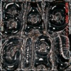

[View on Apple](https://music.apple.com/jp/album/bad-girl/1884257488?i=1884257489)

## 風と町

[View on Apple](https://music.apple.com/jp/album/%E9%A2%A8%E3%81%A8%E7%94%BA/1891943324?i=1891943326)

## カリスマックス

[View on Apple](https://music.apple.com/jp/album/%E3%82%AB%E3%83%AA%E3%82%B9%E3%83%9E%E3%83%83%E3%82%AF%E3%82%B9/1831676528?i=1831676531)

## ハレンチ

[View on Apple](https://music.apple.com/jp/album/%E3%83%8F%E3%83%AC%E3%83%B3%E3%83%81/1585848047?i=1585848051)

## クスシキ

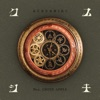

[View on Apple](https://music.apple.com/jp/album/%E3%82%AF%E3%82%B9%E3%82%B7%E3%82%AD/1804230382?i=1804230388)

## グッタイム

[View on Apple](https://music.apple.com/jp/album/%E3%82%B0%E3%83%83%E3%82%BF%E3%82%A4%E3%83%A0/6785411719?i=6785411720)

## イイじゃん

[View on Apple](https://music.apple.com/jp/album/%E3%82%A4%E3%82%A4%E3%81%98%E3%82%83%E3%82%93/1794499542?i=1794499543)

## インフェルノ

[View on Apple](https://music.apple.com/jp/album/%E3%82%A4%E3%83%B3%E3%83%95%E3%82%A7%E3%83%AB%E3%83%8E/1471459431?i=1471459432)

## Subtitle

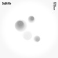

[View on Apple](https://music.apple.com/jp/album/subtitle/1648108987?i=1648108988)

## Golden

[View on Apple](https://music.apple.com/jp/album/golden/1820264137?i=1820264150)

## 今夜このまま

[View on Apple](https://music.apple.com/jp/album/%E4%BB%8A%E5%A4%9C%E3%81%93%E3%81%AE%E3%81%BE%E3%81%BE/1438144187?i=1438144188)

## Happiness

[View on Apple](https://music.apple.com/jp/album/happiness/1485847848?i=1485847849)

## 夢中

[View on Apple](https://music.apple.com/jp/album/%E5%A4%A2%E4%B8%AD/1807959955?i=1807959956)

## イケナイ太陽

[View on Apple](https://music.apple.com/jp/album/%E3%82%A4%E3%82%B1%E3%83%8A%E3%82%A4%E5%A4%AA%E9%99%BD/1537418560?i=1537418577)

## どうしてもどうしても

[View on Apple](https://music.apple.com/jp/album/%E3%81%A9%E3%81%86%E3%81%97%E3%81%A6%E3%82%82%E3%81%A9%E3%81%86%E3%81%97%E3%81%A6%E3%82%82/1860453443?i=1860453512)

## Tiger

[View on Apple](https://music.apple.com/jp/album/tiger/1808822132?i=1808822211)

## JANE DOE

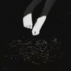

[View on Apple](https://music.apple.com/jp/album/jane-doe/1840081735?i=1840081736)

## 夜に駆ける

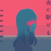

[View on Apple](https://music.apple.com/jp/album/%E5%A4%9C%E3%81%AB%E9%A7%86%E3%81%91%E3%82%8B/1490256978?i=1490256995)

## 君はロックを聴かない

[View on Apple](https://music.apple.com/jp/album/%E5%90%9B%E3%81%AF%E3%83%AD%E3%83%83%E3%82%AF%E3%82%92%E8%81%B4%E3%81%8B%E3%81%AA%E3%81%84/1273709789?i=1273709797)

## きらり

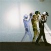

[View on Apple](https://music.apple.com/jp/album/%E3%81%8D%E3%82%89%E3%82%8A/1564752132?i=1564752145)

## アイラブユー

[View on Apple](https://music.apple.com/jp/album/%E3%82%A2%E3%82%A4%E3%83%A9%E3%83%96%E3%83%A6%E3%83%BC/1648411350?i=1648411352)

## 新宝島

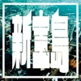

[View on Apple](https://music.apple.com/jp/album/%E6%96%B0%E5%AE%9D%E5%B3%B6/1039793113?i=1039793121)

## Cold Night

[View on Apple](https://music.apple.com/jp/album/cold-night/1867687784?i=1867687787)

## NON STOP

[View on Apple](https://music.apple.com/jp/album/non-stop/1854334752?i=1854334753)

## LEMONADE

[View on Apple](https://music.apple.com/jp/album/lemonade/1893868118?i=1893868120)

## 群青

[View on Apple](https://music.apple.com/jp/album/%E7%BE%A4%E9%9D%92/1528119626?i=1528119630)

## One Love

[View on Apple](https://music.apple.com/jp/album/one-love/1485847812?i=1485847813)

## ドライフラワー

[View on Apple](https://music.apple.com/jp/album/%E3%83%89%E3%83%A9%E3%82%A4%E3%83%95%E3%83%A9%E3%83%AF%E3%83%BC/1534620182?i=1534620183)

## ロマンチシズム

[View on Apple](https://music.apple.com/jp/album/%E3%83%AD%E3%83%9E%E3%83%B3%E3%83%81%E3%82%B7%E3%82%BA%E3%83%A0/1454643208?i=1454643219)

## Billie Jean

[View on Apple](https://music.apple.com/jp/album/%E3%83%93%E3%83%AA%E3%83%BC-%E3%82%B8%E3%83%BC%E3%83%B3/269572838?i=269573364)

## Wherever you are

[View on Apple](https://music.apple.com/jp/album/wherever-you-are/1838917127?i=1838917139)

## HANABI

[View on Apple](https://music.apple.com/jp/album/hanabi/1375007287?i=1375007474)

## イエスタデイ

[View on Apple](https://music.apple.com/jp/album/%E3%82%A4%E3%82%A8%E3%82%B9%E3%82%BF%E3%83%87%E3%82%A4/1479397582?i=1479397583)

## 飛ぶ時

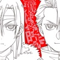

[View on Apple](https://music.apple.com/jp/album/%E9%A3%9B%E3%81%B6%E6%99%82/1890060754?i=1890060756)

## 愛をこめて花束を

[View on Apple](https://music.apple.com/jp/album/%E6%84%9B%E3%82%92%E3%81%93%E3%82%81%E3%81%A6%E8%8A%B1%E6%9D%9F%E3%82%92/279691838?i=279691859)

## 劇薬中毒

[View on Apple](https://music.apple.com/jp/album/%E5%8A%87%E8%96%AC%E4%B8%AD%E6%AF%92/1874221478?i=1874221480)

## Burning Flower

[View on Apple](https://music.apple.com/jp/album/burning-flower/1816111095?i=1816111098)

## 怪盗

[View on Apple](https://music.apple.com/jp/album/%E6%80%AA%E7%9B%97/1566811794?i=1566811795)

## お姫様の作り方

[View on Apple](https://music.apple.com/jp/album/%E3%81%8A%E5%A7%AB%E6%A7%98%E3%81%AE%E4%BD%9C%E3%82%8A%E6%96%B9/1886067570?i=1886067575)

## 満ちてゆく

[View on Apple](https://music.apple.com/jp/album/%E6%BA%80%E3%81%A1%E3%81%A6%E3%82%86%E3%81%8F/1733129984?i=1733130377)

## SUMMER SONG

[View on Apple](https://music.apple.com/jp/album/summer-song/1537446006?i=1537446020)

## First Love (Remastered 2014)

[View on Apple](https://music.apple.com/jp/album/first-love-remastered-2014/1440763349?i=1440763358)

## 夏色

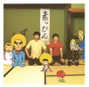

[View on Apple](https://music.apple.com/jp/album/%E5%A4%8F%E8%89%B2/422250975?i=422250979)
