- [安住紳一郎の日曜天国](#安住紳一郎の日曜天国)
- [マユリカのうなげろりん！！](#マユリカのうなけ-ろりん)
- [歴史を面白く学ぶコテンラジオ （COTEN RADIO）](#歴史を面白く学ふ-コテンラシ-オ-coten-radio)
- [大久保佳代子とらぶぶらLOVE](#大久保佳代子とらふ-ふ-らlove)
- [朝井リョウ・加藤千恵 信頼できない語り手](#朝井リョウ-加藤千恵-信頼て-きない語り手)
- [NHKラジオニュース](#nhkラシ-オニュース)
- [TBSラジオ『ジェーン・スーと堀井美香の「OVER THE SUN」』](#tbsラシ-オ-シ-ェーン-スーと堀井美香の-over-the-sun)
- [紅しょうがは好きズキ！](#紅しょうか-は好きス-キ)
- [ゆる言語学ラジオ](#ゆる言語学ラシ-オ)
- [飯田浩司のOK! Cozy up！ Podcast【最新回のみ】](#飯田浩司のok-cozy-up-podcast-最新回のみ)
- [真空ジェシカのラジオ父ちゃん](#真空シ-ェシカのラシ-オ父ちゃん)
- [News Connect あなたと経済をつなぐ5分間 #ニュースコネクト](#news-connect-あなたと経済をつなく-5分間-ニュースコネクト)
- [ダイアンのTOKYO STYLE](#タ-イアンのtokyo-style)
- [空気階段の踊り場](#空気階段の踊り場)
- [ながら日経](#なか-ら日経)
- [6 Minute English](#6-minute-english)
- [ラランドの声溜めラジオ｜GERA](#ララント-の声溜めラシ-オ-gera)
- [真誠presents　大久保佳代子・森本晋太郎のどうぞご自由に](#真誠presents-大久保佳代子-森本晋太郎のと-うそ-こ-自由に)
- [ゆるコンピュータ科学ラジオ](#ゆるコンヒ-ュータ科学ラシ-オ)
- [ぼる塾あんりと田辺の食べて喋って](#ほ-る塾あんりと田辺の食へ-て喋って)
- [限界突破ライフハック](#限界突破ライフハック)
- [Global News Podcast](#global-news-podcast)
- [ジェーン・スー　生活は踊る](#シ-ェーン-スー-生活は踊る)
- [イースト駅前クリニック presents 川島明のねごと](#イースト駅前クリニック-presents-川島明のねこ-と)
- [こたけ正義感の聞けば無罪](#こたけ正義感の聞けは-無罪)
- [英語で雑談！Kevin’s English Room Podcast](#英語て-雑談-kevin-s-english-room-podcast)
- [English News - NHK WORLD RADIO JAPAN](#english-news-nhk-world-radio-japan)
- [令和ロマンのご様子](#令和ロマンのこ-様子)
- [ガスワン presents 田中みな実 あったかタイム](#カ-スワン-presents-田中みな実-あったかタイム)
- [畑芽育&齊藤なぎさ「オフはこんな感じ」](#畑芽育-齊藤なき-さ-オフはこんな感し)
- [はちくちダブルヒガシ](#はちくちタ-フ-ルヒカ-シ)
- [金曜JUNK バナナマンのバナナムーンGOLD](#金曜junk-ハ-ナナマンのハ-ナナムーンgold)
- [VALTURE RADIO](#valture-radio)
- [問わず語りの神田伯山](#問わす-語りの神田伯山)
- [上泉雄一のええなぁ！](#上泉雄一のええなぁ)
- [辛坊治郎 ズーム そこまで言うか！【最新回のみ】](#辛坊治郎-ス-ーム-そこまて-言うか-最新回のみ)
- [Marina OgushiのNode Radio](#marina-ogushiのnode-radio)
- [チャポンと行こう！](#チャホ-ンと行こう)
- [武田鉄矢・今朝の三枚おろし](#武田鉄矢-今朝の三枚おろし)
- [荻上チキ・Session～発信型ニュース・プロジェクト](#荻上チキ-session-発信型ニュース-フ-ロシ-ェクト)
- [小芝風花のよりみち【オールナイトニッポンPODCAST】](#小芝風花のよりみち-オールナイトニッホ-ンpodcast)
- [Learning Easy English](#learning-easy-english)
- [All Ears English Podcast](#all-ears-english-podcast)
- [プレジデント音声版](#フ-レシ-テ-ント音声版)
- [経済ニュース　今日の気になる話題](#経済ニュース-今日の気になる話題)
- [超リアルな行動心理学](#超リアルな行動心理学)
- [アフター6ジャンクション 2](#アフター6シ-ャンクション-2)
- [きしたかののブタピエロ](#きしたかののフ-タヒ-エロ)
- [神保町で会いましょう](#神保町て-会いましょう)
- [さらば青春の光がTaダ、Baカ、Saワギ](#さらは-青春の光か-taタ-baカ-saワキ)
- [ぽこピーのゆめうつつ](#ほ-こヒ-ーのゆめうつつ)
- [あんまり役に立たない日本史](#あんまり役に立たない日本史)
- [ゆる哲学ラジオ](#ゆる哲学ラシ-オ)
- [みうら五郎](#みうら五郎)
- [Hapa英会話 Podcast](#hapa英会話-podcast)
- [東京ポッド許可局](#東京ホ-ット-許可局)
- [岩場の女（ヒコロヒー）](#岩場の女-ヒコロヒー)
- [岡野陽一の肉の塊](#岡野陽一の肉の塊)
- [TED Talks Daily](#ted-talks-daily)
- [となりの雑談](#となりの雑談)
- [アンガールズのジャンピン\[-オールナイトニッポンPODCAST-\]](#アンカ-ールス-のシ-ャンヒ-ン-オールナイトニッホ-ンpodcast)
- [長谷川あかりのシャニカマでごめんなさい](#長谷川あかりのシャニカマて-こ-めんなさい)
- [ゆる民俗学ラジオ](#ゆる民俗学ラシ-オ)
- [こどもそうだんしつ](#こと-もそうた-んしつ)
- [学校では教えてくれない”見えない力”の授業〜「大人の非認知能力」〜](#学校て-は教えてくれない-見えない力-の授業-大人の非認知能力)
- [「NONSTYLE漫才セレクション『耳笑い』」](#nonstyle漫才セレクション-耳笑い)
- [ニュースの現場から](#ニュースの現場から)
- [プチ鹿島 赤坂タイムス](#フ-チ鹿島-赤坂タイムス)
- [ハライチのターン！](#ハライチのターン)
- [木曜JUNK おぎやはぎのメガネびいき](#木曜junk-おき-やはき-のメカ-ネひ-いき)
- [ヤング日経（サクッとわかるビジネスニュース）](#ヤンク-日経-サクッとわかるヒ-シ-ネスニュース)
- [解説！1日5分ビジネス英語](#解説-1日5分ヒ-シ-ネス英語)
- [アオイとキクチ。](#アオイとキクチ)
- [英語聞き流し | Sakura English](#英語聞き流し-sakura-english)
- [kemioの言わせて言うだけEverything](#kemioの言わせて言うた-けeverything)
- [伊藤洋一のRound Up World Now！](#伊藤洋一のround-up-world-now)
- [カナメストーンのカナメちゃん村](#カナメストーンのカナメちゃん村)
- [バイリンガルニュース (Bilingual News)](#ハ-イリンカ-ルニュース-bilingual-news)
- [視点倉庫](#視点倉庫)
- [歴史を紐解く！聞き流し偉人伝](#歴史を紐解く-聞き流し偉人伝)
- [神崎恵＆大森葉子の「WONT」](#神崎恵-大森葉子の-wont)
- [ロッチナイトZERO](#ロッチナイトzero)
- [バービー×イモトアヤコの東京ホルモン娘](#ハ-ーヒ-ー-イモトアヤコの東京ホルモン娘)
- [味な副音声 ～voice of food～](#味な副音声-voice-of-food)
- [ナイツのちゃきちゃき大放送](#ナイツのちゃきちゃき大放送)
- [【聞き流し英語】すぐに使える簡単英語を身につける！ 🍎](#聞き流し英語-すく-に使える簡単英語を身につける)
- [NewsPicks Daily Briefing w/ NP AI Lab](#newspicks-daily-briefing-w-np-ai-lab)
- [金属バットの社会の窓](#金属ハ-ットの社会の窓)
- [大竹メインディッシュ - 大竹まことゴールデンラジオ！](#大竹メインテ-ィッシュ-大竹まことコ-ールテ-ンラシ-オ)
- [朝井リョウと加藤千恵のオールナイトニッポン](#朝井リョウと加藤千恵のオールナイトニッホ-ン)
- [ウエストランド井口と吉住の孤独アジト](#ウエストラント-井口と吉住の孤独アシ-ト)
- [日本一たのしい哲学ラジオ](#日本一たのしい哲学ラシ-オ)
- [矢作とアイクの英会話～音声版～](#矢作とアイクの英会話-音声版)
- [ながらAIラジオ](#なか-らaiラシ-オ)
- [私より先に丁寧に暮らすな](#私より先に丁寧に暮らすな)
- [大竹紳士交遊録 - 大竹まことゴールデンラジオ！](#大竹紳士交遊録-大竹まことコ-ールテ-ンラシ-オ)
- [スタンド・バイ・見取り図](#スタント-ハ-イ-見取り図)
- [--トム・ブラウンのニッポン放送圧縮計画［オールナイトニッポンPODCAST］----](#トム-フ-ラウンのニッホ-ン放送圧縮計画-オールナイトニッホ-ンpodcast)
- [飯沼愛の沼ラジオ](#飯沼愛の沼ラシ-オ)
- [pecoとJESSICA](#pecoとjessica)

## 安住紳一郎の日曜天国

[View on Apple](https://podcasts.apple.com/jp/podcast/%E5%AE%89%E4%BD%8F%E7%B4%B3%E4%B8%80%E9%83%8E%E3%81%AE%E6%97%A5%E6%9B%9C%E5%A4%A9%E5%9B%BD/id1647482386)

## マユリカのうなげろりん！！

[View on Apple](https://podcasts.apple.com/jp/podcast/%E3%83%9E%E3%83%A6%E3%83%AA%E3%82%AB%E3%81%AE%E3%81%86%E3%81%AA%E3%81%92%E3%82%8D%E3%82%8A%E3%82%93/id1575465539)

## 歴史を面白く学ぶコテンラジオ （COTEN RADIO）

[View on Apple](https://podcasts.apple.com/jp/podcast/%E6%AD%B4%E5%8F%B2%E3%82%92%E9%9D%A2%E7%99%BD%E3%81%8F%E5%AD%A6%E3%81%B6%E3%82%B3%E3%83%86%E3%83%B3%E3%83%A9%E3%82%B8%E3%82%AA-coten-radio/id1450522865)

## 大久保佳代子とらぶぶらLOVE

[View on Apple](https://podcasts.apple.com/jp/podcast/%E5%A4%A7%E4%B9%85%E4%BF%9D%E4%BD%B3%E4%BB%A3%E5%AD%90%E3%81%A8%E3%82%89%E3%81%B6%E3%81%B6%E3%82%89love/id1572229955)

## 朝井リョウ・加藤千恵 信頼できない語り手

[View on Apple](https://podcasts.apple.com/jp/podcast/%E6%9C%9D%E4%BA%95%E3%83%AA%E3%83%A7%E3%82%A6-%E5%8A%A0%E8%97%A4%E5%8D%83%E6%81%B5-%E4%BF%A1%E9%A0%BC%E3%81%A7%E3%81%8D%E3%81%AA%E3%81%84%E8%AA%9E%E3%82%8A%E6%89%8B/id1874531482)

## NHKラジオニュース

[View on Apple](https://podcasts.apple.com/jp/podcast/nhk%E3%83%A9%E3%82%B8%E3%82%AA%E3%83%8B%E3%83%A5%E3%83%BC%E3%82%B9/id400203229)

## TBSラジオ『ジェーン・スーと堀井美香の「OVER THE SUN」』

[View on Apple](https://podcasts.apple.com/jp/podcast/tbs%E3%83%A9%E3%82%B8%E3%82%AA-%E3%82%B8%E3%82%A7%E3%83%BC%E3%83%B3-%E3%82%B9%E3%83%BC%E3%81%A8%E5%A0%80%E4%BA%95%E7%BE%8E%E9%A6%99%E3%81%AE-over-the-sun/id1533649648)

## 紅しょうがは好きズキ！

[View on Apple](https://podcasts.apple.com/jp/podcast/%E7%B4%85%E3%81%97%E3%82%87%E3%81%86%E3%81%8C%E3%81%AF%E5%A5%BD%E3%81%8D%E3%82%BA%E3%82%AD/id1681528378)

## ゆる言語学ラジオ

[View on Apple](https://podcasts.apple.com/jp/podcast/%E3%82%86%E3%82%8B%E8%A8%80%E8%AA%9E%E5%AD%A6%E3%83%A9%E3%82%B8%E3%82%AA/id1550243290)

## 飯田浩司のOK! Cozy up！ Podcast【最新回のみ】

[View on Apple](https://podcasts.apple.com/jp/podcast/%E9%A3%AF%E7%94%B0%E6%B5%A9%E5%8F%B8%E3%81%AEok-cozy-up-podcast-%E6%9C%80%E6%96%B0%E5%9B%9E%E3%81%AE%E3%81%BF/id1366187377)

## 真空ジェシカのラジオ父ちゃん

[View on Apple](https://podcasts.apple.com/jp/podcast/%E7%9C%9F%E7%A9%BA%E3%82%B8%E3%82%A7%E3%82%B7%E3%82%AB%E3%81%AE%E3%83%A9%E3%82%B8%E3%82%AA%E7%88%B6%E3%81%A1%E3%82%83%E3%82%93/id1567028358)

## News Connect あなたと経済をつなぐ5分間 #ニュースコネクト

[View on Apple](https://podcasts.apple.com/jp/podcast/news-connect-%E3%81%82%E3%81%AA%E3%81%9F%E3%81%A8%E7%B5%8C%E6%B8%88%E3%82%92%E3%81%A4%E3%81%AA%E3%81%905%E5%88%86%E9%96%93-%E3%83%8B%E3%83%A5%E3%83%BC%E3%82%B9%E3%82%B3%E3%83%8D%E3%82%AF%E3%83%88/id1608666340)

## ダイアンのTOKYO STYLE

[View on Apple](https://podcasts.apple.com/jp/podcast/%E3%83%80%E3%82%A4%E3%82%A2%E3%83%B3%E3%81%AEtokyo-style/id1601910075)

## 空気階段の踊り場

[View on Apple](https://podcasts.apple.com/jp/podcast/%E7%A9%BA%E6%B0%97%E9%9A%8E%E6%AE%B5%E3%81%AE%E8%B8%8A%E3%82%8A%E5%A0%B4/id1651795950)

## ながら日経

[View on Apple](https://podcasts.apple.com/jp/podcast/%E3%81%AA%E3%81%8C%E3%82%89%E6%97%A5%E7%B5%8C/id1627014612)

## 6 Minute English

[View on Apple](https://podcasts.apple.com/jp/podcast/6-minute-english/id262026947)

## ラランドの声溜めラジオ｜GERA

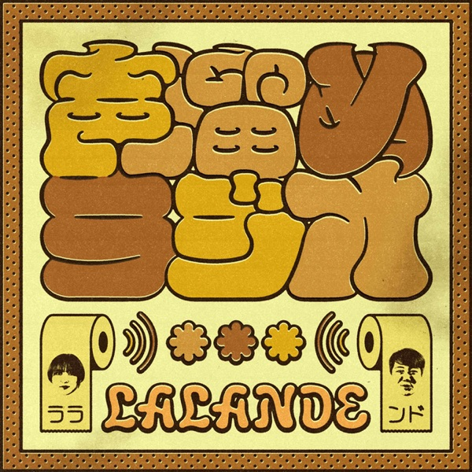

[View on Apple](https://podcasts.apple.com/jp/podcast/%E3%83%A9%E3%83%A9%E3%83%B3%E3%83%89%E3%81%AE%E5%A3%B0%E6%BA%9C%E3%82%81%E3%83%A9%E3%82%B8%E3%82%AA-gera/id1729114614)

## 真誠presents　大久保佳代子・森本晋太郎のどうぞご自由に

[View on Apple](https://podcasts.apple.com/jp/podcast/%E7%9C%9F%E8%AA%A0presents-%E5%A4%A7%E4%B9%85%E4%BF%9D%E4%BD%B3%E4%BB%A3%E5%AD%90-%E6%A3%AE%E6%9C%AC%E6%99%8B%E5%A4%AA%E9%83%8E%E3%81%AE%E3%81%A9%E3%81%86%E3%81%9E%E3%81%94%E8%87%AA%E7%94%B1%E3%81%AB/id1794070876)

## ゆるコンピュータ科学ラジオ

[View on Apple](https://podcasts.apple.com/jp/podcast/%E3%82%86%E3%82%8B%E3%82%B3%E3%83%B3%E3%83%94%E3%83%A5%E3%83%BC%E3%82%BF%E7%A7%91%E5%AD%A6%E3%83%A9%E3%82%B8%E3%82%AA/id1604353315)

## ぼる塾あんりと田辺の食べて喋って

[View on Apple](https://podcasts.apple.com/jp/podcast/%E3%81%BC%E3%82%8B%E5%A1%BE%E3%81%82%E3%82%93%E3%82%8A%E3%81%A8%E7%94%B0%E8%BE%BA%E3%81%AE%E9%A3%9F%E3%81%B9%E3%81%A6%E5%96%8B%E3%81%A3%E3%81%A6/id1891885839)

## 限界突破ライフハック

[View on Apple](https://podcasts.apple.com/jp/podcast/%E9%99%90%E7%95%8C%E7%AA%81%E7%A0%B4%E3%83%A9%E3%82%A4%E3%83%95%E3%83%8F%E3%83%83%E3%82%AF/id1866434136)

## Global News Podcast

[View on Apple](https://podcasts.apple.com/jp/podcast/global-news-podcast/id135067274)

## ジェーン・スー　生活は踊る

[View on Apple](https://podcasts.apple.com/jp/podcast/%E3%82%B8%E3%82%A7%E3%83%BC%E3%83%B3-%E3%82%B9%E3%83%BC-%E7%94%9F%E6%B4%BB%E3%81%AF%E8%B8%8A%E3%82%8B/id1630372322)

## イースト駅前クリニック presents 川島明のねごと

[View on Apple](https://podcasts.apple.com/jp/podcast/%E3%82%A4%E3%83%BC%E3%82%B9%E3%83%88%E9%A7%85%E5%89%8D%E3%82%AF%E3%83%AA%E3%83%8B%E3%83%83%E3%82%AF-presents-%E5%B7%9D%E5%B3%B6%E6%98%8E%E3%81%AE%E3%81%AD%E3%81%94%E3%81%A8/id1616790646)

## こたけ正義感の聞けば無罪

[View on Apple](https://podcasts.apple.com/jp/podcast/%E3%81%93%E3%81%9F%E3%81%91%E6%AD%A3%E7%BE%A9%E6%84%9F%E3%81%AE%E8%81%9E%E3%81%91%E3%81%B0%E7%84%A1%E7%BD%AA/id1754897606)

## 英語で雑談！Kevin’s English Room Podcast

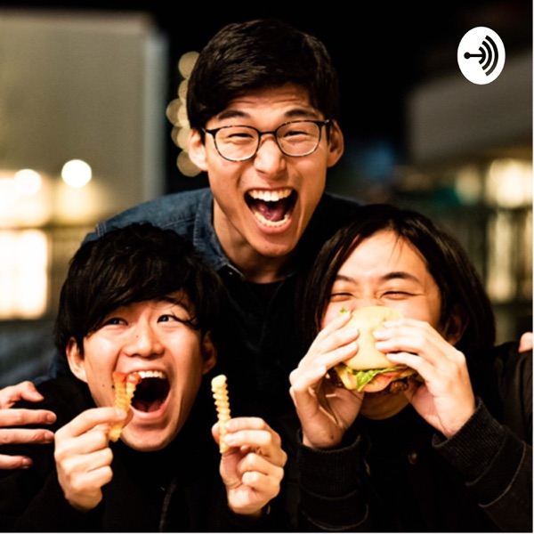

[View on Apple](https://podcasts.apple.com/jp/podcast/%E8%8B%B1%E8%AA%9E%E3%81%A7%E9%9B%91%E8%AB%87-kevins-english-room-podcast/id1518322346)

## English News - NHK WORLD RADIO JAPAN

[View on Apple](https://podcasts.apple.com/jp/podcast/english-news-nhk-world-radio-japan/id141016660)

## 令和ロマンのご様子

[View on Apple](https://podcasts.apple.com/jp/podcast/%E4%BB%A4%E5%92%8C%E3%83%AD%E3%83%9E%E3%83%B3%E3%81%AE%E3%81%94%E6%A7%98%E5%AD%90/id1718438247)

## ガスワン presents 田中みな実 あったかタイム

[View on Apple](https://podcasts.apple.com/jp/podcast/%E3%82%AC%E3%82%B9%E3%83%AF%E3%83%B3-presents-%E7%94%B0%E4%B8%AD%E3%81%BF%E3%81%AA%E5%AE%9F-%E3%81%82%E3%81%A3%E3%81%9F%E3%81%8B%E3%82%BF%E3%82%A4%E3%83%A0/id1772608512)

## 畑芽育&齊藤なぎさ「オフはこんな感じ」

[View on Apple](https://podcasts.apple.com/jp/podcast/%E7%95%91%E8%8A%BD%E8%82%B2-%E9%BD%8A%E8%97%A4%E3%81%AA%E3%81%8E%E3%81%95-%E3%82%AA%E3%83%95%E3%81%AF%E3%81%93%E3%82%93%E3%81%AA%E6%84%9F%E3%81%98/id1794487657)

## はちくちダブルヒガシ

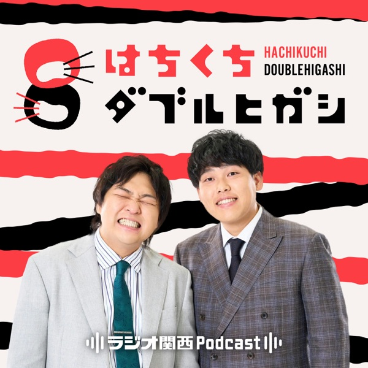

[View on Apple](https://podcasts.apple.com/jp/podcast/%E3%81%AF%E3%81%A1%E3%81%8F%E3%81%A1%E3%83%80%E3%83%96%E3%83%AB%E3%83%92%E3%82%AC%E3%82%B7/id1603390424)

## 金曜JUNK バナナマンのバナナムーンGOLD

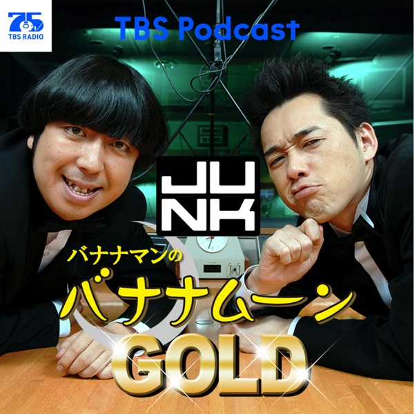

[View on Apple](https://podcasts.apple.com/jp/podcast/%E9%87%91%E6%9B%9Cjunk-%E3%83%90%E3%83%8A%E3%83%8A%E3%83%9E%E3%83%B3%E3%81%AE%E3%83%90%E3%83%8A%E3%83%8A%E3%83%A0%E3%83%BC%E3%83%B3gold/id1651797030)

## VALTURE RADIO

[View on Apple](https://podcasts.apple.com/jp/podcast/valture-radio/id1891021458)

## 問わず語りの神田伯山

[View on Apple](https://podcasts.apple.com/jp/podcast/%E5%95%8F%E3%82%8F%E3%81%9A%E8%AA%9E%E3%82%8A%E3%81%AE%E7%A5%9E%E7%94%B0%E4%BC%AF%E5%B1%B1/id1647162945)

## 上泉雄一のええなぁ！

[View on Apple](https://podcasts.apple.com/jp/podcast/%E4%B8%8A%E6%B3%89%E9%9B%84%E4%B8%80%E3%81%AE%E3%81%88%E3%81%88%E3%81%AA%E3%81%81/id1588682529)

## 辛坊治郎 ズーム そこまで言うか！【最新回のみ】

[View on Apple](https://podcasts.apple.com/jp/podcast/%E8%BE%9B%E5%9D%8A%E6%B2%BB%E9%83%8E-%E3%82%BA%E3%83%BC%E3%83%A0-%E3%81%9D%E3%81%93%E3%81%BE%E3%81%A7%E8%A8%80%E3%81%86%E3%81%8B-%E6%9C%80%E6%96%B0%E5%9B%9E%E3%81%AE%E3%81%BF/id1513369812)

## Marina OgushiのNode Radio

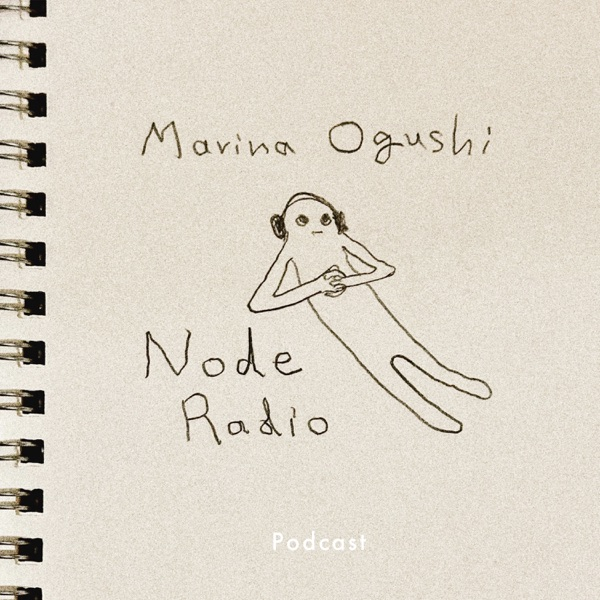

[View on Apple](https://podcasts.apple.com/jp/podcast/marina-ogushi%E3%81%AEnode-radio/id1870022625)

## チャポンと行こう！

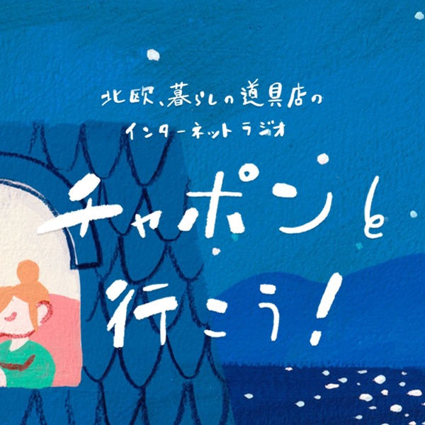

[View on Apple](https://podcasts.apple.com/jp/podcast/%E3%83%81%E3%83%A3%E3%83%9D%E3%83%B3%E3%81%A8%E8%A1%8C%E3%81%93%E3%81%86/id1388742995)

## 武田鉄矢・今朝の三枚おろし

[View on Apple](https://podcasts.apple.com/jp/podcast/%E6%AD%A6%E7%94%B0%E9%89%84%E7%9F%A2-%E4%BB%8A%E6%9C%9D%E3%81%AE%E4%B8%89%E6%9E%9A%E3%81%8A%E3%82%8D%E3%81%97/id625024986)

## 荻上チキ・Session～発信型ニュース・プロジェクト

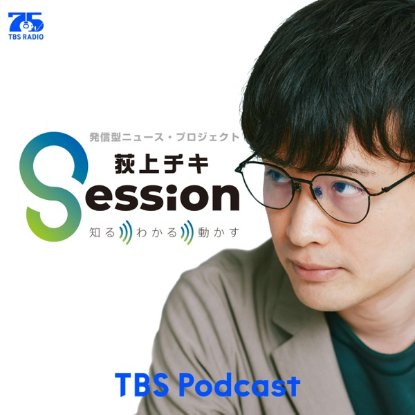

[View on Apple](https://podcasts.apple.com/jp/podcast/%E8%8D%BB%E4%B8%8A%E3%83%81%E3%82%AD-session-%E7%99%BA%E4%BF%A1%E5%9E%8B%E3%83%8B%E3%83%A5%E3%83%BC%E3%82%B9-%E3%83%97%E3%83%AD%E3%82%B8%E3%82%A7%E3%82%AF%E3%83%88/id1532201544)

## 小芝風花のよりみち【オールナイトニッポンPODCAST】

[View on Apple](https://podcasts.apple.com/jp/podcast/%E5%B0%8F%E8%8A%9D%E9%A2%A8%E8%8A%B1%E3%81%AE%E3%82%88%E3%82%8A%E3%81%BF%E3%81%A1-%E3%82%AA%E3%83%BC%E3%83%AB%E3%83%8A%E3%82%A4%E3%83%88%E3%83%8B%E3%83%83%E3%83%9D%E3%83%B3podcast/id6787816936)

## Learning Easy English

[View on Apple](https://podcasts.apple.com/jp/podcast/learning-easy-english/id1742967932)

## All Ears English Podcast

[View on Apple](https://podcasts.apple.com/jp/podcast/all-ears-english-podcast/id751574016)

## プレジデント音声版

[View on Apple](https://podcasts.apple.com/jp/podcast/%E3%83%97%E3%83%AC%E3%82%B8%E3%83%87%E3%83%B3%E3%83%88%E9%9F%B3%E5%A3%B0%E7%89%88/id1525273315)

## 経済ニュース　今日の気になる話題

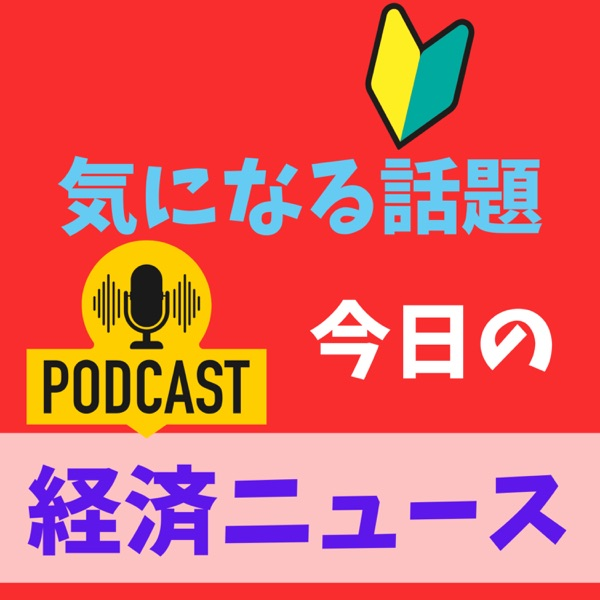

[View on Apple](https://podcasts.apple.com/jp/podcast/%E7%B5%8C%E6%B8%88%E3%83%8B%E3%83%A5%E3%83%BC%E3%82%B9-%E4%BB%8A%E6%97%A5%E3%81%AE%E6%B0%97%E3%81%AB%E3%81%AA%E3%82%8B%E8%A9%B1%E9%A1%8C/id1775130625)

## 超リアルな行動心理学

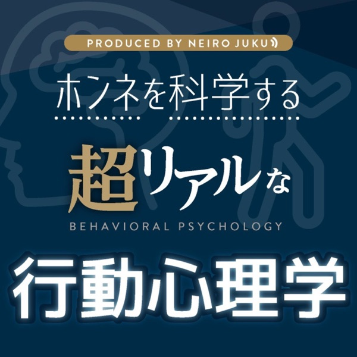

[View on Apple](https://podcasts.apple.com/jp/podcast/%E8%B6%85%E3%83%AA%E3%82%A2%E3%83%AB%E3%81%AA%E8%A1%8C%E5%8B%95%E5%BF%83%E7%90%86%E5%AD%A6/id1586630503)

## アフター6ジャンクション 2

[View on Apple](https://podcasts.apple.com/jp/podcast/%E3%82%A2%E3%83%95%E3%82%BF%E3%83%BC6%E3%82%B8%E3%83%A3%E3%83%B3%E3%82%AF%E3%82%B7%E3%83%A7%E3%83%B3-2/id1505337177)

## きしたかののブタピエロ

[View on Apple](https://podcasts.apple.com/jp/podcast/%E3%81%8D%E3%81%97%E3%81%9F%E3%81%8B%E3%81%AE%E3%81%AE%E3%83%96%E3%82%BF%E3%83%94%E3%82%A8%E3%83%AD/id1679747605)

## 神保町で会いましょう

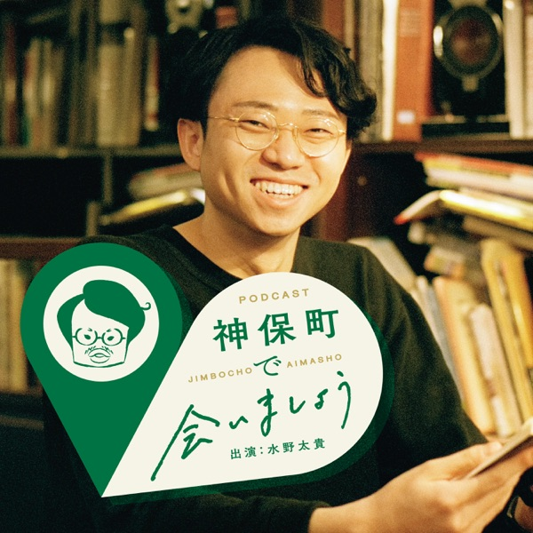

[View on Apple](https://podcasts.apple.com/jp/podcast/%E7%A5%9E%E4%BF%9D%E7%94%BA%E3%81%A7%E4%BC%9A%E3%81%84%E3%81%BE%E3%81%97%E3%82%87%E3%81%86/id1856516759)

## さらば青春の光がTaダ、Baカ、Saワギ

[View on Apple](https://podcasts.apple.com/jp/podcast/%E3%81%95%E3%82%89%E3%81%B0%E9%9D%92%E6%98%A5%E3%81%AE%E5%85%89%E3%81%8Cta%E3%83%80-ba%E3%82%AB-sa%E3%83%AF%E3%82%AE/id1646957712)

## ぽこピーのゆめうつつ

[View on Apple](https://podcasts.apple.com/jp/podcast/%E3%81%BD%E3%81%93%E3%83%94%E3%83%BC%E3%81%AE%E3%82%86%E3%82%81%E3%81%86%E3%81%A4%E3%81%A4/id1818355288)

## あんまり役に立たない日本史

[View on Apple](https://podcasts.apple.com/jp/podcast/%E3%81%82%E3%82%93%E3%81%BE%E3%82%8A%E5%BD%B9%E3%81%AB%E7%AB%8B%E3%81%9F%E3%81%AA%E3%81%84%E6%97%A5%E6%9C%AC%E5%8F%B2/id1652596456)

## ゆる哲学ラジオ

[View on Apple](https://podcasts.apple.com/jp/podcast/%E3%82%86%E3%82%8B%E5%93%B2%E5%AD%A6%E3%83%A9%E3%82%B8%E3%82%AA/id1697687442)

## みうら五郎

[View on Apple](https://podcasts.apple.com/jp/podcast/%E3%81%BF%E3%81%86%E3%82%89%E4%BA%94%E9%83%8E/id1816873042)

## Hapa英会話 Podcast

[View on Apple](https://podcasts.apple.com/jp/podcast/hapa%E8%8B%B1%E4%BC%9A%E8%A9%B1-podcast/id814040014)

## 東京ポッド許可局

[View on Apple](https://podcasts.apple.com/jp/podcast/%E6%9D%B1%E4%BA%AC%E3%83%9D%E3%83%83%E3%83%89%E8%A8%B1%E5%8F%AF%E5%B1%80/id1123725677)

## 岩場の女（ヒコロヒー）

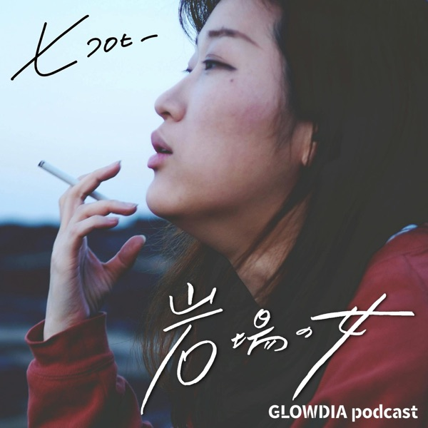

[View on Apple](https://podcasts.apple.com/jp/podcast/%E5%B2%A9%E5%A0%B4%E3%81%AE%E5%A5%B3-%E3%83%92%E3%82%B3%E3%83%AD%E3%83%92%E3%83%BC/id1767285829)

## 岡野陽一の肉の塊

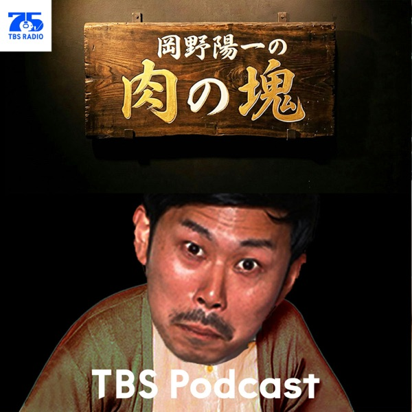

[View on Apple](https://podcasts.apple.com/jp/podcast/%E5%B2%A1%E9%87%8E%E9%99%BD%E4%B8%80%E3%81%AE%E8%82%89%E3%81%AE%E5%A1%8A/id1887460829)

## TED Talks Daily

[View on Apple](https://podcasts.apple.com/jp/podcast/ted-talks-daily/id160904630)

## となりの雑談

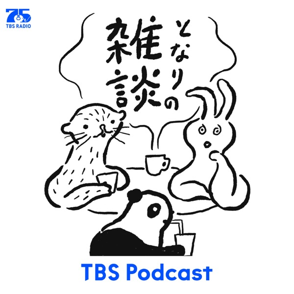

[View on Apple](https://podcasts.apple.com/jp/podcast/%E3%81%A8%E3%81%AA%E3%82%8A%E3%81%AE%E9%9B%91%E8%AB%87/id1669681273)

## アンガールズのジャンピン[-オールナイトニッポンPODCAST-]

![アンガールズのジャンピン\[-オールナイトニッポンPODCAST-\]](../../logos/1588687062-0d738145.png)

[View on Apple](https://podcasts.apple.com/jp/podcast/%E3%82%A2%E3%83%B3%E3%82%AC%E3%83%BC%E3%83%AB%E3%82%BA%E3%81%AE%E3%82%B8%E3%83%A3%E3%83%B3%E3%83%94%E3%83%B3-%E3%82%AA%E3%83%BC%E3%83%AB%E3%83%8A%E3%82%A4%E3%83%88%E3%83%8B%E3%83%83%E3%83%9D%E3%83%B3podcast/id1588687062)

## 長谷川あかりのシャニカマでごめんなさい

[View on Apple](https://podcasts.apple.com/jp/podcast/%E9%95%B7%E8%B0%B7%E5%B7%9D%E3%81%82%E3%81%8B%E3%82%8A%E3%81%AE%E3%82%B7%E3%83%A3%E3%83%8B%E3%82%AB%E3%83%9E%E3%81%A7%E3%81%94%E3%82%81%E3%82%93%E3%81%AA%E3%81%95%E3%81%84/id1834888089)

## ゆる民俗学ラジオ

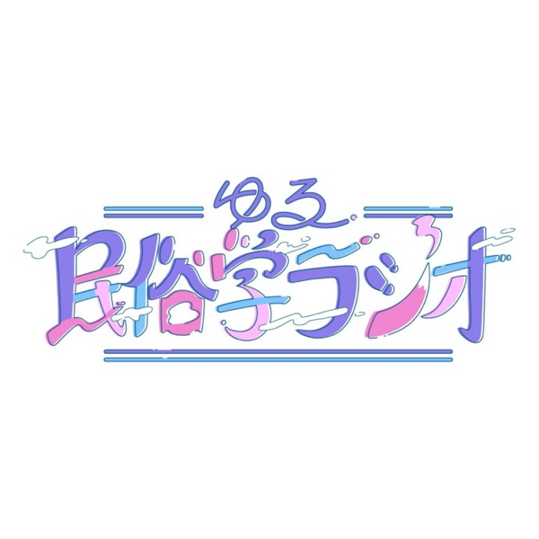

[View on Apple](https://podcasts.apple.com/jp/podcast/%E3%82%86%E3%82%8B%E6%B0%91%E4%BF%97%E5%AD%A6%E3%83%A9%E3%82%B8%E3%82%AA/id1669005447)

## こどもそうだんしつ

[View on Apple](https://podcasts.apple.com/jp/podcast/%E3%81%93%E3%81%A9%E3%82%82%E3%81%9D%E3%81%86%E3%81%A0%E3%82%93%E3%81%97%E3%81%A4/id1592938106)

## 学校では教えてくれない”見えない力”の授業〜「大人の非認知能力」〜

[View on Apple](https://podcasts.apple.com/jp/podcast/%E5%AD%A6%E6%A0%A1%E3%81%A7%E3%81%AF%E6%95%99%E3%81%88%E3%81%A6%E3%81%8F%E3%82%8C%E3%81%AA%E3%81%84-%E8%A6%8B%E3%81%88%E3%81%AA%E3%81%84%E5%8A%9B-%E3%81%AE%E6%8E%88%E6%A5%AD-%E5%A4%A7%E4%BA%BA%E3%81%AE%E9%9D%9E%E8%AA%8D%E7%9F%A5%E8%83%BD%E5%8A%9B/id1854057425)

## 「NONSTYLE漫才セレクション『耳笑い』」

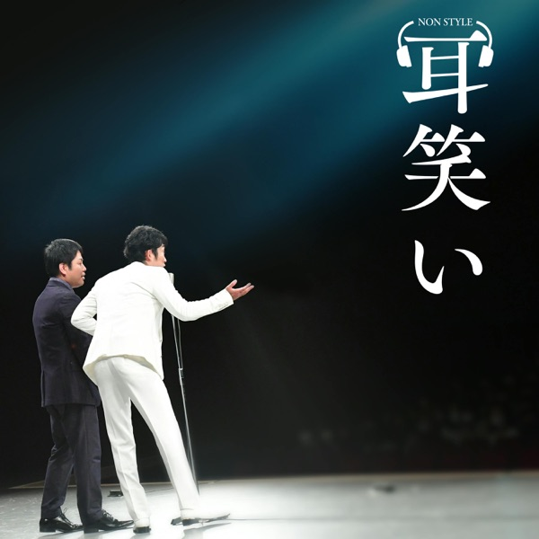

[View on Apple](https://podcasts.apple.com/jp/podcast/nonstyle%E6%BC%AB%E6%89%8D%E3%82%BB%E3%83%AC%E3%82%AF%E3%82%B7%E3%83%A7%E3%83%B3-%E8%80%B3%E7%AC%91%E3%81%84/id1890385866)

## ニュースの現場から

[View on Apple](https://podcasts.apple.com/jp/podcast/%E3%83%8B%E3%83%A5%E3%83%BC%E3%82%B9%E3%81%AE%E7%8F%BE%E5%A0%B4%E3%81%8B%E3%82%89/id1526773927)

## プチ鹿島 赤坂タイムス

[View on Apple](https://podcasts.apple.com/jp/podcast/%E3%83%97%E3%83%81%E9%B9%BF%E5%B3%B6-%E8%B5%A4%E5%9D%82%E3%82%BF%E3%82%A4%E3%83%A0%E3%82%B9/id1887157889)

## ハライチのターン！

[View on Apple](https://podcasts.apple.com/jp/podcast/%E3%83%8F%E3%83%A9%E3%82%A4%E3%83%81%E3%81%AE%E3%82%BF%E3%83%BC%E3%83%B3/id1651797006)

## 木曜JUNK おぎやはぎのメガネびいき

[View on Apple](https://podcasts.apple.com/jp/podcast/%E6%9C%A8%E6%9B%9Cjunk-%E3%81%8A%E3%81%8E%E3%82%84%E3%81%AF%E3%81%8E%E3%81%AE%E3%83%A1%E3%82%AC%E3%83%8D%E3%81%B3%E3%81%84%E3%81%8D/id1651796115)

## ヤング日経（サクッとわかるビジネスニュース）

[View on Apple](https://podcasts.apple.com/jp/podcast/%E3%83%A4%E3%83%B3%E3%82%B0%E6%97%A5%E7%B5%8C-%E3%82%B5%E3%82%AF%E3%83%83%E3%81%A8%E3%82%8F%E3%81%8B%E3%82%8B%E3%83%93%E3%82%B8%E3%83%8D%E3%82%B9%E3%83%8B%E3%83%A5%E3%83%BC%E3%82%B9/id1542073848)

## 解説！1日5分ビジネス英語

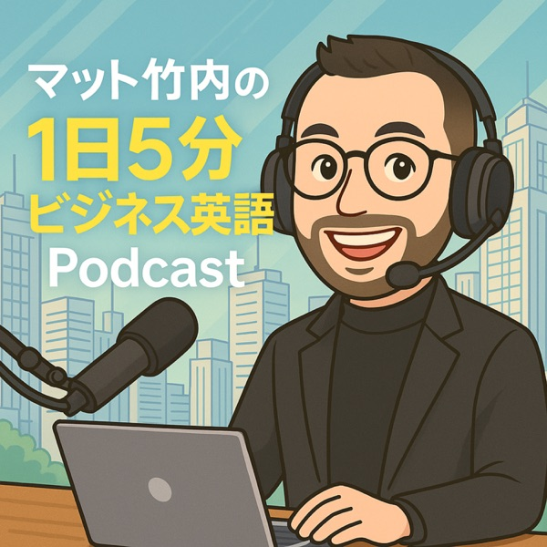

[View on Apple](https://podcasts.apple.com/jp/podcast/%E8%A7%A3%E8%AA%AC-1%E6%97%A55%E5%88%86%E3%83%93%E3%82%B8%E3%83%8D%E3%82%B9%E8%8B%B1%E8%AA%9E/id661961611)

## アオイとキクチ。

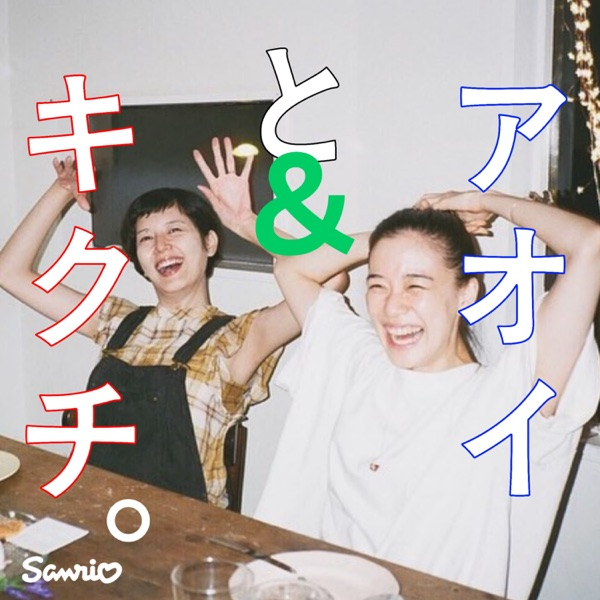

[View on Apple](https://podcasts.apple.com/jp/podcast/%E3%82%A2%E3%82%AA%E3%82%A4%E3%81%A8%E3%82%AD%E3%82%AF%E3%83%81/id1834308296)

## 英語聞き流し | Sakura English

[View on Apple](https://podcasts.apple.com/jp/podcast/%E8%8B%B1%E8%AA%9E%E8%81%9E%E3%81%8D%E6%B5%81%E3%81%97-sakura-english/id1515771190)

## kemioの言わせて言うだけEverything

[View on Apple](https://podcasts.apple.com/jp/podcast/kemio%E3%81%AE%E8%A8%80%E3%82%8F%E3%81%9B%E3%81%A6%E8%A8%80%E3%81%86%E3%81%A0%E3%81%91everything/id1728211655)

## 伊藤洋一のRound Up World Now！

[View on Apple](https://podcasts.apple.com/jp/podcast/%E4%BC%8A%E8%97%A4%E6%B4%8B%E4%B8%80%E3%81%AEround-up-world-now/id120034448)

## カナメストーンのカナメちゃん村

[View on Apple](https://podcasts.apple.com/jp/podcast/%E3%82%AB%E3%83%8A%E3%83%A1%E3%82%B9%E3%83%88%E3%83%BC%E3%83%B3%E3%81%AE%E3%82%AB%E3%83%8A%E3%83%A1%E3%81%A1%E3%82%83%E3%82%93%E6%9D%91/id1514625612)

## バイリンガルニュース (Bilingual News)

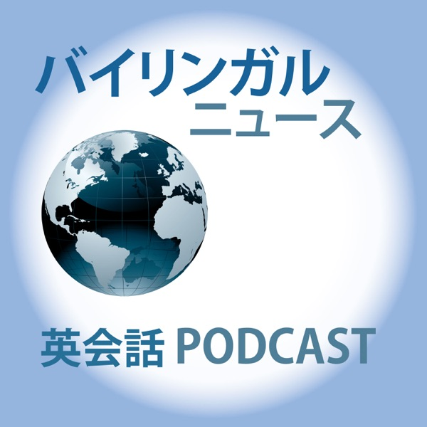

[View on Apple](https://podcasts.apple.com/jp/podcast/%E3%83%90%E3%82%A4%E3%83%AA%E3%83%B3%E3%82%AC%E3%83%AB%E3%83%8B%E3%83%A5%E3%83%BC%E3%82%B9-bilingual-news/id653415937)

## 視点倉庫

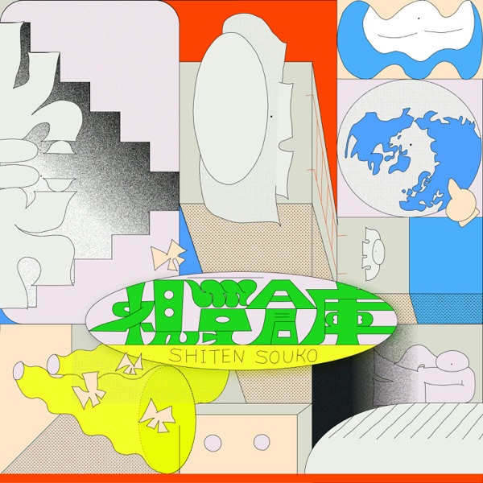

[View on Apple](https://podcasts.apple.com/jp/podcast/%E8%A6%96%E7%82%B9%E5%80%89%E5%BA%AB/id1811782213)

## 歴史を紐解く！聞き流し偉人伝

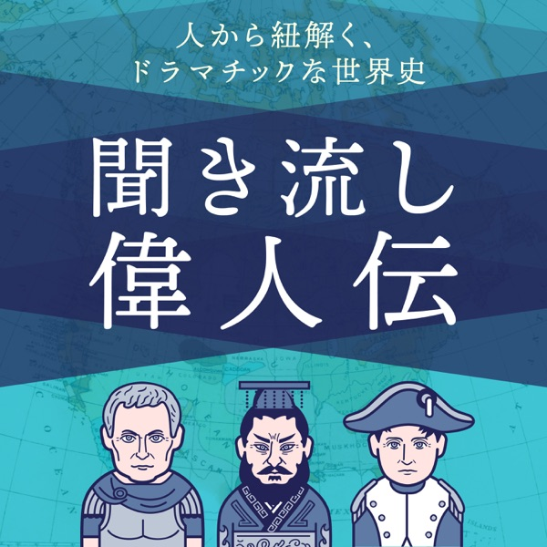

[View on Apple](https://podcasts.apple.com/jp/podcast/%E6%AD%B4%E5%8F%B2%E3%82%92%E7%B4%90%E8%A7%A3%E3%81%8F-%E8%81%9E%E3%81%8D%E6%B5%81%E3%81%97%E5%81%89%E4%BA%BA%E4%BC%9D/id1623824742)

## 神崎恵＆大森葉子の「WONT」

[View on Apple](https://podcasts.apple.com/jp/podcast/%E7%A5%9E%E5%B4%8E%E6%81%B5-%E5%A4%A7%E6%A3%AE%E8%91%89%E5%AD%90%E3%81%AE-wont/id1689327807)

## ロッチナイトZERO

[View on Apple](https://podcasts.apple.com/jp/podcast/%E3%83%AD%E3%83%83%E3%83%81%E3%83%8A%E3%82%A4%E3%83%88zero/id1842780905)

## バービー×イモトアヤコの東京ホルモン娘

[View on Apple](https://podcasts.apple.com/jp/podcast/%E3%83%90%E3%83%BC%E3%83%93%E3%83%BC-%E3%82%A4%E3%83%A2%E3%83%88%E3%82%A2%E3%83%A4%E3%82%B3%E3%81%AE%E6%9D%B1%E4%BA%AC%E3%83%9B%E3%83%AB%E3%83%A2%E3%83%B3%E5%A8%98/id6791393274)

## 味な副音声 ～voice of food～

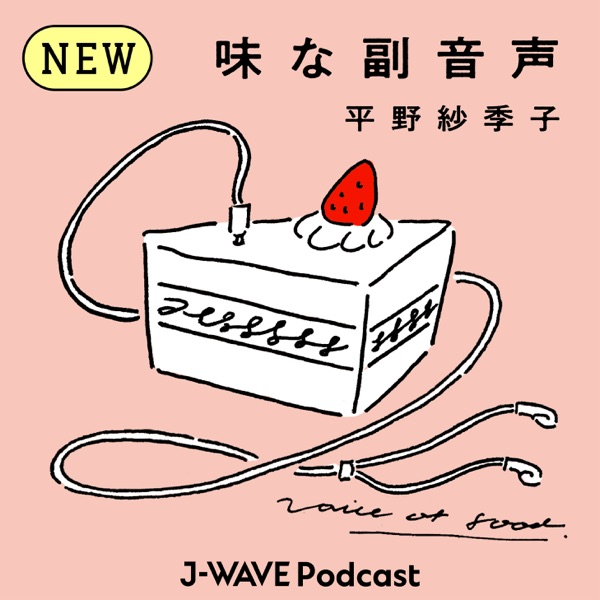

[View on Apple](https://podcasts.apple.com/jp/podcast/%E5%91%B3%E3%81%AA%E5%89%AF%E9%9F%B3%E5%A3%B0-voice-of-food/id1805510525)

## ナイツのちゃきちゃき大放送

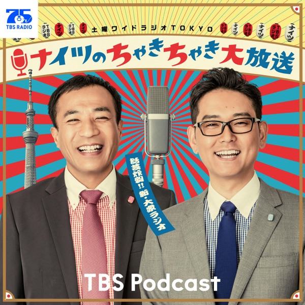

[View on Apple](https://podcasts.apple.com/jp/podcast/%E3%83%8A%E3%82%A4%E3%83%84%E3%81%AE%E3%81%A1%E3%82%83%E3%81%8D%E3%81%A1%E3%82%83%E3%81%8D%E5%A4%A7%E6%94%BE%E9%80%81/id1669139924)

## 【聞き流し英語】すぐに使える簡単英語を身につける！ 🍎

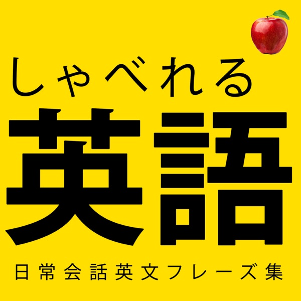

[View on Apple](https://podcasts.apple.com/jp/podcast/%E8%81%9E%E3%81%8D%E6%B5%81%E3%81%97%E8%8B%B1%E8%AA%9E-%E3%81%99%E3%81%90%E3%81%AB%E4%BD%BF%E3%81%88%E3%82%8B%E7%B0%A1%E5%8D%98%E8%8B%B1%E8%AA%9E%E3%82%92%E8%BA%AB%E3%81%AB%E3%81%A4%E3%81%91%E3%82%8B/id1689979475)

## NewsPicks Daily Briefing w/ NP AI Lab

[View on Apple](https://podcasts.apple.com/jp/podcast/newspicks-daily-briefing-w-np-ai-lab/id1567108964)

## 金属バットの社会の窓

[View on Apple](https://podcasts.apple.com/jp/podcast/%E9%87%91%E5%B1%9E%E3%83%90%E3%83%83%E3%83%88%E3%81%AE%E7%A4%BE%E4%BC%9A%E3%81%AE%E7%AA%93/id1702830732)

## 大竹メインディッシュ - 大竹まことゴールデンラジオ！

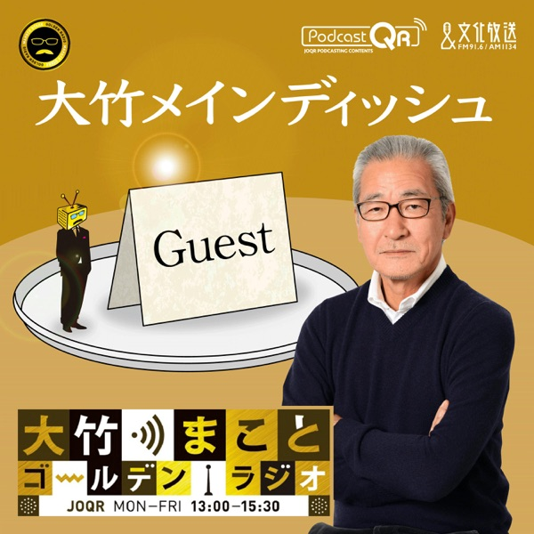

[View on Apple](https://podcasts.apple.com/jp/podcast/%E5%A4%A7%E7%AB%B9%E3%83%A1%E3%82%A4%E3%83%B3%E3%83%87%E3%82%A3%E3%83%83%E3%82%B7%E3%83%A5-%E5%A4%A7%E7%AB%B9%E3%81%BE%E3%81%93%E3%81%A8%E3%82%B4%E3%83%BC%E3%83%AB%E3%83%87%E3%83%B3%E3%83%A9%E3%82%B8%E3%82%AA/id254179829)

## 朝井リョウと加藤千恵のオールナイトニッポン

[View on Apple](https://podcasts.apple.com/jp/podcast/%E6%9C%9D%E4%BA%95%E3%83%AA%E3%83%A7%E3%82%A6%E3%81%A8%E5%8A%A0%E8%97%A4%E5%8D%83%E6%81%B5%E3%81%AE%E3%82%AA%E3%83%BC%E3%83%AB%E3%83%8A%E3%82%A4%E3%83%88%E3%83%8B%E3%83%83%E3%83%9D%E3%83%B3/id1852955890)

## ウエストランド井口と吉住の孤独アジト

[View on Apple](https://podcasts.apple.com/jp/podcast/%E3%82%A6%E3%82%A8%E3%82%B9%E3%83%88%E3%83%A9%E3%83%B3%E3%83%89%E4%BA%95%E5%8F%A3%E3%81%A8%E5%90%89%E4%BD%8F%E3%81%AE%E5%AD%A4%E7%8B%AC%E3%82%A2%E3%82%B8%E3%83%88/id1849295408)

## 日本一たのしい哲学ラジオ

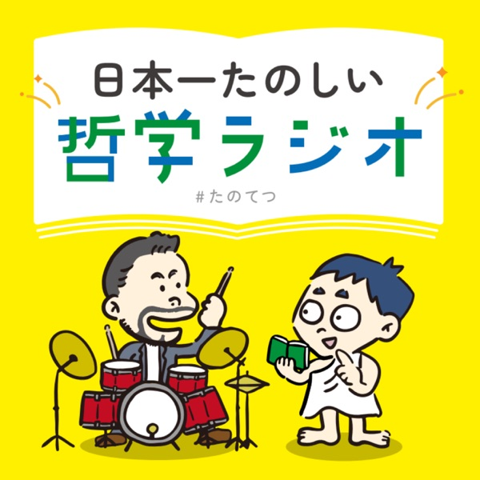

[View on Apple](https://podcasts.apple.com/jp/podcast/%E6%97%A5%E6%9C%AC%E4%B8%80%E3%81%9F%E3%81%AE%E3%81%97%E3%81%84%E5%93%B2%E5%AD%A6%E3%83%A9%E3%82%B8%E3%82%AA/id1694314989)

## 矢作とアイクの英会話～音声版～

[View on Apple](https://podcasts.apple.com/jp/podcast/%E7%9F%A2%E4%BD%9C%E3%81%A8%E3%82%A2%E3%82%A4%E3%82%AF%E3%81%AE%E8%8B%B1%E4%BC%9A%E8%A9%B1-%E9%9F%B3%E5%A3%B0%E7%89%88/id1766277820)

## ながらAIラジオ

[View on Apple](https://podcasts.apple.com/jp/podcast/%E3%81%AA%E3%81%8C%E3%82%89ai%E3%83%A9%E3%82%B8%E3%82%AA/id1795710724)

## 私より先に丁寧に暮らすな

[View on Apple](https://podcasts.apple.com/jp/podcast/%E7%A7%81%E3%82%88%E3%82%8A%E5%85%88%E3%81%AB%E4%B8%81%E5%AF%A7%E3%81%AB%E6%9A%AE%E3%82%89%E3%81%99%E3%81%AA/id1726626112)

## 大竹紳士交遊録 - 大竹まことゴールデンラジオ！

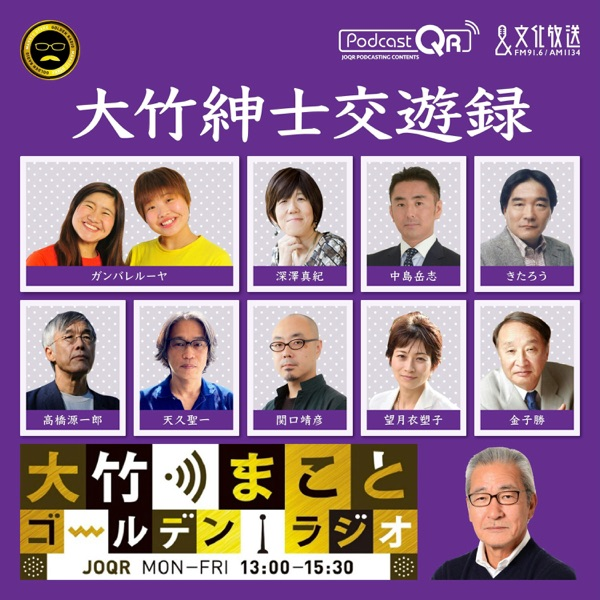

[View on Apple](https://podcasts.apple.com/jp/podcast/%E5%A4%A7%E7%AB%B9%E7%B4%B3%E5%A3%AB%E4%BA%A4%E9%81%8A%E9%8C%B2-%E5%A4%A7%E7%AB%B9%E3%81%BE%E3%81%93%E3%81%A8%E3%82%B4%E3%83%BC%E3%83%AB%E3%83%87%E3%83%B3%E3%83%A9%E3%82%B8%E3%82%AA/id254180252)

## スタンド・バイ・見取り図

[View on Apple](https://podcasts.apple.com/jp/podcast/%E3%82%B9%E3%82%BF%E3%83%B3%E3%83%89-%E3%83%90%E3%82%A4-%E8%A6%8B%E5%8F%96%E3%82%8A%E5%9B%B3/id1649897961)

## --トム・ブラウンのニッポン放送圧縮計画［オールナイトニッポンPODCAST］----

[View on Apple](https://podcasts.apple.com/jp/podcast/%E3%83%88%E3%83%A0-%E3%83%96%E3%83%A9%E3%82%A6%E3%83%B3%E3%81%AE%E3%83%8B%E3%83%83%E3%83%9D%E3%83%B3%E6%94%BE%E9%80%81%E5%9C%A7%E7%B8%AE%E8%A8%88%E7%94%BB-%E3%82%AA%E3%83%BC%E3%83%AB%E3%83%8A%E3%82%A4%E3%83%88%E3%83%8B%E3%83%83%E3%83%9D%E3%83%B3podcast/id1588686875)

## 飯沼愛の沼ラジオ

[View on Apple](https://podcasts.apple.com/jp/podcast/%E9%A3%AF%E6%B2%BC%E6%84%9B%E3%81%AE%E6%B2%BC%E3%83%A9%E3%82%B8%E3%82%AA/id1896794291)

## pecoとJESSICA

[View on Apple](https://podcasts.apple.com/jp/podcast/peco%E3%81%A8jessica/id1772183232)
