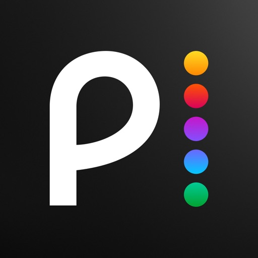
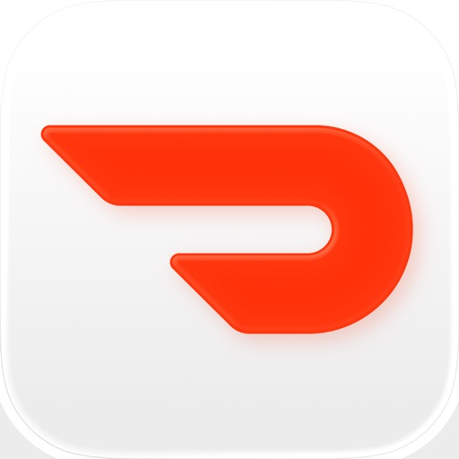
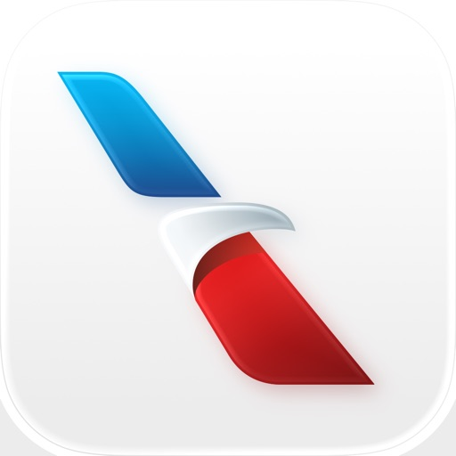
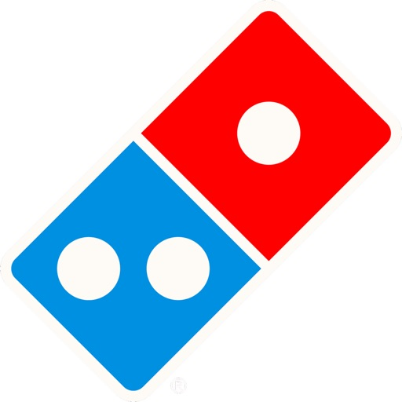
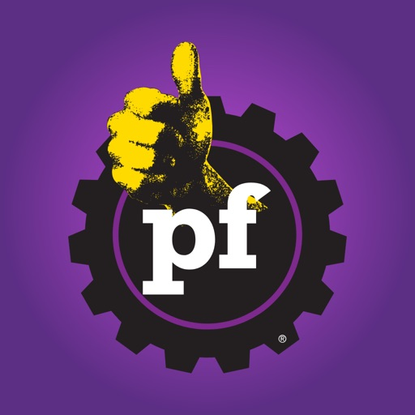
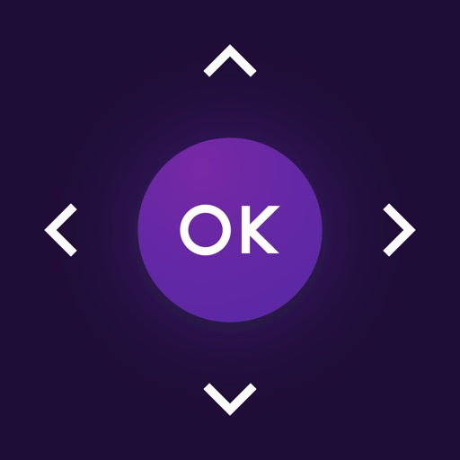
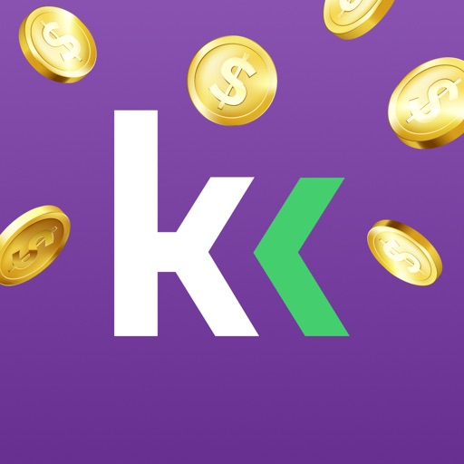

- [FOX One: Live News, Sports, TV](#fox-one-live-news-sports-tv)
- [Netflix Game Controller](#netflix-game-controller)
- [Kalshi: Trade the World Cup](#kalshi-trade-the-world-cup)
- [ChatGPT](#chatgpt)
- [Peacock TV: Stream TV & Movies](#peacock-tv-stream-tv-movies)
- [Freecash - Geld verdienen](#freecash-geld-verdienen)
- [Depop - Buy & Sell Clothes](#depop-buy-sell-clothes)
- [TikTok Pro - Events](#tiktok-pro-events)
- [Threads](#threads)
- [Twitch: Live Streaming](#twitch-live-streaming)
- [Vinted: Secondhand-Marktplatz](#vinted-secondhand-marktplatz)
- [Google Gemini](#google-gemini)
- [Google](#google)
- [Claude by Anthropic](#claude-by-anthropic)
- [Whatnot: Shop, Sell, Connect](#whatnot-shop-sell-connect)
- [Temu : Achats et Mode en Ligne](#temu-achats-et-mode-en-ligne)
- [StoryReel: Exclusive Drama](#storyreel-exclusive-drama)
- [CapCut: Foto- und Video-Editor](#capcut-foto-und-video-editor)
- [VibeShort: AI Comic Dramas](#vibeshort-ai-comic-dramas)
- [WhatsApp Messenger](#whatsapp-messenger)
- [DramaWave - Drama & Reel](#dramawave-drama-reel)
- [Polymarket](#polymarket)
- [DoorDash: Food, Grocery, More](#doordash-food-grocery-more)
- [SHEIN-Shopping Online](#shein-shopping-online)
- [Facebook](#facebook)
- [X (anciennement Twitter)](#x-anciennement-twitter)
- [Google Maps](#google-maps)
- [Walmart: Shopping & Savings](#walmart-shopping-savings)
- [Life360: Family Safety & GPS](#life360-family-safety-gps)
- [Uber: Ride-Hailing & Taxis](#uber-ride-hailing-taxis)
- [NetShort -Beliebte Dramen & TV](#netshort-beliebte-dramen-tv)
- [TikTok - Videos, Shop und LIVE](#tiktok-videos-shop-und-live)
- [Instagram](#instagram)
- [Shop: Deine Lieblingsmarken](#shop-deine-lieblingsmarken)
- [DramaBox - Film et Drame Court](#dramabox-film-et-drame-court)
- [Gmail – E-Mail von Google](#gmail-e-mail-von-google)
- [Amazon Shopping](#amazon-shopping)
- [Airbnb](#airbnb)
- [The Roku App (Official)](#the-roku-app-official)
- [Discord - Chat, Jeux, Détente](#discord-chat-jeux-de-tente)
- [Telegram Messenger](#telegram-messenger)
- [Spotify Musik und Podcasts](#spotify-musik-und-podcasts)
- [Pinterest](#pinterest)
- [PayPal: Geld senden, verwalten](#paypal-geld-senden-verwalten)
- [VIZIO | WatchFree+](#vizio-watchfree)
- [AliExpress Shopping App](#aliexpress-shopping-app)
- [Amazon Prime Video](#amazon-prime-video)
- [Tubi: Movies & Live TV](#tubi-movies-live-tv)
- [Meta AI](#meta-ai)
- [Netflix](#netflix)
- [YouTube](#youtube)
- [DealSeek: Coupons & Discounts](#dealseek-coupons-discounts)
- [YouTube TV](#youtube-tv)
- [Cash App](#cash-app)
- [PineDrama - Short Dramas](#pinedrama-short-dramas)
- [Google Chrome](#google-chrome)
- [Ticketmaster－Buy, Sell Tickets](#ticketmaster-buy-sell-tickets)
- [Rips by Triumph](#rips-by-triumph)
- [Indeed Jobs](#indeed-jobs)
- [多邻国Duolingo英语日语法语](#多邻国duolingo英语日语法语)
- [Venmo](#venmo)
- [Paramount+](#paramount)
- [Snapchat : chats entre ami·e·s](#snapchat-chats-entre-ami-e-s)
- [Fetch: America’s Rewards App](#fetch-america-s-rewards-app)
- [HBO Max: Stream Movies & TV](#hbo-max-stream-movies-tv)
- [Capital One Mobile](#capital-one-mobile)
- [Grok - Assistant IA](#grok-assistant-ia)
- [McDonald's](#mcdonald-s)
- [Lyft](#lyft)
- [Reddit](#reddit)
- [Disney+](#disney)
- [eBay: kaufen & verkaufen](#ebay-kaufen-verkaufen)
- [Capital One Shopping: Save Now](#capital-one-shopping-save-now)
- [Telemundo: Series y TV en vivo](#telemundo-series-y-tv-en-vivo)
- [Canva: KI-Foto- & Video-Editor](#canva-ki-foto-video-editor)
- [Costco](#costco)
- [ReelShort - Stream Drama & TV](#reelshort-stream-drama-tv)
- [Google Photos](#google-photos)
- [T-Life](#t-life)
- [DraftKings: Sports & Casino](#draftkings-sports-casino)
- [Uber Eats: Essen, Lieferdienst](#uber-eats-essen-lieferdienst)
- [Target: Shop. Style. Save.](#target-shop-style-save)
- [American Airlines](#american-airlines)
- [Domino's Pizza USA](#domino-s-pizza-usa)
- [Speak & Learn English: Learna](#speak-learn-english-learna)
- [Planet Fitness](#planet-fitness)
- [Commerce B2B avec Alibaba](#commerce-b2b-avec-alibaba)
- [Booking.com: Hotel Angebote](#booking-com-hotel-angebote)
- [Edits: Videobearbeitung](#edits-videobearbeitung)
- [Strava: Laufen & Radfahren](#strava-laufen-radfahren)
- [Fly Delta](#fly-delta)
- [Fun Drama](#fun-drama)
- [TV Remote - Universal Control](#tv-remote-universal-control)
- [KashKick: Get paid to have fun](#kashkick-get-paid-to-have-fun)
- [FOX Sports: Watch Live Games](#fox-sports-watch-live-games)
- [KICK - Live Streaming](#kick-live-streaming)
- [Sam's Club Shopping & Delivery](#sam-s-club-shopping-delivery)
- [United Airlines](#united-airlines)
- [VPN - Super Unlimited Proxy ™](#vpn-super-unlimited-proxy-tm)
- [Waze Navigation und Verkehr](#waze-navigation-und-verkehr)

## FOX One: Live News, Sports, TV

FOX One is the streaming app for everything FOX. Stream the year’s biggest moments in sports, from the high-speed thrills of INDYCAR to the game-changing plays of MLB. Stay informed with trusted voices on FOX News. Watch your favorite FOX shows anytime, anywhere. If it’s on FOX, it’s here. Download FOX One and dive in.
LIVE, LOUD AND UNFILTERED. FOX One has a robust collection of live sports, news and entertainment for your viewing pleasure. From iconic series to exclusive live events — you won’t miss a beat.

FOX NEWS LIVE on FOX One. Stream FOX News 24/7 for around-the-clock access to live coverage, breaking news and your favorite FOX News shows, with alerts to keep you informed. Skip to the stories you want to see with the Topics feature while you stream.

YOUR FOX, YOUR WAY. Skip the search and cut down on aimless scrolling with personalized live and on-demand content right on your home screen.

RECORD YOUR FAVORITES. Watch live or save for later. Record your favorite leagues, teams and shows with no storage limits.

CATCH UP WITH HIGHLIGHTS. Joined the game late? No problem — watch highlights you missed, then join live. Bypass spoilers and hide live scores until you’re caught up.*

SWIPE-WORTHY SHORTS. Discover top trending sports stories, informative news and TV clips filled with jaw-dropping hot takes personalized just for you in bite-sized pieces of content.

ASKFOX AI. Looking for personalized picks for your next binge? Want to stream multiple games at once? AskFOX is your go-to AI guide for instant answers to your questions. Ask us anything!

*Available for select programming.

FANDOM KNOWS NO BOUNDS

FOX Sports
Your front row seat to the biggest sporting events in the world. Relive the heart-stopping action of the FIFA World Cup 2026™ with highlights and full match replays. Feed your need for speed with the NTT INDYCAR Series. Stream the marquee matchups of NCAA College Football and the NFL. Catch MLB on FOX all season long, all the way through the 2026 World Series. Watch live games and get in-depth analysis on the sports you love.

MLS on FOX
INDYCAR on FOX
MLB on FOX
Baseball Night in America
FOX College Football
Big Noon Kickoff
NFL on FOX
FOX NFL Sunday
America’s Game of the Week

FOX News
Stay in the know with 24/7 access to FOX News. Stream live coverage of the latest headlines with breaking news, expert analysis and fearless commentary from voices you trust, plus full episodes of your favorite FOX News shows anytime, anywhere.

FOX & Friends
The Five
Hannity
Gutfeld!
Outnumbered
Jesse Watters Primetime
Special Report with Bret Baier
The Ingraham Angle

Your Local FOX Station
Stay informed on top stories and breaking news that hit close to home. Stream your local FOX affiliate for live news broadcasts, local talk shows, highlights and more.

FOX Nation
Stream original shows, documentaries, movies and specials that celebrate America. From epic stories told by legendary stars to new series hosted by your favorite FOX personalities, binge hours of entertainment you won’t find anywhere else.

Real American Freestyle
UFC Fight House
COPS
The Patriot War
Martin Scorsese Presents: The Saints
David: King of Israel
The White House

FOX Entertainment
Your favorite FOX shows are on FOX One. From award-winning dramas to high-stakes reality TV to iconic comedies, there’s something for everyone. You can also stream movies on-demand. 

Best Medicine
Doc
Kitchen Nightmares
Memory of a Killer
The Masked Singer 
American Dad!
Fear Factor: House of Fear

B1G+
Your go-to for 2,700+ Big Ten Conference sporting events every year. Stream live games, next-day replays and original content covering college basketball, baseball, volleyball and more.

Terms of Use: https://www.fox.com/terms-of-use
Privacy Policy: https://www.fox.com/privacy-policy
For more information, visit us online at foxone.com

[View on Apple](https://apps.apple.com/us/app/fox-one-live-news-sports-tv/id6746049430)

## Netflix Game Controller

Spiele Spiele auf deinem Fernseher oder Computerbrowser mit dem Netflix-Gamecontroller.

Mit dieser App kannst du Spiele auf Netflix spielen, indem du dein Handy oder Mobilgerät als Gamecontroller verwendest. Die Netflix-Gamecontroller-App ist für alle verfügbar.

Netflix Games befindet sich in der Beta-Phase und je nach Gerätetyp wird dein Fernseher oder Browser möglicherweise derzeit nicht unterstützt.

Lass die Spiele beginnen!

[View on Apple](https://apps.apple.com/us/app/netflix-game-controller/id6447582581)

## Kalshi: Trade the World Cup

Kalshi is the largest legal and federally regulated prediction market app in the U.S., where you can make money by predicting real-world events, including soccer, baseball, golf, and other sports. Trade real outcomes in a federally regulated prediction market. Perfect for sports trading, event trading, forecasting, futures-style markets, and real-world predictions.

It’s like trading stocks — but instead, you trade on events you understand. Predict whether an event will happen or not, and earn money if you’re right.
Join 10M+ users trading thousands of prediction markets across finance, weather, culture, sports, and more. Make money 24/7 on fast, simple event markets.

FINANCIAL MARKETS
Daily S&P 500, Nasdaq 100, WTI oil

ECONOMIC MARKETS
Fed interest rates, Inflation (CPI), GDP, Recession, Gas prices, Mortgage rates

CLIMATE MARKETS
Hurricane strength, Daily city temperatures, Tornado numbers

CULTURE MARKETS
Billboard 100, Oscars, Grammys, Emmys, #1 Hits

HOW KALSHI WORKS
Kalshi is the largest federally regulated prediction exchange where you buy and sell contracts based on event outcomes. Example: NASA announces a manned mission to the moon. Contract prices reflect trader probability estimates. If you think the event will happen, you buy contracts. Contracts cost between 1¢ and 99¢ and can be sold anytime. At market close, each correct contract is worth $1.

TRADE SPORTS
Love day trading? Love sports?
Kalshi lets you trade on real sports outcomes across football, baseball, basketball, golf, MMA, tennis, and more.
Will Baltimore beat Philly?
Will the total score go over 45?
Trade pro and college sports with highly liquid prediction markets. Experience live sports trading with unmatched market activity.

HOW IS KALSHI REGULATED?
Kalshi is federally regulated as a Designated Contract Market (DCM) by the Commodity Futures Trading Commission (CFTC). Kalshi’s affiliate, Kalshi Klear LLC, is a CFTC-regulated clearinghouse that holds member funds and clears trades.

TRADE YOUR CONVICTIONS
Find prediction markets that match your views. If you think a recession is coming, trade recession and S&P markets. Put your money behind your forecasts.

REDUCE FINANCIAL RISK
Hedge against events that could impact your finances. If you hold stocks, trade Fed and inflation markets to help protect your portfolio.

KALSHI VS. STOCKS
Event contracts are direct. You trade the outcome of an event, not the future stock price of a company. Profits are not tied to company performance. No pattern day trading restrictions. Trade as much or as little as you want, anytime. In stock trading, you can be right and still lose money due to market sentiment or news. Prediction markets remove that layer.

KALSHI VS. OPTIONS
Event contracts are simpler. Options pricing depends on multiple complex factors. Kalshi contracts reflect straightforward event probabilities. No time decay. If the event odds stay the same, contract value stays stable.

HOW MUCH MONEY DO I NEED TO START?
Open and maintain a Kalshi account for free. Prediction markets require less capital than traditional trading, making it easier to diversify without risking large amounts.

ADVANCED TOOLS & API ACCESS
Build trading algorithms in Python with starter code and a dedicated package. Start in minutes with documentation. Backtest strategies using historical data. Access open-source tools from the Kalshi developer community.

WHO KALSHI IS FOR
Sports fans who want to trade real game outcomes
Traders looking for federally regulated prediction markets
Investors hedging financial risk with event contracts
Forecasters who want to profit from real-world predictions
Developers building automated trading strategies

[View on Apple](https://apps.apple.com/us/app/kalshi-trade-the-world-cup/id1632713844)

## ChatGPT

Neu: ChatGPT für iOS – Lerne die neuesten Verbesserungen in OpenAI kennen.

Diese offizielle App ist kostenlos. Sie synchronisiert deinen Verlauf über mehrere Geräte hinweg und stellt dir die neuesten Funktionen von OpenAI zur Verfügung, einschließlich des neuen Bildgenerators.

ChatGPT bietet dir folgende Funktionen:

· Bildgenerierung: Lass ChatGPT anhand einer Beschreibung beeindruckende Bilder erstellen oder fordere es mit ein paar einfachen Worten auf, vorhandene Bilder nach deinen Wünschen zu verwandeln. 
· Fortgeschrittener Audiomodus: Tippe auf das Schallwellen-Icon, um auch unterwegs in Echtzeit Gespräche zu führen. Schlichte einen Streit am Esstisch oder übe eine neue Sprache. 
· Foto-Upload: Mache ein Foto oder lade ein Bild hoch, um ein handschriftliches Rezept zu transkribieren oder Informationen über eine Sehenswürdigkeit zu erhalten. 
· Kreative Inspiration: Lass dir Vorschläge für individuelle Geburtstagsgeschenke machen oder erstelle eine personalisierte Grußkarte.
· Maßgeschneiderte Ratschläge: Besprich schwierige Situationen, frage nach einer detaillierten Reiseroute oder lass dir beim Verfassen der perfekten Antwort helfen. 
· Personalisiertes Lernen: Erkläre einem von Dinosauriern begeisterten Kind, was Elektrizität ist, oder frische im Handumdrehen dein Wissen über ein historisches Ereignis auf.
· Professioneller Input: Sammle Ideen für Marketingtexte oder entwirf einen Geschäftsplan.
· Sofortige Antworten: Lass dir Rezeptvorschläge machen, wenn du nur ein paar Zutaten im Kühlschrank hast.

Schließe dich Millionen von Benutzern an und probiere die App aus, die die Welt begeistert. Lade ChatGPT noch heute herunter.

Nutzungsbedingungen und Datenschutzrichtlinie:
https://openai.com/policies/terms-of-use
https://openai.com/policies/privacy-policy

[View on Apple](https://apps.apple.com/us/app/chatgpt/id6448311069)

## Peacock TV: Stream TV & Movies

Download Peacock, NBCUniversal’s streaming service. Peacock has all your favorite culturedefining entertainment, all in one place.
With Peacock, stream exclusive Originals, fan-favorite movie franchises, thousands of TV shows,
and current programming from Bravo and NBC.
Stay up to date with the news and stream all your favorite live sports and events including
Sunday Night Baseball, WNBA games, golf, La Copa Mundial de la FIFA™ 2026, and so much
more.
With PEACOCK PREMIUM, stream the full library of movies, episodes, and seasons — plus live
sports and events.
• Stream new movies from theaters, including films from Universal Pictures,
Illumination, DreamWorks Animation, and Focus Features.
• Exclusive Peacock Originals, including Love Island USA, The Five Star Weekend,
Married at First Sight, The Traitors, and more.
• Live sports, including MLB, golf, WNBA games, Tour de France 2026, and more.
• The streaming home for your Bravo faves, including Below Deck, The Real
Housewives, and Summer House.
• Current-season NBC hits like America’s Got Talent, Law & Order, One Chicago,
and American Ninja Warrior.
• Peacock Channels – playing your favorite entertainment and news. Scroll less
and watch more with SNL Vault, Dateline, NBC Sports on Peacock, NBC News
NOW, TODAY All Day, and True Crime.
• Hit Spanish-language TV shows and news from Telemundo.
• Full library of Kids and Family entertainment.
With PEACOCK PREMIUM PLUS, get everything included in Peacock Premium as well as:
• No ads (limited exclusions)*
• Stream your local NBC channel, 24/7.
• Some titles available to watch offline.
*Certain pages are sponsored, and some programming will still contain ads (channels, live
sports and events, and a few shows and movies).
With PEACOCK SELECT, you get:
• Next-day TV from NBC and Bravo.
• A selection of full seasons (excludes Peacock Originals) and 24/7 streaming
channels of TV shows.
Content availability may vary over time.
Please note: Use of the Peacock app is limited to the United States and its territories. Video is
accessible via 3G, 4G, 5G, LTE and Wi-Fi networks. Data charges may apply.
If applicable, subscription charges begin after any promotional period of Peacock
Premium/Peacock Premium Plus concludes. You will be charged on a recurring basis as
described above, minus applied offers plus applicable taxes. Your subscription will auto-renew
until you cancel. Cancel at any time by visiting your account in the Peacock App. By subscribing,
you agree to the preceding subscription terms and our Terms of Use and Privacy Policy below.
Learn more at www.peacocktv.com
Terms of Use: www.peacocktv.com/terms
Privacy Policy: www.peacocktv.com/privacy
Customer Help: www.peacocktv.com/help
Your Privacy Choices: https://www.nbcuniversal.com/privacy/notrtoo
CA Notice: https://www.peacocktv.com/ca-notice
This app features Nielsen proprietary measurement software, which will allow you to contribute to
market research, like Nielsen’s TV Ratings. To learn more about our digital measurement products and your choices in regard to them, please visit http://www.nielsen.com/digitalprivacy for more
information.

[View on Apple](https://apps.apple.com/us/app/peacock-tv-stream-tv-movies/id1508186374)

## Freecash - Geld verdienen

Willkommen bei Freecash - Earn Rewards, der spaßigen Art, in deiner Freizeit ein bisschen Geld online zu verdienen! Spiel Spiele, die dir wirklich Spaß machen, beantworte Umfragen, shoppe online und verdien dabei echtes Geld — direkt auf deinem Handy.

Jede Aufgabe, die du erledigst, bringt echtes Geld auf dein Guthaben, und du kannst es dir jederzeit auszahlen lassen.

So funktioniert Freecash - Earn Rewards:

- Kostenlos anmelden — dein Konto ist in Sekunden erstellt.
- Spielen & verdienen — entdecke Spiele, die Spaß machen, und lass dein Guthaben beim Spielen wachsen.
- Auszahlen — verwandle dein Guthaben in PayPal-Geld, Amazon-Gutscheine und mehr.

Egal ob du fünf Minuten Zeit hast oder einen ganzen entspannten Nachmittag — Freecash - Earn Rewards passt perfekt in deinen Tag.

Lass dir dein Guthaben als Belohnungen auszahlen, zum Beispiel:

- PayPal-Geld
- Amazon-Gutscheine
...und vieles mehr!

Es gibt immer ein neues Spiel zu spielen und mehr Geld zu verdienen — so hört der Spaß nie auf.

Willst du noch schneller verdienen? Lade deine Freunde über unser Empfehlungsprogramm ein und verdien mit!

Also worauf wartest du? Lade Freecash - Earn Rewards noch heute herunter und leg los. Mit einer einfachen App und flexiblen Auszahlungen war Geldverdienen mit Spaß noch nie so leicht.

Freecash - Earn Rewards — spiel lustige Spiele, verdien echtes Geld, ganz bequem von zu Hause aus.

[View on Apple](https://apps.apple.com/us/app/freecash-get-paid-real-money/id1673567402)

## Depop - Buy & Sell Clothes

Depop – The Best Secondhand Marketplace to Buy and Sell Clothes

Depop is the best online marketplace to buy and sell secondhand clothes. The top resale fashion app for cheap fashion finds — discover amazing vintage items, wonderful thrift pieces, name-brand streetwear, and exciting styles from a passionate global community of creators. Our secondhand clothes marketplace makes buying and selling clothing effortlessly joyful — the safe, trusted app for fashion lovers who want incredible deals.

SELL CLOTHES WITHOUT FEES*
Wondering where to sell clothes online? Selling clothes on our marketplace is wonderfully quick and easy. Simply add photos, write a short description, and start thriving in your own online marketplace. Manage offers, connect happily with buyers, and ship everything from one brilliant place — the best marketplace to sell clothes fast.

LIST WITHIN SECONDS
Simply snap a photo and our amazing AI will scan it, write the description and complete the listing details for you. Listing thrift finds and clothing to sell has never felt this effortless!

DISCOVER CLOTHING THAT MATCHES YOUR STYLE
The best thrift shopping app to buy vintage clothes online and uncover incredible cheap fashion finds. Browse beautiful thrift pieces, name-brand secondhand clothes, and streetwear you'll absolutely love to buy. Our marketplace excites you with amazing deals, free shipping offers, favorite sellers, and the most thrilling clothing trends.

THE SAFE APP TO BUY AND SELL CLOTHES
Buy and sell secondhand clothing with total peace of mind. Depop's marketplace delivers secure checkout, reliable order tracking, and friendly direct messaging — a wonderfully safe place to buy clothing and find great thrift deals you'll truly enjoy.

STAY UPDATED
Enjoy instant, exciting notifications for brilliant new clothing listings, trending clothes, and amazing thrift deals. Whether you sell or buy, we keep you happily informed every step of the way in real-time.

MANAGE YOUR CLOTHING BUSINESS
Effortlessly oversee payments, shipments, and returns in one beautifully organised place. Running your clothes and thrift business on our marketplace has never felt this rewarding.

CREATE YOUR WISHLIST
Lovingly save your favorite secondhand clothing, thrift items, and gorgeous outfits to buy later. Perfectly flexible, perfectly you.

JOIN OUR CLOTHING COMMUNITY
We're so much more than an online shop — we're a vibrant, thriving marketplace joyfully connecting millions who love to buy and sell secondhand clothes and thrift items, passionately built around creativity, sustainability, and self-expression.

DISCOVER WHY DEPOP IS YOUR PERFECT MARKETPLACE:
We are the best, most exciting destination to buy and sell clothes — including streetwear, vintage finds, and thrift items — with incredible categories including:

Tops & Tees
Jeans & Trousers
Trainers & Shoes
Dresses
Sweatshirts & Hoodies
Jewellery & Accessories
Kidswear
Men's & Women's Clothing
Vintage Clothing & Streetwear & more

Whether you sell from your wardrobe or buy rare name-brand thrift treasures at unbeatable deals with free shipping, you'll love how our marketplace makes buying and selling truly an experience. 

DOWNLOAD DEPOP TODAY
Join us — the best resale fashion marketplace and thrift shopping app reshaping how people buy and sell secondhand clothes online. Discover incredible clothing finds, enjoy free shipping, and start your preloved fashion journey today!

Payment processing fees may apply.

Contact Us:
Website: Depop.com
TikTok: tiktok.com/@Depop
Instagram: instagram.com/Depop
YouTube: youtube.com/@depop

[View on Apple](https://apps.apple.com/us/app/depop-buy-sell-clothes/id518684914)

## TikTok Pro - Events

TikTok Pro - Events is a global discovery platform for videos where you can discover cool, funny, and educational short videos, as well as share important moments with your friends.

Engage more with videos you love
With TikTok Pro - Events, you can continue discovering and exploring the videos you already know and love on TikTok while joining daily challenges built around major events and cultural moments.

Find your community
In TikTok Pro, you'll find your community and unleash your inner fan, and have the opportunity to invite your friends to enjoy what happening as well. Create new content, share it, and have fun.

Immersive Experience
The purest and fastest viewing experience. Focus on what you want to see.

Terms of Service:
https://www.tiktok.com/legal/page/us/terms-of-service/en

Privacy Policy:
https://www.tiktok.com/legal/page/us/privacy-policy/en

Feedback?
Contact us at Report a problem | TikTok or tweet us @tiktok_us

[View on Apple](https://apps.apple.com/us/app/tiktok-pro-events/id6741796873)

## Threads

Entdecke neue Perspektiven und unterhalte dich mit anderen auf Threads.

Finde heraus, worüber die Menschen gerade sprechen, von ungewöhnlichen Interessen bis zu großen Momenten. Mit Communitys findest du auf Threads Menschen mit ähnlichen Interessen. Antworte, höre zu, teile selbst etwas oder folge ihnen.

Das kannst du auf Threads tun:

■ Starte einen Thread, teile deine Sichtweise
Beschäftigt dich etwas? Poste es auf Threads. Teile einen Gedanken, stelle eine Frage oder beginne eine Unterhaltung. Es gibt verschiedene Möglichkeiten, um Dinge mit Text, Bildern, Umfragen, selbstlöschenden Beiträgen und mehr ins Rollen zu bringen.

■ Springe direkt zu den Antworten
Beteilige dich direkt an der Diskussion, reagiere auf neue Ideen oder beobachte, in welche Richtung sich das Gespräch entwickelt. Jeder Thread ist eine Einladung, dich zu beteiligen.

■ Behalte Trends im Blick
Von Live-Ergebnissen bis zu entscheidenden Momenten: Mit Threads bist du immer auf dem Laufenden und kannst dich direkt an der Diskussion beteiligen, wenn du etwas zu sagen hast.

■ Du steuerst, welche Inhalte du siehst
Steuere, wer dir antworten, dich erwähnen oder deine Beiträge sehen kann. Verwende unerwünschte Begriffe, um Beiträge und Antworten herauszufiltern, die Begriffe oder Formulierungen enthalten, die du nicht sehen möchtest. So gestaltest du dein Nutzungserlebnis nach deinen Vorstellungen.

■ Vertiefe deine Interessen
Folge Freund*innen, Creator*innen und Communitys, die dich interessieren. Threads wurde entwickelt, um neue Perspektiven zu entdecken und miteinander ins Gespräch zu kommen – angefangen mit den Communitys, die dir am wichtigsten sind.

■ Schaffe Verbindungen im Chat
Führe private Unterhaltungen mit 1:1-Chats und Gruppen-Direktnachrichten. Wenn ein öffentlicher Thread persönlich wird, kannst du ihn in dein Postfach verschieben, um das Gespräch zu vertiefen oder den Teilnehmerkreis einzugrenzen.

Meta Terms: https://www.facebook.com/terms.php
Threads Supplemental Terms: https://help.instagram.com/769983657850450
Meta Privacy Policy: https://privacycenter.instagram.com/policy
Threads Supplemental Privacy Policy: https://help.instagram.com/515230437301944
Instagram Community Guidelines: https://help.instagram.com/477434105621119

[View on Apple](https://apps.apple.com/us/app/threads/id6446901002)

## Twitch: Live Streaming

Twitch is where thousands of communities come together for our favorite streamers, for the games we love, for the lulz, for each other, for whatever. Download Twitch and join millions enjoying live games, music, sports, esports, podcasts, cooking shows, IRL streams, and whatever else crosses our community’s wonderfully absurd minds. We’ll see you in chat.

Here’s a convenient list of other awesome things about Twitch:

Everyone is “about” community. We actually are one: Whatever you nerd out about, you can find your people on Twitch. 
Give support, get support: Find new streamers and subscribe to your favorites. Plus,  unlock exclusive perks for your support. 
Start your own channel: The Twitch app is one of the easiest ways to start streaming. Just create an account, go live directly from the app, and bring people together around whatever you’re passionate about. 
You never know what you’ll find: Popular games are always live, but so are music festivals, rocket launches, street tours of Tokyo, and goat yoga. Yes, really. 
Dark mode: Y’all love this one. Black and purple have never looked this good together.

Twitch's Terms of Service are available at https://www.twitch.tv/p/legal/terms-of-service/
For feedback and assistance, please visit our Support Center: https://help.twitch.tv
 
Please note: This app features Nielsen’s proprietary measurement software which contributes to market research, like Nielsen’s TV Ratings. Please see http://priv-policy.imrworldwide.com/priv/mobile/us/en/optout.html for more information

[View on Apple](https://apps.apple.com/us/app/twitch-live-streaming/id460177396)

## Vinted: Secondhand-Marktplatz

Die Idee ist simpel: Du verkaufst deine aussortierten Sachen an andere Mitglieder, die sie wieder lieben werden. Sie freuen sich aufs Unboxing und über ihren tollen neuen Schatz und du hast wieder mehr Platz zu Hause. Bedeutet also: Guter Style, Gutes tun, gutes Gefühl – für alle! 

Das Verkaufen ist einfach und kostenfrei
Mach einfach ein paar Fotos von deinem Artikel, beschreibe ihn und leg einen Preis fest. Alles, was du verdienst, gehört dir – zu 100 %!  
• Verdien dir was dazu, indem du pre-loved Kleidung, Haushaltswaren, Elektronik, Sammlerstücke, Spielzeug und mehr verkaufst. 
• Schau zu, wie dein Guthaben wächst. Lass dir dein Geld direkt auf dein Bankkonto auszahlen. 
• Den Versand zahlt der Käufer. Bei einem Verkauf erhältst du einen bereits bezahlten Versandschein – einfach und praktisch. 

Shoppe Wieder-neu-Schätze     
Freu dich über deine Secondhand-Entdeckungen – von Designer-Teilen bis zu hochwertigen elektronischen Geräten. 
• Schnell gefunden, lang geliebt. Auf Vinted gibt’s Kategorien für fast alles. Nutze Filter, um schneller zu finden, was du suchst. 
• Wir sind für dich da. Wenn du auf Vinted kaufst, wirst du von unserem Käuferschutz abgesichert. Gegen eine geringe Gebühr erhältst du eine Rückerstattung, falls dein Artikel verloren gegangen ist, bei der Lieferung beschädigt wurde oder deutlich anders als beschrieben ist. 
• Wähle einen Versandanbieter und lass dir deine Sendung nach Hause oder an eine Abholstelle liefern.  

Hol dir zusätzliche Sicherheit
Auf Vinted stehen dir 2 Verifizierungsdienste zur Verfügung. Mit ihnen kannst du auch hochpreisige Artikel mit ruhigem Gewissen kaufen und verkaufen. 
Die Artikelverifizierung für Designerartikel
Lass die Authentizität qualifizierter Artikel von unserem Expertenteam prüfen. 
Die Elektronikverifizierung 
Lass die Funktionalität, den Zustand und die Authentizität bestimmter technischer Artikel prüfen. 
Wir schicken den Artikel nur an dich weiter, wenn er erfolgreich verifiziert werden konnte. Andernfalls erhältst du eine Rückerstattung. Die Verifizierung kannst du beim Checkout hinzufügen. 

Dich erwartet eine facettenreiche Community von Secondhand-Fans in Deutschland, Frankreich und Italien. Chatte mit anderen Mitgliedern, erhalte Updates und verwalte deine Bestellungen an einem Ort. 

Mach mit
TikTok: https://www.tiktok.com/@vinted 
Instagram: https://www.instagram.com/vinted
Mehr Infos findest du in unserem Hilfe-Center: https://www.vinted.de/help.

[View on Apple](https://apps.apple.com/us/app/vinted-pre-loved-marketplace/id632064380)

## Google Gemini

Ob auf dem Weg zur Arbeit oder bei der Recherche bis spät in die Nacht – Google Gemini ist dein persönlicher, proaktiver und leistungsstarker KI-Assistent.

DIE BELIEBTESTEN FUNKTIONEN VON GEMINI
• Unsere neuesten Modelle, Gemini 3.5 Flash und Gemini Omni, eröffnen ganz neue Möglichkeiten für Produktivität und Kreativität.
• Tausche dich mit Gemini Live aus: Brainstorme in Echtzeit oder teile deinen Bildschirm bzw. deine Kamera, um direkt über das zu sprechen, was du siehst.
• Statt langer, monotoner Texte erhältst du sorgfältig ausgearbeitete Antworten mit eingebetteten Bildern, Zeitachsen und interaktiven Grafiken.
• Du kannst unter anderem Dokumente, Tabellen, Fotos oder Videos hochladen, um Antworten, Zusammenfassungen und Informationen zu deinen Inhalten zu erhalten.

ERWECKE DEINE KREATIVEN IDEEN ZUM LEBEN
• Fotos erstellen und bearbeiten mit Nano Banana 2: Wende die Kamera- und Belichtungseinstellungen an, füge mehrere Bilder zu einem Mockup zusammen, designe Poster mit gestochen scharfem Text und erstelle mühelos Diagramme. Anschließend kannst du die Größe beliebig anpassen.
• Verwandle deine Ideen mit Gemini Omni in kinoreife Videos – verfügbar für Nutzer*innen von Google AI Plus, Pro, Ultra und Workspace.
• Erstelle mit Lyria 3 individuelle Soundtracks für jeden Moment.

STEIGERE DEINE PRODUKTIVITÄT
• Recherche mit NotebookLM: Du erhältst fundiertere und relevantere Antworten auf Basis deiner eigenen Quellen.
• Lernhilfe und einfache Prüfungsvorbereitung: Lade deine Kursnotizen hoch, um individuelle Übungsquizze und interaktive Grafiken zu generieren.
• Vom Prompt zum Prototyp: Erstelle Webseiten, Spiele oder Dashboards. Du kannst sogar deine Dateien in eine Podcast-ähnliche Übersicht umwandeln, um sie dir unterwegs anzuhören.

MEHR MÖGLICHKEITEN DURCH EIN UPGRADE
Mit einem Upgrade auf ein Google AI Plus-, Pro- oder Ultra-Abo kann Gemini dich noch besser bei komplexen Aufgaben und Projekten unterstützen.

Datenschutzhinweise für Gemini-Apps: g.co/gemini/privacynotice
Hinweis: Gemini bietet zwar leistungsstarke Funktionen für mehr Produktivität, unterstützt aber derzeit keine iOS-Geräteaktionen wie das Stellen von Weckern oder das direkte Senden von SMS. Gemini for Business ist über entsprechende Google Workspace-Abos verfügbar.

[View on Apple](https://apps.apple.com/us/app/google-gemini/id6477489729)

## Google

Mit der Google App bist du immer über die Dinge informiert, die dir wichtig sind. Hier findest du schnelle Antworten, erhältst Informationen zu deinen Interessen und bleibst mit Discover immer auf dem Laufenden.

Funktionshighlights:
• Nutze die Kamera, um Objekte in deiner Umgebung zu identifizieren, z. B. einen bunten Schmetterling oder eine stachelige Pflanze
• Lass dir Straßenschilder, Speisekarten oder andere Texte mit deiner Kamera übersetzen – mehr als 100 Sprachen werden unterstützt
• Du siehst etwas, was dir gefällt? Finde mit der Kamera heraus, was es ist und wo du es kaufen kannst
• Füge deiner Kamerasuche Wörter hinzu, um die Ergebnisse einzugrenzen – z. B. wenn du ein paar Schuhe entdeckt hast, die du gern in „blau“ hättest, oder wenn du wissen möchtest, wie du ein kaputtes Teil an deinem Fahrrad „reparieren“ kannst
• Suche Lieder mit deiner Stimme, auch wenn du den Text nicht kennst. Summe einfach die Melodie eines Songs – die App zeigt dir den Titel des Songs
• Nutze die Kamera, um Hilfe bei deinen Hausaufgaben zu erhalten. So findest du detaillierte Anleitungen und Videos zur Lösung von Aufgaben aus beispielsweise Mathematik, Chemie, Biologie und Physik

Lass dich von Discover auf dem Laufenden halten – ganz auf dich zugeschnitten:
• Aktuelle Informationen zu Themen, die dich interessieren
• Jeden Morgen die neuesten Nachrichten und den Wetterbericht
• Echtzeit-Updates zu Sport, Filmen und Veranstaltungen
• Informationen zu Neuveröffentlichungen deiner Lieblingsmusiker
• Artikel zu deinen Interessen und Hobbys
• Interessante Themen direkt aus den Google-Suchergebnissen

Sicherheit bei der Suche:
• Alle Suchanfragen in der Google App werden mit einer verschlüsselten Verbindung zwischen deinem Gerät und Google geschützt.
• Die Datenschutzeinstellungen sind leicht zu finden und zu verwalten. Tippe einfach auf dein Profilbild. Daraufhin öffnet sich das Menü, wo du mit einem Klick die Suchverlaufeinträge der letzten paar Minuten aus deinem Konto löschen kannst.
• Webspam wird in der Google Suche proaktiv herausgefiltert, damit du sichere, hochwertige Ergebnisse erhältst.

Du hast noch mehr Möglichkeiten, Google zu nutzen:
• Google Such-Widget – mit dem neuen Google-Widget kannst du Suchanfragen direkt auf deinem Start- oder Sperrbildschirm ausführen. Du hast die Wahl zwischen 2 Widgets, die dir eine Schnellsuchleiste in zwei Größen bieten. Über Verknüpfungen kannst du im mittelgroßen Widget auswählen, wenn du mit Lens, Voice und im Inkognitomodus suchen möchtest.

Hier erfährst du mehr zu den Vorteilen der Google App: https://search.google/

Datenschutzerklärung: https://www.google.com/policies/privacy

Das Feedback unserer Nutzerinnen und Nutzer hilft uns, bessere Produkte zu entwickeln. Wenn auch du an Nutzungsstudien teilnehmen möchtest, besuche:

https://goo.gl/kKQn99

[View on Apple](https://apps.apple.com/us/app/google/id284815942)

## Claude by Anthropic

Verbinde dich mit Claude – deinem persönlichen KI-Assistenten, der mit dir denkt, aber dich nicht lenkt.

Claude von Anthropic ist deine All-in-One-App als KI-Assistent fürs Schreiben, Recherchieren, Programmieren und Lösen komplexer Aufgaben. Claude steigert deine Produktivität und Effizienz.

KI-SCHREIBASSISTENT

Nutze Claude als deinen persönlichen KI-Schreibassistenten und verwandle Ideen in überzeugende Texte. Ob Social-Media-Posts, professionelle E-Mails oder Berichte – Claude bringt Ton, Struktur und Klarheit auf den Punkt. 

Professionelle KI-Schreibhilfe, die publikationsfertige Inhalte liefert.

ÜBERSETZE NATÜRLICH ZWISCHEN ÜBER 100 SPRACHEN

Claude bietet fortgeschrittene KI-Übersetzung mit Präzision und natürlichem Klang. Ob Gespräch oder Text, Claude liefert flüssige Übersetzungen für über 100 Sprachen und bewahrt Ton und Bedeutung.

KI-CODING UND PROGRAMMIERUNG

Claude ist dein KI-Coding-Assistent für ernsthaftes Development. Bewältige Programmieraufgaben auf Production-Level mit Präzision. Überprüfe Codes, behebe Fehler und entdecke neue Programmiersprachen. Claude erklärt komplexe Konzepte leicht verständlich und liefert Lösungen für Python, JavaScript, React und Dutzende weitere Sprachen.

Als vielseitiger KI-Agent und Coding-Assistent plant Claude mehrstufige Coding-Aufgaben, integriert relevantes Wissen und passt sich deinem Projekt an. Entwickle Programme durch natürliche Konversation und nutze Claude als präzisen KI-Debugger, der Fehler blitzschnell findet und behebt. Claude skaliert von schnellen Skripten bis hin zur Unternehmensentwicklung.

FORSCHUNG UND DATENANALYSE

Claude bietet KI-gestützte Recherche, fasst zusammen und analysiert Daten für umsetzbare Erkenntnisse. Durchsuche Google Drive, Gmail, Kalender und das Web mit präzisen Quellenangaben. Claude unterstützt Business-Analysen, Report-Erstellung und Ideenfindung.

VISUELLE ANALYSE

Lade Bilder, PDFs oder Screenshots für sofortige Einblicke hoch. Claude bietet KI-Bildanalyse zum Extrahieren von Text, Interpretieren von Diagrammen und Bewerten von UI-Layouts oder technischen Zeichnungen. Feedback zu Screenshots, App-Designs und Datenvisualisierungen. Generiere SVG-Code für Grafiken und Illustrationen.

SPRECHEN STATT TIPPEN

Nutze Claude als deinen KI-Sprachassistenten und diktiere direkt in mehreren Sprachen. Ideal für Multitasking oder spontanes Brainstorming.

ENTFALTE DEIN SKILLSET

Erweitere deinen Horizont mit KI-Tools, die sich an dein Level anpassen. Lerne neue Fähigkeiten, erschließe unbekannte Bereiche oder hole dir einen frischen Blick.

Claude hilft bei Folgendem:

▶ Texte schreiben und mit KI-Schreibhilfe verbessern
▶ Meetings zusammenfassen und Erkenntnisse herausfiltern
▶ Berichte und Marketinginhalte generieren
▶ Komplexe Themen mit Erklärungen lösen
▶ Projekte planen, KI-Aufgaben managen und Ideen strukturieren
▶ Über 100 Sprachen natürlich übersetzen
▶ Inhalte aus PDFs, Screenshots und Bildern auslesen
▶ Freihändig per KI-Chat und Diktat arbeiten
▶ Programmieren lernen, mit KI-Coding-Hilfe debuggen
▶ Kalkulatoren, Charts und interaktive Tools erstellen

VERTRAUENSWÜRDIG & ZUVERLÄSSIG

Claude ist verlässlich, präzise und hilfreich. Entwickelt von Anthropic, einem KI-Forschungsunternehmen für sichere und zuverlässige KI-Tools. Angetrieben von Claude Opus und Sonnet vereint die App starke Analyse-, Kreativ- und Produktivitätsfunktionen in einem KI-Assistenten.

PROBIER CLAUDE KOSTENLOS AUS – MILLIONEN VERTRAUEN IHM

Schließ dich Millionen Nutzer:innen an und nutze Claude kostenlos. Ob du programmierst, schreibst, recherchierst oder Business-Herausforderungen meisterst – Claude erweitert dein Skillset.

Nutzungsbedingungen: https://www.anthropic.com/legal/consumer-terms
Datenschutzrichtlinie: https://www.anthropic.com/legal/privacy

© 2026 Anthropic, PBC

[View on Apple](https://apps.apple.com/us/app/claude-by-anthropic/id6473753684)

## Whatnot: Shop, Sell, Connect

Whatnot ist die größte Plattform für Live Shopping in Europa, der UK und den USA – wir sind ein Marktplatz, der Millionen zusammenbringt, um die Dinge, die sie lieben, zu kaufen, verkaufen und sich zu vernetzen. Von Taschen bis Beauty, Comics bis Münzen, von Sneakers bis Streetwear und Vintage bis Vinyl – wir haben alles. Erkunde über 250 Kategorien, darunter Electronics, Sport und Pokémon-Karten, Mode, Pflanzen, Schmuck und mehr.

FINDE UNGLAUBLICHE MARKENDEALS – Schließe dich Hunderttausenden von Verkäufern an und shoppe mit hohen Rabatten deine Lieblingsmode und Dinge des täglichen Bedarfs. Von Marken, die du kennst und liebst, bis hin zu neuen und schwer zu findenden Spezialprodukten. Whatnot hat einen Deal für alles, was du suchst.

SHOPPEN HAT NOCH NIE SO VIEL SPASS GEMACHT. Ob du an schnellen Auktionen, unglaublichen Flash-Sales oder Livestream-Giveaways teilnimmst, den Marktplatz durchstöberst oder dich im Chat beteiligst – du hattest noch nie so viel Spaß beim Shoppen. Whatnot hat das Beste des physischen Einzelhandels ins Netz gebracht. 

SHOPPE MIT VERTRAUEN - Falls bei deinem Kauf doch mal etwas schiefgeht, sind wir für dich da. Mit unserem Käuferschutz bist du abgesichert - egal, ob dein Artikel beschädigt ankommt, fehlt oder nicht der Beschreibung entspricht.

INTERESSE AM VERKAUF AUF WHATNOT? Im letzten Jahr generierten kleine Unternehmen mehr als 3 Milliarden Euro Umsatz auf Whatnot. Verdiene mehr, indem du live verkaufst, komm noch heute zu Whatnot.

[View on Apple](https://apps.apple.com/us/app/whatnot-shop-sell-connect/id1488269261)

## Temu : Achats et Mode en Ligne

Visitez Temu pour des offres exclusives. 

Quels que soient vos désirs, Temu a ce qu'il vous faut, mode, décoration intérieure, DIY, produits de beauté, vêtements, chaussures, et plus encore.

Téléchargez Temu aujourd'hui et profitez d'offres incroyables tous les jours.

PROMOS EXCEPTIONNELLES D'OUVERTURE
Achetez des cadeaux pour vous et vos proches. Profitez de jusqu'à -90% !

GRANDE SÉLECTION
Découvrez des milliers de nouveaux produits et boutiques.

PRATIQUE
Paiement rapide et sécurisé.
Livraison et retours gratuits sous 90 jours.
*D'autres conditions peuvent s'appliquer.

Visitez temu.com ou suivez-nous sur :
Instagram: https://www.instagram.com/temu/
TikTok: https://www.tiktok.com/@temu 
Facebook: https://www.facebook.com/shoptemu
Youtube: https://www.youtube.com/@temu

[View on Apple](https://apps.apple.com/us/app/temu-shop-like-a-billionaire/id1641486558)

## StoryReel: Exclusive Drama

Discover StoryReel – Where Moments Become Stories

In a world that moves fast, StoryReel lets you enjoy storytelling in minutes. Designed for your on-the-go life, this app offers short series, micro-films, and vivid reels. Whether you’re commuting, waiting in line, or winding down at night, StoryReel fits into your day with emotion, intrigue, and variety.

A Universe of Stories Tailored to Your Pace
Step into StoryReel’s library with many genres. From romances to thrillers, from time-travel journeys to fantasy worlds—every genre opens a new adventure. Here you’ll find tales of resilience, secret identities, unlikely heroes, and love that defies expectations, all in just a few minutes.

Epic Miniatures, Immersive Impact
StoryReel offers short stories with depth: clear dialogue, rich character arcs, and memorable moments. These are complete narratives designed to draw you in and keep you interested. In minutes, you’ll connect with characters and look forward to the next chapter.

Watch Your Way, Anytime, Anywhere
Personalized recommendations help you find stories that match your taste.

Quality in Every Frame
Every shot is crafted with care, turning your device into a window to different worlds. It’s more than watching – it’s experiencing.

Your Story Starts Here
StoryReel invites you to rediscover storytelling, one moment at a time.

Subscriptions & Related Information

• Weekly Pro Pass: Valid for 7 days, $19.99/week, auto-renews at $19.99/week
• Yearly Pro Pass: Valid for 1 year, $149.99/year, auto-renews at $149.99/year

Subscription & Payment Rules:

1. Subscriptions are processed through the Apple App Store. Payment will be charged to your Apple ID account upon confirmation of purchase.
2. All subscriptions automatically renew unless auto-renewal is turned off at least 24 hours before the end of the current subscription period.
3. The renewal fee will be charged to your account within 24 hours prior to the end of the current subscription period, at the rate of your selected plan.
4. You can manage or cancel your subscription at any time by going to your Apple ID account settings > Subscriptions.

Here’s how to contact us:
Privacy Policy: https://www.storyreel.life/Privacy-Policy.html
Terms of Service: https://www.storyreel.life/User-Agreement.html
Website: www.storyreel.life
Customer Service Email: service@storyreel.life

Thank you for your support of StoryReel!

[View on Apple](https://apps.apple.com/us/app/storyreel-exclusive-drama/id6761538521)

## CapCut: Foto- und Video-Editor

CapCut ist eine kostenlose App für die umfangreiche Videobearbeitung, mit der du tolle Videos erstellen kannst.

「Benutzerfreundlich」
Zuschneiden, umkehren und Geschwindigkeit verändern: Perfektion war noch nie so einfach; veröffentliche deine wunderbaren Momente.

「Hohe Qualität」
Erweiterte Filter und makellose Schönheitseffekte eröffnen eine ganz neue Welt an Möglichkeiten.

「Topmusikhits/Toller Klang」
Umfangreiche Musikbibliothek und exklusive urheberrechtlich geschützte Lieder

「Sticker und Text」
Mit den besten angesagten Stickern und Schriftarten kannst du dich in deinen Videos kreativ ausdrücken.

「Effekt」
Werde kreativ mit einer Vielzahl an magischen Effekten

Nutzungsbedingungen —
http://www.capcut.com/clause/terms-of-service

Datenschutzerklärung —
https://www.capcut.com/clause/privacy-policy

Kontakt: capcut.support@bytedance.com

[View on Apple](https://apps.apple.com/us/app/capcut-photo-video-editor/id1500855883)

## VibeShort: AI Comic Dramas

VibeShort turns every short drama into a vivid comic-style experience — powered by AI. Watch romance, werewolf, revenge, and fantasy stories in a whole new way. Each episode is 1–2 minutes long, perfect for your daily commute, lunch break, or quick escape.

AI learns what you like. The more you watch, the better your recommendations get. Discover episodes every day, across a wide range of genres. From billionaire dramas to time travel adventures — there is always something fresh waiting for you.

Watch offline. Download any episode and take it with you. No Wi-Fi? No problem. Your stories are always ready, wherever life takes you.

Full-screen immersion. HD visuals and cinematic sound. Every frame is crafted to pull you into the story. No distractions. Just drama.

Check in daily. Earn coins. Unlock exclusive episodes. Build your streak and keep the drama going. Your next favorite story is just a tap away.

Featured Short Dramas This Week

Beastward Academy: Reborn, I Claimed My Sister's Serpent
She fed a noble dragon for ten years. On the day he took human form, he chose her sister instead. Together, they burned her world to ashes. She died. She woke up. This time, she will not make the same mistake.

My Dad Is Poseidon
The god of the sea traded his trident for video games and junk food. He just wants to be left alone. But when mythical creatures start wreaking havoc and a forest nymph crashes through his roof, Poseidon is dragged back into chaos. Even a washed-up god can still make waves.

From Fox Scratches to Dog Kisses
She blew her savings on an arrogant silver fox who betrayed her cruelly. She replaced him with a loyal golden retriever who adores her. When the silver fox faces ruin, he finally confesses his love. But is it too late?

Start your AI comic drama journey today.

Subscriptions & Related Information
• Weekly Pro Pass: Valid for 7 days, $19.99/week, auto-renews at $19.99/week
• Yearly Pro Pass: Valid for 1 year, $149.99/year, auto-renews at $149.99/year
Subscription & Payment Rules:
1. Subscriptions are processed through the Apple App Store. Payment will be charged to your Apple ID account upon confirmation of purchase.
2. All subscriptions automatically renew unless auto-renewal is turned off at least 24 hours before the end of the current subscription period.
3. The renewal fee will be charged to your account within 24 hours prior to the end of the current subscription period, at the rate of your selected plan.
4. You can manage or cancel your subscription at any time by going to your Apple ID account settings > Subscriptions.
  
Privacy Policy: https://www.vibeshort.live/vibeshort-privacy-policy.html
Terms of Service: https://www.vibeshort.live/vibeshort-terms-of-service.html
Payment Agreement: https://www.vibeshort.live/vibeshort-user-recharge-agreement.html
Customer Service Email: service@vibeshort.live

[View on Apple](https://apps.apple.com/us/app/vibeshort-ai-comic-dramas/id6758667154)

## WhatsApp Messenger

WhatsApp from Meta est une application gratuite permettant d’envoyer des messages et de passer des appels, utilisée par plus de 2 milliards de personnes dans plus de 180 pays. Simple, fiable et privée, il s’agit de l’application idéale pour rester en contact avec vos proches partout dans le monde. WhatsApp fonctionne sur mobile, tablette et ordinateur, même avec des connexions lentes, et sans frais d’inscription*.

Des messages et des appels privés dans le monde entier

La protection de votre vie privée est notre priorité. Grâce au chiffrement de bout en bout, vous avez la certitude que vos messages et vos appels personnels restent entre vous et leurs destinataires. Personne, pas même WhatsApp, ne peut les lire ou les écouter.

Des connexions simples et sécurisées, directement

Tout ce dont vous avez besoin, c’est d’un numéro de téléphone. Aucun nom d’utilisateur ou identifiant n’est nécessaire. Vous pouvez rapidement voir qui parmi vos contacts utilise WhatsApp et commencer à discuter. Plus encore, vous pouvez facilement associer vos autres appareils, y compris les iPad, pour une communication plus fluide.

Des appels vocaux et vidéo de qualité

Vous pouvez passer gratuitement* des appels vocaux et vidéo comptant jusqu’à 32 personnes en toute sécurité. Vos appels fonctionnent sur les différents appareils, même si votre connexion est lente, et utilisent le service Internet de votre téléphone ou de votre tablette.

Des discussions de groupe pour garder le contact

Restez en contact avec vos proches grâce aux discussions et appels de groupe chiffrés de bout en bout. Partagez des messages, des photos, des vidéos et des documents sur mobile, tablette et ordinateur. Vous pouvez également utiliser des liens d'appel et partager votre écran afin de faciliter les appels de groupe et la collaboration.

Discutez en temps réel

Vous pouvez partager votre localisation avec les personnes faisant partie de vos discussions individuelles ou de groupe, en utilisant WhatsApp sur votre téléphone mobile. Vous pouvez également enregistrer un message vocal lorsque les messages texte ne suffisent pas.

Partagez les moments de votre journée via votre statut

Partagez votre quotidien avec les personnes qui comptent pour vous. Les statuts vous permettent de partager du texte, des photos, des vidéos et des GIF qui disparaissent au bout de 24 heures. Vous contrôlez toujours qui peut voir votre statut. Il vous suffit de choisir si vous souhaitez partager votre statut avec tous vos contacts ou seulement avec certains, et de donner vie à votre quotidien.

* Des frais de données peuvent s’appliquer. Veuillez contacter votre opérateur pour en savoir plus.

---------------------------------------------------------------------------

Si vous avez des commentaires ou des questions, n’hésitez pas à vous rendre dans WhatsApp > Paramètres > Aide > Nous contacter

Conditions d'utilisation : https://www.whatsapp.com/legal/terms-of-service 

En savoir plus sur l’envoi de messages privés : https://www.whatsapp.com/privacy 

En savoir plus sur la sécurité sur WhatsApp : https://www.whatsapp.com/security

[View on Apple](https://apps.apple.com/us/app/whatsapp-messenger/id310633997)

## DramaWave - Drama & Reel

Willkommen bei DramaWave – deiner Streaming-Plattform der nächsten Generation für exklusive vertikale TV-Videos, Serien und Filme in HD. Tauche in über 30.000 Dramen in 18 Sprachen ein– mit exklusiven Highlights, die du nirgendwo anders findest!

Warum DramaWave wählen?
1. Live-Kommentare
Reagiere in Echtzeit mit On-Screen-Kommentaren während des Schauens – teile Emotionen und erlebe Community-Feeling.
2. Offline-Ansehen
Lade Episoden herunter und schau sie jederzeit – auch ohne Internetverbindung.
3. Vertikaler Vollbild-Feed
Erlebe immersive Unterhaltung. Personalisierte Empfehlungen helfen dir, deine Lieblingsdramen sofort zu finden.
4. Kurze & packende Dramen
Dramen voller Emotionen und Spannung in wenigen Minuten – perfekt zum Kurzgenuss oder Durchbingen.
5. Kristallklare Streams
Erlebe jedes Detail in lebendigem 1080P – für echtes Kino-Feeling auf dem Handy.
6. Wöchentliche Original-Updates
Bleib dran mit exklusiven neuen Dramen – regelmäßig neu! Drama-Fans erwartet immer etwas Spannendes.
7. Jederzeit & überall streamen
Genieße ruckelfreies Streaming mit Top-Bild & -Sound – egal wo du bist.
8. Weltweit verfügbar
Mit Untertiteln in Englisch, Spanisch, Französisch, Deutsch, Japanisch, Koreanisch u. v. m.
 
Entfessle das Drama
Erlebe Storytelling neu – einfach, fesselnd & überall dabei mit DramaWave!

Abo-Details
Schalte exklusive Inhalte mit einem Abo frei. Die Verlängerung erfolgt automatisch, kann aber jederzeit in den Kontoeinstellungen verwaltet oder gekündigt werden.

Kontakt
Website: mydramawave.com
E-Mail: dramawaveteam@gmail.com
Lade DramaWave jetzt herunter und tauche in eine neue Welt des Dramas ein!

[View on Apple](https://apps.apple.com/us/app/dramawave-dramas-reels/id6670430706)

## Polymarket

With over 30 million users globally, Americans can now trade on the World's Largest Prediction Market™

On Polymarket, you can buy in and trade out without ever getting locked out. 

Polymarket always has the tightest spreads, the lowest fees, & the biggest opportunities. 

LIVETRADE™ IN GAME
- Instantaneously trade in and out 
- Bigger payouts than sportsbooks
- No "house" & no limits
- Instant cashouts

TRADE ON ANYTHING
- Trade on sports, geopolitics, election, news, tech, culture, & more
- Put your money where your mouth is, and earn a return for your knowledge

HOW DOES IT WORK?
- Prices = probability
- If something has a 67% chance of happening, you can buy shares for $0.67 each which you can sell if the price goes up — or cash in for $1 each if you're right
- If you think the odds are wrong, you can profit by buying shares in the polymarket

LEGAL & REGULATED
- Polymarket is fully legal & CFTC regulated in the United States — in all 50 states*
- Backed by the New York Stock Exchange's parent company
- Bank-grade security & encryption
- 24/7 live customer support

Join the tens of millions of Polymarket users & see why there’s been over $27 billion traded globally.

You see the future — now trade it.

—

* Trading currently unavailable in NV

[View on Apple](https://apps.apple.com/us/app/polymarket/id6648798962)

## DoorDash: Food, Grocery, More

With more than 310,000 menus and 55,000+ grocery, convenience and retail stores across 4,000+ cities in the U.S., Canada, Australia, and New Zealand, DoorDash offers the greatest online selection of your favorite restaurants and stores, delivered wherever you are. Plus, enjoy $0 delivery fees for your first order. Restrictions apply: https://drd.sh/tF5uns/

IT’S ALL HERE
- Restaurants: Local and national favorites
- Grocery: Everything from fresh produce to household items
- Convenience: Snacks, drinks, OTC medicines, and more 
- Retail: Including gym must-haves, beauty supplies, etc.
- Pet supplies: Treats, toys, and everything they need
- Flowers: For special occasions or just because

KEY FEATURES
- On-demand, same-day delivery 
- Advanced delivery scheduling 
- Real-time order tracking
- No order minimums
- No-contact delivery by request
- Convenient payment options: Apple Pay, Venmo, PayPal, credit card, or SNAP/EBT at participating merchants
ENJOY UNLIMITED $0 DELIVERY FEES WITH DASHPASS
Get unlimited $0 delivery fees and up to 10% off eligible orders from restaurants, grocery stores, and more. Plus, DashPass members get access to exclusive items and offers, and 5% in DoorDash credit back on eligible pickup orders. Your first 30 days on DashPass are free, then your membership auto-renews at $9.99/month. Cancel anytime.

NATIONAL RESTAURANT PARTNERS
McDonald’s, Starbucks, Chick-fil-A, Burger King, Wendy’s, Chipotle, The Cheesecake Factory, Outback Steakhouse, Panera, Chili’s, Subway, Dunkin’ Donuts, Jamba Juice, Panda Express, Moe’s, P.F. Chang’s, Denny’s Buffalo Wild Wings, Papa John’s, Papa Murphy’s, Jack in the Box, Five Guys, Boston Market, Red Robin, TGI Friday’s, Red Lobster, Qdoba, El Pollo Loco, White Castle, SmashBurger

GROCERY DELIVERY PARTNERS
Safeway, Albertsons, ALDI, Sprouts Farmers Market, Meijer, Hy-Vee, Grocery Outlet, Winn-Dixie, Smart & Final, BJ’s, Vons, Weis, ACME, Raley’s, Fresh Thyme, Giant Eagle, Bashas’, Bristol Farms, and more. 

CONVENIENCE & RETAIL DELIVERY PARTNERS
Walgreens, 7-Eleven, CVS, Rite Aid, Dollar General, Wawa, Sheets, Casey’s, Total Wine, BevMo!, PetSmart, Sephora, DICK’S Sporting Goods, Tractor Supply, and more.

FIND RESTAURANTS AND STORES NEAR YOU
We’re growing and currently serving over 4,000 cities across the United States, Puerto Rico, Canada, Australia, and New Zealand, including cities such as New York City, Los Angeles, Toronto, Vancouver, Melbourne, Sydney, Montreal, and more.

Notice at Collection (California Residents): https://help.doordash.com/consumers/s/privacy-policy-us#section-11

Visit doordash.com to learn more.

[View on Apple](https://apps.apple.com/us/app/doordash-food-grocery-more/id719972451)

## SHEIN-Shopping Online

Everything you love, now at your fingertips!

SHEIN is an affordable online shopping platform offering rich items and trendy goods. Discovering pretty items, trying new things and sharing with others,  SHEIN is dedicated to meet all your needs in life and works as your one-stop shopping destination! We take pride in satisfying our customers and bringing them the best shopping experience.

Inspire yourself with SHEIN right now!

Save you more
- Register and get £8 includes sale
- Free limited-time delivery and free returns within 30 Days（*conditions apply）
- Daily flash sales on many items 

Wide selections
- Fun, easy shopping with wide selections
- Browse by New Arrivals, Trends, Category, Best Sellers and more

Considerate services
- Get first access to sale alerts and promotional discounts
- Now accepting PayPal and major Credit Cards 
- Style now, pay later! Choose Afterpay to pay in 4 interest-free payments.
- 24/7 Customer Service and Live Chat available

Contact us:
Facebook:  https://www.facebook.com/SHEINOFFICIAL/
Instagram: https://www.instagram.com/sheinofficial/
Email: dispute@shein.com

The app needs the following access permissions when it is running on your device:

-	Optional permission(s):

o	Notification: it will allow us to send push notifications to your device.

o	Camera: the camera function is required when you need to capture photos and videos and upload them to the app.

o	Photo and video: it will enable you to upload photos and videos from your device to the app.

o	Location: where the relevant service is available, it enables location based services on your device. 
(This is not used in Korea.)

o	Calendar: it enables you to sync the SHEIN LIVE events to your device calendar. 

o	Microphone: when you try to capture videos using Camera function, the app will also need the microphone access permission to capture the voice. 

※ Even if you do not grant optional access permissions, you can still use SHEIN service, except for the functions related to those permissions.

[View on Apple](https://apps.apple.com/us/app/shein-shopping-online/id878577184)

## Facebook

Wo echte Menschen deine Neugier wecken. Auf Facebook kannst du mit echten Personen interagieren, wie in keinem anderen Social Network: Verkaufe und kaufe Second-Hand-Ausrüstung, teile Reels mit Menschen auf deiner Wellenlänge oder lache mit anderen über witzige Bilder, denen KI einen unerwarteten Twist gegeben hat.

Entdecke Neues und erweitere deine Interessen: 
* Fordere die Meta-KI auf, nach interessanten Themen für dich zu suchen, und erhalte sofort interaktive Ergebnisse, die mehr als nur Text zu bieten haben.
* Suche auf dem Marketplace nach guten Deals und Schätzen für deine Hobbys.
* Personalisiere deinen Feed, um mehr von dem zu sehen, was dir gefällt.
* Sieh dir Reels und Videos an – für Unterhaltung oder hilfreiche Anleitungen.

Verbinde dich mit Menschen und Communitys:
* Tritt Gruppen bei und erhalte nützliche Tipps und Tricks von anderen Nutzer*innen
* Teile deine Inhalte automatisch auf Instagram und spare Zeit
* Sende Posts in einer privaten Nachricht an deine BFF, weil nur sie weißt, was du meinst, oder einen Reel-Trend, über den alle reden.

Lass andere an deiner Welt teilhaben:
* Nutze generative KI, um deine Freund*innen mit individuellen Bildern zu überraschen, oder um dir beim Verfassen von Beiträgen zu helfen.
* Passe dein Profil an und lege fest, wie du angezeigt wirst und wer deine Beiträge sehen kann.
* Erstelle aus aktuellen Vorlagen mühelos eigene Reels oder lass deiner Kreativität mit vielfältigen Bearbeitungs-Tools freien Lauf.
* Zeige spontane Momente in den Stories.

Nutzungsbedingungen & Richtlinien https://www.facebook.com/policies_center

[View on Apple](https://apps.apple.com/us/app/facebook/id284882215)

## X (anciennement Twitter)

Bienvenue sur X, anciennement connu sous le nom de Twitter, votre place publique numérique de confiance où les conversations se déroulent en temps réel et où le monde se connecte via les actualités de dernière minute, les événements en direct, les podcasts et tout ce qui se passe entre les deux.

Que vous soyez passionné par le sport, la technologie, la musique ou la politique, X vous offre une place au premier rang pour ce qui se passe dans le monde entier.

X n’est pas seulement une autre application de réseaux sociaux, c’est la destination ultime pour rester bien informé, partager des idées et construire des communautés. Avec X, vous êtes toujours au courant des sujets tendance pertinents et des actualités de dernière minute, livrés instantanément sur votre écran, bruts et non filtrés.

Ce que vous pouvez faire sur X :
• Suivez les actualités de dernière minute du monde entier avant qu’elles ne fassent les gros titres, et restez en avance avec des mises à jour en temps réel sur les sujets tendance et les conversations virales.

• Publiez vos pensées, photos et vidéos avec une communauté mondiale. Rejoignez des millions d’utilisateurs pour façonner le dialogue public à travers des conversations sociales, culturelles et politiques.

• Découvrez Grok, l’assistant IA alimenté par les données en temps réel de X. Vous pouvez demander à Grok de résumer les actualités tendance, d’expliquer des vidéos ou de fournir plus de contexte sur les publications.

• Diffusez des vidéos en direct ou passez en live avec Spaces, notre fonctionnalité audio qui vous permet d’animer des discussions, de mener des interviews ou de lancer votre prochain podcast en direct. Que vous diffusiez un concert, un match en direct ou vos réflexions sur un sujet brûlant, X garde votre public engagé.

• Regardez des vidéos : des actualités de dernière minute en direct et des extraits sportifs aux podcasts et sessions de jeu pouvant durer jusqu’à 3 heures. De nombreuses voix leaders mondiales en comédie, jeux, podcasts et politique partagent leur contenu sur X.

• Connectez-vous et discutez en privé avec des amis, des abonnés, des clients ou des collaborateurs via les Messages Directs.

• Rejoignez et construisez des communautés adaptées à vos intérêts : des actualités sportives aux jeux, divertissement, crypto, entrepreneuriat, technologie et plus encore.

• Abonnez-vous à X Premium pour débloquer des fonctionnalités exclusives comme la coche bleue, une visibilité accrue, des réponses priorisées, moins de publicités, des vidéos plus longues et l’édition de publications. X Premium vous donne également accès au partage de revenus pour les créateurs et à la possibilité d’offrir du contenu exclusif aux abonnés.

Pourquoi X ?
Dans un monde en constante évolution, X est votre source en temps réel pour rester en avance, vous connecter avec les gens et explorer des perspectives diverses. Des actualités de dernière minute en direct et des mèmes tendance aux meilleurs podcasts et streams en direct de vos créateurs préférés, X réunit tout dans une expérience sociale puissante.

Politique de Confidentialité : https://x.com/fr/privacy
Conditions Générales : https://x.com/fr/tos

[View on Apple](https://apps.apple.com/us/app/x/id333903271)

## Google Maps

Mit Google Maps kannst du die Welt ganz einfach erkunden und bereisen. Anhand von Live-Verkehrsdaten und GPS-Navigation lassen sich die besten Routen finden – ganz gleich, ob du mit dem Auto, zu Fuß, mit dem Fahrrad oder mit öffentlichen Verkehrsmitteln unterwegs bist. Über 250 Millionen Orte und Unternehmen, darunter Restaurants, Geschäfte und Lebensmittelhändler, sind bei Google Maps eingetragen – mit Fotos, Rezensionen und nützlichen Informationen.

Erkunde die Welt auf deine Weise:
• Erreiche dein Ziel mit kraftstoffsparenden Routen
• Finde die beste Route anhand von Echtzeitinformationen mit detaillierter Routenführung per Sprachnavigation oder Navigation auf dem Bildschirm
• Komm schneller ans Ziel mithilfe der automatischen Neuberechnung von Routen, je nach aktueller Verkehrslage, Verkehrsbehinderungen und Straßensperrungen
• Echtzeitinformationen machen es einfacher, deinen Bus, Zug oder Fahrdienst zu erreichen.
• Wenn du besser vorankommen und flexibler sein möchtest, kannst du nach einem Fahrrad- oder Rollerverleih suchen.

Plane Reisen und Ausflüge ohne viel Aufwand:
• Street View ermöglicht es dir, schon vorab die Gegend zu erkunden und herauszufinden, wo sich beispielsweise Parkmöglichkeiten und Eingänge befinden.
• Mit Immersive View kannst du dir Sehenswürdigkeiten, Parks und Routen ansehen oder sogar die Wetterverhältnisse beobachten, damit du optimal auf deinen Besuch vorbereitet bist.
• Teile Listen mit deinen gespeicherten Lieblingsorten mit anderen.
• Du hast die Möglichkeit, Essen zur Lieferung und Selbstabholung zu bestellen, Reservierungen vorzunehmen und Hotels zu buchen.
• Mithilfe von Offlinekarten findest du dich auch in Gegenden mit schlechtem Empfang gut zurecht.
• Du kannst nach lokalen Orten und möglichen Aktivitäten suchen und basierend auf Nutzerrezensionen und Fotos Entscheidungen treffen.

Lass dich von Insidertipps inspirieren:
• Jährlich tragen 500 Millionen Nutzer dazu bei, die Google Maps auf dem neuesten Stand zu halten. Dir stehen also aktuelle Informationen zur Verfügung.
• Du kannst vorab herausfinden, wie stark ein Ort besucht ist, und so Menschenansammlungen meiden.
• Mithilfe von Lens in Maps lassen sich Fußgängerrouten in die reale Umgebung einblenden.
• Restaurants können beispielsweise nach Restauranttyp, Öffnungszeiten, Preisen oder Bewertungen gefiltert werden.
• Bei Fragen zu einem Ort – etwa zu den angebotenen Gerichten oder Parkplätzen – erhältst du schnell Antworten.

Einige Funktionen sind nicht in allen Ländern oder Städten verfügbar.
Die Navigation ist nicht für übergroße Fahrzeuge oder Einsatzfahrzeuge geeignet.

[View on Apple](https://apps.apple.com/us/app/google-maps/id585027354)

## Walmart: Shopping & Savings

Save money. Live better. 

The Walmart app is the easiest way to shop for everything on your list, including fresh groceries, household essentials, the latest tech and a lot more. Plus, our convenient pickup, delivery and shipping options make it a breeze to get your order exactly when you want it, whether you’re shopping in-store or on the go.
 
Meet Sparky, your AI assistant:
Sparky makes it easy. Ask Sparky! You’ll get answers fast with real-time Q&A. Get review summaries to help you make the best pick. Hosting a party? Tell Sparky. Get help shopping for birthdays, housewarmings & more.

Convenient ways to get your items: 

Pickup 
Swing by the store to collect your order curbside—we’ll even load your car. 

Delivery 
From a local store straight to your door. For those need-it-now moments, choose Express delivery to get your order in as little as one hour.* 
*Restrictions and fees apply. 

Shipping 
Fast two-day shipping, dropped off by FedEx or UPS. Eligible orders over $35 ship free! 

Even more time-saving features you’ll love: 

Store maps 
Find it faster. Quickly locate your faves with easy-to-use features 

Real-time order tracking 
Get live order updates sent straight to your phone and track order status any time from the homepage. 

Reorder your essentials 
Quickly and easily fill your cart with frequently purchased items. 

Shopping lists 
Create, share and add to lists to prepare for any occasion. 

Walmart Pay 
Use Walmart Pay In-store. Touch-free payments: Use your phone at checkout, no need for cards or cash. Easily access e-receipts to make returns a breeze

Curbside check-in 
Check in with the app when you’re ready to pick up your order and we’ll bring it out to you. 

Scanner 
Check a price, offer availability, reviews & more. 
 
Pharmacy 
Refill, transfer, manage and pick up your family’s prescriptions. Plus, schedule vaccinations, locate testing sites and more. 
New! Get eligible prescriptions & more delivered as soon as today with no order minimum fees.

Walmart+ members—our app is the easiest way to get the most out of your membership. App-exclusive features for Walmart+ include: 

Scan & go 
Use your phone to shop in-store and check out contact-free. 

Gas Savings
Get up to 10¢ off every gallon at 13,000+ locations nationwide**—including Exxon and Mobil stations! 
**Available at participating stations. May vary by location & subject to change.

[View on Apple](https://apps.apple.com/us/app/walmart-shopping-savings/id338137227)

## Life360: Family Safety & GPS

Whether at home, online, or on the move, our comprehensive family safety features bring peace of mind to your loved ones AND help safeguard your personal belongings. Experience location safety features that surpass ordinary GPS tracking apps. More than just a GPS location tracker, with Life360, finding friends and family has never been easier.

In addition to focusing on safety, Life360 allows you to effortlessly keep tabs on your pets, keys, wallet, phone, and other essentials using Tile Bluetooth trackers and the NEW Life360 Pet GPS. These trackers integrate with your Life360 map, ensuring you can easily locate everything and everyone that matters most from a single, convenient platform.

Life360 memberships include essential safety features like:

- SOS Alerts: Send silent alerts with your precise location to friends, family members, emergency contacts, and responders.
- 24/7 Emergency Dispatch: We're here for your loved ones, always ready to respond, even when you can't make the call.
- Identity Theft Protection: Safeguard sensitive digital information for each family member, backed by a white-glove restoration service.
- Roadside Assistance: Free towing, jumpstarts, tire changes, lockout assistance, refueling and more.
	
Download the free app now to access Advanced Location Sharing, Location History, Crash Detection, and Place Alerts. Keep tabs on your family members as they come and go from key locations like home, school and work.

Take your safety to the next level by upgrading to one of our premium Life360 memberships. Choose the plan that suits your friend's and family's unique needs and enjoy a 7-day free trial.

Life360 Silver - Simplify your safety with features such as:
- 2 Places with unlimited Alerts
- 2 days of Location History
- Crash Detection
- Family Driving Summary
- Data Breach Alerts
- SOS Help Alerts During Emergencies

Life360 Gold* - Keep your family secure on the go with all the features of Life360 Silver, plus:	
- 30 days of Location History
- Unlimited Place Alerts
- Individual Driver Reports
- Crash Detection with emergency dispatch and live agent support
- 24/7 Roadside Assistance
- $250 in Stolen Phone Protection
- ID Theft Protection and Data Breach Alerts
- $25,000 in Stolen Fund Reimbursement

Life360 Platinum* - Prepare for anything, anywhere, with all the features of Life360 Gold, plus:
- $1 million in Stolen Fund Reimbursement
- 50 miles of Free towing
- $500 in Stolen Phone Protection
- Travel Support with Disaster Assistance
- Medical Support

https://www.life360.com/privacy_policy/
https://www.life360.com/terms_of_use/

Explanation for App Permissions [Optional Permissions]
• Camera: App accesses user’s camera to allow users to take photos or videos on the app.
• Location: App accesses location information to allow users to share location information to other Circle members.
• Microphone: App accesses microphone to allow users to record and share voice memos.
• Music and audio: App accesses music and audio to play music and audio.
• Nearby devices: App accesses nearby devices to find, connect to and determine the relative position of nearby devices by using Bluetooth.
• Notifications: App accesses notification to send notification to users.
• Phone: App accesses user’s phone to allow users to make phone calls on the app
• Photos and videos: App accesses photos and videos to allow users to view photos and videos on the app.
• Physical activity: App accesses physical activities to calculate and detect driving events, such as driving speed, use of breaks, and accident detection. 

You may still use the app even if you withhold optional permissions. However, app features requiring permission may not be available in such cases.

[View on Apple](https://apps.apple.com/us/app/life360-family-safety-gps/id384830320)

## Uber: Ride-Hailing & Taxis

Schließe dich Millionen von Nutzer*innen in Deutschland an, die mit der Uber App bequem an ihr Ziel gelangen. Wähle zwischen verschiedenen Vermittlungsoptionenptionen und Transportmitteln aus und gelange von A nach B, wie du es willst – leger mit dem Lime Scooter oder stilvoll mit Uber Premium.

FINDE DIE PASSENDE FAHRT
Deine nächste Fahrt ist nur einen Fingertipp entfernt! Mit Uber kommst du völlig unkompliziert und bequem von A nach B.
Wähle aus einer Vielzahl von Produkten für die verschiedensten Bedürfnisse:

- UberX: günstige Preise und eine Fahrt nur für dich allein
- Electric: Elektroautos – die besonders umweltfreundliche Option
- UberXL: günstige Fahrten für Gruppen bis zu 6 Personen
- Uber Comfort: neuwertige Autos, die viel Beinfreiheit bieten
- Uber Comfort Electric: Elektroautos aus dem Premiumsegment
- Uber Pet: günstige Fahrten für dich und dein Haustier
- Uber Taxi: In ausgewählten Städten findest du auch lokale Taxis in der Uber App.
- 2-Rad: Buche ein E-Bike oder einen Roller (Lime Scooter) und fahre gleich los.
- Uber Assist: Der Service für Menschen mit eingeschränkter Mobilität
- Uber Taxi Wheelchair: Taxis, die auf die Bedürfnisse von Rollstuhlfahrer*innen zugeschnitten sind
- Uber Taxi Van: Großraumtaxis für Gruppen

FAHRPREISSCHÄTZUNG ANZEIGEN
Mit der Uber App kannst du den Fahrpreis schon im Vorfeld abfragen, noch bevor du deine Fahrt bestellst. So weißt du gleich, wie viel du bezahlen musst.

ERSCHWINGLICHE PREISE
Wir gestalten unsere Preisstruktur so transparent wie möglich.
- Fahrpreisteilung: Teile dir den Betrag direkt auf der Fahrt mit deinen Freund*innen – so müsst ihr euch später nicht den Kopf zerbrechen.

REGISTRIERE DICH BEI UBER ONE UND ERHALTE ATTRAKTIVE PRÄMIEN
Profitiere von 0,00 € Liefergebühr und spare bis zu 10 % auf berechtigte Liefer- und Abholbestellungen, erhalte 5 % Uber Cash auf berechtigte Fahrten und eine Gutschrift von 5,00 € sollte unsere Schätzung für die späteste Ankunftszeit deiner Bestellung mal nicht der Realität entsprechen. Es gelten weitere Gebühren und Bedingungen. Weitere Details findest du unter uber.com/uberone.

UMWELTBEWUSST VON A NACH B
Uber engagiert sich für eine nachhaltige Zukunft in unseren Städten. Mit einer wachsenden Flotte von Elektro- und Hybridfahrzeugen hast du jetzt auch die Möglichkeit, dich für besonders umweltfreundliche Fahrten zu entscheiden.

SPONTANE MOBILITÄTSOPTIONEN FÜR MEHR BARRIEREFREIHEIT
Gemeinsam mit verschiedenen Taxi-Partnern in Deutschland wurden Autos speziell für die Bedürfnisse von Rollstuhlfahrer*innen umgerüstet.

WEITERE HILFREICHE FEATURES
Bequem zu dir nach Hause
Lieferung: Bestelle dir dein Lieblingsgericht vom Italiener im Viertel direkt zu dir nach Hause. Lasse dir außerdem Lebensmittel, etwas aus der Apotheke oder Haustierartikel liefern.
Taxi, bitte!
Uber Taxi: Ab sofort hast du noch mehr Beförderungsmöglichkeiten in nur einer App – buche dir ganz bequem mithilfe der Uber App ein lokales Taxi zum regulären Taxitarif.
Darf es ein E-Bike oder E-Scooter sein?
2-Rad: Wusstest du, dass du dir mit der Uber App auch E-Bikes und Roller (Lime Scooter) ausleihen kannst? Perfekt für die Tage, an denen du etwas mehr Antrieb brauchst, als ein normales Fahrrad hergibt.
Alles auf einen Blick
Uber for Business: Verwalte und tracke Geschäftsfahrten, Essenslieferungen und vieles mehr in nur einem Dashboard.
Lege gleich los! Lade dir die Uber App herunter und erstelle noch heute ein Konto.
Uber ist in verschiedenen Städten in Deutschland verfügbar, Infos dazu findest du auf unserer Website. Bleibe auf dem Laufenden über neueste Nachrichten, Aktionen und Angebote, indem du uns auf Twitter unter https://twitter.com/uber_ger oder auf Facebook unter https://www.facebook.com/uberdeutschland folgst.
Uber vermittelt Beförderungsaufträge an professionelle und lizenzierte Mietwagenunternehmer. Uber selbst bietet keine Fahrten an und ist für die Beförderung als solche nicht verantwortlich.

[View on Apple](https://apps.apple.com/us/app/uber-request-a-ride/id368677368)

## NetShort -Beliebte Dramen & TV

Hast du genug von langen, langweiligen Serien? Möchtest du jederzeit und überall in packende, mitreißende Geschichten eintauchen? Dann probiere NetShort aus!
Entdecke unzählige exklusive Kurzserien im Hochformat: Boss-Romantik, tragische Werwolf-Liebe, spannende Rachegeschichten – alle Genres, die du liebst, sind dabei! Tägliche Updates, personalisierte Auswahl und HD-Qualität sorgen für ein Kinoerlebnis – sogar auf dem kleinen Bildschirm. Ob beim Warten, in der Mittagspause oder auf Reisen: Mach deine freie Zeit zur ultimativen Entertainment-Zeit!

Ausgewählte Serien:
„Vertrag zur Liebe“: Am Tag der Trauung wird er nach sechs Jahren von seiner Freundin verlassen. Doch plötzlich taucht eine milliardenschwere CEO-Schönheit auf, schenkt ihm ein Privatflugzeug und macht ihm einen Heiratsantrag! Ein Jade-Anhänger enthüllt: Er ist der verschollene Erbe einer noblen Familie. Sieh zu, wie er das Blatt wendet und triumphiert!

„Schlächterheld“: Der von seiner Familie verachtete „Versager“ ist in Wahrheit ein legendärer Schwertmeister! Von seinem Vater öffentlich als nutzlos verurteilt, zerreißt er seine Tarnung, stellt seinen Vater bloß und legt mit seiner Klinge eine Spur der Gerechtigkeit. Er rächt seine Familie und beschützt seine Lieben!

„Goodbye, my tempting wife“: Während seine Frau ihn betrügt, verfolgt er die Szenen genüsslich... Von seiner Familie verraten und verlassen, verliert John seine letzte Spur von Zuneigung. Doch nun kehrt er als mächtiger CEO zurück – um sich alles zurückzuholen, was ihm zusteht!

Warum solltest du NetShort wählen?
Sofort verfügbar: Perfekt für kurze Pausen, jederzeit streamen ohne Verpflichtung.
Vielfältige Serien: Alle beliebten Genres, spannende Wendungen nonstop.
Tägliche Updates: Hunderte neue Episoden täglich – keine Wartezeit.
Kinoqualität: HD-Bildqualität, selbst auf kleinen Bildschirmen ein großes Erlebnis.
VIP-Vorteile: Keine Werbung, keine Unterbrechungen – für ungestörtes Serienvergnügen.
Lade NetShort jetzt herunter und starte dein persönliches Serien-Highlight!

Hinweise:
Wenn du über Apple abonnierst, wird der Betrag nach Bestätigung des Kaufs von deinem App Store-Konto abgebucht.
Dein Abonnement wird innerhalb von 24 Stunden nach dem Kauf aktiviert, je nach Status der Bestellung im Apple Store.
24 Stunden vor Ablauf deines aktuellen Abonnements wird das System den Abonnementpreis von deinem Konto abziehen. Nach erfolgreicher Verlängerung wird dein Abonnement automatisch verlängert.
Du kannst das Abonnement wie folgt kündigen: Einstellungen > iTunes & App Store > Apple ID > Apple ID anzeigen > Abonnements > NetShort.
Wenn du das Abonnement nicht mindestens 24 Stunden vor Ablauf kündigst, wird es automatisch verlängert.

Verwandte Vereinbarungen:
Nutzervereinbarung: https://netshort.com/agreement/1
Datenschutzrichtlinie: https://netshort.com/agreement/2
Automatische Verlängerungsvereinbarung: https://netshort.com/agreement/3
Mitgliedschaftsvereinbarung: https://netshort.com/agreement/4

[View on Apple](https://apps.apple.com/us/app/netshort-popular-dramas-tv/id6504849169)

## TikTok - Videos, Shop und LIVE

TikTok ist deine globale Video-Community für kurze und unterhaltsame Videos. Die Inhalte sind dabei auf dich zugeschnitten: Lass dich von spannenden Storys unterhalten, lerne fürs Leben und entdecke neue Talente in dir.
Du kannst dabei auch selbst unvergessliche Momente hochladen und sie mit der Welt teilen. Mit einer großen Auswahl an Musik, Filtern und Stickern wird jede Aufnahme einzigartig – Deiner Kreativität sind keine Grenzen gesetzt!

■ Schaue Millionen von Videos, basierend auf den Inhalten, die dir gefallen!
■ Lass dich von unserer globalen TikTok-Community unterhalten und inspirieren!
■ Mit unseren Edit-Tools kannst du Videoclips problemlos schneiden, zusammenfügen und duplizieren.
■ Füge deinen Videos kostenlose Musikclips, Sounds und viele weitere Effekte hinzu!
■ Livestreaming-Filter werden ständig mit neuen Designs aktualisiert.
■ Stelle dich abwechslungsreichen Challenges und zeige, was in dir steckt!
■ Hast du Feedback für uns? Kontaktiere uns unter https://www.tiktok.com/legal/report/feedback

Erhalte Zugriff auf LIVE-Vorteile, um besser mit Hosts interagieren zu können!
Du kannst dich für ein einmaliges Abonnement oder für ein Abonnement mit automatischer Verlängerung entscheiden, um in den Genuss besonderer LIVE-Vorteile zu kommen (derzeit nur in bestimmten Regionen verfügbar)

Hinweis: 
Wenn du das Abonnement über Apple abgeschlossen hast, wird dein mit deiner Apple-ID verknüpftes Konto nach der Bestätigung des Kaufs mit dem Kaufbetrag belastet. Dein Abonnement wird automatisch verlängert, sofern die automatische Verlängerung nicht mindestens 24 Stunden vor Ablauf des aktuellen Abonnementzeitraums deaktiviert wird. Dein Konto wird innerhalb von 24 Stunden vor Ablauf des aktuellen Abonnementzeitraums mit der für den verlängerten Tarif fälligen Gebühr belastet. Abonnements und automatische Verlängerungen können nach dem Kauf unter Kontoeinstellungen verwaltet werden.

Nutzungsbedingungen —
https://www.tiktok.com/legal/terms-of-service

Datenschutzerklärung —
https://www.tiktok.com/legal/privacy-policy

[View on Apple](https://apps.apple.com/us/app/tiktok-videos-shop-live/id835599320)

## Instagram

Aus kleinen Momenten werden große Freundschaften. Teile deine auf Instagram.
– Von Meta

Bleib mit deinen Freund*innen in Kontakt, finde andere Fans und finde heraus, was die Menschen in deinem Umfeld so treiben. Erkunde deine Interessen und poste, was gerade bei dir los ist – ob Alltagsmomente oder besondere Highlights in deinem Leben.

Teile, was dich gerade bewegt.
- Halte deine Freund*innen mit Stories und Notizen, die für 24 Stunden sichtbar sind, auf dem Laufenden.
- Starte Gruppenchats und teile spontane Momente mit deinen engen Freund*innen.
- Teile Erinnerungen von aktuellen Veranstaltungen oder Reisen im Feed.
- Verwandle dein Leben in einen Film und entdecke mit Reels auf Instagram unterhaltsame Kurzvideos.
- Personalisiere deine Beiträge mit exklusiven Vorlagen, Musik, Stickern und Filtern.

Erkunde Themen, die dich interessieren.
- Sieh dir Videos deiner Lieblings-Creator*innen an und entdecke neue Inhalte, die auf deine Interessen zugeschnitten sind.
- Lass dich im „Explore“-Tab von den Fotos und Videos neuer Konten inspirieren.
- Entdecke Marken und Kleinunternehmen und shoppe Produkte, die deinen Stil unterstreichen.

Manche Instagram-Features sind in deinem Land oder deiner Region möglicherweise nicht verfügbar.

Nutzungsbedingungen und Richtlinien: https://help.instagram.com/581066165581870

[View on Apple](https://apps.apple.com/us/app/instagram/id389801252)

## Shop: Deine Lieblingsmarken

Jeden Shopping-Moment zum Highlight machen

– Aktuelle Trends in einer einzigen Shopping-App entdecken, verfolgen und kaufen
– Mit Push-Benachrichtigungen von Marken, denen du folgst, nie wieder einen Sale, eine Lagerauffüllung oder ein Bestellupdate verpassen
– Personalisierte Einkaufsempfehlungen erhalten und neue Marken entdecken

Shoppen, das sich lohnt

– Shop Cash-Prämien für Einkäufe in der Shop App*
– Mit Shop Pay kannst du deine Rechnungsdaten geschützt aufbewahren und mit nur einem Tastendruck den Shopping-Checkout durchführen.
– Unkompliziertes Shopping mit flexiblen Zahlungsoptionen, wann immer du willst*

Unbesorgtes Shopping

– Online-Bestellungen in einer App verwalten
– Mit Nachverfolgung in Echtzeit immer über den Verbleib deines Pakets auf dem Laufenden bleiben – vom Versand bis zur Haustür.



---

Kontaktinformationen:

Du hast eine Frage oder möchtest mit uns reden? Kontaktiere uns unter help.shop.app

Sicher und unbesorgt einkaufen: Unsere Server erfüllen strenge PCI-Compliance-Standards für die Hinterlegung von Kreditkarteninformationen.

Powered by Shopify: Shop beruht auf der Commerce-Plattform, der Millionen von Unternehmen weltweit vertrauen.

* Nur in den USA und Kanada verfügbar. Zahlungsoptionen werden von Affirm angeboten und unterliegen einer Berechtigungsprüfung. Nicht verfügbar in New Mexico. Einwohner:innen Kaliforniens: Darlehen von Affirm Loan Services, LLC werden gemäß einer California Finance Lender-Lizenz erteilt oder geregelt.

[View on Apple](https://apps.apple.com/us/app/shop-all-your-favorite-brands/id1223471316)

## DramaBox - Film et Drame Court

Bienvenue sur DramaBox - Films et Drame, le monde des courts-métrages, la destination ultime pour un divertissement captivant! Avec DramaBox, vous plongerez dans un kaléidoscope d'émotions, d'histoires et de créativité. DramaBox est votre passeport pour regarder des milliers d'heures de courts-métrages exclusifs et originaux, couvrant une myriade de genres.              
  
- Genres divers, histoires illimitées          
Immergez-vous dans un trésor de courts-métrages exclusifs, méticuleusement conçues pour répondre à tous les goûts. Des courts métrages romantiques aux courts métrages déchirants, DramaBox vous propose une vaste collection, garantissant que chacun y trouve son bonheur. Préparez-vous à un voyage à travers les frontières des mini-séries.

- Libérez vos émotions           
Que vous recherchiez de la joie, de l'émotion ou des sensations fortes, DramaBox est là pour vous. Nos courts-métrages sélectionnés avec soin sont conçus pour éveiller en vous une multitude d'émotions, offrant une expérience intense à travers une narration qui laisse un impact durable. Préparez-vous pour un tourbillon d'émotions à chaque clic et glissement.

- Exclusivités originales 
Explorez un monde de contenus que vous ne trouverez nulle part ailleurs. DramaBox est fier de vous présenter une gamme de courts-métrages exclusifs et originaux, dotés de perspectives nouvelles, de narrations uniques et d'une créativité incomparable. Plongez-vous dans des histoires riches et captivantes, où chaque court-métrage témoigne de l'art de raconter des histoires en toute simplicité.

- Personnalisez votre expérience           
Adaptez votre expérience de visionnage avec les fonctionnalités personnalisables de DramaBox. Ajustez les paramètres de lecture vidéo, explorez différents genres et organisez votre liste de surveillance pour créer un voyage personnalisé à travers le vaste paysage de bonnes vidéos courtes. Votre divertissement, à votre façon.

- Regardez n'importe où et n'importe quand 
Peu importe où vous vous trouvez, DramaBox est votre meilleur compagnon. Profitez du plaisir de regarder des courts-métrages n'importe où et n'importe quand. Que vous soyez en déplacement ou à la maison, il vous suffit d'un simple clic pour plonger dans un monde de mini-séries remplies de moments captivants.

- Mises à jour régulières               
Grâce aux mises à jour régulières du contenu de DramaBox, découvrez la joie de toujours trouver quelque chose de nouveau. Notre bibliothèque s'agrandit constamment, garantissant que chaque visite de l'application vous réserve de nouveaux courts-métrages excitants. Dites adieu à la monotonie et bonjour à un flux constant de courts-métrages passionnants.             

DramaBox n'est pas seulement une application, c'est une véritable expérience.Embarquez pour un voyage dans le monde des courts-métrages, dont vous ne pourrez plus vous passer. DramaBox - Films et Théâtre propose certaines fonctionnalités gratuitement, mais pour une expérience plus immersive, pensez à vous abonner pour profiter d'offres exclusives.

Note : Si vous vous abonnez via Apple, le paiement sera débité de votre compte App Store lorsque vous confirmerez votre achat. À moins que l'utilisateur ne désactive la fonction de renouvellement automatique au moins 24 heures avant la fin de la période d'abonnement en cours, l'abonnement sera automatiquement prolongé. Dans les 24 heures suivant la fin de la période d'abonnement en cours, le système facturera les frais de renouvellement du compte en fonction du prix du forfait sélectionné. Après avoir effectué l'achat, l'utilisateur peut gérer l'abonnement et le renouvellement automatique dans les paramètres du compte. 

Politique de confidentialité : https://support.dramaboxdb.com/privacy.html 
Conditions de service payantes de DramaBox : https://www.apple.com/legal/internet-services/itunes/dev/stdeula 
Site web du développeur : https://dramaboxdb.com

[View on Apple](https://apps.apple.com/us/app/dramabox-stream-drama-shorts/id6445905219)

## Gmail – E-Mail von Google

Mit der offiziellen Gmail App können Sie sich das Beste von Gmail auf Ihr iPhone oder iPad holen: hilfreiche KI-Funktionen, umfassender Schutz, Benachrichtigungen in Echtzeit, Unterstützung für mehrere Konten und die intelligente Suche im gesamten Posteingang.

Vorteile der Gmail App:
• Sie können Gmail auf iOS-Geräten als Standard-E-Mail-App festlegen.
• Dank hilfreicher Infokarten bleiben Sie ganz einfach über die neuesten Pakete, anstehende Termine, Rechnungen und Reisedaten auf dem Laufenden.
• Mit der integrierten E-Mail-Aboverwaltung lässt sich Ihr Posteingang übersichtlich halten.
• Gemini* in Gmail kann für Sie lange E-Mails zusammenfassen, Antworten entwerfen oder verfeinern oder in Ihrem Posteingang nach Informationen suchen.
• Sie können mehrere E-Mail-Konten von verschiedenen Anbietern verbinden und zwischen ihnen wechseln.
• Über 99,9 % der Spam-, Phishing- und Malware-Inhalte werden automatisch blockiert – bevor sie Ihren Posteingang erreichen.
• Mit Gemini in Gmail lassen sich Termine aus E-Mails schnell in Google Kalender eintragen.
• Über den personalisierten Tab „Werbung“ finden Sie schneller die besten Angebote.
• Sie können schneller auf E-Mails antworten – dank KI-basierter Antwortvorschläge, die sowohl den Kontext Ihrer E-Mails als auch Ihren individuellen Schreibstil und Ton berücksichtigen.
• E-Mails lassen sich nach dem Senden bis zu 30 Sekunden lang zurückrufen, um Fehler zu vermeiden.
• Sie können direkt auf Google Meet und Google Chat zugreifen – ohne Gmail zu verlassen.
• Sie können Ihre E-Mails mit Labeln versehen, markieren, löschen und als Spam melden – so behalten Sie besser den Überblick.
• Mithilfe der Wischgesten zum Archivieren oder Löschen lässt sich Ihr Posteingang schnell und einfach aufräumen.

Gmail ist Teil von Google Workspace – Sie können sich also ganz leicht mit Ihrem Team austauschen und zusammenarbeiten. Dazu haben Sie folgende Möglichkeiten:
• Mit Kolleginnen und Kollegen über Google Meet oder Google Chat in Kontakt bleiben, Einladungen in Google Kalender senden, Aufgabenlisten erstellen und mehr – viele alltägliche Aufgaben lassen sich direkt in Gmail erledigen.
• Mit den Funktionen von Gemini in Gmail wie „Formuliere für mich“, „Antwortvorschläge“, „Übersichten mit KI“ und „Korrekturlesen“ erhalten Sie einen besseren Überblick über Ihre Arbeit und können Routineaufgaben schneller abschließen und effizienter sein.
• Umfassender Schutz: Mit unseren Modellen für maschinelles Lernen werden über 99,9 % der Spam-, Phishing- und Malware-Inhalte blockiert – noch bevor sie Ihren Posteingang erreichen.

* Zur Nutzung einiger Gemini-Funktionen ist ein Abo für Google One AI erforderlich. Es ist eine Internetverbindung erforderlich. Die Verfügbarkeit variiert je nach Sprache und Land. Antworten sollten auf ihre Richtigkeit geprüft werden.

[View on Apple](https://apps.apple.com/us/app/gmail-email-by-google/id422689480)

## Amazon Shopping

Amazon Shopping offers app-only benefits to help make shopping on Amazon faster and easier. Browse, view product details, read reviews, and purchase millions of products. Amazon delivers to 100+ countries in as quickly as 3-5 days. Whether you’re buying gifts, reading reviews, tracking orders, scanning products, or just shopping, the Amazon Shopping app offers more benefits than shopping on Amazon via your desktop.   

Never miss a delivery
Get real-time tracking and delivery notifications so you know where your package is and when it arrives. 

Know exactly what you’re purchasing
Full 360° product view lets you see items from every angle. “View in you room” makes sure it fits by using your phone’s camera and VR so you can see it in your space. 

We’ll notify you when items go on sale
Just tap the heart icon to save items to Your Lists and we’ll alert you of price drops so you don’t miss a deal. 

Never forget your password
Save time by staying securely signed in. If you prefer to sign out, use facial or fingerprint identification to sign back in. 

Connect with us when it works best for you
Live chat support is open 24 hours, 7 days a week. Once you’ve started a chat, it stays that way for 24 hours so you don’t have to start your support session from the beginning. 

We’ll find that item for you
Not sure of an item’s brand or where to but it? Just tap the scan icon in the search bar, take a picture of the item or its barcode, and we’ll find it for you. 

In order to provide a rich experience and enable features such as voice shopping, notifications, visual search, customer reviews, and authentication this app may request permission to access contacts, camera, microphone, notification, touch id, photos and Bluetooth.

Amazon Shopping is available in English, Spanish, German, and Simplified Chinese. In addition to International Shopping, you can change your settings in this single app to shop Amazon.ca, Amazon.co.uk, Amazon.de, Amazon.fr, Amazon.com, Amazon.it, Amazon.es, Amazon.cn, Amazon.co.jp or Amazon.in.

For customers located within the European Union, United Kingdom or Brazil: By using this app, you agree to Amazon’s Conditions of Use applicable for your country. Please also see the applicable Privacy Notice, Cookies Notice and Interest-Based Ads Notice for your country. Links to these terms and notices can be found in the footer of your local Amazon homepage.

For all other customers: By using this app, you agree to the applicable Amazon Conditions of Use (e.g. www.amazon.com/conditionsofuse) and Privacy Notice (e.g. www.amazon.com/privacy) for your country. Links to these terms and notices can be found in the footer of your local Amazon homepage.

If your device supports TrueDepth technology, the app will use your device camera to detect your facial movements only while using certain features such as virtually try-on products like sunglasses. All information processed using this technology remains on your device and is not otherwise stored, processed or shared by Amazon.

[View on Apple](https://apps.apple.com/us/app/amazon-shopping/id297606951)

## Airbnb

AIRBNB IST JETZT NOCH MEHR FÜR DICH
Die Welt ist unendlich interessant – und mit Airbnb kannst du sie auf mehr Arten als je zuvor erkunden. Finde bemerkenswerte Unterkünfte, unvergessliche Entdeckungen und erstklassige Services in einer App. Lass dich inspirieren, buche, und los geht’s.

BUCHE EINE UNTERKUNFT, DIE DIR MEHR BIETET ALS HOTELS
Erkunde mehr als 8 Millionen Ferienunterkünfte in mehr als 240 Ländern und Regionen, um die perfekte Unterkunft für jede Art von Reise zu finden – ganz gleich, ob du alleine oder mit einer Gruppe reist. Nutze über 80 Filteroptionen, um Ausstattung wie einen Pool, eine Küche oder barrierefreie Merkmale wie einen stufenlosen Zugang zu finden. Prüfe alle Details einer Unterkunft auf einen Blick auf der Inseratsseite und lies dir Bewertungen durch, um zu erfahren, was andere Gäste, die dort übernachtet haben, darüber denken.

SCHAU DIR ORTE NICHT BLOSS AN. ENTDECKE SIE.
Finde Tausende von Entdeckungen auf der ganzen Welt, angeboten von Einheimischen, die ihre Stadt am besten kennen. Sie alle sind auf ihre Qualität überprüft, basierend auf den Fachkenntnissen, der Reputation und der Authentizität von Gastgeber:innen. Entdecke einzigartige Perspektiven auf Sehenswürdigkeiten und Museen. Lerne die lokale Küche bei Kochkursen und Food-Touren kennen. Genieße die Natur, einen Kunstworkshop, eine Live-Performance und vieles mehr. Schau dir außerdem Airbnb Originals an – außergewöhnliche Entdeckungen, die von den interessantesten Menschen der Welt veranstaltet werden und exklusiv für Airbnb entwickelt wurden.

MACH DEINEN AUFENTHALT MIT ERSTKLASSIGEN SERVICES NOCH BESSER
Mach das Beste aus deinem Aufenthalt, indem du erstklassige Services direkt auf Airbnb buchst, beispielsweise Privatköch:innen, Fotograf:innen, Catering, zubereitete Mahlzeiten, Haarstyling, Nagelpflege, Make-up, Massagen, Personal Training und Spa-Behandlungen. Alle Services werden von erfahrenen Gastgeber:innen angeboten, die auf ihre Qualität überprüft wurden. Du kannst Tausende professionelle Services zu fast jedem Preis buchen – alles in einer App, auf der ganzen Welt. Und das Beste daran ist, dass du keine Unterkunft auf Airbnb buchen oder überhaupt auf Reisen sein musst, um Services nutzen zu können. So kannst du ein Blowout für die Haare, ein Training oder eine Massage direkt bei dir zuhause buchen.

HOL DIR EINE REISE-APP, DIE MIT DIR AUF REISEN GEHT
Nachdem du eine Unterkunft gebucht hast, erhältst du auf der Startseite personalisierte Vorschläge für Services und Entdeckungen für deine Reise. Diese sind darauf zugeschnitten, wo du übernachtest und mit wem du reist. Und das neu gestaltete Profil gibt dir einen Überblick über alle Orte, die du auf Airbnb besucht hast, sowie die Menschen, die du unterwegs kennengelernt hast.

FINDE ALLE DEINE REISEINFORMATIONEN AN EINEM ORT
Finde oder teile schnell die Details deiner Buchung. So ist es für alle einfacher, anzureisen, in die Unterkunft zu kommen und sich mit nur einem Fingertipp mit dem WLAN zu verbinden. Dank der Nachrichtenfunktion in der App können alle Gäste ganz einfach mit Gastgeber:innen kommunizieren, um Hallo zu sagen, Fragen zu stellen und aktuelle Buchungsinformationen zu erhalten. Du kannst Fotos und Videos teilen und Services auf Airbnb individuell anpassen – alles im gleichen Chat. Und mit der Tag-für-Tag-Übersicht für alle deine Buchungen im aktualisierten Tab „Reisen“ behältst du deine Pläne im Blick und kannst wichtige Details wie Check-in-Zeiten, spezielle Anweisungen und Zugangscodes aufrufen, sogar wenn du offline bist.

AIRBNB MACHT DAS GASTGEBEN EINFACH
Ganz gleich, ob du eine Unterkunft, eine Entdeckung oder einen Service anbieten möchtest: Du kannst Millionen von Reisenden erreichen und dein Geschäft auf Airbnb ausbauen. Inseriere deine Unterkunft in wenigen einfachen Schritten. Oder bewirb dich, um Gastgeber:in einer Entdeckung oder eines Services zu werden. Nach der erfolgreichen Überprüfung bist du bereit, die ganze Welt willkommen zu heißen.

[View on Apple](https://apps.apple.com/us/app/airbnb/id401626263)

## The Roku App (Official)

Get to know the must-have app for streamers

Use the free Roku® mobile app to:
• Control your Roku devices with a convenient remote
• Use your voice or keyboard to quickly search for entertainment
• Enjoy private listening with headphones
• Stream free movies, live TV, and more on the go with The Roku Channel  
• Cast media files from your phone, like videos and photos, to your TV 
• Add and launch channels on your Roku devices
• Enter text on your Roku device easier with your mobile keyboard

You must connect your phone or tablet to the same wireless network as your Roku device to use certain features of the mobile app. Some features require a compatible Roku device and may require logging into your Roku account.

Feature availability:
•  Voice search is available in English in the US, UK, and Canada. It’s also available in Spanish in Mexico and the US.
•  The Roku Channel can be viewed in the mobile app in the US only. 
•  Some channels require payment, can change, and vary by country.

For more information, go to http://support.roku.com
Privacy Policy: go.roku.com/privacypolicy
CA Privacy Notice: https://docs.roku.com/published/userprivacypolicy/en/us#userprivacypolicy-en_us-CCPA

[View on Apple](https://apps.apple.com/us/app/the-roku-app-official/id482066631)

## Discord - Chat, Jeux, Détente

Discord est conçu pour le gaming, mais c'est aussi le moyen idéal pour simplement se détendre avec des amis ou créer une communauté. Personnalise ton propre espace et réunis tes amis pour discuter en jouant à tes jeux favoris, ou simplement pour passer du temps ensemble.

DES GROUPES DE DISCUSSION POUR JOUER ET S'AMUSER
∙ Discord est idéal pour jouer à des jeux et se détendre avec des amis, ou même pour créer une communauté mondiale. Personnalise ton propre espace pour discuter, jouer et y passer du temps.

RENDS TES GROUPES DE DISCUSSION ENCORE PLUS FUN
∙ Crée des émojis personnalisés, des autocollants, des effets de soundboard et plus encore pour ajouter une touche de ta personnalité à un chat vocal, vidéo ou textuel. Définis ton avatar et un état personnalisé, et rédige ton propre profil pour te présenter dans le chat comme tu le sens.

STREAME COMME SI VOUS ÉTIEZ DANS LA MÊME PIÈCE
∙ La haute qualité et le streaming à faible latence te donnent l'impression d'être tranquillement sur le canapé avec des amis pendant que tu joues à un jeu, que tu regardes des émissions ou des photos, ou je sais pas, que tu fais devoirs ou ce que tu veux !

VIENS QUAND TU VEUX, PAS BESOIN D'APPELER
∙ Rejoins ou quitte les chats vocaux ou textuels sans avoir à appeler ou inviter qui que ce soit, histoire que tu puisses discuter avec tes amis avant, pendant et après ta session de jeu.

VOIS QUI EST DISPO POUR PAPOTER
∙ Tu peux voir qui est là, qui joue à des jeux ou qui se détend, au calme ! Pour les jeux pris en charge, tu peux même voir à quels modes ou avec quels personnages tes amis jouent et les rejoindre directement.

TOUJOURS UN TRUC À FAIRE ENSEMBLE
∙ Regardez des vidéos, jouez à des jeux intégrés, écoutez de la musique ou scrollez ensemble pour spammer des mèmes ! Envoyez des messages, appelez, faites des chats vidéo et jouez à des jeux, tout ça dans un seul et même groupe de discussion.

OÙ QUE TU JOUES, RETROUVE TES AMIS ICI
∙ Sur ton PC, ton téléphone ou ta console, tu peux toujours venir sur Discord. Alterne facilement entre les appareils et utilise des outils intégrés pour gérer plusieurs groupes de discussion avec tes amis.

[View on Apple](https://apps.apple.com/us/app/discord-talk-play-hang-out/id985746746)

## Telegram Messenger

Echtes Instant Messaging – einfach, schnell, sicher und mit all deinen Geräten synchronisiert. Eine der Top 5 der am meisten heruntergeladenen Apps der Welt, mit über 1 Milliarde aktiven Nutzern.

SCHNELL: Telegram ist die schnellste Messaging-App auf dem Markt, um Leute über ein weltweit einmalig verteiltes Netzwerk von Rechenzentren zu verbinden.

SYNCHRONISIERT: Du kannst auf alle deine Chatnachrichten und Dateien von verschiedenen Geräten (einschließlich PCs, Tablets und Smartphones) gleichzeitig zugreifen. Die Telegram-Apps sind unabhängig, sodass du dein Handy nicht ständig eingeschaltet lassen musst. Starte deine Nachricht auf einem Gerät und setze sie jederzeit auf einem anderen Gerät fort. Verliere niemals wieder deine Daten.

UNBEGRENZT: Du kannst Chatnachrichten, Bilder, Videos und Dateien jeglicher Art senden. Dein Chatverlauf, inkl. Medien und Dateien, verbraucht keinen Speicherplatz auf deinem Gerät und wird sicher in der Telegram Cloud gespeichert – solange du es möchtest.

SICHER: Unsere Mission ist, ein sicheres, schnelles und globales Kommunikationsmittel zu schaffen. Alles bei Telegram, inklusive Chats, Gruppen, Medien etc. ist verschlüsselt. Wir setzen auf eine Kombination aus 256-Bit symmetrischer AES Verschlüsselung, 2048-Bit RSA Verschlüsselung und dem sicheren Diffie-Hellman Schlüsselaustauschverfahren.

100 % KOSTENLOS & OFFEN: Telegram hat eine vollständig dokumentierte und kostenlose API für Entwickler, Open-Source-Apps und überprüfbare Builds, um zu beweisen, dass die App, die du herunterlädst, aus genau demselben Quellcode erstellt wurde, der veröffentlicht wurde.

LEISTUNGSSTARK: Bei uns kannst du Gruppen mit bis zu 200.000 Mitgliedern erstellen, große Videos und Dateien jeglicher Art (.DOCX, .MP3, .ZIP etc.) mit jeweils bis zu 2 GB teilen und sogar Bots für bestimmte Aufgaben einsetzen. Telegram ist so das perfekte Werkzeug für deine Online-Community und um Teamarbeit zu koordinieren.

ZUVERLÄSSIG: Telegram ist das zuverlässigste Nachrichtensystem, welches je entwickelt wurde, um deine Nachrichten mit möglichst wenig Datenverkehr zu übertragen. Es funktioniert selbst mit der langsamsten mobilen Verbindung.

UNTERHALTSAM: Telegram verfügt über leistungsstarke Foto- und Videobearbeitungswerkzeuge, animierte Sticker und Emoji, vollständig anpassbare Farbthemen, um das Aussehen deiner App zu verändern, und eine offene Sticker-/GIF-Plattform, um all deine ausdrucksstarken Bedürfnisse zu erfüllen.

EINFACH: Obwohl wir eine noch nie dagewesene Vielfalt an Funktionen bieten, achten wir sehr darauf, die Oberfläche schlicht zu halten. Telegram ist so einfach, dass du bereits weißt, wie man es benutzt. 

PRIVAT: Wir nehmen deine Privatsphäre sehr ernst und werden es niemals Dritten erlauben, auf deine Daten zuzugreifen. Du kannst jede Nachricht, die du jemals gesendet oder empfangen hast, für beide Seiten, jederzeit und spurlos löschen. Telegram wird deine Daten niemals nutzen, um dir Werbung zu zeigen.

Für alle, die an maximaler Privatsphäre interessiert sind, gibt es Geheime Chats. Hier zerstören sich Nachrichten, Videos oder Bilder auf Wunsch bei beiden Chatpartnern selbst, sodass es gar keine Spuren mehr von dieser Unterhaltung gibt. Geheime Chats nutzen eine Ende-zu-Ende-Verschlüsselung, um sicherzustellen, dass eine Nachricht nur von dem vorgesehenen Empfänger gelesen werden kann.

Wir setzen neue Standards: Regelmäßige Updates und immer wieder neue interessante Funktionen, die es bei keinem anderen Messenger gibt. Entdecke die Zukunft.

Terms of Use: https://www.apple.com/legal/internet-services/itunes/dev/stdeula/

[View on Apple](https://apps.apple.com/us/app/telegram-messenger/id686449807)

## Spotify Musik und Podcasts

Entdecke eine riesige Auswahl an Podcasts und Musik – kostenlos auf Spotify. Stelle Playlists zusammen und streame Millionen von Songs, Alben und Podcasts kostenlos auf dem Smartphone oder Tablet. Mit Spotify Premium kannst du Musik herunterladen, Musik offline hören und mit Hörbüchern aus aller Welt in spannende Geschichten eintauchen.

Warum Spotify als Musikplayer und Podcast-App verwenden? Hier einige der Vorteile:
• Streame über 100 Millionen Songs und 6 Millionen Podcasts.
• Entdecke von Spotify zusammengestellte Playlists mit Musik von deinen Lieblingskünstler*innen.
• Suche schnell und einfach nach Lieblingssongs, -alben und -Podcasts.
• Erhalte personalisierte Musikempfehlungen ganz nach deinem Geschmack.
• Abonniere deine Lieblings-Podcasts kostenlos und stelle deine eigene Podcast-Bibliothek zusammen.

Spotify Free ist mehr als ein Musikplayer. Du kannst Podcasts und Musik kostenlos streamen, personalisierte Playlists entdecken oder deine eigenen zusammenstellen und teilen. Und auch bei Neuerscheinungen und Events deiner Lieblingskünstler*innen bleibst du immer auf dem Laufenden.
• Streame Millionen Songs und Podcasts kostenlos.
• Erstelle Playlists mit deiner Lieblingsmusik.
• Teile Songs und Playlists mit Freund*innen und Familie. (In manchen Regionen können Einschränkungen gelten.)
• Entdecke personalisierte Playlists. Du kannst auch welche mit Freund*innen erstellen.
• In „Dein Mix der Woche“ findest du jede Woche neue Songs, die dir gefallen könnten.
• Mit der Playlist „Release Radar“ und „New Music Friday“ bleibst du auf dem Laufenden.
• Finde heraus, wann deine Lieblingskünstler*innen in der Nähe auftreten.
• In Spotify Wrapped siehst du jedes Jahr deine am meisten gestreamten Songs, Genres, Künstler*innen, Podcasts und mehr.
• Höre Musik auf mehreren Geräten – Spotify macht’s möglich.
• Streame Musik über Spotify Connect auf Smart Speakern und gib Musik über PC, Laptop, Smart-TV, Chromecast, PlayStation®, XBOX®, Wearables, in deinem Auto und mehr wieder. Begrenzte Anzahl von Gerätemodellen.

Mit Spotify Premium genießt du die Vorteile eines Offline-Musikplayers und von Musik ohne Internet. Dank der Downloader-Funktion kannst du Songs, Podcasts und Playlists auch offline wiedergeben, egal wo du bist.
• Hör Musik, Podcasts und Hörbücher an einem Ort.
• Musik ohne Werbeunterbrechungen: Genieße deine Musik ohne Ads.
• Spiele Inhalte auf Abruf ab.
• Hörbücher mit Spotify Premium sind derzeit in Australien, Kanada, Irland, Neuseeland, den USA und dem Vereinigten Königreich verfügbar. Nutzer*innen von Premium Individual und Manager*innen von Duo und Family Abos können mit 15 Wiedergabestunden/Monat mehr als 250.000 Hörbücher streamen.
• Genieße hochwertiges Audio auf unterstützen Geräten.
• Spotify bietet jetzt einen KI-DJ: Dieser persönliche DJ kennt deinen Musikgeschmack und wählt Songs für dich aus.
• Streame über PC, Smartphone, Tablet, Smartwatch und im Auto.
• Hoste einen Jam mit Freund*innen, um in Echtzeit miteinander Musik zu hören und gemeinsam zu bestimmen, was als Nächstes läuft.
• Lade Musik herunter und hör Podcasts und Hörbücher offline, auch ohne Internetverbindung.
• Kein Vertrag erforderlich – das Spotify Premium Abo ist jederzeit kündbar.

Mit Spotify kannst du überall Musik spielen. Streame deine Lieblingssongs und entdecke neue Musik, Podcasts und Hörbücher mit der Musik-App von Spotify.

DIR GEFÄLLT SPOTIFY?
Folge uns auf Instagram: https://www.instagram.com/spotify
Folge uns auf TikTok: https://www.tiktok.com/@spotify

[View on Apple](https://apps.apple.com/us/app/spotify-music-and-podcasts/id324684580)

## Pinterest

Pinterest ist ein Ort endloser Möglichkeiten. Du kannst:
- Inspiration sammeln
- Die neuesten Trends shoppen
- Neue Hobbys ausprobieren

Erstelle Pinnwände, merke dir Pins und kreiere Collagen mit allem, was dich inspiriert. Entdecke zahllose Ideen, von Fashion-Tipps und einfachen Rezepten bis DIY-Projekten und kreativen Ideen, mit denen du deinem Zuhause einen neuen Anstrich verpassen kannst. Gestalte ein Leben, das du liebst? 

It's Possible.

[View on Apple](https://apps.apple.com/us/app/pinterest/id429047995)

## PayPal: Geld senden, verwalten

Mit der neuen PayPal-App bezahlst du auf deine Art. Sende und empfange Geld, bezahle kontaktlos im Laden und nutze flexible Zahlungsoptionen wie Später bezahlen1, wenn du online shoppst – alles ganz einfach über dein Smartphone.

GELD SENDEN UND EMPFANGEN

Eine einfache und sichere Methode, deinen Lieben sofort Geld zu senden und Geld zu empfangen2. Deine persönliche Nachricht macht das Ganze noch entspannter und ist ein netter Touch.
Mit Verschlüsselungstechnologie sorgen wir dafür, dass deine Transaktionen sicher sind.
Sende deinen Lieben auch Geld ins Ausland: mit Xoom in über 110 Länder3, und es gibt noch mehr Zahlungsoptionen.
2Um Geld zu senden und zu empfangen, benötigst du ein PayPal-Konto.
3Es gelten Bedingungen und Einschränkungen. Es können Gebühren für Transaktionen, Währungsumrechnung sowie weitere Gebühren anfallen.

GELD EINFACH ZUSAMMENLEGEN
Du musst nicht alles vorstrecken. Hol dir das Geld für Gruppengeschenke oder gemeinsame Aktivitäten einfach vorher und spar dir den Stress mit dem Zurückzahlen danach.4

4Ein PayPal-Konto ist erforderlich, um einen Pool zu erstellen. Gebühren fallen an, wenn Währungen umgewandelt und Geld in anderen Währungen als Euro an ein Auslandskonto gesendet wird. Es gelten Bedingungen und Einschränkungen.

ZAHLE KONTAKTLOS VOR ORT MIT PAYPAL
Mit der PayPal-App kannst du im Laden ganz bequem kontaktlos bezahlen5 – ganz einfach über dein Smartphone. Tschüss Bargeld, tschüss EC-Karte.
5Einrichtung erforderlich. Die PayPal-Debit Mastercard für Verbraucher:innen kann überall dort verwendet werden, wo kontaktlose Mastercard-Zahlungen akzeptiert werden. Es gelten die Bedingungen.

BEZAHLE JETZT ODER SPÄTER1 
Bleib beim Online-Shopping oder Einkauf im Laden flexibel. Bei PayPal hast du die Wahl: Bezahle sofort, nach 30 Tagen6  oder bei größeren Einkäufe in 3, 6, 12 oder 24 monatlichen Raten7. 
Ratenzahlung To Go ist unsere neue Zahlungsoption für Einkäufe im Laden8. Du beantragst, für welchen Betrag du eine Ratenzahlung vereinbaren willst – direkt über dein Smartphone. Zahle kontaktlos vor Ort und bezahle deinen Einkauf in deinen vereinbarten Raten ab.
1Es ist ein PayPal-Konto in Deutschland erforderlich. Vorbehaltlich Kreditwürdigkeitsprüfung.
6Vorbehaltlich Kreditwürdigkeitsprüfung. Für Einkäufe zwischen 1 € und 2.000 €. Alle Informationen findest du unter https://www.paypal.com/de/30tage.
7Vorbehaltlich Kreditwürdigkeitsprüfung. Laufzeiten von 3, 6, 12 oder 24 Monaten. Ab 99 € und bis zu 10.000 € Bestellwert. Alle Informationen findest du unter https://www.paypal.de/ratenzahlung
8Separate Beantragung erforderlich. Vorbehaltlich vorheriger Kreditbewilligung. PayPal Ratenzahlung To Go kann mit Ausnahme einiger Branchen dort verwendet werden, wo Mastercard kontaktlos akzeptiert wird. Es gelten die Bedingungen. Mehr erfahren: www.paypal.de/RatenzahlungToGo

ZAHLUNGEN BEQUEM  ZENTRAL VERWALTEN
Verwalte deine Abonnements und wiederkehrenden Zahlungen direkt in der PayPal-App.

[View on Apple](https://apps.apple.com/us/app/paypal-pay-send-save/id283646709)

## VIZIO | WatchFree+

VIZIO Device Control and WatchFree+ FREE Live TV

Stream 300+ free live channels anywhere—no VIZIO TV required! Plus, control your VIZIO devices and discover entertainment, all through the VIZIO Mobile app.

WATCHFREE+ MOBILE: Free live channels, anytime, anywhere.
• Stream 300+ Free Live Channels: Watch news, sports, movies, and shows on your mobile device —no VIZIO TV needed
• Personalize Your Experience: Create favorite channels lists and get personalized recommendations
• Stay Connected: Keep up with local sports, news, and entertainment on the go
• Easy to Start: Just download the app and create a free VIZIO account to start watching
• Smart Navigation: Find what you want faster with the category jump feature
• Pick Up Where You Left Off: Seamlessly switch between devices when you start watching on a VIZIO TV

TV and ENTERTAINMENT CONTROL: Transform your phone into a powerful entertainment hub.
• Universal Search: Find what to watch across streaming services in one place
• Smart Recommendations: Discover new shows and movies based on your interests
• Voice Control: Launch apps and find content hands-free
• Save Time. Stream More: Organize apps and manage subscriptions in one location
• Share & Connect: Cast photos and videos to your TV with VIZIOgram

SOUNDBAR CONTROL: Fine-tune your audio experience right from your phone.
• Quick Audio Adjustments: Customize volume, bass, and treble with easy controls
• Preset Sound Modes: Optimize audio for movies, shows, music, and more
• Enhanced Listening: Enable features like ClearDialog and Night Mode for the perfect sound

———————————————————————
VIZIO Crave Speakers cannot output audio from TVs/displays or be connected as an additional channel to an existing sound bar or sound system. Additional supported SmartCast or Chromecast-enabled audio products are required (not included) for Multi-Room feature. Streaming different songs to different speakers at the same time is not supported when using a single app running on a single mobile device. To stream a different song to different speakers at the same time, you’ll need to stream from a different app or a separate mobile device.

The applications and content pictured herein or described on this page may only be available in certain countries and languages, may require additional fees or subscription charges, and may be subject to future updates, modifications, interruption and/or discontinuation of service without notice. VIZIO has no control over third party applications or content and assumes no responsibility for the availability or interruption of such applications or content. Additional third-party terms, conditions and restrictions apply. High-speed/broadband Internet service and access equipment are required and are not provided by VIZIO. Not all Google Cast-enabled apps are integrated with VIZIO SmartCast and may require additional steps to cast.

For help, please visit our Customer Help Center: support.vizio.com

Terms of Use: https://www.vizio.com/en/terms/account-terms
Privacy Policy: https://www.vizio.com/en/terms/privacy-policy

[View on Apple](https://apps.apple.com/us/app/vizio-watchfree/id1054033219)

## AliExpress Shopping App

AliExpress: Your Ultimate Summer Shopping Destination

Get ready to upgrade your summer with the AliExpress app! Whether you’re gearing up for vacation, refreshing your wardrobe, or hunting for the latest tech gadgets, AliExpress is your go-to marketplace for millions of items at unbeatable prices. From seasonal fashion staples to innovative smart-home solutions, we bring the world’s best deals directly to your fingertips.

Why Shop on AliExpress?
AliExpress is designed for the modern shopper who demands variety, quality, and value. Our app simplifies your shopping experience, allowing you to browse through endless categories with ease. Looking for those viral social media finds or everyday essentials? You’ll discover hidden gems and global trends that fit every budget and lifestyle.

Key Features for a Smarter Shopping Experience:

Summer Sales & Exclusive Deals: July is all about big savings! Stay ahead of the curve with our seasonal promotions and exclusive app-only discounts. Enable push notifications to be the first to know when prices drop on your favorite items.
Personalized Recommendations: Our app learns your style. By analyzing your interests, we curate a personalized feed filled with new arrivals and trending products tailored specifically to you.
Secure & Effortless Checkout: Shop with complete confidence. Our streamlined, secure payment system supports multiple trusted methods. Your privacy and financial security are our top priorities, ensuring a worry-free experience from cart to delivery.
Global Shipping & Real-Time Tracking: Wherever you are, we’ve got you covered. Benefit from our reliable global shipping network and stay in the loop with real-time order tracking. Know exactly when your summer haul will arrive at your door.
Informed Decisions: Shop smart by reading verified buyer reviews and checking detailed product descriptions. Join a global community of millions of satisfied shoppers who share their experiences and photos to help you make the best choice.
Shopping Made Simple
The AliExpress app is more than just a store—it’s your personal shopping companion. Whether you’re at the beach, on your commute, or relaxing at home, our user-friendly interface makes it fun and intuitive to discover what you need. From high-tech electronics to stylish home decor, finding the perfect item has never been faster or easier.

Join the AliExpress Community
Be a part of a vibrant global marketplace. With millions of products and thousands of sellers, you’ll connect with a world of choices that you won’t find anywhere else. We are committed to making your shopping journey exciting, reliable, and rewarding.

Ready to start your summer adventure?
Don’t miss out on the season’s best finds! Download the AliExpress app today and start exploring a world of endless possibilities. Whether you're treating yourself to a well-deserved upgrade or finding the perfect gift, your next great discovery is just a tap away.

Your world, your style, your deals—all on AliExpress.

[View on Apple](https://apps.apple.com/us/app/aliexpress-shopping-app/id436672029)

## Amazon Prime Video

Sehen Sie Filme, Serien und Sportübertragungen, darunter Amazon Originals wie The Boys, The Marvelous Mrs. Maisel und Tom Clancy’s Jack Ryan oder unsere Empfehlungen speziell für Sie.

App-Funktionen:
• Videos herunterladen und offline ansehen
• Neue Filme und beliebte Serien kaufen oder leihen (Verfügbarkeit abhängig vom jeweiligen Marktplatz)
• Videos mit Chromecast vom Smartphone oder Tablet auf den großen Bildschirm übertragen
• Individuelle Unterhaltungserlebnisse durch Profile für mehrere Benutzer
• Blick hinter die Kulissen von Filmen und Serien mit exklusivem X-Ray-Zugang und IMDb
• Separate tvOS-App herunterladen (erfordert Apple TV, 3. Generation oder neuer) und Sendungen auf Apple TV ansehen

Die Prime Video-App ist jetzt auf Mac verfügbar, wenn Sie die separate macOS-App herunterladen (erfordert macOS Big Sur 11.4 oder höher).

Wenn Sie eine Amazon Prime Video-Mitgliedschaft über iTunes abschließen (sofern verfügbar), wird die Zahlung nach der Bestätigung der Registrierung über Ihr iTunes-Konto abgewickelt. Ihre Mitgliedschaft wird automatisch verlängert, falls die automatische Verlängerung nicht mindestens 24 Stunden vor dem Ende des entsprechenden Abrechnungszeitraums deaktiviert wird. Ihr Konto wird jeweils innerhalb von 24 Stunden vor Ende des Abrechnungszeitraums mit dem Preis des gewählten Pakets belastet. Verwalten Sie Ihre Mitgliedschaft jederzeit über iTunes oder "Mein Konto". Dort können Sie auch die automatische Verlängerung deaktivieren.

Für Kunden in der Europäischen Union, Großbritannien oder Brasilien: Durch die Verwendung dieser App stimmen Sie den Nutzungsbedingungen von Amazon sowie den Nutzungsbedingungen von Prime Video zu, die hier zu finden sind: www.primevideo.com/ww-av-legal-home. Unsere Datenschutzerklärung, unsere Cookie-Richtlinien und unsere Hinweise zu interessenbasierter Werbung können Sie hier nachlesen: www.primevideo.com/ww-av-legal-home. 
 
Für alle anderen Kunden: Durch die Verwendung dieser App stimmen Sie den Nutzungsbedingungen und der Datenschutzerklärung von Amazon sowie den Nutzungsbedingungen von Prime Video zu, die hier zu finden sind: www.primevideo.com/ww-av-legal-home.

[View on Apple](https://apps.apple.com/us/app/amazon-prime-video/id545519333)

## Tubi: Movies & Live TV

Nice to meet you, we’re Tubi. We’re more than a completely fee-free streamer with the largest library in the entire streaming universe. We’re entertainment fiends and collectors, and never judgers. So, get comfy and settle into whatever you’re feeling. It’s about to get good.

WATCH WITH ZERO FEES EVER (YES, REALLY!):

Live TV: news, weather, sports, & entertainment
It’s live, always on, forever fee-free and has way fewer ads than cable. We call that a win-win-win-win. 
+ Check your local news channels for weather and news.
+ Get game day ready with pre-game excitement.
+ Unwind with your favorite TV competitions and guilty pleasures.

Movies
From the biggest names in the industry to the indie darlings we can’t get enough of.
+ Top titles added every month.
+ Bask in loads of drama that isn’t your own.
+ Comedy, action, and horror…oh, my! Whatever genre you’re looking for, we have it.

Series
Marathon all the best series, all in one place, with zero subscriptions ever.
+ Refine your taste buds with cooking shows and competitions.
+ Get lost in the drama of an evening soap.
+ Decompress with laugh-out-loud sitcoms.

Tubi Originals
Made by us, just for you. And only available on Tubi.
+ Critically acclaimed series like Boarders and Big Mood.
+ Live out your fantasies with all-new reality shows, series, and movies.

Tubi Comic Con(tent)
It's a bird, it's a plane, it's...all your favorite comic book heroes and caped crusaders!
+ Binge full series, old school and new.
+ Stay current with the latest Hollywood releases.

Tubi Español
Tú perteneces aquí. Watch in Spanish with no subtitles necessary.
+ Keep up with all your telenovelas.
+ Stream Spanish-first favorites and discover dubbed blockbusters.

International Entertainment
+ Ikuze! We have all the anime!
+ Korea’s in the house!! Get your fill of K-pop, horror, action, comedy, and drama.
+ Live the Bollywood dream and dance along with tons of favorites.

MORE PERKS
+ Swipe your way to discovering new content.
+ Never run out of stuff to watch. We add new arrivals every week.
+ Not sure what to watch? Tap the dice icon in the corner to do the Tubi Shuffle and get a randomized pick!
+ Here, there, everywhere. Tubi works on 30+ devices, so it goes wherever you go.
+ We’ll never ask for your credit card, ever. You’ll pay zero fees forever. For really.
+ Create an account to build your own watchlist, save your watch progress, and get better recommendations.

See You In There™

[View on Apple](https://apps.apple.com/us/app/tubi-movies-live-tv/id886445756)

## Meta AI

Meta AI est votre assistant IA personnel - connecté au monde, mais ancré dans votre univers. Obtenez des réponses, des recommandations et de l'inspiration réellement utiles.

• Des réponses plus riches : Meta AI s'appuie sur ce que les gens partagent et sur les sujets dont ils parlent sur Instagram, Facebook et Threads.

• Achetez plus intelligemment : Décrivez ce que vous recherchez ou prenez une photo pour trouver de l'inspiration. Meta AI tient compte des Creators que vous suivez et des marques que vous aimez pour vous proposer des recommandations qui reflètent votre style.

• Découvrez des lieux près de chez vous : Demandez des recommandations de restaurants, des idées d'activités ou des endroits à visiter ce week-end. Meta AI s'appuie sur des avis authentiques, des publications et les tendances du moment pour vous fournir des suggestions, avec des notes, photos et détails.

• Obtenez des réponses à partir de n'importe quelle photo, vidéo, document ou fichier : Prenez une photo pour obtenir une aide instantanée. Importez des documents, PDF ou feuilles de calcul pour obtenir des résumés, des comparaisons ou des analyses. Envoyez plusieurs fichiers et Meta AI les traitera ensemble.

• Réfléchissez aux sujets les plus complexes : Qu'il s'agisse d'une grande décision ou d'une question rapide, Meta AI vous aide à y voir plus clair. Activez le mode Réflexion pour raisonner étape par étape sur des questions complexes.

• Discutez en privé : Démarrez une discussion incognito avec Meta AI pour une conversation privée et temporaire que vous seul(e) pouvez voir.

• Exprimez votre créativité : Créez et partagez des vibes, ces vidéos immersives de vous, de vos amis et de tout ce que vous pouvez imaginer.

• Parlez avec Meta AI : Oralement ou par écrit. Les conversations vocales sont plus rapides et naturelles, disponibles dans 13 langues. Obtenez des réponses en temps réel sur ce que vous voyez avec live AI.

• Mode mains libres : Appairez vos lunettes IA pour une assistance personnelle tout au long de votre journée. L'application Meta AI est nécessaire à la gestion de vos lunettes IA, à l'importation et au partage de contenu multimédia et à d'autres fonctionnalités.

Meta AI est conçu avec Muse Spark, le premier d'une nouvelle famille de modèles issus de Meta Superintelligence Labs. Vous pouvez utiliser Meta Al sur WhatsApp, Messenger, Instagram, Facebook, les lunettes IA, l'application Meta AI et meta.ai.

Certaines fonctionnalités de Meta AI ne sont disponibles que dans certains pays et certaines langues. Certaines fonctionnalités pourront être déployées progressivement. Vous souhaitez signaler un problème ou nous faire part de vos commentaires ? Secouez votre téléphone et appuyez sur « Envoyer un signalement ».

[View on Apple](https://apps.apple.com/us/app/meta-ai/id1558240027)

## Netflix

Auf der Suche nach den angesagtesten Filmen und Serien aus aller Welt? Die gibt’s bei Netflix.

Entdecken Sie preisgekrönte Serien, Filme, Live-Events, Podcasts und Games unterwegs – alles in der Netflix-App. Egal, ob Sie auf Reisen oder auf dem Weg zur Arbeit sind oder einfach nur eine Pause einlegen wollen: Ab jetzt verpassen Sie nichts mehr auf Netflix.

Was Sie an Netflix lieben werden:

– Einfache Navigation mit Verknüpfungen am unteren Bildschirmrand zum schnellen Stöbern oder direkten Aufrufen Ihrer Favoriten

– Eine neue Möglichkeit, um herauszufinden, was als Nächstes kommt, inklusive eines Feeds mit neuen Clips

– Eine Welt voller Unterhaltung mit Serien, Filmen, Live-Events, Games und Podcasts – alles an einem Ort

– Ihre Favoriten jederzeit im Blick – von Ihren Lieblingsmomenten bis zu „Meine Liste“ finden Sie alles auf dem Tab „Mein Netflix“.

– Personalisierte Empfehlungen auf Basis Ihrer Bewertungen. Sofortige Benachrichtigungen bei Neuerscheinungen, neuen Folgen und Live-Events

Die Netflix-Mitgliedschaft ist ein monatliches Abo, das mit Ihrer Registrierung beginnt. Sie können jederzeit problemlos online kündigen – rund um die Uhr. Ganz ohne langfristige Verträge oder Kündigungsgebühren. Wir möchten einfach, dass Ihnen das, was Sie sich ansehen, gefällt.

Bitte beachten Sie, dass die App-Datenschutzinformationen für Daten gelten, die über die Netflix-App für iOS, iPadOS und tvOS erhoben werden. In der Datenschutzerklärung von Netflix (siehe Link unten) erfahren Sie mehr darüber, welche Daten wir in anderen Zusammenhängen, z. B. bei der Kontoregistrierung, erheben.

Datenschutzrichtlinie: www.netflix.com/privacy

Nutzungsbedingungen: www.netflix.com/terms

Telefonnummer: +18667160414

E-Mail: iosappstore@netflix.com

[View on Apple](https://apps.apple.com/us/app/netflix/id363590051)

## YouTube

Téléchargez l'application YouTube officielle sur votre iPhone ou iPad. Découvrez les contenus regardés partout dans le monde : des clips musicaux du moment aux vidéos populaires sur les jeux vidéo, la mode, la beauté, les actualités, l'éducation et bien plus encore. Abonnez-vous aux chaînes que vous aimez, créez vos propres vidéos, partagez des contenus avec vos amis et profitez de YouTube sur n'importe quel appareil.

Regardez des vidéos et abonnez-vous à des chaînes
● Explorez les recommandations personnalisées dans "Accueil".
● Découvrez les nouveautés de vos chaînes préférées dans "Abonnements".
● Retrouvez les vidéos que vous avez regardées, aimées et enregistrées pour plus tard dans "Bibliothèque".

Explorez des sujets variés, des contenus populaires et nos sélections à découvrir (disponibles dans certains pays)
● Ne manquez aucune vidéo populaire sur les jeux vidéo, la beauté, les actualités, l'éducation et bien plus encore.
● Découvrez les tendances sur YouTube et à travers le monde dans "Explorer".
● Parcourez nos sélections de créateurs, gamers et artistes à découvrir (disponibles dans certains pays).

Rejoignez la communauté YouTube
● Suivez vos créateurs favoris via les posts, les stories, les Premières et les diffusions en direct.
● Participez à la discussion dans les commentaires, et interagissez avec les créateurs et les autres membres de la communauté.

Créez des contenus sur votre appareil mobile
● Créez ou importez vos propres vidéos directement dans l'application.
● Interagissez avec votre audience en temps réel avec le streaming en direct depuis l'application.

Choisissez l'expérience adaptée à vos besoins et ceux de votre famille (disponible dans certains pays)
● L’encadrement de l'accès aux vidéos en ligne varie d'une famille à l'autre. Découvrez les options que nous vous proposons : l'application YouTube Kids et la nouvelle expérience supervisée par les parents sur YouTube (youtube.com/myfamily).

Passez à YouTube Premium (disponible dans certains pays)
● Regardez des vidéos sans publicité tout en utilisant d'autres applications ou avec l'écran verrouillé.
● Enregistrez des vidéos pour les regarder quand vous voulez, par exemple dans l'avion ou les transports.
● Profitez de YouTube Music Premium dans le cadre de vos avantages.

Remarque : Si vous vous abonnez via Apple, le montant de l'abonnement sera prélevé sur votre compte App Store après confirmation de l'achat. L'abonnement est automatiquement renouvelé, sauf si le renouvellement automatique est désactivé au moins 24 heures avant la fin de la période en cours. Le montant du renouvellement de l'abonnement sera prélevé sur le compte dans les 24 heures précédant la fin de la période en cours, au tarif de l'abonnement sélectionné. Vous pouvez gérer vos abonnements et la fonctionnalité de renouvellement automatique dans les paramètres du compte une fois l'achat effectué.

Conditions d'utilisation du service payant YouTube : https://www.youtube.com/t/terms_paidservice
Règles de confidentialité : https://www.google.com/policies/privacy

[View on Apple](https://apps.apple.com/us/app/youtube/id544007664)

## DealSeek: Coupons & Discounts

DealSeek's free app finds hidden promo codes, coupons, and verified price drops to help you save money every day.

Most coupon sites have expired promo codes that don't work. DealSeek's deal finder has millions of promo codes, updated and verified in real time in one tap.

Why DealSeek?
    •    Daily Updates & Flash Sales – Fresh bargains and discounts added constantly so you never miss a price drop.
    •    Editorial Review - Our deal hunters review our top picks to ensure they're really a good value
    •    Name Brand - Our Name Brand section allows you to save money on your favorite name brand products and household items
    •    Deal Notifications - Get alerts for trending items and the best deals. Our editorial team reviews every deal before it's sent out

Use DealSeek if
    •    You're tired of fake deals and expired promo codes
    •    You want to use a modern coupon app that's fun and effortless to use

How It Works:
- Open DealSeek and browse today’s hottest Amazon discounts.
- Tap to reveal hidden promo codes.
- Take advantage of our search feature, top picks, and name brand section

Don’t miss another deal. Download DealSeek today and start saving instantly on Amazon!

[View on Apple](https://apps.apple.com/us/app/dealseek-coupons-discounts/id6745274862)

## YouTube TV

YouTube TV is now the exclusive home of NFL Sunday Ticket. Watch every out-of-market Sunday game* on your TV and supported devices. Learn more: https://yt.be/nflsundayticket

Watch cable-free live TV. Download to watch & record live TV from 100+ networks, including local sports & news, as part of your monthly membership. Cancel anytime.

+Cable-free live TV. No cable box required.
+Stream major broadcast and cable networks, including ABC, CBS, FOX, NBC, NFL Network, ESPN, HGTV, TNT, AMC, and more, including your local sports & news channels.
+Watch on your smartphone, tablet, computer, and TV
+Cloud DVR without DVR storage space limits. Each recording will be stored for 9 months.
+6 YouTube TV accounts per household. Everyone gets their own login, recommendations and DVR.
+Monthly pay-as-you-go membership; cancel anytime.

Over 100 networks are available in YouTube TV:

BROADCAST
ABC, CBS, FOX, NBC, NFL Network, PBS, and more

SPORTS
CBS Sports Network, NBC Sports RSN (regional), NFL Network, ESPN, ESPN2, ESPNews, ESPNU, Golf Channel, NBA TV, SEC Network, and more

ENTERTAINMENT & LIFESTYLE
AMC, Animal Planet, BBC America, BET, Bravo, Cheddar, CMT, Comedy Central, Comet, Cozi TV, Discovery, Discovery Turbo, E!, Food Network, Freeform, FX, FXM, FXX, IFC, Investigation Discovery, HGTV, MTV, Nat Geo, Nat Geo Wild, Oxygen True Crime, Paramount Network, Pop, Smithsonian Channel, SundanceTV, SyFy, TBS, TCM, TLC, TNT, Travel Channel, TruTV, TV Land, USA, VH1, WE tv, YouTube Originals, and more

NEWS
BBC World News, CNBC, CNN, HLN, MSNBC, and more

KIDS
Cartoon Network, Disney Channel, Disney Junior, Disney XD, Nickelodeon, PBS Kids

Availability:
YouTube TV is available nationwide in the United States.

For more information, please visit our Help Center.

Your membership will automatically continue for as long as you choose to remain a member. Your membership is a month-to-month subscription that begins at sign up. You can easily cancel anytime, online, 24 hours a day. There are no long-term contracts or cancellation fees.

Subscriptions automatically renew unless auto-renew is turned off at least 24-hours before the end of the current period. Account will be charged for renewal within 24-hours prior to the end of the current period.

Subscriptions may be managed by the user and auto-renewal may be turned off by going to the user's Account Settings on the device.

Terms of service: tv.youtube.com/tv/terms
Paid terms of service: tv.youtube.com/tv/paidterms
Privacy policy: tv.youtube.com/tv/privacy

Enjoy cable-free live tv now!

*Commercial use excluded. Locally broadcast Fox and CBS games, Sunday Night Football on NBC, select digital-only games and international games excluded from NFL Sunday Ticket.

[View on Apple](https://apps.apple.com/us/app/youtube-tv/id1193350206)

## Cash App

The easy way to spend, save, and invest.

Pay anyone in cash or bitcoin instantly and enjoy free Lightning Network transfers with compatible wallets. Start saving by rounding up spare change to the nearest dollar or invest in stocks, ETFs, or bitcoin.****

Experience a faster, simpler way to bank.* Set up direct deposit and get your paycheck up to 2 days early. Order a customizable debit card for free** and add it to your digital wallet. Save on everyday spending with exclusive offers.

Download Cash App and create an account in minutes.

CASH APP FEATURES

P2P PAYMENTS
• Send & receive money or bitcoin for free instantly
• Pay people using their phone number, email, $cashtag, or QR code
• Keep your money safe from fraud with advanced security features

CUSTOMIZABLE DEBIT CARD
• No hidden fees: Your card works where Visa® is accepted
• Customizable: Make it personal & add it to your digital wallet
• Safe & secure: Receive real-time transaction alerts & 24/7 fraud monitoring
• Instant discounts: Save on spending & check out securely in person & online

SIMPLIFIED BANKING SERVICES*
• Set up direct deposit & get paid up to 2 days early
• Get paid in bitcoin with no fees
• No monthly balance minimums or activity requirements
• Withdraw from in-network ATMs for free when you earn Green status***
• No overdraft fees & up to $200 in free overdraft coverage on Cash App Card transactions when you qualify for Green status ***

EXCLUSIVE DISCOUNTS & SAVINGS
• Earn up to 3.25% when you have Green status***
• Round up your spare change to the nearest dollar to start saving
• Enjoy exclusive discounts on top brands & events with your Cash App Card
• Get access to concert presales & exclusive events

STOCK & BITCOIN INVESTMENTS
• Buy stocks with no commission fees
• Automatically buy bitcoin with zero fees, zero spread
• Buy stock & bitcoin with custom orders or auto invest

Cash App offers simplified financial services for everyone 13 and up with an account sponsored by a parent or guardian.***** Do more with your money and download Cash App today.

—

*Cash App is a financial services platform, not a bank. Banking services provided by Cash App's bank partner(s). Prepaid debit cards issued by Sutton Bank, Member FDIC. Cash App Visa® Debit Flex Cards issued by Sutton Bank, Member FDIC, and The Bancorp Bank, N.A., pursuant to a license from Visa U.S.A. Inc. See terms and conditions at cash.app/legal. Discounts, Round Ups, Direct Deposit, Offers, Savings, P2P and Cash App Green features provided by Cash App, a Block, Inc brand. Offers may not be affiliated with third party merchants.

**Card use fees apply. Free cards come in black or white.

***Customers can qualify for Cash App Green by spending $500 in Qualifying Purchases using your Cash App Card or Cash App Pay per month, or by depositing $300 of Qualifying Deposits per month. Eligibility restrictions apply to some benefits. See Terms and Conditions for more information on borrowing, free overdraft coverage, savings interest, free in-network ATM withdrawals.

****Brokerage services by Cash App Investing LLC, subsidiary of Block, Inc. For additional information, see cash.app/CAIdisclosures. Bitcoin services provided by Block, Inc. Bitcoin services are not licensable activity in all U.S. states and territories. For additional information, see Bitcoin disclosures.

Additional fees for securities may apply such as regulatory fees and fees to transfer securities externally. See house rules for details.

*****Teens 13 to 17 can use Cash App with sponsorship by an eligible parent or guardian. See eligibility requirements at cash.app/legal.

Contact Cash App Support by phone at (800) 969-1940 or mail at:
Block, Inc.
1955 Broadway, Suite 600
Oakland, CA 94612

[View on Apple](https://apps.apple.com/us/app/cash-app/id711923939)

## PineDrama - Short Dramas

Welcome to PineDrama - Short Dramas – TikTok's Official Short Drama App! 
Dive into a premium streaming experience tailored for your fast-paced lifestyle. PineDrama - Short Dramas brings you trending mini-series, captivating stories, and exclusive shows right to your phone. Enjoy high-quality, bite-sized episodes perfect for your daily commute, lunch breaks, or relaxing at home.

What Makes PineDrama - Short Dramas Special?
◼ Immersive Viewing & Smart Feed
Enjoy a smooth, high-definition vertical viewing experience. Our smart recommendation engine curates shows based on your unique tastes. Once you find a mini-series you love, sit back and enjoy seamless auto-play—perfect for binge-watching your new favorite stories.
◼ Discover Your Next Must-Watch Series
Use the "Discover" tab to easily explore a wide variety of genres. From trending hits to fresh new releases, finding the perfect short drama to stream is quick and effortless.
◼ Join a Global Community
Connect with a vibrant community of drama lovers! Like episodes, share your thoughts in the comments, save shows to your personal watchlist, and follow top creators so you never miss a new release.

Trending Genres You Will Love:
Fall in love with our massive library of exclusive mini-series! Explore our most-loved genres::
◼ Modern Romance: Enjoy heartwarming love stories, unexpected romantic encounters, and beautiful journeys of finding true love and mutual respect.
◼ Empowering Drama: Experience thrilling plot twists! Watch strong female leads overcome challenges, turn the tables in difficult situations, and achieve inspiring personal triumphs.
◼ Family Dynamics: Dive into emotional stories exploring family ties, personal growth, and heartwarming reunions that touch the soul.
◼ Inspiring Journeys: Follow captivating underdog stories of ordinary people fighting for success, independence, and a better life.

Frequently Asked Questions (FAQ):
Q: How long is each episode?
A: Each episode is about 1 to 3 minutes long. It’s the perfect bite-sized entertainment for your busy schedule, whether you're commuting, grabbing a coffee, or unwinding at night.
Q: Are there subtitles available?
A: PineDrama - Short Dramas provides high-quality subtitles and professional dubbing (including English, Spanish, and more). Enjoy global hit shows seamlessly!
Q: How often is new content added?
A: PineDrama - Short Dramas regularly releases new episodes and trending mini-series. There is always a fresh, exciting story waiting for you to stream.
Ready to discover your next favorite show? Download PineDrama - Short Dramas today and start streaming the best bite-sized entertainment!

[View on Apple](https://apps.apple.com/us/app/pinedrama-short-dramas/id6754134922)

## Google Chrome

Chrome ist der schnelle, sichere Browser von Google und bietet dir unzählige Möglichkeiten im Web. Lade ihn noch heute herunter und überzeuge dich selbst.

DAS BESTE VON GOOGLE IN CHROME

• GOOGLE SUCHE: Du findest in Sekundenschnelle Antworten auf alle deine Fragen – wenn du möchtest, auch per Sprachbefehl.
• GOOGLE LENS: Du kannst nach allem suchen, was du auf dem Display oder durch die Kamera siehst.
• GOOGLE ÜBERSETZER: Unser Dienst unterstützt mehr als 130 Sprachen. Ein Klick genügt – du kannst sogar ganze Websites übersetzen lassen.

ERSTKLASSIGE SICHERHEITSFUNKTIONEN

• MODUS „ERWEITERTER SCHUTZ“: Dieser Chrome-Modus sorgt für höchstmöglichen Schutz, wenn du im Web unterwegs bist.
• SICHERHEITSCHECK: Wir informieren dich mit proaktiven Sicherheitswarnungen rechtzeitig über Sicherheitsprobleme, damit du dich auf das Wesentliche konzentrieren kannst.
• GOOGLE PASSWORTMANAGER: Mit diesem Dienst kannst du Passwörter erstellen und speichern, damit du dich immer und überall schnell anmelden kannst. Außerdem warnt er dich, wenn deine Passwörter doch einmal in Gefahr sein sollten.

VERFÜGBAR AUF ALLEN DEINEN GERÄTEN

• GERÄTEÜBERGREIFENDE SYNCHRONISIERUNG: Wichtige Dinge wie Lesezeichen, Tabs und Passwörter lassen sich speichern und sind dann sofort verfügbar, wenn du dich auf deinem Smartphone, Computer oder Tablet in Chrome anmeldest.
• TABGRUPPEN: Dank Tabgruppen behältst du beim Surfen immer den Überblick, auch wenn du mehrere Geräte nutzt.
• AUTOFILL: Du kannst Zahlungsinformationen, Adressen und Passwörter speichern und automatisch in Onlineformulare eintragen lassen. Das spart jede Menge Zeit.

Funktionsverfügbarkeit kann je nach Land und Sprache variieren. Kompatibilität variiert. Antworten sollten auf ihre Richtigkeit geprüft werden.

[View on Apple](https://apps.apple.com/us/app/google-chrome/id535886823)

## Ticketmaster－Buy, Sell Tickets

The Ticketmaster app makes it easier to buy, sell, and get into the very best of live entertainment – so you can get on with making memories that last.

We give you unparalleled access to thousands of venues, artists, theatre and sports events.

DISCOVER
- Explore millions of events from concerts, festivals and theatre to sport and comedy shows
- Get real-time updates about your favourite artists, events, and venues
- Take control of your experience by browsing available seats and selecting those that best match your preferences

BUY
- Buy your tickets simply and safely
- Credit Card, Gift Cards, instalments and more – Choose the payment option that works best for you

SELL
- Safely and securely resell your tickets to fellow fans if you can’t go
- Set your price for your tickets, and if they sell, you'll be paid through your selected payment method

GET INTO THE SHOW
- No need to worry about printing tickets! Access your tickets and all event details directly from your app
-E asily transfer your tickets to family and friends before the show giving everyone the freedom to enter when they want

Download the Ticketmaster app and go live.

[View on Apple](https://apps.apple.com/us/app/ticketmaster-buy-sell-tickets/id500003565)

## Rips by Triumph

Open Packs. Get Valuable Cards. Cash Out Instantly.

Experience the thrill of opening trading card packs! Every pack could hold a rare card worth thousands! Keep the cards, sell them for cash, or have them shipped to your door.

Withdraw Real Money.

Pull rare cards and cash out instantly via Debit, ACH, Paypal, Venmo. Every pack has real cards, some worth $10,000+!

(Must be 18+ to participate.)

HOW IT WORKS

Choose Your Pack – Browse packs with different rarities and maximum prize values. The rarer the pack, the bigger the potential prize.

Open & Reveal – Watch your cards reveal one by one. Will you pull a rare holographic, a first edition, or a PSA 10 card worth thousands?

Cash Out or Collect – Sell your cards instantly for real money at 100% fair market value, or build your collection and request physical shipping. You're in control.

PACKS & PRIZES

Premium Packs – Max pulls up to $10,000+ with ultra-rare chase cards.

Standard Packs – Affordable entry with solid odds of pulling valuable cards.

Every card has real-world market value. No fluff, no filler, just genuine PSA graded TCG cards.

INSTANT WITHDRAWALS

Cash out your earnings anytime. No waiting, no hassle. Your money, your way.

SHIP TO YOUR DOOR

Want to keep a rare pull? Request physical delivery and we'll ship your cards securely to your address. Build your collection the real way.

SUPPORT

Access live chat support directly in the app anytime. Questions about withdrawals, shipping, or card values? We've got you.

Start opening packs and chasing rare cards today!

[View on Apple](https://apps.apple.com/us/app/rips-by-triumph/id6751921248)

## Indeed Jobs

Finden Sie passende Jobs mit der kostenlosen Indeed-App – überall und jederzeit.

Ihre App für die Jobsuche: Mit 12 neuen Stellenanzeigen pro Sekunde und intelligenten Suchfiltern für passende Stellen finden Sie Ihren nächsten Job im Handumdrehen.

Ob Sie nur gelegentlich oder sehr dringend suchen, auf Indeed finden Sie alle passenden Stellen an einem einzigen Ort. Dank unserer erweiterten Funktionen können Sie Jobs nach Ihren Vorstellungen finden und sich unkompliziert über jedes Ihrer Geräte bewerben. 

• Finden Sie passende Jobs in unserer umfassenden Datenbank, darunter auch Stellenanzeigen von anderen Online-Jobseiten, und erhalten Sie Job-Vorschläge basierend auf Ihren Präferenzen und Ihrer Berufserfahrung.

• Laden Sie Ihren Lebenslauf hoch, oder erstellen Sie einen auf Indeed, um sich von Ihrer besten Seite zu zeigen und von Arbeitgebern gefunden zu werden.

• Legen Sie einen Indeed Lebenslauf an, um ihn bei jeder Bewerbung sofort parat zu haben.

• Lassen Sie sich benachrichtigen, wenn Arbeitgeber Ihre Bewerbung auf Indeed gelesen und beantwortet haben.

• Erfahren Sie in über 700 Millionen Unternehmensratings und -bewertungen, was Mitarbeiter*innen über ihre Arbeitgeber denken. 

• Erhalten Sie noch vor der Bewerbung Einblick in das Gehalt – dank 1,1 Mrd. nach Jobtitel, Unternehmen und Arbeitsort durchsuchbaren Gehaltsangaben.

• Finden Sie flexible Jobs mit unseren intelligenten Suchfiltern für Remote- und Homeoffice-Jobs, Nebenjobs, freie Mitarbeit, Beamten-Jobs, Teilzeit-Jobs und weitere Kriterien.

Mit unserer Jobsuche-App können Sie sich von der Bewerbung bis zum Vorstellungsgespräch von Ihrer besten Seite zeigen, egal in welcher Phase Ihrer Karriere Sie sich befinden. Wir stehen Ihnen dabei zur Seite.

Mit dem Download dieser App stimmen Sie den Richtlinien zur Verwendung von Cookies, der Datenschutzerklärung und den Nutzungsbedingungen von Indeed zu, die Sie unter www.indeed.com/legal abrufen können. Sie können jederzeit von Ihrem Recht Gebrauch machen, der rechtmäßigen Nutzung Ihrer personenbezogenen Daten zu Marketingzwecken zu widersprechen. Außerdem stimmen Sie mit dem Download dieser App zu, dass Indeed alle Ihre Aktivitäten in der App sowie alle Interaktionen und Kontakte, die Sie mit, in oder über diese App pflegen, verarbeiten, analysieren und erfassen darf. Wir tun dies, um das Nutzererlebnis zu optimieren und die gewünschte Funktionsweise der App herzustellen. Damit wir Ihnen bestimmte Dienste zur Verfügung stellen und die Anzeigenzuordnung unterstützen können, werden Nutzerdaten wie die IP-Adresse oder andere eindeutige Kennzeichner sowie Ereignisdaten, die im Zusammenhang mit der Installation der Indeed-App stehen, beim Download oder der Installation der App möglicherweise an unsere Dienstleister weitergegeben.
Dies wird aufgrund des berechtigten Interesses von Indeed so gehandhabt, damit wir sämtliche Vorgänge auf Kundenseite nachvollziehen und optimieren können, indem wir

• besser verstehen, wie Nutzer*innen auf unsere Website gelangen
• die Ergebnisse unserer Anzeigen besser messen
• Nutzer*innen in bestimmten Fällen die Anmeldung über Drittanbieterkonten ermöglichen
• besser nachvollziehen, wann Nutzer*innen über ein anderes Gerät auf Indeed zugreifen

Wir freuen uns über Feedback: ios@indeed.com.

Meine personenbezogenen Daten dürfen nicht verkauft werden: https://www.indeed.com/legal/ccpa-dns

[View on Apple](https://apps.apple.com/us/app/indeed-job-search/id309735670)

## 多邻国Duolingo英语日语法语

火遍全球的语言学习APP：多邻国Duolingo！5亿用户的选择。

【40多个语种】包含英语、日语、韩语、法语、意大利语、西班牙语等流行语言，还有夏威夷语、威尔士语等小众和濒危语言，甚至有《权力的游戏》中的龙语哦。

【游戏化学习】零基础入门，将生活场景分成单元学习，旅行、点菜、聊天、面试...忘掉那些枯燥乏味的死记硬背吧，用游戏闯关的方法，有宝石、王冠，有可可爱爱的动画人物为你加油鼓气，玩儿着玩儿着就学会了。

【碎片时间】每天10-15分钟即可循序渐进，通勤、排队、等待时间都不会浪费啦！

【可免费学习所有课程】我们的愿景是为全世界提供平等且优质的学习机会。

千呼万唤，多邻国粤语课程终于迎来重磅更新！
【从虾饺到糖水，终于可以从早吃到晚】
“你哋是但叫嘢，今日多兒埋單。”
 糖水、地方美食、街头小吃……更多粤式美食词汇和真实场景上线。下一次去茶楼，不只是会说“唔该”，还能自信加单！
【看港片不用等字幕，不必空耳懂情歌】
“今日唔想做嘢，不如我哋去唱K啦。”
经典粤语歌词、港片对白首次加入课程。那些耳熟能详的旋律和台词，这次终于不只是会跟着唱，而是真的听得懂。
【走进真实生活语境，从天气寒暄聊到人生百态】
“我唔想做馬騮，好想放工啊！”
租房、上班、点外卖、刷社交媒体；从校园生活到职场日常，从谈情说爱到中年烦恼。学的不只是语言，更是粤语区年轻人的真实生活。
【去顺德食饭，去珠海散步，感受大湾区的烟火气】
“我哋去順德啦！上次去順德仲係上次！”
跟着课程走进大湾区不同城市，感受各地独特的节奏与烟火气。在学习粤语的同时，也认识一个真实鲜活的粤语世界。
【食粽子、賞月光，透过习俗领略粤语文化的魅力】
“我阿婆整嘅粽香到飛起。”：端午、中秋、清明……通过丰富有趣的例句，体验粤语文化圈里那些代代相传的仪式感与人情味。

2013&2014年谷歌「年度手机应用」
2013年苹果「年度手机应用」
2019年福布斯「下一家潜力独角兽公司」
2018 - 2020年CNBC「最具开创性品牌TOP50」

欢迎关注微信公众号：多邻国Duolingo，和官方微博@多邻国_Duolingo。

[View on Apple](https://apps.apple.com/us/app/duolingo-language-lessons/id570060128)

## Venmo

Venmo is the fast, safe, social way to pay and get paid. Join over 90+ million people who use the Venmo app today
 
SEND AND RECEIVE MONEY
Pay and get paid for anything from your share of rent to a gift. Add a note to each payment to share and connect with friends

SPLIT A REQUEST AMONG MULTIPLE VENMO FRIENDS
You can now send a payment request to multiple Venmo friends at once and customize the amount each person owes
 
GET REWARDED WITH THE VENMO CREDIT CARD
Earn up to 3% cash back on your eligible top spend category¹ —we’ll do the math. Split card purchases with Venmo friends, and shop everywhere Visa® credit cards are accepted—online, in-store, worldwide²

BUY CRYPTO WITH AS LITTLE AS $1
Buy, hold, and sell cryptocurrency right on the Venmo app. New to crypto? Learn more with in-app resources. Crypto is volatile, so it can rise and fall in value quickly. Be sure to take it at a pace you're comfortable with³

SHOP WITH THE VENMO DEBIT CARD
Spend your money in Venmo everywhere Mastercard® is accepted around the globe  — and earn cashback from some of your favorite spots. Terms apply: venmo.me/rewards⁴

VENMO TEEN ACCOUNTS
A debit card of their very own and a Venmo account to send money to trusted friends and family⁵. All with no minimum balance or monthly fee
 
DO BUSINESS ON VENMO
Create a business profile for your side gig, small business, or anything in between—all under your same Venmo account

MANAGE YOUR MONEY
Get your Venmo money in the bank within minutes using Instant Transfer⁶. Want your paycheck up to two days earlier* than your normal payday? Try Direct Deposit
 
¹Use of cash back is subject to the terms of the Venmo account. See Rewards Program Terms: https://www.synchronycredit.com/gecrbterms/html/RewardsTerms.htm
²Application subject to credit approval. You must be at least 18 years old and reside in the US or its territories to apply. You must have a Venmo account in good standing, that has been open for at least 30 days prior to application
The Venmo Credit Card is issued by Synchrony Bank pursuant to a license from Visa USA Inc. VISA is a registered trademark of Visa International Service Association and used under license
³Terms apply. Only available in the US and limited in certain states. Buying and selling cryptocurrency is subject to a number of risk and may result in significant losses. Venmo does not make any recommendation regarding buying or selling cryptocurrency. Consider seeking advice from your financial or tax adviser
⁴The Venmo Mastercard® is issued by The Bancorp Bank, N.A., pursuant to license by Mastercard International Incorporated. Mastercard and the circles design are registered trademarks of Mastercard International Incorporated. The Bancorp Bank, N.A. is issuer of the Card only and not responsible for the associated accounts or other products, services, or offers from Venmo
⁵ The Venmo Teen Debit Card is available for eligible users 13-17 years old with parent or legal guardian sign up. Terms apply
⁶ Transfer speed depends on your bank and could take up to 30 minutes. Transfers are reviewed which may result in delays or funds being frozen or removed from your Venmo account. * The availability of Direct Deposit is subject to your employer sending paycheck information 1-2 days in advance of payday. Early access compared to standard banking practice of posting funds at settlement and subject to your employer providing pay information to the bank prior to payday. It may take up to two pay cycles for Direct Deposit to take effect. Transactions are reviewed, which may result in delays or funds being frozen or removed from your account.

Emoji artwork is provided by emojitwo.github.io/, originally released as emojione.com/ by Ranks.com with contributions from the Emojitwo community and is licensed under creativecommons.org/licenses/by/4.0/legalcode

Venmo
2211 N. First St., San Jose, CA 95131

[View on Apple](https://apps.apple.com/us/app/venmo/id351727428)

## Paramount+

Stream exclusive originals, blockbuster movies, live sports like NFL on CBS, UFC, and UEFA Champions League, all of SHOWTIME® (Premium plan only), and favorites from CBS, BET, Nickelodeon, Comedy Central, MTV, VH1, and more.

- Watch full episodes on demand from hit series like Survivor, South Park, SpongeBob SquarePants and more.
- Obsess over originals. Watch subscriber-only originals such as Landman, 1923 and Star Trek: Strange New Worlds.
- Stream UFC live and on demand. Catch all Numbered Events and Fight Nights, plus a huge library of iconic fights and finishes.
- Make every night a movie night with blockbuster hits and fan-favorite films from Paramount Pictures, MGM and more.
- Access live streams with around-the-clock news coverage on CBS News 24/7, scores + highlights on CBS Sports HQ and entertainment news on Mixible, plus 20 live channels of curated favorites.
- Create up to 6 individual profiles for each member of your household. Have kids? Use our Kids Mode profile feature. 
- Save your faves with our watchlist feature, My List. 

Get even MORE on the Premium plan:
- Watch ad-free* shows and movies.
- Stream your local CBS station live.
- Catch the best in live events including March Madness®, The Masters Tournament, The GRAMMYs and more.
- Stream all of SHOWTIME, including SHOWTIME East and West live.
- Download and watch offline*.

Sign up for Paramount+ now. See prmntpl.us/SubscriptionPlans for more details on plans and pricing. Download the app to get started.

*Plans include trailers & sponsorship or similar. Live TV has ads. Downloaded content is accessible for earlier of 30 days from date of download or 48 hours from start of playback. Content availability subject to change. Please note use of the Paramount+ app is limited to the United States. Paramount+ promotional offers for new subscribers only. Live TV subject to availability. Prices shown are in U.S. dollars. Other restrictions apply.

Your subscription will automatically renew after any applicable promotional period and your Apple ID account will be charged the subscription price on a recurring basis until you cancel.  You can cancel your subscription at any time through your Apple ID account settings.  If you cancel your subscription, the cancellation will go into effect at the end of your current subscription period, as applicable. You will have continued access to the Paramount+ Service for the remainder of your paid subscription period.

Please note: This app features Nielsen’s proprietary measurement software which will allow you to contribute to market research, like Nielsen’s TV Ratings. Please visit http://www.nielsen.com/digitalprivacy for more information.

Paramount+ Terms of Use:
https://pplus.legal/terms

Paramount Privacy Policy:
https://privacy.paramount.com/policy

Children’s Privacy Policy:
https://privacy.paramount.com/childrens

Additional Privacy Rights:
https://privacy.paramount.com/en/policy#additional-information-us-states

Do Not Sell My Personal Information:
https://privacy.paramount.com/app-donotsell

[View on Apple](https://apps.apple.com/us/app/paramount/id530168168)

## Snapchat : chats entre ami·e·s

Snapchat est un moyen rapide et amusant de partager un moment avec votre famille et vos ami·e·s 

SNAPS
• Snapchat s'ouvre directement sur l'appareil photo. Il suffit alors d'appuyer pour prendre une photo, ou d'appuyer longuement pour commencer à filmer. 
• Faites parler votre créativité avec des Lenses, des Filtres, des Bitmojis et bien plus ! 
• Essayez chaque jour de nouvelles Lenses, créées par la communauté Snapchat !

CHAT
• Restez en contact avec vos ami·e·s grâce aux messages instantanés, ou partagez votre journée dans les Stories de groupe. 
• Retrouvez jusqu'à 16 ami·e·s en même temps lors des appels vidéo, et agrémentez la discussion par des Lenses et des Filtres ! 
• Exprimez-vous à l'aide de Friendmojis, des Bitmojis créés exclusivement pour vous et l'un·e de vos ami·e·s.

STORIES
• Regardez les Stories de vos ami·e·s pour suivre leur journée. 
• La communauté Snapchat sélectionne pour vous des Stories qui correspondent à vos centres d'intérêt. 
• Découvrez les dernières actualités et des Émissions originales exclusives.

SPOTLIGHT
• Sur Spotlight, seule la crème de la crème Snapchat est autorisée ! 
• Envoyez vos propres Snaps, ou installez-vous confortablement pour profiter du contenu. 
• Sélectionnez vos favoris pour les partager avec vos ami·e·s.

CARTE 
• Partagez votre localisation avec vos meilleur·e·s ami·e·s, ou disparaissez des radars grâce au Mode Fantôme. 
• Utilisez votre carte personnelle pour savoir ce que font vos ami·e·s lorsqu'ils partagent leur position avec vous. 
• Découvrez les Live Stories de la communauté, à deux pas de chez vous ou à l'autre bout du monde !

SOUVENIRS
• Enregistrez autant de photos et de vidéos que vous voulez pour garder une trace de vos meilleurs moments. 
• Modifiez et envoyez des souvenirs à vos ami·e·s, ou enregistrez-les sur votre appareil. 
• Transformez vos Souvenirs préférés en Stories pour en faire profiter vos ami·e·s et votre famille.

PROFIL D'AMITIÉ 
• Chaque amitié possède son propre profil, créé spécialement pour se remémorer les moments partagés à deux. 
• Trouvez-vous de nouveaux points communs grâce aux badges, comme la durée de votre amitié, votre compatibilité astrologique, votre sens de la mode Bitmoji et bien plus ! 
• Les profils d'amitié sont réservés à vous et à votre ami·e, pour vous laisser chérir ce qui rend votre lien si spécial.

Bons Snaps !

Important : les Snapchatters peuvent toujours faire des captures d'écran de vos messages ou les conserver, par exemple en les prenant en photo. Faites donc attention à ce que vous mettez dans vos Snaps !

Pour une description complète de nos pratiques de confidentialité, consultez notre Centre de confidentialité.

[View on Apple](https://apps.apple.com/us/app/snapchat/id447188370)

## Fetch: America’s Rewards App

YOU DESERVE A REWARD
Fetch rewards you for pretty much everything you do. Join millions of people living their most rewarded life on America’s Rewards App! 

HOW FETCH WORKS
1. Submit receipts or shop online for points
2. Earn extra on hundreds of brands in the app
3. Redeem points for your favorite gift cards

RECEIPTS TO REWARDS IN A SNAP
Turn every receipt into rewards. You’ll earn Fetch Points for snapping receipts from any store, supermarket, gas station and restaurant in America. Turn those points into your favorite rewards in the app. 

YOUR FAVORITES AT YOUR FINGERTIPS
No more clipping coupons or searching the internet for deals. Just hop into Fetch and find hundreds of point-earning offers and brands in the app. New offers are added every day.

ENJOY THE REWARDS
Fetch Points unlock a world of rewards. Redeem them for your favorite gift cards from Amazon, Apple, Walmart, Target and more. Prefer cash rewards? Use your points for Visa Cash Cards. 

AN ONLINE SHOPPING SUPERPOWER
With Fetch Shop, you can shop your favorite brands online directly in the app and earn points on every dollar spent. It’s the most rewarding way to shop online. 

ADD FETCH TO YOUR BROWSER
Prefer shopping from your phone or laptop’s browser? Install the Fetch Extension for Safari and Chrome and discover the most rewarding deals online. 

YOUR NEW SHOPPING SIDEKICK
Build points-packed shopping lists, get notified of big offers in your neighborhood and find the internet’s most rewarding deals. Your world is more rewarding with Fetch in your pocket. 

SCORE AT LOCAL BUSINESSES
You’ll earn points at every store or restaurant, even your favorite spot down the block. Support your local favorites and enjoy the rewards. 

FUEL UP ON POINTS
Check out your gas station offers in the app and earn gas rewards every time you fill up your tank. 

REWARDS WITHOUT THE CATCH
Fetch is totally free and easy to use. We’ll never ask for credit card or banking information. Just sign up and start earning today.

YOUR FIRST BONUS IS ON US
Join Fetch and submit any receipt for a first-snap bonus! 

Ready to put America’s favorite rewards app in your pocket? Download Fetch and start earning free gift cards today!

-------
* America’s Favorite Rewards App - data.ai
** #1 Best Cash Back App for 2022 - Motley Fool
*** Must-Have Shopping App - Apple App Store Editorial
**** Top 5 Cash Back App for Earning Money When You Shop - Experian

[View on Apple](https://apps.apple.com/us/app/fetch-americas-rewards-app/id1182474649)

## HBO Max: Stream Movies & TV

The most talked about shows and movies featuring the worlds of HBO, the DC Universe, Adult Swim, A24, and beyond.

With HBO Max you'll get:
• Access to thousands of TV shows and movies.
• Exclusive, award-winning series that everyone's talking about — like the HBO Originals The Last of Us, Succession, The White Lotus, and House of the Dragon.
• The latest hits from HBO, Harry Potter, DC, Warner Bros., ID, Adult Swim, A24, and more.
• Stream select live sports from your favorite leagues and teams. Availability varies by plan and by subscription provider.
• Iconic favorite TV shows like Friends, Rick and Morty, Gossip Girl, 90 Day Fiancé, Looney Tunes, and more.
• Family-friendly entertainment for the whole household.
• Fascinating documentaries and true crime series.

Features:
• Enjoy your favorite shows and movies at home or on the go. HBO Max is available on select TV, web browser, mobile, tablet, and gaming console devices.  
• Catch even more sports action with the live Multiview experience — stream up to 3 games at once during select events.
• Browse or search with ease across HBO, movies, series, genres, and brands.
• Download shows and movies you love to watch on the go with select plans. (Download limits vary by plan.)
• Personalized profiles for the entire household with customizable ratings, profile PIN protection, and kid-proof exit.
• Pick up episodes and movies where you left off across your favorite devices.
• Keep up with everything you love, all in one place with My Stuff.
• Watch on multiple devices at the same time. (Limits vary by plan.)
• Stream with high-quality video and surround sound on select plans.

Content and feature availability on HBO Max may vary by region. Some titles and features shown above may not be available in your country. Language availability varies by country.

You can manage or cancel your subscription by visiting Settings > Subscriptions in your HBO Max account. HBO Max is only available in certain territories.

Purposes disclosed in the App Privacy label may vary based on features or services that may not be available in all regions. HBO Max is only available in certain territories.

Terms of Use: https://hbomax.com/terms-of-use

[View on Apple](https://apps.apple.com/us/app/hbo-max-stream-movies-tv/id1666653815)

## Capital One Mobile

What’s on the Capital One Mobile app? All of your accounts, and so much more.

Whether you’re out in the world or feeling right at home, you can manage your money with ease:
- View balances and export statements
- Pay bills and take care of loans
- Check in on your credit with CreditWise
- Activate a credit or debit card when you need it
- Redeem rewards on the go
- Send and receive money with friends and family using Zelle®
 
With the Capital One Mobile app, you can ...
- Stay informed when you enable alerts and purchase notifications
- See everything that happens on your card with detailed transactions
- Instantly lock your credit or debit card from anywhere
- Get answers from Eno, your Capital One assistant

Download the app for better banking with Capital One.

Internet access is needed to use the mobile app. Check with your Internet service provider for details of specific fees and charges. Service outages may occur. Capital One customers are responsible for regularly checking their account statements. Push, email, and SMS alerts and notifications, including purchase notifications, must be enabled to be received. CreditWise monitoring and alerts may not be available if the information you enter at enrollment does not match the information in your file at one or more consumer reporting agencies or you do not have a file at one or more consumer reporting agencies. Features may not be available to all customers. Actual experiences may differ from those depicted. Additional terms and limitations apply. 

Zelle and the Zelle related marks are wholly owned by Early Warning Services, LLC and are used herein under license. To read about the Terms of your download, check out the End User License Agreement.

[View on Apple](https://apps.apple.com/us/app/capital-one-mobile/id407558537)

## Grok - Assistant IA

Grok est un assistant alimenté par l'intelligence artificielle, développé par xAI, conçu pour être d'une véracité maximale, utile et curieux. Obtenez des réponses à toutes vos questions, générez des images frappantes et téléchargez des photos pour mieux comprendre votre monde. Avec Grok, l'univers est entre vos mains !

Caractéristiques principales :
- DeepSearch : Disposez de votre propre chercheur web qui fournit des réponses détaillées et bien raisonnées à toutes vos interrogations.
- Think : Faites résoudre par Grok les problèmes les plus complexes en mathématiques, sciences et programmation grâce au modèle de raisonnement de Grok.
- Génération d'images : Accédez gratuitement à la création d'images de haute qualité grâce aux capacités avancées de Grok AI.
- En temps réel : Avec un accès aux données actuelles de X et du web, Grok fournit des informations à jour pour vos questions, vous tenant informé des derniers développements.
- Ton conversationnel : Engageant et humoristique, Grok rend l'apprentissage et la collecte d'informations agréables, le distinguant des autres chatbots IA.
- Axé sur la confidentialité : Toutes les interactions avec les données sont gérées en gardant à l'esprit la confidentialité des utilisateurs, garantissant une expérience sécurisée conforme à la politique de confidentialité de xAI.

Avec Grok comme copilote, naviguer dans l'immense étendue de la connaissance devient un voyage passionnant. Son intégration avec X et son accent sur les informations en temps réel en font le compagnon idéal pour ceux qui recherchent un assistant alimenté par l'IA.

Conditions de service : https://x.ai/legal/terms-of-service
Politique de confidentialité : https://x.ai/legal/privacy-policy

Grok par xAI

[View on Apple](https://apps.apple.com/us/app/grok-ai/id6670324846)

## McDonald's

Get the app now for Mobile Order & Pay, MyMcDonald’s Rewards, app exclusive deals, McDelivery, bonus offers and other features to make the most of your visit to the Golden Arches.

Mobile Order & Pay
Get your favorites fast with Mobile Order & Pay. Place your order and select your pickup option and the crew will prep while you’re on the way. Excludes Drive Thru.

MyMcDonald’s Rewards
Join MyMcDonald’s Rewards in the app to start earning points on every purchase and redeem for FREE McDonald’s and more rewards.* $1 = 100 points.

App exclusive deals
Get exclusive deals on your McDonald’s favorites in the app with Mobile Order & Pay* for convenient Drive Thru or Curbside pickup.

McDelivery
Now get your favorites delivered, earn points and track your order from the store to your door, all with McDelivery in the app.

Save your favorites
No pickles? No problem. Customize and save your favorites to quickly reorder for your next visit.

Restaurant locator
Open the map and find the nearest McDonald’s, along with store hours and restaurant information.

Download the McDonald’s app today and enjoy access to exclusive deals, MyMcDonald’s Rewards and much more.

*At participating McDonald’s. Must opt in to Rewards. McDelivery prices may be higher than at restaurants. Download and registration required. Data rates may apply. The McDonald’s app is not currently compatible with smartwatches. Check https://www.mcdonalds.com/us/en-us/terms-and-conditions.html  for Terms and Conditions and more information. © 2026 McDonald’s.

[View on Apple](https://apps.apple.com/us/app/mcdonalds/id922103212)

## Lyft

Get where you’re going with Lyft.

Whether you’re catching a flight, going out for the night, commuting to the office, or running errands in a rush, the Lyft app offers you multiple ways to get there.

EASY TO USE
Enter your destination. See your route and ride cost up front. Choose Priority Pickup to get going quick. Boom. Done. Simple

CHOOSE YOUR WHEELS
Choose from Wait & Save, Priority Pickup, Bikes & Scooters, Lyft XL, Lyft Lux, Transit, or even Rentals.

AFFORDABLE RIDES
Our Wait & Save option helps you get around for less. And you can find the fastest public transit routes, too.

* Lyft ride types may vary by region. Check the app to see what is available in your city.
—
Prices vary based on market condition.

By downloading the app, you agree to allow Lyft to collect your device's language settings.

[View on Apple](https://apps.apple.com/us/app/lyft/id529379082)

## Reddit

Willkommen bei Reddit – dem Ort für authentische Gespräche, in denen deine Stimme zählt.
Entdecke die Kraft deiner Stimme in echten Diskussionen. Von aktuellen Nachrichten bis hin zu tiefgehenden Debatten – diese Social- und News-Plattform fördert echte Gespräche. Stelle Fragen, erhalte echte Antworten, teile Tipps und sei du selbst. Tritt Communitys bei, in denen Menschen über das sprechen, was wirklich wichtig ist – Post für Post.
Warum Reddit?
■ Finde Communitys für Nachrichten und Diskussionen
Egal, ob du dich für Popkultur, Sport oder Technologie interessierst – Reddit bietet Inhalte für jedes Interesse. Tauche in aktuelle Diskussionen ein, erstelle Beiträge und sprich über Themen, die dich interessieren.
■ Stelle Fragen und erhalte echte Antworten
Reddit steht für echte Gespräche mit echten Menschen. Hole dir Ratschläge, erhalte Antworten von Menschen mit Erfahrung, teile Tipps, äußere deine Meinung und führe großartige Gespräche.
■ Sprich über alles
Triff Menschen, die deine Interessen teilen, erhalte Ratschläge oder entdecke einfach etwas Neues. Finde Communitys, die sich den Themen widmen, die dir wichtig sind.
Finde Communitys nach Interessen und Fachgebieten:
■ r/fragreddit & r/AskReddit
Stelle Fragen und erhalte echte Antworten von engagierten Communitys. Egal, ob du persönliche Ziele verfolgst oder auf aktuelle Ereignisse reagierst – es gibt immer etwas Neues zu entdecken und zu besprechen.
■ r/Nachrichten 
Entdecke aktuelle Nachrichten, diskutiere reale Ereignisse und erfahre, was weltweit passiert.
■ r/ich_iel
Suchst du nach etwas zum Lachen? Reddit hat es. Finde Communitys für Humor und Memes.
■ r/Gaming
Triff echte Gamer, hole dir Tipps von erfahrenen Spielern und entdecke Gaming-Inhalte.
■ r/Music & r/Movies
Sprich über deine Lieblingsfilme und deine Lieblingsmusik. Entdecke Neues und teile deine Perspektiven zu allem rund um Musik und Filme.
Voting & Karma
Jeder Beitrag und Kommentar kann von der Community hoch- oder heruntergevotet werden. Je mehr Upvotes du erhältst, desto sichtbarer wird dein Beitrag. Dein Karma-Wert zeigt, wie sehr die Community deine Beiträge schätzt.
Reddit Premium:
Kaufe Reddit Premium und genieße eine werbefreie Erfahrung sowie Zugriff auf Premium-Avatar-Items, r/lounge, individuelle App-Icons und mehr.
Die Zahlung erfolgt monatlich oder jährlich über dein Apple-Konto. Dein monatliches oder jährliches Premium-Abonnement verlängert sich automatisch, sofern du es nicht mindestens 24 Stunden vor Ablauf kündigst. Du kannst jederzeit in den Kontoeinstellungen deines Geräts kündigen. Keine Teilrückerstattungen.
Datenschutzrichtlinie: https://www.redditinc.com/policies/privacy-policy
Nutzervereinbarung: https://www.redditinc.com/policies/user-agreement
Reddit-Regeln: https://redditinc.com/policies/reddit-rules
Wenn du Probleme mit der App hast, erhalte Unterstützung unter RedditHelp.com

[View on Apple](https://apps.apple.com/us/app/reddit/id1064216828)

## Disney+

Disney+ではディズニー、ピクサー、マーベル、スター・ウォーズ、ナショナル ジオグラフィックなどの映画やドラマ、アニメが見放題。
 
Disney+ オリジナルシリーズの『マンダロリアン』、『ロキ』、『一流シェフのファミリーレストラン』をはじめ、大ヒット作『ミラベルと魔法だらけの家』、『アバター』、『ガーディアンズ・オブ・ギャラクシー』、イッキ見必須のシリーズ『グレイズ・アナトミー』、『クリミナル・マインド』、『9-1-1 LA救命最前線』など、隠れた名作や次々に追加される新作をお楽しみください。
 
Disney+のサブスクリプションには以下が含まれます。
• 続々登場する新作オリジナル、大ヒット映画、話題のシリーズ
• 視聴履歴に基づいたおすすめの作品の表示
• お子さまの視聴に安心のペアレンタルコントロール
• 追加料金なし。サブスクリプションの解約はいつでも可能（解約後は次の課金タイミングが来るまでの間、ご視聴いただけます）
• 4台（または2台）のデバイスで同時視聴（サービス・プランによって異なります）
• 続々追加される4Kで視聴できる作品（Disney+ プレミアムプランのみ、視聴には4K対応デバイスが必要になります）*
• IMAX版拡大アスペクト比で楽しめる大迫力の映像（Disney+が利用可能な地域ではマーベル／ピクサー作品の一部を対応デバイスで視聴できます）*

Disney+の詳細は、http://help.disneyplus.comをご覧ください  
Disney+利用規約、その他のポリシーはhttps://disneyplus.com/legalをご確認ください。

*画質と音質は、インターネットサービス、デバイスの機能、コンテンツの種類およびサービス・プランによって異なります。
Disney+で視聴できる作品は、国や地域によって異なる場合があります。
上記の作品を含め、一部の作品は、お住まいの国や地域では視聴できない場合があります。

[View on Apple](https://apps.apple.com/us/app/disney/id1446075923)

## eBay: kaufen & verkaufen

Mach dir dein Leben leichter – mit der eBay-App. Verkaufe und kaufe Millionen Artikel auch von unterwegs und entdecke jeden Tag exklusive Angebote.

Verpasse keine Deals
Mit der eBay-App bleibst du immer auf dem Laufenden: Erhalte personalisierte Echtzeit-Benachrichtigungen zu täglich neuen Top-Angeboten, Updates zu Bestellungen und mehr – direkt auf dein Handy.

Schneller Artikel einstellen mit KI
Einfach Fotos über die eBay-App aufnehmen oder hochladen und KI erstellt sofort eine Artikelbeschreibung sowie wichtige Details für dein Angebot, inklusive Marke, Kategorie und mehr.

Lieblingsartikel suchen, finden und speichern
Entdecke ein neues Shopping-Erlebnis, egal wo du bist.
● Suche nach dem Zustand eines Artikels: Ob neue Mode, Pre-Loved Fashion oder refurbished Technik – entdecke genau das, was zu dir passt.
● Deine Favoriten: Füge Artikel zu deiner Beobachtungsliste hinzu und verpasse keine neuen Drops und Deals.
● Mit Fotos suchen: Etwas gesehen, das dir gefällt? Lade einfach ein Bild hoch und finde über die eBay-App sofort die passenden Artikel.

Bewusster shoppen
Entdecke echte Unikate und spare dabei – von Vintage bis zu Pre-Loved Schätzen. Oder schenke deinen Lieblingsstücken mit Privatverkäufen ein zweites Leben. Was gibt’s da nicht zu lieben?

Einfach und gebührenfrei verkaufen
So schaffst du im Handumdrehen mehr Platz zu Hause! Bei eBay sind Privatverkäufe gebührenfrei und dank praktischer KI-Tools stellst du schnell & mühelos deine alten Schätze ein. Alles ganz stressfrei dank sicherer Zahlungen, Verkäuferschutz und Versand mit vorab bezahlten Versandetiketten – oder noch bequemer: lokal mit Abholung.

Echtheitsprüfung
Shoppen – aber sicher: Das blaue Häkchen bedeutet, dass Sneaker, Luxusuhren and Luxus-Handtaschen von Expert*innen auf Echtheit geprüft und verifiziert werden.

eBay-Käuferschutz
Genieße volle Sicherheit mit dem eBay-Käuferschutz. Du bekommst den Artikel, den du bestellt hast oder dein Geld zurück, wenn mal etwas nicht stimmt. So einfach ist das.*
*Alle Infos & Bedingungen dazu findest du hier:
https://pages.ebay.de/einkaufen/ebay-kaeuferschutz.html

Schnelle und einfache Zahlungsoptionen
Hinterlege deine bevorzugten Zahlungsoptionen direkt in der App – das ist sicher und du bezahlst ganz entspannt im Handumdrehen alles, was du shoppst.

Bleib in Kontakt
Dein Feedback ist uns wichtig. Bei Fragen und Kommentaren kontaktiere uns einfach unter www.ebay.com/iOS

[View on Apple](https://apps.apple.com/us/app/ebay-online-shopping-selling/id282614216)

## Capital One Shopping: Save Now

100% free for everyone – no Capital One bank or credit card account required! Get free automatic coupons and exclusive savings on the go.
Bonus will be awarded as Capital One Shopping Rewards. Rewards will be issued within 30 days of completing all sign up bonus requirements but may take longer in some cases. Additional terms apply.

AUTOMATICALLY APPLY COUPONS
- The free tool works in the background to find coupons and promo codes
- It then automatically applies coupons and promo codes at checkout

EARN FREE SHOPPING REWARDS
- Earn rewards when you shop at your favorite stores
- Redeem rewards for gift cards!

COMPARE PRICES
- The app looks for a better price on the items you are searching for
- Includes shipping and handling when finding a better deal

GET NOTIFIED OF PRICE DROPS
- You'll be notified when items you want go on sale or are found elsewhere for less

SAVE IN SAFARI
- Save on the Web, too!
- Add to Safari and get free automatic coupons and rewards

Over 10 million people globally save with Capital One Shopping! Join this exclusive club today for free!

[View on Apple](https://apps.apple.com/us/app/capital-one-shopping-save-now/id1089294040)

## Telemundo: Series y TV en vivo

Catch up on your favorite Telemundo series and TV shows, watch full episodes of the best series and novelas in Spanish, Telemundo originals, classic novelas, Turkish series, live TV, as well as trailers, videos, special previews... and stream them all on any screen for free! 

Telemundo is the best app to watch TV series and telenovelas in Spanish from all genres: narco series, romance, comedy, drama, biographical series, Mexican novelas, Colombian novelas, old telenovelas, Turkish dramas.

Stream them all:

• The best Telemundo series of all time: El Señor de los Cielos, Sin Senos Sí Hay Paraíso, Señora Acero, El Chema, La Doña, Copa Mundial de la FIFA 2026TM (En Español) and more.
• The classic telenovelas you fell in love with: Victoria, Yo Soy Betty la Fea, Pasión Prohibida, El Cuerpo del Deseo, Pasión de Gavilanes, Tierra de Reyes, and many more.
• Your favorite TV shows and specials: Caso Cerrado, Al Rojo Vivo, Suelta La Sopa, Exatlón USA, Miss Universe, Billboard Latin Music Awards, and Latin AMAs.
• Access thousands of full episodes and dozens of series, soap operas, and TV shows in Spanish without signing in. Just download the app and start watching right away!
• To watch live TV, catch up on the latest episodes aired on TV, and stream premium content, just sign in for free with your TV provider account.

Sign up for an NBCUniversal profile using your Google, Apple ID, or email account and enjoy extra benefits: sync your shows across our family of apps and continue watching where you left off on all your devices. You’ll also receive three credits to watch episodes for free before signing in with your TV provider.

APP FEATURES

Watch your way
• Watch the most recent episodes of new Telemundo shows the day after they air on TV
• Live stream and programming available 24/7 when signed in with your TV provider
• Chromecast compatible! Start episodes in the app and stream to your TV
• Can't finish an episode in one sitting? The app saves your place so that you can resume watching later!
• Mark shows as your Favorites for quick access to the latest episodes

Watch content from all NBCUniversal networks
• On-Demand content from across the NBCUniversal family of networks.
• Live stream all NBCUniversal networks in a single app
• A dedicated page for each network showcasing the hottest series
• Wide catalog of recent and throwback favorites available
• Filter shows by network and genre while browsing

TV Provider Access
• Sign in with your TV provider account for free to gain access to the live stream and the entire catalog of VOD content

NBCUniversal Profile
• Create an NBCUniversal Profile to favorite and save shows across all your devices from across the NBCUniversal family of networks
• Resume watching your favorite shows where you left off on any device
• Get three credits to unlock premium content without signing in with your tv subscription

COMMENTS OR QUESTIONS?
Please go to https://nbc.com/help for assistance.

Please note: The use of the app is limited to the US and its territories via 4G, LTE, 5G and Wi-Fi networks. Data charges may apply
This app features Nielsen proprietary measurement software which will allow you to contribute to market research, like Nielsen’s TV Ratings.
To learn more about our digital measurement products and your choices in regard to them, please visit http://www.nielsen.com/digitalprivacy for more information.

Your Privacy Choices: https://www.nbcuniversal.com/privacy/notrtoo?intake=Telemundo_Networks
CA Notice: https://www.nbcuniversal.com/privacy/california-consumer-privacy-act?intake= Telemundo_Networks
New Privacy Policy: https://www.nbcuniversal.com/privacy?intake= Telemundo_Networks

[View on Apple](https://apps.apple.com/us/app/telemundo-series-y-tv-en-vivo/id680595680)

## Canva: KI-Foto- & Video-Editor

ERSTELLEN SIE ALLES MIT CANVA
Canva ist Ihre All-in-One-Kreativplattform für beeindruckendes Grafikdesign, Fotobearbeitung und Videoerstellung. Von der Erstellung von Präsentationen und visuellen Tabellen bis hin zur Gestaltung von Lebensläufen und Social-Media-Inhalten – Canva ermöglicht es jedem, wie ein Profi zu gestalten.

FORTGESCHRITTENER FOTO-EDITOR UND COLLAGEN-ERSTELLER
Verwandeln Sie Ihre Fotos mit unserer leistungsstarken Bearbeitungssuite. Entfernen Sie Hintergründe mühelos mit unserem Hintergrundradierer, wenden Sie beeindruckende Filter an, passen Sie Helligkeit und Kontrast an und erstellen Sie auffällige Fotocollagen. Perfekt für soziale Medien, Marketing oder persönliche Projekte.

PROFESSIONELLER VIDEO-EDITOR UND MOBILE OPTIMIERUNG
Erstellen Sie ansprechende Videos mit unserem intuitiven Video-Editor. Fügen Sie Untertitel hinzu, wenden Sie filmische Effekte wie Zeitlupe an, synchronisieren Sie Ihre Bearbeitungen mit Musik durch Beat Sync und optimieren Sie Inhalte für die mobile Anzeige. Ideal für Social-Media-Reels, Geschäftspräsentationen oder kreatives Storytelling. Speichern Sie Ihre beste Arbeit mit 5 GB für alle.

DYNAMISCHE PRÄSENTATIONEN UND DIASHOWS
Erstellen Sie fesselnde Präsentationen und Diashows mit professionellen Vorlagen. Visualisieren Sie Daten effektiv, gestalten Sie interaktive Arbeitsblätter für die Bildung und erstellen Sie Präsentationen, die Ihr Publikum begeistern. Von Unternehmenspräsentationen bis hin zu Universitätsaufgaben – machen Sie jede Folie zum Erfolg.

HERAUSRAGENDER LEBENSLAUF-ERSTELLER
Erstellen Sie beeindruckende Lebensläufe, die Ergebnisse liefern. Durchsuchen Sie Hunderte professionell gestalteter Vorlagen, passen Sie Layouts an, um Ihre Persönlichkeit widerzuspiegeln, und erstellen Sie Dokumente, die die Aufmerksamkeit von Arbeitgebern auf sich ziehen. Unverzichtbar für Arbeitssuchende und Karriereentwicklung.

VISUELLE TABELLEN UND AUTOMATISIERUNG MIT MASSENERSTELLUNG
Verwandeln Sie Daten in überzeugende visuelle Tabellen und Infografiken. Nutzen Sie die KI-gestützte Massenerstellung, um automatisch Tausende von Design-Variationen für Werbekampagnen und Marketingmaterialien zu generieren. Perfekt für Unternehmen, die ihre kreative Produktion skalieren.

UMFANGREICHE VORLAGENBIBLIOTHEK
Wählen Sie aus Tausenden anpassbaren Vorlagen für Social-Media-Beiträge, Visitenkarten, Flyer, Einladungen, Logos, Memes und mehr. Jedes Design ist vollständig anpassbar, um zu Ihrer einzigartigen Marke und Ihrem kreativen Stil zu passen.

ECHTZEIT-ZUSAMMENARBEIT
Arbeiten Sie nahtlos in Echtzeit mit Teammitgliedern zusammen. Teilen Sie Designs sofort, sammeln Sie Feedback und arbeiten Sie gemeinsam an Projekten von überall aus. Ideal für kreative Teams, Studenten und professionelle Organisationen.

ENTFESSELN SIE IHRE KREATIVITÄT
Greifen Sie auf Tausende hochwertiger Vorlagen, Bilder und Designelemente zu. Erstellen Sie professionelle Designs mit leistungsstarken KI-Funktionen und erwecken Sie Ihre kreative Vision mit branchenführenden Tools zum Leben.

CANVA FÜR BILDUNG
Transformieren Sie Ihren Unterricht mit einer von Schulen und Bezirken verwalteten Canva-Erfahrung, die für das Klassenzimmer entwickelt wurde. Erstellen Sie ansprechendes visuelles Lernmaterial mit integrierter Moderation und altersgerechten Kontrollen für sichere, kollaborative Lektionen. Kostenlos für berechtigte Lehrer und Schüler der Klassen K-12.

Nutzungsbedingungen: https://www.canva.com/policies/terms-of-use/
Datenschutzrichtlinie: https://www.canva.com/policies/privacy-policy/

[View on Apple](https://apps.apple.com/us/app/canva-ai-video-photo-editor/id897446215)

## Costco

It's easy to save time and money while on the go, with the Costco Mobile App! We've improved our mobile app, to make it easier for members to access the incredible values found only at Costco.

DIGITAL MEMBERSHIP CARD: Access your membership card from the home page of the app. Use your membership card to enter the warehouse and at checkout.
 
SHOP: Browse Costco.com’s unique and expanded selection, which offers thousands of items not found at your local warehouse. Enjoy having items delivered straight to your door!
 
SAVINGS: Conveniently receive the latest Warehouse Savings right on your own device.

GAS PRICES: Just tap the locator pin on the map to view current gas prices.
 
PHOTOS: Order metal prints, acrylic prints or photo mugs directly from the app.  Have them delivered to your door or pick them up at select Costco locations.

SPECIAL EVENTS: View the Special Events happening at your local Costco and set reminders for upcoming events.

PHARMACY: Order prescription refills & check status on prescriptions. Get refill reminders, track your medications, manage family accounts, transfer prescriptions, and find a Costco pharmacy.
 
TRAVEL: Shop Costco Travel for great deals on vacation packages, hotels, cruises, rental cars, theme parks and more!
 
BUSINESS CENTER: Stock up on everything from Restaurant Supplies to Office Essentials, and keep your business running smoothly and efficiently.
 
SHOPPING LIST: Keep track of the items you want to pick up on your next trip to Costco.
 
WAREHOUSE INFO: See details about your nearest Costco warehouse, including regular and holiday hours, services provided, driving directions and gas prices.
 
FEEDBACK: Visit our app feedback page and help provide important feedback for Costco, because your opinion matters!

[View on Apple](https://apps.apple.com/us/app/costco/id535509415)

## ReelShort - Stream Drama & TV

Bienvenue sur ReelShort, la plateforme de streaming HD pour tous types de courts métrages dramatiques captivants ! Reconnus par Times100 pour notre innovation dans l'industrie du divertissement, nous changeons votre façon de regarder des films avec des épisodes d'une minute que vous pouvez apprécier n'importe où, n'importe quand !

Choisissez parmi notre collection infinie de contenus addictifs ajoutés quotidiennement, des rencontres romantiques avec des milliardaires et des tragédies déchirantes aux histoires épiques de come-back, et bien plus encore. Vous ne manquerez jamais de divertissement !

Histoires en vedette :

• [Ne me Regrettez pas] : Orpheline, je trouve refuge chez ma marraine Sandra et ses deux fils, les frères Miller, qui m'accueillent avec tendresse. Je rêve d'un avenir avec l'un d'eux, jusqu'à ce que Lola, fille de leur domestique, bouleverse tout. Mon cœur vole en éclats quand ceux que j'aime me trahissent. Une fois partie, ils deviennent fous en me cherchant partout.

• [Écartez-vous ! Je suis le boss final] : Kingsley est Roi dans le plus grand des secrets, ainsi qu'à la tête des Fonds souverains et donc l'homme le plus riche sur Terre. Cependant, lors de son retour de déploiement en zone de guerre, son amour de jeunesse met brutalement fin à leur relation, avançant qu'il n'est rien d'autre qu'une farce. Comment le Roi de tous les hommes va-t-il s'y prendre pour lui faire ravaler sa fierté ?

Pourquoi vous allez adorer ReelShort :
• Des originaux en format courts que vous ne pourrez pas lâcher.
• Des émissions exclusives avec du contenu vertical captivant qui vous accrochera
• De nouvelles émissions ajoutées quotidiennement, avec des centaines de nouveaux épisodes chaque semaine
• Divertissement de qualité Hollywoodienne, conçu pour le grand écran et livré sur un petit écran près de vous
• Les premiers spectacles interactifs en direct pour mobile où vous décidez de ce qui se passe ensuite

Vivez l'avenir du divertissement, minute après minute – téléchargez ReelShort dès maintenant !
"Crazy Maple Studio is quietly changing the streaming game with its ReelShort app." - Time100 
"The biggest player in this new genre is ReelShort." - New York Times
"Every minute has a hook that keeps you watching." - Wall Street Journal
"ReelShort, which has dozens of shows — similarly light on character development and packed with curveballs — made for binge-watching in minutes." - Washington Post

Autres:
• Si vous vous abonnez via Apple, le paiement sera débité de votre compte App Store lors de la confirmation de l'achat.
• Privilèges d'abonnement : Tant que votre abonnement est actif, vous pouvez regarder toutes les histoires gratuitement.
• Votre abonnement prendra effet dans les 24 heures suivant l'achat, en fonction du statut de votre commande dans l'Apple Store. L'abonnement est valable pendant 7 jours.
• Renouvellement automatique : Votre abonnement sera automatiquement renouvelé. Vous serez facturé dans les 24 heures avant le début de chaque période d'abonnement jusqu'à ce que vous annuliez votre abonnement.
• Annulation : Sur les appareils iOS, vous pouvez annuler votre abonnement au moins 24 heures avant la date de renouvellement suivante en allant dans Réglages > iTunes & App Store > Apple ID > View Apple ID > Subscriptions > ReelShort.
• L'abonnement est facturé chaque semaine. Le prix réel peut varier selon la région.

Conditions de service : https://crazymaplestudios.com/v/user-agreement
Politique de confidentialité : https://crazymaplestudios.com/v/privacy-agreement

[View on Apple](https://apps.apple.com/us/app/reelshort-stream-drama-tv/id1636235979)

## Google Photos

Google Photos vous permet de centraliser toutes vos photos et vidéos. Stockez, retouchez, organisez et recherchez facilement vos souvenirs à l'aide de l'IA de Google.

• 15 GO D'ESPACE DE STOCKAGE CLOUD : chaque compte Google dispose de 15 Go d'espace de stockage*, soit trois fois plus que de nombreux autres services de stockage cloud. Vous pouvez ainsi sauvegarder vos souvenirs automatiquement et les conserver en lieu sûr sur tous vos appareils.

• OUTILS DE RETOUCHE OPTIMISÉS PAR L'IA : effectuez des retouches complexes en quelques gestes. Supprimez les éléments indésirables avec la Gomme magique. Améliorez les photos floues grâce à la fonctionnalité Anti-flou. Optimisez l'éclairage et la luminosité avec Éclairage portrait.

• RECHERCHE SIMPLIFIÉE : retrouvez facilement vos photos grâce à des descriptions naturelles, telles que "Alice et moi en train de rire", "Kayak sur un lac entouré de montagnes" ou "Emma qui peint dans le jardin".

• ORGANISATION FACILE : Google Photos vous aide à désencombrer votre galerie en organisant automatiquement les doublons et les photos similaires dans des piles de photos. Il propose également des dossiers intelligents et intuitifs pour les captures d'écran, les documents, les albums personnalisés et l'organisation quotidienne de la pellicule, afin que votre galerie soit ordonnée et personnalisée. Vous pouvez même enregistrer des photos et des vidéos sensibles dans un dossier verrouillé protégé par le verrouillage de l'écran de votre appareil.

• REVIVEZ ET PARTAGEZ VOS SOUVENIRS PRÉFÉRÉS : replongez dans vos souvenirs directement depuis Google Photos. Partagez des photos, des vidéos et des albums avec tous vos contacts, même s'ils n'utilisent pas Google Photos.

• VOS SOUVENIRS SONT EN LIEU SÛR : vos photos et vidéos sont en sécurité dès l'instant où vous les stockez. Elles sont protégées par notre infrastructure de sécurité avancée, qu'elles soient stockées ou partagées.

• TOUS VOS SOUVENIRS AU MÊME ENDROIT : avec la sauvegarde activée, vous pouvez facilement transférer vos photos depuis d'autres applications, galeries et appareils, pour regrouper tous vos contenus au même endroit.

• LIBÉREZ DE L'ESPACE : fini les problèmes d'espace sur votre téléphone. Supprimez de votre appareil les photos déjà sauvegardées dans Google Photos en un seul geste.

• IMPRIMEZ VOS MOMENTS PRÉFÉRÉS :
Imprimez vos souvenirs sur papier depuis votre téléphone. Transformez vos souvenirs préférés en livres photo, tirages photo, toiles murales et plus encore. Le prix varie selon le produit. Les services d'impression sont disponibles uniquement au Canada, aux États-Unis, au Royaume-Uni et dans l'Union européenne.

• GOOGLE LENS : recherchez ce que vous voyez. Cette fonctionnalité disponible en preview permet d'identifier du texte et des objets dans vos photos pour en savoir plus et effectuer différentes actions.

Règles de confidentialité de Google : https://google.com/intl/fr_FR/policies/privacy

* L'espace de stockage du compte Google est partagé entre Google Photos, Gmail et Google Drive. Dans certains pays, chaque compte dispose de 5 Go d'espace de stockage, avec la possibilité d'obtenir 10 Go supplémentaires en ajoutant un numéro de téléphone.

[View on Apple](https://apps.apple.com/us/app/google-photos-backup-edit/id962194608)

## T-Life

Whether you’re shopping, managing your account and devices, looking for a new plan, or snagging exclusive benefits, start with the T-Life app.  

•	Shopping for a new device? Shop our widest selection without leaving your couch.
•	Access exclusive benefits including Netflix On Us and savings on travel and dining.
•	Get freebies, fun perks, and a chance at epic prizes on T-Mobile Tuesday.
•	Try the Best Network and some of our favorite benefits for 30 days. For free. 
•	Switch to T-Mobile. Check out rate plans, shop devices, and more. 
•	Manage your account, pay bills, and track your usage with just a few taps.
•	Configure your T-Mobile Home Internet gateway with ease.
•	Stay connected with SyncUP devices for home, car, and family.
•	Access your T-Mobile Money® and T-Mobile Visa®  accounts.
•	Protect yourself from spam and robocalls with Scam Shield.

T-Mobile Trial: Limited-time; subject to change. Available to non-T-Mobile customers only. One trial per user. A compatible device is required. A 5G-capable device is required to access the 5G network. BEST: Based on analysis of Ookla® of Speedtest Intelligence® data 1H 2025. T-Mobile MONEY Banking services are provided by Coastal Community Bank, Member FDIC. T-Mobile is not a bank.

[View on Apple](https://apps.apple.com/us/app/t-life/id1111876388)

## DraftKings: Sports & Casino

Now Live in All 50 States! Game day’s calling. The court's hot. Get in on the action with DraftKings Sports & Casino. 

Sportsbook: Download the DraftKings Sports & Casino app to access the latest sportsbook markets and bet on your favorite sports all season long, including NFL football, NBA basketball, MLB baseball, NHL hockey, Soccer, PGA Tour Golf, UFC, MMA, Boxing, Motorsports, Esports, LOL, WoW, College Sports, and more. From moneyline bets and parlays to player props and more, take your shot at winning big with DraftKings Sports & Casino.

The action doesn’t stop once the game begins. 

Get your live bet down with DraftKings Sports & Casino, your sportsbook home for live betting. Whether the game just started or going down to the wire, you can place live bets as the game unfolds on the Sportsbook experience. Between plays, during the break, or just before the gates open, place a bet in various markets for a shot to bring home big winnings. Crunch time. Anytime. 

Follow the action and bet live as the game unfolds.

• Live Betting & In-Game Odds: Bet on every snap, first down and touchdown with real-time spreads, moneylines, totals and dynamic odds that update as the game evolves. 

• Same-Game Parlays: Stack your MVPs, touchdown scorers and game totals into a single ticket for greater payout potential.

• Player Props for Every Sport: From NFL quarterbacks to NBA point guards, lock in markets on passing yards, rushing TDs, free throws and more.

Predictions: Stay ahead of the moment with DraftKings Predictions within the app. Make trades and predict outcomes across sports, pop culture, and real-world events in interactive prediction markets. From big games to trending moments, follow along and see how your predictions turn out.

Horse Racing: In addition to sports betting on Sportsbook, customers can access horse racing and horse race betting through DraftKings Racing within the app. 

While accessible in the DraftKings Sports & Casino app, both DraftKings Racing and DraftKings Predictions operate separately from Sportsbook and are subject to different regulatory requirements.

–
SPORTSBOOK: Sportsbook available here: https://sportsbook.draftkings.com/help/sports-betting/where-is-sports-betting-legal 

Bets with DraftKings Sportsbook are not affiliated with or provided by Apple. DraftKings is a US company with headquarters in Boston, Massachusetts. DraftKings is licensed in the State of Connecticut - License OGO.000003

GAMBLING PROBLEM? CALL 1-800-GAMBLER, or 1-800-MY-RESET, (800) 327-5050 or visit gamblinghelplinema.org (MA). Call 877-8-HOPENY/text HOPENY (467369) (NY). Please Gamble Responsibly. 888-789-7777/visit ccpg.org (CT), or visit www.mdgamblinghelp.org (MD), 1-800-981-0023 (PR).

21+ (18+ DC/NH/PR/WY). Void in CAN. Eligibility restrictions apply. Terms: draftkings.com/sportsbook. On behalf of Boot Hill Casino (KS). Fees may apply in IL.

Casino available in CT/MI/NJ/PA/WV ONLY

#1 Sportsbook for Live Betting - Based on available live market data

RACING: Horse race betting available here: dkng.co/whereisracingavailable

PREDICTIONS: Event Contract Trading is offered by DraftKings Predictions is a CFTC-registered introducing broker and NFA member. Trading involves risk of loss and may not be suitable for all users.
Predictions available here:  https://dkng.co/predictions-availability 

Must meet age and eligibility requirements to use DraftKings. Promotional eligibility and requirements vary. For full terms and conditions, see draftkings.com. Bonus Rewards are single-use, non-withdrawable, non-refundable, have no cash value, and subject to transaction and expiration restrictions. 

Privacy Policy: https://www.draftkings.com/help/privacy/us

[View on Apple](https://apps.apple.com/us/app/draftkings-sports-casino/id1375031369)

## Uber Eats: Essen, Lieferdienst

Lass dir mit der Uber Eats App Essen von tausenden fantastischen lokalen und internationalen Restaurants direkt an die Haustür liefern. Finde das Essen, das du suchst und bestelle es ganz einfach und schnell online. Verfolge deine Bestellung in Echtzeit und genieße den besten Lieferservice.

FINDE DEIN LIEBLINGSESSEN & RESTAURANTS
Bestelle Essen von Restaurants in deiner Nähe und suche nach Gerichten wie Pizza, Burritos, Burger, Sushi, Bowls, Donuts, Döner, Lasagne, Tapas, Waffeln und mehr. Ob asiatisch, indisch, japanisch, koreanisch, halal, vegan oder chinesisch - Uber Eats hat und liefert dir alles. Abholung bevorzugt? Überspringe einfach die Schlange. Du kennst nur Lieferando, Just Eat, Deliveroo, Wolt, Bolt Food oder Glovo? Dann probiere doch jetzt Uber Eats und lass dir dein Lieblingsessen liefern.

UBER ONE ABONNIEREN
Für nur 4,99 € im Monat erhältst du als Uber One-Abonnent 0€ Liefergebühren für berechtigte Bestellungen. Verdiene 5% Uber Cash für berechtigte Uber Fahrten. Profitiere von Prämien, Rabatten, Gutscheinen und Angeboten. Die vollständigen Uber One Geschäftsbedingungen findest du in der Uber Eats und Uber App.

BESTELLE FAST ALLES, WANN IMMER DU WILLST
Bestelle Artikel und Lebensmittel von Supermärkten, Tierhandlungen, deinem Lieblings-Restaurant und mehr. Ob Babynahrung, Windeln, Schönheitsprodukte, Kosmetik, Brot, Milch, Bananen, Obst, Blumen oder Tiefkühlkost - wir lassen alles liefern. Auch alkoholische Getränke wie Bier, Wein und Spirituosen sind erhältlich*. Bezahle sicher und einfach mit Klarna, Paypal, Debit- oder Kreditkarte.

EINFACH BESTELLEN, EINFACH GELIEFERT
Wähle dein Essen aus einer beliebigen Speisekarte und füge es mit wenigen Klicks deinem Warenkorb hinzu. Uber Eats macht es einfach, Essen online zu bestellen und geliefert zu bekommen. Plane deine Bestellung im Voraus oder bestelle sofort - du hast die Wahl! Einfach mit Klarna, Paypal, Debit- oder Kreditkarte bezahlen und mit der Uber Eats App alle deine Bestellungen bequem online nachverfolgen.

ECHTZEIT-BESTELLVERFOLGUNG
Verfolge deine Essenslieferung in Echtzeit auf einer Karte. Lass dich benachrichtigen, wenn deine Bestellung eintrifft. Nutze den Tracker in der Uber Eats App, um deine Bestellung live zu verfolgen und sei immer auf dem Laufenden.

FINDE DEINE LIEBLINGSRESTAURANTS
Egal ob du Pizza, Döner, Fast Food oder vegetarisches Essen bestellen möchtest, Uber Eats ist dein Lieferservice für alles. Genieße auch die leckeren Gerichte von L’Osteria, Burgermeister, Five Guys und vielen anderen Restaurants. Wähle aus verschiedenen Gerichten für Frühstück, Mittagessen oder Abendessen. Bestelle Sushi, Bowls, Bubble Tea, vegan oder einen Loco Chicken Burger. Einige unserer Lieferpartner sind McDonald's, Burger King, Dominos, KFC, Subway, Starbucks, Pizza Hut und viele mehr.

RESTAURANTS, LEBENSMITTELGESCHÄFTE UND MEHR FINDEN
Bestelle bei Lebensmittelgeschäften wie Flink oder anderen Kiosken. Andere Lieferpartner sind Pets Deli und lokale Supermärkte. Lass dir deine Einkäufe bequem nach Hause liefern. Finde alle deine Lieblingsprodukte und bestelle sie ganz einfach online. Von japanischem Sushi über koreanisches BBQ bis hin zu traditionellen deutschen Gerichten - bei Uber Eats findest du alles.

IN DEINER STADT VERFÜGBAR
Schließe dich den Tausenden von Menschen in Deutschland (DE) an, die Uber Eats nutzen, um in ihren Lieblingsrestaurants zu bestellen. Uber Eats ist in Städten wie Berlin, Frankfurt am Main, München, Köln, Düsseldorf, Essen, Hamburg, Stuttgart, Bremen, Leipzig, Hannover, Dresden und vielen mehr verfügbar. Finde Essenslieferungen in deiner Stadt mit Uber Eats. Bestelle Essen online und nutze die App, um den Lieferstatus in Echtzeit zu verfolgen. Genieße die Vielfalt der internationalen Küche, von italienischer Pizza über chinesisches Dim Sum bis hin zum klassichen Hamburger und arabischen Mezze.

*Alkohol in ausgewählten Märkten. Mindestalter: 18 Jahre. Verfügbarkeit variiert je nach Markt. Siehe App für Details.

[View on Apple](https://apps.apple.com/us/app/uber-eats-food-groceries/id1058959277)

## Target: Shop. Style. Save.

There’s always something to celebrate, and the Target app makes it easy to be ready for it all. From Mother’s Day gifts and thoughtful gift ideas to Father’s Day gifts, you’ll find simple ways to show up for the moments that matter. As Memorial Day approaches, it’s the perfect time to get ready for the long weekend. Shop Memorial Day deals, stock up on grill essentials and BBQ supplies, and get everything you need for fun gatherings and outdoor moments. As summer gets closer, it’s easy to get ready for time outside with everything you need for the season. Refresh your space with patio decor and outdoor furniture, and find picnic essentials, snacks, and groceries to bring it all together, whether you’re hosting friends or enjoying a relaxed day at home. With summer deals and seasonal savings, along with all your everyday favorites in one place, the Target app makes it simple to shop for whatever the season brings.

Get fresh deals and Target Circle offers, free Drive Up for curbside pickup, same-day delivery and easy returns, all with just a tap. 

Everything you love about Target is just a tap away. 

Free Drive Up: Just check out with Drive Up and we’ll bring your order out to your car, we’ll even load the trunk, no extra charge. 

Same-Day Delivery from Target & More Local Stores: Score unlimited same-day delivery on orders over $35 with a Target Circle 360™ membership, or just pay $9.99 per delivery. 

Target Circle Deals: Browse hundreds of exclusive Target Circle deals, and scan barcodes as you shop so you never miss a way to save. 

Just-For-You Bonuses: Earn with Target Circle rewards and save with personalized deals. 

Save & Pay in a Snap: At checkout, just scan your Wallet barcode to stack all your savings, Target Circle deals, gift cards and even 5% off with your Target Circle™ Card. 

Plan Ahead, Shop Smarter: Build your list ahead of time, find your items in the aisles and spot what’s on sale before you even walk in. 

Check Stock Before You Go: Know what’s available at your store, see top-rated finds, and read real reviews from fellow shoppers. 

Shop by Category for Everything You Need: With the Target app, you can easily shop by category, whether you’re looking for food & beverage, essentials & beauty, apparel & accessories or home & electronics. Just tap to find everything you need in one spot. 

See It in Your Space: Place furniture and decor in your space before you decide to buy, making shopping for your space easy and fun. 

Virtual Try-On: See how beauty products and accessories look on you with our virtual try-on feature, no guesswork, just confidence in your picks. 

Shop Target-Owned Brands: You’ll find groceries, electronics and all the everyday essentials from Target’s own brands, like Good & Gather, up&up and Heyday. 

Designer Collections You’ll Love: We team up with top designers to bring you limited-edition home decor, apparel & accessories and so much more. 

Download the Target app and unlock savings, surprises, and a little everyday joy, every time you shop.

[View on Apple](https://apps.apple.com/us/app/target-shop-style-save/id297430070)

## American Airlines

With the American Airlines app, you’re covered with the information you need exactly when you need it. Curious about traffic to the airport? Need a mobile boarding pass? Wondering where the closest Admirals Club® lounge is? All of this info and more is available at your fingertips.

- Live Activities: Track your flight in real-time right from your Lock Screen, Dynamic Island and your Apple Watch's Smart Stack. 

- Lock Screen & Home Screen widgets: See your next trip's details with our dynamic widgets.

- Personalized home screen: See your next trip, AAdvantage® status, miles and Loyalty Points.

- Booking: Book your next trip along with our hotel, car, cruise and vacation partners right from the app.

- Mobile boarding pass: Check in for your trip and retrieve your mobile boarding pass. No need to print, and it’s updated along the way.

- Interactive terminal maps: Navigating airports is a breeze with our interactive terminal maps. Find the closest Admirals Club® lounge or get directions to your connecting gate. 

- AAdvantage® account details: Review all the details of your AAdvantage® account right from your account dashboard. Not an AAdvantage® member? Sign up today.

- Seat selection: Choose or change your seat within the app. Just pick the one you’d like and change it on the spot. 

- Track your bag: Know exactly where your bag is from the time it leaves your hands to when you extend the handle at your destination. 

- Save your trip: Your recently viewed trips are automatically saved in the app so you can easily grab the details for your next flight in seconds.

- Quick interactions: The American app utilizes Haptic Touch and is Apple watch compatible, giving you quick access to the most important info. 

- Wi-Fi access in the air: Don’t forget, on flights with Wi-Fi you can use the American app and aa.com at no cost. 

There’s a new group of flyers out there – The World’s Greatest Flyers. They know that having the right travel tools makes for a great experience.

The sky’s the limit with the American Airlines sticker pack! Let friends and family know that you’re traveling, headed to the Admirals Club® lounge to take it easy before taking off, snapping photos at 30,000 feet or that you’ve arrived.

Contact Us: 800-222-2377

[View on Apple](https://apps.apple.com/us/app/american-airlines/id382698565)

## Domino's Pizza USA

Get more of what you love—right here in the Domino’s app. Build your perfect pizza, or pick a specialty pizza, then pick your favorite sides, drinks and desserts. Choose delivery or carryout, and join Domino’s Rewards to earn points you can redeem for more of your favorites. Track every update with the Domino’s Tracker. Enable Live Activities for at‑a‑glance updates.
 
Use the Domino’s Pizza app to order from restaurants in the United States, not including Puerto Rico. To place an order in Puerto Rico, visit www.DominosPR.com
 
FEATURES:

     1. Faster, easier ordering
     2. Deals & Rewards
     3. Order tracking
     4. Live Activities for at‑a‑glance updates

[View on Apple](https://apps.apple.com/us/app/dominos-pizza-usa/id436491861)

## Speak & Learn English: Learna

Ready to Speak English Confidently? 

Welcome to Learna AI English Tutor App, your all-in-one solution for mastering the English language! Learn English with grammar, speaking, reading, pronunciation, and vocabulary practices designed to enhance your proficiency in every aspect of the language.

With Learna AI, you can speak English confidently and effectively through interactive conversations. Our app takes your language learning journey beyond traditional methods. Whether you're a beginner or an advanced learner, Learna AI is here to help you learn & speak English in a fun, engaging, and personalized way.

English practices and lessons are guided by our Learna AI Virtual Chat Character, offering tailored support as you learn. You can speak with the AI character to improve both your speaking and listening skills. The app provides real-time feedback, helping you speak correctly and refine your vocabulary as you go. This makes learning English more dynamic, interactive, and efficient, as you can practice speaking at your own pace.

Learna AI also focuses on improving your grammar skills. You’ll learn essential grammar rules and practice them through a variety of exercises that help reinforce your understanding. The grammar practices are designed to gradually improve your proficiency, allowing you to speak with accuracy and clarity. As you learn grammar, you will build a stronger foundation for your speaking and writing skills.

Vocabulary plays a critical role in speaking English fluently. With Learna AI, you can improve your vocabulary by learning new words and phrases that are practical and useful in daily conversations. Each lesson focuses on building your vocabulary, ensuring you have a broad range of words at your disposal. The app features vocabulary practice that adapts to your level, helping you speak more naturally and confidently.

Your pronunciation also gets a boost with Learna AI. As you speak, you’ll receive valuable feedback to improve your pronunciation. The app includes exercises specifically designed to help you master English pronunciation and speak clearly. Pronunciation practices allow you to correct mistakes and sound more authentic when speaking English.

Track your progress with detailed performance metrics and milestones. Set learning goals to monitor your achievements and celebrate your successes. With continuous practice, you’ll see your speaking skills improve, and your vocabulary will expand. By setting specific goals, you ensure that each practice session is focused and effective.

Learna AI Language Tutor Features:

English Conversation Practice with Learna AI Virtual Chat Character
Get feedback from Learna AI for your mistakes
Learn English Grammar with tailored lessons
Improve your English Reading Skills
Enrich your English Vocabulary with daily vocabulary practices & Learn new words 
Spelling Check and vocabulary reinforcement
Perfect your English Pronunciation through interactive exercises
Enhance your English Speaking Skills through practical speaking practice
Track your progress and set goals to continually improve
Speak, practice, and learn today with Learna AI, your partner in mastering the English language!

Terms of Use: https://www.apple.com/legal/internet-services/itunes/dev/stdeula/

[View on Apple](https://apps.apple.com/us/app/speak-learn-english-learna/id6478287397)

## Planet Fitness

Welcome to the Planet Fitness App: The Gym in Your Pocket!
Did you know the PF App has tons of free features everyone? It’s not just Planet Fitness members that can enjoy what the PF App has to offer! We believe fitness should be accessible for all, which is why non-members have access to a huge library of on-demand digital workouts, helpful exercise tutorials for extra guidance, and activity tracking to celebrate wins. You can even sign up for your membership in the PF App without visiting your local club.
Plus, we have exclusive features for all of our amazing PF members like discounts on top brands you love, up to 3 free months through the PF Refer-a-Friend Program**, a Crowd Meter to pick the best time to visit, easy digital check-ins and more!
DIGITAL WORKOUTS: FREE FITNESS ON-DEMAND
– Motivation: Start & stick with fitness no matter where you are on your unique journey with free workouts led by motivating trainers
– Guidance: Enjoy the benefits of Judgement Free fitness & education for all, with or without a membership
– Convenience: Get moving anytime, anywhere! On-demand workouts are designed to be completed at home or in the gym.
– Variety: Browse workouts by type, time, target, and more to find what’s best for you, whether you’re looking for a workout for beginners or want to try something new!
EQUIPMENT & EXERCISE TUTORIALS: GUIDANCE WHEN YOU NEED IT
– Easy-to-follow equipment tutorials & exercise movements to perfect your form and not be intimidated by equipment at home or in the gym
FITNESS TRACKING: CELEBRATE YOUR WINS
– Record how much you’re moving in the free Activity Tracker with a variety of in & out of gym activities, available for members AND non-members
– Fill out the “About Me” section to customize your fitness profile & receive personalized workout video recommendations, no membership required
– Members can track check-ins in the “My Journey” tab. We’ll celebrate small wins together–just keep showing up!
– Connect your workouts to the Apple Health App to sync all your daily activity
DISCOUNTS FOR MEMBERS: SAVE ON TOP BRANDS YOU LOVE
– Make your fitness journey more rewarding when you save big with deals & discounts on your favorite brands across apparel, food & drink, travel, and more!***
MEMBER SAVINGS: FITNESS WITH FRIENDS
– Planet Fitness members earn free months through our Refer-a-Friend program
– Every friend that joins earns you 1 free month of membership** and your friends can join for only $1 down. That’s a win-win!
CROWD METER: A WORKOUT THAT WORKS FOR YOU
– Planning to squeeze in a workout? Pick the best time of day to visit the gym with our Crowd Meter!
CLUB CHECK-INS: SEAMLESS, TOUCHLESS ENTRY
– Check-in quickly & easily at your Planet Fitness home club with your digital Club Pass
PF BLACK CARD® MEMBERSHIP: ALL. THE. PERKS.
– Upgrade to our most popular membership right in the PF App for even more member benefits
– Enjoy PF Black Card® perks including use of any Planet Fitness worldwide, bringing a guest every time you work out, access to premium PF+ workouts & discounts, use of the Black Card Spa® where you can relax in massage chairs & HydroMassage™—and much more!****
Download the FREE Planet Fitness App today – You got this!
**Up to a maximum of three (3) total months of membership per calendar year. Visit https://www.planetfitness.com/referrals-terms-conditions for more information.
***Restrictions and exclusions may apply. Valid at participating locations only. Offers valid on select products only, see specific offer for details.
****Services and perks subject to availability and restrictions. State and local restrictions on tanning frequency with PF Black Card® memberships apply.
Participating locations only. See club for details.

[View on Apple](https://apps.apple.com/us/app/planet-fitness/id399857015)

## Commerce B2B avec Alibaba

Qu'est-ce qu'Alibaba.com ?
Alibaba.com est l'un des principaux marchés mondiaux de commerce électronique B2B. Notre application vous permet de vous approvisionner en produits auprès de fournisseurs mondiaux, le tout depuis le confort de votre appareil mobile.

Achetez en toute confiance
 Notre service d'assurance protège vos commandes et vos paiements sur la plateforme, vous permettant d'acheter en toute sécurité et facilement avec une assistance étendue.

Produits personnalisables
 Rencontrez des fournisseurs avec des années d'expérience dans la personnalisation et l'exécution des commandes pour les vendeurs sur Amazon, eBay, Wish, Etsy, Mercari, Lazada, etc. 

Approvisionnement facile
 Découvrez des millions de produits prêts à expédier dans toutes les catégories de l'industrie. Dites aux fournisseurs ce dont vous avez besoin et obtenez rapidement des devis grâce aux services de demande de devis.

Expédition rapide
 Alibaba.com s'associe aux principaux transitaires pour fournir des solutions de transport terrestre, maritime et aérien avec des services de livraison ponctuels, un suivi de bout en bout et des prix compétitifs.

Diffusions en direct et visites d'usine
Interagissez avec les fabricants en temps réel via des démonstrations de produits et des visites d'usines, fournissant un aperçu et une surveillance de la fabrication de vos produits.

Catégories populaires et salons professionnels
 Trouvez une large gamme d'articles populaires - des biens de consommation tendance aux matières premières - et rejoignez nos salons professionnels annuels pour découvrir des produits de niche et des remises.

Contrôle de qualité
Choisissez les services de surveillance et d'inspection de la production d'Alibaba.com pour réduire les retards de production et les risques de qualité.

Réductions et promotions
 Débloquez de nouvelles remises et promotions des fabricants et fournisseurs en vedette.

Restez à jour
 Utilisez l'application Alibaba.com pour rester à jour sur les nouveaux produits et les promotions de vos fournisseurs préférés.

Prise en charge des langues et des devises
 Alibaba.com prend en charge 18 langues et 54 devises locales. Utilisez notre traducteur en temps réel pour communiquer avec les vendeurs dans votre langue maternelle.

[View on Apple](https://apps.apple.com/us/app/alibaba-com/id503451073)

## Booking.com: Hotel Angebote

Laden Sie sich die am besten bewertete Reise-App herunter und finden Sie wie tausende andere Reisende Angebote für Hotels, Motels und Ferienunterkünfte. Finden Sie Unterkünfte für Ihren Urlaub, Wochenendausflug oder Ihre Geschäftsreise – und das auf der ganzen Welt!

Suchen Sie nach Hotels, Motels und Ferienunterkünften

• 27 Millionen Hotels, Ferienunterkünfte, Ferienhäuser und -wohnungen sowie weitere einzigartige Unterkünfte
• Suchen Sie mit nur einmal Tippen nach Stadt, Attraktion, Sehenswürdigkeit oder Hotelname
• Filtern Sie nach Preis, Bewertungsergebnis, Annehmlichkeiten und anderen, für Sie wichtigen Dingen
• Finden Sie Ihren Last-Minute-Aufenthalt oder buchen Sie lange im Voraus

Finden Sie ein tolles Reiseangebot

• Tägliche Angebote für jedes Budget
• Kostenlose Stornierung bei den meisten Zimmern
• Sehen Sie sich über 135 Millionen echte Gästebewertungen an

Verwalten Sie Ihre Buchung unterwegs

• Erhalten Sie eine papierlose Bestätigung
• Nehmen Sie Änderungen wann und wo Sie möchten vor
• Kundenservice rund um die Uhr in über 40 Sprachen
• Kontaktieren Sie Ihren Gastgeber, sehen Sie sich die Check-in-Zeiten an und schreiben Sie Bewertungen
• Keine Buchungs- oder Kreditkartengebühren

[View on Apple](https://apps.apple.com/us/app/booking-com-hotels-travel/id367003839)

## Edits: Videobearbeitung

Erstelle beeindruckende Videos mit Edits – der neuen Video-Creation-App von Instagram. 

Edits ist ein kostenloser Video-Editor für Creator*innen, mit dem du deine Ideen spielend leicht in Videos verwandeln kannst – direkt auf deinem Smartphone. In der App sind alle Tools vereint, die du für deine kreativen Projekte benötigst. 

Einfache Umsetzung kreativer Ideen 

  • Exportiere deine Videos in 4K ohne Wasserzeichen und teile sie auf jeder Plattform. 
  • Verwalte alle deine Entwürfe und Videos zentral an einem Ort. 
  • Nimm hochwertige Clips mit einer Länge von bis zu 10 Minuten auf und beginne sofort mit der Bearbeitung. 
  • Teile sie ganz einfach in hoher Qualität auf Instagram. 

Leistungsstarke Tools zum Erstellen und Bearbeiten 

  • Bearbeite Videos mit Frame-genauer Präzision. 
  • Verleihe deinen Videos mit Kameraeinstellungen zu Auflösung, Framerate und Dynamikumfang sowie verbesserten Steuerelementen für Blitz und Zoom den gewünschten Look. 
  • Erwecke Bilder mit KI-Animationen zum Leben. 
  • Verändere deinen Hintergrund mit Greenscreen, Cutouts oder füge ein Video-Overlay hinzu. 
  • Wähle aus einer Vielzahl an Schriftarten, Sound- und Spracheffekten, Videofiltern und -effekten, Stickern und vielem mehr. 
  • Verbessere die Audioqualität, damit Stimmen besser hörbar sind, und entferne unerwünschte Hintergrundgeräusche. 
  • Generiere ganz automatisch Untertitel und passe an, wie sie in deinem Video angezeigt werden. 

Hilfreiche Insights für deine nächsten kreativen Projekte 

  • Lass dich inspirieren, indem du Reels mit angesagtem Sound durchstöberst. 
  • Behalte den Überblick über Ideen und Inhalte, die dich begeistern, bis du bereit bist, sie selbst zu erstellen. 
  • Tracke die Performance deiner Reels mit einem Dashboard für Live-Insights. 
  • Finde heraus, was die Interaktionen mit deinen Reels beeinflusst.

Meta Terms: https://www.facebook.com/terms.php
Meta Privacy Policy: https://privacycenter.instagram.com/policy

[View on Apple](https://apps.apple.com/us/app/edits-video-editor/id6738967378)

## Strava: Laufen & Radfahren

App Store Award-Gewinner: Apple Watch‑App des Jahres

Strava verbindet Fitness-Tracking mit sozialem Netzwerk. Wir erfassen deinen gesamten sportlichen Lebensweg an einem zentralen Ort – und du kannst diesen mit deinen Freunden teilen. So geht's:

• Zeichne alles auf – Läufe, Fahrten, Wanderungen, Yoga und über 50+ andere Sportarten. Stell dir Strava als die Zentrale für deine Aktivitäten vor.

• Mach dir ein Bild von deinem Krafttraining – du trainierst jede Woche im Fitnessstudio, machst HIIT-Workouts und nimmst an Gruppenkursen für Krafttraining teil? Nutze dein Lieblingsgerät oder deine Lieblings-App für Krafttraining, und deine Übungen, Sätze, Wiederholungen, Gewichte und eine Muskelkarte werden automatisch angezeigt. Oder leg noch heute los und sieh, wie schnell Krafttraining zu einem wichtigen Teil deines aktiven Lebens wird.

• Überall gibt es etwas zu entdecken – unser Routen-Tool nutzt anonymisierte Strava-Daten, um dir auf intelligente Weise beliebte Routen zu empfehlen, die auf deinen Vorlieben basieren. Du kannst auch deine eigenen Routen erstellen.

• Entdecke beliebte Wander-Routen in deiner Umgebung, darunter lokale Favoriten, malerische Trails und Langstrecken-Aufstiege

• Entdecke beliebte Wander-Routen in deiner Umgebung, darunter lokale Favoriten, malerische Trails und Langstrecken-Aufstiege

• Baue dir ein Netzwerk von Unterstützern auf – bei Strava geht es darum, Bewegung zu feiern. Hier findest du eine Community, die sich gegenseitig anfeuert.

• Trainiere intelligenter – erhalte Dateneinblicke, um deinen Fortschritt zu verstehen und zu sehen, wie du dich verbesserst. In deinem Trainingstagebuch werden alle deine Trainingseinheiten aufgezeichnet.

• Bewege dich sicherer – teile deinen Standort in Echtzeit mit deinen Lieben, wenn du draußen bist, um deine Sicherheit zu erhöhen.

• Synchronisiere deine Lieblings-Apps und -Geräte – Strava ist mit Tausenden von ihnen kompatibel (Apple Watch, Fitbit, Garmin – was immer du willst).

• Nimm an Herausforderungen teil und erstelle selbst welche – nimm gemeinsam mit Millionen von Sportlern an monatlich wechselnden Herausforderungen teil, um neue Ziele zu verfolgen, digitale Abzeichen zu sammeln und fit zu bleiben.

• Lass dich von ungefilterten Erfahrungen inspirieren – dein Feed auf Strava ist voller echter Leistungen von echten Menschen. Auf diese Weise motivieren wir uns gegenseitig.

• Egal ob du ein Weltklasse-Sportler oder ein totaler Anfänger bist, du gehörst hierher. Zeichne einfach deine Aktivitäten auf und los geht's.

Strava bietet sowohl eine kostenlose Version als auch eine Mitgliedschaft mit Premium-Funktionen.
Strava nutzt HealthKit, um deine Strava-Aktivitäten in die Health-App zu exportieren und um deine Herzfrequenz- und biometrische Daten zu lesen.

Du kannst die Mitgliedschaft im App Store mit deiner Apple ID abschließen und bezahlen. Die Zahlung wird bei der Kaufbestätigung über deine Apple ID abgebucht. Deine Mitgliedschaft verlängert sich automatisch, wenn sie nicht mindestens 24 Stunden vor Ablauf des aktuellen Zeitraums gekündigt wird. Dein Konto wird innerhalb von 24 Stunden vor dem Ende des aktuellen Zeitraums für die Verlängerung belastet. Die Mitgliedschaft und die automatische Verlängerung kann nach dem Kauf in den Einstellungen des App Stores unter „Abonnements“ verwaltet und deaktiviert werden. Ein ungenutzter Teil einer kostenlosen Probemitgliedschaft verfällt, wenn eine kostenpflichtige Mitgliedschaft abgeschloßen wird. Die Mitgliedschaft verlängert sich dann zu den gleichen Kosten.

Allgemeine Geschäftsbedingungen: 
https://www.strava.com/legal/terms
Datenschutzerklärung: 
https://www.strava.com/legal/privacy

[View on Apple](https://apps.apple.com/us/app/strava-run-bike-walk/id426826309)

## Fly Delta

Welcome to Fly Delta, Delta’s award winning iOS app. With our dynamic Today screen which provides quick access to your boarding pass and other important day-of-travel information, Fly Delta makes travel easier than ever before.

• Enroll in Delta's SkyMiles® program and earn miles every time you travel
• Find, compare and book Domestic and International flights
• Book SkyMiles award tickets
• Purchase Delta Comfort+™ seats and Trip Extras, including in-flight Wi-Fi, Priority Boarding and more
• Reserve Preferred Seats like bulkhead and aisle
• Rebook cancelled flights or missed connections
• Manage your trips, profile and customize your travel preferences
• Check your SkyMiles account balance and current Medallion® status
• Check in, view your boarding pass and add it to Apple Wallet
• Pay for checked bags and track their location
• Check the latest flight status and receive flight and gate change notifications
• Save a photo to remember your parking spot
• Check your status on the upgrade or standby list
• View or change your seat
• Locate Delta Sky Club® lounges
• View interactive airport maps, public transportation details and weather information
• Get detailed info about our fleet and partners
• Map flights en route with an interactive flight tracker
• “Today” gathers everything you need for your day of travel into one convenient place
• “Notifications” ensures you always have the latest flight updates, gate changes and more
• View countdown to departure and arrival along with gate and baggage carousel information on Apple Watch

The Fly Delta app for iPhone and delta.com are always free to use on Delta’s Wi-Fi-enabled flights. Visit delta.com/app for more information.

When downloading the Fly Delta app, you agree that your personal data will be processed in accordance with Delta’s Privacy Policy which can be accessed via the link below or on our website at delta.com.

[View on Apple](https://apps.apple.com/us/app/fly-delta/id388491656)

## Fun Drama

Life isn't short of excitement, just a story world you can step into anytime. Open Fun Drama, and a sea of compelling short dramas unfolds instantly. Whether you're in the mood for heart-fluttering romance, epic comebacks, or gripping suspense, there's always a plot here that matches your present vibe. Let Fun Drama be your most intuitive viewing companion, with non-stop excitement.Come on in and let's have some fun watching together!
  1.	 Constantly updated with popular dramas across romance, suspense, fantasy, and more.
  2.	Perfectly fits your schedule. Enjoy seamless viewing during commutes, breaks, or at home.
  3.	Easy to use. Open the app and dive straight into your next favorite story.
  4.	Optimized playback ensures your viewing is never interrupted by buffering.
  5.	Access a huge selection of high-quality content at no cost.

[View on Apple](https://apps.apple.com/us/app/fun-drama/id6758428838)

## TV Remote - Universal Control

TV Remote is the ultimate solution for controlling your Smart TV from the comfort of your phone. With its easy-to-use interface and compatibility with various TV brands such as Samsung, Roku, LG, Sony, FireTV, AndroidTV, Vizio, and Hisense, this app lets you take charge of your TV viewing experience. You can connect your device to your TV via WIFI, and enjoy full control of your TV functions, including volume, channels, input sources, and more, right from your mobile device. Whether you're watching a movie, playing games, or simply relaxing, the app makes it easy to manage your TV, no matter where you are. Try it today and discover a whole new level of TV control.

Main features:
* Automatically detects Smart TVs on the same WIFI network
* Works with most popular TV brands
* Large touchpad for easy menu and content navigation
* Launch channels directly from the app
* Fast and simple keyboard input
* Voice search for hands-free control

*** Upgrade to Premium to remove ads and unlock all features***

You can choose one-time payment or
a yearly subscription. (with 3-day free trial)
a monthly subscription
a weekly subscription

– Payment will be charged to iTunes Account at confirmation of purchase (After free trial period if offered).
– Subscription automatically renews unless auto-renew is turned off at least 24-hours before the end of the current period.
– Account will be charged for renewal within 24-hours prior to the end of the current period, and identify the cost of the renewal.
– Subscriptions may be managed by the user and auto-renewal may be turned off by going to the user’s Account Settings after purchase.
– Any unused portion of a free trial period, if offered, will be forfeited when the user purchases a subscription to that publication, where applicable.

This app is not affiliated with or endorsed by Samsung, Roku, or any other TV brands listed above.

Privacy: https://evolly.app/privacy-policy/
Terms: https://evolly.app/terms-of-service/

[View on Apple](https://apps.apple.com/us/app/tv-remote-universal-control/id1539090879)

## KashKick: Get paid to have fun

KashKick has paid out millions of dollars in real cash to our members, and the opportunities are getting better every week! Experience a simple and straightforward way to boost your earnings in your free time!

Share Your Opinion: We respect and value your views. Take part in surveys and get compensated for your insights

Transparent Earnings: Withdraw once you reach a minimum of $10. No hidden fees or complications.

Over 2M users have used KashKick, and love how easy it is to earn extra cash!

Your Data, Protected: At KashKick, your privacy is paramount. We strictly adhere to best practices to safeguard your information.

[View on Apple](https://apps.apple.com/us/app/kashkick-get-paid-to-have-fun/id1667151711)

## FOX Sports: Watch Live Games

Designed for sports fans everywhere, the FOX Sports app has you covered for the biggest sporting events of the year, including the global stage of the FIFA World Cup 2026™ June 11–July 19. Download the app to watch live games, follow your favorite teams, get scores in real time and more. 

• WATCH THE FIFA WORLD CUP™ LIVE: Don’t miss the biggest game on the global stage. Simply sign in with your TV provider to access live FIFA World Cup™ matches from FOX and FS1.

• FOLLOW YOUR FAVORITES: Be the first to know what’s happening with your favorite teams and players with personalized feeds packed with the latest news, stats and scores.

• GET INSTANT MATCH UPDATES: Check the score easily and get real-time coverage with live play-by-play.

• ASK SPORTS AI: Your go-to guide for everything happening at the FIFA World Cup 2026™. Get instant answers to your questions, from schedules and standings to match predictions.

• WATCH MORE LIVE SPORTS: Keep streaming live sports all year long, including more soccer with MLS, the game-changing plays of MLB and the high-speed thrills of NASCAR and INDYCAR.

• EXPLORE TOP STORIES: Read sports news, game analyses, and opinions from sports’ biggest voices. Order your feed chronologically to get breaking news first.

• RECEIVE TAILORED NOTIFICATIONS: Never miss a moment with personalized push notifications about your favorite players, teams and leagues.

• CHECK THE ODDS: Get a glimpse of today’s top odds, including expert analysis, game lines, videos, stories, betting tips and more.

• WATCH TOP STUDIO SHOWS: Catch your favorite FOX Sports experts and personalities on The Herd with Colin Cowherd, First Things First, Wake Up Barstool and more.

• STREAM BIG TEN GAMES AND SHOWS: Watch all the coverage of the Big Ten Conference, brought to you by BTN, America’s premier collegiate athletic network*. Catch all live BTN televised games, events and original shows.

• KEEP UP WITH YOUR FAVORITE B1G SCHOOLS: Illinois Fighting Illini, Indiana Hoosiers, Iowa Hawkeyes, Maryland Terrapins, Michigan Wolverines, Michigan State Spartans, Minnesota Golden Gophers, Nebraska Cornhuskers, Northwestern Wildcats, Ohio State Buckeyes, Oregon Ducks, Penn State Nittany Lions, Purdue Boilermakers, Rutgers Scarlet Knights, UCLA Bruins, USC Trojans, Washington Huskies and the Wisconsin Badgers.

• ENJOY HIGHLIGHTS & REPLAYS: Check out the best moments and biggest plays with game highlights and video clips from your favorite studio shows and podcasts.

*With a TV subscription.

EULA URL: http://www.foxsports.com/end-user-license-agreement?nav=false

Terms of Use URL: http://www.foxsports.com/terms-of-use?nav=false

This app features Nielsen’s proprietary measurement software, which will measure your viewing for market research purposes, such as Nielsen TV ratings. Visit www.nielsen.com/digitalprivacy for more information.

[View on Apple](https://apps.apple.com/us/app/fox-sports-watch-live-games/id294056623)

## KICK - Live Streaming

KICK’s a live streaming platform where creators kick it with their communities. (Yeah, we said the thing…)

Our creators march to the beat of their own drum, as do we, disrupting our opps with a 95-5 subscription split, our creator incentive program, and the freedom to multistream.

That’s why the likes of xQc, Asmongold, and MaxHolloway all pick KICK.

For viewers, it’s the fear of missing out that compels them to tune in, the chance to be part of internet culture, all in real-time and ad-free.

but lets be real, no one reads these, so if youve made it this far, at least give the app 5 stars. it will good for my performance review. thanks :)

P.S. Peep the boring stuff at https://kick.com/terms-of-service

Privacy Policy: https://kick.com/privacy-policy
EULA: https://www.apple.com/legal/internet-services/itunes/dev/stdeula/

[View on Apple](https://apps.apple.com/us/app/kick-live-streaming/id6446202561)

## Sam's Club Shopping & Delivery

Your membership does more in the Sam’s Club app. Shop, plan, Scan & Go™, find savings and keep your membership working wherever you are.

Shop your way:
  • Scan items in club with Scan & Go™ and skip the checkout line. 
  • Order in the app for free Curbside Pickup, delivery as soon as 1 hour* where available, or shipping straight to your door*.

Get the member advantage:
  • Shop groceries, home goods, tech, and more at members-only prices. Plus, discover new Member’s Mark™ products curated just for members.
  • Check local fuel prices in the Scan & Go™ tab before you head to the pump.
  • Explore services like Optical, Bakery, Tire Finder and more, right in the app.

Be part of what’s next:
  • Join the Member’s Mark Community to share ideas, try new things and help shape products members bring home.

Pharmacy, handled:
  • Transfer, refill and track prescriptions in the app. 
  • Schedule immunizations and manage pharmacy needs for the whole family, pets included.

Download the Sam’s Club app and put your membership to work.

*Terms and fees may apply. See SamsClub.com/TermsAndConditions for details.

[View on Apple](https://apps.apple.com/us/app/sams-club-shopping-delivery/id382497397)

## United Airlines

Meet the United app
From planning, to booking, to day of travel, we’ve got you covered.   
On our app you can:  
• look for flights across our global network and book them easily 
• check in for your flight and get your boarding pass before you get to the airport 
• change seats, or flights, if something better becomes available 
• make sure you’re prepared for your trip with our Travel-Ready Center 
• add your bags, drop them at bag drop shortcut and track them along your journey 
• get real-time updates on boarding progression so you know when it's your turn to board 
• view flight updates, transfer time and gate info all in one place to feel prepared for your connection 
• see live updates on your lock screen and Apple Watch 
• use our built-in Terminal guide and airport maps to find your gate and navigate the airport with ease 
• watch movies, play games and pay for inflight snacks and drinks while you’re in the air 
• enroll in MileagePlus or manage your MileagePlus account and use your miles to book award travel in our app 
• use high-speed inflight Wi-Fi enabled by Starlink which is now available on select flights, free for MileagePlus members 
• talk, text or video chat with an agent if you have any questions 
• figure out your next move if your flight is delayed or canceled

[View on Apple](https://apps.apple.com/us/app/united-airlines/id449945214)

## VPN - Super Unlimited Proxy ™

Kostenloses VPN für iPhone und iPad – schützen Sie Ihre Privatsphäre in WLAN und Hotspots!

- Express Lightning Speed 10G-Server machen dies zur schnellen VPN-Wahl für Streaming
- Globale Abdeckung: 700+ Server in 53+ Ländern (auch für VPN kostenlose Nutzer!)
- Keine Logs-Politik: Wir verfolgen oder speichern Ihre Online-Aktivitäten nicht
- Benutzerfreundlich: Einmal tippen zum Verbinden – keine Registrierung erforderlich
- Plattformübergreifend: iPhone, iPad, iPod, Apple Vision und Mac mit iOS 11.0+
- Keine Zeitlimits, Datenbegrenzungen oder Bandbreitenrestriktionen
- 256-Bit-Verschlüsselung wpn schützt Ihre Aktivitäten und Ihren Standort
- VPN kostenlos blockiert das Tracking Ihrer iPhone-Browsing-Gewohnheiten
- WiFi Guardian: Kostenlose VPN-Schutz für Passwörter in öffentlichen Netzwerken
- Zugang zu sozialen Medien, Messaging und Streaming-Diensten: Tiktok (tik tok), Netflix, HBO, Hulu, Youtube und Youtube TV, Facebook, Instagram, Spotify, Snapchat, X (Twitter), Reddit, Discord, Steam, Telegram (Телеграм ВПН), vk ВПН und mehr wpn Optionen.
- Optimierung Ihres Spielerlebnisses: Verringern Sie die Latenz bei Ponor of Kings, Genshin Impact, Minecraft, Pokémon GO, Rise of Kingdoms, Clash of Kings, PUBG Mobile, Call of Duty (COD): Mobile, Fortnite, Mobile Legends: Bang Bang, Free Fire, Roblox, Apex Legends Mobile, Arena of Valor, League of Legends (LOL): Wild Rift, Diablo Immortal, Brawl Stars, Subway Surfers, Among Us, Clash Royale, State of Survival, Lords Mobile, Evony: The King's Return, und anderen Spielen.

■ Was können Sie mit dem VPN - Super Unlimited Proxy Free VPN iPhone / iPad tun?

- Anonym bleiben: Surfen Sie mit vollständigem Datenschutz
- Erhöhte Sicherheit: Verschlüsseln Sie Verbindungen in öffentlichen WiFi-Netzen und Hotspots
- Schutz der Identität: Verbergen Sie Ihre echte IP-Adresse und Ihren Standort
- iOS-Datenschutz: free VPN-Schutz für iPhone und iPad, auf den Sie sich verlassen können
- Vollständiger iOS-Schutz: VPN kostenlos schützt persönliche Daten auf allen Apple-Geräten
- Schulzugriffs-Lösung: Umgehen Sie Einschränkungen mit unserem BPN für sichereres Surfen

■ Serverstandorte weltweit:

Wählen Sie aus über 700+ Servern in 53+ Ländern, einschließlich:

- Asien: Singapur, Südkorea, Japan, Hongkong, Indonesien, Indien, Israel, Kasachstan, Taiwan, Vietnam, Türkei
- Europa: Bulgarien, Schweiz, Tschechien, Deutschland, Dänemark, Estland, Spanien, Finnland, Frankreich, Vereinigtes Königreich, Griechenland, Kroatien, Ungarn, Irland, Island, Italien, Litauen, Luxemburg, Lettland, Moldawien, Niederlande, Norwegen, Polen, Portugal, Rumänien, Serbien, Russische Föderation, Slowakei, Schweden, Ukraine
- Nord Amerika VPN: USA, Kanada, Mexiko
- Südamerika: Brasilien, Chile, Kolumbien, Peru
- Afrika: Ägypten, Südafrika

■ Einfache Preisoptionen

Während unser kostenloser von-Service außergewöhnliche Leistungen bietet, können Sie für noch mehr Funktionen upgraden:

- Free VPN-Plan: Unbegrenzter Zugang mit grundlegenden Funktionen
- Premium-Pläne (werbefrei, 10G-Server und mehr):
- -  Wöchentlich: $9.99/Woche
- - Monatlich: $11.99/Monat (7-Tage-Test)
- - Jährlich: $79.99/Jahr (7-Tage-Test)

Kein Aufwand oder unnötige Datenmengen: Unsere VPN-Lösung für iPad und iPhone bietet rundum Schutz.

■ Welches VPN-Protokoll sollte ich verwenden?

- Auto (Empfohlen): Intelligente Protokollwahl
- Manuelle Optionen: OpenVPN, IKEv2

■ Datenschutzerklärung

Im Gegensatz zu Diensten, die Ihre Daten durchsuchen wie ein Hai oder im Dunkeln lauern, verpflichtet sich VPN Super Unlimited Proxy zu absoluter Privatsphäre mit Null-Protokollen.
Links zu unseren Nutzungsbedingungen und der Datenschutzerklärung finden Sie unten:

- Datenschutzerklärung: https://www.vpnsuper.com/privacy-notice
- Nutzungsbedingungen: https://www.vpnsuper.com/terms-of-service

Laden Sie noch heute die beste free VPN iPhone und iPad herunter und erleben Sie grenzenlose Freiheit im Internet!

[View on Apple](https://apps.apple.com/us/app/vpn-super-unlimited-proxy/id1370293473)

## Waze Navigation und Verkehr

Waze ist eine community-basierende Navigations-App, die Millionen Nutzern an ihr Ziel hilft, indem sie Echtzeitwarnungen zu den Straßenverhältnissen und eine tagesaktuelle Karte bietet. Dank unserem Netzwerk an Fahrern spart Dir Waze Zeit, weil es sofort warnt bei Stau, Baustellen, Unfällen, Polizeikontrollen und mehr. Von Routenaktualisierungen zur Stauvermeidung, Echtzeit-Warnungen zu Deiner Sicherheit, bis zu Hinweisen zu niedrigen Treibstoffpreisen, ist Waze eine Gemeinschaft von Fahrern, die anderen Fahrern helfen.

Mit Waze wirst du...

• Schneller ankommen: Stauvermeidende Routenupdates
• Bußgelder vermeiden: sei über Polizeikontrollen und Blitzer informiert
• Eine genauere Ankunftszeit haben: Aufgrund von Live-Verkehrsdaten, Baustellen, Wetter und mehr
• Von der Community-basierende Navigationprofitieren: Echtzeit-Updates von anderen Autofahrern
• Geld sparen: Finde die günstigste Tankstelle auf deiner Route
• Maut sparen: Sieh dir die Mautpreise an, wenn du eine Route auswählst
• Apple Car Play nutzen können: Verbinde Waze mit dem eingebauten System
• den Vorteil des Echtzeit-Tacho erleben: Erhalte Warnungen, wenn du zu schnell fährst und vermeide Strafzettel
• Deine Fahrt individualisieren könnne: erhalte Routenanweisungen von Deinen Lieblings-Stars und Filmcharakteren
• Nicht mehr zwischen Apps hin- und herschalten müssen: nutze Deine Lieblings-Audio-App direkt aus Waze heraus

Fahre sicherer und smarter mit Waze!

Du kannst jederzeit Deine Waze Privatsphäreeinstellungen verwalten und ändern. Erfahre mehr über die Waze Datenschutzerklärung unter www.waze.com/legal/privacy.

Die Waze Routenführung ist nicht für Einsatzfahrzeuge und übergroße Fahrzeuge bestimmt.

[View on Apple](https://apps.apple.com/us/app/waze-navigation-live-traffic/id323229106)
