- [Shadowrocket](#shadowrocket)
- [HotSchedules](#hotschedules)
- [AnkiMobile Flashcards](#ankimobile-flashcards)
- [Procreate Pocket](#procreate-pocket)
- [Parchment: Agenda & Daily Note](#parchment-agenda-daily-note)
- [Paprika Rezept-Manager 3](#paprika-rezept-manager-3)
- [SkyView®](#skyview)
- [TonalEnergy Tuner & Metronome](#tonalenergy-tuner-metronome)
- [PeakFinder](#peakfinder)
- [RadarScope](#radarscope)
- [Spirit Talker ®](#spirit-talker)
- [Streaks](#streaks)
- [Monash FODMAP Diet](#monash-fodmap-diet)
- [FL Studio Mobile](#fl-studio-mobile)
- [MilGPS](#milgps)
- [AutoSleep - 苹果手表睡眠监测，睡觉记录及智能闹钟](#autosleep-苹果手表睡眠监测-睡觉记录及智能闹钟)
- [Shot Tracer](#shot-tracer)
- [Wipr 2](#wipr-2)
- [LiveATC Air Radio](#liveatc-air-radio)
- [Threema. Der sichere Messenger](#threema-der-sichere-messenger)
- [Blueprint 4-Track](#blueprint-4-track)
- [HeartWatch: 心脏和活动监测器](#heartwatch-心脏和活动监测器)
- [Goblin Tools](#goblin-tools)
- [Moment Pro Camera II](#moment-pro-camera-ii)
- [Stylebook](#stylebook)
- [imo video calls and chat HD](#imo-video-calls-and-chat-hd)
- [FORScan Lite - for Ford, Mazda](#forscan-lite-for-ford-mazda)
- [Koala Sampler • Beat Maker](#koala-sampler-beat-maker)
- [Cloud Baby Monitor](#cloud-baby-monitor)
- [PhotoPills](#photopills)
- [Pocket God](#pocket-god)
- [Mein Blitz-Tracker Pro](#mein-blitz-tracker-pro)
- [Noir - Dark Mode for Safari](#noir-dark-mode-for-safari)
- [Necrophonic](#necrophonic)
- [AutoSnore: 鼾声记录器](#autosnore-鼾声记录器)
- [Things 3](#things-3)
- [Ableton Note](#ableton-note)
- [Necrometer](#necrometer)
- [HappyCow - Vegan Food Near You](#happycow-vegan-food-near-you)
- [e-Sword LT: Bible Study to Go](#e-sword-lt-bible-study-to-go)
- [WorkOutDoors](#workoutdoors)
- [White Noise](#white-noise)
- [Stack the States®](#stack-the-states)
- [Blower](#blower)
- [OBD Fusion](#obd-fusion)
- [QuickBend: Conduit Bending](#quickbend-conduit-bending)
- [iReal Pro](#ireal-pro)
- [TeleGuard](#teleguard)
- [MyRadar Weather Radar Pro](#myradar-weather-radar-pro)
- [YoungPhoto - Aesthetic Camera](#youngphoto-aesthetic-camera)
- [Knoten 3D  (Knots 3D)](#knoten-3d-knots-3d)
- [Stop Motion Studio Pro](#stop-motion-studio-pro)
- [Stash - Rule Based Proxy](#stash-rule-based-proxy)
- [Pedi STAT](#pedi-stat)
- [Tenuto](#tenuto)
- [Jump Desktop (RDP, VNC, Fluid)](#jump-desktop-rdp-vnc-fluid)
- [CCW – Concealed Carry 50 State](#ccw-concealed-carry-50-state)
- [Label Pics](#label-pics)
- [HealthFit](#healthfit)
- [ملكة: للباحثين عن شريك الحياة](#ملكة-للباحثين-عن-شريك-الحياة)
- [iWebTV PRO](#iwebtv-pro)
- [Just Press Record](#just-press-record)
- [HamStudy.org](#hamstudy-org)
- [Wagotabi : Cours de japonais](#wagotabi-cours-de-japonais)
- [Couch to 5K® - Run training](#couch-to-5k-run-training)
- [NightCap相机](#nightcap相机)
- [LumaFusion](#lumafusion)
- [Ghost Science M3](#ghost-science-m3)
- [Teach Your Monster to Read](#teach-your-monster-to-read)
- [FSD Hunter](#fsd-hunter)
- [Roadside America](#roadside-america)
- [Berry胶片相机 - 韩系自拍神器](#berry胶片相机-韩系自拍神器)
- [Rarevision VHS: Retro Cam](#rarevision-vhs-retro-cam)
- [iFacialMocap](#ifacialmocap)
- [PractiScore Competitor](#practiscore-competitor)
- [Cozmo Robot](#cozmo-robot)
- [Land Nav Assistant](#land-nav-assistant)
- [PepCalc: Peptide Calculator](#pepcalc-peptide-calculator)
- [iVerify Basic](#iverify-basic)
- [PromptSmart Pro - Teleprompter](#promptsmart-pro-teleprompter)
- [SkySafari](#skysafari)
- [Solocator - GPS Field Camera](#solocator-gps-field-camera)
- [Blitzer.de PRO](#blitzer-de-pro)
- [Essential Anatomy 5](#essential-anatomy-5)
- [Due - Reminders & Timers](#due-reminders-timers)
- [Scrivener](#scrivener)
- [My Earthquake Alerts Pro](#my-earthquake-alerts-pro)
- [Sun Seeker - Tracker & Compass](#sun-seeker-tracker-compass)
- [Nomad Sculpt](#nomad-sculpt)
- [Print to Size](#print-to-size)
- [Earthquake Network](#earthquake-network)
- [StbEmuTV (Pro)](#stbemutv-pro)
- [myLightMeter PRO](#mylightmeter-pro)
- [RadarOmega: Doppler Radar App](#radaromega-doppler-radar-app)
- [forScore](#forscore)
- [Slow Shutter Cam](#slow-shutter-cam)
- [Sporty's E6B Flight Computer](#sporty-s-e6b-flight-computer)
- [Stack the Countries®](#stack-the-countries)
- [QZ - qdomyos-zwift](#qz-qdomyos-zwift)
- [DJ Rehab Music](#dj-rehab-music)

## Shadowrocket

Rule based proxy utility client for iPhone/iPad.

- Capture all HTTP/HTTPS/TCP traffic from any applications on your device, and redirect to the proxy server.
- Record and display HTTP, HTTPS, DNS requests from your iOS devices.
- Configure rules using domain match, domain suffix, domain keyword, CIDR IP range, and/or GeoIP lookup.
- Measure traffic usage and network speed on WiFi, cellular, direct and proxy connections.
- Import rule files from URL or iCloud Drive.
- Block ads by domain, user agent rules.
- Local DNS Mapping.
- Work on cellular networks.
- Decrypt HTTPS traffic.
- Perform URL rewrite.
- Fully IPv6 supports.
- Script filter supports.
- Multi-level forward proxy.
- Support kcptun, cloak, gost, v2ray plugins.
- Support DNS over HTTPS, DNS over TLS, DNS over QUIC.

[View on Apple](https://apps.apple.com/us/app/shadowrocket/id932747118)

## HotSchedules

HotSchedules is the industry's leading employee scheduling app because it’s the fastest and easiest way to manage your schedule and communicate with your team.  

Team members love it because they can swap, pick-up or release shifts with one click. Work-life balance is easily managed with automatic shift pick ups when you want more hours, and time off requests for when you don’t.  Calendar sync and notifications keep your Schedules and the roster automatically updated to your phone with any manager-approved changes.

Managers appreciate the 75% time savings when building schedules and one-click approvals for shift changes.  The ability to monitor business performance with sales and labor snapshots from anywhere, keeps them out of the back office.  And most importantly, staying connected with broadcast and one-to-one messaging makes for a happy and productive team culture.
 
NOTE: The HotSchedules application REQUIRES a valid HotSchedules user account through your employer.

Need help?  Contact Customer Care 24x7x365

[View on Apple](https://apps.apple.com/us/app/hotschedules/id294934058)

## AnkiMobile Flashcards

AnkiMobile is a mobile companion to Anki®, a powerful, intelligent flashcard program that is free, multi-platform, and open-source. Sales of this app support the development of both the computer and mobile version, which is why the app is priced as a computer application.

AnkiMobile was written by the lead developer of Anki and AnkiWeb, and it has been around since 2010. Beware other apps using "Anki" in their name that have sprung up recently - they are not compatible with the rest of the Anki ecosystem, and they offer far fewer features, despite charging expensive subscriptions.

Some of AnkiMobile's features include:

- A free cloud synchronization service that lets you keep your card content synchronized across multiple mobile and computer devices. This makes it easy to add content on a computer and then study it on your mobile, easily keep your study progress current between an iPhone and iPad, and so on.
- The same SM2 and FSRS scheduling algorithms that the computer version of Anki uses, which remind you of material as you're about to forget it.
- A flexible interface designed for smooth and efficient study. You can set up AnkiMobile to perform different actions when you tap or swipe on various parts of the screen, and control which actions appear on the tool buttons.
- Comprehensive graphs and statistics about your studies.
- Support for large card decks - even 100,000+ cards.
- If your cards use images or audio clips, the media is stored on your device, so you can study without an internet connection.
- A powerful search facility that allows you to find cards that match criteria such as 'tagged high priority, answered in the last ten days and not containing the following words', and automatically place them into a deck to study.
- Support for displaying mathematical equations with MathJax, and rendering LaTeX created with the computer version.
- Support for adding images drawn with the Apple Pencil to your cards.

Please note that AnkiMobile is currently intended as a companion to the computer version of Anki, rather than a complete replacement for it. While AnkiMobile is able to display and schedule your cards in the same way the computer version does, certain changes like modifying note types need to be done with the computer software. Add-ons are not supported, so while you can study image occlusion cards created with the computer version, they can not be created within AnkiMobile. For this reason, please start with the computer version of Anki before you think about buying this app.

The cloud synchronization service is optional, and data can also be imported/exported from the app via a USB cable or AirDrop.

Like all apps, AnkiMobile can be purchased once and then used on multiple devices in a household using the same Apple ID. Family sharing is also supported (apart from in India). For information on bulk discounts for educational institutions, please see Apple's Volume Purchase Program.

For more information on AnkiMobile, including a link to the online manual, please have a look at the support page: https://docs.ankimobile.net/support.html. If you have any questions or want to report an issue, please let us know on our support site and we'll get back to you as soon as possible.

[View on Apple](https://apps.apple.com/us/app/ankimobile-flashcards/id373493387)

## Procreate Pocket

荣获“年度 App”奖项的 Procreate Pocket 汇聚多种功能，是 iPhone 上有史以来最全能的绘画 App。

Procreate Pocket 提供你所需的一切，助你画出富有表现力的线条、色彩浓郁的画作、漂亮的插画和精巧的动画。Procreate Pocket 提供数百款手工画笔、上手简单的艺术创作工具组、高级的图层系统，以及强大的 Valkyrie 图形引擎。无论躺在沙发上，还是乘坐火车，在海边休闲，还是排队买咖啡，都可以轻松创作。

Procreate Pocket 就是你手中的移动画室。

亮点：
• 在兼容的设备上，可创建高达 16k x 4k 像素的高清画布
• 针对 iPhone 设计的直观深色模式界面
• 革命性的速创形状功能，可以创作出完美的形状
• 平滑灵敏的涂抹采样
• 由高速的 64 位绘图引擎 Valkyrie 提供支持
• 借助键盘快捷键提高工作效率
• 使用惊艳的 64 位色彩进行创作
• 250 步撤销和重做操作
• 连续自动保存-不再丢失作品

突破性画笔：
• 配备了数百款设计精美的画笔
• 画笔组，有序摆放各种上漆、素描和绘图画笔
• 每个画笔有超过 100 个自定义设置
• 画笔工作室—设计自定义画笔
• 导入和导出自定义 Procreate 画笔
• 导入 Adobe® Photoshop® 画笔，运行速度甚至比 Photoshop® 更快

功能齐全的图层系统：
• 通过每一个细节和构图准确控制你的图层
• 创建图层和剪辑蒙板，进行无损编辑
• 通过将多个图层存储到组中来保持有序组织
• 跨多个图层同时转换对象
• 获取超过 25 种图层混合模式，实现业界级别合成效果

面面俱到的颜色：
• 使用色彩快填为线条稿填色
• 色盘、经典、色彩调和、值和调色板等色彩面板
• 导入颜色文件进行配色
• 为任意画笔分配颜色动态

精准设计工具：
• 为插图添加矢量文本
• 轻松导入自己喜欢的字体
• 裁剪和调整画布大小，实现最佳布局
• 透视、等距、2D 和对称可视指引
• 绘画辅助实时绘制完美笔划
• 流线功能平滑描边，书写效果更精美，实现专家级着墨效果

动画辅助：
• 利用可以自定义的洋葱皮轻松制作逐帧动画
• 制作故事板、GIF、动态分镜和简单动画
• 充分利用画布的像素导出动画

绝妙的处理效果：
• 渐变映射-使用自定义渐变色，重新映射图片的颜色
• 故障艺术、色像差、泛光和半色调，为你的作品添加新维度
• 高斯模糊和动态模糊滤镜可以提高景深和动态效果，锐化功能可以让图像更加清晰
• 高级杂色滤镜可以更好地调整经典复古外观
• 实时调节色相、饱和度或亮度
• 强大的图像调节功能，包括颜色平衡、曲线和 HSB
• 运用有趣、简单上手且创新的弯曲、对称和液化动态功能实现创作

缩时视频回放：
• 使用 Procreate 的缩时视频回放功能重温你的创作之旅
• 以 4K 格式导出你的缩时视频，用于制作高端视频
• 在你的社交网络上分享 30 秒的缩时短视频

参考助手：
• 使用全画布或一直打开参考图像
• 借助 AR 在脸上绘画
• 从参考窗口中直接选取颜色

导入素材和分享作品：
• 以 Adobe® Photoshop® PSD 文件格式导入或导出你的作品
• 导入 Adobe® ASE 和 ACO 调色板
• 导入 JPG、PNG 和 TIFF 等格式的图像文件
• 在应用之间拖放作品、画笔、调色板和字体
• 导出至 AirDrop、iCloud Drive、“照片”App、iTunes、Dropbox、Google Drive、Facebook、X（前身为 Twitter）、Instagram、TikTok、“微博”App、“邮件”App，等等。
• 将你的艺术作品以 PDF、JPEG、PNG、TIFF、GIF、HEVC 或 MP4 文件格式分享

[View on Apple](https://apps.apple.com/us/app/procreate-pocket/id916366645)

## Parchment: Agenda & Daily Note

Parchment is a private daily journal that brings your writing, plans, calendar, and reminders together in one quiet place.

Open today and start writing immediately. Your calendar events and due or overdue reminders can appear above your journal entry, giving you the context of the day without switching apps. Capture notes, reflect on what happened, plan what comes next, or use Parchment as a simple daybook for work and life.

On iPad, Parchment also supports handwriting and drawing with Apple Pencil, so typed notes and handwritten thoughts can live together on the same day.

Parchment is built for iPhone, iPad, and Mac, with iCloud sync available through your private iCloud account. There is no Parchment account to create, no advertising, and no third-party analytics SDKs.

Features include:

- Daily journal entries organized by date
- Calendar events shown alongside your writing
- Due and overdue reminders in your daily view
- Reminder completion from inside the app
- Apple Pencil handwriting and drawing on iPad
- iCloud sync across iPhone, iPad, and Mac
- Widgets for a quick look at your agenda
- Shortcuts, Siri, and App Intents support
- Spotlight indexing for finding past entries
- Export tools for keeping a copy of your writing
- Custom appearance, fonts, and themes

Parchment is for people who want a journal that understands the shape of their day. It gives you one place to write what happened, see what is coming up, and keep a private record over time.

[View on Apple](https://apps.apple.com/us/app/parchment-agenda-daily-note/id6779987526)

## Paprika Rezept-Manager 3

Ordnen Sie Ihre Rezepte. Erstellen Sie eine Einkaufsliste. Planen Sie Ihre Mahlzeiten. Laden Sie Rezepte von Ihren Lieblingswebseiten herunter. Synchronisieren Sie sie nahtlos mit all Ihren Geräten .

Ausstattung

• Rezepte - Laden Sie Rezepte von Ihren Lieblingswebseiten herunter oder fügen Sie Ihre eigenen hinzu.
• Einkaufslisten - Erstellen Sie intelligente Einkaufslisten, die automatisch Zutaten kombinieren und sie nach Regal sortieren.
• Vorratskammer - Benutzen Sie die Vorratskammer, um den Überblick zu haben, welche Zutaten Sie haben und wann sie abgelaufen sind.
• Mahlzeitenplaner - Planen Sie Ihre Mahlzeiten mithilfe unseres Tages-, Wochen- oder Monatskalenders.
• Menüs - Speichern Sie Ihre Lieblingsmenüpläne als wiederverwendbare Menüs.
• Synchronisieren - Bewahren Sie Ihre Rezepte, Einkaufslisten und Mahlzeitenpläne auf all Ihren Geräten synchronisiert auf.

• Anpassen - Dimensionieren Sie Zutaten anhand der von Ihnen benötigten Portionen und rechnen Sie die Maßeinheiten um.
• Kochen - Lassen Sie den Bildschirm geöffnet, während Sie kochen, streichen Sie Zutaten und markieren Sie Ihren aktuellen Schritt.
• Suchen - Ordnen Sie Ihre Rezepte in Kategorien und Unterkategorien.
• Wecker - Die Garzeiten werden automatisch in Ihren Anweisungen ermittelt. Einfach nur antippen, um den Wecker zu starten.

• Importieren - Aus bereits existierenden Apps wie MacGourmet, YummySoup!, MasterCook & Living Cookbook importieren.
• Exportieren - Exportieren Sie Ihre Mahlzeitenpläne in den Kalender und Ihre Einkaufslisten in die Wiedervorlage.
• Teilen - Teilen Sie Rezepte über AirDrop oder E-Mail.
• Drucken - Drucken Sie Rezepte, Einkaufslisten und Mahlzeitenpläne. Die Rezepte unterstützen zahlreiche Druckformate einschließlich Karteikarten.

• Erweiterungen - Speichern Sie Rezepte direkt auf Safari und sehen Sie den Speiseplan für heute.
• Bookmarklet - Laden Sie Rezepte aus jedem Browser direkt in Ihr Paprika Cloud Sync-Konto.
• Offline-Zugriff - All Ihre Daten werden lokal gespeichert. Sie brauchen keine Internetverbindung, um Ihre Rezepte zu sehen.

Was gibt es Neues in 3.0

• iPhone X und iOS 11 Unterstützung. 
• Die iOS-App ist jetzt universell.
• Multitasking-Unterstützung auf dem iPad.
• Fügen Sie zahlreiche Vollbilder zu jedem Rezept hinzu. Fügen Sie Fotos in Ihre Anweisungen ein.
• Fügen Sie Links zu anderen Rezepten oder Webseiten in Ihre Zutaten oder Anweisungen ein.
• Formatieren Sie Ihre Rezepte mit Fett- und Kursivschrift.
• Rechnen Sie Zutatenmengen von US-Einheiten in metrische Einheiten um.
• Suchen Sie nach Rezepten übergreifend in mehreren Kategorien.
• Fügen Sie maßgeschneiderte Regale zu Ihrer Einkaufsliste hinzu und arrangieren Sie sie neu in Ihrer bevorzugten Reihenfolge.
• Erstellen Sie zahlreiche Einkaufslisten.
• Fügen Sie benutzerdefinierte Zutaten zu Ihrer Vorratskammer hinzu. Verfolgen Sie Mengen, Einkaufsdatum und Verfalldatum.
• Bewegen Sie Artikel zwischen der Vorratskammer und der Einkaufsliste hin und her.
• Fügen Sie benutzerdefinierte Mahlzeitenarten dem Mahlzeitenplaner hinzu.
• Erstellen Sie wiederverwendbare Menüs, die mehrere Tage abdecken.

[View on Apple](https://apps.apple.com/us/app/paprika-recipe-manager-3/id1303222868)

## SkyView®

SkyView® macht Sternguckerei für alle möglich. Richten Sie Ihr iPhone, iPad oder iPod einfach in den Himmel, und schon  können Sie Sterne, Sternbilder, Planeten, Satelliten und mehr bestimmen! 

Mehr als 1 Million Downloads

App Store Rewind 2011 – Beste Lern-App

"Wenn Sie schon immer wissen wollten, was Sie da im Nachthimmel sehen, dann ist diese App der perfekte Begleiter für jeden Sterngucker." 
– CNET 

"Wenn Sie immer schon auf der Suche nach einer Sterngucker-App für Ihr iPhone waren, dann [ist] dies definitiv jene, die Sie sich zulegen sollten." 
– AppAdvice 

"SkyView ist eine App für Erweiterte Realität, mit der Sie sehen können, welche Schätze der Himmel zu bieten hat." 
– 148Apps Editor's Choice

Sie müssen kein Astronom sein, um Sterne oder Sternbilder am Himmel zu finden. Öffnen Sie einfach SkyView® und lassen Sie sich von der App zu ihrer Position führen und sie benennen. SkyView® ist eine wunderbare und intuitive App für Sterngucker, die bei Tag und Nacht Himmelskörper mithilfe der Kamera präzise erkennen und benennen kann. Sie finden alle 88 Sternbilder, wenn sie auf- oder untergehen, während Sie den Himmel absuchen. Finden Sie jeden Planeten im Sonnensystem, entdecken Sie entfernte Galaxien und beobachten Sie, wie Satelliten vorbei rasen.

Funktionen: 

• Einfach: Richten Sie Ihr Gerät in den Himmel, um Galaxien, Sterne, Sternbilder, Planeten und Satelliten (inklusive ISS und Hubble) zu bestimmen, während sie über Ihren Standort hinweg ziehen.
• Erweiterte Realität (AR): Entdecken Sie mithilfe Ihrer Kamera Himmelsobjekte bei Tag und Nacht.
• Himmelswege: Verfolgen Sie die täglichen Bewegungen von Sonne, Mond und Planeten und bestimmten Sie deren exakte Position am Himmel für jedes Datum und jede Uhrzeit.
• Umfassend: Enthält tausende Sterne, Planeten und Satelliten mit tausenden interessanten Fakten.
• Zeitreise: Springen Sie in die Zukunft oder die Vergangenheit und sehen Sie sich den Himmel an verschiedenen Tagen und zu verschiedenen Uhrzeiten an.
• Soziale Medien: Machen Sie wunderschöne Aufnahmen und teilen Sie diese in sozialen Netzwerken mit Freunden und Familienmitgliedern. 
•  Mobil: WLAN ist NICHT erforderlich (es wird kein Datensignal oder GPS benötigt). Nehmen Sie es zum Camping, auf Bootsausflüge oder sogar auf Flugreisen mit!

Eine unterhaltsame Art sich selbst, Kindern, Studenten oder Freunden die Wunder des Universums näher zu bringen!

[View on Apple](https://apps.apple.com/us/app/skyview/id404990064)

## TonalEnergy Tuner & Metronome

For musicians from pros to beginners, whether you sing, play a brass, woodwind or stringed instrument or any type of guitar, this app provides a set of feature-rich practice tools that gives fun and rewarding feedback. It’s much more than just a tuner!
      
So what makes the TonalEnergy the best selling music practice app?
 
• It's an all-in-one app, with a state-of-the-art tuner, an advanced metronome, dedicated orchestral strings and guitar tuning page, a piano keyboard, sound analysis pages, and audio/visual recording capabilities.

• It’s easy to use. Options like the Target Tuner or Pitch Tracker are on all the main pages.  TonalEnergy helps users create rewarding and attainable goals during a rehearsal or when working alone. Colorful analysis data pages and audio/video recording features enhance the experience of practice.  

• The metronome is cutting edge. It offers unmatched flexibility in sound choices, tempo settings, meters, subdivision patterns and visual displays. Voice count-ins, the ability to create and edit preset groups and Ableton link for syncing multiple devices make this a superior tool for performers. 

• Ear training possibilities are endless. The high quality multi-sampled instrument sounds for symphonic instruments are unique among all other tuning applications. Listening skills can be developed through the use of the eight-octave keyboard, chromatic wheel and tone generator. There are no other sounds like these. 

• Learning is a social activity. Using features unique to the TonalEnergy Tuner, data can be collected, reviewed, edited and shared with others. Feedback is essential for growing and developing great performers. It’s all about connectivity.

Chris Coletti, member of The Canadian Brass, sums up TonalEnergy by saying,

      “TonalEnergy is a must-have for any serious musician. It's a full suite of tools in one app; the tuner, tone generator, recorder, metronome and beautiful interface make it one of the best tools for musicians out there, period.” 

FEATURES

• Recognizes a large pitch range, extending to lower registers than many competing tuners (C0 - C8) that is highly responsive to wind instruments, as well as acoustic and electric string instruments
• Adjustable A=440 Hz reference 
• Automatic or manual transposing options
• Instantly changes between equal, just and other custom temperaments, including user-defined ones
• Auto or instant pitch reference note feature using the TonalEnergy sounds
• Extensive tuning list for all orchestral string and fretted string instruments including many more features than most other string-only tuner apps
• An expandable eight octave piano keyboard enhancing many of the key aspects of the tuner’s functions
• Chromatic wheel tone generator, with optional auto-vibrato feature
• Frequency and Harmonic energy overtone graphs, along with a multi-function waveform
• Dedicated metronome page that matches or exceeds the features available on all other stand alone metronome apps
• Notation options including standard English, Solfege, Northern European, and Indian variants
• Bluetooth output/input support
• Audio and Video recording capabilities including, editing, looping, timestretch that are all exportable via iTunes sharing, AirDrop, email, AudioCopy, SoundCloud, etc
• Import music from iTunes Library or email attachments
• Compatible with external microphones and clip-on vibration sensor devices
• Supports external video output to an external display for use in rehearsal halls
• External MIDI keyboard control support 
• Apple Watch app acts ONLY as a remote control for the phone app
• Audiobus and inter-app audio support
• VoiceOver support for the blind or visually impaired 

INSTRUMENT SOUNDS
• Piccolo, Flute
• Oboe, English Horn, Bassoon
• Full Clarinet Family
• Soprano, Alto, Tenor, and Baritone Saxophone
• Trumpet
• French Horn
• Tenor and Bass Trombone
• Euphonium and Tuba
• Square, sawtooth, and sine waveforms
• Organ
• Bowed and Plucked Strings

[View on Apple](https://apps.apple.com/us/app/tonalenergy-tuner-metronome/id497716362)

## PeakFinder

群山在召唤！力争在登山家队伍中探索最多高山吧！ PeakFinder让你的梦想成为可能…，还能以360°全景显示所有山脉和山峰的名称。
该功能可完全脱机离线工作- 全球适用!

本应用的内容涉及到超过1'000'000座山峰- 从珠穆朗玛峰到世界角落的小山丘。

•••••••••
荣获数个奖项的冠军，如'AppStore最佳应用'、'每周最佳应用',…
macnewsworld.com, nationalgeographic.com, smokinapps.com, outdoor-magazin.com, digital-geography.com, …强烈推荐
•••••••••

••• 特色 •••

• 可在全球完全脱机离线工作
• 包括超过1'000'000座山峰的名称
• 利用全景图覆盖相机图像
• 快速渲染300公里范围周围地形
• 数码双目望远镜可选择远方不显著山峰
• '显示我'功能适合可见的山峰
• 通过GPS、山峰目录或（在线）地图选择观察点
• 可像鸟一样在山峰之间飞翔并垂直上升
• 标记您喜欢的山脉和地方
• 显示太阳和月球轨道以及升落时间
• 使用指南针和加速度传感器
• 山峰目录每周更新
• 不包含任何经常性费用。您只需一次性付款
• 无广告

••• 评价 •••

iTunes中的每个好评（包括下述更新）都让我快乐。好的评价和评论使我得以一直改进本应用。多谢你的支持！

••• 支持 •••

如有问题、疑问、错误、遗漏的山脉名称以及对将来发展想发表意见，我很乐意帮助你。请给我来信：support@peakfinder.com.

[View on Apple](https://apps.apple.com/us/app/peakfinder/id357421934)

## RadarScope

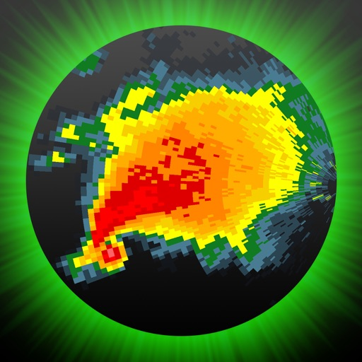

RadarScope is an AMS-award-winning weather visualization tool that empowers meteorologists, public safety officials, storm spotters, and weather enthusiasts to view a full suite of single-site radar data and related severe weather products. Your initial purchase provides professional radar visualization in a fully native app, free from distracting and invasive practices, with optional subscription packages to add even more capabilities.

Whether you’re scanning for a mesocyclone’s tell-tale hook echo, pinpointing the landfall of a hurricane’s eye wall, or identifying velocity couplet, hail spike, or debris ball signatures, RadarScope displays native radar data in its original radial format. You see what the radar sees almost as soon as the radar sees it, with automatic updates every two to ten minutes depending on the radar’s scanning strategy.

Your initial app purchase includes the following:

• Full suite of single-site radar products for the US, Canada, Guam, Denmark, Finland, and Germany
• 6-frame radar loops
• Two built-in providers for radar data
• Tornado, thunderstorm, flash flood, marine, snow squall, extreme wind, tropical, and other warnings in the US
• Selected severe weather warnings in Canada and Australia
• NWS-generated storm tracks with hail, TVS, and mesocyclone attributes
• Inspector and distance tools
• Color palette options for radar data
• Weather Pulse data plan integration
• Spotter Network integration for storm and location reporting
• mPING integration for submitting weather reports to NSSL
• Bundled maps with political boundaries, water bodies, and major highways, optimized for low-bandwidth use
• Support for widgets and complications
• Universal app for Apple platforms, including Apple Watch and Apple TV
• Family Sharing support

RadarScope Pro Tier One is an optional annual subscription that adds more features for tracking severe weather:

• 30-frame radar loops
• Cloud-to-ground lightning strikes
• Severe weather watches in the US and Canada
• Special weather statements in the US and Canada
• Mesoscale convective and precipitation discussions
• SPC convective, tornado, hail, wind, and fire outlooks
• WPC excessive rainfall outlooks in the US
• Local storm reports in the US
• Custom color palette support
• Multi-pane display (2 on phones; 4 on larger devices)
• Family Sharing support

RadarScope Pro Tier Two is an optional annual or monthly subscription that transforms RadarScope into a more complete visualization tool for a larger suite of weather products, including:

• Everything in Pro Tier One
• 50-frame radar loops
• A third provider for US radar data
• 30-year archive of NEXRAD Level II radar data
• 6-year archive of NEXRAD Level III data
• 30-day archive of super-res and non-US radar data
• 20-year archive of NWS bulletins
• GOES satellite data
• Multi-Radar Multi-Sensor (MRMS) data
• Real-Time Mesoscale Assimilation (RTMA) data
• GFS, ECMWF, HRRR, HRW, and NAM forecast model data
• Surface observations
• Atmospheric soundings in the US
• Hail size, hail probability, and azimuthal shear contours with a 30-day archive
• More detailed transportation and satellite imagery maps
• Custom color palette support for GOES, MRMS, RTMA, and forecast products
• Server-sent events for radar and warning updates
• Cross-platform subscription sharing on up to 5 devices
• Family sharing support

If you choose to buy a RadarScope Pro subscription, it will be charged to your App Store account. The subscription will be auto-renewed within 24 hours prior to the end of the current period at the same price you originally paid. Subscriptions may be managed and auto-renewal disabled via your App Store account settings after the purchase. Once purchased, the subscription cannot be canceled during the active subscription period.

DTN is committed to safeguarding your privacy online. Our privacy policy is available for review at https://www.dtn.com/privacy-policy/

Please visit our web site for more information.

[View on Apple](https://apps.apple.com/us/app/radarscope/id288419283)

## Spirit Talker ®

As seen on:

Haunted Finders, The Paranormal Files, Twin Paranormal, WWE, Scarlett & Shotzi, Bad Cat Paranormal, Exploring Harley, Ghost Club Paranormal, Barrier Beyond, Tommy Amongst the Tombstones, Hauntings with Hodge, Jasko, Omar Gosh, Paranormal XP, What Goes Bump in the Night, Exploring with Josh, Ghostly Travels with Zac, Kelsi Davies, Moxleys Paranormal World, Hunting the Dead, TylerReynolds TV, PollyFox Paranormal, Paranormal Discovery, Sam and Colby, WhatThe? Paranormal, F.D.L Paranormal and many many more.

Beware of FAKE copies, this is the Original Spirit Talker App.

*********************************************************************

Spirit Talker ® works in a similar way to the world famous Ovilus device, but it is based on my own research and theories.

It produces words and speech based on what the sensors in your phone are detecting.

The theory behind this app is that spirits might be able to manipulate the device sensors to communicate with you.

Spirit Talker ® is a modern form of ITC (Instrumental Trans Communication) and is very simple to use.

Just click the green ON button and begin asking your questions.

When a response is detected by the app the words will show visually in the text box along with audible speech.

Nothing is chosen randomly, everything produced is based on the values from the sensors.

When you have finished your session just click stop. You can also look back at the responses you received during your session by clicking on the folder button (this only works when the scanner is "Stopped").

You can also look back at the responses you received during your session by clicking on the folder button (this only works when the scanner is "Stopped").

The sensors that the app uses are:

Magnetometer (EMF)
Accelerometer
Gyroscope
Orientation
Barometer
Compass

The EMF Meter only works if your device has a Magnetometer Sensor. If not then the EMF Meter won't be displayed.
Please check the compatibility of your phone / tablet.

When you have finished your session, turn off the scanner to save the words to the file.

Moving your phone quickly or putting it near electronic equipment will manipulate the sensors and make it produce a result, please do not do this!

Languages in the app are:

English, Latin, French, German, Chinese (Text or Symbols), Danish, Portuguese, Romanian, Turkish, Croatian, Polish, Finnish, Swedish, Hungarian, Greek, Czech, Dutch, Italian, Spanish Korean and Icelandic.

There are a lot of misconceptions being spread about how Spirit Talker works, please have a read here:

https://spottedghosts.com/spirit-talker-common-misconceptions/

*******************************

IMPORTANT INFO

** App Voice **

The voice uses the "Spoken Content" voice on your device, “Settings” -> “Accessibility” -> “Spoken Content”

** Sensor Permissions **

Since the iOS 17 update, this app now needs to have the "Motion and Fitness" permission to be granted so that it can access certain sensors that it needs in order to work. If you don't grant this permission, the app will not be able to work.

*******************************

** Disclaimer **

Use at your own risk. We cannot be held personally responsible for you or any outcome (paranormal or otherwise) from using this app!

The paranormal is not a proven science and is considered theoretical. Accordingly, words or phrases generated are not intended as requests or instructions, and should not be used to make legal, financial, medical or other decisions. Words/phrases generated do not represent the official position of the developer.

Refer to our website for a full list of terms and conditions http://www.spottedghosts.com

*******************************

Beware of FAKE copies, this is the ORIGINAL Spirit Talker App.

[View on Apple](https://apps.apple.com/us/app/spirit-talker/id1536762482)

## Streaks

STREAKS. Die Aufgabeliste für gute Gewohnheiten.
Gewinner des Apple Design Award

Wähle bis zu 24 Aufgaben, die du jeden Tag erledigen willst. Ziel ist es, diese Aufgaben mehrere Tage hintereinander zu erledigen. Streaks funktioniert mit der Health-App, damit du deine Fitness-Ziele erreichen kannst.

FUNKTIONEN:

* Passe die App-Farbe an.
* Wähle aus hunderten Symbolen.
* Lass dir benutzerdefinierte Benachrichtigungen schicken, um auf dem Laufenden zu bleiben.
* Betrachte deine aktuelle und beste Aufgabenserie und deine Erledigungsstatistik.
* Streaks erkennt automatisch, wann du Health-Aufgaben erledigst.
* Gewöhne dir schlechte Angewohnheiten mit unschönen Aufgaben ab
* Apple Watch

Solltest du Fragen, Anregungen oder sonstiges Feedback haben, schreibe bitte eine E-Mail an support@streaks.app oder eine Twitter-Nachricht an @TheStreaksApp.

Wenn dir Streaks gefällt, hinterlasse bitte einen Erfahrungsbericht! Die Erfahrungsberichte werden zurückgesetzt, sobald wir ein neues Update veröffentlichen. Daher sind wir auf deine ständige Unterstützung angewiesen.

ÜBER HEALTH-DATEN:

Auf kompatiblen Geräten kann Streaks deine Spazieren-/Joggen-Daten lesen, vorausgesetzt du erteilst die Erlaubnis, die Erledigung deiner Aufgaben zu bestimmen. Alle Daten werden in voller Übereinstimmung mit den iOS-Regeln von Apple für Erfahrungsberichte abgerufen. Bitte lies unsere Datenschutzerklärung unter https://streaks.app/privacy.html und erfahre mehr über die Verwendung deiner Daten.

Schritt- und Entfernungsdaten sind nur automatisch verfügbar, wenn du ein iPhone 5S, eine höhere Version oder ein Zubehörgerät wie die Apple Watch verwendest, um Daten auf die Health-App zu übertragen. Bei Fragen schreibe uns bitte an support@streaks.app.

[View on Apple](https://apps.apple.com/us/app/streaks/id963034692)

## Monash FODMAP Diet

Die Wissenschaftler der Monash University haben die FODMAP-arme Diät und eine zugehörige App entwickelt, um bei der Behandlung von Magen-Darm-Beschwerden im Zusammenhang mit dem Reizdarmsyndrom zu helfen. Die FODMAP-Diät der Monash University funktioniert, indem sie Lebensmittel mit hohem Gehalt an fermentierbaren Kohlenhydraten (FODMAPs) gegen Alternativen mit niedrigem FODMAP-Wert austauscht. Etwa 75 % der Menschen mit Reizdarm erleben eine Symptomlinderung bei einer FODMAP-armen Diät.

Die App kommt direkt vom Forschungsteam der Monash University und beinhaltet Folgendes:

- Allgemeine Informationen über die FODMAP-Diät und Reizdarm.
- Leicht verständliche Anleitungen, die Sie durch die App und die 3-stufige FODMAP-Diät führen.
- Ein Lebensmittel-Leitfaden, der den FODMAP-Gehalt für Hunderte von Lebensmitteln mit einem einfachen „Ampelsystem“ beschreibt.. 
- Eine Liste von Markenprodukten, die von Monash als FODMAP-arm zertifiziert wurden..
- Eine Sammlung von über 70 nahrhaften, FODMAP-armen Rezepten.. 
- Funktionen, mit denen Sie Ihre eigene Einkaufsliste erstellen und Notizen zu einzelnen Lebensmitteln hinzufügen können.
- Ein Tagebuch, mit dem Sie verzehrte Lebensmittel, Reizdarm-Symptome, Darmverhalten und Stressniveaus erfassen können. Das Tagebuch führt Sie auch durch Schritt 2 der Diät – erneute Einführung von FODMAPs in die Ernährung.
- Die Möglichkeit, Maßeinheiten (metrisch oder imperial) einzustellen und die Hilfe bei Farbenblindheit zu aktivieren.

[View on Apple](https://apps.apple.com/us/app/monash-fodmap-diet/id586149216)

## FL Studio Mobile

Create and save complete multi-track music projects on your iPad, iPhone or Mac. Record, sequence, edit, mix and render complete songs.

FEATURE HIGHLIGHTS

* Audio recording, track-length stem/wav import
* Browse sample and presets with preview
* Effects modules (see Included Content)
* Full-screen MacBook and iMac Trackpad and Mouse support.
* High quality synthesizers, sampler, drum kits & sliced-loop beats
* Instrument modules (see Included Content)
* Load projects in the FL STUDIO** FREE Plugin version of this App
* MIDI controller support (class compliant). Automation support.
* MIDI file import and Export (Single-track or Multi-track)
* Mixer: Per-track mute, solo, effect bus, pan and volume adjustment
* Piano roll. Edit notes or capture recorded performances.
* Save and load WAV, MP3, AAC*, FLAC, MIDI
* Share your songs via Wi-Fi or Cloud to other Mobile 3 installations
* Step sequencer
* User interface configurable with all screen resolutions and sizes.
* Virtual piano-keyboard & Drumpads
* IAA App support (In/Out), Audiobus support (In/Out)
* Audio recording (external and internal sources)
* Share your songs via Sync to other Mobile 3 devices / installations
* Load your projects in the FL STUDIO* FREE 'Plugin' Version of this App#

IN APP PURCHASES & INCLUDED CONTENT

FL Studio Mobile includes in-app purchases for the DirectWave sample player. You can install your own samples and don’t need to buy content.

All Instrument modules are included: Drum Sampler, DirectWave Sample Player, GMS (Groove Machine Synth), Transistor Bass, MiniSynth & SuperSaw.

All Effect modules are included: Analyzer (visual), Auto Ducker, Auto-Pitch (pitch correction), Chorus, Compressor, Limiter, Distortion, Parametric Equalizer, Graphic Equalizer, Flanger, Reverb, Tuner (Guitar/Vocal/Inst), High-Pass/Low-Pass/Band-Pass/Formant (Vox) Filters, Delays, Phaser and Stereoizer.

Included Drum Samples: Cymbals, Hats, Kicks, Snares, Toms, Percussion, Risers, SFX

Included DirectWave Instruments: Guitars, Keyboards, Orchestral, Synth, Bass, Synth Keyboards, Synth Leads, Synth Pads, Sliced, Drums, Drum Kits and Effects.

Included MiniSynth Presets: Bass, Keys, Leads, Pads, SFX, Synths

Included SuperSaw Presets: Arps, Bass, Bells, SFX, Leads, Pads, Sequences, Synths

WANT TO TRY BEFORE YOU BUY?

Install FL STUDIO 20 for macOS / Windows and you can use the FL Studio Mobile Plugin. This is identical to the App, as a plugin inside FL Studio. Get it here: http://www.image-line.com/downloads/flstudiodownload.html

MANUAL / TRAINING / VIDEOS

http://support.image-line.com/redirect/flstudiomobile_help
http://support.image-line.com/redirect/flstudiomobile_videos

SUPPORT

Please help us to help you! In the App, tap 'Help > Users & Support Forums' to register FL Studio Mobile to your Image-Line account and gain access to the forum. You can then report bugs, make feature requests and access free downloadable content: http://support.image-line.com/redirect/flmobile_forum

[View on Apple](https://apps.apple.com/us/app/fl-studio-mobile/id432850619)

## MilGPS

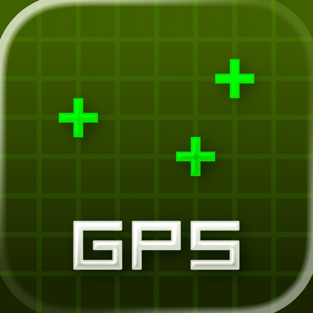

MilGPS is a field navigation tool designed for efficient use by trained navigators using MGRS coordinates. No in-app purchases or subscriptions.

OVERVIEW
- Display your current location and other info in large, clear text on customizable screens.
- Create waypoints using your current location, map crosshairs, distance/direction projection or optimized coordinate entry. Organize waypoints into overlays and navigate to them by following an arrow or on the map.
- Visualize your location and waypoints on a map with smooth scrolling grid lines/labels. Apple and Google online maps are included or supply your own offline maps in raster MBTiles format.
 
OTHER FEATURES
- Supports MGRS, USNG, UTM, Lat/Lon and OSNG location formats.
- Supports a wide variety of map datums including WGS84, NAD27, OSGB36, AGD66 and ED50.
- Use 3 different datums/location formats for location display and waypoint entry.
- Supports a wide variety of angle, altitude, and distance formats.
- Cell phone signal not required for basic navigation functionality. Online maps require a data connection.
- Supports military date time groups for local/zulu time
- Import and export waypoints via the standard GPX file format. Limited support for KML and CSV formats. Routes and tracks not supported.
- Map ruler tool to measure distance/direction between two points on the map, snaps to waypoints

NOT INCLUDED (YET)
- Route planning
- Track recording
- Online mapping sources other than Apple and Google maps
- Vector offline maps

QUESTIONS
support@milgps.com

NOTES
- WiFi-only iPads are not supported because they don't have a GPS receiver.
- Mapping function requires a data connection. 
- Using GPS will shorten battery life.
- Online maps are provided, hosted and updated by third parties. Maps may be inaccurate or censored. Map types and quality may change without notice.

PRIVACY
Because you can choose to use Google maps in the app, we are required to disclose the data collected by Google in our App Store listing. If you do not use Google maps minimal data is collected. See our privacy policy for details.

WARNING
YOUR USE OF MILGPS IS AT YOUR OWN RISK
MilGPS is an aid to navigation only and is intended to be used in conjunction with other navigation methods and tools.
MilGPS must not be used where relying on MilGPS could result in death, injury or financial loss. This includes use on military operations, live-firing activities, aviation and surveying use.
MilGPS is not tested to military specifications and is not endorsed by the military of any nation. MilGPS is not a substitute for military issue equipment.
Your use of MilGPS is governed by the standard App Store Licensed Application End User License Agreement.

[View on Apple](https://apps.apple.com/us/app/milgps/id405835358)

## AutoSleep - 苹果手表睡眠监测，睡觉记录及智能闹钟

使用手表来自动追踪您的睡眠*。无需按动任何按钮，无需安装任何手表应用，只要安稳睡觉就好！

关于 AutoSleep
-----------------
使用先进的启发式应用 AutoSleep 来计算您的睡眠时长。

如果您戴上手表睡觉，您什么都不需要做。AutoSleep 会自动监控您的睡眠时长与质量并在您早晨第一次解锁手机后给你发送通知。

即使您不带着手表睡觉, AutoSleep 也可以计算您在床上的时间。这非常简单。

因为人总是各异的，AutoSleep 提供了微调选项，您可以通过简单地滑动滑块来调整自己的睡眠活跃度检测级别并可以很快速地看到睡眠时钟的统计变化。它还允许您自定义睡眠窗口, 是否需要每日通知以及在睡眠时钟上显示更多或更少的信息。 

与 Apple 睡眠阶段应用完全集成，使您可以选择使用 Apple 睡眠应用并在 AutoSleep 中查看所有信息。

AutoSleep 包括睡眠监控所需的所有信息和功能，包括：
睡眠时间 – 睡眠时长和睡眠银行余额
睡眠评分 – 对您睡眠的综合评分
睡眠环 – 用高质量的睡眠填充您的睡眠环，包括心率、深度睡眠和快速动眼
Apple 睡眠阶段 – 可使用 Apple 睡眠应用中数据的选项
睡眠呼吸暂停 - 了解您是否患有睡眠呼吸暂停
睡眠血氧 – 睡眠时的测量值
呼吸频率 – 记录您每分钟的呼吸
噪声 – 环境噪声测量值
睡眠分析 – 查看您的睡眠周期的详细图表和细分情况
睡眠燃料 – 衡量您的睡眠质量和效率
今晚就寝时间 – 根据您的习惯推荐您最近的就寝时间
就绪 – 表示您的身体和精神压力
温度 – 跟踪您睡眠时的手腕温度
睡眠一致性 – 了解您的就寝时间习惯
熄灯 – 跟踪入睡时间
实时睡眠跟踪 – 查看您夜间的睡眠统计信息
智能闹钟 – Watch 内置的智能闹钟，帮助您从较浅的睡眠中醒来
小组件 – 各种各样超棒的 iPhone 小组件
复杂功能 – 多种 Watch 表盘选项
HomeKit – 与 Apple HomeKit 完全集成
表情符号和笔记 – 记录对睡眠时段的评论和标签
探索 – 深入分析视图
Siri – 通过 Siri 语音指令使用
快捷方式 – 创建您自己用于 AutoSleep 的快捷方式
调整 – 调整您个人睡眠/醒来检测的简单功能
历史 – 高级图表和趋势
配置 – 更改主题并设计您的时钟睡眠环
设置 – 定制您的睡眠目标、设置通知和提醒
导出 – 导出选项以保存数据

AutoSleep 可以与 HeartWatch 联动，它是我们首推的心跳与活动检测应用。AutoSleep 会将您的睡眠信息记入健康应用中。 

*需要运行 Watch OS 4 或更高版本的 Apple Watch。

- 2018年度最佳
https://apps.apple.com/story/id1438574124/

- 2019年度最佳
https://apps.apple.com/story/id1484100916/

- 2020年度最佳
https://apps.apple.com/story/id1535572713/

- 2021年度最佳
https://apps.apple.com/story/id1591083005/

- 2022年度最佳
https://apps.apple.com/story/id1654240446

- 2023年度最佳
https://apps.apple.com/story/id1719170110

[View on Apple](https://apps.apple.com/us/app/autosleep-watch-sleep-tracker/id1164801111)

## Shot Tracer

Shot Tracer® • Live Tracer • 3D Map Tracer • Putt Reader • Golf Video Editor • Live Scores

Turn Every Shot Into Broadcast-Quality Content.

Shot Tracer® is the world's leading golf ball tracer, golf video editor, and golf content creation platform, trusted by golfers worldwide and recognized by Golf Digest and Golf Magazine.

Create stunning TV-style golf videos, relive your best shots, improve your putting, and share your game like never before directly from your iPhone or iPad.

ONE-TIME APP PURCHASE INCLUDES

Everything you need to start creating golf content immediately:

LEGACY TRACER

The original Shot Tracer® video editor.

• Add professional ball tracing lines to your golf videos
• Fast and intuitive manual editing
• Create TV-style graphics
• Perfect for practice sessions, tournaments, and social media

PUTT READER™

Bring broadcast-style green reading technology to your game.

• Augmented reality green reading
• Visual putt lines and slope analysis
• Understand break, speed, and aiming points
• Improve putting confidence and green reading skills

LIVE TOUR SCORING

Follow professional golf in real time.

• Live scoring from major professional golf tours
• Track players, leaderboards, and tournament action

UPGRADE TO PRO

Unlock the complete golf content creator toolkit.

LIVE TRACER™

Create real-time tracers while recording.

• Automatic ball flight tracking
• Real-time tracer generation
• Fully customizable tracer styles
• No special hardware required

3D MAP TRACER™

Relive your shots from a stunning bird's-eye perspective.

• Flyovers on 44,000+ golf courses worldwide
• Cinematic shot replays
• Showcase strategy, landing zones, and shot placement
• Professional aerial-style visualizations

PRO EDITOR™

Create broadcast-quality golf videos directly on your phone.

• Automatic ball flight tracking
• Broadcast-style scoreboards and graphics
• Video-in-video overlays
• Custom logos, text, and branding
• Voice-over and captions
• Sound effects library
• Alpha channel export support
• Professional editing workflows
• Faster rendering and exports

PROFESSIONAL SCORECARD EDITOR

Create animated scorecards in seconds.

• 44,000+ golf course scorecards worldwide
• Professional scorecard templates
• Fully customizable animations and graphics

AR FUN MODE

Create unique golf content for social media.

• Hit virtual targets and hoops
• Shoot down UFOs and moving targets
• Create engaging golf challenge videos

MORE FEATURES

• 44,000+ golf course database
• Golf GPS and distance tools
• Digital scorecards
• iPhone and iPad support
• Weekly feature updates and improvements

Whether you're a casual golfer, coach, content creator, golf influencer, or tournament organizer, Shot Tracer® gives you the same visual storytelling tools used in professional golf broadcasts.

Created by golfers for golfers.

Shot Tracer® is a registered trademark of Visual Vertigo Software Technologies GmbH. All rights reserved.

Terms of Use:
https://www.apple.com/legal/internet-services/itunes/dev/stdeula/

[View on Apple](https://apps.apple.com/us/app/shot-tracer/id1140451547)

## Wipr 2

Wipr blocks ads, popups, trackers, cookie warnings, and other nasty things that make the web slow and ugly.

Websites in Safari will look clean, load fast, and stop invisibly tracking you. You’ll notice significant improvements to your battery life and data usage. Setup is a snap.

The Filtr add-on extends Wipr’s blocking to all apps on your device. It acts at the network level, but unlike a VPN, it can access none of your data, and can be used in conjunction with VPNs, iCloud Private Relay, and custom DNS.

Wipr’s blocklist is updated twice a week automatically, and has enhanced versions for the following languages: Bosnian, Chinese, Croatian, Czech, Danish, Dutch, Estonian, Finnish, French, German, Greek, Hebrew, Hindi, Hungarian, Icelandic, Indonesian, Italian, Japanese, Korean, Macedonian, Malay, Montenegrin, Norwegian, Polish, Romanian, Russian, Serbian, Slovak, Spanish, Thai, and Vietnamese.

Wipr is a universal app: install it on all your devices (iPhone, iPad, Mac, Vision Pro) with a single purchase. It’s fully accessible with VoiceOver, Voice Control, and more. Dark, Tinted, and Clear icon variants are included. Family Sharing is supported.

Because it’s developed by a single independent developer and 100% funded by its users, Wipr only answers to you: no one can pay to have their ads unblocked, and there are no “acceptable ads”.

This app was made with love and patience. I hope you’ll enjoy using it as much as I enjoyed designing and building it.

– Kaylee

Terms & Conditions: https://kaylees.site/terms-and-conditions.html
EULA: https://www.apple.com/legal/internet-services/itunes/dev/stdeula/

[View on Apple](https://apps.apple.com/us/app/wipr-2/id1662217862)

## LiveATC Air Radio

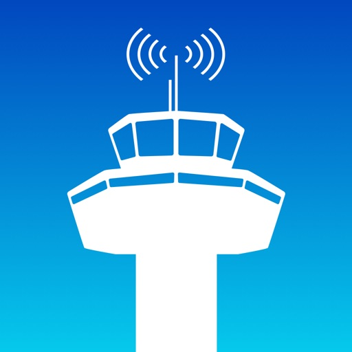

LiveATC Air Radio is brought to you by LiveATC.net LLC
PLEASE READ IMPORTANT NOTICE BELOW **BEFORE PURCHASING** (this relates to countries not covered by the LiveATC.net system)

Do you want to know why your flight might be delayed? Live near an airport or enjoy planespotting and want to tune in to the pilots? Have you always wondered what pilots talk to air traffic controllers about? Now you can stop wondering and tune in live!

LiveATC Air Radio provides a quick and easy way to listen in on live conversations between pilots and air traffic controllers near many airports around the world. LiveATC Air Radio lets you easily browse by U.S. state, Canadian province, or by country to find an airport of interest. Once you find an interesting channel you just add it to your Favorites list for quick and easy access! You can also use the Nearby function to find airports near you. We also cover high-altitude (ARTCC/FIR) communications and oceanic (HF radio) traffic.

The LiveATC network is the world's largest network of streaming audio feeds focused solely on aviation-related communications, currently covering over 1,200 airports around the world and over 3,300 different audio feeds and growing daily!

*** IMPORTANT NOTICE *** 
Please check to see if your country, city and/or airports of interest are covered by LiveATC *BEFORE PURCHASING* - check at: https://liveatc.net .  Note that we do not have coverage in the U.K., Belgium, France, Germany, Iceland, Italy, New Zealand, Spain and other countries where streaming ATC communications may be prohibited by law.

Available airports/channels are subject to change at any time - LiveATC owns and operates many of the receivers used in the network but many are provided by volunteers. Available airports can change due to reasons beyond our control. For this reason there is no guarantee that any particular channel will be up 24/7, or forever, though we make our best effort to do so and have an excellent overall track record of uptime.

Follow LiveATC on X and Facebook:
X: https://x.com/liveatc 
Facebook: https://facebook.com/liveatc

[View on Apple](https://apps.apple.com/us/app/liveatc-air-radio/id317809458)

## Threema. Der sichere Messenger

Threema ist der weltweit meistverkaufte sichere Messenger, der von mehr als 12 Millionen Menschen in über 175 Ländern verwendet wird – entwickelt in der Schweiz und konsequent auf Datenschutz und Privatsphäre ausgelegt. Ob Chats, Anrufe oder Dateien: Alles ist Ende-zu-Ende-verschlüsselt, und keine Datenspur bleibt zurück. Anstelle einer Telefonnummer oder E-Mail-Adresse dient eine zufällig erzeugte Threema-ID als eindeutige Kennung – anonym und sicher. Threema schützt, was wirklich zählt: Ihre Privatsphäre.

Vorteile mit Threema:
• Text- und Sprachnachrichten inkl. Emoji-Reaktionen
• Durchgängig verschlüsselte Sprach-, Video- und Gruppenanrufe
• Teilen des Standorts
• Versand von Dateien aller Formate (PDF, GIF, MP3, ZIP und mehr)
• Möglichkeit, bereits gesendete Nachrichten zu bearbeiten und für Chatpartner zu löschen
• Desktop-App und Web-Client, um bequem am PC zu chatten
• Erstellen von Gruppen und Umfragen
• Helles oder dunkles Design
• Keine Werbung, keine Tracker, keine Datensammelei
• Verifikation der Identität von Kontakten durch Scannen des QR-Codes

Zuverlässige Sicherheit:
• Open Source und regelmässige Audits
• Server in der Schweiz
• Anonyme Nutzung möglich: keine Telefonnummer oder E-Mail-Adresse erforderlich
• Löschung von Nachrichten vom Server sofort nach Zustellung

Haben Sie Fragen oder Probleme? Unsere FAQ helfen weiter: https://threema.com/support

Viel Freude mit Threema!

[View on Apple](https://apps.apple.com/us/app/threema-the-secure-messenger/id578665578)

## Blueprint 4-Track

Great for demos, first takes, and fresh ideas: voice and guitar at the kitchen table, or a band passing one phone around the room.

The sound of the machine is built in. Each track has its own set of knobs and there is no undo.
  
  - Records one track at a time, from the built-in mic, a headset mic, or a USB audio interface.
  - Has track merging/clearing, punch-in recording, and a metronome.
  - Your recordings are WAV files saved on your phone. Share the song, or export the whole session.
  - Works entirely offline and collects nothing.
  - Pay once. No subscription, no ads, no account.
  - Works on iPhone and iPad.
  
  TIPS

  - Overdub with wired headphones, so the mic doesn't pick up the other tracks.
  - Don't use Bluetooth headphones while recording: they add delay, and only play in mono.
  - Tap record while playing to punch in over a part you want to redo.
  - Tap the ? at the top left for a guide to the controls.

Blueprint is made by one person. If something feels confusing or missing, email max@blueprintdaw.com and I will answer.

[View on Apple](https://apps.apple.com/us/app/blueprint-4-track/id6777792345)

## HeartWatch: 心脏和活动监测器

所有隐私
HeartWatch没有用户分析跟踪，没有广告插件，没有第三方代码，不会上传数据。

关于HEARTWATCH
健康
- 所有关键心率指标的智能视图，包括白天、久坐、睡眠、醒来以及体能训练。
- 详细的趋势分析，包括心率、血压、心率变异性等。
- 在手表上，带有内容的后台心率警报。
- 记录个人心率读数。

活动
- 每天都不同。根据您的习惯进行活动、移动距离和步数的智能化目标设定。
- 每日预测可帮助您保持进度以实现目标。

体能训练
- 深入分析心率、训练摘要、GPS地图等。
- 在手表上带有自定义提醒功能及更注重于心率的体能训练应用，可让您始终处于正确的心率区间。
- 详细的趋势分析。
- 使用数据流，将体能训练的信息从手表传送到您的手机上。

新闻
-浏览不同的新闻版本，了解你的健康进展和趋势。
-晨间简报：阅读你的关键健康信息，开始新的一天
-健身习惯：通过动态健身习惯跟踪器了解你的健身趋势

日记帐和笔记
-每天记录笔记和测量结果
-查看详细列表，其中包含所有注释、测量和训练的完整概述
-从手表或iPhone输入笔记和测量值。包括血压、体温、血糖、体重、腰围和体脂百分比。

图表与分析
-超过30个健康指标可供查看
-将7天和21天趋势应用于任何指标，并具有重叠能力
-查看6周到12个月

导出
- 导出所有健康指标和体能训练数据。

没有什么比您的健康更重要！
HeartWatch是一个非常有用的工具，它可以以简洁的格式来提醒您任何可能存在的健康问题，您可以向医疗执业者展示这些数据。

心脏月
2022 年官方 Apple 心脏月推荐应用
https://www.apple.com/au/newsroom/2022/01/apple-celebrates-heart-month-with-new-resources-across-services

要求
此应用程序需要已安装“健康”应用的iPhone。心率读数读取自健康数据库，理想情况下，这是从您的Apple Watch获取的数据。

[View on Apple](https://apps.apple.com/us/app/heartwatch-heart-rate-monitor/id1062745479)

## Goblin Tools

This is an app version of the free website goblin.tools, a collection of small, simple, single-task tools, mostly designed to help neurodivergent people with tasks they find overwhelming or difficult.

Tools include
- A Magic Todo list that automatically breaks down tasks into steps
- The Formalizer that transforms your language to be more formal, sociable, concise, or many other options
- The Judge that helps with interpreting tone
- The Estimator that can guess at a timeframe for an activity
- The Compiler to take entire braindumps and turn them into actionable tasks
- The Chef, who turns a description of what ingredients and tools you have in your kitchen into a real recipe

And many more to come!

The website is free and publicly available. Purchases of this app go first towards keeping the site free and ad-free, before supporting the author.

[View on Apple](https://apps.apple.com/us/app/goblin-tools/id6449003064)

## Moment Pro Camera II

Your Camera, Your Looks, Your Way.

Moment Pro Camera II turns your phone into your favorite camera for photography and filmmaking. Shoot like a pro with full manual controls, creative looks, and an upgraded interface – all in one intuitive app.

What’s New in Pro Camera II?

Our first pro camera app has been the #1 rated camera app for years. Now, it’s time for the next chapter. We’ve re-engineered Pro Camera II from the ground up to give you better performance, advanced controls, and new customizable interfaces and shooting modes.

Key Features:

• Pro-Level Exposure Control – Our smart exposure system allows you to take control with Shutter Priority, ISO Priority, Manual, and Auto exposure modes, including the ability to limit Auto ISO to a specific range.
• Upgraded White Balance – Beyond auto white balance, you can manually configure temperature and tint, choose a preset, or calibrate via a gray card.
• Advanced Photo Options – Control the level of processing and HDR applied to your photos. Shoot in RAW, ProRAW, TIFF, HEIF, or JPG.
• Cinematic Video Tools – Apple Log, Open Gate, ProRes, 10-bit recording, and more. Adjust the resolution, color space, frame rate, codec, bitrate, and chroma subsampling for total creative freedom.
• Precision Monitoring – Get pro-level feedback with Waveform, RGB Histograms, and audio meters — normally reserved for cinema cameras.
• Aspect Ratio – Frame your shot within your favorite aspect ratio (4:3, 16:9, 3:2, 5:4, 1:1)
• Designed for All Creators – A beautiful, intuitive interface that adapts to how you shoot. Swipe, tap, and adjust anything immediately with one hand (including a dedicated left-handed layout), or go distraction-free with Zen Mode. Works natively in landscape orientation.
• Looks, Your Way – Apply creative Looks or import your own LUTs to video and photos. Preview them live, bake them into your footage, or adjust intensity on the fly.
• Focus Tools That Just Work – Separate reticles for exposure and focus with a tap, or dial in the shot with Manual Focus and Focus Peaking.
• Quick Actions, Faster Shooting – One swipe to reach your most used tools: flash, stabilization, zebras, focus peaking, grids, and more.
• Intuitive Lens Control – Remove the guesswork of which lens you are using and eliminate surprises with our Optic Controls. Say goodbye to shaky zoom with our fluid zoom control.
• Hardware-Ready – Optimized for every iPhone, with seamless integration for external mics and Moment’s entire lens + case ecosystem.

Upcoming Feature Releases
• Look Store: purchase creator color grades and film emulations
• Slow Shutter and Timelapse modes
• Advanced Profile sharing and collaboration tools
• Extended hardware integration partnerships

We love hearing from our community. For feature requests, ideas, or support, email us at hello@shopmoment.com or message us @momentprocamera on social media.

Fully Compatible with iPhone and Moment's complete ecosystem of lenses, cases, and accessories.

[View on Apple](https://apps.apple.com/us/app/moment-pro-camera-ii/id6748837351)

## Stylebook

Optimisez votre garde-robe : pour moins cher qu'un café au lait, découvrez votre propre style et changez votre relation avec les vêtements pour la toujours !

Stylebook® est le meilleur outil d'organisation de votre garde-robe. Grâce à plus de 90 fonctionnalités, vous pouvez organiser votre garde-robe et profiter au maximum des vêtements que vous possédez déjà !

Importez vos vêtements en quelques secondes grâce à une variété d'outils d'importation, y compris le glisser-déposer et la génération d'images par IA. Créez des collages de tenues comme dans les magazines avec vos propres vêtements. Vous pourrez ainsi vous souvenir de vos meilleurs looks et vous habiller plus rapidement chaque jour. Vous pouvez aussi planifier vos tenues grâce au calendrier des tenues, créer des listes pour préparer vos bagages qui vous indiquent automatiquement les vêtements à emporter et en savoir plus sur votre garde-robe grâce à des statistiques telles que le coût par utilisation. Tout cela dans cette application totalement personnalisable !

Ce n'est pas pour rien que Stylebook est l'application de gestion de la garde-robe la plus ancienne ! Cette application a fait ses preuves et constitue un excellent outil d'organisation et de gestion de la garde-robe. Nos clients l'apprécient depuis plus de 15 ans. Elle reste une petite entreprise familiale, gérée par une équipe composée d'un couple.

FONCTIONNALITÉS :

• PLACARD : ajoutez rapidement des images de vos propres vêtements sans avoir besoin de prendre des photos, sauf si vous le souhaitez. 
• IMPORTATION RAPIDE : génération d'images par IA (*), glisser-déposer des photos, importation multiple et découpage rapide à partir de vos sites web préférés.
• SUPPRESSION AUTOMATIQUE DE L'ARRIÈRE-PLAN : découpez avec précision vos vêtements sur presque toutes les images, quasi instantanément.
• DISPOSITION DE VÊTEMENTS : superposez et redimensionnez les vêtements sur une toile libre.  
• GÉNÉRATEUR DE TENUE : mélangez votre garde-robe comme un jeu de cartes pour découvrir de nouvelles idées de tenues qui se cachent dans votre armoire !
• CALENDRIER : planifiez à l'avance les tenues que vous allez porter.
• LISTES DE VOYAGE : ajoutez des tenues complètes, préparez le contenu de votre valise en avance, créez des listes et des illustrations à imprimer.
• STYLE STATS : des informations sur la façon dont vous portez vos vêtements et vos tenues, y compris ce que vous portez le plus, ce que vous portez le moins et les éléments qui vous rapportent le plus.
• COÛT PAR UTILISATION : suivez automatiquement le coût par utilisation de tous vos vêtements
• PARCOUREZ VOTRE GARDE-ROBE : consultez tous vos vêtements au même endroit, classés par marque, tissu, couleur, taille et bien plus encore.
• BIBLIOTHÈQUE D'INSPIRATIONS : enregistrez toutes vos inspirations de style dans un espace qui vous est réservé, sans l'influence des algorithmes.
• CATÉGORIES PERSONNALISÉES : ajoutez, modifiez ou supprimez n'importe quelle catégorie de votre placard, vos looks ou votre galerie d'inspirations.
• SYNCHRONISATION : la synchronisation automatique affiche les mêmes données sur votre iPhone et votre iPad.
• PARTAGE : partagez des tenues et des vêtements avec vos amis par e-mail, SMS, Instagram ou Pinterest.
• AUCUNE LIMITE : ajoutez un nombre illimité de vêtements, accessoires et inspirations à vos tenues.
• SAUVEGARDE ET SYNCHRONISATION ICLOUD : protégez vos données avec la synchronisation iCloud.
• RECHERCHE : recherchez des mots-clés ou des critères tels que le tissu, la saison ou la couleur dans votre garde-robe.
• SHOPPING : achetez des articles sur les boutiques en ligne et essayez-les dans votre garde-robe virtuelle avant de les acheter et mettez vos propres boutiques en favoris !
• AIDE : manuels pratiques dans lesquels vous pouvez effectuer des recherches et vidéos de démonstration incluses

(*) La génération d'images par l'IA nécessite Apple Intelligence.

[View on Apple](https://apps.apple.com/us/app/stylebook/id335709058)

## imo video calls and chat HD

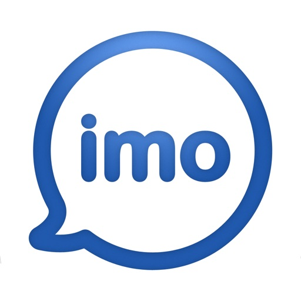

Message and video chat with your friends and family for FREE, no matter what device they are on!

- Encrypted high-quality Video and Voice calls
- Encrypted Group Video and Voice calls with up to 6 participants
- FREE and unlimited encrypted messages and video and voice calls over your 4G, 5G or Wi-Fi connection*
- Group chat with friends, family, roommates and others
- Fast photo and video sharing
- Hundreds of free stickers!
- Avoid SMS and phone call charges

*Data charges may apply. Contact your provider for details.

IMO PREMIUM MONTHLY SUBSCRIPTION
- You can subscribe to remove ads from imo and get 25Gb of cloud storage.
- Subscriptions are billed monthly at the rate selected depending on the subscription plan.
- Subscriptions auto-renew at the cost of the chosen package, unless cancelled 24-hours in advance prior to the end of the current period. The subscription fee is charged to your iTunes account at confirmation of purchase. You may manage your subscription and turn off auto-renewal by going to your Account Settings after purchase. Per Apple policy, no cancellation of the current subscription is allowed during active subscription period. Once purchased, refunds will not be provided for any unused portion of the term.

Privacy Policy: https://imoapp.com/privacy
Terms of Service: https://imoapp.com/terms

[View on Apple](https://apps.apple.com/us/app/imo-video-calls-and-chat-hd/id1400579543)

## FORScan Lite - for Ford, Mazda

FORScan Lite application was developed specially for a computer diagnostics of Ford, Mazda, Lincoln and Mercury vehicles. 

Supported adapters:
- OBDLink MX+ (recommended)
- vLinker FS Bluetooth (recommended)
- vLinker FD BLE (recommended)
- other ELM327-compatible WiFi or BLE adapter (not recommended). Attention: this application may not work properly in case of bad quality ELM327 adapter used!

Supported cars:
- Ford, Lincoln, Mercury models of 1996 - 2022MY (some models of 1994-1995MY are also supported)
- Mazda 1996-2022MY. Attention: Mazda 7G models (new Mazda 3, CX-30, MX-30, CX-50 etc) are supported partially or not supported!
- Vehicles other than Ford, Mazda, Lincoln, Mercury are not supported!

Features:
- Analyzing an on-board network configuration of the connected vehicle
- Read and reset DTC for all modules
- Read sensors and other data (PIDs) from all modules
- Execute tests
- Execute majority of service functions

Note: Configuration and Programming functions, as well as some of service functions, are not available in FORScan Lite.

[View on Apple](https://apps.apple.com/us/app/forscan-lite-for-ford-mazda/id892347083)

## Koala Sampler • Beat Maker

Koala is the ultimate pocket-sized sampler. Record anything with your phone's mic instantly. Use Koala to create beats with those samples, add effects and create a track!

Koala’s super intuitive interface helps you make a tracks in a flash, there is no brake pedal. You can also resample the output of the app back into the input, through the effects, so the sonic possibilities are endless.

Koala's design focuses totally on making the music making progress instant, keeping you in the flow and keeping it fun, not getting bogged down by pages of parameters and micro-editing.

"Been putting that $4 koala sampler to good use lately. Undeniably great tool that puts some of these expensive beat boxes to shame. A must cop." 
-- flying lotus, twitter

* Record up to 64 different samples with your mic
* Transform your voice or any other sound with 16 superb built-in fx
* Load your own samples
* Choose from one of 250 built-in sounds
* Resample the output of the app back into a new sample
* Export loops or entire tracks as professional quality WAV files
* Direct export to Ableton Live Set
* Copy/paste or merge sequences just by dragging them
* Create beats with the high-resolution sequencer
* Import samples using AudioShare or just open them in Koala
* Keyboard mode lets you play chromatically or one of 9 scales
* Quantize, add swing to get the right feel
* Normal/One-shot/Loop/Reverse playback of samples
* 6 Choke groups
* Attack, release and tone adjustable on each sample
* AUv3 compatible - use in GarageBand, Logic, Cubasis etc etc
* MIDI controllable - play your samples on a keyboard, map the effects to knobs
* Jam with others over WiFi with Ableton Link
* Free copy of Ableton Live Lite included
* Use AI to separate samples into individual instruments (drums, bass, vocals and other)
* Set your own background image and choose from a growing list of background visual FX.

8 Built-in Microphone FX:
* More Bass
* More Treble
* Fuzz
* Robot
* Reverb
* Octave up
* Octave down
* Synthesizer 

16 Built-in DJ Mix FX:
* Bit-crusher
* Pitch-shift
* Comb filter
* Ring modulator
* Reverb
* Stutter
* Gate
* Resonant High/Low Pass Filters
* Cutter
* Reverse
* Dub
* Tempo Delay
* Talkbox
* VibroFlange
* Dirty
* Compressor

Features included in SAMURAI In-App Purchase
* Timestretch (4 modes: Modern, Retro, Beats and Re-pitch) 
* Piano roll editor 
* Auto-chop (auto, equal, and lazy chop)
* 3 Band EQ
* Pocket operator sync out

[View on Apple](https://apps.apple.com/us/app/koala-sampler-beat-maker/id1449584007)

## Cloud Baby Monitor

Hochqualitativer Livevideo + Audio Babyphone mit unbegrenzter Reichweite (WiFi, 3G, LTE, 4G, 5G, Bluetooth). Einfach zu verwenden, funktioniert auf jedem iPhone, iPad, iPod Touch oder Mac, ohne Konfiguration. Exzellente Wahl für sicheres Überwachen des Babys zu Hause und auf Reisen.

Cloud Baby Monitor hilft täglich Zehntausenden von Eltern, sich um ihre Kleinen zu kümmern.

Vorgestellt von Apple in der Geschichte von The Quantified Dad (www.apple.com).
Vorgestellt in Good Morning America von ABC News (www.abcnews.com).
Vorgestellt in USA Today (www.usatoday.com).
Gewählt durch App Advice zur essentiellen App für das Überwachen Ihres Babys (www.appadvice.com).
Empfohlen von Mashable unter den besten “Elternapps für Baby's erstes Jahr” (www.mashable.com).
Ausgewählt von TUAW für den "Urlaubsgeschenke-Guide: iPad Apps für zu Hause" (www.tuaw.com).
Gewinn des 3. Platzes von Babble.com in den "Top 25 Reiseapps für Eltern” (www.babble.com).

FUNKTIONEN

• SICHER, VERLÄSSLICH UND EINFACH ZU VERWENDEN
• LIVEVIDEO, ÜBERALL 
• SUPEREMPFINDLICHES AUDIO
• GERÄUSCH- UND BEWEGUNGSALARM
• ACTIVITY LOG
• BELIEBTE RAUSCHGERÄUSCHE UND SCHLAFLIEDER INKLUSIVE
• ERSTELLEN SIE IHRE EIGENEN WIEDERGABELISTEN 
• NACHTLICHT MIT FERNSTEUERBARER HELLIGKEITSKONTROLLE
• SPRECHEN SIE AUS DER FERNE MIT IHREM BABY
• FUNKTION FÜR MEHRERE ELTERNTEILE UND KINDER
• VERBINDUNGSQUALITÄTSANZEIGE
• AKKUSTATUSÜBERWACHUNG UND -ALARM
• UNTERSTÜTZUNG FÜR MULTITASKING, BILD-IN-BILD

SICHERER , VERLÄSSLICHER, UND EINFACH ZU VERWENDENDER BABY MONITOR
Verwenden Sie Ihr iPhone, iPad, iPod Touch oder einen Mac als Kindereinheit, platzieren Sie sie im Babyzimmer und genießen Sie live Video und klares Audio im Vollbildmodus auf der Elterneinheit. Beide Geräte werden automatisch verbunden, ohne jegliche Konfiguration. Die gesamte Kommunikation ist sicher, geschützt durch Verschlüsselung nach dem Industriestandard, um sicherzustellen, dass nur Sie Zugriff auf Baby's Videostream haben.

LIVE VIDEO, ÜBERALL
Mit dieser einzigartigen Funktion können Sie ein Live-Vollbildvideo Ihres Babys ohne Distanzbeschränkung sehen. Cloud Baby Monitor funktioniert in jedem WiFi-Netzwerk, über 3G, LTE, 5G, oder via Bluetooth.

SUPEREMPFINDLICHES AUDIO
Hören Sie Ihr Baby atmen, als ob es direkt neben Ihnen schlafen würde. 

GERÄUSCH- UND BEWEGUNGSALARM
Erhalten Sie Benachrichtigungen über alle Aktivitäten Ihres Kindes mit Geräusch- und Bewegungsalarmen.

BELIEBTE RAUSCHGERÄUSCHE UND SCHLAFLIEDER INKLUSIVE
Genießen Sie die Palette an beliebtesten Schlafliedern und Rauschgeräuschen für Babys in der App. Kontrollieren Sie aus der Ferne Lautstärke, Wiedergabe und Autostopp-Timer. 

ERSTELLEN SIE IHRE EIGENEN WIEDERGABELISTEN
Erstellen Sie eigene Wiedergabelisten mit Songs, Rauschgeräuschen oder Märchen aus Ihrer iTunes-Bibliothek.

NACHTLICHT MIT FERNGESTEUERTER HELLIGKEITSKONTROLLE
Verwenden Sie ein ferngesteuertes Nachtlicht, um Ihr Baby durch die Nacht hindurch schlafen zu sehen. Helligkeitskontrolle ermöglicht Ihnen das Anpassen der Lichtintensität, um ein gutes Bild zu erhalten und das Baby nicht zu stören.  

SPRECHEN SIE AUS DER FERNE MIT DEM BABY
Beruhigen Sie das Baby einfach mit Ihrer Stimme von der Elterneinheit aus.

UNTERSTÜTZUNG FÜR MEHRERE ELTERNTEILE UND KINDER 
Verwenden Sie die Funktion für mehrere Kinder zum Überwachen von zwei Kindern, die in verschiedenen Räumen schlafen.
Verwenden Sie die Funktion für mehrere Elternteile zum Überwachen Ihres Babys von zwei verschiedenen Elterneinheiten aus.

KUNDENSUPPORT

Glückliche Kunden sind unsere Top-Priorität, und Ihr Feedback ist immer willkommen. Wenn Sie ein Problem oder einen Vorschlag haben, kontaktieren Sie uns bitte direkt via support@cloudbabymonitor.com.

Danke, dass Sie Cloud Baby Monitor verwenden.

[View on Apple](https://apps.apple.com/us/app/cloud-baby-monitor/id432791399)

## PhotoPills

Entdecke wie einfach es ist Sonne, Mond oder Milchstraße weltweit zu fotografieren!

Ob erfahrener Fotograf, professioneller Videofilmer oder Neuling, PhotoPills sorgt dafür, dass du die Konzeption, Planung und Aufnahme von einzigartigen Bildern lieben wirst.

* Alles in einer einzigen App
Der erste 2D-kartenbasierte Sonne-, Mond- und Milchstraße-Planer - Schnellsuche von Sonne-, Mondkonstellationen - 3D-Augmented Reality: Sonne, Mond, Milchstraße, Himmelsäquator, Polarstern, Tiefenschärfe, Blickfeld - Fotoplaner - Tool zur Suche von Aufnahmeorten - Informationen: Sonnenauf/-untergang, Dämmerung, Goldene Stunde, Blaue Stunde - Informationen: Mondauf/-untergang, Supermondtermine, Mondkalender - Rechner: Zeitraffer, Sterne erkennen, Sternspuren, lange Belichtungszeiten, hyperfokale Tabellen, Tiefenschärfe, Blickfeld, Entfernung zum Motiv, Brennweite-Einstellung - Komplette Anleitung und vieles mehr...

* von Profis empfohlen
"PhotoPills - ein unersetzbares Werkzeug, das ich zur Planung jeder Aufnahme benutze." – Mark Gee, Astronomie-Fotograf des Jahres
“Ein Werkzeug, das jeder Fotograf haben sollte” – Kevin Raber, Luminous-landscape.com
"Es zahlt sich aus! Dank diesem Tool können wir immer wieder tolle Aufnahmen schnell planen; Bietet die besten Möglichkeiten, um kreativer vorzugehen."- José B. Ruiz, Innovationspreis, Naturfotograf des Jahres

* Übernimm die Kontrolle
Warst du schon einmal an einem Ort und hast dir gedacht: "Schade, der Mond ist nicht genau da, ... das wäre ein hervorragendes Foto!"? Und die Sonne? Und die Milchstraße? Lasse deiner Fantasie freien Lauf und berechne, wann genau das passiert:

- Stellen dir vor: die Milchstraße erscheint über eine zauberhafte Landschaft, der Vollmond geht unter einem geheimen Steinbogen unter, ein Sonnenaufgang zwischen zwei riesigen Felsen an einem Traumstrand, ein Sonnenuntergang über der Hauptstraße in deiner Heimatstadt oder ein spektakulärer Vollmond hinter einem nahe gelegenen Hügel.
- Plane: Einfach das Datum und die Uhrzeit der gewünschten Szene berechnen und effektiver arbeiten!
- Fotografiere: Geh einfach raus, tauche in die Natur ein und genieße es den perfekte Moment festzuhalten!

* Keine Enttäuschungen!
Berechne schnell, ob das Foto möglich ist oder nicht. Verschwende keine kostbare Zeit mehr mit langen Nachforschungen.

* Verpasse nie wieder die perfekte Szene
Erstelle eine To-Do-Liste von geplanten Fotos und fahre zum richtigen Zeitpunkt zum Aufnahmeort.

* Mach es perfekt
Wähle den perfekten Bildausschnitt schon vor der Aufnahme aus. Durch die 3D-Augmented Reality siehst du, ob die Sonne, der Mond, die Milchstraße, der Himmelsäquator und der Polarstern sich an der gewünschten Position befinden, wenn du den Auslöser drückst.

* Entdecke tolle Orte und füge sie zu deiner persönlichen Datenbank hinzu
Nutze PhotoPills, um einen Ort als POI zu speichern. Füge anschauliche Fotos und Notizen hinzu.

* Fokussiere dich auf deine Kreativität; überlasse das Rechnen den Nerds
- Berechne: Zeitraffer-Einstellungen, Langzeitbelichtungen, Sternspuren, die max. Belichtungszeit um Sterne als Punkte zu erfassen, Einstellungen für einen gewünschten Schärfegrad, Einstellungen für ein gewünschtes Sichtfeld, Objektivauswahl und Motivabstand für deinen Bildausschnitt, min. Abstand zum Motiv, entspr. Brennweite des Objektivs zur Reproduktion des Blickwinkels usw.
- Prognose: Positionen von Sonne, Mond, Milchstraße, Himmelsäquator und Polarstern.

* Teile deine Ergebnisse
Egal ob du deine Ergebnisse deinen Freunden, der Familie oder der ganzen Welt zeigen willst: PhotoPills hilft dir dabei. Teile deine Pläne, geheimen Orte und all die anderen Planungen auf Facebook, Twitter oder beiden in nur wenigen Schritten.

* Triff andere Fotografen
Teile deine Pläne und Orte via E-Mail. Lade deine Freunde ein dabei zu sein. Andere PhotoPillers können deine Planungen importieren und selbst betrachten.

Worauf wartest du? Hol dir PhotoPills gleich jetzt und mache wirklich einzigartig Aufnahmen!

[View on Apple](https://apps.apple.com/us/app/photopills/id596026805)

## Pocket God

What kind of god would you be? Benevolent or vengeful? Play Pocket God and discover the answer within yourself. On a remote island, you are the all-powerful god that rules over the primitive islanders. You can bring new life, and then take it away just as quickly. Exercise your powers on the islanders. Lift them in the air, alter gravity, hit them with lightning...you're the island god! All god powers are demonstrated in Pocket God's help menu.

Pocket God is an episodic microgame for you to explore, show your friends and have fun with. We have been growing the game with the help of player suggestions!  What sort of godly powers would you like to see added?

More info can be found at our blog:
http://www.boltcreative.com

On Facebook:
http://www.facebook.com/PocketGodGame

And on Twitter:
http://www.twitter.com/PocketGod

Releases:

Ep 1: Nowhere To Go, Nothin' To Do 
Ep 2: Does this Megabyte Make My App Look Fat?
Ep 3: You Always Hurt the One You Lava 
Ep 4: Shake That App!
Ep 5: A Storm is Coming
Ep 6: And on the 7th Day, Rest!
Ep 7: Just Give Us 5 Minutes
Ep 8: Jump the Shark
Ep 9: Idle Hands
Ep 10: Hi, Dracula!
Ep 11: A Mighty Wind
Ep 12: Something's Fishy…
Ep 13: March of the Fire Ants
Ep 14: Say My Name!
Ep 15: A New Home
Ep 16: The Tyrannosaurus Strikes Back!
Ep 17: Return of the Pygmy
Ep 18: Surf's Up
Ep 19: Fun 'n Games Until A Pygmy Gets Hurt
Ep 20: Stop! My App is On Fire!
Ep 21: Flipping the Bird
Ep 22: Ooga Jump
Ep 23: Bait Master
Ep 24: Idle Hands 2: Caught with your Pants Down
Ep 25: Sharks With Frickin' Laser Beams Attached To Their Heads
Ep 26: Dead Pygmy Walking
Ep 27: Good Will Haunting
Ep 28: Barking Spider, Crouching Pygmy
Ep 29: The Pyg Chill
Ep 30: Great Job Ice Hole
Ep 31: What's the Story Morning Gory?
Ep 31B: What's the Story Morning Gory? Part II
Ep 32: Crack is Wack
Ep 33: A Pygmy A Day Keeps the Ape Away
Ep 34: Monkey See, Monkey Chew
Ep 35: Double Rainbow All The Way Across The Sky
Ep 36: Konkey Dong
Ep 37: The Moron Pests
Ep 38: Two and a Half Pygmies
Ep 39: Challenge of the Gods
Ep 40: Battle of the Gods.
Ep 41: I Sting The Body Electric
Ep 42: Bone Soup
Ep 43: Killing Time
Ep 44: The Perfect Swarm
Ep 45: Dance Dance Execution
Ep 46: Germs of Endearment
Ep 47: Apocalypse, Ow!

[View on Apple](https://apps.apple.com/us/app/pocket-god/id301387274)

## Mein Blitz-Tracker Pro

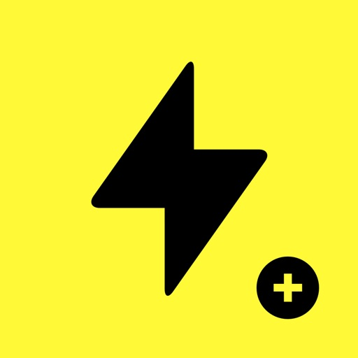

Mein Blitz-Tracker Pro ist die beste App, um Blitzeinschläge auf der ganzen Welt nahezu in Echtzeit zu überwachen. Mit dem schlanken, modernen Design der App können Sie Gewitter beobachten, wenn sie auftreten. Sie können auch Benachrichtigungen über Blitzschläge in Ihrer Region erhalten.

– Zeigt Blitzeinschläge auf der ganzen Welt an!
– Ermitteln Sie anhand des Verlaufs der Hotspots, wo Blitzschläge am häufigsten auftreten!
– Die detaillierte Informationen über den Ort des Gewitters werden auf einer Karte angezeigt.
– Erhalten Sie Benachrichtigungen, wenn sich ein Sturm in der Nähe befindet, damit Sie ihn live überwachen können.
– Benachrichtigen Sie Ihre Freunde übe reinen Blitzschlag, damit auch sie wissen, wo Donner und Blitzen auftreten könnten!
– Volle Unterstützung für die neuesten Versionen von iOS.
– Keine Werbung!

Wenn Sie auf effiziente Weise Informationen über Blitzschläge und Gewitter suchen möchten, ist Mein Blitz-Tracker Pro die richtige App für Sie. Diese App informiert Sie, wenn ein Gewitter naht.

[View on Apple](https://apps.apple.com/us/app/my-lightning-tracker-pro/id1175031995)

## Noir - Dark Mode for Safari

Noir is a Safari extension that automatically adds a dark mode to every website you visit.

It makes browsing the web at night so much better. With Noir, you won’t be blinded by bright websites ever again.

And the results look great too. Noir generates a custom dark style for each website you visit, based on the colors that are used on a page. You won’t even notice this happening in the background – that’s how fast it is – but you’ll certainly appreciate the end result: a beautiful dark mode tailored for each website, where contrast is preserved and highlights still pop. And with over 20 built-in themes and the ability to create your own, you can customize the results exactly the way you want.

Noir works with any website you visit in Safari, automatically. By default, Noir is linked to your device’s Dark Mode, so websites will only go dark when you want them to. But you can easily customize this to your liking, even per website. Only want to use Noir on just a few specific websites? Sure thing! Disable Noir on some websites? No problem!

Built from the ground up for iOS and iPadOS, the app feels right at home on your device. It supports the brand new Safari web extension feature, which means there’s no need to manually activate it every time you load a new page. The app also tightly integrates with system features such as Shortcuts, Control Center, Focus Filters, and Widgets to fully integrate Noir in all your workflows. And your settings are automatically synced to all your devices using iCloud.

And just as importantly, Noir takes your privacy seriously: it doesn’t collect any of your browsing data. Period.

Noir is made by an indie iOS developer. It does not include any subscriptions or ads. Buy Noir once, use it forever.

Notes:
• Found a website where Noir’s dark mode doesn’t look just right? Let me know by reporting it. The app will be frequently updated to address issues that are reported.

Privacy Policy:
• The Noir extension requires access to the websites you visit to analyze the existing style of the page and to override it with Noir's dark style.
• Noir never collects your browsing data. The only data Noir ‘collects’ are your settings, and those will never leave your device or iCloud account.
• You can read Noir’s full Privacy Policy at https://getnoir.app/privacypolicy

[View on Apple](https://apps.apple.com/us/app/noir-dark-mode-for-safari/id1581140954)

## Necrophonic

Necrophonic is an ITC app used for spirit communication and EVP research.

8 Sounds Banks:

The audio has been mastered in a way to bring out various sound properties . 
Using Pro Tools I was able to enhance high, mid, and low range frequencies. I also applied 
other filters to create unique sound characteristics to help layer the audio and create an 
environment suitable for spirit communication.

The audio itself is made up of phonemes, 
partial words, reverse audio, foreign languages, and other parts of speech that can help 
spirits communicate. Besides some basic phonetic sounds such as na, no, da, do, di, ma, may, etc.
there are no real words of phrases contained in the banks.

These sounds banks play in a similar
way to that of my other app "Spiritus Ghost Box" but instead of 4 sound banks Necrophonic has
8 active sound banks.

White Noise Sound Bank:

This app also has an optional 9th sound bank called "White noise". 
This bank can be used alone or with the other 8 giving you a total of 9 sound banks. This 
audio is taken for the internal sounds of the famous DR60 recorder that is known as the 
"Holy Grail" of EVP recorders. This is not a White Noise Generator, this is a normal sound bank like the others but this one contains white noise from the DR60.

Audio Effects:

This app does contain Echo and Reverb audio effects. These have been proven 
to be the best effects to apply to ITC sessions. The echo can create audio that can be 
manipulated within the echo itself. Echo can also help in live, real time communication by 
repeating the audio and allowing you to better hear whats coming through. Reverb can be 
applied to the audio to create a spacious sound environment that will enhance audio manipulation.

[View on Apple](https://apps.apple.com/us/app/necrophonic/id1396698319)

## AutoSnore: 鼾声记录器

通过 iPhone 自动追踪您的鼾声和睡眠声音，无需订阅费！ 只需轻点开始按钮，然后安心入睡。

实力团队匠心打造
-------------
由广受欢迎的 AutoSleep App 原班团队开发，以全新创新方案助力用户掌控睡眠、改善健康。

诚信软件，良心定价
--------------------
无订阅机制。 无额外 App 内购买。 无后续费用。 一次性低价购买，即可终身使用。 包括所有功能。

简单易用
-------------
您只需要一部 iPhone。 只需启动 AutoSnore 并将手机放在床边。 醒来后即可聆听录音并查看洞见，就是这么简单。

为什么选择 AutoSnore？
-------------
睡眠弥足珍贵。全球近一半成年人受打鼾问题困扰（而大多数人甚至不自知）。是时候认真对待这个问题了。 打鼾会对睡眠质量产生严重影响，不仅会影响打鼾者本人，也会干扰同床伴侣的休息。

AutoSnore 有什么作用？
-------------
AutoSnore 可记录各种打鼾和睡眠声音，包括每次打鼾的频率、强度和持续时间，全面呈现每晚的打鼾情况。早上醒来时，系统会提供可视化分析图表，帮助您了解打鼾对整体睡眠质量的影响。

高级声音识别
-------------
AutoSnore 利用机器学习声音识别技术，可以对您所有的睡眠声音进行分类，例如打鼾、梦呓、打哈欠、咳嗽等等！这真是太神奇了。

它能帮到我吗？
-------------
当然可以！ AutoSnore 支持个性化策略跟踪，帮助您尝试各种改善方法： 无论是改变生活方式、调整睡姿、更换枕头、尝试放松技巧，还是避免晚餐时饮酒，该 App 都能帮助用户尝试不同的方法，找到最适合自己的解决方案。

AutoSleep 集成
-------------
与 AutoSleep 应用程序完美配合，您的打鼾数据可自动与睡眠分析同步！

全面保护隐私
-------------
与我们所有的 App 一样，AutoSnore 将用户隐私和数据安全放在首位。 请对比下方的 App 隐私标签，查看“未收集数据”。 您可以查看其他所谓“免费”打鼾 App，看它们能否做到同样承诺：

无数据分析跟踪。 无广告插件。 无第三方代码。 无数据上传。 所有录音数据和洞见仅安全地保存在您的设备上。 只有用户可以选择与其他人分享录音。 这才是隐私保护该达到的标准。

立即开始使用
-----------------
越早开始收集数据，就能越早进行管理。

对于任何想要改善睡眠和整体健康的人来说，AutoSnore 都是一款必备 App。 其采用独特的 App 设计方法，摒弃一切冗余，直击问题核心，同时不让您花费过多。

AutoSnore并非医疗器械。如有任何健康问题或疑虑，请务必咨询专业医疗人员。

Xiaohongshu
https://xhslink.com/m/2jNT7YK0hDk

Weixin
https://mp.weixin.qq.com/s/VG_LflL7y0QYrdOIrpRlLw

[View on Apple](https://apps.apple.com/us/app/autosnore-snoring-recorder/id6746705608)

## Things 3

So kriegst du alles geregelt! Mit der preisgekrönten Things-App planst du deinen Tag, verwaltest Projekte und arbeitest effizient auf deine Ziele hin.

Und das Beste: Sie ist ganz einfach zu verwenden. Im Handumdrehen ordnest du deine Gedanken und Aufgaben – von alltäglichen Erledigungen bis hin zu den größten Lebenszielen – und kannst dich mit freiem Kopf ganz darauf konzentrieren, was heute für dich zählt.

„Von allen getesteten Apps bietet Things das beste Gesamtpaket aus Design und Funktionalität – mit beinahe allen Features anderer Profi-Apps und einer stilsicher gestalteten Oberfläche, die bei der Arbeit nie in die Quere kommt.“
– Wirecutter, The New York Times

WICHTIGSTE MERKMALE

• Deine Aufgaben
In Things dreht sich alles um Aufgaben. Immer, wenn du eine erledigst, ist das ein kleiner Schritt zu einem großen Erfolg. Teile große Aufgaben in kleinere auf. Kläre die nötigen Details mit Notizen. Kategorisiere sie mithilfe von Tags. Und mach dir einen Plan für die nächsten Tage.

• Deine Projekte
Erstelle ein Projekt für jedes deiner großen Ziele. Things hilft dir, den nächsten Schritt klar zu sehen. Behalte den Überblick dank Überschriften, Notizen und Deadlines. So bleibst du stets auf Kurs.

• Deine Bereiche
Erstelle einen Bereich für jeden Aspekt deines Lebens, der dir wichtig ist. Zum Beispiel für Arbeit, Familie, Gesundheit oder Finanzen. So bleibt alles sauber geordnet und du behältst das große Ganze im Blick.

• Dein Plan
Die Listen „Heute“ und „Geplant“ zeigen übersichtlich deine geplanten Aufgaben zusammen mit deinen Kalender-Einträgen. So siehst du jeden Morgen mit einem Blick, was an diesem Tag ansteht.

WEITERE GENIALE FEATURES

Wenn du mit Things arbeitest, wirst du auf weitere hilfreiche Funktionen stoßen. Hier nur einige davon:

• Erinnerungen – stelle eine Zeit ein, und Things erinnert dich.
• Wiederholungen – wiederhole Aufgaben automatisch im eingestellten Rhythmus.
• Heute Abend – ein Feature speziell für deine Abendplanung.
• Kalender-Integration – lass Kalender-Ereignisse und Aufgaben kombiniert anzeigen.
• Tags – kategorisiere Aufgaben und filtere Listen im Handumdrehen.
• Schnellsuche – finde sofort Aufgaben oder wechsle zwischen Listen.
• Magic Plus – ziehe die „+“-Taste, um Aufgaben an einer beliebigen Stelle einer Liste hinzuzufügen.
• Per E-Mail an Things – leite eine E-Mail an Things weiter; schon wird eine Aufgabe erstellt.
• Markdown — strukturiere und gestalte deine Notizen.
• Apple Watch-App – hebe das Handgelenk, um die Liste „Heute“ zu sehen.

FÜR DAS IPHONE ENTWICKELT

Things ist speziell an das iPhone angepasst und schöpft seine Möglichkeiten voll aus. Erstelle schnell Aufgaben innerhalb anderer Apps, binde Kalender ein, füge eine Vielzahl von Widgets hinzu, sprich mit Siri und integriere Kurzbefehle – all das bietet Things!

PREISGEKRÖNTES DESIGN

Things wurde aufgrund seines herausragenden Designs vielfach ausgezeichnet, unter anderem mit zwei Apple Design Awards. Jedes Detail wurde genau durchdacht und dann bis zur Perfektion ausgefeilt.

„Anspruchsvoll genug für professionelles Arbeiten, überraschend einfach zu bedienen und ein echter Hingucker.“
– Apple

HOL DIR THINGS NOCH HEUTE

Was auch immer du im Leben erreichen willst, Things hilft dir dabei. Installiere heute die App und sieh, was du schaffen kannst!

• Things gibt es auch für Mac, iPad und Apple Vision Pro (separat erhältlich).
• Die Synchronisierung erfolgt kostenlos über Things Cloud.
• Things für den Mac kann kostenlos getestet werden: www.things.app

Wende dich an uns, wenn du Fragen hast. Wir helfen gerne weiter.

[View on Apple](https://apps.apple.com/us/app/things-3/id904237743)

## Ableton Note

Entwickele neue musikalische Ideen mit ausgewählten Sounds und Effekten. Erstelle Beats und Melodieparts, sample deine Umgebung und entwickele deine Tracks in Ableton Live weiter.

Note ist ein Ort für Skizzen, neue Sounds und Ideen: Lass deinen Ideen freien Lauf oder experimentiere einfach, bis die Inspiration einsetzt. Dabei steht dir eine Auswahl von Lives Drum-Kits, Synths und Instrumenten zur Verfügung. Erstelle deine eigene Klangpalette, indem du mit dem integrierten Mikrofon deines Telefons Samples aufnimmst. Und nutze den integrierten MIDI-Editor von Note, um Noten, Beats und Akkorde zu sequenzieren oder beim Hören Anpassungen zu vorzunehmen
 
Verfolge deine Ideen, wohin auch immer sie dich führen und sende deine Projekte mit Ableton Cloud an Live, ohne die App zu verlassen. Du findest deine Projekte in Lives Browser und kannst dort weiterarbeiten. Sämtliche Samples und Sounds werden direkt aus Note übernommen, MIDI-Noten kannst du nach Belieben verändern. Alle Nutzerinnen und Nutzer von Ableton Note bekommen eine kostenlose Lizenz für Ableton Live Lite – der einfachen und intuitiven Software, mit der Musikschaffende, Producer und DJs aus aller Welt komponieren, aufnehmen und performen. Nutzerinnen und Nutzern von Ableton Move können mit Note außerdem vom Telefon aus weiter an Sets arbeiten.
  
Mit einem Beat einsteigen:
• Wähle zwischen 76 Drum-Sampler-Kits
• Tippe auf 16-Pads einen Beat ein oder sequenziere ihn mit dem MIDI-Editor
• Spiele Drums melodisch im 16-Pitch-Modus
• Quantisiere deine Beats oder verschiebe Noten, um ungenaues Timing und Fehler zu korrigieren
• Schichte Rhythmen übereinander
• Erzeuge Beat-Wiederholungen mit Note Repeat
• Verändere deine Sounds mit Parametern
• Experimentiere mit Effekten oder sorge mit Swing für mehr Abwechslung
 
Mit einer Melodie starten:
• Entdecke 317 Synth-Sounds and 60 melodische Sampler-Instrumente
• Spiele oder programmiere Melodien und Akkordfolgen mit dem 25-Pad-Raster, der Pianorolle oder dem MIDI-Editor
• Lege Tonarten und Skalen fest – für harmonische Ergebnisse
• Schichte mehre Harmonien übereinander
• Verändere deine Sounds mit Parametern
• Spiele mit Effekten für experimentelles Sound Design
 
Deine Welt sampeln:
• Erstelle eigene Drum-Kits aus Aufnahmen perkussiver Sounds im Drum Sampler von Note
• Baue eigene melodische Sampler-Instrumente aus zuvor aufgenommenen tonalen Sounds
• Bearbeite deine Samples durch Zerschneiden, Filter und Pitch-Änderungen
• Sequenziere Samples mit dem MIDI-Editor in Beats, Melodien und Akkorde
• Forme und verzerre Sounds mit Effekten
• Importiere eigene Samples oder Audiomaterial aus Videos

Mit Audio arbeiten:
• Füge Audio-Clips aus der Bibliothek hinzu
• Warpe das Tempo oder passe die Tonhöhe deiner Clips an
• Nimm Audio direkt mit dem integrierten Mikrofon deines Telefons auf
• Schließe ein Audio-Interface an, um externe Quellen aufzunehmen
• Kombiniere aufgenommenes und importiertes Audio mit deinen Beats und Melodien

Improvisationen einfangen:
• Halte deine Ideen mit „Capture“ fest – auch nach dem Spielen
• Spiele nach Gefühl – Note erkennt das Tempo
• Note bestimmt automatisch die Länge einer Phrase und erzeugt einen Loop
• Quantisiere Loops, füge Sounds hinzu und verändere sie
• Schließe deinen MIDI-Controller an, um mit Tasten zu spielen und den Sound der Instrumente intuitiv zu verändern
 
Abwechslung reinbringen:
• Note bietet ein Raster zum Spielen, ähnlich der Session-Ansicht in Live
• Verdopple Loops, um innerhalb von Clips Variation reinzubringen
• Dupliziere Clips und kombiniere verschiedene Versionen von Ideen
• Mehrere Noten gleichzeitig mit dem MIDI-Editor hinzufügen, löschen oder anpassen
• Erstelle acht Spuren mit bis zu acht Clips in acht Szenen
• Experimentiere mit verschiedenen Clip-Kombinationen und Songstrukturen
• Exportiere deine Skizzen und Songs als Audio-Datei, um sie mit anderen zu teilen

[View on Apple](https://apps.apple.com/us/app/ableton-note/id1633243177)

## Necrometer

Necrometer

Designed for ghost hunters and paranormal enthusiasts. This multifunctional app can be used to detect and communicate with spirits. We have taken known spirit communication techniques and theories and have implemented them here in new and innovative ways. 

-Meter that detects and measures magnetic energy
-Text and Speech modes
-2 Built in Text To Speech A.I. systems
-3 Voices
-Pitch control with randomization option
-Reverb and Echo audio effects

The Meter:
It is believed that spirits can affect magnetic energy fields. Using your phone’s Magnetometer sensor this app can detect levels of magnetic interference in the environment. These fluctuations of energy fields have a direct influence on the communication.
-Meter noise (optional) reacts to fluctuations in the meter

Text Mode:
Simply slide the power button over to "Text" and begin asking your questions. Walking around a location you can detect energy anomalies and various levels of magnetic interference. Words and phrases will begin coming through the app. The relevance of the communication is determined by multiple factors including spirit connection and strength. Those who have a stronger connection to the otherside may experience more direct and relevant communication. 
Similar to the famous Ovilus ITC device, the Necrometer app is designed to facilitate spirit communication by measuring fluctuations of energy in the environment. The idea that spirits can manipulate electronic devices for purposes of communication is well documented. Based on the theory of random selection and known evidence of energy manipulation, the Necrometer app utilizes these known methods of spirit communication and paranormal phenomena. 
-Access to over 60k words/phrases
-Custom word list, Add your own words and phrases

Speech Mode:
Sliding the power button over to "Speech" will turn on this unique mode of the app. Created to facilitate ghost box/ EVP like communication, the speech mode of the app provides audible spirit communication like no other. Generating speech sounds from within the app, there are no sound banks, word lists, radio, or any other pre-recorded audio. Spirits can use and manipulate these random speech sounds to form coherent messages, an idea rooted in ITC/EVP theory. Some of these messages may be heard in real time similar to a ghost box, other EVP-like communication can be heard on playback of the recorded audio. Again, the strength and level of communication being recieved depends on various factors. Coherent messages can only be obtained through communication with spirit, otherwise only unclear speech sounds will be heard.
-Rate slider to increase/decrease rate of audio coming through

The Necrometer app is an advanced all-in-one app that can be used to detect energy anomalies in the area, produce words and phrases that can provide relevant clues/information, and provide audible ITC/EVP communication from spirit.

[View on Apple](https://apps.apple.com/us/app/necrometer/id1670762759)

## HappyCow - Vegan Food Near You

Featured auf CNN und in der New York Times und The Guardian: Die #1 unter den veganen und vegetarischen Restaurantführer des App Store. Seit 1999 hat HappyCow Benutzern geholfen, vegane Optionen in über 200.000 Restaurants, Cafés und Lebensmittelgeschäften in über 180 Ländern zu finden. Jetzt ist es einfach, vegane Lebensmittel in der Nähe zu finden oder zum Mitnehmen zu bekommen. Lesen Sie mehr als 1.875.000 Bewertungen und sehen Sie mehr als 3.000.000 Fotos, die von unserer großartigen Community gepostet wurden! Mit HappyCow können Sie nach vegan-freundlichen Bäckereien, Reformhäusern, Catering, Bauernmärkten, Saftbars, Cafés oder anderen veganen Geschäften suchen und Filter für Lieferung und Mitnahme verwenden!

Eigenschaften:
* Suchfilter nach Standort, vegan, vegetarisch, Geschäften usw. und nach Stichworten
* Stöbere in HappyCow nach einem beliebten Café oder Restaurant mit guten Bewertungen
* Speichere Deine Favoriten zum zukünftigen Zugriff (offline verfügbar!)
* Organisiere Restaurants und Geschäfte für Deine bevorstehenden Reisen (Nutzung ohne Internet)
* Zeige Unternehmen auf interaktiven Karten an
* Sieh dir Fotos, Rezensionen und Informationen an, die Dir helfen, die beste Mahlzeit zu finden
* Rufe Wegbeschreibungen, Telefonnummern, Bewertungen und Website-Informationen ab
* Einfach teilen, was Du mit Deinen Freunden gefunden hast
* Über 220.000 vegan-freundliche Angebote
* Der Inhalt wird rund um die Uhr von einem engagierten Team und unseren 2 Millionen + monatlichen Besuchern aktualisiert
* Lade Fotos von Deinem köstlichen Essen hoch
* Hilf allen anderen HappyCow-Nutzern mit Deinen Bewertungen und Ratschlägen
* Tritt der größten Veg Community von über 1.000.000 Mitgliedern bei
Gibt's Probleme? Schick uns eine Nachricht: ios (at) happycow.net

[View on Apple](https://apps.apple.com/us/app/happycow-vegan-food-near-you/id435871950)

## e-Sword LT: Bible Study to Go

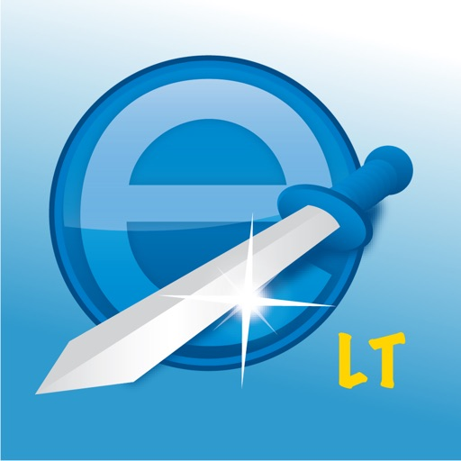

e-Sword® — the world's most popular PC Bible study software is now available on the world's most advanced mobile operating system!  e-Sword LT is the little brother of e-Sword HD for the iPad, but has many of the same powerful features in a slimmer design for the iPhone.  e-Sword LT is feature rich and user friendly.  As your Biblical library grows you will appreciate the intuitive layout and synchronization of resources.  e-Sword LT is so easy to use you may never need to read the Tutorial!

EVERYTHING NEEDED to study the Bible in an enjoyable and enriching manner.  All Bibles, commentaries, dictionaries, … everything is just a tap away!

POWERFUL SEARCHES that are simple to use.  Enter as many words you want to search for and select the settings.  You can even search on Strong numbers!

STRONG'S DEFINITIONS are just a tap away and presented in a popover.

SCRIPTURE REFERENCES too are just a tap away and presented in a popover.

COMPARE BIBLES quickly to see how the different versions translate a verse.

LOCATION MAPS pin-point Biblical places on live modern maps to help bring the narrative to life!

READING PLANS designed to help you grow in your knowledge of the Bible.

FORMATTED EMAILS of any selection of any text.  Perfect for sharing with others.

No Internet connection is required to use e-Sword LT.

e-Sword LT initially installs with the King James Bible and the King James with Strong's numbers study Bible, the Strong's Lexicon, Smith's Bible dictionary, Meyer's devotional commentary, and the Treasury of Scripture Knowledge cross references.  There are over one hundred additional Bibles, commentaries, dictionaries, reference books and devotionals that you can download and add to your library absolutely free!

Also available are some "locked" resources which must be purchased from their publisher.  These are copyright and licensing requirements which are unavoidable.

Please note that e-Sword LT is an *ENGLISH* release (but does include Spanish, Portuguese and French UI localization.)  There are dozens of non-English Bibles available, but all other content is in English.

The perfect app on the perfect device.  What are you waiting for?  Download e-Sword LT today and get to studying the Bible!

[View on Apple](https://apps.apple.com/us/app/e-sword-lt-bible-study-to-go/id634158738)

## WorkOutDoors

WorkOutDoors is the most advanced and most configurable workout app for the Apple Watch. It's perfect for running, cycling, hiking and any other indoor or outdoor activity.

Note: WorkOutDoors requires an Apple Watch Series 4 or later. It is not necessary to have your iPhone with you during a workout.

The app uses Apple’s workout system, so all workouts are saved to the Health system.  However it also provides many extra features over Apple's app, such as:

- a super-smooth vector map that can be shown during a workout;
- multiple configurable screens with metrics and graphs from a pool of 800+ data fields;
- route files can be imported and used for navigation (including turn by turn directions);
- dozens of configurable alerts (e.g. every mile; high heart rate; low pace; off-route etc);
- interval schedules can be created using the larger screen of the phone app;
- climbs and descents are supported with notifications and on-screen data and graphs;
- waypoints can be created, navigated to, and exported;
- use shortcuts to associate operations with gestures (e.g. double tap to hear configurable metrics);
- compare pace against a target or a previous workout (using metrics and a dot on the map);
- show zones for pace and power as well as heart rate (with optional coloured backgrounds);
- auto-pause is available for all outdoor activities;
- shows GPS and heart rate before starting a workout, so that you can wait for good signals;
- configure distance and pace for running / walking to come from Apple’s pedometer or from GPS;
- workouts can be exported in FIT / TCX / GPX files, or automatically sent to Strava;
- workouts created by the app can be analysed in great depth in the iPhone app.

The app also has many more features.  The map is a particular highlight.  It uses OpenStreetMap, which provides worldwide coverage and includes the trails necessary for outdoor workouts.  It also has several features that help you navigate during a workout:

- maps can be smoothly panned and zoomed, and can rotate according to the compass;
- a breadcrumb trail of your whole route is displayed on the map during the workout;
- topographic data can be shown, with configurable contour colours and hill shading;
- map-only mode is provided for when you don't want to start a workout and just need a map;
- a circular scale is shown when you zoom, making it easy to see the distance to features;
- maps can be stored on the watch for use when offline (they are downloaded as required if online);
- a red compass points north and a green compass points to the start;
- choose a waypoint to see a compass and distance to it in the corner of the map;
- you can also navigate to waypoints on the map, such as hospitals, sights, cafes etc.

If you load a route from a GPX / TCX / FIT file then navigation is even easier:

- your position is shown on an elevation profile of the route;
- the remaining distance, time and ascent can also be displayed;
- you can get alerted when you go off-route; 
- when off-route then a compass is shown which points to the nearest part of the route;
- if the route contains turn by turn directions then these can be used like a sat nav;
- if there are no directions then the app can use “bend detection” to generate them;
- the next direction is shown as an icon and distance in the corner of the map;
- the map can automatically zoom in when you are approaching a turn;
- you can use shake gestures to hear the distance to the next turn or the end of the route;
- routes are coloured by gradient: from red for steep uphill to blue for steep downhill;
- you can configure what information is displayed during a climb or descent.

All this is included for a single one-off payment. No extra in-app purchases or subscriptions are required (although there is a completely optional in-app tip jar which was requested by long-term users). 

If you own an Apple Watch and do any form of exercise, then WorkOutDoors is the app for you. Give it a go!

[View on Apple](https://apps.apple.com/us/app/workoutdoors/id1241909999)

## White Noise

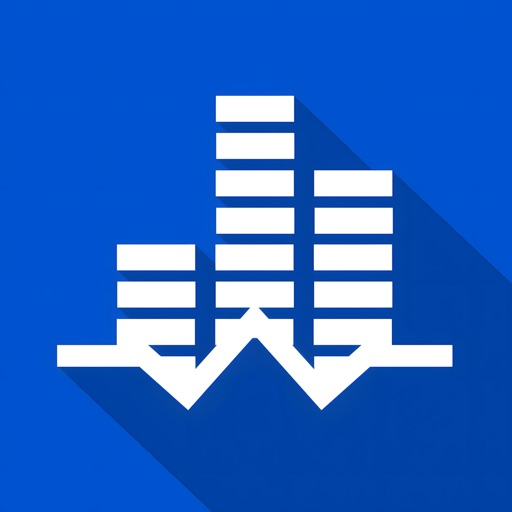

Do you have trouble going to sleep? Are you traveling on a plane and need a quick power nap? Does your newborn baby wake up in the middle of the night? There are numerous benefits to using White Noise:

• Helps you sleep by blocking distractions
• Relaxes and reduces stress
• Pacifies fussy and crying babies
• Increases focus while enhancing privacy
• Soothes headaches and migraines
• Masks tinnitus (ringing of the ears)

Even when you’re asleep, your brain is constantly scanning and listening for sounds. If it’s too quiet, unwanted noises such as faucet drips or police sirens can interrupt your sleep. White Noise generates sounds over a wide range of frequencies, masking those noise interruptions, so you can not only fall asleep, but stay asleep.

SOUND CATALOG

Air Conditioner, Airplane Travel, Amazon Jungle, Beach Waves Crashing, Blowing Wind, Blue Noise, Boat Swaying in Water, Brown Noise, Camp Fire, Cars Driving, Cat Purring, Chimes Chiming, City Streets, Clothes Dryer, Crickets Chirping, Crowded Room, Dishwasher Rinsing, Extreme Rain Pouring, Frogs at Night, Grandfather Clock, Hair Dryer Blowing, Heartbeat, Heavy Rain Pouring, Light Rain Pouring, Ocean Waves Crashing, Oscillating Fan, Pink Noise, Rain on Car Roof, Rain Storm, Running Shower, Running Water, Stream Water Flowing, Thunder Storm, Tibetan Singing Bowl, Train Ride, Vacuum Cleaner, Violet Noise, Water Dripping, Water Sprinkler, White Noise

APP FEATURES (FULL VERSION)

• FULL: 50+ perfectly looped sounds with additional free sounds from the White Noise Market at https://whitenoisemarket.com/
• FULL: Apple TV and Apple Watch App
• FULL: Over 20 Alarm Sounds that slowly fade in so you wake refreshed.
• FULL: No Advertisements. Disable Market & Rating Prompts in Settings.
• Background audio support so you can use other apps while listening.
• Revolutionary Mix Pad editor for creating new soundscapes like a DJ with support for adjusting sound position, sound variance, volume, and pitch of each individual sound in the mix.
• Record and professionally loop sounds without being an audio engineer!
• Upload and Share your recordings and mixes with the White Noise Market app.
• Full screen digital clock with multiple colors and brightness controls makes it the perfect companion for any nightstand.
• Advanced alarm and timer system that slowly fades audio in and out so you awake naturally feeling more refreshed
• Retina display support with Portrait/Landscape orientations.
• On-screen media player and volume controls with swipe gesture support for navigating sound collection
• Heart favorite sounds and mixes in the sound catalog for quick access using the Favorites view
• Use iPod Music as alarms that slowly fade in so you wake refreshed
• Remote media controls with bluetooth, lock screen, and headphones
• Advanced controls for volume, balance, pitch, mixing with iPod music, looping the playlist, custom alarm snooze times, and more
• Generate custom color noises, binaural beats, and tones with Generator In-App Purchase

Website: https://www.tmsoft.com/white-noise/

White Noise Market: https://whitenoisemarket.com

Thanks for using White Noise by TMSOFT!

[View on Apple](https://apps.apple.com/us/app/white-noise/id289894882)

## Stack the States®

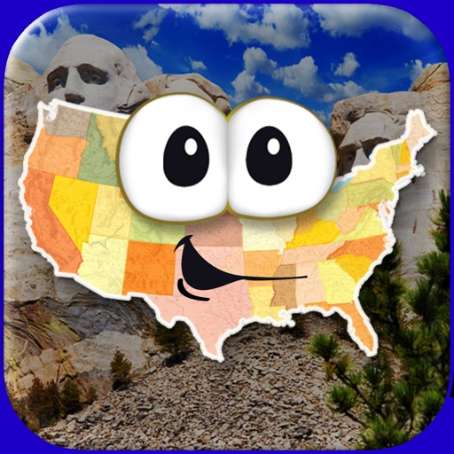

Stack the States® makes learning about the 50 states fun!  Watch the states actually come to life in this colorful and dynamic game! 

As you learn state capitals, shapes, geographic locations, flags and more, you can actually touch, move and drop the animated states anywhere on the screen. Carefully build a stack of states that reaches the checkered line to win each level.

You earn a random state for every successfully completed level.  All of your states appear on your own personalized map of the United States.  Try to collect all 50!  As you earn more states, you begin to unlock the four free bonus games: Map It, Pile Up, Puzzler and Capital Drop.  Four games in one!

HAVE FUN LEARNING ALL ABOUT THE 50 STATES:
▸ Capitals
▸ State shapes
▸ Abbreviations
▸ Bordering states
▸ Location on the map
▸ Nicknames
▸ Flags
...and more!

FEATURES:
▸ Hundreds of unique questions
▸ Interactive map and 50 state flash cards
▸ Choose any of the 50 friendly-looking states as your avatar
▸ Create up to six player profiles
▸ Collect all 50 states and track your progress on a personalized map
▸ Earn FREE bonus games: Map It, Pile Up, Puzzler and Capital Drop
▸ High resolution pictures of famous US landmarks
▸ All games are powered by a realistic physics engine
▸ Fun sound effects and music
▸ iPhone 4 and new iPad Retina Display support
▸ Works on both iPhone and iPad - a universal app

FIVE GAMES IN ONE:

STACK THE STATES: Build tall piles with states and try to reach the checkered line.

MAP IT: Tap the location of the selected state on the map.  Try to complete the whole country.

PILE UP: The states are piling up!  Tap them quickly to get rid of them before they pile too high.

PUZZLER: Sit back and relax as you slide the states around and put them together like a jigsaw puzzle.

CAPITAL DROP: Match states with their capitals in this fast-paced bonus game.  Don't let a state fall!

Stack the States® is an educational app for all ages that's actually FUN to play.  Try it now and enjoy five games for the price of one!

PRIVACY DISCLOSURE
Stack the States®:
- Does not contain 3rd party ads.
- Does not contain in-app purchases.
- Does not contain integration with social networks.
- Does not use 3rd party analytics / data collection tools.
- Does include links to apps by Dan Russell-Pinson in the iTunes App Store (via LinkShare).

For more information on our privacy policy please visit:
http://dan-russell-pinson.com/privacy/

[View on Apple](https://apps.apple.com/us/app/stack-the-states/id381342267)

## Blower

"It blows air!", CNN --- Unlocken Sie den neuen mind-blowing-Funktion auf Ihrem iPhone und iPad: Ändern Sie es in einem echten Luft Blower! Blower nutzt geheime Hardware-Features von Ihrem Device, überprüfen Sie unten die Blower Power.

• "Believe it or not, it blows air!" , Gizmodo
• Knocked Ellen Degeneres out of her chair during her TV talkshow!
• "a one-of-a-kind application that pushes the iPhone’s functionality and awesomeness even further", krapps.com

• Ranked overall #1 in 20+ countries in the App Store
• 40+ YouTube Videos von Blower Nutzern auf der ganzen Welt
• "This is both totally stupid and incredibly brilliant", youtube comment by "mambokurtz"

Probieren Sie es aus und staunen Sie... Starten Sie Ihren Blower und spüren Sie die Luft aus der Lautsprecheröffnung. Lustige Party Trick Beispiele:

• BLOW Modus: Kerzen und Feuerzeugflamme ausblasen
• BEAT Modus: lassen Sie Flammen zum Musik Beat tanzen, oder kontrolliere Flammen mit deiner Stimme!
• GUN Modus: lassen Sie Flammen zittern mit automatischen Gun Modus
• TUNER Modus: passen Sie den Gebläsemotor an, um den Luftstrom auf Ihrem Gerät zu optimieren
• Berühren Sie die Rotor des Blowers: treiben Sie es selbst it und sehen Sie die Funken
• Geburtstag iMessage Stickerpack

Neugierig? Sehen Sie sich Blower in Aktion auf BlowerApp.com, oder suchen Sie "iPhone blower" auf YouTube.
Vielen Spaß!

Qneo

BLOWER POWER
Für ein Maximum Blower Power, verwenden Sie das Device ohne zusätzliche Schutzhüllen / Gehäuse, verwenden Sie maximale Lautstärke, optimieren mit dem eingebauten Tuner, und stellen Sie sicher daB kein Staub in Ihrem Lautsprecheröffnung angesammelt ist. Sie können den kühlen Luftstrom überprüfen, durch die Lautsprecheröffnung nahe Ihrem Mund zu halten. Beim Ausblasen von Kerzen, brennen Sie nicht Ihren Gerät!

[View on Apple](https://apps.apple.com/us/app/blower/id335862325)

## OBD Fusion

OBD Fusion is an app for your car that allows you to read OBD2 vehicle data directly from your iPhone or iPad. You can clear your check engine light, create custom dashboards, read diagnostic trouble codes, estimate fuel economy, and much more!

Is your check engine light on? Do you want to monitor fuel economy and usage in your vehicle? Do you want cool looking virtual dashboards on your iPhone or iPad? If so, then OBD Fusion is the app for you! OBD Fusion is used by professional mechanics, do-it-yourself mechanics, and vehicle owners who want to monitor their vehicle and daily driving habits. Drive smarter, improve your fuel economy, and keep your engine healthy!

IMPORTANT NOTE: You must have a Wi-Fi ELM327 compatible adapter or compatible Bluetooth LE adapter such as Veepeak BLE/BLE+ 4.0 adapter, Carista BLE adapter, OBDLink MX+, OBDLink CX, Tonwon BLE adapter, LELink BLE adapter, Viecar BLE adapter, Lonauto adapter, Vgate iCar Bluetooth 4.0, BAST BLE adapter, Kiwi 3/4 to use this app. OBD Fusion is not compatible with generic ELM Bluetooth scan tools. Checkout additional adapters here: https://www.obdsoftware.net/software/obdfusion

OBD Fusion supports all OBD2 and EOBD vehicles sold worldwide. If you're not sure whether your vehicle is OBD2 or EOBD compliant, see this page for more information: https://www.obdsoftware.net/knowledgebase/obd2compliant. OBD Fusion can also connect to some JOBD vehicles that don’t support standard OBD2 protocols.

Electric vehicles (EVs) are not required to have OBD2 diagnostics since they are emissions exempt. If you are interested in using OBD Fusion on an EV, contact us first to inquire about support.

OBD Fusion has a ton of features including:
- Read and clear emissions-related trouble codes (fault codes) and your Check Engine Light (MIL)

- View vital driving information on your CarPlay screen. Note that real-time gauges are not supported by CarPlay, so you can't view your OBD Fusion pages such as dashboards on CarPlay.
- With optional enhanced diagnostic add-ons, you can read and clear enhanced trouble codes on other modules such as ABS, SRS, etc. and read transmission temperature. An enhanced diagnostic add-on is required for this functionality.
- Real-time dashboard display with fully customizable gauges. Create your own dashboards with the gauges that you want to see.
- Performance calculations for 1/4 mile and 0-60 mph track times
- Fuel economy MPG (US and UK), l/100km or km/l calculation
- Full diagnostic report that can be stored and shared
- Real-time graphing of multiple signals
- Real-time data logging and playback
- Multiple trip meters

- Log data to CSV file
- Create custom enhanced PIDs
- Includes some built-in enhanced PIDs for GM vehicles
- Display Boost pressure in real-time
- Display Engine Power and Torque
- Display calculated Air-to-fuel ratio
- Display battery voltage

- Read freeze frame data

- Fully customizable units including English, Imperial, and Metric units

- Over 250 supported PIDs

- Display vehicle information including VIN and calibration ID

- Emissions readiness for each US state. Find out if your car will pass emissions inspection.
- Oxygen Sensor Results (Mode 05)

- On-board Monitoring Tests (Mode 06)

- In-performance Tracking Counters (Mode 09)

- GPS tracking - plot vehicle parameters on a map
- Integrated iCloud and Dropbox functionality
- Available in English, Spanish, French, Italian, German, Czech, Greek, Chinese, and Portuguese
- Manufacturer specific Enhanced Diagnostics are available for certain vehicles through In-App purchases.

** Continued use of GPS running in the background can dramatically decrease battery life.

OBD Fusion is brought to you by OCTech, LLC, the makers of TouchScan and OBDwiz.

OBD Fusion is a trademark of OCTech, LLC registered in the U.S.

[View on Apple](https://apps.apple.com/us/app/obd-fusion/id650684932)

## QuickBend: Conduit Bending

QuickBend is the fastest and most precise conduit bending calculator app. Designed to be innovative and intuitive while remaining visually appealing. This advanced conduit bending calculator offers the most accurate measurements by taking into account the radius of the shoe and bender, plus the conduit type and size diameter. All measurements are generated using the centerline radius algorithm, and have all been rigorously processed and field tested. Even the bends displayed within QuickBend are generated using the same engine.

Built for electricians by an electrician. QuickBend can be used by anyone working with conduit or tubing whether you are a seasoned professional, a novice cub, or even a DIY enthusiast. Made to avoid simple mistakes, and to save time and money. In addition to providing fast and precise calculations, there is plenty of information and documentation provided for individual bends. Explanations on how to use specific features, and step by step process to bending conduit.

Offering the most intuitive method to input data. Whether you want to get straight to the point, or comb through the possibilities of a bend. You can switch back and forth between different input styles such as a number pad, or a slider bar (Press & Slide). Both having their unique advantages. QuickBend allows you, the user to toggle between three different types of measurements; inches, foot + inches, and centimeters.

With QuickCheck built into QuickBend, there's a subtle change in text colors when a bend is impossible (red), or whether the bend may be unlikely to work (orange). This app for convenience, and we want it to benefit you. So much so that we added it into the input styles for bends, so you can see if a bend is possible before even tapping on the bend amount.

Supporting the following bends!
• Offset
• Rolling Offset
• Matching Bends Offset
• Matching Centers Offset
• Parallel Offset
• Three-Point Saddle
• Four-Point Saddle
• 90° Bend
• Kick with 90°
• Matching Bend Kick
• Matching Center Kick
• Parallel Kick
• Parallel Kick: Forward
• Compound 90° - Circle Obstruction
• Compound 90° - Rectangle Obstruction
• Compound 90° - Square Obstruction
• Segmented 90°

Plus you have the ability to layout multiple bends on a single conduit, and get each measurement for a mark on the conduit. With the option to easily flip an individual or set of marks per bend.

There's no limit to QuickBend. Easily, select between different types of benders and choose the size of the shoe and conduit type all within the same screen that you are working on. No need for complex navigations. In addition, you can pin benders you use the most, so you can select and switch between them quickly without consistently scrolling. All benders are spec'd out using the information provided by the manufacturers, and worst case scenario if one of the many benders available don't match the one you are using you can now add in your own bender. There's also an option to not select a bender and to use the multiplier method.

Edit and view all of your benders' specifications. Detailed information on the centerline radius, deduct, gain, setback. Plus the ability to view the travel, and radius adjustment for any degree bend between up-to 90°. All of this is visualized and edited within the 'Bender Specs'.

[View on Apple](https://apps.apple.com/us/app/quickbend-conduit-bending/id1010311475)

## iReal Pro

iReal Pro réunit deux choses que les musiciens adorent en une seule app : un groupe d’accompagnement au son réaliste qui joue avec vous, et une énorme bibliothèque gratuite de grilles d’accords consultables à tout moment — en répétition, en jam session ou sur scène. Besoin de transposer un morceau pour un chanteur ? C’est fait. Envie de jouer avec une section rythmique complète derrière vous ? Appuyez sur play.

Désignée parmi les 50 Meilleures Inventions du TIME Magazine et utilisée par des milliers d’étudiants, professeurs et pros dans des écoles comme le Berklee College of Music — iReal Pro aide les musiciens à progresser depuis 2008.

GROUPE
• 50 styles d’accompagnement — Swing, Bossa Nova, Blues, Funk, Rock, Bluegrass, Reggae, Latin, Gypsy Jazz, Country et bien d’autres
• Personnalisez chaque style avec piano acoustique ou électrique, Fender Rhodes, guitares, contrebasse ou basse électrique, batterie, vibraphone et orgue
• 40 styles supplémentaires — blues, salsa, brésiliens — disponibles en achats intégrés

RECUEIL
• Téléchargez des milliers de grilles d’accords gratuites partagées par la communauté iReal Pro
• Créez vos propres grilles en quelques minutes avec l’éditeur intégré
• Organisez les grilles en listes pour vos concerts, sets ou cours

PRATIQUE
• Ajustez le tempo, bouclez les passages difficiles, transposez dans n’importe quelle tonalité
• Accélération automatique du tempo et cycle de tonalités pour un travail ciblé
• Transposition globale pour les instruments en Mib, Sib, Fa et Sol

ACCORDS
• Doigtés de guitare, ukulélé et piano pour chaque accord
• Touchez n’importe quel accord dans votre grille pour voir comment il se joue
• Suggestions de gammes pour l’improvisation

PARTAGER
• Partagez grilles et listes avec d’autres utilisateurs iReal Pro
• Exportez les grilles en PDF ou MusicXML
• Exportez les morceaux d’accompagnement en fichiers audio ou MIDI
• Synchronisez entre iPhone, iPad et Mac avec iCloud

POUR LES PROFS
• Créez des listes d’exercices ou de morceaux pour vos élèves
• Utilisez en classe, en direct ou en partage d’écran lors de cours en ligne

Nous sommes une petite équipe de musiciens qui avons créé cette app parce que nous en avions besoin nous-mêmes. Nous espérons que vous l’apprécierez autant que nous.

[View on Apple](https://apps.apple.com/us/app/ireal-pro/id298206806)

## TeleGuard

Anonymität garantiert – keine Registrierung
Es gibt keine Bindung an eine Telefonnummer und keine Erfassung von Benutzeri-dentifikationsdaten. Die TeleGuard-ID ist Ihre ganz persönliche Identifikationsnummer, die Sie brauchen, um sich mit Ihren Freunden zu verbinden. Jeder TeleGuard Nutzer erhält eine ID Nummer und einen QR-Code, welche zur Kontaktaufnahme verschickt werden können. 

Entworfen, um der sicherste Messenger der Welt zu sein
Der Fokus von TeleGuard liegt auf dem Schutz von Privatsphäre und vertraulicher Kommunikation. TeleGuard ist der datensichere Messenger aus dem Hause Swisscows. Swisscows hat es sich zur Aufgabe gemacht, seine Nutzer in jeder Lage vor Datenmissbrauch zu bewahren. Da heutzutage das Smartphone das meistgenutz-te Medium der Welt ist, ist ein sicherer Messenger unverzichtbar. 

Hochsicherer und moderner Server
Alle Server befinden sich in den Rechenzentren der Schweiz. Es wird ein komplexes Verschlüsselungssystem für alle übertragenen Daten verwendet und es werden abso-lut keine Benutzerdaten auf den Servern gespeichert. Alles ist absolut anonym. 

Darum ist TeleGuard besser als die anderen
TeleGuard verschlüsselt jede Nachricht und alle Telefongespräche mit dem besten Verschlüsselungsprogramm, was es derzeit gibt: SALSA 20. Da unsere Server in der Schweiz stehen, unterstehen wir nicht den Datenschutzgesetzen der EU / USA und müssen keine Daten weitergeben.

Wie wird meine Privatsphäre gesichert? 
HTTPS, Ende-zu-Ende-Verschlüsselung, Löschen von Nachrichten auf dem Server nach dem Lesen. Es werden keinerlei Benutzerdaten, weder IP-Adresse noch andere, erfasst oder gespeichert.

Funktionen

•	Text- und Sprachnachrichten senden
•	Bilder und Videos teilen
•	Video- und Sprachtelefonie
•	Dateien senden
•	Gruppen erstellen
•	Die Identität von Kontakten kann durch Scannen des QR-Codes verifiziert werden.

Support

Bei weiteren Fragen finden Sie hier unsere FAQs: teleguard.com/de#faq

[View on Apple](https://apps.apple.com/us/app/teleguard/id1505636751)

## MyRadar Weather Radar Pro

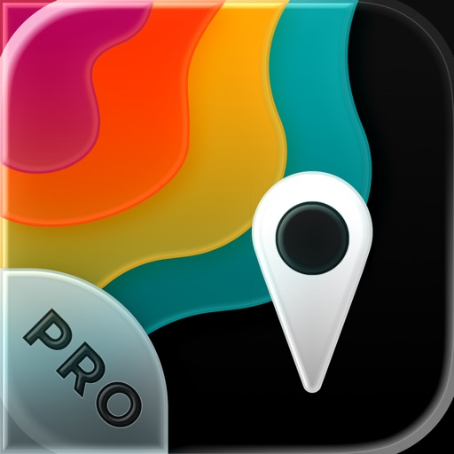

Thanks to everyone for making MyRadar so successful, with over 50 million downloads!

MyRadar Pro is IDENTICAL to the free version of MyRadar; it comes without the ads by default.

MyRadar is a fast, powerful, easy-to-use weather app that displays animated weather radar around your current location and to quickly show what weather is coming your way. Just start the app; your location pops up with animated live radar, with radar loop lengths of up to two hours. This basic functionality provides the quickest way to get a snapshot of the weather on-the-go, and it's what has made MyRadar so successful over the years. Check your phone and get an instant assessment of the weather that will impact your day.

In addition to the live radar, MyRadar has an ever-increasing list of weather and environmentally-related data layers that you can overlay on top of the map;  our animated winds layer shows a breathtaking visual representation of both surface winds and winds at the jetstream level; the frontal boundaries layer shows high and low pressure systems as well as frontal boundaries themselves; the earthquakes layer is a great way to stay on top of the latest reports on seismic activity, completely customizable as to severity and time; our hurricane layer allows users to stay on top of the latest tropical storm and hurricane activity throughout the world; the aviation layer overlays AIRMETs, SIGMETs and other aviation-related data, including the ability to track flights and display their IFR flight plans and paths, and the "wildfires" layer allows users to stay abreast of the latest fire activity around the United States.

MyRadar also has the ability to send weather and environmental alerts, including alerts from the National Weather Service, such as Tornado and Severe Weather alerts. A new feature introduced in this version of MyRadar includes the ability to receive alerts based off of Tropical  Storm and Hurricane activity;  you can configure the app to send you an alert any time a tropical storm or hurricane forms, or is upgraded or downgraded.

One of the most useful features in MyRadar is the ability to provide advanced rain alerts; our patent-pending process for predicting hyper-local rainfall is the most accurate in the industry. Instead of having to check the app all the time, MyRadar will send you an alert up to an hour in advance as to when the rain will arrive at your current location, down to the minute, including details on intensity and duration. These alerts can be a life saver when you're on-the-go and don't always have time to check the weather - our systems will proactively do the work for you and let you know in advance before the rain hits.

In addition to the free features of the app, additional upgrades are available, including real-time hurricane tracking - great for the start of hurricane season. The hurricane tracker provides additional data above and beyond the free version, including the cone of probability for tropical storm/hurricane forecast tracks, and it also includes a detailed synopsis from the National Hurricane Center. The premium upgrades also include the professional radar pack, which allows greater detail of radar from individual stations. Users can select individual radar stations around the US, select the radar tilt angle, and also change the radar product being displayed, including base reflectivity and wind velocity - great for experienced weather buffs looks to stay on top of possible tornado formation.

Download MyRadar today and try it out!
* Aviation Charts subscription (not required in order to use MyRadar) ($24.99 USD per YEAR)
* Payments will be charged to your iTunes account
* Account will be charged for renewal within 24-hours prior to the end of the current period
* Auto-renewal may be turned off at any time by going to your settings in the iTunes Store after purchase.

MyRadar’s Privacy Policy, visit: https://myradar.com/privacy
Full terms of service: https://myradar.com/terms

[View on Apple](https://apps.apple.com/us/app/myradar-weather-radar-pro/id325683306)

## YoungPhoto - Aesthetic Camera

Hi :) I’m YoungPhoto, a photography creator who makes taking better photos easier for over 400K followers.

Over the years, I’ve shared content about photo composition, color, and shooting tips. Now, I’ve created a photo app you can use in real life, right when you’re taking a picture.

The composition ideas and color filter tips you’ve seen on social media are now available directly in the app, so you can view them, follow them, and shoot in real time.

YoungPhoto is not just a filter app. It helps you understand how to take more aesthetic photos with real-time guidelines and composition tools that anyone can follow.

It was made for people who love photography but often feel like something is missing, people who want to capture ordinary moments like scenes from a movie, and beginners who want beautiful, emotional results without complicated editing.

YoungPhoto is designed to naturally guide the viewer’s eye, add story and atmosphere to each shot, and help you create photos with thoughtful composition and dreamy filters that work in many different settings.

Use YoungPhoto to capture your everyday life with more feeling, style, and intention :)

[Recommended For]

- Anyone who has thought, “Why don’t my photos look like that?”
- People who find photo composition difficult
- Anyone who wants easy guides for taking aesthetic photos
- People who want beautiful colors without complicated editing

[Key Featrues]

- Composition guidelines
- Composition lessons
- YoungPhoto aesthetic filters
- Effects
- Photo and video filter editing

[View on Apple](https://apps.apple.com/us/app/youngphoto-aesthetic-camera/id6763737180)

## Knoten 3D  (Knots 3D)

Binden, lösen und rotiere 220+ Knoten mit Deinem Finger in 3D!

Knoten 3D, unsere erstklassige 3D-Knoten-App wird Dir eine komplett neue Perspektive über Knoten geben! Nimm Dir ein Stück Seil und habe Spaß!

Produktmerkmale und Funktionen
- Lerne, 225 einzigartige Knoten zu binden
- Lokalisierte für: Niederländisch, Französisch, Deutsch, Italienisch, Koreanisch, Spanisch, Russisch, Dänisch, Chinesisch, Portugiesisch, Japanisch, Schwedisch, Türkisch, Hebräisch, Norwegisch, Polnisch und Englisch!
- Durchsuche die Knoten nach Kategorie, Art, Favoriten oder sehe Dir die gesamte Bibliothek an
- Sehe zu, wie sich Knoten selbst binden und mache eine Pause oder passe die Geschwindigkeit der Animation jederzeit an
- Rotiere die Knoten um 360 Grad, 3D-Ansichten helfen dabei, sie von einem anderen Winkel zu untersuchen
- Zoome einen Knoten heran, um ihn größer zu sehen
- Interagiere mit dem Knoten auf dem Bildschirm durch Multi-Touch-Gesten

Die Knoten werden unter ihren gebräuchlichen Synonymen oder lokalisierten Entsprechungen aufgelistet. Die Knotennamen sind in Niederländisch, Französisch, Deutsch, Italienisch, Koreanisch und Russisch aufgeführt.

Schmetterlingsknoten
Blutknoten
Palstek
Webeleinenstek
Doppelter Schotstek
Flämischer Achtknoten
Affenfaust
Halbmastwurf
Anglerschlaufe
Trompetenknoten
Zeppelinstek
...

Die gesamte Knotenliste:

https://knots3d.com/de/komplette-knotenliste

[View on Apple](https://apps.apple.com/us/app/knots-3d/id453571750)

## Stop Motion Studio Pro

Schließ dich 25 Millionen Kreativen an und erstelle Stop-Motion-Animationen im Handumdrehen.
Stop Motion Studio ist die App, mit der du beeindruckende Stop-Motion-Filme erstellen kannst.
Genieße leistungsstarke Kreativ-Tools – ganz ohne Werbung, Tracking oder Abos.

Stop Motion Studio ist die einfachste und gleichzeitig leistungsstärkste Stop-Motion-App für iPhone und iPad. Egal ob LEGO, Knete, Zeichnungen oder Alltagsgegenstände – hier kannst du alles in tolle Animationen verwandeln, ganz ohne Vorerfahrung.

Egal ob Anfänger oder erfahrener Animator – Stop Motion Studio gibt dir alles, was du brauchst, um deine Ideen in Bewegung zu bringen.

Beliebt bei Millionen

* Über 25 Millionen Nutzer weltweit
* Durchschnittlich 4,7 Sterne bei über 65.000 Bewertungen
* Zu sehen in Apples „Life on iPad“-TV-Werbung

„Stop Motion Studio macht es einfach, eigene Stop-Motion-Filme zu erstellen.“ – The Washington Post
„Weckt in uns allen den LEGO-Film-Fan.“ – TechNewsWorld

Präzise erstellen und bearbeiten

* Onion-Skin-Funktion und Animationshilfen für perfekte Ausrichtung
* Interaktive Timeline und Frame-für-Frame-Bearbeitung
* Frames kopieren, einfügen, ausschneiden oder einfügen
* Rotoscoping: über Videos zeichnen für coole Effekte
* Eingebaute Zeichenwerkzeuge, Textkarten und Sprechblasen
* Unerwünschte Objekte entfernen, Gesichtsausdrücke oder Ebenen hinzufügen
* Frames zusammenführen, um Bewegungsunschärfe oder Geschwindigkeit zu simulieren

Jeden Frame perfekt einfangen

* Manuelle Kamerasteuerung: Fokus, Belichtung, ISO, Weißabgleich
* Zeitraffer-Modus für automatische Aufnahmen
* Apple Watch oder ein anderes Gerät als Fernauslöser nutzen

Sound und Style hinzufügen

* Voiceover oder Erklärungen direkt in der App aufnehmen
* Soundeffekte, Musik nutzen oder aus der Bibliothek importieren
* Filter, Blenden und Übergänge für einen filmischen Look
* Greenscreen-Effekte für beliebige Hintergründe

Dein Meisterwerk teilen

* Export in 4K oder 1080p HD
* Direkt auf YouTube, TikTok teilen oder als GIF / iMessage-Sticker speichern
* Projekte via AirDrop, iCloud oder Dropbox übertragen
* Auf iPhone starten, auf Mac fertigstellen – alles bleibt synchron

Lernen und verbessern

* Schritt-für-Schritt-Tutorials und kreative Tipps inklusive
* Eingebautes Handbuch für schnelle Hilfe und Inspiration

Alles, was du brauchst
Keine Werbung. Kein Tracking. Keine Abos.
Deine Daten bleiben privat, deine Kreativität bleibt ganz dir.

Lade Stop Motion Studio noch heute herunter.
Schließ dich Millionen von Kreativen an und lass deine Ideen Frame für Frame lebendig werden.

[View on Apple](https://apps.apple.com/us/app/stop-motion-studio-pro/id640564761)

## Stash - Rule Based Proxy

Stash is the best choice for Clash rules on iOS! Full adaptation of Clash Premium configuration. 
Stash is a rule-based proxy client with multiple proxy protocol support. Support for Rule Set, JavaScript, HTTP Rewriting, MitM, SSID Policy Groups, On-Demand Connections and other new features.

- Handle TCP / UDP / ICMP traffic and forward to any proxy server
- Route traffic to different endpoint by rule of domain, IP-CIDR, or User-Agent
- Support DNS over TCP / DNS over TLS / DNS over HTTPS
- Native UI dashboard to display HTTP / HTTPS / TCP request
- Support for Rewriting HTTP(S) requests using JavaScript
- Decrypt HTTPS traffic with Man-in-the-Middle
- Support for URL Rewrite
- Fully IPv6 supports
- Builtin DNS server with hostname mapping
- Support for overriding some of the settings of the current configuration file using Override

[View on Apple](https://apps.apple.com/us/app/stash-rule-based-proxy/id1596063349)

## Pedi STAT

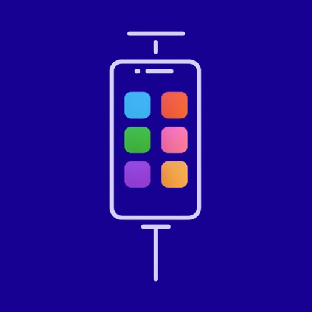

Pedi-STAT is a rapid reference for RNs, paramedics, physicians and other healthcare professionals caring for pediatric patients in the emergency or critical care environment.  

************************************
     Reviews
************************************

Among "The Best Drug Reference Apps for Emergency Physicians" - Emergency Physicians Monthly

5 STARS - "Simple interface provides rapid access to critical data needed when managing a critically ill pediatric patient"

5 Stars - "Very useful for treating kids in high pressure situations with precision."

*****************************

Pedi-STAT features include:

- Rapid results for airway interventions including endotracheal tube sizes, depth, intubation medication dosages, ventilator settings, and sedation

- Cardiac resuscitation data including weight specific dosages for resuscitation medications, cardioversion, and defibrillation

- Access to age and weight specific pediatric equipment including foley catheters, airway management, chest and NG tubes, peripheral and central line sizes, and more

- Seizure medication dosages

- Management of hypoglycemia including age specific dextrose concentrations

- Reference of age specific normal vital signs

- Procedural sedation dosages including single dose meds and infusions, as well as reversal agents

- Calculated pain management medications

- Medical management of allergic reactions and anaphylaxis

Users can quickly access critical information accurately, without having to rely on memory or cumbersome textbooks.  

With just a few taps, users have access to all the necessary data to care for a pediatric patient in the emergent setting, including weight-based and age specific medication dosages and equipment sizes.
  
Since many of the patients present with minimal known information, all the results can be calculated rapidly with only a known age, date-of-birth, weight, length, or height.  Simply enter the known variable and the data is instantly calculated. 

Developed by an Emergency Physician, this app minimizes the risk of medical errors allowing the provider to spend more time caring for the patient, and less time looking up and calculating doses.  

It is a critical companion for any physician, nurse, paramedic, or medical trainee involved in the care of critically ill pediatric patients.

[View on Apple](https://apps.apple.com/us/app/pedi-stat/id327963391)

## Tenuto

Tenuto is a collection of 24 highly-customizable exercises designed to enhance your musicality. From recognizing chords on a keyboard to identifying intervals by ear, it has an exercise for you. Tenuto also includes six musical calculators for accidentals, intervals, scales, chords, analysis symbols, and twelve-tone matrices.

A short description of the exercises and calculators follows.

––––––

• Note Identification
• Key Signature Identification
• Interval Identification
• Scale Identification
• Chord Identification
Tap the button corresponding to the written staff line. For example: if shown a C, E, and G with a sharp; tap the "Augmented Triad" button.

––––––

• Note Construction
• Key Signature Construction
• Interval Construction
• Scale Construction
• Chord Construction
Construct the specified label by moving notes and/or adding accidentals. For example: if shown a C and an "Augmented 4th" label, move the second note to F and add a sharp.

––––––

• Keyboard Reverse Identification
Tap the piano key corresponding to the written note on the staff. While similar to Note Identification, this exercise uses a piano keyboard rather than note name buttons.

• Keyboard Note Identification
• Keyboard Interval Identification
• Keyboard Scale Identification
• Keyboard Chord Identification
Tap the button corresponding to the highlighted piano key(s). If the C and G keys are highlighted, tap the "P5" (Perfect 5th) button.

––––––

• Fretboard Note Identification
• Fretboard Interval Identification
• Fretboard Scale Identification
• Fretboard Chord Identification
Tap the button corresponding to the marked fretboard position(s). If the 2nd fret of the D string is marked, tap the "E" button.

––––––

• Keyboard Ear Training
• Note Ear Training
Listen to the played reference and question notes. Select the piano key or note button corresponding to the question note.

• Interval Ear Training
• Scale Ear Training
• Chord Ear Training
Tap the button corresponding to the played notes. If E and F are played, tap the "Minor 2nd" button.

––––––

• Accidental Calculator
Display the accidental for a note and key.

• Interval Calculator
Display the interval for a note, type, and key.

• Chord Calculator
Display the scale for a tonic and scale type.

• Chord Calculator
Display the chord for a note, type, and key.

• Analysis Calculator
Display the chord for a symbol and key.

• Matrix Calculator
Display the twelve-tone matrix for a specified tone row.

[View on Apple](https://apps.apple.com/us/app/tenuto/id459313476)

## Jump Desktop (RDP, VNC, Fluid)

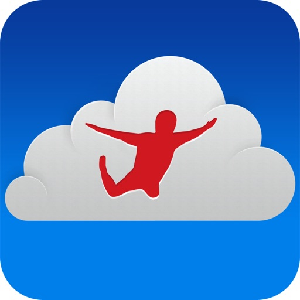

Leave your laptop behind. Enjoy the freedom to work from anywhere.   

Jump Desktop is a remote desktop application that lets you securely connect to any computer in the world. Compatible with both RDP and VNC, Jump Desktop is secure, reliable and very easy to set up. Jump Desktop also supports our own, high performance, next generation remote desktop protocol called Fluid Remote Desktop. 

Easy setup and reliable:
Jump Desktop is very easy to setup; anyone can do it! Just visit: https://jumpdesktop.com on your PC or Mac, click the ‘Automatic Setup’ link and follow step-by-step instructions. You’ll be up and running in no time. Also - not subscriptions!

Secure:
Jump encrypts the connection between computers to ensure privacy and security. Automatic connections are always encrypted by default. Supports NLA, TLS/SSL encryption for RDP. SSH Tunnelling and SSL/TLS encryption for VNC. Fluid Remote Desktop uses DTLS for secure connections.

Powerful features:
* Works with almost any computer and operating system.
* Supports physical mice! On iOS 13 and iPadOS, Jump Desktop supports the accessibility mouse with some limitations. Jump Desktop also supports special physical mice with no limitations. For more information visit https://jumpdesktop.com/mice. 
* Fluid Remote Desktop protocol supports high performance remote desktop and audio.
* Easy and secure setup: Automatically configure your PC or Mac for remote access using Wi-Fi/3G/LTE without worrying about your router settings. Setup as many computers as you like – there are no limits! 
* Built for iPad Pro, iPad, iPhone and iPod
* iPad Pro features: Full support for split-screen multitasking and Apple Pencil. 
* Open multiple simultaneous connections
* Live connection previews
* Protect your server settings using Touch ID
* Connection syncing via iCloud connection syncing
* Advanced Bluetooth keyboard: The best bluetooth keyboard support on the App Store. Shortcuts, function keys and arrow keys - everything works. Also includes macros for keys no available on bluetooth keyboards (i.e function keys)
* SSH tunneling with password and public key authentication supported
* Supports large custom screen resolutions and VGA/HDMI out 
* Full mouse support via touch gestures: left, right and middle button clicks, dragging, scrolling, precision pointer movement
* Multiple gesture support - includes the ability to draw or write using your finger
* Copy/paste: Transfer text to or from your computer using the pasteboard
* HDMI/VGA external monitor support: View your desktop on an external monitor using a cable or AirPlay. Jump Desktop will let you utilize you external display as a true monitor (not as a mirror like other apps on the store). 
* Multi-core rendering engine makes Jump Desktop one of the fastest RDP and VNC engines on the planet
* Full support for Linea and Infinea barcode and MSR scanners. Includes support for E2E encryption.

RDP features:
* Supports RD Gateway
* Supports custom resolutions. Set any resolution you want including Retina resolutions.
* Dynamic RDP resolution updates on Windows 8.1+
* Remote printing: Send print outs from your computer to your iPad/iPhone device (exclusive RDP print redirection feature on the App Store!)
* Folder sharing
* Audio streaming
* Console sessions
* International keyboard layouts
* Multiple monitor support on Windows 7+
* Multi-touch redirection support on Windows 8+

Fluid Features:
* Super high performance, adaptive remote desktop
* Audio streaming 
* Strong encryption built into the protocol
* Connect from anywhere, even restricted networks without requiring networking knowledge
* Clipboard sharing

VNC features:
* Tested with Mac OS X, TightVNC, RealVNC, UltraVNC, Linux (Ubuntu Remote Desktop)
* Secure: Supports SSH tunneling as well as SSL encryption
* Black & white, gray scale, 8, 16 and 24-bit color to help optimize bandwidth
* Multiple monitor support
* Macs: Support locking the Mac's screen and syncing the pasteboard

[View on Apple](https://apps.apple.com/us/app/jump-desktop-rdp-vnc-fluid/id364876095)

## CCW – Concealed Carry 50 State

This comprehensive app empowers the law-abiding CCW (concealed or open carry permit) holder (or anyone who wants to lawfully transport a firearm in any state.) It gives you direct information needed to follow the maze of arcane, complicated, and dissimilar gun laws in each state and in each situation. Easy-to-use User Interface and Laws & reciprocity updated monthly or more frequently!

Join the 200,000+ people who have already downloaded the #1 gun reference app on Apple App Store!

Key Features:
-Instant updates downloaded to your device with laws changes! Auto-update now available!
-Individual laws for each state and U.S. territory stored on your phone
-Updates reciprocity information for each license.
-State Laws in each category (Transporting Firearms w/o license, Places Off-Limits for license-holders, State Preemption, Duty to Inform, "No Guns" signs Force of Law, New / Renewal Licenses, Open Carry, Parking Lot Storage, Magazines & Tactical Rifles, Use of Force & Duty to Retreat, Red Flag Laws, Age Restrictions, Restaurants Serving Alcohol, Roadside Rest Areas, State & National Parks, State & National Forests, Wildlife Management Areas, )
-Includes Federal Laws, Airplane/Train Transport, and Indian Tribal Laws
-Save your licenses / permit info
-Contact directory of state officials
-All information available offline
-Find laws based on GPS (plus local points of interest)

App comes with a free two-year subscription to all law and reciprocity updates. Additional subscription available at only $.99/ year. Optional Auto-renew (charged to iTunes 24 hours before end of subscription). 

Convenient map to plan your next vacation or interstate-travel to avoid where you cannot carry. Save your current license or permits (both Resident and Non-Resident) to see which states recognize YOUR permits. 

This app puts the power in your hands. Access & review the relevant firearm laws & gun prohibitions for every state. Examine actual gun laws, instead of relying on someone else's interpretation. Find prohibited locations, transportation rules, permit process, & more for every state! Includes direct links to the laws themselves on the government websites to research any open questions. Includes pertinent federal laws. For specific locations (such as restaurants serving alcohol), see the quick allowed status, then click for details & laws. Also includes "duty to notify" laws for each state (when available) for contact with a police officer, such as a traffic stop. 

Instant frequent updates to the firearm laws! When new or modified laws are available, it prompts you to download the latest (usually takes only a few seconds). These changes stay with the app and are available offline once downloaded! Auto-update option available.

Compiled list of links to review information directly from the state governments & law enforcement authorities: State Statutes for each state, direct Reciprocity Information, CCW Application forms, State FAQs, & more. 

Interactive state maps show any scenario: All states recognizing a specific permit, all permits that a specific state allows, type of permit available, map of states recognizing your permits. Click any state to see the detailed laws! 

Find & contact (one touch dialing, map to office, email & URL) local authorities in each state.

Ability to customize: save your preferences & license information.

Interaction with other apps Posted! & Gun Vault Training Tools

Disclaimer: If unsure about legality of carrying or transporting in specific location or situation, contact local law enforcement or legal counsel. Laws change frequently and are subject to interpretation. This application implies no warranty and does not constitute legal advice. By using this app, you agree to hold the app authors and owners harmless and without liability. You are responsible for abiding by all laws (official versions held by each state). Please see full Disclaimer on Developer Website.

http://rightapp.net/wp/privacy/#ccw

[View on Apple](https://apps.apple.com/us/app/ccw-concealed-carry-50-state/id443321291)

## Label Pics

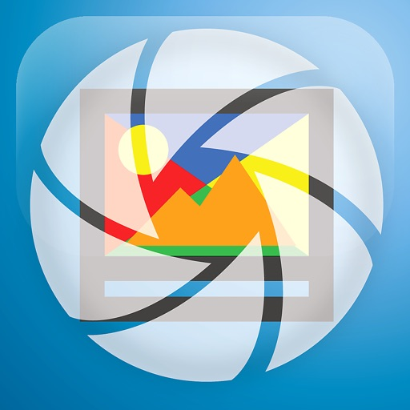

If you love and crave simple organization, you’ve found your new favorite app! This easy, all-in-one picture-labeling tool is so simple to use, you’ll want to label everything.

Simplify making labels with pictures for your home, office, classroom, work room, garage, or storage.

Easily use your device’s camera to add pictures to your labels, and print them from your printer or email them for later use.

LabelPics allows you to quickly and effortlessly create custom photo labels 

    •Use your device's camera to snap a picture, or use your photo library to select an existing one
    •Quickly title the photos
    •Select label size
    •Select the font
    •Print or email an automatically generated PDF

Check out a few of the things you can instantly accomplish:

    •Organize office or craft supplies
    •Create formatted picture labels to use in an early childhood setting
    •Make photo name tags 
    •Pocket chart items
    •Create picture flash cards for words or sounds
    •Create classroom labels
    •Quickly make or change labels throughout your classrooms
    •Easily establish permanent records for inventory and insurance needs
    •Tag boxes for moving or storage
    •Make children’s toy clean up simple and fun with a name and picture label showing where it belongs
    •Generate schedules, chore charts and behavior charts with pictures and word descriptions 
    •Create classroom visual aids
    •Great for providing clear, precise, repeatable directions

LabelPics is perfect to use for early childhood development settings such as Daycares, Preschools, Kindergarten classrooms, and Special Education settings. It's a great tool to help children recognize environmental print connected to real world objects, or for anyone that loves organized and orderly living, learning and teaching environments.

[View on Apple](https://apps.apple.com/us/app/label-pics/id1272541874)

## HealthFit

Verwandle deine Apple Watch in eine umfassende Trainingsplattform.

HealthFit verwandelt die in Apple Health gespeicherten Trainings- und Gesundheitsdaten in fortschrittliche Fitnessmetriken, Trainingsanalysen und eine nahtlose Synchronisierung deiner Workouts – ganz ohne Benutzerkonto.

Egal, ob du für deinen nächsten Wettkampf trainierst, deine Fitness verbessern oder einfach aktiv bleiben möchtest – HealthFit hilft dir, deine Fortschritte zu verstehen, dein Training zu optimieren und deine Ziele zu erreichen.

INTELLIGENTER TRAINIEREN

HealthFit hilft dir dabei, Folgendes zu verstehen:

• Trainingsbelastung
• Fitness (CTL), Ermüdung (ATL) und Form (TSB)
• Trainingsbelastungsverhältnis
• Herzfrequenzzonen und Trainingsverteilung
• Jahresvergleiche und Trends
• Explorer Score und Trainings-Heatmaps

Diese Metriken und Analysen sind normalerweise professionellen Trainingsplattformen vorbehalten.

ALLES AN EINEM ORT

Verfolge Trainingsbelastung, Fitnessentwicklung, Gesundheitsmetriken und deinen gesamten Trainingsverlauf über ein einziges Dashboard.

EIN BESSERER AKTIVITÄTSFEED

Durchsuche deine Workouts mit Karten, Fotos und den wichtigsten Kennzahlen auf einen Blick.

• Anpassbare Herzfrequenzzonen
• Verfolgung der Trainingsbelastung
• Ausrüstungsverfolgung (Schuhe, Fahrräder und mehr)
• Analyse von Höhenmetern, Tempo, Leistung und Kadenz
• Detaillierte Diagramme und Leistungstrends

HealthFit kann automatisch Fotos zuordnen, die während deiner Workouts aufgenommen wurden.

LEISTUNGSANALYSE

Analysiere deine Lauf- und Radleistung mit:

• Geschätzte kritische Leistung
• Gewichtete Durchschnittsleistung
• Mean-Maximal-Power-Kurven
• Leistungsverteilung
• Historische Leistungstrends

GESUNDHEITSMETRIKEN FÜR ATHLETEN

• Herzfrequenzvariabilität (HRV)
• Ruheherzfrequenz
• Kardiorespiratorische Fitness (VO₂max)
• Schlafmetriken
• Gewicht, BMI und Körperfettanteil
• Baevsky-Stressindex

FÜR JEDE SPORTART GEEIGNET

HealthFit unterstützt alle Aktivitätstypen und passt Statistiken, Diagramme und Analysen automatisch an deine häufigsten Aktivitäten an.

AUTOMATISCHE WORKOUT-SYNCHRONISIERUNG

HealthFit synchronisiert deine Workouts automatisch im Hintergrund mit deinen bevorzugten Fitnessplattformen.

Jedes mit der Apple Watch aufgezeichnete Workout wird automatisch hochgeladen – ohne manuelle Exporte und ohne zusätzliche Schritte.

Du kannst sogar deinen gesamten Trainingsverlauf synchronisieren.

MULTISPORT-UNTERSTÜTZUNG

HealthFit unterstützt Multisport- und Intervalltrainings vollständig und kann Multisport-Aktivitäten als echte Multi-Session-Aktivitäten exportieren.

DEINE DATEN GEHÖREN DIR

Kein Benutzerkonto erforderlich. Keine Anmeldung erforderlich.

HealthFit arbeitet direkt mit Apple Health und speichert deine Daten auf deinem Gerät.

VERBINDET SICH MIT DEINEN LIEBLINGS-FITNESSPLATTFORMEN

Strava, TrainingPeaks, Final Surge, Selfloops, Smashrun, Ride with GPS, Cycling Analytics, Today's Plan, Runalyze, Suunto, 2PEAK, Komoot, COROS, Intervals.icu, Nolio, TrainAsONE, Tredict, Stages Link, Map My Tracks und Xhale.

Exportiere detaillierte Trainingsberichte im Markdown-Format mit Diagrammen, Karten und Analysen oder exportiere deine Daten in den Formaten FIT, GPX, CSV und Google Sheets.

Nutzungsbedingungen:
https://www.apple.com/legal/internet-services/itunes/dev/stdeula/

[View on Apple](https://apps.apple.com/us/app/healthfit/id1202650514)

## ملكة: للباحثين عن شريك الحياة

"مِلكة" هو تطبيق زواج، صُمم ليلبي احتياجات الباحثين والباحثات عن شريك الحياة بما يتوافق مع تعاليم ديننا الاسلامي وعادات وتقاليد مجتمعنا. 

مميزات تطبيق ملكة:

أولاً: التصفح والبحث
	1.	تصفح مجاني: استكشف ملفات شخصية متنوعة دون الحاجة إلى اشتراك.
	2.	بحث متقدم: استخدم تصفية النتائج لتحديد معايير البحث والعثور على الشريك المناسب.
	3.	القبيلة: إمكانية البحث وفق معايير محددة مثل الانتماء لقبيلة معينة.
        4.     استعراض الطلبات: المرسلة والمستقبلة لتتمكن من اضافة الاشخاص الملائمين فقط. 
        5.     قائمة المفضلة: لتتمكن من العودة للاشخاص اللذين يناسبونك مبدئيا بسهولة.

ثانياً: جودة المجتمع
	6.	مجتمع راقٍ: يتماشى مع تعاليم الإسلام.
	7.	تقييد الإضافات: عدد المضافين محدود بـ 5 لضمان الجدية في التفاعل.

ثالثاً: التواصل والتفاعل
	8.	تواصل آمن: المحادثات تبدأ بموافقة متبادلة فقط، مع خيارات أمان متقدمة.
	9.	طلبات التواصل الفردية: شراء طلبات تواصل بشكل منفصل دون الحاجة للاشتراك في باقة شهرية.
	10.	أسئلة متجددة: أسئلة متنوعة يمكن الإجابة عليها بالصوت أو النص، مع إمكانية اقتراح أسئلة تُرسل لجميع المستخدمين لتعزيز التفاعل.
	11.    حالات ظهور متعددة: متاح للتواصل، طور محادثات هاتفية، علاقة جادة، غير متاح للتواصل

رابعاً: الخصوصية والأمان
	12.	الفلتر الذكي: تحكم كامل في من يمكنه مشاهدة ملفك الشخصي من خلال فلترة كلمات محددة للحجب.
	13.	خيارات التصفح:
		أ. وضع التصفح الخفي بالكامل.
		ب. إمكانية إخفاء إشعارات زيارة الملف الشخصي.
		ج. تخصيص الجنسيات اللتي يمكنها رؤية حسابك.

	14.	إبلاغ سريع وآمن: تقديم بلاغات بسهولة عبر تصوير الشاشة ورفعها مباشرة مع ضمان السرية.
	15.	خصوصية تامة: فريق ملكة يضمن سرية كاملة ولا يطّلع على المحادثات نهائياً.
        16.    ارسال صور تفتح لمرة واحدة: مثل تطبيقات التواصل الشهيرة يمكنك ارسال صورة لعرضها لمرة واحدة، ويمنع تصوير الشاشة.

خامساً: الدعم والاستشارات
	17.	مستشارون متخصصون: دعم من مستشارين ذوي خلفيات علمية ومهنية لتوجيهكم في رحلة البحث عن شريك الحياة.
	18.	فريق دعم فني: فريق سريع ومتعاون لحل أي استفسار أو مشكلة تواجه المستخدمين.

سادساً: تصميم وتجربة المستخدم
	19.	معلومات شاملة: ملفات شخصية تحتوي على أنماط الشخصيات، لغات الحب، والاهتمامات لفهم أعمق للشريك.
	20.	انماط عرض مريحة: إمكانية التبديل بين النمط الداكن والنمط الفاتح لتجربة مريحة للعين.

سابعاً: العوائل والمصداقية
	21.	حسابات عوائل: يتيح للعوائل إنشاء حسابات للتواصل نيابة عن الأبناء أو البنات.

انضموا إلينا اليوم وابدؤوا رحلتكم لإيجاد شريك الحياة المناسب.

الموقع الالكتروني:
https://melkah.com

[View on Apple](https://apps.apple.com/us/app/%D9%85%D9%84%D9%83%D8%A9-%D9%84%D9%84%D8%A8%D8%A7%D8%AD%D8%AB%D9%8A%D9%86-%D8%B9%D9%86-%D8%B4%D8%B1%D9%8A%D9%83-%D8%A7%D9%84%D8%AD%D9%8A%D8%A7%D8%A9/id6473904105)

## iWebTV PRO

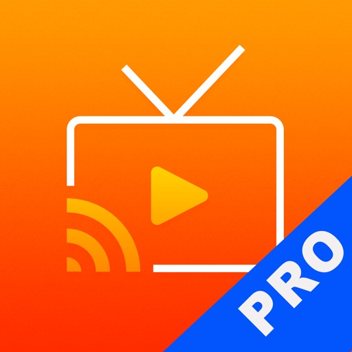

Best Casting App! Cast any online video to your TV.

iWebTV® works with any TV equipped with Chromecast® + Roku® + Fire TV® + Apple TV® (4th Gen) + Samsung TVs (2018 and later models).

*** Feature Highlights ***

• HD resolution supported (1080p and up to 4K depending on the device)
• Unlike mirroring apps, iWebTV sends the actual video stream to your TV (Much better image quality & overall experience).
• Advanced browser, supports multiple browser tabs, blocks or hides spammy popups, search from the URL bar, ad blocker, browsing history etc...
• Subtitle auto-detect + Movie/TV Subtitle library
• Live streams support
• Video preview to instantly locate your favorite scenes.
• Binge-ready: queue up several videos, and enjoy.
• Set your own home page, bookmark web page or videos.
• Full playback controls, even after exiting the app (from the lock screen).
• Privacy modes

Some of the features above require in-app purchase

iWebTV actually plays the video on your media player which results in a much higher quality picture than apps that mirror your screen.

**** Notes ****

(1) Some premium features require in-app purchases.
(2) Excluding video formats incompatible with iOS (flash).
(3) While most video websites work well, email us from the app menu if you experience any issues: > “Get Help” > “Frequent Questions” > “Need more help? (Other Issues)”> “Contact Support” (opens email).

Smart TV from most TV manufacturers will work with this app without any preliminary setup. Just start the app, choose a video & hit the cast button! This includes TVs from Samsung, TCL, Vizio, Sony, Hisense, Insigna, Sharp, Philips and others.

**** Legal ****

iWebTV™ is a trademark of Swishly Inc.
"Chromecast" is a trademark of Google LLC.
"Fire TV" is a trademark of Amazon Technologies, Inc.
"Roku" is a trademark of Roku Inc.
"Apple TV" is a trademark of Apple Inc.

Terms:

• Privacy Policy: https://iwebtvapp.com/legal/privacy-policy.html
• Terms of Use: https://iwebtvapp.com/legal/terms-of-use.html

iWebTV PRO offers a subscription-based upgrade ("Premium Services" $0.99/month or $9.99/year). With this subscription you will get the additional benefits of 2 premium services (Cloud Proxy Streaming  + Unlimited subtitle downloads)

[View on Apple](https://apps.apple.com/us/app/iwebtv-pro/id1453647914)

## Just Press Record

Just Press Record ist der ultimative Audiorekorder, der Aufnahme mit nur einem Fingertipp, Transkription und iCloud-Synchronisation auf all deine Geräte bringt. Sie können Audio und Transkriptionen direkt in der App bearbeiten und mit Siri sogar völlig berührungslos aufnehmen!

Das Leben ist voller unvergesslicher Momente - die ersten Worte Ihres Kindes, ein wichtiges Meeting oder eine spontane Idee. Fange diese Momente mühelos auf dem iPhone, iPad, Mac oder sogar der Apple Watch ein.

AUFNEHMEN
• Ein Fingertipp zum Starten, Stoppen, Pausieren und Fortsetzen der Aufnahme.
• Starte und stoppe die Aufnahme über Shortcuts, Siri, das Widget, eine 3D-Touch-Schnellaktion oder über das URL-Schema.
• Unbegrenzte Aufnahmedauer.
• Diskrete Aufnahme im Hintergrund.
• Aufnahme via integriertem Mikrofon, AirPods oder externen Mikrofonen.
• Unabhängige Aufnahme auf Apple Watch, mit späterer Synchronisation.

WIEDERGEBEN
• Während der Wiedergabe vor- und zurückspulen.
• Anpassbare Wiedergabegeschwindigkeit.

TRANSKRIBIEREN
• Verwandeln Sie Sprache in durchsuchbaren Text.
• Unterstützung für über 30 Sprachen.
• Synchronisierte Textmarkierung und Audiowiedergabe.
• Formatiere während der Aufnahme mit Interpunktionsbefehlen.

BEARBEITEN
• Audio - visualisieren Sie Ihre Aufnahme in Wellenform und schneiden Sie nicht benötigte Abschnitte heraus.
• Text - Nehmen Sie Korrekturen vor und fügen Sie Ihren Transkriptionen neuen Text hinzu.

TEILEN
• Teile Audio und Text mit anderen Apps.
• Einfaches Teilen mit sozialen Medien.
• Teile mit iTunes auf dem Mac oder PC via USB-Kabel.
• Drucke eine Kopie deiner Transkripte aus.
• Teile Audiodateien von anderen Apps mit Just Press Record. 

ORGANISATION
• Sehen Sie neue Aufnahmen an oder durchsuchen Sie Ihre Bibliothek.
• Suche nach Dateiname oder Transkriptinhalt.
• Eigener Tab für Schnellzugriff auf Apple-Watch-Aufnahmen.
• Aufnahmen umbenennen.
• Unterstützung für Slide Over und Split View auf iPad.
• Fügen Sie dem App-Symbol eine Plakette mit der Anzahl ungespielter Aufzeichnungen hinzu.

SPEICHER
• Sichern Sie Aufnahmen in iCloud Drive oder lokal auf dem Gerät.
• In iCloud Drive gesicherte Aufnahmen werden automatisch auf alle Geräte synchronisiert.
• Lokal gespeicherte Aufnahmen profitieren von der Integration mit der iOS-Dateien-App und der automatischen iTunes-Dateifreigabe.
• Transkripte werden in der Audiodatei gesichert.

PRO-AUDIO
• Unterstützung für Stereoaufnahmen über integrierte Mikrofone.
• Unterstützung für hochqualitative, externe Mikrofone, verbunden via Lightning.
• Anpassbare Audioeinstellungen.
• Dateitypen enthalten WAV, AIF oder das übliche iTunes M4A (ACC).
• Hochqualitatives Audio bis zu 96kHz / 24-bit.

BEDIENBARKEIT
• VoiceOver-Unterstützung in der gesamten App.
• Magische Tipp-Geste um eine Aufnahme zu starten / stoppen.

APPLE WATCH
Just Press Record umfasst eine App für die Apple Watch, die Ihnen die Freiheit bietet, überall aufzunehmen, auch wenn Sie Ihr iPhone nicht bei sich haben.

• Starten Sie die Aufnahme mit einem einzigen Tipp auf die Complication.
• Diskrete Aufnahme im Hintergrund.
• Unbegrenzte Aufnahmedauer.
• Aufnahmen übertragen sich automatisch auf das iPhone für die Transkription und iCloud-Synchronisation.
• Hören Sie sich kürzliche Aufnahmen über die integrierten Lautsprecher oder AirPods an.
• Lautstärke mit der Digitalen Krone anpassen.
• Aufnahme mit einem Wisch nach unten pausieren.
• Bedienbarkeitsunterstützung mit VoiceOver, reduzierter Bewegung und Unterstützung für das extragroße Complication-Thema.

WICHTIG:
• Just Press Record nimmt keine Telefongespräche oder Audio von anderen Apps auf.
• Transkription erfordert ein gutes, sauberes Audiosignal.  Meiden Sie Aufnahmen in lauten Umgebungen und stellen Sie sicher, dass das Mikrofon nah an der Quelle ist.

[View on Apple](https://apps.apple.com/us/app/just-press-record/id1033342465)

## HamStudy.org

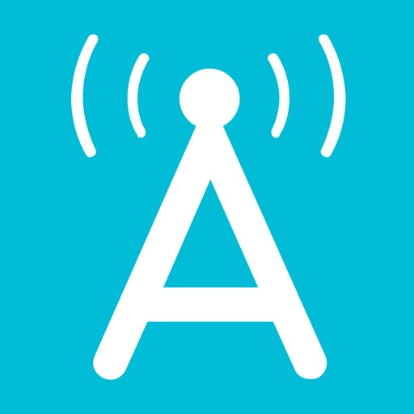

HamStudy is not your typical study app. Most study apps focus on practice exams, which is like studying for your math test by trying 20% of the questions on repeat. Study smarter with HamStudy.

Instead of taking practice tests with random questions over and over, our intelligent Study Mode tracks your progress as you move through the questions—what you’ve seen, what you haven’t, and where you’re struggling—and focuses your study on the questions you need to see most. Full statistics are provided along the way, giving you insight into how many times you’ve gotten a question right or wrong as well as your overall study progress. Don’t worry, you can still take practice exams whenever you want.

You won’t find a better tool to use alongside your favorite learning material. Through collaboration with some of the most recognized names in amateur radio, HamStudy allows you to simply choose from a selection of license manuals, then instantly adapts so you can match your study to the chapters, topics, and sections you’re used to†. Want to study just the questions from chapters 4 and 5? No problem. And when a question trips you up, just tap the Explain button to understand what you missed, review formulas, and read helpful study tips. 

Features:
• HamStudy's intelligent study algorithms work with you to ensure you learn the questions, tracking your progress and adjusting the pace to keep you challenged but not frustrated.
• Vetted user-submitted explanations help you avoid the pitfall of just memorizing answers.
• Infinite practice exams. Fun fact: it takes around 70 practice exams before you’ll see every Technician question just once. Study more, test less!
• Study all current US Amateur Radio question pools: Technician, General, and Amateur Extra. Updates are downloaded automatically, and new pools are always included free when they are revised every four years.
• English and Spanish translations included for US Amateur Radio pools.
• Includes an ever-growing selection of international question pools, such as Canada, Mexico, New Zealand, and Argentina.
• Supports multiple users on the same device, each with independent study history.
• Sync your progress across all devices and study online with a free hamstudy.org account.
• Share your progress with friends, instructors, or other HamStudy.org users and help each other keep progressing towards that next license exam!

HamStudy is proud to be sponsored by Icom.

† Disclaimer: HamStudy does not contain the actual instructional material from linked books, but works great with the book sitting on the table next to you! Images, names, and trademarks used with permission.

[View on Apple](https://apps.apple.com/us/app/hamstudy-org/id1371288324)

## Wagotabi : Cours de japonais

Wagotabi est votre compagnon quotidien pour apprendre le japonais à partir de zéro, à votre rythme et avec une immersion maximale. Apprenez à lire, écrire et comprendre le japonais en contexte, tout en retenant les Hiragana, Katakana et Kanji. Utilisez vos compétences en japonais pour progresser dans l'aventure proposée par ce jeu éducatif.

Conçu en étroite collaboration avec plus de 300 professeurs de japonais, associations touristiques officielles de préfectures japonaises et des milliers de testeurs, Wagotabi vous propose une approche immersive inédite pour l'apprentissage de la langue. Nous vous fournissons un contenu adapté à votre niveau actuel. Les mots et les points de grammaire sont introduits selon les standards du JLPT, en commençant par le niveau N5.

—

◆ DÉBUTEZ de zéro : le jeu est adapté aux débutants : aucune connaissance initiale du japonais n'est nécessaire. Les concepts sont introduits peu à peu et utilisés immédiatement dans le jeu. Les faux-débutants progresseront plus vite et apprécieront tout autant le jeu.
◆ VOYAGEZ au Japon : explorez de vraies villes, apprenez à vous présenter, à commander de la nourriture, à demander votre chemin aux habitants et à découvrir des secrets cachés !
◆ COLLECTIONNEZ de nouveaux mots, Kana, Kanji et obtenez des explications détaillées sur la grammaire et la conjugaison. Fini les listes de Kana, Kanji et vocabulaire surchargées et inutilisables !
◆ DÉFIEZ les grands maîtres du japonais dans leur château pour gagner leur respect !
◆ PARTAGEZ vos meilleurs scores aux mini-jeux de Kana et de Kanji avec d'autres apprenants sur le tableau de classement !
◆ PERSONNALISEZ votre expérience d'apprentissage : tirez parti de notre outil SRS (répétition espacée), conçu pour cibler vos points faibles, créez votre propre avatar, réglez la difficulté du jeu. C'est votre voyage d'apprentissage de la langue japonaise.
◆ PROFITEZ d'une expérience sans publicité et sans achat in-app, le jeu peut être entièrement joué hors ligne !

—

Liste (non exhaustive) des fonctionnalités :
Dictionnaire interactif (avec illustrations, tags etc.), explications grammaticales claires, infobulles interactives, entièrement vocalisé, tests intelligents gérés par SRS, interactions avec l'environnement, quêtes, 2 mini-jeux (Kana et Kanji), combats de boss, ordre des traits Hiragana / Katakana / Kanji et calligraphie, Kanjidex, Kanji similaires, conjugaison, sauvegarde en ligne, outils avancés pour le suivi de votre progression....

—
Le jeu est en développement constant, avec des mises à jour régulières ajoutant du nouveau contenu.
Contenu actuellement disponible :
+400 mots et points de grammaire soigneusement sélectionnés
+195 Kanji
+600 phrases exemple
+2600 dialogues japonais vocalisés
+350 PNJ uniques dans le jeu
Tous les mots / points de grammaire sont utilisés au maximum et en contexte pour une meilleure rétention.

—

L’avis de nos premiers testeurs sur Wagotabi :
"C’est une bénédiction d’avoir une telle application sur le marché de l'apprentissage !"
"J'ai utilisé certains des exemples de l'application pour mes cours et mes élèves réagissent très bien."
"Je n'ai pas le budget nécessaire pour me rendre au Japon, mais je suis totalement immergé dans ce jeu, j'apprends efficacement et je constate mes progrès quotidiennement."
"Grâce à cette application, mes enfants sont maintenant motivés pour apprendre le japonais et renouer avec leurs racines. Ce concept est tellement Kawaii !"
"Je prépare un voyage au Japon et je vais certainement aller voir ces endroits que j'ai déjà visités dans le jeu."

—

Politique de confidentialité : https://www.wagotabi.com/privacy-policy
Conditions d'utilisation : https://www.wagotabi.com/terms-of-service

[View on Apple](https://apps.apple.com/us/app/wagotabi-learn-japanese/id6474207287)

## Couch to 5K® - Run training

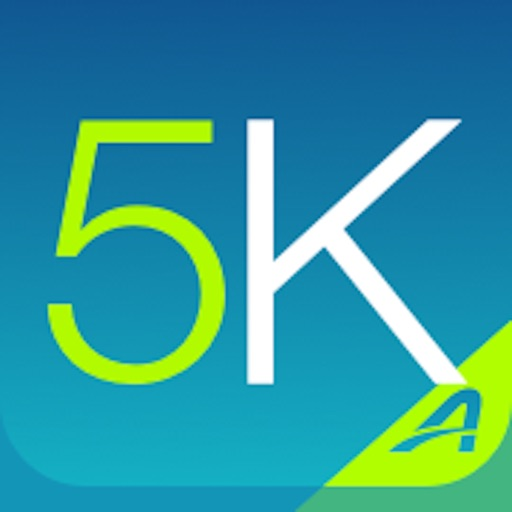

Get off the couch and get running with the OFFICIAL Couch to 5K® training app! This oft-imitated program has helped thousands of new runners move from the couch to the finish line. Spend just 20 to 30 minutes, three times a week, for nine weeks, and you’ll be ready to finish your first 5K (3.1-mile) race!

Get more information about the Couch to 5K app here: http://www.active.com/mobile/couch-to-5k-app

Continued use of GPS running in the background can dramatically decrease battery life.

The Couch to 5K coach you select talks to you during your workouts. To save your battery, Couch to 5K sends audio notifications when your screen is locked or another app is in use.

To be sure you hear the coach during your workout, please do the following:
• Turn on Notifications permissions
• Turn on the hardware ring/silent switch (no red showing)
• Turn your ringer volume up
• Turn off Do Not Disturb (swipe up for Control Panel and the moon button should not be white)
• Within the app, in Settings > Workout Options, be sure the Trainer Volume is up

Without granting notification permissions, during a workout you can click the lock icon at the top left to keep the app active and still hear the coach.

For support please contact us at: MobileSupport@activenetwork.com  We would love to hear from you.

WINNER of the 2012 Appy Award for best Healthcare & Fitness App!

Features
• Training plan designed by Active.com trainers
• Choose from 4 different motivating virtual coaches—Johnny Dead, Constance, Billie or Sergeant Block
• Hear human audio cues to guide you through each workout
• Listen to your favorite playlists with in-app music player
• Calculate your distance & pace and map your routes with FREE GPS support*
• Log your workouts and share your progress on Facebook 
• Get support from the largest running community on Active.com Trainer
• Repeat workouts and track your best performance
• Treadmill support allows manual entry of workouts
• Track your progress with total distance and average pace
• Graphs for workouts to compare distance and pace

Finished the Couch to 5K program and ready to take your running program to the next level? Check out our 5K to 10K app to prep for your first 10K race here. https://itunes.apple.com/us/app/5k-to-10k/id526458735!

Praise
"The popular Couch to 5K app helps new runners avoid injury from doing too much, too soon."
—Runners World, June 2012

"It's ridiculously easy to use (it's hard not to, as you just do what you're told) and it's fantastic that you have an encouraging voice talking you through things."
—Engadget, June 2012

"Active.com’s Couch to 5K is one of my favorite… apps. With its customizable features, interactivity, and well-rounded interface, I may actually stay off the couch this time."
—148Apps, October 2011

"I knew as soon as I decided to start the Couch to 5K program that I would need something to keep me accountable—not just to showing up for my training, but to actually doing it properly. Of course there’s an app for that."
—CalorieLab, April 2012

"If you have been struggling to get your buns off the couch and somewhat in shape before the summer hits, training for a 5K is not a bad way to start. If you are looking for a program to help get you there, then the “Couch to 5K” running plan by CoolRunning is probably your best bet if you haven’t done an ounce of athletic activity for a number of years."
—Droid Life, April 2012

FAQ
• Once you purchase the app, it is yours to keep. It does not expire after 9 weeks.

[View on Apple](https://apps.apple.com/us/app/couch-to-5k-run-training/id448474423)

## NightCap相机

NightCap相机是功能强大的应用，可在光线弱和夜间拍摄超赞照片、进行录像和4K定时拍摄。以弱光和独特的天文模式采用长曝光拍摄星星、北极光等的漂亮照片！

是否觉得你的照片在低光下有点昏暗和颗粒感？NightCap将通过充分发挥iPhone或iPad相机的潜力助您一臂之力。

人工智能相机控制通过自动设置最佳对焦和曝光可轻松拍摄出更明亮、更清晰的照片。只需持稳相机并点击快门。若你更喜欢手动控制，那么即时手势调整随时可用，特技相机模式让您拍出单反相机的效果。您甚至可以随意进行黑白定时拍摄、拍摄照片和视频。

试试长曝光模式，在光线弱的情况下可获得超赞动态模糊特效和图像降噪效果。NightCap有提升感光度的特点，比任何其他应用的感光度高4倍，以长曝光模式为低光线照片提高亮度并降噪！

亮光轨迹模式可留住移动光线，适合夜间行车交通、焰火或光画照片。

这些模式结合高清或4K定时拍摄时效果超赞！

它有4种专用于天文摄影相机模式。星拍模式最适合拍摄星空或南极和北极光或让设备以星迹拍摄模式拍摄并观看星星在空中画圈！还有简单的国际空间站和流星摄影模式。

访问 nightcapcamera.com 以获得更多教程。

特点：

• 录像具有特殊夜间模式和全手动控制。
• 定时拍摄利用可调速度录制，支持长曝光和亮光轨迹，需要在iPhone 6s或更新设备上4K分辩率或较旧设备上1080p高清。
• Aidie，一款全自动人工智能相机自动为你选择最佳相机设置，在低光条件下拍出更亮、更清晰的照片，降低模糊镜头的几率。只需持稳相机并点击快门。
• 人工智能增强对焦功能，在非常低的光线中实现快速，可靠的对焦。
• 自动拍照模式，用于拍摄流星（星落）、ISS（国际空间站）、星星和星星轨迹，它让困难的拍摄任务变得很容易。
• 为摄影师设计的创新手动相机控制：手势控制曝光、ISO、对焦及白平衡，直观易用。滑动即可调整。
• 长曝光模式: 捕捉细致、无噪的低光影像。
• 亮光轨迹模式: 用于光画照片及天文非常棒: 可利用无限曝光时间拍摄星迹！
• ISO增强可实现感光度比任何其他应用高4倍。
• 亮光增强模式: 能立即增加亮度，同时保留图像细节。 
• 降噪模式有助于图像降噪。
• 8x 缩放控制（相机风格提供简单平滑的缩放）
• 完全支持 Apple Watch，有实时预览和应用程序主要的功能控制。

[View on Apple](https://apps.apple.com/us/app/nightcap-camera/id754105884)

## LumaFusion

LumaFusion: Das ultimative Storytelling-Erlebnis für die Videobearbeitung

Willkommen bei der App, die im App Store den Titel „App des Jahres 2021“ und den Editors' Choice Award gewonnen hat! Der Goldstandard für Geschichtenerzähler weltweit. Bietet eine flüssige, intuitive, Touchscreen-Bearbeitungserfahrung.

PROFESSIONELLES EDITIEREN LEICHT GEMACHT
• Sechs Video-/Audio- oder Grafikspuren: Erstellen Sie Bearbeitungen mit mehreren Ebenen und verarbeiten Sie problemlos 4K-ProRes- und HDR-Medien.
• Sechs zusätzliche Audiospuren: Bauen Sie Ihr Klangbild.
• Die ultimative Zeitleiste: Flüssige Bearbeitung mit der weltweit flexibelsten spurbasierten UND magnetischen Zeitleiste
• Jede Menge Übergänge: Halten Sie Ihre Geschichte in Bewegung.
• Vorschau auf externem Monitor: Sehen Sie auf einem großen Bildschirm.
• Marker, Tags und Notizen: Behalten Sie die Übersicht.
• Voiceover: Nehmen Sie VO auf, während Sie Ihren Film abspielen.

EBENENEFFEKTE UND FARBKORREKTUR
• Greenscreen-, Luma- und Chroma-Keys: Für kreatives Compositing.
• „Lock & Load“-Videostabilisierung: Sorgen Sie für ruhe im Bild.
• Leistungsstarke Farbkorrektur: Erstellen Sie Ihren eigenen Look.
• Videowellenform-, Vektorscope- und Histogrammscope.
• LUTs: Importieren und wenden Sie mehrere .cube- oder .3dl-LUTs an.
• Unbegrenzte Anzahl an Keyframes: Animieren Sie Effekte mit höchster Präzision.
• Anpassbare Text- und Effektpresets: Speichern und teilen Sie Ihre Lieblingsanimationen und -looks.
• Raster und Hilfslinien: Richten Sie die Elemente mit „Title-Safe“, „Action-Safe“ und einer Horizontlinie präzise aus.

ERWEITERTE AUDIOREGELUNG
• Grafischer und parametrischer EQ sowie Sprachisolierung: Präzise Klangregelung.
• Keyframes für Audiopegel, Panning und EQ: Erstellen Sie makellose Mischungen.
• Unterstützung von Stereo und Dual-Mono-Audiodateien: Für Interviews mit mehreren Mikrofonen in einem Clip.
• Audio-Ducking: Pegeln Sie Musik und Dialog ausgewogen aus.
• Drittanbieter-Audio-Plugins: Verbessern Sie den Klang.

KREATIVE TITEL UND MEHRERE TEXTEBENEN
• Titel mit mehreren Ebenen: Kombinieren Sie Formen, Bilder und Text in Ihre Grafik.
• Anpassbare Schriften, Farben, Rahmen und Schatten: Entwerfen Sie ansprechende Titel.
• Import von eigenen Schriftarten: Stärken Sie Ihre Marke.
• Speichern und teilen von Titel-Presets: Perfekt für die Zusammenarbeit.

PROJEKTFLEXIBILITÄT UND MEDIATHEK
• Bildformate für alle Zwecke: Vom Breitbildkino bis zu Social Media.
• Bildfrequenzen von 18 bis 240 FPS: Flexibilität für jeden Workflow.
• Bearbeiten Sie Material aus der Foto-App, von Frame.io und auf USB-C-Laufwerken: Greifen Sie überall auf Ihre Medieninhalte zu.
• Importieren Sie Dateien aus der Cloud: Wo auch immer Sie sie gespeichert haben.

TEILEN SIE IHRE MEISTERWERKE
• Bestimmen Sie Auflösung, Qualität und Format:
• Teilen Sie Filme auf sozialen Medien, lokalem Speicher oder Cloudspeicher.
• Arbeiten Sie auf unterschiedlichen Geräten: Projekte lassen sich nahtlos übertragen.

ERWEITERTE FUNKTIONEN (einzeln erwerben oder sie ALLE als Teil des Creator Pass-Abonnements erhalten – siehe unten)
• Geschwindigkeitserhöhung und verbesserte Keyframe-Erstellung - Erstellen Sie Geschwindigkeitserhöhungen, Bézier-Kurven und sanfte Übergänge mit dieser einzigartigen, benutzerfreundlichen Funktion.
• XML-Export: Senden Sie Ihr Projekt an Final Cut Pro für Mac
• Multicam-Studio: Synchronisieren Sie 6 Kameras oder Audio und tippen Sie, um die Perspektive zu wechseln

ERSTELLER-PASS-ABONNEMENT
• Erhalten Sie vollen Zugriff auf Storyblocks für LumaFusion: Millionen von hochwertiger lizenzfreier Musik, Soundeffekten und Videos, PLUS erhalten Sie ALLE oben genannten erweiterten Funktionen.

HERVORRAGENDER GRATIS-SUPPORT
• Online-Tutorials: www.youtube.com/@LumaTouch
• Benutzerhandbuch: luma-touch.com/lumafusion-reference-guide
• Support: lumatouch.co/support

[View on Apple](https://apps.apple.com/us/app/lumafusion/id1062022008)

## Ghost Science M3

Open the door to the paranormal with GHOST SCIENCE M3™, the pinnacle of ghost hunting technology. Trusted by the world’s leading professional investigators, GHOST SCIENCE M3™ is the culmination of over a decade of research and innovation. GHOST SCIENCE M3™ stands as the most advanced, comprehensive, and powerful paranormal investigation toolkit ever created. Nothing Compares.

Vision
The Vision instrument employs structured-light lidar-enabled infrared laser grid imaging, AI-driven computer vision, GPU-based image filtering, and advanced hardware management to deliver unparalleled night-vision, image processing, and real-time human-like figure detection.
*Lidar is available only on Pro devices.

Spirit Box
The Spirit Box instrument leverages live streaming radio stations, advanced signal processing, real-time audio analysis, and dynamic frequency scanning to generate a blend of white noise and brief audio fragments. It is hypothesized that spiritual entities can manipulate these audio fragments using their energy, resulting in intelligible communications.

Spatial Matrix
The Spatial Matrix instrument uses LiDAR depth mapping, real-time mesh reconstruction, and GPU-accelerated analysis to visualize the geometric structure of the surrounding environment. It is theorized that paranormal energies may subtly distort these patterns, allowing investigators to observe potential manifestations within three-dimensional space.
*Pro devices only.

Music Box
The Music Box instrument employs advanced sensor integration, real-time data analysis, and precise environmental monitoring to detect subtle changes in the ambient environment. In the realm of paranormal research, this instrument is utilized to identify the potential presence of paranormal phenomena.

PEVP-VOX
The Spirit Vox instrument generates a continuous sound bed composed of phonetic fragments, tonal shifts, and raw audio textures through advanced sound synthesis and real-time modulation. It is hypothesized that subtle environmental influences can manipulate these fragments, shaping them into speech-like bursts that may convey meaningful communication.

EVP-ITC
The EVP-ITC instrument employs full sensor integration to detect subtle environmental fluctuations and presents words based on an advanced, proprietary phonetically-based computational algorithm. Instrumental Trans-Communication (ITC) devices operate on the theory that paranormal entities can communicate by influencing the ITC device’s sensors.

EMF
The EMF instrument allows for precise detection, measurement, and visualization of ambient electromagnetic field levels across the electromagnetic spectrum in real-time. It is hypothesized that paranormal entities can influence and generate electromagnetic fields, which are detectable by the EMF instrument.

Audio-EVP
The Audio instrument analyzes intricate and nuanced audio signals to provide insights into the underlying acoustic properties of the environment. It is theorized that spirits or supernatural entities can manipulate acoustic wave data to produce electronic voice phenomena (EVP) not audible during the initial recording session.

Frequency-EVP
The Frequency instrument analyzes complex frequency signal harmonics to identify subtle variations and anomalies within the underlying acoustic environment.  It is suggested that high audio frequencies, near and beyond the limit of human hearing, could be linked to paranormal phenomena.

Geoscope
The Geoscope instrument leverages gyroscope and accelerometer sensors to detect even the minutest device movements or vibrations. This functionality is predicated on the hypothesis that paranormal entities can induce subtle vibrations, such as footsteps or knocking sounds.

Barometer
The Barometer instrument employs the device’s advanced barometric sensor to detect extremely subtle variations in ambient pressure. This functionality is based on the hypothesis that paranormal phenomena may induce sudden or unexplained changes in pressure.

[View on Apple](https://apps.apple.com/us/app/ghost-science-m3/id1360656789)

## Teach Your Monster to Read

Welcome to Teach Your Monster to Read, the award-winning app that makes learning to read fun and engaging! Our educational phonics and reading games have helped millions of children build essential literacy skills. Create your own monster and embark on a magical journey through interactive games designed for home and school use. With a safe, trusted, and highly recommended approach, Teach Your Monster to Read offers phonics-based reading games for all levels. Teaching through play is what we do best—download today and start your child’s reading adventure!

TEACH YOUR MONSTER TO READ FEATURES

INTERACTIVE KIDS READING GAMES
• Take your custom-designed monster through educational games that are suitable for ages 3-6. 
• Improve letter sound recognition with reading games
• Explore a world of phonics and educational games that teach your child to read sentences
• Easily track their player’s progress to identify areas where their reader may need extra support

PHONICS & READING GAMES DESIGNED BY EXPERTS
• Designed in collaboration with Roehampton University and leading game designers
• Phonics tools and educational games that complement phases 2-5 of UK Government-approved Letters and Sounds and other major systematic synthetic phonics programmes
• 3 reading games designed for those in preschool, nursery, primary school, kindergarten, and first grade

EDUCATIONAL PLAY AT NO ADDITIONAL COST
• Teach Your Monster to Read is available on iPad and iPhone
• Explore phonics and educational games without in-app purchases, hidden costs, or in-game adverts
• Teach Your Monster to Read supports your child through every step of their reading journey

HEAR FROM TEACHERS AND PARENTS WHO USE OUR READING  GAMES

"This game is the absolute best quality phonics game I have come across for educational and fun value."
Marie Lewis, Rochdale

“My class have reaped loads of benefits from using the programme and the difference in some of their reading skills has been dramatic."
Maria Andrews, Foundation Phase Teacher

"This is a fabulous game. I'm not kidding when I say that my daughter essentially learned all her letter sounds using First steps, with relatively minimal input from me! Great for parents to practise their letter sounds too."
Eleanor Jones

PART OF THE USBORNE FOUNDATION CHARITY

Teach Your Monster to Read has been created by Teach Monster Games Ltd. which is a subsidiary of The Usborne Foundation. The Usborne Foundation is a charity founded by children’s publisher, Peter Usborne MBE. Harnessing research, design and technology, we create playful media addressing issues from literacy to health.

Teach a monster today when you download our educational app! 

Teach Monster Games Ltd is a subsidiary of The Usborne Foundation, a registered charity in England and Wales, charity number 1121957.

[View on Apple](https://apps.apple.com/us/app/teach-your-monster-to-read/id828392046)

## FSD Hunter

FSD Hunter helps you find Tesla vehicles for sale in the U.S. and Canada with indicators of valuable software packages or features, including Full Self-Driving Capability — Included Package, Enhanced Autopilot (EAP), Acceleration Boost, and SC01.

These vehicles can be difficult to identify manually because the details are often buried in listing photos, software screen images, or vehicle build/configuration data. FSD Hunter does the hard work for you by scanning listings, reviewing available software screen images, and identifying vehicles using available build configuration data when supported.

Instead of searching through thousands of listings yourself, FSD Hunter helps surface the small percentage of vehicles that may include these desirable features, saving you time and helping you focus on the cars that matter.

Now including Canadian vehicles with limited results. (less than 30 FSD, less than 20 EAP, less than 50 Acceleration Boost)
*HI, AK - Cars are found but on a limited basis as there are fewer vehicles to search.

[View on Apple](https://apps.apple.com/us/app/fsd-hunter/id6737280679)

## Roadside America

App includes 1 region you choose from 7 oddity-rich U.S./Canada regions. Purchase more individually or remaining regions (All Access). The roadside attraction gurus at Roadside America spent decades exploring weird, amusing wonders on America’s highways. The app puts their expertise at your fingertips for your own adventures. Roadside America's stories, unique photos, and tipster reports guide you to less traveled places just off the next exit. 

App includes your choice of 1 permanent U.S./Canada region (see region states list below*). In-app purchases require sign-up for a Roadside America account to unlock more or all regions ("All Access"). 

•Car & Driver: "All the Rt 66–type classics, from neon signs to 25-foot-tall muffler men." •People Jul '24/Shay Spence: "Put in your route and it populates the kitschiest, coolest spots along the way." •Popular Science: “Holy Grail of road-trip apps.” •Thrillist: "Absolute must for fans of animatronic roadside dinosaurs and kitschy rest stops." 
____________________________
 DISCOVER UNUSUAL AND FUNNY PLACES
 
- "World’s Largest and Smallest sights
- Museums, graves, statues, Muffler Men
- Bizarre architecture, obscure history
- Route 66 sights, tourist traps, odd theme parks
- Mystery spots, gravity hills, caves

____________________________
SEE WHAT'S UP THE ROAD

- Check map for nearby oddities, drop a pin revealing what's ahead.
- Add Start/End city to reveal possibilities along the route.
- Search by attraction, address, or browse by city.
- Explore 70+ themes: Atomic, Music, Celebrities, Tech, Crime, more!

____________________________
PLAN A TRIP - OR JUST LAUGH

- Read amusing stories by Roadside America's authors, and useful eyewitness tips by travelers.
- View photos, maps and directions, addresses, hours. Call attractions.
- Help investigate "research" attraction targets we believe have potential!
- Filter Editors' Ratings to focus on must-sees in your vicinity.

____________________________
USE ROAD TRIP TOOLS

- Send attraction location to Maps or other popular routing apps
- Mark Saves and Been Theres to view on a list/map. Or filter-hide to only see the unexplored!
- Export/Import your Saves and Been Theres to a 2nd device
- Submit Tips and your photos on oddball and unique discoveries to our editors for possible inclusion. 

____________________________
SUPPORT

FAQs (inc. how to Restore regions for new/reset device): 
https://www.roadsideamerica.com/mobile/roadside/ios/faq

For region activation issues, please contact us via app: More, Feedback or the website 
https://www.roadsideamerica.com/mobile/

____________________________
* REGIONS: HOW TO COMPLETE YOUR IN-APP PURCHASE(S)

When first launching app, select your one permanent region (see included states, below). You can later make in-app purchases to unlock more regions. All Access unlocks all remaining regions. Register a Roadside America user account for purchased region access recovery (Restore) on new/reset/2nd devices.

- NORTHEAST: Delaware, DC, Connecticut, Maine, Maryland, Massachusetts, New Hampshire, New Jersey, New York, Pennsylvania, Rhode Island, Vermont, Virginia, West Virginia
- SOUTHEAST: Alabama, Arkansas, Florida, Georgia, Kentucky, Louisiana, Mississippi, North Carolina, South Carolina, Tennessee
- MIDWEST: Illinois, Indiana, Iowa, Michigan, Minnesota, Missouri, Ohio, Wisconsin
- SOUTHWEST: Arizona, Colorado, Kansas, Nevada, New Mexico, Oklahoma, Texas, Utah
- NORTHWEST: Idaho, Montana, Nebraska, North Dakota, Oregon, South Dakota, Washington, Wyoming
- CALIFORNIA: California, Alaska, Hawaii
- CANADA: Alberta, British Columbia, Manitoba, New Brunswick, Newfoundland, Northwest Territories, Nova Scotia, Ontario, PEI, Québec, Saskatchewan, Yukon

Family Share works for basic app only; additional region access requires separate accounts and in-app purchases by each user.

[View on Apple](https://apps.apple.com/us/app/roadside-america/id347393479)

## Berry胶片相机 - 韩系自拍神器

大家好，我是 Berry，来自韩国的滤镜创作者。
也许你认识我，是通过 Instagram 账号 @berryveryloveyou。
我曾在社交媒体上分享过很多滤镜，但如今它们已经无法使用。
为了守护我在过去五年中倾注心血制作的滤镜，
我创建了这个专属空间：BerryFilm。

我会定期更新新的滤镜。
自然肤色校正与柔光特效也正在努力开发中。

希望你能在这里，继续享受我精心打造的滤镜。

--

功能特色

• 柔和自然的韩系滤镜
从奶油柔光感到冷色调、暖色调与复古底片风，
你可以找到最适合自己的氛围感滤镜。

• 支持照片与视频拍摄
让相册里“差点感觉”的照片或视频，
一键变身为具有风格感的社交媒体作品。

• 简单易用，静音拍摄
一键应用滤镜，收藏常用滤镜，
配合静音快门，随时随地自然自拍。

• 每月更新新滤镜
根据季节、情绪或风格，持续推出新滤镜。

• 来自用户反馈的持续优化
我们认真聆听每一条建议，持续改进应用体验。

--

推荐给以下用户

• 使用过 Berry Instagram 滤镜的老粉丝
• 想要韩系风格、自然柔光自拍的用户
• 喜欢不浮夸、不过度美颜的滤镜相机
• 享受每个月都有新色调的滤镜控

--

已收录滤镜

当前已包含 40 多款精选滤镜，
如 milk、iPhone 7、butter、cool、warm、blossom 等，
未来将持续更新更多滤镜。

--

联系与分享

欢迎在 Instagram 上标记 @berryfilm.app 分享你的照片。
有任何问题或建议，也欢迎通过私信或邮箱与我们联系。

邮箱：seesunapp@gmail.com
Instagram：@berryfilm.app

[View on Apple](https://apps.apple.com/us/app/berryfilm-korean-style-cam/id6741474933)

## Rarevision VHS: Retro Cam

Used by Kendall Jenner, Snoop Dogg, BTS, Ariana Grande, Khloe Kardashian, Wiz Khalifa, Victoria Beckham, Die Antwoord and featured on SNL (S41E01) and in countless TV shows and music videos!

Covered by WIRED, Forbes, The Wall Street Journal, Popular Mechanics, The Independent, Macworld, TMZ, TechCrunch, Mashable and many others!

App of the Day for Friday, Dec 22, 2017

It's 1984, and you've got a VHS camcorder! It'll look that way when you record and send old, messed up-looking retro videos to friends. They'll swear you built a time machine: "OMG, how'd you shoot that?"

With Rarevision VHS, you'll make videos that look and sound like real retro video tapes pulled out of storage after 30 years. You can change the on-screen date to trick your friends, create custom animated titles, glitch up the picture by shaking your device and use the fake zoom to emphasize those truly embarrassing moments!

"That's freakin' amazing!" -Everyone

Here's Why You Need It:

• Four words: Best. Throwback. Videos. Ever.
• Create VHS-style retro videos of your kids that look like the ones from your childhood
• The only VHS cam app you should ever consider to capture your 80s and 90s-themed parties
• Shoot your own "found footage" movie and become a big Hollywood director like those other guys
• Make your kids' incredibly boring school plays actually rad
• Impress the new girl by using our app to convince her you built a time machine
• Pretend like you lived through the rad 1980s using our app!

What Rarevision VHS Can Do:

• Realism: the ORIGINAL and BEST VHS cam app for simulating the glitches of old videotape recordings
• Import videos and give them the VHS look
• Make your own signature look using the old-school picture adjustment menu
• Create your own animated titles for the ultimate in on-screen awesomeness
• Change the on-screen date so people think you're way younger (or older) than you really are
• Glitch the picture during recording using your finger or by shaking your device
• Fake zoom feature dramatically enhances the cheese factor
• Don't think we forgot to make things sound retro terrible. We didn't.
• Up to 60p recording for a more accurate VHS video look (depends on device capability)
• Widescreen recording option (but would you REALLY want to use it?)

Follow Rarevision:
http://instagram.com/rarevision
http://x.com/rarevision
http://facebook.com/rarevisionvhs

Rarevision is a US-based company.

Copyright © 2015-2025 Rarevision LLC. All rights reserved.

[View on Apple](https://apps.apple.com/us/app/rarevision-vhs-retro-cam/id679454835)

## iFacialMocap

iFacialMocapは、iOSアプリで表情をキャプチャし、PC上の3DCGソフトウェアとリアルタイムに通信できます。また、メールでFBXエクスポートを行うことが出来ます。PC側のソフトウェアでは、VRMモデルの読み込みを行えます。

詳細な使用法は、次のURLから参照できます。
https://ifacialmocap.com/home/japanese/

【このアプリで出来ること】
このアプリは、Maya、Unity、3dsMax、BlenderとWiFi経由でリアルタイムで通信することにより、顔のアニメーションを作成できます。また、Maya、Blenderではアニメーションをベイク処理することができます。iOS端末内で録画したモーションをFBX Ascii形式でエクスポートできます。

このアプリは、iOSアプリ内にVRMアバターをロードできます。また、このアプリは、PC上のVMagicMirrorや、Luppet、HANA_APPなどのVRM関連アプリと連携させて頂いております。

【使用条件】
・iOS端末でWiFiを受信できる環境である必要があります。

・受信するPCとiOS端末は同一のルーターに接続されている必要があります。(同一のルーターであればPC側が有線、iOS側が無線でも動作します。)

・iOS端末がFaceIDを搭載している必要があります。

【使用方法】
使用するには、まずモバイルアプリを起動してから、PC側で受信するソフトを起動し、iPhoneのIPアドレスを入力します。

PC用で受信するソフトは以下のURLからDLします。
https://ifacialmocap.com/download/japanese/

 次に、命名規則に従って最大52個のモーフターゲット（BlendShapeまたはShapeKey）を作成します。最後に、3DCGソフトウェアを使用してスクリプト/アドオンをロードし、PC側でwaitボタンまたは再生ボタンを押した後に、Connectボタンを押します。

非常に高精度な顔のモーションキャプチャを非常に簡単に実行できます。

【対応端末】
このアプリは、FaceIDを搭載したiPhoneX以降のiPhone,iPadでのみ使用することができます。
FaceID対応端末は以下になります。

・iPhone
iPhone13 mini
Phone13 Pro Max
iPhone13 Pro
iPhone13
iPhone12 Pro Max
iPhone12 Pro
iPhone12
iPhone 11 Pro Max
iPhone 11 Pro
iPhone 11
iPhone XS Max
iPhone XS
iPhone XR
iPhone X

 
・iPad
iPad Pro 12.9 インチ (第 5 世代)
iPad Pro 12.9 インチ (第 4 世代)
iPad Pro 12.9 インチ (第 3 世代)
iPad Pro 11 インチ (第 2 世代)
iPad Pro 11 インチ

※2020年に発売の新しいiPhoneSE第2世代にはFaceIDが搭載されていませんが、iOS14以降にアップデートすれば使用できます。iPhoneSE第2世代に限らず、A12以上のチップを搭載している場合、iOS14にアップデートされている場合、使用できます。

[View on Apple](https://apps.apple.com/us/app/ifacialmocap/id1489470545)

## PractiScore Competitor

The easiest way to view and compare match results, as well as analyze competitor performance at IPSC, USPSA, Steel Challenge, IDPA, ICORE, PRS, ProAm, NRA, ISSF, 3Gun, PCSL and other matches.

* Search results posted on https://practiscore.com by match name or competitor name
* Download results posted on https://practiscore.com and several other web sites for offline viewing
* Sync over WiFi during match from scoring devices running PractiScore apps
* View and compare multiple competitors side by side
* Dig into every details of the match performance

[View on Apple](https://apps.apple.com/us/app/practiscore-competitor/id1191380081)

## Cozmo Robot

Say hello to Cozmo, a gifted little guy who’s got a mind of his own and a few tricks up his sleeve. He’s the sweet spot where supercomputer meets loyal sidekick. He’s curiously smart, a little mischievous, and unlike anything ever created.

You see, Cozmo is a real-life robot like you've only seen in movies, with a one-of-a-kind personality that evolves the more you hang out. He'll nudge you to play and keep you constantly surprised. More than a companion, Cozmo’s a collaborator. He’s your accomplice in a crazy amount of fun.

Some robots just have it all.

Cozmo robot required to play. Available at Anki.com.

©2025 Anki, LLC. All rights reserved. Anki, Cozmo, and the Anki and Cozmo logos are registered trademarks of Anki, LLC.

[View on Apple](https://apps.apple.com/us/app/cozmo-robot/id6748243845)

## Land Nav Assistant

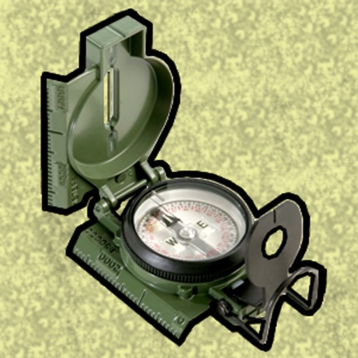

Land Nav Assistant accepts MGRS (Military Grid) or Latitude / Longitude coordinates and visually navigates you to each point.

This app was designed with Army, Marine, and other military personnel in mind. Use it to correct your Land Nav technique by analyzing your pace count and tendency to veer left and right.

Available Input: 8 digit MGRS, 10 digit MGRS, Lat/Lon decimal, Lat/Lon dms, and map input.

Angles: degrees or mils
Distance: meters/km or feet/miles
Speed: kph or mph

Use the simple arrow interface or map to direct you to your locations. Your distance, direction, speed, and bearing are shown as you navigate.

Long-tap anywhere on the map to get the coordinate for that location. Easily add locations via the Map interface.

Plan your course by ordering points, or use the course optimization tool which will help you calculate the shortest path possible!

Get distance/direction between two points by tapping the path drawn between them.

Satellite, Terrain, Road, and basic Topographic maps show you, your locations, and lets you enter in new ones. 

Overlay a 1000m or 100m MGRS grid anywhere on the map.

Displays distance/direction from your currentl location to all points, or between any two points.

Download your Locations as a spreadsheet to save anywhere, or to share with anyone you choose.

Import a large set of locations via the web import utility, available at: https://www.gammonapplications.com/land-navigation-services/import

This app uses the Military Grid Reference System (MGRS) and Latitude / Longitude.

Choose to display your locations as MGRS 10-digit, MGRS 8-digit, or LatLon Decimal.

D:M:S can be input in the format DD:MM:SS followed by the appropriate direction (NSWE). Default direction is N, W.

DO NOT use this application while learning Land Navigation. Land Navigation is a valuable skill, and should be mastered before using this application. Do not rely solely on this application for navigation, especially when lost. Always be aware of your surroundings.

[View on Apple](https://apps.apple.com/us/app/land-nav-assistant/id525299323)

## PepCalc: Peptide Calculator

PepCalc: The top-rated peptide calculator app! As featured on leading podcasts including Ben Greenfield, Data Driven Radio, and more.

PepCalc is a mathematical utility for laboratory researchers and scientists. It provides a digital interface for solving complex reconstitution ratios in educational settings.

Stop the guesswork! PepCalc is the simplest way to get peptide reconstitution right. Instant per unit or tick mark results, saved protocols for repeatable calculations, multi-peptide blend support, and smart conversions. Download PepCalc and get answers in seconds.

How it works:

1. Enter your peptide amounts and water volume.
2. Choose your units and tick marks.
3. See instant results.

Features:

FLEXIBLE INPUTS: Set peptide amounts, water volume, units and tick marks, and target amount.

PRESETS: Choose 100-unit or 40-unit scales for fast setup, or use fully custom inputs for any volume.

MULTI-PEPTIDE BLENDS: Add unlimited peptides to a single volume and calculate each automatically for complex research.

SMART CONVERSIONS: Instantly switch between mcg, mg, and g without re-entering data.

SAVED PROTOCOLS: Save favorite calculations with names and notes for fast recall. No more retyping.

PROTOCOL SHARING AND IMPORT: Create and share beautiful protocol images directly via social media, chat, and email that other PepCalc users can import directly via link or QR code.

THEMES: Multiple themes with light and dark mode support to suit everyone's preferences.

PRIVATE BY DESIGN: No signup required. No ads. Your data remains on your device.

DISCLAIMER: PepCalc is for research and educational purposes only. Not for medical use. This app does not provide medical advice.

[View on Apple](https://apps.apple.com/us/app/pepcalc-peptide-calculator/id1524577846)

## iVerify Basic

iVerify Basic is your gateway to enhanced device security and threat awareness, offering a glimpse into the powerful capabilities of our enterprise-grade solution, iVerify EDR. Designed for individuals who prioritize their digital security, iVerify Basic empowers users to take proactive measures to safeguard their devices against a myriad of threats. Users can scan their devices with a tap to detect vulnerabilities and stay proactive against threats.

[View on Apple](https://apps.apple.com/us/app/iverify-basic/id1466120520)

## PromptSmart Pro - Teleprompter

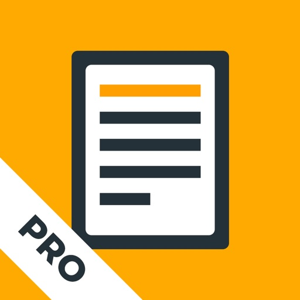

PromptSmart is the only “smart” teleprompter app. Our patented VoiceTrack™ speech recognition technology is revolutionary because it provides a robust solution to automatically follow a speaker's voice in real time. 

Make your video productions less stressful and more efficient. VoiceTrack™ is a powerful and smart prompting tool that will automatically start and stop at the speaker's natural pace, allowing you to focus on other production values rather than film take after take trying to match a pre-set scroll speed to the speaker's cadence. Save time, energy, and keep your talent focused with PromptSmart.

Other teleprompter apps fall short--relying on clunky hardware or pre-set scrolling speeds. We asked tens of thousands of users what they liked most about our prompter app, and over 90% of respondents said "VoiceTrack," calling it "awesome," "astonishing," "tremendous," “easy to use,” a “game changer”—“absolutely brilliant!!!” Our customers tell our story best and PromptSmart products are the highest rated and most frequently rated teleprompter apps in the App Store.

PromptSmart is also an invaluable tool for anyone that engages in regular public speaking, like clergy, educators, politicians, podcasters, audiobook creators, or business leaders. Our prompter apps are useful as a practice tool or to help keep you on-message at live speaking engagements.

If you’re on a budget or trying to film videos by yourself, there is no better companion than the PromptSmart teleprompter app because VoiceTrack starts and stops at your natural pace.

PromptSmart Pro includes an introductory month trial of an optional, paid Extended subscription service, which unlocks added features, including: a Remote Control, File Sync, and Scroll Assist! (See below)

PromptSmart Pro features:

[+] VoiceTrack—Speech-recognition based scrolling. If you go off-script, VoiceTrack knows and will hold your place, waiting for you to return.

[+] Invert text to reflect off two-way teleprompter glass

[+] Narrow the side margins to avoid eye tracking

[+] Selfie Mode: fix text next to the camera and record HD video simultaneously 

[+] In-app camera controls: tap-to-focus, auto-exposure lock, and auto-focus lock

[+] Import these file-types into PromptSmart: 

-DOCX 
-PDF (must be OCR-scanned first)
-RTF
-TXT
-GDOC (Google Documents)
 
[+] Import and export scripts to and from the cloud: Google Drive, One Drive, Box, Dropbox, or iCloud

[+] Bulk delete scripts

[+] Annual or monthly term of Extended Subscription (in-app purchase)

[+] Buy PromptSmart Remote Control (in-app-purchase) without subscribing

[+] An optional mic meter in Presentation Mode

[+] Volume buttons play/pause presentations (Selfie Stick friendly!)

[+] And many more!

IMPORTANT! Review carefully before purchase: 

-VoiceTrack language supported: English only

-Minimum system reqs: iPad Air (and up); iPhone 5S (and up); iOS 11 (OS below 11 not supported)

-Maximum recommended script word count: up to 5,000

-Recommended max of continuous VoiceTrack use: ~30 minutes (not a strict cap)

-Recommended max Notecards: 200

-External wired microphone recommended with VoiceTrack (but not required)

Your satisfaction is important to us. Contact us anytime: team@promptsmart.com

Important Disclosure:

PromptSmart Pro includes an optional PromptSmart Extended subscription. Depending on your chosen subscription period (monthly or annual), either a $1.99 purchase or a $19.99 purchase will be applied to your iTunes account at the end of your introductory trial.

Subscriptions will automatically renew unless cancelled at least within 24-hours before the end of the current period. You can cancel anytime within your iTunes account settings. Any unused portion of a free trial will be forfeited if you purchase a subscription.

For more info, see our Help Center, Privacy Policy, and Terms of Service: https://promptsmart.com/help

[View on Apple](https://apps.apple.com/us/app/promptsmart-pro-teleprompter/id894811756)

## SkySafari

SkySafari 8 is a powerful planetarium that fits in your pocket, puts the universe at your fingertips, and is incredibly easy to use!

Simply hold your device to the sky and quickly locate comets, planets, constellations, satellites, and millions of stars and deep sky objects. Whether you are a beginner or a longtime astronomy enthusiast, SkySafari 8 is your perfect stargazing companion, packed with interactive information, rich graphics, and a beautifully refined interface.

What’s New in Version 8

+ New Theme - A new look of the app with a fresh visual palette.

+ Image Gallery - Explore the universe through astrophotography. Import images directly from AstroBin.

+ Sky Tonight - Jump to the new Tonight section to see what’s visible in your sky right now. Expanded information has been designed to help plan your night and includes Moon & Sun info, calendar curations, and the best positioned deep sky and solar system objects.

If you're new to SkySafari 8, here’s what you can do:

+ Point & Identify - Hold your device to the sky and instantly identify stars, constellations, planets, satellites, and more. The chart updates automatically with your movements.

+ OneSky - See what other users are observing in real-time. This feature highlights objects in the sky chart and indicates how many users are looking at them.

+ Orbit Mode - Lift off from Earth and travel to the planets, moons, and stars.

+ Guided Audio Tours - Listen to more than four hours of audio narration to learn the history, mythology, and science of the heavens.

+ Pronunciation Guide - Learn how to correctly pronounce the names of hundreds of celestial objects, from stars to constellations and planets.

+ Simulate the Sky - See an eclipse in the past or future! Simulate the night sky from anywhere on Earth many years backward or forward in time.

+ Night Vision - Preserve your eyesight after dark.

SkySafari Premium Subscription Unlock amazing features with the optional Premium Subscription, including:

+ Massive Database - Access a massive deep sky database.

+ Custom Image Import - Upload and manage your own astrophotography images in the Image Gallery and show them in the sky chart. 

+ Enhanced Tools - Access curated news, events, connected stargazing features, a light pollution map, and more.

For telescope control and even more advanced features, check out SkySafari 8 Plus and SkySafari 8 Pro!

Terms of Use: https://www.apple.com/legal/internet-services/itunes/dev/stdeula/ 
Privacy Policy: https://www.livesky.com/privacy.html

[View on Apple](https://apps.apple.com/us/app/skysafari/id1257281849)

## Solocator - GPS Field Camera

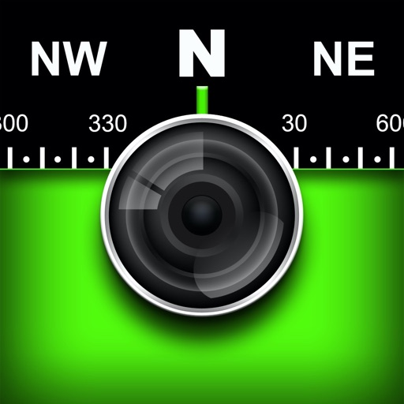

Solocator – The GPS Camera for Fieldwork and Photo Proof evidence. Overlay and stamp photos with location, direction, altitude, date & time taken. With the Industry Pack (in-app purchase), capture field notes including project name, photo description, company or username, and company logo.
Solocator is trusted by professionals, government agencies, and industries worldwide for reliable photo documentation.

TAILOR OVERLAY INFORMATION TO YOUR NEEDS
Capture & stamp on your photos:

+ GPS position (Latitude & Longitude in various formats) ± accuracy
+ UTM/MGRS coordinates (Industry Pack)
+ Street address (Industry Pack)
+ Direction – bearing
+ Altitude (MLS / HAE)
+ Tilt & Roll angles
+ Local date & time (based on GPS location)
+ Local time zone
+ UTC time
+ Compass display
+ Cardinal directions
+ Building facade direction, e.g. "North elevation"
+ Field Notes (Industry Pack)
+ Company Logo (Industry Pack)

AUTOSAVE PHOTOS TO iCLOUD & CAMERA ROLL
Autosave two photos at once: one stamped with the selected overlays and the other as an original high-resolution photo.

SORT, SEARCH, SHARE OR EMAIL
+ Photos are sorted by time, location, distance from current location and project name.
+ View photo direction and location in map view and navigate there.
+ Share photos individually or as a zip file via the share sheet.
+ Search for photos by date, date range or notes and street addresses.
+ Email photos including the following information:
   - Exif metadata
   - Compass direction
   - GPS position ± accuracy
   - Altitude
   - Tilt & Roll
   - Date & time taken
   - Street address (Industry Pack)
   - Cardinal Directions
   - Elevation of building facade
   - Links to maps so the receiver can navigate there easily

** INDUSTRY PACK **  (In-App Purchase) "One-off charge"

EDITABLE NOTES OVERLAY
Stamp photos with "Project name", "Description" & “Watermark”. The Project Name field can be used as a job or ticket number. The Watermark field is typically used for a company or username. You can also edit these fields later.

WATERMARK LOGO
Add your Company Logo to photos. Logo’s size, opacity, and position can be customised for both portrait and landscape photos. To get you started, a Solocator icon is included, which can be replaced.

CUSTOM EXPORT FILENAME
Define your photo export filename from a selection of fields: Project Name, Description, Watermark, Street Address, Date/Time, Number#, Custom text field, Photo type (original/stamped), and Coordinates (DD.dddddd, UTM, UTM Bands, MGRS). 

AUTOSAVE OR EXPORT PHOTOS TO CLOUD STORAGE
Autosave original and stamped photos to Google Drive, Dropbox, and OneDrive (Personal & For Business), including SharePoint Sites and Teams. You can also save photos in date or project name subfolders - automatically.

PHOTO DATA in KML, KMZ & CSV
Along with photos, email or export photo data and notes in KML, KMZ or CSV formats. Both email and export buttons are customisable to suit your data requirements.

STREET ADDRESS & UTM/MGRS
Add street address to your overlay or use UTM/, UTM Bands & MGRS coordinate formats.

BATCH EDIT NOTES & OVERLAY FIELDS
Select photos from the library and edit Project Name, Description & Watermark fields in one go.

TRACK PHOTOS IN MAP VIEW
View photos by direction, the distance between photos, area of photos taken and distance to your added markers via imported KML files or dropped pins.

REFINE & LOCK GPS LOCATION
Ideal for those working in and around buildings; to improve your GPS location. You can also use it to lock the asset position you're photographing.

COMPACT VIEW
Switch off Compass, Building and Street modes and only show the GPS info bar for a more compact view.

VPP Customers: https://solocator.com/enterprise-app-for-mdms/
Terms of Use: https://www.apple.com/legal/internet-services/itunes/dev/stdeula/

[View on Apple](https://apps.apple.com/us/app/solocator-gps-field-camera/id582584117)

## Blitzer.de PRO

Blitzer.de PRO - Die Verkehrssicherheits-App!
Und der Marktführer in Deutschland seit über 10 Jahren.

Blitzer.de PRO versorgt dich mit Live-Warnungen zu mobilen und festen Blitzern, Pannen, Unfällen, Stauenden und mehr in deiner Nähe. Schließe dich Europas größter und bekanntester Verkehrs-Community mit über 5 Millionen aktiven Nutzern an und mache deine Autofahrt sicherer und entspannter.

► VERSCHIEDENE ANSICHTEN
Wähle zwischen der einfachen Klassik-Ansicht, der Karte oder dem unauffälligen Dunklen Modus.

► AUTO START & STOPP
Einfach einsteigen, losfahren! Definiere eigene Kurzbefehle und die App aktiviert & deaktiviert sich ganz automatisch.

► CARPLAY
Alles im Blick auf dem Autobildschirm! Und das Audio direkt über die Autolautsprecher.

► PERSONALISIERT
Bestimme selbst, vor welchen Blitzern und Gefahren du gewarnt werden möchtest.

► INNOVATIVE NAVIGATION
Mit Schwarmintelligenz navigieren und schneller am Ziel ankommen.

► VIELE AUDIO OPTIONEN
Warnungen per Stimme oder Piepton - über das iPhone oder die Autolautsprecher. Zusätzliche Vibration für Motorradfahrer.

► STABILER HINTERGRUNDBETRIEB
Erhalte Warnungen auch während Telefonaten und beim Nutzen anderer Apps.

ÜBERSICHT DER VORTEILE
* Live-Aktualisierung der Blitzer und Gefahren
* Über 109.000 feste Blitzer weltweit
* Zuverlässige, präzise und straßenbezogene Warnungen, von unserer Verkehrsredaktion geprüft
* Anzeige von Blitzer-/Gefahrentyp mit erlaubter Höchstgeschwindigkeit und Entfernung
* Optimiert für die Nutzung im Auto: selbsterklärend und ohne Ablenkung vom Verkehr
* Einfaches Melden und Bestätigen von Blitzern und Gefahren
* Persönlicher Kundensupport für Fragen, Anregungen oder Probleme
* Keine lästige Werbung

SYSTEMANFORDERUNGEN
* Aktivierte Ortungsdienste
* Internetverbindung für Online-Updates (Flatrate empfohlen)

IN-APP-KAUF: MOBILE BLITZER & GEFAHREN
Profitiere in den ersten 14 Tagen von sämtlichen Funktionen der App. Nach Ablauf dieses 14-tägigen Testzeitraums erhältst du fortlaufend unbegrenzt aktualisierte Warnungen vor festen Blitzern weltweit. Sichere dir mit dem einmaligen In-App-Kauf für nur 9.99 EUR den vollen Funktionsumfang der App, einschließlich lebenslanger mobiler Blitzerwarnungen und Echtzeitinformationen zu Gefahren wie Pannen, Stauenden, Unfällen, Baustellen und mehr. Ohne Abo, ohne Zusatzkosten.

FOLGE UNS
https://www.instagram.com/blitzer.de
https://www.facebook.com/www.Blitzer.de

BESUCHE UNS IM WEB
https://www.blitzer.de/

[View on Apple](https://apps.apple.com/us/app/blitzer-de-pro/id498732510)

## Essential Anatomy 5

Essential Anatomy 5 is the most successful anatomy app of all time and has more content and features than any other anatomy app—bar none! With over 8,200 structures, our highly accurate, immersive and visually stunning app is the gold standard in medical reference applications. There's not a university or hospital around that does not use Essential Anatomy/Skeleton, resulting in 1.1 million user engagements every month. It is, by far, the worlds most used medical study and reference app.

Download our FREE "Essential Skeleton" app in the free section to experience our groundbreaking 3D technology.

TUAW: "Make no mistake about it: Essential Anatomy by 3D4Medical is the future of touch-based anatomy learning. Essential Anatomy is an app every doctor, physiotherapist, OT, nurse and medical student should own."

-- 3D4Medical highlighted at the 2015 Apple Keynote.

- - Number 1 Top Grossing Medical App in 118 countries worldwide.

- - Quality and Vision: 3D4Medical has led the way in introducing innovative products of exceptional quality. We will continue to forge new paths for others to follow.

- - Accurate Content: Essential Anatomy is used by anatomy professors in thousands of classrooms worldwide, including Stanford University, and has become the standard in third-level education. In many cases, our app is now mandatory with text books optional.  

 - - Stunning Graphics: No competitor comes close. Essential Anatomy’s proprietary engine was developed and optimized to showcase our new generation anatomical models for a completely immersive user experience.

- - Easy to use: Responsive and intuitive user interface, all systems and menus are easily accessed from the main screen and our model responds quickly to your touch.

- - Read all the reviews of previous versions: Our visionary app has enhanced the lives of reviewers, both professionally and academically.

iMedical Apps: “The 3D anatomy engine and impressive graphics bring a new clarity to anatomy education with impressive accuracy.”

Compatible with iPad 2 and newer, iPhone 4S and newer, iPod Touch 5th Gen. and newer, and iOS 8 or later. 

IN APP PURCHASES:
In-app purchases allow additional muscle and skeletal content to be downloaded and accessed from within the app. These boosts add muscle insertion and origin points, skeletal bone parts and surfaces and 100s of animations detailing movements for each articulation.

Visit www.3d4medical.com and watch videos that highlight the app's functionality and quality.  You’ll understand why Essential Anatomy 5 is the most successful medical reference app of all time!

ESSENTIAL ANATOMY 5:
Essential Anatomy 5 is a full-featured anatomical reference app that includes MALE and FEMALE models, with 11 SYSTEMS and a total of 8,200 ANATOMICAL STRUCTURES. The app is fully 3D, meaning that you can view any structure in isolation, as well as from any angle and represents the latest in groundbreaking 3D technology and innovative design. A cutting-edge custom built 3D graphics engine, delivers outstanding quality graphics that no other competitor can achieve. 

FEATURES OVERVIEW:

--Cutting-edge 3D technology
--Over 8,200 highly detailed anatomical structures
--Hide/Fade/Isolate/Fade Others/Hide Others options for individual structures
--Multiple Selection Mode
--Pins: Create customized pins with notes and place anywhere on the 3D model
--Slice: Slice through certain structures using 3D plane tool
--Bookmarks: Preset and Customizable
--Correct audio pronunciation and Latin nomenclature for every structure
--Search via English and Latin nomenclature
--Dynamic Quiz: Drag and Drop and Multi-choice
--Share images via social media and e-mail
--Includes anatomy for 11 systems: Skin, Skeletal, Muscles, Connective Tissue, Veins, Arteries, Nerves, Respiratory, Digestive, Urogenital, Lymphatic, also includes the Brain and Heart

Feedback? Contact our customer support at info@3d4medical.com.

[View on Apple](https://apps.apple.com/us/app/essential-anatomy-5/id596684220)

## Due - Reminders & Timers

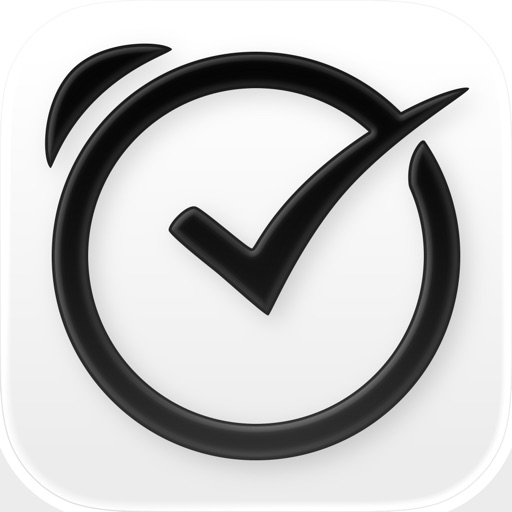

Due remembers all the things that you need so you don't have to.

Because it repeatedly reminds you of things until you act on them, it‘s impossible to forget anything.

Most importantly, it's lightning-fast to set and postpone reminders, all thanks to a clever time picker and natural date parsing.

KEY FEATURES

1. Persistent & Effective
Auto Snooze repeatedly* notifies you of missed reminders until marked done or rescheduled. Choose between intervals of every 1, 5, 10, 15, 30 and 60 minutes.

2. Fast to Set, Fast to Postpone
A time picker with 12 preset and fully customizable times lets you set due dates and postpone reminders in record time.

3. Natural Date & Time Parsing
Due can also parse dates and times that you typed or dictate and offer to set the due dates and times for you.

4. Countdown Timers
Precise to the second, perfect for making the perfect soft-boiled eggs, brewing your coffee and more. Set them up once and reuse them forever

5. Powerful Recurring Reminders
From the simple daily and weekly reminders to the complex every-3rd-Wednesday-of-the-month kind of reminders

6. Keep in Sync**
Use iCloud or Dropbox to keep your reminders and timers in sync across your iPhone, iPad and Mac.

7. Works Offline, Completely Private
There is no account to sign up for. We don't store, and we can't access your reminders and timers. And you don't need internet to receive reminders.

8. Accessible to Everyone
Automatically adjusts text size according to your system setting, and offers full VoiceOver support. Due is also localized in 17 languages.

* By default, auto snooze repeats 5 times, and can be configured to repeat up to 10 times. Due can auto snooze any overdue items indefinitely when you launch Due or act on any of its notifications.
** Sync on Mac requires Due for Mac (sold separately)

WHAT'S THAT IN-APP PURCHASE ABOUT?

When you purchase Due today, you will have access to every feature in the app today—no further purchase required.

You will also get access to all new features released one year from your date of purchase.

The optional Due Upgrade Pass subscription allows you to continue getting access to all new features released one year *after* your date of purchase.

And here's the deal: Every feature that you have unlocked will remain available to you, forever—even if you stop subscribing.

Even without a subscription, you'll always receive bug-fix and compatibility updates for free. These updates add support for the latest iPhones, iPads and Apple Watches. They also help ensure that Due continues to function well on the latest versions of iOS, iPadOS and watchOS.

Due has a pretty good track record with that.

To illustrate: If you've purchased Due back in 2010 for your iPhone 3G running iOS 4, that very same app in 2026 is now optimized for iPhone 17 Pro Max running iOS 26. It even works on devices that didn't exist back then, such as the iPad Pro and the Apple Watch.

TERMS & PRIVACY POLICY

Our terms of use and privacy policy is available here: https://www.dueapp.com/terms.html

COMPATIBILITY

Due requires an iPhone, iPod touch or iPad running iOS 16 or later. The Watch app is a companion to the iOS app. It requires watchOS 8 (or later) and the paired iPhone to work correctly.

[View on Apple](https://apps.apple.com/us/app/due-reminders-timers/id390017969)

## Scrivener

“The biggest software advance for writers since the word processor.” —Michael Marshall Smith, bestselling author

Typewriter. Ring-binder. Scrapbook. Scrivener combines all the writing tools you need to craft your first draft, from nascent notion to final full stop.

Tailor-made for creating long manuscripts, Scrivener banishes page fright by allowing you to compose your text in any order, in sections as large or small as you like. Got a great idea but don’t know where it fits? Write when inspiration strikes and find its place later. Grow your manuscript organically, idea by idea.

Whether you plan or plunge, Scrivener works your way: meticulously outline every last detail first, or hammer out a complete draft and restructure later. Or do a bit of both. All text sections in Scrivener are fully integrated with its outlining tools, so working with an overview of your manuscript is only ever a tap away, and turning Chapter Four into Chapter One is as simple as drag and drop.

Need to refer to research? In Scrivener, your background material is always at hand. Write a description based on a photograph. Reference a video or PDF. Check for consistency with an earlier chapter. On the iPad, open two documents side-by-side; on the iPhone, flip between research and writing with just two taps.

Once you’re ready to share your work with the world, simply compile everything into a single document for printing, or export to popular formats such as Word, PDF, Final Draft or plain text. You can even share using different formatting, so that you can write in your favorite font and still keep your editor happy.

FEATURES

Get Started
• Interactive tutorial project
• Keep each manuscript and supporting materials in a self-contained project
• Import Word, RTF, Final Draft and plain text files
• Easily split imported text into separate sections

Get Writing
• Write your manuscript in sections of any size
• View all sections as a single text using the “Draft Navigator” (iPad only)
• Quickly navigate sections using the “binder” sidebar
• Format with fonts and presets
• Comments, footnotes, links and highlights
• Simple bullets and lists
• Insert images
• Pinch-zoom to resize text
• Full-screen mode (iPad only)
• Typewriter scrolling mode keeps typed text center-screen (iPad only)
• Write a screenplay using scriptwriting mode
• Live word and character counts
• Set word and character count targets
• Find and replace
• Customizable keyboard row provides quick-access buttons for formatting, navigation and punctuation
• Comprehensive keyboard shortcuts for external keyboard users
• Dark mode

Find Your Structure
• Write in any order and reorganize later
• Write a synopsis for any text section and see it in the outline
• Expand, collapse and drill down into sections of your project
• Rearrange sections as index cards on the corkboard (iPad only)
• Project-wide search
• Track ideas using labels and status
• Apply custom icons to your sections

Refer to Research
• Import research material such as image, PDF and media files
• View research files or other sections right alongside your writing (iPad only)
• Every section has its own notes area for jotting down ideas
• Supports multitasking split screen mode (supported devices only)

Share Your Work
• Compile to a single document for sharing or printing
• Use different formatting in your exported or printed document
• Export to Word, RTF, Final Draft, PDF or plain text
• Convert rich text to Markdown for sharing with Markdown apps
• Create and email zipped backups of your projects

Work Anywhere
• Use Dropbox to sync between devices and with the macOS and Windows versions of Scrivener*
• Copy projects between devices via iTunes

* Requires a Dropbox account (not compatible with iCloud).

SUPPORT
You can contact us at ios.support@literatureandlatte.com, visit our forums at http://www.literatureandlatte.com/forum, or find us @scrivenerapp on Twitter.

[View on Apple](https://apps.apple.com/us/app/scrivener/id972387337)

## My Earthquake Alerts Pro

My Earthquake Alerts Pro is a powerful earthquake monitoring app which delivers all of the information you need, with push notifications included. It also includes a beautifully simple design optimized for the latest iPhone and iPad.

FEATURES
- Live earthquake map which can detect and track earthquakes from all around the world.
- Earthquake alerts customized for you, with no restrictions. You will be notified shortly after an earthquake occurs.
- Powerful search feature to find earthquake history dating back to 1970!
- Beautiful & simple design - view the earthquake feed on a map and in a list.
- Find the exact location, the depth and the distance away from you.
- Uses information from a wide variety of earthquake networks, including the USGS and EMSC.
- Support for the latest iPhone and iPad models.
- Pro version is ad-free and includes Apple Watch support!

If you need information or notifications about the latest earthquakes near to you, download My Earthquake Alerts Pro today. It is similar to apps such as Quakes, MyQuake and QuakeFeed.

[View on Apple](https://apps.apple.com/us/app/my-earthquake-alerts-pro/id975770717)

## Sun Seeker - Tracker & Compass

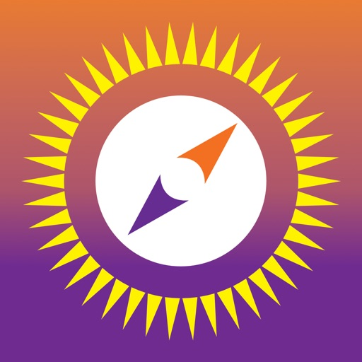

Sun Seeker is a comprehensive solar tracking & compass app. It shows the sun’s hourly direction intervals, its equinoxes, winter & summer solstice paths, sunrise & sunset times, twilight times, shadowed periods, UV Index, solar irradiance, golden and blue hours, eclipses & more. The app allows you to add sun-event notifications & has a widget and watch app showing the day’s solar data & position on an arc. The 3D View shows the solar direction for each sunlight hour. Sun Seeker has both a flat compass view & a 3D Augmented Reality (AR) view to show the solar position & path.

The app is useful for - 

▶ Photographers- to plan shoots according to the golden hour or blue hour & optimal sunlight conditions, sunrise & sunset times & directions.
▶ Cinematographers- enables you to find the solar exposure, directions, shadow, sunrise & sunset times for any location.
▶ Real Estate Buyers- can use the app before buying a property to check the sun's path & to find the solar exposure of properties.
▶ Drivers - Sun Seeker lets you track the sun path & movement during the days & helps drivers know the sun position to find how long the car will remain in the shade at any given parking spot.
▶ Campers & Picnickers- for anyone planning a day out, this app will help in finding where to camp, sit or pitch an umbrella depending on the sunlight & sun direction. 
▶ Gardeners- Sun Seeker can also help with finding optimal planting locations & seasonal sunlight hours as a sunrise calendar
▶ Architects & Surveyors- for visualising the spatial variability of the solar angle throughout the year & using the compass app as a sun surveyor & calendar to determine the sunlight directions.
 
Main Features
* Sun Seeker is a sun locator which uses GPS, magnetometer & gyroscope to find the correct solar position & sun path for your current location.
* Flat compass view shows current solar position, diurnal solar angle & elevation (separated into day & night segments), sun shadow length ratio, atmospheric path thickness.
* 3D augmented reality (AR) camera overlay view shows the sun's current position, and it's path with hour points marked. You can scroll through time to preview changes throughout the year or day, and an optional pointer to guide you towards the current location of the sun & help you find the sun's direction. 
* Map view shows solar direction arrows, sun path & elevations for each hour of the day.
* Choose any date to view sun position & path on that day. You can view sunset & sunrise times for each day as well.
* Choose any location on earth (includes 40,000+ cities or custom locations available offline, as well as a comprehensive online map search capability).
* Get additional details including sunrise, sunset & culmination times, maximum elevation, civil, nautical & astronomical twilight periods of the sun.
* Optional device notifications for all manner of sun-related periods & events, such as golden hour or blue hour, various twilight periods, or sun crossing a given compass heading or elevation.

The Sun Seeker app has been featured in numerous high-profile blogs, websites & publications, including Wall Street Journal, Washington Post, Sydney Morning Herald etc. "Truly amazing", "Incredible", "Brilliant - the most genuinely useful application of augmented reality - ever!"

Check out our YouTube video here: https://bit.ly/2Rf0CkO
Simply search YouTube for "Sun Seeker app" to find many videos, websites & blogs created by our enthusiastic users

FAQs
* See https://bit.ly/2FIPJq2 - also easily accessible from the app's info screen

Note
* The compass accuracy depends on having an undistorted magnetic field around your device. If you use it close to metallic objects or electrical equipment, directional accuracy may be impaired. The device’s compass accuracy can be optimised by calibrating it prior to use. See app’s FAQs for more help.

[View on Apple](https://apps.apple.com/us/app/sun-seeker-sunlight-tracker/id330247123)

## Nomad Sculpt

• Outils de Sculpture
Clay, aplatir, lisser, masque et de nombreux autres pinceaux vous permettront de façonner votre création.
Vous pouvez également utiliser l'outil de découpe boolean trim avec lasso, rectangle et d'autres formes, pour le hardsurface.

• Personnalisation de tracé
Falloff, alphas, pavages, pression du crayon et d'autres paramètres de tracé peuvent être personnalisés.
Vous pouvez également sauvegarder et charger votre préréglage d'outils.

• Outils de peinture
Peinture de sommet avec couleur, roughness et metalness.
Vous pouvez également gérer facilement tous vos préréglages de matériaux.

• Calques
Enregistrez vos opérations de sculpture et de peinture dans des calques séparés pour faciliter l'itération pendant le processus de création.
Les changements de sculpture et de peinture sont enregistrés.

• Sculpture multirésolution
Naviguez entre plusieurs résolutions de votre maillage pour un flux de travail flexible.

• Voxel remeshing
Remailler rapidement votre mesh pour obtenir un niveau de détail uniforme.
Cela peut être utilisé pour esquisser rapidement une forme grossière au début du processus de création.

• Topologie dynamique
Affinez localement votre mesh sous votre pinceau pour obtenir un niveau de détail automatique.
Vous pouvez même conserver vos calques, car ils seront automatiquement mis à jour !

• Décimer
Réduisez le nombre de polygones tout en conservant autant de détails que possible.

• Face Group
Segmentez votre mesh en sous-groupes avec l'outil de face group.

• Dépliage UV automatique
Le dépliage UV automatique peut utiliser les face groups pour contrôler le processus de dépliage.

• Baking
Vous pouvez transférer les données de sommet telles que la couleur, roughness, metalness et les détails de petite échelle dans des textures.
Vous pouvez également faire l'inverse, transférant les données de textures sur les sommets ou calques.

• Forme primitive
Cylindre, torus, tube, tour et d'autres primitives peuvent être utilisées pour commencer rapidement de nouvelles formes à partir de zéro.

• Rendu PBR
Beau rendu PBR par défaut, avec éclairage et ombres.
Vous pouvez toujours passer en MatCap pour un ombrage plus standard pour des fins de sculpture.

• Post-process
Screen Space Reflection, Depth of Field, Ambient Occlusion, Tone mapping, etc

• Export et Import
Les formats pris en charge incluent les fichiers glTF, OBJ, STL ou PLY.

• Interface
Interface facile à utiliser, conçue pour l'expérience mobile.
La personnalisation est possible également !

• Quad Remesher (achat in-app séparé uniquement)
Remesh automatiquement votre objet avec un mesh dominant en quads qui suit les courbures du mesh.
Il prend en charge les guides, les face groups et la peinture de densité.

[View on Apple](https://apps.apple.com/us/app/nomad-sculpt/id1519508653)

## Print to Size

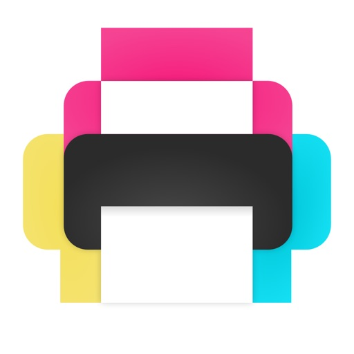

Print images exactly how you want them on the page. Resize and crop in inches or centimeters. Print multiple photos on one sheet. No more surprises or waste.

REAL SIZES
Size and crop your images in inches or centimeters. Each printed image will match exactly the size displayed on screen.

HIGH QUALITY
Will it look pixelated? The PPI (DPI) display tells you. For best results avoid stretching photos below 200-300 PPI.
Each image is sent to the printer at full resolution to guarantee optimal quality.

SAVE PAPER
Place multiple images anywhere on the page. Fill the empty spaces on your sheet and use less paper.

SAVE INK
Choose the most economical print mode (photo or general quality, color or grayscale).
Crop to print only what you need and waste no ink.

Intuitive and quick to use with familiar touch gestures:
• Select your paper size
• Add images
• Size and crop them to exact dimensions anywhere inside the page
• Align, rotate, flip and duplicate
• Choose your mode (photo or general quality, color or grayscale) then print.

Requires an AirPrint compatible printer. If you don't have one, you can still use this app to create a PDF or JPEG file that you can then print via other methods.

Perfect for all kinds of home printing projects:
• Picture frames
• Greeting cards
• Door signs
• Labels
• Badges

Printer manufacturers have ink and photo paper to sell, so their apps aren’t designed to help avoid waste. This app is different. It is designed to let you get it right the first time.

DOWNLOAD NOW and make the best use of your ink and paper!

[View on Apple](https://apps.apple.com/us/app/print-to-size/id949490225)

## Earthquake Network

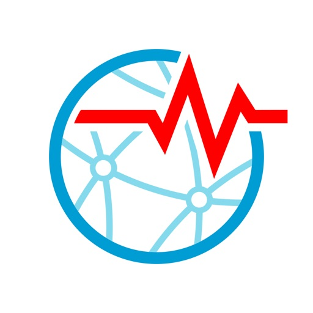

Earthquake Network is the most comprehensive app on earthquakes and for most world countries it is the only earthquake early warning system for receiving real time alerts.

Earthquake Network gives you:

- Real time alerts if you live close to the epicentre
- Alerts seconds in advances if you live far from the epicentre
- Real time user reports on felt earthquakes
- Free earthquake data from 21 seismic networks including U.S., Puerto Rico, India, Indonesia, Turkey, Mexico, Chile, Peru, Ecuador, Argentina, Venezuela, Dominican Republic, Colombia, Costa Rica, Nicaragua, China, New Zeland, Japan, Italy, Croatia, Spain and Greece

The Earthquake Network research project (https://www.sismo.app) aims at developing a smartphone-based earthquake early warning system able to detect earthquakes in real time and to alert the population in advance. Smartphones are able to detect earthquakes thanks to the accelerometer on-board each device. When an earthquake is detected, users with the application installed are immediatly alerted. Since earthquake waves travel at around 5 km/s it is possible to alert the population not yet reached by the damaging waves of the earthquake. For the scientific details about the project please refer to the scientific paper on Frontiers at https://bit.ly/2C8B5HI

Subscriptions:

When an earthquake is detected in real time by smartphones near the epicenter, the server sends an alert to all users with the app. Alerting all users can take up to 10 seconds since it is not technically feasible to do so instantly. Now you can join the priority lists of the first 10,000 or 100,000 people alerted in real time. The following subscriptions are available:

- Subscription 10k for 1 year
- Subscription 10k for 1 month 

- Subscription 100k for 1 year
- Subscription 100k for 1 month 

• Payment will be charged to iTunes Account at confirmation of purchase
• Subscription automatically renews unless auto-renew is turned off at least 24-hours before the end of the current period
• Account will be charged for renewal within 24-hours prior to the end of the current period, and identify the cost of the renewal
• Subscriptions may be managed by the user and auto-renewal may be turned off by going to the user's Account Settings after purchase
• Any unused portion of a free trial period, if offered, will be forfeited when the user purchases a subscription to that publication, where applicable

Privacy: https://www.sismo.app/privacy

Terms and conditions: https://www.sismo.app/terms-conditions

[View on Apple](https://apps.apple.com/us/app/earthquake-network/id1449893235)

## StbEmuTV (Pro)

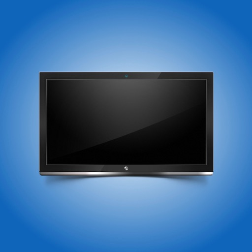

Best Stalker IPTV with complete support for iPad and iPhone, the way everyone wants to watch tv on their iPhone and iPad!

Great user interface that will also allow you to manage your portals. You can maintain multiple portals using this app. 

StbEmuTV offers you the same UI feel as provided by your IPTV Service provider for your TV. Now you can easily use your stalker portal if you have an iPhone or an iPad.

Features:

- Stream video from multiple protocols (HTTP, RTMP, RTSP, TS, MMS)

- EPG support

- TV (Manage TV channels)

- VOD (Video on Demand)

- Series (TV Series)

- Add, Edit, Delete, Share, Duplicate, Select Profiles and (Fast Switch)

- Favorite List added (TV, VOD, Series)

- Autoplay first channel of tv group. 

Disclaimer:

- StbEmuTV does not provide or include any media or stream content
- Users must enter their own portal details
- We do not endorse the streaming of copyright-protected material without the permission of the copyright holder.

[View on Apple](https://apps.apple.com/us/app/stbemutv-pro/id1564403188)

## myLightMeter PRO

Designed by a photographer, for photographers.
Built with a single goal: reliable and precise exposure, for both digital and analog workflows.

Whether you’re shooting film or digital, this app gives you full control over exposure with a clean, professional toolset.

Key Features

• Extended sensitivity down to -2.5 EV (perfect for low-light scenes)

• Incident and reflected metering

• Two interface styles to match your workflow

• Point metering directly from the camera view

• Full manual control: aperture, shutter speed, ISO and exposure compensation (1/3 steps)

• Range: from 4 hours to 1/8000s, aperture f/1.0 to f/512, ISO 0.8 to 409.600

• Aperture priority (Av) and shutter priority (Tv)

• Auto ISO or locked ISO

• Save and review exposure data

• Extract exposure data from photos in your gallery

• Average multiple measurements for higher accuracy

Advanced Tools

• Hyperfocal distance calculator (supports 5 lenses)

• Lens memory: aperture, focal length and sensor/film size

• Infrared hyperfocal support (IR mode)

• Maximum aperture limit based on selected lens

• EV display (analog scale or numeric)

• f/Tools integration

Important

For accurate incident metering, a diffuser must be placed over the front camera.
Without it, readings will behave as reflected light metering.

About

This app is built and maintained by an independent photographer and developer.
This is the tool I personally use and continuously refine.

If you have suggestions or need help, feel free to contact me:
davidquiles@me.com

[View on Apple](https://apps.apple.com/us/app/mylightmeter-pro/id583922375)

## RadarOmega: Doppler Radar App

Welcome to RadarOmega, the next-generation weather app that keeps you up to date with live, local radar, real-time severe weather alerts, and more. Our high-resolution weather data app operates in the US, Canada, Germany, Australia, and South Korea.

RadarOmega provides unique data solutions for all types of weather data, customized to your needs and weather alert preferences. From severe weather to local radar, advanced meteorology technology provides detailed insights for full weather coverage. Track high-resolution radar data, flash flood warnings, excessive rainfall, tornado watches, and more. 

RadarOmega created an exclusive network of weather stations featuring live video and sensor data called cyclonePORT. RadarOmega and cyclonePORT work closely with universities, emergency managers, broadcast meteorologists, and more to provide solutions for relaying extreme weather information through weather alerts.

View weather alerts for wind speeds, precipitation, extreme temperatures, severe weather, hurricanes, and tornadoes seamlessly. Users can subscribe to different packages to access additional data on satellite, MRMS, and models. Explore Alpha, Beta, or Gamma subscriptions to access data from winter to hurricane season. 

Download today to start viewing your customizable weather alerts.

RADAROMEGA APP FEATURES:

EXTREME WEATHER DATA & METEOROLOGY REPORTS
- High-resolution radar: Level 2 & 3, Dual Pol
- MRMS: Reflectivity, hail, rotation tracks, precipitation, etc
- Satellite: Visible, LWIR, water vapor
- Models: HRRR, NAM3KM, NAM12KM, RAP, GFS, ECMWF
- NDFD: Temperature, wind speeds, wind gusts, snow totals

BASE APPLICATION RADAR & ALERTS
- High-resolution single site radar
- Severe weather outlooks & daily meteorology monitoring for excessive rainfall, fire weather & more
- Extreme weather alerts for snow, rain, flash floods, hurricanes, tornadoes, etc. with flash animation & in-app sound alerts
- Real-time NWS storm-based warnings
- Radar & map type customization tools
- Buoy data & tidal forecast charts
- & more

GAMMA PACKAGE
- Hi-Res Satellite Data
- Lightning Detection/Animation, METARS, & GLM for Mesoscale & Storm-Based Satellite Sectors
- National Digital Forecast Database
- Access to Project MesoVort
- 75 Frames of Data
- Dual View Radar with 30 Frames
- Smoothing for Radar/Satellite
- 30 Day Radar History
- 6 Month Storm Report Archive
- 3D Radar / Satellite
- Upload 3 Custom Color Tables
- 30 Custom Locations with Icon Upload & 2 Custom Location Lists

BETA PACKAGE
*Everything in Gamma PLUS*
- MRMS Data
- 150 Frames of Data
- Dual View Radar/Satellite with 50 Frames
- Smoothing for MRMS
- 90 Day Radar History
- 5 Year Storm Report Archive
- 3D MRMS
- Upload 8 Custom Color Tables
- 75 Custom Locations with Icon Upload & 5 Custom Location Lists

ALPHA PACKAGE
*Everything in Beta PLUS*
- Volumetric Radar
- Model Data with Contours for HRRR, NAM3KM, NAM12KM, RAP, GFS, ECMWF, HWRF, & HMON
- 250 Frames of Data
- Dual View Radar/Satellite with 100 Frames
- Quad View Radar/Satellite on Tablet & Desktop with 50 Frames
- Smoothing for Models
- 90 Day Radar History
- 10 Year Storm Report Archive
- Upload 30 Custom Color Tables
- 150 Custom Locations with Icon Upload & 10 Custom Location Lists
- Lightning Monitoring: 1 Site Lightning Monitoring with Custom Range Zones

Additional Add-Ons
- RapidSweep

Start your subscription today to start tracking local radars, daily temps, precipitation, and extreme weather!

Subscriptions are maintained through the iOS App Store. We will work with our customers; however, refunds must be done through the iOS App Store. Please be sure to reach out to our support team if you have any problems, questions, or concerns.

For Support - You can create a ticket, and we will resolve it as soon as possible:
https://radaromegawx.supportbee.io/portal/sign_in

See our Terms of Service below: https://www.radaromega.com/terms.php

[View on Apple](https://apps.apple.com/us/app/radaromega-doppler-radar-app/id1439881811)

## forScore

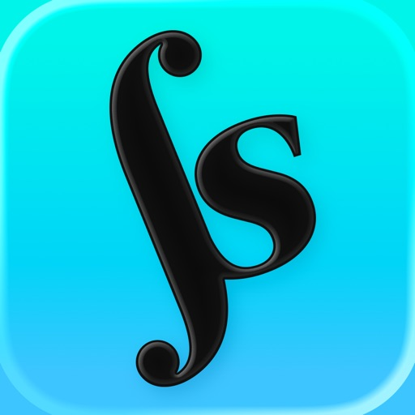

Go paperless. Get organized. Download and play something new in seconds. With forScore for iOS, iPadOS, macOS and visionOS, your scores have never been better—it’s everything you can do with paper and so much more. As seen in Apple keynote addresses and retail stores worldwide!

On your music stand or on the go, it's the complete PDF sheet music reading experience that has wowed musicians all over the world for years:

CONNECT
• Copy PDFs from other apps like Safari and Mail and sync them to all of your devices with iCloud
• Import scores from popular cloud storage services and content providers like Musicnotes.com
• Share scores and setlists with colleagues, whether or not they use forScore

ORGANIZE
• Add metadata to your scores for a perfectly browsable, instantly searchable library
• Create smart bookmarks to manage longer files containing multiple parts or pieces
• Group scores manually with Setlists to play through them from start to finish

PLAY
• View full pages in portrait orientation and crop them to better fit your device's screen
• Turn your device sideways for bigger scrolling pages or view two pages side by side instead
• Use Reflow on smaller screens to lay out systems of music end-to-end like a horizontal teleprompter

REFINE
• Enter annotation mode to draw, type text, or place common symbols onto the page
• Separate your annotations into layers and show or hide them at any time
• Open scores and setlists in multiple windows or tabs to multitask with ease

SIMPLIFY
• Create links and buttons to handle repeats or perform common actions with a single tap
• Rearrange and duplicate pages of a score to play without jumping back and forth
• Connect your Bluetooth page turner for hands-free navigation

EXTEND
• Access integrated utilities like our metronome, pitch pipe, tuner, and piano keyboard
• Link tracks to scores to loop regions, adjust pitch, and even use them to record and play back your page turns
• Connect wirelessly to nearby devices and coordinate your page turns and program changes effortlessly

There's much more than those highlights, though, so be sure to visit forscore.co to learn all about forScore's incredible features and find out why so many musicians agree that forScore is simply the best!

Note: forScore also offers an optional, annual auto-renewing subscription called forScore Pro that unlocks additional features and content (visit forScore.co/pro for complete details). forScore Pro is a 1-year subscription that renews automatically until canceled. Should you choose to subscribe, payment will be charged to your iTunes Account upon confirmation of purchase. Your subscription will then automatically renew unless canceled at least 24 hours before the end of the current period. You can manage your subscriptions in your iTunes Account Settings after purchase. Complete terms of service are available on our website at: forScore.co/terms-of-service

[View on Apple](https://apps.apple.com/us/app/forscore/id363738376)

## Slow Shutter Cam

Slow Shutter Cam brings new life into your device's photo toolbox by letting you capture a variety of amazing slow shutter speed effects that you only thought you could get with a DSLR. Continue reading to learn more about this unique app!

-----------------------

• Featured numerous times by Apple:

- App Store Essentials: Camera & Photography
- Photography for Professionals - Total Control
- Extraordinary Photo Apps
- Best New App

-----------------------

"It’s one of those rare photography apps that creates effects that few others are capable of, and it does it easily and with better results."
— Marty Yawnick, Life In LoFi

-----------------------

How many times have you tried to capture artful images with your iPhone camera but were left wishing you had more features to work with? Slow Shutter Cam puts an end to mere snapshots and gives you some of the most powerful features of a DSLR camera. All this, in a package that fits in your pocket.
 
Slow Shutter Cam offers three capture modes to capture unique images:
 
MOTION BLUR: Equivalent to the shutter priority mode on a DSLR, the Motion Blur mode is perfect for creating ghost images, waterfall effects or suggesting movement in your photographs by adding a blur.

LIGHT TRAIL: The Light Trail mode allows you to 'paint' with light, show car light trails and fireworks or capture any other moving light in a unique way. Unlike shooting with a DSLR and being tied to specific rigid settings to obtain good results, the Light Trail mode takes care of the essentials, letting your creativity soar!

LOW LIGHT: In low light conditions, this capture mode allows the camera to accumulate every photon of light hitting the sensor. The longer the shutter speed, the more light it will accumulate. You can even fine-tune the result using the exposure compensation slider to achieve the exact effect you want!

Highlights:

•  Unlimited Shutter Speed and manual ISO
•  Option to resume capture  and create multiple exposure photos
•  Real time live preview - See the result in real time
•  Innovative 'Freeze'  and ‘Blur Strength’ controls
•  Tap to adjust focus/exposure
•  Time-lapse Intervalometer
•  Apple Watch support and handy Self-Timer 
•  Full resolution support on every devices
•  Camera Control support (iPhone 16)

With Slow Shutter Cam on your iPhone you get the features of a DSLR camera with the convenience of a device that you can drop in your pocket and take with you wherever you go. Download it now and put an end to mere snapshots!

Search #slowshuttercam on Instagram or visit the "Slow Shutter Cam - iPhone" group on flickr for amazing samples!

[View on Apple](https://apps.apple.com/us/app/slow-shutter-cam/id357404131)

## Sporty's E6B Flight Computer

Based on Sporty’s popular handheld E6B Electronic Flight Computer, the E6B app has been designed from the ground up to make the most of iOS on the iPhone, iPad and Apple Watch, and MacOS on Apple Computers. The software is based on the tried and true formulas and algorithms developed over the years by Sporty’s team of over 50 pilots.

Its pilot-friendly design makes quick work of any navigational, conversion or fuel problem and it also performs conventional arithmetic calculations.
 
The advanced timer/clock feature simultaneously tracks Zulu, Local and Home time zones. The timer counts either up or down, and will display an alert when reaching zero.

27 AVIATION FUNCTIONS
 
-Pressure & Density Altitude
-Planned True Airspeed
-Heading and Groundspeed
-Compass Heading
-Leg Time
-Fuel Required
-Crosswind, Headwind and Tailwind
-Cloud Base and Freezing Level
-Actual True Airspeed
-Actual True Altitude
-Wind Speed and Direction
-Groundspeed
-Planned Mach Number
-Required True Airspeed
-Required Calibrated Airspeed
-Distance Flown
-Endurance
-Fuel per Hour
-Actual Mach Number
-Percent Mean Aerodynamic Chord (MAC)
-Hydroplane Speed
-Required Rate of Climb
-Specific Range
-Pivotal Altitude
-Top of Descent
-Required Rate of Descent
-Glide Distance

22 AVIATION CONVERSIONS
 
-Celsius :: Fahrenheit
-Nautical Miles :: Statute Miles
-Nautical Miles :: Kilometers
-Feet :: Meters
-Pounds :: Kilograms
-Avgas Gallons :: Pounds
-Jet A Gallons :: Pounds
-Gallons :: Liters
-Hours/Minutes/Seconds :: Hours
-Climb FT/NM :: Climb Percent
-Climb FT/NM :: Climb Degrees

CALCULATOR
 
-Perform basic math without having to exit the application

CLOCK/TIMER
 
-Simultaneous tracking of Zulu, Home and Local time zones
-Advanced timer counts up or down and operates independently so you can perform other calculations while the timer is running
-Upon reaching zero in the countdown mode, a message will display no matter what app is active  – a useful feature for missed approaches, switching fuel tanks, etc.

[View on Apple](https://apps.apple.com/us/app/sportys-e6b-flight-computer/id371817955)

## Stack the Countries®

- Featured on the TODAY show!
- Editor's Choice Award! - Children's Technology Review 
- "Stack the Countries is worth every penny and this is an educational purchase that you absolutely will not regret." - The iPhone Mom

Stack the Countries® makes learning about the world fun!  Watch the countries actually come to life in this colorful and dynamic game! 

As you learn country capitals, landmarks, geographic locations and more, you can actually touch, move and drop the animated countries anywhere on the screen. Carefully build a stack of countries that reaches the checkered line to win each level.

You earn a random country for every successfully completed level.  All of your countries appear on your own personalized maps of the continents.  Try to collect all 193!  As you earn more countries, you begin to unlock the free bonus games: Map It! and Pile Up!  Three games in one!

CONTROL YOUR OWN EXPERIENCE:  You can choose to focus on just one specific continent or play the whole world.  You can also select which types of questions are asked.

LEARN BEFORE YOU PLAY:  Stack the Countries provides 193 country flash cards and colorful interactive maps of the continents.  Use them to brush up on your world geography before you play or as a handy reference tool.

HAVE FUN LEARNING ALL ABOUT THE COUNTRIES OF THE WORLD:
▸ Capitals
▸ Landmarks
▸ Major Cities
▸ Continents
▸ Border Countries
▸ Languages
▸ Flags
▸ Country Shapes

FEATURES:
▸ More than 1000 unique questions
▸ 193 flash cards -- one for each country!
▸ Interactive maps of the continents
▸ Collect all 193 countries and track your progress on personalized maps
▸ Earn FREE bonus games: Map It! and Pile Up!
▸ Play in English, Spanish and French
▸ Works on both iPhone and iPad - a universal app
▸ Create up to six player profiles
▸ Choose any of the friendly-looking countries as your avatar
▸ High resolution pictures of famous world landmarks
▸ All games are powered by a realistic physics engine
▸ Fun sound effects and music
▸ iPhone 4 Retina Display support

THREE GAMES IN ONE:

STACK THE COUNTRIES: Build tall piles of countries and try to reach the checkered line.

MAP IT: Tap the location of the selected country on the map.  Try to complete the whole continent!

PILE UP: The countries are piling up!  Identify and tap them quickly to get rid of them before they reach the top.

Stack the Countries® is an educational app for all ages that's actually FUN to play.  Try it now and enjoy three games for the price of one!

PRIVACY DISCLOSURE:
Stack the Countries®:
- Does not contain 3rd party ads.
- Does not contain in-app purchases.
- Does not contain integration with social networks.
- Does not use 3rd party analytics / data collection tools.
- Does include links to apps by Dan Russell-Pinson in the iTunes App Store (via Performance Horizon).

For more information on our privacy policy please visit:
http://dan-russell-pinson.com/privacy/

[View on Apple](https://apps.apple.com/us/app/stack-the-countries/id407838198)

## QZ - qdomyos-zwift

** QZ is not affiliated with or endorsed by any subscription service or maker of exercise equipment. **

Have you got a bike (echelon, flywheel, proform, i-console yesoul, decathlon, domyos, keiser, ...) or a Domyos (Decathlon) / Horizon / Proform  treadmill and you want to join to zwift? This app allows you to give a second life to your machine!

Also ellipticals and rowers machinery are supported now!

Simply connect your smartphone to the treadmill/bike and zwift/peloton/fulgaz/rouvy will recognize it!

Also this app allow you to use HealthKit to read your heart rate direct from your Apple Watch or any Heart Rate Bluetooth Belt. This metric will also be saved in your workout!

Compatible machineries:
- all the Echelon bikes (please check the firmware compatibility https://robertoviola.cloud/2025/07/22/how-i-built-qz-and-how-echelon-is-now-breaking-it/ )
- all the Domyos bikes
- all the Domyos treadmills
- all the Domyos elliptical machinery
- Smart Row Rower
- Echelon Rower (please check the firmware compatibility https://robertoviola.cloud/2025/07/22/how-i-built-qz-and-how-echelon-is-now-breaking-it/ )
- Concept Rower 2
- Yesoul S3 (M3 is currently on testing, if you have one, contact me)
- Sportstech bikes
- Inspire bikes
- Schwinn IC4 and Bowflex C6
- Toorx bikes and spinbikes
- Fassi treadmills
- all the Proform bikes without a tablet builtin
- Proform treadmills
- Flywheel bike (the calibration tool is here https://ptx2.net/apps/flytest/ )
- JK Fitness treadmill
- Toorx treadmills
- Sole elliptical
- Chrono bike
- NPECable
- and much more! ask me by email about the compatibility

If you want you can join the Swag Bag auto-renewing subscription through an In-App Purchase in order to help me in the development of the app!
• an auto-renewable subscription
• 1 month ($1.99)
• Your subscription will be charged to your iTunes account at confirmation of purchase and will automatically renew (at the duration selected) unless auto-renew is turned off at least 24 hours before the end of the current period.
• Current subscription may not be cancelled during the active subscription period; however, you can manage your subscription and/or turn off auto-renewal by visiting your iTunes Account Settings after purchase.
• Privacy policy: https://robertoviola.cloud/privacy-policy-qdomyos-zwift/
• Licensed Application end user license agreement: https://www.apple.com/legal/internet-services/itunes/dev/stdeula/

[View on Apple](https://apps.apple.com/us/app/qz-qdomyos-zwift/id1543684531)

## DJ Rehab Music

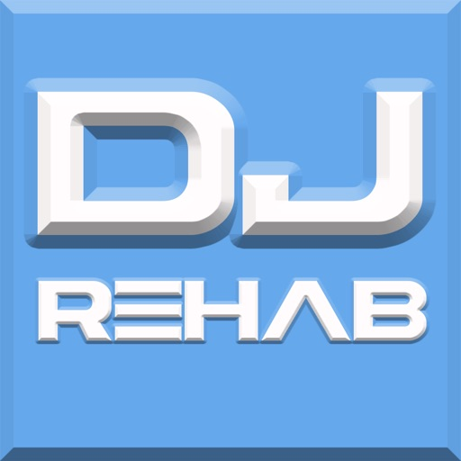

Discover the DJ Rehab Music App – Nonstop Mashups & Epic Mixtapes 

Step into the world of DJ Rehab, where genres collide and the music never stops. The DJ Rehab Music App is your one-stop destination for wild mashups, exclusive remixes, and jaw-dropping 200+ song mixtapes that blend hip-hop, EDM, classic rock, pop, and everything in between.

What You’ll Get:

-Hundreds of original mashups that flip your favorite tracks in unexpected ways

-Mega-mixtapes packed with over 200 songs, seamlessly mixed for hours of nonstop vibes

-A genre-bending library that takes you from Wu-Tang to Zeppelin, Outkast to EDM anthems

-Exclusive mixes you won’t find anywhere else

-Perfect for parties, workouts, road trips, or just losing yourself in the music, the DJ Rehab Music App puts creativity and energy in your pocket.

[View on Apple](https://apps.apple.com/us/app/dj-rehab-music/id6752807769)
