- [The Calamity Club: A Novel](#the-calamity-club-a-novel)
- [The Odyssey](#the-odyssey)
- [Dungeon Crawler Carl: A LitRPG/Gamelit Adventure (Unabridged)](#dungeon-crawler-carl-a-litrpg-gamelit-adventure-unabridged)
- [The Night We Met](#the-night-we-met)
- [Yesteryear: A GMA Book Club Pick: A Novel (Unabridged)](#yesteryear-a-gma-book-club-pick-a-novel-unabridged)
- [Theo of Golden (Unabridged)](#theo-of-golden-unabridged)
- [Ransom](#ransom)
- [Circe](#circe)
- [Project Hail Mary (Unabridged)](#project-hail-mary-unabridged)
- [The Way of Kings](#the-way-of-kings)
- [The Dungeon Anarchist's Cookbook: Dungeon Crawler Carl, Book 3 (Unabridged)](#the-dungeon-anarchist-s-cookbook-dungeon-crawler-carl-book-3-unabridged)
- [It's Not Her](#it-s-not-her)
- [Whistler](#whistler)
- [Carl's Doomsday Scenario: Dungeon Crawler Carl, Book 2 (Unabridged)](#carl-s-doomsday-scenario-dungeon-crawler-carl-book-2-unabridged)
- [Cancel Me If You Can (Unabridged)](#cancel-me-if-you-can-unabridged)
- [Mad Mabel](#mad-mabel)
- [Atomic Habits: An Easy & Proven Way to Build Good Habits & Break Bad Ones (Unabridged)](#atomic-habits-an-easy-proven-way-to-build-good-habits-break-bad-ones-unabridged)
- [What Have You Done?: A Novel (Unabridged)](#what-have-you-done-a-novel-unabridged)
- [Paranoia](#paranoia)
- [The Buffalo Hunter Hunter (Unabridged)](#the-buffalo-hunter-hunter-unabridged)
- [The Gate of the Feral Gods: Dungeon Crawler Carl, Book 4 (Unabridged)](#the-gate-of-the-feral-gods-dungeon-crawler-carl-book-4-unabridged)
- [Haunting Adeline: Cat and Mouse Duet, Book 1 (Unabridged)](#haunting-adeline-cat-and-mouse-duet-book-1-unabridged)
- [Regime Change (Unabridged)](#regime-change-unabridged)
- [The Butcher's Masquerade: Dungeon Crawler Carl, Book 5 (Unabridged)](#the-butcher-s-masquerade-dungeon-crawler-carl-book-5-unabridged)
- [The Odyssey (Unabridged)](#the-odyssey-unabridged)
- [The Odyssey](#the-odyssey)
- [The Waiting](#the-waiting)
- [A Parade of Horribles: Dungeon Crawler Carl, Book 8 (Unabridged)](#a-parade-of-horribles-dungeon-crawler-carl-book-8-unabridged)
- [The Eye of the Bedlam Bride: Dungeon Crawler Carl, Book 6 (Unabridged)](#the-eye-of-the-bedlam-bride-dungeon-crawler-carl-book-6-unabridged)
- [Judge Stone](#judge-stone)
- [The 48 Laws of Power](#the-48-laws-of-power)
- [The Shampoo Effect: A Read with Jenna Pick: A Novel (Unabridged)](#the-shampoo-effect-a-read-with-jenna-pick-a-novel-unabridged)
- [The Five-Star Weekend](#the-five-star-weekend)
- [The Housemaid](#the-housemaid)
- [The Country Road Murders](#the-country-road-murders)
- [Dolly All the Time (Unabridged)](#dolly-all-the-time-unabridged)
- [The Correspondent: A Novel (Unabridged)](#the-correspondent-a-novel-unabridged)
- [Circle of Days](#circle-of-days)
- [Odyssey](#odyssey)
- [This Inevitable Ruin: Dungeon Crawler Carl, Book 7 (Unabridged)](#this-inevitable-ruin-dungeon-crawler-carl-book-7-unabridged)
- [Strangers: A Memoir of Marriage (Unabridged)](#strangers-a-memoir-of-marriage-unabridged)
- [Greenlights (Unabridged)](#greenlights-unabridged)
- [A Court of Thorns and Roses (Court of Thorns and Roses)](#a-court-of-thorns-and-roses-court-of-thorns-and-roses)
- [The Odyssey (Unabridged)](#the-odyssey-unabridged)
- [My Husband's Wife](#my-husband-s-wife)
- [Famesick: A Memoir (Unabridged)](#famesick-a-memoir-unabridged)
- [Red Rising (Red Rising)](#red-rising-red-rising)
- [The Iliad](#the-iliad)
- [The Divorce](#the-divorce)
- [Lights Out: An Into Darkness Novel (Unabridged)](#lights-out-an-into-darkness-novel-unabridged)
- [Harry Potter and the Sorcerer's Stone](#harry-potter-and-the-sorcerer-s-stone)
- [Threshing Day (Wing and Claw Collection) (Empyrean)](#threshing-day-wing-and-claw-collection-empyrean)
- [The Day After](#the-day-after)
- [The Psychology of Money](#the-psychology-of-money)
- [Fourth Wing (Empyrean)](#fourth-wing-empyrean)
- [Thrilling Tales of Modern Men: Stories (Unabridged)](#thrilling-tales-of-modern-men-stories-unabridged)
- [The Fellowship of the Ring (Lord of the Rings)](#the-fellowship-of-the-ring-lord-of-the-rings)
- [The Fourth Option (Unabridged)](#the-fourth-option-unabridged)
- [The Four Agreements: A Practical Guide to Personal Freedom (Unabridged)](#the-four-agreements-a-practical-guide-to-personal-freedom-unabridged)
- [The Hobbit (Lord of the Rings)](#the-hobbit-lord-of-the-rings)
- [London Falling: A Mysterious Death in a Gilded City and a Family's Search for Truth (Unabridged)](#london-falling-a-mysterious-death-in-a-gilded-city-and-a-family-s-search-for-truth-unabridged)
- [Dirty Thirty (Unabridged)](#dirty-thirty-unabridged)
- [Sunrise on the Reaping (The Hunger Games)](#sunrise-on-the-reaping-the-hunger-games)
- [The Let Them Theory: A Life-Changing Tool That Millions of People Can’t Stop Talking About (Unabridged)](#the-let-them-theory-a-life-changing-tool-that-millions-of-people-can-t-stop-talking-about-unabridged)
- [Kingdom of Ash (Unabridged)](#kingdom-of-ash-unabridged)
- [Summer Romance (Unabridged)](#summer-romance-unabridged)
- [The Body Keeps the Score: Brain, Mind, and Body in the Healing of Trauma (Unabridged)](#the-body-keeps-the-score-brain-mind-and-body-in-the-healing-of-trauma-unabridged)
- [The Silent Patient](#the-silent-patient)
- [Five Brothers (Unabridged)](#five-brothers-unabridged)
- [Golden Son (Red Rising)](#golden-son-red-rising)
- [Throne of Glass](#throne-of-glass)
- [Three Days in June: A Novel (Unabridged)](#three-days-in-june-a-novel-unabridged)
- [Never Lie](#never-lie)
- [The Rose Code](#the-rose-code)
- [The Score (Unabridged)](#the-score-unabridged)
- [The Mountain is You: Transforming Self-Sabotage Into Self-Mastery](#the-mountain-is-you-transforming-self-sabotage-into-self-mastery)
- [Love You More: A Novel (Unabridged)](#love-you-more-a-novel-unabridged)
- [Enigma](#enigma)
- [Hunting Adeline: Cat and Mouse Duet, Book 2 (Unabridged)](#hunting-adeline-cat-and-mouse-duet-book-2-unabridged)
- [Sapiens](#sapiens)
- [A Game of Thrones: A Song of Ice and Fire: Book One (Unabridged)](#a-game-of-thrones-a-song-of-ice-and-fire-book-one-unabridged)
- [It Could Have Been Her (Unabridged)](#it-could-have-been-her-unabridged)
- [The Land and Its People](#the-land-and-its-people)
- [Good to Great](#good-to-great)
- [Queen of Shadows (Unabridged)](#queen-of-shadows-unabridged)
- [Unreasonable Hospitality: The Remarkable Power of Giving People More Than They Expect (Unabridged)](#unreasonable-hospitality-the-remarkable-power-of-giving-people-more-than-they-expect-unabridged)
- [A Court of Mist and Fury (Court of Thorns and Roses)](#a-court-of-mist-and-fury-court-of-thorns-and-roses)
- [The Alchemist](#the-alchemist)
- [One by One](#one-by-one)
- [The Grapes of Wrath (Unabridged)](#the-grapes-of-wrath-unabridged)
- [Attached: The New Science of Adult Attachment and How It Can Help You Find--and Keep-- Love (Unabridged)](#attached-the-new-science-of-adult-attachment-and-how-it-can-help-you-find-and-keep-love-unabridged)
- [Man's Search for Meaning](#man-s-search-for-meaning)
- [Kitchen Confidential: Adventures in the Culinary Underbelly (Unabridged)](#kitchen-confidential-adventures-in-the-culinary-underbelly-unabridged)
- [Woman in Suite 11 (Unabridged)](#woman-in-suite-11-unabridged)
- [Catch Her If You Can](#catch-her-if-you-can)
- [Crown of Midnight](#crown-of-midnight)
- [The Mistake (Unabridged)](#the-mistake-unabridged)
- [Can't Hurt Me: Master Your Mind and Defy the Odds (Unabridged)](#can-t-hurt-me-master-your-mind-and-defy-the-odds-unabridged)
- [Extreme Ownership](#extreme-ownership)
- [Harry Potter and the Chamber of Secrets](#harry-potter-and-the-chamber-of-secrets)

## The Calamity Club: A Novel

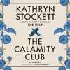

#1&#xa0;NEW YORK TIMES&#xa0; BESTSELLER&#xa0;  “So immersive, exciting, and downright fabulous, you never want it to end.”—Oprah Daily  “A heart-wrenching, often hilarious story of economic hardship, moral posturing, and the particular yearnings of childless women and motherless girls.”—The New York Times  The multimillion-copy-selling author of&#xa0;The Help&#xa0;returns with a bold, big-hearted novel about a group of unbreakable women, fighting for what’s rightfully theirs—and the power of friendship to change everything.  Oxford, Mississippi, 1933.  Abandoned by her mother one Christmas Eve, eleven-year-old Meg Lefleur has learned the hard way to rely on no one. Now one of the unadoptable "big girls" at the Lafayette County Orphan Asylum, she fights each day to keep her spirit unbowed.&#xa0;  Birdie Calhoun, unmarried and outspoken, has come to Oxford to ask her socialite sister to help the struggling family she’s left behind. But as the Depression tightens its grip, Birdie discovers her sister’s seemingly charmed life is a tapestry of lies.&#xa0;  Then, Birdie encounters Charlie, a woman running low on luck with little left to lose. When their fates—and Meg’s—converge, Charlie comes up with an audacious plan for them to take control of their lives. But in a place and time where hypocrisy is rife and women’s freedom is fragile, even the smallest act of defiance can have dangerous consequences.&#xa0;  The Calamity Club&#xa0;will make you laugh, cry, and cheer—an epic testament to underestimated women who know that calamity can be the spark of new beginnings. This is Kathryn Stockett at her most confident, heartfelt, and hilarious—the triumphant return of one of the most beloved storytellers of our time.

[View on Apple](https://books.apple.com/us/audiobook/the-calamity-club-a-novel/id1808184252)

## The Odyssey

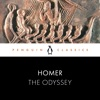

<b>Brought to you by Penguin. </b>  This Penguin Classic is performed by George Blagden, star of Versailles and Vikings. This definitive recording is translated by E.V. Rieu, revised by D.C.H. Rieu, and contains an introduction by Peter Jones.  The epic tale of Odysseus and his ten-year journey home after the Trojan War forms one of the earliest and greatest works of Western literature. Confronted by natural and supernatural threats - shipwrecks, battles, monsters and the implacable enmity of the sea-god Poseidon - Odysseus must use his wit and native cunning if he is to reach his homeland safely and overcome the obstacles that, even there, await him.  (c) 1946, E. V. Rieu (P) 2019 Penguin Audio

[View on Apple](https://books.apple.com/us/audiobook/the-odyssey/id1479199452)

## Dungeon Crawler Carl: A LitRPG/Gamelit Adventure (Unabridged)

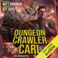

<b>The apocalypse will be televised!</b>  A man. His ex-girlfriend's cat. A sadistic game show unlike anything in the universe: a dungeon crawl where survival depends on killing your prey in the most entertaining way possible.&#xa0;  In a flash, every human-erected construction on Earth - from Buckingham Palace to the tiniest of sheds - collapses in a heap, sinking into the ground.  The buildings and all the people inside have all been atomized and transformed into the dungeon: an 18-level labyrinth filled with traps, monsters, and loot. A dungeon so enormous, it circles the entire globe.  Only a few dare venture inside. But once you're in, you can't get out. And what's worse, each level has a time limit. You have but days to find a staircase to the next level down, or it's game over. In this game, it's not about your strength or your dexterity. It's about your followers, your views. Your clout. It's about building an audience and killing those goblins with style.&#xa0;  You can't just survive here. You gotta survive big.  You gotta fight with vigor, with excitement. You gotta make them stand up and cheer. And if you do have that "it" factor, you may just find yourself with a following. That's the only way to truly survive in this game - with the help of the loot boxes dropped upon you by the generous benefactors watching from across the galaxy.  They call it <i>Dungeon Crawler World</i>. But for Carl, it's anything but a game.

[View on Apple](https://books.apple.com/us/audiobook/dungeon-crawler-carl-a-litrpg-gamelit-adventure/id1553350212)

## The Night We Met

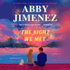

<b>From the #1 </b><i><b>New York Times </b></i><b>bestselling author of </b><i><b>Say You'll Remember Me&#xa0;</b></i><b>comes</b>&#xa0;<b>a</b>&#xa0;<b>beautiful, compelling novel that revels in laughter, friendship, and the messy choices life can throw our way.</b>  <b>In everyone’s life, there’s a split-second decision that can change everything...</b>   For Larissa, it came when choosing who to ride home with after a concert. That night, she had no idea she’d met the perfect man. She and Chris are great friends, co-parenting a slightly unhinged rescue Yorkie, sharing their favorite books, and judging bread (pumpernickel for the win!). For the first time amid all her side hustles to scrape by, things finally feel easy.   But she didn’t choose Chris to drive her home all those months ago—she went with his best friend, and he became her boyfriend. All Chris wants is for Larissa to be happy. Standing by on the sidelines is slowly killing him, but making a move would destroy someone else. How can something that feels so right be absolutely impossible?&#xa0;

[View on Apple](https://books.apple.com/us/audiobook/the-night-we-met/id1832534240)

## Yesteryear: A GMA Book Club Pick: A Novel (Unabridged)

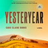

<b>#1 <i>NEW YORK TIMES</i> BESTSELLER&#xa0;•&#xa0;A GMA BOOK CLUB PICK • A<i> NEW YORK TIMES </i>BEST BOOK OF THE YEAR (SO FAR) • A traditional American woman, a “tradwife” influencer, suddenly awakens in the brutal reality of 1855—where she must unravel whether this living nightmare is an elaborate hoax, a twisted reality show, or something far more sinister in this sensational debut novel.  "A bold and biting satire, <i>Yesteryear…</i>will have you cackling and gasping right to the final page." —Nita Prose, #1 <i>New York Times</i> bestselling author of <i>The Maid </i>series</b>  <i>My name was Natalie Heller Mills, and I was perfect at being alive. </i>  Natalie lives a traditional lifestyle. Her charming farmhouse is rustic, her husband a handsome cowboy, her six children each more delightful than the last. So what if there are nannies and producers behind the scenes, her kitchen hiding industrial-grade fridges and ovens, her husband the heir to a political dynasty?&#xa0;What Natalie’s followers—all 8 million of them—don’t know won’t hurt them. And The Angry Women? The privileged, Ivy League, coastal elite haters who call her an antifeminist iconoclast? They’re sick with jealousy. Because Natalie isn’t simply living the good life, she’s living the ideal—and just so happens to be building an empire from it.  Until one morning she wakes up in a life that isn’t hers. Her home, her husband, her children—they’re all familiar, but something’s off. Her kitchen is warmed by a sputtering fire rather than electricity, her children are dirty and strange, and her soft-handed husband is suddenly a competent farmer. Just yesterday Natalie was curating photos of homemade jam for her Instagram, and now she’s expected to haul firewood and handwash clothes until her fingers bleed. Has she become the unwitting star of a ruthless reality show? Could it really be time travel? Is she being tested by God? By Satan? When Natalie suffers a brutal injury in the woods, she realizes two things: This is not her beautiful life, and she must escape by any means possible.  A gripping, electrifying novel that is as darkly funny as it is frightening, <i>Yesteryear</i> is a gimlet-eyed look at tradition, fame, faith, and the grand performance of womanhood.

[View on Apple](https://books.apple.com/us/audiobook/yesteryear-a-gma-book-club-pick-a-novel-unabridged/id1828570519)

## Theo of Golden (Unabridged)

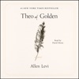

<b>THE #1 <i>NEW YORK TIMES</i> BESTSELLING PHENONEMON</b>  <b>A Katie Couric Book Club Pick • A Jen Hatmaker Book Club Pick</b>  <b>“[A] word-of-mouth smash hit.”</b> <b>—<i>The New York Times</i></b>  <b>“A treasure.” —Hoda Kotb</b>  One spring morning, a stranger named Theo arrives in the small Southern city of Golden. He doesn’t explain much about where he came from or why he’s there—but when he visits the local coffeehouse, where pencil portraits of the people of Golden hang on the walls, he begins purchasing them, one at a time, and giving each portrait to the person depicted. In exchange, he asks only for the person’s story. And so portrait by portrait, person by person, secrets are revealed, regrets are shared, and ordinary lives are profoundly altered.  A story of giving and receiving, of seeing and being seen, <i>Theo of Golden</i> is an unforgettable novel about the power of generosity, the importance of connection, and the quiet miracles that happen when we choose kindness and wonder.  <b>Narrated by multiple Emmy and Tony award nominee David Morse, with a brand-new afterword about the writing of <i>Theo of Golden</i>, narrated by the author himself.</b>

[View on Apple](https://books.apple.com/us/audiobook/theo-of-golden-unabridged/id1843888368)

## Ransom

<b>Art restorer and legendary spy Gabriel Allon searches for the missing wife of a British billionaire in the electrifying new tale of greed, corruption, and betrayal from #1 <i>New York Times</i>–bestselling novelist Daniel Silva.</b>  Alice Winter, one of Britain’s most dazzling socialites, seemingly has the perfect life—a lavish home in posh Knightsbridge, a grand estate in Devon, millions of followers on social media who eagerly await her next post. But when she disappears without a trace while on holiday with three old friends from Cambridge, her desperate husband, the real estate baron Edward Knight, turns to none other than Gabriel Allon to find her.  He soon discovers that Alice Winter is not the woman she appears to be, that she has a reckless side, that she has secrets. But Edward Knight has a secret too, a secret so dangerous that Gabriel will have no choice but to return to the life he thought he had left behind. An old enemy lurks there, waiting for him to make one misstep, waiting for the perfect moment to exact vengeance.  From its irresistible opening chapters to its heart-pounding climax and shocking final twist, <i>Ransom</i> is a riveting, page-turning tour de force that proves yet again why Daniel Silva is the reigning master of international intrigue and suspense.

[View on Apple](https://books.apple.com/us/audiobook/ransom/id1846423680)

## Circe

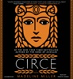

<b>This #1 <i>New York Times </i>bestseller is a "bold and subversive retelling of the goddess's story" that brilliantly reimagines the life of Circe, formidable sorceress of The Odyssey (Alexandra Alter, <i>The</i><i>New York Times</i>).</b>   In the house of Helios, god of the sun and mightiest of the Titans, a daughter is born. But Circe is a strange child -- not powerful, like her father, nor viciously alluring like her mother. Turning to the world of mortals for companionship, she discovers that she does possess power -- the power of witchcraft, which can transform rivals into monsters and menace the gods themselves.   Threatened, Zeus banishes her to a deserted island, where she hones her occult craft, tames wild beasts and crosses paths with many of the most famous figures in all of mythology, including the Minotaur, Daedalus and his doomed son Icarus, the murderous Medea, and, of course, wily Odysseus.   But there is danger, too, for a woman who stands alone, and Circe unwittingly draws the wrath of both men and gods, ultimately finding herself pitted against one of the most terrifying and vengeful of the Olympians. To protect what she loves most, Circe must summon all her strength and choose, once and for all, whether she belongs with the gods she is born from, or the mortals she has come to love.   With unforgettably vivid characters, mesmerizing language, and page-turning suspense, Circe is a triumph of storytelling, an intoxicating epic of family rivalry, palace intrigue, love and loss, as well as a celebration of indomitable female strength in a man's world.  <b>#1 <i>New York Times</i> Bestseller -- named one of the Best Books of the Year by NPR, the <i>Washington Post</i>, <i>People</i>, <i>Time</i>, Amazon, <i>Entertainment Weekly</i>, <i>Bustle<i>, <i>Newsweek</i>, the A.V. Club, <i>Christian Science Monitor</i>, <i>Refinery 29</i>, Buzzfeed, Paste, Audible, <i>Kirkus</i>, <i>Publishers Weekly</i>, Thrillist, NYPL, <i>Self</i>, <i>Real Simple</i>, Goodreads, <i>Boston Globe</i>, Electric Literature, BookPage, <i>the Guardian</i>, Book Riot, <i>Seattle Times</i>, and <i>Business Insider</i>.</i></i></b>

[View on Apple](https://books.apple.com/us/audiobook/circe/id1442351802)

## Project Hail Mary (Unabridged)

<b>THE #1 </b><b><i> NEW YORK TIMES </i></b><b> BESTSELLER FROM THE AUTHOR OF </b><b><i> THE MARTIAN. </i></b><b> Now a major motion picture starring Ryan Gosling, directed by Phil Lord and Christopher Miller, with a screenplay by Drew Goddard. Project Hail Mary is now playing exclusively in theaters.</b>  <b><i>Winner of the 2022 Audie Awards' Audiobook of the Year</i></b>  <b><i>Number-One Audible and </i></b><b>New York Times</b><b><i> Audio Best Seller</i></b>  <b><i>More than three million audiobooks sold</i></b>  <b>A lone astronaut must save the earth from disaster in this incredible new science-based thriller from the number-one </b><b><i>New York Times</i></b><b> best-selling author of </b><b><i>The Martian</i></b><b>.</b>  Ryland Grace is the sole survivor on a desperate, last-chance mission - and if he fails, humanity and the Earth itself will perish.  Except that right now, he doesn't know that. He can't even remember his own name, let alone the nature of his assignment or how to complete it.  All he knows is that he's been asleep for a very, very long time. And he's just been awakened to find himself millions of miles from home, with nothing but two corpses for company.  His crewmates dead, his memories fuzzily returning, he realizes that an impossible task now confronts him. Alone on this tiny ship that's been cobbled together by every government and space agency on the planet and hurled into the depths of space, it's up to him to conquer an extinction-level threat to our species.  And thanks to an unexpected ally, he just might have a chance.  Part scientific mystery, part dazzling interstellar journey, <i>Project Hail Mary</i> is a tale of discovery, speculation, and survival to rival <i>The Martian</i> - while taking us to places it never dreamed of going.  PLEASE NOTE: To accommodate this audio edition, some changes to the original text have been made with the approval of author Andy Weir.

[View on Apple](https://books.apple.com/us/audiobook/project-hail-mary-unabridged/id1565808256)

## The Way of Kings

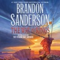

<b>From #1 <i>New York Times</i> bestselling author Brandon Sanderson, <i>The Way of Kings</i>, Book One of the Stormlight Archive begins an incredible new saga of epic proportion.</b>  Roshar is a world of stone and storms. Uncanny tempests of incredible power sweep across the rocky terrain so frequently that they have shaped ecology and civilization alike. Animals hide in shells, trees pull in branches, and grass retracts into the soilless ground. Cities are built only where the topography offers shelter.  It has been centuries since the fall of the ten consecrated orders known as the Knights Radiant, but their Shardblades and Shardplate remain: mystical swords and suits of armor that transform ordinary men into near-invincible warriors. Men trade kingdoms for Shardblades. Wars were fought for them, and won by them.  One such war rages on a ruined landscape called the Shattered Plains. There, Kaladin, who traded his medical apprenticeship for a spear to protect his little brother, has been reduced to slavery. In a war that makes no sense, where ten armies fight separately against a single foe, he struggles to save his men and to fathom the leaders who consider them expendable.  Brightlord Dalinar Kholin commands one of those other armies. Like his brother, the late king, he is fascinated by an ancient text called <i>The Way of Kings</i>. Troubled by over-powering visions of ancient times and the Knights Radiant, he has begun to doubt his own sanity.  Across the ocean, an untried young woman named Shallan seeks to train under an eminent scholar and notorious heretic, Dalinar's niece, Jasnah. Though she genuinely loves learning, Shallan's motives are less than pure. As she plans a daring theft, her research for Jasnah hints at secrets of the Knights Radiant and the true cause of the war.  The result of over ten years of planning, writing, and world-building, <i>The Way of Kings</i> is but the opening movement of the Stormlight Archive, a bold masterpiece in the making.  Speak again the ancient oaths:  <b>Life before death.</b> <b></b><b>Strength before weakness.</b> <b></b><b>Journey before Destination.</b> <b></b> <b></b>and return to men the Shards they once bore.  The Knights Radiant must stand again.  <b>Other Tor books by Brandon Sanderson</b>  <b>The Cosmere</b> <b></b> <b>The Stormlight Archive</b> <i>The Way of Kings</i> <i>Words of Radiance</i> <i>Edgedancer </i>(Novella) <i>Oathbringer</i> <b></b> <b></b> <b>The Mistborn trilogy</b> <i>Mistborn: The Final Empire</i> <i>The Well of Ascension</i> <i>The Hero of Ages</i> <i></i> <i></i><b>Mistborn: The Wax and Wayne series</b> <i>Alloy of Law</i> <i>Shadows of Self</i> <i>Bands of Mourning</i>  <b>Collection</b> <i>Arcanum Unbounded</i>  <b>Other Cosmere novels</b> <i>Elantris</i> <i>Warbreaker</i>  <b>The Alcatraz vs. the Evil Librarians series</b> <i>Alcatraz vs. the Evil Librarians</i> <i>The Scrivener's Bones</i> <i>The Knights of Crystallia</i> <i>The Shattered Lens</i> <i>The Dark Talent</i>  <b>The Rithmatist series</b> <b></b><i>The Rithmatist</i>  <b>Other books by Brandon Sanderson</b> <b></b> <b>The Reckoners</b> <i>Steelheart</i> <i>Firefight</i> <i>Calamity</i>

[View on Apple](https://books.apple.com/us/audiobook/the-way-of-kings/id1440716035)

## The Dungeon Anarchist's Cookbook: Dungeon Crawler Carl, Book 3 (Unabridged)

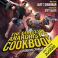

Welcome to the Gun Show!  The top 10 list is populated. The sponsorship program is open. The difficulty is ramping up. The first three floors were nothing compared to what Carl and Donut now face.&#xa0;  The Iron Tangle. An impossibly complicated subway system built out of the world's subterranean railway systems, all combined and then tied together into a knot. Up is down. Down is up. Close is far. The cars are filled with monsters, the railway stations are less than safe, and the exit is always just a few stops away.  But there is hope. For the first time, the crawlers are all working together. The loot is better than ever. And the secret to unraveling it all may be hidden in the pages of a seemingly useless book.&#xa0;  Welcome, crawlers. Welcome to the fourth floor of the dungeon.&#xa0;

[View on Apple](https://books.apple.com/us/audiobook/the-dungeon-anarchists-cookbook-dungeon-crawler-carl/id1567516172)

## It's Not Her

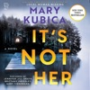

“A gripping thrill ride.”&#xa0;—Jeneva Rose “Tantalizing, terrifying and all too real.”&#xa0;—Shari Lapena “Cancel your plans, you won’t be able to put this one down.”&#xa0;—Chris Whitaker “Wickedly smart and incredibly twisted.”&#xa0;—Ashley Elston “Terrifying.”&#xa0;—Megan Miranda  Two families at a secluded lake resort are at the center of a chilling crime in this twisty thriller from the bestselling author of&#xa0;Local Woman Missing&#xa0;  A scream shatters the silence… Courtney Gray’s peaceful vacation turns into a nightmare when she discovers her brother and sister-in-law dead in their lakeside cottage. Her niece Reese is missing. Her nephew Wyatt is asleep upstairs—unharmed.  A town full of secrets… As police swarm the quiet resort, dark truths about Courtney’s family—and the town itself—begin to surface. Is Reese a victim… or the killer?  A truth no one saw coming… With everyone hiding something, Courtney races to uncover the terrible mystery. But the closer she gets, the harder it is to know who—or what—to trust.

[View on Apple](https://books.apple.com/us/audiobook/its-not-her/id1809247540)

## Whistler

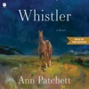

<b>READ BY THE AUTHOR.</b>  <b>The acclaimed, prize-winning #1 <i>New York Times</i> bestselling writer returns with a moving, luminous novel that reminds us of the sweetness and impermanence of life and the power of connection to defy time.</b>  When Daphne Fuller and her husband Jonathan visit the Metropolitan Museum of Art, they notice an older, white-haired gentleman following them. The man turns out to be Eddie Triplett, her former stepfather, who had been married to her mother for a little more than year when Daphne was nine. Now fifty-three, Daphne hasn’t seen Eddie for many years, not since the fateful event that changed the direction of both their lives. Meeting again, time falls away; while their relationship was brief, it had a profound impact on them both, and now that they are reunited, they have no intention of ever being separated again.  <i>Whistler</i> is a story about two adults looking back over the choices they made, and the choices that were made for them. It’s a story about bravery, memory, the often small yet consequential moments that define our lives, and the endless stream of loss that in time comes for us all. Beautiful in its simplicity, it is ultimately about how love endures, and how the feeling of being known by one other person, even for a short period of time, can change everything.

[View on Apple](https://books.apple.com/us/audiobook/whistler/id1845923095)

## Carl's Doomsday Scenario: Dungeon Crawler Carl, Book 2 (Unabridged)

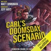

<b>"The training levels have concluded. Now the games may truly begin."</b>  The ratings and views are off the chart. The fans just can't get enough. The dungeon gets more dangerous each day. But in a grinder designed to chew up and spit out crawlers by the millions, Carl and Princess Donut need to work harder than ever just to survive.&#xa0;  They call it the Over City. A sprawling, once-thriving metropolis devastated by a mysterious calamity. But these streets are far from abandoned. An undead circus trawls the ruins. Murdered prostitutes rain from the sky. An ancient spell is finally ready to reveal its dark purpose.&#xa0;  Carl still has no pants.&#xa0;&#xa0;  
They call it&#xa0;<i>Dungeon Crawler World</i>. For Carl and Donut, it's anything but a game.&#xa0;

[View on Apple](https://books.apple.com/us/audiobook/carls-doomsday-scenario-dungeon-crawler-carl-book-2/id1564974812)

## Cancel Me If You Can (Unabridged)

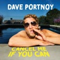

<b>INSTANT #1 <i>NEW YORK TIMES </i>BESTSELLER | </b><b>#1<i> PUBLISHERS WEEKLY</i> BESTSELLER</b>  <b>In his unfiltered style, Dave Portnoy details the journey of how he built his polarizing media empire, <i>Barstool Sports</i>, while refusing to bend the knee to those who tried to tear him down, staying true to himself and blocking out the haters.</b><b><b> </b></b>  Dave Portnoy is a gambler. From his days playing Little League baseball, he has always bet on himself and his future, which is exactly how he built his digital media empire, <i>Barstool Sports</i>. It all started in 2004, when Dave wrote what he knew and passed out a four-page broadsheet newspaper all over Boston. The idea was simple but revolutionary: not everyone wanted their sports takes from SportsCenter anchors in suits. Fans wanted something local, raw, and unapologetic—written in the same language and tone you might hear at your local sports bar. So, Dave gave it to them.  More than twenty years later, <i>Barstool</i> has grown into a nine-figure company with over 300 employees and 150 active brands. But the story doesn’t end there. Dave continues to expand <i>Barstool</i> and his personal brand, launching into the world of sports betting, giving honest pizza reviews, building generational media stars, and giving back to dog shelters and small businesses with the help of his own famous rescue dog, Miss Peaches.  Though he didn’t set out to be a political lightning rod, it happened—and he’s fully aware that half the internet hates him while the other half loves him. The truth? He doesn’t care, as long as people take interest. He’s always been brutally honest, and he always will be. Dave’s journey hasn’t been perfect. He’s failed—publicly and personally—and he’s constantly willing to risk it all. Why? Because he already knows what it’s like to lose everything and start over, time and time again. So why not?   In <i>Cancel Me If You Can</i>, Dave lays it all out: the hard work, the timing, the luck, the poisonous relationships behind the curtain, and the balls it took to get to where he is today. This isn’t a memoir or a business book—it’s another bet on himself. But honestly, would you really want to bet against him? The odds are against it.

[View on Apple](https://books.apple.com/us/audiobook/cancel-me-if-you-can-unabridged/id1847212177)

## Mad Mabel

<b>From Sally Hepworth, the <i>New York Times</i> bestselling author of <i>The Soulmate</i> and <i>The Good Sister, </i>comes a twist-filled, darkly funny mystery about the two kinds of people no one ever expects to be murderers: little girls and old ladies.</b>  <b>“Vivid performances emphasize resilience and the power of friendship in this endearing audiobook.” — Kirkus</b>  <b>Meet Mad Mabel.</b>  Elsie Mabel Fitzpatrick is eighty-one years old. She's lived on her idyllic street, Kenny Lane, for sixty years--longer than anyone else. Aside from being a curmudgeon who minds everyone else's business, few would suspect that Elsie has a past that she has worked exceedingly hard at concealing. Because when it comes to murder, no one ever suspects little girls or old ladies. And Elsie Mabel Fitzpatrick, once a little girl and now an old lady, has a strange history of people in her life coming to a foul end.   When a new little girl (talkative, curious, nosy) moves into the neighborhood and stops at nothing to befriend Elsie, her carefully-constructed life threatens to come crashing down as the secrets in Elsie's past start coming to light. Who was "Mad Mabel" fifty years ago? Who is Elsie Fitzpatrick today? And if the past has a habit of repeating itself, who has the most to lose?   Told with Sally Hepworth's twists, humor, charm, and heart, MAD MABEL is novel that weaves past and present together--through the power of justice and redemption, and all the way to its stunning conclusion.  <b>A Macmillan Audio production from St. Martin’s Press</b>

[View on Apple](https://books.apple.com/us/audiobook/mad-mabel/id1813888019)

## Atomic Habits: An Easy & Proven Way to Build Good Habits & Break Bad Ones (Unabridged)

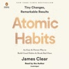

<b>The #1<i> New York Times</i> bestseller.  Over 25 million copies sold! Translated into 60+ languages!  <i>Tiny Changes, Remarkable Results</i></b>  No matter your goals, <i>Atomic Habits</i> offers a proven framework for improving--every day. James Clear, one of the world's leading experts on habit formation, reveals practical strategies that will teach you exactly how to form good habits, break bad ones, and master the tiny behaviors that lead to remarkable results.  If you're having trouble changing your habits, the problem isn't you. The problem is your system. Bad habits repeat themselves again and again not because you don't want to change, but because you have the wrong system for change. You do not rise to the level of your goals. You fall to the level of your systems. Here, you'll get a proven system that can take you to new heights.  Clear is known for his ability to distill complex topics into simple behaviors that can be easily applied to daily life and work. Here, he draws on the most proven ideas from biology, psychology, and neuroscience to create an easy-to-understand guide for making good habits inevitable and bad habits impossible. Along the way, readers will be inspired and entertained with true stories from Olympic gold medalists, award-winning artists, business leaders, life-saving physicians, and star comedians who have used the science of small habits to master their craft and vault to the top of their field.  Learn how to: make time for new habits (even when life gets crazy);overcome a lack of motivation and willpower;design your environment to make success easier;get back on track when you fall off course;...and much more.  <i>Atomic Habits</i> will reshape the way you think about progress and success, and give you the tools and strategies you need to transform your habits--whether you are a team looking to win a championship, an organization hoping to redefine an industry, or simply an individual who wishes to quit smoking, lose weight, reduce stress, or achieve any other goal.

[View on Apple](https://books.apple.com/us/audiobook/atomic-habits-an-easy-proven-way-to-build-good/id1436767025)

## What Have You Done?: A Novel (Unabridged)

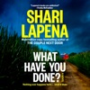

<b>AN INSTANT <i>NEW YORK TIMES</i> BESTSELLER!  Dark · Addictive · Twisty · Chilling · Domestic Suspense  “Lapena is a master of manipulation.” —<i>USA Today</i>  The new unputdownable novel from the “queen of the one-sit read,” and <i>New York Times</i> bestselling author of <i>The Couple Next Door</i></b>  <b>Nothing ever happens in sleepy little Fairhill, Vermont.&#xa0;But this morning that will change.&#xa0;And one innocent question could be deadly. <i>What have you done?</i></b>  <b><i> </i></b>The teenagers get their kicks telling ghost stories in the old graveyard. The parents trust their kids will arrive home safe from school. Everyone knows everyone. Curtains rarely twitch. Front doors are left unlocked.  But Diana Brewer isn’t lying safely in her bed where she belongs. Instead she lies in a hayfield, circled by vultures, discovered by a local farmer. &#xa0;  How quickly a girl becomes a ghost. How quickly a town of friendly, familiar faces becomes a town of suspects, a place of fear and paranoia.  Someone in Fairhill did this.&#xa0;Everyone wants answers.

[View on Apple](https://books.apple.com/us/audiobook/what-have-you-done-a-novel-unabridged/id1714204230)

## Paranoia

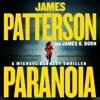

<b>NYPD Detective Michael Bennett will stop at nothing to protect family: his wife, his kids—and his fellow officers—in the latest psychological thriller from #1&#xa0;<i>New York Times</i>&#xa0;bestselling author James Patterson.&#xa0;</b>   At every&#xa0;death&#xa0;scene, Bennett says a prayer over the victim.&#xa0;&#xa0;  But recently, too many of the departed have been&#xa0;fellow cops.&#xa0;  “I want you to look at these deaths on special assignment,” NYPD Inspector Celeste Cantor says. “Report only to me.”  Bennett excels as a solo investigator. But he's chasing a killer who feeds on isolation... and paranoia.

[View on Apple](https://books.apple.com/us/audiobook/paranoia/id1750048231)

## The Buffalo Hunter Hunter (Unabridged)

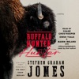

<b>A 2026 Audie Award Winner for Horror</b>  <b>Selected as One of <i>The New York Times</i>’s 100 Notable Books of the Year  A Barack Obama Summer Read  Bram Stoker Award for Superior Achievement in a Novel  Nebula Award Winner for Best Novel  Locus Award for Horror  Libby Award for Best Horror  Nebula, Bram Stoker, and Los Angeles Times Book Prize Award Finalist  A <i>Time</i>, <i>The Washington Post</i>, NPR, <i>Shelf Awareness</i>, <i>The Toronto Star</i>, and <i>Publishers Weekly </i>Best of the Year  <i>Kirkus Reviews</i> Best Historical Fiction   The <i>New York Times</i> bestseller and “horror masterpiece” (NPR) from Stephen Graham Jones—the master of modern horror—is a chilling historical horror novel tracing the life of a vampire who haunts the fields of the Blackfeet reservation looking for justice.   “Jones has written his Interview with the Indigenous Vampire. A landmark of horror and historical fiction alike, perhaps the closest thing we have to horror’s Moby-Dick.” —<i>Vulture</i>   “Inventive and spine-tingling…a master class in voice. Queasy, uneasy, <i>The Buffalo Hunter Hunter</i> plays with the interplay between religion and historical guilt, identity and appetite.” —<i>The Washington Post</i></b>  A diary, written in 1912 by a Lutheran pastor is discovered within a wall. What it unveils is a slow massacre, a chain of events that go back to 217 Blackfeet dead in the snow. Told in transcribed interviews by a Blackfeet named Good Stab, who shares the narrative of his peculiar life over a series of confessional visits. This is an American Indian revenge story written by one of the new masters of horror, Stephen Graham Jones.

[View on Apple](https://books.apple.com/us/audiobook/the-buffalo-hunter-hunter-unabridged/id1777098186)

## The Gate of the Feral Gods: Dungeon Crawler Carl, Book 4 (Unabridged)

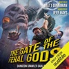

<b>New achievement! Total, utter failure.</b>  <b>You failed a quest less than five minutes after you received it. Now </b><b><i>that’s</i></b><b> talent.</b>  A floating fortress occupied by warrior gnomes. A castle made of sand. A derelict submarine guarded by malfunctioning machines. A haunted crypt surrounded&#xa0;by&#xa0;lethal traps.&#xa0;  It was supposed to be easy. One bubble. Four castles. Fifteen days. Capture&#xa0;each one, and the stairwell is unlocked.  Here's the thing. It's never easy. Carl and his team can't go it alone. Not this time. They&#xa0;must rely on the help of the low-level, I-can't-believe-these-idiots-are-still-alive crawlers trapped in the bubble with them. But can they be trusted?&#xa0;  Welcome, Crawler. Welcome to the fifth floor of the dungeon.

[View on Apple](https://books.apple.com/us/audiobook/the-gate-of-the-feral-gods-dungeon-crawler-carl/id1586177656)

## Haunting Adeline: Cat and Mouse Duet, Book 1 (Unabridged)

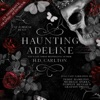

<b>AN INSTANT NYT BESTSELLER, USA TODAY BESTSELLER, AND AMAZON TOP 5 BESTSELLER!</b>  <i>“I’ve chased you across time and space, and you’ve never been able to get away.”</i>  For Adeline Reilly, moving back to Seattle was supposed to be the perfect fresh start. With her flourishing career as an author, and the inheritance of her late grandmother’s gothic mansion, there is nothing to stand in her way.  But Adeline isn’t alone in Parson’s Manor.  It isn’t the angry souls haunting the hallways of her childhood home that Adeline fears–it’s the mysterious break-ins, roses appearing, and threatening messages that somehow sound more like eerie promises.  Adeline has a stalker.  Yet, she quickly discovers she’s not the first person in her family to fall victim to a shadow in pursuit.  Left behind are her great-grandmother’s haunting journals detailing the story of her own phantom, and subsequently, her brutal murder.  Parson’s Manor now holds more than just Adeline’s memories—it houses a grim future that could lead to history repeating itself.  If she doesn’t fall in love with her stalker first.  <b>While not required, it is highly suggested to listen to the novella, Satan's Affair, first.</b>  Author's Note: <b>This book ends on a cliffhanger. For CWs, please check the author's website.</b>  Recommended Listening Order for the C&amp;M Universe: 
 <b><i>Satan's Affair 
Haunting Adeline 
Hunting Adeline 
Where's Molly</i></b>

[View on Apple](https://books.apple.com/us/audiobook/haunting-adeline-cat-and-mouse-duet-book-1-unabridged/id1871309484)

## Regime Change (Unabridged)

<b>“<i>Regime Change</i> is exceptional. It transcends its genre...the book is packed with news that will stay news...This is reporting of consequence.” </b><b>—David Remnick, <i>The New Yorker</i></b>   <b>“A flabbergasting feat of political reporting.” </b><b>—Tina Brown</b>   <b>“Riveting and richly textured...<b>What the authors add is the vivid detail that makes these events feel actual. They wrest reality itself back from the distorted world of entertainment, illusion, fantasy and denial that Trump has generated around himself. It is this flood of provocation, atrocity, self-dealing and fabrication that makes Haberman and Swan’s counternarrative so vital.” </b></b><b>—Fintan O’Toole, <i>The New York Times</i></b>   <b>A riveting, intimate, and revelatory account of the most radical and consequential presidency of our time.</b>  From the two reporters who have covered him more closely than perhaps anyone else over the past decade comes this definitive portrait of Donald Trump in the White House. <i>Regime Change</i> covers the first year of Trump’s second presidency—a term liberated from every constraint that defined his first. The generals who once told him “no” are gone, and the lawyers who remain have learned to pick their battles. His administration has flouted court orders and he has claimed powers that Congress once checked. What remains is a President willing to take enormous risks that have upended global markets and toppled heads of state; an imperial President operating almost entirely on instinct alone.   Based on hundreds of interviews and unprecedented reporting from deep within the administration’s most closely guarded rooms, <i>Regime Change</i> takes the reader inside the Situation Room and into the secret Oval Office deliberations that have launched a new war in the Middle East and seen Trump seal the border, surge National Guard troops into cities, and send immigration agents into deadly clashes with protestors. Maggie Haberman and Jonathan Swan bring us behind the scenes of a presidency that has transformed the culture, turned the Justice Department into an agent of retribution against the President’s enemies and the office itself into a brazen vehicle for profit. They reveal a second term propelled by a historical irony that Trump himself has come to understand: that the indictments, the convictions, the assassination attempts, and four years of exile made him not weaker but far more powerful, more vengeful, and more willing to gamble than any President in modern history.   This is the story of how Trump has used that power, who has tried to stop him, and why nearly all of them have failed. It is also the story of something American journalists are more accustomed to chronicling in distant capitals than in their own: a President who has fundamentally altered the nature of the office he holds—and, with it, how the rest of the world understands American power. It is an account of <i>Regime Change</i> right here in America—a landmark real-time history of a modern presidency like no other.

[View on Apple](https://books.apple.com/us/audiobook/regime-change-unabridged/id1890960693)

## The Butcher's Masquerade: Dungeon Crawler Carl, Book 5 (Unabridged)

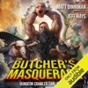

<b>Attention. Attention. The gates are down. The hunters are loose.</b>  <b>Run, run, run. </b>  A lush jungle teeming with danger. Savage dinosaurs seeking blood. A fallen princess intent on vengeance. A mysterious, end-of-floor celebration for the top crawlers, dubbed “The Butcher’s Masquerade”.&#xa0;  The sixth floor. The Hunting Grounds.  As the remaining crawlers battle for their lives, a new, terrible threat looms. Outside, tourists are finally allowed to enter the game, and they are here and ready to hunt. Among them is Vrah, a famed and veteran hunter, intent on collecting the biggest trophy of her career.  But their prey is far from harmless, and this season they are fighting back.  Dungeon Crawler Carl and Princess Donut return in book five of the acclaimed LitRPG series.

[View on Apple](https://books.apple.com/us/audiobook/the-butchers-masquerade-dungeon-crawler-carl-book-5/id1622476872)

## The Odyssey (Unabridged)

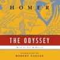

<b>The great epic of Western literature, translated by the acclaimed classicist Robert Fagles  Soon to be a major motion picture directed by Christopher Nolan </b> Robert Fagles, winner of the PEN/Ralph Manheim Medal for Translation and a 1996 Academy Award in Literature from the American Academy of Arts and Letters, presents us with Homer's best-loved and most accessible poem in a stunning modern-verse translation. "Sing to me of the man, Muse, the man of twists and turns driven time and again off course, once he had plundered the hallowed heights of Troy." So begins Robert Fagles' magnificent translation of the <i>Odyssey</i>, which Jasper Griffin in the <i>New York Times Book Review</i> hails as "a distinguished achievement."  If the <i>Iliad</i> is the world's greatest war epic, the <i>Odyssey</i> is literature's grandest evocation of an everyman's journey through life. Odysseus' reliance on his wit and wiliness for survival in his encounters with divine and natural forces during his ten-year voyage home to Ithaca after the Trojan War is at once a timeless human story and an individual test of moral endurance.  In the myths and legends retold here, Fagles has captured the energy and poetry of Homer's original in a bold, contemporary idiom, and given us an <i>Odyssey</i> to read aloud, to savor, and to treasure for its sheer lyrical mastery. This is an <i>Odyssey</i> to delight both the classicist and the general listener, to captivate a new generation of Homer's students.

[View on Apple](https://books.apple.com/us/audiobook/the-odyssey-unabridged/id1418923626)

## The Odyssey

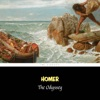

While Homer's existence as a historical person is still a topic of debate, the writings attributed to the name have made their mark not only on Greek history and literature, but upon western civilization itself. Homer's epic poems, The Iliad and The Odyssey, laid the foundation upon which Ancient Greece developed not only its culture, but its societal values, religious beliefs, and practice of warfare as well.

[View on Apple](https://books.apple.com/us/audiobook/the-odyssey/id1570025436)

## The Waiting

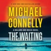

<b>In this instant<i>&#xa0;New York Times&#xa0;</i>bestseller, LAPD Detective Renée Ballard tracks a serial rapist whose trail has gone cold and enlists a new volunteer to the Open-Unsolved Unit: patrol officer Maddie Bosch, Harry’s daughter.&#xa0;​</b>   Renée Ballard and the LAPD’s Open-Unsolved Unit get a hot shot DNA connection between a recently arrested man and a serial rapist and murderer who went quiet twenty years ago. The arrested man is only twenty-four, so the genetic link must be familial: His father was the Pillowcase Rapist, responsible for a five-year reign of terror in the city of angels. But when Ballard and her team move in on their suspect, they encounter a baffling web of secrets and legal hurdles.  Meanwhile, Ballard’s badge, gun, and ID are stolen—a theft she can’t report without giving her enemies in the department ammunition to end her career as a detective. She works the burglary alone, but her mission draws her into unexpected danger. With no choice but to go outside the department for help, she knocks on the door of Harry Bosch.   At the same time, Ballard takes on a new volunteer to the cold case unit: Bosch’s daughter Maddie, now a patrol officer. But Maddie has an ulterior motive for getting access to the city’s library of lost souls—a case that may be the most iconic in the city’s history. Complex, satisfying, and full of dexterous twists, <i>The Waiting </i>demonstrates once more that “you can’t do better than Michael Connelly” (<i>Forbes</i>).

[View on Apple](https://books.apple.com/us/audiobook/the-waiting/id1727747025)

## A Parade of Horribles: Dungeon Crawler Carl, Book 8 (Unabridged)

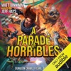

<b>It’s off to the races in the explosive eighth book in the Dungeon Crawler Carl series.</b>  As chaos and mass panic spread outside the dungeon in the wake of Faction Wars, Carl and Donut find themselves on the tenth floor, where they’re forced to compete in a surprisingly normal set of tasks. Well, normal for the dungeon.  Races. Get from point A to point B, and don’t come in last. After each race, they pick an upgrade for their vehicle and the track gets more challenging. It all seems a little <i>too </i>normal, a little <i>too</i> simple.  Ignore those strange glitches that are occurring with increasing frequency. Don’t listen to those whispers about what’s happening on the mysterious eleventh floor, something the system AI calls <i>A Parade of Horribles</i>. Nobody, not even the showrunners, knows what that means. Just that the AI has ominously dubbed it “a coming-out party for the ages.”  <i>Everything is fine, Crawler. I repeat, everything is fine.</i>  Carl hates that it’s business as usual. The rules of this floor have taken away his agency. That just will not do.  So Carl is planning a party of his own. It’s a plan so dangerous, so insane, he can’t even consult his friends lest the AI put a stop to it. Because if it goes wrong, it’s not just the end of Carl and Donut. No. The stakes are higher than they’ve ever been.

[View on Apple](https://books.apple.com/us/audiobook/a-parade-of-horribles-dungeon-crawler-carl-book/id6767724978)

## The Eye of the Bedlam Bride: Dungeon Crawler Carl, Book 6 (Unabridged)

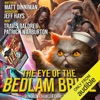

A pantheon of forgotten gods. An old grudge between a talk show host, an heiress, and the man they shattered along the way. A rapidly deteriorating AI system. An inconvenient tiara upon the head of a friend.  It is bedlam on the eighth floor.  ;As management reels from the unexpected conclusion of the seventh level, the surviving crawlers stumble onto the eighth and find themselves scattered. It’s a map based on Earth’s final days before the collapse, where ethereal, intangible ghosts of humanity go about their lives, oblivious of the impending doom. Living amongst these ghosts are monsters based in Earth lore. “Legendary” creatures tied to the geographical location they inhabit.  Each team of crawlers is given a task: find and capture six of these beasts. The captured monsters will be turned into cards. Cards that can be summoned into battle again and again. The stronger, the deadlier, the better.  At the end of the floor, the bad guys will also have decks, and they will have some of the most powerful cards available. So it’s crucial to assemble the toughest squad possible.  But like always, there is a catch. There’s always a catch.  As Carl and Donut know all too well, just because someone is captured, it doesn’t mean they have been tamed.  Her name is Shi Maria. She’s easily the most powerful monster in their area. If they want to survive, they must capture her. But she is no ordinary beast. She’s intelligent. She was once married to a god, a god who is now missing. Her special attack is known to drive one insane. They call her the Bedlam Bride.  “Beware, beware. Beware the eye of the Bedlam Bride.”

[View on Apple](https://books.apple.com/us/audiobook/the-eye-of-the-bedlam-bride-dungeon-crawler-carl/id1701480009)

## Judge Stone

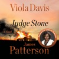

<b>Read by Viola Davis</b> <b>Academy Award winning actress Viola Davis and the world's #1 bestselling author James Patterson’s&#xa0;<i>Judge Stone </i></b><b>“</b><b>delivers first-class courtroom drama, small-town excitement, and strong characters all wrapped in a moral dilemma. Tense, readable, and relevant.” (</b><b><i>Kirkus Reviews</i>,&#xa0;</b><b>starred review)</b>  <b>“Talk about a power combo! ... With Davis’s razor-sharp emotional insight and Patterson’s mastery of rocket-fuel pacing, this is the dream team to deliver an up-all-night read that will keep the group chat buzzing.” —<i>Oprah Daily</i></b>  <b>“Wonderfully satisfying ... This legal thriller from [a] superstar duo ... demands attention from its opening pages and never lets go.” —<i>Booklist, </i>starred review</b>  <b><i>All rise</i></b><b>...</b><b> for Judge Stone. </b>   The most respected citizen in Union Springs, Alabama (population 3,314), is Judge Mary Stone. She holds two responsibilities sacred: running her family farm and presiding over her courtroom. It's there she draws&#xa0;the most controversial case in the history of the South.   Criminally, it’s open-and-shut.   Ethically, there is no middle ground. Essentially, it’s a choice between life and death.  &#xa0;  No judge can satisfy everyone. It would be dangerous to try. But Judge Stone is willing to fight to bring justice to the people and place she loves.

[View on Apple](https://books.apple.com/us/audiobook/judge-stone/id1844403709)

## The 48 Laws of Power

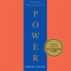

<b>Amoral, cunning, ruthless, and instructive, this multi-million-copy <i>New York Times</i> bestseller is the definitive manual for anyone interested in gaining, observing, or defending against ultimate control—from the author of <i>The Laws of Human Nature</i>.</b>  In the book that <i>People</i> magazine proclaimed "beguiling" and "fascinating," Robert Greene and Joost Elffers have distilled three thousand years of the history of power into forty-eight essential laws by drawing from the philosophies of Machiavelli, Sun Tzu, and Carl Von Clausewitz and also from the lives of figures ranging from Henry Kissinger to P. T. Barnum.  Some laws teach the need for prudence ("Law 1: Never Outshine the Master"), others teach the value of confidence ("Law 28: Enter Action with Boldness"), and many recommend absolute self-preservation ("Law 15: Crush Your Enemy Totally"). Every law, though, has one thing in common: an interest in total domination. <i>The 48 Laws of Power</i> is ideal whether your aim is conquest, self-defense, or simply to understand the rules of the game.

[View on Apple](https://books.apple.com/us/audiobook/the-48-laws-of-power/id1649015463)

## The Shampoo Effect: A Read with Jenna Pick: A Novel (Unabridged)

<b>READ WITH JENNA BOOK CLUB PICK AS FEATURED ON <i>TODAY | </i>AN INSTANT <i>NEW YORK TIMES </i>BESTSELLER!  “Funny, drama-fueled, and full of Jackson's breezy wit. . . Brilliant.”&#xa0;—Coco Mellors, <i>New York Times </i>bestselling author of <i>Blue Sisters</i>  “The platonic ideal of a beach read.” —<i>The New York Times</i>   An ambitious young woman insinuates herself into a tight-knit social set, shaking up friendships and marriages in a small seaside town. A frothy novel of love, money, sex, and friendship, from the <i>New York Times</i> bestselling author of <i>Pineapple Street</i></b>  When Caroline Lash arrives in Greenhead, Massachusetts, she falls head-over-heels for Van Whittaker, a fleece-wearing, litter-collecting kayak enthusiast with long, floppy hair and the personality of a Border collie. Born and raised in this picturesque coastal village, Van runs with the same crowd he did as a kid: His ex-girlfriend, Bailey, a beautiful girl who attracts men like moths to a flame; Augusta, old money, horsey, and snobbish; and Fran, surrounded by brothers and sons, too fed up with boys to ever consider marrying one.  Together, the group runs wild through the marshes, beaches, and bars of Greenhead, drinking on houseboats, spending long afternoons sunbathing with their children, and playing games the way they always have. But when Bailey discovers that she is pregnant with Van’s baby, the delicate balance of the group’s friendship is thrown off. Soon Caroline is cast out of the circle and what she does next—in a potent mix of fury and heartbreak—exposes long-held secrets and works the entire town of Greenhead into a lather.  Dazzlingly funny, sexy, and as juicy as it is astute, <i>The Shampoo Effect </i>is a story of late-night parties, early mornings with small children, the dawn of midlife, and a group of old friends finally growing up despite all their best efforts to the contrary.

[View on Apple](https://books.apple.com/us/audiobook/the-shampoo-effect-a-read-with-jenna-pick-a-novel-unabridged/id1843999367)

## The Five-Star Weekend

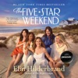

<b>From the #1 <i>New York Times</i> bestselling author of <i>The Hotel Nantucket</i>: After tragedy strikes, food blogger Hollis Shaw gathers four friends from different stages in her life to spend an unforgettable weekend on Nantucket.</b>   Hollis Shaw’s life seems picture-perfect. She’s the creator of the popular food blog <i>Hungry with Hollis</i> and is married to Matthew, a dreamy heart surgeon. But after she and Matthew get into a heated argument one snowy morning, he leaves for the airport and is killed in a car accident. The cracks in Hollis’s perfect life—her strained marriage and her complicated relationship with her daughter, Caroline—grow deeper.   So when Hollis hears about something called a “Five-Star Weekend”—one woman organizes a trip for her best friend from each phase of her life: her teenage years, her twenties, her thirties, and midlife—she decides to host her own Five-Star Weekend on Nantucket. But the weekend doesn’t turn out to be a joyful Hallmark movie.   The husband of Hollis’s childhood friend Tatum arranges for Hollis’s first love, Jack Finigan, to spend time with them, stirring up old feelings. Meanwhile, Tatum is forced to play nice with abrasive and elitist Dru-Ann, Hollis’s best friend from UNC Chapel Hill. Dru-Ann’s career as a prominent Chicago sports agent is on the line after her comments about a client’s mental health issues are misconstrued online. Brooke, Hollis’s friend from their thirties, has just discovered that her husband is having an inappropriate relationship with a woman at work. Again! And then there’s Gigi, a stranger to everyone (including Hollis) who reached out to Hollis through her blog. Gigi embodies an unusual grace and, as it happens, has many secrets.  <i>The Five-Star Weekend</i> is a surprising and captivating story about friendship, love, and self-discovery set on Nantucket. It will be a weekend like no other.   Please enjoy a sneak peek of <i>Swan Song </i>by Elin Hilderbrand and read by Erin Bennett at the end of this program.

[View on Apple](https://books.apple.com/us/audiobook/the-five-star-weekend/id1648134386)

## The Housemaid

<b>“Welcome to the family,” Nina Winchester says as I shake her elegant, manicured hand. I smile politely, gazing around the marble hallway. Working here is my last chance to start fresh. I can pretend to be whoever I like. But I’ll soon learn that the Winchesters’ secrets are far more dangerous than my own…</b>  Every day I clean the Winchesters’ beautiful house top to bottom. I collect their daughter from school. And I cook a delicious meal for the whole family before heading up to eat alone in my tiny room on the top floor.  I try to ignore how Nina makes a mess just to watch me clean it up. How she tells strange lies about her own daughter. And how her husband Andrew seems more broken every day. But as I look into Andrew’s handsome brown eyes, so full of pain, it’s hard not to imagine what it would be like to live Nina’s life. The walk-in closet, the fancy car, the perfect husband.  I only try on one of Nina’s pristine white dresses once. Just to see what it’s like. But she soon finds out… and by the time I realize my attic bedroom door only locks from the outside,&#xa0;<b>it’s far too late.</b>  But I reassure myself:<b>&#xa0;the Winchesters don’t know who I really am.</b>  <b>They don’t know what I’m capable of…</b>  <b>Soon to be a major motion picture starring Sydney Sweeney and Amanda Seyfried&#xa0;A No.1&#xa0;</b><i><b>New York Times</b></i><b>&#xa0;bestseller&#xa0;A&#xa0;</b><i><b>Sunday Times</b></i><b>&#xa0;bestseller&#xa0;A&#xa0;</b><i><b>USA Today</b></i><b>&#xa0;and&#xa0;</b><i><b>Wall Street Journal</b></i><b>&#xa0;bestseller&#xa0;5 million copies sold&#xa0;*&#xa0;20-million-copy bestselling author</b>  <b>This unbelievably twisty read will have you glued to the pages late into the night. Anyone who loves&#xa0;</b><i><b>The Girl on the Train</b></i><b>&#xa0;won’t be able to put down&#xa0;</b><i><b>The Housemaid</b></i><b>!</b>  Read what everyone’s saying about&#xa0;<i>The Housemaid</i>:  “I got&#xa0;<b>severe whiplash</b>&#xa0;from the&#xa0;<b>twistiest turns</b>… Every time I thought I had it figured out…&#xa0;<b>WRONG!!!</b>… I am&#xa0;<b>still reeling</b>…&#xa0;<b>outstanding</b>… If you love&#xa0;<b>a top notch psychological thriller&#xa0;</b>that will have you<b>&#xa0;questioning your own sanity</b>, then&#xa0;<b>this 5 star read is for you</b>.” NetGalley reviewer, ⭐⭐⭐⭐⭐  “<b>What a wild ride!!!</b>&#xa0;Freida definitely delivered&#xa0;<b>the best twisty ending</b>…&#xa0;<b>Gripping from start to finish</b>… honestly,&#xa0;<b>I just could not put it&#xa0;</b>down… An&#xa0;<b>absolutely mind-blowing shocker</b>&#xa0;that&#xa0;<b>kept me guessing</b>&#xa0;and&#xa0;<b>on the edge of my seat&#xa0;</b>literally until the very end.” Goodreads reviewer, ⭐⭐⭐⭐⭐  “<b>One wild ride!</b>…&#xa0;<b>So many twists and turns</b>… I was&#xa0;<b>hooked</b>&#xa0;<b>right away</b>&#xa0;–&#xa0;<b>I even read my Kindle while waiting in my kid’s school pick-up line so I wouldn’t have to put this book down!</b>… addictive… pure perfection!” Goodreads reviewer, ⭐⭐⭐⭐⭐

[View on Apple](https://books.apple.com/us/audiobook/the-housemaid/id1823083695)

## The Country Road Murders

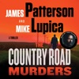

<b>After a shocking accident, Silas Tucker’s legendary football career is suddenly over in this action-packed sports thriller powered by loyalty, competition, and family.&#xa0;</b>   Humbled, but never defeated, he returns to his backwoods hometown, Cross Rivers, North Carolina, where his father was murdered.&#xa0;   He goes back to what’s left of his family and their small, struggling farm. He reunites with his best friend in the world—Taylor McCarter Webb, who is now married.&#xa0;   Then Silas is pulled into a deadly battle with the Southern Mafia who control drugs, trafficking and murder.&#xa0;   As the suspense crescendos, Silas follows one rule for survival: you don’t ride these country roads alone, or in the dead of night.

[View on Apple](https://books.apple.com/us/audiobook/the-country-road-murders/id1822314595)

## Dolly All the Time (Unabridged)

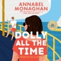

<b>A hardworking single mom returns to her seaside hometown and stumbles into a fake dating situationship with a wealthy, workaholic scion, from the <i>New York Times </i>bestselling author of <i>Nora Goes Off Script</i>.   “This book is like a spicy margarita…sweet and a little salty, tart and hot…I have fallen in love with Dolly and with funny, fizzing Annabel Monaghan!” —Catherine Newman, <i>New York Times</i> bestselling author of <i>Sandwich</i></b>  <i>If they start by pretending, can they end with something real?</i>  Dolly Brick has never met a problem she couldn’t solve. Not when her mom left when she was twelve, and not at thirty-nine when she moves with her son back to Whitfield, Rhode Island, for the summer to keep her dad and brother from losing the family home.  So when she comes across Stewart Whitfield—annoyingly handsome scion of <i>the </i>Whitfield family—with a flat tire and&#xa0;at the wrong end of a very public, very humiliating breakup, it’s in her nature to help. But Stewart’s proposed arrangement ends up being more than either of them bargained for, because as public dinners and high-society benefits turn into sunset boat rides and kisses that hit her bloodstream like a ghost pepper, Dolly starts to feel something more than helpful. She’s never relied on anyone besides herself—can she really start now?

[View on Apple](https://books.apple.com/us/audiobook/dolly-all-the-time-unabridged/id1836309130)

## The Correspondent: A Novel (Unabridged)

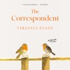

<b>#1 <i>NEW YORK TIMES </i>BESTSELLER • OVER TWO MILLION COPIES SOLD • Discover the word-of-mouth hit hailed by Ann Patchett as “A cause for celebration”—an intimate novel about the transformative power of the written word and the beauty of slowing down to reconnect with the people we love.</b>  <b>“This novel is a complete and utter joy.”—Ann Napolitano, author of <i>Hello Beautiful</i> “Quietly dazzling.”—<i>The New York Times</i> “I cried more than once as I witnessed this brilliant woman come to understand herself more deeply.”—Florence Knapp, author of <i>The Names </i></b>  <b>In development as a major motion picture </b>  <b>WINNER OF THE WOMEN’S PRIZE FOR FICTION • LONGLISTED FOR THE CENTER FOR FICTION FIRST NOVEL PRIZE AND THE ANDREW CARNEGIE MEDAL • A BEST BOOK OF THE YEAR: NPR, <i>The Washington Post, Boston Globe, Elle, Christian Science Monitor, She Reads</i></b>  <i>“Imagine, the letters one has sent out into the world, the letters received back in turn, are like the pieces of a magnificent puzzle. . . . Isn’t there something wonderful in that, to think that a story of one’s life is preserved in some way, that this very letter may one day mean something, even if it is a very small thing, to someone?”</i>  Filled with knowledge that only comes from a life fully lived, <i>The Correspondent</i> is a gem of a novel about the power of finding solace in literature and connection with people we might never meet in person. It is about the hubris of youth and the wisdom of old age, and the mistakes and acts of kindness that occur during a lifetime.  Sybil Van Antwerp has throughout her life used letters to make sense of the world and her place in it. Most mornings, around half past ten, Sybil sits down to write letters—to her brother, to her best friend, to the president of the university who will not allow her to audit a class she desperately wants to take, to Joan Didion and Larry McMurtry to tell them what she thinks of their latest books, and to one person to whom she writes often yet never sends the letter.  Sybil expects her world to go on as it always has—a mother, grandmother, wife, divorcee, distinguished lawyer, she has lived a very full life. But when letters from someone in her past force her to examine one of the most painful periods of her life, she realizes that the letter she has been writing over the years needs to be read and that she cannot move forward until she finds it in her heart to offer forgiveness.  Sybil Van Antwerp’s life of letters might be “a very small thing,” but she also might be one of the most memorable characters you will ever read.

[View on Apple](https://books.apple.com/us/audiobook/the-correspondent-a-novel-unabridged/id1765649877)

## Circle of Days

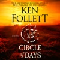

<b>From a bestselling author of epic fiction comes the deeply human story of one of the world’s greatest mysteries: the building of Stonehenge. </b>  <b>A FLINT MINER WITH A GIFT</b>  Seft, a talented flint miner, walks the Great Plain in the high summer heat, to witness the rituals that signal the start of a new year. He is there to trade his stone at the Midsummer Fair, and to find Neen, the girl he loves. Her family lives in prosperity and offer Seft an escape from his brutish father and brothers within their herder community.  <b>A PRIESTESS WHO BELIEVES THE IMPOSSIBLE </b>  Joia, Neen’s sister, is a priestess with a vision and an unmatched ability to lead. As a child, she watches the Midsummer ceremony, enthralled, and dreams of a miraculous new monument, raised from the biggest stones in the world. But trouble is brewing among the hills and woodlands of the Great Plain.  <b>A MONUMENT THAT WILL DEFINE A CIVILIZATION </b>  Joia’s vision of a great stone circle, assembled by the divided tribes of the Plain, will inspire Seft and become their life’s work. But as drought ravages the earth, mistrust grows between the herders, farmers and woodlanders—and an act of savage violence leads to open warfare . . .   Truly ambitious in scope, <i>Circle of Days </i>invites you to join master storyteller Ken Follett in exploring one of the greatest mysteries of our age: Stonehenge.

[View on Apple](https://books.apple.com/us/audiobook/circle-of-days/id1771878215)

## Odyssey

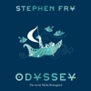

<b>The legendary Stephen Fry retells the adventures of Odysseus for the fourth and final installment in his internationally bestselling Greek Myths series.</b>   Odysseus’s journey from the battlefields of Troy to his home in Ithaca is one of the greatest stories ever told. From the lotus-eaters to the sirens, from Circe to the Cyclops, this is&#xa0;a tale of thrilling adventures, cunning escapes, and enduring devotion. Stephen Fry breathes new life into the ancient poem&#xa0;with&#xa0;humor and pathos. This gorgeous volume invites you to explore a captivating world with a brilliant storyteller as your guide.   BELOVED AUTHOR: Stephen Fry is an icon whose signature wit and mellifluous style make this retelling utterly unique. Fans will love hearing his interpretation, whether they are familiar with the original myths or not.   TIMELESS STORIES: For fans of Madeline Miller’s <i>Circe</i> or <i>Song of Achilles</i>, Neil Gaiman’s <i>Norse Mythology</i>, or Pat Barker’s <i>The Silence of the Girls</i>, this is the perfect next great read. These ancient tales never get old.   POPULAR SERIES: The previous books that comprise Stephen Fry's Greek Myths—<i>Mythos</i>, <i>Heroes</i>, and <i>Troy</i>—have been international bestsellers, praised for their engaging and&#xa0;nuanced retellings. Now fans can finally read Fry's&#xa0;take on <i>The Odyssey.</i>   Perfect for:  Fans of Stephen Fry  Ancient history buffs  Readers of myth and lore  Fans of Madeline Miller's and Pat Barker's retellings of Greek mythology  Classics majors and classicists

[View on Apple](https://books.apple.com/us/audiobook/odyssey/id1804941338)

## This Inevitable Ruin: Dungeon Crawler Carl, Book 7 (Unabridged)

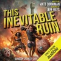

<b><i>The time has come! Book seven in the best-selling Dungeon Crawler Carl series is here!</i></b>  <b>They call it Faction Wars.</b>  The ninth floor.  Nine armies, each led by rich and powerful aliens from across the galaxy. Each team has one objective: to capture and hold the castle at the very center of the battlefield. Strategy, alliances, pitched battles, and, of course, betrayal ... It all makes for great fun and even greater television.  After all, none of these powerful aliens&#xa0;<i>really</i> die when they’re playing war.  Except this time. This time, winner takes all. Those who fall, stay in the ground.  As the AI continues its rapid decline, Carl and company take advantage of the chaos. For the first time ever, the crawlers are fighting back. They are now one of the nine teams. And this season, there’s a tenth army on the playing field. The NPCs, who are normally used as nothing but cannon fodder, have become fully self-aware and formed a team of their own.  For Donut and Katia, the stakes are even higher. Only one of them will be allowed to leave this level.  If they all want to survive, they’re going to need a little help from a veteran or two.  This is it.  This is what they’ve been fighting toward.  <b>This is war.</b>  <i>This inevitable ruin.</i>

[View on Apple](https://books.apple.com/us/audiobook/this-inevitable-ruin-dungeon-crawler-carl-book-7-unabridged/id1795523902)

## Strangers: A Memoir of Marriage (Unabridged)

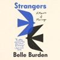

<b>INSTANT #1<i> NEW YORK TIMES </i>BESTSELLER • “Burden’s searing, probing memoir explores . . . what she learned about intimacy and her own spirit.”—<i>People</i>​​</b>  <b>“A beautifully written instant classic. <i>Strangers</i> is gripping and heartbreaking and a must-read for every wife—and husband.”—Graydon Carter</b>  <b>“Asks us to examine life’s most perplexing questions: Can we see the invisible fault lines in a marriage or truly know the people closest to us?”—Lori Gottlieb </b>  <i>It was a great love story, one for the ages. The speed of our beginning and the speed of our ending felt like matching bookends. They both came out of nowhere. He wanted it, he wanted me. And then he didn’t.</i>  In March 2020, Belle Burden was safe and secure with her family at their house on Martha’s Vineyard, navigating the early days of the pandemic together—building fires in the late afternoons, drinking whisky sours, making roast chicken. Then, with no warning or explanation, her husband of twenty years announced that he was leaving her. Overnight, her caring, steady partner became a man she hardly recognized. He exited his life with her like an actor shrugging off a costume.  In <i>Strangers,</i> Burden revisits her marriage, searching for clues that her husband was not who she always thought he was. As she examines her relationship through a new lens, she reckons with her own family history and the lessons she intuited about how a woman is expected to behave in the face of betrayal. Through all of it, she is transformed. The discreet, compliant woman she once was—someone nicknamed “Belle the Good”—gives way to someone braver, someone determined to use her voice.  With unflinching honesty and profound grace, Burden charts a path through heartbreak to show the power of a woman who refuses to give up on love. <i>Strangers</i> is a stunning, deeply moving, compulsively readable memoir heralding the arrival of a thrilling new literary talent.

[View on Apple](https://books.apple.com/us/audiobook/strangers-a-memoir-of-marriage-unabridged/id1810358050)

## Greenlights (Unabridged)

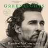

<b>From the Academy Award®–winning actor, an unconventional memoir filled with raucous stories, outlaw wisdom, and lessons learned the hard way about living with greater satisfaction</b> <b>&#xa0;</b> <b>“Unflinchingly honest and remarkably candid, Matthew McConaughey’s book invites us to grapple with the lessons of his life as he did—and to see that the point was never to win, but to understand.”—Mark Manson, author of <i>The Subtle Art of Not Giving a F*ck</i></b>  I’ve been in this life for fifty years, been trying to work out its riddle for forty-two, and been keeping diaries of clues to that riddle for the last thirty-five. Notes about successes and failures, joys and sorrows, things that made me marvel, and things that made me laugh out loud. How to be fair. How to have less stress. How to have fun. How to hurt people less. How to get hurt less. How to be a good man. How to have meaning in life. How to be more me. &#xa0; Recently, I worked up the courage to sit down with those diaries. I found stories I experienced, lessons I learned and forgot, poems, prayers, prescriptions, beliefs about what matters, some great photographs, and a whole bunch of bumper stickers. I found a reliable theme, an approach to living that gave me more satisfaction, at the time, and still: If you know how, and when, to deal with life’s challenges—how to <i>get relative with the inevitable</i>—you can enjoy a state of success I call “catching greenlights.” &#xa0; So I took a one-way ticket to the desert and wrote this book: an album, a record, a story of my life so far. This is fifty years of my sights and seens, felts and figured-outs, cools and shamefuls. Graces, truths, and beauties of brutality. Getting away withs, getting caughts, and getting wets while trying to dance between the raindrops. &#xa0; Hopefully, it’s medicine that tastes good, a couple of aspirin instead of the infirmary, a spaceship to Mars without needing your pilot’s license, going to church without having to be born again, and laughing through the tears. &#xa0; It’s a love letter. <b>To life.</b> &#xa0; It’s also a guide to catching more greenlights—and to realizing that the yellows and reds eventually turn green too. &#xa0; Good luck.

[View on Apple](https://books.apple.com/us/audiobook/greenlights-unabridged/id1533506534)

## A Court of Thorns and Roses (Court of Thorns and Roses)

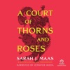

#1 BESTSELLING GLOBAL PHENOMENON  From #1 New York Times bestselling author Sarah J. Maas comes a seductive, breathtaking book that blends romance, adventure, and faerie lore into an unforgettable read.  When nineteen-year-old huntress Feyre kills a wolf in the woods, a terrifying creature arrives to demand retribution. Dragged to a treacherous magical land she knows about only from legends, Feyre discovers that her captor is not truly a beast, but one of the lethal, immortal faeries who once ruled her world.  At least, he’s not a beast all the time.  As she adapts to her new home, her feelings for the faerie, Tamlin, transform from icy hostility into a fiery passion that burns through every lie she’s been told about the beautiful, dangerous world of the Fae. But something is not right in the faerie lands. An ancient, wicked shadow is growing, and Feyre must find  a way to stop it or doom Tamlin—and his world—forever.

[View on Apple](https://books.apple.com/us/audiobook/a-court-of-thorns-and-roses-court-of-thorns-and-roses/id1637712934)

## The Odyssey (Unabridged)

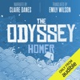

<b>A lean, fleet-footed translation that recaptures Homer’s “nimble gallop” and brings an ancient epic to new life. </b>  The first great adventure story in the Western canon, <i>The Odyssey</i> is a poem about violence and the aftermath of war; about wealth, poverty, and power; about marriage and family; about travelers, hospitality, and the yearning for home.Â&#xa0;  In this fresh, authoritative version - the first English translation of <i>The Odyssey</i> by a woman - this stirring tale of shipwrecks, monsters, and magic comes alive in an entirely new way. Written in iambic pentameter verse and a vivid, contemporary idiom, this engrossing translation matches the number of lines in the Greek original, thus striding at Homer’s sprightly pace and singing with a voice that echoes Homer’s music.Â&#xa0;  Wilson’s <i>Odyssey </i>captures the beauty and enchantment of this ancient poem as well as the suspense and drama of its narrative. Its characters are unforgettable, from the cunning goddess Athena, whose interventions guide and protect the hero, to the awkward teenage son, Telemachus, who struggles to achieve adulthood and find his father; from the cautious, clever, and miserable Penelope, who somehow keeps clamoring suitors at bay during her husband’s long absence, to the “complicated” hero himself, a man of many disguises, many tricks, and many moods, who emerges in this translation as a more fully rounded human being than ever before.Â&#xa0;  A fascinating introduction provides an informative overview of the Bronze Age milieu that produced the epic, the major themes of the poem, the controversies about its origins, and the unparalleled scope of its impact and influence. Maps drawn especially for this volume, a pronunciation glossary, and extensive notes and summaries of each book make this an <i>Odyssey </i>that will be treasured by a new generation of scholars, students, and general listeners alike.

[View on Apple](https://books.apple.com/us/audiobook/the-odyssey-unabridged/id1434585229)

## My Husband's Wife

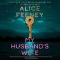

<b>The <i>New York Times</i> bestselling Queen of Twists is back with a psychological masterpiece that will leave you questioning everything you know about love, identity, and revenge. This program features multicast narration and is read by actor and Audie Award–winner Richard Armitage, actor Bel Powley, and actor/comedian Henry Rowley.</b>  <b><i>My Husband's Wife</i> features sound design and special effects to enhance your listening enjoyment. Listen out for the ambient sounds of the seemingly quiet town of Hope Falls and the mysterious countdown from a London clinic claiming to predict Birdy’s death!  “Nonstop thrills! The best Feeney book yet!” —FREIDA MCFADDEN </b><b>“Propulsive, compulsive, addictive.” —LISA JEWELL</b>  Eden Fox, an artist on the brink of her big break, sets off for a run before her first exhibition. When she returns to the home she recently moved into, Spyglass, an enchanting old house in Hope Falls, nothing is as it should be. Her key doesn’t fit. A woman, eerily similar to her, answers the door. And her husband insists that the stranger is his wife.  One house. One husband. Two women. Someone is lying.  Six months earlier, a reclusive Londoner called Birdy, reeling from a life-changing diagnosis, inherits Spyglass. This unexpected gift from a long-lost grandmother brings her to the pretty seaside village of Hope Falls. But then Birdy stumbles upon a shadowy London clinic that claims to be able to predict a person's date of death, including her own. Secrets start to unravel, and as the line between truth and lies blurs, Birdy feels compelled to right some old wrongs.  <i>My Husband’s Wife</i> is a tangled web of deception, obsession, and mystery that will keep you guessing until the final minutes. Prepare yourself for the ultimate mind-bending marriage thriller and step inside Spyglass—if you dare—to experience a story where nothing is as it seems.  <b>A Macmillan Audio production from Pine &amp; Cedar AU</b>

[View on Apple](https://books.apple.com/us/audiobook/my-husbands-wife/id1809788507)

## Famesick: A Memoir (Unabridged)

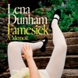

<b>In this rowdy, frank reflection on illness, fame, sex, and everything in between, the remarkable mind behind the hit series <i>Girls </i>and the bestselling author of <i>Not That Kind of Girl </i>asks whether fulfilling her creative ambitions has been worth the pain.</b>  For the last decade, as she’s spent countless hours in doctor’s waiting rooms searching for diagnoses, treatments, and relief, being the owner and operator of Lena Dunham’s body has felt, as she puts it, “like towing a wrecked car across town at midnight.” It’s not easy dragging a wrecked car anywhere, much less to the Met Gala while sewn into a gold lamé corset. Or to the set of the hit show that you—as a twenty-five-year-old—are writing, directing, producing, and starring in. Or to the White House, the Golden Globes, or your publicist’s office to discuss the latest internet disaster. But Dunham does it—even if it means interminable hospital stays, vomiting in the bathroom when she’s meant to be meeting Oprah, or terrifying those closest to her—because she can no longer tell the difference between fighting to do what she loves and being a servant to her own ambition. All the while, she is holding out for a love that can withstand her personal and public challenges and, more than anything, yearning to feel like herself again—if only she could remember who that self was.  As Dunham takes us through her journey, tracking her rise to fame—from selling the pilot of <i>Girls </i>to the present—in three acts, it becomes clear that the spotlight casts long shadows, distorting the relationships she once held dear and isolating everyone in its glare. When an endless supply of drugs can’t protect you from pain—and begins to control your every move—being famous doesn’t stand a chance against the darker corners of the human experience.  In <i>Famesick</i>, Dunham asks herself what the cost of fulfilling her dreams has really been, and whether it was worth it. What she finds is deeper than physical relief, and more lasting, as she learns to live with what she can’t change and turn her regrets into wisdom that can carry her forward, as she reconnects to what, and who, she loves.

[View on Apple](https://books.apple.com/us/audiobook/famesick-a-memoir-unabridged/id1830130576)

## Red Rising (Red Rising)

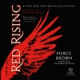

Ender, Katniss, and now Darrow."-- Scott Sigler Pierce Brown' s relentlessly entertaining debut channels the excitement of The Hunger Games by Suzanne Collins and Ender' s Game by Orson Scott Card. " I live for the dream that my children will be born free," she says. " That they will be what they like. That they will own the land their father gave them." " I live for you," I say sadly. Eo kisses my cheek. " Then you must live for more." Darrow is a Red, a member of the lowest caste in the color-coded society of the future. Like his fellow Reds, he works all day, believing that he and his people are making the surface of Mars livable for future generations. Yet he spends his life willingly, knowing that his blood and sweat will one day result in a better world for his children. But Darrow and his kind have been betrayed. Soon he discovers that humanity reached the surface generations ago. Vast cities and sprawling parks spread across the planet. Darrow-- and Reds like him-- are nothing more than slaves to a decadent ruling class. Inspired by a longing for justice, and driven by the memory of lost love, Darrow sacrifices everything to infiltrate the legendary Institute, a proving ground for the dominant Gold caste, where the next generation of humanity' s overlords struggle for power. He will be forced to compete for his life and the very future of civilization against the best and most brutal of Society' s ruling class. There, he will stop at nothing to bring down his enemies . . . even if it means he has to become one of them to do so.

[View on Apple](https://books.apple.com/us/audiobook/red-rising-red-rising/id1639989728)

## The Iliad

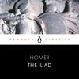

<b>Brought to you by Penguin.</b>  This Penguin Classic is performed by Steve John Shepherd, whose theatre credits include <i>Much Ado About Nothing</i> at the Globe, <i>The Good Canary</i> directed by John Malkovich<i>, Bomber's Moon</i> and <i>Piaf</i>. His TV and film credits range from the iconic <i>This Life</i> to<i> Silent Witness </i>and <i>Eastenders. </i>This definitive recording includes an introduction by E V Rieu.   One of the foremost achievements in Western literature, Homer's Iliad tells the story of the darkest episode in the Trojan War. At its centre is Achilles, the greatest warrior-champion of the Greeks, and his refusal to fight after being humiliated by his leader Agamemnon. But when the Trojan Hector kills Achilles' close friend Patroclus, he storms back into battle to take revenge - although knowing this will ensure his own early death. Interwoven with this tragic sequence of events are powerfully moving descriptions of the ebb and flow of battle, of the domestic world inside Troy's besieged city of Ilium, and of the conflicts between the Gods on Olympus as they argue over the fate of mortals.

[View on Apple](https://books.apple.com/us/audiobook/the-iliad/id1508125489)

## The Divorce

<b>What is a happily ever after really worth?</b>  Naomi was living the quintessential love story. Boy meets girl. They fall in love, get married, buy a dream house, start a family . . . Then—he kicks her out, hires the city’s best divorce lawyers, drains their accounts, and takes up with a 20-something. It’s a brutal end to the story. Naomi should accept defeat: move into a dingy apartment, get back into the workforce, and piece together the shattered remains of her life. Except, why should she?  Instead, Naomi fixates on her husband’s new girlfriend. What begins as cynical curiosity soon twists into obsession—and then into something far darker. As Naomi uncovers secrets she never imagined, she realizes her own life may be in danger.  But if it keeps her perfect family intact, isn’t it worth it?  <b>In </b><i><b>The Divorce</b></i><b>, #1 </b><i><b>New York Times</b></i><b> and internationally bestselling author Freida McFadden delivers a razor-sharp, subversive thriller where love curdles into vengeance, and survival becomes the most dangerous game of all.</b>

[View on Apple](https://books.apple.com/us/audiobook/the-divorce/id1874109851)

## Lights Out: An Into Darkness Novel (Unabridged)

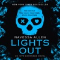

<b>The viral TikTok stalker dark romance, burning with high heat, hilarious banter, and a love story like you've never seen before. Can you handle the ride?  <i>I want someone with a soul as black as night. Someone who would burn the world down for me and not lose a single minute of sleep over it.  </i></b>Trauma nurse Aly Cappellucci doesn't need any more kinks. She likes the one she's landed on just fine. To her, nothing could top the masked men she follows online. Unless one of those men was shirtless, heavily tattooed, and <i>waiting for her in her bedroom</i>. She dreams about being hunted by one in particular, of him chasing her down and doing deliciously dark things to her willing body. She never could have guessed that by sending one drunken text, those dreams would become her new reality.  <b><i>I want things most people don't, craving darkness and depravity instead of light and love.  </i></b>Josh Hammond has spent his life avoiding the limelight, but his online persona is another story. At night, he posts masked thirst traps for his millions of fans to drool over, but one follower has caught his eye: Aly. After reading a comment begging him to break into her house wearing a mask, he decides to take her up on her offer.  Together, Aly and Josh live out their darkest fantasies, unaware that Aly has captured the attention of someone else. Someone with far more sinister intentions than a little light stalking. As Josh turns from predator to protector and the stakes heighten, he must ask himself how far he's willing to go for the woman he's obsessed with.  <b>Lights Out <i>is a fast-paced dark romance with a morally gray male lead. Some themes and scenes may be disturbing to readers. Please check the TWs at the beginning of the book.</i></b>

[View on Apple](https://books.apple.com/us/audiobook/lights-out-an-into-darkness-novel-unabridged/id1830462611)

## Harry Potter and the Sorcerer's Stone

Jim Dale's Grammy Award-winning performance of J.K. Rowling's iconic stories is a listening adventure for the whole family.  <i>Turning the envelope over, his hand trembling, Harry saw a purple wax seal bearing a coat of arms; a lion, an eagle, a badger and a snake surrounding a large letter 'H'.</i>  Close your eyes and enter the magical world of Harry Potter. In these editions, Jim Dale's characterful narration is so entertaining, fun, and theatrical you can almost hear the crackle of the fire in the Gryffindor common room.  Harry Potter has never even heard of Hogwarts when the letters start dropping on the doormat at number four, Privet Drive. Addressed in green ink on yellowish parchment with a purple seal, they are swiftly confiscated by his grisly aunt and uncle. Then, on Harry's eleventh birthday, a great beetle-eyed giant of a man called Rubeus Hagrid bursts in with some astonishing news: Harry Potter is a wizard, and he has a place at Hogwarts School of Witchcraft and Wizardry. An incredible adventure is about to begin!  Having become classics of our time, the Harry Potter stories never fail to bring comfort and escapism. With their message of hope, belonging and the enduring power of truth and love, the story of the Boy Who Lived continues to delight generations of new listeners.

[View on Apple](https://books.apple.com/us/audiobook/harry-potter-and-the-sorcerers-stone/id1442174040)

## Threshing Day (Wing and Claw Collection) (Empyrean)

[View on Apple](https://books.apple.com/us/audiobook/threshing-day-wing-and-claw-collection-empyrean/id6791335335)

## The Day After

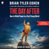

<b>From the #1 <i>New York Times</i> bestselling author of <i>Shameless, </i>Brian Tyler Cohen explores how Republicans have abused power, how Democrats have refused to exercise power when they held it, and how progressives should wield power if they are fortunate enough to win a free and fair election in a post-Trump world.</b> This book is a wake-up call about the decades-long project that led to Trump’s America.  It’s the playbook for progressives who want to do far more than restore the status quo.  This is how we build a stronger country, with hope and opportunity for all — before our democracy slides into a distant memory.

[View on Apple](https://books.apple.com/us/audiobook/the-day-after/id1844702851)

## The Psychology of Money

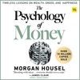

<b><i>The Sunday Times</i> Number One Bestseller.  Over 10 million copies sold around the world.  The original book from Morgan Housel, the <i>New York Times</i> and <i>Sunday Times</i> bestselling author of <i>Same As Ever</i> and <i>The Art of Spending Money</i>.  As featured on the Dr Chatterjee podcast <i>Feel Better, Live More</i> and <i>The</i> <i>Diary of a CEO</i> podcast with Steven Bartlett.</b>  Doing well with money isn't necessarily about what you know. It's about how you behave. And behavior is hard to teach, even to really smart people.  Money – investing, personal finance, and business decisions – is typically taught as a math-based field, where data and formulas tell us exactly what to do. But in the real world people don't make financial decisions on a spreadsheet. They make them at the dinner table, or in a meeting room, where personal history, your own unique view of the world, ego, pride, marketing, and odd incentives are scrambled together.  In <i>The Psychology of Money</i>, award-winning author Morgan Housel shares 19 short stories exploring the strange ways people think about money and teaches you how to make better sense of one of life's most important topics.

[View on Apple](https://books.apple.com/us/audiobook/the-psychology-of-money/id1878646280)

## Fourth Wing (Empyrean)

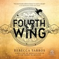

<i>Now with&#xa0;</i><i><b>three</b></i><i>&#xa0;bonus chapters read by Teddy Hamilton. Re-download the title now to listen to the extended version!</i>  <b>A #1&#xa0;</b><i><b>New York Times</b></i><b>&#xa0;bestseller • TV series in development at MGM Amazon Studios with Michael B. Jordan’s Outlier Society • Amazon Best Books of the Year, #4 • Apple Best Books of the Year 2023 • Barnes &amp; Noble Best Fantasy Book of 2023 • NPR “Books We Love” 2023 • Audible Best Books of 2023 • Hudson Book of the Year • Google Play Best Books of 2023 • Indigo Best Books of 2023 • Waterstones Book of the Year finalist • Goodreads Choice Award Winner • </b><i><b>Newsweek</b></i><b> Staffers’ Favorite Books of 2023 • </b><i><b>Paste</b></i><b> Magazine's Best Books of 2023</b>  <i>"Suspenseful, sexy, and with incredibly entertaining storytelling, the first in Yarros' Empyrean series will delight fans of romantic, adventure-filled fantasy."</i>—<b>Booklist</b>, starred review  <i>"</i>Fourth Wing<i>&#xa0;will have your heart pounding from beginning to end ... A fantasy like you've never read before."</i>―<b>Jennifer L. Armentrout</b>, #1&#xa0;<i>New York Times</i>&#xa0;bestselling author  <b>Enter the brutal and elite world of a war college for dragon riders from </b><i><b>USA Today</b></i><b> bestselling author Rebecca Yarros.</b>  Twenty-year-old Violet Sorrengail was supposed to enter the Scribe Quadrant, living a quiet life among books and history. Now, the commanding general—also known as her tough-as-talons mother—has ordered Violet to join the hundreds of candidates striving to become the elite of Navarre: <i>dragon riders</i>.  But when you’re smaller than everyone else and your body is brittle, death is only a heartbeat away … because dragons don’t bond to “fragile” humans. They incinerate them.  With fewer dragons willing to bond than cadets, most would kill Violet to better their own chances of success. The rest would kill her just for being her mother’s daughter—like Xaden Riorson, the most powerful and ruthless wingleader in the Riders Quadrant.  She’ll need every edge her wits can give her just to see the next sunrise.  Yet, with every day that passes, the war outside grows more deadly, the kingdom’s protective wards are failing, and the death toll continues to rise. Even worse, Violet begins to suspect leadership is hiding a terrible secret.  Friends, enemies, lovers. Everyone at Basgiath War College has an agenda—because once you enter, there are only two ways out: <i>graduate or die</i>.

[View on Apple](https://books.apple.com/us/audiobook/fourth-wing-empyrean/id1654975232)

## Thrilling Tales of Modern Men: Stories (Unabridged)

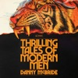

<b>An addictive, unpredictable, darkly hilarious collection of stories from Danny McBride—the beloved creator and star of <i>The Righteous Gemstones </i>and <i>Eastbound &amp; Down</i>. </b> <b>“These McBride men more than drink their own Kool-Aid, they swig it to survive. On fever quests to save face and make their myth flesh, they hilariously remind us that, if you ain’t for you, who is?”—MATTHEW McCONAUGHEY</b>   <b> “Just as demented, hilarious, human, and as inspired as all of his work, but, somehow, even better.”—JUDD APATOW </b>  There are many sides to Danny McBride: He’s starred as the iconic character Kenny Powers in the cult classic HBO show <i>Eastbound &amp; Down, </i>a series he also wrote and created—just as he did with <i>Vice Principals </i>and <i>The Righteous Gemstones. </i>He’s produced horror films (<i>Halloween) </i>and starred in sci-fi (<i>Alien: Covenant). </i>And ever since he was young, he’s been writing short fiction.  An amateur magician gets in way over his head with a deadly stunt in a local mall. A washed-up sitcom actor takes revenge on the coyote who killed his dog. Two young runaways decide to part ways, but not before embarking on one last big adventure.  Hilarious, razor-sharp, unexpectedly emotional, and full of wild twists and turns, the stories in <i>Thrilling Tales of Modern Men</i> are like nothing else. And yet they have one thing in common—each probes the fragile masculinity that has become an inescapable part of modern American culture. In this audacious and unforgettable debut collection, McBride redefines the tale of the modern man.  <b>AUDIO TABLE OF CONTENTS</b> <b>The Illusionist</b>, read by the author <b>RoboCare™</b>, read by John Goodman and Edi Patterson <b>The Vicious Kind</b>, read by Eric André  <b>The Book Burner</b>, narration by the author, with Shea Whigham as Dwayne, Billy Crudup as Marcus Mel, Cassidy Freeman as Linda, Sam Rockwell as Tony Riggs, Adam Devine as Brendan, John Goodman as the Professor and Grocery Store Manager, Edi Patterson as the Student, G-Unit and Waitress, and Eric André as Taxi Driver, Publishing Executives, and Reporters <b>The Institute of Men</b>, read by Shane Gillis <b>Last Night of the Runaway Adventure</b>, read by Sturgill Simpson <b>Gerald’s Wife</b>, read by Edi Patterson <b>Mr. Liptrapp’s Sword</b>, read by Shea Whigham <b>Fun Run</b>, read by Adam Devine <b><i>Dad’s Way: </i>A Hilarious ’90s Sitcom</b>, read by Walton Goggins

[View on Apple](https://books.apple.com/us/audiobook/thrilling-tales-of-modern-men-stories-unabridged/id1841775467)

## The Fellowship of the Ring (Lord of the Rings)

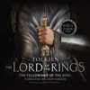

An unlikely hero. A perilous quest. The greatest adventure ever told.  In a quiet village in the Shire, young Frodo is about to receive a gift that will change his life forever.  Thought lost centuries ago, it is the One Ring, an object of terrifying power once used by the Dark Lord to enslave Middle-earth. Now darkness is rising, and Frodo must travel deep into the Dark Lord’s realm, to the one place the Ring can be destroyed: Mount Doom.  The journey will test Frodo’s courage, his friendships and his heart. Because the Ring corrupts all who bear it—can Frodo destroy it, or will it destroy him?  'The English-speaking world is divided into those who have read The Lord of the Rings and The Hobbit and those who are going to read them.'—Sunday Times  This brand-new unabridged recording is narrated by the acclaimed actor, director and author, Andy Serkis.

[View on Apple](https://books.apple.com/us/audiobook/the-fellowship-of-the-ring-lord-of-the-rings/id1639170469)

## The Fourth Option (Unabridged)

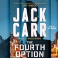

<b><b>When law enforcement, the courts, and the prison system fail, there is a fourth and final option. #1 <i>New York Times </i>bestselling author Jack Carr launches a new thriller series cowritten with <i>New York Times</i> bestselling author M.P. Woodward.</b></b>  Disillusioned by the government and institutions he dedicated his life to serving, former Navy SEAL and CIA ground branch operative Chris Walker is about to end his life when he receives a call that saves it. The wife of a teammate he lost in Afghanistan has now lost her son to the opioid crisis and needs Walker’s help. Thrust into a conspiracy that goes deeper than he ever imagined, Walker must go up against the system and the very Constitution he once swore an oath to support and defend in order to find justice for his friend’s widow.   With ambitious FBI agent Jarrett Stanton on his tail, Walker—accompanied by his loyal Belgian Malinois and using his off-the-grid VW pop-up camper filled with a hidden cache of weapons—takes the law into his own hands, exposing corruption and issuing a long-forgotten brand of lethal outlaw justice.   In the tradition of the great “stranger comes to town” Westerns of the past comes a modern interpretation of the mysterious vigilante gunslinger legend from “the hottest author on the thriller scene today” (<i>The Real Book Spy</i>). Get ready for a new kind of hero. Justice is coming.

[View on Apple](https://books.apple.com/us/audiobook/the-fourth-option-unabridged/id1844265683)

## The Four Agreements: A Practical Guide to Personal Freedom (Unabridged)

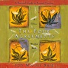

<b>The incredible <i>New York Times</i> and international bestselling guide to true happiness.  </b>“This book by don Miguel Ruiz, simple yet so powerful, has made a tremendous difference in how I think and act in every encounter.”—Oprah Winfrey  In <i>The Four Agreements</i>, a perennial bestseller published in dozens of languages worldwide, don Miguel Ruiz reveals the source of self-limiting beliefs that rob us of joy and create needless suffering. Based on ancient Toltec wisdom, <i>The Four Agreements</i> offer a powerful code of conduct that can rapidly transform our lives to a new experience of freedom, true happiness, and love.  “Don Miguel Ruiz’s book is a roadmap to enlightenment and freedom.”—Deepak Chopra, Author, <i>The Seven Spiritual Laws of Success</i>  “An inspiring book with many great lessons.”—Wayne Dyer, Author, <i>Real Magic</i>  “In the tradition of Castaneda, Ruiz distills essential Toltec wisdom, expressing with clarity and impeccability what it means for men and women to live as peaceful warriors in the modern world.”—Dan Millman, Author, <i>Way of the Peaceful Warrior</i>

[View on Apple](https://books.apple.com/us/audiobook/the-four-agreements-a-practical-guide-to/id1865815605)

## The Hobbit (Lord of the Rings)

THE GREAT MODERN CLASSIC AND PRELUDE TO THE LORD OF THE RINGS Deep down here by the dark water lived old Gollum, a small slimy creature. I don’t know where he came from, nor who or what he was. He was Gollum—as dark as darkness, except for two big round pale eyes in his thin face. He had a little boat, and he rowed about quite quietly on the lake; for lake it was, wide and deep and deadly cold. Whisked away from his comfortable, unambitious life in his hobbit-hole in Bag End by Gandalf the wizard and a band of dwarves, Bilbo Baggins finds himself caught up in a plot to raid the treasure hoard of Smaug the Magnificent, a large and very dangerous dragon. This brand-new unabridged recording is narrated by the acclaimed actor, director and author, Andy Serkis.

[View on Apple](https://books.apple.com/us/audiobook/the-hobbit-lord-of-the-rings/id1639268288)

## London Falling: A Mysterious Death in a Gilded City and a Family's Search for Truth (Unabridged)

<b>From the bestselling, prize-winning author of <i>Say Nothing</i> and <i>Empire of Pain</i>, a spellbinding&#xa0;account of a family devastated by the sudden death of their nineteen-year-old son, only to discover that he had created a secret life&#xa0;which drew him into the dangerous criminal underworld that lies beneath&#xa0;London’s glittering surface</b>  In the early morning of November 29th, 2019, surveillance cameras at the headquarters of MI6, Britain’s spy agency, captured video of a young man pacing back and forth on a high balcony of Riverwalk, a luxury tower on the bank of the river Thames. At 2:24 a.m., he jumped into the river.  In a quiet London neighborhood several miles away, Rachelle Brettler was worried about her son. Zac had told her that he had gone to stay with a friend,&#xa0;but then he did not come home. Days later, a police car pulled up&#xa0;and two officers relayed the dreadful news: her son was dead.  In their unbearable grief, Rachelle and her husband, Matthew, struggled to understand what had happened to Zac. He had his troubles, but in no way seemed suicidal. As they would soon discover, however, there was a lot they did not know about their son. Only after his death did they learn that he had adopted a fictitious alter-ego: Zac Ismailov, son of a Russian oligarch and heir to a great fortune. Under this guise, Zac had become entangled with a slippery London businessman named Akbar Shamji, and a murderous gangster known as “Indian Dave.” As the Brettlers set about investigating their son’s death, they were pulled into a different and more dangerous London than the one they’d always known, and came to believe that something much more nefarious than a suicide had claimed Zac’s life. But to their immense frustration, Scotland Yard seemed unable—or unwilling—to bring the perpetrators to justice.&#xa0;  In a bravura feat of reporting and writing, Patrick Radden Keefe chronicles the Brettlers’ quest, peeling back layers of mystery and exposing the seedy truths behind the glamorous London of posh mansions and private nightclubs, a city in which everything is for sale, and aspirational fantasies are underwritten by dirty money and corruption. <i>London Falling</i> is a mesmerizing investigation of an inexplicable death and a powerful narrative driven by suspense and staggering revelations. But it is also an intimate and deeply poignant inquiry into the nature of parental love and the challenges of being a parent today, a portrait of a family trying to solve the riddle not just of how their son died, but of who he really was in life.

[View on Apple](https://books.apple.com/us/audiobook/london-falling-a-mysterious-death-in-a-gilded/id1828570724)

## Dirty Thirty (Unabridged)

<b>Janet Evanovich, the “most popular mystery writer alive” (<i>The New York Times</i>), is in top form as she sends Stephanie Plum on the trail of a stolen stash of dirty diamonds in this instant #1 <i>New York Times</i> bestseller.</b>  Stephanie Plum, Trenton’s hardest working, most underappreciated bounty hunter, is offered an assignment that seems simple enough. Local jeweler Martin Rabner wants her to locate his former security guard, Andy Manley (a.k.a. Nutsy), who he is convinced stole a fortune in diamonds from his safe. Stephanie is also looking for another troubled man, Duncan Dugan, a fugitive from justice arrested for robbing the same jewelry store on the same day.   With her boyfriend Morelli away in Miami on police business, Stephanie is taking care of Bob, Morelli’s giant orange dog who will devour anything, from Stephanie’s stray donuts to the upholstery in her car. Morelli’s absence also means the inscrutable, irresistible security expert Ranger is front and center in Stephanie’s life when things inevitably go sideways. And he seems determined to stay there.   To complicate matters, her best friend is convinced she is being stalked by a mythological demon hell-bent on relieving her of her wardrobe. An overnight stakeout with Stephanie’s mother and Grandma Mazur reveals three generations of women with nerves of steel and driving skills worthy of NASCAR champions.   As the body count rises and witnesses start to disappear, it won’t be easy for Stephanie to keep herself clean when everyone else is playing dirty. It’s a good thing Stephanie isn’t afraid of getting a little dirty, too in this “uproarious, crazy, laugh-a-minute caper” (<i>Booklist</i>, starred review).

[View on Apple](https://books.apple.com/us/audiobook/dirty-thirty-unabridged/id1670033391)

## Sunrise on the Reaping (The Hunger Games)

<b>The phenomenal fifth book in the Hunger Games series!</b> <i>Acclaimed actor Jefferson White, who starred in Paramount Network's Yellowstone as Jimmy Hurdstrom, brings his talent to the worldwide best-selling Hunger Games series as narrator of the Sunrise on the Reaping audiobook!</i>  <b>When you've been set up</b>  <b>to lose everything you love,</b>  <b>what is there left to fight for?</b>  As the day dawns on the fiftieth annual Hunger Games, fear grips the districts of Panem. This year, in honor of the Quarter Quell, twice as many tributes will be taken from their homes.  Back in District 12, Haymitch Abernathy is trying not to think too hard about his chances. All he cares about is making it through the day and being with the girl he loves.  When Haymitch's name is called, he can feel all his dreams break. He's torn from his family and his love, shuttled to the Capitol with the three other District 12 tributes: a young friend who's nearly a sister to him, a compulsive oddsmaker, and the most stuck-up girl in town. As the Games begin, Haymitch understands he's been set up to fail. But there's something in him that wants to fight . . . and have that fight reverberate far beyond the deadly arena.

[View on Apple](https://books.apple.com/us/audiobook/sunrise-on-the-reaping-the-hunger-games/id1750855574)

## The Let Them Theory: A Life-Changing Tool That Millions of People Can’t Stop Talking About (Unabridged)

<b>#1 </b><b><i>New York Times</i></b><b> Bestseller</b>  <b>#1 </b><b><i>Sunday Times</i></b><b> Bestseller</b>  <b>#1 </b><b><i>Amazon</i></b><b> Bestseller</b>  <b>#1 </b><b><i>Audible</i></b><b> Bestseller</b>  <b><i>A Life-Changing Tool Millions of People Can’t Stop Talking About</i></b>  What if the key to happiness, success, and love was as simple as two words?  If you've ever felt stuck, overwhelmed, or frustrated with where you are, the problem isn't you. The problem is the power you give to other people. Two simple words—<i>Let Them</i>—will set you free. Free from the opinions, drama, and judgments of others. Free from the exhausting cycle of trying to manage everything and everyone around you. <i>The Let Them Theory</i> puts the power to create a life you love back in your hands—and this book will show you exactly how to do it.  In her latest groundbreaking book, <i>The Let Them Theory</i>, Mel Robbins—New York Times bestselling author and one of the world's most respected experts on motivation, confidence, and mindset—teaches you how to stop wasting energy on what you can't control and start focusing on what truly matters: YOU. Your happiness. Your goals. Your life.  Using the same no-nonsense, science-backed approach that's made <i>The Mel Robbins Podcast </i>a global sensation, Robbins explains why <i>The Let Them Theory</i> is already loved by millions and how you can apply it in eight key areas of your life to make the biggest impact. As you listen, you'll realize how much energy and time you've been wasting trying to control the wrong things—at work, in relationships, and in pursuing your goals—and how this is keeping you from the happiness and success you deserve.  Written as an easy-to-understand guide, Robbins shares relatable stories from her own life, highlights key takeaways, relevant research and introduces you to world-renowned experts in psychology, neuroscience, relationships, happiness, and ancient wisdom who champion<i> The Let Them Theory</i> every step of the way.  <b>Learn how to:</b> 
Stop wasting energy on things you can't control
Stop comparing yourself to other people
Break free from fear and self-doubt
Release the grip of people's expectations
Build the best friendships of your life
Create the love you deserve
Pursue what truly matters to you with confidence
Build resilience against everyday stressors and distractions
Define your own path to success, joy, and fulfillment  
...and so much more.

 <i>The Let Them Theory </i>will forever change the way you think about relationships, control, and personal power. Whether you want to advance your career, motivate others to change, take creative risks, find deeper connections, build better habits, start a new chapter, or simply create more happiness in your life and relationships, this book gives you the mindset and tools to unlock your full potential.  Order your copy of<i> The Let Them Theory </i>now and discover how much power you truly have. It all begins with two simple words.

[View on Apple](https://books.apple.com/us/audiobook/the-let-them-theory-a-life-changing-tool-that/id1789374695)

## Kingdom of Ash (Unabridged)

Years in the making, Sarah J. Maas's number-one global bestselling phenomenon Throne of Glass series draws to an epic, unforgettable conclusion. Aelin Galathynius's journey from slave to king's assassin to the queen of a once-great kingdom reaches its heart-rending finale as war erupts across her world....  Aelin has risked everything to save her people - but at a tremendous cost. Locked within an iron coffin by the Queen of the Fae, Aelin must draw upon her fiery will as she endures months of torture. Aware that yielding to Maeve will doom those she loves keeps her from breaking, though her resolve begins to unravel with each passing day....  With Aelin captured, Aedion and Lysandra remain the last line of defense to protect Terrasen from utter destruction. Yet they soon realize that the many allies they've gathered to battle Erawan's hordes might not be enough to save them. Scattered across the continent and racing against time, Chaol, Manon, and Dorian are forced to forge their own paths to meet their fates. Hanging in the balance is any hope of salvation - and a better world.  And across the sea, his companions unwavering beside him, Rowan hunts to find his captured wife and queen - before she is lost to him forever.  As the threads of fate weave together at last, all must fight, if they are to have a chance at a future. Some bonds will grow even deeper, while others will be severed forever in the explosive final chapter of the Throne of Glass series.

[View on Apple](https://books.apple.com/us/audiobook/kingdom-of-ash-unabridged/id1439608509)

## Summer Romance (Unabridged)

<b>AN INSTANT NATIONAL BESTSELLER  “A BINGEABLE FIVE-STAR READ.” —ABBY JIMENEZ, #1 <i>New York Times </i>bestselling author  "I loved it—brims with heart, wit, and longing.”—CARLEY FORTUNE, #1 <i>New York Times </i>bestselling author  The romantic and hilarious story of a professional organizer whose life is a mess, and the summer she gets unstuck with the help of someone unexpected from her past, by the bestselling author of <i>Nora Goes Off Script.</i></b>  <i>Benefits of a summer romance: It’s always fun, always brief, and no one gets their heart broken.</i>  Ali Morris is a professional organizer whose own life is a mess. Her mom died two years ago, then her husband left, and she hasn’t worn pants with a zipper in longer than she cares to remember.  No one is more surprised than Ali when the first time she takes off her wedding ring and puts on pants with hardware—overalls count, right?—she meets someone. Or rather, her dog claims a man for her...by peeing on him. Ethan smiles at Ali like her pants are just right—like he likes what he sees. He looks at her like she’s a younger, braver version of herself. The last thing newly single mom Ali needs is to make her life messier, but there’s no harm in a little summer romance. Is there?

[View on Apple](https://books.apple.com/us/audiobook/summer-romance-unabridged/id1709766776)

## The Body Keeps the Score: Brain, Mind, and Body in the Healing of Trauma (Unabridged)

<b>#1 <i>New York Times </i>bestseller  “Essential reading for anyone interested in understanding and treating traumatic stress and the scope of its impact on society.” —Alexander McFarlane, Director of the Centre for Traumatic Stress Studies  A pioneering researcher transforms our understanding of trauma and offers a bold new paradigm for healing in this&#xa0;<b><b><b><i>New York Times</i>&#xa0;bestseller</b></b></b></b> &#xa0; Trauma is a fact of life. Veterans and their families deal with the painful aftermath of combat; one in five Americans has been molested; one in four grew up with alcoholics; one in three couples have engaged in physical violence. Dr. Bessel van der Kolk, one of the world’s foremost experts on trauma, has spent over three decades working with survivors. In&#xa0;<i>The Body Keeps the Score</i>, he uses recent scientific advances to show how trauma literally reshapes both body and brain, compromising sufferers’ capacities for pleasure, engagement, self-control, and trust. He explores innovative treatments—from neurofeedback and meditation to sports, drama, and yoga—that offer new paths to recovery by activating the brain’s natural neuroplasticity. Based on Dr. van der Kolk’s own research and that of other leading specialists,&#xa0;<i>The Body Keeps the Score&#xa0;</i>exposes the tremendous power of our relationships both to hurt and to heal—and offers new hope for reclaiming lives.  Cover image: © 2020 Succession H. Matisse / Artists Rights Society (ARS), New York Courtesty of the Archives Henri Matisse, All rights reserved.

[View on Apple](https://books.apple.com/us/audiobook/the-body-keeps-the-score-brain-mind-and-body/id1552824769)

## The Silent Patient

<b>"The perfect binge listen." —<i> Yahoo Lifestyle</i></b>   <b>Instant #1 <i>New York Times </i>bestseller.</b> <b></b> <b>This program includes a bonus interview with the author.</b>  <b><i>The Silent Patient</i> is a shocking psychological thriller of a woman’s act of violence against her husband—and of the therapist obsessed with uncovering her motive.</b>   Alicia Berenson’s life is seemingly perfect. A famous painter married to an in-demand fashion photographer, she lives in a grand house with big windows overlooking a park in one of London’s most desirable areas. One evening her husband Gabriel returns home late from a fashion shoot, and Alicia shoots him five times in the face, and then never speaks another word.  Alicia’s refusal to talk, or give any kind of explanation, turns a domestic tragedy into something far grander, a mystery that captures the public imagination and casts Alicia into notoriety. The price of her art skyrockets, and she, the silent patient, is hidden away from the tabloids and spotlight at the Grove, a secure forensic unit in North London.  Theo Faber is a criminal psychotherapist who has waited a long time for the opportunity to work with Alicia. His determination to get her to talk and unravel the mystery of why she shot her husband takes him down a twisting path into his own motivations—a search for the truth that threatens to consume him....    <b>More praise for <i>The Silent Patient:</i></b>   “Absolutely brilliant… I read it in a state of intense, breathless excitement.” — Stephen Fry    “Smart, sophisticated storytelling freighted with real suspense - a very fine novel by any standard.”  — Lee Child  “<i>The Silent Patient</i> sneaks up on you like a slash of intimidating shadow on a badly lit street. Michaelides has crafted a totally original, spellbinding psychological mystery so quirky, so unique that it should have its own genre.”  — David Baldacci

[View on Apple](https://books.apple.com/us/audiobook/the-silent-patient/id1443705744)

## Five Brothers (Unabridged)

<b>One woman learns the secrets of the five Jaeger brothers in the new romance from <i>New York Times</i> bestselling author Penelope Douglas.</b>  <i>On the other side of town, in the dark glades, under the rain…</i>  Macon is the oldest. Thirty-one. Ex-Marine. I don’t think I’ve ever seen him smile.  Army is twenty-eight. A single dad with the most beautiful green eyes. He has no idea who he is, if not a Jaeger brother.  Iron will be in prison soon. You’d never think it to meet him. He’s a nice guy, actually. But he can’t stop reacting to everything.  Dallas is the one I hate. Twenty-one, cruel, and selfish. He takes and then throws away whatever’s left.  And Trace is mine. Or he was for about two seconds. No one can tame him for long.&#xa0; &#xa0;  Not that I ever wanted to. It was fun, but now I need to go home. Back to my side of the tracks. Away from the swamps and these men. To my parents’ big house. On my clean street. Where I’m never dirty or messy or hot. And I will. I’ll leave first thing tomorrow morning.&#xa0;I just want to crash on the couch tonight.  Their house is dark and quiet, everyone else is asleep. Except for one. He sees me crying and comes at me from behind. I let him wrap his arms around my body and hold me tightly. His breath is on my neck, his fingers are in my hair, and he doesn’t stop there.&#xa0;&#xa0;  I don’t think it was Trace.

[View on Apple](https://books.apple.com/us/audiobook/five-brothers-unabridged/id1714203757)

## Golden Son (Red Rising)

With shades of The Hunger Games, Ender's Game, and Game of Thrones, debut author Pierce Brown's genre-defying epic Red Rising hit the ground running and wasted no time becoming a sensation. Golden Son continues the stunning saga of Darrow, a rebel forged by tragedy, battling to lead his oppressed people to freedom from the overlords of a brutal elitist future built on lies. Now fully embedded among the Gold ruling class, Darrow continues his work to bring down Society from within. A life-or-death tale of vengeance with an unforgettable hero at its heart, Golden Son guarantees Pierce Brown's continuing status as one of fiction's most exciting new voices.

[View on Apple](https://books.apple.com/us/audiobook/golden-son-red-rising/id1639990347)

## Throne of Glass

Bloomsbury presents Throne of Glass by Sarah J. Maas, read by Elizabeth Evans.

Lethal. Loyal. Legendary.

Enter the world of Throne of Glass with the first book in the #1 bestselling series by Sarah J. Maas.

In a land without magic, an assassin is summoned to the castle. She has no love for the vicious king who rules from his throne of glass, but she has not come to kill him. She has come to win her freedom. If she defeats twenty-three murderers, thieves, and warriors in a competition, she will be released from prison to serve as the King's Champion.

Her name is Celaena Sardothien.

The Crown Prince will provoke her. The Captain of the Guard will protect her. And a princess from a faraway country will befriend her. But something rotten dwells in the castle, and it's there to kill. When her competitors start dying mysteriously, one by one, Celaena's fight for freedom becomes a fight for survival—and a desperate quest to root out the evil before it destroys her world.

Thrilling and fierce, Throne of Glass is the first book in the #1 New York Times bestselling series that has captivated readers worldwide.

[View on Apple](https://books.apple.com/us/audiobook/throne-of-glass/id1735569473)

## Three Days in June: A Novel (Unabridged)

<b><i>NEW YORK TIMES</i> BESTSELLER •&#xa0;A new Anne Tyler novel destined to be an instant classic: a socially awkward mother of the bride navigates the days before and after her daughter's wedding.  “What a treat.” —<i>Washington Post</i>   “Simply exquisite.” —Liane Moriarty  “Nobody understands human nature better than Tyler. And nobody understands the complexities of love the way she does.” —<i>Boston Globe</i>  “<i>Three Days in June </i>is like reading a hug.” —<i>Minneapolis Star Tribune</i></b>  Gail Baines is having a bad day. To start, she loses her job—or quits, depending on whom you ask. Tomorrow her daughter, Debbie, is getting married, and she hasn’t even been invited to the spa day organized by the mother of the groom. Then, Gail’s ex-husband, Max, arrives unannounced on her doorstep, carrying a cat, without a place to stay, and without even a suit.  But the true crisis lands when Debbie shares with her parents a secret she has just learned about her husband to be. It will not only throw the wedding into question but also stir up Gail and Max’s past.  Told with deep sensitivity and a tart sense of humor, full of the joys and heartbreaks of love and marriage and family life, <i>Three Days in June</i> is a triumph, and gives us the perennially bestselling, Pulitzer Prize–winning writer at the height of her powers.

[View on Apple](https://books.apple.com/us/audiobook/three-days-in-june-a-novel-unabridged/id1749438500)

## Never Lie

Newlyweds Tricia and Ethan are searching for the house of their dreams. But when they visit the remote manor that once belonged to Dr. Adrienne Hale, a renowned psychiatrist who vanished without a trace four years earlier, a violent winter storm traps them at the estate… with no chance of escape until the blizzard comes to an end. In search of a book to keep her entertained until the snow abates, Tricia happens upon a secret room. One that contains audio transcripts from every single patient Dr. Hale has ever interviewed. As Tricia listens to the cassette tapes, she learns about the terrifying chain of events leading up to Dr. Hale’s mysterious disappearance. Tricia plays the tapes one by one, late into the night. With each one, another shocking piece of the puzzle falls into place, and Dr. Adrienne Hale’s web of lies slowly unravels. And then Tricia reaches the final cassette. The one that reveals the entire horrifying truth.

[View on Apple](https://books.apple.com/us/audiobook/never-lie/id1648157377)

## The Rose Code

<b>The <i>New York Times</i> and <i>USA Today </i>bestselling author of <i>The Huntress </i>and <i>The Alice Network</i> returns with another heart-stopping World War II story of three female code breakers at Bletchley Park and the spy they must root out after the war is over. Award-winning narrator Saskia Maarleveld’s emotional delivery cracks the code of bringing each heroine to vivid life.</b>  <b>“Effortlessly evokes the frantic, nervy, exuberant world of the Enigma codebreakers through the eyes of three extraordinary women… gripping and beautifully executed.”—Beatriz Williams, <i>New York Times</i> bestselling author</b>  1940. As England prepares to fight the Nazis, three very different women answer the call to mysterious country estate Bletchley Park, where the best minds in Britain train to break German military codes. Vivacious debutante Osla is the girl who has everything—beauty, wealth, and the dashing Prince Philip of Greece sending her roses—but she burns to prove herself as more than a society girl, and puts her fluent German to use as a translator of decoded enemy secrets. Imperious self-made Mab, product of east-end London poverty, works the legendary codebreaking machines as she conceals old wounds and looks for a socially advantageous husband. Both Osla and Mab are quick to see the potential in local village spinster Beth, whose shyness conceals a brilliant facility with puzzles, and soon Beth spreads her wings as one of the Park’s few female cryptanalysts. But war, loss, and the impossible pressure of secrecy will tear the three apart.  1947. As the royal wedding of Princess Elizabeth and Prince Philip whips post-war Britain into a fever, three friends-turned-enemies are reunited by a mysterious encrypted letter--the key to which lies buried in the long-ago betrayal that destroyed their friendship and left one of them confined to an asylum. A mysterious traitor has emerged from the shadows of their Bletchley Park past, and now Osla, Mab, and Beth must resurrect their old alliance and crack one last code together. But each petal they remove from the rose code brings danger--and their true enemy--closer...

[View on Apple](https://books.apple.com/us/audiobook/the-rose-code/id1546752171)

## The Score (Unabridged)

He knows how to score, on and off the ice.   Allie Hayes is in crisis mode. With graduation looming, she still doesn't have the first clue about what she's going to do after college. To make matters worse, she's nursing a broken heart thanks to the end of her longtime relationship. Wild rebound sex is definitely not the solution to her problems, but gorgeous hockey star Dean Di-Laurentis is impossible to resist. Just once, though, because even if her future is uncertain, it sure as heck won't include the king of one-night stands.   It'll take more than flashy moves to win her over.   Dean always gets what he wants. Girls, grades, girls, recognition, girls; he's a ladies man, all right, and he's yet to meet a woman who's immune to his charms. Until Allie. For one night, the feisty blonde rocked his entire world - and now she wants to be friends? Nope. It's not over until he says it's over. Dean is in full-on pursuit, but when life-rocking changes strike, he starts to wonder if maybe it's time to stop focusing on scoring, and shoot for love.

[View on Apple](https://books.apple.com/us/audiobook/the-score-unabridged/id1156548963)

## The Mountain is You: Transforming Self-Sabotage Into Self-Mastery

Coexisting but conflicting needs create self-sabotaging behaviors.&#xa0;This is why we resist efforts to change, often until they feel completely futile.&#xa0;But by extracting crucial insight from our most damaging habits, building emotional intelligence by better understanding our brains and bodies, releasing past experiences at a cellular level, and learning to act as our highest potential future selves, we can step out of our own way and into our potential.&#xa0;For centuries, the mountain has been used as a metaphor for the big challenges we face, especially ones that seem impossible to overcome.&#xa0;To scale our mountains, we actually have to do the deep internal work of excavating trauma, building resiliance, and adjusting how we show up for the climb.&#xa0;In the end, it is not the mountain we master, but ourselves.

[View on Apple](https://books.apple.com/us/audiobook/the-mountain-is-you-transforming-self-sabotage-into/id1514925269)

## Love You More: A Novel (Unabridged)

<b>A woman is newly engaged to a man she adores when she receives a call from her first love with news that shatters her carefully ordered world, in this emotionally powerful novel from the #1 <i>New York Times</i> bestselling author of <i>The Summer Pact</i>.</b>  Billie has built the perfect life. Her medical practice in New York City is thriving, and she’s finally found the right partner in Dean after years spent trying to move on from her high-school sweetheart, Mick. Their young love had been intense and true, but distance and ambition pulled them apart when she left Wisconsin for medical school.  Then one morning, just after she’s accepted Dean’s romantic marriage proposal, Billie’s phone rings. It’s Mick—calling for the first time in nearly a decade. His news is urgent and in a moment, everything changes.  As Billie boards a plane back to Wisconsin, her past comes rushing in—her hometown friendships, the love she and Mick shared, and the choices that shaped them all. What awaits her is a reckoning with what she’s lost, what she’s built, and what she still wants.  Gripping and deeply moving, <i>Love You More</i> is a story about the plot twists life throws at us—and how love, in all its forms, has the power to change everything.

[View on Apple](https://books.apple.com/us/audiobook/love-you-more-a-novel-unabridged/id1845006136)

## Enigma

Dr. Layanna James has mastered the art of healing broken hearts—except her own.
At forty, she's one of the world's top cardiothoracic surgeons, but the sudden loss of her husband Angel has left her emotionally hollow and clinging to the routine of a life that no longer fits.
Caleb Black knows grief intimately. A retired pro athlete, he once dreamed of traveling the world with his wife, Maria—until illness stole her from him far too soon. Now grounded in Winston Hills, he finds unexpected solace in the one woman who truly understands his pain: Layanna, his late best friend's wife.
What begins as comfort between two grieving souls slowly simmers into something neither of them saw coming—desire, laughter, and a connection too strong to ignore. But love isn't easy when it's tangled in the past. As Layanna and Caleb navigate their growing feelings, they must also confront long-buried family secrets and the guilt that threatens to pull them apart.
Enigma is a deeply emotional, slow-burning tale of healing, forbidden desire, and the courage it takes to choose happiness—no matter how complicated the path. With steamy passion, honest vulnerability, and flashes of unexpected humor, C.M. Barnes delivers a story where love dares to grow in the cracks of heartbreak.
Narrated in duet style.

[View on Apple](https://books.apple.com/us/audiobook/enigma/id1869678569)

## Hunting Adeline: Cat and Mouse Duet, Book 2 (Unabridged)

<b>AN AMAZON TOP 25 BESTSELLER!</b>  
 <b><i>The conclusion to the Cat and Mouse Duet is here...</i></b>  
 <i>“If she were to die… the world would die with her.”</i>  The worst Adeline Reilly expected for her life were a few unholy ghosts haunting the hallways of Parsons Manor, not falling in love with her stalker and ending up in the clutches of a trafficking ring.  Trapped in a house used to groom women for the elite, she faces the biggest fight of her life—survive the Culling and escape. But that’s not so easy when watchful eyes are determined to see her fail. However, Adeline may have an unlikely ally, who just might be the key to her getting out alive.  But trusting them is a risk that could cost her everything.  Meanwhile, Zade will stop at nothing until Adeline is safe in his arms again, even if he must burn the world to find her. Hunting his little mouse is what he’s best at, but who she’ll be when he finds her is a battle that he doesn’t know he can win.  It won’t be the test of time they must survive, but the memories of who they once were.  <b>Warning:</b> This is the second and final installment to the Duet. You <b><i>must</i></b> listen to Haunting Adeline first.  Recommended Listening Order for the C&amp;M Universe: 
 <b><i>Satan's Affair 
Haunting Adeline 
Hunting Adeline 
Where's Molly</i></b>

[View on Apple](https://books.apple.com/us/audiobook/hunting-adeline-cat-and-mouse-duet-book-2-unabridged/id1871309317)

## Sapiens

New York Times Bestseller  A Summer Reading Pick for President Barack Obama, Bill Gates, and Mark Zuckerberg   From a renowned historian comes a groundbreaking narrative of humanity’s creation and evolution—a #1 international bestseller—that explores the ways in which biology and history have defined us and enhanced our understanding of what it means to be “human.”  One hundred thousand years ago, at least six different species of humans inhabited Earth. Yet today there is only one—homo sapiens. What happened to the others? And what may happen to us?  Most books about the history of humanity pursue either a historical or a biological approach, but Dr. Yuval Noah Harari breaks the mold with this highly original book that begins about 70,000 years ago with the appearance of modern cognition. From examining the role evolving humans have played in the global ecosystem to charting the rise of empires, Sapiens integrates history and science to reconsider accepted narratives, connect past developments with contemporary concerns, and examine specific events within the context of larger ideas.  Dr. Harari also compels us to look ahead, because over the last few decades humans have begun to bend laws of natural selection that have governed life for the past four billion years. We are acquiring the ability to design not only the world around us, but also ourselves. Where is this leading us, and what do we want to become?  Featuring 27 photographs, 6 maps, and 25 illustrations/diagrams, this provocative and insightful work is sure to spark debate and is essential reading for aficionados of Jared Diamond, James Gleick, Matt Ridley, Robert Wright, and Sharon Moalem.

[View on Apple](https://books.apple.com/us/audiobook/sapiens/id1441421521)

## A Game of Thrones: A Song of Ice and Fire: Book One (Unabridged)

<b>NOW THE ACCLAIMED HBO SERIES <i>GAME OF THRONES</i>—THE MASTERPIECE THAT BECAME A CULTURAL PHENOMENON</b> &#xa0; Here is the first book in the landmark series that has redefined imaginative fiction and become a modern masterpiece.  <b>A GAME OF THRONES</b> &#xa0; In a land where summers can last decades and winters a lifetime, trouble is brewing. The cold is returning, and in the frozen wastes to the North of Winterfell, sinister and supernatural forces are massing beyond the kingdom’s protective Wall. At the center of the conflict lie the Starks of Winterfell, a family as harsh and unyielding as the land they were born to. Sweeping from a land of brutal cold to a distant summertime kingdom of epicurean plenty, here is a tale of lords and ladies, soldiers and sorcerers, assassins and bastards, who come together in a time of grim omens. Amid plots and counterplots, tragedy and betrayal, victory and terror, the fate of the Starks, their allies, and their enemies hangs perilously in the balance, as each endeavors to win that deadliest of conflicts: the game of thrones. &#xa0; A GAME OF THRONES <b>•</b> A CLASH OF KINGS <b>•</b> A STORM OF SWORDS <b>•</b> A FEAST FOR CROWS <b>• </b>A DANCE WITH DRAGONS

[View on Apple](https://books.apple.com/us/audiobook/a-game-of-thrones-a-song-of-ice-and-fire-book-one-unabridged/id1434058807)

## It Could Have Been Her (Unabridged)

<b>From the #1 <i>New York Times</i> bestselling author of <i>Then She Was Gone</i> Lisa Jewell, two women's lives converge in a house containing devastating secrets that refuse to stay buried in this "deliciously</b><b> dark, devilishly addictive" (Alice Feeney, bestselling author of <i>My Husband's Wife</i>) novel. </b>  Jane Trevally is walking her dogs on her country estate when a small white terrier appears, alone and with no sign of the teenaged girl he’d been staying with nearby. When the teenager is reported missing, Jane offers to return the dog to his registered owner, hours away in London. Arriving at a run-down house called Thornwood in the deepest backwaters of Hampstead, she is immediately on alert—because Jane has a dark history with this house.   The man who answers the door is not the man that Jane remembers from her past. He is cagey, and claims to know nothing about the missing teenage girl. Then, through the window of the house, Jane catches a glimpse of a haunted-looking woman.   Conjuring her memories from twenty-five years ago, Jane knows this unsettling house holds the key—to the missing teenager, to her own traumatic story, and to the dark secrets of the past.

[View on Apple](https://books.apple.com/us/audiobook/it-could-have-been-her-unabridged/id1847212510)

## The Land and Its People

<b>In this new collection,&#xa0;</b><b>recorded live, on-location from Massachusetts to California</b><b>, David Sedaris reflects on what it means to be a foreigner, a brother, a lifelong friend, in essays that are “among the best of his career" (</b><b><i>Publishers Weekly,</i></b><b>&#xa0;starred review).</b>  <b>“A welcome return to form for the much-awarded and much-loved humorist…Sedaris remains a national treasure.” —<i>Kirkus</i> (starred review)</b>  &#xa0;  In <i>The Land and Its People, </i>Sedaris investigates what it means to be a traveler, a brother, a lifelong friend. Trying on the role of caretaker after his boyfriend Hugh’s hip-replacement surgery, he both succeeds and fails. He covers ground with his friend Dawn and challenges her to eat a truck tire. A ambivalent Duolingo bot becomes his unlikely confidante as he attempts to describe his family in a foreign language. Ever adding to his list of “Countries I Have Been To,” he rides a horse named Tequila in Guatemala, buys a bespoke priest’s cassock in Vatican City, and goes on safari in Kenya without taking a single photo.  &#xa0;  Time takes its toll: scrolling through his address book, he counts those he couldn’t bear to outlive, and realizes how many are already gone. He is bitten by a dog and insulted by a wee train passenger. A woman on the street late at night either sexually harasses him or doesn’t. It’s easy to agree with the lady waving a sign that reads, “Enough Is Enough.” And yet, life holds much to delight in: the massive testicles of a ram, a trip abroad with his sisters, a really excellent reptile video, a pair of well-made cotton underpants.  &#xa0;  Throughout these essays—recorded live, on-location,<b>&#xa0;</b>at once acerbic and tender, playful and profound—Sedaris shows how much there is to marvel at when you keep your head up and your eyes open, observing with warmth and curiosity our fascinating human species and the lands we inhabit.

[View on Apple](https://books.apple.com/us/audiobook/the-land-and-its-people/id1869369486)

## Good to Great

Built To Last, the defining management study of the nineties, showed how great companies triumph over time and how long-term sustained performance can be engineered into the DNA of an enterprise from the very beginning.&#xa0;  But what about companies that are not born with great DNA? How can good companies, mediocre companies, even bad companies achieve enduring greatness? Are there those that convert long-term mediocrity or worse into long-term superiority? If so, what are the distinguishing characteristics that cause a company to go from good to great?  Over five years, Jim Collins and his research team have analyzed the histories of 28 companies, discovering why some companies make the leap and others don't. The findings include: Level 5 Leadership: A surprising style, required for greatness.The Hedgehog Concept: Finding your three circles, to transcend the curse of competence.A Culture of Discipline: The alchemy of great results.Technology Accelerators: How good-to-great companies think differently about technology.The Flywheel and the Doom Loop: Why those who do frequent restructuring fail to make the leap.

[View on Apple](https://books.apple.com/us/audiobook/good-to-great/id1441509108)

## Queen of Shadows (Unabridged)

<b>Goodreads Choice Award Winner, Best Young Adult Fantasy, 2015 </b>   Everyone Celaena Sardothien loves has been taken from her. But she's at last returned to the empire - for vengeance, to rescue her once-glorious kingdom, and to confront the shadows of her past.... She has embraced her identity as Aelin Galathynius, Queen of Terrasen. But before she can reclaim her throne, she must fight. She will fight for her cousin, a warrior prepared to die just to see her again. She will fight for her friend, a young man trapped in an unspeakable prison. And she will fight for her people, enslaved to a brutal king and awaiting their lost queen's triumphant return.

[View on Apple](https://books.apple.com/us/audiobook/queen-of-shadows-unabridged/id1034913907)

## Unreasonable Hospitality: The Remarkable Power of Giving People More Than They Expect (Unabridged)

<b>The must-read <i>New York Times</i> bestseller that's redefining hospitality and inspiring readers in every industry.&#xa0;  - Featured in FX's <i>The Bear</i> and Showtime's <i>Billions </i>- <b>JP Morgan NextList Pick</b> </b> Will Guidara was twenty-six when he took the helm of Eleven Madison Park, a struggling two-star brasserie that had never quite lived up to its majestic room. Eleven years later, EMP was named the best restaurant in the world.  &#xa0;  How did Guidara pull off this unprecedented transformation? Radical reinvention, a true partnership between the kitchen and the dining room—and memorable, over-the-top, bespoke hospitality. Guidara’s team surprised a family who had never seen snow with a magical sledding trip to Central Park after their dinner; they filled a private dining room with sand, complete with mai-tais and beach chairs, to console a couple with a cancelled vacation. And his hospitality extended beyond those dining at the restaurant to his own team, who learned to deliver praise and criticism with intention; why the answer to some of the most pernicious business dilemmas is to give more—not less; and the magic that can happen when a busser starts thinking like an owner.  &#xa0;  Today, every business can choose to be a hospitality business—and we can all transform ordinary transactions into extraordinary experiences. Featuring sparkling stories of his journey through restaurants, with the industry’s most famous players like Daniel Boulud and Danny Meyer, Guidara urges us all to find the magic in what we do—for ourselves, the people we work with, and the people we serve.

[View on Apple](https://books.apple.com/us/audiobook/unreasonable-hospitality-the-remarkable-power-of/id1605897118)

## A Court of Mist and Fury (Court of Thorns and Roses)

Masterful storytelling from #1 bestselling global phenomenon Sarah J. Maas brings her sexy, action-packed series to new heights.   Feyre has undergone more trials than one human woman can carry in her heart.   Though she’s now been granted the powers and lifespan of the High Fae, she is haunted by her time Under the Mountain and the terrible deeds she performed to save the lives of Tamlin and his people.  As her marriage to Tamlin approaches, Feyre’s hollowness and nightmares consume her. She finds herself split into two different people: one who upholds her bargain with Rhysand, High Lord of the feared Night Court, and one who lives out her life in the Spring Court with Tamlin.  While Feyre navigates a dark web of politics, passion, and dazzling power, a greater evil looms. She might just be the key to stopping it, but only if she can harness her harrowing gifts, heal her fractured soul, and decide how she wishes to shape her future—and the future of a world in turmoil.

[View on Apple](https://books.apple.com/us/audiobook/a-court-of-mist-and-fury-court-of-thorns-and-roses/id1639117218)

## The Alchemist

The Alchemist by Paulo Coelho continues to change the lives of its readers forever. With more than two million copies sold around the world, The Alchemist has established itself as a modern classic, universally admired.  Paulo Coelho’s masterpiece tells the magical story of Santiago, an Andalusian shepherd boy who yearns to travel in search of a worldly treasure as extravagant as any ever found.  The story of the treasures Santiago finds along the way teaches us, as only a few stories can, about the essential wisdom of listening to our hearts, learning to read the omens strewn along life’s path, and, above all, following our dreams.

[View on Apple](https://books.apple.com/us/audiobook/the-alchemist/id1441504888)

## One by One

A night spent sleeping on dirt and leaves is not how Claire Matchett expected to spend her vacation. She thought this would be a break from the stresses of work and raising her young children. A chance to repair her damaged marriage. A week of hiking and hot tubs with two other couple friends. It sounded like heaven. Then Claire’s minivan breaks down on a lonely dirt road. With no cell reception, the group has no choice but to hike the rest of the way to their hotel. But it turns out the woods aren’t as easy to navigate as they thought. Hours later, they are lost. Hopelessly lost. And as they navigate deeper into the woods, the members of their party are struck down mysteriously one by one. Has a wild animal been hunting them? Or is the hunter one of them? But as more time passes, one thing becomes clear: Only one of them will return home alive.

[View on Apple](https://books.apple.com/us/audiobook/one-by-one/id1645368992)

## The Grapes of Wrath (Unabridged)

John Steinbeck's powerful evocation of the suffering and hardship caused by the Great Depression, and a panoramic vision of the struggle for the American Dream, The Grapes of Wrath includes a critical introduction by Robert DeMott in Penguin Modern Classics.   'I've done my damndest to rip a reader's nerves to rags, I don't want him satisfied.' Shocking and controversial when it was first published in 1939, Steinbeck's Pulitzer prize-winning epic The Grapes of Wrath remains his undisputed masterpiece. Set against the background of Dust Bowl Oklahoma and Californian migrant life, it tells of Tom Joad and his family, who, like thousands of others, are forced to travel west in search of the promised land. Their story is one of false hopes, thwarted desires and broken dreams, yet out of their suffering Steinbeck created a drama that is intensely human, yet majestic in its scale and moral vision. Adapted into a celebrated film directed by John Ford, and starring Henry Fonda, The Grapes of Wrath is an eloquent tribute to the endurance and dignity of the human spirit.   John Steinbeck (1902-68), winner of the Pulitzer Prize and the Nobel Prize for literature, is remembered as one of the greatest and best-loved American writers of the twentieth century. During the Second World War Steinbeck served as a war correspondent, with his collected dispatches published as Once There Was a War (1958); in 1945 he was awarded the Norwegian Cross of Freedom for his novel The Moon is Down (1942), a portrayal of Resistance efforts in northern Europe. His best-known works include the epics The Grapes of Wrath (1939) and East of Eden (1952), and his tragic novella Of Mice and Men (1937). John Steinbeck's complete works are published in Penguin Modern Classics.   If you liked The Grapes of Wrath, you might enjoy East of Eden, also available in Penguin Classics.   'A novelist who is also a true poet' Sunday Times

[View on Apple](https://books.apple.com/us/audiobook/the-grapes-of-wrath-unabridged/id1418503576)

## Attached: The New Science of Adult Attachment and How It Can Help You Find--and Keep-- Love (Unabridged)

"A groundbreaking book that redefines what it means to be in a relationship." <b>--John Gray, PhD., bestselling author of&#xa0;<i>Men Are from Mars, Women Are from Venus</i></b>  We already rely on science to tell us what to eat, when to exercise, and how long to sleep. Why not use science to help us improve our relationships? In this revolutionary book, psychiatrist and neuroscientist Dr. Amir Levine and Rachel Heller&#xa0;scientifically explain why why some people seem to navigate relationships effortlessly, while others struggle.  Discover how an understanding of  adult attachment—the most advanced relationship science in existence  today—can help us find and sustain love. Pioneered by psychologist John  Bowlby in the 1950s, the field of attachment posits that each of us  behaves in relationships in one of three distinct ways: &#xa0;&#xa0;&#xa0;•&#xa0;Anxious people are often preoccupied with their relationships and  tend to worry about their partner's ability to love them back   &#xa0;&#xa0;&#xa0;•&#xa0;Avoidant people equate intimacy with a loss of independence and  constantly try to minimize closeness.   &#xa0;&#xa0;&#xa0;•&#xa0;Secure people feel comfortable with intimacy and are usually warm  and loving. <i>Attached </i>guides listeners in determining what  attachment style they and their mate (or potential mate) follow,  offering a road map for building stronger, more fulfilling connections  with the people they love.  <b>*Includes a PDF of&#xa0;the attachment style questionnaire</b>

[View on Apple](https://books.apple.com/us/audiobook/attached-the-new-science-of-adult-attachment-and-how/id1484427513)

## Man's Search for Meaning

As relevant today as it was when it was first published, Man’s Search for Meaning&#xa0;is a book for finding strength and purpose in times of great despair.  “This is a book I reread a lot … it gives me hope … it gives me a sense of strength.”—Anderson Cooper, Anderson Cooper 360/CNN  Viktor E. Frankl was a medical doctor at a psychiatric hospital in 1942 when he became a prisoner in Nazi concentration camps in World War II. In 1946, he published this book about his camp experiences and a method of psychotherapy he developed. Forty-five years later, it was still named one of the most influential books in the United States.  Part One describes his three years in four Nazi concentration camps, which took the lives of his wife, father, mother, and brother. He closely observed inmates’ reactions to their situation, as well as how survivors came to terms with their liberation.&#xa0;  Part Two, introducing logotherapy, is an academic discussion of the psychological reactions experienced by all inmates to one degree or another. It solidified Frankl’s early theory that humanity’s primary motivational force is finding meaning in one’s life.&#xa0;  In Germany, titled&#xa0;Ein Psychologe erlebt das Konzentrationslager, or&#xa0;A Psychologist Experiences the Concentration Camp, its title in the first English translation was From Death-Camp to Existentialism. As of 2022, this book has sold 16 million copies and been published in 52 languages.

[View on Apple](https://books.apple.com/us/audiobook/mans-search-for-meaning/id1736235508)

## Kitchen Confidential: Adventures in the Culinary Underbelly (Unabridged)

When Chef Anthony Bourdain wrote "Don't Eat Before You Read This" in The New Yorker, he spared no one's appetite, revealing what goes on behind the kitchen door. In <b>Kitchen Confidential</b>, he expanded the appetizer into a deliciously funny, delectably shocking banquet that lays out his twenty-five years of sex, drugs, and haute cuisine.  From his first oyster in Gironda to the kitchen of the Rainbow Room atop Rockefeller Center, from the restaurants of Tokyo to the drug dealers of the East Village, from the mobsters to the rats, Bourdain's brilliantly written and wonderfully read, wild-but-true tales make the belly ache with laughter.

[View on Apple](https://books.apple.com/us/audiobook/kitchen-confidential-adventures-in-the-culinary/id1417501598)

## Woman in Suite 11 (Unabridged)

<b><b>In this follow-up to #1 <i>New York Times</i> bestselling author Ruth Ware’s multi-million copy mega-hit <i>The Woman in Cabin 10</i>, Lo Blacklock returns to attend the opening of a luxury hotel, only to find herself in a white-knuckled race across Europe.</b></b>  When the invitation to attend the press opening of a luxury Swiss hotel—owned by reclusive billionaire Marcus Leidmann—arrives, it’s like the answer to a prayer. Three years after the birth of her youngest child, Lo Blacklock is ready to reestablish her journalism career, but post-pandemic travel journalism is a very different landscape from the one she left ten years ago.   The chateau on the shores of Lake Geneva is everything Lo’s ever dreamed of, and she hopes she can snag an interview with Marcus. Unfortunately, he proves to be even more difficult to pin down than his reputation suggests. When Lo gets a late-night call asking her to come to Marcus’s hotel room, she agrees despite her own misgivings. She’s greeted, however, by a woman claiming to be Marcus’s mistress, and in life-or-death jeopardy.   What follows is a thrilling pursuit across Europe, forcing Lo to ask herself just how much she’s willing to sacrifice to save this woman…and if she can even trust her?

[View on Apple](https://books.apple.com/us/audiobook/woman-in-suite-11-unabridged/id1772593283)

## Catch Her If You Can

#1&#xa0;New York Times&#xa0;bestselling author Tessa Bailey is back with an all-new marriage of convenience, friends-to-lovers sports romance about a baseball catcher and the burlesque club owner he can’t get out of his head.  Madden Donahue, the newest catcher for the Yankees, has been in love with Eve Mitchell since high school, but for some mysterious reason, the burlesque club owner always turns him down. That never stopped him from being her self-appointed protector. Case in point, now that Eve’s sister has left Eve with her two children indefinitely, Madden steps in with a proposition—marry him for the much needed health benefits.  Eve has secretly harbored feelings for Madden all along, but there’s one problem—her best friend Skylar called dibs on him when they were fourteen. Eve has always put their friendship above all else, and she’s not willing to risk losing Skylar over a man. Raised by the local strip club owner, Eve is woefully short on friends and treasures the ones she has.&#xa0;But with Skylar happily paired off, Eve finds herself accepting Madden’s proposal—on the condition that their marriage remains strictly private. She’s not about to let her unique profession and maligned reputation destroy Madden’s shiny new career.  Madden won’t let Eve get away that easily, though. What starts as a marriage of convenience soon ignites into something much hotter, and now it’s up to Madden to convince Eve that their connection is far more than a business arrangement. As the passion builds, can their fake marriage become the real deal?

[View on Apple](https://books.apple.com/us/audiobook/catch-her-if-you-can/id1823294904)

## Crown of Midnight

Bloomsbury presents Crown of Midnight by Sarah J. Maas, read by Elizabeth Evans.

Never trust an assassin.

Celaena's story continues in this second book in the #1 bestselling Throne of Glass series by Sarah J. Maas.

Celaena Sardothien won a brutal contest to become the King's Champion. But she is far from loyal to the crown. Though she goes to great lengths to hide her secret, her deadly charade becomes more difficult when she realizes she is not the only one seeking justice. Her search for answers ensnares those closest to her, and no one is safe from suspicion—not the Crown Prince Dorian; not Chaol, the Captain of the Guard; not even her best friend, Nehemia, a princess with a rebel heart.

Then, one terrible night, the secrets they have all been keeping lead to an unspeakable tragedy. As Celaena's world shatters, she will be forced to decide once and for all where her true loyalties lie . . . and what she is willing to fight for.

The second book in the #1 New York Times bestselling Throne of Glass series returns readers to a land destroyed by liars, where one woman's truth is the only thing that can save them all.

[View on Apple](https://books.apple.com/us/audiobook/crown-of-midnight/id1735565498)

## The Mistake (Unabridged)

He's a player in more ways than one....   College junior John Logan can get any girl he wants. For this hockey star, life is a parade of parties and hookups, but behind his killer grins and easygoing charm, he hides growing despair about the dead-end road he'll be forced to walk after graduation. A sexy encounter with freshman Grace Ivers is just the distraction he needs, but when a thoughtless mistake pushes her away, Logan plans to spend his final year proving to her that he's worth a second chance. Now he's going to need to up his game....   After a less than stellar freshman year, Grace is back at Briar University, older, wiser, and so over the arrogant hockey player she nearly handed her V-card to. She's not a charity case, and she's not the quiet butterfly she was when they first hooked up. If Logan expects her to roll over and beg like all his other puck bunnies, he can think again. He wants her back? He'll have to work for it. This time around, she'll be the one in the driver's seat, and she plans on driving him wild.

[View on Apple](https://books.apple.com/us/audiobook/the-mistake-unabridged/id1048791225)

## Can't Hurt Me: Master Your Mind and Defy the Odds (Unabridged)

<i>New York Times</i> best-seller. Over five million copies sold  For David Goggins, childhood was a nightmare--poverty, prejudice, and physical abuse colored his days and haunted his nights. But through self-discipline, mental toughness, and hard work, Goggins transformed himself from a depressed, overweight young man with no future into a US Armed Forces icon and one of the world's top endurance athletes. The only man in history to complete elite training as a Navy SEAL, Army Ranger, and Air Force tactical air controller, he went on to set records in numerous endurance events, inspiring <i>Outside </i>magazine to name him the Fittest (Real) Man in America.  In <i>Can't Hurt Me</i>, he shares his astonishing life story and reveals that most of us tap into only 40 percent of our capabilities. Goggins calls this The 40% Rule, and his story illuminates a path that anyone can follow to push past pain, demolish fear, and reach their full potential.  An annotated edition of <i>Can't Hurt Me</i>, offering over two hours of bonus content featuring deeper insights and never-before-told stories shared by David. Not available in other formats.

[View on Apple](https://books.apple.com/us/audiobook/cant-hurt-me-master-your-mind-and-defy-the-odds-unabridged/id1444948734)

## Extreme Ownership

<b>"These guys are intense. And they bring that same fire to their narration in the audiobook. Listen to these insanely competent SEAL officers tell you exactly how to make a team successful through their firsthand experiences in business and combat." - The Hustle</b>  <b>An updated edition of the blockbuster bestselling leadership audiobook that took America and the world by storm, two U.S. Navy SEAL officers who led the most highly decorated special operations unit of the Iraq War demonstrate how to apply powerful leadership principles from the battlefield to business and life.</b>  Combat, the most intense and dynamic environment imaginable, teaches the toughest leadership lessons, with absolutely everything at stake. Jocko Willink and Leif Babin learned this reality first-hand on the most violent and dangerous battlefield in Iraq. As leaders of SEAL Team Three’s Task Unit Bruiser, their mission was one many thought impossible: help U.S. forces secure Ramadi, a violent, insurgent-held city deemed “all but lost.” In gripping, firsthand accounts of heroism, tragic loss, and hard-won victories, they learned that leadership—at every level—is the most important factor in whether a team succeeds or fails.   Willink and Babin returned home from deployment and instituted SEAL leadership training to pass on their harsh lessons learned in combat to help forge the next generation of SEAL leaders. After leaving the SEAL Teams, they launched a company, Echelon Front, to teach those same leadership principles to leaders in businesses, companies, and organizations across the civilian sector. Since that time, they have trained countless leaders and worked with hundreds of companies in virtually every industry across the U.S. and internationally, teaching them how to develop their own high-performance teams and most effectively lead those teams to dominate their battlefields.  Since its release in October 2015, <i>Extreme Ownership </i>has revolutionized leadership development and set a new standard for literature on the subject. Required listening for many of the most successful organizations, it has become an integral part of the official leadership training programs for scores of business teams, military units, and first responders. Detailing the mindset and principles that enable SEAL units to accomplish the most difficult combat missions, <i>Extreme Ownership</i> demonstrates how to apply them to any team or organization, in any leadership environment. A compelling narrative with powerful instruction and direct application, <i>Extreme Ownership</i> challenges leaders everywhere to fulfill their ultimate purpose: lead and win.

[View on Apple](https://books.apple.com/us/audiobook/extreme-ownership/id1440586110)

## Harry Potter and the Chamber of Secrets

Jim Dale's Grammy Award-winning performance of J.K. Rowling's iconic stories is a listening adventure for the whole family.  <i>'There is a plot, Harry Potter. A plot to make most terrible things happen at Hogwarts School of Witchcraft and Wizardry this year.'</i>  Close your eyes and enter the magical world of Harry Potter. In these editions, Jim Dale's characterful narration is so entertaining, fun, and theatrical you can almost hear the crackle of the fire in the Gryffindor common room.  Harry Potter's summer has included the worst birthday ever, doomy warnings from a house-elf called Dobby, and rescue from the Dursleys by his friend Ron Weasley in a magical flying car! Back at Hogwarts School of Witchcraft and Wizardry for his second year, Harry hears strange whispers echo through empty corridors - and then the attacks start. Students are found as though turned to stone... Dobby's sinister predictions seem to be coming true.  Having become classics of our time, the Harry Potter stories never fail to bring comfort and escapism. With their message of hope, belonging and the enduring power of truth and love, the story of the Boy Who Lived continues to delight generations of new listeners.

[View on Apple](https://books.apple.com/us/audiobook/harry-potter-and-the-chamber-of-secrets/id1442147068)
