- [The Odyssey](#the-odyssey)
- [The Unbound Bookshop](#the-unbound-bookshop)
- [Chasing the Ring](#chasing-the-ring)
- [Huckleberry Hill](#huckleberry-hill)
- [House on the Harbor](#house-on-the-harbor)
- [The Odyssey](#the-odyssey)
- [Vanity Project](#vanity-project)
- [Danger and Dominance](#danger-and-dominance)
- [The Secret](#the-secret)
- [The Girls in the Snow](#the-girls-in-the-snow)
- [Falling for the Forward](#falling-for-the-forward)
- [Murder in the Bistro](#murder-in-the-bistro)
- [The Art of War](#the-art-of-war)
- [Ghost Of A Chance](#ghost-of-a-chance)
- [Aftershocks](#aftershocks)
- [Love's Last Stand](#love-s-last-stand)
- [The Wonderful Wizard of Oz](#the-wonderful-wizard-of-oz)
- [Edge of Madness (A Cain Shepherd FBI Suspense Thriller—Book One)](#edge-of-madness-a-cain-shepherd-fbi-suspense-thriller-book-one)
- [Her Dragon Defender: A Rapunzel Retelling](#her-dragon-defender-a-rapunzel-retelling)
- [Pride and Prejudice](#pride-and-prejudice)
- [The Iliad of Homer](#the-iliad-of-homer)
- [Those Three Words](#those-three-words)
- [Murder at the Mayfair Hotel](#murder-at-the-mayfair-hotel)
- [Granblue Fantasy Volume 1](#granblue-fantasy-volume-1)
- [The Odyssey](#the-odyssey)
- [Warrior](#warrior)
- [The Iliad](#the-iliad)
- [Understanding our thoughts](#understanding-our-thoughts)
- [Let Us Prey](#let-us-prey)
- [Knee Deep In Love](#knee-deep-in-love)
- [Meditations: Modern English Edition](#meditations-modern-english-edition)
- [The Bandalore: Pitch & Sickle Book One](#the-bandalore-pitch-sickle-book-one)
- [Become A Better Version of Yourself](#become-a-better-version-of-yourself)
- [The Great Gatsby](#the-great-gatsby)
- [Seducing Mr Remington - Spicy Billionaire Romance](#seducing-mr-remington-spicy-billionaire-romance)
- [The Holy Bible - King James Version](#the-holy-bible-king-james-version)
- [REVERSE PSYCHOLOGY IN LOVE RELATIONSHIPS](#reverse-psychology-in-love-relationships)
- [The Marvelous Land of Oz](#the-marvelous-land-of-oz)
- [A Family for Sully](#a-family-for-sully)
- [Where His Darkness Ends](#where-his-darkness-ends)
- [Saved](#saved)
- [The Next Girl](#the-next-girl)
- [Falling for the Older Man](#falling-for-the-older-man)
- [Tik-Tok of Oz](#tik-tok-of-oz)
- [1+1=1 ... beyond the secrets of beautiful relationships](#1-1-1-beyond-the-secrets-of-beautiful-relationships)
- [Fake It Till You Win](#fake-it-till-you-win)
- [Let's Taco Bout It](#let-s-taco-bout-it)
- [The Patchwork Girl of Oz](#the-patchwork-girl-of-oz)
- [The Magic of Oz](#the-magic-of-oz)
- [The Count of Monte Cristo](#the-count-of-monte-cristo)
- [Leaders in Control](#leaders-in-control)
- [Unlucky in Love](#unlucky-in-love)
- [The Three Little Pigs](#the-three-little-pigs)
- [The Art Of Letting Go](#the-art-of-letting-go)
- [Entice](#entice)
- [Death At The Docks](#death-at-the-docks)
- [The Odyssey](#the-odyssey)
- [1984](#1984)
- [Dream Psychology](#dream-psychology)
- [Vitamin Sea](#vitamin-sea)
- [Puck Off](#puck-off)
- [Never Date Your Brother's Best Friend](#never-date-your-brother-s-best-friend)
- [Crime and Punishment](#crime-and-punishment)
- [Witch: A Paranormal Thriller](#witch-a-paranormal-thriller)
- [Dracula](#dracula)
- [Ozma of Oz](#ozma-of-oz)
- [The Adventures of Sherlock Holmes](#the-adventures-of-sherlock-holmes)
- [Frankenstein](#frankenstein)
- [Secrets Hidden In The Glass](#secrets-hidden-in-the-glass)
- [The Dancing Girls](#the-dancing-girls)
- [Hard Stick](#hard-stick)
- [Becoming Mindful: Silence Your Negative Thoughts and Emotions to Regain Control of Your Life](#becoming-mindful-silence-your-negative-thoughts-and-emotions-to-regain-control-of-your-life)
- [The Hunter](#the-hunter)
- [Crime and Punishment](#crime-and-punishment)
- [All Because of You](#all-because-of-you)
- [Finding Cinderella](#finding-cinderella)
- [Go To Bed Bear](#go-to-bed-bear)
- [Wuthering Heights](#wuthering-heights)
- [The Brothers Karamazov](#the-brothers-karamazov)
- [War and Peace](#war-and-peace)
- [The wonderful wizard of Oz](#the-wonderful-wizard-of-oz)
- [Insights on Robert Kiyosaki’s Rich Dad Poor Dad by Instaread](#insights-on-robert-kiyosaki-s-rich-dad-poor-dad-by-instaread)
- [The Home for War Orphans](#the-home-for-war-orphans)
- [He's So Into Her](#he-s-so-into-her)
- [The Very Hungry Spider](#the-very-hungry-spider)
- [The Bone Forest](#the-bone-forest)
- [The One With The Secret Crushes](#the-one-with-the-secret-crushes)
- [The Wizard of Oz](#the-wizard-of-oz)
- [The Girl Who Broke the Dark](#the-girl-who-broke-the-dark)
- [Winnie-the-Pooh](#winnie-the-pooh)
- [The Tea Witch's Secret](#the-tea-witch-s-secret)
- [From Puck to F*ck](#from-puck-to-f-ck)
- [The Vampire Spy](#the-vampire-spy)
- [A Reckless Memory](#a-reckless-memory)
- [The Esmerald City Of Oz](#the-esmerald-city-of-oz)
- [The Idiot](#the-idiot)
- [Lethal Force (A Derek Vesper Action Thriller—Book 1)](#lethal-force-a-derek-vesper-action-thriller-book-1)
- [If She Knew (A Kate Wise Mystery—Book 1)](#if-she-knew-a-kate-wise-mystery-book-1)
- [The Lost Princess of Oz](#the-lost-princess-of-oz)
- [Drag it On Book One](#drag-it-on-book-one)

## The Odyssey

An Apple Books Classic edition.  
Homer’s eighth-century epic poem is a companion to <i>The Iliad</i>. It tells the story of Odysseus, who journeys by ship for 10 years after the Trojan War, trying to make his way back home to Ithaca. Homer’s work was intended to be performed out loud, so it’s a masterful example of poetic meter and rhythm. But above all, <i>;The Odyssey</i> is a story of adventure-and true love.  
Odysseus has been gone for 20 years, and he longs to reclaim his role as king and reunite with his beloved, faithful Queen Penelope. During his absence, hundreds of suitors have eaten his food, lived in his home, and even plotted to kill his son. But before he can confront his enemies at home, Odysseus must fight a cyclops, escape after being imprisoned by a lovesick nymph, and confront the twin terrors of Scylla and Charybdis. As if that wasn’t enough, the gods take their grudges out on him, adding obstacles to suit their whims. Will Odysseus ever get home? And what will he find once he does? Within the pages of this ancient Greek classic are the origins for many of the myths we’re familiar with today. Pick up a copy and meet Odysseus, Homer’s timeless hero.

[View on Apple](https://books.apple.com/us/book/the-odyssey/id395540967)

## The Unbound Bookshop

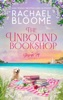

<b>A bookshop by the bay. An ex she never forgot. And a second chance at love that could change everything...</b>  <b>Sage Harpe</b>r has one chance to make her childhood dream of opening a bookstore come true. But first, she has to spend three awkward days onboard a vintage sailboat with the ex who broke her heart.  <b>Flynn Cahill</b> has devoted his life to completing his late twin brother's bucket list, even when it cost him the only woman he's ever loved. Haunted by regret, he never expected to find himself stuck in close quarters with Sage—the woman who still holds his heart.  Meanwhile, <b>Abigail Preston's</b> happily ever after is finally within reach... until a stranger shows up at her door with a shocking secret that threatens her past, present, and her future.  <i>The Unbound Bookshop</i> is a tender, uplifting romance full of unforgettable characters, small-town charm, surprising twists, and the unshakable bonds of found family.  Perfect for fans of Debbie Macomber, Denise Hunter, and RaeAnne Thayne.  Start this heartwarming series today.  <b>Also Includes:</b>  An original recipe Book club questions and more….  <b>Praise for The Unbound Bookshop:</b>  ⭐️⭐️⭐️⭐️⭐️ "From the first page to the last, I was sucked into this story. I really enjoy the characters and feel like I am part of the community."  ⭐️⭐️⭐️⭐️⭐️ "I re-read Blessings on State Street and the Unbound Book Shop five times. I was so touched by the people in this series - all the love and support."  ⭐️⭐️⭐️⭐️⭐️ "The author just has a way of bringing the reader into her story so they can feel every emotion that the character is going through. You don't just read one of her books, you feel it."

[View on Apple](https://books.apple.com/us/book/the-unbound-bookshop/id6504684323)

## Chasing the Ring

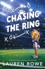

<b>When a wronged bride and an NFL quarterback find themselves sharing the same Hawaiian vacation, a no-strings, just-for-fun encounter quickly becomes unforgettable in this warm-hearted, extra spicy football romance for fans of Sarah Adams, Tessa Bailey, Monica Murphy, Kristen Callihan, and Lucy Score.</b>  <b>“Strangers-to-vacation roommates-to-lovers?&#xa0;Chasing the Ring&#xa0;is Lauren Rowe at her most brilliant!”&#xa0;—Lucy Score, #1&#xa0;</b><i><b>New York Times</b></i><b>&#xa0;bestselling author</b>  Iris Benedetto’s wedding day just went viral . . . for all the wrong reasons.  After a heated blowout with her lying, cheating fiancé at the altar, Iris storms off on a solo honeymoon—loudly announcing that she’s finally going to find out what good sex is all about. Rebranding from small-town preschool teacher to #Horny Runaway Bride was not the plan, but the insanely hot stranger who ends up double-booked in her bungalow on the island of Kauai is an opportunity even devastated Iris can’t ignore.  It’s not often NFL quarterback Roman Maguire meets someone who doesn’t recognize him. Even rarer to have that someone barge in while he’s taking a shower and quickly make him an irresistible offer. Roman is in Hawaii to secure the deal that could finally land him a Super Bowl ring—and closer proximity to his son. A sexy fling in paradise is a perfect way to spend a week with a surprise roommate . . .  Except . . . suddenly a week doesn’t seem nearly enough. And once the truth about Roman’s identity, Iris’s internet infamy, and all kinds of loyalty-testing secrets are revealed, will they both be willing to step into the real-life spotlight together?

[View on Apple](https://books.apple.com/us/book/chasing-the-ring/id6748705795)

## Huckleberry Hill

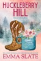

From Wall Street Journal and USA Today bestselling author Emma Slate comes the first book in the Saddles &amp; Spurs series.

I flee to my family’s mountain ranch to heal a broken heart.

I did not expect a charging bear.

But then a shirtless, tattooed cowboy saves me.

Declan Brewer is my father’s new ranch hand.

He’s a retired rodeo star who’s got swagger in spades.

And he’s completely forbidden.

Declan is new to Huckleberry Hill, but the small town welcomes him as one of their own.

Then one night after bourbon and banter, we cross the line.

Now we’re sneaking around, in hopes my father doesn’t find out.

Declan makes me feel safe, even when I’m on the back of his motorcycle.

He’s everything I've ever wanted.

But I'm scared he’ll abandon me when he finds out I can’t have children.

Just like my ex.

And then the impossible happens:

I’m pregnant with a cowboy’s baby.

[View on Apple](https://books.apple.com/us/book/huckleberry-hill/id6737988405)

## House on the Harbor

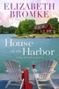

<i><b>Four sisters. One family secret. And a chance to fix the past...</b></i>  Kate Hannigan is in charge of her late mother's estate, and she has a plan: divide everything evenly, including the old family house on the harbor. What she doesn't realize is that her mother changed the will. Now, a family secret hangs in the balance.  Meanwhile, her sister, Amelia, a struggling off-Broadway actress, enlists her hapless construction boyfriend to help with a local project, but he's more interested in summer tourists.  Second-youngest, Megan, is preoccupied with her divorce... but not too preoccupied to make a dating profile, much to her sisters' mortification.  Baby of the family, Clara, is single and refuses to date. She puts her teaching job above all else. Until a crushing revelation calls into question everything she knew to be true... including her own past.  <i>Head to Birch Harbor, Michigan and visit the Hannigan sisters who fix up and open The Heirloom Inn, the most storied bed and breakfast on Lake Huron. Birch Harbor is a romantic women's fiction series and a family saga by the author of&#xa0;</i>The Farmhouse.

[View on Apple](https://books.apple.com/us/book/house-on-the-harbor/id1500820619)

## The Odyssey

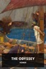

The <i>Odyssey</i> is one of the oldest works of Western literature, dating back to classical antiquity. Homer’s epic poem belongs in a collection called the Epic Cycle, which includes the <i>Iliad</i>. It was originally written in ancient Greek, utilizing a dactylic hexameter rhyme scheme. Although this rhyme scheme sounds beautiful in its native language, in modern English it can sound awkward and, as Eric McMillan humorously describes it, resembles “pumpkins rolling on a barn floor.” William Cullen Bryant avoided this problem by composing his translation in blank verse, a rhyme scheme that sounds natural in English.  This epic poem follows Ulysses, one of the Greek leaders that brought an end to the ten-year-long Trojan war. Longing for home, he travels across the Mediterranean Sea to return to his kingdom in Ithaca; unfortunately, our hero manages to anger Neptune, the god of the sea, making his trip home agonizingly slow and extremely dangerous. While Ulysses is trying to return home, his family in Ithaca is also in danger. Suitors have traveled to the home of Ulysses to marry his wife, Penelope, believing that her husband did not survive the war. These men are willing to kill anyone who stands in their way.

[View on Apple](https://books.apple.com/us/book/the-odyssey/id6444767949)

## Vanity Project

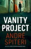

<b>Can DI Brian Brandon stop a ruthless killer before they bury him next, or will his demons bury him first?</b>  Cybersecurity consultant Ray Higgins is dead. Was it a love triangle turned deadly? Or is there something more at play?  As DI Brian Brandon digs deeper into the case, he uncovers a trail of blackmail and betrayal that leads straight to Strathburgh's elite.  But Brian is battling more than a killer hell-bent on silencing anyone who gets too close to the truth. A traumatic past and a drinking habit that's spiraling out of control threaten to derail the investigation and get him killed.  <i>Perfect for fans of JD Kirk, Ian Rankin, Helen Fields, and Val McDermid, this gripping first instalment in a dark, gritty new Scottish crime series introduces DI Brian Brandon of the city of Strathburgh's Major Investigations Team.</i>

[View on Apple](https://books.apple.com/us/book/vanity-project/id6771699844)

## Danger and Dominance

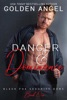

<i><b>Never get involved with a client.</b></i>  For years, that's the code I've lived by. Keeping my work and private life separate, never muddying the waters.  Then again, I've never met a temptation like Cassidy Simone.  Beautiful, broken Cassidy. Staring up at me with those wide, haunted eyes. From the first moment I see her, all I can think is… Mine.  Every moment with her is agony, fighting the temptation to touch her, to taste her.  To claim her.  And when it becomes clear that the threat to Cassidy's safety is closer than we realized, I'll do whatever it takes to keep her safe.  Even if it means breaking all of my own rules.  Black Fox Security Doms 1. Danger and Dominance 2. Cuffs and Cupcakes 3. Security and Submission 4. Whips and Weddings 5. Rescue and Ropes 6. Bondage and Bad Guys

[View on Apple](https://books.apple.com/us/book/danger-and-dominance/id6740463125)

## The Secret

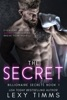

<i>USA Today Bestselling Author, Lexy Timms, brings you a billionaire with a past he pretends didn't exist and a private life he doesn't want to share with anyone—except with one girl from his past that doesn't remember him.</i>  The SECRET of happiness is FREEDOM. The secret of freedom is COURAGE.  <b>The reason people find it so hard to be happy is that they always see the past as better than what is was and the present worse than it actually is.</b>  Billionaire CEO, SIMON DIESEL, owns one of the largest companies in the U.S. Little is known about him—he keeps his personal life out of the media despite their efforts to try to find out who the single, handsome billionaire is. He graduated out of Stanford with top honors, and while there invested in an online company that turned into a fortune. No one knows he was just a regular kid growing up and got into Stanford on a scholarship. He's determined to prove to himself that he can do it.  He never expected that the girl he lost his virginity to would show up in his office, looking for a job. He also never anticipated that she wouldn't remember him. Now he has to hire her, just to prove he's the same kid from high school—just a whole lot richer.

[View on Apple](https://books.apple.com/us/book/the-secret/id1346441717)

## The Girls in the Snow

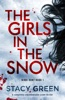

<b>“One sensational read! Wow, this one just completely blew me away</b>. If you are looking for a brand new series to sink your teeth into, then look no further. <b>A must read!</b>” <i>Once Upon A Time Book Blog</i>, 5 stars 
<b>&#xa0;</b> 
<b>Madison walked through the fallen snow, looking left and right. It had been Kaylee’s idea to use the trail through the forest; she said no one would follow them. But Madison lost sight of Kaylee for a moment and when she found her again she wasn’t alone…</b> 
<b>&#xa0;</b> 
In the remote forests of Stillwater, Minnesota, you can scream for days and no one will hear you. So when the bodies of two fifteen-year-old girls are discovered frozen in the snow, <b>Special Agent Nikki Hunt</b> is sure the killer is local: someone knew where to hide the girls and thought they would never be found. 
&#xa0; 
Though Nikki hasn’t been home in twenty years, she knows she must take over the case. The Sheriff’s department in Stillwater has already made a mistake by connecting the girls’ murders to those of a famous serial killer, refusing to consider the idea that the killer could be someone from town. 
&#xa0; 
Then another girl’s body is found, a red silk ribbon tied in her hair, and Nikki realizes that the killer has a connection to her own dark past, and the reason she left Stillwater. 
&#xa0; 
<b>Nikki is not the only person in town who wants those secrets to stay hidden. Will she be able to face her demons before another child is taken?</b> 
<b>&#xa0;</b> 
<b>Gripping and spine-chilling, <i>The Girls in the Snow </i>will make you gasp, unable to put it down until the final heart-pounding twist. Perfect for fans of Karin Slaughter, Lisa Gardner and Robert Dugoni.</b> 
<b>&#xa0;</b> 
<b>What readers are saying about <i>The Girls in the Snow</i>:</b> 
“<b>Bloody fantastic!</b> I loved this book… <b>I was hanging on to every word and couldn’t put the book down</b>… full of tension and action and kept me guessing. Highly recommend this book.” <i>Bonnie’s Book Talk, </i>5 stars 
&#xa0; 
“This is the thriller that I didn’t know I was waiting for and needed in my life until I picked it up. <b>SO GOOD. I’m still reeling and trying to catch my breath</b> from this highly suspenseful and emotionally charged story…<b> I need more ASAP.</b>” <i>Reading in Autumn, </i>5 stars 
&#xa0; 
“<b>Addictive. I read this in one sitting.</b> It's unputdownable… Filled with intrigue and deceit, <i>The Girls in The Snow</i> is <b>guaranteed to keep you up all night.</b>” Lisa Regan 
&#xa0; 
“First time reading this author and <b>I couldn’t put it down. Suspense that will keep you hooked until the very last page. </b>Even when I wasn’t reading it, I couldn’t stop thinking about it… <b>I had to see what happened.</b>” Goodreads reviewer, 5 stars 
&#xa0; 
“<b>A dagger sharp crime thriller.</b> Highly recommended… <b>I loved Nikki Hunt</b>… Engaging. I never figured out what was going to happen next until I read it myself.” NetGalley reviewer, 5 stars 
&#xa0; 
“This is the first book in a long time that I’ve given up all household responsibilities,&#xa0; all TV time for and all my study time for. <b>[I] knew nothing was going to get done outside of my day job until I finished this book, which I did in 24 hours… Fast-paced and jam-packed from start to finish</b>.” Goodreads reviewer, 5 stars 
&#xa0; 
“Kept me guessing throughout… <b>This one gets 5 stars</b>, great series starter… <b>a compelling mystery that had me wondering whodunit</b> right up until the killer was revealed.” Goodreads reviewer, 5 stars 
&#xa0; 
“<b>This book was fantastic!</b> Everything about it worked… <b>I was hooked from page one and didn’t put it down until I was done</b>… I had no idea who the killer was until it was revealed. This is going to be <b>a must read series!</b>” Goodreads reviewer, 5 stars 
&#xa0; 
“<b>Wow!! Stacy Green's <i>The Girls in the Snow </i>opens with such force</b>… and it keeps going until the very end… this is a <b>top 10</b> for me!” NetGalley reviewer, 5 star

[View on Apple](https://books.apple.com/us/book/the-girls-in-the-snow/id1524446911)

## Falling for the Forward

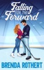

I co-signed loans for a man who promised forever. He took the money, fled the country, and left me drowning in his debt.
Now I'm working two jobs and barely surviving—until my new boss makes me an offer I can't refuse.
Carter Stanton is pro hockey's most eligible bachelor and the guardian of three little girls who've already lost too much. He needs a wife to secure permanent custody. I need half a million dollars to dig myself out of the hole my ex left me in.
The deal: fake marry him for one year. Play the devoted wife. Help him prove he can give his nieces a stable home. Walk away with enough money to start over.
It should be simple. Transactional. Safe.
But Carter isn't what I expected. Beneath the brooding scowls and sky-high walls, there's a man who reads bedtime stories in funny voices and panics over braiding hair. A man who looks at me across the dinner table like I'm not just playing a role.
And somewhere between becoming a family on paper and actually living like one, the lines blurred. The touches that were supposed to be for show linger too long. The warmth in his eyes when he thinks I'm not looking feels dangerously real.
I'm falling for a life that was never supposed to be mine.
The problem? Our marriage has an expiration date. The divorce papers are already drawn up, just waiting for signatures. And I have no idea if the man who's only ever let me in because of a contract could ever want me to stay for real.

_____________

Tropes: 

Pro Hockey Romance
Forced Proximity
Grumpy Sunshine
Fake Marriage
Found Family
He Falls First

_____________

Falling for the Forward is the first book in the Love on the Line series: all books are interconnected standalones about a team of professional hockey players and the women they fall hard for. The books don’t need to be read in order, but future characters appear in each book.

[View on Apple](https://books.apple.com/us/book/falling-for-the-forward/id6737349097)

## Murder in the Bistro

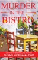

Is there a connection between the cat found napping in the flour barrel of the newest bistro and the dead American chef in the meat freezer? &#xa0;When it comes to Maggie Newberry and the cranky villagers of St-Buvard, how could there not be? 
Once more back in Provence, Maggie Newberry finds her hands full with village politics ratcheting up to nuclear level. &#xa0;Her BFF is back on her living room couch—this time with a snotty teenager in tow—and there’ a full-blown riot developing over the brand new American-owned bistro. When the fractious American chef ends up dead, Maggie will need to find out who killed her—and fast—before the chef’s killer decides that two dead Americans are better than one.

[View on Apple](https://books.apple.com/us/book/murder-in-the-bistro/id1095434005)

## The Art of War

An Apple Books Classic edition.  It’s believed that Sun Tzu wrote this Chinese military primer during the 5th century BC-hundreds of years before the Bible. The book’s 13 chapters explore principles that statesmen around the globe have employed for centuries to defeat their enemies at war.  Sun Tzu starts by mapping out the five fundamental factors that lead to war. He then covers a wide range of topics, from avoiding conflict altogether to strategically positioning soldiers, pulling off tactical maneuvers, and putting spies to use.  Despite the technological advances made since <i>The Art of War</i> was published, Sun Tzu is still considered one of history’s foremost military strategists, and his methods still ring true. While he wrote the book as a manual for those who would literally wield swords, it has reached a much broader audience in this day and age. Warriors of all kinds-like corporate leaders or athletes-seek out Sun Tzu’s wisdom in their quest for success.

[View on Apple](https://books.apple.com/us/book/the-art-of-war/id395534623)

## Ghost Of A Chance

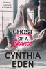

<b><i>How well do you know the lover in your bed?&#xa0;</i></b> 
It was the hottest hookup of her life. When Tess Barrett spent the night in the arms of the too sexy to be real stranger, she knew she was walking on the wild side. Sex with James Smith was the best EVER. &#xa0; How was she supposed to walk away from that? From him? So…she didn’t. They planned secret dates. More body-melting hookups. The white-hot sex should have been enough.&#xa0; 
<b>So why does she start wanting more?</b> 
But they have rules. <i>She </i>has rules. No emotions. No ties. She has a past that is dark and twisted, and she’s worked hard to become a new person. She’s a doctor now. Respected. Controlled. Except…there is no control when she’s around James. 
<b>A bad guy…might be falling for the good girl.&#xa0;</b> 
James can’t keep his hands off his sexy little doctor. She’s buttoned down for everyone else but goes absolutely wild for him. Sure, she doesn’t know his history. Doesn’t know that the man she lets touch every inch of her body used to spend his days working for Uncle Sam and doing some seriously dirty deeds.&#xa0; What she doesn’t know can’t hurt her, right? And if she ever did learn the truth about him, he knew it would terrify his sweet doc right to her core. Terror would make her run. He doesn’t want her running. He just wants her in his bed.&#xa0; 
But then…something happens. Danger sneaks up on Tess. She needs help—a very particular expertise and protective skill set. She needs someone lethal and strong…and James is just the man for the job. After all, <i>lethal</i> is his middle name.&#xa0; 
<b>Hello, dangerous times.&#xa0;</b> 
When James steps in, Tess doesn’t know if she should be grateful or scared to death. &#xa0; Because her gorgeous lover? Turns out he has plenty of mad and dangerous skills. She’s been hooking up with a superhero or…maybe a super villain. It’s sort of hard to tell the difference.&#xa0; &#xa0; 
For the moment, she’s going to go with feeling grateful…but as she learns all of his secrets, Tess wonders what will happen next between them. Will they crash and burn? <i>Burn, baby, burn. </i>Or maybe, just maybe, they’ll actually have a GHOST OF A CHANCE at getting a happily ever after ending.&#xa0;  
Author’s Note:&#xa0; James Smith is one mad, bad, dangerous guy…but sometimes, bad guys fall hard for good girls. GHOST OF A CHANCE is super hot, charged with lots of feels, and, it’s got some pulse-pounding action for you.&#xa0; Dirty words and dirty deeds are dead ahead.&#xa0; Oh, and there’s plenty of fun thrown in, too. Mystery, humor, sexy times, and danger—all of my favorite things in a book.

[View on Apple](https://books.apple.com/us/book/ghost-of-a-chance/id1480243934)

## Aftershocks

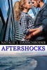

Her past and her present collide with earthshaking results. Who will be her future…assuming she has one?

Sixteen years ago, Zoe Ardmore was abducted and held for a year before she escaped. After struggling to overcome the damage done by that year, she has put it behind her—completely. Her fiancé, Kellen Stone, doesn’t even know it happened. She has a successful career and social life untainted by the past.

Now her abductors have been released from prison, jeopardizing every part of that new life. She took something from them, a treasure they’ll never stop seeking, and they’ve threatened her new family if she doesn’t return that treasure. The problem is that she has no idea where it is. The solution? Grant Neely, the one person who knows everything about that dark time. He’s now a mercenary with the connections and skills to help her resolve this mess. He’s also the man whose proposal she refused ten years ago.

Zoe breaks her engagement and sells her company in an effort to remove the threat hanging over the people she cares about. But the only permanent solution is to find the treasure and destroy it so her enemies have no reason to come after her or anyone else. Grant’s the one man who can help her, even if it means dredging up old feelings. But then Kell shows up, refusing to be sidelined and showing Zoe that none of them are who they seem to be. At the end of her quest will be the hardest decision she’s ever had to make—if she’s around to make it.

This action-adventure romance launches the Seismic Victory series! Get book 2, Resonance, then read The Road to Victory, which leads right into the plight of the security company, Victory, in Victory on the Edge.

[View on Apple](https://books.apple.com/us/book/aftershocks/id1515487217)

## Love's Last Stand

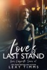

<b>In a world where loyalty is bought, lives are expendable, and love is the ultimate vulnerability,&#xa0;some truths are worth dying for—and some are worth killing to protect.</b>  Three years after her fiancé's murder,&#xa0;Harper Vale&#xa0;is still chasing the truth—and punishing herself for wanting out of a love that ended too violently, too soon. Once a fearless investigative journalist, she's now hiding behind a bar, until one reckless decision pulls her back into the gilded world that almost destroyed her life.  A single stolen flash drive. A warning buried in code. And someone powerful who wants her silenced.  Cole Maddox&#xa0;knows what it means to be marked for death. A former special ops soldier disgraced for refusing to follow illegal orders, he's been hunting the shadow network that ruined him—ex-military contractors, corrupt politicians, and men who erase their mistakes with bullets. When his investigation collides with Harper's, he sees her first as a liability…then as a target.  And then as something far more dangerous.  As assassins close in and secrets unravel, Harper discovers that the man she loved may not have been who she thought. Is the truth behind his death is tied to a covert operation known as&#xa0;Project VIGILANT?  Forced into an uneasy alliance, Harper and Cole navigate betrayal, buried guilt, and a magnetic attraction neither can afford.  Because trusting each other could get them killed. But walking away will cost them everything.  <i>This is Book 1 of the dark, high-stakes romantic suspense series, Love's Labyrinth.</i>  Love's Labyrinth Series:  •Book 1 –Love's Last Stand •Book 2 –Love's Tangled Web •Book 3 –Love's Fiery Trial

[View on Apple](https://books.apple.com/us/book/loves-last-stand/id6757762448)

## The Wonderful Wizard of Oz

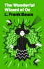

An Apple Books Classic edition.  Adventure takes a more mythic turn in <i>Rinkitink in Oz</i>, a thrilling fairy-tale quest filled with L. Frank Baum’s trademark whimsy and color. Prince Inga’s father protects their peaceful island kingdom of Pingaree with his three magic pearls. But when the island is invaded and conquered, Inga must flee with the cheerfully bumbling royal visitor King Rinkitink and use the magic pearls himself to save his parents and his home.  As the pair faces dangers and meets new allies—including some familiar characters for Oz fans—Inga must learn not only to use his new powers, but also his head when he loses those powers. <i>Rinkitink in Oz</i> steps beyond the Emerald City for a seafaring adventure that’s equal parts wit and wonder.

[View on Apple](https://books.apple.com/us/book/the-wonderful-wizard-of-oz/id395544690)

## Edge of Madness (A Cain Shepherd FBI Suspense Thriller—Book One)

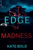

“This is an excellent book… When you start reading, be sure you don’t have to wake up early!” —Reader review for The Killing Game  ⭐⭐⭐⭐⭐  A killer leaves a mysterious trail of death with Buddhist overtones, and FBI Agent Cain Shepherd, a practicing Buddhist, is the FBI’s last hope to understand the subtle clues, and stop a murderer before it’s too late…  Predators are dying by their own methods as FBI Agent Cain Shepherd decodes crime scenes of righteous retribution. Can he stop a spiritually-corrupted killer who views murder as the path to enlightenment before he claims the next victim?  EDGE OF MADNESS is BOOK #1 in a new series by #1 bestselling mystery and suspense author Kate Bold, whose bestseller NOT ME (a free download) has received over 3,000 five star ratings and reviews.  The CAIN SHEPHERD mystery series delivers pulse-pounding suspense, while filled with shocking twists and revelations. With its distinctive protagonist, this series reinvigorates the mystery genre and will keep you turning pages all through the night. Fans of Robert Dugoni, Lisa Gardner, and Gregg Olsen are sure to fall in love.  Future books in the series are also available!  “This book moved very fast and every page was exciting. Plenty of dialogue, you absolutely love the characters, and you were rooting for the good guy throughout the whole story… I look forward to reading the next in the series.”  —Reader review for The Killing Game  ⭐⭐⭐⭐⭐  “Kate did an amazing job on this book and I was hooked from the first chapter!”  —Reader review for The Killing Game  ⭐⭐⭐⭐⭐  “I really enjoyed this book. The characters were authentic, and I see the bad guys as something we hear about daily on the news... Looking forward to book 2.”  —Reader review for The Killing Game  ⭐⭐⭐⭐⭐  “This was a really good book. The main characters were real, flawed and human. The story went along quickly and wasn't mired in too many unnecessary details. I really enjoyed it.”  —Reader review for The Killing Game  ⭐⭐⭐⭐⭐  “Alexa Chase is headstrong, impatient, but most of all brave with a capital B. She never, repeat never, backs down until the bad guys are put where they belong. Clearly five stars!”  —Reader review for The Killing Game  ⭐⭐⭐⭐⭐  “Captivating and riveting serial murder with a twist of the macabre… Very well done.”  —Reader review for The Killing Game  ⭐⭐⭐⭐⭐  “WOW what a great read! Talk about a diabolical killer! Really enjoyed this book. Looking forward to reading others by this author as well.”  —Reader review for The Killing Game  ⭐⭐⭐⭐⭐  “Page turner for sure. Great characters and relationships. I got into the middle of this story and couldn’t put it down. Looking forward to more from Kate Bold.”  —Reader review for The Killing Game  ⭐⭐⭐⭐⭐  “Hard to put down. It has an excellent plot and has the right amount of suspense. I really enjoyed this book.”  —Reader review for The Killing Game  ⭐⭐⭐⭐⭐  “Extremely well written, and well worth buying and reading. I can't wait to read book two!”  —Reader review for The Killing Game  ⭐⭐⭐⭐⭐

[View on Apple](https://books.apple.com/us/book/edge-of-madness-a-cain-shepherd-fbi-suspense/id6757930824)

## Her Dragon Defender: A Rapunzel Retelling

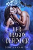

<i><b>She expected to attend a fairytale ball, not become a character in one…</b></i>&#xa0; When I wake up locked in a tower, my only companions are a bottle of champagne and a terrifyingly large bed. I came here looking for my missing best friend, but now I'm the one who needs saving.  Then he appears on my balcony, a dangerously handsome man with silver hair and eyes that burn like indigo fire. He says he's here to rescue me, but he's looking for his sister… my friend. And he seems to think I have answers. I don't know who to fear more: the man who locked me in here, or the dragon shifter who looks at me like he's finally found his treasure.  <i>Her Dragon Defender</i> is the first book in the steamy Fated Mates of Mirror Academy romantasy series. If you like protective alpha heroes, spicy fairytale retellings, and fated mates, you'll love Demelza Carlton's addictive read. Begin your next adventure with <i>Her Dragon Defender</i> now.

[View on Apple](https://books.apple.com/us/book/her-dragon-defender-a-rapunzel-retelling/id6745272181)

## Pride and Prejudice

An Apple Books Classic edition.  Jane Austen’s beloved classic opens with this witty and very memorable line: “It is a truth universally acknowledged, that a single man in possession of a good fortune, must be in want of a wife.” With all the twists and turns of a soap opera, <i>Pride and Prejudice</i> chronicles the drama that ensues when the wealthy bachelor Mr. Darcy moves close to the Bennet family home in the English countryside. The news of his arrival sends the socially ambitious Mrs. Bennet-whose main concern is finding suitable matches for her five daughters-into overdrive.  The book’s main character, the high-spirited Elizabeth Bennet, is a strikingly modern heroine: a woman who refuses to lower her expectations or transform herself to suit society’s norms. Austen’s novel achieves a remarkable balance, serving up barbed criticism of the obsession with money, status, and matrimony even as it draws us into a swoon-worthy love story. At its heart, <i>Pride and Prejudice</i> is a romantic comedy, and a darned great one at that. It’s so much fun to turn the pages and wonder about Elizabeth and Mr. Darcy: Will they or won’t they overcome their excessive pride and initial prejudices to make a happily-ever-after connection?

[View on Apple](https://books.apple.com/us/book/pride-and-prejudice/id395534643)

## The Iliad of Homer

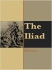

The Iliad (sometimes referred to as the Song of Ilion or Song of Ilium) is an ancient Greek epic poem in dactylic hexameter, traditionally attributed to Homer. Set during the Trojan War, the ten-year siege of the city of Troy (Ilium) by a coalition of Greek states, it tells of the battles and events during the weeks of a quarrel between King Agamemnon and the warrior Achilles.  
Although the story covers only a few weeks in the final year of the war, the Iliad mentions or alludes to many of the Greek legends about the siege; the earlier events, such as the gathering of warriors for the siege, the cause of the war, and related concerns tend to appear near the beginning. Then the epic narrative takes up events prophesied for the future, such as Achilles' looming death and the sack of Troy, prefigured and alluded to more and more vividly, so that when it reaches an end, the poem has told a more or less complete tale of the Trojan War.

[View on Apple](https://books.apple.com/us/book/the-iliad-of-homer/id765086010)

## Those Three Words

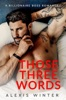

<b>I never thought getting fired from my dream job would change my life.</b>  <b>And I certainly never imagined three little words would be my undoing</b>.  <i>Trust me—they're not the words you're thinking.</i>  <i>Those three delicious, toe-curling words whispered by my boss were where it all changed.</i>  When budget cuts at my local school leave me scrambling to find a job before I get evicted, I stumble upon the listing of a lifetime.  How hard can being a live-in nanny for a little five year old girl be?  Especially when it's double the salary and comes with a sexy, single dad.  But the moment I step inside Graham Hayes multi-million dollar estate and meet the grumpy billionaire—I know I'm in way over my head.  It's not just that he's quite possibly the most attractive man I've ever seen, it's the way he stares at me like it takes everything he has to keep from devouring me.  The way he curls his hands into fists to avoid touching me.  The way he reprimands me through gritted teeth while his lust filled eyes burn through me.  The naughty things he whispers against my lips as his hands explore me.  <i>Way over my head.</i>  Caring for his daughter is a dream—even his mother loves me.  Soon, I'm head over heels in this fantasy I'm living.  I'm even able to ignore the cryptic threats from his house-keeper who's hellbent on getting me fired.  But I'm not prepared for the world of high-powered billionaires and glitzy parties.  Besides, Graham isn't like these people—he's different.  At least, I think he is…until a shady character I've tried to leave in the past reappears as Graham's new business partner and I'm reminded that I don't belong in this world.  Sometimes life changing news comes in the form of just <i>three simple words.</i>  Sometimes it comes in the form of an unexpected, heart-wrenching secret and the fairytale is shattered.  Sometimes, it comes in the form of the opportunity of a fresh new start.  <b>You just have to be willing to take the risk and walk away or maybe…there's three little words that can fix it all.</b>

[View on Apple](https://books.apple.com/us/book/those-three-words/id6772280914)

## Murder at the Mayfair Hotel

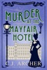

<b>It was the most fashionable place to stay in London, until murder made a reservation. Solve the puzzle in this new cozy historical murder mystery from USA Today bestselling author of the Glass and Steele series.</b>  
<i>December 1899.</i> After the death of her beloved grandmother, Cleopatra Fox moves into the luxury hotel owned by her estranged uncle in the hopes of putting hardship and loneliness behind her. But the poisoning of a guest on Christmas eve&#xa0;throws her new life, and the hotel, into chaos.  
Cleo quickly realizes no one can be trusted, not Scotland Yard and especially not the hotel’s charming assistant manager. With the New Year’s Eve ball approaching fast and the hotel’s reputation hanging by a thread, Cleo must find the killer before the ball, and the hotel itself, are ruined. But catching a murderer proves just as difficult as navigating the hotel’s hierarchy and the peculiarities of her family.&#xa0;  
Can Cleo find the killer before the new century begins? Or will someone get away with murder?   
MURDER AT THE MAYFAIR HOTEL is the first book in a cozy mystery series by USA Today bestselling author C.J. Archer.

[View on Apple](https://books.apple.com/us/book/murder-at-the-mayfair-hotel/id1522811768)

## Granblue Fantasy Volume 1

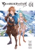

The manga based on the acclaimed RPG, from the designers of gaming classics Final Fantasy V/VI/IX. Don’t wait for Granblue Fantasy: Relink to return to the world of Granblue!  
Ever since his father left home, Gran has longed to search for Estalucia, the mystical island in the sky. Gran’s adventure begins when he runs into Lyria, a mysterious girl being chased by the Imperial Army. Even though Gran perishes trying to save her, she uses her powers to resurrect him, and this incredible act binds their fates together! Now, Gran and his pal, Vyrn, must fight to protect Lyria…and to find their way to the end of the sky!

[View on Apple](https://books.apple.com/us/book/granblue-fantasy-volume-1/id1482978905)

## The Odyssey

The poem mainly centers on the Greek hero Odysseus (known as Ulysses in Roman myths) and his journey home after the fall of&#xa0;Troy. It takes Odysseus ten years to reach&#xa0;Ithaca&#xa0;after the ten-year&#xa0;Trojan War.  In his absence, it is assumed he has died, and his wife&#xa0;Penelope&#xa0;and son&#xa0;Telemachus&#xa0;must deal with a group of unruly suitors, the&#xa0;Mnesteres or&#xa0;Proci, who compete for Penelope's hand in marriage.

[View on Apple](https://books.apple.com/us/book/the-odyssey/id498683870)

## Warrior

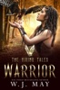

<b>They say some people are favored by the gods. Others need to make their own luck.</b>  There is a single lesson in the heart of every Viking: Those who use magic are put to death.  When a handsome young warrior rides into her village and Liv barely has time to notice. There is coin to be made with the arrival of the king.  But the fates have other plans.  The two strike up a friendship that grows closer, even though Liv knows she will never rise above her station.  She makes a promise that even though she cannot love him, she will protect him.  And that promise will require the greatest sacrifice of all.  <b>The Viking Tales</b>  •Adversity - the Prequel •Warrior •Defender •Contender •Affinity •Heroine •Victory  <i>In a time when Vikings clashed against Romans, and whispers of magic held back the tides, a young woman staggered out of the forest and gave birth to a special child…</i>

[View on Apple](https://books.apple.com/us/book/warrior/id6480055191)

## The Iliad

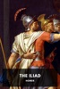

The <i>Iliad</i> is one of the oldest works of Western literature, dating back to classical antiquity. Homer’s epic poem belongs in a collection called the Epic Cycle, which includes the <i>Odyssey</i>. Written in an early literary dialect of ancient Greek, both poems were originally composed in dactylic hexameters. This meter is beautiful in the original but can sound awkward in modern English; Eric McMillan humorously described it as resembling “pumpkins rolling on a barn floor.” In the translation presented here, William Cullen Bryant avoids the problem by using iambic pentameter, a more familiar meter for verse in English.  This epic poem begins with the Achaean army sacking the city of Chryse and capturing two maidens as prizes of war. One of the maidens, Chryseis, is given to Agamemnon, the leader of the Achaeans, and the other maiden, Briseis, was given to the army’s best warrior, Achilles. Chryseis’ father, the city’s priest, prays to the god Apollo and asks for a plague on the Achaean army. To stop this plague, Agamemnon returns Chryseis to her father, but then orders Achilles to give him Briseis as compensation. Achilles refuses.

[View on Apple](https://books.apple.com/us/book/the-iliad/id6444767779)

## Understanding our thoughts

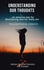

The human being has always been dominated … by contradictory thoughts and emotions.
Maybe one of the worst diseases from the history of the world … worst even as cancer … sometimes without any possible treatment is the … doubt.

And is funny, cause the Universe is playing around with us … giving us so, so many contradictory … options.

I am laughing … going back in time and seeing myself in this weird situation of not being able to decide what to do … what to choose.

Today i somehow believe that it’s better to have … no option …. or just one option, cause each time when i had 2 or more options … everything was too complicated.

I had to think too much.

… to meditate on and on and on.

And when i decided i was still overwhelmed by …. doubt.

Instead of being happy for the life i had, i was unhappy …. In fact somehow ruined emotionally and mentally of all what was going on with me.

Everything was sometimes so amplified that i could not … continue the life itself.

The Universe letted me decide what to do … but i was not capable of seeing the path … the real one.

I was hearing into my head all the time … “What to do?! What to decide?! What should be the best?!”

But i did not know what to do … what to decide … and instead of being happy for having so many opportunities … my vibe was always f****d up.

And everything was like that cause i did not know how to close my eyes and connect to myself … asking to my intuition for guidance.

The undecided version of myself, was a result of the fact that i did not know anything about my soul … and how to be in total harmony with this inner self.

I did not know how to listen to all those voices … to my intuition … and keep the right balance between the inner and the outer world.

And instead of being happy and a soul dominated by joy … i was in this silly emotional balance … dominated by a non ending indecision.

I should name it today … the negative amplifier … and all what i want is just get rid of it.

Nothing more.

[View on Apple](https://books.apple.com/us/book/understanding-our-thoughts/id6449027289)

## Let Us Prey

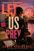

She's protecting a bestselling vampire author. T  oo bad nobody protected the assistant.  Mimi Capurro has seen some things. Cheating husbands. Insurance fraudsters. One very uncomfortable stakeout involving a coffee can. But nothing in her private detective career prepared her for walking into the dining room of her current client's home that night.&#xa0;  Now Mimi's juggling a book tour bodyguard gig, a murder investigation she was specifically told to stay out of, and the sudden reappearance of Nick Christianson — the one man from her past who can make her forget she's a professional. Mostly by being infuriating.  With a killer who's clearly read the book, a vampire role-playing cult with surprisingly good rock-paper-scissors skills, and a client whose entire crisis may have been a publicity stunt, Mimi's going to need more than her nine millimeter and her Doberman Lola to sort this one out. Though, honestly? Lola might be enough.  Wickedly funny, deliciously twisty, and just dark enough to make you sleep with the lights on — Let Us Prey proves that the most dangerous fans aren't the ones who love you. They're the ones keeping score.  <i>Perfect for fans of Janet Evanovich and Charlaine Harris who like their mysteries with a side of chaos and a heroine who pukes at crime scenes but shows up anyway.</i>

[View on Apple](https://books.apple.com/us/book/let-us-prey/id930620878)

## Knee Deep In Love

<b>I'm a man who's eager to see the world.</b>  A new job offer opens up in Utah of all places, and I decide to welcome the opportunity with open arms. Why not? I've got nothing left to lose and everything to gain.  A beautiful new state with a breathtaking view, but I can only see one thing in the place I now call home… Candice.  She's spent her entire life here, and she's stuck in a rut. A bad one.  The only thing that seems to keep her getting out of the bed in the morning is her little girl. Being a single mother has to be beyond tough, but her daughter Sarah makes it easy.  Something about her makes my heart swell. No, not something. Everything.  She might have grown up in the cold icy winter of the northwest, but I want so badly to show her the beauty of what's right in front of her face. A chance at a love affair like she couldn't imagine or read about.  <b>Why? Because she stole my heart on my long road back to love.</b>

[View on Apple](https://books.apple.com/us/book/knee-deep-in-love/id6692632381)

## Meditations: Modern English Edition

This edition has been rewritten to be easier to read than the original translation. You will enjoy this version if you tried to read the original and found it too much like reading a King James Bible. Great effort was put into making this version pleasing to read while maintaining the essence of the original.

Discover Timeless Wisdom with Marcus Aurelius' "Meditations"
Unlock the profound insights of one of history's greatest philosophers with Marcus Aurelius' Meditations. Written by the Roman Emperor during the height of his reign, this remarkable book offers a unique window into the mind of a leader grappling with the complexities of life, duty, and personal growth.
Meditations is not just a philosophical treatise; it's a deeply personal journal where Aurelius reflects on his principles, struggles, and aspirations. His thoughts on resilience, mindfulness, and the pursuit of virtue resonate as powerfully today as they did nearly two millennia ago.
Whether you seek guidance on how to navigate challenges with grace, cultivate inner peace, or lead with integrity, Meditations provides timeless advice that transcends cultural and historical boundaries. It’s a must-read for anyone striving to live a more thoughtful and meaningful life.
Join the ranks of millions who have found inspiration in Aurelius' wisdom. Let his reflections guide you towards a life of greater purpose and tranquility. Invest in Meditations today and embark on a journey of self-discovery and personal excellence. Experience the enduring legacy of Marcus Aurelius, and let his wisdom transform your perspective.

[View on Apple](https://books.apple.com/us/book/meditations-modern-english-edition/id6584519723)

## The Bandalore: Pitch & Sickle Book One

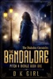

<b>In Victorian England, the monsters don't always stay in the shadows. Some drag you from your grave and show you their true faces.</b>  Silas Mercer has no memory of his past — resurrected with only a name he doesn't recognise, and a summons from the mysterious Order of the Golden Dawn. Thrown into a hidden world of the arcane, the mythical, and the monstrous, he's partnered with Tobias Astaroth—an infamous rogue with a wicked tongue and a reputation as dark as his soul.  As Silas hunts horrors across England's countryside, he begins to realise that the greatest danger might lie closer than he imagined. Tobias is infuriating, impossible… and utterly magnetic. But beneath his charm lies a truth more perilous than any monster they will face.  When a chilling haunting draws them into the woods of Leicester, their partnership spirals into a nightmare of long-held secrets, dangerous desire, and formidable adversaries who don't take kindly to the Order's men getting in their way.  <b>On the hunt for the truth behind an ancient, angelic secret, a gentleman and a libertine will forge a bond neither of them wanted — and find a love that may damn them both.</b>  Begin The Diabolus Chronicles; a slow-burn MM dark historical fantasy of gothic mystery, forbidden magick, and reluctant partners with very inconvenient feelings. An eight-book gothic fantasy saga.  ⚠️ Content guidance This book contains:  •Violence and supernatural horror •Adult language and sexual content  Best suited to readers who enjoy dark, gothic fantasy with heart.  <b>Completed series (Eight Books):</b> The Verderer - Pitch &amp; Sickle Book Two The Skriker - Pitch &amp; Sickle Book Three The Greensward - Pitch &amp; Sickle Book Four The Fulbourn - Pitch &amp; Sickle Book Five The Herlequin - Pitch &amp; Sickle Book Six The Simurgh - Pitch &amp; Sickle Book Seven The Death Wish - Pitch &amp; Sickle Book Eight (Finale)

[View on Apple](https://books.apple.com/us/book/the-bandalore-pitch-sickle-book-one/id1540873171)

## Become A Better Version of Yourself

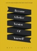

This ebook contains golden nuggets on how to motivate, inspire and improve your current situation. It encompasses the holistic view of self improvement from mental&amp; emotional wellbeing, career, health &amp; fitness to love &amp; relationship.&#xa0;  
Most importantly, you will learn to make small daily choices that will transform your life. 
- Find your personal inspiration. 
- Rediscover your motivation. 
- Propel yourself out of an unfulfilling existence.&#xa0;

[View on Apple](https://books.apple.com/us/book/become-a-better-version-of-yourself/id969866384)

## The Great Gatsby

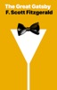

An Apple Books Classics edition.  
The Roaring Twenties are in full effect in F. Scott Fitzgerald’s riveting classic. Man-about-town Jay Gatsby seems to have it all, including loads of money and a massive mansion where he hosts wild, extravagant parties every Saturday. But Gatsby’s missing one thing: Daisy Buchanan, the love of his life, the one who got away.  
<i>The Great Gatsby</i> explores the impossible, but uniquely human, longing to return to the past and the costs associated with chasing the American Dream. It’s a beautifully written, entertaining read with timeless emotional appeal.

[View on Apple](https://books.apple.com/us/book/the-great-gatsby/id914355894)

## Seducing Mr Remington - Spicy Billionaire Romance

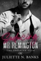

<b>SEBASTIAN</b>  Marry for love… not to lose our fortunes. That's the pledge we made ten years ago after our Harvard graduate brother suspiciously died three months into his marriage.  I've never wavered. The last thing I need is a woman distracting me from my billion-dollar NYC business. Taking it… or killing me.  So, when my private jet has an issue and I'm forced to fly first class, I take one look at Emily as she clambers over me and roll my eyes. She's clearly been upgraded, a sexy mess and totally out of her depth.  Four hours later, thirty thousand feet in the air, I get the best blow job of my life. Might have to rethink the private jet.  <b>EMILY</b>  That was <i>not</i> how I thought my new life in America would start.  I'm sure it's just a coincidence that his name is Sebastian, and so is my new boss.  Two days later, I find out I'm wrong.  <i><b>Seducing Mr. Remington is Book One in The Obsidian Club series - a spicy billionaire series with a romantic suspense twist. If you love forbidden workplace romances with a grumpy-sunshine trope, bantering wealthy men, and scorching hot happy ever after's tropes, then you'll love Sebastian and Emily's spicy love story. Can be read as a standalone.</b></i> &#xa0;

[View on Apple](https://books.apple.com/us/book/seducing-mr-remington-spicy-billionaire-romance/id6740407641)

## The Holy Bible - King James Version

Holy Bible King James Version  
Few Sample Paragraphs from The Holy Bible eBook,  
Genesis (OT) 
1 Gen.  
1 
IN the beginning God created the heaven and the earth. 
2 
And the earth was without form, and void; and darkness was upon the face of the deep. And the Spirit of God moved upon the face of the waters. 
3 
And God said, Let there be light: and there was light. 
4 
And God saw the light, that it was good: and God divided the light from the darkness. 
5 
And God called the light Day, and the darkness he called Night. And the evening and the morning were the first day. 
6 
And God said, Let there be a firmament in the midst of the waters, and let it divide the waters from the waters. 
7 
And God made the firmament, and divided the waters which were under the firmament from the waters which were above the firmament: and it was so. 
8 
And God called the firmament Heaven. And the evening and the morning were the second day. 
9 
And God said, Let the waters under the heaven be gathered together unto one place, and let the dry land appear: and it was so. 
10 
And God called the dry land Earth; and the gathering together of the waters called he Seas: and God saw that it was good. 
11 
And God said, Let the earth bring forth grass, the herb yielding seed, and the fruit tree yielding fruit after his kind, whose seed is in itself, upon the earth: and it was so. 
12 
And the earth brought forth grass, and herb yielding seed after his kind, and the tree yielding fruit, whose seed was in itself, after his kind: and God saw that it was good. 
13 
And the evening and the morning were the third day. 
14 
And God said, Let there be lights in the firmament of the heaven to divide the day from the night; and let them be for signs, and for seasons, and for days, and years: 
15 
And let them be for lights in the firmament of the heaven to give light upon the earth: and it was so. 
16 
And God made two great lights; the greater light to rule the day, and the lesser light to rule the night: he made the stars also. 
17 
And God set them in the firmament of the heaven to give light upon the earth, 
18 
And to rule over the day and over the night, and to divide the light from the darkness: and God saw that it was good. 
19 
And the evening and the morning were the fourth day. 
20 
And God said, Let the waters bring forth abundantly the moving creature that hath life, and fowl that may fly above the earth in the open firmament of heaven. 
21 
And God created great whales, and every living creature that moveth, which the waters brought forth abundantly, after their kind, and every winged fowl after his kind: and God saw that it was good. 
22 
And God blessed them, saying, Be fruitful, and multiply, and fill the waters in the seas, and let fowl multiply in the earth. 
23 
And the evening and the morning were the fifth day. 
24 
And God said, Let the earth bring forth the living creature after his kind, cattle, and creeping thing, and beast of the earth after his kind: and it was so. 
25 
And God made the beast of the earth after his kind, and cattle after their kind, and every thing that creepeth upon the earth after his kind: and God saw that it was good.

[View on Apple](https://books.apple.com/us/book/the-holy-bible-king-james-version/id557274051)

## REVERSE PSYCHOLOGY IN LOVE RELATIONSHIPS

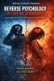

I've always failed in love relationships ... ending up 
overwhelmed of lots of weird negative emotions ... not 
knowing what to do anymore.
But still hoping.
Illusory hoping.
Almost never being able to disconnect ... leave that lady ... and continue my life.
Yeah ... i just couldn't.
That is how ... trapped into this prisons with invisible walls ...the love stories i was writing about so, so much ... it all ended as an obsession for understanding the nonsense behind relationship man-woman.
Writing so much.
... not necessarily being clear ... or even by contrary ... being confusing.
So ... this is again ... another book ... when i actually try to open myself in front of the public ... analysing and defining my own experiences ... from a psychological perspective.
And ... it's not that i come up with any brilliant theory ... 
cause it's more a confession trying to reveal the difficulties of being in duality A way in how at least we should try ... but not being afraid of
... failing.
Simply be opened.
Analyse and accept all what is going on ... but be aware that  being in love for real ... means 1+1=1.
2 souls become one.
All rules and all we know is ... rewritten.
It's not about you and the loved one ... but about "us" as a  couple.
So ... let me share my stories in front of you ... and try to 
stop yourself calling me a lost soul ... until you end reading  the book.
Cause ... what i am talking about it's not only ... my lost soul .. but about our lost souls.
And ... we l are really so, so many.
Some denying.
Some having the guts ... to accept that love relationships ...  and duality in general ... it's not really easy.
But..

[View on Apple](https://books.apple.com/us/book/reverse-psychology-in-love-relationships/id6757421500)

## The Marvelous Land of Oz

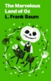

An Apple Books Classic edition.   The second entry in L. Frank Baum’s beloved children’s fantasy series spills over with kooky characters, topsy-turvy logic, and powerful magic. Orphan boy Tip is tired of living with Mombi, a petty and mean-spirited witch. But when his plan to frighten her with a jack-o’-lantern goes wrong, she sends him and his newly animated friend—now named Jack Pumpkinhead—running for their lives.   As they’re tossed from one adventure to the next, Tip and Jack encounter everything from Wishing Pills and life-giving powder to an army of girls on its way to overthrow the Emerald City. With its wild inventions, joyful reversals, and sly nods to the era’s suffragist movement, <i>The Marvelous Land of Oz</i> expands Baum’s enchanted world into something even stranger, funnier, and more alive.

[View on Apple](https://books.apple.com/us/book/the-marvelous-land-of-oz/id498473354)

## A Family for Sully

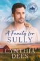

She needed a miracle to save her ranch. What she got was a cowboy. 
&#xa0; 
Jenna Foster is drowning. Bills are stacking up, the bank is circling, and the family ranch is slipping through her fingers. &#xa0;Her husband died four years ago in a tragic fire, leaving her with their six-year-old son, her stubborn pride, and not much else. The last thing she needs is a stranded cowboy on her doorstep. 
Sullivan “Sully” Black is one of the top calf ropers on the rodeo circuit—until a brutal shoulder injury threatens to end his career in eight seconds flat. Then an ice storm maroons him, his brothers, and a convoy of rodeo stock at Jenna’s ranch. 
As the roads remain impassable, Sully starts mending more than fences around the neglected ranch. Somewhere between fixing what’s broken and showing up for Jenna and Bobby, he begins to wonder if the traveling rodeo life isn’t half as good as the one right in front of him. Jenna, who swore she’d never lean on anyone again, finds herself drawn to the quiet strength of a man who looks at her and her son like they matter and brings joy back into the house. 
But Sully has spent a lifetime leaving, and Jenna can’t afford to love someone who won’t stay. When the roads finally clear and he’s free to go, both of them must decide: is the safest choice really the right one? 
A clean, heartwarming cowboy romance with a wounded rodeo hero, a fierce single-mom heroine, forced proximity, found family, and all the small-town charm your heart can hold. 
Perfect for readers who love a Hallmark movie–worthy romance with emotional depth and a guaranteed happily ever after. 
&#xa0; 
Cynthia Dees is the New York Times and USA Today bestselling author of over 100 romances. Join her in Cobbler Cove for love, laughter, and shenanigans in this sweet and whimsical series about a bunch of lonesome cowboys and the feisty ladies of the Worn-Out Widows Sisterhood.  
"A delightfully light and refreshing read...Ms. Dees never lets me down...What fun. Five stars! Highly recommend..." &#xa0;&#xa0;- Amazon Top Reviewer 
&#xa0;

[View on Apple](https://books.apple.com/us/book/a-family-for-sully/id6759018991)

## Where His Darkness Ends

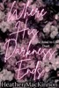

<b>Can her light overcome his darkness?</b>  Ryder MacAlister has three rules: no girls, no mistakes, and no slowing down. But Bailey is about to make him break all three. From the moment he met her, he felt this undeniable attraction. Fighting it is pointless, but he knows he needs to keep his distance. His past is as sordid as his future and he can't let anyone else get mixed up in his problems. Especially Bailey.  Bailey Woods is perfectly content living the single life. After being disappointed by men one too many times, she completely gave up on dating. When she volunteers to spend time with a lonely horse she gets more than she bargained for with Ryder as her mentor. He's the surliest man she's ever met so, why can't she stop thinking about him?  She can't resist a challenge and is determined to break down his walls for a single night. But what happens when she sees behind his gruff façade? Will Ryder's past prevent a future with Bailey? Or could she be what he's needed all along?

[View on Apple](https://books.apple.com/us/book/where-his-darkness-ends/id6778153106)

## Saved

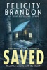

<b>He rescued her from the storm,</b>  <b>But who will save her from him?</b>  When a freak accident in the wilderness claims Erin's friends,  She's thankful for her brooding tour guide, Eli,  Especially when a sudden snow storm hits the forest.  Forced to take shelter with him in an abandoned cabin,  Erin succumbs to the visceral energy growing between them,  Relishing the way he takes control.  But she's bitten off more than she can chew with Eli.  <i><b>Her protector isn't a hero.</b></i>  <i><b>He's really the villain.</b></i>

[View on Apple](https://books.apple.com/us/book/saved/id6740830083)

## The Next Girl

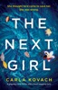

<b>IF YOU ONLY READ ONE BOOK THIS YEAR, MAKE IT <i>THE NEXT GIRL...</i></b> 
<b><i></i></b> 
<b>You thought he’d come to save you. You were wrong.</b> 
<b></b> 
‘<b>Absolutely the best thriller I’ve read this year!</b>’ Goodreads Reviewer, 5 stars 
‘I absolutely, totally and <b>utterly LOVED reading <i>The Next Girl</i></b>… has to be <b>one of my top reads of 2018</b>.' <i>Ginger Book Geek</i>, 5 stars 
‘<b>Oh my goodness!</b> This was <b>gripping and fast moving</b> from page one.’ <i>Southern and Sassy Wine Lady</i>, 5 stars  
<b>Deborah Jenkins</b> pulls her coat around her for the short walk home in the pouring rain. But she never makes it home that night. And she is never seen again…  
Four years later, an abandoned baby girl is found wrapped in dirty rags on a doorstep. An anonymous phone call urges the police to run a DNA test on the baby. But nobody is prepared for the results.&#xa0; 
<b></b> 
<b>The newborn belongs to Deborah. She’s still alive...</b>  
<b>THE GRIPPING THRILLER EVERYONE’S TALKING ABOUT – if you like Lisa Gardner, Robert Bryndza or Clare Mackintosh, you will absolutely love this. A completely unputdownable page-turner with an ending that will blow your mind.</b> 
<b></b> 
<b>**Each Gina Harte book can be read as part of the series or as a standalone**</b>  
‘Boy oh boy… <b>I absolutely blinking well LOVED it</b>.’ <i>Ginger Book Geek</i>, 5 stars 
‘<b>Just wow!</b>... <b>FANTASTIC... I just had to keep reading</b>.’<b> </b><i>Bonnie’s Book Talk</i>, 5 stars 
‘<b>I couldn’t put it down.</b>’ Goodreads Reviewer, 5 stars 
‘<b>Wow, wow wow!</b> Excellent book!’ Goodreads reviewer, 5 stars 
‘OMG... <b>gripping</b>... I have goosebumps.’ Goodreads reviewer, 5 stars 
‘I am <b>in love</b> with this author.’ Goodreads reviewer, 5 stars 
‘<b>Brilliant!... Exceptional... Thrilling... superb</b>.’ Renita D’Silva, 5 stars 
‘A <b>fantastic </b>book!!!!!<b> OMG so much suspense</b>.’ Goodreads reviewer, 5 stars 
‘I found this book <b>unputdownable!!</b>’ Goodreads reviewer 
‘<b>Brilliant, absolutely brilliant!!</b>’<b> </b>Goodreads reviewer, 5 stars 
‘I was<b> hooked from the start right to the last page</b>.’<b> </b>Goodreads reviewer, 5 stars 
‘<b>I loved this book! </b>Chilling, disturbing and gripping<b>!</b>’ Goodreads reviewer, 5 stars 
‘<b>DI Gina Harte is my new heroine!</b>’ Goodreads Reviewer, 5 stars  
‘I like to give honest reviews. If I don't like a book I will say I don't like it... So here goes my review of <i>The Next Girl</i>.... without a doubt this is <b>a fantastic book!!!!! OMG</b>... This book <b>literally I was not able to put down </b>it kept me <b>captivated</b> from the first chapter. Who left the baby on the library steps? and why? How is this baby connected to missing person Deborah Jenkins?... <b>YOU will HAVE to read to find out!</b>... There is nothing that I didn't like about this book. <b>SO much suspense that kept you flipping through the pages to the end! Read today you will not be disappointed!</b>’ Goodreads reviewer, 5 stars

[View on Apple](https://books.apple.com/us/book/the-next-girl/id1331419687)

## Falling for the Older Man

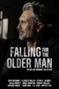

Whether it's a stranger, your boss, your best friend's dad, your enemy, or the growly, reclusive mountain man everyone in town fears, falling for an older man means finding the kind of forbidden passion that will leave you breathless and begging for more. Experience these<i>&#xa0;</i>10 unique steamy stories about age gaps and unexpected love in the arms of an older man...  𝗧𝗵𝗶𝘀 𝗰𝗼𝗹𝗹𝗲𝗰𝘁𝗶𝗼𝗻 𝗶𝗻𝗰𝗹𝘂𝗱𝗲𝘀: Billionaire Lumberjack's Beauty by Gwyn McNamee Breach of Contract by Elizabeth Miller Hixon by Esther E. Schmidt Montana Protector by Hallie Bennett King's Crown by Marie Johnston Injustice and Absolution by Murphy Wallace Naughty Good Girl by Sapphire Knight Zeke by Shaw Hart Cruel Saint by T.K. Leigh Hot for Mr. Moneybags by Whitley Cox

[View on Apple](https://books.apple.com/us/book/falling-for-the-older-man/id6786845692)

## Tik-Tok of Oz

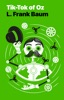

An Apple Books Classic edition.   This entry in L. Frank Baum’s enduring Oz series is a rollicking adventure in a world of limitless creative possibilities.   A rainstorm has just washed up young Oklahoma native Betsy Bobbin and her mule Hank on the shores of Oz, where they soon run into a wanderer called the Shaggy Man. Agreeing to join him on a search for his brother, they assemble a wonderful misfit crew that includes a cloud fairy and a windup mechanical man named Tik-Tok.   There are new marvels at every turn of their journey, as they explore a man-made metal forest and whiz through glass tubes that span the length of the world. Whimsical and full of invention, <i>Tik-Tok of Oz</i> blends mechanical wonder with the warmth and humor that define Baum’s most memorable tales.

[View on Apple](https://books.apple.com/us/book/tik-tok-of-oz/id498918995)

## 1+1=1 ... beyond the secrets of beautiful relationships

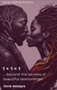

1+1=1
... losing our identities
Being in love ... is a totally different way of experiencing life.
Being in love ... is amazing.
But … love is not for everyone.
Yes ...
Not any of us can understand and accept the illogical rules of love.
And ... the truth is ... we are afraid of getting lost ... of losing our souls ... our identities ... our minds.
I was in love.
... not only one time.
I dare to write about love ... cause i was into that ... heaven ... but unfortunately the emotional balance made me feel ... the hell too.
Love is ... duality.
I've felt it.
I've strongly felt it.
And I've understood that 1+1=1.
I was so connected ... that I've totally lost my identity.
... becoming one with the other soul.
My ego ... disappeared.
All my existence ... changed.
I was ... here ... but actually living only and only into that story.
... into that parallel universe.
I've became one with the other soul.
Everyone told me that i've lost my minds.
Everyone ...
... and they repeated me that on and on and on.
I've totally lost my identity.
But ... i was happy.
Fortunately ... the time ... made me realise that 2 souls can become one.
And i've liked it.
... in fact adored it.
I've lost myself ... but i was not worried.
I've metamorphosed my soul with the other soul ... into one unique soul.
It was amazing.
Unfortunately ... all was temporary.
I knew it ... but i've disliked it.
Today ... i don't regret anything.
Not regret anything ... anymore.
But ... i know that this is the magic formula ... for being happy while being into a relationship.
1+1=1.
Many ... laugh of me.
Of my thoughts.
... of all my perceptions about love and relationships.
But ... i know what i am taking about.
I was there.
... few times.
And ... it was amazing.
I felt ... alive.
I felt ... the Infinite.
I would do it ... again.
But ... i can't.
Maybe ... i am afraid of losing my identity again.
So ... I've decided to just write about the subject.
Like ... a self therapy.
But also ... guiding the others ... into those parallel universes which don't have anything to do with the real life.

[View on Apple](https://books.apple.com/us/book/1-1-1-beyond-the-secrets-of-beautiful-relationships/id6737967487)

## Fake It Till You Win

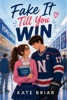

Kelsey Robinson has a plan for everything. Unfortunately, that plan didn't include a vicious rumor tanking her shot at a scholarship. Her carefully built reputation is unraveling, and the only person with enough social clout to save it is the one she can't stand: Forrest Haynes, Northwood's reckless hockey captain.

Forrest is one mistake away from losing his captaincy. To clean up his image, he needs a respectable girlfriend fast. So they strike a deal. She'll help repair his reputation, and he'll help bury the gossip threatening her future. The rules are simple: public hand-holding, rink-side appearances, and absolutely no real feelings.

But every fake date makes it harder to remember where the act ends. Away from the cameras, Forrest isn't the charming troublemaker Kelsey expected, and Kelsey sees through the confidence he wears like armor. The quiet moments start to feel more real than either of them planned.

Their deal was supposed to save their futures. Falling for each other was never part of the plan.

[View on Apple](https://books.apple.com/us/book/fake-it-till-you-win/id6778137820)

## Let's Taco Bout It

** Read 50+ Patrick, Kevin, and Arty stories on the BoxFort app for iPad and iPhone **  
Mr Taco is feeling sad, it’s not easy being a little taco when everything around you is so BIG!  
Luckily, Patrick has a few ideas to help his friend...  
————&#xa0; 
BoxFort.co - The Number One Independent Children’s Book Series

[View on Apple](https://books.apple.com/us/book/lets-taco-bout-it/id918670390)

## The Patchwork Girl of Oz

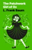

An Apple Books Classic edition.   L. Frank Baum’s <i>The Patchwork Girl of Oz</i> is a sprightly, exuberant romp through his ever-expanding world of silliness and magic. When a botched spell turns the young Munchkin Ojo’s dear uncle into a statue, the only way to set things right is for Ojo to collect six rare and special items from across the kaleidoscopically strange land of Oz.   With him on his journey are a vain glass cat named Bungle and a girl fashioned from old quilts named Scraps—who, newly sprung to life, is a constant source of of goofy optimism, boisterous energy, and nonsense poetry. A fairy-tale classic, <i>The Patchwork Girl of Oz</i> sings with the joy of imagination and play.

[View on Apple](https://books.apple.com/us/book/the-patchwork-girl-of-oz/id498918355)

## The Magic of Oz

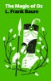

An Apple Books Classic edition.   In <i>The Magic of Oz</i>, L. Frank Baum’s imagination turns inward, toward forbidden words, dangerous wishes, and unforeseen consequences. When a restless Munchkin boy discovers his father’s secret spell of transformation, his newfound magic unexpectedly draws the exiled Nome King Ruggedo out of hiding and sets off a plot to conquer the Emerald City.   As spells run wild and friends are turned into beasts and back again, Dorothy and the Wizard race to undo the chaos, proving that cleverness and compassion can overcome even the darkest enchantments. Blending mischief, peril, and redemption, Baum’s penultimate Oz tale is an extraordinary journey teeming with warmth, wit, and wonder.

[View on Apple](https://books.apple.com/us/book/the-magic-of-oz/id498727947)

## The Count of Monte Cristo

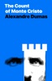

An Apple Books Classic edition.  Alexandre Dumas’ classic paints a portrait of Edmond Dantès, a dark and calculating man who is willing to wait years to exact his perfect plan for revenge. After his so-called friends frame him for treason, Dantès is sentenced to life imprisonment in a grim island fortress on what was supposed to be his wedding day. After 14 years, he manages to escape prison, but he is unable to free himself from an all-consuming fury. Instead, Dantès spends a decade carrying out the plan for revenge he conceived while behind bars, bringing nightmarish ruination to those who once betrayed him-and second chances to those who tried to save him.  When it was first published in 1844, <i>The Count of Monte Cristo</i> quickly became the best-selling book in all of Europe. Dumas’ novel was ahead of its time, an exciting tale of adventure, treasure, secret identities, and daring escapes. It also reads like an early psychological thriller, leaving readers uneasy as they cheer Dantès on in his vengeful quest. It’s no wonder this book has inspired dozens of screen adaptations!

[View on Apple](https://books.apple.com/us/book/the-count-of-monte-cristo/id481657971)

## Leaders in Control

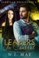

<b>"No man is an island..."</b>  They said no man could ever replace Andrew Carter. So when he decided to take a step back from the Privy Council, he wasn't replaced by a single man. He was replaced by two.  Devon Wardell and Gabriel Alden never had the easiest relationship.  What started as teenage squabbles over the same girl, escalated into a supernatural blood-feud that grew infinitely more difficult when they became lifelong friends and their families moved in next door. After their children got married, they resolved to destroy each other once and for all.  But as usual, fate had other plans…  <b>Kerrigan Presidents Series</b>  •Leaders in Control •Director on a Mission •Devon Seeking Guidance •Gabriel Vanishing Light •President on Edge •Agreeing the Future  READ THE WHOLE SERIES: Prequel Series: Christmas Before the Magic Question the Darkness Into the Darkness Fight the Darkness Alone in the Darkness Lost in Darkness  The Chronicles of Kerrigan Series Rae of Hope Dark Nebula House of Cards Royal Tea Under Fire End in Sight Hidden Darkness Twisted Together Mark of Fate Strength &amp; Power Last One Standing Rae of Light  The Chronicles of Kerrigan Sequel A Matter of Time Time Piece Second Chance Glitch in Time Our Time Precious Time  The Chronicles of Kerrigan: Gabriel Living in the Past Present for Today Staring at the Future  Kerrigan Chronicles  Stopping Time  A Passage of Time  Ticking Clock  Secrets in Time  Time in the City  Ultimate Future  Kerrigan Kids  Book 1 - School of Potential  Book 2 - Myths &amp; Magic  Book 3 - Kith &amp; Kin  Book 4 - Playing With Power  Book 5 - Line of Ancestry  Book 6 - Descent of Hope  Book 7 – Illusion of Shadows  Book 8 – Frozen by the Future  Book 9 – Guilt of My Past  Book 10 – Demise of Magic  Book 11- Rise of the Prophecy  Book 12 – Deafened by the Past  Kerrigan Memoirs  The Chronicles of&#xa0;Devon  The Chronicles&#xa0;of&#xa0;Angel  The Chronicles of&#xa0;Julian  The Chronicles of Molly  The Chronicles of&#xa0;Gabriel  The Chronicles of&#xa0;Rae

[View on Apple](https://books.apple.com/us/book/leaders-in-control/id6443335830)

## Unlucky in Love

Turns out, love’s a lot like luck. You don’t know just how good you have it until you stand to lose it all.

Kristen Collins is cursed. It’s the only explanation for this recent run of catastrophes. She’s lost her brand-new car and a winning lottery ticket, and her ex-boyfriend just drove off with all her possessions. She’s even lost the empty office that’s been her lunchtime sanctuary. Plus, the new hire who’s taken it over is precisely the kind of impending heartache she knows to avoid, from his intense gaze to that irresistible crooked smile.
Developer Aiden Scott plans to stay at the Denver architecture firm just long enough to prime it for takeover. A job like his can’t get personal. Yet from the moment he collides with Kristen, he’s smitten. He wants to save the stunning interior designer from every crazy scenario she winds up in. But who’s going to save him when his business agenda shatters Kristen’s trust?

[View on Apple](https://books.apple.com/us/book/unlucky-in-love/id6748706929)

## The Three Little Pigs

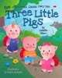

<i><b>Red Beetle Classic Fairytales are the perfect way introduce kids to beloved classics with a modern twist!</b></i>  <i><b>A delightful rhyming story with fun illustrations and a great positive message!</b></i>  <i>A great read out loud picture book that they'll love reading, and you'll love reading with them!</i>  <i>Featuring delightful rhymes and bright fun pictures Red Beetle Classic Fairytales are designed teach the little ones valuable life lessons in a light fun way.</i>  <b>"RED BEETLE BOOKS"</b>  Following in the great tradition of moral tales, Red Beetle Books are designed to teach important life lessons in a fun and entertaining way.Exploring subjects like sharing, kindness, friendship, understanding differences, facing challenges and adapting to change, Red Beetle Books will help your child develop their emotional intelligence, while fostering a life long love of books and reading.  <b>This book is for suitable for children from 3-8 years.</b>  <i>***If you're looking for fun books with a great message, (that your kids will actually want to read) check out the whole series.</i>

[View on Apple](https://books.apple.com/us/book/the-three-little-pigs/id6503993465)

## The Art Of Letting Go

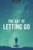

We often struggle to let some people go especially when they made that decision. We question the universe, we question ourselves and we question everyone around us but we never truly get our answers. Letting someone go takes time, patience and commitment to actively stop ourselves from relapsing and thinking about that person again. The Art Of Letting Go helps you understand why, how and when you should let someone go so you can move on and never look back.

[View on Apple](https://books.apple.com/us/book/the-art-of-letting-go/id1088918035)

## Entice

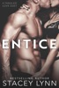

When the most difficult decision of Laurie Baker's life needed to be made, she took off for a weekend alone to weigh her pros and cons and consider all her options.  What she didn't expect was to run face first into one more complication her life didn't need.  Distracting, sexy, and British, Liam Parker offered Laurie exactly what she needed when she was desperate for attention.  One night of pleasure.  She wanted it.  She craved it.  She took it.  And when the sunlight dawned and the lusty haze of one night of passion disappeared and reality revealed itself…  Laurie returned home knowing that everything she had once believed, everything she had once loved and desired, was about to be tossed upside down and shaken in a way she could never imagine.

[View on Apple](https://books.apple.com/us/book/entice/id984019829)

## Death At The Docks

<i>In a small Maine fishing village, murder is definitely not on the menu...</i>  Tammy Harper left the corporate rat race behind to run the Daily Catch Café in cozy Harborview, Maine—serving coffee, catching up with locals, and enjoying the peaceful harbor view. But when longtime fisherman Martin Russo is found dead at his boat slip, Tammy's quiet coastal life takes a deadly turn.  The police say it's murder. The town says it's obvious. But nothing about Martin's death adds up.  His ex-wife was fighting him over money. His business partner stood to inherit his boat. His son needed an inheritance to cover gambling debts. And a mysterious woman was meeting him in secret. Everyone had motive. Everyone had opportunity. And everyone is lying about something.  When threatening notes start appearing—on napkins from Tammy's own café—she realizes the killer is watching. And they're getting desperate.  Armed with good coffee, a talent for listening, and a knack for noticing what others miss, Tammy finds herself untangling secrets that stretch back years. But in a town where everyone knows everyone's business, digging too deep could be dangerous...

[View on Apple](https://books.apple.com/us/book/death-at-the-docks/id6789673849)

## The Odyssey

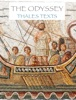

Homer’s <i>Odyssey</i> is one of the most celebrated texts in the Western Canon. Homer’s epic poem detailing Odysseus’ harrowing journey home, filled with sea witches, monsters, angry gods, and Odysseus’ own demons, has inspired generations of readers ever since the days of ancient Greece. In this edition of Homer’s <i>Odyssey</i>, you’ll find an updated translation from Professor Ian Johnston, a host of pictures and interactive images, and an interactive glossary with footnotes and character descriptions. We hope you will enjoy this classic text, updated for the needs of a Classical curriculum.

[View on Apple](https://books.apple.com/us/book/the-odyssey/id1215069512)

## 1984

Nouvelle traduction du chef-d’œuvre de George Orwell.
Après la Révolution, le parti de l’Angsoc domine Océania. Sous la figure de Tonton, il impose une société où la réalité n’a plus de sens. Le Parti contrôle le passé, en manipulant les archives, le présent, par la surveillance permanente, et compte dominer le futur en créant un langage où toute pensée séditieuse sera impossible.
Winston Smith, un employé du ministère de la Vérité, commet le crime ultime: le crimepense. Pourra-t-il échapper à la Police des Pensées, qui traque les hérétiques ? Trouvera-t-il des alliés dans ce monde en guerre, ou est-il seul dans son combat ? Parviendra-t-il à rejoindre la mystérieuse Fraternité, l’organisation souterraine de l’opposant Emmanuel Goldstein ?
Cette aventure explore les méandres d’une société dystopique, où la surveillance constante, la destruction de la langue, l’état de guerre permanente et le contrôle des esprits permettent à un pouvoir brutal et autoritaire de se maintenir en place.

[View on Apple](https://books.apple.com/us/book/1984/id1545355007)

## Dream Psychology

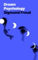

An Apple Books Classic edition.  Written by the founding father of psychoanalysis, Sigmund Freud’s 1899 book is the definitive text on learning to interpret dreams. Freud’s groundbreaking approach to healing psychiatric issues through dialogue between a patient and therapist gave us enduring concepts like projection and transference, as well as the superego, ego, and id.  Above all, Freud advanced the progressive idea of unconscious desire as a driving force for our thoughts and actions. This paved the way for the revolutionary notion that dreams are more than wild nonsense-they’re a channel for symbolically communicating our innermost fears, conflicts, and desires. While many of Freud’s theories have fallen out of fashion, <i>Dream Psychology</i> is a great introduction to the influential field of psychoanalysis. It’s a fascinating look into the world of the subconscious-and the human mind.

[View on Apple](https://books.apple.com/us/book/dream-psychology/id395687522)

## Vitamin Sea

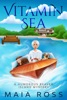

NEW TO APPLE BOOKS!  <i><b>A retired spy still wants to save the world. Her nerdy houseguest just wants to survive her vacation.</b></i>  Former British Intelligence agent Irma Abercrombie wasn't looking for drama when she invited Violet Blackheart—a brainy city slicker—for a visit at her island home on Canada's Lake Ontario. But after an armed robbery in town goes terribly wrong, Irma gets pulled into a small town intrigue: Was it a simple snatch and grab, or are there darker forces at work?  Irma's hands might be deadly weapons, but she's all thumbs when it comes to computer problems. How will she convince Violet to solve a technology puzzle masterminded by someone with a taste for murder? And if she's so retired, what's up with the dead guy in her driveway?  As Violet tries to adjust to island life, Irma grapples with a bomb threat and wonders how she ended up with a pug as a sidekick—and whether Violet is hiding a few secrets of her own. This unlikely duo is headed for a showdown at a luxurious local estate, but they can only flush out a killer if they work together.

[View on Apple](https://books.apple.com/us/book/vitamin-sea/id6771793531)

## Puck Off

<b>When my dad retires as owner of the Nessie Warriors Scottish ice hockey team, he leaves it to me.</b>  <i><b>Puck off, right?</b></i>  I know nothing about hockey, and the players all seem like a bunch of arrogant, aggressive jocks to me.  But on a boozy night out my second day there, I have a one-night stand with the Captain of the team.  Thinking one and done, I'm happy to move on and forget it ever happened, but suddenly he wants to be with me, and it turns out he's not the only one who wants a piece of me. Too bad one of them is the Captain of a hated rival team.  Can I find love at the rink with these three men, or will it be put on ice when my senses catch up with me?  <b>This is a spicy, light-hearted whychoose romance book 1 of 2 where the woman ends up with more than one love interest and ends in an HEA. This is an entirely fictional world, league and team based in Scotland.</b>

[View on Apple](https://books.apple.com/us/book/puck-off/id6760551094)

## Never Date Your Brother's Best Friend

<b>My plan was perfect. My friend needed a date, and my brother's best friend was single. Problem solved.</b>  
Until I saw Jaeger for the first time in years, and sparks flew in the wrong direction.  
Jaeger has grown up and bulked up. But that shouldn't matter, because I have the perfect life. Really.  
Only my plans are beginning to unravel and now visions of Jaeger's hard abs, broad shoulders, and intense green eyes fill my head.  
I should hold back in case my friend is interested. Or in case of a million other reasons.&#xa0;<b>But if Jaeger isn't willing to play by the rules, I don't think I can either.</b>  
"Addictive and marvelously refreshing."<b>~ Rumpled Sheets Blog</b>  
"Realistic characters and smart writing."&#xa0;<b>~ Lauren Layne,&#xa0;<i>USA Today</i>&#xa0;Bestselling Author</b>  
<b><i>Grab&#xa0;</i>NEVER DATE YOUR BROTHER'S BEST FRIEND<i>&#xa0;now!</i></b>

[View on Apple](https://books.apple.com/us/book/never-date-your-brothers-best-friend/id849072821)

## Crime and Punishment

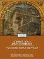

Crime and Punishment is a novel by the Russian author Fyodor Dostoyevsky. It was first published in the literary journal The Russian Messenger in twelve monthly installments during 1866. It was later published in a single volume. It is the second of Dostoyevsky's full-length novels following his return from ten years of exile in Siberia. Crime and Punishment is the first great novel of his "mature" period of writing. 
Crime and Punishment focuses on the mental anguish and moral dilemmas of Rodion Raskolnikov, an impoverished ex-student in St. Petersburg who formulates and executes a plan to kill an unscrupulous pawnbroker for her cash. Raskolnikov argues that with the pawnbroker's money he can perform good deeds to counterbalance the crime, while ridding the world of a worthless vermin. He also commits this murder to test his own hypothesis that some people are naturally capable of such things, and even have the right to do them. Several times throughout the novel, Raskolnikov justifies his actions by connecting himself mentally with Napoleon Bonaparte, believing that murder is permissible in pursuit of a higher purpose.

[View on Apple](https://books.apple.com/us/book/crime-and-punishment/id764603953)

## Witch: A Paranormal Thriller

<i><b>She was called a witch… right before he died.</b></i>  Twenty-year-old Sydney Hart has always made bad choices—but nothing compares to Michael Grayson.  One reckless moment of passion binds her to him, and suddenly Sydney's world begins to unravel.  Nightmares haunt her sleep. Shadows creep into her waking life. The people she trusts most begin to reveal terrifying secrets—and nothing, not even her own past, is what it seems. When a dying man whispers a single word—<i>witch</i>—before collapsing at her feet, Sydney is forced to confront a chilling possibility:  She's been marked.  Or worse… she was never who she thought she was to begin with.  As dark forces close in and the truth edges closer to the surface, Sydney must uncover the secret behind the curse that binds her—before it consumes her completely.  Because some mistakes don't just change your life…  They destroy it.  <i>'Yellow' (The Sydney Hart Paranormal Thriller Series) — Book Two, Now Available!</i>

[View on Apple](https://books.apple.com/us/book/witch-a-paranormal-thriller/id6779209095)

## Dracula

An Apple Books Classic edition.  Few characters have seized readers’ imaginations quite like Count Dracula of Transylvania, the hero of Bram Stoker’s classic. The 1897 novel put vampires front and center on the cultural map, providing direct inspiration for an entire subgenre of bloodsucker fiction - including blockbusters like the <i>Twilight</i> series and Anne Rice’s <i>Vampire Chronicles</i> - and spawning hundreds of movie adaptations!  Stoker’s novel is a thrill ride, following Dracula as he moves from Transylvania to England in search of fresh blood, while a small but dedicated group attempts to thwart him. Want more Stoker? Check out his great-grandnephew Dacre Stoker’s 2018 novel, <i>Dracul</i>.

[View on Apple](https://books.apple.com/us/book/dracula/id395541616)

## Ozma of Oz

Ozma of Oz was the third title in the Oz series by L. Frank Baum. In this book Dorothy is shipwrecked and lands on the shores of a fairy country that adjoins Oz, the land of Ev. There she meets Tiktok, a wind-up mechanical man; a talking chicken, Billina; and Ozma, the girl ruler of Oz who is leading a quest to rescue the royal family of Ev from their captivity by the Nome King. Dorothy is also reunited with her old friends, the Scarecrow, the Tin Woodman, and the Cowardly Lion. Together the adventurers travel to the Nome King’s underground kingdom and have many exciting adventures before returning to Oz, and for Dorothy, eventual return to her family in the “civilized” world.

[View on Apple](https://books.apple.com/us/book/ozma-of-oz/id492261136)

## The Adventures of Sherlock Holmes

An Apple Books Classic edition.  You get not one, not two, but <i>25</i> gripping mysteries in Arthur Conan Doyle’s first of five collections of Sherlock Holmes short stories. Follow the brilliant and eccentric Holmes and his loyal sidekick, Dr. Watson, as they journey to lavish country estates to investigate baffling cases involving indiscreet royal affairs, cheetahs, redheads, and gypsies. Every one of Conan Doyle’s tales is full of surprising - but always logical - twists. (Fun fact: This book includes “The Speckled Band,” the author’s self-proclaimed favorite of all of his Sherlock Holmes short stories.)

[View on Apple](https://books.apple.com/us/book/the-adventures-of-sherlock-holmes/id395536306)

## Frankenstein

An Apple Books Classic edition.  Mary Shelley was just 18 when she had a nightmare vision: “I saw the pale student of unhallowed arts kneeling beside the thing he had put together. I saw the hideous phantasm of a man stretched out, and then, on the working of some powerful engine, show signs of life.”  Despite her lack of writing experience, Shelley converted her dream into what is often referred to as the world’s first horror novel, a timeless tale of science gone bad. <i>Frankenstein</i> follows the story of Swiss scientist Victor Frankenstein, who manages to animate a hulking creature referred to as a “monster,” “wretch,” or “fiend.” Shelley’s 1818 classic has become one of the most frequently taught works of fiction, a cultural touchstone for conversations about the dark side of innovation. (Made-up words like <i>Frankenscience</i> and<i>Frankenfood</i> have become shorthand for the products of technological tampering.) More than 200 years after it was published, this novel remains a thought-provoking read that explores timely themes like creators’ responsibilities for the unintended consequences of their inventions.

[View on Apple](https://books.apple.com/us/book/frankenstein/id395546675)

## Secrets Hidden In The Glass

<b>*Readers’ Favorite International Book Award Silver Medalist*</b><b></b> 
&#xa0; 
<b>Three Siblings. One Year. Everything Changes.</b><b></b> 
&#xa0; 
Stained glass artist Callie Davis is in desperate need of a vacation. Burnt out and on the edge of a nervous breakdown, she’s taking refuge on Massachusetts’ tiny Carter Island. Callie yearns for long, lazy days and pretty walks on the beach—blessed solitude and an escape from the pressures of her career and complications of her life. Then she bumps into gorgeous Nate Carter, and everything changes. 
&#xa0; 
Sheriff Nathan Carter couldn’t be happier now that the height of the summer season has finally come and gone. After four endless months, tourists have packed their bags and headed for the mainland. The quiet days of autumn are about to befall the town—the way Nate and his fellow Sandersonians like it best. 
&#xa0; 
But nothing ends up quite the way Nate expects when he meets the beautiful blond with the big blue eyes. Callie’s pretty smiles hide secrets—deep, dark mysteries that have the potential to rip apart their lives.

[View on Apple](https://books.apple.com/us/book/secrets-hidden-in-the-glass/id1294115937)

## The Dancing Girls

<b>“Wow, what a book!!&#xa0;I don’t think I drew a full
                breath for the entire time I was reading… I took it everywhere I went…&#xa0;I needed to
                read it at every opportunity!…&#xa0;Unbelievably twisty…&#xa0;I loved every word of
                it!”</b> Goodreads Reviewer ⭐⭐⭐⭐⭐  
                <b>Jo pulled together the victims’ pictures. In all cases their arms were
                askew, in a way that looked like—what? It was like they were freeze-framed in the
                middle of some action. It was like they were dancing.</b> 
                <b></b> 
                When loving wife <b>Jeanine </b>is found dead in a small leafy town in
                Massachusetts, newly promoted&#xa0;<b>Detective Jo Fournier</b>&#xa0;is shocked to
                her core. Why leave her body posed like a ballerina? Why steal her wedding band and
                nothing else? Hungry for answers, Jo questions Jeanine’s husband, but the
                heartbreaking pain written on his face threatens to tear open Jo’s old wounds. It’s
                the same pain she felt when her boyfriend was cruelly shot dead by a gang in their
                hometown of New Orleans. She couldn’t get justice for him, but she’s determined to
                get justice for Jeanine’s devastated family. 
                <b></b> 
                <b>But before Jo can get answers, another woman is found, wedding ring stolen,
                body posed in the same ritualistic way.</b> 
                <b></b> 
                Digging through old files, Jo makes a terrifying link to a series of cold cases. She
                knows a serial killer is on the loose, but nobody will listen to the truth—not her
                bosses, nor the FBI. Still, Jo won’t let her superiors keep her from stopping the
                murderer in his tracks, even if it means the end of her career.  
                Just as she is beginning to lose hope, she finds messages on the victims’ computers
                that feel like the crucial missing link. Knowing the killer is moments away from
                selecting his next target, will Jo be able to take him down the before another
                innocent life is lost?  
                <b>A <i>USA Today</i> bestseller, <i>The Dancing
                Girls</i> is the first book in an absolutely unputdownable and gripping crime
                thriller series. Fans of Robert Dugoni, Lisa Regan and Melinda
                Leigh</b>&#xa0;<b>will devour it in one sitting and will never see that OMG
                twist coming!&#xa0;</b>  
                <b>Everyone is utterly addicted to&#xa0;<i>The Dancing
                Girls</i>:</b> 
                “<b>Loved it, loved it, loved it!!</b>…&#xa0;<b>If I could give it 6
                stars I would! In this current climate of ‘twists you will never see coming’—believe
                me</b>…<b> you will never see this
                coming!</b>…<b>&#xa0;</b>Cannot wait for the next book!…&#xa0;<b>Best
                book I have read</b>.” NetGalley Reviewer ⭐⭐⭐⭐⭐  
                “<b>Wow, Wow, Wow</b>…<b> Extremely addictive and left me wanting
                more</b>. This book has everything… and a&#xa0;<b>huge, unexpected
                twist</b>&#xa0;you will not see coming.&#xa0;<b>I can’t emphasize enough how much
                enjoyment I got from reading this</b>…<b>&#xa0;Well-deserved five
                stars—Wow</b>.” Goodreads Reviewer ⭐⭐⭐⭐⭐  
                “<b>Holy Freaking Hell when is the next book out?!</b>&#xa0;From start to
                finish<b>&#xa0;this book is just WOW!</b>… Keeps you on the edge of your
                seat…&#xa0;<b>Full of twists and turns</b>…&#xa0;<b>Talk about
                mind-blowing</b>…&#xa0;<b>Want to shout about it from the rooftops</b>…
                I cannot recommend this book enough.”&#xa0;<i>Baker’s Not So Secret
                Blog</i>&#xa0;⭐⭐⭐⭐⭐  
                “<b>Wow! Wow! Wow! The twists left my head spinning! </b>Oh so smugly, I
                thought I had the ending figured out when—<b>whammo!—twist came out of
                nowhere</b>. ‘<b>Did NOT see that coming</b>’ is an
                understatement. <b>Blindsided! Wow</b>.” Goodreads Reviewer
                ⭐⭐⭐⭐⭐  
                “<b>I was just blown away</b>&#xa0;by its climax, <b>wandering around
                going OMG</b>…&#xa0;<b>Found it totally gripping</b>…
                <b>impossible to put down</b>.”&#xa0;<i>Muse
                Books</i>&#xa0;⭐⭐⭐⭐⭐  
                “An unpredictable rollercoaster ride with&#xa0;<b>more twists and turns than you
                would find on a snakes and ladders board</b>…&#xa0;<b>I felt as though I had
                been punched in the gut and they left me breathless</b>.”<i>&#xa0;Ginger Book
                Geek&#xa0;</i>⭐⭐⭐⭐⭐

[View on Apple](https://books.apple.com/us/book/the-dancing-girls/id1476424391)

## Hard Stick

He carries a big stick. And he’s not afraid to use it.  On the ice, I’m Kellan Carter, powerhouse enforcer for the Charlotte Strikers. Off the ice, I’m just a regular guy. The last thing I want is to get mobbed by a bunch of groupies who are only after me for my fame and money. My ideal woman knows how to enjoy a little good, clean fun—and maybe some not-so-clean fun too. That’s the kind of girl I’d never let go.  When Kristen Robinson, the gorgeous, down-to-earth bartender I’ve been crushing on, agrees to let me take her out, I’m thrilled. We have an amazing night together, culminating in the most electrifying kiss of my life—and that’s it. Kristen tells me we can’t see each other again, but I know that kiss meant as much to her as it did to me. What I don’t know is that Kristen has a dangerous secret. . . .  I’ve proved to Kristen that she can trust me with her body and her heart. But when her past comes back to haunt her, I need to prove that she can trust me with her life. And I might have to get my hands dirty after all.

[View on Apple](https://books.apple.com/us/book/hard-stick/id6450555726)

## Becoming Mindful: Silence Your Negative Thoughts and Emotions to Regain Control of Your Life

With Free Guided Audio Meditation for Download WTF, Shut Up Mind, I Want to Sleep. Are you stuck in an endless loop of the same negative thoughts and emotions? If any of the following questions apply to you, you are at the right place for your solution  - Your mind is running at full speed, and you can get no sleep? - Are you constantly worried for apparently no reason? - You were happy, and all of a sudden you feel angry for no reason and snap at your loved ones? - Is your mind doing its chitchat all day long and commanding your life?  Welcome to the club. You are not alone. Thanks to our modern society, that got even worse. Too many people are stuck in their mind and are often dominated by negative thoughts and emotions. Am I good enough? Why is this guy at work so mean? Why did he do that? How can I get more money? I hate everything. And when you think the disturbing thoughts and emotions are gone, they will come back to you in the most unpleasant situations, like happily playing with your kids.  Fortunately, you can change that. We can train our mind to stop those thoughts and regain control of our life.  In the book, we will step you through the process of regaining control of your thoughts and emotions. You will learn:  - why our mind behaves like that and what is going wrong. - how you can use your body to change your mind - how your environment can help you in silencing your mind - why drinking tea helps - how Mindfulness will guide you to freedom - how proven meditation techniques will assist you in your journey  Don't stay paralyzed in what feels like your personal hell; join us and learn how to get your freedom.  Do Not Hesitate, Buy the Book and Start Now

[View on Apple](https://books.apple.com/us/book/becoming-mindful-silence-your-negative-thoughts-and/id1263803079)

## The Hunter

<b><i>To take down a monster, you have to become one.</i></b>  
Victor Kane thought he was untouchable… Until he took something that didn't belong to him.  
Now I’ll burn his empire to the ground, starting with the one thing he holds dearest.  
<b><i>His wife.</i></b>  
But Ariana Kane is no fragile flower.  
She’s colder than winter, sharper than any thorn, and hiding secrets darker than my own.  
I took her as a pawn in this ruthless game of revenge.  
I didn’t expect to keep her.  
And I sure as hell didn’t expect to crave her with every beat of my dead, cold heart.  
She was supposed to be a means to an end.  
But the deeper I drag her into my world, the more I realize some queens aren’t made for the light.  
And some gods fall hardest for the goddess they were never meant to touch.  
<b><i>The Hunter is the first book in a brand new dark romance trilogy from USA Today Bestselling Author T.K. Leigh. Grab your copy today.</i></b>

[View on Apple](https://books.apple.com/us/book/the-hunter/id6741064909)

## Crime and Punishment

An Apple Books Classic edition.  Fyodor Dostoevsky’s intense novel uses the trappings of a taut thriller to excavate some of the darkest moral questions of the human experience.   Impoverished ex–law student Rodion Raskolnikov is at odds with himself. He’s wildly intelligent but can’t seem to outwit his own desperate circumstances. That is, until he decides to rob and murder an underhanded pawnbroker. After all, he thinks, by ridding the world of her cruelty, he’s committed a benevolent act.  But even as Raskolnikov is justifying himself in the grandest terms, the true moral weight of his actions is already stalking him through the shadowy streets of Saint Petersburg—and his own tortured subconscious. Grimy and enthralling, <i>Crime and Punishment</i> pits reason against principle, rationality against heart.

[View on Apple](https://books.apple.com/us/book/crime-and-punishment/id6763984106)

## All Because of You

Sometimes you have to lose everything to find your happy ending.  Olivia Green has the picture-perfect life. Dating one of the most successful businessmen in New York City, living in a penthouse over Manhattan and a budding career, until one dreadful night when she discovers her future fiancé is a two-timing jerk. Left with nothing, she leaves the city to move back with her parents in the small town of Morgan's Bay.  After his mother dropped a family bombshell on her deathbed, Shane McConnell boards a train to meet a family he didn't know he had. What he doesn't expect are the secrets and lies dating back to long before his father's death. Nor can he predict the beautiful hot mess he meets on the train will find a way into his closed off heart.  Both struggling with the realities of their new lives, they unintentionally lean on each other. As their attraction builds and their undeniable chemistry explodes into passion, Shane holds onto his own secret that threatens his chance at love.  All Because of You is the start of a new steamy small-town series set in Morgan's Bay, a seaside escape on Long Island, New York, where an unexpected meeting on a train turns into a summer romance that can lead to forever.

[View on Apple](https://books.apple.com/us/book/all-because-of-you/id1502418197)

## Finding Cinderella

<b>From the #1 <i>New York Times </i>bestselling author of </b><i><b>Reminders of Him,</b></i><b><i> </i><i>It Starts with Us,</i> and <i>It Ends with Us</i>, a novella about the search for happily ever after.</b>  A chance encounter in the dark leads eighteen-year-old Daniel and the girl who stumbles across him to profess their love for each other. But this love has conditions: they agree it will last only one hour, and it will be only make-believe.  When their hour is up and the girl rushes off like Cinderella, Daniel tries to convince himself that what happened between them seemed perfect only because they were pretending it was. Moments like that happen only in fairy tales.  One year and one bad relationship later, his disbelief in love-at-first-sight is stripped away the day he meets Six: a girl with a strange name and an even stranger personality. Unfortunately for Daniel, finding true love doesn’t guarantee a happily ever after . . . it only further threatens it.   Will an unbearable secret from the past jeopardize Daniel and Six’s only chance at saving each other?

[View on Apple](https://books.apple.com/us/book/finding-cinderella/id721183782)

## Go To Bed Bear

<b>A delightful rhyming story with fun illustrations and a great positive message!</b>  <b>A great read out loud picture book to help teach your kids about the importance of going to bed at the right time. A book they'll love reading, and you'll love reading with them!</b>  Bartholomew Bear would not go to bed. It just didn't matter what his mother said. When his bedtime arrived he'd roar and he'd cry, "I'll not go to bed and I think you know why."  <b>A delightful story with bright, fun illustrations and a great positive message!</b>  "Go To Bed Bear" is a bright, fun way for younger children to learn about the importance of getting a good night's sleep.  Combining wonderfully vibrant illustrations with the power of rhythm and rhyme, "Go To Bed Bear" is a perfect bedtime story and a must read for kids starting their reading journey.  "RED BEETLE BOOKS" Following in the great tradition of moral tales, Red Beetle Books are designed to teach important life lessons in a fun and entertaining way.Exploring subjects like sharing, kindness, friendship, understanding differences, facing challenges and adapting to change, Red Beetle Books will help your child develop their emotional intelligence, while fostering a life long love of books and reading.  This book is for suitable for children from 3-8 years.  If you're looking for fun books with a great message, (that your kids will actually want to read) check out the whole series. Look for these other RED BEETLE titles now... "Horses For Courses" -on adapting to change, and developing resilience. "A Dog's Best Friends"-on friendship and diversity. "The Cribbledy Crank" (or how to train an angry bug)- on mindfulness and anger management. "A House for a Mouse"- on sharing and generosity of spirit. "Frogs In Space"- on finding good where ever you are, developing a positive, resilient mindset. ***Visit our website, like us on Facebook and Instagram, join our mailing list, follow us on twitter and be the first to know when new titles are released.

[View on Apple](https://books.apple.com/us/book/go-to-bed-bear/id6749407665)

## Wuthering Heights

An Apple Books Classic edition.  If you’ve only ever seen <i>Wuthering Heights</i> on screen, you may have an image of Catherine and Heathcliff as the ultimate star-crossed lovers. But that’s just scratching the surface of this iconic Gothic romance. Emily Brontë’s only novel is an unabashedly dark tale of passion and revenge that created shockwaves upon its publication in 1847.  Without spoiling too much, the original Heathcliff is breathtakingly vengeful, cruel, and possessive, not the deeply misunderstood romantic hero of some adaptations. And Brontë’s story does not end happily ever after. After tragedy strikes, Heathcliff haunts the swirling mists of the Yorkshire moors, consumed with possessing a ghost. A must-read for fans of Gothic literature, this novel will appeal to anyone who loves a creepy story.

[View on Apple](https://books.apple.com/us/book/wuthering-heights/id395546348)

## The Brothers Karamazov

An Apple Books Classic edition.  A towering achievement of psychological depth and spiritual inquiry, <i>The Brothers Karamazov</i> blends passionate philosophy into a riveting story of family conflict, erotic jealousy, betrayal, and murder.  Cruel, self-indulgent Fyodor Karamazov has never acted like a father to his sons, brilliant skeptic Ivan, impulsive and romantic Dmitri, and kindhearted novice Alyosha. They’ve grown into three men as different as one could imagine, but Fyodor remains heartless as ever, taking joy in his own callous conduct and sadistic games.  As Fyodor mires himself in financial misdeeds and a devious love triangle, author Fyodor Dostoevsky probes timeless questions of justice, faith, and responsibility, asking what a father owes his sons and what a society owes its people. Ferocious and unforgettable, <i>The Brothers Karamazov</i> remains one of literature’s most profound explorations of the moral soul.

[View on Apple](https://books.apple.com/us/book/the-brothers-karamazov/id395688080)

## War and Peace

An Apple Books Classic edition.  In his monumental novel, Leo Tolstoy uses the sweeping backdrop of Russia’s battle against Napoleon to explore profound and indelible stories of love, survival, and personal reinvention.  Andrei is the pensive, methodical heir to a famed general. Pierre is a count’s uncouth but earnest illegitimate son. And Natasha is the joyful, exuberant young noblewoman who bewitches them both. Through love, war, friendship, and ambition, their worlds become intertwined.  As Pierre searches for purpose and Natasha learns to see the world with clearer eyes, Tolstoy balances the sweep of history with the messy truths of the human heart, guiding his characters through moments of passion, doubt, and discovery. From the devastating scope of a battlefield to the quiet intimacy of two friends in the drawing room, <i>War and Peace</i> glories in the human condition on every level.

[View on Apple](https://books.apple.com/us/book/war-and-peace/id396446916)

## The wonderful wizard of Oz

The wonderful wizard of Oz, L. Frank (Lyman Frank) Baum. Revised version of http://ota.ox.ac.uk/id/1776 .

[View on Apple](https://books.apple.com/us/book/the-wonderful-wizard-of-oz/id481966700)

## Insights on Robert Kiyosaki’s Rich Dad Poor Dad by Instaread

Robert Kiyosaki’s&#xa0;<i>Rich Dad Poor Dad</i>&#xa0;(1997) is an educational story that contrasts the mindsets of the rich and the poor. The Poor Dad is the main character’s biological father, who works as a college professor...  
Get an Overview, Key Insights, Commentary and more! Download now!

[View on Apple](https://books.apple.com/us/book/insights-on-robert-kiyosakis-rich-dad-poor-dad-by-instaread/id1425659039)

## The Home for War Orphans

Paris, 1940.
                Golden light bathes the crumbling rooftop of the orphanage. I stroke
                my little sister’s hair and comfort the other war orphans climbing into
                the rickety truck. We must leave the only home we have left, or the Nazis will find
                us…
                 
 Margot
                has spent most of her life at St Agnes’ Orphanage with her
                little sister Lucie. She does her best to care for all
                the children, cradling them under the stars when Sister
                Helen can’t get them to sleep. But she knows that when the
                Nazis reach the gates of Paris, the Jewish orphans will be in terrible danger. She
                must help them
                escape… 
 Holding
                on tightly to Lucie as they all scramble into a truck bound for the countryside,
                Margot cannot prevent her hands from shaking. Then one night, by the flickering
                light of the makeshift fire, Sister Helen tells Margot she has found a rich family
                to take Lucie in. But there will be no safety for the other children –
                unless Margot can lead them to the French coast for a ship destined for
                America. 
 Looking from her
                sister’s bright blue eyes to the little patchwork teddy the children
                share, Margot realises she must trust someone else with the only family she has
                left. But as soon as the wrought-iron gates of Lucie’s new home slam shut,
                Margot knows she’s made a mistake. Devastated at being left behind with
                strangers, Lucie runs
                away. 
 Margot knows the only
                place Lucie will run to is the high stone walls of the orphanage, where she last
                knew warmth and food and comfort. With fear in her heart, Margot is faced with an
                impossible choice. Should she race to save her sister from a terrible
                fate, or make sure the other orphans
                escape? 
 A
                heart-wrenching and powerful historical fiction page-turner set in World War Two
                Paris. Perfect for fans of Kelly Rimmer, The Midwife of
                Auschwitz and Rhys
                Bowen. 
 Readers
                are loving The Home for War
                Orphans: 
 ‘Breathtaking,
                heart-wrenching historical novel that I
                couldn’t put down… Completely
                stole my heart… A must-read. Absolutely
                stunning…
                Unforgettable.’ NetGalley reviewer,
                ⭐️⭐️⭐️⭐️⭐️ 
 ‘Completely
                nail-biting… I lost count of how many times
                I was brought to tears.’ Goodreads reviewer,
                ⭐️⭐️⭐️⭐️⭐️ 
 ‘One
                of the best books I’ve read this year for sure!...
                Gripping… Had me on the edge
                of my seat!... I am champing at the bit to read more!’
                Goodreads reviewer,
                ⭐️⭐️⭐️⭐️⭐️ 
 ‘What
                a page-turner!... Impossible to stop
                reading. I can’t wait for the next in this
                series!’ Goodreads reviewer,
                ⭐️⭐️⭐️⭐️⭐️ 
 ‘Incredible…
                heartbreaking… I just couldn't put this
                book down… if I could give it more then 5 stars I certainly
                would.’ NetGalley reviewer,
                ⭐️⭐️⭐️⭐️⭐️ 
 ‘Emotional
                right to the end… Needs lots of tissues…
                Totally perfect… I loved
                it.’ Goodreads reviewer,
                ⭐️⭐️⭐️⭐️⭐️ 
 ‘Brilliant
                from start to finish… Amazing and powerful
                from the get-go… An unforgettable and
                exhilarating ride.’ Shaz's Book
                Blog 
 ‘Awesome…
                So so good… I couldn’t put this book
                down.’ Goodreads reviewer, ⭐️⭐️⭐️⭐️⭐️

[View on Apple](https://books.apple.com/us/book/the-home-for-war-orphans/id6760292348)

## He's So Into Her

Three men. Three women who have no idea. And three hearts that fell first—and fell hard.

He noticed first. He fell first. Now he's just waiting for her to catch up.

In this collection of he-falls-first romances, the heroines are too busy holding their worlds together to see what's right in front of them: a man who's already, completely, hopelessly into her.

Hero Ever After — She's the small-town mayor, the diner-booth lawyer, and the secret romantasy author whose viral hero looks an awful lot like her brother's best friend. When Ramsey Shaw comes home and kisses her like he knows the truth, the woman who's always been strong, quiet, and in control finally wants to be something else entirely: his.

Playboy in a Kilt — Connor MacKean has spent years being nothing more than her best friend's little brother. Now the marriage pact is broken, the playboy's reformed, and a fake engagement at his family's Scottish estate is starting to feel dangerously real. Trouble is, his Cinderella doesn't believe in princes—and isn't sure she deserves the fairy tale.

Don't You Wanna Stay — Contractor Wyatt Sullivan needs one big renovation to launch his home-improvement show. Newly divorced Deanna James needs to flip a historic disaster before her ex takes everything. The catch? Cameras rolling, walls coming down, and both of them under one roof—giving the viewers far more chemistry than either signed up for.

Because the best love stories start the moment he realizes he's already fallen.

[View on Apple](https://books.apple.com/us/book/hes-so-into-her/id6778954089)

## The Very Hungry Spider

YUCK! YUCK! YUCK!

Oh no! A fly is caught in a spider’s web. But the very hungry spider refuses to eat yucky flies!!? Are you kidding???

The flies are stuck, but moved to outrage — flies taste just as good as any other insects! Can they convince the spider before she starves? And, if they succeed...

A fun and quirky picture book for kids and adults to read aloud and laugh together. With a bouncing fun rhyme and silly but wonderful illustrations, The Very Hungry Spider will delight children and adults again and again and probably again some more.

The perfect read-aloud book. Pick this book up, put on your silliest accent and you’ll have kids giggling and everyone in a good mood!

This book includes the Read Aloud feature, an audio narration by the author.

[View on Apple](https://books.apple.com/us/book/the-very-hungry-spider/id6443307627)

## The Bone Forest

<b>Can an FBI Academy dropout catch a vicious serial killer?</b>  It's been fifteen years since Vivian Delacroix unleashed her followers on the town of Cardinal Falls. The cult members killed anyone Vivian told them was a threat to their beliefs.  Now, another killer takes young girls of nine or ten, all related to Vivian's original victims. He drugs them, suffocates them, and painstakingly arranges them in ritualistic poses. The bodies give up no evidence to the killer's identity.  When Wren Delacroix happens upon the latest victim, she's forced to admit to herself that she came back to her home town because of her interest in this case. These dead girls, they remind her of things long buried from her own childhood. And when she sees a certain man lurking at the edges of the crime scene, her past smacks her in the face like a cresting wave of disquiet. Even though she dropped out of the FBI Academy and tried to flee from the dark parts of herself, she can't run away.  Before she knows what she's doing, she's spouting her fully formed profile of the killer to Detective Caius Reilly, head of the tri-state task force, and she's begging him to let her help.  She needs to solve this case and stop this killer.  If only to prove to herself that she's nothing like her mother Vivian.  <i>For fans of Anne Frasier or Chelsea Cain.</i>

[View on Apple](https://books.apple.com/us/book/the-bone-forest/id6751197936)

## The One With The Secret Crushes

<b>How do you get two crazy, stubborn, (wildly in love and in denial) kids (adults) together?</b> 
<b>Have the meddling small town book club set them up on a surprise blind date!</b>  
When Mackenzie Howard moved home after a decade away, she hoped her former high school best friend (and secret crush), Scott Shaw, would finally see her as much more than friends. Instead, he didn't recognize her at all and she's spent the last six months avoiding another mortifying run-in, which is hard to do in a small town like Lost Creek.  
Grouchy bar owner Scott Shaw is tired of waiting for the right time and place to confess he's head over heels in love with Mackenzie. But ever since returning to Lost Creek, she's avoided him at all costs and he doesn't know why.  
The book club is ready to meddle. While Mackenzie mistakenly believes no one knows about her feelings for Scott, and Scott thinks he's kept his crush mostly under wraps, the entire town of Lost Creek is well aware that they are destined to be together and helps the book club trap them on a surprise blind date.  
Now with Mackenzie's full attention (finally), Scott sets out to romance the pants off her (literally, hopefully) and prove that not only does he remember everything about their friendship, about <i>her</i>, but the only relationship he wants going forward, is forever.

[View on Apple](https://books.apple.com/us/book/the-one-with-the-secret-crushes/id6745708039)

## The Wizard of Oz

When a tornado rips through Kansas, Dorothy and her dog, Toto, are whisked away in their house to the magical land of Oz. They follow the Yellow Brick Road toward the Emerald City to meet the Wizard, and en route they meet a Scarecrow that needs a brain, a Tin Man missing a heart, and a Cowardly Lion who wants courage. The wizard asks the group to bring him the broom of the Wicked Witch of the West to earn his help.

[View on Apple](https://books.apple.com/us/book/the-wizard-of-oz/id1163572472)

## The Girl Who Broke the Dark

<b>***Winner of a Literary Titan Book Award***</b>  <i><b>Sometimes, breaking the curse is only the beginning…</b></i>  Princess Eliana of Ymittos has long anticipated the day she gets to make the rules — and use her magic without fear of penalty. But until she ascends the throne, Eliana's days are devoted to practicing diplomacy on inconsiderate guests and weighing the merits of her latest string of suitors.  Then, on her 18th birthday, Eliana's parents reveal her true destiny: she alone must wake a sleeping prince from his hundred-year curse, deep in the monster-infested underworld of Malkh. Terrified, Eliana refuses. But the terms of the curse are clear: only the heir of Ymittos can break its spell. If she fails, the entire continent will be easy prey for the evil sorcerer Cetus.  Banished and stripped of his power a millennium ago, Cetus has lain dormant, rebuilding his strength and amassing his armies. Now, his carefully laid trap is about to spring destruction on the first realms in his path. Only Eliana stands in his way.  A Sleeping Beauty retelling with a deadly twist, <b>The Girl Who Broke the Dark</b> is the first volume of the Royal Mages series.

[View on Apple](https://books.apple.com/us/book/the-girl-who-broke-the-dark/id6468612067)

## Winnie-the-Pooh

An Apple Books Classic edition.  If you haven’t met Winnie the Pooh yet, stop reading this, and start reading the book—you’ll be so glad you did. The jovial stuffed bear and his ragtag band of friends have been bringing joy to children for generations. Join Tigger, Owl, Kanga, Roo, Piglet, Eeyore and, of course, Christopher Robin (a stand-in for A.A. Milne’s own son, for whom the stories were written), as they spend pleasant days in the Hundred Acre Wood.  Milne’s stories are ideal for bedtime and are full of lessons about friendship. They’re good for the soul.

[View on Apple](https://books.apple.com/us/book/winnie-the-pooh/id6502919553)

## The Tea Witch's Secret

<b>Hana knows she shouldn't fall for Oliver, even if his familiar training constantly leads him back to her for healing.&#xa0;</b>  As a tea witch and healer, Hana knows her role in Purple Oak Oasis, and as the heir of the Steeper family, she knows better than to fall for someone she shouldn't. But the heart wants what it wants, and for Hana Steeper, that means Oliver Fields.&#xa0;  Oliver's trouble with his owl familiar leads him to the infirmary, where he gets to flirt with the very cute Hana as much as he wants. When their friendship turns into something more, it's not long before they're unable to resist.&#xa0;  Are their feelings stronger than the rules they should be listening to?  -&#xa0;  The Tea Witch's Secret is a cozy fantasy romance with a friends-to-lovers m/f forbidden romance, an enthusiastic owl familiar, and a healer determined to do her job.&#xa0;

[View on Apple](https://books.apple.com/us/book/the-tea-witchs-secret/id6743140744)

## From Puck to F*ck

<b>I accidentally bought a hockey star at a charity auction.</b>  Don't ask me how—it happened fast. One minute I was sipping champagne, the next I was "dating" Rake Hanson, the league's grumpiest player.  Correction: a musclebound, six-foot-four mistake.  <b>Rake Hanson is a walking cliché: too many abs, zero personality, and a jawline sharp enough to cut glass. Not my type. At all.</b>  Our chemistry? Frozen. Our date? A disaster. <b>Our marriage? …Yeah, about that.</b>  One wild night in Vegas later, I'm suddenly Mrs. Puck-Head.  <b>His agent insists we stay married for the season. My sanity insists otherwise.</b>  The problem?  <b>My fake husband</b>&#xa0;may grunt more than he speaks, but <b>he&#xa0;kisses like he means it</b>&#xa0;— and looks at me like I'm his winning goal.  Every time he touches me, I forget why I can't stand him.  <b>Someone save me — before I fall for the grump with the big stick.</b>  <i>From USA Today bestselling author M. Lane comes a perfect combination of fun and sizzle about a sports hater and the hockey player she falls for. This slow-burn romance features a plucky main character and the one man she brings to his knees. If you like to indulge your secret bad-girl side, this is the book for you.</i>

[View on Apple](https://books.apple.com/us/book/from-puck-to-f-ck/id6748767945)

## The Vampire Spy

<b>Will he choose the sexy spy and bond, or remain loyal to the king and protect the race?</b>  Lance De Luca, a powerful warrior in the Moretti royal army, has captured a beautiful woman he believes to be a spy. In other words, the enemy!  Sparks ignite as he interrogates her, but she's the forbidden fruit he cannot taste.  To prove her innocence, Sofia is asked to become a double agent, forcing her back into the dangerous world she's just escaped.  Forced to watch and hide his feelings for the woman who could be his mate, Lance must let Sofia complete her mission or risk the fate of all vampires.  &#xa0;  <b><i>The Vampire Spy is the next installment in the bestselling steamy paranormal romance series the Moretti Blood Brothers. Part romance, part suspense, it will appeal to readers who love fated-mates, enemies to lovers, and military romance with supernatural abilities. And delicious happy ever after's.</i></b>

[View on Apple](https://books.apple.com/us/book/the-vampire-spy/id1584811413)

## A Reckless Memory

I fled minutes before my wedding when I learned my fiancé had been paid to marry me. Ten years, too many crappy exes, and one drunken decision later, I’m now his boss.



From Marie Johnston comes a small town second chance romance.

A night out with a friend turned into shots and duping an old ex of mine into taking a job at my budding horse rescue. 

The last time Ansen Barron saw me, I was fishtailing away from our wedding with his dog. 

When he arrives, I expect him to reverse right back down my driveway after he learns I’m his boss. 

I don’t expect to find a jaded man in the place of the easygoing guy I was once engaged to. 

I also don’t expect my heart to race when he’s around. 

Or for him to treat me like I always meant more to him than a payday.  

I don’t regret hiring him. He’s the best man for the job, and he’s trying to prove he’s changed, one melting kiss at a time. 

But no matter how hot we are together, I can’t forget I once thought he was the best man for me and maybe it’s safer for my heart if he stays a reckless memory.

A Reckless Memory is a standalone novel in the Crocus Valley series, formerly titled the Oil Knights series.

[View on Apple](https://books.apple.com/us/book/a-reckless-memory/id6446416879)

## The Esmerald City Of Oz

Join Dorothy and the Wonderful Wizard as they take Aunt Em and Uncle Henry on a fabulous tour of Oz. During their journey they encounter such amazing and amusing people as King Kleaver with his Spoon Brigade and Miss Cuttenclip of the land of paper dolls. But while Dorothy and her friends play, the wicked Nome King has joined forces with the terrible Whimsies, the fearsome Growleywogs, and the evil Phanfasms in a plot to capture the Emerald City. Will Dorothy's friends discover the danger before it's too late?  
Read this ebook now!

[View on Apple](https://books.apple.com/us/book/the-esmerald-city-of-oz/id964540785)

## The Idiot

An Apple Books Classic edition.  Bold, romantic, and emotionally explosive, <i>The Idiot</i> follows a kindhearted prince whose sincerity is so rare, the people he encounters don’t know whether they should adore him or destroy him.   When Prince Myshkin returns to Saint Petersburg after years in a Swiss sanitarium, his openness and kindheartedness unsettle a society ruled by power and money. Drawn into the orbit of two women—brilliant, wounded Nastasya Filippovna and spirited Aglaya Epanchin—he finds himself at the heart of a perilous rivalry.  With daring psychological insight and disarming flashes of comedy, Fyodor Dostoyevsky examines what goodness looks like when it’s caught between desire and society’s pressure to conform. <i>The Idiot</i> reveals how easily innocence is mistaken for weakness and how steep the cost can be for those who keep believing in love.

[View on Apple](https://books.apple.com/us/book/the-idiot/id395539815)

## Lethal Force (A Derek Vesper Action Thriller—Book 1)

“Thriller writing at its best.”  --Midwest Book Review (Any Means Necessary)  ⭐⭐⭐⭐⭐  LETHAL FORCE (Book #1) is the first book in a gripping new action thriller series from the #1 bestselling and USA Today bestselling author Jack Mars (with over 10,000 five-star reviews).  Former Army Ranger and ex-NASCAR driver Derek Vesper is used to high velocity, whether its wheels, wings or skis. Assumed to be KIA in a firefight, Derek, unknown to anyone, uses his unique skills as a secret government operator to work outside the scope of protocol and to embrace the most dangerous—and fraught—of missions….  In LETHAL FORCE (Book #1), when CIA agent Alexis Frost is compromised and forced to race in the Monaco Grand Prix with explosives rigged to her vehicle, operative Derek Vesper has only one desperate play: enter the race himself. The world's most glamorous sporting event is about to become a deadly game of cat and mouse, where finishing second means certain death.  The Derek Vesper series delivers pulse-racing thrills and knife-edge suspense that seizes your attention with an iron grip. Featuring spectacular action sequences and mind-blowing twists, this series will propel you through a rollercoaster ride, from dynamite openings to jaw-dropping finales. Ideal for readers who love the works of Daniel Silva, Brad Taylor, and Vince Flynn.  Future books in the series are also available!  “Thriller enthusiasts who relish the precise execution of an international thriller, but who seek the psychological depth and believability of a protagonist who simultaneously fields professional and personal life challenges, will find this a gripping story that's hard to put down.”  --Midwest Book Review, Diane Donovan (regarding Any Means Necessary)  ⭐⭐⭐⭐⭐  “One of the best thrillers I have read this year. The plot is intelligent and will keep you hooked from the beginning. The author did a superb job creating a set of characters who are fully developed and very much enjoyable. I can hardly wait for the sequel.”  --Books and Movie Reviews, Roberto Mattos (re Any Means Necessary)  ⭐⭐⭐⭐⭐

[View on Apple](https://books.apple.com/us/book/lethal-force-a-derek-vesper-action-thriller-book-1/id6757545545)

## If She Knew (A Kate Wise Mystery—Book 1)

“A MASTERPIECE OF THRILLER AND MYSTERY. Blake Pierce did a magnificent job developing characters with a psychological side so well described that we feel inside their minds, follow their fears and cheer for their success. Full of twists, this book will keep you awake until the turn of the last page.”&#xa0; 
--Books and Movie Reviews, Roberto Mattos (re Once Gone)&#xa0;  
<b>IF SHE KNEW (A Kate Wise Mystery) is book #1 in a new psychological thriller series by bestselling author Blake Pierce, whose #1 bestseller Once Gone (Book #1) (a free download) has received over 1,000 five star reviews.&#xa0;</b>  
<b>55 year old empty nester—and freshly retired FBI agent—Kate Wise finds herself drawn out of her quiet suburban life when her friend’s daughter is murdered in a home invasion—and she is implored to help.</b> 
<b></b> 
Kate thought she left the FBI behind after 30 years as their top agent, respected for her brilliant mind, tough street skills and her uncanny ability to hunt down serial killers. Yet Kate, bored with the quiet town, at a crossroads in life, is summoned by a friend she can’t turn down.  
As Kate hunts the killer, she soon finds herself at the forefront of a manhunt, as more bodies turn up—all suburban moms in perfect marriages—and it becomes apparent there is a serial killer stalking this quiet town. She unearths secrets from her neighbors she wishes she never knew, discovering that all is not what it seems in this picture of model streets and neighbors. Affairs and lying are rampant, and Kate must sift through the town’s underbelly if she will stop the killer from striking again.  
But this killer is one step ahead of her, and it may end up being Kate who is in danger.  
An action-packed thriller with heart-pounding suspense, IF SHE KNEW is book #1 in a riveting new series that will leave you turning pages late into the night.&#xa0;  
Book #2 in the KATE WISE MYSTERY series is available for pre-order!

[View on Apple](https://books.apple.com/us/book/if-she-knew-a-kate-wise-mystery-book-1/id1444546676)

## The Lost Princess of Oz

Dorothy and her friends set out to comb all of Oz, not only for magic stolen from Glinda and the Wizard, but also for the kidnapped princess, Ozma. Along the way, they explore regions never seen in other Oz books, meeting strange and interesting people and animals, and falling into peril more than once. It’s a desperate mission –  for if the thefts are all linked, then it means that some magician unknown to them has acquired powers beyond any available to them now. How will they find him? And how will they conquer him? Not one of them knows – but with continuing faith that goodness will triumph, they march forth to try.

[View on Apple](https://books.apple.com/us/book/the-lost-princess-of-oz/id496194246)

## Drag it On Book One

Dragons aren’t real. Magic is fictitious.
And nothing I know is true.
When Ricki violently stumbles across magic at an elite nightclub, her life explodes. It turns out she’s an impossibly rare fire witch. Worse, dragons – the top of magic’s food chain – are bred to want her power. When the city’s most mysterious dragon offers her a deal, she takes it. He’ll protect her, and she’ll hunt for him.
Dark dragons called absorbers are stealing people’s life force. She has the unique ability to trick and catch them. But it’ll come at a cost. For those at the top don’t fall easily.
Ricki is soon sucked into a violent world of power, intrigue, fire, and death. With only a standoffish ghost, her burgeoning skills, and a mysterious playboy dragon to help her, she’ll have to learn what her body is built for. Fire. It fills her, and no matter how hard the dragons try to suppress it, it will fight back.
…
Drag it On follows a new witch and her dragon keeper fighting to rein in unchecked magical power. If you love your urban fantasies with action, heart, and a splash of romance, grab Drag it On Book One today and soar free with an Odette C. Bell series.

[View on Apple](https://books.apple.com/us/book/drag-it-on-book-one/id6764533331)
