- [Ransom](#ransom)
- [The Calamity Club](#the-calamity-club)
- [Whistler](#whistler)
- [The Odyssey](#the-odyssey)
- [Yesteryear: A GMA Book Club Pick](#yesteryear-a-gma-book-club-pick)
- [Theo of Golden](#theo-of-golden)
- [Demon Copperhead](#demon-copperhead)
- [The Country Road Murders](#the-country-road-murders)
- [The Five-Star Weekend](#the-five-star-weekend)
- [Paranoia](#paranoia)
- [The Shampoo Effect: A Read with Jenna Pick](#the-shampoo-effect-a-read-with-jenna-pick)
- [Circe](#circe)
- [Mad Mabel](#mad-mabel)
- [Threshing Day](#threshing-day)
- [Love You More](#love-you-more)
- [The Way of Kings](#the-way-of-kings)
- [Regime Change](#regime-change)
- [Choke Point](#choke-point)
- [Dirty Thirty](#dirty-thirty)
- [All the Pretty Horses](#all-the-pretty-horses)
- [The Mistake](#the-mistake)
- [The Score](#the-score)
- [The Buffalo Hunter Hunter](#the-buffalo-hunter-hunter)
- [The Deal](#the-deal)
- [This Changes Everything](#this-changes-everything)
- [Circle of Days](#circle-of-days)
- [Dolly All the Time: A GMA Book Club Pick](#dolly-all-the-time-a-gma-book-club-pick)
- [The Waiting](#the-waiting)
- [The Night We Met](#the-night-we-met)
- [Ironwood](#ironwood)
- [State of Unrest, A First Family Novel](#state-of-unrest-a-first-family-novel)
- [Project Hail Mary](#project-hail-mary)
- [One Summer](#one-summer)
- [The Good Daughter](#the-good-daughter)
- [The Correspondent](#the-correspondent)
- [The Romance Revival](#the-romance-revival)
- [Strangers](#strangers)
- [The Goal](#the-goal)
- [Before We Were Yours](#before-we-were-yours)
- [Red Rising](#red-rising)
- [Heather](#heather)
- [The Boy](#the-boy)
- [Noah, Daniel, and Job–Patterns of Living an Overcoming Life on the Line of Life to Fulfill the Economy of God](#noah-daniel-and-job-patterns-of-living-an-overcoming-life-on-the-line-of-life-to-fulfill-the-economy-of-god)
- [Fourth Wing](#fourth-wing)
- [A Momentary Marriage](#a-momentary-marriage)
- [Someone Else's Husband: Katie Couric Book Club](#someone-else-s-husband-katie-couric-book-club)
- [The Legacy](#the-legacy)
- [London Falling](#london-falling)
- [Three Days in June](#three-days-in-june)
- [Country People: A GMA Book Club Pick](#country-people-a-gma-book-club-pick)
- [1776](#1776)
- [Drowning](#drowning)
- [The Woman in Suite 11](#the-woman-in-suite-11)
- [The Road to Grantchester](#the-road-to-grantchester)
- [Every Spy a Traitor](#every-spy-a-traitor)
- [Traitors](#traitors)
- [The Villa of Secrets](#the-villa-of-secrets)
- [Kentucky Green Box Set 1 to 3](#kentucky-green-box-set-1-to-3)
- [Golden Son](#golden-son)
- [Odyssey](#odyssey)
- [Onyx Storm](#onyx-storm)
- [A Court of Thorns and Roses](#a-court-of-thorns-and-roses)
- [Detective Alyssa Wyatt](#detective-alyssa-wyatt)
- [Ruthless Prey](#ruthless-prey)
- [One Golden Summer](#one-golden-summer)
- [It Could Have Been Her](#it-could-have-been-her)
- [The Things We Never Say](#the-things-we-never-say)
- [The Hobbit](#the-hobbit)
- [Targeted](#targeted)
- [A Woman of Substance](#a-woman-of-substance)
- [Her Unexpected Joy](#her-unexpected-joy)
- [Tom Clancy Target Acquired](#tom-clancy-target-acquired)
- [Our Perfect Storm](#our-perfect-storm)
- [Daughter of War](#daughter-of-war)
- [A Court of Mist and Fury](#a-court-of-mist-and-fury)
- [Midnight](#midnight)
- [Blindsighted](#blindsighted)
- [The Astral Library](#the-astral-library)
- [God's Homecoming](#god-s-homecoming)
- [Crown of Midnight](#crown-of-midnight)
- [When I Kill You](#when-i-kill-you)
- [Hope Rises](#hope-rises)
- [A Moveable Feast](#a-moveable-feast)
- [The Pickled Pantry](#the-pickled-pantry)
- [The Missing Piece](#the-missing-piece)
- [The Death Row Club](#the-death-row-club)
- [Novena for a Happy and Faithful Marriage](#novena-for-a-happy-and-faithful-marriage)
- [The Let Them Theory](#the-let-them-theory)
- [Throne of Glass](#throne-of-glass)
- [My Husband's Wife](#my-husband-s-wife)
- [Everything Was Beautiful and Nothing Hurt](#everything-was-beautiful-and-nothing-hurt)
- [Someone Like You](#someone-like-you)
- [Look Again](#look-again)
- [Old Girls Go Off the Rails](#old-girls-go-off-the-rails)
- [D-Day](#d-day)
- [Iron Flame](#iron-flame)
- [Broken Country (Reese's Book Club)](#broken-country-reese-s-book-club)
- [Verity](#verity)
- [The Yates Protocol](#the-yates-protocol)
- [The Rancher’s Fake Fiancée](#the-rancher-s-fake-fiance-e)

## Ransom

<b>Art restorer and legendary spy Gabriel Allon searches for the missing wife of a British billionaire in the electrifying new tale of greed, corruption, and betrayal from #1 <i>New York Times</i>–bestselling novelist Daniel Silva.</b>  Alice Winter, one of Britain’s most dazzling socialites, seemingly has the perfect life—a lavish home in posh Knightsbridge, a grand estate in Devon, millions of followers on social media who eagerly await her next post. But when she disappears without a trace while on holiday with three old friends from Cambridge, her desperate husband, the real estate baron Edward Knight, turns to none other than Gabriel Allon to find her.  He soon discovers that Alice Winter is not the woman she appears to be, that she has a reckless side, that she has secrets. But Edward Knight has a secret too, a secret so dangerous that Gabriel will have no choice but to return to the life he thought he had left behind. An old enemy lurks there, waiting for him to make one misstep, waiting for the perfect moment to exact vengeance.  From its irresistible opening chapters to its heart-pounding climax and shocking final twist, <i>Ransom</i> is a riveting, page-turning tour de force that proves yet again why Daniel Silva is the reigning master of international intrigue and suspense.

[View on Apple](https://books.apple.com/us/book/ransom/id6753977559)

## The Calamity Club

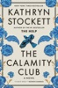

<b>“So immersive, exciting, and downright fabulous, you never want </b><b>it to end.”<i>—Oprah Daily</i></b>  <b>INSTANT <i>NEW YORK TIMES </i>BESTSELLER *&#xa0;The multimillion-copy-selling author of <i>The Help</i> returns with a bold, big-hearted novel about a group of unbreakable women, fighting for what’s rightfully theirs—and the power of friendship to change everything.</b>  <b>“Pure, hell-raising entertainment.”<i>—The New York Times Book Review</i></b>  Oxford, Mississippi, 1933.  Abandoned by her mother one Christmas Eve, eleven-year-old Meg Lefleur has learned the hard way to rely on no one. Now one of the unadoptable "big girls" at the Lafayette County Orphan Asylum, she fights each day to keep her spirit unbowed.  Birdie Calhoun, unmarried and outspoken, has come to Oxford to ask her socialite sister to help the struggling family she’s left behind. But as the Depression tightens its grip, Birdie discovers her sister’s seemingly charmed life is a tapestry of lies.  Then, Birdie encounters Charlie, a woman running low on luck with little left to lose. When their fates—and Meg’s—converge, Charlie comes up with an audacious plan for them to take control of their lives. But in a place and time where hypocrisy is rife and women’s freedom is fragile, even the smallest act of defiance can have dangerous consequences.  <i>The Calamity Club</i> will make you laugh, cry, and cheer—an epic testament to underestimated women who know that calamity can be the spark of new beginnings. This is Kathryn Stockett at her most confident, heartfelt, and hilarious—the triumphant return of one of the most beloved storytellers of our time.

[View on Apple](https://books.apple.com/us/book/the-calamity-club/id6742906151)

## Whistler

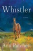

<b>A Katie Couric Book Club Pick / A Good Housekeeping Book Club Pick / A GoodReads Most Anticipated Book of Summer</b>  <b>“Ann Patchett’s new novel is a rare phenomenon in contemporary fiction: a novel both majestic and intimate, original and masterful in its structure, crystalline in its prose, revelatory in its insights, utterly devastating yet ultimately uplifting in its emotional impact. . . . I think it is her best novel yet.” —<i>The Boston Globe</i></b>  <b>The acclaimed, prize-winning #1 <i>New York Times</i> bestselling writer returns with a moving, luminous novel that reminds us of the sweetness and impermanence of life and the power of connection to defy time.</b>  When Daphne Fuller and her husband Jonathan visit the Metropolitan Museum of Art, they notice an older, white-haired gentleman following them. The man turns out to be Eddie Triplett, her former stepfather, who had been married to her mother for a little more than year when Daphne was nine. Now fifty-three, Daphne hasn’t seen Eddie for many years, not since the fateful event that changed the direction of both their lives. Meeting again, time falls away; while their relationship was brief, it had a profound impact on them both, and now that they are reunited, they have no intention of ever being separated again.  <i>Whistler</i> is a story about two adults looking back over the choices they made, and the choices that were made for them. It’s a story about bravery, memory, the often small yet consequential moments that define our lives, and the endless stream of loss that in time comes for us all. Beautiful in its simplicity, it is ultimately about how love endures, and how the feeling of being known by one other person, even for a short period of time, can change everything.

[View on Apple](https://books.apple.com/us/book/whistler/id6753892862)

## The Odyssey

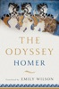

Homer’s great epic of a hero’s journey home—inspiration for the major motion picture by Christopher Nolan—in a bold, contemporary, and refreshingly readable translation.  "Wilson’s language is fresh, unpretentious and lean. . . . It is rare to find a translation that is at once so effortlessly easy to read and so rigorously considered." —Madeline Miller, author of Circe  Composed at the rosy-fingered dawn of world literature almost three millennia ago, The Odyssey is a poem about violence and the aftermath of war; about wealth, poverty, and power; about marriage and family; about travelers, hospitality, and the yearning for home.  This fresh, authoritative translation captures the beauty of this ancient poem as well as the drama of its narrative. Its characters are unforgettable, none more so than the “complicated” hero himself, a man of many disguises, many tricks, and many moods, who emerges in this version as a more fully rounded human being than ever before.  Written in iambic pentameter verse and a vivid, contemporary idiom, Emily Wilson’s Odyssey sings with a voice that echoes the epic’s music, sailing along at Homer’s swift, smooth pace.  A fascinating, informative introduction explores the Bronze Age milieu that produced the epic, the poem’s major themes, the controversies about its origins, and the unparalleled scope of its impact and influence. Maps drawn especially for this volume, a pronunciation glossary, and extensive notes and summaries of each book make this an Odyssey that will be treasured by a new generation of readers.

[View on Apple](https://books.apple.com/us/book/the-odyssey/id1215381921)

## Yesteryear: A GMA Book Club Pick

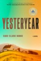

<b>#1 <i>NEW YORK TIMES</i> BESTSELLER&#xa0;•&#xa0;A GMA BOOK CLUB PICK • A<i> NEW YORK TIMES </i>BEST BOOK OF THE YEAR (SO FAR) • A traditional American woman, a “tradwife” influencer, suddenly awakens in the brutal reality of 1855—where she must unravel whether this living nightmare is an elaborate hoax, a twisted reality show, or something far more sinister in this sensational debut novel.  "A bold and biting satire, <i>Yesteryear…</i>will have you cackling and gasping right to the final page." —Nita Prose, #1 <i>New York Times</i> bestselling author of <i>The Maid </i>series</b>  <i>My name was Natalie Heller Mills, and I was perfect at being alive. </i>  Natalie lives a traditional lifestyle. Her charming farmhouse is rustic, her husband a handsome cowboy, her six children each more delightful than the last. So what if there are nannies and producers behind the scenes, her kitchen hiding industrial-grade fridges and ovens, her husband the heir to a political dynasty?&#xa0;What Natalie’s followers—all 8 million of them—don’t know won’t hurt them. And The Angry Women? The privileged, Ivy League, coastal elite haters who call her an antifeminist iconoclast? They’re sick with jealousy. Because Natalie isn’t simply living the good life, she’s living the ideal—and just so happens to be building an empire from it.  Until one morning she wakes up in a life that isn’t hers. Her home, her husband, her children—they’re all familiar, but something’s off. Her kitchen is warmed by a sputtering fire rather than electricity, her children are dirty and strange, and her soft-handed husband is suddenly a competent farmer. Just yesterday Natalie was curating photos of homemade jam for her Instagram, and now she’s expected to haul firewood and handwash clothes until her fingers bleed. Has she become the unwitting star of a ruthless reality show? Could it really be time travel? Is she being tested by God? By Satan? When Natalie suffers a brutal injury in the woods, she realizes two things: This is not her beautiful life, and she must escape by any means possible.  A gripping, electrifying novel that is as darkly funny as it is frightening, <i>Yesteryear</i> is a gimlet-eyed look at tradition, fame, faith, and the grand performance of womanhood.

[View on Apple](https://books.apple.com/us/book/yesteryear-a-gma-book-club-pick/id6748329385)

## Theo of Golden

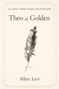

<b>THE #1 <i>NEW YORK TIMES</i> BESTSELLING PHENONEMON</b>  <b>A Katie Couric Book Club Pick • A Jen Hatmaker Book Club Pick</b>  <b>“[A] word-of-mouth smash hit.”</b> <b>—<i>The New York Times</i></b>  <b>“A treasure.” —Hoda Kotb</b>  One spring morning, a stranger named Theo arrives in the small Southern city of Golden. He doesn’t explain much about where he came from or why he’s there—but when he visits the local coffeehouse, where pencil portraits of the people of Golden hang on the walls, he begins purchasing them, one at a time, and giving each portrait to the person depicted. In exchange, he asks only for the person’s story. And so portrait by portrait, person by person, secrets are revealed, regrets are shared, and ordinary lives are profoundly altered.  A story of giving and receiving, of seeing and being seen, <i>Theo of Golden</i> is an unforgettable novel about the power of generosity, the importance of connection, and the quiet miracles that happen when we choose kindness and wonder.

[View on Apple](https://books.apple.com/us/book/theo-of-golden/id6753592922)

## Demon Copperhead

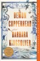

WINNER OF THE PULITZER PRIZE • WINNER OF THE WOMEN'S PRIZE FOR FICTION  New York Times Readers’ Pick: Top 100 Books of the 21st Century • An Oprah’s Book Club Selection • An Instant&#xa0;New York Times&#xa0;Bestseller • An Instant Wall Street Journal Bestseller • A #1&#xa0;Washington Post&#xa0;Bestseller • A New York Times "Ten Best Books of the Year"   "Demon is a voice for the ages—akin to Huck Finn or Holden Caulfield—only even more resilient.” —Beth Macy, author of&#xa0;Dopesick  "May be the best novel of [the year]. . . . Equal parts hilarious and heartbreaking, this is the story of an irrepressible boy nobody wants, but readers will love.” —Ron Charles,&#xa0;Washington Post  From the acclaimed author of The Poisonwood Bible and The Bean Trees and the recipient of the National Book Foundation's Medal for Distinguished Contribution to American Letters,&#xa0;a brilliant novel that enthralls, compels, and captures the heart as it evokes a young hero’s unforgettable journey to maturity  Set in the mountains of southern Appalachia, Demon Copperhead is the story of a boy born to a teenaged single mother in a single-wide trailer, with no assets beyond his dead father’s good looks and copper-colored hair, a caustic wit, and a fierce talent for survival. Relayed in his own unsparing voice, Demon braves the modern perils of foster care, child labor, derelict schools, athletic success, addiction, disastrous loves, and crushing losses. Through all of it, he reckons with his own invisibility in a popular culture where even the superheroes have abandoned rural people in favor of cities.  Many generations ago, Charles Dickens wrote&#xa0;David Copperfield&#xa0;from his experience as a survivor of institutional poverty and its damages to children in his society. Those problems have yet to be solved in ours. Dickens is not a prerequisite for readers of this novel, but he provided its inspiration. In transposing a Victorian epic novel to the contemporary American South, Barbara Kingsolver enlists Dickens’ anger and compassion, and above all, his faith in the transformative powers of a good story.&#xa0;Demon Copperhead&#xa0;speaks for a new generation of lost boys, and all those born into beautiful, cursed places they can’t imagine leaving behind.

[View on Apple](https://books.apple.com/us/book/demon-copperhead/id1605764997)

## The Country Road Murders

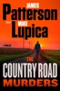

<b>“Fascinating … deeply American … the story of a town that needs a different kind of hero. The plot is so propulsive, it blows you away. This&#xa0;is a great one.” —</b><i><b>Morning Joe</b></i>  <b>After a shocking accident, Silas Tucker’s legendary football career is suddenly over in this action-packed sports thriller powered by loyalty, competition, and family.&#xa0;</b>  Humbled, but never defeated, he returns to his backwoods hometown, Cross Rivers, North Carolina, where his father was murdered.&#xa0;  He goes back to what’s left of his family and their small, struggling farm. He reunites with his best friend in the world—Taylor McCarter Webb, who is now married.&#xa0;  Then Silas is pulled into a deadly battle with the Southern Mafia who control drugs, trafficking and murder.&#xa0;  As the suspense crescendos, Silas follows one rule for survival: you don’t ride these country roads alone, or in the dead of night. &#xa0;

[View on Apple](https://books.apple.com/us/book/the-country-road-murders/id6747655165)

## The Five-Star Weekend

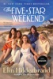

<b>A NEW STREAMING SERIES ON PEACOCK STARTING JULY 9, STARRING JENNIFER GARNER, REGINA HALL, CHLOË SEVIGNY, GEMMA CHAN, AND D'ARCY CARDEN.</b>  <b>From the #1 </b><i><b>New York Times</b></i><b> bestselling author of </b><i><b>The Hotel Nantucket</b></i><b>: After tragedy strikes, food blogger Hollis Shaw gathers four friends from different stages in her life to spend an unforgettable weekend on Nantucket.</b>  Hollis Shaw’s life seems picture-perfect. She’s the creator of the popular food blog <i>Hungry with Hollis</i> and is married to Matthew, a dreamy heart surgeon. But after she and Matthew get into a heated argument one snowy morning, he leaves for the airport and is killed in a car accident. The cracks in Hollis’s perfect life—her strained marriage and her complicated relationship with her daughter, Caroline—grow deeper.  So when Hollis hears about something called a “Five-Star Weekend”—one woman organizes a trip for her best friend from each phase of her life: her teenage years, her twenties, her thirties, and midlife—she decides to host her own Five-Star Weekend on Nantucket. But the weekend doesn’t turn out to be a joyful Hallmark movie.  The husband of Hollis’s childhood friend Tatum arranges for Hollis’s first love, Jack Finigan, to spend time with them, stirring up old feelings. Meanwhile, Tatum is forced to play nice with abrasive and elitist Dru-Ann, Hollis’s best friend from UNC Chapel Hill. Dru-Ann’s career as a prominent Chicago sports agent is on the line after her comments about a client’s mental health issues are misconstrued online. Brooke, Hollis’s friend from their thirties, has just discovered that her husband is having an inappropriate relationship with a woman at work. Again! And then there’s Gigi, a stranger to everyone (including Hollis) who reached out to Hollis through her blog. Gigi embodies an unusual grace and, as it happens, has many secrets.  <i>The Five-Star Weekend</i> is a surprising and captivating story about friendship, love, and self-discovery set on Nantucket. It will be a weekend like no other.

[View on Apple](https://books.apple.com/us/book/the-five-star-weekend/id6445184178)

## Paranoia

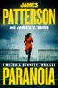

<b>NYPD Detective Michael Bennett will stop at nothing to protect family: his wife, his kids—and his fellow officers—in the latest psychological thriller from #1&#xa0;<i>New York Times</i>&#xa0;bestselling author James Patterson.&#xa0;</b>   At every&#xa0;death&#xa0;scene, Bennett says a prayer over the victim.&#xa0;&#xa0;  But recently, too many of the departed have been&#xa0;fellow cops.&#xa0;  “I want you to look at these deaths on special assignment,” NYPD Inspector Celeste Cantor says. “Report only to me.”  Bennett excels as a solo investigator. But he's chasing a killer who feeds on isolation... and paranoia.

[View on Apple](https://books.apple.com/us/book/paranoia/id6503679746)

## The Shampoo Effect: A Read with Jenna Pick

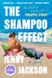

<b>READ WITH JENNA BOOK CLUB PICK AS FEATURED ON <i>TODAY | </i>AN INSTANT <i>NEW YORK TIMES </i>BESTSELLER!  “Funny, drama-fueled, and full of Jackson's breezy wit. . . Brilliant.”&#xa0;—Coco Mellors, <i>New York Times </i>bestselling author of <i>Blue Sisters</i>  “The platonic ideal of a beach read.” —<i>The New York Times</i>   An ambitious young woman insinuates herself into a tight-knit social set, shaking up friendships and marriages in a small seaside town. A frothy novel of love, money, sex, and friendship, from the <i>New York Times</i> bestselling author of <i>Pineapple Street</i></b>  When Caroline Lash arrives in Greenhead, Massachusetts, she falls head-over-heels for Van Whittaker, a fleece-wearing, litter-collecting kayak enthusiast with long, floppy hair and the personality of a Border collie. Born and raised in this picturesque coastal village, Van runs with the same crowd he did as a kid: His ex-girlfriend, Bailey, a beautiful girl who attracts men like moths to a flame; Augusta, old money, horsey, and snobbish; and Fran, surrounded by brothers and sons, too fed up with boys to ever consider marrying one.  Together, the group runs wild through the marshes, beaches, and bars of Greenhead, drinking on houseboats, spending long afternoons sunbathing with their children, and playing games the way they always have. But when Bailey discovers that she is pregnant with Van’s baby, the delicate balance of the group’s friendship is thrown off. Soon Caroline is cast out of the circle and what she does next—in a potent mix of fury and heartbreak—exposes long-held secrets and works the entire town of Greenhead into a lather.  Dazzlingly funny, sexy, and as juicy as it is astute, <i>The Shampoo Effect </i>is a story of late-night parties, early mornings with small children, the dawn of midlife, and a group of old friends finally growing up despite all their best efforts to the contrary.

[View on Apple](https://books.apple.com/us/book/the-shampoo-effect-a-read-with-jenna-pick/id6753266375)

## Circe

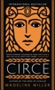

<b>This #1 </b><i><b>New York Times</b></i><b> bestseller brilliantly reimagines the life of Circe, formidable sorceress of </b><i><b>The Odyssey</b></i><b>, as she discovers her own power, forges her identity, and challenges the gods who seek to control her.&#xa0;</b>  <b>"[A] bold and subversive retelling of the goddess's story." —</b><i><b>The New York Times</b></i>  In the house of Helios, god of the sun and mightiest of the Titans, a daughter is born. But Circe is a strange child—not powerful, like her father, nor viciously alluring like her mother. Turning to the world of mortals for companionship, she discovers that she does possess power—the power of witchcraft, which can transform rivals into monsters and menace the gods themselves.  Threatened, Zeus banishes her to a deserted island, where she hones her occult craft, tames wild beasts and crosses paths with many of the most famous figures in all of mythology, including the Minotaur, Daedalus and his doomed son Icarus, the murderous Medea, and, of course, wily Odysseus.  But there is danger, too, for a woman who stands alone, and Circe unwittingly draws the wrath of both men and gods, ultimately finding herself pitted against one of the most terrifying and vengeful of the Olympians. To protect what she loves most, Circe must summon all her strength and choose, once and for all, whether she belongs with the gods she is born from, or the mortals she has come to love.  With unforgettably vivid characters, mesmerizing language, and page-turning suspense, <i>Circe </i>is a triumph of storytelling, an intoxicating epic of family rivalry, palace intrigue, love and loss, as well as a celebration of indomitable female strength in a man's world.  Named one of the Best Books of the Year by NPR, <i>Washington Post</i>, <i>People</i>, <i>Time</i>, Amazon, <i>Entertainment Weekly</i>, <i>Bustle</i>, <i>Newsweek</i>, <i>A.V. Club</i>, <i>Christian Science Monitor</i>, <i>Refinery 29</i>, <i>Buzzfeed</i>, <i>Paste</i>, Audible, <i>Kirkus Reviews</i>, <i>Publishers Weekly</i>, <i>Thrillist</i>, NYPL, <i>Self</i>, <i>Real Simple</i>, Goodreads,<i> Boston Globe</i>, <i>Electric Literature</i>, <i>BookPage</i>, <i>Guardian</i>, <i>Book Riot</i>, <i>Seattle Times</i>, and <i>Business Insider</i>.

[View on Apple](https://books.apple.com/us/book/circe/id1268516837)

## Mad Mabel

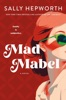

<b>INSTANT NEW YORK TIMES BESTSELLER</b>  <b>From <i>New York Times </i>bestselling author Sally Hepworth comes a twisty tale of justice, redemption, and one irrepressible woman who’s not done breaking the rules just yet.</b>  Meet Elsie Mabel Fitzpatrick: eighty-one years old, gloriously grumpy, fiercely independent, and never without a hot cup of tea—or a cutting remark. She minds her own business in her quiet Melbourne suburb, until a neighbor turns up dead and the whispers start flying.   Because Elsie hasn’t always been Elsie. Once upon a headline, she was Mad Mabel Waller—Australia’s youngest convicted murderer. But was she really mad, or just misunderstood? Either way, she’s kept her secret buried for decades.    Enter seven-year-old Persephone, a relentless little chatterbox who has just moved in across the road (armed with stickers, questions, and no sense of personal boundaries); Joan, who appears to have it in for Elsie; and a healthy dose of public interest—the cops are sniffing around, and the media is circling like seagulls at a picnic.   So Mabel does what she’s always done best—she takes matters into her own hands.    Is she a cantankerous old lady with a shady past? A cold-blooded killer with arthritis? Or just someone who’s finally ready to tell her side of the story?    Sharp, surprising, and wickedly funny, this is the unforgettable story of a woman who’s spent a lifetime being underestimated—and is about to prove everyone wrong. Again.

[View on Apple](https://books.apple.com/us/book/mad-mabel/id6744894807)

## Threshing Day

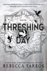

The next book in the blockbuster Empyrean series, <i>Threshing Day</i> contains thirteen stories starring your favorite characters and their dragons.  Full blurb to be revealed soon!

[View on Apple](https://books.apple.com/us/book/threshing-day/id6775515084)

## Love You More

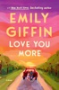

<b><i>NEW YORK TIMES</i> BESTSELLER • A woman is newly engaged to a man she adores when she receives a call from her first love with news that shatters her carefully ordered world, in this emotionally powerful novel from the author of <i>All We Ever Wanted, The Lies That Bind,</i> and <i>The Summer Pact</i>.  "Remember <i>Sweet Home Alabama</i>? Giffin has given us a modern Midwestern update of that classic story.”—<i>The New York Times Book Review</i></b>  Billie has built the perfect life. Her medical practice in New York City is thriving, and she’s finally found the right partner in Dean after years spent trying to move on from her high-school sweetheart, Mick. Their young love had been intense and true, but distance and ambition pulled them apart when she left Wisconsin for medical school.  Then one morning, just after she’s accepted Dean’s romantic marriage proposal, Billie’s phone rings. It’s Mick—calling for the first time in nearly a decade. His news is urgent and in a moment, everything changes.  As Billie boards a plane back to Wisconsin, her past comes rushing in—her hometown friendships, the love she and Mick shared, and the choices that shaped them all. What awaits her is a reckoning with what she’s lost, what she’s built, and what she still wants.  Gripping and deeply moving, <i>Love You More</i> is a story about the plot twists life throws at us—and how love, in all its forms, has the power to change everything.

[View on Apple](https://books.apple.com/us/book/love-you-more/id6753746266)

## The Way of Kings

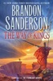

From #1 New York Times bestselling author Brandon Sanderson, The Way of Kings, Book One of the Stormlight Archive, begins an incredible new saga of epic proportion. Roshar is a world of stone and storms. Uncanny tempests of incredible power sweep across the rocky terrain so frequently that they have shaped ecology and civilization alike. Animals hide in shells, trees pull in branches, and grass retracts into the soilless ground. Cities are built only where the topography offers shelter. It has been centuries since the fall of the ten consecrated orders known as the Knights Radiant, but their Shardblades and Shardplate remain: mystical swords and suits of armor that transform ordinary men into near-invincible warriors. Men trade kingdoms for Shardblades. Wars were fought for them, and won by them. One such war rages on a ruined landscape called the Shattered Plains. There, Kaladin, who traded his medical apprenticeship for a spear to protect his little brother, has been reduced to slavery. In a war that makes no sense, where ten armies fight separately against a single foe, he struggles to save his men and to fathom the leaders who consider them expendable. Brightlord Dalinar Kholin commands one of those other armies. Like his brother, the late king, he is fascinated by an ancient text called The Way of Kings. Troubled by over-powering visions of ancient times and the Knights Radiant, he has begun to doubt his own sanity. Across the ocean, an untried young woman named Shallan seeks to train under an eminent scholar and notorious heretic, Dalinar&#39;s niece, Jasnah. Though she genuinely loves learning, Shallan&#39;s motives are less than pure. As she plans a daring theft, her research for Jasnah hints at secrets of the Knights Radiant and the true cause of the war. The result of over ten years of planning, writing, and world-building, The Way of Kings is but the opening movement of the Stormlight Archive, a bold masterpiece in the making. Speak again the ancient oaths: Life before death. Strength before weakness. Journey before Destination. and return to men the Shards they once bore. The Knights Radiant must stand again. Other Tor books by Brandon Sanderson The Cosmere The Stormlight Archive ● The Way of Kings ● Words of Radiance ● Edgedancer (novella) ● Oathbringer ● Dawnshard (novella) ● Rhythm of War The Mistborn Saga The Original Trilogy ● Mistborn ● The Well of Ascension ● The Hero of Ages Wax and Wayne ● The Alloy of Law ● Shadows of Self ● The Bands of Mourning ● The Lost Metal Other Cosmere novels ● Elantris ● Warbreaker ● Tress of the Emerald Sea ● Yumi and the Nightmare Painter ● The Sunlit Man Collection ● Arcanum Unbounded: The Cosmere Collection The Alcatraz vs. the Evil Librarians series ● Alcatraz vs. the Evil Librarians ● The Scrivener&#39;s Bones ● The Knights of Crystallia ● The Shattered Lens ● The Dark Talent ● Bastille vs. the Evil Librarians (with Janci Patterson) Other novels ● The Rithmatist ● Legion: The Many Lives of Stephen Leeds ● The Frugal Wizard’s Handbook for Surviving Medieval England Other books by Brandon Sanderson The Reckoners ● Steelheart ● Firefight ● Calamity Skyward ● Skyward ● Starsight ● Cytonic ● Skyward Flight (with Janci Patterson) ● Defiant At the Publisher&#39;s request, this title is being sold without Digital Rights Management Software (DRM) applied.

[View on Apple](https://books.apple.com/us/book/the-way-of-kings/id376229549)

## Regime Change

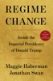

<b>“<i>Regime Change</i> is exceptional. It transcends its genre...the book is packed with news that will stay news...This is reporting of consequence.” </b><b>—David Remnick, <i>The New Yorker</i></b>   <b>“A flabbergasting feat of political reporting.” </b><b>—Tina Brown</b>   <b>“Riveting and richly textured...<b>What the authors add is the vivid detail that makes these events feel actual. They wrest reality itself back from the distorted world of entertainment, illusion, fantasy and denial that Trump has generated around himself. It is this flood of provocation, atrocity, self-dealing and fabrication that makes Haberman and Swan’s counternarrative so vital.” </b></b><b>—Fintan O’Toole, <i>The New York Times</i></b>   <b>A riveting, intimate, and revelatory account of the most radical and consequential presidency of our time.</b>  From the two reporters who have covered him more closely than perhaps anyone else over the past decade comes this definitive portrait of Donald Trump in the White House. <i>Regime Change</i> covers the first year of Trump’s second presidency—a term liberated from every constraint that defined his first. The generals who once told him “no” are gone, and the lawyers who remain have learned to pick their battles. His administration has flouted court orders and he has claimed powers that Congress once checked. What remains is a President willing to take enormous risks that have upended global markets and toppled heads of state; an imperial President operating almost entirely on instinct alone.   Based on hundreds of interviews and unprecedented reporting from deep within the administration’s most closely guarded rooms, <i>Regime Change</i> takes the reader inside the Situation Room and into the secret Oval Office deliberations that have launched a new war in the Middle East and seen Trump seal the border, surge National Guard troops into cities, and send immigration agents into deadly clashes with protestors. Maggie Haberman and Jonathan Swan bring us behind the scenes of a presidency that has transformed the culture, turned the Justice Department into an agent of retribution against the President’s enemies and the office itself into a brazen vehicle for profit. They reveal a second term propelled by a historical irony that Trump himself has come to understand: that the indictments, the convictions, the assassination attempts, and four years of exile made him not weaker but far more powerful, more vengeful, and more willing to gamble than any President in modern history.   This is the story of how Trump has used that power, who has tried to stop him, and why nearly all of them have failed. It is also the story of something American journalists are more accustomed to chronicling in distant capitals than in their own: a President who has fundamentally altered the nature of the office he holds—and, with it, how the rest of the world understands American power. It is an account of <i>Regime Change</i> right here in America—a landmark real-time history of a modern presidency like no other.

[View on Apple](https://books.apple.com/us/book/regime-change/id6761716648)

## Choke Point

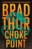

<b><b>#1 <i>New York Times</i> bestselling author Brad Thor thrills with his new summer blockbuster starring Scot Harvath.</b></b>  <b>A devastating series of bombings tears through Bangkok. Scores of American citizens are dead. The attacks send shock waves around the world.</b>  As global assistance pours into Thailand—including the FBI’s famed Evidence Response Team—the president of the United States quietly prepares a plan B: Scot Harvath, America’s top spy, trained to operate outside the law and probe the dark corners others can’t…or won’t.  But the bomber Harvath is pursuing isn’t a terrorist. He’s something far more dangerous—one of ours.  Meanwhile, in Washington, a former United States Marine is being hunted—and he has no idea why. Desperate for answers, he turns to the one person he still trusts—his ex-fiancée, a rising star in the White House. The problem is, she isn’t sure she can trust him.  As Harvath closes in on the bomber, a devastating truth begins to emerge. China has quietly deployed its most elite intelligence unit to Thailand. Their objective: to ignite chaos, trigger a military coup, and seize control of a narrow but critical piece of land, one that could give Beijing a decisive advantage.  If the plan succeeds, Beijing will secure a key gateway between two oceans, eroding American naval dominance and tipping the balance in any war between the world’s great powers.  China will control the ultimate geopolitical choke point.

[View on Apple](https://books.apple.com/us/book/choke-point/id6754249367)

## Dirty Thirty

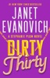

<b>Janet Evanovich, the “most popular mystery writer alive” (<i>The New York Times</i>), is in top form as she sends Stephanie Plum on the trail of a stolen stash of dirty diamonds in this instant #1 <i>New York Times</i> bestseller.</b>  Stephanie Plum, Trenton’s hardest working, most underappreciated bounty hunter, is offered an assignment that seems simple enough. Local jeweler Martin Rabner wants her to locate his former security guard, Andy Manley (a.k.a. Nutsy), who he is convinced stole a fortune in diamonds from his safe. Stephanie is also looking for another troubled man, Duncan Dugan, a fugitive from justice arrested for robbing the same jewelry store on the same day.   With her boyfriend Morelli away in Miami on police business, Stephanie is taking care of Bob, Morelli’s giant orange dog who will devour anything, from Stephanie’s stray donuts to the upholstery in her car. Morelli’s absence also means the inscrutable, irresistible security expert Ranger is front and center in Stephanie’s life when things inevitably go sideways. And he seems determined to stay there.   To complicate matters, her best friend is convinced she is being stalked by a mythological demon hell-bent on relieving her of her wardrobe. An overnight stakeout with Stephanie’s mother and Grandma Mazur reveals three generations of women with nerves of steel and driving skills worthy of NASCAR champions.   As the body count rises and witnesses start to disappear, it won’t be easy for Stephanie to keep herself clean when everyone else is playing dirty. It’s a good thing Stephanie isn’t afraid of getting a little dirty, too in this “uproarious, crazy, laugh-a-minute caper” (<i>Booklist</i>, starred review).

[View on Apple](https://books.apple.com/us/book/dirty-thirty/id6445638027)

## All the Pretty Horses

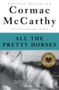

<b>NATIONAL BOOK AWARD WINNER <b>•</b> NATIONAL BESTSELLER • The first volume in the <i>Border Trilogy,</i> from the bestselling author of <i>The Passenger </i>and the Pulitzer Prize–winning novel <i>The Road </i></b> <i>All the Pretty Horses </i>is the tale of John Grady Cole, who at sixteen finds himself at the end of a long line of Texas ranchers, cut off from the only life he has ever imagined for himself. With two companions, he sets off for Mexico on a sometimes idyllic, sometimes comic journey to a place where dreams are paid for in blood.

[View on Apple](https://books.apple.com/us/book/all-the-pretty-horses/id420536155)

## The Mistake

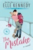

<b>The series that inspired Amazon Prime's </b><i><b>Off-Campus</b></i><b> – Now Streaming!</b>  <b>Get ready for another binge-worthy romance from international bestselling author and TikTok sensation Elle Kennedy.</b>  <i>He's a player in more ways than one…</i>  College junior John Logan can get any girl he wants. For this hockey star, life is a parade of parties and hook-ups, but behind his killer grins and easygoing charm, he hides growing despair about the dead-end road he'll be forced to walk after graduation. A sexy encounter with freshman Grace Ivers is just the distraction he needs, but when a thoughtless mistake pushes her away, Logan&#xa0;plans to spend his final year proving to her that he's worth a second chance.  <i>Now he's going to need to up his game…</i>  After a less than stellar freshman year, Grace is back at Briar University, older, wiser, and&#xa0;<i>so</i>&#xa0;over the arrogant hockey player she nearly handed her V-card to. She's not a charity case, and she's not the quiet butterfly she was when they first hooked up. If Logan expects her to roll over and beg like all his other puck bunnies, he can think again. He wants her back? He'll have to <i>work</i> for it. This time around, she'll be the one in the driver's seat…and she plans on driving him wild.

[View on Apple](https://books.apple.com/us/book/the-mistake/id986126256)

## The Score

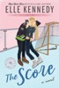

<b>The series that inspired Amazon Prime's </b><i><b>Off-Campus</b></i><b> – Now Streaming!</b>  <b>A </b><i><b>New York Times</b></i><b> bestseller and TikTok sensation! Get ready for another binge-worthy romance from international bestselling author Elle Kennedy.</b>  <b>He knows how to score, on and off the ice</b>  Allie Hayes is in crisis mode. With graduation looming, she still doesn't have the first clue about what she's going to do after college. To make matters worse, she's nursing a broken heart thanks to the end of her longtime relationship. Wild rebound sex is definitely not the solution to her problems, but gorgeous hockey star Dean Di-Laurentis is impossible to resist. Just once, though, because even if her future is uncertain, it sure as heck won't include the king of one-night stands.  <b>It'll take more than flashy moves to win her over</b>  Dean always gets what he wants. Girls, grades, girls, recognition, <i>girls</i>…he's a ladies man, all right, and he's yet to meet a woman who's immune to his charms. Until Allie. For one night, the feisty blonde rocked his entire world—and now she wants to be <i>friends</i>? Nope. It's not over until he says it's over. Dean is in full-on pursuit, but when life-rocking changes strike, he starts to wonder if maybe it's time to stop focusing on scoring…and shoot for love.

[View on Apple](https://books.apple.com/us/book/the-score/id1050857569)

## The Buffalo Hunter Hunter

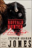

<b>Selected as One of <i>The New York Times</i>’s 100 Notable Books of the Year  A Barack Obama Summer Read  Bram Stoker Award for Superior Achievement in a Novel  Nebula Award Winner for Best Novel  Locus Award for Horror  Libby Award for Best Horror  Nebula, Bram Stoker, and Los Angeles Times Book Prize Award Finalist  A <i>Time</i>, <i>The Washington Post</i>, NPR, <i>Shelf Awareness</i>, <i>The Toronto Star</i>, and <i>Publishers Weekly </i>Best of the Year  <i>Kirkus Reviews</i> Best Historical Fiction   The <i>New York Times</i> bestseller and “horror masterpiece” (NPR) from Stephen Graham Jones—the master of modern horror—is a chilling historical horror novel tracing the life of a vampire who haunts the fields of the Blackfeet reservation looking for justice.   “Jones has written his Interview with the Indigenous Vampire. A landmark of horror and historical fiction alike, perhaps the closest thing we have to horror’s Moby-Dick.” —<i>Vulture</i>   “Inventive and spine-tingling…a master class in voice. Queasy, uneasy, <i>The Buffalo Hunter Hunter</i> plays with the interplay between religion and historical guilt, identity and appetite.” —<i>The Washington Post</i></b>  A diary, written in 1912 by a Lutheran pastor is discovered within a wall. What it unveils is a slow massacre, a chain of events that go back to 217 Blackfeet dead in the snow. Told in transcribed interviews by a Blackfeet named Good Stab, who shares the narrative of his peculiar life over a series of confessional visits. This is an American Indian revenge story written by one of the new masters of horror, Stephen Graham Jones.

[View on Apple](https://books.apple.com/us/book/the-buffalo-hunter-hunter/id6504307914)

## The Deal

<i><b>New York Times</b></i><b> bestseller and TikTok sensation Elle Kennedy brings you the first in the sexy Off-Campus series that everyone is talking about.</b>  <b>The series that inspired Amazon Prime's </b><i><b>Off-Campus</b></i><b> – Now Streaming!</b>  <b>She's about to make a deal with the college bad boy...</b>  Hannah Wells has finally found someone who turns her on. But while she might be confident in every other area of her life, she's carting around a full set of baggage when it comes to sex and seduction. If she wants to get her crush's attention, she'll have to step out of her comfort zone and make him take notice...even if it means tutoring the annoying, childish, cocky captain of the hockey team in exchange for a pretend date.  <b>...and it's going to be oh so good</b>  All Garrett Graham has ever wanted is to play professional hockey after graduation, but his plummeting GPA is threatening everything he's worked so hard for. If helping a sarcastic brunette make another guy jealous will help him secure his position on the team, he's all for it. But when one unexpected kiss leads to the wildest sex of both their lives, it doesn't take long for Garrett to realize that pretend isn't going to cut it. Now he just has to convince Hannah that the man she wants looks a lot like him.

[View on Apple](https://books.apple.com/us/book/the-deal/id966391102)

## This Changes Everything

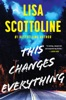

<b>In this “riveting, deeply felt and empowering thriller” (Laura Dave) from #1 bestselling author Lisa Scottoline, who "always delivers the fastest, twistiest reads" (Lisa Jewell), a woman risks her life to help her best friend find justice for a tragic crime.</b>  Julia Pritzker loves her new life as a wife and mother in beautiful Tuscany—except that she misses her best friend Courtney, back in the States. One night, Julia calls Courtney and reaches her as she’s arriving at her grandmother’s farm in Pennsylvania. A dreadful premonition overwhelms Julia moments before Courtney enters the house—and makes a heartbreaking discovery. Her beloved grandmother has been murdered, and the killer is escaping out the back door. Rushing to support Courtney, Julia flies home the next morning.&#xa0;  The local police believe the murder was a botched burglary, but the women suspect something much more sinister and enlist Bennie Rosato, the hotshot Philly lawyer, to assist. In addition, Courtney entreats Julia to trust her psychic intuition to point her to the missing pieces of this dark puzzle.  But in a town filled with explosive secrets, events take a deadly turn, and Julia becomes the target of a murderous conspiracy. She ends up fighting for her life, with no one to save her … but herself.  Only a blockbuster talent like Lisa Scottoline can tell this gripping and layered of a story, combining a woman’s search for truth with the revelation of her own empowerment, as well as the enduring strength and joys of female friendship.

[View on Apple](https://books.apple.com/us/book/this-changes-everything/id6755671254)

## Circle of Days

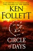

<b>AN INSTANT </b><i><b>NEW YORK TIMES</b></i><b> BESTSELLER!</b>  <b>From a bestselling author of epic fiction comes the deeply human story of one of the world’s greatest mysteries: the building of Stonehenge.</b>  <b>"Superb." —Lee Childs, </b><i><b>New York Times</b></i><b> bestselling author of the Jack Reacher series</b>  <b>A FLINT MINER WITH A GIFT</b>      Seft, a talented flint miner, walks the Great Plain in the high summer heat, to witness the rituals that signal the start of a new year. He is there to trade his stone at the Midsummer Fair, and to find Neen, the girl he loves. Her family lives in prosperity and offer Seft an escape from his brutish father and brothers within their herder community.   <b>A PRIESTESS WHO BELIEVES THE IMPOSSIBLE </b>      Joia, Neen’s sister, is a priestess with a vision and an unmatched ability to lead. As a child, she watches the Midsummer ceremony, enthralled, and dreams of a miraculous new monument, raised from the biggest stones in the world. But trouble is brewing among the hills and woodlands of the Great Plain.   <b>A MONUMENT THAT WILL DEFINE A CIVILIZATION</b>      Joia’s vision of a great stone circle, assembled by the divided tribes of the Plain, will inspire Seft and become their life’s work. But as drought ravages the earth, mistrust grows between the herders, farmers and woodlanders—and an act of savage violence leads to open warfare ...        Truly ambitious in scope, <i>Circle of Days </i>invites you to join master storyteller Ken Follett in exploring one of the greatest mysteries of all time.

[View on Apple](https://books.apple.com/us/book/circle-of-days/id6736555186)

## Dolly All the Time: A GMA Book Club Pick

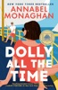

<b>INSTANT <i>NEW YORK TIMES </i>BESTSELLER and <i>GOOD MORNING AMERICA </i>BOOK CLUB PICK  A hardworking single mom returns to her seaside hometown and stumbles into a fake dating situationship with a wealthy, workaholic scion, from the <i>New York Times </i>bestselling author of <i>Nora Goes Off Script</i>.  “A luminous story of love, duty, and the tension between the two, <i>Dolly All the Time</i> is less like a novel and more like a place I never wanted to leave. This might be my new favorite!” —Carley Fortune, #1 <i>New York Times </i>bestselling author</b>  <i>If they start by pretending, can they end with something real?</i>  Dolly Brick has never met a problem she couldn’t solve. Not when her mom left when she was twelve, and not at thirty-nine when she moves with her son back to Whitfield, Rhode Island, for the summer to keep her dad and brother from losing the family home.  So when she comes across Stewart Whitfield—annoyingly handsome scion of <i>the </i>Whitfield family—with a flat tire and&#xa0;at the wrong end of a very public, very humiliating breakup, it’s in her nature to help. But Stewart’s proposed arrangement ends up being more than either of them bargained for, because as public dinners and high-society benefits turn into sunset boat rides and kisses that hit her bloodstream like a ghost pepper, Dolly starts to feel something more than helpful. She’s never relied on anyone besides herself—can she really start now?  <b>“This book is like a spicy margarita…sweet and a little salty, tart and hot…I have fallen in love with Dolly and with funny, fizzing Annabel Monaghan!” —Catherine Newman, <i>New York Times</i> bestselling author of <i>Sandwich</i></b>

[View on Apple](https://books.apple.com/us/book/dolly-all-the-time-a-gma-book-club-pick/id6751563893)

## The Waiting

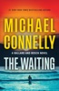

<b>In this instant<i> New York Times </i>bestseller, LAPD Detective Renée Ballard tracks a serial rapist whose trail has gone cold and enlists a new volunteer to the Open-Unsolved Unit: patrol officer Maddie Bosch, Harry’s daughter.&#xa0;​</b>   Renée Ballard and the LAPD’s Open-Unsolved Unit get a hot shot DNA connection between a recently arrested man and a serial rapist and murderer who went quiet two decades ago. The arrested man is only twenty-four, so the genetic link must be familial: His father was the Pillowcase Rapist, responsible for a five-year reign of terror in the City of Angels. But when Ballard and her team move in on their suspect, they encounter a baffling web of secrets and legal hurdles.   Meanwhile, Ballard’s badge, gun, and ID are stolen—a theft she can’t report without giving her enemies in the department ammunition to end her career as a detective. She works the burglary alone, but her mission draws her into unexpected danger. With no choice but to go outside the department for help, she knocks on the door of Harry Bosch.   At the same time, Ballard takes on a new volunteer to the cold case unit: Bosch’s daughter Maddie, now a patrol officer. But Maddie has an ulterior motive for getting access to the city’s library of lost souls—a case that may be the most iconic in the city’s history. Complex, satisfying, and full of dexterous twists, <i>The Waiting </i>demonstrates once more that “you can’t do better than Michael Connelly” (<i>Forbes</i>).

[View on Apple](https://books.apple.com/us/book/the-waiting/id6476859243)

## The Night We Met

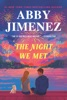

<b>The instant #1 <i>New York Times </i>bestseller!</b>  <b>From the #1 </b><i><b>New York Times </b></i><b>bestselling author of </b><i><b>Say You'll Remember Me&#xa0;</b></i><b>comes</b>&#xa0;<b>a</b>&#xa0;<b>beautiful, compelling novel that revels in laughter, friendship, and the messy choices life can throw our way.</b>  <b>In everyone’s life, there’s a split-second decision that can change everything...</b>   For Larissa, it came when choosing who to ride home with after a concert. That night, she had no idea she’d met the perfect man. She and Chris are great friends, co-parenting a slightly unhinged rescue Yorkie, sharing their favorite books, and judging bread (pumpernickel for the win!). For the first time amid all her side hustles to scrape by, things finally feel easy.   But she didn’t choose Chris to drive her home all those months ago—she went with his best friend, and he became her boyfriend. All Chris wants is for Larissa to be happy. Standing by on the sidelines is slowly killing him, but making a move would destroy someone else. How can something that feels so right be absolutely impossible?&#xa0;

[View on Apple](https://books.apple.com/us/book/the-night-we-met/id6749840232)

## Ironwood

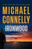

<b>AN INSTANT </b><i><b>NEW YORK TIMES </b></i><b>BESTSELLER</b>  <b>Sworn to protect a scenic island meant to be far from the evils of the mainland, Detective Sergeant Stilwell can feel danger closing in.</b>  Detective Sergeant Stilwell knows that his posting on Catalina Island is no paradise, but to most residents, it seems blissfully separated—by twenty-two miles of ocean—from the troubles of Los Angeles County. But now a threat is coming to his safe haven. &#xa0; Acting on a tip from a confidential informant, Stilwell and his deputies watch a plane land in the middle of the night at the Airport in the Sky, a remote airstrip in the mountains. A duffel bag of drugs is dropped and the deputies move in, but things quickly go sideways. While Stilwell chases the fleeing pickup man into the mountainside brush, shots are fired on the runway and the plane flies off. &#xa0; An internal inquiry follows, putting Stilwell on the bench until he is cleared of responsibility for the disastrous operation. But he is determined to find out who brought deadly violence to his island, and begins his own secret investigation into the drug deal gone wrong. &#xa0; While under orders to remain in the sheriff’s substation, he finds in the lost and found a valuable backpack that was never claimed. He traces it to a woman who disappeared while hiking on the island four years ago. But then why was the pack only turned in two months back? Now thoroughly intrigued, he follows the mystery all the way to the LAPD’s Open-Unsolved Unit and Detective Renée Ballard. &#xa0; Stilwell and Ballard work the case from both sides of the channel, and soon realize they are on the trail of a criminal who revels in taunting the authorities. Meanwhile, frustrated at being shut out of an investigation on his own island, Stilwell risks his already shaky standing in the department to pursue a case whose reach is wider than he ever imagined. &#xa0; Page-turning, packed with intrigue, and bringing together an unstoppable investigative team, <i>Ironwood </i>continues the Catalina series with all of Michael Connelly’s signature “relentless narrative drive…evocative atmosphere, realistic dialogue, and well-developed characters” (<i>Washington Review of Books</i>).

[View on Apple](https://books.apple.com/us/book/ironwood/id6755099933)

## State of Unrest, A First Family Novel

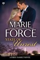

She loves being right, but she wishes she’d been wrong about the VP…

Lieutenant Sam Holland is running on empty. After her nephew Ethan’s traumatic kidnapping, a case that once again rocked her family, she’s holding on to her husband, Nick, her safe place in a world that never stops demanding more.

But even Nick can’t protect her—or his presidency—from what’s coming.

When a young woman arrives with information about her brother’s murder, Sam is pulled into a cold case just as a political scandal erupts around the vice president and her ties to a Russian operative.

With Sam forced to explain her actions during Ethan’s kidnapping and Nick contending with his vice president’s questionable actions, the pressure on them has never been higher.

And that’s before the Russian ends up dead and an explosion threatens lives of people they love.

The First Family Series is back at full-throttle as Sam and Nick try to stay focused on what’s important—at home and at work.

[View on Apple](https://books.apple.com/us/book/state-of-unrest-a-first-family-novel/id6756270995)

## Project Hail Mary

<b>#1 <i>NEW YORK TIMES </i>BESTSELLER • Now a major motion picture starring Ryan Gosling, directed by Phil Lord and Christopher Miller, with a screenplay by Drew Goddard</b>  <b>A lone astronaut must save the earth from disaster in this “propulsive” (<i>Entertainment Weekly</i>), cinematic thriller full of suspense, humor, and fascinating science—from the author of <i>The Martian</i>.  HUGO AWARD FINALIST • <i>NEW YORK TIMES</i> READER PICK: 100 BEST BOOKS OF THE 21ST CENTURY • ONE OF THE YEAR’S BEST BOOKS: <i>Parade, Newsweek, </i>New York Public Library, <i>Polygon, Shelf Awareness, She Reads, Kirkus Reviews, Library Journal</i> </b> Ryland Grace is the sole survivor on a desperate, last-chance mission—and if he fails, humanity and the earth itself will perish.  Except that right now, he doesn’t know that. He can’t even remember his own name, let alone the nature of his assignment or how to complete it.  All he knows is that he’s been asleep for a very, very long time. And he’s just been awakened to find himself millions of miles from home, with nothing but two corpses for company.  His crewmates dead, his memories fuzzily returning, Ryland realizes that an impossible task now confronts him. Hurtling through space on this tiny ship, it’s up to him to puzzle out an impossible scientific mystery—and conquer an extinction-level threat to our species.  And with the clock ticking down and the nearest human being light-years away, he’s got to do it all alone.  Or does he?  Hailed by <i>USA Today </i>as “an epic story of redemption, discovery, and cool speculative sci-fi,” <i>Project Hail Mary</i> is an irresistible interstellar adventure as only Andy Weir could deliver.

[View on Apple](https://books.apple.com/us/book/project-hail-mary/id1526997052)

## One Summer

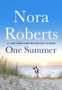

<b>Two journalists on a cross-country journey to capture the perfect image of the American spirit spend <i>One Summer</i> bringing their hearts into focus in this passionate novel from #1 <i>New York Times</i> bestselling author Nora Roberts.  </b>There’s no summer getaway for <i>Celebrity</i> magazine photographer Bryan Mitchell this year. Instead she’ll be spending three months on the road with renowned photojournalist Shade Colby. Their assignment is a nationwide photo shoot, taking candid snapshots of a summer in America for a beautiful coffee table book. But Bryan’s family fun in the sun moments contrasts with Shade’s portraits revealing the dark side of touristy vacations. Unable to agree on whose pictures best represent their project’s ideal, or anything else, Bryan and Shade discover something extraordinary when they come out from behind their cameras to truly see one another—two people longing for truth and beauty, hoping to share their vision of love.

[View on Apple](https://books.apple.com/us/book/one-summer/id1567913366)

## The Good Daughter

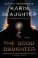

<b>NOW A PEACOCK LIMITED SERIES STARRING ROSE BYRNE AND MEGHANN FAHY OUT NOVEMBER 12, 2026  </b> <b>An instant <i>New York Times </i>bestseller</b>  <b>Two girls are forced into the woods at gunpoint. One runs for her life. One is left behind…</b>  Twenty-eight years ago, Charlotte and Samantha Quinn's happy small-town family life was torn apart by a terrifying attack on their family home. It left their mother dead. It left their father — Pikeville's notorious defense attorney — devastated. And it left the family fractured beyond repair, consumed by secrets from that terrible night.  Twenty-eight years later, and Charlie has followed in her father's footsteps to become a lawyer herself — the ideal good daughter. But when violence comes to Pikeville again — and a shocking tragedy leaves the whole town traumatized — Charlie is plunged into a nightmare. Not only is she the first witness on the scene, but it's a case that unleashes the terrible memories she's spent so long trying to suppress. Because the shocking truth about the crime that destroyed her family nearly thirty years ago won't stay buried forever…  Packed with twists and turns, brimming with emotion and heart,<i> The Good Daughter</i> is fiction at its most thrilling.

[View on Apple](https://books.apple.com/us/book/the-good-daughter/id1180491713)

## The Correspondent

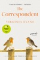

<b>#1 <i>NEW YORK TIMES </i>BESTSELLER • OVER TWO MILLION COPIES SOLD • Discover the word-of-mouth hit hailed by Ann Patchett as “A cause for celebration”—an intimate novel about the transformative power of the written word and the beauty of slowing down to reconnect with the people we love.</b>  <b>“This novel is a complete and utter joy.”—Ann Napolitano, author of <i>Hello Beautiful</i> “Quietly dazzling.”—<i>The New York Times</i> “I cried more than once as I witnessed this brilliant woman come to understand herself more deeply.”—Florence Knapp, author of <i>The Names </i></b>  <b>In development as a major motion picture </b>  <b>WINNER OF THE WOMEN’S PRIZE FOR FICTION • LONGLISTED FOR THE CENTER FOR FICTION FIRST NOVEL PRIZE AND THE ANDREW CARNEGIE MEDAL • A BEST BOOK OF THE YEAR: NPR, <i>The Washington Post, Boston Globe, Elle, Christian Science Monitor, She Reads</i></b>  <i>“Imagine, the letters one has sent out into the world, the letters received back in turn, are like the pieces of a magnificent puzzle. . . . Isn’t there something wonderful in that, to think that a story of one’s life is preserved in some way, that this very letter may one day mean something, even if it is a very small thing, to someone?”</i>  Filled with knowledge that only comes from a life fully lived, <i>The Correspondent</i> is a gem of a novel about the power of finding solace in literature and connection with people we might never meet in person. It is about the hubris of youth and the wisdom of old age, and the mistakes and acts of kindness that occur during a lifetime.  Sybil Van Antwerp has throughout her life used letters to make sense of the world and her place in it. Most mornings, around half past ten, Sybil sits down to write letters—to her brother, to her best friend, to the president of the university who will not allow her to audit a class she desperately wants to take, to Joan Didion and Larry McMurtry to tell them what she thinks of their latest books, and to one person to whom she writes often yet never sends the letter.  Sybil expects her world to go on as it always has—a mother, grandmother, wife, divorcee, distinguished lawyer, she has lived a very full life. But when letters from someone in her past force her to examine one of the most painful periods of her life, she realizes that the letter she has been writing over the years needs to be read and that she cannot move forward until she finds it in her heart to offer forgiveness.  Sybil Van Antwerp’s life of letters might be “a very small thing,” but she also might be one of the most memorable characters you will ever read.

[View on Apple](https://books.apple.com/us/book/the-correspondent/id6618121844)

## The Romance Revival

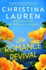

<b><i><b>New York Times</b></i><b> bestselling author Christina Lauren returns with an unforgettable romance in which a fateful accident erases a troubled marriage from memory—and a scientific breakthrough gives love one extraordinary do-over.</b></b>  Three years ago, scientist Emery Finch did something completely out of character: She got married. To Luca—the impossibly charming landscaper she met on one blistering night in Vegas who made her laugh, made her dance, made her<i> feel</i>.   But now, Emery is consumed by her top research, missing dinners, forgetting anniversaries, and promising herself Luca will understand once her cutting-edge discoveries come to light. Until the unthinkable happens: A tragic accident takes Luca from her.   Desperate not to lose him, Emery breaks every rule, using the classified technology she’s developed to bring him back to life. And Luca would probably thank her for it, if only he could remember her. Their first kiss, their Sunny Sundays at the beach, the life they built together...all of it is gone.   It may be a miracle of science, but for Emery it’s her one shot at a second chance. And this time, she won’t waste it—because true love is always worth reviving.

[View on Apple](https://books.apple.com/us/book/the-romance-revival/id6754249177)

## Strangers

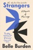

<b>INSTANT #1<i> NEW YORK TIMES </i>BESTSELLER • “Burden’s searing, probing memoir explores . . . what she learned about intimacy and her own spirit.”—<i>People</i>​​</b>  <b>“A beautifully written instant classic. <i>Strangers</i> is gripping and heartbreaking and a must-read for every wife—and husband.”—Graydon Carter</b>  <b>“Asks us to examine life’s most perplexing questions: Can we see the invisible fault lines in a marriage or truly know the people closest to us?”—Lori Gottlieb </b>  <i>It was a great love story, one for the ages. The speed of our beginning and the speed of our ending felt like matching bookends. They both came out of nowhere. He wanted it, he wanted me. And then he didn’t.</i>  In March 2020, Belle Burden was safe and secure with her family at their house on Martha’s Vineyard, navigating the early days of the pandemic together—building fires in the late afternoons, drinking whisky sours, making roast chicken. Then, with no warning or explanation, her husband of twenty years announced that he was leaving her. Overnight, her caring, steady partner became a man she hardly recognized. He exited his life with her like an actor shrugging off a costume.  In <i>Strangers,</i> Burden revisits her marriage, searching for clues that her husband was not who she always thought he was. As she examines her relationship through a new lens, she reckons with her own family history and the lessons she intuited about how a woman is expected to behave in the face of betrayal. Through all of it, she is transformed. The discreet, compliant woman she once was—someone nicknamed “Belle the Good”—gives way to someone braver, someone determined to use her voice.  With unflinching honesty and profound grace, Burden charts a path through heartbreak to show the power of a woman who refuses to give up on love. <i>Strangers</i> is a stunning, deeply moving, compulsively readable memoir heralding the arrival of a thrilling new literary talent.

[View on Apple](https://books.apple.com/us/book/strangers/id6744305942)

## The Goal

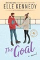

<b>The series that inspired Amazon Prime's </b><i><b>Off-Campus</b></i><b> – Now Streaming!</b>  <b>Discover another binge-worthy romance from New York Times bestselling author and TikTok sensation Elle Kennedy!</b>  <i>She's good at achieving her goals…</i>  College senior Sabrina James has her whole future planned out: graduate from college, kick butt in law school, and land a high-paying job at a cutthroat firm. Her path to escaping her shameful past certainly doesn't include a gorgeous hockey player who believes in love at first sight. One night of sizzling heat and surprising tenderness is all she's willing to give John Tucker, but sometimes, one night is all it takes for your entire life to change.  <i>But the game just got a whole lot more complicated</i>  Tucker believes being a team player is as important as being the star. On the ice, he's fine staying out of the spotlight, but when it comes to becoming a daddy at the age of twenty-two, he refuses to be a bench warmer. It doesn't hurt that the soon-to-be mother of his child is beautiful, whip-smart, and keeps him on his toes. The problem is, Sabrina's heart is locked up tight, and the fiery brunette is too stubborn to accept his help. If he wants a life with the woman of his dreams, he'll have to convince her that some goals can only be made with an assist.

[View on Apple](https://books.apple.com/us/book/the-goal/id1071929741)

## Before We Were Yours

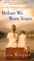

<b><b>THE BLOCKBUSTER HIT—Over two million copies sold! A <i>New York Times</i>, <i>USA Today,</i> <i>Wall Street Journal,</i> and <i>Publishers Weekly</i> Bestseller  </b>“Poignant, engrossing.”—<i>People </i>• “Lisa Wingate takes an almost unthinkable chapter in our nation’s history and weaves a tale of enduring power.”—Paula McLain</b> <b> Memphis, 1939.</b> Twelve-year-old Rill Foss and her four younger siblings live a magical life aboard their family’s Mississippi River shantyboat. But when their father must rush their mother to the hospital one stormy night, Rill is left in charge—until strangers arrive in force. Wrenched from all that is familiar and thrown into a Tennessee Children’s Home Society orphanage, the Foss children are assured that they will soon be returned to their parents—but they quickly realize the dark truth. At the mercy of the facility’s cruel director, Rill fights to keep her sisters and brother together in a world of danger and uncertainty.  <b> Aiken, South Carolina, present day.</b> Born into wealth and privilege, Avery Stafford seems to have it all: a successful career as a federal prosecutor, a handsome fiancé, and a lavish wedding on the horizon. But when Avery returns home to help her father weather a health crisis,&#xa0;a chance encounter leaves her with uncomfortable questions and compels her to take a journey through her family’s long-hidden history, on a path that will ultimately lead either to devastation or to redemption.   Based on one of America’s most notorious real-life scandals—in which Georgia Tann, director of a Memphis-based adoption organization, kidnapped and sold poor children to wealthy families all over the country—Lisa Wingate’s riveting, wrenching, and ultimately uplifting tale reminds us how, even though the paths we take can lead to many places, the heart never forgets where we belong.  <b><i>Publishers Weekly’s</i></b> <b>#3 Longest-Running Bestseller of 2017</b> • <b>Winner of the Southern Book Prize</b> • <b>If All Arkansas Read the Same Book Selection</b>  <b>This edition includes a new essay by the author about shantyboat life.</b>

[View on Apple](https://books.apple.com/us/book/before-we-were-yours/id1155890350)

## Red Rising

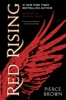

<b><i>NEW YORK TIMES</i> BESTSELLER • <b>Pierce Brown’s relentlessly entertaining debut channels the excitement of <i>The Hunger Games</i> by Suzanne Collins and <i>Ender’s Game</i> by Orson Scott Card.</b></b>   <b>“<i>Red Rising</i> ascends above a crowded dys­topian field.”<i>—USA Today</i></b> <b> ONE OF THE BEST BOOKS OF THE YEAR—</b><i><b>Entertainment Weekly, BuzzFeed, Shelf Awareness</b> </i> <i>“I live for the dream that my children will be born free,” she says. “That they will be what they like. That they will own the land their father gave them.”  “I live for you,” I say sadly.  Eo kisses my cheek. “Then you must live for more.”</i>  Darrow is a Red, a member of the lowest caste in the color-coded society of the future. Like his fellow Reds, he works all day, believing that he and his people are making the surface of Mars livable for future generations. Yet he toils willingly, trusting that his blood and sweat will one day result in a better world for his children.   But Darrow and his kind have been betrayed. Soon he discovers that humanity reached the surface generations ago. Vast cities and lush wilds spread across the planet. Darrow—and Reds like him—are nothing more than slaves to a decadent ruling class.   Inspired by a longing for justice, and driven by the memory of lost love, Darrow sacrifices everything to infiltrate the legendary Institute, a proving ground for the dominant Gold caste, where the next generation of humanity’s overlords struggle for power.&#xa0; He will be forced to compete for his life and the very future of civilization against the best and most brutal of Society’s ruling class. There, he will stop at nothing to bring down his enemies . . . even if it means he has to become one of them to do so.  <b>Praise for <i>Red Rising</i></b>  “[A] spectacular adventure . . . one heart-pounding ride . . . Pierce Brown’s dizzyingly good debut novel evokes <i>The Hunger Games, Lord of the Flies, </i>and<i> Ender’s Game</i>. . . . [<i>Red Rising</i>] has everything it needs to become meteoric.”<b>—<i>Entertainment Weekly </i></b> “Ender, Katniss, and now Darrow.”<b>—Scott Sigler</b>   “<i>Red Rising</i> is a sophisticated vision. . . . Brown will find a devoted audience.”<b>—<i>Richmond Times-Dispatch</i></b>  <b>Don’t miss any of Pierce Brown’s Red Rising Saga:</b> <b>RED RISING •&#xa0;GOLDEN SON •&#xa0;MORNING STAR •&#xa0;IRON GOLD •&#xa0;DARK AGE • LIGHT BRINGER</b>

[View on Apple](https://books.apple.com/us/book/red-rising/id650564636)

## Heather

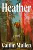

<b>A <i>USA TODAY </i>BESTSELLER * A <i>NEW YORK TIMES </i>EDITORS' CHOICE PICK</b> <b> “I’ve found my favorite crime novel of the year so far, one I’m already recommending to people who love Tana French and Liz Moore…. I read <i>Heather</i> in a single sitting.” —</b><b>Sarah Weinman, <i>The New York Times</i></b> <b> “If you enjoyed <i>Mare of Easttown</i>, you’ll love <i>Heather</i>. A gritty cold-case detective story, vividly and insightfully written. Not just a story of murder, it’s a thought-provoking and moving meditation on mothers and daughters and the long-reaching consequences of the choices we make.” </b><b>―Alex Michaelides, #1 </b><b><i>New York Times </i></b><b>bestselling author of <i>The Silent Patient </i>and <i>The Fury</i></b> <b> A small-town detective reopens an unsolved case, sending shock waves across generations of women in this gripping new mystery from the Edgar Award–winning author of </b><b><i>Please See Us</i></b><b>.</b>  1990. In the myth-riddled woods of the New Jersey Pine Barrens, sixteen-year-old Annabelle Riley's twin sister, Sabrina, has been having an affair with a mysterious older man, and Annabelle is determined to uncover what's going on. Then, inexplicably, both sisters disappear.  In this same town years later, newly instated police chief Callie Hauser makes an arrest that unexpectedly resurrects details from a heartbreaking cold case. As she digs deeper, the past and the present collide, challenging everything Callie believes about right and wrong, who she is, and the town she's always called home.  A propulsive mystery as incisive as it is forgiving, <i>Heather</i> bears a visceral reminder that the truth of a woman's life is often complicated and unknowable—to those on the outside, and sometimes even to herself.

[View on Apple](https://books.apple.com/us/book/heather/id6753948329)

## The Boy

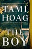

<b><b>Now a <i>New York Times </i>bestseller</b>  An unfathomable loss or an unthinkable crime? #1 </b><i><b>New York Times</b></i><b> bestselling author Tami Hoag keeps you guessing in her most harrowing thriller yet.</b>  &#xa0;  When Detective Nick Fourcade enters the home of Genevieve Gauthier outside the sleepy town of Bayou Breaux, Louisiana, the bloody crime scene that awaits him is both the most brutal and the most confusing he's ever seen. Genevieve's seven-year-old son, KJ, has been murdered by an alleged intruder, yet Genevieve is alive and well. Meanwhile, Nick's wife, Detective Annie Broussard, sits with the grieving Genevieve. A mother herself, Annie understands the devastation this woman is going through, but as a detective she's troubled: Who would murder a child and leave the only witness behind?  &#xa0;  When KJ's babysitter, twelve-year-old Nora Florette, is reported missing the very next day, the town fears a maniac is preying on their children.&#xa0;With pressure mounting from a tough, no-nonsense new sheriff, the media, and the parents of Bayou Breaux, Nick and Annie dig deep into the dual mysteries. Is someone from Genevieve's past or present responsible for the death of her son? Is Nora a victim, or something worse?&#xa0;Then everything changes when Genevieve’s past as a convicted criminal comes to light.&#xa0;Could she have killed her own child to free herself from the burden of motherhood, or is the loss of her beloved boy pushing her to the edge of insanity? Could she have something to do with the disappearance of Nora, or is the troubled teen the key to the murder? How far will Nick and Annie have to go to uncover the dark truth of the boy?

[View on Apple](https://books.apple.com/us/book/the-boy/id1166412679)

## Noah, Daniel, and Job–Patterns of Living an Overcoming Life on the Line of Life to Fulfill the Economy of God

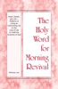

This book is intended as an aid to believers in developing a daily time of morning revival with the Lord in His word. At the same time, it provides a limited review of the International Chinese-speaking Blending Conference held in Anaheim, California, on February 13-15, 2026. The general subject of the conference was “Noah, Daniel, and Job—Patterns of Living an Overcoming Life on the Line of Life to Fulfill the Economy of God.” Through intimate contact with the Lord in His word, the believers can be constituted with life and truth and thereby equipped to prophesy in the meetings of the church unto the building up of the Body of Christ.

[View on Apple](https://books.apple.com/us/book/noah-daniel-and-job-patterns-of-living-an/id6766960234)

## Fourth Wing

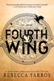

<b>A #1 <i>New York Times</i> bestseller • TV series in development at MGM Amazon Studios with Michael B. Jordan’s Outlier Society • Amazon Best Books of the Year, #4 • Apple Best Books of the Year 2023 • Barnes &amp; Noble Best Fantasy Book of 2023 • NPR “Books We Love” 2023 • Audible Best Books of 2023 • Hudson Book of the Year • Google Play Best Books of 2023 • Indigo Best Books of 2023 • Waterstones Book of the Year finalist • Goodreads Choice Award Winner • Newsweek Staffers’ Favorite Books of 2023 • Paste Magazine's Best Books of 2023</b>  <i>"Suspenseful, sexy, and with incredibly entertaining storytelling, the first in Yarros' Empyrean series will delight fans of romantic, adventure-filled fantasy."</i> —<i><b>Booklist</b></i><b>, starred review</b>  <i>"</i>Fourth Wing<i> will have your heart pounding from beginning to end... A fantasy like you've never read before."</i> <b>―#1 <i>New York Times</i> bestselling author Jennifer L. Armentrout</b>  <b>Enter the brutal and elite world of a war college for dragon riders from #1 <i>New York Times</i> bestselling author Rebecca Yarros</b>  Twenty-year-old Violet Sorrengail was supposed to enter the Scribe Quadrant, living a quiet life among books and history. Now, the commanding general—also known as her tough-as-talons mother—has ordered Violet to join the hundreds of candidates striving to become the elite of Navarre: <i>dragon riders</i>.  But when you’re smaller than everyone else and your body is brittle, death is only a heartbeat away...because dragons don’t bond to “fragile” humans. They incinerate them.  With fewer dragons willing to bond than cadets, most would kill Violet to better their own chances of success. The rest would kill her just for being her mother’s daughter—like Xaden Riorson, the most powerful and ruthless wingleader in the Riders Quadrant.  She’ll need every edge her wits can give her just to see the next sunrise.  Yet, with every day that passes, the war outside grows more deadly, the kingdom's protective wards are failing, and the death toll continues to rise.  Even worse, Violet begins to suspect leadership is hiding a terrible secret.  Friends, enemies, lovers. Everyone at Basgiath War College has an agenda—because once you enter, there are only two ways out: <i>graduate or die</i>.  The Empyrean series is best enjoyed in order. Reading Order: Book #1 Fourth Wing Book #2 Iron Flame Book #3 Onyx Storm

[View on Apple](https://books.apple.com/us/book/fourth-wing/id6443545299)

## A Momentary Marriage

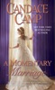

<b><i>New York Times </i></b><b>bestselling author Candace Camp offers a delicious marriage-of-convenience story in this historical romance, featuring her signature “intensely passionate and sexually charged” (</b><b><i>RT Book Reviews</i></b><b>) prose.</b>  James de Vere has always insisted on being perfectly pragmatic and rational in all things. It seemed the only way to deal with his overdramatic, greedy family. When he falls ill and no doctor in London can diagnose him, he returns home to Grace Hill in search of a physician who can—or to set his affairs in order.   Arriving at the doctor’s home, he’s surprised to encounter the doctor’s daughter Laura, a young woman he last saw when he was warning her off an attachment with his cousin Graeme. Alas, the doctor is recently deceased and Laura is closing up the estate, which must be sold off, leaving her penniless. At this, James has an inspiration: why not marry the damsel in distress? If his last hope for a cure is gone, at least he’ll have some companionship in his final days, and she’ll inherit his fortune instead of his grasping relatives, leaving her a wealthy widow with plenty of prospects.   Laura is far from swept off her feet, but she’s as pragmatic as James, so she accepts his unusual proposal. But as the two of them brave the onslaught of shocked and suspicious family members, they find themselves growing closer. They vowed, “until death do us part”...but now both are longing for their marriage to be more than momentary in this evocative romance, perfect for fans of Sabrina Jeffries and Mary Balogh.

[View on Apple](https://books.apple.com/us/book/a-momentary-marriage/id1171091863)

## Someone Else's Husband: Katie Couric Book Club

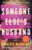

<b>A KATIE COURIC BOOK CLUB PICK • <i>USA TODAY </i>BESTSELLER&#xa0;• <i>New York Times</i> bestselling author Kimberly McCreight delivers a tour de force of character-driven suspense: the story of two women whose secrets and desires entrap them in a deadly love triangle.  “McCreight’s new stunner <i>Someone Else’s Husband</i> takes readers from the peaks of Mt. Kilimanjaro to the streets of Soho  and finally to the most mysterious place of all—the human heart. I was  seduced by each character and knocked sideways by each betrayal.  McCreight’s talent is boundless.” —Amity Gaige, author of <i>Heartwood</i></b>  Gretchen Falk, a Park Avenue sophisticate born into great wealth and blessed with a storybook marriage, knows she lives a charmed life, and she’s not about to risk losing any part of it. That’s why she tried to convince Richard, her devoted husband and the father to their three children,&#xa0;not&#xa0;to join his old college friends on an expedition to the imposing peak of Mount Kilimanjaro. Little did she know that the beautiful artist climbing alongside him might prove the far greater danger.  Frankie Callahan’s dream of artistic success is within reach, with her career-making exhibition at a celebrated New York gallery only weeks away. If all goes well, the show will leave her financially independent, free of the tainted money that ties her to a past—and a man—she’s desperate to escape. To mark this new beginning, she is going to climb Kilimanjaro. But when she learns she’s the sole female accompanying a group of male friends, Frankie realizes that nothing about the trip will be as she expected. She certainly hasn’t counted on meeting anyone like the very charismatic, very rich, very married Richard Falk. By the time they descend—with one fewer in their group than when they began—they have lost more than they ever could have imagined. &#xa0;  Now, less than two weeks after their return to New York,&#xa0;Frankie’s East Village loft&#xa0;is&#xa0;a blood-soaked crime scene, and Richard&#xa0;has been charged with her murder. It falls&#xa0;to Gretchen to figure how the life she so carefully constructed could have imploded so completely. There are only two things she knows for sure: she’s the only woman Richard has ever loved, and he would never hurt anyone.&#xa0;  <i>Someone Else’s Husband</i> is the sweeping and suspenseful story of two women on a collision course with love—and with each other—in which no one is right and everyone is very, very wrong.

[View on Apple](https://books.apple.com/us/book/someone-elses-husband-katie-couric-book-club/id6752632672)

## The Legacy

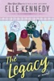

<b>The series that inspired Amazon Prime's <i>Off-Campus</i> – Now Streaming!</b>  
<b>The international bestselling Off-Campus series returns with a collection of four novellas by New York Times bestselling author and TikTok sensation Elle Kennedy! This brand-new installment provides the much-anticipated answer to the question: Where are they now?</b> 
Four stories. Four couples. Three years of real life after graduation… 
A wedding. 
A proposal. 
An elopement. 
And a surprise pregnancy. 
Life after college for Garrett and Hannah, Logan and Grace, Dean and Allie, and Tucker and Sabrina, isn't quite what they imagined it would be. Sure, they have each other, but they also have real-life problems that four years at Briar U didn't exactly prepare them for. As it turns out, for these four couples, love is the easy part. Growing up is a whole lot harder. 
Come for the drama, stay for the laughs! Catch up with your favorite Off-Campus characters as they navigate the changes that come with growing up and discover that big decisions can have big consequences…and big rewards.

[View on Apple](https://books.apple.com/us/book/the-legacy/id1560590392)

## London Falling

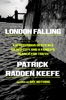

<b>#1 <i>NEW YORK TIMES </i>BESTSELLER • From the bestselling, prizewinning author of <i>Say Nothing</i> and <i>Empire of Pain</i>, a spellbinding&#xa0;account of a family devastated by the sudden death of their nineteen-year-old son, only to discover that he had created a secret life&#xa0;which drew him into the dangerous criminal underworld that lies beneath&#xa0;London’s glittering surface  “Another blockbuster feat of reportage. . . . I sprinted through this addictive book in three days and gasped more than once at the true story’s twists and turns.” —<i>Esquire</i>  A <i>NEW YORK TIMES </i>BEST BOOK OF THE YEAR SO FAR</b>  In the early morning of November 29th, 2019, surveillance cameras at the headquarters of MI6, Britain’s spy agency, captured video of a young man pacing back and forth on a high balcony of Riverwalk, a luxury tower on the bank of the river Thames. At 2:24 a.m., he jumped into the river.  In a quiet London neighborhood several miles away, Rachelle Brettler was worried about her son. Zac had told her that he had gone to stay with a friend for the weekend,&#xa0;but then he did not come home. Days later, a police car pulled up&#xa0;and two officers relayed the dreadful news: Her son was dead.  In their unbearable grief, Rachelle and her husband, Matthew, struggled to understand what had happened to Zac. He had had his troubles, but in no way seemed suicidal. As they would soon discover, however, there was a lot they did not know about their son. Only after his death did they learn that he had adopted a fictitious alter ego: Zac Ismailov, son of a Russian oligarch and heir to a great fortune. Under this guise, Zac had become entangled with a slippery London businessman named Akbar Shamji and a murderous gangster known as Indian Dave. As the Brettlers set about investigating their son’s death, they were pulled into a different and more dangerous London than the one they’d always known, and came to believe that something much more nefarious than a suicide had claimed Zac’s life. But to their immense frustration, Scotland Yard seemed unable—or unwilling—to bring the perpetrators to justice.&#xa0;  In a bravura feat of reporting and writing, Patrick Radden Keefe chronicles the Brettlers’ quest, peeling back layers of mystery and exposing the seedy truths behind the glamorous London of posh mansions and private nightclubs, a city in which everything is for sale, and aspirational fantasies are underwritten by dirty money and corruption. <i>London Falling</i> is a mesmerizing investigation of an inexplicable death and a powerful narrative driven by suspense and staggering revelations. But it is also an intimate and deeply poignant inquiry into the nature of parental love and the challenges of being a parent today, a portrait of a family trying to solve the riddle not just of how their son died, but of who he really was in life.

[View on Apple](https://books.apple.com/us/book/london-falling/id6748329195)

## Three Days in June

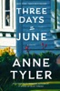

<b><i>NEW YORK TIMES</i> BESTSELLER •&#xa0;A new Anne Tyler novel destined to be an instant classic: a socially awkward mother of the bride navigates the days before and after her daughter's wedding.  “What a treat.” —<i>Washington Post</i>   “Simply exquisite.” —Liane Moriarty  “Nobody understands human nature better than Tyler. And nobody understands the complexities of love the way she does.” —<i>Boston Globe</i>  “<i>Three Days in June </i>is like reading a hug.” —<i>Minneapolis Star Tribune</i></b>  Gail Baines is having a bad day. To start, she loses her job—or quits, depending on whom you ask. Tomorrow her daughter, Debbie, is getting married, and she hasn’t even been invited to the spa day organized by the mother of the groom. Then, Gail’s ex-husband, Max, arrives unannounced on her doorstep, carrying a cat, without a place to stay, and without even a suit.  But the true crisis lands when Debbie shares with her parents a secret she has just learned about her husband to be. It will not only throw the wedding into question but also stir up Gail and Max’s past.  Told with deep sensitivity and a tart sense of humor, full of the joys and heartbreaks of love and marriage and family life, <i>Three Days in June</i> is a triumph, and gives us the perennially bestselling, Pulitzer Prize–winning writer at the height of her powers.

[View on Apple](https://books.apple.com/us/book/three-days-in-june/id6502564635)

## Country People: A GMA Book Club Pick

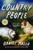

<b><i>GOOD MORNING AMERICA</i> BOOK CLUB PICK • <i>NEW YORK TIMES</i> BESTSELLER • A year in the life of a family as they strike out into the unknown (aka Vermont)—a “witty and gorgeous” (<i>The Guardian</i>) novel from Pulitzer Prize finalist Daniel Mason, the bestselling author of <i>North Woods</i></b>  <b>“Charming . . . a prescription for summer amusement that takes immediate effect . . . There’s so much fine, freewheeling observation and pillowy erudition here, it’s tempting just to sink in.”—<i>The New York Times</i></b>  Miles Krzelewski is a devoted husband, a doting father beloved for his outlandish bedtime stories, and the proud owner of a truffle-hunting dog in a land with no truffles. He is also a bit lost, twelve years late with his PhD on Russian folktales and increasingly haunted by a sense that he’s become a disappointment to his family. So when his wife, Kate, accepts a visiting professorship at a prestigious college in the faraway forests of Vermont, he decides that this will be the year to finally move forward with his life.  But Miles is a man of many enthusiasms, one who possesses, in Kate’s words, a great capacity “to fall in with anyone, anywhere.” And no sooner does he arrive than he finds himself entangled with a cast of characters as colorful as those of any of his folktales, from a ghostly tree surgeon to a scythe-mad biochemist, from a Shakespearean temptress to a photographer of snowflakes obsessed with chronicling, on thousands of index cards, the world’s delusions in an Inventory of Wrong Ideas.  The new friends, the enchanted woods, the histories: sure, no PhD, but all good fun. Until Miles stumbles upon a bizarre—perhaps ridiculous—local legend, which, he soon suspects, might not be just a legend after all.  Joyous, absurd, and life-affirming, <i>Country People</i> is a luminous exploration of marriage and parenthood, the nature of belief and the power of stories, and the ways in which we find connection in an increasingly fragmented world.

[View on Apple](https://books.apple.com/us/book/country-people-a-gma-book-club-pick/id6753764347)

## 1776

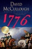

<b>America’s beloved and distinguished historian presents, in a book of breathtaking excitement, drama, and narrative force, the stirring story of the year of our nation’s birth, 1776, interweaving, on both sides of the Atlantic, the actions and decisions that led Great Britain to undertake a war against her rebellious colonial subjects and that placed America’s survival in the hands of George Washington.</b>  In this masterful book, David McCullough tells the intensely human story of those who marched with General George Washington in the year of the Declaration of Independence—when the whole American cause was riding on their success, without which all hope for independence would have been dashed and the noble ideals of the Declaration would have amounted to little more than words on paper.   Based on extensive research in both American and British archives, <i>1776</i> is a powerful drama written with extraordinary narrative vitality. It is the story of Americans in the ranks, men of every shape, size, and color; farmers, schoolteachers, shoemakers, no-accounts, and mere boys turned soldiers. And it is the story of the King’s men, the British commander, William Howe, and his highly disciplined redcoats who looked on their rebel foes with contempt and fought with a valor too little known.   Written as a companion work to his celebrated biography of John Adams, David McCullough’s <i>1776</i> is another landmark in the literature of American history.

[View on Apple](https://books.apple.com/us/book/1776/id381600017)

## Drowning

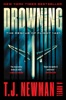

<b><i>NEW YORK TIMES </i></b><b>BESTSELLER * SOON TO BE A MAJOR MOTION PICTURE FROM WARNER BROTHERS PICTURES * “Reads like Apollo 13 underwater.” —Don Winslow * “Masterful.” —Patricia Cornwell * “A stunningly vivid tour de force!” Gripping. Shocking.” —Brad Thor</b>   <b>Flight attendant turned <i>New York Times</i> bestselling author T. J. Newman’s adrenaline-fueled survival thriller about a commercial jetliner that crashes into the ocean and sinks to the bottom with passengers trapped inside—and the extraordinary rescue operation to save them.</b>  Six minutes after takeoff, Flight 1421 crashes into the Pacific Ocean. During the evacuation, an engine explodes and the plane is flooded. Those still alive are forced to close the doors—but it’s too late. The plane sinks to the bottom with twelve passengers trapped inside.  More than two hundred feet below the surface, engineer Will Kent and his eleven-year-old daughter Shannon are waist-deep in water and fighting for their lives.  Their only chance at survival is an elite rescue team on the surface led by professional diver Chris Kent—Shannon’s mother and Will’s soon-to-be ex-wife—who must work together with Will to find a way to save their daughter and rescue the passengers from the sealed airplane, which is now teetering on the edge of an undersea cliff.  There’s not much time. There’s even less air.  With devastating emotional power and heart-stopping suspense, <i>Drowning</i> is an unforgettable thriller about a family’s desperate fight to save themselves and the people trapped with them—against impossible odds.

[View on Apple](https://books.apple.com/us/book/drowning/id1590858746)

## The Woman in Suite 11

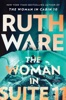

<b><b>In this follow-up to #1 <i>New York Times</i> bestselling author Ruth Ware’s multi-million copy mega-hit <i>The Woman in Cabin 10</i>, Lo Blacklock returns to attend the opening of a luxury hotel, only to find herself in a white-knuckled race across Europe.</b></b>  When the invitation to attend the press opening of a luxury Swiss hotel—owned by reclusive billionaire Marcus Leidmann—arrives, it’s like the answer to a prayer. Three years after the birth of her youngest child, Lo Blacklock is ready to reestablish her journalism career, but post-pandemic travel journalism is a very different landscape from the one she left ten years ago.   The chateau on the shores of Lake Geneva is everything Lo’s ever dreamed of, and she hopes she can snag an interview with Marcus. Unfortunately, he proves to be even more difficult to pin down than his reputation suggests. When Lo gets a late-night call asking her to come to Marcus’s hotel room, she agrees despite her own misgivings. She’s greeted, however, by a woman claiming to be Marcus’s mistress, and in life-or-death jeopardy.   What follows is a thrilling pursuit across Europe, forcing Lo to ask herself just how much she’s willing to sacrifice to save this woman…and if she can even trust her?

[View on Apple](https://books.apple.com/us/book/the-woman-in-suite-11/id6736626333)

## The Road to Grantchester

<b>The captivating prequel to the treasured Grantchester series follows the life, loves, and losses of young Sidney Chambers in postwar London.</b> 
  It is 1938, and eighteen-year-old Sidney Chambers is dancing the quickstep with Amanda Kendall at her brother Robert's birthday party at the Caledonian Club. No one can believe, on this golden evening, that there could ever be another war. 
   
  Returning to London seven years later, Sidney has gained a Military Cross and lost his best friend on the battlefields of Italy. The carefree youth that he and his friends were promised has been blown apart, just like the rest of the world--and Sidney, carrying a terrible, secret guilt, must decide what to do with the rest of his life. But he has heard a call: constant, though quiet, and growing ever more persistent. To the incredulity of his family and the derision of his friends--the irrepressible actor Freddie and the beautiful, vivacious Amanda--Sidney must now negotiate his path to God: the course of which, much like true love, never runs smooth. 
   <i>The Road to Grantchester</i> will delight new and old fans alike and finally tell the touching, engaging, and surprising origin story of the Grantchester Mysteries' beloved archdeacon.

[View on Apple](https://books.apple.com/us/book/the-road-to-grantchester/id6762219015)

## Every Spy a Traitor

<b>A <i>Financial Times</i> Best Book of 2024'One of the superstars of modern spy fiction' <i>Daily Express</i></b>   <b>'One of the best spy novels I've read' I. S. Berry</b>, author of <i>The Peacock and the Sparrow</i>   <b>'Gerlis is at the top of his game' Paul Vidich</b>, author of <i>Beirut Station</i>   <b>Trust no one. Suspect everyone.</b>   It's 1937. Fear and suspicion stalk the Continent. A million have died in Stalin's Great Purge and the Nazi terror grips Germany. But British intelligence is still trying to work out who the enemy is.   As Europe heads towards war, treason is in the air. British spymasters know there is one Soviet agent in their ranks, codenamed Agent 'Archie', and there's a frantic search to find them. What they don't know is that he is not the only traitor.   The life of Charles Cooper, a young British writer travelling Europe to research his novel, is about to change for ever   <b>The thrilling first novel in Alex Gerlis' new Double Agent espionage series, perfect for fans of Charles Cumming and Mick Herron.</b>   'Fascinating... A pleasant blend of John Buchan derring-do if lightweight adventures and the more gritty Le Carr-like grey travails in the secret corridors of power' Maxim Jakubowski, <i>Crime Time</i>   'Clever plotting, rich detail and a compelling story of a young man forced to become a double agent to survive in a world where friends become adversaries and no one can be trusted.<i>Every Spy a Traitor</i> will reward fans of Graham Greene, Charles Cumming, Frederick Forsythe and Alan Furst' <b>Paul Vidich</b>, author of <i>Beirut Station</i>   'An absorbing portrait of a world on the brink that disarms you before it floors you' <b>Tim Glister</b>, author of <i>Red Corona</i>   'With this brilliant tale of a writer entangled in pre-World War II espionage, Gerlis cleverly builds an ironic and darkly realistic world that shows just how nebulous is the border between good and evil, observer and participant, our inner and outer lives. Richly imagined, meticulously plotted, and chockfull of historic details, <i>Every Spy a Traitor</i> is one of those rare books that gets better with every page. One of the best spy novels I've read' <b>I. S. Berry</b>, author of <i>The Peacock and the Sparrow</i>

[View on Apple](https://books.apple.com/us/book/every-spy-a-traitor/id6753304063)

## Traitors

A DOJ counterintelligence lawyer pursues a Russian spy ring embedded at the heart of the American government.  
"Traitors is an unusually good, unusually satisfying espionage thriller." —James Patterson  Robert Cooper—deputy assistant attorney general for counterintelligence in the DOJ’s National Security Division—has built a storied career distinguished by high-profile arrests and prosecutions of enemy spies. One morning, he’s approached by a Russian sleeper agent looking to defect. The agent offers Cooper alarming information: Russian operatives have infiltrated the US government at its highest levels, including a mole in the senior ranks of the FBI. Cooper’s investigations lead to the discovery of a clandestine Russian plot involving deep-cover agents in senior government positions. As Cooper and his team at the DOJ race to uncover the Kremlin’s plans and unmask the traitors, a coup in Russia brings to power a militant extremist regime seemingly intent on sidelining the US on the world stage while Russia retakes its former Soviet territories. In Robert B. McCaw’s fast-paced novel, high-stakes political intrigue mixes with riveting moments of international espionage.

[View on Apple](https://books.apple.com/us/book/traitors/id6754467598)

## The Villa of Secrets

A BRAND NEW escapist, getaway read set in beautiful Greece🍋🇬🇷 Perfect for fans of of Victoria Hislop, Carol Kirkwood and Karen Swan☀️  Can a stay at a magical villa help her find her way to start again?  When Cleo arrives at Villa Ariadne on the sun-drenched island of Crete, she’s hoping for space to breathe – and perhaps some clarity about the life she no longer recognises. Newly divorced and estranged from one of her children, she’s not sure what comes next.  Sharing the villa with a small group of women, each carrying their own private heartaches, Cleo is drawn into the gentle rhythm of island life. Beneath the lemon trees and endless blue skies, friendships begin to form and long-buried hopes stir.  But when an unexpected event shakes their peaceful escape, the women are forced to come together in ways none of them anticipated. And as Villa Ariadne works its quiet magic once more, Cleo may discover that even in uncertainty, second chances are still possible.  Praise for Emma Burstall:  With a delightful Greek backdrop and an enticing mix of a fractured family, strained friendships, plus a healthy dose of mystery, love and loss, Beneath the Lemon Trees is a gorgeous summer escape' Kate Frost  'A wonderful escapist novel – mysteries, revelation and happy endings make it a perfect summer read' Rachel Burton  'Brilliant' Phillipa Ashley  'A novel to lose yourself in' Faith Hogan  'Step into a world of pure escapism in this gripping tale of family secrets, sibling rivalry and summer romance' Chat Magazine  'A charming, warm-hearted read... Pure escapism' Alice Peterson  'Burstall is a great writer, and this is not your usual run-of-the-mill chick lit... I was gripped from the start' Daily Mail  'Burstall has a true knack for transporting you to her world' Jane Corry  ‘Wow, what an incredible rollercoaster of a read! From the minute I picked up this book, I was swept away by the vividly described landscapes and mouthwatering descriptions of Crete's delectable cuisine.’ Reader Review ⭐️⭐️⭐️⭐️⭐️  ‘Fabulous, fabulous book, loved every minute of it. The storyline, the varied characters. The setting made me feel I was on holiday.’ Reader Review ⭐️⭐️⭐️⭐️⭐️  ‘Loved it. A magical villa, a broken family, a dead best friends husband being awkward, beautiful food descriptions, clear blue seas. Just read and escape. Perfect for September blues.’ Reader Review ⭐️⭐️⭐️⭐️⭐️  ‘Heartwarming and heartbreaking in equal measures! I loved this book so much and could relate to it and the characters! Beautifully written, really made you feel like you were right there in Greece!’ Reader Review ⭐️⭐️⭐️⭐️⭐️  ‘A charming book about marriage, grief, friendship and parenting, all set in a charming villa under the Cretan sun.’ Reader Review ⭐️⭐️⭐️⭐️⭐️  ‘What a lovely story, full of loss and grief, love and hope.’ Reader Review ⭐️⭐️⭐️⭐️⭐️

[View on Apple](https://books.apple.com/us/book/the-villa-of-secrets/id6762262494)

## Kentucky Green Box Set 1 to 3

<b><i>Welcome to the small town of Elm Ridge, Kentucky, where you’ll swoon, smile, and fall helplessly in love with the Green family.&#xa0;</i></b> 
<b><i>Those three heartwarming romances have no cliffhangers and no cheating.</i></b> 
<b><i>-</i></b> 
<b>COLTON</b> 
<b>She's all wrong for him.&#xa0;</b> 
<b>So why can't he stop thinking about her?</b> 
Colton Green knows exactly what he's going to do with his life. He’ll run the Red Widow Bourbon factory—a business that’s been in his family for generations—build a beautiful home, marry a nice country girl, and start a family.&#xa0; 
Then he meets Grace Baker, and all his plans go out the window. She's the last woman he should want: a big-city lawyer who's accepted a case against his best friend. There's no reason to think she plans to stay in Elm Ridge, let alone that she wants to settle down with the likes of him. Still, he's drawn to her like he's never been to anyone. 
Grace Baker is trying to put her life back together after the disastrous end of her marriage. She needs to heal, not fall headlong into a new relationship.&#xa0;Colton may be easy on the eyes, but the last thing she's looking for is romance.&#xa0; 
Besides, Grace knows she's a bad bet all around. A close-knit family like the Greens is something she's never experienced, and she doesn't belong in their world ... no matter how much it makes her heart yearn. 
Can Colton put aside his preconceptions for the woman who just might be perfect for him? And can Grace let herself believe she's worthy of real love? 
- <b>JAXON</b> 
<b>She's his little sister's best friend. Completely off limits. And now they're working together.</b> 
Jaxon Green's plans to offer a summer camp for kids at his thoroughbred training facility get derailed when his cook walks out a few days before camp begins. There's only one person available to help on such short notice: Willow Daniels, his little sister's college roommate and best friend. 
The problem is, Jaxon's feelings for Willow are anything but brotherly. How is he supposed to resist her, when they're going to be working side by side for weeks?&#xa0; 
Willow Daniels loves the Green family -- all of them. They've always been so kind to her. No one, not even her best friend Sophia, knows that Jaxon is Willow's secret crush, the only man who makes her heart beat faster. She has to keep him in the friend zone, or risk losing the Greens' esteem. 
Will a rival for Willow's attention force Jaxon to make a move? And if he does, will Willow let him into her heart? 
- 
<b>BRAXTON&#xa0;</b> 
<b>He can't help falling for her ... but that doesn't mean he can trust her.</b> 
If there is such a thing as love at first sight, that's what Braxton Green feels the first time he lays eyes on Taylor Aaronson. Too bad her arrival in Elm Ridge sets off so many alarm bells. 
Etta, Taylor's grandmother, has been all alone since her husband died. As her neighbor, Braxton feels compelled to protect the elderly woman from anyone who would take advantage ... even her beautiful, charming, long-lost granddaughter. 
Taylor Aaronson never got the chance to know her father, so she's thankful that her grandma Etta welcomes her with open arms. So does most of the town ... except for Braxton Green. 
She can't deny the attraction that flares every time the handsome veterinarian is around, even as she wonders why he's gotten so cozy with her grandmother. The news that he's offered to buy Etta’s best mare only deepens Taylor's suspicions. 
Can the two people who care the most about Etta's well-being put aside their mutual distrust long enough to see the truth about each other?

[View on Apple](https://books.apple.com/us/book/kentucky-green-box-set-1-to-3/id1536557668)

## Golden Son

<b><i>NEW YORK TIMES </i>BESTSELLER •<i> Red Rising</i> hit the ground running and wasted no time becoming a sensation. <i>Golden Son </i>continues the stunning saga of Darrow, a rebel forged by tragedy, battling to lead his oppressed people to freedom.</b>  <b>NAMED ONE OF THE BEST BOOKS OF THE YEAR BY NPR, <i>BUZZFEED,</i> AND <i>BOOKLIST </i><b>•&#xa0;“Gripping . . . On virtually every level, this is a sequel that hates sequels—a perfect fit for a hero who already defies the tropes. [Grade:] A”—<i>Entertainment Weekly</i></b></b>  As a Red, Darrow grew up working the mines deep beneath the surface of Mars, enduring backbreaking labor while dreaming of the better future he was building for his descendants. But the Society he faithfully served was built on lies. Darrow’s kind have been betrayed and denied by their elitist masters, the Golds—and their only path to liberation is revolution. And so Darrow sacrifices himself in the name of the greater good for which Eo, his true love and inspiration, laid down her own life. He becomes a Gold, infiltrating their privileged realm so that he can destroy it from within.  &#xa0;  A lamb among wolves in a cruel world, Darrow finds friendship, respect, and even love—but also the wrath of powerful rivals. To wage and win the war that will change humankind’s destiny, Darrow must confront the treachery arrayed against him, overcome his all-too-human desire for retribution—and strive not for violent revolt but a hopeful rebirth. Though the road ahead is fraught with danger and deceit, Darrow must choose to follow Eo’s principles of love and justice to free his people.  &#xa0;  He must live for more.  <b>Praise for <i>Golden Son</i></b>  <b><i> </i></b> “Stirring . . . Comparisons to <i>The Hunger Games </i>and<i> Game of Thrones</i> series are inevitable, for this tale has elements of both.”<b><i>—Kirkus Reviews</i></b>  “Brown writes layered, flawed characters . . . but plot is his most breathtaking strength. . . . Every action seems to flow into the next.”<b>—NPR</b>  <b>Don’t miss any of Pierce Brown’s Red Rising Saga:</b> <b>RED RISING •&#xa0;GOLDEN SON •&#xa0;MORNING STAR •&#xa0;IRON GOLD •&#xa0;DARK AGE • LIGHT BRINGER</b>

[View on Apple](https://books.apple.com/us/book/golden-son/id813153784)

## Odyssey

The legendary Stephen Fry retells the adventures of Odysseus for the fourth and final installment in the internationally bestselling Mythos series.  Odysseus’s journey from the battlefields of Troy to his home in Ithaca is one of the greatest stories ever told. From the lotus-eaters to the sirens, from Circe to the Cyclops, this is&#xa0;a tale of thrilling adventures, cunning escapes, and enduring devotion. Stephen Fry breathes new life into the ancient poem&#xa0;with&#xa0;humor and pathos. Illustrated throughout with classical art inspired by the myths, this gorgeous volume invites you to explore a captivating world with a brilliant storyteller as your guide.  BELOVED AUTHOR: Stephen Fry is an icon whose signature wit and mellifluous style make this retelling utterly unique. Fans will love hearing his interpretation, whether they are familiar with the original myths or not.  TIMELESS STORIES: For fans of Madeline Miller’s Circe or Song of Achilles, Neil Gaiman’s Norse Mythology, or Pat Barker’s The Silence of the Girls, this is the perfect next great read. These ancient tales never get old.  POPULAR SERIES: The previous books that comprise the Mythos trilogy—Mythos, Heroes, and Troy—have been international bestsellers, praised for their engaging and&#xa0;nuanced retellings of the Greek myths. Now fans can finally read Fry's&#xa0;take on The Odyssey.  GORGEOUS GIFT: With a vibrant contemporary design, full-color artwork throughout, and shimmering metallic highlights on the jacket, this book makes a superb present.  Perfect for:Fans of Stephen FryAncient history buffsReaders of myth and loreFans of Madeline Miller's and Pat Barker's retellings of Greek mythologyClassics majors and classicistsArt lovers

[View on Apple](https://books.apple.com/us/book/odyssey/id6676372405)

## Onyx Storm

<b>Accolades:  AN INSTANT #1 <i>NEW YORK TIMES</i> BESTSELLER • TV series now in development at Amazon MGM Studios with Michael B. Jordan’s Outlier Society • Amazon Best Romantasy Books of the Year 2025 • Apple Books Fantasy &amp; Paranormal Romance Novel Best Sellers 2025, #4 • Apple Books Fiction Audiobooks Best Sellers 2025 • Barnes &amp; Noble Best Fantasy Book of 2025 • Barnes &amp; Noble Best Audiobook of 2025 • Audible Top Ten Best Romantasy Listens of 2025 • Google Play Best Fantasy Book of 2025 finalist • Goodreads Choice Award Winner 2025: Readers’ Favorite Romantasy • Goodreads Choice Award Winner 2025: Readers’ Favorite Audiobook • Likewise Choice Award finalist • Kobo Books Best Books of the Year 2025</b>  <b>Don't miss out on the stunning DELUXE LIMITED EDITION while supplies last. </b>This breathtaking collectible is only available on a limited first print run in the U.S. and Canada only, a must-have for any book lover.  After nearly eighteen months at Basgiath War College, Violet Sorrengail knows there’s no more time for lessons. No more time for uncertainty.  Because the battle has truly begun, and with enemies closing in from outside their walls and within their ranks, it’s impossible to know who to trust.  Now Violet must journey beyond the failing Aretian wards to seek allies from unfamiliar lands to stand with Navarre. The trip will test every bit of her wit, luck, and strength, but she will do anything to save what she loves—her dragons, her family, her home, and <i>him</i>.  Even if it means keeping a secret so big, it could destroy everything.  They need an army. They need power. They need <i>magic</i>. And they need the one thing only Violet can find—the truth.  But a storm is coming...and not everyone can survive its wrath.     The Empyrean series is best enjoyed in order. Reading Order: Book #1 Fourth Wing Book #2 Iron Flame Book #3 Onyx Storm

[View on Apple](https://books.apple.com/us/book/onyx-storm/id6480186648)

## A Court of Thorns and Roses

The sexy, action-packed first book in the #1 bestselling Court of Thorns and Roses (ACOTAR) series from global phenomenon Sarah J. Maas. 
 
When nineteen-year-old huntress Feyre kills a wolf in the woods, a terrifying creature arrives to demand retribution. Dragged to a treacherous magical land she knows about only from legends, Feyre discovers that her captor is not truly a beast, but one of the lethal, immortal faeries who once ruled her world. 
 
At least, he&#39;s not a beast all the time. 
 
As she adapts to her new home, her feelings for the faerie, Tamlin, transform from icy hostility into a fiery passion that burns through every lie she&#39;s been told about the beautiful, dangerous world of the Fae. But something is not right in the faerie lands. An ancient, wicked shadow is growing, and Feyre must find a way to stop it, or doom Tamlin-and his world-forever. 
 
From global bestselling author Sarah J. Maas comes a seductive, breathtaking book that blends romance, adventure, and faerie lore into an unforgettable read. 
 
The Court of Thorns and Roses series includes: 
A Court of Thorns and Roses 
A Court of Mist and Fury 
A Court of Wings and Ruin 
A Court of Frost and Starlight 
A Court of Silver Flames

[View on Apple](https://books.apple.com/us/book/a-court-of-thorns-and-roses/id1487234733)

## Detective Alyssa Wyatt

<b>Meet Detective Alyssa Wyatt. Mom, wife and a serial killer's worst nightmare. Includes all four books in the gripping Detective Alyssa Wyatt series; <i>All His Pretty Girls</i>, <i>The Toybox</i>, <i>Alone in the Woods</i> and <i>The Devil's Playground</i>.</b>   <b>All His Pretty Girls</b>: A woman is found naked, badly beaten and barely alive in the New Mexico mountains. The shocking discovery plunges Albuquerque Detective Alyssa Wyatt into a case that will test her to the limit. It appears that Callie McCormick is the latest plaything of a shadowy psychopath that leaves a long shadow on the streets of New Mexico. When Alyssa makes a breakthrough that just might reveal the killer, she unknowingly puts herself in the crosshairs of a brutal maniac  one with an old score to settle. Because the killer knows Alyssa very well, even if she doesn't know him. And he's determined that she'll know his name   <b>The Toybox</b>: All around Albuquerque, young women are going missing, seemingly vanished into thin air. With no link between the victims, Detective Alyssa Wyatt is quickly plunged into a horrifying case with no obvious clues. And when Jersey Andrews, the best friend of Alyssa's teenage daughter, Holly, joins the list of vanished girls, the case becomes personal. But this investigation will lead Alyssa and partner Cord into the most sinister depths of humanity; an evil place where life is expendable, and where the depraved can fulfil their darkest desires   <b>Alone in the Woods</b>: Gabriel Kensington and his wife Lydia have been brutally slain in their luxurious home in New Mexico. A frantic, whispered phone call from their teenage daughter Addis, and her best friend Emerson, quickly alerts the authorities to the killings. But when detective Alyssa Wyatt and the squad appear at the house, the unthinkable has happened. The girls are nowhere to be found and neither is the killer. In a race against time, it's up to Alyssa Wyatt and her partner Cord to find the missing girls  and discover just why the Kensingtons have been targeted. Because for Addis and Emerson, every minute passing could be the difference between survival  or an unthinkable death.   <b>The Devil's Playground</b>: Best friends Skye, Elena, and London are enjoying hanging out at Skye's house in New Mexico, eating junk food, drinking wine, and playing with Skye's little children, Carter and Abigail. Until the intruders arrive. Hearing the horrific screams from Elena and Skye, London hides the children, tiptoes out to see what has happened and disappears. After Carter raises the alarm, Detective Alyssa Wyatt is called in to investigate a bloodbath that appears to have no motive, no evidence, and no sign of London. She soon uncovers a link between the murders and a sinister local cult. Can Alyssa find the young woman who has vanished without a trace  before London joins the list of victims?   <b>An utterly addictive, dark detective series with twists that will leave you gasping. Perfect for fans of M.W. Craven, Lisa Regan or Angela Marsons.</b>   <b>Praise for Charly Cox</b>   '<b>The action never flags, the suspense is red-hot and the twists and turns jaw-droppingly brilliant</b>, fans of the genre need to add Charly Cox to their list of must-buys.' Bookish Jottings   'There is just so much to love about this series. <b>A dark and chilling read</b> that will have you hanging on for dear life!'  Reader review   '<b>Charly Cox is fast becoming one of my favourite crime fiction writers</b>! Gripping, with likeable characters and great researched and plotted story lines.'  Reader review   'Holy SMOKES! <b>What a ride. From the first page my heart was pounding.</b> I could not look away. This series was so good.'  Reader review   'I absolutely love this series. I devoured it in a flash. <b>Could not put it down</b>.'  Reader review

[View on Apple](https://books.apple.com/us/book/detective-alyssa-wyatt/id6753611505)

## Ruthless Prey

<b>Lucas Davenport must avenge the murder of a loved one, in this latest thriller from #1 <i>New York Times </i>bestselling author John Sandford.</b>  When the mother of Lucas Davenport's child is found dead in the backyard of her family home, nestled in an old affluent suburb in Minneapolis, the authorities immediately rule it a suicide. But Lucas is not as convinced.  Lucas begins to investigate the case and learns that Jennifer's news team had been working on some controversial stories, suggesting to Lucas considerable animus by their targets.  But as more bodies start to pile up, Lucas will need to work fast to locate the perpetrator and avenge the death of his family.

[View on Apple](https://books.apple.com/us/book/ruthless-prey/id6788215380)

## One Golden Summer

<b>THE #1<i> NEW YORK TIMES</i> BESTSELLER! ∙ A radiant escape to the lake from the beloved author of <i>Every Summer After </i>and <i>This Summer Will Be Different,</i> hailed as the “reigning queen of sun-soaked romance novels” (<i>Bustle</i>)<i> </i> “The way that Carley Fortune can bottle up the feeling of summer and put it into a book needs to be studied. Her books are so transportive!”—<i>Glamour</i></b>  <b><i>I never anticipated Charlie Florek. </i></b> Good things happen at the lake. That’s what Alice’s grandmother says, and it’s true. Alice spent just one summer there at a cottage with Nan when she was seventeen—it’s where she took that photo, the one of three grinning teenagers in a yellow speedboat, the image that changed her life.  Now Alice lives behind a lens. As a photographer, she’s most comfortable on the sidelines, letting other people shine. Lately though, she’s been itching for something more, and when Nan falls and breaks her hip, Alice comes up with a plan for them both: another summer in that magical place, Barry’s Bay. But as soon as they settle in, their peace is disrupted by the roar of a familiar yellow boat, and the man driving it.  Charlie Florek was nineteen when Alice took his photo from afar. Now he’s all grown up—a shameless flirt, who manages to make Nan laugh and Alice long to be seventeen again, when life was simpler, when taking pictures was just for fun. Sun-slanted days and warm nights out on the lake with Charlie are a balm for Alice’s soul, but when she looks up and sees his piercing green gaze directly on her, she begins to worry for her heart.  Because Alice sees people—that’s why she is so good at what she does—but she’s never met someone who looks and sees her right back.

[View on Apple](https://books.apple.com/us/book/one-golden-summer/id6615074377)

## It Could Have Been Her

<b>INSTANT <i>NEW YORK TIMES </i>BESTSELLER!</b>  <b>From the #1 <i>New York Times</i> bestselling author of <i>Then She Was Gone</i> Lisa Jewell, two women's lives converge in a house containing devastating secrets that refuse to stay buried in this "deliciously</b><b> dark, devilishly addictive" (Alice Feeney, bestselling author of <i>My Husband's Wife</i>) novel. </b>  Jane Trevally is walking her dogs on her country estate when a small white terrier appears, alone and with no sign of the teenaged girl he’d been staying with nearby. When the teenager is reported missing, Jane offers to return the dog to his registered owner, hours away in London. Arriving at a run-down house called Thornwood in the deepest backwaters of Hampstead, she is immediately on alert—because Jane has a dark history with this house.   The man who answers the door is not the man that Jane remembers from her past. He is cagey, and claims to know nothing about the missing teenage girl. Then, through the window of the house, Jane catches a glimpse of a haunted-looking woman.   Conjuring her memories from twenty-five years ago, Jane knows this unsettling house holds the key—to the missing teenager, to her own traumatic story, and to the dark secrets of the past.

[View on Apple](https://books.apple.com/us/book/it-could-have-been-her/id6754249251)

## The Things We Never Say

<b><i>NEW YORK TIMES </i>BESTSELLER • In this “profound, resplendent novel”* from Pulitzer Prize–winning, #1 <i>New York Times</i> bestselling author Elizabeth Strout, a chance incident sparks a powerful realization in a beloved teacher’s life<b> </b></b> <b>“Strout’s capacious empathy and rigorous attention to the nuances of human behavior and psychology are as evident as ever.”—<i>The Boston Globe </i></b> <b>“Artie Dam is someone you may never be able to forget.”—<i>Financial Times*</i></b>  Artie Dam is living a double life. He spends his days teaching history to eleventh graders, expanding their young minds, correcting their casual cruelties, and lending a kind word to those who need it most. He goes to holiday parties with his wife of three decades, makes small talk with neighbors, and, on weekends, takes his sailboat out on the beautiful Massachusetts Bay. He is, by all appearances, present and alive. But inside, Artie is plagued by feelings of isolation. He looks out at a world gone mad—at himself and the people around him—and turns a question over and over in his mind: How is it that we know so little about one another, even those closest to us?  And then, one day, Artie learns that life has been keeping a secret from him, one that threatens to upend his entire world. Once he learns it, he is forced to chart a new course, to reconsider the relationships he holds most dear—and to make peace with the mysteries at the heart of our existence.  Elizabeth Strout, as we have come to expect, delivers a moving exploration of the human condition—one that brims with compassion for each and every one of her indelible characters. With exquisite prose and profound insight, <i>The Things We Never Say </i>takes one man’s fears and loneliness and makes them universal. And in the same breath, captures the abiding love that sustains and holds us all.

[View on Apple](https://books.apple.com/us/book/the-things-we-never-say/id6753041097)

## The Hobbit

<b>The journey through Middle-earth begins here with J.R.R. Tolkien's classic prelude to his epic fantasy <i>Lord of the Rings</i> trilogy.</b>  <b>“A glorious account of a magnificent adventure, filled with suspense and seasoned with a quiet humor that is irresistible... All those, young or old, who love a fine adventurous tale, beautifully told, will take <i>The Hobbit</i> to their hearts.”—The <i>New York Times Book Review</i></b>  "In a hole in the ground there lived a hobbit." So begins one of the most beloved and delightful tales in the English language—Tolkien's prelude to <i>The Lord of the Rings.</i> Set in the imaginary world of Middle-earth, at once a classic myth and a modern fairy tale, <i>The Hobbit</i>&#xa0;is one of literature's most enduring and well-loved high fantasy novels.  Bilbo Baggins is a hobbit who enjoys a comfortable, unambitious life, rarely traveling any farther than his pantry or cellar. But his contentment is disturbed when the wizard Gandalf and a company of dwarves arrive on his doorstep one day to whisk him away on an adventure. They have launched a plot to raid the treasure hoard guarded by Smaug the Magnificent, a large and very dangerous dragon. Bilbo reluctantly joins their epic quest, unaware that on his journey to the Lonely Mountain he will encounter both a magic ring and a frightening creature known as Gollum.

[View on Apple](https://books.apple.com/us/book/the-hobbit/id1602694961)

## Targeted

<b>Master sniper Bob Lee Swagger protects a group of hostages during a perilous standoff in this razor-sharp, white-knuckled political thriller from Pulitzer Prize winner, <i>New York Times</i> bestselling author, and “one of the best thriller novelists around” (<i>The Washington Post</i>) Stephen Hunter.</b>  After his successful takedown of a dangerous terrorist, Bob Lee Swagger learns that no good deed goes unpunished. Summoned to court by the United States Congress, Swagger is accused of reckless endangerment by a hardheaded anti-gun congresswoman. But what begins as political posturing soon turns deadly when the auditorium where the committee is being held is attacked.  Swagger, the congresswoman, and numerous bystanders are taken hostage by a group of violent criminals. Soon, the very people who had accused him are depending on him to save their lives. Trapped in the auditorium and still struggling with injuries from his last assignment, Swagger must rely on his instincts, his shooting skills, and the help of a mysterious rogue operator on the outside in order to ensure that everyone makes it out alive.  A heart-pounding and crackling action-packed novel, <i>Targeted</i> proves that Stephen Hunter is “a true master at the pinnacle of his craft. No one does it better” (Jack Carr, Former Navy SEAL Sniper and author of <i>The Terminal List</i>).

[View on Apple](https://books.apple.com/us/book/targeted/id1574231713)

## A Woman of Substance

<b>"An extravagant, absorbing novel of love, courage, ambition, war, death and passion", and the basis for the BritBox series starring Brenda Blethyn and Jessica Reynolds (</b><i><b>The New York Times</b></i><b>).</b> 
   &#xa0; 
   Barbara Taylor Bradford's The Emma Harte Saga begins with this record-shattering <i>New York Times</i> bestseller that traces Emma Harte's legacy through multiple generations of indomitable women. 
   &#xa0; 
   From the servants' quarters of a manor house on the brooding Yorkshire moors to the helm of a profitable international business, Emma Harte's life is a sweeping saga of unbreakable spirit and resolve. Rising from abject poverty to glittering wealth at the upper echelons of society, there is only one man the indomitable Emma cannot have—and only one she yearns for. The novel was also the subject of a popular 1984 miniseries starring Jenny Seagrove and Deborah Kerr. 
   &#xa0; 
   "A long, satisfying novel of money, power, passion and revenge set against the sweep of 20th century history." —<i>Los Angeles Times</i> 
   &#xa0; 
   "A wonderfully entertaining novel." —<i>The Denver Post</i> 
   &#xa0; 
   "A mighty saga. Little has been so riveting since <i>Gone with the Wind</i>." —<i>Manchester Evening News</i> 
   &#xa0; 
   "Tailor-made for fans of McCullough's <i>Thornbirds</i>." —<i>Publishers Weekly</i> 
   &#xa0; 
   "The storyteller of substance." —<i>The Times</i> (London)

[View on Apple](https://books.apple.com/us/book/a-woman-of-substance/id1478995361)

## Her Unexpected Joy

Stuck in a ditch in the middle of a snowstorm was bad enough, but add in the fact that she was eight months pregnant with her sister’s child and had a broken cell phone, life was a disaster, or so she thought.

Then Zoe Avery started having contractions. Now, a disaster had turned into something even Zoe couldn’t laugh her way through.

Then a stranger showed up.

[View on Apple](https://books.apple.com/us/book/her-unexpected-joy/id6758017575)

## Tom Clancy Target Acquired

<b><i>Tom Clancy's Jack Ryan: Ghost War </i>is out now on Prime Video!  Jack Ryan, Jr., will do anything for a friend, but this favor will be paid for in blood in the latest electric entry in the #1 <i>New York Times </i>bestselling series.</b>  Jack Ryan, Jr. would do anything for Ding Chavez. That's why Jack is currently sitting in an open-air market in Israel, helping a CIA team with a simple job. The man running the mission, Peter Beltz, is an old friend from Ding's Army days. Ding hadn't seen his friend since Peter's transfer to the CIA eighteen months prior, and intended to use the assignment to reconnect. Unfortunately, Ding had to cancel at the last minute and asked Jack to take his place. It's a cushy assignment--a trip to Israel in exchange for a couple hours of easy work, but Jack could use the downtime after his last operation.   Jack is here merely as an observer, but when he hastens to help a woman and her young son, he finds himself the target of trained killers. Alone and outgunned, Jack will have to use all his skills to protect the life of the child.

[View on Apple](https://books.apple.com/us/book/tom-clancy-target-acquired/id1532649405)

## Our Perfect Storm

<b>AN INSTANT #1 <i>NEW YORK TIMES</i> BESTSELLER ∙ Best friends have one week in paradise to fix their friendship or fall apart in this heart-stopping, utterly romantic new novel from the #1 <i>New York Times</i> bestselling author of <i>Every Summer After</i> and <i>One Golden Summer.  </i>As featured in <i>The New York Times</i> ∙ <i>USA Today</i> ∙ <i>People</i> ∙ <i>The Wall Street Journal</i> ∙ <i>Cosmopolitan</i> ∙ <i>Marie Claire</i> ∙ TODAY ∙ Good Morning America ∙ <i>The New York Post</i> ∙ <i>Parade</i> ∙ <i>Country Living</i> ∙ <i>Town &amp; Country</i> ∙ and more!<i> </i></b> Frankie and George have been best friends since they were eight years old. Both passionate, impulsive, and headstrong—they’ve always clashed . . . and come back together. Until now. It’s the eve of Frankie’s wedding weekend, and she doesn’t know where they stand or even if George will show up as her best man.  Then, at the start of the festivities, in walks George. For one glorious evening, surrounded by her loved ones, Frankie’s life is finally perfect. But it all comes crashing down when her fiancé dumps her the next morning, leaving only a note as an explanation.  Crushed and confused, Frankie returns to her family’s home to wallow. But George has a different idea and a plan for healing Frankie’s broken heart. He wants her to go on her honeymoon. With him. For one week, to the lush rainforests and misty beaches of Tofino.  Frankie agrees, seeing the trip for what it really is: one last chance to repair their friendship. Even if it means unearthing secrets and long buried feelings neither knows how to handle. Even if it means falling apart for good.

[View on Apple](https://books.apple.com/us/book/our-perfect-storm/id6749923063)

## Daughter of War

<b>Former Special Forces Officer and <i>New York Times</i> bestselling author Brad Taylor delivers a heart-pounding thriller featuring Taskforce operators Pike Logan and Jennifer Cahill as they come face to face with a conspiracy where nothing is as it seems.</b>  Hot on the trail of a North Korean looking to sell sensitive US intelligence to the Syrian regime, Pike Logan and the Taskforce stumble upon something much graver: the sale of a lethal substance called Red Mercury.  Unbeknownst to the Taskforce, the Syrians plan to use the weapon of mass destruction against American and Kurdish forces, and blame the attack on terrorists, causing western nations to reassess their participation in the murky cauldron of the Syrian civil war.    Meanwhile, North Korea has its own devastating agenda: a double-cross that will dwarf the attack in Syria even as it lays the blame on the Syrian government.  Leveraging Switzerland's fame for secrecy and its vast network of military bunkers, now repurposed by private investors for the clandestine storage of wealth, North Korea will use Red Mercury to devastate the West's ability to deliver further sanctions against the rogue regime.   As the Taskforce begins to unravel the plot, a young refugee unwittingly  holds the key to the conspiracy.  Hunted across Europe for reasons she cannot fathom, she is the one person who can stop the attack--if she can live long enough for Pike and Jennifer to find her.

[View on Apple](https://books.apple.com/us/book/daughter-of-war/id1381157754)

## A Court of Mist and Fury

The seductive #1 global bestselling sequel to Sarah J. Maas&#39;s spellbinding A Court of Thorns and Roses (ACOTAR). 
 
Feyre has undergone more trials than one human woman can carry in her heart. Though she&#39;s now been granted the powers and lifespan of the High Fae, she is haunted by her time Under the Mountain and the terrible deeds she performed to save the lives of Tamlin and his people. 
 
As her marriage to Tamlin approaches, Feyre&#39;s hollowness and nightmares consume her. She finds herself split into two different people: one who upholds her bargain with Rhysand, High Lord of the feared Night Court, and one who lives out her life in the Spring Court with Tamlin. While Feyre navigates a dark web of politics, passion, and dazzling power, a greater evil looms. She might just be the key to stopping it, but only if she can harness her harrowing gifts, heal her fractured soul, and decide how she wishes to shape her future-and the future of a world in turmoil. 
 
Bestselling author Sarah J. Maas&#39;s masterful storytelling brings this second book in her dazzling, sexy, action-packed series to new heights. 
 
The Court of Thorns and Roses series includes: 
A Court of Thorns and Roses 
A Court of Mist and Fury 
A Court of Wings and Ruin 
A Court of Frost and Starlight 
A Court of Silver Flames

[View on Apple](https://books.apple.com/us/book/a-court-of-mist-and-fury/id1488944272)

## Midnight

<b>“Sharon Sala is a consummate storyteller.” —Debbie Macomber, #1 <i>New York Times </i>bestselling author</b>  <b>Crossroads, Texas, is a town of second chances in this new small town romance series from Sharon Sala,&#xa0;<i>New York Times </i>and <i>USA Today </i>bestselling author of the Blessings, Georgia series.</b>  Asher Kingston is a special investigator for the Texas Attorney General’s office in Austin, TX. When he gets a call that his dad has been injured in an attempted robbery of his bar, he rounds up his two brothers and heads back to Crossroads. During visiting hours at the hospital, Nora Borden, Asher’s girlfriend from high school, runs into him and they rekindle their friendship. Nora is a high-profile computer tech with a high security clearance; Asher claims his job too unpredictable for relationships. But before long, their romance rekindles as well. Together they unravel a case long gone cold to find out what happened in the bar late that night and to clear the Kingston family name.

[View on Apple](https://books.apple.com/us/book/midnight/id6741888583)

## Blindsighted

<b>The first Grant County novel by #1 <i>New York Times </i>bestselling author, Karin Slaughter, introducing Sara Linton of the acclaimed Will Trent Series.</b>  <b>“A bull’s-eye, deftly crafted. . . . Slaughter’s plotting is brilliant, her suspense relentless.” —<i>Washington Post</i></b>  A small Georgia town erupts in panic when a young college professor is found brutally mutilated in the local diner. But it’s only when town pediatrician and coroner Sara Linton does the autopsy that the full extent of the killer’s twisted work becomes clear.  Sara’s ex-husband, police chief Jeffrey Tolliver, leads the investigation—a trail of terror that grows increasingly macabre when another local woman is found crucified a few days later. But he’s got more than a sadistic serial killer on his hands, because the county’s only female detective, Lena Adams—the first victim’s sister—wants to serve her own justice.  But it is Sara who holds the key to finding the killer. A secret from her past could unmask the brilliantly malevolent psychopath… or mean her death.

[View on Apple](https://books.apple.com/us/book/blindsighted/id975283603)

## The Astral Library

From New York Times bestselling author Kate Quinn comes a gorgeously written fantastical adventure which poses the question: Have you ever wished you could live inside a book?&#xa0;Welcome to the Astral Library, where books are not just objects, but doors to new worlds, new lives, and new futures.  Alexandria “Alix” Watson has learned one lesson from her barren childhood in the foster-care system: unlike people, books will never let you down. Working three dead-end jobs to make ends meet and knowing college is a pipe dream, Alix takes nightly refuge in the high-vaulted reading room at the Boston Public Library, escaping into her favorite fantasy novels and dreaming of far-off lands. Until the day she stumbles through a hidden door and meets the Librarian: the ageless, acerbic guardian of a hidden library where the desperate and the lost escape to new lives...inside their favorite books.  The Librarian takes a dazzled Alix under her wing, but before she can escape into the pages of her new life, a shadowy enemy emerges to threaten everyone the Astral Library has ever helped protect. Aided by a dashing costume-shop owner, Alix and the Librarian flee through the Regency drawing rooms of Jane Austen to the back alleys of Sherlock Holmes and the champagne-soaked parties of The Great Gatsby as danger draws inexorably closer. But who does their enemy really wish to destroy—Alix, the Librarian, or the Library itself?

[View on Apple](https://books.apple.com/us/book/the-astral-library/id6746546947)

## God's Homecoming

A defining major work from today’s leading Bible scholar: N. T. Wright traces the biblical promise of God’s care for the future, offering authentic hope in a chaotic age.  Many devout believers have been lured into the classic misunderstanding that Christianity teaches how we must leave earth and go somewhere else to be with God. But this outlook dangerously suggests that God created a world he loves only to abandon it. Nothing could be further from the scriptural truth, N. T. Wright contends. In God’s Homecoming, Wright excavates the forgotten story of God’s original purpose to dwell with us and make his home—and ours—in this new creation.  In his groundbreaking Surprised by Hope, Wright dismantled the “going to heaven” narrative. In God’s Homecoming, he returns with a panoramic pilgrimage tracing God’s homecoming promise from Genesis through Revelation. When we read the Bible as a whole, Wright argues, we do not find a narrative of souls ascending a spiritual ladder to heaven, but of God coming down to dwell with us.  Revolutionary and grounded in biblical research, Wright leads readers through the movements of the promise: God created heaven and earth to be his own home, he filled the temple with his presence, then the church with the Holy Spirit, and promises that the all creation will again be filled with his glory. He traces how the popular Christian reading got it wrong—as well as the radical transformation that awaits us and the church today if we return to God’s original vision.  Until we recover this forgotten story, Wright warns, we will keep distorting the Bible’s message. Yet, he argues, its recovery could be the key to revitalizing every aspect of Christian life as we know it: prayer, mission, evangelism, pastoral practice, and personal devotion.

[View on Apple](https://books.apple.com/us/book/gods-homecoming/id1553748355)

## Crown of Midnight

Never trust an assassin. 
 
Celaena&#39;s story continues in the second book in this complete, #1 bestselling Throne of Glass series by Sarah J. Maas, author of the Court of Thorns and Roses (ACOTAR) series. 
 
Celaena Sardothien won a brutal contest to become the King&#39;s Champion. But she is far from loyal to the crown. Though she goes to great lengths to hide her secret, her deadly charade becomes more difficult when she realizes she is not the only one seeking justice. Her search for answers ensnares those closest to her, and no one is safe from suspicion-not the Crown Prince Dorian; not Chaol, the Captain of the Guard; not even her best friend, Nehemia, a princess with a rebel heart. 
 
Then, one terrible night, the secrets they have all been keeping lead to an unspeakable tragedy. As Celaena&#39;s world shatters, she will be forced to decide once and for all where her true loyalties lie . . . and what she is willing to fight for. 
 
The second book in the #1 bestselling Throne of Glass series returns readers to a land destroyed by liars, where one woman&#39;s truth is the only thing that can save them all. 
 
Other books in this series include: 
Throne of Glass 
Heir of Fire 
Queen of Shadows 
Empire of Storms 
Tower of Dawn 
Kingdom of Ash 
The Assassin&#39;s Blade (prequel novellas)

[View on Apple](https://books.apple.com/us/book/crown-of-midnight/id1488792218)

## When I Kill You

<b>The multimillion-copy and <i>New York Times</i> bestseller B. A. Paris returns with a triumphant, unsettling next suspense novel, <i>When I Kill You</i>.</b>  <i>Who is watching Nell Masters?</i>  Nell Masters is certain someone is following her. The hairs on the back of her neck rise when she travels to and from work, there are silent calls to her office, and a huge bouquet of flowers arrives without a card. And Nell has a reason to be looking over her shoulder, because she has a secret that she’s hiding from everyone in her life, including her new partner, Alex. But Alex also has secrets of his own.  Fourteen years earlier, when Nell went by the name Elle Nugent, she witnessed a student, Bryony Sanders, getting into a stranger’s car. When Bryony was found murdered, Elle became obsessed with finding the person responsible. She was convinced she knew who it was and her fixation with Brett Parker, the man she accused, led her down a dangerous path . . .   Now, Nell tries to convince herself that this unnerving feeling of being watched is all in her mind. Has someone from her past discovered her new identity? Has the stalker become the stalked? Or is there something even more deadly at play?

[View on Apple](https://books.apple.com/us/book/when-i-kill-you/id6744894750)

## Hope Rises

<b>Walter Nash began a journey down a dark path of seemingly no return, and now he &#xa0;finds himself questioning everything that got him there in this thrilling sequel to <i>Nash Falls</i> from #1&#xa0;<i>New York Times</i>&#xa0;bestselling author David Baldacci.</b>   Walter Nash, working under the alias of Dillon Hope, is on the road to revenge after becoming an informant for the FBI against a global criminal operation headed up by Victoria Steers. Steers has ripped everything Nash held dear away from him. He has nothing left to lose and with long, rigorous training under his belt the gentle and sensitive Nash has transformed into something he never thought he’d be: a physically imposing man with lethal skills. And now he has only goal left in life: taking down Victoria Steers.   In order to succeed, he’s going to need to cross enemy lines and work the job from the inside. But Steers is shrewd and only brings those she trusts completely into her inner circle. Nash must rely on every ounce of his hard-earned skills in order to prove himself an ally to Steers if he’s ever going to get close enough to decimate her criminal empire.   Yet, despite hating the woman for destroying his life, Nash finds himself oddly drawn to Steers in ways that he never could’ve imagined. And what he ultimately discovers will turn all he believed upside down, forcing Nash to do something truly unfathomable.   So, will the truth set Nash free?   Or end him?

[View on Apple](https://books.apple.com/us/book/hope-rises/id6749524843)

## A Moveable Feast

<b>Ernest Hemingway’s classic memoir of Paris in the 1920s, now available in a restored edition, includes the original manuscript along with insightful recollections and unfinished sketches.</b>  Published posthumously in 1964, <i>A Moveable Feast</i> remains one of Ernest Hemingway’s most enduring works. Since Hemingway’s personal papers were released in 1979, scholars have examined the changes made to the text before publication. Now, this special restored edition presents the original manuscript as the author prepared it to be published.  Featuring a personal foreword by Patrick Hemingway, Ernest’s sole surviving son, and an introduction by grandson of the author, Seán Hemingway, editor of this edition, the book also includes a number of unfinished, never-before-published Paris sketches revealing experiences that Hemingway had with his son, Jack, and his first wife Hadley. Also included are irreverent portraits of literary luminaries, such as F. Scott Fitzgerald and Ford Maddox Ford, and insightful recollections of Hemingway’s own early experiments with his craft.  Widely celebrated and debated by critics and readers everywhere, the restored edition of <i>A Moveable Feast </i>brilliantly evokes the exuberant mood of Paris after World War I and the unbridled creativity and unquenchable enthusiasm that Hemingway himself epitomized.

[View on Apple](https://books.apple.com/us/book/a-moveable-feast/id381536286)

## The Pickled Pantry

<b>A practical pickling guide blending classic pickling techniques with modern resources—includes over 150 recipes and easy-to-follow instructions.</b>  Blending your grandmother's pickling know-how with today's Internet resources, Andrea Chesman shows you how easy it is to fill your pantry with tasty homemade sauerkraut, Salt-Cured Dilly Beans, and Rosemary Onion Confit. Explaining classic techniques in simple language, guiding you to helpful websites, and making you laugh with humorous stories, Chesman provides inspiration and encouragement for both first-time picklers and dedicated home canners. With tips on pickling everything from apples to zucchini, you'll enjoy exploring the stunning variety of flavors that can fill a Mason jar.

[View on Apple](https://books.apple.com/us/book/the-pickled-pantry/id6756796601)

## The Missing Piece

<b><i>USA TODAY</i> BESTSELLER</b>  <b>The beloved<i> New York Times </i>bestselling Dismas Hardy series returns with a “perfect piece of entertainment from a master storyteller” (Steve Berry, <i>New York Times </i>bestselling author) about a relentlessly twisty murder mystery.</b>  No one mourned when San Francisco DA Wes Farrell put Paul Riley in prison eleven years ago for the rape and murder of his girlfriend. And no one is particularly happy to see him again when he’s released after The Exoneration Initiative uncovered evidence that pinned the crime on someone else. In fact, Riley soon turns up murdered, surrounded by the loot from his latest scam. But if Riley was innocent all along, who wanted him dead?   To the cops, it’s straightforward: the still-grieving father of Riley’s dead girlfriend killed him. Farrell, now out of politics and practicing law with master attorney Dismas Hardy, agrees to represent the defendant, Doug Rush—and is left in the dust when Rush suddenly vanishes. At a loss, Farrell and Hardy ask PI Abe Glitsky to track down the potentially lethal defendant.   The search takes Glitsky through an investigative hall of mirrors populated by wounded parents, crooked cops, cheating spouses, and single-minded vigilantes. As Glitsky embraces and then discards one enticing theory after another, the truth seems to recede ever farther. So far that he begins to question his own moral compass in this “hypnotic and powerful” (Gayle Lynds, <i>New York Times</i> bestselling author) legal thriller that’ll keep you guessing until the very end.

[View on Apple](https://books.apple.com/us/book/the-missing-piece/id1551655515)

## The Death Row Club

<b>A dark, dazzlingly original psychological thriller about a woman invited to an annual weekend getaway for the adult children of serial killers...but when one of the participants ends up dead, they begin to wonder if someone among them might be carrying on the family traditions.</b>  When Nicola Fischer’s father is arrested for the murder of five women—including her best friend—the entire world watches it unfold on <i>To Catch a Killer</i>, the hit true crime TV show hosted by Greer Woods. Overnight, Nicola becomes a pariah: fired from her job, drowning in debt, and shunned by everyone she knows. And to make matters worse, Greer—once a budding friend and fellow child of a serial killer—hasn’t returned a single call since the show aired.   Then comes an unexpected invitation to the Death Row Club, a secret retreat for the adult children of serial killers—founded by none other than Greer herself. Desperate for answers and human connection, Nicola agrees to go. At first, it seems like exactly what she needs. The club members are strange but welcoming, and Greer seems eager to mend their fractured friendship.   But when a mysterious girl arrives, claiming her father is a killer too, the club’s fragile peace is shattered, unraveling the buried secrets at its core. By morning, the girl has vanished. By afternoon, one of the club members is dead.   Now everyone is watching Nicola. After all, she’s the daughter of a monster. And monsters raise monsters...don’t they?

[View on Apple](https://books.apple.com/us/book/the-death-row-club/id6754252254)

## Novena for a Happy and Faithful Marriage

St. Josemaria Escriva believed that "those who are called to the married state will, with the grace of God, find within their state everything they need to be holy, to identify themselves each day more with Jesus Christ, and to lead those with whom they live to God" (<i>Conversations with Saint Josemaria</i>, no. 91).  
The <b>new edition</b> of the <b><i>Novena for a Happy and Faithful Marriage</i></b> is a publication from the St. Josemaria Institute inspired by St. Josemaria's desire to help all married couples, and those preparing for marriage, to find meaning and encouragement in their vocations, especially when facing inevitable difficulties and times of trial.  
The <b><i>Novena for a Happy and Faithful Marriage</i></b> includes:  
	•	An introduction on how to pray the novena 
	•	Daily reflections from St. Josemaria Escriva’s “Marriage: A Christian Vocation"&#xa0; 
	•	Prayer for the day for the married and for the engaged&#xa0; 
<i>	•	Prayer for the Family</i> through the intercession of St. Josemaria

[View on Apple](https://books.apple.com/us/book/novena-for-a-happy-and-faithful-marriage/id1245684404)

## The Let Them Theory

<b>Over 10 Million Copies Sold! #1 <i>New York Times</i> Bestseller #1 <i>Sunday Times</i> Bestseller #1 Amazon Bestseller #1 Audible Bestseller  <i>A Life-Changing Tool Millions of People Can’t Stop Talking About</i></b>  What if the key to happiness, success, and love was as simple as two words?  If you've ever felt stuck, overwhelmed, or frustrated with where you are, the problem isn't you. The problem is the power you give to other people. Two simple words—<i>Let Them</i>—will set you free. Free from the opinions, drama, and judgments of others. Free from the exhausting cycle of trying to manage everything and everyone around you. <i>The Let Them Theory</i> puts the power to create a life you love back in your hands—and this book will show you exactly how to do it.  In her latest groundbreaking book, <i>The Let Them Theory</i>, Mel Robbins—<i>New York Times</i> bestselling author and one of the world's most respected experts on motivation, confidence, and mindset—teaches you how to stop wasting energy on what you can't control and start focusing on what truly matters: YOU. Your happiness. Your goals. Your life.  Using the same no-nonsense, science-backed approach that's made <i>The Mel Robbins Podcast</i> a global sensation, Robbins explains why <i>The Let Them Theory</i> is already loved by millions and how you can apply it in eight key areas of your life to make the biggest impact. Within a few pages, you'll realize how much energy and time you've been wasting trying to control the wrong things—at work, in relationships, and in pursuing your goals—and how this is keeping you from the happiness and success you deserve.  Written as an easy-to-understand guide, Robbins shares relatable stories from her own life, highlights key takeaways, relevant research and introduces you to world-renowned experts in psychology, neuroscience, relationships, happiness, and ancient wisdom who champion <i>The Let Them Theory</i> every step of the way.  <b>Learn how to:</b>  Stop wasting energy on things you can't control Stop comparing yourself to other peopleBreak free from fear and self-doubtRelease the grip of people's expectationsBuild the best friendships of your lifeCreate the love you deservePursue what truly matters to you with confidenceBuild resilience against everyday stressors and distractionsDefine your own path to success, joy, and fulfillment. . . and so much more.  <i>The Let Them Theory</i> will forever change the way you think about relationships, control, and personal power. Whether you want to advance your career, motivate others to change, take creative risks, find deeper connections, build better habits, start a new chapter, or simply create more happiness in your life and relationships, this book gives you the mindset and tools to unlock your full potential.  Order your copy of <i>The Let Them Theory</i> now and discover how much power you truly have. It all begins with two simple words.  The cover has been updated to include the name of co-author Sawyer Robbins. Customers may receive either version of the cover at random.

[View on Apple](https://books.apple.com/us/book/the-let-them-theory/id6532590423)

## Throne of Glass

Lethal. Loyal. Legendary. 
 
Enter the world of Throne of Glass with the first book in this complete, #1 bestselling series by Sarah J. Maas, author of the Court of Thorns and Roses (ACOTAR) series. 
 
In a land without magic, an assassin is summoned to the castle. She has no love for the vicious king who rules from his throne of glass, but she has not come to kill him. She has come to win her freedom. If she defeats twenty-three murderers, thieves, and warriors in a competition, she will be released from prison to serve as the King&#39;s Champion. 
 
Her name is Celaena Sardothien. 
 
The Crown Prince will provoke her. The Captain of the Guard will protect her. And a princess from a faraway country will befriend her. But something rotten dwells in the castle, and it&#39;s there to kill. When her competitors start dying mysteriously, one by one, Celaena&#39;s fight for freedom becomes a fight for survival-and a desperate quest to root out the evil before it destroys her world. 
 
Thrilling and fierce, Throne of Glass is the first book in the #1 bestselling series that has captivated readers worldwide. 
 
Other books in this series include: 
Crown of Midnight 
Heir of Fire 
Queen of Shadows 
Empire of Storms 
Tower of Dawn 
Kingdom of Ash 
The Assassin&#39;s Blade (prequel novellas)

[View on Apple](https://books.apple.com/us/book/throne-of-glass/id1492495192)

## My Husband's Wife

<b>THE INSTANT <i>NEW YORK TIMES</i> BESTSELLER </b> <b>Discover the brand new #1 bestselling book everyone is talking about from</b> <b>the author of <i>His &amp; Hers</i>, now a #1 Netflix show!  “Nonstop thrills! The best Feeney book yet!” —FREIDA MCFADDEN  </b><b>“Propulsive, compulsive, addictive.” —LISA JEWELL </b><b>"I loved <i>My Husband's Wife</i>."</b><b>—</b><b>CHRIS WHITAKER</b> <b> "A funny, sexy, thoroughly satisfying read.” —</b><b><i>Washington Post</i></b>  Eden Fox, an artist on the brink of her big break, sets off for a run before her first exhibition. When she returns to the home she recently moved into, Spyglass, an enchanting old house in Hope Falls, nothing is as it should be. Her key doesn’t fit. A woman, eerily similar to her, answers the door. And her husband insists that the stranger is his wife.  One house. One husband. Two women. Someone is lying.  Six months earlier, a reclusive Londoner called Birdy, reeling from a life-changing diagnosis, inherits Spyglass. This unexpected gift from a long-lost grandmother brings her to the pretty seaside village of Hope Falls. But then Birdy stumbles upon a shadowy London clinic that claims to be able to predict a person's date of death, including her own. Secrets start to unravel, and as the line between truth and lies blurs, Birdy feels compelled to right some old wrongs.  <i>My Husband’s Wife</i> is a tangled web of deception, obsession, and mystery that will keep you guessing until the last page. Prepare yourself for the ultimate mind-bending marriage thriller and step inside Spyglass – if you dare – to experience a story where nothing is as it seems.

[View on Apple](https://books.apple.com/us/book/my-husbands-wife/id6746127195)

## Everything Was Beautiful and Nothing Hurt

<b><i>NEW YORK TIMES </i>BESTSELLER • “A gorgeous reminder of what really matters. Prepare to be astounded.” —<i>People</i> • “One of the best, most moving books I have read in years.” —Scott Detrow, NPR • “This is one of the most affecting, original, and unforgettable novels I have ever read.” —Sarah Damoff, author of <i>The Bright Years</i>   For fans of Fredrik Backman and Virginia Evans, an astonishing novel about finding beauty in the brevity of life, as narrated by the one who knows it best: Death.</b>  Travis is Death in the modern world. He lives with his cat in a small, gray town. His job is to offer people comfort in their final hours of life, which he does without complaint or judgement. He’s stoic, gentle, and a little naive, despite who he is, but he never tries to change anyone’s fate. He is responsible for maintaining the balance of nature, and every life must eventually end.   Then Travis meets Dalia, a midwife, and her boisterous eight-year-old daughter Layla, who live across the hall, and despite his best attempts to keep his distance, he finds himself wholeheartedly embraced by other people for the first time. So it is with this seemingly unremarkable family that Travis begins to understand what it means to be truly alive—and what might be irrevocably lost in death.   Written with radiant warmth, wisdom, and compassion, <i>Everything Was Beautiful and Nothing Hurt</i> is a timeless and ultimately uplifting story about appreciating life, accepting its end, and finding our place in the universe—especially when it feels most impossible—that will resonate with anyone who has ever loved and lost or worried about time’s passing.

[View on Apple](https://books.apple.com/us/book/everything-was-beautiful-and-nothing-hurt/id6754252150)

## Someone Like You

<b>From the #1 <i>New York Times</i>–bestselling author of <i>Falling for Gracie</i>: "When you think of passion, drama and heartwarming stories, think Susan Mallery." —<i>RT Book Reviews</i> (Top Pick)</b> 
   Jill Strathern left town for the big city and never looked back—until she returned home years later to run a small law practice. It turns out her childhood crush, Mac Kendrick, a burned-out LAPD cop, has also come back to sleepy Los Lobos. Even though Mac rejected her back in high school, Jill can't deny the attraction she still feels for him.
    
   Now Jill and Mac are tangled in enough drama to satisfy the most jaded L.A. denizens—Mafia dons, social workers, angry exes and one very quirky eight-year-old make even the simplest romance complicated. And it all goes to prove that when it comes to affairs of the heart, there's no place like home. An unlikely pair&#xa0;.&#xa0;.&#xa0;. but a perfect match.
    <b>Praise for <i>Falling for Gracie</i></b> 
   "Susan Mallery really is a small-town romance goddess&#xa0;.&#xa0;.&#xa0;. <i>Falling for Gracie</i> was a great example of everything there is to love about Susan Mallery romances." —<i>Cheeky Reads</i> 
   "Filled with humor, warmth and strong characters." —<i>Contemporary Romance Writers</i> 
   "The interactions and the intense emotions between the characters make for a fun and interesting read." —<i>All About Romance</i>

[View on Apple](https://books.apple.com/us/book/someone-like-you/id6448414133)

## Look Again

<b> Lisa Scottoline breaks new ground in <i>Look Again</i>, a thriller that's both heart-stopping and heart-breaking, and sure to have new fans and book clubs buzzing. </b>   When reporter Ellen Gleeson gets a "Have You Seen This Child?" flyer in the mail, she almost throws it away. But something about it makes her look again, and her heart stops—the child in the photo is identical to her adopted son, Will. Her every instinct tells her to deny the similarity between the boys, because she knows her adoption was lawful. But she's a journalist and won't be able to stop thinking about the photo until she figures out the truth.   And she can't shake the question: if Will rightfully belongs to someone else, should she keep him or give him up? She investigates, uncovering clues no one was meant to discover, and when she digs too deep, she risks losing her own life—and that of the son she loves.

[View on Apple](https://books.apple.com/us/book/look-again/id386001471)

## Old Girls Go Off the Rails

A BRAND NEW hilarious, uplifting read, full of friendship and fun - from BESTSELLER Maddie Please✨ Perfect for fans of Judy Leigh, Kate Galley and Dee MacDonald!  A one way ticket to misadventure! 🚂🎟️💼  When Lizzie Stevens was eighteen, life took a wrong turn. While her best friends Harriet and Anna went interrailing across Europe, Lizzie stayed behind—shunted into a dusty bank job and a sensible life that never quite got back on track.  Now sixty-four, freshly divorced from terminally dull Freddie and wondering how she ended up here, Lizzie is unexpectedly reunited with the friends who left her behind. This time, she’s not missing the train.  Their plan? A gloriously reckless rail adventure across Europe. The women are older, allegedly wiser, and considerably less flexible—but their bags are packed and they’re ready to depart.  Yet once the train pulls out of Worcester, it’s clear this journey won’t be smooth. Old secrets derail fond memories, Harriet and Anna barely tolerate each other, and Lizzie discovers the trip she idolised for decades wasn’t quite first-class.  As they rattle from city to city - Paris to Venice before embarking on a cruise along the Croatian coast - the old girls are fuelled by laughter and questionable decisions. And Lizzie begins to realise it’s never too late to change direction—and that the best adventures are the ones without a timetable.  All aboard for another hilarious and heartwarming adventure with bestselling author Maddie Please  Praise for Maddie Please:  'Sea, sunshine, romance and fabulous characters; Maddie's light touch and sense of fun will lift your spirits!' Bestselling author Judy Leigh  'Warm, funny and poignant with engaging characters, it reminds us that you’re never too old for fun, romance and to learn new things!' Bestselling author Karen King  'A new lease of life under the Greek sun. As fresh and delicious as chilled retsina!' Sunday Times Bestselling author Phillipa Ashley  'For a book that’s as cheering and restorative as a long lunch with your very best friend, Maddie Please is the author you need to know!' Bestselling author Chris Manby  'Genuine and life-affirming…a wonderful, lighthearted novel about how it is never too late to find happiness.’ Bestselling author Kitty Wilson  'A heart-warming story filled with friendship and fun. It's official - I want to be an Old Duck!' Bestselling author Maisie Thomas

[View on Apple](https://books.apple.com/us/book/old-girls-go-off-the-rails/id6755237873)

## D-Day

<b>Stephen E. Ambrose’s <i>D-Day </i>is the definitive history of World War II’s most pivotal battle, a day that changed the course of history.</b>  <i>D-Day</i> is the epic story of men at the most demanding moment of their lives, when the horrors, complexities, and triumphs of life are laid bare. Distinguished historian Stephen E. Ambrose portrays the faces of courage and heroism, fear and determination—what Eisenhower called “the fury of an aroused democracy”—that shaped the victory of the citizen soldiers whom Hitler had disparaged.  Drawing on more than 1,400 interviews with American, British, Canadian, French, and German veterans, Ambrose reveals how the original plans for the invasion had to be abandoned, and how enlisted men and junior officers acted on their own initiative when they realized that nothing was as they were told it would be.   The action begins at midnight, June 5/6, when the first British and American airborne troops jumped into France. It ends at midnight June 6/7. Focusing on those pivotal twenty-four hours, it moves from the level of Supreme Commander to that of a French child, from General Omar Bradley to an American paratrooper, from Field Marshal Montgomery to a German sergeant. Ambrose’s <i>D-Day </i>is the finest account of one of our history’s most important days.

[View on Apple](https://books.apple.com/us/book/d-day/id602272015)

## Iron Flame

<b>Discover the instant #1 <i>New York Times</i> bestseller! TV series now in development at MGM Amazon Studios with Michael B. Jordan’s Outlier Society.  Accolades for <i>Fourth Wing</i> Amazon Best Books of the Year, #4 • Apple Best Books of the Year 2023 • Barnes &amp; Noble Best Fantasy Book of 2023 (<i>Fourth Wing</i> and <i>Iron Flame</i>) • NPR “Books We Love” 2023 • Audible Best Books of 2023 • Hudson Book of the Year • Google Play Best Books of 2023 • Indigo Best Books of 2023 • Waterstones Book of the Year finalist • Goodreads Choice Award, semi-finalist • Newsweek Staffers’ Favorite Books of 2023</b><i><b> • </b></i><b>Paste Magazine's Best Books of 2023</b>  <i><b>“The first year is when some of us lose our lives. The second year is when the rest of us lose our humanity.”  —Xaden Riorson</b></i>  Everyone expected Violet Sorrengail to die during her first year at Basgiath War College—Violet included. But Threshing was only the first impossible test meant to weed out the weak-willed, the unworthy, and the unlucky.  Now the <i>real</i> training begins, and Violet’s already wondering how she’ll get through. It’s not just that it’s grueling and maliciously brutal, or even that it’s designed to stretch the riders’ capacity for pain beyond endurance. It’s the new vice commandant, who’s made it his personal mission to teach Violet <i>exactly</i> how powerless she is–unless she betrays the man she loves.  Although Violet’s body might be weaker and frailer than everyone else’s, she still has her wits—and a will of iron. And leadership is forgetting the most important lesson Basgiath has taught her: <i>Dragon riders make their own rules</i>.  But a determination to survive won’t be enough this year.  Because Violet knows the real secret hidden for centuries at Basgiath War College—and nothing, not even dragon fire, may be enough to save them in the end.  The Empyrean series is best enjoyed in order. Reading Order: Book #1 Fourth Wing Book #2 Iron Flame

[View on Apple](https://books.apple.com/us/book/iron-flame/id6448919432)

## Broken Country (Reese's Book Club)

<b>Over 1 Million Copies Sold</b>  <b>A REESE’S BOOK CLUB PICK | A <i>NEW YORK TIMES</i> BESTSELLER   <b>“<i>Broken Country</i> by Clare Leslie Hall is an unforgettable story of love, loss, and the choices that shape our lives…but it’s also a masterfully crafted mystery that will keep you guessing until the very last page. Seriously, that ending?! I did not see it coming.” —Reese Witherspoon</b>   <b>“Stirring and mysterious…fires directly at the human heart and hits the mark.” —Delia Owens, <i>New York Times</i> bestselling author of <i>Where the Crawdads Sing</i></b>   <b>A love triangle unearths dangerous, deadly secrets from the past in this thrilling tale perfect for fans of <i>The Paper Palace </i>and <i>Where the Crawdads Sing</i>.</b></b>  <i>“The farmer is dead. He is dead, and all anyone wants to know is who killed him.”</i>  Beth and her gentle, kind husband Frank are happily married, but their relationship relies on the past staying buried. But when Beth’s brother-in-law shoots a dog going after their sheep, Beth doesn’t realize that the gunshot will alter the course of their lives. For the dog belonged to none other than Gabriel Wolfe, the man Beth loved as a teenager—the man who broke her heart years ago. Gabriel has returned to the village with his young son Leo, a boy who reminds Beth very much of her own son, who died in a tragic accident.  As Beth is pulled back into Gabriel’s life, tensions around the village rise and dangerous secrets and jealousies from the past resurface, this time with deadly consequences. Beth is forced to make a choice between the woman she once was, and the woman she has become.  A sweeping love story with the pace and twists of a thriller, <i>Broken Country</i> is a novel of simmering passion, impossible choices, and explosive consequences that toggles between the past and present to explore the far-reaching legacy of first love.

[View on Apple](https://books.apple.com/us/book/broken-country-reeses-book-club/id6503703315)

## Verity

<b>Whose truth is the lie?   Stay up all night reading the sensational psychological thriller that has readers obsessed—the inspiration for the major motion picture starring Anne Hathaway and Dakota Johnson—from the #1 <i>New York Times</i> bestselling author of <i>Too Late</i> and <i>It Ends With Us</i>.   #1 <i>New York Times</i> Bestseller · <i>USA Today</i> Bestseller · <i>Globe and Mail</i> Bestseller · <i>Publishers Weekly</i> Bestseller </b>   Lowen Ashleigh is a struggling writer on the brink of financial ruin when she accepts the job offer of a lifetime. Jeremy Crawford, husband of bestselling author Verity Crawford, has hired Lowen to complete the remaining books in a successful series his injured wife is unable to finish. Lowen arrives at the Crawford home, ready to sort through years of Verity’s notes and outlines, hoping to find enough material to get her started.   What Lowen doesn’t expect to uncover in the chaotic office is an unfinished autobiography Verity never intended for anyone to read—page after page of bone-chilling admissions, including Verity’s recollection of the night her family was forever altered. Lowen decides to keep the manuscript hidden from Jeremy, knowing its contents could devastate the already grieving father. But as Lowen’s feelings for Jeremy begin to intensify, she recognizes all the ways she could benefit if he were to read his wife’s words.   After all, no matter how devoted Jeremy is to his injured wife, a truth this horrifying would make it impossible for him to continue loving her.  <b>“Sublimely creepy with a true Hoover pulse. I’ve been waiting for a thriller like this for years.” —Tarryn Fisher, <i>New York Times</i> bestselling author of <i>The Wrong Family</i>   Riveting and unexpected. Impossible to put down.” —Claire Contreras, <i>New York Times</i> bestselling author of <i>Until I Get You</i></b>

[View on Apple](https://books.apple.com/us/book/verity/id1587655925)

## The Yates Protocol

<b>A total reset to heal and reverse type 2 and prediabetes from an advocate for health empowerment in underserved communities.</b>  Your blood sugar is not your fault. Type 2 and prediabetes are not caused by body fat, laziness, lack of willpower, or inadequate effort. Rather, they are complex, and influenced by the chronic wear and tear of living in our toxified, high-stress, low-nourishment modern world. In <i>The Yates Protocol</i>, Dr. Beverly Yates shares compassionate, practical advice for approaching nutrition, meal timing, sleep, stress, exercise, and strength training to reverse diabetes once and for all.   Unlike typical diabetes care approaches, <i>The Yates Protocol</i> doesn’t eliminate any food groups and focuses more on what to include, not exclude, to help you find which foods are best for your body. Repair doesn’t require restriction, like many doctors and “experts” imply. It requires nourishment. Dr. Yates also offers tools such as a daily eating rhythm and optional intermittent fasting to enhance blood sugar control, improve cravings, and boost energy. Advocating for self-care, setting boundaries, and ultimately reducing stress, she focuses on exercising smarter, not harder. She’ll help you test for success and heal as fast as possible with proven CGM and glucometer strategies.   Filled with real patient success stories and delicious recipes to help you stay on track, <i>The Yates Protocol </i>provides everything you need to heal for good. It’s time to throw out the shame-and-blame model and start on the path to reversing your diabetes today.

[View on Apple](https://books.apple.com/us/book/the-yates-protocol/id6744875610)

## The Rancher’s Fake Fiancée

US Marshal&#xa0;Cassie Parker<b>&#xa0;</b>excels under cover. When her boss sends her to Red Cliffs, Texas, to keep tabs on the criminal mastermind she’s been hunting for three years, she jumps at the chance. But convincing the irritatingly handsome rancher,&#xa0;Cole Connors, to play along might be her hardest mission yet.&#xa0; 
When Cole learns his ex-wife is unexpectedly arriving with a fiancé in tow who might be a criminal, he’ll do anything to protect his eight-year-old daughter, even pose as a happy couple with the sassy and sexy marshal with control issues.&#xa0; 
As Cassie and Cole pretend to be engaged, it’s challenging to remember what’s real and what’s fake. For Cassie, the time spent with Cole and his daughter awakens a yearning for more than a career diving into one undercover job to the next, never having roots or a home. Cole is leery of letting down his guard as he’s been burned before.&#xa0;&#xa0; 
When the threat is over and Cassie’s assignment ends, can their make-believe engagement become something real?

[View on Apple](https://books.apple.com/us/book/the-ranchers-fake-fianc%C3%A9e/id6743446385)
